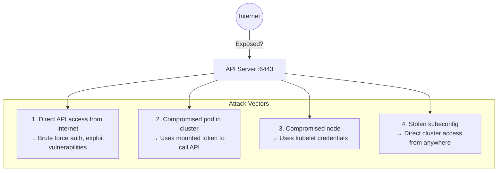
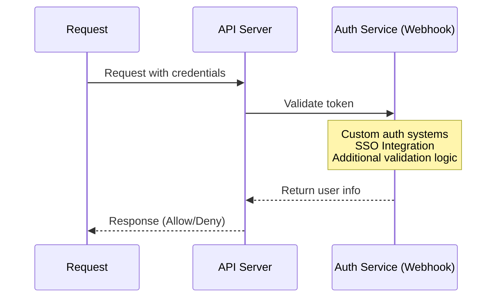
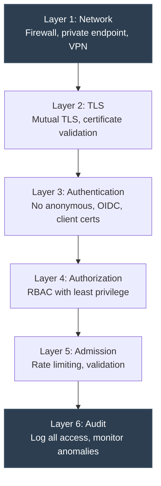

> **Складність**: `[СЕРЕДНЯ]` — невіддільна частина безпеки кластера
>
> **Час на проходження**: 35–40 хвилин
>
> **Передумови**: [Модуль 2.3: Безпека API-сервера](../module-2.3-api-server-security/), базові знання мереж

---

## Що ви зможете робити

Після завершення цього модуля ви зможете ухвалювати та обґрунтовувати конкретні рішення щодо доступу до API для продакшн-кластера Kubernetes 1.35, у якому площина управління має залишатися доступною операторам, контролерам та автоматизації, не перетворюючись на публічну адміністративну точку входу.

1. **Спроєктувати** мережеві засоби контролю доступу до API за допомогою приватних точок доступу, правил фаєрвола, адрес прив'язки, VPN-маршрутів та політик вихідного трафіку Под'ів.
2. **Впровадити** засоби автентифікації, які вимикають анонімний доступ, перевіряють клієнтські сертифікати, налаштовують OIDC та делегують автентифікацію через вебхуки.
3. **Діагностувати** відкритість API, відповіді анонімної автентифікації, ризик викраденого kubeconfig та шляхи токенів сервісних акаунтів за допомогою цілеспрямованих команд.
4. **Оцінити** API Priority and Fairness, EventRateLimit, політику аудиту та метрики, щоб зменшити ризик відмови в обслуговуванні.
5. **Порівняти** хмарні патерни приватних точок доступу з архітектурами самокерованих фаєрволів та VPN для ізоляції API Kubernetes.

---

## Чому цей модуль важливий

Гіпотетичний сценарій: ваша команда має продакшн-кластер, що використовує надійні клієнтські сертифікати, ретельно налаштований RBAC та актуальний реліз Kubernetes, але API-сервер усе одно відповідає на публічній адресі. Облікових даних кластера не має ніхто, крім платформної команди, тож під час квапливого релізу така відкритість виглядає нешкідливою. Згодом сканер знаходить порт 6443, починає тисячі невдалих TLS-рукостискань та неавтентифікованих зондувань, і ваші оператори витрачають увесь ранок на те, щоб вирішити, чи це шум, спроба відмови в обслуговуванні, чи перша стадія повторного відтворення викрадених облікових даних.

API-сервер Kubernetes — це вхідні двері площини управління. Це шлях, яким користуються `kubectl`, контролери, kubelet'и, вебхуки допуску, оператори, CI-системи та хмарні інтеграції. RBAC вирішує, що може робити автентифікована ідентичність, але він не вирішує, хто взагалі може відкрити сокет до API-сервера. Ця відмінність має значення, бо недосяжну точку входу API неможливо зламати перебором, відбити за відбитком чи перевантажити анонімним інтернет-трафіком.

Урок не в тому, що мережеві засоби контролю замінюють засоби контролю ідентичності. Правильна модель — багаторівнева: обмежте маршрут, перевірте клієнта, авторизуйте запит, лімітуйте частоту запитів та фіксуйте достатньо доказів для розслідування підозрілого доступу. [Інцидент Tesla у хмарі 2018 року](/k8s/cks/part1-cluster-setup/module-1.5-gui-security/) <!-- incident-xref: tesla-2018-cryptojacking --> — корисне нагадування про те, що відкриті адміністративні поверхні та витоки облікових даних можуть поєднатися в реальну компрометацію. Цей модуль показує, як зменшити таке поєднання, ставлячись до досяжності API як до свідомого проєктного рішення, а не до значення за замовчуванням.

До кінця цього модуля ви матимете практичний робочий процес перегляду для Kubernetes 1.35 і пізніших версій. Ви перевірите адреси прив'язки, припущення щодо фаєрвола, хмарні приватні точки доступу, анонімну автентифікацію, автентифікацію на основі x509 та токенів, кешування вебхуків, API Priority and Fairness, EventRateLimit та метрики аудиту. Мета не в тому, щоб запам'ятати кожен прапорець. Мета — виробити звичку запитувати, яка межа має зупинити запит до того, як наступна межа муситиме нести все навантаження безпеки.

---

## Розділ 1. Складіть карту поверхні атаки на доступ до API

API-сервер зазвичай слухає HTTPS на порту 6443, і цей простий факт може приховувати широку поверхню доступу. Запит може надійти з ноутбука оператора, бастіон-хоста, CI-раннера, kubelet'а, внутрішньокластерного контролера, скомпрометованого Под'а або від зловмисника, що відтворює викрадений kubeconfig. Ці шляхи запитів не мають однакового ризику, тож перше завдання — відокремити легітимний трафік площини управління від маршрутів, які існують лише тому, що ніхто свідомо їх не прибрав.

Діаграма нижче зберігає важливу ментальну модель: відкритість у мережі, компрометація внутрішнього робочого навантаження, компрометація ноди та викрадені облікові дані — це окремі шляхи входу, що сходяться до того самого API-сервера. Зрілий план посилення захисту не обирає один шлях і не ігнорує інші. Він запитує, який рівень може заблокувати кожен шлях найраніше, а потім перевіряє, чи пізніші рівні все одно поводяться правильно, якщо ранній рівень дасть збій.



Коли зловмисник може дістатися API-сервера, автентифікація вже не є першим засобом контролю. Першим засобом контролю стає те, що API-сервер робить до завершення автентифікації, зокрема обробка TCP, узгодження TLS, розбір запиту, маршрути виявлення та диспетчеризація плагіна автентифікації. Саме тому публічна точка входу може створювати роботу для вашого кластера навіть тоді, коли кожна перевірка облікових даних зрештою зазнає невдачі. Невдалий вхід не є безкоштовним: він споживає процесор, пам'ять, відстеження з'єднань, обсяг логів та увагу операторів.

Зупиніться та спрогнозуйте: якщо API-сервер вимагає клієнтських сертифікатів і відхиляє кожен неавтентифікований запит, що зловмисник усе одно може дізнатися з досяжної точки входу? Подумайте про ендпоінти версій, поведінку TLS, час відповіді та про те, чи ваш конвеєр аудиту фіксує достатньо контексту, щоб відрізнити сканування від неправильно налаштованого внутрішнього клієнта.

Виявлення зазвичай є першим практичним тестом. Сканер може зондувати `/version`, `/healthz`, `/readyz` або кореневий шлях API, щоб визначити, чи це Kubernetes, чи пред'являє сервіс упізнаваний сертифікат і чи якийсь анонімний ендпоінт видає метадані. Навіть коли відповідь — `401 Unauthorized`, різниця між відсутністю маршруту, скиданням TCP, попередженням TLS та об'єктом статусу Kubernetes повідомляє зловмиснику дещо про ціль. Ця інформація менш цінна, коли точка входу досяжна лише через приватний маршрут та автентифіковану адміністративну мережу.

Внутрішній трафік заслуговує на таку саму вправу зі складання карти. Кожен Под за замовчуванням отримує виявлення сервісів Kubernetes, і багато Под'ів також отримують токени сервісних акаунтів, якщо робоче навантаження чи простір імен не вимикають автоматичне монтування. Скомпрометованому застосунку може взагалі не знадобитися публічна точка входу; він може спробувати `kubernetes.default.svc`, скористатися змонтованим токеном і дізнатися власні дозволи зсередини кластера. Тому мережеві обмеження доступу до API охоплюють проєктування вихідного трафіку Под'ів, а не лише правила інтернет-фаєрвола.

Складіть інвентаризацію доступу у вигляді невеликої таблиці у своїх нотатках, навіть якщо ви її не публікуєте. Для кожного клієнта зафіксуйте вихідну мережу, тип облікових даних, ім'я користувача чи групу Kubernetes, очікувані дієслова та операційного власника. Така інвентаризація швидко виявляє незручні припущення — як-от CI-раннер, що використовує людський kubeconfig, аварійний (break-glass) сертифікат, який ніколи не спливає, або простір імен, де кожен Под може дістатися API, хоча це потрібно лише одному контролеру.

Інвентаризація також допомагає відокремити аварійний доступ від щоденного. Аварійний доступ може використовувати ретельно охоронюваний бастіон-маршрут та привілейовану ідентичність, але щоденна автоматизація має використовувати вужчі маршрути та вужчі дозволи. Якщо обидва шляхи спільно використовують ту саму публічну точку входу та той самий сертифікат cluster-admin, то рутинна компрометація ноутбука та справжня аварійна процедура мають однаковий радіус ураження. Це ознака поганого дизайну, а не лише прогалина в документації.

Звичка екзаменаційного штибу — перевіряти з обох боків. Ззовні адміністративної мережі API зазвичай має бути немаршрутизованим або заблокованим хмарним чи приватним дизайном точки доступу. Зсередини кластера Под'и мають мати лише ту досяжність API, яка їм потрібна, а їхні сервісні акаунти мають мати вузькі дозволи, якщо вони можуть її досягти. Такий подвійний погляд запобігає поширеній помилці — захистити публічну точку входу, залишивши кожне робоче навантаження з необмеженим внутрішнім доступом.

---

## Розділ 2. Поставте мережеві межі перед обліковими даними

Навіть найнадійніша система автентифікації мусить відповісти на з'єднання, перш ніж вона зможе відхилити погані облікові дані. Мережева межа змінює задачу, не даючи більшості клієнтів узагалі дістатися шляху автентифікації. На практиці це означає, що лише довірені мережі, VPN-діапазони, бастіон-хости, хмарні маршрути площини управління чи ретельно дібрані підмережі автоматизації мають бути здатні ініціювати TCP-з'єднання до API-сервера.

У самокерованих кластерах першою межею часто є правило фаєрвола на ноді API-сервера або в розташованому вище мережевому пристрої. Блок команд нижче зберігає початковий приклад посилення захисту: дозволити внутрішні та VPN-діапазони CIDR, а потім скинути все інше для порту 6443. У продакшні ви зазвичай виражали б ту саму політику в інфраструктурі як коді та перевіряли б її ззовні довіреної мережі після кожної зміни.

```bash
# Only allow API access from specific IPs
# On cloud: Security Groups, Firewall Rules, NSGs

# AWS Security Group example:
# Inbound rule: TCP 6443 from 10.0.0.0/8 (internal only)

# iptables on API server node
sudo iptables -A INPUT -p tcp --dport 6443 -s 10.0.0.0/8 -j ACCEPT
sudo iptables -A INPUT -p tcp --dport 6443 -s 192.168.1.0/24 -j ACCEPT  # Admin VPN
sudo iptables -A INPUT -p tcp --dport 6443 -j DROP
```

Порядок цих правил має значення, бо пакетні фільтри обчислюються послідовно. Якщо правило скидання стоїть перед правилами дозволу, легітимні адміністратори втрачають доступ. Якщо пізніше широке правило дозволу знову відкриває порт, попередня робота стає декоративною. Хороший перегляд запитує не лише про те, чи фаєрвол існує, а й про те, чи фактичний набір правил відповідає очікуваним адміністративним шляхам.

Кероване хмарне Kubernetes переносить межу з правил хоста на маршрутизацію провайдера. У EKS, GKE та AKS режими приватної точки доступу прибирають або обмежують публічну точку входу площини управління й роблять доступ до API залежним від VPC, пірингу, приватного DNS, VPN чи бастіон-маршрутизації. Операційний компроміс реальний: реагування на інциденти та автоматизація потребують надійного приватного шляху, а розробникам може знадобитися контрольований спосіб дістатися кластера, не копіюючи привілейовані kubeconfig на некеровані ноутбуки.

```bash
# EKS: Enable private endpoint, disable public
aws eks update-cluster-config \
  --name my-cluster \
  --resources-vpc-config endpointPrivateAccess=true,endpointPublicAccess=false

# GKE: Private cluster
gcloud container clusters create private-cluster \
  --enable-private-endpoint \
  --master-ipv4-cidr 172.16.0.0/28

# AKS: Private cluster
az aks create \
  --name myAKSCluster \
  --enable-private-cluster
```

Приватні точки доступу не є чарами; вони переносять питання довіри до вашої приватної мережі. Якщо до VPN може приєднатися кожен ноутбук розробника, а кожен CI-раннер може маршрутизуватися до площини управління, то API все одно досяжний широко. Поліпшення в тому, що тепер у вас є менше місце для забезпечення стану пристрою, MFA, умовного доступу, засобів контролю DNS та логування з'єднань. Це набагато краща операційна поверхня, ніж увесь публічний інтернет.

Проєкти з приватними точками доступу часто провалюються на DNS і маршрутизації, а не на самому Kubernetes. Оператори можуть мати kubeconfig, що вказує на старе публічне ім'я хоста, тоді як приватний DNS розв'язується лише всередині VPC або через певний шлях резолвера. Автоматизація може запускатися з хостованого CI-сервісу, який узагалі не може маршрутизуватися до приватної точки доступу. Сплануйте перехід, перелічивши кожного клієнта, що викликає API, а потім вирішивши, чи він переходить у приватну мережу, використовує раннер усередині VPC, чи перестає потребувати прямого доступу до кластера.

Аварійний доступ слід спроєктувати ще до того, як буде прибрано публічну точку входу. Це не означає тримати публічну точку входу відкритою заради зручності; це означає визначити контрольований маршрут — як-от посилений бастіон, привілейовану робочу станцію доступу чи аварійну VPN-групу з аудитованою активацією. Шлях відновлення має вимагати суворіших засобів контролю, ніж щоденний доступ, і його слід тестувати під час технічного обслуговування, а не імпровізувати під час інциденту площини управління.

Перш ніж це запускати, який результат ви очікуєте від зовнішнього тесту `curl` або `nmap` після зміни приватної точки доступу? Найкраща відповідь часто не `401`. Найкраща відповідь зазвичай — відсутність публічного маршруту, відсутність досяжного публічного слухача або рішення фаєрвола, яке не дає API-серверу Kubernetes сформувати відповідь на рівні застосунку.

Політика вихідного трафіку всередині кластера — це друга мережева межа. Простору імен, де працюють звичайні вебзастосунки, рідко потрібно, щоб кожен Под напряму викликав API-сервер. Якщо тим Под'ам справді потрібне виявлення чи вибори лідера, ви можете ізолювати цей дозвіл до конкретного сервісного акаунта та робочого навантаження. Якщо ні, позиція заборони вихідного трафіку за замовчуванням із явними винятками зменшує цінність помилки віддаленого виконання коду всередині застосунку.

```yaml
# Note: NetworkPolicy doesn't directly apply to API server
# But you can restrict which pods can reach it

# Block pods from directly accessing API server IP
apiVersion: networking.k8s.io/v1
kind: NetworkPolicy
metadata:
  name: deny-api-direct
  namespace: production
spec:
  podSelector: {}
  policyTypes:
  - Egress
  egress:
  # Allow DNS
  - to:
    - namespaceSelector: {}
    ports:
    - port: 53
      protocol: UDP
  # Allow everything except API server
  - to:
    - ipBlock:
        cidr: 0.0.0.0/0
        except:
        - 10.96.0.1/32  # Kubernetes service IP
```

Ця політика корисна як навчальний приклад, але вона також виявляє тонку проблему реалізації. `kubernetes.default.svc` розв'язується через кластерний DNS до IP-адреси сервісу, проте деякі кластери мають додаткові шляхи до API-сервера через IP нод, мережу хоста, шлюзи вихідного трафіку чи специфічну для провайдера маршрутизацію площини управління. Політика, яка блокує лише одну ClusterIP, може залишити інші маршрути відкритими, тож справжній перегляд має перевірити шлях, який фактично використовує робоче навантаження.

Зупиніться та спрогнозуйте: ви блокуєте Под'ам у просторі імен `production` доступ до `10.96.0.1`, але налагоджувальний контейнер усе одно може успішно використовувати `kubectl`. Імовірне пояснення не в тому, що NetworkPolicy зламана. Частіше кластер має інший маршрут до API, CNI не забезпечує політику вихідного трафіку так, як очікувалося, Под використовує мережу хоста, або простір імен містить виняток, що збігається з налагоджувальним Под'ом.

Адреса прив'язки — це локальний запобіжник для самокерованих площин управління. Коли API-сервер прив'язується до `0.0.0.0`, він приймає з'єднання на кожному інтерфейсі, який відкриває хост. Прив'язка до внутрішньої адреси звужує те, де процес слухає, а це означає, що пізніша помилка фаєрвола все одно може не виставити сервіс на зовнішньому інтерфейсі. Це не заміна фаєрволу, але корисна друга перевірка на самій ноді.

```yaml
# /etc/kubernetes/manifests/kube-apiserver.yaml
spec:
  containers:
  - command:
    - kube-apiserver
    # Secure alternative: bind only to the internal control-plane interface.
    - --bind-address=10.0.0.10

    # Insecure alternative to avoid: this listens on every host interface.
    # - --bind-address=0.0.0.0
```

Релевантна для CKS деталь полягає в тому, що kubeadm розміщує маніфест API-сервера за шляхом `/etc/kubernetes/manifests/kube-apiserver.yaml`, і статичний Под перезапускається, коли маніфест змінюється. Цей перезапуск може перервати доступ, тож перед зміною адрес прив'язки на живій площині управління ви повинні мати консольний доступ або відомий шлях відновлення. Обачний оператор спершу перевіряє адреси інтерфейсу ноди, редагує маніфест один раз, а потім спостерігає, як статичний Под повертається до готовності.

Для самокерованих площин управління з високою доступністю повторіть цю логіку адреси прив'язки для кожної ноди API-сервера. Кластер може виглядати обмеженим, коли ви тестуєте одну точку входу, і все одно виставляти іншу ноду площини управління через бекенд балансувальника навантаження, старий DNS-запис чи забутий security group. Безпечний перегляд простежує шлях клієнта через DNS, слухач балансувальника навантаження, target group, інтерфейс ноди, фаєрвол хоста й, нарешті, процес API-сервера. Пропуск будь-якого переходу залишає місце для виживання застарілого маршруту.

Мережеві межі також потребують власника. Платформні команди часто налаштовують приватну точку доступу, мережеві команди володіють VPN-маршрутизацією, команди безпеки володіють станом ідентичності, а команди застосунків володіють вихідним трафіком простору імен. Перегляд, що зупиняється на «API є приватним», пропускає операційне питання — хто завтра може змінити маршрут. Ставтеся до шляху API як до спільного контракту й перевіряйте його як переглядом конфігурації, так і реальними тестами з'єднання.

---

## Розділ 3. Перевірте ідентичність перед авторизацією

Щойно запит перетинає мережеву межу й завершує TLS, Kubernetes обчислює автентифікацію. Автентифікація відповідає на запитання «хто робить цей запит?» перед тим, як авторизація відповість «що ця ідентичність може робити?». Цей порядок простий, але реалізація — ні: кластер може приймати клієнтські сертифікати, токени-носії (bearer tokens), токени сервісних акаунтів, OIDC-токени, вебхуки автентифікації чи заголовки front-proxy залежно від того, як налаштовано API-сервер.

Анонімну автентифікацію слід перевіряти першою, бо вона створює ідентичність для запитів, що не пред'являють облікових даних. Kubernetes зіставляє такі запити з користувачем `system:anonymous` та групою `system:unauthenticated`. Ця ідентичність зазвичай не повинна мати корисних дозволів, але неправильно налаштовані прив'язки можуть випадково надати виявлення, читання чи навіть ширший доступ. Вимкнення анонімної автентифікації робить режим відмови явним.

```bash
# API server flag inside /etc/kubernetes/manifests/kube-apiserver.yaml
# - --anonymous-auth=false

# Verification
curl -k "https://api-server.local:6443/api/v1/namespaces"
# 401 means anonymous auth is disabled; 403 mentioning system:anonymous means
# anonymous auth is enabled but RBAC denies the request.
```

Очікуваний результат залежить від того, звідки ви запускаєте тест. З недовіреної мережі ідеальним результатом може бути тайм-аут, відсутність маршруту чи блокування фаєрволом до появи HTTP. З довіреного діагностичного хоста запит без облікових даних має повертати `401 Unauthorized`, коли анонімну автентифікацію вимкнено, або `403 Forbidden` зі згадкою `system:anonymous`, коли анонімну автентифікацію ввімкнено, але RBAC відхиляє запит. Дані ресурсу у відповіді — це справжня неправильна конфігурація, бо вона означає, що анонімній ідентичності надано корисні дозволи.

Автентифікація за клієнтським сертифікатом поширена для компонентів площини управління та адміністративних користувачів у кластерах у стилі kubeadm. API-сервер довіряє сертифікатам, підписаним налаштованим клієнтським CA, а потім виводить ім'я користувача та групи з полів суб'єкта сертифіката. Це сильна криптографічна автентифікація, але вона має проблему життєвого циклу: відкликати один довгоживучий клієнтський сертифікат незручно, якщо ви не додали окремий авторизатор або не виконали ротацію CA, що видає сертифікати.

```bash
# Require client certificates (mutual TLS) flag:
# - --client-ca-file=/etc/kubernetes/pki/ca.crt

# Clients must present valid certificate signed by CA
# This is default in kubeadm clusters
```

Для людського доступу OIDC зазвичай дає кращий операційний контроль, бо ідентичності живуть у централізованому провайдері. API-сервер перевіряє видавця та ідентифікатор клієнта, а потім зіставляє твердження токена — як-от email та групи — з користувачами та групами Kubernetes. Цінність для безпеки походить із супутніх засобів контролю провайдера ідентичності: MFA, вимкнення акаунтів, політики пристроїв, короткий час життя токенів та керування групами. Kubernetes усе одно потребує RBAC, але життєвим циклом ідентичності стає набагато легше керувати.

Зіставлення груп OIDC заслуговує на ретельне найменування. Якщо провайдер ідентичності видає широкі групи на кшталт `engineering` чи `contractors`, і ці групи прив'язано напряму до потужних ClusterRole, то API-сервер сумлінно забезпечує погану організаційну модель. Надавайте перевагу групам, які описують намір доступу в Kubernetes, — як-от platform-admins, read-only-observers чи namespace-maintainers — і тримайте зіставлення під переглядом разом з RBAC. API-сервер може перевіряти токени, але він не може вирішити, чи ваша таксономія ідентичності розумна.

```bash
# Configure token authentication flags:
# - --service-account-key-file=/etc/kubernetes/pki/sa.pub
# - --service-account-issuer=https://kubernetes.default.svc.cluster.local

# Optional: External OIDC provider flags:
# - --oidc-issuer-url=https://accounts.example.com
# - --oidc-client-id=kubernetes
# - --oidc-username-claim=email
# - --oidc-groups-claim=groups
```

Токени сервісних акаунтів відрізняються від людських токенів, бо робочі навантаження використовують їх зсередини Под'ів. Сучасний Kubernetes використовує прив'язані токени сервісних акаунтів із аудиторією, терміном дії та поведінкою проєктованого тому, але в оновлених кластерах усе ще можуть існувати старі довгоживучі токени у вигляді Secret'ів. Тому обмеження доступу до API мають охоплювати інвентаризацію того, які Под'и монтують токени, які сервісні акаунти мають дозволи та які робочі навантаження можуть дістатися точки входу API зі свого простору імен.

Корисний перегляд сервісних акаунтів має три запитання. По-перше, чи цьому робочому навантаженню взагалі потрібен змонтований токен, чи можна встановити `automountServiceAccountToken: false` на рівні Под'а чи сервісного акаунта? По-друге, якщо токен потрібен, чи RBAC дозволяє лише ті дієслова й ресурси, які потрібні циклу контролера або функції застосунку? По-третє, чи робоче навантаження може дістатися API лише очікуваними мережевими шляхами? Відповідь «ні» на будь-якому рівні має вести до меншого набору дозволів або вужчого маршруту.

Автентифікація через вебхук подовжує ланцюжок, коли стандартної перевірки токенів недостатньо. API-сервер надсилає `TokenReview` зовнішньому сервісу, а той сервіс повертає автентифіковане ім'я користувача та групи. Це потужно, бо дає змогу інтегрувати кастомні системи ідентичності, але також додає до шляху автентифікації затримку та залежності від доступності. Повільний вебхук може зробити так, що весь API відчуватиметься повільним.



Конфігурація вебхука є файлом у стилі kubeconfig, бо сам API-сервер поводиться як клієнт сервісу автентифікації. Це означає, що ви маєте захищати CA, клієнтський сертифікат, клієнтський ключ, DNS ендпоінта та мережевий маршрут так само ретельно, як і будь-яку іншу привілейовану інтеграцію. Вебхук, що працює за ненадійним сервісом або широкою публічною точкою входу, може стати найслабшою ланкою в інакше приватній площині управління.

```yaml
# API server flags in manifest
# - --authentication-token-webhook-config-file=/etc/kubernetes/webhook-config.yaml
# - --authentication-token-webhook-cache-ttl=2m

---
# /etc/kubernetes/webhook-config.yaml
apiVersion: v1
kind: Config
clusters:
- name: auth-service
  cluster:
    certificate-authority: /etc/kubernetes/pki/webhook-ca.crt
    server: https://auth.example.com/authenticate
users:
- name: api-server
  user:
    client-certificate: /etc/kubernetes/pki/webhook-client.crt
    client-key: /etc/kubernetes/pki/webhook-client.key
contexts:
- context:
    cluster: auth-service
    user: api-server
  name: webhook
current-context: webhook
```

TTL кешу в цьому прикладі — не випадкове налаштування продуктивності. Якщо кеш надто короткий, API-сервер може викликати вебхук для кожного запиту й перевантажити сервіс автентифікації під час звичайної активності контролерів. Якщо кеш надто довгий, вимкнення користувача чи токена може довше впливати на доступ у Kubernetes. Оберіть значення, врівноваживши швидкість відкликання з пропускною здатністю вебхука, а потім стежте за затримкою вебхука та метриками автентифікації API.

Поведінку вебхука при збоях також треба обрати свідомо. Вебхуки автентифікації стоять перед авторизацією, тож проблеми з доступністю можуть виглядати як широкі збої доступу до API. Якщо вебхук залежить від того самого кластера, якому для відновлення потрібен API, ви можете створити циклічну залежність під час збоїв. Запускайте вебхук на надійному шляху, стежте за ним незалежно й тримайте задокументований план відновлення для збоїв автентифікації, спричинених інтеграцією ідентичності, а не самим Kubernetes.

Який підхід ви б обрали тут і чому: довгоживучі клієнтські сертифікати для кожного інженера, OIDC для людських користувачів із короткоживучими токенами, чи вебхук, підкріплений внутрішнім сервісом ідентичності? Зріла відповідь називає операційний режим відмови, а не лише улюблену можливість. Сертифікати прості, але їх важко відкликати поодинці, OIDC легше керувати, але він залежить від доступності провайдера, а вебхуки гнучкі, але додають іще один сервіс на критичний шлях запиту.

Засоби контролю ідентичності залишаються неповними без авторизації. Цей модуль зосереджений на обмеженні доступу до API, але досяжний API з `--authorization-mode=AlwaysAllow` усе одно небезпечний, навіть коли автентифікація сильна. Звичайна продакшн-база — це RBAC з авторизатором Node, де доречно, прив'язки за принципом найменших привілеїв та аудиторське покриття спроб ескалації привілеїв. Автентифікація доводить ідентичність; RBAC обмежує шкоду, якої ця ідентичність може завдати.

---

## Розділ 4. Керуйте навантаженням за допомогою допуску та справедливості потоків

Мережеві засоби контролю та засоби контролю ідентичності зменшують, хто може дістатися API, але вони не гарантують, що API впорається з кожним легітимним клієнтом. Контролери, оператори, CI-системи та люди можуть створювати випадкові умови відмови в обслуговуванні, неодноразово запитуючи списки великих ресурсів, генеруючи галасливі події чи надто агресивно повторюючи невдалі виклики. Тому обмеження доступу до API охоплює формування навантаження запитами, а не лише відхилення зловмисників.

Контролер допуску EventRateLimit націлений на вузьке, але поширене джерело шуму в сховищі даних — події Kubernetes. Події корисні для налагодження, але робоче навантаження, що дає збій, чи зламаний контролер можуть згенерувати величезний потік повторюваних змін стану. Оскільки події зберігаються через шлях API, шторми подій можуть споживати ресурси API-сервера й etcd, які мали б бути зарезервовані для планування, серцебиття нод та узгодження контролерів.

```yaml
# Enable admission controller flags:
# - --enable-admission-plugins=EventRateLimit
# - --admission-control-config-file=/etc/kubernetes/admission-config.yaml

---
# /etc/kubernetes/admission-config.yaml
apiVersion: apiserver.config.k8s.io/v1
kind: AdmissionConfiguration
plugins:
- name: EventRateLimit
  path: /etc/kubernetes/event-rate-limit.yaml

---
# /etc/kubernetes/event-rate-limit.yaml
apiVersion: eventratelimit.admission.k8s.io/v1alpha1
kind: Configuration
limits:
- type: Namespace
  qps: 50
  burst: 100
- type: User
  qps: 10
  burst: 20
```

EventRateLimit — це не загальне обмеження частоти API. Воно застосовується до об'єктів Event і має бути налаштоване так, щоб зменшувати галасливі збої, не приховуючи корисних операційних сигналів. Якщо значення надто суворі, реальні інциденти можуть втратити докази. Якщо вони надто м'які, шторми подій усе одно шкодять площині управління. Краще питання для перегляду: «які виробники можуть затопити події й яка частота зберігає цінність для налагодження, не перевантажуючи сховище?»

API Priority and Fairness, зазвичай скорочено APF, розв'язує ширшу проблему перевантаження. Воно класифікує вхідні запити у FlowSchema й призначає їх PriorityLevelConfiguration, які контролюють паралелізм та чергування. Важлива ідея — справедливість під тиском: цінний системний трафік не має голодувати через те, що низькопріоритетне пакетне завдання чи зовнішній цикл автоматизації видає тисячі запитів списків.

APF особливо важливий для клієнтів, що інтенсивно використовують list і watch. Контролер, який неодноразово запитує список Под'ів у всіх просторах імен, може споживати набагато більше роботи API й etcd, ніж невелика кількість запитів на створення. Watch'і ефективні, коли вони стабільні, але повторні перепідключення watch можуть стати дорогими під час мережевих проблем чи помилок клієнта. Коли ви переглядаєте ідентичності автоматизації, дивіться на дієслова й обсяг ресурсів разом, а не лише на сиру кількість запитів.

```yaml
# Kubernetes 1.20+: API Priority and Fairness
# Controls API request queuing and priority

# Check current flow schemas
# kubectl get flowschemas

# Check priority levels
# kubectl get prioritylevelconfigurations

---
# Example: Lower priority for batch workloads
apiVersion: flowcontrol.apiserver.k8s.io/v1
kind: FlowSchema
metadata:
  name: batch-jobs-low-priority
spec:
  priorityLevelConfiguration:
    name: workload-low
  matchingPrecedence: 1000
  rules:
  - subjects:
    - kind: ServiceAccount
      serviceAccount:
        name: batch-runner
        namespace: batch
    resourceRules:
    - apiGroups: ["batch"]
      namespaces: ["batch"]
      resources: ["jobs"]
      verbs: ["*"]
```

Приклад знижує пріоритет для відомого пакетного сервісного акаунта, посилаючись на вбудовану PriorityLevelConfiguration `workload-low` і обмежуючи правило для ресурсу простором імен `batch`. FlowSchema та PriorityLevelConfiguration, на яку вона посилається, мають обидві існувати, щоб застосування вдалося. Правило рішення ширше: визначте джерела запитів, які корисні, але не термінові, а потім не давайте їм споживати той самий бюджет паралелізму, що й kubelet'и, контролери та аварійні дії операторів. APF не виправдовує погано спроєктованих клієнтів; воно дає API-серверу спосіб залишатися придатним до використання, поки ви виправляєте таких клієнтів.

APF також змінює те, як ви діагностуєте повільність API. Без справедливості один галасливий актор може зробити так, що кожен клієнт виглядатиме повільним, а логи можуть показувати лише загальну затримку запитів. З APF ви можете перевірити flow schemas, рівні пріоритету, відхилені запити, поставлені в чергу запити та використання місць (seats), щоб визначити, який клас перебуває під тиском. Ці докази допомагають відрізнити зловмисне затоплення, зламаний контролер та легітимний сплеск робочого навантаження.

Тонкий ризик — неправильна класифікація. Якщо важливий контролер потрапляє в низькопріоритетний бакет, кластер може деградувати, поки API виглядає так, ніби «працює як налаштовано». Якщо недовірена ідентичність автоматизації потрапляє у високопріоритетний бакет, вона може заморити інші роботи. Ставтеся до FlowSchema як до продакшн-політики, переглядайте їх так само ретельно, як RBAC, і тестуйте випадки збоїв, перш ніж покладатися на них під час інциденту.

Клієнтське обмеження частоти все одно має значення, навіть коли APF налаштовано добре. Багато клієнтів Kubernetes підтримують налаштування QPS і burst, а оператори мають використовувати інформери чи watch'і замість щільних циклів опитування. APF захищає спільний API-сервер, але воно не має бути першою лінією оборони проти клієнта, яким ви керуєте. Якщо внутрішньому інструменту потрібен особливий пріоритет для роботи, запитайте, чи може цей інструмент зменшити свій патерн запитів, перш ніж надавати йому більшу частку бюджету площини управління.

---

## Розділ 5. Аудит і моніторинг рішень щодо доступу до API

Видимість — це рівень, який повідомляє вам, чи попередні рівні роблять те, що ви задумали. Приватна точка доступу, яку ніхто не тестує, може дрейфувати назад до публічної відкритості. Анонімна автентифікація, яка здається вимкненою, може бути знову введена під час перебудови площини управління. Кеш вебхука, що виглядає нешкідливим, може приховувати затримку відкликання. Логи аудиту та метрики перетворюють ці припущення на докази.

Політика аудиту Kubernetes контролює, які запити записуються та на якому рівні. [Документація з аудиту Kubernetes](https://kubernetes.io/docs/tasks/debug/debug-cluster/audit/) визначає `Metadata` як лише метадані, тоді як `RequestResponse` включає як тіло запиту, так і тіло відповіді. Захоплення тіла може бути виправданим для вузьких розслідувань, але воно також може створювати високі витрати на сховище й захоплювати чутливі дані, тож безпечніша політика за замовчуванням нижче записує метадані API автентифікації плюс загальні метадані, опускаючи галасливу стадію `RequestReceived`.

```yaml
# Audit policy to log all API access attempts
apiVersion: audit.k8s.io/v1
kind: Policy
rules:
# Log authentication API metadata without request or response bodies
- level: Metadata
  omitStages:
  - RequestReceived
  resources:
  - group: "authentication.k8s.io"

# Catch-all metadata for remaining requests; filter 401/403 downstream in SIEM
- level: Metadata
  omitStages:
  - RequestReceived
```

Вибір `omitStages` — це операційний контроль витрат. Стадія `RequestReceived` записує, що запит надійшов, перш ніж його оброблено, тоді як пізніші стадії захоплюють результат. Опускання ранньої стадії може зменшити дубльований обсяг логів, зберігаючи фінальний статус, ідентичність користувача, дієслово, ресурс та інформацію про відповідь. Це зазвичай корисніше для розслідування повторюваних відповідей `401` та `403`, ніж просто зберігати вдвічі більше записів.

Метрики API-сервера дають погляд у реальному часі, якого не можуть дати логи аудиту. Під час інциденту ви хочете знати, чи змінилися обсяг запитів, збої автентифікації, черги APF, затримка вебхука чи відхилені запити. Збережений блок команд нижче використовує сирі запити метрик, бо вони працюють навіть тоді, коли у вас немає повного стеку спостережуваності на іспиті чи в середовищі усунення несправностей.

```bash
# Check API server metrics
kubectl get --raw /metrics | grep apiserver_request

# Authentication failures
kubectl get --raw /metrics | grep authentication_attempts

# Rate limiting metrics
kubectl get --raw /metrics | grep apiserver_flowcontrol
```

Назви метрик еволюціонують, тож патерн важливіший за один рядок. Почніть широко з `apiserver_request`, а потім звужуйте до спроб автентифікації, тривалості запиту, відхилених запитів та індикаторів керування потоками. У продакшні направляйте ці метрики до Prometheus чи вашої керованої платформи моніторингу й налаштуйте сповіщення на зміни, що відповідають шляхам доступу, які вас цікавлять. Приватна точка доступу має робити збої автентифікації інтернет-походження рідкісними, тож повторювані збої заслуговують на розслідування.

Базові показники роблять ці сповіщення корисними. Завантажений простір імен контролерів може генерувати багато звичайних запитів до API, тоді як адміністративний користувач може робити лише кілька під час вікон технічного обслуговування. Зафіксуйте, як виглядає норма для людського доступу, доступу CI, доступу контролерів та неавтентифікованих збоїв. Тоді сповіщення можуть зосереджуватися на різких змінах, неочікуваних ідентичностях, незвичних вихідних мережах та класах запитів, що починають накопичуватися в черзі під APF.

Аудит і метрики мають також охоплювати успішний доступ. Викрадений kubeconfig може не давати збоїв автентифікації, бо облікові дані дійсні. У такому разі сигналом є дійсна ідентичність, що використовується з незвичної мережі, у незвичний час, проти незвичних ресурсів. Сам Kubernetes може не знати, чи вихідна IP-адреса підозріла, тож поєднуйте логи аудиту з логами VPN, бастіона, провайдера ідентичності та хмарної мережі, коли будуєте виявлення.

---

## Розділ 6. Пропрацюйте сценарії обмеження доступу до API екзаменаційного штибу

Іспит CKS часто стискає ці ідеї до невеликої кількості файлів і команд. Вас можуть попросити перевірити маніфест статичного Под'а, переконатися, що анонімний доступ зазнає невдачі, чи створити kubeconfig, що вказує на потрібну внутрішню точку входу. Хитрість — тримати багаторівневу модель у голові, рухаючись швидко: спершу маршрут, потім ідентичність, потім авторизація, потім контроль навантаження, потім докази.

У самокерованому кластері найшвидший спосіб перевірити прапорці працюючого API-сервера — прочитати маніфест статичного Под'а чи запитати дзеркальний Под. Команда нижче шукає адресу прив'язки, а потім запланований виправ змінює зовні прив'язаний слухач на внутрішній інтерфейс. У реальній системі підтвердьте, що внутрішня адреса існує на ноді площини управління, перш ніж зберігати маніфест.

```bash
# Check current API server bind address
kubectl get pods -n kube-system -l component=kube-apiserver -o yaml | grep bind-address

# Edit to bind to internal interface only
sudo vi /etc/kubernetes/manifests/kube-apiserver.yaml

# Change:
# --bind-address=0.0.0.0
# To:
# --bind-address=10.0.0.10  # Internal IP

# API server will restart automatically
```

Перевірка анонімного доступу — наступний поширений сценарій. Важлива деталь — інтерпретувати відповідь на основі мережевого шляху. Якщо ви тестуєте з недовіреного хоста, ви в ідеалі взагалі не повинні дістатися шляху відповіді API Kubernetes — тайм-аут чи відсутність маршруту означає, що мережева межа виконує свою роботу. З довіреного хоста, що може маршрутизуватися до API, уважно прочитайте HTTP-статус: `401 Unauthorized` означає, що анонімну автентифікацію вимкнено; `403 Forbidden` зі згадкою `system:anonymous` означає, що анонімну автентифікацію ввімкнено, але RBAC відхиляє запит; дані ресурсу в тілі означають, що анонімний RBAC неправильно налаштовано.

```bash
# Test anonymous access
curl -k "https://api-server.local:6443/api/v1/namespaces"

# If anonymous is disabled, expect 401:
# {"kind":"Status","apiVersion":"v1","status":"Failure","message":"Unauthorized",...}

# If anonymous is enabled but RBAC denies, expect 403 mentioning system:anonymous

# If anonymous is enabled and RBAC grants access, may get namespace list or partial data
# Fix by adding --anonymous-auth=false to API server and reviewing anonymous bindings
```

Конструювання kubeconfig — іще одне місце, де обмеження доступу стають конкретними. Kubeconfig не просто називає користувача; він називає точку входу кластера та облікові дані. Якщо точка входу публічна, викрадений файл можна відтворити звідусіль, звідки можна дістатися публічного маршруту. Якщо точка входу внутрішня, а облікові дані мають найменші привілеї чи короткий час життя, та сама крадіжка має менший радіус ураження.

```bash
# Create kubeconfig for specific user with limited network access
kubectl config set-cluster restricted \
  --server=https://internal-api.example.com:6443 \
  --certificate-authority=/path/to/ca.crt

kubectl config set-credentials limited-user \
  --client-certificate=/path/to/user.crt \
  --client-key=/path/to/user.key

kubectl config set-context limited \
  --cluster=restricted \
  --user=limited-user
```

Що б сталося, якби ноутбук розробника з дійсним файлом kubeconfig украли? Якщо файл містить облікові дані cluster-admin, а API-сервер публічний, зловмисник може спробувати негайний повний доступ до кластера. Якщо API-сервер досяжний лише через VPN керованого пристрою, облікові дані все одно мають значення, але зловмиснику також доведеться задовольнити мережеві засоби контролю та засоби контролю пристрою. Якщо RBAC має найменші привілеї, а облікові дані короткоживучі, вікно шкоди знову звужується.

Діаграма ешелонованого захисту нижче пов'язує екзаменаційні сценарії разом. Вона зберігає початкову багаторівневість, бо це найпростіший спосіб вирішити, де має бути зловлено збій. Не читайте її як водоспад, де має значення лише перший рівень. Читайте її як стек, де кожен рівень має все одно давати цінність, якщо попередній рівень обійдено.



Усі рівні мають бути активними одночасно, щоб створити стійку позицію доступу до API. Приватна точка доступу зменшує відкритість, TLS перевіряє канал, автентифікація називає викликача, RBAC обмежує викликача, допуск та APF захищають пропускну здатність, а докази аудиту дають вам змогу довести, що сталося. Зрілий хід — тестувати ці рівні реалістичними випадками збоїв, а не лише підтверджувати, що щасливий шлях працює.

---

## Патерни та антипатерни

Наведені нижче патерни — не загальні найкращі практики; кожен із них відображає конкретний режим відмови з попередніх розділів. Використовуйте їх, коли переглядаєте дизайн кластера або коли вам потрібно обґрунтувати зміну посилення захисту команді, яка хвилюється за зручність розробників. Правильний патерн зазвичай зменшує кількість клієнтів, що можуть дістатися API, водночас роблячи легітимний доступ легшим для спостереження та відкликання.

| Патерн | Коли використовувати | Чому це працює | Міркування щодо масштабування |
|--------|---------------------|----------------|-------------------------------|
| Приватна точка доступу плюс керований адміністративний шлях | Кластер працює в EKS, GKE, AKS чи в іншого провайдера з приватною маршрутизацією площини управління | Прибирає публічну досяжність API й змушує доступ через засоби контролю VPC, VPN, пірингу чи бастіона | Потребує надійного DNS, аварійного доступу та чіткого володіння мережевими маршрутами |
| OIDC для людських користувачів, сертифікати для компонентів | Інженерам потрібен аудитований доступ, а компонентам — стабільні mTLS-ідентичності | Централізує керування життєвим циклом людей, зберігаючи нативну для Kubernetes автентифікацію компонентів | Дизайн твердження групи має лишатися узгодженим із прив'язками RBAC та керуванням провайдера ідентичності |
| Обмеження вихідного трафіку простору імен для звичайних робочих навантажень | Под'ам застосунків не потрібні прямі виклики API під час звичайної роботи | Зменшує цінність компрометації Под'а, блокуючи відтворення токена зсередини кластера | Потребує забезпечення з боку CNI, тестування маршрутів та винятків для контролерів, що легітимно викликають API |
| Класифікація APF для ідентичностей автоматизації | CI, оператори чи пакетні завдання можуть створювати високий обсяг запитів | Зберігає доступність API для kubelet'ів, контролерів та аварійних операторів під час перевантаження | FlowSchema потребують перегляду, коли змінюються сервісні акаунти, контролери чи простори імен автоматизації |

Антипатерни зазвичай походять зі ставлення до одного успішного засобу контролю як до дозволу ігнорувати решту. Публічний API із сильними обліковими даними все одно запрошує до сканування. Приватна точка доступу з широким доступом VPN усе одно довіряє кожному пристрою на цьому маршруті. Вебхук без кешування може зробити автентифікацію повільнішою за робоче навантаження, яке він захищає. Виправлення — назвати приховане припущення, а потім додати найменший засіб контролю, що його усуває.

| Антипатерн | Що йде не так | Краща альтернатива |
|------------|---------------|--------------------|
| Публічна точка входу, залишена заради зручності | Будь-який інтернет-клієнт може зондувати, знімати відбитки та тиснути на шлях автентифікації | Використовуйте приватну точку доступу з керованим адміністративним шляхом доступу |
| Довгоживучі kubeconfig cluster-admin на ноутбуках | Крадіжка облікових даних стає негайною компрометацією кластера, якщо API досяжний | Використовуйте OIDC, короткоживучі облікові дані, RBAC найменших привілеїв та приватну маршрутизацію |
| Блокування лише однієї ClusterIP API в NetworkPolicy | Под'и можуть дістатися API через IP нод, мережу хоста чи маршрути провайдера | Перевіряйте всі реальні шляхи й поєднуйте політику вихідного трафіку з контролем монтування токенів |
| Автентифікація через вебхук без моніторингу затримки | Здорова ідея ідентичності стає залежністю доступності API | Налаштуйте TTL кешу, стежте за затримкою вебхука та свідомо визначте поведінку при збоях |

---

## Каркас прийняття рішень

Використовуйте цей каркас, коли вирішуєте, наскільки обмежувальним має бути шлях доступу до API. Почніть із питання відкритості, а потім спускайтеся до ідентичності, шляхів робочих навантажень та захисту від навантаження. Кожне рішення має давати артефакт, який ви зможете перевірити пізніше: налаштування провайдера, правило фаєрвола, прапорець маніфеста, NetworkPolicy, FlowSchema, політику аудиту чи сповіщення моніторингу.

Якщо до API-сервера можна дістатися з публічного інтернету, спершу запитайте, чи може провайдер або платформа повністю прибрати цей публічний маршрут. Коли відповідь «так», увімкніть приватну точку доступу й побудуйте навколо неї доступ через VPN, бастіон чи приватну автоматизацію. Коли відповідь «ні», обмежте діапазони CIDR фаєрвола, прив'яжіть API-сервер до внутрішнього інтерфейсу, де можливо, і перевірте публічний шлях із зовнішньої мережі. Якщо API-сервер уже приватний, перенесіть перегляд на те, які приватні мережі, пристрої та системи автоматизації можуть до нього маршрутизуватися. Робочі навантаження, яким потрібен доступ до API, мають використовувати явні сервісні акаунти та простори імен; робочі навантаження, яким він не потрібен, мають втратити вихідний трафік до кожного спостереженого шляху API.

Друге рішення — життєвий цикл облікових даних. Якщо користувач — людина, надавайте перевагу OIDC чи іншому централізовано керованому шляху ідентичності, щоб доступ можна було відкликати без ротації CA кластера. Якщо клієнт — компонент Kubernetes, клієнтські сертифікати й токени сервісних акаунтів є звичайними, але вони все одно потребують обмежених дозволів та ротації. Якщо клієнт — кастомна автоматизація, вирішіть, чи має він використовувати сервісний акаунт, зовнішнього провайдера ідентичності чи токен, підкріплений вебхуком, на основі потреб відкликання та аудиту.

| Запитання | Надавайте перевагу цьому | Уникайте цього |
|-----------|--------------------------|----------------|
| Хто може відкрити TCP-з'єднання до API? | Приватна точка доступу, VPN, бастіон, явні адміністративні CIDR | Публічний слухач, захищений лише надією, що облікові дані залишаться таємними |
| Як автентифікуються люди? | OIDC з MFA, короткий час життя токенів та зіставлення груп з RBAC | Спільні клієнтські сертифікати чи скопійовані kubeconfig cluster-admin |
| Як робочі навантаження дістаються API? | Явні сервісні акаунти, вузький RBAC та протестовані винятки вихідного трафіку | Автоматичні монтування токенів та досяжність API в межах усього простору імен |
| Як стримується перевантаження? | FlowSchema APF, EventRateLimit там, де корисно, та сповіщення за метриками | Один спільний клас пріоритету для кожного клієнта й відсутність видимості обсягу запитів |
| Як розслідується доступ? | Політика аудиту плюс логи ідентичності, мережі та VPN | Логи, що фіксують лише збої чи опускають контекст джерела |

Нарешті, вирішіть, який збій ви готові прийняти. Правило фаєрвола може дрейфувати, приватна точка доступу може зламати віддалені операції, провайдер OIDC може бути недоступним, а вебхук може додати затримку. Зрілий дизайн робить ці компроміси явними й репетирує відновлення. Ви маєте знати, як повернути доступ через аварійний шлях, не відкриваючи API назавжди для публічного інтернету.

---

## Чи знали ви?

- Kubernetes трактує неавтентифіковані запити як `system:anonymous` та `system:unauthenticated`, коли анонімну автентифікацію ввімкнено, тож одна випадкова прив'язка може перетворити «відсутність облікових даних» на реальні дозволи API.
- API Priority and Fairness стало стабільним ще до Kubernetes 1.35 і використовує FlowSchema плюс PriorityLevelConfiguration, щоб не дати голодувати важливим класам запитів під час перевантаження.
- Керовані приватні кластери в EKS, GKE та AKS не усувають потреби в засобах контролю ідентичності; вони зменшують, які мережі взагалі можуть спробувати використати ці ідентичності.
- Прив'язані токени сервісних акаунтів зменшують ризик довгоживучих облікових даних робочих навантажень, але вони не допомагають, якщо кожен скомпрометований Под усе одно може маршрутизуватися до API, а його сервісний акаунт має широкий RBAC.

---

## Типові помилки

Ці помилки поширені, бо кожна з них виглядає як невелике скорочення під час доставки. Під час перегляду пов'яжіть кожну помилку з рівнем, який вона послаблює, та артефактом, що доводить виправлення. Це тримає обговорення конкретним, а не перетворює «обмежте доступ до API» на розпливчасте гасло безпеки.

| Помилка | Чому вона стається | Як її виправити |
|---------|--------------------|-----------------|
| Публічна точка входу API | Команди покладаються на сильні облікові дані й забувають, що досяжність уможливлює сканування та тиск на ресурси | Впроваджуйте приватні точки доступу, де можливо, або обмежте вхідний трафік відомими адміністративними CIDR |
| Відсутність правил фаєрвола | Самокеровані кластери успадковують широкий доступ хоста чи периметра під час початкового завантаження | Додайте явні правила дозволу для довірених діапазонів та фінальне правило скидання для порту 6443 |
| Увімкнена анонімна автентифікація | Припущення за замовчуванням чи застарілі маніфести залишають `system:anonymous` досяжним | Надавайте перевагу `--anonymous-auth=false`; якщо лабораторна залишає анонімну автентифікацію ввімкненою, переконайтеся, що RBAC повертає лише `403` для `system:anonymous` і ніколи дані ресурсу |
| Відсутність обмеження частоти | Оператори припускають, що автентифікація захищає й доступність, не лише ідентичність | Використовуйте APF для справедливості запитів та EventRateLimit для галасливих виробників подій |
| Відсутність моніторингу доступу | Команди налаштовують засоби контролю один раз і ніколи не перевіряють, чи вони дрейфують | Увімкніть логування аудиту, збирайте метрики API та сповіщайте про незвичні зміни автентифікації чи керування потоками |
| Довгоживучі клієнтські сертифікати | Сертифікати легко створити й важко відкликати поодинці | Надавайте перевагу OIDC для людей, короткоживучим токенам, де можливо, та вузькому RBAC для всіх ідентичностей |
| Ігнорування логів 401/403 | Невдалі запити відкидаються як нешкідливий шум | Зіставляйте збої з вихідними мережами, логами провайдера ідентичності, логами VPN та нещодавніми змінами конфігурації |
| Плоскі NetworkPolicy | Простори імен застосунків зберігають вихідний трафік за замовчуванням, бо це уникає раннього усунення несправностей | Забороняйте непотрібний вихідний трафік до API й створюйте явні винятки для робочих навантажень, яким справді потрібні виклики API |

---

## Тест

Кожне запитання нижче просить вас обрати операційну відповідь, а потім пояснити, чому інші відповіді слабші. Не відповідайте, називаючи один прапорець, якщо тільки сценарій не є справді збоєм одного прапорця; більшість проблем доступу до API одночасно охоплюють маршрут, ідентичність та докази.

<details><summary>1. Ваш SOC виявляє тисячі невдалих спроб автентифікації проти публічного API-сервера, прив'язаного до `0.0.0.0`. Жоден вхід не вдався. Яка найкраща перша реакція? A. Ігнорувати, бо автентифікація спрацювала. B. Тимчасово заблокувати джерело, переглянути логи аудиту та спланувати приватну точку доступу чи обмеження CIDR. C. Вимкнути RBAC, щоб зменшити навантаження на API. D. Виконати ротацію кожного токена сервісного акаунта, перш ніж перевіряти мережеву відкритість.</summary>

**Відповідь: B.** Безпосередня мета — зменшити тиск і підтвердити, чи якийсь запит удався, тож тимчасове блокування та перегляд аудиту доречні. Варіант A хибний, бо невдала автентифікація все одно споживає ресурси й виявляє відкритість. Варіант C небезпечний, бо RBAC — це рівень авторизації, а не виправлення продуктивності. Варіант D може знадобитися після появи доказів про облікові дані, але він оминає видиму мережеву відкритість, що уможливила ці спроби.

</details>

<details><summary>2. Ноутбук розробника з kubeconfig украдено. Kubeconfig містить довгоживучий клієнтський сертифікат, а точка входу API публічна. Який засіб контролю найбезпосередніше зменшив би радіус ураження ще до крадіжки? A. Публічна точка входу плюс суворіша політика паролів. B. Приватна точка доступу плюс RBAC найменших привілеїв та людська ідентичність, яку можна відкликати. C. Детальніші логи застосунку. D. EventRateLimit для всіх просторів імен.</summary>

**Відповідь: B.** Приватна точка доступу обмежує, звідки облікові дані можна відтворити, RBAC найменших привілеїв обмежує, що вони можуть робити, а людська ідентичність, яку можна відкликати, уникає проблеми відкликання сертифіката. Варіант A не допомагає з украденим сертифікатом, бо пароль може бути взагалі не задіяний. Варіант C поліпшує усунення несправностей застосунку, але не доступ до API. Варіант D може зменшити шторми подій, але не зупиняє відтворення дійсних облікових даних.

</details>

<details><summary>3. Робоче навантаження має `automountServiceAccountToken: false`, проте скомпрометований контейнер усе одно робить успішні виклики API. Що ви перевіряєте далі? A. Чи було впроваджено інший токен або kubeconfig і чи мережевий вихідний трафік усе ще дістається API. B. Чи має образ Под'а більший ліміт CPU. C. Чи використовує API-сервер приватну точку доступу лише для людських користувачів. D. Чи має простір імен більш ніж один Деплоймент.</summary>

**Відповідь: A.** Вимкнення автоматичного монтування токенів усуває лише одне джерело токенів. Зловмисник міг знайти Secret, змінну середовища, змонтований kubeconfig, скопійований токен чи інший шлях API. Варіант B не пояснює автентифікацію. Варіант C може бути доречним для зовнішнього доступу, але контейнер уже всередині кластера. Варіант D випадковий, якщо тільки інше робоче навантаження не є джерелом облікових даних.

</details>

<details><summary>4. Сервісний акаунт CI швидко запитує списки Под'ів та завдань, аж поки API не починає відчуватися повільним для операторів. Який засіб контролю слід оцінити першим? A. FlowSchema API Priority and Fairness для цього сервісного акаунта. B. Суфікс пошуку DNS кластера. C. Анонімну автентифікацію для неавтентифікованих користувачів. D. Політику завантаження образів на CI-раннері.</summary>

**Відповідь: A.** APF створено, щоб класифікувати потоки запитів і зберігати пропускну здатність для важливих клієнтів, коли одне джерело стає галасливим. Варіант B може впливати на виявлення сервісів, але не на справедливість API. Варіант C усе одно слід вимкнути, проте цей сценарій стосується автентифікованого сервісного акаунта CI. Варіант D може впливати на запуск Под'а, але він не класифікує й не лімітує запити до API.

</details>

<details><summary>5. Ви вмикаєте автентифікацію через вебхук і потім бачите високу затримку API, хоча Под'и вебхука здорові. Яке налаштування й компроміс слід переглянути? A. `--authentication-token-webhook-cache-ttl`, врівноважуючи швидкість відкликання з навантаженням на вебхук. B. `--bind-address`, врівноважуючи CPU Под'а з пам'яттю. C. `--anonymous-auth`, врівноважуючи публічний DNS із приватним DNS. D. `--service-account-issuer`, врівноважуючи логи kubelet'а з подіями.</summary>

**Відповідь: A.** Короткий чи вимкнений кеш вебхука може змусити синхронну перевірку для багатьох запитів і перевантажити шлях автентифікації. Збільшення TTL може зменшити навантаження, але також може затримати ефекти відкликання. Варіант B контролює адресу локального слухача, а не частоту викликів вебхука. Варіант C контролює неавтентифіковані ідентичності. Варіант D визначає видавців токенів сервісних акаунтів, але він не налаштовує кешування вебхука.

</details>

<details><summary>6. Приватну точку доступу ввімкнено, але кожен Под у кожному просторі імен усе одно може дістатися `kubernetes.default.svc`. Яка найкраща інтерпретація? A. Кластер повністю безпечний, бо публічний маршрут зник. B. Внутрішня досяжність API все одно потребує політики на рівні робочого навантаження та перегляду RBAC. C. Анонімну автентифікацію має бути ввімкнено. D. APF вимкнено.</summary>

**Відповідь: B.** Прибирання публічної досяжності цінне, але воно не вирішує, які внутрішні робочі навантаження можуть викликати API. NetworkPolicy, монтування токенів сервісних акаунтів та RBAC усе одно потребують перегляду. Варіант A ігнорує ризик скомпрометованого робочого навантаження. Варіант C не випливає з внутрішньої досяжності. Варіант D може бути істинним чи хибним, але він не пояснює, чи Под'и мають бути здатні дістатися API.

</details>

<details><summary>7. Ваша політика аудиту записує `RequestReceived` та `ResponseComplete` майже для кожного запиту API, і витрати на SIEM різко зростають. Яке найкраще коригування? A. Повністю вимкнути логування аудиту. B. Опустити `RequestReceived`, де фінальних даних відповіді достатньо, зберігаючи докази автентифікації та збоїв. C. Логувати лише успішні запити. D. Повернути API-сервер на публічну точку входу, щоб підключалося менше приватних клієнтів.</summary>

**Відповідь: B.** Опускання ранньої стадії може зменшити дубльований обсяг, зберігаючи фінальний статус, ідентичність, дієслово та інформацію про ресурс для розслідувань. Варіант A видаляє докази, потрібні після крадіжки облікових даних чи зондування. Варіант C приховує невдалі спроби автентифікації та авторизації, які часто є важливим сигналом. Варіант D погіршує проблему відкритості й не має нічого спільного з контролем витрат на аудит.

</details>

---

## Практична вправа

У цій вправі ви проаудитуєте позицію доступу до API працюючого кластера чи лабораторного середовища. Ставтеся до команд як до керованого розслідування, а не як до скрипта, що сліпо проходить чи провалює кластер. Ваше завдання — визначити, який рівень відповідає на кожне запитання: маршрут, слухач, анонімна автентифікація, провайдер ідентичності, допуск чи справедливість, та спостережувані докази.

```bash
# Step 1: Check API server configuration for critical security flags
echo "=== API Server Config ==="
kubectl get pods -n kube-system -l component=kube-apiserver -o yaml | grep -E "bind-address|anonymous-auth|authorization-mode"

# Step 2: Test anonymous access from a trusted in-cluster route
echo "=== Anonymous Access Test ==="
kubectl run curlpod --image=curlimages/curl --restart=Never --command -- \
  curl -sk -w "\nHTTP %{http_code}\n" \
  "https://kubernetes.default.svc.cluster.local/api/v1/namespaces"
kubectl wait --for=jsonpath='{.status.phase}'=Succeeded pod/curlpod --timeout=60s || true
kubectl logs curlpod | head -20
kubectl delete pod curlpod --ignore-not-found

# Step 3: Check if API is accessible externally (Network Boundary Check)
echo "=== External Access Check ==="
API_IP=$(kubectl get svc kubernetes -o jsonpath='{.spec.clusterIP}')
echo "API Server internal IP: $API_IP"
# In production, also resolve the external DNS/IP and attempt an external nmap or curl

# Step 4: Document the authentication methods configured in this cluster
echo "=== Authentication Config ==="
kubectl get pods -n kube-system -l component=kube-apiserver -o yaml | grep -E "client-ca|oidc|token|webhook"

# Step 5: Check for legacy and custom rate limiting admission controllers
echo "=== Rate Limiting ==="
kubectl get pods -n kube-system -l component=kube-apiserver -o yaml | grep -E "EventRateLimit|admission-control"

# Step 6: Review flow schemas (API Priority and Fairness)
echo "=== Flow Schemas ==="
kubectl get flowschemas --no-headers | head -5

# Success criteria:
# - Identified bind-address and verified it is properly scoped
# - Anonymous access denied: timeout/no route (network block), 401 (anonymous disabled),
#   or 403 mentioning system:anonymous (anonymous enabled but RBAC denies) — not resource data
# - Document configured auth methods (client CA / bootstrap token minimum; OIDC/webhook if present)
# - Rate limiting or APF FlowSchemas are actively routing traffic
```

Виконуйте завдання за порядком і записуйте як спостережений вивід, так і засіб контролю, який, на вашу думку, він доводить. Якщо команда не повертає жодного відповідного прапорця, не припускайте, що налаштування безпечне; перевірте документацію API-сервера щодо значень за замовчуванням і перевірте повний маніфест статичного Под'а, коли маєте доступ до ноди.

- [ ] Запишіть адресу прив'язки API-сервера, статус публічної точки входу та мережевий шлях, яким, як очікується, користуються адміністратори.
- [ ] Протестуйте неавтентифікований доступ до API з довіреного діагностичного шляху й підтвердьте, що відповідь — `401 Unauthorized`, `403 Forbidden` зі згадкою `system:anonymous`, чи заблоковано до HTTP — а не дані ресурсу.
- [ ] Визначте, які методи автентифікації налаштовано, включно з клієнтським CA, видавцем сервісного акаунта, OIDC чи налаштуваннями вебхука.
- [ ] Перевірте FlowSchema та PriorityLevelConfiguration APF, а потім визначте принаймні один низькопріоритетний чи загальний клас запитів.
- [ ] Перегляньте, чи звичайні простори імен застосунків можуть дістатися `kubernetes.default.svc` і чи їхнім сервісним акаунтам потрібен такий доступ.
- [ ] Захопіть сигнал аудиту чи метрик, на який ви б сповіщали для повторюваних збоїв автентифікації чи тиску керування потоками.

<details><summary>Підказка з розв'язання для перевірок маршруту та слухача</summary>

Почніть із погляду провайдера чи фаєрвола, а потім підтвердьте слухача API-сервера. У керованому кластері шукайте налаштування приватної точки доступу та дозволені публічні CIDR у консолі провайдера чи CLI. У самокерованому кластері перевірте `/etc/kubernetes/manifests/kube-apiserver.yaml` і підтвердьте, чи `--bind-address` встановлено на внутрішню адресу, чи залишено на `0.0.0.0`. Безпечний результат — не просто «потрібна автентифікація»; сильніший результат — що недовірені мережі не можуть дістатися шляху відповіді Kubernetes.

</details>

<details><summary>Підказка з розв'язання для перевірок анонімного доступу та ідентичності</summary>

Запускайте неавтентифікований `curl` лише звідти, звідки передбачено дістатися API. Тайм-аут чи відсутність маршруту означає, що мережева межа заблокувала зондування. `401 Unauthorized` означає, що анонімну автентифікацію вимкнено. `403 Forbidden` зі згадкою `system:anonymous` означає, що анонімну автентифікацію ввімкнено, але RBAC відхиляє запит — поширене на лабораторіях kind та kubeadm із RBAC за замовчуванням. Дані ресурсу у відповіді — це справжня неправильна конфігурація: перевірте `--anonymous-auth` та будь-які прив'язки для `system:anonymous` чи `system:unauthenticated`. Для ідентичності шукайте `--client-ca-file`, прапорці видавця сервісного акаунта, прапорці OIDC та конфігурацію автентифікації через вебхук — лабораторії kind часто показують лише клієнтський CA. Потім пов'яжіть кожен налаштований метод ідентичності з його історією відкликання.

</details>

<details><summary>Підказка з розв'язання для перевірок вихідного трафіку робочих навантажень та справедливості</summary>

Для вихідного трафіку робочих навантажень оберіть звичайний простір імен застосунків і визначте, чи Под'и можуть дістатися `kubernetes.default.svc`. Якщо можуть, вирішіть, чи це потрібно для застосунку. Для справедливості перелічіть FlowSchema та PriorityLevelConfiguration, а потім визначте, куди потрапила б галаслива автоматизація. Хороший результат — не те, що об'єкти APF існують; це те, що важливі системні клієнти й низькопріоритетна автоматизація не поділяють той самий неконтрольований бюджет запитів.

</details>

Фінальний результат вправи — коротка нотатка з перегляду доступу. Вона має називати поточний шлях відкритості, методи автентифікації, найслабший залишковий маршрут, найризикованіший тип облікових даних та один запит метрик чи аудиту, що показав би підозрілу активність. Така нотатка корисніша за скриншот, бо вона пов'язує спостережену конфігурацію з операційним рішенням.

---

## Перевірка засвоєння

> Урок не в тому, що мережеві засоби контролю замінюють засоби контролю ідентичності. Правильна модель — багаторівнева: обмежте маршрут, перевірте клієнта, авторизуйте запит, лімітуйте частоту запитів та фіксуйте достатньо доказів для розслідування підозрілого доступу.

Перш ніж рухатися далі, поясніть, що неавтентифікований `curl` до `/api/v1/namespaces` повідомляє вам, коли відповідь — `401`, коли вона — `403` зі згадкою `system:anonymous`, і коли повертаються дані простору імен. Ґрунтовна відповідь окремо називає рівні мережі, автентифікації та RBAC й зазначає, яку неправильну конфігурацію виявляє кожен результат.

---

## Джерела

- https://kubernetes.io/docs/concepts/security/controlling-access/
- https://kubernetes.io/docs/reference/access-authn-authz/authentication/
- https://kubernetes.io/docs/reference/access-authn-authz/authorization/
- https://kubernetes.io/docs/reference/access-authn-authz/rbac/
- https://kubernetes.io/docs/reference/access-authn-authz/admission-controllers/#eventratelimit
- https://kubernetes.io/docs/concepts/cluster-administration/flow-control/
- https://kubernetes.io/docs/tasks/debug/debug-cluster/audit/
- https://kubernetes.io/docs/reference/command-line-tools-reference/kube-apiserver/
- https://kubernetes.io/docs/concepts/services-networking/network-policies/
- https://docs.aws.amazon.com/eks/latest/userguide/config-cluster-endpoint.html
- https://cloud.google.com/kubernetes-engine/docs/how-to/private-clusters
- https://learn.microsoft.com/en-us/azure/aks/private-clusters

## Наступний модуль

[Частина 3: Посилення захисту системи](/k8s/cks/part3-system-hardening/module-3.1-apparmor/) переходить від доступу до API Kubernetes до забезпечення на рівні хоста за допомогою AppArmor, профілів seccomp та засобів контролю безпеки ядра Linux.
