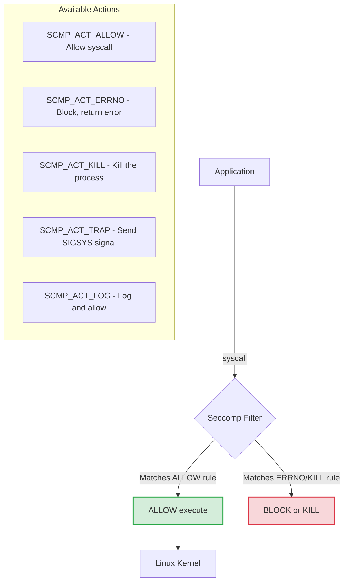
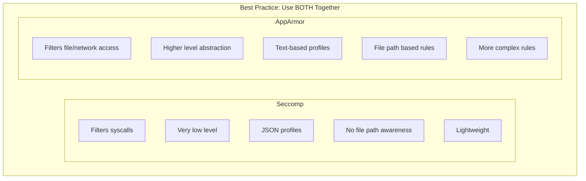
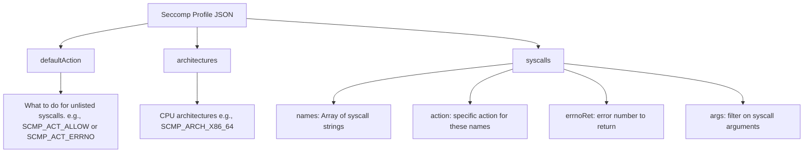

> **Складність**: Висока
>
> **Час на проходження**: 75 хвилин
>
> **Передумови**: системні виклики Linux, контексти безпеки Pod у Kubernetes, основи середовища виконання контейнерів та засади посилення системи у межах CKS

---

## Що ви зможете зробити

Після завершення цього модуля ви зможете:

1. **Проєктувати** власні профілі seccomp, які дозволяють лише ті системні виклики, що потрібні конкретному контейнеризованому навантаженню.
2. **Впроваджувати** Pod та контейнери Kubernetes із профілями seccomp `RuntimeDefault` і `Localhost` через `securityContext`.
3. **Діагностувати** збої запуску та виконання, пов'язані із seccomp, за допомогою статусу Pod, поведінки kubelet, журналів аудиту й трасування системних викликів.
4. **Порівнювати** seccomp із AppArmor і обирати правильний рівень для фільтрування системних викликів проти контролю доступу до ресурсів.
5. **Оцінювати** операційні компроміси між `RuntimeDefault`, власними профілями та розповсюдженням профілів у масштабах кластера в середовищах Kubernetes 1.35+.

## Чому цей модуль важливий

Hypothetical scenario: публічний застосунок отримує експлойт віддаленого виконання коду через вразливий парсер запитів, і зловмисник опиняється всередині контейнера без прав root — лише з тими дозволами, які надають образ та специфікація Pod. Цей перший плацдарм уже серйозний, але результат залежить від того, що процес зможе попросити зробити спільне ядро Linux далі. Якщо контейнер здатний викликати потужні системні виклики на кшталт `unshare`, `mount`, `keyctl`, `ptrace` чи `bpf`, у зловмисника з'являється більше простору, щоб маніпулювати просторами імен, оглядати процеси, завантажувати об'єкти, звернені до ядра, або перейти до впливу на рівні вузла. Якщо ж ці виклики заблоковано ще до того, як ядро їх виконає, та сама помилка застосунку має значно вужчий радіус ураження.

Seccomp, скорочення від Secure Computing Mode, — це механізм Linux, який Kubernetes використовує для фільтрування системних викликів, що їх роблять процеси контейнерів. Він не знає, надійшов запит «хорошим» шляхом застосунку чи «поганим» шляхом експлойту; він бачить лише процес, що просить ядро виконати системний виклик, а тоді застосовує профіль, який каже дозволити, відхилити, записати в журнал, перехопити або вбити. Це робить seccomp грубим, але цінним засобом контролю. Він подібний до зачиненого віконця обслуговування в державній установі: клерк може цілий день приймати звичайні бланки, але є цілі категорії запитів, які це віконце ніколи не приймає, хоч би як ввічливо їх подавали.

Для роботи з CKS seccomp важливий тому, що навантаження Kubernetes спільно використовують ядро вузла, навіть якщо мають окремі контейнери, простори імен і файлові системи. Віртуальна машина має власну межу гостьового ядра, тоді як контейнер Linux покладається на ядро хоста плюс функції ізоляції — простори імен, cgroups, можливості, модулі безпеки Linux і seccomp. У кластерах Kubernetes 1.35+ варто розглядати `RuntimeDefault` як звичайну базову лінію для виробничих навантажень, а `Unconfined` приберегти для рідкісних, задокументованих винятків. Власні профілі тоді стають точковим інструментом посилення для особливо чутливих, стабільних навантажень, де команда готова взяти на себе операційні витрати на профілювання та регресійне тестування поведінки системних викликів.

Цей модуль будується на цій операційній реальності. Спершу ви дізнаєтесь, що seccomp може і чого не може бачити, потім застосуєте типи профілів Kubernetes, а далі попрацюєте з розміщенням профілів, усуненням несправностей і рішеннями щодо масштабування. Мета не в тому, щоб запам'ятати назву кожного системного виклику. Мета — навчитися розпізнавати, коли навантаженню слід використати типовий захист середовища виконання, коли власний профіль виправданий і як налагоджувати режими збоїв, не послаблюючи решту безпекової постави Pod.

## Seccomp на межі ядра

Кожен корисний процес Linux зрештою просить ядро виконати роботу від його імені. Читання файлу, прийняття мережевого з'єднання, виділення пам'яті, зміна прав на файл, створення дочірнього процесу та вихід — усе це передбачає системні виклики. Контейнер не усуває цього зв'язку; він пакує процес і обмежує його огляд системи, але те саме ядро хоста все одно отримує запити на системні виклики. Саме тому фільтрування системних викликів є важливою другою лінією оборони після посилення образу, користувачів без прав root, файлових систем лише для читання, скидання можливостей і політики допуску.

Seccomp розшифровується як Secure Computing Mode. Це функція ядра Linux, доступна з версії 2.6.12, а форма seccomp-bpf, яку використовують сучасні середовища виконання контейнерів, оцінює правила через логіку Berkeley Packet Filter. У контейнеризованому середовищі всі контейнери на вузлі спільно використовують одне й те саме ядро хоста. Без seccomp процес контейнера теоретично може зробити будь-який системний виклик до ядра, з огляду на будь-які інші засоби контролю, що все ще діють. Ця архітектура зі спільним ядром є головною причиною, чому ізоляцію контейнерів треба будувати пошарово, а не сприймати як еквівалент віртуальної машини.

Коли seccomp увімкнено, ядро оцінює запитаний системний виклик за завантаженим фільтром перед його виконанням. Профіль може дозволити виклик, повернути помилку на кшталт `EPERM`, записати подію в журнал, надіслати сигнал або завершити процес — залежно від налаштованої дії. Оскільки ця перевірка розташована близько до точки входу системного виклику, вона не може міркувати про багатий контекст наміру застосунку, але здатна надійно блокувати цілі класи взаємодії з ядром, які звичайний код застосунку ніколи не мав би потребувати. Вебсервісу можуть знадобитися `read`, `write`, `accept` та `epoll_wait`; зазвичай йому не потрібні `mount`, `kexec_load` чи `ptrace`.

Ось архітектурний потік того, як Seccomp обробляє системні виклики:



Діаграма показує, чому seccomp є водночас потужним і обмеженим. Він потужний, бо рішення ухвалюється до того, як ядро виконає операцію, тож відхилений системний виклик ніколи не дістається глибшого коду реалізації, де живе багато помилок підвищення привілеїв. Він обмежений, бо фільтр бачить номери та аргументи системних викликів, а не мітки Kubernetes, маршрути HTTP, імена орендарів чи бізнес-контекст. Seccomp застосовують, щоб зменшити поверхню атаки на ядро, а не щоб замінити авторизацію застосунку чи мережеву політику.

Дії seccomp заслуговують на пильну увагу, бо вони змінюють режим збою, який бачить той, хто навчається, під час налагодження. `SCMP_ACT_ERRNO` зазвичай дружніший для виробничого примусового виконання, бо застосунок отримує звичайну помилку і може занести в журнал «Operation not permitted». `SCMP_ACT_KILL` суворіший, бо процес гине, коли доходить до заблокованого системного виклику, через що симптом може скидатися радше на цикл збоїв (crash loop), ніж на проблему з дозволами. `SCMP_ACT_LOG` цінний під час побудови профілю, бо дає змогу спостерігати підозрілі виклики, перш ніж перетворити спостереження на примусове виконання.

Зупиніться й передбачте: якщо профіль використовує `defaultAction: SCMP_ACT_ERRNO` і дозволяє лише читання файлів, запис, відображення пам'яті та вихід процесу, чого ви очікуєте, коли середовище виконання мови запускає допоміжний процес через `clone` чи `execve`? Важлива звичка — мислити в категоріях поведінки застосунку, а потім переводити цю поведінку в системні виклики. «Простому» застосунку все одно можуть знадобитися DNS-запити, примітиви потоків, таймери, ентропія, динамічне завантаження бібліотек і виклики метаданих файлової системи ще до того, як він обслужить один запит.

## Seccomp, AppArmor та інші рівні

Seccomp часто обговорюють поруч із AppArmor, бо обидва з'являються в контекстах безпеки Kubernetes, але вони захищають різні межі. Seccomp фільтрує те, що процес може попросити зробити ядро. AppArmor обмежує те, до яких ресурсів процес може звертатися, через політику модуля безпеки Linux. Профіль seccomp може повністю заблокувати `mount`, але він не здатний виразити «дозволити читання з `/etc/nginx/nginx.conf` і заборонити читання з `/etc/shadow`». AppArmor може виразити це правило на основі шляху, але він не той інструмент, щоб прибрати системний виклик зі словника, доступного процесу.

Ця відмінність має значення в реальній експлуатації, бо збої безпеки часто залучають більш ніж один рівень. Припустімо, процесу дозволено відкривати файли, але він не повинен читати секрети, змонтовані поза очікуваним для нього шляхом. AppArmor — правильний засіб контролю для політики шляхів. Припустімо, що той самий процес ніколи не повинен під'єднуватися до іншого процесу через `ptrace`, змінювати системний годинник, створювати новий простір імен чи завантажувати модуль ядра. Seccomp — правильний засіб контролю для цих рішень на рівні системних викликів. Використані разом, вони роблять експлуатацію дорожчою, бо зловмиснику доводиться шукати шлях крізь обидва — і політику ресурсів, і фільтр системних викликів.

Ось структурне порівняння цих двох технологій:



Практичне правило вибору просте: використовуйте seccomp, коли питання звучить «чи взагалі цьому процесу має бути дозволено викликати цю операцію ядра?», і використовуйте AppArmor, коли питання звучить «до яких файлів, сокетів, можливостей чи шляхів цей процес може торкатися?». Для сценаріїв CKS не міняйте одне на інше просто тому, що один профіль легше написати. Команда, яка замінює seccomp на AppArmor, щоб уникнути налагодження системних викликів, зменшила один клас тертя, але знову відкрила поверхню атаки на ядро, яку мала намір закрити.

Можливості (capabilities) також взаємодіють із цією картиною. Скидання `CAP_SYS_ADMIN` усуває велику кількість привілейованої поведінки, але не прибирає кожен системний виклик із досяжного інтерфейсу процесу. Seccomp усе одно може блокувати виклики, які можуть бути небезпечними навіть тоді, коли можливості чи простори імен теж їх обмежили б. Це перекриття не є марнотратним. У захисній інженерії перекривні засоби контролю корисні, коли вони відмовляють по-різному й супроводжуються через різні механізми.

Pod Security Admission у Kubernetes додає ще один рівень, відхиляючи специфікації Pod, які порушують політику на рівні простору імен. Обмежені Pod Security Standards звужують налаштування seccomp, забороняючи явні профілі `Unconfined` і дозволяючи безпечні типи профілів на кшталт `RuntimeDefault` та `Localhost`. Не припускайте, що політика допуску завжди вписує профіль seccomp у відсутнє поле за вас. Розглядайте специфікацію Pod і типові значення вузла як окремі засоби контролю, а тоді перевіряйте фактичну поведінку в середовищі виконання, коли політика кластера залежить від неявних значень за замовчуванням.

## RuntimeDefault і типи профілів Kubernetes

Kubernetes надає налаштування seccomp через поле `securityContext.seccompProfile`. Ви можете задати його на рівні Pod, щоб кожен контейнер успадкував той самий профіль, або на рівні контейнера, коли одному контейнеру потрібен інший профіль, ніж його сусідам. Тип профілю каже kubelet, чи запитати в середовища виконання його типовий профіль, чи завантажити локальний профіль із файлової системи вузла, чи залишити seccomp вимкненим. У сучасній роботі з посилення Kubernetes 1.35+ вашою звичайною відправною точкою має бути `RuntimeDefault`.

`RuntimeDefault` делегує вбудованому профілю середовища виконання контейнерів — наприклад, типовому профілю, який використовує Docker, або поведінці виконання, налаштованій для containerd чи CRI-O. Цей типовий профіль зазвичай блокує підібраний набір системних викликів високого ризику, дозволяючи при цьому широкий набір викликів, потрібних звичайним застосункам. Точний профіль належить середовищу виконання, а не самому Kubernetes, що означає: не варто сприймати `RuntimeDefault` як повністю переносний список дозволених імен системних викликів. Він переносний як намір, а не як побайтовий документ JSON.

Перевірити, чи застосовано типовий профіль Seccomp до Pod, можна за допомогою таких команд:

```bash
# Check if default seccomp is applied
kubectl get pod mypod -o jsonpath='{.spec.securityContext.seccompProfile}'

# The RuntimeDefault profile typically blocks:
# - keyctl (kernel keyring)
# - ptrace (process tracing)
# - personality (change execution domain)
# - unshare (namespace manipulation)
# - mount/umount (filesystem mounting)
# - clock_settime (change system time)
# And about 40+ other dangerous syscalls
```

Ця команда читає оголошену специфікацію Pod, а не кожну фактичну деталь середовища виконання. Якщо поле порожнє, навантаження все одно може отримати типовий профіль через налаштування kubelet чи середовища виконання, але не варто покладатися на цю неоднозначність під час іспиту або виробничого огляду. Для маніфестів, які ви контролюєте, задавайте `type: RuntimeDefault` явно, якщо тільки вужчий профіль `Localhost` не був схвалений і розповсюджений. Явне налаштування легше перевіряти аудитом, легше викладати й легше забезпечувати політикою допуску.

У сучасних версіях Kubernetes (v1.35+) поле `seccompProfile` є стандартним у блоці `securityContext`.

### Метод 1: контекст безпеки Pod (рекомендовано)

Це стандартний підхід для застосування типового профілю середовища виконання до всіх контейнерів у межах Pod.

```yaml
apiVersion: v1
kind: Pod
metadata:
  name: seccomp-pod
spec:
  securityContext:
    seccompProfile:
      type: RuntimeDefault  # Use runtime's default profile
  containers:
  - name: app
    image: nginx
```

`RuntimeDefault` на рівні Pod — правильний перший крок для більшості навантажень, бо він дає кожному контейнеру базову лінію, не вимагаючи від платформної команди володіти власною інвентаризацією системних викликів. Він також зберігає маніфест читабельним. Рецензент бачить, що Pod не є unconfined, не занурюючись у файли профілів, специфічні для середовища виконання. Компроміс у тому, що типовий профіль навмисно загальний. Він прибирає відомі ризиковані операції, але не звужує набір системних викликів до точних потреб вашого застосунку.

### Метод 2: профіль Localhost

Коли у вас є власний профіль, розгорнутий на робочих вузлах, ви посилаєтесь на нього за допомогою типу `Localhost`. Зверніть увагу, що шлях `localhostProfile` є відносним до `/var/lib/kubelet/seccomp/`.

```yaml
apiVersion: v1
kind: Pod
metadata:
  name: custom-seccomp-pod
spec:
  securityContext:
    seccompProfile:
      type: Localhost
      localhostProfile: profiles/custom.json  # Relative to /var/lib/kubelet/seccomp/
  containers:
  - name: app
    image: nginx
```

`Localhost` — це тип профілю для власного посилення, але він має вимогу щодо розповсюдження на вузли. Kubelet читає профіль із файлової системи вузла, і шлях до профілю у специфікації Pod є відносним до кореня seccomp у kubelet. Якщо файл існує на одному робочому вузлі, але не на іншому, планування може перетворитися на проблему надійності. Pod, який чисто стартує на одному вузлі, може зазнати збою з `CreateContainerError` на іншому вузлі просто тому, що там бракує локального файлу профілю.

### Метод 3: профіль на рівні контейнера

Ви можете застосовувати різні профілі Seccomp до різних контейнерів у межах одного Pod. Якщо профіль задано і на рівні Pod, і на рівні контейнера, то для цього конкретного контейнера перевагу має профіль рівня контейнера.

```yaml
apiVersion: v1
kind: Pod
metadata:
  name: multi-container-pod
spec:
  containers:
  - name: app
    image: nginx
    securityContext:
      seccompProfile:
        type: RuntimeDefault
  - name: sidecar
    image: busybox
    command: ["sleep", "3600"]
    securityContext:
      seccompProfile:
        type: Localhost
        localhostProfile: profiles/sidecar.json
```

Профілі на рівні контейнера мають сенс, коли контейнери в одному Pod справді мають різні потреби в системних викликах. Зворотний проксі, середовище виконання застосунку та короткоживучий помічник можуть не виконувати однакових операцій ядра. Однак ця точність може ускладнити супровід маніфестів, особливо коли sidecar-контейнери впроваджуються автоматизацією. Використовуйте перевизначення на рівні контейнера, коли є чітка вигода, і документуйте, чому профілю рівня Pod недостатньо.

Існує три основні типи профілів Seccomp, які можна вказати в Kubernetes:

```yaml
# RuntimeDefault - Container runtime's default profile
seccompProfile:
  type: RuntimeDefault

# Localhost - Custom profile from node filesystem
seccompProfile:
  type: Localhost
  localhostProfile: profiles/my-profile.json

# Unconfined - No seccomp filtering (dangerous!)
seccompProfile:
  type: Unconfined
```

`Unconfined` вимикає фільтр системних викликів для цього контейнера, тож він має з'являтися лише в ретельно переглянутих винятках. Деяким легітимним налагоджувальним чи спеціалізованим низькорівневим навантаженням може знадобитися ширша взаємодія з ядром, але виробничий застосунок не повинен отримувати `Unconfined` через те, що оновлення бібліотеки зазнало збою під обмежувальним профілем. Краща відповідь — поспостерігати за відсутнім системним викликом, вирішити, чи поведінка очікувана, та свідомо оновити профіль або дизайн навантаження.

Який підхід ви обрали б тут і чому? Stateless HTTP-сервіс не має відомих особливостей системних викликів, привілейований інструмент діагностики вузла потребує незвичайної видимості ядра, а навантаження з обробки платежів має стабільний процес релізів із сильними тестами на staging. Імовірна відповідь — `RuntimeDefault` для HTTP-сервісу, окремий процес винятку для інструмента діагностики та ретельно протестований власний профіль `Localhost` для чутливого стабільного навантаження, якщо команда здатна його супроводжувати.

## Структура та розміщення власного профілю

Власні профілі seccomp — це документи JSON, які середовище виконання споживає через kubelet. Вони визначають типову дію, список підтримуваних архітектур і правила для імен системних викликів. Найбезпечніша ментальна модель — спершу прочитати `defaultAction`, бо вона каже, чи профіль є списком дозволених (allowlist), чи списком заборонених (denylist). Якщо типова дія дозволяє все, то правила здебільшого є винятками, що блокують вибрані системні виклики чи записують їх у журнал. Якщо типова дія забороняє все, то правила є переліком системних викликів, якими застосунок може користуватися.

Коли ви налаштовуєте Pod на використання власного профілю Seccomp (за типом `Localhost`), kubelet у Kubernetes має знати, де знайти профіль у файловій системі вузла.

```bash
# Kubernetes looks for profiles in:
/var/lib/kubelet/seccomp/

# Profile path in pod spec is relative to this directory
# Example: profiles/my-profile.json
# Full path: /var/lib/kubelet/seccomp/profiles/my-profile.json

# Create directory if it doesn't exist
sudo mkdir -p /var/lib/kubelet/seccomp/profiles
```

Правило відносного шляху — одна з найпоширеніших помилок на іспиті та у виробництві. Якщо файл — `/var/lib/kubelet/seccomp/profiles/custom.json`, то специфікація Pod має казати `localhostProfile: profiles/custom.json`, а не абсолютний шлях і не просто `custom.json`. Kubernetes не пакує JSON у Pod. Він каже kubelet, який локальний файл передати середовищу виконання, тож файл має бути присутнім і доступним для читання на вузлі, куди потрапляє Pod.

Профіль Seccomp визначається як документ JSON. Він задає типову дію (що робити, якщо системний виклик не вказано явно), цільові архітектури та масив конкретних правил.

```json
{
  "defaultAction": "SCMP_ACT_ERRNO",
  "architectures": [
    "SCMP_ARCH_X86_64",
    "SCMP_ARCH_X86",
    "SCMP_ARCH_AARCH64"
  ],
  "syscalls": [
    {
      "names": [
        "accept",
        "access",
        "arch_prctl",
        "bind",
        "brk"
      ],
      "action": "SCMP_ACT_ALLOW"
    },
    {
      "names": [
        "ptrace"
      ],
      "action": "SCMP_ACT_ERRNO",
      "errnoRet": 1
    }
  ]
}
```

Розуміння полів у профілі JSON має вирішальне значення для налагодження та іспитових сценаріїв:



Для профілю denylist `defaultAction: SCMP_ACT_ALLOW` каже «дозволяти звичайну поведінку, якщо тільки названий системний виклик не заблоковано окремо». Його легше розгортати, бо він менш імовірно зламає застосунок, але він залишає доступною більшу частину поверхні ядра. Для профілю allowlist `defaultAction: SCMP_ACT_ERRNO` каже «забороняти все, що не вказано явно». Це сильніше, але крихкіше, бо нові бібліотеки, архітектури процесорів, оновлення середовища виконання мови чи прапорці функцій можуть привнести системний виклик, який профіль не дозволяє.

Поле `architectures` не є декоративним. Номери системних викликів специфічні для архітектури, а кластери дедалі частіше змішують вузли x86_64 та Arm з міркувань вартості чи доступності. Профіль, який трасували й тестували на одній архітектурі, може поводитися не зовсім однаково на іншій, якщо зміниться середовище виконання, libc чи збірка двійкового файлу. Коли навантаження може плануватися на вузли різних архітектур, або тестуйте профіль на кожній підтримуваній архітектурі, або обмежуйте планування так, щоб профіль і двійковий файл відповідали вузлам, які їх запускатимуть.

Фільтрування аргументів — ще одна потужна функція, що заслуговує на обережність. Seccomp може зіставляти не лише ім'я системного виклику, а й вибрані значення аргументів, що робить правила точнішими за простий список дозволу чи заборони. Ця точність корисна для спеціалізованих навантажень, але вона також ускладнює огляд профілів, бо правило залежить від низькорівневих конвенцій виклику. Для більшості команд Kubernetes починайте з правил за іменами системних викликів, а фільтри аргументів використовуйте лише тоді, коли чітка модель загроз і тестовий випадок виправдовують додаткову складність.

Коментарі та імена файлів профілів також слід розглядати як операційні метадані, а не як засоби контролю безпеки. Ядро забезпечує виконання дій JSON, а не зрозумілого людині імені файлу `minimal.json` чи `deny-ptrace.json`. Під час оглядів перевіряйте фактичні `defaultAction`, імена системних викликів і дії, а не довіряйте імені профілю. Файл із заспокійливим іменем усе одно може дозволяти кожен системний виклик, якщо в JSON стоїть `SCMP_ACT_ALLOW` і немає примусових заборонних правил.

Розуміння того, як структурувати власні профілі, необхідне для середовищ зі суворою безпекою. Ось кілька поширених патернів.

### Профіль, що блокує ptrace

Якщо ваше середовище за замовчуванням дозволяє більшість системних викликів, ви можете створити профіль denylist, який окремо блокує відомі небезпечні системні виклики на кшталт `ptrace`. Збережіть цей профіль як `/var/lib/kubelet/seccomp/profiles/deny-ptrace.json`:

```json
{
  "defaultAction": "SCMP_ACT_ALLOW",
  "syscalls": [
    {
      "names": ["ptrace"],
      "action": "SCMP_ACT_ERRNO",
      "errnoRet": 1
    }
  ]
}
```

Цей профіль навмисно вузький. Він не намагається описати весь застосунок; він блокує один системний виклик, який звичайному навантаженню не мав би знадобитися. Це робить його безпечнішим за суворий allowlist, коли команді бракує інвентаризації системних викликів, але слабшим за `RuntimeDefault`, якщо типовий профіль середовища виконання вже блокує ширший набір ризикованих викликів. Урок у тому, щоб порівняти власний профіль із типовим профілем середовища виконання, перш ніж припускати, що власний завжди означає кращий.

### Профіль, що дозволяє лише певні системні виклики

Це підхід суворого allowlist. `defaultAction` — `SCMP_ACT_ERRNO`, що означає: усе, не вказане явно в масиві `syscalls`, буде заблоковано. Це дуже безпечно, але крихко. Збережіть цей профіль як `/var/lib/kubelet/seccomp/profiles/minimal.json`:

```json
{
  "defaultAction": "SCMP_ACT_ERRNO",
  "architectures": ["SCMP_ARCH_X86_64"],
  "syscalls": [
    {
      "names": [
        "read", "write", "open", "close",
        "fstat", "lseek", "mmap", "mprotect",
        "munmap", "brk", "exit_group"
      ],
      "action": "SCMP_ACT_ALLOW"
    }
  ]
}
```

Цей мінімальний профіль радше освітній, ніж готовий до виробництва. Багатьом реальним застосункам потрібно більше, ніж виклики файлів і пам'яті; їм можуть знадобитися мережеві операції, futex, обробка сигналів, генерація випадкових чисел, читання годинника, доступ до файлів, пов'язаний із DNS, чи керування процесами. Якщо ви розгорнете цей стиль зарано, ви дізнаватиметеся про відсутні виклики через збої. Використовуйте allowlist після трасування репрезентативної поведінки і робіть перевірку профілю частиною процесу релізу, а не ручною дією наостанок.

### Профіль, що записує підозрілі виклики в журнал

Це чудовий патерн для налагодження та аудиту. Замість блокувати виклики й потенційно завалити застосунок, цей профіль дозволяє їх, але запускає запис у журнал аудиту. Це дає командам безпеки спостерігати за поведінкою до того, як забезпечувати блокування. Збережіть цей профіль як `/var/lib/kubelet/seccomp/profiles/audit.json`:

```json
{
  "defaultAction": "SCMP_ACT_ALLOW",
  "syscalls": [
    {
      "names": ["ptrace", "process_vm_readv", "process_vm_writev"],
      "action": "SCMP_ACT_LOG"
    },
    {
      "names": ["mount", "umount2", "pivot_root"],
      "action": "SCMP_ACT_ERRNO"
    }
  ]
}
```

Профілі з журналюванням корисні під час переходу від спостереження до примусового виконання, але вони не є постійною заміною політики. Профіль, який записує в журнал і дозволяє небезпечний системний виклик, усе одно дозволяє небезпечну операцію. Розглядайте режим журналювання як крок вимірювання: зберіть достатньо доказів, щоб зрозуміти, що робить навантаження, перегляньте, чи ця поведінка очікувана, а тоді перетворіть потрібні виклики на правила дозволу чи заборони. У виробництві неконтрольоване журналювання також може створювати шум, тож обмежте період спостереження й визначте, хто переглядатиме події.

Перш ніж запускати це в лабораторії, якого виводу ви очікуєте, коли процес викликає `ptrace` під профілем аудиту проти заборонного профілю? Профіль аудиту має дозволити процесу продовжити, записавши подію, тоді як заборонний профіль має повернути помилку. Ця відмінність — серце безпечного усунення несправностей: спершу спостерігайте, коли ви не впевнені, а примушуйте, коли зрозуміли поведінку.

## Застосування та налагодження профілів у Kubernetes

Застосування seccomp у Kubernetes здебільшого є питанням маніфесту, доки щось не зламається. Специфікація Pod оголошує тип профілю, kubelet за потреби розв'язує локальний шлях, середовище виконання контейнерів завантажує профіль, а тоді ядро забезпечує його виконання для процесу контейнера. Збої можуть з'являтися в різних точках цього шляху. Відсутній файл профілю заважає створенню контейнера, неправильно сформований профіль заважає налаштуванню середовища виконання, а коректний, але надмірно суворий профіль може дозволити контейнеру стартувати, перш ніж застосунок зазнає збою з помилками дозволів.

Вас можуть попросити захистити робоче навантаження, застосувавши типовий профіль Seccomp без зміни решти його налаштувань.

```yaml
# Create pod with RuntimeDefault seccomp
cat <<EOF | kubectl apply -f -
apiVersion: v1
kind: Pod
metadata:
  name: secure-pod
spec:
  securityContext:
    seccompProfile:
      type: RuntimeDefault
  containers:
  - name: app
    image: nginx
EOF

# Verify
kubectl get pod secure-pod -o jsonpath='{.spec.securityContext.seccompProfile}' | jq .
```

Команда перевірки підтверджує, що профіль оголошено у специфікації Pod, чого часто достатньо для іспитового завдання, яке просить оновити YAML. Для виробничої діагностики також оглядайте події, коли Pod не стартує. `kubectl describe pod` часто показує, чи kubelet не зміг знайти або завантажити профіль. Якщо Pod стартує, але застосунок поводиться дивно, перейдіть від огляду об'єктів Kubernetes до доказів на рівні процесу та вузла.

У складніших сценаріях вам може знадобитися створити профіль на робочому вузлі та переконатися, що Pod успішно монтує й використовує його. Зауважте, що в реальному кластері ви, найімовірніше, використовуватимете DaemonSet, а не SSH-доступ до вузлів для ручного створення файлів.

```bash
# Create profile on node
sudo mkdir -p /var/lib/kubelet/seccomp/profiles
sudo tee /var/lib/kubelet/seccomp/profiles/block-chmod.json << 'EOF'
{
  "defaultAction": "SCMP_ACT_ALLOW",
  "syscalls": [
    {
      "names": ["chmod", "fchmod", "fchmodat"],
      "action": "SCMP_ACT_ERRNO",
      "errnoRet": 1
    }
  ]
}
EOF

# Apply to pod
cat <<EOF | kubectl apply -f -
apiVersion: v1
kind: Pod
metadata:
  name: no-chmod-pod
spec:
  securityContext:
    seccompProfile:
      type: Localhost
      localhostProfile: profiles/block-chmod.json
  containers:
  - name: app
    image: busybox
    command: ["sleep", "3600"]
EOF

# Test chmod is blocked
kubectl exec no-chmod-pod -- chmod 777 /tmp
# Should fail with "Operation not permitted"
```

Цей приклад демонструє корисний тестовий патерн: оберіть один системний виклик із видимим симптомом у просторі користувача, заблокуйте його, а тоді запустіть команду, що має від нього залежати. Тест не доводить, що весь профіль застосунку правильний; він доводить, що kubelet знайшов профіль, середовище виконання його завантажило, а ядро забезпечило виконання принаймні одного правила. Це вужче твердження все одно цінне, бо воно відокремлює інфраструктуру профілю від ширшої сумісності застосунку.

Коли Pod негайно завершується збоєм або поводиться дивно — наприклад, не може прив'язатися до порту — ви маєте вміти перевірити, чи seccomp є винуватцем.

```bash
# Check if seccomp is applied
kubectl get pod mypod -o yaml | grep -A5 seccompProfile

# Check node audit logs for seccomp denials
sudo dmesg | grep -i seccomp
sudo journalctl | grep -i seccomp

# Common error messages
# "seccomp: syscall X denied"
# "operation not permitted"
```

Перша діагностична гілка — «чи завантажився профіль?». Якщо Pod застряг у `CreateContainerError`, огляньте події Pod і підтвердіть шлях до профілю на вузлі. Друга гілка — «чи заблокував профіль виклик після запуску?». Якщо контейнер стартує, а потім падає, зберіть журнали застосунку, повідомлення ядра та журнали аудиту там, де вони ввімкнені. Третя гілка — «чи справді залучено саме рівень seccomp?». Відсутня можливість Linux, файлова система root лише для читання, відмова AppArmor, відмова SELinux чи помилка налаштування на рівні застосунку також можуть давати симптоми, схожі на проблеми з дозволами.

Щоб побудувати профіль allowlist, вам треба точно знати, які системні виклики робить застосунок. Найпряміший спосіб це зробити — інструменти трасування на тестовій системі (ніколи не трасуйте безпосередньо у виробництві, бо це суттєво впливає на продуктивність).

```bash
# Use strace to find syscalls (on a test system, not production)
strace -c -f <command>

# Example output:
# % time     seconds  usecs/call     calls    errors syscall
# ------ ----------- ----------- --------- --------- ----------------
#  25.00    0.000010           0        50           read
#  25.00    0.000010           0        30           write
#  12.50    0.000005           0        20           open
# ...

# Or use sysdig
sysdig -p "%proc.name %syscall.type" container.name=mycontainer
```

Трасування має бути репрезентативним, щоб бути корисним. Трасування лише на етапі запуску може пропустити системні виклики, що використовуються під час перезавантаження TLS, ротації журналів, плавного вимкнення, прогріву кешу, повторного підключення до бази даних чи рідкісної обробки помилок. Для суворих профілів проганяйте трасування через звичайний трафік, операції обслуговування та шляхи збоїв. Потім перетворіть спостережений набір на профіль і проженіть ті самі сценарії знову під примусовим виконанням. Це повільніше за перевірку поля маніфесту, але це різниця між профілем, що виглядає захищеним, і профілем, що переживає реальний реліз.

Зупиніться й передбачте: ви застосовуєте профіль seccomp із `defaultAction: SCMP_ACT_KILL` замість `SCMP_ACT_ERRNO`, і застосунок робить один невказаний системний виклик під час запуску. Pod може ввійти в цикл збоїв, бо процес завершується, тоді як `SCMP_ACT_ERRNO` дає процесу шанс занести в журнал чи обробити звичайну помилку дозволу. Ця відмінність змінює ваш план налагодження, бо вбитий процес може залишити менше доказів на рівні застосунку.

## Керування профілями в масштабі

Керування одним профілем на одному вузлі — це лабораторна вправа. Керування власними профілями в межах кластера — це обов'язок платформи. Центральний ризик — це дрейф: специфікація Pod посилається на шлях, але локальний файл JSON відрізняється між вузлами або відсутній на частині з них. Цей дрейф одночасно створює неузгодженість безпеки та крихкість планування. Одна репліка може працювати з наміченою політикою, інша може не стартувати, а третя може потрапити на вузол, чий файл вручну редагували під час аварійної ситуації.

У великому кластері Kubernetes ручне керування власними профілями Seccomp на сотнях робочих вузлів — це операційний кошмар. Якщо розробник планує Pod, який посилається на власний профіль, а цей файл профілю не існує на відповідному вузлі, Pod не стартує з помилкою `CreateContainerError`.

Щоб розв'язати це в сучасних кластерах (v1.35+), платформні інженери використовують автоматизовані механізми розповсюдження. Найпоширеніші підходи такі:

1. **DaemonSet**: простий DaemonSet, який монтує каталог хоста `/var/lib/kubelet/seccomp/` і копіює файли профілів JSON на місце на кожному вузлі.
2. **Security Profiles Operator (SPO)**: рідний для Kubernetes оператор, що дає змогу визначати профілі Seccomp як визначення власних ресурсів (CRD). Оператор автоматично синхронізує профілі на диск кожного робочого вузла, забезпечуючи узгоджене примусове виконання.

Копіювач на основі DaemonSet простий і прозорий, але він змушує команду володіти синхронізацією файлів, порядком оновлень, відкатом і дозволами. Security Profiles Operator дає рідну для Kubernetes модель керування, що привабливо, коли визначення профілів варто переглядати, версіонувати й узгоджувати, як інші ресурси кластера. У будь-якому разі не дозволяйте командам застосунків винаходити одноразові процедури SSH для профілів безпеки. Профіль — частина контракту навантаження, і платформа має розповсюджувати його з тією самою дисципліною, що використовується для політики допуску та налаштування середовища виконання.

Політика кластера також має вирішувати, кому дозволено використовувати профілі `Localhost`. Якщо кожен простір імен може вказувати на будь-який локальний шлях профілю, друкарська помилка може перетворитися на збій, а надмірно широкий профіль може стати прихованим винятком. Контроль допуску може вимагати `RuntimeDefault` для звичайних просторів імен, дозволяти перевірені шляхи `Localhost` лише у вибраних просторах імен і відхиляти `Unconfined`, окрім явного аварійного робочого процесу (break-glass). Суть не в тому, щоб зробити seccomp бюрократичним; суть у тому, щоб не дати засобу контролю на рівні ядра перетворитися на непереглянуту імпровізацію для кожного Pod.

Шлях розгортання власних профілів має віддзеркалювати розгортання застосунку. Почніть із `RuntimeDefault`, зафіксуйте поведінку системних викликів на staging, створіть профіль із чітким власником і версією, розгорніть його на всі придатні вузли, протестуйте canary-навантаження й відстежуйте відмови перед ширшим розгортанням. Якщо застосунок змінює середовище виконання мови, базовий образ, бібліотеку TLS чи поведінку запуску, проженіть процес трасування заново. Профілі системних викликів пов'язані з деталями реалізації, тож вони потребують регресійних тестів, а не одноразового схвалення.

## Розбір прикладу: від RuntimeDefault до вужчого правила

Сценарій вправи: команда володіє невеликим внутрішнім файловим сервісом, який пройшов базові перевірки з `RuntimeDefault`, але огляд безпеки запитує, чи може сервіс витримати власне правило, що блокує системні виклики зміни прав. Застосунок читає файли зі змонтованого тому й повертає їх через HTTP; йому не має бути потрібно змінювати біти режиму під час виконання. Команда спершу обирає профіль denylist, бо хоче отримати низькоризиковий доказ того, що розповсюдження й примусове виконання власних профілів працюють, перш ніж братися за суворий allowlist.

Команда створює профіль `block-chmod.json` під `/var/lib/kubelet/seccomp/profiles/`, розгортає тестовий Pod із `localhostProfile: profiles/block-chmod.json` і запускає команду, що намагається виконати `chmod` усередині контейнера. Успішний тест — це не те, що команда виконалася успішно. Успішний тест — це очікувана відповідь «Operation not permitted» для заблокованої поведінки, тоді як звичайна поведінка навантаження все одно виконується. Цей результат доводить, що правило активне, і підтверджує, що обраний тест задіює намічену родину системних викликів.

Наступне рішення — розширити профіль чи зупинитися. Якщо модель ризику — «застосунок ніколи не повинен змінювати режими файлів», вузького denylist може бути достатньо, особливо в поєднанні з `RuntimeDefault`, монтуваннями лише для читання та скинутими можливостями. Якщо модель ризику — «застосунок має мати лише відому інвентаризацію системних викликів», команді потрібні трасування, проєктування allowlist і дорожчий конвеєр перевірки. Обидва рішення можуть бути правильними, але вони відповідають на різні питання безпеки.

Розбір прикладу також показує, чому огляди seccomp варто прив'язувати до критеріїв успіху. «Додати власний профіль» само собою не є осмисленою вимогою. Краща вимога — «заблокувати системні виклики зміни прав для цього навантаження, перевірити заборонену операцію й показати, що запуск, звичайні запити та вимкнення все одно працюють». Таке формулювання дає інженерам спостережувану ціль і не дає оголосити політику завершеною лише тому, що поле YAML існує.

## Патерни та антипатерни

Патерни для seccomp стають корисними лише тоді, коли вони включають модель власності. Профіль, який ніхто не тестує, — це просто ще один крихкий артефакт у шляху релізу. Для платформних команд найсильніший патерн — зробити `RuntimeDefault` мінімумом, використати політику допуску, щоб запобігти випадковому `Unconfined`, і приберегти власні профілі для навантажень, чия поведінка системних викликів достатньо стабільна, щоб виправдати супровід. Для команд застосунків патерн — розглядати збої seccomp як сигнали сумісності, що потребують діагностики, а не як приводи вимкнути засіб контролю.

| Патерн | Коли його використовувати | Чому він працює |
|---------|----------------|--------------|
| Явний `RuntimeDefault` у специфікаціях Pod | Стандартні сервіси, контролери, завдання та більшість навантажень простору імен | Дає переносний намір посилення й робить огляди незалежними від прихованих типових значень вузла. |
| Власний профіль `Localhost` з автоматизованим розповсюдженням | Чутливі, стабільні навантаження з відомим відбитком системних викликів | Звужує взаємодію з ядром, уникаючи дрейфу вузлів завдяки узгодженню через DaemonSet чи оператор. |
| Профілювання з пріоритетом журналювання на staging | Нові allowlist або поведінка, яку не до кінця зрозуміли | Збирає докази до примусового виконання й зменшує несподівані виробничі збої. |
| Перевизначення на рівні контейнера для змішаних Pod | Sidecar чи помічники з різними потребами в системних викликах | Не дає одному незвичайному контейнеру нав'язати ширший профіль усьому Pod. |

Антипатерни зазвичай походять із сприйняття seccomp або як магії, або як перешкоди. Це не магія, бо типовий профіль не доводить, що застосунок має мінімум системних викликів. Це не перешкода, бо вимикання його заради виправлення проблеми із запуском знову відкриває шляхи атаки, які не мають нічого спільного з безпосередньою помилкою. Зріла команда сповільнюється достатньо, щоб запитати, чи відмова очікувана, чи симптом спричиняє інший рівень і чи модель розповсюдження профілів надійна.

| Антипатерн | Що йде не так | Краща альтернатива |
|--------------|-----------------|--------------------|
| Використання `Unconfined` як швидкого обхідного шляху для усунення несправностей | Навантаження втрачає фільтрування системних викликів, доки першопричина лишається невідомою | Тимчасово перейдіть на журналювання або тестуйте під трасуванням на staging, а тоді свідомо оновіть профіль. |
| Ручне копіювання власних профілів на кілька вузлів | Планування стає непередбачуваним, а примусове виконання відрізняється між репліками | Розповсюджуйте профілі через DaemonSet, оператор або процес образу вузла з контролем версій. |
| Побудова суворих allowlist з одного трасування запуску | Рідкісні шляхи виконання пізніше падають під трафіком, перезавантаженням чи вимкненням | Трасуйте репрезентативні сценарії та робіть перевірку профілю частиною тестування релізу. |
| Припущення, що AppArmor замінює seccomp | Політика доступу до ресурсів лишається, але поверхня атаки системних викликів знову відкривається | Використовуйте AppArmor для правил шляхів і ресурсів, а seccomp — для фільтрування системних викликів. |

Ці таблиці не є контрольним списком, який застосовують наосліп. Це засоби для ухвалення рішень для розмов, які ви справді матимете під час оглядів: хто володіє профілем, як він дістається вузлів, які докази показують, що він працює, який режим збою прийнятний і який шлях винятку існує, коли легітимне низькорівневе навантаження не може запуститися під типовим профілем. Seccomp цінний, коли ці відповіді явні.

## Структура ухвалення рішень

Почніть із найменш несподіваної базової лінії: задайте `RuntimeDefault` явно для звичайних навантажень. Цю базову лінію легко переглядати, вона широко сумісна та узгоджена з напрямом посилення безпеки Kubernetes. Переходьте до власного профілю `Localhost` лише тоді, коли є конкретне зменшення ризику, якого типовий профіль середовища виконання не дає, і коли команда здатна надійно тестувати й розповсюджувати профіль. Відходьте від seccomp лише заради вузьких винятків, де мета навантаження справді вимагає широкої взаємодії з ядром, а виняток задокументовано через політику.

```text
Workload needs seccomp decision
        |
        v
Is it a normal application, controller, job, or service?
        |-- yes --> Use explicit RuntimeDefault
        |
        no
        |
        v
Does it need unusual kernel interaction for its core purpose?
        |-- yes --> Review exception, avoid silent Unconfined, add compensating controls
        |
        no
        |
        v
Is there a specific syscall risk the runtime default does not address?
        |-- no --> Stay with RuntimeDefault and enforce through admission
        |
        yes
        |
        v
Can the team trace, test, distribute, and version a custom profile?
        |-- no --> Do not deploy a brittle custom allowlist yet
        |
        yes
        |
        v
Use Localhost profile, automate distribution, canary, and monitor denials
```

Структура ухвалення рішень навмисно відокремлює бажання безпеки від операційної готовності. Суворий allowlist звучить привабливо, але зламаний allowlist часто породжує тиск, щоб вимкнути seccomp узагалі. Якщо команда не може протестувати репрезентативну поведінку, використовуйте типовий профіль, доки будуєте конвеєр профілювання. Якщо команда вміє добре тестувати, власний профіль може бути сильним засобом контролю, бо він перетворює невідомий доступ до ядра на явний контракт.

Скористайтеся наведеним порівнянням, коли вам потрібно обґрунтувати вибір в огляді чи в іспитовій відповіді. `RuntimeDefault` широкий, але дешевий в експлуатації. `Localhost` вузький, але дорогий у супроводі. `Unconfined` не є звичайним налаштуванням посилення; це стан винятку, який має запускати компенсаційні засоби контролю, часові обмеження чи перепроєктування. Коли ви пояснюєте компроміс, включайте і безпековий результат, і режим збою, бо операторам важливі обидва.

| Вибір | Цінність для безпеки | Операційна вартість | Поширений режим збою |
|--------|----------------|------------------|---------------------|
| `RuntimeDefault` | Блокує багато небезпечних системних викликів із сумісністю, що підтримується середовищем виконання | Низька | Команди вважають його ідеальним allowlist найменших привілеїв, тоді як це базовий профіль. |
| Власний `Localhost` denylist | Блокує конкретні небажані системні виклики, зберігаючи широку сумісність | Середня | Власне правило дублює або послаблює те, що типовий профіль середовища виконання вже зробив. |
| Власний `Localhost` allowlist | Мінімізує поверхню системних викликів для стабільних навантажень | Висока | Відсутній системний виклик спричиняє збій запуску або помилки на рідкісних шляхах виконання. |
| `Unconfined` | Жодної безпекової цінності seccomp | Спершу низька, висока під час реагування на інцидент | Зручність усунення несправностей стає постійним винятком. |

Для завдань CKS найкоротшою правильною відповіддю часто є задати `securityContext.seccompProfile.type: RuntimeDefault` або виправити шлях `Localhost`. Для виробництва старша відповідь — запитати, який профіль намічено, як він розповсюджується, як спостерігаються відмови та яка політика запобігає регресіям до `Unconfined`. Ці питання тримають seccomp пов'язаним з операційною реальністю, а не залишають його полем-галочкою YAML.

## Чи знали ви?

- **Linux запровадив seccomp у ядрі 2.6.12** як суворий режим, а seccomp-bpf пізніше зробив практичне фільтрування контейнерів можливим, дозволивши багатші правила через логіку BPF.
- **Типовий профіль seccomp у Docker** історично блокував близько 44 системних викликів із приблизно 300+ викликів інтерфейсу, який надають поширені архітектури Linux.
- **Kubernetes зберігає посилання на локальні профілі відносно кореня seccomp у kubelet**, зазвичай `/var/lib/kubelet/seccomp/`, тож `localhostProfile` не має бути абсолютним шляхом.
- **Обмежена політика Pod Security Standards забороняє явний `Unconfined` seccomp**, але вам усе одно варто задавати `RuntimeDefault` явно, коли ви хочете, щоб маніфести були чіткими й придатними для огляду.

## Типові помилки

| Помилка | Чому вона трапляється | Як виправити |
|---------|----------------|---------------|
| Неправильний шлях до профілю | Специфікація Pod використовує шлях, що не відповідає кореню seccomp у kubelet, тож контейнер падає з `CreateContainerError`. | Перевірте файл під `/var/lib/kubelet/seccomp/` і використовуйте значення `localhostProfile`, відносне до цього каталогу. |
| Пропущено необхідний системний виклик | Суворий allowlist побудовано з неповних трасувань або лише з поведінки запуску. | Проаудитуйте застосунок за допомогою `strace`, `sysdig` чи `SCMP_ACT_LOG` на staging, перш ніж примушувати профіль. |
| Установлення `type: Unconfined` | Тиск під час усунення несправностей перетворює тимчасовий обхід на постійну втрату фільтрування ядра. | Поверніться до `RuntimeDefault` або протестованого профілю `Localhost` і задокументуйте будь-який справжній виняток. |
| Профіль відсутній на деяких робочих вузлах | Власні профілі копіювали вручну або розгортали нерівномірно по пулу вузлів. | Розгортайте власні профілі однаково за допомогою DaemonSet, Security Profiles Operator чи процесу образу вузла. |
| Неправильно сформований синтаксис JSON | Середовище виконання не може розібрати профіль, тож kubelet не може створити контейнер. | Перевіряйте JSON і тестуйте завантаження профілю, перш ніж посилатися на нього з виробничих Pod. |
| Переплутані абсолютні шляхи | Маніфест використовує `localhostProfile: /var/lib/...`, хоча Kubernetes очікує відносний шлях. | Задавайте шляхи строго відносно каталогу seccomp у kubelet, на кшталт `profiles/custom.json`. |
| Сприйняття AppArmor як заміни seccomp | Команда захищає шляхи до файлів, але залишає доступними непотрібні системні виклики. | Використовуйте AppArmor для політики доступу до ресурсів, а seccomp — для фільтрування системних викликів. |

## Тест

<details>
<summary>1. Ваша команда додає суворий власний профіль до сервісу, і контейнер тепер стартує, але падає під час перезавантаження TLS-сертифіката з помилкою «Operation not permitted». Що перевірити насамперед і як налагоджувати, не роблячи навантаження unconfined?</summary>

Почніть із припущення, що суворий профіль пропустив системний виклик, який використовується поза шляхом запуску. Перевірте події Pod, щоб підтвердити, що профіль завантажився, а тоді огляньте журнали застосунку та журнали аудиту чи ядра на вузлі на предмет доказів відмови seccomp. Відтворіть шлях перезавантаження на staging під `strace`, `sysdig` чи тимчасовим правилом `SCMP_ACT_LOG`, щоб поспостерігати за відсутнім системним викликом, зберігаючи виробничу політику недоторканою. Не перемикайте виробниче навантаження на `Unconfined`; це приховує помилку сумісності й прибирає засіб контролю, який ви намагаєтесь перевірити.

</details>

<details>
<summary>2. Під час завдання CKS ви створюєте `/var/lib/kubelet/seccomp/profiles/block-mount.json`, але Pod посилається на `localhostProfile: block-mount.json` і не стартує. Що не так?</summary>

Посилання на профіль є відносним до `/var/lib/kubelet/seccomp/`, тож Kubernetes шукає `/var/lib/kubelet/seccomp/block-mount.json`. Ваш файл насправді розташований у підкаталозі `profiles/`. Правильне значення — `localhostProfile: profiles/block-mount.json`. Це проблема розв'язання шляху, а не політики системних викликів, тож зміна вмісту профілю не виправила б збій запуску.

</details>

<details>
<summary>3. Платформна команда хоче базову лінію для звичайних навантажень у межах простору імен і не має поіменної інвентаризації системних викликів. Чи слід їй одразу вимагати власні allowlist, чи почати з `RuntimeDefault`?</summary>

Їй слід почати з явного `RuntimeDefault` і політики допуску, що запобігає навантаженням `Unconfined`. Власні allowlist потребують репрезентативного трасування, тестування релізів, розповсюдження на вузли та постійної власності, тож примушування їх до того, як цей робочий процес існує, створює крихкі розгортання. `RuntimeDefault` дає широкий захист швидко, доки платформа будує докази й автоматизацію, потрібні для вужчих профілів. Для найчутливіших стабільних навантажень команда потім може свідомо додати власні профілі.

</details>

<details>
<summary>4. Pod має зворотний проксі nginx і контейнер-помічник, що запускає команди обслуговування. Чи можуть контейнери використовувати різні профілі seccomp, і яке правило пріоритету має значення?</summary>

Так, seccomp можна налаштовувати як на рівні контейнера, так і на рівні Pod. Якщо профіль задано на обох рівнях, то `securityContext.seccompProfile` рівня контейнера перевизначає налаштування рівня Pod для цього конкретного контейнера. Це корисно, коли один sidecar чи помічник має інші потреби в системних викликах, ніж основний застосунок. Ризик — складність супроводу, тож використовуйте профілі рівня контейнера лише тоді, коли відмінність реальна й задокументована.

</details>

<details>
<summary>5. Розробник каже, що AppArmor має замінити seccomp, бо застосунок упав під власним allowlist системних викликів. Як ви оцінили б цю пропозицію?</summary>

Пропозиція плутає два рівні безпеки. AppArmor контролює доступ до ресурсів, як-от шляхи до файлів і частково мережеву поведінку, тоді як seccomp фільтрує сирі системні виклики до того, як ядро їх виконає. Заміна seccomp на AppArmor може розв'язати безпосередню проблему із запуском, але вона знову відкриває поверхню атаки системних викликів, яку AppArmor не призначений закривати. Краща відповідь — налагодити відсутній системний виклик на staging, оновити профіль, якщо поведінка легітимна, і зберегти обидва рівні там, де кожен застосовується.

</details>

<details>
<summary>6. Ви тестуєте власний профіль denylist, який має блокувати `chmod`, але `kubectl exec` усе одно успішно змінює дозволи. Які помилки налаштування найімовірніші?</summary>

Спершу підтвердіть, що Pod справді використовує намічений профіль `Localhost` і що профіль завантажився з очікуваного шляху на вузлі. Тоді огляньте правило JSON, щоб переконатися, що `chmod`, `fchmod` і `fchmodat` перелічені під примусовою дією на кшталт `SCMP_ACT_ERRNO`, а не лише записуються в журнал чи опущені під `SCMP_ACT_ALLOW`. Також перевірте, що тест виконувався в контейнері з профілем, бо перевизначення на рівні контейнера можуть змінити, який профіль застосовується. Якщо контейнер привілейований, перегляньте, чи це налаштування не обходить поведінку seccomp, яку ви мали намір протестувати.

</details>

<details>
<summary>7. Власний профіль працює на одному робочому вузлі, але репліки падають на іншому з `CreateContainerError`. Про що це говорить щодо ймовірної першопричини?</summary>

Цей патерн вказує радше на дрейф розповсюдження профілів, ніж на несумісність застосунку. Профіль `Localhost` має існувати на вузлі, де kubelet створює контейнер, тож один вузол може успішно стартувати, а інший — упасти, якщо файл JSON відсутній або відрізняється. Перевірте події Pod, підтвердіть шлях до профілю під `/var/lib/kubelet/seccomp/` на вузлі, що падає, і замініть ручне копіювання на DaemonSet, оператор чи процес образу вузла. Щойно розповсюдження стане узгодженим, проженіть тести навантаження знову, щоб відокремити розміщення файлів від примусового виконання системних викликів.

</details>

## Практична вправа

У цій вправі ви створите й застосуєте профіль seccomp, що блокує `ptrace`, а потім перевірите, що профіль обирається Pod і що заблокована поведінка дає очікувану помилку. Запускайте це в одноразовому лабораторному кластері чи односередовищі з одним вузлом, де ви маєте доступ до файлової системи вузла. Приклад пише під `/var/lib/kubelet/seccomp/profiles/`, що є поширеним коренем seccomp у kubelet, але керовані пропозиції Kubernetes можуть обмежувати прямий доступ до вузла.

**Завдання**: створіть і застосуйте профіль seccomp, що блокує системний виклик `ptrace`, перевіривши його дієвість за допомогою стандартних інструментів трасування системи.

### Кроки

```bash
# Step 1: Create profile directory on node
sudo mkdir -p /var/lib/kubelet/seccomp/profiles

# Step 2: Create the profile
sudo tee /var/lib/kubelet/seccomp/profiles/no-ptrace.json << 'EOF'
{
  "defaultAction": "SCMP_ACT_ALLOW",
  "syscalls": [
    {
      "names": ["ptrace"],
      "action": "SCMP_ACT_ERRNO",
      "errnoRet": 1
    }
  ]
}
EOF

# Step 3: Verify file exists
cat /var/lib/kubelet/seccomp/profiles/no-ptrace.json

# Step 4: Create pod with the profile
cat <<EOF | kubectl apply -f -
apiVersion: v1
kind: Pod
metadata:
  name: no-ptrace-pod
spec:
  securityContext:
    seccompProfile:
      type: Localhost
      localhostProfile: profiles/no-ptrace.json
  containers:
  - name: app
    image: alpine
    command: ["sh", "-c", "apk add --no-cache strace && sleep 3600"]
EOF

# Step 5: Wait for pod
kubectl wait --for=condition=Ready pod/no-ptrace-pod --timeout=120s

# Step 6: Verify seccomp is applied
kubectl get pod no-ptrace-pod -o jsonpath='{.spec.securityContext.seccompProfile}' | jq .

# Step 7: Test that ptrace would be blocked
# (strace uses ptrace internally — alpine installs strace at startup)
kubectl exec no-ptrace-pod -- sh -c "strace -f echo test" 2>&1 || echo "strace blocked (expected)"

# Step 8: Create comparison pod with explicit Unconfined seccomp
cat <<EOF | kubectl apply -f -
apiVersion: v1
kind: Pod
metadata:
  name: allowed-pod
spec:
  securityContext:
    seccompProfile:
      type: Unconfined
  containers:
  - name: app
    image: alpine
    command: ["sh", "-c", "apk add --no-cache strace && sleep 3600"]
EOF

kubectl wait --for=condition=Ready pod/allowed-pod --timeout=120s
kubectl exec allowed-pod -- sh -c "strace echo test"

# Cleanup
kubectl delete pod no-ptrace-pod allowed-pod
```

Образ alpine установлює `strace` під час запуску контейнера, тож Крок 7 задіює реальну відмову `ptrace`, а не помилку відсутнього двійкового файлу. Крок 8 задає `seccompProfile.type: Unconfined` явно, тож порівняльний Pod не обмежується типовими значеннями kubelet чи середовища виконання в Kubernetes 1.35+. Ви маєте побачити, що `strace` успішно виконується в `allowed-pod` і падає в `no-ptrace-pod`, доводячи, що профіль блокує системний виклик, а не інструмент.

### Прогресивні завдання

1. Створіть профіль `no-ptrace.json` на вузлі й підтвердіть його повний шлях.
2. Розгорніть `no-ptrace-pod` із `securityContext.seccompProfile.type: Localhost`.
3. Перевірте, що специфікація Pod повідомляє `localhostProfile: profiles/no-ptrace.json`.
4. Запустіть команду, що має потребувати `ptrace`, і зафіксуйте очікувану відмову.
5. Змініть Pod на `RuntimeDefault`, перерозгорніть його й порівняйте оголошене поле профілю.
6. Запишіть, чи довела ваша лабораторія завантаження профілю, примусове виконання системного виклику чи повну сумісність застосунку.

<details>
<summary>Орієнтир для розв'язання</summary>

Створіть профіль під `/var/lib/kubelet/seccomp/profiles/no-ptrace.json`, а тоді посилайтеся на нього як `profiles/no-ptrace.json` у специфікації Pod. Після того як Pod стане готовим, використайте `kubectl get pod no-ptrace-pod -o yaml` або команду JSONPath, щоб підтвердити поле профілю. Успішна відмова від інструмента, залежного від `ptrace`, доводить, що профіль завантажено й правило системного виклику активне. Вона не доводить, що кожен шлях застосунку сумісний, тож виробничий профіль усе одно потребує репрезентативних тестів навантаження.

</details>

### Контрольний список успіху

- [ ] Каталог `/var/lib/kubelet/seccomp/profiles/` існує на вузлі.
- [ ] Профіль JSON `no-ptrace.json` синтаксично коректний і збережений у правильному місці.
- [ ] Pod `no-ptrace-pod` створено без `CreateContainerError`.
- [ ] Запуск `strace` усередині `no-ptrace-pod` дає помилку «Operation not permitted».
- [ ] Запуск `strace echo test` усередині `allowed-pod` успішний, демонструючи дозволену проти заблокованої поведінки під явним `Unconfined`.
- [ ] Ви можете пояснити, чому ця лабораторія доводить завантаження профілю та одне правило примусового виконання, а не повну сумісність застосунку.

## Перевірка для учня

> Лабораторія seccomp доводить примусове виконання лише тоді, коли тестова команда справді задіює заблокований системний виклик: установіть `strace` у контейнері, запустіть його під обмежувальним профілем і підтвердіть відмову, а тоді повторіть під явним `Unconfined` і підтвердіть успіх.

## Джерела

- <https://kubernetes.io/docs/tutorials/security/seccomp/>
- <https://kubernetes.io/docs/reference/node/seccomp/>
- <https://kubernetes.io/docs/tasks/configure-pod-container/security-context/>
- <https://kubernetes.io/docs/concepts/security/pod-security-standards/>
- <https://kubernetes.io/docs/concepts/security/pod-security-admission/>
- <https://github.com/moby/moby/blob/master/profiles/seccomp/default.json>
- <https://github.com/opencontainers/runtime-spec/blob/main/config-linux.md#seccomp>
- <https://docs.kernel.org/userspace-api/seccomp_filter.html>
- <https://man7.org/linux/man-pages/man2/seccomp.2.html>
- <https://man7.org/linux/man-pages/man2/syscalls.2.html>
- <https://github.com/kubernetes-sigs/security-profiles-operator>

## Наступний модуль

[Модуль 3.3: Посилення ядра Linux](../module-3.3-kernel-hardening/) — заглибтеся у зменшення поверхні атаки ОС і дізнайтеся, як заблокувати параметри ядра, щоб запобігти локалізованим експлойтам.


