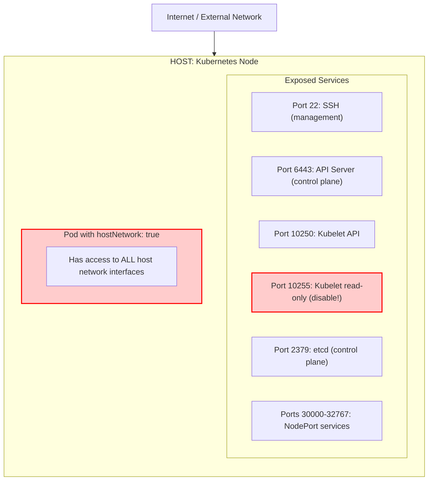
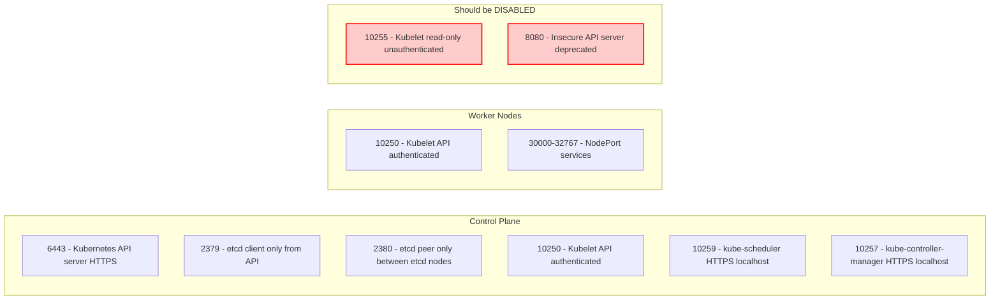
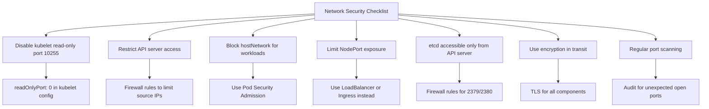

> **Складність**: `[СЕРЕДНЯ]` — адміністрування мережі з акцентом на безпеку
>
> **Час на проходження**: 35-40 хвилин
>
> **Передумови**: Модуль 3.3 (Посилення безпеки ядра), базові знання мереж

---

## Що ви зможете зробити

Після завершення цього модуля ви зможете:

1. **Впровадити** правила брандмауера на рівні вузла, які обмежують трафік до kubelet, API-сервера, etcd, SSH та NodePort, не порушуючи при цьому обов'язкові шляхи передачі даних Kubernetes.
2. **Оцінити** поверхню атаки мережі вузла Kubernetes, зіставляючи свідчення з `ss`, `nmap`, брандмауера та робочих навантажень.
3. **Спроєктувати** правила сегментації мережі для etcd, API-сервера, kubelet, SSH, NodePort та трафіку CNI у кластерах Kubernetes 1.35+.
4. **Діагностувати** робочі навантаження, які використовують `hostNetwork: true`, і застосувати межі Pod Security Admission навколо просторів імен застосунків.
5. **Налагодити** налаштування мережевих sysctl, які зменшують ризик перенаправлень, маршрутизації від джерела, SYN-флуду та підміни пакетів на вузлах Kubernetes.

---

## Чому цей модуль важливий

Гіпотетичний сценарій: ви успадковуєте кластер Kubernetes, де команди застосунків з гордістю вказують на NetworkPolicy із політикою заборони за замовчуванням (default-deny) у кожному просторі імен. Проте сканування безпеки з корпоративної мережі все одно досягає API kubelet на робочих вузлах, API-сервера в публічній підмережі та діапазону NodePort на кожному вузлі. Усередині мережі Подів немає жодної неправильної конфігурації, та все ж кластер є досяжним через мережу вузла, а це означає, що зловмисник стоїть поза межею CNI та напряму спілкується з процесами Linux.

Цей сценарій трапляється часто, тому що мережа Kubernetes має дві перекривні площини безпеки. NetworkPolicy контролює трафік між Подами після того, як пакет потрапляє до реалізації CNI, тоді як безпека мережі вузла контролює трафік, спрямований на саму операційну систему вузла. Kubelet, API-сервер, etcd, SSH, кінцеві точки перевірки стану kube-proxy та сокети NodePort — це питання, орієнтовані на вузол, тож бездоганна політика Подів не може компенсувати відкритий демон вузла.

Цей модуль навчає операційного рівня, що лежить під мережею Подів. Ви дізнаєтеся, як визначити, які сокети слухають, вирішити, яким джерелам слід дозволити досягати їх, застосувати правила брандмауера вузла, не порушуючи маршрутизацію кластера, вимкнути застарілі неавтентифіковані кінцеві точки, обмежити робочі навантаження `hostNetwork` та налаштувати поведінку мережі ядра. Ставтеся до межі вузла, як до входу в будівлю, а до NetworkPolicy — як до дверей усередині будівлі: обидва мають значення, але вони захищають різні шляхи.

Іспит CKS зазвичай стискає цю тему до прямих завдань, як-от «вимкніть цей небезпечний порт» або «обмежте доступ до цього сервісу». Реальні кластери ухвалюють ті самі рішення під більшим тиском, тому що вузол часто спільно використовують агенти операційної системи, компоненти Kubernetes, інструменти моніторингу та трафік робочих навантажень. Досвідчений оператор не запам'ятовує один універсальний брандмауер; він будує невеликий ланцюжок свідчень, який пов'язує сокет, що слухає, з компонентом, компонент — із зоною довіри, а зону довіри — із правилом, яке можна перевірити.

---

## Межа мережі вузла

Вузол Kubernetes — це насамперед сервер Linux, і лише потім ціль для планувальника. Він виконує звичайні процеси вузла, володіє одним або кількома мережевими інтерфейсами, підтримує таблиці маршрутизації та отримує пакети задовго до того, як API Kubernetes може поміркувати про наміри Подів. Коли віддалений клієнт підключається до сервісу, прив'язаного до IP вузла, пакет завершується в просторі імен мережі вузла, а не всередині звичайного простору імен Пода, керованого втулком CNI.

Тому перше рішення щодо безпеки — це не «який Под може спілкуватися з яким Подом?», а «які мережі можуть спілкуватися з якими сервісами вузла?». Відповідь змінюється залежно від компонента: SSH можна дозволити лише з підмережі бастіону, API-сервер можна дозволити лише адміністраторам та інтеграціям керування, kubelet зазвичай має приймати лише автентифікований трафік площини управління, а etcd має бути досяжним лише для API-сервера та однорангових вузлів etcd. Сервіси NodePort — це небезпечний виняток, оскільки вони навмисно створюють слухачів на всіх вузлах.

Наведена діаграма зберігає вихідну модель поверхні атаки з цього модуля. Зверніть увагу, що небезпечні елементи — це не просто «відкриті порти»; це відкриті порти, які несуть привілейований кластерний сенс. Кінцева точка kubelet лише для читання може розкрити перелік Подів, автентифікована кінцева точка kubelet може стати потужною, якщо облікові дані вкрадено, а Под `hostNetwork` може використовувати простір імен мережі вузла навіть тоді, коли NetworkPolicy у просторах імен виглядають суворими.



Для огляду в терміналі та сама модель корисна як статична карта системи. Діаграма навмисно відокремлює вузол від Пода, тому що ця межа і є суттю модуля. Под, що використовує звичайну мережу, отримує власний простір імен мережі, тоді як процес, що виконується на вузлі або в Поді `hostNetwork`, спільно використовує інтерфейси вузла, маршрути, пристрій loopback та сокети, що слухають.

```text
+-------------------------------------------------------------+
|              HOST NETWORK ATTACK SURFACE                    |
+-------------------------------------------------------------+
|                                                             |
|  Internet / External Network                                |
|     |                                                       |
|     v                                                       |
|  +-----------------------------------------------------+    |
|  |              HOST (Kubernetes Node)                 |    |
|  |                                                     |    |
|  |  Exposed Services:                                 |    |
|  |  +-- :22    SSH (management)                       |    |
|  |  +-- :6443  API Server (control plane)             |    |
|  |  +-- :10250 Kubelet API                            |    |
|  |  +-- :10255 Kubelet read-only (should be disabled) |    |
|  |  +-- :2379  etcd (control plane)                   |    |
|  |  +-- :30000-32767 NodePort services                |    |
|  |                                                     |    |
|  |  Pod with hostNetwork: true                        |    |
|  |  +-- Has access to ALL host network interfaces     |    |
|  |                                                     |    |
|  +-----------------------------------------------------+    |
|                                                             |
|  !! Each open port is a potential entry point               |
|  !! hostNetwork pods bypass CNI isolation                   |
|                                                             |
+-------------------------------------------------------------+
```

Зупиніться та спрогнозуйте: окрім перелічених сервісів Kubernetes, які ще служби Linux на вузлі могли б стати частиною поверхні атаки? Подумайте про агенти моніторингу, експортери вузлів, репозиторії пакетів, інструменти резервного копіювання, локальні дашборди та будь-який власний демон, що прив'язується до `0.0.0.0` замість `127.0.0.1`. Урок не в тому, що кожна служба вузла є поганою; урок у тому, що кожна досяжна служба вузла потребує власника, дозволеного діапазону джерел та методу перевірки.

Робота над безпекою Kubernetes часто зазнає невдачі, коли команди плутають «усередині кластера» з «усередині мережі Подів». Робочий вузол може бути одночасно під'єднаний до хмарних підмереж, корпоративних VPN, цільових груп балансувальників навантаження та адміністративних мереж. Якщо ці мережі можуть напряму досягати портів вузла, політика простору імен робочого навантаження може бути цілком правильною, тоді як вузол усе ще відкриває привілейовані інтерфейси для невідповідної аудиторії.

Напрямок руху пакетів — це найпростіший спосіб тримати рівні в порядку. Трафік до IP Пода зазвичай потрапляє до CNI та підпорядковується моделі політики мережевого втулка, тоді як трафік до IP вузла та порту вузла оцінюється як трафік вузла. NodePort розмиває картину, тому що Kubernetes навмисно встановлює відкриття сервісу на рівні вузла, але для сканерів він усе одно виглядає як слухач вузла. Ось чому проєктування сервісу та проєктування брандмауера вузла слід розглядати разом.

Інтерфейс loopback додає ще одну тонку межу. Сервіс, прив'язаний до `127.0.0.1`, не є віддалено досяжним з іншої машини, та все ж Под `hostNetwork` на тому самому вузлі може досягти цього loopback-сервісу, оскільки він спільно використовує простір імен мережі вузла. Це має значення для дашбордів, кінцевих точок метрик та адміністративних агентів, які були написані з припущенням, що loopback означає «локальний і довірений». На вузлі Kubernetes спільне використання простору імен вузла змінює те, хто може стати локальним.

---

## Обов'язкові порти та зони довіри

Перш ніж написати правило брандмауера, потрібно знати, чи є порт обов'язковим, необов'язковим, лише локальним чи застарілим. Kubernetes документує стандартні порти для площини управління та робочих вузлів, але ці таблиці є радше відправними точками, ніж остаточною політикою. Безпечний набір правил додає обмеження за джерелом, тому що питання полягає не лише в тому, «чи має існувати порт 10250?», а в тому, «які системи взагалі повинні мати змогу досягати 10250?».

Вузли площини управління зазвичай відкривають API-сервер на 6443, клієнтський трафік etcd на 2379, одноранговий трафік etcd на 2380 та kubelet на 10250. Захищені кінцеві точки планувальника та controller-manager зазвичай прив'язуються для локального чи контрольованого доступу, а керовані дистрибутиви можуть відрізнятися за розташуванням. Робочі вузли зазвичай відкривають kubelet на 10250, перевірку стану та метрики kube-proxy на 10256/tcp і можуть відкривати сокети NodePort у діапазоні сервісів, який за замовчуванням становить 30000-32767, якщо кластер не налаштовано інакше.



Наведена нижче статична карта портів є навмисно консервативною. Вона розглядає 10255 та 8080 як знахідки аудиту, а не як звичайні компоненти кластера Kubernetes 1.35+. Вона також розглядає NodePort як рішення щодо відкриття сервісу, а не як автоматичне право отримувати трафік звідусіль, оскільки NodePort робить кожен вузол точкою входу, навіть коли лише частина вузлів наразі розміщує бекенд-Поди.

```text
+-------------------------------------------------------------+
|              KUBERNETES REQUIRED PORTS                      |
+-------------------------------------------------------------+
|                                                             |
|  Control Plane:                                             |
|  ---------------------------------------------------------  |
|  6443   - Kubernetes API server (HTTPS)                     |
|  2379   - etcd client (only from API server)                |
|  2380   - etcd peer (only between etcd nodes)               |
|  10250  - Kubelet API (authenticated)                       |
|  10259  - kube-scheduler (HTTPS, localhost)                 |
|  10257  - kube-controller-manager (HTTPS, localhost)        |
|                                                             |
|  Worker Nodes:                                              |
|  ---------------------------------------------------------  |
|  10250  - Kubelet API (authenticated)                       |
|  10256  - kube-proxy health/metrics (TCP)                   |
|  30000-32767 - NodePort services (if used)                  |
|                                                             |
|  Should be DISABLED:                                        |
|  ---------------------------------------------------------  |
|  10255  - Kubelet read-only port (unauthenticated)          |
|  8080   - Insecure API server port (deprecated)             |
|                                                             |
+-------------------------------------------------------------+
```

Знання про порти стає дієвим, коли його перекладено в зони довіри. Корисна ментальна модель — помістити кожну мережу-джерело в одну з чотирьох категорій: керування адміністратора, внутрішні елементи площини управління, внутрішні елементи зв'язку між вузлами та недовірені клієнти. Більшість привілейованих портів мають приймати лише одну з цих категорій, і правило брандмауера має робити цю категорію видимою, а не покладатися на коментар у runbook.

Зони довіри слід визначати за маршрутами та ідентичністю, а не за розпливчастими мітками на кшталт «приватна». Корпоративна мережа RFC1918 може містити ноутбуки розробників, jump-хости, агенти збірки та скомпрометовані робочі станції, тож дозвіл усього `10.0.0.0/8` до kubelet може бути надто широким у реальному середовищі. Під час іспиту ви можете використати спрощену підмережу із завдання, але під час продакшн-проєктування слід визначити точні адреси площини управління, діапазони бастіонів та джерела автоматизації, які потребують доступу. Що менша група джерел, то легше міркувати про подію крадіжки облікових даних чи бічного переміщення.

| Порт або діапазон | Компонент | Типове дозволене джерело | Рішення щодо безпеки |
|---|---|---|---|
| 22/tcp | SSH | Бастіон або привілейована адмін-підмережа | Обмежуйте суворо та логуйте спроби доступу |
| 6443/tcp | API-сервер | Адмін-мережі, CI/CD, інтеграції керування | Ніколи не залишайте широко публічним без сильних компенсувальних засобів контролю |
| 10250/tcp | API kubelet | Вузли площини управління та автентифіковані операційні інструменти | Блокуйте прямий доступ користувачів та з інтернету |
| 10256/tcp | Перевірка стану/метрики kube-proxy | Площина управління та підмережі моніторингу | Обмежуйте як kubelet; не відкривайте на весь кластер |
| 2379/tcp | Клієнт etcd | Лише API-сервер | Розглядайте як критичний доступ до стану кластера |
| 2380/tcp | Одноранговий etcd | Лише інші учасники etcd | Дозволяйте точні однорангові адреси у складеному чи зовнішньому etcd |
| 30000-32767/tcp | Сервіси NodePort | Клієнтські мережі, специфічні для сервісу | Надавайте перевагу інгресу або балансувальнику навантаження, де це можливо |

Зупиніться та подумайте: порт kubelet лише для читання на 10255, коли він увімкнений, розкриває дані Подів без автентифікації. Чому така кінцева точка існувала історично, і чому вона тепер є таким цінним об'єктом розвідки? Чесна відповідь: операційна зручність та застаріле збирання метрик колись мали інші значення за замовчуванням, тоді як сучасна практика безпеки припускає, що кожна кінцева точка з переліком ресурсів може допомогти зловмиснику спланувати наступний крок.

Не забувайте про IPv6, коли ваше середовище його маршрутизує. Багато швидких аудитів фільтрують лише приклади IPv4, але процес може слухати на `::` та приймати трафік IPv6, навіть якщо шлях IPv4 виглядає обмеженим. Те саме рішення про зону довіри має застосовуватися послідовно в усіх сімействах адрес, хмарних правилах брандмауера та правилах вузла. Якщо кластер навмисно не використовує IPv6, це рішення все одно має бути видимим як вимкнена маршрутизація, відсутні адреси чи правила заборони, а не як неперевірене припущення.

Керовані платформи Kubernetes змінюють власника, а не відповідальність. Вам може бути не дозволено редагувати брандмауер хоста площини управління, але ви все одно вирішуєте, які публічні та приватні мережі можуть досягати кінцевої точки API через конфігурацію провайдера. Для робочих вузлів ви можете керувати групами безпеки, налаштуваннями образу вузла, демонами брандмауера хоста чи політикою допуску замість сирих iptables. Мета залишається тією самою: привілейовані сервіси вузла та кластера повинні мати вузьку, перевірювану досяжність.

---

## Аудит перед блокуванням

Робота над брандмауером має починатися зі спостереження, а не з правила, скопійованого з чек-листа. Вузол має внутрішню правду — те, що ядро насправді слухає, — та зовнішню правду — те, чого може досягти віддалений сканер після застосування хмарних груп безпеки, фізичних брандмауерів, правил хоста та рішень про маршрутизацію. Вам потрібні обидва погляди, тому що будь-який з них окремо може ввести в оману через замовчування.

Команда `ss` дає погляд на сокети з боку ядра і зазвичай переважає над старими звичками з `netstat`. Прапорці мають значення: `-t` обмежує вивід до TCP, `-l` показує сокети, що слухають, `-n` уникає розв'язання імен, яке може сповільнити чи заплутати результат, а `-p` показує процес, що володіє сокетом, коли це дозволяють права. Зовнішнє сканування `nmap` потім відповідає на питання, чи може віддалений зловмисник або адміністратор насправді досягти сервісу.

```bash
# List all listening ports
ss -tlnp

# List all listening ports with process names
sudo netstat -tlnp

# Check specific Kubernetes ports
ss -tlnp | grep -E '6443|10250|2379'

# Check for insecure ports
ss -tlnp | grep -E ':10255|:8080'

# Using nmap from external host
nmap -p 6443,10250,10255,2379 <node-ip>
```

Перед запуском цього аудиту спрогнозуйте, які сокети мають з'явитися на вузлі площини управління, а які — на робочому вузлі. Якщо ви очікуєте однакової відповіді на обох, ви, ймовірно, упускаєте різницю між зоною довіри площини управління та зоною довіри робочого вузла. Цей крок прогнозування робить несподіванки видимими: несподіваний процес на 0.0.0.0 легше помітити, коли ви заздалегідь записали очікуваний набір.

Інтерпретація виводу вимагає уваги до адрес прив'язки. Процес, що слухає на `127.0.0.1:10257`, несе інший ризик, ніж процес, що слухає на `0.0.0.0:10257`, тому що loopback є локальним для вузла, тоді як прив'язка до всіх інтерфейсів приймає трафік на кожній адресі, призначеній хосту. Слухачі IPv6 також заслуговують на огляд; сервіс, обмежений на IPv4, але відкритий на `::`, може створити обхід, якщо мережа маршрутизує IPv6.

Аудит також має зіставляти сокети з об'єктами Kubernetes. Слухач NodePort міг бути створений Сервісом, слухач hostNetwork — DaemonSet, а слухач, який не належить Kubernetes, — агентом моніторингу, встановленим образом вузла. У реагуванні на інциденти це зіставлення вберігає вас від видалення невідповідного компонента та допомагає відрізнити заплановану поведінку кластера від дрейфу.

Побудуйте базову лінію очікуваних портів, перш ніж досліджувати винятки. На вузлі площини управління порти API-сервера та etcd можуть бути очікуваними, тоді як ті самі порти на робочому вузлі були б підозрілими, якщо дистрибутив не виконує там складених компонентів. На робочому вузлі kubelet та кінцеві точки перевірки стану kube-proxy можуть бути очікуваними, тоді як невідомий дашборд керування на всіх інтерфейсах заслуговує на негайний перегляд щодо власника. Базові лінії не є статичними назавжди, але вони дають вам захищену відправну точку для сортування.

Власник процесу — це також сигнал безпеки. Слухач, яким володіє `kubelet`, `kube-apiserver` чи `etcd`, вказує на компонент Kubernetes, конфігурацію якого ви можете перевірити через відомі файли чи маніфести. Слухач, яким володіє загальний процес Python, Node.js чи Java, може бути агентом, робочим навантаженням, що втекло на хост, або несанкціонованою службою. Вивід команди стає ціннішим, коли ви пов'язуєте його з юнітами systemd, маніфестами статичних Подів, належністю пакетів та об'єктами Kubernetes.

Віддалені сканування слід виконувати зі значущих місць. Сканування з самого вузла дуже мало доводить щодо зовнішньої досяжності, а сканування з довіреного бастіону доводить лише дозволений шлях. Для реальної межі скануйте з дозволеного джерела адміністратора, звичайної підмережі робочих навантажень та недовіреного чи інтернет-подібного джерела, де це можливо. Заборонене сканування є таким самим важливим, як і дозволене, тому що воно доводить, що правило робить щось більше, ніж просто зберігає доступність.

---

## Брандмауери вузла, що не ламають Kubernetes

Брандмауери вузла захищають шлях `INPUT` у Linux: трафік, призначений для самого вузла. Вони не є заміною хмарних груп безпеки, фізичних брандмауерів, NetworkPolicy Kubernetes чи політики service mesh, але вони додають локальну точку примусового виконання, яка подорожує разом із вузлом. Корисне правило брандмауера вузла є явним щодо протоколу, порту призначення, мережі-джерела та поведінки за замовчуванням.

Головна операційна небезпека полягає в тому, що Kubernetes також використовує механізми фільтрації та пересилання пакетів Linux. Kube-proxy, CNI та середовища виконання контейнерів можуть створювати стан iptables або nftables для маршрутизації сервісів, маскараду, відстеження з'єднань, інкапсуляції оверлею та перевірок стану. Брандмауер вузла, що блокує невідповідний протокол зв'язку між вузлами, може «посилити» хост, розрізавши мережу Подів, — ось чому модель аудиту та зон довіри має передувати йому.

Перш ніж застосувати `INPUT DROP` за замовчуванням на робочих вузлах, перевірте задокументовані порти та протоколи зв'язку між вузлами вашого CNI. Оверлейні втулки часто потребують інкапсуляції UDP (наприклад, VXLAN на 4789/udp або Geneve на 6081/udp), CNI на основі BGP можуть вимагати TCP 179 між вузлами, а деякі реалізації використовують додаткові керівні порти для IPAM чи перевірки стану тунелю. Сегментація etcd, kubelet та SSH на хості не заміняє дозвіл для керівної площини оверлею; вона доповнює його. Якщо ви не впевнені, прочитайте посібник зі встановлення CNI для вашого дистрибутиву, явно дозвольте ці шляхи, а потім повторно перевірте DNS, маршрутизацію Сервісів та трафік Подів між вузлами після кожної зміни правил хоста.

### Використання iptables

Прямі правила iptables усе ще цінні, тому що вони розкривають фактичне рішення netfilter, яке ухвалюється. У наведеному нижче прикладі порядок правил є частиною моделі безпеки: спочатку дозвольте відомі довірені джерела, потім скиньте решту трафіку до чутливих портів. У продакшні ви адаптуєте діапазони джерел до своїх реальних мереж площини управління, бастіонів та сервісів, а не копіюватимете зразкові адреси.

```bash
# Allow SSH
iptables -A INPUT -p tcp --dport 22 -j ACCEPT

# Allow Kubernetes API (from specific networks)
iptables -A INPUT -p tcp --dport 6443 -s 10.0.0.0/8 -j ACCEPT

# Allow kubelet API (from control plane)
iptables -A INPUT -p tcp --dport 10250 -s 10.0.0.10/32 -j ACCEPT

# Allow NodePort range (if needed)
iptables -A INPUT -p tcp --dport 30000:32767 -j ACCEPT

# Block everything else
iptables -A INPUT -p tcp --dport 6443 -j DROP
iptables -A INPUT -p tcp --dport 10250 -j DROP

# Save rules
iptables-save > /etc/iptables/rules.v4
```

Зразок навмисно залишає NodePort широким, тому що він зберігає захищений ресурс із вихідного модуля, але реальна безпечна конфігурація має рідко дозволяти весь діапазон NodePort з будь-якого джерела. Якщо NodePort потрібен для іспитового завдання чи лабораторної роботи, дозвольте лише ті конкретні клієнтські мережі, які його потребують. Якщо сервіс є публічним, надавайте перевагу балансувальнику навантаження, контролеру інгресу чи шляху Gateway API, де TLS, логування та централізовану політику легше експлуатувати.

### Використання UFW (Ubuntu)

UFW дружніший у системах Ubuntu, але це все одно фронтенд до правил фільтрації пакетів. Зрозумілий синтаксис допомагає під час іспитів та операцій, тому що обмеження за джерелом очевидні з першого погляду. Компроміс полягає в тому, що значення за замовчуванням та порядок UFW можуть здивувати команди, які припускають, що він розуміє мережу Kubernetes, тож завжди перевіряйте трафік Подів та шляхи між вузлами після його ввімкнення.

```bash
# Enable UFW
sudo ufw enable

# Allow SSH
sudo ufw allow ssh

# Allow Kubernetes API from internal network
sudo ufw allow from 10.0.0.0/8 to any port 6443

# Allow kubelet from control plane
sudo ufw allow from 10.0.0.10 to any port 10250

# Check status
sudo ufw status verbose
```

### Використання firewalld (RHEL/CentOS)

Firewalld поширений на вузлах Enterprise Linux і організовує правила через зони та сервіси. Ця модель корисна, коли інтерфейси належать до різних рівнів довіри, як-от приватна мережа кластера та мережа керування. Небезпека полягає в тому, що постійне додавання порту без обмеження за джерелом може бути надто широким, тож ставтеся до цих команд як до мінімального словника, а не як до остаточного шаблону політики.

```bash
# Allow Kubernetes API
sudo firewall-cmd --permanent --add-port=6443/tcp

# Allow kubelet
sudo firewall-cmd --permanent --add-port=10250/tcp

# Reload
sudo firewall-cmd --reload

# Check open ports
sudo firewall-cmd --list-ports
```

Після будь-якої зміни брандмауера тестуйте принаймні з двох місць: одного джерела, яке має бути дозволеним, та одного джерела, яке має бути забороненим. Локальний результат `ss` може показати, що сервіс усе ще слухає, але лише віддалений тест може довести, що політика правильно фільтрує шлях. Для вузлів Kubernetes також перевірте, що Поди все ще можуть розв'язувати DNS, досягати сервісів та спілкуватися між вузлами, коли CNI очікує такої поведінки.

Збереження є частиною правильності. Команда iptables, набрана під час іспиту, може бути прийнятною, якщо завдання вимагає негайного усунення проблеми, але продакшн-посилення має пережити перезавантаження, заміну вузла та ротацію образів. Це може означати `iptables-save`, юніт systemd, cloud-init, запікання образу, керування конфігурацією чи підтримуваний дистрибутивом інтерфейс брандмауера. Правило, що зникає під час перезапуску вузла, є операційно еквівалентним тимчасовому винятку.

Порядок правил заслуговує на таку саму увагу, як і їхній зміст. Традиційні ланцюжки iptables оцінюються згори донизу, тож раннє широке прийняття може зробити пізніше скидання нерелевантним, а раннє широке скидання може заблокувати пізніший конкретний дозвіл. Переглядаючи вузол під тиском, перевіряйте номери рядків та вставляйте правила обдумано, а не лише додавайте їх у кінець. Різниця між `-I` та `-A` може бути різницею між точним винятком та правилом, яке ніколи не набуває чинності.

Багато сучасних дистрибутивів використовують nftables під капотом iptables-сумісних команд. Це не скасовує іспитові концепції, але означає, що продакшн-команди мають знати, який бекенд використовують їхні вузли і який інструмент володіє остаточним набором правил. Змішування UFW, firewalld, kube-proxy, правил CNI та ручних команд без чіткого власника може дати заплутані результати. Обирайте один операційний інтерфейс для постійної політики хоста, коли це можливо, а потім документуйте, де починаються правила, керовані Kubernetes.

Хмарні брандмауери та брандмауери вузла є взаємодоповнювальними засобами контролю. Хмарна група безпеки може зупинити небажані пакети до того, як вони досягнуть вузла, що зменшує шум та відкритість, тоді як брандмауер вузла все одно захищає вузол, якщо його переміщено, під'єднано до іншої підмережі чи неправильно класифіковано інфраструктурним кодом. Для чутливих портів, як-от kubelet та etcd, використання обох рівнів є розумним. Головне — тримати правила достатньо узгодженими, щоб усунення несправностей не перетворювалося на здогадки.

Зупиніться та подумайте: ви налаштували правила брандмауера вузла для kubelet, API-сервера та etcd. Як би ви довели, що легітимний трафік площини управління все ще працює, тоді як робочу станцію в недовіреній підмережі заблоковано? Сильна відповідь включає як позитивні, так і негативні тести, тому що «з мого shell усе ще працює» — це не те саме, що задокументована межа.

---

## Вимкнення застарілих кінцевих точок та контроль Подів із мережею хоста

Частина найкращого посилення безпеки мережі вузла полягає просто у видаленні слухачів, яких не повинно існувати. Порт kubelet лише для читання — класичний приклад: коли він увімкнений, він надає неавтентифіковану інформацію про Поди на вузлі, тож сучасні кластери мають тримати його вимкненим. Скидання на брандмауері корисне як ешелонований захист, але вимкнення кінцевої точки видаляє сервіс, а не просто приховує його від одного мережевого шляху.

Файл конфігурації kubelet зазвичай керується процесом завантаження вузла, kubeadm чи специфічним для дистрибутиву агентом. На самокерованих вузлах установіть `readOnlyPort: 0` у конфігурації kubelet та перезапустіть службу. Якщо порт зберігається після перезапуску, шукайте прапорці командного рядка, згенеровану конфігурацію, drop-in-файли systemd чи агента вузла, який переписує конфігурацію kubelet під час узгодження.

```bash
# /var/lib/kubelet/config.yaml
# readOnlyPort: 0  # Disable read-only port (10255)

# Restart kubelet
sudo systemctl restart kubelet

# Verify
ss -tlnp | grep 10255  # Should return nothing
```

Старий небезпечний порт API-сервера належить до тієї самої категорії історичного ризику. Кластери Kubernetes 1.35+ не повинні покладатися на неавтентифіковану кінцеву точку API, а старіші згадки про `--insecure-port=0` слід читати як історичні рекомендації з посилення безпеки. Ваша операційна перевірка є простою: ніщо не повинно слухати на 8080 як небезпечна кінцева точка API-сервера.

```bash
# The insecure API port (8080) was removed in releases before 1.35; it is absent on 1.35+ clusters.
# On legacy clusters only, ensure it stays disabled:
# --insecure-port=0 in API server flags

# Verify no insecure port
ss -tlnp | grep ':8080'
```

Друга категорія видалення менш очевидна, тому що слухача може створити робоче навантаження. Под із `hostNetwork: true` приєднується до простору імен мережі вузла та може прив'язувати порти хоста, отримувати доступ до локальних служб вузла й обходити звичайну ізоляцію мережі Подів. Це налаштування є легітимним для деяких системних агентів, CNI, проксі та інструментів безпеки, але воно рідко доречне для робочих навантажень застосунків.

```yaml
# hostNetwork: true bypasses CNI
apiVersion: v1
kind: Pod
metadata:
  name: host-network-pod
spec:
  hostNetwork: true  # Pod uses node's network namespace!
  containers:
  - name: app
    image: nginx

# This pod can:
# - Bind to any port on the host
# - See all network traffic
# - Access localhost services
# - Bypass NetworkPolicies
```

Що сталося б, якби Под було розгорнуто з `hostNetwork: true` у просторі імен, який має сувору NetworkPolicy із політикою заборони за замовчуванням? Політика все ще може існувати, але Под більше не використовує звичайний простір імен мережі Подів, який покликана регулювати політика CNI. Ось чому контроль допуску належить до проєктування, а не лише до мережевої політики під час виконання.

Pod Security Admission дає вам нативний контроль на рівні простору імен для цієї межі. Профілі `restricted` та `baseline` обидва забороняють `hostNetwork` для звичайних робочих навантажень, тоді як привілейовані системні простори імен можна обробляти як навмисні винятки. Важливий операційний момент — не позначати кожен простір імен однаково; натомість тримайте простори імен застосунків обмежувальними та робіть будь-який привілейований простір імен малим, іменованим, переглянутим та придатним для аудиту.

```yaml
# Use Pod Security Admission to block
apiVersion: v1
kind: Namespace
metadata:
  name: secure-ns
  labels:
    pod-security.kubernetes.io/enforce: restricted
    # 'restricted' blocks hostNetwork: true
```

Діагностика використання мережі хоста вимагає як політики допуску, так і інвентаризації. Наявні системні DaemonSet можуть уже використовувати мережу хоста, тож сліпа заборона може зламати кластер. Безпечніша послідовність — перелічити поточні Поди `hostNetwork`, відокремити системні компоненти від робочих навантажень застосунків, позначити простори імен застосунків як `restricted` та задокументувати будь-який простір імен-виняток із чітким власником та регулярністю перегляду.

Політика допуску запобігає новому дрейфу, тоді як інвентаризація знаходить старий дрейф. Якщо ви позначите простір імен як `restricted` сьогодні, наявні Поди, які вже виконуються деінде, можуть не стати автоматично безпечними так, як ви очікуєте, залежно від того, як і коли їх перестворюють. Практичний робочий процес — установити мітки enforce для майбутніх змін, провести аудит поточних робочих навантажень та перекотити чи замінити все, що порушує запланований профіль. Засоби контролю безпеки найсильніші, коли присутні і запобігання, і виявлення.

Винятки для мережі хоста мають бути вузькими як за простором імен, так і за призначенням. DaemonSet CNI, локальний кеш DNS вузла чи привілейований сенсор безпеки можуть виправдати це налаштування, але звичайний вебзастосунок не повинен використовувати його лише для того, щоб прив'язати зручний порт. Коли виняток необхідний, тримайте сервісний акаунт, образ, можливості та RBAC щільно обмеженими. Спільне використання мережі хоста прибирає одну межу ізоляції, тож решта меж повинні нести більше навантаження.

---

## Посилення безпеки мережі ядра та операційні сценарії

Брандмауери вирішують, чи досягають пакети процесу, але ядро Linux також вирішує, як пакети маршрутизуються, перенаправляються, перевіряються та логуються. Налаштування sysctl є тривким інтерфейсом для багатьох із цих рішень. У Kubernetes хитрість полягає в тому, щоб посилити небезпечну поведінку протоколів, не вимикаючи налаштувань, потрібних кластеру для мережі Подів, пересилання сервісів чи роботи CNI.

Наведений нижче чек-лист зберігає вихідний операційний потік модуля та перетворює його на повторювану послідовність. Він починається з видалення застарілих кінцевих точок, оскільки це несе найнижчий ризик сумісності, потім обмежує привілейовані шляхи хоста, потім перевіряє практики шифрування та сканування. Послідовність не є магією, але вона запобігає поширеній помилці: перестрибуванню одразу до скидань брандмауера, перш ніж зрозуміти, що слухає і чому.



Статична версія корисна під час огляду лише в терміналі. Ставтеся до кожного рядка як до питання, на яке потрібно відповісти доказом, а не як до клітинки, яку слід поставити з пам'яті. Наприклад, «etcd досяжний лише з API-сервера» означає, що ви можете назвати дозволені адреси джерел та показати правило чи мережевий засіб контролю, який їх примусово виконує.

```text
+-------------------------------------------------------------+
|              NETWORK SECURITY CHECKLIST                     |
+-------------------------------------------------------------+
|                                                             |
|  [ ] Disable kubelet read-only port (10255)                 |
|      readOnlyPort: 0 in kubelet config                      |
|                                                             |
|  [ ] Restrict API server access                             |
|      Firewall rules to limit source IPs                     |
|                                                             |
|  [ ] Block hostNetwork for regular workloads                |
|      Use Pod Security Admission                             |
|                                                             |
|  [ ] Limit NodePort exposure                                |
|      Use LoadBalancer or Ingress instead                    |
|                                                             |
|  [ ] etcd accessible only from API server                   |
|      Firewall rules for 2379/2380                           |
|                                                             |
|  [ ] Use encryption in transit                              |
|      TLS for all components                                 |
|                                                             |
|  [ ] Regular port scanning                                  |
|      Audit for unexpected open ports                        |
|                                                             |
+-------------------------------------------------------------+
```

Мережеві sysctl посилюють низькорівневу поведінку, яка інакше може допомогти зловмиснику перенаправити чи виснажити трафік. Перенаправлення ICMP можуть переконати хост надсилати пакети через непередбачений шлюз, маршрутизація від джерела може дозволити відправнику впливати на шлях пакетів, а SYN-флуд може спожити стан з'єднань. Ці налаштування не заміняють TLS чи автентифікацію, але вони зменшують готовність ядра приймати ризиковані мережеві підказки від середовища.

Значення sysctl мають область дії, яку легко проґавити. Деякі налаштування застосовуються до `all`, деякі встановлюють замовчування для майбутніх інтерфейсів, а деякі є специфічними для інтерфейсу після того, як інтерфейс уже існує. На вузлі Kubernetes із мостами, оверлейними інтерфейсами, парами віртуального Ethernet та основними мережевими картами зміна лише однієї області може залишити інший шлях зі старою поведінкою. Уважний огляд перевіряє і `all`, і `default`, а потім досліджує специфічні для інтерфейсу значення, коли дистрибутив чи CNI створює додаткові інтерфейси.

```bash
# /etc/sysctl.d/99-network-security.conf

# Disable ICMP redirects (prevent MITM)
net.ipv4.conf.all.accept_redirects = 0
net.ipv4.conf.default.accept_redirects = 0
net.ipv4.conf.all.send_redirects = 0
net.ipv6.conf.all.accept_redirects = 0

# Disable source routing
net.ipv4.conf.all.accept_source_route = 0
net.ipv6.conf.all.accept_source_route = 0

# Enable SYN cookies (SYN flood protection)
net.ipv4.tcp_syncookies = 1

# Log martian packets
net.ipv4.conf.all.log_martians = 1

# Ignore broadcast ICMP
net.ipv4.icmp_echo_ignore_broadcasts = 1

# Ignore bogus ICMP errors
net.ipv4.icmp_ignore_bogus_error_responses = 1

# Apply
sudo sysctl -p /etc/sysctl.d/99-network-security.conf
```

Зупиніться та спрогнозуйте: чому `net.ipv4.conf.all.accept_redirects = 0` та `net.ipv4.conf.all.send_redirects = 0` важливі в багатовузловій мережі Kubernetes? Сильна відповідь пов'язує sysctl із цілісністю шляху: вузли не повинні приймати небажані поради щодо маршрутизації від потенційно ворожих мереж, і вони не повинні ставати відправниками перенаправлень, які навчають інші хости небезпечним шляхам.

Не посилюйте безпеку, вимикаючи передумови Kubernetes. Наприклад, `net.ipv4.ip_forward` зазвичай потрібен для маршрутизації вузла, а налаштування bridge netfilter можуть бути потрібними залежно від CNI та режиму kube-proxy. Базова лінія безпеки, скопійована із загального сервера Linux, може зламати Kubernetes, тому що вузол навмисно є маршрутизатором для трафіку Подів та сервісів. Правильне питання полягає в тому, чи є налаштування небезпечним для цієї ролі, а не в тому, чи звучить воно обмежувально само по собі.

Наведені нижче операції у стилі CKS короткі, тому що іспит цінує швидкість, але міркування, що стоять за ними, не короткі. У кожному випадку команда — це лише останній крок після того, як ви вирішили, який компонент володіє портом, яке джерело має його досягати і як ви перевірите виправлення. Практикуйтеся читати блоки команд як збір доказів плюс усунення проблеми, а не як магічні заклинання.

### Сценарій 1: Вимкнення порту kubelet лише для читання

```bash
# Check if port 10255 is open
ss -tlnp | grep 10255

# Edit kubelet config
sudo vi /var/lib/kubelet/config.yaml

# Add or modify:
# readOnlyPort: 0

# Restart kubelet
sudo systemctl restart kubelet

# Verify
ss -tlnp | grep 10255  # Should be empty
```

Якщо 10255 зберігається, не припускайте, що перезапуск зазнав невдачі, та не повторюйте його раз за разом. Перевірте, чи kubelet читає файл, який ви відредагували, чи прапорець командного рядка перевизначає файл, чи drop-in systemd вказує на інший шлях конфігурації, та чи агент керування вузлом перегенерував конфігурацію. Найшвидша іспитова відповідь часто та, яка перевіряє фактичні аргументи процесу.

### Сценарій 2: Аудит відкритих портів

```bash
# List all listening ports
ss -tlnp

# Compare with expected ports
echo "Expected: 22, 6443, 10250, 10256 (kube-proxy)"
echo "Unexpected ports should be investigated"

# Check for insecure ports
ss -tlnp | grep -E ':10255|:8080'
```

Цей сценарій стосується класифікації. Порт 10256 може бути перевіркою стану kube-proxy, 10250 може бути kubelet, а 22 може бути SSH, але несподіваний високий порт, що слухає на кожному інтерфейсі, потребує власника. Коли ви не можете ідентифікувати процес із `ss -p`, підвищте права за допомогою `sudo`, перевірте юніти systemd та зіставте з об'єктами Kubernetes, перш ніж щось видаляти.

### Сценарій 3: Налаштування брандмауера

```bash
# Allow only the control-plane kubelet client, then drop every other source on 10250
sudo iptables -I INPUT -p tcp --dport 10250 -s 10.0.0.10/32 -j ACCEPT
sudo iptables -A INPUT -p tcp --dport 10250 -j DROP

# Verify: allowed CP IP succeeds; another internal IP (e.g. 10.0.0.20) is denied
sudo iptables -L INPUT -n | grep 10250
# From 10.0.0.10: curl -k https://<node-ip>:10250/healthz  # should work
# From 10.0.0.20: same curl should fail (timeout/refused) — not merely non-CP subnets
```

Пара правил демонструє корисний патерн: спочатку вставте дозволений `/32` площини управління, потім додайте безумовне скидання для того самого порту. Правило на кшталт `! -s 10.0.0.0/8 -j DROP` усе одно дозволяє будь-яку іншу адресу всередині `10.0.0.0/8`, що слабше за «лише площина управління». Порядок правил має значення, тому що в традиційному ланцюжку перемагає перше правило, що збігається. Після застосування правил перевірте стан kubelet з IP площини управління та перевірте заборону з іншого внутрішнього IP, як-от `10.0.0.20`, тому що будь-яка з цих невдач говорить вам, що неправильною є інша частина межі.

### Захист мережевого доступу до etcd

```bash
# etcd should only accept connections from API server
# On etcd node:
sudo iptables -A INPUT -p tcp --dport 2379 -s <api-server-ip> -j ACCEPT
sudo iptables -A INPUT -p tcp --dport 2379 -j DROP

# For etcd peer traffic (multi-node etcd)
sudo iptables -A INPUT -p tcp --dport 2380 -s <etcd-node-1-ip> -j ACCEPT
sudo iptables -A INPUT -p tcp --dport 2380 -s <etcd-node-2-ip> -j ACCEPT
sudo iptables -A INPUT -p tcp --dport 2380 -j DROP
```

Etcd заслуговує на особливу обережність, тому що він зберігає стан кластера та може зберігати Secrets, якщо не налаштовано шифрування в стані спокою. Блокування невідповідного джерела на 2379 може зробити API-сервер нездатним читати чи записувати стан кластера, тоді як надто широке відкриття 2379 може перетворити помилку мережевої досяжності на повну компрометацію кластера. Безпечний метод — визначити точні адреси API-сервера та однорангових вузлів, спочатку застосувати правила дозволу, тримати шлях відкату через SSH та негайно протестувати операції API.

Планування відкату не є необов'язковим, коли ви торкаєтеся мережі хоста віддалено. Погане правило може заблокувати SSH, відрізати kubelet від площини управління чи ізолювати etcd від API-сервера. У продакшні використовуйте вікно обслуговування, тримайте доступну позасмугову консоль чи серійну консоль провайдера та обкатуйте зміни на одному вузлі, перш ніж розгортати їх на весь пул. На іспиті відкат може просто означати знання того, як перелічити пронумеровані правила та видалити те, яке ви щойно додали.

---

## Патерни та антипатерни

Хороша безпека мережі вузла — це не один набір команд. Це повторюваний патерн, який дає кожному сервісу, орієнтованому на вузол, причину для існування, невеликий набір дозволених джерел, метод перевірки та процес винятків. Наведені нижче патерни додають правила ухвалення рішень, яких не було в покрокових прикладах команд, тож використовуйте їх під час проєктування базової лінії кластера, а не під час розв'язання одноразового іспитового завдання.

| Патерн | Використовуйте, коли | Чому він працює |
|---|---|---|
| Привілейовані порти з обмеженням за джерелом | Kubelet, API-сервер, etcd, SSH та адмін-інструменти мають відомих клієнтів | Це зменшує поверхню атаки, не вдаючи, що сервіс може зникнути |
| Розділення системних просторів імен та просторів імен застосунків | CNI, проксі та агенти безпеки легітимно потребують доступу до хоста | Це дозволяє привілейовану інфраструктуру, тримаючи простори імен робочих навантажень обмежувальними |
| Позитивні та негативні мережеві тести | Ви змінюєте брандмауер, групу безпеки чи політику маршрутів | Це доводить як доступність для дозволених джерел, так і заборону для недовірених джерел |
| Інвентаризація власників портів | Аудит знаходить несподіваних слухачів | Це запобігає випадковому видаленню обов'язкових компонентів кластера та виявляє дрейф |

Антипатерни зазвичай починаються з істинного твердження, яке застосовано на невідповідному рівні. «Ми використовуємо NetworkPolicy» — це правда, але вона мало говорить про трафік до вузла. «Kubelet автентифікований» — це правда, але він усе одно не повинен бути досяжним з кожної робочої станції. «NodePort зручний» — це правда, але він розширює кількість зовнішньо досяжних сокетів по всьому флоту.

| Антипатерн | Що йде не так | Краща альтернатива |
|---|---|---|
| Покладання лише на NetworkPolicy CNI | Сервіси хоста залишаються досяжними поза мережею Подів | Додайте брандмауер вузла чи хмарні мережеві засоби контролю для портів вузла |
| Публічне відкриття всього діапазону NodePort | Кожен вузол стає точкою входу для сервісу | Надавайте перевагу інгресу, Gateway API чи балансувальнику навантаження з обмеженими правилами |
| Позначення всіх просторів імен як привілейованих для зручності | Поди застосунків можуть запитувати мережу хоста та простори імен хоста | Тримайте привілейовані мітки лише на контрольованих системних просторах імен |
| Застосування правил брандмауера без знання CNI | Оверлей, BGP, DNS чи трафік сервісів ламається | Документуйте обов'язкові порти CNI та тестуйте шляхи Под-до-Пода після змін |

Питання масштабування — це власність. Малий кластер може пережити правило, відредаговане вручну для іспиту, але продакшн-флот потребує тієї самої політики, представленої у збірці образу, завантаженні, керуванні конфігурацією, хмарних правилах брандмауера та перевірках аудиту. Коли ці рівні не узгоджуються, найменш обмежувальний рівень зазвичай стає тим, який зловмисник знаходить першим.

Ще один корисний патерн — старіння винятків. Винятки для мережі хоста, широке відкриття NodePort та тимчасові відкриття брандмауера мають мати термін дії чи тригер перегляду, тому що тимчасовий доступ часто стає постійним через недбалість. У зрілій платформі запис про виняток називає власника, бізнес-причину, дозволений діапазон джерел та доказ того, що вужчого шляху не було практично. Це не бюрократія; це те, як майбутні оператори дізнаються, чи є відкриття все ще навмисним.

Моніторинг має валідувати межу безперервно. Нічне чи щотижневе сканування з відомих точок огляду може вловити порт kubelet лише для читання, який знову з'являється після зміни образу вузла, новий сервіс NodePort, відкритий помилково, чи агент моніторингу, який змінив свою адресу прив'язки. Сповіщення має включати достатньо контексту, щоб направити знахідку правильному власнику. Без безперервних перевірок посилення безпеки мережі вузла повільно занепадає, оскільки кластери оновлюються, а команди додають інструменти.

---

## Структура ухвалення рішень

Використовуйте цю структуру, вирішуючи, як захистити орієнтований на вузол сервіс Kubernetes. Почніть із запитання, чи потрібен слухач узагалі; якщо він застарілий чи неактуальний, видаліть його замість того, щоб фільтрувати. Якщо слухач потрібен, визначте найменшу групу джерел, яка його потребує, оберіть рівень примусового виконання, найближчий до шляху трафіку, а потім запустіть як позитивні, так і негативні тести.

| Питання для рішення | Якщо так | Якщо ні |
|---|---|---|
| Чи є слухач застарілим або неавтентифікованим? | Вимкніть його, потім перевірте, що його немає, за допомогою `ss` та віддалених сканувань | Продовжуйте класифікувати його обов'язкових клієнтів |
| Чи обслуговує слухач лише трафік площини управління? | Обмежте до адрес площини управління та мереж керування | Розглядайте його як відкриття сервісу та проєктуйте доступ клієнтів обдумано |
| Чи запитує робоче навантаження мережу хоста? | Вимагайте системного простору імен, перегляду власника та винятку PSA | Тримайте простір імен у профілі `restricted` |
| Чи впливає правило брандмауера на трафік CNI? | Тестуйте DNS, маршрутизацію сервісів та зв'язок Подів між вузлами | Тестуйте лише дозволені та заборонені шляхи, специфічні для сервісу |
| Чи потрібен NodePort за задумом? | Обмежте діапазони джерел та розгляньте `externalTrafficPolicy: Local`, де це доречно | Надавайте перевагу відкриттю через інгрес, Gateway API чи LoadBalancer |

Найважливіший компроміс — між досяжністю та радіусом ураження. Широко досяжний API-сервер чи kubelet легше експлуатувати під час надзвичайних ситуацій, але він також дає кожному скомпрометованому мережевому сегменту прямий шлях до привілейованих компонентів кластера. Щільно обмежена межа вимагає кращих шляхів керування та моніторингу, але вона ускладнює перетворення випадкового відкриття та зловживання обліковими даними на доступ у масштабах усього кластера.

Для іспитової роботи оптимізуйте під чітке, оборотне виправлення, яке доводить суть під тиском часу. Для продакшн-роботи оптимізуйте під повторюваність та докази: правила мають пережити перезавантаження, заміну вузла та оновлення кластера, а аудитор має бути здатним зрозуміти, чому існує кожен виняток. Та сама технічна команда може бути прийнятною в лабораторії та неповною у флоті, якщо їй бракує збереження, власності та перевірки.

Коли два засоби контролю можуть розв'язати те саме відкриття, надавайте перевагу тому, який прибирає ризик у джерелі. Вимкнути 10255 краще, ніж лише скинути його, тому що не залишається неавтентифікованого сервісу, який можна виявити через інший шлях. Обмежити простір імен за допомогою Pod Security краще, ніж сподіватися, що кожен розробник пам'ятатиме не встановлювати `hostNetwork`. Брандмауери залишаються істотними, але найчистіша межа безпеки часто поєднує видалення, запобігання на рівні допуску та мережеву фільтрацію.

Структура ухвалення рішень також допомагає уникнути хибної впевненості від формулювань на кшталт «безпечний за замовчуванням». Багато значень за замовчуванням є безпечнішими в Kubernetes 1.35+, ніж вони були в старіших кластерах, але оновлення, латки дистрибутивів, прапорці завантаження та застарілі образи вузлів усе ще можуть створювати несподіваний стан. Перевіряйте живий вузол, а не довіряйте лише версії. Безпечне замовчування — це корисне припущення для перевірки, а не доказ сам по собі.

---

## Чи знали ви?

- Kubernetes документує 6443/tcp як захищений порт API-сервера за замовчуванням та 10250/tcp як порт API kubelet, тому обидва неодноразово з'являються в завданнях CKS на посилення безпеки мережі.
- Діапазон сервісів NodePort за замовчуванням становить 30000-32767, тож відкриття однієї функції NodePort може створити широку поверхню для сканування, якщо зовнішні мережеві засоби контролю не звужують досяжні шляхи.
- Профілі Pod Security Standards `restricted` та `baseline` обидва забороняють `hostNetwork` (поряд з іншими полями простору імен хоста в `restricted`), що робить PSA нативним способом блокувати Поди з мережею хоста в просторах імен застосунків.
- Etcd використовує 2379/tcp для клієнтського трафіку та 2380/tcp для однорангового трафіку, тож топологія etcd з кількома учасниками потребує різних правил дозволу для клієнтів API-сервера та реплікації etcd-до-etcd.

---

## Типові помилки

Наведені нижче помилки — це конкретні режими збою, які ви маєте вміти розпізнавати під час завдання CKS чи огляду посилення безпеки вузла. Кожна з них має безпечнішу заміну, яка зберігає обов'язкову поведінку Kubernetes, водночас зменшуючи непотрібну досяжність. Якщо ви можете пояснити, чому помилка трапляється, ви менш схильні застосувати жорсткий чек-лист, який ламає кластер.

| Помилка | Чому вона трапляється | Як її виправити |
|---|---|---|
| Залишення 10255 відкритим | Застарілі налаштування kubelet чи старі образи вузлів тримають неавтентифіковану кінцеву точку живою | Установіть `readOnlyPort: 0`, перезапустіть kubelet та перевірте, що порту немає |
| Дозвіл kubelet з кожної внутрішньої підмережі | Команди вважають «усередині мережі» достатньо довіреним для привілейованих API вузла | Обмежте 10250 до площини управління та схвалених джерел операцій |
| Широка публікація NodePort | NodePort здається швидким способом протестувати сервіси без проєктування інгресу | Надавайте перевагу інгресу, Gateway API чи LoadBalancer; обмежуйте джерела NodePort, коли потрібно |
| Застосування UFW без дозволів для CNI | Посилення безпеки хоста виконано без перевірки вимог оверлею чи маршрутизації | Документуйте порти CNI та тестуйте DNS плюс трафік Подів між вузлами після ввімкнення правил |
| Позначення просторів імен робочих навантажень як привілейованих | Системні DaemonSet потребують винятків, і команди копіюють мітку надто широко | Тримайте простори імен застосунків `restricted` та ізолюйте привілейовані агенти деінде |
| Блокування etcd до підтвердження адрес API-сервера | Оператор знає, що 2379 чутливий, але вгадує адреси джерел | Спочатку визначте адреси API-сервера та однорангових вузлів, потім застосуйте правила дозвіл-перед-скиданням |
| Довіра лише локальним перевіркам сокетів | `ss` показує слухачів, але не зовнішню досяжність через брандмауери та маршрути | Поєднуйте локальний `ss` із віддаленими скануваннями з дозволених та заборонених мереж |

---

## Тест

Використовуйте ці сценарії, щоб перевірити, чи можете ви обрати правильний рівень контролю. Кожна відповідь пояснює механізм, виправлення та причину, чому спокуслива альтернатива є неповною.

<details>
<summary>Питання 1: Пентестер у вашій корпоративній мережі запускає `curl http://worker-node-ip:10255/pods` та отримує перелік Подів з робочого вузла. Ваші NetworkPolicy у просторах імен суворі. Як тестувальник обійшов їх і що вам слід змінити?</summary>

Тестувальник досягнув порту kubelet лише для читання в мережі хоста, тож запит ніколи не залежав від трафіку Под-до-Пода, керованого NetworkPolicy. Вимкніть кінцеву точку за допомогою `readOnlyPort: 0`, перезапустіть kubelet та перевірте, що 10255 більше не слухає. Додайте скидання на брандмауері вузла як ешелонований захист, але не вважайте фільтрацію єдиним виправленням, тому що неавтентифікованої кінцевої точки не повинно існувати. NetworkPolicy залишається корисною для трафіку робочих навантажень, але це невідповідна площина контролю для сокетів хоста.
</details>

<details>
<summary>Питання 2: Ваша команда позначає простори імен застосунків профілем Pod Security `restricted`, але kube-proxy та CNI все одно виконуються з `hostNetwork: true` у системних просторах імен. Чи є це збоєм політики?</summary>

Ні, це може бути правильним розподілом обов'язків, якщо виняток обмежено системними просторами імен із чітким власником. Деякі інфраструктурні компоненти потребують мережі хоста для реалізації мережі вузла, проксіювання чи спостереження, тоді як робочі навантаження застосунків зазвичай — ні. Тримайте простори імен застосунків обмежувальними, уникайте широкого застосування привілейованих міток та проводьте аудит системних просторів імен окремо. Неправильним виправленням було б послабити кожен простір імен лише тому, що один системний DaemonSet потребує доступу до хоста.
</details>

<details>
<summary>Питання 3: Ви плануєте обмежити etcd на 2379 та 2380 за допомогою iptables. Що ви маєте визначити, перш ніж додавати правила скидання, і який збій говорить вам, що набір правил неправильний?</summary>

Ви маєте визначити адреси API-сервера для клієнтського трафіку etcd та адреси учасників etcd для однорангового трафіку. Додайте правила дозволу для цих джерел перед ширшими скиданнями, потім негайно протестуйте операції API Kubernetes. Якщо виклики `kubectl` зависають або API-сервер повідомляє про помилки сховища, ви могли заблокувати API-сервер від etcd. Неправильний підхід — спочатку скинути 2379 з «усього» та сподіватися, що площина управління продовжить працювати.
</details>

<details>
<summary>Питання 4: Сервіс NodePort слухає на порту 31337 на кожному робочому вузлі, хоча бекенд-Поди виконуються лише на двох вузлах. Яка наслідок для безпеки і які альтернативи зменшують відкритість?</summary>

NodePort робить кожен вузол точкою входу для діапазону цього сервісу, тож відкрита поверхня може бути більшою за набір вузлів, що виконують Поди. Зловмисник може сканувати кожен IP вузла в діапазоні NodePort та виявити досяжні сервіси, навіть коли розміщення застосунків вузьке. Надавайте перевагу інгресу, Gateway API чи LoadBalancer, коли сервіс має бути зовнішньо досяжним через контрольовану точку. Якщо NodePort потрібен, обмежте діапазони джерел та розгляньте, чи відповідає `externalTrafficPolicy: Local` задуму.
</details>

<details>
<summary>Питання 5: Після ввімкнення UFW на робочому вузлі Поди на цьому вузлі не можуть досягати Подів на інших вузлах, але локальні служби хоста все ще відповідають. Що, ймовірно, сталося?</summary>

Брандмауер, імовірно, заблокував трафік, потрібний CNI, як-от інкапсуляцію, маршрутизацію, BGP чи інший зв'язок між вузлами. Служби хоста все ще можуть відповідати, тому що правила дозволили локальні порти керування, водночас випадково розрізавши шлях даних мережі Подів. Перегляньте документацію CNI щодо обов'язкових портів та протоколів, потім додайте мінімальні дозволи та повторно протестуйте DNS плюс зв'язок Подів між вузлами. Неправильний висновок — що Kubernetes зламано; брандмауер змінив мережу під ним.
</details>

<details>
<summary>Питання 6: Вузол приймає повідомлення про перенаправлення ICMP та починає маршрутизувати трафік через непередбачений шлюз. Яке сімейство sysctl вам слід перевірити і чому це має значення?</summary>

Перевірте `net.ipv4.conf.*.accept_redirects`, `net.ipv4.conf.*.send_redirects` та відповідне налаштування перенаправлень IPv6, де це застосовно. Перенаправлення можуть бути корисними в простих мережах, але в посиленому середовищі Kubernetes вони можуть дозволити зловмисному чи скомпрометованому учаснику мережі вплинути на шляхи пакетів. Установіть значення, пов'язані з перенаправленнями, на `0` через постійний файл у `/etc/sysctl.d/` та перезавантажте їх. Виправлення зменшує ризик маніпуляції шляхом, але не заміняє шифрування та автентифікацію.
</details>

<details>
<summary>Питання 7: Ви запускаєте `ss -tlnp` та знаходите сервіс, що слухає на `0.0.0.0:9100` на кожному вузлі. Як вам слід оцінити його, перш ніж вирішувати, блокувати його чи ні?</summary>

Спочатку визначте процес-власник та чи є він очікуваним, як-от експортер вузла чи агент моніторингу. Потім вирішіть, які системи моніторингу мають його досягати та чи має він прив'язуватися до приватного інтерфейсу, loopback чи обмеженого діапазону джерел. Протестуйте з дозволеного джерела моніторингу та з недовіреного джерела після застосування контролю. Сліпе блокування може зламати спостережуваність, але залишення кінцевої точки з переліком ресурсів широко досяжною створює непотрібну цінність для розвідки.
</details>

---

## Практична вправа

У цій вправі ви виконаєте огляд безпеки мережі вузла так, ніби готуєте вузол до аудиту у стилі CKS. Використовуйте одноразовий лабораторний вузол чи пов'язане середовище Killercoda, а не продакшн-систему. Мета — зібрати докази, класифікувати ризик та застосувати найменший безпечний шлях усунення проблеми.

Почніть із письмового очікування щодо вузла, який ви перевіряєте. Вузол площини управління та робочий вузол не мають однакових очікуваних сокетів, а лабораторний кластер може відрізнятися від керованого продакшн-дистрибутиву. Тому ваш чек-лист має фіксувати спостереження та рішення, а не лише вивід команд.

- [ ] Оцініть усі сокети TCP, що слухають, та ідентифікуйте процес, який володіє кожним орієнтованим на вузол портом Kubernetes.
- [ ] Діагностуйте, чи слухають на вузлі небезпечні застарілі кінцеві точки, особливо 10255 та 8080.
- [ ] Упровадьте чи опишіть правила брандмауера на рівні вузла, які обмежують джерела kubelet, API-сервера, SSH, NodePort та etcd.
- [ ] Налагодьте значення мережевих sysctl для перенаправлень, маршрутизації від джерела, SYN-cookies, логування martian-пакетів та широкомовного ICMP.
- [ ] Діагностуйте всі Поди, що використовують `hostNetwork: true`, та класифікуйте їх як системні винятки чи порушення робочих навантажень.
- [ ] Спроєктуйте план перевірки з одним тестом дозволеного джерела та одним тестом забороненого джерела для кожного чутливого слухача.

<details>
<summary>Посібник із розв'язання: рекомендована послідовність аудиту</summary>

Почніть з `ss -tlnp` та запишіть слухачів, перш ніж щось змінювати. Відфільтруйте відомі порти Kubernetes, потім запустіть віддалене сканування з джерела, яке представляє зловмисника чи недовіреного клієнта. Перевірте конфігурацію kubelet щодо `readOnlyPort`, запитайте значення sysctl, перелічіть правила брандмауера та проведіть інвентаризацію Подів `hostNetwork` через API. Усувайте проблему лише після того, як зможете пояснити, який компонент володіє кожним слухачем і яка мережа-джерело має його досягати.
</details>

<details>
<summary>Перегляньте повний скрипт аудиту</summary>

```bash
# Step 1: Check all open ports
echo "=== Open Ports ==="
ss -tlnp

# Step 2: Check for insecure ports
echo "=== Insecure Ports Check ==="
ss -tlnp | grep -E ':10255|:8080' && echo "WARNING: Insecure ports open!" || echo "OK: No insecure ports"

# Step 3: Check kubelet read-only port configuration
echo "=== Kubelet Config ==="
grep -i readOnlyPort /var/lib/kubelet/config.yaml 2>/dev/null || echo "Check on actual node"

# Step 4: Check network sysctl settings
echo "=== Network Security Sysctl ==="
sysctl net.ipv4.conf.all.accept_redirects
sysctl net.ipv4.conf.all.send_redirects
sysctl net.ipv4.tcp_syncookies

# Step 5: List current firewall rules (if any)
echo "=== Firewall Rules ==="
sudo iptables -L INPUT -n --line-numbers 2>/dev/null | head -20 || echo "Check iptables on actual node"

# Step 6: Check for pods with hostNetwork
echo "=== Pods with hostNetwork ==="
kubectl get pods -A -o jsonpath='{range .items[?(@.spec.hostNetwork==true)]}{.metadata.namespace}/{.metadata.name}{"\n"}{end}'

# Success criteria:
# - No insecure ports open
# - readOnlyPort: 0 in kubelet config
# - Minimal pods using hostNetwork
```
</details>

<details>
<summary>Посібник із розв'язання: інтерпретація скрипта аудиту</summary>

Ставтеся до скрипта як до відправної точки, а не як до остаточного звіту про відповідність. Якщо небезпечні порти відкриті, вимкніть їх та перевірте, що слухач зник. Якщо з'являється багато Подів `hostNetwork`, відокремте інфраструктурні агенти від робочих навантажень застосунків та перевірте мітки Pod Security простору імен. Якщо налаштування sysctl слабкі, помістіть постійні значення під `/etc/sysctl.d/` та перезавантажте їх, потім підтвердьте, що мережа Kubernetes усе ще працює.
</details>

Критерії успіху для вашого завершеного огляду:

- [ ] Жоден неавтентифікований порт kubelet лише для читання не є досяжним на 10255.
- [ ] Жоден небезпечний слухач API-сервера не є досяжним на 8080.
- [ ] Трафік kubelet та etcd обмежено задокументованими мережами-джерелами.
- [ ] Простори імен застосунків примусово застосовують налаштування Pod Security, які блокують `hostNetwork: true`.
- [ ] Зміни брандмауера перевірено як з дозволених, так і з заборонених місць-джерел.
- [ ] Значення посилення sysctl є постійними та не ламають обов'язкову мережу Kubernetes.

---

## Перевірка знань

> Правила брандмауера вузла для kubelet мають дозволяти конкретний `/32` площини управління, а потім безумовно скидати всі інші джерела на порту 10250; широкий виняток `10.0.0.0/8` усе одно залишає kubelet досяжним з інших внутрішніх адрес, як-от `10.0.0.20`.

---

## Джерела

- https://kubernetes.io/docs/reference/networking/ports-and-protocols/
- https://kubernetes.io/docs/concepts/security/pod-security-standards/
- https://kubernetes.io/docs/concepts/services-networking/service/
- https://kubernetes.io/docs/concepts/services-networking/network-policies/
- https://kubernetes.io/docs/reference/config-api/kubelet-config.v1beta1/
- https://kubernetes.io/docs/reference/command-line-tools-reference/kubelet/
- https://kubernetes.io/docs/tasks/administer-cluster/securing-a-cluster/
- https://kubernetes.io/docs/tasks/administer-cluster/configure-upgrade-etcd/
- https://etcd.io/docs/v3.6/op-guide/security/
- https://man7.org/linux/man-pages/man8/ss.8.html
- https://man7.org/linux/man-pages/man8/iptables.8.html
- https://firewalld.org/documentation/man-pages/firewall-cmd.html
- https://man7.org/linux/man-pages/man8/sysctl.8.html

---

## Наступний модуль

[Частина 4: Мінімізація вразливостей мікросервісів](/k8s/cks/part4-microservice-vulnerabilities/module-4.1-security-contexts/) — Продовжуйте від посилення безпеки вузла до контекстів безпеки контейнерів, Pod Security Admission та безпечніших налаштувань середовища виконання застосунків.
