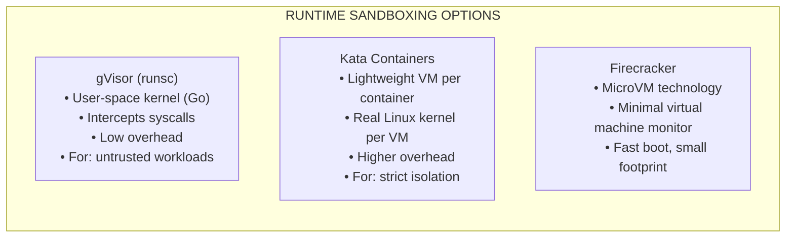
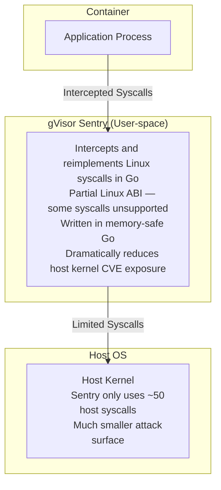
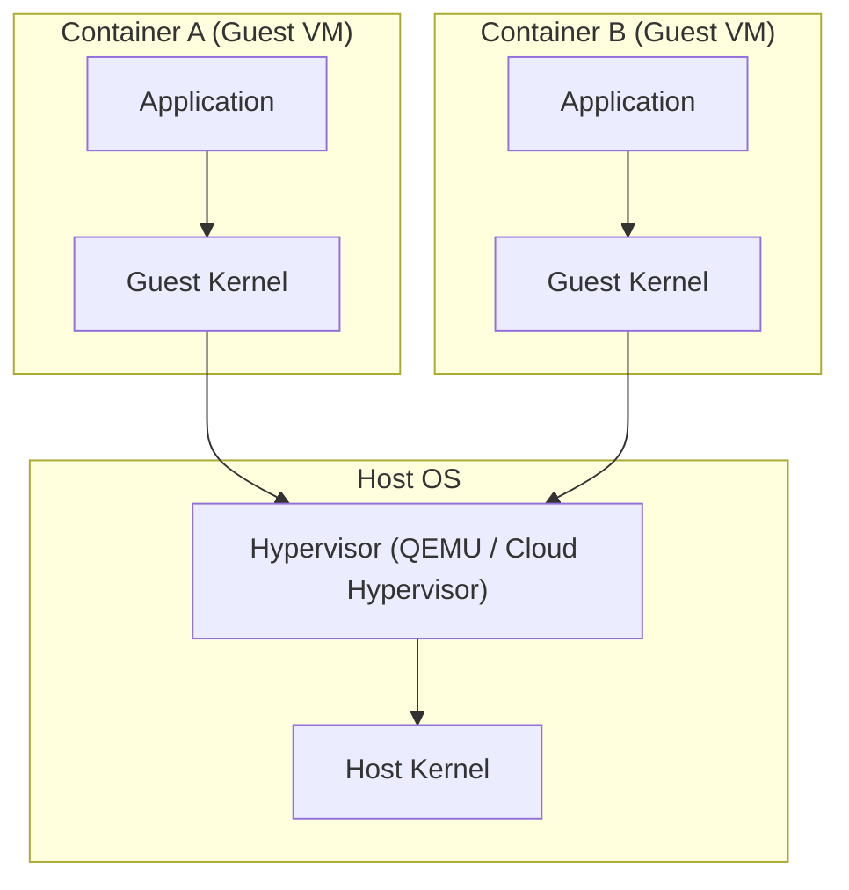
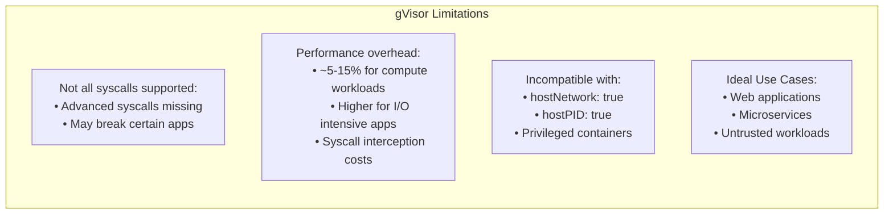

> **Складність**: `[СЕРЕДНЯ]` — розширена ізоляція контейнерів.
>
> **Час на проходження**: 40-45 хвилин.
>
> **Передумови**: Модуль 4.3 (Керування секретами), концепції середовища виконання контейнерів.

## Що ви зможете зробити

Після завершення цього модуля ви зможете пов'язувати вибір середовища виконання з конкретним ризиком робочого навантаження, операційними витратами та екзаменаційною конфігурацією Kubernetes:

- **Оцінювати** гарантії ізоляції та компроміси продуктивності між стандартним runc, gVisor і Kata Containers для різних профілів робочих навантажень.
- **Впроваджувати** ресурси RuntimeClass у Kubernetes, щоб динамічно планувати недовірені робочі навантаження на спеціально ізольовані в пісочниці середовища виконання.
- **Діагностувати** збої сумісності застосунків і планування, спричинені неповною підтримкою системних викликів або відсутністю двійкових файлів середовища виконання на ноді.
- **Проєктувати** стратегію планування на основі ризику, використовуючи `scheduling.nodeSelector` і толерантності, щоб суворо виділити окремі ноди кластера для високоризикових навантажень у пісочниці.

---

## Чому цей модуль важливий

На початку 2019 року світ хмарної інфраструктури сколихнуло розкриття CVE-2019-5736 — руйнівної критичної вразливості, виявленої в середовищі виконання контейнерів `runc`. Оскільки `runc` слугує базовим рушієм для Docker і майже всіх стандартних середовищ Kubernetes, наслідки були повсюдними. Ця вразливість дозволяла шкідливому процесу, запущеному всередині, здавалося б, ізольованого контейнера, вирватися назовні та систематично перезаписати рідний двійковий файл `runc` на хості. Просто виконавши ретельно сформоване корисне навантаження, зловмисник міг миттєво отримати повні права root на ноді хоста. Щойно зловмисник прорветься до рівня хоста, він може горизонтально переміщатися до будь-якого іншого контейнера на цій машині, викачувати надзвичайно чутливі секрети автентифікації безпосередньо з локального kubelet та організувати повну компрометацію всього кластера Kubernetes.

Будь-яка велика мультиорендна платформа, що виконує тисячі незалежних робочих навантажень на спільних ядрах, стикається з екзистенційним ризиком від CVE для виходу з контейнера такого масштабу. Коли орендарі спільно використовують ноди, одна скомпрометована межа може відкрити доступ до сусідніх навантажень, локальних для ноди облікових даних і шляхів керування у масштабі всього кластера. Саме тому CVE-2019-5736 часто згадують як тривожний дзвоник для пісочниці середовища виконання: стандартні контейнери Linux спільно використовують єдине ядро хоста, а простори імен разом із cgroups є межами політики всередині цього ядра, а не окремими межами ядра. Пісочниця середовища виконання додає додатковий рівень ізоляції для навантажень, де відкритий доступ через спільне ядро є неприйнятним.

Саме тут пісочниця середовища виконання стає невід'ємним рівнем архітектури глибокого захисту, який не підлягає обговоренню. Вставляючи надійну, апаратно підкріплену або проксі-засновану межу ізоляції — таку як проксі ядра в просторі користувача на кшталт gVisor або легку мікро-ВМ на кшталт Kata Containers — між контейнеризованим застосунком і базовою операційною системою хоста, інженери платформи можуть ефективно нейтралізувати цілі класи експлойтів нульового дня на рівні ядра. У цьому докладному модулі ви дізнаєтеся, як проєктувати, налаштовувати та безперешкодно планувати ці передові техніки пісочниці для захисту ваших найчутливіших і недовірених навантажень. Опанування цих концепцій ізоляції середовища виконання є не лише критичною навичкою для посилення захисту корпоративних виробничих кластерів, але й ретельно перевіреним наріжним каменем сертифікаційного іспиту CKS.

---

## Проблема ізоляції контейнерів

Щоб по-справжньому зрозуміти, чому пісочниця середовища виконання є необхідною, ми спершу маємо розібрати, як насправді працюють стандартні контейнери Linux під капотом. Коли ви розгортаєте типовий Под у Kubernetes за допомогою стандартного середовища виконання `runc`, ви не створюєте віртуальну машину. Ви просите ядро Linux запустити обмежене дерево процесів, використовуючи простори імен, cgroups, можливості (capabilities), seccomp, модулі безпеки Linux і монтування файлової системи. Простори імен обмежують те, що процес може бачити, наприклад мережеві інтерфейси та ідентифікатори процесів. Контрольні групи обмежують те, що процес може використовувати, наприклад процесор і пам'ять. Середовище виконання збирає ці примітиви в контейнер, а потім завершується після того, як процес контейнера створено.

Ця модель є ефективною, бо немає другої операційної системи для завантаження і немає повної межі гіпервізора, яку треба перетинати. Це також причина того, чому контейнери здаються такими зручними в розробці та на виробництві: вони швидко стартують, щільно пакуються та зберігають звичну семантику процесів Linux. Підступ у безпеці полягає в тому, що кожен звичайний контейнер на ноді все одно використовує те саме ядро хоста. Межа — це межа політики всередині одного ядра, а не окрема межа ядра. Якщо навантаження може дістатися до вразливого інтерфейсу ядра, код, що виконує цей інтерфейс, є тим самим кодом, який захищає ноду, kubelet, середовище виконання контейнерів, локальні облікові дані та кожен інший Под на машині.

Ядро Linux надає великий інтерфейс системних викликів для файлових систем, мережі, керування процесами, відображення пам'яті, сигналів, таймерів, просторів імен і доступу до пристроїв. Профілі seccomp можуть зменшити цю поверхню, а засоби контролю Pod Security можуть заблокувати багато небезпечних форм Подів, але стандартний контейнер `runc` усе одно залежить від того, чи коректно ядро хоста забезпечує кожну відповідну перевірку. Помилка ядра на досяжному шляху може зруйнувати різницю між «усередині контейнера» та «на ноді». Саме цей урок CVE-2019-5736 зробив наочним для багатьох команд платформи: вихід на рівні середовища виконання або ядра — це не просто скомпрометований Под, це скомпрометована одиниця планування для багатьох Подів.

Розгляньмо аналогію з багатоквартирним будинком. Стандартні контейнери — це як окремі квартири в одному великому будинку. Вони мають власні стіни, дверні замки, лічильники комунальних послуг і правила оренди, але всі вони спільно використовують той самий конструктивний фундамент і центральну систему водопостачання. Якщо хтось знайде спосіб пошкодити центральну систему з однієї квартири, постраждає кожен мешканець, бо сам будинок є спільною залежністю. Пісочниця середовища виконання змінює архітектуру, вставляючи другу межу між мешканцем і системами будинку. Мета не в тому, щоб зробити кожну помилку неможливою; мета в тому, щоб найнебезпечніший клас помилок спершу натрапив на меншу, легше замінну або сильніше ізольовану межу.

Діаграма нижче ілюструє цю небезпечну єдину точку відмови в стандартних архітектурах контейнерів. Важлива частина — не кількість контейнерів, а напрямок стрілок: кожен контейнер зрештою просить те саме ядро хоста виконати привілейовані операції від його імені.

```mermaid
flowchart TD
    subgraph Host ["HOST KERNEL (Single point of failure)"]
        Kernel["Kernel exploit from any container = Access to ALL containers and host"]
    end
    subgraph Pods ["STANDARD CONTAINER ISOLATION (runc)"]
        C1["Container A"]
        C2["Container B"]
        C3["Container C (attacker)"]
    end
    C1 -->|Syscalls| Kernel
    C2 -->|Syscalls| Kernel
    C3 -->|[Exploit] Malicious Syscalls| Kernel
```

> **Зупиніться та подумайте**: Стандартні контейнери спільно використовують ядро хоста безпосередньо — усі понад 300 системних викликів ідуть прямо до ядра. gVisor перехоплює ці системні виклики й перереалізовує їх у просторі користувача. Що це означає для зловмисника, який намагається використати вразливість ядра зсередини контейнера в пісочниці gVisor?

---
## Огляд рішень для пісочниці

Щоб пом'якшити ризик спільного ядра, екосистема хмарних технологій розробила альтернативні середовища виконання контейнерів, які додають суворішу межу ізоляції між застосунком і хостом. Цей підхід загалом відомий як пісочниця середовища виконання. API Kubernetes не повинен розуміти кожну деталь реалізації. Він просить kubelet створити Под, kubelet просить реалізацію інтерфейсу середовища виконання контейнерів (CRI) запустити пісочницю Пода, а CRI обирає налаштований обробник, такий як `runc`, `runsc` або `kata-qemu`. Обробник — це місце, де рішення про середовище виконання на рівні ноди стає реальним.

Практична цінність полягає в тому, що платформа може виконувати змішані рівні довіри в одному кластері, не ставлячись до кожного навантаження однаково. Стабільний внутрішній збирач метрик може використовувати звичайний `runc` із сильним Pod Security і щільним профілем seccomp. Публічний запускач коду, сервіс рендерингу браузера, система виконання плагінів або надана орендарем функція можуть запросити сильнішу пісочницю. Абстракцією Kubernetes для такого запиту є `RuntimeClass`; реалізацією на ноді за нею є обробник середовища виконання, налаштований у containerd, CRI-O або стеку середовища виконання керованого сервісу.

Існує три поширені методології досягнення сильнішої ізоляції. gVisor перехоплює системні виклики застосунку та реалізовує значну частину інтерфейсу ядра Linux у процесі простору користувача під назвою Sentry. Kata Containers завантажує легку віртуальну машину для Пода, надаючи навантаженню власне гостьове ядро за межею гіпервізора. Firecracker — це технологія мікро-ВМ, яку використовують платформи, що потребують дуже швидких, щільних віртуальних машин для безсерверних або недовірених навантажень. Ці інструменти мають спільну мету, але вони не взаємозамінні: правильний вибір залежить від сумісності системних викликів, бюджету часу запуску, накладних витрат пам'яті, підтримки на ноді, можливостей хмарного провайдера та серйозності вимоги до розділення орендарів.

Наступна блок-схема окреслює три домінантні технології пісочниці, доступні в сучасному ландшафті хмарних технологій. Читайте її як карту рішень, а не як рейтинг. gVisor привабливий, коли вам потрібна сильна межа посередництва системних викликів із відносно низькою операційною вагою. Kata привабливий, коли межа апаратної віртуалізації є центральною вимогою. Firecracker зазвичай використовується через платформу, таку як Fargate або безсерверне середовище виконання, а не встановлюється вручну як RuntimeClass у Kubernetes у стандартній лабораторній роботі CKS.



Стратегічно розгортаючи ці інструменти, команди платформи можуть виконувати довірені внутрішні сервіси на швидких стандартних контейнерах `runc`, водночас спрямовуючи невідоме, недовірене або мультиорендне виконання в захищені пісочниці Kata чи gVisor у тому самому парку. Робота над проєктуванням полягає у вирішенні того, які навантаження заслуговують на додаткову межу, яким нодам дозволено їх розміщувати та які збої мають зупинити розгортання до того, як тихо станеться відкат до середовища без пісочниці.

---

## Архітектура gVisor і поглиблений розбір

gVisor, розроблений і відкритий компанією Google, застосовує програмний підхід до ізоляції. Замість того щоб покладатися на повну апаратну віртуальну машину для кожного Пода, gVisor запроваджує ядро в просторі користувача, написане мовою Go, яке розташовується між застосунком і ядром хоста. Двійковий файл середовища виконання називається `runsc`, і Kubernetes зазвичай дістається до нього через обробник середовища виконання контейнерів, зареєстрований у containerd або CRI-O. З погляду автора Пода маніфест змінюється на одне поле: `spec.runtimeClassName`.

Коли застосунок, що працює всередині пісочниці gVisor, намагається виконати системний виклик — наприклад, прочитати файл, відкрити сокет, змінити атрибут процесу або перевірити `/proc` — виклик перехоплюється, перш ніж він зможе безпосередньо задіяти шлях ядра хоста. Спеціалізований процес gVisor, відомий як **Sentry**, реалізовує значну частину інтерфейсу системних викликів Linux у просторі користувача. Sentry володіє баченням пісочниці щодо процесів, сигналів, відображень пам'яті, мережевої поведінки та багатьох семантик файлової системи. Для доступу до файлів gVisor може залучати окремий процес **Gofer**, який опосередковує доступ до файлових систем, підкріплених хостом, не надаючи застосунку прямого доступу до простору імен хоста.

Ця архітектура змінює ціль експлойта. Зловмисник, який намагається активувати помилку ядра зсередини звичайного контейнера, цілиться безпосередньо в ядро хоста. Зловмисник, який пробує той самий експлойт усередині gVisor, спершу натрапляє на реалізацію Sentry. Якщо системний виклик не реалізовано, виклик зазнає невдачі. Якщо його реалізовано інакше, ніж шлях ядра, що містить вразливість, експлойт втрачає примітив, на який він розраховував. Якщо сам Sentry містить помилку, зловмиснику все одно доводиться вибиратися з процесу, навмисно спроєктованого так, щоб відкривати менший інтерфейс ядра хоста, ніж звичайний процес застосунку.

Саме тому gVisor особливо корисний для навантажень, що виконують код, який команда платформи не писала: розміщені завдання CI, автоматизація браузера, системи плагінів, виконання ноутбуків (notebook), розширення орендарів, навчальні пісочниці та публічні обробники запитів із високою відкритістю парсерів. Він менш переконливий для навантажень, які вже потребують привілейованої інтеграції з хостом, прямого доступу до пристроїв або функцій ядра, які gVisor навмисно не відкриває. Правильна ментальна модель — це «зменшити та опосередкувати поверхню атаки ядра», а не «зробити сумісність із Linux ідеальною».



### Встановлення та налаштування gVisor на ноді

Щоб використовувати gVisor, двійковий файл середовища виконання `runsc` і його прокладку (shim) для containerd має бути встановлено на кожній ноді, яка може виконувати Поди в пісочниці. Це відповідальність ноди, а не відповідальність API кластера. Об'єкт `RuntimeClass` може існувати в API Kubernetes, навіть якщо жодна нода не має відповідного двійкового файла. У такому несправному стані Поди або зазнаватимуть невдачі під час створення контейнера, або залишатимуться непланованими, якщо ви додали суворі селектори нод і жодна позначена нода не збігається.

Ось як ви встановили б середовище виконання на ноді на основі Debian у самокерованій лабораторії. Керовані сервіси часто приховують цей крок за функцією провайдера, такою як GKE Sandbox, але іспит CKS зазвичай очікує, що ви розумієте зіставлення на рівні ноди.

```bash
# Add gVisor repository (Debian/Ubuntu)
curl -fsSL https://gvisor.dev/archive.key | sudo gpg --dearmor -o /usr/share/keyrings/gvisor-archive-keyring.gpg
echo "deb [arch=$(dpkg --print-architecture) signed-by=/usr/share/keyrings/gvisor-archive-keyring.gpg] https://storage.googleapis.com/gvisor/releases/ release main" | sudo tee /etc/apt/sources.list.d/gvisor.list

# Install
sudo apt update && sudo apt install -y runsc

# Verify
runsc --version
```

Щойно двійковий файл встановлено, оновіть конфігурацію containerd, щоб зареєструвати `runsc` як дійсний обробник середовища виконання. Важливим значенням є ім'я обробника. Пізніше Kubernetes надсилатиме рядок обробника з об'єкта `RuntimeClass` до реалізації CRI, тож невідповідність у написанні між `handler: runsc` і ключем середовища виконання containerd достатня, щоб зламати запуск Пода.

```toml
# /etc/containerd/config.toml

# Add after [plugins."io.containerd.grpc.v1.cri".containerd.runtimes]

[plugins."io.containerd.grpc.v1.cri".containerd.runtimes.runsc]
  runtime_type = "io.containerd.runsc.v1"

[plugins."io.containerd.grpc.v1.cri".containerd.runtimes.runsc.options]
  TypeUrl = "io.containerd.runsc.v1.options"
```

Після зміни файла конфігурації перезапустіть демон containerd, щоб завантажити конфігурацію плагіна середовища виконання. У виробничому розгортанні зливайте (drain) ноду або прокручуйте пул нод замість того, щоб перезапускати containerd під непов'язаними навантаженнями під час пікового трафіку.

```bash
sudo systemctl restart containerd
```

---
## Архітектура Kata Containers

Якщо gVisor покладається на програмне перехоплення, то Kata Containers застосовує апаратно-орієнтований підхід. Kata працює за філософією, що сильна межа орендаря має виглядати як віртуалізація. Коли ви плануєте Под за допомогою обробника середовища виконання Kata, CRI не просто створює простори імен на хості. Він просить стек Kata створити легку віртуальну машину через гіпервізор, такий як QEMU або Cloud Hypervisor, а потім виконує навантаження контейнера всередині цієї ВМ. Под усе ще виглядає як Под Kubernetes, але ядро, що обслуговує застосунок, є гостьовим ядром, а не ядром хоста.

Наслідок для безпеки відрізняється від gVisor. З Kata навантаження, яке експлуатує помилку ядра Linux, атакує гостьове ядро всередині власної ВМ. Ядро хоста та сусідні Поди відокремлені межею гіпервізора. Це привабливо для суворої мультиорендності, регульованих середовищ, високоризикових клієнтських навантажень і випадків, коли застосунок очікує широкої сумісності з Linux, але платформа не може прийняти відкритий доступ через спільне ядро. Це також знайома історія для рецензентів безпеки, бо межа ізоляції нагадує традиційну модель ВМ, про яку вони вже знають, як міркувати.

Ціна полягає в тому, що кожному Поду потрібно більше механізмів. Гостьове ядро, пам'ять ВМ, віртуальні пристрої та процес гіпервізора потребують ресурсів, яких не потребує контейнер лише з просторами імен. Запуск може бути повільнішим, щільність нод може бути нижчою, а спостережуваність може потребувати специфічних для Kata знань. Деякі інтеграції з хостом, прості з `runc`, стають складнішими через межу ВМ. Це не робить Kata гіршим за gVisor; це робить Kata іншим компромісом. Використовуйте його, коли сильніша межа віртуалізації важить достатньо, щоб виправдати операційні накладні витрати.



---

## Реалізація RuntimeClass у Kubernetes

Встановлення середовищ виконання на нодах — лише перша половина рівняння. Щоб використовувати ці пісочниці в Kubernetes, ви маєте з'єднати API кластера з конфігурацією CRI на рівні ноди. Цим містком є ресурс `RuntimeClass`, що діє в межах кластера. Об'єкт `RuntimeClass` дає користувачам стабільне ім'я Kubernetes, таке як `gvisor` або `kata`, і зіставляє його з низькорівневим рядком обробника, налаштованим у середовищі виконання ноди, таким як `runsc` або `kata-qemu`.

Найважливіша операційна деталь полягає в тому, що `RuntimeClass` — це декларативні метадані; вона не встановлює програмне забезпечення. Створення `RuntimeClass/gvisor` не розміщує `runsc` на ноді, не перезапускає containerd, не позначає ноду й не доводить, що середовище виконання працює. Воно лише дає kubelet і CRI ім'я для запиту, коли Под каже `runtimeClassName: gvisor`. Саме тому збої пісочниці середовища виконання часто виглядають як «розщеплений мозок»: об'єкт API існує, але нода не може його вшанувати.

### Створення ресурсів RuntimeClass

Визначте окремі ресурси `RuntimeClass` для кожного профілю середовища виконання, який ви хочете надати користувачам для вибору. Зверніть увагу, як поля `handler` точно збігаються з внутрішніми іменами плагінів, визначеними в конфігурації CRI. `metadata.name` — це ім'я, звернене до Kubernetes, яке використовується у специфікаціях Подів; `handler` — це рядок, звернений до середовища виконання ноди, що надсилається до containerd або CRI-O.

```yaml
apiVersion: node.k8s.io/v1
kind: RuntimeClass
metadata:
  name: gvisor
handler: runsc  # Name in containerd config
```

```yaml
apiVersion: node.k8s.io/v1
kind: RuntimeClass
metadata:
  name: kata
handler: kata-qemu  # Name in containerd config
```

Ви можете застосувати ці визначення безпосередньо до кластера за допомогою стандартних імперативних команд:

```bash
cat <<EOF | kubectl apply -f -
apiVersion: node.k8s.io/v1
kind: RuntimeClass
metadata:
  name: gvisor
handler: runsc
EOF
```

### Використання RuntimeClass у робочих навантаженнях

Щойно об'єкти `RuntimeClass` встановлено у площині управління, розробники та команди безпеки можуть запросити пісочницю, додавши `spec.runtimeClassName` до шаблону Пода. Для реальних застосунків це поле зазвичай розташовується в секції шаблону Deployment, Job, CronJob, StatefulSet або іншого контролера навантажень. Редагування одноразового Пода доводить механізм; редагування шаблону контролера робить так, щоб політика пережила розгортання та повторне планування.

```yaml
apiVersion: v1
kind: Pod
metadata:
  name: sandboxed-pod
spec:
  runtimeClassName: gvisor  # Use gVisor instead of runc
  containers:
  - name: app
    image: nginx
```

Якщо ви застосуєте такий маніфест, Kubernetes попросить середовище виконання ноди підготувати Под за допомогою обробника gVisor. Практичний робочий процес перевірки має перевіряти намір API, статус Пода та докази на рівні ноди. Поле API доводить запит; активний Под доводить, що CRI прийняв обробник; перевірка процесів ноди доводить, що середовище виконання пісочниці справді брало участь.

```yaml
apiVersion: v1
kind: Pod
metadata:
  name: gvisor-test
spec:
  runtimeClassName: gvisor
  containers:
  - name: test
    image: nginx
```

```bash
# Create the pod
kubectl apply -f gvisor-pod.yaml

# Check runtime
kubectl get pod gvisor-test -o jsonpath='{.spec.runtimeClassName}'
# Output: gvisor

# Inside the container, check kernel version
kubectl exec gvisor-test -- uname -a
# Output shows an emulated Linux kernel release (e.g. 4.4.0), not the host kernel — gVisor presents its own kernel

# Check dmesg (gVisor intercepts this)
kubectl exec gvisor-test -- dmesg 2>&1 | head -5
# Output shows emulated kernel log messages, not the host dmesg buffer
```

### Міркування щодо планування та nodeSelector

Критичне архітектурне міркування з'являється, щойно ви експлуатуєте гетерогенні кластери. Малоймовірно, що кожна робоча нода у великому виробничому парку має ті самі двійкові файли середовища виконання, версію ядра, підтримку віртуалізації, дозволи на вкладену віртуалізацію, модулі безпеки та запас потужності. Можливості пісочниці часто резервують для виділених пулів нод. Це утримує операційний радіус ураження меншим і дозволяє командам платформи налаштовувати ці ноди під профіль накладних витрат навантажень у пісочниці.

Якщо Под запитує `RuntimeClass`, але планувальник розміщує його на ноді, що не має потрібного обробника, Под може зазнати невдачі з помилками створення контейнера після планування. Це поганий досвід для користувача, бо планувальник сказав «так», а kubelet згодом повідомляє, що нода не може виконати цю форму. Щоб запобігти цьому розщепленню, API `RuntimeClass` підтримує `scheduling.nodeSelector` і `scheduling.tolerations`. Ці обмеження об'єднуються в Поди, які посилаються на RuntimeClass, тож планувальник бачить вимогу до розміщення ще до того, як ноду обрано.

```yaml
apiVersion: node.k8s.io/v1
kind: RuntimeClass
metadata:
  name: gvisor
handler: runsc
scheduling:
  nodeSelector:
    gvisor.kubernetes.io/enabled: "true"  # Only schedule on these nodes
  tolerations:
  - key: "gvisor"
    operator: "Equal"
    value: "true"
    effect: "NoSchedule"
```

Щоб увімкнути цей потік планування, адміністратори платформи мають позначити та, де доречно, позначити taint-ом робочі ноди, здатні до пісочниці. Мітка — це позитивний селектор, який каже «ця нода має середовище виконання». Taint — це негативний запобіжник, який утримує звичайні Поди подалі від спеціалізованого пулу, доки вони не толерують його через RuntimeClass.

```bash
# Label nodes that have gVisor installed
kubectl label node worker1 gvisor.kubernetes.io/enabled=true

# Now pods with runtimeClassName: gvisor will only schedule on labeled nodes
```

### Розширені адміністративні сценарії

Під час іспиту CKS, а також у реальному адмініструванні платформи, вам часто доведеться проводити аудит кластера, щоб визначити, які навантаження обходять політики пісочниці. Найбільш прямий запит — це інвентаризація Подів, згрупована за `spec.runtimeClassName`. Відсутнє поле зазвичай означає стандартне середовище виконання, яким зазвичай є `runc`, але точний стандарт залежить від конфігурації середовища виконання ноди.

Такі команди демонструють, як запитувати API Kubernetes, щоб ідентифікувати навантаження, які використовують стандартні середовища виконання, проти явних пісочниць:

```bash
# Find all pods without runtimeClassName
kubectl get pods -A -o json | jq -r '
  .items[] |
  select(.spec.runtimeClassName == null) |
  "\(.metadata.namespace)/\(.metadata.name)"
'

# Find pods with specific RuntimeClass
kubectl get pods -A -o json | jq -r '
  .items[] |
  select(.spec.runtimeClassName == "gvisor") |
  "\(.metadata.namespace)/\(.metadata.name)"
'
```

Якщо певні простори імен мають виключно виконувати навантаження в пісочниці, забезпечуйте цей мандат за допомогою контролю допуску, а не покладаючись на пам'ять розробника. Мітка простору імен може документувати вимогу, а ValidatingAdmissionPolicy або політичний рушій може відхиляти Поди, у яких `runtimeClassName` відсутній або встановлений на несхвалене значення. Пісочниця середовища виконання найнадійніша, коли її розглядають як контракт платформи, а не як необов'язкову анотацію.

```yaml
# Use a ValidatingAdmissionPolicy (K8s 1.30+ GA) or OPA/Gatekeeper
# Example with namespace annotation for documentation

apiVersion: v1
kind: Namespace
metadata:
  name: untrusted-workloads
  labels:
    security.kubernetes.io/sandbox-required: "true"
```

### Облік накладних витрат середовища виконання

Середовища виконання в пісочниці споживають ресурси, яких не споживають звичайні Поди. Пісочниця gVisor має додаткові процеси для посередництва системних викликів. Пісочниця Kata має пам'ять ВМ, віртуальні пристрої та накладні витрати гіпервізора. Kubernetes може враховувати це через поле `overhead` в `RuntimeClass`, яке дозволяє планувальнику включати накладні витрати середовища виконання на кожен Под у рішення про розміщення. Без обліку накладних витрат нода може виглядати планованою на папері, тоді як рівень середовища виконання споживає достатньо додаткової пам'яті, щоб створити тиск після запуску Подів.

```yaml
apiVersion: node.k8s.io/v1
kind: RuntimeClass
metadata:
  name: kata
handler: kata-qemu
overhead:
  podFixed:
    memory: "120Mi"
    cpu: "100m"
```

Точні числа мають надходити з вимірювань у вашому середовищі. Не копіюйте значення накладних витрат з іншого кластера без бенчмаркінгу образу ноди, гіпервізора, профілю навантаження та версії середовища виконання, які ви фактично використовуєте. Іспит зазвичай дбає про те, щоб ви знали про існування поля та розуміли, чому накладні витрати пісочниці є станом, що підлягає плануванню. Виробництво дбає про те, щоб задекларовані накладні витрати були достатньо чесними, аби запобігти тиску на ресурси, і достатньо консервативними, щоб пережити оновлення.

## Експлуатація пулів нод із пісочницею

Пісочниця середовища виконання є проблемою проєктування пулу нод не меншою мірою, ніж проблемою специфікації Пода. Сильний виробничий патерн — це створити виділений пул нод для недовірених навантажень, встановити та протестувати там середовище виконання пісочниці, позначити ноди специфічною для середовища виконання міткою можливості та позначити пул taint-ом, щоб туди могли потрапити лише Поди, що запитують RuntimeClass. Це дає командам безпеки видиму межу: недовірений код входить через відомий простір імен, отримує відомий RuntimeClass і планується лише на ноди, підготовлені для цього рівня довіри.

Цей патерн також робить збої безпечнішими. Якщо пул gVisor зливається (drained), переповнений або неправильно налаштований, недовірені Поди мають залишатися у стані Pending або гучно зазнавати невдачі. Вони не повинні відкочуватися до стандартного `runc` лише тому, що кластер має вільну потужність в іншому місці. Тихий відкат — одна з найнебезпечніших помилок пісочниці середовища виконання, бо він перетворює вимогу безпеки на підказку «за можливості». Правильний режим збою для навантаження, яке потребує пісочниці, — це «не допущено», «не заплановано» або «не запущено», а не «запущено без межі».

Зріла платформа зазвичай публікує невеликий набір класів середовища виконання з чіткими іменами та власниками. Наприклад, `standard` може представляти стандартне посилене середовище виконання для довірених навантажень, `gvisor` може представляти ізоляцію з посередництвом системних викликів для недовіреного коду, зверненого до вебу, а `kata` може представляти ізоляцію на основі ВМ для виконання орендарів. Уникайте створення багатьох імпровізованих RuntimeClass із незрозумілою семантикою. Якщо імена не повідомляють інженерам, який профіль ризику вони обирають, платформа накопичуватиме дрейф конфігурації та запити на підтримку.

Політика допуску завершує проєктування пулу нод. Простір імен, що виконує плагіни клієнтів, має вимагати `runtimeClassName: gvisor` або `runtimeClassName: kata`. Простір імен для баз даних може забороняти класи пісочниці, якщо платформа провела бенчмаркінг неприйнятної затримки сховища. Простір імен для привілейованих агентів ноди має відхиляти імена середовищ виконання в пісочниці, бо ці агенти навмисно інтегруються з хостом. Політика має кодувати модель ризику безпосередньо: хто може запитувати клас, які простори імен вимагають його та які функції Пода несумісні з ним.

Спостережуваність має включати рівень середовища виконання. Статус і події Пода кажуть вам, коли Kubernetes не може створити пісочницю, але вони можуть не пояснювати причину на рівні ноди. Логи containerd, логи CRI-O, події kubelet, `crictl inspectp` та перевірка процесів ноди показують, чи існує запитаний обробник, чи запустилася прокладка (shim) та чи здоровий процес пісочниці. Для gVisor бачення `runsc` або прокладки runsc на ноді є корисним доказом. Для Kata бачення прокладки Kata та процесів гіпервізора є корисним доказом. Точні імена процесів варіюються залежно від версії та конфігурації середовища виконання, тож використовуйте їх як діагностичні підказки, а не як крихкі перевірки політики.

Планування оновлень заслуговує на особливу увагу. Середовища виконання в пісочниці взаємодіють із версіями ядра, версіями середовища виконання контейнерів, плагінами CNI, драйверами сховища та модулями безпеки. Оновлення образу ноди, яке виглядає рутинним для `runc`, може змінити поведінку системних викликів, обробку віртуальних пристроїв або сумісність прокладки середовища виконання для навантажень у пісочниці. Прокручуйте пули нод із пісочницею окремо, виконуйте тести сумісності перед широким розгортанням і тримайте напоготові гарантовано справний образ ноди для відкату. Це особливо важливо для команд, які виконують зовнішньо наданий код, бо вони не можуть передбачити кожен системний виклик чи патерн файлової системи, який принесе орендар.

Планування витрат також є частиною проєктування. Пул нод із пісочницею може потребувати більших нод, більшого запасу, нижчої щільності Подів, додаткового моніторингу та довших бюджетів часу запуску. Ці витрати можуть бути цілком виправданими для високоризикових навантажень, але вони мають бути видимими. Команди платформи отримують краще впровадження, коли пояснюють, який ризик виправдовує витрати та які навантаження мають залишатися на посиленому `runc`. Пісочниця середовища виконання — це скальпель: вона захищає навантаження, де домінує ризик спільного ядра, тоді як інші засоби контролю захищають менш ризиковані навантаження дешевше.

---
## Обмеження та компроміси продуктивності

Межі безпеки ніколи не бувають безкоштовними. Пісочниця середовища виконання запроваджує нові процеси, нові шляхи конфігурації, а іноді й нову межу ядра. Сенс у тому, щоб сплачувати ці витрати там, де ризик їх виправдовує. Якщо навантаження виконує недовірений код, отримує контрольований зловмисником ввід у великому обсязі або належить орендарю, якого ви маєте ізолювати від інших орендарів, пісочниця може бути варта значних накладних витрат. Якщо навантаження — це чутлива до затримки база даних, яку запускає довірена команда у виділеному пулі нод, ті самі накладні витрати можуть бути поганим компромісом порівняно з seccomp, AppArmor чи SELinux, виконанням без прав root, файловими системами лише для читання, NetworkPolicy та суворим RBAC.

Основне обмеження gVisor випливає безпосередньо з його архітектури. Оскільки він перехоплює та реалізовує системні виклики в просторі користувача, поведінка навантаження, яка багаторазово перетинає межу ядра, може стати повільнішою. Навантаження, інтенсивні щодо файлової системи, навантаження, інтенсивні щодо мережі, патерни файлів, відображених у пам'ять, низькорівневі налагоджувачі, профайлери продуктивності та застосунки, що покладаються на незвичні функції ядра, потребують ретельного тестування сумісності. Код, обмежений процесором, який здебільшого залишається в просторі користувача, може бачити значно меншу різницю, бо він не постійно просить середовище виконання транслювати взаємодії з ядром.

Сумісність — це інший великий компроміс gVisor. Linux — це не просто список системних викликів; це десятиліття тонкої поведінки в `/proc`, `/sys`, сигналах, сокетах, файлових системах, обробці пристроїв, просторах імен і обмеженнях ресурсів. gVisor реалізовує достатньо цього інтерфейсу для багатьох серверних застосунків, але навмисно не відкриває кожну можливість хоста. Це функція безпеки, доки застосунок не очікує відсутньої функції. Коли навантаження зазнає невдачі під gVisor, використовуйте події, логи контейнера та трасування системних викликів у тестовому середовищі, щоб відрізнити «застосунок зламано» від «застосунок потребує поведінки Linux, яку ця пісочниця не надає».

Компроміс Kata інший. Оскільки навантаження отримує справжнє гостьове ядро, широка сумісність із Linux може бути кращою для деяких застосунків, особливо тих, що потребують поведінки ядра, яку gVisor не емулює. Витрати з'являються в запуску ВМ, обсязі пам'яті, віртуалізованому введенні-виведенні та операціях гіпервізора. Kata може бути кращим вибором для сильної ізоляції орендарів або навантажень збірки, що потребують більше семантики Linux, але це не безкоштовна заміна звичайним контейнерам. Ставтеся до нього як до спеціалізованої можливості ноди, вимірюйте його як інфраструктуру та документуйте, які класи навантажень можуть його запитувати.

Найважливіше правило сумісності полягає в тому, що пісочниця середовища виконання конфліктує з функціями Пода, які навмисно пробивають межу хоста. `hostNetwork: true`, `hostPID: true`, привілейовані контейнери, широкі монтування hostPath, прямий доступ до пристроїв і низькорівневі агенти ноди часто несумісні з метою ізоляції. Якщо навантаження потребує доступу до хоста, щоб функціонувати, пісочниця може або заблокувати його, або створити хибне відчуття безпеки. У такому разі розмістіть навантаження на виділених нодах, посиліть шлях доступу до хоста та використовуйте пісочницю середовища виконання для тих навантажень, які не потребують інтеграції з хостом.



> **Що сталося б, якби**: Ви розгортаєте високопродуктивну базу даних (PostgreSQL) усередині пісочниці gVisor. База даних інтенсивно використовує файли, відображені в пам'ять, і пряме введення-виведення. Чи очікували б ви тієї самої продуктивності, що й у runc, і на який компроміс ви йдете?

---

## Порівняння: runc проти gVisor проти Kata

Розуміння відмінних характеристик кожного середовища виконання є необхідним для ухвалення обґрунтованих архітектурних рішень. Правильне питання — не «яке середовище виконання є найбезпечнішим?». Правильне питання — «яка межа відповідає рівню довіри цього навантаження, потребам сумісності та операційному бюджету?». Кластер, що ізолює все в пісочниці без тестування, може спричинити простої. Кластер, що не ізолює нічого, бо деякі навантаження чутливі до накладних витрат, залишає високоризиковий код на спільному ядрі.

Використовуйте `runc`, коли навантаження довірене, звичайних засобів посилення достатньо, а платформі потрібні максимальна сумісність і щільність. Використовуйте gVisor, коли навантаження ризиковане, але сумісне з моделлю посередництва системних викликів: обробники запитів, виконання плагінів, скрипти орендарів, рендеринг браузера та багато сервісів без стану. Використовуйте Kata, коли розділення орендарів є домінантною вимогою, межу ВМ легше виправдати перед аудиторами або навантаження потребує повнішого інтерфейсу Linux, ніж відкриває gVisor. У всіх трьох випадках вибір середовища виконання доповнює, а не замінює Pod Security, RBAC, походження образів, NetworkPolicy та патчинг нод.

Наступна матриця надає порівняння трьох основних моделей виконання контейнерів. Точні числа продуктивності варіюються залежно від обладнання, версії середовища виконання, ядра, шляху сховища та поведінки застосунку, тож ставтеся до таблиці як до якісного орієнтира й проводьте бенчмаркінг власних навантажень, перш ніж давати виробничу обіцянку.

| Характеристика | runc (стандарт) | gVisor | Kata |
|---|---|---|---|
| Ізоляція | Лише простори імен | Ядро в просторі користувача | ВМ на кожен под |
| Спільне ядро | Спільне | Перехоплене | Не спільне |
| Накладні витрати | Мінімальні | Низькі-середні | Середні-високі |
| Час завантаження | Найшвидший | Трохи повільніший | Повільніший за runc |
| Пам'ять | Низька | Низька-середня | Вища |
| Сумісність | Повна | Більшість застосунків | Більшість застосунків |
| Сценарій використання | Загальний | Недовірені навантаження | Висока безпека |

> **Зупиніться та передбачте**: Ваш кластер виконує як довірені внутрішні мікросервіси, так і недовірений код, наданий клієнтами (наприклад, запускач CI/CD). Які навантаження найбільше виграють від пісочниці середовища виконання, і ви ізолювали б у пісочниці все чи лише конкретні навантаження?

## Розбори екзаменаційних патернів CKS

Коли іспит просить вас створити `RuntimeClass`, спершу напишіть найменший коректний об'єкт: `apiVersion: node.k8s.io/v1`, `kind: RuntimeClass`, дійсний `metadata.name` і `handler`, що збігається з обробником середовища виконання, налаштованим на ноді. Не вигадуйте ім'я обробника в YAML Kubernetes, очікуючи, що нода його виявить. Якщо containerd налаштовано з ключем середовища виконання `runsc`, обробник RuntimeClass має бути `runsc`. Якщо CRI-O налаштовано з іншим рядком обробника, RuntimeClass має збігатися з цим точним рядком.

Коли іспит запитує, чому Под, що використовує `runtimeClassName: gvisor`, зазнає невдачі, відокремте існування API від можливості ноди. Спершу перевірте, що RuntimeClass існує, за допомогою `kubectl get runtimeclass`. Потім опишіть Под і прочитайте події щодо повідомлень планувальника або kubelet. Потім перевірте конфігурацію ноди або середовища виконання щодо обробника. Відсутній RuntimeClass — це помилка API; відсутній обробник ноди — це помилка середовища виконання CRI або kubelet; відсутня мітка ноди — це помилка розміщення планувальника. Назвавши рівень, ви заощаджуєте час.

Коли іспит містить гетерогенні ноди, використовуйте планування RuntimeClass, а не ручне додавання селекторів нод до кожного Пода. Поле `scheduling.nodeSelector` виражає, що будь-який Под, який запитує клас, має потрапити на ноди з потрібною міткою можливості. Толерантності можна додати до RuntimeClass, коли пул нод із пісочницею позначено taint-ом. Це чистіше, ніж копіювання міток у маніфести застосунків, бо власник середовища виконання контролює вимоги до розміщення в одному об'єкті, що діє в межах кластера.

Коли іспит просить вас провести аудит того, які Поди ізольовано в пісочниці, запитуйте `spec.runtimeClassName` у просторах імен. Відсутнє поле зазвичай означає стандартне середовище виконання, але не заявляйте надмірного, не знаючи стандарту ноди. Безпечна екзаменаційна відповідь — ідентифікувати Поди, які явно запитують пісочницю, і Поди, які цього не роблять. На виробництві поєднуйте цей запит із політикою допуску, щоб аудит став таким, що підлягає примусовому виконанню: захищені простори імен мають відхиляти шаблони Подів без потрібного класу середовища виконання.

Коли іспит порівнює gVisor і Kata, обґрунтовуйте відповідь у межі. gVisor зменшує відкритий доступ до ядра хоста, перехоплюючи та реалізовуючи поведінку Linux у просторі користувача. Kata дає навантаженню гостьове ядро за легкою ВМ. gVisor може бути легшим для багатьох сервісів без стану, але має обмеження сумісності системних викликів. Kata може забезпечувати сильніше розділення орендарів і ширшу поведінку Linux, але коштує більше пам'яті та часу запуску. Саме цю різницю екзаменатори очікують, що ви поясните під тиском.

---

## Чи знали ви?

- **gVisor було розроблено компанією Google** у травні 2018 року, і це фундаментальна технологія безпеки, що використовується під капотом Google Cloud Run та інших безсерверних сервісів GCP для ізоляції навантажень орендарів.
- **Kata Containers об'єдналися з Intel Clear Containers і Hyper runV** у грудні 2017 року. Воно блискуче використовує той самий стандартизований інтерфейс OCI, що й runc, роблячи його безперебійною заміною без тертя.
- **Ім'я обробника в ресурсі RuntimeClass** має посимвольно збігатися з іменем двійкового файла середовища виконання, ретельно налаштованим у базових параметрах демона containerd або CRI-O.
- **AWS Fargate використовує Firecracker**, ще одну технологію мікро-ВМ, подібну до Kata, але оптимізовану для швидкого часу завантаження.

---

## Типові помилки

Впроваджуючи пісочницю середовища виконання у виробничих кластерах Kubernetes, інженери платформи часто стикаються з певним набором пасток конфігурації. Перегляньте таблицю нижче, щоб уникнути цих стандартних архітектурних помилок.

| Помилка | Чому це шкодить | Рішення |
|---------|--------------|----------|
| Неправильне ім'я обробника | Под не вдається запланувати, бо CRI не може знайти налаштований двійковий файл середовища виконання. | Точно зіставте `handler` у RuntimeClass із containerd `config.toml`. |
| Не вказано RuntimeClass | Навантаження тихо використовує стандартний runc, залишаючись вразливим до експлойтів ядра. | Завжди спершу створюйте RuntimeClass і визначайте його в `spec.runtimeClassName` Пода. |
| gVisor на несумісному навантаженні | Застосунок несподівано аварійно завершується через нереалізовані розширені системні виклики Linux. | Ретельно тестуйте сумісність застосунку та перевіряйте офіційну таблицю системних викликів gVisor перед міграцією. |
| Відсутній селектор ноди | Под планується на ноду без двійкового файла середовища виконання, спричиняючи негайну помилку `RunContainerError`. | Використовуйте блок `scheduling.nodeSelector` у RuntimeClass, щоб суворо закріпити навантаження на здатних нодах. |
| Очікування повної підтримки системних викликів | Застосунки з інтенсивним введенням-виведенням або складні мережеві застосунки не можуть повністю ініціалізуватися. | Профілюйте слід системних викликів вашого застосунку за допомогою інструментів на кшталт `strace`, щоб забезпечити сумісність. |
| Ігнорування накладних витрат продуктивності | Затримка бази даних або черги повідомлень значно зростає під високими навантаженнями пропускної здатності. | Проводьте бенчмаркінг навантажень саме під середовищем виконання в пісочниці перед переходом до виробництва. |
| Забуття позначити ноди | Планувальник не може знайти жодної дійсної ноди, що збігається із селектором RuntimeClass. | Застосуйте правильні мітки (наприклад, `gvisor.kubernetes.io/enabled: "true"`) до всіх нод, що виконують альтернативне середовище виконання. |

---
## Тест

Перевірте своє розуміння концепцій ізоляції середовища виконання та інтеграції з Kubernetes за допомогою цих суворих, заснованих на сценаріях питань.

<details>
<summary>1. **Оголошено критичну CVE ядра, яка дозволяє вихід із контейнера через певний системний виклик. Ваш кластер виконує 200 подів зі стандартним runc і 10 подів із gVisor. Які поди вразливі, і чому gVisor захищає від цього класу атак?**</summary>
200 подів runc вразливі, бо їхні системні виклики йдуть безпосередньо до ядра хоста — експлойт CVE працює напряму. 10 подів gVisor, найімовірніше, захищені, бо gVisor перехоплює системні виклики у власному процесі «Sentry» в просторі користувача, перереалізовуючи їх без звернення до ядра хоста для більшості операцій. Вразливий системний виклик або не реалізовано в gVisor (заблоковано за замовчуванням), або обробляється в просторі користувача, де експлойт ядра не застосовний. Це основна модель безпеки gVisor: зменшення поверхні атаки ядра з понад 300 системних викликів до приблизно 50, які фактично досягають ядра хоста.
</details>

<details>
<summary>2. **Ваша команда хоче ізолювати в пісочниці поди запускача CI/CD, що виконують недовірений код клієнтів. Вони тестують із gVisor, але запускачі зазнають невдачі, бо їм потрібно збирати образи Docker (що вимагає системних викликів `mount` і `overlayfs`). Який альтернативний підхід до пісочниці спрацював би для цього сценарію?**</summary>
Kata Containers були б кращим вибором для запускачів, які мають збирати образи всередині пісочниці. Kata виконує кожен под у легкій ВМ із власним ядром, забезпечуючи ізоляцію на апаратному рівні та підтримуючи повний інтерфейс системних викликів Linux (включно з `mount`). gVisor не підтримує операції просторів імен користувачів, монтування й overlay, на які покладаються rootless BuildKit і Kaniko, тож ці інструменти зазвичай зазнають невдачі всередині пода в пісочниці gVisor, навіть попри те, що вони працюють без прав root на стандартному хості. Для збірок образів плануйте rootless BuildKit або Kaniko на виділених нодах `runc` із посиленими профілями seccomp та AppArmor, використовуючи RuntimeClass і селектори нод, щоб ізолювати недовірені навантаження збірки від решти парку — а не всередині gVisor. Інший варіант — виділити окремі ноди із середовищем виконання Kata для навантажень CI/CD та використовувати RuntimeClass (`spec.runtimeClassName: kata`), щоб планувати їх відповідно.
</details>

<details>
<summary>3. **Ви створюєте RuntimeClass під назвою `gvisor` і под із `runtimeClassName: gvisor`. Под успішно стартує на `node-1`, але зазнає невдачі на `node-2` з помилкою «handler not found». Яка ймовірна причина, і як забезпечити узгоджену доступність середовища виконання?**</summary>
Обробник середовища виконання gVisor (`runsc`) встановлено та налаштовано в containerd на `node-1`, але не на `node-2`. RuntimeClass — це ресурс рівня кластера, але фактичний двійковий файл середовища виконання має бути встановлений на кожній ноді. Виправлення: (1) Встановіть gVisor на всіх нодах, або (2) Використовуйте поле `scheduling` RuntimeClass із `nodeSelector`, щоб поди gVisor планувалися лише на нодах зі встановленим середовищем виконання. Позначте ноди, здатні до gVisor (наприклад, `runtime/gvisor: "true"`), і встановіть `scheduling.nodeSelector` у RuntimeClass. Це запобігає збоям планування та забезпечує узгоджену поведінку.
</details>

<details>
<summary>4. **Ваш архітектор безпеки каже «ізолюйте все в пісочниці gVisor задля максимальної безпеки». Ваша команда продуктивності заперечує, бо поди бази даних показують збільшення затримки введення-виведення на 30% під gVisor. Як збалансувати безпеку та продуктивність для різних типів навантажень?**</summary>
Не ізолюйте все в пісочниці одноманітно. Використовуйте підхід на основі ризику: (1) Високоризикові навантаження (виконання недовіреного коду, публічні сервіси, мультиорендні навантаження) отримують пісочницю gVisor або Kata через RuntimeClass. (2) Чутливі до продуктивності навантаження (бази даних, кеші, черги повідомлень) залишаються на runc, але посилюються за допомогою seccomp, AppArmor, виконання без прав root, файлової системи лише для читання та скинутих можливостей. (3) Внутрішні довірені сервіси отримують стандартні контексти безпеки без пісочниці. Створіть кілька RuntimeClass (`standard`, `gvisor`, `kata`) і призначайте їх на основі профілю ризику навантаження. Накладні витрати введення-виведення в 30% для баз даних неприйнятні, але для вебфронтенду, що обробляє недовірений ввід, це вартісний компроміс безпеки.
</details>

<details>
<summary>5. **Ви успішно створили `RuntimeClass` для Kata Containers, але коли розробники розгортають поди з `runtimeClassName: kata`, поди залишаються у стані `Pending` нескінченно. Яке найімовірніше архітектурне упущення заважає подам плануватися?**</summary>
Найімовірніше упущення полягає в тому, що нодам кластера бракує належних міток, потрібних конфігурації `scheduling.nodeSelector` у `RuntimeClass`. Якщо `RuntimeClass` примушує, щоб навантаження виконувалися лише на певних нодах через селектори нод або толерантності, і жодна нода не має цих точних міток, планувальник Kubernetes не може знайти дійсного розміщення. Щоб діагностувати це, перевірте події пода за допомогою `kubectl describe pod`, аби виявити обмеження планувальника. Ви маєте застосувати відповідну мітку (наприклад, `kata.kubernetes.io/enabled=true`) до призначених робочих нод, щоб розв'язати вузьке місце й дозволити планування.
</details>

<details>
<summary>6. **Інженерна команда мігрує застарілий застосунок мережевого моніторингу до кластера Kubernetes і вирішує захистити його за допомогою gVisor. Однак після розгортання застосунок негайно аварійно завершується, посилаючись на невдачу налаштування `hostNetwork: true`. Чому це відбувається, і як вам це вирішити?**</summary>
Аварійне завершення відбувається тому, що архітектура gVisor суворо ізолює мережевий стек контейнера, симулюючи його всередині процесу Sentry в просторі користувача, роблячи його фундаментально несумісним із директивою `hostNetwork: true`. Середовища виконання в пісочниці навмисно блокують доступ до базових просторів імен хоста, щоб запобігти виходу з контейнера через мережу або підгляданню мережевого інтерфейсу хоста. Щоб це вирішити, ви маєте або переписати застарілий застосунок так, щоб він працював у стандартній ізольованій мережі пода, або, якщо доступ до мережі хоста абсолютно обов'язковий, повернути навантаження до стандартного `runc`, впровадивши суворі мережеві політики та профілі AppArmor для пом'якшення ризику.
</details>

<details>
<summary>7. **Оцінюючи накладні витрати продуктивності, адміністратор бази даних зауважує, що навантаження, яке працює на gVisor, зазнає значної затримки під час інтенсивних операцій читання/запису, тоді як обчислення, інтенсивні щодо процесора, виконуються нормально. Яка архітектурна характеристика gVisor пояснює цю специфічну деградацію продуктивності?**</summary>
Ця деградація продуктивності спричинена тим, як gVisor перехоплює та обробляє системні виклики через свій процес Sentry в просторі користувача. Інтенсивні щодо процесора обчислення виконуються нативно на процесорі без потреби втручання ядра, тобто вони зазнають майже нульових накладних витрат. Однак операції читання/запису потребують частих системних викликів для доступу до файлової системи чи мережі, змушуючи gVisor перехоплювати, транслювати та проксіювати ці запити через процес Gofer. Це перемикання контексту між простором користувача та проксі-рівнем вносить значну затримку для навантажень, інтенсивних щодо введення-виведення, роблячи gVisor неоптимальним для високопродуктивних баз даних.
</details>

<details>
<summary>8. **Ваша організація вимагає екстремальної ізоляції для виконання ефемерних, недовірених навантажень функції як сервісу (FaaS). Ви маєте обрати між Kata Containers і стандартним runc, надаючи пріоритет абсолютному розділенню орендарів, навіть якщо це означає пожертвувати кількома мілісекундами часу завантаження. Яке середовище виконання вам слід обрати і чому?**</summary>
Вам слід обрати Kata Containers для цієї вимоги екстремальної ізоляції, бо воно надає виділену легку віртуальну машину зі справжнім, ізольованим ядром Linux для кожного окремого пода. Тоді як стандартний `runc` покладається на спільні простори імен ядра та cgroups — які вразливі до виходів на рівні ядра — Kata забезпечує апаратну віртуалізацію, що запобігає доступу скомпрометованої функції до ядра хоста. Хоча завантаження мікро-ВМ спричиняє невелику затримку порівняно з підняттям стандартного простору імен контейнера, апаратна межа гарантує надійне розділення орендарів для виконання недовіреного коду.
</details>

---
## Практична вправа

Ця лабораторна робота використовує одноразовий локальний кластер і розглядає gVisor як можливість на рівні ноди. Точний шлях встановлення варіюється залежно від операційної системи хоста та образу kind, тож діагностична мета така ж важлива, як і успішний шлях: доведіть, що RuntimeClass зіставляється з реальним обробником і що Под, який запитує обробник, не відкочується тихо до стандартного середовища виконання.

### Мета

Заплануйте Под на середовище виконання gVisor, переконайтеся, що Kubernetes запитав обробник `runsc`, і перевірте достатньо доказів на рівні ноди, щоб відрізнити реальну пісочницю від просто наявного об'єкта `RuntimeClass`.

### Налаштування

- [ ] Почніть з одноразового лабораторного хоста чи ВМ на Linux, де доступні Docker, kind, `kubectl` і вихідні завантаження пакетів.
- [ ] Створіть кластер kind із патчем конфігурації containerd для обробника `runsc`.
- [ ] Встановіть двійковий файл `runsc` і `containerd-shim-runsc-v1` усередині ноди kind.
- [ ] Перезапустіть containerd усередині контейнера ноди, щоб обробник середовища виконання став видимим для kubelet.
- [ ] Позначте ноду kind як здатну до gVisor, щоб планування RuntimeClass могло її націлити.

```yaml
# kind-gvisor.yaml
kind: Cluster
apiVersion: kind.x-k8s.io/v1alpha4
name: cks-gvisor
nodes:
  - role: control-plane
containerdConfigPatches:
  - |-
    [plugins."io.containerd.grpc.v1.cri".containerd.runtimes.runsc]
      runtime_type = "io.containerd.runsc.v1"
```

```bash
kind create cluster --config kind-gvisor.yaml

docker exec cks-gvisor-control-plane bash -lc '
  apt-get update
  apt-get install -y curl gnupg
  curl -fsSL https://gvisor.dev/archive.key \
    | gpg --dearmor -o /usr/share/keyrings/gvisor-archive-keyring.gpg
  echo "deb [arch=$(dpkg --print-architecture) signed-by=/usr/share/keyrings/gvisor-archive-keyring.gpg] https://storage.googleapis.com/gvisor/releases release main" \
    > /etc/apt/sources.list.d/gvisor.list
  apt-get update
  apt-get install -y runsc
  runsc --version
'

docker exec cks-gvisor-control-plane bash -lc '
  # containerd resolves shim binaries dynamically at pod creation;
  # the runsc binary just needs to be in PATH. If the runtime is not
  # discovered, restart the kind node container:
  #   docker restart cks-gvisor-control-plane
  crictl info | grep -A20 runsc || echo "runsc plugin not yet discovered — restart the kind node"
'

kubectl label node cks-gvisor-control-plane gvisor.kubernetes.io/enabled=true
```

Якщо `crictl info` не показує обробник після сигналу, перезапустіть контейнер ноди kind або перестворіть кластер із тією самою конфігурацією після підтвердження встановлення `runsc`. У керованому кластері замініть це налаштування підтримуваною провайдером функцією пісочниці та все одно виконайте кроки перевірки RuntimeClass і Пода.

### Крок 1 — Створіть RuntimeClass

- [ ] Застосуйте RuntimeClass gVisor, що зіставляє ім'я Kubernetes `gvisor` з обробником CRI `runsc`.
- [ ] Переконайтеся, що RuntimeClass існує, відкриває очікуваний обробник і несе селектор ноди gVisor.

```bash
cat <<'EOF' | kubectl apply -f -
apiVersion: node.k8s.io/v1
kind: RuntimeClass
metadata:
  name: gvisor
handler: runsc
scheduling:
  nodeSelector:
    gvisor.kubernetes.io/enabled: "true"
EOF

kubectl get runtimeclass gvisor -o yaml
```

<details>
<summary>Примітки до розв'язання</summary>

`metadata.name` — це значення, яке автори Подів використовують у `spec.runtimeClassName`. Значення `handler` — це низькорівневий обробник середовища виконання CRI. Якщо ці два імені відрізняються, це прийнятно, доки обробник точно збігається з конфігурацією середовища виконання ноди. Селектор ноди запобігає потраплянню Пода на ноду, що не має підтримки `runsc`.
</details>

### Крок 2 — Заплануйте стандартні та ізольовані навантаження

- [ ] Створіть стандартний та ізольований у пісочниці поди BusyBox поруч.
- [ ] Зачекайте, доки обидва поди стануть Ready, або перевірте події, якщо под у пісочниці зазнає невдачі.
- [ ] Підтвердьте, що стандартний под не має класу середовища виконання, а под у пісочниці явно запитує `gvisor`.

```bash
cat <<'EOF' | kubectl apply -f -
apiVersion: v1
kind: Pod
metadata:
  name: standard-pod
spec:
  containers:
    - name: test
      image: busybox
      command: ["sleep", "3600"]
---
apiVersion: v1
kind: Pod
metadata:
  name: sandboxed-pod
spec:
  runtimeClassName: gvisor
  containers:
    - name: test
      image: busybox
      command: ["sleep", "3600"]
EOF

kubectl wait --for=condition=Ready pod/standard-pod --timeout=90s
kubectl wait --for=condition=Ready pod/sandboxed-pod --timeout=90s

kubectl get pod standard-pod -o jsonpath='{.spec.runtimeClassName}{"\n"}'
kubectl get pod sandboxed-pod -o jsonpath='{.spec.runtimeClassName}{"\n"}'
```

Якщо под у пісочниці не стає Ready, спершу запустіть `kubectl describe pod sandboxed-pod`. Відсутній RuntimeClass, відсутня мітка ноди, проблема з завантаженням образу та відсутній обробник CRI продукують різні події. Прочитайте рівень подій, перш ніж змінювати YAML.

### Крок 3 — Перевірте докази середовища виконання

- [ ] Перевірте Под і середовище виконання ноди, щоб підтвердити, що под у пісочниці потрапив на позначену ноду.
- [ ] Перевірте дерево процесів ноди на `runsc` або прокладку runsc для containerd, потім порівняйте прості команди під обома середовищами виконання.

```bash
kubectl describe pod sandboxed-pod | sed -n '/Node:/,/Events:/p'

docker exec cks-gvisor-control-plane bash -lc '
  crictl pods --name sandboxed-pod
  ps aux | grep -E "runsc|containerd-shim-runsc" | grep -v grep || true
'

kubectl exec standard-pod -- uname -a
kubectl exec sandboxed-pod -- uname -a
kubectl exec sandboxed-pod -- dmesg 2>&1 | head -5
```

Точний вивід `uname` і `dmesg` залежить від версії та платформи gVisor, тож уникайте написання крихких тверджень проти одного рядка. Тривкі перевірки полягають у тому, що Под запитав RuntimeClass, запланувався на здатну ноду, досяг Ready і продукував докази на рівні ноди, що `runsc` обробляв пісочницю.

### Перевірка

- [ ] Видаліть мітку ноди gVisor і підтвердьте, що новий Под із `runtimeClassName: gvisor` залишається у стані Pending, бо жодна здатна нода не збігається.
- [ ] Відновіть мітку, запишіть невеликий відносний тест накладних витрат і підтвердьте, що для роботи пісочниці не додано жодних привілейованих налаштувань або налаштувань простору імен хоста.

```bash
kubectl label node cks-gvisor-control-plane gvisor.kubernetes.io/enabled-

cat <<'EOF' | kubectl apply -f -
apiVersion: v1
kind: Pod
metadata:
  name: should-pend-without-label
spec:
  runtimeClassName: gvisor
  containers:
    - name: test
      image: busybox
      command: ["sleep", "300"]
EOF

kubectl describe pod should-pend-without-label | sed -n '/Events:/,$p'

kubectl label node cks-gvisor-control-plane gvisor.kubernetes.io/enabled=true
kubectl delete pod should-pend-without-label
```

Цей негативний тест доводить, що правило планування RuntimeClass виконує реальну роботу з розміщення. Без нього под у пісочниці може бути прийнятий API та запланований на ноду, яка не може вшанувати обробник середовища виконання, що створює пізнішу невдачу kubelet замість раннього сигналу планування.

### Очищення

- [ ] Видаліть тестові Поди, RuntimeClass і одноразовий кластер kind.

```bash
kubectl delete pod standard-pod sandboxed-pod --ignore-not-found
kubectl delete runtimeclass gvisor --ignore-not-found
kind delete cluster --name cks-gvisor
```

### Критерії успіху

- Ви створили RuntimeClass, чий `handler` збігається з обробником середовища виконання `runsc` ноди.
- Ви запланували Под із `spec.runtimeClassName: gvisor` і перевірили це поле в живій специфікації Пода.
- Ви підтвердили, що розміщення залежить від мітки ноди, здатної до gVisor.
- Ви зібрали докази на рівні ноди, що `runsc` брав участь у поді в пісочниці.
- Ви можете пояснити, чому RuntimeClass не є заміною встановленню та налаштуванню середовища виконання на кожній здатній ноді.

## Перевірка для тих, хто навчається

> Тихий відкат — одна з найнебезпечніших помилок пісочниці середовища виконання, бо він перетворює вимогу безпеки на підказку «за можливості».

## Джерела

- [Kubernetes RuntimeClass](https://kubernetes.io/docs/concepts/containers/runtime-class/) — Визначає RuntimeClass, зіставлення обробників, обмеження планування, толерантності та накладні витрати Пода.
- [Kubernetes Pod Security Standards](https://kubernetes.io/docs/concepts/security/pod-security-standards/) — Засоби контролю політик Baseline і Restricted, що доповнюють пісочницю середовища виконання.
- [Kubernetes v1.12: Introducing RuntimeClass](https://kubernetes.io/blog/2018/10/10/kubernetes-v1.12-introducing-runtimeclass/) — Історичне оголошення Kubernetes, що пояснює, чому змішаним середовищам виконання потрібен повноцінний API.
- [Kubernetes blog: runc and CVE-2019-5736](https://kubernetes.io/blog/2019/02/11/runc-and-cve-2019-5736/) — Настанови проєкту Kubernetes щодо вразливості виходу з контейнера runc.
- [Red Hat: runc malicious container escape](https://access.redhat.com/security/vulnerabilities/runcescape) — Рекомендація вендора, що описує вплив і контекст пом'якшення CVE-2019-5736.
- [MITRE CVE-2019-5736 record](https://cve.mitre.org/cgi-bin/cvename.cgi?name=CVE-2019-5736) — Запис CVE для виходу з контейнера runc 2019 року.
- [gVisor documentation](https://gvisor.dev/docs/) — Офіційна документація для встановлення та експлуатації gVisor.
- [gVisor architecture guide](https://gvisor.dev/docs/architecture_guide/) — Пояснює архітектуру Sentry, Gofer і перехоплення системних викликів.
- [gVisor Kubernetes quick start](https://gvisor.dev/docs/user_guide/quick_start/kubernetes/) — Офіційний шлях інтеграції з Kubernetes для використання `runsc` із RuntimeClass.
- [Kata Containers Learn](https://katacontainers.io/learn/) — Огляд проєкту легкої ізоляції контейнерів на основі ВМ.
- [Kata Containers GitHub repository](https://github.com/kata-containers/kata-containers) — Сирцевий код і документація проєкту для компонентів середовища виконання Kata.
- [Google Cloud: About GKE Sandbox](https://cloud.google.com/kubernetes-engine/docs/concepts/sandbox-pods) — Документація керованого Kubernetes для пісочниці Подів на основі gVisor.
- [Google Cloud: Configure GKE Sandbox](https://cloud.google.com/kubernetes-engine/docs/how-to/sandbox-pods) — Підтримувані провайдером кроки увімкнення для пулів нод із пісочницею.
- [AWS EKS Fargate](https://docs.aws.amazon.com/eks/latest/userguide/fargate.html) — Документація AWS щодо виконання подів Fargate та моделі ізоляції.
- [AWS Firecracker announcement](https://aws.amazon.com/blogs/aws/firecracker-lightweight-virtualization-for-serverless-computing/) — Джерело AWS, що описує використання мікро-ВМ Firecracker у безсерверній інфраструктурі.
- [containerd CRI configuration](https://github.com/containerd/containerd/blob/main/docs/cri/config.md) — Довідник конфігурації обробників середовища виконання для CRI containerd.
- [CRI-O configuration reference](https://github.com/cri-o/cri-o/blob/main/docs/crio.conf.5.md) — Довідник конфігурації таблиці середовищ виконання для CRI-O.
- [NIST SP 800-190 Application Container Security Guide](https://csrc.nist.gov/publications/detail/sp/800-190/final) — Федеральні настанови з безпеки контейнерів, що охоплюють ризики ізоляції середовища виконання та хоста.

## Наступний модуль

[Модуль 5.1: Безпека образів](../part5-supply-chain-security/module-5.1-image-security/) — Перейдіть від ізоляції середовища виконання до посилення ланцюжка постачання, проводячи аудит образів контейнерів, зменшуючи поверхню атаки образів і контролюючи, які артефакти допускаються до кластера.
