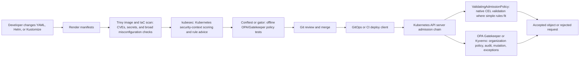

## Що ви зможете робити

Після завершення цього модуля ви зможете:

1. **Сканувати** маніфести Kubernetes за допомогою `kubesec`, інтерпретувати позитивну та негативну оцінку й перетворювати вивід на рівні правил у практичну роботу з усунення вад.
2. **Писати** невеликі політики Rego для OPA Gatekeeper, пакувати їх як ресурси `ConstraintTemplate` і прив'язувати до робочих навантажень за допомогою ресурсів `Constraint`.
3. **Порівнювати** kubesec, Conftest, Gatekeeper, Kyverno та ValidatingAdmissionPolicy, щоб кожен механізм контролю стояв на правильному етапі шляху доставляння.
4. **Проєктувати** бар'єр політик CI/CD, який поєднує сканування образів на вразливості, оцінку маніфестів, офлайн-тести політик і примусове виконання контролю допуску на стороні кластера.
5. **Експлуатувати** розгортання політик безпечно, використовуючи патерни dry-run, попередження, аудиту, мутації, політики відмов та аварійного відновлення без випадкового вимкнення захисного бар'єра.

## Чому цей модуль важливий

Більшість збоїв безпеки Kubernetes не починається з екзотичного експлойта. Вони починаються зі звичайного маніфеста, який надає більше повноважень, ніж потрібно робочому навантаженню, залишає типове налаштування відкритим або припускає, що шлях розгортання контрольований краще, ніж насправді. Контейнер, який працює від root, додає `SYS_ADMIN`, монтує сокет Docker, використовує мережу хоста або тягне неприв'язаний образ, може місяцями лежати в Git, перш ніж хтось це помітить. До моменту, коли об'єкт дістанеться API-сервера, небезпечний вибір часто вже скопійовано у значення Helm, оверлеї Kustomize, runbook'и, дашборди та м'язову пам'ять реагування на інциденти.

Статичний аналіз дає вам дешеве місце, щоб упіймати такі рішення, поки вони ще є текстом. Локальний сканер може відхилити pull request до того, як маніфест стане живим об'єктом API, а це означає, що виправлення — це невелика зміна YAML, а не аварійне розгортання. Компроміс полягає в тому, що статичний аналіз бачить лише ті вхідні файли, які йому дали. Він не може довести, що кожен шлях розгортання запускає сканер, не бачить команд `kubectl patch`, які адміністратор виконує в останню мить, і не може застосувати правило до контролера, який створює Pod'и з об'єкта API, що його сканер ніколи не переглядав.

Контроль допуску заповнює цю прогалину, переносячи примусове виконання політик на межу API Kubernetes. OPA Gatekeeper, Kyverno, ValidatingAdmissionPolicy, Pod Security Admission та власні webhook'и — усі вони оцінюють запити в момент, коли API-сервер їх отримує. Ця позиція є потужною, тому що кожен звичайний шлях запису в Kubernetes проходить через допуск, включно з контролерами GitOps, завданнями розгортання CI, людськими сесіями `kubectl`, операторами та контролерами вищого рівня, які створюють об'єкти робочих навантажень. Вона ж і ризикована, бо погана політика допуску може заблокувати легітимні зміни або перетворити збій політики на проблему доступності площини управління.

Іспит CKS очікує обох сторін цього міркування. Вам потрібно швидко просканувати файл YAML інструментом на кшталт kubesec, розпізнати, чому негативна оцінка має значення, і знати, які поля змінити під тиском. Вам також потрібно розуміти, як пакується політика Gatekeeper на основі Rego, чим розгортання в режимі dry-run відрізняється від розгортання з примусовим виконанням і чому рушії політик не є взаємозамінними. Хороша відповідь — це не «встановіть OPA» чи «запустіть сканер»; це багаторівневий дизайн, у якому кожен інструмент ловить той режим збою, для якого він фактично розташований.

[Злам кластера Tesla 2018 року](/k8s/cks/part1-cluster-setup/module-1.5-gui-security/) <!-- incident-xref: tesla-2018-cryptojacking --> залишається корисним перехресним посиланням, бо показує, як помилка в Kubernetes перетворюється на компрометацію інфраструктури, коли метадані, облікові дані та привілеї робочих навантажень погано збігаються. Цей модуль не переказує той інцидент. Урок тут вужчий: огляд маніфестів та політика допуску мають робити небезпечні комбінації привілеїв важкими для злиття, важкими для розгортання та помітними, коли надається виняток.

## Розташування в конвеєрі: статичний аналіз проти контролю допуску

Про інструменти безпеки легше міркувати, коли ви малюєте шлях доставляння як послідовність бар'єрів, а не як купу сканерів. Ліва частина шляху виконується до того, як кластер побачить маніфест. Ця частина швидка, дешева та дружня до розробників, тож вона має ловити очевидні проблеми, такі як привілейовані контейнери, відсутність `runAsNonRoot`, відсутність обмежень ресурсів, недовірені реєстри образів та відомі вразливі образи. Права частина шляху виконується всередині кластера або на його межі. Ця частина є авторитетною, бо захищає API-сервер незалежно від того, який клієнт подає запит.



Trivy корисний ближче до початку, бо він може сканувати образи контейнерів на відомі вразливості та сканувати файли інфраструктури-як-код на хибні конфігурації. kubesec вужчий і більш специфічний для Kubernetes: він оцінює ресурси на кшталт Pod'а відповідно до правил контексту безпеки та посилення робочих навантажень, що робить його чудовим для швидкого огляду маніфестів у стилі CKS. Conftest і `gator` — це тести політик, а не загальні сканери. Вони дозволяють запустити ту саму логіку, яка важлива вашій організації, перед злиттям, включно з правилами, яких загальний сканер знати не може, як-от «лише простір імен `payments` може використовувати цей реєстр» або «кожен виробничий Деплоймент повинен нести мітку власника».

Інструменти допуску не варто використовувати як заміну перевіркам CI. Якщо розробник чекає, доки Gatekeeper відхилить запит, зворотний зв'язок надходить уже після злиття, після старту завдання розгортання й часто вже тоді, коли таймер розгортання цокає. І навпаки, перевірки CI не варто розглядати як заміну допуску. Кластер без страхувального допуску довіряє кожному шляху розгортання бути чесним і повним, що рідко є правдою після того, як до системи потрапляють аварійний доступ, разові скрипти обслуговування, оператори й кілька контролерів GitOps.

Практичний дизайн є багаторівневим: сканування образів і файлової системи відповідає на запитання «чи відомо, що цей артефакт є вразливим», kubesec відповідає на «чи запитує це робоче навантаження Kubernetes небезпечні привілеї», офлайн-тести OPA відповідають на «чи порушує цей маніфест нашу власну політику», а контроль допуску відповідає на «чи має API-сервер прийняти цей запит просто зараз». Кожен бар'єр повинен видавати результат, зрозумілий наступному кроку — людині чи автоматизації. Самого по собі червоного або зеленого білда без пояснення на рівні правил недостатньо, коли виправленням може бути відсутня мітка, небезпечна можливість (capability), виняток для реєстру або збій webhook'а.

## kubesec: оцінка YAML Kubernetes перед розгортанням

`kubesec` — це аналізатор ризиків безпеки для ресурсів Kubernetes на основі правил. Він приймає YAML або JSON, перевіряє форму об'єкта Kubernetes, застосовує фіксований набір селекторів і повертає масив JSON з оцінкою та знахідками на рівні правил. Важлива розумова модель: kubesec не є рушієм політик загального призначення. Це сфокусований сканер, який винагороджує поля посилення безпеки та штрафує небезпечні поля, що робить його особливо корисним для швидкого огляду Pod'ів, Деплойментів, StatefulSet'ів та DaemonSet'ів, де небезпечні рішення живуть під шаблоном Pod'а.

```bash
kubesec scan deployment.yaml
cat deployment.yaml | kubesec scan -
kubesec scan --kubernetes-version 1.35 deployment.yaml
kubesec scan --format json --output kubesec-results.json deployment.yaml
kubesec print-rules --format table
```

Поточний CLI надає команди `scan`, `http`, `print-rules`, `version` та команди автодоповнення оболонки. Підкоманда `scan` приймає шлях до файлу, `-` для стандартного вводу або `/dev/stdin`, а її довідка документує прапорці для формату виводу, розташування виводу, коду виходу при збої, версії Kubernetes, абсолютних шляхів до файлів, розташування схеми та шаблонізованого виводу. Підкоманда `print-rules` є корисним інструментом для навчання, бо вона друкує селектори та значення балів замість того, щоб ви виводили їх із результату одного сканування за раз.

Оцінювання kubesec навмисно асиметричне. Маніфест може зібрати кілька позитивних балів за встановлення `runAsNonRoot`, `readOnlyRootFilesystem`, обмежень ресурсів, скинутих можливостей та інших полів посилення безпеки, але одне критичне поле може переважити ці здобутки. У поточному наборі правил `privileged: true` та додавання `SYS_ADMIN` кожне несе негативний штраф у тридцять балів, тоді як `hostNetwork`, `hostPID` та `hostIPC` кожне несе менші, але все ще серйозні негативні оцінки. Така форма є навмисною: робоче навантаження з кількома хорошими типовими налаштуваннями все одно може бути неприйнятним, якщо одне поле дозволяє контейнеру дотягнутися до повноважень рівня хоста.

```yaml
apiVersion: v1
kind: Pod
metadata:
  name: insecure-web
spec:
  containers:
    - name: web
      image: nginx:1.27
      securityContext:
        privileged: true
```

```bash
kubesec scan insecure-web.yaml | jq '.[0] | {object, valid, score, critical: .scoring.critical}'
```

Очікуваний огляд — це не «оцінка погана», а «робоче навантаження запитує привілейоване виконання контейнера, що обходить більшість ізоляції, яку Pod Security Standards очікують зберегти для звичайних прикладних робочих навантажень». Високоцінне усунення вади видалило б `privileged`, додало б `allowPrivilegeEscalation: false`, скинуло б можливості, налаштувало б виконання не від root та зробило б кореневу файлову систему лише для читання, якщо програма може це витримати. Низькоцінне усунення додало б мітку чи обмеження ресурсів, залишивши поле privileged недоторканим, бо найвпливовіший ризик усе одно був би наявним.

```yaml
apiVersion: v1
kind: Pod
metadata:
  name: hardened-web
spec:
  securityContext:
    runAsNonRoot: true
    runAsUser: 10001
    seccompProfile:
      type: RuntimeDefault
  containers:
    - name: web
      image: nginx:1.27
      securityContext:
        allowPrivilegeEscalation: false
        readOnlyRootFilesystem: true
        capabilities:
          drop: ["ALL"]
      resources:
        requests:
          cpu: 100m
          memory: 128Mi
        limits:
          cpu: 500m
          memory: 256Mi
```

Безпечний приклад не є універсально придатним для розгортання, бо реальним програмам можуть знадобитися шляхи з можливістю запису, додаткові можливості Linux або не-типовий UID, який існує в образі. Саме тому до kubesec слід ставитися радше як до помічника в огляді, ніж як до оракула. Оцінка каже вам, які поля заслуговують негайної уваги, а повідомлення знахідок кажуть чому. Остаточне рішення все одно належить власнику політики, який знає, чи є робоче навантаження звичайним вебсервісом, привілейованим агентом вузла, компонентом сервісної сітки чи застарілою програмою, яка потребує ретельно задокументованого винятку.

kubesec також може працювати як локальний HTTP-сервер, але хостованого публічного API слід уникати для пропрієтарних маніфестів. YAML Kubernetes часто розкриває імена образів, внутрішні імена сервісів, простори імен, мітки, структуру хмарного акаунта, імена змінних середовища, а іноді й буквальні секрети. Якщо конвеєр використовує режим HTTP, запускайте сервер усередині довіреного середовища CI та звертайтеся до `127.0.0.1` чи внутрішнього сервісу. Те саме правило приватності стосується кожного зовнішнього сканера: не завантажуйте чутливі маніфести до сервісу, якщо ваша організація не схвалила цю межу даних.

```bash
kubesec http 8080
curl -sS -X POST --data-binary @deployment.yaml http://127.0.0.1:8080/scan
```

Для GitHub Actions підтримувана дія kubesec обгортає сканер і приймає вхідні дані, як-от `input`, `format`, `template`, `output` та `exit-code`. Найпростіший робочий процес сканує один файл і завершується з помилкою відповідно до налаштованої поведінки коду виходу дії. Більш готовий до виробництва робочий процес спершу рендерить Helm чи Kustomize, сканує відрендерений вивід, записує JSON чи SARIF в артефакт і завантажує результат до code scanning лише після того, як організація вирішила, як мають працювати обробка винятків і чутливі метадані.

```yaml
name: kubesec
on:
  pull_request:
jobs:
  scan:
    runs-on: ubuntu-24.04
    permissions:
      contents: read
    steps:
      - uses: actions/checkout@11bd71901bbe5b1630ceea73d27597364c9af683  # v4.2.2
        with:
          persist-credentials: false
      - name: Render manifests
        run: kubectl kustomize deploy/overlays/prod > rendered.yaml
      - name: Run kubesec
        uses: controlplaneio/kubesec-action@43d0ddff5ffee89a6bb9f29b64cd865411137b14  # v0.0.2
        with:
          input: rendered.yaml
          format: json
          output: kubesec-results.json
```

Головне обмеження полягає в тому, що kubesec не знає поточного стану вашого кластера, відносин RBAC, процесу винятків чи бізнес-політики. Він може попередити, що Pod має `hostNetwork: true`, але не може знати, чи зарезервований простір імен для демона CNI, який легітимно потребує мережі хоста. Він може винагородити кореневу файлову систему лише для читання, але не може знати, чи пише образ файли кешу під `/tmp`, доки ви не протестуєте робоче навантаження. Ставтеся до kubesec як до швидкого першого проходу, який ловить небезпечні типові налаштування й змушує рецензентів пояснювати винятки в письмовій формі.

Читайте вивід kubesec від знахідки з найвищим ризиком донизу, а не від загальної оцінки вгору. Загальна оцінка корисна для автоматизованого порогу, але список правил каже вам, яке поле завдає шкоди. Оцінка мінус тридцять, спричинена `privileged: true`, заслуговує на іншу розмову, ніж оцінка близько нуля, спричинена кількома відсутніми позитивними засобами контролю. Перший випадок — це ймовірно жорстка відмова для звичайних програм. Другий випадок може бути пунктом беклогу, попередженням політики чи запитом до команди програми довести, чому поле посилення безпеки несумісне.

Тому автоматизовані пороги мають бути багаторівневими, а не наївними. Платформенна команда може блокувати будь-який маніфест із критичними знахідками, вимагати огляду для невеликих негативних оцінок і попереджати про відсутні позитивні засоби контролю, поки команди мігрують. Це корисніше, ніж проголошувати «оцінка має бути більшою за нуль» без розуміння, яке правило не пройшло. Це також робить винятки придатними для огляду. Виняток для агента рівня вузла, що потребує мережі хоста, має називати контролер, простір імен, ServiceAccount, образ, власника, дату завершення та компенсувальні засоби контролю. Виняток, який каже лише «kubesec не пройшов», не є винятком; це обхід.

Межа відрендереного маніфеста — ще одне поширене джерело хибної впевненості. Якщо чарт Helm встановлює значення `securityContext` з `values.yaml`, сканування лише шаблону чарта каже вам менше, ніж сканування виводу для виробничого файлу значень. Якщо оверлеї Kustomize додають sidecar, сканування лише бази пропускає sidecar. Якщо контролер GitOps застосовує патчі після рендерингу, скануйте об'єкт після рендерингу. Чим ближчий просканований файл до об'єкта, надісланого API-серверу, тим змістовнішою стає оцінка.

## OPA Gatekeeper: політика допуску на основі Rego

OPA Gatekeeper вносить Open Policy Agent у контроль допуску Kubernetes. API-сервер Kubernetes надсилає AdmissionReview до валідаційного webhook'а Gatekeeper, Gatekeeper оцінює об'єкт за відповідними обмеженнями, а відповідь webhook'а каже API-серверу, чи дозволити, чи відхилити запит. Це розташування означає, що Gatekeeper захищає кластер навіть тоді, коли шлях розгортання обходить CI, але також означає, що політики Gatekeeper мають бути написані, протестовані та розгорнуті з тією ж обережністю, що й будь-яка інша залежність площини управління.

Gatekeeper відокремлює багаторазову логіку від конкретної конфігурації політики. `ConstraintTemplate` визначає новий вид обмеження, схему його параметрів та код Rego, який видає порушення. `Constraint` — це екземпляр того виду, з правилами зіставлення та параметрами. Цей поділ подібний до визначення функції, а потім її виклику з аргументами: шаблон каже, як перевіряти відсутні мітки, а обмеження каже, яким ресурсам потрібні які мітки в яких просторах імен.

```yaml
apiVersion: templates.gatekeeper.sh/v1
kind: ConstraintTemplate
metadata:
  name: k8srequiredlabels
spec:
  crd:
    spec:
      names:
        kind: K8sRequiredLabels
      validation:
        openAPIV3Schema:
          type: object
          properties:
            labels:
              type: array
              items:
                type: string
  targets:
    - target: admission.k8s.gatekeeper.sh
      rego: |
        package k8srequiredlabels

        violation[{"msg": msg, "details": {"missing_labels": missing}}] {
          provided := {label | input.review.object.metadata.labels[label]}
          required := {label | label := input.parameters.labels[_]}
          missing := required - provided
          count(missing) > 0
          msg := sprintf("missing required labels: %v", [missing])
        }
```

Rego в цьому прикладі невеликий, але він показує частини, які ви маєте розпізнавати на іспиті. `package` іменує простір імен політики. `violation[...]` визначає вихідний документ, який Gatekeeper трактує як відхилену чи звітну знахідку. `input.review.object` — це об'єкт Kubernetes, що перевіряється. `input.parameters` надходить із відповідного обмеження, а не з поданого маніфеста. Вираз `missing := required - provided` використовує різницю множин, що є однією з причин, чому Rego компактний для перевірок політик, які порівнюють бажані та спостережувані поля.

```yaml
apiVersion: constraints.gatekeeper.sh/v1beta1
kind: K8sRequiredLabels
metadata:
  name: require-production-labels
spec:
  enforcementAction: dryrun
  match:
    kinds:
      - apiGroups: ["apps"]
        kinds: ["Deployment"]
    namespaces: ["production"]
  parameters:
    labels: ["app.kubernetes.io/name", "owner"]
```

Блок `match` — це місце, де ховаються багато зламаних політик. Базовий `Pod` використовує групу API `""`, але Деплоймент використовує групу API `"apps"`, і політика, яка зіставляється лише з Pod'ами, не відхилить шаблон Деплоймента, доки інший механізм не розширить чи перевірить ресурси робочих навантажень. Простори імен, виключені простори імен, селектори простору імен, селектори міток, область дії та зіставлення за іменем — усе це може звузити політику. Звуження є хорошим, коли воно навмисне. Воно є небезпечним, коли автор тестує в одному просторі імен і випадково виключає той простір імен, що має значення.

`enforcementAction` Gatekeeper також легко неправильно прочитати. Типова поведінка — відмова для порушень допуску, але `dryrun` записує порушення без відхилення запиту, а `warn` може повертати попередження для користувача. Цикл аудиту періодично оцінює наявні ресурси за обмеженнями та записує порушення в статус обмеження, метрики й журнали аудиту. Це робить розгортання в режимі dry-run практичним: застосуйте політику, дайте аудиту показати, що вже порушує її, виправте беклог, а тоді перемкніть обмеження на відмову лише тоді, коли радіус ураження зрозумілий.

Сучасні версії Gatekeeper також підтримують синтаксис Rego v1 через форму `targets[].code[]`, і документація Gatekeeper зазначає, що застаріле `targets[].rego` має пріоритет, якщо присутні обидва стилі. Для іспиту й діагностики ви маєте вміти читати поширені приклади `targets[].rego`, бо багато кластерів та публічних бібліотек політик усе ще показують цю форму. Для авторства виробничих політик обирайте один стиль на шаблон і документуйте версію Gatekeeper, інакше два рушії в одному шаблоні можуть заплутати рецензентів щодо того, яка логіка насправді виконується.

Бібліотека Gatekeeper — це найшвидший спосіб вивчати політики у виробничій формі без винаходу кожного шаблону самотужки. Вона містить шаблони, зразкові обмеження, дозволені приклади та заборонені приклади для поширених засобів контролю, як-от обов'язкові мітки, дозволені репозиторії, обмеження файлової системи хоста, контроль привілеїв та перевірки в стилі Pod Security Standard. Корисна звичка — читати і шаблон, і зразки. Шаблон навчає патерну Rego, а зразкові обмеження навчають, як платформенна команда безпечно виставляє регулятори політики.

Огляд політики Rego має зосереджуватися на формі вхідних даних, обробці відсутності та якості повідомлень. Об'єкти Kubernetes часто пропускають поля, а не встановлюють їх у false, тож правило, яке перевіряє лише `field == true`, може пропустити небезпечний випадок, коли поле відсутнє, а типове значення під час виконання є дозвільним. Rego також зазнає невдачі закрито чи відкрито залежно від того, як написане правило: невизначене посилання може зробити один вираз хибним, що може завадити видачі порушення. Хороші шаблони Gatekeeper перевіряють і відсутні, і явно небезпечні стани, а повідомлення має називати точний контейнер, поле та очікуване значення, щоб відхилений користувач міг виправити маніфест, не читаючи джерела політики.

Схеми параметрів заслуговують на той самий огляд, що й Rego. ConstraintTemplate'и Gatekeeper `v1` вимагають структурних схем, зокрема декларацій `type`, щоб API-сервер Kubernetes міг відхиляти неправильно сформовані обмеження, а не дозволяти Gatekeeper отримувати непридатні параметри. Це покращення безпеки, бо неправильно написаний чи хибно сформований параметр може перетворити примусову політику на політику, яка ніколи не зіставляється з потрібною умовою. Коли шаблон приймає списки, як-от дозволені репозиторії, обов'язкові мітки чи звільнені образи, протестуйте порожній список, неправильно сформований список і реалістичний список перед схваленням шаблону.

## Мутація, аудит та режими збоїв Gatekeeper

Gatekeeper починався як інструмент валідації, але поточний Gatekeeper також має CRD мутації для контрольованих змін під час допуску. `AssignMetadata` змінює мітки чи анотації, `Assign` змінює поля поза metadata, `ModifySet` додає чи видаляє записи списку, а `AssignImage` змінює частини рядка образу. Мутацію слід використовувати ощадливо, бо вона може приховати різницю між маніфестом у Git та об'єктом, допущеним до кластера, але вона цінна для безпечних типових налаштувань, як-от додавання анотації власника, налаштування політики витягування образу чи заповнення відсутнього значення контексту безпеки.

```yaml
apiVersion: mutations.gatekeeper.sh/v1
kind: Assign
metadata:
  name: default-readonly-rootfs
spec:
  applyTo:
    - groups: [""]
      kinds: ["Pod"]
      versions: ["v1"]
  match:
    scope: Namespaced
    kinds:
      - apiGroups: ["*"]
        kinds: ["Pod"]
    namespaces: ["sandbox"]
  location: "spec.containers[name:*].securityContext.readOnlyRootFilesystem"
  parameters:
    pathTests:
      - subPath: "spec.containers[name:*].securityContext.readOnlyRootFilesystem"
        condition: MustNotExist
    assign:
      value: true
```

Ключові поля — `applyTo`, `match`, `location` та `parameters.assign`. `applyTo` каже Gatekeeper схему ресурсів, що мутуються, допомагаючи йому міркувати про немутації, що не сходяться. `location` вказує на поле, яке потрібно змінити, а тести шляху не дають мутатору перезаписати явне значення чи випадково створити батьківську структуру. Якщо присутні і валідація, і мутація, пишіть правило валідації так, щоб воно узгоджувалося з результатом мутації; інакше один webhook, що встановлює типове значення поля, та інший webhook, що відхиляє те саме поле, можуть створити заплутані збої розгортання.

Аудит відокремлений від допуску. Допуск оцінює запит, коли той надходить, і може заблокувати цей запит. Аудит періодично оцінює ресурси, які вже існують, і звітує про порушення. Ця відмінність має значення під час розгортання, бо наявні Pod'и не припиняються лише через те, що з'явилося нове обмеження. Деплоймент, який уже працює без обмежень ресурсів, може продовжувати працювати до перезапуску, масштабування вгору чи розгортання, що створює нові Pod'и. Аудит каже вам, що вже не відповідає вимогам, тож ви можете виправити робоче навантаження до того, як примусове виконання зламає наступну дію контролера.

```bash
kubectl get constraints
kubectl get k8srequiredlabels require-production-labels -o yaml
kubectl get constraints -o json | jq '.items[] | {name: .metadata.name, violations: .status.totalViolations}'
```

Режими збоїв Gatekeeper є частиною дизайну безпеки, а не запізнілою думкою. Задокументоване типове налаштування — це fail-open для помилок webhook'а через `failurePolicy: Ignore`, що означає, що обмеження не примушуються до виконання, коли webhook не працює чи недосяжний. Налаштування `ValidatingWebhookConfiguration` Gatekeeper на `failurePolicy: Fail` закриває цей обхід, але вносить залежність від доступності: якщо webhook не може відповісти, відповідні запити API зазнають невдачі. Виробнича платформа має обирати свідомо, моніторити webhook і тримати аварійний шлях відновлення на випадок поганої політики чи збою webhook'а.

Команда аварійного відновлення навмисно груба, бо вона прибирає перевірки допуску Gatekeeper, видаляючи конфігурацію валідаційного webhook'а. Це може бути правильним ходом, коли кластер не може працювати, але це також створює ту саму прогалину, яку міг би використати зловмисник чи поспішний оператор. Ставтеся до цього як до дії «розбити скло» з аудитом, сповіщенням та чек-листом повторного увімкнення. У кластері, керованому GitOps, переконайтеся, що поведінка оператора чи примирювача зрозуміла; інакше webhook може бути відтворений до того, як команда завершить відновлення, або може лишитися вимкненим, бо ніхто не володіє цим дрейфом.

```bash
kubectl delete validatingwebhookconfiguration gatekeeper-validating-webhook-configuration
```

Найбезпечніший патерн розгортання є нудним і дисциплінованим. Протестуйте Rego офлайн, застосуйте шаблон, застосуйте обмеження в режимі `dryrun`, дочекайтеся, доки аудит знайде наявні порушення, виправте чи задокументуйте винятки, перемкніть невеликий простір імен на відмову, і лише тоді розширюйте область зіставлення. Записуйте власників винятків та дати завершення в параметрах чи метаданих політики. Політика без процесу винятків схильна бути вимкненою під тиском; політика з необмеженими винятками схильна стати документацією замість примусового виконання.

Операційне володіння також має охоплювати оновлення. Gatekeeper, API допуску Kubernetes та синтаксис OPA розвиваються, тож шаблон, який був нормальним два роки тому, може не бути тим стилем, якому новий кластер віддає перевагу. Перед оновленням Gatekeeper запустіть набори `gator verify` для вашої локальної бібліотеки політик, підтвердьте, чи якісь шаблони змішують застарілі та новіші поля коду, і перевірте доступність webhook'а під час поетапного розгортання. Оновлення рушія політик має мати ту саму планку якості, що й оновлення контролера, бо воно може змінити те, що приймає API-сервер.

## Kyverno: політика для команд Kubernetes у нативному YAML

Kyverno — це ще один нативний для Kubernetes рушій політик, але він стартує з іншого досвіду авторства. Замість того щоб просити авторів політик вивчати Rego, політики Kyverno є ресурсами Kubernetes, написаними в YAML, з валідацією, мутацією, генерацією, верифікацією образів, винятками, звітами та тестуванням через CLI, побудованими навколо патернів об'єктів Kubernetes. Команди часто віддають перевагу Kyverno, коли платформенні інженери хочуть, щоб визначення політик виглядали як ресурси, які вони й так переглядають щодня, особливо для прямих перевірок, як-от обов'язкові мітки, заборонені томи hostPath, обмеження реєстру образів та встановлення типових значень полів.

Правила валідації Kyverno мають дію при невдачі, яка може аудитувати чи примушувати, що природно зіставляється з етапами розгортання. У режимі Audit ресурси-порушники звітуються, але не блокуються. У режимі Enforce запит допуску відхиляється. Kyverno також може виконувати фонові сканування наявних ресурсів, що дає командам огляд, подібний до аудиту Gatekeeper. Важливим є порівняння не того, який рушій «кращий»; це питання, яку модель авторства політик ваша організація може безпечно підтримувати і які функції потрібні для конкретного засобу контролю.

Мутацію Kyverno зазвичай легше читати для команд, орієнтованих на YAML, бо вона може використовувати стратегічні merge-патчі або JSON-патчі. Політика може додати мітку, налаштувати `imagePullPolicy`, упровадити типовий контекст безпеки чи згенерувати допоміжні ресурси. Це робить Kyverno привабливим для захисних бар'єрів, які одночасно валідують і виправляють поширені упущення. Небезпека така ж, як у будь-якій мутаційній системі допуску: об'єкт, який написали розробники, може не бути об'єктом, що працює, тож порівняння в GitOps, діагностика та межі володіння потребують чітких очікувань.

OPA та Gatekeeper часто кращі, коли політикам потрібні логіка множин, міркування між об'єктами, зовнішні дані чи мова політик, яка також працює поза Kubernetes. Rego можна повторно використовувати в Conftest, sidecar'ах OPA, сервісах авторизації та шаблонах Gatekeeper. Kyverno часто кращий, коли ціль — лише Kubernetes, а політику можна чисто виразити як патерн чи патч YAML. ValidatingAdmissionPolicy найкраща, коли правило достатньо просте для нативного CEL, а власник кластера хоче уникнути окремої залежності від webhook'а допуску.

Релевантна для іспиту навичка — це порівняння за умов обмежень. Якщо питання просить OPA Gatekeeper, пишіть ConstraintTemplate та Constraint. Якщо питання описує нативну для YAML валідацію та мутацію без Rego, Kyverno може бути кращою відповіддю з дизайну. Якщо питання каже, що кластер — це Kubernetes 1.30 чи новіший, а правило є простою валідацією поля, згадайте ValidatingAdmissionPolicy як вбудований варіант. Не стверджуйте, що один рушій політик усуває потребу в інших; реальні платформи часто використовують кілька рівнів, бо кожен рівень має іншу операційну межу.

## ValidatingAdmissionPolicy: нативний допуск на CEL у Kubernetes 1.30+

ValidatingAdmissionPolicy, часто скорочувана до VAP, є вбудованою альтернативою Kubernetes для декларативного валідаційного допуску. Вона досягла загальної доступності в межах випуску Kubernetes 1.30, а документація Kubernetes позначає її як `Kubernetes v1.30 [stable]`. Деталь версії має значення, бо легко неправильно вказати цю функцію новішою, ніж вона є. На поточному іспиті чи виробничому кластері перевірте фактичну версію кластера, але використовуйте 1.30 як лінію GA.

VAP використовує Common Expression Language, а не Rego. `ValidatingAdmissionPolicy` визначає обмеження зіставлення та вирази валідації, а `ValidatingAdmissionPolicyBinding` прикріплює політику до області дії та обирає дії валідації, як-от Deny, Warn чи Audit. Для простих перевірок полів CEL компактний і уникає окремого сервісу webhook'а. Для складної організаційної політики, інвентаризації між ресурсами, мутації чи багатих робочих процесів винятків Gatekeeper чи Kyverno все ще можуть бути доречнішими.

```yaml
apiVersion: admissionregistration.k8s.io/v1
kind: ValidatingAdmissionPolicy
metadata:
  name: require-nonroot.example.com
spec:
  failurePolicy: Fail
  matchConstraints:
    resourceRules:
      - apiGroups: [""]
        apiVersions: ["v1"]
        operations: ["CREATE", "UPDATE"]
        resources: ["pods"]
  validations:
    - expression: "object.spec.containers.all(c, (has(object.spec.securityContext) && has(object.spec.securityContext.runAsNonRoot) && object.spec.securityContext.runAsNonRoot) || (has(c.securityContext) && has(c.securityContext.runAsNonRoot) && c.securityContext.runAsNonRoot))"
      message: "all containers must run as non-root via pod-level or per-container securityContext.runAsNonRoot"
---
apiVersion: admissionregistration.k8s.io/v1
kind: ValidatingAdmissionPolicyBinding
metadata:
  name: require-nonroot-production
spec:
  policyName: require-nonroot.example.com
  validationActions: ["Deny"]
  matchResources:
    namespaceSelector:
      matchLabels:
        environment: production
```

Вираз отримує строго типізовані змінні, як-от `object`, `oldObject`, `request`, `params` та `namespaceObject`. Для запиту на створення `object` — це вхідний ресурс. Для запиту на оновлення `oldObject` — це попередня версія. Якщо політика використовує параметри, `params` заповнюється з ресурсу параметрів, обраного прив'язкою. Якщо `paramKind` не вказано, `params` є null. Цей дизайн дозволяє платформенній команді написати один багаторазовий вираз і прив'язати його з різними об'єктами параметрів у різних просторах імен чи командах.

Приклад `require-nonroot` вище відповідає тому, як Kubernetes застосовує `securityContext` рівня Pod'а до контейнерів: Pod, який встановлює `runAsNonRoot: true` на рівні spec, задовольняє політику навіть тоді, коли окремі контейнери пропускають поле, що є тим самим патерном, що й Pod hardened-web раніше в цьому модулі. Вираз перевіряє лише звичайні `containers`; `initContainers` та `ephemeralContainers` потребують окремих правил, якщо ваш базовий рівень має охоплювати і їх теж.

```yaml
apiVersion: admissionregistration.k8s.io/v1
kind: ValidatingAdmissionPolicy
metadata:
  name: require-label-prefix.example.com
spec:
  failurePolicy: Fail
  paramKind:
    apiVersion: v1
    kind: ConfigMap
  matchConstraints:
    resourceRules:
      - apiGroups: [""]
        apiVersions: ["v1"]
        operations: ["CREATE", "UPDATE"]
        resources: ["namespaces"]
  validations:
    - expression: "has(object.metadata.labels.owner) && object.metadata.labels.owner.startsWith(params.data.prefix)"
      message: "namespace owner label must use the configured prefix"
```

`paramKind` потужний, бо він відокремлює логіку політики від значень для конкретного середовища, але він створює рішення щодо відсутніх параметрів, які мають бути явними. Прив'язки Kubernetes мають поведінку `parameterNotFoundAction` для посилань на параметри; вибір Allow може зробити, щоб відсутній параметр зазнавав невдачі відкрито, тоді як вибір Deny з невдалою політикою може відхилити запит. Урок такий самий, як для параметрів Gatekeeper: багаторазові валідатори безпечніші, коли життєвий цикл ресурсу параметрів керується, переглядається та моніториться.

VAP не замінює Gatekeeper у кожному середовищі. Вона валідує; вона не надає екосистеми Rego Gatekeeper, бібліотеки Gatekeeper, CRD мутації чи тієї самої переносимості між інструментами з Conftest. Вона також не замінює робочих процесів Kyverno з генерації, мутації, верифікації образів та звітування. Вона ж зменшує кількість рухомих частин для простих правил допуску, і оскільки оцінювання відбувається в API-сервері, а не в окремо хостованому webhook'у, вона усуває один клас проблем доступності webhook'а. Використовуйте її, коли вираз зрозумілий, правило є локальним для запиту, а команда комфортно переглядає CEL.

Огляд CEL має власні пастки. Вирази компактні, що робить прості правила приємними, а складні — щільними. Віддавайте перевагу кільком читабельним валідаціям зі специфічними повідомленнями над одним довгим виразом, який намагається закодувати цілий стандарт безпеки. Перевіряйте поведінку при створенні та оновленні окремо, бо `oldObject` є null при створенні, а `object` може бути null при видаленні. Якщо правило посилається на `params`, вирішіть, що станеться, коли об'єкт параметрів відсутній, перш ніж політика дістанеться виробництва. Нативна політика в процесі все одно може створити збій, якщо вираз неправильний, а прив'язка відхиляє запити, які потрібні вашим контролерам.

Найкраще використання VAP у багаторівневій програмі політик часто є стабільним базовим рівнем для локальних перевірок запитів. Наприклад, власник кластера може примусово вимагати форму міток простору імен, обмежувати репліки Деплоймента, вимагати простих полів контексту безпеки чи відхиляти небезпечне використання просторів імен хоста без експлуатації ще одного сервісу webhook'а. Більш контекстні перевірки, як-от «цей реєстр дозволений лише для цієї команди, якщо немає тимчасового винятку», усе ще можуть бути зрозумілішими в Gatekeeper чи Kyverno, бо ці інструменти мають зрілі патерни пакування політик, звітування та винятків.

## Conftest та gator: офлайн-тести політик

Conftest дозволяє тестувати структуровані файли конфігурації за політиками Rego до того, як кластер побачить їх. Він не специфічний для Kubernetes; він може парсити YAML, JSON, HCL, Dockerfile'и, TOML та інші формати, що робить його корисним для змішаних платформних репозиторіїв, де маніфести Kubernetes стоять поруч із Terraform, визначеннями CI та конфігурацією програм. Типова директорія політик — `policy`, але прапорець `--policy` вказує на будь-яку директорію політик, а `--data` завантажує зовнішні дані JSON чи YAML для списків винятків, дозволених реєстрів чи мап володіння командами.

```rego
package main

deny contains msg if {
  input.kind == "Deployment"
  container := input.spec.template.spec.containers[_]
  not container.securityContext.runAsNonRoot
  msg := sprintf("container %s must set runAsNonRoot", [container.name])
}
```

```bash
conftest test --policy policy deployment.yaml
conftest test --policy policy --output json deployment.yaml
conftest test --policy policy --parser yaml --trace deployment.yaml
conftest test --policy policy --data policy-data deployment.yaml
conftest test --policy policy --fail-on-warn deployment.yaml
```

Поточна довідка `conftest test` підтверджує прапорці для шляху політик, шляху даних, простору імен, парсера, формату виводу, суворого режиму, версії Rego, виводу трасування, поведінки попереджень та поведінки без збою. Прапорці мають значення в CI, бо ту саму політику можна використовувати для дружнього до розробників виводу під час локальної роботи та для машиночитного JSON чи SARIF у конвеєрі. `--trace` особливо корисний, коли правило Rego не зіставляється з формою вхідних даних, яку ви очікували; воно показує деталі оцінювання, не вимагаючи живого webhook'а допуску.

`gator` — це CLI Gatekeeper для авторства та тестування. Там, де Conftest є тестуванням OPA загального призначення, `gator test` оцінює ресурси за ConstraintTemplate'ами та Constraint'ами Gatekeeper. Він приймає вхідні дані `--filename`, директорії, стандартний ввід, OCI-образи політик, `--output=json`, `--deny-only`, `--trace` та докладний вивід. `gator verify` запускає структуровані набори тестів з очікуваними випадками проходження та невдачі, що є сильнішим патерном для бібліотек політик, бо дозволяє супровідникам довести, що дозволені приклади лишаються дозволеними, а заборонені приклади лишаються заблокованими.

```bash
gator test --filename manifests-and-policies/
gator test --filename deployment.yaml --filename gatekeeper-policy/ --output=json
gator verify tests/required-labels-suite.yaml
gator verify tests/... --run required-labels//
```

Використовуйте Conftest, коли політика — це звичайний OPA/Rego над відрендереними файлами, особливо коли той самий репозиторій містить конфігурацію Kubernetes, Terraform та конвеєра. Використовуйте gator, коли артефакт політики — це шаблон і обмеження Gatekeeper, і ви хочете, щоб локальна поведінка точніше відповідала фреймворку обмежень Gatekeeper. Зрілий конвеєр може використовувати обидва: Conftest для широкої політики репозиторію та gator для пакетів політик допуску, які будуть встановлені в кластер.

Офлайн-тести мають включати позитивні та негативні приклади. Політика, яка відхиляє поганий маніфест, але не має дозволеного прикладу, може дрейфувати в надмірне блокування. Політика, яка дозволяє хороший маніфест, але не має забороненого прикладу, може дрейфувати в no-op. Структура зразків бібліотеки Gatekeeper є хорошою моделлю: тримайте шаблон, обмеження, дозволений ресурс, заборонений ресурс і набір тестів разом, щоб рецензенти політик могли міркувати про намір та поведінку в одній директорії.

Корисний репозиторій політик має ту саму форму, що й код програми. Тримайте спільні допоміжні функції в одному місці, тримайте тестові фікстури близько до правил, які вони перевіряють, і змусьте CI запускати тести на кожному pull request. Уникайте того, щоб кожна команда копіювала трохи інший фрагмент Rego у власну теку, бо дрібні відмінності пізніше стають прогалинами аудиту. Якщо список винятків є даними, а не кодом, завантажуйте його через `--data` в Conftest чи через параметри обмеження в Gatekeeper, а тоді переглядайте зміни в цих даних із тією ж серйозністю, що й зміни в правилі.

## Патерн інтеграції CI/CD

Виробничий бар'єр CI/CD має чітко визначати, чим володіє кожен інструмент. Trivy володіє відомими вразливостями, секретами та широким покриттям хибних конфігурацій IaC. kubesec володіє оцінюванням стану контексту безпеки Kubernetes. Conftest чи gator володіє власною організаційною політикою перед розгортанням. Gatekeeper, Kyverno, ValidatingAdmissionPolicy та Pod Security Admission володіють примусовим виконанням на стороні кластера. Поєднання їх не є дублюванням, коли кожен етап має інший вхід та іншу історію обходу.

```yaml
name: supply-chain-policy
on:
  pull_request:
jobs:
  policy:
    runs-on: ubuntu-24.04
    permissions:
      contents: read
    steps:
      - uses: actions/checkout@11bd71901bbe5b1630ceea73d27597364c9af683  # v4.2.2
        with:
          persist-credentials: false
      - name: Render Kubernetes manifests
        run: kubectl kustomize deploy/overlays/prod > rendered.yaml
      - name: Trivy image and IaC scan
        run: trivy fs --scanners vuln,misconfig,secret --severity HIGH,CRITICAL .
      - name: kubesec manifest score
        run: kubesec scan --exit-code 2 --output kubesec-results.json rendered.yaml
      - name: Conftest organization policy
        run: conftest test --policy policy --output table rendered.yaml
      - name: Gatekeeper package test
        run: gator test --filename rendered.yaml --filename gatekeeper-policy/ --output=json
```

Цей робочий процес припускає, що інструменти встановлено в образ runner'а чи на попередньому кроці налаштування. Важливим є порядок та володіння. Спершу рендерте, щоб сканери бачили ті самі ресурси Kubernetes, які застосувало б завдання розгортання. Запускайте сканування образів та IaC перед політикою, специфічною для Kubernetes, щоб вразливі базові образи та витоки секретів не ховалися за збоєм форматування маніфеста. Запускайте kubesec перед власною політикою, бо оцінка kubesec дає швидкий зворотний зв'язок для поширених полів CKS. Запускайте Conftest чи gator перед злиттям, щоб збої політики, специфічної для організації, знаходилися до відмови допуску.

Конвеєр має гучно зазнавати невдачі для жорстких порушень і м'яко звітувати для роботи з упровадження. Наприклад, привілейований виробничий Pod може зазнати невдачі негайно, відсутня необов'язкова мітка власника може попереджати один спринт, а нова політика обмеження ресурсів може працювати в режимі dry-run, доки беклог аудиту не виправлено. Не змішуйте ці категорії в одному порозі без пояснення. Єдине повідомлення «політика не пройшла» дратує розробників і заохочує обходи. Результат, який називає поле, правило, власника, серйозність, шлях винятку та усунення, створює цикл зворотного зв'язку.

Винятки теж потребують політики. Якщо DaemonSet CNI потребує мережі хоста, запишіть цей виняток у вузькому просторі імен, вимагайте мітки чи анотації з власником і змусьте правило допуску перевіряти і ризиковане поле, і маркер винятку. Якщо sidecar сервісної сітки потребує `NET_ADMIN`, обмежте дозвіл іменем sidecar'а, реєстром образів, простором імен та ServiceAccount, а не надавайте можливість кожному контейнеру. Хороший виняток є вужчим за політику, яку він обходить, завершується за замовчуванням і є помітним у виводі аудиту чи CI.

Будьте обережні зі згенерованими маніфестами. Шаблони Helm, оверлеї Kustomize, Jsonnet, ytt та оператори — усі можуть створювати ресурси, відсутні у вихідному файлі, який відкриває рецензент. Сканування лише вихідного чарта слабше за сканування відрендереного виводу для цільового середовища. Для GitOps найнадійніший патерн — запустити ту саму команду рендерингу, яку використає контролер, зберегти відрендерений вивід як артефакт CI та спрямувати kubesec, Trivy, Conftest і gator на цей артефакт.

Нарешті, замикайте цикл після розгортання. Події відмови допуску, метрики аудиту Gatekeeper, звіти політик Kyverno, попередження VAP та артефакти сканування CI мають десь приземлятися, де оператори насправді читають. Бар'єр політики, який ніхто не моніторить, стає джерелом несподіванок під час інцидентів. Бар'єр політики зі спостережуваними метриками впровадження дозволяє платформенній команді бачити, яким командам потрібна допомога, які правила надто шумні та які винятки слід вилучити.

Одна практична метрика розгортання — «відстань політики до примусового виконання». Для кожного правила відстежуйте, скільки ресурсів його порушують, скільки винятків існує, які команди володіють рештою порушень та які простори імен уже примусово виконують. Це дає керівництву та інженерам спільний погляд на прогрес, не вдаючи, що кожна політика може стати блокувальною в перший день. Це також запобігає тихій регресії: якщо правило було майже придатним для примусового виконання минулого тижня й раптом має багато нових порушень, платформенна команда може розслідувати, перш ніж користувачі знормалізують дрейф.

Інша практична метрика — «видимість обходів». Рахуйте прямі застосування `kubectl` до чутливих просторів імен, синхронізації GitOps, що не проходять допуск, помилки webhook'а, порушення dry-run та збої політик CI. Мета — не присоромити розробників за те, що вони натрапляють на захисні бар'єри; вона в тому, щоб бачити, який шлях створює ризик. Якщо більшість збоїв трапляється в локальних сесіях `kubectl`, допуск доводить свою цінність, а команді може знадобитися краще передпольотне оснащення. Якщо більшість збоїв трапляється в CI після злиття, етап рендерингу й сканування є надто пізнім. Якщо політики часто вимикаються під час інцидентів, дизайн винятків та відновлення потребує уваги.

## Чи знали ви?

- kubesec може надрукувати власну таблицю правил за допомогою `kubesec print-rules`, що є найшвидшим способом побачити, чому одне поле може домінувати в підсумковій оцінці.
- Задокументована типова поведінка webhook'а Gatekeeper при збої — fail-open для помилок webhook'а, тож кластери з високими вимогами до надійності мають свідомо вирішити, чи встановлювати `failurePolicy: Fail`.
- ValidatingAdmissionPolicy досягла GA в Kubernetes 1.30, використовує CEL і може бути параметризована через `paramKind` плюс прив'язки політик.
- `gator test` точніше віддзеркалює оцінювання обмежень Gatekeeper, ніж загальне тестування Rego, бо він розуміє ConstraintTemplate'и та Constraint'и як об'єкти Gatekeeper.

## Типові помилки

| Помилка | Чому це шкодить | Краща практика |
|---|---|---|
| Сприймати позитивну оцінку kubesec як виробниче схвалення | Оцінка — це зважений за правилами сигнал, а не доказ, що робоче навантаження відповідає вашій моделі загроз | Перегляньте критичні знахідки, призначення робочого навантаження, простір імен, ServiceAccount та контекст винятків |
| Сканувати джерело Helm чи Kustomize, але не відрендерені маніфести | Сканер може пропустити поля, додані значеннями, оверлеями чи шаблонами | Спершу відрендерте цільове середовище й скануйте відрендерений артефакт YAML |
| Писати Constraint Gatekeeper, що зіставляється з неправильною групою API | Політика для `apiGroups: [""]` ловить Pod'и, але не Деплойменти в `apps/v1` | Тестуйте і прямі Pod'и, і шаблони робочих навантажень за допомогою gator чи staging-кластера |
| Залишати обмеження Gatekeeper у `dryrun` назавжди | Дані аудиту існують, але допуск ніколи не блокує ризикований запит | Визначте вікно впровадження, виправте беклог і перемкніть обрані області на відмову |
| Видаляти webhook Gatekeeper без плану повторного увімкнення | Перевірки допуску зникають, доки конфігурацію webhook'а не відновлено | Використовуйте процедури «розбити скло» з аудитом, сповіщенням власника та примиренням дрейфу |
| Використовувати VAP для правил, що потребують мутації чи багатого зовнішнього стану | Валідація CEL навмисно простіша за повноцінний рушій політик | Використовуйте VAP для локальної валідації запитів, а Gatekeeper чи Kyverno — для ширших потреб політики |
| Тестувати лише погані приклади для політики Rego | Політика може стати надто широкою й блокувати валідні робочі навантаження | Тримайте дозволені та заборонені фікстури поруч із кожною політикою й запускайте їх у CI |
| Ховати кожен виняток у змінних CI | Рецензенти не бачать, які ризиковані робочі навантаження навмисно дозволені | Зберігайте вузькі, переглянуті винятки як дані політики чи параметри обмеження з власниками |

## Тест

<details>
<summary>Деплоймент сканується за допомогою `kubesec` і отримує велику негативну оцінку, бо один контейнер встановлює `privileged: true`. Чому додавання обмежень ресурсів недостатньо, щоб зробити цей маніфест безпечним?</summary>

Обмеження ресурсів покращують планування та контроль «галасливого сусіда», але вони не скасовують привілейованого виконання контейнера. Привілейований контейнер може обійти багато меж ізоляції й дотягнутися до можливостей рівня хоста, яких звичайні прикладні робочі навантаження мати не повинні. Правильне усунення починається з видалення чи жорсткого обґрунтування `privileged: true`, а тоді додавання полів глибокого захисту, як-от виконання не від root, скинуті можливості, типовий профіль seccomp під час виконання та коренева файлова система лише для читання там, де програма це підтримує.
</details>

<details>
<summary>Чому конвеєр CI має запускати і kubesec, і Gatekeeper чи ValidatingAdmissionPolicy, замість того щоб обирати лише один?</summary>

kubesec дає швидкий зворотний зв'язок перед злиттям щодо відрендереного маніфеста, що не дає розробникам чекати до розгортання, аби дізнатися про небезпечні поля. Gatekeeper чи ValidatingAdmissionPolicy захищає API-сервер, коли запит обходить цей шлях CI, як-от ручне `kubectl apply`, об'єкт, згенерований контролером, чи окремий конвеєр розгортання. Ці два бар'єри розв'язують різні проблеми обходу, тож використання обох є глибоким захистом, а не дублюванням.
</details>

<details>
<summary>Шаблон Gatekeeper працює в тестуванні, але виробниче обмеження ніколи не блокує Деплойменти. Які поля слід перевірити першими?</summary>

Спершу перевірте блок `match` обмеження, особливо `apiGroups`, `kinds`, `namespaces`, `excludedNamespaces`, `namespaceSelector` та `scope`. Політика, яка зіставляється з базовими Pod'ами через `apiGroups: [""]`, не зіставляється автоматично з Деплойментами в групі API `apps`. Також перевірте `enforcementAction`, бо обмеження, залишене в `dryrun`, записує порушення без відхилення запитів.
</details>

<details>
<summary>Коли Kyverno є природнішим вибором, ніж Gatekeeper, для політики Kubernetes?</summary>

Kyverno часто природніший, коли політика стосується лише Kubernetes, є нативною для YAML і виграє від мутації, генерації, верифікації образів, звітів політик чи робочих процесів винятків, які легко виразити як ресурси Kubernetes. Gatekeeper часто сильніший, коли команда хоче переносимості Rego, логіки множин, багаторазової політики OPA, патернів бібліотеки Gatekeeper чи тієї самої мови в конфігурації Kubernetes та поза Kubernetes.
</details>

<details>
<summary>Яку лінію версій слід пам'ятати для ValidatingAdmissionPolicy і яку мову вона використовує?</summary>

ValidatingAdmissionPolicy досягла загальної доступності в Kubernetes 1.30 і задокументована як стабільна з v1.30. Вона використовує Common Expression Language, а не Rego. Політика визначає вирази CEL, а прив'язка обирає область дії та дії валідації, як-от Deny, Warn чи Audit.
</details>

<details>
<summary>Чому `conftest test --policy policy deployment.yaml` корисний перед встановленням політики Gatekeeper?</summary>

Conftest дозволяє вам прогнати Rego на локальних структурованих файлах до того, як кластер побачить маніфест. Це ловить помилки форми вхідних даних, відсутні поля та збої політики, специфічної для організації, у CI. Для пакетів, специфічних для Gatekeeper, `gator test` чи `gator verify` ще ближчі до артефакта допуску, бо вони оцінюють ConstraintTemplate'и та Constraint'и разом.
</details>

<details>
<summary>У чому ризик налаштування Gatekeeper на fail-open і в чому ризик налаштування на fail-closed?</summary>

Поведінка fail-open дозволяє запитам API продовжуватися, коли webhook недосяжний, тож політика не примушується до виконання під час збоїв webhook'а. Поведінка fail-closed відхиляє відповідні запити API, коли webhook не може відповісти, що покращує надійність політики, але може вплинути на доступність площини управління, якщо Gatekeeper нездоровий чи погана політика блокує відновлення. Виробничі кластери потребують моніторингу, високої доступності, обмежених звільнень і плану відновлення «розбити скло», яку б поведінку вони не обрали.
</details>

## Практична вправа

Виконайте ці завдання в локальному kind чи одноразовому тестовому кластері. Тримайте всі файли в робочій директорії, яку не шкода викинути, і уникайте надсилання приватних маніфестів до хостованих сканерів.

- [ ] Відрендерте чи створіть простий маніфест Деплоймента з ім'ям `deployment.yaml` з одним небезпечним полем, як-от `privileged: true`.
- [ ] Запустіть `kubesec scan deployment.yaml` і збережіть вивід JSON для огляду.
- [ ] Запустіть `kubesec print-rules --format table` і визначте правило, яке пояснює найбільшу негативну оцінку.
- [ ] Пропатчте маніфест, щоб видалити небезпечне поле й додати виконання не від root, скинуті можливості та обмеження ресурсів.
- [ ] Напишіть правило Conftest Rego, яке відхиляє Деплойменти, чиї контейнери не встановлюють `runAsNonRoot`.
- [ ] Запустіть `conftest test --policy policy deployment.yaml` для обох версій — небезпечної та посиленої.
- [ ] Створіть `ConstraintTemplate` та `Constraint` Gatekeeper для того самого правила, з обмеженням, встановленим на `enforcementAction: dryrun`.
- [ ] Запустіть `gator test --filename deployment.yaml --filename gatekeeper-policy/ --output=json` і порівняйте результат із Conftest.
- [ ] Якщо Gatekeeper встановлено в тестовому кластері, застосуйте обмеження та перевірте `kubectl get constraints`.
- [ ] Перемкніть лише тестовий простір імен із dry-run на відмову, а тоді підтвердьте, що небезпечний Деплоймент відхилено.
- [ ] Напишіть один випадок винятку й звузьте його за простором імен, ServiceAccount, образом чи міткою замість того, щоб вимикати всю політику.
- [ ] Видаліть тестові політики та маніфести після того, як запишете команди й очікувані виводи у свої нотатки.

## Перевірка для учня

> Іспит CKS очікує обох сторін цього міркування. Вам потрібно швидко просканувати файл YAML інструментом на кшталт kubesec, розпізнати, чому негативна оцінка має значення, і знати, які поля змінити під тиском.

## Джерела

- [Документація kubesec.io](https://kubesec.io/)
- [README controlplaneio/kubesec](https://github.com/controlplaneio/kubesec)
- [README controlplaneio/kubesec-action](https://raw.githubusercontent.com/controlplaneio/kubesec-action/master/README.md)
- [Документація мови політик Open Policy Agent](https://www.openpolicyagent.org/docs/latest/policy-language/)
- [ConstraintTemplate'и Gatekeeper](https://open-policy-agent.github.io/gatekeeper/website/docs/constrainttemplates/)
- [Gatekeeper: як використовувати Gatekeeper](https://open-policy-agent.github.io/gatekeeper/website/docs/howto/)
- [Документація аудиту Gatekeeper](https://open-policy-agent.github.io/gatekeeper/website/docs/audit/)
- [Документація мутації Gatekeeper](https://open-policy-agent.github.io/gatekeeper/website/docs/mutation/)
- [Документація Gatekeeper щодо failing closed](https://open-policy-agent.github.io/gatekeeper/website/docs/failing-closed/)
- [Документація аварійного відновлення Gatekeeper](https://open-policy-agent.github.io/gatekeeper/website/docs/emergency/)
- [Документація CLI gator Gatekeeper](https://open-policy-agent.github.io/gatekeeper/website/docs/gator/)
- [Бібліотека політик Gatekeeper](https://github.com/open-policy-agent/gatekeeper-library)
- [Правила валідації Kyverno](https://kyverno.io/docs/policy-types/cluster-policy/validate/)
- [Правила мутації Kyverno](https://kyverno.io/docs/policy-types/cluster-policy/mutate/)
- [Validating Admission Policy у Kubernetes](https://kubernetes.io/docs/reference/access-authn-authz/validating-admission-policy/)
- [Kubernetes 1.30: Validating Admission Policy досягла загальної доступності](https://kubernetes.io/blog/2024/04/24/validating-admission-policy-ga/)
- [Документація Conftest](https://www.conftest.dev/)
- [Сканування хибних конфігурацій Trivy](https://trivy.dev/docs/latest/scanner/misconfiguration/)
- [CIS Kubernetes Benchmark](https://www.cisecurity.org/benchmark/kubernetes)
- [NIST SP 800-190: Application Container Security Guide](https://csrc.nist.gov/pubs/sp/800/190/final)
- [Pod Security Standards у Kubernetes](https://kubernetes.io/docs/concepts/security/pod-security-standards/)

## Наступний модуль

[Модуль 5.4: Контролери допуску](../module-5.4-admission-controllers/) — побудуйте на цьому фундаменті політик, вивчивши, як контролери допуску Kubernetes валідують, мутують та впорядковують запити перед збереженням об'єктів.


