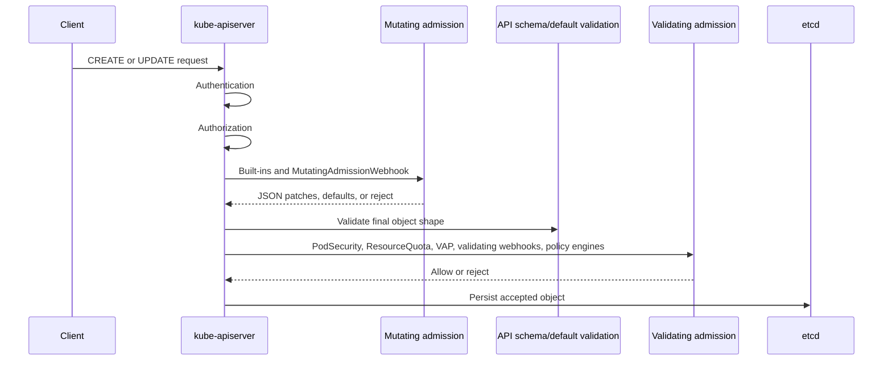

> **Складність**: `[СКЛАДНИЙ]` — критична межа політик у CKS
>
> **Час на проходження**: 40-45 хвилин
>
> **Передумови**: Модуль 5.3 (Статичний аналіз), потік запитів до API-сервера, Pod Security Admission

## Що ви зможете зробити

Після завершення цього модуля ви зможете:

1. **Проаналізувати** послідовність допуску в Kubernetes так, щоб рішення про мутацію, валідацію та квоти розміщувалися в правильній точці шляху запиту до API.
2. **Налаштувати** мутувальні та валідаційні вебхуки допуску з політиками збою, тайм-аутами, деклараціями побічних ефектів і вузькими правилами зіставлення.
3. **Порівняти** вбудовані контролери допуску, ValidatingAdmissionPolicy, OPA Gatekeeper та Kyverno для практичного застосування політик у CKS.
4. **Спроєктувати** безпечні патерни розгортання та відновлення для політик допуску, не створюючи збоїв площини управління, яких можна було б уникнути.
5. **Застосувати** екзаменаційний робочий процес, який діагностує відхилені запити та будує невелику валідаційну політику в одноразовому просторі імен.

## Чому цей модуль важливий

Контроль допуску — це остання програмована контрольна точка перед тим, як API-сервер Kubernetes збереже об'єкт, і саме це робить його межею безпеки, яка все ще бачить запити від `kubectl`, CI-завдань, контролерів GitOps, операторів і скомпрометованої автоматизації вже після того, як автентифікація та авторизація успішно завершилися. Автентифікація відповідає на питання, хто надіслав запит, авторизація — чи може цей суб'єкт виконати дієслово над ресурсом, а допуск — чи має саме ця форма об'єкта потрапити до стану кластера прямо зараз. Ця позиція потужна, тому що охоплює звичайні шляхи запису, і небезпечна, тому що зламана політика може заблокувати ті самі контролери й оператори, які потрібні вам для відновлення. ([Kubernetes Admission Control](https://v1-35.docs.kubernetes.io/docs/reference/access-authn-authz/admission-controllers/))

Завдання CKS зазвичай перевіряють контроль допуску як операторську навичку, а не як теоретичну вправу з API. Вам може знадобитися пояснити, чому Под було відхилено після того, як RBAC його дозволив, визначити, чи надійшла відмова від PodSecurity, ResourceQuota, ValidatingAdmissionPolicy, Gatekeeper, Kyverno чи власного вебхука, а потім вирішити, чи правильним виправленням є зміна маніфесту, зміна прив'язки політики, коригування тайм-ауту вебхука або аварійне відновлення. Найшвидший шлях — це точна ментальна модель: мутувальний допуск може змінити об'єкт, валідаційний допуск може його відхилити, а застосування квоти — це рішення валідаційного допуску, яке споживає бюджет простору імен лише тоді, коли фінальна форма запиту вписується в межі політики. ([Kubernetes Dynamic Admission Control](https://v1-35.docs.kubernetes.io/docs/reference/access-authn-authz/extensible-admission-controllers/), [Kubernetes ResourceQuota Admission](https://v1-35.docs.kubernetes.io/docs/reference/access-authn-authz/admission-controllers/#resourcequota))

Політика допуску — це також місце, де контролі ланцюга постачання стають придатними для примусового застосування всередині кластера. Статичний аналіз може відхилити pull request, але допуск може відхилити живий запит, який обійшов pull request, зокрема екстрений `kubectl apply`, згенерований контролером Под або робоче навантаження, скопійоване з іншого простору імен. Вбудовані контролери обробляють базові інваріанти, такі як автоматизація ServiceAccount, застосування Pod Security, типізація через LimitRange та перевірки ResourceQuota; зовнішні рушії, такі як OPA Gatekeeper і Kyverno, додають специфічну для організації політику, аудит, мутацію та робочі процеси винятків; ValidatingAdmissionPolicy додає нативну валідацію CEL без окремого сервісу вебхука. ([Kubernetes Admission Control](https://v1-35.docs.kubernetes.io/docs/reference/access-authn-authz/admission-controllers/), [ValidatingAdmissionPolicy](https://v1-35.docs.kubernetes.io/docs/reference/access-authn-authz/validating-admission-policy/), [Gatekeeper Introduction](https://open-policy-agent.github.io/gatekeeper/website/docs/), [Kyverno Documentation](https://kyverno.io/docs/))

Надійний дизайн допуску починається з обсягу, потім переходить до мови, а потім обирає поведінку при збої. Використовуйте вбудовані контролери, коли інваріантом уже володіє сам Kubernetes. Використовуйте VAP, коли коротким виразом CEL можна описати правило, локальне для запиту. Використовуйте Gatekeeper, коли Rego, портативність OPA, аудит і обмеження (constraints) є головною вимогою. Використовуйте Kyverno, коли політика на YAML чи CEL разом із мутацією, звітами, перевіркою образів або винятками краще підходить оператору. Лише після цього вибору слід вирішувати, чи контроль зазнаватиме збою у відкритому чи закритому стані. Такий порядок прив'язує дизайн політики до ризику, а не до уподобань щодо інструментів. ([Kubernetes Admission Control](https://v1-35.docs.kubernetes.io/docs/reference/access-authn-authz/admission-controllers/), [Gatekeeper Introduction](https://open-policy-agent.github.io/gatekeeper/website/docs/), [Kyverno ValidatingPolicy](https://kyverno.io/docs/policy-types/validating-policy/))

Тримайте інвентар допуску ще до того, як трапляться інциденти. Перелічіть кожну поверхню політики. Запишіть, хто нею володіє. Запишіть, чи вона мутує, чи валідує. Запишіть її обсяг зіставлення. Запишіть її поведінку при збої. Запишіть, де з'являються порушення. Такий інвентар перетворює відмову на завдання пошуку, а не на загальнокластерний розшук. Він також допомагає рецензентам помітити правила, що перекриваються, наприклад коли PodSecurity та власна політика обмеженого Пода обидві відхиляють те саме поле з різними повідомленнями. ([Kubernetes Admission Control](https://v1-35.docs.kubernetes.io/docs/reference/access-authn-authz/admission-controllers/), [Kubernetes Dynamic Admission Control](https://v1-35.docs.kubernetes.io/docs/reference/access-authn-authz/extensible-admission-controllers/))

## Послідовність і порядок допуску

API-сервер Kubernetes виконує допуск після автентифікації та авторизації, а контролери допуску — це скомпільовані плагіни або налаштовані під час виконання вебхуки, які діють на запити до API перед збереженням. Публічна документація описує дві фази допуску для вебхуків: спочатку запускаються мутувальні вебхуки, які можуть змінити вхідний об'єкт, а потім, після завершення всіх змін об'єкта та валідації об'єкта самим API-сервером, запускаються валідаційні вебхуки, які можуть відхилити запит. Вбудовані плагіни допуску беруть участь у тому самому ланцюгу допуску відповідно до свого типу, а прапорець `--enable-admission-plugins` вмикає додаткові плагіни, не дозволяючи оператору вибрати власний порядок виконання порядком прапорців. ([Kubernetes Admission Control](https://v1-35.docs.kubernetes.io/docs/reference/access-authn-authz/admission-controllers/), [Kubernetes Dynamic Admission Control](https://v1-35.docs.kubernetes.io/docs/reference/access-authn-authz/extensible-admission-controllers/))



Зробіть паузу та спрогнозуйте: мутувальний вебхук впроваджує сайдкар із 500m CPU до кожного Пода в просторі імен, де вже є `ResourceQuota`, що обмежує `requests.cpu`. Поданий маніфест взагалі не запитує CPU. На якому етапі допуску виконується рішення про квоту і проти якої форми об'єкта — проти YAML, який ввів користувач, чи проти об'єкта після мутації та типізації LimitRanger? Запишіть свою відповідь, перш ніж читати далі: квота — це перевірка валідаційного допуску над фінальною допущеною формою, тому сайдкар і будь-які типові значення LimitRanger зараховуються до бюджету простору імен.

Використовуйте екзаменаційну скорочену формулу «мутація, валідація, квота» як модель міркування, але пам'ятайте, що квоту реалізує валідаційний контролер допуску `ResourceQuota`, а не окрема фаза API-сервера на ім'я «квота». Практична причина розміщувати квоту пізно у вашій ментальній моделі полягає в тому, що квота має спостерігати запит після того, як типові значення та мутації визначили запити ресурсів, кількість об'єктів і фінальний цільовий простір імен. Якщо мутувальний вебхук додає сайдкар із запитами CPU та пам'яті, або LimitRanger типізує відсутні запити ресурсів, рішення про квоту слід розглядати проти цієї фінальної допущеної форми. ([Kubernetes ResourceQuota Admission](https://v1-35.docs.kubernetes.io/docs/reference/access-authn-authz/admission-controllers/#resourcequota), [Kubernetes LimitRanger Admission](https://v1-35.docs.kubernetes.io/docs/reference/access-authn-authz/admission-controllers/#limitranger))

Мутувальний допуск — це небезпечне місце для застосування правила, яке залежить від бачення фінального об'єкта, тому що інший мутувальний контролер усе ще може змінити об'єкт пізніше у фазі мутації, а мутувальні вебхуки можуть повторно викликатися, коли відбуваються пізніші мутації. Документація Kubernetes радить авторам політик, які мають бачити фінальний стан об'єкта, використовувати валідаційний допуск, і окремо документує політику повторного виклику, оскільки мутувальні вебхуки мають бути ідемпотентними, коли їх запускають більше одного разу. Для CKS це означає, що типізувальний вебхук може додати мітки чи поля контексту безпеки, але фінальне рішення про відмову для правила «усі контейнери мають бути не root» належить до PodSecurity, ValidatingAdmissionPolicy, Gatekeeper, Kyverno чи іншого валідаційного контролю. ([Kubernetes Dynamic Admission Control](https://v1-35.docs.kubernetes.io/docs/reference/access-authn-authz/extensible-admission-controllers/))

Операція запиту має значення. Вебхуки допуску можуть зіставлятися з `CREATE`, `UPDATE`, `DELETE` та `CONNECT`, тоді як контролери допуску загалом не застосовуються до запитів лише для читання `GET`, `LIST` чи `WATCH`. Політика, яка відхиляє небезпечні Поди на `CREATE`, але ігнорує `UPDATE`, може дозволити користувачеві створити відповідний Деплоймент, а пізніше пропатчити шаблон Пода до забороненого стану. Політика, яка ігнорує `DELETE`, може бути прийнятною для посилення робочих навантажень, але вона є хибною для захисту просторів імен, ресурсів політик чи аварійних міток (break-glass) від видалення. ([Kubernetes Dynamic Admission Control](https://v1-35.docs.kubernetes.io/docs/reference/access-authn-authz/extensible-admission-controllers/), [ValidatingAdmissionPolicy](https://v1-35.docs.kubernetes.io/docs/reference/access-authn-authz/validating-admission-policy/))

Коли ви налагоджуєте порядок, тримайте поданий об'єкт і допущений об'єкт окремо у своїх нотатках. Поданий об'єкт — це те, що надіслав клієнт. Допущений об'єкт — це те, що було б збережено після типізації та мутації. Повідомлення про відмову від валідатора зазвичай стосується допущеного об'єкта. Повідомлення про квоту теж стосується допущеного об'єкта. Ця відмінність пояснює, чому користувач може сказати «мій YAML не запитував CPU», тоді як ResourceQuota все одно відхиляє запит після того, як LimitRanger додав типовий запит. ([Kubernetes LimitRanger Admission](https://v1-35.docs.kubernetes.io/docs/reference/access-authn-authz/admission-controllers/#limitranger), [Kubernetes ResourceQuota Admission](https://v1-35.docs.kubernetes.io/docs/reference/access-authn-authz/admission-controllers/#resourcequota))

## Мутувальні та валідаційні вебхуки

`MutatingAdmissionWebhook` та `ValidatingAdmissionWebhook` — це вбудовані контролери допуску, які виконують конфігурації вебхуків, збережені в API Kubernetes. Мутувальний вебхук отримує `AdmissionReview` і може повернути JSON-патч, що змінює об'єкт, тоді як валідаційний вебхук отримує фінальний об'єкт і повертає рішення про дозвіл або відмову. Обидва типи вебхуків налаштовуються через `MutatingWebhookConfiguration` чи `ValidatingWebhookConfiguration`, і API-сервер викликає цільовий сервіс або URL, використовуючи клієнтську конфігурацію, CA-бандл, правила зіставлення, селектори та поля політики, оголошені в цих ресурсах. ([Kubernetes Dynamic Admission Control](https://v1-35.docs.kubernetes.io/docs/reference/access-authn-authz/extensible-admission-controllers/))

```yaml
apiVersion: admissionregistration.k8s.io/v1
kind: ValidatingWebhookConfiguration
metadata:
  name: image-registry-policy.example.com
webhooks:
  - name: image-registry-policy.example.com
    admissionReviewVersions: ["v1"]
    sideEffects: None
    failurePolicy: Fail
    timeoutSeconds: 5
    matchPolicy: Equivalent
    rules:
      - apiGroups: [""]
        apiVersions: ["v1"]
        operations: ["CREATE", "UPDATE"]
        resources: ["pods"]
    clientConfig:
      service:
        namespace: policy-system
        name: image-policy-webhook
        path: /validate
      caBundle: REPLACE_WITH_BASE64_CA
```

Поля вебхука — це операційні контролі, а не оздоблення. `failurePolicy: Fail` відхиляє відповідні запити, коли виклик вебхука зазнає збою або тайм-ауту, що захищає гарантію політики, але перетворює справність вебхука на залежність доступності API. `failurePolicy: Ignore` дозволяє запиту продовжитися, коли вебхук недосяжний, що зберігає доступність, але створює прогалину в політиці через збій у відкритому стані (fail-open). `timeoutSeconds` обмежує час, протягом якого API-сервер чекає на вебхук, і Kubernetes документує тайм-аути вебхуків та обробку збоїв як першорядну конфігурацію, тому що виклики допуску стоять прямо на шляху запиту. Максимум — 30 секунд; API-сервер відхиляє конфігурації вебхуків із `timeoutSeconds` понад це значення. ([Kubernetes Dynamic Admission Control](https://v1-35.docs.kubernetes.io/docs/reference/access-authn-authz/extensible-admission-controllers/))

Зробіть паузу та спрогнозуйте: валідаційний вебхук, що застосовує політику реєстру образів, має `failurePolicy: Fail`, але його опорний Сервіс недосяжний під час збою. Що станеться з відповідними запитами `CREATE` — їх буде допущено чи відхилено? Тепер змініть лише `failurePolicy` на `Ignore` і спрогнозуйте знову. За `Fail` відповідні записи відхиляються, коли виклик вебхука дає помилку або тайм-аут; за `Ignore` ці записи можуть проходити без застосування політики, доки вебхук не відновиться.

І запит, і відповідь вебхука використовують `AdmissionReview`, тому коректний вебхук має розуміти версію API, яку він отримує, і повертати ту саму версію у своїй відповіді. Ця деталь має значення під час оновлень. Вебхук, який обробляє лише старі версії огляду, може зазнати збою після зміни конфігурації. Вебхук, який повертає незрозумілі повідомлення, перетворює кожну відмову на запит до підтримки. Хороші вебхуки повертають точні повідомлення про стан, короткі тайм-аути, відсутність зовнішніх побічних ефектів, де це можливо, і метрики, що ідентифікують шляхи відмови, тайм-ауту та внутрішньої помилки. ([Kubernetes Dynamic Admission Control](https://v1-35.docs.kubernetes.io/docs/reference/access-authn-authz/extensible-admission-controllers/), [Admission Webhook Good Practices](https://v1-35.docs.kubernetes.io/docs/concepts/cluster-administration/admission-webhooks-good-practices/))

`sideEffects` повідомляє API-серверу, чи може виклик вебхука створити зовнішні ефекти, і це особливо важливо для запитів dry-run, тому що dry-run має уникати постійних змін. Вебхук, який звертається до зовнішньої системи тікетів, змінює базу даних або пише до сервісу інвентаризації під час допуску, створив проблему відкату та dry-run, тоді як чистий валідатор, що лише перевіряє запит, може оголосити `None`. Якщо ваш вебхук має побічні ефекти на звичайних викликах, але дотримується запитів dry-run, оголосіть натомість `sideEffects: NoneOnDryRun`. Для вебхуків v1 дійсними є лише `None` та `NoneOnDryRun`. Питання CKS часто розкривають це опосередковано, показуючи збої dry-run, неочікувані дубльовані зовнішні дії або вебхук, який блокує нешкідливі операції, тому що його правила зіставлення є надто широкими. ([Kubernetes Dynamic Admission Control](https://v1-35.docs.kubernetes.io/docs/reference/access-authn-authz/extensible-admission-controllers/), [Admission Webhook Good Practices](https://v1-35.docs.kubernetes.io/docs/concepts/cluster-administration/admission-webhooks-good-practices/))

Зіставляйте вузько, перш ніж писати складну логіку. Використовуйте `rules` для груп ресурсів, версій, операцій і ресурсів; використовуйте селектори простору імен та об'єктів, коли власність політики дозволяє міткам визначати обсяг; використовуйте `matchPolicy: Equivalent`, коли конвертовані версії слід трактувати як ту саму ціль. Валідаційний вебхук, що зіставляється з кожним простором імен, кожною операцією та кожним ресурсом, може стати найбільшим ризиком доступності у площині управління, тоді як вебхук, що зіставляється лише з Подами у продуктових просторах імен із задокументованим тайм-аутом і `sideEffects: None`, простіше осмислити та простіше відновити. ([Kubernetes Dynamic Admission Control](https://v1-35.docs.kubernetes.io/docs/reference/access-authn-authz/extensible-admission-controllers/), [Admission Webhook Good Practices](https://v1-35.docs.kubernetes.io/docs/concepts/cluster-administration/admission-webhooks-good-practices/))

Мутація має бути консервативною, бо вона змінює об'єкт, який користувачі вважають поданим ними. Додавання відсутньої мітки, встановлення політики витягування образу або типізація контексту безпеки можуть бути виправданими, коли команда документує цю поведінку та тестує результат. Переписування образів, впровадження сайдкарів чи зміна запитів ресурсів можуть вплинути на планування, квоту, розгортання та реагування на інциденти. Якщо мутація необхідна, зробіть патч ідемпотентним, тримайте обсяг зіставлення вузьким і поєднайте його з валідаційним правилом, що пояснює фінальний потрібний стан. ([Kubernetes Dynamic Admission Control](https://v1-35.docs.kubernetes.io/docs/reference/access-authn-authz/extensible-admission-controllers/), [Gatekeeper Mutation](https://open-policy-agent.github.io/gatekeeper/website/docs/mutation/), [Kyverno MutatingPolicy](https://kyverno.io/docs/policy-types/mutating-policy/))

Для екзамену трактуйте YAML вебхука як артефакт для усунення несправностей. Спочатку читайте ім'я. Далі читайте операції. Після цього читайте правила ресурсів. Потім перевіряйте селектори, тайм-аут, політику збою та побічні ефекти. Якщо вебхук зіставляється з хибним ресурсом, логіка політики не має значення. Якщо вебхук вказує на мертвий сервіс, виправлення маніфесту не допоможуть. Якщо запити dry-run зазнають збою через неправильно оголошені побічні ефекти, об'єкт може ніколи не дійти до валідації. ([Kubernetes Dynamic Admission Control](https://v1-35.docs.kubernetes.io/docs/reference/access-authn-authz/extensible-admission-controllers/))

## Вбудовані контролери допуску

Вбудовані контролери допуску скомпільовано в `kube-apiserver`, і вони охоплюють базові інваріанти Kubernetes, які більшість кластерів не повинні переписувати власними вебхуками. Документація Kubernetes v1.35 перелічує типові та необов'язкові контролери й позначає рекомендований типовий набір як увімкнений за замовчуванням; оператори можуть увімкнути додаткові плагіни через `--enable-admission-plugins`, вимкнути окремі типові через `--disable-admission-plugins` і підтвердити фактичну команду статичного Пода на площинах управління kubeadm-стилю, переглянувши маніфест API-сервера. ([Kubernetes Admission Control](https://v1-35.docs.kubernetes.io/docs/reference/access-authn-authz/admission-controllers/))

Не припускайте, що керований кластер надає ті самі важелі допуску, що й самокерований кластер kubeadm. Деякі провайдери володіють прапорцями API-сервера. Деякі надають політику через кероване Pod Security, VAP, Gatekeeper, Kyverno чи шар політик провайдера. Екзаменаційне середовище CKS ближче до кластера, керованого оператором, тож прапорці API-сервера та статичні маніфести можуть бути видимими. У продакшені правильним першим кроком є визначити, які контролі допуску власник платформи дозволяє вам налаштовувати, а які зафіксовані сервісом. ([Kubernetes Admission Control](https://v1-35.docs.kubernetes.io/docs/reference/access-authn-authz/admission-controllers/))

`PodSecurity` реалізує вбудований контролер Pod Security Admission і оцінює Поди проти міток простору імен, що обирають привілейований, базовий чи обмежений стандарт Pod Security. Це валідаційний контролер допуску, тож він відхиляє нові чи оновлені Поди, які порушують налаштований рівень enforce, тоді як мітки warn та audit можуть надавати зворотний зв'язок щодо політики без відмови. У практиці CKS PodSecurity є найшвидшою вбудованою відповіддю, коли завдання звучить як «запобігти привілейованим Подам у цьому просторі імен», а політика чисто відображається на стандарти Pod Security. ([Kubernetes PodSecurity Admission](https://v1-35.docs.kubernetes.io/docs/reference/access-authn-authz/admission-controllers/#podsecurity), [Kubernetes Pod Security Standards](https://v1-35.docs.kubernetes.io/docs/concepts/security/pod-security-standards/))

Мітки Pod Security також мають семантику версій, що запобігає тихому дрейфу поведінки, коли Kubernetes змінює стандарт у пізнішому релізі. Прив'язка версії enforce дає операторам передбачуваний базовий рівень, тоді як використання найновішої версії може зробити так, що оновлення виявить нові попередження чи відмови. Екзамен зазвичай зосереджується на мітках рівня, але продуктова практика має фіксувати і вибраний рівень, і вибрану версію. Цей запис допомагає командам пояснити, чому Под пройшов учора й зазнав збою після зміни мітки простору імен чи версії кластера. ([Kubernetes PodSecurity Admission](https://v1-35.docs.kubernetes.io/docs/reference/access-authn-authz/admission-controllers/#podsecurity), [Kubernetes Pod Security Standards](https://v1-35.docs.kubernetes.io/docs/concepts/security/pod-security-standards/))

`ResourceQuota` валідує, чи перевищить запит у просторі імен об'єкт `ResourceQuota`, і документація Kubernetes стверджує, що кластери, які використовують об'єкти `ResourceQuota`, мають використовувати цей контролер допуску для застосування обмежень квоти. `LimitRanger` може мутувати запит, застосовуючи типові запити чи ліміти ресурсів із `LimitRange`, а також може валідувати, що запитані значення залишаються всередині мінімальних, максимальних і пропорційних обмежень. Разом вони пояснюють поширену загадку допуску: користувач подає Под без запитів ресурсів, LimitRanger типізує запити, а ResourceQuota потім відхиляє об'єкт, тому що бюджет простору імен вичерпано. ([Kubernetes ResourceQuota Admission](https://v1-35.docs.kubernetes.io/docs/reference/access-authn-authz/admission-controllers/#resourcequota), [Kubernetes LimitRanger Admission](https://v1-35.docs.kubernetes.io/docs/reference/access-authn-authz/admission-controllers/#limitranger))

`ServiceAccount` є водночас мутувальним і валідаційним, і Kubernetes наполегливо рекомендує вмикати його для кластерів, що використовують об'єкти ServiceAccount. Він автоматизує поведінку ServiceAccount для Подів, що включає типізацію посилання на ServiceAccount за потреби та гарантування того, що згадані ServiceAccount є дійсними для простору імен. Тому відмова CKS, що згадує відсутній ServiceAccount, є відмовою допуску, а не збоєм планувальника, і правильним виправленням є створення чи вибір очікуваного ServiceAccount, а не редагування розміщення на вузлах. ([Kubernetes ServiceAccount Admission](https://v1-35.docs.kubernetes.io/docs/reference/access-authn-authz/admission-controllers/#serviceaccount))

Інші вбудовані контролери виконують специфічні ролі безпеки API. `NamespaceLifecycle` запобігає операціям у просторах імен, що завершуються, і захищає зарезервовані простори імен від видалення; `DefaultStorageClass` та `DefaultIngressClass` забезпечують типізацію для об'єктів сховища й інгресу; `RuntimeClass` валідує та мутує Поди, які обирають RuntimeClass із налаштованим накладними витратами (overhead); `NodeRestriction` обмежує зміни kubelet до об'єктів Node і Pod так, щоб підтримати ізоляцію вузлів. Екзамен не вимагає запам'ятовувати кожен контролер, але очікує, що ви відокремите вбудовані інваріанти API від власної організаційної політики, що належить до CEL, Gatekeeper, Kyverno чи вебхука. ([Kubernetes Admission Control](https://v1-35.docs.kubernetes.io/docs/reference/access-authn-authz/admission-controllers/))

Найбезпечніша власна політика — це та, яку вам ніколи не довелося писати, тому що підтримуваний вбудований контролер уже відповідає інваріанту. Не пишіть вебхук, щоб замінити допуск ServiceAccount. Не пишіть широке власне правило для привілейованих Подів, не перевіривши, чи може Pod Security Admission покрити простір імен. Не пишіть власний контролер бюджету простору імен, коли ResourceQuota може виразити обмеження. Власний допуск має обробляти організаційну політику, а не дублювати базову механіку API, яку Kubernetes уже документує, тестує та постачає разом з API-сервером. ([Kubernetes Admission Control](https://v1-35.docs.kubernetes.io/docs/reference/access-authn-authz/admission-controllers/))

## ValidatingAdmissionPolicy

ValidatingAdmissionPolicy, часто скорочено VAP, — це нативний для Kubernetes валідаційний допуск на основі Common Expression Language. Документація Kubernetes v1.35 позначає його як `Kubernetes v1.30 [stable]`, а KEP-3488 є записом покращення для контролю допуску на основі CEL. Операторська цінність проста: коли правило можна виразити як читабельний вираз CEL над вхідним запитом, VAP уникає експлуатації окремого сервісу вебхука й оцінює правило всередині шляху допуску API-сервера. ([ValidatingAdmissionPolicy](https://v1-35.docs.kubernetes.io/docs/reference/access-authn-authz/validating-admission-policy/), [KEP-3488 CEL Admission Control](https://raw.githubusercontent.com/kubernetes/enhancements/master/keps/sig-api-machinery/3488-cel-admission-control/README.md))

```yaml
apiVersion: admissionregistration.k8s.io/v1
kind: ValidatingAdmissionPolicy
metadata:
  name: require-nonroot-pods.example.com
spec:
  failurePolicy: Fail
  matchConstraints:
    resourceRules:
      - apiGroups: [""]
        apiVersions: ["v1"]
        operations: ["CREATE", "UPDATE"]
        resources: ["pods"]
  validations:
    - expression: "object.spec.containers.all(c, has(c.securityContext) && has(c.securityContext.runAsNonRoot) && c.securityContext.runAsNonRoot) && object.spec.?initContainers.orValue([]).all(c, has(c.securityContext) && has(c.securityContext.runAsNonRoot) && c.securityContext.runAsNonRoot) && object.spec.?ephemeralContainers.orValue([]).all(c, has(c.securityContext) && has(c.securityContext.runAsNonRoot) && c.securityContext.runAsNonRoot)"
      message: "all containers, initContainers, and ephemeralContainers must set securityContext.runAsNonRoot to true"
---
apiVersion: admissionregistration.k8s.io/v1
kind: ValidatingAdmissionPolicyBinding
metadata:
  name: require-nonroot-pods-production
spec:
  policyName: require-nonroot-pods.example.com
  validationActions: ["Deny"]
  matchResources:
    namespaceSelector:
      matchLabels:
        environment: production
```

Політика визначає обмеження зіставлення та валідації CEL, тоді як прив'язка приєднує цю політику до ресурсів і обирає дії, такі як `Deny`, `Warn` чи `Audit`. Вирази CEL можуть звертатися до змінних, таких як `object`, `oldObject`, `request`, `params` та `namespaceObject`, що дає політиці змогу порівнювати стан оновлення, перевіряти метадані запиту, читати ресурси параметрів чи використовувати мітки простору імен у рішенні допуску. Цей дизайн найкращий, коли правило локальне для запиту, а вираз достатньо короткий, щоб рецензент зрозумів шлях відмови без окремого підручника з мови політик. ([ValidatingAdmissionPolicy](https://v1-35.docs.kubernetes.io/docs/reference/access-authn-authz/validating-admission-policy/))

Читабельний CEL важливіший за хитромудрий CEL. Надавайте перевагу кільком валідаціям із чіткими повідомленнями замість одного щільного виразу, що кодує цілий стандарт. Перевіряйте поведінку для create та update окремо. Пам'ятайте, що `oldObject` корисний на update, але не на create. Вирішіть, як мають поводитися відсутні мітки, відсутні мапи та відсутні контексти безпеки, перш ніж політика дійде до продакшену. Короткий вираз із чітким повідомленням простіше експлуатувати під час збою, ніж компактний вираз, який розуміє лише його автор. ([ValidatingAdmissionPolicy](https://v1-35.docs.kubernetes.io/docs/reference/access-authn-authz/validating-admission-policy/))

Ресурси параметрів роблять VAP придатним для повторного використання. Політика може оголосити `paramKind`, а прив'язка може з'єднати політику з об'єктом параметра, таким як власний ресурс чи ConfigMap, щоб різні простори імен могли використовувати той самий вираз із різними пороговими значеннями. Ця гнучкість додає операційну вимогу: платформенна команда має вирішити, що відбувається, коли параметри відсутні, спотворені чи видалені, бо відсутній параметр не повинен тихо перетворити продуктове правило відмови на прогалину в політиці. ([ValidatingAdmissionPolicy](https://v1-35.docs.kubernetes.io/docs/reference/access-authn-authz/validating-admission-policy/))

Прив'язки — це місце, де нешкідливий VAP стає примусовою політикою. Політика без примусової прив'язки є лише визначенням. Прив'язка з `Warn` може навчити користувачів перед відмовою. Прив'язка з `Audit` може записувати порушення без блокування запиту. Прив'язка з `Deny` змінює шлях запису до API. Під час розгортання використовуйте мітки та селектори, щоб спершу прив'язати політику до одного простору імен чи команди, а потім розширюйте її після того, як повідомлення про відмову та шлях винятку доведені. ([ValidatingAdmissionPolicy](https://v1-35.docs.kubernetes.io/docs/reference/access-authn-authz/validating-admission-policy/))

Корисний тестовий цикл VAP є коротким. Застосуйте політику. Застосуйте прив'язку з `Warn` чи `Audit`. Подайте один дозволений об'єкт. Подайте один відхилений об'єкт. Прочитайте результат попередження чи аудиту. Перемкніться на `Deny` лише після того, як повідомлення назве точне відсутнє поле. Це також хороший спосіб навчити CEL рецензентів, бо кожен вираз має поруч конкретний дозволений випадок і конкретний відхилений випадок. ([ValidatingAdmissionPolicy](https://v1-35.docs.kubernetes.io/docs/reference/access-authn-authz/validating-admission-policy/))

VAP не є заміною кожного рушія політик. Він валідує; він не мутує об'єкти, не генерує ресурси, не надає екосистему бібліотек Rego від Gatekeeper і не надає повний робочий процес звітності щодо політик та перевірки образів від Kyverno. Обирайте VAP для нативних, стабільних, локальних для запиту валідацій; обирайте Gatekeeper, коли мають значення портативність Rego, бібліотеки обмежень, аудит чи інтеграція OPA; обирайте Kyverno, коли авторство політик на YAML чи CEL, мутація, генерація, перевірка образів, винятки та звіти краще підходять команді. ([ValidatingAdmissionPolicy](https://v1-35.docs.kubernetes.io/docs/reference/access-authn-authz/validating-admission-policy/), [Gatekeeper Introduction](https://open-policy-agent.github.io/gatekeeper/website/docs/), [Kyverno ValidatingPolicy](https://kyverno.io/docs/policy-types/validating-policy/))

## OPA Gatekeeper

OPA Gatekeeper — це рушій політик допуску Kubernetes, який працює як валідаційний і мутувальний вебхук та виконує політики за допомогою Open Policy Agent. Документація Gatekeeper описує його як такий, що застосовує політики на основі CRD через OPA, з нативними CRD Kubernetes для обмежень, шаблонів обмежень, підтримки мутації, аудиту та зовнішніх даних. Ключовий патерн упакування полягає в тому, що `ConstraintTemplate` визначає придатний для повторного використання Rego та схему параметрів, тоді як `Constraint` інстанціює цей шаблон із правилами зіставлення та значеннями параметрів. ([Gatekeeper Introduction](https://open-policy-agent.github.io/gatekeeper/website/docs/), [Gatekeeper How To](https://open-policy-agent.github.io/gatekeeper/website/docs/howto/))

```yaml
apiVersion: templates.gatekeeper.sh/v1
kind: ConstraintTemplate
metadata:
  name: k8sallowedrepos
spec:
  crd:
    spec:
      names:
        kind: K8sAllowedRepos
      validation:
        openAPIV3Schema:
          type: object
          properties:
            repos:
              type: array
              items:
                type: string
  targets:
    - target: admission.k8s.gatekeeper.sh
      rego: |
        package k8sallowedrepos

        violation[{"msg": msg}] {
          container := input.review.object.spec.containers[_]
          not startswith_allowed(container.image)
          msg := sprintf("container %s uses disallowed image %s", [container.name, container.image])
        }

        violation[{"msg": msg}] {
          container := input.review.object.spec.initContainers[_]
          not startswith_allowed(container.image)
          msg := sprintf("initContainer %s uses disallowed image %s", [container.name, container.image])
        }

        violation[{"msg": msg}] {
          container := input.review.object.spec.ephemeralContainers[_]
          not startswith_allowed(container.image)
          msg := sprintf("ephemeralContainer %s uses disallowed image %s", [container.name, container.image])
        }

        startswith_allowed(image) {
          repo := input.parameters.repos[_]
          startswith(image, repo)
        }
---
apiVersion: constraints.gatekeeper.sh/v1beta1
kind: K8sAllowedRepos
metadata:
  name: only-approved-registries
spec:
  enforcementAction: dryrun
  match:
    kinds:
      - apiGroups: [""]
        kinds: ["Pod"]
    namespaces: ["admission-lab"]
  parameters:
    repos:
      - registry.example.com/
```

Правила зіставлення Gatekeeper часто є місцем, де ховаються продуктові помилки. Поле `match` може обирати види (kinds), групи API, простори імен, виключені простори імен, селектори простору імен, селектори міток, обсяг та імена, і документація стверджує, що ресурс має задовольняти кожен верхньорівневий зіставник, щоб потрапити в обсяг. Політика, що зіставляється з базовими Подами через `apiGroups: [""]`, не оглядатиме автоматично Деплойменти в `apps/v1`, доки політика чи рушій не розширять ресурси робочих навантажень, тож налагодження на екзамені має починатися з виду, групи API, простору імен та `enforcementAction` ще до переписування Rego. ([Gatekeeper How To](https://open-policy-agent.github.io/gatekeeper/website/docs/howto/))

Перегляд ConstraintTemplate має дві частини. По-перше, перегляньте Rego проти точної форми вхідного даних AdmissionReview. По-друге, перегляньте схему параметрів, що дає операторам кластера змогу безпечно інстанціювати шаблон. ConstraintTemplate у Gatekeeper `v1` вимагають структурних схем, зокрема оголошень типів, тож спотворені обмеження можуть бути відхилені API-сервером. Це функція безпеки. Інакше хибний тип параметра може перетворити політику на бездіяльну (no-op) або зробити так, що кожен запит зазнаватиме збою заплутаним чином. ([Gatekeeper Constraint Templates](https://open-policy-agent.github.io/gatekeeper/website/docs/constrainttemplates/), [Gatekeeper How To](https://open-policy-agent.github.io/gatekeeper/website/docs/howto/))

Типова поведінка обмежень Gatekeeper — це відмова, тоді як `dryrun` і `warn` дозволяють безпечніше розгортання. Контролер аудиту періодично оцінює наявні ресурси та фіксує поточні порушення у статусі обмеження, включно з лічильником `totalViolations`, тобто платформенна команда може встановити нову політику, поспостерігати за наявним відставанням, виправити робочі навантаження, а потім перевести вибраний простір імен з аудиту до відмови. Це важливо, тому що допуск оцінює лише нові запити, тоді як аудит повідомляє вам, що вже існує до того, як політика стала примусовою. ([Gatekeeper How To](https://open-policy-agent.github.io/gatekeeper/website/docs/howto/), [Gatekeeper Audit](https://open-policy-agent.github.io/gatekeeper/website/docs/audit/))

Хороше розгортання Gatekeeper має тестовий артефакт ще до того, як з'явиться продуктова відмова. Використовуйте дозволені та недозволені приклади з `gator` чи іншим локальним тестовим шляхом. Спершу застосуйте шаблон. Застосуйте обмеження в `dryrun`. Прочитайте статус аудиту. Виправте наявні ресурси чи зафіксуйте вузькі винятки. Потім переведіть один простір імен чи одне сімейство контролерів до відмови. Цей процес повільніший за єдине загальнокластерне застосування, але він уникає навчання на зламаному продуктовому шляху допуску. ([Gatekeeper Audit](https://open-policy-agent.github.io/gatekeeper/website/docs/audit/), [Gatekeeper How To](https://open-policy-agent.github.io/gatekeeper/website/docs/howto/))

Збої Rego часто походять від відсутніх полів. Об'єкти Kubernetes пропускають багато необов'язкових полів. Контейнер без `securityContext` не має `securityContext.runAsNonRoot`, встановленого у false. Там взагалі немає поля. Хороші правила Gatekeeper перевіряють і явні хибні значення, і відсутні обов'язкові значення. Хороші повідомлення містять ім'я контейнера, відхилене поле та очікуване значення. Якість цього повідомлення має значення, бо користувачі бачать відмову раніше, ніж шаблон. ([Gatekeeper Constraint Templates](https://open-policy-agent.github.io/gatekeeper/website/docs/constrainttemplates/), [Gatekeeper How To](https://open-policy-agent.github.io/gatekeeper/website/docs/howto/))

Gatekeeper також може мутувати об'єкти через CRD мутації, такі як `AssignMetadata`, `Assign`, `ModifySet` та `AssignImage`. Мутація корисна для ретельно обмежених типових значень, анотацій чи змін рядка образу, але вона не повинна приховувати важливі рішення безпеки від перегляду в Git. Програма політик, яка мутує відсутні поля, а потім валідує результат, має тримати правила мутації та валідації узгодженими, інакше користувачі бачитимуть заплутані відмови, де один вебхук додає значення, а інший відхиляє пов'язане поле. ([Gatekeeper Mutation](https://open-policy-agent.github.io/gatekeeper/website/docs/mutation/))

## Kyverno

Kyverno — це інший рушій політик, який варто розпізнавати для роботи з ланцюгом постачання в CKS, тому що він працює як динамічний контролер допуску й застосовує відповідні політики до зворотних викликів валідаційного та мутувального вебхуків від API-сервера. Документація Kyverno наголошує на нативних для Kubernetes типах політик, авторстві на основі YAML і CEL, застосуванні допуску, скануваннях під час виконання, звітах Policy Reports, тестуванні через CLI та можливостях політик поза валідацією, таких як мутація, генерація, очищення, перевірка образів і винятки. ([Kyverno Documentation](https://kyverno.io/docs/), [How Kyverno Works](https://kyverno.io/docs/introduction/how-kyverno-works/))

Архітектура Kyverno має значення під час усунення несправностей, тому що може бути задіяно кілька контролерів. Вебхук обробляє запити AdmissionReview. Фонові контролери та контролери звітів обробляють сканування наявних ресурсів і звіти. Керування сертифікатами тримає TLS-шлях вебхука дійсним. Висока доступність залежить від встановлених реплік контролерів і конкретної ролі контролера. Якщо відмова стається під час допуску, перевіряйте політику та шлях вебхука. Якщо наявний об'єкт з'являється у звіті, перевіряйте фонове сканування та генерацію звітів. Це пов'язані сигнали, а не той самий шлях виконання. ([How Kyverno Works](https://kyverno.io/docs/introduction/how-kyverno-works/), [Kyverno Documentation](https://kyverno.io/docs/))

```yaml
apiVersion: policies.kyverno.io/v1
kind: ValidatingPolicy
metadata:
  name: require-team-label
spec:
  validationActions: ["Deny"]
  matchConstraints:
    resourceRules:
      - apiGroups: [""]
        apiVersions: ["v1"]
        operations: ["CREATE", "UPDATE"]
        resources: ["pods"]
  validations:
    - message: "pods must set metadata.labels.team"
      expression: "'team' in object.metadata.?labels.orValue({})"
```

Kyverno та Gatekeeper найбільше відрізняються моделлю авторства й відповідністю екосистемі. Gatekeeper — це сильний вибір, коли команда вже використовує OPA та Rego, хоче портативну логіку політик і цінує шаблони обмежень разом із бібліотекою політик Gatekeeper. Kyverno часто є кращим вибором, коли платформенна команда хоче, щоб визначення політик виглядали як ресурси Kubernetes, хоче валідацію на основі CEL із розширеннями Kyverno або хоче мутацію, звітність, перевірку образів і робочі процеси винятків в одній нативній для Kubernetes системі політик. Правильна екзаменаційна відповідь слідує за умовою завдання: використовуйте Gatekeeper, коли просять OPA, використовуйте Kyverno, коли просять Kyverno, і згадайте VAP, коли кластер може розв'язати валідацію нативно. ([Gatekeeper Introduction](https://open-policy-agent.github.io/gatekeeper/website/docs/), [Kyverno ValidatingPolicy](https://kyverno.io/docs/policy-types/validating-policy/))

Правила валідації `ClusterPolicy` у Kyverno залишаються поширеними в наявних кластерах і навчальних матеріалах. Старіші приклади зазвичай встановлюють `validationFailureAction: Enforce|Audit` на рівні spec, тоді як Kyverno 1.13+ також підтримує новіше поле `failureAction` на рівні правила, де `Enforce` блокує невідповідні створення чи оновлення, а `Audit` фіксує порушення в ресурсах PolicyReport чи ClusterPolicyReport. API `ValidatingPolicy` на основі CEL у Kyverno з'явилося у v1.14 та позначено стабільним у v1.18; воно розширює ValidatingAdmissionPolicy від Kubernetes специфічними для Kyverno полями для фонової обробки, конвеєрів, звітів, винятків і тестування. На практиці перевіряйте встановлену версію Kyverno та API політики, перш ніж припускати, які приклади застосовні. ([Kyverno Validate Rules](https://kyverno.io/docs/policy-types/cluster-policy/validate/), [Kyverno ValidatingPolicy](https://kyverno.io/docs/policy-types/validating-policy/))

```yaml
apiVersion: policies.kyverno.io/v1
kind: ValidatingPolicy
metadata:
  name: audit-team-label
spec:
  validationActions: ["Audit"]
  matchConstraints:
    resourceRules:
      - apiGroups: [""]
        apiVersions: ["v1"]
        operations: ["CREATE", "UPDATE"]
        resources: ["pods"]
  validations:
    - message: "pods should set metadata.labels.team"
      expression: "'team' in object.metadata.?labels.orValue({})"
```

На кластерах, що досі працюють на релізах Kyverno до API `ValidatingPolicy`, ту саму поведінку лише-аудиту зазвичай виражають через `ClusterPolicy` та `validationFailureAction: Audit`:

```yaml
apiVersion: kyverno.io/v1
kind: ClusterPolicy
metadata:
  name: audit-team-label
spec:
  validationFailureAction: Audit
  rules:
    - name: require-team-label
      match:
        any:
          - resources:
              kinds:
                - Pod
      validate:
        message: "pods should set metadata.labels.team"
        pattern:
          metadata:
            labels:
              team: "?*"
```

Kyverno особливо привабливий, коли команда хоче одну систему політик, яка водночас застосовує та пояснює. Відмова може повернути зрозуміле для користувача повідомлення. Аудит може створити дані звіту. Мутація може відновити відсутнє типове значення. Політика образів може перевірити підписані артефакти в тій самій екосистемі. Ця широта корисна, але вона також означає, що автори політик мають відокремлювати рекомендаційні перевірки від блокувальних. Галасливе правило аудиту не повинно ставати примусовим правилом, доки дані звіту не доведуть, що організація може відповідати вимогам. ([Kyverno Documentation](https://kyverno.io/docs/), [Kyverno ValidatingPolicy](https://kyverno.io/docs/policy-types/validating-policy/))

Звіти Kyverno корисні, тому що рішення допуску — не єдиний сигнал відповідності. Наявні ресурси можуть передувати політиці. Контролери можуть пізніше створювати Поди з шаблонів. Власник простору імен може виправити маніфест після того, як побачить результат аудиту. Звіти дають платформенній команді відставання, а не лише потік відмов. Це полегшує впровадження Kyverno у великих кластерах, але застосовується та сама осторога: шум звітів треба сортувати, перш ніж правило стане дією примусу. ([How Kyverno Works](https://kyverno.io/docs/introduction/how-kyverno-works/), [Kyverno ValidatingPolicy](https://kyverno.io/docs/policy-types/validating-policy/))

## Режими збою та операції

Контролери допуску зазнають збою трьома широкими способами: вони відхиляють запит коректно, відхиляють запит, тому що політика хибна, або не дають відповіді й змушують API-сервер слідувати поведінці при збої. Перший випадок — це нормальний зворотний зв'язок щодо безпеки. Другий випадок потребує налагодження політики, звуження обсягу, розгортання через dry-run або винятку. Третій випадок — це проблема дизайну доступності, тому що `failurePolicy: Fail` відхиляє відповідні запити, коли виклик вебхука має помилку чи тайм-аут, тоді як `failurePolicy: Ignore` дозволяє ці запити й послаблює застосування під час збою. ([Kubernetes Dynamic Admission Control](https://v1-35.docs.kubernetes.io/docs/reference/access-authn-authz/extensible-admission-controllers/), [Gatekeeper Failing Closed](https://open-policy-agent.github.io/gatekeeper/website/docs/failing-closed/))

Починайте кожен інцидент із класифікації збою, перш ніж змінювати конфігурацію. Коректна відмова потребує виправлення робочого навантаження чи затвердженого винятку. Хибна відмова потребує відкату політики чи зменшення обсягу. Тайм-аут потребує даних про справність вебхука. Помилка TLS потребує перевірки сертифіката та CA-бандла. Помилка обсягу зіставлення потребує перевірки селекторів та правил. Ці категорії ведуть до різних виправлень, а їх змішування марнує час. Платформенний ранбук має зіставляти поширені рядки помилок з об'єктом політики, сервісом вебхука, командою-власником і шляхом відновлення. ([Kubernetes Dynamic Admission Control](https://v1-35.docs.kubernetes.io/docs/reference/access-authn-authz/extensible-admission-controllers/), [Admission Webhook Good Practices](https://v1-35.docs.kubernetes.io/docs/concepts/cluster-administration/admission-webhooks-good-practices/))

Тайм-аути заслуговують на агресивну стриманість. Kubernetes дозволяє вебхукам встановлювати `timeoutSeconds`, а Kyverno відкриває налаштування тайм-ауту вебхука у своїй специфічній для політики конфігурації вебхука, але довші тайм-аути означають, що звичайні записи до API чекають довше за повільним шляхом політики. Вебхук, який звертається до зовнішніх сервісів, виконує мережево-важкі перевірки чи зіставляється з багатьма ресурсами, може перетворити невелике сповільнення сервісу на широку затримку `kubectl apply`. Надавайте перевагу швидкій локальній оцінці, кешованим даним політики, конкретним правилам зіставлення, коротким тайм-аутам і чітким метрикам для кількості відмов, затримки та помилок вебхука. ([Kubernetes Dynamic Admission Control](https://v1-35.docs.kubernetes.io/docs/reference/access-authn-authz/extensible-admission-controllers/), [Kyverno ValidatingPolicy](https://kyverno.io/docs/policy-types/validating-policy/))

Кластер високої гарантії може налаштувати критичні вебхуки на збій у закритому стані (fail closed), але він також має визначити відновлення до збою. Gatekeeper документує збій у закритому стані як свідомий вибір конфігурації й окремо документує аварійне відновлення, тому що видалення чи обхід конфігурації вебхука може відновити записи до API ціною тимчасового зняття застосування. Хороший ранбук називає точну конфігурацію вебхука, власника, симптоми, команду відкату, вимогу аудиту та контрольний список повторного увімкнення, і його слід протестувати перед оновленням рушія політик. ([Gatekeeper Failing Closed](https://open-policy-agent.github.io/gatekeeper/website/docs/failing-closed/), [Gatekeeper Emergency Recovery](https://open-policy-agent.github.io/gatekeeper/website/docs/emergency/))

Спостережуваність має пояснювати, хто відхилив запит і чому. Kubernetes відкриває метрики вебхуків допуску з мітками для імені вебхука, операції, типу, типу помилки та коду відмови, а анотації аудиту можуть фіксувати, який мутувальний вебхук змінив об'єкт. Статус аудиту Gatekeeper, звіти Policy Reports у Kyverno, попередження VAP, журнали аудиту API-сервера та звичайні події `kubectl describe` — усі вони розповідають різні частини історії. На екзамені починайте з точного повідомлення про помилку, потім перевіряйте об'єкт політики, прив'язку чи обмеження, мітки простору імен, конфігурацію вебхука, а журнали API-сервера — лише коли локальних доказів недостатньо. ([Kubernetes Dynamic Admission Control](https://v1-35.docs.kubernetes.io/docs/reference/access-authn-authz/extensible-admission-controllers/), [Gatekeeper Audit](https://open-policy-agent.github.io/gatekeeper/website/docs/audit/), [How Kyverno Works](https://kyverno.io/docs/introduction/how-kyverno-works/))

Оновлення рушіїв політик — це зміни допуску, а не звичайні оновлення доповнень. Нова мінорна версія Gatekeeper, Kyverno чи Kubernetes може змінити API політик, згенеровану конфігурацію вебхука, бібліотеки CEL, поведінку Rego чи формати звітів. Тестуйте репрезентативні дозволені та відхилені ресурси перед оновленням. Тримайте маніфести відкату поруч зі зміною. Стежте за затримкою вебхука та метриками відмов під час розгортання. Якщо допуск є частиною вашої межі безпеки, план оновлення має включати і тести коректності, і тести доступності. ([Gatekeeper How To](https://open-policy-agent.github.io/gatekeeper/website/docs/howto/), [Kyverno ValidatingPolicy](https://kyverno.io/docs/policy-types/validating-policy/), [ValidatingAdmissionPolicy](https://v1-35.docs.kubernetes.io/docs/reference/access-authn-authz/validating-admission-policy/))

Практика відновлення має бути вузькою та заздалегідь відпрацьованою. Не чекайте на продуктовий збій, щоб дізнатися, який вебхук блокує редагування простору імен. Протестуйте погану політику в лабораторії. Поспостерігайте за відмовою. Відкотіть її. Протестуйте збій сервісу вебхука. Поспостерігайте за політикою збою. Відновіть сервіс. Ці навчання вчать команду, які контролі зазнають збою у відкритому стані, які — у закритому, і які ресурси залишаються доступними для ремонту. ([Kubernetes Dynamic Admission Control](https://v1-35.docs.kubernetes.io/docs/reference/access-authn-authz/extensible-admission-controllers/), [Gatekeeper Failing Closed](https://open-policy-agent.github.io/gatekeeper/website/docs/failing-closed/))

## Поширені екзаменаційні сценарії CKS

Якщо Под відхилено з помилкою Pod Security, перевірте мітки простору імен, перш ніж змінювати робоче навантаження. Мітки `pod-security.kubernetes.io/enforce`, `audit` та `warn` визначають вибраний рівень і версію стандарту Pod Security, тоді як специфікація Пода розкриває порушувальне поле, таке як `privileged`, простори імен хоста, hostPath, додані можливості (capabilities) чи відсутній контекст безпеки обмеженого профілю. Правильним виправленням часто є видалення небезпечного поля з маніфесту; послаблення мітки простору імен — це виняток політики, що має бути явним і вузьким. ([Kubernetes PodSecurity Admission](https://v1-35.docs.kubernetes.io/docs/reference/access-authn-authz/admission-controllers/#podsecurity), [Kubernetes Pod Security Standards](https://v1-35.docs.kubernetes.io/docs/concepts/security/pod-security-standards/))

Якщо запит відхилено валідаційним вебхуком, прочитайте ім'я вебхука в помилці, потім перевірте `ValidatingWebhookConfiguration` на `failurePolicy`, `timeoutSeconds`, `sideEffects`, селектори простору імен, селектори об'єктів і правила. Поширене виправлення — це взагалі не редагування маніфесту застосунку; ним може бути звуження вебхука, який випадково зіставляється з системними просторами імен, відновлення CA-бандла, перезапуск нездорового сервісу вебхука або переведення нової політики з `Fail` на `Ignore` лише на час, поки команда лагодить доступність. ([Kubernetes Dynamic Admission Control](https://v1-35.docs.kubernetes.io/docs/reference/access-authn-authz/extensible-admission-controllers/), [Admission Webhook Good Practices](https://v1-35.docs.kubernetes.io/docs/concepts/cluster-administration/admission-webhooks-good-practices/))

Якщо помилка квоти простору імен з'являється після того, як маніфест здавався дійсним, перевірте `ResourceQuota`, `LimitRange` та фінальні запити ресурсів на об'єкті. LimitRanger міг типізувати запити, відсутні в поданому YAML, а ResourceQuota міг відхилити фінальний об'єкт, тому що простір імен перевищив би обмеження CPU, пам'яті, сховища, кількості об'єктів чи інші обмеження квоти. Корисна екзаменаційна звичка — порівнювати поданий маніфест, типові значення простору імен і статус квоти, а не припускати, що збій спричинив планувальник чи kubelet. ([Kubernetes ResourceQuota Admission](https://v1-35.docs.kubernetes.io/docs/reference/access-authn-authz/admission-controllers/#resourcequota), [Kubernetes LimitRanger Admission](https://v1-35.docs.kubernetes.io/docs/reference/access-authn-authz/admission-controllers/#limitranger))

Якщо завдання просить нативну політику в Kubernetes v1.30 чи новіше, напишіть ValidatingAdmissionPolicy і прив'язку, коли перевірка локальна для запиту, а CEL читабельний. Якщо завдання просить OPA чи Gatekeeper, напишіть ConstraintTemplate і Constraint. Якщо завдання просить нативну для YAML мутацію, генерацію чи перевірку образів, Kyverno зазвичай є передбачуваним рушієм. Цей вибір — це рішення про обсяг, а не ранжування: найкращий контроль — це той, який кластер може безпечно експлуатувати, а власник політики — точно переглянути. ([ValidatingAdmissionPolicy](https://v1-35.docs.kubernetes.io/docs/reference/access-authn-authz/validating-admission-policy/), [Gatekeeper How To](https://open-policy-agent.github.io/gatekeeper/website/docs/howto/), [Kyverno Documentation](https://kyverno.io/docs/))

Використовуйте коротку послідовність команд, коли часу обмаль. Прочитайте точну помилку. Визначте компонент допуску, названий у помилці. Перевірте мітки простору імен для Pod Security та прив'язок VAP. Перевірте квоти й діапазони лімітів для помилок бюджету. Перевірте конфігурації вебхуків на політику збою, тайм-аут, селектори та посилання на сервіс. Перевірте обмеження Gatekeeper чи політики Kyverno на поведінку аудит-проти-відмови. Потім зробіть найменшу зміну, що відповідає категорії збою. Цей робочий процес запобігає випадковим редагуванням RBAC, налаштувань планувальника чи конфігурації витягування образів, коли API-сервер уже сказав вам, що блокувальником є допуск. ([Kubernetes Admission Control](https://v1-35.docs.kubernetes.io/docs/reference/access-authn-authz/admission-controllers/), [Kubernetes Dynamic Admission Control](https://v1-35.docs.kubernetes.io/docs/reference/access-authn-authz/extensible-admission-controllers/))

## Чи знали ви?

- **Допуск може відхилити запит після того, як його дозволив RBAC.** Автентифікація та авторизація відбуваються до допуску, тож користувач може мати дозвіл створювати Поди й усе одно бути відхиленим PodSecurity, квотою, VAP, Gatekeeper, Kyverno чи вебхуком.
- **VAP стабільний з Kubernetes v1.30.** Документація v1.35 позначає ValidatingAdmissionPolicy як стабільний, а KEP-3488 фіксує покращення допуску CEL за цією функцією.
- **Мутувальні вебхуки не є перевірками політики фінального стану.** Kubernetes документує, що валідаційний допуск слід використовувати, коли вебхуку потрібно бачити фінальний об'єкт після завершення всіх мутацій.
- **Збій у закритому стані — це компроміс, а не гасло.** `failurePolicy: Fail` відхиляє відповідні запити, коли виклики вебхука дають помилку чи тайм-аут (максимум `timeoutSeconds` — 30), що покращує гарантію, але робить доступність вебхука частиною доступності записів до API-сервера для відповідних запитів.

## Типові помилки

| Помилка | Чому це шкодить | Краща практика |
|---|---|---|
| Трактування допуску як RBAC | Запит може пройти авторизацію й усе одно бути відхиленим політикою об'єкта | Прочитайте джерело відмови, потім перевірте відповідну політику допуску чи мітку простору імен |
| Застосування правил фінального стану в мутувальному вебхуку | Пізніша мутація може змінити об'єкт після того, як вебхук його побачив | Використовуйте валідаційний допуск для фінальних рішень про відмову й тримайте мутацію ідемпотентною |
| Встановлення `failurePolicy: Fail` для кожного вебхука | Збій політики може заблокувати широкі шляхи запису до API | Збій у закритому стані лише для обмежених критичних контролів із перевірками справності та ранбуком відновлення |
| Встановлення `failurePolicy: Ignore` для кожного вебхука | Політика зникає під час помилок чи тайм-аутів вебхука | Використовуйте збій у відкритому стані лише там, де доступність явно переважає застосування, і моніторте помилки вебхука |
| Зіставлення з усіма просторами імен за замовчуванням | Системні контролери та операції відновлення можуть блокуватися політикою застосунку | Виключайте чи обмежуйте системні простори імен і розширюйте застосування поетапно |
| Забування про ResourceQuota після LimitRanger | Типові значення можуть додати запити, що споживають квоту | Перевіряйте типові значення LimitRange та статус квоти разом під час налагодження допуску |
| Використання VAP для мутації чи багатої інвентарної політики | Нативна валідація CEL не мутує ресурси й не замінює повні робочі процеси рушіїв політик | Використовуйте VAP для локальної для запиту валідації, Gatekeeper чи Kyverno для ширших програм політик |
| Залишення Gatekeeper чи Kyverno в аудиті назавжди | Порушення фіксуються, але ризиковані запити продовжують потрапляти до кластера | Визначте вікно впровадження, виправте відставання й переведіть вибрані обсяги до відмови |

## Тест

<details>
<summary>Користувач може створювати Поди за RBAC, але `kubectl apply` повертає відмову PodSecurity для `privileged: true`. Що слід перевірити першим і яке найбезпечніше виправлення?</summary>

Перевірте мітки Pod Security Admission простору імен та контекст безпеки Пода, що спричинив відмову. Найбезпечніше виправлення — видалити `privileged: true` або перемістити робоче навантаження до жорстко контрольованого простору імен із задокументованим винятком, коли привілейоване виконання справді потрібне. Хибне виправлення — розширення RBAC, тому що авторизація вже дозволила запит, а допуск відхилив форму об'єкта.
</details>

<details>
<summary>Мутувальний вебхук додає сайдкар із запитами ресурсів, і фінальний Под відхиляється квотою. Чому це може статися, навіть якщо поданий YAML мав малі запити?</summary>

Допуск оцінює запит після мутації та типізації, тож ResourceQuota валідує фінальний об'єкт, який буде збережено, а не лише текст, який подав користувач. Якщо сайдкар чи типізація LimitRanger збільшують запити CPU чи пам'яті, квоту простору імен може бути перевищено. Діагностуйте це, перевіривши мутувальну політику, LimitRange, статус ResourceQuota та фактичну специфікацію Пода.
</details>

<details>
<summary>Коли б ви обрали ValidatingAdmissionPolicy замість Gatekeeper для правила в стилі CKS?</summary>

Обирайте ValidatingAdmissionPolicy, коли версія кластера її підтримує, а правило є читабельною валідацією CEL над запитом допуску, наприклад вимога мітки, обмеження реплік чи перевірка поля Пода. Gatekeeper кращий, коли умова просить OPA, Rego, шаблони обмежень, робочі процеси аудиту чи повторне використання бібліотеки політик. Kyverno кращий, коли умова просить нативну для YAML політику, мутацію, генерацію, звіти чи перевірку образів.
</details>

<details>
<summary>Вебхук використовує `failurePolicy: Ignore`, і його сервіс не працює. Що станеться з відповідними запитами і який ризик безпеки це створює?</summary>

За поведінки збою у відкритому стані відповідні запити можуть продовжуватися, коли виклик вебхука зазнає збою, тож політика не застосовується під час збою. Це може бути прийнятним для низькоризикових рекомендаційних перевірок, але небезпечно для контролів, таких як застосування реєстру образів чи відмова в привілеях. Операційне виправлення — свідомо обрати поведінку при збої, моніторити помилки вебхука та використовувати обмежені політики збою в закритому стані там, де застосування є обов'язковим.
</details>

<details>
<summary>Обмеження Gatekeeper існує, але недійсні Деплойменти не відхиляються. Які поля слід перевірити, перш ніж редагувати Rego?</summary>

Перевірте `enforcementAction`, `match.kinds`, `apiGroups`, простори імен, виключені простори імен, селектори простору імен, селектори об'єктів і чи зіставляється політика з Подами, але не з контролерами робочих навантажень, такими як Деплойменти. Обмеження в `dryrun` фіксує порушення без відмови, а обмеження, що зіставляється лише з базовими Подами, може пропустити шаблони Деплойментів `apps/v1`, доки не налаштовано розширення робочих навантажень чи відповідний шаблон.
</details>

<details>
<summary>Політика Kyverno в режимі Audit і повідомляє про порушення, але користувачі все ще можуть створювати відповідні Поди. Чи Kyverno зламаний?</summary>

Ні. Режим Audit спроєктовано так, щоб дозволяти запит, водночас фіксуючи порушення у звітах політик та подіях, що корисно під час розгортання. Щоб блокувати нові відповідні запити, змініть дію політики на примусовий режим, підтримуваний встановленим API Kyverno, перевірте обсяг зіставлення та протестуйте у вузькому просторі імен, перш ніж розширювати застосування на весь кластер.
</details>

<details>
<summary>Який екзаменаційно безпечний порядок міркування про допущений запит Пода, що зачіпає типові значення, політику та квоту?</summary>

Міркуйте від автентифікації та авторизації до мутувального допуску, потім до валідації API та валідаційного допуску, потім до ResourceQuota як перевірки квоти валідаційного допуску перед збереженням. На практиці перевіряйте мутувальні вебхуки та LimitRanger на змінені поля, перевіряйте PodSecurity, VAP, Gatekeeper, Kyverno чи валідаційні вебхуки на рішення про відмову, і перевіряйте статус ResourceQuota, коли помилка згадує бюджет простору імен.
</details>

## Практична вправа

Виконайте цю лабораторну роботу в одноразовому кластері, де ви можете створювати простори імен і політики допуску. Мета — поспостерігати за поведінкою вбудованого допуску, створити нативне правило валідації CEL і відпрацювати шлях налагодження від повідомлення про відмову до джерела політики. Використовуйте сумісні з обмеженим (restricted) профілем маніфести Подів у кожному тесті VAP, щоб Pod Security Admission не відхилив робоче навантаження раніше, ніж буде оцінено прив'язку VAP.

### Завдання 1: Створіть лабораторний простір імен і мітки Pod Security

Створіть простір імен `admission-lab`, позначте його для прив'язки VAP і прив'яжіть обмежене застосування Pod Security до версії кластера, який ви запускаєте.

```bash
kubectl create namespace admission-lab

kubectl label namespace admission-lab environment=production --overwrite

kubectl label namespace admission-lab \
  pod-security.kubernetes.io/enforce=restricted \
  pod-security.kubernetes.io/enforce-version=v1.35 \
  pod-security.kubernetes.io/warn=restricted \
  pod-security.kubernetes.io/warn-version=v1.35 \
  --overwrite

kubectl get namespace admission-lab --show-labels
```

### Завдання 2: Підтвердіть, що Pod Security блокує привілейовані Поди

Застосуйте привілейований Под і зафіксуйте відмову PSA. Це доводить, що вбудований валідаційний допуск запускається перед вашим власним правилом VAP.

```bash
cat <<'EOF' | kubectl apply -n admission-lab -f -
apiVersion: v1
kind: Pod
metadata:
  name: privileged-demo
spec:
  containers:
  - name: app
    image: nginx:1.27-alpine
    securityContext:
      privileged: true
EOF
```

Запит має зазнати збою з порушенням PodSecurity. Якщо він успішний, перевірте знову мітки простору імен із завдання 1.

### Завдання 3: Додайте ResourceQuota та LimitRange

Встановіть контролі бюджету простору імен, потім поспостерігайте, як типізація LimitRanger впливає на об'єкт, який оцінює ResourceQuota.

```bash
cat <<'EOF' | kubectl apply -f -
apiVersion: v1
kind: ResourceQuota
metadata:
  name: admission-lab-quota
  namespace: admission-lab
spec:
  hard:
    pods: "10"
    requests.cpu: "500m"
---
apiVersion: v1
kind: LimitRange
metadata:
  name: admission-lab-defaults
  namespace: admission-lab
spec:
  limits:
  - type: Container
    defaultRequest:
      cpu: 100m
EOF

kubectl describe resourcequota admission-lab-quota -n admission-lab
kubectl describe limitrange admission-lab-defaults -n admission-lab
```

### Завдання 4: Поспостерігайте за типізацією LimitRanger проти квоти

Створіть Деплоймент, шаблон Пода якого пропускає запити CPU. LimitRanger має типізувати кожен контейнер до `100m`, а ResourceQuota має зарахувати цю фінальну форму.

```bash
cat <<'EOF' | kubectl apply -n admission-lab -f -
apiVersion: apps/v1
kind: Deployment
metadata:
  name: quota-demo
spec:
  replicas: 1
  selector:
    matchLabels:
      app: quota-demo
  template:
    metadata:
      labels:
        app: quota-demo
    spec:
      securityContext:
        runAsNonRoot: true
        runAsUser: 1000
        seccompProfile:
          type: RuntimeDefault
      containers:
      - name: app
        image: busybox:1.36
        command: ["sleep", "3600"]
        securityContext:
          allowPrivilegeEscalation: false
          capabilities:
            drop: ["ALL"]
EOF

kubectl rollout status deployment/quota-demo -n admission-lab
kubectl get pod -n admission-lab -l app=quota-demo -o jsonpath='{range .items[*]}{.metadata.name}{" requests.cpu="}{.spec.containers[0].resources.requests.cpu}{"\n"}{end}'
kubectl describe resourcequota admission-lab-quota -n admission-lab
```

### Завдання 5: Застосуйте VAP і прив'язку, потім дочекайтеся реєстрації

Застосуйте об'єкти політики нижче, потім зробіть коротку паузу, щоб API-сервер зареєстрував політику перед першим тестовим Подом. На kind v1.35 негайне створення може один раз пройти успішно, доки прив'язка не стане активною.

```bash
cat <<'EOF' | kubectl apply -f -
apiVersion: admissionregistration.k8s.io/v1
kind: ValidatingAdmissionPolicy
metadata:
  name: require-team-label.example.com
spec:
  failurePolicy: Fail
  matchConstraints:
    resourceRules:
      - apiGroups: [""]
        apiVersions: ["v1"]
        operations: ["CREATE", "UPDATE"]
        resources: ["pods"]
  validations:
    - expression: "'team' in object.metadata.?labels.orValue({})"
      message: "pods in production namespaces must include metadata.labels.team"
---
apiVersion: admissionregistration.k8s.io/v1
kind: ValidatingAdmissionPolicyBinding
metadata:
  name: require-team-label-production
spec:
  policyName: require-team-label.example.com
  validationActions: ["Deny"]
  matchResources:
    namespaceSelector:
      matchLabels:
        environment: production
EOF

sleep 3
kubectl get validatingadmissionpolicy,validatingadmissionpolicybinding
```

### Завдання 6: Протестуйте відмову та успіх VAP із сумісними з обмеженим профілем Подами

Створіть один Под без мітки `team` і один із нею. Обидві специфікації задовольняють обмежений PSA, тож повідомлення VAP є відмінністю.

```bash
cat <<'EOF' | kubectl apply -n admission-lab -f -
apiVersion: v1
kind: Pod
metadata:
  name: no-team-label
spec:
  securityContext:
    runAsNonRoot: true
    runAsUser: 1000
    seccompProfile:
      type: RuntimeDefault
  containers:
  - name: app
    image: busybox:1.36
    command: ["sleep", "3600"]
    securityContext:
      allowPrivilegeEscalation: false
      capabilities:
        drop: ["ALL"]
EOF
```

Створення має зазнати збою з повідомленням VAP про `metadata.labels.team`.

```bash
cat <<'EOF' | kubectl apply -n admission-lab -f -
apiVersion: v1
kind: Pod
metadata:
  name: with-team-label
  labels:
    team: platform
spec:
  securityContext:
    runAsNonRoot: true
    runAsUser: 1000
    seccompProfile:
      type: RuntimeDefault
  containers:
  - name: app
    image: busybox:1.36
    command: ["sleep", "3600"]
    securityContext:
      allowPrivilegeEscalation: false
      capabilities:
        drop: ["ALL"]
EOF

kubectl get pod with-team-label -n admission-lab
```

### Завдання 7: Необов'язкові шляхи аудиту Gatekeeper та Kyverno

Якщо Gatekeeper встановлено, застосуйте ConstraintTemplate і Constraint `K8sAllowedRepos` із цього модуля з `enforcementAction: dryrun`, потім перевірте статус обмеження. Якщо Kyverno встановлено, застосуйте `ValidatingPolicy` у режимі Audit із розділу про Kyverno (з'явилося у v1.14, стабільне у v1.18) або приклад аудиту `ClusterPolicy` для старіших релізів, створіть Под без `team` і перевірте згенерований PolicyReport чи подію, підтверджуючи, що Под усе ще допущено.

### Завдання 8: Прибирання

```bash
kubectl delete validatingadmissionpolicybinding require-team-label-production
kubectl delete validatingadmissionpolicy require-team-label.example.com
kubectl delete namespace admission-lab
```

Видаліть необов'язкові ресурси Gatekeeper чи Kyverno, якщо ви створили їх у завданні 7.

### Критерії успіху

- [ ] `privileged-demo` відхиляється Pod Security ще до застосування будь-якої власної політики.
- [ ] `quota-demo` показує типізовані LimitRanger запити CPU в допущеній специфікації Пода.
- [ ] `no-team-label` відхиляється прив'язкою VAP із повідомленням, що називає `metadata.labels.team`.
- [ ] `with-team-label` допускається, тоді як простір імен усе ще застосовує обмежений PSA.
- [ ] Ви можете пояснити, чому сумісні з обмеженим профілем маніфести потрібні для кроку VAP.
- [ ] Ви можете описати безпечне розгортання політики допуску (warn чи audit перед deny, вузький обсяг простору імен) і один крок аварійного відновлення (break-glass), коли вебхук зі збоєм у закритому стані недоступний.

## Перевірка засвоєння

> Використовуйте екзаменаційну скорочену формулу «мутація, валідація, квота» як модель міркування, але пам'ятайте, що квоту реалізує валідаційний контролер допуску `ResourceQuota`, а не окрема фаза API-сервера на ім'я «квота».

Перш ніж рухатися далі, поясніть, чому мутувальний вебхук, що додає сайдкар, може спричинити відмову ResourceQuota, навіть коли поданий YAML не запитував жодного CPU.

## Джерела

- [Kubernetes Admission Control](https://v1-35.docs.kubernetes.io/docs/reference/access-authn-authz/admission-controllers/) — документує вбудовані контролери допуску, рекомендовані типові набори, типи контролерів і контролери ResourceQuota, LimitRanger, ServiceAccount, PodSecurity та вебхуків.
- [Kubernetes Dynamic Admission Control](https://v1-35.docs.kubernetes.io/docs/reference/access-authn-authz/extensible-admission-controllers/) — документує мутувальні та валідаційні вебхуки допуску, порядок, побічні ефекти, тайм-аути, повторний виклик, політику збою, метрики та анотації аудиту.
- [Kubernetes Admission Webhook Good Practices](https://v1-35.docs.kubernetes.io/docs/concepts/cluster-administration/admission-webhooks-good-practices/) — дає операційні рекомендації щодо безпечного дизайну та розгортання вебхуків.
- [Kubernetes ValidatingAdmissionPolicy](https://v1-35.docs.kubernetes.io/docs/reference/access-authn-authz/validating-admission-policy/) — документує валідацію CEL, прив'язки політик, дії валідації, ресурси параметрів і змінні запиту.
- [KEP-3488: CEL Admission Control](https://raw.githubusercontent.com/kubernetes/enhancements/master/keps/sig-api-machinery/3488-cel-admission-control/README.md) — пропозиція покращення для ValidatingAdmissionPolicy та контролю допуску на основі CEL.
- [OPA Gatekeeper](https://open-policy-agent.github.io/gatekeeper/) — точка входу до документації Gatekeeper.
- [Gatekeeper Introduction](https://open-policy-agent.github.io/gatekeeper/website/docs/) — описує Gatekeeper як валідаційний і мутувальний вебхук, що використовує OPA з політиками на основі CRD та аудитом.
- [Gatekeeper How To](https://open-policy-agent.github.io/gatekeeper/website/docs/howto/) — документує ConstraintTemplates, Constraints, поля зіставлення, параметри та дії застосування.
- [Gatekeeper Audit](https://open-policy-agent.github.io/gatekeeper/website/docs/audit/) — документує поведінку аудиту та звітність про порушення у статусі обмеження.
- [Gatekeeper Failing Closed](https://open-policy-agent.github.io/gatekeeper/website/docs/failing-closed/) — документує роботу вебхука зі збоєм у закритому стані та міркування щодо відновлення.
- [Gatekeeper Mutation](https://open-policy-agent.github.io/gatekeeper/website/docs/mutation/) — документує мутатори AssignMetadata, Assign, ModifySet та AssignImage.
- [Kyverno Documentation](https://kyverno.io/docs/) — точка входу до документації проєкту Kyverno з можливостями політик.
- [How Kyverno Works](https://kyverno.io/docs/introduction/how-kyverno-works/) — документує Kyverno як динамічний контролер допуску, рушій політик, сканер під час виконання та виробник звітів.
- [Kyverno ValidatingPolicy](https://kyverno.io/docs/policy-types/validating-policy/) — документує стабільні валідаційні політики Kyverno на основі CEL, дії валідації, фонову обробку, звіти та винятки.
- [Kyverno MutatingPolicy](https://kyverno.io/docs/policy-types/mutating-policy/) — документує поведінку мутувальної політики Kyverno.
- [Kyverno Validate Rules](https://kyverno.io/docs/policy-types/cluster-policy/validate/) — документує класичну валідацію ClusterPolicy, `failureAction`, поведінку Audit та Enforce.

## Наступний модуль

[Модуль 6.1: Аудит-логування в Kubernetes](../part6-runtime-security/module-6.1-audit-logging/) — продовжте від політики на етапі допуску до аудит-логування та форензики під час виконання для робочих навантажень, які вже були допущені.
