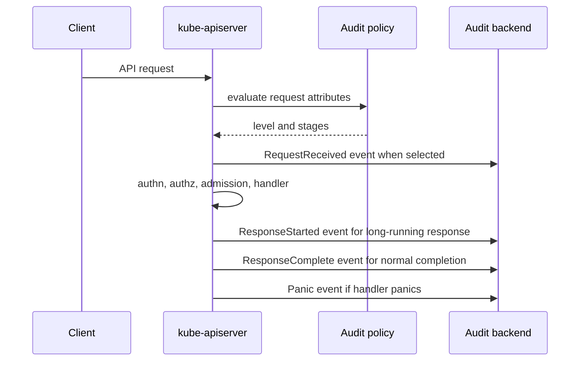

> **Складність**: `[MEDIUM]` — критична для CKS форензика площини управління
>
> **Час на проходження**: 45–50 хвилин
>
> **Передумови**: потік обробки запитів API-сервером, RBAC, аналіз JSON-логів, маніфести статичних Pod'ів

## Що ви зможете робити

Після завершення цього модуля ви зможете аналізувати, налаштовувати та діагностувати аудитне логування Kubernetes як операторську практику, а не як пасивну функцію збору логів.

1. **Аналізувати** життєвий цикл аудитної події, зокрема рівні політики, переходи між стадіями та те, які поля з'являються у кожній події.
2. **Налаштовувати** впорядковані аудитні політики, які захоплюють чутливі дієслова, ресурси, простори імен, користувачів і субресурси, не розкриваючи тіла запитів без потреби.
3. **Порівнювати** файловий і webhook-бекенди аудиту, зокрема обмеження ротації, керування пакетуванням, буфери, поведінку повторних спроб, тротлінг і усічення.
4. **Діагностувати** відсутні або відкинуті аудитні події, спричинені порядком правил, пропущеними стадіями, тиском на бекенд, завеликими запитами або неправильними прапорцями API-сервера.
5. **Будувати** патерн вихідного аудитного конвеєра, який доставляє події API-сервера у довговічне сховище та підтримує запити при розслідуванні інцидентів у стилі CKS.

## Чому цей модуль важливий

Аудитне логування Kubernetes записує вибрані запити до API-сервера як аудитні події, тож воно є слідом доказів площини управління для таких питань: хто прочитав Secret, хто створив привілейований Под, хто змінив RBAC і з якої вихідної IP-адреси розпочали сесію exec. API-сервер створює ці записи всередині шляху обробки запиту, застосовує аудитну політику, щоб вирішити, який рівень і стадії записувати, а потім записує події до налаштованих бекендів, таких як локальний файл логу або зовнішній webhook. ([Kubernetes Audit](https://v1-35.docs.kubernetes.io/docs/tasks/debug/debug-cluster/audit/))

Цінність для безпеки полягає не в тому, щоб мати «більше логів». Справжня цінність для безпеки — це навмисна, продумана видимість саме в тому місці, де Kubernetes приймає або відхиляє намір, виражений через API. Політика, яка логує кожен Secret на рівні `RequestResponse`, може скопіювати дані секрету в аудитне сховище, тоді як політика, яка логує лише широке загальне правило на рівні `Metadata`, може пропустити тіло запиту, потрібне для відтворення небезпечної зміни RBAC. API аудитної політики v1.35 надає рівні для кожного правила, ресурси, дієслова, простори імен, групи, нересурсні URL, `omitStages` та `omitManagedFields`, тож завдання оператора — обирати докази з урахуванням моделі витрат. ([Audit Policy API](https://v1-35.docs.kubernetes.io/docs/reference/config-api/apiserver-audit.v1/), [Kubernetes Audit](https://v1-35.docs.kubernetes.io/docs/tasks/debug/debug-cluster/audit/))

Завдання CKS схильні стискати цю тему до практичних збоїв. Вам можуть дати маніфест API-сервера з `--audit-policy-file`, але без придатного для запису `--audit-log-path`; політику, де широке правило `Metadata` стоїть перед правилом `RequestResponse`, яке мало б ловити зміни RBAC; або конфігурацію бекенду, яка відкидає події, бо пакетні буфери не встигають. Розв'язання таких завдань вимагає читання порядку політики, підтвердження прапорців бекенду, генерування відомого запиту до API та доведення того, що отримана JSON-подія містить очікувані поля `verb`, `user`, `objectRef`, `stage` і `responseStatus`. ([Kube-apiserver Reference](https://v1-35.docs.kubernetes.io/docs/reference/command-line-tools-reference/kube-apiserver/), [Audit Event API](https://v1-35.docs.kubernetes.io/docs/reference/config-api/apiserver-audit.v1/))

Аудитне логування також має межу надійності в продакшені. Локальне файлове логування легко переглядати під час іспиту, але воно поділяє тиск на диск площини управління й може бути підроблене зловмисником на рівні вузла. Webhook-логування може доставляти події за межі площини управління, але воно додає поведінку черг, пакетування, тротлінгу, повторних спроб і збоїв, яку треба налаштовувати навмисно. Kubernetes документує обидва бекенди як опції аудиту API-сервера, і вибір бекенду слід прив'язувати до зберігання, стійкості до підробки, затримки й того, як ваша система реагування на інциденти читає JSON-події. ([Kubernetes Audit](https://v1-35.docs.kubernetes.io/docs/tasks/debug/debug-cluster/audit/), [Kube-apiserver Reference](https://v1-35.docs.kubernetes.io/docs/reference/command-line-tools-reference/kube-apiserver/))

Для цього модуля тримайте в голові одне ключове питання: «Який саме запит мені потрібно буде довести пізніше, коли почнеться розслідування?» Відповідь на це питання зазвичай сама підказує правильний рівень політики. Для читань Secret рівень `Metadata` доводить доступ, не дублюючи тіло секрету. Для записів RBAC рівень `Request` або `RequestResponse` зберігає зміну ролі чи прив'язки. Для перевірок справності та високооб'ємних watch-запитів рівень `None` або пропущені стадії можуть зменшити шум. Для невдалих рішень політики допуску аудитні анотації та статус відповіді часто важать більше, ніж тіла. ([Kubernetes Audit](https://v1-35.docs.kubernetes.io/docs/tasks/debug/debug-cluster/audit/), [Pod Security Admission](https://v1-35.docs.kubernetes.io/docs/concepts/security/pod-security-admission/))

## Життєвий цикл аудитної події

Аудитна подія починається, коли API-сервер отримує запит, і завершується після того, як бекенд отримає записи стадій, вибрані політикою. Kubernetes визначає чотири стадії аудиту: `RequestReceived` — перед тим, як запит делеговано обробнику; `ResponseStarted` — генерується лише для довготривалих запитів, таких як watch чи exec, після надсилання заголовків відповіді; `ResponseComplete` — після завершення тіла відповіді; і `Panic` — коли обробка запиту викликає паніку. Більшість політик пропускають `RequestReceived`, бо він дублює багато високооб'ємних запитів, але довготривалі запити, такі як watch чи exec, можуть зробити доказ зі стадії `ResponseStarted` корисним. ([Kubernetes Audit](https://v1-35.docs.kubernetes.io/docs/tasks/debug/debug-cluster/audit/), [Audit Event API](https://v1-35.docs.kubernetes.io/docs/reference/config-api/apiserver-audit.v1/))



Рівень аудиту контролює, скільки деталей події переживає обчислення політики. `None` означає, що подія не логується. `Metadata` логує метадані запиту, такі як користувач, мітка часу, вихідна IP, дієслово, URI, посилання на об'єкт і статус відповіді, без тіл запиту чи відповіді. `Request` додає тіло запиту там, де це доречно, а `RequestResponse` додає і тіло запиту, і тіло відповіді там, де це доречно. Згенерований довідник API також документує, що `requestObject` записується перед конвертацією версій, застосуванням типових значень, допуском чи обробкою злиття, тож залоговані тіла запитів слід читати як подані докази, а не як кінцевий збережений стан об'єкта. ([Kubernetes Audit](https://v1-35.docs.kubernetes.io/docs/tasks/debug/debug-cluster/audit/), [Audit Event API](https://v1-35.docs.kubernetes.io/docs/reference/config-api/apiserver-audit.v1/))

Використовуйте `RequestResponse` стримано. Він може бути доречним для змін RBAC, ресурсів політик, видалення простору імен чи невеликих критичних для безпеки API, де важливий вміст відповіді, але це небезпечний типовий вибір для Secret, TokenReview та великих оновлень об'єктів. API аудиту підтримує керування усіченням на рівні API-сервера, і `--audit-log-truncate-enabled` чи `--audit-webhook-truncate-enabled` можуть обмежити завеликі корисні навантаження подій замість того, щоб дозволити одному великому запиту захопити пам'ять чи диск бекенду. ([Kube-apiserver Reference](https://v1-35.docs.kubernetes.io/docs/reference/command-line-tools-reference/kube-apiserver/), [Audit Policy API](https://v1-35.docs.kubernetes.io/docs/reference/config-api/apiserver-audit.v1/))

Аудитна подія має стабільний набір полів, які роблять запити під час розслідування зручними й передбачуваними. `auditID` пов'язує стадії одного запиту, `user` записує ім'я користувача і групи, `sourceIPs` записує повідомлені IP-адреси клієнта, `verb` записує намір API, `objectRef` ідентифікує цільовий ресурс чи субресурс, `requestURI` зберігає шлях, а `responseStatus` записує результат у стилі HTTP. Коли рушій політики чи контролер допуску додає аудитні анотації, ці анотації можуть пояснити, чому дозволений або відхилений запит порушив політику в режимі аудиту. ([Audit Event API](https://v1-35.docs.kubernetes.io/docs/reference/config-api/apiserver-audit.v1/), [Pod Security Admission](https://v1-35.docs.kubernetes.io/docs/concepts/security/pod-security-admission/))

Не сприймайте `sourceIPs` як ідеальний сигнал ідентичності. Він корисний для кореляції, але ідентичність усе ще походить із полів автентифікації та авторизації Kubernetes, таких як `user.username`, `user.groups` та метадані імперсонації. Документація з авторизації описує авторизаторів Kubernetes як такі, що вирішують, чи може автентифікований користувач виконати дієслово над ресурсом, а аудитні записи допомагають пов'язати цей шлях авторизації з результатом запиту. ([Kubernetes Authorization](https://v1-35.docs.kubernetes.io/docs/reference/access-authn-authz/authorization/), [Audit Event API](https://v1-35.docs.kubernetes.io/docs/reference/config-api/apiserver-audit.v1/))

## Структура аудитної політики та перший збіг

Аудитна політика — це об'єкт `Policy` з `audit.k8s.io/v1` із масивом `rules`, необов'язковими глобальними налаштуваннями, такими як `omitStages` та `omitManagedFields`, і критеріями збігу для кожного правила. Kubernetes обчислює правила по порядку й використовує лише перше правило, що збіглося для запиту, тож розміщуйте вузькі чутливі правила перед широкими загальними правилами. Широке правило `Metadata` на початку може завадити пізнішому правилу `RequestResponse` для RBAC взагалі застосуватися, і це один із найшвидших способів провалити сценарій іспиту. ([Kubernetes Audit](https://v1-35.docs.kubernetes.io/docs/tasks/debug/debug-cluster/audit/), [Audit Policy API](https://v1-35.docs.kubernetes.io/docs/reference/config-api/apiserver-audit.v1/))

```yaml
apiVersion: audit.k8s.io/v1
kind: Policy
omitStages:
  - RequestReceived
omitManagedFields: true
rules:
  - level: None
    nonResourceURLs:
      - /healthz*
      - /readyz*
      - /livez*
      - /version

  - level: Metadata
    resources:
      - group: ""
        resources: ["secrets"]

  - level: RequestResponse
    resources:
      - group: "rbac.authorization.k8s.io"
        resources: ["roles", "rolebindings", "clusterroles", "clusterrolebindings"]
    verbs: ["create", "update", "patch", "delete"]

  - level: RequestResponse
    resources:
      - group: ""
        resources: ["pods/exec", "pods/attach", "pods/portforward"]
    verbs: ["create"]

  - level: Request
    resources:
      - group: ""
        resources: ["pods"]
    verbs: ["create", "update", "patch", "delete"]

  - level: Metadata
```

Читайте політику зверху вниз і запитуйте, що кожне правило виключає з пізніших правил. Правило перевірки справності прибирає шумні нересурсні URL. Правило Secret захоплює метадані доступу без полів тіла. Правило RBAC захоплює тіла мутацій для змін дозволів. Правило субресурсів Pod ловить `exec`, `attach` і `portforward`, бо це субресурси, які не збігаються зі звичайним правилом ресурсу `pods`. Фінальне загальне правило залишає мінімальний запис для всього іншого. ([Kubernetes Audit](https://v1-35.docs.kubernetes.io/docs/tasks/debug/debug-cluster/audit/), [Audit Policy API](https://v1-35.docs.kubernetes.io/docs/reference/config-api/apiserver-audit.v1/))

Селектори правил поєднуються логічним «І» серед полів, наявних у правилі. Правило з `verbs`, `resources` та `namespaces` застосовується лише тоді, коли збігаються всі три. Правило з `users` чи `userGroups` застосовується до цих ідентичностей, а правило з `nonResourceURLs` застосовується до шляхів, які не є запитами до ресурсів. Це означає, що докази, специфічні для простору імен, мають використовувати `namespaces`, зменшення шуму для конкретної ідентичності — `users` чи `userGroups`, а шум шляхів API — `nonResourceURLs`. ([Audit Policy API](https://v1-35.docs.kubernetes.io/docs/reference/config-api/apiserver-audit.v1/))

Граматика політики розрізняє групи API та ресурси. Базові ресурси, такі як Pod, Secret, ConfigMap і Namespace, використовують `group: ""`; ресурси RBAC використовують `group: "rbac.authorization.k8s.io"`; ресурси допуску чи політик використовують власні групи API. Поширена помилка політики — розмістити `clusterroles` під базовою групою або забути, що субресурси записуються як рядки ресурсів, такі як `pods/exec`, `pods/log` чи `deployments/scale`. ([Audit Policy API](https://v1-35.docs.kubernetes.io/docs/reference/config-api/apiserver-audit.v1/), [Kubernetes Audit](https://v1-35.docs.kubernetes.io/docs/tasks/debug/debug-cluster/audit/))

`omitStages` може бути глобальним або для кожного правила. Використовуйте його, щоб зменшити дубльовані записи, коли вам потрібні лише завершені результати, але уникайте приховування єдиної корисної стадії для довготривалих запитів. `omitManagedFields` може прибрати багатослівні дані керованих полів, привнесені серверним застосуванням (server-side apply), а запис покращення серверного застосування документує поля рівня політики й правила, що дають операторам змогу обирати пропуск керованих полів з аудитних логів. ([Kubernetes Audit](https://v1-35.docs.kubernetes.io/docs/tasks/debug/debug-cluster/audit/), [Server-side Apply KEP](https://github.com/kubernetes/enhancements/blob/master/keps/sig-api-machinery/555-server-side-apply/README.md))

Історичний запис покращення для аудитного логування API досяг стабільного статусу ще до того, як сучасне розташування KEP стало послідовним, тоді як KEP-600 пізніше запропонував динамічне налаштування аудиту й був відкликаний. Висновок для оператора щодо Kubernetes v1.35 — налаштовувати підтримувану статичну політику та бекенди через прапорці API-сервера, а не покладатися на API динамічного налаштування аудиту. Ця історія має значення, бо старіші статті в блогах можуть згадувати динамічні об'єкти аудиту, які не є поточним продакшен-шляхом. ([API Audit Logging Enhancement](https://github.com/kubernetes/enhancements/issues/22), [KEP-600 Dynamic Audit Configuration](https://github.com/kubernetes/enhancements/blob/master/keps/sig-auth/600-dynamic-audit-configuration/README.md), [Kube-apiserver Reference](https://v1-35.docs.kubernetes.io/docs/reference/command-line-tools-reference/kube-apiserver/))

## Прапорці API-сервера та бекенди

Аудитне логування нічого не робить, доки API-сервер не має файлу політики та принаймні одного бекенду. У кластерах у стилі kubeadm ці прапорці зазвичай розміщені в `/etc/kubernetes/manifests/kube-apiserver.yaml`, а маніфест також потребує hostPath-томів для політики та будь-якого локального каталогу логів. Kubernetes документує `--audit-policy-file` як шлях до файлу політики, `--audit-log-path` як шлях файлового бекенду, а `--audit-webhook-config-file` як kubeconfig для webhook-бекенду. ([Kubernetes Audit](https://v1-35.docs.kubernetes.io/docs/tasks/debug/debug-cluster/audit/), [Kube-apiserver Reference](https://v1-35.docs.kubernetes.io/docs/reference/command-line-tools-reference/kube-apiserver/))

```yaml
apiVersion: v1
kind: Pod
metadata:
  name: kube-apiserver
  namespace: kube-system
spec:
  containers:
    - name: kube-apiserver
      command:
        - kube-apiserver
        - --audit-policy-file=/etc/kubernetes/audit-policy.yaml
        - --audit-log-path=/var/log/kubernetes/audit/audit.log
        - --audit-log-maxage=30
        - --audit-log-maxbackup=10
        - --audit-log-maxsize=100
        - --audit-log-truncate-enabled=true
      volumeMounts:
        - name: audit-policy
          mountPath: /etc/kubernetes/audit-policy.yaml
          readOnly: true
        - name: audit-log
          mountPath: /var/log/kubernetes/audit
  volumes:
    - name: audit-policy
      hostPath:
        path: /etc/kubernetes/audit-policy.yaml
        type: File
    - name: audit-log
      hostPath:
        path: /var/log/kubernetes/audit
        type: DirectoryOrCreate
```

Файловий бекенд — правильна базова лінія для іспиту CKS, бо він локальний, добре видимий і легко перевіряється простими інструментами `tail` і `jq`. Його прапорці ротації мають конкретні значення: `--audit-log-maxage` контролює кількість днів зберігання старих файлів, `--audit-log-maxbackup` контролює, скільки ротованих файлів зберігати, а `--audit-log-maxsize` контролює максимальний розмір у мегабайтах перед ротацією. Без цих прапорців диск площини управління може стати прихованим доменом збоїв для багатослівної політики. ([Kube-apiserver Reference](https://v1-35.docs.kubernetes.io/docs/reference/command-line-tools-reference/kube-apiserver/), [Kubernetes Audit](https://v1-35.docs.kubernetes.io/docs/tasks/debug/debug-cluster/audit/))

Webhook-бекенд — правильний продакшен-патерн, коли аудитні події мають швидко залишати вузол площини управління. Його kubeconfig описує віддалений ендпоінт, дані ЦС і облікові дані, а прапорці API-сервера контролюють пакетування та поведінку доставки. `--audit-webhook-batch-max-size`, `--audit-webhook-batch-max-wait`, `--audit-webhook-batch-buffer-size`, `--audit-webhook-batch-throttle-qps`, `--audit-webhook-batch-throttle-burst` та `--audit-webhook-initial-backoff` налаштовують чергу, розмір пакета, час очікування, тротлінг і затримку повторних спроб, що стоять між API-сервером і отримувачем. ([Kubernetes Audit](https://v1-35.docs.kubernetes.io/docs/tasks/debug/debug-cluster/audit/), [Kube-apiserver Reference](https://v1-35.docs.kubernetes.io/docs/reference/command-line-tools-reference/kube-apiserver/))

Пакетування — це завжди компроміс, а не суто оптимізація без зворотного боку. Більші пакети та довше очікування зменшують кількість запитів до отримувача, але збільшують обсяг аудитних доказів, що зберігаються в пам'яті перед доставкою. Менші буфери швидше виявляють тиск, але можуть відкидати події під час сплесків. Тротлінг захищає отримувача, але може спричинити відставання черги під час інциденту. Затримка повторних спроб контролює, наскільки агресивно API-сервер повторює невдалий webhook, тож вона має відповідати очікуванням відновлення отримувача та оповіщенню. ([Kube-apiserver Reference](https://v1-35.docs.kubernetes.io/docs/reference/command-line-tools-reference/kube-apiserver/), [KEP-600 Dynamic Audit Configuration](https://github.com/kubernetes/enhancements/blob/master/keps/sig-auth/600-dynamic-audit-configuration/README.md))

```yaml
apiVersion: v1
kind: Config
clusters:
  - name: audit-receiver
    cluster:
      server: https://audit-receiver.security.example/audit
      certificate-authority: /etc/kubernetes/pki/audit-receiver-ca.crt
users:
  - name: kube-apiserver-audit
    user:
      client-certificate: /etc/kubernetes/pki/audit-client.crt
      client-key: /etc/kubernetes/pki/audit-client.key
contexts:
  - name: audit
    context:
      cluster: audit-receiver
      user: kube-apiserver-audit
current-context: audit
```

Коли налаштовано і файловий, і webhook-бекенди, сприймайте їх як два шляхи доказів із різними режимами збоїв. Файловий шлях допомагає локальному аварійному усуненню несправностей, тоді як webhook-шлях підтримує зовнішнє зберігання й стійкість до підробки. API-сервер усе одно застосовує політику перед надсиланням подій, тож два бекенди не виправлять політику, яка вибрала `None`, використала неправильну групу API, збіглася з неправильним простором імен або пропустила єдину стадію, яка показала б запит. ([Kubernetes Audit](https://v1-35.docs.kubernetes.io/docs/tasks/debug/debug-cluster/audit/), [Audit Policy API](https://v1-35.docs.kubernetes.io/docs/reference/config-api/apiserver-audit.v1/))

## Підводні камені, що ламають розслідування

Семантика першого збігу — найпоширеніша помилка аудитної політики. Якщо широке правило, таке як `- level: Metadata`, з'являється перед вужчим правилом `RequestResponse`, пізніше правило ніколи не побачить відповідних запитів. Під час перегляду позначте кожен чутливий сценарій і пройдіть по політиці вниз до першого правила, що збігається. Якщо збіг стається раніше за очікуване, пересуньте чутливе правило вгору або звузьте широке правило. ([Kubernetes Audit](https://v1-35.docs.kubernetes.io/docs/tasks/debug/debug-cluster/audit/), [Audit Policy API](https://v1-35.docs.kubernetes.io/docs/reference/config-api/apiserver-audit.v1/))

Pod Security Admission може генерувати аудитні анотації для порушень політики, коли простори імен використовують аудитні мітки, і ці анотації з'являються в аудитних подіях, а не як звичайні об'єкти `Event` Kubernetes. Якщо завдання просить докази `PolicyViolation`, читайте анотації аудитної події та статус відповіді перед пошуком у логах робочих навантажень. Відмова допуску, аудитна анотація допуску та ресурси `Event` Kubernetes — це різні сигнали. ([Pod Security Admission](https://v1-35.docs.kubernetes.io/docs/concepts/security/pod-security-admission/), [Audit Event API](https://v1-35.docs.kubernetes.io/docs/reference/config-api/apiserver-audit.v1/))

Група `system:masters` — це аварійна (break-glass) ідентифікаційна група, і кластери зазвичай прив'язують її до ролі `cluster-admin` через типовий RBAC. Аудитні політики можуть збігатися з `userGroups: ["system:masters"]`, що корисно для високосигнального відстеження використання аварійного адміністратора. Підводний камінь у тому, що це не замінює перегляд RBAC: якщо в цій групі забагато клієнтських сертифікатів чи ідентичностей, аудитні логи доведуть привілейоване використання постфактум, але вони не зменшать повноваження цих ідентичностей. ([Kubernetes Authorization](https://v1-35.docs.kubernetes.io/docs/reference/access-authn-authz/authorization/), [Kubernetes Audit](https://v1-35.docs.kubernetes.io/docs/tasks/debug/debug-cluster/audit/))

Завеликі запити можуть породжувати завеликі аудитні події, особливо на рівні `RequestResponse` з великими ConfigMap, CRD, керованими полями чи масовими відповідями об'єктів. Використовуйте прапорці усічення та `omitManagedFields`, щоб зменшити ризик корисного навантаження, і надавайте перевагу `Metadata` для чутливих високооб'ємних ресурсів, де вміст тіла не потрібен для розслідування. Якщо в умові іспиту згадуються відсутні тіла чи усічені події, перевірте і рівень політики, і налаштування усічення API-сервера. ([Kube-apiserver Reference](https://v1-35.docs.kubernetes.io/docs/reference/command-line-tools-reference/kube-apiserver/), [Server-side Apply KEP](https://github.com/kubernetes/enhancements/blob/master/keps/sig-api-machinery/555-server-side-apply/README.md))

Субресурси легко пропустити. `kubectl exec` — це не звичайне оновлення Pod, `kubectl logs` націлюється на `pods/log`, перенаправлення портів націлюється на `pods/portforward`, а масштабування може націлюватися на субресурс `scale` робочого навантаження. Якщо політика називає лише `pods`, вона може не захопити операцію над субресурсом, яка вас цікавить. Для усунення несправностей CKS завжди порівнюйте спостережувані `requestURI` та `objectRef.subresource` із рядками `resources` політики. ([Audit Event API](https://v1-35.docs.kubernetes.io/docs/reference/config-api/apiserver-audit.v1/), [Kubernetes Audit](https://v1-35.docs.kubernetes.io/docs/tasks/debug/debug-cluster/audit/))

Проблеми доставки webhook виглядають як проблеми політики, доки ви не перевірите тиск на бекенд. Правильна політика все одно може втратити практичну цінність, коли отримувач недоступний, буфери замалі, тротлінг занадто суворий або облікові дані TLS у webhook-kubeconfig неправильні. Перевірте прапорці API-сервера, потім перевірте досяжність отримувача, потім згенеруйте один відомий запит і пошукайте його `auditID` чи унікальне ім'я об'єкта у зовнішньому сховищі. ([Kubernetes Audit](https://v1-35.docs.kubernetes.io/docs/tasks/debug/debug-cluster/audit/), [Kube-apiserver Reference](https://v1-35.docs.kubernetes.io/docs/reference/command-line-tools-reference/kube-apiserver/))

## Патерн вихідного конвеєра

Вихідний конвеєр має зберігати JSON-події аудиту, захищати їх від втрати з диска площини управління та робити поширені поля інцидентів придатними для пошуку. Файловий бекенд аудиту Kubernetes записує порядкові JSON-події, тож шипер логів може читати `/var/log/kubernetes/audit/audit.log`, розбирати кожен рядок, додавати метадані кластера й записувати запис до об'єктного сховища, Loki, Elasticsearch або іншого SIEM. Файлове джерело Vector читає локальні файли, а його синк AWS S3 записує події до S3-сумісного сховища, що робить компактний приклад придатним для зберігання аудиту. ([Vector File Source](https://vector.dev/docs/reference/configuration/sources/file/), [Vector AWS S3 Sink](https://vector.dev/docs/reference/configuration/sinks/aws_s3/))

```toml
[sources.kube_audit]
type = "file"
include = ["/var/log/kubernetes/audit/audit.log"]
read_from = "end"

[transforms.parse_audit_json]
type = "remap"
inputs = ["kube_audit"]
source = '''
. = parse_json!(.message)
.cluster = "prod-us"
'''

[sinks.audit_s3]
type = "aws_s3"
inputs = ["parse_audit_json"]
bucket = "company-kubernetes-audit"
# %F = strftime YYYY-MM-DD; supported in Vector S3 sink key_prefix.
key_prefix = "cluster=prod-us/date=%F/"
compression = "gzip"
encoding.codec = "json"
```

Тримайте приклад конвеєра невеликим, бо політика все одно є точкою контролю. Шипер не може відновити тіло запиту, яке аудитна політика вирішила не логувати, а бакет S3 не може довести сесію exec, якщо політика ніколи не збіглася з `pods/exec`. Завдання конвеєра — довговічність, індексація та контроль доступу; завдання політики — вирішити, які докази існують. Використовуйте дозволи сховища логів так само ретельно, як дозволи Secret, бо аудитні записи можуть розкрити імена користувачів, вихідні адреси, імена об'єктів, тіла запитів і анотації допуску. ([Audit Policy API](https://v1-35.docs.kubernetes.io/docs/reference/config-api/apiserver-audit.v1/), [Vector AWS S3 Sink](https://vector.dev/docs/reference/configuration/sinks/aws_s3/))

Для запитів при розслідуванні нормалізуйтеся навколо невеликого набору полів: `requestReceivedTimestamp`, `auditID`, `user.username`, `user.groups`, `verb`, `objectRef.resource`, `objectRef.subresource`, `objectRef.namespace`, `objectRef.name`, `sourceIPs`, `userAgent` та `responseStatus.code`. Ці поля походять з API аудитної події й дають змогу відповісти, хто, що, де, коли робив і чи вдалося це, без необхідності спершу читати великі тіла запитів. ([Audit Event API](https://v1-35.docs.kubernetes.io/docs/reference/config-api/apiserver-audit.v1/))

```bash
jq -c '
  select(.objectRef.resource == "secrets" and .verb == "get")
  | {
      time: .requestReceivedTimestamp,
      user: .user.username,
      groups: .user.groups,
      namespace: .objectRef.namespace,
      secret: .objectRef.name,
      sourceIPs: .sourceIPs,
      status: .responseStatus.code
    }
' /var/log/kubernetes/audit/audit.log
```

## Робочий процес іспиту CKS

Почніть із маніфесту API-сервера, бо прапорці вирішують, чи взагалі завантажено файл політики та бекенд. Підтвердьте `--audit-policy-file`, потім підтвердьте або `--audit-log-path` із прапорцями ротації, або `--audit-webhook-config-file` із прапорцями пакетування. У площині управління зі статичними Pod'ами також підтвердьте, що файл політики й каталог логів змонтовано в контейнер API-сервера, бо правильний файл на хості марний, коли контейнер не може його прочитати. ([Kubernetes Audit](https://v1-35.docs.kubernetes.io/docs/tasks/debug/debug-cluster/audit/), [Kube-apiserver Reference](https://v1-35.docs.kubernetes.io/docs/reference/command-line-tools-reference/kube-apiserver/))

Далі згенеруйте контрольований запит, який має збігтися з цільовим правилом. Якщо завдання просить доступ до Secret, створіть або прочитайте одноразовий Secret в одноразовому просторі імен і пошукайте цей простір імен та ім'я об'єкта. Якщо завдання просить зміни RBAC, створіть невелику RoleBinding і пошукайте `rbac.authorization.k8s.io`. Якщо завдання просить захоплення exec, виконайте exec проти відомого Pod'а й пошукайте `pods/exec` чи `objectRef.subresource == "exec"`. ([Audit Event API](https://v1-35.docs.kubernetes.io/docs/reference/config-api/apiserver-audit.v1/), [Kubernetes Audit](https://v1-35.docs.kubernetes.io/docs/tasks/debug/debug-cluster/audit/))

Коли очікувана подія відсутня, діагностуйте в такому порядку: шлях файлу політики, валідність YAML, порядок правил, група ресурсу й субресурс, дієслово, селектор простору імен, селектор користувача чи групи, пропущені стадії, шлях бекенду чи конфігурація webhook, а також усічення чи тиск доставки. Цей порядок віддзеркалює життєвий цикл запиту, тож кожен крок усуває один клас збоїв перед тим, як ви зміните політику. Він також запобігає поширеній помилці — робити загальне правило багатослівнішим, коли справжня вада в тому, що вузьке правило стоїть нижче від загального. ([Kubernetes Audit](https://v1-35.docs.kubernetes.io/docs/tasks/debug/debug-cluster/audit/), [Audit Policy API](https://v1-35.docs.kubernetes.io/docs/reference/config-api/apiserver-audit.v1/))

```bash
sudo grep -- '--audit-' /etc/kubernetes/manifests/kube-apiserver.yaml
sudo ls -l /etc/kubernetes/audit-policy.yaml /var/log/kubernetes/audit
kubectl create namespace audit-lab
kubectl create secret generic audit-lab-secret -n audit-lab --from-literal=password=redacted
kubectl get secret audit-lab-secret -n audit-lab
sudo tail -n 200 /var/log/kubernetes/audit/audit.log | jq -c '
  select(.objectRef.namespace == "audit-lab")
  | {stage, level, verb, resource: .objectRef.resource, name: .objectRef.name, user: .user.username, status: .responseStatus.code}
'
kubectl delete namespace audit-lab
```

## Вправи на перегляд політики

Переглядайте політику як послідовність рішень про докази. Позначте запит, який вас цікавить, потім визначте перше правило, що збігається з його дієсловом, групою, ресурсом, простором імен, користувачем і формою URL. Зупиніться, коли знайдено перший збіг. Не продовжуйте сканувати в пошуках кращого пізнішого правила. Ця звичка відповідає задокументованій поведінці політики й виявляє найпоширеніший поганий порядок ще до того, як він дійде до API-сервера. ([Kubernetes Audit](https://v1-35.docs.kubernetes.io/docs/tasks/debug/debug-cluster/audit/), [Audit Policy API](https://v1-35.docs.kubernetes.io/docs/reference/config-api/apiserver-audit.v1/))

Використовуйте рівні як навмисну драбину доказів. `Metadata` відповідає, хто, що, де, коли і чи вдався запит. `Request` додає подане тіло й корисний для записів, де важить різниця об'єкта. `RequestResponse` додає тіло відповіді й має бути зарезервований для вузьких, високоцінних випадків. `None` доречний для шуму, але лише після того, як ви можете пояснити, чому запит має низьку цінність для безпеки. ([Kubernetes Audit](https://v1-35.docs.kubernetes.io/docs/tasks/debug/debug-cluster/audit/), [Audit Event API](https://v1-35.docs.kubernetes.io/docs/reference/config-api/apiserver-audit.v1/))

Перевіряйте ресурси за групою API перед перевіркою імен ресурсів. Базовий Secret і ClusterRole з RBAC обидва виглядають як звичайні об'єкти YAML, але їхні групи аудитної політики різняться. Базовий ресурс використовує порожню групу. Ресурси RBAC використовують `rbac.authorization.k8s.io`. Ресурси допуску й політик використовують власні групи. Неправильні групи можуть зробити правило начебто точним, тоді як воно ніколи не збігається з потрібним запитом. ([Audit Policy API](https://v1-35.docs.kubernetes.io/docs/reference/config-api/apiserver-audit.v1/))

Перевіряйте субресурси як окремі цілі доказів. Операції exec, attach, logs і port-forward Pod'а — це шляхи запитів з інформацією про субресурс, і вони часто більш релевантні для безпеки, ніж звичайні читання Pod'а. Політика, яка доводить створення Pod'а, усе одно може не довести доступ до оболонки. Пошукайте одну відому подію, прочитайте `requestURI` та `objectRef.subresource`, потім запишіть рядок політики, що збігається зі спостережуваним запитом. ([Audit Event API](https://v1-35.docs.kubernetes.io/docs/reference/config-api/apiserver-audit.v1/), [Kubernetes Audit](https://v1-35.docs.kubernetes.io/docs/tasks/debug/debug-cluster/audit/))

Сприймайте простори імен як інструменти обмеження області, а не як заміну вибору ресурсів. Правило простору імен може сфокусувати продакшен-докази, але воно не може виправити неправильну групу API, відсутній субресурс чи широке раніше правило. Ресурси кластерної області, такі як ClusterRole та ClusterRoleBinding, також не мають просторів імен об'єктів, тож фільтр простору імен може випадково виключити саме ті докази RBAC, які вам потрібні. ([Audit Policy API](https://v1-35.docs.kubernetes.io/docs/reference/config-api/apiserver-audit.v1/), [Audit Event API](https://v1-35.docs.kubernetes.io/docs/reference/config-api/apiserver-audit.v1/))

Переглядайте селектори користувачів і груп із такою ж ретельністю, як RBAC. Правило політики може збігатися з іменами користувачів чи групами, зокрема аварійними ідентичностями, такими як `system:masters`, але аудитне правило не надає й не прибирає дозвіл. Авторизація все одно вирішує, чи дозволено запит. Вибір аудиту лише вирішує, який запис записується після того, як запит дійде до шляху API-сервера. ([Kubernetes Authorization](https://v1-35.docs.kubernetes.io/docs/reference/access-authn-authz/authorization/), [Kubernetes Audit](https://v1-35.docs.kubernetes.io/docs/tasks/debug/debug-cluster/audit/))

Використовуйте `omitStages` після того, як знаєте, яка стадія відповідає на питання. Багато розслідувань потребують `ResponseComplete`, бо вона містить результат. Довготривалі запити можуть проявитися через `ResponseStarted`. Записи Panic рідкісні, але важливі, коли обробник дає збій. Пропуск `RequestReceived` зазвичай зменшує дубльований шум, але обрізання стадій має слідувати за вимогами до доказів, а не за звичкою. ([Kubernetes Audit](https://v1-35.docs.kubernetes.io/docs/tasks/debug/debug-cluster/audit/), [Audit Event API](https://v1-35.docs.kubernetes.io/docs/reference/config-api/apiserver-audit.v1/))

## Вправи на збої бекенду

Відокремлюйте вибір політики від доставки бекендом під час усунення несправностей. Вибрана подія може бути втрачена в місці, де ви шукаєте, якщо шлях файлу не змонтовано, каталог не доступний для запису, ендпоінт webhook недосяжний або пакетування застрягло. Доведіть вибір за допомогою локального файлу, де це можливо. Потім доведіть доставку до зовнішнього бекенду з тим самим унікальним іменем об'єкта. ([Kubernetes Audit](https://v1-35.docs.kubernetes.io/docs/tasks/debug/debug-cluster/audit/), [Kube-apiserver Reference](https://v1-35.docs.kubernetes.io/docs/reference/command-line-tools-reference/kube-apiserver/))

Для файлового бекенду спершу діагностуйте шлях і ротацію. API-сервер записує у видимості свого контейнера, тож hostPath-монтування мають відкривати файл політики й каталог логів за шляхами, названими прапорцями. Налаштування ротації потім вирішують тиск зберігання. Якщо політика стає багатослівнішою, ротацію треба переглянути перш ніж диск площини управління стане межею збою. ([Kubernetes Audit](https://v1-35.docs.kubernetes.io/docs/tasks/debug/debug-cluster/audit/), [Kube-apiserver Reference](https://v1-35.docs.kubernetes.io/docs/reference/command-line-tools-reference/kube-apiserver/))

Для webhook-бекенду діагностуйте ідентичність і транспорт перед налаштуванням черги. Kubeconfig має вказувати на отримувача, довіряти сертифікату отримувача й надавати облікові дані, які отримувач приймає. Лише після того, як TLS і автентифікацію доведено, слід налаштовувати розмір пакета, час очікування, розмір буфера, тротлінг QPS, сплеск тротлінгу, початкову затримку та усічення. Цей порядок тримає мережеві збої окремо від збоїв навантаження. ([Kubernetes Audit](https://v1-35.docs.kubernetes.io/docs/tasks/debug/debug-cluster/audit/), [Kube-apiserver Reference](https://v1-35.docs.kubernetes.io/docs/reference/command-line-tools-reference/kube-apiserver/))

Тлумачте буфери як обмежене в часі сховище доказів. Більший буфер може поглинути сплеск, але він також тримає більше недоставлених подій усередині процесу API-сервера. Менший буфер дає збій раніше під тиском, що може бути легше для оповіщення. Тротлінг захищає отримувача, але може створити відставання, коли зростає трафік інциденту. Обирайте ці налаштування з виміряної ємності отримувача, а не з загального шаблону. ([Kube-apiserver Reference](https://v1-35.docs.kubernetes.io/docs/reference/command-line-tools-reference/kube-apiserver/), [KEP-600 Dynamic Audit Configuration](https://github.com/kubernetes/enhancements/blob/master/keps/sig-auth/600-dynamic-audit-configuration/README.md))

Використовуйте усічення як засіб контролю надійності, а не як заміну дизайну політики. Усічення може завадити завеликій події перевантажити бекенд, але воно також може прибрати деталі тіла, на які розраховували слідчі. Якщо тіла регулярно завеликі, знизьте рівень для шумних ресурсів, пропустіть керовані поля або обмежте правило з великим тілом до точної операції. ([Kube-apiserver Reference](https://v1-35.docs.kubernetes.io/docs/reference/command-line-tools-reference/kube-apiserver/), [Server-side Apply KEP](https://github.com/kubernetes/enhancements/blob/master/keps/sig-api-machinery/555-server-side-apply/README.md))

Сприймайте подвійні бекенди як резервування зі спільною політикою. Файловий бекенд і webhook-бекенд можуть давати збій незалежно, але вони обидва отримують те, що вибрала політика. Якщо жоден бекенд не містить події, підозрюйте спершу вибір політики чи стадії. Якщо файл має подію, а зовнішнє сховище — ні, підозрюйте доставку webhook, розбір отримувачем, стан шипера чи вихідну індексацію. ([Kubernetes Audit](https://v1-35.docs.kubernetes.io/docs/tasks/debug/debug-cluster/audit/), [Vector File Source](https://vector.dev/docs/reference/configuration/sources/file/))

Перевіряйте вихідні шипери однією подією на сценарій. Get Secret доводить чутливі метадані. Patch RBAC доводить захоплення тіла запиту. Exec Pod'а доводить покриття субресурсів. Відхилений запит політики доводить статус відповіді й анотації. Надішліть ці події через шипер, потім запитайте призначення за іменем об'єкта, ідентифікатором аудиту, користувачем і міткою часу. ([Audit Event API](https://v1-35.docs.kubernetes.io/docs/reference/config-api/apiserver-audit.v1/), [Vector AWS S3 Sink](https://vector.dev/docs/reference/configuration/sinks/aws_s3/))

## Вправи на запити при розслідуванні

Починайте кожне розслідування аудиту з часового вікна й цільового поля. Відомий простір імен, ім'я об'єкта, користувач, вихідна IP чи user agent зменшують шум швидше, ніж читання повних JSON-тіл. API аудитної події дає вам стабільні поля для цих фільтрів, і ці поля залишаються корисними навіть тоді, коли рівень політики — лише `Metadata`. ([Audit Event API](https://v1-35.docs.kubernetes.io/docs/reference/config-api/apiserver-audit.v1/))

Для інцидентів із Secret шукайте читання та записи окремо. Читання відповідають на питання експозиції. Записи відповідають на зміни персистентності. Видалення відповідають на деструктивну активність. Тримайте рівень на `Metadata`, доки розслідування спеціально не вимагає даних тіла й організація не приймає ризик експозиції. У більшості продакшен-випадків знання того, хто торкнувся якого Secret, достатньо, щоб почати реагування та ротацію. ([Kubernetes Audit](https://v1-35.docs.kubernetes.io/docs/tasks/debug/debug-cluster/audit/), [Audit Event API](https://v1-35.docs.kubernetes.io/docs/reference/config-api/apiserver-audit.v1/))

Для інцидентів із RBAC зберігайте достатньо тіла запиту, щоб відтворити зміну дозволу. Метадані можуть сказати вам, що RoleBinding змінилася, але вони можуть не показати суб'єкт чи посилання на роль, що створили ескалацію. Вузьке правило `Request` чи `RequestResponse` для дієслів мутації RBAC зазвичай легше захистити, ніж багатослівне логування тіла для кожного ресурсу. ([Kubernetes Audit](https://v1-35.docs.kubernetes.io/docs/tasks/debug/debug-cluster/audit/), [Audit Policy API](https://v1-35.docs.kubernetes.io/docs/reference/config-api/apiserver-audit.v1/))

Для питань про допуск і Pod Security читайте статус відповіді й анотації разом. Запит може бути дозволений з аудитною анотацією, попереджений клієнту або відхилений зі статусом відповіді. Ці результати відповідають на різні питання. Аудитна подія пов'язує сигнал політики, ідентичність, цільовий об'єкт і результат в одному місці, коли політика вибрала запит. ([Pod Security Admission](https://v1-35.docs.kubernetes.io/docs/concepts/security/pod-security-admission/), [Audit Event API](https://v1-35.docs.kubernetes.io/docs/reference/config-api/apiserver-audit.v1/))

Для перегляду аварійного доступу шукайте високопривілейовані групи й незвичні вихідні локації. Трафік `system:masters` може бути авторизований, але він усе одно має бути рідкісним і пояснюваним. Аудитні запити мають показувати, хто використав ідентичність, коли її використано, яких ресурсів торкнулися й чи збігається вихідна IP з очікуваним шляхом площини управління чи робочої станції адміністратора. ([Kubernetes Authorization](https://v1-35.docs.kubernetes.io/docs/reference/access-authn-authz/authorization/), [Audit Event API](https://v1-35.docs.kubernetes.io/docs/reference/config-api/apiserver-audit.v1/))

Для завдань ремонту CKS пишіть найменшу зміну політики, яка доводить запитану операцію. Додайте одне вузьке правило. Пересуньте його над широким правилом. Згенеруйте один відповідний запит. Запитайте подію. Уникайте зміни непов'язаних правил, бо іспит зазвичай оцінює запитаний шлях доказів, а перегляд продакшен-змін має зберегти непов'язану поведінку логування. ([Kubernetes Audit](https://v1-35.docs.kubernetes.io/docs/tasks/debug/debug-cluster/audit/), [Audit Policy API](https://v1-35.docs.kubernetes.io/docs/reference/config-api/apiserver-audit.v1/))

Для перегляду оновлень порівнюйте вихідні дані аудиту до й після зміни версій Kubernetes, файлів політики чи поведінки серверного застосування. Форми аудитних подій — це об'єкти API, але вміст тіла може змінитися, коли клієнти змінюють подані поля, керовані поля ростуть або поведінка допуску змінює типові значення об'єктів. Тримайте одне дозволене створення Pod'а, одне читання Secret, одну мутацію RBAC, один запит до субресурсу й одне порушення допуску як регресійні зонди. Запускайте ці зонди після змін площини управління. Підтвердьте стадію, рівень, посилання на об'єкт, статус відповіді, анотації та наявність тіла. Якщо керовані поля домінують у тілах запитів, перегляньте рішення `omitManagedFields` рівня політики й правила. Якщо отримувач починає відхиляти події, перевірте розмір корисного навантаження перш ніж змінювати семантику політики. Цей стиль перегляду тримає налаштування аудиту прив'язаним до вимог доказів, замість того щоб дозволити оновленням мовчки змінювати якість розслідувань. Він також запобігає протилежному збою, коли команда вимикає корисні докази тіла, бо одне шумне поле зробило зберігання дорогим. ([Audit Event API](https://v1-35.docs.kubernetes.io/docs/reference/config-api/apiserver-audit.v1/), [Server-side Apply KEP](https://github.com/kubernetes/enhancements/blob/master/keps/sig-api-machinery/555-server-side-apply/README.md), [Kube-apiserver Reference](https://v1-35.docs.kubernetes.io/docs/reference/command-line-tools-reference/kube-apiserver/))

Для перегляду стійкості до підробки припускайте, що локальні аудитні файли корисні, але недостатні. Зловмисник на рівні вузла може націлитися на локальні файли, маніфести статичних Pod'ів чи hostPath-каталоги після отримання доступу до площини управління. Конвеєр webhook чи шипера зменшує цей ризик, переміщуючи події до сховища з іншими обліковими даними та засобами контролю зберігання. Політика все одно має вибрати докази перед відправкою. Отримувач все одно має зберегти JSON-поля. Рівень сховища все одно потребує контролю доступу. Під час перегляду запитайте, чи може зловмисник, який здатен редагувати маніфест API-сервера, також стерти єдину копію подій, що доводять це редагування. Якщо відповідь «так», посильте зовнішню доставку й налаштуйте оповіщення про зміни прапорців аудиту. Ось чому файлове логування чудове для видимості CKS, тоді як реагування на інциденти в продакшені зазвичай потребує шляху доказів поза вузлом. ([Kubernetes Audit](https://v1-35.docs.kubernetes.io/docs/tasks/debug/debug-cluster/audit/), [Vector File Source](https://vector.dev/docs/reference/configuration/sources/file/), [Vector AWS S3 Sink](https://vector.dev/docs/reference/configuration/sinks/aws_s3/))

Для перегляду розбору отримувачем зберігайте оригінальну аудитну подію перед додаванням похідних полів. Вихідний інструмент може додати метадані кластера, середовища, команди чи зберігання, але він не має відкидати `auditID`, `requestURI`, `objectRef`, `user`, `sourceIPs`, `stage`, `level`, `annotations` чи `responseStatus`. Ці поля пов'язують окремі стадії одного запиту, ідентифікують актора, називають цільовий об'єкт і показують результат. Якщо конвеєр розбирає JSON в іншу схему, зберігайте сиру копію чи точну структуровану копію. Якщо конвеєр зберігає лише вибрані поля, задокументуйте, які розслідування стають неможливими. Наприклад, відкидання `requestURI` може ускладнити виявлення незвичних шляхів субресурсів, а відкидання анотацій може приховати сигнали аудиту політики. Нормалізація конвеєра має покращувати запити, не звужуючи докази нижче того, що політика навмисно зібрала. ([Audit Event API](https://v1-35.docs.kubernetes.io/docs/reference/config-api/apiserver-audit.v1/), [Vector File Source](https://vector.dev/docs/reference/configuration/sources/file/))

Для перегляду змін політики вимагайте, щоб кожне нове правило називало сценарій, рівень і вартість. Сценарій каже, на яке пізніше питання відповідає правило. Рівень каже, чи потрібні метадані, тіло запиту чи тіло відповіді. Вартість каже, який тиск на сховище, чутливість чи бекенд додає правило. Правило, яке не може назвати свій сценарій, зазвичай є шумом. Правило, яке не може виправдати свій рівень, зазвичай завелике. Правило, яке не може описати свою вартість, пізніше здивує платформну команду. Цей перегляд особливо важливий для `RequestResponse`, ресурсів-шаблонів, користувачів-шаблонів і правил на весь простір імен. Він також корисний для правил `None`, бо пропущені події — це докази, які ви вирішили не мати. У CKS це мислення допомагає пояснити виправлення. У продакшені воно дає рецензентам стійку причину прийняти чи відхилити зміну. Додайте власника правила. Додайте очікуваний період зберігання. Додайте очікуване вихідне призначення. Додайте очікуваний тестовий запит. Додайте поле, що доводить успіх. Додайте шлях відкату. Додайте оповіщення, яке має спрацювати, коли шлях дає збій. Ці нотатки перетворюють аудитну політику з мовчазного YAML-файлу на керований засіб контролю. Вони також не дають логуванню тіла поширюватися через копіювання та вставлення. Коли рецензент бачить `RequestResponse`, рецензент має запитати, яке поле тіла потрібне. Коли рецензент бачить шаблон, рецензент має запитати, які ресурси розглянуто й відхилено. Коли рецензент бачить правило `None`, рецензент має запитати, на яке питання інциденту більше не можна буде відповісти. Коли рецензент бачить `omitStages`, рецензент має запитати, яка стадія залишається для доведення результату. Коли рецензент бачить селектор групи користувачів, рецензент має запитати, чи стабільна вибрана група. Коли рецензент бачить зміни пакетування webhook, рецензент має запитати, яке обмеження отримувача спонукало це налаштування. Коли рецензент бачить зміни ротації файлів, рецензент має запитати, як довго локальні докази залишаються під час зовнішнього збою. Коли рецензент бачить увімкнене усічення, рецензент має запитати, як слідчі впізнають усічені записи. Ці питання механічні, але вони не є бюрократією. Вони зберігають зв'язок між синтаксисом політики, поведінкою бекенду й результатами розслідування. Вони також дають новим операторам контрольний список для читання наявних кластерів без їх переписування. Тримайте один письмовий приклад поруч із політикою. Включіть запит, вибране правило, очікуваний рівень, очікувану стадію й запит, що доводить надходження події. Цей приклад стає регресійним тестом для майбутніх редагувань. Він також дає тому, хто реагує на інцидент, відому-добру форму, коли спрацьовує наступне оповіщення. Якщо приклад більше не працює, виправте політику чи бекенд перш ніж покладатися на аудитний слід. Переглядайте ці приклади після кожного редагування політики. Переглядайте їх після кожної зміни отримувача. Переглядайте їх після кожного оновлення площини управління. Аудитне логування корисне лише тоді, коли команда все ще може видати докази, які вона очікує, за поточної поведінки кластера. Докази, які не можна відтворити під час практики, дадуть збій під тиском інциденту. ([Kubernetes Audit](https://v1-35.docs.kubernetes.io/docs/tasks/debug/debug-cluster/audit/), [Audit Policy API](https://v1-35.docs.kubernetes.io/docs/reference/config-api/apiserver-audit.v1/))

## Чи знали ви?

- Правила аудитної політики Kubernetes діють за принципом першого збігу, тож широке правило `Metadata` над вужчим правилом `RequestResponse` змінює збір доказів, не породжуючи синтаксичної помилки політики. ([Kubernetes Audit](https://v1-35.docs.kubernetes.io/docs/tasks/debug/debug-cluster/audit/))
- Рівні `Request` та `RequestResponse` можуть логувати тіла запиту чи відповіді, що означає, що вони можуть перетворити аудитне сховище на ще одне місце, яке містить чутливі корисні навантаження, якщо їх використовувати необачно. ([Audit Policy API](https://v1-35.docs.kubernetes.io/docs/reference/config-api/apiserver-audit.v1/))
- `omitManagedFields` доступний на рівні політики й правила, тож оператори можуть зменшити метадані серверного застосування в аудитних тілах, не вимикаючи аудитне логування. ([Server-side Apply KEP](https://github.com/kubernetes/enhancements/blob/master/keps/sig-api-machinery/555-server-side-apply/README.md))
- Webhook-бекенд налаштовується файлом у стилі kubeconfig, але його характеристики доставки контролюються прапорцями API-сервера для пакетування, буферів, тротлінгу, усічення та початкової затримки. ([Kube-apiserver Reference](https://v1-35.docs.kubernetes.io/docs/reference/command-line-tools-reference/kube-apiserver/))

## Типові помилки

| Помилка | Чому це шкодить | Кращий хід оператора |
|---|---|---|
| Розміщення загального правила `Metadata` першим | Чутливі пізніші правила ніколи не збігаються, бо обчислення політики зупиняється на першому збігу | Розмістіть вузькі високоцінні правила над широкими типовими й протестуйте відомими запитами |
| Логування Secret на рівні `RequestResponse` | Значення секретів можуть бути скопійовані в аудитне сховище й вихідні системи | Використовуйте `Metadata` для доступу до Secret і ротуйте будь-які значення, розкриті попередніми логами |
| Забування про субресурси | `pods/exec`, `pods/log` та `pods/portforward` можуть не збігтися зі звичайним правилом `pods` | Додайте явні рядки ресурсів-субресурсів для інтерактивних шляхів доступу |
| Увімкнення файлового логування без ротації | Багатослівні політики можуть заповнити диск площини управління й дестабілізувати API-сервер | Встановіть прапорці максимального віку, кількості резервних копій і розміру перед збільшенням багатослівності |
| Припущення, що webhook означає довговічні докази | Поганий TLS, малі буфери, збій отримувача чи тротлінг можуть завадити доставці | Протестуйте досяжність отримувача й пошукайте контрольований запит у зовнішньому сховищі |
| Ігнорування аудитних анотацій | Порушення політики в режимі аудиту можуть записуватися як анотації подій, а не логи робочих навантажень | Перевірте `annotations`, `responseStatus` та повідомлення допуску в аудитній події |
| Сприйняття `system:masters` як звичайного адмін-трафіку | Аварійне використання може бути високоризиковим, навіть коли воно авторизоване | Збігайте й налаштовуйте оповіщення щодо цієї групи, окремо переглядаючи RBAC і видачу сертифікатів |

## Перевірка знань

1. Вам потрібні докази того, що користувачі отримували доступ до Secret у `prod`, але ви не повинні дублювати значення секретів в аудитний лог. Який рівень аудиту й розміщення правила ви обираєте?

<details>
<summary>Відповідь</summary>

Використайте вузьке правило `Metadata` для базових `secrets` перед будь-яким широким загальним правилом і додавайте селектори простору імен чи користувача лише тоді, коли цього вимагає сценарій. `Metadata` записує поля життєвого циклу аудитної події, потрібні для розслідування, зокрема користувача, дієслово, простір імен, ім'я об'єкта, вихідну IP, стадію та статус відповіді, уникаючи при цьому тіл запиту й відповіді. Якщо поточна політика має широке правило `RequestResponse` над правилом Secret, пересуньте правило Secret вище, бо порядок першого збігу контролює, який рівень застосовується.
</details>

2. Політика намагається захопити `kubectl exec`, але єдине правило, що збігається, — це `resources: ["pods"]` з дієсловами `["create", "update", "patch", "delete"]`. Чого бракує?

<details>
<summary>Відповідь</summary>

Додайте явне правило субресурсу для `pods/exec`, і зазвичай включіть `pods/attach` та `pods/portforward`, бо ці інтерактивні шляхи є поширеними цілями інцидентів. Звичайне правило `pods` не доводить, що воно збігається з кожним субресурсом Pod'а, тож шлях усунення несправностей — пошукати відомий запит exec, прочитати `objectRef.subresource` і узгодити рядок ресурсу політики зі спостережуваною аудитною подією. Це проблема порядку правил і збігу ресурсів, а не проблема бекенду.
</details>

3. Файл аудитного логу існує, але диск площини управління постійно заповнюється під час навантажувальних тестів. Які прапорці файлового бекенду слід перевірити першими?

<details>
<summary>Відповідь</summary>

Перевірте `--audit-log-maxage`, `--audit-log-maxbackup` та `--audit-log-maxsize`, потім перегляньте багатослівність політики й пропущені стадії. Прапорці ротації обмежують зберігання локального файлу за віком, кількістю резервних копій і мегабайтами на файл, тоді як налаштування політики контролює, скільки доказів узагалі генерується. Якщо великі тіла є частиною тиску, додайте усічення й використайте `omitManagedFields` там, де керовані поля не є доказами для розслідування.
</details>

4. Webhook-отримувача налаштовано, але події інцидентів ніколи не з'являються в S3. Політика правильна, коли її протестовано проти локального файлового бекенду. Які засоби контролю бекенду слід перевірити?

<details>
<summary>Відповідь</summary>

Перевірте спершу ендпоінт і ЦС у webhook-kubeconfig, потім огляньте засоби контролю пакетування webhook на API-сервері: максимальний розмір, максимальне очікування, розмір буфера, тротлінг QPS, сплеск тротлінгу, початкову затримку й усічення. Правильна аудитна політика вибирає події перед доставкою бекендом, тож відсутні зовнішні записи після успіху локального файлу зазвичай вказують на TLS, доступність отримувача, тиск черги, тротлінг чи поведінку повторних спроб. Згенеруйте один унікальний запит і простежте ім'я цього об'єкта чи `auditID` через логи отримувача й цільовий бакет.
</details>

5. Простір імен Pod Security використовує режим аудиту, і команда питає, де знайти докази `PolicyViolation`. Куди слід дивитися?

<details>
<summary>Відповідь</summary>

Дивіться в аудитні події Kubernetes, особливо в анотації та поля відповіді, перш ніж шукати в логах застосунків чи звичайних об'єктах `Event` Kubernetes. Pod Security Admission може додати аудитні анотації, коли об'єкт порушує налаштований рівень аудиту, не обов'язково відхиляючи запит. Докази, які вам потрібні, — це аудитна подія, що містить анотацію допуску, ідентичність запиту, цільовий об'єкт і статус відповіді, ось чому аудитна політика має зберігати достатньо метаданих для цих запитів до API.
</details>

6. Загальне правило `Metadata` з'являється над правилом `RequestResponse` для RBAC, і слідчі не можуть відтворити, хто додав `cluster-admin` до суб'єкта. Як виправити політику?

<details>
<summary>Відповідь</summary>

Пересуньте правило мутації RBAC над загальне правило й збігайте `group: "rbac.authorization.k8s.io"` із ресурсами, такими як `roles`, `rolebindings`, `clusterroles` та `clusterrolebindings`, для create, update, patch і delete. Семантика першого збігу спричинила перемогу широкого правила метаданих, тож тіло запиту не було захоплено для зміни RBAC. Після редагування політики й перезапуску чи перезавантаження API-сервера через його життєвий цикл статичного Pod'а створіть тестову RoleBinding і перевірте рівень події та посилання на об'єкт.
</details>

7. Ви маєте доставляти аудитні логи у довговічне сховище, але тримати усунення несправностей на іспиті простим на площині управління. Яка архітектура балансує обидві потреби?

<details>
<summary>Відповідь</summary>

Використайте і ротований файловий бекенд, і вихідний конвеєр на основі webhook чи шипера, потім протестуйте обидва контрольованим запитом. Файловий бекенд дає негайну локальну видимість за допомогою `tail` і `jq`, тоді як зовнішній шлях забезпечує довговічність, зберігання й стійкість до підробки. Вихідний конвеєр має зберігати JSON-поля, такі як користувач, дієслово, посилання на об'єкт, вихідна IP, статус та ідентифікатор аудиту, але він не може відновити докази, які аудитна політика не вибрала.
</details>

## Практичні завдання

- [ ] Налаштуйте аудитну політику, яка захоплює метадані Secret, мутації RBAC, доступ до субресурсів Pod'а й загальне правило метаданих, зберігаючи при цьому поля життєвого циклу аудитної події, потрібні для перегляду інциденту.
- [ ] Порівняйте прапорці ротації файлового бекенду з прапорцями пакета, буфера, повторних спроб, тротлінгу та усічення webhook, потім поясніть, який збій кожне налаштування має контролювати.
- [ ] Усуньте несправність із відсутньою аудитною подією, пройшовши порядок правил, групу ресурсу, субресурс, дієслово, простір імен, групу користувача, пропущену стадію й доставку бекендом.
- [ ] Побудуйте короткий приклад вихідного конвеєра, який читає файл аудитного логу, зберігає JSON і надсилає події у довговічне сховище для пізніших запитів.

Створіть одноразовий файл політики й використайте його як артефакт для перегляду перш ніж торкатися реального маніфесту API-сервера. Сенс цієї практики — не сліпо застосувати політику до вашого поточного кластера; він у тому, щоб вивчити операторський шлях читання, який очікують завдання CKS. Перегляньте порядок, визначте перше правило, що збігається, для кожного сценарію й поясніть, чому логування тіла потрібне чи не потрібне для розслідування. ([Kubernetes Audit](https://v1-35.docs.kubernetes.io/docs/tasks/debug/debug-cluster/audit/), [Audit Policy API](https://v1-35.docs.kubernetes.io/docs/reference/config-api/apiserver-audit.v1/))

```bash
cat > /tmp/cks-audit-policy.yaml <<'EOF'
apiVersion: audit.k8s.io/v1
kind: Policy
omitStages:
  - RequestReceived
omitManagedFields: true
rules:
  - level: None
    nonResourceURLs: ["/healthz*", "/readyz*", "/livez*", "/version"]
  - level: Metadata
    resources:
      - group: ""
        resources: ["secrets"]
  - level: RequestResponse
    resources:
      - group: "rbac.authorization.k8s.io"
        resources: ["roles", "rolebindings", "clusterroles", "clusterrolebindings"]
    verbs: ["create", "update", "patch", "delete"]
  - level: RequestResponse
    resources:
      - group: ""
        resources: ["pods/exec", "pods/attach", "pods/portforward"]
    verbs: ["create"]
  - level: Request
    resources:
      - group: ""
        resources: ["pods"]
    verbs: ["create", "update", "patch", "delete"]
  - level: Metadata
EOF

cat /tmp/cks-audit-policy.yaml
```

Використайте наведені нижче питання для перегляду проти політики. Яке правило захоплює `kubectl get secret db -n prod`? Яке правило захоплює patch RoleBinding? Яке правило захоплює exec? Яке правило захоплює перевірку справності? Який чутливий запит усе одно був би захоплений лише на рівні загального правила? Відповіді на ці питання зверху вниз — це звичка, яка запобігає помилкам першого збігу як у завданнях CKS, так і в продакшен-переглядах.

```bash
sudo grep -- '--audit-' /etc/kubernetes/manifests/kube-apiserver.yaml || true
sudo test -f /etc/kubernetes/audit-policy.yaml && sudo sed -n '1,160p' /etc/kubernetes/audit-policy.yaml
sudo test -d /var/log/kubernetes/audit && sudo ls -lh /var/log/kubernetes/audit
```

Якщо у вас є одноразовий кластер з увімкненим аудитним логуванням, згенеруйте один запит для кожної цільової категорії й пошукайте останню частину аудитного логу. Використовуйте унікальні імена об'єктів, щоб ви могли відокремити свій тест від шуму контролерів. Ніколи не використовуйте продакшен-значення Secret для цієї вправи; сенс у тому, щоб довести захоплення метаданих і збіг політики, а не створювати чутливі дані в лозі лабораторії.

```bash
kubectl create namespace audit-lab
kubectl create secret generic audit-lab-token -n audit-lab --from-literal=token=redacted
kubectl get secret audit-lab-token -n audit-lab
kubectl create role audit-lab-reader -n audit-lab --verb=get --resource=pods
kubectl create rolebinding audit-lab-reader -n audit-lab --role=audit-lab-reader --user=audit-user

sudo tail -n 500 /var/log/kubernetes/audit/audit.log | jq -c '
  select(.objectRef.namespace == "audit-lab")
  | {
      time: .requestReceivedTimestamp,
      level,
      stage,
      verb,
      group: .objectRef.apiGroup,
      resource: .objectRef.resource,
      subresource: .objectRef.subresource,
      name: .objectRef.name,
      user: .user.username,
      status: .responseStatus.code
    }
'

kubectl delete namespace audit-lab
rm -f /tmp/cks-audit-policy.yaml
```

## Наступний модуль

[Модуль 6.2: Безпека під час виконання з Falco](../module-6.2-falco/) — виявляйте підозрілу поведінку контейнерів і хоста після того, як API-сервер уже прийняв намір робочого навантаження.

## Sources

- [Kubernetes v1.35: Auditing](https://v1-35.docs.kubernetes.io/docs/tasks/debug/debug-cluster/audit/)
- [Kubernetes v1.35: Audit API reference](https://v1-35.docs.kubernetes.io/docs/reference/config-api/apiserver-audit.v1/)
- [Kubernetes v1.35: kube-apiserver options](https://v1-35.docs.kubernetes.io/docs/reference/command-line-tools-reference/kube-apiserver/)
- [Kubernetes v1.35: Authorization overview](https://v1-35.docs.kubernetes.io/docs/reference/access-authn-authz/authorization/)
- [Kubernetes v1.35: Pod Security Admission](https://v1-35.docs.kubernetes.io/docs/concepts/security/pod-security-admission/)
- [Kubernetes Enhancements: API Audit Logging enhancement record](https://github.com/kubernetes/enhancements/issues/22)
- [Kubernetes Enhancements: KEP-600 Dynamic Audit Configuration](https://github.com/kubernetes/enhancements/blob/master/keps/sig-auth/600-dynamic-audit-configuration/README.md)
- [Kubernetes Enhancements: KEP-555 Server-side Apply audit policy fields](https://github.com/kubernetes/enhancements/blob/master/keps/sig-api-machinery/555-server-side-apply/README.md)
- [Vector documentation: file source](https://vector.dev/docs/reference/configuration/sources/file/)
- [Vector documentation: AWS S3 sink](https://vector.dev/docs/reference/configuration/sinks/aws_s3/)


