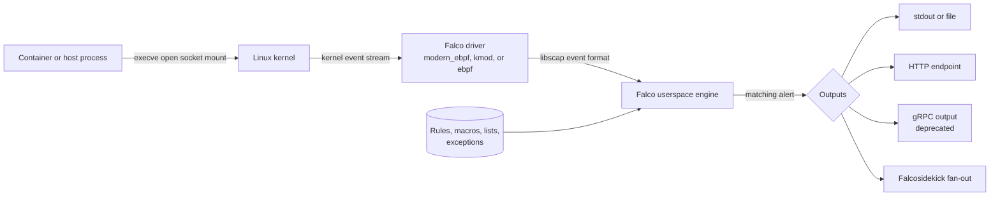
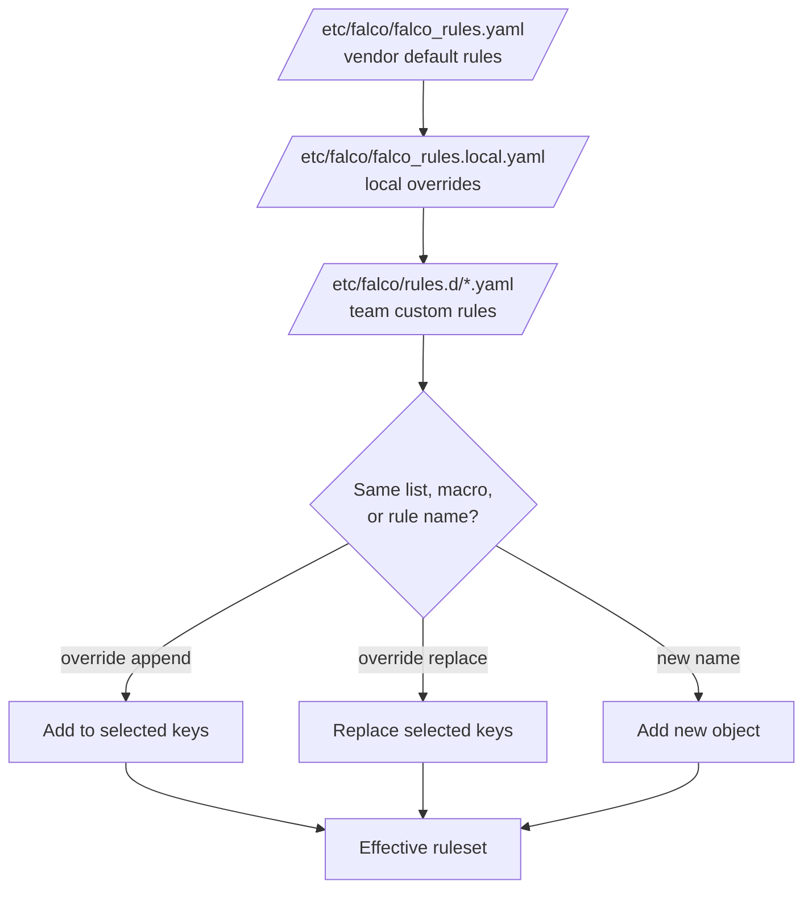

> **Складність**: `[СЕРЕДНЯ]` — критична навичка виявлення під час виконання для CKS.
>
> **Час на проходження**: 50-55 хвилин.
>
> **Передумови**: [Модуль 6.1 (Аудитне логування)](../module-6.1-audit-logging/), основи процесів та системних викликів Linux, операції з DaemonSet.

## Що ви зможете робити

Після завершення цього модуля ви зможете аналізувати Falco як керовану систему виявлення під час виконання, а не як фоновий додаток, що лише друкує попередження.

1. **Аналізувати**, чому аудитне логування Kubernetes API та моніторинг системних викликів під час виконання відповідають на різні питання щодо інцидентів, і вирішувати, який сигнал має довести конкретну дію зловмисника.
2. **Впроваджувати** власні правила Falco з умовами, полями виводу, пріоритетами, тегами, макросами, списками та перевизначеннями файлів правил, які переживуть оновлення правил від постачальника.
3. **Діагностувати** відсутні або шумні сповіщення Falco, перевіряючи вибір драйвера, порядок завантаження правил, умови правил, значення винятків, фільтри пріоритетів та маршрутизацію виводу.
4. **Проєктувати** стратегію винятків і налаштування, яка пригнічує відому безпечну поведінку, не вимикаючи цінне правило постачальника по всьому кластеру.
5. **Оцінювати** вибір сучасного eBPF, модуля ядра та застарілого eBPF драйвера для парку Нод Kubernetes зі змішаними можливостями ядра та операційними обмеженнями.

## Чому цей модуль важливий

Аудитне логування Kubernetes фіксує дії, що стосуються безпеки і проходять через `kube-apiserver`, зокрема те, хто надіслав запит, на який ресурс чи субресурс він був націлений, коли запит проходив крізь стадії аудиту і який бекенд зберіг подію. Ці докази є необхідними для криміналістики площини управління, але вони навмисно обмежені діяльністю API: щойно API-сервер прийняв Под, зловмисник може виконувати команди, читати файли, завантажувати інструменти або відкривати мережеві з'єднання всередині запущеного контейнера, не породжуючи нового запиту до API для кожного процесу чи файлової операції. ([Kubernetes Audit](https://v1-35.docs.kubernetes.io/docs/tasks/debug/debug-cluster/audit/))

Виявлення під час виконання закриває цю прогалину, спостерігаючи за тим, що процеси насправді роблять після того, як планування та допуск уже відбулися успішно. [Атака криптоджекінгу на Tesla 2018 року](/k8s/cks/part1-cluster-setup/module-1.5-gui-security/) <!-- incident-xref: tesla-2018-cryptojacking --> є корисним обрамленням для цього модуля: питання безпеки полягає не лише в тому, "який об'єкт API було створено?", а й у тому, "що робоче навантаження виконало після того, як було запущено?". Falco відповідає на це друге питання, споживаючи події ядра, оцінюючи їх за правилами та видаючи сповіщення, коли поведінка відповідає підозрілим патернам процесів, файлів, мережі чи контейнерів. ([Falco Event Sources](https://falco.org/docs/concepts/event-sources/), [Falco Kernel Events](https://falco.org/docs/concepts/event-sources/kernel/))

Системні виклики є правильним рівнем, тому що кожен процес Linux мусить попросити ядро виконати нову програму, відкрити файл, створити сокет, змонтувати файлову систему чи змінити стан процесу. Оболонка, запущена через `kubectl exec`, зворотна оболонка, породжена скомпрометованим вебсервером, контейнер, що стартує зі змонтованим хостовим сокетом, і процес, що читає `/etc/shadow`, — усі стають спостережуваними подіями ядра навіть тоді, коли Kubernetes API мовчить. Усталене джерело `syscall` у Falco покладається на драйвер ядра, щоб захопити цей потік подій і надіслати його в простір користувача, де правила Falco перетворюють низькорівневі події на читабельні для оператора сповіщення. ([Falco Event Sources](https://falco.org/docs/concepts/event-sources/), [Falco Kernel Events Architecture](https://falco.org/docs/concepts/event-sources/kernel/architecture/))

Цінність для CKS є практичною, а не теоретичною. На іспиті та у виробництві вам може знадобитися встановити Falco як DaemonSet, обрати драйвер, що працює на ядрі Ноди, додати власне правило для підозрілої поведінки, налаштувати шумне усталене правило, пояснити, чому сповіщення зникло після винятку, або спрямувати сповіщення на HTTP-ендпоінт. Якщо ви розумієте, де Falco отримує події, як об'єднуються правила і як налаштовується вивід, ці завдання перетворюються на серію невеликих перевірок замість пошуку в незнайомому YAML. ([Falco Deploy on Kubernetes](https://falco.org/docs/setup/kubernetes/), [Falco Rule Fields](https://falco.org/docs/reference/rules/rule-fields/))

## Архітектура середовища виконання Falco

Falco має чотири компоненти середовища виконання, які варто розрізняти у своїх нотатках: робоче навантаження, що генерує активність ядра, драйвер, що захоплює події з простору ядра, рушій у просторі користувача, що збагачує та оцінює ці події, і шлях виводу, що надсилає сповіщення людям або системам нижче за потоком. Документація Falco описує компонент, звернений до ядра, як `libscap`, який збирає дані системних викликів через обраний драйвер і надає Falco узгоджений формат подій, навіть якщо модуль ядра, застарілий eBPF-зонд та сучасний eBPF-зонд перетинають межу ядра/простору користувача по-різному. ([Falco Kernel Events Architecture](https://falco.org/docs/concepts/event-sources/kernel/architecture/))



Усталеним джерелом подій Falco є `syscall`, і правила оцінюються щодо того джерела, яке породило подію. Falco також може отримувати події плагінів, але робота з безпекою середовища виконання у CKS зазвичай починається з подій ядра, тому що виконання процесів, доступ до файлів, активність мережевих сокетів та метадані контейнера — це поведінка, що найбезпосередніше перевіряється. Коли правило написане для джерела syscall, умова зазвичай поєднує тип події, як-от `execve`, `open` чи `connect`, з полями на кшталт `proc.name`, `proc.cmdline`, `container.id`, `k8s.ns.name`, `k8s.pod.name` та `fd.name`. ([Falco Event Sources](https://falco.org/docs/concepts/event-sources/), [Falco Condition Syntax](https://falco.org/docs/concepts/rules/conditions/))

Драйвер — це не правило виявлення. Це механізм захоплення. Falco все одно потребує метаданих Kubernetes, правил і виводів, щоб видати корисні сповіщення. Це розрізнення важливе під час усунення несправностей: Нода може мати робочий драйвер і все одно не генерувати жодного сповіщення, бо правило було вимкнено, файл правил завантажився в неправильному порядку, спрацював виняток або канал виводу не був увімкнений. Почніть із доведення того, що драйвер може відкрити джерело syscall, потім доведіть, що правило має спрацювати, а потім доведіть, що шлях виводу доставив результат. ([Falco Kernel Events](https://falco.org/docs/concepts/event-sources/kernel/), [Falco Outputs](https://falco.org/docs/concepts/outputs/))

## Вибір драйвера та компроміси

Поточні варіанти драйверів Falco — це сучасний eBPF, модуль ядра та застарілий eBPF. Поточна документація вказує сучасний eBPF-зонд як усталений драйвер, зазначає, що Falco зробив сучасний eBPF усталеним починаючи з версії 0.38.0, і пояснює, що сучасний зонд включено до бінарного файлу Falco з підтримкою CO-RE. Та сама документація стверджує, що старіші хости можуть потребувати модуля ядра, тоді як застарілий eBPF-зонд є застарілим у Falco 0.43.0 і буде вилучений у майбутньому випуску. ([Falco Download](https://falco.org/docs/setup/download/), [Falco Kernel Events](https://falco.org/docs/concepts/event-sources/kernel/))

| Драйвер | Найкращий випадок застосування | Сигнал ядра та пакування | Компроміс щодо безпеки й операцій |
|---|---|---|---|
| `modern_ebpf` | Усталений вибір для сучасних пулів Нод Linux, коли доступні кільцевий буфер BPF та підтримка BTF | Сучасний eBPF вбудований у бінарний файл простору користувача, використовує CO-RE і зазвичай працює на ядрах `>= 5.8`, коли потрібні можливості наявні або портовані назад | Уникає збирання чи завантаження окремого об'єкта драйвера, підтримує модель привілеїв за принципом найменших прав і є першим варіантом для випробування на сучасних Нодах Kubernetes |
| `kmod` | Старіші або змішані парки, де широка сумісність ядра важливіша за уникнення модуля ядра | Артефакти модуля ядра можна встановити пакетами, через `falcoctl driver` або образ завантажувача драйверів, а попередньо зібрані драйвери розповсюджуються для багатьох випусків ядра | Широка сумісність є цінною, але модуль прив'язаний до версії ядра, і Falco документує, що він потребує повних привілеїв, а не режиму лише з можливостями Linux |
| `ebpf` | Перехідний запасний варіант для старіших ядер, які не можуть запустити сучасний eBPF, але можуть запустити застарілий зонд | Застарілий eBPF підтримує старіші версії ядра, ніж сучасний eBPF, але він застарілий у поточному Falco і обирається в установках Helm значенням `--set driver.kind=ebpf` (ключ у `falco.yaml`: `engine.kind: ebpf`) | Розглядайте як міст сумісності, а не як новий усталений варіант; плануйте міграцію, бо застарілі шляхи зрештою стають ризиком оновлення |

Не зводьте цю таблицю до "eBPF безпечніший" чи "kmod швидший". Рішення в стилі іспиту залежить від того, що Нода насправді може запустити. Якщо Нода має підтримку BTF та кільцевого буфера BPF, обирайте `modern_ebpf` першим, бо це задокументований усталений варіант, який уникає окремого встановлення драйвера. Якщо ядро старе і не має цих можливостей, використовуйте `kmod`, коли пріоритетом є сумісність. Якщо завдання дає застаріле ядро, яке підтримує старий eBPF-зонд, але не сучасний eBPF, розпізнайте `ebpf` як перехідну відповідь і згадайте про його застарілість та явне значення драйвера для Helm. ([Falco Kernel Events](https://falco.org/docs/concepts/event-sources/kernel/))

Найчистіший цикл усунення несправностей драйвера є локальним і вимірюваним. Перевірте ядро запущеної Ноди за допомогою `uname -r`, огляньте логи Пода Falco на предмет драйвера, який відкрив джерело syscall, і перевірте підтримку можливостей за допомогою `bpftool`, коли сучасний eBPF не вдається. Falco документує перевірки підтримки кільцевого буфера BPF та підтримки програм трасування, і ці перевірки точніші, ніж здогадування за назвою дистрибутиву. Якщо Falco відкочується до іншого драйвера, зафіксуйте причину перед зміною значень Helm. ([Falco Kernel Events](https://falco.org/docs/concepts/event-sources/kernel/))

```bash
kubectl logs -n falco daemonset/falco --tail=80
uname -r
sudo bpftool feature probe kernel | grep -E "map_type ringbuf|program_type tracing" || true
```

## Розгортання Falco в Kubernetes

Шлях встановлення Falco через Helm навмисно невеликий. Додайте репозиторій чарта `falcosecurity`, встановіть чарт `falco` у простір імен і дочекайтеся Подів. Сторінка встановлення Falco в Kubernetes стверджує, що усталений сценарій Helm додає Falco до всіх Нод за допомогою DaemonSet, потребує привілейованої роботи для розгортання, орієнтованого на події ядра, і використовує значення Helm для конфігурації. Файл значень чарта Falco надає `controller.kind`, `driver.enabled`, `driver.kind`, `falcosidekick.enabled` та налаштування виводу Falco, що робить значення Helm операторською поверхнею для змін розгортання CKS. ([Falco Deploy on Kubernetes](https://falco.org/docs/setup/kubernetes/), [falcosecurity/charts values](https://github.com/falcosecurity/charts/blob/master/charts/falco/values.yaml))

```bash
helm repo add falcosecurity https://falcosecurity.github.io/charts
helm repo update

helm install falco falcosecurity/falco \
  --namespace falco \
  --create-namespace \
  --set tty=true \
  --set driver.kind=modern_ebpf

kubectl wait pods --for=condition=Ready --all -n falco
kubectl logs -n falco daemonset/falco --tail=80
```

Вибір DaemonSet випливає з рівня сигналу. Монітор системних викликів мусить працювати там, де відбуваються події ядра, тож звичайний Deployment із кількома репліками не може спостерігати за деревом процесів кожної Ноди. Чарт підтримує різні режими контролера для сценаріїв із великою кількістю плагінів, але усталений випадок безпеки середовища виконання Kubernetes — це DaemonSet на Нодах Linux. Якщо завдання запитує, чому Falco потребує підвищених дозволів, прив'яжіть відповідь до драйвера: збирання подій ядра потребує доступу до ядра хоста, і чарт усталено застосовує привілейовані контексти безпеки для режимів на основі драйвера, доки явно не налаштовано режим драйвера за принципом найменших прав. ([Falco Deploy on Kubernetes](https://falco.org/docs/setup/kubernetes/), [falcosecurity/charts values](https://github.com/falcosecurity/charts/blob/master/charts/falco/values.yaml))

Вибір драйвера під час розгортання — це значення Helm, а не редагування правила. Використовуйте `--set driver.kind=modern_ebpf` для сучасного шляху, `--set driver.kind=kmod` для запасного варіанта з модулем ядра або `--set driver.kind=auto`, коли хочете, щоб чарт і шлях завантажувача вирішили це з оточення Ноди. Коли питання поєднує Falco з метаданими Kubernetes чи маршрутизацією нижче за потоком, тримайте ці аспекти окремо: драйвер відкриває потік syscall, метадані Kubernetes збагачують сповіщення, а значення виводу вирішують, куди потрапить сповіщення. ([Falco Download](https://falco.org/docs/setup/download/), [falcosecurity/charts values](https://github.com/falcosecurity/charts/blob/master/charts/falco/values.yaml))

## Правила, умови, макроси та списки

Правило Falco — це YAML-об'єкт з обов'язковими полями `rule`, `desc`, `condition`, `output` та `priority` і необов'язковими полями, як-от `tags`, `exceptions`, `enabled`, `source` та елементи керування попередженнями. `condition` — це булевий вираз над полями події, `output` — це повідомлення сповіщення з підстановкою полів, а `priority` — одна із задокументованих назв серйозності від `emergency` до `debug`. ([Falco Basic Rule Elements](https://falco.org/docs/concepts/rules/basic-elements/), [Falco Rule Fields](https://falco.org/docs/reference/rules/rule-fields/))

```yaml
- rule: CKS Terminal Shell in Container
  desc: Detect an interactive shell process that starts inside a container.
  condition: >
    spawned_process
    and container
    and shell_procs
    and proc.tty != 0
  output: >
    Interactive shell in container |
    user=%user.name ns=%k8s.ns.name pod=%k8s.pod.name
    container=%container.name shell=%proc.name command=%proc.cmdline
  priority: NOTICE
  tags: [maturity_stable, container, shell, mitre_execution]
```

Цей приклад має ту саму форму, що й задокументовані приклади "оболонки в контейнері" від Falco: він шукає породжений процес оболонки, вимагає, щоб подія сталася в контейнері, і вимагає терміналу, аби фоновий процес-нащадок, схожий на оболонку, автоматично не ніс той самий сигнал, що й під'єднана інтерактивна сесія. Поля виводу — це не оздоблення; це поля, за якими оператор вирішує, чи подія була обслуговувальним `kubectl exec`, чи скомпрометованим додатком, що породжує `/bin/sh`, чи оболонкою, запущеною в чутливому просторі імен. ([Falco Basic Rule Elements](https://falco.org/docs/concepts/rules/basic-elements/), [Falco Rules Examples](https://falco.org/docs/reference/rules/examples/))

```yaml
- list: cks_sensitive_mount_destinations
  items:
    - /proc
    - /var/run/docker.sock
    - /run/containerd/containerd.sock
    - /var/lib/kubelet
    - /etc/kubernetes
    - /root

- macro: cks_sensitive_mount
  condition: >
    container.mount.dest[/proc*] exists or
    container.mount.dest[/var/run/docker.sock] exists or
    container.mount.dest[/run/containerd/containerd.sock] exists or
    container.mount.dest[/var/lib/kubelet] exists or
    container.mount.dest[/etc/kubernetes] exists or
    container.mount.dest[/root*] exists

- rule: CKS Launch Sensitive Mount Container
  desc: Detect a container that starts with a host-sensitive mount visible inside the container.
  condition: >
    container_started
    and cks_sensitive_mount
    and not falco_sensitive_mount_containers
    and not user_sensitive_mount_containers
  output: >
    Container with sensitive host mount started |
    mounts=%container.mounts ns=%k8s.ns.name pod=%k8s.pod.name image=%container.image.repository
  priority: INFORMATIONAL
  tags: [maturity_sandbox, container, filesystem, mitre_execution]
```

Патерн чутливого монтування навчає, чому правила мають складатися з менших частин. Список називає шляхи, які цікавлять оператора, макрос перетворює ці шляхи на придатну для повторного використання умову, а правило поєднує цю поведінку з виключеннями для довірених образів. Поточний публічний набір правил Falco містить правило `Launch Sensitive Mount Container` у файлі sandbox-правил, і це правило навмисно є кандидатом на налаштування, бо агенти Нод, компоненти CSI та інструменти безпеки можуть законно монтувати хостові шляхи. ([Falco Default Rules](https://falco.org/docs/reference/rules/default-rules/), [falcosecurity/rules](https://github.com/falcosecurity/rules))

Макроси та списки — це те, як ви тримаєте правило читабельним після першої версії. Макрос — це іменований фрагмент умови, який можна повторно використовувати всередині інших правил чи макросів; список — це іменована колекція значень, яку можна включати всередину умови, але яка сама по собі не розбирається як умова. Використовуйте список, коли зміна звучить як "ці додаткові імена процесів чи репозиторіїв образів є довіреними". Використовуйте макрос, коли зміна звучить як "цей цілий патерн поведінки вважається очікуваним у нашому оточенні". ([Falco Basic Rule Elements](https://falco.org/docs/concepts/rules/basic-elements/), [Falco Rules](https://falco.org/docs/concepts/rules/))

```yaml
- list: cks_allowed_debug_images
  items:
    - docker.io/library/busybox
    - docker.io/nicolaka/netshoot

- macro: cks_expected_debug_shell
  condition: >
    k8s.ns.name = debug-lab
    and container.image.repository in (cks_allowed_debug_images)

- rule: CKS Terminal Shell in Container
  condition: and not cks_expected_debug_shell
  override:
    condition: append
```

У виробництві віддавайте перевагу додаванню вузької умови чи доданню значень винятків замість переписування цілого правила постачальника. Переписування всього правила копіює майбутнє обслуговування у ваш локальний файл, тоді як невелике додавання тримає правило постачальника впізнаваним і обмежує різницю, яку вам доведеться переглядати під час оновлення Falco. Додаючи до правил чи макросів, обгортайте оригінальну логіку чіткими дужками там, де це можливо, бо пріоритет логічних операторів інакше може створити ширшу умову, ніж задумав автор. ([Falco Overriding Rules](https://falco.org/docs/concepts/rules/overriding/))

## Порядок завантаження файлів правил

Усталена конфігурація Falco завантажує `/etc/falco/falco_rules.yaml`, потім `/etc/falco/falco_rules.local.yaml`, а потім власні файли правил у `/etc/falco/rules.d`. Ключ `rules_files` керує цим порядком, а прапорець командного рядка `-r` може явно завантажити один чи більше файлів або каталогів. Операційне правило просте: усталені налаштування постачальника мають лишатися придатними для перегляду, локальні перевизначення мають іти після усталень, які вони коригують, а власні файли мають бути названі так, щоб люди могли передбачити порядок завантаження. ([Falco Default and Local Rules](https://falco.org/docs/concepts/rules/default-custom/))



Модель об'єднання — це місце, де ховається багато помилок CKS. Власне правило з унікальною назвою додає нове виявлення. Пізніший об'єкт з тією самою назвою списку, макроса чи правила може скоригувати раніший об'єкт через секцію `override`. Falco документує дії `append` і `replace`, зокрема те, які ключі кожна дія може змінювати для списків, макросів та правил. Застарілий стиль `append: true` трапляється в старіших прикладах, але поточна настанова — використовувати явну секцію `override`. ([Falco Overriding Rules](https://falco.org/docs/concepts/rules/overriding/))

Не редагуйте `falco_rules.yaml` як свою звичайну операторську поверхню. Розглядайте його як вміст, поставлений постачальником, який може оновлюватися пакетами, образами чи артефактами `falcoctl`. Розміщуйте локальні зміни у `falco_rules.local.yaml` або у файлах під `rules.d`, і використовуйте Helm `customRules` під час встановлення через чарт, бо чарт розміщує власні правила в `/etc/falco/rules.d` і завантажує їх згідно з `rules_files`. ([Falco Default and Local Rules](https://falco.org/docs/concepts/rules/default-custom/), [falcosecurity/charts values](https://github.com/falcosecurity/charts/blob/master/charts/falco/values.yaml))

## Винятки без вимкнення правил

Поточні правила Falco підтримують блок `exceptions`, який пригнічує генерацію сповіщень, коли збігається іменований набір порівнянь полів. Задокументована структура винятку використовує `fields`, `comps` та `values`; `fields` і `comps` — це паралельні списки, тоді як `values` — це список кортежів зі значеннями для цих полів. Falco також документує скорочення, зокрема пропущені значення для пізніших перевизначень та форми винятку з одним полем, але повна форма найзрозуміліша для CKS, бо ви можете точно пояснити, що саме пригнічується. ([Falco Rule Exceptions](https://falco.org/docs/concepts/rules/exceptions/))

```yaml
- rule: Terminal shell in container
  exceptions:
    - name: expected_coredns_exec
      fields: [k8s.ns.name, k8s.pod.name, proc.name]
      comps: [=, startswith, in]
      values:
        - [kube-system, coredns-, [sh, ash]]
  override:
    exceptions: append
```

Прочитайте цей виняток як речення: пригнічуй правило термінальної оболонки лише тоді, коли простір імен — це `kube-system`, ім'я Пода починається з `coredns-`, а ім'я процесу оболонки є одним із дозволених імен оболонок. Він не вимикає правило глобально. Він не пригнічує оболонки в інших Подах `kube-system`. Він не пригнічує оболонку в CoreDNS, якщо ім'я процесу не входить до кортежу. Ця вузькість і є різницею між зменшенням відомого шуму та стиранням цілої категорії виявлення. ([Falco Rule Exceptions](https://falco.org/docs/concepts/rules/exceptions/), [Falco Overriding Rules](https://falco.org/docs/concepts/rules/overriding/))

Винятки мають бути артефактами перегляду. Зафіксуйте зразок сповіщення, що спричинив виняток, відповідальну особу, яка його схвалила, кортеж полів, що збігається, та дату закінчення чи повторної перевірки. Якщо очікувана поведінка припиняється, видаліть виняток. Якщо виняток розростається від однієї родини Подів до шаблону на весь простір імен, перегляньте дизайн правила, бо ви, можливо, перетворюєте виявлення на неконтрольований список дозволів. ([Falco Rule Exceptions](https://falco.org/docs/concepts/rules/exceptions/), [Falco Overriding Rules](https://falco.org/docs/concepts/rules/overriding/))

## Вивід і маршрутизація сповіщень

Falco може надсилати сповіщення на стандартний вивід, у файл, до syslog, у породжену програму, на HTTP- чи HTTPS-ендпоінт та клієнту gRPC, причому поточна документація позначає вивід gRPC і вбудований сервер gRPC як застарілі у Falco 0.43.0. Конфігурація виводу міститься у `falco.yaml`, а вивід у форматі JSON додає структуровані поля, як-от `time`, `rule`, `priority`, `output`, `hostname`, `tags` та `output_fields`. Використовуйте JSON, коли сповіщення розбиратиме інша система, і використовуйте текст лише тоді, коли люди читають короткий локальний потік. ([Falco Outputs](https://falco.org/docs/concepts/outputs/), [Falco Output Channels](https://falco.org/docs/concepts/outputs/channels/))

| Вивід | Застосування в CKS | Операційна засторога |
|---|---|---|
| `stdout_output` | Найшвидший спосіб оглянути сповіщення через `kubectl logs` під час лабораторної чи іспиту | Буферизація логів контейнера може затримати сприйнятий вивід, доки не використано небуферизований вивід |
| `file_output` | Простий локальний файл для хостових установок та швидких демонстрацій | Falco не ротує і не обрізає файл виводу, тож використовуйте зовнішню ротацію, якщо файл зберігається |
| `syslog_output` | Корисний, коли хостовий syslog уже збирається централізовано | Пріоритет syslog успадковує пріоритет правила, тож шумні низькопріоритетні правила все одно можуть створювати обсяг |
| `http_output` | Прямий шлях до Falcosidekick чи приймача в стилі вебхука | Використовуйте JSON та дійсний ендпоінт; хибні припущення щодо TLS можуть приховати збої доставки |
| `grpc_output` | Застарілі інтеграції, які все ще залежать від gRPC у Falco | Поточна документація Falco позначає вивід gRPC застарілим, тож для нових проєктів віддавайте перевагу HTTP-виводу чи Falcosidekick |

Falcosidekick — це звичайний рівень розгалуження, коли один потік сповіщень мусить дістатися кількох систем. Falco надсилає HTTP-вивід до Falcosidekick, а Falcosidekick може пересилати до чату, систем сповіщення, логів, об'єктного сховища, потокової передачі та інших призначень; документація та репозиторій перелічують такі виводи, як Slack, PagerDuty, Loki та AWS S3. Практичний дизайн — тримати Falco зосередженим на виявленні, а потім дозволити Falcosidekick обробляти специфічні для призначення формати, облікові дані та маршрутизацію. ([Falco Alerts Forwarding](https://falco.org/docs/concepts/outputs/forwarding/), [falcosecurity/falcosidekick](https://github.com/falcosecurity/falcosidekick))

```yaml
falco:
  json_output: true
  http_output:
    enabled: true
    url: http://falcosidekick.falco.svc.cluster.local:2801/
falcosidekick:
  enabled: true
```

Маршрутизація сповіщень має містити нижню межу пріоритету. Назви пріоритетів правил Falco впорядковані від emergency до debug, і настанова щодо стилю зіставляє записи у файли, читання чутливих даних, неочікувані оболонки та порушення добрих практик із різними діапазонами пріоритетів. У шумному оточенні спрямовуйте високопріоритетні сповіщення на виклик чергового, середньопріоритетні — у черги розслідування, а низькопріоритетні — у сховище чи на дашборди. Не розв'язуйте втому від сповіщень вимкненням цілих родин правил, доки не виміряли, які правила, простори імен, образи та поля створили шум. ([Falco Basic Rule Elements](https://falco.org/docs/concepts/rules/basic-elements/), [Falco Alerts Forwarding](https://falco.org/docs/concepts/outputs/forwarding/))

| Пріоритет | Приклад застосування під час виконання | Початковий маршрут |
|---|---|---|
| `EMERGENCY` | Підтверджена поведінка компрометації хоста, що потребує негайного стримування кластера | Виклик чергового та містки інцидентів |
| `ALERT` | Високовпевнена втеча з контейнера чи маніпуляція простором імен хоста | Виклик чергового та черга безпеки |
| `CRITICAL` | Поведінка ескалації привілеїв із впливом на Ноду | Виклик чергового у виробничі години |
| `ERROR` | Несанкціонований запис у чутливий стан хоста чи контейнера | Черга безпеки з коротким терміном перегляду |
| `WARNING` | Несанкціоноване читання чутливих файлів чи облікових даних | Черга безпеки та надійне сховище |
| `NOTICE` | Неочікувана інтерактивна оболонка чи мережева поведінка, що потребує контексту | Черга розслідування та кореляція з аудитними логами |
| `INFORMATIONAL` | Порушення доброї практики, як-от ризикована форма контейнера | Дашборд, беклог чи звіт про відповідність |
| `DEBUG` | Дуже шумне дослідницьке правило чи тимчасове лабораторне правило | Локальний лабораторний вивід чи сховище з коротким терміном зберігання |

## Налаштування без втрати виявлення

Сильне впровадження Falco дотримується циклу "базова лінія, потім затягування". По-перше, запустіть усталення в обмеженому оточенні та зберіть зразки сповіщень з повним JSON. По-друге, згрупуйте шум за правилом, простором імен, образом, контейнером, процесом та батьківським процесом. По-третє, вирішіть, чи поведінка є очікуваною, ризикованою-але-прийнятою чи справді підозрілою. По-четверте, додайте найвужчий виняток чи додавання умови, що описує очікувану поведінку. По-п'яте, знизьте маршрут виводу для решти низькоцінних сповіщень лише після того, як упевнилися, що правило все ще спрацьовує для вашого тестового випадку. ([Falco Rule Exceptions](https://falco.org/docs/concepts/rules/exceptions/), [Falco Overriding Rules](https://falco.org/docs/concepts/rules/overriding/))

Важлива звичка — виняток-а-не-вимкнення. Вимкнення `Terminal shell in container`, бо SRE-інженери іноді налагоджують CoreDNS, прибирає виявлення для кожної іншої неочікуваної оболонки. Додавання кортежу для схваленої родини Подів тримає правило живим скрізь інде. Так само, якщо драйвер сховища CSI законно монтує хостові шляхи, додайте виняток для довіреного образу чи конкретного Пода для цього драйвера замість видалення виявлення чутливого монтування по всьому парку Нод. ([Falco Overriding Rules](https://falco.org/docs/concepts/rules/overriding/), [falcosecurity/rules](https://github.com/falcosecurity/rules))

Нижні межі пріоритету — це елементи керування маршрутизацією, а не елементи керування коректністю правил. Розумно надсилати `NOTICE`-сповіщення про оболонку в чергу сортування, викликаючи чергового лише за `CRITICAL` чи вищим, але нижчопріоритетне сповіщення все одно має зберігатися, коли воно корисне для пізнішої кореляції. Оболонка контейнера, що виглядає безневинно опівдні, може стати важливою, коли той самий Под пізніше читає файл Secret, відкриває незвичне вихідне з'єднання чи спричиняє аудитну подію для підозрілого запиту `pods/exec`. ([Falco Output Channels](https://falco.org/docs/concepts/outputs/channels/), [Kubernetes Audit](https://v1-35.docs.kubernetes.io/docs/tasks/debug/debug-cluster/audit/))

Використовуйте аудитні логи та Falco разом. Аудитне логування може сказати вам, яка особистість запросила `pods/exec`, тоді як Falco може сказати вам, яка оболонка та який командний рядок насправді з'явилися всередині контейнера. Вивід Falco може містити поля простору імен та Пода Kubernetes, а аудитні події можуть містити користувача, дієслово, посилання на об'єкт, субресурс та статус відповіді. Кореляція цих полів перетворює одне сповіщення на хронологію: хто запросив доступ, який Под його отримав, який процес запустився і чого процес торкнувся далі. ([Kubernetes Audit](https://v1-35.docs.kubernetes.io/docs/tasks/debug/debug-cluster/audit/), [Falco Output Channels](https://falco.org/docs/concepts/outputs/channels/))

## Робочий процес іспиту CKS

Коли просять встановити Falco, почніть із чарта, а потім підтвердьте запущений драйвер. Використовуйте DaemonSet для покриття подій ядра, перевірте, що Поди готові на відповідних Нодах, прочитайте логи Falco на предмет драйвера рушія та згенеруйте відому подію, як-от інтерактивну оболонку в одноразовому Поді. Якщо сповіщення не з'являється, перевірте драйвер, потім правило, потім виняток, потім вивід — саме в такому порядку. ([Falco Deploy on Kubernetes](https://falco.org/docs/setup/kubernetes/), [Falco Kernel Events](https://falco.org/docs/concepts/event-sources/kernel/))

```bash
kubectl create namespace falco-lab
kubectl run shell-test -n falco-lab --image=busybox:1.36 --restart=Never -- sleep 3600
kubectl wait pod/shell-test -n falco-lab --for=condition=Ready --timeout=90s
kubectl exec -n falco-lab -it shell-test -- sh -c 'whoami; exit'
kubectl logs -n falco daemonset/falco --since=5m | grep -E "Terminal shell|shell in container" || true
kubectl delete namespace falco-lab
```

Коли просять написати власне правило, скопіюйте найменший локальний патерн замість редагування файла постачальника. Розмістіть нове правило чи перевизначення у `falco_rules.local.yaml` чи у файлі `rules.d`, включіть `rule`, `desc`, `condition`, `output`, `priority` та `tags`, потім завантажте чи перерозгорніть Falco згідно з методом встановлення. Протестуйте одним дозволеним випадком та одним випадком, що спрацьовує, і збережіть зразок сповіщення у своїх нотатках, щоб наступний оператор зміг зрозуміти, чому правило існує. ([Falco Default and Local Rules](https://falco.org/docs/concepts/rules/default-custom/), [Falco Custom Ruleset](https://falco.org/docs/concepts/rules/custom-ruleset/))

Коли просять пояснити, чому очікуване сповіщення було пригнічене, прочитайте чинне правило та винятки перед зміною пріоритету. Виняток, що збігається, еквівалентний доданню клаузи `not (...)` до умови, тож правило може бути коректним і все одно не видавати сповіщення для цього кортежу. Якщо у завданні згадується шумний простір імен, образ чи командний рядок, підозрюйте виняток чи додану умову. Якщо у завданні згадується повна відсутність подій на одній Ноді, підозрюйте насамперед запуск драйвера чи планування DaemonSet. ([Falco Rule Exceptions](https://falco.org/docs/concepts/rules/exceptions/), [Falco Kernel Events Architecture](https://falco.org/docs/concepts/event-sources/kernel/architecture/))

Коли просять спрямувати сповіщення, увімкніть JSON та оберіть найпростіший вивід, що задовольняє приймача. Використовуйте `stdout_output` для локального огляду, `file_output` для швидкого хостового файла із зовнішньою ротацією, `http_output` для Falcosidekick чи приймача-вебхука, і уникайте нових проєктів на gRPC, бо поточний Falco позначає цей шлях застарілим. Якщо Falcosidekick увімкнено через чарт Helm, підтвердьте, що Falco надсилає HTTP-вивід до сервісу sidekick, і підтвердьте конфігурацію призначення sidekick окремо. ([Falco Output Channels](https://falco.org/docs/concepts/outputs/channels/), [Falco Alerts Forwarding](https://falco.org/docs/concepts/outputs/forwarding/))

## Вправи з розслідування під час виконання

Починайте кожне розслідування Falco з джерела сповіщення та полів події. Ім'я правила каже вам, яка логіка виявлення збіглася. Пріоритет каже вам передбачений діапазон сортування. Об'єкт `output_fields` дає поля процесу, батька, командного рядка, користувача, простору імен, Пода, контейнера, образу та файла чи сокета, які видало правило. Прочитайте ці поля перед зміною YAML. Рішення про налаштування, ухвалене без фактичних полів збігу, часто пригнічує забагато. Вивід JSON робить цей крок повторюваним, бо інструменти нижче за потоком можуть запитувати ті самі ключі. ([Falco Output Channels](https://falco.org/docs/concepts/outputs/channels/), [Falco Rule Fields](https://falco.org/docs/reference/rules/rule-fields/))

Розділяйте "хто запросив доступ" та "що запустилося після доступу". Аудитні логи відповідають на перше питання, коли запит до API обраний політикою. Falco відповідає на друге питання, коли процес з'являється на Ноді. Якщо було використано `kubectl exec`, шукайте в аудитних логах запит `pods/exec`, а у Falco — оболонку чи команду. Спочатку зіставте простір імен і Под. Потім порівняйте позначки часу. Не припускайте, що користувач Kubernetes видимий лише у Falco. Falco може натомість показувати користувача Linux та дерево процесів. ([Kubernetes Audit](https://v1-35.docs.kubernetes.io/docs/tasks/debug/debug-cluster/audit/), [Falco Output Channels](https://falco.org/docs/concepts/outputs/channels/))

Для сповіщення про оболонку прочитайте батьківський процес. Оболонка, запущена `runc`, `containerd-shim` чи іншим шляхом точки входу контейнера, може означати інтерактивний вхід чи шлях exec. Оболонка, запущена `nginx`, `java`, `python` чи процесом вебдодатка, може означати віддалене виконання коду чи функцію додатка, що запускає допоміжні процеси. Це різні інциденти. Ім'я правила — лише відправна точка. Дерево процесів вирішує наступне питання. Використовуйте командний рядок батька, поля прабатька, коли вони наявні, та власника Пода, щоб обрати шлях реагування. ([Falco Basic Rule Elements](https://falco.org/docs/concepts/rules/basic-elements/), [Falco Condition Syntax](https://falco.org/docs/concepts/rules/conditions/))

Для сповіщення про чутливий файл прочитайте шлях файла та процес разом. Менеджер пакетів, що читає файли облікових записів під час збирання образу, має інше значення, ніж вебвиконавець, що читає `/etc/shadow` під час виконання. Хостовий агент безпеки може законно оглядати чутливі файли, але цей виняток має називати кортеж образу, процесу, простору імен чи шляху. Не додавайте широкий список дозволених процесів лише через те, що одне сповіщення було очікуваним. Читання файлів часто є сигналами доступу до облікових даних, а широкі пригнічення приховують наступну компрометацію. ([Falco Basic Rule Elements](https://falco.org/docs/concepts/rules/basic-elements/), [Falco Rule Exceptions](https://falco.org/docs/concepts/rules/exceptions/))

Для сповіщення про чутливе монтування визначте, чи було робоче навантаження створене агентом Ноди, компонентом сховища, інструментом безпеки чи командою додатка. Хостові шляхи, як-от сокети середовища виконання контейнерів, каталоги kubelet, `/proc` та файли площини управління Kubernetes, є потужними, бо вони перетинають нормальну межу контейнера. Деякі інфраструктурні DaemonSets потребують такого доступу. Більшість Подів додатків — ні. Правильною відповіддю може бути виняток для обслуговуваного агента Ноди чи виправлення робочого навантаження у маніфесті додатка. Тримайте виняток прив'язаним до робочого навантаження, якому монтування справді потрібне. ([falcosecurity/rules](https://github.com/falcosecurity/rules), [Falco Rule Exceptions](https://falco.org/docs/concepts/rules/exceptions/))

Для неочікуваного мережевого сповіщення огляньте лінію спадковості процесу перед звинуваченням призначення. Багато контейнерів роблять законні вихідні виклики під час запуску, перевірок справності, оновлень пакетів чи виявлення сервісів. Підозрілою частиною може бути двійковий файл, що відкрив сокет, а не сам порт. Оболонка, менеджер пакетів чи системний двійковий файл, що відкриває нове з'єднання після компрометації, має інший сигнал, ніж основний додаток, що з'єднується зі своїм нормальним бекендом. Налаштовуйте за процесом, простором імен, образом та патерном призначення. Уникайте списку дозволених портів на весь кластер, доки модель сервісу справді цього не потребує. ([Falco Condition Syntax](https://falco.org/docs/concepts/rules/conditions/), [Falco Basic Rule Elements](https://falco.org/docs/concepts/rules/basic-elements/))

Для відкинутого чи відсутнього сповіщення доводьте кожен рівень по порядку. DaemonSet мусить працювати на Ноді. Драйвер мусить відкрити джерело syscall. Набір правил мусить завантажитися без помилок. Умова правила мусить збігтися з подією. Список винятків не мусить збігтися з подією. Канал виводу мусить бути увімкнений. Приймач мусить прийняти сповіщення. Цей порядок запобігає поширеному збою: зміні маршрутизації, коли правило ніколи не збігалося, чи зміні правил, коли драйвер ніколи не запускався. ([Falco Kernel Events](https://falco.org/docs/concepts/event-sources/kernel/), [Falco Output Channels](https://falco.org/docs/concepts/outputs/channels/))

## Вправи з перегляду правил

Переглядайте правило Falco знизу вгору один раз, потім згори вниз. Знизу вгору означає читання спочатку пріоритету, тегів та виводу. Це каже вам, що правило претендує виявляти і які дані побачить оператор. Згори вниз означає читання макросів, списків та клауз умови в порядку виконання. Це каже вам, чому подія збіглася. Якщо ці два прочитання суперечать одне одному, правило буде важко експлуатувати. Виправте вивід чи розділіть правило перед доданням нових винятків. ([Falco Basic Rule Elements](https://falco.org/docs/concepts/rules/basic-elements/), [Falco Rules](https://falco.org/docs/concepts/rules/))

Кожна умова має мати прив'язку до події, якщо правило навмисно не використовує зіставлення лише за метаданими. Документація Falco попереджає, що умова, яка перевіряє лише `container.id` та `proc.name`, може збігтися з кожним системним викликом, виконаним цим процесом, бо не було названо конкретної події системного виклику. Це може створювати шумні сповіщення. Використовуйте макроси, як-от `spawned_process`, чи явні типи подій, коли поведінкою є виконання процесу. Використовуйте макроси відкриття файлів, коли поведінкою є доступ до файлів. Використовуйте поля сокетів, коли поведінкою є мережева активність. ([Falco Basic Rule Elements](https://falco.org/docs/concepts/rules/basic-elements/), [Falco Condition Syntax](https://falco.org/docs/concepts/rules/conditions/))

Розглядайте поля виводу як частину дизайну правила. Правило, що каже "підозріла оболонка", але опускає простір імен, Под, образ, процес, батька та командний рядок, сповільнюватиме кожне розслідування. Правило, що містить забагато полів, усе ще може бути корисним, але лише якщо сховище нижче за потоком їх зберігає. Віддавайте перевагу полям, що відповідають на питання першого реагування: де це запустилося, який процес запустився, хто його запустив, яким був батько, якого об'єкта торкнулися та який образ постачив контейнер. ([Falco Output Channels](https://falco.org/docs/concepts/outputs/channels/), [Falco Rule Fields](https://falco.org/docs/reference/rules/rule-fields/))

Використовуйте пріоритети як підказки для перегляду. `ERROR` має змусити вас запитати, чи був змінений стан. `WARNING` має змусити вас запитати, чи був прочитаний чутливий стан. `NOTICE` має змусити вас запитати, чи була поведінка неочікуваною, але потребує контексту. `INFO` має змусити вас запитати, чи правило є переважно зворотним зв'язком про поставу безпеки чи добру практику. Надто високий пріоритет створює втому від сповіщень. Надто низький пріоритет приховує високовпевнену компрометацію. Прив'язуйте пріоритет до дії реагування. ([Falco Basic Rule Elements](https://falco.org/docs/concepts/rules/basic-elements/))

Використовуйте теги для власності та пошуку. Правила Falco часто містять теги зрілості, контейнера, файлової системи, процесу, оболонки та теги в стилі MITRE. Локальні правила можуть додавати теги команди, сервісу чи CKS-лабораторії, коли це допомагає маршрутизації та перегляду. Теги не мають замінювати умову. Вони мають допомагати людям знаходити пов'язані правила і допомагати приймачам маршрутизувати родини сповіщень. Якщо тег передбачає сильнішу заяву, ніж доводить умова, змініть тег чи посильте умову. ([Falco Basic Rule Elements](https://falco.org/docs/concepts/rules/basic-elements/), [Falco Rule Fields](https://falco.org/docs/reference/rules/rule-fields/))

Віддавайте перевагу спискам для даних та макросам для логіки. Список схвалених репозиторіїв образів може зростати без зміни форми умови. Макрос, що визначає очікувану поведінку резервного копіювання, може поєднувати поля простору імен, процесу, шляху та полів, пов'язаних із розкладом. Змішування цих ролей ускладнює налаштування. Якщо список починає містити складну логіку, зробіть макрос. Якщо макрос — це лише купа рядкових значень, зробіть список. Це розділення тримає перевизначення меншими та легшими для перегляду. ([Falco Basic Rule Elements](https://falco.org/docs/concepts/rules/basic-elements/), [Falco Overriding Rules](https://falco.org/docs/concepts/rules/overriding/))

Переглядайте кожен виняток так, ніби це код. Він змінює поведінку виявлення. Він має мати ім'я, кортеж полів, причину та тестовий випадок. Кортеж має збігатися зі сповіщенням, яке ви спостерігали, а не з вгаданим майбутнім сповіщенням. Якщо виняток використовує `startswith`, `pmatch` чи `in`, поясніть, чому точна рівність була надто вузькою. Якщо виняток називає лише простір імен, запитайте, чому всі Поди в цьому просторі імен заслуговують на пригнічення. Вужча відповідь зазвичай краща. ([Falco Rule Exceptions](https://falco.org/docs/concepts/rules/exceptions/))

## Вправи зі збоїв розгортання та виводу

Якщо Поди Falco очікують (pending), налагоджуйте планування Kubernetes перед налагодженням Falco. DaemonSet усе одно потребує Нод, що відповідають селекторам, толерантностям, ресурсам та вимогам операційної системи. Документація Helm для Falco наголошує на Нодах Linux та конфігурації чарта. Под, що ніколи не стартує, не може довести збій драйвера. Спочатку перевірте `kubectl describe pod`, мітки Нод, обмеження (taints) та шаблон DaemonSet. Потім прочитайте логи контейнера. Це заощаджує час, коли справжня проблема — це обмеження чи відсутня політика простору імен, а не сам Falco. ([Falco Deploy on Kubernetes](https://falco.org/docs/setup/kubernetes/), [falcosecurity/charts values](https://github.com/falcosecurity/charts/blob/master/charts/falco/values.yaml))

Якщо Falco стартує і виходить, огляньте повідомлення драйвера перед редагуванням правил. Сучасний eBPF потребує можливостей ядра, як-от кільцевий буфер BPF та BTF. Шлях модуля ядра може потребувати відповідного зібраного чи завантаженого модуля. Шлях застарілого eBPF може працювати на старіших ядрах, але він застарілий. Кожен збій вказує на інше виправлення. Редагування правила YAML не полагодить відсутню можливість ядра. Зміна драйвера не полагодить хибно сформований файл правил. Тримайте ці класи збоїв окремо. ([Falco Kernel Events](https://falco.org/docs/concepts/event-sources/kernel/), [Falco Download](https://falco.org/docs/setup/download/))

Якщо драйвер — це `auto`, зафіксуйте, що він обрав. Автоматичний вибір може бути корисним під час впровадження, але він також може приховати відмінності парку. Одна Нода може запускати сучасний eBPF, тоді як інша відкочується, бо відсутня якась можливість. Це має значення для усунення несправностей та планування оновлень. Під час завдання CKS явне значення `driver.kind` легше пояснити. Під час виробничого впровадження інвентаризацію обраних драйверів на кожній Ноді легше підтримувати. ([falcosecurity/charts values](https://github.com/falcosecurity/charts/blob/master/charts/falco/values.yaml), [Falco Kernel Events](https://falco.org/docs/concepts/event-sources/kernel/))

Якщо stdout здається затриманим, пам'ятайте, що причиною може бути буферизація виводу. Falco документує, що логи контейнера можуть з'являтися із запізненням, коли стандартний вивід буферизується, і документує небуферизований варіант для миттєвого скидання в реальному часі з витратами CPU. Не припускайте, що правило не спрацювало, бо `kubectl logs -f` виглядає тихим протягом короткого періоду. Згенеруйте унікальну подію, зачекайте трохи, потім перевірте недавні логи та налаштування виводу. ([Falco Output Channels](https://falco.org/docs/concepts/outputs/channels/))

Якщо файл виводу зростає без обмежень, проблема не лише в обсязі Falco. Файловий вивід Falco не ротує і не обрізає файл. Оператор мусить додати зовнішню ротацію чи обрати інший шлях виводу. Цей факт змінює виробничу архітектуру. Лабораторний файл підходить для навчання. Виробничий конвеєр виявлення має відправляти сповіщення на керований шлях логів, в об'єктне сховище, SIEM чи розгалуження Falcosidekick. ([Falco Output Channels](https://falco.org/docs/concepts/outputs/channels/), [Falco Alerts Forwarding](https://falco.org/docs/concepts/outputs/forwarding/))

Якщо HTTP-вивід досягає Falcosidekick, але Slack мовчить, розділіть шлях. Falco потрібно лише доставити JSON на ендпоінт sidekick. Falcosidekick тоді володіє обліковими даними призначення, шаблонами, фільтрами та помилками приймача. Перевірте логи Falco на предмет доставки HTTP. Перевірте логи Falcosidekick на предмет доставки до призначення. Перевірте фільтри пріоритету перед зміною правила Falco. Нижня межа пріоритету sidekick може відкинути `NOTICE`-сповіщення навіть тоді, коли Falco видав його коректно. ([Falco Alerts Forwarding](https://falco.org/docs/concepts/outputs/forwarding/), [falcosecurity/falcosidekick](https://github.com/falcosecurity/falcosidekick))

Якщо приймачу потрібні надійні докази, збережіть оригінальне сповіщення. Похідні поля допомагають пошуку, але реагувальники все одно потребують оригінального імені правила, пріоритету, тексту виводу, тегів, хоста, джерела, часу та полів виводу. Якщо конвеєр зберігає лише повідомлення Slack, пізніше розслідування втрачає метадані процесу та Kubernetes. Якщо він зберігає лише обрані поля, задокументуйте, на які питання вже не можна відповісти. Добра маршрутизація тримає сирий JSON доступним навіть тоді, коли людське сповіщення коротке. ([Falco Output Channels](https://falco.org/docs/concepts/outputs/channels/), [Falco Alerts Forwarding](https://falco.org/docs/concepts/outputs/forwarding/))

Якщо впровадження змінює правила, драйвери чи виводи Falco, запустіть невеликий пакет регресії перед тим, як вважати це завершеним. Спричиніть одне сповіщення про оболонку, одне сповіщення про читання файла, якщо лабораторний образ це підтримує, один очікуваний виняток та одне маршрутизоване HTTP-сповіщення. Збережіть команду, очікуване ім'я правила, очікуваний пріоритет та очікуваний приймач. Це перетворює розгортання безпеки середовища виконання на керований контроль. Це також дає новим членам команди відомий справний шлях, коли наступне сповіщення відсутнє. Повторюйте пакет після оновлень Kubernetes, оновлень ядра, оновлень чарта Falco та оновлень набору правил. Невеликі тести ловлять тихий дрейф до того, як це зробить інцидент. Задокументуйте результат у записі змін. ([Falco Default and Local Rules](https://falco.org/docs/concepts/rules/default-custom/), [Falco Deploy on Kubernetes](https://falco.org/docs/setup/kubernetes/))

## Чи знали ви?

- Сучасний eBPF-зонд Falco є задокументованим усталеним драйвером у поточному Falco, і документація завантаження стверджує, що це стало усталеним починаючи з Falco 0.38.0. ([Falco Download](https://falco.org/docs/setup/download/))
- Застарілий eBPF-зонд Falco та вивід gRPC обидва задокументовані як застарілі у Falco 0.43.0, тож нові проєкти в стилі CKS мають віддавати перевагу сучасному eBPF та HTTP-виводу, доки завдання не вимагає застарілого шляху. ([Falco Kernel Events](https://falco.org/docs/concepts/event-sources/kernel/), [Falco Output Channels](https://falco.org/docs/concepts/outputs/channels/))
- Усталений порядок завантаження правил Falco — це усталені правила, локальні правила, потім `rules.d`, ось чому локальні перевизначення мусять завантажуватися після правила, макроса чи списку, який вони коригують. ([Falco Default and Local Rules](https://falco.org/docs/concepts/rules/default-custom/))
- Falcosidekick діє як центральна точка HTTP-розгалуження для сповіщень Falco і може пересилати до чату, систем сповіщення, логів, сховища, потокової передачі та призначень реагування. ([Falco Alerts Forwarding](https://falco.org/docs/concepts/outputs/forwarding/))

## Типові помилки

| Помилка | Чому це шкодить | Кращий хід оператора |
|---|---|---|
| Сприйняття аудитних логів як виявлення під час виконання | Аудитні записи API доводять запити до API, але вони не фіксують кожну операцію над процесами та файлами всередині вже запущеного контейнера | Використовуйте аудитні логи для особистості API, а Falco — для поведінки під час виконання на рівні ядра, потім корелюйте простір імен, Под і час |
| Пряме редагування `/etc/falco/falco_rules.yaml` | Правила постачальника можуть бути замінені пакетами, образами чи `falcoctl`, і майбутні рецензенти не зможуть відрізнити вміст постачальника від локального наміру | Розміщуйте перевизначення у `falco_rules.local.yaml` чи `rules.d` і використовуйте явні секції `override` |
| Глобальне вимкнення шумного правила | Одна очікувана налагоджувальна оболонка чи довірений демон можуть стерти виявлення в непов'язаних просторах імен та робочих навантаженнях | Додайте вузький кортеж винятку чи додайте обмежену умову, що збігається лише з відомою безпечною поведінкою |
| Вибір `kmod` на кожній Ноді за звичкою | Модуль ядра може працювати широко, але поточний Falco усталено обирає сучасний eBPF, коли Нода має потрібні можливості | Починайте з `modern_ebpf`, відкочуйтеся лише тоді, коли перевірки можливостей чи логи показують, що він не може запуститися |
| Надсилання всіх сповіщень до PagerDuty | Низькопріоритетні сигнали налаштування можуть перевантажити реагувальників і ускладнити помічання високовпевнених сповіщень | Маршрутизуйте за пріоритетом та родиною правил, тримаючи нижчопріоритетні сповіщення придатними для пошуку без виклику чергового на кожну подію |
| Очікування, що файловий вивід керуватиме собою сам | Falco документує, що його файловий вивід не ротує і не обрізає файл | Використовуйте stdout для логів Kubernetes, зовнішню ротацію логів для файлів чи HTTP-вивід до керованого приймача |
| Налагодження виводу перед доведенням збігу правила | Тихий приймач не пояснює, чи драйвер відмовив, чи правило не збіглося, чи виняток пригнітив подію | Доведіть запуск драйвера, потім умову правила, потім поведінку винятку, потім доставку виводу |

## Тест

<details>
<summary>Команда каже, що аудитне логування Kubernetes уже фіксує `kubectl exec`, тож Falco не потрібен. Який сигнал часу виконання відсутній?</summary>

Аудитне логування може зафіксувати запит до API для субресурсу `pods/exec`, зокрема особистість та цільовий Под, коли політика обирає цей запит. Воно не фіксує кожен процес, який користувач запускає після того, як канал exec відкрився. Falco може спостерігати процес оболонки та пізнішу файлову чи мережеву активність через події ядра, тож найкраща відповідь — використовувати аудитні логи для особистості API, а Falco — для поведінки під час виконання всередині контейнера.
</details>

<details>
<summary>Пул Нод працює на ядрах Linux із підтримкою BTF та кільцевого буфера BPF. Який драйвер Falco варто обрати першим і чому?</summary>

Обирайте `modern_ebpf` першим, бо поточний Falco документує його як усталений драйвер, включає його до бінарного файла простору користувача та використовує CO-RE, тож окремий об'єкт драйвера не потрібен, коли Нода має потрібні можливості. Тримайте `kmod` як запасний варіант сумісності для старіших Нод і розглядайте застарілий `ebpf` як перехідний, бо поточний Falco позначає цей зонд застарілим.
</details>

<details>
<summary>Правило `Terminal shell in container` не спрацьовує для запланованого exec у `kube-system/coredns-*`, але спрацьовує деінде. Що варто оглянути?</summary>

Огляньте винятки правила та додані локальні умови перед зміною драйвера чи виводу. Вузький виняток на полях, як-от `k8s.ns.name`, `k8s.pod.name` та `proc.name`, може пригнітити саме ту очікувану оболонку, лишаючи правило активним для інших Подів. Якщо поведінка схвалена, тримайте виняток вузьким і задокументованим; якщо вона не схвалена, видаліть виняток і протестуйте повторно.
</details>

<details>
<summary>Вам потрібно спрямувати сповіщення Falco до Slack, PagerDuty, Loki та S3. Чи має Falco надсилати безпосередньо до кожного призначення?</summary>

Використовуйте HTTP-вивід Falco, щоб надсилати структуровані JSON-сповіщення до Falcosidekick, а потім дозвольте Falcosidekick розгалужувати їх до специфічних для призначення інтеграцій. Falco має лишатися рушієм виявлення під час виконання, тоді як Falcosidekick обробляє множинні призначення, форматування, облікові дані, фільтрацію за пріоритетом та метрики. Підтвердьте HTTP-ендпоінт Falco та конфігурацію призначення sidekick окремо.
</details>

<details>
<summary>Власне правило у `rules.d/custom.yaml` визначає ту саму назву правила, що й правило постачальника, але опускає `override`. Який ризик це створює?</summary>

Воно може замінити чи конфліктувати з правилом постачальника у спосіб, що приховує намір оператора і ускладнює перегляд оновлень. Безпечніший патерн — використовувати явну секцію `override` з `append` чи `replace` для конкретних ключів, що змінюються, або створити унікально назване власне правило, коли виявлення справді відокремлене від правила постачальника.
</details>

<details>
<summary>Файловий вивід Falco працює під час лабораторної, але той самий патерн пропонується для виробничого зберігання. Яку операційну прогалину варто назвати?</summary>

Falco пише файловий вивід, коли налаштовано, але його документація стверджує, що він не ротує і не обрізає цей файл. Виробниче зберігання потребує зовнішньої ротації, відправлення чи HTTP-приймача, як-от Falcosidekick. Інакше багатослівне правило чи сплеск інциденту може створити локальний тиск на диск і все одно не дати слідчим надійних позавузлових доказів.
</details>

## Практична робота

- [ ] Завершіть [лабораторну "Безпека середовища виконання з Falco" на Killercoda](https://killercoda.com/kubedojo/scenario/cks-6.2-falco) і зафіксуйте, який драйвер Falco використовує лабораторне середовище.
- [ ] Встановіть Falco з Helm в одноразовому кластері, явно обравши `driver.kind=modern_ebpf`, потім огляньте логи DaemonSet на предмет відкритого джерела syscall.
- [ ] Спричиніть інтерактивну оболонку в одноразовому Поді й корелюйте сповіщення Falco з полями простору імен, імені Пода, імені процесу, батьківського процесу, командного рядка та користувача.
- [ ] Додайте власний файл правил під локальну поверхню правил, що виявляє підозрілий процес у контейнері, потім протестуйте випадки зі спрацюванням та без нього.
- [ ] Додайте вузький виняток для очікуваної оболонки в одній родині Подів і доведіть, що те саме правило все ще спрацьовує в іншому просторі імен.
- [ ] Увімкніть JSON HTTP-вивід на ендпоінт Falcosidekick в лабораторній установці чарта, потім поясніть, який маршрут викликав би чергового, а який лише зберіг би сповіщення.

Використовуйте цю послідовність команд як скелет для одноразової лабораторної. Вона навмисно створює простір імен, запускає короткоживучу налагоджувальну ціль, генерує подію оболонки і потім видаляє простір імен. Якщо ваша лабораторна вже встановила Falco, пропустіть встановлення Helm і почніть зі створення простору імен.

```bash
helm repo add falcosecurity https://falcosecurity.github.io/charts
helm repo update
helm upgrade --install falco falcosecurity/falco \
  --namespace falco \
  --create-namespace \
  --set tty=true \
  --set driver.kind=modern_ebpf

kubectl wait pods --for=condition=Ready --all -n falco --timeout=180s
kubectl logs -n falco daemonset/falco --tail=80

kubectl create namespace falco-lab
kubectl run shell-test -n falco-lab --image=busybox:1.36 --restart=Never -- sleep 3600
kubectl wait pod/shell-test -n falco-lab --for=condition=Ready --timeout=90s
kubectl exec -n falco-lab -it shell-test -- sh -c 'id; whoami; exit'

kubectl logs -n falco daemonset/falco --since=5m | grep -E "shell|Terminal|container" || true
kubectl delete namespace falco-lab
```

Для вправи з власним правилом запишіть наведене нижче правило у локальну поверхню перевизначень, яку використовує ваш метод встановлення, потім перезапустіть чи перерозгорніть Falco згідно з цим методом. Правило навмисно вузьке: воно шукає процес оболонки всередині контейнерів в одному лабораторному просторі імен і видає поля, що роблять діагностику можливою. Розширюйте правило лише після того, як зможете довести, що базова подія спрацьовує.

```yaml
- rule: CKS Lab Shell in Falco Namespace
  desc: Detect shell execution in the falco-lab namespace for runtime detection practice.
  condition: >
    spawned_process
    and container
    and k8s.ns.name = falco-lab
    and proc.name in (sh, bash, ash)
  output: >
    Shell in falco-lab |
    ns=%k8s.ns.name pod=%k8s.pod.name container=%container.name
    process=%proc.name parent=%proc.pname command=%proc.cmdline user=%user.name
  priority: NOTICE
  tags: [maturity_sandbox, container, shell, cks]
```

Після того як правило спрацює, додайте один виняток для схваленого імені Пода і перевірте, що правило все ще спрацьовує для другого Пода. Цей фінальний крок і є серцевиною уроку: корисне розгортання Falco — це не те, що має найбільше сповіщень, а те, де кожне пригнічення достатньо вузьке, щоб решта сповіщень усе ще щось означали.

```yaml
- rule: CKS Lab Shell in Falco Namespace
  exceptions:
    - name: allowed_shell_test
      fields: [k8s.pod.name, proc.name]
      comps: [=, in]
      values:
        - [shell-test, [sh, ash]]
  override:
    exceptions: append
```

## Наступний модуль

[Модуль 6.3: Розслідування контейнерів](../module-6.3-container-investigation/) — використовуйте сигнали часу виконання та стан контейнера, щоб розслідувати, що сталося після спрацювання сповіщення.

## Sources

- [Kubernetes v1.35: Auditing](https://v1-35.docs.kubernetes.io/docs/tasks/debug/debug-cluster/audit/) — документує область аудиту API, стадії, обробку політик та аудитні бекенди.
- [Falco: Event Sources](https://falco.org/docs/concepts/event-sources/) — документує джерела подій, усталене джерело syscall та елементи керування увімкненням джерел.
- [Falco: Kernel Events](https://falco.org/docs/concepts/event-sources/kernel/) — документує підтримувані драйвери, вимоги сучасного eBPF, нотатки про можливості за принципом найменших прав та застарілість legacy eBPF.
- [Falco: Kernel Events Architecture](https://falco.org/docs/concepts/event-sources/kernel/architecture/) — документує `libscap`, межі драйвера/простору користувача, формат подій, версію API та версію схеми.
- [Falco: Download](https://falco.org/docs/setup/download/) — документує офіційні артефакти, статус усталеного драйвера сучасного eBPF з Falco 0.38.0, образи контейнерів, правила, плагіни та драйвери.
- [Falco: Deploy on Kubernetes with Helm](https://falco.org/docs/setup/kubernetes/) — документує налаштування репозиторію Helm, розгортання DaemonSet, привілейований сценарій подій ядра та точки входу конфігурації чарта.
- [falcosecurity/charts](https://github.com/falcosecurity/charts) — репозиторій-джерело для чартів Helm Falco, що використовуються для розгортання Falco та Falcosidekick у Kubernetes.
- [falcosecurity/charts Falco values](https://github.com/falcosecurity/charts/blob/master/charts/falco/values.yaml) — документує значення чарта для виду контролера, виду драйвера, поведінки контексту безпеки, власних правил, Falcosidekick та виводів.
- [Falco: Basic Elements of Falco Rules](https://falco.org/docs/concepts/rules/basic-elements/) — документує поля правил, структуру умов, формат виводу, назви пріоритетів, макроси та списки.
- [Falco: Condition Syntax](https://falco.org/docs/concepts/rules/conditions/) — документує булеві вирази, оператори порівняння, перевірки полів та використання полів подій у правилах.
- [Falco: Default and Local Rules Files](https://falco.org/docs/concepts/rules/default-custom/) — документує порядок завантаження усталених файлів правил, `rules_files`, `-r`, власні правила Helm та артефакти правил `falcoctl`.
- [Falco: Overriding Rules](https://falco.org/docs/concepts/rules/overriding/) — документує `override`, `append`, `replace`, зачеплені ключі, вимоги до порядку завантаження та застарілу поведінку `append: true`.
- [Falco: Rule Exceptions](https://falco.org/docs/concepts/rules/exceptions/) — документує `exceptions`, `fields`, `comps`, `values`, скорочення та додавання значень винятків.
- [Falco: Output Channels](https://falco.org/docs/concepts/outputs/channels/) — документує stdout, file, syslog, program, HTTP, JSON та застарілий вивід gRPC.
- [Falco: Alerts Forwarding](https://falco.org/docs/concepts/outputs/forwarding/) — документує Falcosidekick як HTTP-проксі розгалуження, фільтрацію за пріоритетом, метрики та категорії призначень.
- [falcosecurity/falcosidekick](https://github.com/falcosecurity/falcosidekick) — репозиторій-джерело для виводів Falcosidekick, зокрема Slack, PagerDuty, Loki, AWS S3 та інших інтеграцій.
- [falcosecurity/rules](https://github.com/falcosecurity/rules) — репозиторій-джерело для обслуговуваних stable, incubating та sandbox правил Falco, зокрема патернів оболонки та чутливого монтування.


