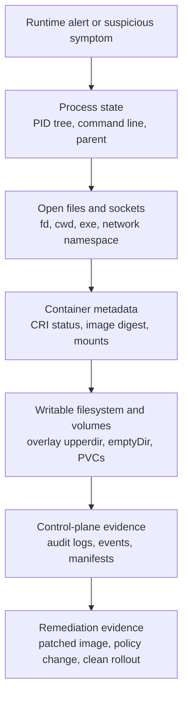
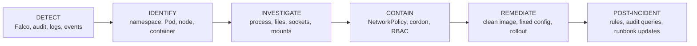

> **Складність**: `[СЕРЕДНЯ]` — навичка розслідування інцидентів для CKS.
>
> **Час на проходження**: 45 хвилин.
>
> **Передумови**: [Модуль 6.2 (Безпека середовища виконання з Falco)](../module-6.2-falco/), [Модуль 6.1 (Журналювання аудиту)](../module-6.1-audit-logging/), основи процесів та просторів імен Linux.

## Що ви зможете зробити

Після завершення цього модуля ви зможете розслідувати підозрілий контейнер як живий доказ, а не як одноразовий Под, який можна видалити та створити заново. Мета — дисциплінована реакція під тиском іспиту й під тиском продакшену, з командами, обраними за доказовою цінністю, мінімальним втручанням та ретельним письмовим документуванням.

1. **Простежити** сповіщення Falco чи аудиту до простору імен, Пода, ноди, ідентифікатора контейнера CRI, стану середовища виконання та хостового PID, що представляють те саме запущене робоче навантаження.
2. **Діагностувати** докази процесів, файлів, мережі та просторів імен за допомогою `kubectl logs`, `kubectl describe`, `kubectl debug`, `crictl`, `nsenter`, `/proc` та метаданих середовища виконання.
3. **Впровадити** локалізацію, яка сповільнює або зупиняє діяльність зловмисника, за допомогою NetworkPolicy, кордонування ноди, змін RBAC та квотних меж, водночас зберігаючи докази, потрібні для діагностики.
4. **Застосувати** робочий процес збереження доказів, який фіксує журнали середовища виконання, записи аудиту, сповіщення Falco, маніфести Подів, метадані контейнерів, зміни кореневої файлової системи та стан змонтованих томів до усунення наслідків.
5. **Спроєктувати** план реагування в стилі CKS, який визначає, коли спостерігати, ізолювати, робити контрольну точку, завершувати, перебудовувати та документувати скомпрометоване робоче навантаження.

## Чому цей модуль важливий

Модуль 6.2 навчив вас генерувати й налаштовувати сповіщення середовища виконання за допомогою Falco; цей модуль починається після того, як одне з таких сповіщень спрацювало. Сповіщення Falco про оболонку, подія аудиту для `pods/exec` або запис у журналі застосунку дає вам вказівник. Це не повний запис інциденту. Завдання оператора — перетворити цей вказівник на ланцюг доказів. Який Под працював? Яка нода його розміщувала? Який екземпляр контейнера CRI його забезпечував? Який процес Linux його представляв? Які файли чи сокети змінилися? Яка дія з локалізації зберігає достатньо стану, щоб відповісти на ці запитання згодом? Ці запитання змушують вас поєднати докази з API Kubernetes із доказами середовища виконання ноди, а не сприймати ім'я Пода як цілу справу. Наприклад, `production/web` може бути іменем репліки Деплойменту, яке зникає після розгортання. Ідентифікатор контейнера CRI та PID середовища виконання точніші для живого екземпляра, що спричинив сповіщення. Подія аудиту може довести, хто запросив канал exec, тоді як Falco доводить, який процес з'явився після цього. Вам потрібні обидва, коли питання звучить «хто що зробив», а не просто «який об'єкт існував». ([Канали виводу Falco](https://falco.org/docs/concepts/outputs/channels/), [Аудит Kubernetes](https://v1-35.docs.kubernetes.io/docs/tasks/debug/debug-cluster/audit/), [crictl для нод Kubernetes](https://kubernetes.io/docs/tasks/debug/debug-cluster/crictl/))

NIST SP 800-61 описує реагування на інциденти як підготовку, виявлення й аналіз, локалізацію, ліквідацію, відновлення та діяльність після інциденту. Kubernetes не змінює цей життєвий цикл. Він стискає часову шкалу. Контролер може замінити Под за лічені секунди, і записуваний шар, дерево процесів та мережеві сокети старого контейнера можуть зникнути разом із ним. Тому звичка CKS — відокремлювати нестійкі докази від інфраструктури, яку можна перебудувати. Спершу зберіть стан процесів і мережі. Ізолюйте робоче навантаження, по можливості не знищуючи його. Усувайте наслідки лише після того, як зафіксовано факти, що зникають під час перезапуску. Саме тому «просто видалити Под» є відповіддю лише після того, як ви вирішили, які докази можете дозволити собі втратити. У реальному інциденті це рішення належить до часової шкали. «Видалено о 10:17, бо ексфільтрація була активна, а сокети вже зафіксовано» — це обґрунтовано. «Видалено, бо Под виглядав погано» — це не запис розслідування. ([NIST SP 800-61 Revision 2](https://csrc.nist.gov/pubs/sp/800/61/r2/final), [kubectl delete](https://v1-35.docs.kubernetes.io/docs/reference/kubectl/generated/kubectl_delete/))



Порядок має значення, тому що нестійкість розподілена нерівномірно. Процес може завершитися ще до того, як ви дочитаєте сповіщення. Встановлене з'єднання TCP може закритися, коли ви застосуєте ізоляцію. Перезапущений контейнер може втратити записуваний оверлейний шар, навіть якщо об'єкт Деплойменту досі існує. Маніфести Подів, записи аудиту та надіслані JSON-сповіщення Falco менш нестійкі, коли їх уже записано в довговічне сховище. Утім, вони все одно не можуть відтворити відкриті файлові дескриптори процесу після того, як процес зник. Сприймайте діаграму як шкалу тиску: чим вище сидить доказ, тим швидше його слід зафіксувати й тим обережніше бути перед завершенням робочого навантаження. Це не наказ зволікати з локалізацією. Це нагадування зафіксувати факти, що зникають найшвидше, до того, як ви виконаєте дію, яка навмисно змусить їх зникнути. ([Файлова система proc Linux](https://man7.org/linux/man-pages/man5/proc.5.html), [Пересилання сповіщень Falco](https://falco.org/docs/concepts/outputs/forwarding/), [Аудит Kubernetes](https://v1-35.docs.kubernetes.io/docs/tasks/debug/debug-cluster/audit/))

## Робочий процес розслідування

Використовуйте наявний п'ятиетапний робочий процес як дисципліну, а не як контрольний список, який треба пробігти. `DETECT` означає збереження початкового сигналу та його полів. `IDENTIFY` означає зіставлення імен Kubernetes із нодою, ідентифікатором контейнера та PID. `INVESTIGATE` означає зчитування живого стану найменш інвазивним інструментом, що відповідає на запитання. `CONTAIN` означає зменшення шкоди без зайвого стирання доказів. `REMEDIATE` означає відновлення довіри на основі образу, маніфесту, RBAC, мережі та контролю допуску, а не просто видалення Пода. Кожен етап має давати артефакт: запис сповіщення, ланцюг ідентичності, набір спостережень, зміну локалізації та нотатку про усунення наслідків. Якщо етап не дає артефакту, наступному відповідальному доведеться довіряти вашій пам'яті замість того, щоб оглядати докази.

Артефакт не мусить бути складним під час завдання CKS. Збереженого файлу YAML, скопійованого виводу команди чи короткої нотатки з назвою PID та дією локалізації достатньо, щоб довести послідовність. Суть у тому, щоб залишити слід, який переживе прокручування вашого терміналу. ([NIST SP 800-61 Revision 2](https://csrc.nist.gov/pubs/sp/800/61/r2/final), [Ефемерні контейнери Kubernetes](https://v1-35.docs.kubernetes.io/docs/concepts/workloads/pods/ephemeral-containers/))



Найбільша помилка новачка — ставитися до контейнера як до хоста SSH. Скомпрометований Под — це не машина-улюбленець, у яку ви входите й ремонтуєте. Це короткоживучий об'єкт середовища виконання. Його поточний стан може бути єдиною копією командного рядка зловмисника, впровадженого двійкового файлу, призначення сокета чи зміненого файлу. Ваша перша команда має відповісти на запитання збереження: який сигнал мені потрібен до того, як це робоче навантаження зміниться? Чи можу я отримати цей сигнал ззовні підозрюваного контейнера? Ця уявна пауза й відрізняє розслідування від скрипта прибирання. ([kubectl logs](https://v1-35.docs.kubernetes.io/docs/reference/kubectl/generated/kubectl_logs/), [kubectl describe](https://v1-35.docs.kubernetes.io/docs/reference/kubectl/generated/kubectl_describe/), [Файлова система proc Linux](https://man7.org/linux/man-pages/man5/proc.5.html))
## Пастка exec

`kubectl exec` корисний для адміністрування, але це поганий типовий вибір для першої реакції, бо він запускає команду всередині цільового контейнера. Цей новий процес може змінити список процесів, який ви намагаєтеся зберегти. Він може покладатися на інструменти, які зловмисник міг підмінити. Він може записувати історію оболонки чи тимчасові файли залежно від образу. Він також може дати зловмиснику ще одну інтерактивну поверхню, якщо той досі контролює робоче навантаження. Довідка Kubernetes документує `kubectl exec` як виконання команди всередині контейнера. Документація з налагодження вказує на ефемерні контейнери як на спеціально створений спосіб додати інструменти усунення несправностей до запущеного Пода, не вбудовуючи ці інструменти в початковий образ. Екзаменаційна відмінність проста: `exec` змінює підозрюваний контейнер, тоді як `debug` додає окремий контейнер для огляду. Бувають ще моменти, коли `exec` прийнятний, наприклад, для відомого лабораторного Пода після того, як ви вже зафіксували потрібні докази. Помилка — використовувати його як перший крок під час активної компрометації. Перший відповідальний має вміти пояснити, чому кожна команда варта тих доказів, які вона може змінити. ([kubectl exec](https://v1-35.docs.kubernetes.io/docs/reference/kubectl/generated/kubectl_exec/), [Налагодження запущених Подів](https://v1-35.docs.kubernetes.io/docs/tasks/debug/debug-application/debug-running-pod/), [Ефемерні контейнери Kubernetes](https://v1-35.docs.kubernetes.io/docs/concepts/workloads/pods/ephemeral-containers/))

Ефемерні контейнери — це не чарівна криміналістика лише для читання, але вони кращий інструмент CKS, бо додають до Пода окремий контейнер для налагодження. Цільовий контейнер застосунку залишається недоторканим. Образ для налагодження може нести `ps`, `ss`, `lsof`, `find`, `jq` та `tcpdump`, не встановлюючи пакети у скомпрометований образ. Kubernetes документує, що ефемерні контейнери призначені для усунення несправностей. Їх можна спрямувати на інший контейнер, коли середовище виконання це підтримує. Вони також не є звичайними контейнерами застосунку з портами, проб'ами чи полями ресурсів. Сприймайте їх як тимчасові інструменти огляду, а не як новий дизайн sidecar. Під час розслідування distroless-образу це різниця між наявністю інструментів поруч із робочим навантаженням та зміною робочого навантаження заради додавання інструментів. ([Ефемерні контейнери Kubernetes](https://v1-35.docs.kubernetes.io/docs/concepts/workloads/pods/ephemeral-containers/), [kubectl debug](https://v1-35.docs.kubernetes.io/docs/reference/kubectl/generated/kubectl_debug/))

```bash
NS=production
POD=web-7d96c8f4d9-r2x5b
CONTAINER=app
kubectl get pod "$POD" -n "$NS" -o wide
kubectl logs "$POD" -n "$NS" -c "$CONTAINER" --since=30m
kubectl logs "$POD" -n "$NS" -c "$CONTAINER" --previous --since=2h || true
kubectl describe pod "$POD" -n "$NS"
kubectl debug -n "$NS" -it "pod/$POD" \
  --image=nicolaka/netshoot:latest \
  --target="$CONTAINER" \
  --container=investigator \
  -- /bin/bash
```

Усередині контейнера для налагодження надавайте перевагу командам спостереження, що зчитують стан ядра й простору імен, замість зміни стану застосунку. Якщо простір імен процесів спільний із ціллю, `ps -ef`, `ss -tnp`, `lsof -p <pid>` та `/proc/<pid>` можуть показати командні рядки, сокети, відкриті файли, поточні робочі каталоги та відображені бібліотеки. Якщо середовище виконання не підтримує спрямування, поверніться до `crictl` та `nsenter` на боці ноди замість спроб встановити інструменти у підозрюваний контейнер. Зафіксуйте цей запасний шлях у нотатках. Він пояснює, чому подальші докази було зібрано з ноди, а не із сесії налагодження Пода. ([Налагодження запущених Подів](https://v1-35.docs.kubernetes.io/docs/tasks/debug/debug-application/debug-running-pod/), [nsenter](https://man7.org/linux/man-pages/man1/nsenter.1.html), [Файлова система proc Linux](https://man7.org/linux/man-pages/man5/proc.5.html))

## Інструменти та поверхні доказів

Кожен інструмент бачить іншу межу. `kubectl` бачить об'єкти Kubernetes та докази з API-сервера. `kubectl debug` додає контейнер для налагодження через шляхи управління Kubernetes. `crictl` спілкується із середовищем виконання CRI ноди, коли API-сервер неповний або коли вам потрібні ідентифікатори контейнерів та стан середовища виконання. `nsenter` переходить у простори імен Linux із хоста, щойно ви знаєте цільовий PID. `/proc` відкриває живі метадані процесів із ядра. `runc state` може підтвердити низькорівневий стан середовища виконання OCI, коли середовище виконання ноди використовує runc і відкриває цей стан. Отже, вибір інструмента — це питання доказів, а не питання вподобань. Запитайте, який рівень володіє потрібним вам фактом, перш ніж обирати команду. Якщо факт — це «який користувач викликав `pods/exec`», залишайтеся з записами аудиту. Якщо факт — це «який двійковий файл володіє цим сокетом», рухайтеся до `/proc` та просторів імен. Якщо факт — це «який дайджест було завантажено», читайте стан CRI. Ця дисципліна рівнів економить час і зменшує зайве втручання. ([kubectl get](https://v1-35.docs.kubernetes.io/docs/reference/kubectl/generated/kubectl_get/), [crictl для нод Kubernetes](https://kubernetes.io/docs/tasks/debug/debug-cluster/crictl/), [nsenter](https://man7.org/linux/man-pages/man1/nsenter.1.html), [runc state](https://github.com/opencontainers/runc/blob/main/man/runc-state.8.md))

| Поверхня інструмента | Найкраще застосування під час розслідування | Докази, які вона зберігає чи розкриває | Головне застереження |
|---|---|---|---|
| `kubectl logs`, `describe`, `get events`, `get -o yaml` | Зафіксувати видимий Kubernetes контекст до зміни об'єкта | Журнали контейнерів, історія перезапусків, імена образів, розміщення на ноді, події, проби, томи, сервісний акаунт, мітки | Журнали можуть бути ротовані чи відсутні, а Події Kubernetes не є довговічним сховищем інцидентів |
| Ефемерний контейнер `kubectl debug` | Оглянути живий Под, у якому бракує інструментів або який використовує distroless-образ | Простір імен процесів, мережевий простір імен, `/proc`, цільовий корінь через `/proc/<pid>/root`, коли видимий | Додає до Пода новий контейнер і залежить від підтримки `--target` середовищем виконання |
| `crictl` на ноді | Розв'язати пісочницю Пода CRI, ідентифікатор контейнера, дайджест образу, PID середовища виконання, монтування та журнали, коли контексту API Kubernetes недостатньо | Стан CRI та метадані середовища виконання з ноди | Потребує доступу до ноди й правильного налаштування ендпоінта CRI |
| `nsenter` із ноди | Увійти в цільові простори імен для огляду процесів та мережі, не запускаючи процес усередині цільового контейнера | Вигляд цільового PID з боку хоста, простір імен PID, мережевий простір імен, простір імен монтування | Усе одно виконує команди розслідування в просторах імен, тож по можливості спершу зафіксуйте сирі дані `/proc` |
| `/proc/<pid>` | Прочитати командний рядок, символьне посилання на виконуваний файл, cwd, таблицю fd, мапи пам'яті, монтування та помережеві файли процесу | Живі докази процесу, підкріплені ядром | Зникають, коли процес завершується, і можуть бути обмежені правами |
| `runc state` | Підтвердити стан середовища виконання OCI там, де стан runc доступний під середовищем виконання CRI | Стан середовища виконання, шлях до bundle, PID та стан життєвого циклу | Залежить від середовища виконання; надавайте перевагу метаданим CRI, якщо підказка не вказує прямо на runc |

Не використовуйте ці інструменти у випадковому порядку. Починайте з найменш інвазивної поверхні, що відповідає на поточне запитання. Спускайтеся до ноди лише тоді, коли доказів рівня Kubernetes недостатньо. Зазвичай це означає спершу `kubectl logs` та знімки об'єктів. Використовуйте `kubectl debug`, коли вам потрібні інструменти поруч із робочим навантаженням. Використовуйте `crictl`, коли вам потрібна ідентичність середовища виконання ноди. Використовуйте `nsenter` чи сирий `/proc`, коли доказом є живий стан процесу. Ця послідовність також створює захищуваний ланцюг для рецензента: розслідування рухалося від записів API до спостереження через налагодження, далі до метаданих середовища виконання, далі до стану процесу, підкріпленого ядром. ([Ефемерні контейнери Kubernetes](https://v1-35.docs.kubernetes.io/docs/concepts/workloads/pods/ephemeral-containers/), [crictl для нод Kubernetes](https://kubernetes.io/docs/tasks/debug/debug-cluster/crictl/), [Файлова система proc Linux](https://man7.org/linux/man-pages/man5/proc.5.html))

## DETECT: збережіть початковий сигнал

Виявлення починається з полів сповіщення, а не з припущення про зловмисника. JSON-сповіщення Falco може містити ім'я правила, пріоритет, ім'я хоста, простір імен Kubernetes, Под, контейнер, образ, ім'я процесу, батьківський процес, командний рядок, користувача, шлях до файлу та поля сокета залежно від виводу правила. Журнали аудиту відповідають на інше запитання. Вони фіксують вибрані запити до API, включно з користувачем, дієсловом, посиланням на об'єкт, субресурсом, вихідним IP, стадією та статусом відповіді, коли політика аудиту їх захоплює. Читайте обидва сигнали як взаємодоповнювальні. Falco може показати, що процес оболонки існував. Аудит може показати, чи якась ідентичність Kubernetes запитувала `pods/exec` приблизно в той самий час. Відсутність попередника в аудиті не доводить, що зловмисника не було; вона лише означає, що поведінка могла розпочатися нижче рівня API або поза вибраною політикою аудиту. Саме тому нотатки виявлення мають зберігати й негативні результати. «Немає відповідної події аудиту `pods/exec` за чинної політики» — це інше, ніж «exec не відбувся». Одне твердження описує ваші докази. Інше — перебільшує понад джерело. ([Канали виводу Falco](https://falco.org/docs/concepts/outputs/channels/), [Аудит Kubernetes](https://v1-35.docs.kubernetes.io/docs/tasks/debug/debug-cluster/audit/))

```bash
kubectl logs -n falco daemonset/falco --since=20m \
  | grep -E 'Terminal shell|suspicious|Unexpected|Sensitive' || true

kubectl get events -A --sort-by=.lastTimestamp \
  | grep -E 'Failed|Killing|BackOff|Unhealthy|Started' || true

kubectl get pod -A -o wide \
  | grep -E 'production|Running|CrashLoopBackOff|Error' || true
```

Якщо Falco вже пересилає сповіщення до Falcosidekick чи іншого довговічного приймача, збережіть копію приймача до того, як торкнетеся Пода. Ця копія дає вам стабільну часову позначку, ім'я правила, пріоритет, хост та поля виводу, навіть якщо журнал DaemonSet Falco ротується чи нода стане недоступною. Робочий процес журналів аудиту з Модуля 6.1 постачає бік часової шкали з площини управління. Зіставте сповіщення середовища виконання Falco із записами аудиту для `pods/exec`, створення Пода, змін RBAC, читання Secret та правок NetworkPolicy, перш ніж вирішити, що поведінка середовища виконання з'явилася без попередника з боку API. Зберігайте оригінальний текст сповіщення навіть після того, як ви нормалізуєте поля в тікет. Сире сповіщення може містити поля процесу чи файлу, які не було відображено у вашому шаблоні інциденту. ([Пересилання сповіщень Falco](https://falco.org/docs/concepts/outputs/forwarding/), [Аудит Kubernetes](https://v1-35.docs.kubernetes.io/docs/tasks/debug/debug-cluster/audit/))
## IDENTIFY: від сповіщення до Пода, ноди, ідентифікатора контейнера та PID

Ланцюг ідентичності — це основний патерн CKS: від сповіщення до простору імен та Пода, від Пода до ноди й імені контейнера, від метаданих CRI до ідентифікатора контейнера та дайджесту образу, від ідентифікатора контейнера до хостового PID, від PID до `/proc` та просторів імен. Цей ланцюг запобігає двом поширеним помилкам. Перша — розслідувати Под-заміну, створений після сповіщення. Друга — оглядати правильне ім'я Пода, але неправильний контейнер усередині багатоконтейнерного Пода. Використовуйте UID Пода, час запуску, ім'я ноди та ідентифікатор контейнера, коли час неоднозначний. Деплоймент може повторно використати мітки й імена, але він не може змусити новий контейнер мати спільний старий ідентифікатор середовища виконання. Багатоконтейнерні Поди роблять це важливішим. Sidecar може володіти підозрілим мережевим з'єднанням, тоді як основний застосунок володіє відкритим портом. Ініціалізаційний контейнер міг уже завершитися, залишивши лише журнали та стан. Поле контейнера у сповіщенні та список контейнерів CRI утримують вас від зведення цих різних ролей до одного припущення на рівні Пода. Коли сповіщення пропускає поле, не вигадуйте його. Виведіть його зі стану Kubernetes чи стану CRI й зафіксуйте це виведення. Ця маленька звичка робить ланцюг придатним до аудиту. ([kubectl get](https://v1-35.docs.kubernetes.io/docs/reference/kubectl/generated/kubectl_get/), [crictl для нод Kubernetes](https://kubernetes.io/docs/tasks/debug/debug-cluster/crictl/), [Стан середовища виконання OCI](https://github.com/opencontainers/runtime-spec/blob/main/runtime.md#state))

```mermaid
flowchart LR
    A[Falco alert<br/>rule + output_fields] --> B[Kubernetes object<br/>namespace + Pod + container]
    B --> C[Node<br/>spec.nodeName / alert hostname]
    C --> D[CRI Pod sandbox<br/>crictl pods]
    D --> E[CRI container ID<br/>crictl ps + inspect]
    E --> F[Runtime PID<br/>crictl inspect .info.pid]
    F --> G[/proc and namespaces<br/>exe, cwd, fd, maps, net]
```

```bash
NS=production
POD=web-7d96c8f4d9-r2x5b
CONTAINER=app
kubectl get pod "$POD" -n "$NS" \
  -o jsonpath='node={.spec.nodeName} phase={.status.phase} podIP={.status.podIP}{"\n"}'
kubectl get pod "$POD" -n "$NS" -o yaml > evidence-pod.yaml
kubectl describe pod "$POD" -n "$NS" > evidence-describe.txt
kubectl get events -n "$NS" \
  --field-selector involvedObject.name="$POD" \
  --sort-by=.lastTimestamp > evidence-events.txt
```

На ноді використовуйте метадані CRI перед сирими командами середовища виконання, тому що Kubernetes стандартизує поверхню CRI для різних середовищ виконання контейнерів. Документація crictl від Kubernetes показує `crictl pods`, `crictl ps`, `crictl inspect`, `crictl logs` та налаштування ендпоінта середовища виконання для налагодження нод. Репозиторій `cri-tools` є джерелом клієнта `crictl`, тож це основна довідка щодо реалізації, коли важать прапорець команди чи форма виводу. Це має значення у змішаних парках. Одна нода може запускати containerd, інша — CRI-O, а підказка CKS може й не сказати вам, яке середовище виконання забезпечує kubelet. Команди CRI зберігають перший крок розслідування переносним. Спускайтеся до інструментів, специфічних для середовища виконання, лише коли вивід CRI не може відповісти на запитання. ([crictl для нод Kubernetes](https://kubernetes.io/docs/tasks/debug/debug-cluster/crictl/), [kubernetes-sigs/cri-tools](https://github.com/kubernetes-sigs/cri-tools))

```bash
NS=production
POD=web-7d96c8f4d9-r2x5b
CONTAINER=app
sudo crictl pods --namespace "$NS" --name "$POD"
POD_ID=$(sudo crictl pods --namespace "$NS" --name "$POD" -q)
sudo crictl ps --pod "$POD_ID"
CID=$(sudo crictl ps --pod "$POD_ID" --name "$CONTAINER" -q)
sudo crictl inspect "$CID" > evidence-crictl-inspect.json
sudo crictl inspect "$CID" | jq -r '.status.id, .status.image.image, .status.imageRef, .info.pid'
PID=$(sudo crictl inspect "$CID" | jq -r '.info.pid')
sudo runc state "$CID" 2>/dev/null || true   # containerd: add --root /run/containerd/runc/k8s.io to query runc directly
```

PID — це місток від словника Kubernetes до доказів Linux. Щойно ви його знаєте, `/proc/$PID` може показати символьне посилання на виконуваний файл, поточний робочий каталог, командний рядок, середовище, файлові дескриптори, відображення пам'яті, вигляд кореневої файлової системи, інформацію про монтування та дескриптори просторів імен. Сторінки man для `/proc`, `/proc/pid/exe`, `/proc/pid/cwd`, `/proc/pid/fd` та `/proc/pid/maps` документують ці файли як інтерфейси ядра. Саме тому вони залишаються корисними, коли в образі контейнера немає оболонки чи менеджера пакетів. Вони також є живими виглядами, а не архівними журналами. Зафіксуйте їх до того, як перезапустите, видалите чи витісните робоче навантаження. Якщо цільовий процес завершиться, `/proc/$PID` може тепер описувати інший процес або взагалі жодного. ([Файлова система proc Linux](https://man7.org/linux/man-pages/man5/proc.5.html), [/proc/pid/exe](https://man7.org/linux/man-pages/man5/proc_pid_exe.5.html), [/proc/pid/cwd](https://man7.org/linux/man-pages/man5/proc_pid_cwd.5.html), [/proc/pid/fd](https://man7.org/linux/man-pages/man5/proc_pid_fd.5.html), [/proc/pid/maps](https://man7.org/linux/man-pages/man5/proc_pid_maps.5.html))

## INVESTIGATE: стан процесів, файлів та мережі

Огляд процесів має відповісти на три запитання, перш ніж полювати на імена шкідливого ПЗ: який процес працював, хто його запустив і що він міг бачити. Командний рядок без батьківського процесу може ввести вас в оману. `/bin/sh`, запущений авторизованим `kubectl exec`, та `/bin/sh`, запущений вразливим вебсервером, — це різні історії. Зафіксуйте дерево PID, командні рядки, шляхи до виконуваних файлів, cwd та відкриті дескриптори, перш ніж виконувати ширші пошуки. Це поля, які найімовірніше зникнуть, коли процес завершиться. Потім класифікуйте поведінку. Дочірній процес застосунку може вказувати на віддалене виконання коду чи небезпечну функцію. Дочірній процес середовища виконання контейнера може вказувати на інтерактивний exec чи шлях attach. Ця відмінність визначає, чи розслідуєте ви ваду застосунку, дію адміністратора чи викрадені облікові дані. Не зупиняйтеся на іменах процесів, що видаються знайомими. `curl`, `sh`, `tar` чи `nc` можуть бути легітимними в образі для налагодження й тривожними всередині продакшен-вебсервера. Батьківський процес, командний рядок, шлях до виконуваного файлу, поточний каталог та відкриті дескриптори дають той контекст, якого бракує імені двійкового файлу. ([Файлова система proc Linux](https://man7.org/linux/man-pages/man5/proc.5.html), [/proc/pid/exe](https://man7.org/linux/man-pages/man5/proc_pid_exe.5.html), [/proc/pid/fd](https://man7.org/linux/man-pages/man5/proc_pid_fd.5.html))

```bash
PID=12345
sudo ps -eo pid,ppid,user,stat,etime,comm,args --forest | sed -n "1,80p"
sudo tr '\0' ' ' < "/proc/$PID/cmdline"; printf '\n'
sudo readlink "/proc/$PID/exe"
sudo readlink "/proc/$PID/cwd"
sudo ls -la "/proc/$PID/fd" | sed -n '1,80p'
sudo sed -n '1,80p' "/proc/$PID/maps"
sudo lsof -p "$PID" 2>/dev/null | sed -n '1,80p' || true
```

Розслідування файлів має розрізняти файлову систему образу, записуваний стан середовища виконання та змонтовані томи. Коренева файлова система контейнера зазвичай використовує overlayfs. Нижні шари беруться з образу. Верхній шар фіксує зміни. Монтування томів, як-от `emptyDir` чи PVC, можуть містити файли, записані зловмисником, поза шаром образу. Документація overlayfs ядра описує модель каталогів lower, upper, work та merged. Огляд CRI та вивід монтувань підкажуть вам, які шляхи в цьому конкретному контейнері забезпечені образом, оверлеєм чи томом. Ця відмінність змінює план доказів. Підозрілий файл у верхньому оверлейному шарі може зникнути разом із контейнером. Підозрілий файл на PVC може зберегтися після видалення Пода й потребувати обробки на рівні сховища. Спроєктований Secret чи ConfigMap — це знову інше. Його вміст може контролюватися об'єктами Kubernetes, а не файлами, записаними всередині контейнера. Коли ви знаходите файл, схожий на обліковий запис, визначте джерело монтування, перш ніж називати його створеним зловмисником. ([Оверлейна файлова система](https://docs.kernel.org/filesystems/overlayfs.html), [crictl для нод Kubernetes](https://kubernetes.io/docs/tasks/debug/debug-cluster/crictl/), [kubectl get](https://v1-35.docs.kubernetes.io/docs/reference/kubectl/generated/kubectl_get/))

```bash
PID=12345
sudo find "/proc/$PID/root/tmp" "/proc/$PID/root/var/tmp" "/proc/$PID/root/dev/shm" \
  -xdev -type f -mmin -120 -ls 2>/dev/null | sed -n '1,80p'
sudo find "/proc/$PID/root" -xdev -perm -4000 -type f -ls 2>/dev/null | sed -n '1,80p'
sudo cat "/proc/$PID/mountinfo" | sed -n '1,120p'
sudo crictl inspect "$CID" | jq '.status.mounts // empty'
```

Розслідування мережі має прив'язувати сокети назад до процесів, перш ніж позначати призначення підозрілим. Самого номера порту рідко достатньо, щоб довести намір. Вирішальна деталь — чи відкрив основний застосунок своє звичайне backend-з'єднання, чи оболонка, менеджер пакетів, впроваджений двійковий файл або неочікуваний дочірній процес відкрив вихідне з'єднання після сповіщення. Використовуйте `ss` на хості для широкого огляду. Потім використовуйте `nsenter -t "$PID" -n`, щоб оглянути цільовий мережевий простір імен, коли вигляд із ноди надто зашумлений. Зафіксуйте встановлені з'єднання до ізоляції, якщо можете зробити це швидко. Застосування політики deny-all може бути правильним кроком локалізації, але воно може закрити саме той сокет, що показав би віддалений ендпоінт. Також зафіксуйте контекст DNS та маршрути, коли питання стосується ексфільтрації. `/etc/resolv.conf`, таблиця маршрутів простору імен та процес, що володіє сокетом, можуть показати, чи з'єднання дотримувалося звичайного розв'язання кластера, чи обійшло його прямим IP. ([nsenter](https://man7.org/linux/man-pages/man1/nsenter.1.html), [Файлова система proc Linux](https://man7.org/linux/man-pages/man5/proc.5.html))

```bash
PID=12345
sudo ss -Htnp | sed -n '1,120p'
sudo nsenter -t "$PID" -n ss -Htnp
sudo nsenter -t "$PID" -n ss -Hulp
sudo cat "/proc/$PID/net/tcp" | sed -n '1,20p'
sudo cat "/proc/$PID/net/tcp6" | sed -n '1,20p'
```

Коли ви використовуєте `nsenter`, будьте точними щодо того, які простори імен вам потрібні. Входу лише в мережевий простір імен достатньо для огляду сокетів та маршрутів. Додавання простору імен PID допомагає, коли ви хочете бачити ідентифікатори процесів так, як їх бачить контейнер. Додавання простору імен монтування допомагає, коли вам потрібні шляхи до файлів так, як їх бачить контейнер. Сторінка man `nsenter` документує прапорці вибору простору імен, як-от `--target`, `--mount`, `--net`, `--pid`, `--uts`, `--ipc` та `--user`. Уникайте суцільного входу в простори імен, коли вужчий відповідає на запитання. Вузький вхід також робить ваші нотатки легше захищуваними. Ви можете сказати точно, у який вигляд ви ввійшли й чому. ([nsenter](https://man7.org/linux/man-pages/man1/nsenter.1.html))

```bash
PID=12345
sudo nsenter -t "$PID" -n ip addr
sudo nsenter -t "$PID" -n ip route
sudo nsenter -t "$PID" -p ps -ef
sudo nsenter -t "$PID" -m -p -n sh -c 'pwd; ps -ef; ss -tnp; ls -la /proc/1/fd'
```
## Криміналістика образу та файлової системи

Ідентичність образу має значення, бо тег — це не доказ. Зафіксуйте специфікацію Пода, тег образу та розв'язаний дайджест образу з метаданих середовища виконання. Порівняйте цей дайджест з образом, який ви маєте намір розгорнути повторно. Стан об'єкта Kubernetes може показувати `image: repo/app:latest`, тоді як стан CRI може містити `imageRef`, що вказує на завантажений дайджест. Цей дайджест — стабільний артефакт, який ви можете сканувати, заблокувати чи просувати під час усунення наслідків. Він також запобігає тонкій помилці: перебудові з того самого тегу після того, як тег у реєстрі перемістився, із припущенням, що ви протестували скомпрометований образ. Дайджест прив'язує запущений контейнер до конкретного завантаженого артефакту. Під час усунення наслідків тримайте старий дайджест та новий дайджест у нотатці. Це дозволяє рецензенту переконатися, що чисте розгортання справді змінило артефакт, а не просто перезапустило ту саму вразливу збірку. ([kubectl get](https://v1-35.docs.kubernetes.io/docs/reference/kubectl/generated/kubectl_get/), [crictl для нод Kubernetes](https://kubernetes.io/docs/tasks/debug/debug-cluster/crictl/))

```bash
kubectl get pod "$POD" -n "$NS" \
  -o jsonpath='{range .spec.containers[*]}{.name}{" image="}{.image}{"\n"}{end}'
sudo crictl inspect "$CID" \
  | jq -r '.status.image.image, .status.imageRef, .info.runtimeSpec.root.path?'
sudo crictl images | grep -F "$(sudo crictl inspect "$CID" | jq -r '.status.image.image')" || true
```

Для захоплення файлової системи вирішіть, чи потрібна вам логічна копія зі злитого кореня контейнера, верхній оверлейний шар, що представляє зміни, чи копії змонтованих томів. Архів злитого кореня легше оглядати. Він також може змішувати оригінальні файли образу зі змінами середовища виконання. Верхній шар ближчий до «що змінилося», але він специфічний для середовища виконання й може потребувати доступу до ноди. Томи потребують власного шляху збереження, бо видалення Пода може залишити PVC недоторканим, але знищити `emptyDir` разом із Подом. На іспиті поясніть, яку копію ви зробили й що вона може довести. Архів кореня доводить поточний видимий вміст. Захоплення верхнього шару звужує зміни. Копія тому зберігає дані, що живуть поза образом контейнера. ([Оверлейна файлова система](https://docs.kernel.org/filesystems/overlayfs.html), [Ефемерні контейнери Kubernetes](https://v1-35.docs.kubernetes.io/docs/concepts/workloads/pods/ephemeral-containers/), [crictl для нод Kubernetes](https://kubernetes.io/docs/tasks/debug/debug-cluster/crictl/))

```bash
PID=12345
sudo tar --numeric-owner --xattrs --acls \
  -czf "container-root-${CID}.tar.gz" \
  -C "/proc/$PID/root" .
sudo tar --numeric-owner --xattrs --acls \
  -czf "container-tmp-${CID}.tar.gz" \
  -C "/proc/$PID/root/tmp" . 2>/dev/null || true
```

Не переоцінюйте захоплення файлової системи контейнера. Живий архів може конкурувати з діяльністю зловмисника. Файл може змінитися, поки ви його читаєте. Видалений файл може залишатися доступним через відкритий дескриптор, навіть коли він більше не з'являється у переліку каталогу. Відповідь CKS — не побудувати ідеальний криміналістичний апарат. Вона полягає в тому, щоб показати правильну послідовність: ізолювати мережеві шляхи, зафіксувати нестійкий стан, зробити знімок маніфесту та метаданих середовища виконання, скопіювати відповідні докази файлової системи чи тому, а потім перебудувати з довіреного образу й набору політик. Зазначте обмеження в нотатці про інцидент. Чесні межі доказів корисніші за впевнене, але непідтверджене твердження, що архів повний. ([NIST SP 800-61 Revision 2](https://csrc.nist.gov/pubs/sp/800/61/r2/final), [Мережеві політики](https://v1-35.docs.kubernetes.io/docs/concepts/services-networking/network-policies/), [/proc/pid/fd](https://man7.org/linux/man-pages/man5/proc_pid_fd.5.html))

## CONTAIN: зменшіть шкоду без знищення доказів

Локалізація — це компроміс між зупиненням дії зловмисника та збереженням стану. NetworkPolicy може заблокувати вхідний та вихідний трафік, залишивши Под запущеним, але лише для трафіку, що керується CNI з підтримкою NetworkPolicy, і лише для вибраних Подів. Кордонування може зупинити нове планування на підозрюваній ноді, не вбиваючи наявні Поди. Зміни RBAC можуть відкликати те, що сервісний акаунт робочого навантаження може робити через API. Примусове видалення швидко зупиняє процес, але також знищує нестійкі докази й може спонукати контролер створити заміну. Правильний вибір залежить від активного ризику. Якщо дані досі залишають кластер, спершу ізолюйте й прийміть, що деякі сокети можуть закритися. Якщо сповіщення історичне, а процес бездіяльний, зафіксуйте більше, перш ніж змінювати трафік. Якщо сама нода підозріла, кордонуйте її, перш ніж створювати там робочі навантаження для налагодження чи заміни. Це утримує нові Поди подалі, поки ви вирішуєте, чи наявні Поди мають бути дреновані, ізольовані чи збережені для розслідування на рівні ноди. ([Мережеві політики](https://v1-35.docs.kubernetes.io/docs/concepts/services-networking/network-policies/), [kubectl cordon](https://v1-35.docs.kubernetes.io/docs/reference/kubectl/generated/kubectl_cordon/), [Авторизація RBAC](https://v1-35.docs.kubernetes.io/docs/reference/access-authn-authz/rbac/), [kubectl delete](https://v1-35.docs.kubernetes.io/docs/reference/kubectl/generated/kubectl_delete/))

| Дія локалізації | Вплив на докази | Найкраще підходить | Застереження CKS |
|---|---|---|---|
| Застосувати NetworkPolicy deny-all до міток Пода | Зберігає стан процесів та файлової системи, відрізаючи трафік, що керується політикою | Активна ексфільтрація, виклики command-and-control, латеральний рух | Потребує правильних міток та CNI, що забезпечує NetworkPolicy |
| Кордонувати ноду | Зберігає наявні Поди й зупиняє нове планування | Підозрювана нода чи середовище виконання, поки триває розслідування | Не зупиняє вже запущений скомпрометований процес |
| Видалити чи звузити RoleBindings для сервісного акаунта | Зберігає Под, зменшуючи повноваження в API | Токен робочого навантаження використовується проти API-сервера | Наявні токени можуть залишитися змонтованими, але рішення авторизації можуть змінитися негайно |
| Масштабувати контролер до нуля після захоплення | Зупиняє цикли заміни після збору доказів | Перебудова з чистого образу після знімка | Масштабування до захоплення може прибрати єдиний запущений доказ |
| Видалити чи примусово видалити Под | Зупиняє процес, і контролер може замінити його | Серйозна активна шкода, коли спостереження надто ризиковане | Втрачає докази процесу, сокета, `emptyDir` та записуваного шару |

```bash
NS=production
POD=web-7d96c8f4d9-r2x5b
kubectl get pod "$POD" -n "$NS" --show-labels
cat <<'EOF' | kubectl apply -f -
apiVersion: networking.k8s.io/v1
kind: NetworkPolicy
metadata:
  name: isolate-suspicious-pod
  namespace: production
spec:
  podSelector:
    matchLabels:
      app: web
      incident: cks-63
  policyTypes:
    - Ingress
    - Egress
  ingress: []
  egress: []
EOF
```

Використовуйте мітки обережно, бо NetworkPolicy вибирає Поди за міткою, а не за іменем Пода. Якщо наявні мітки ізолювали б кожну репліку за Деплойментом, застосуйте політику з обома мітками в селекторі; вона збігається з нульовою кількістю Подів, доки не існує мітки інциденту, потім додайте мітку, щоб атомарно запустити ізоляцію. Це уникає вікна гонитви, де позначений Под досі не ізольований. Ця правка мітки змінює об'єкт Kubernetes. Спершу зафіксуйте оригінальний маніфест та включіть зміну мітки в нотатки про інцидент. Також перевірте кількість вибраних Подів після застосування політики. Правильна на вигляд політика deny-all, що вибирає нуль Подів, — це взагалі не локалізація, тоді як широкий селектор може спричинити збій у роботі здорових реплік. Пам'ятайте, що NetworkPolicy сама по собі не вибирає за нодою, образом чи посиланням на власника. Якщо вам потрібні ці поля, використайте `kubectl`, щоб ідентифікувати Под, а потім застосуйте мітку, що перетворює ваше рішення розслідування на селектор політики. ([Мережеві політики](https://v1-35.docs.kubernetes.io/docs/concepts/services-networking/network-policies/), [kubectl get](https://v1-35.docs.kubernetes.io/docs/reference/kubectl/generated/kubectl_get/))

```bash
kubectl get pod "$POD" -n "$NS" -o yaml > evidence-before-label.yaml
kubectl label pod "$POD" -n "$NS" incident=cks-63 --overwrite
kubectl get networkpolicy isolate-suspicious-pod -n "$NS" -o yaml
```

Карантин RBAC корисний, коли підозрюваний контейнер має змонтований токен сервісного акаунта, а сповіщення вказує на діяльність в API. Спершу ідентифікуйте сервісний акаунт. Потім перевірте його поточні повноваження за допомогою `kubectl auth can-i --as=system:serviceaccount:<ns>:<sa>`. Потім видаліть чи звузьте прив'язку, що надає небезпечні дієслова. RBAC контролює рішення авторизації для запитів до API, тож це може зменшити радіус ураження, залишивши докази процесу й файлової системи контейнера на місці. Не плутайте це з видаленням файлу токена з контейнера. Токен може залишитися змонтованим, але майбутні запити до API можна відхилити, якщо прив'язка більше не надає дієслова. Зафіксуйте оригінальні прив'язки, щоб саму дію локалізації можна було переглянути. ([Авторизація RBAC](https://v1-35.docs.kubernetes.io/docs/reference/access-authn-authz/rbac/), [kubectl auth can-i](https://v1-35.docs.kubernetes.io/docs/reference/kubectl/generated/kubectl_auth/kubectl_auth_can-i/))

```bash
SA=$(kubectl get pod "$POD" -n "$NS" -o jsonpath='{.spec.serviceAccountName}')
kubectl auth can-i --as="system:serviceaccount:$NS:$SA" --list -n "$NS"
kubectl get rolebinding,clusterrolebinding -A -o wide | grep "system:serviceaccount:$NS:$SA" || true
```

ResourceQuota не є першим важелем локалізації для одного запущеного Пода, але це корисна межа для карантинного простору імен чи розгортання заміни після інциденту. Якщо відповідальні клонують маніфести, запускають робочі навантаження для налагодження чи готують чисту заміну в просторі імен, квота може обмежити сукупний CPU, пам'ять, кількість об'єктів та вибрані класи ресурсів. Це не дає середовищу реагування стати другим інцидентом із ресурсами. Це також робить карантин повторюваним. Простір імен із відомою квотою може розміщувати копії для налагодження, не створюючи випадково необмеженої кількості Подів, Сервісів чи запитів на сховище, поки відповідальні експериментують. Це особливо корисно, коли підозріле робоче навантаження було частиною автомасштабованої чи керованої Job системи. Поганий клон такого робочого навантаження може швидко створити багато об'єктів. Квота перетворює карантинний простір імен на обмежений робочий простір замість безмежної копії продакшен-ризику. ([Квоти ресурсів](https://v1-35.docs.kubernetes.io/docs/concepts/policy/resource-quotas/))
## REMEDIATE: відновіть довіру після захоплення

Усунення наслідків починається після того, як ви маєте достатньо доказів, щоб пояснити шлях компрометації. Видалити-й-створити-заново безпечно лише тоді, коли образ, маніфест, RBAC, мережева політика та позиція допуску більше не дозволяють тієї самої поведінки. Якщо першопричиною був надто широкий сервісний акаунт, записувана коренева файлова система, відкритий ендпоінт для налагодження, відсутня NetworkPolicy чи незакріплений тег образу, то Под-заміна з тими самими вхідними даними може відтворити той самий інцидент. Тому чисте розгортання має назвати межу довіри, яку воно відновлює. Це може бути виправлений дайджест, звужений RoleBinding, типова політика default-deny, налаштування незмінного образу чи видалене монтування тому. Якщо ви не можете назвати змінений контроль, ви, ймовірно, перезапустили, а не усунули наслідки.

Усунення наслідків також потребує сигналу верифікації. Спостерігайте за розгортанням, перевірте дайджест нового образу, підтвердьте повноваження сервісного акаунта й тримайте політику ізоляції, доки поведінка заміни не буде доведена. Потім видаляйте тимчасові мітки та політики інциденту свідомо, а не як забуте сміття. Фінальний запис має поєднати знахідку з виправленням: підозрілий процес походив із записуваного шляху завантаження, виправлення прибирає шлях запису; зловживання API використовувало широкий сервісний акаунт, виправлення звужує прив'язку; ексфільтрація використовувала необмежений вихідний трафік, виправлення додає default-deny та явні дозволи. ([NIST SP 800-61 Revision 2](https://csrc.nist.gov/pubs/sp/800/61/r2/final), [Авторизація RBAC](https://v1-35.docs.kubernetes.io/docs/reference/access-authn-authz/rbac/), [Мережеві політики](https://v1-35.docs.kubernetes.io/docs/concepts/services-networking/network-policies/), [kubectl get](https://v1-35.docs.kubernetes.io/docs/reference/kubectl/generated/kubectl_get/))

```bash
kubectl get pod "$POD" -n "$NS" -o yaml > evidence-final-pod.yaml
kubectl logs "$POD" -n "$NS" --all-containers --since=2h > evidence-final-logs.txt
kubectl delete pod "$POD" -n "$NS"
kubectl rollout status deployment/web -n "$NS" --timeout=120s
kubectl get pods -n "$NS" -l app=web -o wide
```

Зміни після інциденту мають живити Модулі 6.1 та 6.2. Якщо журнали аудиту не захопили запит `pods/exec`, оновіть політику аудиту. Якщо Falco видавав сповіщення лише в журнал DaemonSet, спрямуйте JSON-сповіщення до довговічного сховища. Якщо розслідування потребувало доступу до ноди, бо в образі бракувало інструментів, це прийнятно. Не вирішуйте це додаванням оболонок та менеджерів пакетів до продакшен-образів. Використовуйте ефемерні контейнери та інструменти CRI на боці ноди для розслідування, потім посильте образ робочого навантаження та політику середовища виконання. Тест після інциденту конкретний: чи можете ви спричинити відоме сповіщення про оболонку, зберегти його поза нодою, зіставити з Подом та PID, ізолювати Под та пояснити, який контроль запобігає повторенню? Якщо відповідь «ні», наступний інцидент повторить ту саму плутанину. Покращуйте вивід правила, вибір аудиту, послідовність команд runbook чи шаблон локалізації, доки ланцюг не стане повторюваним під тиском часу. ([Аудит Kubernetes](https://v1-35.docs.kubernetes.io/docs/tasks/debug/debug-cluster/audit/), [Пересилання сповіщень Falco](https://falco.org/docs/concepts/outputs/forwarding/), [Ефемерні контейнери Kubernetes](https://v1-35.docs.kubernetes.io/docs/concepts/workloads/pods/ephemeral-containers/))

## Екзаменаційні патерни CKS

Коли підказка дає вам сповіщення Falco, запишіть простір імен, Под, ім'я контейнера, ноду чи ім'я хоста, ім'я процесу, батьківський процес, командний рядок та поле файлу чи сокета, перш ніж виконувати команди. Потім доведіть, що Под досі існує. Зафіксуйте його YAML та журнали. Ідентифікуйте ноду. Переходьте до `crictl` лише тоді, коли вам потрібен ідентифікатор контейнера середовища виконання чи PID. Цей патерн швидший за пошук кожної ноди, бо сповіщення вже містить більшу частину інформації для маршрутизації. Він також уникає поширеної екзаменаційної пастки: витрачати час на широку інвентаризацію кластера, поки сповіщення вже каже вам, де шукати. Якщо Под зник, не вдавайте, що крок із живим станом успішний. Скажіть, які докази тепер недоступні, потім переключіться на докази, що вціліли, як-от журнали аудиту, сховище Falco, історія контролера, записи дайджестів образів та будь-які персистентні томи. ([Канали виводу Falco](https://falco.org/docs/concepts/outputs/channels/), [kubectl get](https://v1-35.docs.kubernetes.io/docs/reference/kubectl/generated/kubectl_get/), [crictl для нод Kubernetes](https://kubernetes.io/docs/tasks/debug/debug-cluster/crictl/))

Коли підказка каже, що контейнер distroless або не має оболонки, не встановлюйте інструменти й не припускайте, що `kubectl exec` спрацює. Використовуйте `kubectl debug` з образом інструментів або оглядайте з ноди за допомогою `crictl`, `/proc` та `nsenter`. Якщо середовище виконання не може спрямувати на простір імен процесів, шлях через PID на боці ноди є надійним запасним варіантом, бо ядро досі знає процес, навіть коли в образі немає інструментів простору користувача. Відсутність оболонки в образі має бути сигналом посилення безпеки, а не перешкодою для розслідування. Вона каже вам принести інструменти ззовні підозрюваного контейнера. ([Налагодження запущених Подів](https://v1-35.docs.kubernetes.io/docs/tasks/debug/debug-application/debug-running-pod/), [Ефемерні контейнери Kubernetes](https://v1-35.docs.kubernetes.io/docs/concepts/workloads/pods/ephemeral-containers/), [nsenter](https://man7.org/linux/man-pages/man1/nsenter.1.html))

Коли підказка просить ізолювати без видалення, використайте NetworkPolicy deny-all, специфічну для мітки, та переконайтеся, що вона вибирає лише цільовий Под. Якщо підказка описує зловживання API, також огляньте сервісний акаунт та прив'язки RBAC. Якщо підказка описує підозрілу ноду, кордонуйте її, перш ніж створювати там більше робочих навантажень. Це дії локалізації, що зберігають більше доказів, ніж негайне видалення. Команда — лише половина відповіді. Інша половина — це компроміс щодо втрати доказів: NetworkPolicy може закрити сокети, кордонування не зупиняє поточні процеси, а зміни RBAC зменшують майбутні виклики API, а не наявну файлову чи мережеву діяльність. Озвучте цей компроміс у відповіді на іспиті. Він показує, що ви обираєте локалізацію, а не сліпо застосовуєте знайомий патерн YAML. ([Мережеві політики](https://v1-35.docs.kubernetes.io/docs/concepts/services-networking/network-policies/), [Авторизація RBAC](https://v1-35.docs.kubernetes.io/docs/reference/access-authn-authz/rbac/), [kubectl cordon](https://v1-35.docs.kubernetes.io/docs/reference/kubectl/generated/kubectl_cordon/))

Коли підказка просить докази файлової системи до усунення наслідків, зафіксуйте маніфест Пода, вивід `crictl inspect`, дайджест образу, метадані процесу, відповідні шляхи `/proc/$PID/root`, інформацію про оверлей чи монтування та шляхи томів. Не покладайтеся на свіжий Под з того самого образу як на доказ того, що сталося у старому записуваному шарі. Зміни верхнього оверлейного шару та вміст `emptyDir` — це стан середовища виконання. Свіжий Под може допомогти порівняти базові файли, але він не є заміною скомпрометованого екземпляра. Зазначте, яка копія є базовою, а яка копія є доказом з інциденту. Якщо підказка дає вам лише кілька хвилин, надайте пріоритет каталогам, названим у сповіщенні, записуваним шляхам, як-от `/tmp`, та змонтованим томам, перш ніж намагатися архівувати весь корінь. ([Оверлейна файлова система](https://docs.kernel.org/filesystems/overlayfs.html), [Файлова система proc Linux](https://man7.org/linux/man-pages/man5/proc.5.html), [crictl для нод Kubernetes](https://kubernetes.io/docs/tasks/debug/debug-cluster/crictl/))

## Чи знали ви?

- Ефемерні контейнери — це стабільні інструменти усунення несправностей у Kubernetes, але вони не є звичайними контейнерами застосунку: Kubernetes документує обмеження щодо ресурсів, портів та проб, тому вони краще підходять для розслідування, ніж для дизайну застосунку. ([Ефемерні контейнери Kubernetes](https://v1-35.docs.kubernetes.io/docs/concepts/workloads/pods/ephemeral-containers/))
- `crictl` навмисно є інструментом налагодження нод для CRI-сумісних середовищ виконання, а репозиторій `kubernetes-sigs/cri-tools` є джерелом клієнта, що використовується в багатьох розслідуваннях нод Kubernetes. ([crictl для нод Kubernetes](https://kubernetes.io/docs/tasks/debug/debug-cluster/crictl/), [kubernetes-sigs/cri-tools](https://github.com/kubernetes-sigs/cri-tools))
- `/proc/<pid>/fd` показує файлові дескриптори як символьні посилання з погляду ядра на процес, що робить його корисним, коли в образі контейнера бракує `lsof` або коли видалений файл залишається відкритим. ([/proc/pid/fd](https://man7.org/linux/man-pages/man5/proc_pid_fd.5.html))
- `kubectl drain` зазвичай є командою обслуговування, а не першим кроком розслідування, бо він витісняє робочі навантаження й може знищити саме той стан середовища виконання, який ви намагаєтеся зберегти. ([kubectl drain](https://v1-35.docs.kubernetes.io/docs/reference/kubectl/generated/kubectl_drain/))

## Типові помилки

| Помилка | Чому це шкодить | Кращий хід оператора |
|---|---|---|
| Спершу запускати `kubectl exec` | Запускає новий процес усередині підозрюваного контейнера й може змінити поверхню доказів | Зафіксуйте журнали та маніфести, потім використайте `kubectl debug` чи огляд із боку ноди |
| Негайно видаляти Под | Прибирає стан процесу, мережеві сокети, дані `emptyDir` та, можливо, записуваний шар контейнера | По можливості спершу ізолюйте, потім збережіть докази перед видаленням |
| Розслідувати Под-заміну | Контролер може створити новий Под з тими самими мітками після зникнення скомпрометованого | Зіставте часову позначку сповіщення, UID Пода, ноду, ідентифікатор контейнера та PID середовища виконання |
| Застосовувати NetworkPolicy до широких міток | Може ізолювати кожну репліку робочого навантаження або все одно промахнутися повз ціль, якщо мітки не збігаються | Зробіть знімок маніфесту, додайте тимчасову мітку інциденту й вибирайте лише цю мітку |
| Довіряти тегам образів як доказам | Теги можуть переміщатися й не доводять точного екземпляра образу, що працював | Зафіксуйте `imageRef` середовища виконання та дайджест із метаданих CRI |
| Ігнорувати змонтовані томи | Інструменти зловмисника можуть жити в `emptyDir`, PVC чи спроєктованих шляхах, а не в шарі образу | Огляньте монтування, `/proc/$PID/mountinfo`, стан CRI та відповідний вміст томів |
| Виправляти виявлення, але не зберігання | Сповіщення Falco в журналі DaemonSet, що ротується, може зникнути до перегляду | Надсилайте JSON Falco та журнали аудиту до довговічного сховища до наступного інциденту |
## Тест

<details>
<summary>Сповіщення Falco повідомляє про інтерактивну оболонку в `production/web`, але образ distroless і не має оболонки. Що слід зробити спершу?</summary>

Збережіть поля сповіщення, зафіксуйте YAML та журнали Пода й використайте `kubectl debug` з образом інструментів або `crictl` на боці ноди разом із `/proc`, щоб оглянути запущений процес. Не припускайте, що образ неможливо скомпрометувати; зловмисник може виконати завантажений двійковий файл із записуваного шляху, змонтованого тому чи контексту іншого процесу. Важливий хід CKS — розслідувати поруч із контейнером чи з ноди, не встановлюючи інструменти в підозрюваний образ.
</details>

<details>
<summary>Ви знаходите активні вихідні з'єднання зі скомпрометованого Пода й маєте зупинити ексфільтрацію без видалення Пода. Яка дія локалізації найкраще зберігає докази?</summary>

Застосуйте NetworkPolicy deny-all, що вибирає лише цільовий Под, зазвичай спершу додавши тимчасову мітку інциденту після збереження оригінального маніфесту. Це може зупинити вхідний та вихідний трафік, що керується політикою, зберігаючи метадані процесу, файлів та контейнера для розслідування. Потім зафіксуйте сокети, дерева процесів, вивід `crictl inspect` та відповідні докази файлової системи, перш ніж вирішувати, видаляти чи перебудовувати.
</details>

<details>
<summary>Команда безпеки просить хостовий PID за підозрілим контейнером. Який шлях команд приводить вас туди?</summary>

Розв'яжіть простір імен, Под, контейнер та ноду зі сповіщення чи стану Пода, потім на ноді використайте `crictl pods --namespace <ns> --name <pod> -q`, `crictl ps --pod <pod-id> --name <container> -q` та `crictl inspect <container-id> | jq -r .info.pid`. Цей PID дозволяє вам читати `/proc/<pid>` та використовувати `nsenter` для огляду процесів та мережі, специфічного для простору імен.
</details>

<details>
<summary>Колега хоче примусово видалити Под, бо Деплоймент чисто створить його заново. Які докази слід зафіксувати спершу?</summary>

Зафіксуйте оригінальне сповіщення, YAML Пода, `kubectl describe`, журнали контейнерів, включно з `--previous`, де доречно, події, вивід `crictl inspect`, дайджест образу, дерево процесів, командні рядки, відкриті файлові дескриптори, мережеві сокети, інформацію про монтування та будь-які відповідні шляхи записуваної файлової системи чи тому. Под-заміна може довести, що контролер досі працює, але вона не може відтворити старе дерево процесів чи видалений записуваний шар.
</details>

<details>
<summary>Сповіщення показує підозрілий виклик API від сервісного акаунта робочого навантаження. Як можна зменшити радіус ураження, зберігши запущений Под?</summary>

Ідентифікуйте сервісний акаунт Пода, запустіть `kubectl auth can-i --as=system:serviceaccount:<ns>:<sa> --list` та огляньте RoleBindings чи ClusterRoleBindings, що надають ризиковані дієслова. Видалення чи звуження цих прив'язок змінює рішення авторизації для майбутніх викликів API, залишаючи Под доступним для розслідування процесів та файлової системи. Зафіксуйте оригінальні прив'язки перед їх зміною, щоб часова шкала інциденту включала дію локалізації.
</details>

<details>
<summary>У вас є десять хвилин, щоб спроєктувати план реагування на живе сповіщення про оболонку, перш ніж власник застосунку видалить Под. Яку послідовність ви запропонуєте?</summary>

Почніть із доказів, що зникають найшвидше: збережіть сповіщення Falco, зафіксуйте YAML Пода, журнали, події, ім'я ноди, ідентифікатор контейнера CRI, PID, дерево процесів, сокети, файлові дескриптори та інформацію про монтування. Потім застосуйте найменш руйнівну локалізацію, що відповідає активному ризику, як-от NetworkPolicy deny-all, специфічну для цілі, для ексфільтрації, чи звуження RBAC для зловживання API. Після цього скопіюйте відповідні докази кореневої файлової системи чи тому, задокументуйте обмеження, видаліть чи замініть Под та переконайтеся, що усунення наслідків змінило конкретний контроль, як-от дайджест образу, RoleBinding, NetworkPolicy чи незмінність файлової системи. План також має назвати момент, де ви припиняєте спостерігати й починаєте порушувати. Це рішення залежить від активної шкоди, а не від цікавості. Якщо дані залишають кластер, ізолюйте раніше. Якщо сокет уже закрито, а процес стабільний, зафіксуйте більше, перш ніж завершувати його.
</details>

## Практичні вправи

- [ ] Виконайте [лабораторну роботу з розслідування контейнера на Killercoda](https://killercoda.com/kubedojo/scenario/cks-6.3-container-investigation) та запишіть точний ланцюг команд від імені Пода до ноди, до ідентифікатора контейнера CRI, до PID.
- [ ] Спричиніть чи повторно використайте сповіщення Falco про оболонку з [Модуля 6.2](../module-6.2-falco/), потім зіставте сповіщення середовища виконання з YAML Пода, журналами контейнерів, подіями і, якщо журналювання аудиту ввімкнено, записом аудиту `pods/exec` із [Модуля 6.1](../module-6.1-audit-logging/).
- [ ] Створіть одноразовий Под, зробіть знімок його маніфесту й журналів, додайте тимчасову мітку інциденту й застосуйте NetworkPolicy deny-all, що вибирає лише цей Под.
- [ ] Використайте `kubectl debug` з образом інструментів, щоб оглянути процеси, `/proc/<pid>/fd`, поточний робочий каталог, шлях до виконуваного файлу та мережеві сокети, не виконуючи команд через `kubectl exec` у цільовому контейнері.
- [ ] На лабораторній ноді, де ви маєте доступ, використайте `crictl inspect`, щоб зафіксувати дайджест образу, PID середовища виконання та монтування, потім огляньте `/proc/<pid>/root`, `/proc/<pid>/maps` та `/proc/<pid>/net/tcp`.
- [ ] Напишіть коротку нотатку про інцидент, що відокремлює докази виявлення, розв'язання ідентичності, знахідки живого стану, дії локалізації, зафіксовані докази та зміни усунення наслідків.

Використайте цю одноразову лабораторну послідовність, щоб попрактикувати половину робочого процесу, пов'язану з локалізацією. Вона створює Под із записуваним файлом у `/tmp`, фіксує докази Kubernetes, позначає єдиний Под для ізоляції, застосовує deny-all для вхідного та вихідного трафіку, а потім прибирає лабораторні об'єкти після того, як ви їх оглянули. Лабораторна робота навмисно мала, щоб ви могли зосередитися на послідовності, а не на різноманітності інструментів. Перш ніж застосувати політику, зазначте, які докази існують на рівні Kubernetes. Після входу в контейнер для налагодження зазначте, які докази існують лише в живому процесі чи вигляді простору імен. Після прибирання запитайте, які факти досі були б доступні, якби ви пропустили кроки захоплення. Ця самоперевірка і є суттю вправи.

```bash
cat <<'EOF' | kubectl apply -f -
apiVersion: v1
kind: Namespace
metadata:
  name: cks-63-lab
---
apiVersion: v1
kind: Pod
metadata:
  name: suspicious-app
  namespace: cks-63-lab
  labels:
    app: suspicious
spec:
  containers:
    - name: app
      image: busybox:1.36
      command:
        - sh
        - -c
        - |
          echo 'suspicious data' > /tmp/exfil.txt
          while true; do sleep 10; done
EOF

kubectl wait pod/suspicious-app -n cks-63-lab --for=condition=Ready --timeout=90s
kubectl get pod suspicious-app -n cks-63-lab -o yaml > lab-pod-before.yaml
kubectl logs suspicious-app -n cks-63-lab > lab-pod-logs.txt
kubectl label pod suspicious-app -n cks-63-lab incident=cks-63 --overwrite

cat <<'EOF' | kubectl apply -f -
apiVersion: networking.k8s.io/v1
kind: NetworkPolicy
metadata:
  name: isolate-suspicious-app
  namespace: cks-63-lab
spec:
  podSelector:
    matchLabels:
      incident: cks-63
  policyTypes:
    - Ingress
    - Egress
  ingress: []
  egress: []
EOF

kubectl debug -n cks-63-lab -it pod/suspicious-app \
  --image=nicolaka/netshoot:latest \
  --target=app \
  --container=investigator \
  -- /bin/bash
```

> **Застереження щодо забезпечення CNI:** NetworkPolicy забезпечується лише CNI з підтримкою політик, як-от Calico чи Cilium. На типовому кластері `kind`/`kindnet` політику `isolate-suspicious-app` прийнято, але вона мовчки НЕ забезпечується, тож вихідний трафік усе одно тече — підтвердьте, що об'єкт існує, за допомогою `kubectl get netpol -n cks-63-lab`, та використайте кластер із Calico, щоб спостерігати реальне блокування вихідного трафіку під час ізоляції.

Усередині контейнера для налагодження виконайте такі орієнтовані на читання перевірки. Якщо середовище виконання не відкриває цільовий простір імен процесів контейнеру для налагодження, вийдіть і використайте шлях `crictl` на боці ноди з попереднього розділу. Порівняйте те, що бачите, з маніфестом Пода, який ви зберегли до ізоляції. Маніфест каже вам очікуваний образ, команду, монтування та сервісний акаунт. Живий простір імен каже вам, що насправді працювало після планування. Розслідування відбувається в розриві між цими двома виглядами. Чистий маніфест із підозрілим процесом наводить на думку про компрометацію середовища виконання чи зловживання після допуску. Ризикований маніфест із хостовими монтуваннями, широким доступом сервісного акаунта чи записуваними шляхами наводить на думку, що сам дизайн робочого навантаження полегшив інцидент. План реагування змінюється залежно від того, який бік цього розриву пояснює докази.

```bash
ps -ef
ss -tnp
ls -la /proc/1/fd
readlink /proc/1/exe
readlink /proc/1/cwd
find /proc/1/root/tmp -maxdepth 1 -type f -ls 2>/dev/null
```

Після практики прибирайте лише після того, як ви підтвердили, які файли доказів зафіксували й на які запитання вони відповідають. Крок прибирання має відчуватися інакше, ніж крок локалізації. Локалізація тримає підозрюваний об'єкт доступним, зменшуючи шкоду. Прибирання прибирає лабораторні об'єкти, бо вправу завершено. У продакшені та сама різниця має значення. Ви маєте знати, чи команда зберігає, ізолює, збирає чи знищує докази, перш ніж її запускати. Якщо ви не можете назвати цю категорію, зробіть паузу й оберіть спершу менш руйнівну команду спостереження. Ця звичка перетворює швидке реагування на повторюваний робочий процес інциденту.

```bash
kubectl delete namespace cks-63-lab
rm -f lab-pod-before.yaml lab-pod-logs.txt
```

## Наступний модуль

[Модуль 6.4: Незмінна інфраструктура](../module-6.4-immutable-infrastructure/) — будуйте середовища виконання, що зменшують те, що зловмисники можуть змінити після запуску контейнера.

## Sources

- [NIST SP 800-61 Revision 2: Computer Security Incident Handling Guide](https://csrc.nist.gov/pubs/sp/800/61/r2/final) - primary incident-response lifecycle reference for preparation, detection and analysis, containment, eradication, recovery, and lessons learned.
- [Kubernetes v1.35: Debug Running Pods](https://v1-35.docs.kubernetes.io/docs/tasks/debug/debug-application/debug-running-pod/) - documents `kubectl debug`, ephemeral debug containers, copied Pods, and node debugging workflows.
- [Kubernetes v1.35: Ephemeral Containers](https://v1-35.docs.kubernetes.io/docs/concepts/workloads/pods/ephemeral-containers/) - documents the purpose, limitations, and troubleshooting role of ephemeral containers.
- [Kubernetes v1.35: kubectl debug](https://v1-35.docs.kubernetes.io/docs/reference/kubectl/generated/kubectl_debug/) - command reference for adding debug containers and creating debug copies.
- [Kubernetes v1.35: kubectl exec](https://v1-35.docs.kubernetes.io/docs/reference/kubectl/generated/kubectl_exec/) - command reference for executing commands inside existing containers.
- [Kubernetes v1.35: kubectl logs](https://v1-35.docs.kubernetes.io/docs/reference/kubectl/generated/kubectl_logs/) - command reference for current and previous container log capture.
- [Kubernetes v1.35: kubectl describe](https://v1-35.docs.kubernetes.io/docs/reference/kubectl/generated/kubectl_describe/) - command reference for object description and event context.
- [Kubernetes v1.35: kubectl get](https://v1-35.docs.kubernetes.io/docs/reference/kubectl/generated/kubectl_get/) - command reference for structured Kubernetes object retrieval.
- [Kubernetes v1.35: Network Policies](https://v1-35.docs.kubernetes.io/docs/concepts/services-networking/network-policies/) - primary reference for Pod isolation through ingress and egress policy.
- [Kubernetes v1.35: RBAC Authorization](https://v1-35.docs.kubernetes.io/docs/reference/access-authn-authz/rbac/) - primary reference for Roles, ClusterRoles, RoleBindings, ClusterRoleBindings, and authorization scope.
- [Kubernetes v1.35: Resource Quotas](https://v1-35.docs.kubernetes.io/docs/concepts/policy/resource-quotas/) - primary reference for namespace-scoped resource and object-count boundaries.
- [Kubernetes v1.35: kubectl auth can-i](https://v1-35.docs.kubernetes.io/docs/reference/kubectl/generated/kubectl_auth/kubectl_auth_can-i/) - command reference for testing effective authorization.
- [Kubernetes v1.35: kubectl cordon](https://v1-35.docs.kubernetes.io/docs/reference/kubectl/generated/kubectl_cordon/) - command reference for marking a node unschedulable during containment.
- [Kubernetes v1.35: kubectl drain](https://v1-35.docs.kubernetes.io/docs/reference/kubectl/generated/kubectl_drain/) - command reference for node maintenance behavior and eviction risk.
- [Kubernetes v1.35: Auditing](https://v1-35.docs.kubernetes.io/docs/tasks/debug/debug-cluster/audit/) - primary reference for API-server audit stages, policy, and backends used for incident correlation.
- [Kubernetes: Debugging Kubernetes Nodes with crictl](https://kubernetes.io/docs/tasks/debug/debug-cluster/crictl/) - official Kubernetes task reference for CRI runtime inspection with `crictl`.
- [kubernetes-sigs/cri-tools](https://github.com/kubernetes-sigs/cri-tools) - source repository for `crictl` and related CRI debugging tooling.
- [Falco: Output Channels](https://falco.org/docs/concepts/outputs/channels/) - documents Falco JSON output fields and alert delivery channels.
- [Falco: Alerts Forwarding](https://falco.org/docs/concepts/outputs/forwarding/) - documents Falcosidekick as the durable fan-out path for Falco alerts.
- [Falco: Kernel Events](https://falco.org/docs/concepts/event-sources/kernel/) - documents kernel-event runtime detection context that feeds Falco alerts.
- [Linux man-pages: nsenter](https://man7.org/linux/man-pages/man1/nsenter.1.html) - documents entering mount, network, PID, IPC, UTS, cgroup, time, and user namespaces.
- [Linux man-pages: proc](https://man7.org/linux/man-pages/man5/proc.5.html) - documents `/proc` as the process and kernel information filesystem.
- [Linux man-pages: /proc/pid/exe](https://man7.org/linux/man-pages/man5/proc_pid_exe.5.html) - documents the executable symlink used during process investigation.
- [Linux man-pages: /proc/pid/cwd](https://man7.org/linux/man-pages/man5/proc_pid_cwd.5.html) - documents the current-working-directory symlink used during process investigation.
- [Linux man-pages: /proc/pid/fd](https://man7.org/linux/man-pages/man5/proc_pid_fd.5.html) - documents file descriptor inspection for live processes.
- [Linux man-pages: /proc/pid/maps](https://man7.org/linux/man-pages/man5/proc_pid_maps.5.html) - documents memory map inspection for live processes.
- [Linux kernel docs: Overlay Filesystem](https://docs.kernel.org/filesystems/overlayfs.html) - documents lower, upper, work, and merged directory behavior for overlay-based filesystems.
- [opencontainers/runc: runc-state](https://github.com/opencontainers/runc/blob/main/man/runc-state.8.md) - documents the `runc state` command for OCI runtime state inspection.
- [Open Container Initiative Runtime Specification: State](https://github.com/opencontainers/runtime-spec/blob/main/runtime.md#state) - primary specification reference for runtime state fields and lifecycle concepts.
