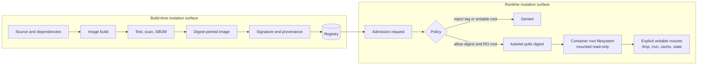
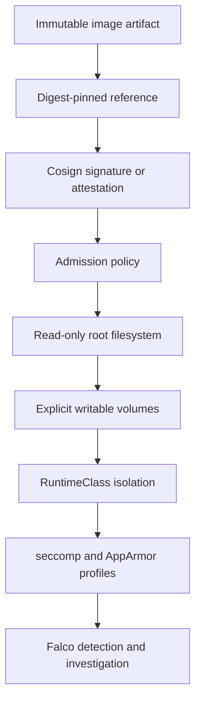

> **Складність**: `[MEDIUM]` — посилення безпеки під час виконання та примусове застосування політик у CKS
>
> **Час на проходження**: 45-50 хвилин
>
> **Передумови**: [Модуль 6.2 (Безпека середовища виконання з Falco)](../module-6.2-falco/), [Модуль 6.3 (Розслідування інцидентів у контейнерах)](../module-6.3-container-investigation/), основи образів контейнерів та фундаментальні знання про securityContext у Kubernetes

## Що ви зможете робити

Після завершення цього модуля ви зможете посилювати робочі навантаження Kubernetes так, щоб контейнер під час виконання сприймався як замінний артефакт, а не як змінюваний хост.

1. **Застосовувати** `readOnlyRootFilesystem`, типові налаштування безпеки на рівні Пода та записувані монтування `emptyDir`, щоб застосунок міг працювати, не записуючи дані у файлову систему свого образу.
2. **Проєктувати** стратегію незмінного образу, яка поєднує мінімальні базові образи, посилання, прив'язані до дайджесту, та перевірку підписаних образів.
3. **Впроваджувати** політики допуску, які відхиляють Поди із записуваними кореневими файловими системами або посиланнями на образ лише за тегом ще до того, як ці Поди потраплять на вузол.
4. **Оцінювати** ешелоновану оборону під час виконання, поєднуючи незмінні контейнери з механізмами RuntimeClass, seccomp, AppArmor та Pod Security Standards.
5. **Порівнювати** поширені патерни збоїв змінюваних контейнерів і обирати правильний патерн для тимчасових даних, кешу, логів, стану чи конфігурації для кожного з них.

## Чому цей модуль важливий

Модель зловмисника під час виконання у цій частині CKS пряма: після того, як Под допущено та заплановано, зловмисник намагається виконати код, записати інструменти, змінити файли, створити механізм закріплення та поширитися від скомпрометованого процесу до решти кластера. [Модуль 6.2](../module-6.2-falco/) навчає, як Falco виявляє таку поведінку через події ядра, а [Модуль 6.3](../module-6.3-container-investigation/) навчає, як дослідити контейнер після спрацювання сповіщення. Незмінна інфраструктура змінює інцидент ще до того, як ці інструменти спрацюють, бо вона прибирає записувану кореневу файлову систему, на наявність якої розраховують багато сценаріїв атаки після проникнення. ([Kubernetes Security Context](https://v1-35.docs.kubernetes.io/docs/tasks/configure-pod-container/security-context/), [Kubernetes Volumes](https://v1-35.docs.kubernetes.io/docs/concepts/storage/volumes/#emptydir))

Використовуйте [інцидент криптоджекінгу в Tesla](/k8s/cks/part1-cluster-setup/module-1.5-gui-security/) <!-- incident-xref: tesla-2018-cryptojacking --> як рамку для роздумів, а не як історію для запам'ятовування. Корисний урок з безпеки полягає в тому, що зловмиснику, який може створити чи контролювати робоче навантаження, зазвичай потрібне місце, щоб завантажити бінарники, розпакувати скрипти, змінити конфігурацію чи залишити артефакти, які проіснують достатньо довго, щоб заробити гроші чи викрасти дані. Кореневий розділ образу, доступний лише для читання, не робить робоче навантаження невразливим, але перетворює «записати щось у контейнер і продовжити» на «знайти явно змонтований записуваний шлях або зазнати невдачі». ([Kubernetes Security Context](https://v1-35.docs.kubernetes.io/docs/tasks/configure-pod-container/security-context/), [NIST SP 800-190](https://csrc.nist.gov/pubs/sp/800/190/final))

Іспит CKS зазвичай перевіряє це через конкретний YAML, а не через гасла. Вам можуть дати Под, який пише у `/tmp`, логує у `/var/log`, працює від root, використовує `nginx:latest` і не має жодної політики допуску навколо себе. Безпечна відповідь — це не одне поле; це невеликий дизайн: зібрати образ один раз, зафіксувати те, що розгортається, зробити кореневу файлову систему доступною лише для читання, змонтувати лише ті записувані каталоги, які застосунку справді потрібні, та забезпечити дотримання цих рішень під час допуску, щоб майбутні Поди не дрейфували назад до типових налаштувань. ([Kubernetes Images](https://v1-35.docs.kubernetes.io/docs/concepts/containers/images/), [Kubernetes Admission Controllers](https://v1-35.docs.kubernetes.io/docs/reference/access-authn-authz/admission-controllers/))

Розрахунок ціни змінюваності також практичний під час реагування. Якщо запущений контейнер можна латати на місці, відповідальні за реагування мають вирішити, які файли змінилися законно, які надійшли від зловмисника, а які зміни внесли під час аварійного усунення несправностей. Ця невизначеність розширює радіус ураження, бо кожен записуваний шлях стає доказом, який треба зберегти, а кожен ручний ремонт — ще одним варіантом стану для порівняння. Коли робоче навантаження незмінне, шлях реагування з [Модуля 6.3](../module-6.3-container-investigation/) стає чистішим: захопити живий контейнер, виявити записувані монтування та підозрілі процеси, відкинути скомпрометований Под, перезібрати з версіонованих вхідних даних і повторно розгорнути відомий дайджест, замість того щоб довіряти відремонтованому стану під час виконання.

## Принцип незмінної інфраструктури

NIST SP 800-190 описує контейнери як стани без збереження стану (stateless), які слід розгортати, але не змінювати: коли запущеному контейнеру потрібен новий вміст, його знищують і замінюють новим контейнером, зібраним з оновлених вхідних даних образу. Саме це й означає «незмінний» в операційному сенсі Kubernetes. Ви латаєте Dockerfile, сирцевий код, файл блокування пакетів, базовий образ або конвеєр збірки; ви не робите `kubectl exec` у продакшен і не ремонтуєте живий контейнер вручну. ([NIST SP 800-190](https://csrc.nist.gov/pubs/sp/800/190/final))

Цей принцип іноді узагальнюють як «худоба, а не домашні улюбленці», але іспитова цінність точніша за гасло. Сервер-улюбленець накопичує недокументований стан: пакети, встановлені під час збою, відредаговані конфігураційні файли, тимчасові скрипти, скопійовані облікові дані та разові дозволи. Незмінне робоче навантаження переносить ці зміни у версіоновані вхідні дані, перезбирає артефакт і дозволяє Kubernetes замінювати Поди з шаблону Пода. Це спрощує відкат, сканування, відстеження походження та реконструкцію інцидентів, бо екземпляр під час виконання за визначенням не має містити прихованих змін. ([NIST SP 800-190](https://csrc.nist.gov/pubs/sp/800/190/final), [Kubernetes Images](https://v1-35.docs.kubernetes.io/docs/concepts/containers/images/))

Образ і контейнер — це різні поверхні безпеки. Образ — це артефакт, адресований за вмістом, з маніфестом, конфігурацією та шарами файлової системи. Контейнер — це дерево запущених процесів, створене з цього артефакту плюс налаштування під час виконання, змонтовані томи, облікові дані та ізоляція на рівні вузла. Незмінна інфраструктура захищає обидві поверхні: використовуйте дайджести та підписи, щоб артефакт був саме тим, який ви мали на увазі, а потім використовуйте посилення безпеки під час виконання, щоб запущений контейнер не міг переписати власну базову файлову систему. ([OCI Image Manifest](https://github.com/opencontainers/image-spec/blob/main/manifest.md), [OCI Content Descriptors](https://github.com/opencontainers/image-spec/blob/main/descriptor.md))



Читайте діаграму зліва направо, коли переглядаєте робоче навантаження. Зміни під час збірки дозволені, але їх треба зафіксувати в артефакті образу та його метаданих. Зміни під час виконання дозволені лише у названих точках запису, як-от каталог тимчасових даних `emptyDir` чи персистентний том даних, і ці монтування мають бути достатньо навмисними, щоб рецензент міг зрозуміти, навіщо вони існують. ([Kubernetes Volumes](https://v1-35.docs.kubernetes.io/docs/concepts/storage/volumes/#emptydir), [Kubernetes Security Context](https://v1-35.docs.kubernetes.io/docs/tasks/configure-pod-container/security-context/))

Перегляд незмінного дизайну має дати чіткий контракт. Образ володіє бінарниками застосунку, файлами середовища виконання мови, статичними ресурсами та конфігурацією часу збірки. Об'єкти Kubernetes володіють конфігурацією часу виконання, обліковими даними, контролем ресурсів та намірами щодо планування. Томи володіють даними, життєвий цикл яких відрізняється від образу. Якщо запропоноване виправлення каже «просто зайди через exec у контейнер», воно порушує цей контракт, бо зміна не міститься ні в образі, ні в задекларованому об'єкті Kubernetes. Якщо запропоноване виправлення каже «змонтуй цей один каталог кешу», його можна перевірити, бо шлях запису, життєвий цикл, розмір та власник є видимими. ([NIST SP 800-190](https://csrc.nist.gov/pubs/sp/800/190/final), [Kubernetes Volumes](https://v1-35.docs.kubernetes.io/docs/concepts/storage/volumes/))

Заміна також є засобом відновлення. Якщо вузол падає, Под переплановується чи Деплоймент котиться вперед, Kubernetes має змогу відтворити робоче навантаження з об'єктів-джерел істини та зазначеного дайджесту образу. Змінюваний контейнер порушує цю обіцянку, бо живий екземпляр може містити файли, які жоден контролер не здатен відтворити. Під час інциденту ця різниця має значення. За незмінної інфраструктури видалення підозрілого Пода прибирає екземпляр під час виконання та його ефемерні томи, тоді як заміна стартує з відомого артефакту та задекларованої конфігурації. Це дає відповідальним за реагування чистішу дію зі стримування, ніж збереження невідомого контейнера, зміненого вручну. ([Kubernetes Images](https://v1-35.docs.kubernetes.io/docs/concepts/containers/images/), [Kubernetes Volumes](https://v1-35.docs.kubernetes.io/docs/concepts/storage/volumes/#emptydir))

## Кореневі файлові системи лише для читання

Поле Kubernetes, яке примушує до основної поведінки під час виконання, — це `securityContext.readOnlyRootFilesystem` на контейнері. Згенерований API v1.35 описує його як таке, що контролює, чи має контейнер кореневу файлову систему лише для читання, а документація завдань зазначає його як налаштування, що монтує кореневу файлову систему лише для читання. Оскільки це поле `SecurityContext` контейнера, встановлення лише `securityContext` на рівні Пода не робить кореневу файлову систему кожного контейнера доступною лише для читання. ([Kubernetes Security Context](https://v1-35.docs.kubernetes.io/docs/tasks/configure-pod-container/security-context/), [SecurityContext API](https://v1-35.docs.kubernetes.io/docs/reference/generated/kubernetes-api/v1.35/#securitycontext-v1-core))

Контексти безпеки на рівні Пода та на рівні контейнера все одно працюють разом. Поля рівня Пода, як-от `runAsNonRoot`, `runAsUser`, `runAsGroup`, `fsGroup` та `seccompProfile`, можуть встановлювати типові значення чи спільну поведінку для Пода, тоді як поля рівня контейнера, як-от `readOnlyRootFilesystem`, `allowPrivilegeEscalation` та `capabilities`, застосовуються до окремого контейнера й можуть перевизначати значення рівня Пода, що збігаються. Свідомо використовуйте обидва рівні, щоб рецензент бачив, які засоби контролю діють на весь Под, а які стосуються конкретного контейнера. ([Kubernetes Security Context](https://v1-35.docs.kubernetes.io/docs/tasks/configure-pod-container/security-context/))

```yaml
apiVersion: v1
kind: Pod
metadata:
  name: immutable-api
  labels:
    app: immutable-api
spec:
  securityContext:
    runAsNonRoot: true
    runAsUser: 10001
    runAsGroup: 10001
    fsGroup: 10001
    seccompProfile:
      type: RuntimeDefault
  containers:
    - name: api
      image: registry.example.com/platform/immutable-api@sha256:111122223333444455556666777788889999aaaabbbbccccddddeeeeffff0000
      ports:
        - containerPort: 8080
      securityContext:
        readOnlyRootFilesystem: true
        allowPrivilegeEscalation: false
        capabilities:
          drop: ["ALL"]
      volumeMounts:
        - name: tmp
          mountPath: /tmp
        - name: run
          mountPath: /run/immutable-api
        - name: cache
          mountPath: /var/cache/immutable-api
  volumes:
    - name: tmp
      emptyDir:
        medium: Memory
        sizeLimit: 64Mi
    - name: run
      emptyDir:
        medium: Memory
        sizeLimit: 16Mi
    - name: cache
      emptyDir:
        sizeLimit: 256Mi
```

> **Спрогнозуйте:** перш ніж застосувати цей Под, який єдиний шлях запису все одно спрацює, і чому?

Цей маніфест розділяє ідентичність, файлову систему та записуваний простір. Контекст рівня Пода каже, що робоче навантаження має працювати під non-root ідентичністю та використовувати типовий профіль seccomp середовища виконання. Контекст рівня контейнера робить корінь образу доступним лише для читання, запобігає підвищенню привілеїв і скидає можливості Linux. Монтування `emptyDir` дають застосунку конкретні цілі для запису, не відкриваючи знову `/usr`, `/bin`, `/etc` чи решту файлової системи образу. ([Kubernetes Security Context](https://v1-35.docs.kubernetes.io/docs/tasks/configure-pod-container/security-context/), [Kubernetes Volumes](https://v1-35.docs.kubernetes.io/docs/concepts/storage/volumes/#emptydir))

`emptyDir` — це звичний запасний вихід для незмінних Подів, бо він створюється, коли Под призначається вузлу, стартує порожнім, може спільно використовуватися контейнерами в одному Поді й безповоротно видаляється, коли Под прибирають з вузла. Збій контейнера не видаляє `emptyDir`, тож цей патерн підтримує звичайну поведінку перезапуску, водночас уникаючи прихованих записів у корінь образу. Монтування `emptyDir` із бекендом у пам'яті стають tmpfs і враховуються до пам'яті, тож використовуйте `sizeLimit` та обмеження ресурсів, коли шлях запису може розростатися. ([Kubernetes Volumes](https://v1-35.docs.kubernetes.io/docs/concepts/storage/volumes/#emptydir))

Перевіряйте цей засіб контролю, тестуючи і заборонений запис, і дозволений запис. Команда, що пише у `/root/proof.txt` чи інший шлях кореня образу, має зазнати невдачі після посилення контейнера. Команда, що пише у змонтований шлях `/tmp` чи `/run/app`, має успішно завершитися, якщо цей шлях було навмисно задекларовано. Записуйте обидва результати. Невдалий запис у корінь доводить, що прапорець монтування дійшов до середовища виконання. Успішний запис у тимчасові дані доводить, що застосунок все ще має санкціонований шлях запису. Якщо обидва записи успішні, корінь не захищений. Якщо обидва записи невдалі, том чи право власності налаштовані неправильно. Цей тест простий, але він запобігає поширеному хибному проходженню, коли маніфест містить `readOnlyRootFilesystem: true`, а застосунок все одно має широке записуване монтування, що покриває шлях, який тестується. Завжди тестуйте шлях, який представляє твердження про безпеку. ([Kubernetes Security Context](https://v1-35.docs.kubernetes.io/docs/tasks/configure-pod-container/security-context/), [Kubernetes Volumes](https://v1-35.docs.kubernetes.io/docs/concepts/storage/volumes/#emptydir))

Застосовуйте те саме міркування до init-контейнерів та sidecar-контейнерів. Init-контейнер може законно записувати згенеровані файли в `emptyDir`, який потім читає основний контейнер, але він не повинен латати файлову систему основного образу під час виконання. Sidecar для логів може потребувати читання файлів зі спільного тому, але йому не потрібно, щоб корінь застосунку був записуваним. Sidecar service mesh може мати власні записувані шляхи, і ці шляхи мають бути обмежені областю sidecar, а не використовуватися як привід послабити контейнер застосунку. Контексти безпеки рівня контейнера дозволяють кожному контейнеру нести саме те правило для файлової системи, яке йому насправді потрібне. ([Kubernetes Security Context](https://v1-35.docs.kubernetes.io/docs/tasks/configure-pod-container/security-context/), [Kubernetes Volumes](https://v1-35.docs.kubernetes.io/docs/concepts/storage/volumes/#emptydir))

Права все одно мають значення після того, як монтування існує. Якщо Под працює під UID `10001`, а змонтований том належить root з обмежувальними бітами режиму, застосунок може зазнати невдачі, навіть якщо шлях у принципі записуваний. Використовуйте право власності часу збірки, `fsGroup` або init-контейнер, що готує названий том, коли застосунку потрібен конкретний власник. Не вирішуйте проблему з правами поверненням до UID 0 чи зробленням кореня образу записуваним. Безпечний шлях — узгодити ідентичність, право власності та життєвий цикл записуваного монтування. ([Kubernetes Security Context](https://v1-35.docs.kubernetes.io/docs/tasks/configure-pod-container/security-context/), [Kubernetes Volumes](https://v1-35.docs.kubernetes.io/docs/concepts/storage/volumes/))

| Поле | Область | Застосування в незмінній інфраструктурі | Контрольна точка CKS |
|---|---|---|---|
| `readOnlyRootFilesystem: true` | Контейнер | Монтує кореневу файлову систему контейнера лише для читання, щоб записи йшли у явні томи | Має бути встановлене на кожному звичайному контейнері та зазвичай на init-контейнерах, яким не потрібні записи |
| `runAsNonRoot: true` | Под або контейнер | Запобігає залежності робочого навантаження від поведінки UID 0 | Значення рівня Пода може покривати контейнери, якщо контейнер не перевизначає пов'язані поля ідентичності |
| `runAsUser` / `runAsGroup` | Под або контейнер | Робить ідентичність часу виконання явною та сумісною зі змонтованими шляхами запису | Поєднуйте з `fsGroup` чи образами з урахуванням прав власності, коли томам потрібні записи |
| `allowPrivilegeEscalation: false` | Контейнер | Блокує отримання більших привілеїв через setuid чи подібні механізми | Вимагається стандартом Restricted Pod Security для контейнерів Linux |
| `capabilities.drop: ["ALL"]` | Контейнер | Прибирає навколишні можливості Linux, які більшості процесів застосунків не потрібні | Додавайте назад лише названу можливість із чіткою причиною та вузькою областю робочого навантаження |
| `seccompProfile.type: RuntimeDefault` | Под або контейнер | Використовує типовий фільтр системних викликів середовища виконання замість залишення робочого навантаження без обмежень | Restricted PSS вимагає явного дозволеного профілю seccomp для Подів Linux |
| `appArmorProfile.type: RuntimeDefault` | Под або контейнер | Тримає обмеження AppArmor увімкненим там, де його підтримують вузол та середовище виконання | Профіль AppArmor рівня контейнера має пріоритет над профілем рівня Пода |

Не плутайте кореневу файлову систему лише для читання зі застосунком без збереження стану. Застосунку все ще може бути потрібен довговічний стан, але цей стан належить базі даних, об'єктному сховищу, PersistentVolume чи іншій явно керованій системі зберігання, а не файловій системі образу контейнера. Kubernetes документує, що ефемерні томи зникають разом із Подом, тоді як персистентні томи можуть пережити Под, тож обирайте тип тому з життєвого циклу даних, а не зі зручності. ([Kubernetes Volumes](https://v1-35.docs.kubernetes.io/docs/concepts/storage/volumes/), [NIST SP 800-190](https://csrc.nist.gov/pubs/sp/800/190/final))

## Мінімальні образи та поверхня атаки

Коренева файлова система лише для читання сильніша, коли образ містить менше інструментів, які зловмисник може повторно використати. Образи distroless спроєктовані так, щоб містити лише застосунок та залежності середовища виконання, і документація проєкту прямо каже, що вони не містять менеджерів пакетів, оболонок чи інших програм, які очікують у стандартному дистрибутиві Linux. Це має значення під час виконання, бо вебексплойт, що дістається до `sh`, `curl`, `apk` чи `apt`, має набагато легший шлях до завантаження та підготовки додаткових інструментів. ([Distroless](https://github.com/GoogleContainerTools/distroless))

Образи scratch — це крайня форма цієї ідеї для статично злінкованих бінарників та дуже малих середовищ виконання. Docker документує `scratch` як зарезервований мінімальний базовий образ для створення мінімального образу, що означає відсутність набору пакетів операційної системи для оновлення всередині фінального шару виконання. Компроміс — це сумісність: динамічно злінкований бінарник, програма, що очікує сертифікати CA, чи застосунок, що викликає допоміжні бінарники через оболонку, може зазнати невдачі, якщо ці файли навмисно не скопіювати під час збірки. ([Docker Scratch Base Images](https://docs.docker.com/build/building/base-images/#create-a-minimal-base-image-using-scratch))

Distroless та scratch не замінюють керування вразливостями. Вони зменшують інвентар, але решта залежностей середовища виконання все одно потребують конвеєра збірки, сканера, процесу оновлення та ритму перезбірки. NIST SP 800-190 виокремлює вразливості образів, дефекти конфігурації образів, вбудоване шкідливе ПЗ, вбудовані секрети у відкритому тексті та недовірені образи як ризики рівня образу, тож мінімальний образ слід розглядати як менший артефакт, яким треба керувати, а не як доказ того, що керування не потрібне. ([NIST SP 800-190](https://csrc.nist.gov/pubs/sp/800/190/final), [Distroless](https://github.com/GoogleContainerTools/distroless))

Практичний патерн CKS — це багатоетапна збірка. Скомпілюйте чи зберіть застосунок в образі складальника, що має компілятори, менеджери пакетів та інструменти тестування, а потім скопіюйте лише артефакт виконання та потрібні дані у фінальний образ distroless чи scratch. Фінальному образу не мають бути потрібні `apt`, `apk`, `bash`, тестові фікстури, каталоги сирцевого коду чи кеші пакетів, бо кожна операційна зміна має походити з перезбірки та повторного розгортання артефакту. ([Distroless](https://github.com/GoogleContainerTools/distroless), [Docker Scratch Base Images](https://docs.docker.com/build/building/base-images/#create-a-minimal-base-image-using-scratch))

```dockerfile
# Build stage has tooling.
FROM golang:1.24-bookworm AS build
WORKDIR /src
COPY go.mod go.sum ./
RUN go mod download
COPY . .
RUN CGO_ENABLED=0 go build -trimpath -o /out/server ./cmd/server

# Runtime stage has the application only.
FROM scratch
COPY --from=build /out/server /server
USER 10001:10001
ENTRYPOINT ["/server"]
```

Образи для налагодження мають залишатися поза продакшен-маніфестами. Проєкт distroless публікує варіанти для налагодження для усунення несправностей, і ці образи навмисно змінюють інвентар інструментів середовища виконання. Якщо завдання іспиту чи продакшен-контроль вимагає незмінного робочого навантаження, не вирішуйте налагодження на другий день заміною продакшен-образу на образ для налагодження з оболонкою; використовуйте контрольований шлях налагодження, а потім перезберіть справжній образ, якщо застосунку потрібна постійна зміна. ([Distroless](https://github.com/GoogleContainerTools/distroless), [Kubernetes Security Context](https://v1-35.docs.kubernetes.io/docs/tasks/configure-pod-container/security-context/))

Мінімальні образи також змінюють робочий процес розслідування. Звичайний контейнер може дозволити оператору запустити `ps`, `cat`, `find`, `curl` чи `sh` усередині скомпрометованого середовища, тоді як образ distroless чи scratch може взагалі не містити цих інструментів. Це перевага для стійкості до атак, але це означає, що відповідальні за реагування мають бути готові використати інспекцію засобами Kubernetes, інструменти середовища виконання контейнерів на рівні вузла чи методи ефемерного налагодження, розглянуті в [Модулі 6.3](../module-6.3-container-investigation/), а не припускати, що продакшен-образ може налагодити сам себе. Продакшен-образ має обслуговувати застосунок, а не правити за набір інструментів. ([Distroless](https://github.com/GoogleContainerTools/distroless), [Kubernetes Security Context](https://v1-35.docs.kubernetes.io/docs/tasks/configure-pod-container/security-context/))

Менший образ може зробити сканування та відстеження походження змістовнішими, бо тут менше пакетів, файлів та шарів для пояснення. Документація distroless прямо подає зменшений вміст середовища виконання як такий, що поліпшує співвідношення сигнал/шум для сканера та зменшує тягар відстеження походження до залежностей, які потрібні застосунку. Це не прибирає потреби у скануванні. Це робить результат сканування легшим для тлумачення, бо знахідка з меншою ймовірністю походить від невикористаної оболонки, менеджера пакетів чи дистрибутивної утиліти, яка ніколи не мала потрапляти в образ виконання. Це також робить право власності чіткішим. Команда застосунку володіє бінарником та його прямими файлами виконання. Команда платформи володіє політикою базового образу. Безпека володіє воротами приймання. Цей розподіл легше експлуатувати, коли образ має менше випадкового інвентарю. ([Distroless](https://github.com/GoogleContainerTools/distroless), [NIST SP 800-190](https://csrc.nist.gov/pubs/sp/800/190/final))

## Дайджести образів та підписування

Теги образів Kubernetes та дайджести образів мають різні властивості безпеки. Документація образів Kubernetes v1.35 зазначає, що теги можна перемістити так, щоб вони вказували на інші образи, тоді як дайджести — це незмінні хеші вмісту образу, прив'язані до конкретної версії. Це означає, що `registry.example.com/api:prod` — це інструкція розв'язати ім'я, тоді як `registry.example.com/api@sha256:...` — це інструкція запустити конкретний об'єкт вмісту. ([Kubernetes Images](https://v1-35.docs.kubernetes.io/docs/concepts/containers/images/))

Прив'язка до дайджесту також змінює відкат та аналіз інцидентів. Якщо Деплоймент використовує тег, а реєстр змінює те, на що цей тег вказує, два Поди з однаковим маніфестом можуть у результаті запускати різні байти в різний час чи на різних вузлах. Якщо маніфест використовує дайджест, Kubernetes запускає той самий вміст образу щоразу, коли використовується це посилання, а модель дескриптора OCI дає клієнтам дайджест, розмір та тип медіа для перевірки посиланого вмісту. ([Kubernetes Images](https://v1-35.docs.kubernetes.io/docs/concepts/containers/images/), [OCI Content Descriptors](https://github.com/opencontainers/image-spec/blob/main/descriptor.md))

```yaml
# Mutable reference: useful for humans, risky as the deployed identity.
image: registry.example.com/payments/api:prod

# Immutable reference: the digest is the deployed identity.
image: registry.example.com/payments/api@sha256:22223333444455556666777788889999aaaabbbbccccddddeeeeffff00001111

# Tag plus digest: the tag documents intent, but Kubernetes pulls by digest.
image: registry.example.com/payments/api:v1.8.3@sha256:22223333444455556666777788889999aaaabbbbccccddddeeeeffff00001111
```

`imagePullPolicy: Always` не є заміною прив'язки до дайджесту. З тегом `Always` каже kubelet розв'язувати ім'я образу щоразу під час запуску контейнера, і це розв'язання все одно може знайти змінений тег. З дайджестом Kubernetes може зафіксувати точний вміст, навіть якщо присутній також зрозумілий людині тег, бо документація зазначає, що при вказанні обох для завантаження використовується лише дайджест. ([Kubernetes Images](https://v1-35.docs.kubernetes.io/docs/concepts/containers/images/))

> **Перевірте себе:** якщо маніфест використовує `image: app:1.2` з `imagePullPolicy: IfNotPresent`, що саме *не* гарантовано щодо байтів, які запускаються?

Підписування додає рішення про довіру до рішення про незмінний вміст. Документація Cosign застерігає підписувати образи контейнерів за дайджестом, а не за тегом, щоб підпис стосувався того вмісту, який ви, на вашу думку, підписуєте, а документація перевірки Sigstore охоплює перевірку цих підписів перед тим, як довіряти образу. У безпечному конвеєрі дайджест образу збирається, сканується, підписується, а потім допускається лише якщо підпис чи атестація відповідають очікуваній ідентичності. ([Cosign Signing](https://docs.sigstore.dev/cosign/signing/signing_with_containers/), [Cosign Verification](https://docs.sigstore.dev/cosign/verifying/verify/))

```bash
IMAGE=registry.example.com/payments/api@sha256:22223333444455556666777788889999aaaabbbbccccddddeeeeffff00001111

# Key-based (typical for CKS lab / killercoda environments)
cosign sign --key cosign.key "$IMAGE"
cosign verify --key cosign.pub "$IMAGE"

# Keyless (CI/CD with ambient OIDC, e.g. GitHub Actions + Fulcio + Rekor)
# cosign sign "$IMAGE"
# cosign verify \
#   --certificate-identity=signer@example.com \
#   --certificate-oidc-issuer=https://accounts.google.com \
#   "$IMAGE"
```

Тримайте шари окремо у своєму поясненні. Дайджест відповідає на питання «які байти мають запускатися?». Підпис відповідає на питання «хто поручився за ці байти, під якою ідентичністю чи ключем?». Контролер допуску відповідає на питання «чи слід приймати це робоче навантаження в цей кластер прямо зараз?». Коренева файлова система лише для читання відповідає на питання «чи може прийняте робоче навантаження переписати власну файлову систему образу після старту?». Ці засоби контролю поєднуються, але жоден з них повністю не замінює інші. ([OCI Content Descriptors](https://github.com/opencontainers/image-spec/blob/main/descriptor.md), [Cosign Signing](https://docs.sigstore.dev/cosign/signing/signing_with_containers/), [Kubernetes Admission Controllers](https://v1-35.docs.kubernetes.io/docs/reference/access-authn-authz/admission-controllers/))

Використовуйте справжні дайджести з реєстру у продакшені та в лабораторних відповідях. Дайджест — це не прикраса, яку можна вигадати в маніфесті. Це ідентифікатор вмісту, який реєстр повертає для конкретного маніфесту чи індексу образу. У реальному робочому процесі ви збираєте та надсилаєте образ, розв'язуєте дайджест, скануєте та підписуєте цей дайджест, а потім розгортаєте посилання, прив'язане до дайджесту. Тримайте крок розв'язання відтворюваним. Зберігайте дайджест поруч із результатом збірки. Переглядайте дайджест у запиті на зміну. Відкочуйтесь, повертаючись до попереднього дайджесту. Розглядайте зміну дайджесту як продакшен-зміну, навіть коли текст тега виглядає однаково. Якщо завдання надає реєстр і просить посилити маніфест, отримайте чи використайте наданий дайджест, а не копіюйте заповнювач з уроку. ([Kubernetes Images](https://v1-35.docs.kubernetes.io/docs/concepts/containers/images/), [OCI Content Descriptors](https://github.com/opencontainers/image-spec/blob/main/descriptor.md))

Перевірка підпису має зазнавати невдачі з блокуванням (fail closed), коли її використовують як контроль допуску. Якщо образ не має відповідного підпису, підпис походить від неправильної ідентичності чи атестація не відповідає потрібній політиці, Под не слід допускати в захищений простір імен. Kyverno verifyImages підтримує обов'язкову перевірку, перевірку дайджесту та атестаторів, тоді як Sigstore документує перевірку підписаних образів. Це робить підписування операційно корисним, бо підпис перевіряється в точці, де робоче навантаження просить увійти в кластер. Тримайте людський процес узгодженим із цими воротами. Свідомо ротуйте ключі. Переглядайте патерни безключової ідентичності. Безключове підписування використовує Fulcio — короткотривалий центр сертифікації, що видає сертифікат підписування, прив'язаний до вашої ідентичності OIDC, та записує подію підписування в Rekor — журнал прозорості лише для додавання, тож довіра спирається на верифіковану ідентичність, а не на статичний приватний ключ. Вирішіть, хто може підписувати релізні образи. Зберігайте збої перевірки там, де їх бачать власники релізів. Тихий збій підпису стає таємницею розгортання, але видимий збій стає контролем ланцюга постачання. ([Kyverno Verify Images](https://kyverno.io/docs/policy-types/cluster-policy/verify-images/overview/), [Cosign Verification](https://docs.sigstore.dev/cosign/verifying/verify/))

## Примусове застосування на допуску

Контролери допуску — це межа кластера, де правила незмінної інфраструктури стають примусовими, а не рекомендаційними. Контроль допуску Kubernetes перехоплює запити до API після автентифікації та авторизації, але до збереження, а потім запускає мутаційний допуск перед валідаційним допуском. [Модуль 5.4 (Контролери допуску)](/k8s/cks/part5-supply-chain-security/module-5.4-admission-controllers/) детально розглядає цей механізм; тут мета політики вужча: відхиляти Поди, які стартували б із записуваними кореневими файловими системами чи змінюваними посиланнями на образ. ([Kubernetes Admission Controllers](https://v1-35.docs.kubernetes.io/docs/reference/access-authn-authz/admission-controllers/))

Pod Security Standards необхідні, але недостатні для цього модуля. Стандарт Restricted охоплює засоби контролю, як-от заборона підвищення привілеїв, вимога non-root виконання, обмеження можливостей, обмеження типів томів та вимога дозволених налаштувань seccomp, але сам по собі не вимагає, щоб кожен контейнер встановлював `readOnlyRootFilesystem: true` чи щоб кожен образ використовував дайджест. Власний допуск заповнює цю прогалину, тоді як Pod Security Admission продовжує примушувати до базового профілю посилення Пода. ([Pod Security Standards](https://v1-35.docs.kubernetes.io/docs/concepts/security/pod-security-standards/), [Kubernetes Admission Controllers](https://v1-35.docs.kubernetes.io/docs/reference/access-authn-authz/admission-controllers/))

Kyverno — практичний рушій політик у стилі CKS, бо він валідує ресурси Kubernetes напряму через політики YAML. Документація валідації Kyverno пояснює валідацію на основі патернів, правила відмови, обробку `foreach` для піделементів, як-от контейнери, та поведінку `failureAction`; публічний каталог політик містить політику require-read-only-root-filesystem та політику require-image-digest. Приклад нижче тримає іспитову ідею видимою: усі звичайні контейнери мають мати кореневу файлову систему лише для читання, і всі образи звичайних контейнерів мають містити дайджест `@sha256:`. ([Kyverno Validate Rules](https://kyverno.io/docs/policy-types/cluster-policy/validate/), [Kyverno Read-Only Root Filesystem Policy](https://kyverno.io/policies/best-practices/require-ro-rootfs/require-ro-rootfs/), [Kyverno Require Image Digest Policy](https://kyverno.io/policies/other/require-image-digest/require-image-digest/))

```yaml
apiVersion: kyverno.io/v1
kind: ClusterPolicy
metadata:
  name: require-immutable-pods
spec:
  validationFailureAction: Enforce
  background: true
  rules:
    - name: require-read-only-rootfs
      match:
        any:
          - resources:
              kinds:
                - Pod
      validate:
        message: "Every container must set securityContext.readOnlyRootFilesystem to true."
        pattern:
          spec:
            =(initContainers):
              - securityContext:
                  readOnlyRootFilesystem: true
            containers:
              - securityContext:
                  readOnlyRootFilesystem: true
    - name: require-image-digests
      match:
        any:
          - resources:
              kinds:
                - Pod
      validate:
        message: "Every container image must be pinned with a sha256 digest."
        pattern:
          spec:
            =(initContainers):
              - image: "*@sha256:*"
            containers:
              - image: "*@sha256:*"
```

Продакшен-політики зазвичай мають охоплювати більше, ніж сирі об'єкти Pod. Контролери, як-от Деплойменти, DaemonSet'и, StatefulSet'и, Job'и та CronJob'и, створюють шаблони Подів, і рушії політик часто надають автогенерацію чи окремі правила, щоб ті самі очікування рівня Пода застосовувалися до цих шаблонів. Перевірка образів Kyverno також може мутувати відповідні образи, додаючи дайджести, та може примушувати до використання дайджесту, перевіряючи підписи через атестаторів, що дозволяє кластеру поєднати прив'язку до дайджесту, валідацію підпису та відмову на допуску в одному експлуатованому контролі. ([Kyverno Verify Images](https://kyverno.io/docs/policy-types/cluster-policy/verify-images/overview/), [Kubernetes Admission Controllers](https://v1-35.docs.kubernetes.io/docs/reference/access-authn-authz/admission-controllers/))

Розгортайте примусове застосування так, щоб навчати розробників, перш ніж блокувати аварійну роботу. Рушій політик може працювати в режимі аудиту, щоб показати, які робочі навантаження зазнали б невдачі, а потім перевести вибрані простори імен у режим примусу після того, як власники виправлять маніфести. Таке поетапне розгортання не є послабленням контролю. Це спосіб уникнути дізнавання під час збою про те, що критичне робоче навантаження пише у `/var/cache` чи покладається на образ лише за тегом. Експортуйте результати аудиту. Згрупуйте їх за власником. Виправте спершу поширені патерни. Потім примушуйте за простором імен чи класом робочого навантаження. Фінальний захищений простір імен все одно має примушувати до правила, але перехід має дати інвентар потрібних шляхів запису та виправлень посилань на образи. ([Kyverno Validate Rules](https://kyverno.io/docs/policy-types/cluster-policy/validate/), [Kubernetes Admission Controllers](https://v1-35.docs.kubernetes.io/docs/reference/access-authn-authz/admission-controllers/))

Повідомлення про помилки політики є частиною контролю. Відмова, що каже «незмінна політика не пройшла», відправляє розробника назад до здогадок. Відмова, що називає `securityContext.readOnlyRootFilesystem` чи каже «образ має містити дайджест @sha256», каже розробнику, що змінити. Це особливо важливо в завданнях CKS, бо вам треба довести, що саме правильне поле спричинило відмову. Використовуйте повідомлення, які ідентифікують відсутнє поле, потрібне значення та область правила. Точна відмова прискорює усунення, не послаблюючи допуск. Вона також зменшує ризиковані обхідні шляхи. Розробники з меншою ймовірністю проситимуть широкого винятку, коли повідомлення вказує на одне відсутнє поле. ([Kyverno Validate Rules](https://kyverno.io/docs/policy-types/cluster-policy/validate/))

## Ешелонована оборона під час виконання

Незмінна інфраструктура зменшує записувану поверхню, але ізоляція під час виконання все одно має значення, бо процес може експлуатувати ядро, зловживати змонтованими обліковими даними, відкрити мережеве з'єднання чи атакувати інше робоче навантаження, не записуючи нічого в кореневу файлову систему. RuntimeClass, seccomp, AppArmor та Pod Security Standards — це засоби ешелонованої оборони, що стоять поруч із незмінністю: вони обмежують, як запускається процес, які системні виклики він може робити, який профіль його обмежує та які форми Подів кластер прийме. ([Kubernetes RuntimeClass](https://v1-35.docs.kubernetes.io/docs/concepts/containers/runtime-class/), [Seccomp Tutorial](https://v1-35.docs.kubernetes.io/docs/tutorials/security/seccomp/), [AppArmor Tutorial](https://v1-35.docs.kubernetes.io/docs/tutorials/security/apparmor/), [Pod Security Standards](https://v1-35.docs.kubernetes.io/docs/concepts/security/pod-security-standards/))

RuntimeClass обирає конфігурацію середовища виконання контейнерів для Пода. Документація Kubernetes описує його як спосіб обрати різні конфігурації середовища виконання, як-от середовище, що використовує апаратну віртуалізацію для робочих навантажень, яким потрібна вища ізоляція за додаткові накладні витрати. У незмінному дизайні RuntimeClass не робить файлову систему доступною лише для читання; він дає вам сильнішу межу виконання для робочих навантажень, де кореневої файлової системи лише для читання недостатньо. ([Kubernetes RuntimeClass](https://v1-35.docs.kubernetes.io/docs/concepts/containers/runtime-class/))

Seccomp звужує інтерфейс системних викликів. Kubernetes дозволяє Подам та контейнерам використовувати профілі seccomp, а посібник зазначає, що більшість середовищ виконання контейнерів надають розумний типовий набір дозволених та заблокованих системних викликів через `RuntimeDefault`. Для CKS важливе поєднання просте: використовуйте `readOnlyRootFilesystem`, щоб зменшити зміну файлів, та `seccompProfile.type: RuntimeDefault`, щоб не залишати процес без обмежень на рівні системних викликів. ([Seccomp Tutorial](https://v1-35.docs.kubernetes.io/docs/tutorials/security/seccomp/), [Kubernetes Security Context](https://v1-35.docs.kubernetes.io/docs/tasks/configure-pod-container/security-context/))

AppArmor звужує доступ до файлів та ресурсів через профілі на підтримуваних вузлах Linux. Посібник AppArmor v1.35 пояснює, що профілі можна задати на рівні Пода чи контейнера, що профіль контейнера має пріоритет та що типи профілів охоплюють `RuntimeDefault`, `Localhost` та `Unconfined`. AppArmor залежить від вузла та середовища виконання, тож маніфест, який явно запитує локальний профіль, має потрапити на вузли, де цей профіль завантажено. ([AppArmor Tutorial](https://v1-35.docs.kubernetes.io/docs/tutorials/security/apparmor/))



Багатошарова модель запобігає поширеному перебільшенню. Підписаний образ все одно може бути неправильно налаштований із записуваною кореневою файловою системою. Коренева файлова система лише для читання все одно може працювати від root. Non-root процес все одно може робити непотрібні системні виклики. RuntimeClass все одно може запускати образ, на який посилаються змінюваним тегом. Сильна відповідь з'єднує засоби контролю, а не вдає, ніби один контроль доводить безпеку всього робочого навантаження. ([Kubernetes Images](https://v1-35.docs.kubernetes.io/docs/concepts/containers/images/), [Pod Security Standards](https://v1-35.docs.kubernetes.io/docs/concepts/security/pod-security-standards/), [Kubernetes RuntimeClass](https://v1-35.docs.kubernetes.io/docs/concepts/containers/runtime-class/))

RuntimeClass також має вимір планування. Документація Kubernetes пояснює, що RuntimeClass може включати обмеження планування, щоб Поди потрапляли на вузли, які підтримують обраний обробник, та що відсутній RuntimeClass чи непідтримуваний обробник можуть спричинити збій Пода. Не додавайте `runtimeClassName` сліпо до кожного робочого навантаження під час завдання з незмінної інфраструктури. Спершу підтвердьте, що клас існує, вузли його підтримують, а робоче навантаження потребує цього рівня ізоляції. Потім розглядайте його як додаткову межу поверх кореневої файлової системи лише для читання, а не як заміну контролю файлової системи. ([Kubernetes RuntimeClass](https://v1-35.docs.kubernetes.io/docs/concepts/containers/runtime-class/))

Збої seccomp та AppArmor зазвичай є невідповідністю середовища чи невідповідністю профілю. Привілейований контейнер працює без обмежень для seccomp, тож привілейований режим підриває цей шар. Запитаний профіль AppArmor `Localhost` має бути завантажений на вузлі, інакше kubelet відхиляє Под. Ці деталі мають значення, коли посилений Под не стартує. Прочитайте події Пода та відрізніть відмову політики від проблеми профілю середовища виконання, перш ніж змінювати незмінні налаштування. Виправленням може бути підготовка профілю вузла, а не повернення контейнера до змінюваного стану. ([Seccomp Tutorial](https://v1-35.docs.kubernetes.io/docs/tutorials/security/seccomp/), [AppArmor Tutorial](https://v1-35.docs.kubernetes.io/docs/tutorials/security/apparmor/))

## Що ламається на практиці

Більшість збоїв незмінності — це припущення застосунку, а не помилки Kubernetes. Пакет може писати PID-файл у `/var/run`, середовище виконання мови може кешувати байткод у каталозі застосунку, вебсервер може намагатися писати логи доступу у `/var/log`, а стартовий скрипт може копіювати типову конфігурацію у `/etc` під час першого запуску. З `readOnlyRootFilesystem: true` ці записи зазнають невдачі, якщо ви не перенаправите їх у явний том чи не зміните конфігурацію застосунку. ([Kubernetes Security Context](https://v1-35.docs.kubernetes.io/docs/tasks/configure-pod-container/security-context/), [Kubernetes Volumes](https://v1-35.docs.kubernetes.io/docs/concepts/storage/volumes/#emptydir))

| Поверхня змінюваних типових налаштувань | Типовий збій після того, як корінь став лише для читання | Безпечний патерн | Чого уникати |
|---|---|---|---|
| Тимчасові файли `/tmp` | Завантаження, файли сортування чи тимчасові архіви падають з помилками прав | Змонтуйте `emptyDir` з бекендом у пам'яті у `/tmp` з `sizeLimit` | Повторне відкриття всієї кореневої файлової системи заради зручності |
| `/var/run` чи `/run` | PID-файли та Unix-сокети неможливо створити | Змонтуйте `emptyDir` з бекендом у пам'яті в точний каталог виконання | Монтування широкого записуваного дерева `/var` |
| `/var/cache/app` | Кеш фреймворку чи пакета не може ініціалізуватися | Змонтуйте `emptyDir` з бекендом на диску в шлях кешу застосунку та обмежте розмір | Дозволяти кешу розростатися без планування ефемерного сховища |
| `/var/log/app` | Файлові логи падають чи зникають разом із контейнером | Віддавайте перевагу stdout та stderr; використовуйте названий том лише коли sidecar вимагає файлів | Запис продакшен-доказів лише всередині файлової системи контейнера |
| Згенерована конфігурація `/etc/app` | Скрипти першого запуску не можуть переписати конфігураційні файли | Генеруйте конфігурацію під час збірки, монтуйте ConfigMap чи Secret або рендеріть у `/run/app` | Зміна конфігурації образу після розгортання |
| Каталог стану застосунку | Файли SQLite, черги чи локальні індекси зникають при заміні | Використовуйте базу даних, об'єктне сховище, PVC чи іншу явну систему даних | Сприйняття кореня образу як довговічного сховища |

Ця таблиця також є іспитовим робочим процесом. Коли Под падає після того, як ви встановили кореневу файлову систему лише для читання, дослідіть шлях помилки, класифікуйте його як тимчасові дані, виконання, кеш, логи, конфігурацію чи стан, а потім оберіть найменше записуване монтування чи зовнішнє сховище, що відповідає цьому життєвому циклу. Якщо ви не можете пояснити, чому каталог має бути записуваним, не монтуйте його записуваним за замовчуванням. ([Kubernetes Volumes](https://v1-35.docs.kubernetes.io/docs/concepts/storage/volumes/#emptydir), [NIST SP 800-190](https://csrc.nist.gov/pubs/sp/800/190/final))

ConfigMap'и та Secret'и мають власну функцію незмінності, але вона вирішує іншу проблему. Kubernetes дозволяє позначати окремі ConfigMap'и та Secret'и незмінними, щоб їхні дані не можна було змінити на місці, і документація каже, що цю зміну не можна скасувати без видалення та повторного створення об'єкта. Це захищає конфігураційні об'єкти від випадкових оновлень і може зменшити навантаження на watch API-сервера, тоді як `readOnlyRootFilesystem` захищає файлову систему образу контейнера від записів під час виконання. ([Immutable ConfigMaps](https://v1-35.docs.kubernetes.io/docs/concepts/configuration/configmap/#configmap-immutable), [Immutable Secrets](https://v1-35.docs.kubernetes.io/docs/concepts/configuration/secret/#immutable-secrets))

Патерни ініціалізації під час першого запуску заслуговують особливої уваги. Деякі образи стартують із запису типових файлів у `/etc`, встановлення плагінів, створення користувачів чи латання каталогів застосунку. Цей патерн зручний для змінюваних ВМ, але слабкий для незмінних контейнерів, бо він ховає зміни стану часу виконання всередині побічного ефекту запуску. Перенесіть ці кроки в етап збірки, контрольований init-контейнер, що пише в названий том, чи в кероване оператором сховище даних, а потім зробіть кореневу файлову систему основного контейнера лише для читання. ([NIST SP 800-190](https://csrc.nist.gov/pubs/sp/800/190/final), [Kubernetes Volumes](https://v1-35.docs.kubernetes.io/docs/concepts/storage/volumes/))

Логування — часте джерело випадкової змінюваності. Kubernetes уже збирає stdout та stderr з контейнерів, тож багато застосунків мають логувати туди, а не писати файли у `/var/log`. Файлове логування все ще може бути доречним, коли sidecar читає спільний том у режимі реального часу чи застарілий застосунок не можна швидко змінити, але цей випадок має використовувати явний том із обробкою зберігання та доставкою поза коренем образу. Назвіть том логів. Обмежте його розмір. Доставляйте його вчасно. Вирішіть, чи переживає лог видалення Пода. Зробіть ці рішення видимими в маніфесті чи політиці платформи. Не дозволяйте, щоб «застосунку потрібні логи» стало причиною залишати всю файлову систему записуваною. ([Kubernetes Volumes](https://v1-35.docs.kubernetes.io/docs/concepts/storage/volumes/#emptydir), [NIST SP 800-190](https://csrc.nist.gov/pubs/sp/800/190/final))

Оновлення конфігурації мають слідувати тій самій моделі заміни. Якщо ConfigMap чи Secret змінюваний, Под може з часом помітити змінене значення залежно від того, як споживаються та кешуються дані. Якщо об'єкт позначено незмінним, Kubernetes вимагає видалення та повторного створення для зміни даних. У будь-якому разі контейнер не повинен переписувати `/etc/app/config.yaml` усередині кореня образу, щоб представити новий бажаний стан. Розміщуйте конфігурацію часу виконання в об'єктах Kubernetes, робіть ці об'єкти незмінними, коли операційна модель цього вимагає, та перекочуйте Поди, коли контракт конфігурації змінюється. ([Immutable ConfigMaps](https://v1-35.docs.kubernetes.io/docs/concepts/configuration/configmap/#configmap-immutable), [Immutable Secrets](https://v1-35.docs.kubernetes.io/docs/concepts/configuration/secret/#immutable-secrets))

## Робочий процес іспиту CKS

Для завдання з посилення маніфесту працюйте в такому порядку: прив'яжіть образ за дайджестом, додайте ідентичність рівня Пода та типові налаштування seccomp, встановіть `readOnlyRootFilesystem: true` на рівні контейнера, скиньте можливості, вимкніть підвищення привілеїв, а потім додайте названі записувані томи лише для шляхів, які застосунок доказово потребує. Ця послідовність тримає відповідь читабельною, бо кожне поле має окрему причину, а не стає купою непов'язаних фрагментів посилення. Вона також допомагає налагоджувати збої. Якщо завантаження образу падає, дослідіть посилання. Якщо допуск відхиляє Под, дослідіть поле політики, назване в повідомленні. Якщо процес стартує, а потім завершується, дослідіть шлях запису та право власності. Кожен збій вказує на один шар. ([Kubernetes Images](https://v1-35.docs.kubernetes.io/docs/concepts/containers/images/), [Kubernetes Security Context](https://v1-35.docs.kubernetes.io/docs/tasks/configure-pod-container/security-context/))

```yaml
apiVersion: v1
kind: Pod
metadata:
  name: mutable-demo
spec:
  containers:
    - name: app
      image: busybox:1.36
      command: ["sh", "-c", "echo starting; sleep 3600"]
```

Под вище — це відправна точка, а не відповідь. Він використовує тег, не має типових налаштувань виконання на рівні Пода, має записувану кореневу файлову систему через відсутність налаштування та не декларує, де очікуються записи. Посилена відповідь CKS прив'язує образ, додає контекст безпеки на правильному рівні та створює названі шляхи запису, як-от `/tmp`, замість того щоб залишати всю кореневу файлову систему записуваною. ([Kubernetes Images](https://v1-35.docs.kubernetes.io/docs/concepts/containers/images/), [SecurityContext API](https://v1-35.docs.kubernetes.io/docs/reference/generated/kubernetes-api/v1.35/#securitycontext-v1-core))

```yaml
apiVersion: v1
kind: Pod
metadata:
  name: immutable-demo
spec:
  securityContext:
    runAsNonRoot: true
    runAsUser: 10001
    runAsGroup: 10001
    seccompProfile:
      type: RuntimeDefault
  containers:
    - name: app
      image: busybox:1.36@sha256:3333444455556666777788889999aaaabbbbccccddddeeeeffff000011112222
      command: ["sh", "-c", "echo starting; sleep 3600"]
      securityContext:
        readOnlyRootFilesystem: true
        allowPrivilegeEscalation: false
        capabilities:
          drop: ["ALL"]
      volumeMounts:
        - name: tmp
          mountPath: /tmp
  volumes:
    - name: tmp
      emptyDir:
        medium: Memory
        sizeLimit: 32Mi
```

Для завдання з політикою допуску спершу вирішіть, чи завдання хоче мутації, валідації чи перевірки образу. Завдання суто на валідацію відхиляє невідповідні Поди й найлегше пояснюється. Завдання на мутацію може додати типові налаштування, але також може приховати намір розробника, якщо команда ніколи не бачить відхиленої форми. Завдання на перевірку образу перевіряє підписи та атестації й також може примушувати до використання дайджесту. Протестуйте політику навмисно поганим Подом. Потім протестуйте її найменшим виправленим Подом. Тримайте ці два маніфести поруч під час роботи. Контраст робить поведінку політики очевидною. Прив'яжіть свою відповідь до життєвого циклу запиту з [Модуля 5.4](/k8s/cks/part5-supply-chain-security/module-5.4-admission-controllers/): допуск відбувається до збереження, тож він не дає поганому Поду стати станом кластера. ([Kubernetes Admission Controllers](https://v1-35.docs.kubernetes.io/docs/reference/access-authn-authz/admission-controllers/), [Kyverno Verify Images](https://kyverno.io/docs/policy-types/cluster-policy/verify-images/overview/))

Для завдання з поясненням інциденту скажіть точно, як змінюваність змінила радіус ураження. Записувана коренева файлова система дозволяє скомпрометованому процесу розмістити завантажені бінарники, перезаписати файли застосунку, відредагувати стартові скрипти, кинути вебоболонки чи залишити оманливі артефакти у шляхах, яким відповідальні за реагування можуть довіряти. Незмінний корінь перетворює ці спроби на невдалі записи чи перенаправляє їх у ті небагато явних томів, які [Модуль 6.2](../module-6.2-falco/) може моніторити, а [Модуль 6.3](../module-6.3-container-investigation/) може дослідити. ([Kubernetes Security Context](https://v1-35.docs.kubernetes.io/docs/tasks/configure-pod-container/security-context/), [Kubernetes Volumes](https://v1-35.docs.kubernetes.io/docs/concepts/storage/volumes/#emptydir))

Для керування часом тримайте короткий ментальний контрольний список. По-перше, визначте, чи завдання просить посилення маніфесту, ідентичність образу, політику допуску чи міркування про інцидент. По-друге, застосуйте контроль на правильному шарі. По-третє, проведіть один позитивний та один негативний тест. Посилений Под має відхилити запис у корінь та дозволити лише задекларований запис у тимчасові дані. Політика допуску має відхилити один поганий маніфест і допустити один хороший. Політика дайджесту має падати на образі лише за тегом і проходити на образі з `@sha256:`. Зберігайте команди. Зберігайте помилки. Порівняйте прийнятий об'єкт із відхиленим. Це дає вам докази для відповіді та швидший шлях, якщо середовище екзаменатора поводиться інакше. Ці докази швидші за повторне перечитування кожного поля після кожного редагування. ([Kubernetes Security Context](https://v1-35.docs.kubernetes.io/docs/tasks/configure-pod-container/security-context/), [Kyverno Validate Rules](https://kyverno.io/docs/policy-types/cluster-policy/validate/), [Kubernetes Images](https://v1-35.docs.kubernetes.io/docs/concepts/containers/images/))

## Чи знали ви?

- Документація Kubernetes v1.35 зазначає, що коли посилання на образ містить і тег, і дайджест, для завантаження використовується лише дайджест, тож тег може документувати людський намір, не стаючи розгорнутою ідентичністю. ([Kubernetes Images](https://v1-35.docs.kubernetes.io/docs/concepts/containers/images/))
- Стандарт Restricted Pod Security вимагає кілька суміжних засобів посилення, зокрема non-root виконання та явні дозволені налаштування seccomp для Подів Linux, але власний допуск усе ще потрібен, якщо ваш стандарт вимагає кореневих файлових систем лише для читання. ([Pod Security Standards](https://v1-35.docs.kubernetes.io/docs/concepts/security/pod-security-standards/))
- `emptyDir.medium: Memory` створює записувану область із бекендом tmpfs, але файли, записані туди, враховуються до обмеження пам'яті контейнера, що їх записав, тож незмінні шляхи тимчасових даних усе одно потребують планування ресурсів. ([Kubernetes Volumes](https://v1-35.docs.kubernetes.io/docs/concepts/storage/volumes/#emptydir))
- Образи distroless підписуються за допомогою cosign згідно з документацією distroless, що робить їх корисними прикладами під час навчання зв'язку між мінімальними образами виконання та перевіркою підпису образу. ([Distroless](https://github.com/GoogleContainerTools/distroless), [Cosign Verification](https://docs.sigstore.dev/cosign/verifying/verify/))

## Типові помилки

| Помилка | Чому це шкодить | Кращий хід оператора |
|---|---|---|
| Встановлення лише `securityContext` рівня Пода з припущенням, що коренева файлова система лише для читання | `readOnlyRootFilesystem` — це поле контексту безпеки контейнера, тож коренева файлова система лишається записуваною, доки кожен відповідний контейнер його не встановить | Розмістіть ідентичність на весь Под та типові налаштування seccomp на рівні Пода, потім встановіть `readOnlyRootFilesystem: true` на контейнерах |
| Прив'язка `imagePullPolicy: Always` зі збереженням змінюваного тега | `Always` може повторно розв'язати переміщений тег, тож це не доводить, що щоразу запускаються ті самі байти | Використовуйте посилання на дайджест, за бажанням із тегом плюс дайджест для читабельності |
| Монтування широкого записуваного `/var` для виправлення одного PID-файлу, що падає | Широкі записувані монтування відтворюють значну частину змінюваної файлової системи, яку контроль мав прибрати | Змонтуйте малий `emptyDir` у точний шлях, який потрібен процесу, як-от `/run/app` |
| Використання образу distroless для налагодження як продакшен-виправлення | Варіанти для налагодження навмисно додають інструменти усунення несправностей, змінюючи інвентар виконання та опції зловмисника | Використовуйте шляхи налагодження для розслідування, потім перезберіть справжній мінімальний образ для продакшену |
| Сприйняття Pod Security Standards як усієї незмінної політики | PSS охоплює важливе посилення Пода, але не вимагає прив'язки до дайджесту чи кореневих файлових систем лише для читання для кожного робочого навантаження | Поєднуйте мітки PSS простору імен із власною політикою допуску для специфічних вимог незмінності |
| Запис логів застосунку лише у файли всередині кореня контейнера | Логи зникають при заміні й можуть падати, коли коренева файлова система стає лише для читання | Віддавайте перевагу stdout та stderr або монтуйте явний том логів лише коли архітектура логування вимагає передачі файлів |
| Зробити `/tmp` записуваним, але залишити кеш і стан некласифікованими | Наступний збій запису призведе до ще одного широкого винятку, а стан усе одно може жити в неправильному життєвому циклі | Інвентаризуйте шляхи тимчасових даних, кешу, виконання, конфігурації, логів та довговічного стану перед вибором монтувань |

## Тест

<details>
<summary>Под встановлює `spec.securityContext.runAsNonRoot: true`, але жоден з його контейнерів не встановлює `readOnlyRootFilesystem`. Чи є коренева файлова система незмінною?</summary>

Ні. `runAsNonRoot` контролює очікування щодо користувача під час виконання, тоді як `readOnlyRootFilesystem` — це поле `securityContext` рівня контейнера, що монтує кореневу файлову систему цього контейнера лише для читання. Правильне виправлення — зберегти корисні типові налаштування рівня Пода, як-от `runAsNonRoot` та `seccompProfile`, а потім встановити `containers[*].securityContext.readOnlyRootFilesystem: true` для кожного контейнера застосунку, який має бути незмінним.
</details>

<details>
<summary>Застосунок падає після посилення, бо пише PID-файл у `/var/run/app/app.pid`. Яке найменше безпечне виправлення?</summary>

Змонтуйте `emptyDir`, зазвичай із бекендом у пам'яті, у `/var/run/app` чи точніший каталог виконання й тримайте решту кореневої файлової системи лише для читання. Повторне відкриття `/var` чи вимкнення `readOnlyRootFilesystem` вирішило б симптом, прибравши контроль. Краща відповідь класифікує шлях як тимчасові дані виконання, дає йому назване записуване монтування та обмежує розмір там, де це доречно.
</details>

<details>
<summary>Команда каже, що `imagePullPolicy: Always` робить `registry.example.com/api:prod` безпечним, бо kubelet завжди завантажує найновіший образ. Що не так із цим міркуванням?</summary>

Воно плутає свіжість із незмінністю. Тег може переміщатися, тож `Always` може завантажувати різні байти в різний час, тоді як маніфест усе одно виглядає незмінним. Посилання, прив'язане до дайджесту, ідентифікує точний вміст образу, а підпис верифікує, хто поручився за цей вміст. Використовуйте `Always` лише для поведінки завантаження, а не як розгорнуту ідентичність.
</details>

<details>
<summary>Політика Kyverno відхиляє Поди без образів, прив'язаних до дайджесту, але Деплоймент з образами лише за тегом усе одно створює Поди. Де слід шукати?</summary>

Перевірте, чи політика застосовується до шаблонів Подів контролерів, чи лише до прямих об'єктів Pod. Контролери робочих навантажень створюють Поди із шаблонів, тож продакшен-політика має охоплювати Деплойменти, DaemonSet'и, StatefulSet'и, Job'и, CronJob'и чи використовувати поведінку автогенерації рушія політик там, де вона доступна. Концепція допуску все одно та сама: відхилити чи мутувати запит до того, як він стане збереженим станом кластера.
</details>

<details>
<summary>Підписаний образ distroless працює із записуваною кореневою файловою системою. Чи достатньо незмінне це робоче навантаження для мети цього модуля?</summary>

Ні. Підпис може довести вміст підписаного образу та ідентичність підписувача, а база distroless може зменшити інвентар інструментів, але жоден із цих засобів контролю не зупиняє запущений контейнер від запису в записувану кореневу файлову систему. Робочому навантаженню все одно потрібні `readOnlyRootFilesystem: true` на рівні контейнера, явні записувані монтування та засоби контролю під час виконання, як-от non-root виконання та seccomp.
</details>

<details>
<summary>Під час інциденту Falco повідомляє про процес оболонки, а слідчі знаходять завантажені інструменти у `/tmp`. Чи провалився незмінний дизайн?</summary>

Не обов'язково. `/tmp` може бути навмисно записуваним `emptyDir`, щоб застосунок міг функціонувати. Незмінний корінь усе одно захищав шляхи образу, як-от `/usr`, `/bin` та `/etc`. Реагування полягає в тому, щоб дослідити, чи `/tmp` був потрібен, чи були обмежені його розмір та життєвий цикл, чи моніторили правила Falco підозрілі записи чи виконання там, і чи міг зловмисник закріпитися за межами життя Пода.
</details>

## Практичні завдання

- [ ] Виконайте [лабораторну роботу Immutable Infrastructure на Killercoda](https://killercoda.com/kubedojo/scenario/cks-6.4-immutable-infrastructure) та запишіть, які записи падають до та після додавання явних монтувань `emptyDir`.
- [ ] Візьміть маніфест змінюваного Пода, додайте типові налаштування non-root та seccomp на рівні Пода, встановіть `readOnlyRootFilesystem: true` на рівні контейнера та задокументуйте кожне записуване монтування, що лишається.
- [ ] Перетворіть посилання на образ лише за тегом на посилання, прив'язане до дайджесту, потім поясніть, чому `imagePullPolicy` не вирішив ту саму проблему.
- [ ] Напишіть політику допуску, що відхиляє Поди без `readOnlyRootFilesystem: true`, та протестуйте один відхилений Под плюс один прийнятий Под.
- [ ] Розширте політику чи додайте друге правило так, щоб посилання на образ лише за тегом відхилялися до збереження Пода.
- [ ] Оберіть один образ застосунку в лабораторному кластері та інвентаризуйте його очікувані шляхи запису: тимчасові дані, сокет виконання, кеш, логи, конфігурація та довговічний стан.

Використайте цю одноразову вправу, щоб побачити різницю між записами в кореневу файлову систему та явними записами у тимчасові дані. Перший запис має зазнати невдачі після посилення Пода, тоді як другий запис має успішно завершитися, бо `/tmp` — це назване записуване монтування.

```bash
kubectl create namespace immutable-lab

kubectl run mutable-demo -n immutable-lab \
  --image=busybox:1.36 \
  --restart=Never \
  -- sleep 3600

kubectl wait pod/mutable-demo -n immutable-lab --for=condition=Ready --timeout=90s
kubectl exec -n immutable-lab mutable-demo -- sh -c 'echo can-write-root > /root/proof.txt; cat /root/proof.txt'
kubectl delete pod mutable-demo -n immutable-lab
```

Потім застосуйте посилений Под зі змонтованим `/tmp` як `emptyDir` і повторіть тести запису. Маніфест вбудовано нижче, щоб вправа виконувалася як є; на реальному іспиті ви прив'язали б образ до наданого реєстром дайджесту `@sha256`, який і примушує політика допуску вище.

```bash
# Hardened Pod: read-only root filesystem + non-root + /tmp emptyDir for sanctioned writes.
# NOTE: in the CKS exam, pin `image:` to the registry-provided @sha256 digest — the admission
# policy in "Admission Enforcement" above enforces digest pinning. The plain tag is used here
# only so the drill pulls on a stock kind/containerd v1.35 cluster.
kubectl apply -n immutable-lab -f - <<'EOF'
apiVersion: v1
kind: Pod
metadata:
  name: immutable-demo
spec:
  securityContext:
    runAsNonRoot: true
    runAsUser: 10001
    runAsGroup: 10001
    seccompProfile:
      type: RuntimeDefault
  containers:
    - name: app
      image: busybox:1.36
      command: ["sh", "-c", "echo starting; sleep 3600"]
      securityContext:
        readOnlyRootFilesystem: true
        allowPrivilegeEscalation: false
        capabilities:
          drop: ["ALL"]
      volumeMounts:
        - name: tmp
          mountPath: /tmp
  volumes:
    - name: tmp
      emptyDir:
EOF
kubectl wait pod/immutable-demo -n immutable-lab --for=condition=Ready --timeout=90s

# Negative test: writing to the image root fails because the root filesystem is read-only.
kubectl exec -n immutable-lab immutable-demo -- sh -c 'echo root-write > /root/proof.txt; echo "exit code: $?"'
# Positive test: the explicitly mounted /tmp emptyDir is writable.
kubectl exec -n immutable-lab immutable-demo -- sh -c 'echo tmp-write > /tmp/proof.txt; cat /tmp/proof.txt'

kubectl delete namespace immutable-lab
```

## Наступний модуль

Це фінальний модуль у частині CKS, присвяченій безпеці середовища виконання. Поверніться до [огляду CKS](/k8s/cks/), щоб переглянути повний іспитовий напрямок і з'єднати незмінну інфраструктуру назад із налаштуванням кластера, посиленням, безпекою ланцюга постачання, виявленням під час виконання та реагуванням на інциденти.

## Sources

- [Kubernetes v1.35: Configure a Security Context for a Pod or Container](https://v1-35.docs.kubernetes.io/docs/tasks/configure-pod-container/security-context/) - documents Pod and container security contexts, `readOnlyRootFilesystem`, container overrides, capabilities, seccomp, AppArmor, and related runtime security fields.
- [Kubernetes v1.35 API Reference: SecurityContext](https://v1-35.docs.kubernetes.io/docs/reference/generated/kubernetes-api/v1.35/#securitycontext-v1-core) - generated API reference for container `SecurityContext` fields, including `readOnlyRootFilesystem`.
- [Kubernetes v1.35: Images](https://v1-35.docs.kubernetes.io/docs/concepts/containers/images/) - documents tags, digests, `latest`, digest pinning, tag plus digest behavior, and image pull policy defaults.
- [Kubernetes v1.35: Volumes and emptyDir](https://v1-35.docs.kubernetes.io/docs/concepts/storage/volumes/#emptydir) - documents `emptyDir` lifecycle, memory-backed tmpfs behavior, sharing between containers, and deletion when the Pod leaves the node.
- [Kubernetes v1.35: Pod Security Standards](https://v1-35.docs.kubernetes.io/docs/concepts/security/pod-security-standards/) - documents Baseline and Restricted controls for privilege, volume, non-root, seccomp, AppArmor, and related Pod hardening.
- [Kubernetes v1.35: Admission Controllers](https://v1-35.docs.kubernetes.io/docs/reference/access-authn-authz/admission-controllers/) - documents admission timing, mutating and validating phases, default admission plugins, and extensibility points.
- [Kubernetes v1.35: RuntimeClass](https://v1-35.docs.kubernetes.io/docs/concepts/containers/runtime-class/) - documents runtime handler selection, scheduling constraints, and the security/performance tradeoff for alternative runtimes.
- [Kubernetes v1.35: Restrict a Container's Syscalls with seccomp](https://v1-35.docs.kubernetes.io/docs/tutorials/security/seccomp/) - documents seccomp profiles, `RuntimeDefault`, unconfined behavior, and syscall restriction examples.
- [Kubernetes v1.35: Restrict a Container's Access to Resources with AppArmor](https://v1-35.docs.kubernetes.io/docs/tutorials/security/apparmor/) - documents AppArmor node prerequisites, Pod and container profile fields, and `RuntimeDefault`, `Localhost`, and `Unconfined` types.
- [Kubernetes v1.35: Immutable ConfigMaps](https://v1-35.docs.kubernetes.io/docs/concepts/configuration/configmap/#configmap-immutable) - documents immutable ConfigMap behavior, update restrictions, and watch-load benefits.
- [Kubernetes v1.35: Immutable Secrets](https://v1-35.docs.kubernetes.io/docs/concepts/configuration/secret/#immutable-secrets) - documents immutable Secret behavior, update restrictions, and kubelet watch behavior.
- [NIST SP 800-190: Application Container Security Guide](https://csrc.nist.gov/pubs/sp/800/190/final) - primary guidance for container immutability, image risks, runtime defense, data persistence, and container-specific vulnerability management.
- [OCI Image Manifest Specification](https://github.com/opencontainers/image-spec/blob/main/manifest.md) - defines the image manifest, content-addressable image goals, configuration descriptors, and layer descriptors.
- [OCI Content Descriptors](https://github.com/opencontainers/image-spec/blob/main/descriptor.md) - defines descriptors, digest fields, content addressability, and verification of content against a digest.
- [GoogleContainerTools Distroless](https://github.com/GoogleContainerTools/distroless) - documents distroless image contents, lack of package managers and shells, debug variants, and cosign verification guidance.
- [Docker: Create a Minimal Base Image Using scratch](https://docs.docker.com/build/building/base-images/#create-a-minimal-base-image-using-scratch) - documents the reserved `scratch` base-image pattern for minimal images.
- [Sigstore Cosign: Signing Containers](https://docs.sigstore.dev/cosign/signing/signing_with_containers/) - documents signing container images and the importance of signing by digest rather than tag.
- [Sigstore Cosign: Verifying Signatures](https://docs.sigstore.dev/cosign/verifying/verify/) - documents signature verification workflows for signed container images.
- [Kyverno: Validate Rules](https://kyverno.io/docs/policy-types/cluster-policy/validate/) - documents pattern validation, deny rules, `foreach`, and admission-time validation behavior.
- [Kyverno: Verify Images](https://kyverno.io/docs/policy-types/cluster-policy/verify-images/overview/) - documents image verification, digest mutation and verification, attestors, signatures, and verification order.
- [Kyverno Policy: Require Read-Only Root Filesystem](https://kyverno.io/policies/best-practices/require-ro-rootfs/require-ro-rootfs/) - policy catalog example requiring `securityContext.readOnlyRootFilesystem: true`.
- [Kyverno Policy: Require Image Digest](https://kyverno.io/policies/other/require-image-digest/require-image-digest/) - policy catalog example requiring image references to include digests.


