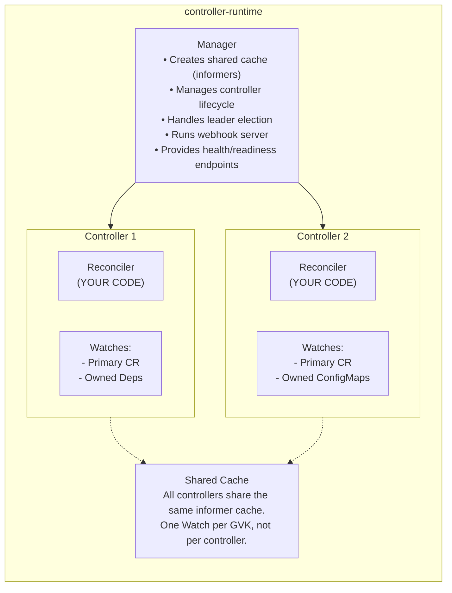
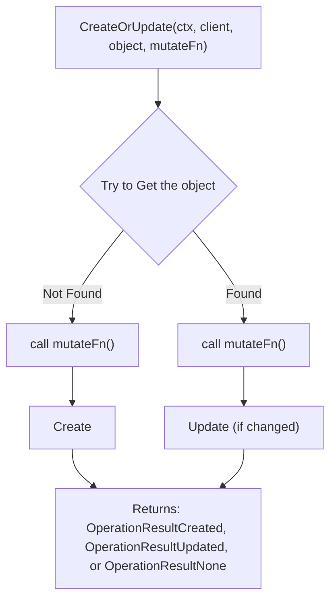

> **Складність**: `[СКЛАДНИЙ]` — розробка операторів на основі фреймворку.
>
> **Час на проходження**: 4 години.
>
> **Передумови**: Модуль 1.3 (Створення контролерів за допомогою client-go), Go 1.22+, Docker, доступ до кластера Kubernetes 1.35+.

---

## Результати навчання

Після завершення цього модуля ви зможете:

1. **Порівняти** вибір між Kubebuilder та Operator SDK для оператора на Go, зокрема те, як пакування через OLM змінює це рішення.
2. **Згенерувати каркас і код** API `WebApp` за допомогою Kubebuilder, маркерів controller-gen, маніфестів CRD, RBAC та коду deepcopy.
3. **Реалізувати й діагностувати** Reconciler на основі controller-runtime, який створює дочірні ресурси, повідомляє про стан і обробляє дрейф конфігурації.
4. **Перевірити й розгорнути** поведінку оператора за допомогою локального запуску, згенерованих маніфестів, образів контейнерів та перевірок, орієнтованих на envtest.

## Чому цей модуль важливий

Гіпотетичний сценарій: платформена команда володіє спільним кластером Kubernetes, де команди застосунків можуть запитувати внутрішні вебсервіси через власний ресурс `WebApp`. Спочатку команда надає інструкцію (runbook), яка пояснює розробникам, як вручну створити Деплоймент, Сервіс, мітки, налаштування ресурсів та анотацію стану, але ця інструкція застаріває в міру появи нових домовленостей. Коли з'являється новий кластер Kubernetes 1.35, один простір імен використовує нову домовленість, інший зберігає старі мітки, і починають надходити запити в підтримку з питанням, чому дашборди й інструменти масштабування по-різному оцінюють, що насправді готове до роботи.

Модуль 1.3 показав, що контролер здатен закрити цей розрив, бо він безперервно порівнює бажаний стан зі спостережуваним і підштовхує кластер до збіжності. Сира версія на client-go була корисною, бо відкривала вотчі, інформери, робочі черги, клієнти та поведінку повторних спроб, але водночас змушувала вас самостійно підтримувати всю обв'язку від першого до останнього рядка. Виробничим операторам зазвичай потрібно кілька API, згенеровані CRD, RBAC, субресурси стану, вебхуки допуску, вибір лідера, метрики, проби справності, тести та маніфести релізу, тож повторювати цю обв'язку вручну для кожного нового проєкту — це погане використання інженерного часу й до того ж щедре джерело тонких, важко відтворюваних помилок.

Kubebuilder — це проєкт Kubernetes, який перетворює ідею контролера на продуктивний робочий процес розробки. Під капотом він використовує controller-runtime, а отже, ментальна модель з Модуля 1.3 досі застосовна, але фреймворк постачає структуру проєкту, налаштування менеджера, спільні кеші, інтеграцію генераторів та обв'язку контролерів. У цьому модулі ви збережете початкову форму оператора WebApp, але навчитеся, навіщо існує кожна згенерована частина, як маркери перетворюються на YAML, видимий для кластера, і як діагностувати типові режими відмов, що з'являються, коли оператор майже коректний, але ще не надійний.

Важлива зміна — це володіння наміром. Маніфест YAML описує об'єкт в один момент часу, тобто фіксує знімок бажаного стану, тоді як оператор описує політику, яка має залишатися істинною з плином часу, навіть після того, як користувачі редагують дочірні ресурси, Под'и перезапускаються, а контролер перезавантажується. Іншими словами, маніфест — це фотографія, а оператор — це постійно діюче правило, що відновлює систему до сфотографованого стану щоразу, коли дійсність від нього відхиляється. Kubebuilder допомагає вам виразити цю політику з меншою кількістю шаблонного коду, але він не усуває потреби в ретельному проєктуванні API, ідемпотентному узгодженні, явному стані та вузьких дозволах. Фреймворк прискорює механіку, але інженерне судження все одно належить вам.

## Порівняйте Kubebuilder та Operator SDK перед генерацією каркаса

Kubebuilder та Operator SDK часто згадують разом, бо вони розв'язують частково однакові задачі, і це перекриття може зробити перше рішення масштабнішим, ніж воно є насправді. Для оператора на основі Go обидва інструменти тепер використовують структуру проєкту Kubebuilder та controller-runtime як основну бібліотеку, тож Reconciler, який ви пишете, виглядає дуже схоже в будь-якому з проєктів. Різниця полягає здебільшого в функціях розповсюдження, робочому процесі пакування та в тому, чи потрібна вам інтеграція з Operator Lifecycle Manager як першорядний шлях, а не як пізніше питання релізу.

Якщо ви опановуєте патерн оператора або будуєте оператор на Go для внутрішньої платформеної автоматизації, Kubebuilder зазвичай є чистішою відправною точкою, бо тримає набір інструментів близько до API-машинерії Kubernetes. Він дає вам згенеровані API, контролери, маркери, маніфести, тести й каркас для розгортання, не додаючи окремого шару дистрибуції продукту. Operator SDK стає привабливішим, коли ваш оператор має постачатися через каталоги OLM, підтримувати реалізації на Ansible чи Helm або використовувати перевірки scorecard як частину ширшого робочого процесу Operator Framework.

| Можливість | Kubebuilder | Operator SDK |
|---------|-------------|--------------|
| Хто супроводжує | Kubernetes SIG API Machinery | Operator Framework (Red Hat) |
| Підтримка мов | Лише Go | Go, Ansible, Helm |
| Структура проєкту | Структура Kubebuilder | Структура Kubebuilder (узгоджена з версії Operator SDK v1.0) |
| Інтеграція з OLM | Вручну | Вбудована |
| Тестування scorecard | Ні | Так |
| Залежність | controller-runtime | controller-runtime |
| Найкраще для | Оператори на Go, навчання | Розповсюдження через OLM, кілька мов |

Таблиця приховує операційний урок: вибір фреймворку має відповідати життєвому циклу, який вам потрібно підтримувати. Команда, яка запускає оператор лише у власних кластерах, може тримати пакування простим і зосередитися на коректності API, узгодженні, спостережуваності та тестах. Команді, яка розповсюджує оператор у багато зовнішніх кластерів, потрібні канали оновлень, метадані пакетів (bundle), сигнали сумісності та документація для адміністраторів, тож додаткова машинерія Operator SDK може окупити себе.

Спільне ядро — це controller-runtime, і саме там відбувається більшість повсякденної інженерії операторів. Менеджер володіє кешем, клієнтом, життєвим циклом контролерів, ендпоінтами справності й готовності, метриками, вибором лідера та сервером вебхуків. Кожен контролер реєструє первинний ресурс, за яким спостерігає, опційно реєструє власні (owned) ресурси, події яких мають відображатися назад на первинний ресурс, і надає функцію Reconciler, що викликається з іменем у просторі імен, а не з повністю завантаженим об'єктом.



Ця архітектура важлива, бо вона змінює те, куди слід дивитися під час налагодження, і фактично дає вам готову мапу пошуку несправностей. Якщо Reconciler ніколи не запускається, проблема, найімовірніше, лежить у реєстрації вотчів, дозволах кеша, реєстрації схеми або в шляху налаштування контролера, а не у вашій бізнес-логіці — тож немає сенсу шукати помилку всередині самої функції узгодження. Якщо Reconciler запускається, але не може створити дочірній об'єкт, проблема зазвичай криється в маркерах RBAC або згенерованих маніфестах, які не надали потрібного дозволу. А якщо стан ніколи не змінюється, причина може бути в субресурсі стану, конфліктах оновлення або неповному записі стану, а не в самому Деплойменті, який цілком може працювати правильно.

Кеш також змінює те, як ви думаєте про свіжість даних. Контролер Kubernetes — це не процесор транзакцій, який спостерігає одну подію, обчислює одну відповідь і назавжди завершується. Це працівник із підсумковою узгодженістю (eventually consistent), який може бачити повторювані запити, відкладені оновлення кеша та події дочірніх об'єктів, що всі відображаються на той самий батьківський об'єкт. Саме тому controller-runtime заохочує вас писати узгодження як повний прохід збіжності. Ви отримуєте поточного батька, обчислюєте бажаних нащадків, застосовуєте зміни, оновлюєте стан і приймаєте, що інший запит може надійти невдовзі.

Зробіть паузу й передбачте: якщо п'ять контролерів усередині одного менеджера всі мають реагувати на Под'и, що зміниться, коли вони спільно користуватимуться одним кешем замість того, щоб кожен відкривав окремий вотч? Відповідь — не лише нижче навантаження на API Server; це також простіша ментальна модель, бо кожен контролер читає з того самого подання на основі інформера, тоді як менеджер централізує запуск, зупинку, справність і поведінку вибору лідера.

## Згенеруйте каркас і код API WebApp

Генерація каркаса не є заміною проєктування, але це спосіб почати з відомо-доброї структури замість того, щоб збирати проєкт з пам'яті. Kubebuilder створює модуль Go з `cmd/main.go`, файлом метаданих `PROJECT`, базами kustomize під `config/`, згенерованими шляхами RBAC та пакетом `internal/controller/`. Ця структура дає майбутнім учасникам очевидні місця для типів API, логіки контролера, маніфестів, тестів та конфігурації релізу.

```bash
# Download latest Kubebuilder (v4+)
curl -L -o kubebuilder "https://go.kubebuilder.io/dl/latest/$(go env GOOS)/$(go env GOARCH)"
chmod +x kubebuilder
sudo mv kubebuilder /usr/local/bin/

# Verify
kubebuilder version
```

Встановлення CLI — це лише перший крок; важливіший вибір — це домен і шлях репозиторію. Домен стає частиною групи вашого API, тож `kubedojo.io` у поєднанні з групою `apps` дає групу `apps.kubedojo.io`. Шлях репозиторію стає шляхом модуля Go, і змінити його пізніше, коли вже існують згенеровані імпорти, можливо, але достатньо клопітко, щоб ви розглядали це як частину розмови про проєктування API.

```bash
mkdir -p ~/extending-k8s/webapp-operator && cd ~/extending-k8s/webapp-operator

# Initialize with domain and repo
kubebuilder init --domain kubedojo.io --repo github.com/kubedojo/webapp-operator

# What was generated:
# ├── Dockerfile            # Multi-stage build for the operator
# ├── Makefile              # Build, test, deploy commands
# ├── PROJECT               # Kubebuilder metadata
# ├── cmd/
# │   └── main.go           # Entry point (Manager setup)
# ├── config/
# │   ├── default/          # Kustomize overlay combining everything
# │   ├── manager/          # Controller manager deployment
# │   ├── rbac/             # RBAC roles (auto-generated)
# │   └── prometheus/       # Metrics ServiceMonitor
# ├── hack/
# │   └── boilerplate.go.txt # License header for generated files
# └── internal/
#     └── controller/       # Controller implementations go here
```

Згенероване дерево навмисно розділене між сирцевим кодом та придатною для розгортання конфігурацією. Каталог `api/` зберігатиме версіоновані типи Go, що представляють ваш API Kubernetes, тоді як `internal/controller/` містить контролери, які роблять ці API корисними. Дерево `config/` — це не випадкова купа YAML; це набір шарів kustomize, які компонують CRD, RBAC, Деплоймент менеджера, конфігурацію вебхуків, ресурси метрик та зразкові маніфести.

Цей поділ є корисним обмежувачем, коли проєкт зростає. Пакети API мають залишатися зосередженими на версіонованих типах, значеннях за замовчуванням, маркерах валідації, коді конвертації та методах вебхуків, тоді як пакети контролерів мають містити логіку узгодження та допоміжні функції, що працюють з цими типами. Згенеровану конфігурацію слід розглядати як вихід із джерела істини, але її все одно переглядають, бо саме вона досягає кластера. Цей поділ робить рев'ю чіткішими: рев'ю API запитує, чи правильний контракт з користувачем, тоді як рев'ю контролера запитує, чи поведінка збігається.

```bash
kubebuilder create api --group apps --version v1beta1 --kind WebApp

# Answer:
#   Create Resource [y/n]: y
#   Create Controller [y/n]: y

# New files:
# ├── api/
# │   └── v1beta1/
# │       ├── groupversion_info.go  # API group registration
# │       ├── webapp_types.go       # YOUR TYPE DEFINITIONS
# │       └── zz_generated.deepcopy.go  # Generated (do not edit)
# └── internal/
#     └── controller/
#         ├── webapp_controller.go       # YOUR RECONCILER
#         └── webapp_controller_test.go  # Test scaffold
```

Команда `create api` ставить два питання, бо розширення Kubernetes може визначити ресурс, не керуючи ним одразу. Відповідь «так» для ресурсу створює тип Go та шлях генерації CRD; відповідь «так» для контролера створює каркас Reconciler та реєстрацію в менеджері. У більшості проєктів операторів вам потрібні обидва, але розділення цих виборів корисне, коли ви визначаєте спільні пакети API, що споживаються іншим контролером, або коли ви додаєте контролер пізніше до наявного API.

Генерація каркаса також дає вам повторювану домовленість щодо найменування, і ця домовленість важить більше, ніж видається спочатку. Група, версія, тип (kind), назва у множині, пакет Go, ім'я файлу CRD, шлях зразкового маніфесту та згенеровані правила RBAC — усе має узгоджуватися. Коли ці імена розходяться, відмови можуть виглядати непов'язаними: зразок може застосовуватися до іншої групи, контролер може спостерігати за типом, який ніколи не реєстрували, або згенерований ClusterRole може пропустити дозволи, бо маркер було приєднано до коду, який controller-gen не просканував. Збереження структури каркаса недоторканою полегшує виявлення цих помилок.

Перш ніж запускати це у власному терміналі, спитайте себе, що ви очікуєте від `kubebuilder create api`. Гарне передбачення — що команда змінює і код Go, і метадані проєкту, бо Kubebuilder має зареєструвати групу/версію/тип у файлі `PROJECT`, щоб пізніші генератори знали, які API існують. Якщо здається, що згенерований CRD відсутній, перевірки лише типу Go недостатньо; вам також потрібно підтвердити, що метадані проєкту та команди генератора досі узгоджуються.

## Проєктуйте типи API за допомогою маркерів замість CRD, написаних вручну

Тип API — це контракт, з яким житимуть ваші користувачі, тож він заслуговує на більше уваги, ніж отримує реалізація контролера в перший день. Ім'я поля, значення за замовчуванням, перелік (enum), правило валідації, форма стану, колонка для друку або субресурс масштабування стають частиною того, як користувачі пишуть скрипти, налагоджують і автоматизують навколо вашого оператора. Маркери Kubebuilder дозволяють тримати цей контракт поруч із типом Go, а потім використовувати controller-gen для продукування YAML CRD, який розуміє API Server.

Наведений нижче `WebAppSpec` навмисно тримає поверхню, видиму користувачеві, невеликою: образ, опційна кількість реплік, порт, змінні середовища, підказки щодо ресурсів та опційна конфігурація інгресу. `WebAppStatus` повідомляє про готові й доступні репліки, фазу, умови (conditions) та спостережувану генерацію. Цей поділ дотримується домовленості Kubernetes, що `spec` записує бажаний стан від користувача, а `status` записує спостережуваний стан від контролера, що уникає перетворення власного ресурсу на заплутаний документ із двома записувачами.

Вказівник на `Replicas` не випадковий. У типах API на Go вказівник може відрізнити «користувач пропустив це поле» від «користувач явно встановив це поле в нульове значення», що має значення для встановлення значень за замовчуванням та валідації. Поле `Port` тут не є вказівником, бо мінімум валідації робить нуль недійсним, а маркер за замовчуванням дає API Server значення ще до того, як контролер на нього покладеться. Ці дрібні вибори типів стають поведінкою API, тож не ставтеся до структури Go як до пасивної деталі серіалізації.

```go
// api/v1beta1/webapp_types.go
package v1beta1

import (
	metav1 "k8s.io/apimachinery/pkg/apis/meta/v1"
)

// WebAppSpec defines the desired state of WebApp.
type WebAppSpec struct {
	// Image is the container image to deploy.
	// +kubebuilder:validation:Required
	// +kubebuilder:validation:MinLength=1
	// +kubebuilder:validation:MaxLength=255
	Image string `json:"image"`

	// Replicas is the desired number of pod replicas.
	// +kubebuilder:validation:Minimum=1
	// +kubebuilder:validation:Maximum=100
	// +kubebuilder:default=2
	Replicas *int32 `json:"replicas,omitempty"`

	// Port is the container port to expose.
	// +kubebuilder:validation:Minimum=1
	// +kubebuilder:validation:Maximum=65535
	// +kubebuilder:default=8080
	Port int32 `json:"port,omitempty"`

	// Env contains environment variables for the container.
	// +optional
	// +kubebuilder:validation:MaxItems=50
	Env []EnvVar `json:"env,omitempty"`

	// Resources defines CPU and memory limits.
	// +optional
	Resources *ResourceSpec `json:"resources,omitempty"`

	// Ingress configuration for external access.
	// +optional
	Ingress *IngressSpec `json:"ingress,omitempty"`
}

// EnvVar represents an environment variable.
type EnvVar struct {
	// +kubebuilder:validation:Required
	// +kubebuilder:validation:Pattern=`^[A-Z_][A-Z0-9_]*$`
	Name string `json:"name"`

	// +kubebuilder:validation:MaxLength=4096
	Value string `json:"value"`
}

// ResourceSpec defines resource limits.
type ResourceSpec struct {
	// +kubebuilder:default="100m"
	CPURequest string `json:"cpuRequest,omitempty"`
	// +kubebuilder:default="500m"
	CPULimit string `json:"cpuLimit,omitempty"`
	// +kubebuilder:default="128Mi"
	MemoryRequest string `json:"memoryRequest,omitempty"`
	// +kubebuilder:default="512Mi"
	MemoryLimit string `json:"memoryLimit,omitempty"`
}

// IngressSpec defines ingress configuration.
type IngressSpec struct {
	Enabled bool   `json:"enabled,omitempty"`
	Host    string `json:"host,omitempty"`
	// +kubebuilder:default="/"
	Path       string `json:"path,omitempty"`
	TLSEnabled bool   `json:"tlsEnabled,omitempty"`
}

// WebAppStatus defines the observed state of WebApp.
type WebAppStatus struct {
	// ReadyReplicas is the number of pods that are ready.
	ReadyReplicas int32 `json:"readyReplicas,omitempty"`

	// AvailableReplicas is the number of available pods.
	AvailableReplicas int32 `json:"availableReplicas,omitempty"`

	// Phase represents the current lifecycle phase.
	// +kubebuilder:validation:Enum=Pending;Deploying;Running;Degraded;Failed
	Phase string `json:"phase,omitempty"`

	// Conditions represent the latest observations.
	// +optional
	Conditions []metav1.Condition `json:"conditions,omitempty"`

	// ObservedGeneration is the last generation reconciled.
	ObservedGeneration int64 `json:"observedGeneration,omitempty"`
}

// +kubebuilder:object:root=true
// +kubebuilder:subresource:status
// +kubebuilder:subresource:scale:specpath=.spec.replicas,statuspath=.status.readyReplicas
// +kubebuilder:printcolumn:name="Image",type=string,JSONPath=`.spec.image`
// +kubebuilder:printcolumn:name="Desired",type=integer,JSONPath=`.spec.replicas`
// +kubebuilder:printcolumn:name="Ready",type=integer,JSONPath=`.status.readyReplicas`
// +kubebuilder:printcolumn:name="Phase",type=string,JSONPath=`.status.phase`
// +kubebuilder:printcolumn:name="Age",type=date,JSONPath=`.metadata.creationTimestamp`
// +kubebuilder:resource:shortName=wa,categories=all

// WebApp is the Schema for the webapps API.
type WebApp struct {
	metav1.TypeMeta   `json:",inline"`
	metav1.ObjectMeta `json:"metadata,omitempty"`

	Spec   WebAppSpec   `json:"spec,omitempty"`
	Status WebAppStatus `json:"status,omitempty"`
}

// +kubebuilder:object:root=true

// WebAppList contains a list of WebApp.
type WebAppList struct {
	metav1.TypeMeta `json:",inline"`
	metav1.ListMeta `json:"metadata,omitempty"`
	Items           []WebApp `json:"items"`
}

func init() {
	SchemeBuilder.Register(&WebApp{}, &WebAppList{})
}
```

Маркери виглядають як коментарі, бо Go має скомпілювати файл, нічого не знаючи про Kubebuilder, але controller-gen трактує їх як структурований вхід. Ця подвійна природа водночас корисна й небезпечна. Звичайний коментар можна вільно переформулювати, тоді як маркер має парсер, підтримувані поля та згенерований вихід, тож видалення чи помилка в написанні одного з них змінює CRD, RBAC, вебхук або згенерований код об'єкта, що досягає кластера.

Маркери стану й масштабування особливо важливі для взаємодії. Субресурс стану дозволяє інструментам і користувачам міркувати про прогрес контролера, не дозволяючи контролеру перезаписувати поля spec, а субресурс масштабування дозволяє загальному інструментарію Kubernetes змінювати кількість реплік, не знаючи всієї вашої власної схеми. Колонки друку слугують схожій меті зручності. Вони перетворюють `kubectl get` на корисне подання для тріажу замість того, щоб змушувати кожного користувача перевіряти сирий YAML заради образу, бажаних реплік, готових реплік і фази.

| Маркер | Де | Ефект |
|--------|-------|--------|
| `+kubebuilder:object:root=true` | Тип | Позначає як кореневий об'єкт Kubernetes |
| `+kubebuilder:subresource:status` | Тип | Вмикає субресурс `/status` |
| `+kubebuilder:subresource:scale:...` | Тип | Вмикає субресурс `/scale` |
| `+kubebuilder:printcolumn:...` | Тип | Додає колонку kubectl |
| `+kubebuilder:resource:shortName=...` | Тип | Задає короткі імена й категорії |
| `+kubebuilder:validation:Required` | Поле | Поле є обов'язковим |
| `+kubebuilder:validation:Minimum=N` | Поле | Числовий мінімум |
| `+kubebuilder:validation:Maximum=N` | Поле | Числовий максимум |
| `+kubebuilder:validation:MinLength=N` | Поле | Мінімальна довжина рядка |
| `+kubebuilder:validation:MaxLength=N` | Поле | Максимальна довжина рядка |
| `+kubebuilder:validation:Pattern=...` | Поле | Валідація за регулярним виразом |
| `+kubebuilder:validation:Enum=...` | Поле | Дозволені значення |
| `+kubebuilder:validation:MaxItems=N` | Поле | Максимальна довжина масиву |
| `+kubebuilder:default=...` | Поле | Значення за замовчуванням |
| `+optional` | Поле | Поле є опційним |

Ставтеся до генерації як до частини компіляції для API Kubernetes, а не як до рутини на час релізу. Коли ви змінюєте маркер, тег поля або тип, що використовується в CRD, вам слід перегенерувати маніфести й переглянути різницю (diff) перед запуском контролера. API Server валідує запити за встановленим CRD, а не за файлом Go у вашому редакторі, тож застарілі маніфести створюють заплутаний розрив, де ваш сирцевий код каже одне, а кластер забезпечує інше.

Генерація також виявляє рішення щодо зворотної сумісності. Додавання опційного поля з чітким значенням за замовчуванням зазвичай має низький ризик, але перейменування поля, посилення валідації, зміна значень enum чи видалення друкованої колонки можуть зламати користувачів та автоматизацію. Kubebuilder дає вам механіку для продукування CRD, але він не вирішує, чи прийнятна зміна API `v1beta1`. Ставтеся до кожної різниці згенерованого CRD як до рев'ю контракту, а не лише як до артефакту збірки.

```bash
# Generate deepcopy methods and CRD manifests
make generate    # Runs controller-gen object
make manifests   # Runs controller-gen rbac:roleName=manager-role crd webhook

# Check the generated CRD
cat config/crd/bases/apps.kubedojo.io_webapps.yaml
```

Зробіть паузу й передбачте: якщо ви забудете запустити `make manifests` після зміни `+kubebuilder:validation:Minimum=1` на суворіше значення, що станеться, коли користувач надішле старий недійсний ресурс? API Server продовжуватиме забезпечувати той CRD, який фактично встановлено, тож запит може й далі проходити валідацію, доки перегенерований і застосований маніфест не досягне кластера.

## Реалізуйте й діагностуйте Reconciler

Reconciler — це місце, де ваша політика стає поведінкою, але controller-runtime навмисно викликає його лише з `ctrl.Request`. Цей запит містить ім'я та простір імен, а не повний об'єкт, бо події робочої черги можуть об'єднуватися, повторюватися або запускатися власними нащадками. Правильний перший крок — отримати поточний первинний об'єкт, обробити NotFound як успішне «нічого-не-роблення», а потім вивести кожен дочірній об'єкт із поточного бажаного стану, а не з тієї події, яка випадково розбудила контролер.

Контролер WebApp нижче створює або оновлює Деплоймент і Сервіс, встановлює посилання-власника (owner references), щоб працювали збирання сміття та вотчі за власними ресурсами, записує стан на основі спостережуваної готовності Деплойменту й ставить у чергу повторний прохід, поки застосунок ще стає готовим. Це навмисно невеликий оператор, який легко прочитати за один підхід, але він містить рівно ті патерни, які ви використовуватимете в значно більших проєктах: встановлення захисних значень за замовчуванням, використання детермінованих імен і міток, ідемпотентне оновлення дочірніх ресурсів, запис спостережуваної генерації та відокремлення оновлень стану від змін spec. Опанувавши їх на цьому прикладі, ви впізнаватимете їх і в чужому коді операторів.

Контролер також демонструє, чому дочірні ресурси слід іменувати й маркувати послідовно. Детерміноване ім'я нащадка дозволяє Reconciler отримати саме той об'єкт, яким він володіє, тоді як стабільні мітки дозволяють Сервісам обирати правильні Под'и, а дашбордам — групувати пов'язані ресурси. Якби контролер використовував випадкові імена, йому знадобилася б додаткова стратегія пошуку та політика очищення. Якби він використовував непослідовні мітки, Сервіс міг би спрямовувати трафік не на ті Под'и або взагалі ні на які, що змусило б успішне узгодження виглядати як збій застосунку.

```go
// internal/controller/webapp_controller.go
package controller

import (
	"context"
	"fmt"
	"time"

	appsv1 "k8s.io/api/apps/v1"
	corev1 "k8s.io/api/core/v1"
	"k8s.io/apimachinery/pkg/api/errors"
	"k8s.io/apimachinery/pkg/api/meta"
	metav1 "k8s.io/apimachinery/pkg/apis/meta/v1"
	"k8s.io/apimachinery/pkg/runtime"
	"k8s.io/apimachinery/pkg/types"
	"k8s.io/apimachinery/pkg/util/intstr"
	ctrl "sigs.k8s.io/controller-runtime"
	"sigs.k8s.io/controller-runtime/pkg/client"
	"sigs.k8s.io/controller-runtime/pkg/controller/controllerutil"
	"sigs.k8s.io/controller-runtime/pkg/log"
	"sigs.k8s.io/controller-runtime/pkg/record"

	appsv1beta1 "github.com/kubedojo/webapp-operator/api/v1beta1"
)

// WebAppReconciler reconciles a WebApp object.
type WebAppReconciler struct {
	client.Client
	Scheme   *runtime.Scheme
	Recorder record.EventRecorder
}

// +kubebuilder:rbac:groups=apps.kubedojo.io,resources=webapps,verbs=get;list;watch;create;update;patch;delete
// +kubebuilder:rbac:groups=apps.kubedojo.io,resources=webapps/status,verbs=get;update;patch
// +kubebuilder:rbac:groups=apps.kubedojo.io,resources=webapps/finalizers,verbs=update
// +kubebuilder:rbac:groups=apps,resources=deployments,verbs=get;list;watch;create;update;patch;delete
// +kubebuilder:rbac:groups="",resources=services,verbs=get;list;watch;create;update;patch;delete
// +kubebuilder:rbac:groups="",resources=events,verbs=create;patch

func (r *WebAppReconciler) Reconcile(ctx context.Context, req ctrl.Request) (ctrl.Result, error) {
	logger := log.FromContext(ctx)

	// Step 1: Fetch the WebApp instance
	webapp := &appsv1beta1.WebApp{}
	if err := r.Get(ctx, req.NamespacedName, webapp); err != nil {
		if errors.IsNotFound(err) {
			// Object was deleted — nothing to do (owned resources are GC'd)
			logger.Info("WebApp not found, ignoring")
			return ctrl.Result{}, nil
		}
		return ctrl.Result{}, fmt.Errorf("fetching WebApp: %w", err)
	}

	// Step 2: Set defaults
	replicas := int32(2)
	if webapp.Spec.Replicas != nil {
		replicas = *webapp.Spec.Replicas
	}
	port := webapp.Spec.Port
	if port == 0 {
		port = 8080
	}

	// Step 3: Reconcile the Deployment
	deployment := &appsv1.Deployment{}
	deploymentName := types.NamespacedName{
		Name:      webapp.Name,
		Namespace: webapp.Namespace,
	}

	result, err := controllerutil.CreateOrUpdate(ctx, r.Client, deployment, func() error {
		// Set the deployment name/namespace if creating
		deployment.Name = webapp.Name
		deployment.Namespace = webapp.Namespace

		// Define labels
		labels := map[string]string{
			"app":                          webapp.Name,
			"app.kubernetes.io/managed-by": "webapp-operator",
			"app.kubernetes.io/part-of":    webapp.Name,
		}

		deployment.Spec.Replicas = &replicas
		if deployment.CreationTimestamp.IsZero() {
			deployment.Spec.Selector = &metav1.LabelSelector{
				MatchLabels: labels,
			}
		}
		deployment.Spec.Template = corev1.PodTemplateSpec{
			ObjectMeta: metav1.ObjectMeta{
				Labels: labels,
			},
			Spec: corev1.PodSpec{
				Containers: []corev1.Container{
					{
						Name:  "app",
						Image: webapp.Spec.Image,
						Ports: []corev1.ContainerPort{
							{
								ContainerPort: port,
								Protocol:      corev1.ProtocolTCP,
							},
						},
					},
				},
			},
		}

		// Add env vars if specified
		if len(webapp.Spec.Env) > 0 {
			envVars := make([]corev1.EnvVar, len(webapp.Spec.Env))
			for i, e := range webapp.Spec.Env {
				envVars[i] = corev1.EnvVar{Name: e.Name, Value: e.Value}
			}
			deployment.Spec.Template.Spec.Containers[0].Env = envVars
		}

		// Set owner reference for garbage collection
		return controllerutil.SetControllerReference(webapp, deployment, r.Scheme)
	})

	if err != nil {
		return ctrl.Result{}, fmt.Errorf("reconciling deployment: %w", err)
	}

	if result != controllerutil.OperationResultNone {
		logger.Info("Deployment reconciled",
			"name", deploymentName, "operation", result)
	}

	// Step 4: Reconcile the Service
	service := &corev1.Service{
		ObjectMeta: metav1.ObjectMeta{
			Name:      webapp.Name,
			Namespace: webapp.Namespace,
		},
	}

	svcResult, err := controllerutil.CreateOrUpdate(ctx, r.Client, service, func() error {
		service.Spec.Selector = map[string]string{"app": webapp.Name}
		service.Spec.Type = corev1.ServiceTypeClusterIP
		service.Spec.Ports = []corev1.ServicePort{
			{
				Port:       port,
				TargetPort: intstr.FromInt32(port),
				Protocol:   corev1.ProtocolTCP,
			},
		}
		return controllerutil.SetControllerReference(webapp, service, r.Scheme)
	})

	if err != nil {
		return ctrl.Result{}, fmt.Errorf("reconciling service: %w", err)
	}

	if svcResult != controllerutil.OperationResultNone {
		logger.Info("Service reconciled",
			"name", webapp.Name, "operation", svcResult)
	}

	// Step 5: Update status
	// Re-fetch the deployment to get current status
	if err := r.Get(ctx, deploymentName, deployment); err != nil {
		return ctrl.Result{}, fmt.Errorf("fetching deployment status: %w", err)
	}

	phase := "Pending"
	if deployment.Status.ReadyReplicas == replicas {
		phase = "Running"
	} else if deployment.Status.ReadyReplicas > 0 {
		phase = "Deploying"
	}

	// Set conditions
	readyCondition := metav1.Condition{
		Type:               "Ready",
		ObservedGeneration: webapp.Generation,
		LastTransitionTime: metav1.Now(),
	}
	if phase == "Running" {
		readyCondition.Status = metav1.ConditionTrue
		readyCondition.Reason = "AllReplicasReady"
		readyCondition.Message = fmt.Sprintf("All %d replicas are ready", replicas)
	} else {
		readyCondition.Status = metav1.ConditionFalse
		readyCondition.Reason = "ReplicasNotReady"
		readyCondition.Message = fmt.Sprintf("%d/%d replicas ready",
			deployment.Status.ReadyReplicas, replicas)
	}

	previousPhase := webapp.Status.Phase
	webapp.Status.ReadyReplicas = deployment.Status.ReadyReplicas
	webapp.Status.AvailableReplicas = deployment.Status.AvailableReplicas
	webapp.Status.Phase = phase
	webapp.Status.ObservedGeneration = webapp.Generation
	meta.SetStatusCondition(&webapp.Status.Conditions, readyCondition)

	if err := r.Status().Update(ctx, webapp); err != nil {
		return ctrl.Result{}, fmt.Errorf("updating status: %w", err)
	}

	if phase == "Running" && previousPhase != "Running" {
		r.Recorder.Event(webapp, corev1.EventTypeNormal, "Running", readyCondition.Message)
	}

	// If not fully ready, requeue to check again
	if phase != "Running" {
		return ctrl.Result{RequeueAfter: 10 * time.Second}, nil
	}

	return ctrl.Result{}, nil
}

// SetupWithManager sets up the controller with the Manager.
func (r *WebAppReconciler) SetupWithManager(mgr ctrl.Manager) error {
	return ctrl.NewControllerManagedBy(mgr).
		For(&appsv1beta1.WebApp{}).          // Watch WebApp (primary)
		Owns(&appsv1.Deployment{}).           // Watch owned Deployments
		Owns(&corev1.Service{}).              // Watch owned Services
		Named("webapp").
		Complete(r)
}
```

Цей код легше осмислити, якщо читати його як послідовність перевірок збіжності, а не як обробник подій. Він не запитує, чи подія була створенням, оновленням, видаленням або сповіщенням про дочірній ресурс; він просто запитує, що має бути істинним зараз, і робить усе необхідне, щоб привести світ у відповідність до цієї відповіді. Саме тому та сама функція, без жодного розгалуження за типом події, може створити Деплоймент під час першого запуску, пізніше відновити вручну відредагований образ, повторно створити видалений дочірній об'єкт і оновити стан після того, як Под'и стануть готовими. Одна логіка покриває всі ці випадки, бо всі вони зводяться до одного питання про бажаний стан.

Коректна обробка NotFound — це частина цієї моделі збіжності. Коли первинний WebApp видалено, у черзі можуть досі існувати запити, бо вотчі асинхронні, а дочірні ресурси можуть видавати фінальні події. Повернення помилки в цьому випадку навчає робочу чергу повторювати спробу для ресурсу, якого більше не повинно бути. Повернення успіху визнає, що цьому контролеру більше нема чого робити, тоді як збирання сміття Kubernetes обробляє нащадків, які мають дійсні посилання-власники.

Помічник `CreateOrUpdate` — це компактна версія патерну, який інакше довелося б писати неодноразово. Він намагається отримати об'єкт, викликає вашу функцію мутації, створює об'єкт, якщо його не було, та оновлює його, якщо отриманий об'єкт відрізняється після мутації. Функція мутації має бути детермінованою й достатньо повною, щоб виразити бажаний стан, бо будь-яке поле, яке ви залишите некерованим, може зберегти те значення, яке там розмістив попередній записувач.



Ідемпотентність — це те, що не дає цьому стати галасливим. Якщо живий Деплоймент уже збігається з бажаним Деплойментом, controller-runtime не потребує видавати оновлення, що зменшує трафік API та уникає запуску непотрібних розгортань. Якщо користувач редагує кероване поле, наступне узгодження бачить різницю, застосовує мутацію знову й оновлює дочірній об'єкт назад до форми, якою володіє оператор.

Усередині кожної функції мутації є тонкий вибір проєктування: які поля справді належать оператору. У прикладі WebApp оператор володіє образом основного контейнера, портом, мітками, селектором, кількістю реплік та формою Сервісу, бо це частина абстракції WebApp. Функції мутації встановлюють лише ці підвладні поля й залишають недоторканими значення, призначені сервером, такі як `spec.clusterIP`; скидання `clusterIP` у порожнє значення під час кожного узгодження призвело б до того, що друге `Update` зазнало б невдачі, бо це поле незмінне. У більшій платформі ви могли б навмисно зберігати анотації, впроваджені інструментами політик, або конфігурацію сайдкарів, додану іншим контролером. Ідемпотентний не означає перезаписування всього; це означає неодноразове застосування обраної вами моделі володіння.

| Значення, що повертається | Сенс |
|-------------|---------|
| `ctrl.Result{}, nil` | Успіх, не ставити в чергу повторно |
| `ctrl.Result{Requeue: true}, nil` | Успіх, поставити в чергу негайно |
| `ctrl.Result{RequeueAfter: 10*time.Second}, nil` | Успіх, поставити в чергу після затримки |
| `ctrl.Result{}, err` | Помилка, поставити в чергу з експоненційним відступом (backoff) |

Значення, що повертаються, — це контракт зв'язку з робочою чергою. Помилка `nil` без повторної постановки в чергу означає, що узгодження досягло стабільної точки й майбутні події можуть розбудити його знову. Помилка `nil` з `RequeueAfter` означає, що нічого не зазнало невдачі, але контролер хоче перевірити прогрес після затримки. Ненульова помилка означає, що спроба зазнала невдачі і controller-runtime має повторити її зі своєю поведінкою обмеження частоти, що захищає API Server та зовнішні системи від щільних циклів повторних спроб.

Ця відмінність стає критичною, коли контролер спілкується із системами поза Kubernetes. Якщо зовнішній API перевищує час очікування, повернення помилки є чесним, бо бажаний стан не було досягнуто, і відступ при повторі є доречним. Якщо Деплоймент просто чекає, доки Под'и стануть готовими, повернення `RequeueAfter` з помилкою `nil` є кращим, бо нічого не зазнало невдачі. Змішування цих випадків робить логи галасливими, приховує справжні несправності й може перетворити нормальну затримку розгортання на оманливий потік помилок.

Зупиніться й подумайте: як контролер може ефективно гарантувати, що конфігурація Деплойменту відповідає бажаному стану, навіть якщо адміністратор кластера вручну змінює Деплоймент за допомогою `kubectl`? Контролер уникає окремої обробки виявлення дрейфу, виводячи бажаний дочірній об'єкт під час кожного запуску й дозволяючи `CreateOrUpdate` порівняти цю бажану форму з живим об'єктом. Це та сама декларативна ідея, яку Kubernetes використовує для вбудованих контролерів, застосована до вашого власного ресурсу.

## Зберіть, запустіть і розгорніть оператор

Локальний запуск оператора — це корисний режим розробки, бо він прибирає цикл збирання контейнера, водночас спілкуючись зі справжнім API Server. Звична послідовність — згенерувати код, згенерувати маніфести, встановити CRD, запустити `make run`, а потім з іншого терміналу створити зразковий власний ресурс. Це тримає зворотний зв'язок швидким, поки ви ще змінюєте поля API, логіку контролера та поведінку стану.

```bash
# Generate code and manifests
make generate
make manifests

# Install CRDs into your cluster
make install

# Run the operator locally (outside the cluster)
make run

# In another terminal, create a WebApp
cat << 'EOF' | kubectl apply -f -
apiVersion: apps.kubedojo.io/v1beta1
kind: WebApp
metadata:
  name: test-app
  namespace: default
spec:
  image: nginx:1.27
  replicas: 3
  port: 80
EOF

# Check results
kubectl get webapp test-app
kubectl get deployment test-app
kubectl get svc test-app
```

Локальний запуск має одне важливе обмеження: він доводить, що контролер може працювати з вашим локальним kubeconfig, а не те, що внутрішньокластерний ServiceAccount має потрібні йому дозволи. Це принципова різниця, яку легко проґавити, бо обидва запуски виглядають однаково в логах. Саме тому генерація RBAC та внутрішньокластерне розгортання залишаються частиною навчального шляху, а не необов'язковою формальністю наприкінці. Контролер, що працює з вашим адмінським kubeconfig, але зазнає невдачі в кластері, часто пропускає маркер, використовує застарілу згенеровану роль або розгорнутий із ServiceAccount, який не відповідає згенерованому прив'язуванню (binding) — і кожна з цих причин виявляється лише тоді, коли ви запускаєте оператор під його справжньою ідентичністю.

Локальний режим усе одно цінний, бо він скорочує цикл «редагувати-запустити-спостерігати», поки ви формуєте API та Reconciler. Ви можете запускатися з відлагоджувачем, додавати тимчасові рядки логування, негайно перевіряти згенеровані маніфести та скидати кластер kind, коли CRD змінюється надто сильно. Головне — ставитися до локального успіху як до одного сигналу, а не як до остаточного доказу. Перш ніж зміна стане готовою до продакшену, вона має пройти через ту саму ідентичність, образ, прапорці, проби та шлях розгортання, які використовуватиме в кластері.

```bash
# Build the image
make docker-build IMG=webapp-operator:v0.1.0

# Load into kind (if using kind)
kind load docker-image webapp-operator:v0.1.0

# Deploy to cluster
make deploy IMG=webapp-operator:v0.1.0

# Check the operator is running
kubectl get pods -n webapp-operator-system
kubectl logs -n webapp-operator-system -l control-plane=controller-manager -f
```

Цілі Makefile — це обгортки навколо типових команд генератора, kustomize, тестів та образу, тож вам слід читати їх, а не ставитися до них як до магії. У командному середовищі ці цілі стають інтерфейсом між розробкою, CI, автоматизацією релізів та документацією. Якщо ви додаєте нову групу API, вебхук або домовленість про теги образу, саме Makefile та оверлеї `config/` — це місце, де ця зміна стає повторюваною.

| Ціль | Що вона робить |
|--------|-------------|
| `make generate` | Запускає controller-gen для генерації DeepCopy |
| `make manifests` | Генерує CRD, RBAC, YAML вебхуків |
| `make install` | Встановлює CRD у кластер |
| `make uninstall` | Видаляє CRD з кластера |
| `make run` | Запускає оператор локально |
| `make docker-build` | Збирає образ контейнера оператора |
| `make docker-push` | Надсилає образ до реєстру |
| `make deploy` | Розгортає оператор у кластер |
| `make undeploy` | Видаляє оператор із кластера |
| `make test` | Запускає юніт- та інтеграційні тести |

Валідація має відбуватися на кількох рівнях, бо кожен рівень ловить інший клас дефектів. `make generate` ловить зламану генерацію типів, `make manifests` ловить недійсне використання маркерів, локальний `make run` ловить логіку виконання та поведінку kubeconfig, внутрішньокластерне розгортання ловить RBAC та конфігурацію менеджера, а envtest може випробувати логіку контролера проти справжнього API Server, не вимагаючи повного кластера. Жодна окрема перевірка не дає повної впевненості, але разом вони роблять зміни оператора значно менш несподіваними.

Envtest заслуговує на місце в цій історії валідації, бо він стоїть між юніт-тестами та повними тестами кластера. Він запускає процеси API Server та etcd для тесту, встановлює ваші CRD і дозволяє контролеру використовувати справжню поведінку API Kubernetes без планування Под'ів чи запуску kubelet. Це робить його сильним вибором для тестування узгодження власних ресурсів, оновлень стану, очікувань валідації та посилань-власників. Він не доведе, що Под'и Деплойменту стануть готовими, але може довести, що ваш контролер створює саме той Деплоймент, який ви задумали.

## Налаштуйте менеджер як середовище виконання оператора

Згенерований Kubebuilder `cmd/main.go` іноді ігнорують, бо це каркасний код, але саме він є межею середовища виконання вашого оператора. Менеджер — це місце, де збирається ваша схема, парсяться прапорці, прив'язуються ендпоінти метрик і справності, налаштовується вибір лідера, реєструються вебхуки й приєднуються контролери. Якщо менеджер не знає про вашу схему API, ваш клієнт не може декодувати ресурс; якщо контролер не зареєстровано, узгодження не відбувається.

```go
// cmd/main.go (simplified, key sections)
package main

import (
	"crypto/tls"
	"flag"
	"os"

	"k8s.io/apimachinery/pkg/runtime"
	utilruntime "k8s.io/apimachinery/pkg/util/runtime"
	clientgoscheme "k8s.io/client-go/kubernetes/scheme"
	ctrl "sigs.k8s.io/controller-runtime"
	"sigs.k8s.io/controller-runtime/pkg/healthz"
	metricsserver "sigs.k8s.io/controller-runtime/pkg/metrics/server"
	"sigs.k8s.io/controller-runtime/pkg/webhook"

	appsv1beta1 "github.com/kubedojo/webapp-operator/api/v1beta1"
	"github.com/kubedojo/webapp-operator/internal/controller"
)

var scheme = runtime.NewScheme()

func init() {
	utilruntime.Must(clientgoscheme.AddToScheme(scheme))
	utilruntime.Must(appsv1beta1.AddToScheme(scheme))
}

func main() {
	var metricsAddr string
	var probeAddr string
	var enableLeaderElection bool
	flag.StringVar(&metricsAddr, "metrics-bind-address", "0", "Metrics endpoint address") // "0" disables metrics in this simplified main.go; generated v4 scaffolds serve secure metrics on :8443
	flag.StringVar(&probeAddr, "health-probe-bind-address", ":8081", "Health probe address")
	flag.BoolVar(&enableLeaderElection, "leader-elect", false, "Enable leader election")
	flag.Parse()

	mgr, err := ctrl.NewManager(ctrl.GetConfigOrDie(), ctrl.Options{
		Scheme: scheme,
		Metrics: metricsserver.Options{
			BindAddress: metricsAddr,
		},
		WebhookServer: webhook.NewServer(webhook.Options{
			Port: 9443,
		}),
		HealthProbeBindAddress: probeAddr,
		LeaderElection:         enableLeaderElection,
		LeaderElectionID:       "webapp-operator.kubedojo.io",
	})
	if err != nil {
		// real scaffold logs setupLog.Error(err, ...) before exit
		os.Exit(1)
	}

	// Register the WebApp controller
	if err = (&controller.WebAppReconciler{
		Client:   mgr.GetClient(),
		Scheme:   mgr.GetScheme(),
		Recorder: mgr.GetEventRecorderFor("webapp-controller"),
	}).SetupWithManager(mgr); err != nil {
		// real scaffold logs setupLog.Error(err, ...) before exit
		os.Exit(1)
	}

	// Health and readiness probes
	mgr.AddHealthzCheck("healthz", healthz.Ping)
	mgr.AddReadyzCheck("readyz", healthz.Ping)

	// Start the manager (blocks until context cancelled)
	if err := mgr.Start(ctrl.SetupSignalHandler()); err != nil {
		// real scaffold logs setupLog.Error(err, ...) before exit
		os.Exit(1)
	}
}
```

Спільний кеш менеджера заслуговує на особливу увагу, бо він є водночас функцією продуктивності й межею узгодженості. Клієнт controller-runtime за замовчуванням читає багато об'єктів із кеша, що тримає читання швидким і зменшує навантаження на API Server, але це також означає, що вам слід розуміти, коли кешовані читання прийнятні, а коли може знадобитися пряме читання з API. Для більшості шляхів узгодження кешовані читання об'єктів Kubernetes — це саме те, що вам потрібно, бо контролери спроєктовані навколо підсумкової узгодженості.

Реєстрація схеми в `init()` — це ще один невеликий блок із великими наслідками. Клієнтам Kubernetes потрібна схема, щоб вони могли відображати типи Go на інформацію про групу, версію та тип під час кодування й декодування об'єктів. Якщо ви забудете додати свій API до схеми, контролер може скомпілюватися, але зазнати невдачі, коли спробує працювати з вашим типом власного ресурсу. Саме тому Kubebuilder генерує реєстрацію схеми рано, і саме тому згенеровані пакети API містять помічники реєстрації.

| Можливість | Як |
|---------|-----|
| Спільний кеш | Один інформер на GVK, спільний для всіх контролерів |
| Вибір лідера | На основі Lease Kubernetes, вбудований |
| Проби справності | Ендпоінти `/healthz` та `/readyz` |
| Метрики | Сумісні з Prometheus `/metrics`, коли `metrics-bind-address` не дорівнює `"0"` (цей спрощений `main.go` вимикає метрики за замовчуванням; згенеровані каркаси v4 обслуговують захищені метрики на `:8443`) |
| Сервер вебхуків | HTTPS-сервер для вебхуків допуску |
| Плавне завершення | Обробка SIGTERM, осушення контролерів |

Вибір лідера запобігає тому, щоб дві репліки одного й того самого менеджера контролерів активно узгоджували ті самі ресурси одночасно. Це не означає, що ваш reconciler може бути недбалим, бо повторні спроби, перезапуски й відкладені події все одно трапляються, але це зменшує кількість дубльованих активних записувачів під час нормального розгортання з високою доступністю. Проби справності й готовності потім дають Kubernetes спосіб перезапустити процес оператора або притримати від нього трафік, якщо менеджер не справний.

Метрики й проби також змінюють те, як оператори супроводжуються після розгортання. Менеджер, що оголошує готовність, можна безпечно оновлювати, бо Kubernetes знає, коли новий процес готовий стати лідером або обслуговувати вебхуки. Метрики дають вам спосіб спостерігати за помилками узгодження, поведінкою черги та справністю середовища виконання з плином часу. Без цих поверхонь відмова оператора часто виглядає як тихий дрейф, доки користувачі не помітять, що дочірні ресурси більше не відновлюються.

Зупиніться й подумайте: якщо менеджер обробляє вибір лідера, що станеться, якщо ви запустите два екземпляри свого оператора одночасно в кластері? Один екземпляр має утримувати активну оренду (lease), тоді як інший чекає, що дає вам доступність під час перезапусків, не дозволяючи обом реплікам за нормальних умов наввипередки проходити той самий цикл узгодження.

## Патерни та антипатерни

Використовуйте фреймворк як спосіб зробити намір явним, а не як місце, щоб приховати складність. Сильний оператор Kubebuilder починається з вузького API, чіткого володіння дочірніми ресурсами, детермінованого узгодження та стану, який каже користувачам, що спостеріг контролер. Це поєднання дозволяє користувачеві оглянути один власний ресурс і зрозуміти бажані вхідні дані, останній прогрес контролера та дочірні ресурси, які мають існувати через нього.

Патерн: спроєктуйте невеликий власний ресурс навколо наміру користувача, а потім дозвольте контролеру володіти галасливими деталями Kubernetes. API WebApp не просить користувачів писати селектори Деплойменту, порти Сервісу чи посилання-власники, бо це деталі реалізації політики платформи. Цей патерн масштабується, коли оператор володіє стабільним контрактом і може еволюціонувати реалізацію своїх дочірніх ресурсів, не змушуючи кожну команду застосунку переписувати свої маніфести.

Патерн: зробіть кожен шлях узгодження ідемпотентним і детермінованим. Reconciler має почуватися комфортно, запускаючись знову після перевищення часу очікування, перезапуску, дублюючої події, редагування дочірнього ресурсу або застарілого читання кеша. Детерміновані мітки, імена, посилання-власники та функції мутації роблять це можливим, бо контролер може неодноразово обчислювати той самий бажаний стан із того самого первинного ресурсу.

Патерн: повідомляйте про стан як про інтерфейс оператора, а не як про декоративні метадані. Умови (conditions), фаза, кількість готових реплік та спостережувана генерація допомагають користувачам і автоматизації вирішити, чи обробив контролер найновіший spec. Це стає особливо важливим, коли в кластері багато власних ресурсів, бо колонки друку `kubectl get` та поля стану — це перша поверхня тріажу, яку використовуватиме більшість операторів і розробників.

Антипатерн: ручне редагування згенерованих CRD, RBAC або файлів deepcopy, щоб швидко пройти тест. Команди потрапляють у цю пастку, коли налагоджують під тиском, а YAML легше пропатчити, ніж маркер чи тип Go, що його продукував. Кращою альтернативою є виправити сирцевий маркер, повторно запустити генерацію та переглянути згенеровану різницю, щоб джерело, маніфести та встановлений API залишалися узгодженими.

Антипатерн: ставлення до `Reconcile` як до зворотного виклику події «створити-або-оновити». Контролери Kubernetes отримують запити, бо щось могло змінитися, а не тому, що запит містить повну історію подій. Кращий дизайн ігнорує тип події, отримує поточний стан, чисто обробляє видалених первинних батьків та виводить бажаних нащадків щоразу.

Антипатерн: прохання, щоб оператор володів полями, якими також володіють користувачі або інші контролери, без чіткої межі. Якщо контролер WebApp переписує кожне поле в Деплойменті, він може конфліктувати з контролерами допуску, ін'єкторами політик чи адміністраторами, які відповідають за різні налаштування. Кращий підхід — визначити, якими полями володіє оператор, навмисно зберігати зовнішні поля, коли це доречно, та задокументувати модель володіння в API.

Патерн: тримайте повідомлення про відмови та умови стану дієвими. Фаза на кшталт `Failed` набагато менш корисна, ніж умова з типом, статусом, причиною, повідомленням та спостережуваною генерацією, яка каже користувачам, що контролер намагався зробити. Хороші умови зменшують потребу читати логи контролера для рутинного тріажу. Вони також роблять автоматизацію безпечнішою, бо інший інструмент може чекати на конкретну умову замість того, щоб парсити неформальний текст із подій чи логів.

Антипатерн: використання власного ресурсу як звалища для кожної можливої опції Kubernetes. Це зазвичай починається з чистої абстракції й повільно зростає, доки CRD не віддзеркалює одразу Деплоймент, Сервіс, Інгрес та ConfigMap. Кращою альтернативою є вирішити, які рішення платформа має стандартизувати, а які мають залишитися в ресурсах нижчого рівня. Власний API виправдовує своє існування, коли спрощує повторюваний намір, а не коли переназиває кожне вбудоване поле.

## Фреймворк прийняття рішень

Почніть із вирішення того, чи взагалі вам потрібен власний API. Якщо невелика кількість статичних ресурсів виражає бажаний стан і користувачі можуть безпечно володіти цими маніфестами, чарта Helm, пакета kustomize або шаблону платформи може бути достатньо. Обирайте оператор, коли бажаний стан має підтримуватися безперервно, коли стан має підсумовувати живу поведінку кластера, коли дочірні ресурси треба відновлювати після дрейфу або коли платформа має робочий процес, який примітиви Kubernetes не можуть виразити напряму.

Далі вирішіть, чи слід будувати оператор за допомогою Kubebuilder, Operator SDK або нижчорівневого client-go. Обирайте Kubebuilder для операторів на Go, де ви хочете стандартний шлях controller-runtime, згенеровані CRD та RBAC і чисту структуру розробки. Обирайте Operator SDK, коли пакування OLM, перевірки scorecard або типи операторів не на Go є частиною вимог до продукту. Обирайте сирий client-go лише тоді, коли ви будуєте інфраструктуру, що потребує незвично власної поведінки вотчів, або коли абстракції фреймворку заважають з конкретної, обґрунтованої причини.

Потім вирішіть, наскільки широким має бути API. Вузька абстракція `WebApp` ефективна, коли платформа хоче володіти домовленостями щодо Деплойменту й Сервісу, але вона була б дратівливою, якби командам застосунків потрібен повний контроль над кожною деталлю шаблона Под'а. Практичний тест — чи зменшує власний ресурс повторювані операційні рішення, не приховуючи виборів, які користувачам законно потрібно робити. Якщо кожен новий запит стає «будь ласка, додайте ще одне поле, яке напряму відображається на Деплоймент», абстракція може бути надто тонкою або надто широкою.

Нарешті, вирішіть, які докази підтвердять, що оператор працює. Для контролера WebApp докази включають згенеровані CRD, які валідують погані вхідні дані, RBAC, що дозволяє лише потрібні ресурси, локальний запуск, що створює нащадків Деплоймент і Сервіс, стан, що відстежує готовність та спостережувану генерацію, субресурс масштабування, що працює з `kubectl scale`, та розгорнутий менеджер, що переживає перезапуски. Зрілий проєкт автоматизує якомога більше цих доказів за допомогою перевірок генератора, envtest, цілеспрямованих інтеграційних тестів та валідації релізу.

Використовуйте той самий фреймворк під час рев'ю наявного оператора. Спитайте, чи API подає стабільний контракт із користувачем, чи згенеровані маніфести відповідають сирцевим маркерам, чи узгодження ідемпотентне, чи стан пояснює прогрес, чи дозволи мінімальні, але достатні, та чи тести покривають як збіжність на щасливому шляху, так і типові шляхи відмов. Цей стиль рев'ю кориснiший, ніж запитувати, чи оператор «правильно використовує Kubebuilder» абстрактно. Фреймворк успішний лише тоді, коли отриманий контролер передбачуваний для користувачів і придатний для супроводу командою, що ним володіє.

Коли відповідь усе ще незрозуміла, зведіть рішення до найменшого ризикованого припущення й перевірте це припущення напряму. Якщо ви не впевнені, чи API надто вузький, попросіть користувача змоделювати два реальні запити застосунків і поспостерігайте, де їм потрібні «аварійні люки» (escape hatches). Якщо ви не впевнені, чи узгодження безпечне, напишіть тестовий випадок envtest, який створює батька, мутує нащадка й перевіряє, що контролер відновлює лише ті поля, якими володіє. Якщо ви не впевнені, чи розгортання готове до продакшену, запустіть менеджер із його згенерованим ServiceAccount і перевірте точні помилки «заборонено» (forbidden), проби та логи, а не покладайтеся на локальні адмінські облікові дані. Проєктування операторів покращується найшвидше, коли кожна невизначеність стає конкретною перевіркою замість суперечки про стиль. Ця звичка також тримає команду чесною щодо обсягу, бо невдала перевірка вказує на наступне інженерне завдання замість того, щоб заохочувати більше й розпливчастіше переписування.

## Чи знали ви?

- **Kubebuilder та Operator SDK мають спільне ядро**: обидва використовують controller-runtime для операторів на Go, тож патерни Reconciler, налаштування менеджера, поведінка кеша та обв'язка контролерів переносяться між двома інструментами, навіть коли робочі процеси пакування відрізняються.
- **controller-gen читає коментарі-маркери як вхідні дані**: рядки `//+kubebuilder:` парсяться для генерації CRD, ролей RBAC, конфігурацій вебхуків та коду об'єктів, тому помилка, що виглядає як коментар, може стати багом, видимим для кластера.
- **Субресурс стану — це окремий шлях запису**: увімкнення `+kubebuilder:subresource:status` дозволяє контролеру оновлювати спостережуваний стан, не беручи на себе володіння бажаним `spec` користувача, що є основною домовленістю API Kubernetes.
- **Вибір лідера в Kubernetes зазвичай використовує об'єкти Lease**: controller-runtime може координувати активні репліки менеджера через API координації, даючи операторам стандартний патерн високої доступності без власного коду блокування.

## Типові помилки

| Помилка | Чому вона трапляється | Як її виправити |
|---------|----------------|---------------|
| Забути `make manifests` після зміни маркерів | Сирцевий код Go змінився, але встановлений CRD чи YAML RBAC досі відображає старий набір маркерів | Запустіть `make manifests` після зміни маркерів і перегляньте згенеровану різницю перед застосуванням |
| Відсутні маркери RBAC | Код контролера читає або записує ресурс, про який controller-gen ніколи не повідомляли | Додайте маркери `+kubebuilder:rbac` для кожного ресурсу й субресурсу, який використовує Reconciler |
| Не отримати об'єкт повторно перед оновленням стану | Кешований об'єкт або раніша копія має застарілу версію ресурсу, що спричиняє конфлікти | Отримайте найновіший об'єкт перед `r.Status().Update()` і тримайте оновлення стану вузькими |
| Повернення помилки на NotFound первинного ресурсу | Видалені об'єкти природно продукують запити в черзі, а їх повтор створює марну роботу | Трактуйте `errors.IsNotFound` для первинного ресурсу як успішне «нічого-не-роблення» |
| Ігнорування `ObservedGeneration` | Користувачі не можуть сказати, чи стан описує найновіший spec, чи старіше узгодження | Встановлюйте `ObservedGeneration` після успішної обробки поточної генерації об'єкта |
| Невикористання `controllerutil.SetControllerReference` | Дочірні ресурси не пов'язані з батьком для збирання сміття чи вотчів за власними ресурсами | Встановлюйте посилання-власники на керованих нащадках і реєструйте вотчі власних ресурсів у `SetupWithManager` |
| Використання `r.Update()` замість `r.Status().Update()` для стану | API Server розділяє записи бажаного spec від записів спостережуваного стану | Використовуйте субклієнт стану під час зміни полів стану |
| Жорстке кодування припущень про дочірні ресурси без моделі володіння | Оператор може конфліктувати з користувачами, плагінами допуску чи іншими контролерами за ті самі поля | Задокументуйте керовані поля й робіть функції мутації детермінованими, але навмисно обмеженими за обсягом |

## Тест

<details>
<summary>Питання 1: Ваша команда починає оператор на Go для внутрішньої платформеної автоматизації, але інший інженер пропонує Operator SDK, бо він звучить повніше. Як ви порівняєте Kubebuilder та Operator SDK для цього вибору?</summary>

Для оператора на Go обидва інструменти використовують controller-runtime та структуру в стилі Kubebuilder, тож робота над Reconciler та проєктуванням API буде схожою. Kubebuilder — це простіший варіант за замовчуванням, коли команда хоче робочий процес розробки, природний для Kubernetes, без функцій розповсюдження OLM. Operator SDK стає привабливішим, коли пакети OLM, перевірки scorecard чи типи операторів не на Go є явними вимогами. Рішення має відповідати моделі релізу й пакування, а не припущенню, що один інструмент універсально досконаліший.

</details>

<details>
<summary>Питання 2: Ви змінили маркер `+kubebuilder:validation:Maximum`, розгорнули контролер, а користувачі досі можуть створювати ресурси зі значеннями вище нового ліміту. Що ви перевірите першим?</summary>

Перевірте, чи було запущено `make manifests` і чи було застосовано перегенерований CRD до кластера. API Server валідує власні ресурси за встановленим CRD, а не за сирцевим файлом Go у вашому репозиторії. Якщо маніфест не було перегенеровано чи застосовано, стара схема досі активна, і розгортання контролера саме по собі цього змінити не може. Після застосування CRD протестуйте з відхиленим недійсним ресурсом, щоб знати, що шлях валідації забезпечує нове правило.

</details>

<details>
<summary>Питання 3: Ваш Reconciler успішно створює Деплойменти під час локального запуску, але внутрішньокластерний менеджер логує помилки «заборонено» для Деплойментів. Що ймовірно зазнало невдачі в шляху генерації та розгортання?</summary>

Імовірна відмова — це відсутній або застарілий RBAC, згенерований із маркерів `+kubebuilder:rbac`. Локальний запуск часто використовує ваш kubeconfig, який може мати широкі дозволи, тоді як внутрішньокластерний менеджер працює як ServiceAccount, прив'язаний до згенерованих ролей. Додайте або виправте маркер RBAC для Деплойменту, запустіть `make manifests` і повторно розгорніть маніфести менеджера, щоб ServiceAccount отримав правильні дозволи. Логіка контролера може бути цілком коректною, навіть якщо розгорнута ідентичність не може виконати операцію.

</details>

<details>
<summary>Питання 4: Користувач вручну редагує образ керованого Деплойменту, а оператор повертає його назад під час наступного узгодження. Чому це очікувано, і коли це може бути проблемою проєктування?</summary>

Це очікувано, бо оператор виводить бажаний Деплоймент зі spec WebApp і використовує ідемпотентну функцію мутації для забезпечення керованих полів. Якщо образ належить контракту WebApp, повернення ручних правок назад — це правильна поведінка відновлення. Це стає проблемою проєктування, якщо оператор переписує поля, якими користувачі обґрунтовано очікують володіти, або які інший контролер відповідає за впровадження. У такому разі межу API та обсяг мутації потрібно прояснити.

</details>

<details>
<summary>Питання 5: WebApp показує `metadata.generation: 5`, але `status.observedGeneration: 3`. Що це каже вам про прогрес контролера?</summary>

Стан ще не відомий як такий, що описує найновіший spec, бо контролер повідомив про успішне спостереження лише до генерації 3. Контролер може обробляти відставання (backlog), зазнавати невдачі перед оновленням стану, бути заблокованим RBAC або бути офлайн. Саме тому спостережувана генерація кориснiша, ніж сама лише фаза: вона дозволяє користувачам відрізнити застарілий стан від поточного. Наступні перевірки мають включати логи контролера, помилки робочої черги та чи успішні оновлення стану.

</details>

<details>
<summary>Питання 6: Ваш оператор має дві репліки після розгортання, і ви бачите, що лише одна активно узгоджує ресурси. Чому це зазвичай правильно?</summary>

Розгортання менеджерів controller-runtime зазвичай використовують вибір лідера, тож одна репліка утримує активну оренду (lease), а інша чекає як резервна. Це уникає нормального дубльованого узгодження кількома менеджерами, водночас дозволяючи перемикання при відмові під час перезапусків чи збоїв нод. Резервна репліка не марнується, якщо доступність важлива, бо вона може перебрати роботу, коли лідер припиняє оновлювати оренду. Reconciler усе одно має залишатися ідемпотентним, бо повторні спроби й повторювані події можуть траплятися навіть з вибором лідера.

</details>

<details>
<summary>Питання 7: Ви додаєте `Owns(&appsv1.Deployment{})`, але видалення дочірнього Деплойменту не запускає відновлення. Який зв'язок вам слід перевірити?</summary>

Перевірте, чи має Деплоймент посилання-власника, що вказує на WebApp із правильними версією API, типом (kind), іменем та UID. `Owns` спостерігає за дочірнім типом, але обробник подій відображає події нащадка назад на запити узгодження батька через посилання-власники. Якщо `SetControllerReference` зазнала невдачі або її ніколи не викликали, видалення нащадка може не поставити батька WebApp у чергу. Виправте шлях посилання-власника, а потім переконайтеся, що видалення нащадка спричиняє нове узгодження.

</details>

## Практична вправа

**Завдання**: Згенеруйте каркас і реалізуйте повний оператор за допомогою Kubebuilder, який керує ресурсами WebApp, а потім доведіть, що генерація, локальне узгодження, масштабування, самовідновлення та внутрішньокластерне розгортання — усе працює через спостережувані перевірки.

Ця вправа зберігає ту саму форму оператора WebApp, що використовувалася впродовж уроку, але мета — не запам'ятати команди. Мета — поєднати кожну команду з точкою перевірки: генерація каркаса проєкту створює структуру, генерація API створює контракт, реалізація контролера створює цикл збіжності, генерація маніфестів продукує YAML, видимий для кластера, локальний запуск тестує логіку, а внутрішньокластерне розгортання тестує RBAC плюс конфігурацію менеджера. Працюйте в одноразовому каталозі та одноразовому кластері kind, щоб ви могли вільно перевіряти згенеровані файли.

### Налаштування
```bash
kind create cluster --name kubebuilder-lab

# Install Kubebuilder if not already installed
curl -L -o kubebuilder "https://go.kubebuilder.io/dl/latest/$(go env GOOS)/$(go env GOARCH)"
chmod +x kubebuilder && sudo mv kubebuilder /usr/local/bin/
```

- [ ] **Завдання 1: Згенеруйте каркас проєкту та API WebApp.** Створіть проєкт Kubebuilder, додайте API WebApp `apps/v1beta1` та підтвердіть, що згенеровані шляхи `api/`, `internal/controller/` та `config/` існують.

```bash
mkdir -p ~/extending-k8s/webapp-operator && cd ~/extending-k8s/webapp-operator
kubebuilder init --domain kubedojo.io --repo github.com/kubedojo/webapp-operator
kubebuilder create api --group apps --version v1beta1 --kind WebApp
```

<details>
<summary>Підказка до розв'язання</summary>

Відповідайте «так» на генерацію і ресурсу, і контролера. Перевірте файл `PROJECT` після генерації й підтвердіть, що групу, версію та тип зареєстровано. Якщо каталог API існує, але пізніша генерація маніфестів не включає ваш CRD, метадані `PROJECT` — одне з перших місць для перевірки.

</details>

- [ ] **Завдання 2: Замініть згенеровані типи API.** Помістіть spec WebApp, status, маркери валідації, колонки друку, субресурс стану та субресурс масштабування з модуля в `api/v1beta1/webapp_types.go`.

```bash
make generate
make manifests
```

<details>
<summary>Підказка до розв'язання</summary>

`make generate` має оновити код deepcopy, а `make manifests` — оновити CRD під `config/crd/bases/`. Перевірте згенерований CRD на поля валідації, колонки друку, субресурс стану та субресурс масштабування. Якщо ви лише редагуєте код Go й пропускаєте генерацію, кластер не забезпечуватиме новий контракт API.

</details>

- [ ] **Завдання 3: Замініть згенерований контролер.** Помістіть Reconciler із модуля в `internal/controller/webapp_controller.go`, а потім підтвердіть, що маркери RBAC покривають WebApps, status, finalizers, Деплойменти, Сервіси та Events.

```bash
make manifests
make install
```

<details>
<summary>Підказка до розв'язання</summary>

Перегляньте `config/rbac/role.yaml` після запуску `make manifests`. Ви маєте побачити дозволи для власного ресурсу, субресурсу стану, Деплойментів, Сервісів та Events. Якщо локальний контролер пізніше працює, але розгорнутий контролер зазнає невдачі з помилками «заборонено», застарілий RBAC — імовірна причина.

</details>

- [ ] **Завдання 4: Запустіть локально та створіть WebApp.** Запустіть контролер поза кластером, застосуйте зразковий WebApp з іншого терміналу й перевірте власний ресурс, Деплоймент, Сервіс та недавні події.

```bash
# Terminal 1: Run the operator
make run

# Terminal 2: Create a WebApp
cat << 'EOF' | kubectl apply -f -
apiVersion: apps.kubedojo.io/v1beta1
kind: WebApp
metadata:
  name: kubebuilder-demo
spec:
  image: nginx:1.27
  replicas: 3
  port: 80
  env:
  - name: ENVIRONMENT
    value: production
EOF

# Verify
kubectl get webapp kubebuilder-demo
kubectl get deployment kubebuilder-demo
kubectl get svc kubebuilder-demo
kubectl get events --sort-by=.lastTimestamp | tail -10
```

<details>
<summary>Підказка до розв'язання</summary>

WebApp має з'явитися з колонками друку, а Деплоймент і Сервіс мають використовувати детерміноване ім'я `kubebuilder-demo`. Якщо WebApp існує, але нащадків не з'являється, перевірте логи контролера на помилки RBAC, схеми, валідації чи Reconciler. Якщо нащадки існують, але стан застарілий, перевірте шлях оновлення стану й перевірте на конфлікти чи відсутню генерацію субресурсу стану.

</details>

- [ ] **Завдання 5: Протестуйте масштабування та самовідновлення.** Скористайтеся субресурсом масштабування, потім видаліть дочірній Деплоймент і перевірте, що оператор створює його заново.

```bash
kubectl scale webapp kubebuilder-demo --replicas=5
sleep 10
kubectl get webapp kubebuilder-demo
kubectl get deployment kubebuilder-demo
```

```bash
kubectl delete deployment kubebuilder-demo
sleep 10
kubectl get deployment kubebuilder-demo   # Should be recreated
```

<details>
<summary>Підказка до розв'язання</summary>

Масштабування доводить, що субресурс масштабування CRD відображає `.spec.replicas` на `.status.readyReplicas`. Видалення Деплойменту доводить, що посилання-власники та `Owns(&appsv1.Deployment{})` пов'язані достатньо правильно, щоб запустити відновлення. Якщо видалення не запускає відновлення, перевірте посилання-власники дочірнього об'єкта та ланцюг налаштування контролера.

</details>

- [ ] **Завдання 6: Зберіть і розгорніть менеджер.** Зберіть образ оператора, завантажте його в kind, розгорніть менеджер, зупиніть локальний запуск і підтвердіть, що внутрішньокластерний менеджер може узгоджувати зі своїм згенерованим ServiceAccount.

```bash
make docker-build IMG=webapp-operator:v0.1.0
kind load docker-image webapp-operator:v0.1.0 --name kubebuilder-lab
make deploy IMG=webapp-operator:v0.1.0

# Stop the local run (Ctrl+C in terminal 1)
# Check the deployed operator
kubectl get pods -n webapp-operator-system
```

<details>
<summary>Підказка до розв'язання</summary>

Після розгортання створіть або відредагуйте WebApp і підтвердіть, що внутрішньокластерний менеджер обробляє його без вашого локального процесу. Це той крок, який ловить помилки ServiceAccount та RBAC, що локальний запуск може приховати. Використовуйте логи з простору імен менеджера, щоб відокремити помилки завантаження образу, помилки запуску та помилки узгодження.

</details>

### Очищення
```bash
make undeploy
make uninstall
kind delete cluster --name kubebuilder-lab
```

### Критерії успіху
- [ ] Kubebuilder генерує каркас проєкту без помилок
- [ ] `make generate` та `make manifests` завершуються успішно
- [ ] CRD встановлюється, і `kubectl get webapps` працює
- [ ] Створення WebApp запускає створення Деплойменту й Сервісу
- [ ] Колонки друку показують правильні дані
- [ ] Субресурс стану оновлюється з readyReplicas та фазою
- [ ] `kubectl scale` працює через субресурс масштабування
- [ ] Самовідновлення працює, бо видалений Деплоймент створюється заново
- [ ] Оператор збирається як образ Docker і розгортається в кластер

## Джерела

- https://book.kubebuilder.io/
- https://book.kubebuilder.io/quick-start.html
- https://book.kubebuilder.io/reference/markers.html
- https://book.kubebuilder.io/reference/controller-gen.html
- https://pkg.go.dev/sigs.k8s.io/controller-runtime
- https://pkg.go.dev/sigs.k8s.io/controller-runtime/pkg/controller/controllerutil#CreateOrUpdate
- https://pkg.go.dev/sigs.k8s.io/controller-runtime/pkg/envtest
- https://kubernetes.io/docs/concepts/extend-kubernetes/api-extension/custom-resources/
- https://kubernetes.io/docs/tasks/extend-kubernetes/custom-resources/custom-resource-definitions/
- https://kubernetes.io/docs/reference/access-authn-authz/rbac/
- https://kubernetes.io/docs/concepts/overview/working-with-objects/owners-dependents/
- https://kubernetes.io/docs/concepts/architecture/leases/

## Наступний модуль

[Модуль 1.5: Поглиблена розробка операторів](../module-1.5-advanced-operators/) — продовжте від цього фундаменту Kubebuilder, додаючи finalizers, багатші умови стану, події Kubernetes та всеохопне покриття envtest для контролерів, що керують довшими життєвими циклами ресурсів.


