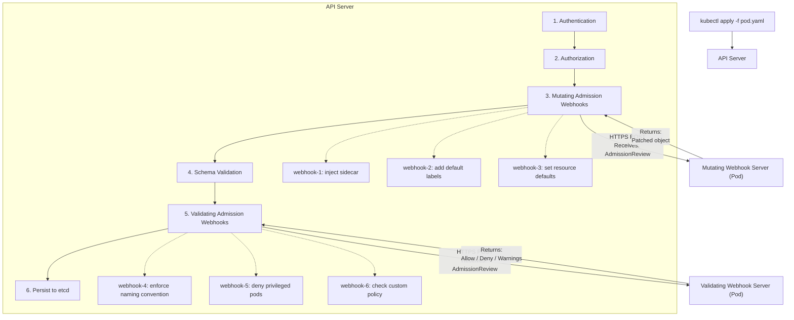
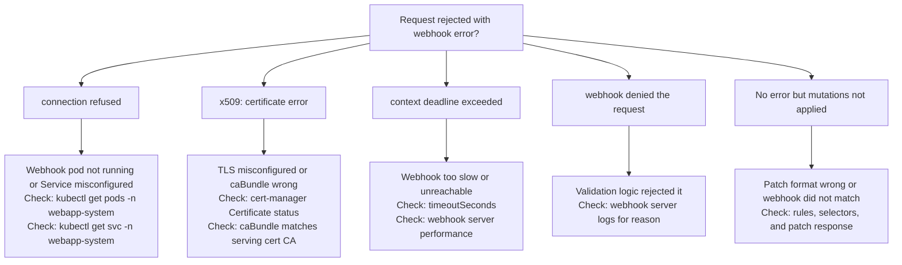

> **Складність**: `[СКЛАДНИЙ]` — Перехоплення та модифікація запитів до API
>
> **Час на проходження**: 4 години
>
> **Передумови**: Модуль 1.1 (Глибоке занурення в API), основи TLS/сертифікатів

---

## Що ви зможете зробити

Після завершення цього модуля ви зможете:

1. **Спроєктувати** та реалізувати мутаційний вебхук допуску, який вставляє sidecar-контейнери, типові мітки та типові значення ресурсів, залишаючись ідемпотентним під час повторних спроб і повторних викликів.
2. **Оцінити** та побудувати валідаційний вебхук допуску, який забезпечує дотримання власних політик — як-от обмеження на реєстри образів, угоди про іменування та обмеження безпеки — не створюючи несподіванок для команд застосунків.
3. **Реалізувати** керування TLS-сертифікатами, політики відмов (failure policies), селектори просторів імен, селектори об'єктів, умови відповідності (match conditions) та налаштування тайм-аутів, які підтримують надійне забезпечення допуску в кластерах Kubernetes 1.35 і новіших.
4. **Діагностувати** збої вебхуків, читаючи помилки допуску, симптоми API-сервера, логи вебхуків, статус сертифікатів і поведінку dry-run, а потім обирати найменше безпечне виправлення.

## Чому цей модуль важливий

Гіпотетичний сценарій: платформна команда розгортає валідаційний вебхук, щоб блокувати Поди, які використовують несхвалені реєстри, і політика працює бездоганно протягом звичайних робочих годин. Згодом Деплоймент вебхука витісняється (drain) на вузол, який не може дістатися до Secret зі своїм обслуговувальним сертифікатом, кінцева точка вебхука зникає, і кожне нове створення Пода, що відповідає правилам вебхука, починає завершуватися помилкою, оскільки конфігурація використовує `failurePolicy: Fail`. Команди застосунків не бачать зламаного контролера; вони бачать, що звичайні команди `kubectl apply` відхиляються API-сервером, бо допуск відбувається ще до того, як об'єкт узагалі потрапляє у сховище.

Цей сценарій не про якусь екзотичну ваду Kubernetes. Він про той факт, що вебхуки допуску (admission webhooks) стоять безпосередньо на шляху запиту до API Kubernetes — після автентифікації та авторизації, але перед збереженням у etcd. Повільний, недоступний, надто широкий або хибно довірений вебхук може вплинути на кожну операцію `CREATE`, `UPDATE`, `DELETE` чи `CONNECT`, що збігається з правилом, у межах усього кластера, тож той самий механізм, який дає вам потужне врядування (governance), може також створити великий радіус ураження (blast radius), якщо ставитися до нього як до звичайного зворотного виклику застосунку.

Цей модуль навчає вебхукам допуску саме як задачі проєктування площини управління, а не лише як вправі з генерування коду. Ви порівняєте мутаційну та валідаційну поведінку, дослідите контракт `AdmissionReview`, використаєте реалізації вебхуків у стилі Kubebuilder для власних ресурсів, продумаєте окремий sidecar-інжектор для Подів, налаштуєте TLS за допомогою cert-manager, обмежите область відповідності вебхуків, оберете доречні політики відмов і відпрацюєте послідовність діагностики, яка чітко відокремлює збої довіри від мережевих збоїв і від відмов політик.

Аналогія з вишибалою (bouncer) корисна, але лише якщо тримати порядок точним. Валідаційний вебхук — це як вишибала, який перевіряє, чи дозволено запиту увійти до закладу; він може сказати «так», сказати «ні» або повернути попередження, але не може змінити сам об'єкт. Мутаційний вебхук більше схожий на стиліста біля тих самих дверей; він може додати браслет, причепити мітку або підправити маніфест, перш ніж вишибала його побачить. Kubernetes виконує мутаційний допуск першим, а валідаційний — пізніше, тож валідація завжди оцінює фінальний об'єкт після того, як встановлення типових значень, накладання патчів і повторні виклики мали свій шанс його змінити.

## Частина 1: Архітектура вебхуків

Вебхуки допуску існують тому, що API Kubernetes потребує точок розширення (extension points), гнучкіших за вбудовану валідацію та менш інвазивних за форк (fork) самого API-сервера. Автентифікація відповідає на питання «хто ви?», авторизація відповідає на «чи дозволено вам це запитувати?», а допуск відповідає на «чи слід прийняти саме цей запит у цьому конкретному кластері просто зараз?». Це останнє питання потребує контексту, специфічного для кластера, — як-от власність простору імен, правила реєстрів образів, вимоги до sidecar-контейнерів, типові значення безпеки та запобіжники розгортання (rollout guardrails), яких немає в загальній схемі Kubernetes.

Шлях запиту має значення, бо вебхуки допуску — це не фонові контролери узгодження (reconcilers), що працюють асинхронно. Контролер може спостерігати за вже збереженим об'єктом і виправити його пізніше, але вебхук бере участь безпосередньо у синхронному запиті до API. Коли користувач надсилає маніфест, API-сервер викликає відповідні вебхуки через HTTPS, чекає на їхні відповіді, застосовує дозволені мутації, оцінює валідаційні рішення і лише потім зберігає фінальний об'єкт. Саме тому затримка вебхука стає затримкою API, а доступність вебхука стає доступністю API для відповідних запитів.



Діаграма показує три операційні факти, які легко пропустити, коли вперше вивчаєш цю функцію. По-перше, вебхуки викликає API-сервер, а не `kubectl`, тож мережевий шлях і ланцюг довіри мають працювати з точки зору площини управління. По-друге, мутаційні вебхуки можуть впливати на те, що пізніше побачать валідаційні вебхуки, а отже автори політик мусять думати про фінальний стан, а не про початкове введення користувача. По-третє, усе це відбувається перед etcd, тож відхилений запит не залишає по собі частково збереженого об'єкта.

Зробіть паузу і спрогнозуйте: якщо мутаційний вебхук додає обов'язкову мітку `team-owner`, а валідаційний вебхук відхиляє об'єкти без цієї мітки, що має статися, коли користувач не вказує мітку в початковому маніфесті? Правильний прогноз такий: запит усе одно може бути допущений, якщо мутаційний вебхук збігається, успішно виконується і додає мітку перед валідацією. Якщо мутація не збігається через селектор простору імен або селектор об'єкта, валідаційний вебхук бачить незмінений об'єкт і має його відхилити.

Розрізнення між мутацією та валідацією частково стосується спроможності, а частково — відповідальності. Мутація доречна тоді, коли кластер може безпечно обрати типове значення від імені користувача, наприклад додати стандартні мітки або вставити sidecar у випадку, коли користувач сам погодився на це. Валідація доречна тоді, коли кластер мусить зупинити небезпечний чи непідтримуваний стан, наприклад заборонити привілейовані контейнери або вимагати підписаний реєстр образів. Вебхук може водночас мутувати і відхиляти лише тоді, коли його зареєстровано як мутаційний; валідаційний вебхук ніколи не повинен покладатися на зміну об'єкта.

| Можливість | Мутаційний | Валідаційний |
|---------|----------|------------|
| Може змінити об'єкт | Так, повертаючи JSON Patch | Ні, він повертає allow, deny та необов'язкові попередження (мутаційні вебхуки теж можуть повертати `warnings` починаючи з Kubernetes 1.19) |
| Може відхилити запит | Так | Так |
| Порядок виконання | Першим, перед фінальною валідацією | Другим, після завершення всіх проходів мутації |
| Типове застосування | Вставлення sidecar, встановлення типових значень, додавання міток | Забезпечення політик, правил іменування, правил безпеки |
| Поведінка повторення | Може викликатися повторно, коли пізніші мутації потребують ще одного проходу | Виконується після мутації і не патчить об'єкт |

Думайте про мутацію як про зобов'язання зробити об'єкт повнішим, а не як про дозвіл приховувати складність від користувача. Якщо sidecar-інжектор додає контейнер логування, він також має бути ідемпотентним, додавати анотацію, яка пояснює, що сталося, і уникати втручання у простори імен, де сама платформа перебуває в процесі первинного завантаження (bootstrapping). Якщо вебхук встановлення типових значень задає ресурси, він має обирати консервативні типові значення і дозволяти командам перевизначати їх, коли модель власного ресурсу вважає перевизначення допустимими.

Контракт API між API-сервером і вебхуком — це `AdmissionReview`. Запит містить `uid`, який відповідь має повторити (echo), операцію, цільовий ресурс, простір імен, інформацію про автентифікованого користувача, новий об'єкт і подеколи старий об'єкт. Валідаційний вебхук зазвичай декодує об'єкт і повертає `allowed: true` або `allowed: false`; мутаційний вебхук повертає `allowed: true` плюс закодований у base64 JSON Patch і тип патча.

```json
{
  "apiVersion": "admission.k8s.io/v1",
  "kind": "AdmissionReview",
  "request": {
    "uid": "705ab4f5-6393-11e8-b7cc-42010a800002",
    "kind": {"group": "", "version": "v1", "kind": "Pod"},
    "resource": {"group": "", "version": "v1", "resource": "pods"},
    "namespace": "default",
    "operation": "CREATE",
    "userInfo": {
      "username": "admin",
      "groups": ["system:masters"]
    },
    "object": {
      "apiVersion": "v1",
      "kind": "Pod",
      "metadata": {"name": "my-pod", "namespace": "default"},
      "spec": {
        "containers": [{"name": "app", "image": "nginx:1.27"}]
      }
    },
    "oldObject": null
  }
}
```

Поле `userInfo` часто є тим, що відрізняє загальне правило від корисного платформного правила. Наприклад, політика може дозволити «аварійній» групі (break-glass) створювати привілейований діагностичний Под у контрольованому просторі імен, водночас відхиляючи той самий маніфест від звичайних сервісних акаунтів. Користуйтеся цією потужністю обережно, бо винятки, що враховують ідентичність, стає важко осмислити, якщо вони розкидані по коду вебхука, прив'язках RBAC, мітках просторів імен і позасистемній документації.

```json
{
  "apiVersion": "admission.k8s.io/v1",
  "kind": "AdmissionReview",
  "response": {
    "uid": "705ab4f5-6393-11e8-b7cc-42010a800002",
    "allowed": true,
    "patchType": "JSONPatch",
    "patch": "W3sib3AiOiJhZGQiLCJwYXRoIjoiL3NwZWMvY29udGFpbmVycy8xIiwidmFsdWUiOnsi..."
  }
}
```

Формат відповіді також пояснює, чому код вебхука має бути нудним і явним. Хибно сформована відповідь — це не просто невдалий HTTP-виклик; це невдале рішення про допуск, яке може заблокувати запит користувача. Ваш сервер завжди має повертати ті самі `apiVersion` і `kind`, повторювати UID запиту, встановлювати `allowed`, додавати зрозуміле повідомлення про відмову під час відхилення і уникати побічних ефектів, якщо тільки вебхук не оголошує і не обробляє їх коректно.

## Частина 2: Реалізація вебхуків за допомогою Kubebuilder

Kubebuilder — це звична відправна точка тоді, коли вебхук належить власному ресурсу (custom resource), яким ви вже керуєте за допомогою controller-runtime. Він дає вам типізовані Go-структури, згенеровані маніфести вебхуків, каркас (scaffolding) для тестів, оверлеї для cert-manager і менеджер, який може обслуговувати кінцеву точку вебхука поряд із вашим контролером. Головна його перевага не в тому, що Kubebuilder приховує допуск від вас; вона в тому, що він тримає логіку допуску близько до того типу API, чиї інваріанти ви забезпечуєте.

Для власних ресурсів встановлення типових значень і валідація зазвичай належать поряд із визначенням типу, бо ці правила є частиною контракту API. Якщо `WebApp.spec.port` за замовчуванням дорівнює `8080`, це не уподобання контролера; це частина того, як поводиться ресурс, коли користувач пропускає поле. Якщо зміна порту після створення не підтримується, відхилення такого оновлення під час допуску дає користувачам негайну, зрозумілу помилку замість того, щоб дозволити контролеру раз за разом зазнавати невдачі вже після того, як об'єкт збережено.

```bash
cd ~/extending-k8s/webapp-operator

# Create a defaulting mutating webhook.
kubebuilder create webhook --group apps --version v1beta1 --kind WebApp \
  --defaulting

# Create a validating webhook.
kubebuilder create webhook --group apps --version v1beta1 --kind WebApp \
  --validation

# Generated files:
# api/v1beta1/webapp_webhook.go          # webhook implementations
# api/v1beta1/webapp_webhook_test.go     # test scaffolding
# config/webhook/                        # webhook server config
# config/certmanager/                    # cert-manager integration
```

Згенерований хук встановлення типових значень здається простим, бо controller-runtime порівнює об'єкт до і після вашого методу `Default` і створює патч за вас. Ця простота корисна, але вона також означає, що ваш метод має бути детермінованим. Не встановлюйте поля на основі поточного часу, не звертайтеся до іншого сервісу і не додавайте дубльовані дані щоразу, коли метод виконується. Допуск може повторювати спроби, а мутаційні вебхуки можуть викликатися повторно, коли інший вебхук змінить об'єкт пізніше в ланцюжку.

```go
// api/v1beta1/webapp_webhook.go
package v1beta1

import (
	"fmt"

	"k8s.io/apimachinery/pkg/runtime"
	ctrl "sigs.k8s.io/controller-runtime"
	logf "sigs.k8s.io/controller-runtime/pkg/log"
	"sigs.k8s.io/controller-runtime/pkg/webhook"
	"sigs.k8s.io/controller-runtime/pkg/webhook/admission"
)

var webapplog = logf.Log.WithName("webapp-webhook")

// SetupWebhookWithManager registers the webhooks with the manager.
func (r *WebApp) SetupWebhookWithManager(mgr ctrl.Manager) error {
	return ctrl.NewWebhookManagedBy(mgr).
		For(r).
		Complete()
}

// +kubebuilder:webhook:path=/mutate-apps-kubedojo-io-v1beta1-webapp,mutating=true,failurePolicy=fail,sideEffects=None,groups=apps.kubedojo.io,resources=webapps,verbs=create;update,versions=v1beta1,name=mwebapp.kb.io,admissionReviewVersions=v1

var _ webhook.Defaulter = &WebApp{}

// Default implements webhook.Defaulter.
// This is called for every CREATE and UPDATE of a WebApp.
func (r *WebApp) Default() {
	webapplog.Info("Applying defaults", "name", r.Name, "namespace", r.Namespace)

	// Set default replicas.
	if r.Spec.Replicas == nil {
		defaultReplicas := int32(2)
		r.Spec.Replicas = &defaultReplicas
		webapplog.Info("Set default replicas", "replicas", defaultReplicas)
	}

	// Set default port.
	if r.Spec.Port == 0 {
		r.Spec.Port = 8080
		webapplog.Info("Set default port", "port", 8080)
	}

	// Set default resource limits.
	if r.Spec.Resources == nil {
		r.Spec.Resources = &ResourceSpec{
			CPURequest:    "100m",
			CPULimit:      "500m",
			MemoryRequest: "128Mi",
			MemoryLimit:   "512Mi",
		}
		webapplog.Info("Set default resource limits")
	}

	// Ensure standard labels.
	if r.Labels == nil {
		r.Labels = make(map[string]string)
	}
	r.Labels["app.kubernetes.io/managed-by"] = "webapp-operator"
	r.Labels["app.kubernetes.io/part-of"] = r.Name

	// Ensure ingress path has a default.
	if r.Spec.Ingress != nil && r.Spec.Ingress.Path == "" {
		r.Spec.Ingress.Path = "/"
	}
}
```

Приклад встановлення типових значень навмисно уникає звернень до кластера, отримання ConfigMap чи запитів рішення в зовнішньої системи. Така конструкція тримає вебхук швидким, повторюваним і придатним для тестування. Якщо типове значення залежить від змінного стану кластера, поміркуйте, чи не належить це значення радше циклу узгодження (reconcile) контролера, бо допуск має приймати вузьке рішення під час запиту до API, а не виконувати широку оркестрацію.

Хуки валідації мають бути суворими щодо неможливих станів і поблажливими щодо переходів, які потребують шляху міграції. Повернене значення `admission.Warnings` корисне, бо дає змогу повідомити, що прийнятий об'єкт використовує небажаний патерн. Попередження не замінюють політику, але вони є практичним способом підготувати команди, перш ніж ви перетворите м'яке правило на жорстку відмову.

```go
// +kubebuilder:webhook:path=/validate-apps-kubedojo-io-v1beta1-webapp,mutating=false,failurePolicy=fail,sideEffects=None,groups=apps.kubedojo.io,resources=webapps,verbs=create;update;delete,versions=v1beta1,name=vwebapp.kb.io,admissionReviewVersions=v1

var _ webhook.Validator = &WebApp{}

// ValidateCreate implements webhook.Validator.
func (r *WebApp) ValidateCreate() (admission.Warnings, error) {
	webapplog.Info("Validating create", "name", r.Name)

	var warnings admission.Warnings

	if r.Spec.Image == "" {
		return warnings, fmt.Errorf("image must not be empty")
	}

	if isLatestTag(r.Spec.Image) {
		warnings = append(warnings,
			"Using ':latest' tag is not recommended for production. "+
				"Consider pinning to a specific version.")
	}

	if r.Spec.Replicas != nil && *r.Spec.Replicas > 50 {
		warnings = append(warnings,
			fmt.Sprintf("High replica count (%d). Ensure your cluster has sufficient resources.",
				*r.Spec.Replicas))
	}

	if r.Spec.Ingress != nil && r.Spec.Ingress.TLSEnabled && r.Spec.Ingress.Host == "" {
		return warnings, fmt.Errorf(
			"ingress.host is required when ingress.tlsEnabled is true")
	}

	if err := validateName(r.Name); err != nil {
		return warnings, err
	}

	return warnings, nil
}

// ValidateUpdate implements webhook.Validator.
func (r *WebApp) ValidateUpdate(old runtime.Object) (admission.Warnings, error) {
	webapplog.Info("Validating update", "name", r.Name)

	oldWebApp := old.(*WebApp)
	var warnings admission.Warnings

	if oldWebApp.Spec.Port != 0 && r.Spec.Port != oldWebApp.Spec.Port {
		return warnings, fmt.Errorf(
			"port cannot be changed after creation (was %d, attempting %d). "+
				"Delete and recreate the WebApp to change the port",
			oldWebApp.Spec.Port, r.Spec.Port)
	}

	oldReplicas := int32(2)
	if oldWebApp.Spec.Replicas != nil {
		oldReplicas = *oldWebApp.Spec.Replicas
	}
	newReplicas := int32(2)
	if r.Spec.Replicas != nil {
		newReplicas = *r.Spec.Replicas
	}

	diff := newReplicas - oldReplicas
	if diff < 0 {
		diff = -diff
	}
	if diff > 10 {
		warnings = append(warnings,
			fmt.Sprintf("Large scaling change: %d -> %d replicas. "+
				"Consider gradual scaling.", oldReplicas, newReplicas))
	}

	return warnings, nil
}

// ValidateDelete implements webhook.Validator.
func (r *WebApp) ValidateDelete() (admission.Warnings, error) {
	webapplog.Info("Validating delete", "name", r.Name)

	if r.Annotations != nil && r.Annotations["apps.kubedojo.io/prevent-deletion"] == "true" {
		return nil, fmt.Errorf(
			"WebApp %s has deletion protection enabled. "+
				"Remove the 'apps.kubedojo.io/prevent-deletion' annotation first",
			r.Name)
	}

	return nil, nil
}

func isLatestTag(image string) bool {
	if len(image) == 0 {
		return false
	}
	lastColon := -1
	lastSlash := -1
	for i, c := range image {
		if c == ':' {
			lastColon = i
		}
		if c == '/' {
			lastSlash = i
		}
	}
	if lastColon <= lastSlash {
		return true
	}
	tag := image[lastColon+1:]
	return tag == "latest"
}

func validateName(name string) error {
	if len(name) > 40 {
		return fmt.Errorf("name must be 40 characters or fewer (got %d)", len(name))
	}
	return nil
}
```

Перш ніж запускати це, який вивід ви очікуєте, якщо користувач створює `WebApp` без образу, з увімкненим TLS для інгресу і без хосту інгресу? Перевірка порожнього образу має спрацювати першою, бо функція негайно повертає помилку, а отже пізніші перевірки для цього запиту не виконуються. Такий порядок прийнятний, коли перша помилка зрозуміла, але якщо ви хочете, щоб користувачі виправляли кілька полів одразу, можна накопичувати помилки валідації і повертати об'єднане повідомлення.

Реєстрація менеджера невелика, але операційно важлива. Багато команд генерують файли вебхуків і забувають, що менеджер має їх насправді обслуговувати. Запобіжник `ENABLE_WEBHOOKS` також корисний у тестах і під час локальної розробки контролера, бо дає змогу запускати контролер без прив'язки сервера вебхуків чи монтування сертифікатів.

```go
// After setting up the controller.
if os.Getenv("ENABLE_WEBHOOKS") != "false" {
    if err = (&appsv1beta1.WebApp{}).SetupWebhookWithManager(mgr); err != nil {
        setupLog.Error(err, "unable to create webhook", "webhook", "WebApp")
        os.Exit(1)
    }
}
```

Kubebuilder не є обов'язковим, і він не є правильним вибором для кожної задачі допуску. Він блищить, коли вебхук належить проєкту контролера і типізованому API, але загальнокластерне вставлення в Поди, врядування між ресурсами та сторонні рушії політик часто використовують окремі сервери або спеціальні фреймворки. Наступний розділ зберігає той самий контракт `AdmissionReview`, але прибирає зручний шар Kubebuilder, щоб ви могли побачити механіку патчів напряму.

## Частина 3: Власний сервер вебхука без Kubebuilder

Окремий (standalone) сервер вебхука — це просто HTTPS-кінцева точка, яка приймає об'єкти `AdmissionReview` і повертає рішення у вигляді `AdmissionReview`. Цей простий опис надихає, бо означає, що ви можете реалізувати вебхук будь-якою мовою програмування, яка вміє парсити JSON, обслуговувати TLS і тримати низьку затримку. Він також протвережує, бо сервер мусить обробляти хибно сформоване введення, порожні (nil) об'єкти запитів, паралельні виклики, плавне завершення роботи, перевірки стану та семантику об'єктів Kubernetes без тих запобіжників, які зазвичай надає controller-runtime.

Окремі мутаційні вебхуки поширені для вставлення sidecar, бо цільовим ресурсом часто є вбудований Под, а не один власний ресурс. Інжектори сервісної сітки (service mesh), агенти логування, прокладки безпеки (security shims) та інструменти локальної розробки — усі вони дотримуються цього патерну: збігтися із запитом на створення Пода, вирішити, чи доречне вставлення, і повернути JSON Patch, який додає контейнер або модифікує метадані. Патч має бути ідемпотентним, бо повторні спроби та повторні виклики ніколи не повинні створювати дубльовані sidecar-контейнери.

```go
// cmd/sidecar-injector/main.go
package main

import (
	"context"
	"encoding/json"
	"fmt"
	"net/http"
	"os"
	"os/signal"
	"syscall"

	admissionv1 "k8s.io/api/admission/v1"
	corev1 "k8s.io/api/core/v1"
	metav1 "k8s.io/apimachinery/pkg/apis/meta/v1"
	"k8s.io/apimachinery/pkg/api/resource"
	"k8s.io/apimachinery/pkg/types"
	"k8s.io/klog/v2"
)

const (
	sidecarImage = "busybox:1.35.0"
	sidecarName  = "logging-sidecar"
	certFile     = "/etc/webhook/certs/tls.crt"
	keyFile      = "/etc/webhook/certs/tls.key"
)

type jsonPatchEntry struct {
	Op    string      `json:"op"`
	Path  string      `json:"path"`
	Value interface{} `json:"value,omitempty"`
}

func handleMutate(w http.ResponseWriter, r *http.Request) {
	klog.V(2).Info("Received admission request")

	var admissionReview admissionv1.AdmissionReview
	if err := json.NewDecoder(r.Body).Decode(&admissionReview); err != nil {
		klog.Errorf("Failed to decode request: %v", err)
		sendResponse(w, "", false, fmt.Sprintf("failed to decode request: %v", err))
		return
	}

	request := admissionReview.Request
	if request == nil {
		sendResponse(w, "", false, "admission review request is required")
		return
	}
	klog.Infof("Processing %s %s/%s by %s",
		request.Operation, request.Namespace, request.Name,
		request.UserInfo.Username)

	var pod corev1.Pod
	if err := json.Unmarshal(request.Object.Raw, &pod); err != nil {
		sendResponse(w, request.UID, false, fmt.Sprintf("Failed to decode pod: %v", err))
		return
	}

	if !shouldInject(&pod) {
		klog.Infof("Skipping injection for %s/%s", pod.Namespace, pod.Name)
		sendResponse(w, request.UID, true, "")
		return
	}

	for _, c := range pod.Spec.Containers {
		if c.Name == sidecarName {
			klog.Infof("Sidecar already present in %s/%s", pod.Namespace, pod.Name)
			sendResponse(w, request.UID, true, "")
			return
		}
	}

	sidecar := corev1.Container{
		Name:  sidecarName,
		Image: sidecarImage,
		Command: []string{
			"/bin/sh", "-c",
			"while true; do echo '[sidecar] heartbeat'; sleep 30; done",
		},
		Resources: corev1.ResourceRequirements{
			Limits: corev1.ResourceList{
				corev1.ResourceCPU:    resource.MustParse("50m"),
				corev1.ResourceMemory: resource.MustParse("64Mi"),
			},
			Requests: corev1.ResourceList{
				corev1.ResourceCPU:    resource.MustParse("10m"),
				corev1.ResourceMemory: resource.MustParse("32Mi"),
			},
		},
	}

	patches := []jsonPatchEntry{
		{
			Op:    "add",
			Path:  "/spec/containers/-",
			Value: sidecar,
		},
		{
			Op:    "add",
			Path:  "/metadata/annotations/sidecar.kubedojo.io~1injected",
			Value: "true",
		},
	}

	patchBytes, err := json.Marshal(patches)
	if err != nil {
		sendResponse(w, request.UID, false, fmt.Sprintf("Failed to marshal patch: %v", err))
		return
	}

	klog.Infof("Injecting sidecar into %s/%s", pod.Namespace, pod.Name)
	sendPatchResponse(w, request.UID, patchBytes)
}

func shouldInject(pod *corev1.Pod) bool {
	annotations := pod.GetAnnotations()
	if annotations == nil {
		return false
	}
	return annotations["sidecar.kubedojo.io/inject"] == "true"
}

func sendResponse(w http.ResponseWriter, uid types.UID, allowed bool, message string) {
	response := admissionv1.AdmissionReview{
		TypeMeta: metav1.TypeMeta{
			APIVersion: "admission.k8s.io/v1",
			Kind:       "AdmissionReview",
		},
		Response: &admissionv1.AdmissionResponse{
			UID:     uid,
			Allowed: allowed,
		},
	}
	if !allowed && message != "" {
		response.Response.Result = &metav1.Status{
			Message: message,
		}
	}

	w.Header().Set("Content-Type", "application/json")
	json.NewEncoder(w).Encode(response)
}

// Always return an AdmissionReview envelope. Raw http.Error bodies are treated as webhook call failures under failurePolicy: Fail, not structured denials.
func sendPatchResponse(w http.ResponseWriter, uid types.UID, patch []byte) {
	patchType := admissionv1.PatchTypeJSONPatch
	response := admissionv1.AdmissionReview{
		TypeMeta: metav1.TypeMeta{
			APIVersion: "admission.k8s.io/v1",
			Kind:       "AdmissionReview",
		},
		Response: &admissionv1.AdmissionResponse{
			UID:       uid,
			Allowed:   true,
			PatchType: &patchType,
			Patch:     patch,
		},
	}

	w.Header().Set("Content-Type", "application/json")
	json.NewEncoder(w).Encode(response)
}

func main() {
	klog.InitFlags(nil)

	mux := http.NewServeMux()
	mux.HandleFunc("/mutate", handleMutate)
	mux.HandleFunc("/healthz", func(w http.ResponseWriter, r *http.Request) {
		w.WriteHeader(http.StatusOK)
		w.Write([]byte("ok"))
	})

	server := &http.Server{
		Addr:    ":8443",
		Handler: mux,
	}

	go func() {
		sigCh := make(chan os.Signal, 1)
		signal.Notify(sigCh, syscall.SIGINT, syscall.SIGTERM)
		<-sigCh
		klog.Info("Shutting down webhook server")
		server.Shutdown(context.Background())
	}()

	klog.Infof("Starting webhook server on :8443")
	if err := server.ListenAndServeTLS(certFile, keyFile); err != http.ErrServerClosed {
		klog.Fatalf("Failed to start server: %v", err)
	}
}
```

Важлива деталь патча — це шлях `/spec/containers/-`. У JSON Patch завершальне тире означає «додати в кінець масиву», що безпечніше за вгадування числового індексу. Шлях анотації використовує `~1`, бо JSON Pointer екранує `/` як `~1`; без цього екранування API-сервер витлумачив би ключ анотації як кілька вкладених сегментів шляху, і патч провалився б, навіть якщо Go-об'єкт виглядав правильно.

Ідемпотентність — це різниця між корисним інжектором і генератором збоїв. Приклад перевіряє, чи sidecar уже існує, перш ніж будувати патч, і вставляє його лише тоді, коли користувач явно встановлює `sidecar.kubedojo.io/inject: "true"`. У продакшені ви також виключили б системні простори імен, уникали б вставлення у Поди, що встановлюють `hostNetwork`, якщо sidecar не може цього опрацювати, і протестували б повторні виклики з іншими мутаційними вебхуками, які можуть додавати контейнери чи контексти безпеки.

Який підхід ви обрали б тут і чому: чи має інжектор за замовчуванням бути opt-in через анотацію, opt-in через мітку простору імен чи opt-out через анотацію? Для навчальної лабораторної роботи opt-in через анотацію найзрозуміліший, бо один маніфест керує результатом. Для платформної функції opt-in через простір імен часто масштабується краще, бо команда може увімкнути вставлення для межі робочого навантаження. Opt-out через анотацію потужний, але ризикований, бо збій або хибна конфігурація вебхука може заскочити зненацька кожен простір імен, що збігається з широким правилом.

## Частина 4: TLS і cert-manager

API-сервер викликає вебхуки через HTTPS і має довіряти обслуговувальному сертифікату (serving certificate), який пред'являє кінцева точка вебхука. Ця вимога — не якась необов'язкова прикраса; вона захищає площину управління від надсилання об'єктів допуску, включно з ідентичністю користувача та вмістом самих об'єктів, до кінцевої точки, яка не може довести свою ідентичність. Тому коректне налаштування вебхука потребує обслуговувального сертифіката, змонтованого в Под вебхука, і `caBundle` у конфігурації вебхука, щоб API-сервер міг перевірити ланцюг сертифікатів.

Ця модель довіри часто збиває учнів з пантелику, бо Сервіс вебхука є внутрішнім для кластера. Проте внутрішній не означає автоматично довірений. API-сервер усе одно виконує TLS-рукостискання (handshake) проти DNS-імені Сервісу, і сертифікат має містити такі імена, як `webapp-webhook-service.webapp-system.svc` та `webapp-webhook-service.webapp-system.svc.cluster.local`. Якщо імена сертифіката, монтування Secret, ім'я Сервісу, простір імен або `caBundle` не узгоджуються, запит провалюється ще до того, як ваш код обробника побачить хоч один `AdmissionReview`.

cert-manager — це практичний вибір для більшості кластерів, бо він автоматизує видачу та оновлення сертифікатів, а його CA-інжектор може тримати поля `caBundle` конфігурації вебхука синхронізованими. Команда встановлення нижче закріплює актуальний реліз cert-manager, який підтримує Kubernetes 1.35. Завжди звіряйтеся зі сторінкою підтримуваних релізів cert-manager, перш ніж копіювати версію у продакшен-автоматизацію, бо номери версій cert-manager не відстежують мінорні версії Kubernetes.

```bash
# Install cert-manager.
kubectl apply -f https://github.com/cert-manager/cert-manager/releases/download/v1.20.2/cert-manager.yaml

# Wait for it to be ready.
kubectl wait --for=condition=Available deployment -n cert-manager --all --timeout=120s
```

Найпростіший лабораторний емітент (issuer) — самопідписаний, що нормально для контрольованої вправи, але не є загальною PKI-стратегією підприємства. У реальній організації ви могли б використати CA-емітент, Vault-емітент, ACME-емітент для публічних кінцевих точок або інше внутрішнє джерело довіри, що відповідає вашій моделі безпеки. Вебхуку важливо лише те, щоб сертифікат можна було змонтувати сервером і щоб йому довіряв API-сервер через вкладений пакет.

```yaml
# config/certmanager/issuer.yaml
apiVersion: cert-manager.io/v1
kind: Issuer
metadata:
  name: webapp-selfsigned-issuer
  namespace: webapp-system
spec:
  selfSigned: {}
```

Ресурс `Certificate` прив'язує ідентичність до DNS-імен. Якщо ви згодом перейменуєте Сервіс, перенесете вебхук до іншого простору імен або зміните одне ім'я Сервісу на інше, ви мусите оновити імена сертифіката і дати cert-manager видати заміну. Багато збоїв вебхуків, які виглядають як загадкові помилки `x509`, насправді є невідповідностями імен між `clientConfig.service` і альтернативними іменами суб'єкта (SAN) сертифіката.

```yaml
# config/certmanager/certificate.yaml
apiVersion: cert-manager.io/v1
kind: Certificate
metadata:
  name: webapp-webhook-cert
  namespace: webapp-system
spec:
  secretName: webapp-webhook-tls
  duration: 8760h
  renewBefore: 720h
  issuerRef:
    name: webapp-selfsigned-issuer
    kind: Issuer
  dnsNames:
  - webapp-webhook-service.webapp-system.svc
  - webapp-webhook-service.webapp-system.svc.cluster.local
```

Ручні сертифікати все ще мають значення для розуміння рухомих частин і для ізольованих середовищ розробки. Потік OpenSSL створює невеликий CA, видає серверний сертифікат для DNS-імен Сервісу вебхука, зберігає сертифікат як TLS-Secret Kubernetes і готує CA-пакет для вставлення в конфігурацію вебхука. Використовуйте його, щоб вивчити механіку, а потім автоматизуйте життєвий цикл сертифікатів, перш ніж покладатися на вебхук у спільному кластері.

```bash
# Generate CA.
openssl genrsa -out ca.key 2048
openssl req -new -x509 -days 365 -key ca.key -out ca.crt -subj "/CN=webapp-webhook-ca"

# Generate server certificate.
openssl genrsa -out server.key 2048
openssl req -new -key server.key -out server.csr \
  -subj "/CN=webapp-webhook-service.webapp-system.svc" \
  -config <(cat /etc/ssl/openssl.cnf <(printf "\n[SAN]\nsubjectAltName=DNS:webapp-webhook-service.webapp-system.svc,DNS:webapp-webhook-service.webapp-system.svc.cluster.local"))

openssl x509 -req -days 365 -in server.csr -CA ca.crt -CAkey ca.key \
  -CAcreateserial -out server.crt \
  -extensions SAN \
  -extfile <(cat /etc/ssl/openssl.cnf <(printf "\n[SAN]\nsubjectAltName=DNS:webapp-webhook-service.webapp-system.svc,DNS:webapp-webhook-service.webapp-system.svc.cluster.local"))

# Create the TLS secret.
kubectl create secret tls webapp-webhook-tls \
  --cert=server.crt --key=server.key \
  -n webapp-system

# Base64 encode CA for webhook config.
CA_BUNDLE=$(base64 < ca.crt | tr -d '\n')
```

Конфігурація вебхука — це місце, де сходяться TLS-довіра, відповідність запитів, поведінка тайм-аутів, поведінка при відмові та маршрутизація кінцевої точки. З CA-інжекцією cert-manager анотація `cert-manager.io/inject-ca-from` вказує на `Certificate`, і cert-manager заповнює поле `caBundle` за вас. Ця автоматизація зменшує дрейф, але вона не усуває потреби перевірити, що Сервіс, шлях, порт і імена сертифіката узгоджуються.

```yaml
# mutating-webhook.yaml
apiVersion: admissionregistration.k8s.io/v1
kind: MutatingWebhookConfiguration
metadata:
  name: webapp-mutating-webhook
  annotations:
    cert-manager.io/inject-ca-from: webapp-system/webapp-webhook-cert
webhooks:
- name: mwebapp.kubedojo.io
  admissionReviewVersions: ["v1"]
  sideEffects: None
  failurePolicy: Fail
  clientConfig:
    service:
      name: webapp-webhook-service
      namespace: webapp-system
      path: /mutate
      port: 443
    # caBundle is auto-injected by cert-manager.
  rules:
  - apiGroups: ["apps.kubedojo.io"]
    apiVersions: ["v1beta1"]
    operations: ["CREATE", "UPDATE"]
    resources: ["webapps"]
  namespaceSelector:
    matchExpressions:
    - key: kubernetes.io/metadata.name
      operator: NotIn
      values: ["kube-system", "kube-public"]
```

Конфігурація валідаційного вебхука виглядає схоже, але шлях кінцевої точки та намір політики відрізняються. API-сервер не виводить поведінку з імені кінцевої точки; він дотримується об'єкта реєстрації. Якщо ви випадково встановите `mutating: false` у згенерованих анотаціях, але вкажете на обробник мутації, API-сервер не застосує патчі, бо відповідь валідаційного вебхука не може мутувати об'єкт. Ставтеся до реєстрації як до частини контракту API і переглядайте її так само ретельно, як код Go.

```yaml
# validating-webhook.yaml
apiVersion: admissionregistration.k8s.io/v1
kind: ValidatingWebhookConfiguration
metadata:
  name: webapp-validating-webhook
  annotations:
    cert-manager.io/inject-ca-from: webapp-system/webapp-webhook-cert
webhooks:
- name: vwebapp.kubedojo.io
  admissionReviewVersions: ["v1"]
  sideEffects: None
  failurePolicy: Fail
  clientConfig:
    service:
      name: webapp-webhook-service
      namespace: webapp-system
      path: /validate
      port: 443
  rules:
  - apiGroups: ["apps.kubedojo.io"]
    apiVersions: ["v1beta1"]
    operations: ["CREATE", "UPDATE", "DELETE"]
    resources: ["webapps"]
```

## Частина 5: Політики відмов і відповідність

Політика відмов (failure policy) — це найпомітніше рішення щодо надійності у проєктуванні вебхуків допуску. `Fail` означає, що API-сервер відхиляє відповідні запити тоді, коли до вебхука неможливо достукатися, коли він повертає помилку або коли він перевищує тайм-аут. `Ignore` означає, що API-сервер натомість дає запиту продовжитися без рішення цього вебхука. Жодне з цих значень не є універсально правильним; правильний вибір залежить від того, чи є вебхук межею безпеки, зручною функцією чи інструментом міграції.

Використовуйте `Fail`, коли допуск об'єкта без вебхука порушив би жорстку гарантію безпеки, наприклад дозволив би недовірені образи, обійшов би вимоги безпеки Подів або створив би власні ресурси, які контролер не може підтримати. Використовуйте `Ignore`, коли вебхук покращує об'єкт, але не повинен блокувати кластер, наприклад необов'язкове вставлення sidecar, маркування за принципом найкращих зусиль або збагачення лише з попередженнями. Питання проєктування не «який варіант безпечніший?», а «який режим відмови створює менший інцидент для цієї політики?».

| Політика | Поведінка | Коли використовувати |
|--------|----------|------------|
| `Fail` | Відповідний запит відхиляється, якщо виклик вебхука провалюється | Критичні для безпеки вебхуки, суворі інваріанти API, запобігання непідтримуваному стану |
| `Ignore` | Відповідний запит продовжується без рішення цього вебхука | Необов'язкова мутація, попередження про міграцію, збагачення за принципом найкращих зусиль |

```yaml
webhooks:
- name: security-policy.kubedojo.io
  failurePolicy: Fail
  timeoutSeconds: 5

- name: sidecar-injector.kubedojo.io
  failurePolicy: Ignore
  timeoutSeconds: 3
```

Зробіть паузу і спрогнозуйте: ви підтримуєте два вебхуки — один забезпечує, щоб образи надходили лише з приватного реєстру, а інший вставляє sidecar моніторингу. Якщо сервер вебхуків впаде, яку політику відмов має використовувати кожен? Забезпечувач реєстру зазвичай має зазнавати відмови «закрито» (fail closed), бо допуск довільних реєстрів змінює межу безпеки. Sidecar моніторингу зазвичай має зазнавати відмови «відкрито» (fail open), бо блокування всіх нових Подів застосунків під час збою моніторингу створює ширший операційний збій, ніж тимчасова відсутність sidecar на нових Подах.

Відповідність (matching) — це друга половина надійності. Надто широке правило вебхука збільшує роботу API-сервера, створює більше шансів на випадкову відмову і робить радіус ураження при збої ще більшим. Використовуйте `rules`, щоб обмежити ресурси та операції, `namespaceSelector`, щоб уникати системних просторів імен і обирати лише команди-учасниці, `objectSelector`, щоб збігатися з мітками opt-in, і `matchConditions` тоді, коли нативні для Kubernetes вирази CEL можуть описати точну форму запиту.

```yaml
webhooks:
- name: sidecar-injector.kubedojo.io
  rules:
  - apiGroups: [""]
    apiVersions: ["v1"]
    operations: ["CREATE"]
    resources: ["pods"]
    scope: "Namespaced"

  namespaceSelector:
    matchLabels:
      webhook: enabled

  objectSelector:
    matchLabels:
      inject-sidecar: "true"

  timeoutSeconds: 10
  reinvocationPolicy: IfNeeded
```

`reinvocationPolicy: IfNeeded` специфічний для мутаційних вебхуків і часто хибно тлумачиться. Kubernetes може викликати мутаційний вебхук ще раз, якщо інший мутаційний вебхук змінив об'єкт після того, як він виконався, і ранішому вебхуку, можливо, потрібно побачити новий стан. Це не дає вам стабільної гарантії порядку і не виправдовує неідемпотентний код. Це запобіжний клапан для кооперативної мутації, а не система планування для залежностей між вебхуками.

Умови відповідності дають вам ще один спосіб скоротити зайві виклики, оцінюючи вирази CEL в API-сервері перед викликом вебхука. Вони корисні, коли мітки та селектори просторів імен недостатньо виразні, наприклад для виключення просторів імен `kube-` або для валідації лише об'єктів зі специфічною анотацією. Тримайте умови відповідності читабельними, бо майбутній відповідач на інцидент має зуміти зрозуміти, чому запит викликав або не викликав вебхук.

```yaml
webhooks:
- name: vwebapp.kubedojo.io
  matchConditions:
  - name: "not-system-namespace"
    expression: "!request.namespace.startsWith('kube-')"
  - name: "has-annotation"
    expression: "has(object.metadata.annotations) && object.metadata.annotations['validate'] == 'true'"
```

Помилка обчислення matchConditions є відмовою «закрито» (fail-closed), коли `failurePolicy: Fail` — вебхук не викликається, а запит відхиляється, тож захищайте необов'язкові мапи та ключі у виразах CEL.

Вибір відповідності також має переглядатися як частина керування змінами, а не лише як код. Якщо команда змінює мітку простору імен, що керує участю вебхука, така зміна мітки може змінити поведінку допуску для кожного робочого навантаження у просторі імен, навіть якщо жоден маніфест вебхука не змінився. З цієї причини зрілі платформи ставляться до міток opt-in як до частини контракту простору імен, обмежують, хто може їх змінювати, і включають їх до документації з onboarding. Мета — зробити поведінку допуску передбачуваною з метаданих простору імен, а не прихованою в об'єкті з областю дії на весь кластер, який команди застосунків рідко інспектують.

Тайм-аути заслуговують на таке саме явне володіння. Довгий тайм-аут може здаватися безпечнішим, бо дає вебхуку більше часу на відповідь, але він також подовжує час, на який може застрягти кожен відповідний запит до API. Дуже короткий тайм-аут скорочує час застрягання, але може створювати шумні переривчасті збої, якщо вебхук виконує важке декодування, логування чи віддалені виклики. Почніть з невеликого значення, виміряйте затримку допуску під навантаженням, а потім налаштовуйте на основі спостережуваної поведінки запитів замість того, щоб копіювати типове значення в кожну конфігурацію.

Kubernetes також пропонує ValidatingAdmissionPolicy, яка використовує вирази CEL для багатьох випадків валідації без потреби в сервері вебхуків. **MutatingAdmissionPolicy** також існує, але вона перебуває в **стані beta станом на Kubernetes 1.35** (GA у 1.36) і виходить за межі цього розгляду — цей модуль зосереджується на допуску на основі вебхуків. ValidatingAdmissionPolicy не є прямою заміною кожного вебхука, бо вона не може викликати зовнішні системи чи виконувати довільну мутацію, але вона часто є кращою відповіддю для простих перевірок полів. Якщо ваша політика — «відхиляти Поди без мітки» або «відхиляти образи поза патерном», оцініть валідацію на основі CEL, перш ніж вирішувати володіти HTTPS-сервісом на шляху запиту площини управління.

Є також соціальна причина надавати перевагу найпростішому механізму забезпечення, який працює. Вебхуком зазвичай володіє платформна команда чи команда безпеки, тоді як робочими навантаженнями, на які він впливає, володіє багато команд застосунків. Коли стається відмова, користувач бачить помилку API під час свого розгортання, а не тікет, що пояснює історію вашого дизайну. Чим ближче правило до нативної схеми Kubernetes, політики CEL чи добре задокументованої конфігурації простору імен, тим легше користувачам передбачати та виправляти власні помилки, не чекаючи на платформного інженера.

## Частина 6: Діагностика вебхуків

Діагностика вебхуків працює найкраще тоді, коли ви відокремлюєте збій в одну з чотирьох категорій: API-сервер не збігся з вебхуком, API-сервер не зміг достукатися до вебхука, API-сервер не довіряв вебхуку, або ж вебхук навмисно відхилив запит. Помилка з боку клієнта часто стискає всі ці категорії в одне неприємне повідомлення, тож ваше завдання — відновлювати шлях по одному сегменту за раз замість того, щоб міняти випадковий YAML доти, доки запит зрештою не виконається.



Почніть з об'єкта реєстрації, бо саме він визначає, чи API-сервер узагалі намагається викликати сервер. Підтвердьте `rules`, операції, API-групи, версії, ресурси, область (scope), селектори, умови відповідності, `failurePolicy`, `timeoutSeconds`, `sideEffects` та `admissionReviewVersions`. Цілком справний Под вебхука не може мутувати Под, якщо вебхук збігається лише з власним ресурсом, а ідеальна відповідь із патчем не має значення, якщо селектор простору імен виключає простір імен, який ви тестуєте.

Потім інспектуйте шлях до сервера зсередини кластера. Мережева перспектива API-сервера не ідентична перспективі вашого ноутбука, тож локальний `curl` до port-forward доводить менше, ніж багато хто думає. Тимчасовий діагностичний Под, який робить curl до DNS-імені Сервісу, може виявити відсутні Endpoints, неправильні порти Сервісу, збої готовності (readiness) та проблеми з іменами TLS. Поєднайте цей мережевий тест із логами сервера вебхука та статусом сертифіката cert-manager, щоб ви могли визначити, чи дійшов запит до вашого обробника.

```bash
# Check webhook configurations.
kubectl get mutatingwebhookconfigurations
kubectl get validatingwebhookconfigurations
kubectl describe mutatingwebhookconfiguration webapp-mutating-webhook

# Check webhook pod logs.
kubectl logs -n webapp-system -l app=webapp-webhook -f

# Check cert-manager certificate status.
kubectl get certificate -n webapp-system
kubectl describe certificate webapp-webhook-cert -n webapp-system

# Check the TLS secret.
kubectl get secret webapp-webhook-tls -n webapp-system -o yaml

# Test webhook connectivity from inside the cluster.
URL="https://webapp-webhook-service"
URL+=".webapp-system.svc:443/healthz"
kubectl run test-curl --rm -it --image=curlimages/curl --restart=Never -- \
  curl -vk "$URL"

# Check API Server logs for webhook errors if you have access.
kubectl logs -n kube-system kube-apiserver-control-plane | grep webhook
```

Dry-run — один із найбезпечніших інструментів для тестування допуску, але він працює коректно лише тоді, коли вебхуки оголошують `sideEffects: None` або `NoneOnDryRun`, як доречно. Запит dry-run усе одно задіює допуск, тож він може виявити відмови валідації та патчі мутації, не зберігаючи об'єкт. Якщо dry-run провалюється, бо вебхук некоректно оголошує побічні ефекти, виправте оголошення або поведінку вебхука, перш ніж покладатися на нього у валідації CI.

Гіпотетичний сценарій: Под з анотацією вставлення прийнято, але sidecar відсутній. Перше, що варто перевірити, — це не код патча Go; це те, чи мутаційний вебхук узагалі збігся із запитом. Інспектуйте мітки простору імен, мітки об'єкта, правила операцій, версію API та логи вебхука. Якщо логи показують запит, а відповідь містить патч, тоді інспектуйте шлях патча та конверт відповіді. Якщо логи нічого не показують, проблема в відповідності чи з'єднанні, а не в логіці мутації.

Друга корисна звичка діагностики — порівнювати позитивний випадок зі збігом, негативний випадок без збігу та навмисно відхилений випадок. Позитивний випадок доводить, що шлях вебхука працює від початку до кінця, негативний випадок доводить, що селектори обмежують радіус ураження, а відхилений випадок доводить, що користувачі отримують дієве повідомлення. Запуск лише «щасливого шляху» може приховати небезпечну надмірну відповідність, тоді як запуск лише відхилених запитів може змусити справний вебхук виглядати зламаним. Системам допуску найлегше довіряти, коли ви можете пояснити всі три результати.

Логування слід будувати навколо UID допуску, операції, простору імен, імені, ресурсу та рішення. Уникайте логування цілих корисних навантажень об'єктів за замовчуванням, бо запити допуску можуть містити чутливу конфігурацію, але логуйте достатньо метаданих, щоб корелювати помилки API-сервера з рішеннями вебхука. Коли користувач повідомляє про відмову, ви хочете швидко знайти відповідний рядок логу вебхука, підтвердити, чи дійшов запит до сервера, і побачити точну повернену причину. Без такої кореляції команди часто марнують час на діагностику сертифікатів чи Сервісів для відмови, яка насправді була логікою політики, що працює як написано.

Метрики доповнюють картину, яку логи самі по собі надати не можуть. Відстежуйте кількість запитів, кількість дозволів, кількість відмов, кількість попереджень, затримку, кількість тайм-аутів і помилки відповідей для кожної кінцевої точки вебхука. Ці метрики підказують, чи розгортання змінило обсяг трафіку, чи нове правило відхиляє більше, ніж очікувалося, і чи затримка повзе у бік `timeoutSeconds`. Оскільки затримка допуску стає затримкою API, оповіщення про хвостову затримку (tail latency) вебхука корисніше за оповіщення лише тоді, коли в Деплойменту нуль готових реплік.

Вікна оновлення заслуговують на окреме тестування допуску. Оновлення Kubernetes можуть змінити поведінку API-сервера, оновлення cert-manager можуть ротувати сертифікати, а оновлення платформи застосунків можуть запровадити нові вебхуки, які взаємодіють з наявними мутаторами. До і після оновлення запускайте запити server-side dry-run, які мають бути дозволені, відхилені, мутовані та проігноровані селекторами. Це дає вам компактний регресійний набір для шляху допуску і ловить той вид збою, де кожен компонент справний окремо, але складений шлях запиту — ні.

## Патерни й антипатерни

Патерни вебхуків допуску — це насправді патерни керування радіусом ураження (blast radius). Код, який вирішує, чи допустити запит, може бути невеликим, але він прикріплений безпосередньо до API-сервера, тож зрілі конструкції завжди припускають повторні спроби, оновлення кластера, оновлення сертифікатів, витіснення вузлів (node drain), перезапуски apiserver і кілька платформних команд, що додають власні вебхуки з плином часу. Вебхук, який працює в демо, — це лише перша віха; вебхук, який може передбачувано зазнавати відмови, — це продакшен-ціль.

| Патерн | Коли використовувати | Чому працює | Міркування щодо масштабування |
|---------|----------------|--------------|------------------------|
| Вузька відповідність за ресурсом, операцією, простором імен та об'єктом | Вебхук застосовується до конкретного класу робочих навантажень чи межі команди | API-сервер уникає зайвих викликів, а збої зачіпають менше запитів | Тримайте селектори задокументованими і тестуйте об'єкти зі збігом і без |
| Ідемпотентна мутація з явними маркерами | Вебхук додає мітки, анотації, sidecar, змінні середовища чи типові значення | Повторні спроби та повторні виклики не дублюють стан і не створюють конфліктних патчів | Додайте тести для вже мутованих об'єктів і для взаємодії з іншими мутаторами |
| Висока доступність з короткими тайм-аутами | Вебхук забезпечує важливу політику у спільних кластерах | Кілька реплік і малі тайм-аути зменшують застрягання площини управління | Розподіляйте репліки по вузлах і моніторте перцентилі затримки, а не лише час безвідмовної роботи |
| Розгортання «спершу попередження» для нової валідації | Політика правильна, але наявним робочим навантаженням потрібен час на міграцію | Розробники бачать зворотний зв'язок, перш ніж політика стане жорсткою відмовою | Відстежуйте попередження і публікуйте дату набуття чинності у нотатках до релізу |

Антипатерни часто починаються як скорочення, що здаються нешкідливими у кластері розробки. Широкий вебхук здається легшим за проєктування селекторів, `failurePolicy: Fail` здається безпечнішим за обговорення ризику, а зовнішні звернення здаються зручними, коли політика залежить від реєстру чи системи тікетів. У продакшені такі скорочення можуть перетворити звичайні збої залежностей на збої запитів до API, тож кожен антипатерн потребує кращого типового значення.

| Антипатерн | Що йде не так | Краща альтернатива |
|--------------|-----------------|--------------------|
| Збіг з кожним Подом у кожному просторі імен | Системні компоненти, інсталятори та сторонні команди успадковують ризик збою вебхука | Виключіть системні простори імен і вимагайте opt-in за простором імен чи об'єктом |
| Виклик повільних зовнішніх сервісів під час допуску | Запити до API чекають на мережеві залежності поза кластером | Кешуйте дані політики локально або використовуйте контролер для підготовки стану в кластері |
| Неідемпотентні JSON-патчі | Повторні спроби створюють дубльовані контейнери, дубльовані змінні середовища чи конфліктні анотації | Перевіряйте наявний стан перед патчингом і маркуйте успішну мутацію |
| Використання `Ignore` для жорстких меж безпеки | Зловмисники чи випадковості можуть обійти політику під час збоїв вебхука | Використовуйте `Fail`, високу доступність, оповіщення та протестований аварійний шлях (break-glass) |

Найсильніший практичний патерн — проєктувати кожен вебхук зі шляхом до виведення з експлуатації (retirement path). Частина валідації має переходити у схеми CRD, частина простих правил має переходити у ValidatingAdmissionPolicy, а частина встановлення типових значень має переходити у нативні типові значення API, коли платформа дозріває. Якщо вебхук має вузьке призначення та чіткого власника, ви зможете згодом замінити його, не перевідкриваючи приховані залежності політик по всьому кластеру.

Інший патерн — поетапне забезпечення з дедалі суворішими областями. Почніть у просторі імен розробки, розширте до позначеного пілотного простору імен, потім розширте до напрямку чи середовища лише після того, як ви спостерігали попередження, відмови, затримку та тікети підтримки. Поетапне розгортання — це не бюрократія; це те, як ви дізнаєтесь, чи описує політика реальну поведінку робочого навантаження. Правила допуску часто кодують припущення щодо тегів образів, міток, власності та патернів оновлення, і ці припущення стають видимими лише тоді, коли реальні команди намагаються розгорнутися через ворота.

Ставтеся до маніфестів вебхуків як до продакшен-поверхні API, а не як до згенерованих залишків. Згенеровані імена, шляхи та анотації легко прийняти без перегляду, але кластер читає ці поля як джерело істини. Невелика зміна `resources`, `operations` чи `failurePolicy` може змінити поведінку тисяч майбутніх запитів до API. Проводьте конфігурації вебхуків через ту саму дисципліну перегляду, що й RBAC і NetworkPolicy: поясніть актора, ресурс, умову, режим відмови та план відкату в термінах, які оператор може перевірити під час інциденту.

## Рамка прийняття рішень

Вибір стратегії допуску починається з типу рішення, яке вам потрібно прийняти. Якщо схема API може виразити правило, використовуйте валідацію за схемою, бо вона швидка, локальна та версіонується разом із самим ресурсом. Якщо вираз CEL може виразити валідацію проти запиту й об'єкта, оцініть варіант ValidatingAdmissionPolicy ще перед написанням вебхука. Якщо ви мусите змінити об'єкт, викликати зовнішню логіку, інспектувати складний контекст ідентичності чи координувати власну поведінку для вбудованих ресурсів, вебхук може бути виправданим.

```text
Need to change the incoming object?
  -> Yes: consider mutating webhook, then design idempotency and reinvocation tests.
  -> No: continue.

Can CRD schema or built-in Kubernetes validation express the rule?
  -> Yes: use schema or native validation.
  -> No: continue.

Can CEL ValidatingAdmissionPolicy express the rule without external calls?
  -> Yes: prefer CEL policy for lower operational burden.
  -> No: continue.

Does the rule require external state, custom code, or complex identity decisions?
  -> Yes: use a validating webhook with narrow matching and explicit failure policy.
  -> No: simplify the policy before adding admission infrastructure.
```

| Вимога | Найкраща відповідність | Обґрунтування |
|-------------|----------|-----------|
| Встановлення відсутніх полів у власному ресурсі | Мутаційний вебхук Kubebuilder | Правило належить типу API і може тестуватися з типізованими об'єктами |
| Відхиляти Поди, яким бракує обов'язкової мітки | ValidatingAdmissionPolicy або валідаційний вебхук | Надавайте перевагу CEL, якщо вираз простий і не потрібне зовнішнє звернення |
| Вставити sidecar у Поди, що погодилися (opted-in) | Мутаційний вебхук | Об'єкт треба змінити перед збереженням |
| Запобігти непідтримуваним незмінним оновленням | Валідаційний вебхук або валідація CRD | Використовуйте схему, де можливо; використовуйте вебхук, коли порівняння старого й нового об'єктів потребує коду |
| Забезпечити списки дозволених реєстрів із підписаними метаданими | Валідаційний вебхук | Рішення може потребувати власного парсингу, кеш-стану чи винятків, що враховують ідентичність |

Рамка навмисно консервативна, бо вебхуки допуску несуть операційний податок. Ви мусите обслуговувати TLS, опрацьовувати оновлення, підтримувати сертифікати, стежити за затримкою, документувати відповідність, тестувати політику відмов і тримати код сумісним зі змінами API Kubernetes. Коли політика справді потребує вебхука, ця вартість варта сплати. Коли простіший нативний для Kubernetes механізм може виразити те саме правило, вибір простішого механізму зазвичай є надійнішим платформним рішенням.

Використовуйте цей процес прийняття рішень знову щоразу, коли вебхук розростається. Вебхук, що почався як одна чітка валідація, може повільно накопичувати непов'язані правила, бо сервер уже існує, а команда вміє його розгортати. Ця зручність створює приховане зчеплення: один сертифікат, один Деплоймент, одна політика відмов і один бюджет затримки тепер покривають кілька незалежних політик. Якщо два правила мають різних власників, режими відмов чи графіки розгортання, вони можуть заслуговувати на окремі вебхуки чи інший механізм забезпечення, навіть якщо мають спільну мову реалізації.

Нарешті, включіть користувацький досвід до рішення. Повідомлення про відмову має ідентифікувати відхилене поле, пояснити політику в термінах кластера і підказати користувачеві наступну допустиму дію. «Відхилено вебхуком» — це не корисна помилка, як і повідомлення, яке може розшифрувати лише супровідник платформи. Хороший дизайн допуску перетворює API-сервер на точку точного зворотного зв'язку; поганий дизайн допуску перетворює його на загадкову стіну між розробниками та їхніми робочими навантаженнями.

## Чи знали ви?

1. Вебхуки допуску Kubernetes використовують `AdmissionReview` в API-групі `admission.k8s.io/v1`, а `admissionReviewVersions` дає змогу конфігурації вебхука оголосити, які версії review вона вміє опрацьовувати.
2. API-сервер обмежує `timeoutSeconds` вебхука до 30 секунд, що захищає площину управління від нескінченного очікування на повільну зовнішню кінцеву точку допуску.
3. ValidatingAdmissionPolicy досягла стабільного статусу у Kubernetes 1.30, зробивши валідацію на основі CEL готовою до продакшену альтернативою для багатьох правил, які раніше потребували валідаційних вебхуків.
4. cert-manager v1.20 вказує підтримку Kubernetes 1.35, тому лабораторна робота закріплює cert-manager v1.20.2 замість того, щоб припускати, що версії cert-manager слідують за мінорними номерами Kubernetes.

## Типові помилки

| Помилка | Чому трапляється | Як виправити |
|---------|----------------|---------------|
| Відсутній TLS-сертифікат | Сервер вебхука стартує без змонтованого Secret або сертифікат ще не видано | Змонтуйте правильний TLS-Secret, перевірте статус `Certificate` cert-manager і ставте готовність у залежність від наявності сертифіката |
| Неправильний `caBundle` | API-сервер отримує сертифікат, підписаний CA, якому він не довіряє | Використовуйте CA-інжекцію cert-manager або вручну заповніть `caBundle` із видавничого CA, а не з листкового (leaf) сертифіката |
| Неправильне ім'я Сервісу чи простір імен | Конфігурація вебхука вказує на кінцеву точку, яка не має опорного Сервісу чи Endpoints | Точно узгодьте `clientConfig.service.name`, простір імен, порт і DNS-імена сертифіката |
| Відсутній `sideEffects: None` для безпечних до dry-run вебхуків | Автор зосереджується на коді обробника і забуває вимоги admissionregistration | Оголошуйте `None` лише тоді, коли вебхук не має побічних ефектів, потім тестуйте `kubectl apply --dry-run=server` |
| `failurePolicy: Fail` на необов'язковій мутації | Команди ставляться до кожного вебхука як до межі безпеки | Використовуйте `Ignore` для вставлення sidecar чи маркування за принципом найкращих зусиль і резервуйте `Fail` для жорстких правил безпеки |
| Збіг із системними просторами імен | Широке правило ловить kube-system, інсталятори чи платформні контролери | Додайте селектори просторів імен, умови відповідності та явні тести для виключених просторів імен |
| Неідемпотентна мутація | Патч додає стан без перевірки, чи стан уже існує | Перевіряйте контейнери, мітки, анотації, змінні середовища та томи, перш ніж їх додавати |
| Повільна зовнішня залежність у допуску | Вебхук викликає реєстр, систему тікетів чи віддалений API під час запиту | Кешуйте потрібні дані в кластері або перенесіть тривалу перевірку до контролера і валідуйте кешований стан |

## Тест

<details>
<summary>1. Ваша команда запускає мутаційний вебхук, що вставляє sidecar логування, і валідаційний вебхук, що блокує Поди з більш ніж двома контейнерами. Користувач надсилає Под із двома контейнерами застосунку та анотацією вставлення. Чого слід очікувати?</summary>

Под має бути відхилено, якщо інжектор збігається і додає sidecar перед валідацією. Мутаційний допуск виконується перед валідаційним, тож валідаційний вебхук оцінює фінальний об'єкт, а не початковий маніфест користувача. Об'єкт тепер має три контейнери, що порушує заявлене правило валідації. Виправлення дизайну — не сподіватися на зміни порядку; це скоригувати правило валідації, щоб воно враховувало контейнери, вставлені платформою, або використовувати мітки й анотації, щоб відрізнити контейнери користувача від вставлених допоміжних контейнерів.
</details>

<details>
<summary>2. Розробник створює WebApp без обмежень ресурсів, ваш мутаційний вебхук додає типові значення, а потім ваш валідаційний вебхук відхиляє об'єкт, бо мітка середовища відсутня. Чи зберігається мутований об'єкт у etcd?</summary>

Ні, об'єкт не зберігається взагалі. Допуск — це частина однієї транзакції запиту до API, тож пізніша відмова валідації запобігає збереженню фінального об'єкта, навіть якщо ранішня мутація вдалася. Розробнику доведеться повторно надіслати виправлений маніфест, і запит знову пройде мутацію та валідацію. Саме тому повідомлення про відмову мають підказувати користувачеві, що змінити, а не просто казати, що допуск провалився.
</details>

<details>
<summary>3. Щойно розгорнутий валідаційний вебхук не логує жодних запитів, а `kubectl apply` повідомляє, що мутації не сталося, хоча Под вебхука справний. Яку частину дизайну ви діагностуєте першою?</summary>

Почніть з відповідності, а не з коду обробника. Інспектуйте `rules`, операції, API-групу, версію, ресурс, селектор простору імен, селектор об'єкта та умови відповідності в конфігурації вебхука. Справний сервер не має значення, коли API-сервер ніколи не обирає вебхук для запиту. Після того, як ви підтвердите, що запит має збігатися, перевірте маршрутизацію Сервісу, TLS-довіру та логи сервера, щоб переконатися, що виклик досягає обробника.
</details>

<details>
<summary>4. Ваш API-сервер повідомляє `x509: certificate signed by unknown authority` під час виклику Сервісу вебхука. Ім'я Сервісу правильне, і Под слухає. Яка ймовірна причина та виправлення?</summary>

Ймовірна причина в тому, що API-сервер не довіряє ланцюгу сертифікатів, який пред'являє сервер вебхука. Внутрішній DNS кластера не робить кінцеву точку довіреною; конфігурація вебхука має містити `caBundle`, що відповідає видавничому CA для обслуговувального сертифіката. З cert-manager перевірте статус `Certificate` та анотацію CA-інжекції в конфігурації вебхука. Якщо керуєте сертифікатами вручну, переконайтеся, що пакет — це сертифікат CA, закодований у base64 як вимагається, і що обслуговувальний сертифікат містить DNS-імена Сервісу.
</details>

<details>
<summary>5. Власник платформи хоче блокувати несхвалені реєстри, але непокоїться, що застарілі конвеєри одразу провалятимуться. Як валідаційний вебхук може підтримати безпечнішу міграцію?</summary>

Вебхук може спершу дозволяти запит, повертаючи попередження допуску для образів, що порушують майбутню політику. Ці попередження з'являються користувачам, не перешкоджаючи збереженню об'єкта, що дає командам зворотний зв'язок під час періоду міграції. Платформна команда має виміряти частоту попереджень, опублікувати дату набуття чинності, а потім перемкнути те саме правило на відмову, коли вікно міграції закриється. Цей підхід оцінює вплив політики, перш ніж перетворювати вебхук на жорсткі ворота.
</details>

<details>
<summary>6. Ви проєктуєте sidecar-інжектор для просторів імен застосунків. Sidecar корисний, але не є межею безпеки. Яку політику відмов і стратегію відповідності ви оберете?</summary>

Використовуйте вузьку відповідність і зазвичай `failurePolicy: Ignore`. Вебхук має збігатися лише з просторами імен чи об'єктами, що погодилися (opted-in), і має виключати системні простори імен, щоб платформні компоненти не залежали від інжектора. Відмова «відкрито» означає, що нові Поди все одно можна створювати під час збою інжектора, що доречно, коли відсутність sidecar менш серйозна за блокування розгортань. Ви все одно маєте оповіщати про помилки інжектора, бо функція за принципом найкращих зусиль може тихо втратити покриття, якщо ніхто за нею не стежить.
</details>

<details>
<summary>7. Два мутаційні вебхуки взаємодіють: один додає проксі-sidecar, а інший додає контекст безпеки до кожного контейнера. Іноді проксі-sidecar не має контексту безпеки. Що слід змінити?</summary>

Встановіть `reinvocationPolicy: IfNeeded` на мутаційному вебхуку контексту безпеки і зробіть мутацію ідемпотентною. Якщо вебхук контексту безпеки виконується перед проксі-інжектором, пізніше додавання sidecar може створити новий стан, який ранніший вебхук не бачив. Повторний виклик дає Kubernetes змогу викликати раніший мутатор ще раз за потреби, але він не гарантує власноруч створеного порядку. Вебхук має перевіряти наявні контексти безпеки контейнерів і додавати лише відсутні поля, щоб повторні виклики залишалися безпечними.
</details>

## Практична вправа

Сценарій вправи: побудувати та розгорнути мутаційний вебхук, який автоматично вставляє sidecar логування у ті Поди, що мають анотацію `sidecar.kubedojo.io/inject: "true"`, з TLS під керуванням cert-manager. Мета тут — не створити продакшен-сервісну сітку (service mesh); вона полягає в тому, щоб відпрацювати повний шлях допуску від видачі сертифіката через реєстрацію вебхука аж до спостережуваної мутації.

Використовуйте одноразовий кластер kind для вправи. Команди припускають, що у вас є `kind`, `kubectl`, інструментарій Go та мережевий доступ до маніфесту релізу cert-manager. Якщо у вас уже є лабораторний кластер, ви можете адаптувати команди простору імен і прибирання, але тримайте вебхук ізольованим від спільних просторів імен, поки тестуєте політику відмов і селектори.

```bash
kind create cluster --name webhook-lab

kubectl apply -f https://github.com/cert-manager/cert-manager/releases/download/v1.20.2/cert-manager.yaml
kubectl wait --for=condition=Available deployment -n cert-manager --all --timeout=120s
```

### Завдання 1: Створіть простір імен і ресурси сертифіката

Створіть ізольований простір імен, самопідписаний емітент і сертифікат, що відповідає DNS-іменам Сервісу вебхука. Secret сертифіката є джерелом файлів для TLS-слухача сервера вебхука, а об'єкт `Certificate` також є джерелом для CA-інжекції в конфігурацію вебхука.

```bash
kubectl create namespace webhook-demo
```

```yaml
apiVersion: cert-manager.io/v1
kind: Issuer
metadata:
  name: selfsigned-issuer
  namespace: webhook-demo
spec:
  selfSigned: {}
---
apiVersion: cert-manager.io/v1
kind: Certificate
metadata:
  name: sidecar-webhook-cert
  namespace: webhook-demo
spec:
  secretName: sidecar-webhook-tls
  duration: 8760h
  renewBefore: 720h
  issuerRef:
    name: selfsigned-issuer
    kind: Issuer
  dnsNames:
  - sidecar-webhook.webhook-demo.svc
  - sidecar-webhook.webhook-demo.svc.cluster.local
```

Застосуйте YAML із файлу під назвою `webhook-cert.yaml`, потім переконайтеся, що cert-manager видав сертифікат, перш ніж рухатися далі. Очікування тут запобігає плутанню між відсутнім Secret і зламаним сервером вебхука згодом.

```bash
kubectl apply -f webhook-cert.yaml
kubectl wait --for=condition=Ready certificate/sidecar-webhook-cert -n webhook-demo --timeout=120s
kubectl get certificate -n webhook-demo
```

<details>
<summary>Нотатки до розв'язання Завдання 1</summary>

`Certificate` має містити DNS-імена Сервісу, які API-сервер використовуватиме під час виклику вебхука. Якщо Secret не з'являється, опишіть `Certificate` та `Issuer`, перш ніж змінювати конфігурацію вебхука. Помилки TLS набагато легше діагностувати ще до того, як у картину входить трафік допуску.
</details>

### Завдання 2: Зберіть і розгорніть sidecar-інжектор

Використайте окремий Go-сервер із Частини 3 як логіку застосунку, зберіть його в образ, завантажте в кластер kind і розгорніть із TLS-Secret, змонтованим у `/etc/webhook/certs`. Деплоймент має експонувати порт контейнера `8443` і мати readiness-пробу проти `/healthz`, бо Сервіс має маршрутизувати трафік лише до Подів, які можуть швидко відповісти.

```yaml
apiVersion: apps/v1
kind: Deployment
metadata:
  name: sidecar-webhook
  namespace: webhook-demo
spec:
  replicas: 2
  selector:
    matchLabels:
      app: sidecar-webhook
  template:
    metadata:
      labels:
        app: sidecar-webhook
    spec:
      containers:
      - name: webhook
        image: sidecar-webhook:0.1.0
        imagePullPolicy: IfNotPresent
        ports:
        - containerPort: 8443
        readinessProbe:
          httpGet:
            scheme: HTTPS
            path: /healthz
            port: 8443
        volumeMounts:
        - name: certs
          mountPath: /etc/webhook/certs
          readOnly: true
      volumes:
      - name: certs
        secret:
          secretName: sidecar-webhook-tls
```

<details>
<summary>Нотатки до розв'язання Завдання 2</summary>

Точні команди збирання образу залежать від вашого локального контейнерного інструментарію, але форма Деплойменту — це важливий урок допуску. Под вебхука має обслуговувати HTTPS на порту, на який націлений Сервіс, а файли сертифіката в Secret мають відповідати шляхам, які використовує Go-сервер. Дві репліки зменшують збій під час витіснення вузла, але вам усе одно потрібні readiness і логи, щоб виявляти збої.
</details>

### Завдання 3: Створіть Сервіс і MutatingWebhookConfiguration

Створіть Сервіс під назвою `sidecar-webhook` у просторі імен `webhook-demo`, потім зареєструйте `MutatingWebhookConfiguration`, що вказує на `/mutate`. Вебхук має збігатися із запитами `CREATE` для Подів у просторах імен, позначених міткою `webhook: enabled`, оголошувати `sideEffects: None`, використовувати `admissionReviewVersions: ["v1"]` і використовувати CA-інжекцію cert-manager.

```yaml
apiVersion: v1
kind: Service
metadata:
  name: sidecar-webhook
  namespace: webhook-demo
spec:
  selector:
    app: sidecar-webhook
  ports:
  - port: 443
    targetPort: 8443
```

```yaml
apiVersion: admissionregistration.k8s.io/v1
kind: MutatingWebhookConfiguration
metadata:
  name: sidecar-injector.kubedojo.io
  annotations:
    cert-manager.io/inject-ca-from: webhook-demo/sidecar-webhook-cert
webhooks:
- name: sidecar-injector.kubedojo.io
  admissionReviewVersions: ["v1"]
  sideEffects: None
  failurePolicy: Ignore
  timeoutSeconds: 3
  clientConfig:
    service:
      name: sidecar-webhook
      namespace: webhook-demo
      path: /mutate
      port: 443
  rules:
  - apiGroups: [""]
    apiVersions: ["v1"]
    operations: ["CREATE"]
    resources: ["pods"]
    scope: "Namespaced"
  namespaceSelector:
    matchLabels:
      webhook: enabled
```

`objectSelector` (наприклад `sidecar.kubedojo.io/inject: "true"`) звузив би відповідність перед запуском обробника і зрізав би зайві виклики вебхука; ця лабораторна робота натомість фільтрує за анотацією всередині обробника.

<details>
<summary>Нотатки до розв'язання Завдання 3</summary>

Лабораторна робота використовує `failurePolicy: Ignore`, бо інжектор необов'язковий. Цей вибір дає створенню Подів продовжитися, якщо демо-сервер недоступний, що доречно для sidecar, який не є межею безпеки. Селектор простору імен не дає вебхуку збігатися із системними просторами імен і дає вам явний перемикач opt-in для тестового простору імен.
</details>

### Завдання 4: Протестуйте Поди зі збігом і без збігу

Створіть тестовий простір імен, позначте його для участі вебхука і порівняйте Под без анотації вставлення з Подом з анотацією. Перший Под має зберегти лише свій контейнер застосунку. Другий Под має містити обидва контейнери — `app` і `logging-sidecar`, — а вставлена анотація має бути видимою.

```bash
kubectl create namespace webhook-test
kubectl label namespace webhook-test webhook=enabled

kubectl run no-inject --image=nginx:1.27 --restart=Never -n webhook-test
kubectl get pod no-inject -n webhook-test -o jsonpath='{.spec.containers[*].name}'

cat << 'EOF' | kubectl apply -f -
apiVersion: v1
kind: Pod
metadata:
  name: with-inject
  namespace: webhook-test
  annotations:
    sidecar.kubedojo.io/inject: "true"
spec:
  containers:
  - name: app
    image: nginx:1.27
EOF

kubectl get pod with-inject -n webhook-test -o jsonpath='{.spec.containers[*].name}'
kubectl get pod with-inject -n webhook-test -o jsonpath='{.metadata.annotations}'
```

<details>
<summary>Нотатки до розв'язання Завдання 4</summary>

Якщо анотований Под не мутується, перевірте, чи має простір імен мітку `webhook=enabled`, потім інспектуйте `MutatingWebhookConfiguration` і логи вебхука. Якщо API-сервер повідомляє про помилку `x509`, поверніться до `Certificate`, анотації CA-інжекції та DNS-імен Сервісу. Якщо логи показують запит, але об'єкт незмінений, інспектуйте шляхи JSON Patch і конверт відповіді.
</details>

### Завдання 5: Доведіть, що селектор обмежує радіус ураження

Створіть Под з анотацією вставлення у просторі імен, який не позначено для участі вебхука. Він не повинен отримати sidecar, бо селектор простору імен не дає API-серверу викликати вебхук для цього простору імен. Цей тест такий самий важливий, як і позитивний випадок, бо він доводить, що вебхук не зачіпає робочі навантаження поза призначеною межею.

```bash
kubectl create namespace webhook-unmatched

cat << 'EOF' | kubectl apply -f -
apiVersion: v1
kind: Pod
metadata:
  name: annotated-but-unmatched
  namespace: webhook-unmatched
  annotations:
    sidecar.kubedojo.io/inject: "true"
spec:
  containers:
  - name: app
    image: nginx:1.27
EOF

kubectl get pod annotated-but-unmatched -n webhook-unmatched -o jsonpath='{.spec.containers[*].name}'
```

<details>
<summary>Нотатки до розв'язання Завдання 5</summary>

Очікуваний список контейнерів — лише `app`. Якщо sidecar з'являється у просторі імен без збігу, конфігурація вебхука ширша, ніж задумано, і має бути виправлена перед будь-яким продакшен-розгортанням. У реальному перегляді цей негативний тест був би частиною воріт злиття (merge gate) для маніфестів вебхука.
</details>

### Завдання 6: Приберіть лабораторний кластер

Видаліть кластер kind, коли закінчите. Вебхуки допуску — це конфігураційні об'єкти з областю дії на весь кластер, тож прибирання простіше й безпечніше, коли видаляється весь одноразовий кластер, замість того щоб намагатися пригадати кожен об'єкт, створений під час вправи.

```bash
kind delete cluster --name webhook-lab
```

<details>
<summary>Нотатки до розв'язання Завдання 6</summary>

Якщо ви запускали лабораторну роботу у спільному кластері замість kind, видаліть `MutatingWebhookConfiguration` перед видаленням Деплойменту вебхука. Видалення сервера першим може залишити відповідну конфігурацію вебхука, що вказує на недоступну кінцеву точку, — а це саме той режим відмови, якому цей модуль вас навчає уникати.
</details>

**Критерії успіху**:

- [ ] cert-manager видає дійсний сертифікат для DNS-імен Сервісу вебхука.
- [ ] Сервер вебхука стартує, монтує TLS-Secret і проходить перевірки стану.
- [ ] Поди без анотації вставлення не модифікуються.
- [ ] Поди з анотацією вставлення отримують вставлений контейнер `logging-sidecar`.
- [ ] Анотація вставлення встановлена на вставлених Подах.
- [ ] Логи вебхука показують опрацювання запитів для Подів зі збігом.
- [ ] Поди у просторах імен без мітки opt-in не зачіпаються.

## Джерела

- [Kubernetes: Dynamic Admission Control](https://kubernetes.io/docs/reference/access-authn-authz/extensible-admission-controllers/)
- [Kubernetes: Admission Controllers](https://kubernetes.io/docs/reference/access-authn-authz/admission-controllers/)
- [Kubernetes: Validating Admission Policy](https://kubernetes.io/docs/reference/access-authn-authz/validating-admission-policy/)
- [Kubernetes API: MutatingWebhookConfiguration](https://kubernetes.io/docs/reference/kubernetes-api/extend-resources/mutating-webhook-configuration-v1/)
- [Kubernetes API: ValidatingWebhookConfiguration](https://kubernetes.io/docs/reference/kubernetes-api/extend-resources/validating-webhook-configuration-v1/)
- [Kubernetes API Concepts](https://kubernetes.io/docs/reference/using-api/api-concepts/)
- [Kubernetes: Pod Security Admission](https://kubernetes.io/docs/concepts/security/pod-security-admission/)
- [Kubernetes: Managing TLS in a Cluster](https://kubernetes.io/docs/tasks/tls/managing-tls-in-a-cluster/)
- [cert-manager: Installation with kubectl](https://cert-manager.io/docs/installation/kubectl/)
- [cert-manager: Certificate Resource](https://cert-manager.io/docs/usage/certificate/)
- [cert-manager: Supported Releases](https://cert-manager.io/docs/releases/)
- [Kubebuilder Book: Admission Webhook](https://book.kubebuilder.io/reference/admission-webhook)

## Наступний модуль

[Модуль 1.7: Налаштування планувальника](../module-1.7-scheduler-plugins/) — Розширте планувальник Kubernetes власними плагінами оцінювання та фільтрації.
