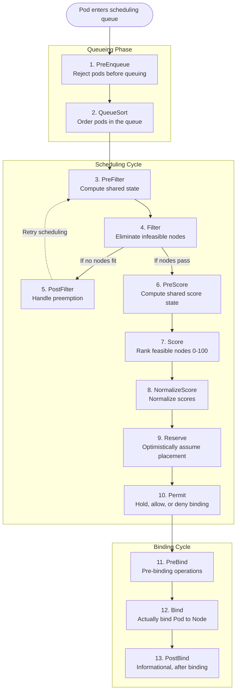
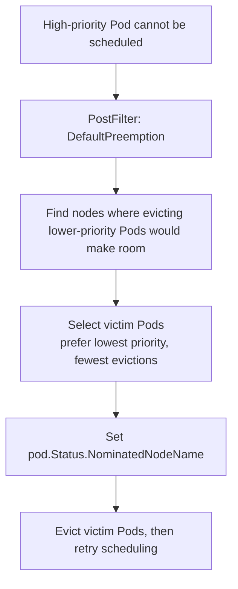

> **Складність**: `[СКЛАДНИЙ]` — розширення рішень планування Kubernetes
>
> **Час на проходження**: 4 години
>
> **Передумови**: Модуль 1.1 (Глибоке занурення в API), розуміння основ планування Pod'ів та впевнене читання інтерфейсів Go

## Результати навчання

Після завершення цього модуля ви зможете:

1. **Спроєктувати** власну архітектуру планування, яка використовує точки розширення Scheduling Framework для правил розміщення, що їх вбудовані affinity, taint'и, toleration'и та обмеження topology spread не можуть виразити чисто.
2. **Реалізувати** власні плагіни Filter і Score, які використовують стан кешу планувальника, `CycleState`, аргументи плагіна та сумісні з Kubernetes 1.35 інтерфейси фреймворку, не додаючи викликів до API-сервера на гарячому шляху.
3. **Оцінити**, чи належить вимога розміщення до вбудованих примітивів планування, до профілю планувальника, до окремого бінарного файлу планувальника чи до власного плагіна, скомпільованого в планувальник.
4. **Діагностувати** збої планування, читаючи події Pod'а, логи планувальника, назви профілів, ваги плагінів, стан leader election та поведінку точок розширення фреймворку.
5. **Порівняти** операційні ризики логіки Filter, Score, Reserve, Permit, Bind і PostFilter, коли важливі затримка планувальника, витіснення (preemption) та висока доступність.

## Чому цей модуль важливий

Hypothetical scenario: ваша платформна команда керує одним кластером Kubernetes для змішаних навантажень: чутливих до затримки API, пакетних завдань і Pod'ів для тренування на GPU. Стандартний планувальник коректно враховує CPU, пам'ять, томи, обмеження topology spread, taint'и, toleration'и та affinity, проте ваше найдорожче обладнання все одно лишається недовикористаним, бо планувальник не вміє міркувати про внутрішню мітку рівня, анотацію класу GPU та бізнес-правило, яке вважає частину вузлів преміальною потужністю. Ви можете додати ще міток і правил affinity, але врешті маніфести починають кодувати політику, місце якій у платформі, а не в кожному репозиторії застосунку.

Налаштування планувальника має значення тому, що розміщення — одне з небагатьох рішень площини управління, яке безпосередньо впливає на надійність, вартість і радіус ураження інциденту ще до того, як навантаження стартує. Погана політика допуску може відхилити маніфест, але погане рішення планування може прив'язати Pod до неправильного обладнання, неправильного домену відмов або вузла, який видається придатним лише тому, що політика була надто загальною. Scheduling Framework дає вам вузькі гачки всередині `kube-scheduler`, тож ви можете додавати специфічну для домену логіку, водночас повторно використовуючи апстрімну чергу, кеш, поведінку витіснення, механізм прив'язки, метрики та leader election.

Цей модуль навчає шляху від «мені потрібна власна поведінка розміщення» до придатного для розгортання вторинного планувальника. Ви збережете вбудовану модель планувальника, додасте плагін Score, який віддає перевагу вузлам із рівнями, додасте плагін Filter, який відхиляє несумісні вузли GPU, зареєструєте ці плагіни в бінарному файлі планувальника, налаштуєте профіль `KubeSchedulerConfiguration` і налагодите Pod'и, які запитують цей планувальник на ім'я. Мета не в тому, щоб кожен кластер виконував власний код планувальника; мета — знати, коли додаткова складність виправдана, і як тримати її малою, коли вона виправдана.

Найкорисніший спосіб мислення — ставитися до планувальника як до спільного сервісу прийняття рішень. Команди застосунків мають описувати намір навантаження, платформні команди — надавати безпечні політики розміщення, а планувальник — поєднувати ці вхідні дані з живим станом кластера. Коли власний код планувальника написано добре, він прибирає повторювані фрагменти політики з маніфестів застосунків і робить рішення легшим для централізованого тестування. Коли його написано погано, він ховає критичну поведінку в бінарному файлі, який розуміють лише кілька інженерів, тож цей модуль постійно повертається до спостережуваності, меж розгортання та режимів відмов.

## Scheduling Framework як контракт площини управління

Scheduling Framework — це механізм розширення всередині `kube-scheduler`. Він поділяє розміщення Pod'а на цикл планування, де планувальник вирішує, який вузол має запускати Pod, і цикл прив'язки, де це рішення записується назад до API-сервера. Цикл планування синхронний для одного Pod'а за раз, бо планувальник підтримує узгоджене бачення стану кластера, поки він фільтрує й оцінює вузли. Цикл прив'язки може виконуватися асинхронно, бо дорога частина вже не у виборі вузла; вона в самому записі до API та виконанні будь-яких фінальних гачків прив'язки.

Цей поділ — перше проєктне обмеження для авторів плагінів. Усе, що виконується раз на цикл планування, може дозволити собі більше роботи, ніж логіка, що виконується раз на вузол, а все в циклі прив'язки має вважати рішення про вузол уже прийнятим. Якщо ви помістите мережевий виклик усередину `Score`, він може виконатися на тисячах вузлів для одного Pod'а. Якщо ви помістите незворотні побічні ефекти всередину `Reserve`, ви маєте також реалізувати поведінку очищення на випадок збоїв пізніше в циклі. Код планувальника — це не звичайний код контролера; це код площини управління на гарячому шляху, і дрібні помилки із затримкою множаться швидко.

Фаза постановки в чергу заслуговує особливої уваги, бо вона визначає, коли Pod взагалі розглядається. Плагін `PreEnqueue` може тримати Pod'и поза активною чергою, доки не з'явиться потрібний стан, а плагін `QueueSort` впливає на те, який очікуваний Pod планується першим. Більшість роботи з власним планувальником починається пізніше — у фільтруванні та оцінюванні, бо поведінка черги змінює справедливість між навантаженнями. Якщо ви все ж торкаєтеся постановки в чергу, визначте контракт справедливості явно: які Pod'и чекають, які Pod'и проходять уперед і як оператори можуть пояснити цю поведінку під час збою.



Діаграму найлегше читати як набір контрактів, а не як меню місць, куди класти код. `PreFilter` і `PreScore` призначені для підготовки на рівні Pod'а. `Filter` — для жорстких рішень про придатність, де вузол або лишається кандидатом, або зникає з розгляду. `Score` — для переваги, де кожен придатний вузол отримує значення в діапазоні фреймворку. `NormalizeScore` — для перетворення внутрішньої шкали плагіна на спільний діапазон. `Reserve` і `Permit` — для координації перед прив'язкою, тоді як `PreBind`, `Bind` і `PostBind` — для фінального шляху запису.

Фреймворк планувальника також дає вам корисну ментальну модель для оцінювання продуктивності. Запитайте, як часто виконується гачок, скільки стану він читає і чи має збій блокувати планування, чи лише зменшувати перевагу. Гачок «раз на Pod» може розбирати анотації, валідувати конфігурацію або будувати невелику довідкову мапу. Гачок «раз на вузол» має бути ближчим до пошуку в таблиці та порівняння. Гачок прив'язки слід вважати короткою транзакцією, бо Pod уже обрано для вузла, і користувач чекає, поки це рішення стане реальним.

| Точка розширення | Коли виконується | Що робить | Тип повернення |
|----------------|-------------|-------------|-------------|
| **PreEnqueue** | Перед постановкою в чергу | Не пускає Pod'и в чергу | Дозволити/Відхилити |
| **QueueSort** | Упорядкування черги | Пріоритезує Pod'и в черзі | Функція Less |
| **PreFilter** | Раз на цикл | Обчислює спільний стан фільтра | Status |
| **Filter** | На кожен вузол | Усуває непридатні вузли | Status (пройшов/ні) |
| **PostFilter** | Коли жоден вузол не підходить | Пробує витіснення | Status + номінований вузол |
| **PreScore** | Раз на цикл | Обчислює спільний стан оцінки | Status |
| **Score** | На кожен вузол | Ранжує вузли 0-100 | Score + Status |
| **NormalizeScore** | Після всіх оцінок | Нормалізує до [0,100] | Status |
| **Reserve** | Після вибору вузла | Оптимістична резервація | Status |
| **Permit** | Перед прив'язкою | Схвалити/відхилити/чекати | Status + час очікування |
| **PreBind** | Перед фактичною прив'язкою | Дії перед прив'язкою | Status |
| **Bind** | Прив'язка | Прив'язує Pod до вузла | Status |
| **PostBind** | Після прив'язки | Очищення, сповіщення | void |

Вбудований планувальник уже використовує багато плагінів, і більшість кластерів мають вичерпати ці можливості, перш ніж писати власний код. `NodeResourcesFit` обробляє придатність за CPU та пам'яттю, `VolumeBinding` обробляє обмеження сховища, `PodTopologySpread` обробляє розподіл за доменами відмов, а `TaintToleration` обробляє патерни резервування вузлів. Власний плагін доречний, коли правило залежить від даних або семантики, яких Kubernetes не може представити як звичайне обмеження Pod'а, не змусивши кожного автора навантаження тягнути платформну політику у своєму YAML.

Саме тому вбудовані примітиви лишаються базовою лінією. Node affinity чудово підходить, коли власник навантаження справді знає потрібну мітку вузла. Taint'и й toleration'и чудові, коли платформа володіє пулом вузлів і лише обрані навантаження можуть туди потрапити. Обмеження topology spread чудові, коли правило домену відмов можна виразити мітками, що вже існують. Власний плагін планувальника стає привабливим, коли правило централізоване, повторно використовуване, версіоноване та достатньо тонке, щоб копіювання його в кожне навантаження створювало більше ризику, ніж одноразова компіляція в планувальник.

| Плагін | Точки розширення | Що робить |
|--------|-----------------|-------------|
| NodeResourcesFit | PreFilter, Filter | Перевіряє доступність CPU/пам'яті |
| NodePorts | PreFilter, Filter | Перевіряє доступність портів |
| NodeAffinity | Filter, Score | Правила node affinity/anti-affinity |
| PodTopologySpread | PreFilter, Filter, PreScore, Score | Обмеження topology spread |
| TaintToleration | Filter, PreScore, Score | Зіставлення taint/toleration |
| InterPodAffinity | PreFilter, Filter, PreScore, Score | Pod affinity/anti-affinity |
| VolumeBinding | PreFilter, Filter, Reserve, PreBind | Прив'язка PV/PVC |
| DefaultPreemption | PostFilter | Витісняє Pod'и нижчого пріоритету |
| ImageLocality | Score | Віддає перевагу вузлам із кешованими образами |
| BalancedAllocation | Score | Балансує використання ресурсів між вузлами |

Зупиніться та передбачте: якщо кластер має три тисячі вузлів, а плагін Score читає ConfigMap з API-сервера для кожного вузла, що станеться із затримкою планування під час сплеску розгортань? Важлива відповідь — не просто «стане повільніше»; API-сервер і планувальник стають зв'язаними в найгарячішому циклі розміщення Pod'ів. Scheduling Framework уникає цього патерну, даючи плагінам доступ до знімків планувальника та спільного стану циклу, тож дорога або спільна робота відбувається поза функцією «на вузол» завжди, коли це можливо.

Тому кеш планувальника є частиною контракту плагіна. Коли ви читаєте інформацію про вузол через хендл фреймворку, ви читаєте знімок спостережуваного стану кластера, який зберігає планувальник, а не виконуєте запит до API на кожне рішення. Ця відмінність суттєва і для масштабу, і для коректності. Бачення планувальника змінюється в міру того, як watch'і доставляють оновлення, і фреймворк узгоджує це бачення з циклами планування. Якщо ваш плагін залежить від платформних даних, які ще не видно через відстежувані об'єкти Kubernetes, побудуйте контролер, що проєктує ці дані в мітки або ресурси, перш ніж вони знадобляться планувальнику.

Інший практичний наслідок — результати плагіна мають бути пояснюваними з об'єктів Kubernetes. Якщо Pod відхилено, бо вузлу бракує `gpu.kubedojo.io/type`, оператор має змогти оглянути вузол і побачити відсутню мітку. Якщо Pod'у віддано перевагу, бо вузол має преміальний рівень, мітка має бути видимою та належати відомому шляху автоматизації. Приховані джерела даних роблять рішення планування довільними на вигляд, а довільна поведінка розміщення дуже важка в експлуатації під час інцидентів.

## Проєктування плагінів навколо жорстких обмежень і м'яких переваг

Власне планування починається з твердження про розміщення, а не з коду Go. Жорстке твердження звучить як «цей Pod ніколи не повинен запускатися на вузлі без схваленого класу GPU». М'яке твердження звучить як «цей Pod має віддавати перевагу преміальним вузлам, коли вони доступні». Перше належить до плагіна Filter, бо невідповідний вузол треба прибрати з набору кандидатів; друге належить до плагіна Score, бо вузол може все ще бути прийнятним, коли потужність обмежена. Плутання цих двох понять — найпоширеніша проєктна помилка в розширеннях планувальника.

Різниця між «має» і «мусить» — не лише граматика. Жорстке обмеження змінює поведінку доступності застосунку, бо Pod лишатиметься в стані Pending, якщо жоден вузол не пройде фільтр. Це може бути правильним для регульованих даних, апаратної сумісності або ліцензійних обмежень. М'яка перевага змінює ранжування придатних вузлів, тож навантаження все одно може запуститися, коли ідеальна потужність недоступна. Це зазвичай краще для вартості, локальності та підказок щодо продуктивності. Кожен огляд проєкту плагіна має змусити власника політики сказати, який режим відмов він хоче.

Будуючи власний планувальник, ви не змінюєте сирцевий код Kubernetes напряму. Ви створюєте модуль Go, імпортуєте апстрімний фреймворк планувальника для тієї версії Kubernetes, на яку орієнтуєтеся, реєструєте свої плагіни в команді планувальника та компілюєте бінарний файл планувальника. Цей бінарний файл може працювати як другий планувальник або надавати кілька профілів під різними значеннями `schedulerName`. Розкладка проєкту нижче тримає код плагінів, тести, маніфести розгортання й точку входу команди достатньо окремо, щоб виробнича команда могла оглянути радіус ураження кожної зміни.

```text
scheduler-plugins/
├── go.mod
├── go.sum
├── cmd/
│   └── scheduler/
│       └── main.go            # Entry point
├── pkg/
│   └── plugins/
│       └── nodepreference/
│           ├── nodepreference.go   # Plugin implementation
│           └── nodepreference_test.go
└── manifests/
    ├── scheduler-config.yaml  # KubeSchedulerConfiguration
    └── deployment.yaml        # Secondary scheduler deployment
```

Плагін Score нижче ранжує вузли на основі мітки рівня. Вузли з міткою `scheduling.kubedojo.io/tier: premium` отримують вищу оцінку, ніж `standard` або немарковані вузли, тож критично важливі навантаження дрейфують до надійнішого обладнання, не змушуючи кожного автора навантаження писати велику секцію node affinity. Плагін читає зі спільного знімка планувальника, а не з API-сервера, і приймає оцінки як структуровані аргументи, тож оператори можуть налаштовувати політику через конфігурацію, а не перекомпілювати бінарний файл на кожну зміну.

Інтерфейси плагінів фреймворку планувальника еволюціонують між мінорними версіями Kubernetes; звіряйте точні сигнатури методів із godoc для версії вашого кластера, коли будуєте out-of-tree плагіни. Приклади тут орієнтовані на Kubernetes 1.35.

Цей приклад навмисно використовує мітки вузлів, бо мітки видимі, кешовані та вже є частиною словника планування Kubernetes. У виробничій системі такі мітки мають підтримуватися автоматизацією, а не людьми, що набирають команди під час інциденту. Контролер інвентаризації вузлів міг би встановлювати мітку рівня на основі класу обладнання, стану обслуговування чи метаданих закупівлі. Плагін планувальника має споживати цей нормалізований сигнал, а не ставати відповідальним за виявлення фактів про обладнання самостійно. Тримання виявлення поза планувальником робить плагін простішим і зберігає затримку розміщення передбачуваною.

```go
// pkg/plugins/nodepreference/nodepreference.go
package nodepreference

import (
	"context"
	"fmt"

	v1 "k8s.io/api/core/v1"
	metav1 "k8s.io/apimachinery/pkg/apis/meta/v1"
	"k8s.io/apimachinery/pkg/runtime"
	"k8s.io/kubernetes/pkg/scheduler/framework"
)

const (
	// Name is the name of the plugin.
	Name = "NodePreference"

	// LabelKey is the node label key used for scoring.
	LabelKey = "scheduling.kubedojo.io/tier"
)

// NodePreference scores nodes based on a tier label.
type NodePreference struct {
	handle framework.Handle
	args   NodePreferenceArgs
}

// NodePreferenceArgs are the arguments for the plugin.
type NodePreferenceArgs struct {
	metav1.TypeMeta `json:",inline"`

	// TierScores maps tier label values to scores (0-100).
	TierScores map[string]int64 `json:"tierScores"`

	// DefaultScore is the score for nodes without the tier label.
	DefaultScore int64 `json:"defaultScore"`
}

var _ framework.ScorePlugin = &NodePreference{}
var _ framework.EnqueueExtensions = &NodePreference{}

// Name returns the name of the plugin.
func (pl *NodePreference) Name() string {
	return Name
}

// Score scores a node based on its tier label.
func (pl *NodePreference) Score(
	ctx context.Context,
	state framework.CycleState,
	pod *v1.Pod,
	nodeInfo framework.NodeInfo,
) (int64, *framework.Status) {

	node := nodeInfo.Node()
	if node == nil {
		return 0, framework.AsStatus(fmt.Errorf("node info has no node"))
	}

	// Check for the tier label.
	tierValue, exists := node.Labels[LabelKey]
	if !exists {
		return pl.args.DefaultScore, nil
	}

	// Look up the score for this tier.
	score, found := pl.args.TierScores[tierValue]
	if !found {
		return pl.args.DefaultScore, nil
	}

	return score, nil
}

// ScoreExtensions returns the score extension functions.
func (pl *NodePreference) ScoreExtensions() framework.ScoreExtensions {
	return pl
}

// NormalizeScore normalizes the scores to [0, MaxNodeScore].
func (pl *NodePreference) NormalizeScore(
	ctx context.Context,
	state framework.CycleState,
	pod *v1.Pod,
	scores framework.NodeScoreList,
) *framework.Status {

	// Find max score.
	var maxScore int64
	for i := range scores {
		if scores[i].Score > maxScore {
			maxScore = scores[i].Score
		}
	}

	// Normalize to [0, 100].
	if maxScore == 0 {
		return nil
	}

	for i := range scores {
		scores[i].Score = (scores[i].Score * framework.MaxNodeScore) / maxScore
	}

	return nil
}

// EventsToRegister returns the events that trigger rescheduling.
func (pl *NodePreference) EventsToRegister(_ context.Context) ([]framework.ClusterEventWithHint, error) {
	return []framework.ClusterEventWithHint{
		{ClusterEvent: framework.ClusterEvent{Resource: framework.Node, ActionType: framework.Add | framework.Update}},
	}, nil
}

// New creates a new NodePreference plugin.
func New(ctx context.Context, obj runtime.Object, handle framework.Handle) (framework.Plugin, error) {
	args, ok := obj.(*NodePreferenceArgs)
	if !ok {
		return nil, fmt.Errorf("want args to be of type NodePreferenceArgs, got %T", obj)
	}
	// Typed plugin args must be registered with the scheduler component-config scheme (as kubernetes-sigs/scheduler-plugins does via apis/config AddToScheme), or the framework passes *runtime.Unknown and this assertion fails at startup.

	return &NodePreference{
		handle: handle,
		args:   *args,
	}, nil
}
```

Ця реалізація ілюструє ключовий патерн Score: тримайте функцію «на вузол» дешевою, толеруйте відсутні дані та повертайте детерміноване значення. Плагін не намагається прив'язати Pod, змінити вузол чи оновити мітки. Він просто відповідає «наскільки бажаний цей вузол для цього Pod'а за моєю політикою?» і дозволяє решті планувальника поєднати цю відповідь з іншими плагінами Score. Перш ніж запускати це у великому кластері, який розподіл вихідних значень ви очікували б, якщо преміальні вузли повні, а стандартні вузли ще мають потужність?

Функція нормалізації мала, але її проєкт має значення. Вона масштабує найвищу налаштовану оцінку до максимуму фреймворку та масштабує решту пропорційно. Це розумно, коли значення рівнів є відносними перевагами, але може здивувати вас, якщо налаштований максимальний рівень відсутній серед поточних придатних вузлів. Наприклад, якщо фільтрування проходять лише стандартні та burstable вузли, стандартний може нормалізуватися до найвищої оцінки для цього циклу. Це не баг; це означає «найкращий серед придатних вузлів», а не «глобально преміальний». Тести мають охоплювати обидва тлумачення, щоб оператори знали, що означає оцінка.

Аргументи плагіна також потребують консервативних значень за замовчуванням. Приклад дає немаркованим вузлам низьку оцінку за замовчуванням, що тримає їх придатними, але менш привабливими. Інше середовище могло б вважати немарковані вузли дрейфом конфігурації та відхиляти їх через плагін Filter. Жоден вибір не є універсально правильним. Важливо, щоб поведінка була явною, спостережуваною та узгодженою з ризиком хибного розміщення. Для переваги за вартістю оцінка за замовчуванням зазвичай прийнятна. Для розміщення на межі безпеки відсутні метадані ймовірно мають відмовляти закрито з чітким повідомленням події.

Плагін Filter суворіший. Фільтр GPU нижче читає анотацію Pod'а в `PreFilter`, зберігає результат у `CycleState`, а потім перевіряє мітки GPU кожного вузла в `Filter`. Сенс `PreFilter` не лише в продуктивності; він також робить бізнес-правило явним. Якщо Pod не запитує тип GPU, плагін пропускає сам себе, що утримує звичайні навантаження від випадкового блокування специфічною для GPU політикою.

Об'єкт `CycleState` — це чернетковий блокнот фреймворку для одного циклу планування. Він дозволяє `PreFilter` розібрати та валідувати дані рівня Pod'а один раз, а потім дозволяє `Filter` повторно використати результат для кожного вузла. Це безпечніше, ніж повторне розбирання анотацій у циклі «на вузол», і чистіше, ніж зберігання стану «на Pod» у структурі плагіна, яка може бути спільною між циклами планування. Вважайте `CycleState` незмінним, щойно почалася фаза «на вузол», і тримайте збережені дані достатньо малими, щоб вони не стали прихованою витратою пам'яті під час тиску планування.

```go
// pkg/plugins/gpufilter/gpufilter.go
package gpufilter

import (
	"context"
	"fmt"
	"strconv"

	v1 "k8s.io/api/core/v1"
	"k8s.io/apimachinery/pkg/runtime"
	"k8s.io/kubernetes/pkg/scheduler/framework"
)

const (
	Name             = "GPUFilter"
	GPUCountLabel    = "gpu.kubedojo.io/count"
	GPUTypeLabel     = "gpu.kubedojo.io/type"
	PodGPUAnnotation = "scheduling.kubedojo.io/gpu-type"
)

type GPUFilter struct {
	handle framework.Handle
}

var _ framework.FilterPlugin = &GPUFilter{}
var _ framework.PreFilterPlugin = &GPUFilter{}

func (pl *GPUFilter) Name() string {
	return Name
}

// PreFilter checks if the pod needs GPU scheduling at all.
type preFilterState struct {
	requiredGPUType string
	needsGPU        bool
}

func (s *preFilterState) Clone() framework.StateData {
	return &preFilterState{
		requiredGPUType: s.requiredGPUType,
		needsGPU:        s.needsGPU,
	}
}

const preFilterStateKey = "PreFilter" + Name

func (pl *GPUFilter) PreFilter(
	ctx context.Context,
	state framework.CycleState,
	pod *v1.Pod,
	nodes []framework.NodeInfo,
) (*framework.PreFilterResult, *framework.Status) {

	gpuType := pod.Annotations[PodGPUAnnotation]
	pfs := &preFilterState{
		requiredGPUType: gpuType,
		needsGPU:        gpuType != "",
	}

	state.Write(preFilterStateKey, pfs)

	if !pfs.needsGPU {
		// Skip the filter entirely; this pod does not need GPU placement.
		return nil, framework.NewStatus(framework.Skip)
	}

	return nil, nil
}

func (pl *GPUFilter) PreFilterExtensions() framework.PreFilterExtensions {
	return nil
}

// Filter checks if a node has the required GPU type and available GPUs.
func (pl *GPUFilter) Filter(
	ctx context.Context,
	state framework.CycleState,
	pod *v1.Pod,
	nodeInfo framework.NodeInfo,
) *framework.Status {

	// Read pre-filter state.
	data, err := state.Read(preFilterStateKey)
	if err != nil {
		return framework.AsStatus(fmt.Errorf("reading pre-filter state: %w", err))
	}
	pfs := data.(*preFilterState)

	if !pfs.needsGPU {
		return nil
	}

	node := nodeInfo.Node()

	// Check GPU type.
	nodeGPUType, exists := node.Labels[GPUTypeLabel]
	if !exists {
		return framework.NewStatus(framework.Unschedulable,
			fmt.Sprintf("node %s has no GPU type label", node.Name))
	}

	if nodeGPUType != pfs.requiredGPUType {
		return framework.NewStatus(framework.Unschedulable,
			fmt.Sprintf("node has GPU type %q, pod requires %q",
				nodeGPUType, pfs.requiredGPUType))
	}

	// Check GPU count.
	gpuCountStr, exists := node.Labels[GPUCountLabel]
	if !exists {
		return framework.NewStatus(framework.Unschedulable,
			fmt.Sprintf("node %s has no GPU count label", node.Name))
	}

	gpuCount, err := strconv.Atoi(gpuCountStr)
	if err != nil || gpuCount <= 0 {
		return framework.NewStatus(framework.Unschedulable,
			fmt.Sprintf("node %s has invalid GPU count: %s", node.Name, gpuCountStr))
	}

	return nil
}

func New(ctx context.Context, obj runtime.Object, handle framework.Handle) (framework.Plugin, error) {
	return &GPUFilter{handle: handle}, nil
}
```

Зверніть увагу, як плагін Filter повертає пояснювальні статуси `Unschedulable` замість загальних збоїв. Ці повідомлення стають сировиною для подій налагодження і допомагають відрізнити «вузлів GPU не існує» від «вузли GPU існують, але мають неправильну мітку типу». Який підхід ви обрали б тут і чому: суворий Filter, який відхиляє вузли без міток, чи плагін Score, який віддає перевагу маркованим вузлам, але все ж допускає немарковану потужність? Відповідь залежить від того, чи представляє політика безпеку, відповідність вимогам, чи лише оптимізацію вартості.

Є ще одна тонкість у прикладі GPU: фільтр перевіряє наявність мітки та значення мітки, але не реалізує фактичного обліку GPU. У реальному кластері доступність GPU зазвичай представлена через ресурси плагіна пристроїв, такі як `nvidia.com/gpu`, і вбудовані плагіни ресурсів беруть участь у припасуванні. Власний фільтр має доповнювати ці механізми, а не заміняти їх. Використовуйте власну мітку, щоб виразити платформну семантику на кшталт класу GPU чи топології, і дозвольте обліку ресурсів Kubernetes вирішувати, чи має вузол доступні для виділення пристрої для запиту Pod'а.

Тестування плагіна Filter має включати і позитивні, і негативні випадки. Прохідний тест доводить лише те, що щасливий шлях працює. Негативні тести мають охоплювати відсутні анотації Pod'а, відсутні мітки вузла, невідповідні типи GPU, зіпсовані мітки кількості та звичайні не-GPU Pod'и, які мають пропустити плагін. Якість повідомлень події тут важлива, бо саме ці повідомлення бачать користувачі, коли їхні Pod'и в стані Pending. Точне повідомлення може перетворити тікет про планування на самостійне виправлення мітки.

## Збирання, реєстрація та постачання бінарного файлу планувальника

Бінарний файл планувальника — це звичайний код Go на точці входу та спеціалізований код фреймворку за реєстром. Щоб скомпілювати власний планувальник, створіть екземпляр апстрімної команди планувальника та зареєструйте кожен плагін за іменем із фабричною функцією. Ім'я, яке ви реєструєте тут, має збігатися з іменем, використаним у `KubeSchedulerConfiguration`, а об'єкт аргументів, переданий у `New`, має відповідати очікуваному типу плагіна під час виконання. Багато збоїв «плагін не виконується» — це просто розбіжності імен між `main.go`, конфігурацією та `schedulerName` Pod'а.

Реєстрація — це також місце, де ви вирішуєте, який код доступний профілям. Профіль може вмикати чи вимикати плагіни, але не може використати плагін, який не було скомпільовано в бінарний файл. Це означає, що один бінарний файл, який обслуговує кілька профілів, має навмисно включати спільний набір плагінів, а конфігурація профілю має вирішувати, які політики застосовуються до яких Pod'ів. Якщо двом командам потрібні несумісні версії плагіна, це сигнал розглянути окремі бінарні файли планувальника або стабілізувати контракт плагіна, перш ніж ділитися ним.

```go
// cmd/scheduler/main.go
package main

import (
	"os"

	"k8s.io/component-base/cli"
	"k8s.io/kubernetes/cmd/kube-scheduler/app"

	"github.com/kubedojo/scheduler-plugins/pkg/plugins/gpufilter"
	"github.com/kubedojo/scheduler-plugins/pkg/plugins/nodepreference"
)

func main() {
	command := app.NewSchedulerCommand(
		app.WithPlugin(nodepreference.Name, nodepreference.New),
		app.WithPlugin(gpufilter.Name, gpufilter.New),
	)

	code := cli.Run(command)
	os.Exit(code)
}
```

Узгодження версій не є необов'язковим. Плагіни планувальника імпортують внутрішні компоненти Kubernetes, а ці пакети дотримуються релізного потягу Kubernetes, а не стабільного контракту сторонньої бібліотеки. Збирайте бінарний файл проти тієї самої мінорної версії, що й кластер, на який орієнтуєтеся; для цього модуля приклади використовують Kubernetes v1.35.0. Якщо ваша платформа оновлює кластери, бінарний файл планувальника має проходити той самий процес тестування й розгортання, що й площина управління, бо плагін, скомпільований проти неправильного графа залежностей, може зазнати збою ще до того, як досягне вашої логіки розміщення.

Це відрізняється від більшості розробки контролерів, де сумісність client-go дає вам більше простору між мінорними версіями. Плагіни планувальника сидять ближче до внутрішніх компонентів kube-scheduler, тож найбезпечніший процес оновлення — перезібрати, прогнати юніт-тести, прогнати симуляцію планування або інтеграційний тест на базі kind, а потім розгорнути профіль планувальника на невеликий клас навантажень. Якщо для кластера заплановано оновлення площини управління, власний планувальник має бути частиною того самого чек-листа готовності. Інакше ви можете випадково оновити площину управління, лишивши критичний компонент розміщення позаду.

```bash
# Initialize Go module
cd ~/extending-k8s/scheduler-plugins
go mod init github.com/kubedojo/scheduler-plugins

# Important: pin to the same Kubernetes version as your cluster
K8S_VERSION=v1.35.0
go get k8s.io/kubernetes@$K8S_VERSION
go get k8s.io/component-base@$K8S_VERSION

go mod tidy
go build -o custom-scheduler ./cmd/scheduler/
```

Контейнеризація планувальника має відчуватися як постачання будь-якого іншого невеликого компонента площини управління: відтворюваний етап збирання, мінімальний образ середовища виконання, виконання від імені непривілейованого користувача та тег образу, який можна просувати між середовищами. Планувальнику потрібні дозволи API, а не інструменти оболонки, тож distroless-середовище виконання є розумним за замовчуванням. Якщо ваша організація вимагає підписаних образів або SBOM, застосовуйте ці засоби контролю тут так само, як для контролерів допуску та контролерів, що записують стан кластера.

Тегування образів має бути нудним і відстежуваним. Уникайте змінних тегів для виробничих розгортань планувальника, бо розгортання коду планувальника змінює поведінку розміщення кластера навіть тоді, коли жоден маніфест застосунку не змінюється. Тегуйте образи версією, комітом або ідентифікатором релізу, записуйте мінорну версію Kubernetes у нотатки до релізу та тримайте `KubeSchedulerConfiguration` у системі контролю версій поруч із версією бінарного файлу. Коли огляд інциденту запитає, чому Pod перемістився до іншого класу вузлів, вам потрібно знати і код плагіна, і конфігурацію профілю, що були активні на той момент.

```dockerfile
# Dockerfile
FROM golang:1.24 AS builder
WORKDIR /workspace
COPY go.mod go.sum ./
RUN go mod download
COPY . .
RUN CGO_ENABLED=0 GOOS=linux go build -o custom-scheduler ./cmd/scheduler/

FROM gcr.io/distroless/static:nonroot
COPY --from=builder /workspace/custom-scheduler /custom-scheduler
USER 65532:65532
ENTRYPOINT ["/custom-scheduler"]
```

```bash
docker build -t custom-scheduler:v2.0.0 .
kind load docker-image custom-scheduler:v2.0.0 --name scheduler-lab
```

Сценарій вправи: ви успішно збираєте образ, розгортаєте його в `kube-system` і бачите дві справні репліки, але Pod'и, що запитують `custom-scheduler`, лишаються в стані Pending. Не починайте зі зміни коду плагіна. Спершу перевірте, чи вдалося leader election, чи дозволяє RBAC прив'язку Pod'ів, чи був змонтований файл конфігурації та чи дорівнює ім'я профілю значенню `spec.schedulerName` Pod'а. Код планувальника часто звинувачують у збоях, спричинених проводкою розгортання.

Найшвидший шлях сортування — відокремити «планувальник не запущено» від «планувальник запущено, але не прив'язує» від «планувальник прив'язує за політикою, якої я не очікував». Цикл збоїв зазвичай вказує на проблему з образом, аргументами, конфігурацією або залежностями. Справний планувальник із помилками RBAC у логах вказує на дозволи. Справний планувальник, що ігнорує Pod'и, зазвичай вказує на розбіжність `schedulerName`. Справний планувальник, що прив'язує до несподіваних вузлів, вказує на мітки, ваги плагінів, нормалізацію або взаємодію з вбудованими плагінами Score.

## Налаштування профілів, RBAC та опт-ину Pod'ів

`KubeSchedulerConfiguration` — це площина управління для вашого власного бінарного файлу. Вона вирішує, які профілі існують, які плагіни ввімкнено чи вимкнено в кожній точці розширення, які аргументи передаються плагінам і як зважуються плагіни Score. Профіль адресується через `schedulerName`, тож Pod, який каже `schedulerName: custom-scheduler`, запитує профіль із цим точним іменем, а не просто будь-яке розгортання планувальника, що випадково містить власний код.

Конфігурацію слід оглядати з тією самою серйозністю, що й код, бо вона змінює поведінку без кроку компіляції. Увімкнення плагіна Filter може зробити наявні Pod'и непланованими. Підвищення ваги Score може зсунути трафік до меншого пулу вузлів. Вимкнення вбудованого плагіна може прибрати захист, який команди застосунків вважали завжди наявним. Перш ніж зміна профілю досягне виробництва, протестуйте її на репрезентативних Pod'ах і порівняйте вибір вузлів із попереднім профілем, щоб компроміс був видимим.

```yaml
# manifests/scheduler-config.yaml
apiVersion: kubescheduler.config.k8s.io/v1
kind: KubeSchedulerConfiguration
leaderElection:
  leaderElect: true
  resourceNamespace: kube-system
  resourceName: custom-scheduler
profiles:
- schedulerName: custom-scheduler     # Pods reference this name
  plugins:
    # Enable our custom plugins
    filter:
      enabled:
      - name: GPUFilter
    score:
      enabled:
      - name: NodePreference
        weight: 25                     # Weight relative to other score plugins
    # Disable built-in plugins we're replacing
    # (usually you keep them all and just add yours)

  pluginConfig:
  - name: NodePreference
    args:
      tierScores:
        premium: 100
        standard: 50
        burstable: 20
      defaultScore: 10
```

Поле ваги заслуговує на ретельне ставлення. Під час оцінювання кілька плагінів видають значення між нулем і сотнею, а планувальник поєднує ці значення, використовуючи налаштовані ваги. Власний плагін із дуже високою вагою може переважити вбудовані плагіни на кшталт image locality, balanced allocation та inter-pod affinity. Це може бути правильним, коли політика явна, але небезпечним, коли плагін — лише зручна перевага. Здоровий огляд запитує, що ніколи не можна порушувати, чому зазвичай слід віддавати перевагу і що має лишатися лише вирішувачем нічиєї.

Хороша вправа з налаштування ваг починається з прикладів, а не з інтуїції. Виберіть кілька Pod'ів, визначте вузли, яким ви очікуєте, що вони віддадуть перевагу, та обчисліть, як власна оцінка взаємодіє з вбудованими оцінками за легкого та важкого навантаження. Потім змінюйте одну вагу за раз і спостерігайте, чи змінюється розміщення з правильної причини. Якщо вага має бути надзвичайно високою, щоб дати бажаний результат, переосмисліть, чи правило справді є перевагою, чи воно мало бути обмеженням Filter.

```text
final_score(node) = SUM(plugin_score(node) * plugin_weight) / SUM(plugin_weights)
```

```yaml
plugins:
  score:
    enabled:
    - name: NodeResourcesFit
      weight: 1                    # Default
    - name: NodePreference
      weight: 25                   # 25x more important than default
    - name: InterPodAffinity
      weight: 2                    # 2x default
```

Вторинний планувальник працює безпечно поруч зі стандартним планувальником, коли Pod'и явно виявляють згоду. Leader election усе одно важливий, бо кілька реплік одного профілю планувальника не повинні змагатися за прив'язку того самого Pod'а. Маніфест нижче тримає планувальник у `kube-system`, монтує конфігурацію з ConfigMap, надає health-проби та дає компоненту консервативні запити ресурсів, щоб він не конкурував агресивно з навантаженнями застосунків.

Запуск планувальника як Deployment робить розгортання звичним, але не робить компонент малозначущим. Зламаний профіль планувальника впливає на кожен Pod, що його запитує, а зламане налаштування leader election може лишити Pod'и в стані Pending навіть тоді, коли репліки виглядають справними на перший погляд. Перевірки готовності мають доводити, що процес планувальника живий, тоді як операційні дашборди мають також відстежувати спроби планування, помилки та Pod'и в стані Pending за іменем планувальника. Здоров'я — це не лише «Pod запущено»; здоров'я — це «планувальник робить коректний поступ із прив'язкою».

```yaml
# manifests/deployment.yaml
apiVersion: apps/v1
kind: Deployment
metadata:
  name: custom-scheduler
  namespace: kube-system
  labels:
    component: custom-scheduler
spec:
  replicas: 2                    # HA with leader election
  selector:
    matchLabels:
      component: custom-scheduler
  template:
    metadata:
      labels:
        component: custom-scheduler
    spec:
      serviceAccountName: custom-scheduler
      containers:
      - name: scheduler
        image: custom-scheduler:v2.0.0
        command:
        - /custom-scheduler
        - --config=/etc/scheduler/config.yaml
        - --v=2
        volumeMounts:
        - name: config
          mountPath: /etc/scheduler
        resources:
          requests:
            cpu: 100m
            memory: 128Mi
          limits:
            cpu: 500m
            memory: 256Mi
        livenessProbe:
          httpGet:
            path: /healthz
            port: 10259
            scheme: HTTPS
          initialDelaySeconds: 15
        readinessProbe:
          httpGet:
            path: /healthz
            port: 10259
            scheme: HTTPS
      volumes:
      - name: config
        configMap:
          name: custom-scheduler-config
---
apiVersion: v1
kind: ConfigMap
metadata:
  name: custom-scheduler-config
  namespace: kube-system
data:
  config.yaml: |
    apiVersion: kubescheduler.config.k8s.io/v1
    kind: KubeSchedulerConfiguration
    leaderElection:
      leaderElect: true
      resourceNamespace: kube-system
      resourceName: custom-scheduler
    profiles:
    - schedulerName: custom-scheduler
      plugins:
        filter:
          enabled:
          - name: GPUFilter
        score:
          enabled:
          - name: NodePreference
            weight: 25
      pluginConfig:
      - name: NodePreference
        args:
          tierScores:
            premium: 100
            standard: 50
            burstable: 20
          defaultScore: 10
```

Поверхня RBAC широка, бо планувальник читає стан кластера, відстежує Pod'и та вузли, створює прив'язки Pod'ів, записує події та бере участь у leader election через Lease'и. Ставтеся до цього як до привілейованої ролі площини управління й уникайте додавання дозволів, не пов'язаних із плануванням. Якщо плагіну потрібні дані з власного ресурсу, додайте вузькі дозволи на читання цього ресурсу та задокументуйте, чому планувальник має його читати; не розв'язуйте помилки дозволів, надаючи широкий wildcard-доступ.

Дискусія про найменші привілеї може бути незручною, бо планувальник справді потребує потужних дієслів на чутливих ресурсах. Правильний компроміс — не недонадати дозволи планувальнику, доки він не зазнає збою, а тримати набір дозволів прив'язаним до спостережуваних обов'язків планувальника. Прив'язка Pod'а вимагає доступу create до `pods/binding`. Запис подій вимагає дозволів на запис подій. Leader election вимагає дозволів Lease в обраному просторі імен. Читання власного ресурсу має бути обґрунтоване проєктом плагіна й покрите тестами, які зазнають збою за відсутності дозволу.

```yaml
# manifests/rbac.yaml
apiVersion: v1
kind: ServiceAccount
metadata:
  name: custom-scheduler
  namespace: kube-system
---
apiVersion: rbac.authorization.k8s.io/v1
kind: ClusterRole
metadata:
  name: custom-scheduler
rules:
- apiGroups: [""]
  resources: ["pods", "nodes", "namespaces", "configmaps", "endpoints"]
  verbs: ["get", "list", "watch"]
- apiGroups: [""]
  resources: ["pods/binding", "pods/status"]
  verbs: ["create", "update", "patch"]
- apiGroups: [""]
  resources: ["events"]
  verbs: ["create", "patch", "update"]
- apiGroups: ["coordination.k8s.io"]
  resources: ["leases"]
  verbs: ["get", "list", "watch", "create", "update", "patch"]
- apiGroups: ["apps"]
  resources: ["replicasets", "statefulsets"]
  verbs: ["get", "list", "watch"]
- apiGroups: ["policy"]
  resources: ["poddisruptionbudgets"]
  verbs: ["get", "list", "watch"]
- apiGroups: ["storage.k8s.io"]
  resources: ["storageclasses", "csinodes", "csidrivers", "csistoragecapacities"]
  verbs: ["get", "list", "watch"]
---
apiVersion: rbac.authorization.k8s.io/v1
kind: ClusterRoleBinding
metadata:
  name: custom-scheduler
roleRef:
  apiGroup: rbac.authorization.k8s.io
  kind: ClusterRole
  name: custom-scheduler
subjects:
- kind: ServiceAccount
  name: custom-scheduler
  namespace: kube-system
```

Pod'и виявляють згоду через `spec.schedulerName`. Якщо поле пропущено, Pod обробляє стандартний планувальник; якщо поле називає планувальник, який не запущено, Pod лишається в стані Pending, доки відповідний планувальник не прив'яже його. Kubernetes не повертається до стандартного планувальника для Pod'а, що запитав інше ім'я планувальника, бо повернення знову ввело б змагання за прив'язку та порушило б явний контракт розміщення Pod'а.

Цей явний опт-ин корисний для безпечного розгортання. Ви можете почати з одного простору імен, одного класу навантажень або одного шаблону Deployment і порівняти поведінку зі стандартним планувальником, перш ніж розширювати впровадження. Це також означає, що платформним командам потрібен механізм поширення поля, як-от значення Helm, патчі Kustomize, шаблони навантажень або політики допуску, що за замовчуванням призначають обрані навантаження власному планувальнику. Без такого механізму власний планувальник може бути правильним, але невикористаним.

```yaml
apiVersion: v1
kind: Pod
metadata:
  name: gpu-workload
  annotations:
    scheduling.kubedojo.io/gpu-type: "a100"
spec:
  schedulerName: custom-scheduler      # Use our custom scheduler
  containers:
  - name: training
    image: nvidia/cuda:12.0-base
    resources:
      limits:
        nvidia.com/gpu: 1
```

Кілька профілів дозволяють одному бінарному файлу планувальника обслуговувати різні політики розміщення, поділяючи той самий внутрішній кеш. Це часто ефективніше, ніж запускати окремі розгортання планувальника для кожного класу навантажень, доки профілі можуть поділяти той самий скомпільований набір плагінів. Окремі бінарні файли мають сенс, коли командам потрібна сувора ізоляція, несумісні залежності плагінів, окремі вікна розгортання або різне операційне володіння.

Профілі добре пасують, коли варіація переважно конфігураційна: різні ваги плагінів, різні ввімкнені точки розширення або різні аргументи для того самого плагіна. Окремі бінарні файли пасують краще, коли варіація — це код: одному профілю потрібні плагіни, яких інша команда не повинна отримати, або один планувальник має оновлюватися незалежно від іншого. Перевага спільного кешу профілів реальна, але вона не повинна переважати чіткі межі володіння в регульованих або високоризикових середовищах.

```yaml
apiVersion: kubescheduler.config.k8s.io/v1
kind: KubeSchedulerConfiguration
profiles:
- schedulerName: gpu-scheduler
  plugins:
    filter:
      enabled:
      - name: GPUFilter
    score:
      enabled:
      - name: NodePreference
        weight: 50

- schedulerName: low-latency-scheduler
  plugins:
    score:
      enabled:
      - name: NodePreference
        weight: 80
      disabled:
      - name: ImageLocality        # Disable image locality for latency workloads
  pluginConfig:
  - name: NodePreference
    args:
      tierScores:
        edge: 100
        regional: 60
      defaultScore: 0
```

| Підхід | Переваги | Недоліки |
|----------|------|------|
| **Кілька профілів (один бінарний файл)** | Спільний кеш, одне розгортання | Однакові плагіни доступні всім профілям |
| **Кілька планувальників (окремі бінарні файли)** | Повна ізоляція, різні плагіни | Вище використання ресурсів, окремі кеші |

## Налагодження, витіснення та операційні запобіжники

Налагодження поведінки планувальника починається з Pod'а, а не з сирцевого коду плагіна. Події Pod'а кажуть вам, чи розглянув його призначений планувальник, чи зазнало збою фільтрування і чи вдалася прив'язка. Логи планувальника кажуть вам, чи завантажив компонент очікувану конфігурацію, чи здобув лідерство, чи зареєстрував плагіни та чи повідомив про збої плагінів. Мітки вузлів та анотації Pod'а кажуть вам, чи відповідають вхідні дані політики припущенням плагіна. Чиста діагностика проходить ці шари, перш ніж змінювати код.

Події мають обмеження, але вони все ж найкращий перший сигнал для того, хто навчається. Подія FailedScheduling може містити повідомлення від плагінів Filter, тоді як подія Scheduled ідентифікує планувальник, що виконав прив'язку. Логи додають контекст з боку планувальника, особливо для завантаження конфігурації, leader election та помилок плагінів, які можуть не проявлятися чітко на одному Pod'і. Якщо події та логи не збігаються, віддавайте перевагу стану об'єкта як джерелу істини й використовуйте логи, щоб пояснити, як планувальник до цього дійшов.

```bash
# Check scheduler events for a pod
kubectl describe pod gpu-workload | grep -A 15 "Events:"

# Look for scheduling failures
kubectl get events --field-selector reason=FailedScheduling --sort-by=.lastTimestamp

# View scheduler logs
kubectl logs -n kube-system -l component=custom-scheduler -f --tail=100

# Check if the custom scheduler is registered
kubectl get pods -n kube-system -l component=custom-scheduler

# Verify a pod is using the custom scheduler
kubectl get pod gpu-workload -o jsonpath='{.spec.schedulerName}'
```

Коли `Filter` відхиляє кожен придатний вузол, планувальник може викликати `PostFilter`. Стандартна поведінка `PostFilter` — витіснення, де Pod'и нижчого пріоритету можуть бути обрані жертвами, щоб Pod вищого пріоритету помістився. Власний плагін `PostFilter` має бути рідкісним, бо він змінює поведінку відновлення після збоїв, а не звичайну перевагу. Якщо ви все ж реалізуєте такий, будьте точними щодо вибору жертв, меж простору імен, семантики пріоритетів і того, що відбувається, коли витіснення можливе на кількох вузлах.

Витіснення потужне, бо воно змінює долю Pod'ів, що вже працювали. Це робить його дуже відмінним від звичайного фільтрування та оцінювання, які впливають лише на призначення очікуваного Pod'а. Власна стратегія витіснення може примушувати дотримання організаційних правил, але вона також може здивувати власників навантажень, якщо жертви обираються способами, що не відповідають класам пріоритетів або задокументованим квотам. Віддавайте перевагу вбудованій поведінці витіснення, доки ви не можете описати правило вибору жертв простою мовою та валідувати його тестами.



Зупиніться та передбачте: якщо власний плагін `PostFilter` номінує вузол після витіснення Pod'ів нижчого пріоритету, чи прив'язує він безпосередньо очікуваний Pod до цього вузла? Ні. Pod усе одно проходить через планування знову, бо планувальник має переоцінити поточний стан кластера після того, як жертви завершаться, а ресурси стануть доступними. Саме ця поведінка повторної спроби є причиною того, чому рішення про витіснення мають бути детермінованими, спостережуваними та консервативними.

Операційні запобіжники мають бути частиною проєкту ще до того, як перший плагін потрапить у кластер. Тримайте затримку плагіна видимою через метрики й логи планувальника. Відмовляйте закрито лише для обмежень безпеки чи відповідності вимогам, а не для зручних переваг. Використовуйте feature flag'и або окремі профілі планувальника під час розгортання, щоб погана політика впливала лише на Pod'и, що виявили згоду. Будуйте тести навколо відсутніх міток, зіпсованих анотацій, порожньої конфігурації та перевантажених кластерів, бо саме ці випадки відрізняють надійний код планувальника від демонстрації.

Чек-лист готовності до виробництва має включати більше, ніж успішне розміщення Pod'а. Підтвердьте, що планувальник має оповіщення про цикли збоїв, збій leader election, високу затримку планування та Pod'и в стані Pending, згруповані за іменем планувальника. Підтвердьте, що зміни конфігурації плагіна оглядаються та розгортаються навмисно. Підтвердьте, що команда-власник знає, як вимкнути власний профіль або повернути навантаження назад до стандартного планувальника, коли політика це дозволяє. Планувальник — це функція платформи, тож шляхи відкату та підтримки є частиною цієї функції.

## Патерни та антипатерни

Найсильніші налаштування планувальника вузькі, явні та нудні в експлуатації. Вони додають одне поняття домену, яке вбудований планувальник не може змоделювати, тримають доступ до даних усередині кешу планувальника або попередньо обчисленого стану циклу та зберігають семантику планування Kubernetes замість того, щоб заміняти її. Найслабші налаштування намагаються перетворити планувальник на загальний рушій бізнес-правил, віддаленого клієнта політики або оркестратор навантажень. Використовуйте таблицю як чек-лист огляду, перш ніж вирішити, що плагін є правильною абстракцією.

Патерни корисні, бо вони описують форму рішень, які лишаються надійними в масштабі. Плагін Score для переваги тримає навантаження в робочому стані, коли ідеальний вузол недоступний. Плагін Filter для безпеки перетворює неприйнятне розміщення на явний стан Pending. Кеш `PreFilter` зі станом, похідним «на Pod», тримає цикл «на вузол» дешевим. Профілі тримають операційні накладні витрати низькими, коли кілька політик можуть поділяти один бінарний файл. Ці патерни працюють, бо кожен із них поважає призначення фреймворку замість того, щоб намагатися захопити весь планувальник.

| Патерн | Коли використовувати | Чому працює | Міркування щодо масштабу |
|---------|----------------|--------------|-----------------------|
| Score для переваги | Вузол кращий, але не обов'язковий | Тримає потужність гнучкою під тиском | Нормалізуйте значення та обирайте помірні ваги |
| Filter для безпеки | Вузол ніколи не має приймати Pod | Дає чисту поведінку Pending та причини подій | Тримайте перевірки дешевими, а повідомлення конкретними |
| Спільний стан PreFilter | Дані «на Pod» повторно використовуються для багатьох вузлів | Уникає повторення дорогого розбирання чи валідації | Зберігайте лише незмінні дані для циклу |
| Профілі перед бінарними файлами | Політики поділяють той самий набір плагінів | Повторно використовує кеш планувальника та розгортання | Окремі бінарні файли лише для потреб ізоляції |

| Антипатерн | Що йде не так | Краща альтернатива |
|--------------|-----------------|-------------------|
| Віддалені виклики у Score | Затримка планування та зв'язаність з API вибухають під навантаженням | Синхронізуйте дані в мітки, кеш або локальний informer |
| Уся політика у Filter | Pod'и лишаються в стані Pending, навіть коли перевагу можна послабити | Використовуйте Score для переваг за вартістю чи локальністю |
| Гігантські ваги плагінів | Одна власна оцінка перекриває баланс ресурсів та affinity | Налаштовуйте ваги тестами та спостережуваним розміщенням |
| Приховане розгортання schedulerName | Команди забувають виявити згоду й звинувачують плагін | Надайте шаблони, перевірки допуску або чіткі значення за замовчуванням |

Антипатерни зазвичай починаються як обхідні шляхи. Віддалений виклик у `Score` легкий під час прототипу, бо зовнішня система вже має відповідь. Гігантська вага легка, коли демонстраційний Pod потрапляє на неправильний вузол. Filter для кожної переваги відчувається безпечним, доки він не блокує розгортання під час тиску потужності. Краща альтернатива — сповільнити проєктування рівно настільки, щоб знайти правильну точку контролю, а потім зробити це рішення видимим у конфігурації, тестах і подіях.

## Структура прийняття рішень

Обирайте найпростіший механізм планування, який може виразити правило, не ховаючи політику в кожному маніфесті застосунку. Вбудовані примітиви планування легше підтримувати, ніж власні бінарні файли, а профілі планувальника легше підтримувати, ніж окремі розгортання планувальника. Власний плагін заслуговує на свою складність лише тоді, коли правило залежить від інформації, оцінювання чи поведінки життєвого циклу, яких Kubernetes не може представити наявними полями. Структура нижче навмисно консервативна, бо код планувальника сидить на критичному шляху.

Це консервативне упередження — не опір розширенню; це повага до того, де планувальник сидить у системі. Контроль допуску може відхиляти чи змінювати ресурси, перш ніж вони потраплять до кластера. Контролери можуть узгоджувати стан після того, як ресурси існують. Планувальник сидить між наміром і виконанням, і затримки там безпосередньо затримують старт Pod'а. Коли правило можна виразити до планування або після планування без втрати коректності, ці точки контролю можуть бути легшими для тестування й експлуатації, ніж власний плагін планувальника.

```text
Placement requirement
        |
        v
+------------------------------+
| Can built-in fields express  |
| the rule safely and clearly? |
+------------------------------+
        | yes                         | no
        v                             v
Use affinity, taints,        +------------------------------+
tolerations, topology        | Is the rule a hard safety or |
spread, resources, or        | compliance constraint?       |
priority classes             +------------------------------+
                                      | yes              | no
                                      v                  v
                              Write or enable a   +---------------------------+
                              Filter plugin       | Is it a ranking or cost   |
                                                  | preference among nodes?   |
                                                  +---------------------------+
                                                         | yes          | no
                                                         v              v
                                                   Write a Score   Reconsider the
                                                   plugin          control point
```

| Вимога | Найкращий перший інструмент | Перейти до плагіна, коли | Уникати плагіна, коли |
|-------------|-----------------|--------------------------|------------------|
| Тримати навантаження подалі від виділених вузлів | Taint'и й toleration'и | Правило залежить від динамічних міток, що належать платформі | Простий taint виражає контракт |
| Віддавати перевагу апаратному рівню | Node affinity або плагін Score | Зважування має поєднуватися з кількома платформними оцінками | Жорстка вимога була б безпечнішою |
| Розподіляти репліки по зонах | Обмеження topology spread | Логіка розподілу використовує власне джерело топології | Стандартних ключів топології достатньо |
| Примушувати клас GPU | Розширені ресурси та мітки вузлів | Зіставлення анотація-обладнання є платформною політикою | Ресурси плагіна пристроїв уже кодують клас |
| Координувати зовнішню квоту | Контроль допуску або контролер | Планування має чекати перед прив'язкою | Контролер може узгодити після створення |

Оцінюючи альтернативи, запитайте, хто володіє вхідними даними політики, як швидко вони змінюються та яким має бути режим відмов. Мітки, що їх підтримує контролер інвентаризації вузлів, можуть бути безпечними для планування, тоді як дані, отримані з API білінгу під час `Score`, — ні. Політика, що захищає регульовані дані, має відмовляти закрито й давати чіткі події unschedulable. Політика, що заощаджує невелику суму вартості, має відмовляти відкрито або бути реалізованою як перевага з нижчою вагою, щоб навантаження все одно працювали під час часткових збоїв.

Ви також маєте запитати, як політику буде видалено. Тимчасові правила розміщення мають властивість ставати постійними, бо ніхто не пам'ятає, навіщо їх створили. Якщо плагін існує для підтримки міграції, закодуйте це в імені профілю, нотатках до релізу чи коментарях конфігурації та вирішіть, який сигнал доводить, що міграцію завершено. Якщо плагін представляє тривалу платформну політику, визначте її власника та набір тестів. Поведінка планувальника не має ставати інституційною пам'яттю, замкненою в коді Go.

## Чи знали ви?

- Scheduling Framework став рекомендованим шляхом розширення планувальника після того, як старіший патерн extender'ів виявився надто дорогим для багатьох рішень гарячого шляху, бо extender'и залежать від HTTP-викликів поза процесом планувальника.
- Кластер Kubernetes може запускати кілька планувальників одночасно, але кожен Pod обробляється планувальником, ім'я якого вказано в `spec.schedulerName`; автоматичного повернення до `default-scheduler` немає.
- Плагіни Score використовують діапазон фреймворку від `0` до `100`, і `NormalizeScore` існує, щоб плагін міг обчислювати на внутрішній шкалі, водночас справедливо поєднуючись із вбудованими плагінами.
- У Kubernetes 1.35 `KubeSchedulerConfiguration` використовує API `kubescheduler.config.k8s.io/v1`, тож приклади не мають покладатися на старіші бета-версії конфігурації.

## Типові помилки

| Помилка | Чому трапляється | Як виправити |
|---------|----------------|---------------|
| Не закріплена версія Kubernetes | Плагіни планувальника імпортують внутрішні компоненти Kubernetes, тож дрейф мінорних версій може зламати збирання чи поведінку під час виконання | Закріпіть залежності `k8s.io` до мінорної версії кластера й тестуйте під час оновлень площини управління |
| Забутий RBAC планувальника | Планувальник читає Pod'и, вузли, об'єкти сховища, події та Lease'и leader election, перш ніж зможе будь-що прив'язати | Застосуйте оглянутий ClusterRole, що надає лише ресурси, які справді потрібні планувальнику й плагінам |
| Повернення оцінок поза діапазоном фреймворку | Автори плагінів обчислюють на бізнес-шкалі й забувають, що планувальник поєднує виходи плагінів | Повертайте значення в діапазоні від `0` до `100` або реалізуйте `NormalizeScore` обережно |
| Перетворення кожної переваги на Filter | Команди хочуть сильної політики, але випадково роблять Pod'и Pending під час звичайного тиску потужності | Використовуйте Filter для обов'язкових обмежень, а Score для переваги, вартості чи локальності |
| Пропуск leader election для реплік | Кілька реплік планувальника можуть змагатися, коли відстежують той самий профіль планувальника | Увімкніть leader election з унікальним іменем Lease для кожного розгортання планувальника |
| Розбіжність значень `schedulerName` | Pod, профіль і розгортання налаштовуються різними людьми чи шаблонами | Перевірте, що `spec.schedulerName` Pod'а точно збігається з іменем профілю |
| Читання віддалених сервісів усередині гачків «на вузол» | Перша версія працює в малому тестовому кластері, а потім руйнується під час подій масштабування | Попередньо обчислюйте дані, використовуйте informer'и або зберігайте вхідні дані політики як мітки, що їх відстежує планувальник |
| Обробка відсутніх міток як panic | Тестові вузли чисті, але виробничі вузли часто мають неповні чи затримані метадані | Ставтеся до відсутніх міток як до явного проходження, оцінки за замовчуванням чи статусу unschedulable залежно від політики |

## Тест

<details>
<summary>Питання 1: Вашій платформній команді потрібно, щоб навантаження GPU запускалися лише на вузлах зі схваленим класом прискорювача, водночас віддаючи перевагу преміальним вузлам, коли доступно кілька схвалених вузлів. Які типи плагінів слід спроєктувати і чому?</summary>

Використайте плагін Filter для схваленого класу прискорювача та плагін Score для переваги преміальних вузлів. Клас прискорювача — це жорстке правило придатності: якщо вузол не схвалений, Pod не повинен там запускатися, тож вузол слід прибрати з розгляду. Вибір преміального вузла — це перевага серед вузлів, що вже пройшли фільтрування, тож плагін Score може ранжувати їх, зберігаючи резервну потужність. Використання Filter для обох правил створило б непотрібні Pod'и Pending, коли преміальна потужність тимчасово повна.
</details>

<details>
<summary>Питання 2: Deployment створює Pod'и GPU, але шаблон Pod'а пропускає `schedulerName`. Розгортання `gpu-scheduler` справне й має правильний профіль. Що станеться і що слід оглянути першим?</summary>

Pod'и обробляються `default-scheduler`, бо Pod'и без явного імені планувальника використовують стандартний планувальник. Власний планувальник ігноруватиме їх, доки їхній `spec.schedulerName` не збігатиметься з його профілем, тож першим оглядом має бути згенерований шаблон Pod'а й `.spec.schedulerName` живого Pod'а. Якщо навантаженням керує Deployment, виправляйте шаблон Pod'а, а не патчіть окремі Pod'и. Події все одно можуть показувати звичайні збої default-scheduler, що може ввести вас в оману, доки ви спершу не підтвердите ім'я планувальника.
</details>

<details>
<summary>Питання 3: Плагін Filter розбирає велике навантаження анотації всередині `Filter`, і планування сповільнюється на великому пулі вузлів. Як слід переробити плагін?</summary>

Перемістіть дороге розбирання в `PreFilter` і збережіть результат у `CycleState`. `Filter` виконується на кожен вузол, тож повторне розбирання множиться на кількість вузлів-кандидатів для кожного Pod'а. `PreFilter` виконується один раз для циклу планування Pod'а, що робить його правильним місцем для валідації та повторно використовуваного похідного стану. Функція Filter має тоді читати підготовлений стан і виконувати лише дешеве порівняння «на вузол».
</details>

<details>
<summary>Питання 4: Плагін Score дає преміальним вузлам сиру оцінку `500`, але розміщення виглядає непослідовним після включення інших вбудованих оцінок. Яке правило фреймворку порушив плагін?</summary>

Плагін порушив спільну шкалу оцінок. Плагіни Score планувальника мають повертати значення в діапазоні фреймворку або нормалізувати свої внутрішні значення до цього діапазону за допомогою `NormalizeScore`. Якщо плагін використовує приватну шкалу без нормалізації, його оцінка не може передбачувано поєднуватися з вбудованими плагінами та налаштованими вагами. Виправлення — відобразити внутрішні значення рівнів у діапазон від `0` до `100`, а потім навмисно налаштувати вагу плагіна.
</details>

<details>
<summary>Питання 5: Pod вказує `schedulerName: fast-scheduler`, але цей планувальник має нуль запущених реплік. Стандартний планувальник справний. Чи буде Pod запланований стандартним планувальником?</summary>

Ні. Призначення планувальника — це явний контракт, тож `default-scheduler` ігнорує Pod'и, що запитують інше ім'я планувальника. Pod лишається в стані Pending, доки планувальник із відповідним профілем не запуститься й не зможе його прив'язати. Ця поведінка не дає двом планувальникам змагатися за прив'язку того самого Pod'а, але вона означає, що власні планувальники потребують моніторингу здоров'я та дисципліни розгортання. Відновіть планувальник або змініть шаблон Pod'а на дійсне ім'я планувальника, якщо політика дозволяє таке повернення.
</details>

<details>
<summary>Питання 6: Pod'и потрапляють на стандартні вузли, хоча ваш плагін оцінює преміальні вузли вище. Події показують успішне планування власним планувальником. Які області конфігурації слід порівняти, перш ніж змінювати код?</summary>

Порівняйте вагу власного плагіна з вагами вбудованих плагінів Score, потім огляньте мітки на преміальних і стандартних вузлах. Правильний плагін усе ще може програти фінальну зважену оцінку, якщо інші плагіни сильно віддають перевагу стандартному вузлу через баланс ресурсів, pod affinity чи топологію. Вам також слід підтвердити, що `NormalizeScore` зберігає очікувану різницю між значеннями premium і standard. Зміна коду до огляду ваг ризикує виправити неправильний шар.
</details>

<details>
<summary>Питання 7: Власний плагін PostFilter номінує вузол після вибору жертв нижчого пріоритету для витіснення. Очікуваний Pod не прив'язується одразу. Чи це баг?</summary>

Ця поведінка очікувана. PostFilter може допомогти відновитися після результату «не підходить», зокрема номінувати вузол після рішень про витіснення, але Pod усе одно має пройти планування знову після зміни стану кластера. Pod'ам-жертвам потрібен час, щоб завершитися, а ресурси мають стати видимими, перш ніж прив'язка буде безпечною. Якщо Pod ніколи не прив'язується, огляньте події витіснення, завершення жертв, класи пріоритетів і чи інший фільтр досі відхиляє номінований вузол.
</details>

## Практична вправа

Сценарій вправи: побудуйте власний плагін Score, що віддає перевагу вузлам із певною міткою рівня, налаштуйте його через `KubeSchedulerConfiguration`, розгорніть його як вторинний планувальник і переконайтеся, що розміщення Pod'ів змінюється лише для Pod'ів, які виявили згоду через `schedulerName: custom-scheduler`. Вправа використовує `kind`, тож ви можете міркувати про поведінку планувальника, не торкаючись спільного кластера. Код реалізації береться з попередніх розділів, а кроки перевірки зосереджені на подіях, мітках, логах планувальника та результатах розміщення.

**Налаштування**: налаштування лабораторії створює одноразовий кластер kind з одним вузлом площини управління та трьома воркерами, чого достатньо, щоб спостерігати перевагу рівня, не ризикуючи спільним середовищем.

```bash
kind create cluster --name scheduler-lab --config - <<EOF
kind: Cluster
apiVersion: kind.x-k8s.io/v1alpha4
nodes:
- role: control-plane
- role: worker
- role: worker
- role: worker
EOF
```

**Завдання**: пройдіть ці кроки по порядку, бо кожне завдання валідує один шар шляху планувальника, перш ніж наступний шар почне від нього залежати.

1. Промаркуйте три воркер-вузли рівнями `premium`, `standard` і `burstable`.

```bash
# Get worker node names
NODES=$(kubectl get nodes --no-headers -o custom-columns=':metadata.name' | grep -v control-plane)

# Label them
NODE1=$(echo "$NODES" | sed -n '1p')
NODE2=$(echo "$NODES" | sed -n '2p')
NODE3=$(echo "$NODES" | sed -n '3p')

kubectl label node "$NODE1" scheduling.kubedojo.io/tier=premium
kubectl label node "$NODE2" scheduling.kubedojo.io/tier=standard
kubectl label node "$NODE3" scheduling.kubedojo.io/tier=burstable

# Verify labels
kubectl get nodes --show-labels | grep kubedojo
```

<details>
<summary>Нотатки до розв'язання завдання 1</summary>

Важлива перевірка — щоб усі три воркер-вузли мали різні мітки рівня й щоб вузол площини управління випадково не потрапив у вибірку. Якщо команда мітки повідомляє, що мітка вже існує, додавайте `--overwrite` лише після підтвердження, що ви в одноразовому кластері `scheduler-lab`. Плагін Score залежить від точного ключа мітки `scheduling.kubedojo.io/tier`, тож друкарська помилка пізніше виглядатиме як збій переваги планування.
</details>

2. Створіть проєкт Go, використовуючи код `NodePreference`, `GPUFilter` і `main.go` планувальника з попередніх розділів.

<details>
<summary>Нотатки до розв'язання завдання 2</summary>

Тримайте шляхи пакетів узгодженими з імпортами в `cmd/scheduler/main.go` або оновіть імпорти, щоб вони відповідали вашому локальному шляху модуля. Закріпіть залежності Kubernetes до v1.35.0 для цієї вправи. Якщо `go mod tidy` зазнає збою, розв'яжіть розбіжності версій, перш ніж збирати образ, бо налагодження під час виконання значно важче, коли бінарний файл скомпільовано з неузгодженого графа залежностей.
</details>

3. Зберіть і завантажте образ планувальника в кластер kind.

```bash
docker build -t custom-scheduler:v2.0.0 .
kind load docker-image custom-scheduler:v2.0.0 --name scheduler-lab
```

<details>
<summary>Нотатки до розв'язання завдання 3</summary>

Образ має бути видимим для вузлів kind, а не лише для вашого локального демона Docker. Якщо Pod планувальника пізніше повідомить `ImagePullBackOff`, перезавантажте образ у названий кластер kind і підтвердьте, що розгортання посилається на той самий тег. Це завдання доводить лише те, що образ доступний; конфігурація та RBAC перевіряються в пізніших завданнях.
</details>

4. Розгорніть RBAC, ConfigMap планувальника та Deployment планувальника з розділу конфігурації.

```bash
kubectl apply -f manifests/rbac.yaml
kubectl apply -f manifests/deployment.yaml
```

`KubeSchedulerConfiguration` не має кластерної REST-точки — конфігурація доставляється через ConfigMap `custom-scheduler-config`, змонтований у Deployment, а не через окремий `kubectl apply` файлу `scheduler-config.yaml`.

<details>
<summary>Нотатки до розв'язання завдання 4</summary>

Застосовуйте RBAC перед Deployment, щоб планувальник стартував із потрібними йому дозволами. Якщо ви розділяєте маніфести ConfigMap і Deployment інакше, ніж у прикладах, перевірте, що змонтований шлях усе ще розв'язується до `/etc/scheduler/config.yaml`. Pod планувальника, що стартує з відсутнім файлом конфігурації, зазвичай швидко завершується, тоді як проблема RBAC часто проявляється як повторювані помилки watch чи прив'язки в логах.
</details>

5. Переконайтеся, що власний планувальник запущено й здобув лідерство.

```bash
kubectl get pods -n kube-system -l component=custom-scheduler
kubectl logs -n kube-system -l component=custom-scheduler --tail=20
```

<details>
<summary>Нотатки до розв'язання завдання 5</summary>

З двома репліками лише обраний лідер активно планує для профілю в певний момент. Справні резервні репліки все ж цінні, бо вони можуть перебрати роботу після збою. Якщо обидві репліки безперервно перезапускаються, спершу огляньте завантаження конфігурації; якщо вони працюють, але не планують Pod'и, далі огляньте leader election і RBAC.
</details>

6. Створіть тестові Pod'и з опт-ином і порівняйте їхнє розміщення з Pod'ами default-scheduler.

```bash
# Create 5 pods with the custom scheduler
for i in $(seq 1 5); do
  kubectl run test-$i --image=nginx --restart=Never \
    --overrides='{
      "spec": {
        "schedulerName": "custom-scheduler"
      }
    }'
done

# Check which nodes they landed on
kubectl get pods -o wide | grep test-
# Most should be on the "premium" node due to higher score
```

```bash
for i in $(seq 1 5); do
  kubectl run default-$i --image=nginx --restart=Never
done
kubectl get pods -o wide | grep default-
# Default scheduler pods should not follow the custom tier preference
```

<details>
<summary>Нотатки до розв'язання завдання 6</summary>

Не очікуйте, що кожен Pod, запланований власним планувальником, потрапить на преміальний вузол, якщо тиск ресурсів чи інші вбудовані оцінки роблять інший вузол кращим фінальним вибором. Очікуваний сигнал — що Pod'и з опт-ином показують сильнішу перевагу преміальному рівню, ніж Pod'и default-scheduler. Якщо різниці немає, огляньте ваги плагінів, мітки вузлів і чи Pod справді використав `custom-scheduler`.
</details>

7. Перевірте ім'я планувальника через події та приберіть лабораторію.

```bash
kubectl describe pod test-1 | grep -A 5 "Events:"
# Should show "Scheduled" event from "custom-scheduler"

kind delete cluster --name scheduler-lab
```

<details>
<summary>Нотатки до розв'язання завдання 7</summary>

Подія Scheduled — це ваш найсильніший доказ того, що призначений планувальник прив'язав Pod. Самого розміщення недостатньо, бо рішення default-scheduler могло випадково обрати той самий вузол. Приберіть кластер kind після вправи, щоб пізніші експерименти з планувальником не успадкували мітки, образи чи Pod'и з цього запуску.
</details>

**Критерії успіху**: ставтеся до чек-листа як до доказу того, що бінарний файл планувальника, конфігурація профілю, опт-ин Pod'а та поведінка розміщення спрацювали разом, а не як до ізольованих команд.

- [ ] Три воркер-вузли промарковано різними рівнями
- [ ] Образ власного планувальника збирається й завантажується в кластер kind
- [ ] RBAC, ConfigMap і Deployment застосовуються без помилок
- [ ] Власний планувальник розгортається й повідомляє про справність
- [ ] Pod'и з `schedulerName: custom-scheduler` плануються
- [ ] Преміальний вузол отримує більше Pod'ів з опт-ином, ніж burstable за легкого навантаження
- [ ] Події показують ім'я власного планувальника
- [ ] Pod'и стандартного планувальника розподіляються інакше, ніж Pod'и з опт-ином

## Джерела

- https://kubernetes.io/docs/concepts/scheduling-eviction/kube-scheduler/
- https://kubernetes.io/docs/concepts/scheduling-eviction/scheduling-framework/
- https://kubernetes.io/docs/reference/scheduling/config/
- https://kubernetes.io/docs/tasks/extend-kubernetes/configure-multiple-schedulers/
- https://kubernetes.io/docs/concepts/scheduling-eviction/assign-pod-node/
- https://kubernetes.io/docs/concepts/scheduling-eviction/taint-and-toleration/
- https://kubernetes.io/docs/concepts/scheduling-eviction/topology-spread-constraints/
- https://kubernetes.io/docs/concepts/scheduling-eviction/pod-priority-preemption/
- https://kubernetes.io/docs/reference/command-line-tools-reference/kube-scheduler/
- https://github.com/kubernetes-sigs/scheduler-plugins
- https://pkg.go.dev/k8s.io/kubernetes/pkg/scheduler/framework

## Наступний модуль

[Модуль 1.8: Агрегація API та сервери розширення API](../module-1.8-api-aggregation/) — Побудуйте власні сервери API, що розширюють API Kubernetes за межі того, що можуть запропонувати CRD.


