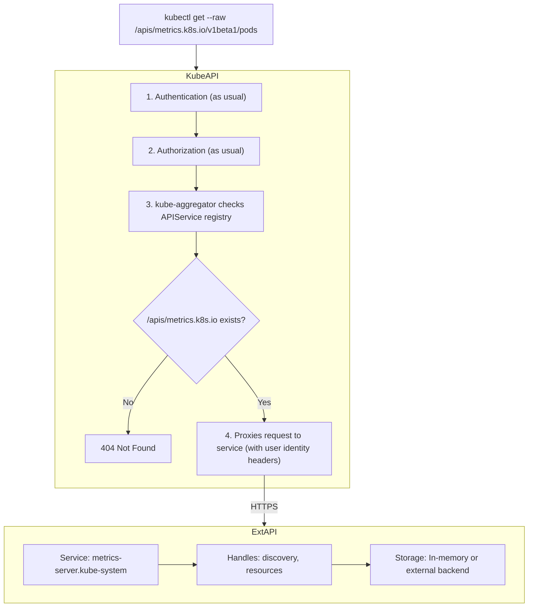
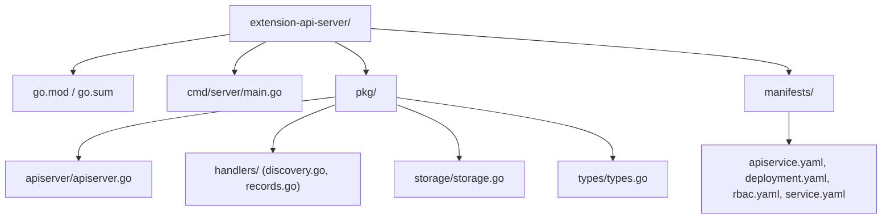

> **Складність**: `[COMPLEX]` — побудова власних серверів API.
>
> **Час на проходження**: 5 годин.
>
> **Передумови**: Модуль 1.6 (Admission Webhooks), розуміння TLS, REST API на основі HTTP, RBAC та основ Go.

## Результати навчання

Після завершення цього модуля ви зможете:

1. **Спроєктувати** архітектуру агрегації API, яка спрямовує динамічні або зовнішньо збережені дані через Kubernetes API, не заштовхуючи великий обсяг записів до etcd.
2. **Реалізувати** контракти discovery, list, get, перевірки стану, TLS та маршрутизації, необхідні для сервера розширення API Kubernetes мовою Go.
3. **Діагностувати** збої доступності `APIService`, discovery, TLS, автентифікації та делегування RBAC, простежуючи шлях запиту через kube-aggregator.
4. **Оцінити**, чи належить функція до CRD, admission webhook, контролера чи агрегованого API, виходячи з вимог до зберігання, трафіку, авторизації та підресурсів.

## Чому цей модуль важливий

Гіпотетичний сценарій: вашу платформну команду просять зробити доступним великий потік вимірювань затримки застосунків через `kubectl`, бо розробники вже вміють користуватися discovery ресурсів Kubernetes, RBAC, фільтруванням за просторами імен та виводом через JSONPath. Швидкий перший проєкт створює CRD `LatencySample` та контролер, який записує кожне зчитування як об'єкт Kubernetes. Перша демонстрація виглядає елегантно, але цей проєкт тихо перетворює сховище даних площини управління на телеметричну базу даних, а etcd створено зовсім не для цього.

Проблема не в тому, що CRD слабкі. CRD — один із найсильніших механізмів розширення в Kubernetes, бо вони дають вам валідацію схеми, поведінку watch, server-side apply, зберігання, інтеграцію з admission та звичну поведінку клієнтів за дуже малого обсягу власного коду. Проблема в тому, що кожен об'єкт CRD є частиною декларативного стану кластера. Якщо ви використовуєте цей механізм для мінливих вимірювань, дорогих обчислених звітів або [об'єктів, чиє джерело правди живе в базі даних поза кластером](https://kubernetes.io/docs/concepts/extend-kubernetes/api-extension/custom-resources/), ви платите за це в найчутливішому місці: на сервері Kubernetes API та в його кластері etcd, що його обслуговує.

Агрегація API розв'язує задачу іншого класу. Вона дозволяє основному серверу Kubernetes API і далі бути парадними дверима, тоді як окремий HTTPS-сервіс відповідає на запити до конкретної групи та версії API. Учень досі може виконати `kubectl get datarecords -A`, RBAC досі обчислюється послідовно, discovery досі перелічує ресурс, а клієнтські бібліотеки досі спілкуються HTTP у формі Kubernetes, але байти не обов'язково зберігати як об'єкти CRD в etcd. Саме завдяки цьому розділенню `metrics.k8s.io` та адаптери власних метрик можуть відчуватися рідними для користувачів, обслуговуючи при цьому дані, які обчислюються, кешуються або зчитуються з іншого бекенду.

Цей модуль ретельно проходить через цей шов, бо агреговані API легко зрозуміти неправильно. Це не «CRD з власною базою даних», увімкнені простим перемикачем функції; це повноцінні сервери API, які мають реалізувати discovery Kubernetes, кодування об'єктів, відповіді про стан, TLS, перевірки стану, передачу автентифікації та рішення про авторизацію. Ви отримуєте незвичну силу, зокрема власне зберігання та спеціалізовані підресурси, але також берете на себе операційні обов'язки, які основний сервер API зазвичай виконує за вас.

Практична мета — не зробити кожен платформний API схожим на Kubernetes. Практична мета — вирішити, коли межа Kubernetes API дає користувачам відчутну перевагу над окремим CLI, дашбордом чи кінцевою точкою сервісу. Агрегація переконлива тоді, коли ті самі люди вже покладаються на простори імен Kubernetes, RBAC, журнали аудиту, discovery ресурсів та клієнтський інструментарій, щоб виконувати свою роботу. Вона значно менш переконлива, коли єдина причина — естетична узгодженість, бо тоді команда бере на себе власний сервер API, не здобуваючи особливого операційного важеля.

Хороший проєкт агрегації також захищає решту площини управління від ваших припущень про продукт. Якщо зовнішній бекенд сповільнюється, ваша група API має зрозуміло відмовляти, не ускладнюючи перелічування непов'язаних рідних ресурсів. Якщо ваш формат відповіді змінюється, клієнти мають бачити версіонований контракт API, а не несподіванку в основній групі. Якщо API стає популярним, ви можете масштабувати та кешувати свій бекенд окремо, замість того щоб запізно виявити, що сховище даних вашого кластера стало випадковою інтеграційною шиною.

## CRD проти агрегації API

Якщо сервер Kubernetes API — це урядова будівля, то CRD схожі на додавання нового відділу всередині будівлі. Вони використовують наявні картотечні шафи, наявний пост охорони, наявний процес архівування та наявну стійку для відвідувачів. Сервер агрегованого API більше схожий на посольство всередині тієї самої будівлі: відвідувачі входять через ті самі парадні двері й дотримуються того самого видимого протоколу, але запити до цього посольства спрямовуються до персоналу, який веде власну систему записів, застосовує спеціалізовані правила та повертає відповіді у форматі, якого очікує будівля.

Ця аналогія важлива, бо досвід користувача може виглядати майже однаково, тоді як ризик реалізації цілком інший. Автор CRD пише схему OpenAPI і зазвичай контролер; [сервер Kubernetes API зберігає об'єкти й керує базовим механізмом REST. Автор агрегованого API пише механізм REST безпосередньо](https://kubernetes.io/docs/concepts/extend-kubernetes/api-extension/custom-resources/). Kube-aggregator лише вирішує, що запит до зареєстрованої групи та версії слід передати через проксі на ваш сервіс; далі ваш сервіс має поводитися достатньо схоже на Kubernetes, щоб `kubectl`, контролери, клієнти discovery та оператори йому довіряли.

| Вимога | CRD | Агрегація API |
|------------|-----|-----------------|
| CRUD над ресурсами у стилі YAML | Так | Так |
| Зберігання в etcd | Так (автоматично) | Ні (власне зберігання) |
| Стандартний RBAC | Так (автоматично) | Ви реалізуєте або делегуєте |
| Власний бекенд зберігання | Ні | Так |
| Власні підресурси (понад status/scale) | Обмежено | Так |
| Власні дієслова (connect, proxy) | Ні | Так |
| Обчислені/динамічні відповіді | Погано підходить | Сильно підходить |
| Короткоживучі / мінливі дані | Марнотратно (etcd) | Ідеально |
| Власна логіка admission | Через webhooks | Вбудована у ваш сервер |
| Підтримка watch у Kubernetes | Автоматично | Ви реалізуєте |
| Зусилля на реалізацію | Низькі | Високі |

Використовуйте CRD, коли ресурс є декларативним бажаним станом. Якщо людина чи контролер створює об'єкт, очікує, що об'єкт збережеться, стежить за його станом і хоче, щоб Kubernetes володів валідацією та зберіганням, CRD зазвичай правильна відповідь. `BackupPolicy`, `DatabaseCluster`, `CertificateRequest` чи `NetworkIntent` зазвичай належать туди, бо кластер має це пам'ятати й узгоджувати навколо цього. Тієї миті, коли ви кажете «нам потрібен власний об'єкт», вашим типовим вибором усе ще має бути CRD, доки конкретна вимога не змусить вас відійти від нього.

Використовуйте агрегацію API, коли форма Kubernetes API цінна, але модель зберігання Kubernetes хибна. Зовнішні джерела даних, обчислені звіти, високочастотні метрики, потокові операції, незвичні підресурси та пряма інтеграція зі спеціалізованим бекендом — поширені сигнали. Наприклад, API відповідності може надавати згенеровані висновки з графової бази даних, тоді як API метрик може повертати свіжий зріз із Prometheus чи іншого сховища часових рядів. Об'єкт виглядає рідним для клієнтів, але джерело правди залишається там, де йому належить.

Зупиніться та спрогнозуйте: як ви гадаєте, що станеться, якщо контролер оновлюватиме об'єкт CRD кожні кілька секунд для кожного пода на кожній ноді, і ці оновлення міститимуть великі навантаження статусу? Робоче навантаження може виглядати нешкідливим, бо кожне оновлення — це звичайний запит Kubernetes, проте сукупний ефект — це повторювані записи, віяльна розсилка watch, тиск ущільнення та зайва історія в etcd. Саме цей проєктний тиск покликана послабити агрегація API — не тому, що так легше, а тому, що вона виносить мінливу частину з основної площини управління.

Найпростіше питання для рев'ю — «чи захотіли б ми відновлювати ці дані з резервної копії etcd під час відновлення кластера?» Якщо відповідь «так», ресурс, ймовірно, є декларативним станом і має схилятися до CRD. Якщо відповідь «ні», бо дані можна переобчислити, перезапитати або вони швидко спливають, агрегований API може підійти краще. Це формулювання через відновлення запобігає поширеній помилці: плутанню зручного доступу через Kubernetes із володінням з боку Kubernetes.

Інше корисне питання — «кому дозволено ухвалювати остаточне рішення щодо цього об'єкта?» CRD зазвичай означає, що валідація, admission та контролери Kubernetes визначають життєвий цикл ресурсу. Агрегований API може потребувати поєднання RBAC Kubernetes з авторизацією, специфічною для бекенду, бо користувач, який може перелічити простір імен у Kubernetes, може не мати права читати кожен запис у зовнішній базі даних. Ця подвійна модель авторизації потужна, але вона має бути явною, інакше ваш API здивує і адміністраторів кластера, і власників бекенду.

Наступна діаграма зберігає базовий шлях запиту, який варто тримати в голові. Клієнт не викликає сервіс розширення безпосередньо. Клієнт викликає основний сервер Kubernetes API, [звичайні етапи автентифікації та авторизації виконуються першими](https://kubernetes.io/docs/tasks/extend-kubernetes/configure-aggregation-layer/), а рівень агрегації звертається до реєстру `APIService`, щоб вирішити, чи належить шлях бекенду за проксі. Лише після цих перевірок запит перетинає внутрішнє HTTPS-з'єднання до вашого сервера.



Діаграма також натякає на головну межу безпеки. Вашому бекенду не довіряють лише тому, що це Сервіс у кластері, а вхідні заголовки ідентичності не заслуговують на довіру, доки ваш сервер не переконається, що запит надійшов від фронт-проксі агрегатора. Прямий виклик з іншого пода не повинен мати змоги підробити `X-Remote-User: cluster-admin` і отримати привілейовані дані. Саме тому TLS, автентифікація на основі заголовків запиту, делегування автентифікації, мережева відкритість та RBAC є частиною проєктування, а не деталями розгортання, які можна доточити пізніше.

Зауважте, що агрегатор не робить бекенд магічно бездержавним чи безпечним. Він дає бекенду місце на шляху запиту Kubernetes і спосіб брати участь у discovery. Ваш сервер досі володіє обробкою помилок зберігання, бюджетом таймаутів, розміром відповіді та моделлю ресурсів. Повільний запит до бекенду може стати повільним викликом Kubernetes API для цієї групи, тож проєктуйте таймаути та межі кешу до того, як користувачі побудують автоматизацію, яка припускає, що API відповідає як рідне сховище об'єктів.

## Ресурс APIService

Об'єкт `APIService` — це контракт маршрутизації між основним сервером API та вашим сервером розширення. Він каже, що групу та версію, як-от `data.kubedojo.io/v1alpha1`, має обслуговувати названий Сервіс Kubernetes на конкретному порту. Об'єкт також містить значення пріоритету, які впливають на впорядкування discovery, та [набір сертифікатів центру сертифікації, який дозволяє агрегатору перевіряти серверний сертифікат бекенду](https://kubernetes.io/docs/reference/kubernetes-api/cluster-resources/api-service-v1/). Якщо ці деталі хибні, ваш сервер може бути цілком справним і все одно невидимим для клієнтів.

Ім'я об'єкта навмисно механічне: `{version}.{group}`. Ця домовленість дозволяє людині оглянути реєстр і одразу побачити, яка версія якої групи делегується. Вона також тримає таблицю маршрутизації детермінованою, що важливо, коли в одному кластері встановлено кілька груп та версій API. Перш ніж це виконати, який вивід ви очікуєте від `kubectl get apiservice v1alpha1.data.kubedojo.io`, якщо Сервіс існує, але TLS-сертифікат не збігається з DNS-іменем Сервісу?

```yaml
apiVersion: apiregistration.k8s.io/v1
kind: APIService
metadata:
  name: v1alpha1.data.kubedojo.io     # {version}.{group}
spec:
  group: data.kubedojo.io
  version: v1alpha1
  service:
    name: kubedojo-data-api            # Service name
    namespace: kubedojo-system          # Service namespace
    port: 443
  groupPriorityMinimum: 1000          # Priority over other groups
  versionPriority: 15                  # Priority over other versions
  caBundle: <base64-encoded-CA-cert>   # CA to verify backend TLS
  insecureSkipTLSVerify: false         # Never true in production
```

Два поля пріоритету легко скопіювати, не розуміючи їх, але вони заслуговують на увагу. [`groupPriorityMinimum` керує відносним упорядкуванням груп API під час discovery, тоді як `versionPriority` керує впорядкуванням переважної версії всередині групи](https://kubernetes.io/docs/reference/kubernetes-api/cluster-resources/api-service-v1/). Зазвичай ви обираєте значення, які роблять вашу групу видимою для discovery, не конкуруючи з вбудованими групами Kubernetes. Реєстрація експериментального сервера під вбудованою групою з невідповідним пріоритетом — це вже не експеримент; це може змінити те, як клієнти розв'язують ресурси, які оператори вважають рідними.

| Поле | Опис | Типове значення |
|-------|------------|---------------|
| `group` | Група API, яку обслуговує цей сервіс | `data.kubedojo.io` |
| `version` | Версія API | `v1alpha1` |
| `service.name` | Сервіс Kubernetes, що вказує на ваш сервер | `kubedojo-data-api` |
| `service.namespace` | Простір імен Сервісу | `kubedojo-system` |
| `service.port` | Порт Сервісу | `443` |
| `groupPriorityMinimum` | Пріоритет для discovery групи API (вище = важливіше) | `1000` |
| `versionPriority` | Пріоритет усередині групи (вище = переважна версія) | `15` |
| `caBundle` | CA-сертифікат у Base64 для перевірки TLS | байти CA-сертифіката |
| `insecureSkipTLSVerify` | Пропустити перевірку TLS (лише для розробки) | `false` |

Крок передавання через проксі також конкретніший, ніж припускає багато перших реалізацій. Початковий bearer-токен не передається просто так вашому бекенду, бо бекенд має довіряти агрегатору як фронт-проксі й отримувати нормалізовану ідентичність. У типових налаштуваннях серверів розширення API агрегатор автентифікується на вашому сервері своїми клієнтськими обліковими даними фронт-проксі, а [початкова ідентичність користувача передається через заголовки запиту, як-от `X-Remote-User` та `X-Remote-Group`. Ваш сервер має перевірити клієнта проксі, перш ніж вважати ці заголовки авторитетними](https://kubernetes.io/docs/reference/access-authn-authz/authentication/).

Ця модель довіри пояснює, чому серверам розширення API часто потрібно [читати ConfigMap `extension-apiserver-authentication` з `kube-system`](https://kubernetes.io/docs/tasks/extend-kubernetes/configure-aggregation-layer/). Цей ConfigMap містить конфігурацію клієнта заголовків запиту, яка дозволяє серверу розширення валідувати клієнтський сертифікат агрегатора та імена заголовків. Без цієї валідації сервер не зможе відрізнити справжній запит, переданий через проксі, від прямого виклику, який скопіював імена заголовків із документації. Іншими словами, заголовок — це не доказ; доказом, що надає заголовку сенсу, є перевірене з'єднання фронт-проксі.

```text
Original request:
  GET /apis/data.kubedojo.io/v1alpha1/namespaces/default/datarecords
  Authorization: Bearer <user-token>

Proxied request to your server:
  GET /apis/data.kubedojo.io/v1alpha1/namespaces/default/datarecords
  X-Remote-User: alice
  X-Remote-Group: developers
  X-Remote-Group: system:authenticated
  Authorization: Bearer <aggregator-token>
```

Зупиніться та спрогнозуйте: kube-aggregator передає ідентичність початкового користувача через заголовки запиту після того, як автентифікує користувача на основному сервері API. Якщо ваш сервер розширення API також відкрито через NodePort, і под під'єднується безпосередньо, підробляючи ті самі заголовки, що має статися? Правильний результат — відмова, доки той, хто викликає, не доведе, що він є довіреним клієнтом заголовків запиту; інакше ви побудували обхід авторизації з інтерфейсом у формі Kubernetes.

Вам також варто подумати про можливість аудиту на цій межі. Основний сервер API може аудіювати вхідний запит до агрегованого шляху, але вашому бекенду можуть знадобитися власні журнали, щоб пояснити, як ідентичність Kubernetes відобразилася на доступ до бекенду. Журналювання лише облікового запису бекендної бази даних недостатньо для розслідувань, а журналювання лише імені користувача Kubernetes може не пояснити, чому бекенд відхилив запит. Виробничий проєкт має записувати обидві ідентичності, область простору імен чи ресурсу та результат делегованої авторизації, не зберігаючи чутливих даних навантаження.

## Побудова сервера розширення API

Побудова сервера розширення API означає написання HTTPS-вебсервісу, який дотримується домовленостей Kubernetes API достатньо точно, щоб з ним могли працювати загальні клієнти. Сервісу потрібні кінцеві точки discovery, щоб клієнти могли знаходити ресурси, кінцеві точки ресурсів, щоб клієнти могли перелічувати та отримувати об'єкти, кінцеві точки стану, щоб агрегатор міг вирішити, чи безпечна маршрутизація, та об'єкти стану у стилі Kubernetes, щоб збої були зрозумілими. Якщо ви пропустите один із цих контрактів, симптом часто з'являється деінде, як-от відсутній ресурс у `kubectl api-resources` або заплутаний таймаут від контролера.

Мінімальна поверхня ресурсів нижче навмисно мала. Вона не реалізує create, update, delete, patch, watch, OpenAPI, ланцюжки admission, конверсію чи server-side apply, бо модуль зосереджується на контракті агрегації перед повною виробничою поверхнею. Це навмисний каркас: спершу зробіть правильними шляхи discovery та читання, а потім додавайте дієслова зміни та поведінку watch лише тоді, коли ваш рівень зберігання здатен підтримати їхні вимоги до узгодженості.

Цей поетапний підхід віддзеркалює те, як рідні функції API залежать одна від одної. Discovery каже клієнтам, що існує; list та get доводять, що конверт об'єкта правильний; відповіді про стан роблять поведінку при збоях передбачуваною; перевірки стану та готовності кажуть агрегатору, чи варто йому маршрутизувати трафік. Лише після того, як ці основи стануть надійними, має сенс обговорювати watch, записи, конверсію чи валідацію у стилі admission. Якщо ви розвернете цей порядок, ви можете витратити дні на налагодження просунутих функцій, тоді як група API навіть не видима для discovery.

| Кінцева точка | Призначення | Обов'язкова |
|----------|---------|----------|
| `/apis/{group}/{version}` | Discovery ресурсів API | Так |
| `/apis/{group}` | Discovery групи | Так (для правильної поведінки kubectl) |
| `/apis` | Кореневий discovery | Опційно (агрегатор це обробляє) |
| `/apis/{group}/{version}/{resource}` | Перелік ресурсів | Так |
| `/apis/{group}/{version}/namespaces/{ns}/{resource}` | Перелік ресурсів за простором імен | Якщо з простором імен |
| `/apis/{group}/{version}/namespaces/{ns}/{resource}/{name}` | Отримати окремий ресурс | Так |
| `/healthz` | Перевірка стану | Так |
| `/openapi/v2` або `/openapi/v3` | Схема OpenAPI | Рекомендовано |

Структура проєкту розділяє відповідальності, яких ви очікуєте від невеликого сервера API. Типи визначають форму JSON, яку бачать клієнти, storage визначає, як зберігаються записи, обробники перетворюють HTTP-шляхи на відповіді у стилі Kubernetes, а головна точка входу зв'язує TLS та маршрутизацію докупи. У виробничому сервері ви, ймовірно, використали б загальні бібліотеки apiserver Kubernetes або фреймворк, але невелика пряма реалізація HTTP корисна, бо вона розкриває точні протокольні зобов'язання, які фреймворки інакше приховують.

Назви тек не лише косметичні. Вони роблять володіння чіткішим, коли реалізація зростає: інженери зі зберігання можуть міркувати про запити до бекенду, рев'юери API можуть оглядати форми об'єктів, а платформні інженери можуть переглядати маршрутизацію та автентифікацію. Це розділення також запобігає прихованому режиму збою, коли логіка discovery починає звертатися до бекенду. [Discovery має бути дешевим і надійним, бо клієнти й агрегатор можуть викликати його часто](https://kubernetes.io/docs/concepts/extend-kubernetes/api-extension/apiserver-aggregation/); якщо discovery залежить від повільної бази даних, уся ваша група API може виглядати несправною, коли деградувала лише одна залежність.



Типи API вбудовують `metav1.TypeMeta` та `metav1.ObjectMeta`, бо клієнти Kubernetes очікують, що звичайні об'єкти нестимуть kind, версію API, ім'я, простір імен, мітки, анотації, UID, мітку часу створення та версію ресурсу у звичних місцях. Ви не зобов'язані робити кожен запис бекенду об'єктом Kubernetes усередині, але відповідь на межі API має виглядати як один. Саме ця межа дозволяє `kubectl get`, JSONPath, табличному виводу та загальним серіалізаторам поводитися передбачувано.

Будьте обережні й не сприймайте поля метаданих як беззмістовну прикрасу. Імена та простори імен визначають ідентичність ресурсу, яку користувачі вводитимуть, версії ресурсу формують семантику list та watch, а мітки чи анотації можуть стати частиною автоматизації. Якщо ваш бекенд не може надати стабільний UID чи версію ресурсу, вам треба вирішити, наскільки чесно ви пропонуєте сумісність із Kubernetes. API звітності лише для читання іноді може використовувати прості згенеровані значення, тоді як API, орієнтований на контролери, потребує сильніших гарантій узгодженості.

```go
// pkg/types/types.go
package types

import metav1 "k8s.io/apimachinery/pkg/apis/meta/v1"

// DataRecord represents a record from an external database.
type DataRecord struct {
	metav1.TypeMeta   `json:",inline"`
	metav1.ObjectMeta `json:"metadata,omitempty"`

	Spec   DataRecordSpec   `json:"spec"`
	Status DataRecordStatus `json:"status,omitempty"`
}

type DataRecordSpec struct {
	// Source is the external database that holds this record.
	Source string `json:"source"`

	// Query is the query or key used to retrieve this record.
	Query string `json:"query"`

	// Data holds the record data as key-value pairs.
	Data map[string]string `json:"data,omitempty"`
}

type DataRecordStatus struct {
	// LastSyncTime is when the record was last read from the source.
	LastSyncTime metav1.Time `json:"lastSyncTime,omitempty"`

	// SyncStatus indicates whether the record is current.
	SyncStatus string `json:"syncStatus,omitempty"`
}

// DataRecordList is a list of DataRecord resources.
type DataRecordList struct {
	metav1.TypeMeta `json:",inline"`
	metav1.ListMeta `json:"metadata,omitempty"`

	Items []DataRecord `json:"items"`
}
```

Бекенд зберігання навмисно тримається в пам'яті, щоб код залишався читабельним, але ключова ідея однакова для PostgreSQL, Redis, Prometheus чи іншого сервісу. Сервер розширення володіє шляхом читання й перетворює запити list чи get Kubernetes на операції бекенду. Це означає, що бекенд може використовувати власні індекси, політику зберігання, мову запитів та стратегію кешування, тоді як сервер API повертає тому, хто викликає, конверт об'єкта Kubernetes.

У реальному бекенді операції list заслуговують на особливе проєктування. Користувачі Kubernetes очікують, що list буде безпечним, але зовнішні бази даних можуть містити набагато більше даних, ніж зазвичай тримав би рідний простір імен Kubernetes. Пагінацію, фільтрування та поведінку таймаутів слід спроєктувати до запуску, а не після того, як користувач виконає `kubectl get datarecords -A -o yaml` і отримає відповідь, надто велику для обробки. Форма Kubernetes API не усуває потреби в дисципліні запитів до бази даних.

```go
// pkg/storage/storage.go
package storage

import (
	"fmt"
	"sync"
	"time"

	metav1 "k8s.io/apimachinery/pkg/apis/meta/v1"

	"github.com/kubedojo/extension-api/pkg/types"
)

// Store is an in-memory store that simulates an external database.
// In production, this would be a real database client.
type Store struct {
	mu      sync.RWMutex
	records map[string]map[string]*types.DataRecord // namespace -> name -> record
}

// NewStore creates a new in-memory store with seed data.
func NewStore() *Store {
	s := &Store{
		records: make(map[string]map[string]*types.DataRecord),
	}
	s.seed()
	return s
}

func (s *Store) seed() {
	now := metav1.Now()

	seedData := []types.DataRecord{
		{
			TypeMeta: metav1.TypeMeta{
				APIVersion: "data.kubedojo.io/v1alpha1",
				Kind:       "DataRecord",
			},
			ObjectMeta: metav1.ObjectMeta{
				Name:              "user-config",
				Namespace:         "default",
				CreationTimestamp: now,
				ResourceVersion:   "1",
				UID:               "a1b2c3d4-0001-0001-0001-000000000001",
			},
			Spec: types.DataRecordSpec{
				Source: "postgres",
				Query:  "SELECT * FROM config WHERE env='production'",
				Data: map[string]string{
					"max_connections": "100",
					"timeout_ms":      "5000",
					"log_level":       "info",
				},
			},
			Status: types.DataRecordStatus{
				LastSyncTime: now,
				SyncStatus:   "Current",
			},
		},
		{
			TypeMeta: metav1.TypeMeta{
				APIVersion: "data.kubedojo.io/v1alpha1",
				Kind:       "DataRecord",
			},
			ObjectMeta: metav1.ObjectMeta{
				Name:              "feature-flags",
				Namespace:         "default",
				CreationTimestamp: now,
				ResourceVersion:   "2",
				UID:               "a1b2c3d4-0001-0001-0001-000000000002",
			},
			Spec: types.DataRecordSpec{
				Source: "redis",
				Query:  "HGETALL feature:flags",
				Data: map[string]string{
					"dark_mode":     "true",
					"new_dashboard": "false",
					"beta_api":      "true",
				},
			},
			Status: types.DataRecordStatus{
				LastSyncTime: now,
				SyncStatus:   "Current",
			},
		},
		{
			TypeMeta: metav1.TypeMeta{
				APIVersion: "data.kubedojo.io/v1alpha1",
				Kind:       "DataRecord",
			},
			ObjectMeta: metav1.ObjectMeta{
				Name:              "metrics-config",
				Namespace:         "monitoring",
				CreationTimestamp: now,
				ResourceVersion:   "3",
				UID:               "a1b2c3d4-0001-0001-0001-000000000003",
			},
			Spec: types.DataRecordSpec{
				Source: "consul",
				Query:  "kv/monitoring/config",
				Data: map[string]string{
					"scrape_interval": "15s",
					"retention_days":  "30",
				},
			},
			Status: types.DataRecordStatus{
				LastSyncTime: metav1.NewTime(now.Add(-5 * time.Minute)),
				SyncStatus:   "Stale",
			},
		},
	}

	for i := range seedData {
		record := &seedData[i]
		ns := record.Namespace
		if s.records[ns] == nil {
			s.records[ns] = make(map[string]*types.DataRecord)
		}
		s.records[ns][record.Name] = record
	}
}

// List returns all records in a namespace (empty string = all namespaces).
func (s *Store) List(namespace string) []types.DataRecord {
	s.mu.RLock()
	defer s.mu.RUnlock()

	var result []types.DataRecord

	if namespace == "" {
		for _, nsRecords := range s.records {
			for _, r := range nsRecords {
				result = append(result, *r)
			}
		}
	} else {
		nsRecords, ok := s.records[namespace]
		if !ok {
			return nil
		}
		for _, r := range nsRecords {
			result = append(result, *r)
		}
	}

	return result
}

// Get returns a single record by namespace and name.
func (s *Store) Get(namespace, name string) (*types.DataRecord, error) {
	s.mu.RLock()
	defer s.mu.RUnlock()

	nsRecords, ok := s.records[namespace]
	if !ok {
		return nil, fmt.Errorf("not found")
	}

	record, ok := nsRecords[name]
	if !ok {
		return nil, fmt.Errorf("not found")
	}

	return record, nil
}
```

Обробники discovery — це місце, де провалюється багато перших спроб. `kubectl` не знає, що ваш ресурс існує, бо ви написали структуру Go; він знає це, бо [агрегована кінцева точка повертає навантаження `APIGroup` та `APIResourceList`, що описують версії груп, імена ресурсів, область, kind, дієслова, короткі імена та категорії](https://kubernetes.io/docs/concepts/overview/kubernetes-api/). Якщо це навантаження відсутнє, спотворене, обслуговується за хибним шляхом або затримане повільним запитом до бекенду, агрегатор позначає `APIService` недоступним, і клієнти discovery перестають бачити групу.

Discovery також визначає обіцянку, яку ваш сервер дає клієнтам. Якщо список ресурсів каже, що `watch` підтримується, контролери можуть відкривати watch'і. Якщо він каже, що `delete` підтримується, оператори можуть спробувати видалити об'єкти. Якщо він позначає ресурс таким, що має простір імен, клієнти будуватимуть шляхи з простором імен. Тримайте оголошені дієслова та область узгодженими з обробниками, які ви насправді написали, бо загальний інструментарій Kubernetes вірить discovery більше, ніж коментарям у вашому репозиторії.

```go
// pkg/handlers/discovery.go
package handlers

import (
	"encoding/json"
	"net/http"

	metav1 "k8s.io/apimachinery/pkg/apis/meta/v1"
)

// HandleGroupDiscovery returns the API group information.
func HandleGroupDiscovery(w http.ResponseWriter, r *http.Request) {
	group := metav1.APIGroup{
		TypeMeta: metav1.TypeMeta{
			Kind:       "APIGroup",
			APIVersion: "v1",
		},
		Name: "data.kubedojo.io",
		Versions: []metav1.GroupVersionForDiscovery{
			{
				GroupVersion: "data.kubedojo.io/v1alpha1",
				Version:      "v1alpha1",
			},
		},
		PreferredVersion: metav1.GroupVersionForDiscovery{
			GroupVersion: "data.kubedojo.io/v1alpha1",
			Version:      "v1alpha1",
		},
	}

	w.Header().Set("Content-Type", "application/json")
	json.NewEncoder(w).Encode(group)
}

// HandleResourceDiscovery returns the available resources in the API group version.
func HandleResourceDiscovery(w http.ResponseWriter, r *http.Request) {
	resourceList := metav1.APIResourceList{
		TypeMeta: metav1.TypeMeta{
			Kind:       "APIResourceList",
			APIVersion: "v1",
		},
		GroupVersion: "data.kubedojo.io/v1alpha1",
		APIResources: []metav1.APIResource{
			{
				Name:         "datarecords",
				SingularName: "datarecord",
				Namespaced:   true,
				Kind:         "DataRecord",
				Verbs: metav1.Verbs{
					"get", "list",
				},
				ShortNames: []string{"dr"},
				Categories: []string{"all", "kubedojo"},
			},
		},
	}

	w.Header().Set("Content-Type", "application/json")
	json.NewEncoder(w).Encode(resourceList)
}
```

Обробники ресурсів показують другий контракт: успішні відповіді потребують форм об'єктів Kubernetes, а невдалі відповіді мають використовувати `metav1.Status`, а не довільний простий текст. Цей вибір впливає не лише на косметику. Загальні клієнти інспектують поля reason та code статусу, автоматизація може відрізнити «не знайдено» від «заборонено», а учні бачать помилки, схожі на рідні Kubernetes API, а не на сиру поведінку вебсервера.

Для збоїв авторизації діє той самий принцип. Повертайте статус «заборонено» у стилі Kubernetes, який якомога зрозуміліше пояснює дієслово, ресурс, простір імен та причину, не розкриваючи секретів бекенду. Якщо бекенд відмовляє в доступі через правило, специфічне для домену, перекладіть це рішення на HTTP-статус та повідомлення, на які користувачі Kubernetes можуть зреагувати. Розпливчаста помилка 500 вчить користувачів повторювати спробу; точна 403 вчить їх перевіряти RBAC чи права бекенду.

```go
// pkg/handlers/records.go
package handlers

import (
	"encoding/json"
	"log"
	"net/http"
	"strings"

	metav1 "k8s.io/apimachinery/pkg/apis/meta/v1"

	"github.com/kubedojo/extension-api/pkg/storage"
	"github.com/kubedojo/extension-api/pkg/types"
)

// RecordHandler handles DataRecord requests.
type RecordHandler struct {
	Store *storage.Store
}

// HandleList handles LIST requests.
func (h *RecordHandler) HandleList(w http.ResponseWriter, r *http.Request) {
	namespace := extractNamespace(r.URL.Path)

	// Log the impersonated user (set by kube-aggregator).
	user := r.Header.Get("X-Remote-User")
	groups := r.Header.Get("X-Remote-Group")
	if user != "" {
		log.Printf("Request from user=%s groups=%s namespace=%s",
			user, groups, namespace)
	}

	records := h.Store.List(namespace)

	list := types.DataRecordList{
		TypeMeta: metav1.TypeMeta{
			APIVersion: "data.kubedojo.io/v1alpha1",
			Kind:       "DataRecordList",
		},
		ListMeta: metav1.ListMeta{
			ResourceVersion: "1",
		},
		Items: records,
	}

	if list.Items == nil {
		list.Items = []types.DataRecord{}
	}

	w.Header().Set("Content-Type", "application/json")
	json.NewEncoder(w).Encode(list)
}

// HandleGet handles GET requests for a single resource.
func (h *RecordHandler) HandleGet(w http.ResponseWriter, r *http.Request) {
	namespace := extractNamespace(r.URL.Path)
	name := extractName(r.URL.Path)

	record, err := h.Store.Get(namespace, name)
	if err != nil {
		status := metav1.Status{
			TypeMeta: metav1.TypeMeta{
				Kind:       "Status",
				APIVersion: "v1",
			},
			Status:  "Failure",
			Message: "datarecords \"" + name + "\" not found",
			Reason:  metav1.StatusReasonNotFound,
			Code:    http.StatusNotFound,
		}
		w.Header().Set("Content-Type", "application/json")
		w.WriteHeader(http.StatusNotFound)
		json.NewEncoder(w).Encode(status)
		return
	}

	w.Header().Set("Content-Type", "application/json")
	json.NewEncoder(w).Encode(record)
}

// extractNamespace extracts the namespace from the URL path.
// Path format: /apis/data.kubedojo.io/v1alpha1/namespaces/{namespace}/datarecords/...
func extractNamespace(path string) string {
	parts := strings.Split(path, "/")
	for i, part := range parts {
		if part == "namespaces" && i+1 < len(parts) {
			return parts[i+1]
		}
	}
	return "" // cluster-scoped or list all
}

// extractName extracts the resource name from the URL path.
func extractName(path string) string {
	parts := strings.Split(strings.TrimSuffix(path, "/"), "/")
	return parts[len(parts)-1]
}
```

Головний сервер прив'язує ці обробники до точних шляхів. Цей прямий мультиплексор не є повним виробничим сервером API, але він робить видимою відповідальність за URL: namespaced-шлях list та шлях list для всього кластера — це різні шляхи, і обробник має навмисно підтримувати обидва. Поширена помилка — протестувати лише list для всього кластера, а потім виявити, що `kubectl get datarecords -n default` стикається з таймаутом або повертає 404, бо namespaced-маршрут так і не зареєстрували.

```go
// cmd/server/main.go
package main

import (
	"context"
	"log"
	"net/http"
	"os"
	"os/signal"
	"strings"
	"syscall"
	"time"

	"github.com/kubedojo/extension-api/pkg/handlers"
	"github.com/kubedojo/extension-api/pkg/storage"
)

const (
	certFile = "/etc/apiserver/certs/tls.crt"
	keyFile  = "/etc/apiserver/certs/tls.key"
)

func main() {
	store := storage.NewStore()
	recordHandler := &handlers.RecordHandler{Store: store}

	mux := http.NewServeMux()

	// Health check.
	mux.HandleFunc("/healthz", func(w http.ResponseWriter, r *http.Request) {
		w.WriteHeader(http.StatusOK)
		w.Write([]byte("ok"))
	})

	// API group discovery.
	mux.HandleFunc("/apis/data.kubedojo.io", func(w http.ResponseWriter, r *http.Request) {
		if r.URL.Path == "/apis/data.kubedojo.io" ||
			r.URL.Path == "/apis/data.kubedojo.io/" {
			handlers.HandleGroupDiscovery(w, r)
			return
		}
		http.NotFound(w, r)
	})

	// Version resource discovery.
	mux.HandleFunc("/apis/data.kubedojo.io/v1alpha1", func(w http.ResponseWriter, r *http.Request) {
		if r.URL.Path == "/apis/data.kubedojo.io/v1alpha1" ||
			r.URL.Path == "/apis/data.kubedojo.io/v1alpha1/" {
			handlers.HandleResourceDiscovery(w, r)
			return
		}
		http.NotFound(w, r)
	})

	// Namespaced resource endpoints.
	mux.HandleFunc("/apis/data.kubedojo.io/v1alpha1/namespaces/", func(w http.ResponseWriter, r *http.Request) {
		path := r.URL.Path

		// Match: /apis/.../namespaces/{ns}/datarecords
		// Match: /apis/.../namespaces/{ns}/datarecords/{name}
		if strings.Contains(path, "/datarecords") {
			parts := strings.Split(strings.TrimSuffix(path, "/"), "/")
			drIdx := -1
			for i, p := range parts {
				if p == "datarecords" {
					drIdx = i
					break
				}
			}

			if drIdx == -1 {
				http.NotFound(w, r)
				return
			}

			if drIdx == len(parts)-1 {
				recordHandler.HandleList(w, r)
			} else {
				recordHandler.HandleGet(w, r)
			}
			return
		}

		http.NotFound(w, r)
	})

	// Cluster-wide list (all namespaces).
	mux.HandleFunc("/apis/data.kubedojo.io/v1alpha1/datarecords", func(w http.ResponseWriter, r *http.Request) {
		recordHandler.HandleList(w, r)
	})

	server := &http.Server{
		Addr:         ":8443",
		Handler:      mux,
		ReadTimeout:  10 * time.Second,
		WriteTimeout: 10 * time.Second,
	}

	go func() {
		sigCh := make(chan os.Signal, 1)
		signal.Notify(sigCh, syscall.SIGINT, syscall.SIGTERM)
		<-sigCh
		log.Println("Shutting down extension API server")
		ctx, cancel := context.WithTimeout(context.Background(), 5*time.Second)
		defer cancel()
		server.Shutdown(ctx)
	}()

	log.Println("Starting extension API server on :8443")
	if err := server.ListenAndServeTLS(certFile, keyFile); err != http.ErrServerClosed {
		log.Fatalf("Server failed: %v", err)
	}
}
```

Цей приклад навмисно лише для читання, що є найбезпечнішим місцем для початку. Тієї миті, коли ви додаєте записи, вам потрібна стратегія для оптимістичного контролю паралельності, версій ресурсів, валідації, встановлення значень за замовчуванням, авторизації для кожного дієслова та поведінки при конфліктах. Тієї миті, коли ви додаєте watch, вам потрібне довговічне джерело подій або кеш, який може передавати зміни потоком, не брешучи про порядок. Агрегація знімає тиск etcd з основного API, але вона не знімає роботи з розподілених систем із проєктування вашого API.

Проєкт лише для читання все одно може бути цінним у виробництві. Метрики, висновки відповідності, інвентар, перегляди зовнішньої конфігурації та згенеровані звіти часто потребують discovery та авторизації більше, ніж зміни. Ця вузька область дозволяє вам дати рідний досвід, уникаючи складності шляху запису. Вона також дає вам чистий шлях оновлення: якщо користувачам пізніше знадобляться create чи update, ви можете оцінити, чи належать ці записи до зовнішнього бекенду, до CRD, який керує бекендом, чи до окремого робочого процесу.

## Розгортання, TLS та делегована автентифікація

У розгортання чотири завдання: запустити сервер, відкрити його через стабільний Сервіс, видати сертифікат, чиї DNS-імена збігаються з цим Сервісом, і надати серверу достатньо RBAC, щоб брати участь у делегуванні автентифікації та авторизації. Сприймайте їх як одну систему, а не як чотири незалежні фрагменти YAML. Правильний `APIService` зі зламаним сертифікатом провалюється; правильний сертифікат із відсутнім discovery провалюється; справний сервер без прав делегованої автентифікації може приймати трафік, але ухвалити хибне рішення про довіру.

Порядок залежностей варто зробити нудним. Спершу створіть простір імен та ServiceAccount, прив'яжіть права, які дозволяють серверу брати участь у делегованій автентифікації, видайте обслуговувальний сертифікат, запустіть Деплоймент, відкрийте його через Сервіс і лише потім зареєструйте `APIService`. Реєстрація надто рано не фатальна, але вона створює галасливі умови збою, які можуть приховати справжній сигнал готовності. У контрольованих розгортаннях команди часто застосовують `APIService` останнім саме з цієї причини.

Спершу cert-manager видає внутрішній сертифікат для DNS-імен сервісу, які використовує агрегатор. Самопідписаний Issuer годиться для лабораторії, бо `APIService` містить набір сертифікатів CA, упроваджений із Certificate, але виробничі команди зазвичай прив'язують це до політики CA кластера чи організації. Важлива вимога — не бренд видавця; це те, що агрегатор перевіряє кінцеву точку бекенду, яку він мав намір досягти, і що виробництво не покладається на `insecureSkipTLSVerify`.

```yaml
# manifests/issuer.yaml
apiVersion: cert-manager.io/v1
kind: Issuer
metadata:
  name: api-selfsigned
  namespace: kubedojo-system
spec:
  selfSigned: {}
```

```yaml
# manifests/certificate.yaml
apiVersion: cert-manager.io/v1
kind: Certificate
metadata:
  name: kubedojo-data-api-cert
  namespace: kubedojo-system
spec:
  secretName: kubedojo-data-api-tls
  duration: 8760h
  renewBefore: 720h
  issuerRef:
    name: api-selfsigned
    kind: Issuer
  dnsNames:
  - kubedojo-data-api.kubedojo-system.svc
  - kubedojo-data-api.kubedojo-system.svc.cluster.local
```

Деплоймент — це звичайний Kubernetes, що є однією з приємних частин агрегованих API. Ваш сервер — це просто робоче навантаження за Сервісом, тож ви можете використовувати репліки, проби, запити ресурсів, anti-affinity, налаштування безпеки пода та звичайні практики розгортання. Незвичною є та частина, що простій чи погана поведінка готовності впливає не лише на один застосунок; це може змусити групу API зникнути з discovery й порушити роботу клієнтів, які очікують, що ця група є частиною API кластера.

```yaml
# manifests/namespace.yaml
apiVersion: v1
kind: Namespace
metadata:
  name: kubedojo-system
```

```yaml
# manifests/deployment.yaml
apiVersion: apps/v1
kind: Deployment
metadata:
  name: kubedojo-data-api
  namespace: kubedojo-system
spec:
  replicas: 2
  selector:
    matchLabels:
      app: kubedojo-data-api
  template:
    metadata:
      labels:
        app: kubedojo-data-api
    spec:
      serviceAccountName: kubedojo-data-api
      containers:
      - name: server
        image: kubedojo-data-api:0.35.0
        ports:
        - containerPort: 8443
        volumeMounts:
        - name: certs
          mountPath: /etc/apiserver/certs
          readOnly: true
        readinessProbe:
          httpGet:
            path: /healthz
            port: 8443
            scheme: HTTPS
          initialDelaySeconds: 5
          periodSeconds: 10
        livenessProbe:
          httpGet:
            path: /healthz
            port: 8443
            scheme: HTTPS
          initialDelaySeconds: 15
          periodSeconds: 20
        resources:
          requests:
            cpu: 50m
            memory: 64Mi
          limits:
            cpu: 200m
            memory: 128Mi
      volumes:
      - name: certs
        secret:
          secretName: kubedojo-data-api-tls
```

```yaml
# manifests/service.yaml
apiVersion: v1
kind: Service
metadata:
  name: kubedojo-data-api
  namespace: kubedojo-system
spec:
  selector:
    app: kubedojo-data-api
  ports:
  - port: 443
    targetPort: 8443
    protocol: TCP
```

RBAC для сервера розширення часто заплутаний, бо тут є два пов'язані, але окремі питання. По-перше, які права потрібні ServiceAccount сервера, щоб сервер міг валідувати делеговану автентифікацію та авторизацію? По-друге, які права мають отримати кінцеві користувачі для самих агрегованих ресурсів? Лабораторія зосереджується на першому питанні, бо воно потрібне для безпечного поводження з ідентичністю; виробничі системи також потребують чітких ролей для користувачів щодо ресурсів, як-от `datarecords`.

Не змішуйте ці питання під час рев'ю політик. ServiceAccount сервера може потребувати права створювати об'єкти `SubjectAccessReview`, щоб запитувати основний сервер API, чи дозволено користувачеві виконати дію. Це не означає, що звичайні користувачі мають отримати широкі права на агреговані ресурси. І навпаки, надання користувачам доступу до `datarecords` автоматично не робить бекенд безпечним, доки сервер розширення не перевірить цю ідентичність і не відобразить її на модель авторизації бекенду.

```yaml
# manifests/serviceaccount.yaml
apiVersion: v1
kind: ServiceAccount
metadata:
  name: kubedojo-data-api
  namespace: kubedojo-system
```

```yaml
# manifests/clusterrole.yaml
apiVersion: rbac.authorization.k8s.io/v1
kind: ClusterRole
metadata:
  name: kubedojo-data-api
rules:
# The extension API server needs to read authentication config.
- apiGroups: [""]
  resources: ["namespaces"]
  verbs: ["get", "list", "watch"]
# For auth delegation (authn/authz).
- apiGroups: ["authentication.k8s.io"]
  resources: ["tokenreviews"]
  verbs: ["create"]
- apiGroups: ["authorization.k8s.io"]
  resources: ["subjectaccessreviews"]
  verbs: ["create"]
```

```yaml
# manifests/clusterrolebinding.yaml
apiVersion: rbac.authorization.k8s.io/v1
kind: ClusterRoleBinding
metadata:
  name: kubedojo-data-api
roleRef:
  apiGroup: rbac.authorization.k8s.io
  kind: ClusterRole
  name: kubedojo-data-api
subjects:
- kind: ServiceAccount
  name: kubedojo-data-api
  namespace: kubedojo-system
```

```yaml
# manifests/auth-delegator-binding.yaml
# Allow the extension API server to delegate authentication and authorization.
apiVersion: rbac.authorization.k8s.io/v1
kind: ClusterRoleBinding
metadata:
  name: kubedojo-data-api:system:auth-delegator
roleRef:
  apiGroup: rbac.authorization.k8s.io
  kind: ClusterRole
  name: system:auth-delegator
subjects:
- kind: ServiceAccount
  name: kubedojo-data-api
  namespace: kubedojo-system
```

```yaml
# manifests/auth-reader-binding.yaml
# Allow reading the extension API server authentication configmap.
apiVersion: rbac.authorization.k8s.io/v1
kind: RoleBinding
metadata:
  name: kubedojo-data-api:auth-reader
  namespace: kube-system
roleRef:
  apiGroup: rbac.authorization.k8s.io
  kind: Role
  name: extension-apiserver-authentication-reader
subjects:
- kind: ServiceAccount
  name: kubedojo-data-api
  namespace: kubedojo-system
```

Нарешті, `APIService` реєструє групу та версію. Анотація cert-manager упроваджує набір сертифікатів CA з Certificate, щоб агрегатор міг валідувати TLS-сертифікат бекенду. Якщо ви усуваєте проблему, порівняйте DNS-імена Сервісу, DNS-імена сертифіката, посилання `service` та впроваджений `caBundle`, перш ніж змінювати код застосунку. Багато інцидентів `FailedDiscoveryCheck` насправді є проблемами сертифіката чи маршрутизації Сервісу.

```yaml
# manifests/apiservice.yaml
apiVersion: apiregistration.k8s.io/v1
kind: APIService
metadata:
  name: v1alpha1.data.kubedojo.io
  annotations:
    cert-manager.io/inject-ca-from: kubedojo-system/kubedojo-data-api-cert
spec:
  group: data.kubedojo.io
  version: v1alpha1
  service:
    name: kubedojo-data-api
    namespace: kubedojo-system
    port: 443
  groupPriorityMinimum: 1000
  versionPriority: 15
  insecureSkipTLSVerify: false
```

Який підхід ви б тут обрали і чому: тимчасово встановити `insecureSkipTLSVerify: true` чи залишити TLS суворим і використати `kubectl describe apiservice` разом з інспекцією сертифіката для налагодження збою? Суворий шлях триває трохи довше, але він задіює той самий ланцюг довіри, який використовує виробництво. Скорочення може приховати зламану ідентичність Сервісу й також привчити команду приймати налаштування, яке ніколи не має пережити реального розгортання.

## Тестування та виробничі міркування

Щойно розгортання встановлено, тестуйте систему ззовні всередину. Почніть зі стану `APIService`, потім discovery, потім операції list та get, потім сирий доступ до кінцевої точки. Цей порядок віддзеркалює шлях запиту й утримує вас від налагодження обробника, перш ніж ви дізнаєтеся, що агрегатор взагалі може дістатися до бекенду. Невдалий запит list із `APIService Available: False` — це насамперед не баг зберігання; це баг реєстрації, TLS, Сервісу, стану чи discovery, доки не доведено інше.

```bash
# Check APIService status.
kubectl get apiservice v1alpha1.data.kubedojo.io
# Should show "Available: True".

# Describe for details.
kubectl describe apiservice v1alpha1.data.kubedojo.io

# Check API discovery.
kubectl api-resources | grep kubedojo
# Should show: datarecords  dr  data.kubedojo.io/v1alpha1  true  DataRecord

# List all data records.
kubectl get datarecords --all-namespaces
kubectl get dr -A

# Get records in a specific namespace.
kubectl get dr -n default

# Get a specific record.
kubectl get dr user-config -n default -o yaml

# Raw API access.
kubectl get --raw /apis/data.kubedojo.io/v1alpha1 | jq .
kubectl get --raw /apis/data.kubedojo.io/v1alpha1/namespaces/default/datarecords | jq .
```

Налагоджувати агреговані API найлегше тоді, коли ви уникаєте здогадок про те, який рівень провалився. `ServiceNotFound` вказує на посилання бекенду в `APIService`. `FailedDiscoveryCheck` зазвичай означає, що провалився стан, TLS, маршрутизація чи JSON discovery. Ресурс, що з'являється в discovery, але повертає «заборонено», вказує на авторизацію користувача або обробку делегованої автентифікації. Namespaced-запит, що провалюється, тоді як list для всього кластера працює, вказує на парсинг шляху та реєстрацію обробника.

Виробіть собі коротку діагностичну звичку: стан, кінцеві точки, журнали, пряма перевірка стану, JSON discovery, перелік ресурсів, перелік за простором імен, окремий get. Цей порядок змушує кожну перевірку відповідати на одне питання й звужує наступний крок. Якщо ви починаєте з редагування коду щоразу, коли `kubectl get` провалюється, ви витратите час на зміни обробника, тоді як `APIService` усе ще вказує на хибний порт Сервісу. Якщо ви починаєте з маршруту, кожен збій має менший простір пошуку.

```bash
# Check if the APIService is available.
kubectl get apiservice v1alpha1.data.kubedojo.io -o yaml

# Common status conditions:
# Available: True means routing and discovery are working.
# Available: False, reason: FailedDiscoveryCheck means the server is not answering discovery correctly.
# Available: False, reason: ServiceNotFound means the referenced Service does not exist.

# Check the extension API server logs.
kubectl logs -n kubedojo-system -l app=kubedojo-data-api -f

# Test connectivity directly from inside the cluster.
kubectl run test --rm -it --image=curlimages/curl --restart=Never -- \
  curl -vk https://kubedojo-data-api.kubedojo-system.svc.cluster.local:443/healthz

# Check if the aggregator can reach the service endpoints.
kubectl get endpoints -n kubedojo-system kubedojo-data-api
```

Виробничі турботи здебільшого випливають із того, що тепер ви володієте поведінкою, яку зазвичай надає основний сервер API. Затримка має значення, бо користувачі `kubectl` сприймають її як затримку API, а контролери можуть повторювати спроби чи відступати у спосіб, що підсилює повільність. Пагінація має значення, бо один необмежений list може створити величезні відповіді. Авторизація має значення, бо ви можете перекладати дієслова Kubernetes на права бекенду, які не відображаються один до одного. Watch має значення, бо опитування дороге, але нечесна семантика watch може ввести контролери в оману.

Спостережуваність слід проєктувати навколо цих турбот, а не додавати як загальне журналювання запитів. Відстежуйте затримку discovery окремо від затримки ресурсів, бо збої discovery прибирають усю групу від клієнтів. Відстежуйте частоту таймаутів бекенду окремо від збоїв авторизації користувачів, бо засоби виправлення різні. Відстежуйте розміри відповідей для викликів list, бо кілька величезних списків можуть створити тиск навіть тоді, коли кількість запитів виглядає нормальною. Ці заходи допомагають тримати агрегований API надійним, не вдаючи, що він є частиною основного шляху зберігання.

| Турбота | Розв'язання |
|---------|----------|
| Затримка запиту до бази даних | Кешуйте результати з TTL та показуйте свіжість у статусі |
| Високий обсяг запитів | Додайте об'єднання запитів, кеші в пам'яті або кеші на основі Redis |
| Пулінг з'єднань | Використовуйте обмежені пули БД із таймаутами та зворотним тиском |
| Великі навантаження відповідей | Реалізуйте пагінацію через `?limit=` та токен `continue` |

Висока доступність не є опційною, щойно клієнти починають залежати від групи API. Запускайте принаймні дві репліки, розосередьте їх по нодах, використовуйте readiness-проби, які насправді валідують обслуговувальний шлях, і розгортайте поступово. Якщо сервер використовує зовнішню базу даних, базі даних також потрібна висока доступність та чітка поведінка таймаутів; інакше справний под може стати повільним проксі для несправної залежності й потягнути за собою операції discovery чи list.

```yaml
spec:
  replicas: 2
  strategy:
    type: RollingUpdate
    rollingUpdate:
      maxUnavailable: 1
  template:
    spec:
      affinity:
        podAntiAffinity:
          preferredDuringSchedulingIgnoredDuringExecution:
          - weight: 100
            podAffinityTerm:
              labelSelector:
                matchLabels:
                  app: kubedojo-data-api
              topologyKey: kubernetes.io/hostname
```

Підтримка watch опційна в іграшковому API лише для читання, але вона стає важливою, коли контролери споживають ваш ресурс. Watch у Kubernetes — це не просто «надсилати JSON у циклі»; клієнти очікують упорядкування подій, версій ресурсів, поведінки повторного підключення та чесного зв'язку між list та watch. Якщо ваш бекенд не може надати узгоджений потік змін, можливо, краще задокументувати семантику лише list, ніж відкривати кінцеву точку watch, яка тихо губить оновлення.

```go
// Simplified watch implementation.
func (h *RecordHandler) HandleWatch(w http.ResponseWriter, r *http.Request) {
	flusher, ok := w.(http.Flusher)
	if !ok {
		http.Error(w, "streaming not supported", http.StatusInternalServerError)
		return
	}

	w.Header().Set("Content-Type", "application/json")
	w.Header().Set("Transfer-Encoding", "chunked")
	w.WriteHeader(http.StatusOK)
	flusher.Flush()

	ticker := time.NewTicker(30 * time.Second)
	defer ticker.Stop()

	for {
		select {
		case <-r.Context().Done():
			return
		case <-ticker.C:
			// Placeholder: a real implementation would read the next object from a backend change stream.
			event := map[string]interface{}{
				"type":   "MODIFIED",
				"object": record,
			}
			json.NewEncoder(w).Encode(event)
			flusher.Flush()
		}
	}
}
```

Сприймайте приклад watch як навчальний ескіз, а не виробничий код. Реальна реалізація визначила б, звідки береться `record`, як просуваються версії ресурсів, як обробляються закладки, як клієнти відновлюються після розривів і як відповідь list співвідноситься з потоком watch. Саме тому агрегація — це не обхід проєктування API; це запрошення реалізувати API, який заслуговує постати поруч із рідними Kubernetes API.

Якщо ви не можете реалізувати watch чесно, скажіть про це в discovery, опустивши дієслово. Клієнти Kubernetes здатні опитувати, коли мусять, а зрозумілий API лише з list легше осмислити, ніж потік watch, який губить події чи відтворює застарілі об'єкти. Це особливо важливо для API, що спираються на аналітичні сховища чи зовнішні SaaS-системи, де потоки змін можуть бути затриманими, стиснутими чи недоступними. Правильне обмеження поверхні API — це форма роботи над надійністю.

## Патерни та антипатерни

Найсильніші агреговані API вузькі, цілеспрямовані та чесні щодо свого джерела правди. Вони не намагаються одразу відтворити кожну функцію Kubernetes і не приховують обмежень бекенду за іменем ресурсу, що виглядає рідним. Натомість вони обирають модель ресурсу, яка чисто відображається на зовнішню систему, відкривають лише ті дієслова, які можуть коректно реалізувати, і роблять свіжість, затримку та авторизацію достатньо видимими, щоб оператори могли осмислювати збої.

| Патерн | Коли використовувати | Чому це працює | Міркування щодо масштабування |
|---------|----------------|--------------|-----------------------|
| Агрегований API із наскрізним читанням | Дані вже живуть у базі даних, бекенді метрик чи сервісі | Тримає etcd поза шляхом високого обсягу даних, зберігаючи discovery Kubernetes | Додайте кешування та пагінацію до широкого розгортання |
| Делегована авторизація з перевірками бекенду | Важливі і RBAC Kubernetes, і права бекенду | Дозволяє кластеру вирішувати, хто може викликати API, тоді як бекенд забезпечує доступ, специфічний для домену | Журналюйте і користувача Kubernetes, і причину рішення бекенду |
| Спершу мінімальна поверхня дієслів | Ви можете запуститися з `get` та `list` перед записами | Зменшує складність узгодженості та конфліктів під час ранньої валідації | Додавайте `watch`, `create` чи `update` лише після визначення семантики зберігання |
| Помилки у формі Kubernetes | Клієнтам потрібна надійна поведінка автоматизації | `metav1.Status` дозволяє інструментам розрізняти «не знайдено», «заборонено» та «недоступно» | Тримайте коди статусів узгодженими між обробниками |

Антипатерни зазвичай випливають із сприйняття агрегації як способу уникнути вивчення поведінки Kubernetes API. Команди копіюють вебсервіс за `APIService`, повертають довільний JSON, пропускають автентифікацію на основі заголовків запиту, а потім дивуються, чому клієнти поводяться дивно. Краща ментальна модель суворіша: якщо ви обираєте вхід на поверхню Kubernetes API, ви успадковуєте зобов'язання цієї поверхні, навіть коли ваше зберігання поза Kubernetes.

| Антипатерн | Що йде не так | Краща альтернатива |
|--------------|-----------------|--------------------|
| Зберігання високочастотної телеметрії в CRD | etcd поглинає записи, трафік watch та тиск ущільнення для даних, що не є бажаним станом | Обслуговуйте телеметрію через агрегований API, що спирається на сховище метрик |
| Довіра до заголовків ідентичності від будь-якого, хто викликає | Прямі запити в кластері можуть підробити користувачів та групи | Перевіряйте клієнта фронт-проксі агрегатора й обмежте прямий мережевий доступ |
| Повернення довільних помилок JSON | `kubectl` та контролери не можуть надійно класифікувати збої | Повертайте `metav1.Status` із причиною, повідомленням та HTTP-кодом |
| Оголошення дієслів, які ви не можете реалізувати | Клієнти намагаються використати шляхи watch, update чи delete зі слабкою семантикою | Публікуйте лише ті дієслова, які коректні сьогодні |

Останній антипатерн — надмірне використання агрегації, бо вона відчувається потужною. Якщо ваш ресурс — це звичайний декларативний стан, CRD з валідацією та контролером простіше експлуатувати, простіше переглядати й простіше зрозуміти іншим інженерам Kubernetes. Агрегація має заслужити своє місце реальною вимогою: зовнішнім зберіганням, обчисленими відповідями, високообсяговими мінливими даними, незвичними дієсловами, спеціалізованими підресурсами чи потребою інтегрувати зрілий не-Kubernetes API за автентифікацією та discovery Kubernetes.

Патерни та антипатерни також змінюються, коли API дозріває. Агрегований API лише для читання може початися як тонкий адаптер над одним бекендом, а потім обрости кешуванням, пагінацією, публікацією OpenAPI, полями аудиту та ретельно обмеженими ролями користувачів. Це зростання здорове, коли кожна функція зміцнює реальний контракт. Воно стає нездоровим, коли сервер повільно перебудовує поведінку CRD вручну, бо в цей момент простішою відповіддю може бути повернути довговічний бажаний стан назад у CRD і залишити агрегацію лише для динамічних переглядів.

## Структура для ухвалення рішень

Починайте кожен проєкт розширення з питання, де має жити джерело правди. Якщо кластер має пам'ятати об'єкт і узгоджувати навколо нього, оберіть CRD. Якщо іншою системою вже володіє даними, або дані надто мінливі чи дорогі для etcd, розгляньте агрегований API. Якщо мета лише в тому, щоб валідувати чи змінювати вхідні запити для наявних об'єктів, admission webhooks — кращий інструмент. Якщо мета — реагувати на об'єкти й створювати побічні ефекти, контролера може бути достатньо.

| Питання | Оберіть CRD, коли | Оберіть агрегацію API, коли | Оберіть інше розширення, коли |
|----------|-----------------|-----------------------------|-------------------------------|
| Де джерело правди? | Kubernetes має зберігати бажаний стан | Зовнішній сервіс чи обчислений бекенд володіє ним | Достатньо поведінки admission чи контролера |
| Як часто змінюються дані? | Оновлення людиною чи контролером помірні | Дані змінюються часто або запитуються динамічно | Адаптер метрик уже може це розв'язувати |
| Які дієслова потрібні? | Стандартний CRUD плюс status чи scale | Власний proxy, connect чи спеціалізовані шляхи читання | Webhook, якщо потрібна лише логіка під час admission |
| Скільки механізму API ви хочете володіти? | Перевага вбудованому зберіганню, watch, валідації | Реалізуєте discovery, авторизацію, помилки, watch та зберігання | Використовуйте фреймворк чи наявний адаптер |
| Який режим збою прийнятний? | Зберігання об'єктів слідує за станом площини управління | Стан бекенду впливає лише на цю групу API | Тримайте критичний бажаний стан у рідних API |

Читайте таблицю зліва направо під час рев'ю проєктів. Одного «так» у колонці агрегації недостатньо; вам потрібен достатній тиск, щоб виправдати експлуатацію ще одного сервера API. Наприклад, «ми хочемо власний бекенд зберігання» — сильний сигнал лише тоді, коли дані справді не можуть жити в etcd. «Ми хочемо дружній інтерфейс `kubectl`» сам по собі недостатній, бо CRD уже надають цей інтерфейс із набагато меншим операційним тягарем.

Сценарій вправи: команда хоче зробити доступними висновки відповідності, що генеруються щогодини з графової бази даних. Висновки великі, обчислені й зберігаються поза кластером з міркувань аудиту, але оператори хочуть переглядів `kubectl get findings` з обмеженням за простором імен та з RBAC Kubernetes. Це сильний кандидат на агрегацію, бо Kubernetes має автентифікувати й маршрутизувати запит, тоді як графова база даних має залишатися рушієм зберігання та запитів. Та сама команда могла б усе одно використовувати CRD для визначень політик, які керують тим, які висновки генеруються.

Тепер оцініть другий сценарій із тією самою дисципліною. Команда хоче, щоб користувачі визначали бажаний розклад резервного копіювання, а контролер створював зовнішні завдання резервного копіювання. Цей бажаний розклад, імовірно, має бути CRD, бо Kubernetes має його зберігати, валідувати й дозволяти контролеру узгоджувати. Згенерована історія резервного копіювання може обслуговуватися агрегованим API, якщо записи живуть у зовнішній системі резервного копіювання. Розділення цих відповідальностей тримає бажаний стан довговічним, залишаючи великі історичні дані в системі, що ними володіє.

Напрямок «Розширення Kubernetes» тепер складається докупи як багатошаровий набір інструментів, а не як драбина, де кожен пізніший інструмент заміняє ранні. CRD визначають довговічні типи ресурсів, контролери їх узгоджують, Kubebuilder прискорює цю роботу, admission webhooks перехоплюють записи, плагіни планувальника впливають на розміщення, а агрегація API відкриває спеціалізовані групи API, що спираються на власну логіку чи зберігання. Правильний вибір — це менше про престиж і більше про те, щоб тримати кожну відповідальність у компоненті, який може безпечно її нести.

| Модуль | Тема | Ключова навичка |
|--------|-------|-----------|
| 1.1 | Глибоке занурення в API | Розуміння конвеєра сервера API та client-go |
| 1.2 | Просунуті CRD | Побудова CRD виробничого рівня |
| 1.3 | Контролери | Написання контролерів з нуля за допомогою client-go |
| 1.4 | Kubebuilder | Використання фреймворків для ефективної розробки операторів |
| 1.5 | Просунуті оператори | Finalizers, умови, події та тестування |
| 1.6 | Admission Webhooks | Перехоплення та зміна запитів API |
| 1.7 | Плагіни планувальника | Налаштування рішень планування Kubernetes |
| 1.8 | Агрегація API | Побудова власних серверів API |

## Чи знали ви?

- **kube-aggregator вбудований у сервер API**: це не окремо розгорнутий компонент. У Kubernetes 1.35 та новіших основний бінарний файл сервера API містить проксі агрегації й маршрутизує до зареєстрованих бекендів `APIService`.
- **Metrics Server — це агрегований API**: [поширена команда `kubectl top` запитує `metrics.k8s.io`](https://kubernetes.io/docs/tasks/debug/debug-cluster/resource-metrics-pipeline/), що обслуговується через агрегацію API, а не зберігається як звичайні об'єкти CRD.
- **etcd має практичні межі зберігання**: документація etcd рекомендує квоту бекенду за замовчуванням у 2 ГіБ та обговорює максимум у 8 ГіБ для звичайних середовищ, тому мінлива телеметрія належить деінде.
- **Власні метрики HPA залежать від цього патерну**: API власних та зовнішніх метрик дозволяють автомасштабуванню читати динамічні вимірювання через кінцеві точки у формі Kubernetes, не зберігаючи кожне вимірювання в стані кластера.

## Типові помилки

| Помилка | Чому вона трапляється | Як її виправити |
|---------|----------------|---------------|
| Хибний формат імені APIService | Інженери копіюють ім'я групи й забувають про обов'язкове ім'я об'єкта `{version}.{group}` | Назвіть об'єкт `v1alpha1.data.kubedojo.io` для API `data.kubedojo.io/v1alpha1` |
| Відсутній чи хибний набір сертифікатів CA | Сервіс працює всередині, тож перевірка TLS вважається опційною | Використовуйте впровадження CA або встановіть `caBundle` з центру сертифікації, що підписав обслуговувальний сертифікат бекенду |
| Зламані відповіді discovery | Сервер обробляє ресурси, але пропускає навантаження `APIGroup` та `APIResourceList` Kubernetes | Реалізуйте `/apis/{group}` та `/apis/{group}/{version}` з правильними об'єктами discovery Kubernetes |
| Пряма довіра до заголовків запиту | Сервер розширення бачить `X-Remote-User` і припускає, що будь-який, хто викликає, є агрегатором | Налаштуйте автентифікацію на основі заголовків запиту, перевіряйте клієнта фронт-проксі й обмежте прямий мережевий доступ |
| Відсутній RBAC делегованої автентифікації | Очищення за принципом найменших привілеїв прибирає права, потрібні серверу розширення для валідації тих, хто викликає | [Прив'яжіть `system:auth-delegator` та `extension-apiserver-authentication-reader` до ServiceAccount сервера](https://kubernetes.io/docs/tasks/extend-kubernetes/configure-aggregation-layer/) |
| Невідповідність порту Сервісу | Деплоймент слухає на 8443, Сервіс відображає 443, а `APIService` посилається на хибний рівень | Спрямуйте `APIService.spec.service.port` на порт Сервісу й відобразіть `targetPort` на порт контейнера |
| Оголошення непідтримуваних дієслів | Розробники копіюють повний список дієслів CRUD з прикладу CRD | Публікуйте лише реалізовані дієслова, потім додавайте підтримку запису чи watch після того, як семантика зберігання стане правильною |
| Забуті namespaced-шляхи | List для всього кластера працює, тож namespaced-маршрутизацію ніколи не тестують | Реалізуйте обидва шляхи: `/apis/{group}/{version}/{resource}` та `/apis/{group}/{version}/namespaces/{ns}/{resource}` |

## Тест

<details>
<summary>1. Ваша команда хоче зробити доступними мільярди історичних записів телеметрії IoT через стандартні команди `kubectl`. Який механізм розширення слід обрати і який наслідок для зберігання керує цим рішенням?</summary>

Оберіть агрегований API, бо вихідні дані — це високообсягова телеметрія, а не декларативний стан кластера. CRD зберігав би кожен об'єкт в etcd, спричиняючи зайві записи, трафік watch та тиск зберігання на сховище даних площини управління. Агрегований API дозволяє серверу Kubernetes API автентифікувати, авторизувати, виявляти й маршрутизувати запит, тоді як ваш бекенд запитує сховище часових рядів чи аналітичне сховище. Це зберігає звичний інтерфейс Kubernetes, не роблячи etcd відповідальним за історичну телеметрію.

</details>

<details>
<summary>2. Розробник має RBAC, що дозволяє `get` для `datarecords`, але журнали вашого сервера розширення не показують жодного початкового bearer-токена, коли надходить його запит. Як ідентичність користувача має дістатися до сервера?</summary>

Початковий токен користувача автентифікується основним сервером Kubernetes API перед передаванням через проксі, і бекенд не повинен очікувати, що отримає цей початковий токен безпосередньо. У шляху агрегованого запиту агрегатор автентифікується на сервері розширення як довірений фронт-проксі й передає нормалізовану ідентичність у заголовках запиту, як-от `X-Remote-User` та `X-Remote-Group`. Сервер розширення має перевірити, що клієнт проксі довірений, перш ніж використовувати ці заголовки для авторизації. Якщо він просто приймає заголовки від будь-якого, хто викликає, прямий запит у кластері міг би підробити ідентичність.

</details>

<details>
<summary>3. Після встановлення `APIService` команда `kubectl api-resources` не показує `datarecords`, а `APIService` повідомляє `FailedDiscoveryCheck`. Що ви інспектуєте першим?</summary>

Інспектуйте кінцеву точку стану, маршрутизацію Сервісу, довіру TLS та навантаження discovery, перш ніж налагоджувати код зберігання. Агрегатору потрібно дістатися до `/healthz`, `/apis/data.kubedojo.io` та `/apis/data.kubedojo.io/v1alpha1`, а шляхи discovery мають повертати правильно сформований JSON `APIGroup` та `APIResourceList`. Якщо селектор Сервісу хибний, сертифікат не збігається з DNS-іменем сервісу, або discovery повертає довільний JSON, група API не з'явиться. Самого лише пода, що працює, недостатньо, бо агрегація залежить від усього маршруту.

</details>

<details>
<summary>4. Під час посилення безпеки хтось прибирає прив'язки `system:auth-delegator` та `extension-apiserver-authentication-reader` із сервера розширення. Який збій вам слід очікувати і чому?</summary>

Очікуйте, що делегування автентифікації та авторизації провалиться або стане небезпечним, залежно від того, як реалізовано сервер. Серверу розширення потрібні права делегованої автентифікації, щоб запитувати основний сервер API про токени та доступ суб'єкта, коли він бере участь у рішеннях автентифікації та RBAC Kubernetes. Йому також потрібен доступ до ConfigMap автентифікації сервера розширення API, щоб валідувати конфігурацію клієнта заголовків запиту. Прибирання цих прив'язок може виглядати як найменші привілеї, але воно прибирає конкретну сантехніку довіри, від якої залежать агреговані API.

</details>

<details>
<summary>5. Команда GPU-платформи пропонує CRD `GPUTemperature`, що оновлюється кожні 5 секунд, щоб HPA міг масштабувати робочі навантаження ноутбуків. Чому цей проєкт ризикований і що змінила б агрегація?</summary>

Проєкт CRD перетворює короткоживучі зразки метрик на постійні об'єкти Kubernetes, через що etcd поглинає часті записи й спричиняє віяльну розсилку watch для даних, які мають швидко спливати. Це ризиковано, бо сховище даних площини управління оптимізоване для стану кластера, а не для високочастотної телеметрії. Агрегований API метрик може відповісти на запит HPA, запитавши бекенд метрик чи агент ноди безпосередньо й повернувши лише поточне значення. Користувач досі отримує API у формі Kubernetes, але сирі зразки залишаються поза etcd.

</details>

<details>
<summary>6. List для всього кластера `kubectl get datarecords -A` працює, але `kubectl get datarecords -n default` стикається з таймаутом. Якої деталі реалізації найімовірніше бракує?</summary>

Сервер, імовірно, реалізує лише шлях ресурсу для всього кластера й забув namespaced-шлях. В агрегованому API ваш HTTP-маршрутизатор отримує точний URL Kubernetes, включно з `/namespaces/{namespace}/`, і має навмисно парсити цей шлях. Основний сервер API не перекладе автоматично namespaced-запит на ваш обробник для всього кластера. Додайте маршрут для `/apis/{group}/{version}/namespaces/{namespace}/{resource}` і зробіть так, щоб обробник фільтрував чи запитував за простором імен.

</details>

<details>
<summary>7. Оцініть, чи належить ця функція до CRD, admission webhook, контролера чи агрегованого API: експеримент реєструє новий ресурс, схожий на Deployment, під вбудованою групою `apps`, і звичайні клієнти Deployment починають поводитися дивно. У чому була проєктна помилка?</summary>

Команда зіткнулася з вбудованою групою API й, імовірно, встановила значення пріоритету, що спричинили плутанину discovery чи маршрутизації для клієнтів, які очікують рідний API `apps`. Агреговані API зазвичай мають використовувати окреме ім'я групи у стилі домену, яким володіє платформна команда, як-от `data.kubedojo.io`, а не повторно використовувати основну групу. Поля пріоритету не є нешкідливою прикрасою; вони впливають на поведінку переважної групи та версії. Тримайте експериментальні API в окремих групах і уникайте конкуренції з рідними ресурсами Kubernetes.

</details>

<details>
<summary>8. Розробник залишає `insecureSkipTLSVerify: true` в `APIService`, бо лабораторія працює. Який виробничий ризик це створює?</summary>

Це прибирає криптографічну перевірку ідентичності бекендного сервісу з боку агрегатора. Якщо зловмисник чи неправильно налаштоване робоче навантаження може перехопити чи видати себе за кінцеву точку Сервісу, агрегатор може надіслати запити API та заголовки ідентичності, передані через проксі, на хибний сервер. Це може розкрити ідентичність користувача, деталі запиту й потенційно чутливі дані відповіді. Виправлення — використати обслуговувальний сертифікат із правильними DNS-іменами сервісу та `caBundle`, що дозволяє агрегатору його перевірити.

</details>

## Практична вправа

Сценарій вправи: ви побудуєте й розгорнете сервер розширення API, який обслуговує ресурси `DataRecord`, що спираються на сховище в пам'яті, зареєструєте його через `APIService` і отримаєте до нього доступ через стандартні команди `kubectl`. Вправа використовує невеликий API лише для читання, бо мета — змусити discovery, TLS, маршрутизацію та відповіді у формі Kubernetes працювати до додавання дієслів зміни. Тримайте кожен маніфест у теці `manifests/`, щоб зв'язок між кодом та об'єктами кластера залишався чітким.

**Налаштування**:

```bash
kind create cluster --name aggregation-lab --image kindest/node:v1.35.0

# Install cert-manager.
kubectl apply -f https://github.com/cert-manager/cert-manager/releases/latest/download/cert-manager.yaml
kubectl wait --for=condition=Available deployment -n cert-manager --all --timeout=120s
```

1. **Створіть середовище проєкту Go**. Почніть із чистого модуля, створіть теки, показані раніше, і зафіксуйте бібліотеки Kubernetes на версіях, сумісних із Kubernetes 1.35, щоб приклади та типи API збігалися з цільовою версією кластера. Якщо ваша локальна версія Go старша, ніж вимагає модуль, оновіть Go, перш ніж ганятися за помилками Kubernetes.

```bash
mkdir -p ~/extending-k8s/extension-api && cd ~/extending-k8s/extension-api
go mod init github.com/kubedojo/extension-api
go get k8s.io/apimachinery@v0.35.0
mkdir -p cmd/server pkg/handlers pkg/storage pkg/types manifests
```

2. **Перенесіть логіку**. Скопіюйте файли сирцевого коду Go з розділів реалізації до відповідних шляхів проєкту. Після копіювання виконайте `go test ./...`, хоча формальних тестів ще немає, бо ця команда все одно вловлює відсутні імпорти, помилки в іменах пакетів та проблеми розв'язання модулів до того, як ви запакуєте образ.

3. **Зберіть образ контейнера**. Dockerfile використовує образ-збирач Go та образ-середовище distroless, тож фінальний контейнер містить лише скомпільований сервер. У виробничій збірці ви також додали б підписування образу, сканування вразливостей та відтворюваний тег версії, але лабораторія тримає образ локально в кластері Kind.

```bash
# Create Dockerfile.
cat << 'DOCKERFILE' > Dockerfile
FROM golang:1.26 AS builder
WORKDIR /workspace
COPY go.mod go.sum ./
RUN go mod download
COPY . .
RUN CGO_ENABLED=0 GOOS=linux go build -o apiserver ./cmd/server/

FROM gcr.io/distroless/static:nonroot
COPY --from=builder /workspace/apiserver /apiserver
USER 65532:65532
ENTRYPOINT ["/apiserver"]
DOCKERFILE

docker build -t kubedojo-data-api:0.35.0 .
kind load docker-image kubedojo-data-api:0.35.0 --name aggregation-lab
```

4. **Розгорніть інфраструктуру**. Застосуйте маніфести простору імен, RBAC, сертифіката, Деплойменту, Сервісу та `APIService` у порядку залежностей. Важлива контрольна точка — що Certificate стає готовим до того, як сервер намагається його змонтувати, і що сервер стає готовим до того, як агрегатор опитує discovery.

```bash
kubectl create namespace kubedojo-system

kubectl apply -f manifests/serviceaccount.yaml
kubectl apply -f manifests/clusterrole.yaml
kubectl apply -f manifests/clusterrolebinding.yaml
kubectl apply -f manifests/auth-delegator-binding.yaml
kubectl apply -f manifests/auth-reader-binding.yaml
kubectl apply -f manifests/issuer.yaml
kubectl apply -f manifests/certificate.yaml
kubectl apply -f manifests/deployment.yaml
kubectl apply -f manifests/service.yaml

kubectl wait --for=condition=Ready certificate -n kubedojo-system kubedojo-data-api-cert --timeout=60s
kubectl wait --for=condition=Ready pod -n kubedojo-system -l app=kubedojo-data-api --timeout=60s

kubectl apply -f manifests/apiservice.yaml
```

5. **Перевірте маршрутизацію APIService**. Не пропускайте вивід `describe`, якщо перша команда показує `Available: False`; причина стану зазвичай вказує на правильний рівень. Щойно discovery запрацює, `kubectl api-resources` має показати ваш ресурс із його коротким іменем та групою, що доводить, що клієнти можуть виявити API до того, як перелічуватимуть об'єкти.

```bash
kubectl get apiservice v1alpha1.data.kubedojo.io
kubectl describe apiservice v1alpha1.data.kubedojo.io

kubectl api-resources | grep data.kubedojo
# Should show: datarecords  dr  data.kubedojo.io/v1alpha1  true  DataRecord
```

6. **Отримайте доступ до агрегованих ресурсів через `kubectl`**. Порівняйте запити list для всього кластера та з обмеженням за простором імен, бо вони задіюють різні шляхи URL у вашому маршрутизаторі. Потім використайте сирі запити API для інспекції навантажень discovery та list без табличного форматування, що допомагає вловити відсутні поля kind, версії API чи метаданих.

```bash
kubectl get datarecords -A
kubectl get dr -n default
kubectl get dr user-config -n default -o yaml
kubectl get dr -n monitoring -o yaml

kubectl get --raw /apis/data.kubedojo.io/v1alpha1 | jq .
kubectl get --raw /apis/data.kubedojo.io/v1alpha1/namespaces/default/datarecords | jq .
```

7. **Переконайтеся, що він поводиться рідно**. Рідна поведінка — це не лише успішні виклики list; вона також включає короткі імена, JSONPath, структуровані помилки та журнали, що показують ідентичність, передану через фронт-проксі. Якщо ці перевірки проходять, ви маєте мінімальну форму агрегованого API, яким можуть користуватися звичайні інструменти Kubernetes.

```bash
kubectl get datarecords -n default user-config -o jsonpath='{.spec.data}'
kubectl describe dr user-config -n default
kubectl get dr does-not-exist -n default -o yaml
kubectl logs -n kubedojo-system -l app=kubedojo-data-api --tail=50
```

8. **Очистіть ресурси**. Видаліть кластер Kind після завершення, щоб локальний APIService, ресурси сертифіката й тестовий образ не залишалися через непов'язані лабораторії.

```bash
kind delete cluster --name aggregation-lab
```

**Перевірка критеріїв успіху**:

- [ ] Сервер розширення API збирається без помилок компіляції Go.
- [ ] cert-manager коректно надає валідний внутрішній TLS-сертифікат.
- [ ] APIService переходить у `Available: True`.
- [ ] `kubectl api-resources` перелічує власний `datarecords`.
- [ ] `kubectl get dr -A` витягує всі налаштовані початкові записи.
- [ ] `kubectl get dr -n default` отримує об'єкти, відфільтровані за простором імен.
- [ ] `kubectl get dr user-config -n default -o yaml` друкує повну схему.
- [ ] Запит невідомого запису повертає структурований 404 `metav1.Status`.
- [ ] Виконання з коротким іменем `dr` працює.
- [ ] Журнали пода показують запити, що несуть інформацію ідентичності із заголовків запиту.

## Джерела

- https://kubernetes.io/docs/concepts/extend-kubernetes/api-extension/apiserver-aggregation/
- https://kubernetes.io/docs/tasks/extend-kubernetes/setup-extension-api-server/
- https://kubernetes.io/docs/reference/kubernetes-api/cluster-resources/api-service-v1/
- https://kubernetes.io/docs/reference/access-authn-authz/authentication/#authenticating-proxy
- https://kubernetes.io/docs/reference/access-authn-authz/rbac/
- https://kubernetes.io/docs/concepts/extend-kubernetes/api-extension/custom-resources/
- https://kubernetes.io/docs/tasks/run-application/horizontal-pod-autoscale/
- https://github.com/kubernetes/sample-apiserver
- https://github.com/kubernetes-sigs/metrics-server
- https://github.com/kubernetes-sigs/custom-metrics-apiserver
- https://etcd.io/docs/current/dev-guide/limit/
- https://cert-manager.io/docs/usage/certificate/
- [Kubernetes API Aggregation Layer](https://kubernetes.io/docs/concepts/extend-kubernetes/api-extension/apiserver-aggregation/) — найкращий високорівневий довідник про те, що таке рівень агрегації, як працює реєстрація APIService та яка вимога до затримки discovery.
- [Configure the Aggregation Layer](https://kubernetes.io/docs/tasks/extend-kubernetes/configure-aggregation-layer/) — охоплює реальний потік автентифікації/авторизації, клієнтські сертифікати проксі, заголовки запиту та делеговану авторизацію.
- [sample-apiserver](https://github.com/kubernetes/sample-apiserver) — конкретний upstream-приклад реалізації сервера розширення API та маніфестів, що відповідають моделі агрегації.

## Наступний модуль

[Огляд напрямку «Розширення Kubernetes»](./) — перегляньте, як CRD, контролери, webhooks, плагіни планувальника та агреговані API складаються докупи як повний інструментарій розширення.


