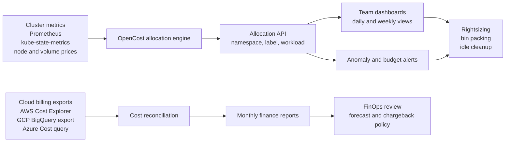
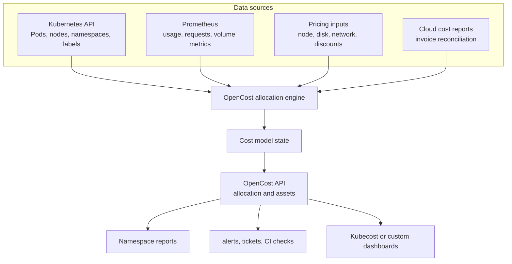
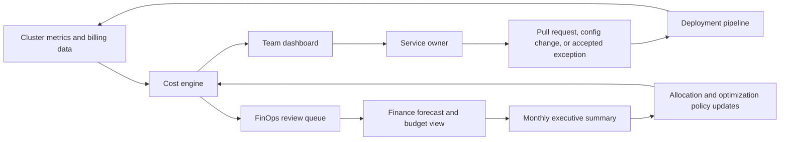

> **Сертифікаційний напрямок** | Складність: `[СЕРЕДНЯ]` | Час: 50 хвилин

## Огляд

FinOps стає корисним тоді, коли практика може відповідати на операційні запитання без щомісячного археологічного проєкту. Який простір імен учора спожив найбільше пам'яті? Яка команда володіє нодами, що простоюють? Яку рекомендацію щодо економії достатньо безпечно втілити цього тижня? Яка аномалія має розбудити людину, а яку слід задокументувати як заплановане зростання? Цей модуль перетворює фреймворк FinOps на шлях впровадження в Kubernetes. Ви працюватимете від джерел даних про витрати, правил розподілу, робочих процесів OpenCost і Kubecost, патернів оптимізації, політики сповіщень та частоти звітування, аж доки практика не набуде повторюваного операційного ритму.

Мета — не купити дашборд і оголосити перемогу. Практична система FinOps має контракт на дані, контракт на тегування, метод розподілу, процес обробки винятків і цикл зворотного зв'язку від фінансів до платформної інженерії. Експорти білінгу пояснюють офіційний рахунок, але вони надходять уже після того, як споживання відбулося. Розподіл на основі метрик пояснює поведінку Kubernetes майже в реальному часі, але оцінює хмарні витрати з цін на ноди, цін на персистентні томи та спостережуваного споживання. Корисне впровадження свідомо поєднує обидва погляди, узгоджує їх і навчає команди діяти за результатом.

## Що ви зможете робити

- Спроєктувати модель розподілу для Kubernetes, яка зіставляє простір імен, мітку, команду, продукт, спільну платформу, потужність простою та знижки з відповідальними власниками.
- Порівняти експорти білінгу з оцінкою на основі метрик, а потім обрати правильне джерело даних для showback, chargeback, реагування на аномалії та звітності для керівництва.
- Розгорнути й опитувати OpenCost, користуватися дашбордами та поданнями економії Kubecost і пояснити, як обидва вписуються у практичний інструментарій FinOps.
- Застосувати патерни оптимізації для коригування розміру (rightsizing), щільного пакування (bin packing), переходу на spot-потужності, повернення ресурсів простою, сповіщень про аномалії та регулярних оглядів витрат.

Ці результати навмисно операційні. До кінця модуля ви маєте вміти накреслити потік даних, обґрунтувати правило розподілу, виконати запит вартості простору імен, провести тріаж синтетичного сплеску витрат і пояснити різницю між інженерним сигналом і обліковим записом. Точні назви інструментів можуть з часом змінюватися, але метод стабільний: збирати надійні дані про споживання, зіставляти їх із власниками, виставляти їх з правильною частотою та перетворювати рекомендації на безпечні інженерні зміни.

## Чому цей модуль важливий

Kubernetes ефективно розподіляє інфраструктуру, і саме тому його важко пояснити з фінансового погляду. Хмарний рахунок зазвичай бачить інстанси, диски, балансувальники навантаження, мережевий трафік, плату за керовану площину управління, підтримку, податки, зобов'язання та знижки. Інженерія бачить Деплойменти, Поди, простори імен, мітки, запити ресурсів, автоскейлери, черги та релізи. FinOps на практиці — це рівень перекладу між цими двома світами. Без цього рівня перекладу фінанси сперечаються про рахунок, яким ніхто не може оперувати, а інженерія сперечається про метрики, які не узгоджуються з рахунком.

Практичний режим відмови — це зазвичай не брак добрих намірів. Команди можуть тегувати ресурси, встановити Prometheus і публікувати щомісячний дашборд, але все одно пропускати ті витрати, що мають значення. Простоююча потужність ноди може ховатися під платформним центром витрат. Простір імен може виглядати дешевим, бо спільний інгрес або сховище не розподілені. Команда може скоригувати розмір робочого навантаження й однаково платити за невикористане зобов'язання. Програма chargeback може породити невдоволення, якщо правило розподілу непрозоре. Здорове впровадження робить ці компроміси явними, задокументованими та придатними для перегляду.

FinOps Foundation описує розподіл (allocation) як здатність, що призначає та розподіляє витрати через акаунти, теги, мітки та інші метадані, а керування аномаліями — як робочі процеси виявлення, розслідування та дії. Подробиці див. у [здатності розподілу](https://www.finops.org/framework/capabilities/allocation/) та [здатності керування аномаліями](https://www.finops.org/framework/capabilities/anomaly-management/). Модель OpenCost/Kubecost використовує те саме джерело, але працює на операційній швидкості Kubernetes з метаданими та API. Цей модуль зіставляє ідеї FinOps з інструментами, які ваші команди вже використовують у щоденних кластерах.

Скористайтеся [моделлю зрілості FinOps](https://www.finops.org/framework/maturity-model/), щоб тримати покращення реалістичними: почніть із повзання по одному простору імен, переходьте до ширших міток і міжкомандного узгодження, а потім працюйте у стійкому усталеному режимі.

## Чи знали ви?

- [Звіт CNCF FinOps for Kubernetes](https://www.cncf.io/wp-content/uploads/2021/06/FINOPS_Kubernetes_Report.pdf) виявив, що багато організацій або не моніторили витрати на Kubernetes, або покладалися на щомісячні оцінки, що є слабким циклом зворотного зв'язку для інфраструктури, яка може швидко змінюватися.
- [OpenCost](https://opencost.io/docs/) залежить від кластера Kubernetes і Prometheus як джерела часових рядів для розподілу робочих навантажень.
- [Документація Kubecost](https://docs.kubecost.com/) показує родини сповіщень для бюджетів розподілу, ефективності, зміни витрат, оновлень, бюджетів активів, бюджетів хмарних витрат і стану платформи.
- Kubernetes планує Поди за оголошеними запитами ресурсів, а не за спостережуваним споживанням під час виконання, тому надмірний запит може створити дорогу потужність, що простоює. Див. [керування ресурсами для Подів і контейнерів](https://kubernetes.io/docs/concepts/configuration/manage-resources-containers/).

## Карта впровадження

Практичне впровадження FinOps у Kubernetes має чотири рівні. Перший рівень — рівень джерел, де збираються офіційні дані хмарного білінгу та майже реальночасові метрики Kubernetes. Другий рівень — рівень розподілу, де сирі нарахування зіставляються з вимірами власності, такими як простір імен, мітка, команда, сервіс, середовище, продукт і спільна платформа. Третій рівень — рівень дій, де дашборди, сповіщення, тикети, pull-реквести та рекомендації щодо економії дають командам роботу, яку вони можуть виконати. Четвертий рівень — рівень управління, де лідери фінансів, платформи та продукту узгоджують частоту, обробку винятків і те, чи є практика моделлю showback, чи chargeback.



Ця карта також показує, чому один інструмент не може розв'язати всю проблему сам по собі. Експорти білінгу авторитетні для узгодження рахунку, податків, підтримки, кредитів і трактування знижок за зобов'язання щодо споживання. Метрики кластера краще пояснюють, чому простір імен сьогодні був дорогим, чому робоче навантаження надмірно запитує ресурси або чому після релізу з'явився новий пул нод. Операційна модель потребує обох поглядів, і їй потрібне задокументоване правило для того, що відбувається, коли вони розходяться. Наприклад, щоденний дашборд showback може використовувати оцінки OpenCost, тоді як щомісячне фінансове закриття узгоджує підсумки з рахунком провайдера.

## Методологія розподілу

Розподіл — це метод перетворення спільного кластера на підзвітні об'єкти витрат. Найпоширеніша перша версія — розподіл за простором імен, бо простори імен часто відображають команди, середовища, застосунки або тенантів. Краща версія використовує мітки для `team`, `service`, `product`, `environment` і `cost-center`, бо самі лише простори імен не можуть описати спільні сервіси, мультитенантні платформи або продукт, що охоплює кілька просторів імен. Найкраща версія трактує метадані як забезпечуваний контракт, а не як прикрасу, накладену після того, як рахунок надійшов.

Прямий розподіл має йти першим. Якщо витрату можна зіставити з єдиним власником без суб'єктивного судження, призначте її напряму. Деплоймент у просторі імен `payments-prod` з міткою `team=payments` має належати команді платежів. PersistentVolumeClaim, який використовує цей простір імен, має слідувати за тим самим власником, якщо платформа явно не класифікувала його як спільний. Хмарний балансувальник навантаження, створений Сервісом у цьому просторі імен, також має слідувати за власником простору імен або сервісу, коли цей зв'язок доступний. Прямий розподіл легко пояснити, легко аудитувати й легко автоматизувати.

Розподіл спільних витрат потребує явного алгоритму розщеплення. FinOps Foundation виокремлює фіксований, пропорційний розподіл і розподіл за проксі-метрикою як поширені стратегії для спільних статей витрат. У Kubernetes до спільних витрат належать накладні витрати площини управління, системні простори імен, логування, моніторинг, інгрес, service mesh, буфер автоскейлера кластера, потужність простою спільних нод, плани підтримки, а іноді й знижки за зобов'язання щодо споживання. Хибна відповідь — залишати кожну спільну витрату в платформному відрі назавжди, бо тоді продуктові команди оптимізують лише видимі їм витрати робочих навантажень і нехтують попитом на спільну платформу, який вони створюють.

Алгоритм фіксованого розщеплення призначає кожному власнику наперед визначений відсоток. Наприклад, платформний стек логування можна розщепити порівну між п'ятьма продуктовими групами, або спільний тестовий кластер можна розщепити за погодженим відсотком бюджету. Фіксовані розщеплення корисні, коли дані про споживання недоступні, коли витрата невелика або коли організація хоче передбачуваного бюджетування більше за точність. Слабкість у тому, що команди не можуть легко зменшити своє нарахування завдяки кращій поведінці, тож фіксовані розщеплення слід переглядати під час квартального планування або замінювати, коли з'являються кращі сигнали споживання.

Алгоритм пропорційних витрат розподіляє спільну витрату відповідно до прямих витрат кожного власника. Якщо команда A має сорок відсотків прямих витрат простору імен, команда A отримує сорок відсотків спільних накладних витрат кластера. Це просто й часто достатньо справедливо для накладних витрат нод, платформних операцій і спільних нарахувань за підтримку. Слабкість у тому, що це може карати команди з уже дорогими прямими навантаженнями, навіть якщо вони не зумовлюють конкретний спільний сервіс. Використовуйте пропорційні витрати для широких інфраструктурних накладних витрат, а не для сервісу, споживання якого можна виміряти безпосередніше.

Алгоритм проксі-метрики використовує сигнал робочого навантаження як ключ розщеплення. Логування можна розщепити за прийнятими байтами, інгрес — за кількістю запитів або переданими байтами, моніторинг — за кардинальністю часових рядів, а потужність простою нод — за запитаними CPU та пам'яттю. Проксі-метрики найдієвіші, бо вказують на поведінку, яку команда може змінити. Їх також найлегше переускладнити. Проксі-метрика має бути стабільною, зрозумілою та дешевою для збору. Якщо команда не може відтворити число або зрозуміти його драйвер, розподіл втратить довіру.

Потужність простою заслуговує власної політики. Інструменти витрат Kubernetes часто виставляють витрату на простій як різницю між вартістю потужності ноди та вартістю розподіленого робочого навантаження. Деякі організації тримають простій у платформному акаунті, бо платформна інженерія володіє щільним пакуванням і конфігурацією автоскейлера кластера. Інші розподіляють простій між командами пропорційно до запитаних ресурсів, бо запити робочих навантажень зумовлюють планування та масштабування нод. Зріла модель зазвичай розділяє системний простій, навмисний запас потужності та простій, якого можна уникнути. Навмисний запас — це рішення про стійкість; простій, якого можна уникнути, — це беклог оптимізації.

Знижки, зобов'язання та кредити теж потребують правила. Savings plan, reserved instance, знижку за зобов'язання щодо споживання або корпоративну знижку можна застосувати централізовано, пропорційно або напряму до команд, що зобов'язалися щодо попиту. Централізоване застосування спрощує фінансову звітність, але приховує ефективну ставку від інженерів. Пропорційне застосування легко обчислити, але воно може винагороджувати команди, які не брали участі в плануванні зобов'язань. Пряме застосування найкраще підтримує підзвітність, але потребує зрілості прогнозування та процесу управління для недовикористаних зобов'язань. Задокументуйте правило до того, як команди побачать свій перший звіт chargeback.

| Тип спільної витрати | Запропоноване розщеплення | Чому це працює |
| --- | --- | --- |
| Площина управління кластера | Фіксоване або пропорційне до прямих витрат | Зазвичай невелике та широко розподілене між тенантами кластера |
| Простоююча потужність нод | Запитані CPU та пам'ять, з платформним відром винятків | Запити зумовлюють тиск планування, але платформа володіє автоскейлером і складом нод |
| Платформа логування | Прийняті байти або збережені байти | Команди можуть зменшити надмірні логи або скоригувати збереження |
| Платформа моніторингу | Кількість часових рядів або зразків скрейпу | Команди можуть зменшити кардинальність і шумні метрики |
| Інгрес та егрес | Передані байти, кількість запитів або власник сервісу | Трафік зазвичай має вимірюваний драйвер робочого навантаження |
| Корпоративна знижка | Пропорційні прийнятні витрати або прямий власник зобов'язання | Тримає рахунок узгодженим, зберігаючи власність |

## Джерела даних про витрати

Експорти білінгу та оцінка на основі метрик відповідають на різні запитання. Експорти білінгу — це система обліку того, що провайдер виставить у рахунку. [AWS Cost Explorer](https://docs.aws.amazon.com/aws-cost-management/latest/APIReference/API_GetCostAndUsage.html) виставляє метрики витрат і споживання з вимірами, тегами, часовими діапазонами та категоріями витрат. [Експорт білінгу Google Cloud до BigQuery](https://cloud.google.com/billing/docs/how-to/export-data-bigquery) записує детальні дані білінгу до таблиць BigQuery для робочих процесів атрибуції та аудиту. [Azure Cost Management + Billing](https://learn.microsoft.com/en-us/azure/cost-management-billing/) надає дані про споживання та рахунки в межах заданого охоплення для узгодження. Ці експорти необхідні для фінансового закриття, амортизації, податків, кредитів, підтримки та переговорів із постачальниками, але самі по собі вони зазвичай не пояснюють простір імен Kubernetes.

Оцінка на основі метрик починається всередині кластера. Prometheus збирає CPU контейнерів, пам'ять, персистентні томи, мережу та метадані об'єктів Kubernetes. kube-state-metrics виставляє бажаний стан, як-от запити ресурсів, мітки, простори імен, посилання на власників і фази подів. Рушій витрат поєднує ці метрики з цінами на ноди, диски, балансувальники навантаження та мережу. Результат — це оцінка того, скільки спожив кожен простір імен, мітка, контролер або Под протягом часового вікна. Це не юридичний рахунок, але він набагато ближчий до інженерної події, що спричинила витрату.

Використовуйте експорти білінгу для щомісячного узгодження, відхилення від бюджету, оптимізації ставок, планування зобов'язань і зведень для керівництва. Використовуйте розподіл на основі метрик для щоденного showback, перевірок регресії релізів, коригування розміру, очищення простою та тріажу аномалій. Якщо платформна команда чекає на рахунок, щоб помітити некерований простір імен, подія витрат уже застаріла. Якщо фінанси використовують сирі оцінки Prometheus для статутної звітності, числа не збігатимуться з кредитами, податками, нарахуваннями за підтримку чи погодженими ставками. Впровадження має зазначати, яке джерело є авторитетним для кожного рішення.

Процес узгодження має бути нудним і повторюваним. Почніть із загального рахунку провайдера за період білінгу. Відніміть нарахування, які навмисно перебувають поза охопленням Kubernetes, як-от керовані бази даних або позиції SaaS. Порівняйте решту витрат, пов'язаних із кластером, із підсумком рушія витрат для нод, персистентних томів, балансувальників навантаження та мережевого трафіку. Дослідіть великі розриви за категоріями: відсутні кластери, відсутня хмарна інтеграція, не змодельовані витрати на підтримку, інше трактування знижок, відкладене споживання або розрив у збереженні метрик. Публікуйте нотатки узгодження разом зі щомісячним звітом, щоб команди розуміли, чому щоденна оцінка може відрізнятися від кінцевого рахунку.

Якість метаданих є частиною джерела даних, а не запізнілою думкою. Експорт білінгу без тегів не може розподілити хмарні ресурси за продуктами. Метрики Prometheus без стабільних міток не можуть розподілити споживання Kubernetes за командами. Мітки, що змінюються під час міграції, можуть розщепити один сервіс між кількома власниками. Практична модель визначає обов'язкові мітки, перевіряє їх у CI або контролі допуску та підтримує невеликий реєстр винятків. Винятки мають мати власників і дати закінчення дії. Інакше "нерозподілене" стає постійним сховком для витрат, якими ніхто не хоче володіти.

## Заглиблення в OpenCost

OpenCost — це [відкритий](https://opencost.io/docs/) рушій розподілу витрат і специфікація для моніторингу витрат Kubernetes. У типовому розгортанні він працює в кластері, читає дані Kubernetes і Prometheus, застосовує конфігурацію ціноутворення та виставляє результати розподілу через API. Документація OpenCost описує [Allocation API](https://opencost.io/docs/integrations/api/) як спосіб опитувати розподіл витрат і ресурсів для робочих навантажень Kubernetes з параметрами на кшталт `window`, `aggregate`, `includeIdle` та `shareIdle`. Це робить OpenCost корисним і для автоматизації, і для людського дашборда.

Архітектура OpenCost має три практичні входи. Перший вхід — метадані Kubernetes: простори імен, Поди, контролери, мітки, анотації, ноди, PersistentVolumes і Сервіси. Другий вхід — метрики утилізації та розподілу, що зберігаються в Prometheus. Третій вхід — дані ціноутворення з інтеграцій хмарного провайдера, власної конфігурації ціноутворення або публічних таблиць цін on-demand. Ви можете встановити базовий робочий процес з [документації OpenCost](https://opencost.io/docs/installation/install/) та перевірити якість впровадження за [специфікацією OpenCost](https://opencost.io/docs/specification/). Рушій розподілу поєднує ці входи у записи витрат за кластером, нодою, простором імен, контролером, Подом, міткою та сервісом. API потім дає змогу обрати часове вікно та агрегацію, що відповідають запитанню.

OpenCost особливо цінний, коли платформна команда хоче вендоронезалежні дані про витрати. Специфікація OpenCost визначає методологію вимірювання та розподілу витрат на інфраструктуру та контейнери в середовищах Kubernetes. Ця специфікація має значення, бо дає командам змогу міркувати про обчислення, а не сприймати дашборд як чорну скриньку. Якщо вартість простору імен змінюється, ви маєте змогу простежити зміну до запитів ресурсів, фактичного споживання, ціни ноди, розподілу простою, вартості персистентного тому або політики спільних витрат. Числами витрат у чорній скриньці важко керувати; зрозумілий розподіл можна переглянути.

Перше операційне рішення — як обробляти витрату на простій. Якщо `includeIdle=true`, API може показувати потужність простою як власний розподіл. Якщо `shareIdle=true`, витрату на простій можна розподілити між активними розподілами. Тримати простій окремо краще для платформних операцій, бо це виставляє можливості щільного пакування та автоскейлера. Розподіляти простій краще для chargeback, коли організація хоче, щоб повна вартість кластера лягла на споживчі команди. Багато організацій роблять і те, і інше: щоденні інженерні дашборди показують простій окремо, тоді як щомісячні фінансові звіти розподіляють простій за задокументованим правилом.

Друге операційне рішення — агрегація. Агрегація за простором імен — це гарна відправна точка, бо вона узгоджується з тенантністю Kubernetes. Агрегація за міткою краща, коли власність продукту перетинає простори імен або коли простір імен містить кілька команд. Агрегація за контролером або Подом найкраща для роботи з коригуванням розміру, бо вказує на робоче навантаження, яке слід змінити. Агрегація за кластером і нодою найкраща для планування потужності платформи. Практичний дашборд дає командам кілька подань, але тримає типове подання достатньо стабільним, щоб тренди місяць-до-місяця залишалися змістовними.

Третє операційне рішення — збереження. Збереження Prometheus контролює, наскільки далеко назад може бачити модель витрат на основі метрик. Якщо Prometheus зберігає лише коротке вікно, щоденний тріаж працюватиме, але щомісячне звітування може стати неповним. Якщо збереження довге, але мітки з високою кардинальністю розривають сховище, платформа спостережуваності може стати достатньо дорогою, щоб спотворити історію FinOps. Узгоджуйте збереження з частотою звітування: короткі дані високої роздільності для тріажу інцидентів; довші дані нижчої роздільності для трендових звітів; дані експорту білінгу для фінансового закриття та історії аудиту.



## Заглиблення в Kubecost

Kubecost вибудовує ширший продуктовий досвід навколо даних про витрати Kubernetes. Для практичного впровадження FinOps цінність полягає не лише в тому, що дашборд існує. Цінність у тому, що продуктові команди, платформні команди та фінансові зацікавлені сторони можуть бачити розподіл, активи, економію, сповіщення, бюджети та ефективність з одного звичного місця. Лідер команди може оглянути вартість простору імен, платформний інженер — недовикористані ноди, а практик FinOps — налаштувати регулярні оновлення або сповіщення про зміну витрат, не пишучи кожен запит вручну.

Подання Allocations у Kubecost — це щоденна операційна поверхня для showback. Задайте вікно, агрегуйте за простором імен або міткою, увімкніть або відділіть витрату на простій згідно з політикою та відфільтруйте за командою, продуктом, сервісом чи середовищем. Важлива звичка — оглядати і вартість, і ефективність. Простір імен, що коштує більше, бо обслуговує більше клієнтів, може бути здоровим. Простір імен, що коштує більше, бо запити роздуті, Поди покинуті чи томи незатребувані, є кандидатом на оптимізацію. FinOps має відрізняти зростання витрат від зростання марнотратства.

Сторінка Savings у Kubecost — це черга оптимізації. Документація описує панелі для аналітики Kubernetes, як-от коригування розміру нод кластера, коригування розміру запитів контейнерів, покинуті робочі навантаження, незатребувані томи, недовикористані ноди та коригування розміру персистентних томів, а також хмарну аналітику, як-от резервування, осиротілі ресурси та spot-інстанси. Сприймайте їх як гіпотези, а не як автоматичні запити на зміну. Рекомендація стає роботою лише після того, як команда перевірить цілі рівня обслуговування, час релізу, поведінку автоскейлера, бюджети розривів і те, чи дія з економії не перекладає ризик на іншу команду.

Сповіщення Kubecost перетворюють видимість витрат на реагування. Бюджетні сповіщення повідомляють власника, коли охоплення перетинає поріг. Сповіщення про ефективність визначають тенантів, що працюють нижче цільової ефективності. Сповіщення про зміну витрат порівнюють поточні витрати з базовою лінією та повідомляють про несподіваний рух. Регулярні оновлення надають періодичні зведення. Діагностичні сповіщення моніторять стан Kubecost і кластера. Питання впровадження — хто отримує кожен клас сповіщень. Сповіщення про зміну витрат простору імен має йти до команди-власника. Сповіщення про простій кластера має йти до платформної інженерії. Розрив узгодження білінгу має йти до FinOps і фінансів.

Різницю між OpenCost, функціональністю спільноти Kubecost і корпоративними можливостями Kubecost слід пояснити рано, щоб уникнути плутанини в інструментах. OpenCost — це відкрита модель витрат і API. Kubecost пакує дашборди, робочі процеси, сповіщення та продуктивізовані інтеграції навколо видимості та оптимізації витрат. [Документація Kubecost](https://docs.kubecost.com/) зазначає, що пряме розгортання відкритого проєкту OpenCost надає базову модель розподілу витрат без тієї самої інтерфейсної частини Kubecost, глибини інтеграції з білінгом провайдера, підтримки RBAC/SAML і покращень масштабованості, доступних у продуктових рівнях Kubecost. Правильний вибір залежить від масштабу, управління, контролю доступу та потреб звітування.

Мінімальний шлях впровадження — почати з OpenCost або Kubecost в одному некритичному кластері, перевірити обчислення проти відомої ціни ноди та побудувати звіт розподілу за простором імен. Наступний крок — додати обов'язкові мітки власності й налаштувати обробку простою. Після цього запровадити огляд економії та маршрутизацію сповіщень. Лише тоді організація має намагатися впровадити chargeback. Якщо команди не довіряють даним під час showback, chargeback перетворить кожен щомісячний звіт на суперечку.

## Патерни оптимізації

Коригування розміру — перший патерн, бо запити зумовлюють планування Kubernetes. Планувальник Kubernetes розміщує Поди на основі запитів ресурсів і потужності нод, тоді як ліміти впливають на примус під час виконання. Якщо Деплоймент запитує два CPU на Под, але зазвичай використовує малу частку цієї кількості, планувальник усе одно резервує потужність так, ніби запит був реальним попитом. Робочий процес коригування розміру порівнює запит, ліміт, перцентиль споживання, затримку, частоту помилок і бізнес-критичність. Результат — це pull-реквест або зміна робочого навантаження, що безпечно знижує запити, а не сліпе урізання до найнижчого спостережуваного значення.

Рекомендації Vertical Pod Autoscaler можуть допомогти визначити коректно розміщені запити, тоді як поведінка Horizontal Pod Autoscaler вирішує кількість реплік за спостережуваними метриками. Використовуйте ці механізми разом зі зворотним зв'язком про витрати. Якщо VPA знижує запити на Под, а HPA збільшує репліки, чисті витрати можуть зрости чи впасти залежно від форми робочого навантаження. Якщо HPA масштабує за CPU, але запити пам'яті роздуті, кількість нод може все одно лишатися високою. Гарний огляд FinOps запитує, чи відповідають ціль автоскейлингу, базова лінія запитів і форма ноди робочому навантаженню. Він також перевіряє, чи стабілізація зменшення масштабу та бюджети розривів запобігають небезпечній економії.

Щільне пакування — другий патерн. Кластер може мати низьку середню утилізацію та все одно бути важким для пакування, якщо запити робочих навантажень фрагментовані за CPU, пам'яттю, GPU, сховищем, топологією, taint'ами та селекторами нод. Платформна команда має оглядати пули нод за призначенням, обмеженнями робочих навантажень і домінантним ресурсом. Сервіс із інтенсивним споживанням пам'яті на нодах з інтенсивним CPU марнує CPU. Сервіс, прив'язаний до спеціального пулу нод, може блокувати зменшення масштабу, навіть коли більшість Подів простоюють. Щільне пакування часто заощаджує більше через спрощення пулів нод, ніж через крихітні коригування окремих Подів.

Spot-, preemptible- та переривні потужності — третій патерн. Вони можуть знизити ставки на обчислення, але лише для робочих навантажень, які можуть терпіти переривання. Пакетні завдання, stateless-воркери, черги з повторними спробами, CI-раннери, тестові середовища та горизонтально реплікувані сервіси часто є гарними кандидатами. Однореплічні бази даних, чутливі до кворуму системи та крихкі stateful-навантаження — ні. Практичне впровадження використовує пули нод з taint'ами та tolerations, PodDisruptionBudgets, розподіл за топологією, плавне завершення, повторні спроби черги та запасний шлях до on-demand потужності. FinOps має вимірювати реалізовану економію після переривань, а не лише знижку від прейскурантної ціни.

Повернення ресурсів простою — четвертий патерн. Витрата на простій походить від покинутих просторів імен, невикористаних PersistentVolumeClaims, тихих балансувальників навантаження, старих preview-середовищ, призупинених деплойментів із приєднаними дисками, системних DaemonSets на завеликих пулах нод і запасу потужності автоскейлера, який ніколи не вичерпується. Повернення має ґрунтуватися на політиці. Наприклад, preview-середовища можуть закінчуватися після визначеного періоду, якщо їх не поновлено. Простори імен розробки можуть зменшувати масштаб поза робочими годинами. Незатребувані томи можна позначати після вікна огляду. Ключове — створити безпечний шлях видалення з перевіркою власності, а не несподіване очищення, що ламає роботу команди.

Оптимізація ставок — п'ятий патерн, і вона має слідувати за розумінням споживання. Знижки за зобов'язання потужні, коли попит стабільний, але вони можуть конфліктувати з коригуванням розміру, якщо їх придбано надто рано. Якщо організація зобов'язується щодо великої базової лінії до очищення запитів і щільного пакування, майбутня інженерна економія може перетворитися на невикористане зобов'язання. FinOps має впорядкувати роботу: виміряти попит, прибрати очевидне марнотратство, відділити стабільну базову лінію від змінного попиту, а потім купувати зобов'язання для тієї частини, що лишається стабільною. Щомісячний звіт має відстежувати і реалізовану економію, і утилізацію зобов'язань.

Роботу з оптимізації слід пріоритизувати за впевненістю, радіусом ураження та окупністю. Покинуте робоче навантаження з низьким ризиком і чітким власником — це швидка перемога. Зміна запиту пам'яті у проді може заощадити більше, але потребує навантажувального тестування та запобіжників розгортання. Міграція пулу нод може потребувати політики планування, планування розривів і репетиції інцидентів. Корисний беклог записує рекомендацію, джерельний сигнал, очікуваний місячний вплив, власника, ризик, план перевірки та дату подальшого огляду. Це перетворює оптимізацію витрат із випадкового перегляду дашбордів на звичайну інженерну роботу.

## Showback, chargeback і власність

Showback повідомляє командам, скільки коштує їхнє споживання, не переміщуючи кошти між бюджетами. Це правильний перший крок, бо він вибудовує грамотність і довіру. Звіт showback має включати тренд, власника, найдорожчі робочі навантаження, частку простою, політику спільних витрат, нотатки про аномалії та наступну рекомендовану дію. Тон має значення. Showback не повинен соромити команди за бізнес-зростання. Він має відділяти цінне зростання від марнотратства, якого можна уникнути, і давати командам достатньо контексту, щоб діяти. Продуктова команда, яка бачить вартість на запит або вартість на клієнта, може робити кращі компроміси, ніж команда, яка бачить лише загальні витрати.

Chargeback переміщує витрати до бюджетів команд або продуктів. Це створює гострішу підзвітність, але також гостріші суперечки. Перед chargeback організації потрібні стабільні метадані, політика розподілу, обробка винятків, процес узгодження, вікно для оскаржень і спонсорство з боку керівництва. Звіт chargeback має розрізняти прямі витрати робочого навантаження, спільні платформні витрати, розподіл простою, знижки, кредити та коригування. Без цих подробиць команди сприйматимуть число як податок, а не як сигнал. Chargeback — це процес управління, а не перемикач на дашборді.

Патерни власності вирішують, чи практика змінює поведінку. Платформна інженерія має володіти рушієм витрат, примусом метаданих, простоєм кластера, стратегією пулів нод і надійністю інструментів. Продуктова інженерія має володіти запитами робочих навантажень, мітками, очищенням життєвого циклу, ефективністю сервісів і аномаліями, пов'язаними з релізами. Фінанси мають володіти узгодженням бюджету, узгодженням рахунків, політикою амортизації та звітністю для керівництва. Практики FinOps координують модель і підтримують рух циклу зворотного зв'язку. Коли кожне сповіщення йде до центральної скриньки FinOps, практика стає довідковим столом звітування. Коли правильний власник отримує правильний сигнал, практика стає операційною.



## Виявлення аномалій і сповіщення

Виявлення аномалій витрат має бути обмеженим за охопленням, маршрутизованим і зрозумілим. FinOps Foundation наголошує, що виявлення аномалій потребує метаданих розподілу, бо команду, яка обробляє аномалію, має бути можливо ідентифікувати. Глобальний сплеск хмарного рахунку — це не дієве сповіщення. Повідомлення про те, що простір імен `catalog-prod` збільшив витрати на обчислення на шістдесят відсотків після вчорашнього релізу, переважно через нові Поди, що запитують пам'ять на on-demand нодах, є дієвим. Сповіщення має включати власника, часове вікно, базову лінію, поточні витрати, основний драйвер та посилання на дашборд і ранбук.

Не кожна аномалія погана. Запланований запуск продукту, репетиція міграції, сезонна подія трафіку або навантажувальний тест можуть спричинити легітимний сплеск. Процес має давати командам змогу попередньо реєструвати очікувані аномалії з охопленням, часовим вікном і власником. Коли спрацьовує сповіщення, відповідач може класифікувати його як очікуване зростання, заплановане тимчасове споживання, марнотратство, неправильну конфігурацію, зміну ціни чи невідоме. Ця класифікація має значення, бо живить наступний прогноз. Запланований запуск має оновити базову лінію бюджету; неправильна конфігурація має створити елемент усунення; невідомий сплеск має лишатися відкритим, доки не отримає причину.

Пороги сповіщень мають відповідати затримці рішення. Виробничий простір імен, що працює значно вище своєї базової лінії, може потребувати сповіщення того ж дня. Простір імен розробки, що перетинає місячний бюджет, може бути елементом тижневого огляду. Зростання простою нод може бути платформним тикетом, а не сповіщенням. Відсутній скрейп Prometheus має сповіщати платформну команду, бо це загрожує якості даних. Затримка експорту білінгу має сповіщати FinOps, бо звіти можуть бути неповними. Сповіщення про витрати стають шумними, коли кожен рух витрат отримує однакову терміновість. Маршрутизуйте за власністю та терміновістю, а не за страхом.

Шлях розслідування починається з охоплення. Перевірте, чи сплеск є загальнокластерним, специфічним для пулу нод, специфічним для простору імен, специфічним для мітки чи специфічним для сервісу. Потім порівняйте сигнали споживання та розподілу: кількість нод, запитані CPU, запитану пам'ять, фактичний CPU, фактичну пам'ять, персистентні томи, балансувальники навантаження, мережевий трафік і витрату на простій. У Kubernetes `kubectl describe nodes` може показати придатну для розподілу потужність, запитані ресурси, taint'и, мітки та умови тиску. Kubecost або OpenCost можуть показати, чи витрати прикріплені до простору імен, мітки, потужності простою чи спільного сервісу.

Ранбук аномалій має закінчуватися рішенням. Усунути зараз, запланувати безпечну зміну, прийняти як заплановане зростання, скоригувати правило розподілу або ескалювати до фінансів для перегляду рахунку. Звіт має зберігати докази: час сповіщення, ураженого власника, витрати до та після, кореневу причину, вжиту дію, очікуваний місячний вплив і те, чи змінився прогноз. Це не паперова робота заради самої себе. Це те, як наступний детектор аномалій дізнається, який вигляд має норма, і як керівництво дізнається, чи сплески витрат є бізнес-зростанням, чи операційним марнотратством.

## Частоти звітування

Щоденне звітування — для операторів. Воно має бути вузьким, свіжим і орієнтованим на дію: найбільші зміни простору імен, нова потужність простою, нові нерозподілені витрати, невдалі скрейпи, дорогі нові томи та рекомендації щодо економії з високою впевненістю. Щоденні звіти мають іти до власників, що можуть діяти. Вони не повинні бути відшліфованими презентаціями для керівництва. Корисний щоденний звіт створює тикети, pull-реквести або прийняті винятки. Якщо ніхто нічого не змінює після його прочитання, звіт надто розпливчастий або маршрутизований до неправильної аудиторії.

Тижневе звітування — для лідерів команд і планування платформи. Воно має показувати тренди за командою, сервісом, середовищем і беклогом оптимізації. Тижневий огляд запитує, чи рухаються рекомендації, чи класифіковано аномалії, чи зменшується простій, чи відповідають мітки вимогам і чи прив'язане якесь зростання витрат до зростання продукту. Це також правильна частота для огляду коригування розміру, бо команди можуть скоординувати тестування, вікна розгортання та схвалення власника сервісу. Тижневе звітування — це місце, де FinOps стає частиною звичайного інженерного планування.

Щомісячне звітування — для фінансів і керівництва. Воно має узгоджуватися з рахунком провайдера, пояснювати відхилення від прогнозу, підсумовувати головні драйвери, показувати юніт-економіку, де доступно, і визначати рішення, потрібні від керівництва. Зведення для керівництва має бути коротким: загальні витрати, відхилення прогнозу, найбільші зміни, реалізована економія, конвеєр економії, ризикові елементи та запити. Подробиці можуть жити в додатку чи дашборді. Керівництву не потрібен кожен простір імен; йому потрібна впевненість, що практика може пояснити рух і скеровувати компроміси.

Зріла частота також включає квартальний огляд політики. Правила розподілу слід переглядати, коли змінюється власність продукту, кластери консолідуються, спільні сервіси ростуть, знижки змінюються чи стартує chargeback. Політики оптимізації слід переглядати, коли змінюються цілі надійності, з'являються нові родини інстансів або можливості Kubernetes змінюють робочий процес коригування розміру. Кожен огляд має створювати короткий журнал змін: яке правило розщеплення змінилося, яка мітка стала обов'язковою, який маршрут сповіщень перемістився та який виняток закінчився. Звітування без оновлень політики застаріває, бо команди оптимізують проти припущень минулого кварталу. Політика без звітування стає думкою, бо ніхто не може побачити, чи нове правило покращило поведінку, чи лише перемістило числа між центрами витрат. Частота тримає обидві сторони пов'язаними, тож FinOps лишається операційною практикою, а не разовим інструментальним проєктом.

## Перевірка для учня

Перш ніж переходити до тесту та практичної лабораторної роботи, зробіть паузу та перевірте модель впровадження на реальному чи уявному кластері. Виберіть один виробничий простір імен і визначте власника, мітку команди, мітку продукту, мітку сервісу, середовище, найдорожчий контролер, запитані CPU, запитану пам'ять, фактичне споживання, персистентні томи та балансувальники навантаження. Потім вирішіть, які витрати прямі, які спільні, а які належать до простою. Якщо ви не можете відповісти на ці запитання за допомогою вашого поточного інструментарію, наступне покращення — це не краща діаграма для керівництва; це кращі метадані, задокументоване правило розподілу та запит чи дашборд рушія витрат, якому ваші команди вже довіряють для щоденних рішень.

Тепер перевірте робочий процес від початку до кінця. Припустімо, вартість простору імен різко зростає після релізу: вирішіть, який сигнал має надійти першим, хто має його отримати, який дашборд вони відкривають, яку команду чи виклик API виконують, як відрізняють заплановане зростання від марнотратства і як результат досягає наступного прогнозу. Пройдіться категоріями ранбука аномалій із цього модуля — очікуване зростання, заплановане тимчасове споживання, неправильна конфігурація, зміна ціни чи невідоме — і зазначте, яку категорію отримав би ваш сценарій. Якщо відповідь залежить від того, чи пам'ятає одна людина, як зробити запит до таблиці, практика крихка. Якщо відповідь — це задокументований ранбук із власником, базовою лінією та шляхом зворотного зв'язку до тижневого та щомісячного звітування, практика готова масштабуватися.

## Типові помилки

| Помилка | Чому це шкодить | Краща практика |
| --- | --- | --- |
| Сприймати дашборд як саму практику FinOps | Команди можуть бачити витрати, але не знають, хто володіє дією | Визначити власників, частоту огляду та робочий процес усунення |
| Розподіляти лише за простором імен назавжди | Спільні сервіси та продукти на кілька просторів імен спотворюються | Додати стабільні мітки команди, продукту, сервісу та середовища |
| Ховати всю витрату на простій у платформному бюджеті | Запити робочих навантажень можуть зумовлювати масштабування без підзвітності | Розщеплювати простій за політикою та тримати простій, якого можна уникнути, видимим |
| Починати з chargeback до появи довіри до showback | Команди оскаржують модель замість покращувати споживання | Спершу запустити showback, узгодити дані та опублікувати правила винятків |
| Купувати зобов'язання до коригування розміру | Майбутня економія може перетворитися на недовикористані зобов'язання | Прибрати очевидне марнотратство перед зобов'язанням щодо стабільного попиту |
| Сповіщати лише про рух загального хмарного рахунку | Відповідачі не можуть швидко знайти власника чи кореневу причину | Сповіщати за розподіленим охопленням із власником, драйвером і базовою лінією |
| Нехтувати свіжістю та збереженням даних | Щоденний тріаж і щомісячне звітування використовують неповні вікна | Узгодити збереження Prometheus, експорти білінгу та частоту звітів |

## Перевірка знань

<details>
<summary>Питання 1: Який метод розподілу зазвичай є найкращим першим кроком для спільного кластера Kubernetes?</summary>

A. Помістити кожне нарахування кластера до центрального платформного бюджету, доки команди не попросять подробиць.
B. Спершу розподілити прямі витрати простору імен і мітки, а потім застосувати задокументовані правила для спільних витрат і витрат на простій.
C. Розщепити всі витрати Kubernetes порівну між кожною інженерною командою, незалежно від споживання.
D. Чекати на хмарний рахунок і вручну оцінювати кожен простір імен з пам'яті.

Відповідь: B правильна, бо прямий розподіл створює найчіткіший сигнал власності, тоді як задокументовані правила спільних витрат обробляють витрати, які не можна призначити напряму. A приховує підзвітність, C легке, але часто несправедливе, а D надто пізнє та надто крихке для операційного FinOps.
</details>

<details>
<summary>Питання 2: Коли команда має віддавати перевагу даним експорту білінгу перед оцінкою на основі метрик?</summary>

A. Під час узгодження щомісячного рахунку, знижок, кредитів, нарахувань за підтримку та фінансової звітності.
B. Під час вирішення, чи запит Пода був надто високим під час вчорашнього релізу.
C. Під час пошуку, який простір імен створив новий PersistentVolumeClaim сьогодні.
D. Під час перевірки, чи HPA збільшив репліки під час сплеску трафіку.

Відповідь: A правильна, бо експорти білінгу є авторитетним джерелом для обліку на рівні рахунку. B, C і D краще обслуговуються метриками кластера та інструментами розподілу, бо залежать від нещодавньої поведінки Kubernetes.
</details>

<details>
<summary>Питання 3: Що OpenCost додає до впровадження FinOps у Kubernetes?</summary>

A. Він замінює системи хмарного білінгу та стає юридичним рахунком.
B. Він поєднує метадані Kubernetes, метрики Prometheus і входи ціноутворення у дані розподілу робочих навантажень, виставлені через API.
C. Він автоматично видаляє кожен простір імен, що простоює, щойно перетнуто бюджет.
D. Він гарантує, що всі робочі навантаження безпечно запускати на переривних нодах.

Відповідь: B правильна, бо OpenCost — це рушій розподілу витрат і API для моніторингу витрат Kubernetes. A перебільшує його облікову роль, C описує небезпечну політику, яку OpenCost не виконує за замовчуванням, а D плутає звітування про витрати з інженерією стійкості робочих навантажень.
</details>

<details>
<summary>Питання 4: Чому роздуті запити ресурсів Kubernetes можуть збільшувати витрати навіть тоді, коли фактичне споживання CPU низьке?</summary>

A. Планувальник використовує оголошені запити для вирішення, чи вміщуються Поди на нодах, тож роздуті запити можуть змусити додати потужність.
B. Kubernetes завжди виставляє рахунок напряму за фактичні секунди CPU, незалежно від вартості ноди.
C. Класи QoS видаляють Поди, що запитують надто багато CPU.
D. Prometheus автоматично знижує запити після того, як спостерігає низьке споживання.

Відповідь: A правильна, бо планування ґрунтується на запитаних ресурсах і потужності нод. B ігнорує той факт, що більшість кластерів платять за ноди та приєднані ресурси, C неправильно подає поведінку QoS, а D описує автоматизацію, яку Prometheus не виконує.
</details>

<details>
<summary>Питання 5: Який найбезпечніший спосіб трактувати рекомендації щодо економії від Kubecost?</summary>

A. Застосовувати кожну рекомендацію негайно, бо вона прийшла від інструмента витрат.
B. Сприймати кожну рекомендацію як гіпотезу, а потім перевіряти ризик, власність, цілі рівня обслуговування та план розгортання.
C. Ігнорувати рекомендації, доки фінанси не запросять зменшення бюджету.
D. Перетворювати кожну рекомендацію на штрафи chargeback.

Відповідь: B правильна, бо робота з економії змінює виробничі системи й має поважати надійність, власність і час. A небезпечне, C марнує корисні сигнали, а D перетворює оптимізацію на покарання замість співпраці.
</details>

<details>
<summary>Питання 6: Яку інформацію має включати корисне сповіщення про аномалію витрат?</summary>

A. Лише збільшення загального хмарного рахунку, бо подробиці можуть зачекати до щомісячної зустрічі.
B. Власника, уражене охоплення, часове вікно, базову лінію, поточний рух, ймовірний драйвер і посилання на відповідний дашборд чи ранбук.
C. Загальне повідомлення до кожного інженера, щоб хтось помітив.
D. Запит до фінансів пояснити планування Kubernetes.

Відповідь: B правильна, бо реагування на аномалію залежить від власності, охоплення, базової лінії та доказів. A надто розпливчасте, C створює шум, а D надсилає інженерне розслідування не до тієї функції.
</details>

## Практична лабораторна робота

### Налаштування

Ці команди призначені для локальної лабораторної роботи на вашій робочій станції, щоб ви могли практикувати запити розподілу без попереднього під'єднання повної інтеграції хмарного білінгу. Припустімо, що `kind`, `kubectl`, `helm`, `curl` і `jq` встановлено, потім пройдіть пронумеровані кроки нижче за порядком: створіть одноразовий кластер, встановіть Prometheus як бекенд метрик, відрендеріть і застосуйте OpenCost з Helm-чарта та розгорніть позначене міткою зразкове робоче навантаження у просторі імен `team-a`. Кожен крок використовує явні простори імен і мітки, тож пізніша відповідь Allocation API має передбачуваний вимір власника для огляду.

1. Встановіть `kind` і створіть лабораторний кластер.

```bash
kind version
kind create cluster --name finops-practice
```

2. Встановіть Prometheus і відрендеріть OpenCost у маніфести Kubernetes через Helm, потім застосуйте з `kubectl`.

```bash
helm repo add prometheus-community https://prometheus-community.github.io/helm-charts
helm repo add opencost https://opencost.github.io/opencost-helm-chart
helm repo update

helm upgrade --install prometheus prometheus-community/prometheus \
  --namespace prometheus-system \
  --create-namespace

kubectl create namespace opencost

helm template opencost opencost/opencost \
  --namespace opencost \
  --set opencost.prometheus.internal.namespaceName=prometheus-system \
  --set opencost.prometheus.internal.serviceName=prometheus-server \
  --set opencost.prometheus.internal.scheme=http \
  --set opencost.prometheus.internal.port=80 \
  | kubectl apply -n opencost -f -

kubectl wait --for=condition=Available deployment/opencost \
  --namespace opencost \
  --timeout=180s
```

3. Створіть одне робоче навантаження з мітками власності.

```bash
kubectl create namespace team-a
kubectl label namespace team-a team=payments environment=dev product=checkout

kubectl apply -n team-a -f - <<'EOF'
apiVersion: apps/v1
kind: Deployment
metadata:
  name: checkout-web
  labels:
    app: checkout-web
    team: payments
    product: checkout
    environment: dev
spec:
  replicas: 2
  selector:
    matchLabels:
      app: checkout-web
  template:
    metadata:
      labels:
        app: checkout-web
        team: payments
        product: checkout
        environment: dev
    spec:
      containers:
        - name: nginx
          image: nginx:1.27
          resources:
            requests:
              cpu: "500m"
              memory: "512Mi"
            limits:
              cpu: "750m"
              memory: "1Gi"
EOF
```

### Вправа: Запит до OpenCost

Після стабілізації кластера скористайтеся робочим процесом Allocation API замість експорту білінгу, щоб згенерувати рядки витрат на рівні простору імен за останню годину. Зробіть port-forward сервісу OpenCost, викличте `allocation/compute` з `aggregate=namespace`, тримайте простій видимим, але нерозподіленим (`includeIdle=true`, `shareIdle=false`), та огляньте перший елемент `data` за допомогою `jq`. Здорова відповідь лабораторії — це JSON-об'єкт, рядки якого включають і `team-a` (від позначеного міткою Деплойменту checkout), і `__unallocated__` (робочі навантаження чи витрати кластера, ще не зіставлені з вашими мітками власності), що підтверджує: шлях метрик від Prometheus через OpenCost виробляє вихід розподілу, проти якого ви можете автоматизувати.

```bash
kubectl port-forward --namespace opencost service/opencost 9003:9003 &
PF_PID=$!

sleep 3
curl -s "http://127.0.0.1:9003/allocation/compute?window=1h&aggregate=namespace&includeIdle=true&shareIdle=false" | jq '.data[0]'

kill "$PF_PID"
```

### Перевірки приймання

Підтвердьте кожен пункт нижче перед тим, як видалити лабораторний кластер, бо один успішний виклик curl не доводить, що метрики та входи ціноутворення лишалися справними протягом усього вікна вправи.

- [ ] `kind get clusters` включає `finops-practice`.
- [ ] `kubectl wait --for=condition=Available deployment/opencost -n opencost --timeout=180s` виходить із нулем.
- [ ] `kubectl get pods -n opencost --field-selector=status.phase=Running` повертає принаймні один под OpenCost.
- [ ] `kubectl port-forward --namespace opencost service/opencost 9003:9003`, а потім команда curl до allocation повертає валідний JSON з полем `data`.

### Очищення

```bash
kind delete cluster --name finops-practice
```

## Джерела

- [Огляд фреймворку FinOps](https://www.finops.org/framework/)
- [Модель зрілості FinOps](https://www.finops.org/framework/maturity-model/)
- [Здатність розподілу FinOps](https://www.finops.org/framework/capabilities/allocation/)
- [Здатність керування аномаліями FinOps](https://www.finops.org/framework/capabilities/anomaly-management/)
- [Огляд OpenCost](https://opencost.io/docs/)
- [Встановлення OpenCost](https://opencost.io/docs/installation/install/)
- [OpenCost API](https://opencost.io/docs/integrations/api/)
- [Специфікація OpenCost](https://opencost.io/docs/specification/)
- [Приклади OpenCost API](https://opencost.io/docs/integrations/api-examples)
- [Репозиторій OpenCost на GitHub](https://github.com/opencost/opencost)
- [Документація Kubecost](https://docs.kubecost.com/)
- [Документація Kubecost API](https://www.ibm.com/docs/en/kubecost/self-hosted/3.x?topic=apis-allocation-api)
- [AWS Cost Explorer API](https://docs.aws.amazon.com/aws-cost-management/latest/APIReference/API_GetCostAndUsage.html)
- [Експорт білінгу Google Cloud до BigQuery](https://cloud.google.com/billing/docs/how-to/export-data-bigquery)
- [Azure Cost Management + Billing](https://learn.microsoft.com/en-us/azure/cost-management-billing/)
- [Керування ресурсами Kubernetes для Подів і контейнерів](https://kubernetes.io/docs/concepts/configuration/manage-resources-containers/)
- [Звіт CNCF FinOps for Kubernetes](https://www.cncf.io/wp-content/uploads/2021/06/FINOPS_Kubernetes_Report.pdf)

## Наступний модуль

Поверніться до [огляду напрямку K8S FinOps](../) і використовуйте контрольний список впровадження з цього модуля як операційний супутник до основ FinOps.


