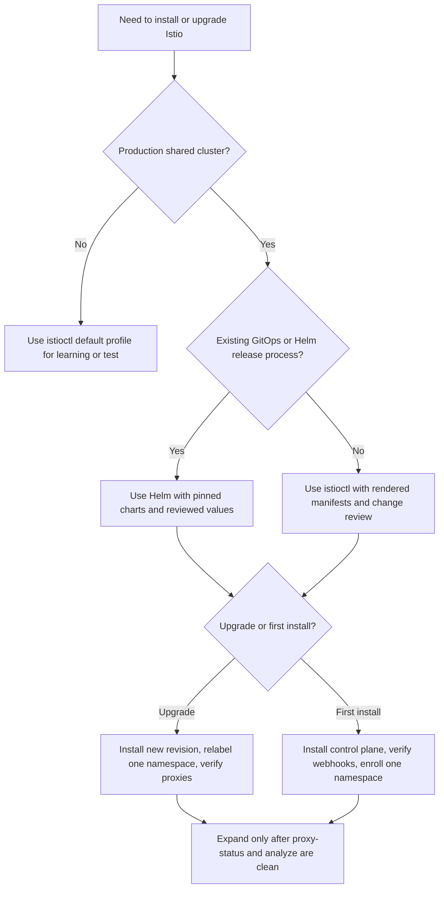

> **Складність:** `СЕРЕДНЯ`
> **Час на проходження:** 60–75 хвилин
> **Цільова версія Kubernetes:** v1.35+
> **Передумови:** [CKA Частина 3: Сервіси та мережі](/k8s/cka/part3-services-networking/), [Концепції service mesh](/platform/toolkits/infrastructure-networking/networking/module-5.2-service-mesh/) та базове розуміння TLS-рукостискань, прямих проксі (forward proxy) і зворотних проксі (reverse proxy).

## Результати навчання

Після завершення цього модуля ви зможете:

1. **Спроєктувати** стратегію встановлення Istio, що порівнює `istioctl`, Helm, профілі, ревізії та межі продакшн-оновлень.
2. **Впровадити** механізми контролю sidecar-ін'єкції та зарахування до ambient-режиму за допомогою міток простору імен, міток робочих навантажень і безпечних команд перевірки.
3. **Оцінити** синхронізацію `istiod` та Envoy за допомогою `istioctl proxy-status`, `istioctl analyze`, подій Kubernetes і сигналів про стан площини управління.
4. **Діагностувати** збої встановлення, пов'язані з webhook'ами, ревізіями, сертифікатами, CRD, обмеженнями ресурсів та поведінкою допуску в Kubernetes v1.35+.
5. **Порівняти** архітектуру з sidecar та ambient-режим, міркуючи про вартість ресурсів, межі безпеки, перехоплення трафіку й операційні компроміси.

## Чому цей модуль важливий

Гіпотетичний сценарій: платформова команда додає Istio до спільного продакшн-кластера Kubernetes v1.35, тому що організація хоче mTLS, політику трафіку й кращу телеметрію запитів без переписування кожного сервісу. Перший простір імен для розробки працює, тож команда розширює mesh, позначаючи кілька прикладних просторів імен одразу. Протягом години в одних Под'ів з'являються Envoy-sidecar'и, в інших — ні, один простір імен використовує старшу ревізію площини управління, а новий збій webhook'а блокує розгортання, яке не мало жодного стосунку до проєкту service mesh. Ніщо в цій історії не вимагає екзотичних режимів збою; це звичайний наслідок впровадження шару перехоплення трафіку без плану встановлення.

Встановлення Istio — це не просто «запустити команду й перевірити наявність Под'ів». Ви додаєте площину управління, яка спостерігає за ресурсами Kubernetes, перекладає API Istio на конфігурацію Envoy, видає ідентичності робочих навантажень, керує webhook'ами допуску й змінює мережевий шлях для кожного зарахованого навантаження. Неправильний вибір під час встановлення може залишити mesh технічно працездатним, але водночас породити крихкий кластер: трафік відкритим текстом може прийматися тоді, коли команда безпеки очікувала суворого mTLS, навантаження можуть під'єднатися до неправильної ревізії, а gateway може залежати від CRD, які так і не встановилися коректно.

Іспит ICA очікує, що ви експлуатуватимете Istio як інфраструктуру, а не як демонстраційне доповнення. Вам потрібно знати, чим володіє `istiod`, чим володіє Envoy, чим володіє допуск Kubernetes і де ці межі проявляються під час усунення несправностей. Цей модуль починається з архітектури, бо команди встановлення набувають сенсу лише тоді, коли ви здатні передбачити, який компонент має змінитися після кожної команди. Наприкінці ви матимете відтворюваний спосіб обрати метод встановлення, безпечно зараховувати навантаження й доводити, що площина управління та площина даних узгоджені.

Уявіть Istio як нервову систему лікарні — корисну аналогію з ранішої чернетки цього модуля. `istiod` — це мозок, який інтерпретує політику, маршрутизацію, сертифікати й виявлення сервісів; Envoy-sidecar'и — це нервові закінчення, прикріплені до окремих навантажень; ambient-режим переносить частину цього нервового шару у проксі на рівні нод та waypoint-проксі. Якщо мозок тимчасово недоступний, наявні sidecar'и можуть продовжувати користуватися своїми останніми чинними інструкціями, але нова конфігурація та нові ідентичності припиняють надходити. Якщо ж навантаження взагалі ніколи не отримує нервового закінчення, воно може виглядати справним у Kubernetes, водночас перебуваючи поза очікуваною моделлю безпеки mesh.

## Архітектура Istio: площина управління, площина даних і Kubernetes

Найлегший спосіб неправильно зрозуміти Istio — сприймати його як один великий проксі. Istio краще моделювати як контракт між трьома системами: Kubernetes зберігає бажаний стан, `istiod` перетворює цей стан на конфігурацію mesh, а Envoy чи компоненти ambient-площини даних застосовують результат близько до навантаження. Kubernetes залишається джерелом істини для Деплойментів, Сервісів, Endpoint'ів, Secret'ів, webhook'ів допуску та власних ресурсів. Istio додає API service mesh і шар перекладу, але не замінює планувальник Kubernetes, kube-proxy, плагін CNI чи API-сервер.

Площина управління — це Деплоймент `istiod` у просторі імен `istio-system`, якщо ви свідомо не обираєте інший простір імен або розкладку з ревізіями. Сучасний `istiod` поєднує обов'язки, які колись були розділені між Pilot, Citadel і Galley. Pilot-подібна поведінка виявляє Сервіси й виробляє конфігурацію xDS, Citadel-подібна поведінка обробляє сертифікати й ідентичність навантажень, а Galley-подібна валідаційна поведінка перейшла у webhook'и та інструменти аналізу. Це об'єднання має операційне значення, бо тепер єдиний Деплоймент перебуває на шляху для свіжості конфігурації, видачі сертифікатів, валідації та виявлення.

Площина даних — це місце, де виконуються рішення щодо трафіку. У класичному sidecar-режимі кожен зарахований Под навантаження отримує контейнер Envoy, який ін'єктується поруч із контейнером застосунку. Трафік Под'а перенаправляється через Envoy за допомогою iptables або еквівалентних правил перехоплення, тож застосунок продовжує слухати на своєму звичайному порту, поки Envoy обробляє mTLS, повторні спроби, балансування навантаження, телеметрію й політику маршрутизації. В ambient-режимі Istio прибирає sidecar для кожного Под'а зі стандартного шляху й використовує `ztunnel` на рівні ноди разом з опціональними waypoint-проксі для забезпечення різних шарів поведінки mesh. Sidecar-режим дає дуже тонкий локальний контроль над навантаженням; ambient-режим зменшує накладні витрати на кожен Под, але змінює мапу усунення несправностей.

Ось відновлена архітектурна діаграма з оригінального модуля, доповнена так, щоб вона коректно відображалася, водночас зберігаючи початкові концепції `istiod`, Pilot, Citadel, Galley та xDS:

```text
┌─────────────────────────────────────────────────────────┐
│                        istiod                           │
│                                                         │
│  ┌─────────────┐  ┌─────────────┐  ┌─────────────────┐ │
│  │   Pilot     │  │   Citadel   │  │     Galley      │ │
│  │             │  │             │  │                 │ │
│  │  Config     │  │ Certificate │  │ Config          │ │
│  │ distribution│  │ management  │  │ validation      │ │
│  │  (xDS API)  │  │             │  │                 │ │
│  └──────┬──────┘  └──────┬──────┘  └────────┬────────┘ │
│         │                │                  │          │
└─────────┼────────────────┼──────────────────┼──────────┘
          │                │                  │
          v                v                  v
┌─────────────────────────────────────────────────────────┐
│                 Kubernetes API Server                   │
│ Services, Endpoints, CRDs, Secrets, Webhooks, Events     │
└─────────────────────────────────────────────────────────┘
          │
          v
┌─────────────────────────────────────────────────────────┐
│                 Envoy / Ambient Data Plane              │
│ Sidecars, ztunnel, waypoint proxies, gateways            │
└─────────────────────────────────────────────────────────┘
          ▲
          │ xDS config push (gRPC :15010/:15012) — not via API server
          │
        istiod
```

Стрілки на першій діаграмі показують усунення несправностей і шарування залежностей, а не живий шлях конфігурації. `istiod` зчитує бажаний стан з API-сервера Kubernetes, а потім надсилає конфігурацію xDS напряму кожному проксі Envoy через gRPC (порти 15010/15012). API-сервер не перебуває на гарячому шляху для розповсюдження конфігурації.

Діаграма навмисно розміщує Kubernetes посередині, бо збої встановлення часто проявляються там першими. Відсутній CRD не дає зберегти власні ресурси Istio, несправний мутаційний webhook не дає виконати sidecar-ін'єкцію, а зламаний валідаційний webhook відхиляє конфігурацію ще до того, як Envoy її побачить. Коли ви налагоджуєте встановлення Istio, не переходьте одразу до Envoy. Спершу запитайте, чи прийняв Kubernetes бажаний стан, потім — чи переклав його `istiod`, і лише тоді — чи застосувала його площина даних.

Зробіть паузу й передбачте: якщо `istiod` перезапускається, поки наявні sidecar-ін'єктовані Под'и продовжують працювати, що, на вашу думку, станеться з уже встановленим трафіком застосунку, і що — з новою конфігурацією mesh? Очікувана відповідь є роздвоєною. Наявні Envoy-sidecar'и продовжують обробляти трафік за останньою прийнятою конфігурацією, тоді як нові зміни маршрутизації, свіжі сертифікати та новозапущені проксі можуть застопоритися або застаріти, доки `istiod` знову не стане справним. Саме ця відмінність є причиною того, чому доступність площини управління й безперервність площини даних пов'язані, але не тотожні.

Встановлення Istio також створює хуки допуску Kubernetes, і це робить API-сервер частиною критичного шляху для нових Под'ів. Автоматична sidecar-ін'єкція зазвичай реалізується через мітки простору імен або Под'а, які змушують мутаційний webhook пропатчити специфікацію Под'а перед його збереженням. Якщо webhook недосяжний, налаштований з неправильним CA-bundle або вказує на видалену ревізію, створення Под'а може зазнати збою або відбутися без ін'єкції — залежно від політики й правил відповідності. Ваша ментальна модель має включати виклик допуску, бо проблема «відсутнього sidecar'а» може бути проблемою допуску на API-сервері, а не проблемою kubelet чи Envoy.

Практична перевірка площини управління починається з ресурсів Kubernetes, а потім переходить до перевірок, обізнаних про Istio. Ці команди навмисно прості, бо перший прохід має відповісти на питання, чи існують очікувані компоненти й чи повідомляє Kubernetes про готовність. Пізніші перевірки розглянуть синхронізацію xDS та вивід аналізатора.

```bash
kubectl get namespace istio-system
kubectl get deployments,pods,services -n istio-system
kubectl get mutatingwebhookconfigurations,validatingwebhookconfigurations | grep istio
istioctl version
istioctl proxy-status
```

Ту саму архітектуру можна звести до драбини усунення несправностей. API-сервер зберігає ресурси й викликає webhook'и допуску, `istiod` спостерігає за цим станом і виробляє xDS, а площина даних під'єднується назад, щоб отримати конфігурацію й сертифікати. Якщо будь-який щабель зламаний, наступний щабель може показувати симптом, не будучи кореневою причиною. Відсутній sidecar може бути спричинений мітками простору імен, станом webhook'а, націлюванням на ревізію або таймінгом створення Под'а. Застарілий проксі може бути спричинений `istiod`, мережевою досяжністю, недійсною конфігурацією або збоєм запуску проксі.

```text
+----------------------+      +----------------------+      +----------------------+
| Kubernetes API       | ---> | istiod control plane | ---> | Envoy or ambient     |
| CRDs and webhooks    |      | xDS and identity     |      | traffic enforcement  |
+----------------------+      +----------------------+      +----------------------+
        |                             |                             |
        v                             v                             v
+----------------------+      +----------------------+      +----------------------+
| Accepted resources   |      | Translated config    |      | Applied runtime view |
| Events and admission |      | Certificates issued  |      | Requests and metrics |
+----------------------+      +----------------------+      +----------------------+
```

Ця драбина — також спосіб уникнути надмірної прив'язки до однієї команди. `kubectl get pods` потрібна, але неповна, бо бачить лише шар середовища виконання Kubernetes. `istioctl analyze` потрібна, але неповна, бо міркує про конфігурацію більше, ніж про живий успіх запитів. `proxy-status` потрібна, але неповна, бо зосереджується на під'єднаних проксі площини даних. Сильна перевірка встановлення використовує всі три перспективи, а потім виконує невеликий тест трафіку, який доводить ту поведінку mesh, на яку ви розраховували.

Перш ніж це запускати, який вивід ви очікуєте від `istioctl proxy-status` у кластері, де Istio встановлено, але жодне прикладне навантаження ще не приєдналося до mesh? Справна відповідь може не показати жодних проксі навантажень, і це не автоматично є збоєм. `proxy-status` повідомляє про під'єднані проксі Envoy, тож порожній чи короткий список може просто означати, що ви встановили площину управління до зарахування застосунків. Ця команда стає потужною після ін'єкції, бо розкриває, чи синхронізований кожен проксі з `istiod`.

## Стратегія встановлення: профілі, `istioctl`, Helm і ревізії

Стратегія встановлення — це набір рішень, а не єдина перевага конкретного інсталятора. Ви вирішуєте, як артефакти Istio потрапляють у кластер, який профіль чи values визначають стартову точку, чи використовують оновлення ревізії, як керуються gateway'і та якій частині mesh дозволено змінюватися одночасно. `istioctl` чудово підходить для навчання, валідації та встановлень під керівництвом оператора, бо розуміє профілі Istio й може запускати аналізатори перед застосуванням ресурсів. Helm часто кращий для GitOps і платформових команд, які вже керують доповненнями кластера через версії чартів, файли values, pull-request'и та оверлеї середовищ.

Профілі зручні, але їх легко застосувати неправильно. Профіль `default` — це орієнтований на продакшн базовий рівень для площини управління. Профіль `demo` призначений для експериментів і містить додаткові компоненти чи налаштування, які роблять приклади легшими, а не кращими для продакшн-управління. Профіль `minimal` може бути корисним, коли ви хочете жорсткого контролю над тим, які gateway'і й доповнення існують. Ambient-встановлення використовують орієнтований на ambient профіль та додаткові компоненти площини даних. Сприймайте профіль як набір політик із наслідками для безпеки, ін'єкції, gateway'ів та ресурсів, а не як розмір футболки.

Закріплення версії належить до стратегії встановлення так само, як і профіль. Istio публікує підтримувані діапазони версій Kubernetes для кожного релізу, тож кластер на v1.35+ усе одно має закріплювати Istio на переглянутій версії, а не сліпо слідувати за «latest». Записуйте перевірену пару релізів у тикет змін, щоб рецензенти могли пізніше проаудитувати це припущення. Оновлення mesh змінюють webhook'и, CRD, образи проксі, поведінку gateway'ів і подеколи стандартні повідомлення аналізатора. На практиці ви хочете мати письмову заяву про сумісність перед зміною й заяву про відкат після зміни.

Gateway'і заслуговують на окреме рішення щодо встановлення, навіть коли площина управління проста. Багато команд встановлюють ingress-gateway'і разом з Istio, бо так роблять приклади, а потім виявляють, що володіння gateway'ем, анотації балансувальника навантаження, автоматизація сертифікатів і зовнішній DNS контролюються іншою платформовою групою. Чистіший патерн — спершу встановити площину управління, вирішити, чи є gateway'і власністю mesh або платформи, і керувати чартами чи маніфестами gateway'ів як їхньою власною поверхнею релізу. Таке розмежування не дає випадково змінювати точки входу трафіку під час експерименту з площиною управління.

Оригінальний модуль містив застереження для продакшну довкола профілю `demo`. Приклад нижче зберігає його основний командний актив, водночас переформульовуючи історію як чітко позначений сценарій вправи. Важливий урок усе той самий: продакшн-встановлення має починатися зі свідомого базового рівня, а суворий mTLS слід виражати явно, коли вимога безпеки полягає в суворому шифруванні між навантаженнями mesh.

Сценарій вправи: кластер для розробки встановили з `profile=demo`, і команда тепер хоче схожий на продакшн кластер, що використовує стандартний профіль і суворий mTLS у межах простору імен. Безпечне виправлення — не копіювати demo-команду в продакшн. Встановіть свідомий профіль, підтвердьте справність площини управління, а потім застосуйте політику безпеки, що відповідає бажаній поставі трафіку.

```bash
# What the team should have done for production:
istioctl install --set profile=default

# Then explicitly set STRICT mTLS:
kubectl apply -f - <<EOF
apiVersion: security.istio.io/v1
kind: PeerAuthentication
metadata:
  name: default
  namespace: istio-system
spec:
  mtls:
    mode: STRICT
EOF
```

Ця команда є виконуваною, але операційне рішення за нею важливіше за синтаксис. Сувора `PeerAuthentication` для всього mesh змінює те, як навантаження приймають трафік, і може зламати сервіси, які насправді не перебувають у mesh або залежать від застарілих шляхів відкритим текстом. У реальній міграції ви зазвичай розгортали б суворий mTLS поетапно за просторами імен, перевіряли б готовність застосунків і використовували б телеметрію, щоб підтвердити, що очікувані клієнти користуються взаємним TLS, перш ніж розширювати політику. Команда навчає форми ресурсу; план розгортання запобігає уникним збоям.

`istioctl` дає вам корисні запобіжники під час встановлення, бо може генерувати маніфести, застосовувати профілі й запускати попередній аналіз. На іспиті ви маєте знати команду встановлення, але в експлуатації вам також слід знати, як згенерувати й оглянути те, що буде застосовано. Генерація цінна, бо розкриває CRD, Деплойменти, Сервіси, webhook'и та gateway'і ще до того, як вони вплинуть на живий кластер. Він також дозволяє переглянути згенерований YAML у code review тоді, коли пряме встановлення в кластер було б надто непрозорим.

```bash
istioctl manifest generate --set profile=default > istio-default-rendered.yaml
istioctl install --set profile=default --skip-confirmation
kubectl wait --for=condition=available deployment/istiod -n istio-system --timeout=180s
istioctl verify-install
```

Helm змінює робочий процес, вписуючи базовий чарт, чарт площини управління, чарт CNI, чарт gateway'а та ambient-компоненти у модель, керовану релізами. Компроміс полягає в тому, що Helm не навчатиме автоматично кожного оператора того самого специфічного для Istio словника профілів, який розкриває `istioctl`. Це не є слабкістю, якщо ваша команда вже користується файлами values, закріпленням чартів і поетапним просуванням релізів. Це слабкість, якщо Helm стає обгорткою копіювання-вставлення довкола values, яких ніхто не розуміє.

```bash
helm repo add istio https://istio-release.storage.googleapis.com/charts
helm repo update

helm install istio-base istio/base -n istio-system --create-namespace --wait
helm install istiod istio/istiod -n istio-system --wait
kubectl wait --for=condition=available deployment/istiod -n istio-system --timeout=180s
istioctl proxy-status
```

Встановлення з ревізіями — це безпечніша форма оновлення для кластерів із важливими навантаженнями. Ревізія — це мітка й ідентичність площини управління, що дозволяє одній ревізії `istiod` співіснувати з іншою, тож простори імен можна переміщувати поступово. Замість того щоб оновити єдину площину управління й сподіватися, що кожне ін'єктоване навантаження чисто за нею послідує, ви встановлюєте нову ревізію, перепозначаєте тестовий простір імен, перезапускаєте чи розгортаєте там навантаження й спостерігаєте. Коли нова ревізія поводиться коректно, ви переміщуєте більше просторів імен. Якщо вона зазнає збою, ви можете повернути мітку назад, не змушуючи весь кластер проходити через один незворотний крок.

```bash
istioctl install --set profile=default --set revision=canary --skip-confirmation
kubectl get pods -n istio-system -l app=istiod
kubectl label namespace payments istio.io/rev=canary --overwrite
kubectl rollout restart deployment -n payments
istioctl proxy-status
```

Мітка ревізії також запобігає поширеному плутанню між зарахуванням простору імен і перезапуском навантаження. Перепозначення простору імен змінює те, як має поводитися допуск майбутніх Под'ів, але не мутує вже створені Под'и. Наявні Под'и зберігають sidecar і початкову (bootstrap) конфігурацію, які вони отримали під час створення, доки їх не перезапустять. Саме тому план міграції ревізій завжди включає і операцію позначення, і розгортання навантаження, плюс крок перевірки, що підтверджує, що проксі повідомляють про очікувану ревізію площини управління.

Ревізії також роблять мову відкату точною. Без ревізій відкат часто означає перевстановлення попередньої площини управління чи повернення релізу чарта зі сподіванням, що проксі чисто перепід'єднаються. З ревізіями відкат може означати перепозначення простору імен назад на попередню ревізію й перезапуск навантажень у цьому просторі імен. Це все одно спричиняє коловорот Под'ів, тож не є безкоштовним, але воно обмежене за обсягом і спостережуване. Менша одиниця відкату — головна причина, чому встановлення з ревізіями варті додаткових міток і роботи з прибирання.

Який підхід ви обрали б тут і чому: пряме встановлення `istioctl` для практичного кластера з однією нодою чи Helm-чарти для регульованої продакшн-платформи з погодженнями через pull-request? Практична відповідь зазвичай — `istioctl` для практичного кластера, бо це швидко й зрозуміло, і Helm для регульованої платформи, бо артефакти релізів, файли values й погодження мають значення. Глибша думка полягає в тому, що інсталятор має відповідати моделі управління. Гарний метод встановлення — це той, який ваша команда може оглянути, відтворити, оновити й відкотити під тиском.

## Зарахування площини даних: sidecar-ін'єкція та ambient-режим

Встановлення `istiod` не поміщає застосунки в mesh. Зарахування — це окреме рішення, яке контролює, які навантаження отримують sidecar, під'єднуються через ambient або залишаються поза Istio. Таке розмежування є здоровим, бо платформові команди можуть спершу встановити площину управління, протестувати поведінку допуску, а потім зараховувати простори імен по одному. Воно також означає, що кластер може перебувати у змішаному стані за задумом. Ключ — зробити змішаний стан видимим і навмисним, а не випадковим.

Класична sidecar-ін'єкція зазвичай починається з мітки простору імен. Старіша мітка `istio-injection=enabled` каже стандартному ін'єктору додавати sidecar'и. Мітка ревізії `istio.io/rev=<revision>` каже простору імен використовувати конкретну ревізію площини управління. Не використовуйте обидві мітки на одному просторі імен, доки не перевірите точно, як ваша цільова версія Istio їх розв'язує, бо конкурентні мітки зарахування — поширене джерело несподіваної поведінки ін'єкції. У продакшн-процесах оновлення віддавайте перевагу міткам ревізій, бо вони роблять володіння явним.

```bash
kubectl create namespace sample
kubectl label namespace sample istio-injection=enabled
kubectl run web -n sample --image=nginx:1.27 --port=80
kubectl get pod -n sample -l run=web -o jsonpath='{.items[0].spec.containers[*].name}'
```

Очікуваний список контейнерів має включати контейнер застосунку та `istio-proxy` після успішної автоматичної ін'єкції. Якщо Под містить лише `web`, перевірте мітку простору імен, конфігурацію мутаційного webhook'а й те, чи був Под створений до позначення простору імен. Допуск Kubernetes не діє заднім числом. Ви можете видалити й перестворити Под або розгорнути заново Деплоймент-власник, але не можете позначити простір імен і очікувати, що вже запущені Под'и відростять sidecar'и.

Ручна ін'єкція все ще має значення для контрольованих демонстрацій, ізольованих робочих процесів та налагодження. Вона генерує мутований маніфест ще до того, як він досягає API-сервера, що робить додавання sidecar'а видимим. Ручна ін'єкція зазвичай не є кращим продакшн-шляхом, бо запікає вивід ін'єкції у YAML навантаження й може дрейфувати від чинної ревізії площини управління. Використовуйте її, коли потрібно вивчити чи порівняти специфікацію ін'єктованого Под'а, а потім поверніться до ін'єкції на основі допуску для звичайних операцій.

```bash
kubectl create deployment manual-web -n sample --image=nginx:1.27 --dry-run=client -o yaml > manual-web.yaml
istioctl kube-inject -f manual-web.yaml > manual-web-injected.yaml
kubectl apply -f manual-web-injected.yaml
kubectl get pod -n sample -l app=manual-web -o jsonpath='{.items[0].spec.containers[*].name}'
```

Sidecar'и потужні, бо ставлять застосування політики поруч із процесом застосунку. Та сама близькість є водночас і вартістю. Кожен sidecar споживає CPU, пам'ять, час запуску, завантаження образів, обсяг логів і потоки конфігурації від `istiod`. У малих кластерах ці накладні витрати легко ігнорувати. У більших кластерах флот sidecar'ів стає реальним вхідним параметром планування потужностей, особливо для навантажень, що масштабуються горизонтально до сотень чи тисяч Под'ів.

Ambient-режим змінює зарахування, переносячи стандартний захищений overlay рівня L4 у `ztunnel` і використовуючи waypoint-проксі, коли потрібна політика рівня L7. Операційна перевага полягає в тому, що Под'и застосунків за замовчуванням не отримують Envoy-sidecar, що зменшує накладні витрати ресурсів на рівні Под'а й уникає певного тертя життєвого циклу sidecar'а. Компроміс у тому, що усунення несправностей зміщується від «оглянь контейнер `istio-proxy` Под'а» до «оглянь тунелі рівня ноди, waypoint-ресурси, мітки простору імен і прикріплення політик». Ambient-режим не є магією; це інша топологія площини даних.

```bash
istioctl install --set profile=ambient --skip-confirmation
kubectl label namespace sample istio.io/dataplane-mode=ambient --overwrite
kubectl get pods -n istio-system
kubectl get namespace sample --show-labels
```

Ambient-зарахування також змінює те, як ви говорите про «перебування в mesh». У sidecar-режимі візуальний доказ міститься всередині специфікації Под'а, бо контейнер sidecar присутній. В ambient-режимі навантаження може бути зарахованим без видимого контейнера `istio-proxy`, тож доказ зміщується до міток простору імен, справності `ztunnel`, прикріплення політик і поведінки трафіку. Це поширена пастка на іспиті й в експлуатації. Не оголошуйте ambient зламаним лише тому, що Под'у бракує sidecar'а; ця відсутність є частиною задуму.

Перш ніж обирати ambient, порівняйте вимоги до політик для навантаження. Якщо вам потрібна лише захищена ідентичність сервіс-до-сервісу й базове перехоплення трафіку, ambient може зменшити операційну вартість. Якщо ви сильно покладаєтеся на Envoy-фільтри для кожного навантаження, просунуту маршрутизацію рівня L7 на кожному Под'і чи наявні навички налагодження, специфічні для sidecar'ів, sidecar'и все ще можуть бути зрозумілішим вибором. Ambient — це архітектурний варіант, а не універсальна заміна кожного розгортання з sidecar'ами.

Модель зарахування слід зафіксувати письмово ще до зміни першого продакшн-простору імен. Просте правило на кшталт «нові прикладні простори імен використовують мітки ревізій, спільні інфраструктурні простори імен виключаються, а ambient пілотується лише для безстанових внутрішніх сервісів» набагато безпечніше за стихійне позначення. Правило дає рецензентам що оцінювати, а черговим інженерам — базовий рівень, коли Под має несподівані контейнери чи відсутню ідентичність mesh. Архітектура встановлення стає операційно корисною тоді, коли продукує передбачувані мітки.

Правила відмови від зарахування (opt-out) так само важливі, як і правила приєднання (opt-in). Деякі Под'и не слід ін'єктувати, бо вони працюють із host networking, реалізують низькорівневу мережу, використовують незвичні стартові проби або належать до просторів імен, де перехоплення mesh заплутало б платформові сервіси. Istio підтримує мітки й анотації на рівні навантаження, що можуть вимкнути ін'єкцію для конкретних Под'ів, але такі винятки мають бути рідкісними й задокументованими. Виняток, про який ніхто не пам'ятає, стає майбутньою загадкою mTLS чи телеметрії, коли навантаження поводиться інакше, ніж його простір імен.

## Оцінювання синхронізації площини управління та проксі

Після встановлення й зарахування головним питанням стає те, чи досяг бажаний стан mesh площини даних. Kubernetes може показати, що Под'и в стані Running, але не може сказати вам, чи має Envoy найновіші кластери, listener'и, маршрути, endpoint'и й secret'и. Діагностичні команди Istio заповнюють цю прогалину, опитуючи `istiod` і під'єднані проксі. Мета — не завчити кожен стовпець виводу; мета — знати, який шар оглядається й що означає розбіжність.

`istioctl proxy-status` — це широке подання синхронізації. Воно повідомляє про під'єднані проксі й те, чи синхронізовані основні типи ресурсів xDS. Проксі може бути в стані Running з погляду Kubernetes і водночас застарілим з погляду Istio. Застарілий xDS часто означає, що проксі не прийняв нещодавнього надсилання конфігурації, площина управління не може чисто його досягти або погана конфігурація була відхилена. Якщо застарілим є один проксі, зосередьтеся на цьому навантаженні. Якщо застарілими є багато проксі, підозрюйте `istiod`, мережу кластера або широку проблему конфігурації.

```bash
istioctl proxy-status
istioctl proxy-status deployment/web.sample
kubectl logs -n istio-system deployment/istiod --tail=100
```

`istioctl analyze` перевіряє конфігурацію Istio на відомі помилки перед застосуванням чи після нього. Вона здатна вловити конфліктні virtual service'и, відсутні підмножини destination, недійсні посилання на gateway'і, проблеми з мітками ін'єкції та інші проблеми конфігурації, які сам Kubernetes може прийняти, бо YAML структурно дійсний. Запускайте її за звичкою після встановлення й перед великими змінами розгортання. Аналізатор не є заміною тестування трафіку, але це дешевий спосіб виявити помилки, доки вони не перетворилися на заплутану поведінку проксі.

```bash
istioctl analyze --all-namespaces
istioctl analyze -n sample
kubectl get events -n sample --sort-by=.lastTimestamp
```

Специфічне для Envoy обстеження є детальнішим і має слідувати за конкретним питанням. Якщо трафік до сервісу зазнає збою, оглядайте кластери й endpoint'и. Якщо маршрути неправильні, оглядайте маршрути й listener'и. Якщо є підозра на mTLS, оглядайте secret'и й політику автентифікації. Безладне скидання всієї конфігурації кожного проксі є гучним. Старша звичка усунення несправностей — почати із симптому, назвати очікуваний об'єкт Envoy, а потім запитати цей об'єкт напряму.

```bash
istioctl proxy-config clusters deployment/web.sample
istioctl proxy-config listeners deployment/web.sample
istioctl proxy-config routes deployment/web.sample
istioctl proxy-config secrets deployment/web.sample
```

Подання Kubernetes усе ще має значення, бо багато симптомів Istio спричинені звичайним станом Kubernetes. Якщо в Сервіса немає endpoint'ів, Envoy не може надсилати трафік до справних Под'ів. Якщо Под так і не пройшов перевірку готовності, endpoint slice може його не містити. Якщо NetworkPolicy блокує `istiod` чи сервіс webhook'а, ін'єкція й xDS можуть зазнавати збоїв у спосіб, що виглядає як проблеми mesh. Istio не звільняє вас від основ Kubernetes; воно робить наслідки слабких основ помітнішими.

```bash
kubectl get services,endpointslices -n sample
kubectl describe pod -n sample -l run=web
kubectl get events -n istio-system --sort-by=.lastTimestamp
kubectl get configmap -n istio-system
```

Зробіть паузу й передбачте: простір імен позначено правильно, Деплоймент перезапущено, у Под'а є контейнер `istio-proxy`, але `istioctl proxy-status` його не показує. Що б ви перевірили далі? Простежте шлях під'єднання: проксі має запуститися, ініціалізуватися з правильною адресою виявлення, отримати ідентичність і під'єднатися назад до `istiod`. Перевірте логи sidecar'а, готовність Под'а, сервіс площини управління й логи `istiod`, перш ніж змінювати політику маршрутизації.

Успішне оцінювання завершується доказами, а не інтуїцією. Для базового sidecar-встановлення гарними доказами є: `istiod` у стані Available, webhook'и наявні, цільові простори імен позначено навмисно, Под'и застосунків показують очікувані контейнери, `proxy-status` синхронізований, а `analyze` чистий чи пояснений. Для ambient докази включають ambient-мітки, справний `ztunnel`, waypoint-ресурси там, де потрібно, і тести трафіку, що доводять задуману поведінку безпеки й маршрутизації. Запишіть ці перевірки в runbook'и, бо справність встановлення вам знадобиться знову під час оновлень.

Докази також мають враховувати час. Проксі, синхронізований одразу після встановлення, може застаріти після зміни конфігурації, а результат аналізатора від учора не доводить, що сьогоднішнє злиття безпечне. Для рутинних операцій фіксуйте команду, простір імен, ревізію й приблизний час валідації у записі змін. Під час інциденту цей запис дозволяє відповідальним відрізнити «mesh ніколи не був справним» від «mesh був справним до цієї пізнішої зміни».

Одна корисна звичка — тримати блок доказів встановлення у pull-request'і чи тикеті змін. Він може перелічувати версію Istio, версію Kubernetes, метод встановлення, профіль, назву ревізії, торкнуті простори імен, результат аналізатора та зразок proxy-status. Цей запис не є бюрократією заради бюрократії. Це стиснута мапа архітектурних рішень, потрібних майбутнім операторам, коли постане наступне питання щодо оновлення, політики трафіку чи сертифіката.

## Діагностування збоїв встановлення та тиску на ресурси

Збої встановлення Istio зазвичай групуються довкола чотирьох меж: CRD, допуск, готовність площини управління та тиск на ресурси площини даних. Збої CRD з'являються, коли власні ресурси Istio не можуть бути створені чи розпізнані. Збої допуску з'являються, коли створення Под'а заблоковане або ін'єкція не відбувається. Збої площини управління з'являються, коли `istiod` не готовий чи не може розповсюджувати конфігурацію. Збої тиску на ресурси з'являються, коли sidecar'и чи gateway'і запускаються, але споживають більше CPU й пам'яті, ніж кластер може комфортно надати.

Проблеми з CRD часто прямолінійні, але з високим впливом. Якщо базовий чарт чи базові ресурси `istioctl` встановилися некоректно, Kubernetes може відхиляти такі ресурси, як `VirtualService`, `DestinationRule`, `PeerAuthentication` чи `Gateway`. Повідомлення про збій може виглядати як невідомий kind чи відсутня версія API. Не розв'язуйте це зміною маніфесту застосунку. Підтвердьте, що CRD існують, підтвердьте їхні версії й підтвердьте, що ваша встановлена версія Istio підтримує API, який ви використовуєте.

```bash
kubectl get crds | grep istio.io
kubectl explain virtualservice.spec
kubectl explain peerauthentication.spec
istioctl analyze --all-namespaces
```

Збої допуску підступніші, бо несправний webhook може заблокувати непов'язані прикладні команди. Мутаційний webhook використовується для sidecar-ін'єкції, тоді як валідаційні webhook'и можуть відхиляти недійсну конфігурацію Istio. Якщо сервіс webhook'а вказує на відсутню ревізію площини управління чи має недійсний CA-bundle, створення Под'а може зазнати збою з помилками допуску. Якщо правила відповідності webhook'а не обирають простір імен, Под'и створюються без ін'єкції. Обидва результати є проблемами архітектури встановлення, і обидва видимі з Kubernetes.

```bash
kubectl get mutatingwebhookconfiguration -o name | grep istio
kubectl get validatingwebhookconfiguration -o name | grep istio
kubectl describe mutatingwebhookconfiguration istio-sidecar-injector
kubectl get endpointslices -n istio-system -l kubernetes.io/service-name=istiod
```

Проблеми готовності площини управління слід обробляти, як будь-який інший критичний Деплоймент, але з урахуванням специфічних для mesh наслідків. Перевірте стан розгортання, логи, endpoint'и сервісу, сертифікати й події. Якщо `istiod` не може запуститися, нові проксі не зможуть отримати конфігурацію. Якщо `istiod` запускається, але в його сервіса немає endpoint'ів, виклики допуску й виявлення зазнають збою. Якщо він перевантажений, проксі можуть під'єднуватися повільно чи повідомляти про застарілі ресурси. Симптом може проявитися в трафіку застосунку, але кореневою причиною може бути перенасичення площини управління.

```bash
kubectl rollout status deployment/istiod -n istio-system --timeout=180s
kubectl describe deployment istiod -n istio-system
kubectl top pods -n istio-system
kubectl logs -n istio-system deployment/istiod --tail=200
```

Тиск на ресурси — це місце, де архітектура й встановлення зустрічаються з плануванням потужностей. Флот sidecar'ів додає контейнери до Под'ів, що змінює планування, запуск, запити CPU, запити пам'яті й ущільнення нод. Якщо наявні навантаження вже були близькими до лімітів ноди, sidecar-ін'єкція може зіштовхнути Под'и у стан Pending, OOMKilled чи повільного запуску. Gateway'і та `istiod` також потребують потужності. Правильна відповідь — не сліпо прибирати запити; це підібрати розмір компонентів mesh і кроків розгортання так, щоб кластер міг увібрати нову площину даних.

```bash
kubectl get pods -A --field-selector=status.phase=Pending
kubectl top pods -A --containers | grep istio-proxy
kubectl describe pod -n sample -l run=web
kubectl get resourcequota,limitrange -A
```

Усунення несправностей покращується, коли ви відокремлюєте «встановлення зазнало збою» від «встановлення вдалося, але політика зазнала збою». Якщо webhook зламаний, зосередьтеся на допуску. Якщо синхронізація проксі застаріла, зосередьтеся на xDS і зв'язності. Якщо трафік відхиляється під суворим mTLS, оглядайте зарахування навантаження й політику автентифікації. Якщо Под'и в стані Pending після ін'єкції, оглядайте ресурси й планування. У кожної гілки інший власник і інший шлях відкату, тож називання межі збою зменшує марнотратні зміни.

Сценарій вправи: простір імен має суворий mTLS, один сервіс sidecar-ін'єктований, а інший сервіс у тому самому просторі імен запустили до того, як з'явилася мітка ін'єкції. Ін'єктований сервіс відхиляє відкритий текст від неін'єктованого сервісу. Виправлення — не зробити весь mesh дозвільним назавжди. Перезапустіть чи переразгорніть неін'єктоване навантаження, щоб воно приєдналося до mesh, перевірте, що обидва проксі з'являються у `proxy-status`, і лише тоді залиште суворій політиці чинність.

Проблеми сертифікатів і домену довіри — ще один клас проблем встановлення, що заслуговує на ранню увагу. Ідентичність навантажень Istio залежить від сертифікатів, які прив'язують навантаження до ідентичностей у стилі SPIFFE, і саме ці ідентичності надають змісту політиці mTLS. Якщо навантаження не можуть отримати сертифікати, sidecar'и можуть запуститися, але не зуміють встановити очікувану комунікацію mesh. Якщо домени довіри чи корені змінюються без плану міграції, раніше дійсні рівноправні вузли можуть припинити довіряти одне одному. Для першого модуля важлива звичка — сприймати ідентичність як частину встановлення, а не як другорядну справу, відкладену на пізніший урок безпеки.

Коли діагностуєте збій встановлення під тиском часу, запишіть першу межу збою, перш ніж щось змінювати. «Відсутні CRD», «мутаційний webhook недосяжний», «неправильна мітка простору імен», «застарілий проксі» та «sidecar OOMKilled» — це різні діагнози. Кожен з них вказує на менший набір команд і безпечніше виправлення. Це звучить базово, але запобігає найдорожчій помилці усунення несправностей: вносити широкі зміни встановлення тоді, коли збій спричинила одна мітка простору імен чи один запит ресурсу.

## Патерни та антипатерни

Гарні встановлення Istio мають одну спільну рису: вони зменшують несподіванку. Вони роблять володіння видимим через мітки, роблять оновлення зворотними через ревізії й роблять усунення несправностей відтворюваним через діагностичні команди. Наведені нижче патерни не є вишуканими. Вони навмисно нудні, бо нудна архітектура встановлення — це те, що дозволяє прикладним командам рухатися швидко, не вивчаючи кожен крайовий випадок mesh під час інциденту.

| Патерн | Коли його застосовувати | Чому він працює | Міркування щодо масштабування |
|---|---|---|---|
| Встановлення площини управління з ревізіями | Продакшн-оновлення, спільні кластери, регульовані середовища | Простір імен може перейти на нову ревізію `istiod`, не змушуючи весь кластер перемикатися одразу. | Відстежуйте мітки просторів імен і прибирайте старі ревізії лише після того, як усі проксі переїхали. |
| Зарахування простір-за-простором | Наявні кластери з багатьма командами | Малий радіус ураження дозволяє спостерігати ін'єкцію, вартість ресурсів і поведінку mTLS перед розширенням. | Ведіть інвентар зарахувань, щоб змішаний стан mesh був навмисним. |
| Огляд «генерація перед застосуванням» | GitOps, контроль змін платформи, команди з ретельним аудитом | Згенеровані маніфести розкривають CRD, webhook'и, Деплойменти й зміни gateway'ів ще до того, як вони сягнуть API-сервера. | Закріплюйте версії Istio й порівнюйте згенерований вивід між оновленнями. |
| Розгортання з гейтом аналізатора | Будь-який кластер, де конфігурацію Istio змінюють люди | `istioctl analyze` вловлює поширені помилки, перш ніж поведінка Envoy стане заплутаною. | Запускайте аналізатори в CI та ще раз проти живого кластера після встановлення. |

Антипатерни зазвичай випливають зі сприйняття Istio як прикладної бібліотеки замість спільної інфраструктури. Команда копіює demo-команду встановлення, бо вона спрацювала в туторіалі, позначає кожен простір імен, бо перший вдався, або видаляє ресурси webhook'а, бо помилки допуску блокують дедлайн. Ці дії можуть здаватися такими, що виправляють негайний симптом, водночас залишаючи кластер менш захищеним і складнішим для оновлення.

| Антипатерн | Що йде не так | Краща альтернатива |
|---|---|---|
| Копіювання `profile=demo` у продакшн | Орієнтовані на demo налаштування й доповнення стають прихованим продакшн-базисом. | Починайте з `default`, `minimal` чи явно переглянутого файлу values. |
| Безтурботне змішування стандартної ін'єкції та міток ревізій | Под'и можуть прив'язатися до несподіваної ревізії площини управління чи ін'єктуватися непослідовно. | Використовуйте мітки ревізій для продакшну й документуйте винятки. |
| Зарахування всіх просторів імен однією зміною | Тиск на ресурси, збої допуску й поломки mTLS зачіпають надто багато команд одразу. | Спершу зараховуйте низькоризикові простори імен, потім розширюйтеся з доказами. |
| Налагодження лише через `kubectl get pods` | Под'и можуть бути в стані Running, поки Envoy застарілий, неін'єктований чи під'єднаний до неправильної ревізії. | Поєднуйте перевірки Kubernetes із `proxy-status`, `analyze` та цільовим `proxy-config`. |

Таблицю патернів і таблицю антипатернів слід використовувати разом. Наприклад, встановлення з ревізіями зменшують радіус ураження оновлення, але також вимагають чіткої дисципліни позначення просторів імен. Розгортання з гейтом аналізатора вловлює багато проблем конфігурації, але не може сказати вам, чи вписуються ваші запити ресурсів у кластер. Архітектура встановлення — це шарований захист. Жодна окрема команда не робить її безпечною; безпечною настільки, щоб розширюватися, її роблять повторювані докази.

## Каркас прийняття рішень

Обирайте шлях встановлення, починаючи з управління, а не зі зручності. Якщо ви вчитеся для іспиту ICA чи будуєте одноразовий практичний кластер, `istioctl install --set profile=default` дає найшвидший зворотний зв'язок і найчіткіший зв'язок між командою й результатом. Якщо ви експлуатуєте продакшн-платформу через pull-request'и й просування релізів, values Helm і версії чартів можуть краще вписатися в наявний робочий процес. Якщо ви оновлюєте спільний кластер, встановлення з ревізіями є рішенням за замовчуванням, доки кластер не настільки малий, щоб одне переключення було справді низькоризиковим.



Наступне рішення — sidecar проти ambient. Sidecar-режим є консервативним вибором, коли вам потрібна зріла поведінка рівня L7 для кожного навантаження, наявні операційні знання й пряме обстеження проксі в кожному Под'і. Ambient-режим привабливий, коли накладні витрати sidecar'а на кожен Под є значним занепокоєнням, а ваша модель політик вписується в розділення ambient між захищеним overlay й обробкою рівня L7 на основі waypoint. Не обирайте ambient лише тому, що він звучить новіше. Обирайте його тому, що топологія покращує ваш операційний компроміс для визначеного класу навантажень.

| Рішення | Віддавайте перевагу, коли | На що зважати |
|---|---|---|
| Встановлення `istioctl` | Вам потрібна швидка валідація, практика для іспиту чи нативні для Istio попередні перевірки. | Прямі встановлення можуть обходити звичайний огляд релізів, якщо застосовувати їх необачно. |
| Встановлення Helm | Ваша платформа вже просуває чарти через середовища. | Файли values слід оглядати з тією самою ретельністю, що й згенерований YAML. |
| Оновлення з ревізіями | Кілька команд залежать від mesh. | Старі й нові ревізії можуть співіснувати довше, ніж задумано, якщо ніхто не відстежує мітки. |
| Площина даних із sidecar | Вам потрібна зріла поведінка Envoy для кожного Под'а й пряме обстеження проксі. | Накладні витрати ресурсів sidecar'а зростають з кількістю Под'ів. |
| Площина даних ambient | Ви хочете нижчих накладних витрат на рівні Под'а, а навантаження вписуються в межі політик ambient. | Усунення несправностей зміщується до `ztunnel`, waypoint-проксі та політики прикріплення. |

Використовуйте каркас як чек-лист перед зміною. Назвіть інсталятор, профіль, план ревізій, мітку зарахування, команди валідації, шлях відкату й припущення щодо потужності, перш ніж торкнетеся кластера. Це може здаватися повільнішим за пряму команду встановлення, але це швидше, ніж під час інциденту з'ясовувати, що ніхто не знає, які простори імен мають бути ін'єктовані чи яку ревізію має використовувати навантаження, що дає збій.

Каркас також допомагає вам пояснити вибір дизайну рецензентам. «Ми використовуємо Helm» — це не пояснення дизайну; «ми використовуємо Helm, бо платформа вже просуває доповнення через релізи чартів, з новою ревізією Istio й міграцією простір-за-простором» — це пояснення. «Ми використовуємо ambient» теж недостатньо; «ми пілотуємо ambient для безстанових внутрішніх сервісів, бо накладні витрати sidecar'а на рівні Под'а є обмежувальним фактором, тоді як навантаження, звернені до gateway'я, залишаються на sidecar'ах задля зрілого контролю рівня L7» дає рецензентам реальний компроміс, який можна прийняти чи оскаржити.

## Чи знали ви?

- Istio 1.5 об'єднав кілька раніших компонентів площини управління в `istiod`, і саме тому сучасні встановлення так сильно зосереджуються на одному Деплойменті в `istio-system`.
- Сучасна документація Istio публікує діапазони сумісності з Kubernetes для кожного релізу, що робить явні перевірки сумісності актуальними для сучасної практики ICA.
- Kubernetes має нативну семантику sidecar-контейнерів, але класична Envoy-sidecar-ін'єкція Istio все ще керується через допуск Istio й мутацію Под'а, а не лише через цю можливість.
- Ambient-режим Istio досяг загальної доступності (GA) у лінійці релізів 1.24, надавши операторам підтримувану безсайдкарну площину даних для придатних навантажень.

## Типові помилки

| Помилка | Чому вона трапляється | Як її виправити |
|---|---|---|
| Встановлення demo-профілю у продакшн-кластер | Туторіали часто використовують `demo`, бо він швидко розкриває багато можливостей. | Використовуйте `default`, `minimal`, ambient-профіль чи переглянуті values Helm, що відповідають середовищу. |
| Позначення простору імен з очікуванням, що наявні Под'и зміняться | Допуск мутує Под'и лише під час створення. | Перезапустіть Деплойменти чи перестворіть Под'и після застосування міток ін'єкції чи ревізії. |
| Змішування `istio-injection=enabled` з `istio.io/rev` без плану | Команди додають мітки поступово під час оновлень і забувають стару. | Віддавайте перевагу міткам ревізій для продакшну й прибирайте неоднозначні мітки перед розгортанням. |
| Перевірка лише готовності Под'а після встановлення | Готовність Kubernetes не доводить синхронізації xDS Envoy. | Запускайте `istioctl proxy-status`, `istioctl analyze` та цільові перевірки `proxy-config`. |
| Примусове застосування суворого mTLS до зарахування всіх потрібних навантажень | Політика безпеки застосовується швидше, ніж міграція навантажень. | Розгортайте політику поетапно за просторами імен, перевіряйте проксі і клієнта, і сервера, потім розширюйте суворий режим. |
| Ігнорування накладних витрат ресурсів sidecar'а | Малий тестовий простір імен приховує загальнокластерний вплив на CPU й пам'ять. | Вимірюйте використання ресурсів `istio-proxy`, коригуйте запити й зараховуйте простори імен поступово. |
| Видалення webhook'ів, щоб розблокувати невдале створення Под'а | Помилки допуску відчуваються як тертя Kubernetes під час дедлайну. | Виправляйте сервіс webhook'а, CA-bundle, ціль ревізії чи мітки простору імен замість прибирання запобіжників. |

## Тест

<details>
<summary>1. Ваша команда встановила Istio зі стандартним профілем, позначила простір імен для ін'єкції, а потім помітила, що старі Под'и все ще мають лише один контейнер. Що є найімовірнішим поясненням і що вам слід зробити?</summary>

Імовірне пояснення в тому, що sidecar-ін'єкція відбувається під час допуску Kubernetes при створенні Под'а, а не заднім числом після зміни мітки простору імен. Перезапустіть Деплойменти-власники чи перестворіть Под'и, щоб мутаційний webhook міг додати `istio-proxy` під час допуску. Не перевстановлюйте Istio лише тому, що старим Под'ам бракує sidecar'ів. Якщо новостворені Под'и теж не мають sidecar'ів, тоді перевірте мітки простору імен і конфігурацію мутаційного webhook'а.
</details>

<details>
<summary>2. Продакшн-платформа хоче оновити Istio, не переміщуючи кожен прикладний простір імен одразу. Який дизайн встановлення найкраще підтримує цю мету?</summary>

Встановлення площини управління з ревізіями найкраще підтримує поступові продакшн-оновлення, бо старі й нові ревізії `istiod` можуть співіснувати, поки простори імен переміщуються по одному. Команда має встановити нову ревізію, позначити один низькоризиковий простір імен через `istio.io/rev`, перезапустити там навантаження й перевірити `proxy-status`. Пряме оновлення на місці може спрацювати в малому кластері, але дає менше меж відкату. І Helm, і `istioctl` можна використати, якщо план ревізій та валідації явний.
</details>

<details>
<summary>3. Под навантаження в стані Running і Ready, але `istioctl proxy-status` показує його проксі як застарілий. Яку межу ви досліджуєте?</summary>

Ви досліджуєте межу синхронізації між `istiod` і площиною даних Envoy, а не базове планування Под'ів Kubernetes. Перевірте, чи може sidecar під'єднатися до виявлення, чи показують логи `istiod` помилки надсилання або під'єднання й чи була нещодавня конфігурація відхилена. Готовність Kubernetes усе ще є корисним контекстом, але не доводить, що ресурси xDS актуальні. Виправлення має бути націлене на зв'язність проксі чи дійсність конфігурації, перш ніж змінювати непов'язаний YAML застосунку.
</details>

<details>
<summary>4. Простір імен використовує суворий mTLS, і один клієнтський сервіс раптом не може викликати сервер після того, як сервер було ін'єктовано. Який найбезпечніший перший діагноз?</summary>

Спершу перевірте, чи зараховані обидва навантаження — і клієнт, і сервер — до mesh і чи мають вони дійсні проксі. Суворий mTLS може відхиляти клієнтів з відкритим текстом, тож неін'єктований клієнт може зазнати збою, навіть якщо сервер справний. Зробити весь простір імен дозвільним може відновити трафік, але це послаблює поставу безпеки й приховує прогалину міграції. Кращим виправленням є зарахувати чи перезапустити відсутнє навантаження, підтвердити обидва проксі у `proxy-status`, а потім залишити суворій політиці чинність, якщо це й була вимога.
</details>

<details>
<summary>5. Вас просять обрати між sidecar-режимом і ambient-режимом для нової групи внутрішніх сервісів. Який компроміс має керувати рішенням?</summary>

Ключовий компроміс — це локальний для навантаження контроль Envoy проти зменшених накладних витрат на рівні Под'а й іншої топології усунення несправностей. Sidecar-режим сильний, коли важлива зріла поведінка рівня L7 і пряме обстеження проксі для кожного Под'а. Ambient-режим може зменшити життєвий цикл sidecar'а й вартість ресурсів, коли група сервісів вписується в його захищений overlay й waypoint-модель. Рішення слід прив'язувати до потреб політик, очікувань щодо налагодження й цілей потужності, а не до новизни.
</details>

<details>
<summary>6. `istioctl analyze --all-namespaces` повідомляє про попередження конфігурації одразу після встановлення, але всі Под'и Istio в стані Running. Чи слід команді ігнорувати попередження?</summary>

Ні. Под'и в стані Running лише доводять, що Деплоймент площини управління й пов'язані Под'и запустилися; попередження аналізатора можуть розкрити конфігурацію, яку Kubernetes прийняв, але Istio не може коректно застосувати. Команда має переглянути кожне попередження, вирішити, чи є воно очікуваним, і виправити реальні помилки конфігурації перед розширенням зарахування. Ігнорування виводу аналізатора часто перетворює дешевий попередній сигнал на проблему налагодження трафіку. Чистий чи пояснений результат аналізатора є частиною доказів встановлення.
</details>

<details>
<summary>7. Встановлення Istio на основі Helm вдається у staging, але продакшн-рецензенти просять згенеровані маніфести перед погодженням. Чи це розумне прохання?</summary>

Так. Згенеровані маніфести показують фактичні CRD, webhook'и, Деплойменти, Сервіси й налаштування, що потраплять у кластер. Values Helm можуть приховувати важливі відмінності, тож рецензентам потрібен або згенерований вивід, або сильний процес diff, щоб зрозуміти зміну. Це не означає, що Helm — поганий вибір; це означає, що Helm слід експлуатувати з дисципліною релізів. Той самий принцип стосується `istioctl manifest generate` під час використання `istioctl`.
</details>

## Практична вправа

Цю вправу спроєктовано для одноразового практичного кластера Kubernetes v1.35+ зі встановленими `kubectl`, `istioctl` й опціонально Helm. Використовуйте локальний кластер, такий як kind, чи інше непродакшн-середовище. Мета — не створити великий застосунок; мета — попрактикувати докази встановлення, sidecar-зарахування, перевірки аналізатором і чітке порівняння між варіантами встановлення.

- [ ] Завдання 1: Спроєктуйте стратегію встановлення, що порівнює `istioctl`, Helm, профілі та чи потрібна цьому практичному кластеру ревізія.
- [ ] Завдання 2: Встановіть Istio зі свідомим профілем, потім перевірте `istiod`, webhook'и й CRD з Kubernetes.
- [ ] Завдання 3: Впровадьте sidecar-ін'єкцію для простору імен `sample` і доведіть, що новостворене навантаження має `istio-proxy`.
- [ ] Завдання 4: Оцініть синхронізацію `istiod` та Envoy за допомогою `istioctl proxy-status`, `istioctl analyze` та однієї цільової команди `proxy-config`.
- [ ] Завдання 5: Діагностуйте один контрольований збій, створивши Под до позначення простору імен, потім поясніть, чому йому бракує sidecar'а, доки його не перестворять.
- [ ] Завдання 6: Порівняйте архітектуру sidecar та ambient у короткій нотатці, що називає одну перевагу щодо ресурсів і один компроміс усунення несправностей.

<details>
<summary>Начерк розв'язку</summary>

Почніть з того, що запишіть обраний метод встановлення одним реченням. Для практичного кластера `istioctl install --set profile=default --skip-confirmation` є розумним вибором, бо він швидкий і легкий для огляду. Після встановлення запустіть `kubectl get pods -n istio-system`, `kubectl get crds | grep istio.io`, `kubectl get mutatingwebhookconfigurations,validatingwebhookconfigurations | grep istio`, `istioctl verify-install` та `istioctl analyze --all-namespaces`.

Створіть простір імен, позначте його й створіть невелике навантаження. Запустіть `kubectl get pod -n sample -o jsonpath='{.items[0].spec.containers[*].name}'` і підтвердьте, що `istio-proxy` з'являється поруч із контейнером застосунку. Потім запустіть `istioctl proxy-status` і одну цільову команду, таку як `istioctl proxy-config clusters deployment/web.sample`. Для контрольованого збою створіть Под до позначення іншого простору імен, позначте простір імен і поспостерігайте, що старий Под не змінюється, доки його не перестворять.
</details>

Використовуйте ці команди як один із можливих шляхів реалізації:

```bash
istioctl install --set profile=default --skip-confirmation
kubectl wait --for=condition=available deployment/istiod -n istio-system --timeout=180s
istioctl verify-install
istioctl analyze --all-namespaces

kubectl create namespace sample
kubectl label namespace sample istio-injection=enabled
kubectl create deployment web -n sample --image=nginx:1.27
kubectl rollout status deployment/web -n sample --timeout=180s
kubectl get pod -n sample -l app=web -o jsonpath='{.items[0].spec.containers[*].name}'
istioctl proxy-status
```

<details>
<summary>Пояснення критеріїв успіху</summary>

Ви досягли успіху, коли площина управління в стані Available, CRD та webhook'и Istio існують, `istioctl verify-install` успішний, а `istioctl analyze` чистий чи кожне попередження пояснено. Простір імен `sample` має мати мітку ін'єкції, новостворені Под'и навантаження мають включати `istio-proxy`, а `proxy-status` має показувати синхронізовані проксі після запуску навантаження. Ваша діагностична нотатка має правильно стверджувати, що допуск не діє заднім числом. Ваша нотатка sidecar-проти-ambient має згадувати і потужність, і усунення несправностей, бо архітектурні рішення завжди розмінюють одну форму складності на іншу.
</details>

## Джерела

- https://istio.io/latest/docs/setup/install/istioctl/
- https://istio.io/latest/docs/setup/install/helm/
- https://istio.io/latest/docs/setup/additional-setup/config-profiles/
- https://istio.io/latest/docs/setup/additional-setup/sidecar-injection/
- https://istio.io/latest/docs/setup/upgrade/
- https://istio.io/latest/docs/ambient/
- https://istio.io/latest/docs/ambient/getting-started/
- https://istio.io/latest/docs/ops/diagnostic-tools/istioctl/
- https://istio.io/latest/docs/ops/diagnostic-tools/istioctl-analyze/
- https://istio.io/latest/docs/reference/commands/istioctl/
- https://kubernetes.io/docs/reference/access-authn-authz/admission-controllers/
- https://kubernetes.io/docs/concepts/extend-kubernetes/api-extension/custom-resources/
- https://www.envoyproxy.io/docs/envoy/latest/api-docs/xds_protocol

## Наступний модуль

Продовжуйте до [Модуль 1.2: Управління трафіком Istio](../module-1.2-istio-traffic-management/), щоб перетворити фундамент встановлення на маршрутизацію, стійкість і контроль розгортання.


