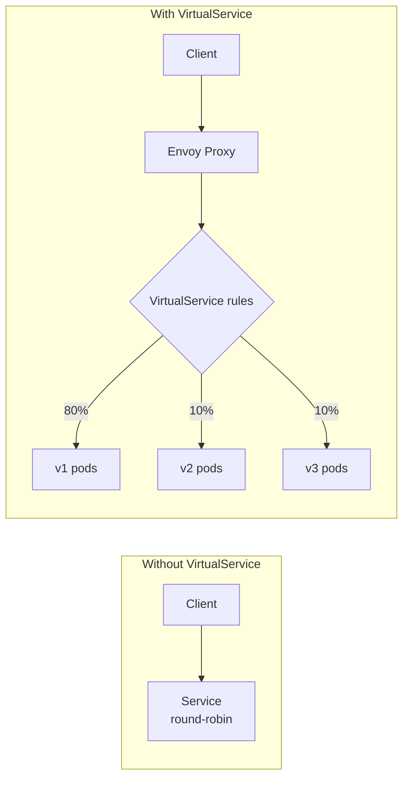
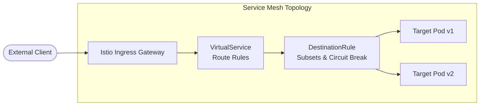
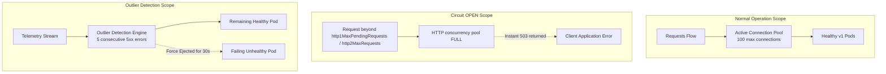

## Складність: `[СКЛАДНИЙ]`
## Час на проходження: 60-75 хвилин

---

## Передумови

Перш ніж починати цей модуль, ви маєте завершити:
- [Модуль 1: Встановлення та архітектура](../module-1.1-istio-installation-architecture/) - встановлення Istio та впровадження sidecar-проксі
- [Модуль CKA 3.5: Gateway API](/k8s/cka/part3-services-networking/module-3.5-gateway-api/) - основи Kubernetes Gateway API
- Практичні знання про Сервіси, Деплойменти, мітки та проби готовності в Kubernetes 1.35
- Розуміння концепцій HTTP-маршрутизації, таких як заголовки, шляхи, методи, коди стану та таймаути

---

## Результати навчання

Після завершення цього модуля ви зможете:

1. **Налаштовувати** правила маршрутизації VirtualService для розподілу трафіку між версіями сервісу на основі заголовків, шляхів та ваг.
2. **Впроваджувати** патерни canary- та blue-green-розгортання за допомогою DestinationRule з політиками трафіку та визначеннями підмножин (subset).
3. **Проєктувати** та **застосовувати** патерни стійкості, зокрема розмикання кола (circuit breaking), повторні спроби, таймаути, ін'єкцію збоїв та віддзеркалення трафіку.
4. **Діагностувати** збої маршрутизації трафіку за допомогою `istioctl analyze`, `istioctl proxy-config routes`, логів доступу Envoy та доказів із графа сервісів.

## Чому цей модуль важливий

Гіпотетичний сценарій: ваша команда має стабільний сервіс оформлення замовлень, що працює на Kubernetes 1.35, а наступний реліз додає виклик оцінки шахрайства, який потрібно перевірити на реальному трафіку виробничої форми. Код застосунку готовий, Pod'и проходять перевірки готовності, а деплоймент має достатньо реплік для невеликого випробування. Ризик полягає не лише в тому, чи запуститься новий код; операційний ризик — у тому, чи надсилає меш правильний відсоток трафіку до правильної групи Pod'ів, чи зупиняє шторми повторних спроб, коли залежність поводиться некоректно, і чи дає вам достатньо доказів, щоб рухатися вперед або відкотитися, перш ніж клієнти це помітять.

Без сервісного мешу контроль над релізом часто просочується в код застосунку, кастомні правила інгресу або крихкі скрипти, що латають Kubernetes Сервіси під тиском. Такий підхід ускладнює аудит політики трафіку, бо рішення про маршрутизацію розпорошене між бібліотеками, контролерами та звичками розгортання. Istio переносить це рішення в декларативні ресурси, які проксі Envoy можуть послідовно забезпечувати, тож платформенний інженер може описати бажану форму трафіку, доки застосунок продовжує обслуговувати звичайний HTTP.

Компроміс полягає в тому, що Istio дає вам потужнішу площину управління, а потужні засоби контролю відмовляють у точно визначений спосіб. VirtualService може посилатися на підмножину, яку не визначає жоден DestinationRule. Бюджет повторних спроб може примножити навантаження під час збою. Gateway може приймати ім'я хоста, тоді як прив'язаний VirtualService жодного разу не побачить цей самий хост. Цей модуль навчає ментальної моделі, що стоїть за такими збоями, перш ніж просити вас застосувати YAML, бо іспит ICA винагороджує операторів, які вміють міркувати від симптомів назад до конфігурації мешу, а не запам'ятовувати ізольовані поля.

Уявіть собі керування трафіком Istio як диспетчерську служби викликів сервісів. Сервіси — це аеропорти, запити — це рейси, VirtualService — це плани польотів, DestinationRule — це політики злітно-посадкових смуг і приземлення, а Gateway — це контрольовані точки входу на межі повітряного простору. Контролер не перебудовує літак під час польоту; він змінює, куди дозволено летіти запитам, як вони балансуються та що відбувається, коли пункт призначення стає небезпечним.

## Базові ресурси: маршрутизація перед політикою

Керування трафіком Istio починається з розділення, яке легко сформулювати й напрочуд важливо під час інцидентів: VirtualService вирішує, куди має потрапити запит, тоді як DestinationRule вирішує, як поводиться трафік після того, як пункт призначення вже обрано. Цей поділ дає змогу маршрутизувати невеликий відсоток запитів на другу версію без зміни селектора Kubernetes Сервісу, а також застосовувати обмеження на з'єднання чи виявлення викидів (outlier detection) без зміни контейнера застосунку. Коли правило мешу поводиться дивно, спершу запитайте, чи неправильне рішення про маршрутизацію, а потім — чи відсутня або надто сувора політика пункту призначення.

Найпоширеніший збій на ранніх етапах впровадження Istio — ставитися до імені підмножини так, ніби це Kubernetes-об'єкт. Підмножина — це не Сервіс, не Деплоймент і не EndpointSlice. Це згрупування на основі міток, оголошене всередині DestinationRule, і Envoy вміє розв'язувати це ім'я лише після того, як Istiod переклав DestinationRule у конфігурацію проксі. Наведений нижче навчальний сценарій зберігає ту саму форму з відсутньою підмножиною, яку ви діагностуватимете в лабораторній: маршрут просить `v2`, але визначення підмножини має існувати окремо.

```yaml
# Priya had this VirtualService:
apiVersion: networking.istio.io/v1
kind: VirtualService
metadata:
  name: payment
spec:
  hosts:
  - payment
  http:
  - route:
    - destination:
        host: payment
        subset: v2    # ← References a subset...
      weight: 100
```

```yaml
# But forgot this DestinationRule:
apiVersion: networking.istio.io/v1
kind: DestinationRule
metadata:
  name: payment
spec:
  host: payment
  subsets:            # ← ...that must be defined here
  - name: v1
    labels:
      version: v1
  - name: v2
    labels:
      version: v2
```

Обчислення VirtualService є впорядкованим, а це означає, що конкретні збіги мають з'являтися перед широкими маршрутами «зловити все» (catch-all). Envoy отримує таблицю маршрутів від Istiod і проходить правилами HTTP-маршрутів, доки не знайде збіг для хоста, контексту gateway та необов'язкових умов, як-от заголовки чи URI-шляхи. Якщо маршрут «зловити все» з'являється першим, пізніші правила можуть бути цілком коректним YAML, але практично недосяжними. Зробіть паузу й передбачте: якщо типовий маршрут на `v1` розміщено над збігом `end-user: jason`, яку версію отримає Джейсон і що ви очікували б побачити в дампі маршрутів проксі?



Поле `hosts` у VirtualService не є декоративним. Воно визначає імена хостів сервісу або зовнішні імена, до яких застосовується правило, і той самий об'єкт може поводитися по-різному залежно від того, чи трафік внутрішній для мешу, чи входить через Gateway. Короткі імена на кшталт `reviews` зручні в межах одного простору імен, але повністю кваліфіковані імена сервісів безпечніші в спільних платформних прикладах, бо зменшують неоднозначність між просторами імен.

```yaml
apiVersion: networking.istio.io/v1
kind: VirtualService
metadata:
  name: reviews
spec:
  hosts:
  - reviews                    # Which service this applies to
  http:
  - match:                     # Conditions (optional)
    - headers:
        end-user:
          exact: jason         # If header matches...
    route:
    - destination:
        host: reviews
        subset: v2             # ...route to v2
  - route:                     # Default route (no match = catch-all)
    - destination:
        host: reviews
        subset: v1
```

| Поле | Призначення | Приклад |
|-------|---------|---------|
| `hosts` | Сервіси, до яких застосовується правило | `["reviews"]`, `["*.example.com"]` |
| `http[].match` | Умови для маршрутизації | Заголовки, URI, метод, параметри запиту |
| `http[].route` | Куди надсилати трафік | Хост сервісу + підмножина + вага |
| `http[].timeout` | Таймаут запиту | `10s` |
| `http[].retries` | Конфігурація повторних спроб | `attempts: 3` |
| `http[].fault` | Ін'єкція збоїв | `delay`, `abort` |
| `http[].mirror` | Віддзеркалення трафіку | Надіслати копію іншому сервісу |

DestinationRule прикріплює політику до хоста й опційно до підмножин під цим хостом. Глобальна політика трафіку дає вам одну типову поведінку для пункту призначення, а політика конкретної підмножини перевизначає цю поведінку для іменованої версії. Це корисно, коли новій версії потрібен інший режим балансування навантаження або жорсткіше розмикання кола під час canary-розгортання. Важлива звичка — визначати підмножини, перш ніж надсилати до них трафік, а потім дозволити `istioctl analyze` виловлювати невідповідні посилання, перш ніж правило сягне виробничого проксі.

```yaml
apiVersion: networking.istio.io/v1
kind: DestinationRule
metadata:
  name: reviews
spec:
  host: reviews                    # Which service
  trafficPolicy:                   # Global policies
    connectionPool:
      tcp:
        maxConnections: 100
      http:
        h2UpgradePolicy: DEFAULT
        http1MaxPendingRequests: 100
        http2MaxRequests: 1000
    loadBalancer:
      simple: ROUND_ROBIN          # or LEAST_CONN, RANDOM, PASSTHROUGH
    outlierDetection:
      consecutive5xxErrors: 5
      interval: 30s
      baseEjectionTime: 30s
  subsets:                          # Named versions
  - name: v1
    labels:
      version: v1
  - name: v2
    labels:
      version: v2
    trafficPolicy:                 # Per-subset override
      loadBalancer:
        simple: LEAST_CONN
  - name: v3
    labels:
      version: v3
```

Gateway розв'язує іншу проблему, ніж VirtualService. Gateway налаштовує робоче навантаження Envoy на межі мешу так, щоб воно приймало трафік на конкретних портах, протоколах, режимах TLS та іменах хостів. Він не каже мешу, куди має потрапити `/productpage` після прийняття з'єднання. Це друге рішення все ще належить VirtualService, який прив'язується до Gateway за іменем і надає правила маршрутизації для прийнятого хоста.

```yaml
apiVersion: networking.istio.io/v1
kind: Gateway
metadata:
  name: bookinfo-gateway
spec:
  selector:
    istio: ingressgateway           # Bind to Istio's ingress gateway
  servers:
  - port:
      number: 80
      name: http
      protocol: HTTP
    hosts:
    - "bookinfo.example.com"        # Accept traffic for this host
  - port:
      number: 443
      name: https
      protocol: HTTPS
    hosts:
    - "bookinfo.example.com"
    tls:
      mode: SIMPLE
      credentialName: bookinfo-tls   # K8s Secret with cert/key
```

```yaml
apiVersion: networking.istio.io/v1
kind: VirtualService
metadata:
  name: bookinfo
spec:
  hosts:
  - "bookinfo.example.com"
  gateways:
  - bookinfo-gateway               # Reference the Gateway
  http:
  - match:
    - uri:
        prefix: /productpage
    route:
    - destination:
        host: productpage
        port:
          number: 9080
  - match:
    - uri:
        prefix: /reviews
    route:
    - destination:
        host: reviews
```

Тож шлях запиту через інгрес — це ланцюг явних передач. Зовнішній балансувальник навантаження сягає робочого навантаження інгрес-gateway Istio. Блок server у Gateway вирішує, чи прийнято хост, протокол і порт. VirtualService, прикріплений до цього Gateway, вирішує HTTP-маршрут, а DestinationRule для обраного хоста надає підмножину й політику трафіку. Коли інгрес-трафік сягає gateway, але ніколи не доходить до бекенда, налагоджуйте ланцюг саме в цьому порядку.



ServiceEntry завершує набір ресурсів, додаючи зовнішні пункти призначення до внутрішнього реєстру сервісів Istio. Це має значення, коли меш налаштовано з типовою забороною вихідного трафіку (default-deny egress), але також має значення, коли ви хочете послідовну політику таймаутів, повторних спроб, телеметрії чи TLS для викликів, що залишають кластер. Сприймайте ServiceEntry як спосіб зробити зовнішній хост видимим для площини управління мешу, а не як заміну DNS чи зовнішньої авторизації.

```yaml
apiVersion: networking.istio.io/v1
kind: ServiceEntry
metadata:
  name: external-api
spec:
  hosts:
  - api.external.com
  location: MESH_EXTERNAL             # Outside the mesh
  ports:
  - number: 443
    name: https
    protocol: HTTPS
  resolution: DNS
```

```yaml
# Originate TLS at the sidecar so HTTP-level rules apply
apiVersion: networking.istio.io/v1
kind: DestinationRule
metadata:
  name: external-api-tls
spec:
  host: api.external.com
  trafficPolicy:
    tls:
      mode: SIMPLE
```

```yaml
# Now you can apply HTTP traffic rules to the external host
apiVersion: networking.istio.io/v1
kind: VirtualService
metadata:
  name: external-api-timeout
spec:
  hosts:
  - api.external.com
  http:
  - timeout: 5s
    route:
    - destination:
        host: api.external.com
        port:
          number: 443
```

З `protocol: TLS` sidecar виконує SNI-passthrough, а HTTP-правила `timeout`/`retries` ігноруються. Оголошуйте `HTTPS` та ініціюйте TLS за допомогою DestinationRule, коли вам потрібна HTTP-політика рівня мешу для зовнішнього API.

У дозвільному (permissive) меші вихідний трафік усе одно може сягати багатьох зовнішніх пунктів призначення без ServiceEntry, тож ранні тести можуть здаватися робочими. У заблокованому меші з `meshConfig.outboundTrafficPolicy.mode: REGISTRY_ONLY` незареєстровані зовнішні хости блокуються, бо в sidecar немає запису в реєстрі, який можна використати. Операційний урок — тестувати правила вихідного трафіку за тієї самої політики мешу, яку ви очікуєте у виробництві, інакше демонстрація, що проходить локально, може одразу впасти після зміни щодо посилення безпеки.

## Маршрутизація релізів за допомогою VirtualService та DestinationRule

Canary-маршрутизація — це перший патерн керування трафіком, який переймає більшість команд, бо він дає контрольований спосіб виставити нову версію невеликій частці реальних запитів. Kubernetes Деплойменти вже вміють запускати кілька ReplicaSet, але Kubernetes Сервіс зазвичай балансує навантаження між усіма готовими ендпойнтами за своїм селектором. Istio додає шар над цим Сервісом, тож ви можете тримати обидві версії готовими, використовуючи підмножини й ваги, щоб вирішити, скільки трафіку отримає кожна з них.

```yaml
apiVersion: networking.istio.io/v1
kind: VirtualService
metadata:
  name: reviews
spec:
  hosts:
  - reviews
  http:
  - route:
    - destination:
        host: reviews
        subset: v1
      weight: 80               # 80% to v1
    - destination:
        host: reviews
        subset: v2
      weight: 20               # 20% to v2
```

```yaml
apiVersion: networking.istio.io/v1
kind: DestinationRule
metadata:
  name: reviews
spec:
  host: reviews
  subsets:
  - name: v1
    labels:
      version: v1
  - name: v2
    labels:
      version: v2
```

Маршрутизація за вагами є імовірнісною на багатьох запитах, а не обіцянкою щодо кожної групи з десяти запитів. Невеликий цикл curl може дати нерівномірний розподіл, бо випадковим рішенням балансування навантаження потрібен обсяг, перш ніж вони наблизяться до налаштованого відсотка. Для рішень про розгортання порівнюйте вагу трафіку з обсягом запитів, рівнем помилок, перцентилями затримки та сигналами насичення за значущий проміжок часу. Перш ніж запускати патч розгортання, зробіть паузу й передбачте, які дві метрики переконали б вас затриматися на двадцяти відсотках замість переходу на половину трафіку.

```bash
# Step 1: 90/10 split
kubectl apply -f - <<EOF
apiVersion: networking.istio.io/v1
kind: VirtualService
metadata:
  name: reviews
spec:
  hosts:
  - reviews
  http:
  - route:
    - destination:
        host: reviews
        subset: v1
      weight: 90
    - destination:
        host: reviews
        subset: v2
      weight: 10
EOF

# Monitor error rates... then increase

# Step 2: 50/50 split
kubectl patch virtualservice reviews --type merge -p '
spec:
  http:
  - route:
    - destination:
        host: reviews
        subset: v1
      weight: 50
    - destination:
        host: reviews
        subset: v2
      weight: 50'

# Step 3: Full rollout
kubectl patch virtualservice reviews --type merge -p '
spec:
  http:
  - route:
    - destination:
        host: reviews
        subset: v2
      weight: 100'
```

Маршрутизація за заголовками корисна, коли найбезпечніша перша аудиторія — це не відсоток публіки, а детермінована група, як-от тестові користувачі, внутрішній персонал або автоматизовані проби. Цей патерн зменшує шум, бо той самий користувач може стабільно потрапляти на ту саму версію бекенда, що полегшує налагодження. Компроміс у тому, що ваша маршрутизація залежить від наявності та надійності заголовка, тож периферійні проксі чи тестові клієнти мають встановлювати його навмисно.

```yaml
apiVersion: networking.istio.io/v1
kind: VirtualService
metadata:
  name: reviews
spec:
  hosts:
  - reviews
  http:
  # Rule 1: Route "jason" to v2
  - match:
    - headers:
        end-user:
          exact: jason
    route:
    - destination:
        host: reviews
        subset: v2
  # Rule 2: Route requests with "canary: true" header to v3
  - match:
    - headers:
        canary:
          exact: "true"
    route:
    - destination:
        host: reviews
        subset: v3
  # Rule 3: Everyone else goes to v1
  - route:
    - destination:
        host: reviews
        subset: v1
```

Маршрутизація за URI поширена на межі інгресу, бо різні шляхи часто відображаються на різні бекенд-сервіси, версії API чи фази міграції. `exact` найбезпечніший, коли одна сторінка чи ендпойнт мають переміститися як одне ціле, `prefix` корисний для родин API, а `regex` варто резервувати для випадків, які справді потребують зіставлення за шаблоном. Маршрути з regex потужні, але їх також складніше швидко переглянути під час збою.

```yaml
apiVersion: networking.istio.io/v1
kind: VirtualService
metadata:
  name: bookinfo
spec:
  hosts:
  - bookinfo.example.com
  gateways:
  - bookinfo-gateway
  http:
  - match:
    - uri:
        exact: /productpage
    route:
    - destination:
        host: productpage
        port:
          number: 9080
  - match:
    - uri:
        prefix: /api/v1/reviews
    route:
    - destination:
        host: reviews
        port:
          number: 9080
  - match:
    - uri:
        regex: "/api/v[0-9]+/ratings"
    route:
    - destination:
        host: ratings
        port:
          number: 9080
```

| Тип | Приклад | Збігається з |
|------|---------|---------|
| `exact` | `/productpage` | Лише `/productpage` |
| `prefix` | `/api/v1` | `/api/v1`, `/api/v1/reviews` тощо |
| `regex` | `/api/v[0-9]+` | `/api/v1`, `/api/v2` тощо |

Blue-green-розгортання використовує ті самі примітиви, що й canary, але операційна мета інша. Замість поступового зсуву трафіку ви готуєте неактивний колір приймати весь трафік, проганяєте перевірки на ньому, а потім робите одне явне перемикання маршрутизації. Це привабливо, коли міграція бази даних чи зовнішня залежність роблять часткове виставлення заплутаним. Це ризиковано, коли новий колір не прогрітий, бо раптовий повний зсув може виявити проблеми з потужністю, які canary виявив би раніше.

Практична звичка релізу — сприймати VirtualService, DestinationRule та телеметрію як один набір змін. Спершу застосуйте DestinationRule, переконайтеся, що підмножини розв'язуються в готові Pod'и, а потім застосуйте VirtualService, який посилається на ці підмножини. Використовуйте `istioctl analyze` до й після зміни та перевіряйте згенеровану конфігурацію маршрутів, коли симптоми не узгоджуються з YAML. Якщо YAML каже, що трафік має йти до `v2`, а дамп маршрутів проксі — ні, ви налагоджуєте поширення площини управління чи добір робочого навантаження, а не логіку застосунку.

## Стійкість: таймаути, повторні спроби, збої та розмикачі

Ін'єкція збоїв цінна, бо у виробництві відмови рідко надходять як чисті падіння Pod'ів. Залежності стають повільними, повертають періодичні HTTP-помилки, скидають з'єднання або відмовляють лише для частини користувачів. Istio дає змогу ін'єктувати таку поведінку на рівні мешу, тож команди застосунків можуть перевіряти таймаути, запасні варіанти й поведінку, яку бачить користувач, не змінюючи код сервісу. Цю техніку слід ретельно обмежувати, бо правило збою все одно є реальною політикою трафіку, щойно воно сягає проксі.

```yaml
apiVersion: networking.istio.io/v1
kind: VirtualService
metadata:
  name: ratings
spec:
  hosts:
  - ratings
  http:
  - fault:
      delay:
        percentage:
          value: 100            # 100% of requests get delayed
        fixedDelay: 7s          # 7 second delay
    route:
    - destination:
        host: ratings
        subset: v1
```

Ін'єкція затримки перевіряє, чи мають викликачі реалістичні таймаути та чи деградують потоки користувача коректно. Якщо фронтенд чекає десять секунд на апстрим, який зазвичай відповідає за мілісекунди, він може зайняти робочі потоки й спричинити ширше сповільнення. Затримка мешу дає вам контрольований спосіб довести, що викликачі відмовляють достатньо швидко. Перш ніж запускати наступний приклад, який вивід ви очікуєте, якщо таймаут клієнта коротший за ін'єктовану затримку, і де буде згенеровано підсумковий код стану?

```yaml
apiVersion: networking.istio.io/v1
kind: VirtualService
metadata:
  name: ratings
spec:
  hosts:
  - ratings
  http:
  - match:
    - headers:
        end-user:
          exact: jason
    fault:
      delay:
        percentage:
          value: 100
        fixedDelay: 7s
    route:
    - destination:
        host: ratings
        subset: v1
  - route:
    - destination:
        host: ratings
        subset: v1
```

Ін'єкція переривання (abort) перевіряє інший контракт. Замість того щоб робити апстрим повільним, Envoy повертає налаштований HTTP-статус для обраних запитів. Це корисно, коли вам треба довести, що клієнти обробляють чіткі відмови, як-от `503 Service Unavailable`, не чекаючи на реальну відмову залежності. Тримайте правила переривання вузькими й тимчасовими, якщо ви навмисно не моделюєте режим відмови в невиробничій вправі.

```yaml
apiVersion: networking.istio.io/v1
kind: VirtualService
metadata:
  name: ratings
spec:
  hosts:
  - ratings
  http:
  - fault:
      abort:
        percentage:
          value: 50              # 50% of requests get aborted
        httpStatus: 503          # Return 503 Service Unavailable
    route:
    - destination:
        host: ratings
        subset: v1
```

Комбіновані збої дають змогу перевіряти багатошарову поведінку клієнта, але також ускладнюють тлумачення результатів. Запит може бути затриманим, перерваним або завершитися нормально залежно від налаштованих відсотків і рішення проксі для цього запиту. Використовуйте комбіновані збої, коли тестуєте зрілий дизайн запасних варіантів, а не коли ще намагаєтеся з'ясувати, чи працює один таймаут.

```yaml
apiVersion: networking.istio.io/v1
kind: VirtualService
metadata:
  name: ratings
spec:
  hosts:
  - ratings
  http:
  - fault:
      delay:
        percentage:
          value: 50
        fixedDelay: 5s
      abort:
        percentage:
          value: 10
        httpStatus: 500
    route:
    - destination:
        host: ratings
        subset: v1
```

Таймаути й повторні спроби слід проєктувати разом, бо з погляду користувача вони утворюють один бюджет. Таймаут без повторних спроб може швидко відмовити, але здатен здатися через минущі мережеві збої. Повторні спроби без чіткого загального таймауту можуть тримати роботу живою ще довго після того, як користувач облишив запит. Чистий патерн — вирішити максимальний наскрізний час, який може дозволити собі викликач, а потім розподілити цей бюджет між спробами з достатнім запасом на мережеву мінливість.

```yaml
apiVersion: networking.istio.io/v1
kind: VirtualService
metadata:
  name: reviews
spec:
  hosts:
  - reviews
  http:
  - timeout: 3s                 # Fail if no response within 3 seconds
    route:
    - destination:
        host: reviews
        subset: v1
```

```yaml
apiVersion: networking.istio.io/v1
kind: VirtualService
metadata:
  name: reviews
spec:
  hosts:
  - reviews
  http:
  - retries:
      attempts: 3               # Retry up to 3 times
      perTryTimeout: 2s         # Each attempt gets 2 seconds
      retryOn: 5xx,reset,connect-failure,retriable-4xx
    route:
    - destination:
        host: reviews
        subset: v1
```

| Значення | Повторна спроба, коли |
|-------|-------------|
| `5xx` | Сервер повертає 5xx |
| `reset` | Скидання з'єднання |
| `connect-failure` | Не вдається підключитися |
| `retriable-4xx` | Конкретні коди 4xx (409) |
| `gateway-error` | 502, 503, 504 |

Повторні спроби — це не безкоштовна потужність. Якщо сервіс уже відмовляє під навантаженням, три повторні спроби можуть перетворити один запит користувача на кілька апстрим-спроб і прискорити збій. Саме тому повторні спроби належать поруч із розмиканням кола та виявленням викидів. Проксі має мати дозвіл спробувати ще раз для минущих відмов, але йому також потрібні обмеження, які зупиняють зайву роботу від перевантаження нездорового пункту призначення.

```yaml
apiVersion: networking.istio.io/v1
kind: DestinationRule
metadata:
  name: reviews
spec:
  host: reviews
  trafficPolicy:
    connectionPool:
      tcp:
        maxConnections: 100       # Max TCP connections
      http:
        http1MaxPendingRequests: 10  # Max queued requests
        http2MaxRequests: 100        # Max concurrent requests
        maxRequestsPerConnection: 10 # Max requests per connection
        maxRetries: 3                # Max concurrent retries
    outlierDetection:
      consecutive5xxErrors: 5     # Eject after 5 consecutive 5xx
      interval: 10s              # Check every 10 seconds
      baseEjectionTime: 30s      # Eject for at least 30 seconds
      maxEjectionPercent: 50     # Don't eject more than 50% of hosts
  subsets:
  - name: v1
    labels:
      version: v1
```

Обмеження пулу з'єднань діють як перебірка (bulkhead). Вони обмежують, скільки одночасної роботи пункт призначення може отримати через проксі, і швидко повертають відмови, коли налаштований пул заповнено. Виявлення викидів діє радше як оцінювання здоров'я ендпойнтів. Воно стежить за відповідями окремих апстрим-хостів і тимчасово виключає хости, що перетинають налаштований поріг помилок, водночас зберігаючи здорові хости в ротації.



Налаштування виявлення викидів мають відображати, скільки ендпойнтів ви маєте й наскільки шумний сервіс під час звичайної роботи. Виключення половини ендпойнтів із сервісу на два Pod'и може зменшити доступну потужність настільки, що решта Pod також відмовить. На більших сервісах сильніше виключення може бути розумним, бо залишається достатньо здорових ендпойнтів, щоб поглинути трафік. Саме тому `maxEjectionPercent` та `minHealthPercent` — це засоби контролю безпеки, а не декоративні поля.

```yaml
apiVersion: networking.istio.io/v1
kind: DestinationRule
metadata:
  name: reviews
spec:
  host: reviews
  trafficPolicy:
    outlierDetection:
      consecutive5xxErrors: 3     # Eject after 3 errors
      interval: 15s              # Evaluation interval
      baseEjectionTime: 30s      # Min ejection duration
      maxEjectionPercent: 30     # Max % of hosts ejected
      minHealthPercent: 70       # Only eject if >70% healthy
```

Віддзеркалення трафіку, яке також називають тіньовим (shadowing), надсилає копію обраних живих запитів іншому пункту призначення, доки оригінальний запит продовжує йти основним маршрутом. Envoy відкидає віддзеркалену відповідь, тож вивід віддзеркаленого сервісу не впливає на користувачів. Це чудово для спостереження, як нова версія обробляє корисні навантаження виробничої форми, але може подвоїти роботу бекенда, якщо віддзеркалити забагато трафіку. Використовуйте це з плануванням потужності та переконайтеся, що неідемпотентні побічні ефекти вимкнено або ізольовано у віддзеркаленому сервісі.

```yaml
apiVersion: networking.istio.io/v1
kind: VirtualService
metadata:
  name: reviews
spec:
  hosts:
  - reviews
  http:
  - route:
    - destination:
        host: reviews
        subset: v1
      weight: 100
    mirror:
      host: reviews
      subset: v2                 # Mirror to v2
    mirrorPercentage:
      value: 100                 # Mirror 100% of traffic
```

Глибший патерн полягає в тому, що налаштування стійкості описують, як саме слід стримувати відмову, а не як вона зникає. Таймаути обмежують очікування. Повторні спроби витрачають невеликий бюджет на минуще відновлення. Розмикачі кола обмежують тиск. Виявлення викидів прибирає погані ендпойнти. Ін'єкція збоїв доводить дизайн, перш ніж надійде реальна відмова. Віддзеркалення дає змогу порівняти поведінку, не надаючи новій версії повноважень над відповіддю користувачу.

## Інгрес, егрес та межі трафіку

Керування інгрес-трафіком стосується безпечного приймання зовнішніх запитів і подальшої передачі їх правильному внутрішньому маршруту. Gateway має бути достатньо вузьким, щоб приймати лише ті імена хостів і протоколи, які ви маєте намір обслуговувати, тоді як VirtualService має виражати логіку шляху й пункту призначення. Коли ці обов'язки змішуються в голові, команди часто налагоджують не той об'єкт. Запит, який ніколи не сягає Gateway, — це проблема балансувальника навантаження, DNS чи сертифіката; запит, який сягає Gateway, але потрапляє не на той сервіс, зазвичай є проблемою VirtualService.

```yaml
# Step 1: Gateway (the front door)
apiVersion: networking.istio.io/v1
kind: Gateway
metadata:
  name: httpbin-gateway
spec:
  selector:
    istio: ingressgateway
  servers:
  - port:
      number: 80
      name: http
      protocol: HTTP
    hosts:
    - "httpbin.example.com"
```

```yaml
# Step 2: VirtualService (routing rules)
apiVersion: networking.istio.io/v1
kind: VirtualService
metadata:
  name: httpbin
spec:
  hosts:
  - "httpbin.example.com"
  gateways:
  - httpbin-gateway
  http:
  - match:
    - uri:
        prefix: /status
    - uri:
        prefix: /delay
    route:
    - destination:
        host: httpbin
        port:
          number: 8000
```

Тестування інгресу з локального кластера зазвичай означає визначення адреси gateway, а потім надсилання запиту з очікуваним заголовком Host. Заголовок Host має значення, бо зіставлення хоста в server Gateway та у VirtualService враховує хост. Якщо ви робите curl на IP без правильного хоста, ви можете довести лише те, що балансувальник навантаження досяжний, а не те, що потрібний маршрут налаштовано.

```bash
# Cloud LB (run this block OR the kind/minikube block below — not both)
export INGRESS_HOST=$(kubectl -n istio-system get service istio-ingressgateway \
  -o jsonpath='{.status.loadBalancer.ingress[0].ip}')
export INGRESS_PORT=$(kubectl -n istio-system get service istio-ingressgateway \
  -o jsonpath='{.spec.ports[?(@.name=="http2")].port}')

# kind/minikube (NodePort) — use instead of the LB block above
# export INGRESS_PORT=$(kubectl -n istio-system get service istio-ingressgateway \
#   -o jsonpath='{.spec.ports[?(@.name=="http2")].nodePort}')
# export INGRESS_HOST=$(kubectl get nodes -o jsonpath='{.items[0].status.addresses[?(@.type=="InternalIP")].address}')

# Test
curl -H "Host: httpbin.example.com" http://$INGRESS_HOST:$INGRESS_PORT/status/200
```

TLS на інгресі додає ще одне рішення про межу: чи термінує gateway TLS, чи пропускає зашифрований трафік на основі SNI, чи вимагає взаємний TLS на межі. Термінація `SIMPLE` поширена для звичайного HTTPS. `PASSTHROUGH` зберігає зашифрований потік цілим і маршрутизує за SNI, що корисно, коли бекенд має сам термінувати TLS. Взаємні режими додають вимоги до клієнтського сертифіката, що може бути доречним для внутрішнього чи партнерського трафіку, але потребує сильнішого керування життєвим циклом сертифікатів.

```bash
# Create TLS secret
kubectl create -n istio-system secret tls httpbin-tls \
  --key=httpbin.key \
  --cert=httpbin.crt
```

```yaml
apiVersion: networking.istio.io/v1
kind: Gateway
metadata:
  name: httpbin-gateway
spec:
  selector:
    istio: ingressgateway
  servers:
  - port:
      number: 443
      name: https
      protocol: HTTPS
    hosts:
    - "httpbin.example.com"
    tls:
      mode: SIMPLE                    # One-way TLS
      credentialName: httpbin-tls     # K8s Secret name
```

| Режим | Опис |
|------|-------------|
| `SIMPLE` | Термінація TLS на gateway (лише серверний сертифікат) |
| `MUTUAL` | Термінація TLS з обов'язковими клієнтськими сертифікатами |
| `PASSTHROUGH` | Пересилання зашифрованого потоку; маршрутизація за SNI без термінації TLS |
| `AUTO_PASSTHROUGH` | Passthrough на основі SNI для мультикластерних east-west-gateway; VirtualService для відображення SNI на пункт призначення не потрібен |
| `ISTIO_MUTUAL` | Використання сертифікатів, виданих Istio, для mTLS gateway всередині мешу |

Керування егрес-трафіком — це дзеркальне відображення інгресу з погляду оператора. Замість того щоб питати, що зовнішні користувачі можуть надсилати в меш, ви питаєте, що внутрішні робочі навантаження можуть викликати поза межами кластера й як ці виклики слід спостерігати. Дозвільна позиція щодо егресу зручна на ранній розробці, але вона послаблює можливість аудиту, бо будь-яке робоче навантаження може сягати довільних зовнішніх хостів. Позиція «лише реєстр» (registry-only) робить зовнішні залежності явними.

```yaml
# In IstioOperator or mesh config
apiVersion: install.istio.io/v1alpha1
kind: IstioOperator
spec:
  meshConfig:
    outboundTrafficPolicy:
      mode: REGISTRY_ONLY          # Block unregistered external services
```

Контролер IstioOperator у кластері було вилучено в Istio 1.24; цей файл усе ще працює з `istioctl install -f`, але Helm тепер є рекомендованим шляхом встановлення/конфігурації.

ServiceEntry — це базовий об'єкт списку дозволів для такої заблокованої моделі. Він описує зовнішній хост, протокол, порт, метод розв'язання й те, чи ціль перебуває поза межами мешу чи всередині нього. Щойно хост присутній у реєстрі сервісів, ви можете застосувати до нього інші політики Istio. Це головна перевага над простим правилом фаєрвола: меш може спостерігати й формувати трафік у тій самій моделі управління, що використовується для внутрішніх сервісів.

```yaml
# Allow access to an external API
apiVersion: networking.istio.io/v1
kind: ServiceEntry
metadata:
  name: google-api
spec:
  hosts:
  - "www.googleapis.com"
  ports:
  - number: 443
    name: https
    protocol: TLS
  location: MESH_EXTERNAL
  resolution: DNS
```

```yaml
# Optional: Apply traffic policy to external service
apiVersion: networking.istio.io/v1
kind: DestinationRule
metadata:
  name: google-api
spec:
  host: "www.googleapis.com"
  trafficPolicy:
    tls:
      mode: SIMPLE                 # Originate TLS to external service
```

Егрес-gateway дає вам централізовану точку звуження для обраного вихідного трафіку. Це може спростити журналювання аудиту, списки дозволів фаєрвола й контроль вихідної IP-адреси, але також додає ще один Envoy-перехід, який потрібно моніторити й масштабувати. Використовуйте його, коли організації потрібен централізований контроль над вихідними шляхами, а не як типову відповідь для кожного зовнішнього виклику.

```yaml
apiVersion: networking.istio.io/v1
kind: ServiceEntry
metadata:
  name: external-svc
spec:
  hosts:
  - external.example.com
  ports:
  - number: 443
    name: tls
    protocol: TLS
  location: MESH_EXTERNAL
  resolution: DNS
```

```yaml
apiVersion: networking.istio.io/v1
kind: Gateway
metadata:
  name: egress-gateway
spec:
  selector:
    istio: egressgateway
  servers:
  - port:
      number: 443
      name: tls
      protocol: TLS
    hosts:
    - external.example.com
    tls:
      mode: PASSTHROUGH
```

```yaml
apiVersion: networking.istio.io/v1
kind: VirtualService
metadata:
  name: external-through-egress
spec:
  hosts:
  - external.example.com
  gateways:
  - mesh                          # Internal mesh traffic
  - egress-gateway                # Egress gateway
  tls:
  - match:
    - gateways:
      - mesh
      port: 443
      sniHosts:
      - external.example.com
    route:
    - destination:
        host: istio-egressgateway.istio-system.svc.cluster.local
        port:
          number: 443
  - match:
    - gateways:
      - egress-gateway
      port: 443
      sniHosts:
      - external.example.com
    route:
    - destination:
        host: external.example.com
        port:
          number: 443
```

Діагностична звичка для меж — простежувати запит через кожен явний об'єкт. Для інгресу перевірте зовнішню досяжність, збіг server Gateway, прив'язку хоста й gateway у VirtualService, сервіс призначення та політику підмножини. Для егресу перевірте режим вихідного трафіку мешу, хост ServiceEntry, необов'язкові налаштування TLS у DestinationRule, добір егрес-gateway та фінальну зовнішню відповідь. Це прив'язує усування несправностей до фактичного ланцюга конфігурації, а не до здогадок із самого лише симптому.

## Діагностика маршрутів за симптомами

Налагодження керування трафіком стає набагато легшим, коли ви відокремлюєте бажану конфігурацію від доставленої конфігурації проксі. YAML, збережений у Kubernetes API, — це бажаний стан. Istiod перекладає цей бажаний стан у слухачі (listeners), маршрути, кластери та ендпойнти Envoy. Кожен sidecar потім отримує доставлене подання мешу, яке може відрізнятися за простором імен, мітками робочого навантаження, прив'язкою gateway та таймінгом поширення конфігурації. Коли запит поводиться неправильно, не зупиняйтеся після прочитання маніфесту; підтвердьте, що саме отримав уражений проксі.

Почніть із симптому й класифікуйте його за тим, де запит відмовив. Таймаут на боці клієнта вказує на повільну поведінку апстриму, відсутні бюджети таймаутів або маршрут, що надсилає трафік у затриману залежність. Локальний `503` від Envoy часто вказує на відсутність здорового апстриму, розмикання кола, виключення викидів або кластер, який не вдалося розв'язати з підмножини. `404` на інгресі часто вказує на невідповідність хоста чи шляху, а не на відсутній Pod. Ця класифікація утримує вас від зміни випадкового YAML, поки реальна відмова сидить в іншому шарі.

Для внутрішнього трафіку корисне питання — який sidecar ухвалив рішення про маршрутизацію. Якщо сервіс `frontend` викликає сервіс `reviews`, вихідний sidecar, прикріплений до `frontend`, зазвичай обчислює маршрут для `reviews`. Перегляд лише Pod `reviews` може приховати проблему, бо запит може ніколи не сягнути цього робочого навантаження. Інспектування вихідних маршрутів на боці викликача та поведінки вхідного слухача на боці призначення дає вам чіткішу картину того, де запит зійшов з очікуваного шляху.

Для інгрес-трафіку корисне питання — чи збігся запит із контекстом gateway, перш ніж збігтися з маршрутом. Той самий VirtualService може містити правила для внутрішнього трафіку мешу й правила, прикріплені до іменованого Gateway, але ці контексти не взаємозамінні. Якщо заголовок Host не збігається із server Gateway або якщо у VirtualService бракує прив'язки gateway, Envoy може ніколи не обчислити маршрут, який ви очікували. Саме тому тестування з правильним заголовком Host — це реальний діагностичний крок, а не косметична опція curl.

Команда `istioctl analyze` — це інструмент попередньої перевірки, а не повноцінний дебагер часу виконання. Вона чудово знаходить недійсні посилання, конфліктні визначення хостів і поширені помилки конфігурації, перш ніж вони стануть поведінкою проксі. Вона не може довести, що ваш canary здоровий, і не може сказати вам, чи надсилає клієнт правильний заголовок. Використовуйте її рано, бо вона виловлює помилки авторства, яких можна уникнути, а потім переходьте до інспекції проксі, коли маніфести виглядають дійсними, але поведінка під час виконання все ще неправильна.

`istioctl proxy-config routes` допомагає відповісти, чи має Envoy той маршрут, який ви думаєте. Відсутній маршрут наводить на думку, що VirtualService не застосувався до цього проксі, часто через хост, простір імен, видимість експорту, контекст gateway чи добір робочого навантаження. Наявний маршрут із неправильним пунктом призначення наводить на думку, що порядок правил чи умова збігу відрізняються від вашого очікування. Наявний маршрут із правильним пунктом призначення зміщує увагу до кластерів, ендпойнтів і здоров'я.

Кластери з'єднують пункти призначення маршрутів із апстрим-пулами. Якщо маршрут вказує на підмножину `v2` сервісу `reviews`, проксі потрібен згенерований кластер для цього хоста й підмножини. Коли кластер відсутній, DestinationRule може бути відсутнім, мати інший обсяг або не добирати мітки, які ви очікували. Коли кластер існує, але не має здорових ендпойнтів, проблема може бути в готовності Kubernetes, мітках Pod'ів, виявленні ендпойнтів, виключенні викидів або розмиканні кола. Подання маршрутів і кластерів разом звужують проблему швидше, ніж будь-яке з них окремо.

Логи доступу Envoy корисні, бо вони показують, що проксі зробив для реального запиту. Запис у лозі може розкрити апстрим-кластер, прапори відповіді, ім'я маршруту, код стану й поля таймінгу залежно від налаштованого формату. Прапори відповіді особливо корисні, коли самого лише коду стану недостатньо. `503`, спричинений відсутністю здорового апстриму, — це інша проблема, ніж `503`, повернутий застосунком, і шлях усунення відповідно змінюється.

Kiali та інші інструменти графа сервісів найкорисніші після того, як ви маєте достатній обсяг трафіку, щоб побачити закономірність. Граф може швидко показати, що трафік усе ще сягає `v1`, що canary отримує менше трафіку, ніж очікувалося, або що відмови групуються навколо одного ребра. Граф не має замінювати інспекцію маніфестів і проксі, бо він підсумовує спостережувану поведінку, а не пояснює правило площини управління, що її породило. Сприймайте його як карту, яка каже вам, куди наблизити масштаб.

Маршрутизація за вагами потребує достатньо спостережень, перш ніж ви оголосите розподіл неправильним. Цикл із десяти запитів легко може здаватися нерівномірним, тоді як сотні чи тисячі запитів мають наблизитися до налаштованого поділу. Якщо розподіл залишається неправильним при значущому обсязі, перевірте, чи всі викликачі охоплені тим самим VirtualService, чи якийсь трафік обходить меш і чи відрізняються маршрути gateway й мешу. Змішані шляхи — поширена причина того, що canary виглядає непослідовним на різних дашбордах.

Маршрутизація за заголовками потребує впевненості, що заголовок переживає весь шлях до sidecar, який обчислює маршрут. Периферійні проксі, шлюзи застосунків, поведінка браузера чи тестові інструменти можуть пропускати або нормалізувати заголовки. Імена заголовків нечутливі до регістру в HTTP, але значення збігу все одно мають збігатися з налаштованим правилом. Якщо маршрут за заголовком відмовляє лише через інгрес, порівняйте зовнішній запит із тим, що gateway пересилає в меш, перш ніж змінювати політику підмножини.

Діагностика таймаутів і повторних спроб має враховувати як намір викликача, так і реальність апстриму. Таймаут може означати, що апстрим повільний, але також може означати, що бюджет маршруту надто суворий для дійсної довготривалої операції. Сплеск повторних спроб може означати, що апстрим нестабільний, але також може означати, що маршрут повторює неідемпотентну операцію, яку не слід повторювати на рівні мешу. Хороша діагностика питає, чи відповідає політика бізнес-операції, а не лише чи прийнято поле YAML.

Діагностика розмикання кола має відрізняти захисну відмову від випадкової. Якщо розмикач повертає локальні відповіді `503` під навантаженням, він може робити саме те, про що ви просили, відмовляючись від надлишкової роботи. Питання в тому, чи відображає поріг реальну потужність сервісу й чи деградують клієнти коректно, коли розмикач спрацьовує. Якщо розмикач спрацьовує під час нормального трафіку, скоригуйте потужність, бюджети маршрутів чи пороги; не просто видаляйте розмикач, дозволяючи перевантаженню поширюватися.

Діагностика виявлення викидів потребує контексту ендпойнтів. Якщо один Pod відмовляє й виключається, меш покращує доступність, тримаючи трафік подалі від цього Pod. Якщо багато Pod'ів виключаються одночасно, сервіс може бути глобально нездоровим або пороги можуть бути надто агресивними для малої кількості реплік. Завжди порівнюйте поведінку виключення з готовністю Pod'ів, логами застосунку й здоров'ям апстрим-залежності, перш ніж вирішувати, що Istio є першопричиною.

Найбезпечніший робочий процес усування несправностей керований доказами й оборотний. Зафіксуйте симптом, визначте проксі, який ухвалив рішення, проінспектуйте маршрути й кластери, порівняйте їх із наміченими VirtualService та DestinationRule, і лише тоді застосуйте мінімальне виправлення. Після виправлення перевірте і `istioctl analyze`, і поведінку під час виконання. Ця дисципліна має значення на іспиті ICA, бо багато неправильних відповідей виглядають правдоподібно, якщо ви пропустите один шар шляху запиту.

## Патерни та антипатерни

Патерн перший — розгортання з парною підмножиною. Створіть або оновіть DestinationRule першим, переконайтеся, що мітки підмножин добирають готові Pod'и, і лише тоді застосуйте VirtualService, який надсилає трафік до цих підмножин. Це працює, бо Envoy має розв'язати кластер призначення, перш ніж зможе на нього маршрутизувати. У масштабі цей самий патерн слід обгорнути в перевірки рев'ю, які відхиляють посилання на підмножини без відповідних записів DestinationRule.

Патерн другий — обмежена стійкість. Кожна політика повторних спроб має мати загальний таймаут, таймаут на спробу та обмеження розмикання кола, що відповідають потужності сервісу. Це працює, бо дає проксі бюджет відновлення та умову зупинки. Міркування щодо масштабування полягає в тому, що різним сервісам потрібні різні бюджети; ендпойнт пропозицій пошуку може відмовляти швидше, ніж виклик авторизації платежу, і політика мешу має відображати цю різницю.

Патерн третій — володіння, специфічне для межі. Команди інгресу мають володіти контрактами хоста Gateway, TLS та зовнішніх маршрутів, тоді як команди сервісів володіють локальною для сервісу маршрутизацією, підмножинами й політикою стійкості. Це працює, бо віддзеркалює шлях, який запит проходить через меш. У масштабі володіння все одно має зустрічатися в рев'ю коду, бо хост Gateway і хост VirtualService мають збігатися, щоб зовнішній трафік сягнув наміченого бекенда.

Патерн четвертий — оборотний зсув трафіку. Canary має бути послідовністю невеликих декларативних змін із негайним маніфестом чи патчем відкату, готовим перед першим переміщенням трафіку. Це працює, бо найбезпечніший відкат — це той, який ви вже знаєте, як застосувати. Операційна деталь — відкочувати маршрут перед видаленням нового Деплойменту, щоб меш припинив добирати ризиковану версію, перш ніж Kubernetes прибере Pod'и.

Перший антипатерн — використання VirtualService як звалища для неспоріднених правил. Команди потрапляють у цю пастку, коли кожен маршрут для домену продукту редагується в одному великому об'єкті, бо це здається централізованим. Результат — крихкий порядок і складні рев'ю. Краща альтернатива — тримати володіння маршрутами чітким і використовувати імена, хости й gateway, що відображають межу трафіку, яку контролює кожен об'єкт.

Другий антипатерн — повторення кожної відмови без питання, чи безпечно повторювати операцію. GET-запит до кешованої сторінки часто безпечно повторювати, тоді як неідемпотентний запис може створити дублювання роботи, якщо застосунок не має ключів ідемпотентності. Повторні спроби мешу самі по собі не можуть зрозуміти бізнес-семантику. Кращий підхід — поєднати ідемпотентність застосунку, налаштування повторних спроб, специфічні для маршруту, та консервативні умови повторних спроб.

Третій антипатерн — тіньове дублювання живого трафіку на версію, яка все ще пише в спільний стан. Віддзеркалення відкидає відповідь, але воно не прибирає магічно побічні ефекти з віддзеркаленого сервісу. Команди потрапляють у цю пастку, бо запит, що видимий користувачу, залишається безпечним, тож поведінка бекенда отримує менше уваги. Кращий дизайн — зробити віддзеркалену версію доступною лише для читання, ізолювати її записи або надіслати її до невиробничого набору залежностей.

Четвертий антипатерн — налагодження лише Kubernetes-об'єктів, коли несправна поведінка живе в конфігурації Envoy. Kubernetes може показувати готові Pod'и, правильні Сервіси та дійсний YAML, тоді як sidecar усе ще має застарілу чи неочікувану конфігурацію маршрутів. Краща альтернатива — порівняти бажану конфігурацію зі згенерованою конфігурацією проксі за допомогою інструментів Istio, а потім вирішити, чи проблема в авторстві, поширенні чи поведінці застосунку.

## Система ухвалення рішень

Почніть з аудиторії зміни трафіку. Якщо нову версію має бачити детермінована група, виберіть маршрутизацію за заголовком чи cookie й тримайте збіг над типовим правилом. Якщо нову версію слід вибірково брати із загального трафіку, виберіть маршрутизацію за вагами й спостерігайте за достатньою кількістю запитів, щоб розподіл стабілізувався. Якщо жоден користувач ще не повинен отримувати нову версію, виберіть віддзеркалення й переконайтеся, що віддзеркалені запити не можуть спричинити шкідливих побічних ефектів.

Далі вирішіть, чи перетинає маршрут межу. Внутрішньому трафіку «сервіс-до-сервісу» зазвичай потрібні ресурси VirtualService та DestinationRule, прив'язані до хоста сервісу. Інгрес-трафіку потрібен Gateway плюс VirtualService, який явно називає цей Gateway. Егрес-трафіку потрібен ServiceEntry, коли меш заблоковано, і йому може знадобитися егрес-gateway, коли вимоги аудиту, фаєрвола чи вихідної IP-адреси потребують централізованого контролю вихідного трафіку.

Потім виберіть налаштування стійкості з режиму відмови, який ви намагаєтеся стримати. Використовуйте таймаути, коли ризиком є очікування. Використовуйте повторні спроби, коли минущі відмови поширені, а операцію безпечно повторювати. Використовуйте обмеження пулу з'єднань, коли ризиком є перевантаження. Використовуйте виявлення викидів, коли окремі ендпойнти стають нездоровими, тоді як інші ендпойнти все ще можуть обслуговувати. Використовуйте ін'єкцію збоїв, щоб довести, що ці припущення тримаються, перш ніж покладатися на них під час інциденту.

Нарешті, виберіть докази, які вирішуватимуть наступну дію. Для релізу докази — це обсяг запитів, рівень помилок, затримка, насичення й сигнали впливу на користувача. Для проблеми інгресу докази — це збіг хоста, прийняття Gateway, добір маршруту та відповідь бекенда. Для проблеми егресу докази — це видимість у реєстрі, режим TLS, маршрутизація gateway та зовнішній статус. Хороший план трафіку називає правило, ризик, відкат і сигнал, який каже вам, чи продовжувати.

## Чи знали ви?

- Istio було анонсовано в травні 2017 року як співпрацю за участю Google, IBM та Lyft, тому Envoy залишається центральним для дизайну його площини даних.
- Приклади мережі Istio тепер використовують `networking.istio.io/v1` для основних API керування трафіком, показаних у цьому модулі.
- Сервіси Kubernetes 1.35 все ще використовують ендпойнти, дібрані за мітками, як базову абстракцію, тож підмножини Istio будуються на мітках Pod'ів, а не замінюють виявлення сервісів Kubernetes.
- Envoy може відкидати віддзеркалені відповіді, водночас усе ще надсилаючи віддзеркалений запит, що робить тіньове тестування безпечним для користувачів лише тоді, коли побічні ефекти бекенда контролюються.

## Типові помилки

| Помилка | Чому це стається | Як виправити |
|---------|----------------|---------------|
| VirtualService посилається на підмножину без DestinationRule | Автор маршруту ставиться до імен підмножин як до окремих Kubernetes-об'єктів, тож Envoy не може розв'язати кластер призначення. | Створіть DestinationRule з відповідними мітками підмножин перед застосуванням маршруту, потім запустіть `istioctl analyze`. |
| Налаштовані ваги не дають у сумі рівно 100 | Кілька авторів латають той самий маршрут із часом і забувають, що маршрут — це один зважений набір. | Перегляньте весь блок маршруту й тримайте ваги активних пунктів призначення у сумі рівними 100 перед застосуванням. |
| Хост Gateway не збігається з хостом VirtualService | Володіння інгресом розділене, і кожна команда вибирає трохи інше ім'я хоста чи шаблон. | Зробіть так, щоб `servers.hosts` у Gateway і `hosts` у VirtualService збігалися, потім протестуйте з очікуваним заголовком Host. |
| Відсутнє поле `gateways:` в інгрес-VirtualService | Маршрут працює для викликів усередині мешу, тож автор припускає, що інгрес теж його використає. | Прив'яжіть VirtualService до іменованого Gateway для зовнішнього трафіку й тримайте маршрут мешу окремо за потреби. |
| Повторні спроби налаштовано без розмикання кола | Команда хоче швидкого відновлення від минущих помилок, але не закладає в бюджет додаткове апстрим-навантаження. | Поєднайте повторні спроби із загальними таймаутами, таймаутами на спробу, обмеженнями з'єднань та виявленням викидів. |
| Загальний таймаут коротший за бюджет повторних спроб | Автор налаштовує `attempts` та `perTryTimeout` незалежно від таймауту маршруту. | Встановіть загальний таймаут так, щоб він покривав намічені спроби, або зменшіть бюджет повторних спроб під дедлайн користувача. |
| Відсутній ServiceEntry для потрібної зовнішньої залежності | Меш тестували в дозвільному режимі, але пізніше посилили до `REGISTRY_ONLY`. | Оголосіть кожен схвалений зовнішній хост за допомогою ServiceEntry й перевірте поведінку егресу за виробничою політикою мешу. |
| Порт чи хост DestinationRule вказує на неправильну ціль | Імена Сервісу, підмножини та політики виглядають схожими між просторами імен чи версіями. | Використовуйте повністю кваліфіковані імена хостів там, де є неоднозначність, і порівнюйте згенеровані кластери з конфігурацією проксі. |

## Тест

<details>
<summary>Питання 1: Ваша команда зсуває 20% трафіку `reviews` на `v2`, але кожен обраний запит повертає 503, тоді як `v1` усе ще працює. Що слід перевірити першим?</summary>

Перевірте, чи посилається VirtualService на підмножину, яку DestinationRule справді визначає. Маршрут може бути синтаксично дійсним, водночас вказуючи на нерозв'язану підмножину, і Envoy не матиме здорового апстрим-кластера для цього пункту призначення. Після підтвердження DestinationRule перевірте, чи мітки підмножини збігаються з готовими Pod'ами. Правильне виправлення зазвичай — створити чи виправити визначення підмножини, перш ніж знову змінювати ваги трафіку.

</details>

<details>
<summary>Питання 2: Правило canary за заголовком `x-test: canary` ніколи не збігається, але типовий маршрут працює. Як ви міркуватимете про цей збій?</summary>

Спершу підтвердьте, що клієнт чи апстрим-проксі справді надсилає заголовок із точним іменем і значенням, які очікує VirtualService. Потім перевірте порядок правил, бо маршрут «зловити все» над збігом за заголовком поглине запит, перш ніж буде обчислено конкретне правило. Якщо трафік входить через Gateway, перевірте, чи прив'язано VirtualService до цього Gateway і хоста. Лише після цих перевірок слід підозрювати поведінку застосунку, бо маршрутизація відбувається до того, як запит сягне контейнера.

```yaml
apiVersion: networking.istio.io/v1
kind: VirtualService
metadata:
  name: productpage
spec:
  hosts:
  - productpage
  http:
  - match:
    - headers:
        x-test:
          exact: canary
    route:
    - destination:
        host: productpage
        subset: v2
  - route:
    - destination:
        host: productpage
        subset: v1
```

</details>

<details>
<summary>Питання 3: Маршрут має `attempts: 3`, `perTryTimeout: 2s` та загальний таймаут `3s`. Якої поведінки слід очікувати?</summary>

Загальний таймаут маршруту обмежує загальний час життя запиту, тож бюджет повторних спроб не може повністю відпрацювати. Одна спроба може спожити більшу частину бюджету, а другу спробу може бути обрізано, перш ніж вона матиме власний повний таймаут на спробу. Результат — часто менше реальних спроб, ніж намітив автор маршруту. Виправлення — спершу обчислити дедлайн користувача, а потім вибрати кількість спроб і значення таймауту на спробу, що вкладаються в цей дедлайн.

```yaml
apiVersion: networking.istio.io/v1
kind: VirtualService
metadata:
  name: ratings
spec:
  hosts:
  - ratings
  http:
  - timeout: 3s
    retries:
      attempts: 3
      perTryTimeout: 2s
    route:
    - destination:
        host: ratings
```

</details>

<details>
<summary>Питання 4: Зовнішній трафік сягає інгрес-gateway Istio, але `/productpage` не доходить до сервісу productpage. Який ланцюг слід проінспектувати?</summary>

Спершу проінспектуйте хост і порт server Gateway, бо gateway має прийняти запит, перш ніж відбудеться маршрутизація. Далі проінспектуйте прив'язаний VirtualService і підтвердьте, що його поля `hosts` та `gateways` збігаються з контекстом Gateway. Потім проінспектуйте збіг шляху й порт сервісу призначення. Якщо ці об'єкти виглядають правильно, порівняйте згенеровану конфігурацію маршрутів проксі, бо запущена конфігурація Envoy є джерелом істини для фактичного шляху запиту.

```yaml
apiVersion: networking.istio.io/v1
kind: Gateway
metadata:
  name: bookinfo-gateway
spec:
  selector:
    istio: ingressgateway
  servers:
  - port:
      number: 80
      name: http
      protocol: HTTP
    hosts:
    - "*"
---
apiVersion: networking.istio.io/v1
kind: VirtualService
metadata:
  name: bookinfo
spec:
  hosts:
  - "*"
  gateways:
  - bookinfo-gateway
  http:
  - match:
    - uri:
        prefix: /productpage
    route:
    - destination:
        host: productpage
        port:
          number: 9080
```

</details>

<details>
<summary>Питання 5: Ви хочете протестувати `reviews v2` на реальних корисних навантаженнях, але жоден користувач ще не повинен отримувати відповідь `v2`. Який патерн трафіку підходить?</summary>

Підходить віддзеркалення трафіку, бо Envoy надсилає копію запиту до вторинного пункту призначення, водночас зберігаючи основний шлях відповіді незмінним. Віддзеркалена відповідь відкидається, тож користувачі все одно отримують відповідь зі стабільного маршруту. Ризик — це побічні ефекти бекенда, а не вибір відповіді, видимої користувачу. Ви маєте переконатися, що віддзеркалений сервіс не може писати в спільний виробничий стан, перш ніж умикати великий відсоток віддзеркалення.

```yaml
mirror:
  host: reviews
  subset: v2
mirrorPercentage:
  value: 100
```

</details>

<details>
<summary>Питання 6: Кластер перемикається на `REGISTRY_ONLY`, і виклики до `www.googleapis.com` починають відмовляти. Яке виправлення на рівні мешу?</summary>

Створіть ServiceEntry для зовнішнього хоста, щоб Istio додав його до реєстру сервісів, потім застосуйте будь-яку потрібну політику TLS за допомогою DestinationRule. Відмова з'являється після зміни політики, бо дозвільна вихідна поведінка раніше дозволяла незареєстрований зовнішній трафік. Саме лише правило фаєрвола не дає sidecar запису в реєстрі. Тестування має використовувати ту саму політику вихідного трафіку, що й виробництво.

```yaml
apiVersion: networking.istio.io/v1
kind: ServiceEntry
metadata:
  name: google-api
spec:
  hosts:
  - www.googleapis.com
  ports:
  - number: 443
    name: https
    protocol: TLS
  location: MESH_EXTERNAL
  resolution: DNS
---
apiVersion: networking.istio.io/v1
kind: DestinationRule
metadata:
  name: google-api
spec:
  host: www.googleapis.com
  trafficPolicy:
    tls:
      mode: SIMPLE
```

</details>

<details>
<summary>Питання 7: Canary виглядає здоровим при низькому трафіку, але затримка стрибає, коли ви переходите на половину трафіку. Які докази Istio допомагають вирішити, чи відкочуватися?</summary>

Порівняйте обсяг запитів, рівень помилок і затримку за підмножиною призначення, потім перевірте, чи повертають розмикачі кола або виявлення викидів локальні відповіді 503. Якщо стрибок обмежений підмножиною canary, безпечніша дія зазвичай — повернути вагу до стабільної підмножини, поки триває розслідування. Якщо всі підмножини сповільнюються, проблема може бути в спільній потужності, повторних спробах або апстрим-залежності. Ключ — ухвалювати рішення про трафік із телеметрії, специфічної для підмножини, а не з єдиного агрегованого графа сервісів.

```yaml
apiVersion: networking.istio.io/v1
kind: VirtualService
metadata:
  name: myapp
spec:
  hosts:
  - myapp
  http:
  - match:
    - headers:
        x-test:
          exact: canary
    route:
    - destination:
        host: myapp
        subset: v2
  - route:
    - destination:
        host: myapp
        subset: v1
```

</details>

## Практична вправа: керування трафіком за допомогою Bookinfo

Ця вправа використовує зразок Istio Bookinfo, бо він дає вам видиму поведінку для маршрутизації трафіку. Сервіс `reviews` має кілька версій, а сторінка продукту показує різну поведінку зірочок залежно від того, яка версія отримує запит. Ви встановите базовий маршрут, зсунете canary-трафік, ін'єктуєте затримку та запустите розмикання кола. Виконуйте команди в одноразовому лабораторному кластері, а не в спільному виробничому просторі імен.

### Налаштування

Встановіть Istio з демонстраційним профілем, якщо ваш лабораторний кластер ще не має сумісної площини управління, увімкніть впровадження sidecar для типового простору імен, розгорніть Bookinfo та застосуйте зразкові DestinationRule й Gateway. Зразкові URL збережено тут, щоб лабораторна залишалася узгодженою з оригінальними ресурсами модуля. Після налаштування `istioctl analyze` має бути чистим, перш ніж ви почнете змінювати правила трафіку.

<details>
<summary>Рішення</summary>

```bash
# Ensure Istio is installed (from Module 1)
istioctl install --set profile=demo -y
kubectl label namespace default istio-injection=enabled

# Deploy Bookinfo
kubectl apply -f https://raw.githubusercontent.com/istio/istio/release-1.27/samples/bookinfo/platform/kube/bookinfo.yaml

# Wait for pods
kubectl wait --for=condition=ready pod --all -n default --timeout=120s

# Deploy all DestinationRules
kubectl apply -f https://raw.githubusercontent.com/istio/istio/release-1.27/samples/bookinfo/networking/destination-rule-all.yaml

# Deploy the Gateway
kubectl apply -f https://raw.githubusercontent.com/istio/istio/release-1.27/samples/bookinfo/networking/bookinfo-gateway.yaml

# Verify
istioctl analyze
```

</details>

### Завдання 1: Спрямувати весь трафік на v1

Спершу створіть стабільну базову лінію. Спрямування всього трафіку `reviews` на `v1` дає вам відомий стан, а цей відомий стан полегшує впізнавання пізнішої canary-поведінки. Це завдання також підтверджує, що наявні підмножини DestinationRule присутні, перш ніж ви почнете розщеплювати трафік.

<details>
<summary>Рішення</summary>

```bash
kubectl apply -f - <<EOF
apiVersion: networking.istio.io/v1
kind: VirtualService
metadata:
  name: reviews
spec:
  hosts:
  - reviews
  http:
  - route:
    - destination:
        host: reviews
        subset: v1
EOF
```

Перевірте, надсилаючи повторні запити до сторінки продукту. У зразку Bookinfo `reviews v1` не відображає зірочок, тож стабільна послідовність без зірочок свідчить, що маршрут добирає базову підмножину.

```bash
# Port-forward to productpage
kubectl port-forward svc/productpage 9080:9080 &

# Send requests — should always be v1 (no stars)
for i in $(seq 1 10); do
  curl -s http://localhost:9080/productpage | grep -o "glyphicon-star" | wc -l
done
```

</details>

### Завдання 2: Canary — надіслати 20% на v2

Тепер розщепіть трафік між `v1` та `v2`. Не очікуйте точного розподілу «два з десяти» в кожній крихітній вибірці, бо налаштовані ваги збігаються на більшій кількості запитів. Навчальна мета — побачити, що обидві версії можуть отримувати трафік, тоді як селектор Kubernetes Сервісу залишається незмінним.

<details>
<summary>Рішення</summary>

```bash
kubectl apply -f - <<EOF
apiVersion: networking.istio.io/v1
kind: VirtualService
metadata:
  name: reviews
spec:
  hosts:
  - reviews
  http:
  - route:
    - destination:
        host: reviews
        subset: v1
      weight: 80
    - destination:
        host: reviews
        subset: v2
      weight: 20
EOF
```

Перевірте розподіл за допомогою більшого циклу. Запити, що показують чорні зірочки, сягають `v2`, а запити без зірочок усе ще сягають `v1`.

```bash
for i in $(seq 1 20); do
  stars=$(curl -s http://localhost:9080/productpage | grep -o "glyphicon-star" | wc -l)
  echo "Request $i: $stars stars"
done
```

</details>

### Завдання 3: Ін'єктувати затримку 3 секунди

Застосуйте збій затримки до сервісу `ratings` і поспостерігайте за впливом на користувача через сторінку продукту. Це завдання демонструє, що тестування стійкості можна робити в меші, але також показує, чому правила збоїв мають бути обмеженими й вилученими після тесту. Залишене правило затримки — це виробнича політика, а не коментар.

<details>
<summary>Рішення</summary>

```bash
kubectl apply -f - <<EOF
apiVersion: networking.istio.io/v1
kind: VirtualService
metadata:
  name: ratings
spec:
  hosts:
  - ratings
  http:
  - fault:
      delay:
        percentage:
          value: 100
        fixedDelay: 3s
    route:
    - destination:
        host: ratings
        subset: v1
EOF
```

Перевірте додану затримку, заміривши час запиту до сторінки продукту. Минулий час має включати ін'єктовану затримку, якщо маршрут активний і шлях запиту сягає `ratings`.

```bash
time curl -s http://localhost:9080/productpage > /dev/null
# Should show ~3+ seconds
```

</details>

### Завдання 4: Розмикання кола

Застосуйте обмежувальні налаштування пулу з'єднань, щоб запустити локальні відмови під одночасним навантаженням. Це навмисно жорстко для лабораторної, бо вам потрібен видимий доказ, що розмикач активний. У реальному сервісі налаштовуйте ці значення з виміряної потужності та бюджетів помилок, а не копіюйте лабораторні пороги.

<details>
<summary>Рішення</summary>

```bash
kubectl apply -f - <<EOF
apiVersion: networking.istio.io/v1
kind: DestinationRule
metadata:
  name: reviews-cb
spec:
  host: reviews
  trafficPolicy:
    connectionPool:
      http:
        http1MaxPendingRequests: 1
        http2MaxRequests: 1
        maxRequestsPerConnection: 1
    outlierDetection:
      consecutive5xxErrors: 1
      interval: 1s
      baseEjectionTime: 30s
      maxEjectionPercent: 100
EOF
```

Згенеруйте локальне навантаження за допомогою Fortio й шукайте відповіді `Code 503`. Ці відповіді показують, що проксі відмовляється від роботи, бо налаштовані обмеження було досягнуто, — це і є поведінка, яку розмикач кола має надавати під час перевантаження.

```bash
# Install fortio (Istio's load testing tool)
kubectl apply -f https://raw.githubusercontent.com/istio/istio/release-1.27/samples/httpbin/sample-client/fortio-deploy.yaml
kubectl wait --for=condition=ready pod -l app=fortio

# Send 20 concurrent connections
FORTIO_POD=$(kubectl get pods -l app=fortio -o jsonpath='{.items[0].metadata.name}')
kubectl exec $FORTIO_POD -c fortio -- fortio load -c 3 -qps 0 -n 30 -loglevel Warning \
  http://reviews:9080/reviews/1

# Look for "Code 503" responses — those are circuit breaker trips
```

</details>

### Критерії успіху

- [ ] Весь трафік маршрутизується до пункту призначення `v1` сервісу reviews, а перевірки сторінки продукту не показують зірочок під час базового завдання.
- [ ] Видима частка запитів сягає `v2` після застосування зваженого canary-маршруту.
- [ ] Ін'єкція збою затримки додає близько трьох секунд до запитів сторінки продукту, які проходять через `ratings`.
- [ ] Налаштування розмикача кола повертають відповіді HTTP 503 під одночасним навантаженням у лабораторній.
- [ ] `istioctl analyze` не повідомляє про помилки валідації для ресурсів керування трафіком, які ви залишаєте.

### Прибирання

Видаліть лабораторні VirtualService та DestinationRule розмикання кола після завершення. Якщо ви залишили port-forward запущеним, зупиніть його перед закриттям термінала, щоб пізніші тести не використовували застарілий локальний стан.

<details>
<summary>Рішення</summary>

```bash
kill %1  # Stop port-forward
kubectl delete virtualservice reviews ratings
kubectl delete destinationrule reviews-cb
```

</details>

## Джерела

- https://istio.io/latest/docs/concepts/traffic-management/
- https://istio.io/latest/docs/reference/config/networking/virtual-service/
- https://istio.io/latest/docs/reference/config/networking/destination-rule/
- https://istio.io/latest/docs/reference/config/networking/gateway/
- https://istio.io/latest/docs/reference/config/networking/service-entry/
- https://istio.io/latest/docs/tasks/traffic-management/request-routing/
- https://istio.io/latest/docs/tasks/traffic-management/traffic-shifting/
- https://istio.io/latest/docs/tasks/traffic-management/fault-injection/
- https://istio.io/latest/docs/tasks/traffic-management/circuit-breaking/
- https://istio.io/latest/docs/tasks/traffic-management/mirroring/
- https://istio.io/latest/docs/tasks/traffic-management/ingress/ingress-control/
- https://istio.io/latest/docs/tasks/traffic-management/egress/egress-control/
- https://kubernetes.io/docs/concepts/services-networking/service/

## Наступний модуль

Перейдіть до [Модуля 1.3: Безпека та усування несправностей Istio](../module-1.3-istio-security-troubleshooting/), щоб поєднати політику трафіку з mTLS, авторизацією, JWT-автентифікацією та налагодженням на рівні проксі.
