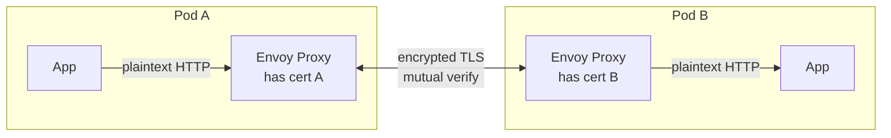
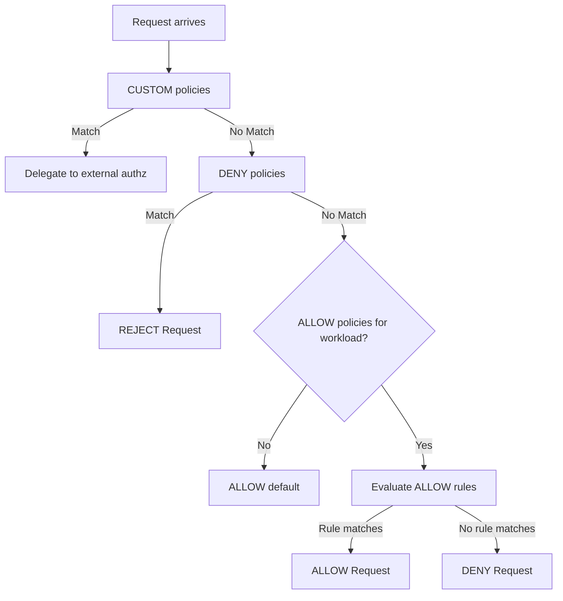
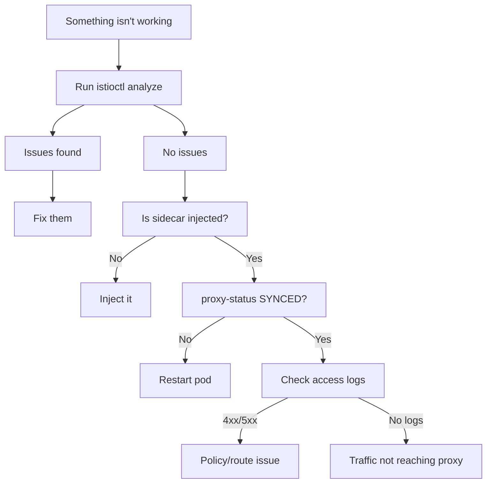
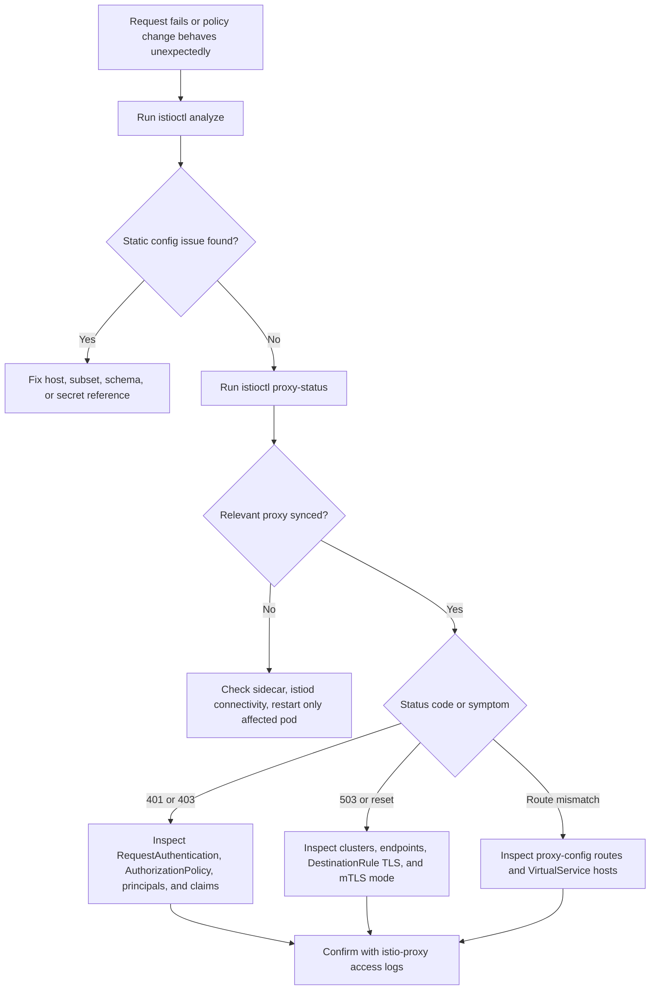

> **Складність:** `[СКЛАДНИЙ]`
> **Час на проходження:** `70-90 хвилин`
> **Версія Kubernetes:** `1.35+`

---

## Передумови

Перш ніж розпочати цей модуль, ви маєте впевнено читати кастомні ресурси Istio, простежувати трафік через інжектований sidecar та перетворювати невдалий HTTP-запит на гіпотезу про ідентичність, маршрутизацію або політику. Модуль передбачає, що ви вже опрацювали попередні модулі ICA і можете запускати `kubectl` та `istioctl` проти одноразового кластера Kubernetes 1.35+ без покрокової орієнтації по командах.

- [Модуль 1: Встановлення та архітектура](../module-1.1-istio-installation-architecture/) — istiod, Envoy, інжекція sidecar
- [Модуль 2: Керування трафіком](../module-1.2-istio-traffic-management/) — VirtualService, DestinationRule, Gateway
- Базове розуміння TLS, JWT-токенів та концепцій RBAC

---

## Результати навчання

Після завершення цього модуля ви зможете пов'язувати симптоми з відповідним рівнем безпеки Istio, застосовувати політики в контрольованій послідовності та доводити результат зі стану проксі, а не покладатися на те, що YAML був прийнятий API-сервером Kubernetes. Кожен результат навмисно перевіряється в тесті або практичній вправі, тому що іспит ICA очікує операційного мислення, а не завчених фрагментів маніфестів.

1. **Діагностувати** збої mTLS-рукостискання, відхилені запити та складні конфлікти політик за допомогою `istioctl analyze` та журналів доступу Envoy.
2. **Впроваджувати** політики PeerAuthentication для надійного систематичного застосування взаємного TLS у розподілених просторах імен та робочих навантаженнях.
3. **Проєктувати** дрібнозернисті правила AuthorizationPolicy, які безпечно інтегрують валідацію JWT та рольовий контроль доступу для глибокого захисту.
4. **Оцінювати** складні стани проксі за допомогою `istioctl proxy-status` та `proxy-config` для виявлення критичних аномалій синхронізації.
5. **Порівнювати** режими mTLS STRICT та PERMISSIVE, щоб сформулювати цілковито безпечні стратегії міграції для чутливих застарілих сервісів.

---

## Чому цей модуль важливий

Гіпотетичний сценарій: ваша команда вмикає STRICT mTLS для простору імен після кількох тижнів успішної роботи з керування трафіком, і першим видимим симптомом є не корисна помилка політики, а потік відповідей `connection reset by peer`, `503 no healthy upstream` та `403 Forbidden`. Сервіси Kubernetes досі існують, Деплойменти досі повідомляють про готові репліки, а в логах застосунку може бути видно лише обробку таймаутів. У сервісній мережі компонент, що дає збій, часто є рівнем політики або проксі між двома справними Подами, а це означає, що звичайне налагодження застосунку може марнувати час, якщо ви не знаєте, де Istio ухвалює кожне рішення.

Безпека Istio потужна, бо вона виносить автентифікацію, шифрування та авторизацію з кожного застосунку в узгоджений рівень площини даних. Саме це відокремлення є й причиною того, що збої здаються непрямими: застосунок не відхилив запит — це зробив локальний проксі Envoy після поєднання станів PeerAuthentication, RequestAuthentication, AuthorizationPolicy, DestinationRule, Gateway та xDS. Операційна навичка полягає в тому, щоб навчитися запитувати, який саме рівень ухвалив рішення, а потім доводити цю відповідь за допомогою `istioctl analyze`, `istioctl proxy-status`, `istioctl proxy-config` та журналів доступу Envoy.

Безпека та усунення несправностей тісно пов'язані на іспиті ICA, бо безпечна конфігурація корисна лише тоді, коли ви здатні тримати її зрозумілою під тиском. Коректна AuthorizationPolicy все одно може спричинити збій, якщо вона нишком блокує проби kubelet; міграція на mTLS все одно може провалитися, якщо одне робоче навантаження не має sidecar; а Gateway все одно може некоректно термінувати TLS, якщо посилання на його обліковий запис вказує на хибний простір імен. Цей модуль спершу навчає ментальної моделі, а потім використовує оригінальні практичні матеріали для відпрацювання контрольованих змін, навмисного псування та доказово обґрунтованого ремонту.

> **Аналогія з будівлею безпеки**
>
> Безпека Istio працює як сучасна високозахищена офісна будівля. **PeerAuthentication** — це замок на дверях сервісу, бо він вирішує, чи приймає цільове робоче навантаження відкритий текст, mTLS чи обидва варіанти. **RequestAuthentication** — це зчитувач бейджів, бо він валідує JWT, якщо клієнт його пред'являє, але він не вирішує, до якої кімнати власник бейджа може увійти. **AuthorizationPolicy** — це збірник правил контролю доступу, бо він поєднує ідентичність вузла-партнера, ідентичність запиту, HTTP-атрибути та результати кастомної авторизації в остаточне рішення про дозвіл або відмову.

Сценарій вправи: інженер платформи хоче ввімкнути mTLS у всій продакшн-мережі й починає з ресурсу PeerAuthentication масштабу мережі в `istio-system`. Маніфест синтаксично коректний, але одна критична залежність досі взаємодіє ззовні мережі й тому не може пред'явити робочий сертифікат, виданий Istio. Урок не в тому, що режим STRICT небезпечний; урок у тому, що режим STRICT — це серверна обіцянка, що кожен потрібний абонент здатний завершити рукостискання взаємного TLS.

```yaml
apiVersion: security.istio.io/v1
kind: PeerAuthentication
metadata:
  name: default
  namespace: istio-system
spec:
  mtls:
    mode: STRICT
```

Безпечніша міграція починається з приймання як зашифрованого, так і відкритого трафіку, поки ви проводите інвентаризацію того, які робочі навантаження насправді мають sidecar, а які порти досі представляють застарілі шляхи. Режим PERMISSIVE корисний, бо він дає вам час спостерігати за трафіком, не ламаючи абонентів, але це не кінцева точка для чутливих шляхів «сервіс-до-сервіса». Щойно інвентаризація стає чіткою, ви переносите примусове виконання ближче до робочого навантаження або простору імен, де можете валідувати і клієнтів, і залежності.

```yaml
# Step 1: Start with PERMISSIVE (accepts both mTLS and plaintext)
apiVersion: security.istio.io/v1
kind: PeerAuthentication
metadata:
  name: default
  namespace: istio-system
spec:
  mtls:
    mode: PERMISSIVE

# Step 2: Identify services without sidecars
# istioctl proxy-status  (shows which pods have proxies)

# Step 3: Exclude specific ports or services
apiVersion: security.istio.io/v1
kind: PeerAuthentication
metadata:
  name: default
  namespace: istio-system
spec:
  mtls:
    mode: STRICT
  portLevelMtls:
    8080:
      mode: DISABLE    # Legacy service port

# Step 4: Or apply STRICT per-namespace, not mesh-wide
apiVersion: security.istio.io/v1
kind: PeerAuthentication
metadata:
  name: default
  namespace: payments  # Only this namespace
spec:
  mtls:
    mode: STRICT
```

Важкий урок полягає в тому, щоб ставитися до безпеки мережі як до поетапного впровадження, а не як до перемикача. Починайте з PERMISSIVE там, де існують невідомі абоненти, використовуйте `istioctl proxy-status`, щоб перевірити, що очікувані робочі навантаження мають підключені проксі Envoy, застосовуйте STRICT на межі простору імен або робочого навантаження та використовуйте винятки на рівні порту лише для явно задокументованих застарілих інтерфейсів. Зупиніться й передбачте: якщо ви вмикаєте STRICT на цілі, але джерело не має sidecar, яка сторона відхилить з'єднання і яких доказів ви очікували б у статусі проксі чи в логах?

---

## Частина 1: Глибоке занурення у взаємний TLS (mTLS)

### 1.1 Як mTLS працює в Istio

За своєю суттю mTLS забезпечує взаємну автентифікацію між двома робочими навантаженнями, а не просто шифрування між двома IP-адресами. Кожна сторона доводить свою ідентичність сертифікатом, виданим для її сервісного акаунта Kubernetes, а sidecar-и Envoy завершують рукостискання, перш ніж контейнер застосунку отримає звичайний відкритий HTTP або gRPC. Це розділення важливе з операційного погляду, бо застосунок може бути справним, тоді як проксі відмовляє у з'єднанні, отже невдалий запит може бути рішенням безпеки, а не аварією застосунку.

```
Without mTLS:
Pod A ──── plaintext HTTP ────► Pod B
         (anyone can intercept)

With mTLS:
Pod A                                    Pod B
┌──────────────┐                        ┌──────────────┐
│ App          │                        │ App          │
│  ↓           │                        │  ↑           │
│ Envoy Proxy  │◄── encrypted TLS ────►│ Envoy Proxy  │
│ (has cert A) │    (mutual verify)     │ (has cert B) │
└──────────────┘                        └──────────────┘

Both sides verify each other's identity via SPIFFE certificates
issued by istiod's built-in CA.
```

Той самий потік наведено нижче у вигляді діаграми Mermaid, бо вона допомагає відокремити трафік застосунку від транспорту «sidecar-до-sidecar». Зверніть увагу, що контейнерам застосунку не потрібні TLS-бібліотеки, приватні ключі чи логіка перезавантаження сертифікатів для кожного сервісу; Istio централізує цю відповідальність у площині даних і розподіляє ідентичність через площину управління.



**Формулювання сертифікатної ідентичності**: кожне окреме робоче навантаження автоматично отримує унікальну ідентичність SPIFFE (Secure Production Identity Framework for Everyone). Цей стандарт дозволяє системам безпечно ідентифікувати одна одну:

```
spiffe://cluster.local/ns/default/sa/reviews
         └─ trust domain  └─ namespace  └─ service account
```

Зупиніться й подумайте: чому застарілий застосунок без sidecar не зможе взаємодіяти з робочим навантаженням мережі, коли ввімкнено режим `STRICT`? Цільовий проксі не перевіряє, чи важливий вихідний Под для бізнесу; він перевіряє, чи може вхідне з'єднання довести довірену ідентичність робочого навантаження, тому абонент без Envoy не може пред'явити очікуваний сертифікат Istio.

### 1.2 Конфігурація PeerAuthentication

Ресурси PeerAuthentication задають поведінку вхідного mTLS для робочих навантажень, що перебувають у мережі, що робить їх серверними політиками примусового виконання, а не клієнтськими підказками маршрутизації. Поширена помилка — припускати, що ввімкнення політики автоматично змушує кожного клієнта говорити mTLS, але фактична точка примусового виконання — це цільовий слухач Envoy. Ціль вирішує, чи прийматиме вона відкритий текст, вимагатиме взаємного TLS чи успадкує батьківську політику, тоді як поведінка клієнта або визначається автоматично через Istio, або зумовлюється налаштуваннями TLS у DestinationRule.

Приклад масштабу всієї мережі потужний, бо політика з іменем `default` у `istio-system` встановлює найширшу базову лінію. Використовуйте це лише після того, як ви виміряли участь у мережі, бо це змінює правило приймання для кожного робочого навантаження, яке не має конкретнішої політики простору імен чи робочого навантаження.

```yaml
apiVersion: security.istio.io/v1
kind: PeerAuthentication
metadata:
  name: default
  namespace: istio-system        # Mesh-wide when in istio-system
spec:
  mtls:
    mode: STRICT                 # Require mTLS for all services
```

Приклад рівня простору імен — безпечніший наступний крок для більшості міграцій, бо він обмежує радіус ураження однією командою або однією межею застосунку. Його також легше пояснити під час інциденту, бо простір імен політики збігається з цільовими робочими навантаженнями, на які впливає правило.

```yaml
apiVersion: security.istio.io/v1
kind: PeerAuthentication
metadata:
  name: default
  namespace: payments            # Only affects this namespace
spec:
  mtls:
    mode: STRICT
```

Приклад рівня робочого навантаження звужує примусове виконання до Подів, відібраних за міткою, що корисно, коли один сервіс у просторі імен можна посилити раніше за його сусідів. Відбір за міткою — це також місце, де дрейф конфігурації стає небезпечним, тож перевіряйте мітки командою `kubectl get pod --show-labels`, перш ніж припускати, що політика націлена саме на те, що ви мали на увазі.

```yaml
apiVersion: security.istio.io/v1
kind: PeerAuthentication
metadata:
  name: reviews-mtls
  namespace: default
spec:
  selector:
    matchLabels:
      app: reviews               # Only affects pods with this label
  mtls:
    mode: STRICT
```

Приклад рівня порту — це хірургічне перевизначення для рідкісного випадку, коли робоче навантаження має водночас порти, нативні для мережі, та порти, орієнтовані на застарілі системи. Ставтеся до нього як до тимчасового технічного боргу: він має називати точний порт, який ще не може використовувати mTLS, і його слід відстежувати, щоб виняток не перетворився на невидиму поведінку платформи.

```yaml
apiVersion: security.istio.io/v1
kind: PeerAuthentication
metadata:
  name: reviews-mtls
  namespace: default
spec:
  selector:
    matchLabels:
      app: reviews
  mtls:
    mode: STRICT
  portLevelMtls:
    8080:
      mode: DISABLE              # Disable mTLS on port 8080 only
```

Таблиця режимів підсумовує поведінку, яку ви обираєте, коли пишете політику. Важлива відмінність для іспиту полягає в тому, що `STRICT` — це правило відхилення для вхідного відкритого трафіку, тоді як `PERMISSIVE` — це правило міграції, яке приймає і mTLS, і відкритий текст, поки ви не доведете, що кожен потрібний шлях готовий до мережі.

| Режим | Поведінка | Сценарій використання |
|------|----------|----------|
| `STRICT` | Приймає лише mTLS-трафік | Продакшн (повне шифрування) |
| `PERMISSIVE` | Приймає і mTLS, і відкритий текст | Період міграції |
| `DISABLE` | Без mTLS | Застарілі сервіси, налагодження |
| `UNSET` | Успадковує від батьківської | Поведінка за замовчуванням |

Коли застосовними можуть бути кілька ресурсів PeerAuthentication, Istio розв'язує їх за специфічністю, а не за часом створення. Ця модель пріоритетів захищає виняток рівня робочого навантаження від перезапису базовою лінією простору імен чи мережі, але це також означає, що вам потрібно шукати селектори, коли робоче навантаження поводиться інакше, ніж решта його простору імен.

```
Workload-level  >  Namespace-level  >  Mesh-level
(selector)         (namespace)          (istio-system)
```

### 1.3 Налаштування TLS у DestinationRule

Тоді як PeerAuthentication керує правилами приймання на *серверному* боці, DestinationRule може керувати поведінкою вихідної передачі на *клієнтському* боці. Сучасний Istio зазвичай автоматично визначає, коли ціль усередині мережі має використовувати `ISTIO_MUTUAL`, але явні налаштування TLS у DestinationRule все одно мають значення, коли вам потрібно перевизначити значення за замовчуванням, ініціювати TLS до зовнішнього сервісу або діагностувати, чому клієнтський проксі не формує очікуваний апстрім-кластер.

```yaml
apiVersion: networking.istio.io/v1
kind: DestinationRule
metadata:
  name: reviews
spec:
  host: reviews
  trafficPolicy:
    tls:
      mode: ISTIO_MUTUAL          # Use Istio's mTLS certs
```

Режими TLS у DestinationRule описують вибір ініціювання на боці клієнта, а не готовність цілі прийняти з'єднання. Саме тому усунення несправностей mTLS часто потребує перевірки обох боків: ціль може вимагати STRICT mTLS, тоді як проксі джерела має застарілу або некоректну конфігурацію кластера.

| Режим | Опис |
|------|-------------|
| `DISABLE` | Без TLS |
| `SIMPLE` | Ініціювати TLS (клієнт перевіряє сервер) |
| `MUTUAL` | Ініціювати mTLS (обидва перевіряють одне одного) |
| `ISTIO_MUTUAL` | Використовувати вбудовані mTLS-сертифікати Istio |

Порада для іспиту: майже завжди для цілей усередині мережі вам не потрібно явно встановлювати режим TLS у DestinationRule, бо Istio може використовувати auto mTLS для придатних цілей. Вам слід звертатися до явних налаштувань TLS, коли ви навмисно перевизначаєте значення за замовчуванням, інтегруєтеся із зовнішнім сервісом або доводите конфігурацію кластера на боці клієнта під час усунення несправностей. Перш ніж запускати це, який вивід ви очікуєте від `istioctl proxy-config clusters`, якщо проксі джерела вже отримав кластер `ISTIO_MUTUAL` для цілі?

---

## Частина 2: Реалізація автентифікації запитів (JWT)

Ресурси RequestAuthentication валідують JSON Web Tokens, прикріплені до вхідних запитів, але вони навмисно не доходять до ухвалення рішень про авторизацію. Цей дизайн тримає криптографічну валідацію окремо від контролю доступу: один об'єкт відповідає на питання «чи дійсний цей токен для налаштованого видавця», тоді як інший об'єкт відповідає на питання «чи дозволено цьому запиту досягти цього робочого навантаження». Ця відмінність достатньо тонка, щоб спричиняти реальні операційні несподіванки, бо запит із недійсним токеном відхиляється, тоді як запит без токена все одно може пройти, якщо AuthorizationPolicy не вимагає автентифікованого принципала запиту.

### 2.1 Базова механіка валідації JWT

Коли ви реалізуєте політику RequestAuthentication, ви надаєте видавця та точку доступу до публічного ключа, щоб проксі міг криптографічно перевірити підпис вхідних JWT. Envoy використовує матеріал публічного ключа, щоб валідувати структуру токена, видавця, підпис та термін дії, перш ніж переслати запит до апстріму. Якщо ви налаштовуєте кілька правил, проксі може приймати токени від кількох видавців, що корисно під час міграцій постачальника ідентичності, але небезпечно, якщо старі видавці залишаються довіреними довше, ніж передбачалося.

```yaml
apiVersion: security.istio.io/v1
kind: RequestAuthentication
metadata:
  name: jwt-auth
  namespace: default
spec:
  selector:
    matchLabels:
      app: productpage
  jwtRules:
  - issuer: "https://accounts.google.com"
    jwksUri: "https://www.googleapis.com/oauth2/v3/certs"
  - issuer: "https://my-auth.example.com"
    jwksUri: "https://my-auth.example.com/.well-known/jwks.json"
    forwardOriginalToken: true     # Forward JWT to upstream
    outputPayloadToHeader: "x-jwt-payload"  # Extract claims to header
```

Крок RequestAuthentication має три практичні наслідки, які варто запам'ятати, бо вони пояснюють більшість заплутаних збоїв JWT:
1. Якщо запит надходить із JWT, він ретельно його валідує (перевіряючи видавця, структурний підпис та активний термін дії).
2. Якщо прикріплений JWT фундаментально недійсний, він негайно відхиляє запит відповіддю HTTP 401 Unauthorized.
3. Якщо запит надходить БЕЗ JWT узагалі, **він пропускає запит цілком безперешкодно** (це глибоко дивує багатьох інженерів!).

Щоб насправді *вимагати* наявності дійсного JWT, ви маєте розгорнути відповідну AuthorizationPolicy. Ця додаткова політика зазвичай зіставляється з `requestPrincipals`, коли ви хочете дозволити лише автентифіковані запити, або з `notRequestPrincipals` у правилі DENY, коли ви хочете відхилити відсутню ідентичність перед розглядом конкретніших правил ALLOW. Тримайте ці два ресурси окремо у вашій ментальній моделі: RequestAuthentication створює перевірену ідентичність запиту, а AuthorizationPolicy споживає цю ідентичність.

### 2.2 JWT із маршрутизацією на основі claim-ів

Ви можете витягувати внутрішні claim-и JWT та проєктувати їх у HTTP-заголовки для логіки авторизації або маршрутизації нижче за потоком. Це корисно, коли застосунку потрібен нормалізований атрибут ідентичності, але він не повинен розбирати весь токен самотужки, а також корисно, коли політиці маршрутизації потрібно розгалужуватися за claim-ом, як-от group, tenant чи subject. Компроміс полягає в розкритті: щойно claim-и скопійовано до заголовків, ви маєте гарантувати, що лише проксі може встановлювати або довіряти цим заголовкам.

```yaml
apiVersion: security.istio.io/v1
kind: RequestAuthentication
metadata:
  name: jwt-auth
  namespace: default
spec:
  selector:
    matchLabels:
      app: frontend
  jwtRules:
  - issuer: "https://auth.example.com"
    jwksUri: "https://auth.example.com/.well-known/jwks.json"
    outputClaimToHeaders:
    - header: x-jwt-sub
      claim: sub
    - header: x-jwt-groups
      claim: groups
```

Цей процес витягування наводить міст через прірву між сирою криптографічною валідацією та логікою застосунку на бізнес-рівні. Він не повинен ставати замінником авторизації застосунку, коли доменні правила складні, але він ефективний для грубозернистого примусового виконання на межі мережі. Який підхід ви обрали б тут і чому: вимагати токен лише на ingress-шлюзі, вимагати його знову на бекенд-навантаженні чи поєднати обидва з різними політиками для трафіку «північ-південь» та «схід-захід»?

---

## Частина 3: Проєктування політик авторизації

AuthorizationPolicy — це остаточний механізм контролю доступу в Istio, і він стає місцем, де ідентичність вузла-партнера, ідентичність запиту, HTTP-метод, шлях, простір імен, діапазон IP та результати зовнішньої авторизації поєднуються в рішення про дозвіл або відмову. Мова правил достатньо виразна, щоб змоделювати більшість меж «сервіс-до-сервіса», але поведінка за замовчуванням змінюється залежно від того, які дії політики існують. Саме тому проєктування політики має починатися з порядку оцінювання, а не з фрагментів YAML.

### 3.1 Ієрархія оцінювання дій політики

Розуміння точної послідовності оцінювання критично важливе для запобігання випадковим блокуванням або порушенням безпеки. Istio перевіряє політики CUSTOM першими, потім політики DENY і нарешті політики ALLOW, з дозволом за замовчуванням лише тоді, коли для робочого навантаження не існує застосовної AuthorizationPolicy. Щойно будь-яка політика ALLOW застосовується до робочого навантаження, трафік, який не зіставляється з правилом ALLOW, відхиляється, що є навмисною поведінкою нульової довіри, але поширеним джерелом несподіванок.

```
Request arrives
     │
     ▼
┌─ CUSTOM policies ─┐  (if any, checked first via external authz)
│  Match? → delegate │
└────────────────────┘
     │
     ▼
┌─── DENY policies ──┐  (checked second)
│  Match? → REJECT   │
└─────────────────────┘
     │
     ▼
┌── ALLOW policies ──┐  (checked third)
│  Match? → ALLOW    │
│  No match? → DENY  │  ← If ANY allow policy exists, default is deny
└─────────────────────┘
     │
     ▼
  No policies? → ALLOW (default)
```

Логічна блок-схема нижче відображає той самий порядок у формі, яку ви можете використовувати під час сортування інцидентів. Якщо ви бачите `403`, не переходьте одразу до правила ALLOW, яке ви щойно редагували; спершу запитайте, чи зіставилася раніше політика DENY або CUSTOM і чи не закоротила вона запит.



Критичне попередження безпеки: якщо для конкретного робочого навантаження не визначено жодної AuthorizationPolicy, весь трафік дозволено за замовчуванням. Однак тієї самої миті, коли ви створюєте будь-яку застосовну політику ALLOW, увесь трафік, який явно не зіставляється з правилом ALLOW, автоматично відхиляється. Зупиніться й передбачте: якщо ви застосовуєте до робочого навантаження політику ALLOW, яка дозволяє трафік від сервісу `frontend`, що станеться з критичними запитами перевірки справності, що походять від kubelet Kubernetes, і як би ви перевірили, чи зачеплені проби?

### 3.2 Основи політики ALLOW

Політика ALLOW явно дозволяє вибрані патерни трафіку, тоді як решта переходить у стан відмови для вибраного робочого навантаження. Це правильна модель для чутливих сервісів, бо вона робить передбачуваних абонентів видимими, але вона вимагає, щоб ви подумали про некористувацький трафік, як-от проби, збирання метрик, пакетні завдання та адміністративні точки доступу. Під час перегляду політик читайте спершу селектор, а потім ідентичності джерел та операції, бо ідеальне правило на хибному робочому навантаженні все одно є хибним правилом.

```yaml
apiVersion: security.istio.io/v1
kind: AuthorizationPolicy
metadata:
  name: allow-reviews
  namespace: default
spec:
  selector:
    matchLabels:
      app: reviews
  action: ALLOW
  rules:
  - from:
    - source:
        principals: ["cluster.local/ns/default/sa/productpage"]
    to:
    - operation:
        methods: ["GET"]
        paths: ["/reviews/*"]
```

Ця надзвичайно конкретна політика дозволяє HTTP GET-запити до точки доступу `/reviews/*` від сервісного акаунта `productpage` і відхиляє все інше, що досягає вибраного робочого навантаження reviews. Рядок принципала походить з ідентичності SPIFFE, тож він поєднує простір імен та сервісний акаунт, а не ім'я Пода чи ім'я Деплойменту. Це поєднання є сильною стороною, бо Поди постійно змінюються, але воно також означає, що перейменування сервісного акаунта може спричинити збій авторизації.

### 3.3 Використання політики DENY

Політика DENY діє як правило відхилення з високим пріоритетом. Оскільки вона оцінюється перед політиками ALLOW, вона корисна для блокування відомо небезпечних шляхів, просторів імен або діапазонів IP навіть тоді, коли ширша політика ALLOW інакше дозволила б запит. Використовуйте DENY ощадливо й документуйте її чітко, бо зіставлена DENY може змусити коректну політику ALLOW виглядати зламаною, доки ви не згадаєте порядок оцінювання.

```yaml
apiVersion: security.istio.io/v1
kind: AuthorizationPolicy
metadata:
  name: deny-external
  namespace: default
spec:
  selector:
    matchLabels:
      app: internal-api
  action: DENY
  rules:
  - from:
    - source:
        notNamespaces: ["default", "backend"]
    to:
    - operation:
        paths: ["/admin/*"]
```

Ця директива відхиляє будь-який запит, спрямований до точки доступу `/admin/*` на вибраному внутрішньому API, коли запит походить за межами перелічених меж простору імен. Це корисний патерн для адміністративних шляхів, але його слід поєднувати з логами та тестами, щоб команди могли відрізнити навмисне відхилення від випадкового блокування. Під час налагодження дивіться на шлях, метод, простір імен джерела та прапор відповіді в журналі доступу проксі, перш ніж змінювати політику.

### 3.4 Інтеграція вимоги JWT (поєднання політик)

Оскільки сама лише RequestAuthentication за своєю суттю не вимагає наявності токена, ви маєте поєднати її з явною AuthorizationPolicy, щоб забезпечити безпечну наявність токена в усій вашій архітектурі. Двокроковий процес нижче спершу валідує токен, якщо він існує, а потім відхиляє запити, які не дають принципала запиту. Цей патерн особливо поширений на ingress-шлюзах та публічних API, де анонімні запити взагалі не повинні досягати застосунку.

```yaml
# Step 1: Validate JWT if present
apiVersion: security.istio.io/v1
kind: RequestAuthentication
metadata:
  name: require-jwt
  namespace: default
spec:
  selector:
    matchLabels:
      app: productpage
  jwtRules:
  - issuer: "https://auth.example.com"
    jwksUri: "https://auth.example.com/.well-known/jwks.json"
```

```yaml
# Step 2: DENY requests without valid JWT
apiVersion: security.istio.io/v1
kind: AuthorizationPolicy
metadata:
  name: require-jwt
  namespace: default
spec:
  selector:
    matchLabels:
      app: productpage
  action: DENY
  rules:
  - from:
    - source:
        notRequestPrincipals: ["*"]   # No valid JWT principal = deny
```

### 3.5 Політики рівня простору імен та deny-all

Ви можете застосовувати політики широко до цілого простору імен, щоб встановити базову позицію безпеки, але широкі політики — це місце, де малі помилки в YAML мають найбільший операційний ефект. Політика ALLOW рівня простору імен може навмисно створити межу одного простору імен, тоді як порожня політика може створити позицію deny-all, яку потрібно відкривати додатковими політиками. Використовуйте ці патерни, коли команда володіє цілим простором імен і погоджується, що сервіси не повинні бути доступними, доки це явно не дозволено.

```yaml
# Allow all traffic within the namespace
apiVersion: security.istio.io/v1
kind: AuthorizationPolicy
metadata:
  name: allow-same-namespace
  namespace: backend
spec:
  action: ALLOW
  rules:
  - from:
    - source:
        namespaces: ["backend"]
```

```yaml
# Deny all traffic (explicit deny-all)
apiVersion: security.istio.io/v1
kind: AuthorizationPolicy
metadata:
  name: deny-all
  namespace: backend
spec:
  {}                               # Empty spec = deny all
```

### 3.6 Поширені патерни AuthorizationPolicy

Опанування цих поширених синтаксичних патернів пришвидшить написання політик, але глибша навичка — це знання того, що кожен патерн доводить. Правила методу та шляху доводять HTTP-намір, правила принципала доводять ідентичність робочого навантаження, правила claim-ів доводять автентифіковану ідентичність запиту, а правила IP доводять мережеве походження лише таким, яким його бачить проксі. Поєднуйте їх, коли вам потрібен глибокий захист, і уникайте поєднання, коли простіше правило на основі принципала легше тестувати й супроводжувати.

Наведені нижче фрагменти навмисно малі, щоб ви могли впізнавати поля зіставлення всередині більших політик. Читайте кожен як повторно використовуваний фрагмент, а не як завершену політику; селектор та дія все одно визначають, де і як застосовується фрагмент.

#### Дозволити суворо конкретні HTTP-методи

```yaml
rules:
- to:
  - operation:
      methods: ["GET", "HEAD"]
```

#### Дозволити явно від суворо визначених сервісних акаунтів

```yaml
rules:
- from:
  - source:
      principals: ["cluster.local/ns/frontend/sa/webapp"]
```

#### Дозволити динамічно на основі вбудованих claim-ів JWT

```yaml
rules:
- from:
  - source:
      requestPrincipals: ["https://auth.example.com/*"]
  when:
  - key: request.auth.claims[role]
    values: ["admin"]
```

#### Дозволити суворо з конкретних IP-блоків CIDR

```yaml
rules:
- from:
  - source:
      ipBlocks: ["10.0.0.0/8"]
```

---

## Частина 4: TLS на ingress

Захист межі ingress-шлюзу — це місце, де безпека мережі зустрічається зі звичайним клієнтським TLS. Усередині мережі ідентичність робочого навантаження зазвичай представлена сертифікатами SPIFFE, виданими Istio; на межі ж користувачі та зовнішні системи зазвичай очікують публічних DNS-імен, довірених браузером сертифікатів та інколи клієнтської сертифікатної автентифікації. Ставтеся до ingress-шлюзу Gateway як до окремої межі безпеки, бо він має перекладати вимоги TLS, орієнтовані на інтернет, у рішення маршрутизації мережі, не послаблюючи політики, що захищають внутрішні сервіси.

### 4.1 Конфігурація Simple TLS (лише сертифікат сервера)

У режимі SIMPLE клієнт перевіряє ідентичність сервера, але сервер не вимагає сертифіката від клієнта. Це звичайна модель HTTPS для браузерного трафіку та багатьох публічних API: шлюз пред'являє сертифікат для `app.example.com`, клієнт перевіряє ланцюжок цього сертифіката, а Istio пересилає прийняті запити через налаштований шлях Gateway та VirtualService. Посилання на secret операційно важливе, бо шлюз не може термінувати TLS, якщо обліковий запис відсутній, спотворений або створений у хибному просторі імен для моделі розгортання.

Спершу впровадьте свій TLS-матеріал у відповідний системний простір імен. У продакшні ви зазвичай автоматизуєте видачу та поновлення сертифікатів, але наведена нижче команда зберігає механічну форму secret, який очікує Gateway.

```bash
# Create TLS secret
kubectl create -n istio-system secret tls my-tls-secret \
  --key=server.key \
  --cert=server.crt
```

Далі посилайтеся на нього всередині вашого крайового Gateway. Значення `credentialName` має збігатися з іменем Kubernetes Secret, бо Envoy отримує матеріал сертифіката зі шляху розповсюдження secret-ів Istio, а не з файлового шляху всередині контейнера вашого застосунку.

```yaml
apiVersion: networking.istio.io/v1
kind: Gateway
metadata:
  name: secure-gateway
spec:
  selector:
    istio: ingressgateway
  servers:
  - port:
      number: 443
      name: https
      protocol: HTTPS
    hosts:
    - "app.example.com"
    tls:
      mode: SIMPLE
      credentialName: my-tls-secret
```

### 4.2 Взаємний TLS на ingress (клієнтські сертифікати)

У режимі MUTUAL шлюз вимагає, щоб клієнт, що під'єднується, пред'явив дійсний сертифікат, створюючи повністю автентифікований двосторонній міст на межі. Це поширено для партнерських API, внутрішніх корпоративних клієнтів та інтеграцій «машина-машина», де володіння довіреним клієнтським сертифікатом є частиною контракту доступу. Це не заміна AuthorizationPolicy усередині мережі; воно автентифікує зовнішнього TLS-клієнта на шлюзі, тоді як внутрішньому доступу до сервісу все одно може знадобитися ідентичність робочого навантаження, claim-и JWT або політика, специфічна для шляху.

```bash
# Create secret with CA cert for client verification
kubectl create -n istio-system secret generic my-mtls-secret \
  --from-file=tls.key=server.key \
  --from-file=tls.crt=server.crt \
  --from-file=ca.crt=ca.crt
```

```yaml
apiVersion: networking.istio.io/v1
kind: Gateway
metadata:
  name: mtls-gateway
spec:
  selector:
    istio: ingressgateway
  servers:
  - port:
      number: 443
      name: https
      protocol: HTTPS
    hosts:
    - "secure.example.com"
    tls:
      mode: MUTUAL                    # Require client certificate
      credentialName: my-mtls-secret
```

---

## Частина 5: Систематичне усунення несправностей

Коли сервісна мережа дає збій, симптом часто відокремлений від причини кількома рівнями згенерованої конфігурації проксі. 403 може походити від політики DENY, від політики ALLOW, що переводить решту в стан відмови за замовчуванням, від відсутнього принципала JWT або від зовнішнього сервісу авторизації; 503 може походити від невизначеної підмножини, порожнього списку точок доступу, застарілого проксі або справного апстріму, недосяжного через невдале узгодження mTLS. Систематичний підхід запобігає тому, щоб ви переписували випадкові маніфести, тоді як реальний сигнал уже видно у виводі аналізу Istio або в конфігурації Envoy.

### 5.1 istioctl analyze

`istioctl x` (також доступна як `istioctl experimental`) містить діагностичні підкоманди, які можуть змінюватися між випусками. Для рутинного налагодження надавайте перевагу стабільним командам, як-от `istioctl analyze`, `istioctl proxy-status` та `istioctl proxy-config`, якщо тільки примітки до випуску не документують конкретний експериментальний помічник, який вам потрібен.

`istioctl analyze` — це перша команда, яку вам слід запустити, коли щось працює не так, як очікувалося, бо вона перевіряє ресурси Kubernetes та Istio разом, перш ніж ви почнете гнатися за симптомами часу виконання. Вона ловить помилки на кшталт посилань на відсутні хости, невизначені підмножини, недійсні схеми та проблеми облікових записів шлюзу, які легко пропустити під час ручного перегляду YAML. Вона не доводить, що живий трафік справний, але вона швидко звужує простір проблеми й часто пояснює, чому проксі так і не отримав конфігурацію, яку ви очікували.

```bash
# Analyze all namespaces
istioctl analyze --all-namespaces

# Analyze specific namespace
istioctl analyze -n default

# Analyze a specific file before applying
istioctl analyze my-virtualservice.yaml

# Common warnings/errors:
# IST0101: Referenced host not found
# IST0104: Gateway references missing secret
# IST0106: Schema validation error
# IST0108: Unknown annotation
# IST0113: VirtualService references undefined subset
```

### 5.2 istioctl proxy-status

Після статичного аналізу перевірте, чи підключені розподілені проксі до istiod і чи синхронізовані вони по суті з площиною управління. `istioctl proxy-status` дає вам загальномережевий огляд синхронізації по ресурсах xDS, що саме й потрібно, коли одне робоче навантаження начебто ігнорує нещодавню політику чи маршрут. Застарілий проксі може змусити виправлений маніфест виглядати зламаним, бо локальний процес Envoy ще не підтвердив отримання найновішої конфігурації.

```bash
istioctl proxy-status
```

Інтерпретація виводу має значення, бо стовпці статусу відображають різні частини поведінки Envoy. Проксі може мати синхронізовані маршрути, тоді як точки доступу застарілі, або синхронізовані слухачі, тоді як кластери хибні, тож уникайте зведення всієї таблиці до єдиної мітки «справний» чи «несправний».

```
NAME                              CDS    LDS    EDS    RDS    ECDS   ISTIOD
productpage-v1-xxx.default        SYNCED SYNCED SYNCED SYNCED SYNCED istiod-xxx
reviews-v1-xxx.default            SYNCED SYNCED SYNCED SYNCED SYNCED istiod-xxx
ratings-v1-xxx.default            STALE  SYNCED SYNCED SYNCED SYNCED istiod-xxx  ← Problem!
```

| Статус | Значення | Дія |
|--------|---------|--------|
| `SYNCED` | Проксі має найновішу конфігурацію від istiod | Норма |
| `NOT SENT` | istiod не надіслав конфігурацію (немає змін) | Зазвичай норма |
| `STALE` | Проксі не підтвердив найновішу конфігурацію | Дослідіть — перезапустіть под або перевірте зв'язність |

Розшифрування типів конфігурації xDS дає вам словник для глибшого налагодження. Коли апстрім-сервіс відсутній, думайте про CDS або EDS; коли HTTP-шлях маршрутизується неправильно, думайте про RDS; коли трафік узагалі не досягає порту застосунку, думайте про LDS.

| Тип | Повна назва | Що налаштовує |
|------|----------|-------------------|
| CDS | Cluster Discovery Service | Апстрім-кластери (сервіси) |
| LDS | Listener Discovery Service | Вхідні/вихідні слухачі |
| EDS | Endpoint Discovery Service | Точки доступу (IP подів) |
| RDS | Route Discovery Service | Правила HTTP-маршрутизації |
| ECDS | Extension Config Discovery | Розширення WASM |

### 5.3 istioctl proxy-config

Набір `istioctl proxy-config` дозволяє вам перевіряти, що проксі Envoy насправді налаштований виконувати «під капотом». Це вирішальний крок, коли об'єкти Kubernetes виглядають коректними, але поведінка часу виконання з ними не узгоджується, бо конфігурація проксі — це скомпільований результат, який Envoy виконуватиме. Мета не в тому, щоб запам'ятати кожне поле JSON; мета в тому, щоб знати, який саме перегляд відповідає на ваше поточне питання.

```bash
# List all clusters (upstream services) for a pod
istioctl proxy-config clusters productpage-v1-xxx.default

# List listeners (what ports Envoy is listening on)
istioctl proxy-config listeners productpage-v1-xxx.default

# List routes (HTTP routing rules)
istioctl proxy-config routes productpage-v1-xxx.default

# List endpoints (actual pod IPs)
istioctl proxy-config endpoints productpage-v1-xxx.default

# Show the full Envoy config dump
istioctl proxy-config all productpage-v1-xxx.default -o json

# Filter by specific service
istioctl proxy-config endpoints productpage-v1-xxx.default \
  --cluster "outbound|9080||reviews.default.svc.cluster.local"
```

### 5.4 Журнали доступу Envoy

Увімкнення журналів доступу проксі є істотним для візуалізації кожного запиту, що тече крізь абстраговані рівні мережі. Журнали доступу показують коди статусу, прапори відповіді, апстрім-кластери, шляхи запитів, тривалість та значення authority, які часто підказують вам, чи досяг запит проксі, чи зіставився з маршрутом, чи досяг апстріму, чи зазнав збою на межі політики. Оскільки журнали можуть бути галасливими, увімкніть формат та стратегію зберігання, що відповідають вашому середовищу, замість того щоб залишати сирий налагоджувальний вивід як ваш єдиний інструмент під час інциденту.

```bash
# Enable via mesh config
istioctl install --set meshConfig.accessLogFile=/dev/stdout -y

# View logs for a specific pod's sidecar
kubectl logs productpage-v1-xxx -c istio-proxy

# Sample log entry:
# [2024-01-15T10:30:00.000Z] "GET /reviews/1 HTTP/1.1" 200 - via_upstream
#   - 0 325 45 42 "-" "curl/7.68.0" "xxx" "reviews:9080"
#   "10.244.0.15:9080" outbound|9080||reviews.default.svc.cluster.local
#   10.244.0.10:50542 10.96.10.15:9080 10.244.0.10:50540
```

Розбір формату журналу нижче — це не просто довідник; це контрольний список для інтерпретації. Якщо журналів немає, трафік, можливо, не досягає проксі; якщо журнали показують відповіді 4xx, зосередьтеся на автентифікації та авторизації; якщо журнали показують 5xx або апстрім-прапори, перевірте кластери, точки доступу та mTLS.

```
[timestamp] "METHOD PATH PROTOCOL" STATUS_CODE FLAGS
  - REQUEST_BYTES RESPONSE_BYTES DURATION_MS UPSTREAM_DURATION
  "USER_AGENT" "REQUEST_ID" "AUTHORITY"
  "UPSTREAM_HOST" UPSTREAM_CLUSTER
  DOWNSTREAM_LOCAL DOWNSTREAM_REMOTE DOWNSTREAM_PEER
```

### 5.5 Поширені проблеми та методичні виправлення

Таблиця нижче зберігає поширені режими збоїв з оригінального модуля, але вам слід читати її як діагностичну карту, а не як список незв'язаних фактів. Кожен рядок пов'язує один видимий симптом з однією командою, яка може підтвердити гіпотезу, а потім із найменшим безпечним виправленням. Під час інциденту така дисципліна тримає перший ремонт достатньо малим, щоб перевірити його, перш ніж ви зміните наступний рівень.

| Проблема | Симптоми | Діагностика | Виправлення |
|-------|----------|-----------|-----|
| Відсутній sidecar | Сервіс не в мережі, немає mTLS | `kubectl get pod -o jsonpath='{.spec.containers[*].name}'` | Промаркуйте простір імен + перезапустіть поди |
| VirtualService не застосовано | Трафік ігнорує правила маршрутизації | `istioctl analyze` (IST0113) | Перевірте збіг хостів, наявність посилання на gateway |
| mTLS STRICT з немережевим сервісом | `connection reset by peer` | `istioctl proxy-status` (відсутній под) | Скористайтеся PERMISSIVE або додайте sidecar |
| Застаріла конфігурація проксі | Діють старі правила маршрутизації | `istioctl proxy-status` (STALE) | Перезапустіть под |
| Неправильно налаштований TLS на Gateway | Збій TLS-рукостискання | `istioctl analyze` (IST0104) | Перевірте, що credentialName збігається з Secret K8s |
| AuthorizationPolicy блокує | 403 Forbidden | `kubectl logs <pod> -c istio-proxy` | Перевірте фільтри RBAC у журналах доступу |
| Підмножина не визначена | 503 `no healthy upstream` | `istioctl analyze` (IST0113) | Створіть DestinationRule зі збіжними підмножинами |
| Неправильна назва порту | Збій визначення протоколу | `kubectl get svc -o yaml` (перевірте назви портів) | Назвіть порти як `http-api`, `grpc-api`, `tcp-api` |

### 5.6 Робочий процес налагодження

Коли щось у вашій мережі неминуче перестає працювати, дотримуйтеся цього робочого процесу по порядку, якщо тільки у вас уже немає сильнішого доказу. Послідовність починається з дешевих статичних перевірок, потім підтверджує синхронізацію проксі, потім читає точний стан маршруту й апстріму і лише тоді змінює конфігурацію. Перш ніж виконувати другий крок, спрогнозуйте, що ви маєте побачити, якщо робоче навантаження не має sidecar; цей прогноз допомагає вам уникнути тлумачення відсутнього проксі як застарілого.

```
Step 1: istioctl analyze -n <namespace>
        → Catches 80% of misconfigurations

Step 2: istioctl proxy-status
        → Is the proxy connected? Is config synced?

Step 3: istioctl proxy-config routes <pod>
        → Does the proxy have the expected routing rules?

Step 4: kubectl logs <pod> -c istio-proxy
        → What does the access log show? 4xx? 5xx? Timeout?

Step 5: istioctl proxy-config clusters <pod>
        → Can the proxy see the upstream service?

Step 6: istioctl proxy-config endpoints <pod> --cluster <cluster>
        → Are there healthy endpoints?
```

```
                  Дерево рішень налагодження

                 Щось не працює
                         │
                         ▼
              Запустіть istioctl analyze
                   │          │
              Знайдено проблеми   Проблем немає
                   │          │
              Виправте їх       ▼
                         Чи впроваджено sidecar?
                           │          │
                          Ні          Так
                           │          │
                    Впровадьте його   ▼
                                proxy-status SYNCED?
                                  │          │
                                 Ні          Так
                                  │          │
                           Перезапустіть под  ▼
                                       Перевірте журнали доступу
                                         │          │
                                       4xx/5xx    Журналів немає
                                         │          │
                                    Проблема     Трафік не
                                    політики/маршруту  досягає проксі
```

Потік рішень нижче візуально повторює робочий процес для відпрацювання до іспиту та для операційних рунбуків. Найважливіше розгалуження — це розділення між «проксі має хибні докази» та «трафік ніколи не досягав проксі», бо ці збої потребують різних відповідальних і різних інструментів.



### 5.7 Робочий приклад: відокремлення збою політики від збою маршрутизації

Уявіть, що той, хто навчається, повідомляє, що `productpage` більше не може викликати `reviews`, але ще не знає, чи симптом стосується безпеки чи маршрутизації. Почніть із запитання про спостережувану відповідь. `403` спрямовує вас до AuthorizationPolicy, RequestAuthentication або зовнішньої авторизації, тоді як `503` спрямовує вас до вибору маршруту, підмножин, кластерів, точок доступу чи стану апстріму. Точний код статусу — це ще не все, але його достатньо, щоб обрати наступну діагностичну гілку.

Якщо відповідь — `403`, перевірте обрані AuthorizationPolicy, перш ніж змінювати будь-який VirtualService. Підтвердьте, чи спершу збігається застосовне правило DENY, потім перевірте, чи існує політика ALLOW і чи не включає вона принципала, метод або шлях абонента. Найсильніший доказ — це запис у журналі доступу від sidecar призначення, який показує відхилений запит, бо він доводить, що запит досяг Envoy і був відхилений на рівні політики, а не зник у виявленні сервісів.

Якщо відповідь — `503`, переключіться на докази маршруту й точок доступу. Запустіть `istioctl analyze`, щоб виявити невизначену підмножину, потім перевірте маршрути клієнтського проксі, щоб побачити, чи має Envoy очікуваний маршрут, і нарешті перевірте точки доступу для апстрім-кластера. Цей порядок утримує вас від редагування правил авторизації, коли проксі просто не має справної цілі для маршруту, що зіставився із запитом.

Та сама звичка стосується міграції на mTLS. Абонент із відкритим текстом, відхилений STRICT-політикою PeerAuthentication, може виглядати як мережева проблема з погляду застосунку, але правильним доказом є наявність sidecar, синхронізація проксі та конфігурація кластера, здатна до mTLS. Коли ви можете пояснити, чому кожна команда належить певному рівню, ваше усунення несправностей стає швидшим, бо кожен результат або підтверджує, або виключає один клас збою.

Робіть невелику нотатку про інцидент, поки усуваєте несправності: симптом, перша команда, спостережений доказ та наступна гіпотеза. Ця нотатка запобігає дубльованим перевіркам, коли приєднується інший оператор, і дає вам чисте пояснення, чому остаточним виправленням стало редагування політики, редагування маршруту, перезапуск sidecar чи відкат міграції на mTLS.

---

## Патерни та антипатерни

Сильні реалізації безпеки Istio мають спільну форму впровадження: вони починаються зі спостереження, переміщують примусове виконання до найменшої межі, яку можна перевірити, і лише тоді узагальнюють політику. Це не означає, що безпека має бути повільною; це означає, що перша політика має йти в парі зі способом довести, на кого вона впливає. У мережі доказ надходить з наявності sidecar, синхронізації xDS, журналів доступу та вузького запиту, що демонструє очікуваний шлях дозволу чи відмови.

| Патерн | Коли його застосовувати | Чому він працює | Міркування щодо масштабування |
|---------|----------------|--------------|-----------------------|
| Міграція PERMISSIVE-до-STRICT | У вас є невідомі абоненти, змішане покриття sidecar або застарілі залежності | Вона приймає і відкритий текст, і mTLS, поки ви інвентаризуєте реальний трафік, а потім посилюєте по одній межі за раз | Відстежуйте кожен виняток і перетворюйте політики простору імен на політики робочого навантаження, коли лише одному сервісу досі потрібна гнучкість |
| RequestAuthentication плюс AuthorizationPolicy | Вам потрібна перевірка та примусове виконання JWT, а не перевірка токенів за принципом «як вийде» | RequestAuthentication перевіряє токен, тоді як AuthorizationPolicy вимагає та споживає отриманий принципал запиту | Тримайте видавців та URI JWKS у власності платформи чи команд ідентичності, щоб застарілі видавці не затримувалися |
| Авторизація робочого навантаження на основі принципала | Ви можете виразити довіру в термінах ідентичності простору імен та сервісного акаунта | Принципали SPIFFE переживають плинність Подів та розгортання Деплойментів краще, ніж зіставлення за IP чи назвою Пода | Стандартизуйте іменування сервісних акаунтів, щоб політики залишалися читабельними в багатьох просторах імен |
| Усунення несправностей на основі доказів | Ви стикаєтеся із симптомами 403, 503, неузгодженості маршруту чи рукостискання під тиском часу | `analyze`, `proxy-status`, `proxy-config` та журнали доступу — кожен відповідає на питання, специфічне для свого рівня | Зафіксуйте робочий процес у рунбуках, щоб команди не переходили одразу до перезапусків чи широкого видалення політик |

Антипатерни зазвичай з'являються, коли команди намагаються змусити мережу зникнути за одним гігантським замовчуванням. Безпека мережі не є єдиним перемикачем, бо кожен запит поєднує ідентичність джерела, політику призначення, атрибути запиту, конфігурацію маршрутизації та стан синхронізації проксі. Безпечніша альтернатива — зробити кожен елемент контролю достатньо видимим, щоб рецензент міг пояснити і очікуваний шлях успіху, і очікуваний шлях збою.

| Антипатерн | Що йде не так | Краща альтернатива |
|--------------|-----------------|--------------------|
| Загальномережевий STRICT до інвентаризації | Немережеві абоненти та застарілі порти негайно збоять, часто із заплутаними транспортними помилками | Почніть з PERMISSIVE, перелічіть підключені проксі, перевірте критичні шляхи, потім примушуйте за простором імен чи робочим навантаженням |
| RequestAuthentication без примусової політики | Недійсні токени збоять, але анонімні запити все одно можуть досягти сервісу | Додайте AuthorizationPolicy, яка вимагає `requestPrincipals` або відхиляє `notRequestPrincipals` |
| Широка політика ALLOW без врахування проб | Перевірки справності, скрейпери та автоматизацію можна відхилити, навіть якщо користувацький трафік працює | Включіть явні правила для потрібних операційних абонентів або розмістіть точки проб поза захищеним шляхом |
| Налагодження видаленням усіх політик | Ви відновлюєте трафік, але втрачаєте докази, потрібні для розуміння, яке правило збоїло | Вимкніть найменшу підозрювану політику, збережіть журнали та перевірте точний маршрут чи принципал, перш ніж розширювати доступ |

## Рамка прийняття рішень

Скористайтеся рамкою прийняття рішень нижче, коли вам потрібно обрати наступну дію в умовах невизначеності. Почніть з якомога точнішого називання симптому, потім оберіть інструмент, який може спростувати одну гіпотезу за раз. Ця структура навмисно консервативна, бо більшість інцидентів сервісної мережі стають гіршими, коли оператор змінює PeerAuthentication, DestinationRule та AuthorizationPolicy разом, перш ніж перевірити, який рівень ухвалив початкове рішення.



| Симптом | Перше питання | Найкращий перший інструмент | Імовірний рівень | Безпечний наступний крок |
|---------|----------------|-----------------|--------------|----------------|
| `401 Unauthorized` | Чи був JWT присутній і дійсний для налаштованого видавця? | Журнали доступу та перегляд RequestAuthentication | Автентифікація запиту | Перевірте видавця, URI JWKS, термін дії та розташування токена, перш ніж редагувати авторизацію |
| `403 Forbidden` | Чи збігся DENY, чи ALLOW за замовчуванням відхилив запит? | Журнали доступу плюс перегляд AuthorizationPolicy | Авторизація | Перевірте принципал джерела, принципал запиту, шлях, метод та пріоритет DENY |
| `503 no healthy upstream` | Чи має проксі кластери й точки доступу для бажаного призначення? | `istioctl proxy-config clusters/endpoints` | Маршрутизація чи виявлення точок доступу | Підтвердьте підмножини DestinationRule, селектори Сервісу та готовність точок доступу |
| `connection reset by peer` після STRICT | Чи можуть обидві сторони брати участь у mTLS Istio? | `istioctl proxy-status` та перевірка sidecar | Автентифікація вузла | Поверніться до PERMISSIVE для межі або впровадьте відсутній sidecar |
| Збій TLS-рукостискання на вході | Чи може шлюз завантажити названий обліковий запис і зіставити хост? | `istioctl analyze` та журнали шлюзу | TLS на Gateway | Перевірте простір імен Secret, `credentialName`, хости та ланцюжок сертифікатів |

Рамка також допомагає з темпом на іспиті. Якщо питання дає вам зламану назву підмножини, не марнуйте час на перевірку політик JWT; якщо воно дає вам відсутній токен та об'єкт RequestAuthentication, шукайте AuthorizationPolicy, яка насправді вимагає ідентичності; якщо воно дає вам застарілий проксі, не припускайте, що ваш YAML хибний, поки не оновите чи не полагодите з'єднання проксі. Хороше усунення несправностей — це не довший список команд; це вибір команди, результат якої змінить ваше наступне рішення.

## Чи знали ви?

- CRD безпеки Istio стабільні на `security.istio.io/v1` (підвищено в Istio 1.22), що означає, що приклади PeerAuthentication, RequestAuthentication та AuthorizationPolicy мають використовувати цю версію API в сучасних практичних середовищах Kubernetes 1.35+.
- Робочі ідентичності Istio дотримуються шаблону URI SPIFFE `spiffe://<trust-domain>/ns/<namespace>/sa/<service-account>`, тож зміна назви сервісного акаунта змінює принципал, який зіставляють правила AuthorizationPolicy.
- Envoy отримує окремі типи ресурсів xDS для кластерів, слухачів, точок доступу, маршрутів та конфігурації розширень, ось чому `proxy-status` може показувати один стовпець застарілим, тоді як решта залишаються синхронізованими.
- RequestAuthentication відхиляє недійсні JWT з помилкою автентифікації, але запит без JWT не відхиляється самим лише цим ресурсом; авторизація — це рівень, який робить ідентичність обов'язковою.

---

## Типові помилки

| Помилка | Чому вона трапляється | Як її виправити |
|---------|----------------|---------------|
| Увімкнення STRICT mTLS із немережевими сервісами | Призначення починає вимагати сертифікати Istio, але один абонент чи порт не може надати ідентичність, видану sidecar | Скористайтеся PERMISSIVE під час міграції, впровадьте відсутній sidecar або додайте задокументований виняток на рівні порту, поки застарілий трафік усувається |
| Використання RequestAuthentication без AuthorizationPolicy | Політика перевіряє наявні токени, але не вимагає, щоб анонімні запити несли токен | Додайте AuthorizationPolicy, яка дозволяє очікувані `requestPrincipals` або відхиляє `notRequestPrincipals: ["*"]` |
| Створення політики ALLOW без урахування операційного трафіку | Будь-яка застосовна політика ALLOW створює відмову за замовчуванням для трафіку, що не зіставляється з правилами | Додайте явні правила для проб, метрик та потрібної автоматизації, потім перевірте і користувацькі, і некористувацькі шляхи |
| Сприйняття `spec: {}` як нешкідливого шаблону | Порожня AuthorizationPolicy — це політика відмови всім для обраної області | Використовуйте її лише як навмисний базис і поєднуйте з явними політиками дозволу для кожного потрібного абонента |
| Розміщення загальномережевої PeerAuthentication у неправильному просторі імен | Загальномережеве замовчування працює лише з `istio-system`, тоді як той самий об'єкт в іншому місці впливає лише на той простір імен | Розмістіть мережеве замовчування в `istio-system` і використовуйте політики простору імен чи робочого навантаження для вужчих меж |
| Посилання на відсутній `credentialName` Gateway | Шлюз не може завантажити сертифікат чи матеріал клієнтського CA, потрібний для завершення TLS | Створіть Secret Kubernetes в очікуваному просторі імен і перезапустіть `istioctl analyze` перед повторною перевіркою трафіку |
| Ігнорування домовленостей про іменування портів | Визначення протоколу та зіставлення політик можуть поводитися несподівано, коли порти сервісу неоднозначні | Називайте порти з префіксами, що враховують протокол, як-от `http-`, `grpc-` чи `tcp-`, і перевіряйте згенеровані слухачі |
| Забування пріоритету DENY-перед-ALLOW | Політика DENY може відхилити запит, перш ніж політика ALLOW, яку ви читаєте, отримає шанс зіставитися | Знайдіть усі застосовні політики, перевірте журнали доступу та видаляйте чи звужуйте DENY лише після доведення, що вона зіставилася |

Помилки вище навмисно конкретні, бо загальні поради на кшталт «перевірте свою політику» не корисні під час збою. Кожне виправлення просить вас змінити найменшу межу, що пояснює симптом, а потім перевірити з доказів проксі. Саме ця звичка відрізняє безпечні операції сервісної мережі від повторюваних широких відкатів.

---

## Тест

<details>
<summary>1. Ваша команда вмикає STRICT mTLS з політиками PeerAuthentication у просторі імен, і один застарілий абонент негайно отримує скидання з'єднань. Що слід перевірити першим і чому?</summary>

Почніть із перевірки, чи обидві сторони критичного шляху мають sidecar-и Envoy і чи з'являються вони в `istioctl proxy-status`. Політики PeerAuthentication примушують взаємний TLS на призначенні, тож абонент без sidecar не може надати потрібний робоче навантаження-сертифікат, коли активний режим STRICT. Якщо абонент навмисно перебуває поза мережею, скористайтеся PERMISSIVE для межі міграції або додайте вузький виняток на рівні порту, поки усуваєте застарілу залежність. Не переписуйте спершу AuthorizationPolicy, бо скидання під час рукостискання відбувається до того, як HTTP-авторизація може пояснити запит.

</details>

<details>
<summary>2. Ви створюєте RequestAuthentication для сервісу, але анонімні запити досі досягають застосунку. Якого ресурсу не вистачає?</summary>

Бракує AuthorizationPolicy, яка вимагає дійсного принципала запиту або відхиляє запити без нього. RequestAuthentication перевіряє JWT, коли запит його несе, і відхиляє недійсні токени, але не вимагає, щоб кожен запит включав токен. Політика DENY з `notRequestPrincipals: ["*"]` — поширений спосіб відхиляти анонімний трафік після того, як перевірку JWT налаштовано.

```yaml
apiVersion: security.istio.io/v1
kind: AuthorizationPolicy
metadata:
  name: require-jwt
spec:
  selector:
    matchLabels:
      app: myservice
  action: DENY
  rules:
  - from:
    - source:
        notRequestPrincipals: ["*"]
```

</details>

<details>
<summary>3. Політика DENY блокує `/admin/*`, а пізніша політика ALLOW начебто дозволяє ваш сервісний акаунт. Чому запит усе одно збоїть?</summary>

Запит усе одно збоїть, тому що Istio оцінює політики DENY перед політиками ALLOW. Щойно правило DENY зіставляється зі шляхом запиту та умовами джерела, оцінювання замикається накоротко, і правило ALLOW так і не отримує шансу дозволити запит. Правильне виправлення — не розширювати правило ALLOW; це звузити правило DENY або скоригувати політику адміністративного шляху після підтвердження збігу в журналах доступу. Ось чому налагодження політик завжди починається з порядку оцінювання дій.

</details>

<details>
<summary>4. Вам потрібно, щоб лише сервісний акаунт `frontend` викликав `backend` GET-запитами на `/api/*`. Яка форма політики відповідає цій вимозі?</summary>

Скористайтеся політикою ALLOW, обраною на робоче навантаження backend, із зіставленням `principals` для сервісного акаунта frontend та зіставленням операції для методу GET і шляху `/api/*`. Ця політика працює, бо виражає відносини довіри в термінах ідентичності робочого навантаження, а не IP-адреси Пода, і обмежує дозволену операцію шляхом API замість того, щоб відкривати весь сервіс. Будь-який абонент чи метод, що не зіставляється, відхиляється, бо застосовна політика ALLOW існує.

```yaml
apiVersion: security.istio.io/v1
kind: AuthorizationPolicy
metadata:
  name: backend-policy
  namespace: default
spec:
  selector:
    matchLabels:
      app: backend
  action: ALLOW
  rules:
  - from:
    - source:
        principals: ["cluster.local/ns/default/sa/frontend"]
    to:
    - operation:
        methods: ["GET"]
        paths: ["/api/*"]
```

</details>

<details>
<summary>5. Сервіс повертає `503 no healthy upstream` після зміни VirtualService. Які інструменти Istio відокремлюють проблему маршруту від проблеми точки доступу?</summary>

Спершу запустіть `istioctl analyze`, щоб виявити відсутні посилання на підмножину чи хост, потім перевірте клієнтський проксі за допомогою `istioctl proxy-config routes` та `istioctl proxy-config endpoints`. Якщо маршрут вказує на підмножину, яка не існує, аналіз зазвичай має ідентифікувати відсутню підмножину DestinationRule ще до перевірки часу виконання. Якщо маршрут існує, але точки доступу порожні, проблема радше в селекторах Сервісу, готовності, виявленні точок доступу чи застарілому EDS. Це розділення має значення, бо переписування AuthorizationPolicy не виправить апстрім-кластер без справних точок доступу.

</details>

<details>
<summary>6. `istioctl proxy-status` показує одне робоче навантаження зі STALE EDS, тоді як інші стовпці SYNCED. Що це означає?</summary>

Це означає, що проксі не підтвердив найновішу конфігурацію виявлення точок доступу, навіть якщо інші типи конфігурації актуальні. Робоче навантаження все ще може мати дійсні слухачі та маршрути, використовуючи застарілі дані точок доступу для вибору апстрім-сервісу. Перевірте зв'язність з istiod, справність проксі та чи спричиняє перезапуск лише ураженого Пода свіжу синхронізацію. Не припускайте, що Сервіс чи DestinationRule хибні, поки не знатимете, чи має локальний проксі найновіший перегляд точок доступу.

</details>

<details>
<summary>7. Ви вмикаєте вхідний SIMPLE TLS, і клієнти повідомляють про збої рукостискання. Які докази конфігурації слід зібрати перед зміною маршрутів?</summary>

Зберіть докази того, що Gateway посилається на реальний секрет сертифіката з очікуваним `credentialName`, що секрет перебуває в просторі імен, де розгортання шлюзу очікує облікові записи, і що хости Gateway збігаються з SNI клієнта чи заголовком Host. `istioctl analyze` може виявити відсутні облікові записи чи недійсні посилання, перш ніж ви почнете гнатися за маршрутами VirtualService. Зміни маршрутів не полагодять шлюз, який не може завершити завершення TLS. Лише після того, як TLS вдається, слід перевіряти зіставлення маршрутів та поведінку апстрім-сервісу.

Перевірте `credentialName`, простір імен/розташування Secret (часто `istio-system` для вхідних шлюзів), вирівнювання `hosts` Gateway із SNI/Host клієнта та `istioctl analyze` на IST0104 (відсутній обліковий запис). Зміни маршрутів не виправлять завершення TLS, яке ніколи не вдається.

Щоб увімкнути журнали доступу для розслідування:

```bash
istioctl install --set meshConfig.accessLogFile=/dev/stdout -y
```

Маніфест `IstioOperator` із `meshConfig.accessLogFile` досі працює з `istioctl install -f`, але внутрішньокластерний контролер IstioOperator було вилучено в Istio 1.24; Helm є рекомендованим шляхом встановлення/конфігурації.

</details>

<details>
<summary>8. VirtualService виглядає коректним у Kubernetes, але трафік досі йде старим шляхом. Яка команда проксі доводить, що насправді знає Envoy?</summary>

Скористайтеся `istioctl proxy-config routes <pod-name>.<namespace>` проти клієнтського проксі, що здійснює вихідний запит. Збереження VirtualService у Kubernetes лише доводить, що API-сервер прийняв об'єкт; дамп маршрутів доводить, чи отримав Envoy і чи скомпілював маршрут у свою активну конфігурацію. Якщо очікуваний маршрут відсутній, поверніться до `istioctl analyze`, синхронізації проксі, посилань на gateway та зіставлення хостів. Якщо маршрут присутній, перевірте журнали доступу та апстрім-кластери, щоб знайти наступний рівень.

```bash
istioctl proxy-config routes <pod-name>.<namespace>
```

```bash
istioctl proxy-config routes <pod-name>.<namespace> -o json
```

</details>

---

## Практична вправа: безпека та усунення несправностей

### Мета

Налаштувати mTLS, впровадити деталізовані політики авторизації та активно відпрацювати усунення поширених проблем конфігурації Istio за допомогою CLI-інструментів діагностики. Вправа навмисно використовує Bookinfo, бо вона дає вам кілька сервісів, сервісних акаунтів, підмножин та HTTP-шляхів, не вимагаючи будувати окремий застосунок. Ваша мета не лише в тому, щоб команди спрацювали; ваша мета — пояснити, який рівень доводить кожна команда і який збій з'явився б, якби цей рівень був хибним.

### Налаштування

Виконуйте цю вправу в одноразовому кластері Kubernetes 1.35+ з доступним Istio на вашій робочій станції. Профіль demo навмисно зручний, а не виробничого рівня, а журналювання доступу ввімкнено, щоб ви могли перевіряти докази sidecar замість того, щоб покладатися лише на симптоми з боку клієнта. Якщо у вашому кластері вже встановлено Istio, адаптуйте крок встановлення, а не перевстановлюйте поверх спільного середовища.

```bash
# Ensure Istio is installed with demo profile
istioctl install --set profile=demo \
  --set meshConfig.accessLogFile=/dev/stdout -y

kubectl label namespace default istio-injection=enabled --overwrite

# Deploy Bookinfo (pin samples to release-1.27; use a matching istioctl build)
kubectl apply -f https://raw.githubusercontent.com/istio/istio/release-1.27/samples/bookinfo/platform/kube/bookinfo.yaml
kubectl apply -f https://raw.githubusercontent.com/istio/istio/release-1.27/samples/bookinfo/networking/destination-rule-all.yaml

kubectl wait --for=condition=ready pod --all -n default --timeout=120s
```

### Завдання 1: Увімкнути STRICT mTLS

Почніть із примусового виконання загальномережевих криптографічних вимог безпеки після того, як робочі навантаження Bookinfo готові й увімкнено впровадження sidecar. Це контрольована версія сценарію міграції з уроку: кожен сервіс Bookinfo має мати впроваджений проксі, тож режим STRICT не повинен ламати звичайні виклики сервіс-до-сервісу. Якщо перевірочний запит збоїть, не видаляйте політику негайно; спершу підтвердьте наявність sidecar та синхронізацію проксі.

```bash
# Apply mesh-wide STRICT mTLS
kubectl apply -f - <<EOF
apiVersion: security.istio.io/v1
kind: PeerAuthentication
metadata:
  name: default
  namespace: istio-system
spec:
  mtls:
    mode: STRICT
EOF

# Verify mTLS is working
PP_POD=$(kubectl get pod -l app=productpage -o jsonpath='{.items[0].metadata.name}')
istioctl proxy-config clusters "$PP_POD.default" | grep -E 'reviews|9080'
```

Перевірте безпечно: трафік досі має працювати між усіма сервісами, бо всі вони мають впроваджені sidecar-и і можуть брати участь у mTLS Istio. Успішна відповідь доводить, що межа міграції внутрішньо узгоджена, тоді як невдала відповідь дає вам чисту нагоду відпрацювати перевірку `proxy-status`, списків контейнерів та конфігурації кластера, перш ніж змінювати політику.

```bash
kubectl exec $(kubectl get pod -l app=ratings -o jsonpath='{.items[0].metadata.name}') -c ratings -- curl -s productpage:9080/productpage | head -20
```

<details>
<summary>Завдання 1: примітки до розв'язку</summary>

Очікуваний розв'язок — успішна відповідь Bookinfo після застосування STRICT mTLS. Якщо запит збоїть, підтвердьте, що кожен Под Bookinfo має контейнер `istio-proxy` і що `istioctl proxy-status` показує відповідні проксі синхронізованими, перш ніж змінювати політику PeerAuthentication.

</details>

### Завдання 2: Створити політики авторизації

Застосуйте конкретні межі контролю доступу, щоб запобігти досягненню неавторизованою ідентичністю вузла робочого навантаження reviews. Політику нижче написано як правило DENY, щоб ви могли спостерігати, як сервісний акаунт, що не зіставляється, відхиляється, тоді як очікувана ідентичність productpage залишається дозволеною. Під час виробничого перегляду ви також запитали б, чи назва правила достатньо ясно відображає дію, щоб інший інженер зрозумів її під час інциденту.

```bash
# Deny reviews traffic except from bookinfo-productpage (selective DENY via notPrincipals)
kubectl apply -f - <<EOF
apiVersion: security.istio.io/v1
kind: AuthorizationPolicy
metadata:
  name: deny-non-productpage-to-reviews
  namespace: default
spec:
  selector:
    matchLabels:
      app: reviews
  action: DENY
  rules:
  - from:
    - source:
        notPrincipals: ["cluster.local/ns/default/sa/bookinfo-productpage"]
EOF
```

Перевірте безпечно: лише робоче навантаження productpage може досягати точок доступу reviews. Неавторизовані запити від альтернативних сервісів мають остаточно блокуватися відповіддю 403 Forbidden:

```bash
# This should work (productpage → reviews)
kubectl exec $(kubectl get pod -l app=productpage -o jsonpath='{.items[0].metadata.name}') \
  -c productpage -- curl -s -o /dev/null -w "%{http_code}" http://reviews:9080/reviews/1

# This should fail with 403 (ratings → reviews)
kubectl exec $(kubectl get pod -l app=ratings -o jsonpath='{.items[0].metadata.name}') \
  -c ratings -- curl -s -o /dev/null -w "%{http_code}" http://reviews:9080/reviews/1
```

<details>
<summary>Завдання 2: примітки до розв'язку</summary>

Запит productpage має повернути успішний статус, тоді як запит ratings має повернути `403`. Якщо обидва виклики успішні, селектор політики, принципал сервісного акаунта чи збіг DENY не обирає бажаний трафік; якщо обидва виклики збоять, перевірте, чи відрізняється очікуваний принципал productpage від сервісного акаунта, який використовує розгорнуте робоче навантаження.

</details>

### Завдання 3: Практика усунення несправностей

Навмисно зламайте конфігурацію керування трафіком і систематично виведіть помилку, перш ніж її виправити. Друкарська помилка в підмножині — корисний навчальний дефект, бо вона видима для статичного аналізу, перевірки маршрутів та поведінки часу виконання, що дозволяє вам порівняти кілька джерел доказів. Чиніть опір спокусі виправити друкарську помилку перед запуском діагностичних команд; навчальна цінність полягає в спостереженні, як кожен інструмент повідомляє про ту саму базову невідповідність.

```bash
# Create a VirtualService with a typo in the subset name
kubectl apply -f - <<EOF
apiVersion: networking.istio.io/v1
kind: VirtualService
metadata:
  name: reviews-broken
spec:
  hosts:
  - reviews
  http:
  - route:
    - destination:
        host: reviews
        subset: v99   # This subset doesn't exist!
EOF

# Now diagnose:
# Step 1: Analyze
istioctl analyze -n default
# Expected: IST0113 - Referenced subset not found

# Step 2: Check proxy config
istioctl proxy-config routes $(kubectl get pod -l app=productpage \
  -o jsonpath='{.items[0].metadata.name}').default | grep reviews

# Step 3: Fix it
kubectl apply -f - <<EOF
apiVersion: networking.istio.io/v1
kind: VirtualService
metadata:
  name: reviews-broken
spec:
  hosts:
  - reviews
  http:
  - route:
    - destination:
        host: reviews
        subset: v1    # Fixed!
EOF

# Step 4: Verify
istioctl analyze -n default
```

<details>
<summary>Завдання 3: примітки до розв'язку</summary>

Очікуваний діагностичний доказ — попередження аналізатора про відсутню підмножину та перегляд маршрутів, що показує, як Envoy намагається використати зламаний маршрут, щойно його розповсюджено. Виправлення — найменша можлива корекція маршруту: змініть підмножину на ту, що існує в DestinationRule, потім перезапустіть аналіз, щоб підтвердити, що статична конфігурація чиста.

</details>

### Завдання 4: Перевірити конфігурацію Envoy

Зануртеся в низькорівневі примітиви проксі, щоб візуально підтвердити архітектуру маршрутизації з погляду клієнтського проксі. Це той момент, коли усунення несправностей Istio стає конкретним: кластери показують абстракції апстрім-сервісів, слухачі показують, що приймає Envoy, маршрути показують HTTP-рішення, точки доступу показують реальні цільові IP Подів, а журнали доступу показують запит, що задіяв ці структури. Зафіксуйте один приклад із кожного перегляду й пов'яжіть його назад із симптомом, який ви могли б діагностувати пізніше.

```bash
# Get the productpage pod name
PP_POD=$(kubectl get pod -l app=productpage -o jsonpath='{.items[0].metadata.name}')

# View all clusters (upstream services)
istioctl proxy-config clusters $PP_POD.default

# View listeners
istioctl proxy-config listeners $PP_POD.default

# View routes
istioctl proxy-config routes $PP_POD.default

# View endpoints for reviews service
istioctl proxy-config endpoints $PP_POD.default \
  --cluster "outbound|9080||reviews.default.svc.cluster.local"

# Check access logs
kubectl logs $PP_POD -c istio-proxy --tail=10
```

<details>
<summary>Завдання 4: примітки до розв'язку</summary>

Розв'язок — це не єдиний рядок виводу; це відповідність між кожною командою та рівнем проксі, який вона доводить. Кластери мають включати абстракції апстрім-сервісів, слухачі мають показувати прийняті порти, маршрути мають показувати HTTP-рішення маршрутизації, точки доступу мають показувати конкретні апстрім-Поди, а журнали мають показувати хоча б один запит, що задіяв шлях.

</details>

### Критерії успіху

Використовуйте контрольний список як самооцінювання, а не як форму завершення. Пункт вважається виконаним лише тоді, коли ви можете описати доказ, який спостерігали, і рівень, який він доводить, бо іспит ICA часто даватиме вам симптоми й проситиме наступний діагностичний крок, а не просить вставити маніфест.

- [ ] Політики PeerAuthentication примушують взаємний TLS для всієї мережі, і всі сервіси-учасники успішно взаємодіють
- [ ] AuthorizationPolicy чисто й коректно обмежує доступ до backend-сервісу reviews лише клієнтом productpage
- [ ] Ви можете точно ідентифікувати помилку IST0113, виявлену `istioctl analyze` щодо зламаного VirtualService
- [ ] Ви можете належно використовувати `proxy-config` для перевірки й трасування кластерів, слухачів, динамічних маршрутів та живих точок доступу
- [ ] Сирі журнали доступу чітко показують детальні відомості про запити всередині потокового контейнера istio-proxy

### Очищення

Відновіть ваше середовище до незайманого базису, коли закінчите, особливо якщо кластер буде повторно використано для пізніших модулів. Очищення має значення в лабораторіях сервісної мережі, бо політики безпеки та VirtualService можуть впливати на майбутні вправи у спосіб, який видається незв'язаним для того, хто успадковує простір імен.

```bash
kubectl delete peerauthentication default -n istio-system
kubectl delete authorizationpolicy deny-non-productpage-to-reviews -n default
kubectl delete virtualservice reviews-broken -n default
kubectl delete -f https://raw.githubusercontent.com/istio/istio/release-1.27/samples/bookinfo/platform/kube/bookinfo.yaml
kubectl delete -f https://raw.githubusercontent.com/istio/istio/release-1.27/samples/bookinfo/networking/destination-rule-all.yaml
istioctl uninstall --purge -y
kubectl delete namespace istio-system
```

---

## Джерела

- https://istio.io/latest/docs/concepts/security/
- https://istio.io/latest/docs/reference/config/security/peer_authentication/
- https://istio.io/latest/docs/reference/config/security/request_authentication/
- https://istio.io/latest/docs/reference/config/security/authorization-policy/
- https://istio.io/latest/docs/tasks/security/authentication/mtls-migration/
- https://istio.io/latest/docs/tasks/security/authorization/authz-http/
- https://istio.io/latest/docs/tasks/security/authentication/jwt-route/
- https://istio.io/latest/docs/tasks/traffic-management/ingress/secure-ingress/
- https://istio.io/latest/docs/ops/diagnostic-tools/istioctl-analyze/
- https://istio.io/latest/docs/ops/diagnostic-tools/proxy-cmd/
- https://istio.io/latest/docs/ops/common-problems/security-issues/
- https://raw.githubusercontent.com/istio/istio/release-1.27/samples/bookinfo/platform/kube/bookinfo.yaml
- https://raw.githubusercontent.com/istio/istio/release-1.27/samples/bookinfo/networking/destination-rule-all.yaml

---

## Наступний модуль

Продовжте свою подорож і перейдіть до [Модуля 4: Спостережуваність в Istio](../module-1.4-istio-observability/), щоб дізнатися про відстеження метрик Istio, налаштування телеметрії розподіленого трейсингу, розбір конвеєрів журналювання доступу та побудову яскравих візуальних дашбордів за допомогою Kiali та Grafana. Опанування спостережуваності становить **10% іспиту ICA**.

