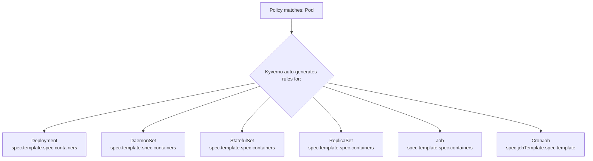

> **Складність**: `[СКЛАДНО]` — Домен 5: Просунуте написання політик Kyverno (32% іспиту)
>
> **Час на проходження**: 90–120 хвилин
>
> **Передумови**: основи Kyverno (встановлення, ClusterPolicy проти Policy), контролери допуску Kubernetes, упевнена робота з YAML та kubectl

## Результати навчання

Після завершення цього модуля ви зможете:

1. **Спроєктувати** просунуті валідаційні політики Kyverno, що поєднують Common Expression Language, проєкції JMESPath та передумови для рішень допуску в Kubernetes 1.35+.
2. **Впровадити** засоби контролю ланцюга постачання за допомогою правил `verifyImages`, які оцінюють підписи Cosign, сертифікатний матеріал Notary та підписані атестації вразливостей.
3. **Діагностувати** неочікувану поведінку Kyverno, досліджуючи трансляції autogen, звіти фонового сканування та межу між виконанням під час допуску і виконанням на рівні контролера.
4. **Оцінити** стратегії мутації, порівнюючи стратегічні merge-патчі з JSON-патчами за RFC 6902 для точної модифікації ресурсів із низьким ризиком.
5. **Впровадити** автоматизацію очищення за допомогою ресурсів `CleanupPolicy` та `ClusterCleanupPolicy`, враховуючи розклади, RBAC, винятки та умови у стилі TTL.

## Чому цей модуль важливий

Гіпотетичний сценарій: ваша платформна команда вже встановила Kyverno і має кілька базових політик щодо міток у режимі Audit, тому здається, що кластер має рівень політик. Згодом скомпрометований конвеєр збирання проштовхує образ контейнера з тим самим довіреним тегом, який зазвичай використовує конвеєр розгортання, і реєстр приймає його, бо облікові дані для надсилання дійсні. Якщо шлях допуску перевіряє лише мітки, простори імен та базові поля Pod, Kubernetes допускає робоче навантаження, оскільки ніщо в запиті до API не доводить, хто зібрав образ, які докази сканування його супроводжували та чи розв'язується тег у той дайджест, який перевірила безпека.

Цей сценарій не є збоєм контролю допуску Kubernetes. Це збій у кодуванні правильних питань безпеки у правильній точці прийняття рішення. Просунуті політики Kyverno дають змогу ставити питання, на які проста перевірка схеми відповісти не може: чи задовольняє кожен контейнер типізований предикат CEL, чи несе образ дійсний підпис та атестацію, чи має правило виконуватися лише для продакшн-просторів імен, чи має мутація додавати елемент до масиву, не перезаписуючи намір користувача, та чи слід застарілі об'єкти видаляти пізніше контролером замість блокування під час допуску.

Цей модуль розглядає Kyverno як систему політик з кількома режимами виконання, а не просто як набір YAML-фрагментів, які можна скопіювати й вставити. Ви збережете й закріпите ту ментальну модель, яка справді важлива і на іспиті KCA, і в реальних кластерах: валідаційні правила вирішують, чи дозволено запит до API, мутаційні правила змінюють запит перед його збереженням у сховищі, перевірка образів може звертатися до зовнішнього реєстру за межами кластера, autogen розширює правила, написані для Pod, на контролери робочих навантажень, фонові сканування звітують про наявні ресурси без втручання в них, а політики очищення видаляють відповідні об'єкти за заданим розкладом. Саме це розмежування і є різницею між політикою, що надійно захищає платформу, і політикою, яка дивує й дратує людей, що нею щодня керують.

Просунуті можливості цього модуля також змушують думати про власність. Команда безпеки може володіти політикою довіри до підписів, платформна команда може володіти типовими мітками й розкладами очищення, а прикладні команди можуть володіти полями, що описують, як виконуються їхні робочі навантаження. Kyverno стоїть між цими групами на межі API-сервера, тому погано розмежоване правило може перетворити вимогу врядування на простій. І навпаки, добре розмежоване правило документує контракт у виконуваній формі та дає розробникам швидкий зворотний зв'язок, поки контекст ще свіжий.

## CEL та JMESPath як взаємодоповнювальні мови політик

Kyverno починався з виразів у стилі JMESPath саме тому, що ресурси Kubernetes — це документи у формі JSON, а JMESPath чудово вибирає, фільтрує, проєктує та перетворює вкладені дані всередині таких документів. Сучасний Kubernetes також використовує Common Expression Language для валідації допуску, і Kyverno так само підтримує CEL у своїх валідаційних правилах для типізованих булевих перевірок. Корисний спосіб осмислити різницю між цими двома мовами такий: CEL — це те правило, якому ви довірили б швидко й однозначно вирішити питання «так чи ні», тоді як JMESPath — це інструмент запиту, до якого ви звертаєтеся тоді, коли вам потрібно змінити форму полів або підсумувати їх перед тим, як ухвалити те саме рішення.

Вирази CEL у Kyverno оцінюють об'єкт допуску через змінні на кшталт `object` та, під час операцій оновлення, `oldObject`. Синтаксис навмисно близький до CEL, який використовують можливості допуску Kubernetes, тому той, хто вміє читати `object.spec.containers.all(...)`, може перенести цю навичку за межі Kyverno. Компроміс полягає в тому, що CEL не змінює ресурси і не призначений для створення складних перетворених корисних навантажень. Коли мета політики — забезпечити інваріант, CEL часто зрозуміліший; коли мета — побудувати динамічне повідомлення, дослідити необов'язкові масиви або підтримати мутацію, JMESPath залишається центральним.

Наступний приклад валідує кожен контейнер у Pod за допомогою CEL. Зверніть увагу, що вираз написано проти `object.spec.containers`, а не `request.object.spec.containers`, і що макрос `all()` має успішно виконатися для кожного елемента масиву. Це той тип політики, який належить до допуску, бо Pod, який пропускає `runAsNonRoot`, слід відхилити, перш ніж він стане станом кластера.

```yaml
apiVersion: kyverno.io/v1
kind: ClusterPolicy
metadata:
  name: require-run-as-nonroot
spec:
  validationFailureAction: Enforce  # spec-level; Kyverno 1.12+ prefers per-rule validate.failureAction
  rules:
    - name: check-nonroot
      match:
        any:
          - resources:
              kinds:
                - Pod
      validate:
        cel:
          expressions:
            - expression: >-
                object.spec.containers.all(c,
                  has(c.securityContext) &&
                  has(c.securityContext.runAsNonRoot) &&
                  c.securityContext.runAsNonRoot == true)
              message: "All containers must set securityContext.runAsNonRoot to true."
```

Зупиніться та спрогнозуйте: якщо Pod має три контейнери і лише два з них встановлюють `runAsNonRoot: true`, що має повернути вираз CEL, і чи слід допускати Pod? Вираз повертає `false`, бо `all()` поводиться як логічне І по всьому списку контейнерів. Kyverno відхиляє запит, тому що валідаційний вираз не пройшов, і ця помилка трапляється до того, як об'єкт буде збережено.

| Можливість | CEL | JMESPath |
|---|---|---|
| **Стиль синтаксису** | C-подібний (`object.spec.x`) | На основі шляхів (`request.object.spec.x`) |
| **Типобезпечність** | Строго типізований під час розбору | Слабко типізований |
| **Операції зі списками** | `all()`, `exists()`, `filter()`, `map()` | Проєкції, фільтри |
| **Рядкові функції** | `startsWith()`, `contains()`, `matches()` | `starts_with()`, `contains()` |
| **Найкраще для** | Прості перевірки полів, булева логіка | Складні перетворення даних |
| **Підтримка мутації** | Ні (лише валідація) | Так (валідація + мутація) |
| **Версія Kyverno** | 1.11+ | Усі версії |

Таблицю легко запам'ятати, але операційна причина важливіша. CEL дає типізовані предикати допуску, які є стислими та передбачуваними; JMESPath дає гнучкий обхід документа для об'єктів Kubernetes, які можуть містити необов'язкові масиви, відсутні мапи та вкладені шаблони робочих навантажень. Якщо політика лише відповідає на питання «чи це дозволено?», CEL — сильний кандидат. Якщо політиці потрібно зібрати імена проблемних контейнерів, вивести список дозволених реєстрів або згенерувати значення патчу, JMESPath зазвичай підходить краще.

Ви часто бачитимете обидві мови в одній бібліотеці політик, і це нормально. Зрілі набори політик уникають того, щоб проштовхувати кожну задачу через один стиль виразів, бо це створює нечитабельні правила та крихкі тестові випадки. Практична навичка — упізнавати форму питання, перш ніж писати синтаксис: типізований інваріант, вкладена проєкція, динамічний пошук чи корисне навантаження мутації. Коли ви можете назвати цю форму, обрати правильну можливість Kyverno стає значно легше.

Валідація оновлень — це місце, де CEL починає відчуватися менш як вибір синтаксису і більш як інструмент контролю допуску. Змінна `oldObject` представляє наявний ресурс перед оновленням, тому політика може порівняти запропонований об'єкт зі збереженим. Це дає змогу запобігти руйнівним змінам, наприклад видаленню мітки, від якої залежать мережева політика, звітність про витрати чи автоматизація розгортання.

```yaml
apiVersion: kyverno.io/v1
kind: ClusterPolicy
metadata:
  name: prevent-label-removal
spec:
  validationFailureAction: Enforce
  rules:
    - name: block-label-delete
      match:
        any:
          - resources:
              kinds:
                - Deployment
              operations:
                - UPDATE
      validate:
        cel:
          expressions:
            - expression: >-
                !has(oldObject.metadata.labels.app) ||
                has(object.metadata.labels.app)
              message: "The 'app' label cannot be removed once set."
```

Логіка читається як правило безпеки: якщо старий об'єкт не мав мітки, зберігати нема чого; якщо мітку він мав, новий об'єкт повинен її зберегти. Цей патерн корисний для полів, що стають частиною операційного контракту після створення. Він також безпечніший, ніж намагатися відновити оновлення мутацією, бо користувач отримує пряму відмову і може вирішити, чи було спроба видалення випадковою, чи потребує узгодженої зміни політики.

JMESPath стає важливішим одразу, щойно політиці потрібно міркувати про вкладені масиви. Pod-и Kubernetes розміщують більшість деталей часу виконання всередині списків контейнерів, init-контейнерів, змінних середовища, портів, монтувань та вимог до ресурсів. Політика, яка перевіряє лише `containers[0]`, зазвичай помилкова, бо вона мовчки ігнорує кожен інший контейнер. Проєкції та фільтри дають змогу написати правило, яке запитує: «які контейнери порушують вимогу?» — і потім використати цю відповідь і для відмови, і для корисного повідомлення.

```yaml
apiVersion: kyverno.io/v1
kind: ClusterPolicy
metadata:
  name: limit-container-ports
spec:
  validationFailureAction: Enforce
  rules:
    - name: max-three-ports
      match:
        any:
          - resources:
              kinds:
                - Pod
      validate:
        message: "Each container may expose a maximum of 3 ports."
        deny:
          conditions:
            any:
              - key: "{{ request.object.spec.containers[?length(ports || `[]`) > `3`] | length(@) }}"
                operator: GreaterThan
                value: 0
```

Вираз використовує `ports || `[]`` як запасний варіант, бо багато контейнерів не оголошують жодних портів. Без запасного варіанту відсутнє поле могло б перетворити політику на крихке правило, що поводиться по-різному для інакше дійсних Pod-ів. Перш ніж запускати подібний вираз у власній політиці, спрогнозуйте, чи має контейнер без поля `ports` рахуватися порушенням. У цьому випадку — ні, бо правило обмежує оголошені порти, а не вимагає оголошення порту.

```text
# length() - count items or string length
"{{ request.object.spec.containers | length(@) }}"

# contains() - check if array/string contains a value
"{{ contains(request.object.metadata.labels.keys(@), 'app') }}"

# starts_with() / ends_with() - string prefix/suffix checks
"{{ starts_with(request.object.metadata.name, 'prod-') }}"

# join() - concatenate array elements
"{{ request.object.spec.containers[*].name | join(', ', @) }}"

# to_string() / to_number() - type conversion
"{{ to_number(request.object.spec.containers[0].resources.limits.cpu || '0') }}"

# merge() - combine objects
"{{ merge(request.object.metadata.labels, `{\"managed-by\": \"kyverno\"}`) }}"

# not_null() - return first non-null value
"{{ not_null(request.object.metadata.labels.team, 'unknown') }}"
```

Ці функції поширені в питаннях на читання політик у стилі KCA, бо вони показують, чи розумієте ви форму оцінюваного об'єкта Kubernetes. `length()` та `join()` часто з'являються в повідомленнях, `contains()` поширена у перевірках списків дозволу, функції перетворення з'являються, коли значення YAML можуть розбиратися як рядки, а `not_null()` не дає відсутньому необов'язковому полю зламати шлях політики. Точка тиску на іспиті — не запам'ятовування назв функцій ізольовано; це відстеження того, що кожна функція отримує й повертає після того, як Kyverno підставить дані запиту.

```yaml
apiVersion: kyverno.io/v1
kind: ClusterPolicy
metadata:
  name: require-resource-limits
spec:
  validationFailureAction: Enforce
  rules:
    - name: check-all-containers
      match:
        any:
          - resources:
              kinds:
                - Pod
      validate:
        message: >-
          All containers must define memory limits. Missing in:
          {{ request.object.spec.containers[?!contains(keys(resources.limits || `{}`), 'memory')].name | join(', ', @) }}
        deny:
          conditions:
            any:
              - key: "{{ request.object.spec.containers[?!contains(keys(resources.limits || `{}`), 'memory')] | length(@) }}"
                operator: GreaterThan
                value: 0
```

Ця політика робить дві речі одночасно: вона блокує Pod-и з відсутніми лімітами пам'яті та повідомляє розробникові, які контейнери потребують уваги. Це практична різниця в багатоконтейнерному робочому навантаженні, бо загальне повідомлення про помилку відсилає розробника назад сканувати YAML вручну. Хороші автори політик ставляться до повідомлень як до частини контролю, а не до прикраси, бо чіткі повідомлення про відмову зменшують кількість звернень до служби підтримки та скорочують цикл зворотного зв'язку.

У цьому прикладі також прихований урок щодо тестування. Щасливого шляху з одним контейнером недостатньо, щоб провалідувати політику з насиченими проєкціями, бо вираз може зламатися лише тоді, коли другий контейнер не має поля або коли необов'язкова мапа відсутня. Коли ви тестуєте правила JMESPath, додайте ресурс з усіма наявними полями, ресурс з одним відсутнім полем і ресурс із повністю відсутньою батьківською мапою. Ця невелика тестова матриця ловить більшість помилок політик, що інакше з'являються лише після того, як команда розгорне складніше робоче навантаження.

Та сама звичка тестування стосується і правил CEL, навіть попри те, що синтаксис відчувається строго типізованим. Протестуйте порожній список, єдиний дійсний елемент, змішаний список дійсних і недійсних елементів та випадок із відсутнім необов'язковим полем. Маніфести Kubernetes часто породжуються чартами Helm, операторами та шаблонами CI, тому об'єкти, які потрапляють до допуску, можуть не виглядати як простий написаний від руки приклад у політиці. Правило, що переживає ці граничні випадки, набагато ймовірніше поводитиметься узгоджено, коли autogen згодом транслює його в шаблони контролерів робочих навантажень.

## Перевірка ланцюга постачання з образами та атестаціями

Перевірка образів відповідає на те питання, на яке звичайна валідація Kubernetes не може відповісти, спираючись лише на сам маніфест Pod: чи є цей образ саме тим артефактом, який підписав довірений суб'єкт, і чи несе він із собою ті докази, яких вимагає організація? Тег на кшталт `nginx:1.27` зручний для людей, але тег за самим дизайном реєстру є змінним і може бути перепризначений на інший вміст. Правила `verifyImages` Kyverno розв'язують посилання на образи у незмінні дайджести й перевіряють підписи або атестації безпосередньо під час допуску, тому допущений Pod уже вказує на конкретний вміст, який можна простежити й перевірити під час аудиту.

Ця перевірка має інший операційний профіль, ніж локальна валідація полів. Вираз CEL може виконуватися в процесі проти об'єкта допуску, тоді як перевірка образів може потребувати звернення до реєстру OCI, отримання матеріалу підпису, розв'язання тегів та розбору підписаних метаданих. Саме тому політики образів часто потребують довшого таймауту вебхука та обережного шляху впровадження. Примусове застосування підписів на всіх реєстрах одночасно може зламати розгортання, якщо конвеєр підписання, доступ до реєстру чи конфігурація довіри Kyverno неповні.

```yaml
apiVersion: kyverno.io/v1
kind: ClusterPolicy
metadata:
  name: verify-image-signature
spec:
  validationFailureAction: Enforce
  webhookTimeoutSeconds: 30
  rules:
    - name: verify-cosign-signature
      match:
        any:
          - resources:
              kinds:
                - Pod
      verifyImages:
        - imageReferences:
            - "registry.example.com/*"
          attestors:
            - count: 1
              entries:
                - keys:
                    publicKeys: |-
                      -----BEGIN PUBLIC KEY-----
                      MFkwEwYHKoZIzj0CAQYIKoZIzj0DAQcDQgAEsLeM2H+JQfHi1PtMFbJFo3pABv2
                      OKjrFHxGnTYNeFJ4mDPOI8gMSMcKzfcWaVMPe8ZuGAsCmoAxmyBXnbPHTQ==
                      -----END PUBLIC KEY-----
```

Політика обмежує перевірку до `registry.example.com/*`, що важливо, бо публічні базові образи, внутрішні образи й тимчасові тестові образи можуть мати різну зрілість підписання. `attestors.count: 1` означає, що один довірений запис має перевірити образ. Суворіша організація могла б вимагати кількох атесторів для просторів імен високого ризику, але кожна додаткова вимога стає ще однією залежністю на шляху допуску, тому дизайн має відповідати критичності робочого навантаження.

Перевірка у стилі Notary використовує сертифікатний матеріал, а не блок публічного ключа, показаний у прикладі Cosign. Форма політики все ще знайома: зіставити Pod-и, ідентифікувати посилання на образи й визначити довірених атесторів. Головне питання дизайну — де керуються якорі довіри та як обробляється ротація, бо політика, жорстко прив'язана до застарілого сертифікатного матеріалу, зазнає збою після того, як інфраструктура підписання здійснить ротацію.

```yaml
apiVersion: kyverno.io/v1
kind: ClusterPolicy
metadata:
  name: verify-notary-signature
spec:
  validationFailureAction: Enforce
  rules:
    - name: verify-notary
      match:
        any:
          - resources:
              kinds:
                - Pod
      verifyImages:
        - imageReferences:
            - "registry.example.com/*"
          attestors:
            - entries:
                - certificates:
                    cert: |-
                      -----BEGIN CERTIFICATE-----
                      ...your certificate here...
                      -----END CERTIFICATE-----
```

Підписи доводять, що довірений підписант обробив образ, але вони не доводять, що образ вільний від неприйнятних вразливостей або що він зібраний з очікуваного джерела. Атестації додають підписані метадані поряд з артефактом, часто у форматах in-toto. Kyverno може оцінити ці корисні навантаження атестацій і відхилити образи, які підписані, але не задовольняють політику доказів, — це різниця між «хтось довірений підписав його» та «він пройшов той безпековий бар'єр, який нас цікавить».

```yaml
apiVersion: kyverno.io/v1
kind: ClusterPolicy
metadata:
  name: verify-vulnerability-scan
spec:
  validationFailureAction: Enforce
  rules:
    - name: check-vuln-attestation
      match:
        any:
          - resources:
              kinds:
                - Pod
      verifyImages:
        - imageReferences:
            - "registry.example.com/*"
          attestors:
            - entries:
                - keys:
                    publicKeys: |-
                      -----BEGIN PUBLIC KEY-----
                      ...
                      -----END PUBLIC KEY-----
          attestations:
            - type: https://cosign.sigstore.dev/attestation/vuln/v1
              conditions:
                - all:
                    - key: "{{ scanner }}"
                      operator: Equals
                      value: "trivy"
                    - key: "{{ result[?severity == 'CRITICAL'] | length(@) }}"
                      operator: LessThanOrEquals
                      value: "0"
```

Зупиніться та спрогнозуйте: чому ця політика все одно потребує довіри до підпису, якщо вона зчитує дані про вразливості з атестації? Відповідь у тому, що непідписана або недовірена атестація — це просто ще один шматок даних. Корисна властивість безпеки походить від перевірки того, що метадані були вироблені й підписані довіреним процесом, а потім перевірки того, що підписані метадані стверджують, що образ відповідає порогу вразливостей.

Для впровадження ставтеся до перевірки образів і як до проєкту політики, і як до проєкту ланцюга постачання. Почніть з вимоги підписів для вузького шляху реєстру, де система CI вже підписує образи, а потім додайте перевірки атестацій після того, як публікація результатів сканування стане надійною. Використовуйте режим Audit або обмеження за простором імен під час міграції, щоб команди могли бачити, що зазнало б збою, перш ніж примусове застосування заблокує релізи. Щойно почнеться примусове застосування, відстежуйте затримку вебхука та доступність реєстру, бо контролер допуску тепер залежить від систем поза API-сервером.

Найпоширеніша помилка дизайну — ставитися до `verifyImages` як до фінального перемикача наприкінці безпекової програми. На практиці це контракт між CI, реєстром, допуском та реагуванням на інциденти. CI має підписувати й додавати докази, реєстр має робити ці докази доступними, Kyverno має довіряти правильним ключам чи сертифікатам, а оператори мають знати, як діагностувати невдалу перевірку, не обходячи політику. Якщо бракує хоча б одного з цих елементів, правильна політика все одно може зазнати збою у продакшні, бо навколишня система не готова.

Інший тонкий момент — обсяг перевірки має слідувати за ризиком. Тренувальний кластер може приймати непідписані образи з публічних реєстрів, водночас вимагаючи підписані внутрішні прикладні образи, бо мета — захистити те програмне забезпечення, яке ви збираєте й розгортаєте багаторазово. Регульований продакшн-простір імен може вимагати і підписів, і атестацій вразливостей, тоді як sandbox-простір імен може працювати в режимі Audit для підтримки експериментів. Це не слабша модель політики; це явна модель ризику, закодована в межах простору імен, реєстру та робочого навантаження.

Коли перевірка зазнає збою, навчіть операторів відрізняти збої довіри від збоїв доказів. Збій довіри означає, що Kyverno не зміг перевірити підписанта чи ланцюг сертифікатів для артефакту. Збій доказів означає, що підпис був дійсним, але підписане корисне навантаження не задовольнило умову політики, наприклад значення сканера чи поріг вразливостей. Ці збої вказують на різних власників: конфігурація довіри зазвичай належить платформній команді чи команді безпеки, тоді як вміст доказів часто належить конвеєру CI, який виробив метадані образу.

## Мутації, передумови та динамічний контекст

Валідація запитує, чи слід узагалі допустити ресурс, тоді як мутація змінює сам ресурс перед його збереженням у сховищі. Ця різниця звучить просто, але саме вона визначає, яку стратегію патчу обрати. Стратегічні merge-патчі — це читабельні накладання, що добре працюють для додавання спільних міток або встановлення кількох простих полів, тоді як JSON-патчі за RFC 6902 — це явні, упорядковані списки операцій, що можуть додати, замінити чи видалити точно вказані шляхи JSON. Коли політика має додати елемент до кінця масиву, видалити конкретне поле чи націлитися на певний індекс, саме JSON-патч дає ту точність, якої бракує стратегічному merge.

| Сценарій | Використати JSON Patch | Використати Strategic Merge |
|---|---|---|
| Додати sidecar-контейнер | Так | Працює, але багатослівно |
| Встановити одне поле | Підходить будь-що | Простіший синтаксис |
| Видалити поле | Так (єдиний варіант) | Не може видаляти |
| Умовні зміни елементів масиву | Так | Ні |
| Додати за конкретним індексом масиву | Так | Ні |

Найбезпечніша мутаційна політика достатньо вузька, щоб користувачі могли її передбачити. Додавання міток, впровадження відомого sidecar чи нормалізація реєстру можуть бути розумними, коли платформа володіє цією поведінкою. Переписування довільних полів на кожному робочому навантаженні ризикованіше, бо розробники можуть не усвідомлювати, що об'єкт, який вони застосували, не є об'єктом, який зберіг Kubernetes. Корисне практичне правило — мутувати типові значення та поля, якими володіє платформа, але валідувати намір, яким володіє користувач, коли неочікуване значення має виправити людина.

```yaml
apiVersion: kyverno.io/v1
kind: ClusterPolicy
metadata:
  name: inject-logging-sidecar
spec:
  rules:
    - name: add-sidecar
      match:
        any:
          - resources:
              kinds:
                - Pod
              selector:
                matchLabels:
                  inject-sidecar: "true"
      mutate:
        patchesJson6902: |-
          - op: add
            path: "/spec/containers/-"
            value:
              name: log-collector
              image: fluent/fluent-bit:3.0
              resources:
                limits:
                  memory: "128Mi"
                  cpu: "100m"
              volumeMounts:
                - name: shared-logs
                  mountPath: /var/log/app
          - op: add
            path: "/spec/volumes/-"
            value:
              name: shared-logs
              emptyDir: {}
```

Суфікс шляху `/-` має значення, бо він додає елемент у кінець масиву, не вимагаючи від автора політики знати, скільки контейнерів уже існує. Якби політика використовувала `/spec/containers/1`, вона працювала б лише тоді, коли індекс один існує, або коли семантика JSON-патчу дозволяє саме таке додавання. Якби патч використовував `replace`, шлях мав би вже існувати, і відсутній індекс відхилив би запит на допуск. Точність — це потужно, але вона також означає, що недійсні шляхи зазнають збою гучно.

```yaml
apiVersion: kyverno.io/v1
kind: ClusterPolicy
metadata:
  name: enforce-image-registry
spec:
  rules:
    - name: replace-image-registry
      match:
        any:
          - resources:
              kinds:
                - Pod
      mutate:
        patchesJson6902: |-
          - op: replace
            path: "/spec/containers/0/image"
            value: "registry.internal.example.com/nginx:1.27"
```

Цей приклад заміни навмисно вузький, бо він націлюється лише на перший контейнер. У реальній багатоконтейнерній політиці ви зазвичай уникали б фіксованого індексу, якщо тільки форма об'єкта не контролюється платформою. Урок KCA полягає в тому, що JSON-патч може виконувати точні операції, але автор політики повинен розуміти шлях і режим збою. Якщо індекс не існує, мутація зазнає збою, і користувач бачить відмову допуску, а не частковий патч.

Передумови вирішують, чи слід виконувати правило після того, як ресурс зіставився з широким селектором ресурсів. Це робить їх інструментом продуктивності й коректності політики. Блок `match` може вибирати Pod-и, тоді як `preconditions` можуть обмежити правило продакшн-просторами імен, конкретними мітками, операціями, іменами образів чи іншим контекстом. Пропущене правило не є ні пройденим, ні таким, що зазнало збою; Kyverno просто рухається далі, бо правило було нерелевантним для того запиту.

```yaml
apiVersion: kyverno.io/v1
kind: ClusterPolicy
metadata:
  name: require-probes-in-prod
spec:
  validationFailureAction: Enforce
  rules:
    - name: check-readiness-probe
      match:
        any:
          - resources:
              kinds:
                - Pod
      preconditions:
        all:
          - key: "{{ request.object.metadata.labels.environment || '' }}"
            operator: Equals
            value: production
      validate:
        message: "All containers in production namespaces must have a readinessProbe."
        pattern:
          spec:
            containers:
              - readinessProbe: {}
```

Передумови — це також місце, де ховається багато помилок політик. Автори часто вкладають забагато логіки в `match`, який здебільшого про вибір ресурсів, або плутають `any` з `all`. Читайте `any` як АБО, а `all` як І. Якщо правило має застосовуватися до робочих навантажень високої критичності або до робочих навантажень у фінансових просторах імен, використовуйте `any`. Якщо правило має застосовуватися лише коли збігаються і простір імен, і мітка, використовуйте `all`. Оператори множин на кшталт `AnyIn` та `AllIn` порівнюють **літеральні** рядки лише: значення на кшталт `prod-*` у списку не зіставляється за шаблоном з `prod-foo` (шаблони працюють з `Equals` / `NotEquals`, а не з належністю до множини). Наведений вище приклад probe для продакшну спирається на мітку `environment` робочого навантаження замість того, щоб угадувати імена просторів імен.

```yaml
apiVersion: kyverno.io/v1
kind: ClusterPolicy
metadata:
  name: enforce-image-digest-for-critical
spec:
  validationFailureAction: Enforce
  rules:
    - name: digest-required
      match:
        any:
          - resources:
              kinds:
                - Pod
      preconditions:
        any:
          - key: "{{ request.object.metadata.labels.criticality || '' }}"
            operator: Equals
            value: "high"
          - key: "{{ request.namespace }}"
            operator: AnyIn
            value:
              - production
              - financial
      validate:
        message: >-
          Critical workloads must use image digests, not tags.
          Use image@sha256:... format.
        deny:
          conditions:
            any:
              - key: "{{ request.object.spec.containers[?!contains(@.image, '@sha256:')] | length(@) }}"
                operator: GreaterThan
                value: 0
```

| Оператор | Опис | Приклад |
|---|---|---|
| `Equals` / `NotEquals` | Точний збіг (підтримує шаблони у значенні) | `key: "foo"`, `value: "foo"` |
| `In` / `NotIn` | **Застарілі** (v1.6.0+); використовуйте `AnyIn` / `AnyNotIn` натомість | Надавайте перевагу `AnyIn` для належності |
| `AnyIn` / `AllIn` | Належність до множини (лише літеральні імена, без шаблонів) | `key: "prod-foo"`, `value: ["production","financial"]` |
| `GreaterThan` / `LessThan` | Числове порівняння | `key: "5"`, `value: 3` |
| `GreaterThanOrEquals` / `LessThanOrEquals` | Включне порівняння | `key: "5"`, `value: 5` |
| `AnyNotIn` / `AllNotIn` | Заперечена належність до множини | Порівняння масиву з масивом |
| `DurationGreaterThan` | Порівняння тривалості часу | `key: "2h"`, `value: "1h"` |

Динамічний контекст розширює ту саму ідею, дозволяючи політиці зчитувати дані, яких немає у поданому об'єкті. ConfigMap може містити список дозволених реєстрів, або виклик API може отримати живий Namespace, щоб політика могла оцінити мітки й анотації простору імен. Це корисно, але не безкоштовно. Кожен зовнішній пошук додає вимоги RBAC, режими збою та затримку, тому використовуйте його тоді, коли дані справді потребують зміни незалежно від визначення політики.

```yaml
apiVersion: v1
kind: ConfigMap
metadata:
  name: allowed-registries
  namespace: kyverno
data:
  registries: "registry.example.com,gcr.io/my-project,docker.io/myorg"
```

```yaml
apiVersion: kyverno.io/v1
kind: ClusterPolicy
metadata:
  name: restrict-registries-from-configmap
spec:
  validationFailureAction: Enforce
  rules:
    - name: check-registry
      match:
        any:
          - resources:
              kinds:
                - Pod
      context:
        - name: allowedRegistries
          configMap:
            name: allowed-registries
            namespace: kyverno
      validate:
        message: >-
          Image registry is not in the allowed list.
          Allowed: {{ allowedRegistries.data.registries }}
        deny:
          conditions:
            any:
              - key: "{{ request.object.spec.containers[].image | map(@, split(@, '/')[0]) }}"
                operator: AnyNotIn
                value: "{{ allowedRegistries.data.registries | split(@, ',') }}"
```

Контекст ConfigMap найкращий, коли дані малі, належать платформній команді й безпечні для зчитування під час допуску. Якщо список дозволених реєстрів змінюється щотижня, зберігання його в ConfigMap уникає редагування політики при кожній зміні. Якщо список великий або потребує складного зіставлення, простіша політика плюс тест політики на боці CI можуть бути легшими в експлуатації, ніж щільний вираз допуску.

```yaml
apiVersion: kyverno.io/v1
kind: ClusterPolicy
metadata:
  name: require-namespace-label
spec:
  validationFailureAction: Enforce
  rules:
    - name: check-ns-label
      match:
        any:
          - resources:
              kinds:
                - Pod
      context:
        - name: nsLabels
          apiCall:
            urlPath: "/api/v1/namespaces/{{ request.namespace }}"
            jmesPath: "metadata.labels"
      validate:
        message: >-
          Pods can only be created in namespaces with a 'team' label.
          Namespace '{{ request.namespace }}' is missing the 'team' label.
        deny:
          conditions:
            any:
              - key: team
                operator: AnyNotIn
                value: "{{ nsLabels | keys(@) }}"
```

Внутрішній виклик API використовує сервісний акаунт Kyverno, тому RBAC стає частиною дизайну політики. Якщо сервісний акаунт не може зчитувати Namespace-и, політика не може надійно ухвалити це рішення. Якщо API-сервер повільний або перевантажений, запит на допуск чекає. Який підхід ви обрали б для вимоги щодо коду виставлення рахунків: копіювати анотацію в кожен шаблон Pod під час CI чи запитувати живий Namespace під час допуску? Краща відповідь залежить від того, чи є метадані простору імен авторитетним джерелом і яку затримку допуску ви можете терпіти.

```yaml
context:
  - name: externalCheck
    apiCall:
      service:
        url: "https://policy-check.internal/validate"
        # caBundle: |-
        #   <PEM>
      method: POST
      data:
        - key: image
          value: "{{ request.object.spec.containers[0].image }}"
      jmesPath: "allowed"
```

Виклики зовнішніх сервісів — це гострий інструмент. Вони дають змогу ухвалювати централізовані рішення, які може бути важко закодувати в YAML, але вони також роблять допуск залежним від мережевого сервісу поза звичайним графом об'єктів API-сервера. Для цілей іспиту пам'ятайте, що Kyverno може викликати API через контекст; для продакшн-дизайну резервуйте зовнішні виклики для випадків, де цінність політики явно переважує вартість надійності.

Коли політика використовує динамічний контекст, обробка помилок стає частиною досвіду користувача. Розробник, який отримує «у просторі імен бракує billing-code», може виправити метадані простору імен або попросити власника додати їх. Розробник, який отримує таймаут через те, що зовнішній сервіс політик недоступний, не має очевидної дії, навіть якщо його маніфест коректний. Саме тому внутрішні виклики API Kubernetes та пошуки ConfigMap зазвичай легші в експлуатації, ніж виклики зовнішніх сервісів: джерело даних живе всередині тієї самої площини управління й керується знайомими інструментами RBAC та спостережуваності.

Передумови також допомагають зменшити вартість динамічного контексту, бо вони можуть пропустити дорогу роботу для ресурсів, яким правило явно не потрібне. Якщо живий пошук простору імен потрібен лише продакшн-навантаженням, спершу перевірте простір імен чи мітку й уникайте пошуку для навантажень розробки. Це утримує затримку допуску нижчою й робить намір політики більш видимим. Це також полегшує написання тестових випадків, бо ви можете окремо перевірити пропущений випадок, випадок із пошуком та випадок із відмовою.

Інша перевага передумов — це комунікація. Правило з широким `match` і вузькою передумовою каже: «ця політика про Pod-и, але релевантні лише ці Pod-и». Про це легше міркувати, ніж про щільний блок `match`, що намагається виразити кожну бізнес-умову в селекторах ресурсів. Під час огляду запитайте, чи читається передумова як те речення, яке ви сказали б колезі. Якщо ні, політика може бути коректною, але все одно надто важкою для підтримки.

## Autogen, фонові сканування та контролери очищення

Більшість інженерів дуже рідко створюють «голі», окремі Pod-и безпосередньо у продакшні. Натомість вони створюють Deployment-и, StatefulSet-и, DaemonSet-и, Job-и, CronJob-и та інші контролери, кожен з яких містить усередині себе шаблон Pod. Autogen Kyverno існує саме тому, що політика для Pod, яка ігнорує ці вкладені шаблони, на практиці пропустила б переважну більшість реальних робочих навантажень. Коли правило зіставляється з видом `Pod`, Kyverno може автоматично створити додаткові транслювані правила, що досліджують вбудовані шляхи шаблону Pod усередині поширених контролерів.



Autogen потужний, бо він захищає Pod-и, створені контролерами, не вимагаючи окремих політик для кожного виду робочого навантаження. Він також створює відповідальність за діагностику. Якщо політика посилається на поля, що існують у Pod-ах, але не у тому самому місці всередині шаблону контролера, згенероване правило може поводитися не так, як очікував автор. Перший крок усунення несправностей — дослідити збережену ClusterPolicy та прочитати згенеровані правила `autogen-`, а не вгадувати лише з вихідного YAML.

```yaml
apiVersion: kyverno.io/v1
kind: ClusterPolicy
metadata:
  name: require-labels
  annotations:
    # Only auto-generate for Deployments and StatefulSets
    pod-policies.kyverno.io/autogen-controllers: Deployment,StatefulSet
spec:
  rules:
    - name: require-app-label
      match:
        any:
          - resources:
              kinds:
                - Pod
      validate:
        message: "The label 'app' is required."
        pattern:
          metadata:
            labels:
              app: "?*"
```

Ця анотація обмежує autogen Deployment-ами та StatefulSet-ами, що корисно, коли політика безпечна для довготривалих прикладних контролерів, але недоречна для Job-ів чи DaemonSet-ів. Анотація також є хорошою підказкою на іспиті: якщо у питанні сказано, що політика для Pod заблокувала CronJob, autogen, ймовірно, причетний, якщо тільки політика явно не обмежила чи не вимкнула згенеровані контролери.

```yaml
metadata:
  annotations:
    pod-policies.kyverno.io/autogen-controllers: none
```

Вимкнення autogen має бути усвідомленим. Воно доречне, коли політика справді націлена лише на пряме створення Pod, або коли правило досліджує поля Pod у спосіб, що не може бути безпечно транслюваний у шаблони контролерів. Інакше вимкнення створює прогалину, де користувач може обійти правило допуску для Pod, просто обгорнувши той самий специфікатор контейнера в Deployment.

```bash
# After applying a Pod-targeting policy, inspect the generated rules:
kubectl get clusterpolicy require-labels -o yaml | grep -A 5 "autogen-"
```

Фонові сканування відповідають на інше питання: а що з об'єктами, які вже існували до створення політики чи до посилення примусового застосування? Вебхуки допуску бачать запити на створення та оновлення, але вони не передопускають автоматично кожен об'єкт у кластері. Фонове сканування Kyverno оцінює наявні ресурси й записує об'єкти PolicyReport, щоб команди могли бачити дрейф та порушення без видалення чи мутації працюючих робочих навантажень.

```yaml
apiVersion: kyverno.io/v1
kind: ClusterPolicy
metadata:
  name: audit-privileged-containers
spec:
  validationFailureAction: Audit
  background: true  # default is true
  rules:
    - name: deny-privileged
      match:
        any:
          - resources:
              kinds:
                - Pod
      validate:
        message: "Privileged containers are not allowed."
        pattern:
          spec:
            containers:
              - securityContext:
                  privileged: "!true"
```

Важливий момент у тому, що фонові сканування — це механізми звітування, а не ретроактивний допуск. Якщо наявний Pod порушує це правило, Kyverno записує результат у PolicyReport; він не вбиває Pod через те, що валідаційна політика змінилася. Така поведінка робить режим Audit корисним під час впровадження. Ви можете виміряти вплив політики, виправити робочі навантаження, а потім рухатися до Enforce для нових запитів на допуск.

```yaml
apiVersion: kyverno.io/v1
kind: ClusterPolicy
metadata:
  name: block-latest-tag
spec:
  validationFailureAction: Enforce
  background: false  # only check at admission time
  rules:
    - name: no-latest
      match:
        any:
          - resources:
              kinds:
                - Pod
      validate:
        message: "The ':latest' tag is not allowed."
        pattern:
          spec:
            containers:
              - image: "!*:latest"
```

Встановлення `background: false` доречне, коли правило має сенс лише під час допуску, наприклад політики, що включають специфічний для запиту контекст чи поведінку мутації. Це також може зменшити шум для політик, де наявні ресурси не корисно звітувати. Розрізнення на іспиті просте: примусове застосування допуску блокує створення та оновлення; фонові сканування виробляють звіти для наявних ресурсів.

```bash
# List all policy reports (namespaced)
kubectl get policyreport -A

# View a specific report's results
kubectl get policyreport -n default -o yaml

# Cluster-scoped reports
kubectl get clusterpolicyreport
```

Політики очищення керуються контролером, а не допуском. `CleanupPolicy` чи `ClusterCleanupPolicy` виконується за розкладом і видаляє відповідні ресурси, коли успішно спрацьовує її логіка зіставлення й умов. Це робить очищення хорошим вибором для невдалих Pod-ів, завершених Job-ів, прострочених тимчасових ConfigMap-ів та debug-просторів імен, що не повинні жити вічно. Це не заміна валідації допуску, бо політика очищення може спрацювати за хвилини чи години після створення об'єкта.

```yaml
apiVersion: kyverno.io/v2
kind: ClusterCleanupPolicy
metadata:
  name: delete-failed-pods
spec:
  match:
    any:
      - resources:
          kinds:
            - Pod
  conditions:
    any:
      - key: "{{ target.status.phase }}"
        operator: Equals
        value: Failed
  schedule: "*/15 * * * *"
```

Це правило очищення використовує змінну `target`, бо воно оцінює ресурси, знайдені контролером очищення, а не `request.object` з допуску. Розклад має cron-стиль, тому видалення відбувається, коли контролер узгоджує політику. Якщо сервісний акаунт Kyverno не має дозволу `delete` для цільового виду, політика не може виконати своє завдання, навіть якщо сам YAML дійсний.

```yaml
apiVersion: kyverno.io/v2
kind: CleanupPolicy
metadata:
  name: cleanup-old-configmaps
  namespace: staging
spec:
  match:
    any:
      - resources:
          kinds:
            - ConfigMap
          selector:
            matchLabels:
              temporary: "true"
  conditions:
    any:
      - key: "{{ time_since('', target.metadata.creationTimestamp, '') }}"
        operator: GreaterThan
        value: "24h"
  schedule: "0 */6 * * *"
```

Очищення у стилі TTL — поширений патерн гігієни платформи, але його слід поєднувати з видимою моделлю власності. Мітка на кшталт `temporary: "true"` повідомляє, що ресурс придатний для автоматичного видалення, а розклад повідомляє, як швидко може статися очищення. Без чітких міток та умов очищення здається довільним для прикладних команд, бо контролер видаляє об'єкти після того, як розмова про допуск завершилася.

```yaml
apiVersion: kyverno.io/v2
kind: ClusterCleanupPolicy
metadata:
  name: cleanup-completed-jobs
spec:
  match:
    any:
      - resources:
          kinds:
            - Job
  exclude:
    any:
      - resources:
          selector:
            matchLabels:
              retain: "true"
  conditions:
    all:
      - key: "{{ target.status.succeeded }}"
        operator: GreaterThan
        value: 0
  schedule: "0 2 * * *"
```

Блок `exclude` — це запобіжний клапан. Він дає платформі змогу визначити типову поведінку очищення, зберігаючи задокументований шлях для відступу для job-ів, що мають бути збережені для аудиту, налагодження чи ручного огляду. Це кращий патерн, ніж робити політики очищення настільки широкими, що команди з ними воюють, або настільки слабкими, що вони ніколи не видаляють нічого корисного.

Дизайн очищення також має враховувати власність об'єктів та поведінку контролерів. Видалення невдалого Pod, яким володіє Job, відрізняється від видалення самого Job, бо контролер-власник може відтворити чи зберегти пов'язані об'єкти залежно від власного специфікатора. Видалення ConfigMap, на який ще посилається Deployment, може не перезапустити робоче навантаження негайно, але може зламати майбутні розгортання чи відновлення. Перш ніж примусово застосовувати очищення у спільних кластерах, протестуйте політику проти реалістичних посилань на власників та переконайтеся, що ціль видалення — це той об'єкт, який ви справді хочете прибрати.

Для міркувань KCA тримайте назви змінних чіткими. Політики допуску зазвичай міркують про `request.object`, тоді як політики очищення міркують про `target`, бо контролер сканує наявні об'єкти. Це розрізнення — більше ніж синтаксис. Воно каже вам, чи реагує правило на запит користувача до API чи на запланований цикл узгодження, що своєю чергою каже, які дані доступні, яка дія можлива та куди дивитися, коли поведінка дивує.

Корисне впровадження очищення починається зі спостереження, навіть попри те, що саме очищення не є валідаційним правилом режиму Audit. Застосуйте політику до вузького простору імен, оберіть розклад, що дає змогу спостерігати перший запуск, та створіть тестові об'єкти з мітками, які мають і не мають зіставлятися. Після першого узгодження дослідіть ресурси, що залишилися, та події контролера Kyverno. Це доводить шлях зіставлення, умови, винятку, розкладу та RBAC разом, замість припущення, що кожен елемент працює, бо YAML був допущений.

## Патерни та антипатерни

Просунута робота з Kyverno вдається, коли автори політик ставляться до правил як до операційних інтерфейсів. YAML — лише одна частина системи; інші частини — це порядок впровадження, затримка, RBAC, поведінка згенерованих контролерів та якість зворотного зв'язку, надісланого розробникам. Наведені нижче патерни — це звички, що роблять політики корисними після першої успішної демонстрації.

| Патерн | Коли використовувати | Чому це працює |
|---|---|---|
| Починати просунуті політики в обмеженому режимі Audit | Правило зачіпає багато команд, перевіряє підписи образів чи залежить від динамічного контексту | PolicyReport-и виявляють вплив до того, як Enforce заблокує релізи |
| Надавати перевагу CEL для типізованих інваріантів допуску | Правило — це пряма валідація «так чи ні» над поданим об'єктом | CEL утримує булеві перевірки читабельними й уникає виразів, насичених проєкціями |
| Використовувати JMESPath для повідомлень та необов'язкових масивів | Правило має ідентифікувати проблемні контейнери чи терпіти відсутні поля | Проєкції виробляють корисний вивід, не ігноруючи багатоконтейнерні Pod-и |
| Досліджувати вивід autogen після кожної політики для Pod | Правило, націлене на Pod, має захищати Deployment-и, Job-и чи CronJob-и | Згенеровані правила показують точні транслювані шляхи, які оцінюватиме Kyverno |
| Поєднувати очищення з мітками та винятками | Ресурси можуть спливати за терміном, але деякі потребують збереження | Оператори отримують передбачувану поведінку видалення та задокументовані критерії відмови |

Антипатерни часто спокусливі, бо вони роблять першу політику коротшою. Вони стають дорогими пізніше, бо приховують режими збою, доки розгортання не буде заблоковано, мутація не здивує команду чи контролер очищення не видалить щось, що не виглядало тимчасовим для його власника. Просунуті автори політик витрачають трохи більше часу, роблячи намір політики явним, щоб кластер поводився передбачувано під тиском.

Здорова бібліотека політик також має шлях ескалації. Деякі порушення мають бути жорсткими збоями, бо вони захищають базову безпеку кластера, наприклад привілейовані контейнери чи непідписані продакшн-образи. Інші порушення мають починатися як звіти, бо організації потрібен час, щоб полагодити маніфести, оновити шаблони CI чи послідовно публікувати підписи. Патерн — це не «Audit назавжди» й не «Enforce усе»; це поетапне примусове застосування з доказами, власністю та чіткою датою чи умовою переходу від спостереження до блокування.

| Антипатерн | Що йде не так | Краща альтернатива |
|---|---|---|
| Мутувати поля, якими володіє користувач, щоб «виправити» кожне порушення | Розробники не можуть передбачити, який об'єкт зберігає Kubernetes | Валідувати неочікуваний намір і резервувати мутацію для типових значень, якими володіє платформа |
| Використовувати фіксовані індекси JSON-патчу у змішаних навантаженнях | Багатоконтейнерні Pod-и зазнають збою, або змінюється неправильний контейнер | Додавати через `/-` або валідувати всі контейнери перед націленою мутацією |
| Примусово застосовувати перевірку образів до того, як CI послідовно підписує | Здорові розгортання зазнають збою, бо ланцюг постачання не готовий | Впроваджувати за шляхом реєстру, простором імен чи рівнем навантаження зі спершу зібраними доказами audit |
| Ставитися до фонових сканувань як до примусового застосування | Наявні порушення залишаються працювати, а менеджери очікують видалення, що не станеться | Використовувати звіти для планування виправлень та Enforce допуску для майбутніх змін |
| Вимикати autogen, щоб приглушити збій контролера | Робочі навантаження обходять задуману політику для Pod, використовуючи контролер | Виправити вираз або обмежити autogen підтримуваними контролерами |
| Писати очищення без огляду RBAC | Політика існує, але контролер не може видаляти цілі | Підтвердити, що Kyverno має дієслова delete для точних видів ресурсів у обсязі |

## Рамка прийняття рішень

Коли ви проєктуєте просунуту політику Kyverno, визначте насамперед режим виконання, ще перш ніж починати писати сам вираз. Запитайте себе, чи має політика блокувати запит, змінювати запит, перевіряти образ проти зовнішніх доказів довіри, звітувати про вже наявні об'єкти чи видаляти ресурси пізніше за розкладом. Саме це перше рішення визначає, які змінні будуть доступні, який бюджет затримки ви маєте, які потреби RBAC виникнуть та який режим збою побачать користувачі.

```text
Start
  |
  v
Is the request allowed as submitted?
  |-- no, based only on object fields --> validate with CEL or JMESPath
  |-- no, based on image trust --------> verifyImages with signatures/attestations
  |-- yes, but needs platform defaults -> mutate with strategic merge or JSON patch
  |-- existing objects need visibility -> background scans and PolicyReports
  |-- old resources must be removed ----> CleanupPolicy or ClusterCleanupPolicy
```

Використовуйте цю матрицю, коли сценарій включає кілька можливостей Kyverno і вам треба обрати найменший правильний механізм. Мета — не використати найпросунутішу можливість; мета — покласти рішення в ту частину Kyverno, яка природно ним володіє.

Є ще один практичний фільтр: запитайте, хто може виправити збій. Якщо прикладний розробник може виправити маніфест негайно, відмова допуску з точним повідомленням корисна. Якщо лише платформна команда може виправити конфігурацію довіри, раптова відмова може залишити розробника без локального засобу. Якщо проблема — це історичний дрейф у наявних робочих навантаженнях, PolicyReport дає командам чергу роботи, не порушуючи трафік. Узгодження механізму з тим, хто виправляє, не дає політиці перетворитися на машину для звинувачень.

Нарешті, тримайте бібліотеки політик достатньо модульними, щоб повідомлення про збій вказувало на одне рішення. Одну велику політику може бути зручно застосувати, але окремі правила все одно потребують чітких назв, сфокусованих повідомлень та тестів, що ізолюють поведінку. Коли кожна відмова каже, яке правило зазнало збою і чому, розробники вивчають контракт платформи через звичайний зворотний зв'язок розгортання. Коли відмови розмиті чи кілька непов'язаних питань об'єднано разом, команди починають просити винятків, бо виправлення фактичної проблеми відчувається повільнішим, ніж обхід політики.

| Вимога | Основний механізм | Компроміс для перевірки |
|---|---|---|
| Блокувати Pod-и без `runAsNonRoot` | Валідаційне правило CEL | Зрозуміло й типізовано, але лише валідація |
| Відхиляти непідписані чи неперевірені на вразливості образи | `verifyImages` | Сильний контроль ланцюга постачання, але затримка реєстру має значення |
| Додати стандартний sidecar | Мутація JSON-патчем | Точне додавання до масиву, але помилки шляху відхиляють допуск |
| Перевірити мітку простору імен із запиту Pod | Контекст `apiCall` плюс валідація | Використовує живий стан кластера, але потребує RBAC та бюджету затримки |
| Звітувати про наявні привілейовані Pod-и | Фонове сканування з PolicyReport-ами | Незаважаюча видимість, не ретроактивне примусове застосування |
| Видаляти невдалі Pod-и чи прострочені тимчасові об'єкти | Політика очищення | Асинхронне видалення, не блокування під час допуску |

## Чи знали ви?

- Kubernetes 1.35+ продовжує тенденцію використання CEL для валідації на боці API, тому практика CEL у Kyverno безпосередньо переноситься на міркування про нативну політику допуску.
- `verifyImages` Kyverno може мутувати тег образу в незмінний дайджест і провалідувати докази довіри під час того самого потоку допуску.
- `CleanupPolicy` та `ClusterCleanupPolicy` використовують запланований цикл узгодження контролера, що означає, що вони можуть видаляти старі ресурси навіть тоді, коли жоден користувач не створює й не оновлює об'єкти.
- Ресурси PolicyReport дають Kyverno нативну для Kubernetes поверхню звітування, яку інструменти можуть спостерігати без розбору логів вебхука допуску.

## Типові помилки

| Помилка | Чому вона трапляється | Як її виправити |
|---|---|---|
| Використання CEL у правилах mutate | CEL виглядає як універсальна мова політик, але Kyverno підтримує її для логіки валідації, а не для корисних навантажень мутації | Використовуйте CEL для булевої валідації, а JMESPath, стратегічний merge чи JSON-патч — для мутації |
| Забути `webhookTimeoutSeconds` для `verifyImages` | Перевірки підписів та атестацій можуть викликати реєстр OCI, тому вони повільніші за локальні перевірки полів | Збільшіть таймаут для політик перевірки образів та моніторте затримку допуску |
| Очікувати, що `background: true` примусово застосовуватиме до працюючих Pod-ів | Фонові сканування оцінюють наявні ресурси й пишуть звіти, але не передопускають і не завершують об'єкти | Використовуйте PolicyReport-и для виправлення та покладайтеся на Enforce для майбутніх запитів на створення чи оновлення |
| Писати JSON-патчі з крихкими індексами масивів | Автор політики тестує одну форму Pod і забуває, що інші навантаження мають інакшу кількість контейнерів | Додавайте через `/-` при додаванні елементів і валідуйте форму масиву перед заміною за індексом |
| Не брати в лапки літерали з зворотними апострофами JMESPath | YAML, підставлення шаблону та JMESPath кожен мають власні правила взяття в лапки | Обгорніть увесь вираз у подвійні лапки й тримайте літерали JMESPath у зворотних апострофах |
| Припускати, що autogen безпечно обробляє кожне поле | Шляхи шаблону Pod відрізняються від полів контролера верхнього рівня, тому згенеровані правила потребують дослідження | Перевірте збережену ClusterPolicy й перегляньте правила `autogen-` після застосування політики |
| Створювати політики очищення без RBAC на видалення | Очищення виконується сервісним акаунтом контролера Kyverno, а не користувачем, що написав політику | Надайте дозвіл на видалення для точних цільових видів та протестуйте очищення в непродакшн-просторі імен |
| Змішувати `any` та `all`, не відстежуючи логіку | Автори читають вкладені умови як прозу й пропускають поведінку АБО проти І | Перекладіть кожен блок у таблицю істинності, перш ніж покладатися на нього в режимі Enforce |

## Тест

<details>
<summary>Питання 1: Ваша команда хоче, щоб будь-який Pod, що запитує GPU, автоматично отримував toleration та селектор нод. Молодший інженер креслить правило mutate Kyverno, використовуючи CEL для впровадження полів. Чи спрацює цей дизайн?</summary>

Ні. CEL доречний для валідаційних виразів Kyverno, але він не є механізмом для конструювання корисних навантажень мутації. Дизайн має використовувати правило mutate зі значеннями, виведеними через JMESPath, стратегічний merge-патч чи JSON-патч за RFC 6902 залежно від того, наскільки точними мають бути впроваджувані поля. Це питання відображає результат навчання з проєктування, бо правильна відповідь залежить від вибору правильної мови політики для типу правила, а не від запам'ятовування команди.

</details>

<details>
<summary>Питання 2: Під час аудиту ви виявляєте, що всі продакшн-образи підписані Cosign, але деякі підписані образи все ще містять критичні вразливості. Який контроль Kyverno слід додати?</summary>

Додайте оцінку атестації всередині правила `verifyImages`, а не лише перевірку підпису. Підпис доводить, що довірений підписант обробив образ, тоді як підписана атестація вразливостей надає докази про результати сканування. Політика може вимагати очікуваного значення сканера та відхилити образ, коли заатестована кількість КРИТИЧНИХ вразливостей перевищує прийнятий поріг. Це впроваджує результат навчання з ланцюга постачання, бо поєднує довіру до ідентичності з доказами про вміст артефакту.

</details>

<details>
<summary>Питання 3: Розробник каже, що CleanupPolicy видаляє debug-Pod-и негайно під час створення, але логи допуску API-сервера не показують відмови вебхука очищення. Що слід пояснити насамперед?</summary>

CleanupPolicy не виконується під час синхронного допуску, тому її не слід описувати як негайну відмову допуску. Політики очищення виконуються за розкладами через контролер і видаляють відповідні наявні ресурси після узгодження. Якщо Pod заблоковано під час створення, спершу дослідіть валідацію, збій мутації, квоту чи інший вебхук допуску. Якщо Pod допущений, а потім зникає пізніше, дослідіть розклади очищення, умови зіставлення, винятки та RBAC контролера Kyverno.

</details>

<details>
<summary>Питання 4: Вам треба впровадити sidecar для логування в Deployment-и з невідомою кількістю наявних контейнерів. Який шлях JSON-патчу найбезпечніший і чому?</summary>

Використовуйте `path: "/spec/containers/-"` при патчингу масиву контейнерів шаблону Pod, скоригований до правильного шляху шаблону після autogen або при прямому написанні для контролера. Дефіс додає елемент у кінець масиву, тому політиці не треба знати поточну кількість контейнерів. Фіксований індекс може зазнати збою, коли індекс не існує, а `replace` помилковий, бо може не бути наявного елемента для заміни. Це перевіряє результат навчання зі стратегії мутації, бо режим збою походить від семантики RFC 6902.

</details>

<details>
<summary>Питання 5: Політика для Pod несподівано блокує новий CronJob, навіть попри те, що ніхто не створював окремий Pod. Яку поведінку Kyverno слід дослідити?</summary>

Дослідіть autogen на збереженій ClusterPolicy. Kyverno може транслювати правила, націлені на Pod, у правила для контролерів робочих навантажень, що містять шаблони Pod, включно з Job-ами та CronJob-ами, якщо тільки анотації не обмежують чи не вимикають цю поведінку. Наступний крок — запустити `kubectl get clusterpolicy <name> -o yaml` та дослідити імена й шляхи згенерованих правил. Це перевіряє результат навчання з діагностики, бо відповідь вимагає погляду на транслюваний стан політики Kyverno, а не лише на вихідний файл.

</details>

<details>
<summary>Питання 6: Менеджер побоюється, що ввімкнення `validationFailureAction: Enforce` з `background: true` завершить наявні Pod-и, які порушують нове правило. Чи коректне це побоювання?</summary>

Ні. Enforce впливає на рішення допуску для запитів на створення та оновлення, тоді як фонові сканування звітують про наявні ресурси через PolicyReport-и. Kyverno не завершує вже працюючі Pod-и лише тому, що валідаційна політика звітує, що вони невідповідні. Безпечний план впровадження — прочитати звіти, виправити робочі навантаження, а потім покладатися на Enforce для майбутніх змін. Це відображає результат навчання з діагностики фонового сканування, бо відокремлює генерацію звітів від примусового застосування допуску.

</details>

<details>
<summary>Питання 7: Політика має відхиляти Pod-и, коли цільовому Namespace бракує анотації `billing-code`, але маніфест Pod не включає анотації Namespace. Як Kyverno може оцінити цю вимогу?</summary>

Використовуйте блок `context` із внутрішнім `apiCall`, щоб отримати `/api/v1/namespaces/{{ request.namespace }}`, а потім оцініть анотацію за допомогою JMESPath у правилі validate. Політиці також потрібен сервісний акаунт Kyverno з доступом на читання об'єктів Namespace. Це краще, ніж прикидатися, що Pod містить дані, яких він не має, але це додає затримку та міркування RBAC. Сценарій перевіряє проєктування й впровадження, бо поєднує динамічний контекст із валідацією під час допуску.

</details>

<details>
<summary>Питання 8: Правило очищення має видаляти завершені Job-и, якщо вони не несуть `retain: "true"`. Які елементи політики роблять цю поведінку передбачуваною?</summary>

Використовуйте `ClusterCleanupPolicy`, що зіставляється з ресурсами Job, додайте селектор `exclude` для `retain: "true"` та зумовте видалення завершеним статусом, наприклад `target.status.succeeded`, що більший за нуль. Розклад визначає, коли відбувається видалення, а RBAC контролера Kyverno визначає, чи видалення взагалі можливе. Мітка збереження дає командам видимий шлях відступу для потреб аудиту чи налагодження. Це перевіряє результат навчання з очищення, бо правильна відповідь включає розклад, зіставлення, виняток, умову та дозволи.

</details>

## Практична вправа

### Мета

Побудуйте багатоправильну ClusterPolicy, що поєднує п'ять просунутих технік: валідацію CEL, проєкцію JMESPath, передумови, JSON-патчі та контроль autogen. Ви протестуєте заблоковані й дозволені Pod-и, дослідите результати мутації та підтвердите, що політика згенерувала правила для контролерів робочих навантажень лише для тих видів контролерів, які ви обрали.

### Передумови

```bash
# Start a kind cluster
kind create cluster --name kyverno-lab

# Install Kyverno
helm repo add kyverno https://kyverno.github.io/kyverno/
helm repo update
helm install kyverno kyverno/kyverno -n kyverno --create-namespace
```

### Крок 1: Створіть об'єднану політику

Збережіть це як `advanced-policy.yaml` і застосуйте. Політика навмисно поєднує валідацію та мутацію, щоб ви могли побачити, як Kyverno обробляє запит, перш ніж об'єкт буде збережено.

```yaml
apiVersion: kyverno.io/v1
kind: ClusterPolicy
metadata:
  name: advanced-kca-exercise
  annotations:
    pod-policies.kyverno.io/autogen-controllers: Deployment,StatefulSet
spec:
  validationFailureAction: Enforce
  background: true
  webhookTimeoutSeconds: 30
  rules:
    # Rule 1: CEL validation - require runAsNonRoot
    - name: cel-nonroot
      match:
        any:
          - resources:
              kinds:
                - Pod
      validate:
        cel:
          expressions:
            - expression: >-
                object.spec.containers.all(c,
                  has(c.securityContext) &&
                  has(c.securityContext.runAsNonRoot) &&
                  c.securityContext.runAsNonRoot == true)
              message: "All containers must set runAsNonRoot: true (CEL check)."

    # Rule 2: JMESPath - require memory limits with helpful message
    - name: jmespath-memory-limits
      match:
        any:
          - resources:
              kinds:
                - Pod
      preconditions:
        all:
          - key: "{{ request.namespace }}"
            operator: NotEquals
            value: kube-system
      validate:
        message: >-
          Memory limits are required. Missing in containers:
          {{ request.object.spec.containers[?!resources.limits.memory].name | join(', ', @) }}
        deny:
          conditions:
            any:
              - key: "{{ request.object.spec.containers[?!resources.limits.memory] | length(@) }}"
                operator: GreaterThan
                value: 0

    # Rule 3: JSON Patch mutation - add standard labels
    - name: add-managed-labels
      match:
        any:
          - resources:
              kinds:
                - Pod
      mutate:
        patchesJson6902: |-
          - op: add
            path: "/metadata/labels"
            value: {}
          - op: add
            path: "/metadata/labels/managed-by"
            value: "kyverno"
          - op: add
            path: "/metadata/labels/policy-version"
            value: "v1"
```

```bash
kubectl apply -f advanced-policy.yaml
```

### Крок 2: Протестуйте Pod, який має бути заблоковано

Запустіть цю команду й прочитайте повідомлення про відмову. Pod не має `securityContext` і не має лімітів пам'яті, тому правило CEL має відхилити його, перш ніж він стане станом кластера.

```bash
# This Pod has no securityContext and no memory limits -- should fail
kubectl run test-fail --image=nginx --restart=Never
```

Очікуваний вивід підтверджує, що подання було відхилено правилом `cel-nonroot`. Якщо ви бачите іншу відмову першою, прочитайте всі повідомлення політики, бо кілька правил можуть оцінюватися під час того самого запиту на допуск.

### Крок 3: Протестуйте Pod, який має пройти успішно

Тепер створіть відповідний Pod, що задовольняє обидва валідаційні правила. Правило мутації має додати платформні мітки після успішної валідації й перед збереженням об'єкта.

```bash
# Create a compliant Pod
cat <<'EOF' | kubectl apply -f -
apiVersion: v1
kind: Pod
metadata:
  name: test-pass
spec:
  containers:
    - name: nginx
      image: nginx:1.27
      securityContext:
        runAsNonRoot: true
        runAsUser: 1000
      resources:
        limits:
          memory: "128Mi"
          cpu: "100m"
EOF
```

### Крок 4: Перевірте мутацію

Дослідіть збережений Pod, а не оригінальний маніфест. Різниця між цими двома поглядами — це весь сенс вправи з мутації.

```bash
# Check that Kyverno added the labels
kubectl get pod test-pass -o jsonpath='{.metadata.labels}' | jq .
```

Очікуваний вивід включає `"managed-by": "kyverno"` та `"policy-version": "v1"`. Якщо мітки відсутні, дослідіть статус політики та події допуску, бо правило мутації могло зазнати збою перед збереженням.

### Крок 5: Перевірте autogen

Перевірте збережену ClusterPolicy на наявність згенерованих правил. Анотація має обмежити autogen Deployment-ами та StatefulSet-ами.

```bash
# Check the policy for auto-generated rules
kubectl get clusterpolicy advanced-kca-exercise -o yaml | grep "name: autogen"
```

Очікувано: ви бачите правила `autogen-cel-nonroot`, `autogen-jmespath-memory-limits` та `autogen-add-managed-labels`, згенеровані для Deployment та StatefulSet. DaemonSet-и навмисно пропущено, бо анотація обмежила список контролерів.

Якщо згенеровані правила не з'являються, не переходьте одразу до логів контролера. Спершу підтвердьте, що політика справді зіставляється з `Pod`, що значення анотації написано правильно й що ClusterPolicy було успішно допущено. Потім дослідіть поля статусу та події на наявність помилок Kyverno. Цей порядок утримує процес діагностики близько до об'єкта, який ви змінили, перш ніж досліджувати ширше середовище виконання контролера.

### Крок 6: Перевірте звіти фонового сканування

Прочитайте PolicyReport-и після того, як Kyverno мав час просканувати наявні ресурси. Звіти можуть включати ресурси, що існували до застосування політики, але вони не повинні натякати, що Kyverno видалив чи перезапустив ці ресурси.

```bash
kubectl get policyreport -A
```

### Критерії успіху

- [ ] Невідповідний Pod (`test-fail`) заблоковано з чітким повідомленням про помилку.
- [ ] Відповідний Pod (`test-pass`) допущено до API-сервера.
- [ ] Допущений Pod має впроваджені мітки `managed-by: kyverno` та `policy-version: v1`.
- [ ] Правила autogen існують лише для Deployment та StatefulSet, що підтверджує перевизначення анотацією.
- [ ] PolicyReport-и згенеровано для відповідних наявних ресурсів без видалення працюючих Pod-ів.

### Очищення

```bash
kind delete cluster --name kyverno-lab
```

## Перевірка засвоєного

> **Батьківська мапа JSON6902:** `add` за RFC 6902 не створює відсутні батьківські об'єкти. Мутація в лабораторній додає `- op: add` / `path: "/metadata/labels"` / `value: {}` перед вкладеними ключами міток, тому `test-pass` (без мапи `metadata.labels`) усе одно отримує `managed-by` та `policy-version`.

> **Зовнішній `apiCall`:** `urlPath` націлюється лише на внутрішньокластерний API-сервер Kubernetes. HTTPS-ендпоїнти використовують `apiCall.service.url` (необов'язковий `caBundle` / заголовки), а не `urlPath`.

> **Передумови:** `AnyIn` замінює застарілі `In` / `NotIn`. Оператори множин зіставляють літеральні рядки; правило probe для продакшну використовує `metadata.labels.environment == production` замість патерну простору імен `prod-*`.

## Джерела

- https://kyverno.io/docs/policy-types/cluster-policy/validate/
- https://kyverno.io/docs/policy-types/cluster-policy/mutate/
- https://kyverno.io/docs/policy-types/cluster-policy/verify-images/
- https://kyverno.io/docs/policy-types/cluster-policy/preconditions/
- https://kyverno.io/docs/policy-types/cluster-policy/external-data-sources/
- https://kyverno.io/docs/policy-types/cluster-policy/autogen/
- https://kyverno.io/docs/policy-reports/
- https://kyverno.io/docs/policy-types/cleanup-policy/
- https://kyverno.io/docs/policy-types/cluster-policy/jmespath/
- https://kyverno.io/docs/policy-types/cluster-policy/cel/
- https://kubernetes.io/docs/reference/using-api/cel/
- https://kubernetes.io/docs/reference/access-authn-authz/admission-controllers/
- https://docs.sigstore.dev/cosign/signing/overview/
- https://notaryproject.dev/docs/
- https://www.rfc-editor.org/rfc/rfc6902
- https://github.com/in-toto/attestation/blob/main/spec/README.md

## Наступний модуль

Готові взятися за масштабування корпоративного рівня? Переходьте до **[Модуля 1.2: Операції та CLI Kyverno](module-1.2-kyverno-operations-cli/)**, де ви попрактикуєте `kyverno apply`, `kyverno test`, винятки політик, метрики та операції високої доступності для керування політиками у продакшні.
