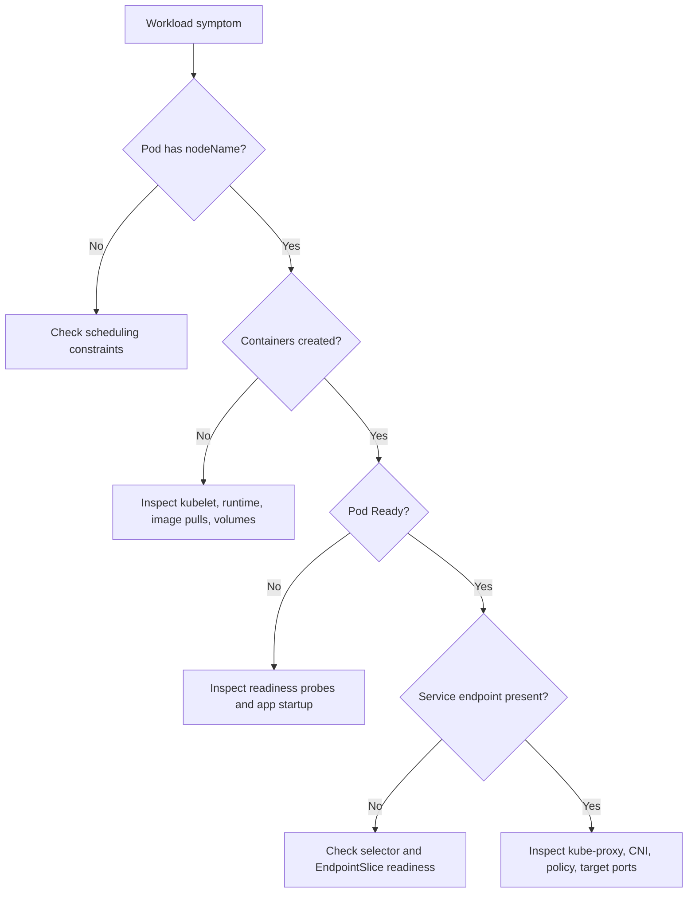

> **Складність**: `[СЕРЕДНЯ]` - Базові концепції архітектури
>
> **Час на проходження**: 45-55 хвилин
>
> **Передумови**: Модуль 1.3. Цей модуль передбачає, що ви вже можете назвати компоненти площини управління та читати базовий вивід об'єктів Kubernetes, оскільки урок тепер зміщується від рішень кластера до агентів вузла, які виконують ці рішення.

## Що ви зможете зробити

Після завершення цього модуля ви зможете пов'язати спостережувані симптоми з тим компонентом вузла, який найімовірніше за них відповідає, а потім використати цей зв'язок, щоб перевірити реальний стан кластера, а не вгадувати на основі одного стовпця статусу:

1. **Діагностувати** проблеми готовності вузла, пов'язуючи сигнали kubelet, kube-proxy та середовища виконання контейнерів зі спостережуваними симптомами кластера.
2. **Порівняти** проєкти iptables, IPVS та замінники kube-proxy, щоб ви могли оцінити компроміси маршрутизації Сервісів у кластерах Kubernetes 1.35+.
3. **Простежити** шлях Пода від зберігання в API-сервері через призначення планувальником, узгодження kubelet, запуск середовища виконання, готовність та трафік Сервісу.
4. **Впровадити** робочий процес інспекції на рівні вузла з псевдонімом `k`, який перевіряє стани вузла, розміщення Подів, деталі середовища виконання, Сервіси та EndpointSlices.

## Чому цей модуль важливий

**Гіпотетичний сценарій:** Уявіть інцидент із оформленням замовлення, коли команда застосунку бачить заплутаний симптом: Деплойменти були справними в Git, площина управління приймала нові маніфести, а дашборди показували достатню кількість бажаних реплік, проте клієнти час від часу отримували скидання з'єднання під час оплати. Найдорожчою частиною був не перший зламаний Под, а ті тридцять хвилин невизначеності, поки команди сперечалися, хто відповідальний: планувальник, мережевий плагін, балансувальник навантаження чи образ застосунку. У цьому проміжку замовлення накопичувалися, навантаження на кол-центр зростало, а керівнику інциденту була потрібна проста відповідь: чи кластер усе ще правильно приймає рішення, чи вузли не справляються з виконанням цих рішень?

Ця різниця — серце архітектури Kubernetes. Площина управління зберігає бажаний стан і обирає, де має виконуватися робота, але компоненти вузла перетворюють цей намір на запущені процеси, мережеві правила, звіти про справність та оновлення кінцевих точок. Якщо kubelet припиняє надсилати звіти, API-сервер усе ще може бути доступним, тоді як вузол стає `NotReady`. Якщо правила kube-proxy застарілі, Поди можуть працювати, тоді як Сервіси погано маршрутизують трафік. Якщо середовище виконання контейнерів не може завантажити образ, планування вдалося, але виконання провалилося. Фахівець, який вміє розділяти ці рівні, може скоротити інцидент від широких припущень до сфокусованого діагностичного шляху.

Цей модуль завершує картину архітектури, розпочату в уроці про площину управління. Ви дізнаєтеся, що таке вузол, за що відповідає kubelet, kube-proxy та середовище виконання контейнерів, як стани вузла впливають на планування та витіснення, і як Под рухається від об'єкта YAML до застосунку, що отримує трафік. Мета не в тому, щоб запам'ятати назви компонентів для іспиту KCNA; мета — побудувати ментальну модель, яку ви зможете застосувати, коли кластер каже одне в API, а інше — на машинах, що виконують роботу.

## Що насправді таке вузол

Вузол Kubernetes — це будь-яка машина, що може запускати агента вузла, досягати API-сервера, розміщувати середовище виконання контейнерів та брати участь у мережі кластера. Це може бути сервер на «голому залізі» (bare-metal) у стійці колокації, віртуальна машина від хмарного провайдера або локальна ВМ, створена навчальним інструментом. Kubernetes байдуже, чи процесор розташований у хмарному екземплярі, чи під вашим столом, доки вузол задовольняє контракти, очікувані площиною управління та мережею кластера. Ця абстракція потужна, бо дозволяє одній і тій самій моделі Деплоймента націлюватися на багато форм інфраструктури, але вона також приховує важливі операційні відмінності, як-от поведінка диска, можливості ядра та підтримка мережевих політик.

```
┌─────────────────────────────────────────────────────────────┐
│              WHAT IS A NODE?                                │
├─────────────────────────────────────────────────────────────┤
│                                                             │
│  A node can be:                                            │
│  • Physical server (bare metal)                            │
│  • Virtual machine (EC2, GCE VM, Azure VM)                │
│  • Cloud instance                                          │
│                                                             │
│  Every node runs:                                          │
│  ┌─────────────────────────────────────────────────────┐   │
│  │  kubelet      - Node agent                          │   │
│  │  kube-proxy   - Network proxy                       │   │
│  │  Container runtime - Runs containers                │   │
│  └─────────────────────────────────────────────────────┘   │
│                                                             │
│  Nodes register themselves with the control plane          │
│  Control plane assigns Pods to nodes                       │
│                                                             │
└─────────────────────────────────────────────────────────────┘
```

Уявіть вузол як невеликий філіал, що отримує вказівки зі штаб-квартири. API-сервер — це місце, де живуть офіційні наряди на роботу, планувальник обирає, який філіал має обробити нове замовлення, а вузол — це філіал, який мусить розкрити коробки, запустити обладнання, перевірити безпечність роботи та звітувати про прогрес. Філіал може деякий час продовжувати обслуговувати клієнтів, якщо телефонна лінія до штаб-квартири перервалася, але він не може отримувати нові завдання чи надавати свіжий статус, доки зв'язок не відновиться. Саме тому наявні Поди часто продовжують працювати під час тимчасової проблеми зі зв'язком площини управління, тоді як вузол усе одно може стати `Unknown` чи `NotReady` з точки зору площини управління.

Вузол також є межею, де зустрічаються кілька незалежних систем. Kubelet є специфічним для Kubernetes і узгоджує специфікації Подів, тоді як середовище виконання дотримується контейнерних стандартів, а мережевий стек залежить від можливостей ядра Linux плюс вашого плагіна CNI. Це розділення дає Kubernetes портативність, але воно означає, що жодна окрема команда не пояснює кожну несправність. Под зі станом `Pending` може ніколи не досягти kubelet, бо планувальник не може його розмістити. Под зі станом `ContainerCreating` може бути на правильному вузлі, поки середовище виконання завантажує образ або монтує томи. Под зі станом `Running` усе ще може бути недосяжним, бо провалилася готовність або маршрутизація Сервісу ще не дізналася про кінцеву точку.

Ця межа — причина, чому усунення несправностей вузла винагороджує терпляче впорядкування. Якщо ви спершу запитаєте не той рівень, то можете зібрати точний вивід, який усе одно не відповідає на питання. Наприклад, справна служба kubelet на хості не доводить, що селектор Сервісу збігається з потрібними Подами, а коректний EndpointSlice не доводить, що середовище виконання зможе запустити новий контейнер завтра. Вузол — це місце, де зустрічаються ці рівні, але кожен рівень має власні докази, режими відмов та дії з ремонту.

Очікування рівня KCNA полягає не в тому, щоб ви стали експертом із мереж Linux за один урок. Очікування полягає в тому, що ви можете прочитати симптом і уникнути категорійних помилок. Коли Под не призначено, планувальник і обмеження стоять вище за течією від kubelet. Коли Под призначено, але він застряг у створенні, kubelet і середовище виконання перебувають на шляху. Коли трафік не може досягти готового Пода через Сервіс, на увагу заслуговують стан кінцевих точок, поведінка kube-proxy та політика CNI. Така класифікація — фундамент для глибшої платформної роботи пізніше.

Перш ніж інспектувати реальний вузол, налаштуйте стандартний псевдонім, що використовується в усіх модулях KubeDojo. Повна команда — `kubectl`, але після одноразового представлення скорочення ми використовуємо `k`, бо це зберігає приклади читабельними та віддзеркалює поширені звички операторів.

```bash
alias k=kubectl
k version --client
k get nodes -o wide
```

Зробіть паузу та спрогнозуйте: якщо API-сервер стане недосяжним на дві хвилини, але ОС вузла, kubelet та середовище виконання продовжать працювати, які видимі факти, на вашу думку, зміняться першими: контейнери на вузлі, стан Ноди в API чи список кінцевих точок Сервісу?

Коли ви запускаєте `k get nodes`, стовпець `STATUS` — це підсумок, а не діагноз. Вузол зі статусом `Ready` є обнадійливим, бо kubelet нещодавно звітував про справний статус і стани вузла не блокують звичайне планування, але це одне слово не розкриває тиск на диск, версію середовища виконання, версію ядра, taint'и, виділювані ресурси чи нещодавні події. Реальний діагностичний робочий процес рухається від підсумку до `k describe node`, потім до розміщення Подів, а далі до компонентів рівня вузла, коли доступний shell. Спершу йде ментальна модель; послідовність команд має сенс лише тоді, коли ви знаєте, який компонент відповідає за кожен спостережуваний факт.

Усередині кожного статусу вузла також прихована проблема часу. Kubernetes — це система узгодження, тож API зазвичай звітує про останній стан, який компоненти спостерегли та опублікували, а не про миттєву істину зсередини кожного процесу. Під час швидкої відмови контейнер застосунку, оновлення статусу kubelet, стан Ноди, видалення кінцевої точки та збій для клієнта можуть змінюватися не в один і той самий момент. Тому сильний оператор читає вивід Kubernetes як послідовність повідомлених фактів і запитує, який компонент мав достатньо часу та зв'язку, щоб оновити який об'єкт.

## Діагностика готовності вузла через kubelet

Kubelet — це основний агент вузла, і саме він найбезпосередніше відповідає за перетворення наміру щодо Пода на локальну реальність. Він спостерігає за API-сервером для Подів, призначених його вузлу, перевіряє, чи може їх запустити, просить середовище виконання контейнерів створити контейнери, монтує томи через плагіни, налаштовує проби, оновлює статус Пода та публікує статус Ноди. Kubelet не вирішує, який вузол має запускати Под; це робота планувальника. Він також не реалізує сам контейнерний рушій; цю роботу він делегує через Container Runtime Interface.

```
┌─────────────────────────────────────────────────────────────┐
│              KUBELET                                        │
├─────────────────────────────────────────────────────────────┤
│                                                             │
│  What it does:                                             │
│  ─────────────────────────────────────────────────────────  │
│  • Runs on every node in the cluster                       │
│  • Watches for Pod assignments from API server             │
│  • Ensures containers are running and healthy              │
│  • Reports node and Pod status back to API server          │
│                                                             │
│  How it works:                                             │
│  ─────────────────────────────────────────────────────────  │
│                                                             │
│  API Server: "Node 2, run Pod X"                          │
│       │                                                     │
│       ▼                                                     │
│  kubelet:                                                  │
│  1. Receives Pod spec                                      │
│  2. Pulls container images                                 │
│  3. Creates containers via runtime                         │
│  4. Monitors container health                              │
│  5. Reports status to API server                          │
│                                                             │
│  Key point:                                                │
│  kubelet doesn't manage containers not created by K8s     │
│                                                             │
└─────────────────────────────────────────────────────────────┘
```

Словосполучення «агент вузла» може звучати скромно, але kubelet перебуває в критичній точці узгодження. Контролер може створити ReplicaSet, Деплоймент може запросити більше реплік, а планувальник може прив'язати Под до вузла, але на цьому вузлі нічого не запускається, доки kubelet не побачить призначення й не відреагує на нього. Саме тому `k describe pod` часто розкриває цілу історію в потоці подій: заплановано, завантаження образу, завантажено, створено, запущено, проба провалилася, відкат, або готово. Ці події — хлібні крихти зі шляху виконання на вузлі, і багато з них з'являються тому, що kubelet координується із середовищем виконання.

Kubelet також звітує про стани Ноди. Стани — це не просто мітки; це сигнали, які споживають люди, контролери та логіка планування. `Ready=False` повідомляє кластеру не розміщувати звичайні нові Поди на вузлі. `DiskPressure=True` каже, що локального сховища настільки мало, що kubelet може витісняти Поди. `MemoryPressure=True` означає, що тиск на пам'ять впливає на надійність, тоді як `PIDPressure=True` вказує на вичерпання обмежень на процеси. `NetworkUnavailable=True` зазвичай указує на налаштування мережі, яке не завершилося або провалилося, і це важливо ще до того, як ви звинуватите Сервіс чи Інгрес.

| Стан | Значення |
|-----------|---------|
| **Ready** | Вузол справний і може приймати Поди |
| **DiskPressure** | Ємність диска низька |
| **MemoryPressure** | Пам'яті стає мало |
| **PIDPressure** | Забагато процесів |
| **NetworkUnavailable** | Мережа не налаштована |

Kubelet навмисно консервативний, коли ресурсів обмаль. Якщо у вузла закінчується ефемерне сховище, проблема може проявитися як збирання сміття серед образів, витіснення Подів або невдале створення контейнерів — залежно від часу та поведінки навантаження. Команда, яка стежить лише за процесором та пам'яттю, може пропустити простіше пояснення: зростання логів заповнило файлову систему вузла. Практичний урок полягає в тому, що діагностика готовності вузла завжди має включати стани, виділювані ресурси та нещодавні події, перш ніж ви зануритеся в логи застосунку.

Консервативність kubelet може здаватися жорсткою, бо він може витіснити Под, який не був першопричиною тиску. Така поведінка все одно є частиною системи безпеки вузла. Вузол, що не може зберегти достатньо пам'яті, диска чи процесної ємності, стає ненадійним для кожного навантаження на ньому, тож kubelet захищає машину та звітує про тиск, а не вдає, що всі призначені Поди однаково в безпеці. Щойно ви побачите kubelet як локального інспектора безпеки, стани тиску та витіснення стане легше тлумачити.

Використовуйте цей шаблон інспекції, коли вузол виглядає підозріло. Він починається з API кластера, бо це те, у що вірить сам Kubernetes, а потім звужується до компонента, що відповідає за локальне виконання.

```bash
k get nodes
k describe node <node-name>
k get pods -A -o wide --field-selector spec.nodeName=<node-name>
k get events -A --field-selector involvedObject.kind=Node,involvedObject.name=<node-name>
```

Перш ніж запустити це, який вивід ви очікуєте, якщо вузол достатньо справний, щоб звітувати про статус, але занадто заповнений, щоб приймати нові навантаження? Шукайте стан `Ready`, який усе ще може бути істинним, стан тиску, що є істинним, нещодавні попередження про витіснення чи диск, та Поди, згруповані на цьому вузлі, бо вони вже працювали до того, як тиск став серйозним.

**Гіпотетичний сценарій:** платформна команда розслідує повторювані «випадкові» перезапуски в просторі імен з інтенсивним логуванням. Команда застосунку зосередилася на циклах падіння (crash loop), тоді як платформна команда помітила, що кожен уражений Под нещодавно потрапляв на той самий робочий вузол. `k describe node` показав `DiskPressure=True`, а події kubelet показали, що збирання сміття серед образів не звільняло достатньо місця. Контейнери не були дефектними; локальне сховище вузла було вичерпане логами та невикористаними образами, а kubelet робив саме те, для чого його розроблено під тиском.

Інший поширений інцидент починається з вузла, технічно досяжного, але достатньо повільного, щоб оновлення статусу відставали, а проби провалювалися. Власники застосунку можуть бачити збої готовності, тоді як платформні інженери бачать попередження kubelet, а мережеві інженери не бачать очевидної втрати пакетів. У такому разі правильне питання не «яка команда володіє Kubernetes», а «який контракт відмовляє першим». Якщо kubelet не може надійно спостерігати та звітувати про справність контейнерів, API стане застарілим, контролери реагуватимуть на застарілі дані, а зміни кінцевих точок Сервісу можуть відставати від реального стану навантаження.

Kubelet не керує кожним процесом на машині, і ця межа має значення. Якщо адміністратор запускає контейнер вручну командою середовища виконання поза Kubernetes, kubelet не приймає його автоматично до бажаного стану кластера. Контейнери, якими володіє Kubernetes, прив'язані до специфікацій Подів, UID'ів, томів, проб, контексту безпеки, політики перезапуску та звітності про статус. Ручні процеси все одно можуть споживати процесор, пам'ять, диск, порти чи PID'и, тож вони можуть зламати вузол Kubernetes, не з'являючись як звичайні навантаження Kubernetes. Хороші оператори уникають некерованих навантажень на вузлах кластера, якщо тільки вузол явно не призначений для такої ролі.

Реєстрація вузла — ще одна відповідальність kubelet, що створює видимий стан кластера. Коли машина приєднується, kubelet автентифікується в API-сервері, створює або оновлює об'єкт Ноди, звітує про ємність та виділювані ресурси, а потім продовжує надсилати сигнали серцебиття (heartbeat). Якщо kubelet припиняє надсилати серцебиття, площина управління врешті трактує вузол як несправний, навіть якщо його наявні контейнери ще живі. Ця різниця важлива під час розділень мережі (network partition), бо API не є ідеальним дзеркалом кожного процесу; це останній стан, повідомлений через контракти Kubernetes.

Для іспиту та польової роботи практичне правило просте: kubelet — це міст між бажаними специфікаціями Подів та спостережуваним станом вузла. Він читає призначену роботу з API, просить середовище виконання виконати дії з контейнерами, перевіряє справність, оновлює статус і повідомляє площині управління, чи вузол усе ще є хорошим місцем для запуску роботи. Якщо ваша діагностика не може пояснити, що kubelet прочитав би, зробив би чи повідомив би в цей момент, у вашій діагностиці, ймовірно, бракує кроку.

## Трасування виконання Пода через середовище виконання контейнерів

Середовище виконання контейнерів — це компонент вузла, що фактично завантажує образи, створює контейнери, запускає процеси та керує життєвим циклом контейнерів. Раніше Kubernetes мав тісніший зв'язок із Docker Engine, але сучасний Kubernetes покладається на Container Runtime Interface, щоб kubelet міг спілкуватися з CRI-сумісними середовищами виконання, як-от containerd та CRI-O. Це розв'язання — одна з причин, чому Kubernetes може розвиватися, не вбудовуючи конкретного середовища виконання. Це також означає, що специфічні для середовища виконання збої проявляються через події kubelet та Пода, а зазвичай не як прямі помилки планувальника.

```
┌─────────────────────────────────────────────────────────────┐
│              CONTAINER RUNTIME                              │
├─────────────────────────────────────────────────────────────┤
│                                                             │
│  What it does:                                             │
│  ─────────────────────────────────────────────────────────  │
│  • Pulls images from registries                            │
│  • Creates and starts containers                           │
│  • Manages container lifecycle                             │
│                                                             │
│  Kubernetes uses CRI (Container Runtime Interface):        │
│  ─────────────────────────────────────────────────────────  │
│                                                             │
│       kubelet                                              │
│          │                                                  │
│          │ CRI (gRPC)                                      │
│          ▼                                                  │
│    ┌─────────────────────────────────────────────────┐     │
│    │  containerd  │  CRI-O  │  Other CRI runtime    │     │
│    └─────────────────────────────────────────────────┘     │
│          │                                                  │
│          │ OCI (Open Container Initiative)                 │
│          ▼                                                  │
│    ┌───────────────┐                                       │
│    │  runc / kata  │  (low-level runtime)                 │
│    └───────────────┘                                       │
│                                                             │
│  Common runtimes:                                          │
│  • containerd - Default in most distributions              │
│  • CRI-O - Lightweight, Kubernetes-focused                │
│                                                             │
└─────────────────────────────────────────────────────────────┘
```

Рівень середовища виконання найлегше зрозуміти, простежуючи відповідальність донизу. Kubelet знає специфікацію Пода та бажаний життєвий цикл. CRI-середовище виконання знає, як завантажувати шари образу, готувати файлову систему контейнера, створювати метадані контейнера та запускати процес контейнера. Низькорівневе OCI-середовище виконання, як-от `runc` чи альтернатива з пісочницею (sandbox), обробляє остаточні примітиви Linux на кшталт просторів імен та cgroups. Кожен рівень звужує проблему: намір Kubernetes угорі, життєвий цикл контейнера посередині, ізоляція ядра внизу.

Абстракція Пода додає ще одну деталь, що дивує багатьох початківців: Под — це не просто мішок незв'язаних контейнерів. Контейнери в одному Поді спільно використовують мережу та можуть спільно використовувати томи, а пісочниця Пода надає спільний мережевий простір імен. Саме тому в початковому чернетковому варіанті згадувався контейнер «pause». Контейнер pause — це не ваш застосунок, але він дає Поду стабільний мережевий простір імен, щоб контейнери застосунку в цьому Поді могли з'являтися й зникати, доки ідентичність Пода залишається узгодженою.

Збої середовища виконання часто виглядають як збої Kubernetes, бо симптом проявляється в `k get pods`. Помилка завантаження образу може показатися як `ImagePullBackOff`, погана команда може стати `CrashLoopBackOff`, відсутній том може тримати Под у `ContainerCreating`, а непідтримуване налаштування середовища виконання може з'явитися в подіях. Планувальник не відповідає за жодне з цього, щойно Под прив'язано до вузла. Точне діагностичне питання таке: чи Под провалився до призначення вузла, під час виконання kubelet-до-середовища-виконання, після запуску процесу, чи після того, як готовність мала б дозволити трафік?

Саме тут гігієна образів стає архітектурною турботою, а не деталлю реєстру. Якщо команди необережно використовують змінні теги, завантажують великі образи на недостатньо забезпечені вузли або залежать від облікових даних, недоступних у цільовому просторі імен, kubelet та середовище виконання виявлять проблему як затримку чи збій запуску Пода. Компоненти вузла не поводяться неправильно; вони показують, що бажаний стан не можна перетворити на локальний процес за поточних умов. Надійні кластери трактують доступність образів, область видимості облікових даних та сумісність середовища виконання як частину проєктування деплою.

Ось невеликий Под, який ви можете використати в навчальному кластері, коли хочете спостерігати за подіями, пов'язаними із середовищем виконання. Маніфест навмисно простий, щоб шлях виконання на вузлі було легше побачити.

```yaml
apiVersion: v1
kind: Pod
metadata:
  name: runtime-demo
spec:
  containers:
  - name: web
    image: nginx:stable
    ports:
    - containerPort: 80
```

Застосуйте його та проінспектуйте події. Перша команда створює бажаний стан в API-сервері; цікава історія починається після того, як планувальник призначає вузол, а цільовий kubelet просить середовище виконання виконати роботу з контейнерами.

Збережіть маніфест вище як `runtime-demo.yaml`, потім:

```bash
k apply -f runtime-demo.yaml
k get pod runtime-demo -o wide
k describe pod runtime-demo
```

Зробіть паузу та спрогнозуйте: якщо ім'я образу написано з помилкою, але кластер має достатньо ємності й планувальник успішно обирає вузол, яку фазу чи подію ви очікуєте побачити? Под можна призначити вузлу, тоді як kubelet повторно просить середовище виконання завантажити образ, якого не існує, тож збій належить виконанню середовища виконання, а не плануванню.

Версія середовища виконання видима через об'єкт Ноди, що нагадує: kubelet звітує про локальні факти вгору до API. `containerd://...` поширене в багатьох дистрибутивах, тоді як деякі кластери використовують CRI-O. Вам не потрібно запам'ятовувати кожну деталь середовища виконання для KCNA, але ви маєте розуміти, що «Docker» більше не є типовою ментальною відповіддю. Оскільки Kubernetes багато років тому прибрав застарілий dockershim, сучасні кластери використовують CRI-сумісні середовища виконання, і усунення несправностей має слідувати цій архітектурі.

Вибір середовища виконання рідко має значення для розробника застосунків у спокійний день, але він має значення для платформних команд, що керують оновленнями, пісочницями, політиками образів та інструментами налагодження. containerd широко використовується, бо воно стабільне, сфокусоване та інтегроване в багато дистрибутивів. CRI-O розроблено спеціально для випадків використання Kubernetes і поширене в деяких екосистемах. Середовища виконання з пісочницею додають ізоляцію ціною часу запуску, сумісності чи операційної складності. Kubernetes ховає багато з цих відмінностей за CRI, але не змушує їх зникнути.

```bash
k describe node <node-name> | grep "Container Runtime Version"
k get node <node-name> -o jsonpath='{.status.nodeInfo.containerRuntimeVersion}{"\n"}'
```

Коли доступний shell на вузлі, інструменти середовища виконання можуть підтвердити те, на що натякає API Kubernetes. Багато виробничих кластерів обмежують SSH до вузла з вагомих причин, тож діагностика «спочатку API» залишається цінною, але нижчорівневі перевірки можуть бути вирішальними під час платформних інцидентів. Для CRI-середовищ виконання `crictl` — поширений інструмент налагодження, бо він говорить тією самою CRI-поверхнею, що й kubelet. Сенс не в тому, щоб замінити команди Kubernetes; сенс — перевірити рівень середовища виконання, коли події Пода натякають, що проблема живе саме там.

```bash
sudo crictl ps
sudo crictl images
sudo crictl inspectp <pod-sandbox-id>
```

Середовище виконання також взаємодіє з політикою образів, обліковими даними, тиском на файлову систему та налаштуваннями безпеки. Проблема з приватним реєстром може проявитися як збій автентифікації під час завантаження образу. Проблема з диском вузла може заблокувати нові образи, навіть коли процесор і пам'ять у порядку. Обмежувальний профіль безпеки може завадити запуску процесу контейнера. Усе це проблеми виконання на вузлі, але вони потребують різних виправлень, тож ваша діагностика має назвати рівень, що відмовляє, перш ніж рекомендувати зміну.

Корисний практичний приклад — Под, що чергує `ContainerCreating` із попередженнями про завантаження образу після заміни вузла. Маніфест не змінився, планувальник може розмістити Под, а селектор Сервісу не має значення, бо Под ніколи не стає готовим. Потік подій показує збій автентифікації проти приватного реєстру, що означає: kubelet досяг середовища виконання, середовище виконання спробувало отримати образ, а облікові дані відмовили на межі реєстру. Правильне виправлення — секрет завантаження образу (image pull secret) чи доступ до реєстру, а не зміна kube-proxy, масштабування Деплоймента чи редагування проб готовності.

## Порівняння kube-proxy та проєктів маршрутизації Сервісів

kube-proxy — це компонент вузла, що змушує абстракцію Сервісу працювати на рівні вузла. Сервіс дає клієнтам стабільну віртуальну IP-адресу та DNS-ім'я, тоді як Поди за цим Сервісом створюються, видаляються, переплановуються чи замінюються. kube-proxy спостерігає за Сервісами та EndpointSlices через API-сервер, потім налаштовує локальні правила пересилання, щоб трафік до Сервісу міг досягти однієї з IP-адрес Подів, що його обслуговують. Назва «proxy» (проксі) може вводити в оману, бо в поширених режимах kube-proxy не є традиційним процесом простору користувача (userspace), що ретранслює кожен байт трафіку.

```
┌─────────────────────────────────────────────────────────────┐
│              KUBE-PROXY                                     │
├─────────────────────────────────────────────────────────────┤
│                                                             │
│  What it does:                                             │
│  ─────────────────────────────────────────────────────────  │
│  • Maintains network rules on nodes                        │
│  • Enables Service abstraction                             │
│  • Handles connection forwarding to Pods                   │
│                                                             │
│  How Services work:                                        │
│  ─────────────────────────────────────────────────────────  │
│                                                             │
│       Client                                               │
│          │                                                  │
│          │ Request to Service IP                           │
│          ▼                                                  │
│    ┌───────────┐                                           │
│    │kube-proxy │ → Looks up which Pods back this Service   │
│    └───────────┘                                           │
│          │                                                  │
│          │ Forwards to Pod IP                              │
│          ▼                                                  │
│    ┌───────────┐                                           │
│    │   Pod     │                                           │
│    └───────────┘                                           │
│                                                             │
│  Modes:                                                    │
│  • iptables (default) - Uses iptables rules               │
│  • IPVS - Higher performance for large clusters           │
│  • userspace - Legacy, rarely used                        │
│                                                             │
└─────────────────────────────────────────────────────────────┘
```

У режимі iptables kube-proxy записує правила фільтрації пакетів та NAT у ядро Linux. Трафік обробляється ядром згідно з цими правилами, що означає: kube-proxy не сидить у шляху даних для кожного пакета так, як це робив би зворотний проксі. У режимі IPVS kube-proxy програмує підсистему Linux IP Virtual Server, яку розроблено для балансування навантаження і яка може краще масштабуватися в кластерах із багатьма Сервісами. Режим userspace історично важливий, але рідко є тим, навколо чого ви хочете проєктувати сьогодні.

| Режим kube-proxy | Як обробляється трафік | Найкраще підходить | Компроміс |
|-----------------|------------------------|----------|----------|
| userspace | kube-proxy отримує та пересилає з'єднання | Застарілий навчальний контекст | Зайве копіювання та погана відповідність сучасності |
| iptables | Правила ядра виконують NAT та вибір | За замовчуванням, широка сумісність | Великі набори правил можуть стати важче керованими на масштабі |
| IPVS | Таблиці балансувальника ядра вибирають кінцеві точки | Велика кількість Сервісів або висока плинність | Потребує підтримки IPVS у ядрі та операційної обізнаності |
| nftables | Правила nftables ядра виконують вибір (новіша альтернатива iptables) | Сучасні кластери, що хочуть поведінку класу iptables з кращим масштабуванням | Потребує свіжого ядра + підтримки kube-proxy |
| заміна eBPF | CNI програмує поведінку ядра напряму | Просунуті потреби мережі та спостережуваності | Додає залежність від спроможного CNI та глибшу платформну експертизу |

Маршрутизація Сервісів має окрему залежність від готовності, що часто пояснює інциденти «Под працює, але трафік провалюється». kubelet оцінює проби готовності та звітує про готовність Пода. Потім контролер EndpointSlice публікує адреси готових Подів у EndpointSlices для Сервісу. kube-proxy спостерігає за цими EndpointSlices та оновлює локальний для вузла стан маршрутизації. Якщо Под у стані `Running`, але не `Ready`, він може робити саме те, що вам потрібно: триматися осторонь трафіку Сервісу, доки не зможе безпечно обробляти запити.

Застарілий API Endpoints визнано застарілим (deprecated) починаючи з Kubernetes v1.33; основними є EndpointSlices. Віддавайте перевагу `k get endpointslices` у нових робочих процесах (`k get endpoints` усе ще працює в 1.35).

Готовність — це місце, де зустрічаються справність застосунку та мережа вузла. Застосунок вирішує, чи може обслуговувати, kubelet перевіряє це рішення через налаштовану пробу, API записує готовність, EndpointSlices публікують придатні бекенди, а kube-proxy чи CNI програмують поведінку трафіку. Кожен крок може бути коректним, тоді як загальний симптом для користувача все одно «клієнти не можуть досягти сервісу». Саме тому зрілий шлях налагодження перевіряє готовність та кінцеві точки, перш ніж занурюватися в захоплення пакетів.

Практична послідовність інспекції перевіряє Сервіс, EndpointSlice та готовність Пода разом. ClusterIP без кінцевих точок — це не загадка kube-proxy; зазвичай це означає, що селектор Сервісу не збігається з жодним готовим Подом, або що вибрані Поди не пройшли готовність. Сервіс із кінцевими точками, але з невдалим зв'язком штовхає вас до мережевої політики, правил маршрутизації вузла, поведінки CNI чи невідповідності порту застосунку. Ця різниця утримує вас від перезапуску kube-proxy через помилку в мітці.

```bash
k get svc node-demo-svc
k get endpoints node-demo-svc
k get endpointslices -l kubernetes.io/service-name=node-demo-svc
k get pod node-demo -o wide
```

Зупиніться та подумайте: kube-proxy описують як «мережевий проксі», але насправді він підтримує правила iptables чи IPVS, а не проксіює трафік безпосередньо. Чому ця різниця важлива для розуміння того, як Сервіси працюють на масштабі?

Відповідь впливає і на продуктивність, і на діагностику. Якби кожен пакет мав проходити через процес пересилання в просторі користувача, процесор та справність процесу kube-proxy домінували б над продуктивністю Сервісу. У поширеній моделі правил ядра завдання kube-proxy — тримати правила синхронізованими зі станом API; після цього пакети обробляє ядро. Зламана чи затримана синхронізація все одно може зламати трафік, але шлях даних та шлях управління — не одне й те саме. Це саме той вид архітектурного розділення, який KCNA очікує, що ви розпізнаєте.

Деякі кластери повністю замінюють kube-proxy через можливості CNI, зазвичай реалізаціями на основі eBPF. Це не усуває потреби в маршрутизації Сервісів; це змінює, хто програмує поведінку ядра і як платформа її спостерігає. Підходи eBPF можуть забезпечити кращу продуктивність та багатшу видимість у великих кластерах, але вони також переносять більше відповідальності в мережеву платформу. Для початківця безпечна ментальна модель така: стандартні кластери часто використовують kube-proxy для підтримки правил маршрутизації Сервісів, тоді як просунуті CNI можуть надавати реалізацію того самого контракту Сервісу без kube-proxy.

Операційний компроміс — це підтримуваність. kube-proxy у режимі iptables знайомий багатьом адміністраторам, тож базові режими відмов широко задокументовані й легкі для обговорення між командами. Проєкти IPVS та eBPF можуть краще масштабуватися чи розкривати багатші дані про потоки, але вони вимагають, щоб команда розуміла обрану реалізацію достатньо добре для усунення несправностей під тиском. Не обирайте режим маршрутизації лише тому, що він звучить швидше; обирайте його, бо він розв'язує реальну проблему масштабу чи спостережуваності, і ваша платформна команда може ним керувати.

## Трасування планування, життєвого циклу вузла та трафіку

Подорож Пода починається ще до того, як спрацює будь-який компонент вузла. Користувач подає Под чи об'єкт навантаження вищого рівня в API-сервер, API-сервер зберігає бажаний стан, а планувальник спостерігає за Подами без призначення вузла. Планувальник оцінює обмеження, ресурси, taint'и, tolerations, спорідненість (affinity) та політики, потім записує прив'язку, що призначає Под вузлу. Лише після того, як ця прив'язка існує, цільовий kubelet бере відповідальність за виконання на обраній машині.

```
┌─────────────────────────────────────────────────────────────┐
│              POD SCHEDULING AND EXECUTION                   │
├─────────────────────────────────────────────────────────────┤
│                                                             │
│  1. User creates Pod                                       │
│     kubectl apply -f pod.yaml                              │
│            │                                                │
│            ▼                                                │
│  2. API Server stores Pod                                  │
│     Pod stored in etcd (no node assigned yet)             │
│            │                                                │
│            ▼                                                │
│  3. Scheduler watches, sees unscheduled Pod               │
│     Evaluates nodes, picks best one                       │
│     Updates Pod with node assignment                       │
│            │                                                │
│            ▼                                                │
│  4. kubelet on target node sees assignment                │
│     "I need to run this Pod"                              │
│            │                                                │
│            ▼                                                │
│  5. kubelet instructs container runtime                   │
│     Pull image, create container, start it                │
│            │                                                │
│            ▼                                                │
│  6. Container runs                                         │
│     kubelet monitors health                               │
│     Reports status to API server                          │
│                                                             │
└─────────────────────────────────────────────────────────────┘
```

Цей потік пояснює різницю між `Pending`, `ContainerCreating`, `Running` та `Ready`. Под може бути в очікуванні, бо жоден вузол не відповідає його вимогам. Под може бути призначений вузлу й усе одно чекати, поки kubelet готує томи чи середовище виконання завантажує образи. Контейнер може працювати, тоді як готовність провалюється, що тримає Под поза кінцевими точками Сервісу. Готовий Под може отримувати трафік лише після того, як стан кінцевих точок Сервісу та правила маршрутизації вузла узгодяться. Мітки компактні, але архітектура за ними багаторівнева.

Життєвий цикл вузла додає те саме багаторівневе мислення в масштабі машини. Вузол приєднується, коли kubelet запускається та реєструється в API-сервері. Він стає готовим, коли перевірки справності та конфігурації успішні. Він запускає призначені Поди, поки kubelet звітує про статус. Він стає сумнівним, коли серцебиття припиняється, ресурси вичерпуються або мережа недоступна. Він залишає кластер плавно, коли оператори дренують його та видаляють, або негладко, коли кластер мусить трактувати його як втрачений.

```
┌─────────────────────────────────────────────────────────────┐
│              NODE LIFECYCLE                                 │
├─────────────────────────────────────────────────────────────┤
│                                                             │
│  1. Node Joins Cluster                                     │
│     • kubelet starts and registers with API server         │
│     • Node appears in "kubectl get nodes"                  │
│                                                             │
│  2. Node Ready                                             │
│     • Passes health checks                                 │
│     • Scheduler can place Pods on it                       │
│     Status: Ready                                          │
│                                                             │
│  3. Node Running                                           │
│     • Runs assigned Pods                                   │
│     • kubelet reports status periodically                  │
│                                                             │
│  4. Node Issues                                            │
│     • Misses heartbeats → Status: Unknown                 │
│     • Low resources → Status: NotReady                    │
│                                                             │
│  5. Node Removed                                           │
│     • Drained (Pods moved elsewhere)                      │
│     • Deleted from cluster                                 │
│                                                             │
└─────────────────────────────────────────────────────────────┘
```

Дренування — це операційна версія поваги до цього життєвого циклу. Коли вам потрібно пропатчити вузол, замінити обладнання чи дослідити деградовану машину, ви не просто вимикаєте її живлення з надією, що контролери ввічливо відновляться. Ви блокуєте планування на вузлі командою `cordon`, щоб запобігти новому плануванню, дренуєте його, щоб придатні Поди перемістилися деінде, виконуєте роботу, а потім знімаєте блокування командою `uncordon`, коли він готовий приймати навантаження знову. Навантаження, керовані Деплойментами, зазвичай добре відновлюються; одиничні Поди, локальне сховище та строгі бюджети збоїв (disruption budgets) потребують більшої обережності.

```bash
k cordon <node-name>
k drain <node-name> --ignore-daemonsets --delete-emptydir-data
k uncordon <node-name>
```

Який підхід ви б обрали тут і чому: негайно видалити підозрілий об'єкт Ноди, заблокувати планування командою `cordon` та дренувати вузол, чи залишити його придатним для планування, поки ви збираєте докази? У більшості виробничих інцидентів блокування планування спочатку — це низькоризиковий спосіб зупинити надходження нової роботи на вузол, зберігаючи докази та даючи контролерам час підтримати доступність сервісу.

Початковий підсумок архітектури залишається корисним, бо він стискає поділ «площина управління проти вузла» в одну картину. Площина управління — це мозок у тому сенсі, що вона записує бажаний стан, планує та запускає контролери. Вузли — це м'язи в тому сенсі, що вони запускають фактичні навантаження та звітують, що сталося. Аналогія недосконала, бо вузли також приймають локальні рішення щодо безпеки, але це хороший перший поділ під час діагностики симптомів.

```
┌─────────────────────────────────────────────────────────────┐
│              CONTROL PLANE vs NODE                          │
├─────────────────────────────────────────────────────────────┤
│                                                             │
│  CONTROL PLANE (Brain)          NODE (Muscle)              │
│  ──────────────────────────────────────────────────────    │
│                                                             │
│  Makes decisions                Executes decisions         │
│  Stores cluster state           Runs workloads             │
│  Schedules Pods                 Runs Pods                  │
│  Usually 3+ for HA             Many (10s to 1000s)        │
│                                                             │
│  Components:                    Components:                 │
│  • API Server                   • kubelet                  │
│  • etcd                         • kube-proxy               │
│  • Scheduler                    • Container runtime        │
│  • Controller Manager                                      │
│                                                             │
└─────────────────────────────────────────────────────────────┘
```

Найнадійніша звичка усунення несправностей — розмістити кожен симптом на цьому потоці, перш ніж діяти. Якщо Под не має імені вузла, дослідіть планування та обмеження. Якщо він має ім'я вузла, але контейнери не створено, проінспектуйте події kubelet, статус середовища виконання, завантаження образів, томи та стани вузла. Якщо Под готовий, але клієнти провалюються через Сервіс, проінспектуйте селектори, EndpointSlices, маршрутизацію kube-proxy чи CNI та мережеву політику. Ця послідовність уникає поширеної помилки початківця: трактувати Kubernetes як одну чорну скриньку, а не як набір кооперативних контролерів та агентів.

Ця послідовність також захищає вас від шумної кореляції. Під час інциденту багато речей змінюється водночас: автомасштабувальники реагують, контролери створюють замінні Поди, кінцеві точки оновлюються, спрацьовують сповіщення, а люди виконують команди. Без потоку спокусливо припустити, що найсвіжіше попередження спричинило збій. Із потоком ви можете запитати, чи це попередження з'являється вище чи нижче за течією від симптому. Попередження kube-proxy після зникнення EndpointSlices може бути наслідком плинності кінцевих точок, тоді як список кінцевих точок зі справними адресами та помилками локальної для вузла маршрутизації вказує ближче на мережу.

## Патерни та антипатерни

Хороші операції з вузлами залежать від стабільних звичок більше, ніж від героїчного налагодження. Патерн полягає в тому, щоб починати з фактів API Kubernetes, а потім спускатися лише настільки, наскільки вимагають докази. Антипатерн — пропустити API, зайти по SSH на вузол, перезапустити випадкові служби та знищити слід подій, який сказав би вам, хто відповідальний: kubelet, середовище виконання, мережа чи планування. Таблиці нижче підсумовують практичні підходи, що масштабуються за межі іграшкового кластера.

| Патерн | Коли його використовувати | Чому він працює | Міркування щодо масштабу |
|---------|----------------|--------------|-----------------------|
| Сортування вузла спочатку через API | Будь-який інцидент готовності вузла чи розміщення Пода | Він використовує той самий повідомлений стан, що споживають контролери | Автоматизуйте підсумки з `k get`, `k describe` та подій до доступу на вузол |
| Багаторівневе трасування Пода | Поди в очікуванні, у створенні, працюють, але не готові, чи недосяжні | Він зіставляє кожен симптом із планувальником, kubelet, середовищем виконання, готовністю чи маршрутизацією Сервісу | Навчіть команди одному спільному потоку, щоб передачі не скидали діагностику |
| Кордонувати перед глибоким ремонтом | Вузол підозрілий, але ще не зрозумілий | Він запобігає розміщенню нових навантажень, зберігаючи докази | Поєднуйте з бюджетами збоїв та планами дренування для виробничих змін |
| Перевірки образів з урахуванням середовища виконання | Завантаження, запуски чи створення пісочниці провалюються | Він розділяє проблеми реєстру, образу, середовища виконання та ядра | Стандартизуйте інструменти середовища виконання, як-от `crictl`, для платформних інженерів |

| Антипатерн | Що йде не так | Краща альтернатива |
|--------------|-----------------|--------------------|
| Перезапуск kubelet як перший крок | Це може приховати докази й може порушити справні Поди на цьому вузлі | Спершу проінспектуйте стани Ноди, події Пода та статус kubelet |
| Припущення, що `Running` означає досяжний | Сервіси маршрутизують до готових кінцевих точок, а не просто до запущених процесів | Перевірте готовність, EndpointSlices, селектори та цільові порти разом |
| Трактування Docker як середовища виконання за замовчуванням | Сучасні кластери зазвичай використовують containerd чи CRI-O через CRI | Прочитайте `containerRuntimeVersion` та усувайте несправності через концепції CRI |
| Налагодження Сервісів без перевірки кінцевих точок | kube-proxy не може маршрутизувати до Подів, що його обслуговують, але не вибрані чи не готові | Перевірте селектор Сервісу, готові Поди, Endpoints та EndpointSlices перед правилами вузла |

Найсильніший патерн в обох таблицях — зіставлення відповідальності (ownership mapping). kubelet володіє локальним узгодженням та статусом, середовище виконання володіє механікою життєвого циклу контейнерів, kube-proxy чи CNI володіє поведінкою маршрутизації Сервісів, а площина управління володіє бажаним станом плюс рішеннями планування. Щойно ви знаєте, хто володіє фактом, ви можете обрати команду, що запитує правильну частину системи. Це швидше, ніж збирати десятки незв'язаних виводів і намагатися зібрати з них сенс опісля.

Зіставлення відповідальності також покращує командну комунікацію. Фраза «Kubernetes зламаний» не дає нікому корисного наступного кроку, але фраза «планувальник прив'язав Под, kubelet звітує про збій завантаження образу, а середовище виконання не може автентифікуватися в реєстрі» вказує прямо на облікові дані та доступ до реєстру. Фраза «Под готовий, EndpointSlices містять його IP, але трафік Сервісу провалюється з клієнтського Пода» звужує наступну розмову до маршрутизації, політики, DNS чи цільових портів. Точна мова перетворює знання архітектури на швидкість реагування на інцидент.

## Структура для прийняття рішень

Використовуйте цю структуру для прийняття рішень, коли навантаження провалюється і вам потрібно вирішити, який компонент вузла інспектувати першим. Почніть із видимого стану Пода, бо він каже вам, де зупинився потік. Потім перевірте найменший набір пов'язаних об'єктів, що можуть підтвердити чи спростувати ймовірний рівень. Структура навмисно консервативна: вона віддає перевагу звуженню проблеми перед зміною чогось, бо компоненти вузла — це спільна інфраструктура, і необережний перезапуск може вплинути на багато навантажень.

| Симптом | Перше питання | Імовірний рівень | Перші перевірки | Звичайна наступна дія |
|---------|----------------|--------------|--------------|-------------------|
| Под не має імені вузла | Чи відбулося планування? | Планувальник та обмеження | `k describe pod`, події, ресурси вузла, taint'и | Скоригуйте запити, tolerations, спорідненість чи ємність |
| Под має ім'я вузла, але чекає | Чи створили kubelet та середовище виконання контейнери? | kubelet та середовище виконання | Події Пода, завантаження образів, томи, стани вузла | Виправте образ, реєстр, том, середовище виконання чи тиск на вузол |
| Под повторно перезапускається | Чи процес запустився, а потім провалився? | Застосунок плюс проби kubelet | логи, останній стан, проби, коди виходу | Виправте команду, конфігурацію, перевірки справності чи ресурси |
| Под працює, але не готовий | Чи готовність блокує кінцеві точки? | Готовність kubelet та кінцеві точки Сервісу | проба готовності, EndpointSlices, селектор Сервісу | Виправте шлях готовності, порт, селектор чи час запуску |
| Сервіс має кінцеві точки, але трафік провалюється | Чи правила маршрутизації вузла або політика блокують трафік? | kube-proxy, CNI, мережева політика | EndpointSlices, мережева політика, правила вузла, справність CNI | Дослідіть режим маршрутизації, політику, DNS чи цільовий порт |
| Вузол у стані NotReady | Чи kubelet звітує і чи є істинними стани тиску? | kubelet, ОС, мережа, середовище виконання | Стани Ноди, події, статус середовища виконання, системна служба | Кордонуйте, ремонтуйте, дренуйте чи замініть вузол |



Структура для прийняття рішень також допомагає під час планового обслуговування. Якщо вузол справний, але запланований на патчинг, перша дія — операційна ізоляція: заблокуйте планування командою `cordon` та дренуйте згідно з правилами збоїв навантажень. Якщо вузол несправний і вже відкидає трафік, блокування планування спочатку все одно може зменшити додаткову шкоду, поки ви збираєте достатньо доказів, щоб обрати ремонт чи заміну. Якщо багато вузлів показують той самий симптом, розширте свій погляд до площини управління, хмарного провайдера, CNI, реєстру чи спільної зміни ОС, замість трактувати кожен вузол як ізольовану випадковість.

Структура не є заміною детальних рунбуків, але вона дає цим рунбукам хребет. Рунбук, що починається з «перезапустіть агента», крихкий, бо припускає, що щоразу відмовляє той самий рівень. Рунбук, що починається з «класифікуйте симптом за плануванням, узгодженням kubelet, запуском середовища виконання, готовністю, публікацією кінцевих точок чи маршрутизацією», може пережити більше інцидентів, бо каже відповідачу, чому існує кожна гілка. Це той рівень міркувань, який варто практикувати перед іспитом та перед роботою з виробничими кластерами.

## Чи знали ви?

- **kubelet не працює як контейнер** - Зазвичай це системна служба, що працює безпосередньо на ОС вузла, бо вона мусить наглядати за контейнерами, звітувати про статус вузла та продовжувати працювати навіть тоді, коли контейнери навантаження провалюються.

- **kube-proxy можна замінити** - Деякі плагіни CNI, зокрема проєкти на основі eBPF, можуть реалізувати маршрутизацію Сервісів Kubernetes без окремого процесу kube-proxy, зберігаючи абстракцію Сервісу.

- **Вузли можуть мати taint'и** - Taint'и відштовхують Поди, якщо ці Поди не мають відповідних tolerations, і саме так кластери резервують вузли для компонентів площини управління, спеціалізованого обладнання чи ізольованих навантажень.

- **Контейнер pause має значення** - Кожен Под має пісочницю, що тримає спільні простори імен, і багато середовищ виконання реалізують це невеликим контейнером pause, щоб контейнери застосунку могли спільно використовувати стабільну мережеву ідентичність Пода.

## Типові помилки

| Помилка | Чому вона трапляється | Як це виправити |
|---------|----------------|---------------|
| Припущення, що kubelet працює лише на робочих вузлах | Початківці надто різко розділяють «площину управління» та «вузли» й забувають, що кожна машина, що запускає Поди, потребує агента вузла | Пам'ятайте, що kubelet працює на кожному вузлі, що може розміщувати Поди, зокрема на багатьох вузлах площини управління в малих чи навчальних кластерах |
| Трактування kube-proxy як традиційного зворотного проксі | Назва компонента натякає, що кожен пакет проходить через процес простору користувача | Перевірте, чи кластер використовує iptables, IPVS або заміну CNI, потім діагностуйте синхронізацію правил окремо від пересилання пакетів |
| Твердження, що середовище виконання контейнерів — це Docker за замовчуванням | Старіші посібники та локальні інструменти зробили Docker знайомим контейнерним словом | Проінспектуйте `containerRuntimeVersion` та міркуйте в термінах CRI-середовищ виконання, як-от containerd чи CRI-O |
| Читання `Running` як «обслуговує трафік» | Фаза Пода видима й нею легко надмірно довіряти під час інцидентів | Перевірте готовність, селектори Сервісу, Endpoints та EndpointSlices перед тим, як оголосити навантаження досяжним |
| Перезапуск kubelet перед збором доказів | Перезапуск служби здається рішучим, коли вузол шумний | Зафіксуйте стани Ноди, події, розміщення Подів, статус середовища виконання та логи kubelet перед зміною вузла |
| Ігнорування станів тиску, коли Поди провалюються | Команди часто зосереджуються на логах застосунку й пропускають вичерпання ресурсів на рівні вузла | Включайте `DiskPressure`, `MemoryPressure`, `PIDPressure` та події витіснення в кожен чек-лист сортування вузла |
| Видалення об'єкта Ноди, щоб «полагодити» поганий вузол | Це прибирає об'єкт API, але не ремонтує машину й не пояснює збій | Кордонуйте, дренуйте за потреби, відремонтуйте чи замініть вузол, потім дайте kubelet чисто перереєструватися |

## Тест

<details><summary>1. Ваша команда розгортає новий сервіс, і Поди залишаються в стані `Pending` без імені вузла. Який компонент ви досліджуєте першим і чому kubelet, імовірно, не є першим підозрюваним?</summary>

Почніть з обмежень планування, бо Под ще не призначено вузлу. kubelet спостерігає за Подами, уже прив'язаними до власного вузла, тож він не може діяти з Подом, що не має `nodeName`. Перевірте події на нестачу ресурсів, taint'и без tolerations, селектори вузлів, правила спорідненості та рішення допуску. Щойно планувальник прив'язує Под, kubelet та середовище виконання стають релевантними для запуску контейнерів.

</details>

<details><summary>2. Под призначено вузлу `worker-a`, але він сидить у стані `ImagePullBackOff`. Як би ви простежили збій через kubelet та середовище виконання контейнерів?</summary>

Планувальник уже виконав свою роботу, бо Под має призначення вузла. Цільовий kubelet тепер узгоджує Под і просить CRI-середовище виконання завантажити образ, тож спершу проінспектуйте події `k describe pod` на помилки реєстру, тегу чи облікових даних. Потім перевірте версію середовища виконання вузла і, якщо ви маєте доступ до вузла, скористайтеся інструментами CRI, щоб підтвердити поведінку завантаження образу. Виправлення зазвичай стосується посилання на образ, доступу до реєстру, облікових даних чи проблеми зі сховищем вузла, а не зміни планування.

</details>

<details><summary>3. Вузол ненадовго втрачає зв'язок з API-сервером, але ОС вузла та контейнери залишаються справними. Що відбувається з наявними Подами і що спостерігає площина управління?</summary>

Наявні контейнери зазвичай продовжують працювати, бо kubelet та середовище виконання можуть деякий час наглядати за локальними процесами без постійного зв'язку з API. Площина управління, однак, перестає отримувати свіжі серцебиття та оновлення статусу, тож Нода може стати `Unknown` чи `NotReady` після поведінки тайм-ауту. Контролери можуть зрештою створити замінні Поди деінде, якщо вважатимуть оригінали втраченими. Коли зв'язок повертається, kubelet звітує про фактичний стан, а кластер узгоджує будь-які дублікати чи застарілий статус.

</details>

<details><summary>4. Сервіс має ClusterIP, але `k get endpointslices` не показує готових адрес. Чому перезапуск kube-proxy навряд чи розв'яже проблему?</summary>

kube-proxy може маршрутизувати лише до кінцевих точок, що існують у даних кінцевих точок Сервісу, за якими він спостерігає. Якщо EndpointSlices не мають готових адрес, імовірні причини — невідповідність селектора, Поди, що провалюють готовність, неправильні мітки чи відсутність цільових Подів. Перезапуск kube-proxy може оновити локальні правила, але він не вигадає кінцеві точки, яких API не публікує. Спершу виправте проблему селектора чи готовності, потім перевірте, що EndpointSlices містять очікувані IP-адреси Подів.

</details>

<details><summary>5. Ваша платформна команда порівнює режим iptables, режим IPVS та заміну CNI на основі eBPF для маршрутизації Сервісів. Які компроміси мають керувати рішенням?</summary>

Режим iptables широко сумісний та поширений, що робить його практичним вибором за замовчуванням для багатьох кластерів. nftables — це новіша внутрішньоядерна альтернатива бекенду iptables для kube-proxy. IPVS може краще масштабуватися для великої кількості Сервісів, бо використовує таблиці балансувальника навантаження ядра, але потребує підтримки в ядрі та операційної обізнаності. Проєкти заміни на eBPF можуть покращити продуктивність та спостережуваність, прибравши kube-proxy, але вони переносять відповідальність у платформу CNI й вимагають глибшої мережевої експертизи. Правильний вибір залежить від масштабу кластера, навичок команди, моделі підтримки та потреб спостережуваності.

</details>

<details><summary>6. Вузол показує `DiskPressure=True`, і кілька Подів було витіснено протягом ночі. Як ви діагностуєте проблему, не звинувачуючи застосунки занадто рано?</summary>

Почніть з `k describe node`, щоб підтвердити стан тиску, сигнали виділюваного сховища та нещодавні події. Потім проінспектуйте Поди на цьому вузлі, особливо використання ефемерного сховища, зростання логів, плинність образів та навантаження без відповідних запитів чи лімітів. kubelet може витісняти Поди, щоб захистити вузол, коли локальне сховище вичерпане, тож витіснення можуть бути відповіддю безпеки вузла, а не падінням застосунку. Виправлення може включати ротацію логів, очищення образів, запити ефемерного сховища чи заміну недостатньо великого вузла.

</details>

<details><summary>7. Вам потрібно пропатчити робочий вузол протягом робочого дня. Який робочий процес життєвого циклу вузла ви маєте впровадити і який ризик він зменшує?</summary>

Використовуйте блокування планування командою `cordon` та дренування замість різкого вимкнення вузла. Блокування планування запобігає розміщенню нових Подів там, тоді як дренування витісняє придатні Поди, щоб контролери могли відтворити їх деінде згідно з правилами збоїв. Це зменшує шанс додати нову роботу на вузол, що ось-ось зміниться, та дає кластеру контрольований шлях підтримати доступність. Вам усе одно потрібно врахувати DaemonSets, локальне сховище, одиничні Поди та PodDisruptionBudgets, перш ніж трактувати операцію як безпечну.

</details>

## Практична вправа

Мета: проінспектувати, як `kubelet`, `kube-proxy` та середовище виконання контейнерів працюють разом на вузлі, простежуючи Под від планування до доступу через Сервіс. Ця вправа використовує кластер, де ви можете створити простий Под і Сервіс, і вона передбачає, що ви вже представили псевдонім `k` для `kubectl`.

Налаштування починається з підтвердження, що псевдонім доступний і що кластер може перелічити вузли. Якщо одна з команд провалюється, виправте локальний доступ перед продовженням, бо кожне пізніше завдання залежить від читання стану вузла та навантаження з API-сервера.

```bash
alias k=kubectl
k get nodes -o wide
```

- [ ] Перелічіть вузли в кластері та оберіть один робочий вузол для спостереження.
  ```bash
  k get nodes -o wide
  k describe node <node-name> | grep -E "Ready|Kubelet Version|Container Runtime Version"
  ```

  <details><summary>Нотатки до розв'язання</summary>

  Оберіть вузол, що звітує `Ready` і має достатньо місця для крихітного Пода nginx. Запишіть версію kubelet, версію середовища виконання, внутрішню IP-адресу та будь-які taint'и, бо ці факти пояснять пізнішу поведінку планування та виконання.

  </details>

- [ ] Підтвердьте, що обраний вузол справний, і занотуйте його деталі середовища виконання та kubelet.
  ```bash
  k get node <node-name>
  k describe node <node-name>
  ```

  <details><summary>Нотатки до розв'язання</summary>

  В описі вузла проінспектуйте `Conditions`, `Capacity`, `Allocatable`, `System Info` та нещодавні події. Справний навчальний вузол має показувати `Ready=True` і не має показувати активних станів тиску.

  </details>

- [ ] Створіть Под, прив'язаний до цього вузла, щоб навантаження точно потрапило туди.
  ```bash
  cat <<'EOF' | k apply -f -
  apiVersion: v1
  kind: Pod
  metadata:
    name: node-demo
  spec:
    nodeName: <node-name>
    containers:
    - name: web
      image: nginx:stable
      ports:
      - containerPort: 80
  EOF
  ```

  <details><summary>Нотатки до розв'язання</summary>

  Прив'язка через `nodeName` корисна для цієї лабораторної, бо вона прибирає вибір планувальника з вправи. У виробництві віддавайте перевагу обмеженням планування замість жорсткої прив'язки, якщо тільки ви не маєте навмисної операційної причини.

  </details>

- [ ] Спостерігайте, як Под переходить від `Pending` до `Running` (з установленим `nodeName` стан `Pending` відображає роботу kubelet/середовища виконання, а не затримку планувальника), та визначте докази, що kubelet відреагував на призначення вузла.
  ```bash
  k get pod node-demo -w
  k describe pod node-demo
  ```

  <details><summary>Нотатки до розв'язання</summary>

  Потік подій має показати завантаження образу, створення контейнера, запуск контейнера та інформацію, пов'язану з готовністю. Ці події — видимий запис API про координацію kubelet із середовищем виконання на обраному вузлі.

  </details>

- [ ] Перевірте, який компонент на вузлі фактично запускає контейнер, проінспектувавши повідомлене середовище виконання контейнерів.
  ```bash
  k describe node <node-name> | grep "Container Runtime Version"
  k get pod node-demo -o wide
  ```

  <details><summary>Нотатки до розв'язання</summary>

  Об'єкт Ноди звітує про середовище виконання через статус kubelet, зазвичай як значення `containerd://` чи `cri-o://`. Вивід Пода `-o wide` підтверджує, що Под потрапив на призначений вузол і має IP-адресу Пода.

  </details>

- [ ] Створіть Сервіс ClusterIP, щоб трафік можна було маршрутизувати до Пода через мережу Kubernetes.
  ```bash
  k expose pod node-demo --name=node-demo-svc --port=80 --target-port=80
  k get svc node-demo-svc
  k get endpoints node-demo-svc
  ```

  <details><summary>Нотатки до розв'язання</summary>

  Селектор Сервісу націлюється на мітки Пода, створені командою `k expose pod`, а кінцева точка має вказувати на IP-адресу Пода, коли Под готовий. Це стан API, за яким спостерігає kube-proxy чи заміна CNI, щоб запрограмувати маршрутизацію Сервісу на рівні вузла.

  </details>

- [ ] Перевірте, що Сервіс указує на кінцеву точку Пода, показуючи інформацію маршрутизації, яку kube-proxy використовує на вузлах.
  ```bash
  k describe svc node-demo-svc
  k get endpointslices -l kubernetes.io/service-name=node-demo-svc
  ```

  <details><summary>Нотатки до розв'язання</summary>

  Підтвердьте, що порт Сервісу, цільовий порт, селектор та адреса EndpointSlice узгоджуються. Якщо EndpointSlice порожній, проінспектуйте готовність та мітки Пода перед дослідженням правил маршрутизації вузла.

  </details>

- [ ] Запустіть тимчасовий тестовий Под і надішліть трафік до Сервісу, щоб підтвердити наскрізний зв'язок.
  ```bash
  k run curl-test --rm -it --image=curlimages/curl --restart=Never -- \
    curl -I http://node-demo-svc
  ```

  <details><summary>Нотатки до розв'язання</summary>

  Успішна HTTP-відповідь підтверджує, що DNS, маршрутизація Сервісу, вибір кінцевої точки, мережа Пода та шлях контейнера nginx — усі працюють для цього простого випадку. Якщо вона провалюється, використайте структуру для прийняття рішень, щоб вирішити, чи збій стосується DNS, Сервісу, кінцевої точки, політики чи готовності Пода.

  </details>

- [ ] Якщо доступний shell на вузлі, проінспектуйте агентів рівня вузла безпосередньо.
  ```bash
  sudo systemctl status kubelet --no-pager
  sudo crictl ps
  sudo iptables -t nat -S | grep node-demo-svc
  ```

  <details><summary>Нотатки до розв'язання</summary>

  Ці команди необов'язкові, бо багато керованих кластерів обмежують доступ до вузла. Коли вони доступні, вони дозволяють платформним інженерам порівняти спостереження рівня API з локальним станом kubelet, середовища виконання та правил пакетів.

  </details>

- [ ] Очистіть ресурси вправи.
  ```bash
  k delete svc node-demo-svc
  k delete pod node-demo
  ```

  <details><summary>Нотатки до розв'язання</summary>

  Підтвердьте, що Сервіс та Под зникли, щоб лабораторна не залишала навантажень чи об'єктів кінцевих точок позаду. Очищення також допомагає вам потренуватися читати переходи життєвого циклу ресурсів у малому, безпечному контексті.

  </details>

Використовуйте команди перевірки нижче після кроку очищення лише тоді, якщо ви навмисно залишаєте ресурси на місці на кілька хвилин, переглядаючи свої нотатки. Вони згруповані тут, щоб ви могли швидко повторити основні спостереження: справність вузла, розміщення Пода, події Пода, об'єкт Сервісу, Endpoints та EndpointSlices.

```bash
k get nodes
k get pod node-demo -o wide
k describe pod node-demo
k get svc node-demo-svc
k get endpoints node-demo-svc
k get endpointslices -l kubernetes.io/service-name=node-demo-svc
```

Критерії успіху написані як прапорці, бо вправа не завершена, коли команди просто виконуються. Вона завершена, коли ви можете пов'язати кожен спостережуваний факт із відповідальним компонентом вузла та пояснити, чому цей компонент був задіяний.

- [ ] Обраний вузол показує статус `Ready`.
- [ ] Опис вузла показує і `Kubelet Version`, і `Container Runtime Version`.
- [ ] Под `node-demo` потрапляє на призначений вузол і досягає `Running`.
- [ ] Сервіс `node-demo-svc` має кінцеву точку, що збігається з IP-адресою Пода.
- [ ] Тимчасовий клієнтський Под успішно досягає Сервісу через HTTP.
- [ ] Ви можете пояснити, яке завдання належить `kubelet`, `kube-proxy` та середовищу виконання контейнерів під час вправи.

## Джерела

- [Kubernetes Components](https://kubernetes.io/docs/concepts/overview/components/)
- [Kubernetes Nodes](https://kubernetes.io/docs/concepts/architecture/nodes/)
- [Kubernetes Node Status](https://kubernetes.io/docs/reference/node/node-status/)
- [Kubernetes kubelet Reference](https://kubernetes.io/docs/reference/command-line-tools-reference/kubelet/)
- [Kubernetes kube-proxy Reference](https://kubernetes.io/docs/reference/command-line-tools-reference/kube-proxy/)
- [Kubernetes Services](https://kubernetes.io/docs/concepts/services-networking/service/)
- [Kubernetes EndpointSlices](https://kubernetes.io/docs/concepts/services-networking/endpoint-slices/)
- [Kubernetes Container Runtimes](https://kubernetes.io/docs/setup/production-environment/container-runtimes/)
- [Kubernetes CRI API](https://kubernetes.io/docs/concepts/architecture/cri/)
- [Kubernetes Taints and Tolerations](https://kubernetes.io/docs/concepts/scheduling-eviction/taint-and-toleration/)
- [Kubernetes Safely Drain a Node](https://kubernetes.io/docs/tasks/administer-cluster/safely-drain-node/)

## Наступний модуль

[Модуль 1.5: Поди](../module-1.5-pods/) - Далі ви наблизитеся від компонентів вузла до Пода, найменшої розгортуваної одиниці, яку kubelet та середовище виконання фактично створюють.
