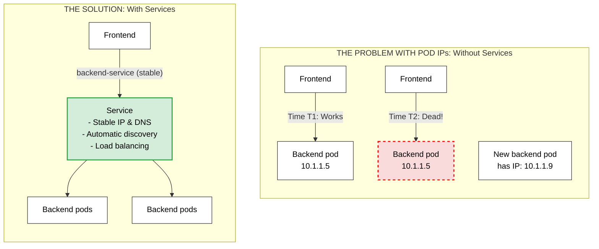
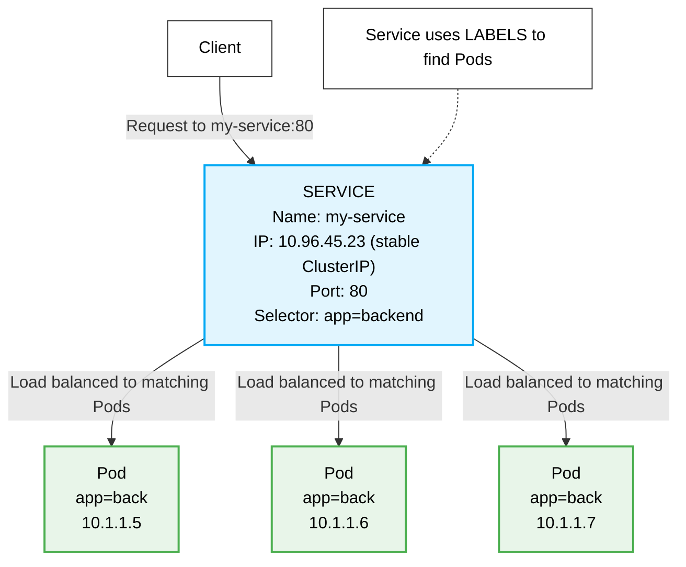
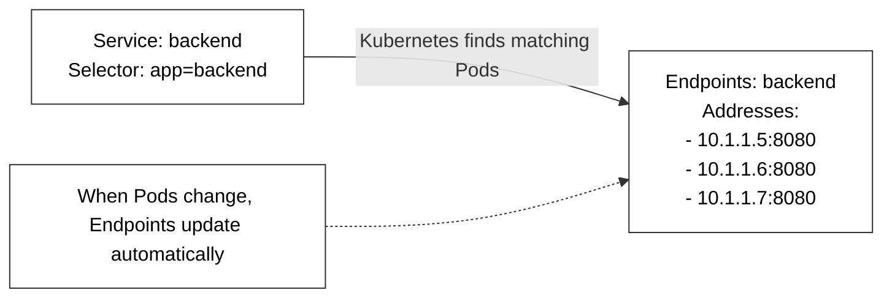
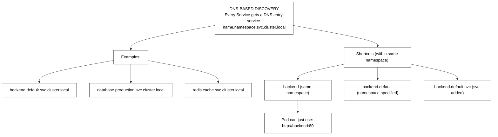
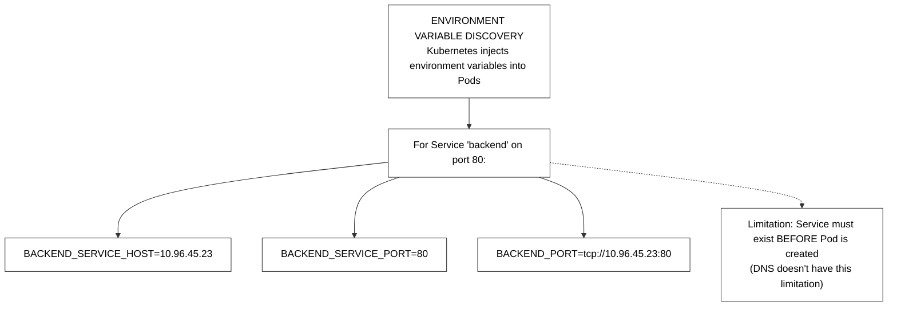
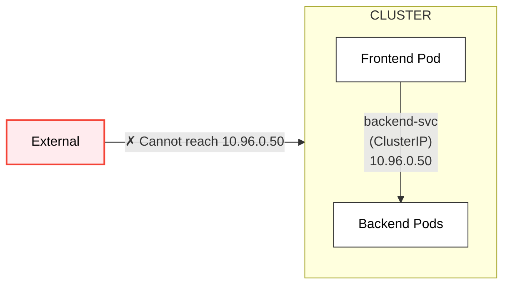
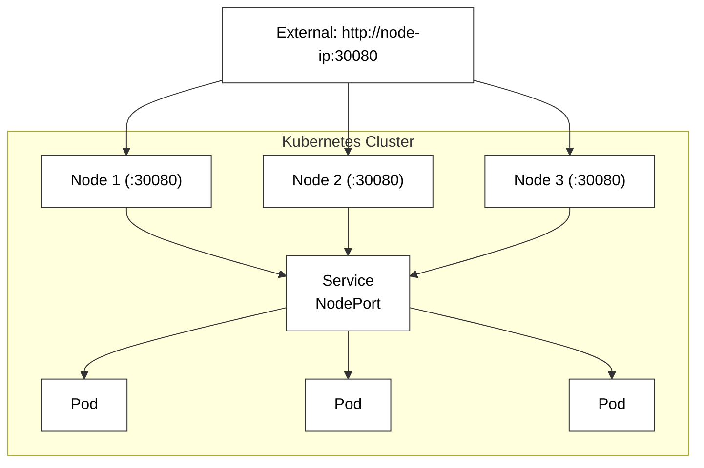
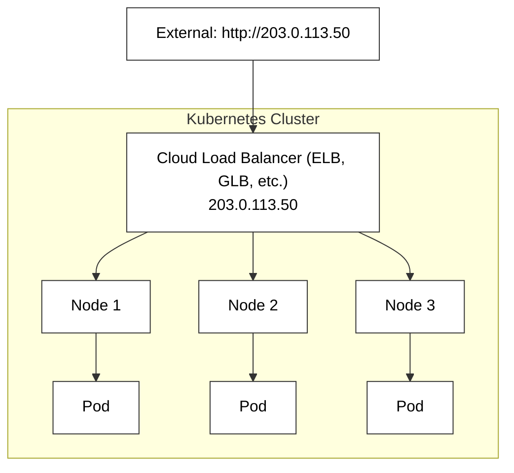
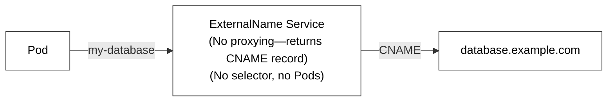
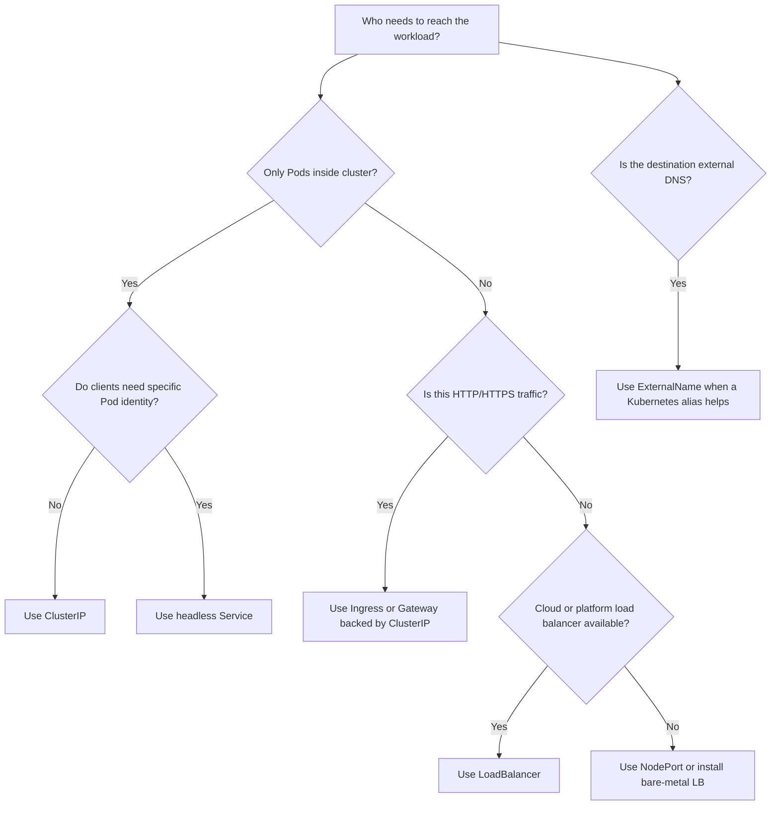

> **Складність**: `[СЕРЕДНЯ]` — базова концепція мережі
>
> **Час на проходження**: 65-75 хвилин
>
> **Передумови**: Модулі 1.5, 1.6

## Результати навчання

Після завершення цього модуля ви зможете:

1. **Діагностувати** збої селекторів Сервісу, EndpointSlice та готовності, які порушують зв'язність між робочими навантаженнями Kubernetes.
2. **Порівнювати** Сервіси типів ClusterIP, NodePort, LoadBalancer, ExternalName та headless для рішень щодо внутрішнього й зовнішнього доступу.
3. **Проєктувати** стратегію виявлення сервісів на основі DNS, яка працює між просторами імен без крихкого порядку запуску.
4. **Впроваджувати** headless-Сервіси для StatefulSet'ів, яким потрібні стабільні прямі адреси Под'ів замість збалансованих віртуальних IP.
5. **Оцінювати** виявлення через змінні середовища проти виявлення через DNS і виявляти стани гонитви ще до того, як вони дійдуть до продакшену.

## Чому цей модуль важливий

**Гіпотетичний сценарій:** торгова платформа зазнає простою на етапі оформлення замовлення під час пікового вікна продажів. Збій почався не з несправної бази даних, не з провалу інструмента розгортання й не з відсутнього резерву потужностей. Він почався тоді, коли фронтенд-компоненти продовжили надсилати трафік на жорстко закодовані IP-адреси бекенд-Под'ів після події автомасштабування, яка замінила ці Под'и новими репліками на інших вузлах.

Нові бекенд-Под'и були цілком справними, проте вони залишалися невидимими для тих клієнтів, які були налаштовані на старі адреси. Трафік концентрувався на кількох помираючих цілях, тоді як свіжа потужність простоювала без діла; тайм-аути поширювалися вздовж усього шляху оформлення замовлення, шторми повторних спроб вичерпували пули з'єднань, а команди підтримки бачили симптоми, дуже схожі на загальний збій усієї платформи. Глибша ж проблема полягала в тому, що застосунок сприймав ідентичність Под'а як щось стабільне й тривале, тоді як Kubernetes навмисно ставиться до Под'ів як до замінної, одноразової інфраструктури.

Сервіси Kubernetes існують саме для того, щоб повністю усунути цей цілий клас збоїв. Сервіс надає клієнтам стабільну віртуальну адресу та DNS-ім'я, а потім безперервно відстежує поточний набір готових Под'ів за цим іменем за допомогою міток та EndpointSlice'ів. У Kubernetes 1.35 і пізніших версіях та сама абстракція Сервісу досі лежить в основі внутрішнього трафіку мікросервісів, виділення хмарних балансувальників навантаження, застарілого доступу через NodePort, DNS-псевдонімів ExternalName та шаблону headless-виявлення, який використовують StatefulSet'и. Іспит KCNA очікує, що ви розпізнаватимете всі ці типи, але реальна робота в продакшені вимагає значно більшого: вам потрібно вміти діагностувати, чому Сервіс не має жодних бекендів, обирати найменш ризикований шаблон доступу та пояснювати, що саме відбувається, коли готовність змінюється під живим трафіком.

Перш ніж ми почнемо виконувати команди, задайте звичний короткий псевдонім, щоб кожна команда в цьому модулі використовувала саме `k` замість повного kubectl. Псевдонім — це лише зручність оболонки, але послідовне його використання робить приклади легшими для читання й відповідає операційному стилю, прийнятому в решті KubeDojo.

```bash
alias k=kubectl
k version --client
```

## Основна концепція: Сервіси стабілізують ефемерні Под'и

Под'и є тимчасовими цілком навмисно. Деплоймент може створювати їх, видаляти, перекочувати під час оновлення, замінювати після збою вузла або ж масштабувати вгору й вниз у міру того, як змінюється попит. Кожен новий Под отримує власну IP-адресу з мережі кластера, і ця адреса жодним чином не є тривалим контрактом із клієнтами. Якщо фронтенд зберігає IP бекенд-Под'а у файлі конфігурації, він покладається на деталь реалізації, яку Kubernetes залишає за собою право змінити щоразу, коли планувальник, kubelet чи менеджер контролерів мусять узгодити бажаний стан.

Сервіс дає застосунку зовсім інший контракт. Замість того щоб просити клієнтів запам'ятовувати IP-адресу кожного окремого бекенд-Под'а, Kubernetes виділяє один стабільний віртуальний IP під назвою ClusterIP і створює стабільне DNS-ім'я на кшталт `checkout-service.default.svc.cluster.local`. Клієнти підключаються до цього імені Сервісу, а площина даних кластера перенаправляє трафік на один із готових бекенд-Под'ів, що відповідають селектору Сервісу. Клієнтові не потрібно знати, чи є дві репліки, п'ять реплік, чи триває поетапне оновлення.



Важливий навчальний момент на цій діаграмі не в тому, що Сервіси роблять Под'и безсмертними. Вони цього не роблять. Сервіси дозволяють клієнтам ігнорувати смертність Под'ів, переносячи стабільну ідентичність із рівня Под'а на рівень Сервісу. Це розділення схоже на дзвінок на загальний комутатор компанії замість запам'ятовування телефону кожного працівника на столі; працівники можуть переходити за інші столи, приєднуватися до команд чи звільнятися, тоді як абоненти й далі користуються одним стабільним номером, а система маршрутизації опрацьовує поточне призначення.

Коли ви діагностуєте трафік Сервісу, завжди тримайте дві половини абстракції окремо. Об'єкт Сервісу визначає стабільний фронтенд-контракт: ім'я, порт, тип і селектор. Список бекендів виводиться з живих міток Под'ів та стану готовності. Сервіс може існувати з дійсним ClusterIP і DNS-записом і все одно маршрутизувати в нікуди, бо жоден готовий Под наразі не відповідає його селектору. Саме тому самого лише `k get svc` рідко достатньо як доказу під час інциденту.

Зупиніться й передбачте: якщо Деплоймент має три репліки та селектор Сервісу, що відповідає лише двом їхнім Под'ам, бо один Под має іншу мітку, що має статися з клієнтським трафіком? Правильне передбачення — Сервіс маршрутизує лише до двох відповідних готових Под'ів, бо селектори є точними фільтрами, і Kubernetes не вгадуватиме, що третій Под, імовірно, належить до того самого застосунку.

Частини площини управління теж варто назвати, бо вони з'являються в реальному налагодженні. API-сервер зберігає об'єкт Сервісу. Контролери спостерігають за Сервісами й Под'ами, а потім підтримують об'єкти EndpointSlice, які перелічують відповідні готові мережеві кінцеві точки. kube-proxy або специфічна для реалізації заміна, як-от площина даних на eBPF, програмує правила перенаправлення на рівні вузла. CoreDNS публікує ім'я Сервісу, щоб клієнти могли його розв'язати. Збій на будь-якому рівні може виглядати як "Сервіс лежить", але виправлення залежить від того, який рівень перестав відповідати наміченому стану.

Для іспиту KCNA вам не потрібно запам'ятовувати кожен внутрішній шлях проходження пакета, але вам справді потрібно вміти міркувати від симптомів до рівнів. Якщо розв'язання DNS не вдається, ви досліджуєте ім'я Сервісу, простір імен та CoreDNS. Якщо DNS розв'язується, але з'єднання спливають за тайм-аутом, ви перевіряєте порти Сервісу, селектори, EndpointSlice'и, готовність та NetworkPolicy. Якщо хмарний LoadBalancer не має зовнішньої адреси, ви спершу дивитеся на хмарний контролер та інтеграцію провайдера, а не на Под'и застосунку.

## Селектори та EndpointSlice'и: контракт маршрутизації

Сервіс зазвичай знаходить свої бекенди через селектор міток. Мітки — це прості метадані у форматі «ключ-значення», прикріплені до об'єктів Kubernetes, а селектори — це, по суті, запити до цих міток. Сам Сервіс не містить жодного постійного списку імен Под'ів чи їхніх IP-адрес. Натомість Kubernetes безперервно обчислює, які Под'и в тому самому просторі імен відповідають селектору, які з цих Под'ів готові й які адреси слід оголошувати кінцевими точками Сервісу.



Збережена діаграма вище навмисно робить видимим сам зв'язок селектора, і вона також дає вам корисний шаблон збою, на який варто звертати пильну увагу: значення селектора та значення мітки Под'а мають збігатися абсолютно точно. У реальних маніфестах ця невідповідність часто тонша за `backend` проти `back`. Команди випадково використовують `component: api` у шаблоні Деплойменту та `tier: api` у Сервісі, або змінюють мітки під час рефакторингу чарта, не оновлюючи селектор Сервісу. Kubernetes сприймає ці мітки як різні контракти, а не як синоніми.

Коли збіг селектора успішний, Kubernetes зберігає конкретні адреси бекендів у ресурсах EndpointSlice. Старіші інструменти й документація часто згадують Endpoints, і класичний об'єкт Endpoints досі присутній у багатьох кластерах, але EndpointSlice'и — це масштабований API, який розбиває адреси бекендів на менші шматки. Цей поділ має значення, бо великий Сервіс може мати сотні чи тисячі бекендів, а проштовхування одного величезного оновлення об'єкта через площину управління було б повільнішим і галасливішим, ніж оновлення зрізів.



Готовність (readiness) — це наступна частина цього контракту. Под може перебувати в стані Running і водночас бути не готовим до трафіку Сервісу, адже контейнер у цей момент може ще завантажуватися, прогрівати кеш, чекати на завершення міграції або ж не проходити перевірку справності застосунку. Kubernetes використовує стан готовності, щоб вирішити, чи має адреса отримувати трафік. Якщо Под не проходить свою пробу готовності (readiness probe), Под може залишатися живим для налагодження, але Сервіс має припинити надсилати йому нові клієнтські запити.

Саме тому добра діагностика інциденту не зупиняється на `k get pods`. Running означає, що kubelet запустив процес контейнера. Ready означає, що Kubernetes вважає, що процес може безпечно отримувати трафік Сервісу. Якщо Сервіс не має готових кінцевих точок, клієнти можуть бачити збої з'єднання, навіть якщо кожен рядок Под'а виглядає живим. Краща послідовність — це `k get svc`, потім `k get endpointslice -l kubernetes.io/service-name=<name>`, потім `k describe pod` для подій готовності та повідомлень проб.

Перш ніж це запускати, який вивід ви очікуєте, якщо селектор Сервісу хибний, а бекенд-Под'и справні? Ви маєте очікувати, що Под'и показуватимуть `Running`, Сервіс показуватиме нормальний ClusterIP, а список кінцевих точок буде порожнім. Така комбінація — це проблема селектора чи готовності, а не доказ того, що об'єкт Сервісу не зміг виділити ресурси.

Є ще одна межа селектора, яка спантеличує початківців: Сервіс обирає Под'и лише у власному просторі імен. Сервіс у `web` не може обрати Под'и бази даних у `data`, навіть якщо мітки збігаються ідеально. Зв'язок між просторами імен використовує DNS-імена та мережеву політику, а не міжпросторні селектори Сервісу. Такий дизайн зберігає значущість меж простору імен і не дає команді випадково спрямувати трафік у робоче навантаження іншої команди лише тому, що вони повторно використали спільну мітку на кшталт `app: api`.

Найбезпечніша стратегія міток — ставитися до селекторів Сервісу як до стабільного публічного інтерфейсу всередині простору імен. Мітки, що використовуються для селекторів, мають бути нудними, тривкими й задокументованими в чарті чи маніфесті. Декоративні мітки для власності, центру витрат, ревізії Git та інструментів випуску можуть часто змінюватися, але мітки селекторів не повинні мінятися під час кожного розгортання, бо редагування селектора може миттєво відключити клієнтів від усіх бекендів.

## Виявлення: DNS насамперед, змінні середовища з обережністю

Щойно Сервіс починає існувати, застосункам усе одно потрібен якийсь спосіб його знайти. Kubernetes пропонує для цього два вбудовані механізми виявлення: DNS-записи та змінні середовища. DNS — кращий механізм для сучасних робочих навантажень, бо він розв'язується під час виконання, працює між просторами імен, коли ви використовуєте правильне ім'я, і не вимагає, щоб Сервіси існували до створення залежних Под'ів. Змінні середовища старіші, зручні для простих демонстрацій і досі видимі в багатьох кластерах, але вони несуть пастку порядку.



DNS дає кожному звичайному Сервісу ім'я у формі `<service>.<namespace>.svc.cluster.local`. Под'и в тому самому просторі імен зазвичай можуть використовувати коротке ім'я Сервісу, як-от `backend`, бо шлях пошуку DNS Под'а доповнює простір імен та суфікс кластера. Под'и в іншому просторі імен мають використовувати щонайменше `backend.default`, а продакшен-конфігурація часто найзрозуміліша, коли вона використовує повне кваліфіковане ім'я для міжпросторних залежностей.

Небезпека коротких імен — це неоднозначність. Якщо фронтенд у просторі імен `web` підключається до `postgres`, DNS Kubernetes спершу шукає Сервіс із іменем `postgres` у `web`. Якщо справжній Сервіс бази даних живе в `data`, коротке ім'я не вдається або розв'язується в інший локальний Сервіс, якщо такий існує. Повне кваліфіковане ім'я довше, але воно перетворює межу простору імен на явну конфігурацію замість прихованого припущення.



Виявлення через змінні середовища працює інакше. Коли Под стартує, kubelet може ін'єктувати змінні для Сервісів, які вже існують у просторі імен. Якщо бекенд-Сервіс створено пізніше, наявні Под'и не отримують нових змінних середовища за помахом чарівної палички. Вам довелося б перезапустити ці Под'и, і ця вимога перезапуску — це саме той стан гонитви, який робить змінні середовища слабкою стратегією виявлення для незалежно розгорнутих мікросервісів.

Оцініть виявлення через змінні середовища проти виявлення через DNS, запитавши, коли відбувається пошук. Змінні середовища — це знімок, зроблений під час запуску Под'а. DNS — це запит до стану іменування кластера в момент запиту чи з'єднання, з поведінкою кешування на боці клієнта, що залежить від середовища виконання застосунку. Ця різниця практична під час розгортань: DNS дозволяє створити Сервіс до або після клієнтського Под'а, тоді як змінні середовища вимагають суворого порядку створення, який багато конвеєрів доставки зрештою порушують.

Усе ж є вузькі випадки, де змінні середовища Сервісу прийнятні. Одноразова задача, створена після своїх залежностей, крихітний навчальний кластер або застарілий застосунок, який може читати хост і порт лише зі змінних середовища, можуть використовувати їх без драми. Щойно сервіси розгортаються, масштабуються чи переміщуються між просторами імен незалежно, DNS — кращий типовий вибір, бо він відповідає динамічній природі самого Kubernetes.

**Гіпотетичний сценарій:** платформенна команда якось витратила пів дня, ганяючись за тим, що виглядало як випадкові збої з'єднання в пакетному обробнику. Сервіс існував, DNS працював із налагоджувального Под'а, а бекенд-Под'и були готові. Робітники, що збоїли, були створені за кілька хвилин до Сервісу під час невдалого розгортання, тож у їхньому середовищі бракувало очікуваної змінної `PAYMENTS_SERVICE_HOST`. Перезапуск робітників усунув симптом, але тривким виправленням було перенесення конфігурації застосунку на DNS-імена.

## Типи Сервісів та межі доступу

Kubernetes має кілька типів Сервісів, бо фраза «зробити це доступним» означає геть різні речі залежно від того, хто саме звертається. Якийсь трафік має залишатися виключно всередині кластера. Якийсь інший трафік має бути досяжним із комп'ютерів розробників чи з фізичної мережі. Якомусь трафіку потрібен хмарний провайдер, щоб виділити зовнішній балансувальник навантаження. Якісь імена мають вказувати на зовнішні DNS-цілі, а не на локальні Под'и. Вибір правильного типу — це не стільки запам'ятовування визначень, скільки рішення про те, яку межу має перетнути трафік.

ClusterIP — це типове значення за замовчуванням і водночас найбезпечніша відправна точка. Він створює віртуальний IP, що маршрутизується всередині кластера, а також звичайне DNS-ім'я Сервісу. Більшість внутрішнього зв'язку між мікросервісами має використовувати саме ClusterIP, бо він приховує плинність Под'ів, не виставляючи при цьому робоче навантаження за межі кластера. Бази даних, кеші, внутрішні API та фронтенди брокерів повідомлень зазвичай належать сюди, якщо тільки конкретний дизайн платформи не каже інакше.



```yaml
apiVersion: v1
kind: Service
metadata:
  name: internal-api
spec:
  type: ClusterIP  # Default if omitted
  selector:
    app: api
  ports:
    - port: 80
      targetPort: 8080
```

Зверніть особливу увагу на трансляцію портів у цьому маніфесті. Клієнти тут підключаються до порту Сервісу `80`, тоді як обрані Под'и отримують трафік уже на порту контейнера `8080`. Це дозволяє вам пред'явити викликачам чистий контракт, не змінюючи конфігурацію контейнера застосунку. Порт Сервісу — це порт усередині кластера, звернений до споживача; `targetPort` — це порт контейнера бекенду або іменований порт; `nodePort`, коли він використовується, — це зовнішній порт, відкритий на кожному вузлі.

NodePort розширює ClusterIP, відкриваючи окремий порт на кожному вузлі, зазвичай із заздалегідь налаштованого діапазону NodePort кластера. Він корисний для локальної розробки, демонстрацій, простих фізичних кластерів, а також як будівельний блок за деякими налаштуваннями інгресу чи балансувальника навантаження. Він зазвичай не є найкращим публічним продакшен-інтерфейсом, бо виставляє порти вузлів із високими номерами, прив'язує клієнтів до адрес вузлів і розповсюджує доступ на кожен придатний вузол.



```yaml
apiVersion: v1
kind: Service
metadata:
  name: test-frontend
spec:
  type: NodePort
  selector:
    app: frontend
  ports:
    - port: 80
      targetPort: 80
      nodePort: 30080
```

LoadBalancer будується на тій самій моделі Сервісу, але просить хмарну чи платформенну інтеграцію забезпечити зовнішній балансувальник навантаження. У керованому хмарному кластері це може створити AWS Network Load Balancer, балансувальник Google Cloud, балансувальник Azure або інший специфічний для провайдера об'єкт. У фізичному кластері без реалізації на кшталт MetalLB Сервіс може залишатися в стані pending, бо сам Kubernetes не володіє зовнішнім пристроєм, який можна виділити.



```yaml
apiVersion: v1
kind: Service
metadata:
  name: production-web
spec:
  type: LoadBalancer
  selector:
    app: web
  ports:
    - port: 443
      targetPort: 8443
```

LoadBalancer доречний, коли сам Сервіс є зовнішньою мережевою межею, особливо для протоколів, що не є HTTP, або коли платформенна команда навмисно зіставляє один зовнішній балансувальник навантаження з одним робочим навантаженням. Для багатьох HTTP-сервісів, однак, створення окремого LoadBalancer для кожного застосунку дороге й операційно галасливе. Поширений шаблон — виставити інгрес-контролер чи реалізацію Gateway через один LoadBalancer-Сервіс, а потім маршрутизувати HTTP-трафік за іменем хоста чи шляхом усередині кластера.

Зупиніться й подумайте: якщо десяти HTTP-мікросервісам потрібен публічний трафік, який компроміс щодо вартості та експлуатації з'являється, коли ви створюєте десять LoadBalancer-Сервісів? Ви отримуєте просту власність «один Сервіс на застосунок», але ви також можете створити десять зовнішніх пристроїв, десять публічних адрес, десять поверхонь брандмауера й десять місць, де політика TLS та журналювання доступу можуть розійтися. Спільна межа інгресу чи Gateway централізує ці турботи, водночас маршрутизуючи до внутрішніх ClusterIP-Сервісів.

ExternalName відрізняється від інших типів Сервісів, бо він не обирає Под'и й не створює жодних правил проксі-перенаправлення трафіку. Він створює DNS-псевдонім у стилі CNAME, щоб внутрішнє ім'я Kubernetes могло вказувати на зовнішнє DNS-ім'я. Це може бути корисно під час міграцій, коли застосунки всередині кластера мають викликати `cloud-db.default.svc.cluster.local`, навіть якщо справжня база даних досі живе в керованому сервісі поза кластером.



```yaml
apiVersion: v1
kind: Service
metadata:
  name: cloud-db
spec:
  type: ExternalName
  externalName: cluster.aws-rds.example.com
```

ExternalName охайний, коли ви хочете стабільне ім'я, звернене до Kubernetes, для зовнішньої залежності, але це не чарівний мережевий тунель. Мережеві маршрути, поведінка DNS, імена сертифікатів TLS та правила зовнішнього брандмауера досі мають працювати для справжнього призначення. Якщо застосунок перевіряє, що сертифікат сервера належить `cluster.aws-rds.example.com`, просте підключення через `cloud-db.default.svc.cluster.local` може вимагати конфігурації, яка зберігає очікуване ім'я сервера.

Headless-Сервіси доповнюють картину доступу, хоча вони виражені як варіація ClusterIP, а не як окремий `type`. Встановлення `clusterIP: None` каже Kubernetes не виділяти віртуальний збалансований IP. DNS-запити натомість повертають окремі адреси бекенд-Под'ів. Це саме те, що часто потрібно стейтфул-системам, бо клієнтам може знадобитися підключитися безпосередньо до `db-0`, `db-1` чи `db-2`, а не бути випадково збалансованими між репліками.

```yaml
apiVersion: v1
kind: Service
metadata:
  name: database-peers
spec:
  clusterIP: None
  selector:
    app: database
  ports:
    - name: peer
      port: 5432
      targetPort: 5432
```

Шаблон headless особливо важливий саме зі StatefulSet'ами, бо там кожен Под має стабільну порядкову ідентичність. Звичайний ClusterIP-Сервіс чудово підходить тоді, коли всі репліки є взаємозамінними. Headless-Сервіс кращий, коли протокол застосунку має членство, вибори лідера, власність шарда чи специфічні для репліки ролі. Компроміс у тому, що клієнти чи клієнтські бібліотеки тепер бачать кілька адрес бекендів і можуть потребувати розумніших рішень про те, з яким екземпляром зв'язуватися.

## Налагодження Сервісів у справжньому кластері

Найшвидший шлях налагодження Сервісу починається з одного чіткого запитання: де саме стався збій — на рівні розв'язання імені, конфігурації віртуального Сервісу, вибору бекенду, готовності чи зовнішнього виділення ресурсів? Стрибок одразу до логів може марно з'їсти багато часу, адже застосунок може взагалі не отримувати жодного трафіку, коли селектор чи зіставлення портів є хибним. Kubernetes дає вам достатньо стану об'єктів, щоб звузити несправність ще до того, як ви відкриєте бодай один лог застосунку.

Почніть передусім із контракту самого Сервісу. `k get svc checkout-service -o wide` повідомляє вам тип Сервісу, його ClusterIP, порти та будь-яку зовнішню адресу. `k describe svc checkout-service` показує селектори, цільові порти, події та зведення кінцевих точок бекенду. Якщо рядок селектора каже `tier=api-backend`, тоді як Под'и показують `tier=backend`, ви знайшли проблему, не торкаючись контейнерів застосунку.

Далі огляньте похідний від селектора список бекендів. У сучасних кластерах команда `k get endpointslice -l kubernetes.io/service-name=checkout-service` показує, чи взагалі існують EndpointSlice'и для цього Сервісу. `k describe endpointslice` може розкрити адреси, порти, готовність та підказки топології. У багатьох кластерах `k get endpoints checkout-service` досі є швидким сумісним поглядом, але вивід EndpointSlice — краща ментальна модель для Kubernetes 1.35.

Якщо кінцевих точок бракує, спершу порівняйте мітки та простір імен. `k get pods --show-labels` грубий, але дієвий, а `k get pods -l app=checkout,tier=backend` перевіряє, чи селектор справді повертає очікувані Под'и. Якщо цей селектор нічого не повертає, тоді як Деплоймент існує, то або мітки відрізняються від селектора Сервісу, або Под'и живуть в іншому просторі імен. Якщо селектор повертає Под'и, але кінцеві точки залишаються неготовими, проби готовності та умови Под'а — наступний рівень.

Зіставлення портів — це ще одна доволі поширена несправність. Сервіс може обрати цілком правильні Под'и й усе одно зазнати збою, якщо `targetPort` вказує на той порт, де контейнер насправді не слухає. Іменовані порти зменшують цей ризик, бо Сервіс може націлюватися на `http`, тоді як шаблон Под'а визначає, який числовий порт контейнера наразі володіє цим іменем. Числові порти прийнятні, але людина-рецензент має переконатися, що `targetPort` Сервісу та `containerPort` контейнера описують той самий слухач застосунку.

Для зовнішнього доступу налагоджуйте межу провайдера завжди окремо. LoadBalancer-Сервіс зі справними кінцевими точками, але без зовнішньої адреси часто вказує на проблеми з дозволами хмарного контролера, анотаціями підмережі, квотами, непідтримуваними анотаціями Сервісу або ж на фізичні кластери без реалізації балансувальника навантаження. NodePort-Сервіс, що працює з однієї мережі, але не з іншої, може бути заблокований правилами брандмауера вузла, маршрутизацією чи групами безпеки, а не селекторами Kubernetes.

Наступний невеликий маніфест інциденту навмисно зламаний. Він створює справні бекенд-Под'и та Сервіс, селектор якого до них не підходить. Це робить його ідеальним для відпрацювання різниці між справністю Под'а та виявленням Сервісу. Застосовуйте його лише в одноразовому просторі імен чи в локальному навчальному кластері, а потім видаліть, коли вправу завершено.

```yaml
apiVersion: apps/v1
kind: Deployment
metadata:
  name: checkout-backend
spec:
  replicas: 2
  selector:
    matchLabels:
      app: checkout
      tier: backend
  template:
    metadata:
      labels:
        app: checkout
        tier: backend
    spec:
      containers:
      - name: api
        image: nginx:alpine
        ports:
        - containerPort: 80
---
apiVersion: v1
kind: Service
metadata:
  name: checkout-service
spec:
  selector:
    app: checkout
    tier: api-backend # Pay attention to this line
  ports:
  - port: 80
    targetPort: 80
```

Сам діагноз тут має бути суто механічним. Шаблон Деплойменту маркує Под'и міткою `tier: backend`, тоді як селектор Сервісу натомість просить `tier: api-backend`. Kubernetes не намагається вгадати наміру, тож Сервіс не має жодних готових адрес бекендів. Фронтенд, що підключається через DNS-ім'я Сервісу, усе одно розв'язав би ім'я, але трафік не дійшов би до жодного бекенду оформлення замовлення, доки селектор не виправлено або мітки Под'ів не змінено на відповідні.

```bash
k apply -f incident.yaml
k get pods --show-labels
k get svc checkout-service
k get endpoints checkout-service
k get endpointslice -l kubernetes.io/service-name=checkout-service
```

Після того як ви виправите селектор, об'єкти кінцевих точок мають заповнитися без перестворення Под'ів. Така поведінка — корисне нагадування, що Сервіси — це динамічні запити до поточного стану кластера. Об'єкту Сервісу не потрібне розгортання, щоб помітити збіг міток; контролери оновлюють дані кінцевих точок, щойно стан API змінюється й готовність дозволяє Под'ам отримувати трафік.

```bash
k edit service checkout-service
k get endpoints checkout-service
k describe service checkout-service
```

Який підхід ви обрали б тут і чому: змінити селектор Сервісу, щоб він відповідав наявним Под'ам, чи змінити мітки шаблону Деплойменту, щоб вони відповідали Сервісу? Під час активного інциденту редагування селектора Сервісу часто є найшвидшим відновленням, якщо мітки Под'ів правильні для випуску. У репозиторії чарта чи GitOps тривке виправлення має оновити вихідні маніфести, щоб наступне розгортання не повторно ввело невідповідність.

## Читання стану Сервісу як оператор

Найкорисніша операційна звичка — це ставитися до стану Сервісу як до цілого ланцюга доказів, а не як до одного-єдиного об'єкта. Сервіс не є справним лише тому, що він існує, так само як і Под не є дійсним бекендом лише тому, що він перебуває в стані Running. Ви шукаєте узгоджену історію: клієнт може розв'язати ім'я Сервісу, Сервіс виставляє очікуваний порт, селектор відповідає наміченим Под'ам, ці Под'и готові, а площина даних запрограмувала маршрут від стабільної фронтенд-адреси до обраних адрес бекендів.

Саме цей ланцюг доказів дає вам спокійний і впорядкований план налагодження під час інцидентів. Якщо клієнт каже «ім'я не знайдено», почніть із перевірки побудови DNS-імені, простору імен та доступності CoreDNS. Якщо ім'я розв'язується, але з'єднання негайно збоять, огляньте порт Сервісу та цільовий порт. Якщо контракт Сервісу виглядає правильним, але бекенди не з'являються, порівняйте мітки та готовність. Якщо бекенди присутні, але трафік усе одно збоїть, рухайтеся назовні до NetworkPolicy, маршрутизації вузла, поведінки kube-proxy чи площини даних, що його замінює, та самого слухача застосунку.

Вам також слід розділяти симптоми, які бачать внутрішні клієнти, від симптомів, які бачать зовнішні. Внутрішні клієнти використовують ClusterIP та шлях DNS кластера, навіть коли тип Сервісу — LoadBalancer. Зовнішні клієнти залежать від додаткового стану провайдера, виділення публічної адреси, правил брандмауера, діапазонів джерел, досяжності вузлів і подеколи перевірок справності, які виконує хмарний балансувальник навантаження. LoadBalancer-Сервіс може мати справні внутрішні кінцеві точки й водночас збоїти ззовні, бо об'єкт провайдера неправильно налаштований або досі перебуває в процесі виділення.

Імена портів — це дрібна деталь, яка запобігає великим помилкам. Коли Под виставляє іменований порт контейнера на кшталт `http`, Сервіс може використати `targetPort: http` замість конкретного числа. Це дозволяє Деплойменту володіти фактичним номером слухача, тоді як Сервіс зберігає стабільне семантичне посилання. Під час рефакторингу з порту `8080` на інший внутрішній порт маніфест Сервісу може залишатися осмисленим, якщо шаблон Под'а зберігає те саме ім'я порту, прикріплене до нового слухача.

Спорідненість сесій (session affinity) — ще одна функція, яку варто розпізнавати, хоча вона й не є типовим шаблоном для більшості стейтлес-навантажень. Звичайний Сервіс може розподіляти нові з'єднання між готовими бекендами, не обіцяючи, що той самий клієнт завжди повертатиметься до того самого Под'а. Якщо застосунок вимагає липкої поведінки, Kubernetes має опції рівня Сервісу, як-от спорідненість за IP клієнта, але сильнішою інженерною відповіддю зазвичай є усунення локального стану сесії чи його зберігання у спільному бекенді. Липка маршрутизація може приховувати залежність від стану (stateful-логіку), яка згодом ускладнить розгортання та масштабування.

Засоби контролю політики трафіку додають більше нюансів для зовнішніх Сервісів. `externalTrafficPolicy: Cluster` дозволяє вузлам перенаправляти зовнішній трафік до будь-якого готового бекенду в кластері, що покращує розподіл, але може затемнювати початкову IP-адресу джерела клієнта залежно від реалізації. `externalTrafficPolicy: Local` зберігає IP джерела безпосередніше й може зменшити зайві переходи, але трафік мають отримувати лише вузли з локальними готовими кінцевими точками. Цей вибір належить до огляду дизайну платформи, а не до скопійованого маніфесту без пояснень.

Для внутрішнього трафіку топологічно орієнтована маршрутизація та реалізації площини даних можуть впливати на те, куди йдуть запити, але вони не змінюють основний контракт Сервісу. Сервіс усе одно обирає готові кінцеві точки за мітками, а клієнти все одно націлюються на ім'я чи IP Сервісу. Ставтеся до топологічних функцій як до шарів оптимізації після того, як коректність доведено. Якщо ваш селектор хибний або готовність збоїть, жодне налаштування топології не відновить набір бекендів, який Kubernetes не вважає таким, що має отримувати трафік.

NetworkPolicy — часте джерело плутанини, бо вона стоїть поряд із Сервісами, а не всередині них. Сервіс може обрати правильні Под'и та опублікувати справні кінцеві точки, тоді як NetworkPolicy забороняє з'єднання з простору імен чи міток клієнта. Це не збій селектора Сервісу; це рішення авторизації чи сегментації на мережевому рівні. Практична перевірка — спершу переконатися в кінцевих точках, а потім перевірити, чи дозволяє політика трафік від викликаючого навантаження до бекенд-Под'ів на цільовому порту.

Проблеми CoreDNS вимагають іншої ментальної моделі. Якщо `checkout-service.svc-lab.svc.cluster.local` не розв'язується з налагоджувального Под'а, Сервіс може бути відсутнім, простір імен може бути хибним, або DNS кластера може бути недоступним. Якщо ім'я розв'язується в ClusterIP, але з'єднання збоять, DNS уже зробив свою роботу, і вам слід перейти до портів Сервісу, кінцевих точок, готовності, політики та слухачів бекенду. Тримання цих фаз окремо запобігає круговим розмовам про налагодження, де кожен мережевий симптом приписують DNS.

У продакшен-оглядах запитуйте, чи виражає тип Сервісу мережеву межу з найменшими привілеями. База даних із LoadBalancer-Сервісом зазвичай є тривожним знаком, якщо тільки немає дуже конкретного контрольованого споживача поза кластером. Внутрішній API з NodePort може виставляти більше поверхні вузла, ніж команда намірялася. Headless-Сервіс для стейтлес-вебзастосунку може проштовхувати непотрібну складність вибору кінцевих точок у клієнтів. Правильний Сервіс — це той, чия модель доступу відповідає викликачам, а не той, що випадково зробив тестову команду curl успішною.

Остаточна навичка оператора — це вміння пояснювати збої Сервісів простою й зрозумілою мовою. Замість того щоб казати «kube-proxy зламаний», ще навіть не маючи на руках доказів, кажіть радше «ім'я Сервісу існує, але Kubernetes не має жодних готових кінцевих точок бекенду, бо селектор не відповідає міткам Под'ів». Це речення визначає рівень, доказ і наступне виправлення. Чіткий діагноз допомагає тим, хто реагує, уникати ризикованих перезапусків, широких повторних розгортань та випадкових редагувань маніфестів, поки клієнтський трафік уже погіршено.

## Шаблони та антишаблони

Сервіси винагороджують нудний і явний дизайн. Найкращі продакшен-шаблони зовсім не є хитромудрими; вони роблять власність, межі простору імен, контракти селекторів та межі доступу достатньо видимими для того, щоб інший інженер зміг діагностувати систему навіть о третій годині ночі. Антишаблони зазвичай починаються тоді, коли команди ставляться до Сервісів як до прозорого водогону й забувають, що кожен Сервіс кодує контракт із реальними наслідками для надійності й безпеки.

Використовуйте стабільні мітки селекторів як інтерфейс між Деплойментом і Сервісом. Мітки на кшталт `app.kubernetes.io/name`, `app.kubernetes.io/component` чи локально стандартизованих `app` і `tier` можуть працювати, доки вони послідовні й тривкі. Уникайте використання в селекторах міток, специфічних для розгортання, тегів образів, Git SHA чи командних метаданих, бо ці значення змінюються з причин, не пов'язаних із мережевою ідентичністю.

Використовуйте ClusterIP для внутрішніх залежностей за замовчуванням. Це не лише перевага безпеки; це також тримає рішення про публічний доступ централізованими. Якщо кожна команда може підвищити внутрішній API до LoadBalancer без огляду, платформа втрачає контроль над публічними адресами, станом брандмауера, політикою TLS та вартістю. ClusterIP-Сервіс за межею інгресу чи Gateway зберігає стабільний контракт бекенду, водночас тримаючи політику зовнішньої маршрутизації в одному шарі.

Використовуйте headless-Сервіси лише тоді, коли клієнтам потрібна ідентичність бекенду. Вони потужні для StatefulSet'ів, виявлення вузлів-партнерів та систем, що мають власний протокол реплікації, але вони переносять балансування та вибір кінцевих точок ближче до застосунку. Якщо всі репліки взаємозамінні, звичайний ClusterIP-Сервіс простіший і зазвичай безпечніший, бо клієнти отримують одне стабільне ім'я, а Kubernetes опрацьовує вибір бекенду.

| Шаблон | Коли використовувати | Чому він працює | Міркування щодо масштабування |
|---|---|---|---|
| Стабільний контракт селектора | Будь-який Сервіс на основі Деплойменту | Тримає маршрутизацію незалежною від метаданих розгортання | Стандартизуйте мітки, перш ніж багато команд скопіюють маніфести |
| Дизайн «ClusterIP насамперед» | Внутрішні API, кеші та бази даних | Запобігає випадковому публічному доступу | Поєднуйте з інгресом чи Gateway для спільного входу HTTP |
| Headless плюс StatefulSet | Бази даних, брокери, кворумні системи | Зберігає пряму ідентичність Под'а в DNS | Клієнтські бібліотеки мають опрацьовувати кілька адрес |
| Іменовані цільові порти | Застосунки, чиї порти слухачів можуть змінюватися | Тримає маніфести Сервісу читабельними й менш крихкими | Підтримуйте відповідні імена у специфікаціях Под'ів під час рефакторингів |

Перший антишаблон — це жорстке кодування IP-адрес Под'ів. Це здається доволі зручним під час швидкого тесту, адже `k get pod -o wide` показує адресу, і команда curl начебто справно працює. Проблема, однак, у тому, що ви тим самим обійшли всю модель контролерів. Перше ж розгортання, спорожнення вузла, виселення чи невдалий перехід готовності може зробити адресу недійсною. Використовуйте Сервіс навіть для простого внутрішнього трафіку, щоб застосунок залежав від стабільної абстракції Kubernetes, а не від одного скороминущого Под'а.

Другий антишаблон — використання LoadBalancer усюди, бо він «просто працює» в керованій хмарі. Технічно це може працювати, але це розповсюджує вартість, публічну поверхню атаки, політику TLS, журналювання та правила брандмауера на багато окремих об'єктів провайдера. Для HTTP-трафіку віддавайте перевагу спільній межі інгресу чи Gateway, що маршрутизує до внутрішніх Сервісів. Резервуйте дизайн «один Сервіс — один LoadBalancer» для випадків, коли протокол, власність чи ізоляція справді цього вимагають.

Третій антишаблон — зміна селекторів Сервісу під час звичайних розгортань. Деякі команди намагаються використовувати селектори як перемикач розгортання, спрямовуючи Сервіс зі старих Под'ів на нові вручну редагуючи мітки чи селектори. Kubernetes підтримує маршрутизацію на основі міток, але необережні редагування селекторів можуть відключити весь трафік, якщо новий набір міток хибний. Для поведінки розгортання застосунку Деплойменти, проби готовності, інструменти канаркового релізу та контролери трафіку надають безпечніші механізми.

| Антишаблон | Що йде не так | Краща альтернатива |
|---|---|---|
| Жорстке кодування IP Под'ів | Клієнти ламаються, коли Под'и перезапускаються чи переміщуються | Підключайтеся через DNS-імена Сервісу |
| LoadBalancer для кожного HTTP-застосунку | Розростання вартості та політик на багато зовнішніх пристроїв | Використовуйте інгрес чи Gateway перед ClusterIP-Сервісами |
| Мітки селекторів, прив'язані до релізів | Розгортання може прибрати кожен бекенд із Сервісу | Тримайте мітки селекторів стабільними й використовуйте засоби контролю розгортання Деплойменту |
| Ігнорування готовності в діагностиці | Запущені Под'и плутають із Под'ами, готовими до трафіку | Оглядайте EndpointSlice'и та події проб готовності |

## Фреймворк ухвалення рішень

Вибір типу Сервісу — це передусім рішення про межу. Запитайте себе, де саме виконується клієнт, чи є репліки бекенду взаємозамінними, чи трафік є HTTP, чи це сирий протокол, і хто саме володіє зовнішньою мережевою політикою. Правильна відповідь для локальної лабораторії не є автоматично правильною для продакшену, а правильна відповідь для публічного вебзастосунку не є автоматично правильною для кластера бази даних.



Дерево рішень тримає ExternalName окремо саме тому, що він взагалі не виставляє локальні Под'и. Якщо ваша залежність — це зовнішня керована база даних, то ExternalName може дати застосункам усередині кластера ім'я в стилі Kubernetes, тоді як сама база даних залишається ззовні. Якщо ваша залежність — це локальний StatefulSet бази даних, ExternalName — хибний інструмент, бо він ніколи не обере ці Под'и й не створить даних кінцевих точок.

| Вимога | Найкраща відправна точка | На що зважати |
|---|---|---|
| Внутрішній стейтлес-API | ClusterIP | Невідповідність селектора, хибний targetPort, збої готовності |
| Публічний HTTP-застосунок | Інгрес чи Gateway до ClusterIP | Доступність контролера, власність TLS, політика маршрутизації за шляхом |
| Публічний не-HTTP-протокол | LoadBalancer | Хмарна квота, анотації провайдера, контроль діапазонів джерел |
| Тимчасовий доступ на фізичному залізі | NodePort | Правила брандмауера вузла, високий діапазон портів, прив'язка до адреси вузла |
| Виявлення стейтфул-партнерів | Headless-Сервіс | Відповідальність клієнта за вибір конкретних кінцевих точок |
| Залежність від зовнішнього DNS | ExternalName | Імена серверів TLS, правила зовнішнього брандмауера, відсутність проксі-перенаправлення |

Для питань KCNA відсівайте варіанти за межею. ClusterIP означає лише внутрішній. NodePort означає, що кожен вузол слухає на порту з налаштованого діапазону. LoadBalancer означає, що Kubernetes просить зовнішнього провайдера чи платформенний компонент про адресу. ExternalName означає DNS-псевдонім, а не проксі-перенаправлення трафіку. Headless означає відсутність віртуального ClusterIP та прямі відповіді кінцевих точок. Щойно ви знаєте межу, решта питання зазвичай про селектори, DNS-імена чи готовність.

## Чи знали ви?

- **ClusterIP віртуальний:** ClusterIP насправді не існує як звичайний мережевий інтерфейс на Под'і. kube-proxy або площина даних кластера реалізує поведінку перенаправлення, а режим IPVS досяг загальної доступності в Kubernetes v1.11 у червні 2018 року для кращого опрацювання Сервісів у великому масштабі.
- **LoadBalancer зазвичай включає NodePort:** LoadBalancer-Сервіс зазвичай виділяє ClusterIP та порти вузлів під собою. Починаючи з Kubernetes v1.24, `allocateLoadBalancerNodePorts: false` може вимкнути автоматичне виділення NodePort для провайдерів, що маршрутизують безпосередньо до Под'ів або інакше не потребують портів вузлів.
- **Headless-Сервіси оминають віртуальний IP:** Встановлення `clusterIP: None` змушує DNS повертати адреси бекендів безпосередньо, а не маршрутизувати через одну віртуальну адресу Сервісу. Саме тому StatefulSet'и зазвичай поєднують стабільні імена Под'ів із headless-Сервісом для ідентичності вузлів-партнерів.
- **Сервіси належать до простору імен:** Селектор Сервісу знаходить Под'и лише всередині власного простору імен, навіть коли інший простір імен має відповідні мітки. Зв'язок між просторами імен працює через DNS-імена на кшталт `<service>.<namespace>.svc.cluster.local`, а не через вибір віддалених Под'ів.

## Типові помилки

| Помилка | Чому вона трапляється | Як її виправити |
|---|---|---|
| Пряме використання IP Под'ів | Адреса видима в `k get pod -o wide`, тож вона здається дійсною кінцевою точкою під час тестування. | Поставте Сервіс перед Под'ами й налаштуйте клієнтів на використання DNS-імені Сервісу. |
| Створення селектора Сервісу, що не відповідає міткам Под'ів | Рефакторинги чартів, скопійовані маніфести чи непослідовні ключі міток залишають Сервіс без готових кінцевих точок. | Порівняйте селектори `k describe svc` із `k get pods --show-labels`, потім виправте вихідний маніфест. |
| Сприйняття Running як готовності до трафіку | Оператори припускають, що запущений контейнер готовий до клієнтського трафіку, навіть коли проби готовності збоять. | Огляньте EndpointSlice'и та умови готовності Под'а, перш ніж звинувачувати DNS чи kube-proxy. |
| Використання LoadBalancer для кожного HTTP-сервісу | Хмарні балансувальники навантаження легко запросити, тож команди випадково множать вартість та публічний доступ. | Маршрутизуйте HTTP через шар інгресу чи Gateway, що перенаправляє до внутрішніх ClusterIP-Сервісів. |
| Очікування, що ClusterIP працюватиме поза кластером | Стабільний віртуальний IP осмислений лише в мережі кластера. | Використовуйте інгрес, Gateway, LoadBalancer чи NodePort залежно від зовнішньої межі. |
| Покладання на змінні середовища Сервісу для динамічних застосунків | Змінні середовища ін'єктуються лише при старті Под'а, тож пізно створені Сервіси відсутні. | Віддавайте перевагу виявленню через DNS і перезапускайте будь-які застарілі Под'и, що мусять споживати змінні середовища Сервісу. |
| Забування простору імен у DNS-іменах | Короткі імена спершу розв'язуються в просторі імен викликача, що не вдається для міжпросторних залежностей. | Використовуйте `<service>.<namespace>.svc.cluster.local` або принаймні `<service>.<namespace>` при перетині просторів імен. |

## Тест

<details><summary>Ваш фронтенд-Деплоймент підключається безпосередньо до IP бекенд-Под'а. Після звичайного розгортання бекенд-Под'и перестворюються, і фронтенд спливає за тайм-аутом. Що зламалося і що слід змінити?</summary>

Збій — це порушена залежність від ефемерної ідентичності Под'а. IP Под'ів можуть змінюватися щоразу, коли Под'и перестворюються, переплановуються чи замінюються, тож пряма адресація не є тривким контрактом застосунку. Поставте Сервіс перед бекендом і налаштуйте фронтенд на використання DNS-імені Сервісу. Сервіс відстежуватиме поточні готові адреси бекендів через селектори та EndpointSlice'и, тоді як фронтенд зберігає одну стабільну ціль.

</details>

<details><summary>Сервіс із іменем `checkout-service` має ClusterIP, але `k get endpoints checkout-service` не показує адрес, тоді як два Под'и оформлення замовлення є Running. Що ви оглядаєте першим?</summary>

Огляньте селектор Сервісу та мітки Под'ів, перш ніж копатися в логах застосунку. Нормальний ClusterIP лише доводить, що об'єкт Сервісу існує; він не доводить, що якісь Под'и відповідають селектору чи готові. Використовуйте `k describe svc checkout-service` та `k get pods --show-labels`, щоб порівняти точні пари «ключ-значення». Якщо мітки збігаються, переходьте далі до проб готовності та умов EndpointSlice.

</details>

<details><summary>Ваша платформа працює на фізичному залізі без інтеграції балансувальника навантаження, і розробник створює LoadBalancer-Сервіс, що залишається в стані pending. Яка ймовірна причина та практична альтернатива?</summary>

Kubernetes запросив зовнішній балансувальник навантаження, але немає хмарного контролера чи реалізації для фізичного заліза, щоб його виділити. Об'єкт Сервісу може існувати, тоді як зовнішня адреса залишається в стані pending, бо Kubernetes сам не створює фізичних чи провайдерських балансувальників навантаження. Для швидкої лабораторії NodePort може бути достатньо. Для тривкої платформи встановіть та експлуатуйте рішення балансувальника навантаження для фізичного заліза або маршрутизуйте HTTP через дизайн інгресу чи Gateway, який підтримує ваша мережа.

</details>

<details><summary>Фронтенд у просторі імен `web` намагається викликати `postgres:5432`, але Сервіс бази даних живе в просторі імен `data`. Розв'язання DNS не вдається. Що має використовувати рядок з'єднання?</summary>

Коротке ім'я `postgres` розв'язується спершу в просторі імен викликача, тож фронтенд шукає `postgres.web.svc.cluster.local`. Зв'язок між просторами імен має включати цільовий простір імен, як-от `postgres.data` чи повне `postgres.data.svc.cluster.local`. Цей дизайн запобігає тому, щоб Сервіс в одному просторі імен випадково обирав чи затіняв ресурси в іншому. Він також робить власність залежностей зрозумілішою в оглядах конфігурації.

</details>

<details><summary>Вашому StatefulSet'у бази даних із трьох Под'ів потрібно, щоб клієнти підключалися до конкретної репліки за стабільною ідентичністю, а не балансувалися між усіма репліками. Який шаблон Сервісу підходить?</summary>

Використовуйте headless-Сервіс із `clusterIP: None` і поєднайте його зі стабільними ідентичностями Под'ів StatefulSet'а. Звичайний ClusterIP-Сервіс навмисно приховує окремі бекенди за однією віртуальною адресою, що хибно, коли клієнти мають обирати конкретну репліку, лідера чи партнера. Headless-Сервіс дозволяє DNS повертати окремі адреси Под'ів, щоб протокол бази даних чи клієнтська бібліотека могли ухвалювати рішення з урахуванням реплік.

</details>

<details><summary>Застарілий робітник очікує `PAYMENTS_SERVICE_HOST`, але Сервіс Payments був створений після Под'ів-робітників. Змінна відсутня, хоча DNS працює. Що сталося?</summary>

Змінні середовища Сервісу ін'єктуються при старті Под'а, тож вони відображають знімок запуску, а не живе виявлення. Оскільки Сервіс Payments не існував на момент створення робітника, kubelet не мав змінної, щоб ін'єктувати її в ці вже запущені Под'и. Перезапуск робітників може відновити очікувані змінні, але кращий дизайн — налаштувати застосунок на використання DNS, щоб виявлення не залежало від суворого порядку створення.

</details>

<details><summary>Сервіс має кінцеві точки, перелічені як не готові, і клієнти не можуть підключитися, хоча Под'и є Running. Чому Kubernetes утримує трафік?</summary>

Running означає лише, що контейнери стартували; це не гарантує, що вони готові до клієнтських запитів. Сервіси маршрутизують до готових кінцевих точок, тож проба готовності, що збоїть, може тримати Под поза набором трафіку, водночас зберігаючи його для огляду. Перевірте умови Под'а, конфігурацію проби готовності та кінцеву точку справності застосунку. Щойно проба готовності проходить, EndpointSlice має позначити адресу як готову, і трафік Сервісу може відновитися.

</details>

## Практична вправа: Криза маршрутизації електронної комерції

Ви — SRE, що чергує цієї ночі на внутрішній платформі оформлення замовлень. Молодший розробник розгорнув бекенд і створив Сервіс для того, щоб фронтенд міг його використовувати, але панель приладів натомість показує суцільні тайм-аути шлюзу. Ваше завдання — відтворити збій, діагностувати, чи проблема в DNS, у зіставленні селекторів, у готовності чи в зіставленні портів, а потім полагодити Сервіс, не змінюючи непов'язаних ресурсів. Вправа використовує маніфест із розділу налагодження, тож режим збою залишається зосередженим на поведінці селектора та кінцевих точок.

Створіть одноразовий простір імен, якщо ваш кластер спільний, і тримайте кожну команду в межах цього простору імен. Команди нижче припускають простір імен із іменем `svc-lab`, але будь-який простір імен підійде, якщо ви послідовно його підставлятимете. Важлива практика — не назва простору імен; це послідовність перевірки контракту Сервісу, міток Под'ів, даних кінцевих точок та верифікації з боку клієнта.

### Завдання 1: Підготуйте лабораторний простір імен

- [ ] Створіть простір імен із іменем `svc-lab`.
- [ ] Переконайтеся, що ваш поточний контекст спрямований на безпечний навчальний кластер.
- [ ] Збережіть зламаний маніфест оформлення замовлення як `incident.yaml`.

<details><summary>Розв'язання</summary>

Виконайте `k create namespace svc-lab`, потім збережіть маніфест із розділу налагодження у `incident.yaml`. Якщо ви використовуєте спільний кластер, додавайте `-n svc-lab` до кожної команди або встановіть простір імен для вашого поточного контексту. Простір імен не дає міткам та Сервісам у цій вправі зіткнутися з іншими навчальними ресурсами.

</details>

### Завдання 2: Відтворіть інцидент

- [ ] Застосуйте `incident.yaml` у лабораторний простір імен.
- [ ] Виконайте `k get pods -n svc-lab --show-labels` і переконайтеся, що бекенд-Под'и є Running.
- [ ] Виконайте `k get svc -n svc-lab checkout-service` і підтвердьте, що Сервіс має ClusterIP.

<details><summary>Розв'язання</summary>

Використайте `k apply -n svc-lab -f incident.yaml`, потім огляньте Под'и та Сервіс. Ви маєте побачити справні Под'и, бо Деплоймент дійсний, і ви також маєте побачити ClusterIP, бо об'єкт Сервісу дійсний. Це доводить, що інцидент — це не просто «Kubernetes не зміг створити ресурси».

</details>

### Завдання 3: Діагностуйте порожній набір бекендів

- [ ] Виконайте `k get endpoints -n svc-lab checkout-service`.
- [ ] Виконайте `k get endpointslice -n svc-lab -l kubernetes.io/service-name=checkout-service`.
- [ ] Порівняйте селектор Сервісу з мітками Под'ів і запишіть невідповідність.

<details><summary>Розв'язання</summary>

Селектор Сервісу просить `tier: api-backend`, тоді як Под'и мають `tier: backend`. Оскільки селектори вимагають точних збігів «ключ-значення», Kubernetes не може додати ці адреси Под'ів до набору бекендів Сервісу. Огляд EndpointSlice підтверджує, що Сервіс не має готових кінцевих точок, хоча Под'и є Running.

</details>

### Завдання 4: Відновіть маршрутизацію Сервісу

- [ ] Відредагуйте селектор Сервісу так, щоб він відповідав наявним бекенд-Под'ам.
- [ ] Переконайтеся, що кінцеві точки заповнюються IP-адресами Под'ів.
- [ ] Використайте тимчасовий клієнтський Под чи метод перенаправлення портів (port-forward), доступний у вашому кластері, щоб підтвердити, що Сервіс відповідає.

<details><summary>Розв'язання</summary>

Виконайте `k edit service -n svc-lab checkout-service` і змініть `tier: api-backend` на `tier: backend`. Після збереження виконайте `k get endpoints -n svc-lab checkout-service` або огляньте EndpointSlice'и знову. Адреси бекендів мають з'явитися без перестворення Деплойменту, бо контролер Сервісу безперервно узгоджує збіги селекторів.

Оригінальні повноформатні команди для того самого ремонту показано нижче для тих, хто навчається й не зберіг псевдонім у своїй оболонці:

```bash
kubectl edit service checkout-service
```

```bash
kubectl get endpoints checkout-service
```

</details>

### Завдання 5: Оцініть продакшен-виправлення

- [ ] Вирішіть, чи належить тривке виправлення селектору Сервісу, міткам Деплойменту чи обом вихідним маніфестам.
- [ ] Поясніть, як виявлення через DNS захищає фронтенд від майбутніх змін IP Под'ів.
- [ ] Приберіть простір імен чи ресурси, коли закінчите.

<details><summary>Розв'язання</summary>

Тривке виправлення належить системі контролю версій усюди, де визначено селектор та мітки, а не лише живому редагуванню. Якщо мітка Деплойменту `tier: backend` є наміченим контрактом, оновіть маніфест Сервісу так, щоб він їй відповідав, і оглядайте майбутні зміни чарта проти цього контракту. Виявлення через DNS захищає фронтенд, бо тримає його спрямованим на `checkout-service.svc-lab.svc.cluster.local`, тоді як Kubernetes оновлює дані кінцевих точок у міру появи й зникнення Под'ів.

</details>

### Критерії успіху

- [ ] Ви можете пояснити, чому Сервіс існував, але не мав готових адрес бекендів.
- [ ] Ви можете показати точну невідповідність селектора й мітки, що спричинила простій.
- [ ] Ви можете перевірити дані EndpointSlice чи Endpoints до й після виправлення.
- [ ] Ви можете обґрунтувати виявлення через DNS над IP Под'ів та над пізно створеними змінними середовища.
- [ ] Ви можете обрати ClusterIP, NodePort, LoadBalancer, ExternalName чи headless-Сервіс для реалістичної межі.

## Джерела

- [Документація Kubernetes: Services, Load Balancing, and Networking](https://kubernetes.io/docs/concepts/services-networking/service/)
- [Документація Kubernetes: DNS for Services and Pods](https://kubernetes.io/docs/concepts/services-networking/dns-pod-service/)
- [Документація Kubernetes: EndpointSlices](https://kubernetes.io/docs/concepts/services-networking/endpoint-slices/)
- [Документація Kubernetes: Service API reference](https://kubernetes.io/docs/reference/kubernetes-api/service-resources/service-v1/)
- [Документація Kubernetes: EndpointSlice API reference](https://kubernetes.io/docs/reference/kubernetes-api/service-resources/endpoint-slice-v1/)
- [Документація Kubernetes: Configure Liveness, Readiness and Startup Probes](https://kubernetes.io/docs/tasks/configure-pod-container/configure-liveness-readiness-startup-probes/)
- [Документація Kubernetes: StatefulSets](https://kubernetes.io/docs/concepts/workloads/controllers/statefulset/)
- [Документація Kubernetes: Ingress](https://kubernetes.io/docs/concepts/services-networking/ingress/)
- [Документація Kubernetes: Gateway API](https://kubernetes.io/docs/concepts/services-networking/gateway/)
- [Документація Kubernetes: Labels and Selectors](https://kubernetes.io/docs/concepts/overview/working-with-objects/labels/)
- [Документація Kubernetes: Network Policies](https://kubernetes.io/docs/concepts/services-networking/network-policies/)

## Наступний модуль

[Модуль 1.8: Простори імен та мітки](../module-1.8-namespaces-labels/) — Зануртеся глибше в те, як Kubernetes організовує ресурси й створює логічні межі у вашому кластері, готуючи ґрунт для просунутих обмежень безпеки та квот ресурсів.


