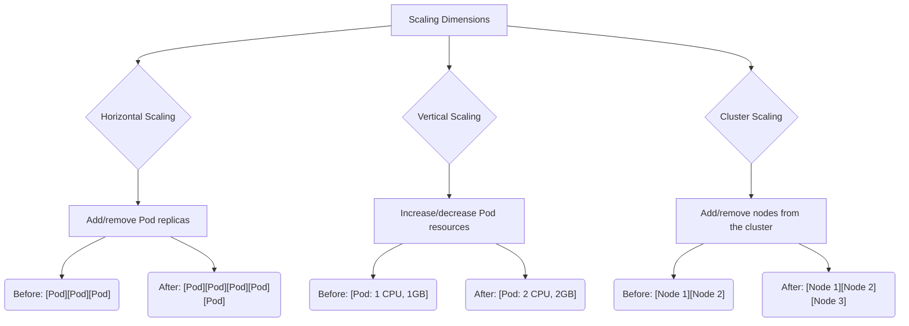
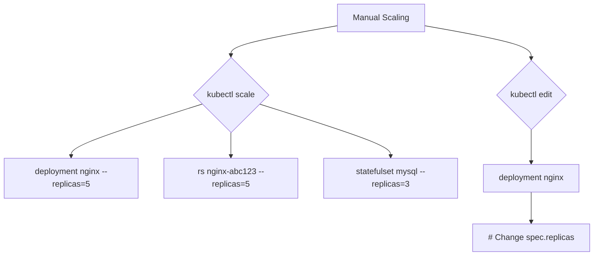
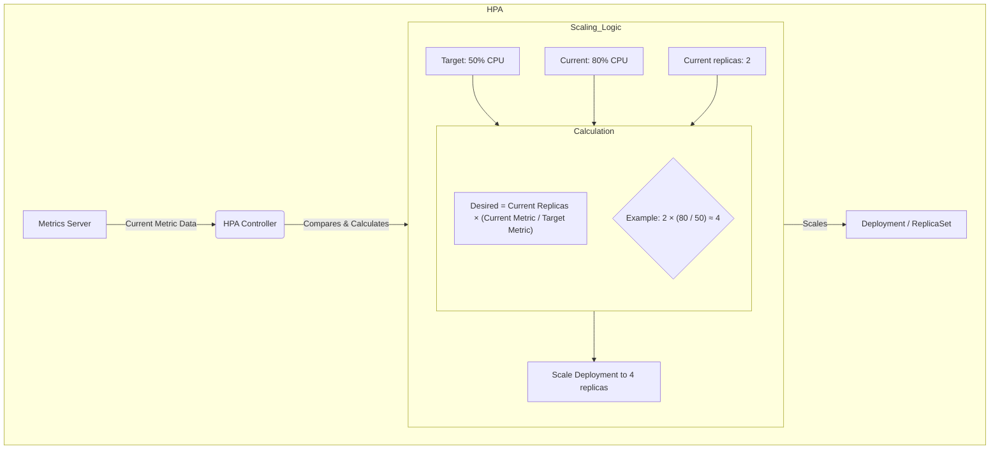
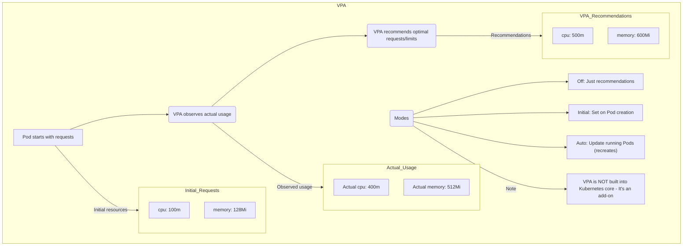
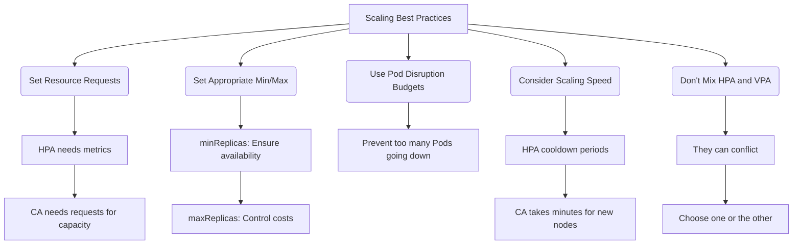
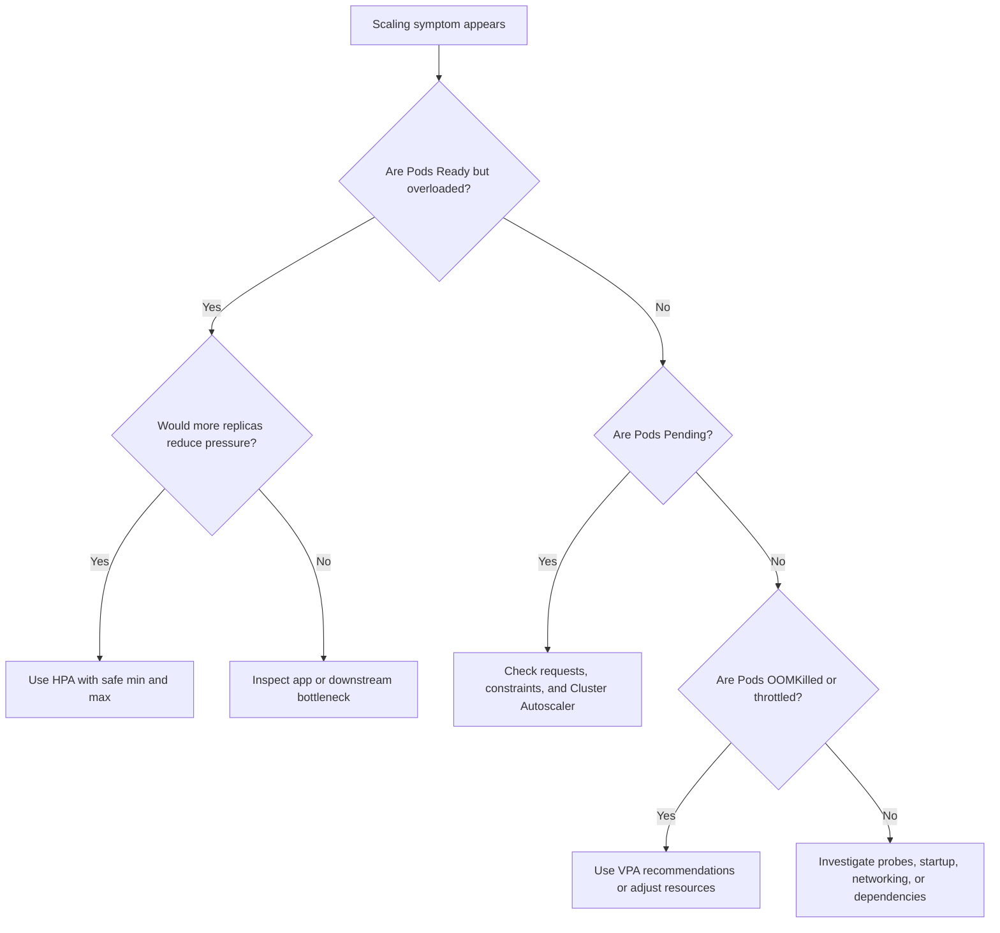

**Складність**: `[ВИСОКА]` — просунуті концепції оркестрації з прямим впливом на надійність, вартість і дизайн застосунків. **Час на проходження**: 45–60 хвилин. **Передумови**: Модуль 2.1, Планування. Цей модуль передбачає поведінку Kubernetes 1.35 для API автомасштабування та прикладів. Повна команда Kubernetes — це `kubectl`; у командах для запуску після рядка з налаштуванням цей модуль використовує коротший зручний для іспиту псевдонім `k`, визначений як `alias k=kubectl`.

```bash
alias k=kubectl
```

## Результати навчання

Після завершення цього модуля ви зможете:

1. **Діагностувати** вузькі місця масштабування, відокремлюючи навантаження на застосунок, тиск на ресурси Подів і тиск на ємність кластера.
2. **Впровадити** Horizontal Pod Autoscaler і тлумачити його рішення про кількість реплік на основі сигналів CPU, пам'яті або користувацьких метрик.
3. **Оцінити**, коли горизонтальне, вертикальне та кластерне масштабування вирішують різні виробничі проблеми, включно з їхніми компромісами щодо вартості та затримки.
4. **Спроєктувати** стійкі конфігурації масштабування, що поєднують запити ресурсів, обмеження реплік, Pod Disruption Budgets та операційні запобіжники.

## Чому цей модуль важливий

**Гіпотетичний сценарій:** онлайн-роздрібний продавець готувався до національної події з покупок за допомогою дашбордів, маркетингових прогнозів і платформи Kubernetes, яка під час репетиції виглядала спокійною. Коли стартувала перша кампанія, трафік оформлення замовлень зростав швидше, ніж очікувала команда, зворотні виклики платежів сповільнилися, а кілька вебподів почали насичувати CPU, тоді як кластер усе ще, здавалося, мав невикористану пам'ять. Застосунок не впав в одному драматичному збої; він деградував шарами, оскільки повільні Поди змушували клієнтів повторювати запити, повтори підсилювали навантаження, нові Поди чекали на завантаження образів, а вузлам-заміні потрібні були хвилини, щоб приєднатися.

Розбір інциденту оцінив значні втрати замовлень і компенсації клієнтам, але технічний урок був точнішим, ніж «додайте більше серверів». Команда мала Horizontal Pod Autoscaler з агресивним максимумом, але Подам бракувало реалістичних запитів CPU, тож сигнали утилізації вводили в оману. Cluster Autoscaler міг додавати вузли, але лише після того, як Поди вже ставали непланованими, а сервіс не мав запасної прогрітої ємності, поки нові вузли завантажувалися. Їхня політика розгортання також дозволяла бути недоступними надто багатьом реплікам під час обслуговування, тож рутинне витіснення вузла зіткнулося з піковим трафіком.

Масштабування — це момент, коли Kubernetes перестає бути запускачем контейнерів і стає системою управління. Воно спостерігає за сигналами, порівнює їх із наміром і змінює бажаний стан, тоді як планувальник, контролери, хмарний провайдер і застосунок реагують із різною швидкістю. Сильний оператор не просто «вмикає автомасштабування»; він вирішує, який сигнал відображає біль користувача, який шар має реагувати, наскільки швидко він має реагувати і які запобіжники не дадуть реакції погіршити аварію. Саме цю практичну навичку формує цей модуль.

## Розуміння вимірів масштабування

Масштабування в Kubernetes має три виміри, і кожен вимір відповідає на інше операційне запитання. Горизонтальне масштабування запитує, чи потребує робоче навантаження більше реплік. Вертикальне масштабування запитує, чи має кожна репліка достатньо CPU або пам'яті, щоб виконувати свою роботу ефективно. Кластерне масштабування запитує, чи має кластер достатньо вузлів, щоб планувати Поди, запитані контролерами робочих навантажень. Розглядайте їх як окремі запитання, тому що один симптом, наприклад затримка, може походити з будь-якого з трьох шарів.

Коли застосунок без стану (stateless API) отримує більше незалежних запитів, ніж можуть обробити його поточні Поди, горизонтальне масштабування зазвичай є першим інструментом, до якого варто вдатися. Більша кількість реплік дозволяє Сервісу розподіляти трафік між більшою кількістю ендпоінтів, що знижує обсяг роботи на один Под і створює надлишковість, якщо один Под зникне. Це найкраще працює, коли запити не залежать від прив'язаного локального стану, час запуску короткий, а нижчерівневі залежності можуть витримати більшу кількість з'єднань. Якщо справжнім вузьким місцем є база даних, додавання реплік лише створює більше викликачів, які чекають на ту саму обмежену систему.

Вертикальне масштабування змінює ресурсну оболонку Пода, а не кількість Подів. Воно корисне, коли застосунок виграє від більшої купи (heap), більшого кешу, більшої кількості CPU на воркер або меншої кількості реплік із сильнішою індивідуальною ємністю. Компроміс полягає в тому, що Kubernetes зазвичай не може змінити розмір запущеного Пода на місці для класичного робочого процесу VPA; Под створюється заново з новими запитами, тож ви маєте проєктувати з урахуванням стійкості до перезапусків. Для систем зі станом і сервісів з інтенсивним використанням JVM вертикальні рекомендації часто цінніші за сліпе нарощування реплік.

Кластерне масштабування лежить нижче обох стратегій робочого навантаження. Якщо HPA запитує ще шість Подів, але кожному вузлу бракує запитаного CPU або пам'яті, планувальник позначає ці Поди як очікувані й чекає на ємність. Cluster Autoscaler помічає цю непланувану умову і просить хмарного або інфраструктурного провайдера про більше вузлів. Це означає, що кластерне масштабування реагує на тиск планування, а не є магічним джерелом миттєвої ємності. Завантаження вузла, реєстрація kubelet, завантаження образу, налаштування CNI та проби готовності — усі додають затримку, перш ніж користувачі відчують полегшення.

Діаграма нижче показує три виміри масштабування. Читайте її зверху вниз від шару, зверненого до користувача: спершу вирішіть, чи дійсно більше Подів поглине навантаження, потім вирішіть, чи правильно розмірований кожен Под, і нарешті вирішіть, чи має кластер достатньо ємності вузлів, щоб задовольнити ці запити Подів. Стрілки виглядають просто, але цикли управління працюють на різних годинниках, тому надійний дизайн часто поєднує стабільний мінімум реплік, реалістичні запити ресурсів і буфер кластера.



Зупиніться та спрогнозуйте: якщо API має три репліки на 90 відсотках CPU, без очікуваних Подів і з повільними запитами до бази даних, який шар вам слід дослідити першим? Початківець часто відповідає «HPA», але краща відповідь — розділити симптоми за шарами. Тиск на CPU може виправдати більше реплік, але повільні запити до бази даних можуть означати, що кожен додатковий Под збільшує конкуренцію. Масштабування Kubernetes може створити ємність лише для ресурсів, якими керує Kubernetes, тож ваша діагностика має слідувати за потоком запитів, а не гнатися за найгучнішим графіком.

## Ручне масштабування як базовий рівень

Ручне масштабування не є кінцевим станом для еластичних виробничих систем, але це базовий рівень, який має розуміти кожен оператор, перш ніж делегувати рішення контролеру. Деплоймент зберігає бажану кількість реплік у `spec.replicas`, а контролер Деплойменту узгоджує цю бажану кількість через ReplicaSet'и та Поди. Коли ви виконуєте команду масштабування, ви не створюєте Поди напряму; ви змінюєте бажаний стан і даєте звичайним контролерам зійтися до нього. Ця відмінність має значення, тому що автомасштабувальники працюють, змінюючи те саме поле.

Ручне масштабування працює через шляхи на основі команд і на основі редагування. На практиці `scale` корисний під час реагування на інциденти, тимчасових міграцій і демонстрацій, бо він явний і швидкий. Редагування об'єкта корисне, коли потрібно перевірити поточну специфікацію або внести постійну зміну, узгоджену з GitOps, через маніфест. Небезпека полягає в забуванні, що ручну зміну може перезаписати GitOps, повторно застосований пізніше маніфест Деплойменту або автомасштабувальник, який володіє кількістю реплік.



```bash
kubectl scale deployment/nginx --replicas=5
```

Для щоденної роботи після визначення псевдоніма та сама операція коротша і менш схильна до помилок під час практики в стилі іспиту. Команда нижче змінює лише бажану кількість реплік; вона не гарантує, що п'ять Подів негайно стануть Ready. Планувальнику все одно потрібен простір, середовищу виконання контейнерів може знадобитися завантажити образи, проби готовності можуть не пройти, а PodDisruptionBudgets можуть вплинути на добровільні видалення під час пізнішого зменшення масштабу або витіснення вузла. Завжди поєднуйте команду масштабування з командами спостереження, щоб бачити узгодження, а не припускати завершення.

```bash
k scale deployment/nginx --replicas=5
k get deploy nginx
k get pods -l app=nginx
```

Перш ніж запускати це в реальному просторі імен, який вивід ви очікуєте від `k get deploy nginx`, якщо кластер має ємність лише для трьох із п'яти запитаних Подів? Бажана кількість реплік має показувати п'ять, але кількість доступних реплік може залишатися нижчою, поки деякі Поди перебувають у стані `Pending` або `ContainerCreating`. Ця невідповідність — початок корисної діагностики, бо вона каже вам, чи прийняв контролер намір, чи знайшов планувальник розміщення і чи досягли Поди готовності.

Ручне масштабування також навчає тонкому правилу володіння. Щойно HPA націлюється на Деплоймент, контролер HPA багаторазово оновлює кількість реплік Деплойменту на основі метрик. Якщо людина вручну масштабує той самий Деплоймент із двох реплік до десяти, HPA незабаром може перезаписати цю кількість, бо вважає цільову метрику авторитетною. Під час інцидентів команди часто призупиняють або налаштовують автомасштабувальник, перш ніж застосувати ручне перевизначення, а потім документують, хто володіє кількістю реплік, доки звичайну автоматизацію не буде відновлено.

## Horizontal Pod Autoscaler: автоматизація реплік

Horizontal Pod Autoscaler, або HPA, автоматизує рішення додати чи видалити репліки для масштабованого робочого навантаження, такого як Деплоймент, ReplicaSet або StatefulSet. Його основна ідея проста: порівняти поточний попит із ціллю, обчислити бажану кількість реплік і оновити підресурс масштабу робочого навантаження. Операційний виклик полягає в тому, що поточний попит має бути виміряний правильно, ціль має відображати тиск, зверненого до користувача, а межі реплік мають запобігати як недостатній реакції, так і неконтрольованій вартості.

Для утилізації CPU HPA використовує співвідношення між фактичним використанням CPU і запитаним CPU Пода. Якщо контейнер запитує `100m` і використовує `80m`, він перебуває на 80 відсотках утилізації для цього ресурсу. Саме тому запити ресурсів — це не документація; вони є входами в цикл управління. Надто низький запит робить нормальну поведінку схожою на перевантаження, спричиняючи непотрібне розширення. Надто високий запит робить реальний тиск незначним на вигляд, відкладаючи розширення, доки користувачі вже не відчують затримку.

Діаграма HPA показує базовий цикл управління. Metrics Server або інший адаптер метрик надає поточні значення, контролер HPA порівнює ці значення з ціллю, а контролер Деплойменту створює або видаляє репліки після того, як HPA оновлює бажаний стан. Обчислення на діаграмі навмисно наближене, бо реальний контролер також застосовує допуск, обробку відсутніх метрик, стабілізацію та політики поведінки. Утім, ця ментальна модель достатньо точна для діагностики рівня KCNA і для читання виробничих подій.



Об'єкт HPA визначає три види наміру: що масштабувати, наскільки далеко він може масштабувати і які сигнали мають керувати рішенням. `scaleTargetRef` називає робоче навантаження, `minReplicas` зберігає нижню межу для доступності та прогрітої ємності, а `maxReplicas` захищає бюджети й нижчерівневі залежності. Блок метрик нижче використовує стабільний API `autoscaling/v2`, який підтримує ресурсні, Pod-метрики, об'єктні та зовнішні метрики.

```yaml
# Key HPA settings to understand:
apiVersion: autoscaling/v2
kind: HorizontalPodAutoscaler
spec:
  scaleTargetRef:
    apiVersion: apps/v1
    kind: Deployment
    name: my-app
  minReplicas: 2        # Never scale below this
  maxReplicas: 10       # Never scale above this
  metrics:
  - type: Resource
    resource:
      name: cpu
      target:
        type: Utilization
        averageUtilization: 50  # Target 50% CPU
```

У цьому прикладі HPA утримує `my-app` між двома й десятьма репліками, намагаючись тримати середню утилізацію CPU близько 50 відсотків. Якщо застосунок має чотири репліки на 90 відсотках CPU, пропорційне обчислення вказує приблизно на вісім реплік. Якщо застосунок має чотири репліки на 25 відсотках CPU, обчислення вказує на меншу кількість реплік, але стабілізація зменшення масштабу сповільнює скорочення, тож короткочасне затишшя не прибере ємність надто швидко. Ця затримка — функція, а не дефект.

HPA може масштабувати за кількома типами метрик, і вибір метрики — це інженерне рішення. CPU зручний, бо він поширений і дешевий для збору, але він не завжди пов'язаний із болем користувача. Утилізація пам'яті підступна, бо тиск на пам'ять часто не спадає негайно, коли кількість реплік зростає. Глибина черги, запити за секунду на один Под і кількість активних з'єднань можуть бути кращими сигналами, коли вони описують роботу, що очікує на обробку. Таблиця нижче перелічує категорії метрик, обрамляючи їх як вибори.

| Тип | Опис | Приклад |
|------|-------------|---------|
| **Resource** | Утилізація CPU, пам'яті | 50% середнього CPU |
| **Pods** | Користувацькі метрики, що випромінюються Подами | Запити за секунду, активні з'єднання |
| **Object** | Метрики з інших об'єктів Kubernetes | Довжина черги брокера повідомлень |
| **External** | Метрики з-поза меж кластера | Специфічні для хмари метрики, зовнішні системи моніторингу |

Для API, керованого запитами, поширений патерн — використати CPU як перше наближення, а потім перейти до частоти запитів або метрик, близьких до затримки, щойно спостережуваність дозріє. Для пулу воркерів глибина черги часто краща, бо вона вимірює відставання напряму. Для шлюзу активні з'єднання можуть відстежувати тиск краще за CPU, якщо домінують TLS, буферизація або очікування нижчерівневих систем. Найкраща метрика — це та, яка зростає до того, як користувачам стане боляче, і спадає, коли додаткові репліки справді допомагають.

Зупиніться та спрогнозуйте: що станеться, якщо ви встановите `maxReplicas` у дуже велике значення для сервісу, вузьким місцем якого є спільний пул з'єднань до бази даних? HPA може продовжувати додавати Поди, бо CPU на один Под залишається високим або черги запитів залишаються довгими, але кожен новий Под може відкривати більше з'єднань до бази даних і посилювати справжнє вузьке місце. Дисциплінований максимум — це не песимістичне обмеження; це запобіжник, який змушує людей розслідувати, коли автоматизація досягає краю безпечної робочої оболонки.

Поведінка HPA епохи Kubernetes 1.35 також дозволяє налаштовувати політики розширення та зменшення масштабу через поле `behavior`. Ви можете обмежити, скільки реплік додається за інтервал, обрати вікна стабілізації та запобігти раптовим скороченням, які б спустошили прогріті кеші або зламали робочі навантаження з інтенсивними з'єднаннями. Ці важелі цінні, але вони не можуть врятувати погану метрику. Налаштовуйте поведінку лише після того, як обраний сигнал довів, що він відстежує роботу, яка хвилює користувачів.

```yaml
apiVersion: autoscaling/v2
kind: HorizontalPodAutoscaler
metadata:
  name: checkout-api
spec:
  scaleTargetRef:
    apiVersion: apps/v1
    kind: Deployment
    name: checkout-api
  minReplicas: 3
  maxReplicas: 12
  metrics:
  - type: Resource
    resource:
      name: cpu
      target:
        type: Utilization
        averageUtilization: 60
  behavior:
    scaleDown:
      stabilizationWindowSeconds: 300
      policies:
      - type: Percent
        value: 25
        periodSeconds: 60
```

`scaleUp` використовує типові значення контролера, коли його пропущено; тут для стислості налаштовано лише `scaleDown`.

**Гіпотетичний сценарій:** одна платформена команда налаштувала HPA для внутрішнього API за CPU, бо це була єдина метрика, доступна в день запуску. Під час партнерського імпорту затримка стрибнула, але CPU залишився помірним, бо Поди здебільшого чекали на зовнішній сервіс. HPA нічого не зробив, і команда спершу звинуватила Kubernetes. Виправленням було не подальше налаштування автомасштабувальника; це було додавання черги перед імпортером і масштабування воркерів за глибиною черги, яка відображала роботу, що очікувала, а не CPU, спожитий під час очікування.

Коли HPA поводиться несподівано, опирайтеся спокусі спершу змінити цільовий відсоток. Прочитайте опис HPA, підтвердіть, чи присутні метрики, порівняйте поточну утилізацію з цільовою і перевірте нещодавні події на наявність повідомлень про відсутні запити або невдале отримання метрик. Потім порівняйте бажану кількість реплік із доступною кількістю реплік на цільовому Деплойменті. Ця послідовність розділяє збір сигналів, обчислення автомасштабувальника, узгодження контролера, розміщення планувальником і готовність Подів. Зміна порога до локалізації невдалої передачі часто приховує справжню проблему для наступного інциденту.

HPA також взаємодіє зі стратегією розгортання у спосіб, який легко пропустити. Під час послідовного оновлення Деплоймент може тимчасово запускати додаткові Поди, бо `maxSurge` дозволяє нові репліки, перш ніж старі зникнуть. HPA усе ще намагається керувати бажаним масштабом, тоді як контролер розгортання керує заміною версій. Якщо нова версія використовує більше CPU під час запуску, HPA може розширитися під час розгортання, що іноді корисно, а іноді витратно. Для критичних сервісів тестуйте автомасштабування під час розгортання, а не лише під час навантажувальних тестів усталеного стану.

## Vertical Pod Autoscaler: правильне розмірування ресурсів

Vertical Pod Autoscaler, або VPA, відповідає на інше запитання, ніж HPA. Замість того, щоб запитувати «скільки Подів має існувати», він запитує «які запити CPU та пам'яті має мати кожен Под». Ця відмінність важлива, бо планувальник розміщує Поди на основі запитів, HPA обчислює утилізацію із запитів, а Cluster Autoscaler вирішує, чи потрібно більше вузлів, на основі очікуваних Подів, чиї запити не можуть поміститися. Погані запити спотворюють усі три системи.

VPA — це доповнення (add-on), а не вбудований основний контролер, і його зазвичай розглядають через три компоненти. Recommender спостерігає за історичним використанням і пропонує значення CPU та пам'яті. Admission Controller може застосовувати рекомендації під час створення нових Подів. Updater може витісняти наявні Поди, щоб заміни стартували з новими запитами ресурсів. Ця остання поведінка потужна, але руйнівна, тож багато виробничих команд спершу запускають VPA в режимі рекомендацій і переглядають його поради, перш ніж вмикати автоматичні оновлення.

Діаграма VPA фіксує базовий потік. Под стартує з оголошеними запитами, recommender спостерігає за реальним використанням, і VPA продукує доречніший діапазон запитів. Якщо ввімкнено автоматичне оновлення, старий Под може бути відтворено заново, що означає, що проби готовності, бюджети збоїв, налаштування розгортання та керування станом — усі стають частиною дизайну масштабування. VPA менше схожий на поворот регулятора на запущеному процесі і більше — на навчання Kubernetes того, який розмір оболонки мають запитувати майбутні Поди.



VPA особливо корисний, коли команди не знають реалістичних запитів на момент запуску. Новий сервіс часто постачається зі скопійованими значеннями, такими як `100m` CPU і `128Mi` пам'яті, бо ці числа виглядають малими й безпечними. Після прибуття реального трафіку сервіс може постійно перевищувати запити CPU, отримувати тротлінг під обмеженнями або страждати від OOMKill, бо обмеження пам'яті надто тісні. Рекомендації VPA перетворюють ці здогадки на докази, що покращує точність планування, навіть якщо команда вирішує застосовувати зміни вручну через GitOps.

Головний конфлікт виникає, коли HPA і VPA обидва діють на CPU або пам'ять для того самого робочого навантаження. HPA обчислює утилізацію як використання, поділене на запит, тоді як VPA змінює запит. Якщо VPA підвищує запити CPU, бо Поди зайняті, HPA може побачити нижчий відсоток утилізації й зменшити кількість реплік. Якщо VPA знижує запити, HPA може побачити вищу утилізацію й розширитися. Кожен із контролерів поводиться логічно, але разом вони створюють заплутаний зворотний зв'язок, якщо їхні обов'язки не розділено.

Безпечна комбінація — використовувати VPA для рекомендацій щодо CPU та пам'яті, тоді як HPA масштабує за користувацькою метрикою, такою як глибина черги або частота запитів. Інший безпечний патерн — запускати VPA в режимі `Initial` для робочих навантажень, де Поди й так часто створюються заново, наприклад короткоживучі пакетні Job'и або сервіси без стану з сильними бюджетами збоїв. Ризикований патерн — вмикати режим VPA `Auto` на критичному, одиничному (singleton) робочому навантаженні зі станом без тестування поведінки витіснення. Запит може стати точнішим, але саме перезапуск може бути аварією.

Перш ніж застосовувати рекомендації VPA, запитайте, що планувальник зробить із новими запитами. Підвищення Пода з `500m` CPU до `2` CPU може зменшити тротлінг, але також може зробити Под неможливим для розміщення на поточних вузлах. Це може запустити Cluster Autoscaler, змінити пакування (bin-packing) і збільшити вартість. Правильне розмірування — це не лише про процес застосунку; це також про форму кластера і про те, наскільки ефективно робочі навантаження поміщаються разом.

Обмеження (limits) заслуговують на окреме судження від запитів. Запит CPU впливає на планування та математику утилізації, тоді як обмеження CPU може спричинити тротлінг, коли процес хоче більше за свою обмежену частку. Запит пам'яті впливає на планування, тоді як обмеження пам'яті може завершити контейнер, коли використання перетне межу. Рекомендації VPA часто зосереджують увагу на запитах, бо правдиві запити покращують розміщення, але командам усе одно слід обирати обмеження на основі ізоляції збоїв і поведінки середовища виконання мови. Надто тісне обмеження пам'яті може бути гіршим за трохи неефективний запит.

Для підготовки до іспиту пам'ятайте, що рекомендації VPA — це докази, а не гарантія того, що автоматичне вертикальне масштабування безпечне. Якщо робоче навантаження має одну репліку, зберігає локальний стан або довго стає Ready, автоматичне витіснення може бути руйнівнішим за тиск на ресурси, який воно вирішує. Якщо робоче навантаження має багато реплік, сильні перевірки готовності та PDB, що дозволяє один добровільний збій, поведінка в автоматичному або початковому режимі може бути розумною. Правильна відповідь залежить від дизайну доступності так само, як і від графіків ресурсів.

## Cluster Autoscaler: автоматизація інфраструктури вузлів

Cluster Autoscaler працює на рівні інфраструктури. Він не спостерігає за графіками CPU й не додає вузли, бо кластер виглядає зайнятим; він шукає Поди, які неможливо запланувати, бо жоден наявний вузол не може задовольнити їхні обмеження та запити ресурсів. Цей дизайн прив'язує автомасштабувальник до наміру планування Kubernetes. Под, який очікує через недостатній CPU, пам'ять, сумісні мітки вузлів або певні топологічні обмеження, може виправдати додавання вузлів, якщо група вузлів може його задовольнити.

Розширення масштабу починається після того, як планувальник позначає Поди як неплановані. Cluster Autoscaler оцінює групи вузлів, прикидає, чи поміститься новий вузол для очікуваних Подів, і просить хмарного провайдера або інфраструктурну інтеграцію створити ємність. Щойно вузол приєднується, kubelet його реєструє, мережа ініціалізується, можуть запуститися DaemonSet'и, і планувальник може розмістити раніше очікувані Поди. Цей шлях за своєю суттю повільніший за HPA, бо залучає реальні машини або віртуальні машини, а не лише об'єкти Kubernetes.

Зменшення масштабу обережне, бо видалення вузла може зруйнувати робочі навантаження. Cluster Autoscaler шукає вузли, які достатньо довго були недостатньо завантажені, і перевіряє, чи можуть їхні Поди переміститися деінде. Він поважає PodDisruptionBudgets, ігнорує Поди, які не можна безпечно витіснити за його правилами, і витісняє вузли перед видаленням. Якщо критичний Деплоймент має надто мало реплік або надто суворий PDB, зменшення масштабу може бути заблоковано, що часто є правильним результатом, бо доступність важливіша за акуратність інфраструктури.

```mermaid
flowchart TD
    subgraph Cluster Autoscaler
        subgraph Scale Up
            A["Pods pending (unschedulable)"] --> B(Cluster Autoscaler detects pending Pods)
            B --> C(Requests new node from cloud provider)
            C --> D(New node joins cluster)
            D --> E(Pending Pods get scheduled)
        end

        subgraph Scale Down
            F[Node has low utilization for X minutes] --> G(CA checks if Pods can move elsewhere)
            G --> H(Drains node (moves Pods))
            H --> I(Removes node from cloud)
        end

        Cloud_Integrations(Works with)
        Cloud_Integrations --> AWS[AWS Auto Scaling]
        Cloud_Integrations --> GCP[GCP MIG]
        Cloud_Integrations --> Azure[Azure VMSS]
    end
```

Найпоширеніше розчарування в Cluster Autoscaler — очікувати, що він миттєво вирішить раптові стрибки трафіку. HPA може вирішити створити більше Подів у межах циклу синхронізації контролера, але якщо ці Поди не можуть поміститися, вони чекають. Новим вузлам може знадобитися кілька хвилин, щоб завантажитися і стати корисними, особливо якщо потім потрібно завантажити великі образи. Для систем, звернених до користувача, відповідь зазвичай — це поєднання вищого `minReplicas`, помірної запасної ємності вузлів, швидших образів, шлюзів готовності та черг робочих навантажень, які поглинають тимчасовий тиск.

Cluster Autoscaler також залежить від точних запитів ресурсів. Якщо запити надто низькі, планувальник може запакувати надто багато Подів на вузли, спричиняючи конкуренцію під час виконання, яку Cluster Autoscaler не розпізнає як неплановий тиск. Якщо запити надто високі, Поди можуть запускати нові вузли, навіть якщо фактичне використання помістилося б на наявній ємності. Запити, отже, є контрактом між командами застосунків і платформою. Вони кажуть Kubernetes, що потрібно робочому навантаженню до запуску, а не що воно випадково використало вчора.

Зупиніться та подумайте: якщо кілька Подів очікують, що вам слід перевірити, перш ніж припускати, що Cluster Autoscaler зламаний? Почніть із `k describe pod`, щоб прочитати події планування, потім перевірте селектори вузлів, taint'и, толерації, обмеження розподілу топології, запити ресурсів і квоту. Под може бути неплановим з причин, які жоден новий загальний вузол не може виправити. Наприклад, обов'язкова мітка GPU, відсутня толерація або неможливе зональне обмеження можуть тримати Под в очікуванні, навіть поки додаються нові звичайні вузли.

Дизайн групи вузлів впливає на те, наскільки корисним може бути Cluster Autoscaler. Кластер лише з великими вузлами загального призначення може марнувати гроші, коли багато малих Подів запускають розширення, тоді як кластер лише з крихітними вузлами може не зуміти розмістити кілька великих Подів, навіть якщо загальний CPU кластера виглядає достатнім. Керовані платформи Kubernetes зазвичай надають пули вузлів, керовані групи екземплярів, набори масштабування віртуальних машин або подібні абстракції. Автомасштабувальник може обирати лише з цих форм. Якщо жодна доступна форма не підходить очікуваному Поду, ємність автомасштабування існує на папері, але не у формі, потрібній планувальнику.

Зменшення масштабу має свої операційні пастки. Вузол може виглядати недостатньо завантаженим за CPU та пам'яттю, але його все одно може бути важко видалити, бо на ньому розміщені Поди з локальним сховищем, суворими політиками збоїв або обмеженнями, які заважають перенесенню деінде. Команди іноді послаблюють ці захисти, щоб скоротити вартість, а потім під час події обслуговування виявляють, що захисти зберігали припущення застосунку. Кращий підхід — зробити мобільність робочого навантаження явною: використовуйте реплікативне сховище там, де доречно, проєктуйте Поди так, щоб вони витримували витіснення, і резервуйте сувору поведінку без витіснення для робочих навантажень, які цього справді потребують.

```bash
k get pods --field-selector=status.phase=Pending
k describe pod checkout-api-abc123
k get nodes
k describe node <node-name>
```

## Порівняння механізмів масштабування

HPA, VPA і Cluster Autoscaler — це не конкурентні продукти. Це контролери на різних шарах однієї системи, і кожен із них змінює іншу частину бажаного стану. HPA змінює кількість реплік. VPA змінює запити ресурсів, а іноді й обмеження. Cluster Autoscaler змінює пул вузлів. Чітка ментальна модель запобігає класичній помилці інциденту — налаштовувати шар, який найлегше побачити, замість шару, який насправді обмежений.

| Аспект | HPA | VPA | Cluster Autoscaler |
|--------|-----|-----|-------------------|
| **Що масштабує** | Кількість Подів | Ресурси Пода | Кількість вузлів |
| **Напрямок** | Горизонтальний | Вертикальний | Горизонтальний (вузлів) |
| **Тригер** | Поріг метрики | Патерни використання | Неплановані Поди |
| **Вбудований** | Так | Ні (доповнення) | Ні (доповнення) |
| **Простій** | Ні | Так (перезапуск Пода) | Ні |

Для вебнавантажень без стану HPA зазвичай є найбільш прямим інструментом масштабування, зверненим до користувача, бо додавання реплік може розподілити трафік, не змінюючи процес застосунку. Для сервісів, чутливих до пам'яті, або робочих навантажень із поганими початковими запитами VPA часто є найкращим діагностичним інструментом і інструментом правильного розмірування. Для кластерів, що запускають сплескові навантаження або використовують чутливі до вартості пули вузлів, Cluster Autoscaler є необхідним, бо масштабування на рівні робочого навантаження зрештою потребує фізичної ємності. Жоден із них не усуває потреби у зворотному тиску (backpressure) на рівні застосунку, обмеженнях частоти або захисті нижчерівневих систем.

Корисне порівняння — робота ресторану. HPA додає більше касирів, коли черга зростає, що допомагає лише тоді, коли є достатньо місця за стійкою і кожен касир може працювати незалежно. VPA дає кожному касиру більше робоче місце або краще обладнання, що допомагає, якщо кожен працівник обмежений власними інструментами. Cluster Autoscaler розширює будівлю, відкриваючи більше стійок, що допомагає лише після того, як будівництво або набір персоналу наздоженуть. Якщо вузьким місцем є кухня, усі три все одно можуть залишити клієнтів чекати.

## Найкращі практики масштабування: опанування еластичності

Ефективне масштабування починається із запитів ресурсів, бо запити пов'язують планування, утилізацію HPA і ємність вузлів. Деплоймент без запитів CPU може все одно працювати, але HPA не може обчислити утилізацію CPU очікуваним чином, планувальник не може зарезервувати реалістичну ємність, а Cluster Autoscaler отримує слабкі сигнали. Деплоймент із роздутими запитами може виглядати безпечним для команди застосунку, але дорогим для платформи. Хороші запити вимірюються, переглядаються і коригуються в міру зміни реального трафіку.

Діаграма найкращих практик нижче правильно пов'язує запити, межі реплік, бюджети збоїв, швидкість масштабування та взаємодії HPA/VPA. Важливе уточнення в тому, що це не незалежні чекбокси. Вони утворюють систему управління. `minReplicas` захищає прогріту ємність, `maxReplicas` обмежує радіус ураження, запити ресурсів роблять розміщення правдивим, PDB захищають добровільні збої, а налаштування поведінки масштабування демпфують метання (thrashing). Коли однієї частини бракує, про інші часто стає важче міркувати під час інциденту.



Встановлюйте `minReplicas` з потреб доступності та прогрітої ємності, а не із середнього навантаження. Критичний API з однією реплікою може бути ідеально дешевим і ідеально крихким. Під час витіснення вузла, розгортання або збою Пода єдина репліка означає відсутність надлишковості. Для багатьох виробничих сервісів нижня межа у дві чи три репліки є розумною відправною точкою, але правильне число залежить від часу готовності, форми трафіку, зонального дизайну і від того, чи може кожна репліка впоратися з раптовим навантаженням, поки стартують нові репліки.

Встановлюйте `maxReplicas` з нижчерівневої ємності та толерантності до вартості, а не з оптимізму. Якщо сервіс може безпечно запускати дванадцять реплік, перш ніж насичувати базу даних, встановлення максимуму в сто просто відкладає момент, коли хтось помітить справжнє обмеження. Хороший максимум каже: «автоматизація може вільно працювати до цієї межі; за нею люди мають зрозуміти систему». Поєднуйте цей максимум зі сповіщеннями, щоб команда дізнавалася, коли автомасштабувальник досяг межі, перш ніж клієнти дізнаються про це з помилок.

Використовуйте PodDisruptionBudgets для робочих навантажень, де добровільні збої слід обмежувати. Зменшення масштабу Cluster Autoscaler, оновлення вузлів і ручні витіснення — усі використовують потоки витіснення, які можуть поважати PDB. PDB не захищає від кожного збою; якщо вузол раптово гине, Kubernetes не може спершу спитати дозволу. Він захищає від планових видалень, які інакше вивели б з ладу надто багато реплік одночасно. Розглядайте PDB як частину масштабування, бо зменшення масштабу — це робочий процес добровільного збою.

```yaml
apiVersion: policy/v1
kind: PodDisruptionBudget
metadata:
  name: checkout-api
spec:
  minAvailable: 2
  selector:
    matchLabels:
      app: checkout-api
```

Оптимізуйте час запуску, бо швидкість масштабування обмежена найповільнішим кроком між бажаними репліками й готовими ендпоінтами. Великі образи контейнерів, повільні реєстри, дорогі міграції під час запуску, довгі затримки готовності та холодні кеші — усі зменшують цінність HPA. Сервіс, якому потрібно вісім хвилин, щоб стати Ready, не може покладатися на реактивне масштабування для двохвилинного сплеску. Для такого сервісу попередньо прогріті репліки, черги, заплановане масштабування перед відомими подіями або архітектурні зміни можуть мати більше значення, ніж налаштування автомасштабувальника.

Остання найкраща практика культурна: зробіть автомасштабування спостережуваним. Команди мають бути здатні відповісти, чому HPA масштабував, чому він не масштабував, чому Поди очікують, чому вузол не було видалено і чи змінилися рекомендації VPA після релізу. Команди на кшталт `k describe hpa`, `k get events` і логи контролерів часто розповідають історію. Без такої видимості автомасштабування стає марновірством, і команди починають змінювати пороги під час інцидентів, не знаючи, який цикл зворотного зв'язку вони порушують.

Ставтеся до змін автомасштабування як до змін у виробничому коді. Перегляньте джерело метрики, цільове значення, межі реплік, припущення про запити й нижчерівневу ємність, перш ніж зливати новий HPA. Запишіть, чому обраний максимум безпечний і яке сповіщення має спрацювати, коли його досягнуто. Для VPA запишіть, чи рекомендації є дорадчими, застосовуються під час створення Пода чи їм дозволено запускати витіснення. Для Cluster Autoscaler запишіть, які пули вузлів можуть розширюватися і які робочі навантаження потребують спеціальних міток або толерацій. Майбутнім відповідальним за реагування ці рішення потрібні більше, ніж ще один графік.

Заплановані події заслуговують на спеціальний план масштабування. Якщо маркетингова кампанія, вікно реєстрації, запуск нарахування зарплати або лабораторна робота сертифікаційного іспиту відкривається у відомий час, реактивне автомасштабування не має бути єдиною підготовкою. Попереднє масштабування Деплойменту, прогрівання кешів, забезпечення того, що образи вже присутні, та утримання запасної ємності вузлів можуть бути дешевшими за втрату трафіку в перші хвилини навантаження. Після події дайте HPA і Cluster Autoscaler поступово зменшити ємність, поки ви спостерігаєте за частотою помилок і глибиною черги. Передбачуване навантаження — це можливість бути нудним.

```bash
k describe hpa checkout-api
k get events --sort-by=.lastTimestamp
k top pods
k top nodes
```

## Патерни та антипатерни

Патерни масштабування — це повторно використовувані відповіді на повторювані виробничі форми. Вони працюють, бо узгоджують сигнал автомасштабувальника з обмеженням, яке насправді має значення, а потім додають запобіжники для способів, якими автоматизація може помилятися. Патерн — це не шаблон, який вставляють у кожен простір імен. Це рішення, яке ви можете обґрунтувати з поведінки застосунку, режимів збоїв та операційної вартості.

| Патерн | Коли застосовувати | Чому це працює | Міркування щодо масштабування |
|---|---|---|---|
| HPA на застосунках без стану, що обслуговують запити | Робоче навантаження обробляє незалежні запити, а CPU або частота запитів відстежує тиск. | Більша кількість реплік розподіляє роботу через Сервіс і зберігає доступність під час збоїв Подів. | Тримайте реалістичні запити, безпечний максимум і проби готовності, що видаляють холодні Поди, доки вони не стануть корисними. |
| Правильне розмірування з пріоритетом рекомендацій VPA | Команда не впевнена в запитах CPU та пам'яті або бачить частий тротлінг і OOMKill. | Рекомендації покращують правдивість планування, не витісняючи негайно виробничі Поди. | Переглядайте зміни з огляду на вартість і форму вузлів, перш ніж застосовувати їх через маніфести. |
| Масштабування воркерів за глибиною черги | Робота прибуває асинхронно, а користувачів хвилює час спорожнення відставання. | Глибина черги вимірює роботу, що очікує, напряму, часто краще за CPU. | Захищайте нижчерівневі системи, обмежуючи максимуми воркерів і використовуючи відкат повторів (retry backoff). |
| Прогріта ємність для критичних шляхів | Трафік стрибає швидше, ніж можуть стартувати вузли чи Поди. | Мінімум реплік і запасний простір вузлів поглинають першу хвилю, поки автомасштабувальники наздоганяють. | Передбачте бюджет на резерв, що простоює, і сповіщайте, коли цей буфер спожито. |

Антипатерни зазвичай починаються з розумного скорочення, яке переживає свій контекст. Команда копіює запити з іншого сервісу, встановлює `maxReplicas` високо, щоб «бути в безпеці», або вмикає кожен автомасштабувальник, бо кожен звучить корисно. Тоді систему стає важче передбачити, бо кілька контролерів змінюють пов'язані змінні. Краща альтернатива — тримати володіння чітким: один сигнал для горизонтального масштабування, один робочий процес керування запитами і одна політика керування ємністю.

| Антипатерн | Що йде не так | Краща альтернатива |
|---|---|---|
| Автомасштабування без запитів | Утилізація HPA і розміщення планувальником стають ненадійними. | Визначте виміряні запити CPU та пам'яті для кожного контейнера. |
| HPA і VPA обидва керують CPU на тому самому навантаженні | VPA змінює запити, тоді як HPA тлумачить утилізацію з цих запитів. | Використовуйте VPA в режимі рекомендацій або масштабуйте HPA за нересурсною метрикою. |
| Ставлення до Cluster Autoscaler як до миттєвої ємності | Поди чекають, поки вузли завантажуються, приєднуються і завантажують образи. | Тримайте прогріту ємність для критичних сервісів і оптимізуйте шляхи запуску. |
| Відсутність максимуму реплік | Неконтрольоване масштабування може перевантажити залежності та бюджети. | Встановлюйте максимуми з нижчерівневої ємності й сповіщайте, коли межі досягнуто. |

## Фреймворк прийняття рішень

Обирайте шар масштабування, запитуючи, що є дефіцитним, який сигнал доводить дефіцит і наскільки швидко має надійти полегшення. Якщо поточні Поди зайняті корисною незалежною роботою, а більша кількість реплік розподілила б цю роботу, починайте з HPA. Якщо кожен Под обмежений власною оболонкою CPU чи пам'яті, використовуйте рекомендації VPA або явні зміни ресурсів. Якщо Поди очікують, бо планувальник не може їх розмістити, дослідіть Cluster Autoscaler і ємність групи вузлів. Якщо нічого з цього не справджується, масштабування може бути неправильним виправленням.



Використовуйте цей фреймворк під час інцидентів як дисципліну проти галасливих дашбордів. Починайте із симптому користувача, потім локалізуйте шар, де бажаний стан перестає ставати здоровою ємністю. Бажана кількість реплік Деплойменту може бути правильною, тоді як Поди очікують. Поди можуть бути Ready, тоді як застосунок заблокований на базі даних. Вузли можуть мати виділюваний (allocatable) CPU, тоді як топологічні обмеження заважають розміщенню. Діагностика масштабування — це мистецтво знаходити точну передачу, де система перестає перетворювати намір на пропускну здатність.

Той самий фреймворк працює під час оглядів дизайну, перш ніж щось зламається. Запитайте власника сервісу, що робить робоче навантаження, коли попит подвоюється, що відбувається, коли репліка зникає, скільки часу потрібно новій репліці, щоб стати корисною, і яка залежність відмовляє першою під навантаженням. Ці відповіді кажуть вам, чи має сенс горизонтальне масштабування, чи важливіше вертикальне правильне розмірування і чи має платформа тримати запасну ємність вузлів. Хороший дизайн масштабування, отже, є розмовою про застосунок, а не лише вправою з конфігурації кластера.

Вартість належить до фреймворку прийняття рішень, але вона не має бути першим запитанням. Конфігурація, яка економить гроші, запускаючи одну репліку критичного API, не є ефективною, коли вона перетворює обслуговування на простій. Конфігурація, яка масштабується до дуже високої кількості реплік без захисту нижчерівневих систем, не є стійкою, коли вона перетворює одне вузьке місце на багато збоїв. Корисне запитання щодо вартості вужче: після задоволення вимог доступності та безпеки залежностей, яка найменша прогріта ємність і максимальна оболонка все ще впораються з реалістичним попитом?

| Запитання для рішення | Якщо відповідь «так» | Бажана дія |
|---|---|---|
| Чи є поточні репліки обмеженими CPU й без стану? | Більше Подів має зменшити роботу на один Под. | Налаштуйте або відрегулюйте HPA. |
| Чи Поди неодноразово зазнають OOMKill або сильного тротлінгу? | Ресурсна оболонка кожного Пода неправильна. | Скоригуйте запити й обмеження, використовуючи рекомендації VPA, де доступно. |
| Чи нові Поди неплановані? | Планувальник не може розмістити запитану ємність. | Перевірте події, потім відрегулюйте Cluster Autoscaler або групи вузлів. |
| Чи навантаження прибуває швидше, ніж можуть стартувати Поди чи вузли? | Реактивне масштабування надто повільне. | Збільште прогріту ємність, попередньо масштабуйте для відомих подій або додайте буферизацію. |
| Чи масштабування збільшує нижчерівневі збої? | Ємність Kubernetes не є обмежувальним ресурсом. | Додайте зворотний тиск, обмеження частоти, пули або специфічне для залежності масштабування. |

## Чи знали ви?

* Стабільний API `autoscaling/v2` дозволяє HPA використовувати ресурсні, Pod-, об'єктні та зовнішні метрики, тому сучасні приклади HPA не повинні обмежуватися лише мисленням про CPU.
* Документація Kubernetes описує цілі масштабованості до 5000 вузлів і 150 000 Подів для великих кластерів, але ці межі передбачають ретельний дизайн площини управління, мережі та операцій.
* VPA підтримується в проєкті autoscaler Kubernetes як доповнення, тож його встановлення є рішенням платформи, а не типовою функцією, присутньою в кожному кластері.
* Образ контейнера обсягом один гігабайт може домінувати в часі розширення на холодному вузлі, бо Под не може стати Ready, доки образ не буде завантажено, а контейнер не запуститься.

## Типові помилки

Ось розбір поширених пасток під час налаштування та керування масштабуванням у Kubernetes. Кожна помилка є конкретною, бо розпливчасті поради щодо масштабування не корисні під час інциденту; операторам потрібно знати, який сигнал вводить в оману, який контролер діє і яке безпечніше виправлення зберігає доступність, покращуючи ємність.

| Помилка | Чому вона трапляється | Як її виправити |
|---|---|---|
| Відсутність запитів ресурсів на Подах | Команди ставляться до запитів як до необов'язкових метаданих, але HPA, планування і Cluster Autoscaler залежать від них для рішень. | Встановіть виміряні запити CPU та пам'яті для кожного контейнера, потім перегляньте їх після навантажувальних тестів і змін виробничого трафіку. |
| `minReplicas: 1` для критичних сервісів | Тиск на вартість робить сервіс на вигляд ефективним, доки розгортання, збій або витіснення вузла не приберуть єдиний Ready Под. | Використовуйте щонайменше дві репліки для критичних виробничих шляхів, потім підвищуйте нижню межу, коли час запуску або сплески трафіку потребують прогрітої ємності. |
| Масштабування за неправильною метрикою | CPU легко збирати, тож команди використовують його, навіть коли глибина черги, затримка чи з'єднання краще описують тиск. | Визначте вузьке місце й оберіть метрику, що зростає до того, як користувачам стане боляче, і спадає, коли додаткові репліки справді допомагають. |
| Ігнорування стабілізації зменшення масштабу | Команди очікують миттєвої економії й забувають, що швидке зменшення масштабу може прибрати прогріту ємність під час короткого затишшя. | Налаштуйте вікна стабілізації та політики зменшення масштабу так, щоб сервіс залишався стабільним крізь звичайні хвилі трафіку. |
| Змішування HPA і VPA на CPU чи пам'яті | VPA змінює запити, тоді як HPA тлумачить відсотки утилізації з цих самих запитів. | Запускайте VPA в режимі рекомендацій або використовуйте HPA за користувацькою метрикою, поки VPA керує порадами щодо ресурсів. |
| Відсутні PodDisruptionBudgets | Добровільні витіснення вузлів та оновлення можуть витіснити надто багато реплік, поки вже триває активність автомасштабування чи розгортання. | Додайте PDB для критичних навантажень і протестуйте поведінку витіснення, перш ніж покладатися на зменшення масштабу Cluster Autoscaler. |
| Очікування, що Cluster Autoscaler виправить сплески миттєво | Надання вузлів, реєстрація, мережа та завантаження образів потребують часу після того, як Поди вже очікують. | Тримайте прогріту ємність для шляхів, звернених до користувача, зменшуйте образи й використовуйте черги чи заплановане масштабування для передбачуваних подій. |

## Тест

<details><summary>Сценарій: ваш API оформлення замовлень має чотири Ready-репліки на 88 відсотках CPU, HPA націлений на 55 відсотків CPU, а база даних усе ще має запасну ємність. Чого слід очікувати від HPA і що перевірити далі?</summary>

HPA має обчислити вищу бажану кількість реплік, бо поточна утилізація CPU значно вища за ціль, і додаткові репліки API ймовірно зменшать роботу на один Под. Вам слід перевірити події HPA, поточну й бажану кількість реплік і те, чи швидко нові Поди стають Ready. Якщо Поди залишаються очікуваними, наступне вузьке місце — це ємність кластера або обмеження планування, а не математика HPA. Якщо Поди стають Ready, але затримка не покращується, перегляньте припущення, що CPU був вузьким місцем, зверненим до користувача.

</details>

<details><summary>Сценарій: Деплоймент воркерів має низький CPU, але черга повідомлень швидко зростає під час імпортів. Який сигнал масштабування ви оберете і чому?</summary>

Глибина черги — кращий сигнал, ніж CPU, бо вона вимірює роботу, що очікує на обробку. Низький CPU може означати, що воркери заблоковані на введенні-виведенні, обмежені за частотою залежністю або сплять між повторами. Масштабування за глибиною черги може додавати воркерів, коли відставання зростає, але вам усе одно потрібен максимум, який захищає нижчерівневі сервіси. Відповідь — не просто «використовуйте HPA»; це «використовуйте HPA з метрикою, яка відображає роботу, яку користувачам потрібно спорожнити».

</details>

<details><summary>Сценарій: Поди, запитані HPA, залишаються в Pending після розширення. Який шлях діагностики відрізняє проблему Cluster Autoscaler від проблеми обмеження планування?</summary>

Почніть із `k describe pod` і прочитайте події планувальника. Якщо події кажуть про недостатній CPU чи пам'ять і відповідна група вузлів може додати ємність, має бути залучено Cluster Autoscaler. Якщо події згадують невідповідні селектори вузлів, taint'и, розподіл топології, квоту або відсутню мітку GPU, додавання звичайних вузлів може не допомогти. Тоді ви перевіряєте конфігурацію групи вузлів та обмеження робочого навантаження, перш ніж звинувачувати контролер автомасштабувальника.

</details>

<details><summary>Сценарій: JVM-сервіс має часті OOMKill, повільне збирання сміття і немає чіткої вигоди від додаткових реплік. Який підхід до автомасштабування найкорисніший першим?</summary>

VPA в режимі рекомендацій — найкорисніший перший крок, бо безпосереднє запитання полягає в тому, чи має кожен Под відповідний запит і обмеження пам'яті. Більше реплік може збільшити загальну ємність, але вони не виправлять Под, який падає, бо його оболонка пам'яті надто мала. Режим рекомендацій дозволяє команді зібрати докази без автоматичного витіснення Подів. Отримані значення потім можна застосувати через звичайний робочий процес розгортання.

</details>

<details><summary>Сценарій: колега вмикає HPA на CPU і VPA Auto на тому самому Деплойменті. Який режим збою вам слід пояснити під час огляду?</summary>

Контролери можуть створити конфлікт зворотного зв'язку, бо HPA читає утилізацію CPU як використання, поділене на запит, тоді як VPA змінює запит. Якщо VPA підвищує запити CPU, HPA може подумати, що утилізація впала, і зменшити кількість реплік. Якщо VPA знижує запити, HPA може розширитися, навіть якщо реальний трафік не змінився. Це робить поведінку важко передбачуваною, тож безпечніший дизайн — це рекомендації VPA або HPA за іншою метрикою.

</details>

<details><summary>Сценарій: Cluster Autoscaler хоче видалити недостатньо завантажений вузол, але витіснення заблоковано. Ваш критичний API має три репліки і PDB, що вимагає доступності всіх трьох. Що відбувається?</summary>

PDB запобігає добровільному збою, бо витіснення одного Пода зменшило б кількість доступних реплік нижче політики. Cluster Autoscaler поважає цей запобіжник, що захищає доступність, але може заблокувати видалення вузла й тримати вартість вищою. Виправлення — не сліпо видаляти PDB; перегляньте, чи справді сервісу потрібні всі репліки доступними під час добровільного збою. Часто `minAvailable: 2` або `maxUnavailable: 1` є кращим балансом для сервісу з трьома репліками.

</details>

<details><summary>Сценарій: нові Поди проводять багато часу в ContainerCreating під час кожного сплеску трафіку. Які дві ймовірні причини і як би ви їх підтвердили?</summary>

Великі образи або повільні реєстри образів — поширені причини, і події `k describe pod` часто виявляють тривалі завантаження або помилки образів. Обмеження на рівні вузла, такі як тиск на диск або повільне налаштування CNI, також можуть затримувати запуск контейнера, тож перевірте умови вузла й нещодавні події. Якщо проблема в розмірі образу, оптимізуйте образ або використовуйте ближчий реєстр. Якщо проблема в тиску на вузол, скоригуйте розмір вузла, запити чи моніторинг сховища.

</details>

## Практична вправа: впровадження автомасштабування

Ця вправа будує невелике робоче навантаження Nginx, приєднує HPA, генерує трафік і просить вас спостерігати за різницею між бажаною кількістю реплік і Ready-ємністю. Вона навмисно проста, бо мета навчання — це цикл управління, а не інженерія продуктивності Nginx. Ви можете використати kind, minikube або одноразовий хмарний кластер, але переконайтеся, що маєте дозвіл встановити Metrics Server або що ваше середовище вже надає метрики.

Маніфест лабораторної роботи розгортає один Под Nginx із запитами CPU та пам'яті, щоб HPA мав знаменник утилізації. Сервіс відкриває Под усередині кластера й може бути адаптований до поведінки локального кластера. У виробничому модулі `nginx:latest` був би надто вільним для контролю змін, але тут він прийнятний як одноразовий практичний образ. Якщо ваш кластер блокує Сервіси типу LoadBalancer, змініть тип на `ClusterIP` і тримайте генератор навантаження всередині простору імен.

```yaml
# deployment.yaml
apiVersion: apps/v1
kind: Deployment
metadata:
  name: nginx-deployment
  labels:
    app: nginx
spec:
  replicas: 1
  selector:
    matchLabels:
      app: nginx
  template:
    metadata:
      labels:
        app: nginx
    spec:
      containers:
      - name: nginx
        image: nginx:latest
        ports:
        - containerPort: 80
        resources:
          requests:
            cpu: "50m"
            memory: "64Mi"
          limits:
            cpu: "100m"
            memory: "128Mi"
---
# service.yaml
apiVersion: v1
kind: Service
metadata:
  name: nginx-service
spec:
  selector:
    app: nginx
  ports:
    - protocol: TCP
      port: 80
      targetPort: 80
  type: LoadBalancer # Or NodePort for local clusters
```

Застосуйте маніфест і підтвердіть, що Деплоймент досягає однієї Ready-репліки, перш ніж створювати HPA. Якщо ваш кластер ще не має Metrics Server, встановіть його з маніфесту компонентів upstream і зачекайте, поки APIService стане доступним. Встановіть його з маніфесту компонентів upstream: `https://github.com/kubernetes-sigs/metrics-server/releases/latest/download/components.yaml`.

```bash
k apply -f deployment.yaml
k apply -f service.yaml
k get deploy nginx-deployment
k get apiservice v1beta1.metrics.k8s.io
```

Тепер створіть HPA. Спершу показано однорядкову команду autoscale, за нею — форма з псевдонімом, яку ви маєте використовувати для практики. Команда націлюється на 50 відсотків утилізації CPU з нижньою межею в одну репліку й верхньою межею в п'ять реплік, що тримає вправу достатньо малою для локальних кластерів, водночас показуючи цикл управління.

```bash
kubectl autoscale deployment nginx-deployment --cpu-percent=50 --min=1 --max=5
```

```bash
k autoscale deployment nginx-deployment --cpu-percent=50 --min=1 --max=5
k get hpa
```

Генеруйте навантаження зсередини кластера, щоб відмінності мережевого шляху не відволікали від поведінки HPA. Цикл оболонки BusyBox — корисний легкий підхід. В іншому терміналі спостерігайте за HPA й Подами, щоб бачити, як метрики, бажана кількість реплік і стан Ready змінюються з часом. Зупиніть генератор навантаження через кілька хвилин, потім спостерігайте за повільнішою поведінкою зменшення масштабу.

```bash
kubectl run -it --rm load-generator --image=busybox -- /bin/sh
# Inside the busybox pod:
while true; do wget -q -O- http://nginx-service.<namespace>.svc.cluster.local; done
# Replace <namespace> with your namespace if not default
```

```bash
k get svc nginx-service
watch k get hpa nginx-deployment
watch k get pods -l app=nginx
```

- [ ] Завдання 1: застосуйте маніфест Деплойменту і Сервісу, потім підтвердіть, що Деплоймент має одну бажану репліку й одну доступну репліку.
- [ ] Завдання 2: переконайтеся, що Metrics Server доступний, або встановіть його з маніфесту компонентів upstream.
- [ ] Завдання 3: створіть HPA з ціллю CPU у 50 відсотків, мінімумом в одну репліку і максимумом у п'ять реплік.
- [ ] Завдання 4: згенеруйте навантаження з тимчасового Пода BusyBox і спостерігайте, чи зростає бажана кількість реплік.
- [ ] Завдання 5: зупиніть генератор навантаження і поясніть, чому зменшення масштабу повільніше за розширення.
- [ ] Завдання 6: напишіть одне речення, що визначає, чи будь-яка побачена вами затримка походила від метрик HPA, запуску Пода або ємності кластера.

<details><summary>Нотатки до розв'язання для Завдань 1 і 2</summary>

Після застосування маніфесту `k get deploy nginx-deployment` має показати одну бажану репліку і зрештою одну доступну репліку. Якщо `k get apiservice v1beta1.metrics.k8s.io` повідомляє про недоступність, встановіть Metrics Server за допомогою `k apply -f https://github.com/kubernetes-sigs/metrics-server/releases/latest/download/components.yaml` і зачекайте, перш ніж судити про поведінку HPA. Без метрик HPA може існувати, але показувати невідому поточну утилізацію. Це проблема конвеєра метрик, а не проблема обчислення реплік.

</details>

<details><summary>Нотатки до розв'язання для Завдань 3 і 4</summary>

`k get hpa` має показати цільовий Деплоймент і зрештою поточне значення CPU, щойно прибудуть метрики. Під час навантаження бажана кількість реплік має зростати до налаштованого максимуму, якщо CPU достатньо довго перетинає ціль. Якщо репліки не зростають, опишіть HPA і перевірте події, перш ніж змінювати пороги. Найкорисніше запитання — чи бракує HPA метрик, чи бачить він метрики нижче цілі, чи хоче він репліки, які Деплоймент не може зробити Ready.

</details>

<details><summary>Нотатки до розв'язання для Завдань 5 і 6</summary>

Зменшення масштабу навмисно повільніше, бо стабілізація уникає метання, коли трафік ненадовго спадає. Якщо Поди стартували повільно, подивіться на час завантаження образу, готовність і ємність вузлів. Якщо Поди залишалися очікуваними, перевірте події планувальника і ресурси вузлів. Ваше фінальне речення має назвати шар, який ви спостерігали: метрики HPA, запуск Пода або ємність кластера. Ця звичка — той самий патерн діагностики, що використовується у виробництві.

</details>

Критерії успіху:

- [ ] Ви можете показати об'єкти Деплоймент, Сервіс і HPA за допомогою `k get`.
- [ ] Ви можете пояснити ціль, мінімум і максимум HPA, не читаючи команду.
- [ ] Ви спостерігали зміну бажаної кількості реплік або визначили, чому метрики були недоступні.
- [ ] Ви перевірили готовність Подів, а не припускали, що створення реплік означає придатну для використання ємність.
- [ ] Ви можете описати одну причину, чому зменшення масштабу не відбувається миттєво.
- [ ] Ви прибрали ресурси лабораторної роботи після завершення.

```bash
k delete hpa nginx-deployment
k delete service nginx-service
k delete deployment nginx-deployment
```

## Джерела

- [Kubernetes: Horizontal Pod Autoscaling](https://kubernetes.io/docs/tasks/run-application/horizontal-pod-autoscale/)
- [Kubernetes: Horizontal Pod Autoscaling Walkthrough](https://kubernetes.io/docs/tasks/run-application/horizontal-pod-autoscale-walkthrough/)
- [Kubernetes API: HorizontalPodAutoscaler autoscaling/v2](https://kubernetes.io/docs/reference/kubernetes-api/workload-resources/horizontal-pod-autoscaler-v2/)
- [Kubernetes: Resource Management for Pods and Containers](https://kubernetes.io/docs/concepts/configuration/manage-resources-containers/)
- [Kubernetes: Pod Disruption Budgets and Disruptions](https://kubernetes.io/docs/concepts/workloads/pods/disruptions/)
- [Kubernetes: Cluster Autoscaling](https://kubernetes.io/docs/concepts/cluster-administration/cluster-autoscaling/)
- [Kubernetes Autoscaler: Cluster Autoscaler](https://github.com/kubernetes/autoscaler/tree/master/cluster-autoscaler)
- [Kubernetes Autoscaler: Vertical Pod Autoscaler](https://github.com/kubernetes/autoscaler/tree/master/vertical-pod-autoscaler)
- [Kubernetes: Assigning Pods to Nodes](https://kubernetes.io/docs/concepts/scheduling-eviction/assign-pod-node/)
- [Kubernetes: Pod Priority and Preemption](https://kubernetes.io/docs/concepts/scheduling-eviction/pod-priority-preemption/)
- [Metrics Server Components Manifest](https://github.com/kubernetes-sigs/metrics-server/releases/latest/download/components.yaml)
- [Considerations for large clusters](https://kubernetes.io/docs/setup/best-practices/cluster-large/)

## Наступний модуль

[Модуль 2.3: Оркестрація сховища](../module-2.3-storage/) — заглибтеся в те, як Kubernetes керує персистентним сховищем для застосунків зі станом, відокремлюючи дані від обчислень.


