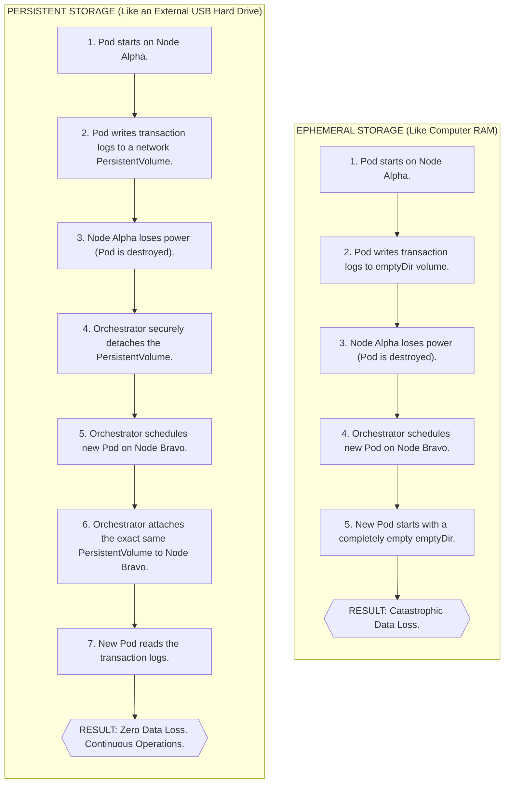
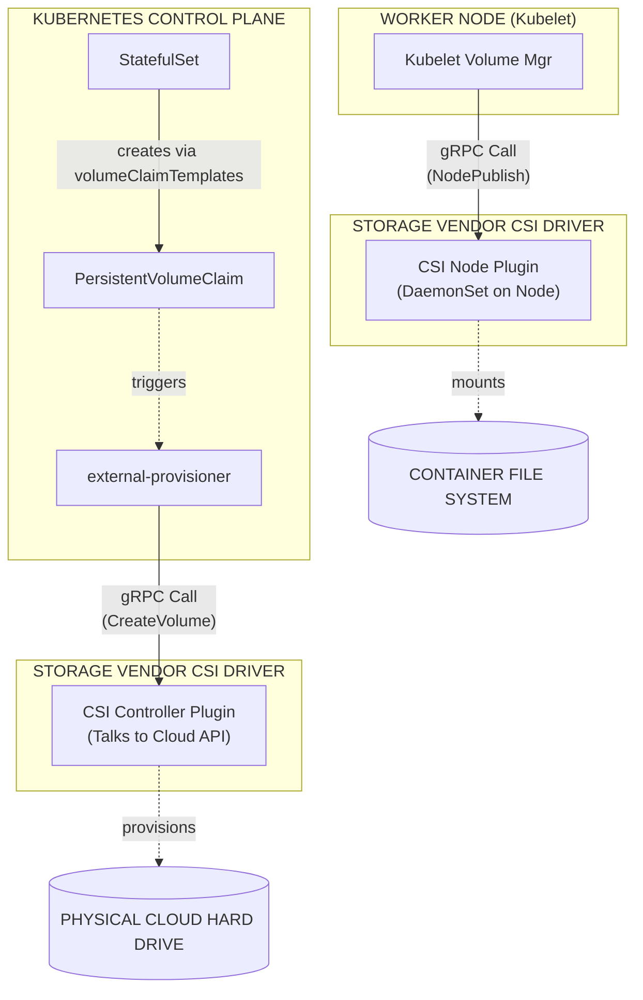

**Складність**: `[СЕРЕДНЯ]` — концепції сховища. **Час на проходження**: 45-60 хвилин. **Передумови**: Модуль 2.2 (Масштабування). Усі команди в цьому модулі передбачають Kubernetes 1.35 або новіший і використовують стандартне скорочення оболонки `alias k=kubectl`, тому `k get pods` означає той самий запит до API, що й довша команда, але зберігає приклади читабельними.

---

## Результати навчання

Після завершення цього модуля ви зможете:

1. **Спроєктувати** архітектуру персистентного сховища для станових робочих навантажень Kubernetes, порівнюючи поведінку блокового, файлового, об'єктного, ефемерного та персистентного сховища.
2. **Впровадити** динамічне виділення сховища за допомогою StorageClass та PersistentVolumeClaim, щоб створення томів відбувалося відповідно до потреб навантаження, а не через ручні черги заявок.
3. **Діагностувати** збої прив'язування сховища, невідповідності топології, обмеження прав доступу та конфлікти режимів доступу, які заважають Pod'ам запускатися.
4. **Порівняти** політики повторного використання Retain, Delete та застарілу Recycle, щоб виробничі дані були захищені під час виведення застосунку з експлуатації.
5. **Оцінити** обов'язки Container Storage Interface (CSI) та пояснити, як драйвери постачальників інтегруються з площиною управління Kubernetes та kubelet.

## Чому цей модуль важливий

**Гіпотетичний сценарій:** під час виснажливого відновлення бази даних інженер видаляє дані з не того вузла бази даних, намагаючись полагодити реплікацію, і великий обсяг виробничих даних зникає, перш ніж команда встигає зупинити шкоду. Команда витрачає години на відбудову з неповних резервних копій та пояснення клієнтам, чому платформа втратила частину власного стану. Публічні звіти про інциденти від реальних компаній повторюють саме цю форму достатньо часто, щоб вона стала канонічним уроком експлуатації.

Така невдача не потребує Kubernetes, щоб статися, але вона оголює ту саму незручну істину, з якою врешті-решт стикається кожен інженер платформи: обчислення можна замінити, а стан — ні. Безстановий вебпод може зникнути й повернутися деінде без драми, бо його корисні дані живуть за іншим API. Под бази даних, брокер повідомлень, пошуковий індекс чи реєстр артефактів не можуть ставитися до своїх локальних файлів як до одноразового чорнового простору. Якщо оркестратор видаляє Под, переносить його на інший вузол або витісняє під час навантаження, застосунку потрібен контракт сховища, який переживе життєвий цикл обчислень.

Оркестрація сховища Kubernetes — це набір абстракцій, які створюють той контракт. Складна частина — не запам'ятати назви PersistentVolume, PersistentVolumeClaim, StorageClass чи драйвер CSI; складна частина — передбачити, що станеться, коли вони взаємодіють із реальними доменами відмов, режимами доступу, політиками повторного використання та розміщенням на вузлах. До кінця цього модуля ви маєте вміти подивитися на застряглий Под бази даних, заявку в стані Pending чи ризиковану типову StorageClass та обміркувати операційний наслідок ще до того, як він стане виробничим інцидентом.

## Анатомія сховища Kubernetes: ефемерне проти персистентного

Контейнери запускаються з незмінних образів, але кожен запущений контейнер також отримує записуваний шар для файлів, які створюються вже після старту. Цей шар зручний для логів, тимчасових завантажень, PID-файлів та кешів, які за потреби можна перебудувати, проте він належить життєвому циклу контейнера й існує рівно стільки, скільки існує сам контейнер. Коли контейнер замінюють, цей шар відкидають разом із ним без жодного попередження. Kubernetes навмисно почувається комфортно, знищуючи й перестворюючи контейнери, бо саме так платформа лагодить нездорові навантаження, викочує нові версії застосунків та переносить роботу подалі від вузлів, що відмовляють або деградують.

Тому перша відмінність у сховищі — це не хмара проти локальної інфраструктури чи SSD проти мережевої файлової системи; це питання про те, чи мають дані пережити те, що їх записує. Том `emptyDir` переживає окремі перезапуски контейнерів усередині того самого Pod'а, бо том прив'язаний до пісочниці Pod'а, а не до одного контейнерного процесу. Це робить його корисним, коли sidecar читає файли, записані основним контейнером, або коли init-контейнер готує дані перед запуском застосунку. Це не робить дані довговічними, бо том усе одно зникає, коли об'єкт Pod видаляють із вузла.

Уявіть `emptyDir` як письмовий стіл у готельному номері. Ви можете лишити там блокнот, поки виходите в коридор, і інша людина, що ділить із вами номер, може його прочитати. Коли настає виселення, покоївка прибирає стіл для наступного гостя. Будівля готелю може ще стояти, але призначення номера завершилося, тож усе, що вважали частиною того призначення, зникло. Видалення Pod'а, зменшення масштабу, заміна після навантаження на вузол або перестворення контролером — це виселення Kubernetes із номера.

Персистентне сховище ламає цю межу. Замість прив'язки каталогу даних до Pod'а, Kubernetes прив'язує Под до об'єкта сховища, який може існувати ще до запуску Pod'а та після його загибелі. Том може бути хмарним блоковим диском, керованою мережевою файловою системою, LUN-ом масиву сховища або каталогом, виділеним через local-path у невеликому лабораторному кластері. Конкретний бекенд має значення для продуктивності та поведінки при відмові, але ключова ідея Kubernetes полягає в тому, що навантаження просить сховище через API й отримує монтування, життєвий цикл якого навмисно відокремлений від обчислювального процесу.



Зверніть увагу на обережне формулювання в персистентному шляху: Kubernetes не робить магічним чином кожен запис безпечним за будь-якої катастрофи. Він координує приєднання, монтування та планування з огляду на можливості бекенда сховища. Якщо бекенд — однозональний блоковий диск, дані можуть пережити видалення Pod'а, але все одно бути недоступними з іншої зони. Якщо бекенд — спільна файлова система, багато вузлів можуть її монтувати, але блокування файлів на рівні застосунку та затримка стають частиною дизайну. Персистентне сховище дає вам абстракцію, що виживає, а не безкоштовну заміну резервному копіюванню, реплікації чи коректності бази даних.

Зробіть паузу й передбачте: якщо Под використовує `hostPath` для монтування `/var/lib/app` безпосередньо з робочого вузла, що станеться, коли планувальник замінить цей Под на іншому вузлі? Відповідь має викликати незручне відчуття. Новий Под бачить файлову систему нового вузла, а не файли старого вузла, а отже `hostPath` прив'язує навантаження до конкретної машини тоді, коли Kubernetes намагається керувати пулом машин. Саме тому `hostPath` зазвичай резервують для агентів рівня вузла та суворо контрольованих компонентів платформи, а не для звичайних станових застосунків.

Корисний дизайн сховища починається з класифікації даних. Чорнові файли, буфери рендерингу та тимчасові каталоги розпакування часто можуть використовувати `emptyDir`, особливо коли застосунок може відтворити вміст після перезапуску. Каталоги даних бази даних, логи брокера, завантаження та згенеровані користувачами файли потребують персистентного сховища, бо бізнес дбає про байти після зникнення Pod'а. Великі статичні набори даних, файли моделей та спільні медіабібліотеки можуть потребувати спільного доступу для читання або читання-запису між багатьма вузлами, що змінює вибір бекенда ще до того, як ви напишете перший маніфест.

Пастка рівня KCNA — припустити, що том автоматично довговічний, бо він з'являється під `volumes:` у специфікації Pod'а. Том Kubernetes лише каже, як каталог стає доступним для контейнерів у Pod'і. Довговічність походить від типу тому та зовнішньої системи за ним. Саме тому той самий синтаксис `volumeMounts:` може представляти одноразовий чорновий простір, однонодовий блоковий пристрій або керовану розподілену файлову систему з реплікацією та знімками.

Ця відмінність також впливає на те, як ви читаєте документацію застосунку. Багато апстрім-проєктів кажуть «змонтуйте том сюди», не пояснюючи, чи містить цей шлях стан, кеш, конфігурацію чи згенерований вивід. Інженер платформи має перекласти цей шлях у рішення про життєвий цикл Kubernetes. Якщо шлях містить кеш, який можна перебудувати, ефемерне сховище може підійти. Якщо він містить єдину копію завантажень користувачів, самого PVC може бути недостатньо, бо застосунку можуть знадобитися хуки резервного копіювання, міграція до об'єктного сховища чи бекенд сховища, що підтримує поведінку з кількома записувачами.

Найбезпечніша звичка — провести межу життєвого циклу перед написанням YAML. Запитайте, що створює байти, хто ще їх читає, чи існує інша копія, як швидко змінюються дані та який наслідок для бізнесу, якщо каталог стане порожнім після перезапуску. Ці запитання звучать повільніше за копіювання маніфесту, але вони запобігають поширеному режиму відмови, коли кластер виглядає здоровим, а застосунок тихо втрачає стан, який робив його корисним.

## PersistentVolume та PersistentVolumeClaim

Kubernetes відокремлює володіння сховищем від споживання сховища за допомогою двох окремих об'єктів API. PersistentVolume, або PV, представляє актив сховища, який кластер уже має й може використати. PersistentVolumeClaim, або PVC, представляє запит застосунку на сховище з певними характеристиками. Цей поділ навмисний, бо командам платформи й командам застосунків потрібні різні рівні деталізації, і змішування цих рівнів зробило б обидві ролі складнішими. Команди платформи дбають про постачальників, зони доступності, класи дисків, шифрування, поведінку повторного використання та конфігурацію драйверів. Команди застосунків зазвичай дбають лише про місткість, режим доступу та назву, яку вони можуть змонтувати в Под, не заглиблюючись у деталі бекенда.

PersistentVolume має область видимості кластера, тобто він не живе всередині простору імен. Його може виділити вручну адміністратор або динамічно створити постачальник. У старіших статичних налаштуваннях адміністратори створювали PV заздалегідь, описуючи місткість, режими доступу, політику повторного використання та реалізацію, специфічну для бекенда. Наступний приклад показує цей стиль із застарілим in-tree полем AWS EBS; на Kubernetes 1.35 виробничі кластери AWS мають використовувати драйвер EBS CSI, але маніфест усе ще корисний для розуміння анатомії об'єкта PV, який трапляється в старіших середовищах.

```yaml
# Example: A static PersistentVolume definition
apiVersion: v1
kind: PersistentVolume
metadata:
  name: manual-database-disk-01
spec:
  capacity:
    storage: 100Gi                  # The absolute physical size of the disk
  volumeMode: Filesystem            # Formatted with a standard filesystem (ext4/xfs)
  accessModes:
    - ReadWriteOnce                 # Can only be mounted to a single node
  persistentVolumeReclaimPolicy: Retain # Do not delete data if the claim is removed
  storageClassName: manual-slow-hdd # The arbitrary class category
  awsElasticBlockStore:             # The underlying provider implementation
    volumeID: vol-0abcdef1234567890
    fsType: ext4
```

PersistentVolumeClaim має область видимості простору імен, тобто Под-споживач та заявка мають бути в одному просторі імен. PVC — це не диск; це запит, який каже, по суті: «знайди або створи сховище, що задовольняє ці обмеження». Площина управління порівнює заявку з доступними PV, перевіряючи місткість, режим доступу, клас сховища, режим тому та вимоги селектора. Коли знайдено сумісний PV, Kubernetes прив'язує заявку й том у взаємозв'язку «один до одного».

```yaml
# Example: A user's PersistentVolumeClaim
apiVersion: v1
kind: PersistentVolumeClaim
metadata:
  name: database-storage-claim
  namespace: production             # PVCs strictly belong to a namespace
spec:
  accessModes:
    - ReadWriteOnce                 # Must match the PV's capabilities
  resources:
    requests:
      storage: 50Gi                 # The minimum acceptable size
  storageClassName: manual-slow-hdd # Must explicitly match the PV's class
```

Цей зв'язок «один до одного» — одне з найважливіших правил у діагностиці сховища. Якщо PVC просить 50Gi, а єдиний відповідний PV — 100Gi, Kubernetes може прив'язати заявку до більшого тому, але залишкова місткість не повертається до спільного пулу для іншої заявки. Увесь PV стає виділеним для цього єдиного PVC. Це дивує команди, що приходять із файлових систем, де багато каталогів ділять один диск, але Kubernetes розглядає PV як одиницю виділення.

Статичне виділення корисне, коли актив сховища вже існує й має бути збережений, як-от відновлений диск бази даних, криміналістична копія чи вручну підготовлений том зі спеціальним обробленням для відповідності вимогам. Воно погано масштабується як звичайний робочий процес розробника, бо хтось має створити достатньо PV правильного розміру, класу, зони та політики ще до того, як застосунки їх запросять. На завантаженій платформі це перетворюється на чергу заявок, замасковану під інфраструктуру-як-код, і кожна невідповідність проявляється як PVC у стані Pending, що блокує розгортання.

Перед запуском цього в лабораторії, який вивід ви очікували б від `k get pvc database-storage-claim -n production`, якщо жоден PV не відповідає `manual-slow-hdd`? Заявка лишається в стані `Pending`, а `k describe pvc` показує події, що пояснюють: немає доступних персистентних томів для заявки й жодна StorageClass не може динамічно її задовольнити. Цей потік подій зазвичай корисніший за вдивляння в YAML, бо він каже, яка частина контракту відповідності зазнала невдачі.

Зв'язок між Pod'ом та PVC простий у маніфесті, але суворий у виконанні. Под посилається на заявку за назвою під `volumes:`, і кожен контейнер монтує цей том за обраним шляхом. Kubelet на обраному вузлі координується з плагіном тому або компонентом CSI node, щоб приєднати, відформатувати за потреби, змонтувати та відкрити сховище в просторі імен контейнера. Якщо будь-який крок зазнає невдачі, Под може лишатися в стані `Pending` чи `ContainerCreating`, поки події згадують помилки приєднання, помилки монтування чи конфлікти режимів доступу.

Ця суворість корисна, бо перетворює сховище на придатний для аудиту контракт API. Ви можете оглянути заявку, побачити, з яким томом вона прив'язалася, перевірити клас, що сформував виділення, та простежити події від планувальника до вузла. Без цих об'єктів невдале монтування було б локальною загадкою всередині однієї машини. З ними кластер лишає слід, що пояснює, чи проблема — у нестачі місткості, неправильному просторі імен, збої драйвера, невідповідності топології чи небезпечному приєднанні, яке Kubernetes відмовився виконати.

## Динамічне виділення та StorageClass

Динамічне виділення усуває потребу адміністраторам наперед вручну створювати кожен окремий PV. Натомість адміністратор один раз визначає набір StorageClass, що описують доступні пропозиції сховища, а застосунки потім запитують один із цих класів через свої PVC. StorageClass — це посилання на політику й драйвер, а не сам том як такий. Він каже, який постачальник має створити сховище, які параметри бекенда при цьому використати, чи дозволено подальше розширення, як має поводитися повторне використання після видалення заявки та коли саме фізичний том має прив'язатися відносно планування Pod'а.

```yaml
# Example: A dynamic StorageClass definition
apiVersion: storage.k8s.io/v1
kind: StorageClass
metadata:
  name: extreme-performance-ssd
provisioner: ebs.csi.aws.com        # The driver responsible for API calls
parameters:
  type: io2                         # Cloud provider specific parameter
  iopsPerGB: "50"                   # Guaranteed IOPS performance
reclaimPolicy: Retain               # Protect the data
allowVolumeExpansion: true          # Allow resizing the disk later
volumeBindingMode: WaitForFirstConsumer # Crucial for multi-zone clusters
```

StorageClass — це місце, де намір платформи стає видимим. Клас із назвою `extreme-performance-ssd` не має бути лише гарним ярликом; він має відображати бекенд із продуктивністю, довговічністю, вартістю та операційними політиками, що виправдовують назву. У зрілому кластері ви можете побачити дешевий клас для одноразових робочих просторів CI, збережений зашифрований клас для виробничих баз даних та клас спільної файлової системи для бібліотек контенту. Кожен клас дає змогу маніфестам застосунків виражати намір, не вбудовуючи специфічних для постачальника викликів API.

Динамічний конвеєр починається, коли PVC посилається на StorageClass. Якщо відповідного статичного PV ще не існує, зовнішній постачальник, пов'язаний із цим класом, просить бекенд сховища створити новий том. Після того як бекенд повертає ідентифікатор тому, постачальник створює об'єкт PV, що вказує на нове сховище, та прив'язує його до заявки, що чекає. З погляду розробника, заявка змінилася зі стану Pending на Bound; за цим невеликим переходом стану платформа створила реальну інфраструктуру.

Ця автоматизація достатньо потужна, щоб бути небезпечною. Розробник, що видаляє й перестворює простір імен, може запустити створення й знищення сховища залежно від політики повторного використання. Друкарська помилка в `storageClassName` може лишити навантаження заблокованим, бо постачальник так і не отримує дійсного запиту. Типова StorageClass може випадково перехопити заявки, що забули вказати клас, що зручно для демонстрацій, але ризиковано для виробництва, якщо типовий клас використовує дешеві диски, неправильну зональну поведінку чи деструктивне очищення.

Найтонше поле StorageClass для розподілених кластерів — `volumeBindingMode`. З `Immediate` виділення відбувається щойно створено PVC. Це нормально, коли бекенд не обмежений топологією, але багато систем блокового сховища прив'язані до зони. Якщо диск створено в Зоні B до того, як планувальник обрав вузол, а Pod'у пізніше потрібен GPU, що існує лише в Зоні A, навантаження не може запуститися, бо диск не може приєднатися між зонами.

`WaitForFirstConsumer` відкладає виділення, доки не буде заплановано Под, що використовує заявку. Планувальник враховує запити ресурсів Pod'а, спорідненість, обмеження-taint, обмеження топології та PVC разом, а потім постачальник створює том у місці, сумісному з обраним вузлом. Це єдине поле перетворює виділення сховища зі сліпої дії «перший прийшов» на скоординоване рішення про планування. Для багатозональних кластерів це зазвичай безпечніший типовий вибір для класів блокового сховища.

Зупиніться й подумайте: якщо PVC використовує клас `WaitForFirstConsumer`, але жоден Под ніколи не посилається на цей PVC, чи має хмарний диск уже існувати? У коректному потоці пізнього прив'язування заявка може лишатися в стані Pending без створення оплачуваного фізичного тому, бо немає першого споживача. Цей стан Pending не є автоматично невдачею; це система сховища, що чекає на контекст планування.

Розширення тому — ще одна можливість динамічного виділення, що потребує операційної дисципліни. StorageClass із `allowVolumeExpansion: true` дає користувачу збільшити запитаний розмір на наявному PVC. Kubernetes може скоординувати зміну розміру бекенда та розширення файлової системи для підтримуваних драйверів, але зменшення не є звичайним шляхом, бо файлові системи й блокові пристрої не безпечно відкидають місткість за вимогою. Ставтеся до розширення як до запланованої дії з обслуговування для важливих навантажень, навіть коли API робить редагування YAML легким на вигляд.

Практична послідовність налагодження починається із заявки, а потім слідує ланцюжком назовні. Виконайте `k get pvc -A`, щоб знайти заявки в стані Pending, `k describe pvc <name> -n <namespace>`, щоб прочитати події прив'язування, `k get storageclass`, щоб підтвердити існування класу, та `k describe storageclass <name>`, щоб оглянути постачальника, політику повторного використання й режим прив'язування. Якщо заявка прив'язана (Bound), але Под застряг, перейдіть до `k describe pod` та шукайте події приєднання чи монтування від kubelet і компонентів CSI.

Типові StorageClass заслуговують на особливий огляд під час онбордингу платформи. Багато кластерів позначають одну StorageClass як типову, щоб PVC без `storageClassName` усе одно отримав виділення. Це дружньо для навчальних посібників, але може приховати важливі рішення у виробництві, бо команда застосунку може не усвідомлювати, яку політику повторного використання, режим прив'язування, налаштування шифрування чи рівень продуктивності вона успадкувала. Зріла платформа зазвичай прямо документує типовий клас, обмежує, хто може створювати нові класи, та використовує політику допуску або стандарти огляду для навантажень, що потребують утримання виробничого рівня.

Динамічне виділення також слід тестувати під тиском квот, а не лише на щасливому шляху створення. Хмарні акаунти та масиви сховища мають ліміти на загальну кількість томів, місткість, IOPS, знімки й приєднання. Якщо постачальник не може створити ще один диск, PVC лишається в стані Pending, і застосунок ніколи не запускається, навіть якщо маніфест синтаксично коректний. Саме тому спостережуваність сховища має включати помилки постачальника, дашборди квот бекенда та оповіщення про заявки, що лишаються в стані Pending довше за очікуване вікно виділення.

## Режими доступу, політики повторного використання та поведінка при відмові

Режими доступу описують, як том може монтуватися вузлами, а не скільки контейнерів можуть бачити змонтований шлях усередині одного Pod'а — це поширене джерело плутанини. `ReadWriteOnce` дозволяє монтувати том для читання-запису лише одним вузлом за раз. Кілька Pod'ів на тому самому вузлі можуть мати змогу використовувати той самий RWO-том залежно від навантаження й контролера, але інший вузол не може приєднати його одночасно за жодних умов. Саме тому RWO природно підходить для багатьох баз даних на блоковому сховищі та погано підходить для спільних вебзавантажень, розкиданих між репліками на різних вузлах.

`ReadOnlyMany` дозволяє багатьом вузлам монтувати том лише для читання. Це корисно для статичних наборів даних, спільних активів застосунку чи файлів моделей, які багато воркерів мають читати без змін. `ReadWriteMany` дозволяє багатьом вузлам монтувати той самий том для читання-запису, що потребує бекенда, побудованого для розподіленого файлового доступу та блокування, як-от NFS, CephFS чи керована хмарна файлова система. Стандартне блокове сховище не є спільною файловою системою; представлення одного сирого диска кільком ядрам як записуваного — це шлях до пошкодження.

`ReadWriteOncePod` суворіший за RWO, бо обмежує доступ для читання-запису одним Pod'ом у всьому кластері. Це має значення, коли вимога безпеки чи коректності — «один активний записувач-Под», а не просто «один активний записувач-вузол». У кластерах епохи Kubernetes 1.35 із підтримуваними драйверами CSI режим RWOP може захищати навантаження, де два Pod'и на тому самому вузлі не повинні випадково ділити той самий каталог даних. Це корисний режим для станових застосунків із одним записувачем, що потребують суворішого примусового виконання планування.

Політика повторного використання відповідає на інше питання: що має статися з базовим сховищем, коли PVC видаляють? `Delete` видаляє PV і просить бекенд видалити фізичне сховище. Це ефективно для тимчасових середовищ, робочих просторів CI та кешів, що мають очищатися самі. Це неприйнятно як неперевірений типовий вибір для критичних виробничих баз даних, бо звичайне видалення заявки може перетворитися на видалення диска на рівні постачальника.

`Retain` зберігає базове сховище після видалення заявки. PV переходить у стан Released, і адміністратор має оглянути, зробити резервну копію, очистити або вручну переприв'язати актив перед повторним використанням. Це повільніше й вимагає більше ручної праці, але створює людську контрольну точку навколо цінних даних. У реальному реагуванні на інциденти ця контрольна точка часто є різницею між «ми випадково видалили об'єкт застосунку» та «ми випадково знищили єдину копію даних».

`Recycle` — це застаріла поведінка, і її слід розглядати як історичний контекст, а не сучасний вибір дизайну. Вона намагалася очистити том і повернути його до доступності, але сучасні кластери зазвичай надають перевагу видаленню й перестворенню сховища або використанню явних адміністративних робочих процесів. Для цілей KCNA пам'ятайте: Retain захищає, Delete очищає, а Recycle — це застаріла, виведена з ужитку поведінка, яку не слід обирати для нових дизайнів.

Збої сховища часто виглядають як збої планування, бо Под є видимим симптомом. Под може лишатися в стані Pending, бо його заявка не прив'язана (Bound), або він може ввійти в стан ContainerCreating, бо заявка прив'язана, але kubelet не може приєднати чи змонтувати том. Події — це карта. Якщо події згадують «unbound immediate PersistentVolumeClaims», дослідіть прив'язування PVC та StorageClass. Якщо вони згадують помилки кількох приєднань (multi-attach), дослідіть режим доступу, наявні приєднання та чи попередній Под або вузол звільнив диск.

Розгляньте виробничу базу даних, що працює як StatefulSet на `Node-Alpha`. Збій мережі ізолює цей вузол від площини управління, тож Kubernetes позначає його як NotReady та намагається підтримати доступність, створюючи заміну Pod'а для `Node-Bravo`. Новий Под не може запуститися, бо хмарний постачальник усе ще бачить RWO-диск приєднаним до `Node-Alpha`. З погляду постачальника, примусове приєднання диска деінде могло б створити записи з розщепленим розумом (split-brain), якщо `Node-Alpha` живий, але розділений мережею.

Kubernetes відстежує цей фізичний зв'язок через об'єкт `VolumeAttachment` для томів, керованих CSI. Площина управління, контролер приєднання-відключення, kubelet та драйвер CSI співпрацюють, щоб гарантувати, що диск відключено перед його приєднанням деінде. Ця обережність може дратувати під час збою, але вона захищає файлову систему від двох ядер, що пишуть на той самий блоковий пристрій. Ручне примусове відключення іноді необхідне, але воно має відбуватися лише після того, як оператор підтвердить, що старий вузол точно не може все ще писати.

Права доступу створюють ще один клас збоїв сховища, що виглядає інакше за прив'язування, але такий самий поширений. Том може приєднатися й змонтуватися успішно, тоді як процес контейнера не може писати, бо володіння файловою системою, контекст безпеки, мітки SELinux чи параметри монтування драйвера не збігаються з користувачем виконання образу. У таких випадках Под може запуститися, а логи застосунку показують помилки прав доступу, а не події Kubernetes. Виправлення належить до контексту безпеки навантаження, дизайну образу чи параметрів монтування класу сховища, а не до повторюваного видалення й перестворення заявки.

Для станових навантажень найкраща позиція в реагуванні на інциденти — ставитися до подій сховища як до сигналів цілісності даних, а не просто шуму доступності. Помилка кількох приєднань, тайм-аут монтування чи невдале відключення можуть захищати вас від пошкодження, а не просто блокувати ваше розгортання. Сповільніться, перш ніж їх перевизначати. Підтвердьте, який вузол писав останнім, чи може застосунок відновитися після нечистого вимкнення, чи слід спочатку зробити знімок та чи описує документація драйвера підтримуваний шлях примусового відключення.

Який підхід ви обрали б для бази даних платежів: динамічно виділений клас із `Delete` чи збережений клас із явними процедурами відновлення? Збережений клас повільніший в очищенні, але він кодує цінність даних у платформу. Зручність очищення мало чого варта, якщо невдалий запуск конвеєра може видалити сховище, що підтримує регульовану систему.

## Container Storage Interface (CSI)

Ранні інтеграції сховища Kubernetes були in-tree, тобто специфічний для постачальника код сховища жив безпосередньо всередині основного дерева вихідного коду Kubernetes та підпорядковувався його процесу релізу. Це створювало проблему обслуговування одразу для всіх сторін. Постачальники сховища мусили чекати на чергові релізи Kubernetes, щоб випустити навіть невеликі зміни драйверів, супровідники Kubernetes мусили рецензувати спеціалізований код постачальника, на якому не спеціалізувалися, а користувачі успадковували поведінку сховища, прив'язану до оновлень кластера, а не до незалежних оновлень драйверів. Така модель просто не масштабувалася з кількістю хмар, масивів, файлових систем та інструментів резервного копіювання, що хотіли інтегруватися з платформою.

CSI вирішує це, визначаючи стандартний інтерфейс між оркестраторами контейнерів та системами сховища. Kubernetes може викликати зовнішні компоненти CSI через чітко визначені операції, як-от створення тому, приєднання його до вузла, публікація його в Под, розширення чи створення знімка, коли це підтримується. Основній площині управління більше не потрібне вбудоване знання про кожного постачальника сховища. Їй потрібно координувати об'єкти API та викликати драйвер, що володіє бекендом.



Типове розгортання CSI має компоненти з боку контролера та компоненти з боку вузла. Плагін контролера обробляє операції рівня бекенда, як-от виділення нового диска, його видалення, приєднання його до вузла, відключення та координацію знімків. Він зазвичай працює як Deployment чи StatefulSet із sidecar'ами, як-от зовнішній постачальник, приєднувач, інструмент зміни розміру чи інструмент знімків, залежно від можливостей драйвера. Ці sidecar'и спостерігають за об'єктами API Kubernetes та перекладають зміни стану на виклики CSI.

Плагін вузла працює на кожному робочому вузлі, зазвичай як DaemonSet, бо кожному вузлу потрібен локальний привілейований код, що може монтувати пристрої у файлову систему хоста. Коли планувальник розміщує Под на вузлі, kubelet просить локальний плагін CSI node опублікувати том. Цей крок може включати виявлення пристрою, його форматування за потреби, монтування його за проміжним шляхом та bind-монтування його в простір імен контейнера Pod'а. Застосунок бачить каталог; плагін вузла виконав роботу рівня хоста, потрібну, щоб зробити цей каталог реальним.

CSI також робить можливості сховища більш модульними. Знімки томів, розширення, клонування та обізнаність про топологію можуть підтримуватися драйверами, що реалізують відповідні частини специфікації та розгортають необхідні sidecar'и. Це не означає, що кожен драйвер CSI підтримує кожну можливість. Інженер платформи має прочитати документацію драйвера, протестувати поведінку в кластері та відкрити лише ті StorageClass, що відповідають вимогам організації до надійності й безпеки.

Діагностуючи том на основі CSI, слідуйте межі відповідальності. Якщо PVC ніколи не стає прив'язаним (Bound), огляньте StorageClass, постачальника та логи з боку контролера. Якщо PV прив'язаний, але Под не може його змонтувати, огляньте події Pod'а, логи плагіна вузла та об'єкти `VolumeAttachment`. Якщо об'єкт знімка ніколи не стає готовим, огляньте контролер знімків та підтримку драйвера. CSI дає вам чистіші точки інтеграції, але також дає більше компонентів, чий стан має значення.

## Патерни й антипатерни

Один надійний патерн — проєктувати StorageClass як рівні обслуговування, а не як дрібниці постачальника. Клас із назвою `prod-retained-rwo` чи `shared-rwx` повідомляє поведінку командам застосунків краще за назву, скопійовану з SKU хмарного диска. Команда платформи все одно може налаштовувати параметри постачальника під капотом, але маніфест застосунку виражає операційний контракт: утримання, модель спільного доступу, режим прив'язування, розширення та очікуваний тип навантаження.

Інший сильний патерн — використовувати StatefulSet із `volumeClaimTemplates` для реплікованих станових застосунків. Кожна репліка отримує власну стабільну заявку, а ідентичність Pod'а збігається з ідентичністю його сховища. Це підходить таким системам, як бази даних, черги та члени консенсусу, де кожна репліка володіє відмінними даними. Це також уникає помилки змусити кілька реплік боротися за одну RWO-заявку, що зазвичай зазнає невдачі під час планування чи руйнує припущення під час роботи застосунку.

Третій патерн — поєднувати політики Retain із задокументованими ранбуками відновлення. Сам по собі Retain не є планом резервного копіювання; він лише запобігає автоматичному видаленню. Ранбук має пояснювати, хто може переприв'язати том у стані Released, як перевірити дані, як зробити знімок перед спробами ремонту та як очистити сховище перед повторним використанням. Без цієї процедури збережені PV накопичуються як заплутані залишки, і оператори можуть видалити їх пізніше, не розуміючи їхньої цінності.

Поширений антипатерн — ставитися до PVC так, ніби це портативний глобальний диск. Заявка має область видимості простору імен, прив'язана до одного PV та обмежена режимами доступу й топологією бекенда. Копіювання маніфесту Pod'а в інший простір імен без створення там заявки зазнає невдачі. Переміщення навантаження між зонами може зазнати невдачі, якщо том живе в іншій зоні. Спільне використання одного набору даних між командами може потребувати спільної файлової системи чи об'єктного сховища, а не одного блокового PV.

Інший антипатерн — використовувати динамічне виділення як виправдання, щоб ігнорувати вартість та квоти. StorageClass можуть створювати реальні диски за секунди, і ці диски можуть зберігатися після того, як навантаження забуто, залежно від політики повторного використання. Хмарні постачальники також примусово застосовують ліміти приєднань, ліміти пропускної здатності та регіональні обмеження. Кластер із багатьма малими RWO-томами може вичерпати слоти приєднання на вузол раніше, ніж вичерпає CPU, через що збої планування з'являються навіть тоді, коли обчислювальна місткість виглядає здоровою.

Останній антипатерн — розв'язувати реплікацію на рівні застосунку спільним використанням томів Kubernetes. RWX-сховище може дозволити кільком Pod'ам писати в той самий каталог, але воно не перетворює застосунок на безпечну розподілену систему. Бази даних, брокери та індекси все одно потребують власної моделі узгодженості, поведінки блокування та дизайну відновлення. Використовуйте спільне сховище там, де застосунок очікує спільну файлову систему, а не як обхідний шлях навколо належного кластерування.

## Рамка прийняття рішень

Блокове, файлове та об'єктне сховище відповідають на принципово різні питання, навіть коли всі три з'являються разом на одній діаграмі платформи. Блокове сховище (типові RWO хмарні диски) дає одному Pod'у виділений шлях монтування на основі єдиного пристрою; воно найкраще підходить базам даних та чергам, яким потрібен швидкий ввід-вивід із низькою затримкою близько до самого навантаження. Файлове сховище (RWX NFS, EFS чи подібне) відкриває спільний каталог, який можуть монтувати багато Pod'ів, що підходить бібліотекам контенту й кешам збірки, коли застосунок очікує семантику POSIX. Об'єктне сховище (S3, GCS, Azure Blob) використовує HTTP API для блобів та ключів; Kubernetes не монтує об'єктні бакети як стандартні томи Pod'а, тож безстанові застосунки зазвичай викликають API з коду застосунку, коли їм потрібні довговічні артефакти без прив'язки даних до конкретного вузла.

Почніть рішення про сховище з питання, чи мають дані пережити видалення Pod'а. Якщо відповідь — ні, використовуйте ефемерне сховище, як-от `emptyDir`, і обмежуйте місткість, щоб диски вузлів не стали випадковими звалищами. Якщо відповідь — так, запитайте, чи потрібна рівно одному записувачу високопродуктивна блокова семантика, чи багатьом читачам потрібен той самий незмінний вміст, чи багатьом записувачам потрібна спільна файлова система. Цей патерн доступу звужує бекенд ще до того, як у розмову входить місткість чи ціна.

Для баз даних та черг з одним записувачем обирайте клас RWO чи RWOP на основі надійного драйвера блокового сховища, використовуйте `WaitForFirstConsumer` у кластерах, обмежених топологією, та встановлюйте політику повторного використання відповідно до цінності даних. Для спільних медіабібліотек, завантажень систем керування контентом та каталогів артефактів збірки обирайте файлову систему з підтримкою RWX та тестуйте блокування застосунку під одночасними записами. Для великих незмінних наборів даних чи публічних активів об'єктне сховище може бути чистішою архітектурою, навіть якщо Kubernetes може змонтувати файлову систему, бо об'єктні API часто краще масштабуються для розповсюдження та керування життєвим циклом.

Далі вирішіть, скільки автоматизації слід дозволити під час видалення. Простори імен розробки часто виграють від `Delete`, бо застарілі томи марнують гроші й сповільнюють експерименти. Виробничі системи зазвичай заслуговують на `Retain`, знімки, інтеграцію резервного копіювання та явний робочий процес виведення з експлуатації. Найкращий вибір — не той, що має найменше полів YAML; це той, де життєвий цикл сховища відповідає наслідку втрати даних.

Нарешті, вирішіть, які докази ви використаєте, коли щось піде не так. Стан PVC каже, чи вдалося прив'язування. Події Pod'а кажуть, чи зазнало невдачі планування, приєднання чи монтування. Поля StorageClass кажуть, чи відповідають дизайну пізнє прив'язування, повторне використання, розширення та вибір постачальника. Логи CSI та об'єкти `VolumeAttachment` кажуть, чи завершили бекенд та плагіни вузла свою частину контракту. Хороший дизайн сховища включає цей діагностичний шлях ще до першого інциденту.

## Чи знали ви?

- У Kubernetes 1.23 міграція CSI для кількох основних in-tree плагінів (AWS EBS, GCE PD, Azure Disk) досягла стану beta з увімкненням за замовчуванням; основна можливість CSI Migration перейшла в стан GA у Kubernetes 1.25, що позначило важливий крок від коду постачальника, скомпільованого в основні бінарні файли Kubernetes.
- Інстанси AWS EC2 на основі Nitro документують практичну стелю приєднань EBS у 28 томів для багатьох сімейств інстансів, причому кореневий том зараховується до цього ліміту.
- Kubernetes 1.20 представив стабільну підтримку API VolumeSnapshot, що дало постачальникам резервного копіювання нативний для Kubernetes спосіб координувати копії сховища на момент часу через драйвери CSI.
- `ReadWriteOncePod` досяг стабільного статусу в Kubernetes 1.29, давши підтримуваним драйверам CSI суворіший режим запису одним Pod'ом, ніж класичне приєднання на рівні вузла ReadWriteOnce.

## Типові помилки

| Помилка | Чому вона трапляється | Як її виправити |
|---------|----------------|---------------|
| **Використання `emptyDir` для баз даних** | Команди бачать, що файли переживають перезапуск контейнера, і припускають, що сховище довговічне між видаленнями Pod'а. | Використовуйте PersistentVolumeClaim для стану, що має пережити перепланування, а `emptyDir` резервуйте для чорнових даних. |
| **Припущення, що блокове сховище підтримує RWX** | Один диск виглядає як спільна місткість, тож інженери очікують, що багато вузлів безпечно його монтуватимуть. | Використовуйте файлову систему з підтримкою RWX, як-от NFS, CephFS чи керовану хмарну файлову систему, коли багатьом вузлам потрібні записи. |
| **Ігнорування `volumeBindingMode`** | Заявка прив'язується до того, як планувальник знає, яка зона чи вузол можуть запустити Под. | Надавайте перевагу `WaitForFirstConsumer` для блокового сховища, обмеженого топологією, у багатозональних кластерах. |
| **Залишення виробничих класів на `Delete`** | Приклади динамічного виділення оптимізують очищення й випадково стають виробничими типовими налаштуваннями. | Використовуйте `Retain` для цінних даних та документуйте ручний робочий процес відновлення й очищення. |
| **Монтування PVC з неправильного простору імен** | Команди копіюють маніфести Pod'ів між просторами імен і забувають, що PVC мають область видимості простору імен. | Створюйте PVC у тому самому просторі імен, що й Под-споживач, або явно перепроєктуйте межу спільного доступу. |
| **Ставлення до Retain як до резервної копії** | Retain запобігає автоматичному видаленню, але не створює іншої копії й не перевіряє відновлюваність. | Поєднуйте Retain зі знімками, резервними копіями, тестами відновлення та процесом володіння для томів у стані Released. |
| **Пропуск перевірок можливостей драйвера CSI** | Інженери припускають, що кожен драйвер CSI однаково підтримує знімки, розширення, топологію та RWOP. | Прочитайте документацію драйвера, протестуйте необхідні можливості та відкривайте StorageClass лише для підтримуваної поведінки. |

## Тест

<details><summary>Запитання 1: Команда зберігає дані PostgreSQL у томі `emptyDir`, бо файли переживають аварійні завершення контейнера під час локальних тестів. Після того як розгортання масштабує Под до нуля й назад до одного, база даних порожня. Діагностуйте помилку та назвіть безпечніший об'єкт сховища Kubernetes.</summary>

Команда сплутала виживання при перезапуску контейнера з виживанням при життєвому циклі Pod'а. `emptyDir` може пережити перезапуски контейнерів усередині того самого Pod'а, але Kubernetes видаляє каталог, коли сам Под прибрано з вузла. Базі даних потрібне сховище, чий життєвий цикл незалежний від Pod'а, тож безпечніший об'єкт — це PersistentVolumeClaim на основі відповідного PersistentVolume. Виправлення — не просто «використати том»; це використати тип персистентного тому з політикою повторного використання та резервного копіювання, що підходить даним бази даних.

</details>

<details><summary>Запитання 2: Ваш сервіс обробки зображень працює на дванадцяти репліках у трьох зонах, і кожна репліка має читати й писати в той самий каталог завантажених медіа. Команда пропонує один RWO хмарний блоковий диск, бо він швидкий. Оцініть цей дизайн.</summary>

Дизайн не відповідає патерну доступу. RWO блокове сховище може монтуватися для читання-запису одним вузлом, тож репліки на кількох вузлах не можуть усі безпечно писати на цей диск. Навантаженню потрібна спільна файлова система з підтримкою RWX або переробка, що зберігає завантажені об'єкти в об'єктному сховищі й тримає Pod'и безстановими. Правильна відповідь залежить від семантики застосунку, але один RWO-диск не є безпечним спільним каталогом для багатьох вузлів.

</details>

<details><summary>Запитання 3: Видалення виробничого простору імен прибирає PVC, і хмарний диск також зникає. Яке налаштування StorageClass дозволило це, і як би ви змінили виробничий клас?</summary>

StorageClass використовувала `reclaimPolicy: Delete`, явно чи через типове налаштування, яке ніколи не переглядали для виробництва. З Delete видалення заявки каскадно поширюється на PV та інструктує бекенд видалити фізичне сховище. Для виробничих даних створіть або оберіть клас із `reclaimPolicy: Retain`, потім додайте ранбук для огляду, створення знімків, переприв'язування чи видалення томів у стані Released. Retain не є заміною резервним копіям, але створює критичну ручну контрольну точку.

</details>

<details><summary>Запитання 4: Под із GPU може працювати лише в Зоні A, але його PVC уже виділено як блоковий диск у Зоні B. Под лишається в стані Pending, навіть попри те, що в кластері є вільні CPU й пам'ять. Яка поведінка StorageClass спричинила невідповідність?</summary>

StorageClass, імовірно, використовувала `volumeBindingMode: Immediate`, тож фізичний диск було створено до того, як планувальник обрав вузол для Pod'а. У бекенді, обмеженому зонами, це раннє рішення може розмістити диск там, де майбутній Под не може його використати. Виправлення — використати `WaitForFirstConsumer` для цього класу, дозволивши планувальнику спочатку обрати сумісний вузол, а потім виділяти диск у відповідній топології. Наявні невідповідні томи можуть потребувати міграції чи перестворення залежно від цінності даних.

</details>

<details><summary>Запитання 5: Под-заміна StatefulSet застряг у стані ContainerCreating після того, як його старий вузол став NotReady. Події згадують помилку кількох приєднань (multi-attach) для тому. Що слід оглянути, перш ніж щось примусово робити?</summary>

Огляньте події Pod'а, стан старого вузла, прив'язані PV та PVC, а також будь-який об'єкт `VolumeAttachment`, пов'язаний із томом. Бекенд сховища може все ще вважати, що RWO-диск приєднано до старого вузла, і Kubernetes уникає приєднання його деінде, бо одночасні записувачі могли б пошкодити файлову систему. Перед ручним примусовим відключенням оператор має переконатися, що старий вузол справді вимкнено чи нездатний писати. Примусове відключення — це дія відновлення з ризиком цілісності даних, а не звичайне скорочення для планування.

</details>

<details><summary>Запитання 6: PVC у стані Pending із StorageClass, що використовує `WaitForFirstConsumer`, але жоден Под ще не посилається на заявку. Чи є стан Pending автоматично несправністю?</summary>

Ні, сам по собі — ні. З `WaitForFirstConsumer` постачальник чекає, доки не з'явиться Под-споживач, щоб планувальник міг урахувати обмеження вузла й топології. Заявка може лишатися в стані Pending, бо Kubernetes навмисно ще не має контексту розміщення, і фізичний диск могло бути не створено. Це стає несправністю, коли Под таки посилається на заявку, а події показують, що планування чи виділення все одно не може завершитися.

</details>

<details><summary>Запитання 7: Придбаний кластер усе ще використовує застарілі in-tree плагіни сховища, і керівництво ставить під сумнів цінність міграції CSI. Наведіть технічний аргумент на користь переходу до драйверів на основі CSI.</summary>

CSI відокремлює цикли релізу драйверів сховища від релізів ядра Kubernetes. Постачальники можуть латати драйвери, додавати можливості та підтримувати специфічну для бекенда поведінку через зовнішні компоненти, замість того щоб чекати, поки зміни потраплять усередину самого Kubernetes. Архітектура також прояснює відповідальності між виділенням з боку контролера та монтуванням з боку вузла, що покращує діагностику та розробку можливостей. Міграція зменшує довгостроковий операційний ризик, але її слід планувати й тестувати, бо зміни сховища впливають на найцінніші навантаження в кластері.

</details>

## Практична вправа

У цій вправі ви побудуєте невеликий потік динамічного виділення, спожиєте заявку з Pod'а та доведете, що дані переживають видалення обчислень. Лабораторія використовує постачальник `rancher.io/local-path`, поширений у легких кластерах, як-от k3s та деяких локальних середовищах; якщо ваш кластер використовує інший типовий постачальник, збережіть навчальну мету, але змініть назву постачальника на ту, що існує у вашому середовищі. Важлива поведінка — це пізнє прив'язування, прив'язування PVC, монтування Pod'а, персистентність між замінами Pod'а та очищення за політикою повторного використання.

### Завдання 1: Визначте основу сховища

Створіть `StorageClass` із назвою `local-delayed`. Налаштуйте його на використання постачальника `rancher.io/local-path` та `WaitForFirstConsumer`, щоб том не виділявся, доки Под його не потребує.

<details>
<summary>Розв'язання</summary>

```yaml
# storageclass.yaml
apiVersion: storage.k8s.io/v1
kind: StorageClass
metadata:
  name: local-delayed
provisioner: rancher.io/local-path
volumeBindingMode: WaitForFirstConsumer
reclaimPolicy: Delete
```
Застосуйте через: `k apply -f storageclass.yaml`
</details>

### Завдання 2: Заявіть сховище

Напишіть `PersistentVolumeClaim` із назвою `web-content-claim`, що запитує рівно 2Gi сховища. Він має вказувати `ReadWriteOnce` та явно посилатися на StorageClass `local-delayed`. Після застосування перевірте його стан через `k get pvc web-content-claim`.

<details>
<summary>Розв'язання</summary>

```yaml
# pvc.yaml
apiVersion: v1
kind: PersistentVolumeClaim
metadata:
  name: web-content-claim
spec:
  accessModes:
    - ReadWriteOnce
  resources:
    requests:
      storage: 2Gi
  storageClassName: local-delayed
```
Застосуйте через: `k apply -f pvc.yaml`. Він лишається в стані Pending, бо StorageClass використовує `WaitForFirstConsumer`, тож фізичне сховище не створюється, доки Под не буде заплановано для використання заявки.
</details>

### Завдання 3: Розгорніть станове навантаження

Створіть Под NGINX із назвою `persistent-web`, що монтує заявку до `/usr/share/nginx/html`. Використайте init-контейнер, щоб записати файл `index.html` перед запуском основного контейнера.

<details>
<summary>Розв'язання</summary>

```yaml
# pod.yaml
apiVersion: v1
kind: Pod
metadata:
  name: persistent-web
spec:
  initContainers:
  - name: content-creator
    image: busybox
    command: ['sh', '-c', 'echo "Storage Orchestration Successful" > /data/index.html']
    volumeMounts:
    - name: web-storage
      mountPath: /data
  containers:
  - name: nginx
    image: nginx:alpine
    ports:
    - containerPort: 80
    volumeMounts:
    - name: web-storage
      mountPath: /usr/share/nginx/html
  volumes:
  - name: web-storage
    persistentVolumeClaim:
      claimName: web-content-claim
```
Застосуйте через: `k apply -f pod.yaml`
</details>

### Завдання 4: Перевірте персистентність через знищення

Виконайте `k port-forward pod/persistent-web 8080:80` в одному терміналі та `curl 127.0.0.1:8080` в іншому терміналі, щоб перевірити повідомлення. Видаліть Под через `k delete pod persistent-web`, приберіть секцію init-контейнера з маніфесту, перестворіть той самий Под та виконайте перевірку port-forward знову. Користувацька сторінка має все ще з'являтися, бо сховище пережило заміну обчислень.

<details>
<summary>Розв'язання</summary>

Так. Коли ви прибираєте init-контейнер та перестворюєте Под, NGINX запускається й монтує той самий PersistentVolume через ту саму заявку. Оскільки життєвий цикл PV незалежний від життєвого циклу Pod'а, файл `index.html`, створений під час першого запуску, усе ще присутній на диску. `curl 127.0.0.1:8080` має все ще повертати `Storage Orchestration Successful`.
</details>

### Завдання 5: Виконайте політику повторного використання

Виконайте `k get pv`, щоб спостерегти прив'язаний PersistentVolume. Потім видаліть заявку через `k delete pvc web-content-claim` та виконайте `k get pv` знову. Поясніть, що сталося, на основі політики повторного використання StorageClass.

<details>
<summary>Розв'язання</summary>

Оскільки StorageClass було налаштовано з `reclaimPolicy: Delete`, видалення PersistentVolumeClaim каскадно поширило очищення на прив'язаний PersistentVolume, і постачальник local-path прибрав базовий каталог сховища. У лабораторії це корисно, бо очищає все автоматично. У виробництві та сама поведінка була б небезпечною для цінного стану, якби не були налаштовані резервні копії, знімки та явні засоби контролю видалення.
</details>

**Контрольний список успіху:**

- [ ] StorageClass створено з `volumeBindingMode: WaitForFirstConsumer`.
- [ ] PVC лишається в стані Pending, доки не буде створено Под-споживач, а потім стає Bound.
- [ ] Под записує дані через init-контейнер та віддає їх через NGINX.
- [ ] Дані переживають видалення й перестворення Pod'а без повторного запуску init-контейнера.
- [ ] Очищення PV відповідає налаштованій політиці повторного використання `Delete` після видалення PVC.

## Джерела

- [Kubernetes: Persistent Volumes](https://kubernetes.io/docs/concepts/storage/persistent-volumes/)
- [Kubernetes: Storage Classes](https://kubernetes.io/docs/concepts/storage/storage-classes/)
- [Kubernetes: Dynamic Volume Provisioning](https://kubernetes.io/docs/concepts/storage/dynamic-provisioning/)
- [Kubernetes: Volumes](https://kubernetes.io/docs/concepts/storage/volumes/)
- [Kubernetes: Ephemeral Volumes](https://kubernetes.io/docs/concepts/storage/ephemeral-volumes/)
- [Kubernetes: Volume Snapshots](https://kubernetes.io/docs/concepts/storage/volume-snapshots/)
- [Kubernetes: Storage Capacity](https://kubernetes.io/docs/concepts/storage/storage-capacity/)
- [Kubernetes CSI Developer Documentation](https://kubernetes-csi.github.io/docs/)
- [Kubernetes CSI Drivers](https://kubernetes-csi.github.io/docs/drivers.html)
- [AWS EC2: Amazon EBS Volume Limits](https://docs.aws.amazon.com/AWSEC2/latest/UserGuide/volume_limits.html)

## Наступний модуль

[Модуль 2.4: Конфігурація та секрети](../module-2.4-configuration/) — Тепер, коли ви можете безпечно зберігати дані застосунку, наступний модуль показує, як вставляти конфігурацію та чутливі значення в навантаження, не вбудовуючи їх в образи контейнерів.


