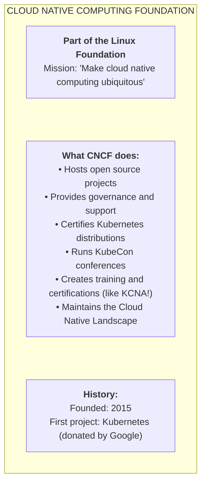
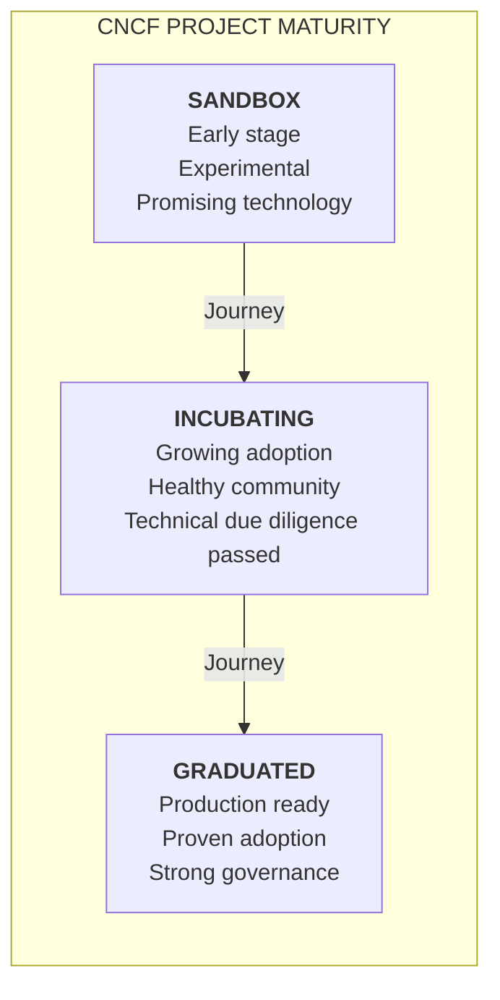
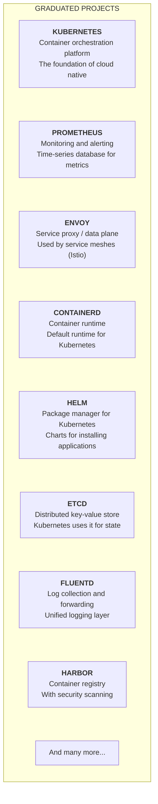
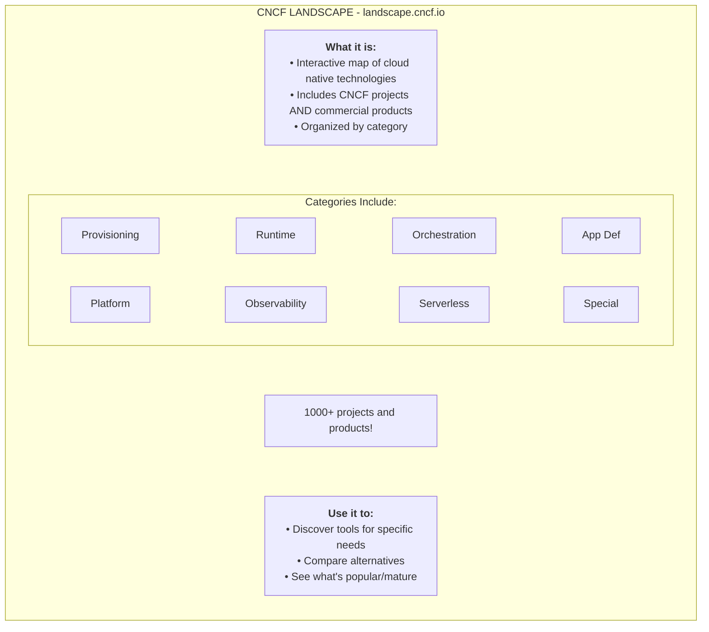
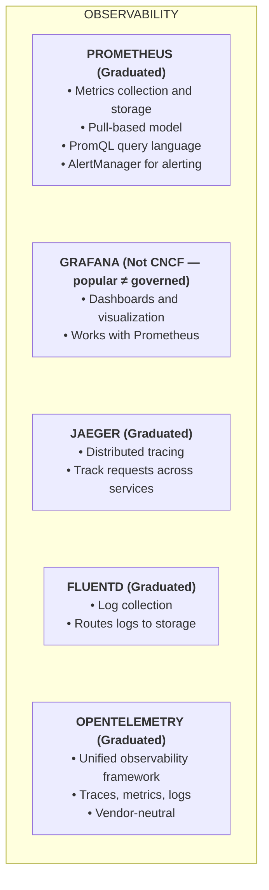
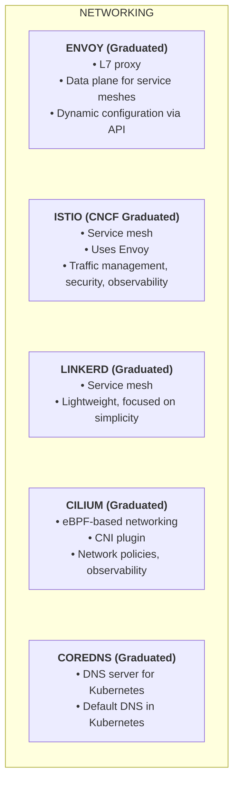
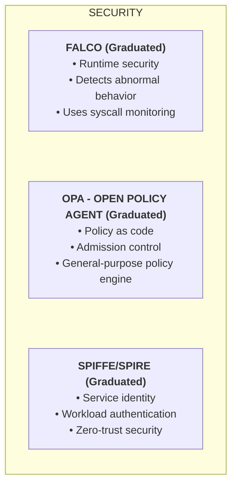
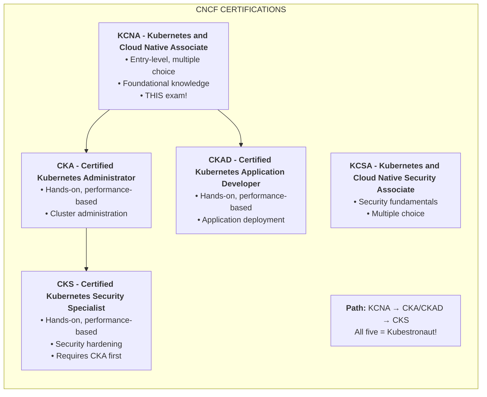

> **Складність**: `[ШВИДКИЙ]` — заснований на знаннях.
>
> **Час на проходження**: 35–45 хвилин.
>
> **Передумови**: Модуль 3.1 (Принципи хмарних технологій).
>
> **Фокус**: орієнтація в екосистемі, сигнали зрілості, категорії інструментів та практичні компроміси під час вибору для продакшену.

## Результати навчання

Після завершення цього модуля ви зможете ухвалювати обґрунтовані рішення щодо екосистеми, а не просто запам'ятовувати назви проєктів без операційного контексту.

1. **Оцінювати** сигнали зрілості проєктів CNCF під час вибору інструментів для продакшен-платформ Kubernetes 1.35+.
2. **Порівнювати** проєкти екосистеми CNCF за категоріями спостережуваності, мережі, зберігання даних, безпеки, середовища виконання та доставлення.
3. **Проєктувати** практичний шлях вибору інструментів через CNCF Landscape, не сприймаючи кожен наведений у списку продукт як однаково керований.
4. **Діагностувати** ризиковані архітектурні рішення, спричинені плутаниною між проєктами під егідою CNCF, комерційними записами в ландшафті та стандартними компонентами Kubernetes.
5. **Впроваджувати** легкий контрольний список оцінювання CNCF, використовуючи `alias k=kubectl` та скорочення `k` для дослідження кластера.

## Чому цей модуль важливий

**Гіпотетичний сценарій:** платіжна компанія відстежує дорогий збій до рішення щодо інструментів, яке під час наради з планування міграції виглядало нешкідливим. Платформна команда замінила нудний, добре зрозумілий шлях логування новішим колектором, бо проєкт з'явився у вигляді хмарного ландшафту поруч зі знайомими назвами. Коли продакшен-трафік різко зріс, операційна поведінка колектора все ще була незнайома команді, шлях ескалації був незрозумілим, а інженери витратили години, відокремлюючи запис у каталозі продуктів від відносин керованого проєкту. Інцидент стався не через відкритий код як такий. Він стався через те, що карту екосистеми прочитали так, ніби вона була гарантією готовності до продакшену.

Цей шаблон збоїв поширений, бо хмарний світ великий, швидко змінюється та сповнений назв, що перетинаються. Kubernetes — це лише один проєкт у більшій екосистемі, яка включає середовища виконання, реєстри, мережеві плагіни, сервісні сітки, рушії політик, системи спостережуваності, інструменти доставлення та проєкти безпеки. Деякі з них перебувають під егідою Cloud Native Computing Foundation, деякі є лише суміжними, деякі — комерційними пропозиціями, а деякі є стандартними компонентами в дистрибутиві Kubernetes, не будучи при цьому єдиним обґрунтованим вибором. Кандидату на KCNA не потрібно запам'ятовувати кожен логотип, але працюючому інженерові слід навчитися ставити кращі запитання, ніж «чи це популярне?».

Цей модуль навчає сприймати CNCF як призму управління та екосистеми, а не як каталог для заучування. Ви пов'яжете рівні зрілості з операційним ризиком, зіставите поширені проєкти з проблемами, які вони вирішують, і попрактикуєтеся використовувати ландшафт як інструмент для пошуку, зберігаючи при цьому здорове продакшен-судження. Наприкінці ви маєте бути здатними пояснити, чому такий проєкт, як Kubernetes, Prometheus, Envoy, containerd, Helm, CoreDNS, Falco, Open Policy Agent, SPIFFE чи Fluentd, з'являється в розмовах про хмарні технології, а також маєте бути здатними сказати, чого його присутність не доводить.

## Що насправді робить CNCF

Cloud Native Computing Foundation є частиною Linux Foundation, і її найпомітніша роль — це підтримка Kubernetes та багатьох пов'язаних проєктів з відкритим кодом. Підтримка не означає, що CNCF пише кожен рядок коду чи обирає кожну функцію. Вона означає, що фундація надає нейтральні структури управління, стале опікування торговими марками, громадські процеси, послуги для проєктів, програми заходів, програми сертифікації та публічний дім, де постачальники й окремі особи можуть співпрацювати без того, щоб одна компанія володіла всім столом. Ця нейтральність важлива, бо хмарна інфраструктура зазвичай охоплює багатьох постачальників, хмари, операційні системи та організаційні межі.

Уявіть CNCF як публічну майстерню та площу стандартів, а не як єдину продуктову компанію. Продуктова компанія може оптимізувати під свою дорожню карту, модель продажів чи шлях пропрієтарної інтеграції. Фундація має інше завдання: вона зменшує ризик координації для спільної інфраструктури, від якої залежать багато конкурентів. Kubernetes виграв від такого устрою, бо багато постачальників могли будувати дистрибутиви, сервіси, інтеграції та навчання навколо спільного верхового (upstream) проєкту, не подаючи кожну співпрацю як двосторонню бізнес-угоду.

Це розрізнення корисне, коли ви читаєте сторінки проєктів. Проєкт CNCF не є автоматично правильним інструментом для вашого кластера, а проєкт поза CNCF не є автоматично небезпечним. Фундація дає вам сигнали про управління, здоров'я спільноти, зрілість та поширеність в екосистемі, але вам усе одно потрібно оцінити придатність, зусилля на обслуговування, безпекову позицію та операційну складність. У продакшен-платформі ці сигнали є вхідними даними для рішення, а не його заміною.

CNCF також підтримує програми сертифікації та відповідності, які зменшують неоднозначність щодо самого Kubernetes. Сертифіковані дистрибутиви Kubernetes мають проходити тести відповідності, що допомагає командам довіряти тому, що поведінка основного API буде переносимою між сумісними пропозиціями. Це не робить кожен кластер однаковим, бо хмарні балансувальники навантаження, класи зберігання, стандартні налаштування мережі, системи ідентифікації та процеси оновлення все одно різняться. Проте це дає командам спільну базову лінію для очікувань щодо Kubernetes API, що є суттєвим, коли застосунки переміщуються між локальною розробкою, керованими сервісами та корпоративними платформами.

Зупиніться й передбачте: якщо два постачальники продають «платформи Kubernetes», але лише один наголошує на верховій відповідності та чітких відносинах із проєктами CNCF, які додаткові запитання ви б поставили, перш ніж переносити регульоване робоче навантаження? Зріла відповідь розділила б сумісність API, операційну підтримку, управління, потік безпекових патчів та додаткові компоненти постачальника. Ці категорії не дають вам сприймати знайомий логотип як повну оцінку ризиків.

Для KCNA вам слід пам'ятати, що місія CNCF ширша за Kubernetes, але водночас визнавати Kubernetes першим і найвпливовішим проєктом фундації. Іспит очікує, що ви знатимете роль фундації, широкі категорії проєктів, словник зрілості, Cloud Native Landscape та взаємозв'язок між сертифікаціями, такими як KCNA, KCSA, CKA, CKAD і CKS. У реальному світі ті самі знання допомагають уникнути вибору інструментів лише за впізнаваністю назви.

## Рівні зрілості проєктів

Рівні зрілості CNCF — це скорочений спосіб позначення того, наскільки фундація впевнена в поширеності, управлінні та операційній готовності проєкту. Три публічні стадії — це Sandbox, Incubating та Graduated. Вони не вимірюють, чи розумний код, чи вражає демонстрація, чи має постачальник сильний стенд на конференції. Вони вимірюють, чи перейшов проєкт від раннього дослідження до ширшого продакшен-використання, сильнішого супроводу, чіткішого управління та вимогливішої технічної експертизи.

Проєкти стадії Sandbox — це місце, куди багатообіцяючі ідеї можуть увійти до спільноти CNCF, перш ніж вони доведуть широке продакшен-використання. Ця стадія може бути здоровою та цінною, особливо коли команда хоче вивчити патерн, що тільки з'являється, або зробити ранній внесок. Вона також є застереженням проти припущення про готовність до продакшену. Якщо платіжний процесор, лікарняна платформа чи державний сервіс ідентифікації залежить від компонента стадії Sandbox, інженерна команда має мати свідому причину, план відкату та достатньо внутрішньої експертизи, щоб володіти цим ризиком.

Проєкти стадії Incubating перебувають посередині. Вони показали більшу поширеність, сильніше управління та достатньо технічної серйозності, щоб подолати вищу планку, ніж Sandbox. Incubating не означає бездоганний чи простий. Це означає, що проєкт має докази того, що він може витримати більшу базу користувачів та підтримувати здоровішу спільноту. Для багатьох організацій проєкти стадії Incubating можуть бути розумним продакшен-вибором, коли сценарій використання сильний, а команда провела звичну експертизу щодо безпеки, оновлень, підтримки та інтеграції.

Проєкти стадії Graduated подолали найвищу стадію зрілості CNCF. Зазвичай вони мають широку поширеність, задокументоване управління, активних супровідників із більш ніж однієї організації, безпекові практики та послужний список продакшен-використання. Статус Graduated усе одно не усуває операційної роботи. Prometheus, Envoy, containerd, Kubernetes, Helm і CoreDNS — усі потребують проєктних рішень, планування потужностей, оновлень та людського судження. Випуск (graduation) каже вам, що проєкт уже не є просто багатообіцяючим експериментом; він не каже вам, що ваша команда зможе добре керувати ним, просто встановивши стандартні налаштування.

Практичний спосіб використання зрілості — пов'язати її з радіусом ураження. Проєкт стадії Sandbox може бути прийнятним у некритичному порталі розробника, дослідницькому середовищі чи ізольованому експерименті зі спостережуваності. Той самий проєкт може бути поганим вибором на шляху запиту для фінансових транзакцій. Проєкт стадії Graduated може бути кращим стандартним вибором для базової мережі, виявлення сервісів, стану кластера, поведінки середовища виконання чи оповіщення, бо збій у цих сферах може вплинути на кожен застосунок платформи.

Зупиніться й передбачте: CNCF має рівні проєктів Sandbox, Incubating та Graduated. Якби ви оцінювали два інструменти моніторингу — один Graduated і один Sandbox — для продакшен-кластера Kubernetes вашої компанії, що рівень зрілості каже вам про ризик, управління та довгострокову життєздатність? Корисна відповідь — не просто «обрати Graduated». Корисна відповідь полягає в тому, що Graduated знижує ризик управління та поширеності, тоді як Sandbox вимагає сильнішого локального обґрунтування, вужчого обсягу розгортання та чіткішої стратегії виходу.

Хороший інженерний огляд також дивиться поза межі мітки стадії. Запитайте, чи реагують супровідники на проблеми безпеки, чи передбачувані випуски, чи зрозумілі примітки до оновлень, чи має проєкт продакшен-кейси, схожі на ваше середовище, і чи розуміє ваша команда режими відмов. Рівні зрілості полегшують перший фільтр, але остаточне рішення все одно належить людям, які керуватимуть системою о 03:00, коли спрацює сповіщення.

## Ключові проєкти стадії Graduated та категорії

Екосистему CNCF легше вивчати, коли ви групуєте проєкти за інфраструктурною проблемою, яку вони вирішують. Kubernetes оркеструє робочі навантаження, containerd запускає контейнери, etcd зберігає стан Kubernetes, CoreDNS забезпечує виявлення сервісів, Envoy пропускає трафік через проксі, Prometheus зберігає метрики, Fluentd пересилає логи, Helm пакує ресурси Kubernetes, а Harbor надає реєстр із корпоративними засобами контролю. Кожен проєкт має власну сферу дії, і плутанина між цими сферами — один із найшвидших способів спроєктувати платформу, яка виглядає завершеною на діаграмі, але дає збій під час експлуатації.

Почніть зі шляху середовища виконання, бо він лежить майже під кожним робочим навантаженням. Kubernetes планує Поди та узгоджує бажаний стан, але він не реалізує безпосередньо кожну низькорівневу операцію з контейнерами самостійно. Середовище виконання контейнерів, таке як containerd, обробляє механіку завантаження образів, керування контейнерами та взаємодію із середовищем виконання хоста через інтерфейси Kubernetes. Це розділення дозволяє Kubernetes зосередитися на оркестрації, тоді як середовище виконання зосереджується на деталях життєвого циклу контейнера. У продакшені вибір середовища виконання впливає на поведінку образів, усунення несправностей нод, посилення безпеки та планування оновлень.

Шлях стану площини управління не менш важливий. Kubernetes зберігає стан кластера в etcd, а це означає, що здоров'я etcd — це здоров'я кластера. Команда, яка ставиться до etcd як до невидимої деталі реалізації, може занадто пізно виявити, що резервне копіювання, відновлення, затримка, продуктивність диска та поведінка кворуму визначають, чи зможе площина управління чисто відновитися. KCNA не проситиме вас адмініструвати etcd так, як міг би CKA, але вам слід знати, чому він з'являється в екосистемі CNCF і чому він не є взаємозамінним із базою даних застосунку.

Шлях виявлення сервісів представляє CoreDNS. У кластері Kubernetes Поди не повинні залежати від жорстко закодованих IP-адрес Подів, бо Поди є ефемерними. CoreDNS інтегрується з Kubernetes API, щоб робоче навантаження могло розв'язувати імена, такі як DNS-ім'я Сервісу, замість того, щоб гнатися за змінними кінцевими точками. Це хмарний патерн у мініатюрі: застосунки залежать від стабільної абстракції, тоді як компоненти платформи безперервно узгоджують змінну інфраструктуру під ними.

Проєкти спостережуваності відповідають на різні запитання. Prometheus збирає та зберігає числові часові ряди метрик, які чудово підходять для оповіщення про симптоми, такі як затримка, частота помилок, насиченість та використання ресурсів. Fluentd збирає та пересилає логи, які несуть контекст подій та повідомлення застосунків. Jaeger допомагає трасувати запит через розподілені сервіси. OpenTelemetry надає нейтральні щодо постачальників API, SDK та колектори для сигналів телеметрії. Ці інструменти доповнюють один одного, бо метрика може сказати вам, що щось не так, трейс може звузити, де це сталося, а логи можуть пояснити чому.

Проєкти мережі та сервісної сітки лежать на шляху запиту, тож їхній профіль ризику заслуговує на додаткову увагу. Envoy — це високопродуктивний проксі, який часто використовують як площину даних для сервісних сіток. Linkerd та Istio — обидва є сервісними сітками CNCF стадії Graduated: Linkerd зосереджений на простоті, Istio — на широті функцій керування трафіком. Підтримка CNCF — це сигнал управління, а не доказ того, що та чи інша сітка підходить вашому робочому навантаженню. Cilium привносить у розмову про мережу кластера можливості мережі, політик та спостережуваності на основі eBPF. Назви мають менше значення, ніж операційне запитання: хто володіє поведінкою трафіку, коли запит дає збій?

Проєкти безпеки покривають різні рівні, а не один чарівний щит. Falco виявляє підозрілу поведінку під час виконання, Open Policy Agent надає політику як код, а SPIFFE разом зі SPIRE дає робочим навантаженням послідовну модель ідентифікації. Ці проєкти можуть підтримувати архітектуру нульової довіри, контроль допуску, виявлення під час виконання та автентифікацію робочих навантажень, але вони потребують політик, відповідальності та процесів реагування. Встановити проєкт безпеки, не вирішивши, хто реагує на знахідки, — це як встановити димовий датчик, не призначивши нікого відповідальним за евакуацію.

### Категорії проєктів

| Категорія | Приклади |
|----------|----------|
| **Середовище виконання контейнерів** | containerd, CRI-O |
| **Оркестрація** | Kubernetes |
| **Сервісна сітка** | Istio, Linkerd |
| **Спостережуваність** | Prometheus, Jaeger, Fluentd |
| **Зберігання даних** | Rook, Longhorn |
| **Мережа** | Cilium, Calico, CoreDNS |
| **Безпека** | Falco, OPA, SPIFFE |
| **CI/CD** | Argo, Flux, Tekton |
| **Керування пакетами** | Helm |

Ця таблиця категорій — навчальний засіб, а не список покупок. Деякі записи є проєктами під егідою CNCF, деякі — поширеними хмарними проєктами, а деякі можуть мати інші домівки управління чи статуси з часом. Категорія інструмента каже вам про проблемну сферу; його сторінка проєкту, рівень зрілості, супровідники, історія випусків та модель інтеграції кажуть вам, чи належить він вашій платформі. Коли KCNA просить вас визначити категорію проєкту, назвіть категорію. Коли ваша команда питає, чи варто прийняти проєкт, відповідайте доказами.

Практичний спосіб запам'ятати категорії — простежити за запитом і розгортанням від джерела до середовища виконання. Інструмент доставлення пакує чи застосовує маніфести, Helm може шаблонізувати та встановити застосунок, Kubernetes планує його, containerd запускає контейнер, CoreDNS допомагає йому знайти однолітків, Cilium чи інший мережевий рівень рухає трафік, Envoy чи сітка можуть пропускати запити через проксі, Prometheus та інструменти трасування спостерігають за поведінкою, Falco та інструменти політик стежать за порушеннями, а проєкти зберігання забезпечують шляхи постійних даних. Екосистема — це ланцюг відповідальностей, а не купа незв'язаних логотипів.

Перш ніж подумки прогнати це у власній платформі, який результат ви очікуєте, якщо перелічите компоненти, від яких залежить ваш кластер, і згрупуєте їх за категоріями? Багато команд виявляють дубльовані відповідальності, такі як дві системи політик із незрозумілою власністю чи три колектори спостережуваності, що надсилають дані, які перетинаються. Це відкриття корисне, бо складність часто прихована на межах категорій. Мета не в тому, щоб звести кожну платформу до одного проєкту на рядок; мета в тому, щоб зробити кожне перетинання навмисним.

## CNCF Landscape як інструмент для пошуку

CNCF Landscape — це інтерактивна карта хмарних технологій. Вона корисна, бо екосистема завелика, щоб одна людина тримала її в пам'яті, і бо категорії допомагають знаходити альтернативи, коли проблема конкретна, а ваша відправна точка туманна. Наприклад, «нам потрібна краща безпека ланцюга постачання» — це не одне рішення про інструмент. Воно може охоплювати політику реєстру, підписування образів, сканування вразливостей, контроль допуску, специфікації складу програмного забезпечення (SBOM), ідентифікацію робочих навантажень та виявлення під час виконання. Огляд ландшафту допомагає вам дослідити ці околиці.

Найважливіше застереження вже міститься всередині діаграми: ландшафт включає проєкти CNCF та комерційні продукти. Це корисно для пошуку, але може ввести в оману початківців, які сприймають усе на карті як проєкти під егідою фундації чи перевірені для продакшену. Логотип на ландшафті може представляти продукт постачальника, пов'язаний проєкт з відкритим кодом, проєкт фундації чи сервіс екосистеми. Карта каже вам «це належить розмові». Вона не каже вам «цим керує CNCF» чи «це готове для вашого продакшен-кластера».

Використовуйте ландшафт у три проходи. По-перше, визначте категорію, що відповідає проблемі, яка у вас насправді є, таку як спостережуваність, середовище виконання, зберігання даних, мережа, визначення застосунків, надання ресурсів чи безпека. По-друге, відокремте проєкти під егідою CNCF від записів поза егідою та зверніть увагу на рівні зрілості, де вони існують. По-третє, порівняйте кандидатів, що залишилися, з вашими обмеженнями: керований проти самостійно розгорнутого, вимоги відповідності, досвід персоналу, інтеграція з API Kubernetes 1.35+, періодичність оновлень, модель підтримки та радіус ураження при відмові.

Цей підхід запобігає поширеній помилці: почати з назви інструмента, а потім вигадати обґрунтування. Кращий вибір починається з операційної проблеми. Якщо ваша проблема — «розробники не можуть сказати, який сервіс спричинив затримку», категорія може вказувати на трасування та телеметрію. Якщо ваша проблема — «команди розгортають непідписані образи», категорія вказує на реєстр, підписування, допуск та засоби контролю політик. Якщо ваша проблема — «збої DNS кластера ламають кожен простір імен», категорія каже вам вивчати CoreDNS та виявлення сервісів, а не починати з дашбордів.

Зупиніться й подумайте: CNCF Landscape має понад 1000 записів, але не всі з них є проєктами CNCF. Багато з них — комерційні продукти чи проєкти під егідою деінде. Чому ландшафт включав би інструменти поза CNCF, і як це могло б ввести в оману того, хто обирає продакшен-інструменти? Виважена відповідь полягає в тому, що широка карта екосистеми допомагає пошуку та порівнянню, але її потрібно поєднувати з перевірками управління, перевірками зрілості та архітектурним оглядом перед прийняттям.

**Гіпотетичний сценарій:** платформна команда в медіакомпанії приймає два суміжні інструменти доставлення, бо обидва з'являються в одній категорії ландшафту й обидва мають сильну увагу спільноти. Перший інструмент узгоджував бажаний стан із Git, тоді як другий керував поведінкою поступового розгортання. Така комбінація може бути дійсною, але команда не визначила меж відповідальності, тож невдалі релізи продукували суперечливі сигнали, і дві команди кожна вважала, що інша система є авторитетною. Виправлення після інциденту полягало не в тому, щоб «прибрати один логотип»; воно полягало в тому, щоб задокументувати цикл управління, яким володіє кожен інструмент, сповіщення, яким володіє кожна команда, та шлях відкату, якому слідує кожен сервіс.

Ви можете попрактикувати ту саму дисципліну за допомогою простого контрольного списку. Для кожного кандидата напишіть проблему, яку він вирішує, одним реченням, об'єкт Kubernetes чи шлях середовища виконання, якого він торкається, сигнал зрілості чи управління, який ви можете перевірити, режим відмови, якого ви найбільше боїтеся, та особу чи команду, яка ним керуватиме. Якщо ви не можете заповнити ці поля, ви все ще на стадії пошуку. Це нормально, але це означає, що інструмент поки не повинен переходити на критичний шлях.

## Ключові проєкти, які слід знати для KCNA

KCNA не вимагає глибокого адміністрування кожного проєкту, але очікує розпізнавання патернів. Ви маєте бути здатними почути сценарій і пов'язати його з імовірними категоріями проєктів. Запитання про часові ряди метрик вказує на Prometheus. Запитання про трейси запитів вказує на Jaeger чи OpenTelemetry. Запитання про логи вказує на Fluentd чи пов'язані колектори. Запитання про встановлення пакетів вказує на Helm. Запитання про виявлення сервісів усередині Kubernetes вказує на CoreDNS. Запитання про політику як код вказує на Open Policy Agent.

### Стек спостережуваності

Prometheus — це зазвичай перший проєкт спостережуваності, з яким зустрічаються учні KCNA, бо платформи Kubernetes потребують метрик. Його модель витягування (pull), мітки та мова запитів PromQL роблять його потужним для оповіщення й операційних дашбордів. Це не загального призначення система логів і не переглядач розподілених трейсів. Це обмеження є сильною стороною при правильному використанні: Prometheus оптимізований для числових часових рядів, тож команди можуть ставити точні запитання про частоти, помилки, тривалість та насиченість, не змішуючи кожен запис подій в одному й тому ж сховищі.

Jaeger та OpenTelemetry належать до іншої частини історії. Розподілене трасування допомагає вам простежити один запит через кілька сервісів, що має значення, коли дія, орієнтована на користувача, торкається API-шлюзу, сервісу автентифікації, платіжного сервісу, сервісу інвентаризації та адаптера бази даних. OpenTelemetry стандартизує, як застосунки створюють та експортують телеметрію, що зменшує прив'язку до постачальника й робить інструментування переноснішим. У багатьох сучасних дизайнах OpenTelemetry збирає чи випромінює сигнали, тоді як бекенди, такі як сумісні з Prometheus сховища метрик, системи трасування та платформи логів, обробляють зберігання та аналіз.

Fluentd та пов'язані колектори логів допомагають переміщувати записи подій із робочих навантажень до призначень, де люди та системи можуть їх оглядати. Логи багатослівні й контекстуальні, що робить їх корисними під час налагодження, але дорогими, якщо обробляти їх необачно. Сильний дизайн платформи вирішує, які логи збираються, як фільтруються чутливі дані, як працює зберігання й як розробники запитують логи під час інцидентів. Мітка CNCF не вирішує цих вибірок щодо політики; вона дає вам надійний проєкт, навколо якого їх проєктувати.

Grafana з'являється в багатьох розмовах про Kubernetes, бо її зазвичай поєднують із Prometheus, але діаграма правильно зазначає, що поширене поєднання — це не те саме, що статус проєкту CNCF. Це важливе розрізнення для іспиту та інженерної справи. Хмарна екосистема включає інструменти, які є популярними, корисними та широко прийнятими, не будучи під егідою CNCF. Коли ви порівнюєте проєкти, уникайте перетворення статусу управління на моральне судження. Натомість точно констатуйте відносини, а потім оцініть операційну придатність.

### Мережа та сервісна сітка

Мережеві проєкти мають високий важіль, бо вони лежать між сервісами. Envoy — це проксі рівня L7, що означає, що він розуміє протоколи прикладного рівня й може брати участь у повторних спробах, маршрутизації, балансуванні навантаження, телеметрії та політиці безпеки. Сервісна сітка часто розгортає площину даних із проксі та площину управління, яка конфігурує поведінку проксі. Такий дизайн може розкрити сильні патерни керування трафіком та ідентифікації, але він також додає рухомих частин до кожного запиту. Правильне запитання — не «чи кожна платформа повинна мати сітку?». Правильне запитання — «яка проблема з трафіком виправдовує цю операційну вартість?».

CoreDNS менш ефектний, але фундаментальний. Виявлення сервісів Kubernetes залежить від DNS-імен, які зіставляються із Сервісами та кінцевими точками всередині кластера. Коли розробники кажуть, що один Под може досягти іншого за стабільним іменем сервісу, CoreDNS є частиною цього досвіду. Якщо CoreDNS дає збій, застосунки можуть виглядати зламаними, навіть якщо їхні контейнери запущені. Ось чому виявлення сервісів належить розмовам про надійність платформи, а не лише екзаменаційним карткам.

Cilium показує, як хмарна мережа продовжує розвиватися. Його основа eBPF дозволяє функціям мережі, безпеки та спостережуваності відбуватися ефективно на шляху ядра Linux. Ця можливість потужна, але вона також вимагає, щоб команди розуміли вимоги до версії ядра, поведінку шляху даних, мережеві політики та інтеграцію з керованими пропозиціями Kubernetes. Зрілий огляд платформи порівнює цінність функції із потрібною для усунення несправностей експертизою.

Вибір сервісної сітки особливо схильний до прийняття за принципом культу карго. Команда чує, що великі технологічні компанії використовують сітку, і припускає, що патерн є обов'язковим. Насправді сітка корисна, коли вам потрібні послідовний mTLS, дрібнозерниста політика трафіку, повторні спроби, телеметрія чи поступове доставлення через багато сервісів і команд. Для невеликого внутрішнього застосунку з простим трафіком сітка може додати більше ризику, ніж цінності. Зрілість CNCF може підказати, які проєкти є безпечнішими ставками, але архітектура все одно починається з робочого навантаження.

### Безпека

Проєкти безпеки часто виглядають так, ніби вони перетинаються, доки ви не зіставите їх із моментами життєвого циклу робочого навантаження. Open Policy Agent може оцінювати рішення щодо політик, включно з рішеннями про допуск, перш ніж робоче навантаження потрапить до кластера. Falco стежить за поведінкою під час виконання й може виявляти підозрілу активність після того, як робочі навантаження вже запущені. SPIFFE та SPIRE опікуються ідентифікацією робочих навантажень, допомагаючи системам послідовно автентифікувати робочі навантаження в різних середовищах. Це різні засоби контролю в різний час, і зріла архітектура може використовувати більше ніж один, не вдаючи, що вони вирішують одну й ту саму проблему.

Політика як код особливо цінна, бо вона перетворює приховані правила платформи на придатні для огляду артефакти. Якщо компанія забороняє привілейовані контейнери, вимагає схвалених реєстрів чи зобов'язує мати мітки власності, політика допуску може забезпечити дотримання цих правил, перш ніж ризиковані ресурси будуть прийняті. Компроміс полягає в тому, що політика може заблокувати доставлення, якщо правила незрозумілі, неперевірені чи належать команді, яка не співпрацює з розробниками застосунків. Хороша платформа ставиться до політики як до продуктового інтерфейсу, з документацією, прикладами, шляхами винятків та можливістю аудиту.

Виявлення під час виконання вирішує іншу проблему. Навіть добре переглянуті робочі навантаження можуть поводитися несподівано через вразливості, неправильні конфігурації, скомпрометовані залежності чи людські помилки. Виявлення в стилі Falco допомагає виявити поведінку, таку як незвична активність оболонки, доступ до чутливих файлів чи несподівані мережеві дії. Виявлення саме по собі не є запобіганням. Воно стає корисним, коли сповіщення налаштовані, маршрутизовані, розслідувані та пов'язані з планами реагування на інциденти.

Ідентифікація робочих навантажень дає розподіленим системам безпечніший спосіб автентифікувати сервіси, ніж статичні спільні секрети. SPIFFE визначає стандартний формат ідентифікації, а SPIRE може видавати та ротувати ідентифікатори для робочих навантажень. Це має значення, коли сервіси охоплюють кластери, хмари чи домени довіри. Як і з кожним засобом контролю безпеки, проєкт — це лише частина відповіді. Командам усе одно потрібні моделі загроз, практики керування ключами, моніторинг та власність для рішень щодо життєвого циклу ідентифікації.

### Сертифікації CNCF

Сертифікації CNCF формують навчальний шлях, але вони перевіряють різні глибини. KCNA та KCSA — це іспити рівня асоційованого спеціаліста, зосереджені на фундаментальних знаннях. CKA, CKAD та CKS — це іспити на основі практичних завдань, які вимагають роботи руками в живому середовищі. Ця різниця має значення, коли ви плануєте своє навчання. KCNA просить вас розпізнавати концепції та міркувати про ролі в екосистемі, тоді як CKA просить вас адмініструвати кластери, CKAD просить вас будувати та усувати несправності застосунків, а CKS просить вас захищати Kubernetes із компетентністю рівня адміністратора.

Сертифікаційний шлях також підкреслює, чому знання екосистеми — не дрібниця. Розробник, який готується до CKAD, виграє від знання Helm, образів контейнерів, виявлення сервісів та спостережуваності. Адміністратор, який готується до CKA, виграє від знання середовищ виконання контейнерів, CoreDNS, etcd, мережі та зберігання даних. Інженер з безпеки, який готується до KCSA чи CKS, виграє від знання політик, виявлення під час виконання, ідентифікації робочих навантажень та концепцій ланцюга постачання. KCNA дає вам карту, перш ніж пізніші іспити попросять вас проїхати через конкретні околиці.

## Патерни та антипатерни

Для швидкого модуля найкориснішим патерном є вибір спочатку за категорією. Почніть із називання операційної проблеми, потім оберіть категорію, потім оцініть проєкти всередині цієї категорії. Цей патерн працює, бо він не дає командам гнатися за логотипами, перш ніж вони домовляться про збій, який намагаються запобігти. Наприклад, «нам потрібна спостережуваність» — це занадто широко, але «нам потрібно оповіщати про частоту помилок та затримку API» вказує на метрики, тоді як «нам потрібно знайти, який сервіс уповільнив запит на оформлення замовлення» вказує на трасування.

Інший сильний патерн — це розгортання з урахуванням зрілості. Проєкт стадії Graduated часто може раніше увійти до ширшого підтвердження концепції, тоді як проєкт стадії Sandbox зазвичай має починати у вузькому, оборотному середовищі. Це не карає інновації; це захищає продакшен від несподіванок, яких можна уникнути. Команди, які документують рівень зрілості, очікуваний радіус ураження, модель підтримки та шлях відкату, мають більше шансів прийняти корисні нові проєкти, не плутаючи експериментування з платформним зобов'язанням.

Третій патерн — це явна власність за відповідальністю. Якщо Prometheus оповіщає, хтось володіє правилами оповіщення та маршрутизацією. Якщо CoreDNS критичний, хтось володіє здоров'ям виявлення сервісів. Якщо Open Policy Agent блокує розгортання, хтось володіє оглядом політик та обробкою винятків. Проєкти CNCF є будівельними блоками, але будівельні блоки не призначають чергувань. Продакшен-платформи стають надійними, коли кожен компонент має чіткого власника, шлях моніторингу та план оновлення.

Відповідний антипатерн — це архітектура, керована логотипами. Це трапляється, коли діаграму будують із популярних назв проєктів, а не з потреб користувачів, обмежень платформи та можливостей команди. Це спокусливо, бо екосистема захоплива, а конференційні доповіді роблять інструменти схожими на завершені. Кращою альтернативою є спочатку записати проблему робочого навантаження, потім обґрунтувати кожен компонент категорією, якій він служить, та операційним тягарем, який він додає.

Інший антипатерн — це сприйняття зрілості як єдиного вхідного даного для рішення. Проєкт стадії Graduated усе одно може бути неправильним вибором, якщо він вирішує неправильну проблему, конфліктує з вашою керованою платформою чи перевищує можливості вашої команди. Проєкт стадії Sandbox може бути розумним для обмеженого експерименту з сильною власністю. Зрілість зменшує невизначеність; вона не стирає контекст. Кращою альтернативою є поєднати зрілість із придатністю архітектури, можливістю підтримки, безпековою позицією та аналізом радіуса ураження.

Останній антипатерн — це встановлення засобів контролю без шляхів реагування. Команди іноді розгортають рушії політик, детектори середовища виконання, сканери чи системи трасування й припускають, що платформа стала безпечнішою, бо існують дашборди. На практиці зігнороване сповіщення — це просто галасливий рядок логу з кращим брендингом. Кращою альтернативою є визначити, хто оглядає знахідки, які знахідки блокують релізи, як схвалюються винятки та як зберігаються докази для пізнішого аудиту чи огляду інциденту.

## Фреймворк прийняття рішень

Використовуйте зрілість CNCF та ландшафт як лійку. Перше запитання — це категорія проблеми: середовище виконання, оркестрація, спостережуваність, мережа, безпека, зберігання даних, доставлення, реєстр чи визначення застосунків. Друге запитання — чи перебуває інструмент під егідою CNCF, чи лише наведений у ландшафті, чи зовсім поза фундацією. Третє запитання — це зрілість та поширеність. Четверте запитання — це операційна придатність: хто ним керує, як він дає збій, як він оновлюється і як він інтегрується з кластерами Kubernetes 1.35+, якими ви насправді керуєте.

Для критичних для продакшену шляхів віддавайте перевагу нудним доказам над новизною. Базова маршрутизація запитів, DNS, поведінка середовища виконання контейнерів, стан кластера, ідентифікація та оповіщення мають віддавати перевагу проєктам і продуктам із сильною поширеністю, чітким управлінням, безпековими практиками та шляхами підтримки. Це не означає, що кожен інструмент має бути Graduated, але це означає, що тягар доведення зростає в міру зростання радіуса ураження. Проєкт стадії Sandbox на базовому шляху запиту потребує кращої причини, ніж «список функцій довший».

Для навчання, інновацій чи ізольованих внутрішніх робочих процесів рішення може бути гнучкішим. Проєкти стадій Sandbox та Incubating — це цінні місця для дослідження патернів, що тільки з'являються, особливо коли розгортання є оборотним, а команда готова робити внесок у вигляді відгуків. Ключ — це чесність щодо середовища. Лабораторія, доповнення до досвіду розробника чи некритичний конвеєр звітності можуть терпіти більше експериментування, ніж контролер допуску, який блокує кожне продакшен-розгортання.

Коли два інструменти виглядають так, ніби вони вирішують одну й ту саму проблему, порівняйте їхні цикли управління. Запитайте, за якими ресурсами Kubernetes вони стежать, що вони змінюють, де міститься їхній бажаний стан і що відбувається, коли їхній контролер не працює. Багато хмарних інцидентів виникають через контролери, що перетинаються, кожен з яких вважає, що він відповідальний за той самий результат. Фреймворк прийняття рішень, який включає власність циклу управління, виловить ризики, які пропускає список функцій.

Остаточне рішення має продукувати короткий письмовий запис. Констатуйте обрану категорію, обраний проєкт чи продукт, його відносини з CNCF, його сигнал зрілості, розглянуті альтернативи, очікуваний режим відмови, власника та перший крок відкату. Цей запис не має бути бюрократичним. Він має бути достатньо конкретним, щоб інший інженер міг зрозуміти, чому було зроблено вибір і за чим слід стежити після прийняття.

Ще один корисний тест — уявити, що проєкт дає збій у найгірший можливий момент. Якщо реєстр недоступний, чи можуть робочі навантаження все одно розгортатися з кешованих образів, чи кожне розгортання зупиняється? Якщо DNS нестабільний, чи знають власники застосунків, як відрізнити збій виявлення сервісів від збою застосунку? Якщо політика блокує реліз, чи є аварійний шлях винятку, що залишає слід для аудиту? Ці запитання перетворюють абстрактні знання екосистеми на докази готовності.

Нарешті, вирішіть, який вид залежності ви приймаєте. Деякі проєкти є прямими залежностями середовища виконання, деякі — залежностями площини управління, деякі — залежностями робочого процесу розробника, а деякі — залежностями спостережуваності чи аудиту. Той самий сигнал зрілості означає різні речі в кожній позиції. Збій дашборда може бути терпимим протягом короткого періоду, тоді як збій DNS чи контролю допуску може зупинити платформу негайно. Цей клас залежності має формувати темп вашого розгортання більше, ніж ентузіазм щодо будь-якого окремого проєкту.

## Чи знали ви?

- **Kubernetes був першим** — Kubernetes був першим великим внеском Google у відкритий код для CNCF у 2015 році.

- **TOC вирішує щодо випуску** — Технічний наглядовий комітет (Technical Oversight Committee) оглядає прогрес проєкту та голосує за зміну зрілості на основі поширеності, управління та технічних критеріїв.

- **KubeCon — масштабний** — Заходи KubeCon + CloudNativeCon регулярно збирають тисячі практиків відкритого коду, постачальників, супровідників та платформних інженерів в одній екосистемній розмові.

- **Ландшафт величезний** — CNCF Landscape має понад 1000 проєктів та продуктів, тож корисна навігація починається з категорій та фільтрів зрілості, а не із заучування.

## Типові помилки

| Помилка | Чому це трапляється | Як це виправити |
|---------|----------------|---------------|
| Думка, що кожен запис у ландшафті є проєктом CNCF | Ландшафт змішує проєкти під егідою CNCF, продукти постачальників та пов'язані інструменти екосистеми в одній візуальній карті. | Відкрийте сторінку проєкту, підтвердьте статус фундації та запишіть, чи інструмент є під егідою, наведений у списку, чи лише суміжний. |
| Вибір проєкту стадії Sandbox для критичного шляху без плану ризиків | Команди зосереджуються на функціях і забувають, що рання зрілість може означати менше продакшен-референсів та коротшу історію управління. | Обмежте раннє використання середовищами з низьким радіусом ураження або задокументуйте план власності, відкату та підтримки перед продакшеном. |
| Сприйняття статусу Graduated як автоматичної придатності | Зрілість доводить силу спільноти та управління, а не те, що інструмент відповідає вашій архітектурі чи навичкам команди. | Порівняйте сферу проєкту, режими відмов, процес оновлення та досвід персоналу з проблемою, яку вам потрібно вирішити. |
| Плутанина між стовпами спостережуваності | Метрики, логи та трейси часто групують разом, тож учні припускають, що один інструмент може відповісти на кожне запитання щодо інциденту. | Зіставте Prometheus із метриками, Fluentd із логами, Jaeger чи OpenTelemetry із трейсами, потім спроєктуйте, як сигнали працюють разом. |
| Змішування відповідальностей сервісної сітки та CNI | Обидва впливають на трафік, але вони працюють на різних рівнях та надають різні засоби контролю. | Визначте, чи проблема в мережі подів, мережевій політиці, маршрутизації L7, ідентифікації, телеметрії чи поступовій доставці. |
| Встановлення інструментів політик чи безпеки без власників | Інструмент може продукувати сповіщення чи блокування, але ніхто не визначив шляхи огляду, винятків чи реагування на інциденти. | Призначте власників, правила ескалації, робочі процеси винятків та метрики успіху, перш ніж широко застосовувати засоби контролю. |
| Заучування назв проєктів без категорій | Екосистема завелика, а ізольовані назви не допомагають під час сценарних запитань чи проєктних оглядів. | Вивчайте за категорією та проблемою користувача, потім пов'язуйте репрезентативні проєкти з відповідальністю, яку вони несуть. |

## Тест

Вашій команді потрібен реєстр контейнерів зі скануванням вразливостей та засобами контролю доступу для продакшен-образів. Колега пропонує використати лише публічний реєстр, бо він знайомий. Який проєкт екосистеми CNCF вам слід оцінити, і які продакшен-міркування мають керувати рішенням?

Harbor — це проєкт CNCF стадії Graduated, призначений для сценарію використання корпоративного реєстру контейнерів. Важливе міркування полягає не лише в тому, що Harbor може зберігати образи, а в тому, що продакшен-платформи часто потребують контролю доступу, інтеграції зі скануванням вразливостей, реплікації, зберігання та управління щодо того, де містяться артефакти. Публічний реєстр усе ще може бути корисним для публічних образів, але приватні продакшен-образи зазвичай потребують сильнішого організаційного контролю. Рішення має порівнювати відповідність, доступність, операційну власність та інтеграцію з політиками допуску чи підписування.

Стартап порівнює Linkerd, який є CNCF стадії Graduated, із новішою сервісною сіткою стадії Sandbox, яка має більше функцій. Робоче навантаження обробляє фінансові транзакції. Як зрілість CNCF має вплинути на рекомендацію?

Зрілість Graduated має нести значну вагу, бо сервісна сітка лежить безпосередньо на шляху запиту для високоцінних транзакцій. Сигнал зрілості Linkerd свідчить про ширшу поширеність, сильніше управління та довшу продакшен-історію, тоді як сітка стадії Sandbox має вимагати вужчого експерименту та чіткого плану відкату. Відповідь не в тому, що проєкти стадії Sandbox погані; вона в тому, що їхня невизначеність має відповідати радіусу ураження. Для фінансового трафіку стабільність, безпекові практики та операційна обізнаність зазвичай мають більше значення, ніж довший список функцій.

Інженер пропонує Prometheus для метрик, Fluentd для логів та Jaeger для трейсів після збою, коли ніхто не міг пояснити повільні запити. Як ці проєкти розподіляють відповідальність, і чому такий розподіл корисний?

Prometheus обробляє числові часові ряди метрик, такі як частота запитів, частота помилок, затримка та насиченість, які є сильними сигналами для оповіщення та аналізу тенденцій. Fluentd обробляє збір та пересилання логів, що зберігає контекстуальні записи подій, які допомагають пояснити поведінку застосунку. Jaeger обробляє розподілене трасування, яке слідує за одним запитом через кілька сервісів, щоб показати, де було витрачено час. Розподіл корисний, бо інциденти зазвичай потребують виявлення симптому, локалізації шляху та контекстуального пояснення, а не єдиного загального потоку даних.

Розробник питає, чому Kubernetes використовує CoreDNS замість того, щоб покладатися лише на DNS-резолвер операційної системи ноди. Яку роль відіграє CoreDNS у виявленні сервісів Kubernetes?

CoreDNS знає, як розв'язувати імена Сервісів Kubernetes, бо він інтегрується з Kubernetes API та доменом DNS кластера. Звичайний резолвер операційної системи ноди автоматично не знає, що ім'я, таке як сервіс у просторі імен, має розв'язуватися в адресу Сервісу. CoreDNS перетворює змінні кінцеві точки кластера на стабільні імена, які можуть використовувати застосунки. Це робить його базовою залежністю надійності, навіть якщо його легко не помітити, коли все справне.

Ваш архітектурний огляд знаходить продукт, наведений у CNCF Landscape, і один товариш по команді стверджує, що це доводить, що ним керує CNCF і він готовий до продакшену. Як ви діагностуєте непорозуміння?

Непорозуміння полягає в сприйнятті ландшафту як гарантії сертифікації чи зрілості. Ландшафт — це карта для пошуку, яка включає проєкти CNCF, проєкти з відкритим кодом поза CNCF та комерційні продукти, тож наявність у списку сама по собі не доводить ані егіди фундації, ані готовності до продакшену. Правильна діагностика — це перевірити фактичні відносини проєкту з CNCF, його рівень зрілості, якщо застосовно, його супровідників, історію випусків, безпекову позицію та операційну придатність. Огляд має відокремлювати «належить до цієї категорії екосистеми» від «безпечний для нашого критичного шляху».

Платформна команда хоче впровадити легкий контрольний список оцінювання CNCF, перш ніж прийняти новий інструмент мережевих політик. Що має включати контрольний список, окрім назви інструмента?

Контрольний список має включати категорію проблеми, шлях Kubernetes чи середовища виконання, якого торкаються, відносини з CNCF, сигнал зрілості, розглянуті альтернативи, очікуваний режим відмови, власника, шлях підтримки та крок відкату. Мережева політика впливає на поведінку трафіку, тож команді також слід визначити, як інструмент взаємодіє з CNI, спостережуваністю та наявними засобами контролю безпеки. Хороший контрольний список тримає обговорення прийняття заземленим на операційному ризику, а не на ентузіазмі щодо функцій. Він також дає майбутнім оглядачам стислий запис того, чому було зроблено вибір.

Після KCNA розробник хоче продовжити до практичних сертифікацій Kubernetes і зрештою заслужити всі п'ять головних облікових даних CNCF щодо Kubernetes. Який шлях має сенс, і чому CKS вимагає спочатку CKA?

Розробник часто складає CKAD наступним, бо він зосереджений на розгортанні застосунків, конфігурації та усуненні несправностей, потім CKA, щоб поглибити адміністрування кластера, а потім CKS для спеціалізації з безпеки. KCSA можна скласти незалежно, бо це асоційований іспит з безпеки, а не практична передумова адміністрування. CKS вимагає CKA, бо посилення безпеки залежить від навичок роботи з кластером на рівні адміністратора, таких як RBAC, аудиторське логування, контроль допуску та конфігурація площини управління. Шлях має відповідати ролі учня, але передумова відображає операційну глибину, потрібну для роботи з безпекою.

## Практична вправа

Ця вправа будує компактний аркуш оцінювання для вибору в екосистемі CNCF. Вам не потрібен великий кластер, і вам не потрібно встановлювати нові проєкти. Якщо у вас є доступ до будь-якого навчального кластера Kubernetes 1.35+, використовуйте його для завдань із пошуку. Якщо ні, виконайте письмові частини й сприймайте команди як приклади для запуску пізніше. Перш ніж використовувати скорочення, визначте його у своїй оболонці за допомогою `alias k=kubectl`; решта вправи використовує `k` як команду Kubernetes.

Мета — попрактикувати мислення, як у платформного оглядача. Ви визначите проблему платформи, зіставите її з категорією CNCF, оглянете те, що ваш кластер уже надає, і вирішите, які докази зрілості ви б вимагали перед прийняттям нового компонента. Тримайте нотатки короткими, але робіть кожну нотатку операційною. Речення на кшталт «Prometheus робить метрики» — занадто тонке. Речення на кшталт «Prometheus оповіщав би про частоту помилок оформлення замовлення, а платформна команда володіла б оглядом правил та зберіганням» — корисне.

Працюючи, будьте чесними щодо невизначеності. Хороший аркуш оцінювання може сказати, що перед продакшеном потрібно більше досліджень, бо це сильніша інженерна відповідь, ніж вдавати, що логотип чи мітка зрілості відповідає на кожне запитання. Важлива звичка — пов'язати кожного кандидата з категорією, режимом відмови та людиною-власником. Щойно вони стануть видимими, ваша команда зможе вирішити, чи продовжувати, звузити обсяг, чи відкласти прийняття, доки операційна історія не стане сильнішою.

### Завдання

- [ ] Оберіть один сценарій: відсутні метрики, незрозуміла затримка між сервісами, слабке управління образами, непослідовна мережева політика чи заплутана власність розгортання.
- [ ] Зіставте сценарій з однією основною категорією CNCF Landscape та однією резервною категорією, яка теж може бути задіяна.
- [ ] Запустіть `k version` та підтвердьте, що ви мислите в термінах Kubernetes 1.35+.
- [ ] Запустіть `k get pods -A` та визначте принаймні два компоненти платформи, які виглядають як інфраструктура DNS, мережі, спостережуваності, політик чи доставлення.
- [ ] Виберіть одного кандидата-проєкт CNCF із цього модуля та запишіть його відносини з CNCF, сигнал зрілості, власника, ймовірний режим відмови та запитання щодо відкату.
- [ ] Вирішіть, чи належить кандидат у продакшен зараз, в обмежене підтвердження концепції, чи лише для дослідження, та обґрунтуйте рішення міркуванням щодо радіуса ураження.

Посібник із розв'язання

Надійна відповідь починається з проблеми, а не з інструмента. Для відсутніх метрик основною категорією може бути спостережуваність, із Prometheus як кандидатом та OpenTelemetry як міркуванням щодо інструментування. Для слабкого управління образами основною категорією може бути реєстр чи безпека, із Harbor, підписуванням, скануванням та політикою допуску в обговоренні. Для непослідовної мережевої політики основною є мережа, але безпека та спостережуваність теж можуть бути задіяні. Огляд вашого кластера має допомогти вам помітити, що компоненти платформи вже існують, а це означає, що нові інструменти мають інтегруватися з поточними шляхами DNS, мережі та політик, а не розглядатися ізольовано.

### Критерії успіху

- [ ] Ваш аркуш називає операційну проблему перед тим, як назвати проєкт.
- [ ] Ваш вибір категорії розрізняє проєкти під егідою CNCF та загальні записи ландшафту.
- [ ] Ваша нотатка про зрілість пояснює ризик у термінах радіуса ураження, а не популярності.
- [ ] Ваші нотатки з дослідження кластера використовують скорочення `k` після визначення `alias k=kubectl`.
- [ ] Ваша остаточна рекомендація включає власника, режим відмови та запитання щодо відкату.

## Джерела

- [CNCF home](https://www.cncf.io/)
- [CNCF projects](https://www.cncf.io/projects/)
- [CNCF project metrics](https://www.cncf.io/project-metrics/)
- [CNCF Landscape](https://landscape.cncf.io/)
- [CNCF project proposal process](https://github.com/cncf/toc/blob/main/process/project_proposals.adoc)
- [CNCF graduation criteria](https://github.com/cncf/toc/blob/main/process/graduation_criteria.adoc)
- [Kubernetes overview](https://kubernetes.io/docs/concepts/overview/)
- [Prometheus overview](https://prometheus.io/docs/introduction/overview/)
- [OpenTelemetry documentation](https://opentelemetry.io/docs/what-is-opentelemetry/)
- [CoreDNS Kubernetes plugin](https://coredns.io/plugins/kubernetes/)
- [Helm documentation](https://helm.sh/docs/intro/using_helm/)
- [Fluentd documentation](https://docs.fluentd.org/)

## Наступний модуль

[Модуль 3.3: Хмарні патерни](../module-3.3-patterns/) — сервісна сітка, безсерверні обчислення та інші архітектурні патерни хмарних технологій, що будуються на цій карті екосистеми.
