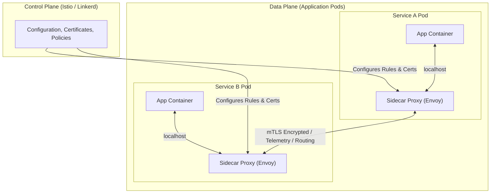
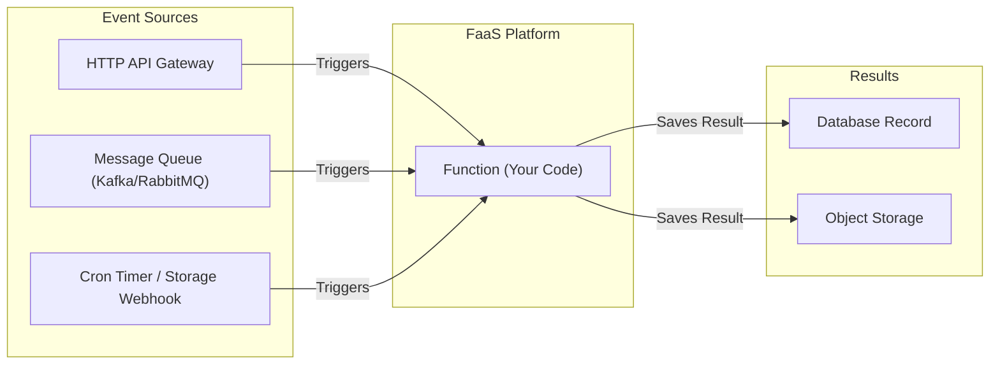
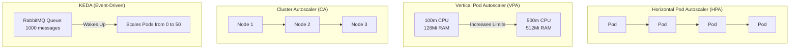
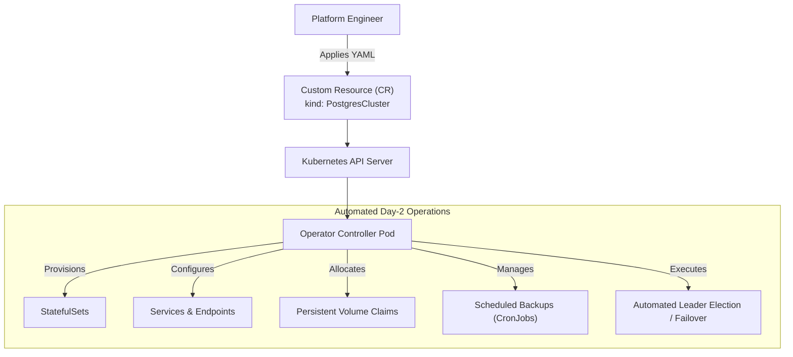
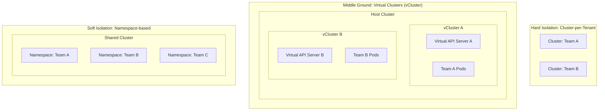
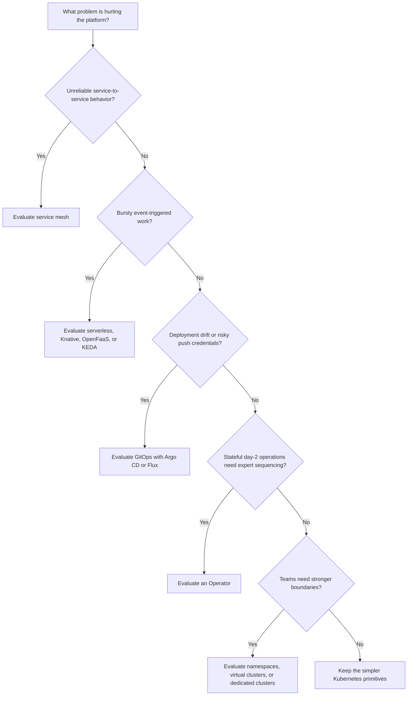

**Складність**: `[MEDIUM]` — архітектурні концепції. **Час на проходження**: 60–75 хвилин. **Передумови**: Модуль 3.2, впевнене володіння словником Kubernetes та кластер Kubernetes 1.35+ для необов'язкової практики. У прикладах ми використовуємо аліас `k` для kubectl; налаштуйте його командою `alias k=kubectl` перед запуском команд.

## Результати навчання

Після завершення цього модуля ви зможете робити архітектурні вибори, які пов'язують патерни з експлуатаційними симптомами, обмеженнями впровадження та перевірюваними виробничими результатами:

1. **Спроєктувати** стійку архітектуру мікросервісів із патернами service mesh, які обробляють ненадійні мережі, не проштовхуючи кожне правило повтору, тайм-ауту й авторизації у код застосунку.
2. **Оцінити** компроміси між безсерверними подієво-керованими архітектурами, традиційними розгортаннями контейнерів та топологіями service mesh для реалістичних профілів навантаження.
3. **Впровадити** робочі процеси розгортання GitOps, які тримають живий стан кластера узгодженим із задекларованим бажаним станом, що зберігається у системі контролю версій.
4. **Діагностувати** вузькі місця продуктивності та масштабування, обираючи правильний механізм автомасштабування: HPA, VPA, Cluster Autoscaler чи KEDA.
5. **Порівняти** моделі ізоляції багатоорендності — від меж простору імен через віртуальні кластери до виділених фізичних кластерів — балансуючи безпеку, автономію та вартість.

## Чому цей модуль важливий

Патерн проєктування «цикл управління» (control loop) із цього модуля ілюструється історією Knight Capital 2012 <!-- incident-xref: knight-capital-2012 --> у [модулі «інфраструктура як код» напрямку modern DevOps](../../../prerequisites/modern-devops/module-1.1-infrastructure-as-code/), де нерівномірний стан розгортання та слабке узгодження перетворили змішаний парк машин на системний збій.

Хмарно-нативна архітектура — це дисципліна вирішення того, які цикли управління мають існувати, де вони мають працювати і що їм дозволено змінювати. Невелика команда іноді може обійтися кількома Деплойментами, Сервісами та написаними вручну runbook'ами, бо всі знають шлях трафіку, а радіус ураження видно. Зі зростанням системи крихкі частини зміщуються від окремих контейнерів у простори між ними: виклики «сервіс–сервіс», ротація сертифікатів, розділення трафіку, дрейф розгортання, накопичення черг, тиск на ресурси, межі орендарів та аварійне перемикання станових сервісів. Ці проблеми не розв'язуються запам'ятовуванням більшої кількості команд; вони розв'язуються вибором патернів, які роблять бажану поведінку явною та безперервно забезпеченою.

Цей модуль навчає патернів, які з'являються знову і знову в середовищах Kubernetes та CNCF: service mesh, безсерверне та подієво-кероване виконання, GitOps, автомасштабування, Оператори та багатоорендність. Мета — не переконати вас встановити кожен проєкт, який трапляється на очі. Service mesh може бути блискучим рівнем безпеки у великій поліглотній платформі і дорогим відволіканням у прототипі з трьох сервісів. GitOps може закрити серйозний аудиторський розрив, але водночас дратувати команди, які ставляться до Git як до чогось другорядного. Оператори можуть автоматизувати складний догляд за базами даних, але також можуть стати прихованою залежністю зі своїми власними режимами відмов. Ви навчитеся оцінювати кожен патерн за тим тиском, який він знімає, новою відповідальністю, яку він вводить, і точкою, у якій цей обмін стає вартим того.

## Проєктування стійкої архітектури мікросервісів із патернами service mesh

Коли моноліт перетворюється на парк мікросервісів, мережа перестає бути просто «сантехнікою» і стає частиною дизайну застосунку. Один запит користувача може зайти через API-шлюз, викликати сервіс ідентифікації, запитати у сервісу цін знижку, зарезервувати товар на складі, записати замовлення, опублікувати подію та повернути відповідь, перш ніж браузер вичерпає тайм-аут. Кожен перехід може бути повільним, недоступним, неправильно налаштованим або досяжним лише через політику, яка змінилася вчора. Розробник застосунку досі володіє бізнес-поведінкою, але платформі тепер потрібен повторюваний спосіб обробляти транспортну поведінку між багатьма командами та мовами.

Стара відповідь полягала в імпорті клієнтських бібліотек, які обробляли повтори, тайм-аути, трейсинг та розмикання кола (circuit breaking) усередині коду застосунку. Це працювало доволі добре, коли більшість сервісів писалися однією мовою і користувалися одним фреймворком, але руйнується в поліглотній організації. Java-команда може використовувати одну політику повторів, Go-команда — іншу, а Python-воркер для пакетної обробки може зовсім забути про політику. Результат — не просто неузгоджений стиль; це неузгоджена поведінка при відмовах у той самий момент, коли однорідна поведінка важить найбільше. Сервіс нижче за течією може бути перевантажений завзятими повторами від одного клієнта, тоді як інший клієнт здається надто швидко й створює хибні помилки.

Патерн service mesh переносить значну частину цієї комунікаційної поведінки в інфраструктуру. Замість того щоб просити кожен сервіс реалізувати ту саму логіку мережевої безпеки, платформа впроваджує або надає проксі, які стоять поруч із робочими навантаженнями та опосередковують трафік. Застосунок досі відкриває з'єднання, але проксі може додати взаємний TLS, забезпечити авторизацію з урахуванням ідентичності, збирати телеметрію, повторювати з обмеженнями та спрямовувати контрольований відсоток трафіку на нову версію. Це схоже на те, як на кожному перехресті ставлять навчених регулювальників руху замість того, щоб просити кожного водія узгоджувати правила пріоритету з пам'яті.



Діаграма показує класичну sidecar-модель. Площина управління зберігає політику, матеріал сертифікатів, правила маршрутизації та конфігурацію, тоді як площина даних виконує власне обробку запитів. Контейнер застосунку спілкується зі своїм локальним проксі через localhost, а проксі спілкується з проксі призначення через мережу. Цей додатковий перехід не безкоштовний. Він споживає CPU та пам'ять, може додавати затримку і дає команді платформи ще одну розподілену систему для оновлення. Причина, з якої команди все одно приймають цю вартість, полягає в тому, що mesh може застосувати одну перевірену комунікаційну політику до сотень сервісів, не чекаючи, поки кожна команда оновить бібліотеки.

Зупиніться й передбачте: якщо service mesh додає по одному проксі поруч із кожним контейнером застосунку, що станеться з плануванням ресурсів, коли платформа зросте з 20 Подів до 400 Подів? Відповідь першого порядку: загальна кількість контейнерів та споживання ресурсів проксі різко зростуть, але глибша відповідь стосується володіння. Ви обмінюєте складність застосунку на рівні окремої команди на централізовану складність платформи. Цей обмін привабливий, коли парк машин великий, регульований, поліглотний або чутливий до каскадних відмов, і марнотратний, коли граф мережі достатньо простий для звичайних Сервісів Kubernetes та тайм-аутів на рівні застосунку.

| Можливість | Опис |
|---------|-------------|
| **mTLS (взаємний TLS)** | Автоматичне, прозоре шифрування між сервісами. Площина управління автоматично ротує сертифікати, забезпечуючи мережеву безпеку за принципом нульової довіри (zero-trust) всередині кластера. |
| **Керування трафіком** | Розширені правила маршрутизації, що дозволяють канаркові релізи — наприклад, спрямування рівно 5% трафіку на v2 сервісу — та A/B-тестування на основі HTTP-заголовків. |
| **Повтори/Тайм-аути** | Автоматична логіка повторів з експоненційною витримкою та джитером, щоб пережити тимчасові мережеві збої, не перевантажуючи сервіси нижче за течією, що й так ледь тримаються. |
| **Розмикання кола** | Здатність швидко відмовляти, коли сервіс нижче за течією у скруті, повертаючи негайну помилку, щоб запобігти каскадному вичерпанню ресурсів по всьому кластеру. |
| **Спостережуваність** | Автоматична генерація метрик золотих сигналів, заголовків розподіленого трейсингу та журналів доступу для всіх мережевих переходів. |
| **Контроль доступу** | Дрібнозерниста авторизація «сервіс–сервіс» — наприклад, дозвіл фронтенд-сервісу читати з білінгу, але блокування записів. |

Найважливіша можливість service mesh — це часто не саме по собі шифрування чи трейсинг, а узгодженість політик. Якщо одна команда володіє оформленням замовлення, інша — складом, а ще інша — оплатою, mesh дає платформі змогу визначити спільні замовчування для бюджетів тайм-аутів, mTLS та ідентичності. Політики все одно можна коригувати посервісно, але відправною точкою більше не є порожній аркуш. Під час інциденту така узгодженість зменшує кількість місць, які треба оглянути, перш ніж вирішити, чи спричинений симптом логікою застосунку, мережевою політикою, проблемою сертифіката чи залежністю, що відмовляє.

| Mesh | Ключові характеристики |
|------|---------------------|
| **Istio** | Найбагатший на функції та найпоширеніший mesh. Використовує проксі Envoy. Історично складний в управлінні, але дуже потужний. Ambient mesh зменшує залежність від sidecar'ів для деяких сценаріїв. |
| **Linkerd** | Створений спеціально для Kubernetes, орієнтований на легкість, швидкість і простоту експлуатації. Проєкт CNCF рівня Graduated, що використовує власні мікропроксі на Rust. |
| **Cilium** | Просунутий мережевий проєкт із безпекою, що задіює eBPF у ядрі Linux для надання можливостей mesh, часто без потреби у sidecar-проксі. |

Istio, Linkerd та Cilium ілюструють, що патерн — це не те саме, що одна реалізація. Istio зазвичай приваблює організації, яким потрібні глибоке керування трафіком, широка інтеграція та велика екосистема, тоді як Linkerd приваблює команди, що хочуть меншу експлуатаційну поверхню та відчуття «рідного» для Kubernetes. Cilium підходить до деяких задач service mesh з мережевого рівня за допомогою eBPF, що може усунути частину накладних витрат на проксі, водночас змінюючи модель налагодження. Архітектор рівня KCNA не повинен зводити цей вибір до популярності. Корисне запитання — яка експлуатаційна проблема найболючіша: розширена маршрутизація, простота експлуатації, мережева політика на рівні ядра чи узгоджений рівень ідентичності.

Практична «бойова історія» service mesh зазвичай починається із сервісу, який повільний, а не мертвий. Під час флеш-розпродажу сервіс складу може почати чекати на блокування бази даних, через що запити на оформлення замовлення накопичуються. Без розмикачів кола абоненти тримають з'єднання відкритими й агресивно повторюють, тож фронтенд-Поди вичерпують робочі потоки, і сайт, звернений до клієнта, відмовляє, хоча початкове вузьке місце було глибше у графі. З політикою mesh проксі може забезпечити тайм-аут, обмежити повтори та швидко відмовити, коли залежність нездорова. Бізнесу все ще може знадобитися резервна відповідь, але платформа не дає одному повільному сервісу перетворити кожного абонента на чергову жертву.

Ось ментальна модель, яку варто тримати під рукою, оцінюючи дизайни service mesh. Mesh не усуває потреби в добрій поведінці застосунку; він створює спільну запобіжну рейку для комунікаційної поведінки. Вашому сервісу все одно потрібні ідемпотентні операції, перш ніж повтори стануть безпечними, корисна обробка помилок, перш ніж резервна поведінка стане осмисленою, та угоди про спостережуваність, перш ніж трейси розкажуть зв'язну історію. Mesh може стандартизувати транспортний рівень, але не може вирішити, чи прийнятно з юридичного або фінансового погляду повторювати запит на оплату. Архітектурна робота — це розмова між цими рівнями.

```text
+----------------------+       +----------------------+
|  Service Owner       |       |  Platform Owner      |
|----------------------|       |----------------------|
| Business behavior    |       | Mesh control plane   |
| Idempotency rules    |       | Certificates         |
| Domain fallbacks     |       | Retry limits         |
| User-facing errors   |       | Traffic policy       |
+----------------------+       +----------------------+
           \                           /
            \                         /
             +-----------------------+
             | Reliable service path |
             +-----------------------+
```

Перш ніж запускати будь-який пілот mesh, запишіть, якій відмові ви очікуєте від нього запобігти, та яку метрику доведе покращення. Якщо ціль — зашифрований трафік «сервіс–сервіс», вимірюйте усунення трафіку у відкритому вигляді та здоров'я ротації сертифікатів. Якщо ціль — безпечніший викат, вимірюйте відсоток трафіку, переведеного під час канаркових релізів, та час відкату, коли частота помилок зростає. Якщо ціль — спостережуваність, перевірте, чи дійсно трейси з'єднують спани абонента й викликаного через ті сервіси, що мають значення. Mesh, встановлений без критерію успіху, стає ще одним рівнем, який люди звинувачують, не розуміючи.

## Оцінювання безсерверних подієво-керованих архітектур та розгортань контейнерів

Контейнери полегшили пакування довготривалих сервісів, але не кожне робоче навантаження заслуговує працювати цілий день. Зміна розміру зображень, обробка вебхуків, генерація звітів, споживачі черг та заплановані завдання очищення часто мають довгі періоди простою, за якими йдуть короткі сплески роботи. Якщо ви запускаєте ці навантаження як постійні Деплойменти, ви платите за готовність навіть тоді, коли обробляти нічого. Безсерверні та подієво-керовані патерни ставлять інше запитання: що, якби обчислення існували лише тоді, коли подія потребує роботи, а платформа сама опікувалася межею масштабування за вас?

Безсерверність не означає, що серверів немає. Вона означає, що розробник захищений від провіжнінгу серверів, обслуговування вузлів та більшості рішень про масштабування. У платформах «функція як сервіс» (FaaS) прибуває подія, платформа запускає або повторно використовує середовище виконання, функція виконується, а платформа згортає або паркує потужності, коли попит зникає. Економічна модель потужна, бо час простою може наближатися до нульової вартості, але обмеження дизайну так само реальні. Функції мають бути безстановими, обмеженими в часі виконання, швидкими до старту та обережними щодо зовнішніх систем, бо паралелізм може зростати швидше, ніж база даних здатна витримати.



Подієво-керована діаграма виглядає простою, бо ховає найважливіше рішення дизайну: джерело подій стає частиною моделі надійності. Черга може поглинути сплески, зберегти роботу та дати споживачам обробляти її з контрольованою швидкістю. HTTP-тригер може створити кращий досвід користувача для синхронних запитів, але водночас прив'язує затримку функції безпосередньо до затримки користувача. Тригер за таймером підходить для рутинного обслуговування, проте може випадково запустити дороге завдання в той самий момент, коли кожне середовище виконує власний розклад. Платформа може масштабувати виконання, але архітектор досі має вирішити, як події буферизуються, повторюються, дедуплікуються та спостерігаються.

| Аспект | Опис |
|--------|-------------|
| **Без управління серверами** | Базова платформа динамічно виділяє обчислювальні ресурси. Розробники не керують вузлами, системними пакетами чи пулами воркерів безпосередньо. |
| **Автомасштабування** | Система автоматично масштабує кількість одночасних екземплярів функцій зі зростанням черги подій і масштабує до нуля, коли подій немає. |
| **Подієва керованість** | Функції дрімають до явної події — як-от завантаження файлу, вставка рядка до бази даних, повідомлення в черзі чи вебзапит — яка запускає виконання. |
| **Оплата за використання** | Білінг обчислюється з фактичного часу виконання та спожитої пам'яті, тож час простою зазвичай набагато дешевший за постійні потужності. |
| **Безстановість** | Функції не можуть покладатися на локальні файлові системи чи пам'ять, що переживає між викликами. Потрібний стан має жити у зовнішній базі даних, об'єктному сховищі чи кеші. |
| **Короткочасність** | Середовища виконання мають жорсткі тайм-аути, часто в діапазоні хвилин, що змушує навантаження дробитися на менші та ідемпотентні одиниці. |

Традиційні Деплойменти контейнерів досі є правильним вибором для багатьох навантажень. Чутливий до затримки API, який має тримати теплі з'єднання з базою даних, може працювати краще як стабільний набір Подів, ніж як функції, що багаторазово холодно стартують. Сервіс, який тримає кеші в пам'яті, передає двоспрямовані з'єднання потоком або координує довгі транзакції, може боротися з безсерверною моделлю. І навпаки, генератор мініатюр, який годинами нічого не обробляє, а потім опрацьовує тисячі завантажень, є природним кандидатом на безсерверність. Лінза дизайну — це не «сучасне проти старого»; це форма навантаження, толерантність до затримки, потреби у стані та вартість простоюючої готовності.

У середовищах Kubernetes безсерверні патерни часто приходять через Knative, OpenFaaS чи KEDA. Knative Serving може запускати контейнери за моделлю масштабування до нуля, керованою запитами, тоді як Knative Eventing дає структуровану модель для брокерів, тригерів та доставки подій. OpenFaaS пакує функції та наявні бінарники, тож команди можуть розгортати навантаження у стилі функцій на кластері, який вони вже експлуатують. KEDA, який з'являється знову в розділі про автомасштабування, стежить за зовнішніми джерелами подій і подає сигнали масштабування у навантаження Kubernetes. Ці інструменти розмивають межу між контейнерами та безсерверністю, бо одиниця виконання досі може бути образом контейнера, тоді як експлуатаційна поведінка стає подієво-керованою.

Який підхід ви обрали б для API авторизації платежів, який отримує стабільний трафік протягом дня й має відповідати менш ніж за 200 мілісекунд на 95-му процентилі? Постійний Деплоймент зазвичай є кращою першою відповіддю, бо холодні старти, сплески паралелізму та обертання з'єднань нижче за течією можуть загрожувати шляху користувача. Тепер змініть приклад на генератор звітів про шахрайство, що запускається чергою після завершення замовлення. Безсерверна або подієво-керована відповідь стає привабливішою, бо робота асинхронна, відбувається сплесками, придатна до повтору та відірвана від негайної відповіді клієнту. Той самий кластер, та сама організація, інша форма навантаження.

Режим відмови безсерверної архітектури — це часто прихована зв'язаність через спільні залежності. Функції масштабуються швидко, і в цьому суть, але ліміт з'єднань бази даних чи квота стороннього API можуть не масштабуватися разом із ними. Черга з десятьма тисячами повідомлень може створити сплеск викликів функцій, які всі намагаються оновити ту саму таблицю чи звернутися до того самого ендпойнта нижче за течією. Добрий подієво-керований дизайн застосовує зворотний тиск (backpressure), ліміти паралелізму, ключі ідемпотентності, черги недоставлених повідомлень (dead-letter) та явні політики повторів. Без цих засобів контролю безсерверність стає дуже ефективним способом перевантажити наступну систему в черзі.

Для іспиту KCNA та для реальної роботи з платформою ставтеся до безсерверності як до патерну з межами, а не як до синоніма функцій хмарного провайдера. Архітектурна ідея — це виконання, кероване подіями, автоматичне масштабування та мінімальне управління простоєм. Реалізацією може бути AWS Lambda, Google Cloud Functions, Knative, OpenFaaS чи Деплоймент, масштабований KEDA. Запитання, яке слід поставити: чи стає навантаження простішим, коли обчислення слідують за подіями, чи воно стає складнішим, бо насправді потребувало довговічних з'єднань, теплого стану чи передбачуваних локальних ресурсів.

## Впровадження робочих процесів розгортання GitOps для декларативного стану

Kubernetes побудований навколо узгодження: ви декларуєте бажаний стан, а контролери працюють над тим, щоб фактичний стан відповідав йому. GitOps розширює цю ідею за межі одного об'єкта Kubernetes і застосовує її до робочого процесу доставки. Замість того щоб ставитися до CI-сервера як до потужного діяча, який проштовхує зміни у кластер, GitOps ставиться до Git як до авторитетного запису й запускає агента всередині кластера, щоб витягувати та застосовувати бажаний стан. Система розгортання стає ще одним циклом узгодження, а не одноразовою командою, випущеною з конвеєра.

Традиційний CI/CD на основі проштовхування (push) часто починається добре, а з часом стає ризикованим. CI-завдання збирає образ, автентифікується до кластера, виконує команду розгортання й звітує про успіх. Це означає, що зовнішня система тепер потребує облікових даних, здатних змінювати продакшн, а ці облікові дані часто живуть поруч із журналами збірки, плагінами та сторонніми інтеграціями. Якщо оператор пізніше виконає аварійну команду на кшталт `k scale` або відредагує Деплоймент напряму, живий кластер може відхилитися від репозиторію. У наступному розборі інциденту буде дві історії: те, що, за словами Git, має існувати, і те, що насправді працювало у кластері.

```mermaid
graph LR
    subgraph Source_of_Truth ["Single Source of Truth"]
        Git["Git Repository<br/>(Contains Desired State YAML)"]
    end
    
    subgraph K8s_Cluster ["Kubernetes Cluster"]
        Agent["GitOps Agent<br/>(Argo CD / Flux)"]
        State["Cluster API<br/>(Actual State)"]
    end

    Agent -->|1. Continuously Pulls| Git
    Agent -->|2. Compares| State
    Agent -->|3. Reconciles (Applies changes)| State
```

Модель GitOps на основі витягування (pull) змінює історію з обліковими даними. CI-система досі може збирати образи та оновлювати маніфести, але їй потрібен лише дозвіл писати до Git чи відкривати pull request. Агент усередині кластера тримає облікові дані Kubernetes і стежить за змінами в репозиторії. Якщо сервер збірки скомпрометовано, зловмисник не отримує автоматично прямого доступу до виробничого API-сервера. Він усе одно може спробувати зробити шкідливий коміт, тож захист гілок, рецензування, підписування та перевірки політик мають значення, але межа кластера набагато щільніша, ніж у світі, де кожен CI-раннер може проштовхувати довільні маніфести.

| Принцип | Опис |
|-----------|-------------|
| **Декларативність** | Уся система конфігурується декларативно за допомогою YAML, JSON, Helm, Kustomize чи подібних форматів бажаного стану. |
| **Версійність** | Бажаний стан зберігається в Git, що дає історію рецензувань, ідентичність комітів, точки відкату та довговічний аудиторський слід. |
| **Автоматизованість** | Агенти всередині кластера безперервно порівнюють задекларований стан із живим і узгоджують розбіжності без ручних команд розгортання. |
| **Аудитованість** | Журнал комітів Git стає основним записом виробничих змін, що є критичним для регульованих середовищ та відтворення інцидентів. |

GitOps — це не просто автоматизація з модною назвою. Визначальна властивість — це збіжність до репозиторію. Якщо хтось вручну змінює кількість реплік під час інциденту, агент GitOps має позначити застосунок як такий, що відхилився, і або автоматично скасувати зміну, або вимагати свідомого рішення про синхронізацію — залежно від політики. Така поведінка спершу може здивувати команди, бо кластер ніби відхиляє аварійну роботу. Краще тлумачення таке: аварійна робота тепер потребує видимого шляху назад до системи контролю версій, тож система не зберігає невидимий стан після того, як адреналін спадає.

Зупиніться й подумайте: у конвеєрі на основі проштовхування, де живуть виробничі облікові дані, і скільки систем можуть ними скористатися? У конвеєрі GitOps на основі витягування, якій системі потрібні облікові дані кластера, а яким системам потрібні лише дозволи Git? Ця карта облікових даних — один із найчіткіших способів оцінити, чи є процес справді GitOps, чи це просто CI-завдання, яке принагідно читає YAML з репозиторію.

Експлуатаційний дизайн GitOps має компроміси. Автоматична синхронізація може швидко виправити дрейф, але також може скасувати ручне пом'якшення, поки інцидент ще триває. Ручна синхронізація дає людям шлюз, але може сповільнити відновлення або дозволити дрейфу зберігатися довше. Монорепозиторії спрощують глобальну видимість, тоді як репозиторії під конкретні середовища можуть створити чіткіші межі володіння. Автоматизація образів може зменшити рутину, але якщо кожна успішна збірка автоматично оновлює продакшн, команди можуть втратити ту точку рецензування, яка й зробила GitOps привабливим. Патерн потужний саме тому, що робить ці вибори явними.

Практична вправа далі імітує скасування бажаного стану звичайним Деплойментом, а не встановленням Argo CD чи Flux. Це навмисно. Вам не потрібен повний контролер GitOps, щоб зрозуміти основний механізм. Якщо файл каже три репліки, а живий кластер має одну, повторне застосування файлу відновлює задекларований стан. Argo CD та Flux індустріалізують цей цикл за допомогою порівняння (diffing), перевірок здоров'я, політик синхронізації, виявлення дрейфу та інтеграції з репозиторієм. Концептуальний крок той самий: бажаний стан перемагає, поки ви не зміните бажаний стан.

## Діагностування вузьких місць продуктивності та масштабування за допомогою патернів автомасштабування

Автомасштабування — це не одна функція; це набір циклів управління, що діють на різних рівнях. Поду може знадобитися більше реплік, контейнеру — інші запити на ресурси, кластеру — більше вузлів, а подієво-керованому воркеру — прокинутися з нуля, бо черга наповнюється. Плутання цих рівнів призводить до дорогих і нестабільних систем. Horizontal Pod Autoscaler, Vertical Pod Autoscaler, Cluster Autoscaler та KEDA — кожен із них відповідає на інше запитання про масштабування, тож діагностика починається з питання, який саме ресурс насправді обмежений.



HPA змінює кількість реплік для масштабованого навантаження. Якщо кожен Под може обробити подібну частку трафіку, а вузьким місцем є CPU на один Под, кастомні метрики, пов'язані з пам'яттю, частота запитів чи глибина черги, горизонтальне масштабування зазвичай є першим інструментом для розгляду. HPA працює найкраще, коли застосунок безстановий або коли стан винесено назовні достатньо чисто, щоб додавання реплік збільшувало корисну ємність. Він працює погано, коли всі репліки змагаються за один заблокований рядок бази даних, коли воркер-одинак (singleton) має обробляти завдання по порядку, або коли метрика приходить надто пізно, щоб запобігти зростанню накопичення.

VPA змінює запитувані ресурси для Подів. Він цінний, коли навантаження недозапитане, перезапитане або погано масштабується горизонтально, але часто потребує перестворення Подів, щоб застосувати рекомендації. Така поведінка з виселенням (eviction) має значення. Безстановий API з багатьма репліками може стерпіти події правильного визначення розміру, тоді як вузол бази даних чи черги потребує ретельного планування переривань. VPA також конфліктує з HPA, коли обидва реагують на той самий сигнал ресурсу, бо один контролер може додавати репліки, поки інший змінює запити на один Под, спричиняючи нестабільний зворотний зв'язок.

Cluster Autoscaler працює нижче рівня Подів. Якщо HPA створює більше Подів, а планувальник не може їх розмістити, бо в жодного вузла немає ємності, ці Поди залишаються у стані Pending. Cluster Autoscaler помічає Поди, які неможливо запланувати, і просить у хмари чи провайдера інфраструктури більше вузлів, а пізніше прибирає недовикористані вузли, коли може зробити це безпечно. Це означає, що HPA та Cluster Autoscaler часто діють у парі: один вирішує, що потрібно більше реплік, а інший звільняє місце для цих реплік. Якщо ви діагностуєте лише Деплоймент і ігноруєте ємність вузлів, ви можете не помітити, чому масштабування зупинилося.

KEDA розширює історію автомасштабування у бік подієво-керованих навантажень. Він може стежити за зовнішніми системами, як-от черги, потоки, бази даних і хмарні сервіси, а потім масштабувати навантаження Kubernetes на основі тиску подій. Це особливо корисно, коли CPU є запізнілим сигналом. Споживач черги може сидіти на низькому CPU, поки черга росте, бо в нього замало реплік, або йому може знадобитися масштабуватися з нуля, перш ніж з'являться будь-які метрики Подів. KEDA з'єднує зовнішній попит і примітиви масштабування Kubernetes, що робить його природним супутником безсерверних патернів на кластерах.

Якщо у вас є деплоймент із назвою `web-frontend`, ви можете імперативно впровадити базове автомасштабування, щоб перевірити поведінку HPA:

```bash
# Autoscale the frontend between 2 and 10 replicas, targeting 70% CPU utilization
k autoscale deployment web-frontend --cpu-percent=70 --min=2 --max=10
```

Перш ніж запускати це, який вивід ви очікуєте від `k get hpa` після початку навантаження? HPA має показати поточне значення метрики, що рухається до цілі, та кількість реплік, що змінюється в межах налаштованих границь. Якщо метрика читається як невідома, проблема не у формулі HPA; зазвичай це відсутня інфраструктура метрик, навантаження без запитів на ресурси чи адаптер кастомних метрик, який не звітує. Саме тому діагностика автомасштабування починається зі спостережуваності. Контролер не може прийняти корисне рішення на основі сигналу, якого він не бачить.

Реалістичний інцидент масштабування може початися з того, що воркер оформлення замовлення відстає від черги повідомлень. CPU тримається на 30%, тож HPA на основі CPU не реагує, але клієнти чекають, бо робота в черзі старіє. Додавання самого лише Cluster Autoscaler нічого не дає, бо немає Подів у стані Pending. Збільшення рекомендацій VPA може зробити кожен воркер більшим, але все одно ігнорує сигнал черги. KEDA чи HPA, що використовує глибину черги як кастомну метрику, відповідає вузькому місцю, бо масштабується на основі роботи, що чекає на обробку. Правильний автоскейлер — той, чий вхідний сигнал описує реальне обмеження.

Масштабування також має фінансові та людські наслідки. Агресивні налаштування HPA можуть множити Поди швидше, ніж сервіси нижче за течією здатні витримати, що перетворює невеликий сплеск на збій бази даних. Консервативні налаштування можуть зберегти залежності, але дозволяють затримці зростати. Cluster Autoscaler може заощадити кошти, прибираючи простоюючі вузли, але часті цикли масштабування вгору й униз можуть створювати затримки планування. VPA може зменшити марнотратство, виправляючи завеликі запити, але несподівані виселення можуть зашкодити доступності. Добра політика автомасштабування — це не максимальна автоматизація; це контрольований цикл зворотного зв'язку з границями, періодами охолодження (cooldown) та метриками, що відповідають впливу на користувача.

## Використання Операторів для автоматизації станових операцій Day-2

Контролери Kubernetes чудово підтримують безстанові навантаження живими. Якщо Под зникає, ReplicaSet створює інший. Якщо вузол відмовляє, планувальник за можливості розміщує замінні Поди деінде. Станові системи складніші, бо заміна процесу — це не те саме, що збереження коректності. Кластер PostgreSQL, інсталяція Kafka чи розподілений кеш мають порядок, кворум, резервні копії, процедури відновлення, сумісність версій та правила аварійного перемикання. Загальний контролер Деплойменту не може знати, яка репліка є основною, яка резервна копія дійсна або коли міграція схеми безпечна.

Патерн «Оператор» розширює Kubernetes, кодуючи специфічні для предметної області експлуатаційні знання у контролер. Замість того щоб просити адміністратора створювати купу StatefulSet'ів, Сервісів, PVC, Secret'ів, Job'ів та ConfigMap'ів вручну, платформа вводить Custom Resource Definition, що описує об'єкт предметної області безпосередньо. Користувач може запросити `PostgresCluster` чи `KafkaTopic`, а Оператор стежить за цим запитом, створює ресурси нижчого рівня й продовжує узгоджувати їх зі зміною умов. Патерн потужний, бо робить експертні дії з runbook'ів повторюваними та спостережуваними через API Kubernetes.



Оператор має три ключові складники. Custom Resource Definition навчає API Kubernetes новому типу та схемі. Custom Resource — це звернений до користувача екземпляр цього типу, як-от конкретний кластер бази даних із версією, кількістю реплік, розміром сховища та розкладом резервного копіювання. Контролер — це програма, яка стежить за цими ресурсами й узгоджує реальність. Якщо бажана база даних каже три репліки, а здорових лише дві, контролер вирішує правильну специфічну для предметної області дію. Це може означати створення нового Поду, підвищення репліки, відновлення з резервної копії чи відмову від ризикованої зміни, поки умова не стане безпечною.

Фраза «кодифікація експлуатаційних знань» легко вимовляється й легко недооцінюється. Адміністратор бази даних може знати, що не варто робити аварійне перемикання під час резервного копіювання, не варто видаляти том, який містить єдину добру репліку, і не варто оновлюватися через несумісні мажорні версії без проміжного кроку. Оператор може закодувати ці правила, але лише якщо автори глибоко розуміють предметну область і чітко виставляють статус. Слабкий Оператор може бути гіршим за відсутність Оператора, бо дає користувачам хибне відчуття автоматизації, ховаючи складні рішення у контролері, який мало хто здатен налагодити.

Популярні приклади показують, чому патерн поширився. Prometheus Operator спрощує розгортання стека моніторингу, перетворюючи Prometheus, Alertmanager та конфігурацію скрейпінгу на ресурси Kubernetes. cert-manager автоматизує видачу, валідацію та поновлення сертифікатів, тож командам не доводиться вручну ротувати матеріал TLS. Strimzi автоматизує кластери Apache Kafka, які мають значну експлуатаційну складність навколо брокерів, топіків, лісенерів та поетапних оновлень. Оператори PostgreSQL від вендорів та проєктів з відкритим кодом автоматизують кластеризацію, резервне копіювання, аварійне перемикання й завдання обслуговування, які інакше потребували б ретельної людської координації.

Оператори також вводять обов'язки платформи. Сам контролер потребує оновлень, RBAC, метрик, журналів, резервних копій свого керованого стану й перевіреного плану відновлення. CRD є ресурсами рівня кластера, тож встановлення одного з них для орендаря може вплинути на всю поверхню API кластера. Погано спроєктований Оператор може боротися з ручними спробами відновлення чи створювати ресурси швидше, ніж платформа здатна підтримати. Коли ви впроваджуєте Оператор, ви впроваджуєте програмне забезпечення, що ухвалює виробничі рішення від вашого імені. Це варте того для складних предметних областей, але заслуговує на той самий перегляд, який ви дали б будь-якій критичній автоматизації.

Тест на рішення простий: якщо правильна операція потребує специфічного для предметної області впорядкування, якого загальний контролер Kubernetes знати не може, Оператор може бути доречним. Якщо застосунок — це безстановий вебсервіс зі звичайними потребами викату, зазвичай достатньо Деплойменту, Сервісу, Інгресу та робочого процесу GitOps. Оператори сяють, коли автоматизують дії Day-2, як-от резервне копіювання, відновлення, аварійне перемикання, ребалансування, поновлення сертифікатів, управління шардами чи безпечні оновлення версій. Вони надмірні, коли просто обгортають три статичні YAML-файли й додають ще один контролер для моніторингу.

## Порівняння моделей ізоляції багатоорендності

Коли впровадження Kubernetes поширюється організацією, команда платформи зрештою стикається з оманливо простим запитанням: чи мають усі команди ділити один кластер, чи кожна команда має отримати власний? Спільні кластери покращують утилізацію та централізують операції, але потребують міцних меж. Виділені кластери дають чисту ізоляцію, але множать площини управління, оновлення, розповсюдження політик та вартість. Багатоорендність — це архітектура цих меж. Вона визначає, хто може бачити які об'єкти API, хто може споживати які ресурси, хто може встановлювати розширення рівня кластера і скільки шкоди один орендар може завдати іншому.



Багатоорендність на основі простору імен — поширена відправна точка. Кожна команда отримує один або кілька просторів імен, RBAC обмежує, які користувачі та сервісні акаунти можуть там працювати, ResourceQuota запобігають тому, щоб один орендар спожив усю ємність кластера, LimitRange встановлюють замовчувані запити й ліміти, а NetworkPolicy обмежують трафік між орендарями. Ця модель економна й експлуатаційно проста, бо команда платформи керує одним кластером. Її слабкість у тому, що простори імен самі по собі не є жорсткими межами безпеки. Ресурси рівня кластера, атаки на рівні вузла, надто дозвільний RBAC, відсутні NetworkPolicy та спільна конфігурація допуску — усе це може підірвати історію ізоляції.

Ізоляція «кластер на орендаря» розташована на іншому кінці спектра. Кожна команда, продукт чи середовище отримує виділений кластер Kubernetes із власною площиною управління та робочими вузлами. Ця модель дає найчіткішу межу радіуса ураження й дозволяє орендарям використовувати різні розширення рівня кластера без зіткнень. Вона приваблива для регульованих навантажень, ворожих орендарів, незвичних мережевих потреб чи команд, яким потрібен незалежний контроль життєвого циклу. Ціна — експлуатаційне множення. Кожен кластер потребує оновлень, моніторингу, забезпечення політик, інтеграції ідентичності, рішень про резервне копіювання та планування ємності, тож модель масштабується лише за наявності в платформи сильної автоматизації.

Віртуальні кластери займають проміжне положення. Інструмент на кшталт vCluster запускає легку площину управління Kubernetes усередині простору імен на хост-кластері, даючи орендарю окремий ендпойнт API, тоді як навантаження все ще працюють на спільних фізичних вузлах. Орендарі часто можуть створювати CRD й тестувати поведінку рівня кластера всередині своєї віртуальної площини управління, не впливаючи на інших орендарів чи хост-кластер. Це особливо корисно для середовищ розробки, CI-пісочниць та платформних експериментів, де командам потрібно більше автономії, ніж дає простір імен, але не потрібні витрати на повноцінний фізичний кластер.

Модель безпеки треба викласти чесно. Ізоляція простору імен може бути достатньо міцною для кооперативних внутрішніх команд, коли RBAC, квоти, політики допуску, засоби контролю Pod Security та NetworkPolicy забезпечуються послідовно. Її недостатньо для недовірених орендарів, які можуть спробувати вирватися за межі чи експлуатувати вразливості рівня вузла. Віртуальні кластери покращують ізоляцію API та автономію орендаря, але все ще залежать від хост-кластера для фактичної ізоляції обчислень. Виділені кластери дають найміцнішу межу орендаря, проте не усувають потреби в засобах контролю ідентичності, мережі, ланцюга постачання та безпеки навантажень усередині кожного кластера.

Багатоорендність також впливає на досвід розробника. Орендар простору імен може мати потребу звертатися до команди платформи щоразу, коли змінюється CRD, політика допуску чи роль кластера. Орендар віртуального кластера може тестувати вільніше, що зменшує платформні вузькі місця для команд, які створюють Оператори чи контролери. Орендар виділеного кластера може рухатися найшвидше в межах власного кордону, але може відхилитися від організаційних стандартів, якщо команда платформи не автоматизує базову конфігурацію. Найкраща модель рідко буває універсальною. Багато організацій використовують ізоляцію простору імен для звичайних команд застосунків, віртуальні кластери для пісочниць та виділені кластери для регульованих чи незвично ризикованих навантажень.

## Патерни й антипатерни

Хмарно-нативні патерни корисні лише тоді, коли вони прив'язані до форми проблеми. Service mesh — це патерн для узгодженої комунікації сервісів, а не знак зрілості. GitOps — це патерн для задекларованого й аудитованого стану, а не заміна тестування. Оператори — це патерн для специфічного для предметної області узгодження, а не спосіб надати будь-якому YAML вишуканого вигляду. Наступні таблиці підсумовують практичні сигнали того, що патерн пасує, і застережні ознаки того, що його використовують як декорацію.

| Патерн | Використовуйте, коли | Чому це працює | Міркування щодо масштабування |
|---------|----------|--------------|------------------------|
| **Service mesh для спільної комунікаційної політики** | Багатьом сервісам потрібні узгоджені mTLS, маршрутизація трафіку, телеметрія та авторизація між мовами. | Проксі та площина управління централізують поведінку, яку інакше довелося б дублювати в кожній кодовій базі. | Закладіть ресурси для проксі, стандартизуйте замовчування й доведіть, що експлуатаційні команди вміють налагоджувати mesh під час інцидентів. |
| **Подієво-керовані безсерверні навантаження** | Робота сплескова, асинхронна, ідемпотентна та запускається чергами, файлами, таймерами чи вебхуками. | Обчислення слідують за подіями, тож вартість простою падає, а масштабування може реагувати на зовнішній попит. | Захищайте системи нижче за течією лімітами паралелізму, зворотним тиском, повторами та обробкою недоставлених повідомлень. |
| **Узгодження GitOps** | Командам потрібні чіткий аудиторський слід, виправлення дрейфу та безпечна модель розгортання на основі витягування. | Git зберігає бажаний стан, тоді як агенти всередині кластера безперервно порівнюють і узгоджують фактичний стан. | Визначте політику синхронізації, правила відкату, просування між середовищами та обробку аварійних змін до використання у продакшні. |
| **Станові системи під керуванням Операторів** | Операції Day-2 потребують специфічного для предметної області впорядкування, аварійного перемикання, резервного копіювання, відновлення чи безпечних оновлень. | Контролер кодує експертні runbook'и й виставляє предметну область через ресурси Kubernetes. | Ставтеся до Оператора як до виробничого ПЗ із вимогами до життєвого циклу, спостережуваності, RBAC та відновлення. |
| **Багатошарова багатоорендність** | Різним командам потрібні різні ступені автономії, ізоляції та економічної ефективності. | Простори імен, віртуальні кластери та виділені кластери дають меню меж замість однієї жорсткої моделі. | Зіставляйте рівень ізоляції з довірою, регуляторними потребами, вимогами до розширень рівня кластера та спроможністю автоматизації платформи. |

| Антипатерн | Що йде не так | Краща альтернатива |
|--------------|-----------------|--------------------|
| **Встановлення mesh до того, як названо відмову** | Команда успадковує накладні витрати на проксі та складність площини управління, не знаючи, що означає успіх. | Почніть із цілей щодо тайм-аутів, mTLS, викату чи телеметрії, потім пілотуйте mesh проти вимірюваних результатів. |
| **Називання будь-якого push-конвеєра словом GitOps** | Зовнішні CI-системи все ще тримають облікові дані кластера, а ручні зміни все ще створюють невидимий дрейф. | Запустіть агента всередині кластера на кшталт Argo CD чи Flux і зробіть Git джерелом бажаного стану. |
| **Масштабування за CPU, коли попит живе в черзі** | Воркери відстають, поки CPU залишається низьким, тож HPA ніколи не реагує на реальне вузьке місце. | Масштабуйте за глибиною черги чи тиском подій за допомогою KEDA чи адаптера кастомних метрик. |
| **Ставлення до просторів імен як до жорстких меж безпеки** | Відсутні NetworkPolicy, широкий RBAC чи спільні ресурси рівня кластера дозволяють орендарям впливати один на одного. | Поєднуйте RBAC, квоти, мережеву політику, засоби контролю допуску та міцнішу ізоляцію там, де довіра низька. |
| **Використання Операторів для статичних застосунків** | Контролер додає тягар оновлень і налагодження, не автоматизуючи осмислену поведінку Day-2. | Використовуйте звичайні Деплойменти, Helm, Kustomize та GitOps для простих безстанових сервісів. |
| **Дозвіл безсерверному паралелізму працювати без обмежень** | Сплеск подій перевантажує бази даних, API чи залежності з обмеженою частотою. | Встановіть ліміти паралелізму, бюджети повторів, зворотний тиск та черги недоставлених повідомлень навколо споживачів подій. |

Зверніть увагу, що краща альтернатива не завжди є іншим продуктом. Часто це чіткіша межа, краща метрика чи письмова політика, яка пояснює, як автоматизація поводиться під тиском. Зріла хмарно-нативна архітектура не збирає патерни заради них самих. Вона прибирає невизначеність із тих місць, де невизначеність перетворюється на збої, аудиторські розриви чи неконтрольовану вартість.

## Рамка прийняття рішень

Коли ви стикаєтеся з рішенням про дизайн платформи, починайте із симптому й рухайтеся назад до циклу управління, який має ним володіти. Якщо виклики сервісів відмовляють по-різному в різних командах, service mesh може централізувати комунікаційну політику. Якщо розгортання дрейфують від історії рецензувань, GitOps може розмістити узгодження там, де йому місце. Якщо черга росте, поки CPU спокійний, KEDA чи кастомна метрика можуть описати попит краще за HPA. Якщо базі даних потрібні аварійне перемикання, резервне копіювання та впорядкування оновлень, Оператор може закодувати відсутній runbook. Якщо орендарям потрібні різні рівні довіри та автономії, модель багатоорендності має стати явною.



| Тиск рішення | Віддавайте перевагу цьому патерну | Будьте обережні, коли |
|-------------------|--------------------|-----------------|
| Неузгоджені повтори, тайм-аути, mTLS, авторизація чи розділення трафіку між багатьма сервісами | Service mesh | Граф сервісів малий, бюджет затримки тісний, або оператори платформи ще не можуть підтримати mesh. |
| Спалахоподібна асинхронна робота, обробники вебхуків, споживачі черг чи завдання з довгими періодами простою | Безсерверне або подієво-кероване масштабування | Навантаженню потрібні довговічний локальний стан, теплі з'єднання чи суворі низьколатентні синхронні відповіді. |
| Виробничий стан має відповідати рецензованим деклараціям, а CI не повинен тримати облікові дані адміністратора кластера | GitOps | Аварійні робочі процеси не визначені, або команди обходять Git під час інцидентів. |
| Бази даних, Kafka, стеки моніторингу чи робочі процеси сертифікатів потребують автоматизації Day-2 | Оператор | Оператор ховає ризиковані дії, не має чіткого статусу чи автоматизує просте статичне розгортання. |
| Команди ділять інфраструктуру, але потребують контрольованої автономії та справедливості ресурсів | Багатоорендність на основі простору імен чи віртуального кластера | Орендарі недовірені або потребують жорстких меж відповідності, що вимагають виділених кластерів. |

Найпростіша валідна архітектура зазвичай є найкращою відправною точкою, але «просто» не означає «вручну». Деплоймент із добрими пробами, запитами на ресурси та доставкою GitOps може бути простішим і безпечнішим за ранній mesh. Воркер черги з KEDA може бути простішим і дешевшим за постійно теплий парк машин. Виділений кластер може бути простішим для регульованого платіжного навантаження, якщо альтернатива — десятки крихких винятків простору імен. Рамка прийняття рішень існує, щоб запобігти культу карго патернів. Обирайте найменший цикл управління, який безпосередньо адресує режим відмови, який ви можете назвати.

## Чи знали ви?

- **Service mesh'і змінюють форму:** Ambient-режим Istio зменшує потребу в sidecar'ах на кожен Под у деяких розгортаннях, тоді як Cilium використовує eBPF, щоб наблизити частини мережі й забезпечення безпеки до ядра Linux.
- **GitOps набув популярності у 2017 році:** Weaveworks ввела й поширила цей термін, розробляючи Flux, а проєкт OpenGitOps пізніше описав вендоронейтральні принципи цієї практики.
- **Зрілість Операторів має рівні:** Operator Framework описує шлях від базового встановлення через безшовні оновлення, повне керування життєвим циклом, глибоке розуміння до поведінки автопілота.
- **KEDA отримав статус Graduated у серпні 2023 року:** Kubernetes Event-Driven Autoscaler став проєктом CNCF рівня Graduated, відображаючи широке впровадження подієво-керованого масштабування на Kubernetes.

## Типові помилки

| Помилка | Чому це трапляється | Як виправити |
|---------|----------------|---------------|
| Встановлення service mesh для трьох простих сервісів | Команди прирівнюють впровадження mesh до зрілості платформи ще до того, як з'являться проблеми, що мають форму mesh. | Почніть зі звичайних Сервісів, NetworkPolicy, проб та тайм-аутів застосунку; поверніться до mesh, коли комунікаційна політика стане неузгодженою чи ризикованою. |
| Ставлення до безсерверності як до безкоштовної кнопки масштабування | Історія про масштабування до нуля ховає холодні старти, сплески паралелізму та ліміти нижче за течією. | Змоделюйте затримку, паралелізм, повтори та ємність залежностей, перш ніж переносити звернені до користувача шляхи на функції. |
| Називання зв'язки Jenkins плюс `k apply` робочим процесом GitOps | Маніфести можуть жити в Git, але кластер усе ще довіряє зовнішньому штовхальнику й може тихо дрейфувати. | Використовуйте узгоджувач усередині кластера на кшталт Argo CD чи Flux і зробіть Git джерелом бажаного стану. |
| Поєднання HPA та VPA на тому самому сигналі CPU | Обидва контролери реагують на той самий тиск і можуть створити цикли зворотного зв'язку з виселеннями та змінами реплік. | Використовуйте HPA для кількості реплік, а VPA для рекомендацій, або розділіть відповідальність за ресурси, потім протестуйте поведінку переривань. |
| Масштабування воркерів за CPU, коли проблема користувача — накопичення | CPU може залишатися низьким, поки черга росте, тож автоскейлер пропускає попит. | Масштабуйте за довжиною черги, віком подій чи специфічними для предметної області кастомними метриками за допомогою KEDA чи адаптера. |
| Ставлення до просторів імен як до захищених стін орендаря | Простори імен організовують об'єкти, але не ізолюють автоматично мережу, ресурси чи дозволи рівня кластера. | Додайте RBAC, ResourceQuota, LimitRange, NetworkPolicy, засоби контролю Pod Security та міцнішу ізоляцію для недовірених орендарів. |
| Використання Оператора для обгортання статичного YAML | Контролер виглядає вишукано, але додає ризик життєвого циклу, не автоматизуючи реальних операцій. | Резервуйте Оператори для предметних областей із логікою резервного копіювання, аварійного перемикання, відновлення, оновлення чи узгодження, якої загальні контролери знати не можуть. |
| Ігнорування дрейфу під час інцидентів | Ручні команди здаються швидшими під тиском, і команди забувають відобразити їх назад у бажаному стані. | Визначте аварійний шлях GitOps, записуйте тимчасові зміни й узгоджуйте репозиторій перед закриттям інциденту. |

## Тест

<details><summary>1. Ваша команда володіє 30 мікросервісами, і кожна команда реалізувала власну логіку повторів, значення тайм-аутів та заголовки трейсингу. Повільний сервіс складу спричинив вичерпання потоків у Подах оформлення замовлення та фронтенду під час розпродажу. Як ви спроєктуєте стійку архітектуру мікросервісів із патернами service mesh і який компроміс поясните керівництву?</summary>

Service mesh може перенести узгоджену поведінку тайм-аутів, повторів, розмикання кола, mTLS та телеметрії в інфраструктурний рівень, тож кожен виклик сервісу слідуватиме спільній політиці. Це зменшує ймовірність того, що агресивний код повторів однієї команди перевантажить залежність, що й так у скруті, тоді як сервіс іншої команди відмовляє надто швидко. Компроміс у тому, що платформа тепер експлуатує площину управління mesh та площину даних, які споживають ресурси й додають складності налагодження. Керівництво має схвалити патерн лише тоді, коли вартість прив'язана до вимірюваних цілей, як-от менше каскадних відмов, зашифрований трафік сервісів, безпечніші канаркові релізи чи повний трейсинг запитів.

</details>

<details><summary>2. Продуктова команда хоче оцінити безсерверні подієво-керовані архітектури, традиційні розгортання контейнерів та топології service mesh для функції обробки зображень. Завантаження надходять сплесками, обробка може виконуватися після отримання користувачем підтвердження, а база даних має суворі ліміти з'єднань. Який дизайн ви обрали б першим і які запобіжники потрібні?</summary>

Подієво-керований дизайн добре пасує, бо обробка зображень асинхронна та сплескова, тож воркери можуть масштабуватися за тиском черги, а не працювати постійно. KEDA, Knative, OpenFaaS чи платформа хмарних функцій — усі вони могли б реалізувати патерн, залежно від обмежень платформи. Ліміт з'єднань бази даних є головним застереженням, тож дизайн потребує обмежень паралелізму, ключів ідемпотентності, бюджетів повторів та обробки недоставлених повідомлень. Service mesh усе ще міг би допомогти з телеметрією чи mTLS, але він не замінює потреби контролювати подієво-кероване розгалуження (fan-out).

</details>

<details><summary>3. Інженер комітить зміну Деплойменту в Git, але кластер не оновлюється. Колега пропонує виконати `k apply` напряму проти продакшну, щоб рухатися швидше. У робочому процесі розгортання GitOps чому це ризиковано і що команді слід перевірити натомість?</summary>

Пряме застосування зміни створює або підсилює дрейф, бо живий кластер може відхилитися від рецензованого бажаного стану в Git. Контролер GitOps може пізніше скасувати ручну зміну, або, що гірше, команда може забути, що продакшн містить невидимий стан, відсутній у репозиторії. Команді слід перевірити статус агента GitOps, політику синхронізації, доступ до репозиторію, рендеринг маніфестів, перевірки здоров'я та помилки допуску. Виправлення має відновити шлях узгодження, а не обходити його, бо робочий процес розгортання цінний лише тоді, коли бажаний стан залишається авторитетним.

</details>

<details><summary>4. Воркер на основі черги має зростаюче накопичення, сповіщення клієнтів затримуються, а використання CPU залишається нижче 35%. HPA налаштований на CPU, VPA видає більші рекомендації щодо ресурсів, а Подів у стані Pending немає. Як ви діагностуєте вузьке місце продуктивності й масштабування і який механізм автомасштабування пасує?</summary>

Симптом каже, що попит накопичується в черзі, а не що кожен Под обмежений CPU чи що кластеру бракує вузлів. HPA на CPU не реагуватиме, бо його вхідний сигнал не описує видимого користувачеві вузького місця, а Cluster Autoscaler нема чого робити, бо немає Подів, які неможливо запланувати. VPA може правильно визначити розмір воркерів, але не вирішує тригер накопичення. KEDA чи HPA, підкріплений кастомною метрикою глибини черги, є кращим механізмом, бо масштабує репліки від тиску подій, який насправді має значення.

</details>

<details><summary>5. Команда баз даних керує PostgreSQL за допомогою написаних вручну StatefulSet'ів, Сервісів, PVC та runbook'ів. Аварійне перемикання все ще потребує людини, щоб підвищити репліку й оновити маршрутизацію. Як Оператор змінив би архітектуру і який ризик залишається?</summary>

Оператор виставив би специфічний для бази даних Custom Resource, як-от кластер Postgres, і запустив би контролер, що узгоджує об'єкти Kubernetes нижчого рівня. Він може автоматизувати провіжнінг, розклад резервного копіювання, аварійне перемикання, оновлення ендпойнтів та безпечні операції обслуговування, яких загальний контролер не розуміє. Залишковий ризик у тому, що сам Оператор стає критичним виробничим ПЗ. Команда має моніторити його, розуміти його статус, тестувати оновлення, контролювати його RBAC та перевіряти, що його автоматизовані рішення відповідають очікуванням організації щодо відновлення.

</details>

<details><summary>6. Команді платформи треба порівняти моделі ізоляції багатоорендності для внутрішніх команд застосунків, розробників контролерів та регульованого платіжного навантаження. Які межі ви порекомендували б для кожного випадку і чому?</summary>

Кооперативні внутрішні команди застосунків часто можуть почати з орендності на основі простору імен, якщо RBAC, квоти, NetworkPolicy, засоби контролю Pod Security та правила допуску забезпечуються послідовно. Розробники контролерів, яким потрібно встановлювати CRD чи тестувати поведінку рівня кластера, є добрими кандидатами на віртуальні кластери, бо отримують автономію API без витрат на повноцінні кластери. Регульоване платіжне навантаження може виправдати виділений кластер, бо потрібні межа радіуса ураження, аудиторська постава та контроль життєвого циклу міцніші, ніж ізоляція простору імен може чесно надати. Ключ — зіставляти силу ізоляції з довірою, ризиком та потребами автономії, а не нав'язувати одну модель усюди.

</details>

<details><summary>7. Аудитор безпеки виявляє, що зовнішній CI-сервер має облікові дані адміністратора для продакшну й може виконувати команди розгортання ззовні приватної мережі. Як GitOps зменшує цей шлях атаки і які засоби контролю все ще важать?</summary>

GitOps зменшує шлях атаки, переносячи облікові дані запису кластера в агента всередині кластера, який витягує бажаний стан із Git. Зовнішня CI-система може збирати образи й пропонувати оновлення маніфестів, не потребуючи прямого доступу до API-сервера Kubernetes. Якщо CI-систему скомпрометовано, зловмисник усе одно має пройти крізь засоби контролю Git, а не одразу виконувати довільні команди кластера. Захист гілок, рецензування коду, підписані коміти, перевірки політик та походження образів усе ще важать, бо Git стає основним шляхом до виробничого стану.

</details>

<details><summary>8. Команда хоче встановити service mesh, KEDA, Оператор та віртуальні кластери в одному кварталі, бо всі вони є поширеними хмарно-нативними патернами. Яку рамку прийняття рішень ви використали б, щоб уповільнити викат, не блокуючи корисний прогрес?</summary>

Попросіть команду назвати конкретний режим відмови чи експлуатаційний тиск для кожного патерну, потім оберіть найменший цикл управління, який адресує найнагальніший. Якщо найбільша проблема — дрейф розгортання, почніть із GitOps до додавання mesh. Якщо найбільша проблема — накопичення черги, пілотуйте KEDA на одному воркері до зміни непов'язаних сервісів. Якщо автономія орендаря блокує розробку контролерів, віртуальні кластери можуть бути корисними, тоді як Оператор має почекати, поки з'явиться предметна область із реальними потребами автоматизації Day-2. Це тримає архітектуру прив'язаною до доказів, а не до впровадження патернів як вправи зі збирання колекції.

</details>

## Практична вправа: імітація скасування бажаного стану

Ця вправа демонструє ключову ідею GitOps, не вимагаючи встановлення Argo CD чи Flux. Ви створите Деплоймент із декларативного файлу, вручну створите дрейф, а потім повторно застосуєте файл, щоб побачити, як Kubernetes повертається до задекларованого стану. У реальному середовищі GitOps агент усередині кластера виконує це порівняння й узгодження безперервно; тут ваш термінал заступає того агента, щоб механізм залишався видимим.

### Налаштування

Використайте будь-який одноразовий кластер Kubernetes 1.35+, де ви можете створювати Деплойменти. Команди припускають, що аліас `k` уже налаштований, і вони використовують простір імен за замовчуванням, щоб назви об'єктів було легко оглядати. Якщо ви працюєте у спільному кластері, спершу створіть тимчасовий простір імен і приберіть його після вправи.

### Завдання 1: розгорнути декларативне навантаження

Створіть деплоймент за допомогою декларативного YAML-файлу, збережіть наступний вміст як `nginx-deploy.yaml` і застосуйте його, щоб задекларована кількість реплік стала видимою в живому кластері:

```yaml
apiVersion: apps/v1
kind: Deployment
metadata:
  name: demo-nginx
spec:
  replicas: 3
  selector:
    matchLabels:
      app: demo
  template:
    metadata:
      labels:
        app: demo
    spec:
      containers:
      - name: nginx
        image: nginx:1.27
```

```bash
alias k=kubectl
k apply -f nginx-deploy.yaml
```

Важлива деталь — не образ nginx. Важлива деталь у тому, що файл декларує три репліки, і цей файл є бажаним станом, якому ви маєте намір узгодити кластер. У робочому процесі GitOps цей файл жив би в репозиторії, а контролер порівнював би версію з репозиторію з живим Деплойментом.

### Завдання 2: імітувати ручний дрейф

Уявіть, що знервований оператор заходить у кластер під час інциденту й вручну масштабує деплоймент униз імперативною командою, обходячи джерело істини YAML.

```bash
k scale deployment demo-nginx --replicas=1
k get pods
```

Після завершення операції масштабування має залишитися лише один Под. Це корисно під час уроку, бо робить дрейф очевидним, але ризиковано у продакшні, якщо зміна не зафіксована у джерелі істини. Живий кластер тепер каже одна репліка, тоді як файл усе ще каже три репліки.

### Завдання 3: імітувати реверсію GitOps

У реальному налаштуванні GitOps агент на кшталт Argo CD чи Flux помітив би дрейф під час циклу синхронізації. Ми зімітуємо це узгодження, повторно застосувавши авторитетний файл.

```bash
k apply -f nginx-deploy.yaml
k get pods
```

Kubernetes має створити два додаткові Поди, щоб відновити задекларований стан із трьох реплік. У цьому суть GitOps: ручний стан не перемагає просто тому, що хтось набрав його у стресовий момент. Задекларований стан перемагає, а правильний спосіб зробити довговічну зміну — змінити декларацію.

### Завдання 4: пов'язати вправу з виробничим робочим процесом

Запишіть, де жив би декларативний файл, хто його рецензував би й який контролер узгоджував би його у виробничому середовищі. Потім вирішіть, як ваша команда обробляла б аварійну ручну зміну. Мета — не заборонити термінову дію; мета — переконатися, що термінова дія має шлях назад до Git, перш ніж усі забудуть, чому продакшн змінився.

<details><summary>Нотатки до рішення</summary>

Виробнича версія зазвичай зберігає маніфест у репозиторії Git, за яким стежить Argo CD, Flux чи подібний агент усередині кластера. Репозиторій має мати захист гілок та вимоги до рецензування, доречні для середовища. Аварійні зміни мають або проходити швидкий шлях рецензування, або одразу супроводжуватися комітом, що записує намірений тимчасовий стан. Якщо контролер налаштований на автоматичну синхронізацію, пам'ятайте, що він може швидко скасувати ручні зміни, тож runbook'и для інцидентів мають враховувати поведінку узгодження.

</details>

### Критерії успіху

- [ ] Ви успішно застосували початковий YAML-файл і спостерігали три бажані репліки для `demo-nginx`.
- [ ] Ви вручну масштабували деплоймент униз, імітуючи дрейф між живим станом та задекларованим станом.
- [ ] Ви повторно застосували YAML і спостерігали, як Kubernetes сходиться назад до задекларованого стану.
- [ ] Ви пояснили, як агент GitOps автоматизував би той самий цикл порівняння й узгодження.
- [ ] Ви визначили, як аварійні ручні зміни мають фіксуватися назад у Git.

## Джерела

- [Kubernetes documentation: Horizontal Pod Autoscaling](https://kubernetes.io/docs/tasks/run-application/horizontal-pod-autoscale/)
- [Kubernetes documentation: Resource management for Pods and containers](https://kubernetes.io/docs/concepts/configuration/manage-resources-containers/)
- [Kubernetes documentation: Multi-tenancy](https://kubernetes.io/docs/concepts/security/multi-tenancy/)
- [Kubernetes documentation: Custom Resources](https://kubernetes.io/docs/concepts/extend-kubernetes/api-extension/custom-resources/)
- [OpenGitOps principles](https://opengitops.dev/)
- [Argo CD documentation](https://argo-cd.readthedocs.io/en/stable/)
- [Flux documentation](https://fluxcd.io/flux/)
- [Istio documentation: Traffic Management](https://istio.io/latest/docs/concepts/traffic-management/)
- [Linkerd documentation](https://linkerd.io/2.16/overview/)
- [Cilium documentation: Service Mesh](https://docs.cilium.io/en/stable/network/servicemesh/)
- [KEDA documentation](https://keda.sh/docs/latest/)
- [Knative documentation](https://knative.dev/docs/)
- [Operator SDK documentation](https://sdk.operatorframework.io/docs/)
- [vCluster documentation](https://www.vcluster.com/docs)

## Наступний модуль

[Модуль 3.4: Основи спостережуваності](../module-3.4-observability-fundamentals/) — тепер, коли ви вмієте обирати хмарно-нативні архітектурні патерни, наступний крок — навчитися бачити, що ці патерни роблять у продакшні, через метрики, логи та трейси.
