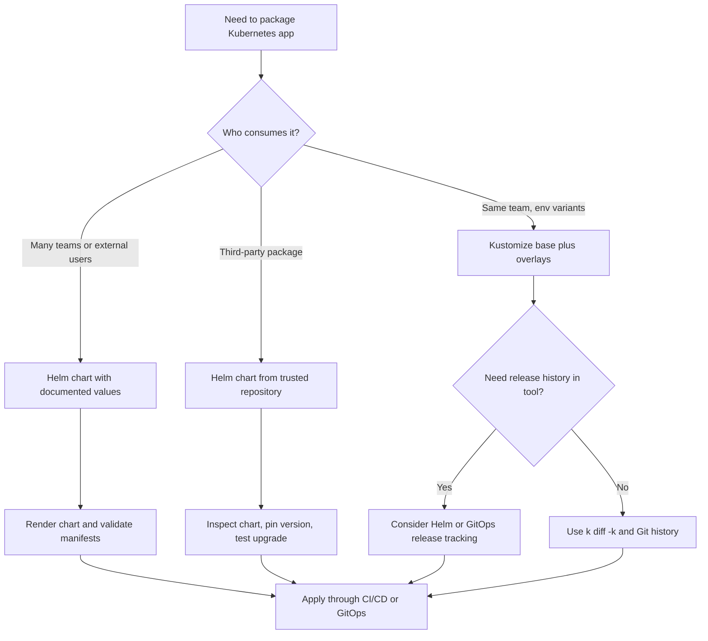

> **Складність**: `[MEDIUM]` — концепції інструментів
>
> **Час на проходження**: 35-40 хвилин
>
> **Передумови**: Модуль 4.1 (Основи CI/CD), базові маніфести Deployment і Service та впевнене читання YAML

## Результати навчання

Після завершення цього модуля ви зможете ухвалювати рішення щодо пакування на основі доказів, а не звички. Кожен результат нижче пов'язаний із ключовим розділом, питанням сценарію або практичним оглядом, тож сприймайте цей перелік як мапу навичок, які ви відпрацюєте, а не як набір термінів для запам'ятовування.

1. **Порівнювати** Helm і Kustomize як підходи до пакування застосунків Kubernetes для робочих процесів доставки в Kubernetes 1.35+.
2. **Проєктувати** структуру Helm-чарту, що розділяє шаблони, значення, залежності та аспекти життєвого циклу релізу.
3. **Діагностувати**, коли оверлеї Kustomize пасують краще за шаблони Helm для специфічної для середовища конфігурації.
4. **Оцінювати** стратегії пакування для розгортань у багатьох середовищах: dev, staging і production.
5. **Впроваджувати** повторюваний огляд пакування, який перевіряє згенеровані маніфести, перш ніж вони потраплять до кластера.

## Чому цей модуль важливий

**Гіпотетичний сценарій:** Команда платіжного сервісу у великого роздрібного продавця проводить цілий вечір запуску, ганяючись за збоєм у production, який походить не від самого Kubernetes. Deployment коректний, Service коректний, а образ контейнера пройшов кожну перевірку конвеєра, проте API оформлення замовлень постійно перезапускається, бо production має ліміт пам'яті, скопійований з невеликого простору імен для розробки. Неправильне значення живе в одному з кількох майже однакових YAML-файлів, і черговий інженер спершу виправляє staging-копію, бо назви файлів виглядають схожими на перший погляд. Поки виправляють production-маніфест, клієнти вже бачать невдалі платежі, служба підтримки відкриває інцидентний місток, а команда дізнається, що сирі маніфести не залишаються простими, щойно середовищ стає більше.

Саме через такий тип збою пакування застосунків має значення. Kubernetes дає вам API для декларування бажаного стану, але він не каже автоматично, як організувати множину об'єктів, що складають один застосунок, у різних командах, середовищах і версіях релізів. Інструменти пакування розташовані у просторі між кодом застосунку та узгодженням кластера: вони допомагають повторно використовувати відому структуру, змінювати ті кілька значень, які мають відрізнятися, переглядати YAML, який буде застосовано, і зберігати достатньо історії релізів, щоб відновитися, коли зміна поводиться у реальному кластері інакше, ніж під час огляду.

KCNA не очікує, що ви станете автором Helm-чартів за одну ніч, і не вимагає запам'ятовувати кожен трансформер Kustomize. Він очікує, що ви розпізнаєте операційну проблему, яку розв'язує кожен інструмент, оберете підхід, що відповідає сценарію доставки, і поясните компроміс простими словами. У цьому модулі ви рухатиметеся від болю задубльованих маніфестів до Helm-чартів, оверлеїв Kustomize, змішаних робочих процесів і практичного передпольотного огляду, що використовує псевдонім `k` для `kubectl` у командах Kubernetes 1.35+.

Перш ніж запускати будь-які приклади команд у справжній оболонці, визначте короткий псевдонім, який використовується протягом цього модуля:

```bash
alias k=kubectl
```

## Проблема із сирими маніфестами

Сирі маніфести — правильна відправна точка, бо вони навчають вас API Kubernetes без додаткового шару. Deployment, Service, ConfigMap, Ingress і PersistentVolumeClaim — усі звичайні об'єкти API, і застосування їх напряму допомагає побачити, як кластер реагує. Проблеми починаються, коли тому самому застосунку потрібна dev-версія з однією реплікою, staging-версія з маршрутизацією, наближеною до production, і production-версія із суворішими лімітами ресурсів, жорсткішими мітками та закріпленим тегом образу. Якщо кожне середовище володіє повною копією кожного YAML-файлу, вартість однієї структурної зміни зростає з кожним скопійованим каталогом.

```text
┌─────────────────────────────────────────────────────────────┐
│              THE MANIFEST PROBLEM                           │
├─────────────────────────────────────────────────────────────┤
│                                                             │
│  Managing many YAML files:                                 │
│  ─────────────────────────────────────────────────────────  │
│                                                             │
│  my-app/                                                   │
│  ├── deployment.yaml                                      │
│  ├── service.yaml                                         │
│  ├── configmap.yaml                                       │
│  ├── secret.yaml                                          │
│  ├── ingress.yaml                                         │
│  └── pvc.yaml                                             │
│                                                             │
│  Problems:                                                 │
│  ─────────────────────────────────────────────────────────  │
│                                                             │
│  1. DUPLICATION                                           │
│     Same app for dev/staging/prod = 3x files              │
│     Only difference: image tag, replicas, resources       │
│                                                             │
│  2. NO TEMPLATING                                         │
│     Can't parameterize values                              │
│     Hardcoded everywhere                                  │
│                                                             │
│  3. NO VERSIONING                                         │
│     What version is deployed?                             │
│     How to rollback?                                      │
│                                                             │
│  4. NO DEPENDENCIES                                       │
│     App needs Redis → manage separately                   │
│                                                             │
└─────────────────────────────────────────────────────────────┘
```

Діаграма показує центральну напругу: маніфести Kubernetes точні, але точність стає крихкістю, коли її копіюють вручну. Уявіть рецепт ресторану, скопійований у три теки: для обіднього обслуговування, вечірнього обслуговування та кейтерингової кухні. Якщо шеф-кухар змінює попередження про алергени лише у двох теках, третя тека тепер небезпечна, хоча кожна сторінка все ще виглядає професійно. Маніфести Kubernetes поводяться так само: пропущений селектор мітки, старий тег образу або забуте посилання на Secret можуть лишатися синтаксично коректними, водночас будучи операційно неправильними.

Перший урок пакування — відокремити те, що має залишатися стабільним, від того, що має змінюватися. Стабільна структура включає види ресурсів, зв'язки селекторів, порти, мітки, проби та більшість налаштувань безпеки, які визначають, як працює застосунок. Змінна конфігурація включає кількість реплік, теги образів, імена хостів, запити ресурсів, прапорці функцій і необов'язкові залежності, що відрізняються залежно від середовища чи клієнта. Інструменти пакування не усувають потреби розуміти базові об'єкти; вони дають вам дисциплінований спосіб тримати стабільну структуру в одному місці, водночас роблячи змінні частини явними.

Зробіть паузу й передбачте: якщо команда копіює той самий Deployment у dev, staging і production, що станеться, коли селектор Service зміниться, але одне середовище збереже стару мітку? Відповідь — не помилка розбору YAML; зазвичай це тихий збій трафіку, де Поди існують, Service існує, а кінцеві точки (endpoints) порожні чи неправильні. Ця відмінність важлива для KCNA, бо пакування — це не лише зручність для розробника. Це практика надійності, яка зменшує кількість коректних-але-неправильних комбінацій, що їх може створити процес релізу.

Другий урок пакування полягає в тому, що згенерований YAML має лишатися придатним для перегляду. Незалежно від того, чи інструмент починає із шаблонів, оверлеїв, згенерованих ConfigMap чи залежностей чарту, Kubernetes врешті отримує звичайні об'єкти API. Тому здоровий робочий процес пакування включає момент, коли команда переглядає згенерований результат перед його застосуванням. Ви маєте змогти відповісти на базові питання: який тег образу буде розгорнуто, скільки реплік працюватиме, який простір імен отримає об'єкти та які мітки з'єднують Service із Подами.

```bash
k apply --dry-run=server -f deployment.yaml
k diff -f deployment.yaml
```

Ці команди навмисно прості, бо показують базовий рівень, який інструменти пакування мають зберігати. Серверний пробний запуск (dry run) просить сервер API Kubernetes перевірити об'єкт без його збереження, а `k diff` показує, що змінилося б порівняно з живим станом. Helm і Kustomize додають вищорівневі способи створювати маніфести, але уважний оператор усе одно повертає розмову до згенерованих об'єктів і API кластера, який їх прийме чи відхилить.

Інший спосіб думати про сирі маніфести — відокремити коректність від придатності до супроводу. Окремий файл Deployment може бути цілком коректним, але каталог скопійованих Deployment може бути непридатним до супроводу, бо команда вже не знає, які відмінності є навмисними. Інструменти пакування допомагають, створюючи меншу поверхню для огляду. Замість того щоб просити рецензента порівняти сотні повторюваних рядків, ви просите його перевірити базу, шаблон, файл значень або патч, який фіксує задуману відмінність.

Ця менша поверхня для огляду також підтримує реагування на інциденти. Під час збою оператору потрібно швидко відповісти на питання: який образ було розгорнуто, яке специфічне для середовища значення змінилося, яка версія пакета його запровадила і як повернутися до останньої відомої-справної форми? Репозиторій, повний скопійованого YAML, змушує оператора виводити ці відповіді з назв файлів та історії комітів. Хороший пакет робить відповіді достатньо явними, щоб оператор міг перейти від симптомів до відкату чи виправлення з меншою кількістю здогадок.

Тут усе ще є пастка: пакування може приховати складність, якщо команди перестають дивитися на згенерований результат. Helm-чарт із хитрими умовними конструкціями може породити несподіваний YAML, а оверлей Kustomize може трансформувати імена об'єктів у спосіб, що здивує написаний вручну патч. Саме тому цей модуль постійно повертається до генерування, порівняння та валідації. Джерело пакета має бути чистим, але згенерований маніфест — це контракт, який Kubernetes насправді бачить.

Для KCNA уникайте зведення цієї теми до конкурсу популярності інструментів. Навичка екзаменаційного рівня — діагностувати форму проблеми доставки та зіставити її з моделлю пакування. Якщо проблема — повторювана варіація середовищ, оверлеїв може бути достатньо. Якщо проблема — поширення придатного до повторного використання пакета для багатьох споживачів, чарт може бути кращим. Якщо проблема — безпечне впровадження стороннього компонента, тоді частиною відповіді стають виявлення, довіра, закріплення версій та огляд згенерованого маніфесту.

## Helm: чарти, значення та релізи

Helm часто описують як менеджер пакетів для Kubernetes, але ця фраза стає корисною лише тоді, коли ви розкриваєте три іменники за нею. Чарт — це пакет із керуванням версіями, що містить шаблони, типові значення, метадані та необов'язкові залежності. Реліз — це один встановлений екземпляр цього чарту в кластері. Репозиторій — це місце, де чарти публікують і виявляють, подібно до реєстру пакетів для бібліотек мов програмування. Ця модель потужна, бо вона трактує застосунок Kubernetes як щось, що можна встановити, оновити, відкотити та поділитися з командами, які не писали вихідних маніфестів.

```text
┌─────────────────────────────────────────────────────────────┐
│              HELM                                           │
├─────────────────────────────────────────────────────────────┤
│                                                             │
│  "The package manager for Kubernetes"                     │
│  CNCF Graduated project                                   │
│                                                             │
│  Key concepts:                                             │
│  ─────────────────────────────────────────────────────────  │
│                                                             │
│  CHART                                                     │
│  Package containing Kubernetes resources                  │
│  Templates + values + metadata                            │
│                                                             │
│  RELEASE                                                   │
│  Instance of a chart in a cluster                         │
│  Same chart can have multiple releases                    │
│                                                             │
│  REPOSITORY                                                │
│  Collection of charts (like npm registry)                │
│                                                             │
│  Chart structure:                                         │
│  ─────────────────────────────────────────────────────────  │
│                                                             │
│  my-app/                                                   │
│  ├── Chart.yaml          # Metadata (name, version)      │
│  ├── values.yaml         # Default values                │
│  ├── templates/                                           │
│  │   ├── deployment.yaml                                 │
│  │   ├── service.yaml                                    │
│  │   └── _helpers.tpl                                   │
│  └── charts/             # Dependencies                   │
│                                                             │
└─────────────────────────────────────────────────────────────┘
```

Структуру чарту на діаграмі варто читати як контракт між авторами чартів і споживачами чартів. `Chart.yaml` іменує пакет і записує версії, тож інструменти й люди можуть обговорювати, який саме пакет змінився. `values.yaml` надає типові значення, що роблять чарт придатним для встановлення без довгого командного рядка, а каталог `templates/` перетворює ці значення на об'єкти Kubernetes. Необов'язковий каталог `charts/` фіксує залежності, що має значення, коли застосунку потрібна база даних, кеш, експортер метрик чи інший компонент, встановлений поруч із ним.

Шаблонізація Helm базується на шаблонах Go, тож вона може робити підстановку рядків, умовні конструкції, цикли, допоміжні шаблони та перетворення значень. Ця потужність — причина, чому чарти можуть підтримувати багато форм розгортання з одного пакета. Вона ж є причиною, чому чарти можуть стати важкими для читання, коли кожне поле обгорнуте логікою. Хороший чарт має відчуватися як ретельно підписана форма: структура впізнавана, значення задокументовані, а згенерований маніфест можна оглянути без зворотної інженерії лабіринту вкладених умов.

```text
┌─────────────────────────────────────────────────────────────┐
│              HELM TEMPLATING                                │
├─────────────────────────────────────────────────────────────┤
│                                                             │
│  Template (templates/deployment.yaml):                    │
│  ─────────────────────────────────────────────────────────  │
│                                                             │
│  apiVersion: apps/v1                                      │
│  kind: Deployment                                          │
│  metadata:                                                 │
│    name: {{ .Release.Name }}-app                         │
│  spec:                                                     │
│    replicas: {{ .Values.replicas }}                      │
│    template:                                               │
│      spec:                                                 │
│        containers:                                         │
│        - name: app                                        │
│          image: {{ .Values.image.repository }}:{{         │
│                    .Values.image.tag }}                   │
│          resources:                                        │
│            {{- toYaml .Values.resources | nindent 12 }}  │
│                                                             │
│  Values (values.yaml):                                    │
│  ─────────────────────────────────────────────────────────  │
│                                                             │
│  replicas: 3                                               │
│  image:                                                    │
│    repository: nginx                                      │
│    tag: 1.25                                              │
│  resources:                                                │
│    limits:                                                 │
│      cpu: 100m                                            │
│      memory: 128Mi                                        │
│                                                             │
│  Override values:                                         │
│  ─────────────────────────────────────────────────────────  │
│  helm install my-release ./my-app \                       │
│    --set replicas=5 \                                     │
│    --set image.tag=1.26                                   │
│                                                             │
│  Or use values file:                                      │
│  helm install my-release ./my-app -f prod-values.yaml    │
│                                                             │
└─────────────────────────────────────────────────────────────┘
```

Приклад показує, чому Helm привабливий для придатного до повторного використання пакування. Шаблон виражає стабільну структуру Deployment, а `values.yaml` виражає ручки, які споживач має змінювати. Команда розробки може встановити той самий чарт із невеликим dev-файлом значень, тоді як production може використати інший файл значень із більшою кількістю реплік, жорсткішими ресурсами та іншим тегом образу. Ім'я релізу стає частиною імен об'єктів, тож той самий чарт можна встановити більше одного разу в тому самому кластері, коли модель іменування та простору імен це дозволяє.

```yaml
# values-prod.yaml
replicas: 5
image:
  repository: ghcr.io/example/checkout-api
  tag: "1.26.3"
resources:
  limits:
    cpu: 500m
    memory: 512Mi
  requests:
    cpu: 250m
    memory: 256Mi
```

```bash
helm template checkout ./my-app -f values-prod.yaml
helm install checkout ./my-app -f values-prod.yaml --namespace payments --create-namespace
helm upgrade checkout ./my-app -f values-prod.yaml --namespace payments
helm rollback checkout --namespace payments
```

`helm template` заслуговує на особливу увагу, бо дозволяє оглянути згенерований YAML без зміни кластера. `helm install` створює реліз, `helm upgrade` оновлює цей реліз, а `helm rollback` повертає до попередньої ревізії, коли оновлення потрібно скасувати. У зрілому робочому процесі ці команди — не випадкові операторські трюки; це етапи конвеєра, які генерують, валідують, порівнюють, застосовують і записують те, що сталося. Чарт — це пакет, але історія релізів — це операційна пам'ять, яка допомагає черговому інженеру відповісти, що змінилося.

| Команда | Призначення |
|---------|---------|
| `helm install` | Встановити чарт |
| `helm upgrade` | Оновити реліз |
| `helm rollback` | Відкотити до попередньої версії |
| `helm uninstall` | Видалити реліз |
| `helm list` | Перелічити релізи |
| `helm repo add` | Додати репозиторій чартів |
| `helm search repo` | Шукати в репозиторіях чартів; використовуйте `helm search hub` для Artifact Hub |

Перш ніж запустити це в лабораторному кластері, який результат ви очікуєте від `helm template`, якщо файл значень задає `replicas: 5`, але шаблон випадково жорстко прописує `replicas: 2`? Згенерований YAML покаже `2`, бо шаблони контролюють фінальний маніфест, а значення мають значення лише там, де автор чарту на них посилається. Це практична звичка налагодження, яку варто виробити: не припускайте, що файл значень активний просто тому, що він існує. Згенеруйте чарт і підтвердьте, що значення з'являється в об'єкті, який Kubernetes насправді отримає.

Поширена бойова історія навколо Helm починається з того, що платформенна команда публікує чарт, який підтримує десятки опцій, бо кожен сервіс-споживач попросив ще про одну. За шість місяців ніхто не може сказати, які комбінації підтримуються, а нешкідливе з вигляду оновлення змінює вкладений типовий параметр, що використовується лише одним сервісом. Кращий патерн — тримати публічну поверхню значень вузькою, документувати підтримувані комбінації та додавати тести чарту чи валідацію схеми для ризикованих вхідних даних. Helm дає вам механіку релізів, але він не проєктує автоматично чистий інтерфейс для споживачів вашого чарту.

Тому автор чарту має думати як проєктувальник API. Значення — це не просто змінні; це публічний інтерфейс пакета. Якщо значення відкрите, споживачі залежатимуть від нього, копіюватимуть його у свої репозиторії та очікуватимуть, що воно працюватиме й далі через оновлення. Якщо кожна внутрішня деталь шаблону стає налаштовуваною, чарт перестає бути корисною абстракцією і стає панеллю дистанційного керування із забагатьма непідписаними перемикачами.

Життєвий цикл релізу — друга причина, чому Helm важливий. Реліз записує, що конкретний чарт із конкретними значеннями було встановлено в конкретний простір імен під конкретним ім'ям. Коли оновлення зазнає невдачі, команда може запитати в Helm історію релізів і обрати ціль для відкату. Це не усуває потреби в резервному копіюванні бази даних, тестуванні сумісності застосунку чи ретельному плануванні міграцій, але дає шару об'єктів Kubernetes операційну пам'ять, якої сам по собі `k apply` не надає.

Залежності — третя причина, чому Helm з'являється в реальних системах доставки. Застосунку може знадобитися Redis, PostgreSQL, експортер метрик чи інший допоміжний компонент, і чарт може оголосити залежності чартів, тож пов'язані пакети розв'язуються разом. Це корисно, коли залежність справді є частиною встановлюваного застосунку. Це небезпечно, коли команди ховають володіння інфраструктурою всередині чарту застосунку й випадково дозволяють одній команді сервісу оновити спільну залежність, що використовується іншими сервісами.

Коли ви оглядаєте Helm-чарт, читайте ззовні всередину. Почніть із метаданих чарту та файлу значень, щоб зрозуміти обіцяний інтерфейс, потім згенеруйте шаблони, щоб побачити реальні об'єкти, а потім вивчайте шаблони лише там, де згенерований результат викликає питання. Цей порядок захищає вас від занадто раннього вдивляння в синтаксис шаблонів. Він також відповідає тому, як більшість споживачів чартів сприймають Helm: вони здебільшого взаємодіють зі значеннями, командами релізів і згенерованими ресурсами Kubernetes.

## Kustomize: бази, оверлеї та патчі

Kustomize обирає інший шлях. Замість генерування шаблонів із заповнювачами, він починає зі звичайного YAML Kubernetes і застосовує декларативні трансформації згори. Базовий каталог містить спільні ресурси, а оверлеї описують, як середовище змінює цю базу. Це робить Kustomize привабливим для команд, які вже мають хороші маніфести й переважно потребують контрольованої варіації між середовищами. Він також вбудований у `kubectl` як `k apply -k`, що знижує бар'єр впровадження інструмента для команд Kubernetes, які не хочуть ще одного менеджера пакетів на критичному шляху.

```text
┌─────────────────────────────────────────────────────────────┐
│              KUSTOMIZE                                      │
├─────────────────────────────────────────────────────────────┤
│                                                             │
│  "Kubernetes native configuration management"             │
│  Built into kubectl (kubectl apply -k)                    │
│                                                             │
│  Key difference from Helm:                                │
│  ─────────────────────────────────────────────────────────  │
│  • NO templating                                          │
│  • Uses overlays and patches                              │
│  • Pure Kubernetes YAML                                   │
│                                                             │
│  Structure:                                                │
│  ─────────────────────────────────────────────────────────  │
│                                                             │
│  my-app/                                                   │
│  ├── base/                    # Common resources          │
│  │   ├── kustomization.yaml                              │
│  │   ├── deployment.yaml                                 │
│  │   └── service.yaml                                    │
│  └── overlays/                                            │
│      ├── dev/                 # Dev-specific             │
│      │   ├── kustomization.yaml                          │
│      │   └── replica-patch.yaml                          │
│      └── prod/                # Prod-specific            │
│          ├── kustomization.yaml                          │
│          └── replica-patch.yaml                          │
│                                                             │
│  How it works:                                            │
│  ─────────────────────────────────────────────────────────  │
│                                                             │
│  Base: The original resources                             │
│  Overlay: Modifications applied on top of base           │
│                                                             │
│        [Base]                                              │
│           │                                                │
│     ┌─────┴─────┐                                         │
│     ▼           ▼                                         │
│  [Overlay:   [Overlay:                                    │
│   Dev]       Prod]                                        │
│                                                             │
└─────────────────────────────────────────────────────────────┘
```

Пункт «без шаблонізації» — це серце Kustomize, а не обмеження, від якого варто відмахнутися. Звичайний YAML означає, що базові файли виглядають як об'єкти, які Kubernetes врешті отримає, що робить огляд доступним для розробників, які розуміють API, але не знають синтаксису шаблонів Go. Оверлей може додати простір імен, додати префікс до імен, змінити тег образу, збільшити кількість реплік, згенерувати ConfigMap або пропатчити поле. Результат усе одно згенерований, тож ви маєте його оглянути, але ментальна модель більше схожа на редагування прозорих шарів на мапі, ніж на запуск мови програмування над шаблоном.

```text
┌─────────────────────────────────────────────────────────────┐
│              KUSTOMIZE EXAMPLE                              │
├─────────────────────────────────────────────────────────────┤
│                                                             │
│  base/kustomization.yaml:                                 │
│  ─────────────────────────────────────────────────────────  │
│  apiVersion: kustomize.config.k8s.io/v1beta1             │
│  kind: Kustomization                                      │
│  resources:                                                │
│  - deployment.yaml                                        │
│  - service.yaml                                           │
│                                                             │
│  overlays/prod/kustomization.yaml:                        │
│  ─────────────────────────────────────────────────────────  │
│  apiVersion: kustomize.config.k8s.io/v1beta1             │
│  kind: Kustomization                                      │
│  resources:                                                │
│  - ../../base                                             │
│  namePrefix: prod-                                        │
│  replicas:                                                 │
│  - name: my-app                                           │
│    count: 5                                               │
│  images:                                                   │
│  - name: nginx                                            │
│    newTag: "1.26"                                         │
│                                                             │
│  Apply:                                                   │
│  ─────────────────────────────────────────────────────────  │
│  kubectl apply -k overlays/prod/                         │
│                                                             │
│  Kustomize features:                                      │
│  • namePrefix/nameSuffix: Add prefix to all names        │
│  • namespace: Set namespace for all resources            │
│  • images: Override image tags                           │
│  • replicas: Override replica counts                     │
│  • patches: Modify any field                             │
│  • configMapGenerator: Create ConfigMaps from files      │
│  • secretGenerator: Create Secrets from files            │
│                                                             │
└─────────────────────────────────────────────────────────────┘
```

Патерн «база-та-оверлей» працює найкраще, коли середовища поділяють стабільну форму. Якщо dev, staging і production усі запускають той самий застосунок з тими самими ключовими об'єктами, Kustomize може тримати базу авторитетною й дозволити кожному оверлею нести лише відмінності. Production може підняти кількість реплік і закріпити образ, dev може використати менший профіль ресурсів, а staging може додати ім'я хоста Ingress, що дзеркалить production. Ви отримуєте чіткий сигнал для огляду, бо файл оверлею має бути достатньо малим, щоб колега зрозумів, чому це середовище відрізняється.

```yaml
# overlays/prod/kustomization.yaml
apiVersion: kustomize.config.k8s.io/v1beta1
kind: Kustomization
resources:
  - ../../base
namespace: payments
namePrefix: prod-
replicas:
  - name: checkout-api
    count: 5
images:
  - name: ghcr.io/example/checkout-api
    newTag: "1.26.3"
patches:
  - path: resource-limits.yaml
```

```bash
k kustomize overlays/prod
k diff -k overlays/prod
k apply -k overlays/prod
```

Послідовність команд дзеркалить дисципліну, яку ви бачили з Helm. `k kustomize` генерує оверлей локально, `k diff -k` порівнює згенерований результат із живим станом, а `k apply -k` застосовує його. Kustomize не є менеджером релізів, тож він не записуватиме історію релізів так само, як Helm. Цей компроміс прийнятний, коли Git є джерелом істини, а ваш контролер розгортання чи конвеєр записує зміни деінде, але він має значення, якщо ваш процес відновлення залежить від вбудованої команди відкату.

Який підхід ви б обрали тут і чому: команда володіє десятьма внутрішніми сервісами, усі з майже однаковими маніфестами, і лише теги образів, імена хостів та кількість реплік відрізняються залежно від середовища? Kustomize часто є чистішим типовим вибором, бо тримає об'єкти Kubernetes упізнаваними й уникає навчання кожної команди сервісу інтерфейсу значень чарту. Якщо та сама команда згодом захоче опублікувати придатний до повторного використання застосунок із базою даних для інших відділів, баланс може зсунутися до Helm, бо споживачам потрібен пакет із керованими версіями типовими значеннями та задокументованими командами встановлення.

Практичний інцидент Kustomize зазвичай виглядає менш драматично за зламаний шаблон, але так само дорого. Команда додає `namePrefix: prod-` в оверлей, але написаний вручну патч усе ще націлений на ім'я без префікса, або монітор Service очікує стару мітку. Крок генерування — це місце, де таку помилку слід упіймати. Якщо згенерований Deployment названо `prod-checkout-api`, ваші патчі та селектори мають влучати в трансформовані імена й мітки, які ви задумали, а не в імена, які ви пам'ятаєте з бази.

Kustomize також навчає корисної дисципліни щодо володіння. База має описувати спільну істину застосунку, а не вподобання одного середовища, замасковані під типове значення. Якщо production має п'ять реплік, а dev має одну, база може обрати мінімальне значення, тоді як production-оверлей робить production-намір видимим. Якщо база містить production-специфічні анотації, класи сховища чи імена хостів, кожен не-production-оверлей має витрачати зусилля на скасування цих виборів, що є ознакою того, що база несе неправильну відповідальність.

Патчі мають бути достатньо точними, щоб передавати намір. Патч, що змінює один ліміт ресурсу чи одну анотацію, легше оглянути, ніж патч, що замінює великий блок специфікації Deployment. Коли патчі стають широкими, оверлей починає виглядати як скопійований маніфест із зайвими кроками, і команда втрачає перевагу супроводу, якої прагнула. У такій ситуації або спростіть варіацію, розділіть базу, або переосмисліть, чи виразив би чарт з інтерфейсом значень відмінності чесніше.

Оскільки Kustomize не надає історії релізів у стилі Helm, команди часто поєднують його з GitOps-контролерами чи записами CI/CD. Це обґрунтована архітектура, коли репозиторій є джерелом істини, а кожна зміна середовища надходить через pull request. Важливо знати, де живе інформація про відкат. Якщо відповідь — Git, переконайтеся, що згенерований ефект коміту легко відтворити і що контролер розгортання повідомляє, яка ревізія наразі застосована.

## Вибір між Helm, Kustomize та змішаними робочими процесами

Helm і Kustomize перетинаються, бо обидва можуть породжувати специфічні для середовища маніфести Kubernetes, але вони оптимізовані під різні організаційні проблеми. Helm найсильніший, коли ви пакуєте програмне забезпечення для встановлення багатьма споживачами, яким потрібен стабільний інтерфейс із керуванням версіями. Kustomize найсильніший, коли одна команда володіє базовими маніфестами й потребує прозорих оверлеїв середовищ. Неправильний вибір зазвичай не катастрофічний у перший день; вартість проявляється згодом, коли шаблони стають нечитабельними, оверлеїв стає забагато, щоб у них розібратися, або ніхто не може відтворити, яка версія пакета насправді працює.

```text
┌─────────────────────────────────────────────────────────────┐
│              HELM vs KUSTOMIZE                              │
├─────────────────────────────────────────────────────────────┤
│                                                             │
│  HELM:                                                     │
│  ─────────────────────────────────────────────────────────  │
│  + Powerful templating                                    │
│  + Package versioning                                     │
│  + Dependency management                                  │
│  + Large ecosystem (Artifact Hub)                        │
│  + Release tracking                                       │
│  - Complex template syntax                                │
│  - Must learn Go templating                              │
│                                                             │
│  KUSTOMIZE:                                               │
│  ─────────────────────────────────────────────────────────  │
│  + No templating = pure YAML                             │
│  + Built into kubectl                                     │
│  + Easy to understand                                     │
│  + No new syntax to learn                                 │
│  - Limited compared to templating                        │
│  - No package versioning                                 │
│  - No dependency management                               │
│                                                             │
│  When to use what:                                        │
│  ─────────────────────────────────────────────────────────  │
│                                                             │
│  Helm:                                                     │
│  • Distributing apps to others                           │
│  • Complex templating needs                              │
│  • Need dependency management                             │
│  • Using third-party charts                              │
│                                                             │
│  Kustomize:                                               │
│  • Internal apps with environment variations             │
│  • Simple overlays (dev/staging/prod)                    │
│  • Teams unfamiliar with templating                      │
│  • GitOps workflows                                       │
│                                                             │
│  Both together:                                            │
│  • Helm for base chart                                    │
│  • Kustomize for environment overlays                    │
│                                                             │
└─────────────────────────────────────────────────────────────┘
```

Використовуйте Helm, коли сам пакет застосунку є продуктом. Чарт бази даних, чарт ingress-контролера, чарт стека моніторингу чи наданий платформою шаблон сервісу — усі виграють від релізів із керуванням версіями, метаданих залежностей та чіткого контракту значень. Helm також пасує, коли форма застосунку змінюється залежно від опцій: увімкнути Ingress лише для деяких встановлень, додати додаткові sidecar-контейнери для деяких споживачів або встановити залежний чарт, коли функцію увімкнено. Це реальні потреби пакування, а не просто відмінності середовищ.

Використовуйте Kustomize, коли форма застосунку переважно фіксована, а ви хочете варіацію середовищ без іще однієї мови шаблонізації. Команда, яка практикує GitOps, може віддати перевагу Kustomize, бо репозиторій може показувати базові ресурси та оверлеї як звичайні файли Kubernetes, тоді як контролер узгоджує згенерований результат. Це особливо ефективно, коли культура огляду сильна: невеликий diff оверлею чітко показує, що production змінився з трьох реплік на п'ять або що staging тепер використовує новий тег образу. Простота допомагає новим учасникам діагностувати, що змінилося.

Змішані робочі процеси поширені, але вони мають бути навмисними. Платформенна команда може використати Helm, щоб спожити сторонній чарт, згенерувати його в базу, а потім використати оверлеї Kustomize для застосування специфічних для організації міток, просторів імен чи патчів середовищ. Інша команда може розгорнути Helm-чарт через GitOps-контролер, що підтримує значення Helm для кожного середовища. Ризик — нашаровувати інструменти, доки ніхто не знатиме, звідки прийшло поле. Якщо значення можна змінити в типових значеннях Helm, у файлі значень, у патчі Kustomize та в перевизначенні контролера розгортання, налагодження стає археологією.

> **Зупиніться й подумайте**: Helm використовує шаблонізацію Go для генерування YAML, а Kustomize використовує оверлеї над звичайним YAML без жодної шаблонізації. Який підхід був би простішим для команди, яка ніколи не користувалася жодним інструментом? Який був би потужнішим для поширення застосунку зовнішнім користувачам, яким потрібно налаштувати багато параметрів?

Найпростіша відповідь для нової команди часто — Kustomize, бо база лишається звичайним YAML Kubernetes. Потужніша відповідь для широкого поширення часто — Helm, бо споживачі можуть встановити чарт із керуванням версіями зі своїми значеннями і, за потреби, залежностями чарту. Обидві відповіді можуть бути істинними, бо «легко почати» і «потужно поширювати» — це різні цілі. Питання KCNA часто перевіряють цю відмінність: інструмент не кращий абстрактно, він кращий для сценарію.

Наведена нижче матриця перетворює порівняння на звичку огляду. Читайте її зліва направо, коли команда пропонує стратегію пакування, і запитайте, чи операційна потреба насправді є поширенням пакета, варіацією середовищ, керуванням залежностями чи прозорим оглядом у Git. Хороша відповідь має назвати домінантну потребу й вартість, яку команда приймає.

| Сценарій | Сильніший типовий вибір | Чому пасує | За чим стежити |
|----------|------------------|-------------|-----------|
| Внутрішній застосунок із відмінностями dev, staging і production | Kustomize | Базові маніфести лишаються читабельними, оверлеї несуть малі зміни | Розростання оверлеїв і патчі, що мовчки не влучають у цілі |
| Платформний шаблон, що споживається багатьма командами сервісів | Helm | Версіонований чарт, задокументовані значення, історія релізів | Поверхня значень стає надто широкою чи недостатньо задокументованою |
| Сторонній інфраструктурний компонент | Helm | Чарт постачальника та екосистема Artifact Hub зменшують зусилля з пакування | Довіра, походження образу та нотатки оновлення чарту |
| GitOps-репозиторій зі змінами для конкретного кластера | Kustomize | Звичайний YAML природно працює з оглядом pull request | Немає вбудованого відкату релізів у стилі Helm |
| Застосунок із необов'язковими залежними сервісами | Helm | Залежності та шаблонізація виражають необов'язкові компоненти | Оновлення залежностей можуть несподівано змінити поведінку |
| Чарт постачальника плюс локальні мітки політик | Обидва | Helm постачає висхідний пакет, Kustomize застосовує локальні оверлеї | Забагато шарів перевизначення, що приховують джерело поля |

Матриця не має на меті нав'язати універсальний стандарт кожній команді. Вона має на меті виявити припущення за вибором. Платформенна команда може стандартизуватися на Helm, бо її центральна проблема — поширення підтримуваного інтерфейсу багатьом командам сервісів. Продуктова команда може стандартизуватися на Kustomize, бо її центральна проблема — огляд відмінностей середовищ у Git. Обидва стандарти можуть бути узгодженими, якщо вони називають проблему, яку оптимізують, і документують випадки, де дозволено інший підхід.

Найскладніші сценарії зазвичай перехідні. Команда починає із сирих маніфестів, впроваджує Kustomize для оверлеїв середовищ, а потім хоче опублікувати той самий застосунок як придатний до повторного використання платформний пакет. Інша команда встановлює Helm-чарт постачальника, а потім потребує локальних міток політик, мережевих налаштувань і патчів для конкретного кластера. У ці моменти стримуйте бажання нашаровувати інструменти без проєкту. Накресліть шлях від вихідних файлів до згенерованого YAML і позначте, який шар володіє кожним полем, що має операційне значення.

Одне практичне правило допомагає тримати змішані робочі процеси здоровими: пізніший шар має налаштовувати локальний контекст розгортання, а не переписувати модель продукту. Наприклад, Kustomize може додати простір імен, мітки, потрібні платформі, чи специфічний для кластера клас сховища до згенерованого Helm результату. Він не має рутинно змінювати команди контейнерів, проби чи ключові налаштування застосунку, якими вже володіє інтерфейс значень чарту. Якщо пізніший шар постійно перевизначає ключову поведінку чарту, інтерфейс чарту й локальні вимоги, ймовірно, не збігаються.

## Інші інструменти пакування та виявлення артефактів

Helm і Kustomize домінують у дискусіях про пакування рівня KCNA, але вони не є усім ландшафтом. Інші інструменти існують, бо конфігурація має конкурентні потреби: програмованість, перевірку типів, валідацію, розв'язання образів, поступове розгортання та керування життєвим циклом за допомогою операторів. Вам не потрібне глибоке знання синтаксису кожного інструмента на цьому етапі. Вам потрібно розпізнати, що підходи до пакування лежать на спектрі від «звичайний YAML із патчами» до «конфігурація як типізована чи програмована мова» до «кастомні контролери, що керують життєвим циклом застосунку».

```text
┌─────────────────────────────────────────────────────────────┐
│              OTHER TOOLS                                    │
├─────────────────────────────────────────────────────────────┤
│                                                             │
│  JSONNET / TANKA                                          │
│  ─────────────────────────────────────────────────────────  │
│  • Data templating language                               │
│  • Generate JSON/YAML programmatically                   │
│  • Used by Grafana Labs                                   │
│                                                             │
│  CUE                                                      │
│  ─────────────────────────────────────────────────────────  │
│  • Configuration language                                 │
│  • Strong typing and validation                          │
│  • Merge-able configurations                             │
│                                                             │
│  CARVEL (formerly k14s)                                   │
│  ─────────────────────────────────────────────────────────  │
│  • ytt: YAML templating                                  │
│  • kbld: Image building/resolving                        │
│  • kapp: Deployment tool                                 │
│  • CNCF sandbox project                                  │
│                                                             │
│  OPERATORS                                                │
│  ─────────────────────────────────────────────────────────  │
│  • For complex stateful apps                             │
│  • Custom controllers                                    │
│  • Beyond simple packaging                               │
│                                                             │
└─────────────────────────────────────────────────────────────┘
```

Jsonnet і Tanka приваблюють команди, які хочуть програмовану конфігурацію з придатними до повторного використання функціями та структурами даних. CUE приваблює команди, які хочуть валідацію та обмеження, вбудовані в саму мову конфігурації. Carvel надає набір інструментів навколо шаблонізації, розв'язання образів і розгортання застосунків. Оператори виходять за межі пакування, додаючи контролер, який стежить за кастомними ресурсами й виконує дії життєвого циклу, що корисно для stateful-систем, яким потрібна доменно-специфічна автоматизація. Рішення — менше про моду й більше про те, чи команді потрібна проста варіація, придатне до повторного використання пакування, типізована конфігурація чи активна логіка узгодження.

Виявлення артефактів додає ще одне операційне питання: коли вам слід зібрати пакет самостійно, а коли використати пакет з екосистеми? Artifact Hub — це проєкт CNCF рівня Incubating, що індексує Helm-чарти та інші хмарні артефакти, роблячи його поширеною відправною точкою, коли командам потрібен відомий застосунок, як-от PostgreSQL, Prometheus, cert-manager чи ingress-контролер. Виявлення корисне, але воно не замінює огляду. Чарт, знайдений через хаб, усе одно потребує перевірки джерела, закріплення версії, огляду значень і тестового встановлення, перш ніж він належатиме production.

```text
┌─────────────────────────────────────────────────────────────┐
│              ARTIFACT HUB                                   │
├─────────────────────────────────────────────────────────────┤
│                                                             │
│  artifacthub.io                                           │
│  CNCF Incubating project                                   │
│                                                             │
│  Central repository for:                                  │
│  ─────────────────────────────────────────────────────────  │
│  • Helm charts                                            │
│  • OPA policies                                           │
│  • Falco rules                                            │
│  • OLM operators                                          │
│  • And more...                                            │
│                                                             │
│  Use it to:                                               │
│  • Find charts for popular applications                  │
│  • Discover alternatives                                  │
│  • Check chart quality/security                          │
│                                                             │
│  Example: Need PostgreSQL?                                │
│  → Search "postgresql" on Artifact Hub                   │
│  → Find Bitnami chart                                    │
│  → helm repo add bitnami https://charts.bitnami.com/...  │
│  → helm install my-postgres bitnami/postgresql          │
│                                                             │
└─────────────────────────────────────────────────────────────┘
```

Безпечний робочий процес стороннього чарту починається з питань, які новачок може навчитися ставити. Хто публікує чарт і чи репозиторій той, на який ви очікуєте? Які образи контейнерів він розгорне і чи закріплені вони до версій, які ви можете відстежувати? Які CustomResourceDefinition, ClusterRole, webhooks чи привілейовані налаштування він встановлює? Чи надає чарт значення для запитів ресурсів, персистентності, мережевої доступності та контексту безпеки? Ці питання важливі, бо встановлення чарту — це не просто завантаження YAML; це довіра пакету у створенні об'єктів у вашому кластері.

```bash
helm repo add bitnami https://charts.bitnami.com/bitnami
helm repo update
helm show chart bitnami/postgresql
helm show values bitnami/postgresql > postgresql-values.yaml
helm template my-postgres bitnami/postgresql -f postgresql-values.yaml
```

Наведена вище послідовність огляду навмисно обережна. `helm show chart` розкриває метадані чарту, `helm show values` оголює налаштовувану поверхню, а `helm template` дозволяє оглянути об'єкти перед встановленням. Production-команда додала б перевірки політик, сканування образів, обмеження простору імен і тест оновлення в непродакшн-кластері. Для KCNA ключове — розпізнати, що Artifact Hub допомагає знайти пакети, тоді як Helm і ваш процес доставки вирішують, як ці пакети стають станом кластера.

Оператори належать до розмови про пакування, бо вони представляють інший вид межі. Helm-чарт чи оверлей Kustomize зазвичай описує набір об'єктів для створення, тоді як оператор стежить за кастомними ресурсами й виконує тривалі дії після встановлення. Ця відмінність має значення для stateful-систем, як-от бази даних, черги повідомлень чи центри сертифікації. Чарт може встановити початкові об'єкти, але оператор може опрацьовувати хуки резервного копіювання, переключення при відмові, оновлення та доменно-специфічне узгодження, яке статичний YAML не може добре виразити.

Інструменти типізованої конфігурації, як-от CUE, розв'язують іншу проблему: запобігання недійсним комбінаціям, перш ніж вони стануть YAML. Якщо платформенна команда раз за разом бачить недійсні налаштування ресурсів, відсутні мітки чи несумісні прапорці функцій, сильніша валідація конфігурації може бути ціннішою за більшу потужність шаблонів. Компроміс у тому, що команда має навчати ще одну мову чи ланцюжок інструментів та інтегрувати його в огляди. Як і з Helm та Kustomize, питання в тому, чи додаткова абстракція зменшує реальний операційний ризик.

Виявлення артефактів також має включати очікування щодо супроводу. Чарт, що сьогодні виглядає активним, може змінити власника, оголосити значення застарілим, перейменувати ресурс чи змінити типові налаштування безпеки в майбутньому релізі. Закріплення версій і читання нотаток релізів — не бюрократичні обов'язки; це те, як команди перетворюють зовнішній артефакт на контрольовану внутрішню залежність. Той самий підхід стосується політик, операторів та інших пакетів, перелічених у хабі. Виявлення починає оцінку, але володіння починається, коли ви вирішуєте його запустити.

## Патерни та антипатерни

Пакування застосунків успішне, коли межа інструмента збігається з межею команди. Якщо платформенна команда публікує чарт, інтерфейс чарту має бути достатньо стабільним, щоб команди застосунків споживали його без читання кожного шаблону. Якщо команда сервісу володіє оверлеями, ці оверлеї мають бути достатньо малими й очевидними, щоб команда сервісу оглядала їх під час звичайних pull request. Якщо GitOps-контролер узгоджує фінальні маніфести, репозиторій має чітко показувати, яка згенерована форма призначена для кожного кластера. Патерн — не «використовуй популярний інструмент»; патерн — «зроби джерело кожного рішення про розгортання видимим».

| Патерн | Коли використовувати | Чому працює | Аспект масштабування |
|---------|----------------|--------------|-----------------------|
| Файл значень на кожне середовище | Helm-чарт має ту саму структуру в dev, staging і production | Відмінності явні й придатні до огляду без копіювання шаблонів | Тримайте значення задокументованими й валідуйте ризиковані поля схемою чи тестами |
| База плюс оверлеї | Внутрішні маніфести поділяють більшість об'єктів, і лише кілька полів відрізняються | Рецензенти бачать спільну базу й специфічні для середовища зміни окремо | Періодично видаляйте мертві оверлеї та перевіряйте, що патчі досі збігаються зі згенерованими іменами |
| Генерувати перед застосуванням | Будь-який пакетний робочий процес, що породжує YAML | Команди оглядають те, що Kubernetes отримає, перед зміною живого стану | Автоматизуйте генерування, валідацію, порівняння та перевірки політик у конвеєрі |
| Закріплення версій | Сторонні чарти чи образи входять у production | Відтворюваність покращується, бо оновлення стають явними подіями | Відстежуйте версію чарту, версію застосунку, тег образу та нотатки оновлення разом |

Антипатерни зазвичай починаються як зрізані кути. Автор чарту додає швидку умовну конструкцію для однієї команди, власник оверлею копіює базу, щоб уникнути навчання патчам, або оператор встановлює найновіший чарт із репозиторію під час інциденту, бо так здається швидше. Кожен зрізаний кут може спрацювати раз і все одно залишити по собі систему доставки, у якій важче розібратися. Пакування має зменшувати кількість місць, де може сховатися рішення, а не створювати нові схованки.

| Антипатерн | Що йде не так | Краща альтернатива |
|--------------|-----------------|--------------------|
| Копіювання цілих каталогів середовищ | Спільні виправлення дрейфують, бо кожну копію треба редагувати вручну | Тримайте базу чи шаблон чарту й ізолюйте значення середовищ |
| Перетворення шаблонів Helm на проєкт із програмування | Рецензенти не можуть передбачити згенерований YAML з чарту | Тримайте шаблони нудними, генеруйте в CI та документуйте підтримувані значення |
| Використання патчів Kustomize для непов'язаних варіантів продукту | Логіка оверлею стає другою моделлю застосунку | Розділіть базу або використайте чарт, коли форма застосунку справді змінюється |
| Встановлення сторонніх чартів без огляду | Дозволи на рівні кластера, webhooks чи типові налаштування сховища дивують команду | Спершу перевірте метадані чарту, значення, згенеровані маніфести та нотатки релізів |

## Каркас для ухвалення рішень

Починайте рішення про пакування з називання осі змін. Якщо застосунок змінюється переважно за середовищем, Kustomize може бути достатньо. Якщо застосунок змінюється переважно за споживачем чи опцією функції, Helm часто є кращою межею пакета. Якщо джерело — сторонній чарт, але вашій організації потрібні локальні мітки, простори імен чи патчі політик, змішаний робочий процес може бути виправданим. Рішення також має включати те, як команда переглядатиме маніфести, записуватиме стан релізу та відкочуватиме погану зміну.



Використовуйте цей каркас радше як сценарій розмови, ніж як жорсткий закон. Запитайте, хто змінює пакет, хто його споживає, скільки середовищ існує, чи потрібно керувати залежностями і як виконується відкат. Невеликому внутрішньому сервісу може не знадобитися церемонія публічного чарту. Платформний компонент, що споживається десятками команд, не має покладатися на те, що всі правильно редагуватимуть патчі. Чарт production-бази даних не слід оновлювати лише тому, що в репозиторії є нова версія; його слід оновлювати, бо команда оглянула зміну й протестувала шлях релізу.

| Питання для рішення | Обирайте Helm, коли | Обирайте Kustomize, коли | Розгляньте обидва, коли |
|-------------------|------------------|-----------------------|--------------------|
| Хто споживач? | Багатьом командам потрібен інтерфейс пакета | Однією командою володіє маніфестами | Висхідному пакету потрібна локальна політика |
| Що змінюється? | Необов'язкові компоненти й багато значень | Малі відмінності середовищ | Типові значення чарту плюс кластерні оверлеї варіюються |
| Як опрацьовується відкат? | Історія релізів Helm корисна | Історії Git і контролера розгортання достатньо | Helm записує ревізії пакета, а Git записує намір середовища |
| Наскільки читабельним має бути джерело? | Споживачі читають значення більше, ніж шаблони | Рецензентам потрібен звичайний YAML | Згенерований результат оглядають незалежно від джерела |
| Як опрацьовуються залежності? | Залежності чарту мають встановлюватися разом | Залежностями керують окремо | Helm опрацьовує залежності, оверлеї додають локальну конфігурацію |

Фінальне рішення неповне, доки ви не визначите передпольотну перевірку. Для Helm згенеруйте з обраними значеннями та огляньте план релізу. Для Kustomize зберіть оверлей і порівняйте його з кластером. Для будь-якого інструмента провалідуйте згенеровані об'єкти за допомогою API Kubernetes, коли це можливо, а потім застосовуйте через повторюваний конвеєр, а не разову команду, вставлену в термінал.

Сильний запис рішення має бути коротким, але конкретним. Він має сказати, яке джерело пакета авторитетне, які поля кожне середовище може змінювати, як оглядають згенеровані маніфести, де живе історія релізів і яку команду відкату чи операцію Git черговий інженер має використати першою. Цей запис дає майбутнім супровідникам спосіб судити, чи підхід до пакування досі служить застосунку. Без нього команди часто успадковують ланцюжок інструментів, але не міркування, яке зробило цей ланцюжок розумним.

Ви можете відпрацювати каркас, перевіривши його на незручних граничних випадках. Якщо Helm-чарт має лише одного споживача й жодних залежностей, запитайте, чи база Kustomize була б простішою. Якщо оверлей Kustomize містить десяток патчів, що змінюють поведінку застосунку, запитайте, чи інтерфейс значень чарту був би чіткішим. Якщо змішаний робочий процес робить production-поле важким для відстеження, запитайте, який шар має володіти цим полем, і видаліть дубльоване перевизначення. Хороші рішення про пакування лишаються переглядними, бо застосунки й команди змінюються з часом.

## Чи знали ви?

- **Helm v3 прибрав Tiller** — Helm v2 вимагав серверного компонента на ім'я Tiller усередині кластера, тоді як Helm v3 прибрав цей серверний компонент, щоб спростити безпеку й покладатися на облікові дані Kubernetes користувача.
- **Kustomize вбудований у kubectl** — Kubernetes включає підтримку `kubectl apply -k` починаючи з версії 1.14, тому багато команд можуть впровадити оверлеї без встановлення окремого бінарного файлу.
- **Helm використовує шаблони Go** — шаблони чартів використовують мову шаблонів Go, тож функції, умовні конструкції, цикли та допоміжні шаблони можуть генерувати багато форм об'єктів з одного чарту.
- **Чарти можуть мати залежності** — чарт може оголосити інші чарти як залежності, дозволяючи пов'язаним пакетам встановлюватися разом, коли відношення залежності є навмисним і оглянутим.

## Типові помилки

| Помилка | Чому виникає | Як виправити |
|---------|----------------|---------------|
| Дублювання маніфестів для dev, staging і production | Копіювання файлів здається швидшим за вивчення пакування, доки перша спільна зміна не почне дрейфувати | Використовуйте значення Helm чи оверлеї Kustomize, щоб спільна структура мала одного власника |
| Побудова складних шаблонів Helm для кожної можливої опції | Автори чартів намагаються задовольнити кожен запит споживача всередині одного набору шаблонів | Тримайте шаблони простими, документуйте підтримувані значення та розділяйте чарти, коли продукти розходяться |
| Відсутність версіонування чартів чи незакріплення версій чартів | Команди трактують репозиторії чартів як живі приклади замість релізних артефактів | Записуйте версію чарту, версію застосунку й тег образу в процесі релізу |
| Жорстке прописування секретів у файлах значень чи згенерованих маніфестах | Приклади для локального тестування потрапляють у спільні репозиторії | Обережно використовуйте об'єкти Secret Kubernetes і віддавайте перевагу зовнішньому керуванню секретами для реальних облікових даних |
| Застосування оверлею Kustomize без попереднього генерування | Оверлей виглядає малим, тож рецензенти припускають, що результат очевидний | Запустіть `k kustomize overlays/prod` і `k diff -k overlays/prod` перед застосуванням |
| Змішування значень Helm і патчів Kustomize для того самого поля | Кілька шарів перевизначення зростають органічно між командами й інструментами | Призначте одного власника для кожного поля й задокументуйте, чи Helm, чи Kustomize ним керує |
| Встановлення сторонніх чартів просто з результатів пошуку | Виявлення артефактів плутають із довірою та готовністю до production | Перевірте джерело, значення, згенеровані маніфести, дозволи, образи й нотатки оновлення перед встановленням |

## Тест

<details><summary>Ваша команда розгортає той самий API в dev, staging і production. Кожне середовище потребує іншого тегу образу, кількості реплік та імені хоста, але структура Deployment і Service лишається однаковою. Як ви оцінили б Helm проти Kustomize?</summary>

Kustomize добре пасує, бо форма застосунку стабільна, а відмінності специфічні для середовища. База може тримати спільні Deployment і Service, а оверлеї змінюють теги образів, репліки та імена хостів без копіювання кожного маніфесту. Helm також може розв'язати проблему файлами значень, особливо якщо команда вже використовує чарти, але він додає шар шаблонізації, який може бути непотрібним. Міркування мають зосереджуватися на тому, що змінюється і хто споживає пакет, а не на тому, який інструмент потужніший загалом.

</details>

<details><summary>Платформна група хоче опублікувати один стандартизований пакет застосунку для багатьох команд сервісів. Команди мають задавати образ, репліки, ліміти ресурсів та хост ingress, а платформна група володіє структурою об'єктів. Який підхід до пакування найкраще підтримує такий проєкт?</summary>

Helm зазвичай є кращим типовим вибором, бо створює чарт із керуванням версіями та задокументованим інтерфейсом значень. Команди сервісів можуть встановлювати чи оновлювати чарт зі своїми файлами значень без редагування шаблонів напряму. Платформна група може оглядати й випускати зміни структури чарту як пакета, а історія релізів допомагає діагностувати, що змінилося. Kustomize може ділитися базами, але він менш природний як подібний до продукту пакет для багатьох незалежних споживачів.

</details>

<details><summary>Оновлення Helm змінює production-Deployment у спосіб, якого команда не очікувала. Файл значень виглядав коректним під час огляду. Що вам слід оглянути, перш ніж вирішувати, чи спричинив проблему файл значень, чи шаблон?</summary>

Згенеруйте чарт із тим самим файлом значень за допомогою `helm template` й огляньте згенерований Deployment. Якщо згенерований YAML містить несподіване поле, його породжує логіка шаблону чи типові значення, навіть якщо файл значень виглядає коректним. Якщо згенерований YAML виглядає правильно, але живий об'єкт відрізняється, огляньте фактичний реліз, контролери допуску та пізніші патчі від іншого інструмента. Ключове міркування — що Kubernetes отримує згенеровані маніфести, а не ваш намір усередині файлу значень.

</details>

<details><summary>Production-оверлей Kustomize додає префікс імені, і після цього Service більше не маршрутизує до Подів, хоча обидва об'єкти існують. Який найімовірніший діагноз на рівні пакування?</summary>

Оверлей міг трансформувати імена чи мітки у спосіб, що залишив селектори та цілі неузгодженими, або патч міг влучити в неправильний ресурс після зміни імен. Kustomize тримає YAML читабельним, але трансформації все одно породжують згенерований результат, який треба оглянути. Запуск `k kustomize overlays/prod` і перевірка міток, селекторів та імен об'єктів мають бути першим кроком. Виправлення — скоригувати базу, оверлей чи патч так, щоб селектор згенерованого Service збігався з мітками згенерованих Подів.

</details>

<details><summary>Команда знаходить чарт PostgreSQL через Artifact Hub і хоче встановити його напряму в production, бо чарт популярний. Які кроки огляду мають відбутися спершу?</summary>

Популярність не є перевіркою готовності до production. Команда має перевірити видавця й репозиторій, закріпити версію чарту, оглянути типові значення, згенерувати маніфести, перевірити образи контейнерів і пошукати дозволи на рівні кластера, налаштування сховища, webhooks та контексти безпеки. Вони мають протестувати встановлення й оновлення в непродакшн-просторі імен чи кластері перед production. Artifact Hub допомагає з виявленням, тоді як процес доставки все одно має встановити довіру й операційну придатність.

</details>

<details><summary>Ваша організація використовує і Helm, і Kustomize, а кількість реплік можна змінити у файлі значень Helm чи в патчі Kustomize. Чому це ризиковано і як би ви це перепроєктували?</summary>

Це ризиковано, бо два шари перевизначення можуть боротися за те саме поле, що ускладнює пояснення, чому згенерований Deployment має певну кількість реплік. Під час інциденту інженери можуть змінити значення Helm, поки патч Kustomize продовжує перевизначати його, або навпаки. Перепроєктуйте робочий процес так, щоб одним полем володів один шар, а потім задокументуйте це володіння в процесі огляду пакета. Змішаний робочий процес може бути обґрунтованим, але кожне поле має мати одне чітке джерело наміру.

</details>

<details><summary>Конвеєр CI валідує сирий YAML за допомогою `k apply --dry-run=server`, але команда переходить на Helm-чарти. Що має змінитися на етапі валідації?</summary>

Конвеєр має генерувати Helm-чарт із точними значеннями, призначеними для середовища, а потім валідувати згенерований YAML. Валідація лише шаблонів чи лише типового файлу значень пропускає об'єкт, який Kubernetes отримає. Сильний конвеєр запускає `helm template`, зберігає чи передає результат, виконує перевірки схеми й політик, а потім використовує серверний пробний запуск чи еквівалентний крок валідації проти відповідного API кластера. Мета та сама, що й раніше: перевірити фінальні маніфести, перш ніж вони змінять живий стан.

</details>

## Практична вправа: запакуйте та огляньте невеликий застосунок

Ця вправа — керований огляд пакування, який ви можете виконати в локальному практичному кластері Kubernetes 1.35+ або прочитати як покрокове проходження на рівні команд, якщо у вас немає доступного кластера. Ви створите невеликі Deployment і Service, змоделюєте, як Kustomize змінює специфічні для середовища значення, порівняєте це з концепцією значень Helm і відпрацюєте передпольотні перевірки, що запобігають перетворенню пакета на загадку. Суть не в тому, щоб збудувати ідеальний production-чарт. Суть у тому, щоб зробити згенерований YAML видимим, перш ніж йому довіряти.

### Підготовка

Створіть тимчасовий каталог поза репозиторієм, якщо запускаєте команди локально. Приклади використовують `nginx`, бо образ знайомий, а не тому, що це рекомендація щодо архітектури застосунку. Якщо ваш кластер уже має простір імен на ім'я `packaging-lab`, оберіть іншу назву й застосовуйте те саме значення послідовно.

```bash
mkdir -p packaging-lab/base packaging-lab/overlays/dev packaging-lab/overlays/prod
cd packaging-lab
k create namespace packaging-lab --dry-run=client -o yaml > namespace.yaml
```

### Завдання

- [ ] Створіть базовий Deployment і Service, що використовують образ `nginx:1.25` та мітку застосунку `checkout-api`.
- [ ] Додайте базовий `kustomization.yaml`, що перелічує Deployment і Service як спільні ресурси.
- [ ] Створіть dev-оверлей, що зберігає одну репліку й змінює тег образу на `1.26`.
- [ ] Створіть prod-оверлей, що задає п'ять реплік, використовує той самий тег образу й додає простір імен `packaging-lab`.
- [ ] Згенеруйте обидва оверлеї та порівняйте згенеровані кількості реплік, теги образів, імена, мітки й селектори.
- [ ] Напишіть коротке рішення про пакування: чи був би цей застосунок кращим як оверлеї Kustomize, Helm-чарт чи змішаний робочий процес?

<details><summary>Розв'язання для завдань 1 і 2</summary>

Спершу створіть спільні маніфести. Ці файли навмисно є звичайним YAML Kubernetes, тож ви можете побачити, що належить до стабільної бази, перш ніж оверлеї змінять специфічні для середовища поля.

```yaml
# base/deployment.yaml
apiVersion: apps/v1
kind: Deployment
metadata:
  name: checkout-api
  labels:
    app: checkout-api
spec:
  replicas: 1
  selector:
    matchLabels:
      app: checkout-api
  template:
    metadata:
      labels:
        app: checkout-api
    spec:
      containers:
        - name: web
          image: nginx:1.25
          ports:
            - containerPort: 80
```

```yaml
# base/service.yaml
apiVersion: v1
kind: Service
metadata:
  name: checkout-api
  labels:
    app: checkout-api
spec:
  selector:
    app: checkout-api
  ports:
    - port: 80
      targetPort: 80
```

```yaml
# base/kustomization.yaml
apiVersion: kustomize.config.k8s.io/v1beta1
kind: Kustomization
resources:
  - deployment.yaml
  - service.yaml
```

</details>

<details><summary>Розв'язання для завдань 3 і 4</summary>

Створіть оверлеї, що зберігають базу недоторканою й змінюють лише намір середовища. Dev-оверлей змінює тег образу, лишаючи типову кількість реплік без змін. Prod-оверлей задає простір імен і піднімає кількість реплік, бо очікування щодо доступності production відрізняються від локального чи dev-середовища.

```yaml
# overlays/dev/kustomization.yaml
apiVersion: kustomize.config.k8s.io/v1beta1
kind: Kustomization
resources:
  - ../../base
namePrefix: dev-
images:
  - name: nginx
    newTag: "1.26"
```

```yaml
# overlays/prod/kustomization.yaml
apiVersion: kustomize.config.k8s.io/v1beta1
kind: Kustomization
resources:
  - ../../base
namespace: packaging-lab
namePrefix: prod-
replicas:
  - name: checkout-api
    count: 5
images:
  - name: nginx
    newTag: "1.26"
```

</details>

<details><summary>Розв'язання для завдань 5 і 6</summary>

Згенеруйте оверлеї, перш ніж щось застосовувати. Важливе спостереження — що dev і prod генеруються з тієї самої бази, але породжують різні імена, кількості реплік і поведінку простору імен. Якщо селектор Service більше не збігається з мітками Подів або Deployment усе ще показує неправильний тег образу, ви хочете впіймати це тут, а не після production-застосування.

```bash
k kustomize overlays/dev
k kustomize overlays/prod
k diff -k overlays/prod
```

Для нотатки рішення Kustomize — обґрунтована відповідь, бо форма застосунку стабільна й відрізняються лише значення середовищ. Helm став би привабливішим, якби платформенна команда захотіла поширювати це як придатний до повторного використання пакет із задокументованими значеннями для багатьох команд сервісів. Змішаний робочий процес був би надмірним, якщо тільки команда не споживала висхідний чарт і не потребувала невеликого локального оверлею для міток політик чи конвенцій простору імен.

</details>

### Критерії успіху

- [ ] Базові маніфести містять один Deployment і один Service зі збіжними мітками й селекторами.
- [ ] Dev-оверлей генерує тег образу `1.26` без копіювання повного Deployment.
- [ ] Prod-оверлей генерує п'ять реплік і розміщує об'єкти у просторі імен `packaging-lab`.
- [ ] Ви можете пояснити, які поля є стабільною структурою бази, а які поля є специфічною для середовища конфігурацією.
- [ ] Ви можете обґрунтувати Helm, Kustomize чи змішаний робочий процес за критеріями споживача, варіації, залежностей і відкату.

## Наступний модуль

**Наступний модуль**: [Модуль 4.3: Стратегії релізів](/k8s/kcna/part4-application-delivery/module-4.3-release-strategies/) пов'язує пакування з вибором розгортань, як-от blue-green, canary та поступова доставка.

## Джерела

- [Документація Helm Charts](https://helm.sh/docs/topics/charts/)
- [Команда helm install](https://helm.sh/docs/helm/helm_install/)
- [Команда helm upgrade](https://helm.sh/docs/helm/helm_upgrade/)
- [Команда helm rollback](https://helm.sh/docs/helm/helm_rollback/)
- [Найкращі практики Helm-чартів](https://helm.sh/docs/chart_best_practices/)
- [Посібник із завдань Kustomize у Kubernetes](https://kubernetes.io/docs/tasks/manage-kubernetes-objects/kustomization/)
- [Довідник kustomization для Kustomize](https://kubectl.docs.kubernetes.io/references/kustomize/kustomization/)
- [Довідник вбудованих функцій Kustomize](https://kubectl.docs.kubernetes.io/references/kustomize/builtins/)
- [Довідник kubectl apply](https://kubernetes.io/docs/reference/kubectl/generated/kubectl_apply/)
- [Artifact Hub (проєкт CNCF рівня Incubating)](https://www.cncf.io/projects/artifact-hub/)
- [Документація Artifact Hub](https://artifacthub.io/docs/)
- [Документація репозиторіїв Artifact Hub](https://artifacthub.io/docs/topics/repositories/)
- [Документація Kubernetes Secrets](https://kubernetes.io/docs/concepts/configuration/secret/)
