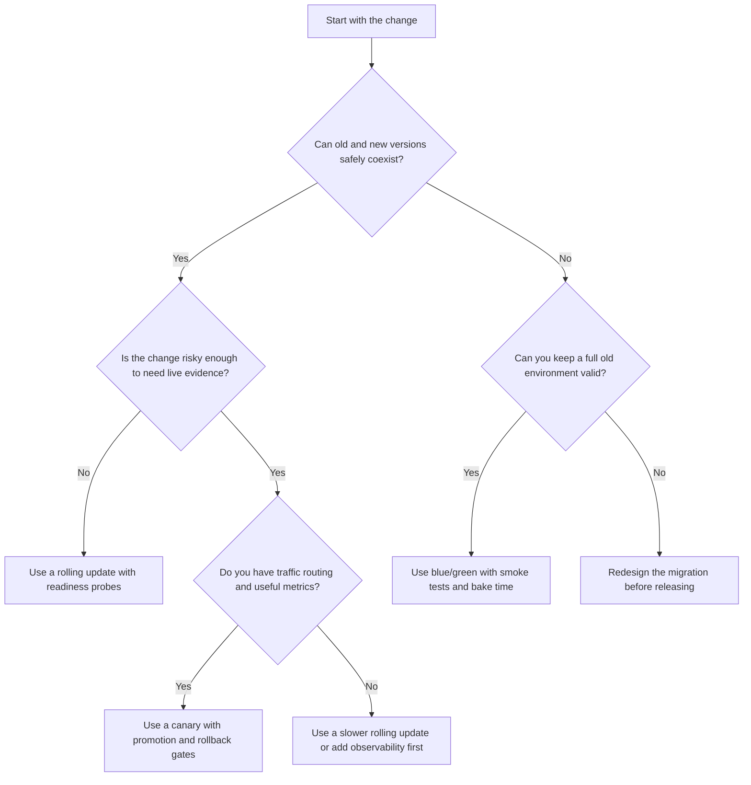

> **Складність**: `[СЕРЕДНЯ]` — стратегія доставки та операційні компроміси
>
> **Час на проходження**: 40–50 хвилин
>
> **Передумови**: [Модуль 4.1: Основи CI/CD](../module-4.1-ci-cd/), [Модуль 4.2: Пакування застосунків](../module-4.2-application-packaging/), базові концепції Deployment та Service

## Результати навчання

Після завершення цього модуля ви зможете оцінювати стратегії релізів як засоби контролю операційного ризику, а не лише як різні способи оновлення Подів. Кожен результат відпрацьовується в основному уроці й перевіряється ще раз у тесті або практичній вправі.

1. **Порівнювати** стратегії rolling update, blue/green та canary за радіусом ураження, швидкістю відкату, вартістю ресурсів та операційною складністю.
2. **Діагностувати**, як Деплойменти Kubernetes використовують `maxSurge`, `maxUnavailable`, проби готовності (readiness probes) та історію розгортання для керування поведінкою rolling update.
3. **Оцінювати**, коли ризик змішаних версій, сумісність бази даних, постійні з'єднання та патерни трафіку роблять одну стратегію релізу безпечнішою за іншу.
4. **Проєктувати** механізми просування, відкату та метричні бар'єри для релізу в Kubernetes 1.35+ так, щоб невдалі зміни виявлялися ще до того, як вони зачеплять кожного користувача.

## Чому цей модуль важливий

**Гіпотетичний сценарій:** великий банк викочує міграцію бази даних у продакшн одним великим розгортанням за принципом «усе одразу». Усі сервіси, орієнтовані на клієнтів, — мобільний банкінг, онлайн-перекази та карткові платежі — падають одночасно у п'ятницю по обіді. Відкат триває багато годин, клієнти не можуть отримати доступ до своїх рахунків упродовж цілих вихідних, а регулятори згодом накладають значний штраф. Аналіз після інциденту показує, що найглибша причина збою — не відсутній юніт-тест чи неправильно сформований маніфест; це стратегія релізу, яка надсилає ризиковану зміну всім одразу без жодного шляху поетапної перевірки та без швидкого способу перенаправити трафік.

Виправлення полягало не просто в тому, щоб «писати кращий код». Організація змінила те, як вона відкривала продакшн для нових версій. Пізніші міграції використовували механізми поступового релізу, кращі перевірки готовності та рішення про відкат, прив'язані до спостережуваних симптомів, а не до оптимізму в переговорній кімнаті. Цей зсув важливий, бо Kubernetes може узгоджувати Деплойменти цілий день, проте не здатен вирішити, чи безпечний ваш новий платіжний шлях для кожного клієнта. Кластер може замінювати Поди, але саме стратегія релізу визначає, скільки шкоди може завдати одна погана зміна, перш ніж людина чи автоматизований контролер її зупинить.

Отже, стратегії релізів — це практична мова керування ризиками. Rolling update оптимізує рутинну сумісність, blue/green оптимізує чисте перемикання трафіку та швидкий відкат, а canary-релізи оптимізують навчання на невеликій частці реального трафіку перед ширшим просуванням. Питання KCNA часто описують сценарій із підказками на кшталт «зворотно сумісний», «миттєвий відкат», «невеликий відсоток», «схема бази даних» або «керований метриками». Ваше завдання — перекласти ці підказки у вибір стратегії та пояснити компроміс достатньо чітко, щоб інший інженер міг діяти на його основі.

Найкорисніша професійна звичка — описувати реліз у термінах припущень. Рутинний rolling update припускає, що версія 1 і версія 2 здатні обробляти однакові запити, записи сховища, події та клієнтів упродовж вікна розгортання. Blue/green-розгортання припускає, що команда може дозволити собі два повні середовища і що повернення трафіку назад усе ще залишає старе середовище придатним. Canary припускає, що невелика вибірка трафіку виявить важливі режими збоїв достатньо швидко, щоб зупинити просування. Коли ці припущення записані до початку розгортання, стратегія стає інженерним рішенням, а не ритуалом.

Перш ніж запускати будь-які приклади команд Kubernetes у цьому модулі, визначте короткий псевдонім `kubectl`, який використовується в усьому курсі KubeDojo. Приклади орієнтовані на поведінку Kubernetes 1.35+ і використовують псевдонім `k` після того, як його буде введено.

```bash
alias k=kubectl
```

## Стратегія релізу як контроль радіуса ураження

Стратегія релізу відповідає на вужче питання, ніж конвеєр CI/CD. Конвеєр вирішує, чи зміна зібрана, протестована, упакована та придатна для розгортання; стратегія релізу вирішує, як саме продакшн відкривається для цієї придатної зміни. Ця різниця важлива, бо повністю протестований артефакт усе одно може дати збій, коли зустрінеться з реальними даними, реальною поведінкою користувачів, реальною затримкою та реальними залежностями. Стратегія дає команді контроль над послідовністю, спостереженням та відновленням, щоб перший продакшн-симптом не перетворився автоматично на повноцінний продакшн-інцидент.

Найкорисніша ментальна модель — це радіус ураження (blast radius): частка користувачів, запитів, систем чи бізнес-операцій, яким буде завдано шкоди, якщо нова версія хибна. Rolling update починається з малого радіуса ураження, який зростає в міру заміни щораз більшої кількості Подів. Blue/green-розгортання тримає радіус ураження на нулі, поки тестується зелене середовище, а потім стрибком охоплює всю базу користувачів, коли трафік перемикається. Canary-реліз робить радіус ураження явним важелем, спрямовуючи обраний відсоток або сегмент аудиторії на нову версію перед просуванням.

Вартість — це інший бік цього контролю. Якщо ви хочете миттєвого відкату, ви зазвичай тримаєте старе середовище живим достатньо довго, щоб перемкнутися назад. Якщо ви хочете точного відсоткового маршрутування, вам зазвичай потрібен контролер Ingress, сервісна сітка (service mesh) або контролер поступової доставки, який може розділяти трафік і зчитувати метрики. Якщо ви хочете простого вбудованого шляху, контролер Deployment дає вам rolling update із невеликим сплеском ресурсів, але він також створює період, коли старі й нові Поди обслуговують трафік одночасно.

Зробіть паузу та спрогнозуйте: якщо версія 2 записує поле, яке версія 1 не здатна розпарсити, яка стратегія створює найбільший прихований ризик — rolling update, blue/green чи canary? Відповідь не базується на тому, який контролер новіший чи досконаліший. Вона залежить від того, чи можуть старі й нові версії безпечно співіснувати щодо тих самих клієнтів, черг та записів бази даних. Сумісність змішаних версій — це шарнір, який перетворює звичайний rolling update на небезпечне розгортання.

Робочий приклад робить цю різницю наочною. Уявіть API оформлення замовлення з 12 репліками та новим образом, який змінює лише повідомлення про помилку для недійсних купонів. Стара й нова версії можуть обслуговувати ті самі запити, контракт бази даних незмінний, а команда має проби готовності, що дають збій, доки застосунок не зможе дістатися до своїх залежностей. Rolling update тут є розумним вибором за замовчуванням, бо радіус ураження зростає поступово, додаткова потужність залишається помірною, а відкат — це зворотне розгортання, якщо проблема з'явиться.

Тепер змініть лише один факт: новий API оформлення замовлення шифрує збережені платіжні метадані у форматі, який старий API не здатен прочитати. Контролер Deployment усе ще може викочувати Поди по одному, але бізнес-система може зламатися, бо старі й нові Поди не погоджуються щодо контракту даних. У такому сценарії команді потрібна або міграція за патерном «розширення і скорочення» (expand-and-contract), яка робить обидві версії сумісними, або стратегія на кшталт blue/green, що виконує скоординоване перемикання трафіку після того, як зелений бік перевірено щодо нового контракту.

Canary на перший погляд видається безпечнішим, бо обмежує трафік, але canary — це не магічна ізоляція. Якщо canary-Поди записують несумісні рядки до спільної бази даних, стабільні Поди все одно можуть читати ці рядки й давати збій для користувачів, які ніколи не торкалися canary-шляху. Щоб canary був безпечним, команді потрібні сумісні формати даних, ретельне маршрутування або межі ізоляції, які не дають побічним ефектам просочуватися у стабільний трафік. Відсоткове маршрутування зменшує експозицію запитів; воно не зменшує автоматично кожен ризик, пов'язаний зі спільним станом.

Вибір стратегії релізу також залежить від того, наскільки швидко команда може виявити збій. Поступове розгортання без змістовних сигналів — це лише повільний спосіб виявити поганий реліз. Перемикання blue/green без димових тестів — це швидкий спосіб перевести кожного користувача в неперевірене середовище. Canary без базових метрик — це лише менша здогадка. Операційне питання завжди те саме: які докази підкажуть нам продовжувати, призупинитися чи відкотитися?

Тому корисний огляд релізу починається ще до того, як набрано будь-яку команду. Рецензент запитує, що буде істинним, поки реліз триває, що буде істинним після відкату і якому сигналу довірятимуть, якщо думки розійдуться. Для API, орієнтованого на клієнтів, це може означати підтвердження зворотної сумісності, перевірку потужності для сплеску Подів, визначення точної панелі дашборда, яка представляє помилки на боці користувача, та узгодження того, хто може призупинити просування. Для внутрішнього пакетного обробника (batch worker) той самий огляд може зосередитися на сумісності черг, ідемпотентності та на тому, чи може поганий обробник отруїти спільні завдання. Стратегія має відповідати реальній зв'язаності системи, а не лише формі об'єктів Kubernetes.

## Rolling update: вбудована поступова заміна Kubernetes

Rolling update — це стратегія Deployment за замовчуванням у Kubernetes, і саме її слід очікувати для звичайних зворотно сумісних змін. Коли шаблон Pod змінюється, контролер Deployment створює новий ReplicaSet і поступово переносить репліки зі старого ReplicaSet до нового. Застосунок навмисно не вимикається під час оновлення, бо принаймні частина Подів має залишатися доступною, поки нові Поди стартують, проходять перевірки готовності та приєднуються до ендпоінтів Service.

Kubernetes керує цією заміною за допомогою `maxUnavailable` та `maxSurge`. `maxUnavailable` обмежує, скільки бажаних реплік може бути недоступним під час розгортання, тоді як `maxSurge` обмежує, скільки додаткових Подів може існувати понад бажану кількість реплік. Значення за замовчуванням — 25 відсотків для обох, що означає: Kubernetes може тимчасово додавати потужність і прибирати старі Поди, залишаючись у межах контрольованого діапазону доступності. Ці значення звучать механічно, але вони кодують реальне бізнес-рішення: скільки запасної потужності ви можете собі дозволити і скільки тимчасової недоступності здатен витримати сервіс.

```text
Rolling Update Sequence (4 replicas, maxUnavailable=1, maxSurge=1)
─────────────────────────────────────────────────────────────────

Step 1: Steady state
  [v1] [v1] [v1] [v1]                    4 pods running

Step 2: New pod created (surge), one old pod terminating
  [v1] [v1] [v1] [v1:terminating] [v2:starting]

Step 3: v2 passes readiness probe, next old pod terminates
  [v1] [v1] [v1:terminating] [v2] [v2:starting]

Step 4: Continues until all replaced
  [v1:terminating] [v2] [v2] [v2:starting]

Step 5: Complete
  [v2] [v2] [v2] [v2]                    4 pods running
```

Захищена послідовність вище — це класичний щасливий шлях, але деталь, на яку варто звернути увагу, — це бар'єр готовності між станами «starting» та «serving». Kubernetes не знає, що ваш застосунок завантажив прапорці функцій (feature flags), під'єднався до залежності, прогрів кеш чи перевірив схему, якщо ви не виразите це через проби та поведінку застосунку. Якщо проба готовності перевіряє лише те, чи слухає процес HTTP-сервера, Kubernetes може надіслати продакшн-трафік на Pod, який не здатен завершувати корисні запити. Тому розгортання може виглядати справним для контролера, тоді як користувачі бачать періодичні відповіді 500.

Ось мінімальний фрагмент Deployment, який робить механізми керування розгортанням наочними. Значення консервативні для сервісу з обмеженою запасною потужністю, бо під час оновлення можна створити лише один додатковий Pod і один бажаний Pod може бути недоступним.

```yaml
apiVersion: apps/v1
kind: Deployment
metadata:
  name: checkout-api
spec:
  replicas: 4
  strategy:
    type: RollingUpdate
    rollingUpdate:
      maxSurge: 1
      maxUnavailable: 1
  selector:
    matchLabels:
      app: checkout-api
  template:
    metadata:
      labels:
        app: checkout-api
    spec:
      containers:
        - name: checkout-api
          image: ghcr.io/example/checkout-api:1.35.0
          ports:
            - containerPort: 8080
          readinessProbe:
            httpGet:
              path: /ready
              port: 8080
            periodSeconds: 5
            failureThreshold: 2
```

Після застосування такого Deployment оператор спостерігає за розгортанням, а не припускає, що команда apply означає успіх. Команда `k rollout status deployment/checkout-api` стежить за умовою Deployment, доки воно не завершиться або не зупиниться, а `k rollout history deployment/checkout-api` показує записані ревізії, які можна використати для відкату. Якщо зламана версія вже просувається, `k rollout pause deployment/checkout-api` виграє час на розслідування, перш ніж контролер замінить більше Подів.

```bash
k apply -f checkout-deployment.yaml
k rollout status deployment/checkout-api
k rollout history deployment/checkout-api
k rollout pause deployment/checkout-api
k rollout undo deployment/checkout-api
```

Найпоширеніший збій rolling update — не в тому, що Kubernetes оновлює надто повільно. Він у тому, що Kubernetes оновлює точно так, як йому наказано, тоді як застосунок порушує припущення, що лежать в основі стратегії. Міграції бази даних — звична причина болю, бо старому й новому коду може знадобитися читати й записувати ті самі дані впродовж вікна змішаних версій. Безпечна міграція часто використовує патерн «розширення і скорочення» (expand-and-contract): спершу додати нові поля чи таблиці так, щоб старий код це толерував, потім розгорнути код, який уміє читати обидві форми, потім перемкнути записувачів і лише пізніше прибрати стару форму після того, як зникне кожна версія, що її потребувала.

Швидкість розгортання слід трактувати як налаштування потужності, а не лише як налаштування зручності. Якщо сервіс має 4 репліки й кожна з них уже працює близько до насичення під час пікового трафіку, дозвіл на один недоступний Pod може прибрати більше потужності, ніж здатні поглинути решта Подів. Якщо завантаження образів повільне або старт включає прогрів кешу, високий сплеск може на короткий час спожити CPU, пам'ять та мережу вузла так, що це зашкодить сусіднім робочим навантаженням. Обачний оператор розраховує `maxSurge` та `maxUnavailable` із реальної запасної потужності, профілю запуску та цілей рівня обслуговування, а не копіює значення за замовчуванням у кожен Deployment.

Інший непомітний ризик rolling update — поведінка клієнтів. Навіть коли Поди сумісні, клієнти можуть повторювати запити, кешувати відповіді чи підтримувати пули з'єднань, які приховують погану версію, доки не накопичиться достатньо трафіку. Новий Pod, що дає збій на одному запиті з 50, може не спрацювати на базовій пробі готовності, але все одно здатен створити помітні клієнтські симптоми, коли розгортання сягне половини флоту. Саме тому спостереження за розгортанням має включати метрики застосунку з мітками за версією або ReplicaSet. Якщо стабільні й нові Поди нерозрізненні в метриках, оператор бачить лише усереднене значення й може пропустити збій, специфічний для версії.

Перш ніж запускати це в реальному кластері: який вивід ви очікували б, якби новий Pod ніколи не проходив перевірку готовності? Здорова відповідь полягає в тому, що розгортання має зупинитися, а не завершитися, старі Поди мають продовжувати обслуговування в межах бюджету доступності, а `k rollout status` має повідомити, що Deployment не досяг бажаного стану. Якщо розгортання все одно завершується, тоді як користувачі отримують збої, ваша проба, ймовірно, перевіряла не те.

Rolling update підходить для рутинних змін сервісу, оновлень залежностей, сумісних змін API та невеликих виправлень, де нова й стара версії можуть безпечно співіснувати. Він менш доречний для змін даних, що ламають сумісність, для змін, що вимагають однакової версії для кожного запиту, або для релізів, де відкат має бути миттєвим. Kubernetes може скасувати розгортання, але скасування — це ще одне розгортання у протилежному напрямку, тому час відновлення залежить від кількості реплік, часу завантаження образу, часу старту, затримки готовності та потужності кластера.

## Blue/green-розгортання: чисте перемикання та швидке повернення

Blue/green-розгортання запускає дві повні версії пліч-о-пліч. Blue — це поточне продакшн-середовище, а green — середовище-кандидат. Команда розгортає green, тестує його, поки blue усе ще обслуговує користувачів, а потім змінює шлях трафіку так, щоб користувачі потрапляли на green. Якщо green поводиться неправильно після перемикання, відкат може бути таким же швидким, як повернення селектора Service, правила Ingress чи маршруту шлюзу назад на blue, за умови, що старе середовище та сумісні дані залишаються доступними.

Фраза «повне середовище» заслуговує на увагу. У малому сервісі це може означати два Деплойменти й один селектор Service. У більшій системі це може включати ConfigMap'и, Secret'и, фонові обробники, заплановані завдання, прогрівачі кешу, правила Ingress та дашборди, які всі мають вказувати на правильний колір. Blue/green працює найкраще, коли команда має чіткий перелік того, що належить одному кольору, а що є спільним. Якщо спільні частини погано зрозумілі, зелений бік може виглядати ізольованим на діаграмі, водночас усе ще змінюючи ту саму базу даних, чергу чи зовнішню залежність, що й blue.

```text
Blue/Green Deployment
─────────────────────────────────────────────────────────────────

Phase 1: Blue is live, Green is deploying
                          ┌─────────────┐
  Users ──> Service ──────>│  Blue (v1)  │   LIVE
                          │  4 replicas  │
                          └─────────────┘
                          ┌─────────────┐
              (no traffic) │  Green (v2) │   TESTING
                          │  4 replicas  │
                          └─────────────┘

Phase 2: Green passes smoke tests, traffic switches
                          ┌─────────────┐
              (no traffic) │  Blue (v1)  │   STANDBY
                          │  4 replicas  │
                          └─────────────┘
                          ┌─────────────┐
  Users ──> Service ──────>│  Green (v2) │   LIVE
                          │  4 replicas  │
                          └─────────────┘

Phase 3: After confidence period, Blue is scaled down
                          ┌─────────────┐
  Users ──> Service ──────>│  Green (v2) │   LIVE
                          │  4 replicas  │
                          └─────────────┘
```

Діаграма зберігає ключову операційну ідею: перемикання різке, але тестування відбувається перед перемиканням. Саме тому blue/green привабливий для змін, які не здатні витримати обслуговування змішаними версіями. Якщо стара й нова версії не мають отримувати трафік одночасно, rolling update створює саме неправильну форму. Blue/green дає команді місце для запуску димових тестів, синтетичних транзакцій, перевірок схеми та верифікації залежностей щодо повного нового середовища перед тим, як перенаправити реальних користувачів.

Проста реалізація в Kubernetes використовує два Деплойменти з різними мітками версій і один селектор Service, який вказує на ту версію, що зараз активна. У продакшні команди часто обгортають це GitOps, маршрутуванням Ingress чи контролером розгортання, але модель селектора Service достатня, щоб зрозуміти механіку для KCNA. Service не цікавить, який Deployment створив Поди; він маршрутизує на Поди, чиї мітки збігаються з його селектором.

```yaml
apiVersion: v1
kind: Service
metadata:
  name: checkout-api
spec:
  selector:
    app: checkout-api
    release: blue
  ports:
    - port: 80
      targetPort: 8080
---
apiVersion: apps/v1
kind: Deployment
metadata:
  name: checkout-api-blue
spec:
  replicas: 4
  selector:
    matchLabels:
      app: checkout-api
      release: blue
  template:
    metadata:
      labels:
        app: checkout-api
        release: blue
    spec:
      containers:
        - name: checkout-api
          image: ghcr.io/example/checkout-api:1.35.0
---
apiVersion: apps/v1
kind: Deployment
metadata:
  name: checkout-api-green
spec:
  replicas: 4
  selector:
    matchLabels:
      app: checkout-api
      release: green
  template:
    metadata:
      labels:
        app: checkout-api
        release: green
    spec:
      containers:
        - name: checkout-api
          image: ghcr.io/example/checkout-api:1.36.0
```

Сам перемикач може бути невеликим патчем, але ця маленька команда приховує велику відповідальність. Коли ви виконуєте `k patch service checkout-api -p '{"spec":{"selector":{"app":"checkout-api","release":"green"}}}'`, нові з'єднання мають потекти на green в міру оновлення ендпоінтів. Наявні довгоживучі з'єднання можуть залишитися на blue, клієнти можуть кешувати пули з'єднань, а вищерозташовані балансувальники навантаження можуть із затримкою помітити зміну ендпоінтів. Для HTTP-сервісів типу «запит-відповідь» це часто прийнятно; для WebSocket, потокового gRPC чи протоколів зі станом план перемикання потребує дренування з'єднань та перевірок поведінки клієнтів.

```bash
k get endpoints checkout-api
k patch service checkout-api -p '{"spec":{"selector":{"app":"checkout-api","release":"green"}}}'
k get endpoints checkout-api
```

Blue/green має чітке значення вартості: на час вікна переходу ви зазвичай платите за обидва середовища. Якщо сервіс зазвичай запускає 20 Подів, кластеру потрібне місце для 40 Подів, поки існують обидва кольори. У хмарних середовищах це обчислювальна вартість, а у кластерах з обмеженням квот це може бути неможливим без тимчасового масштабування інших робочих навантажень донизу. Команди часто тримають blue запущеним протягом періоду «вистоювання» (bake period) після того, як green стає активним, щоб відкат залишався швидким, що подовжує вартість, але зменшує ризик відновлення.

Глибша проблема відкату — це дані. Перемкнути трафік назад на blue легко лише тоді, коли blue все ще може працювати щодо поточного стану світу. Якщо green уже виконав незворотні міграції, опублікував несумісні події чи записав записи, які старий код не здатен розпарсити, селектор Service може повернути трафік назад, але старий застосунок усе одно може дати збій. Тому серйозний план blue/green включає стратегію міграції, межу відкату та рішення про те, коли старий колір уже не безпечно тримати як шлях відновлення.

Команди іноді виявляють ще одну проблему blue/green під час реагування на інцидент: спостережуваність слідує за іменем сервісу, а не за кольором. Якщо кожен дашборд показує лише сумарні значення `checkout-api`, команда може перемкнутися на green і втратити здатність порівнювати green з blue протягом періоду вистоювання. Мітки версій, мітки релізу та дашборди з урахуванням кольору роблять перемикання придатним для аудиту. Мета — відповідати на питання на кшталт «чи збільшив green затримку для карткових платежів?» або «чи помилки все ще надходять зі старих сесій blue?» без ручної фільтрації логів після того, як клієнти вже помітили симптоми.

Blue/green також змінює того, хто володіє моментом релізу. Rolling update може початися, коли Deployment застосовано, і потім просуватися згідно з налаштуваннями контролера. Blue/green-реліз може розгорнути green за години до фактичного перемикання трафіку, і перемикання може потребувати координації зі службою підтримки, власниками бази даних та керівниками інцидентів. Така координація корисна для високоризикових релізів, але є накладними витратами для низькоризикових. Команда має приберігати церемонію blue/green для змін, де чисте перемикання та швидке повернення варті додаткової потужності й операційної синхронізації.

Який підхід ви обрали б тут і чому: перемикання blue/green для зміни CSS у UI оформлення замовлення чи rolling update із сильними пробами готовності? Версія blue/green може бути технічно можливою, але вона витрачає додаткову потужність та операційну увагу на зміну, яка, ймовірно, не потребує жорсткого перемикання. Вибір стратегії — це не про вибір найвишуканішого варіанта; це про відповідність засобів контролю безпеки реальним режимам збоїв зміни.

## Canary-релізи: поступова доставка з доказами

Canary-релізи спершу надсилають невелику частину трафіку на нову версію. Якщо canary поводиться як стабільна версія або покращує цільову метрику, не зачіпаючи захисних бар'єрів, команда збільшує трафік. Якщо метрики погіршуються, трафік повертається на стабільну версію і реліз зупиняється. Назва походить від шахтарів, які використовували канарок як раннє попередження про токсичне повітря, але сучасний урок точніший: canary корисний лише тоді, коли команда здатна спостерігати потрібні симптоми достатньо рано, щоб діяти.

```text
Canary Release (progressive traffic shift)
─────────────────────────────────────────────────────────────────

Stage 1: Canary gets 5% of traffic
                            ┌────────────────┐
  Users ──> Ingress ──95%──>│  Stable (v1)   │
               │            │  10 replicas    │
               │            └────────────────┘
               │            ┌────────────────┐
               └────5%─────>│  Canary (v2)   │
                            │  1 replica      │
                            └────────────────┘

              Watching: error rate, p99 latency, CPU usage

Stage 2: Metrics healthy after 10 min -- promote to 25%
                            ┌────────────────┐
  Users ──> Ingress ──75%──>│  Stable (v1)   │
               │            │  8 replicas     │
               │            └────────────────┘
               │            ┌────────────────┐
               └───25%─────>│  Canary (v2)   │
                            │  3 replicas     │
                            └────────────────┘

Stage 3: Full promotion (or instant rollback if metrics degrade)
                            ┌────────────────┐
  Users ──> Ingress ──────> │  New Stable(v2)│
                            │  10 replicas    │
                            └────────────────┘
```

Canary-діаграму навмисно побудовано навколо метрик, а не лише відсотків трафіку. П'ять відсотків можуть бути крихітними для регіонального внутрішнього API і величезними для глобальної споживчої платформи. Соціальна мережа з 50 мільйонами щоденних користувачів може відкрити нову версію сотням тисяч людей навіть за невеликого відсотка, тоді як B2B-API з 200 щоденними користувачами може не отримати достатньо трафіку для статистичної впевненості. Безпечний розмір canary залежить від обсягу користувачів, серйозності збою, якості спостережуваності та того, наскільки швидко команда може відкотитися.

Сервіси Kubernetes можуть наближено реалізувати canary, надсилаючи трафік на стабільні та canary-Поди пропорційно до кількості реплік, але цей підхід неточний. Якщо ви запускаєте 9 стабільних Подів і 1 canary-Pod за одним Service, приблизно одна десята запитів може потрапити на canary, за умови, що трафік розподіляється рівномірно й Поди мають схожу потужність. Це працює для простих експериментів, але не може цілитися в заголовок, призупинятися на точних вагах чи чисто відокремлювати canary-метрики, якщо мітки спостережуваності не спроєктовані для цього.

Контролери Ingress, сервісні сітки та контролери поступової доставки роблять canary-релізи більш виваженими. NGINX Ingress може маршрутувати відсоток трафіку через canary-анотації, тоді як Istio та інші сітки можуть виражати зважені маршрути між стабільним та canary-Сервісами. Argo Rollouts та Flagger додають автоматизацію навколо зсуву трафіку, аналізу метрик, просування та відкату. Ці інструменти не усувають потреби в людському судженні; вони автоматизують процес ухвалення рішень, який команда має ретельно визначити.

Вибір аудиторії — частина цього процесу ухвалення рішень. Деякі команди починають canary-релізи з внутрішніх користувачів, одного регіону, низькоризикового орендаря (tenant) чи запитів із певним заголовком, перш ніж застосовувати сире відсоткове маршрутування. Це може бути безпечніше, ніж надсилати перший canary-трафік на випадкову частку всіх клієнтів, особливо коли режим збою може бути дуже помітним або важко оборотним. Компроміс — у репрезентативності: внутрішня чи низькоризикова когорта може не задіювати ті самі дані, пристрої, мови чи патерни трафіку, що й ширша популяція. Зрілий план canary пояснює як те, чому перша когорта безпечна, так і те, коли вибірка стає достатньо репрезентативною для просування.

```yaml
apiVersion: networking.k8s.io/v1
kind: Ingress
metadata:
  name: checkout-api-canary
  annotations:
    nginx.ingress.kubernetes.io/canary: "true"
    nginx.ingress.kubernetes.io/canary-weight: "5"
spec:
  ingressClassName: nginx
  rules:
    - host: checkout.example.com
      http:
        paths:
          - path: /
            pathType: Prefix
            backend:
              service:
                name: checkout-api-canary
                port:
                  number: 80
```

Добрий бар'єр просування canary поєднує технічні та бізнес-сигнали. Технічні захисні бар'єри зазвичай включають частоту помилок 5xx, затримку p99, насичення, кількість перезапусків та частоту збоїв залежностей. Бізнес-бар'єри залежать від домену: успішність авторизації платежів, завершення оформлення замовлення, збої запуску відео, клікабельність у пошуку чи затримка доставки повідомлень. Якщо canary покращує використання CPU, але мовчки втрачає замовлення, він не справний. Якщо бізнес-метрики виглядають добре, але затримка p99 подвоюється для одного регіону, розгортання все одно заслуговує на розслідування.

Найважча частина — вибір базової лінії. Метрики мають порівнювати canary зі стабільним трафіком за схожих умов, а не з непов'язаним дашбордом минулого тижня. Склад трафіку, час доби, регіон, версія клієнта та стан залежностей можуть спотворити висновки. Інструменти автоматизованого аналізу canary зазвичай порівнюють марковані canary- та стабільні метрики протягом одного й того самого часового вікна, бо спільний шум середовища впливає на обидві групи. Це порівняння — одна з причин, чому canary-релізи потужні для великих систем із достатнім трафіком, щоб давати змістовні сигнали.

Відкат canary має бути спроєктований до початку просування. Якщо canary суто без стану (stateless), відкат може бути таким простим, як повернення ваги canary до нуля та залишення стабільного трафіку незмінним. Якщо canary надсилає нові формати подій, прогріває кеш новими ключами чи інакше викликає вищерозташовану залежність, відкат може також вимагати дренування черг, інвалідації записів кешу чи зупинки фонових обробників. План релізу має перелічити ці побічні ефекти, щоб команда не виявила під час інциденту, що «повернути трафік назад» обробляє лише вхідні двері.

Малі системи все одно можуть використовувати canary-мислення навіть без точного зваженого маршрутування. Команда може розгорнути один canary-Pod за окремим внутрішнім Service, запустити синтетичні перевірки щодо нього, потім вручну перевести невелику групу клієнтів через правило Ingress. Інша команда може використати прапорець функції, щоб відкрити шлях коду обраним орендарям, поки базовий Deployment розгортається звичайним чином. Це не ідентично canary на сервісній сітці, але вони зберігають основну ідею: відкрити ризиковану зміну для обмеженої спостережуваної аудиторії, перш ніж вона стане поведінкою за замовчуванням.

**Гіпотетичний сценарій:** медіаплатформа викочує через canary новий транскодер, який проходить перевірки частоти помилок, бо сервіс повертає HTTP 200 для кожного завдання. Реальна проблема — погіршена якість відео для частини старіших кодеків, і перший сигнал тривоги надходить зі звернень до підтримки, а не з автоматизованого аналізу. Команда виправляє процес релізу, додаючи доменно-специфічні метрики якості до бар'єра canary. Стратегія має обмежений радіус ураження, але метрики були надто загальними, щоб вловити реальний режим збою.

Зупиніться та подумайте: canary-розгортання надсилає 5 відсотків трафіку на нову версію, але 5 відсотків від 10 мільйонів щоденних користувачів — це 500 000 людей. Чи завжди 5 відсотків безпечні? Зважте, скільки користувачів відкрито, чи оборотний збій, чи торкається canary спільного стану, наскільки швидко надходять метрики та чи можете ви ізолювати canary до низькоризикових когорт перед широкою експозицією.

## Патерни та антипатерни

Надійні стратегії релізів будуються з патернів, які пов'язують сумісність, маршрутування та докази. Перший патерн — зворотно сумісна поступова доставка: використовуйте rolling update, коли стара й нова версії можуть безпечно обслуговувати трафік одночасно, і зробіть так, щоб проби готовності доводили, що Pod здатен виконувати реальну роботу, перш ніж він отримає трафік. Це добре працює для рутинних релізів застосунків, бо тримає накладні витрати на ресурси низькими й використовує контролер Deployment, який Kubernetes уже надає.

Другий патерн — перемикання відокремлених середовищ. Використовуйте blue/green, коли обслуговування змішаними версіями небезпечне або коли команді потрібне повне зелене середовище для димового тестування до того, як перейде клієнтський трафік. Цей патерн масштабується найкраще, коли сервіс достатньо малий, щоб його дублювати, або достатньо важливий, щоб дубльована потужність була виправданою. Він також вимагає чіткого правила про те, як довго старий колір залишається живим і які зміни даних зробили б відкат небезпечним.

Третій патерн — поступова доставка, керована метриками. Використовуйте canary, коли зміна непевна, радіус ураження має бути явно контрольованим, а команда має метрики, що здатні виявити як технічний, так і доменно-специфічний збій. Цей патерн добре масштабується для високонавантажених систем, бо невеликі відсотки можуть давати достатньо даних для впевнених рішень. Він погано масштабується, коли трафік надто розріджений, метрики затримуються або режим збою не спостережуваний, перш ніж шкода накопичиться.

Антипатерни — це зазвичай зроблені невидимими припущення стратегії. Команда може казати «ми використовуємо rolling update», ігноруючи контракт бази даних, який робить змішані версії небезпечними. Інша команда може казати «ми використовуємо blue/green», видаляючи blue одразу після перемикання й тим самим прибираючи саму перевагу відкату, за яку заплатила. Третя команда може казати «ми використовуємо canary», перевіряючи лише CPU та пам'ять і пропускаючи бізнес-симптом, який користувачі реально відчувають.

| Патерн або антипатерн | Коли з'являється | Чому працює або провалюється | Операційна перевірка |
|---|---|---|---|
| Зворотно сумісний rolling update | Рутинні зміни сервісу із сумісними API та даними | Працює, бо старі й нові Поди можуть безпечно ділити трафік | Підтвердіть проби готовності, статус розгортання та історію відкату |
| Blue/green із часом вистоювання | Зміни, що ламають сумісність, або міграції, що потребують чистого перемикання | Працює, бо green тестується перед трафіком, а blue лишається швидким шляхом повернення | Підтвердіть дубльовану потужність та межу відкату даних |
| Canary, керований метриками | Ризикована фіча, зміна продуктивності чи оновлення алгоритму | Працює, бо просування залежить від живих доказів обмеженої аудиторії | Підтвердіть базову лінію, захисні бар'єри та автоматичні умови зупинки |
| Rolling update поверх несумісної схеми | Код і міграція випускаються разом без сумісності | Провалюється, бо старі й нові Поди не погоджуються під час вікна змішаних версій | Використайте expand-and-contract або скоординоване перемикання |
| Blue/green без дренування з'єднань | Довгоживучі клієнти продовжують використовувати старі ендпоінти після перемикання | Провалюється, бо трафік розділяється способом, який команда не планувала | Перевірте поведінку WebSocket, gRPC та пулів клієнтів |
| Canary без змістовних метрик | Трафік розділено, але відстежуються лише загальні інфраструктурні метрики | Провалюється, бо canary може шкодити користувачам, поки дашборди лишаються зеленими | Додайте доменні метрики й порівнюйте canary зі стабільною версією |

Ці патерни також взаємодіють з організаційною зрілістю. Мала команда без сервісної сітки все одно може ухвалювати чудові рішення, консервативно використовуючи rolling update і обираючи blue/green для тих небагатьох змін, що потребують жорсткого перемикання. Більша платформна команда може автоматизувати просування canary для десятків сервісів, але ця автоматизація лише настільки добра, наскільки добрі захисні бар'єри, які надають власники сервісів. Зріла поведінка — не в тому, щоб втиснути кожен реліз в один патерн; вона в тому, щоб зробити вибір явним до початку розгортання.

Один практичний спосіб зробити вибір явним — додати рядок про стратегію релізу до кожного запису про зміну. Замість «розгорнути checkout API» напишіть «rolling update, бо це зворотно сумісно, з `maxUnavailable`, утриманим на одиниці, та відкатом через історію Deployment». Для ризикованішої зміни напишіть «canary, починаючи з одного регіону, просувати лише якщо затримка p99 та успішність авторизації платежів лишаються в межах порога». Ця маленька дисципліна змушує автора назвати припущення, і вона дає рецензентам конкретне твердження, яке можна оскаржити перед тим, як буде задіяно продакшн-трафік.

## Рамка ухвалення рішень

Вибір стратегії релізу починається із сумісності, а потім переходить до швидкості відновлення, спостережуваності та вартості. Якщо стара й нова версії не здатні безпечно співіснувати, уникайте будь-якої стратегії, що створює обслуговування змішаними версіями, доки спершу не зміните застосунок або план міграції бази даних. Якщо потрібен миттєвий відкат і старе середовище може лишатися придатним, blue/green — сильний кандидат. Якщо зміна непевна, але вимірна під реальним трафіком, canary дає команді контрольований шлях навчання. Якщо зміна рутинна й сумісна, rolling update зазвичай є найпростішою надійною відповіддю.

| Чинник | Rolling Update | Blue/Green | Canary |
|--------|---------------|------------|--------|
| **Швидкість відкату** | Хвилини (зворотне розгортання) | Секунди (перемикання селектора) | Секунди (повернення трафіку) |
| **Накладні витрати ресурсів** | Мінімальні (+25% сплеск) | Високі (2x під час перемикання) | Низькі-помірні (+5–25%) |
| **Ризик змішаних версій** | Так, під час розгортання | Ні, чисте перемикання | Так, за задумом |
| **Радіус ураження** | Зростає в міру розгортання | Усе або нічого | Контрольований (5%, потім 25% тощо) |
| **Складність** | Низька (вбудовано в Kubernetes) | Середня (два Деплойменти + маршрутування) | Висока (потребує метрик + маршрутування) |
| **Найкраще для** | Рутинних, зворотно сумісних оновлень | Змін, що ламають сумісність, міграцій бази даних | Ризикованих змін, нових фіч, великих баз користувачів |
| **Найгірше для** | Змін, що ламають схему | Середовищ з обмеженням ресурсів | Змін без спостережуваних метрик |

Читайте матрицю зліва направо як таблицю компромісів, а не як ранжування. Rolling update має низьку складність, бо роботу виконує контролер Deployment, але він припускає сумісність. Blue/green дає чисте відокремлення та швидке повернення, але вимагає дубльованої потужності й безпечної щодо відкату історії даних. Canary дає найкращий контроль над радіусом ураження, але залежить від точності маршрутування та високоякісних метрик. Жодна зі стратегій не є універсально кращою; кожна купує одну форму безпеки, витрачаючи інший ресурс.



Рамка навмисно включає «переробити міграцію», бо деякі проблеми релізу не розв'язуються лише механікою розгортання. Якщо нова версія записує незворотні дані, а стара версія не здатна їх прочитати, після першого запису може не бути безпечного відкату. Якщо canary впливає на спільну чергу, яку споживають стабільні обробники, відсоткове маршрутування на Ingress може не ізолювати побічний ефект. Якщо кожен клієнт підтримує постійне з'єднання годинами, перемикання селектора Service може не перенести трафік так, як підказує діаграма. Добре проєктування релізу помічає ці факти ще до того, як зміна потрапить у продакшн.

Для іспиту KCNA прислухайтеся до мови сценарію. «Зворотно сумісний», «незначне виправлення помилки» та «проби готовності» вказують на rolling update. «Миттєвий відкат», «зміна, що ламає сумісність», «без змішаних версій» та «повне середовище» вказують на blue/green. «Невеликий відсоток», «поступовий», «метрики», «сервісна сітка» та «непевний вплив на продуктивність» вказують на canary. Коли питання містить квоти ресурсів, постійні з'єднання чи деталі міграції бази даних, трактуйте їх як обмеження, що можуть дискваліфікувати очевидну першу відповідь.

У реальній роботі остаточне рішення часто поєднує стратегії. Команда може використати blue/green для перемикання трафіку між двома повними середовищами, а потім використати прапорець функції всередині green, щоб через canary відкрити нову поведінку для невеликої групи клієнтів. Інша команда може використати rolling update для коду, сумісного з інфраструктурою, водночас викочуючи через canary високоризиковий алгоритм за прапорцем. KCNA тримає категорії окремо, щоб ви могли їх розпізнавати, але продакшн-системи часто нашаровують засоби контролю. Важливо знати, який контроль обмежує який ризик: налаштування Deployment керують заміною Подів, маршрутування трафіку керує експозицією, а метрики вирішують, чи має експозиція зростати.

Остаточний огляд релізу також має назвати умову зупинки операційною мовою. «Відкотитися, якщо виглядає погано» — занадто розпливчасто, бо різні люди помітять різні симптоми й сперечатимуться, чи мають вони значення. «Призупинити просування, якщо затримка p99 canary більш ніж на 20 відсотків вища за стабільну впродовж двох вікон аналізу, або якщо завершення оформлення замовлення падає нижче стабільної базової лінії» дає оператору конкретний тригер. Для blue/green умовою зупинки може бути невдала синтетична транзакція, неузгоджена кількість ендпоінтів чи перевірка валідності даних перед перемиканням трафіку. Для rolling update це може бути зупинене розгортання, зростання помилок, специфічних для версії, чи збої готовності, що показують: нові Поди не заробляють трафіку. Чіткі умови зупинки перетворюють безпеку релізу зі смаку на спільний операційний контракт.

## Чи знали ви?

1. **Google розгортає понад 800 000 разів на тиждень** у частинах своєї інфраструктури. Публічні матеріали з SRE описують автоматизований аналіз canary як спосіб порівняти десятки сигналів, перш ніж релізу дозволять продовжитися.
2. **Термін «blue/green deployment» популяризували Джез Гамбл (Jez Humble) та Девід Фарлі (David Farley)** у своїй книзі *Continuous Delivery* 2010 року. Назви кольорів довільні; деякі організації використовують red/black або active/passive для схожої ідеї перемикання трафіку.
3. **Rolling update у Kubernetes не завжди був абстракцією за замовчуванням.** До того, як Деплойменти стали стабільними, старіші робочі процеси використовували команди rolling update на боці клієнта для ReplicationController, що робило з'єднання клієнта частиною процесу оновлення.
4. **Звіт DORA 2023 виявив значні розриви між високо- та низькорезультативними командами доставки ПЗ.** Операційний урок не в тому, що командам слід розгортати безрозсудно швидко, а в тому, що малі, оборотні, добре спостережувані релізи роблять часту доставку можливою.

## Типові помилки

| Помилка | Чому трапляється | Як виправити |
|---|---|---|
| Відсутність проб готовності для rolling update | Команда припускає, що запущений контейнер — це те саме, що готовий застосунок | Додайте проби готовності, які перевіряють корисні залежності чи шляхи застосунку перед тим, як Под потрапить до ендпоінтів Service |
| Використання blue/green для сервісів із постійними з'єднаннями без дренування | WebSocket, gRPC чи пули клієнтів не слідують за змінами селектора миттєво | Перевірте поведінку з'єднань, дренуйте старі ендпоінти й визначте, як довго blue лишається доступним |
| Canary без базових метрик | Команда розділяє трафік, але не має нормального стабільного вимірювання для порівняння | Порівнюйте canary- та стабільні метрики в одному часовому вікні з мітками, що розділяють версії |
| Розгортання несумісних змін схеми бази даних через rolling update | Міграція й розгортання коду відбуваються разом, бо обидва пройшли CI | Використайте міграції expand-and-contract або скоординоване перемикання blue/green із безпечним щодо відкату планом даних |
| Встановлення `maxUnavailable` надто високим | Команда хоче швидших розгортань і трактує бюджет доступності як важіль швидкості | Розрахуйте бюджет із реальної запасної потужності та переконайтеся, що решта Подів витримає пікове навантаження |
| Трактування відсотка canary як безпеки canary | Невеликий відсоток здається безпечним без урахування реальної кількості користувачів | Обирайте етапи canary з обсягу користувачів, серйозності збою, затримки спостережуваності та оборотності |
| Видалення blue одразу після перемикання на green | Команда хоче повернути ресурси щойно трафік переходить | Тримайте blue впродовж визначеного періоду вистоювання й прибирайте його лише тоді, коли відкат уже не потрібен |
| Відкат трафіку з ігноруванням побічних ефектів для даних | Оператори припускають, що відкат маршрутизації повертає всю систему до старого стану | Задокументуйте, що green чи canary могли записати, надіслати чи змінити, перш ніж покладатися на відкат |

## Перевірка знань

Перевірте своє розуміння за допомогою питань на основі сценаріїв. Спробуйте відповісти до того, як розкрити пояснення, і шукайте підказки, що пов'язують кожен сценарій назад із радіусом ураження, сумісністю, швидкістю відкату, метриками та вартістю ресурсів.

<details>
<summary>Питання 1: Ваша команда керує платформою електронної комерції з 20 бекенд-Подами. Ви розгортаєте незначне виправлення помилки для автодоповнення пошуку. Виправлення зворотно сумісне, проби готовності змістовні, а бізнес може витримати поступову заміну. Яку стратегію релізу слід обрати?</summary>

Rolling update — правильний вибір, бо сценарій прямо каже, що зміна зворотно сумісна, а проби готовності забезпечують корисний бар'єр перед тим, як нові Поди отримають трафік. Радіус ураження зростає поступово, накладні витрати ресурсів лишаються помірними, а Деплойменти Kubernetes уже надають статус розгортання та історію відкату. Blue/green витратив би дубльовану потужність задля малої вигоди, тоді як canary додав би складність маршрутування та метрик, не виправдану низькоризиковою зміною. Це порівнює rolling update, blue/green та canary, узгоджуючи ризик, вартість і складність із ситуацією.
</details>

<details>
<summary>Питання 2: Переписування платіжного сервісу змінює схему бази даних так, що старий код не здатен читати нові рядки, а новий код не здатен читати старі рядки. Команда запитує, чи безпечний rolling update із `maxSurge: 1` та `maxUnavailable: 0`. Що ви діагностуєте?</summary>

Налаштування розгортання зберігають доступність на рівні Подів, але вони не розв'язують несумісність даних змішаних версій. Під час rolling update старі й нові Поди працюють одночасно, тому обидві версії можуть читати чи записувати дані, які інша не здатна інтерпретувати. Безпечніша відповідь — переробити міграцію з послідовністю expand-and-contract або використати скоординоване перемикання blue/green лише після того, як зрозуміла межа відкату даних. Ця діагностика зосереджується на механіці Deployment, готовності, `maxSurge`, `maxUnavailable` та обмеженнях історії розгортання, коли контракт даних зламано.
</details>

<details>
<summary>Питання 3: Глобальна стрімінгова платформа хоче випустити новий алгоритм рекомендацій. Внутрішні тести виглядають багатообіцяюче, але інженери непокояться щодо затримки p99 та змін залученості під реальним трафіком. Вони мають маршрутування Istio та метрики Prometheus. Яка стратегія підходить?</summary>

Canary-реліз підходить, бо ризик непевний, спостережуваний і вартий тестування на обмеженій реальній аудиторії перед повним просуванням. Istio може забезпечити зважене маршрутування, а Prometheus може порівнювати стабільні та canary-метрики в одному вікні. Бар'єр просування має включати затримку, частоту помилок, насичення та відповідну бізнес-метрику, а не лише стан Подів. Цей дизайн використовує бар'єри просування й відкату canary, щоб невдалий алгоритм було виявлено до того, як він зачепить кожного користувача.
</details>

<details>
<summary>Питання 4: Під час rolling update нові Поди проходять перевірку готовності, але повертають відповіді 500 приблизно на одній десятій запитів. Розгортання виконане наполовину. Що оператор має перевірити й зробити першим?</summary>

Оператор має запідозрити, що готовність надто поверхнева або що нова версія дає збій лише на бізнес-шляху, який проба не задіює. Негайна реакція — призупинити розгортання командою `k rollout pause deployment/<name>`, оглянути метрики й логи та відкотитися командою `k rollout undo deployment/<name>`, якщо нова версія шкодить користувачам. Довгострокове виправлення — покращити готовність та метрики релізу, щоб статус Deployment відображав корисну готовність застосунку. Це оцінює поведінку rolling update через проби готовності, історію розгортання та засоби контролю відкату.
</details>

<details>
<summary>Питання 5: Ваш кластер має лише 15 відсотків запасної потужності, а сервіс зазвичай запускає 40 Подів. Майбутня зміна рутинна й сумісна, але керівництво просить blue/green, бо відкат звучить швидше. Як ви оцінили б цей вибір?</summary>

Blue/green, ймовірно, нездійсненний, бо зазвичай вимагає потужності для другого повного середовища, що означало б приблизне подвоєння сервісу під час перемикання. Консервативний rolling update може вкластися в обмеження ресурсів, якщо `maxSurge` розрахований у межах запасної потужності, а `maxUnavailable` не перевантажує решту Подів. Canary також може бути здійсненним, якщо зміна стане ризикованішою, але він потребує маршрутування та корисних метрик. Рішення порівнює швидкість відкату з вартістю ресурсів та операційною складністю, а не трактує одну стратегію як автоматично найбезпечнішу.
</details>

<details>
<summary>Питання 6: Команда перемикає селектор Service з blue на green для застосунку з інтенсивним використанням WebSocket. Нові користувачі потрапляють на green, але багато наявних сесій лишаються підключеними до blue годинами. Чи був blue/green хибною стратегією?</summary>

Blue/green не обов'язково був хибним, але план пропустив поведінку постійних з'єднань. Зміни селектора впливають на вибір ендпоінтів для нових з'єднань; вони не змушують кожен наявний потік перепідключитися миттєво. Виправлення — спроєктувати дренування з'єднань, поведінку перепідключення клієнтів та період вистоювання, де blue лишається справним, доки старі сесії природно не завершаться або не будуть навмисно перенесені. Це оцінює патерни трафіку та постійні з'єднання як обмеження стратегії релізу.
</details>

<details>
<summary>Питання 7: Canary використовує частоту 5xx та CPU як бар'єри просування, а потім випускає версію, яка повертає успішні відповіді, але неправильно обчислює знижки. Чого бракувало в дизайні релізу?</summary>

Canary мав інфраструктурні захисні бар'єри, але йому бракувало доменно-специфічної бізнес-метрики. Реліз може бути технічно справним і все одно хибним для користувачів, якщо він псує ціни, втрачає замовлення чи змінює поведінку так, що загальні метрики цього не виявляють. Дизайн просування має додати перевірки на кшталт частоти помилок обчислення знижок, завершення оформлення замовлення, обсягу повернень коштів чи синтетичних транзакцій, що перевіряють бізнес-шлях. Це питання тестує дизайн метричних бар'єрів для просування й відкату canary.
</details>

## Практична вправа

У цій вправі ви обміркуєте один план релізу та оглянете об'єкти Kubernetes, які його підтримали б. Вам не потрібен продакшн-кластер; достатньо локального середовища Kubernetes 1.35+ на кшталт kind, minikube чи одноразового простору імен. Мета — не запам'ятати команди, а пов'язати налаштування Deployment, селектори Service та рішення про розгортання з компромісами стратегій, які ви щойно вивчили.

Використайте псевдонім `k` для `kubectl` перед початком, якщо ваша оболонка ще його не має. Приклад простору імен тримає вправу ізольованою, а образи використовують публічні демо-контейнери, а не приватні облікові дані чи реалістичні секрети.

```bash
alias k=kubectl
k create namespace release-lab
```

### Завдання

1. Створіть Deployment з іменем `web-blue` із 4 репліками, позначте його `app=web,release=blue` і відкрийте його через Service з іменем `web`, який вибирає мітку blue.
2. Створіть другий Deployment з іменем `web-green` із тією самою міткою `app=web`, міткою `release=green` та іншим тегом образу, щоб ви могли відрізнити його від blue.
3. Огляньте ендпоінти Service, потім пропатчте селектор Service із `release=blue` на `release=green` і підтвердіть, що цілі ендпоінтів змінилися.
4. Змініть образ на одному Deployment і спостерігайте за `k rollout status`, щоб побачити, як контролер Deployment звітує про прогрес.
5. Напишіть коротке рішення про реліз: чи використовував би цей застосунок rolling update, blue/green чи canary для ризикованої зміни бази даних, і який бар'єр відкату чи метрики ви б вимагали?

<details>
<summary>Пропоноване рішення</summary>

```bash
cat <<'YAML' > /tmp/release-lab.yaml
apiVersion: apps/v1
kind: Deployment
metadata:
  name: web-blue
  namespace: release-lab
spec:
  replicas: 4
  selector:
    matchLabels:
      app: web
      release: blue
  template:
    metadata:
      labels:
        app: web
        release: blue
    spec:
      containers:
        - name: web
          image: nginx:1.27
          ports:
            - containerPort: 80
---
apiVersion: apps/v1
kind: Deployment
metadata:
  name: web-green
  namespace: release-lab
spec:
  replicas: 4
  selector:
    matchLabels:
      app: web
      release: green
  template:
    metadata:
      labels:
        app: web
        release: green
    spec:
      containers:
        - name: web
          image: nginx:1.28
          ports:
            - containerPort: 80
---
apiVersion: v1
kind: Service
metadata:
  name: web
  namespace: release-lab
spec:
  selector:
    app: web
    release: blue
  ports:
    - port: 80
      targetPort: 80
YAML

k apply -f /tmp/release-lab.yaml
k -n release-lab get pods --show-labels
k -n release-lab get endpoints web
k -n release-lab patch service web -p '{"spec":{"selector":{"app":"web","release":"green"}}}'
k -n release-lab get endpoints web
k -n release-lab set image deployment/web-green web=nginx:1.29
k -n release-lab rollout status deployment/web-green
```

Сильне письмове рішення сказало б, що ризикована зміна бази даних не повинна використовувати звичайний rolling update, якщо тільки міграція схеми не сумісна між старою й новою версіями. Blue/green може підійти, якщо обидва середовища можна перевірити, а відкат лишається безпечним для даних, тоді як canary може підійти лише якщо побічні ефекти canary не отруюють спільний стан і команда має метрики, що вловлюють відповідний режим збою. Ключ — явно сформулювати припущення про сумісність та бар'єр відкату чи просування.
</details>

### Критерії успіху

- [ ] Ви можете пояснити, як селектор Service визначає, чи отримує новий трафік blue, чи green.
- [ ] Ви можете порівняти rolling update, blue/green та canary для одного застосунку за радіусом ураження та швидкістю відкату.
- [ ] Ви можете діагностувати, як `maxSurge`, `maxUnavailable`, проби готовності та історія розгортання впливають на rolling update.
- [ ] Ви можете оцінити, чи роблять сумісність бази даних або постійні з'єднання небезпечними стратегії релізу зі змішаними версіями.
- [ ] Ви можете спроєктувати принаймні один метричний бар'єр просування чи відкату для релізу canary або blue/green.

Очистьте простір імен, коли закінчите, щоб вправа не залишила по собі демо-об'єкти.

```bash
k delete namespace release-lab
```

## Джерела

- [Документація Kubernetes: Deployments](https://kubernetes.io/docs/concepts/workloads/controllers/deployment/)
- [Документація Kubernetes: Performing a rolling update](https://kubernetes.io/docs/tutorials/kubernetes-basics/update/update-intro/)
- [Документація Kubernetes: Configure liveness, readiness, and startup probes](https://kubernetes.io/docs/tasks/configure-pod-container/configure-liveness-readiness-startup-probes/)
- [Документація Kubernetes: Services, Load Balancing, and Networking](https://kubernetes.io/docs/concepts/services-networking/service/)
- [Документація Kubernetes: `kubectl rollout`](https://kubernetes.io/docs/reference/kubectl/generated/kubectl_rollout/)
- [Документація Kubernetes: `kubectl patch`](https://kubernetes.io/docs/reference/kubectl/generated/kubectl_patch/)
- [Документація NGINX Ingress Controller: Canary deployments](https://kubernetes.github.io/ingress-nginx/user-guide/nginx-configuration/annotations/#canary)
- [Документація Istio: Traffic management](https://istio.io/latest/docs/concepts/traffic-management/)
- [Документація Argo Rollouts: Canary strategy](https://argo-rollouts.readthedocs.io/en/stable/features/canary/)
- [Документація Flagger: Progressive delivery](https://docs.flagger.app/)
- [Google SRE Workbook: Canarying releases](https://sre.google/workbook/canarying-releases/)
- [DORA 2023 Accelerate State of DevOps Report](https://dora.dev/research/2023/dora-report/)

## Наступний модуль

[Назад до огляду KCNA](/k8s/kcna/) — поверніться до карти KCNA та пов'яжіть стратегії релізів із ширшим доменом доставки застосунків.

## Курс KCNA завершено!

Вітаємо. Ви пройшли повний курс KCNA — від основ Kubernetes через оркестрацію контейнерів, хмарну архітектуру, спостережуваність та доставку застосунків. Цей модуль закриває Частину 4 та весь навчальний шлях KCNA.

| Домен іспиту | Офіційна вага іспиту KCNA |
|-------------|--------------------------|
| Основи Kubernetes | 46% |
| Оркестрація контейнерів | 22% |
| Хмарна архітектура | 16% |
| Хмарна спостережуваність | 8% |
| Хмарна доставка застосунків | 8% |

Див. [Модуль 0.1: Огляд KCNA](../../part0-introduction/module-0.1-kcna-overview/) для повного розбивання доменів та стратегії підготовки.

Використовуйте рамку ухвалення рішень щодо стратегії релізу з цього модуля як інструмент фінального повторення перед іспитом. Якщо ви можете пояснити, коли обирати rolling update, blue/green чи canary, і якщо ви можете описати бар'єри просування й відкату, що не дають невдалій зміні досягти кожного користувача, ви готові до питань рівня KCNA щодо доставки застосунків.


