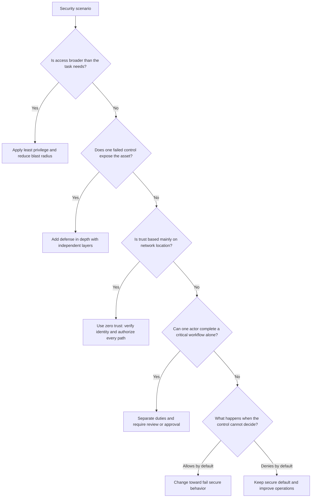

**Складність**: `[СЕРЕДНЯ]` — фундаментальні концепції. **Час на проходження**: 45–60 хвилин. **Передумови**: [Модуль 1.2: Безпека хмарного провайдера](../module-1.2-cloud-provider-security/). Цей модуль припускає, що ви вже впізнаєте основні об'єкти Kubernetes і тепер потребуєте надійного способу оцінити, чи налаштовані ці об'єкти згідно з безпечними принципами роботи.

## Що ви зможете зробити

Після завершення цього модуля ви зможете виконувати роботу з рев'ю безпеки, а не лише переказувати визначення. Кожен результат нижче відповідає сценарію, точці прийняття рішення або практичному завданню з рев'ю далі в модулі.

1. **Оцінювати** конфігурації Kubernetes на відповідність глибокоешелонованому захисту, найменшим привілеям, нульовій довірі та розподілу обов'язків.
2. **Проєктувати** багаторівневі засоби контролю безпеки, які зменшують поверхню атаки та обмежують радіус ураження, коли робоче навантаження скомпрометовано.
3. **Діагностувати**, чи дає засіб контролю Kubernetes безпечний збій чи відкритий збій, а потім пояснювати операційний компроміс.
4. **Впроваджувати** практичний робочий процес рев'ю, який зіставляє цілі тріади CIA з RBAC, NetworkPolicy, Pod Security та налаштуваннями робочих навантажень.

## Чому цей модуль важливий

У 2023 році компрометація MOVEit Transfer показала, як швидко одна відкрита система може перетворитися на кризу для бізнесу. Зловмисники використали один продукт для керованої передачі файлів, а потім скористалися отриманим доступом, щоб викрасти дані сотень організацій у сферах державного управління, фінансів, охорони здоров'я та освіти. За публічними оцінками, сукупні похідні збитки сягнули мільярдів доларів, щойно врахували роботу з реагування, юридичні ризики, сповіщення клієнтів та операційні збої. Урок полягав не лише в тому, що один продукт мав серйозну ваду; глибший урок полягав у тому, що багато організацій надто покладалися на один периметровий засіб контролю і недостатньо обмежили те, до чого могла дотягнутися успішна компрометація.

Джерело: CISA Advisory AA23-158A (червень 2023), "#StopRansomware: CL0P Ransomware Gang Exploits MOVEit Vulnerability."

Кластери Kubernetes створюють такий самий ризик у динамічнішій формі. Под рідко буває просто Подом; він може нести токен сервісного акаунта, спілкуватися з іншими сервісами, монтувати конфігурацію, викликати API Kubernetes і працювати на ноді, спільній з непов'язаними робочими навантаженнями. Якщо цей Под налаштовано з широким RBAC, привілейованими параметрами контейнера, необмеженим вихідним мережевим трафіком і без захисних механізмів допуску, одна помилка в застосунку може перетворитися на інцидент масштабу всього кластера. Якщо ж той самий Под оточено багаторівневими засобами контролю, вузькими дозволами, перевіреною взаємодією між сервісами та безпечними налаштуваннями за замовчуванням, та сама помилка може залишитися локалізованою подією робочого навантаження, а не стати компрометацією платформи.

Цей модуль навчає принципів, що стоять за цими виборами. Kubernetes швидко змінюється, і цей курс орієнтований на Kubernetes 1.35+, але принципи давніші та довговічніші за будь-яку конкретну версію API. Глибокоешелонований захист, найменші привілеї, нульова довіра, розподіл обов'язків, проєктування з безпечним збоєм, тріада CIA, зменшення поверхні атаки та керування радіусом ураження дають вам спосіб мислити, коли точна команда, продукт чи інцидент незнайомі. Питання KCSA часто описують ситуацію, а не просять команду, тож ваше завдання — впізнати, який принцип перевіряється, і обрати засіб контролю, що робить систему стійкішою.

## Основні принципи безпеки

Принципи безпеки — це не гасла для заучування; це інструменти прийняття рішень для моментів, коли дві розумні інженерні цілі конфліктують. Команди хочуть швидких розгортань, надійних сервісів, зручного налагодження та низьких операційних витрат, але зловмисники виграють щоразу, коли ці цілі стирають межі. Практична навичка — навчитися запитувати, яке припущення робить дизайн, що станеться, коли це припущення не справдиться, і який засіб контролю утримає збій від поширення.

Перший принцип — це глибокоешелонований захист, який означає, що жоден окремий засіб контролю не варто вважати цілою стратегією безпеки. Файрвол, приватна підмережа або політика допуску можуть бути цінними, але кожен із них має режими відмови. Хтось може неправильно налаштувати правило, вразливість може обійти рівень, обліковий запис можна викрасти, а довірений компонент може стати шкідливим після компрометації. Глибокоешелонований захист приймає те, що окремі засоби контролю відмовляють, і проєктує систему так, щоб зловмисник мусив подолати кілька незалежних засобів контролю, перш ніж дістатися до найціннішої цілі.

```text
┌─────────────────────────────────────────────────────────────┐
│              DEFENSE IN DEPTH                               │
├─────────────────────────────────────────────────────────────┤
│                                                             │
│  SINGLE CONTROL (Fragile)                                  │
│                                                             │
│  Firewall ─────────────────────────────────→ Protected     │
│                                               Resource      │
│  If firewall fails, resource is exposed                    │
│                                                             │
│  ───────────────────────────────────────────────────────── │
│                                                             │
│  LAYERED CONTROLS (Resilient)                              │
│                                                             │
│  Firewall → Network Policy → RBAC → Pod Security → App     │
│                                                   Auth     │
│                                                             │
│  Multiple failures required to reach the resource          │
│                                                             │
└─────────────────────────────────────────────────────────────┘
```

У Kubernetes глибокоешелонований захист видно, коли запит має пройти кілька перевірок, перш ніж зможе завдати шкоди. Користувач автентифікується на API-сервері, авторизація перевіряє, чи може користувач виконати запитуване дієслово, контролери допуску оцінюють отриманий об'єкт, Pod Security admission відхиляє небезпечні налаштування Подів, NetworkPolicy обмежує трафік після запуску Пода, а авторизація на рівні застосунку все одно перевіряє, що користувач може робити всередині сервісу. Жоден із цих засобів контролю не є ідеальним, але разом вони роблять шлях атаки довшим, помітнішим і легшим для переривання.

| Рівень | Засіб контролю безпеки |
|-------|-----------------|
| Хмара | VPC, групи безпеки, IAM |
| Кластер | RBAC, аудитне логування |
| Мережа | Мережеві політики, service mesh |
| Робоче навантаження | Pod Security Standards |
| Контейнер | SecurityContext, capabilities |
| Застосунок | Автентифікація, авторизація |

Другий принцип — це найменші привілеї, який каже, що кожна ідентичність і робоче навантаження повинні отримувати лише той доступ, що потрібен для їхньої поточної роботи. Найменші привілеї важко впроваджувати, бо вони додають тертя під час проєктування та експлуатації. Широкий дозвіл легко надати й важко перевірити згодом; точний дозвіл потребує обмірковування, тестування та супроводу в міру зміни робочого навантаження. Винагородою є те, що викрадені облікові дані, проексплуатовані контейнери та помилкові команди мають менше простору для завдання шкоди.

```text
┌─────────────────────────────────────────────────────────────┐
│              LEAST PRIVILEGE                                │
├─────────────────────────────────────────────────────────────┤
│                                                             │
│  BAD: Overly permissive                                    │
│  ┌──────────────────────────────────────────────────────┐  │
│  │  Role: cluster-admin                                 │  │
│  │  Resources: * (everything)                           │  │
│  │  Verbs: * (all actions)                              │  │
│  │  "Just give them admin so they can do their job"     │  │
│  └──────────────────────────────────────────────────────┘  │
│                                                             │
│  GOOD: Precisely scoped                                    │
│  ┌──────────────────────────────────────────────────────┐  │
│  │  Role: deployment-reader                             │  │
│  │  Resources: deployments                              │  │
│  │  Verbs: get, list, watch                             │  │
│  │  Namespace: team-a                                   │  │
│  │  "Grant exactly what's needed, nothing more"         │  │
│  └──────────────────────────────────────────────────────┘  │
│                                                             │
└─────────────────────────────────────────────────────────────┘
```

Найменші привілеї проявляються в Kubernetes на кількох рівнях. Людина-оператор зазвичай має отримувати Роль, обмежену простором імен, а не ClusterRoleBinding до cluster-admin. Робоче навантаження має використовувати виділений ServiceAccount замість стандартного ServiceAccount, спільного для непов'язаних Подів. Контейнер має за замовчуванням відкидати можливості (capabilities) Linux і додавати назад лише ту рідкісну можливість, яка йому потрібна. Мережева політика має спершу забороняти трафік, а потім дозволяти лише той конкретний вузол і порт, що потрібні для шляху застосунку.

| Сфера | Приклад найменших привілеїв |
|------|------------------------|
| RBAC | Ролі, обмежені простором імен, замість загальнокластерних |
| Capabilities | Відкинути все, додати лише потрібне |
| Мережа | Заборонити все, дозволити конкретне |
| Сервісні акаунти | Виділений на кожне робоче навантаження |
| Доступ до файлів | Коренева файлова система лише для читання |

Нульова довіра поширює найменші привілеї з дозволів на припущення про розташування та ідентичність. Традиційне периметрове мислення каже, що трафік усередині мережі надійніший за трафік ззовні. Kubernetes робить це припущення особливо ризикованим, бо Поди недовговічні, ноди спільні, а внутрішні імена сервісів легко доступні з багатьох місць. Нульова довіра каже, що кожен запит усе одно потребує автентифікації, авторизації, шифрування там, де це доречно, і контекстно-залежного оцінювання навіть тоді, коли запит походить зсередини кластера.

```text
┌─────────────────────────────────────────────────────────────┐
│              ZERO TRUST vs PERIMETER SECURITY               │
├─────────────────────────────────────────────────────────────┤
│                                                             │
│  TRADITIONAL (Castle and Moat)                             │
│  ┌────────────────────────────────────────────────┐        │
│  │  FIREWALL                                      │        │
│  │  ┌──────────────────────────────────────────┐ │        │
│  │  │  Inside = Trusted                        │ │        │
│  │  │  All internal traffic allowed            │ │        │
│  │  │  Once inside, move freely               │ │        │
│  │  └──────────────────────────────────────────┘ │        │
│  └────────────────────────────────────────────────┘        │
│  Problem: Attacker inside can access everything            │
│                                                             │
│  ZERO TRUST                                                │
│  ┌────────────────────────────────────────────────┐        │
│  │  Every request verified:                      │        │
│  │  • Who is making the request?                 │        │
│  │  • Is the device compliant?                   │        │
│  │  • Is this request normal for this identity? │        │
│  │  • Encrypt all traffic, internal or not      │        │
│  └────────────────────────────────────────────────┘        │
│  Benefit: Breach of one system doesn't give access to all │
│                                                             │
└─────────────────────────────────────────────────────────────┘
```

Нульова довіра не означає, що кожен кластер мусить негайно прийняти service mesh або складну платформу ідентичності. Вона починається з відмови вважати членство в просторі імен, розташування ноди чи приватні IP-адреси доказом довіри. У невеликому кластері це може означати RBAC для кожного запиту до API, NetworkPolicy із забороною за замовчуванням у чутливих просторах імен, TLS для вхідного та внутрішнього трафіку, а також політики допуску, які відхиляють робочі навантаження без чітких меж ідентичності. У більшій платформі той самий принцип може вирости до ідентичності робочого навантаження, mTLS, ротації сертифікатів, політики як коду та безперервних рішень про авторизацію.

| Принцип | Реалізація в Kubernetes |
|-----------|--------------------------|
| Перевіряти ідентичність | Сильна автентифікація (OIDC, сертифікати) |
| Перевіряти авторизацію | RBAC для кожного запиту |
| Припускати компрометацію | Мережеві політики (заборона за замовчуванням) |
| Шифрувати трафік | TLS усюди, service mesh |
| Обмежувати радіус ураження | Ізоляція простору імен |

Розподіл обов'язків розв'язує інший режим відмови: особа чи автоматизація, що створює ризиковану зміну, не повинна бути єдиною стороною, здатною схвалити, розгорнути й перевірити цю зміну. Цей принцип іноді описують як бюрократію, але його призначення практичне. Люди роблять помилки під тиском, інсайдери можуть зловживати надмірними повноваженнями, а скомпрометовані облікові дані стають кориснішими, коли один обліковий запис може самотужки завершити цілий чутливий робочий процес. Розподіл обов'язків створює другу точку прийняття рішення, перш ніж небезпечна зміна досягне продакшену.

```text
┌─────────────────────────────────────────────────────────────┐
│              SEPARATION OF DUTIES                           │
├─────────────────────────────────────────────────────────────┤
│                                                             │
│  BAD: One person does everything                           │
│                                                             │
│  Developer writes code                                      │
│      ↓                                                      │
│  Same person deploys to production                         │
│      ↓                                                      │
│  Same person approves their own changes                    │
│                                                             │
│  Risk: Malicious or erroneous changes go undetected       │
│                                                             │
│  ───────────────────────────────────────────────────────── │
│                                                             │
│  GOOD: Responsibilities divided                            │
│                                                             │
│  Developer → Code review → Security scan → Approval →     │
│                                           Different        │
│                                           person/team      │
│  deploys                                                   │
│                                                             │
│  Benefit: Checks and balances prevent single point of     │
│  compromise                                                │
│                                                             │
└─────────────────────────────────────────────────────────────┘
```

В операціях Kubernetes розподіл обов'язків часто з'являється в конвеєрах розгортання та доступі до продакшену. Розробники можуть писати маніфести, але окреме рев'ю або політика допуску схвалює привілейовані налаштування. Платформенні інженери можуть супроводжувати ClusterRoles, але команди застосунків отримують RoleBindings, прив'язані до простору імен. Команди безпеки можуть визначати базові мітки Pod Security admission, але сервісні команди налаштовують власну конфігурацію застосунку в межах цих кордонів. Важлива деталь у тому, що розподіл має захищати критичні процеси, не змушуючи кожну рутинну дію проходити через ручне вузьке місце.

Зупиніться та спрогнозуйте: якщо RBAC надає лише додаткові дозволи й не має правил заборони, як би ви завадили одному конкретному користувачеві читати Secrets у просторі імен, де широка групова Роль уже дозволяє цю дію? Відповідь — не створювати прив'язку із забороною, бо RBAC у Kubernetes так не працює. Ви б прибрали або звузили широке надання, прив'язали чутливий дозвіл до меншої групи, відокремили користувача від цієї групи або перенесли чутливий об'єкт до простору імен з іншими межами доступу.

Проєктування з безпечним збоєм запитує, що робить система, коли залежність безпеки недоступна, неоднозначна або неправильно налаштована. Засіб контролю з відкритим збоєм надає пріоритет безперервності, дозволяючи доступ, коли він не може вирішити. Засіб контролю з безпечним збоєм забороняє чи відхиляє дію, поки не зможе ухвалити безпечне рішення. Жоден із виборів не безкоштовний: безпечний збій може перервати операції, тоді як відкритий збій може перетворити простій на вторгнення. Чутливі до безпеки засоби контролю зазвичай потребують поведінки з безпечним збоєм, бо зловмисники можуть навмисно створювати часткові відмови, щоб обійти перевірки.

```text
┌─────────────────────────────────────────────────────────────┐
│              FAIL SECURE vs FAIL OPEN                       │
├─────────────────────────────────────────────────────────────┤
│                                                             │
│  FAIL OPEN (Dangerous)                                     │
│  ├── If authorization service is down, allow all requests │
│  ├── If network policy controller fails, allow all traffic│
│  └── "Better to be available than secure"                  │
│                                                             │
│  FAIL SECURE (Correct)                                     │
│  ├── If authorization service is down, deny all requests  │
│  ├── If network policy controller fails, block traffic    │
│  └── "Better to be secure than available"                  │
│                                                             │
│  Default deny exemplifies fail secure:                     │
│  - Network policy with no rules = deny all                │
│  - RBAC with no bindings = no access                      │
│  - Pod security admission = reject non-compliant pods     │
│                                                             │
└─────────────────────────────────────────────────────────────┘
```

Kubernetes має кілька стандартних налаштувань і поведінок, що ілюструють мислення з безпечним збоєм. Якщо жодна прив'язка RBAC не надає користувачеві дієслова на ресурсі, запит забороняється. Якщо простір імен використовує обмежений (restricted) Pod Security admission і Под просить привілейований режим, API-сервер відхиляє об'єкт, перш ніж той запуститься. Якщо простір імен має NetworkPolicy із забороною вхідного трафіку за замовчуванням, трафік блокується, поки політика явно його не дозволить. Ваше операційне завдання — зробити ці безпечні збої видимими, діагностованими та відновлюваними, а не послаблювати засіб контролю, коли команди скаржаться, що він щось заблокував.

## Концепції безпеки, які пов'язують принципи

Тріада CIA — це компактний спосіб запитати, що захищає засіб контролю. Конфіденційність означає, що інформацію бачать лише вповноважені сторони. Цілісність означає, що інформація та поведінка системи точні, повні й не змінені потайки. Доступність означає, що сервіс залишається придатним до використання, коли легітимним користувачам це потрібно. Більшість засобів контролю Kubernetes захищають понад один стовп, але називання головного стовпа допомагає пояснити, чому засіб контролю належить дизайну.

```text
┌─────────────────────────────────────────────────────────────┐
│                    CIA TRIAD                                │
├─────────────────────────────────────────────────────────────┤
│                                                             │
│                   CONFIDENTIALITY                           │
│                        /\                                   │
│                       /  \                                  │
│                      /    \                                 │
│                     /      \                                │
│                    /   CIA  \                               │
│                   /          \                              │
│                  /____________\                             │
│          INTEGRITY            AVAILABILITY                  │
│                                                             │
│  CONFIDENTIALITY: Only authorized access to data          │
│  • Encryption, access control, authentication              │
│                                                             │
│  INTEGRITY: Data is accurate and unmodified               │
│  • Checksums, digital signatures, audit logs               │
│                                                             │
│  AVAILABILITY: Systems accessible when needed              │
│  • Redundancy, backups, DDoS protection                    │
│                                                             │
└─────────────────────────────────────────────────────────────┘
```

Конфіденційність у Kubernetes часто починається з Secrets, але не закінчується на них. Secret корисний лише тоді, коли RBAC обмежує, хто може його читати, шифрування etcd захищає його у стані спокою, токени сервісних акаунтів мають обмежену область дії, мережеві шляхи не зливають його непередбаченим споживачам, а аудитні логи показують підозрілий доступ. Цілісність проявляється, коли образи підписані, політика допуску відхиляє невідомі реєстри, конвеєри розгортання фіксують, хто змінив маніфест, а аудитні сліди ускладнюють приховування підробки. Доступність проявляється, коли квоти ресурсів, ліміти, репліки, PodDisruptionBudgets та надлишковість кластера не дають одному робочому навантаженню чи домену відмов виснажити решту платформи.

| Стовп | Приклади в Kubernetes |
|--------|-------------------|
| Конфіденційність | Шифрування Secrets, RBAC, мережеві політики |
| Цілісність | Підпис образів, контроль допуску, цілісність etcd |
| Доступність | Репліки, PDB, надлишковість кластера |

Поверхня атаки — це сума місць, де зловмисник може взаємодіяти із системою. Частина поверхні атаки очевидна, як-от публічна кінцева точка API-сервера, Ingress із виходом в інтернет або сервіс NodePort. Інша поверхня атаки внутрішня, як-от трафік між Подами, токени сервісних акаунтів, образи контейнерів із непотрібними інструментами, доступ до kubelet та надмірно широкі дозволи API зсередини Пода. Ви не можете прибрати всю поверхню атаки, бо корисні системи мусять приймати легітимний ввід, але ви можете прибрати точки входу, які не служать чіткій меті.

```text
┌─────────────────────────────────────────────────────────────┐
│              KUBERNETES ATTACK SURFACE                      │
├─────────────────────────────────────────────────────────────┤
│                                                             │
│  EXTERNAL ATTACK SURFACE                                   │
│  ├── API server endpoint                                   │
│  ├── Ingress controllers                                   │
│  ├── Exposed services (LoadBalancer, NodePort)             │
│  └── SSH to nodes                                          │
│                                                             │
│  INTERNAL ATTACK SURFACE                                   │
│  ├── Pod-to-pod communication                              │
│  ├── Service account tokens                                │
│  ├── Kubernetes API from pods                              │
│  ├── kubelet API                                           │
│  └── etcd access                                           │
│                                                             │
│  MINIMIZE ATTACK SURFACE:                                  │
│  • Disable unused features                                 │
│  • Remove unnecessary packages from images                 │
│  • Use private clusters                                    │
│  • Restrict network access                                 │
│                                                             │
└─────────────────────────────────────────────────────────────┘
```

Зменшення поверхні атаки — це не те саме, що приховування систем від зору. Приватна кінцева точка кластера зменшує відкритість, але не виправдовує слабкий RBAC. Мінімальний образ зменшує доступні після компрометації інструменти, але не замінює оновлення. NetworkPolicy із забороною за замовчуванням зменшує досяжні сервіси, але не замінює автентифікацію застосунку. Найсильніші дизайни поєднують меншу поверхню атаки з багаторівневими засобами контролю, щоб менше спроб досягало системи, а успішні спроби мали менше простору для пересування.

Зупиніться та спрогнозуйте: розгляньте два скомпрометовані Поди, один працює з ServiceAccount cluster-admin, а другий — з ServiceAccount, обмеженим простором імен і доступом лише для читання. Помилка в застосунку може бути ідентичною в обох Подах, але радіус ураження дуже відрізняється, бо викрадена ідентичність несе різні повноваження. Перша компрометація може змінювати ресурси кластера, читати secrets між просторами імен і легше приховувати докази; друга компрометація може лише оглядати обмежені ресурси в одному просторі імен. Ось чому радіус ураження — це бік наслідків принципу найменших привілеїв.

```text
┌─────────────────────────────────────────────────────────────┐
│              BLAST RADIUS EXAMPLES                          │
├─────────────────────────────────────────────────────────────┤
│                                                             │
│  LARGE BLAST RADIUS (Bad)                                  │
│  • cluster-admin ServiceAccount                            │
│    → Compromise = full cluster access                      │
│  • Privileged container                                    │
│    → Compromise = node access                              │
│  • Default ServiceAccount with secrets access              │
│    → Compromise = all namespace secrets                    │
│                                                             │
│  SMALL BLAST RADIUS (Good)                                 │
│  • Namespace-scoped ServiceAccount                         │
│    → Compromise = limited to one namespace                 │
│  • Non-privileged, capability-dropped container            │
│    → Compromise = limited to container processes           │
│  • Dedicated ServiceAccount, no secrets access             │
│    → Compromise = minimal impact                           │
│                                                             │
│  GOAL: Minimize blast radius at every layer               │
│                                                             │
└─────────────────────────────────────────────────────────────┘
```

Радіус ураження — це також операційна концепція. Коли розгортання ламає продакшен, малий радіус ураження означає, що збій впливає на один простір імен, один сервіс чи одного орендаря, а не на всю платформу. Безпека й надійність тут перетинаються, бо обмежені дозволи, простори імен, квоти, поетапні розгортання та межі політик — усе це робить збій меншим. Сценарій KCSA може описувати зловмисника, помилкового інженера чи зламаний контролер; той самий принцип застосовується, бо платформа має тримати локальний збій локальним.

## Застосування принципів до Kubernetes

Практичний спосіб застосувати ці принципи — переглянути реальний шлях робочого навантаження ззовні всередину. Почніть із того, хто може дістатися до робочого навантаження, потім запитайте, яку ідентичність використовує робоче навантаження, що ця ідентичність може робити, який трафік робоче навантаження може надсилати й отримувати, як обмежено контейнер, як зміни досягають продакшену та що стається, коли засіб контролю відмовляє. Цей порядок запобігає поширеній помилці, коли команди посилюють один видимий рівень, як-от налаштування контейнера, лишаючи доступ до API чи пересування мережею широко відкритими.

```text
┌─────────────────────────────────────────────────────────────┐
│              PRINCIPLES IN ACTION                           │
├─────────────────────────────────────────────────────────────┤
│                                                             │
│  SCENARIO: Deploy a web app that needs database access     │
│                                                             │
│  DEFENSE IN DEPTH                                          │
│  ├── Cloud: VPC with private subnets                       │
│  ├── Cluster: RBAC for deployment permissions              │
│  ├── Network: Network policy for DB access only            │
│  ├── Pod: Restricted security context                      │
│  └── App: Input validation, prepared statements            │
│                                                             │
│  LEAST PRIVILEGE                                           │
│  ├── ServiceAccount: Only secrets it needs                 │
│  ├── RBAC: Read deployments in its namespace only          │
│  ├── Capabilities: All dropped, none added                 │
│  ├── Network: Egress only to database pod                  │
│  └── Database: User with SELECT only, specific tables      │
│                                                             │
│  ZERO TRUST                                                │
│  ├── mTLS between web app and database                     │
│  ├── Network policy denying all except explicit allow      │
│  ├── Short-lived database credentials                      │
│  └── All API calls authenticated                           │
│                                                             │
└─────────────────────────────────────────────────────────────┘
```

Уявіть вебзастосунок, який читає записи клієнтів із бази даних. Глибокоешелонований захист каже, що база даних не має покладатися лише на безпомилковість застосунку. NetworkPolicy має дозволяти трафік від вебподів до сервісу бази даних на порт бази даних і забороняти непов'язаний трафік Подів. RBAC має заважати вебServiceAccount читати непов'язані Secrets або змінювати Deployments. Pod Security має забороняти привілейований режим, host namespaces та непотрібні можливості Linux. Авторизація застосунку все одно має перевіряти, чи дозволено користувачеві читати конкретний запис.

Найменші привілеї роблять рев'ю точнішим. Вебзастосунку потрібно під'єднатися до бази даних, але йому, ймовірно, не потрібно перелічувати всі Поди в просторі імен, читати кожен Secret чи писати в кореневу файлову систему. Конвеєру розгортання може знадобитися дозвіл оновлювати Deployment, але запущеному застосунку зазвичай ні. Розділення цих ідентичностей має значення, бо запущений Под відкритий до атак на рівні застосунку, тоді як ідентичність розгортання має бути захищена в CI за допомогою схвалення та засобів контролю аудиту.

Нульова довіра змінює те, як ви думаєте про внутрішній трафік. Ім'я сервісу на кшталт `postgres.default.svc.cluster.local` не є доказом того, що той, хто викликає, заслуговує на довіру, а приватний IP Пода не є межею безпеки. База даних має автентифікувати застосунок, а кластер має обмежувати, які Поди можуть дістатися до кінцевої точки бази даних. Якщо присутній service mesh, mTLS може забезпечити ідентичність робочого навантаження та шифрування між сервісами, але той самий принцип усе одно вимагає авторизації на рівні застосунку й даних.

Питання безпечного збою постає пізніше в рев'ю, бо стосується поведінки під тиском. Якщо вебхук допуску недоступний, чи має кластер дозволяти привілейовані Поди, поки вебхук не відновиться, чи відхиляти нові Поди, які не можна оцінити? Для чутливих до безпеки політик безпечнішою відповіддю зазвичай є відхилення з чіткими сповіщеннями та операційним ранбуком. Ця відповідь може бути незручною під час простою, тому платформенна команда має ставитися до доступності політики як до продакшен-інфраструктури, а не як до допоміжного інструменту.

Перш ніж запускати це, який вивід ви очікуєте від перевірки дозволів для щойно створеного ServiceAccount без RoleBinding? Аліас нижче вводить `k` як скорочену форму для `kubectl`, що є угодою, яку використовують у всьому KubeDojo. У реальному кластері очікуваний результат — заборона, бо RBAC у Kubernetes не надає доступу, якщо прив'язка явно його не дозволяє.

```bash
alias k=kubectl
k auth can-i get secrets --as=system:serviceaccount:demo:web -n demo
```

Ця команда — корисна звичка, бо вона перетворює принцип на тестоване твердження. Замість казати «вебзастосунок має обмежений доступ», ви можете запитати Kubernetes, чи може ідентичність виконувати конкретні дієслова над конкретними ресурсами. Ви можете повторити те саме рев'ю для мережевого доступу, перевіривши покриття NetworkPolicy, для налаштувань Пода, перевіривши securityContext та Pod Security admission, і для контролю змін, перевіривши, хто може схвалювати чи зливати зміни розгортання.

```bash
k auth can-i list pods --as=system:serviceaccount:demo:web -n demo
k auth can-i create deployments --as=system:serviceaccount:demo:web -n demo
k auth can-i get secrets --as=system:serviceaccount:demo:web -n demo
```

Який підхід ви б обрали тут і чому: один спільний ServiceAccount для всіх робочих навантажень у просторі імен чи один ServiceAccount на кожне робоче навантаження? Спільний обліковий запис простіший спочатку, але він робить аудитні сліди нечіткими й змушує дозволи розростатися, поки вони не задовольнять кожне робоче навантаження. Виділений обліковий запис на кожне робоче навантаження коштує трохи більше роботи з маніфестами, але він тримає дозволи зрозумілими, обмежує радіус ураження та пришвидшує реагування на інциденти, бо ви знаєте, яке робоче навантаження володіло токеном.

### Розбір рев'ю: перетворення принципів на дизайн Kubernetes

Корисне рев'ю безпеки починається з простого опису того, що робоче навантаження має робити. Припустімо, застосунок отримує HTTPS-запити від Ingress, читає дані про продукти з бази даних, не записує жодних записів клієнтів і відкриває кінцеву точку метрик для Prometheus. Цей опис навмисно звичайний, бо більшість інцидентів кластера не починаються з екзотичної архітектури. Вони починаються, коли звичайні сервіси накопичують дозволи, мережеві шляхи та налаштування часу виконання, на які ніхто не подивився разом.

Перше питання рев'ю стосується ідентичності. Робоче навантаження потребує ідентичності, щоб Kubernetes та інші системи могли відрізнити його від сусідніх робочих навантажень, але ця ідентичність не повинна стати універсальним ключем до простору імен. Виділений ServiceAccount, названий за застосунком, дає вам стабільне місце, щоб прив'язати ті небагато дозволів, які потрібні робочому навантаженню. Якщо застосунок ніколи не викликає API Kubernetes, найкращою відповіддю може бути взагалі не монтувати токен, що прибирає з Пода цілий обліковий запис.

Друге питання стосується дозволів, прив'язаних до цієї ідентичності. Багато реальних маніфестів дрейфують до широких дозволів, бо хтось копіює Роль із контролера, діагностичного Пода чи інструмента розгортання. Для звичайного вебсервісу доступ до переліку Подів, читання всіх ConfigMaps чи отримання Secrets може бути непотрібним. Рев'ю має запитати доказ: який шлях у коді використовує цей дозвіл, які імена ресурсів потрібні та що зламається, якщо дозвіл прибрати? Цей підхід на основі доказів утримує найменші привілеї від перетворення на здогадки.

Третє питання стосується трафіку. Застосунку потрібен вхідний трафік від контролера Ingress і вихідний до бази даних, а Prometheus потребує вхідного трафіку до порту метрик. Усе інше слід вважати невідомим, поки хтось це не задокументує. Ця модель пасує нульовій довірі, бо внутрішнє розташування Пода не означає автоматично дозвіл спілкуватися. Вона також пасує проєктуванню з безпечним збоєм, бо політики заборони за замовчуванням блокують нові чи випадкові шляхи, поки команда не зробить навмисне правило дозволу.

Четверте питання стосується межі контейнера. Робоче навантаження, що працює від імені root, дозволяє підвищення привілеїв, тримає багато можливостей Linux і вільно пише в кореневу файлову систему, дає зловмиснику більше варіантів після експлуатації. Обмежений securityContext не змушує помилки застосунку зникнути, але звужує те, що зловмисник може зробити після експлуатації одного. У термінах глибокоешелонованого захисту посилення контейнера — це рівень, що має значення після того, як валідація застосунку зазнає невдачі, і перш ніж стане можливою шкода на рівні ноди.

П'яте питання стосується повноважень на зміни. Якщо той самий розробник може змінити Deployment, схвалити pull request, обійти політику й розгорнути в продакшен, у процесі немає реального розподілу обов'язків. Це не означає, що кожна зміна вимагає комітету. Це означає, що ризиковані дії, як-от додавання привілейованого режиму, прив'язка cluster-admin, вимкнення NetworkPolicy чи публічне відкриття сервісу, мають вимагати окремого схвалення або політики допуску, яка блокує їх за замовчуванням.

Шосте питання стосується спостережуваності та аудиту. Засоби контролю безпеки, яких ніхто не може пояснити під час інциденту, стають крихкими, бо команди або ігнорують сповіщення, або прибирають засіб контролю, щоб відновити сервіс. Аудитні логи мають показувати, хто змінив RBAC, хто створив привілейовані Поди та яка ідентичність намагалася виконати заборонені виклики API. Збої мережі та допуску мають створювати повідомлення, що ведуть інженера до відсутньої політики чи небезпечного налаштування. Система з безпечним збоєм підтримувана лише тоді, коли збій видимий і дієвий.

Ці питання навмисно перекриваються, бо реальні принципи підсилюють одне одного. Виділений ServiceAccount — це найменші привілеї, але він також покращує радіус ураження та можливість аудиту. NetworkPolicy із забороною за замовчуванням — це нульова довіра, але вона також підтримує глибокоешелонований захист та безпечні налаштування за замовчуванням. Захищений робочий процес розгортання — це розподіл обов'язків, але він також зберігає цілісність, бо несанкціоновані зміни маніфестів важче внести. Коли сценарій KCSA просить найкращий засіб контролю, шукайте варіант, що розв'язує негайну проблему й водночас зміцнює суміжні принципи.

Розгляньте шлях бази даних у розібраному прикладі. Якщо вебзастосунок має ваду SQL-ін'єкції, авторизація застосунку та параметризовані запити — це перші захисти. Якщо вони відмовлять, користувач бази даних усе одно має мати лише ті операції, що потрібні застосунку, як-от читання вибраних таблиць замість зміни схеми чи читання непов'язаних даних. Якщо Под скомпрометовано, NetworkPolicy має завадити зловмиснику використовувати цей Под як універсальний сканер. Якщо токен ServiceAccount викрадено, RBAC має завадити змінам на рівні кластера.

Тепер розгляньте шлях метрик. Системи моніторингу часто потребують широкого огляду, тож команди випадково роблять їх широкими мережевими мостами теж. Кращий дизайн відрізняє огляд від необмеженої досяжності. Prometheus може збирати метрики з вибраних портів, не отримуючи дозволу під'єднуватися до адмінпортів застосунку, портів бази даних чи внутрішніх кінцевих точок налагодження. Це вужче правило захищає конфіденційність, бо доступ до метрик обмежений, і захищає доступність, бо скомпрометований компонент моніторингу має менше способів порушити роботу продакшен-сервісів.

Засоби контролю ресурсів заслуговують на таке саме рев'ю, бо доступність є частиною безпеки. Под без лімітів CPU чи пам'яті може стати джерелом відмови в обслуговуванні після помилки, поганого патерну трафіку чи компрометації. Квоти простору імен допомагають утримати одну команду від споживання всього кластера. PodDisruptionBudgets допомагають захистити пропускну здатність сервісу під час добровільного обслуговування. Ці засоби контролю не ефектні, але вони часто є різницею між ізольованою проблемою робочого навантаження та простоєм масштабу всієї платформи.

Поводження із secrets пов'язує конфіденційність, найменші привілеї та розподіл обов'язків разом. Робоче навантаження має отримувати лише той секретний матеріал, що йому потрібен, а доступ людей до продакшен-secrets має бути винятковим, а не рутинним. Якщо розробнику потрібен тимчасовий доступ під час інциденту, цей доступ має бути обмеженим, схваленим, залогованим і прибраним. Цей дизайн суворіший за додавання постійної прив'язки до групи, але його також легше відстояти після інциденту, бо організація може показати, хто мав доступ, чому він його мав і коли він закінчився.

Політика допуску — це місце, де багато з цих рішень стають автоматичними. Політика, що відхиляє привілейовані Поди, доступ до host namespace, небезпечні capabilities чи образи з невідомих реєстрів, перетворює рішення рев'ю на правила, придатні до примусового виконання. Компроміс у тому, що політика допуску стає частиною продакшен-шляху, тож її треба тестувати, моніторити й обережно викочувати. Політика, що блокує небезпечні робочі навантаження без чітких повідомлень про помилки, створює тертя; політика, що пояснює порушення, навчає команди, як виправити їхні маніфести.

Проєктування простору імен — це ще одна практична межа. Простори імен самі по собі не є жорсткими контейнерами безпеки, але вони корисні місця, щоб прикріпити RBAC, NetworkPolicy, ResourceQuota, LimitRange та мітки Pod Security admission. Простір імен на команду, середовище чи рівень застосунку може зробити володіння політикою чіткішим. Небезпека полягає в тому, щоб вважати простори імен сильнішою ізоляцією, ніж вони є. Чутливі дизайни з кількома орендарями можуть потребувати окремих кластерів, сильнішої ізоляції нод або додаткових засобів контролю поза політикою простору імен.

Коли ви переглядаєте наявний кластер, уникайте спроб виправити кожну слабкість одразу. Почніть зі шляхів, що поєднують високу відкритість і високий привілей, як-от сервіси з виходом в інтернет із широкими ServiceAccounts, привілейовані робочі навантаження в продакшен-просторах імен або інструментальні простори імен, що можуть дістатися до багатьох орендарів. Зменшення цих шляхів спершу дає найбільше зниження ризику за найменшого порушення. Потім рухайтеся до базових політик, що запобігають повторній появі тих самих ризикованих патернів у нових робочих навантаженнях.

Останній крок — задокументувати прийняту форму дизайну. Коротка нотатка рев'ю має назвати ідентичність робочого навантаження, дозволені дозволи API, дозволені мережеві потоки, обмеження контейнера, власників винятків та операційний запасний план. Ця нотатка стає навчальним артефактом для майбутніх рев'юерів і чек-листом для реагування на інциденти. Якщо робоче навантаження скомпрометують через пів року, команда має бути здатна швидко відповісти, до чого зловмисник міг дістатися, які логи мають існувати та які засоби контролю мали зупинити горизонтальне переміщення.

## Патерни та антипатерни

Патерни — це повторювані дизайни, які роблять безпечну поведінку поведінкою за замовчуванням. Вони мають значення, бо людське рев'ю саме по собі не масштабується на завантаженій платформі. Команда може пам'ятати про обережне обмеження Ролі під час безпекового ривка, а потім випадково створити широкий ClusterRoleBinding через три місяці під час простою. Хороші патерни роблять безпечний шлях легшим для вибору й роблять небезпечні винятки достатньо видимими, щоб їх обговорити.

| Патерн | Коли використовувати | Чому це працює | Аспект масштабування |
|---------|----------------|--------------|-----------------------|
| Заборона за замовчуванням, явний дозвіл | Чутливі простори імен, рівні баз даних, продакшен-навантаження | Він реалізує нульову довіру та поведінку з безпечним збоєм, спершу блокуючи невідомі шляхи | Вимагає, щоб власники сервісів задокументували реальні потоки трафіку перед широким розгортанням |
| Виділений ServiceAccount на кожне робоче навантаження | Будь-яке навантаження, що викликає API Kubernetes чи монтує токени | Він підтримує найменші привілеї, можливість аудиту та менший радіус ураження | Автоматизуйте шаблони акаунтів і RoleBinding, щоб команди не копіювали застарілі маніфести |
| Конвеєр розгортання з підтримкою політик | Продакшен-кластери та регульовані середовища | Він розділяє повноваження авторства, схвалення, сканування й розгортання | Тримайте екстрений доступ обмеженим у часі та залогованим, щоб інциденти не обходили керування назавжди |
| Багаторівневе посилення робочого навантаження | Сервіси з виходом в інтернет та кластери з кількома орендарями | Він поєднує Pod Security, securityContext, RBAC та мережеві засоби контролю | Вимірюйте винятки за простором імен, щоб платформенні команди могли зменшувати ризиковий дрейф з часом |

Один антипатерн — використання cluster-admin як інструмента налагодження. Команди потрапляють у нього, бо заблокована команда під час інциденту відчувається гірше, ніж невиразний майбутній ризик безпеки. Кращий підхід — створити обмежений у часі та простором імен доступ із явним схваленням та аудитним логуванням, а потім прибрати його, коли інцидент завершиться. Це все одно дозволяє інженерам налагоджувати продакшен, але не дає екстреному доступу стати постійним.

Інший антипатерн — довіряти внутрішньому трафіку, бо мережа кластера приватна. Приватна адресація зменшує відкритість з інтернету, але вона не захищає від скомпрометованого Пода, шкідливої залежності чи інженера, який випадково розгортає тестовий інструмент із широкою зв'язністю. Краща альтернатива — вважати внутрішній трафік ненадійним, поки ідентичність, політика та авторизація застосунку не скажуть інакше. NetworkPolicy часто є першим практичним кроком, тоді як mTLS та ідентичність робочого навантаження додають сильнішу перевірку, коли платформа готова.

| Антипатерн | Що йде не так | Краща альтернатива |
|--------------|-----------------|-------------------|
| Один спільний привілейований платформений простір імен | Скомпрометований інструмент може дістатися до кожного орендаря чи системного компонента | Розділіть інструменти за функцією, використовуйте виділені ідентичності та вузько обмежуйте дозволи |
| Винятки в політиці без власника | Тимчасові обходи лишаються після того, як початкова потреба зникає | Вимагайте термін дії, власника, причину та дату рев'ю для кожного винятку |
| Політика допуску, що тихо дає відкритий збій | Зловмисники можуть цілити в простої політики, щоб розгортати небезпечні навантаження | Безпечний збій для критичних засобів контролю та сповіщення про недоступність політики |
| Посилення контейнера без рев'ю RBAC | Контейнер без прав root усе одно може тримати токен із надмірною владою над API | Переглядайте налаштування часу виконання Пода та дозволи ідентичності Kubernetes разом |

Найсильніші команди ставляться до цих патернів як до операційних звичок, а не одноразових проєктних артефактів. Вони будують шаблони для безпечних ServiceAccounts, базових NetworkPolicies, міток Pod Security, лімітів ресурсів та робочих процесів рев'ю. Вони також роблять шляхи винятків явними, бо кожна реальна організація іноді потребує винятків. Різниця між зрілою та незрілою безпекою — не у відсутності винятків; вона в тому, чи є винятки вузькими, видимими, обґрунтованими та тимчасовими.

## Фреймворк прийняття рішень

Коли ви читаєте сценарій KCSA, спершу визначте, що відмовило або що могло б відмовити. Якщо сценарій описує обхід одного засобу контролю, думайте про глибокоешелонований захист. Якщо він описує широкий доступ, спільні облікові дані чи зручність адміністрування, думайте про найменші привілеї та радіус ураження. Якщо він описує довіру до внутрішнього мережевого розташування, думайте про нульову довіру. Якщо він описує одну людину, що схвалює власну зміну, або один шлях автоматизації, що контролює все, думайте про розподіл обов'язків. Якщо він описує недоступний сервіс політики чи неоднозначне рішення авторизації, думайте про безпечний збій.



Використовуйте фреймворк як діагностичний цикл, а не як жорстку блок-схему. Реальні конфігурації часто порушують кілька принципів одночасно, і найкраще виправлення може стосуватися більш ніж одного. Наприклад, заміна спільного ServiceAccount cluster-admin на акаунти, специфічні для робочих навантажень, реалізує найменші привілеї, зменшує радіус ураження, покращує можливість аудиту та підтримує розподіл обов'язків, коли автоматизація розгортання володіє прив'язкою замість автора робочого навантаження. Хороше рев'ю безпеки називає головний принцип, але все одно пояснює вторинні переваги.

| Сигнал сценарію | Головний принцип | Засіб контролю Kubernetes для розгляду | Компроміс |
|-----------------|-------------------|--------------------------------|----------|
| Один файрвол чи одна політика допуску захищає весь шлях | Глибокоешелонований захист | Додати RBAC, Pod Security, NetworkPolicy та перевірки застосунку | Більше засобів контролю потребує більше спостережуваності та володіння |
| Робоче навантаження може читати всі Secrets чи оновлювати всі Deployments | Найменші привілеї | Звузити правила Ролі та використати виділені ServiceAccounts | Вимагає конкретніших маніфестів та тестів дозволів |
| Внутрішні Поди можуть дістатися до кожного сервісу за замовчуванням | Нульова довіра | NetworkPolicy із забороною за замовчуванням та автентифіковані виклики сервісів | Вимагає виявлення трафіку та обережного розгортання |
| Автор ризикованого маніфесту може схвалити й розгорнути його | Розподіл обов'язків | Захищені гілки, шлюзи рев'ю та схвалення розгортань | Додає накладні витрати процесу для продакшен-змін |
| Простій сервісу політики дозволяє небезпечні ресурси | Безпечний збій | Відхиляти неоцінені запити та сповіщати про стан політики | Може блокувати розгортання під час інцидентів площини управління |

Стовпець компромісу важливий, бо безпечні дизайни, що ігнорують операції, часто обходять. Політика допуску з безпечним збоєм, що блокує розгортання без чітких повідомлень про помилки, створить тиск на широкі винятки. Викат NetworkPolicy із забороною за замовчуванням без виявлення трафіку зламає сервіси й навчить команди боятися політики. Модель RBAC найменших привілеїв без швидкого робочого процесу тестування дозволів змусить інженерів просити права адміністратора. Хороша інженерія безпеки робить безпечний шлях достатньо зрозумілим, щоб команди могли продовжувати ним користуватися під тиском.

Один практичний спосіб тримати фреймворк придатним до використання — записувати висновки рев'ю як причину, наслідок і виправлення. Причина називає вибір конфігурації, як-от ClusterRoleBinding до cluster-admin. Наслідок називає принцип та операційний ризик, як-от надмірний радіус ураження після крадіжки облікових даних. Виправлення називає засіб контролю Kubernetes та аспект розгортання, як-от заміну прив'язки на Ролі простору імен і тестування очікуваних команд за допомогою `k auth can-i` перед прибиранням старого доступу.

Цей стиль запобігає невиразним коментарям рев'ю. «Покращити RBAC» недостатньо, бо це не каже власнику, який дозвіл надто широкий або який вужчий дозвіл усе одно дасть сервісу працювати. Сильніший висновок каже, що контролеру розгортання потрібне дієслово update на Deployments в одному просторі імен, тоді як запущеному вебнавантаженню не потрібне get на Secrets. Це речення навчає найменшим привілеям, описує точну межу Kubernetes і дає власнику тестований шлях уперед.

Той самий стиль працює для мережевих висновків. «Додати NetworkPolicy» слабше, ніж сказати, що простір імен бази даних наразі приймає трафік від кожного Пода, що порушує нульову довіру і створює ризик горизонтального переміщення після будь-якої компрометації Пода. Виправлення може запропонувати політику заборони за замовчуванням плюс правило дозволу від мітки застосунку до порту бази даних. Якщо моніторингу теж потрібен доступ, висновок має назвати порт метрик окремо, щоб огляд не став необмеженою досяжністю.

Для висновків про безпеку Подів будьте чіткими щодо того, що дозволяє ризиковане налаштування. Привілейований режим небезпечний, бо він руйнує більшу частину межі контейнера й може відкрити можливості рівня хоста зловмиснику, який починає всередині застосунку. Дозвіл підвищення привілеїв, host namespaces, файлові системи root із правом запису та широкі можливості Linux — кожне з них розширює інструментарій постексплуатації по-своєму. Хороше виправлення називає обмежене налаштування та пояснює, яку легітимну поведінку застосунку треба протестувати після зміни.

Для висновків про безпечний збій відрізняйте поведінку політики від операцій політики. Вебхук, що забороняє запити, коли недоступний, може бути правильно з безпечним збоєм, але платформі все одно потрібні сповіщення, дашборди та ранбук, щоб оператори могли швидко його відновити. Вебхук, що дозволяє запити, коли недоступний, може зберегти розгортання, але він також створює шлях обходу саме в той момент, коли засіб контролю не може оцінити ризик. Рев'ю не має вдавати, що компроміс зникає; воно має рекомендувати безпечніше налаштування за замовчуванням та операційну інвестицію, потрібну, щоб із ним жити.

Для висновків про розподіл обов'язків визначте і людський процес, і технічне примусове виконання. Письмове правило, що продакшен-зміни потребують схвалення, слабке, якщо налаштування репозиторію дозволяють авторам схвалювати власні pull request або якщо ті самі облікові дані CI можуть розгортати будь-який маніфест без перевірок політики. Сильніші дизайни поєднують захищені гілки, обов'язкове рев'ю, політику допуску, обмежені ідентичності розгортання та аудитні сліди. Це поєднання перетворює організаційний принцип на засоби контролю, які платформа справді може примусово виконувати.

Нарешті, використовуйте тріаду CIA, щоб пояснити, чому висновок має значення для власника сервісу. Висновки про конфіденційність зазвичай стосуються Secrets, облікових даних, чутливих мережевих шляхів чи непередбаченого доступу до даних. Висновки про цілісність зазвичай стосуються того, хто може змінювати робочі навантаження, образи, політику чи стан кластера. Висновки про доступність зазвичай стосуються виснаження ресурсів, відсутньої надлишковості, небезпечного зриву чи поведінки збою під час простоїв політики. Зіставлення кожного висновку зі стовпом робить рев'ю легшим для пріоритизації, бо власник бачить, який бізнес-ризик зменшує засіб контролю Kubernetes.

## Чи знали ви?

- **Глибокоешелонований захист** походить із військової стратегії, де багаторівневі позиції змушували нападників витрачати час і ресурси, перш ніж дістатися до захищеного активу.
- **Найменші привілеї** формалізував Джером Зальцер (Saltzer & Schroeder, 1975), задовго до того, як з'явилися контейнери, хмарний IAM чи RBAC у Kubernetes.
- **Нульову довіру (Zero Trust)** описав аналітик Forrester Research Джон Кіндерваг у 2010 році, а пізніше публікації Google BeyondCorp (Google BeyondCorp, 2014+) показали, як великі організації можуть застосовувати її в масштабі підприємства.
- **Тріада CIA** сягає ранніх часів викладання інформаційної безпеки й залишається корисною, бо майже кожен засіб контролю захищає конфіденційність, цілісність, доступність або якесь поєднання цих трьох.

## Типові помилки

| Помилка | Чому це трапляється | Як це виправити |
|---------|----------------|---------------|
| Вважати один рівень достатнім | Файрвол, приватний кластер чи вебхук допуску відчувається повною відповіддю, коли команда рухається швидко | Додайте незалежні рівні, як-от RBAC, NetworkPolicy, Pod Security, аудитне логування та авторизацію застосунку |
| Надання «тимчасового» адмінського доступу без терміну дії | Інциденти винагороджують швидкість, і команди забувають прибрати екстрені дозволи після спаду тиску | Використовуйте обмежені в часі RoleBindings, записи схвалень та завдання рев'ю, що позначає прострочений доступ |
| Довіра до всього внутрішнього трафіку Подів | Команди припускають, що приватний IP-простір означає довірений трафік, хоча скомпрометовані Поди вже всередині цієї мережі | Почніть із політик заборони за замовчуванням у чутливих просторах імен і дозволяйте лише задокументовані шляхи сервісів |
| Спільне використання одного ServiceAccount багатьма робочими навантаженнями | Копіювати робочий маніфест швидше, ніж проєктувати ідентичність на кожен сервіс | Створіть виділений ServiceAccount, Роль та RoleBinding для кожного навантаження, що потребує доступу до API |
| Відкритий збій при простоях політики | Тиск доступності змушує команди дозволяти неоцінені запити під час збоїв контролю | Безпечний збій для критичних засобів контролю, моніторте стан політики та документуйте процедури відновлення |
| Розподіл обов'язків лише на папері | Письмовий процес каже, що рев'ю обов'язкове, але та сама ідентичність усе одно може зливати й розгортати самотужки | Примусово застосовуйте захищені гілки, схвалення розгортань та окремі продакшен-дозволи |
| Посилення контейнерів при ігноруванні дозволів API | Налаштування часу виконання видно в специфікаціях Подів, тоді як прив'язки RBAC переглядають деінде | Переглядайте securityContext, ServiceAccount, RoleBindings та NetworkPolicy разом для кожного робочого навантаження |

## Тест

<details>
<summary>1. Ваша команда переглядає конфігурацію Kubernetes, де вебпод працює не від root, але його ServiceAccount може отримувати (get) усі Secrets у просторі імен та оновлювати Deployments. Оцініть конфігурацію на відповідність глибокоешелонованому захисту та найменшим привілеям.</summary>

Налаштування не-root — це корисний засіб контролю на рівні контейнера, але воно само по собі не робить робоче навантаження безпечним. ServiceAccount порушує найменші привілеї, бо звичайний вебзастосунок рідко потребує широкого доступу для читання Secrets чи доступу для оновлення Deployment. Це також послаблює глибокоешелонований захист, бо експлойт застосунку може перестрибнути від виконання коду всередині контейнера до потужних дій з API Kubernetes. Кращий дизайн використовує виділений ServiceAccount лише з тими конкретними дієсловами API, що потрібні навантаженню, і багато вебнавантажень узагалі не повинні монтувати токен API.

</details>

<details>
<summary>2. Кластер має NetworkPolicy із забороною за замовчуванням у продакшені, але розгортання системи моніторингу провалилося, бо Prometheus не може збирати метрики. Команда пропонує дозволити весь трафік від простору імен моніторингу до кожного Пода. Який принцип має керувати виправленням?</summary>

Керівним принципом є найменші привілеї, підкріплені нульовою довірою. Моніторингу потрібен доступ до конкретних кінцевих точок метрик, а не необмежений доступ до кожного порту на кожному робочому навантаженні. Загальне правило дозволу створило б великий внутрішній шлях атаки, якби простір імен моніторингу скомпрометували. Кращим виправленням є дозвіл трафіку лише від Подів Prometheus до задокументованих портів метрик у тих просторах імен, що відкривають метрики, а потім перевірка того, що трафік застосунку залишається забороненим за замовчуванням.

</details>

<details>
<summary>3. Під час простою вебхук допуску, що примусово застосовує обмежений (restricted) Pod Security, недоступний. Створення нових Подів провалюється, але наявні робочі навантаження продовжують працювати. Діагностуйте, чи це безпечний збій чи відкритий збій, і поясніть компроміс.</summary>

Це поведінка з безпечним збоєм, бо API-сервер відмовляється допускати нові робочі навантаження, коли не може завершити оцінку безпеки. Компроміс — операційний біль: команди можуть бути заблоковані від розгортання, поки вебхук не відновиться. Перевага безпеки в тому, що зловмисник не може використати простій вебхука як вікно для створення привілейованих Подів. Правильна операційна реакція — відновити вебхук, моніторити його доступність і тримати задокументований екстрений процес, а не змінювати політику, щоб дозволити неоцінені Поди.

</details>

<details>
<summary>4. Розробник може написати маніфест, схвалити pull request і запустити продакшен-розгортання з тим самим обліковим записом. Маніфест надає робочому навантаженню cluster-admin. Які принципи безпеки порушено?</summary>

Робочий процес порушує розподіл обов'язків, бо один обліковий запис може писати, схвалювати й розгортати критичну зміну без незалежної контрольної точки. Маніфест також порушує найменші привілеї, бо cluster-admin набагато ширший, ніж потрібно більшості робочих навантажень, і він збільшує радіус ураження, якщо навантаження скомпрометують. Глибокоешелонований захист послаблено, бо процес, ідентичність та засоби контролю часу виконання всі залежать від того самого неперевіреного шляху. Кращий робочий процес вимагає рев'ю від іншого власника, перевірок політики для привілейованих дозволів та повноважень розгортання, окремих від звичайних прав авторства.

</details>

<details>
<summary>5. Приватний кластер не має публічної кінцевої точки API, але кожен Под може дістатися до кожного іншого Пода, а всі робочі навантаження використовують стандартний ServiceAccount. Як нульова довіра змінила б дизайн?</summary>

Нульова довіра відкинула б ідею, що приватне мережеве розташування достатнє, щоб встановити довіру. Дизайн має додати явні ідентичності робочих навантажень, обмежити дозволи сервісних акаунтів та використати NetworkPolicies, що дозволяють лише задокументовані шляхи сервісів. Чутливі сервіси мають автентифікувати тих, хто викликає, та використовувати шифрування там, де це доречно, навіть для внутрішнього трафіку. Приватна кінцева точка API все ще корисна, але це лише один рівень у ширшому дизайні.

</details>

<details>
<summary>6. Скомпрометований Под споживає весь CPU на ноді, виснажуючи непов'язані робочі навантаження. Зіставте інцидент із тріадою CIA та визначте засоби контролю Kubernetes, що зменшують ризик.</summary>

Інцидент насамперед впливає на доступність, бо легітимні робочі навантаження не можуть отримати потрібні ресурси. Засоби контролю Kubernetes включають запити та ліміти ресурсів контейнера, ResourceQuotas простору імен, LimitRanges, що надають стандартні значення, та PodDisruptionBudgets, що захищають пропускну здатність застосунку під час добровільного зриву. Ці засоби контролю також зменшують радіус ураження, бо одне скомпрометоване чи помилкове навантаження має менше здатності шкодити непов'язаним сервісам. Урок безпеки в тому, що засоби контролю доступності є частиною безпеки, а не лише надійності.

</details>

<details>
<summary>7. Ви успадковуєте простір імен без NetworkPolicies, із широкими RoleBindings, привілейованими контейнерами та без чіткого власника винятків. Впровадьте робочий процес рев'ю, що зіставляє цілі тріади CIA з конкретними перевірками Kubernetes.</summary>

Почніть зі складання переліку ризиків конфіденційності: доступ до Secrets, використання токенів сервісних акаунтів та мережеві шляхи до чутливих сервісів. Потім перегляньте ризики цілісності, як-от хто може оновлювати Deployments, які образи дозволено та чи запобігає політика допуску небезпечним налаштуванням Подів. Далі перегляньте ризики доступності, зокрема ліміти ресурсів, квоти, репліки та бюджети зриву. Робочий процес має призначити власників винятків, звузити RBAC, додати виділені ServiceAccounts, запровадити NetworkPolicies із забороною за замовчуванням та використати Pod Security admission, щоб майбутні зміни перевірялися перед запуском.

</details>

## Практична вправа: застосування принципів

Ця вправа використовує рев'ю, а не живий кластер, бо мета — попрактикуватися в міркуванні про безпеку. Ви оглянете навмисно небезпечну конфігурацію, визначите, які принципи порушено, і перепишете дизайн словами, перш ніж торкатися YAML. Це віддзеркалює реальну платформенну роботу: команда зазвичай легка після того, як команда домовиться, яку межу система має примусово виконувати.

**Сценарій**: перегляньте цю конфігурацію та визначте, який принцип безпеки порушує кожна частина, потім використайте концепції з модуля, щоб пояснити, як безпечніша заміна зменшила б радіус ураження, зберегла б доступність та уникла б довіри до внутрішнього доступу за замовчуванням.

```yaml
# Configuration 1
apiVersion: rbac.authorization.k8s.io/v1
kind: ClusterRoleBinding
metadata:
  name: dev-access
subjects:
- kind: Group
  name: developers
roleRef:
  kind: ClusterRole
  name: cluster-admin
---
# Configuration 2
apiVersion: v1
kind: Pod
metadata:
  name: web-app
spec:
  containers:
  - name: app
    image: webapp:latest
    securityContext:
      privileged: true
---
# Configuration 3
# Network policy: none defined
# All pods can communicate with all other pods
```

Пройдіть рев'ю в п'ять кроків. По-перше, назвіть принцип, порушений кожною конфігурацією, та поясніть наслідок одним реченням. По-друге, запропонуйте вужчий дизайн RBAC для групи developers. По-третє, запропонуйте безпечніші налаштування безпеки Пода для вебзастосунку. По-четверте, опишіть першу NetworkPolicy, яку б ви додали, якби цей простір імен містив застосунок і базу даних. По-п'яте, напишіть одне речення, що пояснює, як ваші зміни зменшують радіус ураження, якщо вебзастосунок скомпрометують.

- [ ] Оцініть Configuration 1 на найменші привілеї та розподіл обов'язків, потім замініть cluster-admin на модель доступу, обмежену простором імен.
- [ ] Оцініть Configuration 2 на глибокоешелонований захист та радіус ураження, потім опишіть базовий рівень непривілейованого контейнера.
- [ ] Оцініть Configuration 3 на нульову довіру та проєктування з безпечним збоєм, потім опишіть розгортання NetworkPolicy із забороною за замовчуванням.
- [ ] Впровадьте робочий процес рев'ю, що зіставляє цілі конфіденційності, цілісності та доступності з RBAC, Pod Security, NetworkPolicy та засобами контролю ресурсів.
- [ ] Діагностуйте, чи кожне запропоноване виправлення завадить одному скомпрометованому навантаженню стати інцидентом масштабу всього кластера.

<details>
<summary>Вказівки до рішення</summary>

Configuration 1 порушує найменші привілеї, бо група developers отримує cluster-admin по всьому кластеру. Вона також послаблює розподіл обов'язків, якщо та сама група може створювати, схвалювати й розгортати продакшен-зміни. Замініть її на Ролі, обмежені простором імен, для звичайної роботи, окремі дозволи продакшен-розгортання та обмежений у часі підвищений доступ для надзвичайних ситуацій.

Configuration 2 порушує глибокоешелонований захист та найменші привілеї, бо привілейований режим дає контейнеру потужний доступ рівня хоста. Якщо застосунок скомпрометують, зловмисник може отримати змогу впливати на ноду, а не лише на процес контейнера. Безпечніший базовий рівень працює не від root, забороняє підвищення привілеїв, відкидає capabilities, використовує кореневу файлову систему лише для читання там, де практично, та покладається на Pod Security admission для відхилення небезпечних налаштувань.

Configuration 3 порушує нульову довіру, бо припускає, що внутрішній трафік Подів за замовчуванням заслуговує на довіру. Вона також не дає безпечного збою в проєктуванні, бо трафік дозволено, поки політика не скаже інакше. Додайте політику заборони за замовчуванням спершу в контрольованому просторі імен, поспостерігайте потрібні потоки, потім дозвольте лише конкретні шляхи застосунок-до-бази-даних та моніторинг-до-метрик.

</details>

**Критерії успіху:** використайте цей чек-лист, щоб підтвердити, що ваше письмове рев'ю пов'язує конкретні налаштування Kubernetes із принципами безпеки, а не лише називає ризиковані поля.

- [ ] Кожну небезпечну конфігурацію зіставлено принаймні з одним названим принципом безпеки.
- [ ] Ваша заміна RBAC прибирає cluster-admin зі звичайного доступу розробників.
- [ ] Ваш базовий рівень Пода прибирає привілейований режим та обмежує можливості контейнера.
- [ ] Ваш мережевий дизайн починається із заборони за замовчуванням та додає явні правила дозволу.
- [ ] Ваше підсумкове пояснення називає, як редизайн зменшує поверхню атаки чи радіус ураження.

## Джерела

- [Огляд авторизації Kubernetes](https://kubernetes.io/docs/reference/access-authn-authz/authorization/)
- [Гарні практики RBAC у Kubernetes](https://kubernetes.io/docs/concepts/security/rbac-good-practices/)
- [Сервісні акаунти Kubernetes](https://kubernetes.io/docs/concepts/security/service-accounts/)
- [Мережеві політики Kubernetes](https://kubernetes.io/docs/concepts/services-networking/network-policies/)
- [Pod Security Standards у Kubernetes](https://kubernetes.io/docs/concepts/security/pod-security-standards/)
- [Pod Security Admission у Kubernetes](https://kubernetes.io/docs/concepts/security/pod-security-admission/)
- [Security Context у Kubernetes](https://kubernetes.io/docs/tasks/configure-pod-container/security-context/)
- [Гарні практики роботи із Secrets у Kubernetes](https://kubernetes.io/docs/concepts/security/secrets-good-practices/)
- [Аудитне логування Kubernetes](https://kubernetes.io/docs/tasks/debug/debug-cluster/audit/)
- [NIST SP 800-207 Zero Trust Architecture](https://csrc.nist.gov/publications/detail/sp/800-207/final)

## Наступний модуль

[Модуль 2.1: Безпека площини управління](/k8s/kcsa/part2-cluster-component-security/module-2.1-control-plane-security/) — далі ви застосуєте ці принципи до компонентів площини управління Kubernetes, які забезпечують автентифікацію, авторизацію, допуск, планування та стан кластера.


