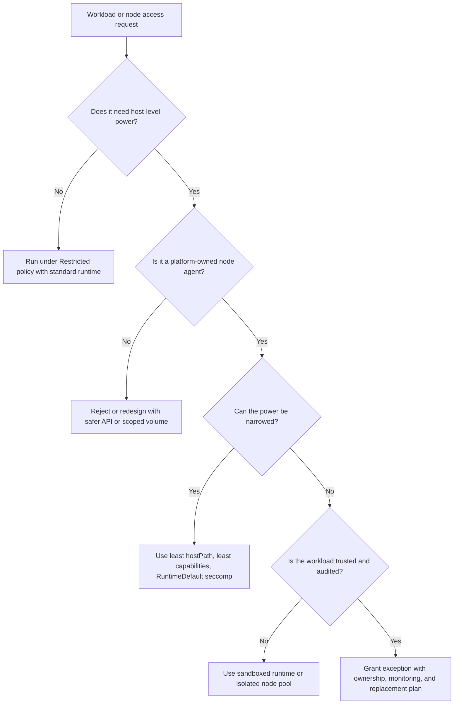

> **Складність**: `[СЕРЕДНЯ]` — базові знання.
>
> **Час на проходження**: 40-55 хвилин.
>
> **Передумови**: [Модуль 2.1: Безпека площини управління](../module-2.1-control-plane-security/)
>
> **Цільова версія Kubernetes**: 1.35+

Приклади команд у цьому модулі використовують `k` як короткий псевдонім для kubectl. Якщо ваша оболонка ще не має його, виконайте `alias k=kubectl` перед практичним розділом, щоб такі команди, як `k get nodes`, поводилися так, як показано.


## Результати навчання

Після завершення цього модуля ви зможете виконувати такі завдання з перевірки під час реалістичної розмови про безпеку кластера:

1. **Оцінити** налаштування автентифікації, авторизації та доступного лише для читання ендпоінта kubelet, щоб визначити, чи безпечно відкриті API вузлів.
2. **Проаналізувати** специфікації Pod'ів, які запитують привілейовані контейнери, простори імен хоста, монтування hostPath чи можливості (capabilities) Linux, і пояснити ризик на рівні вузла.
3. **Діагностувати** ймовірні шляхи компрометації вузла, поєднуючи відкриті API kubelet, доступні для запису сокети середовища виконання, утечі через ядро та розкриття токенів сервісних акаунтів.
4. **Спроєктувати** план посилення безпеки вузла, який поєднує мінімальні операційні системи, ізоляцію середовища виконання, оновлення, контроль доступу та авторизацію Node.


## Чому цей модуль важливий

Понад рік до свого виявлення у 2021 році зловмисне програмне забезпечення під назвою Siloscape (Palo Alto Networks Unit 42, 2021) працювало всередині кластерів Kubernetes реальних організацій, і ніхто цього не помічав. Воно потрапляло як звичайна компрометація вебзастосунку, використовувало утечу з контейнера Windows, щоб дістатися до хоста, який лежить в основі, а звідти проходило кластером у пошуках облікових даних, змонтованих томів та інших робочих навантажень, через які можна було просунутися далі. Дослідники виявили 23 активні жертви, коли зламали сервер командного управління зловмисного ПЗ. Усі кластери працювали у звичайному режимі — без явних тривог, без незвичних робочих навантажень на дашборді. Щойно зловмисник дістався до механізму, який власне запускає Pod'и, площина управління перестала бути абстрактною межею; робочий вузол бачить файлові системи Pod'ів, змонтовані токени сервісних акаунтів, сокети середовища виконання, логи, локальний мережевий трафік і облікові дані kubelet — а це саме ті складники, які потрібні зловмиснику, щоб перетворити одне слабке робоче навантаження на ширший інцидент.

Безпека вузлів важлива, тому що робочі вузли — це місце, де обіцянки Kubernetes стикаються з реальністю Linux. API-сервер може відхиляти небезпечні маніфести, контролери допуску можуть забезпечувати дотримання політик, а RBAC можна ретельно обмежити, проте вузол усе одно мусить завантажувати образи, монтувати томи, запускати контейнери, застосовувати cgroups, під'єднувати Pod'и до мереж і звітувати про стан. Кожна з цих дій потребує повноважень, а повноваження створюють ціль для атаки. Якщо зловмисник контролює привілейований Pod, API kubelet чи сокет середовища виконання контейнерів, розмова змінюється з «чи можуть вони викликати Kubernetes API» на «чи можуть вони діяти як машина, якій API довіряє запускати робочі навантаження».

Цей модуль навчає безпеки вузлів як ланцюжка довіри, а не як переліку прапорців. Ви почнете з компонентів вузла й API kubelet, перейдете через ізоляцію середовища виконання та шляхи утечі, а потім спроєктуєте посилену конфігурацію вузла, яка працює для кластерів Kubernetes 1.35+. Мета не в тому, щоб запам'ятати кожне небезпечне поле; мета — навчитися розпізнавати, як невелике рішення про конфігурацію змінює радіус ураження (blast radius), коли робоче навантаження, облікові дані вузла чи межа ядра Linux дають збій.


## Архітектура вузла та межі довіри

Вузол Kubernetes найкраще розуміти як довірене середовище виконання з кількома потужними локальними агентами. Kubelet — це представник вузла перед площиною управління, середовище виконання контейнерів створює контейнери й наглядає за ними, kube-proxy або його заміна керує маршрутизацією сервісів, а ядро операційної системи забезпечує дотримання більшості меж ізоляції. Така архітектура ефективна, тому що площині управління не потрібно безпосередньо маніпулювати примітивами Linux, але вона також означає, що вузол стає точкою концентрації облікових даних, локальних API та привілеїв рівня ядра.

```
┌─────────────────────────────────────────────────────────────┐
│              KUBERNETES NODE                                │
├─────────────────────────────────────────────────────────────┤
│                                                             │
│  ┌─────────────────────────────────────────────────────┐   │
│  │                    KUBELET                           │   │
│  │  • Node agent                                       │   │
│  │  • Manages pod lifecycle                            │   │
│  │  • Communicates with API server                     │   │
│  └─────────────────────────────────────────────────────┘   │
│                           │                                 │
│                           ▼                                 │
│  ┌─────────────────────────────────────────────────────┐   │
│  │              CONTAINER RUNTIME                       │   │
│  │  containerd, CRI-O                                  │   │
│  │  • Actually runs containers                         │   │
│  │  • Pulls images                                     │   │
│  └─────────────────────────────────────────────────────┘   │
│                           │                                 │
│                           ▼                                 │
│  ┌─────────────┐ ┌─────────────┐ ┌─────────────────────┐   │
│  │  CONTAINER  │ │  CONTAINER  │ │     CONTAINER       │   │
│  │   Pod A     │ │   Pod B     │ │      Pod C          │   │
│  └─────────────┘ └─────────────┘ └─────────────────────┘   │
│                                                             │
│  ┌─────────────────────────────────────────────────────┐   │
│  │                   KUBE-PROXY                         │   │
│  │  • Network rules (iptables/IPVS)                    │   │
│  │  • Service routing                                  │   │
│  └─────────────────────────────────────────────────────┘   │
│                                                             │
└─────────────────────────────────────────────────────────────┘
```

Діаграма виглядає простою, проте вона приховує три важливі межі довіри. По-перше, kubelet отримує інструкції від API-сервера, а потім виконує локальні дії, які звичайні користувачі API не можуть виконати безпосередньо. По-друге, середовище виконання перетворює конфігурацію Pod'а на простори імен, cgroups, монтування, пристрої та процеси, які спільно використовують одне ядро хоста. По-третє, операційна система володіє останньою лінією оборони, тож помилки ядра, надмірні можливості (capabilities) Linux і доступні для запису шляхи хоста можуть знівелювати припущення, зроблені на рівні Kubernetes.

Уявіть вузол як захищений склад. Площина управління — це диспетчерський офіс, але вузол — це вантажна платформа, де власне рухаються товари, відчиняються двері, зберігаються інструменти й працівники носять ключі. Диспетчер може мати чудовий контроль документації, проте складу все одно потрібні замкнені двері, обмежена кількість ключів, покриття камерами та процес заміни зламаних замків. Посилення безпеки вузла — це Kubernetes-версія такої складської дисципліни.

Перш ніж оцінювати конкретне налаштування, запитайте, на яку межу воно впливає. Автентифікація kubelet впливає на те, хто може спілкуватися з агентом вузла. Авторизація kubelet впливає на те, що автентифіковані клієнти можуть просити агента вузла зробити. Конфігурація середовища виконання впливає на те, скільки повноважень хоста отримує контейнер. Посилення операційної системи впливає на те, скільки корисної території залишається, якщо робоче навантаження вирветься за межу свого передбаченого контейнера. Зупиніться та спрогнозуйте: якщо Pod може прочитати сокет середовища виконання контейнерів хоста, яка межа вже дала збій і яким компонентом зловмисник спробує командувати наступним?

Практичний шлях перевірки починається зі збирання контексту вузла та Pod'ів, не припускаючи, що кластер безпечний. Наведені команди навмисне орієнтовані на читання; вони допомагають побачити, які вузли існують, які версії вони повідомляють і які Pod'и зосереджені на вузлі, перш ніж ви вирішите, де виправдана глибша перевірка.

```bash
alias k=kubectl
k get nodes -o wide
k describe node <node-name>
k get pods --all-namespaces --field-selector spec.nodeName=<node-name> -o wide
```

Ці команди не доводять, що вузол посилений, але вони будують карту для корисного огляду безпеки. Вузол, на якому працює багато привілейованих DaemonSet'ів, заслуговує на іншу увагу, ніж вузол, на якому працюють лише обмежені Pod'и застосунків. Вузол, що розміщує інгрес, сховище, моніторинг і агенти логування, має більший локальний слід довіри, ніж вузол, виділений для робочих навантажень без стану. Коли спеціалісти з реагування на інциденти пропускають цей крок картографування, вони часто спершу перевіряють найгучніший симптом і пропускають вузол, де насправді сходяться привілеї.

Kubelet також має ідентичність облікових даних, яку API-сервер може розпізнати як вузол. У правильно налаштованому кластері ця ідентичність належить групі `system:nodes` і використовує шаблон імені користувача `system:node:<nodeName>`, що дає змогу авторизації Node та плагіну допуску NodeRestriction обмежувати те, що kubelet може читати чи змінювати. Цей зв'язок є важливим механізмом стримування: він означає, що скомпрометований kubelet не повинен автоматично читати секрети для Pod'ів, запланованих на інших вузлах.

Обмеження полягає в тому, що стримування все одно припускає, що ідентичність вузла обмежена і що зловмисник не викрав сильніших облікових даних із Pod'а на тому самому вузлі. Токен cluster-admin, змонтований в один Pod застосунку, може звести нанівець ретельну авторизацію вузла, тому що зловмиснику не потрібні дозволи kubelet, якщо застосунок дає йому кращі облікові дані. Тому безпека вузлів перетинається з гігієною ідентичності робочих навантажень, політикою допуску та керуванням секретами; це не окрема тема, що завершується на межі операційної системи.

Саме через це перетинання огляд вузла має включати докази як «всередині вузла», так і «навколо вузла». Усередині вузла вас цікавить конфігурація kubelet, версія середовища виконання, стан ядра, служби хоста, локальні облікові дані та те, чи очікувані привілейовані агенти. Навколо вузла вас цікавить RBAC, контроль допуску, мережева досяжність, походження образів, логування та те, як швидко платформа може замінити машину. Вузький огляд, що перевіряє лише один рівень, може дати заспокійливі відповіді, залишивши легкий шлях через інший рівень.

Наприклад, кластер може мати ідеальні мітки Pod Security Admission у просторах імен застосунків, але все одно дозволяти застарілому сервісному акаунту проксіювати до kubelet'ів. Інший кластер може мати суворий RBAC, але запускати старі образи вузлів із вразливим середовищем виконання. Третій кластер може використовувати посилену ОС, але дозволяти продуктовим командам розгортати привілейовані Pod'и для усунення несправностей під час інцидентів. Стан безпеки — це сукупний результат цих рішень, тож ваша оцінка має описувати ланцюжок, який зловмиснику довелося б пройти, і контроль, що розриває кожен крок.

## Безпека API kubelet

Kubelet — найкритичніший для безпеки компонент на робочому вузлі, тому що він приймає запити, які можуть інспектувати запущені контейнери та впливати на них. Він відкриває HTTPS-ендпоінт, зазвичай пов'язаний із портом 10250, який підтримує такі операції, як logs, exec, метрики, статистику та інспекцію Pod'ів, залежно від версії та конфігурації. Ці можливості необхідні для звичайного адміністрування Kubernetes, але вони небезпечні, якщо анонімні користувачі, надто широкі клієнтські сертифікати чи довільні сервісні акаунти можуть дістатися до них без делегованої авторизації.

```
┌─────────────────────────────────────────────────────────────┐
│              KUBELET API SECURITY                           │
├─────────────────────────────────────────────────────────────┤
│                                                             │
│  KUBELET API CAPABILITIES (if exposed)                     │
│  • Execute commands in containers                          │
│  • Read container logs                                     │
│  • Port-forward to containers                              │
│  • View pods on the node                                   │
│                                                             │
│  DANGEROUS ENDPOINTS                                        │
│  • /exec - Execute arbitrary commands                      │
│  • /run - Run commands in containers                       │
│  • /pods - List all pods                                   │
│  • /logs - Read container logs                             │
│                                                             │
│  ATTACK SCENARIO                                            │
│  1. Attacker finds exposed kubelet (port 10250)            │
│  2. Connects without authentication                        │
│  3. Executes into any container on that node               │
│  4. Steals secrets, pivots to other systems                │
│                                                             │
└─────────────────────────────────────────────────────────────┘
```

Історичний доступний лише для читання порт kubelet, зазвичай пов'язаний із 10255, робив цей ризик легшим для недооцінки, тому що назва звучала нешкідливо. Читання списків Pod'ів, логів, статистики чи похідних від середовища підказок не є нешкідливим під час розвідки. Навіть коли ендпоінт безпосередньо не дозволяє виконувати команди, він може розкрити простори імен, імена сервісів, теги образів, внутрішні порти та розміщення робочих навантажень. Зловмисники використовують цю інформацію, щоб обрати слабший Pod, знайти секрети чи націлитися на привілейований DaemonSet, який уже працює на кожному вузлі.

Безпечна конфігурація kubelet має дві основні частини: автентифікація ідентифікує того, хто звертається, а авторизація вирішує, чи може цей клієнт виконати запитувану дію. Анонімну автентифікацію слід вимкнути, клієнтські сертифікати, коли вони використовуються, мають бути прив'язані до довіреного CA, токенна автентифікація має делегувати API-серверу, а авторизація має використовувати режим Webhook, щоб kubelet викликав API авторизації Kubernetes перед дозволом чутливих операцій. Старою мовою прапорців це означало `--anonymous-auth=false`, `--authentication-token-webhook=true`, `--client-ca-file=<cluster-ca>` і `--authorization-mode=Webhook`; мовою файлу конфігурації той самий стан представлено наведеним нижче захищеним прикладом.

| Прапорець | Призначення | Безпечне значення |
|------|---------|----------------|
| `--anonymous-auth` | Дозволяти анонімні запити | `false` |
| `--authorization-mode` | Як авторизувати | `Webhook` (перевіряє через API-сервер) |
| `--client-ca-file` | CA для клієнтських сертифікатів | Встановити CA кластера |
| `--read-only-port` | Порт API лише для читання | `0` (вимкнено) |
| `--protect-kernel-defaults` | Захист налаштувань ядра | `true` |
| `--hostname-override` | Перевизначення імені хоста | Уникати (може обійти авторизацію) |

```yaml
# Example kubelet configuration (kubelet-config.yaml)
apiVersion: kubelet.config.k8s.io/v1beta1
kind: KubeletConfiguration
authentication:
  anonymous:
    enabled: false
  webhook:
    enabled: true
authorization:
  mode: Webhook
readOnlyPort: 0
protectKernelDefaults: true
```

Дозвіл `nodes/proxy` заслуговує на особливу обережність, тому що під час огляду RBAC він може виглядати як дозвіл на читання, хоча насправді дає доступ до субресурсів kubelet, які виконують активні операції. Kubernetes відображає шляхи kubelet на ресурси та субресурси вузла, а деякі операції на основі WebSocket авторизуються через HTTP-дієслова, які на перший погляд не здаються небезпечними. Коли роль надає широкий проксі-доступ до вузла користувачу чи сервісному акаунту, ви повинні розглядати це надання як потенційне виконання команд у контейнерах, що працюють на цільовому вузлі, а не як нешкідливий дозвіл на спостережуваність.

Розглянемо приклад: платформенна команда виявляє, що інтеграція моніторингу може викликати метрики kubelet, але також має ширші проксі-дозволи до вузла, ніж передбачалося. Швидке виправлення — не вимикати моніторинг; краще виправлення — відокремити доступ до метрик від загального проксі-доступу до kubelet, обмежити, хто може дістатися до портів kubelet на мережевому рівні, та переконатися, що сам kubelet делегує авторизацію, а не приймає будь-який автентифікований запит. Перш ніж запускати цей огляд у власному кластері, який вивід ви очікуєте від `k auth can-i get nodes/proxy --as system:serviceaccount:<namespace>:<service-account>` для звичайного сервісного акаунту застосунку, і що б вас занепокоїло?

```bash
k auth can-i get nodes/proxy --as system:serviceaccount:payments:api
k auth can-i get nodes/stats --as system:serviceaccount:monitoring:metrics-agent
k auth can-i '*' nodes/proxy --as system:serviceaccount:monitoring:metrics-agent
```

Ці перевірки є перевірками авторизації на боці API-сервера, тож вони не замінюють захист хоста брандмауером чи інспекцію конфігурації kubelet. Однак вони викривають поширену сліпу пляму: багато команд переглядають ClusterRole'и щодо дієслів для Pod'ів, секретів і Deployment'ів, ігноруючи субресурси вузла. Сервісний акаунт, який не може отримати список секретів, усе одно може проксіювати до kubelet'ів, якщо широку операційну роль надали роками раніше, а цього може бути достатньо для інспекції Pod'ів чи виконання команд залежно від ендпоінта kubelet і режиму авторизації.

Конфігурація kubelet також перетинається з ідентичністю вузла. Опція `--hostname-override` може спричинити несподівані результати авторизації, коли ім'я, яке використовує kubelet, не збігається з об'єктом Node, очікуваним API-сервером і авторизатором Node. Хмарні провайдери також можуть визначати імена вузлів специфічними для провайдера способами. Для аналізу рівня KCSA головне — не запам'ятати кожне правило іменування; головне — усвідомити, що ідентичність вузла має бути передбачуваною, унікальною та узгодженою з авторизацією Node, інакше площина управління не зможе надійно обмежити kubelet його власними ресурсами.

У реальному огляді ви зазвичай не можете під'єднатися по SSH до кожного вузла й прочитати локальний файл, особливо коли організація використовує керований Kubernetes. Почніть із того, що може показати API: версії вузлів, ролі, повідомлену kubelet'ом конфігурацію там, де її розкриває дистрибутив, надання RBAC, що стосуються `nodes/proxy`, та мережеві шляхи до портів kubelet. Потім порівняйте ці висновки з документацією провайдера, конфігурацією початкового завантаження кластера та політиками допуску. Найсильніші огляди поєднують прямі докази конфігурації вузла з доказами з боку площини управління, що небезпечні шляхи доступу не надано.

Мережевий рівень легко не помітити, тому що автентифікація й авторизація kubelet здаються достатніми, щойно їх правильно налаштовано. Вони необхідні, але це не привід широко відкривати порти kubelet. Сильний стан безпеки обмежує досяжність kubelet площиною управління, схваленими агентами вузлів і ретельно контрольованими адміністративними шляхами. Якщо підмережа застосунків, VPN розробників чи непов'язана мережа моніторингу може сканувати кожен робочий вузол, кластер збільшив кількість ідентичностей і робочих навантажень, які можуть випробувати межу kubelet.

Під час реагування на інциденти логи kubelet та аудиторські логи API-сервера можуть допомогти визначити, чи намагався зловмисник скористатися цим шляхом. Шукайте відхилені SubjectAccessReview, що стосуються субресурсів вузла, неочікувані запити до проксі-шляхів kubelet, незвичну активність exec та сервісні акаунти, які раптом починають взаємодіяти з вузлами, ніколи не роблячи цього раніше. Виявлення не замінює конфігурацію, але воно підтверджує, чи зазнає контроль навантаження. Хороша відповідь рівня KCSA пояснює превентивне налаштування й докази, які ви очікуєте побачити, коли це налаштування блокує атаку.

## Середовище виконання контейнерів та ізоляція

Середовище виконання контейнерів відповідає за перетворення наміру Pod'а на ізольовані процеси Linux. Kubernetes повідомляє середовищу виконання, що запускати, але ядро забезпечує дотримання більшості меж через простори імен, cgroups, можливості (capabilities), поширення монтувань, seccomp, AppArmor, SELinux і доступ до пристроїв. Саме через це розділення маніфест Kubernetes може виглядати нешкідливо, тоді як результат середовища виконання небезпечний: невелике поле на кшталт `privileged: true` змінює те, що середовище виконання просить ядро дозволити.

```
┌─────────────────────────────────────────────────────────────┐
│              CONTAINER RUNTIME ISOLATION                    │
├─────────────────────────────────────────────────────────────┤
│                                                             │
│  LINUX ISOLATION MECHANISMS                                │
│                                                             │
│  NAMESPACES (Process isolation)                            │
│  ├── pid    - Process IDs                                  │
│  ├── net    - Network stack                                │
│  ├── mnt    - Mount points                                 │
│  ├── uts    - Hostname                                     │
│  ├── ipc    - Inter-process communication                  │
│  ├── user   - User/group IDs                               │
│  └── cgroup - Cgroup membership                            │
│                                                             │
│  CGROUPS (Resource limits)                                 │
│  ├── CPU limits                                            │
│  ├── Memory limits                                         │
│  └── Block I/O limits                                      │
│                                                             │
│  SECURITY MODULES                                          │
│  ├── seccomp  - System call filtering                      │
│  ├── AppArmor - Mandatory access control (Ubuntu/Debian)   │
│  └── SELinux  - Mandatory access control (RHEL/CentOS)     │
│                                                             │
└─────────────────────────────────────────────────────────────┘
```

Простори імен — це рівень видимості. Pod зазвичай отримує власний простір імен процесів, мережевий простір імен і простір імен монтувань, тож процеси всередині Pod'а бачать вузьку версію системи. Cgroups — це рівень обліку та обмеження, який гарантує, що контейнер не зможе споживати необмежений CPU, пам'ять чи блочний ввід/вивід. Обов'язковий контроль доступу та фільтрація системних викликів потім зменшують те, що процес може зробити, навіть якщо він має помилку чи його обманом змусили виконати небезпечний системний виклик. Жоден із цих контролів не є магією; кожен звужує конкретний клас поведінки.

Root у контейнері — часте джерело плутанини. Процес може працювати як UID 0 всередині контейнера, не отримуючи автоматично необмежених прав root на хості, тому що простори імен і набори можливостей формують те, що цей UID може бачити й робити. Небезпека зростає, коли Pod також отримує простори імен хоста, привілейований режим, потужні можливості чи доступні для запису монтування хоста. Зупиніться та спрогнозуйте: контейнер працює як root у власному просторі імен, не має доданих можливостей, використовує профіль seccomp RuntimeDefault і не має томів hostPath; які ресурси хоста він може безпосередньо змінити, і які додаткові поля змінили б вашу відповідь?

Сокети середовища виконання заслуговують на особливе ставлення, тому що вони перетворюють доступ на запис до файлової системи на повноваження зі створення контейнерів. Якщо Pod може писати в сокет containerd хоста, сокет CRI-O чи старий сокет Docker, зловмисник може попросити середовище виконання запустити новий привілейований контейнер, змонтувати файлову систему хоста чи проінспектувати інші контейнери. Це не дрібна помилка hostPath; це фактично передача зловмиснику локального механізму, який kubelet використовує для створення робочих навантажень.

Kubernetes підтримує RuntimeClass, щоб адміністратори могли обирати різні обробники середовища виконання для різних профілів ризику робочих навантажень. Стандартне середовище виконання, як-от containerd чи CRI-O, доречне для довірених робочих навантажень у поєднанні з контролем безпеки Pod'а за принципом найменших привілеїв. Ізольовані (sandboxed) середовища виконання, як-от gVisor чи Kata Containers, додають ще одну межу — або вбудовуючи рівень ядра в просторі користувача, або розміщуючи робочі навантаження в легких віртуальних машинах. Ціною є сумісність, операційна складність і накладні витрати на продуктивність, тож вибір середовища виконання має визначатися ризиком, а не модою.

```
┌─────────────────────────────────────────────────────────────┐
│              CONTAINER RUNTIME OPTIONS                      │
├─────────────────────────────────────────────────────────────┤
│                                                             │
│  STANDARD RUNTIMES                                         │
│  ├── containerd (default)                                  │
│  └── CRI-O                                                 │
│  Good isolation, shares kernel with host                   │
│                                                             │
│  SANDBOXED RUNTIMES (Stronger isolation)                   │
│  ├── gVisor (runsc)                                        │
│  │   └── User-space kernel, intercepts syscalls            │
│  │                                                          │
│  └── Kata Containers                                       │
│      └── Lightweight VMs, separate kernel                  │
│                                                             │
│  Use sandboxed runtimes for:                               │
│  • Untrusted workloads                                     │
│  • Multi-tenant environments                               │
│  • Sensitive data processing                               │
│                                                             │
└─────────────────────────────────────────────────────────────┘
```

Об'єкт RuntimeClass невеликий, але він залежить від підготовки вузла. Обробник середовища виконання має існувати в конфігурації CRI на придатних вузлах, і можуть знадобитися обмеження планування, коли лише деякі вузли підтримують це середовище виконання. Наведений нижче приклад показує бік Kubernetes цього контракту; він сам собою не встановлює gVisor чи Kata, і ця відмінність важлива під час оглядів дизайну.

```yaml
apiVersion: node.k8s.io/v1
kind: RuntimeClass
metadata:
  name: sandboxed
handler: runsc
scheduling:
  nodeSelector:
    runtime.kubedojo.io/sandboxed: "true"
```

```yaml
apiVersion: v1
kind: Pod
metadata:
  name: untrusted-worker
  namespace: tenant-a
spec:
  runtimeClassName: sandboxed
  containers:
    - name: worker
      image: registry.k8s.io/pause:3.10
      securityContext:
        allowPrivilegeEscalation: false
        runAsNonRoot: true
        capabilities:
          drop: ["ALL"]
        seccompProfile:
          type: RuntimeDefault
```

Рішення про використання ізоляції (sandboxing) має прийти після того, як ви класифікуєте робоче навантаження. Пакетне завдання, яке обробляє ненадійні файли, надані клієнтом, може виправдати додаткову ізоляцію, навіть якщо воно працює повільніше. Чутливий до затримок внутрішній сервіс без шляху ненадійного коду може отримати більше користі від суворої безпеки Pod'а, швидкого оновлення та вузького RBAC. Який підхід ви б обрали для спільної платформи збирання, яка запускає код pull-request'ів від багатьох команд, і чому стандартне середовище виконання плюс застосування політик усе одно залишить залишковий ризик?

Ілюстративний сценарій: компанія, що використовує внутрішню платформу CI, дозволила Pod'ам збирання монтувати каталог кешу хоста заради швидкості. Монтування виглядало обмеженим, тому що воно вказувало на шлях кешу, а не на `/`, але образ збирання також працював як root і мав достатньо інструментів файлової системи, щоб розмістити виконуваний вміст там, де його пізніше споживало завдання обслуговування рівня вузла. Інцидент почався не як утеча через ядро; він почався як зручне монтування, що перетнуло межу довіри. Виправлення поєднало вужчі томи, виконання не від root, seccomp RuntimeDefault, політику допуску та перенесення ненадійних збірок на вузли, здатні до ізоляції.

Коли ви переглядаєте ізоляцію середовища виконання, відокремлюйте контролі, що зменшують імовірність, від контролів, що зменшують вплив. Скидання можливостей Linux, вимкнення підвищення привілеїв, використання seccomp RuntimeDefault та уникання просторів імен хоста зменшують те, що скомпрометований процес може зробити зсередини свого контейнера. Ізольовані середовища виконання та виділені пули вузлів зменшують вплив, якщо спроба утечі вдається або якщо саме робоче навантаження є ненадійним. Обидві категорії корисні, але вони відповідають на різні запитання, і їхнє змішування призводить до слабких дизайнів.

Ця відмінність важлива для обробки винятків. Якщо агент постачальника потребує однієї додаткової можливості, ви можете оцінити цю можливість безпосередньо й запитати, чи AppArmor, SELinux, seccomp або монтування лише для читання утримує виняток у межах. Якщо платформа запускає довільний код pull-request'ів, проблема не в одній додатковій можливості; проблема в тому, що робоче навантаження є ворожим за дизайном. Така ситуація зазвичай вимагає ізоляції на рівні пулу вузлів і середовища виконання, плюс суворих меж облікових даних, тому що звичайне посилення застосунку припускає, що власник робочого навантаження не намагається зламати хост.

## Атаки на рівні вузла та радіус ураження

Атаки на рівні вузла зазвичай йдуть одним із двох шляхів. Атаки на основі неправильної конфігурації використовують надмірні привілеї Pod'ів, простори імен хоста, сокети середовища виконання чи доступні для запису шляхи хоста, які адміністратори навмисно дозволили. Атаки на основі вразливостей використовують помилку в середовищі виконання, ядрі, драйвері пристрою чи привілейованому агенті. Обидва шляхи важливі, тому що добре налаштований кластер усе одно може потребувати екстреного оновлення, а повністю оновлений кластер усе одно може бути скомпрометований Pod'ом, якому дозволено діяти як хост.

```
┌─────────────────────────────────────────────────────────────┐
│              CONTAINER ESCAPE VECTORS                       │
├─────────────────────────────────────────────────────────────┤
│                                                             │
│  MISCONFIGURATION-BASED                                    │
│                                                             │
│  Privileged containers                                     │
│  ├── privileged: true                                      │
│  ├── Full access to host devices                           │
│  └── Can mount host filesystem, load kernel modules        │
│                                                             │
│  Host namespaces                                           │
│  ├── hostPID: true - See host processes                    │
│  ├── hostNetwork: true - Use host network                  │
│  └── hostIPC: true - Share host IPC                        │
│                                                             │
│  Host path mounts                                          │
│  ├── Mount sensitive paths (/, /etc, /var/run/docker.sock)│
│  └── Can read/write host filesystem                        │
│                                                             │
│  VULNERABILITY-BASED                                        │
│                                                             │
│  Runtime vulnerabilities                                   │
│  ├── CVE-2019-5736 (runc)                                  │
│  └── CVE-2020-15257 (containerd-shim API)                  │
│                                                             │
│  Kernel vulnerabilities                                    │
│  └── Privilege escalation through kernel exploits          │
│                                                             │
└─────────────────────────────────────────────────────────────┘
```

Привілейовані контейнери — це не просто контейнери з кількома додатковими дозволами. У Kubernetes привілейований режим надає широкий доступ до пристроїв хоста та послаблює багато контролів ізоляції, роблячи контейнер набагато ближчим до процесу хоста. Простори імен хоста мають вужчий, але все одно серйозний вплив: `hostPID` відкриває процеси хоста, `hostNetwork` розміщує Pod безпосередньо в мережевому стеку вузла, а `hostIPC` ділить ресурси міжпроцесної комунікації. Кожне поле може бути легітимним для невеликого класу агентів вузла, проте кожне з них також прибирає рівень, який захисники очікують побачити.

Томи hostPath особливо підступні, тому що поле може бути безпечним чи катастрофічним залежно від шляху, режиму доступу та ідентичності робочого навантаження. Монтування лише для читання вузького каталогу логів для довіреного агента логування вузла має один профіль ризику. Доступне для запису монтування `/`, `/etc`, `/var/lib/kubelet` чи сокета середовища виконання має зовсім інший профіль. Безпечне запитання — ніколи не «чи дозволено hostPath»; безпечне запитання — «який шлях, який напрямок, яке робоче навантаження, який пул вузлів і які компенсувальні контролі?».

```yaml
apiVersion: v1
kind: Pod
metadata:
  name: dangerous-debugger
  namespace: tools
spec:
  hostPID: true
  hostNetwork: true
  containers:
    - name: shell
      image: busybox:1.37
      command: ["sh", "-c", "sleep 3600"]
      securityContext:
        privileged: true
      volumeMounts:
        - name: host-root
          mountPath: /host
  volumes:
    - name: host-root
      hostPath:
        path: /
        type: Directory
```

Ця специфікація Pod'а — вправа для огляду, а не рекомендація. Вона поєднує простори імен хоста, привілейований режим і доступне для запису монтування кореня хоста, що дає скомпрометованому контейнеру практичний шлях інспектувати процеси хоста, змінювати файли та взаємодіяти зі станом рівня вузла. Легітимна потреба в налагодженні може тимчасово вимагати одного з цих повноважень, але поєднання всіх їх у багаторазовому образі інструмента запрошує до закріплення, крадіжки облікових даних і випадкового дрейфу. Виробничий виняток має бути тимчасовим, аудитованим, вузько обмеженим і заблокованим за замовчуванням політикою допуску поза робочим процесом аварійного доступу (break-glass).

Щойно зловмисник контролює вузол, вплив залежить від того, які облікові дані та робочі навантаження там присутні. Зазвичай він може читати файли, змонтовані в Pod'и на цьому вузлі, інспектувати локальний стан контейнерів, намагатися викрасти токени сервісних акаунтів, шукати секрети в логах та підробляти трафік Pod'ів чи агентів вузла. Якщо облікові дані kubelet обмежені авторизацією Node, доступ до API має бути обмежений ресурсами, що стосуються вузла. Якщо зловмисник викрадає привілейованіші облікові дані робочого навантаження, радіус ураження слідує за цими обліковими даними.

```
┌─────────────────────────────────────────────────────────────┐
│              NODE COMPROMISE IMPACT                         │
├─────────────────────────────────────────────────────────────┤
│                                                             │
│  IF A NODE IS COMPROMISED, ATTACKER CAN:                   │
│                                                             │
│  ON THAT NODE                                              │
│  ├── Access all containers on the node                     │
│  ├── Read secrets mounted in pods                          │
│  ├── Impersonate any pod's service account                 │
│  ├── Access node's kubelet credentials                     │
│  └── Intercept pod network traffic                         │
│                                                             │
│  WITH NODE KUBELET CREDENTIALS                             │
│  ├── Query API server for node's pods                      │
│  ├── Cannot (with Node authz) access other nodes' data     │
│  └── Limited blast radius if Node authz mode is enabled    │
│                                                             │
│  DEFENSE: Node authorization mode limits what kubelet      │
│  credentials can access to resources for that node only    │
│                                                             │
└─────────────────────────────────────────────────────────────┘
```

Найважливіша звичка дизайну — відокремлювати локальну компрометацію від компрометації кластера. Компрометація вузла вже є серйозною, але вона не повинна автоматично дозволяти читати кожен Secret, змінювати кожен Deployment чи видавати себе за адміністраторів кластера. Авторизація Node, NodeRestriction, короткоживучі токени сервісних акаунтів, вузький RBAC і контролі допуску — усі вони слугують цій меті стримування. Якщо один скомпрометований робочий вузол може стати повною компрометацією площини управління, кластер покладається на удачу, а не на багаторівневу оборону.

Ви можете інспектувати ризиковані поля Pod'ів звичайними запитами до API ще до інциденту. Наведені нижче команди не є повноцінним рушієм політик, але вони допомагають знайти очевидну концентрацію привілеїв хоста під час огляду. Вони також корисні для перевірки того, чи працює політика допуску: у замкненому просторі імен ви не повинні бачити, щоб звичайні Pod'и застосунків запитували ці повноваження.

```bash
k get pods --all-namespaces -o jsonpath='{range .items[?(@.spec.hostPID==true)]}{.metadata.namespace}/{.metadata.name}{"\n"}{end}'
k get pods --all-namespaces -o jsonpath='{range .items[?(@.spec.hostNetwork==true)]}{.metadata.namespace}/{.metadata.name}{"\n"}{end}'
k get pods --all-namespaces -o jsonpath='{range .items[*]}{.metadata.namespace}/{.metadata.name}{" "}{range .spec.volumes[?(@.hostPath)]}{.hostPath.path}{" "}{end}{"\n"}{end}'
```

Сприймайте результати як привід для розмови, а не як вирок. Плагін CNI чи node-плагін CSI для сховища може легітимно працювати з доступом до хоста, але він має жити в обмеженому просторі імен, використовувати переглянутий образ, мати вузький RBAC і бути власністю платформенної команди. Pod застосунку в продуктовому просторі імен, що запитує той самий доступ, — це інші докази. Те саме поле може бути прийнятним для агента вузла та неприйнятним для сервісу, орієнтованого на клієнта.

Вразливості ядра та середовища виконання додають терміновості оновленню, тому що вони обходять намір. CVE-2019-5736 у runc показала, що помилка середовища виконання контейнерів за певних умов може дозволити перезапис бінарного файлу runc хоста, а CVE-2020-15257 показала, що API containerd-shim був досяжним через абстрактний доменний сокет Unix із контейнерів у мережі хоста, що дозволяло підвищення привілеїв. Урок не в тому, що саме ці помилки визначають сьогоднішню загрозу; урок у тому, що оновлення середовища виконання та ядра належать до дизайну безпеки, а не до операційного беклогу, який чекає на зручні вікна обслуговування.

Корисна модель компрометації також включає планування. Якщо кожне чутливе робоче навантаження може опинитися поряд із кожним ризикованим робочим навантаженням, кластер перетворює одну компрометацію вузла на можливість збирання даних. Taint'и, toleration'и, селектори вузлів, розподіл топології та окремі групи вузлів — це не лише інструменти доступності; вони також допомагають вирішити, які облікові дані та дані співіснують на машині. Мета не в ідеальному розділенні для кожного сервісу, а в навмисному розділенні для робочих навантажень із різними рівнями довіри, регуляторним впливом чи орендною належністю.

Реагування на підозрювану компрометацію вузла має бути рішучим. Заблокуйте вузол (cordon), щоб нові Pod'и не надходили, збережіть відповідні докази, якщо ваш процес реагування на інциденти цього вимагає, ротуйте облікові дані, що були присутні на вузлі, та замініть машину з довіреного образу, а не намагайтеся очистити її на місці. Потім перевірте, чи допуск, RBAC і планування дозволили зловмиснику дістатися далі за локальний вузол. Якщо розслідування зупиняється після видалення одного поганого Pod'а, той самий шлях усе ще може бути доступним на наступному вузлі.

## Посилення вузлів без втрати операбельності

Посилення вузла зменшує корисну поверхню атаки, доступну після першої помилки. Мінімальні операційні системи прибирають пакети загального призначення й оболонки, незмінні дизайни вузлів ускладнюють постійні зміни хоста, а автоматизована заміна не дає дрейфу накопичуватися. Ці властивості цінні, тому що зловмисники надають перевагу звичним інструментам пост-експлуатації: менеджерам пакетів, компіляторам, оболонкам, SSH, доступним для запису системним каталогам і довгоживучим локальним обліковим даним. Їх видалення не запобігає кожній компрометації, але може зробити компрометацію гучнішою, коротшою та складнішою для перетворення на закріплення.

```
┌─────────────────────────────────────────────────────────────┐
│              NODE OS HARDENING                              │
├─────────────────────────────────────────────────────────────┤
│                                                             │
│  MINIMIZE ATTACK SURFACE                                   │
│  ├── Use minimal OS (Bottlerocket, Flatcar, Talos)         │
│  ├── Remove unnecessary packages                           │
│  ├── Disable unnecessary services                          │
│  └── Use immutable infrastructure                          │
│                                                             │
│  KEEP UPDATED                                              │
│  ├── Regular security patches                              │
│  ├── Automated patching where possible                     │
│  └── Container runtime updates                             │
│                                                             │
│  RESTRICT ACCESS                                           │
│  ├── Disable SSH if possible                               │
│  ├── If SSH needed, key-only authentication               │
│  ├── Use bastion hosts                                     │
│  └── Audit all node access                                 │
│                                                             │
│  ENABLE SECURITY FEATURES                                  │
│  ├── SELinux or AppArmor enforcing mode                   │
│  ├── Seccomp default profile                              │
│  └── Kernel parameter hardening                           │
│                                                             │
└─────────────────────────────────────────────────────────────┘
```

Мінімальні операційні системи вузлів не всі однакові, але вони поділяють спеціалізовану філософію. Bottlerocket розроблена для запуску контейнерів на AWS, Flatcar Container Linux продовжує мінімальну й орієнтовану на оновлення лінію CoreOS, Talos пропонує керовану через API модель без SSH за замовчуванням, а Container-Optimized OS від Google націлена на контейнерні робочі навантаження в Google Cloud. Спільна цінність для безпеки — менша поверхня за замовчуванням і більш передбачуване керування життєвим циклом вузла.

| ОС | Опис |
|------|-------------|
| **Bottlerocket** | Розроблена AWS, спеціально для контейнерів |
| **Flatcar Container Linux** | Наступник CoreOS, мінімальна та незмінна |
| **Talos** | Керована через API, без SSH, повністю незмінна |
| **Container-Optimized OS** | Мінімальний хост для контейнерів від Google |

Переваги мінімальної операційної системи вузла є практичними, а не косметичними, тому що кожен видалений пакет, демон і шлях входу зменшує кількість інструментів пост-експлуатації, що вже чекають на хості:
- Менша поверхня атаки
- Швидше оновлення
- Незмінність (зміни вимагають перезбирання)
- Розроблено для контейнерних робочих навантажень

Операційний компроміс реальний. Видалення SSH змінює звички з налагодження, незмінні файлові системи змінюють те, як команди застосовують екстрені виправлення, а автоматизована заміна вузла вимагає, щоб бюджети переривання робочих навантажень були правильними. План посилення вузла, що ігнорує операції, буде обійдено під час першого збою. Практичний план дає інженерам підтримувані альтернативи: `k debug node`, де це дозволяє політика, ефемерні контейнери налагодження для усунення несправностей робочих навантажень, централізовані логи, метрики вузлів, процедури послідовної консолі провайдера та задокументований аварійний доступ із обмеженими в часі затвердженнями.

Kubernetes надає кілька контролів, що доповнюють операційну систему. Pod Security Admission може забезпечувати дотримання стандартів Baseline чи Restricted для звичайних просторів імен, блокуючи привілейовані Pod'и, використання просторів імен хоста, небезпечні можливості та багато патернів hostPath до того, як вони дістануться до вузла. Seccomp RuntimeDefault має бути очікуванням за замовчуванням для робочих навантажень Linux, а власні профілі — зарезервованими для команд, які можуть пояснити необхідні відмінності в системних викликах. Застосування AppArmor чи SELinux додає ще один рівень локальної політики, коли його підтримує дистрибутив.

```yaml
apiVersion: v1
kind: Namespace
metadata:
  name: payments
  labels:
    pod-security.kubernetes.io/enforce: restricted
    pod-security.kubernetes.io/enforce-version: v1.35
    pod-security.kubernetes.io/audit: restricted
    pod-security.kubernetes.io/audit-version: v1.35
    pod-security.kubernetes.io/warn: restricted
    pod-security.kubernetes.io/warn-version: v1.35
```

Ця політика простору імен сама собою не посилює вузол, але вона не дає звичайним робочим навантаженням просити у вузла надмірні повноваження. Платформенні простори імен можуть потребувати Baseline, Privileged чи ретельно обмежених винятків для CNI, CSI, спостережуваності чи агентів безпеки. Важлива властивість дизайну — явність. Якщо привілейований доступ існує, він має бути зосереджений у відомих просторах імен із власністю, оглядом і моніторингом, а не розкиданий серед команд застосунків як випадкове значення за замовчуванням.

Стратегія оновлення має бути спроєктована навколо заміни, а не героїчного ремонту на місці. У здоровому кластері вузли можна спорожнити (drain), замінити та повторно під'єднати без особливої драми, тому що робочі навантаження мають проби готовності, бюджети переривання, реплікувальні контролери та винесений назовні стан. Якщо кластер не може витримати заміну вузла, проблема безпеки більша за планування оновлень. Кожен незамінний вузол стає винятком, який накопичує виправлення ядра, оновлення середовища виконання та екстрені зміни конфігурації, доки його стає надто ризиковано чіпати.

```bash
k cordon <node-name>
k drain <node-name> --ignore-daemonsets --delete-emptydir-data
# Replace or patch the node using your provider or node image process.
k uncordon <node-name>
```

Контроль доступу для людей має слідувати тому самому мисленню заміни. SSH слід вимкнути, коли ОС вузла та робочий процес провайдера це підтримують; якщо SSH залишається необхідним, він має вимагати автентифікації лише за ключем, доступу через bastion чи zero-trust, логування сесій і короткого списку відповідальних. Довгоживучі спільні ключі SSH є множником компрометації вузла, тому що їх важко відкликати, важко атрибутувати, і їх часто копіюють у місця, де аудиторські команди не можуть їх побачити.

Останній рівень — виявлення. Посилений вузол має видавати корисні сигнали, коли щось порушує очікувану базову лінію: неочікувані привілейовані Pod'и, нові монтування hostPath, збої авторизації kubelet, виконання процесів через шляхи налагодження вузла, доступ до сокета середовища виконання, події аудиту ядра та дрейф образу вузла. Вам не потрібен кожен продукт виявлення, щоб скласти KCSA, але ви маєте вміти пояснити, які докази показали б, що посилення вузла працює, і які докази запустили б стримування.

Операбельність також означає проєктування для невдалих оновлень і невдалих припущень. Розгортання образу вузла може виявити залежність модуля ядра, яку ніхто не задокументував, або суворіший seccomp за замовчуванням може зламати застаріле робоче навантаження, яке раніше покладалося на заблокований системний виклик. Відповідь — не відмовлятися від посилення; відповідь — поетапно впроваджувати зміни через канаркові пули вузлів, спостерігати за поведінкою робочих навантажень і тримати образи для відкату напоготові. Зрілі команди ставляться до посилення як до процесу релізу з тестами, телеметрією та власністю, а не як до одноразового переліку, що виконується під час аудиту.

Планування вартості та потужностей належить до тієї самої розмови. Ізольовані середовища виконання можуть потребувати більше накладних витрат на CPU чи пам'ять, окремі пули вузлів можуть зменшити ефективність упакування (bin-packing), а швидше оновлення може вимагати додаткової надлишкової потужності під час заміни. Ці витрати видимі, тоді як вартість компрометації вузла невизначена, доки вона не станеться. Інженерне завдання — визначити числа з обох боків: скільки потужності потрібно для щотижневого оновлення, скільки робочих навантажень вимагає привілейованого доступу, скільки вузлів розміщує ненадійний код і як довго облікові дані залишаються дійсними після компрометації Pod'а.

## Патерни та антипатерни

Безпека вузлів покращується найшвидше, коли команди стандартизують невелику кількість перевірених патернів, замість того щоб обговорювати кожен маніфест з нуля. Наведені нижче патерни працюють, тому що вони роблять небезпечні повноваження видимими, обмежують їх вузькими межами власності та зберігають операційні шляхи для налагодження й ремонту. Вони не специфічні для постачальника; точна реалізація може відрізнятися в керованому Kubernetes, самокерованих кластерах kubeadm і посилених операційних системах вузлів.

| Патерн | Коли використовувати | Чому працює | Міркування щодо масштабування |
|---|---|---|---|
| Посилена базова лінія kubelet | Кожен кластер, включно з кластерами розробки | Вимикає анонімний доступ, делегує авторизацію, прибирає доступ лише для читання та захищає очікувані налаштування ядра за замовчуванням | Вбудовуйте в образи вузлів чи шаблони початкового завантаження, щоб нові пули вузлів автоматично успадковували цей стан |
| Ізоляція привілейованих робочих навантажень | Агенти CNI, CSI, спостережуваності та безпеки, яким потрібні повноваження хоста | Тримає Pod'и високого ризику в переглянутих просторах імен із відомими власниками, RBAC, походженням образів і моніторингом | Використовуйте мітки просторів імен, винятки допуску та окремі пули вузлів для агентів, коли орендний ризик високий |
| RuntimeClass для ненадійного виконання | Системи збирання, виконання плагінів, код, наданий клієнтом, чи багатоорендна обробка | Додає другу межу ізоляції поза стандартними просторами імен і cgroups | Маркуйте сумісні вузли, документуйте накладні витрати та тестуйте сумісність системних викликів перед примусовою міграцією |
| Незмінний життєвий цикл вузла | Виробничі пули вузлів, де важливі надійність і повторюваність | Замінює схильний до дрейфу ремонт розгортанням на основі образів, спорожненням, заміною та аудитованістю | Вимагає бюджетів переривання, автоматизованого розгортання групи вузлів і чітких процедур відкату |

Антипатерни зазвичай виникають через терміновість, а не через незнання. Команді потрібно налагодити виробничий збій, тож вона створює привілейований Pod із оболонкою. Агент моніторингу не може прочитати метрики, тож хтось надає широкий проксі-доступ до вузла. Кеш збирання повільний, тож з'являється доступний для запису hostPath. Кожне рішення здається локальним, але кластер поступово наповнюється дрібними винятками, які зловмисник може зчепити в контроль над вузлом.

| Антипатерн | Що йде не так | Краща альтернатива |
|---|---|---|
| Постійний привілейований Pod для налагодження | Інструмент усунення несправностей стає постійною точкою входу, еквівалентною root, на кожному вузлі, де він може плануватися | Використовуйте тимчасові робочі процеси break-glass, обмежений у часі доступ та аудитоване налагодження вузла з явним очищенням |
| Широкий RBAC на `nodes/proxy` | Сервісний акаунт, призначений для моніторингу, може отримати доступ до API kubelet, що виконують активні операції | Надавайте лише необхідні субресурси вузла та перевіряйте тестами `k auth can-i` для точного сервісного акаунту |
| Монтування доступного для запису сокета середовища виконання | Будь-яка компрометація Pod'а може перетворитися на локальне створення контейнерів і доступ до файлової системи хоста | Уникайте монтувань сокетів середовища виконання; використовуйте спеціалізовані API, телеметрію лише для читання чи ретельно переглянуті агенти вузла |
| Ручний ремонт пакетів на вузлах | Сніжинкові вузли (snowflake) дрейфують від базової лінії образу та зберігають екстрені зміни після інциденту | Спорожнюйте та замінюйте вузли з оновленого образу, потім покращуйте спостережуваність, щоб прямий ремонт був менш спокусливим |

Практичне правило — робити винятки достатньо дорогими, щоб вимагати роздумів, але достатньо підтримуваними, щоб інженери не вигадували бічні двері. Заблокований привілейований Pod має вказувати на задокументований процес затвердження агента вузла чи аварійного доступу break-glass під час інциденту. Заблокований hostPath має пояснювати, які безпечні патерни томів існують. Контролі безпеки зазнають соціальної невдачі, коли вони лише кажуть «ні»; вони досягають успіху, коли безпечний шлях також є підтримуваним шляхом.

Один патерн, який варто виокремити в усіх рядках, — це власність. Привілейований DaemonSet із названою командою-власником, задокументованою моделлю загроз, вузьким ClusterRole, схваленим джерелом образу та контрольованим шляхом змін піддається огляду. Привілейований DaemonSet, який «усі використовують для налагодження», огляду не піддається, тому що ніхто не відповідає за його ризик. Те саме стосується пулів вузлів, класів середовища виконання та доступу break-glass; технічні контролі потребують власника, який може відповісти, чому вони існують і коли їх слід прибрати.

## Фреймворк для прийняття рішень

Використовуйте цей фреймворк для прийняття рішень, коли переглядаєте запит на безпеку вузла чи розслідуєте підозрювану слабкість рівня вузла. Він починається із запитуваних повноважень, потім запитує, чи робоче навантаження є довіреним, чи існує менш потужний контроль і чи може пул вузлів стримати залишковий ризик. Послідовність важлива, тому що перехід безпосередньо до вибору середовища виконання може приховати простіші виправлення, як-от видалення hostPath чи звуження ClusterRole.



| Запитання для рішення | Надавайте перевагу цьому | Коли відповідь змінюється |
|---|---|---|
| Чи потребує робоче навантаження видимості процесів, мережі чи файлової системи хоста? | Зберігайте простори імен Pod'а за замовчуванням та уникайте hostPath | Тимчасове реагування на інциденти, CNI, CSI, моніторинг вузлів чи телеметрія безпеки можуть виправдати обмежений виняток |
| Чи довіряє платформенна команда цьому коду? | Стандартне середовище виконання з політикою Restricted | Ненадійний орендний код чи виконання збірок можуть виправдати ізоляцію через RuntimeClass чи виділені пули вузлів |
| Чи може Kubernetes API замінити доступ до хоста? | Використовуйте дозволи API з вузьким RBAC | Деякі агенти вузлів справді потребують локального доступу до пристроїв, мережі чи файлової системи |
| Чи можна швидко замінити вузол? | Оновлюйте через розгортання образу та заміну вузла | Робочі навантаження зі станом чи крихкі вимагають роботи над надійністю, перш ніж оновлення безпеки стане надійним |
| Чи розкриє компрометація вузла облікові дані cluster-admin? | Прибирайте широкі токени з Pod'ів і забезпечуйте вузький RBAC | Застаріла автоматизація може вимагати перепроєктування, перш ніж радіус ураження стане прийнятним |

Для сценаріїв KCSA ваша відповідь зазвичай має називати межу, що дала збій, і контроль стримування. «Вимкніть анонімний доступ до kubelet» краще, ніж «убезпечте kubelet», тому що це ідентифікує межу автентифікації. «Перенесіть ненадійні збірки на ізольований RuntimeClass і виділений пул вузлів» краще, ніж «використовуйте gVisor», тому що це пов'язує ризик робочого навантаження з плануванням, середовищем виконання та операційною ізоляцією. Сильні відповіді пояснюють і негайне виправлення, і причину, чому це виправлення змінює можливості зловмисника.

Використовуйте ту саму мову, коли пишете тікети чи запити на зміни. Замість «посильте вузли» кажіть «вимкніть анонімну автентифікацію kubelet у шаблоні початкового завантаження вузла», «приберіть монтування доступних для запису сокетів середовища виконання з просторів імен застосунків» чи «перенесіть ненадійні завдання збирання на вузли, позначені для ізольованого RuntimeClass». Конкретна мова робить перевірку можливою. Якщо запропоновану зміну не можна перевірити командою, перевіркою політики, diff'ом образу вузла чи подією аудиту, уточнюйте зміну, доки це не стане можливим.

## Чи знали ви?

- **Доступний лише для читання порт kubelet (10255)** історично використовувався для налагодження, але розкривав інформацію про Pod'и без автентифікації. Тепер він вимкнений за замовчуванням у сучасному Kubernetes, але старі кластери та успадковані образи вузлів усе одно варто перевіряти під час оглядів.

- **Вразливості утечі з контейнера** виявляються регулярно. CVE-2019-5736 у runc за певних умов дозволяла контейнеру перезаписати бінарний файл runc хоста, і саме тому оновлення середовища виконання належить до тієї самої розмови про ризик, що й політика Pod'ів.

- **gVisor** було розроблено Google, щоб додати сильнішу ізоляцію для багатоорендного виконання контейнерів, перехоплюючи багато системних викликів Linux на рівні ядра в просторі користувача, а не надсилаючи їх безпосередньо ядру хоста.

- **Режим авторизації Node** став доступним у Kubernetes 1.7, щоб обмежити те, до чого можуть мати доступ облікові дані kubelet, і він залишається ключовим контролем стримування, коли облікові дані робочого вузла викрадено.


## Поширені помилки

| Помилка | Чому вона трапляється | Як її виправити |
|---|---|---|
| Залишена увімкненою анонімна автентифікація kubelet | Старі шаблони початкового завантаження та скопійовані прапорці зберігають значення за замовчуванням, які трактують неавтентифікованих клієнтів як анонімних користувачів | Установіть анонімну автентифікацію в false, використовуйте webhook-автентифікацію де доречно та перевіряйте мережеві шляхи до портів kubelet |
| Використання авторизації kubelet `AlwaysAllow` | Команди зосереджуються на RBAC API-сервера й забувають, що авторизація kubelet є окремою делегованою перевіркою | Налаштуйте режим авторизації kubelet як Webhook і протестуйте чутливі шляхи доступу через огляди `nodes/proxy` |
| Сприйняття доступних лише для читання даних kubelet як нешкідливих | Списки Pod'ів, логи, метрики та статистика розкривають імена робочих навантажень, простори імен, порти та підказки про роботу з секретами | Вимкніть доступний лише для читання порт, обмежте доступ до метрик схваленими агентами та відстежуйте неочікувані запити kubelet |
| Надання широких дозволів `nodes/proxy` сервісним акаунтам | Інтеграції моніторингу чи операцій отримують доступ до вузла з символом підстановки заради швидкого налаштування | Надавайте лише необхідні субресурси, відокремлюйте метрики від проксі-доступу та перевіряйте через `k auth can-i` від імені сервісного акаунту |
| Дозвіл доступних для запису томів hostPath для Pod'ів застосунків | Команди використовують сховище хоста як скорочення для кешування, налагодження чи доступу до логів | Замініть на PVC, спроєктовані дані, вузькі шляхи лише для читання чи переглянуті патерни агентів вузла, що належать платформенній команді |
| Збереження постійно розгорнутими привілейованих інструментів налагодження | Тиск інциденту перетворює тимчасовий обхідний шлях на багаторазовий Pod, еквівалентний root | Використовуйте обмежені в часі процедури break-glass, винятки допуску з терміном дії та перевірки очищення після інциденту |
| Ручне оновлення вузлів через SSH | Операторам потрібен швидкий шлях ремонту, а кластер не може витримати звичайну заміну вузла | Збудуйте робочий процес оновлення на основі образів, виправте бюджети переривання, чисто спорожнюйте вузли та приберіть рутинну залежність від SSH |
| Запуск ненадійних робочих навантажень на стандартному середовищі виконання у спільних пулах вузлів | Багатоорендний ризик недооцінюється, тому що контейнери вважають повними межами ізоляції | Використовуйте ізоляцію через RuntimeClass, виділені пули вузлів, сувору безпеку Pod'а та ізоляцію ідентичності робочих навантажень |

## Тест

<details><summary>1. Ваш сканер безпеки повідомляє, що робочі вузли приймають анонімні запити kubelet і використовують авторизацію `AlwaysAllow`. Вузли досяжні з внутрішньої підмережі застосунків. Який ймовірний шлях атаки і які налаштування змінюють результат?</summary>

Зловмисник, який дістається до HTTPS-ендпоінта kubelet, може спробувати отримати список Pod'ів, прочитати логи та потенційно виконати команди через API kubelet без значущої ідентичності чи рішення про авторизацію. Негайні виправлення — вимкнути анонімну автентифікацію та встановити авторизацію kubelet у Webhook, щоб автентифіковані запити перевірялися через шлях авторизації API-сервера. Сегментація мережі все одно важлива, тому що порти kubelet не повинні бути широко досяжними з підмереж застосунків. Міркування ґрунтується на межах: автентифікація вирішує, хто викликає, авторизація вирішує, що вони можуть зробити, а мережеві контролі зменшують, хто може спробувати.

</details>

<details><summary>2. Продуктова команда просить `hostPID: true`, `hostNetwork: true`, `privileged: true` та доступне для запису монтування кореня хоста, щоб усувати проблеми із затримкою. Як би ви оцінили ризик і запропонували безпечніший шлях?</summary>

Цей Pod поєднує одразу кілька зняттів меж вузла, даючи скомпрометованому контейнеру видимість процесів хоста, пряме використання мережевого стеку хоста, широкі повноваження щодо пристроїв і ядра та доступ на запис до файлової системи хоста. Це неприйнятно як звичайне виробниче розгортання застосунку. Безпечніший шлях — спершу використати підтримувані дані спостережуваності, потім тимчасовий аудитований робочий процес налагодження, якщо доступ до хоста справді потрібен. Якщо виняток схвалено, він має бути обмеженим у часі, належати платформенній команді, ізольованим до уражених вузлів і прибраним після інциденту.

</details>

<details><summary>3. Сервісному акаунту моніторингу потрібні метрики kubelet, а запропонований ClusterRole надає доступ із символом підстановки до `nodes/proxy`. Що слід перевірити перед його затвердженням?</summary>

Вам слід перевірити, які саме субресурси вузла потрібні агенту і чи можна надати доступ до метрик без загального проксі-доступу. Широкі дозволи `nodes/proxy` можуть авторизувати доступ до API kubelet, що не є суто читальними, включно зі шляхами, пов'язаними з активними операціями над контейнерами, залежно від поведінки kubelet і відображення авторизації. Виконайте перевірки `k auth can-i` від імені сервісного акаунту для `nodes/stats`, `nodes/metrics` і `nodes/proxy`, потім зведіть роль до найвужчого робочого набору. Затвердження також має враховувати мережеву досяжність портів kubelet і те, чи простір імен агента жорстко контрольований.

</details>

<details><summary>4. Ваша організація запускає завдання збирання, надіслані клієнтами, у тому самому пулі вузлів, що й внутрішні сервіси. Завдання збирання використовують стандартний containerd і безпеку Pod'а Restricted. Чи достатньо такої ізоляції, і який дизайн ви б оцінили?</summary>

Безпека Pod'а Restricted — сильна базова лінія, але завдання збирання, надіслані клієнтами, є ненадійним кодом, тож залишковий ризик утечі через ядро чи середовище виконання вищий, ніж для звичайних внутрішніх сервісів. Вам слід оцінити ізольований RuntimeClass, як-от gVisor, чи середовище виконання на основі ВМ, плюс виділений пул вузлів, який не розміщує ненадійні збірки разом із чутливими внутрішніми сервісами. Компромісом є накладні витрати й сумісність, тож дизайн має включати тестування для інструментів збирання, яким потрібні незвичні системні виклики чи поведінка файлової системи. Міркування полягає в тому, що ненадійний код змінює вимогу до ізоляції середовища виконання, а не лише вимогу до політики допуску.

</details>

<details><summary>5. Зловмисник компрометує один робочий вузол і викрадає облікові дані kubelet. Що обмежує, чи стане інцидент розкриттям даних у масштабах усього кластера?</summary>

Авторизація Node обмежує облікові дані kubelet ресурсами, пов'язаними з вузлом, як-от Pod'и та секрети для Pod'ів, прив'язаних до цього вузла, коли ідентичність kubelet правильно сформована й використовується NodeRestriction для пов'язаних обмежень запису. Це стримування може запобігти тому, щоб одні викрадені облікові дані вузла читали секрети на кожному вузлі. Інцидент усе одно може стати загальнокластерним, якщо Pod на цьому вузлі змонтував високопривілейований токен сервісного акаунту чи зберігав облікові дані адміністратора в логах чи файлах. Тому правильна оцінка вивчає як контролі ідентичності вузла, так і облікові дані робочих навантажень, присутні на скомпрометованому вузлі.

</details>

<details><summary>6. Команда хоче зберегти SSH на кожному вузлі, тому що це прискорює екстрений ремонт. Які запитання щодо безпеки й операцій ви б поставили перед прийняттям такого дизайну?</summary>

Вам слід запитати, хто може отримати доступ до SSH, як ключі видаються та відкликаються, чи логуються сесії, чи забезпечуються контролі bastion або zero-trust і чому звичайні робочі процеси спорожнення-та-заміни недостатні. SSH може бути легітимним інструментом break-glass, але рутинний ремонт через SSH створює дрейф і дає зловмисникам звичний шлях закріплення. Сильніший дизайн використовує незмінні образи вузлів, автоматизовану заміну, централізовані логи та задокументований аварійний доступ з обмеженнями в часі. Мета не в тому, щоб прибрати операбельність; вона в тому, щоб зробити підтримуваний шлях ремонту аудитованим і повторюваним.

</details>

<details><summary>7. Простір імен забезпечує стандарт Restricted Pod Security, але node-плагін CSI для сховища все одно працює як привілейований у платформенному просторі імен. Чи це провал політики?</summary>

Не обов'язково. Деяким агентам вузла, що належать платформі, потрібен підвищений доступ до хоста для керування мережею, сховищем, телеметрією безпеки чи завданнями життєвого циклу вузла. Питання політики полягає в тому, чи привілейоване робоче навантаження ізольоване в переглянутому просторі імен, належить довіреній команді, має вузький RBAC, моніториться та виключене зі звичайних шляхів розгортання застосунків. Політика Restricted для просторів імен застосунків і контрольовані винятки для платформенних просторів імен можуть співіснувати. Це стає провалом, коли привілейовані винятки не задокументовані, можуть повторно використовуватися командами застосунків чи ширші, ніж агенту насправді потрібно.

</details>

## Практична вправа: Оцінка безпеки вузла

У цій вправі ви оціните навмисно слабку конфігурацію kubelet і ризикований запит Pod'а, а потім спроєктуєте посилену відповідь. Для кроків міркування вам не потрібен живий кластер, але необов'язкові команди написані так, щоб їх можна було виконати в лабораторному кластері Kubernetes 1.35+, де у вас є дозволи на читання. Зосередьтеся на поясненні, чому кожен контроль змінює можливості зловмисника, а не просто на називанні безпечного значення.

**Сценарій**: Перегляньте цю конфігурацію kubelet і визначте проблеми безпеки так, ніби ви готуєте запит на зміни для платформенної команди:

```yaml
apiVersion: kubelet.config.k8s.io/v1beta1
kind: KubeletConfiguration
authentication:
  anonymous:
    enabled: true
  webhook:
    enabled: false
authorization:
  mode: AlwaysAllow
readOnlyPort: 10255
protectKernelDefaults: false
```

### Завдання

- [ ] Визначте кожне небезпечне налаштування kubelet у сценарії та зіставте кожне з автентифікацією, авторизацією, розкриттям інформації чи забезпеченням базової лінії ядра.
- [ ] Напишіть виправлену конфігурацію kubelet, яка вимикає анонімний доступ, вмикає webhook-автентифікацію, делегує авторизацію, вимикає доступний лише для читання порт і захищає налаштування ядра за замовчуванням.
- [ ] Перегляньте Pod небезпечного налагоджувача з розділу про атаки рівня вузла та перелічіть, які поля порушують очікування політики Restricted.
- [ ] Використайте `k auth can-i`, щоб перевірити, чи може звичайний сервісний акаунт застосунку отримати доступ до `nodes/proxy`, потім поясніть, який результат ви очікуєте в посиленому кластері.
- [ ] Спроєктуйте план посилення вузлів для змішаного кластера, що запускає довірені сервіси, платформенні агенти та ненадійні завдання збирання.
- [ ] Визначте критерії успіху для підтвердження того, що посилений стан безпеки працює після зміни.

<details><summary>Рішення: оцінка конфігурації kubelet</summary>

Небезпечні налаштування — це `anonymous.enabled: true`, `webhook.enabled: false`, `authorization.mode: AlwaysAllow`, `readOnlyPort: 10255` та `protectKernelDefaults: false`. Анонімна автентифікація дозволяє неавтентифікованим клієнтам отримати ідентичність замість відхилення, тоді як вимкнена webhook-автентифікація запобігає перевірці bearer-токенів через API-сервер. `AlwaysAllow` означає, що автентифіковані запити не перевіряються значущим чином, доступний лише для читання порт може розкривати інформацію про Pod'и та вузол, а вимкнений захист налаштувань ядра за замовчуванням дозволяє kubelet продовжувати роботу, коли очікувані налаштування ядра відрізняються від посиленої базової лінії.

**Безпечна конфігурація:**

```yaml
authentication:
  anonymous:
    enabled: false
  webhook:
    enabled: true
authorization:
  mode: Webhook
readOnlyPort: 0
protectKernelDefaults: true
```

</details>

<details><summary>Рішення: огляд небезпечного Pod'а</summary>

Pod небезпечного налагоджувача порушує звичайні очікування Restricted через `hostPID: true`, `hostNetwork: true`, `privileged: true` та доступне для запису монтування hostPath кореня `/`. `hostPID` відкриває процеси хоста, `hostNetwork` прибирає межу мережевого простору імен Pod'а, привілейований режим надає широкі повноваження рівня хоста, а монтування кореня хоста дає контейнеру прямий доступ до файлової системи вузла. Процес налагодження break-glass може тимчасово дозволити вужчу версію одного з цих контролів, але багаторазовий Pod застосунку не повинен їх поєднувати.

</details>

<details><summary>Рішення: перевірка RBAC</summary>

Виконайте перевірки на кшталт цих із реальним іменем простору імен і сервісного акаунту з вашої лабораторії:

```bash
k auth can-i get nodes/proxy --as system:serviceaccount:payments:api
k auth can-i get nodes/stats --as system:serviceaccount:payments:api
k auth can-i '*' nodes/proxy --as system:serviceaccount:payments:api
```

У посиленому кластері звичайний сервісний акаунт застосунку не повинен мати змоги отримати доступ до `nodes/proxy` чи проксі-операцій вузла із символом підстановки. Виділений агент моніторингу може мати вузький доступ до метрик чи статистики, але цей дозвіл слід надавати переглянутому сервісному акаунту в контрольованому просторі імен. Якщо сервісний акаунт застосунку може отримати доступ до `nodes/proxy`, дослідіть ClusterRoleBinding'и, що надають широкий доступ до субресурсів вузла.

</details>

<details><summary>Рішення: план посилення змішаного кластера</summary>

Довірені сервіси мають працювати під Restricted Pod Security Admission на вузлах зі стандартним середовищем виконання із seccomp RuntimeDefault, скинутими можливостями, без просторів імен хоста та без доступних для запису томів hostPath. Платформенні агенти, яким справді потрібен доступ до хоста, мають працювати в платформенних просторах імен із явними винятками, вузьким RBAC, переглянутими образами та моніторингом змін. Ненадійні завдання збирання слід перенести на виділений пул вузлів з ізольованим RuntimeClass, де це можливо, без чутливих сусідніх робочих навантажень і з короткоживучими обліковими даними. Усі пули вузлів мають використовувати посилену конфігурацію kubelet, авторизацію Node, оновлення на основі образів і життєвий цикл спорожнення-та-заміни.

</details>

<details><summary>Рішення: критерії успіху</summary>

Успіх означає, що слабкі налаштування kubelet прибрано з шаблонів початкового завантаження чи конфігурації вузла, сервісні акаунти застосунків не можуть отримати доступ до `nodes/proxy`, звичайні простори імен забезпечують політику Restricted, а ризиковані привілеї хоста з'являються лише в задокументованих платформенних просторах імен. Це також означає, що вузли можна оновлювати чи замінювати через повторюваний робочий процес, а не ручний ремонт через SSH. Нарешті, моніторинг має сповіщати про неочікувані привілейовані Pod'и, нові доступні для запису монтування hostPath, збої авторизації kubelet і дрейф образу вузла, щоб контролі залишалися дійсними після першого розгортання.

</details>

### Критерії успіху

- [ ] Виправлена конфігурація kubelet використовує `anonymous.enabled: false`, `webhook.enabled: true`, `authorization.mode: Webhook`, `readOnlyPort: 0` та `protectKernelDefaults: true`.
- [ ] Ваш огляд Pod'а ідентифікує привілейований режим, простори імен хоста та доступний для запису hostPath як окремі ризики рівня вузла.
- [ ] Очікування від вашого тесту RBAC пояснює, чому звичайні сервісні акаунти застосунків не повинні мати доступу до `nodes/proxy`.
- [ ] Ваш план посилення розділяє довірені сервіси, привілейовані агенти, що належать платформі, та ненадійні робочі навантаження.
- [ ] Ваше остаточне пояснення пов'язує кожен контроль із дією зловмисника, якій він запобігає чи яку стримує.

## Джерела

- [Unit 42: Siloscape — перше зловмисне ПЗ, що націлюється на контейнери Windows для компрометації хмарних середовищ](https://unit42.paloaltonetworks.com/siloscape/)
- [NVD: CVE-2019-5736](https://nvd.nist.gov/vuln/detail/CVE-2019-5736)
- [NVD: CVE-2020-15257](https://nvd.nist.gov/vuln/detail/CVE-2020-15257)
- [Kubernetes: Автентифікація/авторизація kubelet](https://kubernetes.io/docs/reference/access-authn-authz/kubelet-authn-authz/)
- [Kubernetes: Використання авторизації Node](https://kubernetes.io/docs/reference/access-authn-authz/node/)
- [Kubernetes: Огляд авторизації](https://kubernetes.io/docs/reference/access-authn-authz/authorization/)
- [Kubernetes: Вузли (Nodes)](https://kubernetes.io/docs/concepts/architecture/nodes/)
- [Kubernetes: Pod Security Standards](https://kubernetes.io/docs/concepts/security/pod-security-standards/)
- [Kubernetes: Обмеження безпеки ядра Linux для Pod'ів і контейнерів](https://kubernetes.io/docs/concepts/security/linux-kernel-security-constraints/)
- [Kubernetes: RuntimeClass](https://kubernetes.io/docs/concepts/containers/runtime-class/)
- [Kubernetes: Налагодження вузлів Kubernetes за допомогою kubectl](https://kubernetes.io/docs/tasks/debug/debug-cluster/kubectl-node-debug/)
- [containerd: Конфігурація плагіна CRI](https://github.com/containerd/containerd/blob/main/docs/cri/config.md)
- [CRI-O: Документація з конфігурації](https://github.com/cri-o/cri-o/blob/main/docs/crio.conf.5.md)
- [gVisor: Посібник з архітектури](https://gvisor.dev/docs/architecture_guide/)
- [Kata Containers: Архітектура](https://github.com/kata-containers/kata-containers/blob/main/docs/design/architecture/README.md)
- [Документація AWS Bottlerocket](https://bottlerocket.dev/en/os/latest/)
- [Документація Flatcar Container Linux](https://www.flatcar.org/docs/latest/)
- [Документація Talos Linux](https://www.talos.dev/latest/introduction/what-is-talos/)


## Наступний модуль

[Модуль 2.3: Мережева безпека](../module-2.3-network-security/) продовжує ту саму історію ешелонованої оборони, переходячи від локальних меж довіри вузла до плагінів CNI, безпеки service mesh, застосування політик і мережевих контролів.
