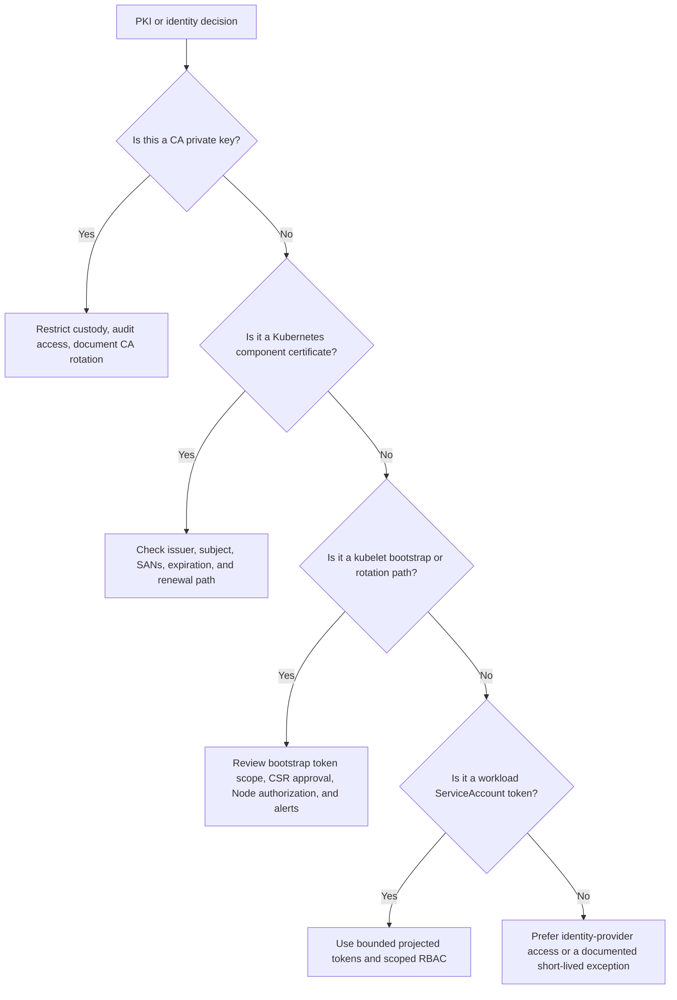

> **Складність**: `[СЕРЕДНЯ]` — базові знання | **Час на проходження**: 45-60 хвилин | **Передумови**: [Модуль 2.3: Мережева безпека](../module-2.3-network-security/)

Цей модуль спирається на поведінку Kubernetes 1.35+ і використовує короткий аліас команди `k` замість `kubectl`. Якщо ви виконуєте приклади у лабораторному кластері, визначте аліас один раз командою `alias k=kubectl`, а далі послуговуйтеся `k`, щоб команди збігалися з уроком і процес діагностики залишався лаконічним.


## Що ви зможете робити

Після завершення цього модуля ви зможете застосовувати ці результати під час перегляду кластерів, інцидентів із сертифікатами та аналізу сценаріїв у стилі KCSA:

1. **Зіставляти** архітектуру PKI Kubernetes з обліковими даними серверів, клієнтів, центрів сертифікації (CA) та сервісних акаунтів, які використовують основні компоненти.
2. **Діагностувати** збої автентифікації за сертифікатами, перевіряючи поля ідентичності, корені довіри, термін дії та поведінку ротації.
3. **Оцінювати** ризики безпеки PKI, що походять від скомпрометованих ключів CA, надмірно привілейованих груп сертифікатів, слабкого контролю життєвого циклу та застарілих токенів.
4. **Проєктувати** практики початкового видавання (bootstrap), оновлення та моніторингу сертифікатів, які зменшують радіус ураження (blast radius), не порушуючи роботу кластера.


## Чому цей модуль важливий

У лютому 2020 року помилка повторної перевірки CAA у **Let's Encrypt** (2020-02-29) спричинила екстрену заміну сертифікатів у багатьох клієнтських середовищах, оскільки деякі видані сертифікати порушували правила браузерної екосистеми. Джерело: [Let's Encrypt: CAA Rechecking Bug (інцидент із відкликанням, 2020-02-29)](https://letsencrypt.org/caaproblem/). Проблема не була специфічною для Kubernetes, але операційний урок добре переноситься на Kubernetes: сертифікати залишаються тихою інфраструктурою доти, доки рішення про довіру не дасть збій, і тоді збій виглядає так, ніби все ламається одночасно. Командам довелося інвентаризувати сертифікати, з'ясувати, хто якому видавцеві довіряє, вирішити, які системи можна безпечно ротувати, та координувати заміну під тиском бізнесу, а не під час спокійного вікна обслуговування.

Кластери Kubernetes несуть таку саму приховану залежність. API-сервер пред'являє кожному клієнту серверний сертифікат, kubelet'и автентифікуються до API-сервера клієнтськими сертифікатами, etcd може використовувати окремий центр сертифікації для довіри між вузлами (peer) та клієнтами, а рівень агрегації має власний ланцюг довіри front-proxy. Якщо будь-які з цих облікових даних спливають за терміном, видаються з хибною ідентичністю або підписані хибним CA, симптом рідко прямо каже "ваша модель PKI застаріла". Натомість оператори бачать, як вузли переходять у стан `NotReady`, компоненти площини управління відмовляються встановлювати з'єднання, потокове передавання логів дає збій, або API допуску чи розширень повертають незрозумілі помилки TLS.

Цей модуль навчає PKI як засобу контролю безпеки кластера, а не як набору файлів сертифікатів. Ви простежите, як Kubernetes перетворює поля X.509 на імена користувачів і групи, чому kubeadm зберігає кілька центрів сертифікації під `/etc/kubernetes/pki`, як bootstrap і ротація розв'язують проблему облікових даних для нового вузла, і чому токени сервісних акаунтів пов'язані з ідентичністю, хоча вони не є сертифікатами X.509. Мета — зробити збої сертифікатів придатними для діагностики, а дизайн сертифікатів — придатним для перегляду до того, як збій чи аудит перетворять їх на термінову загадку.


## Зіставлення моделі довіри Kubernetes

Інфраструктура відкритих ключів (PKI) дає Kubernetes спосіб відповісти на два запитання перед тим, як довіряти мережевому з'єднанню: чи пред'являє інша сторона сертифікат, підписаний центром, якому я довіряю, і чи відповідає ідентичність усередині того сертифіката дії, яку запитують? Це має значення, бо майже кожен важливий компонент кластера спілкується з API-сервером або з іншим компонентом площини управління через TLS. Сертифікат — це не лише оздоблення для шифрування; він є частиною системи автентифікації, яка вирішує, чи варто довіряти kubelet'ові, планувальникові, менеджеру контролерів, адміністратору-користувачеві чи розширенню API.

Кластери Kubernetes зазвичай використовують більш ніж один корінь довіри, бо різні шляхи комунікації заслуговують на різні радіуси ураження. Основний CA кластера підписує багато клієнтських і серверних сертифікатів, що застосовуються навколо API-сервера. etcd часто має власний CA, щоб компрометація загального шляху довіри кластера не надавала автоматично довіри між вузлами etcd чи клієнтам. CA front-proxy підтримує рівень агрегації, де API-сервер приймає запити від автентифікувального проксі, перш ніж переслати їх до серверів API-розширень. Концептуальне розмежування цих центрів робить реагування на інциденти менш хаотичним, бо ви можете міркувати про те, які облікові дані треба замінити після конкретної компрометації.

```text
┌─────────────────────────────────────────────────────────────┐
│              KUBERNETES PKI                                 │
├─────────────────────────────────────────────────────────────┤
│                                                             │
│                      CLUSTER CA                             │
│                          │                                  │
│            ┌─────────────┼─────────────┐                   │
│            │             │             │                    │
│            ▼             ▼             ▼                    │
│      ┌─────────┐   ┌─────────┐   ┌─────────┐              │
│      │ API     │   │ etcd    │   │ Front   │              │
│      │ Server  │   │ CA      │   │ Proxy   │              │
│      │ cert    │   │         │   │ CA      │              │
│      └─────────┘   └─────────┘   └─────────┘              │
│            │                                                │
│            ├── kubelet client certs                        │
│            ├── controller-manager client cert              │
│            ├── scheduler client cert                       │
│            └── admin/user client certs                     │
│                                                             │
│  SEPARATE CAs:                                             │
│  • Cluster CA - signs most certificates                    │
│  • etcd CA - can be separate for isolation                 │
│  • Front Proxy CA - for aggregation layer                  │
│                                                             │
└─────────────────────────────────────────────────────────────┘
```

Діаграма навмисно проста, але вона передає проєктний тиск. Єдиний CA на все легше зрозуміти в перший день, проте він створює більший домен збою, якщо приватний ключ витече. Кілька центрів додають операційного навантаження, бо ви маєте зберігати, оновлювати, моніторити й документувати більше матеріалу, але вони також дозволяють розділити клієнтську довіру API-сервера, довіру між вузлами etcd та проксі-довіру агрегатора. Архітектура безпеки часто є мистецтвом сплати керованої складності задля уникнення некерованих інцидентів.

Серверні сертифікати засвідчують ідентичність кінцевих точок, до яких підключаються інші компоненти. Коли клієнт під'єднується до API-сервера, він очікує, що серверний сертифікат буде дійсним для DNS-імен та адрес API-сервера. Коли API-сервер під'єднується до etcd, він перевіряє серверний сертифікат etcd за коренем довіри etcd. Коли користувач чи компонент площини управління викликає HTTPS-точку kubelet для логів або операцій на кшталт exec, серверний сертифікат kubelet має засвідчувати серверну ідентичність з боку вузла, а не залишати клієнтам прийняття неавтентифікованої точки.

| Компонент | Призначення сертифіката |
|-----------|---------------------|
| API-сервер | Засвідчує ідентичність клієнтам |
| etcd | Засвідчує ідентичність API-серверу |
| Kubelet | Засвідчує ідентичність для свого серверного API |

Клієнтські сертифікати засвідчують ідентичність тих, хто викликає. API-сервер може автентифікувати клієнта, що пред'являє сертифікат, перевіривши ланцюг підписів, термін дії та поля суб'єкта, які Kubernetes зіставляє з іменем користувача та групами. Саме тому сертифікат для kubelet не є взаємозамінним із сертифікатом для адміністратора-користувача. Обидва можуть бути підписані CA кластера, але вони несуть різні рядки ідентичності, і авторизація Kubernetes далі вирішує, що дозволено робити кожній ідентичності.

| Клієнт | Під'єднується до | CN (Common Name) | O (Organization/Groups) |
|--------|-------------|------------------|-------------------------|
| kubelet | API-сервер | system:node:nodename | system:nodes |
| controller-manager | API-сервер | system:kube-controller-manager | |
| scheduler | API-сервер | system:kube-scheduler | |
| admin | API-сервер | kubernetes-admin | system:masters |

Зупиніться та спрогнозуйте: якщо зловмисник викраде клієнтський сертифікат, підписаний CA кластера, але сертифікат має лише `CN=system:node:worker-1` та `O=system:nodes`, чи автоматично стане він адміністратором кластера? Правильна відповідь розмежовує автентифікацію та авторизацію. Сертифікат може успішно автентифікуватися як ідентичність вузла, але авторизатор Node і прив'язки RBAC усе ще визначають, що ця автентифікована ідентичність може робити; небезпека серйозна, але вона не тотожна викраденню адміністраторського сертифіката.

Полем ідентичності високого ризику часто є поле Organization, бо Kubernetes зіставляє його з групами. Сертифікат із `O=system:masters` особливо небезпечний, бо типові кластери прив'язують цю групу до широких адміністраторських повноважень. Багато помилок із сертифікатами походять від ставлення до суб'єкта як до напису на бейджі, а не як до вхідних даних системи авторизації. Під час безпекового перегляду ви перевіряєте і видавця, і суб'єкта, бо дійсний підпис із надмірно привілейованою групою може бути так само небезпечним, як і слабкі права доступу до приватного ключа.

```text
┌─────────────────────────────────────────────────────────────┐
│              CERTIFICATE → KUBERNETES IDENTITY              │
├─────────────────────────────────────────────────────────────┤
│                                                             │
│  X.509 CERTIFICATE                                         │
│  ┌─────────────────────────────────────────────────────┐   │
│  │  Subject:                                           │   │
│  │    CN = system:node:worker-1                        │   │
│  │    O  = system:nodes                                │   │
│  └─────────────────────────────────────────────────────┘   │
│                         │                                   │
│                         ▼                                   │
│  KUBERNETES IDENTITY                                       │
│  ┌─────────────────────────────────────────────────────┐   │
│  │  Username: system:node:worker-1                     │   │
│  │  Groups:   ["system:nodes"]                         │   │
│  └─────────────────────────────────────────────────────┘   │
│                                                             │
│  CN (Common Name) → Kubernetes username                    │
│  O  (Organization) → Kubernetes groups (can have multiple) │
│                                                             │
└─────────────────────────────────────────────────────────────┘
```

Корисна аналогія — це перепустка до будівлі, підписана довіреним бюро перепусток. Охоронець спершу перевіряє, що перепустку видало бюро і що термін її дії не сплив. Потім охоронець читає роль, надруковану на ній, і застосовує політику доступу для цієї ролі. Якщо приватний штамп бюро перепусток викрадено, зловмисник може виготовляти переконливі перепустки для будь-якої ролі. Якщо викрадено звичайну перепустку співробітника, шкода залежить від того, які двері може відчинити ця роль, як швидко сплине перепустка, і чи можна обмежити доступ десь-інде.

У кластерах, керованих kubeadm, розкладка сертифікатів робить цю модель довіри видимою на диску. Файли під `/etc/kubernetes/pki` — це не просто реалізаційне сміття; це матеріальні корені та листові облікові дані, які підтримують комунікацію площини управління. Рецензент має знати, які файли є відкритими сертифікатами, які — приватними ключами, який CA підписує який шлях, і які облікові дані використовуються для підписання сервісних акаунтів, а не для TLS. Ця різниця має значення під час резервного копіювання, відновлення, заміни вузлів і реагування на компрометацію.

```text
/etc/kubernetes/pki/
├── ca.crt, ca.key                    # Cluster CA
├── apiserver.crt, apiserver.key      # API Server
├── apiserver-kubelet-client.crt/key  # API → kubelet
├── front-proxy-ca.crt/key            # Aggregation layer CA
├── front-proxy-client.crt/key        # Aggregation client
├── etcd/
│   ├── ca.crt, ca.key                # etcd CA
│   ├── server.crt, server.key        # etcd server
│   ├── peer.crt, peer.key            # etcd peer communication
│   └── healthcheck-client.crt/key    # Health check client
└── sa.key, sa.pub                    # ServiceAccount signing
```

Зверніть увагу, що `sa.key` і `sa.pub` стоять поруч із TLS-матеріалом, але служать іншій меті. Вони використовуються для підписання та перевірки токенів сервісних акаунтів, а не для завершення TLS-рукостискань. Ця близькість може ввести нових операторів в оману, спонукаючи їх ставитися до всіх файлів у каталозі як до взаємозамінних сертифікатів. Під час інциденту змішування цих категорій марнує час. Якщо автентифікація за клієнтським сертифікатом kubelet дає збій, ключі підписання сервісних акаунтів — не перше місце для розслідування; якщо спроєктовані токени сервісних акаунтів відхиляються, серверний TLS-сертифікат API-сервера навряд чи є першопричиною.

Перший пророблений приклад — це інспекція суб'єкта сертифіката. Припустімо, `openssl` показує `CN = system:kube-controller-manager`, відсутнє поле Organization та видавця `CN = kubernetes`. Ім'я користувача — `system:kube-controller-manager`, сам сертифікат не надає груп, а видавець вказує, що CA кластера підписав його у кластері в стилі kubeadm. Звідси ви перевірите, чи має це ім'я користувача очікувані прив'язки RBAC і чи перебуває сертифікат досі в межах свого вікна дії, перш ніж звинувачувати бінарний файл менеджера контролерів чи мережевий шлях.

```text
Certificate:
    Subject: CN = system:kube-controller-manager
    Issuer: CN = kubernetes
    Validity
        Not Before: Jan  1 00:00:00 2024 GMT
        Not After : Jan  1 00:00:00 2025 GMT
    Subject Public Key Info:
        Public Key Algorithm: rsaEncryption
```

Цей зразок також показує, чому діагностика сертифікатів має бути методичною. Ви можете вивести автентифіковане ім'я користувача Kubernetes з Common Name, підтвердити відсутність членства в групах за полем Organization, ідентифікувати видавничий CA та порівняти час `Not After` з поточним часом. Якщо дата минула, автентифікація має дати збій, навіть якщо суб'єкт ідеальний. Якщо дата дійсна, але API-сервер не довіряє видавцеві, автентифікація все одно має дати збій. Діагностика PKI — це ланцюг необхідних умов, а не одне магічне поле.

## Діагностика автентифікації та ротації сертифікатів

Збої сертифікатів часто проявляються як помилки TLS, але першопричини живуть у кількох шарах. Клієнт може не довіряти серверу, бо серверний сертифікат був підписаний хибним CA, має хибні альтернативні імена суб'єкта або сплив за терміном. Сервер може відхилити клієнта, бо клієнтський сертифікат сплив, прив'язується до недовіреного CA або пред'являє ідентичність, яку авторизація згодом відхиляє. Kubelet може мати дійсний старий сертифікат, але не зуміти ротувати його, бо шлях bootstrap чи ротації налаштований неправильно. Хороша діагностика проходить ці шари у повторюваному порядку.

Базові команди kubeadm та OpenSSL навмисно прості. `kubeadm certs check-expiration` дає орієнтований на кластер огляд сертифікатів, керованих kubeadm, тоді як `openssl x509` дозволяє оглянути окремий файл. Друга команда корисна навіть поза kubeadm, коли у вас є файл сертифіката, але немає інструментів життєвого циклу, що його створили. Жодна з команд не доводить авторизацію, але обидві відповідають на перше операційне запитання під час інциденту з сертифікатом: чи це облікові дані ще дійсні за часом, і хто їх видав?

```bash
# kubeadm clusters
kubeadm certs check-expiration

# Manual check with openssl
openssl x509 -in /etc/kubernetes/pki/apiserver.crt -noout -dates
```

Перш ніж запускати це, який вивід ви очікували б, якби серверний сертифікат API-сервера сплив учора, але CA кластера лишається дійсним ще кілька років? Серверний сертифікат має показати дату `Not After` у минулому, тоді як CA все ще валідуватиметься як корінь довіри. Ця різниця має значення, бо оновлення серверного сертифіката API-сервера — менша операція, ніж ротація всього CA кластера, і командир інциденту не повинен обирати найбільш руйнівне виправлення до того, як доведе його необхідність.

Сплив терміну дії сертифіката — це функція безпеки, бо облікові дані не мають бути дійсними вічно, проте він створює операційний дедлайн, який кластер виконуватиме без жалю. Усталені параметри kubeadm історично використовували довготривалі CA та коротші сертифікати компонентів, тоді як клієнтські сертифікати kubelet можуть ротуватися автоматично за правильного налаштування. Постачальники керованого Kubernetes можуть приховувати значну частину цього життєвого циклу від вас, але концепція безпеки лишається тією самою: кожні облікові дані мають вікно дії, і доступність кластера залежить від оновлення важливих облікових даних до того, як це вікно закриється.

```text
┌─────────────────────────────────────────────────────────────┐
│              CERTIFICATE EXPIRATION                         │
├─────────────────────────────────────────────────────────────┤
│                                                             │
│  TYPICAL VALIDITY PERIODS:                                 │
│  • Cluster CA: 10 years (kubeadm default)                  │
│  • Component certs: 1 year (kubeadm default)               │
│  • kubelet client certs: 1 year                            │
│                                                             │
│  WHEN CERTIFICATES EXPIRE:                                 │
│  • Component can't authenticate                            │
│  • TLS connections fail                                    │
│  • Cluster operations break                                │
│                                                             │
│  CERTIFICATE ROTATION:                                     │
│  • Automatic: kubelet auto-rotation (if enabled)           │
│  • Manual: kubeadm certs renew                            │
│  • Managed K8s: Provider handles it                       │
│                                                             │
└─────────────────────────────────────────────────────────────┘
```

Ротація kubelet заслуговує особливої уваги, бо кожному робочому вузлу потрібна клієнтська ідентичність, перш ніж він зможе звітувати про стан і отримувати звичайні взаємодії з API. Kubelet, який не може автентифікуватися, може певний час продовжувати запускати наявні Поди, але площина управління втрачає надійне керування цим вузлом. Нові рішення планування, оновлення стану, отримання логів та операції exec можуть деградувати або давати збій. З погляду користувача це виглядає як проблема вузла, але причиною може бути проблема життєвого циклу сертифіката, прихована під шумом стану вузла.

TLS bootstrap розв'язує проблему курки та яйця для нового вузла, якому потрібен сертифікат, щоб говорити з API-сервером, але який ще не може мати довіреного сертифіката вузла. Kubelet стартує з обмеженими bootstrap-обліковими даними, подає CertificateSigningRequest і отримує підписаний клієнтський сертифікат після схвалення. Bootstrap-облікові дані мають бути вузько обмеженими у правах і короткотривалими, бо вони є тимчасовим містком до системи довіри. Якщо цей місток викрадено, зловмисник може зуміти запросити облікові дані вузла, якщо механізми схвалення, авторизації вузлів та моніторингу не виявлять зловживання.

```text
┌─────────────────────────────────────────────────────────────┐
│              KUBELET TLS BOOTSTRAP                          │
├─────────────────────────────────────────────────────────────┤
│                                                             │
│  PROBLEM: New node needs certificate to talk to API server │
│           But how does it get the certificate?             │
│                                                             │
│  SOLUTION: Bootstrap tokens                                │
│                                                             │
│  1. Node starts with bootstrap token                       │
│     (limited permissions, short-lived)                     │
│                                                             │
│  2. Node connects to API server                            │
│     ├── Authenticates with bootstrap token                 │
│     └── Requests certificate signing (CSR)                 │
│                                                             │
│  3. CSR approved (auto or manual)                          │
│     └── Certificate signer controllers sign the cert       │
│         (e.g. kube-controller-manager)                     │
│                                                             │
│  4. Node receives signed certificate                       │
│     └── Uses cert for all future communication            │
│                                                             │
│  5. Kubelet auto-rotates certificate before expiry         │
│                                                             │
└─────────────────────────────────────────────────────────────┘
```

CertificateSigningRequest'и потужні, бо вони перетворюють об'єкт запиту на підписані облікові дані. Kubernetes підтримує шляхи автоматичного схвалення для очікуваної поведінки kubelet, але людина чи контролер усе одно мають ставитися до схвалення CSR як до рішення з безпеки. Схвалення хибного суб'єкта може викарбувати ідентичність, яка лишається корисною до спливу терміну. Схвалення запиту до надмірно привілейованої групи може дорівнювати наданню широких прав RBAC. Тому субресурс схвалення належить за суворим RBAC, журналюванням аудиту та операційним переглядом.

```text
┌─────────────────────────────────────────────────────────────┐
│              CSR SECURITY CONSIDERATIONS                    │
├─────────────────────────────────────────────────────────────┤
│                                                             │
│  AUTO-APPROVAL RISKS:                                      │
│  • If bootstrap token is compromised, attacker can get     │
│    valid node certificate                                  │
│  • Rogue node could join cluster                           │
│                                                             │
│  MITIGATIONS:                                              │
│  • Short-lived bootstrap tokens                            │
│  • Node authorization mode limits what node certs can do   │
│  • Network controls on who can reach API server            │
│  • Monitor for unexpected CSRs                             │
│                                                             │
└─────────────────────────────────────────────────────────────┘
```

Скористайтеся `k`, щоб оглянути чергу CSR під час розслідування приєднання вузла чи ротації. Самих лише важливих стовпців недостатньо, але вони підказують, чи запити перебувають у стані pending, approved чи denied, і дають слід для перевірки командою `describe`. У реальному інциденті ви порівняли б ім'я користувача запиту, ім'я підписувача, призначення (usages) та запитуваний суб'єкт із очікуваним патерном bootstrap або ротації kubelet, перш ніж щось вручну схвалювати.

```bash
alias k=kubectl
k get certificatesigningrequests
k describe certificatesigningrequest <csr-name>
k certificate approve <csr-name>
```

Не схвалюйте CSR за звичкою під час збою. Зловмисник, який може створити тиск одночасно з підозрілим запитом, може скористатися бажанням оператора зробити червоні дашборди зеленими. Безпечніший патерн — задокументувати, який вигляд має легітимний CSR від kubelet у вашому середовищі, вимагати перегляду другою особою для незвичних суб'єктів чи імен підписувачів та оповіщати про несподіваний обсяг CSR. Операційна швидкість і безпековий перегляд можуть співіснувати, якщо очікуваний шлях задокументовано до інциденту.

Гіпотетичний сценарій: практичний комбінований приклад ілюструє діагностичну послідовність. Платформенна команда замінила кілька робочих вузлів після оновлення обладнання й побачила, як вони ненадовго приєдналися, а потім дрейфували у стан `NotReady`. Початкова підозра впала на проблему з CNI, бо Поди не вдавалося надійно планувати, але `k get certificatesigningrequests` показав очікувані (pending) запити клієнтських сертифікатів kubelet. Bootstrap-токен був дійсним, проте контролер, який зазвичай схвалював CSR вузлів, був обмежений під час зміни в межах посилення безпеки. Відновлення правильної політики схвалення та перегляд запитуваних ідентичностей вузлів полагодили шлях приєднання, узагалі не змінюючи мережевий рівень.

Моніторинг сертифікатів має бути нудним за задумом. Відстежуйте сплив сертифікатів, керованих kubeadm, клієнтських сертифікатів kubelet та будь-яких вручну виданих сертифікатів адміністраторів чи автоматизації. Оповіщайте задовго до дедлайну та зробіть оновлення відпрацьованою операційною процедурою, а не щорічним тестом на пам'ять. Коли сам CA наближається до спливу, плануйте раніше, бо ротація CA зачіпає більше відносин довіри й може потребувати перевидавання багатьох залежних сертифікатів. Оновлення листового сертифіката — це обслуговування; поспішна ротація CA — це міграція високого ризику.


## Оцінка ризиків безпеки PKI та ідентичності сервісних акаунтів

Найтяжчий інцидент PKI у Kubernetes — це компрометація приватного ключа CA. Викрадений листовий сертифікат дозволяє зловмиснику автентифікуватися як ідентичність усередині того сертифіката доти, доки той не сплине або авторизацію не буде знято. Викрадений ключ CA дозволяє зловмиснику карбувати нові сертифікати для будь-якої ідентичності, якій довіряє той CA, зокрема для високопривілейованих користувачів і компонентів. Kubernetes не надає простого вбудованого шляху відкликання сертифікатів на кшталт універсального CRL чи перевірки OCSP для кожного потоку автентифікації за клієнтським сертифікатом, тому запобігання та короткі вікна дії важать більше, ніж відкликання постфактум.

```text
┌─────────────────────────────────────────────────────────────┐
│              CLUSTER CA                                     │
├─────────────────────────────────────────────────────────────┤
│                                                             │
│  LOCATION (kubeadm clusters):                              │
│  • /etc/kubernetes/pki/ca.crt (public certificate)         │
│  • /etc/kubernetes/pki/ca.key (private key - PROTECT!)     │
│                                                             │
│  CA COMPROMISE = CLUSTER COMPROMISE                        │
│  If the CA private key is stolen:                          │
│  • Attacker can generate any certificate                   │
│  • Can impersonate any user, node, or component            │
│  • Full cluster access                                     │
│                                                             │
│  PROTECT THE CA KEY:                                       │
│  • Restrict file permissions (600)                         │
│  • Restrict access to control plane nodes                  │
│  • Consider HSM for production                             │
│  • Audit any access                                        │
│                                                             │
└─────────────────────────────────────────────────────────────┘
```

Стек пом'якшення починається із захисту приватного ключа. Ключі CA не повинні бути широко доступними для читання на вузлах площини управління, копіюватися у чати, запікатися в образи, зберігатися у недбалих резервних копіях чи лишатися на ноутбуках операторів після створення кластера. Перевірка прав доступу до файлів — це мінімум. Сильніші середовища переносять операції CA за контрольовані робочі процеси підписання, апаратно-підкріплене зберігання ключів або керовані постачальником площини управління, де більшість операторів ніколи не торкаються приватного ключа CA напряму. Найкраща відповідь на компрометацію ключа — та, яка вам ніколи не потрібна, бо ключ ніколи не був недбало розкритий.

Коли скомпрометовано листовий сертифікат, у вас усе ще є корисні варіанти стримування навіть без класичного відкликання. Видаліть чи звузьте права RBAC, прив'язані до імені користувача чи групи, щоб автентифікація більше не вела до значущої авторизації. Замініть скомпрометований сертифікат коротшими обліковими даними чи іншим механізмом автентифікації. Ротуйте пов'язані kubeconfig'и, проводьте аудит запитів API-сервера від цієї ідентичності та скорочуйте майбутні вікна дії там, де це операційно можливо. Якщо ж скомпрометовано ключ CA, припустіть, що корінь довіри отруєно, і плануйте значно ширшу ротацію.

Ідентичність сервісних акаунтів належить до цього модуля, бо вона розв'язує схожу проблему для робочих навантажень, хоча сучасні токени сервісних акаунтів є JWT, а не сертифікатами X.509. Поду потрібна ідентичність, щоб викликати API-сервер, а Kubernetes потрібен спосіб видати цю ідентичність з обмеженою сферою дії та терміном. Старіші кластери зазвичай використовували довготривалі токени-Secret'и, що зберігалися незалежно від Подів. Kubernetes 1.24 і пізніше змістив усталену поведінку у бік обмежених спроєктованих токенів, які мають часове обмеження, прив'язку до аудиторії та автоматично ротуються для змонтованих робочих навантажень.

```text
┌─────────────────────────────────────────────────────────────┐
│              SERVICE ACCOUNT TOKENS                         │
├─────────────────────────────────────────────────────────────┤
│                                                             │
│  LEGACY TOKENS (pre-1.24)                                  │
│  • Stored in Secrets                                       │
│  • Never expire                                            │
│  • Pre-1.24: non-expiring token Secret auto-created per SA │
│    and mounted into pods using that SA when                │
│    automountServiceAccountToken is true (the default)      │
│  • Security risk!                                          │
│                                                             │
│  BOUND SERVICE ACCOUNT TOKENS (1.24+)                      │
│  • JWTs signed by API server                               │
│  • Time-limited (default 1 hour)                           │
│  • Audience-bound                                          │
│  • Automatically rotated                                   │
│  • Projected into pods via volume                          │
│                                                             │
│  TOKEN PROJECTION EXAMPLE:                                 │
│  ┌───────────────────────────────────────────────────┐    │
│  │  volumes:                                         │    │
│  │  - name: token                                    │    │
│  │    projected:                                     │    │
│  │      sources:                                     │    │
│  │      - serviceAccountToken:                       │    │
│  │          expirationSeconds: 3600                  │    │
│  │          audience: api                            │    │
│  └───────────────────────────────────────────────────┘    │
│                                                             │
└─────────────────────────────────────────────────────────────┘
```

Обмежені токени зменшують радіус ураження трьома способами. Часові обмеження скорочують корисність викраденого токена. Прив'язка до аудиторії зменшує, де токен можна успішно відтворити. Прив'язка до Пода та ротація спроєктованого тому тісніше пов'язують облікові дані з життєвим циклом робочого навантаження, замість лишати багаторазовий Secret після зникнення початкового Пода. Жодна з цих властивостей не виправдовує слабкого RBAC, але вони роблять матеріал ідентичності менш довговічним і менш переносним для зловмисника.

| Застарілі токени | Обмежені токени |
|---------------|--------------|
| Ніколи не спливають | Часово обмежені |
| Будь-яка аудиторія | Прив'язані до аудиторії |
| Зберігаються у Secret | Спроєктований том |
| Ручна ротація | Автоматична ротація |
| Лишаються після видалення Пода | Анулюються разом із Подом |

Який підхід ви обрали б для застосунку, що викликає лише API-сервер Kubernetes зсередини одного простору імен, і чому? У кластері Kubernetes 1.35+ усталеною відповіддю має бути спроєктований, обмежений токен сервісного акаунта з RBAC, обмеженим до необхідних застосунку дієслів і ресурсів. Створений вручну довготривалий токен-Secret має потребувати задокументованого винятку, бо він створює облікові дані, що поводяться радше як некерований пароль, ніж як ротувальна ідентичність робочого навантаження.

Ви можете виявити застарілі токени-Secret'и та переглянути, які сервісні акаунти досі мають створені вручну статичні токени. Точний план очищення залежить від робочого навантаження, але розслідування має розрізняти токени, автоматично спроєктовані у запущені Поди, та явні Secret'и `kubernetes.io/service-account-token`, які могла б використовувати стара автоматизація. Видалення токена без перевірки споживачів може зламати конвеєр розгортання, проте лишати сотні невикористовуваних статичних токенів — означає створювати зайву поверхню атаки.

```bash
k get secrets -A --field-selector type=kubernetes.io/service-account-token
k get serviceaccounts -A
k describe serviceaccount -n default default
```

Слабкий дизайн сертифікатів також включає надміру широкі людські сертифікати. Деякі кластери роздають адміністраторські kubeconfig'и, підкріплені клієнтськими сертифікатами у `system:masters`, бо так зручно під час налаштування. Така практика створює довговічні облікові дані cluster-admin, які можуть жити у домашніх каталогах, змінних CI чи спільних менеджерах паролів ще довго після того, як початкова потреба зникла. Надавайте перевагу автентифікації людей через провайдера ідентичності там, де це можливо, використовуйте короткотривалі облікові дані та залишайте сертифікатний адміністраторський доступ для контрольованих аварійних (break-glass) шляхів із дисципліною аудиту та спливу.

Тонкий ризик — це операційна нормалізація. Команда, яка ніколи не переживала компрометації сертифіката, може ставитися до ключа CA, адміністраторського сертифіката й ключа підписання сервісних акаунтів як просто до ще одних файлів кластера. З часом ці файли потрапляють у скрипти резервного копіювання, діагностичні пакети, міграційні архіви та тікети. Сильний стандарт платформи називає чутливі файли, описує дозволені місця зберігання, обмежує, хто може їх читати, і вимагає доказів того, що резервні копії захищають приватні ключі з тією самою серйозністю, що й виробничі секрети.

## Впровадження безпечних практик життєвого циклу

Безпечні операції з сертифікатами поєднують інвентаризацію, ротацію, моніторинг та найменші привілеї. Інвентаризація каже вам, які облікові дані існують і хто від них залежить. Ротація гарантує, що облікові дані не живуть довше, ніж дозволяє модель ризику. Моніторинг перетворює сплив на заплановану роботу замість роботи через раптовий збій. Найменші привілеї гарантують, що компрометація сертифіката чи токена не стає негайно повною компрометацією кластера. Якщо бракує будь-якої з цих частин, інші несуть більший тиск, ніж мали б.

```text
┌─────────────────────────────────────────────────────────────┐
│              CERTIFICATE SECURITY CHECKLIST                 │
├─────────────────────────────────────────────────────────────┤
│                                                             │
│  PROTECT PRIVATE KEYS                                      │
│  ☐ CA key has restricted permissions (600)                 │
│  ☐ CA key accessible only to necessary processes           │
│  ☐ Consider HSM for CA key in production                   │
│                                                             │
│  MANAGE EXPIRATION                                         │
│  ☐ Monitor certificate expiration dates                    │
│  ☐ Enable kubelet certificate rotation                     │
│  ☐ Plan for CA rotation before expiry                      │
│                                                             │
│  MINIMIZE TRUST                                            │
│  ☐ Use separate CA for etcd (optional)                     │
│  ☐ Don't share CA across clusters                          │
│  ☐ Apply compensating controls (RBAC removal, rotation,    │
│    CA replacement) for compromised credentials             │
│                                                             │
│  USE SHORT-LIVED CREDENTIALS                               │
│  ☐ Bound service account tokens                            │
│  ☐ Short-lived user certificates where possible            │
│  ☐ Rotate credentials regularly                            │
│                                                             │
└─────────────────────────────────────────────────────────────┘
```

Початковий чекліст каже "відкликайте скомпрометовані сертифікати", але на практиці у Kubernetes це зазвичай означає використання компенсаційних засобів контролю, бо немає універсальної вбудованої перевірки відкликання для клієнтських сертифікатів. Ви можете видалити надання RBAC, вимкнути чи замінити bootstrap-токени, ротувати уражений CA, коли скомпрометовано корінь довіри, та скоротити майбутні терміни дії. Цей нюанс важливий: сказати "відкличте це" легко у чеклісті, тоді як реальна реакція залежить від того, чи викрадений матеріал є листовими обліковими даними, токеном чи приватним ключем CA.

Інвентаризація сертифікатів має бути частиною документації передавання кластера. Запишіть, які центри сертифікації існують, які компоненти довіряють кожному центру, де зберігаються приватні ключі, як моніториться сплив і який процес оновлює кожен клас сертифіката. У кластерах kubeadm включіть команди оновлення kubeadm та поведінку перезапуску статичних Подів. У керованих кластерах задокументуйте, якими сертифікатами володіє постачальник, а які сертифікати робочих навантажень чи допуску лишаються вашою відповідальністю. "Постачальник опікується PKI Kubernetes" часто частково правда й небезпечно неповне твердження.

| Концепція | Ключові моменти |
|---------|------------|
| **CA кластера** | Корінь довіри — захищайте приватний ключ |
| **Ідентичність сертифіката** | CN = ім'я користувача, O = групи |
| **Сплив** | Сертифікати спливають — моніторте й ротуйте |
| **Токени сервісних акаунтів** | Використовуйте обмежені токени (1.24+) для кращої безпеки |
| **TLS Bootstrap** | Безпечний спосіб приєднання нових вузлів |

Для сертифікатів компонентів найбезпечніша процедура оновлення — та, яку ви відпрацювали у непродакшн-кластері, що достатньо близько відповідає продакшну, аби виявити поведінку перезапуску та залежностей. Деякі сертифікати читаються лише при старті процесу, тож оновлення файлу — це не те саме, що змусити компонент його використати. Статичним Подам може знадобитися дотик до маніфестів або перезапуск компонентів залежно від шляху. Інструкція з оновлення (runbook) має зазначати не лише команду, а й очікувані перевірки після оновлення, зокрема стан здоров'я API-сервера, готовність вузлів, стан здоров'я etcd та дати сертифікатів після перезапуску.

```bash
kubeadm certs check-expiration
kubeadm certs renew apiserver
kubeadm certs renew apiserver-kubelet-client
kubeadm certs renew front-proxy-client
```

Для ротації kubelet підтвердьте конфігурацію, а не припускайте, що вона ввімкнена. Kubelet може ротувати клієнтські сертифікати, коли його так налаштовано і коли шлях схвалення CSR працює правильно. Боку площини управління також потрібні контролери та RBAC, що дозволяють легітимні запити вузлів. Кластер із налаштованою ротацією, але застряглими у стані pending схваленнями, усе ще має ризик життєвого циклу. Кластер із робочими схваленнями, але без моніторингу, усе ще може здивувати вас, коли спливе несуміжний клас сертифіката.

```yaml
apiVersion: kubelet.config.k8s.io/v1beta1
kind: KubeletConfiguration
rotateCertificates: true
serverTLSBootstrap: true
```

`serverTLSBootstrap` варто переглянути окремо від ротації клієнтських сертифікатів. Клієнтські сертифікати kubelet автентифікують kubelet до API-сервера, тоді як серверні сертифікати kubelet допомагають клієнтам автентифікувати HTTPS-точку kubelet. Деякі кластери історично толерували самопідписані серверні сертифікати kubelet, що може примушувати клієнтів до небезпечної поведінки перевірки. Якщо ваша мета з безпеки включає перевірені точки kubelet для таких операцій, як логи та exec-шляхи, bootstrap серверних сертифікатів та політика схвалення потребують явного перегляду.

Дизайн моніторингу має оповіщати перед спливом, а також ловити несподіване видавання сертифікатів. Моніторинг спливу може читати файли сертифікатів з вузлів площини управління, перевіряти вивід kubeadm чи поглинати метрики, якщо ваша платформа їх надає. Моніторинг видавання може спостерігати за об'єктами CSR та подіями аудиту. Перший захищає доступність, тоді як другий захищає довіру. Кластер, що оповіщає лише про сплив, може пропустити раптову партію підозрілих CSR; кластер, що спостерігає за CSR, але ігнорує дати, усе одно може впасти під час інакше відворотного пропущеного оновлення.

```bash
k get csr -o wide
k get csr <name> -o yaml  # inspect status.conditions (type: Approved)
openssl x509 -in /etc/kubernetes/pki/apiserver.crt -noout -subject -issuer -dates
```

Коли ви проєктуєте періоди дії сертифікатів, уникайте хибного вибору між "коротким" та "придатним до експлуатації". Надзвичайно короткі терміни життя зменшують вразливість, але потребують надійної автоматизації та спостережуваності. Довгі терміни життя зменшують навантаження на оновлення, але підвищують цінність викраденого матеріалу й заохочують людей забувати процес. Розумний дизайн обирає коротші терміни життя там, де автоматизація зріла, тримає терміни життя CA довшими, але добре захищеними, та ставиться до ручних людських сертифікатів як до винятків, а не як до усталеної моделі доступу.

Інший практичний патерн життєвого циклу — відокремлення ідентичності кластера від ідентичності робочого навантаження. PKI компонентів Kubernetes не має ставати системою ідентичності для кожного виклику між застосунками у кластері. Робоче навантаження mTLS, ідентичності у стилі SPIFFE чи сертифікати сервісної сітки можуть бути доречними для трафіку застосунків, але вони розв'язують іншу проблему, ніж автентифікація kubelet та API-сервера. Змішування цих систем без документації створює плутанину під час збоїв, бо оператори можуть не знати, чи невдале TLS-з'єднання належить до PKI Kubernetes, PKI сітки, PKI інгресу чи специфічного для застосунку сховища довіри.

Admission-вебхуки — корисний приклад, бо вони стоять поблизу площини управління, але зазвичай належать платформенним додаткам чи командам застосунків. Валідаційному чи мутаційному вебхуку потрібен серверний сертифікат, якому API-сервер довіряє, коли викликає сервіс вебхука. Якщо сертифікат спливає, не має DNS-імені сервісу або не підкріплений CA-набором, налаштованим в об'єкті вебхука, запити API можуть давати збій у несподіваних місцях, як-от створення Подів, оновлення Деплойментів чи запис кастомних ресурсів. Проблема відчувається як збій допуску, але першопричина часто — звичайна гігієна сертифікатів.

Сертифікати вебхуків також показують, чому альтернативні імена суб'єкта важать так само, як і видавці. Сертифікат може бути підписаний правильним CA й усе одно не пройти перевірку, якщо він недійсний для імені сервісу, яке набирає API-сервер. У типовому кластері це ім'я може мати вигляд `webhook-service.namespace.svc`, і сертифікат має покривати DNS-імена, які фактично використовує ваша конфігурація. Налагоджуючи збої TLS вебхука, порівняйте `clientConfig.caBundle` вебхука, ім'я та простір імен сервісу, SAN сертифіката й змонтований secret серверного Пода, перш ніж змінювати політику допуску.

Те саме міркування стосується агрегованих API-серверів. Рівень агрегації використовує довіру front-proxy, щоб основний API-сервер міг автентифікувати запити, що надходять через шлях проксі, а сервери розширень могли отримувати автентифіковану інформацію про користувача. Якщо клієнтський сертифікат front-proxy чи CA-набір хибні, API розширень можуть давати збій навіть тоді, коли основні ресурси на кшталт Подів і Сервісів усе ще працюють. Цей режим часткового збою — підказка: коли ламаються лише агреговані API, дослідіть шлях довіри агрегації, перш ніж припускати, що поламано всю PKI API-сервера.

Планування резервного копіювання та відновлення має включати PKI-матеріал з тією самою конкретністю, що й знімки etcd. Відновлення знімка etcd без відповідних сертифікатів, ключів підписання сервісних акаунтів та kubeconfig'ів може лишити кластер, чиї дані існують, але чиї компоненти не можуть довіряти один одному. І навпаки, відновлення старих приватних ключів у нове середовище може випадково воскресити відносини довіри, які ви мали намір вивести з обігу. План аварійного відновлення має зазначати, які ключі резервуються, як їх зашифровано, хто може їх розшифрувати, і як відновлені кластери уникають колізій із ідентичностями живих кластерів.

Алгоритми сертифікатів та розміри ключів менш помітні у щоденній роботі з Kubernetes, але вони все одно належать до безпекового перегляду. Сам Kubernetes покладається на поведінку TLS та X.509 у Go, тоді як ваш процес видавання обирає тип ключа, довжину ключа та алгоритм підписання. Практичний пункт рівня KCSA — не запам'ятати кожен криптографічний варіант; це помітити слабкі чи застарілі вибори та скерувати їх до вашого стандарту платформи. Якщо кластер має суміш сучасних сертифікатів, виданих постачальником, та власноруч згенерованого застарілого матеріалу, саме власноруч згенерований шлях часто є місцем, де лишаються старі усталені параметри.

Нарешті, пам'ятайте, що рішення щодо життєвого циклу сертифікатів слід тестувати з погляду клієнта. Завдання оновлення, що завершилося успішно, виконало лише частину роботи. Сильніша валідація — під'єднатися через реальну кінцеву точку, підтвердити сертифікат вузла, який отримують клієнти, перевірити ланцюг та SAN та виконати запит Kubernetes з очікуваною ідентичністю. Ця наскрізна перевірка ловить балансувальники навантаження, що все ще віддають старий сертифікат, Поди, що все ще монтують старий Secret, та kubeconfig'и, що все ще довіряють хибному CA-набору.

Ця валідація з погляду клієнта також є найбезпечнішим способом закрити інцидент. Вона дає команді доказ того, що довіра, ідентичність, авторизація та поведінка перезавантаження компонентів узгоджуються після виправлення, замість покладання на один оновлений файл як на проксі для всього шляху.


## Патерни та антипатерни

Патерни PKI корисні лише тоді, коли вони включають операційну причину, що стоїть за ними. Окремий CA для etcd не є самоцінно доброчесним, якщо ніхто його не моніторить, а короткотривалі сертифікати не є самоцінно безпечними, якщо ротація ненадійна. Наведені нижче патерни мають допомогти вам обрати засоби контролю, що відповідають операційній моделі кластера. Вони також роблять антипатерни легшими для виявлення під час переглядів, бо кожен антипатерн є спотвореною версією легітимної мети на кшталт зручності, швидкості чи стандартизації.

| Патерн | Коли його застосовувати | Чому він працює | Міркування масштабування |
|---------|----------------|--------------|------------------------|
| Окремі корені довіри площини управління | Продакшн-кластери із самокерованим etcd, агрегацією чи суворими вимогами до радіуса ураження | Обмежує, які шляхи зачеплено, коли скомпрометовано один CA чи робочий процес підписання | Потребує окремого моніторингу, резервування, оновлення та інструкцій реагування на інциденти для кожного центру |
| Автоматизована ротація клієнтських сертифікатів kubelet | Будь-який кластер із довговічними робочими вузлами | Запобігає перетворенню облікових даних вузлів на тихі однорічні точки збою | Політику схвалення CSR та оповіщення треба тестувати, а не припускати |
| Опіка CA постачальником | Керований Kubernetes, де постачальник володіє PKI площини управління | Зменшує вразливість оператора до найчутливіших приватних ключів | Ви все одно володієте сертифікатами робочих навантажень, сертифікатами вебхуків та обліковими даними доступу поза контролем постачальника |
| Короткотривалий людський доступ | Кластери з багатьма адміністраторами, підрядниками чи системами CI | Скорочує корисність витоку kubeconfig'ів та заохочує сліди аудиту провайдера ідентичності | Потребує надійного робочого процесу входу та чіткого аварійного (break-glass) процесу |

Антипатерни зазвичай починаються як зручні скорочення. Спільний CA для всіх кластерів уникає зайвих файлів під час створення кластера, але він дозволяє обліковим даним з одного середовища автентифікуватися деінде, якщо приймальний API-сервер довіряє тому самому кореню. Статичний сертифікат `system:masters` робить демо легким, але він стає довговічними обліковими даними суперкористувача, коли його скопійовано на реальний операційний ноутбук. Звичка ручного схвалення CSR прискорює відновлення вузлів, але вона також може карбувати запитані зловмисником облікові дані саме під час того галасливого інциденту, коли люди найменш обережні.

| Антипатерн | Що йде не так | Краща альтернатива |
|--------------|-----------------|--------------------|
| Спільний один CA кластера для розробки, staging та продакшну | Компрометація облікових даних чи CA в одному середовищі перетинає межі довіри | Генеруйте незалежні центри для кожного кластера й документуйте їхню сферу дії |
| Ставлення до `system:masters` як до звичайної адміністраторської групи | Кожен витеклий сертифікат із цією групою стає широким доступом cluster-admin | Використовуйте обмежені групи RBAC і резервуйте аварійні (break-glass) адміністраторські сертифікати для контрольованого вжитку |
| Схвалення CSR без перевірки підписувача, суб'єкта та призначень | Зловмисний чи спотворений запит може стати довіреним сертифікатом | Визначте очікувані патерни CSR і вимагайте перегляду для незвичних запитів |
| Ігнорування режиму токенів сервісних акаунтів під час оновлень | Довготривалі застарілі токени лишаються після переходу робочих навантажень на новіші версії Kubernetes | Інвентаризуйте статичні токени-Secret'и та мігруйте споживачів на спроєктовані обмежені токени |
| Оновлення файлів сертифікатів без перезапуску залежних компонентів | Файл змінюється, але процес продовжує використовувати старі облікові дані | Включіть перезапуск компонентів та перевірку після оновлення до інструкції (runbook) |


## Рамка ухвалення рішень

Рамка рішень щодо сертифікатів починається з активу під ризиком. Якщо актив — це приватний ключ CA, мета контролю — запобігти несанкціонованому підписанню та спланувати рідкісну, але руйнівну заміну кореня довіри. Якщо актив — це листовий сертифікат, мета — скоротити термін життя, обмежити авторизацію та моніторити використання. Якщо актив — це токен сервісного акаунта, мета — аудиторія, термін життя, прив'язка до Пода та сфера RBAC. Ставлення до кожних облікових даних як до "просто секрета" пропускає різний радіус ураження, прив'язаний до кожного з них.



Використовуйте блок-схему як орієнтир для перегляду, а не як заміну судженню. Серверний сертифікат вебхука, наприклад, може не бути сертифікатом компонента Kubernetes у сенсі kubeadm, але йому все одно потрібні коректність SAN, моніторинг спливу та процес оновлення. Система CI, що використовує kubeconfig, може не бути людиною, але вона все одно заслуговує на короткий термін життя, обмежений RBAC та власника ротації. Рамка не дає вам стрибнути одразу до команд, перш ніж назвати відносини довіри.

| Рішення | Надавайте перевагу цьому | Уникайте цього | Компроміс |
|----------|-------------|------------|----------|
| Людський доступ до кластера | OIDC чи інший підкріплений провайдером ідентичності метод із короткими сесіями | Довготривалі клієнтські сертифікати у `system:masters` | Сильніший аудит та відкликання залежать від доступності провайдера ідентичності |
| Приєднання вузла | TLS bootstrap з обмеженими токенами та переглянутим схваленням CSR | Попереднє завантаження багаторазових сертифікатів вузлів у образи | Bootstrap додає рухомих частин, але запобігає спільним обліковим даним вузлів |
| Довіра etcd | Окремий CA для etcd у продакшн-кластерах із самокерованим etcd | Повторне використання загального CA кластера без документування радіуса ураження | Окремі корені довіри потребують окремого моніторингу оновлень |
| Ідентичність робочого навантаження для API | Обмежені спроєктовані токени сервісних акаунтів | Створені вручну статичні токени-Secret'и | Деяка стара автоматизація може потребувати роботи з міграції |
| Реакція на компрометацію CA | Ротуйте корінь довіри та перевидайте уражені облікові дані | Удавання, що викрадений ключ CA можна полагодити видаленням одного сертифіката | Ротація CA руйнівна, тож запобігання дешевше |

Останнє питання рішення — хто володіє життєвим циклом. Політика безпеки, що каже "сертифікати мають ротуватися", неповна, доки вона не каже, який інструмент виконує оновлення, яка команда отримує оповіщення, яке середовище доводить інструкцію (runbook), і які перевірки після виправлення показують успіх. Збої PKI Kubernetes перетинають межі команд, бо вони зачіпають вузли, компоненти площини управління, доступ користувачів та робочі навантаження. Власність має бути достатньо явною, щоб черговий інженер знав, кому телефонувати — платформенній команді, команді ідентичності, хмарному постачальнику чи власнику застосунку.


## Чи знали ви?

- **Kubernetes 1.24 змінив усталений сценарій сервісних акаунтів**, відійшовши від автоматичних довготривалих токенів-Secret'ів для новостворених сервісних акаунтів, тому старі кластери все ще можуть містити ризиковані статичні токени після оновлення.

- **Група `system:masters` потужна за замовчуванням**, бо стандартні кластери прив'язують її до `cluster-admin`, тож клієнтський сертифікат із `O=system:masters` слід трактувати як аварійні (break-glass) облікові дані, а не як звичайний вхід користувача.

- **kubeadm зазвичай використовує 10-річний CA та однорічні сертифікати компонентів**, що створює два різні операційні годинники: довгий горизонт планування кореня довіри та коротші повторювані оновлення листових сертифікатів.

- **Об'єкти CertificateSigningRequest Kubernetes є ресурсами API**, тож створення, схвалення та відхилення CSR можна піддавати аудиту через механізми Kubernetes замість того, щоб вони лишалися невидимими подіями файлової системи.


## Типові помилки

| Помилка | Чому це стається | Як це виправити |
|---------|----------------|---------------|
| Залишення інструкцій (runbook) розпливчастими щодо того, хто володіє оновленням сертифікатів | Команди припускають, що kubeadm, хмарний постачальник чи інша команда опікується кожним класом сертифіката | Назвіть власника, інструмент, шлях оповіщення та перевірки після оновлення для кожної родини сертифікатів |
| Видавання звичайним користувачам сертифікатів із `O=system:masters` | Це працює під час налаштування й уникає роботи з дизайну RBAC | Використовуйте обмежені групи, вхід через провайдера ідентичності та короткотривалі аварійні облікові дані лише за потреби |
| Схвалення CSR лише на основі терміновості | Збої вузлів створюють тиск швидко очистити очікувані запити | Перевірте ім'я підписувача, запитуваний суб'єкт, призначення та очікувану ідентичність вузла перед схваленням |
| Спільний один CA для кластерів | Стандартизована автоматизація повторно використовує ті самі файли для зручності | Генеруйте незалежні CA для кожного кластера й документуйте, які корені довіри належать якому середовищу |
| Моніторинг лише спливу сертифіката API-сервера | API-сервер видимий, тоді як шляхи kubelet, etcd та front-proxy менш очевидні | Інвентаризуйте всі сертифікати kubeadm та не-kubeadm, тоді оповіщайте перед кожним важливим вікном спливу |
| Ставлення до токенів-Secret'ів сервісних акаунтів як до нешкідливих залишків | Старі токени виглядають як звичайні Secret'и Kubernetes після оновлень | Знайдіть статичні Secret'и `kubernetes.io/service-account-token`, перевірте споживачів та мігруйте на спроєктовані обмежені токени |
| Оновлення сертифікатів без валідації перезавантаження компонента | Оператори припускають, що нових файлів достатньо | Перезапустіть чи прокотіть залежні компоненти за потреби, тоді перевірте суб'єкта, видавця, дати та стан здоров'я кластера |

## Тест

<details><summary>Ваша команда ротувала серверний сертифікат API-сервера, але `k get nodes` з операторських ноутбуків тепер дає збій із помилкою довіри до сертифіката. Под API-сервера запущено. Що ви перевіряєте першим і чому?</summary>

Почніть із перевірки того, чи прив'язується новий сертифікат API-сервера до CA, якому довіряють клієнтські kubeconfig'и, і чи включають його альтернативні імена суб'єкта кінцеву точку, яку використовують клієнти. Запущений API-сервер лише доводить, що процес стартував; він не доводить, що клієнти довіряють пред'явленому сертифікату. Якщо сертифікат був підписаний хибним CA або не має DNS-імені балансувальника навантаження, клієнти відхиляють TLS-рукостискання ще до того, як автентифікація Kubernetes чи RBAC можуть мати значення. Виправлення — видати серверний сертифікат із правильним видавцем і SAN, тоді перезапустити компонент, якщо він не перевантажує файл автоматично.

</details>

<details><summary>Kubelet на `worker-5` припиняє оновлювати стан невдовзі після спливу його клієнтського сертифіката. Наявні Поди ще певний час, схоже, обслуговують трафік. Як ви пояснюєте симптом та радіус ураження?</summary>

Kubelet'ові потрібен дійсний клієнтський сертифікат, щоб автентифікуватися до API-сервера, тож сплив ламає канал керування вузлом, навіть якщо вже запущені контейнери продовжують виконуватися на вузлі. Площина управління може позначити вузол нездоровим, припинити отримувати свіжий стан та давати збій в операціях, що потребують комунікації з API kubelet, як-от логи чи exec. Радіус ураження — це переважно зачеплений вузол, якщо тільки та сама проблема з ротацією не існує на багатьох вузлах. Довговічне виправлення — оновити сертифікат і виправити ротацію kubelet чи схвалення CSR, щоб збій не повторювався.

</details>

<details><summary>Інженер запитує схвалення CSR, чий суб'єкт включає `O=system:masters`, кажучи, що це потрібно для швидкої діагностики. Яке рішення з безпеки?</summary>

Не схвалюйте це як рутинні діагностичні облікові дані, бо Kubernetes зіставляє поле Organization з групами, а `system:masters` широко привілейована у стандартних кластерах. Схвалення CSR викарбувало б клієнтський сертифікат у стилі cluster-admin, який лишається корисним до спливу, а Kubernetes не пропонує простого універсального перемикача відкликання для того сертифіката. Краще рішення — надати обмежену роль для діагностичного завдання або скористатися задокументованим аварійним (break-glass) процесом із коротким терміном життя, схваленням та аудитом. Терміновість змінює швидкість процесу, а не ризик, який представляє та група.

</details>

<details><summary>Керований кластер Kubernetes приховує приватний ключ CA площини управління від клієнтів. Чи означає це, що у платформенної команди не лишилося жодних обов'язків щодо PKI?</summary>

Ні. Керована постачальником PKI площини управління зменшує вразливість до ключів CA, якими володіє постачальник, але платформенна команда все одно може володіти серверними сертифікатами вебхуків, сертифікатами інгресу, mTLS робочих навантажень, використанням токенів сервісних акаунтів, kubeconfig'ами та будь-якими сертифікатами, що використовуються додатками. Команді також треба розуміти, якими шляхами довіри володіє постачальник, аби інциденти маршрутизувалися правильно. Припущення, що постачальник володіє всім, створює сліпі зони для сертифікатів застосунків і розширень. Хороша інвентаризація розділяє облікові дані постачальника та облікові дані клієнта.

</details>

<details><summary>Сканування безпеки знаходить багато Secret'ів `kubernetes.io/service-account-token`, створених до переходу кластера на Kubernetes 1.35+. Який ризик вони становлять і який шлях міграції вам слід обрати?</summary>

Застарілі токени-Secret'и сервісних акаунтів ризиковані, бо вони можуть бути довготривалими, багаторазовими та відірваними від життєвого циклу Пода, якому початково потрібен був доступ до API. Якщо один із них витече через логи, резервні копії чи надто широкі права читання Secret'ів, він може лишатися корисним до ручного видалення чи зменшення його прав. Шлях міграції — ідентифікувати споживачів, замінити їх спроєктованими обмеженими токенами там, де це можливо, щільно обмежити RBAC, тоді видалити невикористовувані статичні токени. Видалення спершу без перевірки споживачів може зламати стару автоматизацію, тож інвентаризація передує очищенню.

</details>

<details><summary>Під час інциденту приєднання вузла очікувані (pending) CSR з'являються одночасно з несподіваними іменами вузлів, яких ви не впізнаєте. Що ви робите перед тим, як щось схвалювати?</summary>

Перевірте ім'я підписувача кожного CSR, запитуваний суб'єкт, призначення та ідентичність запитувача, тоді порівняйте їх із вашим задокументованим патерном bootstrap kubelet та очікуваним переліком вузлів. Несподівані імена вузлів під час інциденту можуть вказувати на неправильну конфігурацію, дрейф автоматизації чи спробу приєднання зловмисного вузла. Схвалення створює довірені клієнтські сертифікати, тож його не слід використовувати як загальну дію очищення черги. Якщо запити неочікувані, відхиліть чи лишіть їх у стані pending, поки досліджуєте розкриття bootstrap-токена, логи провізіонування вузлів та події аудиту API-сервера.

</details>

<details><summary>Кластер ділить один CA між розробкою та продакшном. Сертифікат розробника з розробки витік. Чому аудитор стурбований, навіть якщо RBAC продакшну виглядає окремим?</summary>

Аудитор стурбований, бо API-сервер продакшну може довіряти тому самому CA, що підписав сертифікат розробки, тож автентифікація може перетнути межу середовища ще до того, як оцінюється авторизація. RBAC усе ще може обмежувати точні дії, але модель довіри вже прийняла облікові дані з хибного домену безпеки. Якщо існують будь-які спільні групи чи надто широкі прив'язки, витік може стати інцидентом доступу до продакшну. Незалежні CA для кожного кластера зменшують цей радіус ураження й роблять витеклі облікові дані дійсними лише в їхньому призначеному середовищі.

</details>


## Практична вправа: Аналіз сертифікатів та перегляд PKI

Ця вправа використовує перегляд лише для читання та невеликі завдання на міркування, тож ви можете практикувати діагностику PKI, не змінюючи реальний кластер. Якщо у вас є одноразовий лабораторний кластер kubeadm, виконуйте команди там. Якщо ви читаєте без кластера, скористайтеся зразком виводу сертифіката з першого завдання та зосередьтеся на кроках міркування. Мета — не запам'ятати команди; це побудувати повторюваний спосіб поєднати видавця, суб'єкта, термін дії, корінь довіри та авторизацію Kubernetes.

### Завдання 1: Декодуйте ідентичність сертифіката

Скористайтеся зразком виводу сертифіката в цьому модулі або огляньте сертифікат kubeadm командою `openssl`. Визначте ім'я користувача Kubernetes, групи, видавця та дату спливу. Тоді напишіть одне речення, що пояснює, чи сертифікат засвідчує серверну ідентичність, клієнтську ідентичність, чи лише те, на що зразок дає достатньо доказів, аби зробити висновок.

<details><summary>Розв'язання</summary>

Для зразкового сертифіката ім'я користувача — `system:kube-controller-manager`, бо Kubernetes зіставляє Common Name з іменем користувача для автентифікації за клієнтським сертифікатом X.509. Зразок не показує поля Organization, тож він не надає членства в групах на основі сертифіката. Видавець — `CN = kubernetes`, що зазвичай є ім'ям CA кластера kubeadm. Сертифікат спливає 1 січня 2025 року, виходячи з поля `Not After`.

</details>

### Завдання 2: Огляньте сплив сертифікатів kubeadm

На одноразовому кластері kubeadm виконайте `kubeadm certs check-expiration`, а потім огляньте один сертифікат безпосередньо через OpenSSL. Порівняйте вивід інструмента з сирою датою `Not After` й зазначте, чи сертифікат є CA, чи листовим сертифікатом.

<details><summary>Розв'язання</summary>

Команда kubeadm має перелічити сертифікати, керовані kubeadm, та їхній залишковий час. Команда OpenSSL має показати сирі дати дії для конкретного файлу, який ви оглядаєте. Якщо сертифікат є CA, плануйте ротацію уважніше, бо залежні сертифікати та набори довіри можуть потребувати заміни. Якщо це листовий сертифікат, оновлення зазвичай вужче, але споживальному компоненту все одно може знадобитися перезапуск чи прокат, щоб завантажити оновлений файл.

</details>

### Завдання 3: Перегляньте безпеку схвалення CSR

Виконайте `k get certificatesigningrequests` у лабораторному кластері або перегляньте збережений CSR зі свого середовища. Для одного запиту визначте ім'я підписувача, запитувача, запитуваний суб'єкт та призначення. Вирішіть, чи ви схвалили б його, відхилили б чи дослідили б далі.

<details><summary>Розв'язання</summary>

Легітимний клієнтський CSR kubelet має збігатися з патерном підписувача та ідентичності, очікуваним конфігурацією bootstrap та ротації вашого кластера. Якщо запитуваний суб'єкт включає несподіване ім'я вузла, привілейовану групу, незвичного підписувача чи призначення, що не відповідають передбаченим обліковим даним, не схвалюйте його лише тому, що вузол нездоровий. Спершу дослідіть шлях провізіонування та ідентичність запитувача. До схвалення слід ставитися як до видавання облікових даних, а не як до нешкідливої зміни стану.

</details>

### Завдання 4: Знайдіть ризик застарілих токенів сервісних акаунтів

Виконайте запит токенів-Secret'ів сервісних акаунтів із модуля у непродакшн-кластері або проти контексту лише для читання. Підрахуйте, скільки статичних токенів-Secret'ів існує, та оберіть один, щоб простежити його до простору імен та сервісного акаунта. Вирішіть, чи він усе ще потрібен.

<details><summary>Розв'язання</summary>

Статичні Secret'и `kubernetes.io/service-account-token` можуть бути легітимними для старої автоматизації, але їх не слід вважати безпечними лише тому, що вони є об'єктами Kubernetes. Простежте Secret до його сервісного акаунта, перевірте, чи якісь робочі навантаження чи зовнішні завдання все ще на нього посилаються, та порівняйте права, прив'язані до цього сервісного акаунта. Якщо він невикористовуваний, видаліть його через звичайний шлях змін. Якщо він використовується, мігруйте споживача на спроєктований обмежений токен чи інший короткотривалий механізм ідентичності.

</details>

### Завдання 5: Побудуйте чекліст інструкції оновлення

Напишіть короткий чекліст оновлення для однієї родини сертифікатів: серверний сертифікат API-сервера, клієнтські сертифікати kubelet, сертифікати etcd чи клієнтський сертифікат front-proxy. Включіть власника, час випередження оповіщення, команду оновлення чи дію постачальника, поведінку перезапуску та перевірку після оновлення.

<details><summary>Розв'язання</summary>

Сильний чекліст називає власника й не покладається на пам'ять. Для серверного сертифіката API-сервера у кластері kubeadm він може включати `kubeadm certs check-expiration`, `kubeadm certs renew apiserver`, запланований перезапуск статичного Пода чи дотик до маніфесту за потреби, перевірку клієнта проти кінцевої точки API та фінальну перевірку OpenSSL суб'єкта, видавця, SAN і дат. Точні команди різняться залежно від середовища, але чекліст має довести, що оновлений сертифікат справді використовується.

</details>

### Критерії успіху

- [ ] Ви можете зіставити Common Name сертифіката з іменем користувача Kubernetes та поля Organization з групами Kubernetes.
- [ ] Ви можете відрізнити компрометацію приватного ключа CA від компрометації листового сертифіката та обрати належну реакцію.
- [ ] Ви можете оглянути сплив сертифіката через kubeadm чи OpenSSL та пояснити, що має статися після оновлення.
- [ ] Ви можете оцінити CSR перед схваленням, перевіривши підписувача, суб'єкта, призначення та ідентичність запитувача.
- [ ] Ви можете виявити застарілі токени-Secret'и сервісних акаунтів та спланувати міграцію до спроєктованих обмежених токенів.


## Джерела

- [Let's Encrypt: CAA Rechecking Bug (інцидент із відкликанням, 2020-02-29)](https://letsencrypt.org/caaproblem/)
- [Kubernetes: Certificates and Certificate Signing Requests](https://kubernetes.io/docs/reference/access-authn-authz/certificate-signing-requests/)
- [Kubernetes: X.509 Client Certificates](https://kubernetes.io/docs/reference/access-authn-authz/authentication/#x509-client-certificates)
- [Kubernetes: PKI Certificates and Requirements](https://kubernetes.io/docs/setup/best-practices/certificates/)
- [Kubernetes: Managing TLS in a Cluster](https://kubernetes.io/docs/tasks/tls/managing-tls-in-a-cluster/)
- [Kubernetes: kubeadm certs](https://kubernetes.io/docs/reference/setup-tools/kubeadm/kubeadm-certs/)
- [Kubernetes: Certificate Management with kubeadm](https://kubernetes.io/docs/tasks/administer-cluster/kubeadm/kubeadm-certs/)
- [Kubernetes: TLS Bootstrapping](https://kubernetes.io/docs/reference/access-authn-authz/kubelet-tls-bootstrapping/)
- [Kubernetes: Node Authorization](https://kubernetes.io/docs/reference/access-authn-authz/node/)
- [Kubernetes: ServiceAccount Token Management](https://kubernetes.io/docs/reference/access-authn-authz/service-accounts-admin/)
- [Kubernetes: Configure Service Accounts for Pods](https://kubernetes.io/docs/tasks/configure-pod-container/configure-service-account/)
- [Kubernetes: RBAC Authorization](https://kubernetes.io/docs/reference/access-authn-authz/rbac/)
- [Kubernetes: kubelet Configuration API](https://kubernetes.io/docs/reference/config-api/kubelet-config.v1beta1/)


## Наступний модуль

[Модуль 3.1: Безпека Подів](/k8s/kcsa/part3-security-fundamentals/module-3.1-pod-security/) — Далі ви перейдете від ідентичності компонентів кластера до засобів контролю безпеки на рівні Пода, зокрема SecurityContext, Pod Security Standards та рішень щодо ізоляції контейнерів.


