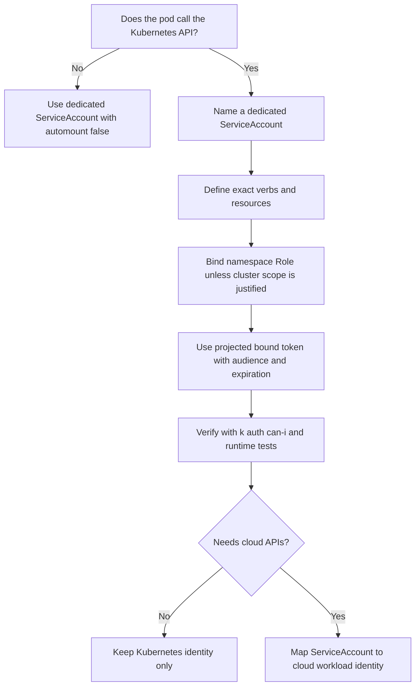

> **Складність**: `[СЕРЕДНЯ]` — основні знання.
>
> **Час на проходження**: 45-55 хвилин.
>
> **Передумови**: [Модуль 3.3: Керування секретами](../module-3.3-secrets/)

## Результати навчання

Після завершення цього модуля ви зможете переглядати реальні маніфести робочих навантажень, пояснювати ризик ідентичності та впроваджувати безпечніші проєкти сервісних акаунтів:

1. **Оцінювати** конфігурації сервісних акаунтів на предмет надмірного доступу до API, автоматично монтованих токенів та небезпечного використання типової ідентичності.
2. **Аналізувати** ризик використання типового сервісного акаунту в різних просторах імен і проєктувати безпечніші межі ідентичності Pod'ів.
3. **Діагностувати** шляхи бічного переміщення (lateral movement), які стають можливими через неправильно налаштовані дозволи сервісних акаунтів, витоки токенів та надто широкі прив'язки RBAC.
4. **Впроваджувати** проєкцію прив'язаних токенів сервісних акаунтів з обмеженою аудиторією, терміном дії та RBAC для конкретного робочого навантаження.
5. **Порівнювати** ідентичність сервісного акаунту Kubernetes із патернами хмарної ідентичності робочих навантажень для AWS, Google Cloud та Azure.

## Чому цей модуль важливий

Багато команд сприймають сервісні акаунти Kubernetes як фонову інфраструктуру доти, доки компрометація Pod не перетворює автоматично змонтований токен на шлях бічного переміщення. Гіпотетичний сценарій далі в цьому модулі покаже, як цей патерн розгортається, коли `default`-сервісний акаунт несе широкі права RBAC, а вразливість застосунку відкриває файл токена. Спільна неявна ідентичність ускладнює подальше розуміння дрейфу конфігурації: якщо хтось прив'язує широку роль до `default` заради швидкого виправлення під час усунення несправностей, кожен безіменний Pod у просторі імен успадковує цей дозвіл, доки хтось не помітить. Безпечна звичка — сприймати ідентичність кожного Pod як обмежені облікові дані з чіткою метою, терміном дії та аудиторією, а не як універсальну ключ-картку, яку всі робочі навантаження мають за замовчуванням.

Цей модуль навчає безпеки сервісних акаунтів як операційної дисципліни, а не як пункту в чеклисті. Ви дізнаєтеся, як Pod'и автентифікуються в API Kubernetes у версіях 1.35+, чому типові ідентичності створюють прихований радіус ураження (blast radius), як прив'язані токени зменшують, але не усувають ризик, і як рішення щодо RBAC формують шляхи атаки, доступні після компрометації контейнера. Ви також попрактикуєтеся переглядати дефектний маніфест, замінювати його безпечнішим проєктом ідентичності та вирішувати, коли Pod взагалі не повинен мати API-токена.

## Сервісні акаунти як ідентичність Pod

Сервісні акаунти — це ідентичності Kubernetes для програмного забезпечення, а не для людей-користувачів. Людина зазвичай автентифікується через сертифікат, OIDC-провайдера ідентичності або зовнішній плагін облікових даних, після чого Kubernetes авторизує цього користувача через RBAC чи інший авторизатор. Pod використовує сервісний акаунт, щоб внутрішньокластерний код міг робити автентифіковані виклики API без вбудовування облікових даних людини в образ, Secret чи змінну середовища. Ця відмінність важлива, тому що ідентичність Pod копіюється в запущені робочі навантаження, тож кожен прикріплений до неї дозвіл слід оцінювати як досяжний для коду застосунку та для будь-кого, хто скомпрометує цей застосунок.

Типова ментальна модель — це ключ-картка, але кращою операційною моделлю є підписаний робочий бейдж. Бейдж повідомляє, який простір імен видав ідентичність, яке ім'я сервісного акаунту він представляє, яка аудиторія має його приймати і коли спливає термін дії токена. Kubernetes може автентифікувати бейдж, після чого авторизація вирішує, чи може ця ідентичність переглядати Pod'и, оновлювати оренди (leases), читати ConfigMap'и, створювати Job'и чи виконувати будь-яку іншу дію API. Якщо бейдж змонтовано в Pod, якому ніколи не потрібен API Kubernetes, він стає подарунком зловмиснику без жодної ділової цінності для застосунку.

```
┌─────────────────────────────────────────────────────────────┐
│              SERVICEACCOUNT OVERVIEW                        │
├─────────────────────────────────────────────────────────────┤
│                                                             │
│  WHAT IS A SERVICEACCOUNT?                                 │
│  • Identity for pods to authenticate to API server         │
│  • Namespace-scoped resource                               │
│  • Every pod has one (default if not specified)            │
│                                                             │
│  HOW IT WORKS:                                             │
│  1. Pod created with serviceAccountName                    │
│  2. Token projected into pod at /var/run/secrets/...       │
│  3. Pod uses token to authenticate API requests            │
│  4. API server validates token, extracts identity          │
│  5. RBAC checked against ServiceAccount                    │
│                                                             │
│  DEFAULT SERVICEACCOUNT:                                   │
│  • Every namespace has "default" ServiceAccount            │
│  • Pods use it if none specified                           │
│  • May have unintended permissions                         │
│                                                             │
└─────────────────────────────────────────────────────────────┘
```

Сервісний акаунт обмежений простором імен, але надані йому дозволи не є автоматично обмеженими простором імен. RoleBinding в одному просторі імен може надати права в межах простору імен, тоді як ClusterRoleBinding може надати тому самому суб'єкту-сервісному акаунту права в масштабах усього кластера. Це означає, що ім'я `system:serviceaccount:payments:checkout-api` може бути обмежене оновленням одного об'єкта Lease або ж здатне читати Secret'и по всьому кластеру — залежно цілковито від прив'язок RBAC навколо нього. Саме лише ім'я об'єкта майже нічого не каже про справжній радіус ураження.

У зрілих кластерах сервісні акаунти стають частиною платформного контракту між командами застосунків і командою кластера. Власники застосунків описують, що має робити їхнє робоче навантаження, власники платформи надають шаблон, який створює ідентичність і мінімальну прив'язку, а рецензенти безпеки можуть протестувати отриманий набір дозволів, не читаючи вихідний код застосунку. Цей контракт ламається, коли ідентичності є неявними, спільними або правленими вручну після розгортання. Тому найбезпечніший проєкт сервісного акаунту є не лише технічно вузьким; він також зрозумілий наступному інженеру, який перевіряє простір імен під час інциденту.

Для практичних команд у цьому модулі приклади використовують поширений псевдонім `k` замість `kubectl`. Якщо ваша оболонка ще не визначає його, виконайте це один раз перед практикою, а потім читайте кожен результат `k auth can-i` як питання про те, що насправді може робити ідентичність Pod.

```bash
alias k=kubectl
```

Перше питання огляду для будь-якого робочого навантаження — не «який сервісний акаунт йому слід використовувати?». Перше питання — «чи взагалі потрібно цьому робочому навантаженню викликати API Kubernetes?». Статичному вебсерверу, споживачу черги, що спілкується лише з брокером застосунку, або сайдкару, який експортує локальні метрики, може не знадобитися токен API Kubernetes. Контролеру, оператору, admission-вебхуку, учаснику виборів лідера (leader election) чи застосунку, що спостерігає за ConfigMap'ами, може знадобитися доступ до API, але навіть тоді дієслова та ресурси мають бути достатньо вузькими, щоб скомпрометований Pod не міг перетворитися на інструмент розвідки кластера.

Зупиніться та спрогнозуйте: Pod запускається без `serviceAccountName` у просторі імен, де `default`-сервісний акаунт не має явного RoleBinding. Перш ніж перевіряти кластер, які перевірки виявлення API чи авторизації ви очікуєте від цієї ідентичності Pod, і яких припущень ви відмовилися б робити без запуску `k auth can-i`?

Безпечна звичка проєктування — робити ідентичність Pod явною, навіть коли Pod не має доступу до API. Робоче навантаження, яке іменує виділений сервісний акаунт із `automountServiceAccountToken: false`, легше перевіряти, ніж навантаження, що мовчки успадковує типове значення простору імен. Явна ідентичність також запобігає подальшому дрейфу: якщо хтось прив'язує роль до `default` заради окремого експерименту, ваш застосунок не успадкує випадково новий дозвіл, бо він із самого початку не використовував `default`.

Саме тому огляд сервісних акаунтів належить до тієї самої розмови, що й огляд образу, Secret та мережі. Посилений образ усе одно може злити токен, якщо код застосунку вразливий, а добре зашифроване сховище Secret усе одно постраждає, якщо ідентичність Pod може читати кожен Secret через API. Мережеві політики можуть уповільнити зловмисника, що переміщається між Pod'ами, але вони не зупиняють викрадений токен від виклику API-сервера, якщо вихідний трафік (egress) дозволяє цей шлях. Безпека сервісних акаунтів — один із небагатьох механізмів контролю, який безпосередньо формує те, що скомпрометоване робоче навантаження може попросити в площини управління.

## Еволюція токенів і прив'язана проєкція

Поведінка токенів сервісних акаунтів змінилася, тому що початкова модель була надто поблажливою для сучасних кластерів. Старіші кластери Kubernetes створювали довготривалі токени для сервісних акаунтів на основі Secret, і ці токени могли залишатися дійсними ще довго після того, як Pod, який ними користувався, зникав. Вони були зручними для ранньої автоматизації, але їх також було легко злити через доступ до Secret, резервні копії, логи чи широкі дозволи простору імен. Кластери Kubernetes 1.35+ покладаються на прив'язані токени сервісних акаунтів для звичайної автентифікації Pod, тобто токени проєктуються в Pod, мають термін дії, ротуються і можуть бути обмежені конкретною аудиторією.

```
┌─────────────────────────────────────────────────────────────┐
│              SERVICEACCOUNT TOKEN TYPES                     │
├─────────────────────────────────────────────────────────────┤
│                                                             │
│  LEGACY TOKENS (pre-1.24)                                  │
│  ├── Stored in Secrets                                     │
│  ├── Never expire                                          │
│  ├── Not audience-bound                                    │
│  ├── Auto-mounted to all pods                              │
│  └── SECURITY RISK - avoid                                 │
│                                                             │
│  BOUND SERVICE ACCOUNT TOKENS (1.24+)                      │
│  ├── JWT tokens signed by API server                       │
│  ├── Time-limited (default 1 hour, configurable)           │
│  ├── Audience-bound (specific to intended recipient)       │
│  ├── Projected via volume (not Secret)                     │
│  └── Automatically rotated before expiration               │
│                                                             │
│  TOKEN LOCATION IN POD:                                    │
│  /var/run/secrets/kubernetes.io/serviceaccount/            │
│  ├── token     - The JWT token                             │
│  ├── ca.crt    - Cluster CA certificate                    │
│  └── namespace - Pod's namespace                           │
│                                                             │
└─────────────────────────────────────────────────────────────┘
```

Прив'язані токени все одно лишаються пред'явницькими (bearer) токенами. Будь-хто, хто може прочитати файл токена, здатен використати цей токен, доки не спливе його термін дії, якщо тільки додаткові механізми контролю не блокують цей шлях. Покращення полягає в тому, що викрадені токени мають менше вікно корисності, можуть бути прив'язані до призначеної аудиторії та доставляються через проєктований том, який kubelet здатен оновлювати. Це значне зменшення вразливості порівняно з постійними обліковими даними на основі Secret, але це не проєктування дозволів. Короткочасний токен для надмірно привілейованого сервісного акаунту все одно лишається короткочасним шляхом до надмірного доступу до API.

API TokenRequest — це механізм площини управління, що стоїть за явними запитами токенів. Ви можете запросити токен із визначеною аудиторією та терміном дії, а також прив'язати його до конкретного об'єкта, наприклад Pod. На практиці більшість команд застосунків використовують проєктовані томи токенів сервісних акаунтів у специфікаціях Pod замість того, щоб створювати об'єкти TokenRequest вручну, але читання форми API допомагає побачити властивості безпеки, які Kubernetes намагається виразити.

```yaml
# Illustrative TokenRequest body — POST .../serviceaccounts/{name}/token
# Not a persisted object; in practice use `kubectl create token <sa>` or a projected-token volume.
apiVersion: authentication.k8s.io/v1
kind: TokenRequest
spec:
  audiences:
  - api                      # Who can use this token
  expirationSeconds: 3600    # 1 hour
  boundObjectRef:            # Optional: bind to specific pod
    kind: Pod
    name: my-pod
    uid: abc-123
```

Поле `audiences` часто розуміють неправильно. Аудиторія — це не дозвіл, і вона не вирішує, чи може сервісний акаунт прочитати Secret або оновити Lease. Вона каже, який отримувач має приймати токен. Токен, призначений для API Kubernetes, не повинен прийматися хмарною службою ідентичності, якщо тільки ця служба не налаштована навмисно довіряти йому, а токен, призначений для обміну хмарною ідентичністю робочого навантаження, не слід легковажно повторно використовувати як загальні облікові дані API кластера. Обмеження аудиторії звужує, де викрадений токен може бути повторно відтворений.

Термін дії — це ще один механізм контролю, що зменшує шкоду лише тоді, коли клієнти й оператори його дотримуються. Одногодинний токен обмежує вікно для повторного відтворення, але він не допоможе, якщо зловмисник зможе одразу використати цей токен, щоб створити інші облікові дані, прочитати довготривалий хмарний ключ або пропатчити Deployment, додавши власний бекдор. Тому термін дії токена слід поєднувати з вузьким RBAC, механізмами контролю допуску та моніторингом підозрілих викликів API від суб'єктів сервісних акаунтів. Сприймайте термін дії токена як корисний таймер, а не як заміну проєктуванню дозволів.

Коли довготривалий Pod використовує проєктований токен сервісного акаунту, Pod не повинен падати, коли початковий токен наближається до закінчення терміну дії. Kubelet оновлює проєктований файл до закінчення терміну, а коректно написані клієнти перечитують чи перезавантажують облікові дані за потреби. Ризик з'являється, коли застосунки кешують токен назавжди під час запуску, використовують власні клієнти, що ніколи не перезавантажують файли, або копіюють токен в інше місце, де ротація більше не застосовується. У таких випадках Pod може почати збоїти у викликах API пізніше, і режим збою виглядає як помилки автентифікації, а не як чистий перезапуск.

Зупиніться та спрогнозуйте: прив'язані токени сервісних акаунтів мають термін дії та ротуються, але ваш застосунок зчитує токен один раз у глобальну змінну під час запуску процесу. Якого збою ви очікуєте після закінчення терміну дії токена, і як би ви довели, чи перезавантажує клієнтська бібліотека облікові дані з проєктованого файлу?

Під час реагування на інцидент тип токена змінює план стримування. Якщо викрадені облікові дані — це поточний прив'язаний токен, відповідальні особи все одно переглядають журнали аудиту та ротують залежні облікові дані, але вони можуть міркувати про природне вікно закінчення терміну дії. Якщо викрадені облікові дані — це застарілий токен на основі Secret, відповідальні особи мають припустити, що він лишається корисним, доки не буде видалений чи анульований, і вони мають перевірити резервні копії, логи CI та читачів Secret на предмет можливого витоку. Саме тому інвентаризацію застарілих токенів варто робити до інциденту, коли ніхто не здогадується наосліп під тиском.

## Свідоме налаштування монтування токенів

Найбезпечніша конфігурація сервісного акаунту — це та, що відповідає реальній поведінці робочого навантаження щодо API. Якщо Pod не потребує API Kubernetes, вимкніть автоматичне монтування токена на рівні сервісного акаунту чи Pod, а краще на обох рівнях для ясності. Якщо Pod справді потребує доступу до API, використовуйте виділений сервісний акаунт, надайте мінімальний RBAC і змонтуйте проєктований токен із конкретною аудиторією та терміном дії. Це відокремлює питання ідентичності від питання дозволів, що значно прискорює аудити та реагування на інциденти.

```yaml
apiVersion: v1
kind: ServiceAccount
metadata:
  name: my-app
  namespace: production
automountServiceAccountToken: false  # Don't auto-mount token
```

Налаштування `automountServiceAccountToken: false` на рівні сервісного акаунту є типовим для Pod'ів, що використовують цей акаунт. Воно повідомляє намір власника: доступ до токена не є частиною звичайної роботи. Проте специфікація Pod може перевизначити монтування токена, тож політика допуску та дисципліна огляду все одно мають значення. Сприймайте налаштування сервісного акаунту як надійне локальне типове значення, а не як непорушну межу безпеки кластера.

```yaml
apiVersion: v1
kind: Pod
metadata:
  name: my-app
spec:
  serviceAccountName: my-app
  automountServiceAccountToken: false  # Override at pod level
  containers:
  - name: app
    image: myapp:1.0
```

Для робочих навантажень, що потребують доступу до API, явний проєктований том робить токен видимим як свідомий проєктний вибір. Приклад нижче монтує токен за власним шляхом із терміном дії в одну годину та аудиторією `api`. Це не надає жодного дозволу саме по собі; сервісний акаунт усе одно потребує прив'язки до Role чи ClusterRole RBAC для дієслів і ресурсів, які застосунок реально використовує. Цінність у тому, що доставка токена є обмеженою, придатною для огляду та легше відрізняється від випадкового автоматичного монтування.

```yaml
apiVersion: v1
kind: Pod
metadata:
  name: api-client
spec:
  serviceAccountName: api-caller
  containers:
  - name: app
    image: myapp:1.0
    volumeMounts:
    - name: token
      mountPath: /var/run/secrets/tokens
      readOnly: true
  volumes:
  - name: token
    projected:
      sources:
      - serviceAccountToken:
          path: api-token
          expirationSeconds: 3600
          audience: api
```

Компроміс полягає в операційному терті. Команди іноді залишають автоматичне монтування ввімкненим, бо це дозволяє не переглядати маніфести, коли бібліотека починає використовувати вибори лідера, виявлення сервісів чи спостереження за ConfigMap. Саме ця зручність — причина, чому це налаштування заслуговує на огляд. Якщо доступ до API потрібен, задокументуйте причину в проєкті робочого навантаження та доведіть мінімальний дозвіл за допомогою `k auth can-i --as=system:serviceaccount:<namespace>:<name>`. Якщо доступ до API не потрібен, відсутність токена слід сприймати як бажаний стан, а не як незручність.

Практичний план розгортання починається зі спостереження, а не з негайної заборони. Проведіть інвентаризацію Pod'ів, що монтують типовий токен, згрупуйте їх за власником і образом та запитайте, які навантаження реально викликають API Kubernetes. Багато простих застосунків можуть швидко перейти на роботу без токена, тоді як контролери та платформні доповнення потребують ретельнішого огляду RBAC. Цей поетапний підхід запобігає перетворенню очищення безпеки на кампанію аварійних збоїв і дає командам докази, які вони можуть використати в майбутніх оглядах замість того, щоб покладатися на успадковані припущення.

Розгляньмо контролер, який оновлює об'єкти Lease для виборів лідера. Йому не потрібно переглядати кожен Pod, читати кожен Secret чи створювати привілейовані навантаження. Його сервісному акаунту можуть знадобитися дієслова `get`, `create`, `update` і `patch` на `leases.coordination.k8s.io` в одному просторі імен — і нічого більше. Це різниця між «контролер може координуватися зі своїм партнером» і «контролер може стати інструментом інвентаризації кластера для зловмисника». Той самий механізм доставки токена може підтримувати будь-який із цих результатів, тож огляд RBAC має слідувати за оглядом токенів.

Коли ви все-таки дозволяєте токен, обирайте шлях монтування й аудиторію, які роблять сценарій використання зрозумілим. Типовий шлях знайомий, але явний проєктований том за власним шляхом може допомогти рецензентам побачити, що навантаження навмисно запросило токен для іменованої інтеграції. Ця ясність допомагає й під час налагодження: якщо застосунок читає `/var/run/secrets/tokens/api-token`, команда знає, який том, аудиторію та термін дії перевіряти. Механізми контролю безпеки, які легко перевірити, мають більше шансів пережити наступний реліз.

## Типові сервісні акаунти та дрейф простору імен

Кожен простір імен має `default`-сервісний акаунт, і Pod'и використовують його, коли `serviceAccountName` пропущено. Така поведінка корисна для швидких експериментів, але вона є слабкою основою для продакшену, бо ідентичність є спільною для кожного невказаного Pod у просторі імен. Якщо хтось прив'язує роль до `default`, усі безіменні навантаження успадковують цей дозвіл. Проблема може лишатися невидимою місяцями, бо маніфести все одно успішно розгортаються, тести все одно проходять, а файл токена з'являється за тим самим знайомим шляхом усередині кожного контейнера.

```
┌─────────────────────────────────────────────────────────────┐
│              DEFAULT SERVICEACCOUNT RISKS                   │
├─────────────────────────────────────────────────────────────┤
│                                                             │
│  PROBLEM:                                                  │
│  • Every namespace has "default" ServiceAccount            │
│  • Pods use it automatically if not specified              │
│  • Token auto-mounted to pods                              │
│  • May have roles bound (often more than needed)           │
│                                                             │
│  ATTACK SCENARIO:                                          │
│  1. Attacker compromises application container             │
│  2. Reads token from /var/run/secrets/...                  │
│  3. Uses token to query Kubernetes API                     │
│  4. Discovers secrets, other pods, escalates               │
│                                                             │
│  MITIGATIONS:                                              │
│  • Disable auto-mount for default SA                       │
│  • Create dedicated SAs for each application               │
│  • Don't bind roles to default SA                          │
│  • Use automountServiceAccountToken: false                 │
│                                                             │
└─────────────────────────────────────────────────────────────┘
```

Найпоширеніший патерн дрейфу починається невинно. Розробнику потрібно, щоб Pod прочитав ConfigMap під час міграції, тож він прив'язує Role до `default` у просторі імен. Згодом інша команда розгортає непов'язаний вебзастосунок, не вказавши сервісний акаунт. Цей вебзастосунок тепер несе той самий токен і дозвіл, хоча його власники ніколи не просили доступу до API. Якщо вебзастосунок скомпрометовано, зловмисник безкоштовно отримує дозвіл міграції. У більших просторах імен це створює проблему спільної ідентичності, яку важко розплутати, бо багато Pod'ів залежать від того самого неявного акаунту з різних причин.

Дрейф простору імен особливо важко помітити в організаціях, що розділяють репозиторії застосунків і платформні репозиторії. Маніфест Pod може жити в одному репозиторії, RoleBinding може встановлюватися спільним Helm-чартом, а ручна аварійна зміна може існувати лише в стані кластера. Рецензент, який читає лише один репозиторій, може пропустити фактичний набір дозволів. Саме тому живі перевірки авторизації та інвентаризація кластера мають значення: вони показують, що API-сервер насправді дозволить сьогодні, а не те, що один вихідний файл нібито має на меті.

```yaml
# Disable token mounting on default SA
apiVersion: v1
kind: ServiceAccount
metadata:
  name: default
  namespace: production
automountServiceAccountToken: false
```

Захист типового сервісного акаунту — це крок гігієни простору імен, а не повна програма ідентичності. Встановіть `automountServiceAccountToken: false` на `default`, уникайте прив'язування ролей до нього й зробіть так, щоб навантаження явно іменували свій призначений сервісний акаунт. Потім додайте перевірку політик, яка позначає специфікації Pod без `serviceAccountName`, бо пропущене поле більше не є лише питанням стилю. Це сигнал того, що межу ідентичності робочого навантаження не було спроєктовано навмисно.

Примусове застосування політик може перетворити цю гігієну на стабільний стандарт. Політики допуску можуть відхиляти Pod'и у продакшен-просторах імен, коли вони пропускають `serviceAccountName`, використовують `default` чи запитують автоматичне монтування токена без затвердженої мітки. Точний механізм залежить від кластера, але принцип незмінний: запобігти непомітному проникненню неявної ідентичності у продакшен. Почніть з режиму аудиту, якщо ви очікуєте багато порушень, а потім перенесіть правила з високою впевненістю до примусового виконання після того, як у команд з'являться приклади міграції та чіткий шлях винятків.

### Гіпотетичний сценарій: Витік через дашборд на $50 000

Розробники розгортають внутрішній дашборд моніторингу, використовуючи `default`-сервісний акаунт у продакшен-просторі імен. Щоб зробити налаштування «простішим», хтось раніше прив'язав до цього типового акаунту `ClusterRole` з дієсловами `get` і `list` на `secrets` (у масштабі кластера).

Коли зловмисник виявив просту вразливість Server-Side Request Forgery у застосунку дашборда, йому не потрібно було вириватися з контейнера, щоб завдати масштабної шкоди. Він просто скерував вразливий застосунок прочитати автоматично змонтований токен за шляхом `/var/run/secrets/kubernetes.io/serviceaccount/token`. Використовуючи цей токен, зловмисник запитував API Kubernetes, переглядав і читав чутливі Secret'и по всьому кластеру, видобував облікові дані хмарного провайдера та запускав майнери криптовалюти. Результатом став хмарний рахунок на $50 000 і гарячкова повномасштабна ротація облікових даних — і все це через злитий токен, який взагалі ніколи не мав бути змонтований.

Урок не в тому, що кожен `default`-сервісний акаунт уже має небезпечні дозволи. Багато кластерів покажуть обмежений доступ, коли ви це протестуєте. Урок у тому, що спільна неявна ідентичність ускладнює розуміння подальшого дрейфу. Безпечний простір імен має робити безпечний шлях нудним: кожен застосунок має іменований сервісний акаунт, Pod'и без потреби в API не отримують токена, а будь-яка прив'язка RBAC до `default` сприймається як виняток безпеки, що потребує короткострокового плану міграції.

Під час витоку нудний проєкт ідентичності цінний, бо звужує розслідування. Якщо кожен застосунок має виділений сервісний акаунт, відповідальні особи можуть шукати в журналах аудиту один суб'єкт і розуміти, які виклики API були можливі. Якщо половина простору імен використовує `default`, кожен Pod, що успадкував цю ідентичність, стає частиною питання. Та сама відмінність впливає на реагування з боку хмари, коли задіяна ідентичність робочого навантаження: виділений суб'єкт відображається на одну хмарну роль, тоді як спільна ідентичність змушує проводити ширший огляд облікових даних.

## RBAC, бічне переміщення та шляхи атаки

Безпека сервісних акаунтів стає конкретною, коли ви простежуєте, що зловмисник може зробити після прочитання файлу токена. Автентифікація відповідає на питання «ким цей запит стверджує себе?». Авторизація відповідає на питання «що може робити ця ідентичність?». Бічне переміщення відбувається, коли токен надає достатній доступ до API Kubernetes, щоб виявляти цілі, читати облікові дані, створювати Pod'и, виконувати exec у контейнерах, патчити навантаження чи зловживати прогалинами допуску. Компрометація Pod — це перша подія, але набір дозволів сервісного акаунту часто вирішує, чи лишиться інцидент локальним, чи перетвориться на загальнокластерне реагування.

```
┌─────────────────────────────────────────────────────────────┐
│              SERVICEACCOUNT ATTACK SCENARIOS                │
├─────────────────────────────────────────────────────────────┤
│                                                             │
│  TOKEN THEFT                                               │
│  1. Compromise container                                   │
│  2. Read /var/run/secrets/.../token                       │
│  3. Use token to access API                                │
│  Mitigation: automountServiceAccountToken: false           │
│                                                             │
│  PRIVILEGE ESCALATION                                      │
│  1. SA has create pods permission                          │
│  2. Create privileged pod with same SA                     │
│  3. Escape to host                                         │
│  Mitigation: Don't give SAs create pods permission         │
│                                                             │
│  SECRET EXTRACTION                                         │
│  1. SA has get secrets permission                          │
│  2. Query API for all secrets                              │
│  3. Extract credentials                                    │
│  Mitigation: Minimal RBAC, namespace isolation             │
│                                                             │
│  LATERAL MOVEMENT                                          │
│  1. SA has list pods permission                            │
│  2. Discover other applications                            │
│  3. Target other pods                                      │
│  Mitigation: Network policies, minimal RBAC                │
│                                                             │
└─────────────────────────────────────────────────────────────┘
```

Деякі дозволи заслуговують на особливу прискіпливість, бо вони потужніші, ніж здаються спочатку. `get secrets` може відкрити паролі баз даних, хмарні облікові дані, ключі підписання та токени застосунків. `create pods` може стати підвищенням привілеїв, коли допуск дозволяє монтування hostPath, привілейовані контейнери чи використання потужніших сервісних акаунтів. `pods/exec` може перетворити доступ до API на віддалене виконання команд усередині інших навантажень. `patch deployments` може замінити образ чи додати змінну середовища, що ексфільтрує дані. Навіть `list pods` може допомогти зловмиснику скласти карту імен сервісів, просторів імен, версій образів і цінних цілей.

Не оцінюйте дієслова RBAC ізольовано від політики допуску та розміщення навантажень. Сервісний акаунт із `create pods` значно менш небезпечний у просторі імен, що примусово застосовує стандарт безпеки Pod «Restricted» і блокує доступ до хоста, але це все одно можливість розгортання, яка може запускати довільні образи. Сервісний акаунт із `patch deployments` може не читати Secret'и напряму, проте він може змінити навантаження так, щоб воно виводило свій змонтований Secret чи надсилало дані деінде. Огляди безпеки Kubernetes вимагають такого мислення про ланцюг наслідків, бо дозволи комбінуються між ресурсами.

Перш ніж запускати це в реальному кластері, який вивід ви очікуєте від `k auth can-i --as=system:serviceaccount:production:checkout-api --list` для добре спроєктованого навантаження оформлення замовлення? Сильна відповідь має назвати лише ресурси, які застосунку справді потрібні, пояснити, чому відсутні широке виявлення чи читання Secret, та визначити, які дозволи спричинили б огляд інциденту.

Робочий процес огляду має поєднувати статичну перевірку маніфестів із живими перевірками авторизації. Статична перевірка показує, який сервісний акаунт іменує навантаження, чи вимкнено автоматичне монтування і які об'єкти RBAC згадують цей суб'єкт. Живі перевірки показують, що авторизатор наразі дозволяє після врахування агрегованих ClusterRole, групових прив'язок та успадкованих суб'єктів. У завантаженому кластері потрібні обидва погляди, бо YAML в одному репозиторії може не містити прив'язок, встановлених іншою командою, оператором чи платформним доповненням.

```bash
k auth can-i --as=system:serviceaccount:production:checkout-api get secrets -n production
k auth can-i --as=system:serviceaccount:production:checkout-api create pods -n production
k auth can-i --as=system:serviceaccount:production:checkout-api update leases.coordination.k8s.io -n production
```

Найкращий час прибрати небезпечний дозвіл — до того, як застосунок почне від нього залежати. Якщо команда вже випустила реліз із широким сервісним акаунтом, почніть зі спостереження за викликами API, які він реально робить, звузьте Role і розгорніть вужчу прив'язку з планом відкату. Не плутайте «застосунок не зламався в першу хвилину» з доказом того, що набір дозволів є правильним. Контролери можуть використовувати рідкісні шляхи під час повторної синхронізації, змін лідера чи відновлення після збоїв, тож огляд логів і тести мають охоплювати ці шляхи, перш ніж ви видалите стару прив'язку.

Журнали аудиту — це міст між теорією та реальною поведінкою. Фільтруйте значення `user.username`, що починаються з `system:serviceaccount:`, і сортуйте за простором імен, ім'ям сервісного акаунту, дієсловом, ресурсом і кодом відповіді. Здорова ідентичність застосунку має показувати невеликий, пояснюваний набір викликів, що відповідають меті навантаження. Несподіване читання Secret, створення Pod чи виклик переліку в масштабі кластера не є автоматично зловмисним, але це сигнал переглянути Role, шлях коду та власника, який затвердив цей дозвіл.

## Ідентичність робочих навантажень і хмарні облікові дані

Сервісні акаунти Kubernetes важливі ще й тому, що хмарні платформи можуть використовувати їх як відправну точку для ідентичності робочих навантажень. Небезпечний патерн — зберігати статичні облікові дані AWS, Google Cloud чи Azure у Secret'ах Kubernetes і монтувати їх у Pod'и. Це працює так само, як працює залишання запасного ключа від будівлі під килимком: зручно, доки забагато людей не дізнаються, де лежить ключ. Будь-хто з доступом `get secrets`, резервною копією etcd чи скомпрометованим Pod, що може прочитати змонтований Secret, може отримати довготривалий хмарний доступ, який Kubernetes не може ротувати за вас.

```
┌─────────────────────────────────────────────────────────────┐
│              WORKLOAD IDENTITY                              │
├─────────────────────────────────────────────────────────────┤
│                                                             │
│  WITHOUT WORKLOAD IDENTITY:                                │
│  • Store cloud credentials as K8s Secrets                  │
│  • Long-lived, static credentials                          │
│  • Same credentials for all pods using the Secret          │
│  • Manual rotation required                                │
│                                                             │
│  WITH WORKLOAD IDENTITY:                                   │
│  • K8s ServiceAccount → Cloud IAM role                     │
│  • Short-lived, auto-rotated tokens                        │
│  • Per-pod identity                                        │
│  • No static credentials                                   │
│                                                             │
│  IMPLEMENTATIONS:                                          │
│  • AWS: IAM Roles for Service Accounts (IRSA)              │
│  • GCP: Workload Identity                                  │
│  • Azure: Workload Identity (formerly AAD Pod Identity)    │
│                                                             │
└─────────────────────────────────────────────────────────────┘
```

Хмарна ідентичність робочих навантажень змінює обмін довірою. Замість того щоб давати кожному Pod статичний хмарний ключ, кластер пред'являє виданий Kubernetes токен ідентичності службі ідентичності хмарного провайдера, а провайдер повертає короткочасні облікові дані для відображеної ролі. Перевага безпеки не є магією; вона походить від коротшого терміну дії, явного відображення, журналів аудиту на боці провайдера та усунення статичних облікових даних із Secret'ів Kubernetes. Компроміс у тому, що неправильно налаштовані відображення все одно можуть надати завеликий хмарний доступ, тож огляд політики IAM лишається таким же важливим, як і огляд RBAC Kubernetes.

```yaml
apiVersion: v1
kind: ServiceAccount
metadata:
  name: s3-reader
  annotations:
    eks.amazonaws.com/role-arn: arn:aws:iam::123456:role/S3Reader
---
apiVersion: v1
kind: Pod
metadata:
  name: app
spec:
  serviceAccountName: s3-reader
  containers:
  - name: app
    image: myapp:1.0
    # AWS SDK automatically uses projected token
```

Приклад AWS IRSA показує патерн, але проєктний принцип застосовний у всіх провайдерів. Сервісний акаунт Kubernetes представляє навантаження, а прив'язка хмарного IAM відображає це навантаження на хмарну роль. Сторона Kubernetes все одно має вимикати непотрібні API-токени, тримати RBAC мінімальним та уникати спільного використання одного сервісного акаунту різними застосунками. Хмарна сторона має тримати політику IAM мінімальною, обмежувати довіру очікуваним видавцем (issuer) і суб'єктом кластера та робити використання облікових даних видимим у журналах аудиту провайдера.

Хмарна ідентичність також змінює те, як ви думаєте про межі простору імен. У Kubernetes простір імен може розділяти RBAC та імена ресурсів, але хмарний IAM не знає автоматично, що `production/reporting` і `staging/reporting` мають мати різний доступ до даних. Відображення між суб'єктом сервісного акаунту та хмарною роллю має навмисно кодувати цю межу середовища. Якщо staging і production спільно використовують одну хмарну роль через те, що їхні імена в Kubernetes схожі, скомпрометований Pod нижчого середовища може отримати доступ до хмарних ресурсів production, навіть коли RBAC Kubernetes виглядає розділеним.

Який підхід ви б тут обрали й чому: статичний хмарний ключ, збережений як Secret Kubernetes, чи ідентичність робочого навантаження, відображена з виділеного сервісного акаунту? Сильна відповідь має згадати ротацію, придатність до аудиту, радіус ураження та операційну вартість правильного налаштування довіри видавця.

Практичну міграцію зі статичних ключів на ідентичність робочих навантажень слід робити невеликими кроками. Спочатку створіть виділений сервісний акаунт і вузьку хмарну роль, що відповідає одному навантаженню. Далі розгорніть навантаження з доступними одночасно старим і новим шляхами автентифікації — лише настільки довго, щоб перевірити поведінку. Потім приберіть монтування статичного Secret, видаліть старий ключ у провайдера й переконайтеся, що журнали аудиту показують використання нової ролі. Така послідовність уникає масштабної одномоментної зміни облікових даних, але все одно завершується без багаторазового хмарного ключа всередині Kubernetes.

Один тонкий режим збою хмарної ідентичності — припущення, що RBAC Kubernetes і хмарний IAM завжди захищають ті самі ресурси. Сервісний акаунт може майже не мати дозволів API Kubernetes, але все одно відображатися на потужну хмарну роль, що може читати об'єктне сховище, створювати обчислювальні ресурси чи розшифровувати ключі за межами кластера. Зворотне теж може статися: вузько обмежена хмарна роль може бути в парі з надмірно привілейованим RoleBinding Kubernetes. Переглядайте обидві площини разом, бо зловмисники йдуть тим шляхом дозволів, який першим дає їм корисні дані чи стійкість присутності.

## Патерни й антипатерни

Найсильніші програми сервісних акаунтів нудні в найкращому сенсі. Рецензент може відкрити маніфест навантаження, побачити іменований сервісний акаунт, побачити, що автоматичне монтування токена вимкнено, якщо немає чіткого сценарію використання API, та простежити невеликий RoleBinding до точних дієслів, потрібних застосунку. Цей патерн масштабується, бо кожен застосунок володіє однією межею ідентичності, а платформні команди можуть писати перевірки допуску, що виявляють відсутні поля, використання типового акаунту чи заборонені прив'язки до того, як маніфести досягнуть продакшену.

```
┌─────────────────────────────────────────────────────────────┐
│              SERVICEACCOUNT SECURITY CHECKLIST              │
├─────────────────────────────────────────────────────────────┤
│                                                             │
│  MINIMIZE ACCESS                                           │
│  ☐ Create dedicated SA per application                     │
│  ☐ Don't reuse SAs across different apps                   │
│  ☐ Grant minimal RBAC permissions                          │
│  ☐ Use namespace-scoped roles                              │
│                                                             │
│  TOKEN MANAGEMENT                                          │
│  ☐ Disable auto-mount when API access not needed          │
│  ☐ Use bound tokens (short-lived, audience-bound)          │
│  ☐ Clean up legacy token Secrets                           │
│                                                             │
│  CLOUD INTEGRATION                                         │
│  ☐ Use workload identity instead of static credentials     │
│  ☐ Map SAs to cloud roles with least privilege             │
│                                                             │
│  DEFAULT SA                                                │
│  ☐ Disable auto-mount on default SA                        │
│  ☐ Don't bind roles to default SA                          │
│  ☐ Explicitly specify SA in all pods                       │
│                                                             │
└─────────────────────────────────────────────────────────────┘
```

| Патерн | Коли його використовувати | Чому це працює | Міркування щодо масштабування |
|---------|----------------|--------------|-----------------------|
| Виділений сервісний акаунт на застосунок | Будь-яке навантаження з окремою власністю чи потребами API | Він тримає ідентичність, аудит і радіус ураження RBAC узгодженими з одним застосунком | Іменуйте акаунти послідовно, щоб огляди й дашборди могли групувати їх за простором імен і власником |
| Навантаження без токена за замовчуванням | Pod'и, що не викликають API Kubernetes | Скомпрометований контейнер не може викрасти токен, який ніколи не монтувався | Використовуйте політику допуску, щоб позначати Pod'и, які все ще автоматично монтують токени (неявне `true`) для простих шаблонів застосунків |
| Вузький RoleBinding із доказом `k auth can-i` | Контролери, вибори лідера, спостерігачі конфігурації та оператори | Живі перевірки авторизації ловлять дозволи, які пропускає статичний огляд | Додавайте очікувані перевірки `can-i` до огляду релізу для навантажень високого ризику |
| Ідентичність робочого навантаження для хмарного доступу | Pod'и, що потребують API AWS, Google Cloud чи Azure | Це усуває статичні хмарні ключі із Secret'ів Kubernetes і покращує журнали аудиту | Тримайте політики хмарного IAM такими ж вузькими, як RBAC Kubernetes, бо будь-яка сторона може розширити радіус ураження |

Антипатерни зазвичай походять від зручності, а не зі зловмисності. Команди повторно використовують типове значення простору імен, бо воно працює, прив'язують ClusterRole, бо Role простору імен не спрацював під час тестування, чи монтують хмарні облікові дані як Secret, бо SDK знаходить їх автоматично. Ці вибори зрозумілі під час розробки, але продакшен-кластери потребують інших типових значень. Безпечніша альтернатива — зробити вузький шлях легшим за широкий за допомогою шаблонів, політик і чеклистів огляду.

Шаблони мають кодувати патерни, щоб окремі команди не були змушені відкривати їх заново. Продакшен-чарт може створювати сервісний акаунт за замовчуванням, вимикати автоматичне монтування токена, якщо явне значення його не ввімкне, та генерувати RoleBinding'и з невеликого списку затверджених можливостей. Платформні команди потім можуть переглядати винятки, а не кожне рутинне розгортання. Це не лише безпечніше; це швидше для команд застосунків, бо звичайний шлях більше не вимагає від них розуміти кожну деталь RBAC, перш ніж випустити статичний сервіс.

| Антипатерн | Що йде не так | Краща альтернатива |
|--------------|-----------------|--------------------|
| Прив'язування ролей до `default` | Кожен безіменний Pod у просторі імен успадковує дозвіл | Тримайте `default` без токена й вимагайте іменованих сервісних акаунтів |
| Надання `cluster-admin` сервісному акаунту застосунку | Одна компрометація Pod стає повним контролем над кластером | Почніть без RBAC, додавайте лише потрібні дієслова й ресурси, потім перевіряйте за допомогою `k auth can-i` |
| Спільне використання одного сервісного акаунту багатьма застосунками | Журнали аудиту та радіус ураження інциденту більше не відображаються на одне навантаження | Використовуйте одну ідентичність на застосунок, контролер чи операційну відповідальність |
| Зберігання статичних хмарних ключів у Secret'ах | Читачі Secret і скомпрометовані Pod'и отримують довготривалий хмарний доступ | Використовуйте ідентичність робочих навантажень провайдера та короткочасні хмарні облікові дані |

## Фреймворк прийняття рішень

Коли ви переглядаєте проєкт сервісного акаунту, ухвалюйте перше рішення щодо потреби в API, а не щодо формату токена. Прив'язані токени безпечніші за застарілі, але безпечніший токен, змонтований у неправильний Pod, усе одно є непотрібною вразливістю. Шлях прийняття рішень нижче починається з поведінки навантаження, потім переходить до доставки токена, обсягу RBAC і хмарної ідентичності. Такий порядок запобігає поширеній помилці, коли команди ретельно налаштовують проєктовані токени для Pod, який взагалі не мав би мати токена.



| Точка рішення | Віддавайте перевагу цьому | Уникайте цього | Обґрунтування |
|----------------|-------------|------------|-----------|
| Pod не потребує API | `automountServiceAccountToken: false` на рівні сервісного акаунту й Pod | Мовчазне успадкування від `default` | Найбезпечніший токен — той, що не змонтований |
| Pod потребує один ресурс простору імен | Role і RoleBinding простору імен | ClusterRoleBinding заради зручності | Обсяг простору імен обмежує шкоду від крадіжки токена |
| Pod потребує виборів лідера | Дієслова, специфічні для Lease, на `leases.coordination.k8s.io` | Широкі права оновлення на ConfigMap, Pod'ах чи Deployment'ах | Вибори лідера не мають перетворюватися на загальний доступ запису |
| Pod потребує хмарного доступу | Ідентичність робочого навантаження, відображена на вузьку роль IAM | Статичні облікові дані, змонтовані із Secret | Короткочасні хмарні облікові дані зменшують ризик ротації та витоку |
| Наявний застосунок використовує широкі дозволи | Спостерігайте за реальними викликами API, звужуйте поступово, тестуйте шляхи збоїв | Видалення широкої прив'язки без розуміння рідкісних шляхів | Контрольоване зменшення уникає продакшен-збоїв, водночас покращуючи безпеку |

Використовуйте цей фреймворк під час оглядів проєктування та реагування на інциденти. Під час проєктування він допомагає обрати найменш ризиковану ідентичність до того, як навантаження вийде в реліз. Під час реагування на інцидент він допомагає відповісти на нагальне питання: «Якщо цей Pod було скомпрометовано, які ідентичності, API та хмарні ролі ми маємо припустити, що зловмисник спробував?». Ця відповідь керує ротацією токенів, очищенням RBAC, оглядом логів та обсягом комунікації з клієнтами.

Фреймворк навмисно консервативний, бо помилки сервісних акаунтів рідко відмовляють безпечно (fail closed). Pod із замалим доступом зазвичай видає помилку авторизації, яку можна виправити цілеспрямованим оновленням Role. Pod із завеликим доступом може тихо працювати місяцями, а потім перетворити рутинну вразливість застосунку на інцидент площини управління. Віддавайте перевагу старту з вузького, вимірюванню точного відсутнього дозволу та додаванню найменшого виправданого надання. Така звичка створює короткі цикли налагодження й уникає дозволів, які ніхто не пам'ятає, що затверджував.

В екзаменаційних і реальних умовах огляду записуйте рішення до написання YAML. Почніть із речення на кшталт «це навантаження обслуговує статичний HTTP і не викликає API Kubernetes» або «цей контролер оновлює об'єкти Lease для виборів лідера в одному просторі імен». Це речення обмежує маніфест, який вам дозволено створити. Якщо YAML містить монтування токена, читання Secret, надання створення Pod чи прив'язку в масштабі кластера, яких речення не виправдовує, проєкт дрейфує ще до того, як досягне кластера.

## Чи знали ви?

- **Кожен Pod має сервісний акаунт** — якщо ви не вказуєте жодного, він використовує `default`-сервісний акаунт у просторі імен.
- **Прив'язані токени — це JWT** — ви можете декодувати їхній заголовок і корисне навантаження, але не можете їх підробити без ключа підписання.
- **Застарілі токени зберігаються** — попри те, що Kubernetes 1.24+ використовує прив'язані токени за замовчуванням, старі токени на основі Secret усе одно можуть існувати в оновлених кластерах.
- **`automountServiceAccountToken` має два рівні** — його можна задати як на рівні сервісного акаунту, так і на рівні Pod, причому налаштування на рівні Pod перевизначає типове значення на рівні сервісного акаунту.

## Типові помилки

| Помилка | Чому вона трапляється | Як її виправити |
|---------|----------------|---------------|
| Використання `default`-сервісного акаунту для продакшен-Pod'ів | Воно працює без додавання полів до маніфестів, тож команди не помічають, що створили спільну ідентичність | Створіть виділений сервісний акаунт на навантаження й вимагайте `serviceAccountName` у продакшен-шаблонах |
| Залишення токенів змонтованими в Pod'ах, що ніколи не викликають API | Автоматичне монтування легко проґавити, бо застосунок усе одно запускається нормально | Встановіть `automountServiceAccountToken: false` на сервісному акаунті й Pod, а потім перевірте, що застосунок усе ще працює |
| Прив'язування ClusterRole, коли підійшла б Role | Прив'язка в масштабі кластера може здаватися способом швидко виправити збій тесту простору імен | Почніть із RoleBinding простору імен, потім задокументуйте й перегляньте будь-який дозвіл у масштабі кластера окремо |
| Надання `get secrets` сервісним акаунтам застосунків | Команди використовують Secret'и як конфігурацію й забувають, що читання Secret відкриває облікові дані | Перенесіть нечутливу конфігурацію в ConfigMap'и й обмежте читання Secret контролерами, яким воно справді потрібне |
| Повторне використання одного сервісного акаунту різними застосунками | Спільні Helm-чарти чи скопійовані маніфести роблять повторне використання зручним | Параметризуйте чарт, щоб кожен реліз отримував специфічний для навантаження сервісний акаунт і RoleBinding |
| Збереження застарілих токенів-Secret після оновлень | Старі об'єкти лишаються після оновлень кластера й можуть бути невидимими у звичайних специфікаціях Pod | Проведіть інвентаризацію Secret'ів `kubernetes.io/service-account-token`, переконайтеся, що жодне навантаження на них не посилається, потім приберіть невикористані |
| Зберігання ключів хмарного провайдера в Secret'ах Kubernetes | Це найшвидший спосіб змусити автентифікацію SDK працювати на ранній стадії розробки | Використовуйте AWS IRSA, Google Cloud Workload Identity чи Azure Workload Identity із вузькими дозволами хмарного IAM |

## Тест

<details><summary>Ваша команда розгортає статичний вебфронтенд без викликів API Kubernetes, але специфікація Pod пропускає `serviceAccountName` і не вимикає монтування токена. Що слід змінити й чому?</summary>

Створіть виділений сервісний акаунт для фронтенду й встановіть `automountServiceAccountToken: false` як на сервісному акаунті, так і на Pod. Ключовий момент у тому, що застосунку не потрібен API-токен, тож монтування токена лише дає скомпрометованому контейнеру облікові дані автентифікації для крадіжки. Іменування сервісного акаунту також не дає Pod випадково успадкувати майбутні дозволи, додані до `default`. Це оцінює конфігурацію сервісного акаунту, а не припускає, що відсутність явного RBAC робить токен нешкідливим.

</details>

<details><summary>`default`-сервісний акаунт простору імен наразі має RoleBinding, що дозволяє `get` і `list` на ConfigMap'ах. Новий Pod платежів виходить у реліз без `serviceAccountName`. Як ви оцінюєте ризик?</summary>

Pod платежів успадковує `default`-сервісний акаунт, тож він успадковує ці дозволи на ConfigMap, навіть якщо команда платежів ніколи не просила доступу до API. Безпосередній ризик — дрейф спільної ідентичності: одне скорочення на рівні простору імен тепер застосовується до непов'язаних навантажень. Використайте `k auth can-i --as=system:serviceaccount:<namespace>:default --list`, щоб підтвердити фактичні права, потім перенесіть навантаження міграції на виділений акаунт і приберіть прив'язку з `default`. Pod платежів має отримати власний сервісний акаунт без токена, якщо тільки в нього немає реальної потреби в API.

</details>

<details><summary>Зловмисник компрометує Pod і використовує його сервісний акаунт, щоб створити привілейований Pod у тому самому просторі імен. Які механізми контролю розірвали б ланцюг бічного переміщення?</summary>

Кілька механізмів контролю могли б перервати ланцюг. Вимкнення монтування токена запобігло б легкій крадіжці токена, якби початковий Pod не потребував доступу до API. Мінімальний RBAC прибрав би `create pods` із сервісного акаунту, а Pod Security Standards чи політика допуску відхилила б привілейований Pod, навіть якби зловмисник мав права створення Pod. Мережева політика та посилення середовища виконання допомагають зменшити подальшу шкоду, але сервісний акаунт і механізми контролю допуску — головні точки розриву в цьому конкретному шляху атаки на API Kubernetes.

</details>

<details><summary>Контролер використовує вибори лідера й починає збоїти з помилками автентифікації після приблизно години роботи. Файл проєктованого токена існує й виглядає нещодавно оновленим. Що ви діагностуєте першим?</summary>

Спершу перевірте, чи контролер або його клієнтська бібліотека читає токен лише один раз під час запуску замість того, щоб перезавантажувати файл проєктованого токена. Прив'язані токени сервісних акаунтів мають термін дії та ротуються, тож кешований токен може стати недійсним, тоді як файл на диску здоровий. Підтвердьте аудиторію та термін дії токена, перевірте конфігурацію клієнта й перегляньте логи на предмет збоїв автентифікації, що збігаються з часом закінчення терміну дії токена. Виправлення зазвичай полягає у використанні клієнта Kubernetes, що коректно перезавантажує облікові дані, або в перезапуску логіки джерела облікових даних, коли файл токена змінюється.

</details>

<details><summary>Команда хоче змонтувати ключі доступу AWS із Secret Kubernetes, бо SDK уже підтримує цей шлях. Як ви порівнюєте це з ідентичністю робочих навантажень на основі сервісного акаунту?</summary>

Статичні ключі AWS у Secret є довготривалими й стають доступними будь-кому, хто може прочитати цей Secret чи скомпрометувати Pod, який його монтує. Ідентичність робочого навантаження відображає виділений сервісний акаунт Kubernetes на хмарну роль IAM і повертає короткочасні облікові дані через потік ідентичності провайдера. Сервісний акаунт усе одно потребує ретельного RBAC Kubernetes, а роль IAM усе одно потребує найменших привілеїв, але такий проєкт усуває статичні хмарні ключі з кластера й покращує придатність до аудиту. Компроміс — складність налаштування навколо довіри видавця та відображення ролей.

</details>

<details><summary>Сканер безпеки знаходить старі Secret'и `kubernetes.io/service-account-token` після оновлення кластера. Чому вони важливі, і який безпечний шлях очищення?</summary>

Застарілі Secret'и-токени сервісних акаунтів важливі, бо вони можуть бути довготривалими обліковими даними, що переживають Pod чи робочий процес, якому початково були потрібні. Не видаляйте їх наосліп, бо старіші інтеграції можуть усе ще посилатися на створений вручну Secret-токен. Проведіть інвентаризацію Secret'ів, знайдіть навантаження чи зовнішні системи, що на них посилаються, перенесіть цих користувачів на проєктовані прив'язані токени чи API TokenRequest, а потім приберіть невикористані застарілі токени. Це очищення зменшує цінність старих резервних копій, злитих Secret'ів та застарілого доступу RBAC.

</details>

<details><summary>Ви переглядаєте Pod, якому потрібно оновити один об'єкт Lease для виборів лідера. Запропонована Role дозволяє `get`, `list`, `watch`, `create`, `update` і `patch` на всіх ConfigMap'ах і Lease. Що б ви змінили?</summary>

Звузьте Role до ресурсу координаційного API, який застосунок реально використовує, зазвичай `leases.coordination.k8s.io`, і включіть лише дієслова, потрібні бібліотеці виборів лідера. Широкі права на ConfigMap непотрібні, якщо застосунок використовує Lease, а широкі права list чи watch можуть відкрити зайву інформацію про кластер. Після зміни Role перевірте очікувану поведінку перевірками `k auth can-i` та тестом аварійного переключення (failover). Мета — впровадити реальну роботу сервісного акаунту, а не загальний набір дозволів для усунення несправностей.

</details>

## Практична вправа: Огляд безпеки сервісного акаунту

У цій вправі ви переглянете навмисно дефектне налаштування, виявите проблеми ідентичності та RBAC і заміните його безпечнішим проєктом. Ви можете виконати міркування на папері, але команди написані так, щоб ви могли також запустити їх у одноразовому кластері Kubernetes 1.35+. Не запускайте це у спільному продакшен-кластері, бо перший маніфест навмисно надає надмірний доступ для цілей огляду.

Важлива навичка — пояснити як очевидні, так і приховані проблеми. Прив'язка `cluster-admin` є очевидно небезпечною, але Pod також не іменує призначений сервісний акаунт, використовує простір імен `default` і залишає монтування токена неявним. Сильний огляд ловить усі ці моменти, бо реальні інциденти часто поєднують одну драматичну помилку з кількома тихими типовими значеннями. Коли ви пишете безпечну версію, опирайтеся спокусі додати RBAC «про всяк випадок». Якщо nginx не викликає API Kubernetes, правильний RoleBinding — це відсутність RoleBinding.

Працюючи над вправою, відділяйте докази від вподобань. «Мені не подобається типовий простір імен» слабше за «типовий простір імен часто не має меж власності, і цей маніфест не дає жодної причини, чому навантаження належить до нього». «ClusterRoleBinding здається завеликим» слабше за «цей суб'єкт отримує `cluster-admin`, тож викрадений токен може виконати будь-яку дію API, прийняту допуском». Міркування у стилі KCSA винагороджують таку точність, бо мета — визначити, як зловмисник використав би кожну неправильну конфігурацію.

**Сценарій вправи**: Перегляньте наступне налаштування й визначте проблеми сервісного акаунту, простору імен, RBAC і монтування токена, перш ніж писати безпечнішу заміну:

```yaml
# ServiceAccount with too much access
apiVersion: v1
kind: ServiceAccount
metadata:
  name: app-sa
  namespace: default
---
apiVersion: rbac.authorization.k8s.io/v1
kind: ClusterRoleBinding
metadata:
  name: app-admin
subjects:
- kind: ServiceAccount
  name: app-sa
  namespace: default
roleRef:
  kind: ClusterRole
  name: cluster-admin
  apiGroup: rbac.authorization.k8s.io
---
apiVersion: v1
kind: Pod
metadata:
  name: web-app
  namespace: default
spec:
  # serviceAccountName not specified
  containers:
  - name: app
    image: nginx:1.25
```

### Завдання

- [ ] Визначте кожне місце, де маніфест покладається на простір імен `default`, `default`-сервісний акаунт чи неявне монтування токена.
- [ ] Поясніть, чому `ClusterRoleBinding` створює надмірний доступ до API і як він міг би підтримати бічне переміщення після компрометації Pod.
- [ ] Напишіть безпечніший маніфест сервісного акаунту й Pod для навантаження nginx, що не викликає API Kubernetes.
- [ ] Додайте мінімальні Role і RoleBinding лише якщо ви можете виправдати реальну дію API, яку виконує навантаження.
- [ ] Запустіть перевірки `k auth can-i` для небезпечної та безпечної ідентичностей, щоб порівняти їхні фактичні дозволи.
- [ ] Підтвердьте, що фінальний проєкт не має змонтованого токена сервісного акаунту для Pod nginx, якщо тільки ви навмисно не додаєте доступ до проєктованого токена.

<details>
<summary>Проблеми безпеки</summary>

1. **cluster-admin прив'язано до app-sa**
   - Повний доступ до кластера з будь-якого Pod, що використовує app-sa
   - Масштабне надмірне привілеювання
   - Виправлення: Використовуйте мінімальну Role у межах простору імен

2. **ClusterRoleBinding замість RoleBinding**
   - Надає дозволи в масштабі кластера
   - Виправлення: Використовуйте RoleBinding для обсягу простору імен

3. **ServiceAccount у просторі імен default**
   - Простір імен default часто не захищений належним чином
   - Виправлення: Використовуйте виділений простір імен

4. **Pod не вказує serviceAccountName**
   - Використовуватиме `default` SA, а не `app-sa`
   - app-sa із cluster-admin тут не використовується
   - Але `default` SA може мати власні проблеми

5. **Немає automountServiceAccountToken: false**
   - Токен монтується без потреби
   - nginx не потребує доступу до API
   - Виправлення: Додайте automountServiceAccountToken: false

**Безпечна версія:**
```yaml
apiVersion: v1
kind: ServiceAccount
metadata:
  name: nginx-sa
  namespace: production
automountServiceAccountToken: false
---
apiVersion: v1
kind: Pod
metadata:
  name: web-app
  namespace: production
spec:
  serviceAccountName: nginx-sa
  automountServiceAccountToken: false
  containers:
  - name: app
    image: nginx:1.25
# No RBAC binding needed if pod doesn't access API
```

</details>

<details>
<summary>Запропоновані команди перевірки</summary>

```bash
k create namespace production
k apply -f unsafe-serviceaccount-review.yaml
k auth can-i --as=system:serviceaccount:default:app-sa '*' '*'
k auth can-i --as=system:serviceaccount:default:default get configmaps -n default
k apply -f secure-nginx-serviceaccount.yaml
k auth can-i --as=system:serviceaccount:production:nginx-sa get secrets -n production
k describe pod web-app -n production
```

Небезпечна ідентичність має продемонструвати, чому ClusterRoleBinding до `cluster-admin` є неприйнятним для сервісного акаунту застосунку. Безпечна ідентичність nginx взагалі не повинна потребувати жодної прив'язки RBAC, тож `can-i get secrets` має бути відхилено. Коли ви перевіряєте Pod, підтвердьте, що монтування токена вимкнено за проєктом, а не приховано випадково.

</details>

### Критерії успіху

- [ ] Ви можете пояснити, чому Pod без `serviceAccountName` використовує `default`-сервісний акаунт простору імен.
- [ ] Ви можете показати, як `cluster-admin` на сервісному акаунті перетворює крадіжку токена на повний контроль над кластером.
- [ ] Ви можете створити безпечний маніфест nginx із виділеним сервісним акаунтом і `automountServiceAccountToken: false`.
- [ ] Ви можете обґрунтувати, чи потребує навантаження будь-якої прив'язки RBAC, і типова відповідь — «ні» для статичного nginx.
- [ ] Ви можете використати `k auth can-i`, щоб порівняти дозволи небезпечного й безпечного сервісних акаунтів.
- [ ] Ви можете описати, як проєктовані прив'язані токени додавалися б лише для навантаження з реальною потребою в API.

## Підсумок

Безпека сервісних акаунтів полягає в контролі ідентичності Pod. Практична мета — не запам'ятати кожне поле токена, а зробити так, щоб ідентичність кожного навантаження, вразливість токена та дозволи відповідали його реальній поведінці. Pod, який ніколи не викликає API Kubernetes, не повинен отримувати токен. Pod, який справді викликає API, має використовувати виділений сервісний акаунт, проєктований прив'язаний токен за потреби та RBAC достатньо вузький, щоб викрадений токен не став картою кластера чи інструментом підвищення привілеїв.

| Аспект | Ризик | Пом'якшення |
|--------|------|------------|
| **Типовий SA** | Спільна ідентичність | Створюйте виділені SA |
| **Монтування токена** | Поверхня атаки | automountServiceAccountToken: false |
| **RBAC** | Надмірні привілеї | Мінімальний, у межах простору імен |
| **Хмарний доступ** | Статичні облікові дані | Використовуйте ідентичність навантажень |
| **Застарілі токени** | Ніколи не закінчуються | Очищайте, використовуйте прив'язані токени |

Стійка звичка — переглядати сервісні акаунти так само, як ви переглядаєте мережеву вразливість чи поводження із Secret. Запитуйте, чи потрібен токен, чи є ідентичність виділеною, чи є обсяг RBAC пояснюваним, чи є хмарні облікові дані короткочасними і чи не дрейфувала ідентичність типового простору імен у спільне відро привілеїв. Якщо ви можете швидко відповісти на ці питання під час звичайного огляду, реагування на інцидент стає вужчим і менш гарячковим, коли контейнер скомпрометовано.

Останній сигнал здорового проєкту сервісного акаунту в тому, що відмова в доступі очікувана в більшості напрямків. Статичному вебпод'у має бути відмовлено, коли він намагається прочитати Secret'и, створити Pod'и, перелічити Node чи оновити Deployment, і ці відмови не повинні нікого дивувати. Контролеру має бути дозволено лише ті виклики API, що відповідають його циклу контролера, і відмовлено для непов'язаних ресурсів. Коли командам стає звично бачити навмисні відмови, вони перестають сприймати кожну помилку авторизації як дефект платформи й починають сприймати її як корисний доказ того, що найменші привілеї працюють.

## Джерела

- [Kubernetes Service Accounts](https://kubernetes.io/docs/concepts/security/service-accounts/)
- [Configure Service Accounts for Pods](https://kubernetes.io/docs/tasks/configure-pod-container/configure-service-account/)
- [TokenRequest API](https://kubernetes.io/docs/reference/kubernetes-api/authentication-resources/token-request-v1/)
- [Managing Service Accounts](https://kubernetes.io/docs/reference/access-authn-authz/service-accounts-admin/)
- [Kubernetes Authentication](https://kubernetes.io/docs/reference/access-authn-authz/authentication/)
- [Kubernetes Authorization](https://kubernetes.io/docs/reference/access-authn-authz/authorization/)
- [Kubernetes RBAC](https://kubernetes.io/docs/reference/access-authn-authz/rbac/)
- [Projected Volumes](https://kubernetes.io/docs/concepts/storage/projected-volumes/)
- [Pod Security Standards](https://kubernetes.io/docs/concepts/security/pod-security-standards/)
- [Amazon EKS IAM Roles for Service Accounts](https://docs.aws.amazon.com/eks/latest/userguide/iam-roles-for-service-accounts.html)
- [Google Kubernetes Engine Workload Identity Federation](https://cloud.google.com/kubernetes-engine/docs/how-to/workload-identity)
- [Azure Kubernetes Service Workload Identity](https://learn.microsoft.com/en-us/azure/aks/workload-identity-overview)

## Наступний модуль

[Модуль 3.5: Мережеві політики](../module-3.5-network-policies/) — Далі ви контролюватимете мережевий трафік між Pod'ами, щоб скомпрометоване навантаження не могло вільно сканувати чи досягати кожного сервісу в кластері.
