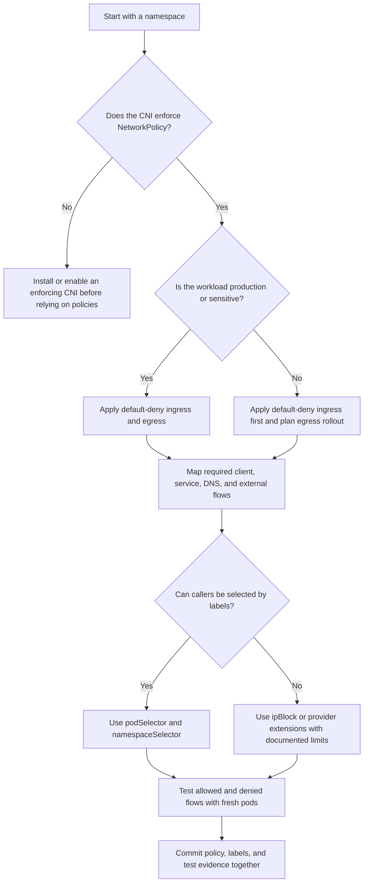

> **Складність**: `[СЕРЕДНЯ]` — базові знання
>
> **Час на проходження**: 45-60 хвилин
>
> **Передумови**: [Модуль 3.4: Безпека ServiceAccount](../module-3.4-serviceaccounts/)
>
> **Цільова версія Kubernetes**: 1.35+

Для прикладів команд у цьому модулі один раз створіть стандартний скорочений запис KubeDojo за допомогою `alias k=kubectl`, а потім використовуйте `k` для кожної команди Kubernetes, яку виконуєте. Цей alias — лише зручність оболонки, але він утримує лабораторну роботу зосередженою на поведінці мережі, а не на механіці набору тексту, і відображає швидкий командний стиль, потрібний вам під час підготовки до KCSA.

## Результати навчання

Після завершення цього модуля ви зможете виконувати ці завдання з безпеки, спираючись на докази з маніфестів, міток та живих тестів трафіку:

1. **Оцінювати** покриття мережевими політиками, щоб виявляти незахищені Pod'и, простори імен та шляхи бічного переміщення.
2. **Проєктувати** правила за замовчуванням-заборона (default-deny) та найменших привілеїв для вхідного й вихідного трафіку багаторівневих робочих навантажень.
3. **Діагностувати** невідповідності селекторів, CNI, DNS та портів, які роблять політики неефективними на вигляд.
4. **Порівнювати** комбінації політик, селектори простору імен, селектори Pod'ів та IP-блоки під час моделювання дозволеного трафіку.
5. **Впроваджувати** перевірений набір мережевих політик, який зберігає необхідні потоки застосунку, забороняючи все решта.

## Чому цей модуль важливий

У 2021 році команда внутрішньої платформи одного роздрібного продавця розслідувала злам, який почався з невеликого вебнавантаження й поширився через виклики між сервісами, яких ніхто не зобразив на архітектурній діаграмі. Першому скомпрометованому Pod'у не знадобилися права адміністратора кластера, викрадений kubeconfig чи експлойт ядра; йому знадобилася лише типова мережева поведінка Kubernetes, за якої Pod'и зазвичай можуть ініціювати трафік до будь-якого іншого Pod'а, доки мережевий плагін не забезпечить дотримання політики. Поки фахівці з реагування знайшли джерело, зловмисник уже склав карту приватних API, дістався до сервісів обробки даних, які ніколи не публікувалися через інгрес-контролер, і змусив компанію призупинити кілька внутрішніх конвеєрів, доки відновлювалися логи.

Такий інцидент болісний, бо він порушує припущення, яке багато команд носять у голові, не промовляючи його вголос: якщо Сервіс не публічний, він видається приватним. У Kubernetes Сервіс часто буває приватним лише ззовні, тоді як внутрішня частина кластера усе ще може бути пласким коридором багатоповерхівки, де кожні двері відчиняються до кожного сусіда. NetworkPolicy — це вбудований API Kubernetes для заміни цього коридору ключами від кімнат, правилами для відвідувачів та замкненими технічними шафами, але він працює лише тоді, коли CNI-плагін забезпечує його дотримання і коли команди пишуть політики, що відповідають трафіку, який вони справді мають намір дозволити.

Цей модуль навчає NetworkPolicy як операційного засобу контролю, а не просто YAML-об'єкта. Ви дізнаєтеся, як вибір створює ізоляцію, чому політики є додавальними (additive), а не впорядкованими, як поєднуються вхідний і вихідний трафік та як перевірити результат раніше, ніж погане правило стане збоєм. Мета — не запам'ятати кожне поле; мета — подивитися на простір імен і відповісти, спираючись на докази, які Pod'и можуть спілкуватися з якими призначеннями і що станеться, коли Pod буде скомпрометований.

## Основи мережевих політик

Kubernetes починає з навмисно дозвільної мережевої моделі, бо платформу розробляли так, щоб полегшити складання розподілених застосунків. Pod'и отримують маршрутизовані IP-адреси Pod'ів, Сервіси створюють стабільні віртуальні призначення, а від робочих навантажень очікують, що вони знаходитимуть одне одного за DNS-іменами, а не за вручну керованими правилами фаєрвола. Ця модель прискорює розробку, але вона також означає, що одне вразливе робоче навантаження може стати сканером, ретранслятором або точкою витоку даних, доки кластер не додасть межі навколо трафіку Pod'ів.

NetworkPolicy — це така межа на рівні API Kubernetes. Політика не приєднується безпосередньо до шляху пакета; вона вибирає Pod'и в одному просторі імен і оголошує, який вхідний, вихідний або обидва види трафіку дозволено для цих вибраних Pod'ів. Робота із забезпечення дотримання делегується провайдеру CNI, як-от Calico чи Cilium, який перекладає політику на правила площини даних. Якщо CNI ігнорує NetworkPolicy, API-сервер усе одно прийме об'єкт, але ваша межа безпеки буде уявною.

```
┌─────────────────────────────────────────────────────────────┐
│              NETWORK POLICY BASICS                          │
├─────────────────────────────────────────────────────────────┤
│                                                             │
│  DEFAULT BEHAVIOR (No policies):                           │
│  • All pods can reach all other pods                       │
│  • All pods can reach external endpoints                   │
│  • All pods accept traffic from anywhere                   │
│                                                             │
│  WITH NETWORK POLICY:                                      │
│  • Pods selected by policy have restricted traffic         │
│  • Unselected pods still have full connectivity            │
│  • Policies are additive (union of allowed traffic)        │
│                                                             │
│  KEY INSIGHT:                                              │
│  Applying ANY policy to a pod creates implicit deny        │
│  for the specified direction (ingress/egress)              │
│                                                             │
└─────────────────────────────────────────────────────────────┘
```

Ключова ідея діаграми — ізоляція через вибір. Pod, який не вибрано жодною вхідною політикою, залишається неізольованим для вхідного трафіку, тож приймає трафік, як і раніше. Pod, вибраний принаймні однією вхідною політикою, стає ізольованим для вхідного трафіку, тож до нього може дістатися лише об'єднання дозволених вхідних правил. Та сама логіка застосовується незалежно до вихідного трафіку, що означає: Pod можна заблокувати для вхідного трафіку, водночас він вільно надсилатиме вихідний трафік, або навпаки.

Ця незалежність дивує команди під час реагування на інциденти. Вхідна політика на базі даних захищає базу даних від випадкових абонентів, але вона не зупиняє скомпрометований веб-Pod від спроб вихідних з'єднань з іншими сервісами. Вихідна політика на веб-Pod'і обмежує те, що веб-Pod може ініціювати, але вона автоматично не дозволяє відповіді, доки з'єднання не було дозволене від самого початку. Хороша сегментація зазвичай потребує моделювання обох сторін: захищати чутливих отримувачів і обмежувати ризикованих відправників.

Зупиніться та спрогнозуйте: якщо в просторі імен є одна політика, яка вибирає лише Pod'и з міткою `app=backend`, що станеться з новим Pod'ом із міткою `app=debug` у тому самому просторі імен? Відповідь у тому, що Pod debug залишається необмеженим для будь-якого напряму, не вибраного політикою, і саме тому політики default-deny на рівні простору імен зазвичай є відправною точкою, а не необов'язковою деталлю посилення захисту.

Вам також варто ставитися до NetworkPolicy як до засобу контролю робочого навантаження, а не фаєрвола вузла. Політики націлюються на Pod'и, мітки, простори імен, порти та CIDR-блоки; вони не виражають кожну концепцію мережевої безпеки з традиційної інфраструктури. Трафік від процесів вузла, Pod'ів із мережею хоста (host-network) та деяких специфічних для CNI шляхів може опинятися поза поведінкою, якої ви очікуєте від правил Pod-до-Pod. Це не привід уникати політик; це привід зрозуміти їхню сферу дії та поєднувати їх із Pod Security Standards, контролем допуску й хмарними фаєрволами.

## Структура політики

У центрі об'єкта NetworkPolicy стоять три питання. Перше: які Pod'и вибирає ця політика? Друге: який напрям трафіку вона ізолює? Третє: які однорангові вузли (peers) та порти залишаються дозволеними після початку ізоляції? Якщо ви можете відповісти на ці питання, читаючи політику, ви здатні розмірковувати про більшість реальних конфігурацій, не потребуючи уявного трасувальника пакетів.

```yaml
apiVersion: networking.k8s.io/v1
kind: NetworkPolicy
metadata:
  name: example-policy
  namespace: production
spec:
  # 1. Which pods does this policy apply to?
  podSelector:
    matchLabels:
      app: backend

  # 2. What direction(s) does it control?
  policyTypes:
  - Ingress
  - Egress

  # 3. What traffic is allowed IN?
  ingress:
  - from:
    - podSelector:
        matchLabels:
          app: frontend
    ports:
    - protocol: TCP
      port: 8080

  # 4. What traffic is allowed OUT?
  egress:
  - to:
    - podSelector:
        matchLabels:
          app: database
    ports:
    - protocol: TCP
      port: 5432
```

`podSelector` у розділі `spec` завжди вибирає Pod'и, які захищають, і він обчислюється в межах простору імен, де живе політика. У прикладі лише Pod'и в просторі імен `production` із міткою `app=backend` стають ізольованими цією політикою. Pod в іншому просторі імен із тією самою міткою не вибирається цим об'єктом, бо NetworkPolicy належить простору імен навіть тоді, коли її однорангові правила можуть посилатися на інші простори імен.

Поле `policyTypes` каже Kubernetes, чи розглядати вхідний, вихідний трафік, чи обидва. Якщо ви пишете розділ `ingress`, але опускаєте `policyTypes`, Kubernetes може вивести ingress, але покладання на висновок ускладнює перегляди. У модулях, чутливих до безпеки, явний напрям — це подарунок наступному інженеру, бо він запобігає тому, щоб читач питав, чи означає відсутність вихідних правил «заборонити весь вихідний трафік», чи «ця політика не ізолює вихідний трафік».

Правила дозволу описують однорангові вузли та порти. Одноранговий вузол можна вибрати за мітками Pod'а, мітками простору імен або IP CIDR-блоками, а порт може містити протокол плюс числовий чи іменований порт. Коли правило опускає порти, воно дозволяє всі порти для зіставлених однорангових вузлів; коли воно опускає однорангові вузли з порожньою формою `from: []` чи `to: []`, значення залежить від точного розташування поля. Саме тому виробничі політики заслуговують на перегляд із відрендереними прикладами, а не лише на швидкий погляд на відступи.

```
┌─────────────────────────────────────────────────────────────┐
│              NETWORK POLICY SELECTORS                       │
├─────────────────────────────────────────────────────────────┤
│                                                             │
│  podSelector                                               │
│  • Match pods by labels                                    │
│  • Within same namespace as policy                         │
│  from:                                                     │
│  - podSelector:                                            │
│      matchLabels:                                          │
│        app: frontend                                       │
│                                                             │
│  namespaceSelector                                         │
│  • Match namespaces by labels                              │
│  • Then all pods in matching namespaces                    │
│  from:                                                     │
│  - namespaceSelector:                                      │
│      matchLabels:                                          │
│        env: production                                     │
│                                                             │
│  ipBlock                                                   │
│  • Match by CIDR range                                     │
│  • For external IPs                                        │
│  from:                                                     │
│  - ipBlock:                                                │
│      cidr: 10.0.0.0/8                                      │
│      except:                                               │
│      - 10.0.1.0/24                                         │
│                                                             │
│  COMBINED (AND logic):                                     │
│  from:                                                     │
│  - podSelector:            # Pods with app: web           │
│      matchLabels:          # AND                          │
│        app: web            # in namespaces with env: prod │
│    namespaceSelector:                                      │
│      matchLabels:                                          │
│        env: production                                     │
│                                                             │
└─────────────────────────────────────────────────────────────┘
```

Селектори — це місце, де багато переглядів політик стають успіхом або провалом. `podSelector` усередині однорангового правила без `namespaceSelector` означає Pod'и в тому самому просторі імен, що й політика. `namespaceSelector` сам по собі означає всі Pod'и у зіставлених просторах імен. Поєднані `podSelector` і `namespaceSelector` в одному елементі списку означають Pod'и, що відповідають міткам Pod'а, всередині просторів імен, що відповідають міткам простору імен. Це одне рішення про відступ перетворює правило з широкого на точне.

Перед запуском цього в реальному просторі імен — який результат ви очікуєте від `k get pods --show-labels -n production`, якщо політика має захищати лише backend-Pod'и? Якщо мітки неузгоджені, політика може бути цілком коректним YAML, водночас не вибираючи нічого корисного. Саме тому робота з мережевими політиками починається з команд інвентаризації та проєктування міток, а не з копіювання політики з вікі.

| Форма селектора | Сфера зіставлення | Типове застосування | Питання для перегляду |
|---|---|---|---|
| `podSelector` у `spec` | Цільові Pod'и у просторі імен політики | Вибір захищеного навантаження | Які Pod'и стають ізольованими? |
| Лише одноранговий `podSelector` | Однорангові Pod'и в тому самому просторі імен | Виклики сервісів однієї команди | Чи випадково не виключено абонентів з інших просторів імен? |
| Лише одноранговий `namespaceSelector` | Усі Pod'и у вибраних просторах імен | Вхідний трафік на весь простір імен від компонентів платформи | Чи не надто широке «всі Pod'и»? |
| Поєднані однорангові селектори | Зіставлені Pod'и всередині зіставлених просторів імен | Виклики між просторами імен за найменшими привілеями | Чи мітки простору імен контрольовані та стабільні? |
| `ipBlock` | CIDR-діапазони, зазвичай зовнішні адреси | Зовнішні API чи винятки для метаданих | Чи зберігає провайдер очікувану вами вихідну або цільову IP-адресу? |

Коли політика поводиться не так, як очікувалося, читайте її як набір операцій над множинами. Захищені Pod'и — одна множина, дозволені однорангові вузли — інша, а дозволені порти — третя. Kubernetes не читає вашу діаграму топології сервісів; він обчислює мітки та поля. Невелика невідповідність, така як `tier: api` на Pod'ах, але `app: api` в політиці, може перетворити ретельно спроєктовану межу на тиху прогалину.

Корисний пророблений приклад — читати політику від цілі назовні. Припустімо, `example-policy` вибирає Pod'и з міткою `app=backend` у `production`. Ці вибрані Pod'и стають ізольованими для вхідного й вихідного трафіку, бо обидва напрями перелічено в `policyTypes`. Вхідне правило дозволяє Pod'ам того самого простору імен із міткою `app=frontend` дістатися до TCP 8080, тоді як вихідне правило дозволяє Pod'и того самого простору імен із міткою `app=database` на TCP 5432 як призначення. Якщо Pod'и бази даних насправді живуть в іншому просторі імен, політика не дозволить такий вихідний трафік, навіть якщо ім'я мітки виглядає правильно.

Тепер змініть перспективу й читайте її як абонент. Frontend-Pod може мати свободу вихідного трафіку, якщо жодна вихідна політика його не вибирає, але backend усе одно потребує вхідного дозволу, перш ніж трафік пройде. Pod бази даних може приймати трафік від backend лише тоді, коли його власна вхідна політика дозволяє цей шлях, або якщо він взагалі не ізольований для вхідного трафіку. Таке двостороннє міркування запобігає поширеній помилці, коли команди оновлюють лише політику отримувача й забувають, що відправник згодом отримує базову лінію default-deny для вихідного трафіку.

Управління мітками — частина проєктування політики, бо мітки стають вхідними даними контролю доступу. Якщо будь-який розробник може перемаркувати Pod з `tier=debug` на `tier=web`, то політика, що довіряє `tier=web`, успадковує цей слабкий процес роботи з мітками. Виробничі кластери мають ставитися до значущих для безпеки міток як до контрактів інтерфейсу: документуйте їхніх власників, застосовуйте їх через шаблони Deployment і переглядайте зміни міток простору імен з тією самою обережністю, що й зміни прив'язок RBAC.

## Проєктування default-deny та найменших привілеїв

Найбезпечніша програма NetworkPolicy починається зі зміни типового стану з «усе дозволено» на «нічого не дозволено, доки хтось не зможе пояснити чому». На практиці це означає політики default-deny для вхідного й вихідного трафіку в кожному просторі імен застосунку, після яких ідуть вузькі дозвільні політики для фактичного графа трафіку. Цей шаблон суворіший, ніж той, з якого починають багато команд, але він робить площину перегляду явною та запобігає тому, щоб нові Pod'и випадково з'являлися з повним підключенням.

```yaml
# Deny all ingress in namespace
apiVersion: networking.k8s.io/v1
kind: NetworkPolicy
metadata:
  name: default-deny-ingress
  namespace: production
spec:
  podSelector: {}       # Empty = all pods
  policyTypes:
  - Ingress
  # No ingress rules = deny all ingress
```

Порожній `podSelector: {}` у `spec` не означає «не зіставляти жодного Pod'а». Він означає «зіставити всі Pod'и в цьому просторі імен», і саме тому це основа для базової лінії простору імен. Оскільки політика має `policyTypes: [Ingress]` і жодних вхідних правил, кожен вибраний Pod стає ізольованим для вхідного трафіку без жодних дозволених вхідних однорангових вузлів, окрім трафіку, який також дозволяє інша політика. Заборона спричинена не явним правилом заборони; це відсутність дозволеного вхідного трафіку після початку ізоляції.

```yaml
# Deny all egress in namespace
apiVersion: networking.k8s.io/v1
kind: NetworkPolicy
metadata:
  name: default-deny-egress
  namespace: production
spec:
  podSelector: {}
  policyTypes:
  - Egress
  # No egress rules = deny all egress
```

Default-deny для вихідного трафіку операційно руйнівніший за default-deny для вхідного, бо застосунки часто покладаються на приховані вихідні залежності. DNS, телеметрія, перевірки ліцензій, зовнішні API, репозиторії пакетів та кінцеві точки метаданих хмари — усе це може бути частиною фактичного шляху виконання. Правильна відповідь — не пропускати вихідний трафік; правильна відповідь — розгортати його зі спостереженням, тестовими Pod'ами та власниками сервісів, які можуть визначити необхідні призначення.

```yaml
# Deny all (both directions)
apiVersion: networking.k8s.io/v1
kind: NetworkPolicy
metadata:
  name: default-deny-all
  namespace: production
spec:
  podSelector: {}
  policyTypes:
  - Ingress
  - Egress
```

Єдина політика default-deny-all компактна, але окремі вхідні й вихідні політики може бути простіше впроваджувати поетапно, бо ви можете забезпечувати дотримання одного напряму, спостерігаючи за іншим. Зрілі команди часто поєднують базовий контролер або шаблон із дозвільними політиками, що належать застосунку. Команда платформи володіє інваріантом, що кожен простір імен починається закритим, тоді як команда застосунку володіє доказами того, що конкретні потоки є необхідними.

DNS — це перший виняток для вихідного трафіку, потрібний більшості команд. Імена сервісів, такі як `api.backend.svc.cluster.local`, залежать від CoreDNS чи kube-dns, і навіть застосунки, що використовують змінні середовища, часто роблять DNS-виклики через бібліотеки, сайдкари чи агенти телеметрії. Якщо ви забороняєте вихідний трафік, не дозволивши DNS, збій виглядає як зламаний застосунок, хоча політика робить саме те, що ви попросили.

```yaml
apiVersion: networking.k8s.io/v1
kind: NetworkPolicy
metadata:
  name: allow-dns
  namespace: production
spec:
  podSelector: {}
  policyTypes:
  - Egress
  egress:
  - to:
    - namespaceSelector:
        matchLabels:
          kubernetes.io/metadata.name: kube-system
      podSelector:
        matchLabels:
          k8s-app: kube-dns
    ports:
    - protocol: UDP
      port: 53
    - protocol: TCP
      port: 53
```

Приклад DNS навмисно показує і UDP, і TCP порт 53. UDP обробляє більшість запитів, але TCP може використовуватися для більших відповідей, повторних спроб чи специфічної поведінки резолвера, тож дозвіл лише UDP може створити періодичні збої, які важко відтворити. Селектор простору імен націлюється на `kube-system`, де зазвичай працює кластерний DNS, але в реальному кластері вам слід перевірити фактичний простір імен і мітки, що використовуються вашим розгортанням DNS, перед застосуванням правила.

Деяким просторам імен потрібна зона внутрішньої співпраці, де робочі навантаження можуть спілкуватися одне з одним, але не з рештою кластера. Ця модель слабкіша за найменші привілеї для кожного сервісу, проте вона все одно є суттєвим покращенням порівняно з пласким кластером, коли її застосовують для тісно керованих навантажень зі схожою чутливістю. Це також корисний міграційний крок, коли команда не готова скласти карту кожного окремого потоку з першого дня.

```yaml
apiVersion: networking.k8s.io/v1
kind: NetworkPolicy
metadata:
  name: allow-same-namespace
  namespace: production
spec:
  podSelector: {}
  policyTypes:
  - Ingress
  ingress:
  - from:
    - podSelector: {}  # Any pod in same namespace
```

Для триярусного застосунку кращою метою зазвичай є політика «сервіс-до-сервісу»: інгрес-контролер до веб, веб до API, API до бази даних, і нічого більше. Цей дизайн відповідає тому, як інженери вже говорять про систему, і дає фахівцям з реагування на інциденти короткий список очікуваних шляхів. Якщо скомпрометований веб-Pod починає сканувати порти бази даних безпосередньо, політика має зробити так, щоб цей шлях не спрацював ще до того, як розглядаються облікові дані чи авторизація на рівні застосунку.

```yaml
# Allow ingress to web tier from anywhere
apiVersion: networking.k8s.io/v1
kind: NetworkPolicy
metadata:
  name: web-ingress
  namespace: app
spec:
  podSelector:
    matchLabels:
      tier: web
  policyTypes:
  - Ingress
  ingress:
  - ports:
    - port: 443
---
# Allow web to reach API
apiVersion: networking.k8s.io/v1
kind: NetworkPolicy
metadata:
  name: api-ingress
  namespace: app
spec:
  podSelector:
    matchLabels:
      tier: api
  policyTypes:
  - Ingress
  ingress:
  - from:
    - podSelector:
        matchLabels:
          tier: web
    ports:
    - port: 8080
---
# Allow API to reach database
apiVersion: networking.k8s.io/v1
kind: NetworkPolicy
metadata:
  name: db-ingress
  namespace: app
spec:
  podSelector:
    matchLabels:
      tier: database
  policyTypes:
  - Ingress
  ingress:
  - from:
    - podSelector:
        matchLabels:
          tier: api
    ports:
    - port: 5432
```

Цей приклад дозволяє вхідний трафік до веб звідусіль, бо він представляє публічно орієнтований ярус, але багато кластерів мають замінити цей широкий одноранговий вузол на селектор простору імен інгрес-контролера. Фраза «звідусіль» може означати інтернет, мережу вузла чи мережу Pod'ів залежно від CNI та шляху трафіку, тож не ставтеся до неї як до нешкідливого скорочення. Безпечніша звичка — описати реального абонента й закодувати цього абонента мітками щоразу, коли площина даних це уможливлює.

Поширений шаблон розгортання — спершу застосувати політику default-deny у тестовому (staging) просторі імен. Часто це одразу виявляє, що ярус API робить вихідні виклики до застарілого збирача метрик під час запуску. Залежності немає на архітектурній діаграмі, але невдале з'єднання створює конкретне рішення: або задокументувати й дозволити її, або прибрати, або тримати простір імен відкритим назавжди. NetworkPolicy корисна почасти тому, що змушує ці приховані залежності вийти на світло.

Default deny також змінює те, як ви проєктуєте конвеєри розгортання. Новий сервіс не має постачатися з політикою, доданою на кілька днів пізніше, коли хтось згадає про сегментацію; політика — частина інтерфейсу сервісу. Переглядайте мітки Deployment, селектори Service, селектори NetworkPolicy та димові тести разом в одному pull request. Якщо застосунок не може запуститися під політикою, це не лише проблема мережевої команди, бо застосунок має недокументовану залежність.

Для просторів імен зі спадщиною (brownfield) уникайте раптового дня примусового впровадження. Почніть з інвентаризації Сервісів, міток Pod'ів, міток просторів імен та спостережених з'єднань з логів чи записів потоків CNI, якщо ваша платформа їх надає. Складіть проєкти політик на основі цих доказів, потім протестуйте в staging чи на підмножині навантажень, перш ніж застосовувати обмеження вихідного трафіку на весь простір імен. Таке поетапне розгортання повільніше за вкидання default-deny одразу, але воно зменшує ризик того, що покращення безпеки стане інцидентом доступності.

Найменші привілеї не означають, що кожна політика має бути крихітною й нечитабельною. Політика, яка чітко дозволяє `web` викликати `api` на одному порту, краща за десять мікрополітик з перекривними селекторами, у яких ніхто не може розібратися. Надавайте перевагу іменам, які описують намір, таким як `allow-web-to-api`, і тримайте коментарі зосередженими на тому, чому потік існує. Рецензент має бути здатним пов'язати ім'я політики, мітки та архітектуру застосунку, не відкриваючи п'ять не пов'язаних дашбордів.

Кінцевий стан міграції — простір імен, де кожне робоче навантаження має очікуваний контракт трафіку. Веб-Pod'и приймають вхідний трафік від інгрес-контролера, викликають API та розв'язують DNS; API-Pod'и приймають веб-виклики, викликають базу даних та розв'язують DNS; Pod'и бази даних приймають виклики API й не ініціюють довільного вихідного трафіку. Цей контракт достатньо малий, щоб його протестувати, а малі контракти — це те, що робить сегментацію надійною під час інциденту.

## Деталі поведінки політик

Правила NetworkPolicy є додавальними, а не впорядкованими. Тут немає обробки за принципом «перший збіг», як у традиційному ланцюжку фаєрвола, і немає явного правила заборони в upstream-API NetworkPolicy. Якщо кілька політик вибирають той самий Pod для того самого напряму, дозволений трафік — це об'єднання всіх зіставлених дозвільних правил. Це потужно для спільного володіння, бо команда платформи може володіти однією політикою, а команда застосунку — іншою, але це також означає, що ви не можете використати пізнішу політику, щоб перевизначити ранній широкий дозвіл.

```
┌─────────────────────────────────────────────────────────────┐
│              POLICY COMBINATION                             │
├─────────────────────────────────────────────────────────────┤
│                                                             │
│  SCENARIO: Two policies select the same pod                │
│                                                             │
│  Policy A allows:    Policy B allows:                      │
│  - from: app=web     - from: app=api                       │
│  - port: 80          - port: 8080                          │
│                                                             │
│  RESULT: Union of both                                     │
│  - from: app=web on port 80      ✓ Allowed                │
│  - from: app=api on port 8080    ✓ Allowed                │
│  - from: app=web on port 8080    ✗ Denied                 │
│  - from: app=other               ✗ Denied                 │
│                                                             │
│  Policies are OR'd together (additive)                     │
│  Within a policy, from/to elements are OR'd               │
│  Within a from/to element, selectors are AND'd            │
│                                                             │
└─────────────────────────────────────────────────────────────┘
```

Поведінка об'єднання пояснює, чому перегляди політик мають дивитися на всі політики, які вибирають Pod, а не лише на найновішу в pull request. Вузька нова політика може бути технічно коректною, тоді як старіша широка політика вже дозволяє тому самому Pod'у отримувати трафік з цілого простору імен. Діагностуючи несподіваний дозвіл, виконайте `k get netpol -n <namespace>` та перевірте кожну політику, чий `spec.podSelector` зіставляється з мітками цільового Pod'а.

```yaml
# OR: Traffic from EITHER app=web OR app=api
ingress:
- from:
  - podSelector:
      matchLabels:
        app: web
  - podSelector:            # Separate list item = OR
      matchLabels:
        app: api

# AND: Traffic from pods that are BOTH in production namespace
#      AND have label app=web
ingress:
- from:
  - podSelector:            # Same list item = AND
      matchLabels:
        app: web
    namespaceSelector:
      matchLabels:
        env: production
```

Правило OR проти AND — одна з найважливіших деталей у цьому модулі. Окремі однорангові вузли у списку `from` чи `to` є альтернативами, тож трафік, що відповідає будь-якому одному з них, дозволено. `podSelector` і `namespaceSelector` усередині того самого однорангового елемента поєднуються, тож обидва мають збігтися. Це не очевидно лише з відступів, особливо коли рецензент проглядає довгий YAML-файл під тиском.

Зупиніться та спрогнозуйте: дві мережеві політики обидві вибирають той самий Pod. Політика A дозволяє вхідний трафік від `app: frontend` на порту 80, а Політика B дозволяє вхідний трафік від `app: monitoring` на порту 9090; чи може `frontend`-Pod дістатися до цього Pod'а на порту 9090? Не може, бо об'єднання застосовується до повних дозволених комбінацій правил, а не до кожного джерела й кожного порту як до незалежних кошиків, які можна вільно змішувати.

З'єднання також мають стан у базовій площині даних, навіть попри те, що NetworkPolicy описано декларативно. Коли ви застосовуєте нову політику default-deny, наявні TCP-з'єднання можуть залишатися живими ще короткий час залежно від реалізації CNI та відстеження з'єднань. Для перевірки безпеки тестуйте нові з'єднання зі свіжих клієнтських Pod'ів і не робіть висновку, що політика зазнала невдачі лише тому, що наявний потік ще короткий проміжок часу зберігся.

| Поведінка | Що це означає | Операційний наслідок |
|---|---|---|
| Політики є додавальними | Дозволений трафік — об'єднання зіставлених політик | Широкі застарілі дозволи можуть приховати ефект вузьких нових політик |
| Немає явної заборони | Ізоляція забороняє все, що не дозволено | Ви прибираєте доступ, прибираючи чи звужуючи дозволи |
| Напрям незалежний | Ізоляція вхідного й вихідного трафіку — окремі речі | Захист отримувача не обмежує поведінку відправника |
| Селектори базуються на мітках | Поточні мітки визначають збіги | Перемаркування Pod'а чи простору імен може миттєво змінити доступ |
| Примус CNI різниться | Прийняття об'єкта в API не є доказом примусу | Тестуйте площину даних, а не лише створення об'єкта |

Така поведінка сприяє стилю перегляду, що базується на питаннях, а не на надії. Які політики вибирають цей цільовий Pod? Який напрям має ізоляцію? Які однорангові вузли дозволяє об'єднання? Які мітки можуть змінити відповідь? Якщо рецензент не може відповісти на ці питання з маніфестів і виводу тестів, набір політик не готовий до виробничого примусу.

Один практичний прийом перегляду — побудувати невелику таблицю істинності для цільового Pod'а. Помістіть кожного очікуваного абонента ліворуч, кожен важливий порт згори, і позначте, чи має потік бути дозволеним або забороненим. Потім порівняйте таблицю з усіма політиками, що вибирають ціль. Це виловлює випадкове змішування джерел і портів, особливо коли дві політики вибирають ті самі Pod'и з різних операційних причин, як-от трафік застосунку та моніторинг.

Інший прийом — шукати селектори, ширші за свої імена. Політика з ім'ям `allow-prometheus` не має вибирати кожен Pod у просторі імен `monitoring`, доки це не є справжнім контрактом. Політика з ім'ям `allow-frontend` не має покладатися лише на селектор простору імен, якщо лише один frontend-Deployment повинен викликати API. Імена не примусово застосовуються Kubernetes, але невідповідності між іменами та селекторами — чудові сигнали для перегляду.

## Контроль вихідного трафіку

Вхідну політику часто легше «продати», бо вона захищає важливі сервіси від небажаних абонентів. Вихідна політика складніша, бо вона обмежує те, що застосунок може ініціювати, а власники застосунку можуть не знати кожної вихідної залежності. Команди безпеки все одно потребують контролю вихідного трафіку, бо скомпрометовані навантаження зазвичай намагаються сканувати сусідів, дістатися до сервісів метаданих хмари, викликати кінцеві точки командного керування або витягувати дані через дозволені інтернет-шляхи.

```
┌─────────────────────────────────────────────────────────────┐
│              EGRESS POLICY CONSIDERATIONS                   │
├─────────────────────────────────────────────────────────────┤
│                                                             │
│  WHY CONTROL EGRESS:                                       │
│  • Prevent data exfiltration                               │
│  • Limit lateral movement                                  │
│  • Compliance requirements                                 │
│  • Reduce attack surface                                   │
│                                                             │
│  WHAT TO ALLOW:                                            │
│  • DNS (almost always required)                            │
│  • Required backend services                               │
│  • External APIs (specific IPs if possible)                │
│  • Monitoring endpoints                                    │
│                                                             │
│  CHALLENGES:                                               │
│  • Dynamic IPs of external services                        │
│  • Cloud metadata endpoints (169.254.169.254)              │
│  • Cluster services (kube-system)                          │
│                                                             │
│  TIP: Start with audit/monitoring, then enforce            │
│                                                             │
└─────────────────────────────────────────────────────────────┘
```

Найчутливіше призначення вихідного трафіку в багатьох хмарних кластерах — це сервіс метаданих інстансу. Робочі навантаження, які можуть дістатися до кінцевих точок метаданих, можуть бути здатними отримати облікові дані чи документи ідентичності залежно від хмарного провайдера, конфігурації вузла та налаштування ідентичності навантаження. Сучасні хмарні платформи надають засоби пом'якшення, але мережева політика все одно може додати корисний рівень, блокуючи link-local адресу метаданих для Pod'ів, яким немає підстав її викликати.

```yaml
# Block access to cloud metadata service
apiVersion: networking.k8s.io/v1
kind: NetworkPolicy
metadata:
  name: block-metadata
  namespace: production
spec:
  podSelector: {}
  policyTypes:
  - Egress
  egress:
  - to:
    - ipBlock:
        cidr: 0.0.0.0/0
        except:
        - 169.254.169.254/32  # AWS/GCP metadata
```

Читайте політику метаданих уважно: вона дозволяє вихідний трафік до всіх IPv4-призначень, окрім IP метаданих. Це не позиція default-deny, і її не слід подавати як таку. Це націлене пом'якшення для одного небезпечного призначення, корисне, коли команда не готова до повного білого списку вихідного трафіку, але воно все одно дозволяє широку вихідну комунікацію. У просторах імен з високим рівнем гарантій надавайте перевагу default-deny для вихідного трафіку плюс явним правилам для DNS, сервісів та зовнішніх API.

Зовнішні API створюють ще одне ускладнення, бо NetworkPolicy Kubernetes працює з IP-блоками, а не з доменними іменами. Якщо застосунок викликає кінцеву точку постачальника, чиї IP часто змінюються, статичне правило `ipBlock` може бути крихким. Деякі CNI пропонують розширені можливості політик для DNS-обізнаного вихідного трафіку чи повністю кваліфікованих доменних імен, але це специфічні для провайдера розширення, а не портабельна NetworkPolicy Kubernetes. Навичка рівня KCSA — розпізнати обмеження й задокументувати, коли використовується можливість постачальника.

Який підхід ви обрали б тут і чому: дозволити весь інтернет-вихід, окрім метаданих, для застарілого простору імен, чи заблокувати весь вихідний трафік і додати лише три відомі вихідні сервіси? Для виробничого платіжного навантаження другий підхід зазвичай вартий операційних зусиль, бо він різко обмежує шляхи витоку. Для тимчасового міграційного простору імен із неповними картами залежностей перший підхід може бути поетапним покращенням, але він має супроводжуватися дедлайном і планом моніторингу.

Не забувайте про відповіді. Реалізації NetworkPolicy зазвичай мають стан (stateful) для дозволених з'єднань, тож якщо Pod'у дозволено ініціювати TCP-з'єднання до API, зворотні пакети для цього з'єднання обробляються площиною даних. Зазвичай вам не потрібне окреме вхідне правило на клієнтському Pod'і для відповіді. Однак вам потрібно, щоб вхідна політика сервера дозволяла клієнта, а вихідна політика клієнта дозволяла сервер, бо обидві кінцеві точки можуть бути ізольованими незалежно.

Вихідна політика також потребує меж володіння. Команди застосунків зазвичай можуть назвати сервіси, які вони викликають, але команди платформи часто володіють DNS, телеметрією, видачею сертифікатів та шляхами завантаження образів. Якщо ці платформні залежності представлено неузгоджено в різних просторах імен, кожна команда застосунку винайде трохи іншу політику, і одна з них пропустить необхідний потік. Багаторазова базова лінія для DNS та санкціонованих платформних кінцевих точок утримує політики застосунків зосередженими на специфічному для застосунку трафіку.

Коли робоче навантаження викликає публічний інтернет, вимагайте причину, точнішу за «застосунку потрібен вихідний доступ». Він викликає платіжного провайдера, сервіс ідентичності, репозиторій пакетів чи внутрішній API, опублікований через публічну адресу? Кожна відповідь має різні режими збою та різні альтернативи. Приватне підключення, шлюзи вихідного трафіку сервісної мережі (service mesh), специфічна для CNI доменна політика чи явний виняток `ipBlock` — усе це може бути розумним, але їх слід обирати свідомо, а не ховати за дозволом усього вихідного трафіку.

## Усунення несправностей та перевірка

Усунення несправностей NetworkPolicy потребує іншого ритму, ніж налагодження виключення застосунку. Об'єкт API може бути валідним, тоді як площина даних ігнорує його; селектор може бути валідним, тоді як зіставляє не ті Pod'и; а правило може бути коректним, тоді як DNS чи старіший широкий дозвіл змінює результат. Хороше розслідування починається з рівня примусу, потім звужується до вибору, напряму, однорангових вузлів, портів та живих тестів з'єднань.

```
┌─────────────────────────────────────────────────────────────┐
│              TROUBLESHOOTING CHECKLIST                      │
├─────────────────────────────────────────────────────────────┤
│                                                             │
│  1. CNI SUPPORTS NETWORK POLICIES?                         │
│     • Flannel: NO (basic networking only)                  │
│     • Calico: YES                                          │
│     • Cilium: YES                                          │
│     • Weave: YES                                           │
│                                                             │
│  2. POLICY SELECTS THE POD?                                │
│     kubectl get netpol -n <ns>                             │
│     kubectl describe netpol <name> -n <ns>                 │
│                                                             │
│  3. POD LABELS MATCH?                                      │
│     kubectl get pod --show-labels                          │
│                                                             │
│  4. NAMESPACE LABELS MATCH? (if using namespaceSelector)   │
│     kubectl get ns --show-labels                           │
│                                                             │
│  5. CORRECT PORTS?                                         │
│     Check port numbers and protocols                       │
│                                                             │
│  6. EGRESS INCLUDES DNS?                                   │
│     Most common egress issue                               │
│                                                             │
└─────────────────────────────────────────────────────────────┘
```

Почніть з доведення того, що CNI підтримує примус політик. У керованому кластері читайте документацію провайдера та перевірте встановлені компоненти CNI; у локальній лабораторії знайте, що деякі прості мережеві плагіни не забезпечують дотримання NetworkPolicy. Якщо примусу немає, `k apply -f policy.yaml` може спрацювати, тоді як трафік залишається відкритим. Цей режим збою небезпечний, бо дає командам комфорт об'єкта безпеки без ефекту засобу контролю безпеки.

Далі перевірте мітки з обох боків з'єднання. Для цілі використовуйте `k get pod -n <namespace> --show-labels` і порівняйте вивід з кожним `spec.podSelector` у цьому просторі імен. Для однорангових вузлів з інших просторів імен використовуйте `k get ns --show-labels` і підтвердьте, що мітки простору імен існують, перш ніж покладатися на `namespaceSelector`. Мітками просторів імен часто керують менш ретельно, ніж мітками Pod'ів, тож відсутня мітка `name=backend` може зробити так, що точне правило тихо не спрацює.

Потім тестуйте за допомогою одноразових клієнтських Pod'ів та явних портів. Команда на кшталт `k run netshoot -n frontend --rm -it --image=nicolaka/netshoot --restart=Never -- curl -m 3 http://api.backend.svc.cluster.local:8080/health` дає вам свіжу спробу з'єднання через той самий шлях DNS і Service, що його використовує застосунок. Для перевірок DNS вихідного трафіку тестуйте і розв'язання імен, і пряме IP-з'єднання, коли це можливо; різниця підказує вам, чи DNS є зламаною залежністю, чи самий шлях сервісу заборонено.

Будьте обережні із Сервісами під час усунення несправностей. NetworkPolicy вибирає Pod'и, тоді як клієнти часто під'єднуються до імен Сервісів, що балансують навантаження на вибрані Pod'и. Якщо селектор Сервісу вказує на Pod'и з мітками, що відрізняються від ваших припущень щодо політики, ви можете тестувати не той backend. Найнадійніший перегляд порівнює мітки Deployment, мітки шаблону Pod'а, селектори Service та селектори NetworkPolicy за один прохід.

Нарешті, ставтеся до перевірки політики як до доказу, який можна зберегти. Зафіксуйте маніфести політик, відповідні мітки та коротку таблицю очікуваних дозволених і заборонених потоків. Це перетворює «ми думаємо, що це працює» на придатний для перегляду артефакт і дає майбутнім фахівцям з реагування базову лінію для дивного трафіку. У регульованих середовищах ці докази часто такі ж важливі, як і сам YAML, бо вони демонструють, що сегментацію протестовано, а не просто оголошено.

Існує тонка різниця між «заборонено політикою» та «не вдалося з якоїсь іншої причини». Тайм-аут curl може означати, що вихідний трафік заблоковано, вхідний трафік заблоковано, у Сервісу немає кінцевих точок (endpoints), порт неправильний, DNS дав збій чи застосунок не слухає. Хороша перевірка використовує парні тести: пряма IP-адреса й DNS-ім'я, дозволене джерело й заборонене джерело, очікуваний порт і близький заблокований порт. Парні тести роблять висновок сильнішим, бо вони ізолюють рішення політики від не пов'язаного збою застосунку.

Для налагодження надавайте перевагу тимчасовим Pod'ам із зрозумілими образами, а не зміні виробничих навантажень. Короткоживучий Pod з мережевим набором інструментів дає вам curl, dig, nc та інспекцію маршрутів, не змінюючи контейнер застосунку й не надаючи йому інструментів, яких він не повинен носити у виробництві. Видаліть Pod після тестування й запишіть вивід команди в перегляд. Це зберігає перевірку відтворюваною, водночас уникаючи поганої звички вбудовувати діагностичні пакети у виробничі образи.

Якщо політика видається неефективною, не звинувачуйте одразу Kubernetes. Спершу підтвердьте, що цільовий Pod вибрано, потім підтвердьте, що напрям ізольовано, далі пошукайте інший додавальний дозвіл, і лише потім досліджуйте примус CNI. Цей порядок утримує розслідування зосередженим на найпоширеніших помилках. Він також дає вам корисні докази для тікета платформи, якщо ви зрештою виявите, що примусу немає чи задіяна специфічна для провайдера поведінка.

## Шаблони та антишаблони

Хороші програми мережевих політик будуються з повторюваних шаблонів. Деталі різняться між просторами імен, але форма надійного розгортання послідовна: ізолювати за замовчуванням, дозволяти названі потоки, тестувати з обох сторін і тримати мітки достатньо стабільними, щоб політика залишалася правдивою після повторного розгортання. Антишаблони зазвичай постають через ставлення до NetworkPolicy як до одноразового YAML-завдання, а не як до моделі доступу, що має розвиватися разом із застосунком.

| Шаблон | Коли використовувати | Чому він працює | Міркування щодо масштабування |
|---|---|---|---|
| Базова лінія default-deny простору імен | Кожен простір імен застосунку, що запускає навантаження | Нові Pod'и не з'являються з необмеженим вхідним чи вихідним трафіком | Автоматизуйте її шаблонами простору імен чи політикою допуску, щоб команди не могли забути |
| Дозвільні політики на основі ярусів | Веб, API, worker та сервіси баз даних із чіткими ролями | Правила відповідають ментальній моделі, яку інженери використовують під час інцидентів | Тримайте мітки нудними й стабільними, такими як `app`, `tier` та `component` |
| Мітки між просторами імен | Спільні платформні сервіси, інгрес-контролери та контрольовані залежності | Мітки простору імен роблять межі володіння явними | Захищайте права маркування простору імен, бо мітки стають рішеннями про доступ |
| Тестова матриця перед примусом | Будь-який простір імен із виробничим трафіком | Очікувані дозволені й заборонені потоки перевіряються перед розгортанням | Зберігайте матрицю поруч із маніфестами, щоб майбутні перегляди могли її повторити |

| Антишаблон | Що йде не так | Краща альтернатива |
|---|---|---|
| Покладання лише на вхідні політики | Скомпрометовані Pod'и все одно можуть сканувати та викликати вихідні сервіси | Додайте вихідні політики для чутливих навантажень та просторів імен високого ризику |
| Постійне використання широких селекторів простору імен | Будь-який Pod у вибраному просторі імен стає довіреним абонентом | Поєднуйте селектори простору імен та Pod'ів для конкретного доступу між просторами імен |
| Ставлення до `ipBlock` як до доменного білого списку | Зміна IP постачальника ламає трафік чи змушує до надто широких CIDR | Використовуйте стабільні приватні кінцеві точки, специфічні для провайдера можливості DNS-політики чи задокументовані винятки |
| Застосування політик без тестів трафіку | Валідний YAML усе одно може вибирати не ті Pod'и чи опускати DNS | Тестуйте очікувані шляхи зі свіжими клієнтськими Pod'ами й фіксуйте результати |

Найкорисніший шаблон — не конкретний YAML-фрагмент; це звичка записувати контракт трафіку. Для кожного навантаження занотовуйте, хто може його викликати, який порт вони використовують, які вихідні сервіси йому потрібні та які тести доводять правило. Коли цей контракт змінюється, політика змінюється разом із ним. Це утримує NetworkPolicy від перетворення на застарілу декорацію безпеки, якій ніхто не довіряє.

Найшкідливіший антишаблон — широкий дозвіл, про який ніхто не пам'ятає. Оскільки політики є додавальними, одна стара «тимчасова» політика може тихо тримати доступ відкритим, доки нові вузькі політики проходять перегляд. Періодично шукайте політики з порожніми списками однорангових вузлів, селекторами «всі простори імен» та великими CIDR-діапазонами, а потім вимагайте від власників обґрунтування. Перегляд політик, який ігнорує старі дозволи, переглядає лише частину графа доступу.

## Структура прийняття рішень

Вибір дизайну NetworkPolicy починається з ризику простору імен, ясності графа трафіку та операційної терпимості до помилок. Низькоризиковий простір імен для розробки може починатися з default-deny для вхідного трафіку та дозволу того самого простору імен, поки команда вчиться. Виробничий простір імен, що обробляє дані клієнтів, має рухатися до default-deny в обох напрямах та явних правил «сервіс-до-сервісу». Рішення полягає не в тому, чи має значення безпека; воно полягає в тому, наскільки точність ви здатні підтримати надійними мітками, тестами та володінням.



| Ситуація | Рекомендований дизайн | Компроміс |
|---|---|---|
| Новий виробничий простір імен | Default-deny всього плюс явні правила DNS та сервісів | Більше попередньої роботи, набагато чіткіший контроль радіуса ураження |
| Застарілий простір імен з невідомим вихідним трафіком | Default-deny для вхідного, спостерігайте за вихідним, потім впроваджуйте поетапно вихідний | Повільніше покращення безпеки, нижчий ризик збою |
| Спільний платформний інгрес-контролер | Селектори простору імен та Pod'ів для трафіку контролер-до-веб | Потребує стабільних міток на платформних просторах імен та Pod'ах |
| Зовнішній API постачальника | Приватна кінцева точка чи задокументований виняток `ipBlock` | Портабельна політика обмежена, коли цільові IP змінюються |
| Аварійне стримування інциденту | Вузька вихідна політика на репліках скомпрометованого навантаження | Швидке зменшення вихідних шляхів, але треба уникнути зламу криміналістичного доступу |

Використовуйте вхідні політики, коли головна турбота — захистити отримувача, такого як база даних чи внутрішній API. Використовуйте вихідні політики, коли головна турбота — обмежити відправника, такого як вебнавантаження, відкрите для недовіреного вводу. Використовуйте обидві, коли простір імен містить чутливі дані, навантаження, орієнтовані на інтернет, чи будь-який сервіс, який був би корисним під час бічного переміщення. Якщо ви можете реалізувати лише один напрям сьогодні, явно задокументуйте залишковий ризик, а не вдавайте, що простір імен сегментовано.

Сильний дизайн також називає не-цілі (non-goals). NetworkPolicy не замінює автентифікацію, авторизацію, TLS, керування секретами, сканування образів, виявлення під час виконання чи хмарні фаєрволи. Вона зменшує набір мережевих шляхів, доступних після того, як щось пішло не так. Це зменшення має значення, бо зловмисники зчіплюють малі дозволи разом, а прибирання непотрібних шляхів робить кожен наступний крок складнішим.

Структуру легше застосовувати, коли ви прив'язуєте кожен вибір політики до історії збою. Якщо зловмисник контролює вебпод, вихідна політика вирішує, чи може цей Pod зондувати базу даних напряму, дістатися до сервісу метаданих чи викликати довільні інтернет-призначення. Якщо розробник випадково розгортає debug-Pod, default-deny вирішує, чи з'являється він із повною досяжністю простору імен. Якщо мітка простору імен змінюється, політика між просторами імен вирішує, чи розширюється довіра, чи звужується. Кожне питання перетворює абстрактну сегментацію на конкретний операційний результат.

Для підготовки до KCSA практикуйте пояснення компромісів уголос. «Використовуйте default-deny для вхідного трафіку, бо отримувачі не повинні приймати невідомих абонентів» — сильніша відповідь, ніж «це найкраща практика». «Використовуйте білий список вихідного трафіку для чутливих навантажень, бо скомпрометованим відправникам потрібні вихідні обмеження» — сильніша за «вихідний трафік безпечніший». Сертифікаційні сценарії часто винагороджують інженера, який може пов'язати засіб контролю з ризиком, який він зменшує, а реальні інциденти вимагають того самого міркування під тиском часу.

## Чи знали ви?

- **Мережеві політики не застосовуються чисто до Pod'ів із мережею хоста** — Pod'и з `hostNetwork: true` використовують мережевий простір імен вузла, що може обходити припущення про мережу Pod'ів, які лежать в основі примусу політик.
- **Порожній `podSelector: {}` означає всі Pod'и у просторі імен політики** — це точний механізм, який використовують політики default-deny, а не заповнювач для подальшого редагування.
- **Політики належать простору імен, але можуть посилатися на інші простори імен** — політика живе в одному просторі імен і вибирає там цільові Pod'и, тоді як однорангові правила можуть використовувати мітки простору імен для опису дозволених абонентів чи призначень.
- **Порядок політик не має значення** — NetworkPolicy Kubernetes є додавальною, тож час створення та порядок маніфестів не створюють пріоритету чи поведінки перевизначення.

## Типові помилки

| Помилка | Чому вона трапляється | Як її виправити |
|---|---|---|
| Забування DNS у вихідному трафіку | Команди перелічують сервіси застосунку, але забувають, що імена сервісів потребують трафіку резолвера перед початком з'єднань. | Додайте вихідний трафік UDP та TCP порт 53 до фактичних DNS-Pod'ів і перевірте свіжим клієнтським Pod'ом. |
| Припущення, що CNI забезпечує примус політик | API-сервер приймає об'єкти NetworkPolicy навіть тоді, коли встановлений мережевий плагін їх ігнорує. | Підтвердьте можливість CNI з документації провайдера й доведіть примус тестом дозволеного й забороненого трафіку. |
| Відсутні мітки простору імен | Правила між просторами імен залежать від міток, яких багато команд ніколи не застосовують і не захищають. | Маркуйте простори імен свідомо, обмежте, хто може змінювати ці мітки, та включіть `k get ns --show-labels` у перегляди. |
| Плутання селекторів AND та OR | Окремі елементи списку однорангових вузлів візуально схожі на поєднані селектори у YAML. | Помістіть `podSelector` та `namespaceSelector` в той самий одноранговий елемент, коли обидва мають збігтися. |
| Пропуск default deny | Команди пишуть дозвільні політики для відомих сервісів, але залишають невибрані Pod'и необмеженими. | Починайте кожен простір імен з default-deny для вхідного трафіку та запланованої ізоляції вихідного, потім додавайте вузькі дозволи. |
| Постійний дозвіл цілих просторів імен | Швидше довіряти простору імен, ніж визначати точні Pod'и, яким потрібен доступ. | Поєднуйте селектори простору імен та Pod'ів і періодично переглядайте широкі дозволи на застарілі винятки. |
| Тестування лише наявних з'єднань | Відстеження з'єднань може ще короткий час тримати старі сесії живими після зміни політики. | Тестуйте нові з'єднання зі свіжих Pod'ів і фіксуйте як успішні, так і заборонені спроби. |

## Тест

<details>
<summary>Ваша команда розгортає політику default-deny для вхідного трафіку в `production`, але frontend усе ще може дістатися до backend. Що ви перевіряєте першим і чому?</summary>

Почніть з перевірки, чи CNI-плагін взагалі забезпечує примус NetworkPolicy, бо API-сервер може зберегти політику навіть тоді, коли площина даних її ігнорує. Потім переконайтеся, що політика default-deny використовує `podSelector: {}` у правильному просторі імен і що жодна старіша політика також не вибирає backend з широким дозволом. Нарешті, тестуйте новим з'єднанням зі свіжого Pod'а, а не покладаючись на наявну TCP-сесію, бо відстеження з'єднань може ненадовго зберегти старий потік живим.

</details>

<details>
<summary>Розробник хоче дозволити лише Pod'и `app=web` з просторів імен із міткою `env=production`, але їхня політика дозволяє набагато більше абонентів. Що, ймовірно, сталося?</summary>

Вони, ймовірно, помістили `podSelector` та `namespaceSelector` як окремі елементи списку однорангових вузлів, що робить правило OR. Це дозволяє або Pod'и того самого простору імен, що відповідають `app=web`, або всі Pod'и в просторах імен із міткою `env=production`, залежно від точного простору імен політики. Виправлення — помістити обидва селектори в той самий одноранговий елемент, щоб і Pod-джерело, і простір імен-джерело мали збігтися.

</details>

<details>
<summary>Після ввімкнення вихідних політик застосунки можуть під'єднуватися до буквальних IP-адрес, але зазнають невдачі при використанні імен сервісів. Про що це вам каже?</summary>

Цей патерн сильно вказує на відсутній вихідний DNS. Шлях застосунку не обов'язково заблоковано; резолвер не може перекласти імена перед початком з'єднання. Дозвольте UDP та TCP порт 53 до DNS-Pod'ів кластера, підтвердьте простір імен та мітки DNS, а потім повторно протестуйте і розв'язання імен, і початковий виклик сервісу зі свіжого Pod'а.

</details>

<details>
<summary>Pod із `hostNetwork: true` з'являється у просторі імен зі суворими політиками default-deny. Як вам оцінити ризик?</summary>

Ставтеся до нього як до винятку сегментації, бо Pod'и з мережею хоста використовують мережевий простір імен вузла, а не звичайний шлях мережі Pod'ів. NetworkPolicy може не обмежувати цей Pod так, як вона обмежує звичайні Pod'и, тож він може підірвати припущення про бічне переміщення. Перегляньте, навіщо потрібна мережа хоста, чи мають Pod Security Standards її блокувати та які засоби контролю рівня вузла чи рівня хмари покривають цю прогалину.

</details>

<details>
<summary>Аудитор каже, що п'ятнадцять просторів імен без політик усе одно можуть бути ризиком для кластера, навіть якщо чутливі застосунки живуть деінде. Чи має він рацію?</summary>

Так, бо незахищені простори імен можуть слугувати плацдармами для сканування, виявлення та вихідного трафіку під час бічного переміщення. Вхідні політики на чутливих просторах імен допомагають, але вони не усувають ризик, створений необмеженими відправниками деінде. Захищувана позиція застосовує принаймні базову лінію default-deny широко, потім надає конкретні потоки відповідно до потреби навантаження.

</details>

<details>
<summary>Ви додаєте вузьку вхідну політику API, але трафік із несподіваного простору імен моніторингу все ще дозволено. Що пояснює цей результат?</summary>

Інша політика, ймовірно, вибирає ті самі API-Pod'и й дозволяє простір імен моніторингу, бо дозволи NetworkPolicy є додавальними. Нова вузька політика не може перевизначити старішу широку політику, і в upstream-API немає порядку пріоритету. Перелічіть кожну політику у просторі імен, порівняйте кожен `spec.podSelector` із мітками API-Pod'а та приберіть чи звузьте застарілий дозвіл.

</details>

<details>
<summary>Команда пропонує `ipBlock: 0.0.0.0/0` для вихідного трафіку, бо їхній API постачальника змінює адреси. Як ви відреагуєте?</summary>

Це правило фактично є широким інтернет-виходом, і до нього слід ставитися як до тимчасового винятку, а не найменших привілеїв. NetworkPolicy Kubernetes не надає портабельного білого списку за доменними іменами, тож команда має або використати стабільне приватне підключення, специфічну для CNI DNS-обізнану можливість, або задокументований діапазон `ipBlock` з моніторингом та переглядом. Важливе міркування — зробити залишковий шлях витоку видимим, а не ховати його за фразою «залежність постачальника».

</details>

## Практична вправа: проєктування мережевих політик

У цій лабораторній роботі ви спроєктуєте та перевірите політики для невеликого застосунку в кількох просторах імен. Архітектуру навмисно зроблено простою, щоб ви могли зосередитися на моделі доступу: публічний трафік дістається до веб-ярусу, веб-ярус викликає API, API викликає базу даних, а кожен інший шлях має зазнавати невдачі. Використовуйте одноразовий кластер чи набір просторів імен, виконайте `alias k=kubectl` перед командами та тримайте маніфести в тимчасовому робочому каталозі.

**Сценарій**: спроєктуйте мережеві політики для наведеної нижче архітектури, де стрілки — це єдині передбачувані шляхи даних застосунку, а кожен інший шлях Pod-до-Pod має бути забороненим після застосування набору політик.

```
┌─────────────────────────────────────────────────────────────┐
│  namespace: frontend                                        │
│  ┌─────────┐                                               │
│  │   web   │ ← External traffic (ingress controller)       │
│  │  :443   │                                               │
│  └────┬────┘                                               │
└───────┼─────────────────────────────────────────────────────┘
        │
        ▼
┌─────────────────────────────────────────────────────────────┐
│  namespace: backend                                         │
│  ┌─────────┐     ┌─────────┐                               │
│  │   api   │────→│   db    │                               │
│  │  :8080  │     │  :5432  │                               │
│  └─────────┘     └─────────┘                               │
└─────────────────────────────────────────────────────────────┘
```

Вимоги навмисно суворі, щоб ви могли попрактикуватися перетворювати людський контракт трафіку на об'єкти політик та докази перевірки:

1. Default deny всього в обох просторах імен.
2. Веб може отримувати трафік із простору імен ingress-nginx.
3. Веб може дістатися до API в просторі імен backend.
4. API може дістатися до БД у тому самому просторі імен.
5. Нічого більше не дозволено.

### Завдання

1. Створіть або визначте простори імен `frontend`, `backend` та `ingress-nginx`, потім позначте їх стабільними іменами, які можуть вибирати політики.
2. Складіть проєкти політик default-deny для обох просторів імен застосунку, що покривають вхідний і вихідний трафік.
3. Додайте вхідну дозвільну політику для веб-Pod'ів із простору імен інгрес-контролера на порту 443.
4. Додайте доступ веб-до-API між просторами імен та доступ API-до-бази-даних у тому самому просторі імен на потрібних портах.
5. Додайте вихідний DNS лише там, де навантаженням потрібне розв'язання імен сервісів, потім протестуйте очікувані дозволені й заборонені шляхи зі свіжих клієнтських Pod'ів.
6. Напишіть коротку таблицю перевірки, що показує, які потоки спрацювали, які потоки зазнали невдачі та яка політика пояснює кожен результат.

<details>
<summary>Розв'язання</summary>

```yaml
# Label namespaces first
# kubectl label ns frontend name=frontend
# kubectl label ns backend name=backend
# kubectl label ns ingress-nginx name=ingress-nginx

---
# Default deny in frontend
apiVersion: networking.k8s.io/v1
kind: NetworkPolicy
metadata:
  name: default-deny
  namespace: frontend
spec:
  podSelector: {}
  policyTypes:
  - Ingress
  - Egress
---
# Default deny in backend
apiVersion: networking.k8s.io/v1
kind: NetworkPolicy
metadata:
  name: default-deny
  namespace: backend
spec:
  podSelector: {}
  policyTypes:
  - Ingress
  - Egress
---
# Allow ingress to web from ingress-nginx
apiVersion: networking.k8s.io/v1
kind: NetworkPolicy
metadata:
  name: web-ingress
  namespace: frontend
spec:
  podSelector:
    matchLabels:
      app: web
  policyTypes:
  - Ingress
  ingress:
  - from:
    - namespaceSelector:
        matchLabels:
          name: ingress-nginx
    ports:
    - port: 443
---
# Allow web to reach API + DNS
apiVersion: networking.k8s.io/v1
kind: NetworkPolicy
metadata:
  name: web-egress
  namespace: frontend
spec:
  podSelector:
    matchLabels:
      app: web
  policyTypes:
  - Egress
  egress:
  - to:
    - namespaceSelector:
        matchLabels:
          name: backend
      podSelector:
        matchLabels:
          app: api
    ports:
    - port: 8080
  - to:  # DNS
    - namespaceSelector: {}
      podSelector:
        matchLabels:
          k8s-app: kube-dns
    ports:
    - port: 53
      protocol: UDP
    - port: 53
      protocol: TCP
---
# Allow API ingress from web
apiVersion: networking.k8s.io/v1
kind: NetworkPolicy
metadata:
  name: api-ingress
  namespace: backend
spec:
  podSelector:
    matchLabels:
      app: api
  policyTypes:
  - Ingress
  ingress:
  - from:
    - namespaceSelector:
        matchLabels:
          name: frontend
      podSelector:
        matchLabels:
          app: web
    ports:
    - port: 8080
---
# Allow API to reach DB + DNS
apiVersion: networking.k8s.io/v1
kind: NetworkPolicy
metadata:
  name: api-egress
  namespace: backend
spec:
  podSelector:
    matchLabels:
      app: api
  policyTypes:
  - Egress
  egress:
  - to:
    - podSelector:
        matchLabels:
          app: db
    ports:
    - port: 5432
  - to:  # DNS
    - namespaceSelector: {}
      podSelector:
        matchLabels:
          k8s-app: kube-dns
    ports:
    - port: 53
      protocol: UDP
    - port: 53
      protocol: TCP
---
# Allow DB ingress from API
apiVersion: networking.k8s.io/v1
kind: NetworkPolicy
metadata:
  name: db-ingress
  namespace: backend
spec:
  podSelector:
    matchLabels:
      app: db
  policyTypes:
  - Ingress
  ingress:
  - from:
    - podSelector:
        matchLabels:
          app: api
    ports:
    - port: 5432
```

</details>

### Критерії успіху

- [ ] Обидва простори імен застосунку мають політики default-deny для вхідного й вихідного трафіку.
- [ ] Веб-ярус отримує лише передбачуваний трафік інгрес-контролера на порту 443.
- [ ] Веб-ярус може ініціювати трафік до API на порту 8080 і не може ініціювати трафік до бази даних напряму.
- [ ] Ярус API може ініціювати трафік до бази даних на порту 5432 і не може ініціювати довільний зовнішній вихідний трафік.
- [ ] Вихідний DNS присутній лише там, де потрібне розв'язання імен сервісів, і його протестовано.
- [ ] Ваша таблиця перевірки містить принаймні один очікуваний дозвіл та одну очікувану заборону для кожного простору імен.

Найважливіша лабораторна звичка — навмисно тестувати негативні шляхи. Набір політик, що доводить лише щасливий шлях, усе одно може дозволяти бічне переміщення. Коли ви можете показати, що веб-до-API працює, веб-до-бази-даних зазнає невдачі, випадковий backend-до-веб зазнає невдачі, а DNS поводиться як задумано, ви маєте докази того, що політика виражає дизайн, а не просто існує в API-сервері.

Після лабораторної роботи прочитайте свої маніфести так, ніби ви реагуєте на інцидент. Запитайте, який єдиний скомпрометований Pod мав би найкориснішу мережеву досяжність, чи був би ізольованим debug-Pod без очікуваних міток і чи міг би старий виняток моніторингу все ще дозволяти трафік, який ви мали намір прибрати. Цей фінальний перегляд — це місце, де вправа стає операційною навичкою, а не практикою YAML.

## Джерела

- [Документація Kubernetes: Network Policies](https://kubernetes.io/docs/concepts/services-networking/network-policies/)
- [Документація Kubernetes: Declare Network Policy](https://kubernetes.io/docs/tasks/administer-cluster/declare-network-policy/)
- [Документація Kubernetes: DNS for Services and Pods](https://kubernetes.io/docs/concepts/services-networking/dns-pod-service/)
- [Документація Kubernetes: Pod Security Standards](https://kubernetes.io/docs/concepts/security/pod-security-standards/)
- [Документація Kubernetes: Services, Load Balancing, and Networking](https://kubernetes.io/docs/concepts/services-networking/)
- [Довідник API Kubernetes: NetworkPolicy v1](https://kubernetes.io/docs/reference/generated/kubernetes-api/v1.35/#networkpolicy-v1-networking-k8s-io)
- [Довідник API Kubernetes: NetworkPolicySpec v1](https://kubernetes.io/docs/reference/generated/kubernetes-api/v1.35/#networkpolicyspec-v1-networking-k8s-io)
- [Довідник API Kubernetes: NetworkPolicyPeer v1](https://kubernetes.io/docs/reference/generated/kubernetes-api/v1.35/#networkpolicypeer-v1-networking-k8s-io)
- [Документація Calico: Kubernetes Network Policy](https://docs.tigera.io/calico/latest/network-policy/get-started/kubernetes-policy/kubernetes-policy)
- [Документація Cilium: Network Policy](https://docs.cilium.io/en/stable/security/policy/)

## Наступний модуль

[Модуль 4.1: Поверхні атаки](/k8s/kcsa/part4-threat-model/module-4.1-attack-surfaces/) — далі ви складете карту поверхні атаки Kubernetes, щоб ці засоби контролю сегментації вписалися в ширшу модель загроз.
