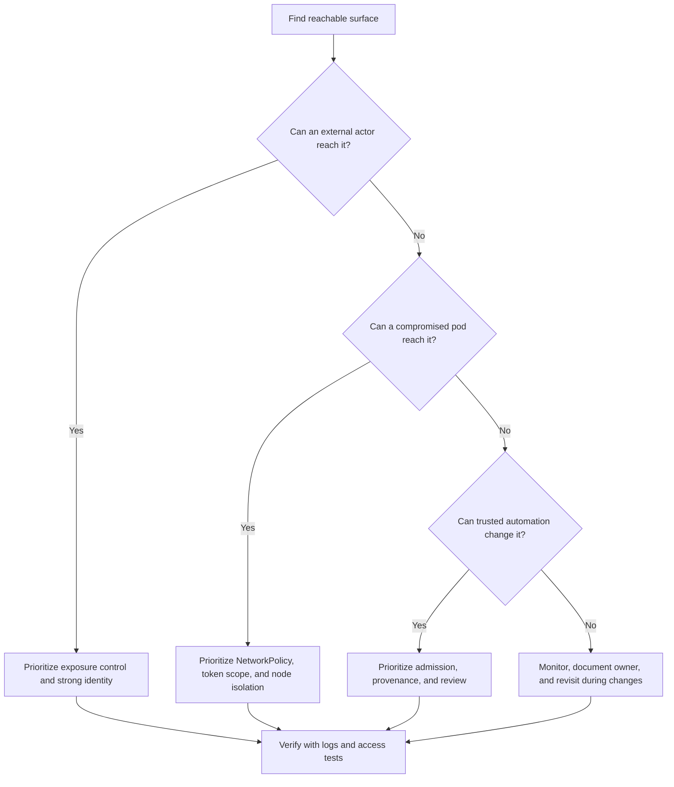

| Складність | Час на проходження | Передумови |
|------------|------------------|---------------|
| `[СЕРЕДНЯ]` — обізнаність про загрози | 35–45 хвилин | [Модуль 3.5: Мережеві політики](/k8s/kcsa/part3-security-fundamentals/module-3.5-network-policies/) |

## Результати навчання

Після завершення цього модуля ви зможете:

1. **Оцінити** поверхні атаки API-сервера, kubelet, інгресу, Pod'ів та ланцюга постачання у кластері Kubernetes 1.35.
2. **Діагностувати** внутрішні шляхи горизонтального переміщення зі скомпрометованих Pod'ів через токени сервісних акаунтів, досяжність kubelet, мережевий доступ та відкритість просторів імен хоста.
3. **Спроєктувати** стратегії скорочення поверхні атаки, що поєднують приватні кінцеві точки, RBAC, NetworkPolicy, Pod Security Standards, контроль образів та аудитне логування.
4. **Порівняти** зовнішніх зловмисників, скомпрометовані Pod'и, зловмисних інсайдерів та зловмисників із ланцюга постачання за ймовірною ціллю, радіусом ураження та пріоритетом контролю.

## Чому цей модуль важливий

Кластери, які зазнають зламу, рідко зламують через екзотичні експлойти ядра чи кінематографічні ланцюги вразливостей нульового дня. Їх зламують через відкриті поверхні управління — адміністративні консолі без пароля, API kubelet без автентифікації, відкриті під час поспішної міграції порти etcd. Класичний випадок 2018 року у великій автомобільній компанії задокументовано у [модулі безпеки GUI напрямку CKS](../../../cks/part1-cluster-setup/module-1.5-gui-security/) <!-- incident-xref: tesla-2018-cryptojacking --> — зловмисники використали середовище для запуску майнінгових навантажень, ховаючи мережевий трафік за мережею доставки контенту. Одна досяжна точка управління перетворила хмарну платформу на планувальник навантажень, керований зловмисником, і операційна вартість не обмежилася марно витраченими обчисленнями, адже той самий шлях міг розкрити секрети, ідентичності сервісів або дані клієнтів.

Саме ця історія пояснює, чому мислення в категоріях поверхні атаки передує дрібницям про вразливості. Вразливість — це дефект у компоненті, а поверхня атаки — це досяжний набір можливостей, де дефекти, облікові дані, слабкі типові налаштування та проєктні припущення можуть бути перевірені на міцність. Kubernetes розширює цей набір, бо він водночас є керованою через API площиною управління та розподіленим середовищем виконання: користувачі звертаються до API-сервера, Pod'и звертаються до сервісів, kubelet'и звертаються до площини управління, контролери звертаються до хмарних API, образи надходять із реєстрів, а оператори додають навколо ядра системи інгрес-контролери, агенти спостережуваності, вебхуки допуску та автоматизацію CI/CD.

Цей модуль навчає вас картографувати ці точки входу як інженера, відповідального за кластери Kubernetes 1.35 та новіші, а не як людину, що зазубрює список страшних портів. Ви навчитеся запитувати, хто може дістатися до поверхні, що там можна зробити, яку ідентичність можна запозичити та яким стає радіус ураження, якщо ця поверхня дасть збій. Виконайте `alias k=kubectl` один раз у своїй оболонці перед практичним розділом; протягом усього уроку `k get` та подібні команди припускають наявність цього аліаса, щоб приклади залишалися читабельними, не змінюючи змісту операцій Kubernetes.

## Що означає поверхня атаки в Kubernetes

Поверхня атаки — це повний набір точок, де зловмисник може взаємодіяти із системою, впливати на неї, видобувати з неї інформацію або переміщатися крізь неї після того, як здобуде плацдарм. У Kubernetes це включає очевидні сервіси, доступні з інтернету, але також охоплює внутрішні API, змонтовані токени, налаштування просторів імен хоста, шляхи допуску, кінцеві точки метаданих хмари, образи контейнерів та людські робочі процеси, що надсилають маніфести у production. Практичне питання безпеки полягає не в тому, «Чи маємо ми поверхню атаки?», бо кожна корисна система її має. Питання в тому, чи кожен відкритий шлях є необхідним, автентифікованим, авторизованим, контрольованим та обмеженим до прийнятного радіуса ураження.

```text
┌─────────────────────────────────────────────────────────────┐
│              ATTACK SURFACE DEFINITION                      │
├─────────────────────────────────────────────────────────────┤
│                                                             │
│  Attack Surface = All entry points an attacker can target  │
│                                                             │
│  LARGER ATTACK SURFACE:                                    │
│  • More exposed services                                   │
│  • More open ports                                         │
│  • More users with access                                  │
│  • More complex configurations                             │
│  = More opportunities for attackers                        │
│                                                             │
│  SMALLER ATTACK SURFACE:                                   │
│  • Minimal exposed services                                │
│  • Restricted network access                               │
│  • Few privileged users                                    │
│  • Simple, hardened configurations                         │
│  = Fewer opportunities for attackers                       │
│                                                             │
│  GOAL: Minimize attack surface while maintaining function  │
│                                                             │
└─────────────────────────────────────────────────────────────┘
```

Найважливіше слово на цій діаграмі — «function» (функція). Захищений кластер, який не може обслуговувати трафік, розгортати релізи, ротувати облікові дані чи відновлюватися після інцидентів, не є production-системою; це дорогий музейний експонат. Тому скорочення поверхні атаки — це дисципліна проєктування, а не вправа з вимкнення всього підряд. Ви вирішуєте, які поверхні мають залишатися досяжними, робите решту шляхів свідомими та усуваєте випадкову досяжність, створену типовими налаштуваннями, скороченнями, застарілими портами для зневадження, широкими мережевими маршрутами або зручними дозволами, яких не потребує жоден поточний робочий процес.

Уявіть кластер як велику офісну будівлю. Вхідні двері — це інгрес і балансувальники навантаження, стійка реєстрації — автентифікація, зчитувачі бейджів — авторизація, службові коридори — мережі Pod'ів, технічні приміщення — kubelet та доступ до вузлів, а вантажний док — ваш ланцюг постачання. Злам рідко залежить від того, що всі двері незачинені. Часто він залежить від одного занедбаного бічного входу, за яким тягнеться коридор, який ніколи не сегментували, бо всі припускали, що стійки реєстрації достатньо.

Та сама ідея стосується конфігурації не менше, ніж мережевої досяжності. Pod, до якого неможливо дістатися з інтернету, все одно може відкривати велику поверхню, якщо він монтує файлову систему хоста, працює у привілейованому режимі, несе широко авторизований токен і може надсилати трафік до кожного сервісу в кластері. І навпаки, застосунок, доступний з інтернету, може бути прийнятною поверхнею, коли він очікуваний, пропатчений, автентифікований там, де доречно, контрольований та ізольований від високоцінних залежностей. Мета безпеки — не сховати кожен компонент; вона в тому, щоб кожен досяжний компонент виправдовував своє місце.

Поверхня атаки також змінюється з часом, тому одноразового огляду під час запуску недостатньо. Кластер може починатися з приватної кінцевої точки API та суворих навантажень, а потім отримати новий клас інгресу, стек метрик, контролер сертифікатів, сервісну сітку, агент резервного копіювання та простір імен для науки про дані з незвичними вимогами до образів. Кожне доповнення може бути легітимним, але кожне також створює ще одне місце, де можуть з'явитися ідентичність, мережеві шляхи, облікові дані, вебхуки чи привілейовані контейнери. Ставтеся до картографування поверхні як до рутинної гігієни платформи, а не до особливого аудиторського заходу.

Зупиніться та спрогнозуйте: якщо кластер має сильний RBAC, зашифровані секрети та примусово застосовані Pod Security Standards, але API-сервер досяжний з інтернету, який режим збою все одно турбує вас найбільше? Відповідь не в тому, що RBAC раптом перестає працювати. Проблема в тому, що публічна кінцева точка управління запрошує безперервні атаки на облікові дані, спроби розвідки, зондування експлойтів та тестування неправильних конфігурацій проти єдиного API, який може описати та змінити майже все в кластері.

## Карта поверхонь атаки Kubernetes

Про поверхні атаки Kubernetes найлегше міркувати пошарово: зовнішні точки входу, внутрішні шляхи виконання та входи ланцюга постачання. Зовнішні поверхні досяжні ще до того, як зловмисник отримає Pod чи акаунт у кластері, тож зазвичай саме вони визначають, як відбувається початковий доступ. Внутрішні поверхні мають значення після того, як скомпрометовано навантаження, токен, вузол чи обліковий запис користувача, і саме вони визначають, чи залишиться інцидент дрібним, чи переросте в подію масштабу всього кластера. Поверхні ланцюга постачання розташовані раніше в життєвому циклі, де довірений образ, залежність, чарт чи конвеєр можуть пронести шкідливу поведінку до кластера, не виглядаючи як вторгнення під час виконання.

```text
┌─────────────────────────────────────────────────────────────┐
│              KUBERNETES ATTACK SURFACE MAP                  │
├─────────────────────────────────────────────────────────────┤
│                                                             │
│  EXTERNAL ATTACK SURFACE (from outside cluster)            │
│  ┌─────────────────────────────────────────────────────┐   │
│  │  • Kubernetes API server                            │   │
│  │  • Ingress/Load Balancers                           │   │
│  │  • NodePort services                                │   │
│  │  • SSH to nodes                                     │   │
│  │  • Cloud provider APIs                              │   │
│  │  • Container registries                             │   │
│  └─────────────────────────────────────────────────────┘   │
│                                                             │
│  INTERNAL ATTACK SURFACE (from inside cluster)             │
│  ┌─────────────────────────────────────────────────────┐   │
│  │  • Pod-to-pod networking                            │   │
│  │  • Kubernetes API (from pods)                       │   │
│  │  • kubelet API                                      │   │
│  │  • etcd                                             │   │
│  │  • Service account tokens                           │   │
│  │  • Secrets                                          │   │
│  │  • Host filesystem (if mounted)                     │   │
│  │  • Container runtime                                │   │
│  └─────────────────────────────────────────────────────┘   │
│                                                             │
│  SUPPLY CHAIN ATTACK SURFACE                               │
│  ┌─────────────────────────────────────────────────────┐   │
│  │  • Container images                                 │   │
│  │  • Base images                                      │   │
│  │  • Application dependencies                         │   │
│  │  • CI/CD pipelines                                  │   │
│  │  • Helm charts/manifests                            │   │
│  └─────────────────────────────────────────────────────┘   │
│                                                             │
└─────────────────────────────────────────────────────────────┘
```

Карта навмисно включає як власні компоненти Kubernetes, так і системи навколо них. Приватний API-сервер не захистить вас від скомпрометованого робочого процесу GitHub Actions, який може розгорнути будь-який маніфест. Жорстко обмежений профіль безпеки Pod'а не захистить вас від інгрес-контролера, який маршрутизує ворожий трафік до застосунку з помилкою віддаленого виконання коду. Політика підписаних образів не захистить вас від сервісного акаунта, що може перелічувати секрети в усіх просторах імен. Аналіз поверхні атаки корисний, бо тримає ці засоби контролю в одній розмові, замість того щоб ставитися до кожного чекліста як до окремого острова.

Коли ви оцінюєте поверхню, почніть із чотирьох запитань. Хто може дістатися до неї з мережі чи робочого процесу? Яка ідентичність використовується, коли вона приймає запит? Яка дія стає можливою, якщо цією ідентичністю чи компонентом зловживають? Які докази показали б спробу або успішну дію? Ці запитання перетворюють широку фразу на кшталт «kubelet відкритий» на конкретне формулювання ризику, як-от «будь-який Pod у мережі вузла може спробувати автентифіковані виклики API kubelet, а успішний доступ може розкрити логи, шляхи exec та метадані Pod'ів, якщо не примусово застосовано мережевий брандмауер вузла та автентифікацію/авторизацію kubelet».

Запитання про докази команди часто пропускають, і це упущення послаблює всю модель. Якщо поверхня достатньо важлива, щоб тримати її відкритою, вона достатньо важлива, щоб її логувати, надсилати по ній сповіщення та періодично тестувати. Для API-сервера доказами можуть бути аудитні записи про операції create, update, delete, impersonate та bind. Для інгресу доказами можуть бути логи контролера, знахідки WAF, події сертифікатів та трасування запитів до бекенду. Для навантажень доказами можуть бути рішення допуску, сповіщення під час виконання, записи потоків CNI та відхилені авторизації API. Без доказів команди покладаються на пам'ять, а пам'ять згасає швидше, ніж змінюються кластери.

Корисно записувати карту як історії зловмисника, а не як рядки інвентаря. «Користувач в інтернеті може дістатися до кінцевої точки API, але має автентифікуватися через OIDC і пройти RBAC» корисніше, ніж «API-сервер: публічний». «Скомпрометований Pod у просторі імен payments може дістатися до DNS, обробника платежів та сервісу worker, але не до адміністративної кінцевої точки бази даних» корисніше, ніж «NetworkPolicy існує». Історії змушують вас включити досяжність, ідентичність, дозвіл та радіус ураження в одне речення, що полегшує виявлення слабких припущень під час огляду.

Перш ніж запускати будь-який сканер чи чекліст, запишіть свої очікувані три головні поверхні для кластера, який ви експлуатуєте. Який підхід ви б обрали тут і чому: витратити перший день на те, щоб зробити API-сервер приватним, заблокувати вихідний трафік Pod'ів за замовчуванням чи примусово застосувати допуск образів? Універсальної відповіді немає, бо правильний пріоритет залежить від поточної відкритості, досяжності для зловмисника та того, чи кластер імовірніше зламають через публічні сервіси, компрометацію навантаження чи автоматизацію розгортання.

## Зовнішні точки входу: API-сервер, інгрес та хмарні межі

API-сервер Kubernetes — це найпотужніша зовнішня поверхня, бо він є вхідними дверима до стану кластера та його мутацій. Кожна значуща адміністративна операція зрештою стає запитом до API: створення Pod'ів, читання секретів, прив'язування ролей, схвалення сертифікатів, встановлення вебхуків та зміна мережевих об'єктів. Публічна кінцева точка API не є автоматично зламом, особливо в керованому Kubernetes, де публічні кінцеві точки поширені, але вона створює високоцінну ціль, яка має пережити викрадені облікові дані, слабкі клієнтські мережі, неавтентифіковану розвідку, тиск відмови в обслуговуванні та випадкову вразливість реалізації.

```text
┌─────────────────────────────────────────────────────────────┐
│              API SERVER ATTACK SURFACE                      │
├─────────────────────────────────────────────────────────────┤
│                                                             │
│  PUBLIC API SERVER                                         │
│  • Accessible from internet                                │
│  • Target for brute force                                  │
│  • Target for credential stuffing                          │
│  • Vulnerable to API exploits                              │
│                                                             │
│  ATTACK SCENARIOS:                                         │
│  1. Stolen credentials → Full cluster access               │
│  2. Anonymous auth enabled → Information disclosure        │
│  3. API implementation flaw or misconfiguration →          │
│     privilege escalation or unauthorized state change      │
│  4. RBAC misconfiguration → Privilege escalation           │
│                                                             │
│  MITIGATIONS:                                              │
│  • Private API endpoint (VPN/bastion required)             │
│  • Strong authentication (OIDC, certificates)              │
│  • Disable anonymous auth                                  │
│  • Network firewall rules                                  │
│  • API audit logging                                       │
│                                                             │
└─────────────────────────────────────────────────────────────┘
```

Приватні кінцеві точки API зменшують відкритість, змушуючи адміністративний трафік проходити контрольованим мережевим шляхом, як-от VPN, бастіон, приватне з'єднання чи корпоративний рівень доступу з нульовою довірою. Цей крок цінний, але він радше зміщує частину ризику, ніж усуває його. VPN стає критичною поверхнею, бастіонні хости потребують посилення та логування, а процедури екстреного доступу мають усе ще працювати під час інцидентів. Хороші проєкти роблять API-сервер приватним, зберігають сильну автентифікацію через OIDC чи клієнтські сертифікати, вимикають анонімний доступ, використовують RBAC за принципом найменших привілеїв та збирають аудитні події, що дозволяють відрізнити нормальну поведінку контролера від підозрілої активності людини чи токена.

Інгрес-контролери та балансувальники навантаження інші, бо вони мають приймати недовірений трафік. Їхня робота — відкривати застосунки, термінувати TLS, маршрутизувати запити та подеколи застосовувати автентифікацію, обмеження частоти чи правила брандмауера вебзастосунків. Тому поверхня атаки — це не лише бінарний файл контролера; вона включає анотації інгресу, налаштування TLS, правила хостів, переписування шляхів, бекенд-застосунки, типові бекенди, контроль допуску щодо того, хто може створювати об'єкти інгресу, та функції хмарного балансувальника навантаження, які можуть бути увімкнені анотаціями. Неправильно маршрутизоване правило хоста може відкрити внутрішній сервіс так само напевно, як і вразливий контролер.

```text
┌─────────────────────────────────────────────────────────────┐
│              INGRESS ATTACK SURFACE                         │
├─────────────────────────────────────────────────────────────┤
│                                                             │
│  WHAT'S EXPOSED:                                           │
│  • Ingress controller (nginx, traefik, etc.)               │
│  • Backend applications through ingress                    │
│  • TLS termination point                                   │
│                                                             │
│  ATTACK SCENARIOS:                                         │
│  1. Ingress controller vulnerability                       │
│  2. Application vulnerabilities (OWASP Top 10)             │
│  3. Misrouted traffic (host header attacks)                │
│  4. TLS/certificate issues                                 │
│  5. Path traversal to unintended backends                  │
│                                                             │
│  MITIGATIONS:                                              │
│  • Keep ingress controller updated                         │
│  • WAF (Web Application Firewall)                          │
│  • Strict ingress rules                                    │
│  • Strong TLS configuration                                │
│  • Rate limiting                                           │
│                                                             │
└─────────────────────────────────────────────────────────────┘
```

Сервіси NodePort заслуговують на особливу увагу, бо вони відкривають кожен вибраний вузол на високому діапазоні портів, навіть коли власник застосунку хотів лише швидко щось протестувати. У невеликій лабораторії NodePort здається нешкідливим, бо він зручний і видимий. У хмарній VPC з дозвільними групами безпеки він може створити досяжний з інтернету шлях до сервісу, який ніколи не проходив той самий огляд, що й інгрес-маршрут. Сервіси LoadBalancer мають подібну проблему, коли команди забувають, що об'єкт сервісу може запросити зовнішню інфраструктуру через інтеграцію з хмарним контролером.

Хмарні API провайдерів та реєстри розташовані на межі довірчого кордону Kubernetes. Якщо зловмисник здобуде хмарну ідентичність, що може оновлювати групи безпеки вузлів, змінювати балансувальники навантаження, читати образи з реєстру чи змінювати налаштування керованого кластера, API Kubernetes може бути обійдений повністю. Якщо зловмисник може запушити довірений тег образу чи змінити Helm-чарт у репозиторії розгортання, від засобів контролю допуску та виконання можуть зажадати захисту від коду, який платформа вважає легітимним. Саме тому серйозний огляд зовнішньої поверхні включає DNS, хмарний IAM, дозволи реєстру, облікові дані CI/CD та автоматизацію релізів поряд із видимими кінцевими точками кластера.

Скорочення зовнішньої поверхні має політичну складову, бо власники часто розходяться в думках про те, що вважати необхідною відкритістю. Команди застосунків можуть розглядати неавтентифіковану кінцеву точку перевірки стану як нешкідливу, тоді як команди безпеки бачать у ній джерело зняття відбитків. Платформенні команди можуть розглядати публічні керовані кінцеві точки API як нормальні, тоді як команди відповідності вимагають приватних шляхів управління. Найкращі огляди уникають туманних суперечок, документуючи користувача, призначення, контроль ідентичності, мережевий контроль, чутливість даних та запасний план для кожної кінцевої точки. Щойно ці факти стають видимими, рішення перетворюється на інженерний компроміс, а не на суперечку через страх.

Гіпотетичний сценарій: платформенна команда якось прибрала набір публічних сервісів NodePort і відсвяткувала скорочення відкритості, аж раптом виявила, що контролер хмарного балансувальника навантаження відтворив еквівалентні публічні слухачі з анотацій сервісу в іншому просторі імен. Перше виправлення націлилося на симптом, а не на робочий процес, який створював відкритість. Стійким виправленням було обмежити, які команди можуть створювати зовнішні балансувальники навантаження, додати перевірки допуску для ризикованих анотацій та створити стандартний шлях інгресу з логуванням і власністю. Скорочення поверхні атаки тримається тоді, коли воно змінює шлях, що створює відкритість.

## Внутрішні поверхні виконання: Pod'и, токени, kubelet та вузли

Аналіз внутрішньої поверхні атаки починається з припущення, що одне навантаження зрештою буде скомпрометоване. Публічний застосунок може мати дефект коду, залежність може повестися погано, секрет може бути виведений у логи, або розробник може розгорнути образ для зневадження під час інциденту. Питання в тому, що зловмисник може зробити далі з цього Pod'а. Типові налаштування Kubernetes покращилися з часом, але Pod усе ще має мережеву досяжність, простір імен процесів усередині спільного ядра, змонтовані томи, змінні середовища, DNS і часто токен сервісного акаунта, якщо навантаження не вимикає автомонтування токена чи не використовує ретельно обмежені спроєктовані токени.

```text
┌─────────────────────────────────────────────────────────────┐
│              POD-LEVEL ATTACK SURFACE                       │
├─────────────────────────────────────────────────────────────┤
│                                                             │
│  SCENARIO: Attacker compromises application in pod         │
│                                                             │
│  WHAT THEY CAN ACCESS:                                     │
│                                                             │
│  ALWAYS AVAILABLE:                                         │
│  ├── Container filesystem                                  │
│  ├── Environment variables (may contain secrets)           │
│  ├── Mounted volumes                                       │
│  └── Network (cluster-wide pod networking unless           │
│      NetworkPolicy restricts)                              │
│                                                             │
│  IF TOKEN MOUNTED (default):                               │
│  ├── Kubernetes API access                                 │
│  ├── Service account permissions                           │
│  └── Secrets accessible via RBAC                           │
│                                                             │
│  IF MISCONFIGURED:                                         │
│  ├── privileged: true → Host access                        │
│  ├── hostPath mounts → Host filesystem                     │
│  ├── hostNetwork → Host network                            │
│  ├── hostPID → Host processes                              │
│  └── Excessive RBAC → Cluster compromise                   │
│                                                             │
└─────────────────────────────────────────────────────────────┘
```

Токен сервісного акаунта — це поширена точка повороту, бо він перетворює компрометацію застосунку на доступ до API. Токен із дозволом лише читати один ConfigMap може мати низький вплив, тоді як токен, прив'язаний до широкої Role чи ClusterRole, може дозволити зловмиснику перелічувати секрети, створювати Pod'и, читати логи чи видавати себе за операційні робочі процеси. Захисний патерн — давати навантаженням явні сервісні акаунти, вимикати монтування токена для Pod'ів, які не звертаються до API, обмежувати RBAC до простору імен та дієслів, що дійсно потрібні, і тестувати за допомогою `k auth can-i`, перш ніж припускати, що роль нешкідлива.

Мережева досяжність — це інший головний внутрішній мультиплікатор. Без NetworkPolicy багато мереж Kubernetes за замовчуванням дозволяють широкий трафік між Pod'ами, а це означає, що один скомпрометований застосунок може сканувати сервіси, звертатися до внутрішніх адміністративних кінцевих точок, зондувати бази даних чи дістатися до метаданих хмари, якщо інші засоби контролю його не зупинять. Політики заборони вхідного трафіку за замовчуванням зменшують, хто може звертатися до навантаження, а політики заборони вихідного трафіку за замовчуванням зменшують, куди скомпрометоване навантаження може звертатися назовні. Жоден тип політики не виправляє вразливий застосунок, але разом вони перетворюють успішний експлойт на стримуваний інцидент, а не на оглядову екскурсію простором імен.

Внутрішні поверхні складніше пояснити стейкхолдерам, що не належать до платформи, бо вони не видимі в публічному інтернеті. Власник фінансової системи може розуміти, чому публічна адміністративна панель небезпечна, але недооцінювати, чому Pod в іншому просторі імен не повинен дістатися до проксі їхньої бази даних. Використовуйте мову радіуса ураження замість мережевого жаргону. Скажіть, що успішний експлойт у малоцінному сервісі не повинен автоматично надавати шлях до даних про зарплати, хмарних облікових даних чи системи збирання. Таке формулювання робить NetworkPolicy, обмеження сервісних акаунтів та межі просторів імен схожими на бізнес-контролі, а не на платформенні вподобання.

Kubelet — це агент вузла, але його API достатньо чутливий до безпеки, щоб ставитися до нього як до привілейованої внутрішньої поверхні. Kubelet може відкривати метадані Pod'ів, логи, поведінку на кшталт exec та операції, пов'язані з вузлом, залежно від конфігурації, автентифікації, авторизації та версії. Сучасні захищені кластери мають вимикати анонімний доступ до kubelet, вимикати старий порт лише для читання, вимагати автентифікації та авторизації через вебхук там, де доречно, і обмежувати мережеву досяжність до шляхів вузла та площини управління, які її дійсно потребують. Якщо мережа Pod'ів може вільно дістатися до кожного kubelet, кластер має відкритість внутрішньої площини управління, навіть коли публічна кінцева точка API приватна.

```text
┌─────────────────────────────────────────────────────────────┐
│              KUBELET ATTACK SURFACE                         │
├─────────────────────────────────────────────────────────────┤
│                                                             │
│  KUBELET API (port 10250)                                  │
│  • /exec - Execute commands in containers                  │
│  • /run - Run commands                                     │
│  • /pods - List pods                                       │
│  • /logs - Read logs                                       │
│                                                             │
│  ATTACK SCENARIOS:                                         │
│  1. Anonymous kubelet access → Execute in any container    │
│  2. Node compromise → Kubelet credentials stolen           │
│  3. Reach kubelet with weak or stolen credentials →        │
│     exec/logs/metadata without equivalent API-server       │
│     controls and audit                                     │
│                                                             │
│  MITIGATIONS:                                              │
│  • Disable anonymous auth                                  │
│  • Disable read-only port (10255)                          │
│  • Network isolation for kubelet                           │
│  • Node authorization mode                                 │
│                                                             │
└─────────────────────────────────────────────────────────────┘
```

Налаштування доступу до хоста — це те, де звичайний Pod може перетворитися на інцидент рівня вузла. `privileged: true`, монтування `hostPath`, `hostNetwork`, `hostPID`, широкі можливості Linux, файлові системи з правом запису в корені та користувачі root — усе це збільшує поверхню, відкриту для шкідливого коду, що працює всередині контейнера. Деякі навантаження потребують вузьких винятків, особливо плагіни CNI, агенти сховищ, збирачі спостережуваності та інструменти обслуговування вузлів. Помилка в тому, щоб ставитися до цих винятків як до звичайних налаштувань застосунку, а не як до привілейованих інфраструктурних рішень, що потребують власності, ізоляції простору імен, огляду допуску та компенсаційного моніторингу.

Компрометація вузла — це теж перетин межі, бо вузол розміщує багато навантажень і тримає облікові дані, що використовуються для звітування про стан, завантаження образів та зв'язку з площиною управління. Скомпрометований вузол може розкрити логи, змонтовані томи, стан середовища виконання контейнерів та метадані навантажень, що ніколи не призначалися для спільного використання між орендарями. Навіть коли керований Kubernetes зменшує пряме адміністрування вузлів, оператори все одно обирають образи вузлів, daemonset'и, політику SSH, частоту оновлень ядра та досяжність груп безпеки. Це робить посилення вузлів частиною скорочення поверхні атаки, а не окремим чеклістом операційної системи.

Зупиніться та спрогнозуйте: зловмисник компрометує Pod, що має `automountServiceAccountToken: false`, працює не від імені root, не має доданих можливостей і має кореневу файлову систему лише для читання. Яка поверхня атаки залишається? Він усе ще може використовувати дозволені мережеві шляхи, читати змонтовані дані та змінні середовища, експлуатувати процес застосунку, намагатися використати помилки втечі з ядра чи середовища виконання, зловживати томами з правом запису, дістатися до DNS та потенційно зв'язатися із зовнішніми кінцевими точками, якщо вихідний трафік відкритий, — ось чому посилення одного шару ніколи не замінює сегментацію та спостереження.

Etcd часто прихований від команд застосунків, але він залишається частиною внутрішньої поверхні, бо зберігає стан Kubernetes, зокрема об'єкти-секрети, якщо не використовується патерн зовнішніх секретів. Etcd — це поверхня, прилегла до площини управління чи вузла (захищена TLS, брандмауером та шифруванням під час зберігання), а не типовий перехід для горизонтального переміщення зі скомпрометованого навантаження. Прямий доступ до etcd має бути жорстко обмежений компонентами площини управління, захищений TLS, зашифрований під час зберігання там, де потрібно, та контрольований, як база даних, що може розкрити чи змінити стан кластера. Керований сервіс може приховати ці важелі, але проєктний принцип усе одно діє: якщо компонент може читати чи змінювати джерело істини, він належить до найризикованішої частини вашої моделі.

## Загрозливі актори та радіус ураження

Аналіз поверхні атаки стає практичним, коли ви описуєте актора, а не лише компонент. Зовнішній зловмисник без облікових даних має інший шлях, ніж зловмисний інсайдер із легітимним доступом, і обидва відрізняються від коду, що надходить через ваш ланцюг постачання. Скомпрометований Pod — це не той самий актор, що скомпрометований вузол, навіть якщо обидва «всередині» кластера, бо стартова ідентичність, мережева позиція та доступні системні виклики різні. Хороші моделі загроз зберігають ці відмінності, щоб пом'якшення не зводилося до загальної поради на кшталт «використовуйте найменші привілеї».

```text
┌─────────────────────────────────────────────────────────────┐
│              THREAT ACTORS                                  │
├─────────────────────────────────────────────────────────────┤
│                                                             │
│  EXTERNAL ATTACKER                                         │
│  • No initial access                                       │
│  • Targets: Exposed services, stolen credentials           │
│  • Goal: Initial foothold                                  │
│                                                             │
│  COMPROMISED POD                                           │
│  • Limited container access                                │
│  • Targets: Other pods, secrets, API, container escape     │
│  • Goal: Lateral movement, escalation                      │
│                                                             │
│  MALICIOUS INSIDER                                         │
│  • Legitimate credentials                                  │
│  • Targets: Abuse permissions, plant backdoors             │
│  • Goal: Data theft, persistence                           │
│                                                             │
│  SUPPLY CHAIN ATTACKER                                     │
│  • Compromises trusted components                          │
│  • Targets: Images, dependencies, CI/CD                    │
│  • Goal: Widespread compromise                             │
│                                                             │
│  EACH ACTOR HAS DIFFERENT ATTACK SURFACE                   │
│                                                             │
└─────────────────────────────────────────────────────────────┘
```

Для зовнішнього зловмисника першим пріоритетом є досяжна інфраструктура: кінцеві точки API-сервера, інгрес-маршрути, балансувальники навантаження, NodePort'и, SSH, VPN, бастіони, реєстри та хмарні API. Найкращі скорочення — це засоби контролю відкритості, сильна ідентичність, обмеження частоти, керування патчами та сповіщення про невдалий чи незвичний доступ. Цей актор може ніколи не торкнутися мережі Pod'ів, якщо тільки експлойт застосунку, викрадені облікові дані чи неправильно налаштована кінцева точка не дадуть йому перший плацдарм. Саме тому інвентар, доступний з інтернету, треба тримати в актуальному стані та прив'язаним до власності.

Для скомпрометованого Pod'а перший пріоритет змінюється на горизонтальне переміщення та підвищення привілеїв. Зловмисник уже має виконання коду всередині мережі кластера, тож ризик залежить від правил вихідного трафіку, виявлення сервісів, дозволів токена API, змонтованих даних, доступу до хоста та ізоляції під час виконання. Цей актор може не потребувати подолання API-сервера з інтернету, бо токен сервісного акаунта та внутрішній DNS дають йому привітніший маршрут. Проєкт, що виглядає захищеним ззовні, усе одно може погано провалитися, якщо кожен простір імен за замовчуванням довіряє кожному іншому простору імен.

Для зловмисного інсайдера поверхня формується легітимними дозволами та слабкими процесами огляду. Розробник із правами адміністратора простору імен може створити привілейований Pod, прив'язати сильнішу роль, додати сайдкар для читання секретів чи розгорнути вебхук, що змінює майбутні навантаження. Пріоритет контролю — це не лише автентифікація; це розподіл обов'язків, придатність до аудиту, політика як код, контроль допуску та швидке виявлення незвичних дій інакше валідних користувачів. Інсайдери також нагадують нам, що поверхня атаки включає робочі процеси, а не лише сокети.

Для зловмисника з ланцюга постачання засоби контролю під час виконання можуть бачити поведінку, яка виглядає нормальною, бо шкідливий код надходить як довірений артефакт. Зловмисник може скомпрометувати базовий образ, залежність, скрипт збирання, Helm-чарт, образ вебхука допуску чи обліковий запис CI/CD. Найкращі скорочення відбуваються до розгортання через походження (зокрема очікування SLSA), підписування образів (наприклад, за допомогою sigstore-cosign), переліки складу програмного забезпечення (SBOM), огляд залежностей, незмінні теги чи дайджести, контроль доступу до реєстру та політики допуску, що відхиляють невідомі артефакти. Засоби контролю вихідного трафіку під час виконання та моніторинг DNS усе ще мають значення, бо шкідливий код зрештою має діяти.

Порівняння акторів запобігає переобладнанню ваших засобів контролю під останній інцидент, про який ви читали. Якщо найреалістичніший актор — це зовнішній зловмисник, публічна відкритість та стійкість облікових даних можуть заслуговувати на перші інвестиції. Якщо реалістичний актор — це скомпрометоване навантаження, внутрішня сегментація та обмеження токенів можуть дати негайніше зниження ризику. Якщо реалістичний актор — це довірений конвеєр, що пішов не так, походження образів та політика допуску можуть переважити ще одне правило периметрового брандмауера. Зрілі програми тримають усі чотири погляди на акторів живими та чергують увагу в міру зміни платформи.

Питання про радіус ураження завжди має включати дані, контроль та стійкість. Радіус ураження даних запитує, що зловмисник може прочитати: секрети, облікові дані бази даних, логи, змонтовані томи чи записи клієнтів. Радіус ураження контролю запитує, що зловмисник може змінити: Pod'и, прив'язки ролей, вебхуки допуску, образи чи хмарні маршрути. Радіус ураження стійкості запитує, чи може зловмисник пережити перезапуски, розгорнути бекдори, створити нові облікові дані чи сховатися в автоматизації. Та сама поверхня може бути прийнятною для одного виміру й неприйнятною для іншого.

## Проєктування скорочення поверхні атаки

Скорочення поверхні атаки починається з інвентаризації, але успіх приходить через власність та розставлення пріоритетів. Інвентаризація каже вам, що відкрито; власність каже, хто може це змінити; розставлення пріоритетів каже, яке скорочення поверхні зменшить реальний ризик цього тижня. Кластер із публічною кінцевою точкою API, анонімним доступом до kubelet, широкими NodePort'ами, привілейованими Pod'ами застосунків та змінними тегами образів має забагато проблем для одного героїчного спринту посилення. Ви ранжуєте поверхні за досяжністю, привілеями, експлуатованістю, важливістю для бізнесу та тим, чи можна доставити пом'якшення, не зламавши обов'язкові операції.

```text
┌─────────────────────────────────────────────────────────────┐
│              ATTACK SURFACE REDUCTION                       │
├─────────────────────────────────────────────────────────────┤
│                                                             │
│  NETWORK                                                   │
│  ☐ Private API server endpoint                             │
│  ☐ Network policies (default deny)                         │
│  ☐ No unnecessary NodePort/LoadBalancer services           │
│  ☐ Firewall rules for node access                          │
│                                                             │
│  AUTHENTICATION                                            │
│  ☐ Disable anonymous auth (API server, kubelet)            │
│  ☐ Short-lived credentials                                 │
│  ☐ Strong authentication (MFA, certificates)               │
│                                                             │
│  WORKLOADS                                                 │
│  ☐ No privileged containers                                │
│  ☐ No host namespace sharing                               │
│  ☐ Read-only root filesystem                               │
│  ☐ Disable service account token mounting                  │
│  ☐ Minimal container images                                │
│                                                             │
│  NODES                                                     │
│  ☐ Minimal OS (Bottlerocket, Flatcar)                      │
│  ☐ Disable SSH if possible                                 │
│  ☐ Regular patching                                        │
│                                                             │
└─────────────────────────────────────────────────────────────┘
```

Чекліст скорочення не слід застосовувати наосліп. Приватні кінцеві точки API потужні, але потребують надійного доступу оператора, екстрених процедур та шляхів автоматизації, що не залежать від однієї робочої станції. Політики NetworkPolicy із забороною за замовчуванням потужні, але потребують від команд застосунків розуміння залежностей, DNS, метрик та зовнішніх викликів. Вимкнення автомонтування токена сервісного акаунта потужне, але може зламати контролери чи застосунки, що легітимно звертаються до API. Мінімальні образи потужні, але можуть уповільнити реагування на інциденти, якщо команди покладаються на інструменти оболонки всередині production-контейнерів замість затверджених робочих процесів зневадження.

Корисний робочий приклад починається з простору імен, що розміщує публічний вебзастосунок API, worker та клієнт бази даних. Вебзастосунок API потребує інгресу з інтернету та вихідного трафіку до сервісу worker, DNS та однієї зовнішньої платіжної кінцевої точки. Worker не потребує інгресу з інтернету, потребує обмеженого інгресу від вебзастосунку API та вихідного трафіку до сервісу бази даних і об'єктного сховища. Жодне навантаження не потребує звертання до API Kubernetes. Тому проєкт скорочення поверхні атаки — це приватний доступ до API для людей, інгрес лише для вебзастосунку API, політики заборони за замовчуванням у просторі імен, явні правила вихідного трафіку, сервісні акаунти без автомонтування токена, обмежені Pod Security Standards, дайджести образів та аудитні сповіщення про неочікувані прив'язки ролей.

Ось невеликий набір команд, які ви можете виконати в лабораторному кластері, щоб почати цей огляд. Ці команди не доводять безпеку самі по собі, але вони швидко показують, чи поверхню формують свідомо. Використовуйте їх як підказки для дослідження, а потім перевіряйте відповідні маніфести та хмарні налаштування, перш ніж вносити production-зміни.

```bash
alias k=kubectl

k get svc -A
k get ingress -A
k get pods -A -o custom-columns='NS:.metadata.namespace,NAME:.metadata.name,SA:.spec.serviceAccountName,HOSTNET:.spec.hostNetwork,HOSTPID:.spec.hostPID'
k auth can-i --as=system:serviceaccount:default:default list secrets
k get networkpolicy -A
```

Перш ніж запускати це у власній лабораторії, який вивід ви очікуєте для сервісів та NetworkPolicy? Якщо простір імен не має політик, відсутність не є нейтральною інформацією. Зазвичай це означає, що CNI дозволятиме більше трафіку, ніж вимагає проєкт застосунку, і наступний крок — додати базовий рівень заборони за замовчуванням, перш ніж відкривати лише ті шляхи, які навантаження дійсно потребує.

Скорочення поверхні атаки також потребує доказів, бо неперевірене посилення стає фольклором. Аудитні логи API мають показувати відхилені та незвичні привілейовані операції. Логи мережевих потоків чи спостережуваність CNI мають показувати, чи блокують політики заборони за замовчуванням неочікувані виклики. Логи контролера допуску мають показувати відхилені привілейовані Pod'и, налаштування просторів імен хоста, непідписані образи чи змінні теги. Логи реєстру та CI/CD мають показувати, хто збирав та просував образи. Якщо ви не можете спостерігати поверхню, ви не можете впевнено стверджувати, що вона скорочена.

Поетапний план зазвичай працює краще, ніж масштабне блокування, бо він дає командам час вивчити свої реальні залежності. Почніть з інвентаризації та перевірок лише для читання, потім примусово застосуйте у вузькому просторі імен, потім розширте з обробкою винятків та чіткими умовами відкату. Наприклад, платформенна команда може спочатку звітувати про всі привілейовані Pod'и, потім блокувати нові привілейовані Pod'и застосунків, дозволяючи названі інфраструктурні простори імен, потім додати дати закінчення дії до винятків і нарешті надсилати сповіщення про будь-яке неочікуване використання простору імен хоста. Кожен етап скорочує поверхню, водночас створюючи операційні знання для наступного етапу.

Будьте обережні з компенсаційними засобами контролю, що звучать сильніше, ніж є насправді. Брандмауер вебзастосунків перед інгресом не компенсує сервісного акаунта, що може читати всі секрети. Сканування образів не компенсує публічного шляху до kubelet. Шифрування секретів під час зберігання не компенсує ролі, що може читати ці секрети через API. Компенсаційні засоби контролю валідні лише тоді, коли вони переривають той самий шлях зловмисника чи зменшують той самий радіус ураження. Інакше вони можуть покращити середовище, залишивши конкретну поверхню незмінною.

## Патерни та антипатерни

Найсильніший патерн — це свідома відкритість за контрактом. Кожна зовнішньо досяжна кінцева точка повинна мати власника, причину існувати, історію автентифікації, історію моніторингу та задокументовану умову виведення з експлуатації. Це працює, бо перетворює відкритість із випадковості на керований актив. Це також добре масштабується між командами, бо платформенні інженери можуть надавати стандартні класи інгресу, патерни приватного доступу до API, політики реєстру та шаблони сервісів, тоді як команди застосунків зберігають відповідальність за бізнес-сервіси, які вони відкривають.

| Патерн | Коли використовувати | Чому це працює | Аспект масштабування |
|---------|----------------|--------------|-----------------------|
| Приватна площина управління | Кластери з production-даними, регульованими навантаженнями чи широким доступом операторів | Прибирає API-сервер із рутинного інтернет-зондування та змушує доступ проходити контрольованими мережами | Підтримуйте екстрений доступ (break-glass), шляхи автоматизації та аудитні сліди для рівня доступу |
| Заборона за замовчуванням у просторі імен плюс явний дозвіл | Багатокомандні кластери або будь-який простір імен із чутливими сервісами | Перетворює горизонтальне переміщення з типової можливості на схвалений граф залежностей | Надавайте шаблони політик та видимість потоків, щоб команди могли безпечно зневаджувати |
| Ідентичність навантаження за принципом найменших привілеїв | Застосунки, що не потребують широкого доступу до API Kubernetes | Обмежує зловживання токеном після компрометації Pod'а та робить докази `k auth can-i` значущими | Переглядайте прив'язки ролей під час релізу, а не лише під час аудитів безпеки |
| Контроль допуску для привілейованих налаштувань та образів | Кластери з багатьма командами розгортання чи автоматизованими конвеєрами | Блокує ризиковані поверхні, перш ніж вони стануть запущеними навантаженнями | Версіонуйте політики з винятками, власниками та датами закінчення дії |

Інший сильний патерн — це окрема обробка інфраструктурних навантажень. Агенти CNI, драйвери CSI, експортери вузлів, збирачі логів та інструменти безпеки часто потребують монтувань хоста, мережі хоста чи підвищених дозволів. Ставлення до цих навантажень як до звичайних застосунків спричиняє плутанину, бо виняток нормалізується. Ставлення до них як до інфраструктури створює вужчий шлях контролю: виділені простори імен, обмежені права на розгортання, закріплені образи, моніторинг під час виконання та чітка власність для кожної привілейованої можливості.

Перший антипатерн — це мислення лише про периметр. Команди роблять API-сервер приватним і додають вилощений рівень інгресу, потім припускають, що кластер захищений, тоді як трафік між Pod'ами залишається широко відкритим, а токени сервісних акаунтів можуть читати більше, ніж потрібно. Це трапляється, бо зовнішня відкритість видима мережевим командам, тоді як внутрішня досяжність менш очевидна до інциденту. Кращий підхід — поєднувати кожне скорочення периметра зі скороченням внутрішнього радіуса ураження, а потім тестувати обидва зі стартової точки зловмисника.

Другий антипатерн — це повзуче зростання привілеїв через зневадження. Хтось додає `hostNetwork`, `hostPID`, `hostPath` чи `privileged: true`, щоб виправити термінову операційну проблему, і маніфест залишається в production, бо він спрацював. Це трапляється, бо зневадження під тиском винагороджує швидкість, а не огляд. Кращий підхід — підтримувати затверджені інструменти зневадження, використовувати ефемерні контейнери чи виділені робочі процеси екстреного доступу там, де доречно, та вимагати обмежених у часі винятків для доступу рівня хоста.

Третій антипатерн — це довіра до ланцюга постачання, бо налаштування під час виконання виглядають чистими. Pod може працювати не від імені root, відкинути можливості та уникати API, водночас усе одно витягуючи дані через звичайний HTTPS, якщо сам образ шкідливий. Це трапляється, бо посилення під час виконання легше побачити в маніфесті, ніж походження збирання. Кращий підхід — поєднувати підписування образів, закріплення за дайджестом, огляд SBOM, сканування залежностей, контроль доступу до реєстру та моніторинг вихідного трафіку, щоб і артефакт, і його поведінка були обмежені.

Четвертий антипатерн — це ставлення до керованого Kubernetes так, ніби провайдер володіє кожною поверхнею. Керовані сервіси прибирають велику кількість рутини площини управління, але клієнти все одно ухвалюють рішення про відкритість кінцевих точок, авторизовані мережі, пули вузлів, ідентичність навантажень, контроль допуску, довіру до реєстру, мережеву політику та інгрес застосунків. Провайдер може захищати базовий сервіс, проте клієнт усе одно може створити публічний балансувальник навантаження до небезпечного навантаження чи прив'язати сервісний акаунт до надмірних дозволів. Спільна відповідальність стає реальною лише тоді, коли команда перелічує, які поверхні залишаються під її контролем.

Патерн, що протистоїть усім цим антипатернам, — це придатний до огляду намір. Рецензент має змогти подивитися на маніфест, політику чи хмарне налаштування та відповісти, чому воно існує, хто ним володіє, від якого актора воно захищає та коли його слід переглянути. Якщо цих відповідей немає, поверхня все одно може бути необхідною, але вона ще не добре керована. Саме тут допомагає легка документація: коротка анотація, запис про виняток політики чи посилання на ранбук можуть запобігти тому, щоб майбутні команди нормалізували екстрений вибір як постійне типове налаштування.

## Фреймворк прийняття рішень

Коли вам потрібно обрати наступне скорочення поверхні атаки, уникайте ранжування засобів контролю за популярністю. Ранжуйте їх за шляхом зловмисника. Почніть з актора, що найімовірніше дістанеться до кластера сьогодні, визначте найпривілейованішу поверхню, до якої він може торкнутися, та оберіть пом'якшення, що усуває досяжність чи зменшує радіус ураження, не блокуючи обов'язкові операції. Якщо два засоби контролю мають схоже зниження ризику, оберіть той, що створює кращі докази, бо докази полегшують наступне рішення.



| Ситуація | Перше скорочення | Друге скорочення | Докази для збору |
|-----------|-----------------|------------------|---------------------|
| Публічний API-сервер із широким адміністративним доступом | Обмежте досяжність кінцевої точки API та вимагайте сильної ідентичності | Перегляньте прив'язки cluster-admin та проаудитуйте дієслова високого ризику | Аудитні події API, логи рівня доступу, вивід огляду RBAC |
| Простір імен без NetworkPolicy | Додайте базові рівні заборони вхідного та вихідного трафіку за замовчуванням | Додайте явні дозволи для застосунку, DNS та зовнішньої кінцевої точки | Логи потоків CNI, тести невдалих з'єднань, перевірки стану застосунку |
| Pod'и зі змонтованими токенами без потреби в API | Встановіть явні сервісні акаунти та вимкніть автомонтування | Видаліть невикористовувані Role та RoleBinding | Вивід `k auth can-i` та відхилені аудитні події |
| Простір імен хоста чи привілейовані Pod'и застосунків | Перемістіть можливість до затвердженого інфраструктурного робочого процесу чи приберіть її | Додайте політику допуску з винятками, схваленими власником | Відмови допуску, реєстр винятків, сповіщення під час виконання |
| Змінні теги та широкий доступ на запис до реєстру | Закріпіть образи за дайджестом та обмежте, хто може пушити теги релізу | Додайте перевірки підпису та походження на етапі допуску | Аудитні логи реєстру, рішення допуску, атестації збирання |

Використовуйте цей фреймворк ітеративно. Команда може спочатку зробити API-сервер приватним, бо кінцева точка доступна з інтернету, потім виявити, що скомпрометовані Pod'и все одно можуть дістатися до кожного внутрішнього сервісу, потім виявити, що CI/CD може розгортати привілейовані Pod'и без огляду. Така послідовність нормальна. Робота з поверхнею атаки — це цикл виявлення, скорочення та перевірки, а не одноразова подія посилення.

Коли дві команди розходяться в думках про пріоритет, попросіть кожну команду описати перші три дії зловмисника після успіху. Якщо API-сервер залишається публічним, діями можуть бути тестування облікових даних, розвідка та привілейовані виклики API після викраденого токена. Якщо вихідний трафік Pod'ів залишається відкритим, діями можуть бути сканування сервісів, зондування бази даних та зовнішнє витягування. Якщо походження образів залишається слабким, діями можуть бути компрометація збирання, довірене розгортання та тихий вихідний зв'язок. Порівняння цих коротких шляхів зазвичай показує, який засіб контролю усуває найнебезпечнішу наступну дію.

Фреймворк також корисний після інциденту, коли команди спокушаються додавати засоби контролю всюди, де відчувають тривогу. Почніть зі справжнього шляху зловмисника та позначте кожну поверхню, що допомогла зловмиснику просунутися. Потім позначте поверхні, що виявили б чи зупинили б цей шлях раніше. Це дає план усунення, прив'язаний до доказів, а не широкий список побажань. Це також виявляє незручні прогалини: логи, що існували, але не переглядалися, політики, що були написані, але не примусово застосовані, чи винятки, якими ніхто не володів.

## Чи знали ви?

- **Kubernetes вимкнув незахищений порт API-сервера за замовчуванням багато років тому**, але неправильні конфігурації kubelet та компонентів усе ще з'являються в реальних аудитах, бо кластери успадковують старі шаблони bootstrap, кастомні образи вузлів чи скопійовані лабораторні налаштування.
- **Захищений порт kubelet — це 10250**, і цей єдиний порт може відкрити чутливі операції вузла та Pod'ів, коли автентифікація, авторизація та мережева досяжність не налаштовані ретельно.
- **Старий порт kubelet лише для читання — це 10255**, і навіть метадані лише для читання можуть допомогти зловмисникам виявити простори імен, імена Pod'ів, навантаження та цілі для наступного кроку вторгнення.
- **Образи контейнерів зазвичай містять сотні пакетів операційної системи**, тож перехід від базового образу загального призначення до мінімального чи distroless образу може прибрати велику кількість бібліотек, які production-код ніколи не потребував.

## Типові помилки

| Помилка | Чому це трапляється | Як це виправити |
|---------|----------------|---------------|
| Ставлення до публічного API-сервера як до нешкідливого, бо існує RBAC | Команди зосереджуються на авторизації та забувають, що публічна досяжність запрошує атаки на облікові дані та зондування експлойтів | Надавайте перевагу приватним кінцевим точкам, де це доцільно, вимагайте сильної ідентичності, вимикайте анонімну автентифікацію та надсилайте сповіщення про незвичний доступ до API |
| Залишання змонтованих типових токенів сервісних акаунтів усюди | Типове налаштування працює для простих демо, тож команди не помічають, які навантаження ніколи не звертаються до API | Використовуйте явні сервісні акаунти, встановлюйте `automountServiceAccountToken: false` де можливо та перевіряйте за допомогою `k auth can-i` |
| Постачання просторів імен без базових NetworkPolicy | Команди застосунків припускають, що мережа кластера достатньо приватна, щойно контролюється інгрес | Почніть із заборони вхідного та вихідного трафіку за замовчуванням, потім дозволяйте лише задокументовані залежності, як-от DNS та необхідні сервіси |
| Дозвіл привілейованих налаштувань чи просторів імен хоста для рутинних застосунків | Тиск зневадження перетворює тимчасові винятки на постійні маніфести | Перемістіть завдання рівня вузла до затверджених інфраструктурних компонентів та примусово застосуйте Pod Security Standards плюс винятки допуску |
| Відкриття сервісів NodePort заради зручності | NodePort легко тестувати, і він часто обходить звичайний шлях огляду інгресу | Використовуйте інгрес чи внутрішні сервіси за замовчуванням та переглядайте хмарні правила брандмауера, перш ніж відкривати порти вузлів |
| Ігнорування мережевої досяжності kubelet | Kubelet здається деталлю реалізації, якою володіє платформа | Вимикайте анонімний доступ та порти лише для читання, потім обмежуйте шляхи управління вузлами брандмауерами чи групами безпеки |
| Довіра до чистих налаштувань під час виконання при прийнятті невідомих образів | Посилення маніфестів видиме, але походження збирання та дозволи реєстру менш знайомі | Закріплюйте за дайджестом, вимагайте довірених реєстрів, додавайте перевірки підпису чи атестації образів та моніторте поведінку вихідного трафіку |
| Огляд поверхонь лише раз під час запуску кластера | Кластери змінюються через релізи, контролери, хмарні налаштування та екстрені виправлення | Повторно запускайте огляди відкритості після значних змін платформи та записуйте власників для кожної публічної чи привілейованої поверхні |

## Тест

<details><summary>Ваша команда має публічний API-сервер, сильну автентифікацію OIDC та кількох користувачів, прив'язаних до `cluster-admin`. Менеджер запитує, чи варто все ще робити кінцеву точку API приватною. Як ви оціните цей компроміс?</summary>

Зробити кінцеву точку API приватною все одно цінно, бо це скорочує, хто взагалі може спробувати дістатися до площини управління. Сильний OIDC захищає автентифікацію, але він не прибирає з моделі ризику фішинг облікових даних, викрадені сесії, надмірні дозволи чи зондування експлойтів API. Компроміс операційний: ви маєте зберегти надійну автоматизацію, реагування на інциденти та екстрений доступ через приватний шлях. Найкраща відповідь — поєднати приватну досяжність із прибиранням RBAC та аудитним логуванням, а не ставитися до будь-якого окремого засобу контролю як до повного захисту.

</details>

<details><summary>Зловмисник компрометує Pod із `automountServiceAccountToken: false`, без доданих можливостей та з кореневою файловою системою лише для читання. Командир інциденту каже, що горизонтальне переміщення неможливе. Що ви перевіряєте далі?</summary>

Ви перевіряєте мережеву досяжність, змонтовані томи, змінні середовища, томи з правом запису, DNS, зовнішній вихідний трафік та будь-які шляхи до метаданих хмари чи внутрішніх сервісів. Вимкнення токена сервісного акаунта прибирає важливу точку повороту до API, але воно не прибирає мережу Pod'ів чи сам процес застосунку. Якщо політики заборони вихідного трафіку за замовчуванням немає, зловмисник усе одно може сканувати сервіси чи витягувати дані через звичайні вихідні з'єднання. Правильний діагноз — посилення Pod'а скоротило шляхи підвищення привілеїв, тоді як NetworkPolicy та моніторинг усе ще визначають радіус ураження.

</details>

<details><summary>Огляд безпеки виявляє, що анонімну автентифікацію kubelet вимкнено, але Pod'и все ще можуть дістатися до IP вузлів на порту 10250. Чому це все одно поверхня атаки, яку варто скоротити?</summary>

Автентифікація зменшує ймовірність того, що неавтентифікований запит спрацює, але мережева досяжність усе ще дозволяє зловмисникам зондувати чутливий API вузла зі скомпрометованих навантажень. Кожна досяжна кінцева точка управління збільшує розвідувальну цінність, шум у логах та відкритість до майбутніх збоїв облікових даних чи реалізації. Обмеження доступу до kubelet площиною управління та затвердженими шляхами управління вузлами створює глибокоешелонований захист. Вам слід перевірити як налаштування автентифікації/авторизації kubelet, так і правила брандмауера чи груп безпеки, а не приймати будь-який засіб контролю окремо.

</details>

<details><summary>Розробник хоче `hostNetwork: true` для production-Pod'а зневадження та аргументує, що простір імен має NetworkPolicy із забороною за замовчуванням. Як ви відповісте?</summary>

`hostNetwork: true` змінює мережеву позицію Pod'а, бо Pod використовує мережевий стек вузла замість звичайної мережі Pod'ів. Багато реалізацій NetworkPolicy керують трафіком мережі Pod'ів, тож Pod зневадження може обійти заплановану сегментацію простору імен і отримати доступ до локальних для вузла сервісів чи портів. Безпечніша відповідь — використовувати затверджений робочий процес зневадження з обмеженим у часі доступом, чіткою власністю та логуванням. Якщо мережа хоста дійсно потрібна, ставтеся до неї як до інфраструктурного винятку, а не до рутинного налаштування застосунку.

</details>

<details><summary>Ваша платформа має приватний доступ до API та хороші NetworkPolicy, але конвеєр розгортання може пушити змінні теги образів із широкого облікового запису CI. Яка поверхня атаки недостатньо змодельована?</summary>

Недостатньо змодельована поверхня — це шлях ланцюга постачання, що перетворює доступ до збирання та реєстру на довірений код виконання. Приватний доступ до API та NetworkPolicy скорочують інші шляхи, але вони не доводять, що образ, який розгортається, був зібраний з очікуваного джерела очікуваним робочим процесом. Зловмисник, що контролює конвеєр чи обліковий запис реєстру, може доставити шкідливий код, що виглядає як звичайний реліз. Виправлення — обмежити записи до реєстру, закріпити образи за дайджестом, вимагати перевірок підпису чи походження та моніторити вихідний трафік під час виконання щодо поведінки, якої не повинно бути.

</details>

<details><summary>Тест на проникнення ранжує публічний NodePort нижче за публічний API-сервер. За яких умов NodePort усе одно може стати терміновішим виправленням?</summary>

NodePort стає терміновішим, коли відкритий застосунок дуже вразливий, неавтентифікований, підключений до чутливих даних чи досяжний через дозвільні правила хмарного брандмауера на багатьох вузлах. Ризик — це не лише про потужність компонента; це про досяжну експлуатованість та вплив на бізнес. Добре захищена кінцева точка API може бути складнішою для зловживання, ніж забутий NodePort, що обслуговує адміністративну панель зі слабкою автентифікацією. Правильне ранжування має враховувати докази експлойту, розкриття даних, власність та те, наскільки швидко можна застосувати кожне пом'якшення.

</details>

<details><summary>Вас просять спроєктувати план скорочення поверхні атаки для кластера без NetworkPolicy, із кількома привілейованими Pod'ами та без підписування образів. Який перший крок створює найкраще навчання перед широким розгортанням?</summary>

Почніть з обмеженого оцінювання в одному репрезентативному просторі імен та картографуйте необхідний трафік, дозволи сервісних акаунтів, привілейовані налаштування та джерела образів. Це створює докази, перш ніж ви примусово застосуєте засоби контролю, що можуть зламати production. Хороша перша реалізація — це політика заборони за замовчуванням плюс явні дозволи для одного застосунку, поєднані з прибиранням непотрібного автомонтування токена та документуванням будь-якого власника привілейованого навантаження. Щойно патерн спрацює, засоби контролю допуску та підписування можна розгортати з обробкою винятків, поінформованою оцінюванням.

</details>

## Практична вправа: Оцінювання поверхні атаки

У цій вправі ви переглянете навмисно небезпечний фрагмент кластера, класифікуєте кожну поверхню за актором та радіусом ураження та спроєктуєте план скорочення, який можна було б реалізувати, не змінюючи кожен засіб контролю одразу. Для першої половини вам не потрібен запущений кластер, бо мета — практикувати читання конфігурації так, як це робив би зловмисник. Якщо у вас є лабораторний кластер, використовуйте перевірки команд після письмового огляду, щоб порівняти ваші очікувані знахідки з фактичними об'єктами.

**Сценарій**: Перегляньте цю конфігурацію кластера та визначте проблеми поверхні атаки:

```yaml
# API Server flags
--anonymous-auth=true
--authorization-mode=AlwaysAllow

# Kubelet config
authentication:
  anonymous:
    enabled: true
readOnlyPort: 10255

# Sample pod
apiVersion: v1
kind: Pod
spec:
  hostNetwork: true
  hostPID: true
  containers:
  - name: app
    image: ubuntu:latest
    securityContext:
      privileged: true
```

### Завдання

- [ ] Класифікуйте кожну знахідку як зовнішню, внутрішню, рівня вузла чи поверхню атаки ланцюга постачання.
- [ ] Ранжуйте знахідки за ймовірним радіусом ураження, якщо неавтентифікований зовнішній зловмисник чи скомпрометований Pod зможе дістатися до них.
- [ ] Напишіть безпечнішу заміну для налаштувань API-сервера та kubelet простою мовою, включно зі змінами автентифікації та авторизації.
- [ ] Напишіть безпечніший проєкт безпеки Pod'а, що прибирає використання просторів імен хоста, привілейований режим та змінні теги образів, якщо тільки не існує задокументованого інфраструктурного винятку.
- [ ] Перелічіть докази, які ви зібрали б після усунення, включно щонайменше з одним аудитним сигналом API, одним мережевим сигналом та одним сигналом допуску чи виконання.

<details><summary>Запропонована класифікація та ранжування</summary>

Налаштування API-сервера — це найсерйозніша зовнішня поверхня площини управління, бо `anonymous-auth=true` та `authorization-mode=AlwaysAllow` поєднують неавтентифіковану досяжність із відсутністю примусового застосування авторизації. Налаштування kubelet — це серйозна внутрішня поверхня чи поверхня управління вузлами, бо анонімний доступ до kubelet та порт лише для читання відкривають інформацію про вузол та Pod'и, що може підтримати розвідку та, залежно від інших налаштувань, подальше зловживання. Налаштування Pod'а — це серйозні шляхи ескалації від внутрішнього до вузла, бо `hostNetwork`, `hostPID` та `privileged: true` переміщують навантаження значно ближче до хоста. Змінний образ `ubuntu:latest` — це поверхня ланцюга постачання та операцій, бо розгорнутий артефакт може змінитися без зміни маніфесту й містить більше пакетів, ніж зазвичай потрібно мінімальному production-образу.

</details>

<details><summary>Запропонований план усунення</summary>

Вимкніть анонімний доступ до API-сервера, використовуйте реальний режим авторизації, як-от RBAC чи еквівалент керованого провайдера, та зробіть кінцеву точку API приватною там, де це операційно доцільно. Вимкніть анонімний доступ до kubelet, тримайте порт лікше для читання вимкненим та обмежте досяжність kubelet затвердженими шляхами площини управління чи управління вузлами. Замініть Pod на навантаження, що працює не від імені root, не у привілейованому режимі, без просторів імен хоста, без монтування hostPath, якщо воно окремо не обґрунтоване, з кореневою файловою системою лише для читання, де можливо, та образом, закріпленим за дайджестом із довіреного реєстру. Якщо навантаження дійсно потребує доступу до хоста, перемістіть його в інфраструктурний простір імен із власником, винятком допуску та моніторингом.

</details>

<details><summary>Запропоновані докази після усунення</summary>

Для змін API зберіть аудитні події API, що показують відхилені неавтентифіковані запити та переглянуті привілейовані дії названих користувачів чи сервісних акаунтів. Для змін kubelet зберіть докази брандмауера вузла чи групи безпеки, що показують обмежену досяжність, та докази конфігурації kubelet, що показують вимкнений анонімний доступ і порт лише для читання. Для змін навантаження зберіть рішення контролера допуску, що відхиляють привілейовані налаштування чи налаштування просторів імен хоста поза затвердженими винятками, плюс докази виконання чи інвентаря, що показують відсутність неочікуваних привілейованих Pod'ів застосунків. Для мережевого стримування зберіть логи потоків CNI чи результати тестів, що показують, що припущення про скомпрометований Pod більше не означають необмеженого горизонтального переміщення.

</details>

### Необов'язкові лабораторні перевірки

Якщо у вас є лабораторний кластер, виконайте ці перевірки лише для читання та порівняйте вивід зі своїми письмовими очікуваннями. Команди навмисно прості, бо мета навчання — це інтерпретація. Чистий результат не доводить, що кластер досконалий, але несподіваний результат дає вам конкретну поверхню для дослідження з власником.

```bash
alias k=kubectl

k get svc -A
k get ingress -A
k get networkpolicy -A
k get pods -A -o custom-columns='NS:.metadata.namespace,NAME:.metadata.name,PRIV:.spec.containers[*].securityContext.privileged,HOSTNET:.spec.hostNetwork,HOSTPID:.spec.hostPID,SA:.spec.serviceAccountName'
k auth can-i --as=system:serviceaccount:default:default list secrets
```

### Критерії успіху

- [ ] Ви можете пояснити, чому знахідка про API-сервер — це відкритість площини управління, а не просто ще один відкритий порт.
- [ ] Ви можете пояснити, чому досяжність kubelet має значення, навіть коли публічна кінцева точка API приватна.
- [ ] Ви можете відрізнити посилення Pod'а, NetworkPolicy та засоби контролю ланцюга постачання, замість того щоб ставитися до них як до взаємозамінних.
- [ ] Ви можете запропонувати поетапний план скорочення, що прибирає непотрібну відкритість, зберігаючи обов'язкові операції.
- [ ] Ви можете назвати докази, що довели б, що скорочення працює після змін конфігурації.

## Підсумок

Поверхня атаки — це сума всіх точок входу, але корисна інженерна звичка — пов'язувати кожну точку входу з досяжністю, ідентичністю, дією, радіусом ураження та доказами. Таблиця нижче зберігає швидкий довідник з оригінального модуля, тепер оформлений як фінальний оглядовий прохід після глибшого аналізу. Використовуйте її, щоб переконатися, що ваш план скорочення охоплює зовнішню відкритість, внутрішнє переміщення та входи ланцюга постачання, замість того щоб переінвестувати лише в найвидимішу категорію.

| Тип поверхні | Приклади | Стратегія скорочення |
|-------------|----------|-------------------|
| **Зовнішня** | API-сервер, інгрес, NodePort | Приватні кінцеві точки, брандмауери |
| **Внутрішня** | Мережа Pod'ів, kubelet, API з Pod'ів | Мережеві політики, вимкнення токенів |
| **Ланцюг постачання** | Образи, залежності, CI/CD | Сканування, підписування, мінімальні образи |

Робочі принципи достатньо прості, щоб їх запам'ятати, але вимогливі до послідовного впровадження. Те, що не відкрито, не може бути атаковано цим шляхом; привілеї слід мінімізувати на кожному шарі; припущення про злам мають формувати внутрішні засоби контролю; і різних акторів слід зіставляти з різними поверхнями. Якщо ви можете пояснити ці принципи на конкретних об'єктах власного кластера, ви готові перейти від картографування поверхні атаки до аналізу вразливостей.

## Джерела

- [Документація Kubernetes: Контроль доступу до API Kubernetes](https://kubernetes.io/docs/concepts/security/controlling-access/)
- [Документація Kubernetes: Використання авторизації RBAC](https://kubernetes.io/docs/reference/access-authn-authz/rbac/)
- [Документація Kubernetes: Огляд авторизації](https://kubernetes.io/docs/reference/access-authn-authz/authorization/)
- [Документація Kubernetes: Автентифікація та авторизація kubelet](https://kubernetes.io/docs/reference/access-authn-authz/kubelet-authn-authz/)
- [Документація Kubernetes: Мережеві політики](https://kubernetes.io/docs/concepts/services-networking/network-policies/)
- [Документація Kubernetes: Pod Security Standards](https://kubernetes.io/docs/concepts/security/pod-security-standards/)
- [Документація Kubernetes: Сервісні акаунти](https://kubernetes.io/docs/concepts/security/service-accounts/)
- [Документація Kubernetes: Secrets](https://kubernetes.io/docs/concepts/configuration/secret/)
- [Документація Kubernetes: Образи](https://kubernetes.io/docs/concepts/containers/images/)
- [Документація Kubernetes: Контролери допуску](https://kubernetes.io/docs/reference/access-authn-authz/admission-controllers/)
- [CIS Kubernetes Benchmark](https://www.cisecurity.org/benchmark/kubernetes)
- [Рекомендації NSA та CISA щодо посилення безпеки Kubernetes](https://media.defense.gov/2022/Aug/29/2003068942/-1/-1/0/CTR_Kubernetes_Hardening_Guidance_1.2_20220829.PDF)

## Наступний модуль

[Модуль 4.2: Типові вразливості](../module-4.2-vulnerabilities/) — Далі ви пов'яжете ці відкриті поверхні з класами вразливостей та неправильними конфігураціями, які зловмисники намагаються експлуатувати.


