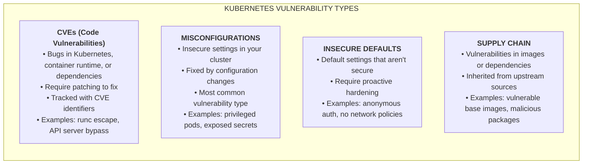
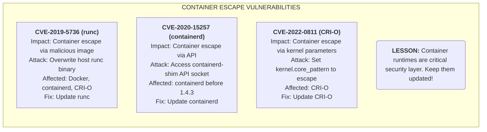
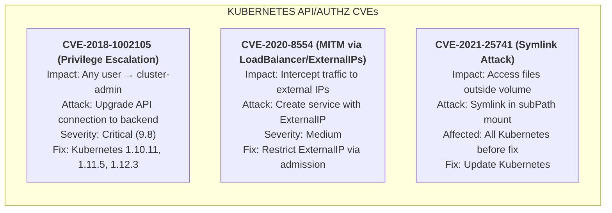
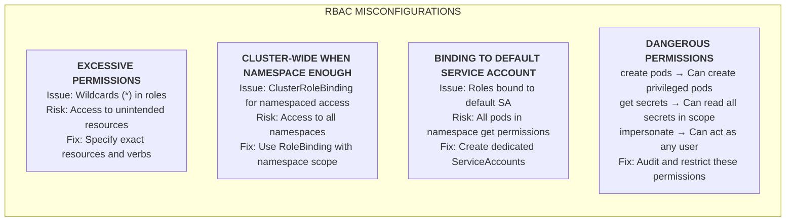
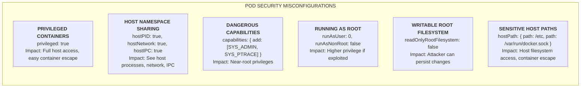
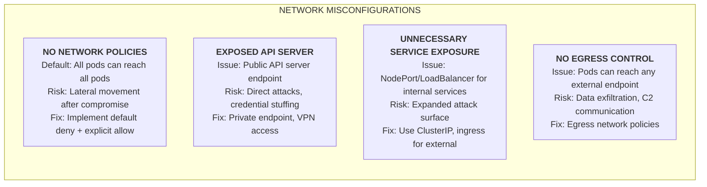
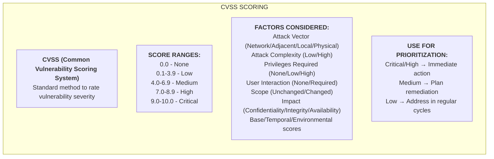
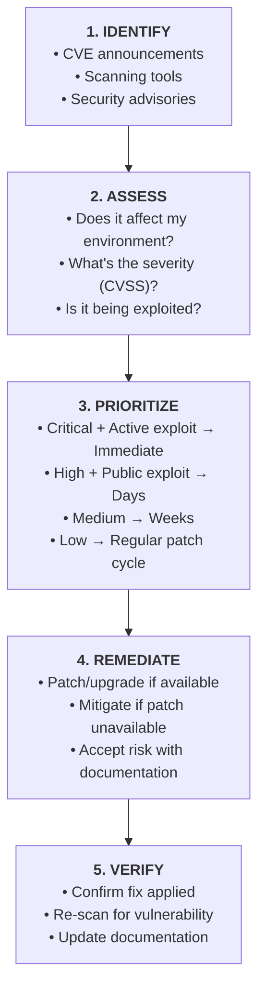

**Складність**: `[СЕРЕДНЯ]` — обізнаність про загрози та визначення пріоритетів. **Час на проходження**: 25-30 хвилин. **Передумови**: [Модуль 4.1: Поверхні атаки](../module-4.1-attack-surfaces/). Цей модуль передбачає Kubernetes 1.35 або новішу версію, а приклади команд використовують скорочення `alias k=kubectl` після того, як `kubectl` названо один раз.

## Що ви зможете зробити

Після завершення цього модуля ви зможете виконувати такі завдання під час реальної розмови про сортування інцидентів, де найважче — пов'язати технічні докази з обґрунтованим рішенням про усунення проблеми.

1. **Діагностувати** категорії вразливостей Kubernetes, зокрема CVE, неправильні конфігурації, небезпечні налаштування за замовчуванням та ризики ланцюга постачання.
2. **Оцінювати** серйозність та можливість експлуатації, поєднуючи CVSS, досяжність під час виконання, відкриті поверхні атаки та бізнес-контекст.
3. **Визначати пріоритети** усунення серед CVE середовища виконання, помилок RBAC, прогалин у безпеці Pod'ів, мережевої відкритості та вразливих образів.
4. **Впроваджувати** повторюваний робочий процес реагування на вразливості, який сканує, пом'якшує, перевіряє та документує рішення з безпеки.

## Чому цей модуль важливий

У грудні 2018 року Kubernetes розкрив CVE-2018-1002105 — критичну вразливість API-сервера, яка могла дозволити будь-якому автентифікованому користувачеві підвищити привілеї через оновлене з'єднання з внутрішнім API-сервером. Лякало не лише значення CVSS 9.8; лякала операційна форма цієї помилки. Користувач, який уже мав звичайні облікові дані, потенційно міг перетнути межу площини управління, діяти як cluster-admin і, можливо, залишити обмежений слід у конфігураціях аудиту за замовчуванням, тож цей інцидент змусив платформні команди ставитися до накатування виправлень як до надзвичайної ситуації площини управління, а не як до рутинного тікета на обслуговування.

Реальні інциденти рідко надходять у вигляді охайних підручникових категорій. Дашборд безпеки може показувати критичну CVE середовища виконання, проблему із залежністю застосунку високої серйозності, десятки знахідок середньої серйозності в образах, простір імен, повний привілейованих Pod'ів, і кластер без типової мережевої політики «заборонити все». Керівники можуть вимагати негайно виправити геть усе, тоді як команди застосунків переймаються простоями, регресіями та зірваними вікнами релізів. Навичка KCSA — це не запам'ятовування кожного ідентифікатора CVE; це вміння відокремлювати термінові шляхи експлуатації від галасливих знахідок, а потім пояснювати компроміс у термінах, з якими операційна команда може щось зробити.

Цей модуль навчає практичної моделі вразливостей для Kubernetes. Ви порівняєте дефекти коду з дефектами конфігурації, пов'яжете оцінювання CVSS із реальною відкритістю кластера та повправляєтеся будувати план реагування, який не плутає обсяг сканування зі зменшенням ризику. Тримайте в голові одне запитання, поки читаєте: якби сьогодні зловмисник скомпрометував одне робоче навантаження, яка вразливість найбільше допомогла б йому дістатися до ноди, API-сервера або іншого орендаря?

## Категорії вразливостей

Керування вразливостями Kubernetes починається з відокремлення того, де живе слабке місце. CVE в `runc`, `containerd`, API-сервері або мовній бібліотеці є вразливістю коду, тому що дефектна поведінка міститься всередині програмного забезпечення, яке потрібно виправити або замінити. Под, що працює як привілейований, RoleBinding, прикріплений до сервісного акаунта default, або необмежений сервіс LoadBalancer є вразливістю конфігурації, тому що небезпечна поведінка походить від того, як зібрано платформу. Обидві категорії можуть призвести до того самого результату, але вони рухаються різними шляхами власності, календарями релізів і методами перевірки.



Це розрізнення має значення, тому що для кожної категорії свій годинник пом'якшення. CVE середовища виконання може вимагати оновлення образів нод, узгодженого витіснення робочих навантажень і підтвердження, що кожна нода працює на виправленому пакеті; власник застосунку не може розв'язати її редагуванням маніфесту Deployment. Неправильну конфігурацію можна усунути негайно за допомогою мітки простору імен, зміни прив'язки RBAC, правила допуску або NetworkPolicy, але вона також може зламати робочі навантаження, які залежали від небезпечної поведінки. Ризик ланцюга постачання перебуває між цими світами, бо може вимагати перезбирання образів, зміни базових образів, закріплення залежностей і доведення, що вразливий пакет більше недосяжний.

Зупиніться та спрогнозуйте: якщо сканер знаходить вразливий пакет усередині образу контейнера, а окремий аудит знаходить монтування `hostPath` до `/var/run`, яка проблема з більшою ймовірністю перетвориться на компрометацію ноди після помилки віддаленого виконання коду в застосунку? Відповідь залежить від можливості експлуатації, але знахідка `hostPath` заслуговує на особливу увагу, бо може перетворити звичайний плацдарм у застосунку на пряму взаємодію з хостом. Питання KCSA часто перевіряють саме цей патерн міркування, а не вимагають запам'ятати точний синтаксис сканера.

Корисна ментальна модель — запитати, що має змінитися, щоб вразливість зникла. Якщо відповідь «встановити виправлений пакет або оновити компонент», ви, ймовірно, маєте справу з CVE або проблемою залежності. Якщо відповідь «припинити надання цього дозволу, відхилити цей маніфест або обмежити цей мережевий шлях», ви, ймовірно, маєте справу з проблемою конфігурації. Якщо відповідь «припинити успадковувати непотрібне програмне забезпечення з upstream», то знахідка належить до керування ланцюгом постачання, навіть коли сканер повідомляє про неї з ідентифікатором CVE.

Ця модель також прояснює докази. Для вразливостей коду вам потрібні докази версії, дайджести образів, переліки пакетів або посилання на бюлетені, що доводять відсутність дефектного коду. Для вразливостей конфігурації вам потрібні докази стану кластера, як-от мітки політик, відхилені маніфести, відповіді RBAC або спостережувані засоби контролю трафіку. Для небезпечних налаштувань за замовчуванням вам потрібні і змінене налаштування, і запобіжник, що не дає командам повертатися до значення за замовчуванням під час майбутніх розгортань.

Категорії також допомагають вам обрати, хто має бути в кімнаті. CVE середовища виконання та нод потребують платформних операцій, бо йдеться про заміну нод, налаштування kubelet та вікна обслуговування. CVE залежностей застосунків потребують власників сервісів, бо вони знають, як використовується пакет і як швидко можна протестувати перезбирання. Неправильні конфігурації RBAC, допуску та мережі зазвичай потребують внеску і платформи, і застосунку, бо платформа володіє запобіжниками, а команда застосунку — легітимними вимогами доступу. Хороше сортування — це частково технічна класифікація, а частково маршрутизація роботи до людей, які справді можуть змінити ризик.

### Помітні CVE Kubernetes

CVE з виходом за межі контейнера запам'ятовуються, бо порушують базову ментальну модель: контейнер не повинен ставати хостом. Наведені приклади торкнулися різних рівнів стека контейнерів, але кожен навчає того самого уроку. Kubernetes планує робочі навантаження, проте ізоляція контейнерів також залежить від низькорівневих компонентів середовища виконання, які Kubernetes не лагодить чарівним чином, коли оновлюється лише площина управління.



Операційна пастка — виправити не той рівень. Якщо CVE-2019-5736 присутня тому, що образ ноди містить вразливий `runc`, оновлення лише API-сервера Kubernetes не прибере вразливий двійковий файл із робочих нод. Шлях виправлення зазвичай передбачає оновлення пакета середовища виконання або керованого образу ноди, безпечне витіснення нод, їхню заміну, а потім підтвердження виправленої версії середовища виконання. Перш ніж запускати усунення в реальному кластері, запитайте, який вивід ви очікуєте від `k get nodes -o wide` до та після розкочування: ви маєте побачити переробку нод або повідомлення про нову версію образу, а не просто справну версію площини управління.

Знахідки середовища виконання контейнерів особливо чутливі у спільних кластерах, бо вразливий рівень лежить нижче меж між орендарями. Низькопривілейоване робоче навантаження в одному просторі імен може працювати на тій самій ноді, що й чутливе робоче навантаження в іншому просторі імен, і середовище виконання є частиною історії ізоляції для обох. Якщо експлойт дає доступ до хоста, RBAC та NetworkPolicy на рівні простору імен можуть вже бути недостатніми, бо зловмисник може взаємодіяти з обліковими даними kubelet, файлами хоста або іншими робочими навантаженнями на цій ноді. Саме тому оновлення середовища виконання зазвичай належать до окремої платформної смуги накатування виправлень із відрепетируваною заміною нод, а не до беклогу команди застосунку.

Керований Kubernetes не знімає цю відповідальність; він змінює інтерфейс. Деякі провайдери патчать площини управління автоматично, але вимагають від клієнтів оновлювати пули нод, замінювати образи машин або прокручувати керовані групи нод. Інші провайдери відкривають версії образів нод, бюлетені безпеки та канали оновлення. Хороше реагування на вразливості запитує, якою частиною стека володіє провайдер, якою — клієнт, і які докази підтверджують, що кероване провайдером виправлення справді дійшло до кластера.

CVE ядра Kubernetes відрізняються, бо часто стосуються поведінки автентифікації, авторизації, допуску чи зберігання всередині самої платформи. Ці проблеми небезпечні, бо API-сервер є брокером довіри для всього кластера. Коли помилка площини управління підриває авторизацію, навіть добре посилений контекст безпеки робочого навантаження може не захистити кластер від користувача чи сервісного акаунта, який здатен дістатися до вразливого шляху.



Зверніть увагу, як змінюється мова пом'якшення в цих прикладах. CVE-2018-1002105 вимагає накатування виправлення на Kubernetes, бо вразлива поведінка міститься у шляху обробки запитів API-сервера. CVE-2020-8554 зазвичай пом'якшують контролем допуску та політикою, що обмежує, хто може використовувати поведінку зовнішніх IP, бо небезпечна можливість залежить від конфігурації сервісу. CVE-2021-25741 вимагає виправлення Kubernetes, але вона також нагадує ретельно перевіряти робочі навантаження, які використовують монтування `subPath`, символьні посилання та файлові трюки, бо зручність зберігання може перетворитися на обхід межі.

CVE площини управління потребують додаткової обачності, бо короткострокове пом'якшення може бути можливим, але неповним. Обмеження досяжності API-сервера через приватні точки доступу, VPN або бастіонні хости може зменшити, хто здатен спробувати експлуатацію, але воно не лагодить вразливий шлях авторизації для користувачів, які все одно автентифікуються. Посилення RBAC може зменшити кількість акаунтів, здатних дістатися до вразливої поведінки, але воно може не захистити від вразливості, що зачіпає будь-який автентифікований суб'єкт. Ставтеся до пом'якшення як до засобу зменшення ризику, поки готується оновлення, а не як до заміни виправленого релізу.

Логування аудиту змінює позицію реагування на ці проблеми. Якщо вразливість стосується поведінки API-сервера, команда має запитати, чи фіксують журнали аудиту відповідні дієслова, ресурси, користувачів та коди відповідей. У старіших або недостатньо налаштованих кластерах відсутність доказів не є підтвердженням того, що експлуатації не відбулося. Для міркувань KCSA важливо, що запобігання, виявлення та накатування виправлень — усе має значення, але накатування виправлення прибирає дефектний шлях, тоді як виявлення лише допомагає вам його розслідувати.

Оновлення площини управління слід планувати з огляду на сумісність, але сумісність не може стати постійним приводом працювати на вразливому релізі. Перегляньте застарілі API, вебхуки допуску, контролери та клієнтські бібліотеки до вікна оновлення, щоб виправлення безпеки не блокувалося несподіванками, які можна було знайти раніше. Для керованих кластерів підтвердьте підтримуваний провайдером перекіс версій між площиною управління, kubelet і клієнтом. Для самокерованих кластерів відрепетируйте резервне копіювання etcd, очікування щодо відкату та перевірки справності після оновлення, перш ніж надзвичайна ситуація змусить команду імпровізувати.

### Поширені неправильні конфігурації

Неправильні конфігурації домінують у ризиках Kubernetes, бо їх легко створити під час звичайної роботи з доставки. Розробник просить «лише достатньо доступу, щоб дебажити продакшен», платформна команда надає Role із символом підстановки, щоб розблокувати інцидент, а через місяці цей тимчасовий дозвіл усе ще прив'язаний до сервісного акаунта, яким користуються багато Pod'ів. Кластер зробив рівно те, на що його налаштували, тому сканери часто повідомляють про знахідки конфігурації як про вразливості, навіть коли жодної CVE немає.



Помилки RBAC особливо серйозні, бо дозволи Kubernetes складаються несподіваними способами. Суб'єкт, який може створювати Pod'и в просторі імен, може отримати змогу монтувати токени сервісного акаунта, обирати образи, запитувати доступ до хоста, якщо допуск це дозволяє, або запускати робоче навантаження, що читає секрети, змонтовані в цей простір імен. Суб'єкт, який може `get secrets`, часто може стати будь-якою ідентичністю робочого навантаження в межах області, бо токени сервісних акаунтів та облікові дані є секретами. Переглядаючи RBAC, не запитуйте лише, чи звучить дієслово адміністративно; запитуйте, що зловмисник міг би побудувати, поєднавши це дієслово зі створенням Pod'ів, доступом до секретів, уособленням і досяжністю простору імен.

Найнадійніший огляд RBAC починається із суб'єктів, а не з ролей. Перелічіть користувачів, групи та сервісні акаунти, що існують у просторі імен, а потім запитайте, що кожен із них може зробити, якщо його обліковий запис викрадуть. Це утримує огляд закоріненим у русі зловмисника, а не в абстрактному YAML. Правило із символом підстановки може виглядати зручним, але його реальне значення — успадкування дозволів у майбутньому: коли API отримує нові ресурси або коли оператори встановлюють користувацькі ресурси, символ підстановки може автоматично включити можливості, які ніхто не переглядав.

Сервісні акаунти default заслуговують на особливу прискіпливість, бо про них легко забути. Якщо простір імен має потужний RoleBinding до сервісного акаунта default, кожен Под, який не вказує власну ідентичність, може успадкувати цю силу. Навіть коли BoundServiceAccountTokenVolume та закінчення терміну дії токена зменшують частину історичного ризику, скомпрометований Под усе одно може використовувати змонтований токен, поки той дійсний. Найменші привілеї означають, що робочі навантаження повинні мати ідентичності, які відповідають їхнім реальним потребам в API, а багатьом робочим навантаженням токен API взагалі не потрібен.

Дозволи на уособлення заслуговують на ту саму увагу, що й прямі дозволи. Користувач, який не може видаляти секрети напряму, усе одно може стати небезпечним, якщо він здатен уособлювати сервісний акаунт або групу з ширшим доступом. Агреговані ClusterRole також можуть здивувати команди, бо мітки можуть спричинити перетікання дозволів у стандартні ролі. Під час огляду пройдіть ланцюг від суб'єкта до прив'язки, до ролі та до фактичного дозволу, а потім перевірте результат за допомогою `k auth can-i`, використовуючи точного користувача чи сервісний акаунт, який існував би під час атаки.



Слабкі місця у безпеці Pod'ів небезпечні, бо вони скорочують відстань між компрометацією застосунку та компрометацією ноди. Запуск від імені root усередині контейнера не є автоматично тим самим, що root на хості, але він підвищує наслідки помилки ядра, небезпечного монтування, записуваної файлової системи чи виходу з середовища виконання. Привілейований режим, простори імен хоста та широкі можливості Linux прибирають рівні, які мали зробити експлуатацію складнішою. Хороший огляд запитує, чи справді робоче навантаження потребує кожного винятку, чи ізольовано виняток до виділеного простору імен, і чи контроль допуску запобігає тихому поширенню того самого винятку.

Pod Security Standards дають спільний словник для цих виборів. Профіль Restricted прагне прибрати ризиковані налаштування за замовчуванням, яких більшість застосункових робочих навантажень не потребує, тоді як Baseline дозволяє ширший, але все ще контрольований набір налаштувань. Привілейовані робочі навантаження можуть бути легітимними для агентів нод, драйверів сховища чи мережевих компонентів, але вони мають бути рідкісними, поіменованими та ізольованими. Поширена помилка — ставитися до профілю винятків як до зручності простору імен, а не як до задокументованого рішення про межу безпеки.

Поля контексту безпеки також взаємодіють із дизайном образу. Контейнер, якому потрібно записувати у свою кореневу файлову систему, працювати від UID 0 та встановлювати пакети під час запуску, складніше заблокувати, ніж образ, зібраний для запуску від імені користувача без прав root, із явно змонтованими записуваними каталогами застосунку. Це одна з причин, чому керування вразливостями починається ще до маніфестів розгортання. Практики збирання, вміст образу, власність на файли та засоби контролю безпеки під час виконання або підсилюють одне одного, або змушують операторів до повторних винятків.

HostPath заслуговує на окреме застереження, бо виглядає як зручний інструмент спільного доступу до файлів, а поводиться як отвір крізь межу контейнера. Монтування вузького каталогу може бути виправданим для агента ноди, який читає логи або відкриває файли пристроїв, але монтування чутливих шляхів, як-от `/etc`, сокетів середовища виконання контейнерів чи широких каталогів хоста, дає зловмисникові потужні примітиви після компрометації робочого навантаження. Якщо робоче навантаження потребує доступу до хоста, огляд має запитати, чому безпечніший інтерфейс не може надати нативний API Kubernetes, драйвер CSI, проєкційний том або спеціально зібраний DaemonSet.



Неправильні мережеві конфігурації формують те, що станеться після компрометації першого робочого навантаження. Без забезпечення NetworkPolicy Под, який має спілкуватися лише з одним бекендом, може сканувати сусідні сервіси, дістатися до баз даних, викликати внутрішні адміністративні точки доступу або витягувати дані напряму в інтернет. Відкритість API-сервера має інший профіль, бо зловмисникам не потрібно спершу компрометувати Под; вони можуть атакувати автентифікацію, викрадені облікові дані або вразливі шляхи API ззовні кластера. Який підхід ви обрали б для регульованого продакшен-простору імен і чому: широку політику «дозволити все» з автентифікацією на рівні сервісу чи політику «заборонити все» з явним вхідним та вихідним трафіком? Безпечніша відповідь зазвичай починається з мережевої заборони, а потім документує необхідні потоки, бо так несподіване спілкування стає видимим під час огляду.

NetworkPolicy також є залежністю від реалізації мережі кластера. Kubernetes зберігає об'єкти політик, але забезпечення надходить від мережевого плагіна, що їх підтримує. Команда може створити прекрасні маніфести політик і все одно не отримати жодного зменшення трафіку, якщо CNI не реалізує політику або якщо поведінка вихідного трафіку перебуває поза налаштованою областю плагіна. Тому перевірка має включати функціональний тест або гарантію провайдера, а не лише наявність YAML у Git.

Огляди відкритості мають включати типи Service, а не лише об'єкти політик. Сервіс `ClusterIP` досяжний усередині кластера, `NodePort` відкриває порт на нодах, а `LoadBalancer` може створити зовнішню інфраструктуру. Ingress-контролери, шлюзи та сервісні сітки додають більше шляхів, які можуть випадково відкрити адміністративні точки доступу чи точки метрик. Сортуючи вразливість, запитайте, чи звернене зачеплене робоче навантаження до інтернету, чи воно внутрішнє для кластера, локальне для ноди, або недосяжне без іншого плацдарму; ця відповідь часто змінює терміновість усунення.

Контроль вихідного трафіку часто є відсутньою половиною стримування. Правила вхідного трафіку можуть захистити вразливий сервіс від небажаних викликів, але правила вихідного трафіку обмежують, куди скомпрометований Под може надсилати дані чи звідки отримувати інструменти. Багатьом атакам потрібен вихідний доступ для командно-керувальної комунікації, завантаження корисного навантаження, викрадення облікових даних або доступу до метаданих хмари. Практична програма політик починається з чутливих просторів імен, дозволяє відомі залежності та використовує логування або дані про потоки, щоб виявити легітимний трафік до того, як суворо забезпечувати вихідний трафік повсюдно.

### Оцінювання вразливостей та контекст

CVSS — це корисна мова серйозності, а не автоматична система планування. Базова оцінка фіксує внутрішні характеристики, як-от вектор атаки, необхідні привілеї, взаємодію з користувачем, область та вплив, що допомагає командам порівнювати знахідки різних постачальників. Операторам Kubernetes усе одно потрібен контекст середовища, бо критична CVE в невикористовуваній бібліотеці — це не той самий операційний ризик, що вихід із середовища виконання високої серйозності на кожній ноді. Правильне запитання — не «яка оцінка?», а «чого насправді може дістатися зловмисник, з якими привілеями, у цьому кластері?».



Розгляньте сканування образу, що повідомляє про 150 CVE: дві Critical, вісім High, десятки знахідок Medium та багато знахідок Low у невикористовуваних пакетах. Керівництво може вимагати, щоб усі знахідки зникли до розгортання, але це може підштовхнути команди до некорисного театру, як-от повторне перезбирання без зміни відкритості. Краще реагування групує знахідки за шляхом експлуатації: проблеми віддаленого виконання коду, звернені до інтернету; вразливості в пакетах, які насправді завантажує процес; проблеми виходу із середовища виконання чи ядра; та недосяжні пакети, успадковані з роздутого базового образу. Остання група все ще має значення, але її зазвичай розв'язують зменшенням базового образу та запланованими перезбираннями, а не блокуванням кожного релізу.

Оцінювання середовища — це там, де контекст Kubernetes стає видимим. Вектор мережевої атаки важить більше, коли сервіс досяжний з інтернету або від багатьох недовірених орендарів. Необхідні привілеї важать інакше, якщо кожен Под за замовчуванням отримує надмірно потужний токен. Взаємодія з користувачем може звучати неактуально для серверних робочих навантажень, доки ви не згадаєте, що CI-системи, вебхуки допуску, реєстри образів та оператори можуть обробляти артефакти, контрольовані зловмисником. CVSS дає вам граматику, але архітектура кластера дає вам речення.

Зрілість експлойта має впливати на терміни, не перетворюючись на паніку. Критична CVE з публічним кодом експлойта та активною експлуатацією належить до екстреного шляху, бо вартість для зловмисника низька. Висока CVE без відомого експлойта все одно може бути терміновою, якщо компонент відкритий, а бізнес-вплив серйозний. Середню CVE у внутрішній залежності можна запланувати, якщо існують компенсаційні засоби контролю. Рішення слід задокументувати достатньо детально, щоб пізніший рецензент бачив, чому команда обрала саме цей графік.

Бізнес-контекст — це не привід знижувати безпеку; це спосіб точно описати вплив. Вразливе пакетне завдання у просторі імен розробки із синтетичними даними відрізняється від тієї самої вразливості у платіжному сервісі, що обробляє записи клієнтів. Скомпрометований компонент спостережуваності може бути серйознішим, ніж підказує класифікація його даних, бо він бачить логи, токени та трафік багатьох команд. Оцінюючи знахідку, включіть і технічний шлях експлуатації, і бізнес-актив, якому вона загрожує, щоб пріоритет був зрозумілим поза командою безпеки.

### Виявлення вразливостей

Виявлення має охоплювати образи, конфігурацію кластера, позицію допуску та поведінку під час виконання, бо жоден окремий інструмент не бачить усієї платформи. Сканери образів, як-от Trivy та Grype, перевіряють пакети, шари операційної системи та мовні залежності. Інструменти конфігурації, як-от kube-bench, порівнюють налаштування площини управління та нод із рекомендаціями еталона. Інструменти середовища виконання, як-от Falco, шукають підозрілу поведінку після запуску робочих навантажень, тоді як рушії політик, як-от OPA Gatekeeper або політики допуску, не дають прийняти відомо погані маніфести від самого початку.

| Інструмент | Призначення |
|------|---------|
| **Trivy** | Сканування образів контейнерів |
| **Grype** | Сканування образів контейнерів |
| **kube-bench** | Перевірки еталона CIS |
| **kubeaudit** | Аудит безпеки |
| **Falco** | Виявлення загроз під час виконання |
| **Polaris** | Перевірка найкращих практик |
| **OPA/Gatekeeper** | Забезпечення політик |

Таблиця навмисно змішана, бо робота з вразливостями перетинає межі команд. Платформна команда безпеки може володіти знахідками kube-bench для прапорців API-сервера, команда розробників може володіти CVE образів, привнесеними залежністю застосунку, а команда операцій кластера може володіти оновленнями версій середовища виконання. Якщо ці знахідки потраплять в одну чергу тікетів без міток власності, черга стане галасом. Хороші програми прив'язують кожну знахідку до власника компонента, дії з усунення, правила приймання та команди перевірки, що доводить зміну стану знахідки.

Частота сканування має відповідати частоті змін. Образи слід сканувати під час збирання, під час допуску до середовищ і коли нова розвідка про вразливості змінює статус наявного дайджесту. Конфігурацію кластера слід перевіряти після оновлень, змін пулів нод, оновлень політик та змін конфігурації провайдера. Виявлення під час виконання має працювати безперервно, бо воно спостерігає поведінку, яку статичні сканери побачити не можуть, як-от несподіване виконання оболонки чи записи у чутливі шляхи. Розклад сканування є частиною засобу контролю, а не адміністративною дрібницею наостанок.

Хибні спрацювання та хибні пропуски обидва потребують дисципліни. Хибне спрацювання слід задокументувати з доказами, як-от аналіз досяжності пакета чи відповідальність, керована провайдером, щоб та сама суперечка не повторювалася щодня. Хибний пропуск слід розслідувати, коли інцидент, бюлетень чи ручний огляд знаходять відкритість, яку інструменти проґавили. Зрілі команди налаштовують сканери, але не глушать категорії лише тому, що дашборд незручний. Мета — сигнал, що веде до дії, а не звіт, який виглядає бездоганно.

```text
[INFO] 1 Control Plane Security Configuration
[PASS] 1.1.1 Ensure API server pod file permissions (score)
[FAIL] 1.1.2 Ensure API server pod file ownership (score)
[WARN] 1.2.1 Ensure anonymous-auth is not disabled (info)
...

== Summary ==
45 checks PASS
10 checks FAIL
5 checks WARN
```

Зразковий вивід kube-bench показує, чому сирі підрахунки можуть вводити в оману. Невдала перевірка дозволів на файл може мати низький операційний ризик, якщо керована площина управління володіє файловою системою та запобігає прямому доступу до хоста, тоді як анонімна автентифікація на самокерованому API-сервері може бути терміновою, бо вона змінює, хто може дістатися до неавтентифікованих точок доступу. Перш ніж виправляти все в одне вікно обслуговування, перегляньте, що захищає кожен засіб контролю, чи керує ним провайдер кластера, і чи може його зміна зламати наявних клієнтів. Поетапний план із логуванням аудиту в першу чергу часто зменшує і ризик безпеки, і ризик простою.

Знахідки еталона слід зіставляти з моделлю розгортання. Самокерований кластер на віртуальних машинах має інші відповідальності, ніж керована площина управління, де прапорці API-сервера не редагуються клієнтом. Якщо еталон очікує прямих перевірок власності на файли на нодах площини управління, до яких ви не маєте доступу, знахідка може стати вимогою атестації провайдером, а не локальною командою. Питання безпеки залишається дійсним, але формат доказів змінюється з інспекції хоста на документацію провайдера, налаштування конфігурації чи зобов'язання підтримки.

Результати допуску та сканування мають живити одне одного. Якщо сканери раз за разом знаходять привілейовані Pod'и, відсутні межі ресурсів, змінювані теги образів чи використання токена сервісного акаунта default, ці знахідки є кандидатами на політику допуску, бо організація вже вирішила, що вони неприйнятні. Якщо політика допуску раз за разом блокує легітимні робочі навантаження, правило може потребувати чіткішого шляху винятків або кращих шаблонів. Цей цикл зворотного зв'язку перетворює виявлення вразливостей на запобігання, замість того щоб дозволяти тим самим помилкам з'являтися знову в кожному релізі.

### Реагування на вразливості

Реагування — це цикл, а не героїчне одноразове накатування виправлення. Ви виявляєте знахідки через бюлетені, сканери, аудити чи звіти про інциденти; оцінюєте, чи зачеплений компонент існує та чи досяжний; визначаєте пріоритет на основі можливості експлуатації та впливу; усуваєте через накатування виправлень чи конфігурацію; і перевіряєте, що стан кластера змінився. Цикл також створює докази для майбутніх оглядів, бо задокументований прийнятий ризик відрізняється від забутої знахідки сканера, якою ніхто не володіє.



Перевірка має бути достатньо конкретною, щоб інший інженер міг її повторити. Для CVE середовища виконання перевірка може включати версії образів нод, версії пакетів, кількість витіснених і замінених нод та чистий результат сканера. Для RBAC перевірка може включати перевірки `k auth can-i` для зачепленого сервісного акаунта та простору імен. Для безпеки Pod'ів перевірка може включати мітки простору імен, тести відхилення допуску та пошук залишкових привілейованих робочих навантажень. Звичка проста: кожен тікет на усунення має закінчуватися доказом, а не лише коментарем, що команда вважає проблему виправленою.

Пом'якшення — це не те саме, що усунення, і різниця має значення під час тиску інциденту. Пом'якшення зменшує ймовірність чи вплив, поки дефект залишається, як-от обмеження доступу до API, блокування небезпечного типу Service або ізоляція відкритого простору імен. Усунення прибирає дефект чи неправильну конфігурацію, як-от оновлення виправленого компонента, перезбирання образу або видалення надто широкої прив'язки. План реагування має назвати обидва, коли потрібні обидва, бо зацікавлені сторони можуть прийняти коротке пом'якшення лише якщо бачать, що тривке виправлення заплановане.

Комунікація є частиною роботи з вразливостями, бо пріоритети конкурують із роботою над надійністю. Корисне оновлення каже, що знайдено, чи зачеплене середовище, що міг би отримати зловмисник, яке пом'якшення вже застосовано, яка наступна дія та які докази закриють тікет. Уникайте формулювання «критична знахідка сканера» як цілого пояснення. Краще повідомлення — «зачеплене середовище виконання існує на робочих нодах, що запускають продакшен-навантаження, вихід за межі контейнера дав би доступ до хоста, заміна нод починається сьогодні ввечері, а перевірка додасть виправлені версії середовища виконання».

Цикл реагування має також включати керування винятками. Деякі знахідки не можна виправити негайно, бо виправлення постачальника недоступне, застарілому робочому навантаженню потрібен редизайн, або оновлення вимагає бізнес-тестування. У таких випадках команда має задокументувати власника, компенсаційні засоби контролю, дату закінчення та тригер перегляду. Прийнятий ризик без дати закінчення зазвичай є відкладеною роботою під маскуванням, а відкладена робота з безпеки схильна ставати невидимою аж до наступного аудиту чи інциденту.

Перевірка має бути пропорційною ризику знахідки. Невикористовуваний пакет низької серйозності може потребувати лише чистого сканування образу після наступного перезбирання, тоді як вихід за межі середовища виконання має вимагати доказів на рівні ноди, доказів перепланування робочих навантажень і, можливо, другого незалежного сканування. Загальнокластерне виправлення RBAC має включати негативні тести, що доводять заборону небезпечної дії, а не лише різницю в маніфесті, яка виглядає вужчою. Чим серйозніший радіус ураження, тим більше докази закриття мають доводити, що шлях зловмисника зник.

## Патерни та антипатерни

Ефективні програми з вразливостей перетворюють повторювані рішення на патерни. Мета — не створити бюрократію; вона в тому, щоб не дати кожній знахідці перетворитися на унікальну суперечку між командами безпеки, платформи та застосунку. Коли правила прийняття рішень видимі, команди можуть рухатися швидше, бо знають, які знахідки блокують розгортання, які потребують екстреного обслуговування, а які можна прийняти з компенсаційними засобами контролю, поки готується безпечніше розкочування.

| Патерн | Коли його застосовувати | Чому він працює | Міркування щодо масштабування |
|---------|----------------|--------------|-----------------------|
| Сортування на основі ризику | Обсяг сканування перевищує спроможність команди | Поєднує CVSS із досяжністю та власністю компонентів | Потребує письмового SLA, щоб команди не перерозглядали кожну знахідку |
| Заборонити все плюс явний дозвіл | Продакшен-простори імен із чутливими даними чи спільною орендою | Обмежує бічне переміщення після компрометації одного Pod | Потребує даних про власність сервісів і спостережуваність для заблокованого трафіку |
| Виділені ідентичності робочих навантажень | Будь-яке навантаження, що звертається до API чи хмарних сервісів | Запобігає розповзанню сервісного акаунта default і звужує радіус ураження | Потребує шаблонів, щоб команди не писали кожен акаунт і прив'язку вручну |
| Смуги накатування виправлень для платформних компонентів | Вразливості середовища виконання, образу ноди, API-сервера та CNI | Тримає інфраструктурні виправлення окремо від календарів релізів застосунків | Потребує відрепетируваної заміни нод та процедур відкату |

Антипатерни зазвичай походять від тиску, а не від невігластва. Команда надає cluster-admin, бо дебагінг терміновий, залишає привілейований режим увімкненим, бо застарілому агентові він потрібен, або ігнорує знахідки середньої серйозності, бо дашборд уже переповнений. Ці вибори можуть бути зрозумілими під час інциденту, але вони стають вразливостями, коли ніхто не записує виняток, не встановлює дату закінчення чи не перевіряє, що існує безпечніша заміна.

Один сильний патерн — визначати цілі рівня обслуговування з вразливостей за категорією, а не лише за оцінкою сканера. Наприклад, активно експлуатовані виходи із середовища виконання, проблеми віддаленого виконання коду, звернені до інтернету, та дефекти підвищення привілеїв площини управління можуть ділити екстрену смугу, тоді як недосяжні знахідки залежностей можуть йти смугою запланованого перезбирання. Деталі різняться за організацією, але принцип стабільний: терміни усунення мають відображати можливість і вплив для зловмисника, а не лише кольоровий значок серйозності.

Інший сильний патерн — політика-як-код на етапі допуску. Якщо організація вирішила, що продакшен-простори імен мають відхиляти привілейовані Pod'и, мережу хоста, токени сервісного акаунта default чи змінювані теги образів, то кластер має забезпечувати це рішення до розгортання, а не просити рецензентів ловити його вручну. Політика допуску не замінює навчання, бо командам усе одно потрібно розуміти, чому маніфест відхилено, але вона перетворює відомі помилки на швидкий зворотний зв'язок замість пізніх знахідок аудиту.

Третій патерн — вести інвентар вразливостей, що відстежує запущені артефакти, а не лише репозиторії. Репозиторії вихідного коду кажуть вам, що команди мають намір зібрати, але кластери запускають дайджести образів, образи нод, релізи Helm, контролери, CRD та керовані провайдером компоненти. Під час бюлетеня найшвидші команди можуть відповісти, чи розгорнуто зачеплений компонент, де він працює, хто ним володіє та яка версія активна. Цей інвентар зменшує час між публічним розкриттям і оцінкою, специфічною для середовища.

| Антипатерн | Що йде не так | Краща альтернатива |
|--------------|-----------------|--------------------|
| Ставитися до підрахунків сканера як до ризику | Команди женуться за галасом пакетів із низьким впливом, поки досяжні шляхи експлуатації лишаються відкритими | Ранжуйте за можливістю експлуатації, відкритістю, набутими привілеями та чутливістю активу |
| Патчити Kubernetes, але не ноди | CVE середовища виконання лишаються присутніми, бо вразливий двійковий файл живе на воркерах | Відстежуйте версії API-сервера, kubelet, середовища виконання, образу ОС та CNI окремо |
| Прив'язувати потужні ролі до сервісних акаунтів default | Кожен Под у просторі імен успадковує широкий доступ до API | Створіть виділені сервісні акаунти та прив'язуйте лише потрібні дієслова в межах простору імен |
| Дозволяти постійні привілейовані винятки | Тимчасові обхідні рішення для сумісності стають нормальною позицією розгортання | Використовуйте ізоляцію простору імен, винятки допуску з датою закінчення та плани заміни |

## Фреймворк прийняття рішень

Коли надходить знахідка, почніть із розміщення її на двох осях: можливість експлуатації та радіус ураження. Можливість експлуатації запитує, чи може зловмисник дістатися до вразливого компонента з привілеями, необхідними для експлуатації. Радіус ураження запитує, що зловмисник отримує після успіху: окремий процес, простір імен, root ноди, cluster-admin чи доступ до чутливих даних. Знахідка середньої серйозності з загальнокластерним радіусом ураження може переважити високу знахідку в недосяжній бібліотеці, а вихід за межі середовища виконання високої серйозності може переважити багато знахідок в образах, бо він змінює межу між контейнером і хостом.

| Тип знахідки | Перше запитання | Негайне пом'якшення | Тривке виправлення |
|--------------|----------------|----------------------|-------------|
| CVE середовища виконання чи ноди | Чи запускають зачеплені ноди експлуатовні робочі навантаження? | Закордонуйте ноди високого ризику або обмежте ризиковані навантаження | Оновіть середовище виконання або замініть образи нод |
| CVE площини управління Kubernetes | Чи можуть автентифіковані або зовнішні користувачі дістатися до вразливого шляху? | Обмежте доступ до API та моніторте журнали аудиту | Оновіть Kubernetes до виправленого релізу |
| CVE образу застосунку | Чи завантажено чи досяжний вразливий пакет? | Заблокуйте відкриті навантаження або зменшіть вхідний трафік | Перезберіть із виправленою залежністю чи меншим базовим образом |
| Неправильна конфігурація RBAC | Що може зробити цей суб'єкт, якщо його токен викрадуть? | Приберіть небезпечні дієслова чи прив'язки | Перепроєктуйте ролі найменших привілеїв і власність |
| Прогалина в безпеці Pod | Чи потребує навантаження доступу до хоста чи привілеїв? | Ізолюйте простір імен і додайте запобіжники допуску | Приберіть привілеї, можливості, простори імен хоста чи небезпечні монтування |
| Мережева відкритість | Чи може скомпрометований Под переміщуватися бічно чи викрадати дані? | Додайте «заборонити все» та критичні правила дозволу | Підтримуйте політики, специфічні для сервісів, із тестами |

Використовуйте просту послідовність реагування, коли рішення оскаржуються. По-перше, підтвердьте, чи зачеплений компонент існує в середовищі і чи зіставив сканер правильну версію. По-друге, вирішіть, чи досяжна вразлива поведінка зі шляху, контрольованого зловмисником. По-третє, визначте найвищий привілей чи доступ до даних, який зловмисник може отримати. По-четверте, оберіть найменше пом'якшення, що зменшує ризик, поки тестується тривке виправлення. Ця послідовність утримує команду від суперечок лише про мітки серйозності.

Для CVE коду рішення часто залежить від досяжності та механіки оновлення. Якщо зачеплений пакет міститься в запущеному процесі, що приймає недовірений ввід, знахідка рухається до екстреної смуги. Якщо пакет присутній, але невикористовуваний, команда може прийняти короткостроковий ризик, перезбираючи образ з меншого базового. Якщо компонент — це середовище виконання контейнерів або kubelet, команда має мислити пулами нод і вікнами обслуговування, бо виправлення може вимагати заміни інфраструктури, а не повторного розгортання застосунку.

Для вразливостей конфігурації рішення часто залежить від радіуса ураження та сумісності. Видалення Role із символом підстановки може бути простим, якщо журнали аудиту показують, що дієслова невикористовувані, але воно може вимагати поетапного розкочування, якщо контролери залежать від широкого доступу. Забезпечення Restricted Pod Security може бути безпечним для нових просторів імен, тоді як застарілі простори імен потребують планів міграції. Додавання політики вихідного трафіку може вимагати спершу спостережуваності, щоб команда не блокувала легітимні залежності наосліп. Хороше усунення конфігурації звужує привілеї, зберігаючи можливість дебажити збої.

Для ризику ланцюга постачання рішення часто залежить від походження та контролю над перезбиранням. Образ із довіреного внутрішнього конвеєра з відомим дайджестом, підписаними метаданими та актуальним базовим образом оцінювати легше, ніж змінюваний тег, витягнутий із публічного реєстру. Залежність, закріплену через lockfile, відтворити легше, ніж пакет, встановлений динамічно під час запуску контейнера. Фреймворк має винагороджувати команди, що роблять артефакти зрозумілими, бо зрозумілі артефакти легше патчити під тиском.

Коли дві знахідки виглядають рівними, віддавайте перевагу виправленню, що згортає найбільше шляхів зловмисника. Видалення привілейованого режиму з широко вживаного розгортання може зменшити вплив кількох майбутніх помилок застосунку, тоді як оновлення одного невикористовуваного пакета може лише поліпшити оцінку сканера. І навпаки, накатування виправлення на вихід за межі середовища виконання може захистити кожен простір імен на зачеплених нодах, що може переважити багато локальних виправлень застосунків. Саме тому зменшення радіуса ураження є практичним інструментом визначення пріоритетів, а не теоретичною вправою.

Фреймворк має закінчуватися явним твердженням рішення. Сильне твердження називає знахідку, категорію, зачеплену область, шлях експлуатації, обраний пріоритет, негайне пом'якшення, тривке виправлення, власника та докази перевірки. Це може звучати формально, але це запобігає неоднозначності, коли залучено кілька команд. Воно також дає рецензентам компактний запис, що доводить: команда врахувала і серйозність за сканером, і специфічний для Kubernetes контекст, перш ніж обрати шлях усунення.

## Чи знали ви?

- **CVE-2018-1002105 несла оцінку CVSS 9.8**, бо автентифікований користувач потенційно міг підвищити привілеї через шлях оновлення з'єднання API-сервера, що зробило її одним із найсерйозніших інцидентів авторизації Kubernetes.

- **Образ контейнера може повідомляти про 100+ вразливостей, навіть коли застосунок використовує лише частку встановлених пакетів**, тому мінімальні образи та аналіз досяжності важать не менше, ніж сирі підсумки сканера.

- **Образи на кшталт distroless та scratch суттєво зменшують повідомлюваний обсяг CVE** — багато команд повідомляють про значне падіння — бо для сканування лишається набагато менше поверхні ОС; вони прибирають оболонки, менеджери пакетів і невикористовувані пакети операційної системи, якими зловмисники зазвичай зловживають після отримання виконання.

- **NetworkPolicy не забезпечується самим Kubernetes**; вона потребує мережевого плагіна, що реалізує політику, тож маніфест може існувати без фактичного зменшення трафіку, якщо мережевий рівень кластера її не підтримує.

## Типові помилки

| Помилка | Чому вона трапляється | Як її виправити |
|---------|----------------|---------------|
| Ігнорування критичних CVE середовища виконання | Команди припускають, що оновлення версії Kubernetes також патчить пакети середовища виконання нод | Відстежуйте версії середовища виконання окремо та замінюйте чи оновлюйте зачеплені ноди |
| Сканування без призначення власників | Знахідки потрапляють у спільний дашборд, де ніхто не має повноважень на усунення | Додавайте власника, компонент, дату виконання та докази перевірки до кожної знахідки |
| Ставлення до всіх високих CVE однаково | CVSS використовують без перевірки, чи досяжний вразливий код | Поєднуйте CVSS із відкритістю, статусом завантаженого пакета та компенсаційними засобами контролю |
| Сканування лише образів контейнерів | Інструменти для образів пропускають RBAC, безпеку Pod'ів, API-сервер та мережеві неправильні конфігурації | Поєднуйте сканування образів із kube-bench, політикою допуску та виявленням під час виконання |
| Надання загальнокластерного RBAC для роботи в просторі імен | ClusterRoleBinding здається швидшим під час дебагінгу чи реагування на інцидент | Використовуйте RoleBinding для області простору імен і завершуйте термін тимчасово підвищеного доступу |
| Залишення привілейованих Pod'ів без огляду | Застарілі агенти чи компоненти сховища копіюють у нові простори імен без контексту | Вимагайте задокументованого обґрунтування, ізоляції простору імен та винятків допуску з датою закінчення |
| Накатування виправлень без поетапної перевірки | Терміновість безпеки перекриває дисципліну розкочування та несподівано ламає навантаження | Тестуйте на staging, поступово витісняйте ноди та визначте план відкату плюс команди-докази |
| Ігнорування шляхів вихідного трафіку | Команди фокусуються на вхідному трафіку, бо він звернений до клієнта і його легше інвентаризувати | Додайте політику вихідного трафіку для чутливих просторів імен і моніторте несподіваний вихідний трафік |

## Тест

<details><summary>Ваше сканування повідомляє про CVE-2019-5736 у `runc`, знахідку Spring4Shell (CVE-2022-22965) високої серйозності в одному образі та кілька просторів імен без NetworkPolicy. Діагностуючи категорії вразливостей Kubernetes, яку проблему слід дослідити першою і які докази змінили б ваш пріоритет?</summary>
Дослідіть знахідку `runc` першою, бо вихід за межі середовища виконання може зачепити кожне робоче навантаження на вразливих нодах і перетинає межу контейнер-хост. Перші докази, які треба зібрати, — чи справді присутня зачеплена версія середовища виконання на робочих нодах і чи запускають ці ноди недовірені або звернені до інтернету навантаження. Проблема Spring4Shell може стати найвищим пріоритетом, якщо вразливий застосунок відкритий до інтернету, а знахідка середовища виконання є хибним спрацюванням або вже виправлена. Відсутня NetworkPolicy лишається важливою, бо вона погіршує радіус ураження після компрометації, але вона зазвичай є прогалиною стримування, а не першим кроком експлуатації.</details>

<details><summary>Команда каже, що критична CVE в OpenSSL в образі контейнера має блокувати розгортання, але Go-застосунок не лінкується з OpenSSL, а пакет походить із базового образу. Як ви оцінюєте цю знахідку?</summary>
Почніть із відокремлення серйозності від досяжності. Оцінка CVSS описує вразливість бібліотеки, але рішення про розгортання залежить від того, чи завантажена, викликана або придатна для використання вразлива бібліотека зловмисником, який отримує виконання коду. Вам не слід її ігнорувати, бо невикористовувані пакети збільшують інструментарій після компрометації і можуть стати досяжними пізніше. Збалансована відповідь — дозволити розгортання лише якщо відкритість низька і політика це дозволяє, а потім перезібрати з меншим чи виправленим базовим образом у межах узгодженого SLA.</details>

<details><summary>Ваш звіт kube-bench показує невдалі дозволи на файли, попередження про анонімну автентифікацію та відсутню конфігурацію аудиту. Колега хоче змінити кожне налаштування за один вікенд. Який поетапний план безпечніший?</summary>
Почніть із засобів контролю, що поліпшують видимість і несуть низький ризик збою, як-от увімкнення чи поліпшення логування аудиту, де платформа це підтримує. Потім виправте дозволи на файли чи налаштування керованих нод, які можна перевірити без зміни поведінки автентифікації. Зміни автентифікації слід ставити в чергу після перегляду журналів аудиту на клієнтів, що покладаються на анонімний доступ, бо вимкнення наосліп може зламати перевірки справності чи інтеграції. Мета безпеки лишається усуненням, але поетапні зміни зберігають ясність усунення несправностей.</details>

<details><summary>Розробник має `create pods` у продакшен-просторі імен, але без явного дозволу читати секрети. Чому це все одно може бути небезпечним?</summary>
Створення Pod'ів може стати шляхом до інших дозволів, бо розробник може запланувати Под, що використовує потужний сервісний акаунт, уже присутній у просторі імен. Якщо допуск дозволяє привілейовані налаштування чи монтування хоста, створення Pod'ів також може створити шлях до доступу на рівні ноди. Навіть без прямого `get secrets`, Под може отримати змонтовані токени чи взаємодіяти із сервісами, досяжними з простору імен. Огляди найменших привілеїв мають оцінювати, що суб'єкт може змусити Kubernetes створити, а не лише те, що він може читати напряму.</details>

<details><summary>Продакшен-простір імен працює без NetworkPolicy, і одне робоче навантаження має помилку віддаленого виконання коду. Який ризик додає відсутня політика після першого експлойта?</summary>
Відсутня політика дозволяє бічне переміщення, бо скомпрометований Под може спробувати дістатися до сусідніх сервісів, баз даних, внутрішніх адміністративних точок доступу та, можливо, API-сервера залежно від маршрутизації та облікових даних. Помилка віддаленого виконання коду є точкою входу, тоді як мережева прогалина розширює можливості зловмисника після входу. Політика «заборонити все» не виправила б помилку застосунку, але могла б зменшити радіус ураження, дозволивши лише очікувані потоки. Саме тому засоби стримування пріоритезують поряд із прямими виправленнями вразливостей.</details>

<details><summary>Політика допуску блокує привілейовані Pod'и, але драйверу сховища потрібен один привілейований DaemonSet. Як платформній команді обробити цей виняток, не послаблюючи весь кластер?</summary>
Команда має ізолювати драйвер у виділеному просторі імен, задокументувати, чому привілей потрібен, і обмежити будь-який виняток допуску лише точним простором імен, сервісним акаунтом чи ідентичністю робочого навантаження. Виняток має мати власника та дату перегляду, щоб не стати повторно вживаною лазівкою для непов'язаних навантажень. Додаткові засоби контролю, як-от селектори нод, taint'и, моніторинг під час виконання та обмежений RBAC, зменшують радіус ураження. Важливе міркування полягає в тому, що винятки можуть бути безпечними лише коли вони вузькі, видимі та активно підтримувані.</details>

<details><summary>Ваша команда виправила вразливий базовий образ і оновила прив'язки RBAC. Які докази перевірки слід додати до тікета на усунення?</summary>
Для виправлення образу додайте новий дайджест образу, результат сканера, що показує видалення чи виправлення вразливого пакета, та статус розкочування, що доводить роботу навантажень на новому образі. Для RBAC додайте перевірки `k auth can-i` для зачепленого сервісного акаунта та простору імен, плюс різницю чи посилання на маніфест, що показує видалену прив'язку. Докази мають бути відтворюваними іншим інженером і прив'язаними до початкової знахідки. Тікет, що каже лише «виправлено», не доводить зміни стану кластера.</details>

## Практична вправа: Оцінювання вразливостей

Ця вправа просить вас діяти як інженер на чергуванні із сортування, а не як сканер. Ви отримуєте змішаний звіт, що містить CVE середовища виконання, неправильні конфігурації навантажень, вразливості образів та знахідки гігієни. Ваше завдання — ранжувати знахідки, написати коротке обґрунтування для перших трьох і визначити докази перевірки для кожного усунення, щоб роботу можна було переглянути пізніше.

```text
CRITICAL: CVE-2019-5736 in runc (container escape)
HIGH:     Privileged containers in production namespace
HIGH:     CVE-2022-22965 (Spring4Shell) in app image
MEDIUM:   No network policies defined
MEDIUM:   Default ServiceAccount token mounted
LOW:      Container image using :latest tag
LOW:      CVE-2020-0000 in unused library (example/synthetic)
```

Використовуйте псевдонім `k`, коли накидаєте команди перевірки, і припускайте, що кластер — це Kubernetes 1.35 або новіший. Вам не потрібен живий кластер, щоб виконати цю вправу на міркування, але ваші відповіді мають бути достатньо операційними, щоб колега міг перетворити їх на тікети. Цінність — у поясненні, чому одна знахідка переважує іншу, а не у твердженні, що кожну проблему можна виправити миттєво.

Коли пишете ранжування, додавайте категорію поряд із кожним пунктом: CVE середовища виконання, CVE застосунку, неправильна конфігурація безпеки Pod, мережева неправильна конфігурація, default для сервісного акаунта, гігієна образу або знахідка залежності з низькою досяжністю. Ця маленька мітка запобігає поширеній помилці сортування, коли кожен пункт трактується як ідентичний вивід сканера. Вона також робить оновлення для зацікавлених сторін сильнішим, бо ви можете пояснити, що план покриває і прямі шляхи експлуатації, і слабкі місця стримування.

- [ ] Ранжуйте сім знахідок від найвищого до найнижчого пріоритету, використовуючи можливість експлуатації та радіус ураження як головні критерії.
- [ ] Для трьох найвищих знахідок напишіть власника, якого ви призначили б: платформне середовище виконання, команда застосунку, власник простору імен або платформа безпеки.
- [ ] Для кожної топ-знахідки визначте одне негайне пом'якшення та одне тривке виправлення.
- [ ] Додайте одну команду перевірки чи доказовий артефакт для кожної топ-знахідки, як-от результат сканера, версію середовища виконання ноди, перевірку `k auth can-i` або тест відхилення допуску.
- [ ] Визначте одну знахідку, що не має негайно блокувати розгортання, та обґрунтуйте умову прийняття.
- [ ] Напишіть коротке оновлення для зацікавлених сторін, що пояснює план без використання жаргону сканера як єдиного обґрунтування.

<details><summary>Запропоноване визначення пріоритетів та обґрунтування</summary>
Ранжуйте CVE-2019-5736 першою, якщо вразливий `runc` присутній на робочих нодах, бо це вихід за межі контейнера, що може зачепити багато навантажень і перейти в компрометацію хоста. Ранжуйте Spring4Shell наступною, якщо зачеплений застосунок відкритий або отримує ввід, контрольований зловмисником, бо віддалене виконання коду може стати початковим плацдармом. Ранжуйте привілейовані продакшен-контейнери одразу за нею, або попереду Spring4Shell, якщо вразливий застосунок недосяжний, бо привілейований режим може зробити будь-яку компрометацію застосунку набагато шкідливішою. Відсутня NetworkPolicy та змонтований токен сервісного акаунта default є важливими проблемами стримування, тоді як `:latest` і CVE невикористовуваної бібліотеки зазвичай є запланованими виправленнями, доки політика чи відкритість не змінять контекст.</details>

<details><summary>Приклад доказів перевірки</summary>
Для CVE середовища виконання зберіть докази образу чи пакета ноди, що показують виправлену версію `runc`, і додайте запис про розкочування чи заміну для зачеплених нод. Для Spring4Shell додайте дайджест перезібраного образу та вивід сканера, що показує видалення чи виправлення вразливої версії бібліотеки, а потім підтвердьте, що Deployment використовує новий дайджест. Для привілейованих контейнерів додайте результат запиту, що показує відсутність несподіваних привілейованих навантажень у продакшен-просторі імен, та тест політики допуску, що показує відхилення нового привілейованого Pod, якщо він не відповідає задокументованому винятку. Для прогалин стримування додайте маніфести NetworkPolicy та доказ, що очікуваний трафік усе ще працює, тоді як несподіваний трафік заблоковано.</details>

### Критерії успіху

- [ ] Ваш найвищий пріоритет обґрунтовано і можливістю експлуатації, і радіусом ураження, а не лише міткою серйозності.
- [ ] Щонайменше одну вразливість коду та одну вразливість конфігурації представлено у вашому обговоренні топ-трьох.
- [ ] Кожне запропоноване виправлення включає докази перевірки, які інший інженер міг би повторити.
- [ ] Ваше оновлення для зацікавлених сторін розрізняє негайне пом'якшення та тривке усунення.

## Джерела

- [Kubernetes: Security Overview](https://kubernetes.io/docs/concepts/security/)
- [Kubernetes: Pod Security Standards](https://kubernetes.io/docs/concepts/security/pod-security-standards/)
- [Kubernetes: RBAC Authorization](https://kubernetes.io/docs/reference/access-authn-authz/rbac/)
- [Kubernetes: Network Policies](https://kubernetes.io/docs/concepts/services-networking/network-policies/)
- [Kubernetes: Auditing](https://kubernetes.io/docs/tasks/debug/debug-cluster/audit/)
- [Kubernetes: Securing a Cluster](https://kubernetes.io/docs/tasks/administer-cluster/securing-a-cluster/)
- [Kubernetes: Admission Controllers](https://kubernetes.io/docs/reference/access-authn-authz/admission-controllers/)
- [Kubernetes: Configure Service Accounts for Pods](https://kubernetes.io/docs/tasks/configure-pod-container/configure-service-account/)
- [NVD: CVE-2018-1002105](https://nvd.nist.gov/vuln/detail/CVE-2018-1002105)
- [NVD: CVE-2019-5736](https://nvd.nist.gov/vuln/detail/CVE-2019-5736)
- [NVD: CVE-2020-8554 (MITM via LoadBalancer/ExternalIPs)](https://nvd.nist.gov/vuln/detail/CVE-2020-8554)
- [NVD: CVE-2022-22965 (Spring4Shell)](https://nvd.nist.gov/vuln/detail/CVE-2022-22965)
- [containerd Security Advisory: CVE-2020-15257](https://github.com/containerd/containerd/security/advisories/GHSA-36xw-fx78-c5r4)
- [CRI-O Security Advisory: CVE-2022-0811](https://github.com/cri-o/cri-o/security/advisories/GHSA-6x2m-w449-qwx7)
- [Kubernetes Security Announcement: CVE-2021-25741](https://groups.google.com/g/kubernetes-security-announce/c/nyfdhK24H7s)

## Наступний модуль

[Модуль 4.3: Вихід за межі контейнера](../module-4.3-container-escape/) — розуміння та запобігання сценаріям виходу з контейнера, зокрема те, як дефекти середовища виконання, небезпечні монтування та налаштування привілейованих навантажень поєднуються у практичні шляхи виходу.


