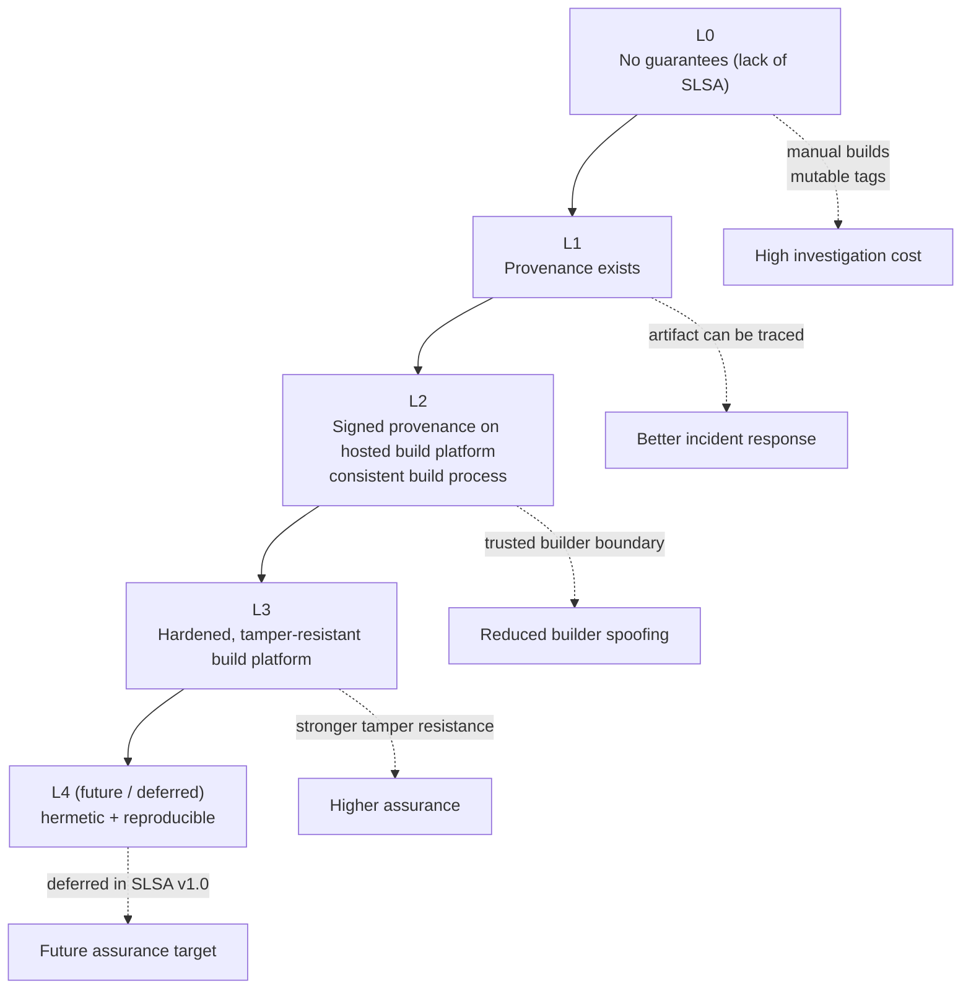

> **Складність**: `[СЕРЕДНЯ]` — моделювання загроз, проєктування доказів та забезпечення дотримання політик у Kubernetes.
>
> **Час на проходження**: 70–85 хвилин.
>
> **Передумови**: [Модуль 4.3: Втеча з контейнера](../module-4.3-container-escape/), основи образів контейнерів, лексика CI/CD та базова термінологія контролю допуску (admission control) у Kubernetes.
>
> **Цільова версія Kubernetes**: 1.35+. Усі приклади команд використовують повне ім'я бінарного файлу `kubectl`.

---

## Результати навчання

Після завершення цього модуля ви зможете:

- **Окреслити** ланцюг постачання програмного забезпечення Kubernetes від коміту в сирцевому коді до запущеного Пода та визначити, де може статися підміна, мутація тегу, плутанина залежностей (dependency confusion) чи компрометація реєстру.
- **Оцінити** SBOM, підписи образів, походження SLSA (provenance) та атестації in-toto як взаємодоповнювальні докази, а не як взаємозамінні мітки безпеки.
- **Спроєктувати** політики допуску Kubernetes, що забезпечують дотримання довірених реєстрів, прив'язку до дайджесту (digest pinning), підписані образи та вимоги до походження, не блокуючи при цьому реагування на надзвичайні ситуації.
- **Діагностувати** слабкі місця CI/CD та GitOps, які дозволяють скомпрометованим діям (actions), супровідникам, складальним раннерам чи репозиторіям розгортання створювати артефакти, що виглядають довіреними.
- **Впровадити** практичні перевірки для генерації SBOM, підписування образів, сканування вразливостей та забезпечення дотримання політик допуску за допомогою Syft, Cosign, Trivy та Kyverno.

## Чому цей модуль важливий

У березні 2024 року інцидент із XZ Utils показав, наскільки близько терпляча компрометація з боку upstream-проєкту могла підібратися до звичайних систем Linux. Публічний запис CVE для [CVE-2024-3094](https://cveawg.mitre.org/api/cve/CVE-2024-3094) описує шкідливий код у upstream-архівах релізу xz для версій 5.6.0 та 5.6.1, а CISA порадила постраждалим користувачам відкотитися до нескомпрометованої версії, поки дистрибутиви розслідували масштаб впливу. Урок для операторів Kubernetes полягає не в тому, що одна бібліотека стиснення важливіша за будь-яку іншу залежність. Урок у тому, що кластери запускають артефакти, зібрані з безлічі upstream-рішень, і кластер не може вивести цю історію лише з маніфесту Пода.

Kubernetes робить помилки ланцюга постачання операційно дорогими, тому що автоматизує довіру в масштабі. Деплоймент посилається на образ; kubelet завантажує образ; контролер підтримує бажану кількість реплік живими; сервісний акаунт, мережева політика та секрети, прив'язані до робочого навантаження, визначають, до чого може дістатися код. Якщо скомпрометований складальний конвеєр підпише шкідливий образ або репозиторій GitOps прийме змінений тег, кластер може сумлінно запускати код під контролем зловмисника, тоді як кожен засіб контролю під час виконання бачитиме звичайне робоче навантаження. Безпека ланцюга постачання — це дисципліна примусу артефактів нести докази, перш ніж кластер дасть їм процесорний час, мережу, секрети та ідентичність.

Мета KCSA не в тому, щоб ви стали криптографом чи супровідником реєстру. Вона в тому, чи можете ви міркувати про шлях від сирцевого коду до середовища виконання, розпізнавати поширені вектори атак та називати захисні засоби контролю, які пасують до Kubernetes. Цей модуль розглядає безпеку ланцюга постачання як ланцюг доказів: огляд сирцевого коду, розв'язання залежностей, ізоляція складання, ідентичність образу, цілісність реєстру, підписування, походження, політика допуску та виявлення під час виконання. Якщо одна ланка відсутня, ви маєте змогу пояснити, яка атака стає легшою і який операційний засіб контролю зменшив би радіус ураження.

## 1. Визначення ланцюга постачання Kubernetes

Ланцюг постачання Kubernetes — це повний набір людей, систем, пакетів, облікових даних та автоматизації, які перетворюють вихідний матеріал на запущене робоче навантаження. Він включає репозиторій застосунку, базові образи, мовні пакети, чарти Helm, оператори, дії CI, складальні раннери, реєстри артефактів, контролери GitOps, маніфести розгортання, вебхуки допуску та інвентар під час виконання. Це широке визначення має значення, тому що зловмисникам не потрібно перемагати Kubernetes напряму, якщо вони можуть скомпрометувати щось, чому Kubernetes налаштований довіряти.

Найкорисніша ментальна модель — це карта маршруту із запитанням на кожній передачі. Сирцевий код запитує, хто змінив код і чи дотримувалися правила огляду. Залежності запитують, які імена пакетів, версії, хеші та реєстри було розв'язано. Складання запитує, який робочий процес і раннер створили образ. Реєстр запитує, чи вказує тег на той самий незмінний дайджест, що й учора. Допуск запитує, чи має дайджест очікувані підписи та атестації. Середовище виконання запитує, чи запущений Под досі відповідає доказам, прийнятим під час розгортання.

```mermaid
flowchart LR
    source[Source repo\ncommits and reviews] --> deps[Dependencies\npackages and base images]
    deps --> build[Build system\nCI runner and workflow]
    build --> registry[Registry\nOCI image and metadata]
    registry --> gitops[GitOps or release repo\nHelm and manifests]
    gitops --> admission[Kubernetes admission\npolicy decision]
    admission --> runtime[Runtime\nPod, identity, network]

    source -. "compromised account\nor review bypass" .-> build
    deps -. "typosquatting\ndependency confusion" .-> build
    build -. "secret exposure\nmalicious action" .-> registry
    registry -. "tag mutation\nunauthorized push" .-> admission
    gitops -. "chart or operator drift" .-> admission
    admission -. "policy gap\nfail-open webhook" .-> runtime
```



Зверніть увагу, що артефакт змінює форму вздовж маршруту. Розробник мислить комітами та pull-запитами. Менеджер пакетів мислить іменами, версіями, URL-адресами реєстрів та хешами. Реєстр контейнерів мислить тегами, маніфестами, шарами, підписами та атестаціями. Kubernetes мислить специфікаціями Пода (PodSpec) та посиланнями на образи. Сильна платформа пов'язує ці погляди стабільними ідентифікаторами, особливо хешами комітів (SHA) та дайджестами образів, щоб особа, яка реагує на інцидент, могла перейти від запущеного Пода назад до точного сирцевого коду та складання, які його створили.

Посилання на образи в Kubernetes — гарний приклад цієї відмінності. Офіційна документація Kubernetes пояснює, що теги — це рухомі мітки, тоді як дайджести ідентифікують незмінний вміст образу; коли присутні і тег, і дайджест, для завантаження Kubernetes використовує дайджест. Маніфест, у якому зазначено `ghcr.io/example/api:v1.2.3`, залежить від поточної відповіді реєстру для цього тегу. Маніфест, у якому зазначено `ghcr.io/example/api@sha256:...`, ідентифікує точний вміст, і саме тому розгортання на основі дайджесту є основою для підписування, походження та надійного відкату.

Засоби контролю ланцюга постачання також мають різний обсяг дії. Сканер вразливостей може сказати вам, чи з'являється в образі відомий вразливий пакет, але не може довести, що образ походить зі схваленого робочого процесу. Підпис може довести, що довірена ідентичність підписала дайджест, але не може довести, що код було перевірено чи що він вільний від відомих вразливостей. Заява про походження SLSA може описати, як було зібрано артефакт, але їй все одно потрібен рушій політик, щоб вирішити, чи дозволено той складальник для того простору імен. Розглядайте кожен засіб контролю як один доказ, а не як універсальну відповідь.

Специфічна для Kubernetes поверхня атаки виходить за межі образів застосунків. Чарти Helm можуть генерувати привілейовані робочі навантаження або несподіваний RBAC. Оператори можуть безперервно узгоджувати нові об'єкти після одноразового рішення про допуск. Репозиторії GitOps можуть стати реальною площиною управління виробництвом, якщо кожен злитий маніфест застосовується автоматично. Базові образи та сайдкари можуть нести оболонки, менеджери пакетів, помічники для облікових даних та інструменти налагодження, яким не місце у виробництві. Іспит може вимагати широких концепцій, але реальні кластери вимагають від вас інвентаризувати всі ці входи.

Зупиніться та спрогнозуйте: якщо команда вимагає, щоб образи походили з `registry.internal.example`, але не вимагає дайджестів, підписів чи походження, що станеться після того, як зловмисник викраде токен запису до реєстру? Політика все ще блокує випадкові публічні образи, що корисно, але вона може прийняти шкідливий образ, надісланий до довіреного реєстру під знайомим тегом. Списки дозволених реєстрів зменшують вразливість; вони не доводять, що артефакт було зібрано довіреним конвеєром.

## 2. Реальні інциденти та чого вони вчать

Інциденти ланцюга постачання, найбільш релевантні для Kubernetes, поділяють одну властивість: скомпрометований компонент виглядав нормальним для подальшої автоматизації. [Бекдор у довіреному оновленні SolarWinds 2020 року](../../../../prerequisites/modern-devops/module-1.3-cicd-pipelines/) <!-- incident-xref: solarwinds-2020 --> — основоположний корпоративний приклад: довірені оновлення програмного забезпечення занесли код під контролем зловмисника до ~18 000 клієнтських середовищ. [3CXDesktopApp](https://www.cisa.gov/news-events/alerts/2023/03/30/supply-chain-attack-against-3cxdesktopapp) показав, як настільний застосунок для кінцевих користувачів було троянізовано та поширено через звичайний канал постачальника. Ці випадки лежать поза Kubernetes, але вони пояснюють, чому походження артефакту має значення ще до того, як програмне забезпечення потрапить до кластера.

NotPetya — це канонічне корпоративне попередження про ризик довіреного оновлення. У червні 2017 року оновлення, доставлене через M.E.Doc, широко вживаний український бухгалтерський пакет, занесло початкове корисне навантаження. Зловмисники використали цей довірений шлях оновлення, щоб поширити руйнівне корисне навантаження, яке поводилося як програма-вимагач, але не мало реалістичного механізму відновлення; шкідливий процес перезаписував критичні структури даних так, що масштабне розшифрування ставало неможливим навіть після сплати викупу. Операційний урок видно в радіусі ураження: глобальні судноплавні, фармацевтичні та логістичні компанії, зокрема Maersk, Merck та FedEx, зазнали збоїв, оскільки шкідливе ПЗ рухалося через довіру до корпоративних оновлень та автентифікації, а не суто через пряму компрометацію. Для захисту ланцюга постачання Kubernetes суть не лише в тому, щоб «не довіряти оновленням», а в тому, щоб поєднати кожну межу довіри до оновлень із перевірками походження, підписаною/атестованою незмінністю та швидким відкатом до відомого справного стану артефакту. [Сповіщення CISA TA17-181A](https://www.cisa.gov/ncas/alerts/TA17-181A) документує ці деталі епізоду NotPetya.

Інцидент із XZ Utils особливо корисний для тих, хто вивчає хмарні технології, тому що він відокремлює репозиторій сирцевого коду від артефакту релізу. Запис CVE каже, що шкідливий код з'явився в upstream-архівах і змінив процес складання liblzma через заплутані кроки. Цей патерн має значення для контейнерів, тому що складання образу часто починається з опублікованих архівів релізу, репозиторіїв пакетів чи базових шарів, а не з репозиторію, який ваша команда переглядає напряму. Якщо ваш ланцюг доказів починається лише після того, як образ зібрано, ви можете пропустити компрометацію, що сталася ще до запуску Dockerfile.

Інциденти з GitHub Actions роблять проблему більш безпосередньою для CI/CD. Сповіщення CISA про [tj-actions/changed-files, CVE-2025-30066](https://www.cisa.gov/news-events/alerts/2025/03/18/supply-chain-compromise-third-party-tj-actionschanged-files-cve-2025-30066-and-reviewdogaction) описує скомпрометовану сторонню дію, яка розкрила секрети в логах робочого процесу і пізніше була додана до Каталогу відомих експлуатованих вразливостей. Запис у Базі даних рекомендацій GitHub [GHSA-mrrh-fwg8-r2c3](https://github.com/advisories/GHSA-mrrh-fwg8-r2c3) визначає вразливі версії до 45.0.7 та виправлену версію 46.0.1. Для команд Kubernetes наказовий урок такий: прив'язуйте дії до перевірених повних хешів комітів (SHA), обмежуйте дозволи робочого процесу, уникайте широких секретів у недовірених завданнях та ротуйте облікові дані після розкриття.

Інцидент з actions-cool 2026 року — це той самий клас збою, виражений через мутацію тегу. StepSecurity повідомила 18 травня 2026 року, що кожен тег для `actions-cool/issues-helper` було перенаправлено на підроблені коміти, і що `actions-cool/maintain-one-comment` постраждав від схожого патерну. Локальне правило репозиторію щодо безпеки GitHub Actions вказує на цей інцидент як на причину, чому затримки Dependabot (cooldown) та посилання `uses:` на повні SHA є тут обов'язковими. Захисний висновок простий: тег — це змінний вказівник, тож робочий процес, у якому зазначено `owner/action@v3`, довіряє майбутньому стану тегу, тоді як робочий процес, прив'язаний до відомого справного повного SHA, довіряє одному перевіреному коміту.

Екосистема npm дала старіші, але досі корисні приклади. Архівний допис команди npm про [інцидент event-stream](https://blog.npmjs.org/post/180565383195/details-about-the-event-stream-incident) каже, що шкідливу залежність `flatmap-stream` було додано до `event-stream@3.3.6` після передачі супроводу пакета, і що npm видалила постраждалі пакети та взяла пакет під свій контроль, щоб запобігти подальшому зловживанню. [Запис рекомендації ua-parser-js](https://github.com/advisories/GHSA-pjwm-rvh2-c87w) охоплює шкідливі версії, опубліковані через компрометацію акаунту супровідника. Ці приклади пояснюють, чому файли блокування (lockfiles), походження пакетів, гігієна супровідників та контроль скриптів встановлення належать до розмов про Kubernetes навіть тоді, коли скомпрометований пакет ніколи не згадує Kubernetes.

Безпечний спосіб використовувати ці інциденти в навчальній програмі з безпеки — зосередитися на захисних інваріантах, а не на механіці експлуатації. Змінені теги навчають незмінних посилань. Скомпрометовані супровідники навчають найменших привілеїв та довіреної публікації. Отруєні архіви релізу навчають незалежного походження та відтворюваних складань. Компрометація реєстру навчає прив'язки до дайджесту та перевірки під час допуску. Розкриття секретів CI навчає дозволів, обмежених завданням, та ізоляції раннерів. Вам не потрібно відтворювати атаки, щоб зрозуміти, який засіб контролю робить необхідним кожен інцидент.

## 3. Вектори атак від сирцевого коду до кластера

Тайпсквотинг (typosquatting) зловживає людськими очікуваннями. Зловмисник публікує пакет, образ, чарт Helm чи дію, чиє ім'я відрізняється від довіреного компонента невеликою зміною написання, візуальною схожістю, трюком зі простором імен чи зміною пунктуації. У Kubernetes небезпека посилюється автоматизацією: скопійований Dockerfile, згенероване значення чарту чи швидке редагування робочого процесу можуть завантажити неправильний компонент так, що ніхто не помітить цього під час огляду. Захист включає приватні дзеркала, схвалені реєстри, області пакетів (scopes), огляд залежностей та політику, яка відхиляє несхвалені простори імен.

Плутанина залежностей (dependency confusion) зловживає поведінкою розв'язувача (resolver), а не написанням. Складальна система може мати доступ і до внутрішнього, і до публічного реєстру, і вона може вибрати вищу публічну версію імені пакета, яку організація мала намір тримати приватним. Результат — це не підозрілий Под під назвою `malware`; це звичайний код застосунку, зібраний у звичайний образ. Хороші засоби контролю роблять джерело пакета явним, резервують внутрішні простори імен, відмовляють (fail closed), коли приватний пакет відсутній, та записують розв'язані URL-адреси пакетів і хеші в докази складання.

Мутація тегу зловживає змінними іменами. Теги Git, теги образів контейнерів та теги версій дій зручні для людей, але вони можуть зміщуватися, якщо це дозволяє хостингова система чи якщо зловмисник отримує правильні облікові дані. Інциденти tj-actions та actions-cool зробили це видимим для GitHub Actions, тоді як реєстри контейнерів мають той самий базовий ризик для `latest`, тегів релізу та проміжних (staging) тегів. Прив'язки до дайджестів та повні SHA комітів не усувають потреби в оновленнях; вони переводять оновлення в навмисний процес огляду, де людина чи бот може точно показати, який вміст змінився.

Скомпрометовані супровідники складні, тому що зловмисник може використовувати законні дозволи. Супровідник може опублікувати пакет, надіслати тег, схвалити реліз чи змінити код робочого процесу. Якщо його акаунт скомпрометовано, подальші системи можуть бачити дійсні метадані від довіреної ідентичності. Зрілий захист зменшує радіус ураження за допомогою обов'язкової MFA, короткотермінових токенів публікації, довіреної публікації через OIDC, захищених середовищ релізу, кількох супровідників для критичних дій, затримок пакетів (cooldown) та моніторингу незвичної поведінки публікації.

Компрометація складальної системи — це найнебезпечніший плацдарм для Kubernetes, тому що складальник часто має доступ до сирцевого коду, секретів, облікових даних для підписування, дозволів запису до реєстру та автоматизації розгортання. Шкідлива дія чи скрипт може читати змінні середовища, змінювати згенеровані артефакти, публікувати образи чи підписати результат, якщо завдання має надмірні привілеї. Захист полягає в тому, щоб ставитися до CI як до виробництва: прив'язуйте сторонні дії, встановлюйте дозволи на рівні завдання, розділяйте завдання складання та розгортання, використовуйте ефемерні раннери, не давайте недовіреним pull-запитам отримувати секрети та робіть так, щоб ідентичність для підписування залежала від захищених гілок та середовищ.

Компрометація реєстру перетворює дистрибуцію на шлях атаки. Якщо зловмисник може надіслати до довіреного реєстру чи замінити тег, кожен кластер, який завантажує за тегом, може отримати інші байти без зміни сирцевого коду. Реєстри мають забезпечувати незмінність для просунутих тегів, вимагати автентифікованих надсилань, логувати події надсилання, підтримувати сканування шкідливого ПЗ, де це доступно, та зберігати підписи й атестації поруч із дайджестом. Допуск Kubernetes має перевіряти докази на рівні дайджесту, а не довіряти лише імені хосту реєстру.

GitOps та Helm вносять друге джерело істини. Чарт може вбудувати змінний тег образу, файл значень може перевизначити реєстр, а оператор може створювати Поди після того, як початковий кастомний ресурс було допущено. Рушій політик має перевіряти згенеровану специфікацію Пода (PodSpec) чи ресурси, які створюватимуть Поди, а не лише шлях у репозиторії Git. Саме тому такі інструменти, як Kyverno та Sigstore Policy Controller, за замовчуванням забезпечують дотримання правил проти ресурсів, що несуть PodSpec, і саме тому огляди релізу мають включати згенеровані маніфести.

## 4. Докази: SBOM, підписи та походження

SBOM — це інвентар, а не вердикт. Він допомагає вам відповісти, чи містить випущений артефакт компонент, версію, URL пакета (package URL), ліцензію чи зв'язок, який має значення під час інциденту. CycloneDX та SPDX — поширені формати; CycloneDX часто використовується в робочих процесах безпеки застосунків, тоді як SPDX широко вживаний для обміну метаданими ліцензій та пакетів. Операційна вимога полягає в тому, щоб SBOM було згенеровано з точного дайджесту артефакту, який може запускатися у виробництві, та збережено там, де особи, що реагують, зможуть здійснити пошук пізніше.

Якість SBOM залежить від часу та обсягу. SBOM із каталогу сирцевого коду може бути корисним під час розробки, але він може пропустити пакети операційної системи, шари базового образу чи згенеровані артефакти. SBOM образу бачить файлову систему, яка постачається, але він все ще може пропустити динамічно завантажені плагіни, встановлення пакетів під час виконання чи зовнішні сервіси. Для Kubernetes практичний базовий рівень — це згенерувати SBOM образу в CI, прикріпити чи атестувати його до дайджесту, проіндексувати його для реагування на інциденти та регенерувати, коли образ перезбирається, а не редагувати SBOM вручну.

Сканування вразливостей споживає докази про пакети та бази даних вразливостей. Такі інструменти, як Trivy та Grype, порівнюють виявлені пакети з даними рекомендацій, а потім повідомляють про відомі вразливості із серйозністю та інформацією про виправлення. Це цінно, але це не те саме, що експлуатованість. Пакет може бути присутнім, але недосяжним; вразливість може не мати виправленої версії; сканер може не погоджуватися з рекомендацією постачальника; нещодавно розкрита CVE може з'явитися після релізу. Хороші релізні бар'єри поєднують серйозність, доступність виправлення, вразливість до атак, активність експлойтів та записи винятків, а не розглядають кожен рядок сканера як однаково терміновий.

Підписування образу встановлює зв'язок між ідентичністю та незмінним дайджестом артефакту. Cosign від Sigstore може підписувати образи OCI та перевіряти підписи, а безключова (keyless) модель Sigstore використовує ідентичності OIDC та короткотермінові сертифікати, щоб командам не доводилося керувати довготерміновими ключами підписування у звичайному CI. Важливе питання політики не лише в тому, чи підписано образ. Воно в тому, чи відповідає ідентичність підпису очікуваному складальнику, репозиторію, робочому процесу, гілці та видавцю (issuer) для робочого навантаження, яке допускається.

Походження описує, як було вироблено артефакт. SLSA надає рамки для поступового покращення цілісності складання, тоді як in-toto надає спосіб записувати підписані заяви про кроки та матеріали ланцюга постачання. Заява про походження може відповісти, який складальник запускався, яке джерело було використано, які залежності чи матеріали було оголошено та який дайджест артефакту вийшов у результаті. Kubernetes сам по собі цього не забезпечує; політика допуску має порівняти походження з тим, що організація дозволяє для простору імен, середовища чи сервісного акаунту.



Діаграму рівнів SLSA не слід читати як драбину трофеїв відповідності. Вищі рівні вимагають дисципліни процесу, підтримки платформи та витрат на супровід. Невеликий внутрішній сервіс може отримати більшу частину зменшення ризику від розгортання за дайджестом, SBOM, підписів та походження від хостингового складання. Критичний компонент платформи, що працює з дозволами на рівні всього кластера, може виправдати суворіший огляд сирцевого коду, ізольованих складальників, перевірку походження та допуск, який відхиляє образи без очікуваної ідентичності складальника.

Чи помітили ви компроміс? Докази додають тертя, коли їх вводять пізно, але вони зменшують тертя під час інцидентів. Команда без SBOM мусить запитати кожного власника, чи використовує він компонент. Команда без походження мусить вгадувати, які складання використовували скомпрометований раннер. Команда без записів дайджестів мусить запитувати, чи зміщувався тег. Сенс безпеки ланцюга постачання — зробити так, щоб звичайна доставка створювала записи, які вам знадобляться в найгірший день.

## 5. Патерни забезпечення дотримання в Kubernetes

Допуск Kubernetes — це головне місце, де докази ланцюга постачання стають рішенням під час розгортання. Вбудований контролер допуску ImagePolicyWebhook може викликати HTTPS-бекенд, щоб схвалити чи відхилити образи, але він вимкнений за замовчуванням і вимагає налаштування API-сервера. ValidatingAdmissionPolicy використовує вирази CEL усередині API-сервера і може забезпечувати дотримання простих структурних правил, як-от вимога дайджестів чи заборона `:latest`. Динамічні вебхуки допуску, Kyverno, Gatekeeper та Sigstore Policy Controller додають багатшу поведінку політик для підписів, атестацій, зовнішніх запитів та кастомних робочих процесів.

Найпростіше правило, яке можна забезпечити, — це прив'язка до дайджесту. ValidatingAdmissionPolicy може відхиляти специфікації Пода, чиї образи контейнерів не містять дайджесту `@sha256:`. Ця політика не перевіряє, хто зібрав образ, але вона запобігає тихому дрейфу тегів та робить пізніші перевірки доказів стабільними. Це хороший перший крок забезпечення дотримання, тому що він змінює те, як пишуться маніфести релізу, не вимагаючи від кожної команди впроваджувати підписування з першого дня. Виробнича політика має також охоплювати `ephemeralContainers` на додачу до `containers` та `initContainers`.

```yaml
apiVersion: admissionregistration.k8s.io/v1
kind: ValidatingAdmissionPolicy
metadata:
  name: require-image-digests
spec:
  failurePolicy: Fail
  matchConstraints:
    resourceRules:
      - apiGroups: [""]
        apiVersions: ["v1"]
        operations: ["CREATE", "UPDATE"]
        resources: ["pods"]
  validations:
    - expression: "object.spec.containers.all(c, c.image.contains('@sha256:')) && (!has(object.spec.initContainers) || object.spec.initContainers.all(c, c.image.contains('@sha256:')))"
      message: "Container images must be pinned by digest."
---
apiVersion: admissionregistration.k8s.io/v1
kind: ValidatingAdmissionPolicyBinding
metadata:
  name: require-image-digests
spec:
  policyName: require-image-digests
  validationActions: ["Deny"]
```

Забезпечення дотримання підписів — це наступний крок, коли в організації є потік підписування. Sigstore Policy Controller використовує ресурси `ClusterImagePolicy`, щоб зіставляти образи та перевіряти підписи чи атестації. Правила `verifyImages` у Kyverno також можуть перевіряти підписи та мутувати образи до дайджестів залежно від дизайну політики. Правильний інструмент залежить від стандартів вашої платформи, але форма політики однакова: зіставити обсяг образу, визначити довірені органи (authorities), вимагати очікувану ідентичність та вирішити, чи попереджати, чи відхиляти порушення.

```yaml
apiVersion: policy.sigstore.dev/v1beta1
kind: ClusterImagePolicy
metadata:
  name: require-github-actions-signature
spec:
  images:
    - glob: "ghcr.io/example-org/**"
  authorities:
    - name: github-actions-release
      keyless:
        url: https://fulcio.sigstore.dev
        identities:
          - issuer: https://token.actions.githubusercontent.com
            subjectRegExp: "https://github.com/example-org/.+/.github/workflows/release.yaml@refs/heads/main"
        ctlog:
          url: https://rekor.sigstore.dev
```

Забезпечення дотримання щодо вразливостей більш нюансоване, тому що знахідка сканера не завжди є рішенням про розгортання. Блокування кожної вразливості рівня HIGH може звучати чисто, але це може заблокувати команди, коли виправлень базового образу немає чи коли сканер видає хибнопозитивний результат. Практична політика Kyverno може вимагати анотацію з результатом сканування вразливостей, обмежувати образи реєстром, де бар'єри сканування вже спрацювали, чи викликати зовнішній сервіс допуску, який розуміє винятки за ризиком. Вправа далі використовує суворий приклад, тому що він навчає механіки, а не тому, що кожен виробничий кластер має скопіювати його без змін.

```yaml
apiVersion: kyverno.io/v1
kind: ClusterPolicy
metadata:
  name: require-scanned-image-annotation
spec:
  background: false
  rules:
    - name: require-scan-result
      match:
        any:
          - resources:
              kinds:
                - Pod
      validate:
        failureAction: Enforce
        message: "Pods must reference an image scan record before admission."
        pattern:
          metadata:
            annotations:
              security.example.com/trivy-scan: "?*"
```

Політика допуску має також мати семантику відмови. Вебхук ланцюга постачання, який відмовляє у відкритий бік (fails open) під час збою, може тихо прийняти той клас артефактів, який він зазвичай блокує. Вебхук, який відмовляє в закритий бік (fails closed) без процесу для надзвичайних ситуацій, може зупинити критичне усунення наслідків. Зрілі команди визначають обсяг простору імен, анотації екстреного доступу (break-glass), вимоги до тікетів, обмежені в часі винятки та аудиторське логування ще до того, як забезпечення дотримання дійде до виробництва. Мета не в тому, щоб зробити винятки неможливими; вона в тому, щоб зробити винятки видимими, підзвітними та короткотерміновими.

Виявлення під час виконання замикає цикл. Допуск вирішує, чи прийнятний новий об'єкт, але він не доводить безперервно, що кожен запущений Под досі відповідає поточній політиці. Ноди можуть кешувати образи, довготривалі Поди можуть передувати політиці, а вразливість може бути розкрита після розгортання. Інвентар під час виконання має записувати дайджести запущених образів, робочі навантаження-власники, сервісні акаунти, простори імен, підписи, посилання на SBOM та статус сканування. Безперервна атестація порівнює цей інвентар із поточною політикою та піднімає знахідки дрейфу, не чекаючи наступного розгортання.

## 6. Посилення CI/CD та GitOps

Найцінніше правило CI/CD — це усунення оточуючих привілеїв (ambient privilege). Робочий процес, який складає образ, зазвичай потребує доступу на читання сирцевого коду та доступу на запис до реєстру; йому автоматично не потрібні доступ на запис до репозиторію, облікові дані хмарного адміністратора, токени виробничого розгортання та кожен секрет організації. GitHub Actions, GitLab CI, Tekton, Jenkins та інші системи виражають дозволи по-різному, але принцип однаковий: починайте з типових налаштувань «лише читання», надавайте дозволи на запис у тому завданні, яке цього потребує, та ізолюйте облікові дані розгортання від недовірених шляхів коду.

Сторонні компоненти CI — це виконувані залежності. Дія GitHub, на яку посилаються за тегом, може змінитися після огляду; дія на основі Docker може завантажити змінний базовий образ; складена дія (composite action) може запускати скрипти з дозволами вашого завдання. Локальне правило репозиторію щодо безпеки GitHub Actions вимагає прив'язки до повного хешу коміту (SHA), коментарів із версією для Dependabot, `persist-credentials: false` для checkout (якщо не потрібне надсилання), дозволів, обмежених завданням, та затримки Dependabot (cooldown). Ці правила не є церемонією; вони є прямими засобами пом'якшення для інцидентів мутації тегів та розкриття секретів, розглянутих раніше.

```yaml
name: release

on:
  push:
    branches: ["main"]

permissions:
  contents: read

jobs:
  build:
    runs-on: ubuntu-latest
    permissions:
      contents: read
      packages: write
      id-token: write
    steps:
      - uses: actions/checkout@1b4b2a8c7f2d7b1e0f4d9a1b6c3e8f9a0b2c4d6e # v4.3.0 example
        with:
          persist-credentials: false
      - name: Build and publish image
        run: |
          echo "Build, push, generate SBOM, sign, and attest in this protected job."
```

SHA у прикладі навмисно позначено як приклад, а не як рекомендовану прив'язку. У реальному робочому процесі ви розв'язуєте поточний upstream-тег до повного хешу коміту з upstream-репозиторію, переглядаєте різницю (diff), додаєте коментар із версією, щоб автоматизовані оновлення залишалися зрозумілими, та дозволяєте Dependabot пропонувати пізніші зміни SHA після вікна затримки (cooldown). Не копіюйте SHA з випадкових статей чи навчальних модулів до виробничих робочих процесів.

Посилення GitOps починається з усвідомлення, що репозиторій розгортання є частиною виробництва. Якщо Argo CD, Flux чи інший контролер автоматично застосовує зміни з гілки, тоді захист гілок, правила огляду, підписані коміти, сканування секретів та дозволи репозиторію є виробничими засобами контролю. Дозволи Kubernetes для контролера мають бути обмежені просторами імен та ресурсами, якими він керує. Його ідентичність для автоматизації не повинна мати широкого доступу cluster-admin, якщо платформа явно не приймає цей ризик та не компенсує його суворим оглядом і моніторингом.

Ланцюги постачання Helm та операторів потребують додаткової уваги, тому що огляд сирцевого коду може не показувати згенерованої специфікації Пода. Залежність чарту може оновити шаблони; файл значень може перемкнути реєстри; оператор може створювати Поди після допуску кастомного ресурсу. Політика має оцінювати згенеровані робочі навантаження під час допуску, а релізні процеси мають зберігати згенеровані маніфести для огляду. Коли оператору потрібні широкі дозволи, ставтеся до його образу, чарту, CRD та дозволів контролера як до привілейованого ланцюга постачання, а не як до звичайного коду застосунку.

Вартість та операбельність мають значення, тому що докази ланцюга постачання можуть продукувати багато даних. SBOM, результати сканування, заяви про походження, аудиторські логи допуску та інвентарі під час виконання споживають ємність сховища та індексування. У помірному масштабі вартість зазвичай менше пов'язана з командою, яка генерує докази, і більше — з утриманням, пошуком та дублюванням сховища між реєстрами, об'єктними сховищами та платформами безпеки. Контролюйте вартість, зберігаючи докази один раз на дайджест, усуваючи дублікати однакових базових шарів, де це дозволяє інструментарій, утримуючи цінні атестації довше за багатослівні логи складання та вибірково збираючи шумну телеметрію під час виконання лише після збереження рішень про допуск.

## 7. Модель операційної зрілості

На початковому рівні команди розгортають образи за тегом, залежать від публічних пакетів напряму та розслідують інциденти через пошук у репозиторіях та повідомлення в чаті. Це поширено в ранніх кластерах, тому що це швидко та зрозуміло. Ризик у тому, що ніхто не може довести, які байти запускалися після того, як зміщується тег, чи був присутній у виробництві вразливий пакет, чи яке складання використовувало скомпрометований раннер. Перший крок зрілості — це не купівля платформи; це записати шлях артефакту та усунути найнебезпечніші змінні посилання.

На рівні сканування CI генерує SBOM та результати сканування вразливостей для образів. Команди можуть швидше відповідати на запитання про вразливість компонентів, а релізні бар'єри ловлять очевидні відомі вразливості перед розгортанням. Слабкість у тому, що саме лише сканування не доводить ідентичності складальника та не запобігає тому, щоб довірений реєстр обслуговував замінений тег. Цей рівень цінний, але його не слід рекламувати всередині як повну безпеку ланцюга постачання.

На рівні підписування CI підписує дайджести образів, а кластер перевіряє підписи перед допуском. Це блокує непідписані образи та робить несанкціоновані ручні надсилання легшими для виявлення. Слабкість у тому, що нечіткі політики довіри можуть прийняти неправильного підписувача, а скомпрометований робочий процес підписування все ще може підписати шкідливий вихід. Сильні політики підписування називають очікуваного видавця OIDC, ідентичність робочого процесу, репозиторій, гілку та середовище.

На рівні походження релізи включають походження стилю SLSA та атестації in-toto, які пов'язують сирцевий код, складальника, матеріали та дайджест артефакту. Допуск може вимагати, щоб виробничі образи походили із захищених гілок та схвалених складальників. Слабкість — це складність: походження корисне лише тоді, коли політика його перевіряє, особи, що реагують, можуть його знайти, а команди знають, як виправляти збої, не обходячи систему.

На рівні безперервної атестації організація порівнює запущені робочі навантаження з поточними доказами та політикою з плином часу. Нещодавно розкриту CVE можна зіставити із запущеними дайджестами; відкликану ідентичність складальника можна перетворити на пошук по всьому парку; старий Под, який передує забезпеченню дотримання підписів, можна позначити. Цей рівень розглядає допуск як одну контрольну точку в безперервному циклі доказів. Його дорожче експлуатувати, але це той рівень, що підтримує швидке реагування на основі фактів під час великих інцидентів ланцюга постачання.

Використовуйте цю модель зрілості як інструмент планування, а не як систему значків. Невелика команда може отримати значний захист від прив'язок до дайджестів, заблокованого розв'язання пакетів, генерації SBOM, прив'язки дій до SHA та вузьких дозволів CI. Команда платформи, відповідальна за спільні кластери, має додати підписування, походження, забезпечення дотримання допуску, робочі процеси винятків та інвентар під час виконання. Іспит очікує, що ви назвете ці засоби контролю; виробництво очікує, що ви впорядкуєте їх за послідовністю, не зламавши доставку.

## Перевірка для того, хто навчається

Сценарій вправи: ви переглядаєте новий простір імен для платіжного сервісу перед тим, як він отримає виробничий трафік. Репозиторій застосунку використовує захищені гілки, але релізний робочий процес досі викликає три сторонні дії GitHub за тегом версії. Образ надсилається до внутрішнього реєстру як `payments:stable`, репозиторій GitOps розгортає цей тег, а Trivy запускається в CI проти тегу перед тим, як маніфест буде злито. Команда каже, що реєстр приватний, а сканер чистий, тож ризик ланцюга постачання вже опрацьовано. Ваше завдання — визначити, які рішення про довіру досі залишаються неявними.

Почніть з ідентичності артефакту. Результат сканера прив'язаний до того, що `payments:stable` означав під час сканування, тоді як кластер запитає реєстр, що означає той самий тег під час завантаження. Якщо тег зміщується між цими подіями, сканування, SBOM, підпис та запущений Под можуть описувати різний вміст. Мінімальне виправлення — це розв'язати `payments:stable` до дайджесту під час просування, зберегти цей дайджест у релізному записі та розгорнути дайджест через GitOps. Ця зміна сама по собі не робить образ безпечним, але вона дає кожному пізнішому засобу контролю один стабільний об'єкт для обговорення.

Тепер огляньте робочий процес CI. Стороння дія, прив'язана до `v3`, — це виконуваний код, завантажений під час завдання, і завдання може дати їй доступ до вмісту репозиторію, токенів пакетів, хмарних облікових даних чи токенів OIDC. Безпечніший патерн — це розв'язати кожен тег дії до перевіреного повного хешу коміту, додати коментар із версією для інструментарію оновлень, застосувати затримку (cooldown) перед прийняттям нових релізів дій та зменшити дозволи завдання до точних потрібних обсягів. Якщо робочий процес підписує образи, крок підписування має запускатися лише на захищених гілках чи захищених релізних середовищах, щоб недовірені pull-запити не могли карбувати довірені артефакти.

Далі пов'яжіть докази. Зрілий реліз має продукувати SBOM з дайджесту образу, результат сканування вразливостей для того самого дайджесту, підпис від релізної ідентичності та походження від схваленого складальника. Ці записи мають бути прикріплені до дайджесту чи збережені під релізним записом, ключем якого є дайджест, а не розкидані по логах CI. Коли з'являється нова вразливість, особи, що реагують, мають змогу запитати: «Які запущені дайджести містять цей компонент?», а не запитувати кожного власника репозиторію переглянути своє дерево сирцевого коду.

Нарешті, вирішіть, що має забезпечувати Kubernetes. Для першого виробничого бар'єра вимагайте образів, прив'язаних до дайджесту, з внутрішнього реєстру та відхиляйте `:latest` чи неприв'язані теги. Для сильнішого бар'єра перевіряйте, що дайджест має підпис Sigstore від очікуваного релізного робочого процесу. Для бар'єра високого рівня гарантії вимагайте походження, яке називає схваленого складальника та репозиторій сирцевого коду. Тримайте політику вузькою спочатку, розгортайте її в режимі аудиту чи попередження, де це можливо, виправляйте законні збої, а потім перемикайте виробничі простори імен у режим відмови (deny) з аудитованим процесом екстреного доступу (break-glass).

Зупиніться та дайте відповідь перед тим, як рухатися далі: який єдиний засіб контролю ви додали б першим, якщо команда може зробити лише одну зміну цього тижня? Сильна відповідь називає засіб контролю, атаку, яку він зменшує, та докази, які він створює для осіб, що реагують. «Додати сканування» недостатньо, якщо сканування вже відбувається проти змінного тегу. «Розгортати за дайджестом» часто є першим практичним кроком, тому що це стабілізує об'єкт, на який мають посилатися сканування, підписування, SBOM, походження та допуск.

Сценарій вправи: команда платформи виявляє, що популярний базовий образ, який використовують двадцять сервісів, містить нещодавно розкриту вразливість. Команда має SBOM для всіх зібраних образів, але ці SBOM названі за сервісом та версією, а не за дайджестом. Деякі сервіси перезбираються щоночі, деякі перезбираються лише на релізі, а кілька подів запущені вже тижнями. Це проблема виявлення, а не лише складання, тому що команда має пов'язати докази сирцевого коду зі станом під час виконання.

Розслідування має починатися з нормалізації всього до дайджестів образів. Запитайте реєстр про поточні теги, запитайте кластери про ідентифікатори образів запущених Подів та зіставте ці дайджести із записами SBOM, які було згенеровано під час складань. Якщо для запущеного дайджесту відсутній SBOM, розглядайте це як прогалину в доказах, навіть якщо поточне дерево сирцевого коду виглядає чистим. Сьогоднішній стан сирцевого коду не доводить, що було всередині образу, зібраного минулого місяця, а перезбирання образу сьогодні може дати інший набір залежностей, якщо входи не було прив'язано.

Після зіставлення дайджестів проведіть сортування (triage) за вразливістю. Вразливий пакет у базовому образі може бути недосяжним в одному сервісі та досяжним в іншому, але вам потрібні докази перед тим, як робити це судження. Зважте, чи завантажується постраждала бібліотека застосунком, чи містить контейнер оболонку чи менеджер пакетів, що збільшує корисність для зловмисника, чи має Под чутливі дозволи сервісного акаунту та чи обмежує мережева політика вхідні й вихідні шляхи. SBOM прискорюють пошук; контекст під час виконання вирішує терміновість.

Реагування має також оновити запобігання. Якщо базовий образ є централізовано керованим, опублікуйте виправлений дайджест та запустіть перезбирання у подальших сервісах. Якщо команди вибирають базові образи незалежно, додайте політику, що обмежує виробничі образи схваленими сімействами базових образів чи вимагає міток походження базового образу. Якщо кластер допускає старі дайджести назавжди, додайте безперервний інвентар, щоб застарілі робочі навантаження були видимими. Безпека ланцюга постачання найсильніша тоді, коли інцидент покращує шлях доставки, а не продукує одноразову таблицю.

Сценарій вправи: оператор, встановлений з чарту Helm, створює Поди в кількох просторах імен. Образ оператора підписано, але чарт також надає широкий RBAC та узгоджує кастомні ресурси у привілейовані робочі навантаження. Рецензент каже, що підпис образу доводить, що оператор безпечний. Це категорійна помилка. Підпис може сказати вам, хто підписав конкретний дайджест образу; він не доводить, що RBAC чарту має найменші привілеї, що CRD не можна зловжити чи що узгоджені Поди відповідають політиці вашого простору імен.

Правильний огляд розділяє типи артефактів. Перевірте дайджест образу оператора та ідентичність підписувача. Перегляньте шаблони чарту та згенеровані маніфести на предмет RBAC, вебхуків, налаштувань безпеки Пода, селекторів простору імен та типових значень. Застосуйте політику допуску до Подів, які створює оператор, а не лише до запиту на встановлення чарту. Моніторте сервісний акаунт оператора, тому що компрометація контролера з широкими правами узгодження може стати стійким плацдармом ланцюга постачання всередині кластера.

До цього моменту у вас має бути повторюване діагностичне запитання: «Які докази переконали б кластер довіряти цьому артефакту, і які докази переконали б особу, що реагує, що довіра була виправданою?» Якщо відповідь — ім'я хосту реєстру, дизайн слабкий. Якщо відповідь — дайджест, SBOM, результат сканування вразливостей, ідентичність підписувача, заява про походження, рішення політики та запис інвентарю під час виконання, дизайн набагато сильніший. Іспит KCSA перевіряє лексику, але реальна робота з платформою перевіряє, чи можете ви пов'язати ці частини, не зробивши доставку неможливою.

## Чи знали ви?

- NIST SP 800-218, Рамки безпечної розробки програмного забезпечення, було опубліковано в лютому 2022 року, і вони організовують роботу з безпечної розробки в групи «Підготувати організацію», «Захистити програмне забезпечення», «Виробляти добре захищене програмне забезпечення» та «Реагувати на вразливості».
- Kubernetes документує безключову перевірку Sigstore для власних релізних артефактів ще з часів завдання підписаних артефактів епохи v1.26, що означає, що сам Kubernetes є корисним прикладом доказів підписаного релізу.
- Запис у Базі даних рекомендацій GitHub для tj-actions/changed-files перелічує виправлену версію 46.0.1, тоді як CISA додала CVE-2025-30066 до Каталогу відомих експлуатованих вразливостей 18 березня 2025 року.
- Звіт StepSecurity про actions-cool каже, що в `actions-cool/issues-helper` 53 теги було переміщено на підроблені коміти, а в `actions-cool/maintain-one-comment` — 15 тегів, і саме тому прив'язка до повного SHA перемагає довіру до тегів для дій CI.

## Типові помилки

| Помилка | Чому це стається | Як це виправити |
|---|---|---|
| Розглядати список дозволених реєстрів як походження | Ім'я хосту виглядає як межа довіри, але викрадений токен запису все ще може опублікувати до того реєстру | Вимагайте дайджести образів, підписи та перевірки ідентичності складальника для виробничих просторів імен |
| Підписувати змінні теги замість дайджестів | Теги легше читати людям і вони поширені в нотатках до релізу | Розв'язуйте теги до дайджестів під час просування та підписуйте дайджест, який завантажуватиме Kubernetes |
| Дозволяти завданням CI ділитися широкими секретами | Зручно покласти всі релізні облікові дані на рівень репозиторію чи організації | Обмежуйте дозволи на завдання, розділяйте складання та розгортання та тримайте секрети подалі від недовірених шляхів pull-запитів |
| Забезпечувати дотримання виходу сканера без дизайну винятків | Команди хочуть простий бар'єр «HIGH або краще» | Включіть експлуатованість, доступність виправлення, бізнес-вразливість, дати завершення та задокументовані схвалення в політику |
| Перевіряти, що образ підписано будь-ким | Перше розгортання часто перевіряє лише наявність підпису | Зіставляйте ідентичність підписувача, видавця OIDC, репозиторій, робочий процес, гілку та очікуваний шлях реєстру |
| Довіряти чартам Helm без огляду згенерованого | Рецензенти інспектують сирцевий код чарту, але не згенеровану специфікацію Пода | Зберігайте згенеровані маніфести, запускайте тести політик у CI та забезпечуйте дотримання допуску для згенерованих робочих навантажень |
| Тримати SBOM лише в логах CI | Складання згенерувало докази, але особи, що реагують, не можуть здійснити пошук пізніше | Прикріплюйте чи атестуйте SBOM до дайджесту образу та індексуйте їх у пошуковому інвентарі |
| Робити так, щоб допуск відмовляв у відкритий бік за замовчуванням | Оператори бояться збоїв розгортання, спричинених недоступністю сервісу політик | Визначте обсяг відмови в закритий бік для виробництва, розгортання нових політик лише для звітування та аудитовані шляхи екстреного доступу (break-glass) |

## Тест

<details>
<summary>Запитання 1: Команда розгортає `registry.internal/payments:v2.8.0` та сканує цей тег перед релізом. Через два дні той самий тег вказує на інший дайджест. Який засіб контролю зробив би докази розгортання стабільними?</summary>

Стабільний засіб контролю — це розгортання на основі дайджесту, бажано в поєднанні з підписуванням та походженням для цього дайджесту. Результат сканування для тегу описує те, на що тег вказував під час сканування, а не те, на що він вказує пізніше. Якби маніфест використовував `registry.internal/payments@sha256:...`, кластер запитав би точний вміст, і сканування, SBOM, підпис та походження могли б усі посилатися на той самий артефакт. Незмінність тегів реєстру теж допомагає, але політика Kubernetes все одно має надавати перевагу незмінним дайджестам для виробництва.
</details>

<details>
<summary>Запитання 2: Ваш робочий процес CI підписує кожен образ, але допуск приймає будь-який образ, що має будь-який дійсний підпис Sigstore. У чому слабкість?</summary>

Слабкість у тому, що політика перевіряє наявність підпису, але не довірену ідентичність. Зловмисник міг би підписати образ власною непов'язаною ідентичністю та задовольнити нечітке правило «образ підписано». Виробнича політика має зіставляти очікуваного видавця OIDC, репозиторій, шлях робочого процесу, гілку чи середовище та обсяг реєстру. Підписи корисні лише тоді, коли перевіряльник знає, який підписувач авторизований для робочого навантаження.
</details>

<details>
<summary>Запитання 3: Оголошено нову CVE для пакета, який може існувати в кількох базових образах. Ваша команда має SBOM, прикріплені до дайджестів образів, але не має інвентарю під час виконання. На що ви можете відповісти, і чого досі бракує?</summary>

Сховище SBOM може відповісти, які випущені дайджести образів містять пакет та версію, за умови, що SBOM було згенеровано з образів, які постачаються. Бракує надійної карти від запущених Подів до тих дайджестів через кластери та простори імен. Ви можете знати, які артефакти постраждали, але не те, чи запущені вони зараз, де вони запускаються, чи які власники сервісів мають реагувати. Інвентар під час виконання закриває цю прогалину, записуючи дайджести образів, власників, простори імен та ідентичності робочих навантажень.
</details>

<details>
<summary>Запитання 4: Робочий процес GitHub Actions використовує `owner/action@v3`, має дозвіл на запис до репозиторію та може читати секрети хмарного розгортання. На який патерн інциденту ланцюга постачання це схоже, і які перші виправлення?</summary>

Це схоже на патерн мутації тегу та скомпрометованої дії, що спостерігався в tj-actions/changed-files та actions-cool. Перші виправлення — це прив'язка посилань `uses:` до повного хешу коміту, найменші привілеї на рівні завдання, ізоляція секретів та затримка Dependabot (cooldown) для оновлень дій. Дозволи на запис до репозиторію та хмарне розгортання не повинні бути доступними сторонній дії, якщо завдання справді цього не потребує. Якщо дія могла запускатися під час вікна компрометації, ротуйте розкриті облікові дані та інспектуйте логи робочого процесу.
</details>

<details>
<summary>Запитання 5: Продуктова команда хоче блокувати кожен образ із вразливістю рівня HIGH під час допуску. Чому це може бути небезпечним як єдине виробниче правило?</summary>

Це може бути небезпечно, тому що серйозність за версією сканера не завжди дорівнює експлуатованому виробничому ризику, а деякі вразливості можуть не мати доступного виправлення, коли потрібне екстрене розгортання. Жорсткий бар'єр без шляху виняткy може зупинити патчі безпеки чи релізи для реагування на інциденти. Краща політика поєднує серйозність, доступність виправлення, активність експлойтів, вразливість під час виконання, критичність простору імен та обмежені в часі винятки. Суворе блокування все ще може бути корисним для КРИТИЧНИХ відомих експлуатованих вразливостей, коли організація має задокументований процес екстреного доступу (break-glass).
</details>

<details>
<summary>Запитання 6: Контролер GitOps має cluster-admin та застосовує кожне злиття до `main`. Образи застосунку підписані та проскановані. Який ризик ланцюга постачання залишається?</summary>

Репозиторій розгортання та контролер GitOps досі є площиною управління виробництвом. Шкідливе значення чарту, об'єкт RBAC, кастомний ресурс оператора чи зміна політики на рівні простору імен могли б бути застосовані, навіть якщо сам образ застосунку чистий. Захист гілок, правила огляду, мінімізація RBAC контролера, перевірки згенерованих маніфестів та політика допуску досі потрібні. Докази образу захищають артефакт контейнера; вони автоматично не захищають кожен об'єкт Kubernetes, який його розгортає.
</details>

<details>
<summary>Запитання 7: Образ має SBOM, чисте сканування вразливостей та дійсний підпис, але не має походження. На яке запитання залишається важко відповісти?</summary>

Залишається важко відповісти, як було зібрано артефакт і чи виробили його схвалений складальник та ревізія сирцевого коду. SBOM описує вміст, сканування порівнює цей вміст із даними про вразливості, а підпис прив'язує ідентичність до дайджесту. Походження пов'язує сирцевий код, робочий процес складання, ідентичність складальника, матеріали та вихідний дайджест. Без нього особи, що реагують, мають слабші докази, коли під підозрою опиняється складальний раннер, джерело залежностей чи релізний процес.
</details>

## Практика

Вправи розраховані на запуск у локальному навчальному середовищі з Docker чи сумісним рушієм контейнерів, Syft, Cosign, Trivy та одноразовим кластером Kubernetes, як-от kind. Використовуйте простір імен реєстру, яким ви керуєте, для підписування та перевірки, тому що публічні приклади не можуть надати вам дозвіл на надсилання. Якщо ви не можете надсилати образи, прочитайте команди та виконайте локальні кроки SBOM і сканування; приклади політик все одно навчають дизайну засобів контролю.

### Вправа 1: Згенерувати SBOM CycloneDX за допомогою Syft

Зберіть невеликий образ, згенеруйте SBOM CycloneDX з образу та проінспектуйте список компонентів. Мета — побачити різницю між залежностями застосунку та пакетами базового образу, перш ніж ви покладатиметеся на SBOM під час інциденту.

```bash
mkdir -p supply-chain-lab
cd supply-chain-lab

cat > app.py <<'PY'
from http.server import BaseHTTPRequestHandler, HTTPServer

class Handler(BaseHTTPRequestHandler):
    def do_GET(self):
        self.send_response(200)
        self.end_headers()
        self.wfile.write(b"ok\n")

HTTPServer(("127.0.0.1", 8080), Handler).serve_forever()
PY

cat > Dockerfile <<'EOF'
FROM python:3.12-slim
WORKDIR /app
COPY app.py .
CMD ["python", "app.py"]
EOF

docker build -t supply-chain-lab:v1 .
syft supply-chain-lab:v1 -o cyclonedx-json > sbom.cdx.json
jq '.components[] | {name: .name, version: .version, type: .type}' sbom.cdx.json | head
```

Критерії успіху:

- [ ] `sbom.cdx.json` існує та є валідним JSON.
- [ ] SBOM містить як компоненти рівня застосунку, так і компоненти рівня операційної системи.
- [ ] Ви можете пояснити, чому генерація SBOM з образу дає сильніші докази під час виконання, ніж сканування лише каталогу сирцевого коду.

<details>
<summary>Нотатки до розв'язання</summary>

Команда `syft supply-chain-lab:v1 -o cyclonedx-json` інвентаризує зібраний образ, включно з пакетами, успадкованими від `python:3.12-slim`. Якщо `jq` показує лише кілька записів, проінспектуйте повний файл та перевірте, чи розпізнав Syft джерело образу. У виробництві зберігайте цей SBOM за дайджестом образу, а не за локальним тегом `supply-chain-lab:v1`, тому що тег можна перезібрати з іншим вмістом.
</details>

### Вправа 2: Підписати та перевірити образ за допомогою Cosign

Надішліть образ до реєстру, яким ви керуєте, розв'яжіть його дайджест, підпишіть цей дайджест за допомогою Cosign та перевірте підпис. Безключове (keyless) підписування — це бажаний сучасний робочий процес, коли ваш постачальник ідентичності та реєстр його підтримують; підписування на основі ключа корисне для ізольованої лабораторії.

```bash
export REGISTRY_IMAGE="ghcr.io/YOUR_ORG/supply-chain-lab:v1"

docker tag supply-chain-lab:v1 "$REGISTRY_IMAGE"
docker push "$REGISTRY_IMAGE"

export DIGEST_REF="$(docker buildx imagetools inspect "$REGISTRY_IMAGE" \
  --format '{{json .Manifest.Digest}}' | tr -d '"')"
export IMAGE_REF="ghcr.io/YOUR_ORG/supply-chain-lab@$DIGEST_REF"

cosign sign --yes "$IMAGE_REF"
cosign verify "$IMAGE_REF"
```

Критерії успіху:

- [ ] Образ надіслано до простору імен реєстру, яким ви керуєте.
- [ ] Значення в `IMAGE_REF` використовує `@sha256:`, а не змінний тег.
- [ ] `cosign verify` повертає інформацію про підпис для дайджесту, який ви підписали.
- [ ] Ви можете назвати, яку ідентичність слід перевіряти у виробничій політиці допуску.

<details>
<summary>Нотатки до розв'язання</summary>

Якщо безключове підписування запитує автентифікацію, завершіть потік у браузері для вашої лабораторної ідентичності. У CI еквівалент має використовувати ідентичність OIDC із захищеного релізного робочого процесу, а не довготерміновий приватний ключ, збережений як секрет. Виробнича перевірка не повинна зупинятися на «підпис існує»; вона має перевіряти очікуваного видавця та ідентичність підписувача для вашого релізного робочого процесу.
</details>

### Вправа 3: Просканувати образ та забезпечити дотримання простого бар'єра Kyverno

Проскануйте образ за допомогою Trivy, збережіть результат, а потім застосуйте політику Kyverno, що вимагає анотацію зі скануванням перед допуском Подів. Ця вправа використовує бар'єр з анотацією, тому що самодостатній кластер не може викликати базу даних ризиків вашого сканера без додаткової інфраструктури.

```bash
trivy image --severity HIGH,CRITICAL --format json \
  --output trivy-report.json supply-chain-lab:v1

kubectl create namespace supply-chain-lab

cat > require-scan-annotation.yaml <<'EOF'
apiVersion: kyverno.io/v1
kind: ClusterPolicy
metadata:
  name: require-trivy-scan-annotation
spec:
  background: false
  rules:
    - name: require-trivy-scan-annotation
      match:
        any:
          - resources:
              kinds:
                - Pod
              namespaces:
                - supply-chain-lab
      validate:
        failureAction: Enforce
        message: "Set security.example.com/trivy-scan to the approved scan record before deploying."
        pattern:
          metadata:
            annotations:
              security.example.com/trivy-scan: "?*"
EOF

kubectl apply -f require-scan-annotation.yaml
```

Тепер спробуйте відхилений Под та прийнятий Под. Замініть образ на посилання за дайджестом із вашого власного реєстру, якщо ви завершили вправу з підписування.

```bash
cat > unsigned-demo-pod.yaml <<'EOF'
apiVersion: v1
kind: Pod
metadata:
  name: unsigned-demo
  namespace: supply-chain-lab
spec:
  restartPolicy: Never
  containers:
    - name: app
      image: supply-chain-lab:v1
EOF

kubectl apply -f unsigned-demo-pod.yaml
```

```bash
cat > scanned-demo-pod.yaml <<'EOF'
apiVersion: v1
kind: Pod
metadata:
  name: scanned-demo
  namespace: supply-chain-lab
  annotations:
    security.example.com/trivy-scan: "trivy-report.json reviewed for lab"
spec:
  restartPolicy: Never
  containers:
    - name: app
      image: supply-chain-lab:v1
EOF

kubectl apply -f scanned-demo-pod.yaml
kubectl get pod scanned-demo -n supply-chain-lab
```

Критерії успіху:

- [ ] Trivy створив trivy-report.json.
- [ ] Под без `security.example.com/trivy-scan` відхиляється допуском.
- [ ] Анотований Под приймається в лабораторному просторі імен.
- [ ] Ви можете пояснити, чому виробничий бар'єр серйозності HIGH має використовувати докази сканування від довіреного сервісу, а не саму лише вільну анотацію.

<details>
<summary>Нотатки до розв'язання</summary>

Сувора політика анотацій доводить механіку допуску, а не виробниче забезпечення дотримання щодо вразливостей. Реальна політика перевіряла б, що запис сканування належить тому самому дайджесту образу, був вироблений схваленим сканером, достатньо свіжий для середовища та не має несхвалених знахідок HIGH чи CRITICAL згідно з вашою політикою ризиків. Ключовий висновок у тому, що докази сканування CI та допуск Kubernetes мають бути пов'язані; інакше сканування може пройти в CI, тоді як розгортається інший образ.
</details>

## Джерела

- [NIST SP 800-218 Secure Software Development Framework](https://csrc.nist.gov/pubs/sp/800/218/final)
- [CNCF Software Supply Chain Security Paper](https://tag-security.cncf.io/community/working-groups/supply-chain-security/supply-chain-security-paper/CNCF_SSCP_v1.pdf)
- [SLSA specification](https://slsa.dev/spec/latest/)
- [Sigstore project](https://www.sigstore.dev/)
- [Sigstore Cosign repository](https://github.com/sigstore/cosign)
- [in-toto framework](https://in-toto.io/)
- [CVE-2024-3094 CVE record](https://cveawg.mitre.org/api/cve/CVE-2024-3094)
- [CISA: Reported Supply Chain Compromise Affecting XZ Utils](https://www.cisa.gov/news-events/alerts/2024/03/29/reported-supply-chain-compromise-affecting-xz-utils-data-compression-library-cve-2024-3094)
- [GitHub Advisory: XZ Utils malicious code](https://github.com/advisories/GHSA-rxwq-x6h5-x525)
- [GitHub Advisory: tj-actions/changed-files CVE-2025-30066](https://github.com/advisories/GHSA-mrrh-fwg8-r2c3)
- [CISA: tj-actions/changed-files and reviewdog/action-setup compromise](https://www.cisa.gov/news-events/alerts/2025/03/18/supply-chain-compromise-third-party-tj-actionschanged-files-cve-2025-30066-and-reviewdogaction)
- [StepSecurity: actions-cool/issues-helper compromised](https://www.stepsecurity.io/blog/actions-cool-issues-helper-github-action-compromised-all-tags-point-to-imposter-commit-that-exfiltrates-ci-cd-credentials)
- [CISA: Supply Chain Attack Against 3CXDesktopApp](https://www.cisa.gov/news-events/alerts/2023/03/30/supply-chain-attack-against-3cxdesktopapp)
- [npm: Details about the event-stream incident](https://blog.npmjs.org/post/180565383195/details-about-the-event-stream-incident)
- [GitHub Advisory: malicious ua-parser-js versions](https://github.com/advisories/GHSA-pjwm-rvh2-c87w)
- [Kubernetes documentation: Images](https://kubernetes.io/docs/concepts/containers/images/)
- [Kubernetes documentation: Admission controllers and ImagePolicyWebhook](https://kubernetes.io/docs/reference/access-authn-authz/admission-controllers/)
- [Kubernetes documentation: ValidatingAdmissionPolicy](https://kubernetes.io/docs/reference/access-authn-authz/validating-admission-policy/)
- [Kubernetes documentation: Verify Signed Kubernetes Artifacts](https://kubernetes.io/docs/tasks/administer-cluster/verify-signed-artifacts/)
- [Sigstore Policy Controller overview](https://docs.sigstore.dev/policy-controller/overview/)
- [Kyverno verifyImages documentation](https://kyverno.io/docs/policy-types/cluster-policy/verify-images/overview/)
- [Syft SBOM tool repository](https://github.com/anchore/syft)
- [Grype vulnerability scanner repository](https://github.com/anchore/grype)
- [Trivy vulnerability scanner documentation](https://trivy.dev/docs/latest/scanner/vulnerability/)
- [CycloneDX specification overview](https://cyclonedx.org/specification/overview/)
- [SPDX specification](https://spdx.github.io/spdx-spec/v3.0/)

## Наступний модуль

Перейдіть до [Модуль 4.5: Моделювання загроз та теорія ланцюга постачання](../module-4.5-threat-modeling-supply-chain-theory/), щоб пов'язати докази ланцюга постачання з сигналами під час виконання, аудиторськими слідами та реагуванням на інциденти.


