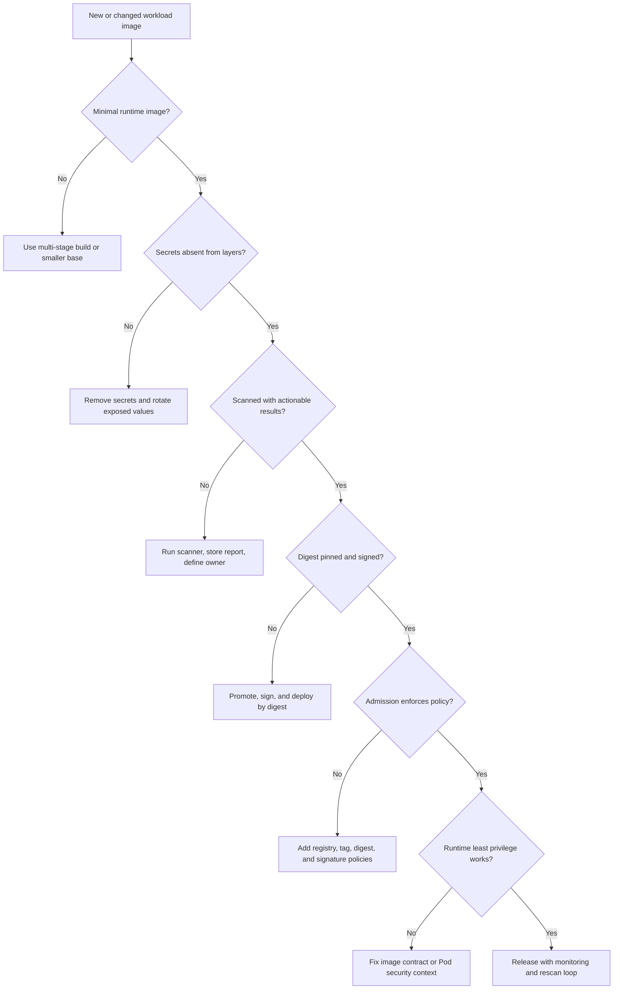

> **Складність**: `[СЕРЕДНЯ]` — основні знання для інженерів, які вміють читати YAML Подів і тепер мають оцінювати ризики образів на межах збірки, реєстру, допуску та середовища виконання.
>
> **Час на проходження**: 35–40 хвилин, разом із вправою на аудит і міркуваннями щодо політик, потрібними, щоб пов'язати рішення в Dockerfile із засобами контролю Kubernetes 1.35+.
>
> **Передумови**: [Модуль 4.4: Загрози ланцюга постачання](/k8s/kcsa/part4-threat-model/module-4.4-supply-chain/), особливо частини про підміну артефактів, скомпрометовані системи збірки та довіру до залежностей.

## Що ви зможете робити

Після завершення цього модуля ви зможете застосовувати такі навички під час оглядів дизайну, сортування інцидентів, обговорень політик платформи та сценаріїв у стилі KCSA:

1. **Оцінювати** безпеку образів контейнерів упродовж життєвого циклу «збірка — зберігання — розгортання — виконання» і вирішувати, де має бути кожен засіб контролю.
2. **Проєктувати** посилені образи, які використовують мінімальні базові образи, багатоетапні збірки, користувачів без прав root і передбачувані вхідні залежності.
3. **Діагностувати** вразливі патерни образів, такі як змінні теги, несканована частина реєстрів, вбудовані секрети та привілейовані типові налаштування середовища виконання.
4. **Впроваджувати** сканування образів, підписування, контроль допуску та засоби захисту середовища виконання Kubernetes 1.35+ як ешелоновану оборону.

## Чому цей модуль важливий

Гіпотетичний сценарій: велика фінтех-компанія простежила причину компрометації у проді до образу контейнера, який у Kubernetes виглядав звичайно, але містив застарілий вебфреймворк, витеклий токен пакета в одному з шарів образу та налагоджувальну оболонку, яка ніколи не мала потрапити в реліз. Засоби контролю кластера не були очевидно зламані: Поди планувалися як зазвичай, реєстр вимагав автентифікації, а Деплоймент пройшов базове CI-завдання. Втрати виникли через те, що команда розглядала образ як коробку для доставки, а не як межу безпеки, і вартість усунення наслідків зросла, бо кожна Нода, яка завантажила образ, кешувала докази, залежності та секрети в різних місцях.

Цей патерн поширений, бо Kubernetes надає образам відчуття буденності. Специфікація Пода називає образ, kubelet завантажує його, і робоче навантаження запускається; небезпечні частини сталися раніше — коли обирали базовий образ, встановлювали залежності, копіювали файли, призначали теги й тлумачили результати сканування. Зловмиснику не потрібно ламати Kubernetes API, якщо образ уже містить вразливий пакет, процес із правами root, доступні для запису шляхи у файловій системі чи змінний тег, який можна підмінити після схвалення. Тому безпека образів — це не один інструмент чи один звіт сканування; це ланцюг рішень від збірки до зберігання, розгортання та виконання.

KCSA очікує, що ви будете міркувати про цей ланцюг, а не запам'ятовувати окремий продукт. У цьому модулі ви простежите образ упродовж його життєвого циклу, порівняєте варіанти посилення, інтерпретуєте результати сканування вразливостей, захистите приватні реєстри, застосуєте політики допуску й зіставите засоби контролю середовища виконання з Dockerfile. У прикладах використано `kubectl` через короткий псевдонім `k`; якщо ваша оболонка ще не визначає його, виконайте `alias k=kubectl` перед спробою команд Kubernetes.

## Життєвий цикл безпеки образів

Безпека образів контейнерів починається з простої ідеї: образ Kubernetes є водночас програмним артефактом і операційним контрактом. Артефакт містить байти, пакети, метадані, шари, точки входу, користувачів, мітки, а іноді й помилки. Контракт повідомляє кластеру, що той запускатиме, звідки образ можна завантажити та які припущення має прийняти середовище виконання. Коли команда каже «ми просканували образ», запитайте, яку саме частину цього контракту насправді перевірено, а яка лишилася на довірі.

Модель життєвого циклу корисна тим, що розділяє відповідальності, які часто зливаються в одне. Засоби контролю на збірці зменшують те, що потрапляє в образ. Засоби контролю на зберіганні захищають місце, де живе образ, і визначають, хто може його змінювати. Засоби контролю на розгортанні вирішують, чи має кластер взагалі прийняти цей образ. Засоби контролю під час виконання обмежують шкоду, якщо образ містить ваду, якої не знайшли жоден сканер, рецензент чи політика допуску. Зупиніться й передбачте: якщо команда сканує лише під час CI, що станеться, коли нову критичну вразливість (CVE) опублікують через три дні після розгортання релізу?

Уявіть один реліз, що рухається конвеєром. Розробник відкриває pull request, який змінює залежність, CI збирає образ, реєстр зберігає отримані шари, GitOps-контролер оновлює Деплоймент, а kubelet завантажує дайджест на Ноду. Кожен крок або створює докази, або їх втрачає. Якщо CI записує результат сканування, але інструменти розгортання згодом підставляють тег, докази більше не відповідають запущеному артефакту. Якщо реєстр сканує дайджест, але жоден інвентар не пов'язує цей дайджест із Подами, команда може знати про вразливість, не знаючи, який бізнес-сервіс під загрозою.

Саме тому огляди безпеки образів завжди мають запитувати про ідентичність артефакту. «Сервіс checkout працює на версії v2.0» корисно для людей, але «Деплоймент checkout запускає дайджест sha256:...» корисно для рішень із безпеки. Дайджести дають змогу пов'язати журнали збірки, SBOM, підписи, звіти сканування, події реєстру, рішення допуску та інвентар середовища виконання. Щойно ці записи вказують на ту саму ідентичність вмісту, реагування на інциденти стає задачею пошуку, а не вправою з вгадування.

```
┌─────────────────────────────────────────────────────────────┐
│              IMAGE SECURITY LIFECYCLE                       │
├─────────────────────────────────────────────────────────────┤
│                                                             │
│  BUILD                                                     │
│  ├── Choose secure base image                              │
│  ├── Minimize installed packages                           │
│  ├── Don't include secrets                                 │
│  ├── Use multi-stage builds                                │
│  └── Scan for vulnerabilities                              │
│                                                             │
│  STORE                                                     │
│  ├── Use private registry                                  │
│  ├── Sign images                                           │
│  ├── Enable vulnerability scanning                         │
│  ├── Use immutable tags                                    │
│  └── Implement access controls                             │
│                                                             │
│  DEPLOY                                                    │
│  ├── Verify signatures                                     │
│  ├── Enforce allowed registries                            │
│  ├── Block vulnerable images                               │
│  ├── Pull by digest                                        │
│  └── Use image pull secrets                                │
│                                                             │
│  RUN                                                       │
│  ├── Continuous vulnerability monitoring                   │
│  ├── Runtime threat detection                              │
│  ├── Read-only filesystem                                  │
│  └── Non-root execution                                    │
│                                                             │
└─────────────────────────────────────────────────────────────┘
```

Зверніть увагу, що в реальних операціях життєвий цикл не є строго лінійним. Сповіщення під час виконання може змусити перезібрати образ, сканування реєстру може заблокувати просування, а політика допуску може показати розробникам, що етап збірки досі пропускає типові налаштування з правами root. Сильні команди проєктують цикли зворотного зв'язку між фазами, тож кожен відхилений образ дає чіткий шлях виправлення замість загадкового тікета «безпека сказала ні». Саме цей цикл зворотного зв'язку перетворює безпеку образів зі сторожування на інженерну практику.

Для міркувань KCSA важливий навик — визначати, де засіб контролю найсильніший. Приватний реєстр корисний, але він не доводить, що образ безпечний. Підписаний дайджест доводить походження й цілісність, але не доводить, що в підписаному образі немає експлуатованого пакета. Контейнер без прав root обмежує наслідки, але не змушує вразливу бібліотеку зникнути. Правильна відповідь зазвичай ешелонована, бо кожен засіб контролю відповідає на інше питання: хто його зібрав, що всередині нього, хто може його змінити, чи має кластер його допустити та якої шкоди він може завдати після запуску.

Є й соціальна причина використовувати модель життєвого циклу. Прикладні команди володіють Dockerfile та залежностями, платформні команди — конвенціями реєстру й політиками допуску, команди безпеки — правилами реагування на вразливості, а операційні команди — моніторингом середовища виконання. Коли модель явна, кожна команда може покращувати свою частину, не вдаючи, що володіє всім. Коли модель неявна, кожна проблема образу перетворюється на плутану нараду, де люди сперечаються про інструменти, перш ніж дійти згоди щодо того, що ж саме зламалося.

## Збірка безпечних образів

Фаза збірки — це місце, де безпека образів має найбільший важіль, бо помилки, усунені тут, ніколи не доведеться наздоганяти в реєстрі чи кластері. Уявіть Dockerfile як рецепт, який може або лишити готову страву чистою, або викласти на тарілку весь кухонний інструмент. Образи для розробки часто потребують компіляторів, менеджерів пакетів, оболонок, тестових фреймворків та інструментів налагодження, але виробничим образам зазвичай потрібні лише застосунок і невелике середовище виконання. Посилена збірка робить цю різницю явною замість того, щоб сподіватися на компенсацію з боку середовища виконання.

Корисна ментальна модель — «борг середовища виконання». Кожен пакет, скопійований у фінальний образ, стає чимось, що команда має латати, сканувати, пояснювати й захищати доти, доки образ можна розгортати. Менеджер пакетів зручний під час розробки, але у проді це ще один двійковий файл із вразливостями та ще один спосіб для зловмисника змінити контейнер після отримання виконання коду. Оболонка корисна під час налагодження, але вона також полегшує ручне дослідження та виконання навантаження після компрометації. Посилені збірки зменшують борг середовища виконання ще до того, як він досягне кластера.

### Вибір базового образу

Вибір базового образу визначає вашу початкову поверхню атаки ще до того, як скопійовано код застосунку. Повноцінна база операційної системи може здаватися комфортною, бо містить знайомі інструменти, але кожен зайвий пакет створює більше записів про вразливості, зобов'язань щодо латання та можливостей для пост-експлуатації. Мінімальні образи зменшують цю поверхню, хоча й прибирають зручності, як-от оболонки, менеджери пакетів та поширені діагностичні утиліти. Компроміс полягає не у формулі «менше — добре, більше — погано»; питання в тому, чи потрібне проду додаткове ПЗ під час виконання.

Сумісність — головна причина, чому команди не завжди можуть одразу перейти на scratch або distroless. Нативні розширення, обробка сертифікатів, поведінка DNS, шрифти, дані часових поясів та очікування libc можуть виявитися лише після розгортання образу під реальним трафіком. Саме тому шлях міграції зазвичай починається з інвентаризації та тестів: виміряйте, що використовує поточний образ, перенесіть інструменти збірки в етап-білдер, оберіть найменшу сумісну базу середовища виконання й запустіть димові тести, що охоплюють мережеві виклики, доступ до файлів, перевірки стану та коректне завершення роботи.

```
┌─────────────────────────────────────────────────────────────┐
│              BASE IMAGE COMPARISON                          │
├─────────────────────────────────────────────────────────────┤
│                                                             │
│  IMAGE TYPE           SIZE      CVEs*   USE CASE            │
│  ───────────────────────────────────────────────────────    │
│  ubuntu:22.04        ~77MB     100+    Development          │
│  debian:bookworm     ~50MB     50+     General purpose      │
│  alpine:3.19         ~7MB      10-20   Lightweight apps     │
│  distroless/static   ~2MB      0-5     Static binaries      │
│  scratch             0MB       0       Go/Rust binaries     │
│  *CVE counts are illustrative and go stale as bases change │
│                                                             │
│  RECOMMENDATIONS:                                          │
│  ├── Production: Distroless or Alpine                      │
│  ├── Static binaries: Scratch or distroless/static         │
│  ├── Need shell: Alpine (smaller) or Debian (compatible)   │
│  └── Avoid: Full OS images (Ubuntu, CentOS) in production  │
│                                                             │
│  DISTROLESS BENEFITS:                                      │
│  • No shell (harder for attackers)                         │
│  • No package manager                                      │
│  • Minimal attack surface                                  │
│  • Smaller size = faster pulls                             │
│                                                             │
└─────────────────────────────────────────────────────────────┘
```

Образи distroless і scratch найлегше обґрунтувати для скомпільованих застосунків із чіткими залежностями середовища виконання. Сервісу на Go чи Rust може взагалі не знадобитися оболонка, менеджер пакетів чи динамічний компонувальник, тож постачання цих інструментів допомагає лише зловмиснику після компрометації. Для інтерпретованих мов розрахунок тонший, бо саме середовище виконання має бути присутнім, нативні модулі можуть потребувати сумісних бібліотек, а налагодження може залежати від спостережуваних логів, а не від доступу до оболонки. Перш ніж запустити це, який вивід ви очікуєте від сканера, коли порівнюєте повноцінну базу ОС із середовищем виконання distroless для того самого двійкового файлу?

> **Зупиніться й подумайте**: Застосунок на Go, скомпільований як статичний двійковий файл, має нуль залежностей середовища виконання. Чому ви все одно обрали б `gcr.io/distroless/static` замість `scratch` як базовий образ?

Відповідь у тому, що «порожній» не завжди означає «операційно повний». В образі scratch можуть бракувати кореневих сертифікатів, даних часових поясів, метаданих користувача та інших маленьких файлів, які ваш застосунок мовчки передбачає. Статичні образи distroless зберігають мінімальне середовище виконання, але водночас прибирають оболонку й менеджер пакетів. Це хороший приклад інженерії безпеки, а не мислення за чек-листом: обирайте найменшу базу, яка все ще підтримує реальну поведінку робочого навантаження, а потім перевіряйте ці припущення тестами й скануваннями.

Для інтерпретованих навантажень найкращою ціллю може бути образ distroless під конкретну мову або slim-дистрибутив, а не scratch. Сенс у тому, щоб не перетворювати виробничий образ на робочу станцію загального призначення. Якщо вашому сервісу потрібен Node, постачайте Node і виробничі залежності; не постачайте кеш менеджера пакетів, редактор, інструменти завантаження, тест-раннер і кожен транзитивний артефакт збірки. Ця різниця важлива, бо і сканер, і зловмисник бачать те, що ви насправді поставили, а не те, що ви збиралися використовувати.

### Багатоетапні збірки

Багатоетапні збірки розв'язують найпоширенішу помилку виробничого образу: змішування потреб часу збірки з потребами часу виконання. Етап-білдер може містити компілятори, менеджери залежностей, сирцевий код, тестові фікстури та каталоги кешу, бо він не постачається як фінальний образ. Етап середовища виконання копіює лише той артефакт, який має виконуватися. Це дає розробникам змогу зберегти продуктивне середовище збірки, не змушуючи прод нести кожен інструмент, що був корисний під час компіляції.

Порядок шарів також впливає і на безпеку, і на операції. Копіювання маніфестів залежностей до сирцевих файлів дає системам збірки змогу повторно використовувати шари залежностей, коли змінюється код застосунку, що скорочує час збірки й робить зміни залежностей помітнішими під час огляду. Копіювати весь репозиторій рано — зручно, але це приховує те, що потрапляє в контекст збірки, і збільшує ризик включення локальних файлів. Ретельний Dockerfile звужує кожен крок копіювання, щоб рецензенти могли побачити, чи окремо опрацьовано маніфести залежностей, сирцеві файли, згенеровані ресурси та конфігурацію середовища виконання.

```dockerfile
# Build stage - has all build tools
FROM golang:1.21 AS builder
WORKDIR /app
COPY go.mod go.sum ./
RUN go mod download
COPY . .
RUN CGO_ENABLED=0 go build -o /app/myapp

# Runtime stage - minimal image
FROM gcr.io/distroless/static:nonroot
COPY --from=builder /app/myapp /myapp
USER nonroot:nonroot
ENTRYPOINT ["/myapp"]
```

Цінність для безпеки — не лише менший розмір. Сирцевий код, залишений в образі, може розкрити внутрішні назви пакетів, прапорці функцій, коментарі, тестові облікові дані та реалізаційні скорочення. Компілятори й оболонки, залишені в образі, можуть полегшити пост-експлуатацію, бо зловмисник може завантажити інструменти, оглянути файлову систему чи скомпілювати допоміжні програми зсередини контейнера. Багатоетапні збірки прибирають ці зручності, роблячи фінальний етап навмисною передачею, а не копією робочої станції розробника.

```
┌─────────────────────────────────────────────────────────────┐
│              MULTI-STAGE BUILD BENEFITS                     │
├─────────────────────────────────────────────────────────────┤
│                                                             │
│  WITHOUT MULTI-STAGE:                                      │
│  Final image includes:                                     │
│  • Build tools (gcc, make, etc.)                          │
│  • Source code                                             │
│  • Intermediate artifacts                                  │
│  • Test dependencies                                       │
│  Result: Large image with unnecessary attack surface       │
│                                                             │
│  WITH MULTI-STAGE:                                         │
│  Final image includes:                                     │
│  • Only the compiled binary                                │
│  • Minimal runtime dependencies                            │
│  Result: Small image with minimal attack surface           │
│                                                             │
│  SIZE COMPARISON EXAMPLE:                                  │
│  Go app with build tools: ~800MB                          │
│  Go app multi-stage:      ~20MB                           │
│  Go app on scratch:       ~10MB                           │
│                                                             │
└─────────────────────────────────────────────────────────────┘
```

Гіпотетичний сценарій: одного разу платформна команда заблокувала сервіс, бо сканер образу знайшов критичні вразливості (CVE) у `gcc` та `make`, хоча застосунок ніколи не викликав жоден із цих двійкових файлів під час виконання. Прикладна команда стверджувала, що знахідки хибнопозитивні, бо вразливі пакети були «лише інструментами збірки». Відповідь платформи була правильною: якщо пакети є у виробничому образі, вони є пакетами середовища виконання незалежно від наміру. Перенесення компілятора в етап-білдер прибрало знахідки, скоротило час завантаження й зробило виробничий контейнер легшим для осмислення.

Багатоетапні збірки — не ліцензія ігнорувати етап-білдер. Скомпрометований компілятор, плагін менеджера пакетів чи скрипт збірки все одно може вплинути на артефакт, скопійований в етап середовища виконання. Саме тому захищені команди поєднують багатоетапні збірки з фіксованими вхідними залежностями, заблокованими маніфестами пакетів, контрольованими мережами збірки та записами про походження. Етап-білдер може й не постачатися у прод, але він усе одно впливає на байти, які постачаються.

### Найкращі практики Dockerfile

Безпечний Dockerfile нудний у найкращому сенсі: фіксовані входи, вузькі копіювання, детерміновані встановлення, явні користувачі й жодних облікових даних. Фіксація базового образу за дайджестом не дає тегу з апстріму змінитися після огляду, хоча команди зазвичай зберігають читабельний для людини тег у коментарях чи метаданих для операційної ясності. Копіювання конкретних файлів не дає `.git`, локальній конфігурації, тестовим фікстурам та файлам `.env` потрапити в образ. Запуск від імені користувача без прав root полегшує застосування політик середовища виконання Kubernetes, бо образ уже узгоджується з наміром безпеки Пода.

```
┌─────────────────────────────────────────────────────────────┐
│              DOCKERFILE SECURITY PRACTICES                  │
├─────────────────────────────────────────────────────────────┤
│                                                             │
│  DO:                                                       │
│  ✓ Pin base image to digest                                │
│    FROM alpine@sha256:abc123...                            │
│                                                             │
│  ✓ Run as non-root user                                    │
│    USER nonroot:nonroot                                    │
│                                                             │
│  ✓ Use COPY instead of ADD                                 │
│    COPY --chown=nonroot:nonroot app /app                   │
│                                                             │
│  ✓ Minimize layers and clean up                            │
│    RUN apt-get update && apt-get install -y pkg \          │
│        && rm -rf /var/lib/apt/lists/*                     │
│                                                             │
│  DON'T:                                                    │
│  ✗ Include secrets in image                                │
│    ENV API_KEY=secret123  # BAD                           │
│                                                             │
│  ✗ Use latest tag                                          │
│    FROM nginx:latest  # BAD                               │
│                                                             │
│  ✗ Run as root                                             │
│    USER root  # BAD for production                        │
│                                                             │
│  ✗ Install unnecessary packages                            │
│    RUN apt-get install vim curl wget  # Avoid if unused   │
│                                                             │
└─────────────────────────────────────────────────────────────┘
```

Секрети заслуговують на особливу увагу, бо шари образу є історичними, а не лише фінальними знімками файлової системи. Якщо Dockerfile записує пароль в одному шарі та видаляє його в наступному, попередній шар усе одно існує в історії образу та сховищі реєстру. Та сама проблема з'являється, коли `COPY . /app` включає локальний файл `.env` чи конфігурацію менеджера пакетів із токеном. Безпечний патерн — тримати секрети поза контекстом збірки, передавати чутливі значення лише через схвалені механізми секретів і впроваджувати конфігурацію середовища виконання через Kubernetes Secrets або зовнішній менеджер секретів.

Ось компактний чек-лист огляду часу збірки, який прямо відповідає наслідкам, що їх можна діагностувати в сценаріях KCSA. По-перше, огляньте базовий образ і запитайте, чи потрібен кожен пакет середовища виконання. По-друге, огляньте межі копіювання й вирішіть, чи міг би Dockerfile випадково включити локальні чи згенеровані файли. По-третє, огляньте користувача, точку входу та очікування файлової системи, щоб контекст безпеки Пода міг бути суворим, не ламаючи застосунок. Нарешті, огляньте встановлення залежностей на наявність lock-файлів, відтворюваність і прибирання.

Посилення збірки слід забезпечувати близько до розробників, а не лишати на фінальний аудит безпеки. Лінтери Dockerfile, сканери секретів, перевірки lock-файлів залежностей та сканування образів можуть виконуватися в pull request ще до того, як образ досягне спільного реєстру. Цей ранній зворотний зв'язок змінює поведінку, бо в автора ще є контекст і він може виправити проблему в тій самій зміні. Пізнє відхилення під час розгортання все одно потрібне для захисту кластера, але це найдорожче місце, щоб навчати базовій гігієні Dockerfile.

## Сканування образів та інтерпретація вразливостей

Сканування образів — це засіб підтримки рішень, а не магічний сертифікат безпеки. Сканер порівнює пакети й файли всередині образу з базами даних вразливостей, патернами секретів, правилами хибних налаштувань та іноді з даними переліку складу ПЗ. Результат говорить вам, що відомо сьогодні, з тією базою даних та логікою виявлення, які сканер має сьогодні. Цього достатньо, щоб заблокувати очевидний ризик, але це не те саме, що аналіз експлуатованості, перевірка походження чи моніторинг поведінки під час виконання.

Сканери також залежать від прозорості образу. Якщо постачальник застосунку постачає двійковий blob без метаданих пакетів, покриття сканера може бути слабшим, ніж здається. Якщо збірка статично компонує бібліотеки, сканеру може знадобитися аналіз мови чи двійкового коду, а не лише записи пакетів операційної системи. Якщо образ distroless містить дуже мало пакетів, підсумки сканування можуть виглядати чудово, тоді як залежності застосунку все одно несуть ризик. Практична відповідь — розуміти, що сканер може бачити, і доповнювати його SBOM-ами, скануваннями залежностей та даними про походження.

### Сканування вразливостей

Найпрактичніші програми сканування використовують кілька точок сканування. Сканування на збірці виявляє проблеми, перш ніж вони потраплять у реєстр. Сканування реєстру виявляє нові вразливості в образах, які вже існують. Сканування під час виконання чи кореляція з інвентарем визначає запущені робочі навантаження, на які впливає щойно опублікована CVE. Кожна точка відповідає на інше операційне питання, тож покладання лише на одну точку створює сліпі зони, що виглядають прийнятними, доки часова шкала вразливості не зрушиться.

```
┌─────────────────────────────────────────────────────────────┐
│              IMAGE SCANNING TOOLS                           │
├─────────────────────────────────────────────────────────────┤
│                                                             │
│  TRIVY (Aqua Security)                                     │
│  ├── OS packages and language dependencies                 │
│  ├── Misconfigurations                                     │
│  ├── Secrets detection                                     │
│  └── SBOM generation                                       │
│                                                             │
│  GRYPE (Anchore)                                           │
│  ├── Fast vulnerability scanning                           │
│  ├── Multiple DB sources                                   │
│  └── CI/CD integration                                     │
│                                                             │
│  CLAIR (Quay/Red Hat)                                      │
│  ├── API-based scanning                                    │
│  ├── Registry integration                                  │
│  └── Continuous monitoring                                 │
│                                                             │
│  SCAN TIMING:                                              │
│  • Build time: Fail builds with critical CVEs              │
│  • Registry: Continuous scanning of stored images          │
│  • Runtime: Alert on new CVEs in running images            │
│                                                             │
└─────────────────────────────────────────────────────────────┘
```

Серйозність — це початок сортування, а не його кінець. Критична вразливість OpenSSL у компоненті інгресу, доступному з інтернету, відрізняється від того самого пакета, що лежить невикористаний в одноразовому внутрішньому завданні, але обидва заслуговують на розслідування. Зрілі команди поєднують серйозність із досяжністю, відкритістю, компенсувальними засобами контролю, наявністю виправлення та бізнес-критичністю. Помилка — розглядати вивід сканера або як абсолютну істину, або як беззмістовний шум; це сигнал, який треба пов'язати з інвентарем і власністю.

Власність часто є найважчою частиною керування вразливостями. Реєстр може знайти вразливий дайджест, але хтось має знати, який репозиторій його зібрав, який сервіс ним володіє, які середовища його запускають і який шлях релізу може його замінити. Мітки, анотації, метадані образу, посилання на SBOM та лінки на збірки CI — усе це допомагає, бо перетворює знахідку сканера на маршрутизоване інженерне завдання. Без метаданих про власність платформна команда може знати, що кластер відкритий, усе ще не маючи змоги діяти швидко.

### Приклад Trivy

```bash
# Scan image for vulnerabilities
trivy image nginx:1.25

# Scan with severity filter
trivy image --severity HIGH,CRITICAL nginx:1.25

# Fail if critical CVEs found (for CI)
trivy image --exit-code 1 --severity CRITICAL nginx:1.25

# Generate SBOM
trivy image --format spdx-json -o sbom.json nginx:1.25

# Scan Dockerfile for misconfigurations
trivy config Dockerfile
```

У CI просте правило `--exit-code 1 --severity CRITICAL` є розумним першим бар'єром, бо його легко пояснити й дешево автоматизувати. Воно все одно неповне. Деякі критичні знахідки не мають виправленої версії, деякі недосяжні у вашому робочому навантаженні, а деякі знахідки з високою серйозністю можуть бути нагальнішими, бо уражений сервіс відкритий і активно експлуатується. Кращий конвеєр зберігає повний результат сканування, блокує найризикованіші випадки й дає командам задокументований процес винятків для знахідок, які поки що не експлуатовані чи не виправні.

Винятки слід розглядати як тимчасові записи про ризик, а не як коментарі у файлі конвеєра. Хороший виняток містить дайджест, CVE, уражений компонент, власника сервісу, аналіз відкритості, компенсувальний засіб контролю, дату закінчення дії та рецензента. Коли виняток спливає, система має змусити ухвалити свіже рішення, бо контекст вразливості змінюється. Це зберігає корисність сканерів, уникаючи обох крайнощів: блокування кожної невиправленої знахідки назавжди або нормалізації постійних списків ігнорування, які ніхто не переглядає.

### Інтерпретація результатів сканування

```
┌─────────────────────────────────────────────────────────────┐
│              TRIVY SCAN OUTPUT                              │
├─────────────────────────────────────────────────────────────┤
│                                                             │
│  nginx:1.25 (debian 12.2)                                  │
│  Total: 142 (UNKNOWN: 0, LOW: 85, MEDIUM: 45, HIGH: 10,   │
│              CRITICAL: 2)                                  │
│                                                             │
│  ┌────────────┬──────────────┬──────────┬─────────────┐    │
│  │  LIBRARY   │     CVE      │ SEVERITY │   STATUS    │    │
│  ├────────────┼──────────────┼──────────┼─────────────┤    │
│  │ openssl    │ CVE-2024-111 │ CRITICAL │ fixed 3.1.5 │    │
│  │ curl       │ CVE-2024-YYY │ HIGH     │ fixed 8.5.0 │    │
│  │ zlib       │ CVE-2023-ZZZ │ MEDIUM   │ no fix      │    │
│  └────────────┴──────────────┴──────────┴─────────────┘    │
│                                                             │
│  RESPONSE:                                                 │
│  CRITICAL: Block deployment, patch immediately             │
│  HIGH: Schedule patch within days                          │
│  MEDIUM: Include in regular updates                        │
│  LOW/UNKNOWN: Track, address opportunistically             │
│                                                             │
└─────────────────────────────────────────────────────────────┘
```

Приклад виводу показує, чому звіт сканування треба інтерпретувати в контексті. Знахідка OpenSSL має виправлену версію, тож перезбірка із залатаного базового образу може швидко її розв'язати. Знахідка zlib не має виправлення, тож реакція може потребувати аналізу відкритості, компенсувальних засобів контролю чи прийняття ризику з датою перегляду. Загальна кількість менш важлива за поєднання серйозності, виправності та відкритості робочого навантаження. Який підхід ви обрали б тут і чому: блокувати всі образи з будь-якою знахідкою високої серйозності чи блокувати лише критичні знахідки, маршрутизуючи знахідки високої серйозності через сортування власником сервісу?

SBOM-и роблять цей процес менш реактивним, бо зберігають машиночитний інвентар того, що містить кожен образ. Коли оголошують вразливість, платформна команда може запитати «які запущені образи містять цей компонент?» замість того, щоб просити кожного власника застосунку запустити нове сканування вручну. SBOM-и не замінюють сканувань, підписів чи засобів контролю допуску, але вони покращують швидкість і точність аналізу впливу. У безпекових операціях швидке знання свого інвентарю часто є тим, що відрізняє керований цикл латання від панічного інциденту.

Один наскрізний приклад зв'язує це докупи. Припустімо, сканер повідомляє про критичну бібліотеку в образі пакетного завдання, яке працює без вихідного мережевого трафіку, без секретів і з коротким вікном виконання. Команда все одно має його залатати, але аварійний пріоритет може бути нижчим, ніж у вразливості високої серйозності в API, доступному з інтернету, з активними звітами про експлойти. Це не означає, що мітки серйозності ігнорують; це означає, що серйозність поєднують із відкритістю, досяжністю та бізнес-впливом, тож обмежений інженерний час іде на найнебезпечніший запущений ризик першим.

## Безпека реєстру та цілісність образів

Реєстр — це місце, де безпека образів стає спільною турботою платформи. Якщо будь-хто може запушити будь-який тег у будь-який репозиторій, ретельні політики Подів у кластері вже стоять нижче за течією хаосу. Приватний реєстр дає вам автентифікацію, авторизацію, інтеграцію сканування, журнали аудиту, правила збереження та робочі процеси просування. Мета — не таємність заради самої таємності; мета — контрольована зміна, простежуваність і довірений шлях від джерела до кластера.

Просування — це патерн реєстру, який робить довіру конкретною. Зовнішній образ не використовують напряму лише тому, що він існує в апстрімі; його імпортують, сканують, за потреби перезбирають чи дзеркалять, підписують схваленим робочим процесом і відкривають через шлях реєстру, який дозволяє допуск. Внутрішні образи проходять подібний шлях від репозиторію збірки до репозиторію стейджингу й до виробничого репозиторію. Це робить виробничі завантаження передбачуваними й дає організації одне місце для застосування політик збереження, незмінності, сканування та доступу.

### Налаштування приватного реєстру

Дизайн приватного реєстру має відокремлювати права на push від прав на pull. CI-системи можуть пушити підписані реліз-кандидати, сервісні акаунти розгортання — завантажувати схвалені дайджести, а люди — мати доступ на читання для розслідування без широких прав на запис. Дозволи на рівні репозиторію важливі, бо скомпрометовані облікові дані команди з низьким ризиком не повинні мати змоги підмінити образ платформного sidecar, що використовується по всьому кластеру. Журнали аудиту також важливі, бо інциденти з образами часто потребують відтворення того, хто, що, коли й з якого конвеєра запушив.

```
┌─────────────────────────────────────────────────────────────┐
│              REGISTRY SECURITY                              │
├─────────────────────────────────────────────────────────────┤
│                                                             │
│  ACCESS CONTROL                                            │
│  ├── Authentication required for all operations            │
│  ├── Role-based access (push vs pull)                      │
│  ├── Per-repository permissions                            │
│  └── Service account integration                           │
│                                                             │
│  IMAGE INTEGRITY                                           │
│  ├── Content trust (signing)                               │
│  ├── Immutable tags                                        │
│  ├── Vulnerability scanning integration                    │
│  └── Image promotion workflows                             │
│                                                             │
│  NETWORK SECURITY                                          │
│  ├── TLS encryption required                               │
│  ├── Private endpoints (no public access)                  │
│  ├── VPC/network isolation                                 │
│  └── Audit logging                                         │
│                                                             │
│  CLOUD REGISTRIES:                                         │
│  • AWS: ECR (Elastic Container Registry)                   │
│  • GCP: Artifact Registry                                  │
│  • Azure: Container Registry                               │
│  • Self-hosted: Harbor, Quay                               │
│                                                             │
└─────────────────────────────────────────────────────────────┘
```

Теги — це дружні до людини імена, а дайджести — ідентичності вмісту. Якщо `myapp:v2.0` вказує на один образ опівдні й на інший образ пізніше, рецензент, який схвалив тег, не обов'язково схвалив байти, які завантажить нова Нода. Незмінні теги зменшують цей ризик, але посилання на дайджест прибирають неоднозначність під час розгортання. Практичний патерн — дозволити CI публікувати читабельні теги для виявлення, тоді як системи просування записують і розгортають точний дайджест, що пройшов сканування й підписування.

Розташування реєстру в мережі теж має значення. Приватна точка доступу чи реєстр, під'єднаний до VPC, може зменшити відкритість, але це не повинно ставати приводом для слабкої ідентифікації. Ноди, CI-системи та контролери розгортання мають автентифікуватися вузько обмеженими ідентичностями, а не спільними довгоживучими обліковими даними. Невдачі завантаження мають бути помітними, бо вони можуть вказувати на прострочені облікові дані, заблоковані просування чи спробу використати несхвалений образ. Безпека реєстру найсильніша, коли контроль доступу, аудитованість і цілісність артефактів підсилюють одне одного.

### Секрети для завантаження образів

Kubernetes використовує секрети для завантаження образів (image pull secrets), щоб надати kubelet облікові дані для приватних реєстрів. Тип секрета, показаний нижче, зберігає облікові дані реєстру Docker, а Под чи ServiceAccount посилається на нього під час завантаження образів. Це розв'язує доступ до приватних образів, але не доводить, що образу можна довіряти. Розглядайте облікові дані для завантаження як один засіб контролю в ширшому ланцюзі: доступ дозволяє завантаження, сканування оцінює вміст, підписування перевіряє походження, а політики допуску вирішують, чи слід дозволити завантаження для цього простору імен.

```yaml
# Create registry secret
apiVersion: v1
kind: Secret
metadata:
  name: registry-credentials
  namespace: production
type: kubernetes.io/dockerconfigjson
data:
  .dockerconfigjson: <base64-encoded-docker-config>
---
# Use in pod
apiVersion: v1
kind: Pod
metadata:
  name: private-app
spec:
  imagePullSecrets:
  - name: registry-credentials
  containers:
  - name: app
    image: myregistry.io/myapp:v1.0
```

```yaml
# Or attach to ServiceAccount
apiVersion: v1
kind: ServiceAccount
metadata:
  name: app-sa
imagePullSecrets:
- name: registry-credentials
```

Прив'язування секретів для завантаження до ServiceAccount зазвичай легше супроводжувати, ніж копіювати те саме посилання на секрет у кожен шаблон Пода. Це дає змогу конвенції платформи на рівні простору імен сказати «робочі навантаження, що використовують цей ServiceAccount, можуть завантажувати з цього реєстру», не редагуючи кожен Деплоймент. Будьте обережні з областю дії: широко повторно використовуваний ServiceAccount із широким доступом на завантаження з реєстру може перетворити компрометацію одного простору імен на доступ до багатьох внутрішніх образів. Найменші привілеї стосуються облікових даних для завантаження так само, як і Kubernetes RBAC.

> **Зупиніться й передбачте**: Ваш CI-конвеєр сканує образи й блокує збірки з критичними CVE. Але образи, які вже є у вашому реєстрі, набувають нових критичних CVE в міру виявлення нових вразливостей. Як ви впораєтеся з цим розривом між скануванням на збірці та під час виконання?

Правильна реакція — безперервне сканування плюс сповіщення з урахуванням власності. Сканування реєстру має повторно оцінювати збережені образи в міру зміни баз даних вразливостей, а інвентар середовища виконання має пов'язувати уражені дайджести із запущеними робочими навантаженнями. Платформа може автоматично сповіщати власників, позначати образи як заблоковані для нових розгортань, запускати перезбірки там, де це безпечно, та ескалювати навантаження, доступні з інтернету чи привілейовані. Людське судження все одно потрібне для рішень про аварійне розгортання, але система має надавати актуальні докази, а не просити команди заново їх відкривати вручну.

Секрети для завантаження образів також породжують питання реагування на інциденти: що відбувається, коли облікові дані реєстру викрито? Відповідь має включати ротацію облікових даних, перегляд аудиту на незвичні завантаження та оцінку того, до яких образів ці облікові дані могли отримати доступ. Якщо облікові дані були широкими, обсяг інциденту широкий. Якщо кожен простір імен чи робоче навантаження використовує вузько обмежені права на завантаження, розслідування може бути меншим, а усунення наслідків — менш руйнівним.

## Контроль допуску для образів

Контроль допуску — це місце, де кластер застосовує правила для образів, узгоджені людьми та конвеєрами раніше. Без допуску розробник може випадково розгорнути з публічного реєстру, використати змінний тег, обійти сканування чи послатися на локальний тестовий образ у проді. Політики допуску перетворюють ці очікування на рішення Kubernetes API. Вони особливо корисні, бо спрацьовують до запуску робочого навантаження, з чим легше впоратися, ніж виявляти поганий образ після того, як Под уже працює на кількох Нодах.

Найефективніші політики допуску написано з огляду на ергономіку для розробників. Повідомлення про відмову має сказати користувачу, який образ не пройшов, яке правило не пройшло і який підтримуваний шлях це виправляє. «Образи мають бути з довірених реєстрів» краще за загальну помилку валідації, але «віддзеркальте зовнішні образи через робочий процес просування платформи й розгорніть отриманий дайджест» ще краще. Політика, яка навчає наступного кроку, зменшує навантаження на підтримку й робить застосування політично стійким.

### Застосування політик

Хороші політики допуску образів достатньо конкретні, щоб зменшити ризик, і достатньо зрозумілі, щоб розробники могли виправити порушення. «Використовуйте лише довірені реєстри» — корисне правило, коли реєстр має засоби контролю сканування й просування. «Жодного тегу latest» корисне, бо прибирає клас невідтворюваних розгортань. «Вимагати дайджест» сильніше, бо фіксує ідентичність вмісту, хоча зазвичай потребує підтримки інструментів, щоб люди не редагували вручну довгі хеші. «Вимагати підпис» додає походження й докази підміни, але залежить від керування ключами та надійних ідентичностей збірки. CI-конвеєри зазвичай підписують реліз-образи за допомогою [Cosign](https://docs.sigstore.dev/cosign/overview/) у межах проєкту [Sigstore](https://www.sigstore.dev/); під час розгортання правила `verifyImages` від Kyverno чи спеціальні контролери, як-от Connaisseur, перевіряють, що підписи відповідають довіреним ключам чи центрам сертифікації, перш ніж Под буде допущено.

```
┌─────────────────────────────────────────────────────────────┐
│              IMAGE ADMISSION POLICIES                       │
├─────────────────────────────────────────────────────────────┤
│                                                             │
│  POLICY EXAMPLES:                                          │
│                                                             │
│  1. ALLOWED REGISTRIES                                     │
│     Allow: gcr.io/my-project/*, myregistry.io/*           │
│     Deny: docker.io/*, *                                   │
│                                                             │
│  2. NO LATEST TAG                                          │
│     Allow: image:v1.0, image@sha256:...                   │
│     Deny: image:latest, image (no tag)                    │
│                                                             │
│  3. REQUIRE DIGEST                                         │
│     Allow: image@sha256:abc123...                         │
│     Deny: image:v1.0 (tag only)                           │
│                                                             │
│  4. SIGNATURE REQUIRED                                     │
│     Allow: Images signed by trusted key                    │
│     Deny: Unsigned images                                  │
│                                                             │
│  5. NO CRITICAL CVES                                       │
│     Allow: Images with no critical vulnerabilities         │
│     Deny: Images with CRITICAL severity CVEs               │
│                                                             │
│  ENFORCEMENT TOOLS:                                        │
│  • Kyverno                                                 │
│  • OPA/Gatekeeper                                          │
│  • Connaisseur (signature verification)                    │
│                                                             │
└─────────────────────────────────────────────────────────────┘
```

Дизайн політики має включати режим розгортання, винятки й спостережуваність. Застосування кожного правила в перший же день може зламати легітимні розгортання, якщо команди ще не мають інструментів для дзеркалення образів, фіксації дайджестів чи підписування виводів. Режим аудиту допомагає виміряти вплив, але вічне перебування в режимі аудиту створює проблему політичного театру. Практичне розгортання починається з аудиту, виправляє порушення з найбільшим обсягом, додає чіткі мітки винятків чи селектори простору імен там, де це виправдано, а потім переводить правило в режим застосування для виробничих просторів імен.

Допуск також може захистити від неповних специфікацій Подів, що обходять основний список контейнерів. Init-контейнери можуть завантажувати окремі образи перед запуском застосунку, а ефемерні контейнери можуть використовуватися для налагодження. Політика, яка перевіряє лише `spec.containers`, лишає прогалини, що їх можуть експлуатувати зловмисники чи поспішні оператори. Політики образів виробничого рівня мають охоплювати всі відповідні поля контейнерів і мають бути протестовані на репрезентативних маніфестах перед застосуванням.

### Приклад політики Kyverno

```yaml
apiVersion: kyverno.io/v1
kind: ClusterPolicy
metadata:
  name: require-trusted-registry
spec:
  validationFailureAction: Enforce
  rules:
  - name: validate-registry
    match:
      any:
      - resources:
          kinds:
          - Pod
    validate:
      message: "Images must be from trusted registries"
      pattern:
        spec:
          containers:
          - image: "gcr.io/my-project/* | myregistry.io/*"
          initContainers:
          - image: "gcr.io/my-project/* | myregistry.io/*"
```

Ця політика навмисно проста, бо концепція важливіша за точний синтаксис. Вона валідує посилання на образи Пода та init-контейнерів і відхиляє образи поза списком довірених реєстрів. Виробничі політики мають також охоплювати `ephemeralContainers`, визначати винятки простору імен для системних навантажень і поєднувати правило реєстру з перевірками дайджесту й підпису. Наслідок для безпеки найсильніший, коли політика спрямовує розробників до шляху просування, як-от дзеркалення схваленого зовнішнього образу в приватний реєстр після сканування й підписування.

Поширена операційна невдача — дозволити правилам допуску відхилитися від правил конвеєра. Якщо CI підписує образи, а допуск не перевіряє підписи, підписування стає артефактом відповідності, а не засобом контролю кластера. Якщо допуск вимагає приватних реєстрів, але реєстр дозволяє довільні push'і людьми, політика доводить лише розташування, а не довіру. Інженерна ціль — узгодженість: конвеєр збірки створює докази, реєстр зберігає докази й артефакти, а допуск перевіряє ці докази, перш ніж Kubernetes прийме робоче навантаження.

Інша невдача — робити винятки невидимими. Є вагомі причини звільнити системні простори імен, аварійні робочі процеси «розбий скло» чи контролери під керуванням постачальника, але кожне звільнення має мати власника й обґрунтування. Невидимі звільнення послаблюють засіб контролю, бо команди дізнаються, що політику можна обговорити через бічні канали. Видимі звільнення дають рецензентам змогу запитати, чи досі застосовна причина і чи може робоче навантаження повернутися на стандартний шлях.

## Безпека образів під час виконання

Засоби контролю середовища виконання припускають, що запобігання іноді не спрацює. Сканер може пропустити вразливість, підписаний образ може все одно містити ваду, а мінімальний образ може все одно відкривати дефект застосунку. Kubernetes не може переписати образ після його завантаження, але може обмежити те, як працює процес контейнера. Ці засоби контролю зменшують радіус ураження від помилок образу, обмежуючи ідентичність, записи у файлову систему, можливості Linux, підвищення привілеїв та неочікувану поведінку під час виконання.

Фаза виконання — це також місце, де заяви образу зустрічаються з реальністю. Dockerfile може оголосити `USER nonroot`, але процес усе одно може впасти, якщо власника каталогів вказано неправильно. Под може запросити кореневу файлову систему лише для читання, але застосунок може все одно припускати, що може записувати кеші поруч зі своїм двійковим файлом. Сканер може сказати, що образ чистий, але телеметрія середовища виконання може показати підозрілі дочірні процеси чи неочікувані вихідні з'єднання. Сильні платформи порівнюють оголошений намір зі спостережуваною поведінкою.

```
┌─────────────────────────────────────────────────────────────┐
│              RUNTIME IMAGE SECURITY                         │
├─────────────────────────────────────────────────────────────┤
│                                                             │
│  READ-ONLY FILESYSTEM                                      │
│  securityContext:                                          │
│    readOnlyRootFilesystem: true                           │
│  • Prevents writing to image filesystem                    │
│  • Blocks many attack techniques                           │
│  • Use emptyDir for writable paths                         │
│                                                             │
│  NON-ROOT EXECUTION                                        │
│  securityContext:                                          │
│    runAsNonRoot: true                                     │
│    runAsUser: 1000                                        │
│  • Limits privilege if container compromised               │
│  • Image must support non-root                             │
│                                                             │
│  DROP CAPABILITIES                                         │
│  securityContext:                                          │
│    capabilities:                                          │
│      drop: ["ALL"]                                        │
│  • Remove unnecessary Linux capabilities                   │
│  • Reduce attack surface                                   │
│                                                             │
│  CONTINUOUS MONITORING                                     │
│  • Alert on new CVEs in running images                     │
│  • Track image drift (unexpected changes)                  │
│  • Audit image pull events                                 │
│                                                             │
└─────────────────────────────────────────────────────────────┘
```

Образ і специфікація Пода мають узгоджуватися. Якщо Dockerfile працює від root і записує логи в `/var/log/app`, суворий контекст безпеки Пода може завадити контейнеру запуститися. Це не привід послаблювати політику середовища виконання; це доказ того, що контракт образу був неповним. Безпечний образ оголошує чи підтримує користувача без прав root, записує лише у відомі доступні для запису шляхи й не потребує навколишніх можливостей Linux. Под тоді застосовує ці припущення через `runAsNonRoot`, `readOnlyRootFilesystem`, скинуті можливості та явні доступні для запису томи.

```yaml
apiVersion: v1
kind: Pod
metadata:
  name: hardened-web
  namespace: production
spec:
  containers:
  - name: app
    image: myregistry.io/webapp@sha256:def456...
    ports:
    - containerPort: 3000
    securityContext:
      runAsNonRoot: true
      runAsUser: 1000
      allowPrivilegeEscalation: false
      readOnlyRootFilesystem: true
      capabilities:
        drop: ["ALL"]
    volumeMounts:
    - name: tmp
      mountPath: /tmp
  volumes:
  - name: tmp
    emptyDir: {}
```

Налагоджуючи посилений образ, утримайтеся від спокуси постачати постійну оболонку лише заради того, щоб полегшити інциденти. Kubernetes підтримує робочі процеси налагодження, які можуть приєднати тимчасовий діагностичний контейнер до Пода, коли політика це дозволяє, тоді як виробничий образ лишається мінімальним. Це розділення важливе, бо інструменти налагодження потужні після компрометації. Безпечніший дизайн — зробити застосунок спостережуваним через логи, метрики, ендпоінти стану та трейси, а потім використовувати контрольовані контейнери налагодження для рідкісного глибокого огляду.

Безперервний моніторинг середовища виконання завершує історію образу, бо ризик образу змінюється після розгортання. Ноди кешують образи, реєстри виявляють нові CVE, а зловмисники можуть експлуатувати дефекти застосунку, не пов'язані зі сканерами пакетів. Інструменти середовища виконання можуть виявляти неочікуване виконання процесів, записи у файли, вихідні з'єднання чи спроби підвищення привілеїв, що суперечать очікуваній поведінці образу. Для KCSA пам'ятайте розподіл праці: посилення образу зменшує те, що постачається, допуск зменшує те, що приймається, а моніторинг середовища виконання виявляє те, що насправді відбувається.

Засоби контролю середовища виконання слід тестувати, перш ніж вони стануть вимогами політики. Простір імен стейджингу може застосовувати запуск без прав root, кореневу файлову систему лише для читання, скинуті можливості та обмежені налаштування безпеки Пода, щоб команди знаходили проблеми контракту образу до проду. Зворотний зв'язок має бути конкретним: який шлях потребував доступного для запису тому, якому користувачу бракувало дозволів чи яка можливість насправді була потрібна. Це перетворює посилення середовища виконання на звичайний тест сумісності замість ризику аварії в останню хвилину.

## Патерни та антипатерни

Патерни корисні, бо перетворюють намір безпеки на повторювану інженерну поведінку. Найкращі патерни безпеки образів достатньо нудні, щоб прикладні команди дотримувалися їх щодня, і достатньо суворі, щоб платформні команди застосовували їх у проді. Вони також роблять винятки видимими: коли робоче навантаження не може використати мінімальну базу чи файлову систему лише для читання, виняток має пояснити потребу середовища виконання й компенсувальний засіб контролю, а не тихо обходити стандарт.

| Патерн | Коли використовувати | Чому це працює | Міркування масштабування |
|---------|-------------|--------------|------------------------|
| Багатоетапна збірка з мінімальним середовищем виконання | Скомпільовані сервіси, збірки Node, Java-сервіси з упакованими артефактами | Відокремлює інструменти збірки від вмісту середовища виконання й прибирає непотрібні пакети | Надайте спільні шаблони Dockerfile, щоб команди не винаходили патерн по-різному |
| Просування через приватний реєстр | Будь-яке використання зовнішніх базових образів, sidecar'ів чи образів постачальника | Сканує, підписує, дзеркалить і фіксує сторонні образи перед використанням у проді | Автоматизуйте завдання оновлення, щоб віддзеркалені образи не застарівали |
| Застосування дайджесту плюс підпису | Виробничі простори імен і регульовані навантаження | Фіксує точний вміст і перевіряє довірену ідентичність збірки перед допуском | Використовуйте інструменти розгортання для автоматичного розв'язання дайджестів, щоб маніфести лишалися супроводжуваними |
| Політика середовища виконання, узгоджена з контрактом образу | Навантаження під керуванням очікувань безпеки Подів Kubernetes 1.35+ | Примушує запуск без прав root, лише для читання й з низькими можливостями відповідати дизайну образу | Тестуйте контексти безпеки в CI чи стейджингу, щоб виявити збої запуску до проду |

Антипатерни зазвичай виникають, коли локальна зручність стає типовою для платформи. Розробник лишає `curl` для діагностики, команда використовує `latest`, бо так легше на ранньому тестуванні, чи реєстр надає широкі права на push, бо початкове налаштування було поспішним. Спочатку ці вибори здаються дрібними, але Kubernetes масштабує їх по репліках, Нодах, просторах імен і командах. Безпечніша альтернатива — зробити безпечний шлях легшим за небезпечне скорочення.

| Антипатерн | Що йде не так | Краща альтернатива |
|--------------|-----------------|--------------------|
| Постачання налагоджувального образу у прод | Зловмисники успадковують оболонки, менеджери пакетів і мережеві інструменти | Використовуйте мінімальні образи середовища виконання й контрольовані ефемерні контейнери налагодження |
| Розгляд приватного реєстру як доказу безпеки | Погані образи все одно можуть запушити довірені користувачі чи скомпрометований CI | Поєднуйте засоби контролю реєстру зі скануванням, підписами, незмінними тегами й допуском |
| Фіксація лише тегів | Нові Ноди можуть завантажити інші байти під тим самим оглянутим тегом | Розгортайте за дайджестом і тримайте читабельні теги як метадані |
| Ігнорування шляхів запису під час виконання | Файлові системи лише для читання падають, бо застосунок пише в шар образу | Спроєктуйте явні доступні для запису шляхи з `emptyDir` чи персистентними томами |

## Рамка ухвалення рішень

Використовуйте цю рамку, коли оцінюєте дизайн безпеки образу чи відповідаєте на сценарій KCSA. Почніть із вмісту образу, бо непотрібні пакети та вбудовані секрети найлегше виправити до релізу. Потім перевірте шлях реєстру, бо чистий образ усе одно можна підмінити, якщо теги змінні чи права на push широкі. Після цього перевірте налаштування допуску й середовища виконання, бо Kubernetes має застосувати намір під час розгортання й обмежити вплив під час виконання.



Рамка навмисно ставить практичні питання замість того, щоб спершу називати інструменти. Якщо образ усе ще несе секрет, вибір між Kyverno та Gatekeeper передчасний. Якщо реєстр дозволяє будь-кому перезаписувати виробничі теги, гарного Dockerfile недостатньо. Якщо Под не може запуститися з налаштуваннями без прав root і лише для читання, образ не готовий до суворих просторів імен. Хороша безпека образів — це послідовність закриття цих прогалин у порядку, де виправлення найдешевші, а докази найвагоміші.

| Рішення | Надавайте перевагу цьому | Коли альтернатива розумна | Ризик, за яким стежити |
|----------|-------------|-----------------------------------|---------------|
| Базовий образ | Distroless чи slim-середовище виконання | Повноцінний образ ОС для застарілих застосунків із задокументованими залежностями | Більше пакетів означає більше CVE й більше роботи з латання |
| Стиль посилання | Дайджест у виробничих маніфестах | Теги в розробці чи в орієнтованих на людину реліз-нотатках | Змінні теги можуть зламати відтворюваність |
| Зовнішні образи | Дзеркалити в приватний реєстр | Пряме завантаження лише в пісочницях із низьким ризиком | Збої апстріму, обмеження частоти й неоглянуті зміни |
| Бар'єр сканування | Блокувати критичні й сортувати високі | Тимчасовий виняток, коли виправлення немає, а відкритість низька | Дрейф винятків без власника й дати закінчення |
| Налагодження | Ефемерний контейнер налагодження | Оболонка в налагоджувальному образі лише для стейджингу | Інструменти налагодження, постачені у прод |

## Чи знали ви?

- **Образи контейнерів часто несуть сотні пакетів ОС**, кожен зі своїм записом про вразливості. Мінімальні базові образи суттєво зменшують поверхню сканування й тягар латання.

- **Образи distroless не мають оболонки**; якщо зловмисник отримує виконання коду, він не може легко запускати звичайні команди оболонки. Це ешелонована оборона.

- **Образи distroless від Google** часто перезбирають, і вони містять лише те, що потрібно для запуску конкретного середовища виконання мови чи статичного двійкового файлу.

- **Шари образів кешуються й розділяються**. Вразливість у базовому шарі впливає на кожен похідний образ, доки ці образи не перезберуть і не перерозгорнуть.

## Типові помилки

| Помилка | Чому вона трапляється | Як її виправити |
|---------|----------------|---------------|
| Використання `:latest` у проді | Теги здаються зручними під час тестування, але вони змінні й ускладнюють осмислення відкатів | Просувайте незмінні дайджести й дайте інструментам релізу записати дайджест, що пройшов сканування |
| Збірка виробничих образів із повноцінних баз ОС | Команди тримають знайомі менеджери пакетів та оболонки для налагодження | Перенесіть інструменти в образ-білдер чи налагоджувальний образ, потім використовуйте Alpine, slim, distroless чи scratch там, де доречно |
| Запуск контейнерів від root | Dockerfile працює локально, тож ніхто не перевіряє ідентичність середовища виконання | Додайте `USER` без прав root, протестуйте `runAsNonRoot` і встановіть явні доступні для запису шляхи |
| Сканування лише в CI | Команда припускає, що чиста збірка лишається чистою назавжди | Перескануйте образи реєстру, корелюйте знахідки із запущеними навантаженнями й сповіщайте власників про нові CVE |
| Вбудовування облікових даних у Dockerfile чи скопійовані файли | Локальні файли `.env` і токени пакетів випадково потрапляють у контекст збірки | Використовуйте `.dockerignore`, вузький `COPY`, секрети збірки, Kubernetes Secrets і негайну ротацію після витоку |
| Довіра приватному реєстру лише за розташуванням | Люди плутають контроль доступу з цілісністю образу | Вимагайте сканувань, підписів, незмінних тегів, посилань на дайджест і журналів аудиту реєстру |
| Застосування політик допуску без шляху просування | Розробникам потрібні зовнішні образи, і вони обходять незрозумілі правила | Дзеркальте, скануйте, підписуйте й задокументуйте підтримуваний процес запиту для сторонніх образів |
| Увімкнення файлових систем лише для читання без тестування шляхів | Образ пише кеші чи тимчасові файли в кореневий шар | Додайте явні монтування `emptyDir` чи виправте застосунок, щоб писав лише в схвалені каталоги |

## Тест

<details><summary>1. Прикладна команда розгортає образ на основі `ubuntu:22.04` зі 146 відомими CVE та двома критичними знахідками. Вони кажуть, що їм потрібен Ubuntu для доступу до `apt-get` під час налагодження. Як ви зменшили б поверхню атаки, водночас задовольнивши їхні потреби налагодження?</summary>

Використайте багатоетапну збірку, щоб етап збірки чи налагодження міг містити Ubuntu та інструменти, тоді як етап середовища виконання містить лише застосунок і потрібні файли виконання. Для виробничого налагодження надавайте перевагу логам, метрикам, трейсам і контрольованим ефемерним контейнерам налагодження замість постачання постійної оболонки й менеджера пакетів. Якщо оболонка справді потрібна на короткий період, використайте окремий варіант налагодження лише для стейджингу з чіткими межами політики. Ключове міркування в тому, що образи середовища виконання не повинні нести інструменти лише тому, що вони зручні під час розробки.

</details>

<details><summary>2. Ваш контролер допуску блокує образи поза вашим приватним реєстром. Розробник пушить `myregistry.io/app:v2.0` після обіду, а пізніше нова Нода завантажує той самий тег після того, як зловмисник підмінив тег. Чи отримає нова Нода скомпрометований образ і що цьому запобігає?</summary>

Так, якщо розгортання посилається лише на змінний тег, нова Нода може завантажити ті байти, на які тег вказує в момент завантаження. Розташування у приватному реєстрі не захищає від підміни тегу скомпрометованими обліковими даними чи надмірно широким правом на push. Сильніші засоби контролю — незмінні теги, розгортання за дайджестом і перевірка підпису, прив'язана до довіреної ідентичності збірки. Посилання на дайджест не дають вмісту змінитися тихо, бо ім'я образу ідентифікує точні байти.

</details>

<details><summary>3. Ваш Dockerfile колись містив пароль бази даних в інструкції `ENV`, потім пізніший шар його видалив. Пароль відтоді ротували. Чи є старе значення досі проблемою безпеки?</summary>

Так, бо шари образу зберігають історію, а не лише фінальний вигляд файлової системи. Старе значення може лишитися в даних шару образу, сховищі реєстру, кешах образів Нод, журналах збірки та будь-яких експортованих артефактах образу. Ротація зменшує живий ризик для бази даних, але не стирає витеклий історичний артефакт. Виправлення — прибрати секрет із Dockerfile і контексту збірки, ротувати уражені облікові дані, очистити чи помістити в карантин образ там, де можливо, і перенести конфігурацію середовища виконання в Kubernetes Secrets або зовнішній менеджер секретів.

</details>

<details><summary>4. Ваше сканування реєстру чисте вранці, але нову критичну CVE опубліковано після обіду, і наступне сканування знаходить вразливу бібліотеку в тридцяти збережених образах. Що має статися автоматично, а що потребує людського рішення?</summary>

Автоматизація має оновити записи сканування, визначити запущені навантаження за дайджестом, сповістити власників, позначити уражені образи як заблоковані для нового просування там, де цього вимагає політика, і запустити перезбірки для сервісів із безпечними автоматичними шляхами перезбірки. Людське рішення все одно потрібне для експлуатованості, пріоритету аварійного розгортання, впливу на клієнтів і того, чи прийнятні компенсувальні засоби контролю в очікуванні виправленої залежності. Важливо те, що сканування на збірці не може передбачити майбутні CVE. Безперервний інвентар реєстру й середовища виконання закриває цей часовий розрив.

</details>

<details><summary>5. Політика Kyverno вимагає, щоб образи були з `gcr.io/my-project/*`, але команді потрібен sidecar Envoy з відкритим кодом, наразі опублікований у Docker Hub. Як ви впораєтеся з цим, не послаблюючи обмеження реєстру?</summary>

Віддзеркальте потрібний образ Envoy у довірений реєстр через той самий процес просування, що використовується для внутрішніх образів. Цей процес має завантажити дайджест апстріму, просканувати його, підписати чи атестувати просунутий артефакт і опублікувати посилання приватного реєстру для команди. Політика допуску лишається незайманою, бо прод усе одно завантажує з довіреного реєстру. Це також покращує доступність і відтворюваність, бо кластер більше не залежить напряму від поведінки Docker Hub під час розгортання.

</details>

<details><summary>6. Под падає після того, як ви ввімкнули `readOnlyRootFilesystem: true`. Логи застосунку показують, що він не може створювати файли в `/tmp/cache`. Чи прибираєте ви налаштування лише для читання?</summary>

Прибирання налаштування лише для читання не має бути першим виправленням, бо збій виявив проблему контракту образу. Додайте явний доступний для запису том, як-от `emptyDir`, для `/tmp/cache` або змініть застосунок, щоб він писав у задокументований доступний для запису шлях. Потім збережіть `readOnlyRootFilesystem: true`, щоб зловмисники не могли зберігати зміни в шарі образу. Це зберігає засіб контролю безпеки, водночас даючи застосунку вузький доступ на запис, який йому насправді потрібен.

</details>

<details><summary>7. Підписаний образ не має критичних знахідок сканера, але Dockerfile працює від root, а Под не скидає жодних можливостей Linux. Чи завершений конвеєр безпеки образів?</summary>

Ні, підписування й сканування відповідають лише на частину проблеми. Підписування перевіряє довірене походження й цілісність, а сканування перевіряє відомі проблеми пакетів і конфігурації. Запуск від root із широкими можливостями збільшує радіус ураження, якщо застосунок експлуатовано, навіть коли образ зібрано довіреним конвеєром. Завершений конвеєр також тестує й застосовує найменші привілеї середовища виконання через `USER` образу, `securityContext` Пода, політики допуску та стандарти безпеки простору імен.

</details>

## Практична вправа: Аудит безпеки образу

У цій вправі ви проведете аудит навмисно слабкого Dockerfile і специфікації Пода, а потім спроєктуєте безпечнішу заміну. Вам не потрібно збирати образ, щоб виконати міркування, але команди написано так, щоб ви могли протестувати частини Kubernetes у одноразовому просторі імен, якщо у вас є кластер Kubernetes 1.35+. Мета — пов'язати кожну знахідку з фазою життєвого циклу: збірка, зберігання, розгортання чи виконання.

**Сценарій**: Ви приєдналися до платформного огляду вебзастосунку, який успішно працює в розробці, але виробничий простір імен незабаром застосовуватиме політики безпеки образів і Подів. Проведіть аудит цього Dockerfile і специфікації Пода, перш ніж команда його просуне:

```dockerfile
FROM ubuntu:latest
RUN apt-get update && apt-get install -y curl wget vim nodejs npm
ENV DATABASE_PASSWORD=supersecret123
COPY . /app
WORKDIR /app
RUN npm install
EXPOSE 3000
CMD ["node", "server.js"]
```

```yaml
apiVersion: v1
kind: Pod
metadata:
  name: webapp
spec:
  containers:
  - name: app
    image: myregistry/webapp:latest
    ports:
    - containerPort: 3000
```

### Завдання

- [ ] Класифікуйте кожну проблему в Dockerfile як питання збірки, зберігання, розгортання чи виконання й поясніть ризик одним реченням на кожну проблему.
- [ ] Перепишіть Dockerfile концептуально, використовуючи багатоетапну збірку, менший образ середовища виконання, детерміноване встановлення залежностей і середовище виконання без прав root.
- [ ] Перепишіть специфікацію Пода так, щоб вона посилалася на незмінний дайджест і використовувала обмежувальний `securityContext`.
- [ ] Додайте об'єкти Kubernetes, потрібні для постачання пароля бази даних під час виконання, не запікаючи його в образ.
- [ ] Опишіть, які політики допуску заблокували б початковий Под і які засоби контролю сканування чи реєстру вловили б початковий образ.

```bash
alias k=kubectl
k create namespace image-security-lab
k config set-context --current --namespace=image-security-lab
```

Налаштування простору імен навмисно маленьке, бо міркування з безпеки важливіші за розгортання вразливого зразка. Якщо ви все ж створюєте об'єкти, тримайте їх у цьому просторі імен і видаліть простір імен, коли закінчите. Перша команда також задовольняє конвенцію модуля, що всі подальші команди Kubernetes використовують псевдонім `k` замість того, щоб виписувати команду повністю.

```yaml
apiVersion: v1
kind: Secret
metadata:
  name: db-creds
  namespace: image-security-lab
type: Opaque
stringData:
  password: change-me-in-your-lab
```

```bash
k apply -f db-secret.yaml
k get secret db-creds
```

Приклад секрета використовує нешкідливе лабораторне значення, а не виробничі облікові дані. У реальному середовищі ви зазвичай інтегрували б зовнішній менеджер секретів чи робочий процес sealed secret, а не комітили б YAML секрета в репозиторій. Ключовий урок безпеки образів у тому, що секрет потрапляє в контейнер під час виконання через Kubernetes, а не під час збірки образу, де він став би частиною історії артефакту.

Використайте розв'язок нижче, щоб порівняти ваші знахідки з повним оглядом, який відокремлює проблеми Dockerfile від проблем середовища виконання Kubernetes і пояснює безпечнішу заміну:

<details>
<summary>Проблеми безпеки та виправлення</summary>

**Проблеми Dockerfile:**

1. **FROM ubuntu:latest**
   - Великий образ, змінний тег
   - Виправлення: `FROM node:20-alpine@sha256:...` чи distroless

2. **Встановлення непотрібних пакетів**
   - curl, wget, vim не потрібні під час виконання
   - Виправлення: Прибрати чи використати багатоетапну збірку

3. **Секрет в ENV**
   - DATABASE_PASSWORD відкритий в образі
   - Виправлення: Використати Kubernetes secrets під час виконання

4. **COPY . /app**
   - Може скопіювати чутливі файли (.env, .git)
   - Виправлення: Використати .dockerignore, копіювати конкретні файли

5. **Запуск від root**
   - Немає інструкції USER
   - Виправлення: Додати `USER node` чи створити користувача без прав root

6. **npm install без lock-файлу**
   - Неузгоджені залежності
   - Виправлення: Спершу `COPY package*.json`, використати `npm ci`

**Проблеми специфікації Пода:**

7. **тег image:latest**
   - Змінний, непередбачуваний
   - Виправлення: Використати конкретну версію чи дайджест

8. **Немає securityContext**
   - Запуск від root, файлова система доступна для запису
   - Виправлення: Додати securityContext

**Безпечний Dockerfile:**
```dockerfile
FROM node:20-alpine@sha256:abc123 AS builder
WORKDIR /app
COPY package*.json ./
RUN npm ci --omit=dev
COPY src/ ./src/

FROM gcr.io/distroless/nodejs20:nonroot
COPY --from=builder /app /app
WORKDIR /app
USER nonroot
EXPOSE 3000
CMD ["server.js"]
```

**Безпечна специфікація Пода:**
```yaml
apiVersion: v1
kind: Pod
metadata:
  name: webapp
spec:
  containers:
  - name: app
    image: myregistry/webapp@sha256:def456...
    ports:
    - containerPort: 3000
    securityContext:
      runAsNonRoot: true
      readOnlyRootFilesystem: true
      allowPrivilegeEscalation: false
      capabilities:
        drop: ["ALL"]
    env:
    - name: DATABASE_PASSWORD
      valueFrom:
        secretKeyRef:
          name: db-creds
          key: password
```

</details>

### Критерії успіху

- [ ] Переписаний Dockerfile відокремлює залежності часу збірки від часу виконання.
- [ ] Переписаний дизайн образу уникає запуску від root і уникає облікових даних у шарах образу.
- [ ] Переписаний Под посилається на дайджест, а не на змінний тег.
- [ ] Переписаний Под використовує `runAsNonRoot`, `readOnlyRootFilesystem`, `allowPrivilegeEscalation: false` і скинуті можливості.
- [ ] Пояснення пов'язує сканування, підписування, приватні реєстри, контроль допуску й політику середовища виконання в один ланцюг ешелонованої оборони.

## Підсумок

Безпека образів охоплює весь життєвий цикл, і кожна фаза відповідає на інше питання безпеки, яке слід прив'язувати назад до ідентичності образу та власності робочого навантаження:

| Фаза | Ключові засоби контролю |
|-------|-------------|
| **Збірка** | Мінімальна база, багатоетапність, без секретів, сканування |
| **Зберігання** | Приватний реєстр, підписування, незмінні теги |
| **Розгортання** | Перевірка підписів, дозволені реєстри, дайджест |
| **Виконання** | ФС лише для читання, без прав root, безперервне сканування |

Тривкий урок у тому, що жоден окремий засіб контролю образу не несе весь тягар. Менші образи зменшують відкритість пакетів та інструментів, але вони все одно потребують сканування. Дайджести роблять розгортання відтворюваними, але вони все одно потребують довіреного походження. Підписи доводять, хто зібрав артефакт, але артефакт усе одно потребує найменших привілеїв середовища виконання. Політики допуску запобігають очевидним небезпечним розгортанням, але моніторинг середовища виконання усе одно важливий після запуску навантаження. Розглядайте кожну фазу як окреме питання, а потім пов'язуйте відповіді в підкріплений доказами шлях релізу.

Для екзаменаційних сценаріїв шукайте слабку ланку в ланцюзі. Якщо образ використовує `latest`, зосередьтеся на незмінності й посиланнях на дайджест. Якщо образ містить секрети, зосередьтеся на гігієні контексту збірки й впровадженні під час виконання. Якщо реєстр публічний чи широко доступний для запису, зосередьтеся на просуванні й контролі доступу. Якщо Под працює від root із файловою системою, доступною для запису, зосередьтеся на контракті образу й контексті безпеки. KCSA винагороджує таке операційне міркування, бо реальні кластери падають через поєднання дрібних скорочень.

## Джерела

- [Kubernetes: Images](https://kubernetes.io/docs/concepts/containers/images/)
- [Kubernetes: Pull an Image from a Private Registry](https://kubernetes.io/docs/tasks/configure-pod-container/pull-image-private-registry/)
- [Kubernetes: Configure a Security Context](https://kubernetes.io/docs/tasks/configure-pod-container/security-context/)
- [Kubernetes: Pod Security Standards](https://kubernetes.io/docs/concepts/security/pod-security-standards/)
- [Kubernetes: Admission Controllers](https://kubernetes.io/docs/reference/access-authn-authz/admission-controllers/)
- [Docker Docs: Multi-stage builds](https://docs.docker.com/build/building/multi-stage/)
- [GoogleContainerTools: Distroless images](https://github.com/GoogleContainerTools/distroless)
- [Aqua Security: Trivy](https://github.com/aquasecurity/trivy)
- [Sigstore Cosign: Signing containers](https://docs.sigstore.dev/cosign/signing/signing_with_containers/)
- [Kyverno: Validate Rules](https://kyverno.io/docs/policy-types/cluster-policy/validate/)
- [Open Policy Agent: Kubernetes Admission Control](https://www.openpolicyagent.org/docs/latest/kubernetes-introduction/)
- [SLSA: Supply-chain Levels for Software Artifacts](https://slsa.dev/spec/v1.1/)

## Наступний модуль

[Модуль 5.2: Спостережуваність безпеки](../module-5.2-observability/) продовжує бік середовища виконання цього обговорення, показуючи, як команди моніторять і виявляють загрози безпеки в Kubernetes після допуску робочих навантажень.


