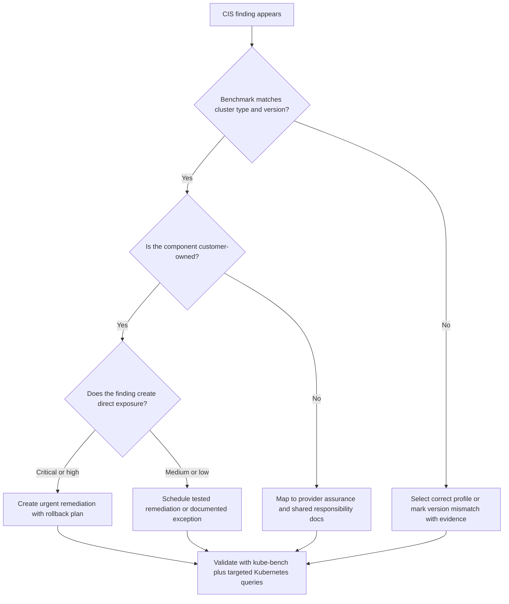

> **Складність**: `[СЕРЕДНЯ]` — технічні знання
>
> **Час на проходження**: 35-45 хвилин
>
> **Передумови**: [Модуль 6.1: Фреймворки відповідності](../module-6.1-compliance-frameworks/)
>
> **Обсяг**: інтерпретація бенчмарка для Kubernetes 1.35+, тріаж kube-bench, межі керованих сервісів, докази усунення вад та зіставлення з вимогами відповідності.

Перш ніж виконувати будь-які команди Kubernetes у цьому модулі, один раз налаштуйте звичний для KubeDojo скорочений запис, щоб приклади залишалися читабельними. Повна команда — це `kubectl`, а псевдонім, який тут використовується, — `k`; на іспиті чи під час розбору інциденту така невелика звичка зменшує обсяг набору тексту, не приховуючи, який саме інструмент застосовується.

```bash
alias k=kubectl
k version --client
```

## Результати навчання

Після завершення цього модуля ви зможете застосовувати бенчмарк як практичний інженерний інструмент, а не лише впізнавати його назву на іспиті:

1. **Оцінити** категорії бенчмарка CIS та їхнє покриття безпеки площини управління, etcd, вузлів і політик у середовищах Kubernetes 1.35+.
2. **Проаналізувати** результати бенчмарка, відокремивши експлуатований ризик конфігурації від рекомендаційних, ручних, пов'язаних із керованими сервісами та специфічних для версії знахідок.
3. **Діагностувати** вивід kube-bench, зіставивши обраний профіль бенчмарка з моделлю володіння кластером та версією Kubernetes.
4. **Спроєктувати** практичний план усунення вад, що пов'язує докази CIS із фреймворками відповідності, операційним контролем змін та безперервним виявленням дрейфу.

## Чому цей модуль важливий

Гіпотетичний сценарій: У 2023 році платформа фінансових послуг, яка готувалася до аудиту PCI, виявила кластер Kubernetes з анонімним доступом до kubelet, що досі був досяжний із внутрішнього сегмента мережі. Перше сканування виглядало звичайно: перелік невдач CIS, кілька попереджень та акуратний відсоток, який наводив на думку, ніби середовище «здебільшого відповідає вимогам». Під час розслідування команда виявила, що один невдалий контроль авторизації kubelet міг розкривати метадані Pod'ів, логи та поверхні на кшталт exec залежно від довколишніх мережевих засобів контролю. Витратною була не зміна окремого прапорця; витратними були затримка аудиту, екстрена ротація вузлів, очищення доказів та робота із запевнення клієнтів, що настала згодом.

Саме через такий тип невдач має значення Бенчмарк Center for Internet Security. Він перетворює широку фразу на кшталт «захистіть кластер» на конкретні, придатні до перегляду очікування щодо прапорців API-сервера, TLS для etcd, автентифікації kubelet, RBAC, Pod Security, NetworkPolicy, аудиторського логування та шифрування секретів. Бенчмарк не є законом і не замінює моделювання загроз, але він дає операторам та аудиторам спільний контрольний список, який можна тестувати багаторазово, замість того щоб сперечатися, покладаючись на пам'ять.

KCSA очікує, що ви розпізнаватимете, чим є бенчмарки CIS, як kube-bench автоматизує багато перевірок і як рекомендації бенчмарка співвідносяться з ширшими фреймворками відповідності. Глибша навичка — це судження: знати, коли невдалий контроль є терміновим, коли він поза зоною вашої відповідальності в керованому сервісі, коли він застарів для Kubernetes 1.35+, а коли усунення слід відкласти заради тестування, бо воно змінює поведінку кластера.

## Що таке Бенчмарк CIS?

Бенчмарк CIS для Kubernetes — це консенсусний посібник з безпеки для конфігурування компонентів Kubernetes. Сприймайте його як різницю між розпливчастим будівельним кодексом і контрольним списком пожежного інспектора: ціль високого рівня — безпека, але контрольний список називає двері, сигналізації, матеріали, перевірки та докази, які підтверджують, що ціль досягається. У Kubernetes ці деталі стають прапорцями, правами доступу до файлів, налаштуваннями сертифікатів, контролерами допуску, політиками аудиту, обмеженнями RBAC та очікуваннями щодо політик робочих навантажень.

```
┌─────────────────────────────────────────────────────────────┐
│              CIS KUBERNETES BENCHMARK                       │
├─────────────────────────────────────────────────────────────┤
│                                                             │
│  WHAT: Security configuration guidelines for Kubernetes     │
│  BY: Center for Internet Security                          │
│  FORMAT: Prescriptive checks with remediation guidance     │
│                                                             │
│  STRUCTURE:                                                │
│  ├── Control Plane Components                              │
│  ├── etcd                                                  │
│  ├── Control Plane Configuration                          │
│  ├── Worker Nodes                                         │
│  └── Policies                                             │
│                                                             │
│  SCORING:                                                  │
│  ├── Scored - Affects compliance percentage               │
│  └── Not Scored - Recommendations only                    │
│                                                             │
│  PROFILES:                                                 │
│  ├── Level 1 - Basic security (minimal disruption)        │
│  └── Level 2 - Defense in depth (may affect function)     │
│                                                             │
│  VERSIONS:                                                 │
│  • Updated with each Kubernetes release                   │
│  • Managed distributions have specific benchmarks         │
│    (EKS, GKE, AKS, OpenShift)                            │
│                                                             │
└─────────────────────────────────────────────────────────────┘
```

Бенчмарк побудовано навколо меж володіння. Перевірки площини управління запитують, чи захищені API-сервер, планувальник, менеджер контролерів та їхні файли. Перевірки etcd зосереджені на шифруванні, автентифікації, довірі між учасниками (peer trust) та правах доступу до сховища, бо etcd є джерелом істини кластера. Перевірки робочих вузлів зосереджені на kubelet, бо це агент, який може запускати контейнери та звітувати про стан вузла. Перевірки політик зосереджені на ресурсах Kubernetes, які орендарі та платформні команди створюють щодня, як-от Role, ServiceAccount, простори імен, мітки Pod Security та NetworkPolicy.

Рівень 1 і Рівень 2 часто розуміють хибно. Рівень 1 призначений для покращення безпеки без значних порушень для більшості середовищ, тоді як Рівень 2 додає засоби контролю глибокого захисту (defense-in-depth), які можуть вимагати тестування застосунків, зміни образів вузлів або обробки винятків. Елемент Рівня 2 не є автоматично «кращим» у кожному виробничому кластері; це сильніші ліки, а сильніші ліки все одно потребують правильного діагнозу.

Зупиніться та спрогнозуйте: якщо перевірка бенчмарка позначена як «not scored» (не оцінюється), чи варто вашій команді ігнорувати її, складаючи план усунення вад для відповідності? Зріла відповідь — ні. «Not scored» зазвичай означає, що перевірка може вимагати локального судження або не зводиться до простого відсотка, але аудиторам та зловмисникам байдуже, чи акуратно ваша панель звітності зважила її.

## Категорії бенчмарка та що вони захищають

Найпростіший спосіб вивчити бенчмарк — зіставити кожну категорію з невдачею, якій вона запобігає. Автентифікація площини управління запобігає неавтентифікованому доступу до API. Авторизація не дає автентифікованим ідентичностям робити геть усе. Контроль допуску не дає поганим об'єктам потрапити до кластера після того, як автентифікація та авторизація пройшли успішно. Аудиторське логування зберігає слід, потрібний для розслідування підозрілої поведінки. Шифрування у стані спокою зменшує радіус ураження, якщо доступ до сховища даних або поводження з резервними копіями скомпрометовано.

### Компоненти площини управління

```
┌─────────────────────────────────────────────────────────────┐
│              CONTROL PLANE SECURITY                         │
├─────────────────────────────────────────────────────────────┤
│                                                             │
│  1.1 CONTROL PLANE NODE CONFIGURATION                      │
│  ├── File permissions on component configs                 │
│  ├── Ownership of configuration files                      │
│  └── Secure directory permissions                          │
│                                                             │
│  1.2 API SERVER                                            │
│  ├── Disable anonymous authentication                      │
│  ├── Enable RBAC authorization                            │
│  ├── Disable insecure port (removed in 1.24; N/A on 1.35+) │
│  ├── Enable admission controllers                          │
│  ├── Configure audit logging                              │
│  ├── Set appropriate request limits                        │
│  └── Enable encryption providers                           │
│                                                             │
│  1.3 CONTROLLER MANAGER                                    │
│  ├── Enable terminated pod garbage collection             │
│  ├── Use service account credentials                      │
│  └── Rotate service account tokens                         │
│                                                             │
│  1.4 SCHEDULER                                             │
│  ├── Disable profiling                                    │
│  └── Use secure authentication                            │
│                                                             │
└─────────────────────────────────────────────────────────────┘
```

API-сервер отримує кожен звичайний запит Kubernetes, тому його засоби контролю заслуговують на особливу увагу. Анонімна автентифікація, слабкі режими авторизації, відсутність контролю допуску та брак аудиторських логів — це не косметичні знахідки бенчмарка; вони впливають на те, хто може просити кластер виконати роботу, які запити дозволено, які об'єкти відхиляються, і чи зможуть респонденти відновити події постфактум. У кластері в стилі kubeadm ці налаштування зазвичай живуть у маніфестах статичних Pod'ів під `/etc/kubernetes/manifests`; у керованих сервісах хмарний провайдер володіє значною частиною цієї поверхні.

> **Зупиніться та подумайте**: Ваша організація використовує EKS (керований Kubernetes). Колега запускає kube-bench із типовим (самокерованим) бенчмарком і отримує 30 знахідок FAIL для компонентів площини управління. Чи є ці знахідки валідними? Чому так чи чому ні?

Відповідь залежить від відповідальності. В EKS, GKE та AKS клієнти не редагують безпосередньо маніфест розміщеного API-сервера чи прапорці etcd, тому самокерований бенчмарк може повідомляти про невдачі, на які клієнт не може вплинути. Такі знахідки не повинні ставати тікетами проти платформної команди без перевірки профілю бенчмарка для керованого сервісу та документації провайдера щодо розділеної відповідальності. Операційна помилка — сприймати сканер як авторитет, а не як доказ, який має відповідати середовищу.

### etcd

```
┌─────────────────────────────────────────────────────────────┐
│              etcd SECURITY                                  │
├─────────────────────────────────────────────────────────────┤
│                                                             │
│  2.1 PEER COMMUNICATION                                    │
│  ├── Use client certificate authentication               │
│  ├── Encrypt peer communication with TLS                 │
│  ├── Verify peer certificates                            │
│  └── Use unique certificates per member                  │
│                                                             │
│  2.2 CLIENT COMMUNICATION                                  │
│  ├── Require client certificates for API server          │
│  ├── Encrypt client communication with TLS               │
│  ├── Verify client certificates                          │
│  └── Restrict client access                              │
│                                                             │
│  2.3 DATA SECURITY                                         │
│  ├── Secure file permissions (700)                       │
│  ├── Proper ownership (etcd:etcd)                        │
│  └── Enable encryption at rest                           │
│                                                             │
│  KEY CHECKS:                                               │
│  • --cert-file and --key-file are set                    │
│  • --peer-cert-file and --peer-key-file are set          │
│  • --client-cert-auth=true                               │
│  • --peer-client-cert-auth=true                          │
│  • --auto-tls=false                                      │
│                                                             │
└─────────────────────────────────────────────────────────────┘
```

etcd заслуговує на власну категорію, бо зберігає стан кластера, від якого залежать усі інші. Якщо зловмисник може читати etcd, він, можливо, зможе читати Secret'и, токени сервісних акаунтів, визначення робочих навантажень та історію конфігурації. Якщо зловмисник може писати в etcd, звичайний шлях авторизації API-сервера можна обійти. Саме тому бенчмарк наголошує на взаємному TLS, перевірці сертифікатів, обмежувальних правах доступу до файлів та шифруванні у стані спокою, замість того щоб ставитися до etcd як до ще однієї внутрішньої бази даних.

Для KCSA вам не потрібно запам'ятовувати кожен прапорець etcd, але ви маєте розпізнавати патерн. Зв'язок між учасниками захищає членів etcd від підміни всередині кворуму. Клієнтський зв'язок захищає доступ від API-сервера та адміністративних клієнтів. Безпека даних захищає файли та знімки, залишені на диску чи в системах резервного копіювання. Коли ви оцінюєте знахідку, запитайте, який шлях вона захищає: довіру між учасниками, довіру між API-сервером та etcd чи розкриття збережених даних.

### Конфігурація площини управління

Розділ 3 CIS охоплює автентифікацію, авторизацію та аудиторське логування як налаштування рівня кластера, а не як прапорці окремих компонентів. Розділ 3 перевіряє, чи API-сервер примусово застосовує надійні режими автентифікації, використовує RBAC (а не дозвільну авторизацію), конфігурує політику аудиту з відповідним терміном зберігання та обмежує анонімні чи надто широкі шляхи доступу. У Kubernetes 1.35+ багато знахідок Розділу 3 перекриваються з перевірками API-сервера з Розділу 1, але розділ усе одно важливий, бо подає шлях запиту як шар врядування: хто може автентифікуватися, який режим авторизації застосовується та чи записується безпеково значуща активність API для розслідування та доказів відповідності.

### Робочі вузли

```
┌─────────────────────────────────────────────────────────────┐
│              WORKER NODE SECURITY                           │
├─────────────────────────────────────────────────────────────┤
│                                                             │
│  4.1 KUBELET                                               │
│  ├── Disable anonymous authentication                      │
│  ├── Use webhook authorization                            │
│  ├── Enable client certificate authentication             │
│  ├── Disable read-only port (10255)                       │
│  ├── Enable streaming connection timeouts                 │
│  ├── Protect kernel defaults                              │
│  ├── Set hostname override only if needed                 │
│  └── Enable certificate rotation                          │
│                                                             │
│  4.2 KUBELET CONFIG FILE                                   │
│  ├── File permissions (600)                               │
│  ├── Proper ownership (root:root)                         │
│  └── Disable insecure TLS cipher suites                   │
│                                                             │
│  KEY KUBELET SETTINGS:                                     │
│  --anonymous-auth=false                                   │
│  --authorization-mode=Webhook                             │
│  --client-ca-file=/path/to/ca.crt                        │
│  --read-only-port=0                                       │
│  --protect-kernel-defaults=true                           │
│  --rotate-certificates=true                               │
│                                                             │
└─────────────────────────────────────────────────────────────┘
```

Перевірки робочих вузлів мають значення, бо kubelet перебуває близько до робочих навантажень. Посилений API-сервер не дуже допоможе, якщо kubelet приймає неавтентифіковані запити, пропускає авторизацію через вебхук, відкриває порт лише для читання або працює з некерованими термінами дії сертифікатів. Безпека вузлів — це також місце, де відповідальність у керованому Kubernetes стає змішанішою: провайдер може володіти частинами площини управління, але клієнти часто обирають образи вузлів, налаштування завантаження (bootstrap), додатки, DaemonSet'и та політики робочих навантажень.

Налаштування kubelet також показують, чому усунення вад має бути протестованим. Увімкнення ротації сертифікатів зазвичай знижує операційний ризик, але зміна режиму авторизації, захисту типових параметрів ядра чи налаштувань TLS може зламати вузли, які було зібрано з неузгодженими припущеннями завантаження. План усунення вад виробничого рівня змінює одну групу налаштувань за раз, безпечно зливає вузли (drain), валідує робочі навантаження та залишає кроки відкату явними.

### Політики

```
┌─────────────────────────────────────────────────────────────┐
│              KUBERNETES POLICIES                            │
├─────────────────────────────────────────────────────────────┤
│                                                             │
│  5.1 RBAC AND SERVICE ACCOUNTS                             │
│  ├── Limit use of cluster-admin role                      │
│  ├── Minimize access to secrets                           │
│  ├── Minimize wildcard use in roles                       │
│  ├── Minimize access to pod creation                      │
│  ├── Ensure default SA is not used                        │
│  └── Disable auto-mount of SA tokens                      │
│                                                             │
│  5.2 POD SECURITY STANDARDS                                │
│  ├── Minimize privileged containers                       │
│  ├── Minimize host namespace sharing                      │
│  ├── Minimize running as root                            │
│  ├── Minimize capabilities                                │
│  ├── Do not allow privilege escalation                   │
│  └── Apply Pod Security Standards                        │
│                                                             │
│  5.3 NETWORK POLICIES                                      │
│  ├── Use CNI that supports NetworkPolicy                  │
│  ├── Define default deny policies                         │
│  └── Ensure pods are isolated appropriately              │
│                                                             │
│  5.4 SECRETS MANAGEMENT                                    │
│  ├── Use secrets instead of environment variables         │
│  ├── Enable encryption at rest for secrets               │
│  └── Consider external secrets stores                     │
│                                                             │
└─────────────────────────────────────────────────────────────┘
```

Перевірки політик — це місце, де CIS переходить від операторів кластера до врядування платформою. RBAC контролює, хто може робити небезпечні речі. Налаштування сервісних акаунтів зменшують випадкове розкриття облікових даних. Pod Security Standards зменшують імовірність того, що скомпрометоване робоче навантаження зможе підвищити привілеї через привілейовані контейнери, простори імен хоста, додані можливості Linux (capabilities) чи виконання від root. NetworkPolicy зменшують горизонтальне переміщення (lateral movement), роблячи комунікацію між Pod'ами явною, замість припущення, що кожне робоче навантаження може досягти будь-якого іншого.

Ця категорія також найбезпосередніше пов'язана з фреймворками відповідності. PCI DSS, SOC 2, ISO 27001 та подібні програми зазвичай не називають кожне налаштування Kubernetes, але вимагають контролю доступу, доказів змін, найменших привілеїв, логування, захисту даних та сегментації мережі. Знахідка CIS дає вам технічний доказ, який підтримує ці ширші засоби контролю. Бенчмарк не замінює фреймворк; він допомагає довести, що ваша реалізація Kubernetes здатна задовольнити намір фреймворка.

## Ключові рекомендації в Kubernetes 1.35+

Посилення API-сервера починається зі шляху запиту. Запит має бути автентифікований, авторизований, допущений або відхилений політикою та записаний достатньо добре для розслідування. Якщо будь-який шар відсутній, кластер стає важче захищати й важче пояснювати аудиторам. Рекомендації CIS перетворюють цей шлях на налаштування: вимкніть анонімну автентифікацію, використовуйте авторизацію Node та RBAC замість дозвільних режимів, увімкніть безпеково значущі плагіни допуску, налаштуйте аудиторське логування та зашифруйте чутливі ресурси у стані спокою.

```
┌─────────────────────────────────────────────────────────────┐
│              API SERVER RECOMMENDATIONS                     │
├─────────────────────────────────────────────────────────────┤
│                                                             │
│  AUTHENTICATION                                            │
│  --anonymous-auth=false                                   │
│  • Disable anonymous access to API                        │
│  • All requests must be authenticated                     │
│                                                             │
│  AUTHORIZATION                                             │
│  --authorization-mode=Node,RBAC                           │
│  • Never use AlwaysAllow                                  │
│  • Use RBAC for role-based access                        │
│  • Node authorization for kubelet                         │
│                                                             │
│  ADMISSION CONTROLLERS                                     │
│  --enable-admission-plugins=NodeRestriction,PodSecurity  │
│  • NodeRestriction - Limit kubelet permissions           │
│  • PodSecurity - Enforce PSS                             │
│  • Other security-relevant controllers                    │
│                                                             │
│  AUDIT LOGGING                                             │
│  --audit-log-path=/var/log/kubernetes/audit.log          │
│  --audit-log-maxage=30                                    │
│  --audit-log-maxbackup=10                                 │
│  --audit-log-maxsize=100                                  │
│  --audit-policy-file=/etc/kubernetes/audit-policy.yaml   │
│                                                             │
│  ENCRYPTION                                                │
│  --encryption-provider-config=/path/to/encryption.yaml   │
│  • Encrypt secrets at rest                               │
│                                                             │
└─────────────────────────────────────────────────────────────┘
```

Важлива деталь Kubernetes 1.35+ полягає в тому, що PodSecurityPolicy зникла, а Pod Security Admission є вбудованим шляхом-замінником. Якщо сканер каже вам увімкнути PodSecurityPolicy у сучасному кластері, правильна реакція — це не сліпе прийняття і не сліпе відхилення. Підтвердьте версію бенчмарка, підтвердьте версію Kubernetes, підтвердьте мітки Pod Security для простору імен і задокументуйте знахідку як незастосовну, коли перевірка бенчмарка відстала від платформи.

Посилення kubelet наслідує ту саму багатошарову модель, але наслідки локалізовані на вузлах та робочих навантаженнях. Автентифікація повідомляє kubelet, хто звертається. Авторизація через вебхук дозволяє API-серверу вирішити, чи може цей абонент виконати запитану дію kubelet. Вимкнення порту лише для читання прибирає застарілий неавтентифікований інформаційний шлях. Ротація сертифікатів зменшує ймовірність того, що старі облікові дані вузла залишаться надовго після того, як операційне володіння змінилося.

```
┌─────────────────────────────────────────────────────────────┐
│              KUBELET RECOMMENDATIONS                        │
├─────────────────────────────────────────────────────────────┤
│                                                             │
│  AUTHENTICATION                                            │
│  authentication:                                          │
│    anonymous:                                             │
│      enabled: false                                       │
│    webhook:                                               │
│      enabled: true                                        │
│    x509:                                                  │
│      clientCAFile: /path/to/ca.crt                       │
│                                                             │
│  AUTHORIZATION                                             │
│  authorization:                                           │
│    mode: Webhook                                          │
│  • Use Webhook mode for API server authorization         │
│  • Never use AlwaysAllow                                  │
│                                                             │
│  NETWORK                                                   │
│  readOnlyPort: 0                                          │
│  • Disable unauthenticated read-only port                │
│  • Prevents information disclosure                        │
│                                                             │
│  CERTIFICATES                                              │
│  rotateCertificates: true                                 │
│  serverTLSBootstrap: true                                │
│  • Enable automatic certificate rotation                  │
│  • Ensure certs don't expire unexpectedly                │
│                                                             │
│  SECURITY                                                  │
│  protectKernelDefaults: true                             │
│  • Fail if kernel settings don't match kubelet needs     │
│                                                             │
└─────────────────────────────────────────────────────────────┘
```

Перш ніж запускати це в реальному кластері, який вивід ви очікуєте від `k get nodes -o wide` після заміни образу вузла на образ з іншими типовими параметрами kubelet? Здорова відповідь — «усі вузли Ready, причому з новим образом лише після того, як налаштування завантаження збігаються з очікуваною конфігурацією kubelet». Якщо ви очікуєте, що прапорець бенчмарка буде безпечним без перевірки готовності вузлів, перезапусків робочих навантажень та логів kubelet, ви ставитеся до відповідності як до паперової роботи, а не як до інженерії.

## Використання kube-bench без хибної інтерпретації

kube-bench — це поширений інструмент з відкритим кодом для перевірки кластерів Kubernetes на відповідність засобам контролю бенчмарка CIS. Він читає локальні файли, конфігурацію компонентів Kubernetes та вибрану інформацію про кластер, а потім звітує про результати PASS, FAIL, WARN та INFO. Він корисний, бо робить великий бенчмарк повторюваним, але це все одно сканер. Він не завжди може знати вашу межу керованого сервісу, ваші компенсаційні засоби контролю, ваші прийняті винятки чи те, чи перевірка, специфічна для версії, стала застарілою.

### Запуск kube-bench

```bash
# Run on control plane node
kube-bench run --targets master

# Run on worker node
kube-bench run --targets node

# Run specific checks
kube-bench run --targets master --check 1.2.1,1.2.2

# Output as JSON
kube-bench run --targets master --json

# Run as Kubernetes Job
kubectl apply -f https://raw.githubusercontent.com/aquasecurity/kube-bench/main/job.yaml
```

Блок команд вище навмисно є класичним прикладом kube-bench, включно з URL маніфесту Job з апстріму Kubernetes. У повсякденних прикладах KubeDojo надавайте перевагу `k apply -f ...` після налаштування псевдоніма, але зберігайте команду з апстріму при порівнянні з документацією вендора чи старішими runbook'ами. Різниця — у стилі набору тексту, а не в іншій операції API.

Коли kube-bench запускається на вузлі, обрана ціль має значення. Ціль площини управління шукає конфігурацію API-сервера, планувальника, менеджера контролерів та etcd, яка може існувати лише на самокерованих вузлах площини управління. Ціль вузла шукає конфігурацію kubelet та файли рівня вузла. У керованому кластері Kubernetes Job може бути операційно простішим, але сервісний акаунт, монтування hostPath та контекст безпеки контейнера, який використовує цей Job, заслуговують на перегляд, перш ніж запускати його у виробництві.

### Інтерпретація результатів

```
┌─────────────────────────────────────────────────────────────┐
│              KUBE-BENCH OUTPUT                              │
├─────────────────────────────────────────────────────────────┤
│                                                             │
│  [INFO] 1 Control Plane Security Configuration             │
│  [INFO] 1.1 Control Plane Node Configuration Files         │
│  [PASS] 1.1.1 Ensure that the API server pod spec file     │
│               permissions are set to 600 or more restrictive│
│  [PASS] 1.1.2 Ensure that the API server pod spec file     │
│               ownership is set to root:root                │
│  [FAIL] 1.2.1 Ensure that the --anonymous-auth argument    │
│               is set to false                              │
│                                                             │
│  REMEDIATION:                                              │
│  1.2.1 Edit the API server pod specification file          │
│  /etc/kubernetes/manifests/kube-apiserver.yaml and set:    │
│  --anonymous-auth=false                                    │
│                                                             │
│  == Summary ==                                             │
│  45 checks PASS                                            │
│  10 checks FAIL                                            │
│  5 checks WARN                                             │
│  0 checks INFO                                             │
│                                                             │
│  SCORING:                                                  │
│  PASS = Compliant with recommendation                     │
│  FAIL = Not compliant, needs remediation                  │
│  WARN = Manual check needed                               │
│  INFO = Informational only                                │
│                                                             │
└─────────────────────────────────────────────────────────────┘
```

Найгірший спосіб читати цей вивід — як єдиний відсоток. Кластер з одним критичним збоєм може бути небезпечнішим за кластер із кількома низькоризиковими відхиленнями у правах доступу до файлів, а WARN може приховувати реальну проблему, якщо ніхто не виконає ручний перегляд. Краща звітність групує знахідки за родиною засобів контролю, серйозністю, володінням, середовищем та статусом усунення. Це і є різниця між панеллю відповідності, що виглядає чистою, і програмою безпеки, що дійсно може знизити ризик.

Текст усунення вад також не завжди є готовою до запуску виробничою зміною. Редагування маніфесту статичного Pod'а на площині управління kubeadm може перезапустити API-сервер. Зміна авторизації kubelet може вплинути на проби, агенти моніторингу чи потоки завантаження вузлів, які покладалися на застарілу поведінку. Увімкнення суворіших міток Pod Security може відхилити робочі навантаження, що раніше розгорталися. Бенчмарк каже вам, який вигляд має добре; ваш план змін вирішує, як цього досягти, не спричинивши простою.

Вивід сканера стає кориснішим, коли ви нормалізуєте його, перш ніж люди почнуть сперечатися про тікети. Практичний прохід нормалізації додає назву кластера, середовище, версію Kubernetes, профіль бенчмарка, тип цілі, ідентифікатор знахідки, текст знахідки, результат, відповідального, застосовність, серйозність та посилання на доказ. Це звучить бюрократично, доки не надійде друге сканування, і вам не знадобиться порівняти, чи невдача є новою, постійною, усунутою чи повторно внесеною дрейфом.

Для виводу kube-bench у форматі JSON більшість команд зрештою будують невеликий парсер, який витягує невдалі та попереджувальні перевірки до системи відстеження. Парсер не повинен призначати остаточну серйозність самотужки, бо серйозність залежить від мережевого розкриття, моделі орендарів, відповідальності провайдера та компенсаційних засобів контролю. Однак він може групувати за розділами та зберігати текст усунення вад із бенчмарка. Це зберігає автоматизацію корисною, лишаючи рішення щодо ризику людям, які розуміють кластер.

Ручний перегляд — це місце, де багато програм втрачають дисципліну. WARN, що каже «перегляньте привілейовані контейнери», не можна закрити, сказавши, що сканер не позначив це збоєм. Хтось має перевірити привілейовані робочі навантаження, вирішити, чи кожне з них необхідне, з'ясувати, чи мітки Pod Security завадили б новим привілейованим Pod'ам, та зафіксувати винятки для легітимних інфраструктурних робочих навантажень. Ручна робота повільніша, але саме там часто виявляється справжній стан безпеки.

Існує також тонка різниця між доказом усунення вад та доказом для аудиту. Доказ усунення вад підтверджує, що інженерна зміна сталася та спрацювала, як-от коміт конфігурації, повторний запуск kube-bench чи вивід команди `k`. Доказ для аудиту підтверджує, що контроль урядований, як-от відповідальний, графік перегляду, процес винятків та посилання на ширшу вимогу відповідності. Зріла програма CIS зберігає обидва, бо проходження сьогоднішнього сканування не доводить, що контроль залишиться здоровим наступного кварталу.

## Керований Kubernetes та розділена відповідальність

Керований Kubernetes змінює оцінювання CIS, бо ви більше не володієте кожним компонентом. Хмарний провайдер може керувати API-сервером, etcd, планувальником, менеджером контролерів та частинами мережі площини управління. Ви досі володієте ідентичністю робочого навантаження, виборами RBAC, мітками просторів імен, мережевими політиками, конфігурацією груп вузлів, додатками, образами контейнерів, поводженням із секретами та засобами контролю рівня застосунку. Запуск неправильного профілю бенчмарка плутає ці відповідальності та створює зашумлені докази.

```
┌─────────────────────────────────────────────────────────────┐
│              MANAGED KUBERNETES BENCHMARKS                  │
├─────────────────────────────────────────────────────────────┤
│                                                             │
│  WHY DIFFERENT?                                            │
│  • Control plane managed by provider                       │
│  • Different configuration options available               │
│  • Shared responsibility model                             │
│                                                             │
│  EKS BENCHMARK                                             │
│  • AWS-specific recommendations                            │
│  • IAM integration                                         │
│  • EKS add-ons security                                   │
│  • kube-bench supports: --benchmark eks-1.0               │
│                                                             │
│  GKE BENCHMARK                                             │
│  • GCP-specific recommendations                            │
│  • Workload Identity                                       │
│  • Binary Authorization                                    │
│  • kube-bench supports: --benchmark gke-1.0               │
│                                                             │
│  AKS BENCHMARK                                             │
│  • Azure-specific recommendations                          │
│  • Azure AD integration                                    │
│  • Azure Policy                                           │
│  • kube-bench supports: --benchmark aks-1.0               │
│                                                             │
│  RESPONSIBILITY:                                           │
│  Provider: Control plane components                        │
│  Customer: Worker nodes, workloads, policies               │
│                                                             │
└─────────────────────────────────────────────────────────────┘
```

Практичний робочий процес — обрати бенчмарк, що відповідає платформі, перш ніж інтерпретувати результати. Для самокерованих кластерів kubeadm, Talos, RKE2 чи подібних перевірки площини управління та etcd зазвичай належать до зони відповідальності операційної команди. Для EKS, GKE та AKS використовуйте специфічний для провайдера бенчмарк, коли він доступний, а потім зіставляйте будь-які залишкові докази площини управління з документацією провайдера, а не вдавайте, що можете редагувати розміщені компоненти безпосередньо.

> **Зупиніться та спрогнозуйте**: kube-bench звітує про WARN для «Ensure that the admission control plugin PodSecurityPolicy is set». Але PodSecurityPolicy було видалено в Kubernetes 1.25. Чи означає це, що бенчмарк помиляється, чи щось інше?

Зазвичай це означає, що перевірка, обраний бенчмарк чи версія сканера не відповідають версії Kubernetes кластера. У Kubernetes 1.35+ Pod Security Admission та мітки просторів імен на кшталт `pod-security.kubernetes.io/enforce: restricted` є релевантним вбудованим механізмом. Знахідку слід розслідувати та задокументувати як незастосовну лише після того, як ви перевірите розбіжність версій і підтвердите, що контроль-замінник дійсно налаштовано.

## Пріоритизація усунення вад та докази

Пріоритизація починається з експлуатованості та радіуса ураження, а не з порядку у звіті. Анонімний доступ до API-сервера, дозвільна авторизація, відкритий etcd та відсутність аудиторських логів є терміновими, бо впливають на ключову межу довіри кластера. Анонімна автентифікація kubelet, розкриття порту лише для читання та відсутність авторизації через вебхук є високоризиковими, бо перебувають близько до робочих навантажень. Відсутність NetworkPolicy, широкі прив'язки cluster-admin та дозвільний стан Pod Security можуть стати серйозними у поєднанні зі скомпрометованим робочим навантаженням.

```
┌─────────────────────────────────────────────────────────────┐
│              REMEDIATION PRIORITY                           │
├─────────────────────────────────────────────────────────────┤
│                                                             │
│  CRITICAL (Fix immediately):                               │
│  ├── Anonymous auth enabled on API server                 │
│  ├── Insecure port enabled (removed in 1.24; flag N/A if scanner still reports it) │
│  ├── AlwaysAllow authorization mode                       │
│  ├── No audit logging                                     │
│  └── etcd exposed without auth                            │
│                                                             │
│  HIGH (Fix within days):                                   │
│  ├── Kubelet anonymous auth enabled                       │
│  ├── Read-only kubelet port enabled                       │
│  ├── No encryption at rest for secrets                    │
│  ├── Privileged containers allowed                        │
│  └── Missing network policies                             │
│                                                             │
│  MEDIUM (Fix within weeks):                                │
│  ├── File permissions not restrictive                     │
│  ├── Audit log rotation not configured                    │
│  ├── Service account token auto-mount enabled             │
│  └── Certificate rotation not enabled                     │
│                                                             │
│  LOW (Plan for fix):                                       │
│  ├── Informational findings                               │
│  ├── Defense-in-depth recommendations                     │
│  └── Non-security settings                                │
│                                                             │
└─────────────────────────────────────────────────────────────┘
```

Докази мають значення, бо усунення вад CIS часто живить зовнішні програми відповідності. Хороший тікет не просто каже «встановити anonymous auth у false». Він фіксує версію бенчмарка, версію кластера, уражені вузли чи компоненти, поточне значення, бажане значення, обґрунтування ризику, відповідального, план розгортання, команду валідації та рішення щодо винятку, якщо контроль відкладено. Аудиторам потрібні повторювані докази; інженерам потрібно достатньо контексту, щоб не виконати ту саму зміну двічі й не зламати працюючу систему.

Який підхід ви б обрали тут і чому: один тікет на кожну невдачу бенчмарка чи один тікет на кожну тему усунення вад? Для малих кластерів один тікет на невдачу може бути прийнятним. Для реальних платформ групування за темами зазвичай працює краще, бо прапорці API-сервера, налаштування kubelet, очищення RBAC, розгортання Pod Security та запровадження NetworkPolicy потребують різних відповідальних, тестів та планів відкату.

```bash
# Inspect namespace Pod Security labels in a Kubernetes 1.35+ cluster.
k get ns --show-labels

# Check whether broad cluster-admin bindings exist.
k get clusterrolebinding -o custom-columns=NAME:.metadata.name,ROLE:.roleRef.name

# Confirm NetworkPolicy objects exist across namespaces.
k get networkpolicy -A
```

Ці команди не замінюють kube-bench. Вони допомагають вам валідувати частини знахідки, спрямовані на політики, та зібрати придатний для людського читання доказ. У виробничому усуненні вад поєднуйте вивід сканера з цілеспрямованими запитами Kubernetes, записами керування конфігурацією та журналами змін, щоб підсумковий звіт розповідав зв'язну історію.

Ось наочний приклад того, як такий доказовий спосіб мислення змінює результат. Уявіть, що kube-bench звітує, що API-сервер дозволяє анонімну автентифікацію, kubelet дозволяє анонімні запити, а кілька просторів імен не мають NetworkPolicy. Поверхнева відповідь на відповідність відкрила б три тікети зі скопійованим текстом усунення вад і без контексту середовища. Сильніша відповідь запитує, яка знахідка дозволяє прямий доступ до площини управління, яка розкриває локальну для вузла інформацію чи дії, яка уможливлює горизонтальне переміщення після компрометації, та які команди володіють відповідними шляхами конфігурації.

Знахідка щодо API-сервера стає першим ескалаційним пріоритетом, бо вона стосується центрального шляху запиту. Відповідальним, імовірно, є команда експлуатації площини управління, доказ надходить із маніфесту статичного Pod'а чи запису керованої конфігурації, а валідація має включати повторне сканування плюс негативний тест, що показує відхилення неавтентифікованих запитів. План змін потребує очікування перезапуску площини управління, перевірок здоров'я та шляху відкату, бо навіть правильний прапорець може порушити доступ, якщо інтеграції автентифікації були неправильно налаштовані раніше.

Знахідка щодо kubelet стає темою усунення вад на вузлах, а не окремим ізольованим прапорцем. Платформна команда має порівняти пули вузлів, образи, скрипти завантаження та файли конфігурації kubelet, щоб з'ясувати, чи всі вузли мають ту саму проблему, чи дрейфнув лише один пул. Якщо збій є лише на новостворених вузлах, проблема, ймовірно, у шаблоні запуску або в шляху завантаження. Виправлення окремих вузлів вручну може втихомирити сьогоднішній звіт, але залишає завтрашню подію автомасштабування готовою відтворити той самий збій.

Знахідка щодо NetworkPolicy стає розмовою з власником робочого навантаження, бо політика ізоляції залежить від трафіку застосунку. Платформна команда може надати базову лінію default-deny та приклади, але кожен власник сервісу має визначити легітимний вхідний (ingress) та вихідний (egress) трафік. Поспішна суцільна політика може зламати виявлення сервісів, збір метрик, DNS чи доступ до бази даних. Це не робить NetworkPolicy необов'язковими; це означає, що план усунення вад потребує поетапного розгортання за просторами імен, спостережуваності під час примусового виконання та задокументованих винятків для перехідних робочих навантажень.

Цей підхід також допомагає зі зіставленням відповідності. Знахідки щодо API-сервера та kubelet підтримують вимоги контролю доступу та посилення систем. NetworkPolicy підтримує сегментацію та комунікацію за принципом найменших привілеїв. Вивід сканування доводить, що прогалина була, але доказ усунення вад має довести новий стан, відповідального, дату, метод валідації та причину, чому будь-який залишковий виняток є прийнятним. Це і є різниця між «ми запустили інструмент» та «ми експлуатуємо контроль».

Корисний додатковий стовпець у таблиці тріажу знахідок — «ризик хибного бенчмарка». Цей стовпець запитує, чи знахідка може бути невалідною, бо профіль сканера, версія Kubernetes, модель провайдера чи дистрибутив середовища виконання не відповідають кластеру. Він не дає командам марнувати час на налаштування розміщеної площини управління, видалені функції чи перевірки, написані для іншого дистрибутива. Він також змушує рецензента навести причину, чому знахідка незастосовна, замість того щоб просто видаляти незручні рядки.

Інший корисний стовпець — «зчеплення усунення вад». Деякі знахідки можна виправити незалежно, як-от мітку простору імен чи застарілу прив'язку clusterrolebinding. Інші зчеплені з образами вузлів, перезапусками API-сервера, розгортанням політики допуску чи поведінкою застосунку. Зчеплені знахідки потребують вікон змін, комунікації зі стейкхолдерами та шляху відкату. Якщо ви ставитеся до них як до звичайних тікетів, ви, можливо, зрештою пройдете бенчмарк, але навчите команди боятися роботи з безпеки, бо вона виглядає як непояснений виробничий ризик.

Нарешті, зафіксуйте, який вигляд має успіх, перш ніж зміна почнеться. Для виправлення авторизації kubelet успіх може включати повернення вузлів у Ready, продовження збору схвалених кінцевих точок DaemonSet'ами моніторингу, проходження kube-bench відповідних перевірок та відмову неавторизованих викликів kubelet. Для Pod Security успіх може включати наявність міток простору імен, перегляд відомих привілейованих робочих навантажень та відхилення нових розгортань лише там, де політика навмисно застосовується. Критерії успіху захищають інженерів від розпливчастого усунення вад, а аудиторів — від розпливчастих доказів.

## Безперервна відповідність CIS

Одиничний запуск бенчмарка — це знімок. Кластери дрейфують, бо вузли замінюються, додатки оновлюються, скрипти завантаження змінюються, нові команди створюють простори імен, а екстрений доступ іноді стає постійним. Безперервна відповідність означає, що ви скануєте за графіком, порівнюєте з базовою лінією, оповіщаєте про значущі нові збої та спрямовуєте роботу правильному відповідальному, перш ніж наступний аудит перетвориться на метушню.

```
┌─────────────────────────────────────────────────────────────┐
│              CONTINUOUS CIS COMPLIANCE                      │
├─────────────────────────────────────────────────────────────┤
│                                                             │
│  SCHEDULED SCANNING                                        │
│  apiVersion: batch/v1                                      │
│  kind: CronJob                                            │
│  metadata:                                                 │
│    name: kube-bench-scan                                  │
│  spec:                                                    │
│    schedule: "0 0 * * *"  # Daily                        │
│    jobTemplate:                                           │
│      spec:                                                │
│        template:                                          │
│          spec:                                            │
│            containers:                                    │
│            - name: kube-bench                            │
│              image: aquasec/kube-bench:latest           │
│              args: ["--json"]                            │
│            restartPolicy: Never                          │
│                                                             │
│  INTEGRATION POINTS:                                       │
│  • CI/CD: Scan before cluster changes                     │
│  • Monitoring: Alert on new failures                      │
│  • Reporting: Track compliance over time                  │
│  • Automation: Auto-remediate where safe                  │
│                                                             │
│  DRIFT DETECTION:                                          │
│  • Compare current state to baseline                      │
│  • Alert on configuration changes                         │
│  • Track remediation progress                             │
│                                                             │
└─────────────────────────────────────────────────────────────┘
```

Сприймайте діаграму CronJob як концепцію, а не як готовий до виробництва маніфест. Запуск kube-bench як привілейованого Pod'а з монтуваннями хоста може бути необхідним для інспекції вузла, але цей самий привілей слід переглядати, обмежувати та прибирати, якщо Job потрібен лише на час вікна оцінювання. Для безперервного сканування багато організацій запускають перевірки з посиленого операційного простору імен, зберігають вивід JSON у контрольованому місці та перетворюють нові збої на тікети з мітками серйозності та володіння.

Найсильніші команди також версіонують свої винятки. Якщо налаштування Рівня 2 відкладено, бо воно ламає застаріле робоче навантаження, виняток має називати робоче навантаження, бізнес-відповідального, компенсаційний контроль, дату перегляду та план міграції. Інакше «прийнятий ризик» стає сховищем для роботи, яку ніхто не хоче завершувати, а наступному аудиту доводиться відкривати обґрунтування заново.

Безперервна робота з CIS також потребує шляху просування від кластерів розробки до виробничих кластерів. Якщо нову базову лінію тестують лише у виробництві, перша несподіванка стається там, де вона найдорожча. Кращий патерн — запускати той самий профіль бенчмарка в репрезентативному невиробничому кластері, оцінювати нові знахідки, оновлювати образи вузлів та політики допуску спершу там, а потім просувати протестовану конфігурацію через звичайні канали релізу. Бенчмарк стає частиною доставки платформи, а не окремим аудиторським ритуалом.

Ви також маєте вирішити, яким знахідкам дозволено тимчасово зазнавати збою під час подій життєвого циклу кластера. Наприклад, під час міграції пулу вузлів змішаний парк може показувати і старі, і нові налаштування kubelet протягом короткого періоду. Під час розгортання політики допуску простори імен можуть переходити від warn до audit і до enforce. Ці переходи слід планувати та обмежувати в часі, а не приховувати від звітів. Тимчасовий збій із тікетом змін та крайнім терміном дуже відрізняється від постійного збою, яким ніхто не володіє.

Безперервне сканування має проблему співвідношення сигналу до шуму, тому правила оповіщення мають зосереджуватися на нових високоризикових збоях, повторно внесених критичних засобах контролю та винятках, що наближаються до крайніх термінів перегляду. Оповіщення про кожну низькоризикову знахідку щодня привчає команди ігнорувати канал. Звітність усе одно має зберігати повні деталі для аудитів та аналізу тенденцій, але операційні оповіщення мають вимагати дії. Бенчмарк — це система контролю; системам контролю потрібен зворотний зв'язок, на який люди дійсно можуть відреагувати.

Нарешті, пам'ятайте, що відповідність CIS — це один шар у ширшій програмі безпеки. Кластер може пройти багато перевірок бенчмарка, все ще запускаючи вразливі образи, без потреби розкриваючи публічні сервіси чи надаючи надмірні хмарні права IAM поза Kubernetes. І навпаки, кластер може мати обґрунтований виняток бенчмарка, бо інший контроль знижує той самий ризик. Правильний спосіб мислення — це ані сліпа покора сканеру, ані недбала культура винятків. Використовуйте CIS як суворе базове значення, а потім поєднуйте його з моделюванням загроз, виявленням під час виконання, засобами контролю ланцюга постачання та навчанням на інцидентах.

## Від знахідки CIS до наративу відповідності

Фреймворки відповідності зазвичай говорять у термінах цілей контролю, а не прапорців Kubernetes. Вони запитують, чи доступ обмежено, чи зміни переглядаються, чи чутливі дані захищені, чи активність логується, та чи системи моніторяться. Бенчмарки CIS перекладають частину цього наміру на специфічні для Kubernetes докази реалізації. Коли ви можете пояснити цей переклад, ви допомагаєте аудиторам зрозуміти платформу, а інженерам — побачити, чому ця робота має значення.

Для контролю доступу перевірки автентифікації та авторизації API-сервера підтримують твердження, що користувачі та робочі навантаження не можуть виконувати довільні дії. Перевірки RBAC підтримують найменші привілеї, особливо коли зменшено дозволи з узагальнювальними символами (wildcard), широкий доступ до секретів та непотрібні прив'язки cluster-admin. Перевірки сервісних акаунтів підтримують гігієну ідентичності робочих навантажень, обмежуючи розкриття токенів. Доказ має пов'язувати результат бенчмарка з реальними об'єктами Kubernetes та операційним володінням, а не лише з вставленим рядком контрольного списку.

Для захисту даних TLS для etcd, автентифікація клієнтських сертифікатів та шифрування у стані спокою підтримують твердження, що стан кластера захищено в передачі та у спокої. Це не доводить автоматично, що дані застосунку безпечні, але стосується сховища даних площини управління Kubernetes. Якщо Secret'и також синхронізуються з зовнішнім менеджером секретів, ваш наратив має описувати, яка система є авторитетною, як працює ротація та як шифрування Kubernetes у стані спокою вписується в ширший дизайн.

Для моніторингу та розслідування перевірки аудиторського логування підтримують твердження, що безпеково значущу активність API можна відновити. Бенчмарк може перевіряти, що аудиторське логування налаштовано, але наратив відповідності має йти далі: куди надсилаються логи, хто може їх змінювати, як довго вони зберігаються, як виводяться оповіщення та як респонденти шукають у них під час інциденту. Шлях до файлу логів — це початок, а не завершений контроль моніторингу.

Для сегментації та посилення робочих навантажень перевірки Pod Security та NetworkPolicy підтримують твердження, що орендарі та застосунки мають межі. Pod Security зменшує ризикові атрибути виконання, перш ніж Pod'и стартують. NetworkPolicy зменшує горизонтальне переміщення після того, як робоче навантаження запущено. Ці засоби контролю особливо важливі в спільних кластерах, де робоче навантаження однієї команди не повинно тихо ставати шляхом загрози для іншої. Наратив має називати модель багатьох орендарів кластера, бо кластер розробки для однієї команди та виробнича платформа з багатьма орендарями мають різні рівні ризику.

Для керування змінами безперервні докази бенчмарка підтримують твердження, що налаштування посилення не є одноразовим героїзмом. Базове сканування, тікети усунення вад, схвалені винятки, повторювані сканування та оповіщення про дрейф показують, що контроль експлуатується з часом. Саме тут CIS стає чимось більшим, ніж навчальна тема. Він стає повторюваним циклом: визначте базову лінію, виміряйте кластер, виправте чи обґрунтуйте прогалини, валідуйте новий стан та стежте за дрейфом.

Презентуючи докази CIS, не топіть рецензентів у сирому виводі. Почніть із цілі контролю, підсумуйте відповідні категорії CIS, покажіть поточний статус за серйозністю та відповідальним, а потім додайте детальний вивід сканування для простежуваності. Інженери досі можуть перевірити кожен рядок, тоді як неспеціалісти-рецензенти можуть зрозуміти, чи платформа покращується. Така структура набагато корисніша за гігантський звіт, який технічно містить відповідь, але приховує рішення.

Той самий підхід допомагає під час інцидентів. Якщо респонденти виявляють, що зловмисник використав широкий сервісний акаунт, відсутню NetworkPolicy чи надто дозвільне налаштування kubelet, базова лінія CIS дає їм спосіб запитати, чи слабкість була вже відомою, нещодавно внесеною чи раніше прийнятою. Цей контекст впливає на першопричину, комунікацію з клієнтами та подальшу роботу. Докази відповідності існують не лише для аудиторів; зроблені добре, вони стають операційною пам'яттю.

## Патерни та антипатерни

Патерни — це звички, які не дають роботі з CIS перетворитися на зашумлену вправу з таблицями. Вони пов'язують вивід сканера з володінням, ризиком та повторюваними операціями. Антипатерни — це короткі шляхи, що виглядають ефективними під час першого звіту й стають дорогими, коли оновлення провайдера, запит аудиту чи реагування на інцидент викривають відсутнє обґрунтування.

| Патерн | Коли застосовувати | Чому це працює | Міркування щодо масштабування |
|---------|-------------|--------------|-----------------------|
| Зіставити профіль бенчмарка перед тріажем | Кожне оцінювання керованого чи гібридного кластера | Запобігає перетворенню хибних знахідок площини управління на нездійсненні тікети | Зберігайте тип кластера, версію Kubernetes та обраний профіль із кожним результатом сканування |
| Групувати усунення вад за родиною засобів контролю | Коли знахідки мають спільного відповідального чи шлях розгортання | Дозволяє командам узгоджено тестувати зміни API-сервера, kubelet, RBAC, Pod Security та NetworkPolicy | Використовуйте окремі вікна змін для руйнівних змін вузлів та контролю допуску |
| Поєднувати докази сканера із запитами до кластера | Коли знахідки впливають на політики чи робочі навантаження | Підтверджує, чи зазначене налаштування відповідає реальному операційному розкриттю | Автоматизуйте збір доказів командами лише для читання та додавайте вивід до тікетів |
| Відстежувати винятки як першокласні записи | Коли контроль відкладено чи незастосовний | Зберігає чесність відповідності, не примушуючи до небезпечних змін | Переглядайте винятки за графіком і закривайте їх, коли архітектура змінюється |

| Антипатерн | Що йде не так | Чому команди в це впадають | Краща альтернатива |
|--------------|-----------------|------------------------|-------------------|
| Звітування лише про відсоток проходження | Критичні знахідки можуть ховатися за багатьма низькоризиковими проходженнями | Відсотки зручні для панелей та зведень для керівництва | Звітуйте про серйозність, володіння, тенденцію та статус винятків поряд із будь-якою оцінкою |
| Сліпе застосування засобів контролю Рівня 2 | Вузли чи робочі навантаження можуть зазнати збою після приземлення суворіших налаштувань | Сильніші засоби контролю звучать автоматично безпечнішими | Тестуйте засоби контролю Рівня 2 у невиробничому середовищі та документуйте передумови розгортання |
| Ставлення до WARN як до нешкідливого | Ручні перевірки залишаються невирішеними й можуть приховувати реальне розкриття | WARN виглядає менш серйозним за FAIL у виводі сканера | Призначайте відповідальних за ручний перегляд і закривайте кожен WARN як pass, fail, незастосовно чи виняток |
| Використання самокерованих перевірок для керованих сервісів | Команди марнують час на налаштування, які не можуть змінити | Типовий бенчмарк легко запустити | Оберіть специфічні для провайдера настанови CIS та зіставте контрольовані провайдером засоби контролю окремо |

## Фреймворк прийняття рішень

Використовуйте цей фреймворк, коли з'являється знахідка CIS. Він навмисно починається з контексту перед усуненням вад, бо більшість поганих програм бенчмарка зазнають невдачі, швидко виправляючи не те. Ваша мета — вирішити, чи знахідка реальна, хто нею володіє, наскільки вона ризикова, який доказ підтверджує рішення та як усунути ваду, не пошкодивши доступність кластера.



| Питання для рішення | Доказ для збору | Типовий результат |
|-------------------|--------------------|-----------------|
| Чи профіль відповідає Kubernetes 1.35+ та провайдеру кластера? | Версія kube-bench, назва бенчмарка, версія кластера, документація провайдера | Повторний запуск із правильним профілем або документування застарілих перевірок |
| Компонент самокерований, керований провайдером чи спільний? | Архітектурна діаграма, документація сервісу, записи володіння вузлами | Призначити платформній команді, доказам провайдера чи власнику робочого навантаження |
| Чи контроль експлуатований із реалістичного шляху? | Мережева досяжність, прив'язки RBAC, розкриття kubelet, привілеї робочих навантажень | Коригування серйозності та термін усунення вад |
| Чи усунення вад може порушити робочі навантаження чи доступність площини управління? | Результати тестів, план зливу вузлів, dry-run допуску, команда відкату | Вікно змін, поетапне розгортання чи відкладений виняток |
| Як буде доведено успіх? | Вивід нового сканування, вивід запиту `k`, коміт конфігурації, тікет змін | Закрита знахідка з доданим доказом |

Фреймворк також допомагає вам пов'язати CIS із ширшими фреймворками відповідності. Контроль CIS може підтримувати логічний доступ SOC 2, найменші привілеї PCI DSS, контроль доступу ISO 27001 чи вимоги внутрішньої базової лінії безпеки. Коли ви пишете план усунення вад, називайте це зіставлення явно. Це робить роботу легшою для пріоритизації та легшою для захисту під час аудиторського перегляду.

Фреймворк прийняття рішень слід застосовувати знову після усунення вад, а не лише до нього. Знахідка може перейти зі стану fail у pass, але все одно залишити позаду слабкий операційний процес, як-от ручне латання вузла, яке не представлене в золотому образі. Перегляд після усунення вад запитує, чи виправлення є тривким, чи доказ зберігається там, де аудитори та респонденти можуть його знайти, та чи той самий контроль можна перевіряти автоматично під час майбутніх змін платформи.

Тривкість особливо важлива для засобів контролю вузлів. Якщо налаштування kubelet виправлено одноразовою командою на працюючих вузлах, наступна заміна вузла може його відкотити. Якщо налаштування виправлено в образі машини, конфігурації завантаження чи шаблоні керованої групи вузлів, нові вузли успадковують безпечнішу базову лінію. Тому робота з CIS має надавати перевагу змінам у джерелі істини над ремонтом на рівні екземплярів, коли дизайн платформи це дозволяє.

Засоби контролю допуску та політик мають іншу проблему тривкості. Мітки просторів імен, прив'язки RBAC та NetworkPolicy є об'єктами Kubernetes, тому команди можуть змінювати їх під час звичайної доставки застосунків. Стійке виправлення — поєднати базові об'єкти, перегляд політики-як-коду та виявлення дрейфу, а не покладатися на щоквартальне ручне сканування. Хороша платформа робить безпечний шлях легшим за небезпечний, надаючи командам шаблони, приклади та зворотний зв'язок перед виробництвом.

Перегляд винятків — це фінальна частина циклу прийняття рішень. Деякі винятки легітимні, бо робоче навантаження потребує привілейованого доступу, керований провайдер володіє налаштуванням чи перевірка бенчмарка не наздогнала Kubernetes 1.35+. Такі винятки все одно мають завершуватися або виноситися на перегляд. Якщо причина досі валідна, поновіть її з доказом; якщо архітектура змінилася, закрийте виняток та усуньте ваду контролю. Застарілі винятки часто є місцем, де ховається старий ризик.

Для підготовки до KCSA практикуйтеся пояснювати «чому» за кожною гілкою фреймворка. Іспит навряд чи попросить вас процитувати кожен контроль бенчмарка, але може перевірити, чи знаєте ви, що профілі керованих сервісів відрізняються, що WARN потребує ручного судження, що Рівень 2 може порушити робочі навантаження і що вивід сканера має бути прив'язаний до володіння. Якщо ви можете обґрунтувати ці компроміси, ви впораєтеся з незнайомими сценаріями CIS, не запам'ятовуючи цілий PDF. Саме це обґрунтування робить роботу з бенчмарком цінною після іспиту, коли реальні кластери та реальні винятки рідко відповідають чистому навчальному посібнику.

## Чи знали ви?

- **Бенчмарки CIS є консенсусними**: Center for Internet Security розробляє їх через спільноти практиків безпеки, вендорів та операторів, а не через приватний контрольний список одного вендора.
- **Kubernetes 1.25 видалив PodSecurityPolicy**: сучасні кластери Kubernetes 1.35+ мають використовувати Pod Security Admission та мітки просторів імен, а не намагатися увімкнути видалений плагін допуску.
- **kube-bench може запускатися як Pod**: перевірки рівня вузла часто потребують доступу до хоста, тому зручність Kubernetes Job треба зважувати проти привілею, наданого цьому Job.
- **Засоби контролю Рівня 2 можуть впливати на функціональність**: налаштування на кшталт суворішого захисту типових параметрів ядра чи обмеження робочих навантажень можуть бути цінними, але вони потребують тестування та задокументованих планів розгортання.

## Типові помилки

| Помилка | Чому вона трапляється | Як її виправити |
|---------|----------------|---------------|
| Запуск самокерованого бенчмарка проти EKS, GKE чи AKS | Типовий шлях kube-bench легко запустити, і він видає вивід, що виглядає авторитетним | Оберіть специфічний для провайдера профіль бенчмарка, а потім зіставте контрольовані провайдером засоби контролю з доказами розділеної відповідальності |
| Ставлення до всіх знахідок FAIL як до рівних | Зведення сканера роблять кожен невдалий рядок схожим | Ранжуйте знахідки за експлуатованістю, радіусом ураження, володінням та тим, чи контроль захищає автентифікацію, авторизацію, дані чи горизонтальне переміщення |
| Ігнорування знахідок WARN | Команди припускають, що ручні перевірки менш важливі за автоматичні збої | Призначте рецензента, щоб закрити кожен WARN як pass, fail, незастосовно чи задокументований виняток із доказом |
| Увімкнення налаштувань Рівня 2 без тесту розгортання | Рекомендації глибокого захисту звучать як очевидні покращення | Спершу протестуйте на невиробничих вузлах чи в просторах імен, зафіксуйте очікуваний вплив та тримайте кроки відкату напоготові |
| Звітування лише про відсоток відповідності | Менеджери просять просту оцінку, а панелі винагороджують прості числа | Звітуйте про групи серйозності, нові збої, усунуті знахідки, винятки та старіння поряд із будь-якою тенденцією частоти проходження |
| Забування про зміни версій Kubernetes | Перевірки бенчмарка можуть відставати від видалених чи замінених функцій | Записуйте версії Kubernetes та бенчмарка з кожним скануванням і документуйте заміни, як-от Pod Security Admission замість видалених перевірок PSP |
| Запуск безперервних сканувань без маршрутизації володіння | Заплановані Job'и видають дані швидше, ніж команди можуть на них реагувати | Перетворюйте нові знахідки на тікети з родиною засобів контролю, серйозністю, відповідальним, доказом валідації та цільовою датою усунення вад |

## Тест

<details>
<summary>Ваше сканування kube-bench на кластері EKS показує багато знахідок FAIL для прапорців API-сервера та конфігурації etcd. Колега хоче відкрити термінові тікети для кожного рядка. Що варто перевірити першим?</summary>

Спершу перевірте, чи обраний профіль бенчмарка відповідає EKS і чи ці компоненти є контрольованими клієнтом. В EKS AWS керує площиною управління та etcd, тому самокерований бенчмарк може видати збої, які клієнт не може усунути безпосередньо. Правильна дія — повторно запустити чи переінтерпретувати сканування з настановами для EKS, а потім відокремити докази, контрольовані провайдером, від контрольованих клієнтом засобів контролю робочих вузлів, RBAC, робочих навантажень та політик. Відкриття термінових тікетів без цієї перевірки володіння створює шум і послаблює довіру до програми відповідності.

</details>

<details>
<summary>Звіт каже, що кластер відповідає CIS на 90 відсотків, але серед залишкових збоїв є анонімна автентифікація API-сервера та відсутність аудиторського логування. Як ви оцінили б ризик?</summary>

Відсоток не є головним сигналом ризику, бо він зважує кожну перевірку так, ніби вона має однаковий вплив на безпеку. Анонімна автентифікація API-сервера впливає на вхідні двері кластера, а відсутність аудиторського логування шкодить реагуванню на інциденти та доказам відповідності. Я б звітував про них як про критичні або високопріоритетні знахідки, навіть якщо загальна частота проходження виглядає сильною. План усунення вад має пояснювати, чому ці збої впливають на ключові межі довіри, та включати доказ валідації після виправлення.

</details>

<details>
<summary>kube-bench попереджає, що PodSecurityPolicy не увімкнено в кластері Kubernetes 1.35. Чи варто команді прийняти ризик, увімкнути PSP чи зробити щось інше?</summary>

Команді не варто намагатися увімкнути PodSecurityPolicy, бо її було видалено в Kubernetes 1.25. Правильна реакція — перевірити версію бенчмарка та сканера, а потім задокументувати перевірку PSP як незастосовну, коли вона дійсно застаріла для версії кластера. Така документація має включати контроль-замінник, зазвичай Pod Security Admission із мітками просторів імен на кшталт рівнів enforce, audit чи warn. Якщо Pod Security Admission не налаштовано, застаріла знахідка PSP все одно вказує на реальну прогалину в політиці робочих навантажень, яку потрібно усунути.

</details>

<details>
<summary>Після увімкнення `protectKernelDefaults: true` на тестовому вузлі kubelet не запускається. Що це говорить вам про засоби контролю Рівня 2?</summary>

Це показує, чому засоби контролю Рівня 2 потребують тестування замість сліпого розгортання. kubelet відмовився запускатися, бо параметри ядра вузла не відповідали очікуваним типовим значенням kubelet, а це саме той вид функціонального впливу, який покликані позначати попередження Рівня 2. Наступний крок — порівняти конфігурацію sysctl вузла з вимогами kubelet, оновити образ вузла чи процес завантаження та повторно протестувати, перш ніж торкатися виробництва. Контроль усе ще може бути цінним, але розгортання має передумови.

</details>

<details>
<summary>Щоденне сканування kube-bench показує три нові збої kubelet після події автомасштабування, але жодна людина не змінювала кластер. Яка ймовірна причина і як вам реагувати?</summary>

Імовірна причина в тому, що нові вузли приєдналися з іншим образом, скриптом завантаження, конфігурацією kubelet чи налаштуванням керованої групи вузлів. Автомасштабування може вносити дрейф, коли шаблон запуску чи пул вузлів відрізняється від базової лінії, яку використовують наявні вузли. Реакція має полягати в порівнянні старої та нової конфігурації вузлів, підтвердженні, які налаштування змінилися, та оновленні процесу збирання вузлів, а не латанні окремих вузлів вручну. Інцидент також має покращити виявлення дрейфу, щоб майбутні заміни вузлів перевірялися до того, як вони понесуть робочі навантаження.

</details>

<details>
<summary>Ваша команда аудиту запитує, як знахідки бенчмарка CIS підтримують наратив контролю доступу SOC 2. Як ви пов'язали б технічний доказ із фреймворком?</summary>

Знахідки CIS надають конкретний доказ Kubernetes для ширших тверджень про контроль доступу. Перевірки RBAC показують, чи обмежено дозволи, перевірки сервісних акаунтів показують, чи обмежено ідентичності робочих навантажень, перевірки авторизації API-сервера показують, чи проходять запити через шар авторизації, а перевірки аудиторського логування показують, чи доступ можна переглянути згодом. Наратив SOC 2 не повинен просто вставляти ідентифікатори бенчмарка; він має пояснювати, як кожен технічний контроль підтримує найменші привілеї, моніторинг, докази змін та реагування на інциденти. Це зіставлення перетворює вивід сканера на доказ відповідності.

</details>

<details>
<summary>Платформна команда планує kube-bench як привілейований Kubernetes Job у кожному кластері. Яку проблему безпеки їм слід переглянути, перш ніж вважати дизайн завершеним?</summary>

Їм слід переглянути привілей, наданий самому сканеру. kube-bench часто потребує доступу до хоста для інспекції конфігурації вузла, тому Job може вимагати монтувань hostPath, підвищених прав чи широкої видимості, які були б небезпечними у разі зловживання. Хороший дизайн обмежує, де запускається Job, хто може його створювати чи змінювати, де зберігається вивід та як довго існують підвищені права. Безперервна відповідність не повинна вводити постійне привілейоване робоче навантаження без компенсаційних засобів контролю та володіння.

</details>

## Практична вправа: Аналіз бенчмарка

**Сценарій**: Ви отримуєте ці результати kube-bench із самокерованого кластера Kubernetes 1.35+. Ваше завдання — пріоритизувати знахідки, виявити проблеми інтерпретації, специфічні для версії, та підготувати план усунення вад, який операційна команда могла б виконати безпечно.

```
[FAIL] 1.2.1 Ensure --anonymous-auth is set to false
[FAIL] 1.2.5 Ensure --authorization-mode includes RBAC
[WARN] 1.2.11 Ensure --enable-admission-plugins includes PodSecurityPolicy
[FAIL] 4.2.1 Ensure --anonymous-auth is set to false (kubelet)
[FAIL] 4.2.2 Ensure --authorization-mode is not set to AlwaysAllow
[PASS] 4.2.6 Ensure --read-only-port is set to 0
[FAIL] 5.1.1 Ensure cluster-admin role is only used where required
[WARN] 5.2.1 Minimize privileged containers
[FAIL] 5.3.2 Create NetworkPolicy for each namespace
```

### Завдання

- [ ] Підтвердьте, чи тип кластера та версія Kubernetes роблять кожну знахідку застосовною.
- [ ] Розподіліть знахідки FAIL на критичну, високу та середню групи усунення вад.
- [ ] Визначте, яка знахідка WARN застаріла для Kubernetes 1.35+, і назвіть контроль-замінник.
- [ ] Напишіть команди валідації з `k` для доказів RBAC, міток просторів імен та NetworkPolicy.
- [ ] Створіть поетапний план усунення вад із відповідальними, ризиком розгортання та критеріями успіху.
- [ ] Вирішіть, який доказ слід додати до тікета відповідності після усунення вад.

<details>
<summary>Розв'язок: застосовність та пріоритет</summary>

Для самокерованого кластера Kubernetes 1.35+ знахідки щодо API-сервера та kubelet зазвичай є контрольованими клієнтом, якщо середовище не має окремого контракту з платформним провайдером. Попередження PodSecurityPolicy застаріле, бо PSP було видалено в Kubernetes 1.25, тож його слід задокументувати як незастосовне лише після підтвердження, що Pod Security Admission налаштовано. Критичні знахідки — це анонімна автентифікація API-сервера та авторизація без RBAC, бо вони впливають на центральний шлях запиту. Високі знахідки включають анонімну автентифікацію kubelet та авторизацію AlwaysAllow, тоді як широке використання cluster-admin та відсутність NetworkPolicy зазвичай стають високими чи середніми залежно від розкриття та моделі орендарів.

</details>

<details>
<summary>Розв'язок: команди валідації</summary>

Використовуйте цілеспрямовані команди, щоб доповнити вивід kube-bench. Ці команди не доводять кожен прапорець площини управління, але допомагають валідувати знахідки, спрямовані на політики, та зібрати доказ для тікета усунення вад.

```bash
k get clusterrolebinding -o custom-columns=NAME:.metadata.name,ROLE:.roleRef.name,SUBJECTS:.subjects[*].name
k get ns --show-labels
k get networkpolicy -A
k auth can-i create pods --as=system:serviceaccount:default:default
```

Якщо кластер самокерований, валідація прапорців площини управління зазвичай надходить із маніфестів статичних Pod'ів, керування конфігурацією чи інспекції рівня вузла, а не лише з API Kubernetes. Додайте і вивід сканера, і відповідний доказ конфігурації, щоб рецензенти могли простежити знахідку до фактичного налаштування.

</details>

<details>
<summary>Розв'язок: план усунення вад</summary>

**КРИТИЧНО — Виправити сьогодні:**

1. **1.2.1 — Анонімна автентифікація API-сервера**
   ```yaml
   # /etc/kubernetes/manifests/kube-apiserver.yaml
   - --anonymous-auth=false
   ```
   Ризик: неавтентифікований доступ до API

2. **1.2.5 — Режим авторизації**
   ```yaml
   - --authorization-mode=Node,RBAC
   ```
   Ризик: можливий обхід авторизації

3. **4.2.2 — Авторизація kubelet AlwaysAllow**
   ```yaml
   # kubelet config
   authorization:
     mode: Webhook
   ```
   Ризик: kubelet приймає будь-який запит

**ВИСОКО — Виправити протягом кількох днів:**

4. **4.2.1 — Анонімна автентифікація kubelet**
   ```yaml
   authentication:
     anonymous:
       enabled: false
   ```
   Ризик: неавтентифікований доступ до kubelet

5. **5.1.1 — Використання cluster-admin**
   - Проаудитуйте поточні прив'язки cluster-admin
   - Видаліть непотрібні прив'язки
   - Створіть ролі для конкретних задач
   Ризик: надмірні привілеї

**СЕРЕДНЬО — Виправити протягом кількох тижнів:**

6. **5.3.2 — NetworkPolicy на простір імен**
   - Створіть політики default deny
   - Додайте явні політики allow
   Ризик: необмежена комунікація Pod'ів

7. **5.2.1 — Привілейовані контейнери** (WARN)
   - Увімкніть Pod Security Standards
   - Проаудитуйте привілейовані Pod'и
   - Мігруйте на непривілейовані
   Ризик: можливий вихід із контейнера

**ПРИМІТКА:**
- 1.2.11 згадує PodSecurityPolicy, яка є застарілою
- Сучасні кластери мають використовувати Pod Security Admission

**Порядок усунення вад:**
1. Проблеми автентифікації (негайно)
2. Проблеми авторизації (того ж дня)
3. Очищення RBAC (цього тижня)
4. Мережеві політики (цього тижня)
5. Безпека Pod'ів (постійно)

</details>

### Критерії успіху

- [ ] План усунення вад відрізняє критичні знахідки API-сервера від знахідок політики робочих навантажень.
- [ ] Попередження PodSecurityPolicy опрацьовано як розбіжність версій Kubernetes 1.35+ із доказом Pod Security Admission.
- [ ] Кожен елемент усунення вад має відповідального, доказ валідації та шлях відкату чи винятку.
- [ ] Заплановано подальше сканування, щоб нові збої порівнювалися з поточною базовою лінією.

## Джерела

- [Бенчмарк CIS для Kubernetes](https://www.cisecurity.org/benchmark/kubernetes)
- [Огляд бенчмарків CIS](https://www.cisecurity.org/cis-benchmarks)
- [Проєкт kube-bench](https://github.com/aquasecurity/kube-bench)
- [Маніфест Kubernetes Job для kube-bench](https://raw.githubusercontent.com/aquasecurity/kube-bench/main/job.yaml)
- [Kubernetes: Автентифікація](https://kubernetes.io/docs/reference/access-authn-authz/authentication/)
- [Kubernetes: Огляд авторизації](https://kubernetes.io/docs/reference/access-authn-authz/authorization/)
- [Kubernetes: Контролери допуску](https://kubernetes.io/docs/reference/access-authn-authz/admission-controllers/)
- [Kubernetes: Аудит](https://kubernetes.io/docs/tasks/debug/debug-cluster/audit/)
- [Kubernetes: Шифрування даних Secret у стані спокою](https://kubernetes.io/docs/tasks/administer-cluster/encrypt-data/)
- [Kubernetes: Конфігурація kubelet](https://kubernetes.io/docs/reference/config-api/kubelet-config.v1beta1/)
- [Kubernetes: Pod Security Standards](https://kubernetes.io/docs/concepts/security/pod-security-standards/)
- [Kubernetes: Мережеві політики](https://kubernetes.io/docs/concepts/services-networking/network-policies/)

## Наступний модуль

[Модуль 6.3: Оцінювання безпеки](../module-6.3-security-assessments/) — проведення оцінювань безпеки та реагування на них шляхом перетворення виводу сканування, доказів та володіння на дієвий огляд безпеки.


