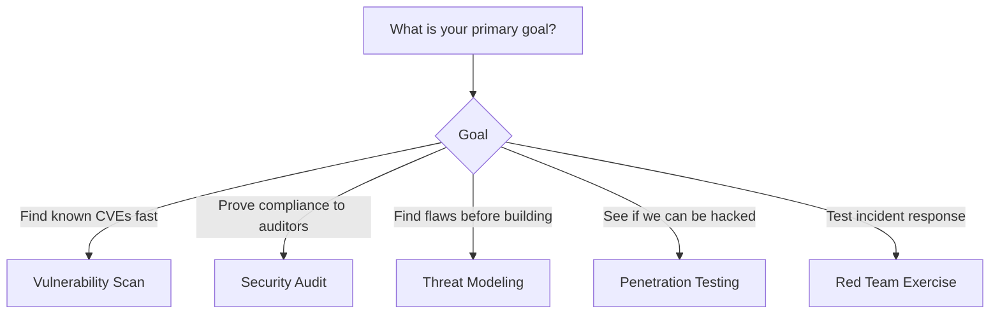
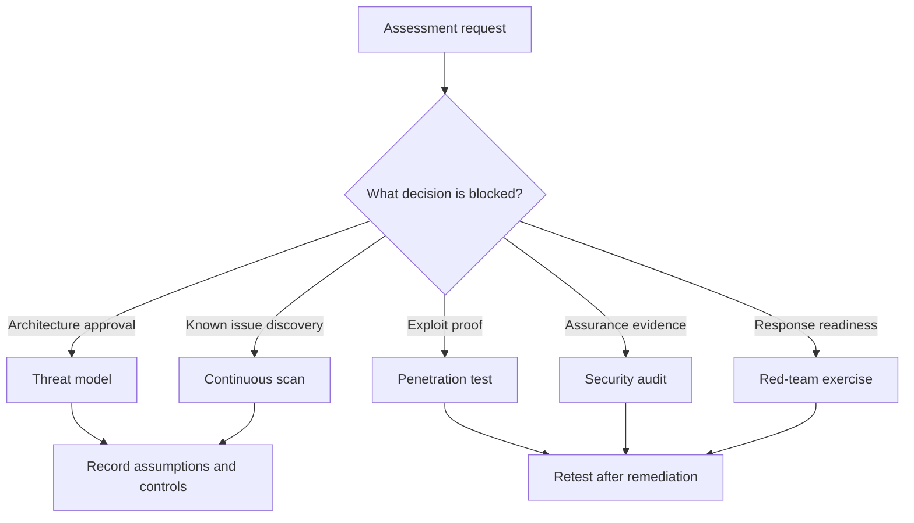

> **Складність**: `[СЕРЕДНЯ]` — концептуальні знання з практичним сортуванням ризиків.
>
> **Час на проходження**: 45–60 хвилин.
>
> **Передумови**: [Модуль 6.2: Бенчмарки CIS](../module-6.2-cis-benchmarks/)

## Результати навчання

Після завершення цього модуля ви зможете виконувати ту роботу з оцінювання, на яку розраховані сценарії KCSA: вибирати правильний метод оцінювання, збирати корисні докази, ранжувати знахідки за ризиком і проєктувати повторюваний процес замість одноразового звіту.

1. **Порівняти** сканування на вразливості, тестування на проникнення, аудит безпеки, моделювання загроз та вправи червоної команди (red team) за тим питанням, на яке кожен вид оцінювання має дати відповідь.
2. **Оцінити** стан безпеки Kubernetes 1.35, відобразивши компоненти, межі довіри, засоби контролю та докази у структурований метод оцінювання.
3. **Проаналізувати** знахідки безпеки за ймовірністю, впливом, шляхом експлуатації, компенсувальними засобами контролю та доказами усунення замість того, щоб покладатися лише на мітки серйозності.
4. **Спроєктувати** постійний процес оцінювання, який поєднує автоматичні перевірки, ручний огляд, метрики, відстеження усунення та періодичну валідацію.

## Чому цей модуль важливий

Реальні інциденти в Kubernetes рідко спричинені одним відсутнім засобом контролю; вони виникають тоді, коли досяжна поверхня керування, слабкий контроль доступу та недостатнє виявлення збігаються одночасно. Випадок із криптоджекінгом Tesla 2018 року (задокументований у [модулі CKS про безпеку GUI](../../../cks/part1-cluster-setup/module-1.5-gui-security/) <!-- incident-xref: tesla-2018-cryptojacking -->) ілюструє цю думку. *Якщо застосувати фреймворк цього модуля:* сканування на вразливості могло б помітити відкритий доступ, аудит міг би поставити під сумнів автентифікацію, модель загроз могла б оскаржити межу довіри, а тест на проникнення міг би довести радіус ураження (blast radius) раніше, ніж це зробив зловмисник. Дисципліна, потрібна тому, хто проводить оцінювання, полягає у виборі правильної комбінації технік, а не в запам'ятовуванні однієї.

Оцінювання безпеки — це те, як команда перетворює впевненість на докази. Кластер може мати RBAC, журнали аудиту, NetworkPolicies, сканування образів, Pod Security Admission і зашифровані Secret'и, та все одно бути небезпечним, якщо ці засоби контролю неповні, мають неправильну сферу дії або ніколи не перевірялися в реалістичних умовах. Операційне питання полягає не в тому, чи містить діаграма блок із засобом контролю. Питання в тому, чи може звичайна інженерна зміна обійти цей засіб, чи може зловмисник поєднати дві незначні знахідки в один ланцюг і чи здатна команда довести, що виправлення залишилося дієвим після наступного розгортання.

KCSA очікує, що ви розпізнаватимете основні види оцінювання, але реальна платформенна робота вимагає глибшої звички: обирайте оцінювання, яке відповідає рішенню, що його потрібно ухвалити. Якщо керівництво запитує, чи задовольняє кластер вимоги фреймворку відповідності, вправа червоної команди — це, ймовірно, неправильний перший крок. Якщо інженери проєктують новий сервіс, що обробляє дані клієнтів, чекати на щорічний аудит уже запізно. Цей модуль навчає словника оцінювання, а потім пов'язує його зі шляхами атак у Kubernetes, якістю доказів, плануванням усунення та метриками, які не дають роботі з безпеки перетворитися на щорічну церемонію.

## Види оцінювання

Різні види оцінювання відповідають на різні питання. Ви не найняли б зломщика замків, щоб перевірити, чи відокремлюють креслення банку громадську приймальню від сховища, і не просили б архітектора довести, що конкретний замок можна відкрити інструментом для обходу. У безпеці Kubernetes діє та сама відмінність. Автоматичні сканери швидко знаходять відомі проблеми, аудити добре порівнюють реальність із набором правил, моделі загроз виявляють вади дизайну до того, як вони закріпляться у виробничій архітектурі, тести на проникнення доводять можливість експлуатації, а вправи червоної команди перевіряють, чи витримають виявлення та реагування реалістичну кампанію.

Практична помилка — сприймати ці види оцінювання як рівні зрілості, ніби сканування призначене для початківців, а тестування на проникнення — для досвідчених команд. Зрілі команди використовують кілька з них разом, бо вони дають різні докази. Сканер може позначити CVE в образі, але не завжди здатен сказати, чи досяжний вразливий пакет під час виконання. Тестувальник на проникнення може довести, що Под здатен дістатися до API kubelet, але може не переглянути кожну прив'язку RBAC у кожному просторі імен. Аудит може підтвердити, що політика існує, але може не дослідити, чи зможе хитре робоче навантаження поєднати дозволені права в підвищення привілеїв.

| Вид оцінювання | Призначення | Покриття | Потрібна кваліфікація | Вартість | Хибнопозитивні |
|-----------------|---------|----------|----------------|------|-----------------|
| **Сканування на вразливості** | Знаходити відомі CVE та погані конфігурації | Високе (автоматичне) | Низька | Низька | Середня–висока |
| **Аудит безпеки** | Перевіряти політику/відповідність | Широке | Середня | Середня | Низькі |
| **Тестування на проникнення** | Експлуатувати вади, щоб довести ризик | Цільове | Висока | Висока | Низькі |
| **Моделювання загроз** | Знаходити вади дизайну заздалегідь | Архітектура | Середня | Низька | Н/Д |
| **Червона команда** | Перевіряти виявлення та реагування | Глибоке | Дуже висока | Дуже висока | Низькі |

Таблиця корисна лише тоді, коли ви читаєте її як допомогу для прийняття рішень, а не як рейтинг. Сканування на вразливості має високе покриття, бо машини здатні швидко перевірити багато маніфестів, образів і налаштувань, але той самий масштаб породжує більше шуму та більше прогалин у контексті. Тестування на проникнення має нижче покриття, бо кваліфіковані люди витрачають час на відстеження ймовірних шляхів атак, але знахідки часто несуть більшу переконливу вагу, бо демонструють наслідки. Моделювання загроз не має частки хибнопозитивних спрацювань у тому самому розумінні, бо воно не перевіряє живу систему; воно виявляє припущення, які потребують проєктних рішень.

### Вибір правильного оцінювання



Блок-схема убезпечує вас від того, щоб починати з інструмента лише тому, що він знайомий. Якщо мета — «швидко знайти відомі CVE», сканеру належить місце на ранньому етапі, бо швидкість і повторюваність важливіші за творчу експлуатацію. Якщо мета — «довести відповідність», оцінювання має зібрати докази за конкретними критеріями, як-от засоби контролю бенчмарку CIS Kubernetes, записи переглядів доступу, зберігання журналів аудиту та задокументоване усунення. Якщо мета — «знайти вади до того, як будувати», найбільшу віддачу дає моделювання загроз, бо змінити межу довіри в проєктному документі дешевше, ніж перепроєктовувати виробничий трафік після того, як клієнти стануть від нього залежними.

Зупиніться та спрогнозуйте: у вашої команди три запити за один тиждень. Продуктова команда хоче запустити сервіс, що зберігає метадані платежів, команді відповідності потрібні докази для щорічного огляду клієнтів, а платформенна команда хоче знати, чи можна експлуатувати підозрюваний відкритий доступ до kubelet із Под'ів робочих навантажень. Яке оцінювання ви обрали б першим для кожного запиту і які докази переконали б вас, що результат корисний, а не просто повний?

Очікувана відповідь — це не єдина універсальна послідовність. Платіжному сервісу потрібне моделювання загроз до стабілізації дизайну, бо найцінніший результат — це набір змінених припущень, меж та засобів контролю. Огляду клієнтів потрібен аудит безпеки, бо докази мають відображатися на встановлені вимоги. Відкритому доступу до kubelet потрібна цільова валідація, яка може починатися зі сканера, але має включати контрольовану перевірку в стилі тесту на проникнення, що доводить, чи справді автентифікація, авторизація та сегментація мережі зупиняють доступ.

Оцінювання в Kubernetes також відрізняються за тим рівнем, який вони перевіряють. Кластер може дати збій, бо API-сервер приймає анонімні запити, бо робочі навантаження працюють із монтуваннями hostPath, бо CI публікує непідписані образи, бо в просторі імен немає default-deny для вихідного трафіку (egress) або бо команди не реагують на події аудиту. Тому корисний процес оцінювання охоплює площину керування, вузли, робочі навантаження, мережеві шляхи, ланцюг постачання, ідентичності, журналювання та операційний процес. Той самий кластер може отримати високу оцінку на одному рівні й низьку на іншому — ось чому єдина оцінка ніколи не повинна заміняти оповідь про знахідку.

Коли ви порівнюєте види оцінювання для KCSA, прив'язуйте порівняння до того рішення, яке підтримує кожен із них. Сканування підтримує створення беклогу та виявлення регресій. Аудит підтримує запевнення та підзвітність. Моделювання загроз підтримує проєктні рішення. Тестування на проникнення підтримує доказ експлуатовності та переконливість щодо ризику. Робота червоної команди підтримує виявлення, реагування та організаційну готовність. Старший інженер з безпеки може пояснити, чому конкретний метод достатній для конкретного питання і де він лишає сліпі плями, які пізніше має покрити інший метод.

## Моделювання загроз

Уявіть моделювання загроз як перегляд архітектурних креслень банку до того, як заллють бетон. Це систематичний аналіз потенційних загроз, який дає змогу виявити та виправити вади дизайну тоді, коли їх найдешевше усувати. У Kubernetes це має значення, бо багато серйозних знахідок не є ізольованими помилками; це передбачувані наслідки нечітких меж довіри, надто широких ідентичностей, досяжних інфраструктурних API та робочих навантажень, які вважають кожен внутрішній мережевий шлях дружнім.

Перша дисципліна в моделі загроз — декомпозиція. Ви називаєте компоненти, креслите потоки даних і позначаєте місця, де змінюється довіра. У сервісі Kubernetes це означає визначення контролерів інгресу, Сервісів, Под'ів, ServiceAccount'ів, Secret'ів, ConfigMap'ів, персистентних томів, зовнішніх баз даних, кінцевих точок метаданих хмари, систем CI/CD та людей-операторів. Модель загроз, яка каже «бекенд спілкується з базою даних», надто розпливчаста, щоб скеровувати рішення з безпеки. Корисна модель запитує, яку ідентичність використовує бекенд, де зберігаються облікові дані, чи зашифрований трафік, який простір імен може дістатися до бази даних і який слід аудиту існує, коли облікові дані зчитуються.

### Фреймворк STRIDE

STRIDE — це мнемоніка, розроблена в Microsoft, яка допомагає класифікувати різні типи загроз. Цінність STRIDE не в тому, що кожна система має рівно одну загрозу в кожній категорії. Цінність у тому, що він змушує команду ставити шість різних за стилем питань, а це не дає оцінюванню зосередитися лише на тих атаках, які найгучніша людина в кімнаті вже й так знає. Платформенна команда, яка природно думає про підвищення привілеїв, може випустити з уваги невідмовність (repudiation), тоді як прикладна команда, що думає про валідацію вводу, може випустити з уваги підміну (spoofing) через ідентичність робочого навантаження.

| Категорія | Що це означає | Приклад у Kubernetes | Пом'якшення |
|----------|---------------|--------------------|------------|
| **S**poofing (підміна) | Видавати себе за когось іншого | Підробка токена ServiceAccount | Сильна автентифікація, mTLS |
| **T**ampering (підробка даних) | Зміна даних або коду | Зміна образу контейнера | Підпис образів, root-FS лише для читання |
| **R**epudiation (невідмовність) | Заперечення виконаних дій | Видалення журналів аудиту | Незмінне журналювання аудиту |
| **I**nformation Disclosure (розкриття інформації) | Несанкціонований доступ до даних | Читання Secret'ів через API | Шифрування Secret'ів, RBAC |
| **D**enial of Service (відмова в обслуговуванні) | Зробити систему недоступною | Вичерпання CPU одним Под'ом | ResourceQuotas, Limits |
| **E**levation of Privilege (підвищення привілеїв) | Отримання несанкціонованого доступу | Втеча з контейнера на хост | Pod Security Standards |

Кожна категорія STRIDE стає кориснішою, коли ви прив'язуєте її до конкретного об'єкта Kubernetes. Підміна — це не просто «хтось видає себе за іншого»; це може бути скомпрометований Под, який використовує автоматично змонтований токен ServiceAccount, щоб звертатися до API як довірене робоче навантаження. Підробка даних може бути зміною тегу образу зловмисником у Деплойменті, зміною ConfigMap, що керує поведінкою автентифікації, або завантаженням шкідливого образу до реєстру, який використовується у виробництві. Невідмовність може бути видаленням адміністратором простору імен без журналів аудиту, збережених поза кластером. Категорія дає вам стартове питання; об'єкт і потік даних роблять його придатним до дії.

Зупиніться та подумайте: STRIDE визначає загрози, але не каже, які з них найнебезпечніші. Якби ви застосували STRIDE до контролера інгресу Kubernetes і знайшли загрози в усіх шести категоріях, як би ви вирішили, яку усувати першою? Корисна відповідь зважує ймовірність і вплив, але також враховує силу засобу контролю, довжину шляху зловмисника, виявлюваність і те, чи відмикає одна знахідка кілька інших. Проблема підвищення привілеїв, яка дає cluster-admin, може випередити поширену проблему відмови в обслуговуванні навіть тоді, коли обидві ймовірні, бо перша змінює можливості зловмисника в усьому кластері.

Моделювання загроз має відбуватися на етапі проєктування, але воно не повинно застигати в проєктній вікі. Системи Kubernetes змінюються надто швидко, щоб одноразова модель лишалася точною. Новий контролер додає права, нова політика допуску змінює поведінку розгортання, нова зовнішня залежність змінює потік даних, а новий простір імен може створити шлях, якого раніше не існувало. Найкращі команди оновлюють модель під час значних архітектурних змін, оглядів інцидентів та циклів оцінювання, а потім пов'язують знахідки з роботою з беклогу, а не лишають їх діаграмами без власника.

### Процес моделювання загроз

1. **Декомпозуйте систему**: визначте компоненти (Под'и, Сервіси), складіть карту потоків даних і встановіть межі довіри.
2. **Визначте загрози**: застосуйте STRIDE до кожного компонента й задокументуйте припущення.
3. **Оцініть ризики**: обчисліть Ймовірність × Вплив і розставте пріоритети для знахідок.
4. **Пом'якшіть**: упровадьте засоби контролю або явно прийміть/передайте ризик.
5. **Валідуйте**: переконайтеся, що засоби контролю справді працюють, і оновлюйте модель у міру розвитку архітектури.

Процес виглядає простим, бо складність не в тому, щоб запам'ятати кроки; складність у тому, щоб ставити достатньо конкретні питання. «Використайте NetworkPolicy» не є пом'якшенням, доки ви не знаєте, який простір імен, який селектор Под'а, яке призначення та який шлях вихідного трафіку (egress) потрібні. «Зашифруйте Secret'и» не є завершеним, доки ви не знаєте, чи увімкнене шифрування у стані спокою, хто може прочитати Secret через API, як відбувається ротація і чи не виводять випадково журнали застосунку чутливі значення. Якість оцінювання походить із перетворення широких побоювань на придатні до перевірки твердження.

Опрацьовані моделі загроз завжди мають завершуватися валідацією. Якщо пом'якшення каже «Под'и не можуть дістатися до API kubelet», хтось має перевірити це твердження з репрезентативного Под'а. Якщо пом'якшення каже «розробники не можуть прив'язати cluster-admin», хтось має виконати `k auth can-i bind clusterroles/cluster-admin --as=user@example.com` у безпечному середовищі та зберегти результат як доказ. Саме тому моделювання загроз і тестування є партнерами, а не суперниками. Моделювання передбачає, де ризик має бути, а тестування підтверджує, чи справді тримається передбачений засіб контролю.

## Шляхи атак у Kubernetes

Коли зловмисники проникають у кластер, вони зазвичай рухаються передбачуваним життєвим циклом. Розуміння цих шляхів допомагає вам розміщувати засоби контролю безпеки в критичних вузьких місцях. Стадії не є магією і не завжди відбуваються в однаковому порядку, але вони дають тим, хто проводить оцінювання, карту для кращих питань. Початковий доступ заводить зловмисника в якусь частину середовища, горизонтальне переміщення допомагає йому знайти корисні ідентичності чи мережеві шляхи, підвищення привілеїв збільшує контроль, а компрометація кластера перетворює інцидент із робочим навантаженням на інцидент платформи.

1. **Ззовні → Початковий доступ**:
   - Відкритий дашборд (без автентифікації)
   - Вразливий застосунок (наприклад, Log4j)
   - Неправильно налаштований Ingress або скомпрометовані облікові дані
2. **Под → Горизонтальне переміщення**:
   - Використання змонтованого токена ServiceAccount для запитів до API
   - Сканування внутрішньої мережі, щоб дістатися до інших Под'ів
   - Читання незашифрованих секретів зі спільних томів
3. **Под → Підвищення привілеїв**:
   - Втеча з привілейованого контейнера для доступу до базового вузла-хоста
   - Зловживання RBAC для створення нового привілейованого Под'а
4. **Вузол → Компрометація кластера**:
   - Доступ до API Kubelet для контролю над усіма Под'ами на цьому вузлі
   - Викрадення облікових даних вузла для проникнення в ширше хмарне середовище (AWS/GCP/Azure)
   - Доступ до сховища даних `etcd` для вивантаження всіх секретів кластера

Ця структура шляху пояснює, чому ті, хто проводить оцінювання, переймаються знахідками, які в ізоляції здаються нешкідливими. Под, який може дістатися до API kubelet, можливо, сьогодні не зможе автентифікуватися, та все одно досяжна кінцева точка розширює радіус ураження майбутньої крадіжки облікових даних або вразливості обходу автентифікації. Стандартний ServiceAccount із доступом лише для читання може здаватися дрібницею, доки в тому самому просторі імен немає Secret'ів, що відмикають базу даних. Поблажлива політика вихідного трафіку може здаватися операційно зручною, доки вада SSRF не дасть зловмиснику дістатися до сервісу метаданих хмари.

Витік даних Capital One 2019 року (розглянутий у [модулі CKS про метадані вузла](../../../cks/part1-cluster-setup/module-1.4-node-metadata/) <!-- incident-xref: capital-one-2019 -->) показує, як вразливість підробки запитів на стороні сервера (Server-Side Request Forgery) плюс надто привілейована роль IAM дали змогу зловмиснику звернутися до сервісу метаданих хмари, викрасти облікові дані ролі та виексфільтрувати дані з S3. Урок для Kubernetes прямий: початковий доступ плюс надто привілейована ідентичність робочого навантаження створюють радіус ураження, який самі лише застосункові фаєрволи стримати не можуть.

Зупиніться та спрогнозуйте: зловмисник знаходить відкритий дашборд Jenkins, запускає шкідливе завдання збірки, отримує доступ до стандартного токена ServiceAccount Под'а і використовує його для читання Secret'ів у просторі імен `default`. Які фази шляху атаки він щойно виконав і які засоби контролю розірвали б ланцюг найраніше? Відкритий дашборд — це початковий доступ, шкідливе завдання збірки — це виконання коду всередині середовища, а використання токена — це горизонтальне переміщення через ідентичність Kubernetes. Найранішим засобом контролю могла б бути автентифікація в Jenkins, але сильні стандартні налаштування ServiceAccount, ізоляція просторів імен та RBAC зменшили б шкоду, якби перший засіб контролю дав збій.

Шляхи атак також корисні для спілкування з нефахівцями, бо вони пояснюють, чому має значення зчеплений ризик. Мітка серйозності часто приховує історію. «Середній: Под може дістатися до kubelet» звучить абстрактно, тоді як «скомпрометований Под застосунку може напряму спілкуватися з API керування вузлом, що контролює робочі навантаження на цьому вузлі» робить операційне занепокоєння чіткішим. Хороший звіт про оцінювання пов'язує кожну технічну знахідку з наступним кроком, який спробував би зловмисник, із засобом контролю, що має перервати шлях, і з доказом, який підтверджує, чи працює переривання.

Для Kubernetes 1.35 та сучасних керованих кластерів найважливіші питання шляху атаки часто крутяться навколо ідентичностей та допуску. Які ServiceAccount'и монтуються автоматично, які ролі можуть створювати Под'и, які користувачі можуть прив'язувати ролі, яких вони ще не мають, які контролери можуть мутувати робочі навантаження і які простори імен можуть планувати привілейовані Под'и? Ви можете мати сильне сканування образів і все одно програти, якщо низькопривілейований користувач може створити Под, що монтує файлову систему хоста. Ви можете мати сувору Pod Security і все одно програти, якщо контролер із широкими правами приймає недовірений ввід.

Тому ті, хто проводить оцінювання, мають працювати з обох кінців шляху. Ззовні запитуйте, як зловмисник уперше дістається до коду, облікових даних чи поверхні керування. Зсередини припустіть, що одне робоче навантаження вже скомпрометоване, і запитайте, що воно може зробити далі. Друга вправа особливо цінна, бо вона прибирає хибне відчуття спокою. Кожен сервіс, повернутий до інтернету, рано чи пізно може мати вразливість, тож кластер має бути спроєктований так, щоб один скомпрометований Под не став скомпрометованою платформою.

## Тестування на проникнення та аудити безпеки

Якщо моделювання загроз — це перегляд креслень, то тестування на проникнення — це наймання професійного слюсаря, щоб зламати власну будівлю. Воно передбачає активні спроби експлуатації, які імітують справжнього зловмисника. У Kubernetes тест на проникнення повинен мати чітку сферу дії, бо безрозсудне тестування може порушити роботу спільних площин керування, інфраструктури керованого провайдера або виробничих робочих навантажень. Мета — не запустити кожен агресивний інструмент і подивитися, що зламається. Мета — довести або спростувати конкретні шляхи атак за погодженими правилами взаємодії.

### Сфера тестування на проникнення в Kubernetes

| Сфера | Приклади цілей | Ключові завдання |
|------------|-----------------|----------------|
| **Зовнішнє тестування** | API-сервер, Ingress, NodePort'и | Неавтентифікований доступ, відкриті дашборди |
| **Внутрішнє тестування** | Мережа Под–Под, API Kubelet | Горизонтальне переміщення, SSRF, виявлення сервісів |
| **Підвищення привілеїв** | Pod Security, середовище виконання контейнерів | Втеча з контейнера, зловживання RBAC, доступ до хоста |
| **Огляд конфігурації** | Маніфести RBAC, NetworkPolicies | Знайти неправильні конфігурації, що уможливлюють вищезазначене |

Хороша сфера відповідає на три питання до початку тестування. По-перше, які активи входять у сферу: API-сервер, кінцеві точки інгресу, робочі вузли, простори імен, хмарні акаунти, реєстри та системи CI/CD можуть мати різних власників. По-друге, які техніки дозволені: пасивний огляд, автентифіковане тестування, обмежена експлуатація, тестування на відмову в обслуговуванні та соціальна інженерія мають дуже різні профілі ризику. По-третє, які докази є прийнятними: скриншот, транскрипт команди, очищений доказ токена, відтворена відповідь `forbidden` або письмовий ланцюг міркувань можуть бути доречними залежно від знахідки.

### Інструменти ремесла: kube-hunter

`kube-hunter` — це інструмент з відкритим кодом, який полює на слабкі місця безпеки в кластерах Kubernetes, і він корисний тут, бо його вивід ілюструє різницю між сирим виявленням і судженням під час оцінювання.

```bash
# Remote scanning (from outside cluster)
kube-hunter --remote 10.0.0.1

# Internal scanning (from inside pod)
kube-hunter --pod

# Network scanning
kube-hunter --cidr 10.0.0.0/24

# Active exploitation (use carefully!)
kube-hunter --active

# Output formats
kube-hunter --report json
kube-hunter --report yaml
```

Команди інструмента навмисно прості, але інтерпретація — ні. Віддалене сканування, що знаходить відкритий API-сервер, не доводить компрометацію автоматично, бо автентифікація та авторизація все ще можуть триматися. Внутрішнє сканування з Под'а, що знаходить кінцеву точку kubelet, не означає автоматично віддалене виконання коду, бо анонімна автентифікація може бути вимкнена, а авторизація через вебхук може блокувати запити. Завдання того, хто проводить оцінювання, — перетворити вивід інструмента на знахідку з контекстом: відкритий доступ, потрібні облікові дані, поведінка засобу контролю, експлуатовність, бізнес-вплив та рекомендоване усунення.

Наведений нижче зразок виводу навмисно стислий, бо багато інструментів подають докази в компактній формі; ваш звіт про оцінювання має додати відсутній контекст про відкритий доступ, експлуатовність та усунення.

```text
Vulnerabilities
------------------------------------------------------
ID      : KHV001
Title   : Exposed API server
Category: Information Disclosure
Severity: Medium
Evidence: https://10.0.0.1:6443
------------------------------------------------------
ID      : KHV005
Title   : Exposed Kubelet API
Category: Remote Code Execution
Severity: High
Evidence: https://10.0.0.2:10250/pods
------------------------------------------------------
```

Перш ніж запускати це, який вивід ви очікуєте від захищеного кластера: жодних досяжних кінцевих точок керування, досяжні кінцеві точки, що відхиляють неавтентифікований доступ, або суміш обох? Найкраща відповідь залежить від місця тесту. З публічного інтернету кінцеві точки керування зазвичай мають бути недосяжними, окрім як через схвалені адміністративні шляхи. Зсередини простору імен робочого навантаження деякі кінцеві точки можуть бути маршрутизованими через дизайн мережі, але авторизація все одно має відмовляти в доступі. Сильніший стан безпеки — поєднати обидва засоби контролю: не відкривати інфраструктурні API для робочих навантажень, які не мають операційної потреби, і все одно вимагати автентифікацію, якщо мережеве правило випадково послаблять.

Аудити безпеки мають інший центр тяжіння. Тоді як тест на проникнення доводить, що може зробити зловмисник, аудит доводить, що ваша організація дотримується власних правил та зовнішніх фреймворків відповідності. Аудитори шукають повторювані докази того, що засоби контролю спроєктовані, упроваджені та працюють із часом. Ця різниця має значення, бо кластер може пройти точкову спробу експлуатації і все одно провалити аудит, якщо перегляди доступу не проводяться, журнали аудиту не зберігаються або винятки з усунення схвалюються неформально без терміну дії.

### Процес аудиту

1. **Планування**: визначте сферу, ідентифікуйте зацікавлених осіб і зберіть документацію.
2. **Збір доказів**: перегляньте конфігурації, проаналізуйте журнали та запустіть автоматичні інструменти.
3. **Аналіз**: порівняйте поточний стан з вимогами, щоб виявити прогалини.
4. **Звітування**: задокументуйте знахідки, виконавчі резюме та терміни усунення.
5. **Усунення**: створіть плани дій, упровадьте виправлення та перевірте закриття.

Процес аудиту винагороджує підготовку. Якщо ваша команда керує RBAC у Git, використовує policy-as-code для допуску, зберігає журнали аудиту поза кластером і відстежує знахідки в системі з власниками та датами, збір доказів стає контрольованим експортом, а не метушнею. Якщо зміни доступу відбуваються через стихійну роботу в консолі, а винятки живуть у повідомленнях чату, аудит перетворюється на вправу з реконструкції. Різниця не суто бюрократична; погані докази ускладнюють доведення того, чи справді засоби контролю захищали кластер протягом періоду, що перевіряється.

### Що шукають аудитори

- [ ] **Контроль доступу**: RBAC дотримується найменших привілеїв; немає анонімного доступу до API.
- [ ] **Захист даних**: Secret'и зашифровані у стані спокою; TLS застосовується скрізь.
- [ ] **Журналювання та моніторинг**: журнали аудиту увімкнені, надійно зберігаються і моніторяться.
- [ ] **Мережева безпека**: діють NetworkPolicies default-deny; API-сервер не публічний.
- [ ] **Управління вразливостями**: образи скануються в CI/CD; процедури встановлення патчів дотримуються.
- [ ] **Реагування на інциденти**: процедури задокументовані, налагоджено збереження доказів.

Зупиніться та спрогнозуйте: тест на проникнення виявляє, що `kube-hunter` може дістатися до API kubelet зсередини Под'а. Kubelet має вимкнену анонімну автентифікацію і використовує авторизацію через вебхук. Це все ще знахідка чи захист спрацював, як задумано? Це все ще знахідка, але її слід записати уважно. Захист заблокував несанкціонований доступ, що є добрим доказом. Відкритий доступ усе одно порушує найменші привілеї, бо звичайним робочим навантаженням не потрібно діставатися до API керування вузлами, а майбутній витік облікових даних чи вада kubelet матимуть коротший шлях до впливу.

Найздоровіші звіти про оцінювання відокремлюють «засіб контролю дав збій» від «засіб контролю втримався, але відкритий доступ лишається». Ця відмінність покращує усунення. Якщо анонімний доступ до kubelet удається, команда має негайно виправити автентифікацію та авторизацію. Якщо автентифікація блокує доступ, але кінцева точка досяжна з кожного Под'а, команда має додати мережеву сегментацію і протестувати політику вихідного трафіку. Обидва заслуговують на відстеження, але вони не несуть однакової терміновості чи доведення. Саме тому написання звітів про оцінювання — це інженерна навичка, а не просто експорт зі сканера.

## Оцінювання ризиків, усунення та метрики

Не всі вразливості однакові. Ви маєте обчислити ризик, щоб вирішити, що виправити сьогодні, що — наступного спринту, а що прийняти з явним власником. Найпростіший вираз корисний як навчальний інструмент: ризик дорівнює ймовірності, помноженій на вплив. На практиці оцінювання має пояснити, чому обрано саме такі ймовірність і вплив, бо мітка «Високий» без обґрунтування рідко витримує заперечення власника застосунку, який розуміє контекст сервісу краще, ніж той, хто проводить оцінювання.

Для цього модуля використовуйте просту модель, де ризик дорівнює ймовірності, помноженій на вплив, а потім запишіть обґрунтування, що підкріплює кожну сторону цього рівняння.

* **Фактори ймовірності**: мотивація суб'єкта загрози, складність атаки, наявні засоби контролю, рівень відкритого доступу.
* **Фактори впливу**: чутливість даних, критичність системи, фінансова та репутаційна шкода.

Ймовірність у Kubernetes сильно залежить від досяжності та потрібних привілеїв. Критичний CVE в пакеті, який не завантажується робочим процесом, може заслуговувати на інший шлях усунення, ніж вада високої серйозності в контролері інгресу, повернутому до інтернету. Небезпечний дозвіл RBAC, наданий групі «розбий скло» (break-glass), може мати нижчу ймовірність, якщо доступ ретельно моніториться і рідко використовується, тоді як той самий дозвіл на стандартному ServiceAccount у завантаженому просторі імен може бути терміновим. Вплив залежить від того, до чого може дістатися скомпрометований компонент, які дані він обробляє і чи захищає межа кластера інші системи, чи навпаки відкриває їх.

### Матриця ризиків

| | Низький вплив | Середній вплив | Високий вплив |
|---|---|---|---|
| **Висока ймовірність** | Середній ризик | Високий ризик | Критичний ризик |
| **Середня ймовірність** | Низький ризик | Середній ризик | Високий ризик |
| **Низька ймовірність** | Низький ризик | Низький ризик | Середній ризик |

Угоди про рівень обслуговування (SLA) для реагування перекладають ризик в операційні очікування, тож звіт про оцінювання має зробити їх видимими до того, як команди узгоджуватимуть дати та винятки.

* **Критичний**: потрібна негайна дія.
* **Високий**: дія протягом днів.
* **Середній**: дія протягом тижнів.
* **Низький**: прийняти ризик або запланувати на майбутнє.

Зупиніться та спрогнозуйте: у вас три знахідки. Критичний CVE існує у внутрішньому образі бекенду зі суворими NetworkPolicies та без досяжного вразливого шляху коду. Дашборд Kubernetes відкритий в інтернет без автентифікації. Витік kubeconfig розробника лише для читання, але він дозволяє тільки переглядати Под'и в просторі імен розробки. Дашборд належить на вершину, бо ймовірність і вплив обидва високі. Образний CVE все ще може потребувати дії, але компенсувальні засоби контролю та недосяжний код знижують ймовірність. Витік kubeconfig потребує очищення та моніторингу, та його обмежені права знижують негайний вплив.

Коли у вас є пріоритезований список ризиків, вам потрібен план. Для кожної знахідки зрозумійте вразливість, опишіть сценарій атаки, визначте уражені активи, оберіть виправлення, протестуйте зміну поза виробництвом, де це можливо, розгорніть обережно, переконайтеся, що початкова проблема більше не відтворюється, і збережіть докази. Крок перевірки — це місце, де багато команд втрачають цінність. Закриття тікета через те, що маніфест змінено, слабше за закриття через те, що тест тепер показує: раніше дозволений шлях отримує відмову.

Планування усунення також має враховувати реальність виробництва. Деякі знахідки можна виправити зміною одного RoleBinding або NetworkPolicy. Інші вимагають змін у застосунку, нових стандартних налаштувань платформи або узгодження з налаштуваннями хмарного провайдера. Оцінювання має відрізняти швидке зниження ризику від стійкого виправлення. Вимкнення автомонтування токенів ServiceAccount в одному просторі імен може швидко знизити ризик, тоді як перепроєктування ідентичності робочих навантажень та шаблонів CI запобігає поверненню тієї самої проблеми в інших командах.

Метрики безпеки допомагають відстежувати, чи покращується ваш процес оцінювання з часом. Метрики небезпечні, коли стають марнославними цифрами, але цінні, коли виявляють затримку, повторюваність і слабкість засобів контролю. Середній час до усунення показує, чи виправляються знахідки в межах вікна ризику. Частка повторно відкритих знахідок показує, чи стійкі усунення. Тренди порушень політик показують, чи навчаються команди очікуваної форми розгортання. Частка хибнопозитивних спрацювань показує, чи марнує інструментарій інженерну увагу.

### [ Дашборд стану безпеки — приклад ]

| Критичні вразливості | Середній час до усунення (MTTR) | Оцінка за бенчмарком CIS |
|:---:|:---:|:---:|
| **3** (на 2 менше, ніж минулого тижня) | **14 днів** (ціль: < 7 днів) | **85%** (на 5% більше цього місяця) |

### Найчастіше провалювані політики (операційні метрики)

1. `require-ro-rootfs` (42 порушення)
2. `disallow-default-namespace` (15 порушень)

### Нещодавні інциденти (метрики інцидентів)

- *Середній час до виявлення (MTTD):* 45 хв
- *Середній час до реагування (MTTR):* 2 години
- *Частка хибнопозитивних спрацювань:* 12%

Зупиніться та подумайте: оголошено нову вразливість нульового дня, ваша команда поспішає встановити патч, і це займає три тижні, щоб оновити всі кластери. На яку операційну метрику безпеки це вплине найбільше негативно? Відповідь — середній час до усунення, бо вразливість відома, і відлік починається, коли команда стає відповідальною за дію. Відстеження MTTR допомагає обґрунтувати інвестиції у швидше перезбирання образів, безпечнішу автоматизацію викочування та краще відображення власників.

Метрики мають вести до рішень, а не до театру статусів. Якщо MTTR високий, бо кожне виправлення чекає на ручне схвалення застосування, покращенням безпеки може бути зміна робочого процесу розгортання, а не ще один сканер. Якщо те саме порушення політики з'являється щотижня, стійким виправленням може бути зміна шаблону або політика допуску, а не повторні нагадування. Якщо критичні знахідки лишаються відкритими, бо власність незрозуміла, у процесу є проблема врядування. Процеси оцінювання дозрівають, коли метрики оголюють вузьке місце, а керівники фінансують роботу, що його усуває.

## Опрацьований приклад: моделювання загроз API-сервера

Перш ніж зробити це самостійно, погляньмо, як інженер з безпеки насправді застосовує STRIDE до конкретного компонента — API-сервера Kubernetes. API-сервер — хороша навчальна ціль, бо майже кожна дія в кластері проходить через нього, та все ж багато команд ставляться до нього як до невидимого керованого сервісу. Модель загроз робить приховані припущення видимими. Хто може автентифікуватися, які клієнти можуть до нього дістатися, які запити аудитуються, які засоби контролю допуску мутують чи відхиляють об'єкти і які ідентичності можуть змінювати правила авторизації?

Припустімо, що це кластер Kubernetes 1.35, де адміністратори використовують OIDC, робочі навантаження використовують ServiceAccount'и, журнали аудиту експортуються до централізованої системи, а платформенна команда керує RBAC через Git. Ми все одно не оголошуємо API-сервер безпечним за замовчуванням. Натомість ми проходимо STRIDE і запитуємо, чи існує ймовірний сценарій, який засіб контролю має його зупинити і який доказ підтвердить, що засіб контролю працює. Наведений нижче приклад зберігає початкові сценарії, додаючи міркування, які той, хто проводить оцінювання, задокументував би.

1. **Підміна (Spoofing)**: чи може хтось видати себе за дійсного користувача?
   *Сценарій*: зловмисник викрадає файл kubeconfig розробника.
   *Контроль*: ми вимагаємо автентифікацію OIDC з MFA. (Пом'якшено).
2. **Підробка даних (Tampering)**: чи може хтось змінити дані?
   *Сценарій*: зловмисник перехоплює трафік API, щоб змінити маніфест деплойменту.
   *Контроль*: API-сервер суворо вимагає TLS для всіх з'єднань. (Пом'якшено).
3. **Невідмовність (Repudiation)**: чи може хтось зробити щось зловмисне й заперечити це?
   *Сценарій*: адміністратор видаляє виробничий простір імен і звинувачує збій.
   *Контроль*: журналювання аудиту Kubernetes увімкнене й надсилається до незмінного SIEM. (Пом'якшено).
4. **Розкриття інформації (Information Disclosure)**: чи може хтось побачити те, чого не повинен?
   *Сценарій*: користувач з доступом до читання кластера переглядає метадані ресурсів (специфікації Под'ів, ConfigMap'и, мітки).
   *Контроль*: RBAC налаштований, і розробники наразі мають вбудовану ClusterRole `view`, яка навмисно не надає читання Secret'ів, але все одно відкриває метадані робочих навантажень, що можуть розкрити деталі архітектури. (Завдання: переглянути та посилити RBAC).
5. **Відмова в обслуговуванні (Denial of Service)**: чи може хтось аварійно зупинити API?
   *Сценарій*: неправильно налаштований конвеєр CI/CD засипає API-сервер мільйонами запитів.
   *Контроль*: увімкнено API Priority and Fairness (APF) для обмеження частоти запитів сервісних акаунтів. (Пом'якшено).
6. **Підвищення привілеїв (Elevation of Privilege)**: чи може користувач низького рівня отримати права адміністратора?
   *Сценарій*: користувач змінює `ClusterRoleBinding`, щоб надати собі `cluster-admin`.
   *Контроль*: RBAC явно забороняє права `bind` та `escalate`. (Пом'якшено).

Приклад показує поширений патерн: кілька загроз пом'якшено, але одна стає завданням, бо докази неповні або модель дозволів надто широка. Знахідка про розкриття інформації не каже «RBAC існує»; вона запитує, чи можуть конкретні люди, які мають доступ до читання, читати дані або метадані, що бізнес вважає чутливими. У Kubernetes вбудована роль `view` навмисно уникає читання Secret'ів, але кастомні ролі, агреговані ролі та специфічні для застосунків ресурси можуть змінити практичний відкритий доступ. Той, хто проводить оцінювання, має тестувати репрезентативні ідентичності, а не покладатися лише на назви ролей.

Ось мінімальна послідовність збору доказів із використанням обов'язкового аліаса `k` для `kubectl`. Запускайте це лише в лабораторії або в авторизованому середовищі оцінювання й узгоджуйте ідентичності з вашим кластером. Послідовність команд сама по собі не є тестом на проникнення; це невелика валідація, що перетворює твердження моделі загроз на спостережувані докази.

```bash
alias k=kubectl

k auth can-i get secrets --as=developer@example.com --namespace=payments
k auth can-i bind clusterroles/cluster-admin --as=developer@example.com
k auth can-i create pods --as=system:serviceaccount:payments:backend --namespace=payments
k get networkpolicy -n payments
```

Якщо перша команда каже `yes`, знахідка про розкриття інформації заслуговує на негайну увагу, бо ідентичність розробника може читати Secret'и Kubernetes у просторі імен. Якщо друга команда каже `yes`, засіб контролю підвищення привілеїв дав збій, бо користувач може прив'язати роль, що надає більше повноважень. Якщо третя команда каже `yes`, результат не є автоматично хибним, але він змінює шлях атаки, бо скомпрометована ідентичність бекенду може створити новий Под. Якщо NetworkPolicy в просторі імен немає, модель не повинна припускати сегментацію Под–Под чи Под–вузол.

Ключова навчальна теза в тому, що докази оцінювання мають відповідати твердженню. Діаграма доводить намір архітектури. Маніфест доводить налаштований стан. Перевірка авторизації доводить, як API відповідає на запит конкретної ідентичності. Журнал аудиту доводить, що дію було записано. Контрольований експлойт доводить, що зловмисник може зчепити кроки. Зрілий процес оцінювання обирає найлегший доказ, який відповідає на питання без зайвого ризику, а потім записує достатньо деталей, щоб інший інженер міг відтворити висновок.

## Патерни та антипатерни

Процеси оцінювання успішні тоді, коли стають частиною інженерного потоку, а не окремою подією, що з'являється лише перед паперами на продовження. Наведені нижче патерни — це не функції постачальників; це операційні звички. Вони пов'язують автоматичні перевірки, людські міркування та власність над усуненням так, щоб знахідки не зникали після наради зі звітом. Вони також допомагають командам безпеки уникати перевантаження розробників непріоритезованим виводом сканера, який конкурує з виробничою роботою і поступово втрачає довіру.

| Патерн | Коли використовувати | Чому це працює | Аспект масштабування |
|---------|----------------|--------------|-----------------------|
| Портфель оцінювань | Коли один кластер обслуговує багато команд або профілів ризику | Зіставляє кожне питання з правильним типом доказів | Стандартизуйте прийом запитів, щоб команди рано замовляли правильне оцінювання |
| Валідація шляху атаки | Коли знахідку можна зчепити в більший вплив | Показує реалістичний наслідок замість ізольованої серйозності | Тримайте тести контрольованими та схваленими, особливо в кластерах, наближених до виробничих |
| Докази-як-код | Коли аудити повторюються між кластерами | Тримає RBAC, політику, сканування та винятки придатними до огляду | Зберігайте згенеровані артефакти поза код-PR'ами, коли вони є станом виконання |
| Усунення на основі ризику | Коли знахідок більше, ніж наявної потужності | Першими виправляє ризики з найвищим бізнес-впливом | Вимагайте явних власників і дат для прийнятого залишкового ризику |

Найсильніший патерн — портфель оцінювань. Платформенна команда може безперервно сканувати образи та маніфести, проводити моделювання загроз під час оглядів проєктування сервісів, аудитувати докази засобів контролю щокварталу та планувати цільові тести на проникнення для змін з високим ризиком. Це не означає, що кожна команда отримує кожне оцінювання щомісяця. Це означає, що організація знає, які докази вимагає кожне рішення. Внутрішньому інструменту з низьким ризиком можуть знадобитися автоматичні запобіжники й легкий огляд, тоді як публічному платіжному сервісу потрібні моделювання дизайну, суворіша валідація та сильніші докази аудиту.

| Антипатерн | Що йде не так | Чому команди в це впадають | Краща альтернатива |
|--------------|-----------------|------------------------|--------------------|
| Сканер як весь процес | Вивід інструмента стає всією розмовою про безпеку | Автоматичні звіти легко виробляти та вимірювати | Поєднайте сканери з моделюванням загроз, сортуванням і валідацією |
| Лише щорічне тестування | Неправильні конфігурації живуть місяцями між оглядами | Календарі аудитів керують роботою з безпеки | Додайте безперервні перевірки й переоцінювання, кероване подіями |
| Серйозність без контексту | Команди сперечаються про мітки замість того, щоб виправляти ризик | CVSS та оцінки інструментів здаються об'єктивними | Поясніть шлях експлуатації, відкритий доступ, засоби контролю та бізнес-вплив |
| Немає доказів закриття | Тікети закриваються, коли хтось каже, що виправлення зайшло | Тиск постачання винагороджує швидкі оновлення статусу | Повторно протестуйте початковий шлях і додайте відтворювані докази |

Найшкідливіший антипатерн — серйозність без контексту. «Критична» знахідка сканера може бути нижчим операційним ризиком, якщо вразливий код недосяжний, а «Середня» проблема конфігурації може бути терміновою, якщо вона дає кожному робочому навантаженню шлях до інфраструктурних API. Це не означає, що оцінки серйозності марні. Вони є відправними точками. Процес оцінювання заслуговує довіру тоді, коли може пояснити, чому знахідка піднімається чи опускається після врахування досяжності, експлуатовності, компенсувальних засобів контролю, уражених даних та зчеплення атак.

Ще один частий антипатерн — закриття знахідок без доведення закриття. Зміна RoleBinding може виглядати правильною в pull request, але в кластері все ще може бути старіша прив'язка, агрегована роль або інший простір імен із тим самим відкритим доступом. NetworkPolicy може виглядати обмежувальною, але плагін CNI може реалізовувати вихідний трафік не так, як очікувалося. Докази закриття мають відтворити початковий тест і показати новий результат. Якщо початкова знахідка була «Под бекенду може дістатися до kubelet», докази закриття мають містити тест із Под'а, що тепер зазнає невдачі або отримує контрольовану відмову.

## Фреймворк прийняття рішень

Використовуйте цей фреймворк, коли хтось запитує: «Яке оцінювання нам запустити?» Почніть з рішення, яке потрібно ухвалити, а потім оберіть докази, що можуть його підтримати. Це не дає команді сплутати активність із запевненням. Сотня сторінок виводу сканера не може відповісти, чи має нова архітектура правильні межі довіри, а прекрасна модель загроз не може довести, що живий кластер відхиляє заборонену дію RBAC.

| Потрібне рішення | Найкраще перше оцінювання | Подальші докази | Компроміс |
|-----------------|----------------------|-------------------|----------|
| Чи можемо запустити цей дизайн нового сервісу? | Моделювання загроз | Цільові тести засобів контролю до виробництва | Швидко й дешево на ранньому етапі, але залежить від чесних припущень |
| Чи дрейфують кластери від політики? | Сканування на вразливості та конфігурації | Звіти про тренди та огляд винятків | Широке покриття, але потребує сортування для зниження шуму |
| Чи може зловмисник експлуатувати цей шлях? | Тестування на проникнення | Кроки відтворення та повторний тест після усунення | Переконливі докази, але вужче покриття та вищий ризик |
| Чи можемо ми довести відповідність? | Аудит безпеки | Зразки засобів контролю, журнали, перегляди доступу, тікети | Сильне запевнення, але може відставати від живого ризику |
| Чи можемо ми виявляти та реагувати? | Вправа червоної команди | Сповіщення, хронології, дії за оглядом інцидентів | Перевіряє всю організацію, але дорого й порушує роботу |



Фреймворк також допомагає вирішити, коли не оцінювати глибше. Якщо сканер знаходить публічний неавтентифікований дашборд, вам не потрібен тижневий тест на проникнення, щоб обґрунтувати вимкнення доступу. Доказів уже достатньо для негайного усунення. І навпаки, якщо команда каже, що чутливий сервіс безпечний, бо він пройшов сканування образів, ви маєте оскаржити цей висновок, бо докази не охоплюють потік даних, ідентичність, мережеву досяжність чи авторизацію застосунку. Хороший вибір оцінювання частково про уникання недотестування, а частково про уникання дорогого доведення для очевидних виправлень.

Коли надходять знахідки, класифікуйте їх за типом реагування. Деякі знахідки вимагають негайного стримування, як-от публічний адміністративний доступ або облікові дані з високими привілеями. Деякі вимагають планової інженерії, як-от заміна надто широких ServiceAccount'ів у деплойментах. Деякі вимагають компенсувальних засобів контролю, доки будується стійке виправлення, як-от сповіщення про небезпечну дію, доки можна змінити шаблон платформи. Деякі вимагають явного прийняття ризику, але прийняття має називати власника, термін дії, бізнес-причину та план моніторингу. «Ми приймаємо це назавжди, бо це складно» — це не управління ризиками.

Для мислення на іспиті KCSA пам'ятайте зв'язок між методом і результатом. Моделювання загроз дає на виході припущення, загрози, пом'якшення та залишковий ризик. Сканування на вразливості дає знахідки, що потребують валідації та пріоритезації. Тестування на проникнення дає докази експлуатації та настанови з усунення. Аудит дає докази засобів контролю та прогалини відносно вимог. Метрики дають тренди, що скеровують покращення процесу. Сильна відповідь обирає метод, що створює ті докази, яких вимагає сценарій.

## Чи знали ви?

- **STRIDE був розроблений у Microsoft** у 1999 році й лишається одним із найпоширеніших фреймворків моделювання загроз, бо дає командам повторюваний словник для огляду дизайну.
- **API Priority and Fairness у Kubernetes досяг стабільного статусу в Kubernetes 1.29**, що важливо для оцінювань, бо огляд відмови в обслуговуванні може включати засоби контролю справедливості запитів, а не лише ліміти ресурсів.
- **Тестування на проникнення керованого Kubernetes часто має правила, специфічні для провайдера**, тож командам слід перевірити політики AWS, Google Cloud та Azure до тестування інфраструктури, якою вони не повністю володіють.
- **Більшість знахідок під час оцінювання Kubernetes — це збої конфігурації та процесу, а не екзотичні вразливості нульового дня**, ось чому безперервні перевірки політик зазвичай знижують більше ризику, ніж рідкісне героїчне тестування.

## Типові помилки

| Помилка | Чому це трапляється | Як це виправити |
|---------|----------------|---------------|
| Сприйняття виводу сканера як остаточного ризику | Інструменти повідомляють технічну серйозність без повного бізнес-контексту | Сортуйте кожну важливу знахідку за досяжністю, шляхом експлуатації, відкритим доступом до даних та засобами контролю |
| Проведення лише щорічних оцінювань | Календарі відповідності стають графіком безпеки | Додайте безперервне сканування, оновлення моделей загроз за подіями та періодичні повторні тести засобів контролю |
| Ігнорування дрібних знахідок назавжди | Малі відкриті місця можуть стати кроками в більшому ланцюгу атаки | Відстежуйте всі знахідки з власниками, термінами та явними рішеннями щодо залишкового ризику |
| Закриття тікетів без повторного тесту | Команди плутають злиту зміну з перевіреним усуненням | Відтворіть початковий тест і додайте докази, що показують заблокований шлях |
| Моделювання загроз без декомпозиції системи | Команди стрибають до пом'якшень до називання потоків і меж | Складіть карту компонентів, ідентичностей, потоків даних та меж довіри до переліку загроз |
| Аудит конфігурації, але не роботи | Статичні маніфести показують намір, а не те, чи працюють засоби контролю з часом | Збирайте журнали, відхилені запити, перегляди доступу, звіти політик та записи усунення |
| Дозвіл інструментів оцінювання у виробництві без сфери | Активні тести можуть порушити роботу навантажень або порушити правила провайдера | Визначте правила взаємодії, дозволені техніки, контакти та плани відкату до тестування |

## Тест

<details><summary>Ваша команда запускає новий сервіс, що зберігає PII клієнтів, а огляд архітектури — завтра. Розробник запитує, чи достатньо сканування на вразливості як доказу для схвалення. Що ви рекомендуєте?</summary>

Сканування на вразливості корисне, але його недостатньо для схвалення дизайну, бо воно не може оцінити межі довіри, потік даних, припущення про ідентичність чи залишковий ризик в архітектурі, якої ще може не існувати. Почніть із моделі загроз, що декомпозує сервіс, позначає, де PII перетинають межі, застосовує STRIDE і записує пом'якшення. Далі — цільова валідація до виробництва, як-от перевірки RBAC, тести NetworkPolicy та тести доступу до Secret'ів. Сканування все одно належить у процесі, але воно відповідає на питання про відомі проблеми, а не про безпеку дизайну.

</details>

<details><summary>Сканер повідомляє про відкритий API kubelet зсередини Под'а робочого навантаження, але автентифікація блокує неавтентифіковані запити. Власник застосунку каже, що ризику немає, бо доступ заборонено. Як вам оцінити цю знахідку?</summary>

Засіб контролю частково працює, бо неавтентифікований доступ заблоковано, тож знахідку не слід записувати як підтверджену компрометацію kubelet. Вона все одно становить непотрібний відкритий доступ, бо звичайним Под'ам зазвичай не потрібно діставатися до API керування вузлами, а витік облікових даних або майбутній обхід мали б коротший шлях до впливу. Усунення має поєднати мережеву сегментацію з продовженням автентифікації та авторизації kubelet. Звіт має відрізняти «доступ заборонено сьогодні» від «поверхня атаки досяжна з надто багатьох місць».

</details>

<details><summary>Щорічний тест на проникнення виявляє, що стандартний ServiceAccount у просторі імен може читати Secret'и, і проблема існувала місяцями. Яка зміна процесу оцінювання запобігла б тій самій прогалині у виявленні?</summary>

Прогалина у виявленні показує, що періодичного тестування недостатньо для дрейфу конфігурації з високим ризиком. Додайте безперервні перевірки політик або засоби контролю допуску, що відхиляють небезпечні стандартні дозволи ServiceAccount, і керуйте RBAC через переглянуті маніфести, щоб зміни привілеїв були видимі до того, як вони дійдуть до кластера. Сповіщення з журналів аудиту можуть виявляти підозрілу поведінку RoleBinding або доступу до Secret'ів незабаром після того, як вона стається. Майбутній тест на проникнення лишається цінним, але має валідувати процес, а не служити першою лінією виявлення.

</details>

<details><summary>Аудитор просить докази того, що засоби контролю доступу дієві, а ви надаєте лише YAML Role та RoleBinding. Чому цього недостатньо і що покращило б пакет доказів?</summary>

YAML Role та RoleBinding показують задуману конфігурацію, але не доводять операційну дієвість із часом. Сильніші докази включають результати `k auth can-i` для репрезентативних ідентичностей, журнали аудиту, що показують заборонені та дозволені запити, записи переглядів доступу, звіти політик та тікети усунення для вилучених дозволів. Якщо засіб контролю захищає чутливі простори імен, додайте зразки, що показують: користувачі без потреби не можуть читати Secret'и чи створювати привілейовані Под'и. Аудиторам потрібен доказ, що засіб контролю і налаштований, і працює, а не лише присутній у Git.

</details>

<details><summary>У вас три критичні CVE в образах, сім знахідок RBAC високої серйозності та багато середніх прогалин NetworkPolicy. Керівництво хоче, щоб усе виправили за один спринт. Як вам побудувати достовірний план усунення?</summary>

Почніть із ранжування знахідок за шляхом експлуатації та бізнес-впливом, а не лише за кількістю. Першими виправте все з публічним відкритим доступом, доступом до чутливих даних чи підвищенням привілеїв, потім згрупуйте подібні знахідки RBAC у зміну рівня платформи, якщо можливо. Для роботи, що не вміщується у спринт, визначте компенсувальні засоби контролю, власників, дати та явне прийняття ризику, де доречно. Достовірний план пояснює, який ризик знижено негайно, які стійкі виправлення йдуть далі і як кожне виправлення буде повторно протестоване.

</details>

<details><summary>Продуктова команда каже, що її сервіс безпечний, бо кожен образ сканується в CI і критичних CVE немає. Які сліпі плями оцінювання вам слід оскаржити?</summary>

Сканування образів охоплює відомі вразливості пакетів та образів, але не доводить, що сервіс має безпечну авторизацію, вузькі дозволи ServiceAccount, захищені Secret'и, обмежені мережеві шляхи чи корисні докази аудиту. Вам слід оскаржити ідентичність, потік даних, відкритий доступ через інгрес, досяжність вихідного трафіку, політику допуску та операційний моніторинг. Чисте сканування образу — хороший сигнал гігієни ланцюга постачання, а не повне оцінювання безпеки Kubernetes. Наступний крок залежить від рішення: модель загроз для ризику дизайну, огляд конфігурації для стану безпеки або цільове тестування для експлуатовності.

</details>

<details><summary>Після усунення NetworkPolicy власник тікета додає злитий YAML і просить закрити знахідку. Які докази ви вимагаєте до закриття?</summary>

Злитий YAML корисний, але доводить лише те, що бажану конфігурацію змінено в системі контролю версій. Вимагайте повторний тест із репрезентативного Под'а, що показує: раніше дозволене з'єднання тепер заблоковане, плюс підтвердження, що потрібний застосунковий трафік усе ще працює. Якщо знахідка стосувалася доступу до інфраструктурних API, протестуйте конкретне призначення та порт, які були спершу досяжні. Докази закриття мають відтворити початковий шлях оцінювання й показати інший результат, бо саме це доводить усунення, а не намір.

</details>

## Практична вправа: моделювання загроз

Ця вправа використовує просту архітектуру, щоб ви могли попрактикувати мислення оцінювача без потреби в живому кластері. Ви збережете початкову модель компонентів, застосуєте STRIDE, перетворите загрози на ранжовані знахідки й напишете кроки валідації, які можна було б виконати в авторизованій лабораторії. Сенс — не у виробництві найдовшого можливого списку. Сенс — у створенні корисного артефакту оцінювання, що пов'язує компоненти, шляхи атак, засоби контролю, докази та усунення.

Ваш сценарій — створити просту модель загроз для цієї архітектури, а потім використати її, щоб показати, як оцінювання рухається від огляду діаграми до пріоритезованих знахідок і доказів валідації.

```
                    Internet
                        │
                   [Ingress]
                        │
            ┌───────────┴───────────┐
            │                       │
        [Frontend]             [Backend]
            │                       │
            └───────────┬───────────┘
                        │
                   [Database]
                        │
                    Secrets
```

Перш ніж почати, вирішіть, що ви вважатимете межею довіри. Межа інтернет–інгрес очевидна, але межа фронтенд–бекенд також може мати значення, якщо фронтенд обробляє недовірений ввід браузера, а бекенд має повноваження над базою даних. Межа бекенд–база даних має значення, бо через неї проходять облікові дані та чутливі дані. Шлях доступу до Secret'ів має значення, бо дозволи API Kubernetes можуть бути важливішими за мережевий доступ. Хороша модель загроз робить ці межі видимими до того, як перелічує загрози.

### Завдання

- [ ] Намалюйте або опишіть компоненти, потоки даних, ідентичності та межі довіри в архітектурі.
- [ ] Застосуйте STRIDE до Ingress, Frontend, Backend, Database та Secrets, використовуючи щонайменше одну реалістичну загрозу на категорію, де це доречно.
- [ ] Виберіть три найбільші ризики за ймовірністю та впливом і поясніть ланцюг атаки за кожним із них.
- [ ] Напишіть один крок валідації для кожного з найбільших ризиків, як-от перевірка `k auth can-i`, тест досяжності NetworkPolicy або запит доказів із журналу аудиту.
- [ ] Напишіть план усунення, що називає засіб контролю, власника, докази закриття та подальшу метрику для кожного з найбільших ризиків.

### Посібник з розв'язання

<details markdown="1">
<summary>Модель загроз</summary>

**INGRESS:**

| Загроза | Приклад | Пом'якшення |
|--------|---------|------------|
| S | Підроблений SSL-сертифікат | Дійсні сертифікати, закріплення сертифікатів |
| T | Ін'єкція заголовків | WAF, валідація вводу |
| R | Немає журналів доступу | Увімкнути журналювання доступу |
| I | Зниження версії TLS | Примусити TLS 1.2+, HSTS |
| D | Засипання запитами | Обмеження частоти |
| E | Обхід шляху (path traversal) | Обмежити шляхи, валідувати |

**FRONTEND:**

| Загроза | Приклад | Пом'якшення |
|--------|---------|------------|
| S | Викрадення сесії | Безпечні куки, короткі сесії |
| T | XSS | CSP, санітизація вводу |
| R | Користувач заперечує дії | Журналювання аудиту |
| I | Розкриття сирцевого коду | Оптимізація збірки |
| D | Вичерпання ресурсів | Ліміти ресурсів |
| E | Зловживання токеном SA | Доступ до API не потрібен |

**BACKEND:**

| Загроза | Приклад | Пом'якшення |
|--------|---------|------------|
| S | Викрадений токен SA | Вимкнути автомонтування |
| T | Ін'єкція коду | Валідація вводу, параметризовані запити |
| R | Відсутній слід аудиту | Журналювання застосунку |
| I | Розкриття повідомлень про помилки | Узагальнені помилки |
| D | Атака складністю запиту | Ліміти запитів |
| E | Підвищення привілеїв RBAC | Мінімальні дозволи |

**DATABASE:**

| Загроза | Приклад | Пом'якшення |
|--------|---------|------------|
| S | Крадіжка облікових даних | Ротувати облікові дані, Vault |
| T | Зміна даних | Обмеження цілісності |
| R | Зміни даних | Журнали аудиту бази даних |
| I | SQL-ін'єкція | Параметризовані запити |
| D | Вичерпання з'єднань | Пул з'єднань |
| E | Підвищення привілеїв | Користувач БД із найменшими привілеями |

**SECRETS:**

| Загроза | Приклад | Пом'якшення |
|--------|---------|------------|
| S | Викрадені облікові дані | Регулярно ротувати |
| T | Зміна секрету | RBAC, аудит |
| R | Доступ без журналів | Журналювання аудиту |
| I | Секрет у журналах | Очищати журнали, не логувати секрети |
| D | Н/Д | Н/Д |
| E | RBAC для читання секретів | Мінімальний доступ до секретів |

**НАЙБІЛЬШІ РИЗИКИ:**
1. Токен SA веде до доступу до API → Вимкнути автомонтування та обмежити проєкцію токена
2. Розкриті облікові дані бази даних → Використати Vault, ротувати
3. Немає мережевої ізоляції → NetworkPolicy
4. Відсутні журнали аудиту → Увімкнути журналювання аудиту

</details>

<details><summary>Приклади команд валідації для авторизованої лабораторії</summary>

```bash
alias k=kubectl

k auth can-i get secrets --as=system:serviceaccount:app:backend --namespace=app
k auth can-i create pods --as=system:serviceaccount:app:backend --namespace=app
k get networkpolicy -n app
k logs -n ingress-nginx deploy/ingress-nginx-controller --since=1h
```

Перші дві команди валідують, чи може ServiceAccount бекенду читати Secret'и або створювати Под'и, що змінює шлях підвищення привілеїв. Команда NetworkPolicy показує, чи існує оголошена сегментація, але її слід поєднувати з тестом досяжності в реальній лабораторії. Команда журналу — це нагадування про те, що засоби контролю невідмовності вимагають збережених доказів, а не лише поведінки застосунку. Замініть назви простору імен і деплойменту на власні лабораторні значення.

</details>

### Критерії успіху

- [ ] Ваша модель загроз називає щонайменше чотири межі довіри або припущення про ідентичність.
- [ ] Кожен із найбільших ризиків включає шлях атаки, а не лише узагальнену мітку вразливості.
- [ ] Кожне усунення має відповідний крок валідації, що міг би довести закриття.
- [ ] Ваш підсумковий порядок пріоритетів пояснює ймовірність, вплив та компенсувальні засоби контролю.
- [ ] Ваші нотатки оцінювання відрізняють налаштовані засоби контролю від операційних доказів.

## Джерела

- [Документація Kubernetes: огляд авторизації](https://kubernetes.io/docs/reference/access-authn-authz/authorization/)
- [Документація Kubernetes: використання авторизації RBAC](https://kubernetes.io/docs/reference/access-authn-authz/rbac/)
- [Документація Kubernetes: аудит](https://kubernetes.io/docs/tasks/debug/debug-cluster/audit/)
- [Документація Kubernetes: Pod Security Standards](https://kubernetes.io/docs/concepts/security/pod-security-standards/)
- [Документація Kubernetes: Network Policies](https://kubernetes.io/docs/concepts/services-networking/network-policies/)
- [Документація Kubernetes: Secrets](https://kubernetes.io/docs/concepts/configuration/secret/)
- [Документація Kubernetes: API Priority and Fairness](https://kubernetes.io/docs/concepts/cluster-administration/flow-control/)
- [Бенчмарк CIS Kubernetes](https://www.cisecurity.org/benchmark/kubernetes)
- [Microsoft Security Development Lifecycle: моделювання загроз](https://www.microsoft.com/en-us/securityengineering/sdl/threatmodeling)
- [Шпаргалка OWASP з моделювання загроз](https://cheatsheetseries.owasp.org/cheatsheets/Threat_Modeling_Cheat_Sheet.html)
- [OWASP Kubernetes Top Ten](https://owasp.org/www-project-kubernetes-top-ten/)
- [Aqua Security kube-hunter](https://github.com/aquasecurity/kube-hunter)

## Наступний модуль

[Огляд KCSA](../) — перегляньте повний шлях сертифікації та перетворіть ці звички оцінювання на підготовку до іспиту й щоденну платформенну практику.


