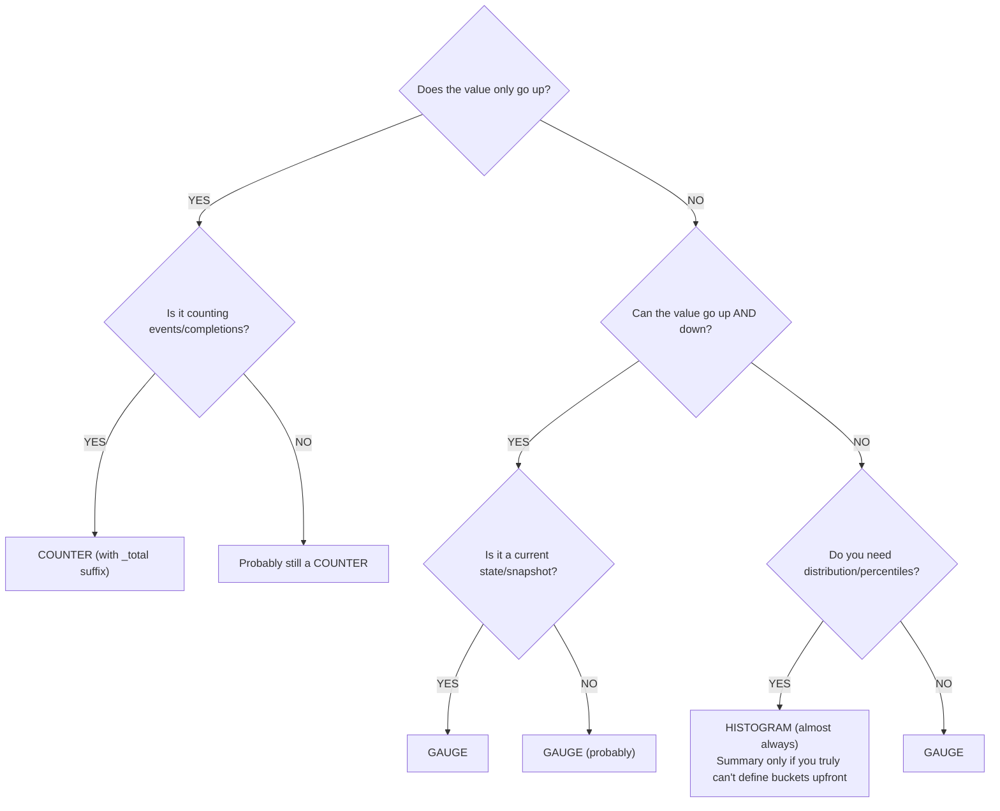
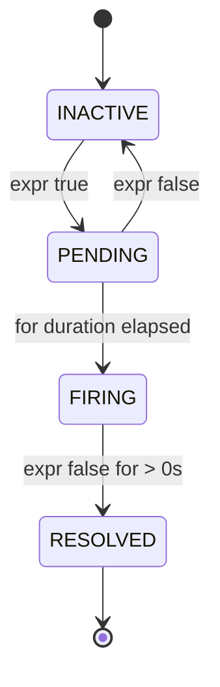
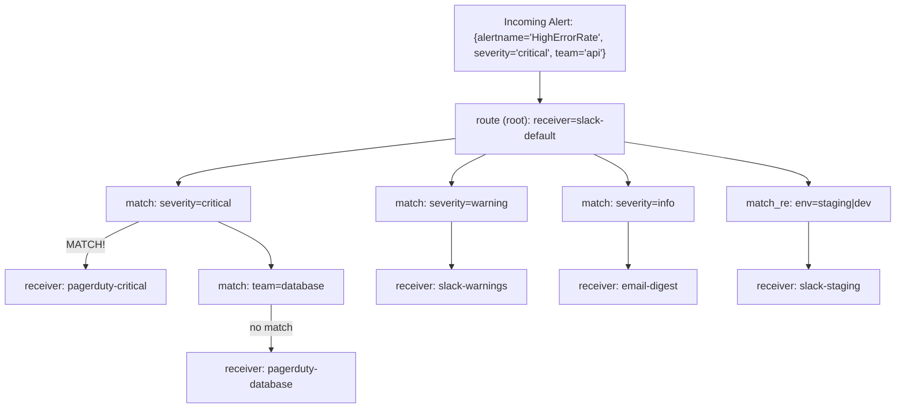
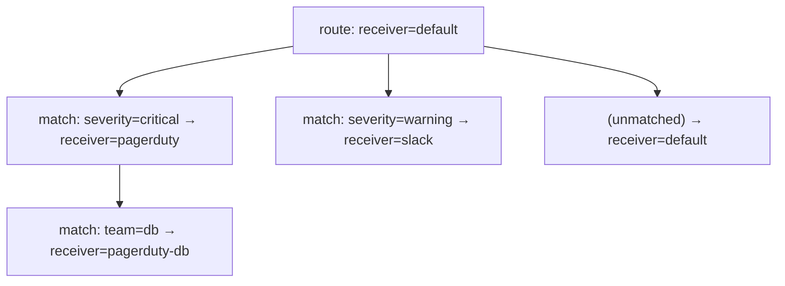

> **Напрямок PCA** | Складність: `[СКЛАДНО]` | Час: 45-55 хв

## Передумови

Перш ніж починати цей модуль:
- [Модуль Prometheus](/platform/toolkits/observability-intelligence/observability/module-1.1-prometheus/) — архітектура, типи метрик, базове оповіщення
- [Поглиблене вивчення PromQL](../module-1.1-promql-deep-dive/) — основи запитів
- [Спостережуваність 3.3: Принципи інструментування](/platform/foundations/observability-theory/module-3.3-instrumentation-principles/)
- Базові знання Go, Python або Java (для прикладів з клієнтськими бібліотеками)

---

## Результати навчання

Після завершення цього модуля ви зможете:

1. **Реалізувати** інструментування застосунку за допомогою клієнтських бібліотек Prometheus, обираючи правильний тип метрики (counter, gauge, histogram, summary) для різних телеметричних сигналів.
2. **Спроєктувати** схеми іменування метрик і таксономії міток, які запроваджують межі кардинальності та суворо відповідають стандартам OpenMetrics.
3. **Оцінити** правила оповіщення з відповідними тривалостями `for` та маршрутизацією за рівнем серйозності, щоб мінімізувати хибні спрацювання під час тимчасових сплесків навантаження на інфраструктуру.
4. **Діагностувати** топології маршрутизації сповіщень у Alertmanager, щоб гарантувати: критичні виклики досягають чергових інженерів, а інформаційні сповіщення маршрутизуються асинхронно.

---

## Чому цей модуль важливий

Команда може випустити власну метрику затримки, яка має цілком прийнятний вигляд під час розробки, і все одно спричинити серйозний операційний біль у продакшені, якщо ім'я або одиниця виміру метрики не відповідає конвенціям Prometheus.
Оскільки метрики — це спільна мова між командами застосунків, дашбордами, сповіщеннями та обчисленнями SLO, якість цих визначень напряму визначає, наскільки надійно команди можуть ухвалювати рішення.
Далі в прикладі цього модуля інша команда поєднала метрику затримки бази даних із наявною метрикою затримки HTTP в одному дашборді SLO, припустивши, що одиниці виміру сумісні:

```promql
histogram_quantile(0.99,
  sum by (le)(rate(http_request_duration_seconds_bucket[5m]))
)
+
histogram_quantile(0.99,
  sum by (le)(rate(db_query_duration_milliseconds_bucket[5m]))
)
```

Така невідповідність одиниць виміру може змусити дашборд затримки повідомляти безглузді значення, спровокувати хибні операційні рішення та забрати години на діагностику.
Базова проблема проста: одна метрика — у секундах, а інша — у мілісекундах.
Арифметика все одно обчислюється, але результат операційно беззмістовний, тож дашборди й сповіщення можуть почати брехати про справжню затримку.
Це означає, що ваша команда фактично запускає сповіщення проти неправильної системи одиниць виміру.

Помилка в іменуванні метрики чи одиниці виміру може накласти реальні витрати на прибирання, оскільки дашборди, сповіщення й навіть автоматизація автомасштабування можуть залежати від старого визначення метрики.
Конвенції іменування Prometheus — це спільний контракт для зменшення такого ризику, а не необов'язкові стильові поради.
Оскільки ми керуємо продакшен-платформами, де кожен додатковий розбір інциденту коштує дорого, інструментування та оповіщення — це базові практичні навички надійності, а не просто екзаменаційна дрібниця.

---

## Чи знали ви?

- Prometheus має офіційні клієнтські бібліотеки для кількох основних мов і велику екосистему сторонніх бібліотек.
- Широко вживаний `node_exporter` надає різноманітні метрики хоста на системах Linux, зокрема вимірювання CPU, пам'яті, файлової системи та мережі.
- Alertmanager використовує ієрархічне дерево маршрутизації, тому одна конфігурація може направляти сповіщення до різних отримувачів на основі міток.
- Для сумісності з OpenMetrics 1.0 імена зразків лічильника використовують суфікс `_total`.

---

## Чотири типи метрик

Кожна одиниця даних, що зберігається в Prometheus, починається як один із чотирьох фундаментальних типів метрик.
Вибір правильного типу — це найкритичніше рішення, яке ви ухвалите під час інструментування коду, бо щойно метрику видано, зміна типу пізніше означає переробку дашбордів, сповіщень і runbook'ів.
На практиці найкращий підхід — спершу визначити тип за бізнес-значенням і дати деталям реалізації слідувати за ним.

### Counter
Counter — це кумулятивна метрика, що представляє одне монотонно зростаюче значення, і воно має скидатися лише тоді, коли перезапускається базовий процес.
Оскільки лічильники представляють підсумки, вони ідеально підходять, коли потрібно спостерігати, скільки всього сталося від запуску процесу, і їх майже ніколи не слід використовувати для представлення поточного стану.
Саме тому ту саму назву метрики можна багаторазово опитувати за допомогою `rate()` чи `increase()`, щоб відповісти на питання про пропускну здатність і зміни в часі.

Counter — це кумулятивна метрика, що представляє одне монотонно зростаюче значення. Уявіть лічильник як одометр у вашому авто: він лише зростає й скидається до нуля лише тоді, коли двигун повністю замінено (або Под перезапущено).

```text
COUNTER: Monotonically increasing value
──────────────────────────────────────────────────────────────

Value over time:
  0 → 1 → 5 → 12 → 30 → 0 → 3 → 15 → 28
                          ↑
                     restart/reset

USE WHEN:
  [YES] Counting events (requests, errors, bytes sent)
  [YES] Counting completions (jobs finished, items processed)
  [YES] Anything that only goes up during normal operation

DON'T USE WHEN:
  [NO] Value can decrease (temperature, queue size)
  [NO] Value represents current state (active connections)

ALWAYS QUERY WITH rate() or increase():
  rate(http_requests_total[5m])      ← per-second rate
  increase(http_requests_total[1h])  ← total in last hour
```

### Gauge
Gauge — це числове значення, яке може рухатися в обох напрямках.
Ключова ідея в тому, що gauge відповідає на питання про поточний стан («скільки зараз?»), а не про накопичення («скільки всього?»), тож воно може спадати й зростати разом із навантаженням, чергою або споживанням ресурсів.
З цієї причини gauge добре підходить для активних з'єднань, тиску на пам'ять або кількості реплік, де важливий контекст у конкретний момент.

Gauge — це метрика, що представляє одне числове значення, яке може довільно зростати й спадати.
Уявіть gauge як спідометр у вашому авто: він показує точно те, що відбувається саме цієї секунди, але без історичного контексту ви не зможете визначити, як далеко проїхали.

```text
GAUGE: Current value that can increase or decrease
──────────────────────────────────────────────────────────────

Value over time:
  42 → 38 → 55 → 71 → 63 → 48 → 52

USE WHEN:
  [YES] Current state (temperature, queue depth, active connections)
  [YES] Snapshots (memory usage, disk space, goroutine count)
  [YES] Values that go up AND down

DON'T USE WHEN:
  [NO] Counting events (use Counter)
  [NO] Measuring distributions (use Histogram)

QUERY DIRECTLY (no rate needed):
  node_memory_MemAvailable_bytes     ← current available memory
  kube_deployment_spec_replicas      ← desired replica count
```

### Histogram

Histogram семплює окремі спостереження (зазвичай це тривалості запитів або розміри відповідей) і підраховує їх у налаштовуваних бакетах.
Гістограми — це основа вимірювання затримки та угод про рівень обслуговування (Service Level Objectives), бо вони зберігають достатньо інформації, щоб оцінити процентилі заднім числом.
Як шаблон проєктування: якщо вас цікавить «як часто ця операція порушує цільовий показник», вам зазвичай потрібні бакети гістограми навколо порогів SLO, що звернені до користувача.

```text
HISTOGRAM: Distribution of values in buckets
──────────────────────────────────────────────────────────────

Generates 3 types of series:
  metric_bucket{le="0.1"}   = 24054    ← cumulative count ≤ 0.1s
  metric_bucket{le="0.5"}   = 129389   ← cumulative count ≤ 0.5s
  metric_bucket{le="+Inf"}  = 144927   ← total count (all observations)
  metric_sum                 = 53423.4  ← sum of all observed values
  metric_count               = 144927   ← total number of observations

USE WHEN:
  [YES] Request latency (the primary use case)
  [YES] Response sizes
  [YES] Any distribution where you need percentiles
  [YES] SLO calculations (bucket at your SLO target)

ADVANTAGES:
  [YES] Aggregatable across instances (can sum buckets)
  [YES] Can calculate any percentile after the fact
  [YES] Can compute average (sum / count)

TRADE-OFFS:
  [NO] Fixed bucket boundaries chosen at instrumentation time
  [NO] Each bucket is a separate time series (cardinality cost)
  [NO] Percentile accuracy depends on bucket granularity
```

### Summary

Summary, як і гістограми, обчислює розподіли спостережуваних подій.
Однак summary обчислює потокові квантилі безпосередньо на стороні клієнта, а не покладається на серверні обчислення Prometheus.
Це може бути корисно, коли ви не можете централізовано налаштувати межі бакетів, але це змінює поведінку агрегації далі за конвеєром.

```text
SUMMARY: [Client-computed quantiles](https://prometheus.io/docs/practices/histograms/)
──────────────────────────────────────────────────────────────

Generates series like:
  metric{quantile="0.5"}   = 0.042    ← median
  metric{quantile="0.9"}   = 0.087    ← P90
  metric{quantile="0.99"}  = 0.235    ← P99
  metric_sum                = 53423.4  ← sum of all observed values
  metric_count              = 144927   ← total number of observations

USE WHEN:
  [YES] You need exact quantiles from a single instance
  [YES] You can't choose histogram bucket boundaries upfront
  [YES] Streaming quantile algorithms are acceptable

DON'T USE WHEN (most of the time):
  [NO] You need to aggregate across instances
     (cannot add quantiles meaningfully!)
  [NO] You need flexible percentile calculation at query time
  [NO] You need SLO calculations

Prefer histograms for most distributed-service latency and SLO use cases; use summaries only when you specifically need client-side quantiles.
```

### Каркас рішення: який тип?

Вибір типу метрики не повинен бути вгадуванням.
Хороше рішення починається із семантичного значення змінної, а потім перевіряє, чи вона спрямована, з накопиченням стану або розподілена за набором спостережень.
Використовуйте наступне логічне дерево під час написання коду інструментування й тримайте в думці `_total` для лічильників, щоб подальші інструменти могли інтерпретувати ряди узгоджено.



```text
CHOOSING A METRIC TYPE
──────────────────────────────────────────────────────────────

Does the value only go up?
├── YES → Is it counting events/completions?
│         ├── YES → COUNTER (with _total suffix)
│         └── NO  → Probably still a COUNTER
└── NO  → Can the value go up AND down?
          ├── YES → Is it a current state/snapshot?
          │         ├── YES → GAUGE
          │         └── NO  → GAUGE (probably)
          └── Do you need distribution/percentiles?
                    ├── YES → HISTOGRAM (almost always)
                    │         └── Summary only if you truly
                    │             can't define buckets upfront
                    └── NO  → GAUGE
```

> **Зупиніться й передбачте**: якщо потрібно відстежувати кількість елементів, що наразі перебувають у черзі обробки Redis, який тип метрики ви маєте використати? Counter чи Gauge?
> *Подумайте, чи може глибина черги колись зменшуватися.*

---

## Інструментування за допомогою клієнтських бібліотек

Експонування метрик із вашого застосунку потребує використання клієнтської бібліотеки Prometheus.
Ці бібліотеки опрацьовують складну роботу з потоками й оптимізації продуктивності, потрібні для відстеження високої частоти подій, не сповільнюючи основну бізнес-логіку.
На практиці це означає, що вам не потрібно винаходити заново синхронізацію, розбиття гістограм на бакети чи реєстрацію метрик, перш ніж ви зможете чітко міркувати про поведінку, яка вас цікавить.

### Go (еталонна реалізація)

```go
package main

import (
    "net/http"
    "time"

    "github.com/prometheus/client_golang/prometheus"
    "github.com/prometheus/client_golang/prometheus/promauto"
    "github.com/prometheus/client_golang/prometheus/promhttp"
)

var (
    // Counter: total HTTP requests
    httpRequestsTotal = promauto.NewCounterVec(
        prometheus.CounterOpts{
            Name: "myapp_http_requests_total",
            Help: "Total number of HTTP requests.",
        },
        []string{"method", "status", "path"},
    )

    // Histogram: request latency
    httpRequestDuration = promauto.NewHistogramVec(
        prometheus.HistogramOpts{
            Name:    "myapp_http_request_duration_seconds",
            Help:    "HTTP request latency in seconds.",
            Buckets: []float64{.005, .01, .025, .05, .1, .25, .5, 1, 2.5, 5},
        },
        []string{"method", "path"},
    )

    // Gauge: active connections
    activeConnections = promauto.NewGauge(
        prometheus.GaugeOpts{
            Name: "myapp_active_connections",
            Help: "Number of currently active connections.",
        },
    )
)

func handler(w http.ResponseWriter, r *http.Request) {
    start := time.Now()
    activeConnections.Inc()
    defer activeConnections.Dec()

    // ... handle request ...
    w.WriteHeader(http.StatusOK)

    duration := time.Since(start).Seconds()
    httpRequestsTotal.WithLabelValues(r.Method, "200", r.URL.Path).Inc()
    httpRequestDuration.WithLabelValues(r.Method, r.URL.Path).Observe(duration)
}

func main() {
    http.HandleFunc("/", handler)
    http.Handle("/metrics", promhttp.Handler())
    http.ListenAndServe(":8080", nil)
}
```

### Python

```python
from prometheus_client import Counter, Histogram, Gauge, start_http_server
import time

# Counter: total HTTP requests
REQUEST_COUNT = Counter(
    'myapp_http_requests_total',
    'Total number of HTTP requests.',
    ['method', 'status', 'path']
)

# Histogram: request latency
REQUEST_LATENCY = Histogram(
    'myapp_http_request_duration_seconds',
    'HTTP request latency in seconds.',
    ['method', 'path'],
    buckets=[.005, .01, .025, .05, .1, .25, .5, 1, 2.5, 5]
)

# Gauge: active connections
ACTIVE_CONNECTIONS = Gauge(
    'myapp_active_connections',
    'Number of currently active connections.'
)

def handle_request(method, path):
    ACTIVE_CONNECTIONS.inc()
    start = time.time()

    # ... handle request ...
    status = "200"

    duration = time.time() - start
    REQUEST_COUNT.labels(method=method, status=status, path=path).inc()
    REQUEST_LATENCY.labels(method=method, path=path).observe(duration)
    ACTIVE_CONNECTIONS.dec()

# Start metrics server on port 8000
start_http_server(8000)

# For Flask: prometheus-flask-exporter
# from prometheus_flask_exporter import PrometheusMetrics
# PrometheusMetrics(app).register_endpoint()
# For FastAPI: prometheus_fastapi_instrumentator
# from prometheus_fastapi_instrumentator import Instrumentator
# Instrumentator().instrument(app).expose(app)
```

### Java (Micrometer / simpleclient)

```java
import io.prometheus.client.Counter;
import io.prometheus.client.Histogram;
import io.prometheus.client.Gauge;
import io.prometheus.client.exporter.HTTPServer;

public class MyApp {
    // Counter: total HTTP requests
    static final Counter requestsTotal = Counter.build()
        .name("myapp_http_requests_total")
        .help("Total number of HTTP requests.")
        .labelNames("method", "status", "path")
        .register();

    // Histogram: request latency
    static final Histogram requestDuration = Histogram.build()
        .name("myapp_http_request_duration_seconds")
        .help("HTTP request latency in seconds.")
        .labelNames("method", "path")
        .buckets(.005, .01, .025, .05, .1, .25, .5, 1, 2.5, 5)
        .register();

    // Gauge: active connections
    static final Gauge activeConnections = Gauge.build()
        .name("myapp_active_connections")
        .help("Number of currently active connections.")
        .register();

    public void handleRequest(String method, String path) {
        activeConnections.inc();
        Histogram.Timer timer = requestDuration
            .labels(method, path)
            .startTimer();

        try {
            // ... handle request ...
            requestsTotal.labels(method, "200", path).inc();
        } finally {
            timer.observeDuration();
            activeConnections.dec();
        }
    }

    public static void main(String[] args) throws Exception {
        // Expose metrics on port 8000
        HTTPServer server = new HTTPServer(8000);
    }
}
```

---

## Конвенції іменування метрик

### Правила
Правила іменування не косметичні; це спосіб, у який команди кодують відповідальність за спостережуваність і машинну читабельність.
Дисциплінована схема іменування зменшує складність запитів, дозволяє автоматично генерувати політики оповіщення й уникає болісних рефакторингів, коли нові команди повторно використовують сімейство метрик.

Імена метрик мають точно описувати те, що вимірюється, за стандартизованою схемою. Це створює передбачуваність у масштабних організаціях.

```text
PROMETHEUS NAMING CONVENTION
──────────────────────────────────────────────────────────────

Format: <namespace>_<name>_<unit>_<suffix>

namespace  = application or library name (myapp, http, node)
name       = what is being measured (requests, duration, size)
unit       = [base unit (seconds, bytes, meters — NEVER milli/kilo)](https://prometheus.io/docs/practices/naming/)
suffix     = metric type indicator ([_total for counters, _info for info](https://prometheus.io/docs/specs/om/open_metrics_spec/))

GOOD:
  myapp_http_requests_total              ← counter, counts requests
  myapp_http_request_duration_seconds    ← histogram, duration in seconds
  myapp_http_response_size_bytes         ← histogram, size in bytes
  node_memory_MemAvailable_bytes         ← gauge, memory in bytes
  process_cpu_seconds_total              ← counter, CPU time in seconds

BAD:
  myapp_requests                         ← missing unit, missing _total
  http_request_duration_milliseconds     ← use seconds, not milliseconds
  db_query_time_ms                       ← abbreviation, non-base unit
  MyApp_HTTP_Requests                    ← camelCase/PascalCase, use snake_case
  request_latency                        ← vague, missing namespace and unit
```

### Правила одиниць виміру
Узгодженість одиниць тримає об'єднання й обчислення передбачуваними, бо PromQL і логіка оповіщення часто поєднують метрики, що можуть походити з різних команд і мов.
Оберіть базову одиницю з таблиці для кожної метрики, а потім використовуйте відповідний суфікс, щоб зробити очікувану інтерпретацію явною.
Це практична причина, чому рекомендації Prometheus наполегливо радять уникати `ms` чи `kb` на користь канонічних базових одиниць.

| Вимірювання | Базова одиниця | Суфікс | Приклад |
|-------------|-----------|--------|---------|
| Час/Тривалість | seconds | `_seconds` | `http_request_duration_seconds` |
| Розмір даних | bytes | `_bytes` | `http_response_size_bytes` |
| Температура | celsius | `_celsius` | `room_temperature_celsius` |
| Напруга | volts | `_volts` | `power_supply_volts` |
| Енергія | joules | `_joules` | `cpu_energy_joules` |
| Вага | grams | `_grams` | `package_weight_grams` |
| Співвідношення | ratio | `_ratio` | `cache_hit_ratio` |
| Відсотки | ratio (0-1) | `_ratio` | Використовуйте 0-1, а не 0-100 |

### Правила суфіксів
Суфікс повідомляє і про те, як ряд інтерпретується, і про те, як інструменти запитів можуть безпечно його агрегувати.
Коли суфікси застосовуються узгоджено, автори правил SLO та оповіщення можуть будувати вирази з повторно використовуваних шаблонів замість спеціальних випадків для кожної команди.

| Тип | Суфікс | Приклад |
|------|--------|---------|
| Counter | `_total` | `http_requests_total` |
| Counter (мітка часу створення) | `_created` | `http_requests_created` |
| Histogram | `_bucket`, `_sum`, `_count` | `http_request_duration_seconds_bucket` |
| Summary | `_sum`, `_count` | `rpc_duration_seconds_sum` |
| Info-метрика | `_info` | `build_info{version="1.2.3"}` |
| Gauge | (без суфікса) | `node_memory_MemAvailable_bytes` |

### Найкращі практики для міток
Додавання міток до метрик дає глибоку розмірність, але є прихована вартість. [Кожна унікальна комбінація міток створює цілковито новий часовий ряд, що зберігається в пам'яті Prometheus TSDB](https://prometheus.io/docs/practices/naming/). Хоча точні межі кардинальності залежать від доступної пам'яті вашої інфраструктури, загальна галузева настанова застерігає від необмежених векторів кардинальності.
Додавання міток до метрик дає глибоку розмірність, але є прихована вартість.
Кожна унікальна комбінація міток створює цілковито новий часовий ряд, що зберігається в пам'яті Prometheus TSDB, тож проєктування міток — це проблема надійності не меншою мірою, ніж аналітики.
На практиці спершу ставтеся до наборів міток як до обмежених розмірностей, а потім перевіряйте, що кожна розмірність відображається на стабільне операційне питання, перш ніж розширювати інструментування.
Хоча точні межі кардинальності залежать від доступної пам'яті вашої інфраструктури, загальна галузева настанова застерігає від необмежених векторів кардинальності.

```text
LABEL DO'S AND DON'TS
──────────────────────────────────────────────────────────────

DO:
  [YES] Use labels for dimensions you'll filter/aggregate by
  [YES] Keep cardinality bounded (status codes: ~5 values)
  [YES] Use consistent names: "method" not "http_method" in one
    place and "request_method" in another

DON'T:
  [NO] user_id (millions of values = millions of series)
  [NO] request_id (unbounded, every request creates a series)
  [NO] email (PII + unbounded cardinality)
  [NO] url with path parameters (/users/12345 = unique per user)
  [NO] error_message (free-form text = unbounded)
  [NO] timestamp as label (infinite cardinality)

RULE OF THUMB:
  If a label can take many distinct values or grow without a clear bound,
  it probably shouldn't be a label.
  Each unique label combination = one time series in memory.
```

---

## Експортери

Для програмного забезпечення, яким ви не керуєте напряму (як-от ядро Linux, MySQL чи Nginx), ви не можете впровадити клієнтські бібліотеки.
Натомість ви розгортаєте «експортери» — невеликі сервіси у стилі sidecar, що читають нативні сигнали процесів і підсистем та перекладають їх у формат Prometheus OpenMetrics.
Цей патерн дозволяє тримати покриття спостережуваності широким, водночас централізуючи логіку запитів і оповіщення в одному стеку.

### node_exporter (метрики обладнання та ОС)
Примітиви рівня вузла — це не логіка застосунку, тож колектор, орієнтований на хост, як-от node_exporter, є звичним джерелом правди для телеметрії CPU, пам'яті й диска.
Використовуйте його, щоб отримати базовий рівень здоров'я інфраструктури, перш ніж починати інтерпретувати вищорівневі метрики, специфічні для застосунку, бо насичення хоста зазвичай є першим чинником каскадного збою сервісу.

```bash
# Install via binary
wget https://github.com/prometheus/node_exporter/releases/download/v1.8.1/node_exporter-1.8.1.linux-amd64.tar.gz
tar xvfz node_exporter-*.tar.gz
./node_exporter

# Or via Kubernetes DaemonSet (kube-prometheus-stack includes it)
helm install monitoring prometheus-community/kube-prometheus-stack
```

**Ключові метрики з node_exporter:**
Використовуйте ці вирази як приклади того самого шаблону форми, що повторюється на всіх хостах; кожен вираз повертає інфраструктурний контекст, який повторно використовують runbook'и та сповіщення про потужність.

```promql
# CPU utilization
1 - avg by (instance)(rate(node_cpu_seconds_total{mode="idle"}[5m]))

# Memory utilization
1 - (node_memory_MemAvailable_bytes / node_memory_MemTotal_bytes)

# Disk space usage
1 - (node_filesystem_avail_bytes{mountpoint="/"} / node_filesystem_size_bytes{mountpoint="/"})

# Network throughput
rate(node_network_receive_bytes_total{device="eth0"}[5m])
rate(node_network_transmit_bytes_total{device="eth0"}[5m])

# Disk I/O
rate(node_disk_read_bytes_total[5m])
rate(node_disk_written_bytes_total[5m])
```

### blackbox_exporter (зондування)

[`blackbox_exporter` зондує зовнішні точки доступу через HTTP, HTTPS, DNS, TCP та ICMP](https://github.com/prometheus/blackbox_exporter). Він незамінний для спостереження за синтетичними сценаріями користувача й відстеження зовнішніх залежностей.
Використовуйте його, коли залежність не надає нативних метрик Prometheus, або коли ви хочете безперервно перевіряти очікувану поведінку, як-от доступність, якість рукостискання та закінчення терміну дії TLS.
Оскільки зонди емулюють реальні патерни трафіку, перевірки blackbox часто кращі за періодичні ручні димові тести у виявленні розбіжностей між командами й середовищами.

```yaml
# blackbox-exporter config
modules:
  http_2xx:
    prober: http
    timeout: 5s
    http:
      valid_http_versions: ["HTTP/1.1", "HTTP/2.0"]
      valid_status_codes: [200]
      follow_redirects: true

  http_post_2xx:
    prober: http
    http:
      method: POST

  tcp_connect:
    prober: tcp
    timeout: 5s

  dns_lookup:
    prober: dns
    dns:
      query_name: "kubernetes.default.svc.cluster.local"
      query_type: "A"

  icmp_ping:
    prober: icmp
    timeout: 5s
```

**Конфігурація scrape для blackbox_exporter у Prometheus:**
Конфігурація scrape вказує Prometheus, як пропустити кожну ціль через обраний модуль, зберегти мітки ідентичності й тримати шлях перевірки всередині самого сервісу blackbox.

```yaml
scrape_configs:
  - job_name: 'blackbox-http'
    metrics_path: /probe
    params:
      module: [http_2xx]
    static_configs:
      - targets:
        - https://example.com
        - https://api.myservice.com/health
    relabel_configs:
      # Pass the target URL as a parameter
      - source_labels: [__address__]
        target_label: __param_target
      # Store original target as a label
      - source_labels: [__param_target]
        target_label: instance
      # Point to the blackbox exporter
      - target_label: __address__
        replacement: blackbox-exporter:9115
```

**Ключові метрики blackbox:**

```promql
# Is the endpoint up?
probe_success{job="blackbox-http"}

# SSL certificate expiry (days)
(probe_ssl_earliest_cert_expiry - time()) / 86400

# HTTP response time
probe_http_duration_seconds

# DNS lookup time
probe_dns_lookup_time_seconds
```

> **Зупиніться й подумайте**: якщо ви покладаєтеся на стороннє кероване сховище даних, яке не надає точки доступу до метрик, як ви могли б використати `blackbox_exporter`, щоб переконатися, що воно залишається досяжним із рівня вашого застосунку?

### Інші поширені експортери

| Експортер | Призначення | Ключові метрики |
|----------|---------|-------------|
| **mysqld_exporter** | Бази даних MySQL | Запитів/с, з'єднання, затримка реплікації |
| **postgres_exporter** | Бази даних PostgreSQL | Активні з'єднання, частота транзакцій, розміри таблиць |
| **redis_exporter** | Redis | Команд/с, використання пам'яті, підключені клієнти |
| **kafka_exporter** | Apache Kafka | Затримка споживача, зміщення топіків, кількість партицій |
| **nginx_exporter** | Nginx | Активні з'єднання, запитів/с, коди відповідей |
| **kube-state-metrics** | Об'єкти Kubernetes | Статус Под'ів, репліки деплойментів, стани вузлів |
| **cadvisor** | Контейнери | CPU, пам'ять, мережа на контейнер |

---

## Поглиблене вивчення Alertmanager

Збирати метрики — це лише половина битви.
Коли системи деградують, сповіщення мають надійно маршрутизуватися до людей-операторів, і цей шлях доставки має лишатися стабільним під тиском.
Alertmanager опрацьовує дедуплікацію, групування, заглушення й маршрутизацію сповіщень, згенерованих Prometheus, тому він стоїть у центрі гігієни комунікації під час інцидентів.

### Життєвий цикл сповіщення

Сповіщення проходять через явні стани, щоб тимчасові мережеві збої не викликали виклики до інженерів.
Кожен стан існує, щоб відокремити шум від сигналу, а вікно `for` — це основний механізм, що перетворює короткий сплеск на очікуване попередження замість негайного виклику.
Ця відмінність тримає операторів зосередженими на стійкій деградації, а не на одноразовому джитері пакетів.



```text
ALERT STATES
──────────────────────────────────────────────────────────────

  INACTIVE  ──→  PENDING  ──→  FIRING  ──→  RESOLVED
     ↑              │             │              │
     │              │             │              │
     │  expr false  │  for: 5m   │  expr false  │
     └──────────────┘  elapsed   │  for > 0s    │
                                 │              │
                                 └──────────────┘

INACTIVE: Alert expression evaluates to false. No action.

PENDING:  Alert expression evaluates to true.
          Waiting for ["for" duration to elapse](https://prometheus.io/docs/prometheus/latest/configuration/alerting_rules/).
          Won't fire yet — prevents noise from brief spikes.

FIRING:   Alert has been true for at least "for" duration.
          Sent to Alertmanager for routing and notification.

RESOLVED: Alert was firing, now expression is false.
          Alertmanager sends "resolved" notification.
```

### Правила оповіщення

```yaml
groups:
  - name: application-alerts
    rules:
      # HIGH SEVERITY: Service completely down
      - alert: ServiceDown
        expr: up == 0
        for: 1m
        labels:
          severity: critical
          team: platform
        annotations:
          summary: "{{ $labels.job }} is down"
          description: "{{ $labels.instance }} has been unreachable for >1 minute."
          runbook_url: "https://wiki.example.com/runbooks/service-down"

      # HIGH SEVERITY: Error rate spike
      - alert: HighErrorRate
        expr: |
          sum by (service)(rate(http_requests_total{status=~"5.."}[5m]))
          /
          sum by (service)(rate(http_requests_total[5m]))
          > 0.05
        for: 5m
        labels:
          severity: critical
        annotations:
          summary: "High error rate on {{ $labels.service }}"
          description: "Error rate is {{ $value | humanizePercentage }}."

      # MEDIUM SEVERITY: Slow responses
      - alert: HighLatency
        expr: |
          histogram_quantile(0.99,
            sum by (le, service)(rate(http_request_duration_seconds_bucket[5m]))
          ) > 2
        for: 10m
        labels:
          severity: warning
        annotations:
          summary: "High P99 latency on {{ $labels.service }}"
          description: "P99 latency is {{ $value | humanizeDuration }}."

      # LOW SEVERITY: Certificate expiring
      - alert: SSLCertExpiringSoon
        expr: (probe_ssl_earliest_cert_expiry - time()) / 86400 < 30
        for: 1h
        labels:
          severity: warning
        annotations:
          summary: "SSL cert for {{ $labels.instance }} expires in {{ $value | humanize }} days"

      # CAPACITY: Disk filling up
      - alert: DiskSpaceLow
        expr: |
          (node_filesystem_avail_bytes{mountpoint="/"} / node_filesystem_size_bytes{mountpoint="/"})
          < 0.15
        for: 15m
        labels:
          severity: warning
        annotations:
          summary: "Disk space below 15% on {{ $labels.instance }}"

      # SLO-BASED: Error budget burn rate
      - alert: ErrorBudgetBurnRate
        expr: |
          job:http_error_ratio:rate5m > (14.4 * 0.001)
        for: 5m
        labels:
          severity: critical
        annotations:
          summary: "Error budget burning too fast for {{ $labels.job }}"
          description: "At current rate, error budget will be exhausted in <1 hour."
```

### Конфігурація Alertmanager

Конфігурація визначає, куди йдуть сповіщення. Одна конфігурація опрацьовує все: від інформаційного листа до негайного дзвінка PagerDuty.

```yaml
# alertmanager.yml — complete production example
global:
  resolve_timeout: 5m
  smtp_smarthost: 'smtp.example.com:587'
  smtp_from: 'alertmanager@example.com'
  smtp_auth_username: 'alertmanager'
  smtp_auth_password: '<secret>'
  slack_api_url: 'https://hooks.slack.com/services/T00/B00/xxxx'
  pagerduty_url: 'https://events.pagerduty.com/v2/enqueue'

# TEMPLATES: customize notification format
templates:
  - '/etc/alertmanager/templates/*.tmpl'

# ROUTING TREE: determines where alerts go
route:
  # Default receiver for unmatched alerts
  receiver: 'slack-default'

  # Group alerts by these labels (reduces noise)
  group_by: ['alertname', 'service']

  # Wait before sending first notification for a group
  group_wait: 30s

  # Wait before sending updates to an existing group
  group_interval: 5m

  # Wait before re-sending a firing alert
  repeat_interval: 4h

  # Child routes (evaluated top-to-bottom, first match wins)
  routes:
    # Critical alerts → PagerDuty (wake someone up)
    - match:
        severity: critical
      receiver: 'pagerduty-critical'
      repeat_interval: 1h
      routes:
        # Database team owns DB alerts
        - match:
            team: database
          receiver: 'pagerduty-database'

    # Warning alerts → Slack channel
    - match:
        severity: warning
      receiver: 'slack-warnings'
      repeat_interval: 4h

    # Info alerts → email digest
    - match:
        severity: info
      receiver: 'email-digest'
      group_wait: 10m
      repeat_interval: 24h

    # Regex matching: any alert from staging
    - match_re:
        environment: staging|dev
      receiver: 'slack-staging'
      repeat_interval: 12h

# RECEIVERS: notification targets
receivers:
  - name: 'slack-default'
    slack_configs:
      - channel: '#alerts'
        send_resolved: true
        title: '{{ .Status | toUpper }}: {{ .CommonLabels.alertname }}'
        text: >-
          {{ range .Alerts }}
          *{{ .Labels.alertname }}* ({{ .Labels.severity }})
          {{ .Annotations.description }}
          {{ end }}

  - name: 'pagerduty-critical'
    pagerduty_configs:
      - routing_key: '<pagerduty-integration-key>'
        severity: critical
        description: '{{ .CommonLabels.alertname }}: {{ .CommonAnnotations.summary }}'

  - name: 'pagerduty-database'
    pagerduty_configs:
      - routing_key: '<database-team-key>'
        severity: critical

  - name: 'slack-warnings'
    slack_configs:
      - channel: '#alerts-warnings'
        send_resolved: true

  - name: 'slack-staging'
    slack_configs:
      - channel: '#alerts-staging'
        send_resolved: false

  - name: 'email-digest'
    email_configs:
      - to: 'team@example.com'
        send_resolved: false

# INHIBITION RULES: suppress dependent alerts
inhibit_rules:
  # If a critical alert fires, suppress warnings for the same service
  - source_match:
      severity: critical
    target_match:
      severity: warning
    equal: ['alertname', 'service']

  # If a node is down, suppress all pod alerts on that node
  - source_match:
      alertname: NodeDown
    target_match_re:
      alertname: Pod.*
    equal: ['node']

  # If cluster is unreachable, suppress everything
  - source_match:
      alertname: ClusterUnreachable
    target_match_re:
      alertname: .+
    equal: ['cluster']
```

### Візуалізація дерева маршрутизації

Механізм маршрутизації сповіщень логічно працює як дерево обчислення.



```text
ALERTMANAGER ROUTING TREE
──────────────────────────────────────────────────────────────

Incoming Alert: {alertname="HighErrorRate", severity="critical", team="api"}

route (root):                          receiver: slack-default
├── match: severity=critical           receiver: pagerduty-critical  ← MATCH!
│   └── match: team=database           receiver: pagerduty-database  (no match)
├── match: severity=warning            receiver: slack-warnings
├── match: severity=info               receiver: email-digest
└── match_re: env=staging|dev          receiver: slack-staging

Result: Alert goes to pagerduty-critical (first matching child route)

NOTE: By default, [routing stops at first match](https://prometheus.io/docs/alerting/latest/configuration/).
      Add "continue: true" on a route to keep matching subsequent routes.
```

### Пояснення правил заборони (inhibition)

Заборона розв'язує проблему «штормів сповіщень», коли один збій кореневої причини (як-от падіння вузла) запускає сотні похідних сповіщень про симптоми (як-от збій Под'ів, деградація сервісів, тайм-аути точок доступу).
Оскільки ця поведінка автоматична й детермінована, вона дозволяє відповідальним зосередитися на справжньому джерелі проблеми, а не вручну сортувати каскади симптомів.
На практиці заборона має моделювати межі залежностей, які ваша команда вже використовує в runbook'ах.

```text
INHIBITION: Suppressing dependent alerts
──────────────────────────────────────────────────────────────

Scenario: Node goes down → all pods on that node fail

WITHOUT inhibition:
  Alert: NodeDown (node-1)              ← root cause
  Alert: PodCrashLooping (pod-a)        ← symptom
  Alert: PodCrashLooping (pod-b)        ← symptom
  Alert: PodCrashLooping (pod-c)        ← symptom
  Alert: HighErrorRate (service-x)      ← symptom
  = 5 pages for one problem!

WITH inhibition:
  inhibit_rules:
    - source_match: {alertname: NodeDown}
      target_match_re: {alertname: "Pod.*|HighErrorRate"}
      equal: [node]

  Alert: NodeDown (node-1)              ← only this fires
  (all dependent alerts suppressed)
  = 1 page for one problem!
```

### Заглушення (silences)

[Заглушення тимчасово вимикають сповіщення під час планового обслуговування](https://prometheus.io/docs/alerting/latest/alertmanager/), запобігаючи активним викликам, поки оператори виконують відомі ризиковані оновлення.
Заглушення тимчасово вимикають сповіщення під час планового обслуговування, запобігаючи активним викликам, поки оператори виконують відомі ризиковані оновлення.
Використовуйте їх для коротких, явних операційних вікон, коли люди свідомо приймають тимчасову сліпоту спостережуваності заради обмеженого радіуса ураження.
Їх завжди слід документувати з автором, наміром і терміном дії, щоб кожен інженер міг зрозуміти, хто, що і чому заглушив.

```bash
# Create a silence via amtool CLI
amtool silence add \
  --alertmanager.url=http://localhost:9093 \
  --author="jane@example.com" \
  --comment="Planned database maintenance window" \
  --duration=2h \
  service="database" severity="warning"

# List active silences
amtool silence query --alertmanager.url=http://localhost:9093

# Expire (remove) a silence
amtool silence expire --alertmanager.url=http://localhost:9093 <silence-id>
```

### Правила запису (recording rules) для оповіщення

Обчислення масивних гістограмних запитів на кожному такті оцінювання може повалити сервер Prometheus.
Правила запису [попередньо обчислюють дорогі вирази, зберігаючи їх назад як цілковито нові дані часових рядів](https://prometheus.io/docs/prometheus/latest/configuration/recording_rules/), тому вони є стандартним патерном зменшення затримки й вартості.
Ваші правила оповіщення потім оцінюють легкі, попередньо обчислені метрики, тож ви витрачаєте менше CPU на повторне обчислення тих самих величин і більше часу — на справжні аномалії.

```yaml
groups:
  - name: recording_rules
    interval: 30s
    rules:
      # Pre-compute error ratio per service
      - record: service:http_error_ratio:rate5m
        expr: |
          sum by (service)(rate(http_requests_total{status=~"5.."}[5m]))
          /
          sum by (service)(rate(http_requests_total[5m]))

      # Pre-compute P99 latency per service
      - record: service:http_latency_p99:rate5m
        expr: |
          histogram_quantile(0.99,
            sum by (le, service)(rate(http_request_duration_seconds_bucket[5m]))
          )

      # Pre-compute CPU utilization per node
      - record: node:cpu_utilization:ratio_rate5m
        expr: |
          1 - avg by (node)(rate(node_cpu_seconds_total{mode="idle"}[5m]))

  - name: alerting_rules
    rules:
      # NOW alerting rules can use the pre-computed values
      - alert: HighErrorRate
        expr: service:http_error_ratio:rate5m > 0.05
        for: 5m
        labels:
          severity: critical
        annotations:
          summary: "Error rate {{ $value | humanizePercentage }} on {{ $labels.service }}"

      - alert: HighLatency
        expr: service:http_latency_p99:rate5m > 2
        for: 10m
        labels:
          severity: warning

      - alert: HighCPU
        expr: node:cpu_utilization:ratio_rate5m > 0.9
        for: 15m
        labels:
          severity: warning
```

---

## Типові помилки

| Помилка | Проблема | Розв'язання |
|---------|---------|----------|
| Використання мілісекунд для тривалості | Невідповідність одиниць з іншими метриками | Завжди використовуйте базові одиниці: `_seconds`, а не `_milliseconds` |
| Counter без суфікса `_total` | Порушує стандарт OpenMetrics | Завжди додавайте `_total` до імен лічильників |
| Мітки високої кардинальності (user_id) | Вибух пам'яті, повільні запити | Видаліть необмежені мітки; агрегуйте на рівні застосунку |
| Відсутній текст `Help` у метриках | Важко зрозуміти; провалює lint-перевірки | Завжди додавайте описові рядки Help |
| Контроль шуму сповіщень | Тріпотливі виклики без `for` або шторми сповіщень без заборони | Використовуйте `for: 5m` як мінімум для більшості сповіщень; придушуйте сповіщення-симптоми, коли спрацьовує сповіщення про кореневу причину |
| Заглушення без коментарів | Ніхто не знає, чому сповіщення вимкнули | Завжди додавайте автора, коментар і термін дії |
| Summary замість Histogram | Неможливо агрегувати між інстансами | Використовуйте Histogram, якщо не маєте конкретної причини цього не робити |
| Гігієна сповіщень | Відсутні runbook'и або забагато отримувачів розмивають реакцію | Посилайтеся на `runbook_url` в анотаціях; консолідуйте: critical → виклик, warning → Slack, info → email |

---

## Тест

<details>
<summary>1. Ви переглядаєте пулреквест для нового мікросервісу. Розробник використав метрику Summary для відстеження затримки на 50 репліках контейнерів. Оцініть цей вибір реалізації: які є чотири типи і який архітектурний фідбек ви надаєте?</summary>

**Відповідь**:

1. **Counter**: монотонно зростаюче значення. Скидається при перезапуску.
   - Приклад: `http_requests_total` — загальна кількість обслужених HTTP-запитів

2. **Gauge**: значення, яке може зростати й спадати.
   - Приклад: `node_memory_MemAvailable_bytes` — наразі доступна пам'ять

3. **Histogram**: спостереження, розкладені в бакети за значенням, із кумулятивними підрахунками.
   - Приклад: `http_request_duration_seconds` — розподіл затримки запитів

4. **Summary**: потокові квантилі, обчислені на стороні клієнта.
   - Приклад: `go_gc_duration_seconds` — тривалість пауз збирання сміття з попередньо обчисленими процентилями

Фідбек: ви маєте відхилити пулреквест. Summary обчислюють точні квантилі нативно в пам'яті застосунку. Через це математично неможливо агрегувати процентилі Summary між 50 інстансами. Розробник має переробити на Histogram, який дозволяє агрегацію (підсумовування бакетів) усіх реплік для обчислення справжнього глобального процентиля.
</details>

<details>
<summary>2. Ваш тимлід пропонує стандартизувати всі системні метрики тривалості до мілісекунд, бо «так молодшим інженерам легше нативно читати дашборди Grafana». Чому Prometheus наполегливо радить цього не робити?</summary>

**Відповідь**:

Базові одиниці запобігають катастрофічним помилкам невідповідності одиниць під час поєднання телеметрії з різнорідних систем. Якщо одна команда використовує `_milliseconds`, а інша — `_seconds`, об'єднання чи додавання цих метрик дає беззмістовні результати, що ламають автоматичне масштабування й обчислення SLO.

Конкретні причини:
- **Узгодженість**: усі метрики тривалості — у секундах, тож `rate(a_seconds[5m]) + rate(b_seconds[5m])` працює, коли метрики в усьому іншому сумісні
- **Функції PromQL**: `histogram_quantile()` повертає значення в одиниці метрики — якщо метрики в секундах, результат у секундах
- **Grafana опрацьовує відображення**: Grafana нативно автоматично перетворює секунди на «2.5ms» чи «1.3h» для людського відображення. Сирі дані слід зберігати в базових одиницях, форматуючи суворо під час відображення.
- **Стандарт OpenMetrics**: вимагає базових одиниць для сумісності між інструментами

Фундаментальне правило: **зберігайте в базових одиницях, відображайте в людських одиницях**.
</details>

<details>
<summary>3. Під час реагування на інцидент сповіщення спрацьовує, але маршрутизується до типового email-дайджесту замість того, щоб викликати пейджер команди DBA. На основі наведеного нижче фрагмента дерева маршрутизації проаналізуйте, як Alertmanager опрацьовує рішення про маршрутизацію.</summary>



```text
route: receiver=default
├── match: severity=critical → receiver=pagerduty
│   └── match: team=db → receiver=pagerduty-db
├── match: severity=warning → receiver=slack
└── (unmatched) → receiver=default
```

**Відповідь**:

Дерево маршрутизації діє як ієрархія обчислення згори донизу:

1. **Кожне сповіщення входить у кореневий маршрут** (конфігурацію `route:` верхнього рівня).
2. **Дочірні маршрути обчислюються згори донизу** — перший збіг серед сусідніх дочірніх маршрутів завершує обчислення й виграє маршрут.
3. **Зіставлення використовує `match` (точний рядковий збіг) або `match_re` (регулярні вирази)** проти призначених міток сповіщення.
4. **Якщо жодна дочірня конфігурація не збігається**, сповіщення безпечно відкочується до типового отримувача кореневого маршруту (у цьому випадку — email-дайджесту).
5. **Якщо вказано `continue: true`** на маршруті, Alertmanager ігнорує правило завершення й продовжує перевіряти наступні сусідні маршрути.
6. **Дочірні маршрути можуть мати власні глибокі дочірні маршрути** — це вкладення дозволяє точну маршрутизацію за командами.

Щоб виправити пропущений виклик DBA, переконайтеся, що сповіщення суворо позначене мітками `severity=critical` та `team=db`.

`group_by`, `group_wait`, `group_interval` та `repeat_interval` керують пакетуванням:
- `group_by`: мітки для групування сповіщень (зменшує кількість сповіщень)
- `group_wait`: скільки буферизувати перед надсиланням першого сповіщення
- `group_interval`: мінімальний час між оновленнями групи
- `repeat_interval`: як часто повторно надсилати активне сповіщення
</details>

<details>
<summary>4. Масивний збій базового вузла спричиняє 50 окремих сповіщень про застосунки Под і 1 основне сповіщення про вузол одночасно. Розрізніть заборону й заглушення та визначте, що розв'язує цей шторм викликів.</summary>

**Відповідь**:

**Заборона** (автоматична, на основі правил):
- Придушує цільові сповіщення, коли одночасно спрацьовує сповіщення-джерело.
- Налаштовується довговічно в `inhibit_rules` у `alertmanager.yml`.
- Відбувається автономно — потребує абсолютно нульового людського втручання.
- Приклад: правило NodeDown забороняє всі похідні сповіщення PodCrashLooping, що походять з того конкретного вузла.
- Призначення: запобігти штормам сповіщень, спричиненим масивними каскадними збоями залежностей.

**Заглушення** (ручне, на основі часу):
- Тимчасово вимикає сповіщення, що відповідають явним перестановкам міток.
- Створюється динамічно через UI Alertmanager або CLI `amtool`.
- Вимагає людської дії — відповідальний свідомо вирішує заглушити систему.
- Запроваджує суворо визначений термін дії.
- Приклад: заглушити всі шумні сповіщення, що відповідають `service="database"`, під час планового вікна обслуговування для міграції схеми.
- Призначення: придушити очікуваний шум під час активних ручних операційних завдань.

Ключова відмінність: заборона розв'язує шторм викликів, розумно розпізнаючи відображення залежностей (вузол упав = Под'и впали). Заглушення — це тупе, ручне перевизначення для людей-операторів, які виконують планову роботу.
</details>

<details>
<summary>5. Ви проєктуєте архітектуру інструментування для нового логістичного мікросервісу. Сервіс складається із синхронного HTTP API для комунікації з клієнтами та асинхронної фонової черги обробки завдань. Спроєктуйте потрібні метрики, явно обираючи типи й схеми іменування.</summary>

**Відповідь**:

**Метрики HTTP API:**
```text
myservice_http_requests_total{method, status, path}        — Counter
myservice_http_request_duration_seconds{method, path}      — Histogram
myservice_http_request_size_bytes{method, path}            — Histogram
myservice_http_response_size_bytes{method, path}           — Histogram
myservice_http_active_requests{method}                     — Gauge
```

**Метрики фонових завдань:**
```text
myservice_jobs_processed_total{queue, status}              — Counter
myservice_job_duration_seconds{queue}                      — Histogram
myservice_jobs_queued{queue}                               — Gauge (current queue depth)
myservice_job_last_success_timestamp_seconds{queue}        — Gauge
```

**Метрики середовища виконання (автоматично надаються більшістю клієнтських бібліотек):**
```text
process_cpu_seconds_total                                  — Counter
process_resident_memory_bytes                              — Gauge
go_goroutines (if Go)                                      — Gauge
```

Проєктні рішення:
- Мітка `path` має напряму відображатися на параметризовані патерни маршрутів (наприклад, `/users/{id}`), а не на сирі зовнішні шляхи (наприклад, `/users/12345`). Сирі шляхи створюють катастрофічні вибухи кардинальності.
- Бакети гістограми для затримки HTTP API мають щільно відповідати типовим взаємодіям людського масштабу: `[.005, .01, .025, .05, .1, .25, .5, 1, 2.5, 5]`.
- Бакети гістограми для фонових завдань мають відповідати масивним системним асинхронним межам: `[.1, .5, 1, 5, 10, 30, 60, 300]` (завдання зазвичай набагато повільніші).
</details>

<details>
<summary>6. Чергові інженери переживають серйозне вигорання, бо їхні пейджери спрацьовують повторно через 10-секундні сплески використання CPU, що миттєво самовирішуються. Оцініть призначення поля `for` у правилі оповіщення й поясніть архітектурний вплив його відсутності.</summary>

**Відповідь**:

Поле `for` діє як явний механізм усунення брязкоту (debouncing), що задає, як довго сирий вираз сповіщення має бути безперервно істинним, перш ніж система підвищить стан сповіщення з **pending** до формального **firing**.

```yaml
- alert: HighErrorRate
  expr: error_rate > 0.05
  for: 5m        # Must be true for 5 minutes before firing
```

**Без `for`** (або неявно `for: 0s`):
- Сповіщення спрацьовує й відправляється до Alertmanager точно тієї секунди, коли вираз PromQL обчислюється як істинний.
- Якщо наступний цикл scrape обчислюється як хибний, система негайно вирішує сповіщення.
- Це створює системне **тріпотіння сповіщень**: короткі, нешкідливі сплески інфраструктури швидко запускають і вирішують сповіщення.
- Інженерів марно викликають для тимчасових станів, що самовирішуються, перш ніж навіть можна відкрити ноутбук.

**З `for: 5m`**:
- Короткі сплески телеметрії (тривалістю менш ніж 5 хвилин) тримаються у стані pending і тихо ігноруються, коли вони падають нижче порога.
- Лише стійка, придатна до дій деградація запускає людські сповіщення.
- Це різко зменшує хибні спрацювання й зберігає психічне здоров'я чергових.

**Настанови**:
- `for: 1m` — критичні бінарні сповіщення інфраструктури (наприклад, ServiceDown, NodeOffline)
- `for: 5m` — нестабільні помилки пропускної здатності й затримки
- `for: 15m` — поступова деградація потужності
- `for: 1h` — повільні проактивні попередження (наприклад, закінчення терміну дії TLS-сертифікатів, прогнозоване вичерпання диска)
</details>

---

## Практична вправа: інструментуйте, експортуйте, оповіщайте

У цій вправі ви налагодите повний цикл спостережуваності: інструментуєте сирий застосунок, розгорнете його, забезпечите scraping через ServiceMonitor і перевірите спрацювання правил оповіщення.
Ставтеся до цього як до наскрізної репетиції продакшен-інцидентів, де кожен етап або додає впевненості, або виявляє припущення, яке потрібно виправити перед тестами пейджера.
Очікуваний результат — це не лише запити, що проходять, а й здатність пояснити, чому існує кожен етап і від якого режиму збою він захищає.

Практична перевага цієї послідовності в тому, що кожен крок створює вимірюваний артефакт:
щойно інструментування працює, ви отримуєте впевненість у запитах; щойно scraping працює, ви отримуєте впевненість у прийомі даних; щойно оповіщення працює, ви отримуєте впевненість у реагуванні.
Коли ви можете перевірити всі три артефакти, той самий патерн застосовний до будь-якого продакшен-сервісу, бо він прибирає вгадування зі сортування інцидентів.

На високому рівні цей модуль — гра в дисципліну.
Ви багаторазово змушуєте гіпотезу стати спостережуваною, а потім багаторазово доводите, чи виживає сигнал на кожному етапі конвеєра.
Це повторюване доведення — те, що перетворює випадкове усунення несправностей на передбачувану операційну систему.

### Завдання 1: Налаштування середовища
Почніть із забезпечення керованого середовища Kubernetes, а потім розгорніть стек оператора, який володітиме Prometheus, Alertmanager і виявленням scraping.
Ця послідовність тримає ваші ресурси Prometheus поруч із просторами імен, які ви спостерігатимете, й уникає ситуативного дрейфу інсталяції.

Розгорніть чисте середовище та ініціалізуйте стек Prometheus. Переконайтеся, що ви націлюєтеся на середовище Kubernetes v1.35+.

```bash
# Ensure you have a cluster with Prometheus
# (Use the setup from Module 1's hands-on, or:)
kind create cluster --name pca-lab
helm repo add prometheus-community https://prometheus-community.github.io/helm-charts
helm repo update
helm install monitoring prometheus-community/kube-prometheus-stack \
  --namespace monitoring --create-namespace
```

### Завдання 2: Розгорніть інструментований застосунок

Розгорніть власний застосунок Python, що використовує нативні клієнтські бібліотеки Prometheus. Зверніть увагу, що цей файл містить `ConfigMap`, `Deployment` і `Service`, розділені стандартними межами YAML-документів (`---`).
Розгорніть власний застосунок Python, що використовує нативні клієнтські бібліотеки Prometheus, і тримайте маніфести в одному наборі YAML-документів, щоб шлях scraping лишався очевидним.
Файл містить `ConfigMap`, `Deployment` і `Service`, розділені стандартними межами YAML (`---`), щоб ви могли застосувати все атомарно.

```yaml
# instrumented-app.yaml
apiVersion: v1
kind: ConfigMap
metadata:
  name: app-code
  namespace: monitoring
data:
  app.py: |
    from prometheus_client import Counter, Histogram, Gauge, start_http_server
    import random, time, threading

    REQUESTS = Counter('myapp_http_requests_total', 'Total HTTP requests', ['method', 'status'])
    LATENCY = Histogram('myapp_http_request_duration_seconds', 'Request latency',
                        buckets=[.01, .025, .05, .1, .25, .5, 1, 2.5, 5])
    QUEUE_SIZE = Gauge('myapp_queue_size', 'Current items in queue')
    JOBS = Counter('myapp_jobs_processed_total', 'Jobs processed', ['status'])

    def simulate_traffic():
        while True:
            method = random.choice(['GET', 'GET', 'GET', 'POST', 'PUT'])
            latency = random.expovariate(10)  # ~100ms average
            status = '200' if random.random() > 0.03 else '500'
            REQUESTS.labels(method=method, status=status).inc()
            LATENCY.observe(latency)
            time.sleep(0.1)

    def simulate_queue():
        while True:
            QUEUE_SIZE.set(random.randint(0, 50))
            if random.random() > 0.1:
                JOBS.labels(status='success').inc()
            else:
                JOBS.labels(status='failure').inc()
            time.sleep(1)

    if __name__ == '__main__':
        start_http_server(8000)
        threading.Thread(target=simulate_traffic, daemon=True).start()
        threading.Thread(target=simulate_queue, daemon=True).start()
        print("Metrics server running on :8000")
        while True:
            time.sleep(1)

---
apiVersion: apps/v1
kind: Deployment
metadata:
  name: instrumented-app
  namespace: monitoring
spec:
  replicas: 2
  selector:
    matchLabels:
      app: instrumented-app
  template:
    metadata:
      labels:
        app: instrumented-app
    spec:
      containers:
        - name: app
          image: python:3.11-slim
          command: ["sh", "-c", "pip install prometheus_client && python /app/app.py"]
          ports:
            - containerPort: 8000
              name: metrics
          volumeMounts:
            - name: code
              mountPath: /app
      volumes:
        - name: code
          configMap:
            name: app-code

---
apiVersion: v1
kind: Service
metadata:
  name: instrumented-app
  namespace: monitoring
  labels:
    app: instrumented-app
spec:
  selector:
    app: instrumented-app
  ports:
    - port: 8000
      targetPort: 8000
      name: metrics
```

```bash
kubectl apply -f instrumented-app.yaml
```

### Завдання 3: Налаштуйте ServiceMonitor

Створіть кастомний ресурс `ServiceMonitor`. Оператор Prometheus автоматично виявить його й динамічно переналаштує свій цикл scraping.
Оператор Prometheus стежить за цими об'єктами й автоматично оновлює завдання scrape, тож ручна реєстрація цілей не потрібна, коли сервіс присутній.
Це ключовий крок, що перетворює ручну лабораторну роботу на керований оператором потік контролю.

```yaml
# servicemonitor.yaml
apiVersion: monitoring.coreos.com/v1
kind: ServiceMonitor
metadata:
  name: instrumented-app
  namespace: monitoring
  labels:
    release: monitoring  # Must match Prometheus selector
spec:
  selector:
    matchLabels:
      app: instrumented-app
  endpoints:
    - port: metrics
      interval: 15s
      path: /metrics
```

```bash
kubectl apply -f servicemonitor.yaml
```

### Завдання 4: Перевірте прийом даних

Виконайте port-forward напряму до UI Prometheus, а потім перевірте і цілі, і запити, бо обидва мають бути правильними, щоб цей робочий процес коректно закрився.
Якщо реєстрація цілі або форма запиту неправильні, вправа провалиться пізно й приховає, де насправді сталася поломка.

```bash
# Port-forward to Prometheus
kubectl port-forward -n monitoring svc/monitoring-kube-prometheus-prometheus 9090:9090
```

Відкрийте у браузері `http://localhost:9090/targets`, щоб підтвердити, що `instrumented-app` з'являється в інвентарі цілей. Перейдіть на вкладку запитів і виконайте наступні перевірки:

```promql
# Verify metrics are flowing
myapp_http_requests_total

# Request rate
rate(myapp_http_requests_total[5m])

# Error rate
sum(rate(myapp_http_requests_total{status="500"}[5m]))
/ sum(rate(myapp_http_requests_total[5m]))

# P99 latency
histogram_quantile(0.99, sum by (le)(rate(myapp_http_request_duration_seconds_bucket[5m])))

# Queue depth
myapp_queue_size
```

### Завдання 5: Налаштуйте правила оповіщення

Впровадьте топологію правил, що використовує прийняті метрики, а потім поспостерігайте, як `for` і порогові умови перетворюють сирі спостереження на операційні рішення.
Ви хочете, щоб ті самі дані симуляції керували реалістичним шляхом переходу станів від inactive до pending і firing, тож це перевіряє весь ланцюг від інструментування до дії.

```yaml
# alerting-rules.yaml
apiVersion: monitoring.coreos.com/v1
kind: PrometheusRule
metadata:
  name: instrumented-app-alerts
  namespace: monitoring
  labels:
    release: monitoring
spec:
  groups:
    - name: instrumented-app
      rules:
        - alert: MyAppHighErrorRate
          expr: |
            sum(rate(myapp_http_requests_total{status=~"5.."}[5m]))
            / sum(rate(myapp_http_requests_total[5m]))
            > 0.05
          for: 2m
          labels:
            severity: warning
          annotations:
            summary: "High error rate on instrumented-app"
            description: "Error rate is {{ $value | humanizePercentage }}"

        - alert: MyAppHighLatency
          expr: |
            histogram_quantile(0.99,
              sum by (le)(rate(myapp_http_request_duration_seconds_bucket[5m]))
            ) > 1
          for: 5m
          labels:
            severity: warning
          annotations:
            summary: "High P99 latency on instrumented-app"

        - record: myapp:http_error_ratio:rate5m
          expr: |
            sum(rate(myapp_http_requests_total{status=~"5.."}[5m]))
            / sum(rate(myapp_http_requests_total[5m]))
```

```bash
kubectl apply -f alerting-rules.yaml
```

Перейдіть до `http://localhost:9090/alerts`, щоб підтвердити, що рушій правил проіндексував файли. Оскільки скрипт симуляції включає випадкові збої, ви врешті-решт побачите, як `MyAppHighErrorRate` переходить зі стану `Inactive` до `Pending`.

**Прогрес практики:** відстежуйте ці контрольні точки всередині вправи, щоб ви могли зупинитися після першого етапу, що провалився, замість того, щоб налагоджувати весь конвеєр одразу.

- [ ] Завдання 1: стек моніторингу встановлено в лабораторному кластері
- [ ] Завдання 2: інструментований застосунок розгорнуто, а Под'и готові
- [ ] Завдання 3: ServiceMonitor застосовано й підхоплено оператором
- [ ] Завдання 4: цілі Prometheus та запити PromQL повертають очікувані ряди
- [ ] Завдання 5: PrometheusRule застосовано та спостережено переходи станів сповіщень

## Лінза практичного проєктування

Перш ніж переходити до контрольного списку, зупиніться й простежте концептуальний шлях, який проходить ваша телеметрія від процесу до виклику:

- Метрику оголошують з ім'ям, мітками й типом.
- Це оголошення експонується на точці доступу.
- Prometheus виявляє її або йому повідомляють, як її scraping'увати.
- Сирі сигнали стають придатними для запитів рядами.
- Запити живлять правила запису, правила оповіщення й дашборди.
- Alertmanager маршрутизує сповіщення за політикою, а не за припущенням.

Ця послідовність важлива, бо кожен розрив у цьому ланцюгу — потенційне джерело хибних тривог або сліпих зон.
Якщо ваш ланцюг ламається, ви, ймовірно, все одно отримаєте якісь дані, що може ускладнити виявлення проблем.
Наприклад, хороші мітки з поганим інтервалом scrape все ще можуть давати графіки, що мають правдоподібний вигляд, але втрачають точність навколо сплесків, тоді як хороше виявлення scrape із поганими налаштуваннями `for` все ще викликає на шум.
Коротко: успіх спостережуваності — це не одна конфігурація; це якість композиції на всьому шляху.

Перша перевірка якості відбувається на краю метрики.
Якщо команда використовує `Counter` для представлення значення зі станом, кожне подальше обчислення відсотків і правило оповіщення успадковує цю семантичну помилку ще до того, як ви матимете достатньо даних, щоб її виправити.
Якщо команда використовує неправильну базову одиницю, єдина помилка перетворення може зробити так, що порогові значення оповіщення водночас здаються і правильними, і неправильними, бо дашборди можуть приховувати невідповідності.
Ось чому цей модуль так наголошує на дисципліні типів та іменування в першій половині перед топологією сповіщень.

Друга перевірка відбувається на ергономіці запитів.
Дизайн запитів має лишатися читабельним для того, хто не був автором інструментування.
Коли імена дотримуються конвенцій, операції можуть виводити значення з імен і суфіксів, не читаючи коду застосунку.
Коли мітки обмежені й змістовні, об'єднання лишаються керованими у вікнах чергування.
Коли мітки необмежені, ваша платформова команда платить вартість спершу через тиск на пам'ять TSDB, а потім через рятувальну роботу, яка ніколи не вказана в SLO.

Третя перевірка відбувається на дизайні політики сповіщень.
Правила оповіщення надійні рівно настільки, наскільки надійна семантика переходу станів, яку вони кодують.
Короткі сплески мають лишатися інформативними, але непридатними до дій.
Стійкі проблеми мають швидко ескалюватися з високою впевненістю.
Коли вікна `for`, поведінка групування й маршрутизація налаштовані разом, операції можуть уникнути і пропущених інцидентів, і штормів сповіщень.

Ці перевірки взаємопов'язані, а не незалежні.
Зміна стратегії бакетів гістограми впливає на обчислення темпу вигорання сповіщень; зміна кардинальності міток впливає на розмірності маршруту; зміна пріоритетів маршруту змінює, кого викликають першим.
Ця взаємозалежність — причина, чому модуль рекомендує переглядати інструментування й оповіщення як одну проєктну поверхню, а не як два ізольовані завдання.

Якщо ви готуєте цей робочий процес для реальної платформи, щоразу застосовуйте таку практичну послідовність:

1. Визначте семантику метрик перед написанням коду.
2. Перевірте іменування, суфікс і бюджети міток одним явним оглядом.
3. Перевірте поведінку scrape, запитів і кардинальності у staging-просторі імен.
4. Додайте правила оповіщення з консервативними тривалостями `for` і явним наміром щодо серйозності.
5. Відрепетируйте сценарії збоїв і підтвердьте, що маршрутизація все ще відповідає обов'язкам чергування.

Ця послідовність створює відтворюваний базовий рівень, який ви можете пояснити й захистити.
Коли стається інцидент, посмертний аналіз має посилатися на відоме проєктне правило, а не на одноразову латку.

## Командна комунікація за формою сповіщення

Оповіщення — це також проблема мови, а не лише метрик.
Сповіщення `critical` без мітки команди часто менш корисне, ніж правильно охоплене інформаційне сповіщення, бо автоматизація маршрутизації не може вивести відповідальність.
Ось чому дерева маршрутизації мають явно кодувати межі володіння й тримати пріоритет збігів детермінованим.
У цьому модулі дочірні маршрути й правила `match`/`match_re` є прикладами цієї моделі володіння.

Коли ви проєктуєте маршрути, починайте з найвагомішого шляху наслідків.
По-перше, гарантуйте, що екстрені сповіщення ніколи не зникнуть у дайджесті.
По-друге, забезпечте, щоб трафік попереджень та інформації лишався видимим, але достатньо асинхронним, щоб не переривати негайне реагування на інцидент.
По-третє, забезпечте, щоб маршрути, специфічні для середовища, випадково не перевизначали продакшен-наміри.
По-четверте, додавайте `continue` й дочірню маршрутизацію лише тоді, коли організація явно потребує поведінки розгалуження.

Спокусливо розв'язувати кожен випадок дедалі вкладенішими маршрутами.
На практиці складність часто збільшує накладні витрати на обслуговування й затримку.
Пласкіше дерево маршрутів зі суворою дисципліною міток зазвичай легше перевірити під тиском.
Це особливо справедливо, коли кілька платформових команд спільно використовують один інстанс `Alertmanager`, і кожна команда припускає різний стиль пріоритету збігів.

Заглушення й заборона слугують різним комунікаційним цілям.
Заборона архітектурна: вона автоматизує придушення на основі відомих залежностей.
Заглушення операційне: воно тимчасово приймає ризик, поки люди виконують планові зміни.
Коли їх плутають, команди або втрачають корисний контекст під час обслуговування, або продовжують отримувати шторми, які не мали б сортувати.
Використовуйте обидва, але визначте суворий процес для кожного, щоб один не став випадковим замінником іншого.

Для кожної топології сповіщень, яку ви впроваджуєте, визначте одне правило рецензента:
якщо з'являється нова метрика, маршрут або мітка, запитайте: «Яку дію оператора це робить простішою чи безпечнішою?»
Якщо відповідь розпливчаста, дизайн надто ранній для випуску.
Якщо відповідь чітка й перевірювана з дашборда чи CLI, дизайн, імовірно, належить системі.

Це формулювання перетворює «роботу з моніторингу» на спільні інфраструктурні стандарти й допомагає командам зберігати спокій під час подій.

## Готовність до інцидентів шар за шаром

Спостережуваність корисна лише тоді, коли вона змінює поведінку оператора під тиском.
Ось чому кожен шар у цьому модулі слід трактувати як окремий інтерфейс із явним володінням, явним режимом збою та явним шляхом усунення.
Коли команди пропускають ці явні контракти, продакшен-інциденти деградують із технічної події в комунікаційну, бо ніхто не впевнений, звідки походить правда.

На краю метрики володіння належить сервісній команді, що пише бізнес-код.
Вони визначають семантичне значення через імена метрик і мітки, і вони обирають, чи є кожен сигнал кумулятивним підсумком, миттєвим станом чи семпльованим розподілом.
Найдорожчі збої в цьому шарі тонкі, бо вони проходять рецензування коду; вони не є синтаксичними помилками.
Натомість це помилки неоднозначності, як-от лічильник, що використовується як gauge, або метрика затримки, що відстежується як мілісекунди в одному сервісі й секунди в іншому.
Ці вибори важко помітити при статичному рецензуванні, тому цей модуль наполягає на конвенціях перед оптимізацією.

На шарі scrape і зберігання володіння зміщується до платформових команд, бо цей шар має масштабуватися через простори імен і збої.
Якщо імена сервісів, простори імен або селектори релізів неузгоджені, Prometheus все одно працюватиме, але ваш інвентар цілей стане ненадійним.
Якщо інтервали scrape надто агресивні для навантажень із високою кардинальністю, вартість зберігання зростає раніше, ніж покращується якість сповіщень.
Якщо інтервали scrape надто розріджені для сплескових індикаторів, короткі події невидимі саме там, де оператори очікують раннього попередження.
Урок не в тому, що один інтервал універсально правильний; урок у тому, що цей шар потребує явної політики, прив'язаної до профілів навантаження.

На шарі запитів володіння повертається і до застосунку, і до платформи, бо саме тут семантика інтерпретується й перетворюється на операційні сигнали.
Логіка запитів — це місце, де команди випадково кодують припущення, які не справджуються під час сплесків, як-от ділення темпів із непорівнянних просторів імен або усереднення значень, які слід порівнювати за процентилями.
Це також місце, де з'являється багато прихованої складності: вибори міток, зроблені вище за течією, стають обмеженнями об'єднання нижче за течією, а рішення про кардинальність, ухвалені раніше, раптом стають обчислювальною вартістю.
З цієї причини дизайн запитів має бути придатним до рецензування інженером, який не писав вихідного коду, але все ще може простежити кожну частину виразу.
Якщо ні, вираз майже напевно надто крихкий для використання під час чергування.

На шарі оповіщення й маршрутизації володіння операційно спільне.
Правила оповіщення відповідають на питання «що не так», тоді як правила маршрутизації відповідають «хто діє далі».
Якщо сповіщення має ідеальний вираз, але неправильну стратегію отримувача, увесь цикл провалюється з тією самою швидкістю, що й відсутня мітка серйозності.
Якщо пріоритет маршрутизації надто широкий, ви отримуєте шумні виклики й втому від сповіщень.
Якщо пріоритет маршрутизації надто вузький, одна команда пропускає критичні сигнали, і та сама проблема вражає іншу команду без контексту.
Ось чому приклади в цьому модулі включають і мітки серйозності, і команди, явні налаштування групування та порядок успадкування.

Дієвий спосіб операціоналізувати цю модель — відрепетирувати збій на кожному шарі:

1. Зламайте одну інструментовану метрику в джерелі, змінивши патерн кардинальності мітки.
2. Залиште ціль scrape і правила оповіщення незмінними, потім підтвердьте, чи видно зростання кардинальності як джерело деградації.
3. Відновіть поведінку міток, потім впровадьте помилку рівня запиту (наприклад, неправильне припущення про знаменник) і поспостерігайте, чи перетворює правило придатні до дій сповіщення на шум.
4. Відновіть поведінку запитів, потім надішліть схожу на продакшен критичну подію й підтвердьте маршрутизацію за середовищем і командою.
5. Нарешті, видаліть і повторно застосуйте заглушення під час обслуговування, щоб перевірити ясність runbook'а й поведінку терміну дії.

Ця вправа демонструє ключову концепцію: кожен шар може провалитися незалежно, але плани відновлення мають бути скоординовані.
Якщо платформова команда лише виправляє налаштування зберігання, але ігнорує семантику запитів, хибні сповіщення лишаються.
Якщо команда застосунку виправляє семантику запитів, але тримає мітки необмеженими, кожен майбутній спринт платитиме вартість.
Якщо операції виправляють маршрутизацію без виправлення базової якості сповіщень, виклики надходять пізніше з тією самою неоднозначністю.
Шарові репетиції запобігають цій пастці.

Та сама концепція з'являється під час масштабування з одного простору імен до багатьох.
У малих системах окремий інженер може вручну узгодити форму сигналу, дизайн запитів і маршрутизацію.
У більших кластерах цей процес не масштабується, бо кожна хвилина реагування на інцидент уже поглинута перемиканням контексту.
З моделлю цього модуля ви переходите до стандарту:

- семантичні контракти в джерелі,
- контракти виявлюваності в реєстрації scrape,
- обчислювальні контракти в шарах запитів і запису,
- й контракти володіння в маршрутизації та сповіщеннях.

Коли всі чотири контракти явні, команди витрачають менше часу на суперечки про те, де почалася помилка, і більше часу на запобігання повторним поломкам.

Це одна з причин, чому модуль використовує реальні примітиви, як-от дерева збігів Alertmanager і правила запису, замість гіпотетичних обгорток.
Ці примітиви — місце, де збої дорогі, а також де дисциплінована конфігурація має найвищу віддачу.
Мовою реагування на інциденти цей модуль навчає вас не лише того, що зламалося, а й чому воно зламалося та де його залатати з найменшим подальшим збуренням.

Ви можете також використати цю саму модель шарів як артефакт врядування.
Визначте один короткий розділ у вашому внутрішньому документі стандартів і вимагайте, щоб кожна сервісна команда відображала будь-яку нову телеметрію на ці чотири контракти перед злиттям.
Якщо відображення відсутнє, ви ловите помилки до того, як дашборди й чергування їх поглинуть.
Якщо відображення присутнє, ваші runbook'и лишаються простішими у виконанні, бо кожне сповіщення має відомого власника й відомі залежності.
Нікому не потрібно пам'ятати весь стек під час надзвичайної ситуації; кожна людина володіє одним шаром і може ескалювати до суміжних шарів із впевненістю.

Для операторів, які вже керують продакшен-системами, цей спосіб мислення перетворює дизайн сповіщень із ситуативної реакції на відтворюваний цикл контролю.
Телеметрія стає свідомим контрактом, а не побічним ефектом.
Оповіщення стає протестованим комунікаційним шляхом, а не сподіванням.
А інциденти стають менше про звинувачення й більше про повернення до норми за задумом.

## Поглиблені навчання зі збоїв і контракти сортування

Базовий дизайн цього модуля масштабується краще, коли команди тестують, як деградує якість сигналу, а не лише коли все справне.
Справні дашборди можуть приховувати системну крихкість, бо кожен щасливий шлях має неушкоджений вигляд, доки не з'явиться рідкісне поєднання перезапуску, сплеску трафіку й збою залежності.
Ось чому найсильніші команди репетирують припущення про збій для кожного шару, а не лише базову спостережуваність.

Сценарне планування має починатися з першого визначення сигналу.
Припустімо, Под перезапускається під навантаженням після події тиску на пам'ять: якщо метрику глибини черги випадково змодельовано як gauge без обмежень верхньої межі, стрибок із нормального стану до нуля після перезапуску може мати вигляд відновлення, поки беклог іще обробляється.
Якщо цю метрику потім агрегувати з мітками, що включають необмежений ідентифікатор запиту, корисний агрегат не з'явиться, бо кардинальність вибухає до того, як закриється вікно відновлення.
Саме в цьому випадку ваше перше виправлення — не додавати більше оповіщення, а запровадити стабільні мітки й семантику перезапуску.
Це також місце, де відмінність counter/gauge не теоретична; вона вирішує, чи представляють дашборди поточну потужність, чи загальну історичну поведінку.

Сценарне планування має далі перейти до шару запитів.
Припустімо, команда додає затримку P99, використовуючи сирі лічильники плюс ситуативну арифметику.
Запит може пройти модульні тести, але якщо знаменник змінює форму між просторами імен, отриманий темп помилок має штучно стабільний вигляд саме для тих інтервалів, що мають значення.
Це створює хибний сигнал: сервіс може бути деградованим, але правило ніколи не спрацьовує, бо інгредієнти запиту стали неузгодженими.
Виправлення — не новий поріг щоспринту; це збереження контрактів сумісності запитів і документування очікуваних наборів міток.
Ставтеся до кожного запиту як до контракту й ведіть журнал змін очікуваних виходів, а не лише змінених вихідних файлів.

Третій сценарій — дрейф шляху маршрутизації під час паралельності інцидентів.
Уявіть, що staging-синтетичне сповіщення випадково спершу збігається з `severity=warning`, бо новий маршрут вставили над критичною гілкою й не додали `continue`.
Критичне сповіщення досягає email-дайджесту, команда БД пропускає виклик, а реагування на інцидент починається пізніше без чіткого сигналу кореневої причини в каналах чергування.
Усе в цьому модулі існує, щоб запобігти саме цьому каскаду:
узгоджені мітки вгорі за течією, детермінований порядок маршрутів і регулярні навчання, що перевіряють поведінку першого збігу.
Хороший пре-мортем для маршрутизації — симулювати одне критичне сповіщення й одне попередження, специфічне для середовища, одночасно, потім перевірити отримувачів і поведінку групування.

Команди часто недооцінюють, як швидко ці проблеми поєднуються.
Якщо проблема мітки високої кардинальності, надмірно дозвільний інтервал scrape і перевантажене дерево маршрутів стаються одночасно, кожна проблема приховує іншу.
Черговий інженер більше не бачить чіткого причинного шляху, бо кожен сигнал має шум.
У такому середовищі найкоротший шлях до відновлення — зазвичай спростити до тимчасового мінімального набору правил:
- вимкніть несуттєві сповіщення,
- звузьте мітки на найменшій кількості критичних сервісів,
- збільште вікна `for` на крихких правилах,
- й відновіть базову валідність запитів.
Це тимчасове скорочення є безпечним патерном, бо воно зменшує когнітивне навантаження, зберігаючи критичну видимість.

Ваші навчання мають включати одну вправу, де змінюється лише один шар, і одну, де всі три шари змінюються одночасно.
Для одношарового навчання змініть лише одну мітку або одну умову маршруту й перевірте спостережувану поведінку проти очікуваних виходів.
Для багатошарового навчання виконайте реалістичний збій, що включає час розгортання, безперервність scrape і зміни пріоритету маршрутів.
Цей дворівневий підхід запобігає переобладнанню команд під єдиний тип інциденту.
Одношарові навчання тренують точність; багатошарові навчання тренують поведінку сортування в умовах неоднозначності.

Якість документації має таке саме значення, як і якість конфігурації.
Для кожної нової метрики напишіть одне речення, що пояснює:
- що фізично змінилося в системі,
- чому обрано цей тип метрики,
- якої конвенції одиниці й суфікса вона дотримується,
- й хто володіє яким сповіщенням, похідним від неї.
Для кожного нового сповіщення додайте один явний фрагмент runbook'а до вашого блоку анотацій і включіть найменший набір дій, які черговий має виконати першими.
Ця документація — те, що дозволяє людині перетворити сигнал на дію під тиском часу.

Для високошвидкісних команд цей модуль також передбачає дисципліну версіонування для контрактів спостережуваності.
Якщо ім'я метрики змінюється, версіонуйте посилання дашборда й сповіщення в тій самій зміні.
Якщо мітку перейменовують, включіть нотатки про міграцію й тимчасове вікно подвійної емісії лише тоді, коли подальші системи справді залежать від старих міток.
Якщо умова маршруту змінюється, запустіть принаймні один пробний прогін у staging-просторі імен і поділіться очікуваними виходами з відповідальними.
Це уникає поширеного збою, коли продакшен-маршрутизацію оновлюють до того, як усі команди взагалі дізнаються, що зміна приземлилася.

Ще одна практична вправа — розділити «безпечні до шуму» й «аварійні» виклики.
Безпечні до шуму виклики відповідають короткочасним шляхам або шляхам попереджень, де пропустити один — дорого, але не критично.
Аварійні виклики відповідають вікнам падіння сервісу й закінчення терміну дії сертифіката, де пропустити один може перевищити SLA.
Технічна відмінність — не лише серйозність; це операційне очікування.
Тривалості `for`, поведінка групування й інтервали повтору мають відображати ці очікування.
Це також причина, чому приклади цього модуля включають різні пропозиції `for` у коментарях: вони кодують очікувану толерантність до ризику.

Якщо ваша система вже має дашборди рівня сервісу, метрики інструментованого застосунку не повинні їх замінювати.
Вони мають нашаровуватися з ними.
Дашборди — це наративний стан; сповіщення — це тригери дій.
Коли метрика корисна в дашборді, але надто дорога чи шумна як сповіщення, тримайте її лише у візуалізації.
Коли метрика напряму відображається на SLO чи контракт залежності, підвищуйте її до логіки оповіщення.
Ця відмінність часто є місцем, де команди випадково надмірно оповіщають і недостатньо спостерігають.

Остаточна дисципліна — запускати цей матеріал як безперервний цикл.
Наприкінці кожного спринту виберіть одне попереднє сповіщення й запитайте, що змінилося в системі, відколи його написали.
Запитайте, чи тип метрики все ще відповідає сигналу, чи іменування все ще відповідає власнику метрики, і чи маршрутизація все ще відображається на сьогоднішні межі чергування.
Якщо будь-яка частина провалюється, оновіть усі шари разом, а не лише один.
Результат — не просто менше хибних спрацювань; результат — менше неоднозначності, коли важать хвилини інциденту.

Ставтеся до цього модуля менше як до одноразового впровадження й більше як до повторюваного патерну контролю.
Той самий патерн тримає спостережуваність надійною, поки еволюціонують патерни трафіку, команди й карти залежностей.
Коли команди трактують його як повторюваний, платформа лишається стабільною через ріст; коли вони трактують його як одноразовий, складність накопичується швидше, ніж можна виправити сповіщення.
Ви можете оцінити цей патерн однією останньою рутинною перевіркою.
Перед фіксацією будь-якої зміни спостережуваності підтвердьте, що новий сигнал має чіткого власника метрики, стабільний тип і конвенцію іменування, вираз запиту, що відповідає очікуваному охопленню, й шлях маршруту, що зберігає очікуваний контракт чергування.
Якщо будь-яка з цих чотирьох перевірок слабка, відкладіть випуск і спершу виправте прогалину, бо кожна подальша оптимізація інакше закодує ту саму неоднозначність.
Коли ви завершите цей огляд, зробіть достатню паузу, щоб зафіксувати одне речення явного володіння для наступного чергового інженера, щоб зміни модуля лишалися корисними після перемикань контексту.

### Контрольний список успіху

Ви опанували цю практичну вправу, коли можете успішно перевірити:
- [ ] Ви спостерігаєте, як власні метрики `myapp_*` активно індексуються в Prometheus.
- [ ] Ви можете бездоганно виконувати запити PromQL, що обчислюють темпи й генерують розподіли затримки P99.
- [ ] Статус `ServiceMonitor` під Targets показує справний стан `UP`.
- [ ] Правила оповіщення точно відображаються всередині інтерфейсу оповіщення Prometheus.
- [ ] Власне правило запису `myapp:http_error_ratio:rate5m` надійно попередньо обчислює дані.
- [ ] Ви розумієте структурну будову й окремі відбитки даних коду Counter, Gauge та Histogram, наданого в застосунку.

---

## Наступний модуль

Тепер, коли ви навчилися нативно інструментувати код та оркеструвати маршрутизацію сповіщень, наступний крок — візуалізувати цю складну структуру даних. У **[Модулі 1.3: Дашбординг у Grafana](/platform/toolkits/observability-intelligence/observability/module-1.3-grafana/)** ми занурюємося в переклад сирих метрик TSDB у переконливі візуальні інтерфейси, на які можуть покладатися неінженери.

---

## Ключові посилання
- [Модуль Prometheus](/platform/toolkits/observability-intelligence/observability/module-1.1-prometheus/)
- [Поглиблене вивчення PromQL](../module-1.1-promql-deep-dive/)
- [Спостережуваність 3.3: Принципи інструментування](/platform/foundations/observability-theory/module-3.3-instrumentation-principles/)
- [Клієнтські бібліотеки Prometheus](https://prometheus.io/docs/instrumenting/clientlibs/)
- [Написання експортерів](https://prometheus.io/docs/instrumenting/writing_exporters/)
- [Конфігурація Alertmanager](https://prometheus.io/docs/alerting/latest/configuration/)
- [Найкращі практики інструментування](https://prometheus.io/docs/practices/instrumentation/)
- [Іменування метрик і міток](https://prometheus.io/docs/practices/naming/)

## Джерела

- [Prometheus Metric Types](https://prometheus.io/docs/concepts/metric_types/) — основна довідка щодо семантики counter, gauge, histogram і summary.
- [Histograms and Summaries](https://prometheus.io/docs/practices/histograms/) — пояснює квантилі на стороні клієнта, спостереження за бакетами й компроміси агрегації гістограм.
- [Metric and Label Naming](https://prometheus.io/docs/practices/naming/) — охоплює базові одиниці, структуру іменування й настанови щодо кардинальності міток.
- [OpenMetrics Specification](https://prometheus.io/docs/specs/om/open_metrics_spec/) — визначає канонічні конвенції суфіксів для лічильників, info-метрик, гістограм і summary.
- [blackbox_exporter](https://github.com/prometheus/blackbox_exporter) — апстрім-документація щодо підтримуваних протоколів зондування й поведінки експортера.
- [Prometheus Alerting Rules](https://prometheus.io/docs/prometheus/latest/configuration/alerting_rules/) — документує вирази сповіщень і те, як клаузула `for` затримує спрацювання.
- [Alertmanager Configuration](https://prometheus.io/docs/alerting/latest/configuration/) — описує дерева маршрутизації, обчислення збігів, таймери пакетування й налаштування отримувачів.
- [Alertmanager Overview](https://prometheus.io/docs/alerting/latest/alertmanager/) — пояснює заглушення, заборону, групування й потік сповіщень.
- [Prometheus Recording Rules](https://prometheus.io/docs/prometheus/latest/configuration/recording_rules/) — описує попереднє обчислення виразів у нові ряди для швидших подальших запитів.
- [Prometheus Client Libraries](https://prometheus.io/docs/instrumenting/clientlibs/) — мовоспецифічні API інструментування, на які посилаються в практичній вправі.
