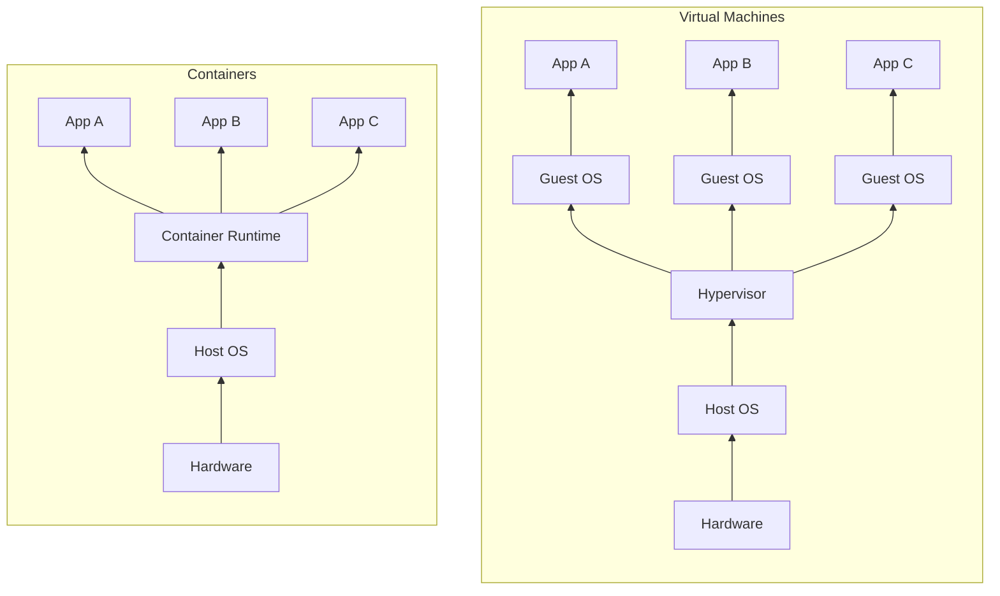
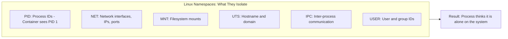
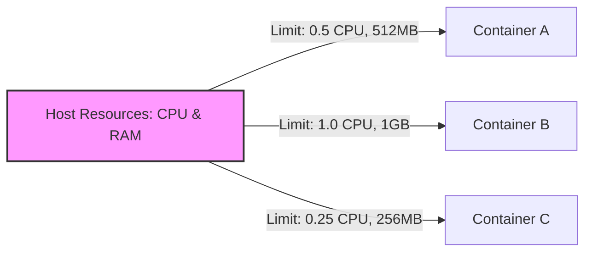
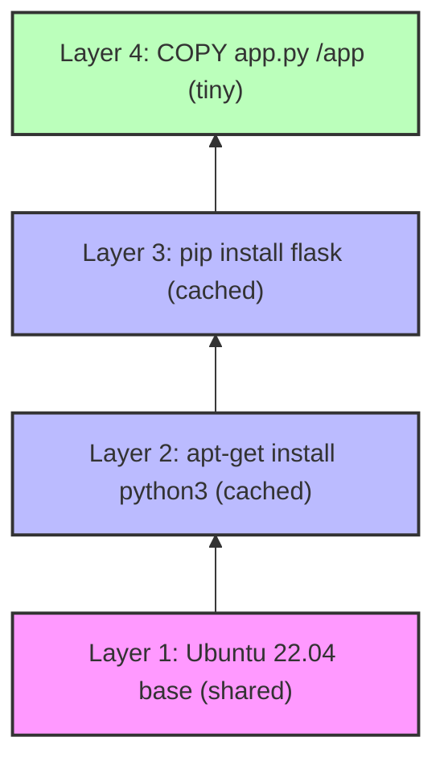
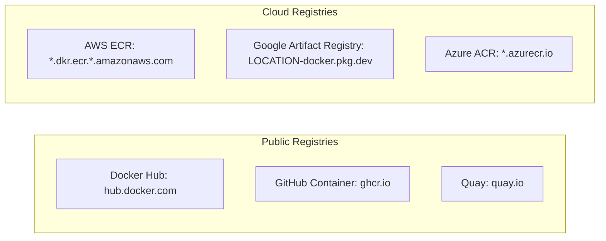

> **Складність**: `[QUICK]` - Базові концепції.
>
> **Час на проходження**: 30-35 хвилин.
>
> **Передумови**: відсутні, окрім термінала для необов'язкової лабораторної роботи з Docker та цікавості щодо того, чому середовища розгортання зазнають дрифту.

---


## Що ви зможете зробити

Після цього модуля ви зможете ухвалювати практичні рішення щодо пакування, ізоляції, відтворюваності та стану, замість того, щоб ставитися до контейнерів як до якогось туманного модного слова.

- **Налагодити** збій через дрифт середовища, відокремивши код застосунку, залежності, конфігурацію та припущення щодо хостової системи.
- **Порівняти** контейнери з віртуальними машинами та обрати безпечнішу модель пакування для заданого робочого навантаження.
- **Діагностувати**, як простори імен, cgroups та шаруваті файлові системи визначають поведінку контейнера під час помилок середовища виконання.
- **Оцінити** імена образів контейнерів, реєстри та теги з огляду на ризики для відтворюваного розгортання.
- **Спроєктувати** простий план персистентності, який дозволить уникнути втрати стану при заміні контейнера.


## Чому це важливо

Гіпотетичний сценарій: невеликий сервіс на Node.js проходить усі тести на ноутбуках розробників і зазнає збою лише після того, як реліз досягає робочого середовища. Застосунку потрібна нативна бібліотека, яка є на робочій станції одного інженера, відсутня на робочому хості та непомітно відрізняється на проміжному середовищі. Час простою вимірюється годинами, роботу з клієнтами доводиться виконувати вручну, а аналіз після інциденту не знаходить жодного рядка з поганою бізнес-логікою. Він звинувачує невидимий розрив між застосунком, який, на думку команди, було розгорнуто, і середовищем, у якому він фактично працював.

Цей збій є причиною того, чому контейнери важливіші ще до того, як стає важливим Kubernetes. Kubernetes — це оркестратор. Це означає, що він планує, перезапускає, з'єднує та масштабує запущені контейнери, але він не робить нечіткий пакет застосунку точним за помахом чарівної палички. Якщо команда не може пояснити, що знаходиться всередині образу контейнера, що запозичено з ядра хоста, що зникає при заміні контейнера і що потрібно зафіксувати для повторюваності, Kubernetes перетворює ці непорозуміння на ще швидші інциденти у робочому середовищі.

Цей модуль формує ментальну модель, яку ви використовуватимете протягом усього курсу cloud native. Ви розглядатимете контейнер як ізольований процес Linux з упакованою файловою системою, а не як крихітну віртуальну машину або постійний сервер. Ця відмінність здається простою, але вона пояснює, чому контейнери запускаються швидко, чому один і той самий образ може працювати на ноутбуці та в кластері, чому важливі ліміти пам'яті, чому теги `latest` викликають сюрпризи та чому сховище потрібно проєктувати свідомо. Подальші приклади Kubernetes розраховані на версію 1.35 або новішу, а блоки команд у цьому навчальному плані використовують повну назву команди `kubectl`, щоб приклади можна було копіювати та вставляти у скрипти та неінтерактивні оболонки.


## Проблема, яку вирішують контейнери: Дрейф середовищ

Будь-який корисний застосунок залежить не лише від свого вихідного коду. Він залежить від середовища виконання, системних бібліотек, шляхів до файлів, змінних середовища, сертифікатів, команд запуску та дрібних деталей операційної системи, про які легко забути, оскільки вони знаходяться поза репозиторієм Git. Коли розробник каже: «на моїй машині все працює», він зазвичай каже правду, але це твердження неповне. Застосунок працює в одному зібраному середовищі, тоді як робоче середовище — це інше зібране середовище з іншою історією.

```text
Developer: "It works on my machine!"
Operations: "But it doesn't work in production."
Developer: "My machine has Python 3.9, the right libraries, correct paths..."
Operations: "Production has Python 3.7, different libraries, different paths..."
Everyone: [Frustrated sigh]
```

Класичною відповіддю була документація. Сумлінна команда писала README, де перераховувався кожен крок встановлення, кожна команда менеджера пакетів, кожна змінна середовища та кожне ручне налаштування, необхідне для підготовки сервера. Це було краще, ніж передача знань з уст в уста, але все одно покладалося на те, що люди бездоганно відтворять мінливі інструкції на машинах, які вже дрейфують. Документація описує середовище; вона його не заморожує.

```text
README.md:
1. Install Python 3.9.7
2. Run `pip install -r requirements.txt`
3. Set environment variables...
4. Configure paths...
(Nobody reads this. When they do, it's outdated.)
```

Віртуальні машини вирішили більшу частину проблеми, упаковуючи разом із застосунком цілу гостьову операційну систему. Це дало командам повторюваний образ сервера, сильну ізоляцію та спосіб зберегти власні налаштування ОС. Компромісом стала вага. Образ віртуальної машини може бути великим, повільно запускатися та дорого обходитися при розмноженні для багатьох невеликих сервісів, особливо коли кожному сервісу потрібен лише процес, середовище виконання та кілька бібліотек, а не ціла незалежна операційна система.

```text
Ship the entire operating system:
- Works consistently
- But 10GB+ per application
- Minutes to start
- Heavy resource usage
- Hard to manage at scale
```

Контейнери стали практичним середнім шляхом. Замість того, щоб поставляти весь комп'ютер цілком, образ контейнера упаковує застосунок і необхідні йому компоненти простору користувача, а потім запускає цей пакет як ізольований процес на спільному ядрі хоста. Хост усе ще надає ядро Linux, доступ до пристроїв та низькорівневе планування, але застосунок бачить власну файлову систему, дерево процесів, мережеве відображення та межі ресурсів. Результат легший за віртуальну машину і точніший за README.

```text
What if we could package:
- The application
- Its dependencies
- Its configuration
- Everything it needs to run

Into a lightweight, portable unit that runs the same everywhere?

That's a container.
```

Практична різниця полягає у власності. Без контейнерів робоче середовище часто володіє середовищем виконання, і команди розробників застосунків змушені підлаштовуватися під нього. З контейнерами пакет застосунку декларує власне середовище виконання, залежності та команду запуску, тоді як платформа надає сумісне ядро та середовище виконання. Ця межа не знімає експлуатаційної відповідальності, але дає обом сторонам чіткіший контракт: образ вказує, що запускати, а платформа вирішує, де і з якими обмеженнями це можна запускати.

Зупиніться та подумайте: якщо сервіс на Python використовує нативну бібліотеку, встановлену на ноутбуці розробника, але відсутню на робочому хості, що має змінитися, коли сервіс буде упаковано як образ контейнера? Правильне очікування полягає не в тому, що хост раптом стане чистішим. Важлива зміна полягає в тому, що тепер сервіс несе необхідну залежність простору користувача всередині образу, тому відсутній пакет на хості більше не є частиною контракту середовища виконання.

Цей контракт особливо корисний для команд, які розгортають багато невеликих сервісів. Платформна команда не може безпечно налаштовувати кожен сервер вручну для кожної версії застосунку, а команда розробників не може по пам'яті налагоджувати кожен робочий хост. Контейнери роблять артефакт застосунку повнішим, що дозволяє автоматизації виконувати повторювану роботу. Планувальник може завантажити образ, запустити процес, застосувати ліміти, перезапустити екземпляр, що зазнав збою, і повторити ту саму дію на сотнях машин без повторної інтерпретації посібника з налаштування.

Іншими словами, контейнери переносять знання про розгортання з людського контрольного списку у машинозчитуваний артефакт. Різниця полягає не лише у зручності. Контрольний список можна пропустити, інтерпретувати по-різному або застосувати до сервера, на якому вже встановлені старі пакети. Образ фіксує файлову систему та метадані запуску, які використовуватиме середовище виконання, тому система розгортання має конкретний об'єкт для отримання, перевірки, кешування та запуску.

Цей машинозчитуваний артефакт також змінює те, як команди розслідують збої. Замість того, щоб з'ясовувати, чи був на проміжному хості такий самий рівень патчів Python, як і в робочому середовищі, команда може запитати, який дайджест образу працював у кожному середовищі. Замість порівняння історій ручного налаштування, вони порівнюють артефакти та налаштування середовища виконання. Це не робить усі збої легкими для вирішення, але усуває цілий клас здогадок у першу годину реагування на інцидент.


## Контейнери проти віртуальних машин

Найкоротше корисне порівняння звучить так: віртуальна машина віртуалізує апаратне забезпечення та запускає власне ядро операційної системи, тоді як контейнер ізолює процеси, які використовують спільне ядро хоста. Ця відмінність пояснює майже кожен експлуатаційний компроміс. Віртуальні машини важчі, але можуть містити інше ядро і забезпечувати ізоляцію на апаратному рівні. Контейнери легші, але передбачають сумісність ядра з хостом. Жоден з варіантів не є універсально кращим; кожен вирішує різну проблему упаковки та ізоляції.



Діаграма показує, чому відрізняються час запуску та щільність. Віртуальна машина завантажує гостьову ОС перед тим, як застосунок зможе запуститися, тому вона несе в собі ініціалізацію ядра, моделі пристроїв, фонові сервіси та більший образ. Середовище виконання контейнерів запускає процес з ізоляцією, яку вже надає ядро хоста, тому запуск може бути схожим на запуск будь-якого іншого процесу Linux. Ця швидкість має значення, коли планувальник замінює екземпляри, що зазнали збою, або додає потужності під час сплеску трафіку.

| Характеристика | Віртуальна машина | Контейнер |
|--------|-----------------|-----------|
| Розмір | Гігабайти | Мегабайти |
| Запуск | Хвилини | Секунди |
| ОС | Повноцінна гостьова ОС на кожну ВМ | Спільне ядро хоста |
| Ізоляція | Апаратна віртуалізація | Ізоляція процесів |
| Переносність | Формати образів ВМ відрізняються | Часто переносні між хостами з тим самим сімейством ядер ОС та архітектурою процесора |
| Щільність | Зазвичай менше ВМ на хост | Часто набагато більше контейнерів на хост, оскільки вони використовують одне ядро |

Таблицю не слід сприймати як табло з рахунком, де перемагає кожне менше число. Апаратна віртуалізація є правильним інструментом, коли робоче навантаження вимагає іншого ядра операційної системи, спеціальних модулів ядра або сильнішої межі ізоляції між орендарями. Застарілий застосунок Windows Server не стає сумісним із Linux лише тому, що його упаковано в контейнер Linux. Якщо йому потрібна поведінка ядра Windows, йому потрібне середовище Windows, зазвичай це віртуальна машина або контейнер Windows на хості Windows.

Контейнери підходять для сучасних сервісів, які можуть спільно використовувати ядро хоста і виграють від швидкої заміни. API без збереження стану, фоновому обробнику, споживачеві черги або вебінтерфейсу зазвичай більше потрібне передбачуване середовище виконання, ніж власна гостьова ОС. Ось чому контейнери стали стандартною одиницею для Kubernetes: кластер може розглядати застосунки як одноразові, повторювані процеси замість довготривалих «домашніх улюбленців», які потрібно виправляти та налаштовувати на місці.

Залишається компроміс у безпеці. Межа віртуальної машини не є невразливою, але це інша межа, ніж межа простору імен контейнера та cgroup. Якщо в ядрі або середовищі виконання з'являється вразливість, що дозволяє вийти за межі контейнера, під загрозою можуть опинитися кілька контейнерів на одному хості. Розумні команди реагують на це комбінуванням засобів контролю: мінімальні образи, користувачі без прав root, файлові системи лише для читання там, де це можливо, профілі середовища виконання, часте встановлення патчів та окремі вузли для робочих навантажень із різними рівнями довіри.

Який підхід ви б обрали тут і чому: 15-річний моноліт вимагає кастомного патчу ядра Linux, тоді як новому Go API потрібні лише пакет CA та конфігураційний файл? Моноліт є кандидатом на віртуальну машину, оскільки залежність від ядра є частиною робочого навантаження. Go API є кандидатом на контейнер, оскільки його залежності комфортно живуть у просторі користувача, і він виграє від швидкої, повторюваної заміни.

Корисний експлуатаційний тест полягає в тому, щоб запитати, де ховаються дивацтва робочого навантаження. Якщо дивацтва полягають у поведінці ядра, доступі до пристроїв або залежності від пропрієтарної операційної системи, віртуальна машина може бути найчеснішим пакетом. Якщо дивацтва знаходяться в бібліотеках простору користувача, середовища виконання мов, файлах і змінних середовища, контейнер зазвичай є чистішим пакетом. Команди потрапляють у халепу, коли обирають контейнери через те, що це модно, а не тому, що вимоги робочого навантаження відповідають межам контейнера.

Вартість також потребує точного визначення. Контейнери можуть покращити щільність, оскільки багато ізольованих процесів використовують спільне ядро, але платформі все ще потрібні процесор, пам'ять, сховище, пропускна здатність мережі, логування, моніторинг і встановлення патчів. Вузол, заповнений контейнерами — це все ще вузол, який може зазнати збою. Щільність контейнерів є цінною лише тоді, коли команда також проєктує ліміти, перевірки працездатності, стратегію розгортання та ізоляцію збоїв навколо цієї щільності.


## Як працюють контейнери: ізоляція, ліміти та шари

Контейнер нагадує невелику машину, оскільки процес усередині нього має відфільтроване бачення системи. Таке враження є корисним, але саме з нього починається багато помилок новачків. Контейнер не завантажує приватне ядро Linux. Це звичайний процес або невелика група процесів, запущених із використанням функцій ядра, які надають йому приватні назви для таких сутностей, як ідентифікатори процесів, мережеві інтерфейси, точки монтування, імена хостів та користувачі.

Простори імен забезпечують це приватне бачення. Простір імен процесів може зробити так, щоб контейнеризований процес виглядав як PID 1 усередині контейнера, хоча хост бачить його як звичайний процес зі звичайним PID хоста. Мережевий простір імен надає контейнеру власні інтерфейси, маршрути та простір портів. Простір імен монтування надає йому вигляд файлової системи, зібраної із шарів образу та монтувань середовища виконання. Застосунок не є єдиним на машині, але йому надається переконливе локальне бачення.



Приклад із мережевим простором імен робить цю ідею конкретною. Три контейнери можуть одночасно запускати вебсервер, що прослуховує порт 8080, оскільки кожен контейнер має свій власний мережевий простір імен. Усередині кожного простору імен порт є доступним. Потім хост або оркестратор вирішує, які порти контейнерів будуть опубліковані, проксійовані або підключені до службової мережі. Якби за замовчуванням кожен процес використовував спільний мережевий простір імен хоста, другий вебсервер конфліктував би з першим.

**Зупиніться та подумайте**: уявіть, що ізоляція простору імен `NET` вийшла з ладу, тоді як інші простори імен продовжили працювати. Три контейнери з вебсерверами намагаються прослуховувати той самий порт, і лише один може успішно прив'язатися до спільного мережевого стека хоста. Цей збій виглядатиме як звичайна помилка «порт уже використовується», але першопричина полягатиме в тому, що платформа втратила мережеву ілюзію, на яку покладаються контейнери.

Ліміти ресурсів походять від контрольних груп, які зазвичай називають cgroups. Простори імен визначають, що процес може бачити. Cgroups визначають, скільки процесора, пам'яті та інших ресурсів може споживати група процесів. Це важливо, оскільки ізоляція без лімітів є лише частковим захистом. Неконтрольований витік пам'яті в одному застосунку не повинен призводити до нестачі ресурсів для бази даних, агента вузла або непов'язаних контейнерів на тому ж хості.



Cgroups також пояснюють, чому запити та ліміти ресурсів Kubernetes — це більше, ніж просто декорація для планування. Ліміт пам'яті стає жорсткою межею, і контейнер, який її перевищує, може бути знищений, замість того, щоб вивести з ладу вузол. Ліміт процесора впливає на планування та тротлінг. Точна механіка відрізняється залежно від середовища виконання та версії cgroup, але експлуатаційний урок залишається незмінним: контейнер за своєю природою не є чемним. Ви повинні надати платформі достатньо інформації, щоб захистити сусідні робочі навантаження.

Третя головна ідея — це шарувата файлова система. Образ контейнера будується із шарів, і кожен шар фіксує зміни файлової системи на певному етапі збирання. Шари можуть кешуватися, поширюватися, завантажуватися один раз і повторно використовуватися багатьма образами. Коли контейнер запускається, середовище виконання надає йому шар, доступний для запису, поверх шарів образу, доступних лише для читання. Цей шар для запису належить екземпляру контейнера, а не шаблону образу.



Шаруватість є причиною того, чому порядок збирання образу впливає на продуктивність. Якщо шар зі встановленням залежностей змінюється рідко, його можна використати повторно, тоді як незначні зміни коду застосунку спричинять перезбирання лише верхнього шару. Якщо Dockerfile копіює все дерево сирцевого коду перед установленням залежностей, зміна одного рядка коду може анулювати ресурсомісткі шари залежностей. Ще до написання файлів Dockerfile у наступному модулі ви повинні усвідомити, що шари — це механізм зберігання, передавання та кешування збірки, а не просто декоративна деталь реалізації.

Сценарій для вправи: служба на Java з витоком пам'яті виглядає стабільною в середовищі тестування (staging), оскільки там мало трафіку та немає ліміту пам'яті. У робочому середовищі (production) цей самий витік збільшується доти, доки хост не почне агресивно вивільняти пам'ять, що призводить до сповільнення роботи непов'язаних служб. Коли цю службу запускають із реальним лімітом пам'яті, вона падає швидше та помітніше, але вузол виживає. І це прогрес: ізольований збій легше діагностувати, ніж перебої в роботі всього хоста, а можливість перезапуску контейнера надає платформі чіткий механізм відновлення після того, як застосунок виявить баг.

Середовище виконання контейнерів — це компонент, який застосовує ці функції ядра та запускає процес. Docker зробив цей робочий процес відомим, але ширша екосистема включає containerd, CRI-O та специфікації OCI, які визначають стандарти та очікування щодо образів і середовищ виконання. Kubernetes взаємодіє із середовищами виконання контейнерів через Container Runtime Interface, і саме тому ви можете вивчити модель контейнера один раз, а потім застосовувати її в різних реалізаціях кластерів. Назви змінюються, але ідеї щодо образу, процесу, простору імен, cgroup та файлової системи залишаються основою.

Саме тому зневадження контейнерів часто починається з перекладу симптому на мову звичайної поведінки Linux. Помилка доступу може бути проблемою ідентифікатора користувача, монтування або файлової системи, доступної лише для читання. Проблема зі з'єднанням може бути пов'язана з простором імен, маршрутом, DNS або публікацією портів. Раптовий перезапуск може бути наслідком завершення процесу через нестачу пам'яті, спричиненого лімітом cgroup. Контейнери додають пакування та ізоляцію, але вони не скасовують базові правила операційної системи.

Перш ніж в історії з'явиться Kubernetes, має значення ще одна деталь: заміна контейнера — це нормальне явище, а не виняток. Очікується, що платформа зупинятиме старі екземпляри та запускатиме нові під час розгортань, масштабування, обслуговування вузлів та відновлення після збоїв. Якщо процес може вижити лише шляхом збереження прихованого стану у своєму шарі для запису, контейнерна модель покарає такий дизайн. Якщо ж процес може відновити себе з образу, конфігурації та довготривалих сервісів, заміна стає рутинною операцією.

## Образи, контейнери, реєстри та теги

Образ контейнера — це шаблон, доступний лише для читання, який містить файлову систему та метадані, необхідні для запуску контейнера. Зазвичай він включає код застосунку, середовище виконання, бібліотеки, сертифікати, значення середовища за замовчуванням та команду. Контейнер — це запущений екземпляр, створений із цього шаблону. Аналогія з програмуванням не є ідеальною, але вона корисна: образ схожий на клас або креслення, тоді як контейнер — це об'єкт або збудована будівля.

```text
Image → Container
(Class → Object)
(Blueprint → Building)
(Recipe → Meal)
```

Ця різниця має значення під час масштабування. Якщо сайту електронної комерції потрібна більша потужність для служби кошика, оркестратор не збирає нові образи для кожного нового екземпляра. Він запускає більше контейнерів з наявного образу. Збирання — це активність ланцюжка постачання, яку зазвичай виконує CI. Запуск — це активність із планування, яку зазвичай виконує середовище виконання або оркестратор. Плутанина між цими етапами призводить до повільних розгортань, неможливості відтворити відкочування та загадкових відмінностей між екземплярами.

Реєстри — це місця, де зберігаються та знаходяться образи. Публічні реєстри, такі як Docker Hub, зручні для базових образів і програмного забезпечення з відкритим кодом. Хмарні реєстри, такі як ECR, Artifact Registry та Azure Container Registry, є поширеними для приватних образів застосунків, розташованих поблизу обчислювальної платформи. GitHub Container Registry та Quay також часто використовуються в робочих процесах із відкритим кодом і корпоративних середовищах. Реєстр — це не середовище виконання; це точка розповсюдження.



Завантаження образу завантажує вказані шари та метадані на машину, яка може запускати контейнери. Ці приклади навмисно прості, оскільки наступний модуль глибше розглядає команди Docker. Важлива ідея полягає в тому, що операція pull обробляє посилання на образ, завантажує відсутній контент і готує середовище виконання до створення контейнерів із цього контенту. Успішне завантаження не означає, що застосунок справний; це лише означає, що артефакт образу було отримано.

```bash
docker pull nginx              # From Docker Hub
```

Google Artifact Registry використовує інше ім'я хоста, ніж Docker Hub. Приватні репозиторії вимагають автентифікації, тому синтаксис завантаження наведено тут як довідку, а не як команду для копіювання в лабораторній роботі:

```text
docker pull us-docker.pkg.dev/my-project/my-repo/my-app:latest
```

Посилання на образи мають певну структуру. Частина з реєстром є необов'язковою, оскільки Docker Hub використовується за замовчуванням у багатьох інструментах. Також може бути присутній простір імен або організація. Репозиторій визначає назву образу, а тег визначає іменовану версію або канал. Небезпека полягає в тому, що теги не гарантовано є незмінними, якщо це не забезпечується політикою вашого реєстру. Тег — це вказівник, а вказівники можуть переміщатися.

```text
[registry/][namespace/]repository[:tag]

Examples:
nginx                           # Docker Hub, library/nginx:latest
nginx:1.31.1                    # Docker Hub, specific version
mycompany/myapp:v1.0.0         # Docker Hub, custom namespace
us-docker.pkg.dev/my-project/my-repo/my-app:latest  # Google Artifact Registry
gcr.io/myproject/myapp:latest  # Legacy Google Container Registry (read-only; migrated to Artifact Registry)
ghcr.io/username/app:sha-abc123 # GitHub Container Registry
```

Розгортання в робочому середовищі мають уникати змінних тегів, таких як `latest`, оскільки вони приховують зміни. Запуск одного і того ж скрипта в понеділок і в четвер може призвести до отримання різного програмного забезпечення, якщо тег був перенаправлений між запусками. Тег версії є кращим вибором, а дайджест образу — ще надійнішим, оскільки дайджест ідентифікує контент, а не зручну для читання мітку. Просуваючись далі, ви побачите маніфести Kubernetes, які ретельно фіксують образи, щоб розгортання можна було перевірити та повторити.

```text
nginx:latest     # Whatever is newest (unpredictable!)
nginx:1.31       # Specific version line (better)
nginx:1.31.1     # Exact patch version (best for production)

Rule: Never use :latest in production
```

Гіпотетичний сценарій: команда запускає `postgres:latest` протягом кількох місяців, оскільки перша демонстрація спрацювала, і ніхто не переглядав посилання на образ. Контейнер чисто запускається після кожного планового перезапуску, поки перезавантаження хоста не стягне новіший мажорний образ із несумісними очікуваннями щодо каталогу даних. База даних відмовляється запускатися, відновлення вимагає зниження версії та обережного поводження з даними, і команда втрачає більшу частину ночі через вибір при розгортанні, який здавався нешкідливим. Фіксування тегів — це не бюрократія; це спосіб змусити час поводитися передбачувано, коли автоматизація повторює розгортання після того, як люди перестали стежити за реєстром.

Перш ніж запускати це у власному середовищі, який вивід ви б очікували, якби завантажили `nginx:1.31.1` двічі поспіль? Друге завантаження має повторно використати шари, які вже є локально, якщо метадані реєстру не змінилися. Це невелике спостереження демонструє головну експлуатаційну перевагу: шаруваті образи роблять повторні розгортання дешевшими, оскільки незмінений контент не потрібно переміщувати знову.

Іменування образів також стає засобом контролю ланцюжка постачання. Шлях у реєстрі може підказати вам, кому належить артефакт, тег може вказати цільовий канал випуску, а дайджест — точний контент. Зрілі команди свідомо використовують усі три елементи. Вони уникають неоднозначних назв образів, обмежують коло осіб, які можуть завантажувати образи в робочі репозиторії, сканують образи перед просуванням і записують посилання на образ, використане в кожному розгортанні, щоб у разі інциденту можна було знайти точний артефакт.

Існує також соціальна перевага. Коли команди розробників і команди платформи сперечаються щодо розгортання, посилання на образ дає їм спільний об'єкт для перевірки. Команда розробників може відтворити артефакт локально, тоді як команда платформи може перевірити події завантаження, налаштування середовища виконання та розміщення на вузлі. Без цього спільного об'єкта розмови повертаються до припущень про те, яка гілка, кеш пакетів або налаштування сервера були задіяні. Контейнери — це не просто технологія, це інструмент координації.


## Аналогія з вантажними контейнерами та ефемерний стан

Слово "container" (контейнер) походить від вантажних контейнерів, оскільки програмна концепція запозичує ту саму історію стандартизації. До появи стандартизованих вантажних контейнерів обробка вантажів була повільною, крихкою та нестандартною. Різні товари потребували різного пакування, порти — спеціалізованої робочої сили, а переміщення вантажів між судном, залізницею та вантажівкою передбачало багаторазову ручну обробку. Стандартні контейнери не зробили вантаж простішим, але вони зробили інтерфейс роботи з ним передбачуваним.

```text
Before Shipping Containers (1950s):
- Each product packed differently
- Manual loading/unloading
- Products damaged in transit
- Ships specialized for cargo types
- Slow, expensive, unreliable

After Shipping Containers:
- Standard size for everything
- Automated loading/unloading
- Protected contents
- Any ship can carry any container
- Fast, cheap, reliable

Software Containers:
- Standard format for any application
- Automated deployment
- Protected from environment differences
- Runs anywhere containers run
- Fast, portable, reliable
```

Ця аналогія є потужною лише тоді, коли ви пам'ятаєте про її обмеження. Вантажний контейнер стандартизує зовнішню форму та обладнання для обробки, а не цінність чи крихкість того, що всередині. Програмний контейнер стандартизує пакування та припущення щодо середовища виконання, а не правильність роботи програми, дизайн схеми чи рівень безпеки. Ви можете доставити зламаний застосунок у бездоганному образі так само легко, як і пошкоджений товар у міцному сталевому ящику.

Найважливішим обмеженням для початківців є збереження даних. Запущений контейнер зазвичай має шар, доступний для запису, але цей шар належить конкретному екземпляру контейнера. Якщо екземпляр видалити та замінити, дані, записані лише на цей шар, зникнуть. Така поведінка не є помилкою; це те, що робить контейнери замінними. Образ залишається чистим, а новий контейнер запускається з того ж самого відомого шаблону.

Зупиніться та подумайте: якщо ви запишете лог-файл або завантажену фотографію профілю всередині запущеного контейнера, а потім видалите контейнер, чи збережуться дані? Найбезпечніша відповідь — ні, якщо ви навмисно не записали їх у зовнішнє сховище або примонтований том. Внутрішня файлова система контейнера — це зручний робочий простір, а не план збереження даних. Багато реальних збоїв починаються з того, що хтось ставиться до неї як до невеликого довговічного диска сервера.

Ось де ментальна модель контейнера стає радше операційною, ніж філософською. Процеси без збереження стану (stateless) легко замінити, оскільки їхній важливий стан зберігається деінде, наприклад, у базі даних, черзі, об'єктному сховищі або примонтованому томі. Системи зі збереженням стану (stateful) можуть працювати в контейнерах, але вони вимагають явного проєктування сховища, стратегії резервного копіювання та ретельного управління життєвим циклом. Kubernetes не змінює цього закону; він надає вам такі примітиви, як томи та StatefulSets, які все одно вимагають правильного проєктування.

Практична інженерна звичка — запитувати "Що має пережити заміну?", перш ніж обирати, куди будуть записані дані. Бінарні файли застосунку, бібліотеки та конфігурація за замовчуванням належать до образу. Тимчасові файли кешу можуть належати до файлової системи контейнера, якщо їх можна зібрати наново. Завантаження користувачів, файли баз даних, черги повідомлень та журнали аудиту потребують зовнішнього збереження. Як тільки ви відсортуєте дані за допустимістю заміни, життєвий цикл контейнера стане набагато менш загадковим.

Проєктування збереження даних — це не те саме, що відмова від контейнерів для stateful-навантажень. Бази даних та черги можуть працювати в контейнерах, якщо їхні правила зберігання, ідентифікації, резервного копіювання та відновлення ретельно спроєктовані. Помилка початківців полягає в запуску stateful-програмного забезпечення так, ніби шар контейнера, доступний для запису, є довговічним диском. Професійний підхід полягає у відокремленні пакета процесу від життєвого циклу даних, а потім у прийнятті рішення про те, які примітиви платформи відповідають за кожну частину.

Цей поділ також допомагає під час локальної розробки. Розробник може знищувати та створювати заново контейнер застосунку багато разів, зберігаючи локальний том бази даних для тестових даних, або ж навмисно видалити том, щоб скинути середовище. Обидва варіанти є правильними, якщо вони є явними. Небезпека полягає не в самій ефемерності; небезпека полягає у випадковій ефемерності, коли важливі дані зникають через те, що ніхто не назвав цю межу.

## Патерни та антипатерни

Хороша практика роботи з контейнерами починається зі ставлення до образів як до незмінних артефактів релізу. Зберіть образ один раз у CI, проскануйте його, чітко позначте тегом і просувайте цей самий артефакт між середовищами. Не збирайте "ту саму версію" окремо для dev, staging та production, оскільки ці збірки можуть захопити різні базові образи або версії залежностей. Просування має переміщати відомий артефакт вперед, а не створювати його заново в надії, що він збігається.

Другий патерн полягає в тому, щоб тримати контейнери сфокусованими на одному головному процесі. Це не означає, що контейнер ніколи не може мати допоміжних процесів, але він повинен мати одну чітку відповідальність, один життєвий цикл і одну модель працездатності. Коли контейнер поводиться як невеликий сервер загального призначення з кількома непов'язаними демонами, поведінка під час перезапуску стає заплутаною. Чистий контейнер має бути легко запускати, зупиняти, спостерігати за ним та замінювати його.

Третій патерн — це явне визначення стану. Якщо дані мають значення, помістіть їх у том, керовану базу даних, об'єктне сховище або іншу довговічну систему з планом відновлення. Якщо дані не мають значення, дозвольте їм зникнути та задокументуйте це очікування. Невизначеність — це ризикована золота середина, оскільки інженери можуть припустити, що файл є довговічним просто тому, що він був видимим під час сеансу оболонки всередині запущеного контейнера.

Типовий антипатерн — це ставлення до контейнерів як до VM. Команди використовують SSH або exec для входу в запущений контейнер, встановлюють пакети вручну, редагують файли конфігурації, а потім дивуються, коли заміна стирає зміни. Ця звичка є зрозумілою, оскільки багато інженерів вчилися працювати на довгоживучих серверах. В операціях з контейнерами кращою реакцією є зміна збірки образу або конфігурації розгортання, а потім розгортання нового екземпляра контейнера.

Іншим антипатерном є довіра до налаштувань за замовчуванням так, ніби вони є політикою для production. Теги за замовчуванням, root-користувачі, необмежені ресурси, широкий доступ до запису у файлову систему та відсутність перевірок працездатності можуть працювати під час демо. У production ці налаштування перетворюються на ризик, оскільки контейнер тепер є частиною більшої системи планування та відновлення після збоїв. Налаштування за замовчуванням — це відправні точки для навчання, а не доказ того, що робоче навантаження готове.

Останній антипатерн — це вдавати, що контейнери усувають необхідність розуміти Linux. Контейнери приховують багато деталей, але режими збоїв все ще походять від процесів, файлових систем, мереж, дозволів та забезпечення дотримання лімітів ресурсів ядром. Коли контейнер не може прив'язати порт, не може записати файл, зупиняється системою через нестачу пам'яті або не може розпізнати ім'я, діагноз часто є діагнозом Linux через призму контейнера.

Патерни також стають важливішими, коли команди переходять від Docker на одному ноутбуці до Kubernetes на багатьох вузлах. Слабка локальна звичка може стати інцидентом у масштабах усього кластера, коли автоматизація швидко її повторює. Змінні теги, відсутність лімітів, root-контейнери та прихований стан, доступний для запису, можуть здаватися нешкідливими в одному ручному тесті. У планувальнику ці вибори множаться під час розгортань, перезапусків та подій масштабування, тому ціна невизначеності різко зростає.

## Коли слід використовувати це замість альтернатив

Використовуйте контейнер, коли робоче навантаження може ділити ядро хоста, запускається з повторюваного пакета простору користувача і виграє від швидкої заміни. Це варіант за замовчуванням для більшості веб-API, воркерів, запланованих завдань, sidecar-контейнерів та середовищ розробки. Чим сильніша потреба в автоматизованому розгортанні та горизонтальному масштабуванні, тим ціннішою стає модель пакування в контейнери.

Використовуйте віртуальну машину (VM), коли робочому навантаженню потрібне інше ядро операційної системи, спеціалізована поведінка ядра або сильніша межа ізоляції, ніж та, що забезпечується ізоляцією процесів. VM також залишаються корисними, коли команді потрібно запускати старе програмне забезпечення з припущеннями на рівні сервера, які було б надто дорого негайно розплутати. VM може бути прагматичним містком, поки застосунок поступово модернізується.

Використовуйте встановлення безпосередньо на хост, коли програмне забезпечення є частиною самого хоста або коли його контейнеризація більше заплутає, ніж допоможе. Низькорівневі агенти, драйвери сховищ, інструменти початкового завантаження вузлів та деякі апаратні інтеграції можуть потребувати прямого доступу до хоста. Навіть тоді команди часто пакують навколишню площину управління в контейнери, залишаючи компонент хоста встановленим за допомогою операційної системи або засобів управління конфігурацією.

Для швидкого прийняття рішення поставте чотири запитання по порядку. Чи потребує робоче навантаження іншого ядра? Якщо так, віддайте перевагу VM. Чи зберігаються його важливі дані після заміни процесу десь явно? Якщо ні, спроєктуйте сховище перед контейнеризацією. Чи потребує воно швидкого повторюваного розгортання в різних середовищах? Якщо так, контейнери добре підходять. Чи вимагає воно прямого контролю над хостом? Якщо так, контейнеризуйте лише ті частини, які можуть витримати цю межу.

Це рішення рідко буває остаточним. Команда може почати з розміщення застарілого застосунку у VM, виділити API без збереження стану в контейнери, а пізніше перепроєктувати сховище так, щоб більше компонентів могло переміститися в Kubernetes. Такий поетапний підхід є здоровішим, ніж примусове просування кожного робочого навантаження через одну і ту ж модель пакування одночасно. Мета полягає не в максимізації кількості контейнерів; мета полягає в тому, щоб зробити припущення кожного робочого навантаження достатньо видимими, щоб операції можна було безпечно автоматизувати.

Коли ви застосовуєте цей фреймворк під час реального огляду проєкту, зверніть увагу на приховані слова, що стосуються життєвого циклу. "Встановити", "виправити", "налаштувати" та "увійти, щоб полагодити" часто описують серверне мислення, тоді як "зібрати", "просунути", "замінити" та "відкотити" описують мислення артефактами. Жоден зі словників не є морально вищим, але їх змішування без усвідомлення створює плутанину. Якщо команда каже, що хоче контейнери, але водночас очікує ручних змін усередині запущених екземплярів, призупиніть проєктування і з'ясуйте, які частини належать до образу, які до конфігурації, а які до постійних служб. Ця розмова обійдеться дешевше перед першим розгортанням, ніж під час інциденту.

Така ж перевірка словникового запасу допомагає під час перевірки навчальних лабораторних робіт. Команда, яка створює одноразовий процес, повинна бути безпечною для повторення, тоді як команда, яка створює довговічні дані, повинна вказувати, де ці дані зберігаються. Початківці швидше набувають впевненості, коли вправа робить цю межу видимою, а не ховає її за успішним виводом.

## Чи знали ви?

- **Контейнери старші за Docker.** Ці ідеї беруть свій початок від Unix chroot, BSD jails та функцій контейнерів Linux, які Docker зробив доступними для повсякденного використання у 2013 році.
- **Alpine Linux крихітний за дизайном.** Мінімальний базовий образ Alpine зазвичай займає лише кілька мегабайтів, тоді як базовий образ загального призначення Ubuntu набагато більший, а повний образ VM може вимірюватися гігабайтами.
- **Образи контейнерів призначені бути незмінними артефактами релізу.** Після того, як образ зібрано та ідентифіковано за дайджестом, зміна поведінки повинна означати збірку нового образу, а не редагування запущеного контейнера вручну.
- **Кита Docker звуть Moby Dock.** Цей талісман працює, оскільки метафора пов'язує програмні контейнери зі стандартизованими вантажними контейнерами, що перевозяться різними транспортними системами.

## Типові помилки

| Помилка | Чому це трапляється | Як це виправити |
|---------|---------------------|-----------------|
| Називання контейнерів "легковаговими VM" | Оболонка контейнера відчувається як невеликий сервер, тому початківці вважають, що всередині є приватне ядро. | Явно навчайте моделі спільного використання ядра та резервуйте VM для робочих навантажень, які потребують окремої операційної системи. |
| Ставлення до запущених контейнерів як до домашніх улюбленців (pets) | Інженери звикли використовувати SSH для входу на сервери, встановлювати пакети та зберігати ручні виправлення. | Перезберіть образ або змініть конфігурацію розгортання, а потім замініть контейнер замість його модифікації. |
| Зберігання довговічних даних усередині файлової системи контейнера | Файли виглядають постійними під час роботи одного екземпляра, що приховує межу заміни. | Змонтуйте том або використовуйте зовнішню довговічну службу для даних, які повинні пережити видалення контейнера. |
| Розгортання `:latest` у production | Цей тег зручний під час демо та локальних експериментів, але він є рухомим вказівником. | Закріпіть тег версії або дайджест та просувайте один і той самий артефакт образу через середовища. |
| Запуск усього від імені root | Багато базових образів за замовчуванням використовують root, оскільки це дозволяє уникнути ранніх труднощів із дозволами. | Створіть користувача не root, де це практично, і надайте лише ті привілеї файлової системи та мережі, які потрібні процесу. |
| Пропуск лімітів ресурсів | Невеликі тести не показують, що відбувається, коли трафік, витоки або пакетні завдання поглинають ресурси вузла. | Встановіть межі пам'яті та процесора, що відповідають робочому навантаженню, а потім спостерігайте за дроселюванням (throttling) та поведінкою завершення під навантаженням. |
| Припущення, що контейнери автоматично безпечні | Межа пакування здається міцною, але вразливі образи, широкі дозволи та старі ядра все ще мають значення. | Оновлюйте базові образи, скануйте залежності, зменшуйте привілеї та підтримуйте середовище виконання хоста в актуальному стані. |


## Контрольні запитання

<details>
<summary>Ваш застосунок на Node.js працює на ноутбуці з macOS, але дає збій на Ubuntu через відсутність нативної бібліотеки C++. Що має змінити контейнеризація, а чого вона не обіцяє?</summary>

Правильний образ контейнера (container image) повинен пакувати застосунок разом із необхідним середовищем виконання у просторі користувача (user-space runtime) та бібліотекою, щоб робочому хосту (production host) більше не потрібно було мати цю точну бібліотеку встановленою глобально. Контейнер не робить ядра macOS і Linux взаємозамінними, і він не скасовує потребу у збірці для цільової архітектури та сімейства операційних систем. Перевага полягає в тому, що контракт середовища виконання стає частиною артефакту образу, а не припущенням під час ручного налаштування сервера. Якщо образ працює в одному сумісному середовищі виконання, той самий образ повинен послідовно поводитися і в іншому сумісному середовищі виконання.
</details>

<details>
<summary>Застарілий бухгалтерський застосунок вимагає API ядра Windows Server, але ваші сервери працюють на Linux. Що слід обрати: стандартний Linux-контейнер чи VM (віртуальну машину)?</summary>

Оберіть VM або інше середовище, яке забезпечує API ядра Windows, необхідні застосунку. Linux-контейнер використовує спільне ядро Linux-хоста, тому він не може задовольнити робоче навантаження (workload), яке фундаментально вимагає ядра Windows. Це є практичною межею між контейнерами та VM: контейнери пакують простір користувача навколо спільного ядра, тоді як VM можуть містити іншу гостьову операційну систему. Контейнеризація застосунку без вирішення вимоги до ядра лише перемістить збій в інший пакет.
</details>

<details>
<summary>Три веб-контейнери прослуховують порт 8080, і всі вони успішно запускаються на одному хості. Яка функція ізоляції пояснює цей результат?</summary>

Мережеві простори імен (network namespaces) пояснюють, чому контейнери можуть використовувати той самий внутрішній порт без конфліктів. Кожен контейнер має власне уявлення про мережеві інтерфейси, маршрути та прив'язки портів (port bindings), тому порт 8080 всередині одного простору імен відрізняється від порту 8080 в іншому. Потім хост або оркестратор може зіставляти, проксіювати або маршрутизувати зовнішній трафік до потрібного контейнера. Якби всі контейнери за замовчуванням ділили спільний мережевий простір імен хоста, успішною була б лише перша прив'язка порту.
</details>

<details>
<summary>Сервіс на Java має витік пам'яті, поки не намагається поглинути ресурси всього вузла. Який механізм контейнера обмежує радіус ураження, і на який збій слід очікувати?</summary>

Cgroups обмежують пам'ять, доступну для групи процесів контейнера, коли налаштовано ліміт пам'яті. Якщо процес перевищує цю межу, середовище виконання або ядро може завершити його, замість того щоб дозволити йому виснажити весь вузол. У Kubernetes це часто виглядає як завершення контейнера через нестачу пам'яті (out-of-memory kill) із подальшою поведінкою перезапуску залежно від політики Pod'а. Це все ще залишається збоєм сервісу, але це локалізований збій сервісу, а не колапс усього вузла.
</details>

<details>
<summary>Під час швидкого розпродажу оркестратор масштабує один сервіс кошика до десяти запущених екземплярів. Чи потрібно йому дев'ять нових образів чи дев'ять нових контейнерів?</summary>

Йому потрібно дев'ять нових контейнерів з існуючого образу, за умови, що образ уже зібрано та він доступний. Образ — це незмінний шаблон, створений конвеєром збірки (build pipeline), тоді як контейнери — це запущені екземпляри, створені з цього шаблону. Саме через такий поділ контейнери є корисними для швидкого масштабування: платформа може створювати більше ідентичних процесів без перезбирання застосунку. Якби кожна подія масштабування вимагала нової збірки образу, швидкість розгортання та повторюваність зазнали б краху.
</details>

<details>
<summary>Платформа для блогів зберігає завантажені фотографії профілів у каталозі `/var/www/uploads` всередині запущеного контейнера, потім контейнер видаляється і створюється наново. Що сталося з фотографіями?</summary>

Фотографії зникли, якщо тільки цей шлях не був підкріплений змонтованим томом (mounted volume) або іншою зовнішньою системою зберігання. Доступний для запису шар (writable layer) контейнера належить конкретному екземпляру контейнера, і видалення екземпляра знищує цей шар. Новостворений контейнер знову запускається з образу, який містить лише те, що було вбудовано в образ. Довготривалі файли користувачів повинні зберігатися за межами тимчасової файлової системи контейнера.
</details>

<details>
<summary>Скрипт розгортання стягує `my-api:latest` у вівторок і працює успішно, потім стягує те саме посилання у четвер і зазнає невдачі через невідповідність схем. Що є найімовірнішою проблемою пакування?</summary>

Тег `latest`, ймовірно, перемістився на інший образ між вівторком і четвергом. Теги — це зрозумілі людині вказівники, і якщо реєстр не примушує до незмінності (immutability), вони можуть бути перенаправлені на новий вміст. Скрипт виглядав повторюваним, оскільки текст був однаковим, але артефакт за текстом змінився. Жорстка прив'язка (pinning) тегу версії або дайджесту (digest) дає розгортанню стабільне посилання, яке можна перевірити та відкотити.
</details>


## Практична вправа: Ілюзія ізоляції

Ця лабораторна робота доводить, що контейнер — це ізольований процес, а не магічна окрема машина. Ви запустите довготривалий контейнер Alpine, оглянете його процеси зсередини, порівняєте їх з тим, що бачить хост, а потім знищите дані, записані лише у файлову систему контейнера. Вправа навмисно невелика, оскільки метою ще не є вільне володіння Docker'ом. Мета полягає в тому, щоб зробити базову ментальну модель наочною.

Вимоги: використовуйте термінал зі встановленим Docker. На нативному Linux-хості порівняння процесів є прямим. У macOS або Windows із Docker Desktop, Docker запускає приховану Linux VM, тому спостереження за процесами хоста відбувається всередині цієї VM, а не у вашій нативній десктопній операційній системі. Ця різниця сама по собі є корисним нагадуванням про те, що контейнерам десь потрібне сумісне ядро.

**Завдання 1: Запустіть довготривалий процес контейнера.** Запустіть простий контейнер Alpine, який виконує команду sleep протягом години. Прапорець `-d` запускає його у фоновому режимі, тому ваш термінал відразу повертає управління, тоді як процес продовжує працювати.

```bash
docker run -d --name isolation-test alpine sleep 3600
```

Переконайтеся, що контейнер працює, перевіривши список контейнерів на наявність імені, яке ви щойно призначили цьому конкретному лабораторному процесу.

```bash
docker ps | grep isolation-test
```

<details>
<summary>Нотатки до рішення для Завдання 1</summary>

Ви повинні побачити запущений контейнер із назвою `isolation-test`. Якщо Docker повідомляє, що ім'я вже використовується, видаліть старий контейнер за допомогою команди очищення наприкінці лабораторної роботи та виконайте завдання знову. На цьому етапі ви не створювали VM вручну; ви попросили середовище виконання контейнерів запустити один ізольований процес з образу Alpine.
</details>

**Завдання 2: Перегляньте процес зсередини контейнера.** Виконайте команду оболонки всередині контейнера, щоб вивести список процесів. Ключовим спостереженням є те, що процес sleep виглядає як PID 1 зсередини простору імен процесів контейнера.

```bash
docker exec isolation-test ps aux
```

<details>
<summary>Нотатки до рішення для Завдання 2</summary>

Список процесів має бути дуже коротким, і `sleep 3600`, найімовірніше, з'явиться як PID 1. Це не означає, що це перший процес на фізичному хості. Це означає, що простір імен PID надає контейнеризованому процесу приватне уявлення про нумерацію, що і є саме концепцією ізоляції з основного уроку.
</details>

**Завдання 3: Зруйнуйте ілюзію з точки зору хоста.** Тепер знайдіть той самий процес sleep на хості. У нативному Linux хост покаже процес з іншим PID, оскільки хост бачить крізь межу простору імен.

```bash
ps aux | grep "sleep 3600"
```

<details>
<summary>Нотатки до рішення для Завдання 3</summary>

У нативному Linux процес повинен існувати на хості зі звичайним PID хоста, а не з PID 1. У Docker Desktop ви можете не побачити його з хоста macOS або Windows, оскільки сумісне ядро Linux знаходиться всередині керованої Docker'ом VM. У будь-якому випадку результат підтверджує той самий урок: контейнерам потрібне середовище процесів Linux, а видима межа машини побудована з функцій ізоляції.
</details>

**Завдання 4: Доведіть ефемерність шляхом втрати тимчасових даних.** Створіть файл всередині запущеного контейнера, переконайтеся в його існуванні, а потім видаліть і створіть наново контейнер з тим самим ім'ям. Ви навмисно робите запис до власної файлової системи контейнера, а не до змонтованого тому.

```bash
docker exec isolation-test sh -c "echo 'Important Data' > /secret.txt"
```

Переконайтеся в його існуванні до видалення контейнера, щоб можна було відокремити успішне створення файлу від подальшої поведінки заміни.

```bash
docker exec isolation-test cat /secret.txt
```

Тепер зупиніть і видаліть контейнер, після чого запустіть новий з абсолютно тим самим ім'ям, щоб межу заміни неможливо було не помітити.

```bash
docker rm -f isolation-test
docker run -d --name isolation-test alpine sleep 3600
```

Спробуйте знову прочитати ваш файл із нового екземпляра, і пов'яжіть очікувану невдачу з доступним для запису шаром контейнера.

```bash
docker exec isolation-test cat /secret.txt
```

<details>
<summary>Нотатки до рішення для Завдання 4</summary>

Останнє читання має завершитися невдало, оскільки новий контейнер запустився з оригінального образу Alpine і не успадкував доступний для запису шар видаленого контейнера. Це та сама причина, з якої завантажені файли користувачів, файли баз даних і встановлені вручну пакети зникають, коли вони існують лише всередині тимчасового екземпляра контейнера. Якщо дані мають значення, їм потрібен том (volume) або зовнішній довготривалий сервіс.
</details>

**Завдання 5: Очищення.** Видаліть лабораторний контейнер після збору доказів, щоб наступний експеримент почався з відомого стану замість того, щоб успадкувати залишкове ім'я.

```bash
docker rm -f isolation-test
```

<details>
<summary>Нотатки до рішення для Завдання 5</summary>

Команду очищення безпечно виконувати, навіть якщо контейнер вже зупинено, оскільки `-f` вказує Docker видалити його примусово. Чисте лабораторне середовище має значення, оскільки повторні експерименти стають заплутаними, коли залишаються старі контейнери, імена або шари файлової системи. Звичка полягає в тому ж самому, що ви будете використовувати пізніше з ресурсами Kubernetes: створювати свідомо, досліджувати свідомо і очищати свідомо.
</details>

### Критерії успіху

- [ ] Ви переконалися, що процес контейнера вважає себе PID 1 через ізоляцію простору імен.
- [ ] Ви знайшли той самий процес з хоста або пояснили, чому Docker Desktop ховає його всередині Linux VM.
- [ ] Ви видалили контейнер і помітили, що дані, записані лише всередині нього, зникли.
- [ ] Ви можете пояснити різницю між образом, контейнером і доступним для запису шаром контейнера.
- [ ] Ви розробили простий план збереження (persistence plan) для даних, який має запобігти втраті стану під час заміни контейнера.


## Джерела

- [Docker Docs: What is a container?](https://docs.docker.com/get-started/docker-concepts/the-basics/what-is-a-container/)
- [Docker Docs: Understanding image layers](https://docs.docker.com/get-started/docker-concepts/building-images/understanding-image-layers/)
- [Docker CLI: docker container run](https://docs.docker.com/reference/cli/docker/container/run/)
- [Docker CLI: docker container exec](https://docs.docker.com/reference/cli/docker/container/exec/)
- [Docker CLI: docker image pull](https://docs.docker.com/reference/cli/docker/image/pull/)
- [Open Container Initiative](https://opencontainers.org/)
- [OCI Image Format Specification](https://github.com/opencontainers/image-spec)
- [OCI Runtime Specification](https://github.com/opencontainers/runtime-spec)
- [Kubernetes Docs: Containers](https://kubernetes.io/docs/concepts/containers/)
- [Kubernetes Docs: Resource management for pods and containers](https://kubernetes.io/docs/concepts/configuration/manage-resources-containers/)
- [Linux man-pages: namespaces](https://man7.org/linux/man-pages/man7/namespaces.7.html)
- [Linux Kernel Docs: Control Group v2](https://docs.kernel.org/admin-guide/cgroup-v2.html)


## Наступний модуль

[Module 1.2: Docker Fundamentals](../module-1.2-docker-fundamentals/) - Далі ви будете збирати та запускати контейнери безпосередньо, щоб поняття образу, контейнера, шару та тегу стали командами, які ви зможете досліджувати.
