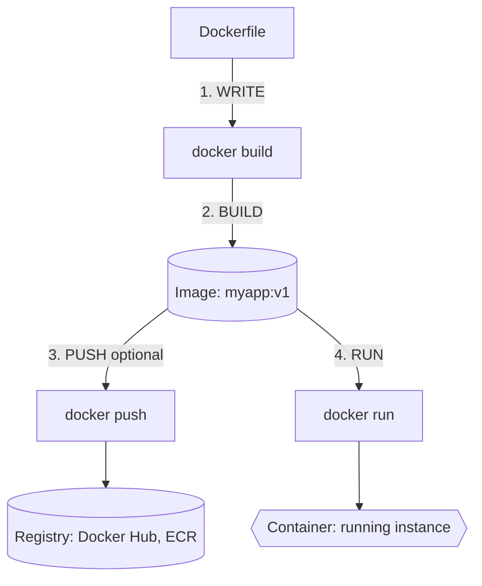
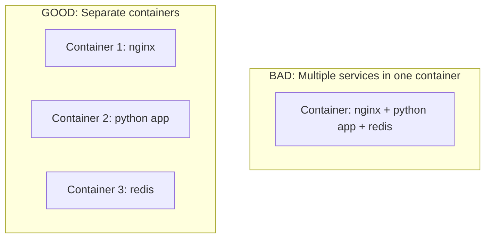

> **Складність**: `[СЕРЕДНЯ]` - Вимагає практичної роботи
>
> **Час на виконання**: 50-60 хвилин
>
> **Передумови**: Модуль 1.1: Що таке контейнери?
>
> **Середовище**: Робоча станція з Docker Engine або Docker Desktop, термінал та дозвіл на запуск локальних контейнерів.

---


## Що ви зможете зробити

Наприкінці цього модуля ви зможете виконати ці завдання в локальному терміналі та пояснити операційну причину кожного кроку:

- **Зібрати** образ Docker з Dockerfile та пояснити, як кожна інструкція впливає на кінцевий артефакт.
- **Запустити** контейнери з мапінгом портів, змінними середовища, визначеними іменами та змонтованими постійними томами.
- **Діагностувати** несправний контейнер за допомогою логів, перевірки процесів, сеансів exec та перевірки конфігурації.
- **Оцінити** порядок шарів образу, вибір базового образу та налаштування користувача під час виконання з огляду на швидкість і безпеку.
- **Порівняти** робочі процеси Docker Compose з ментальною моделлю Kubernetes 1.35+, яку ви використовуватимете далі у цьому треку.


## Чому це важливо

У 2017 році компанія Equifax повідомила про витік, що розкрив конфіденційні дані приблизно 143 мільйонів людей після того, як зловмисники скористалися невиправленим компонентом вебзастосунку. Цей інцидент не стосувався безпосередньо Docker, але це саме той тип операційного збою, який контейнери роблять болісно очевидним: застосунок запускається з надмірними привілеями, постачається з занадто великою поверхнею атаки, приховує свій точний стан залежностей і дає фахівцям з реагування занадто мало впевненості щодо того, що насправді розгорнуто. Коли команди пакують програмне забезпечення в образи, не розуміючи контексту збірки, історії шарів, тегів, користувачів під час виконання та журналів, вони відтворюють ті самі патерни збоїв у новітньому конвеєрі доставки.

Docker став популярним, оскільки надав розробникам портативний спосіб перетворити застосунок та його допущення щодо середовища виконання в єдиний образ. Цей образ може запускатися на ноутбуці, у CI або як вхідні дані для оркестратора, а супровідний інтерфейс командного рядка робить життєвий цикл достатньо простим для практики ще до того, як з'являється Kubernetes. Kubernetes більше не використовує Docker Engine як середовище виконання для своїх вузлів, але робочий процес Docker досі навчає тим самим концепціям образу, процесу, файлової системи, порту та середовища, на яких базується кожна контейнерна платформа.

Цей модуль зосереджений на практичній грамотності роботи з Docker, а не на дрібницях Docker. У цьому модулі вам належить **встановити** або **перевірити** інструментарій, **запустити** контейнери з реалістичними параметрами, **створити** образи з Dockerfiles, **спостерігати** за кешуванням шарів, **використовувати** Compose для локального багатоконтейнерного стеку та **пов'язати** ці звички з Kubernetes 1.35+. Мета полягає не в тому, щоб перетворити вас на спеціаліста з Docker; вона полягає в тому, щоб переконатися, що коли пізніше Pod зазнає збою, ви зможете мислити, відштовхуючись від базових принципів, замість того, щоб завчати команди.

Існує також економічна причина вивчати ці деталі на ранньому етапі. Кожен зайвий мегабайт в образі завантажується runners у CI, ноутбуками розробників, кластерами для staging та виробничими вузлами. Кожен нечіткий тег створює додаткову роботу під час відкочування, оскільки ніхто не може довести, які саме байти виконувалися. Кожен відсутній журнал або приховане допущення щодо середовища подовжує час реагування на інцидент. Основи Docker виглядають як локальні команди, але вони формують шлях доставки задовго до того, як контейнер потрапить у кластер.

Перш ніж торкатися команд Kubernetes у цьому курсі, переконайтеся, що повний клієнт `kubectl` працює на вашій машині. Багато інженерів використовують особисті псевдоніми командної оболонки інтерактивно, але навчальні матеріали та приклади для копіювання мають використовувати повну назву команди, щоб вони залишалися придатними для виконання у скриптах, терміналах та завданнях CI, не покладаючись на локальні налаштування оболонки. Kubernetes 1.35+ зберігає ту саму основну схему усунення несправностей, яку ви практикуватимете з Docker тут: перевіряти заявлену конфігурацію, читати вивід процесів, входити у запущене робоче навантаження лише за потреби та тримати стан середовища виконання окремо від образу, який його створив.

```bash
kubectl version --client
```

## Встановлення Docker

Встановлення Docker виглядає простим зовні, але воно приховує одну важливу архітектурну деталь: Linux може запускати контейнери безпосередньо через примітиви ядра, які використовують контейнери, тоді як macOS та Windows потребують невеликої віртуальної машини Linux, оскільки їхні ядра не надають таких самих інтерфейсів для контейнерів. Docker Desktop пакує цю віртуальну машину, Docker Engine, CLI, допоміжні програми для облікових даних, мережеву інтеграцію та графічний інтерфейс користувача в один продукт. На робочій станції Linux Docker Engine та CLI можна встановити більш безпосередньо, і модель дозволів користувача стає більш видимою, оскільки сокет Docker може керувати контейнерами на хості.

У macOS Docker Desktop є звичайним шляхом, оскільки він надає вам підтримуване середовище Linux, не вимагаючи від вас самостійного керування віртуальною машиною. Команда Homebrew нижче встановлює десктопний застосунок, але вам все одно потрібно запустити його один раз, щоб стартував фоновий рушій. В оригінальному модулі було наведено посилання на сторінку продукту Docker Desktop, і вона залишається правильним джерелом для отримання деталей про ліцензування та платформи: https://docker.com/products/docker-desktop.

```bash
# Install Docker Desktop
# Download from https://docker.com/products/docker-desktop
# Or use Homebrew:
brew install --cask docker
```

В Ubuntu або Debian зручний скрипт корисний для навчальної робочої станції, оскільки він встановлює поточні пакети Docker і налаштовує для вас репозиторій. У виробничому парку зазвичай надається перевага фіксованому джерелу пакетів і інструменту керування конфігурацією, щоб кожна машина була відтворюваною. Зверніть увагу на рядок `usermod`: він додає ваш обліковий запис до групи `docker`, що усуває потребу додавати префікс `sudo` до кожної команди, але це також надає потужний доступ, оскільки будь-хто, хто може звертатися до сокета Docker, може фактично запускати привілейовані робочі навантаження.

```bash
# Official installation
curl -fsSL https://get.docker.com -o get-docker.sh
sudo sh get-docker.sh
sudo usermod -aG docker $USER
# Log out and back in for group changes
```

Перевірка повинна тестувати як клієнт, так і рушій. `docker --version` лише доводить, що бінарний файл CLI існує, тоді як `docker run hello-world` доводить, що CLI може зв'язатися з рушієм, завантажити образ, створити контейнер, запустити процес, приєднатися до його виводу та видалити короткострокове робоче навантаження після його завершення. Якщо ця команда зазнає невдачі, уважно прочитайте помилку, перш ніж будь-що перевстановлювати, оскільки типовими причинами є незапущена віртуальна машина Docker Desktop, проблема з дозволами на сокеті або заблоковане з'єднання з реєстром.

```bash
docker --version
# Docker version 29.x.x, build xxxxx

docker run hello-world
# Should show "Hello from Docker!" message
```

Ментальна модель, якої ви прагнете, — це клієнт-серверна модель. Команда `docker` є клієнтом, який надсилає запити API до демона Docker, а демон координує зберігання образів, налаштування мережі, створення контейнерів і середовища виконання нижчого рівня, такі як containerd і runc. Це означає, що більшість команд не є операціями з локальними файлами, навіть коли вони здаються миттєвими; це запити до рушія, який володіє станом, кешує шари образів і керує процесами від вашого імені.

Саме через цей стан рушія два термінали можуть впливати на одні й ті самі контейнери. Якщо один термінал запускає `my-nginx`, інший термінал може зупинити його, оскільки обидва клієнти спілкуються з тим самим демоном. Це зручно на ноутбуці і небезпечно на спільній машині, де випадкова команда очищення може видалити чужий зупинений контейнер або образ, що виглядає невикористовуваним. Ставтеся до стану Docker як до спільної інфраструктури, навіть коли ця інфраструктура є лише вашою робочою станцією.

```text
+----------------------+        API request        +-----------------------+
| Docker CLI           | -------------------------> | Docker Engine         |
| docker run nginx     |                            | images, networks,     |
| docker build -t app  | <------------------------- | volumes, containers   |
+----------------------+        status/output       +-----------+-----------+
                                                              |
                                                              v
                                                   +-----------------------+
                                                   | containerd + runc     |
                                                   | Linux namespaces,     |
                                                   | cgroups, mounts       |
                                                   +-----------------------+
```

Зупиніться та подумайте: якщо бінарний файл CLI встановлено, але Docker Desktop не запущено, яка команда перевірки все одно спрацює, а яка завершиться невдало? Команда версії може виконатися успішно, оскільки вона читає лише локальні метадані клієнта, тоді як `docker run hello-world` потребує демона. Ця відмінність стане в пригоді пізніше, коли команда CLI Kubernetes працює локально, але не може досягти сервера API кластера.

## Запуск вашого першого контейнера

Образ — це упакована файлова система та шаблон метаданих; контейнер — це запущений екземпляр, створений із цього шаблону. Ця різниця схожа на клас і об'єкт у програмуванні або на рецепт і приготовану страву на кухні. Ви можете зберігати один образ і запускати з нього багато контейнерів, кожен із яких матиме окремий шар для запису, дерево процесів, середовище та мережеву кінцеву точку. Саме тому Docker робить локальні експерименти дешевими: знищення контейнера не призводить до знищення образу, який ви використали для його створення.

Приклад з nginx невеликий, але він містить майже кожну концепцію середовища виконання, яка вам потрібна. Docker завантажує образ `nginx`, якщо він відсутній, створює контейнер, запускає стандартний процес вебсервера, зіставляє порт хоста з портом контейнера, призначає ім'я `my-nginx` і запускає його у відокремленому режимі. Порт хоста — це адреса, на яку ви переходите зі свого ноутбука, тоді як порт контейнера — це порт, на якому застосунок очікує з'єднання всередині мережевого простору імен контейнера.

> **Зупиніться та подумайте**: Коли ви запустите наведену нижче команду, що станеться, якщо порт 8080 на вашій хост-машині вже використовується іншим застосунком? Команда завершиться невдало, оскільки Docker не може здійснити прив'язку до вже зайнятого порту хоста. Вам потрібно буде вибрати інший порт хоста, наприклад `-p 8081:80`, залишаючи при цьому порт на стороні контейнера рівним `80`, оскільки nginx продовжує слухати саме його.

```bash
# Run nginx (a web server)
docker run -d --name my-nginx -p 8080:80 nginx

# What happened:
# - Pulled nginx image from Docker Hub
# - Created a container from the image
# - Started the container in detached mode (-d)
# - Named the container "my-nginx" (--name)
# - Mapped port 8080 (host) to port 80 (container)
```

Після запуску контейнера протестуйте його ззовні контейнера. `curl http://localhost:8080` звертається до порту хоста, Docker пересилає з'єднання через свій мережевий шар, і nginx отримує запит на порт 80 всередині контейнера. Потім `docker ps` показує запущений контейнер і робить трансляцію портів явною, і це перше місце, куди ви повинні подивитися, коли сервіс працює, але недоступний з хоста.

```bash
# Test it
curl http://localhost:8080
# Returns nginx welcome page HTML

# View running containers
docker ps
# CONTAINER ID  IMAGE  COMMAND                 STATUS         PORTS                  NAMES
# a1b2c3d4e5f6  nginx  "/docker-entrypoint.…"  Up 10 seconds  0.0.0.0:8080->80/tcp   my-nginx

# Stop the container
docker stop my-nginx

# Remove the container
docker rm my-nginx
```

Зупинка та видалення — це окремі операції, оскільки Docker зберігає зупинені контейнери, поки ви їх не видалите. Такий дизайн корисний під час зневадження, оскільки зупинений контейнер все ще має метадані, статус завершення, журнали та свій фінальний шар для запису. Це також пояснює, чому ноутбук розробника повільно заповнюється старими контейнерами та образами: Docker зберігає докази доти, доки ви не вирішите, що їх безпечно викинути.

Контейнери навмисно зроблені одноразовими, але не всі дані повинні бути одноразовими. Якщо застосунок записує файли, завантажені користувачами, файли бази даних або згенеровані звіти у файлову систему контейнера, ці дані зберігаються в шарі контейнера для запису та зникають під час видалення контейнера. Томи переносять довговічні дані за межі життєвого циклу контейнера, тоді як змінні середовища вводять конфігурацію під час виконання без її запікання в образ. Зіставлення портів, змінні середовища та томи — це три параметри середовища виконання, які ви постійно використовуватимете як у Docker, так і в Kubernetes.

Імена — це ще одна невелика опція з великою цінністю для зневадження. Docker може ідентифікувати контейнери за згенерованими ідентифікаторами, але осмислене ім'я, як-от `my-nginx` або `db`, полегшує роботу з журналами, очищення та ментальне зіставлення. Компроміс полягає в тому, що імена мають бути унікальними, тому застарілий зупинений контейнер може заблокувати новий запуск, доки ви його не видалите або не перейменуєте. Коли команда завершується помилкою через конфлікт імен, Docker повідомляє вам, що існує старий стан, який варто перевірити перед видаленням.

Основний набір команд життєвого циклу достатньо малий, щоб його запам'ятати, але цінність полягає в розумінні того, коли кожна команда просить Docker створити стан, перевірити стан або знищити стан. `docker run` поєднує пошук образу, створення контейнера та запуск процесу. `docker stop` надсилає сигнал м'якого завершення перед примусовим зупиненням процесу, якщо він не завершується сам. `docker rm` видаляє стан контейнера, тоді як видалення образу обробляється окремо за допомогою `docker rmi`, оскільки багато контейнерів можуть використовувати один і той самий образ.

```bash
# Run a container
docker run [OPTIONS] IMAGE [COMMAND]

# Common options:
docker run -d nginx                    # Detached (background)
docker run -it ubuntu bash             # Interactive terminal
docker run -p 8080:80 nginx           # Port mapping
docker run -v /host/path:/container/path nginx  # Volume mount
docker run --name myapp nginx         # Named container
docker run -e MY_VAR=value nginx      # Environment variable
docker run --rm nginx                 # Remove when stopped

# Container management
docker ps                              # List running containers
docker ps -a                           # List all containers
docker stop CONTAINER                  # Stop gracefully
docker kill CONTAINER                  # Force stop
docker rm CONTAINER                    # Remove stopped container
docker rm -f CONTAINER                 # Force remove (stop + rm)
```

У Kubernetes 1.35+ ті самі концепції з'являються під іншими назвами. Pod — це не контейнер Docker, але він має образи контейнерів, змінні середовища, порти, журнали, поведінку перезапуску та томи. Коли пізніше в цьому курсі використовуватимуться `kubectl logs`, `kubectl exec` та `kubectl describe`, ви маєте розпізнати їх як версії тих звичок перевірки Docker на рівні оркестрації, які ви формуєте зараз.

```yaml
apiVersion: v1
kind: Pod
metadata:
  name: nginx-practice
spec:
  containers:
    - name: nginx
      image: nginx:1.26
      ports:
        - containerPort: 80
```

```bash
kubectl apply -f nginx-pod.yaml
kubectl logs nginx-practice
kubectl exec -it nginx-practice -- sh
```


## Інспектування та діагностика контейнерів

Діагностика контейнера починається з дисципліни: спостерігайте, перш ніж змінювати. Журнали (logs) показують, що головний процес записав у стандартний вивід та стандартний потік помилок. Списки процесів показують, чи досі виконується очікувана команда. Вивід команди inspect показує конфігурацію, яку Docker використав під час створення контейнера. Інтерактивні сесії exec є потужним інструментом, але до них слід переходити після неінвазивних перевірок, оскільки введення команд усередині запущеного контейнера може змінити той самий стан, який ви намагаєтеся зрозуміти.

> **Зупиніться та подумайте**: Коли контейнер працює неправильно, ці три команди є вашим набором інструментів для діагностики в такому порядку: `docker logs` запитує, що сталося, `docker exec -it ... bash` дозволяє зазирнути всередину, а `docker inspect` показує повну конфігурацію. Цей самий патерн застосовується пізніше в Kubernetes: `kubectl logs`, `kubectl exec` та `kubectl describe` надають вам еквівалентні рівні даних для аналізу.

```bash
# View logs
docker logs CONTAINER
docker logs -f CONTAINER               # Follow (tail)
docker logs --tail 100 CONTAINER       # Last 100 lines

# Execute command in running container
docker exec -it CONTAINER bash         # Interactive shell
docker exec CONTAINER ls /app          # Run command

# Inspect container details
docker inspect CONTAINER               # Full JSON details
docker stats                           # Resource usage
docker top CONTAINER                   # Running processes
```

Перша пастка — це припущення, що `docker exec` працює на кожному контейнері, який ви бачите. Вона лише запускає новий процес усередині запущеного контейнера, тому команда завершиться помилкою, якщо контейнер уже припинив роботу. Для посмертного аналізу зазвичай достатньо журналів та `docker inspect`, а `docker cp` може витягти файли із зупиненого контейнера, якщо доступний для запису шар усе ще існує. Це відрізняється від діагностики через SSH, оскільки контейнер — це не маленька віртуальна машина, яка чекає на віддалений вхід; це пісочниця процесу, життєвий цикл якої прив'язаний до її головної команди.

Друга пастка — це припущення, що кожен образ має командну оболонку. Повні образи ОС та slim-версії зазвичай надають `sh` або `bash`, Alpine надає `sh`, а distroless-образи навмисно не містять жодного з них. Це є перевагою для посилення безпеки в продакшені, але обмеженням для діагностики. Коли команда переходить від development-образу зі зручною оболонкою до distroless-образу для виконання, їй потрібні альтернативні звички інспектування, такі як журнали, метрики, health endpoints та debug sidecars у Kubernetes.

Третя пастка — довіряти браузеру на хості більше, ніж доказам із контейнера. Помилка браузера може бути спричинена DNS, конфліктом портів на хості, зворотним проксі-сервером, винятком у застосунку або внутрішнім слухачем, який прив'язаний до неправильної адреси. Діагностика контейнера працює найкраще, коли ви перетворюєте розпливчастий симптом на менші тести: чи запущено процес, чи прив'язався він до очікуваного порту, чи отримав він запит, чи записав виняток у журнал, і чи опублікував Docker той порт, який ви очікували?

Практична послідовність діагностики має звужувати область збою. Якщо `docker ps -a` показує `Exited`, перевірте код завершення та прочитайте журнали. Якщо контейнер має статус `Up`, але застосунок повертає помилки, спершу скористайтеся журналами, потім перевірте змінні середовища, змонтовані файли та внутрішню зв'язність за допомогою сесії exec. Якщо хост не може отримати доступ до сервісу, але процес усередині контейнера є справним, порівняйте порт, який слухає застосунок, із відображенням портів хоста на контейнер, що показує `docker ps`.

Перед запуском цього, який вивід ви очікуєте, якщо вебконтейнер внутрішньо слухає порт 8000, але ви помилково налаштували відображення `-p 8080:80`? Контейнер може залишатися справним, оскільки його власний процес працює, але запити з хоста на порт 8080 будуть переспрямовані на порт 80 контейнера, де нічого не слухає. Такий збій виглядає як проблема з мережею, проте першопричиною є невідповідність між конфігурацією застосунку та параметрами запуску Docker.

Управління образами має таку саму логіку, орієнтовану на докази. Теги — це зрозумілі для людини назви, тоді як дайджест образу — це ідентифікатор, що базується на вмісті. Завантаження `nginx:1.26` є більш відтворюваним, ніж завантаження `nginx:latest`, але навіть змінний тег може бути переміщений видавцем. Продакшен-конвеєри мають зрештою фіксувати дайджести або використовувати admission controls, але на цьому етапі головна звичка полягає в тому, щоб уникати "плаваючих" тегів, коли вам потрібна відтворюваність.

Реєстри доповнюють історію з образами. Ваш ноутбук може зібрати образ, але CI-runner або вузол Kubernetes потребують локації в реєстрі, звідки вони можуть його завантажити. Публічні приклади часто використовують Docker Hub, оскільки він є знайомим, тоді як організації зазвичай використовують приватні реєстри, такі як Amazon ECR, Google Artifact Registry, Azure Container Registry, GitHub Container Registry або внутрішній реєстр. Важливий принцип скрізь залишається незмінним: теги є вказівниками, дайджести ідентифікують вміст, а контроль доступу вирішує, хто може завантажувати або витягувати образи.

```bash
# Pull images
docker pull nginx
docker pull nginx:1.26
docker pull gcr.io/project/image:tag

# Note: Docker images are content-addressable. The SHA256 hash of an image is its true identifier. Tags are just human-readable aliases.

# List images
docker images

# Remove images
docker rmi nginx
docker image prune                     # Remove unused images

# Build images (we'll cover this next)
docker build -t myapp:v1 .
```

Гіпотетичний сценарій: локальний тестовий сервіс починає повертати connection refused після того, як розробник внутрішньо змінив порт застосунку з 8000 на 8080, але команда запуску все ще відображає хост на старий порт контейнера. Виправленням може бути однорядкове коригування порту, проте діагностичний урок є набагато більшим: пошук несправностей у контейнерах просувається найшвидше, коли ви відокремлюєте стан здоров'я процесу, внутрішню адресу прослуховування, відображення портів хоста та URL-адресу клієнта замість того, щоб розглядати кожне відхилене з'єднання як загальну проблему мережі. Такий самий поділ матиме значення пізніше, коли Kubernetes додасть Services, probes та Pod networking до цього шляху.


## Збирання образів контейнерів

Збирання образу означає перетворення каталогу з файлами застосунку та Dockerfile на шаруватий артефакт. Docker не надсилає весь ваш комп'ютер збирачу; він надсилає контекст збирання, яким зазвичай є каталог наприкінці команди `docker build`. Якщо цей контекст включає `.git`, локальні віртуальні середовища, завантажені залежності, знімки екрана або секрети, Docker має просканувати та передати їх, а необережне `COPY . .` може помістити їх в образ. Хороший Dockerfile та хороший `.dockerignore` працюють разом.

Уявіть контекст збирання як запечатаний конверт, який ви передаєте збирачу. Dockerfile може копіювати файли лише з цього конверта, тому відсутній файл спричиняє очевидну помилку збирання, тоді як надто великий конверт призводить до повільного збирання та несподіваних включень. Саме тому `docker build -t app .` зазвичай має виконуватися з кореня проєкту або свідомо вибраного підкаталогу. Крапка в кінці не є прикрасою; вона вибирає межу файлової системи для збирання.

Dockerfile — це декларативний рецепт збирання, де кожна інструкція змінює файлову систему або метадані образу. `FROM` вибирає базовий образ, `WORKDIR` встановлює каталог за замовчуванням для подальших інструкцій, `COPY` переміщує файли з контексту збирання, `RUN` виконує команди під час збирання, а `CMD` описує команду за замовчуванням під час запуску контейнера. Ключовою відмінністю є час збирання порівняно з часом виконання: `RUN` відбувається під час створення образу, тоді як `CMD` виконується, коли з цього образу запускається контейнер.

```dockerfile
# Base image
FROM python:3.12-slim

# Set working directory
WORKDIR /app

# Copy dependency file
COPY requirements.txt .

# Install dependencies (use --no-cache-dir to save space by omitting downloaded wheels)
RUN pip install --no-cache-dir -r requirements.txt

# Copy application code
COPY . .

# Expose port (documentation)
EXPOSE 8000

# Default command
CMD ["python", "app.py"]
```

Команда build дає образу ім'я та тег за допомогою `-t`, а потім вказує Docker на контекст за допомогою `.`. Команда run створює контейнер з образу і відображає порт хоста на порт, який застосунок слухає внутрішньо. `EXPOSE` у Dockerfile — це документація та метадані; вона сама по собі не публікує порт, тому вам усе ще потрібен `-p`, якщо ви хочете отримувати трафік з хоста.

```bash
# Build image
docker build -t myapp:v1 .

# Run container from image
docker run -d -p 8000:8000 myapp:v1
```

| Інструкція | Призначення |
|-------------|---------|
| `FROM` | Базовий образ для збирання |
| `WORKDIR` | Встановлення робочого каталогу |
| `COPY` | Копіювання файлів з хоста в образ |
| `ADD` | Як COPY, але може розпаковувати архіви та отримувати файли за URL |
| `RUN` | Виконання команди під час збирання |
| `ENV` | Встановлення змінної середовища |
| `EXPOSE` | Документування того, який порт використовує застосунок |
| `CMD` | Команда за замовчуванням під час запуску контейнера |
| `ENTRYPOINT` | Команда, яка завжди виконується (CMD стає аргументами) |

Тепер зберемо невеликий Flask-застосунок. Суть не в самому Flask; суть у тому, щоб побачити, як залежності, вихідні файли, змінні середовища та команда під час виконання взаємодіють між собою. Застосунок зчитує `NAME` із середовища, а це означає, що той самий образ може генерувати різні привітання під час виконання без повторного збирання. Це саме той патерн, який вам потрібен для контейнеризованого програмного забезпечення: незмінний образ, змінна конфігурація під час виконання.

Створіть файл застосунку як `app.py`; він навмисно невеликий, щоб механіка контейнера залишалася видимою, а не ховалася під кодом фреймворку.

```python
from flask import Flask
import os

app = Flask(__name__)

@app.route('/')
def hello():
    name = os.getenv('NAME', 'World')
    return f'Hello, {name}!'

if __name__ == '__main__':
    app.run(host='0.0.0.0', port=8000)
```

Запишіть залежність Python у `requirements.txt`, щоб установлення залежностей можна було кешувати окремо від змін у вихідному коді застосунку.

```text
flask==3.0.0
```

> **Зупиніться та подумайте**: Якщо ви запустите `docker build .` у своєму домашньому каталозі без файлу `.dockerignore`, Docker спробує скопіювати все — Документи, Завантаження, Зображення — у контекст збирання, що може призвести до зависання збирання та вичерпання пам'яті. Саме тому контекст збирання має бути частиною проєктування вашого артефакту, а не залишатися напризволяще.

Тепер створіть Dockerfile для образу застосунку, зберігаючи копіювання залежностей перед копіюванням вихідного коду, щоб звичайні зміни коду не викликали перевстановлення Flask.

```dockerfile
FROM python:3.12-slim

WORKDIR /app

# Install dependencies first (better caching)
COPY requirements.txt .
# Use --no-cache-dir to prevent pip from storing downloaded packages, keeping the image small
RUN pip install --no-cache-dir -r requirements.txt

# Copy application code
COPY app.py .

EXPOSE 8000

CMD ["python", "app.py"]
```

Зберіть образ, запустіть його зі змінною середовища та переконайтеся, що той самий образ може давати різну відповідь без повторного збирання.

```bash
# Build
docker build -t hello-flask:v1 .

# Run
docker run -d -p 8000:8000 -e NAME=Docker hello-flask:v1

# Test
curl http://localhost:8000
# Hello, Docker!

# Cleanup
docker rm -f $(docker ps -q --filter ancestor=hello-flask:v1)
```

Додайте файл `.dockerignore`, перш ніж довіряти `COPY . .` у реальному проєкті. Файл використовує патерни для видалення файлів, призначених лише для розробки, з контексту збирання, що прискорює збирання та зменшує ймовірність випадкового вбудовування облікових даних або артефактів, специфічних для хоста. Для контейнера це еквівалент того, щоб спакувати в подорож лише найнеобхідніше замість того, щоб скидати всю квартиру у валізу.

```gitignore
.git
.venv
node_modules
__pycache__
*.log
.env
dist
coverage
```

Кешування шарів — це те, де Docker починає винагороджувати ретельне впорядкування. Кожна інструкція Dockerfile створює або повторно використовує шар, і Docker може пропустити роботу, коли інструкція та файли, від яких вона залежить, не змінилися. Якщо ви копіюєте всі вихідні файли перед установленням залежностей, кожна незначна зміна коду анулює шар установлення залежностей. Якщо ви спершу копіюєте маніфести залежностей, установлюєте залежності, а згодом копіюєте код застосунку, звичайні редагування коду повторно використовують "дорогий" шар залежностей.

> **Зупиніться та подумайте**: Подумайте про це. Якщо ви змінюєте один рядок коду на Python, чи хочете ви, щоб Docker перевстановив усі залежності, що може зайняти 2 хвилини, чи просто скопіював змінений файл, що займає близько 1 секунди? Відповідь цілком залежить від порядку інструкцій у вашому Dockerfile, і приклад поганого й хорошого підходів нижче показує, чому порядок має значення.

```dockerfile
# BAD: Code changes invalidate dependency cache
FROM python:3.12-slim
WORKDIR /app
COPY . .                              # Any change busts cache
RUN pip install -r requirements.txt   # Reinstalls every time!
CMD ["python", "app.py"]

# GOOD: Dependencies cached separately
FROM python:3.12-slim
WORKDIR /app
COPY requirements.txt .               # Only changes when deps change
RUN pip install -r requirements.txt   # Cached unless deps change
COPY . .                              # App changes don't bust pip cache
CMD ["python", "app.py"]
```

Це саме правило шарів пояснює, чому видалення великого файлу в пізнішій інструкції не зменшує образ настільки, наскільки очікують люди. Попередній шар усе ще містить файл; пізніший шар лише приховує його від об'єднаного вигляду файлової системи. Коли вам потрібні тимчасові інструменти збирання, використовуйте одну інструкцію `RUN`, яка завантажує, використовує та видаляє тимчасові файли разом, або використовуйте багатоетапне збирання, щоб фінальний образ середовища виконання копіював лише готовий артефакт.

Історія шарів також пояснює, чому секрети не слід передавати як звичайні аргументи збирання, а потім видаляти. Якщо значення з'являється в шарі збирання, метаданих образу, історії оболонки або скопійованому файлі, подальше очищення може приховати його з фінальної файлової системи, не видаляючи з історії артефакту. Використовуйте BuildKit secret mounts для секретів під час збирання та впровадження секретів під час виконання для розгорнутих застосунків. Найбезпечніший образ — це той, який ніколи від самого початку не містив секрету.

Який підхід ви б обрали тут і чому: одноетапний образ, який включає компілятор для простішої діагностики, чи багатоетапний образ, який копіює лише скомпільований бінарний файл у мінімальну базу для виконання? Для локального навчального проєкту одноетапний образ може бути прийнятним, оскільки доступ до оболонки та інструментів збирання полегшує дослідження. Для продакшену зазвичай виграють багатоетапні збирання, оскільки вони зменшують час завантаження, кількість вразливостей і набір інструментів для зловмисника.


## Docker Compose та локальні багатоконтейнерні робочі процеси

Реальним застосункам зазвичай потрібен більше ніж один процес. Вебсервісу може знадобитися база даних, кеш, фоновий обробник (background worker) та зворотний проксі-сервер (reverse proxy). Docker може запускати кожен контейнер вручну, але командні рядки стають крихкими, оскільки вам доводиться пам'ятати мережі, імена, порти, змінні середовища та томи. Docker Compose надає невелику YAML-модель для локального стека, щоб команда могла запустити однакове середовище розробки однією командою.

> **Зупиніться та подумайте**: Якщо у вас є вебзастосунок і база даних, чому розміщувати їх в одному Dockerfile та контейнері — це погана ідея? Ви б пов'язали їхні життєві цикли, журнали, використання ресурсів, сховище та рішення щодо масштабування. Compose зберігає їх відокремленими локально, тоді як Kubernetes пізніше використовує Pod, Service, Deployment та PersistentVolume для продакшн-версії такого ж розділення.

Для локальної розробки з кількома сервісами наведений нижче файл Compose визначає сервіс `web`, зібраний з поточного каталогу, та сервіс `db`, що використовує образ PostgreSQL. Сервіс `web` звертається до бази даних за ім'ям сервісу `db`, а не через `localhost`, оскільки кожен контейнер має власний інтерфейс loopback. Іменований том `db_data` зберігає файли бази даних поза контейнером бази даних, що дозволяє замінити контейнер без видалення даних.

Розмістіть визначення локального стека у файлі `compose.yaml`, де кожен сервіс володіє однією межею процесу, а Docker Compose забезпечує спільну мережу.
```yaml
# version: '3.8' # Obsolete in modern Compose, left for backward compatibility

services:
  web:
    build: .
    ports:
      - "8000:8000"
    environment:
      - DATABASE_URL=postgres://db:5432/mydb
    depends_on:
      - db

  db:
    image: postgres:16
    environment:
      - POSTGRES_DB=mydb
      - POSTGRES_PASSWORD=secret
    volumes:
      - db_data:/var/lib/postgresql/data

volumes:
  db_data:
```

```bash
# Start all services
docker compose up -d

# View logs
docker compose logs -f

# Stop all services
docker compose down

# Stop and remove volumes
docker compose down -v
```

Compose — це інструмент для локальної розробки, а не оркестратор для продакшену в межах цього курсу. Ця відмінність є важливою, оскільки Compose не замінює планування Kubernetes, керування працездатністю, стратегію розгортання, мережу кластера або контроль політик. Однак він полегшує перехід, оскільки навчає іменам сервісів, постійним томам, роздільним контейнерам та декларативній конфігурації стека ще до того, як вам доведеться вивчати об'єкти кластера.

Compose також виявляє типове непорозуміння щодо мереж. З вашого хоста `localhost` вказує на ваш ноутбук. Зсередини контейнера `localhost` вказує на цей контейнер. Від одного сервісу Compose до іншого ім'я сервісу зазвичай є правильною адресою, оскільки Docker забезпечує DNS у мережі проєкту. Коли фронтенд-контейнер викликає `localhost`, очікуючи бекенд-контейнер, він звертається сам до себе, а не до сусіда.



Діаграма робочого процесу навмисно лінійна, але реальні команди повторюють його багато разів на день. Розробник редагує код, перезбирає образ, запускає його локально, надсилає до реєстру і дозволяє CI або кластеру споживати його. Кожна погана звичка на ранніх етапах ускладнює ситуацію пізніше: надто великий образ уповільнює кожне завантаження (pull), плаваючий тег робить відкочування неоднозначними, а кореневий процес (root process) перетворює помилку в застосунку на більшу безпекову проблему.

## Якість образів, безпека та форма виконання

Вибір базового образу — одне з найперших архітектурних рішень у Dockerfile. Образ із повноцінною ОС здається зручним, бо має знайомі інструменти, але він також приносить пакунки, які вам не потрібні. Образ `slim` видаляє частину зайвого, зберігаючи основну сумісність. Alpine ще менший, але його `musl libc` може здивувати застосунки або залежності, що очікують поведінки `glibc`. Образи Distroless видаляють оболонки та менеджери пакунків, що чудово підходить для посилення безпеки в продакшені, але вимагає більш зрілої спостережуваності та дисципліни збирання.

| Тип базового образу | Приклад | Розмір | Поверхня атаки | Найкраще підходить для |
|-----------------|---------|------|------------------|----------|
| Повноцінна ОС | `ubuntu:24.04` | ~70MB | Велика (містить повний набір утиліт) | Складних застарілих застосунків, що потребують багатьох системних залежностей |
| Slim | `python:3.12-slim` | ~40MB | Середня (урізаний Debian) | Більшості стандартних застосунків, гарний баланс розміру та сумісності |
| Alpine | `python:3.12-alpine` | ~15MB | Мала (використовує musl замість glibc) | Ультрамалих образів, але може викликати проблеми з компіляцією C-розширень |
| Distroless | `gcr.io/distroless/static` | ~2MB | Мінімальна (немає оболонки чи менеджера пакунків) | Продакшн-розгортань компільованих мов (Go, Rust) |

Таблиця наводить приблизні розміри, оскільки теги з часом змінюються, але компроміс залишається стабільним. Менше — не означає автоматично краще, якщо це коштує годин зневадження нативних залежностей, а більше — не означає автоматично неправильно, якщо застосунок дійсно потребує системних бібліотек. Рішення має бути свідомим: обирайте найменшу базу, яка підтримує застосунок, не змушуючи вдаватися до крихких обхідних шляхів, і переглядайте свій вибір у міру розвитку сервісу.

Стратегія встановлення патчів належить до тієї ж розмови, що й вибір базового образу. Сервіс, який збирається з `python:3.12-slim`, успадковує пакети операційної системи з цього базового образу, тому перезбирання після того, як видавець оновить тег, може підтягнути виправлення безпеки. Сервіс, закріплений за дайджестом (digest), є більш відтворюваним, але він не зміниться, доки ви свідомо не оновите дайджест. Зрілі команди поєднують автоматизацію перезбирання, сканування на вразливості та перевірку релізів, а не покладаються виключно на плаваючі теги або постійні закріплення.

> **Зупиніться та подумайте**: Якщо ви використовуєте образ повноцінної ОС, такий як `ubuntu:24.04`, лише для запуску простого Python-застосунку, які два головних недоліки ви отримаєте? Ви зіткнетеся з повільнішим часом завантаження образу через великий розмір файлу, а також відкриєте більшу поверхню атаки, оскільки невикористані пакети все одно можуть містити вразливості.

```dockerfile
# BAD: Full OS, huge image
FROM ubuntu:24.04
RUN apt-get update && apt-get install -y python3 python3-pip
COPY . .
# Note: In Ubuntu 24.04, system-wide pip installs require --break-system-packages
RUN pip3 install --break-system-packages -r requirements.txt

# GOOD: Slim base, smaller image
FROM python:3.12-slim
COPY requirements.txt .
RUN pip install --no-cache-dir -r requirements.txt
COPY . .

# BETTER: Alpine (tiny base)
FROM python:3.12-alpine
# Note: Alpine uses apk, not apt, and musl instead of glibc
```

Запуск від імені користувача `root` усередині контейнера — ще одне стандартне налаштування, яке заслуговує на увагу. Контейнери ізолюють процеси, але `root` усередині контейнера все одно має більше влади, ніж не-`root` процес, особливо в поєднанні з файловими системами, доступними для запису, змонтованими шляхами хоста, додатковими можливостями Linux або вразливістю середовища виконання. Використання не-`root` користувача — не панацея, проте воно зменшує шкоду, якої може завдати зловмисник після експлуатації застосунку.

Власність файлів є практичною частиною образів без прав `root`. Якщо ви перемикаєтеся на `USER appuser` перед копіюванням файлів або створенням каталогів із правом запису, застосунок може завершитися з помилками доступу. У прикладі використовується `COPY --chown=appuser:appuser`, щоб користувач середовища виконання володів файлами застосунку. У більших образах вам слід створювати лише ті каталоги, в які процесу потрібно писати, свідомо призначати власника і залишати решту файлової системи доступною лише для читання там, де ваша платформа це дозволяє.

> **Зупиніться та подумайте**: Що станеться, якщо зловмисник знайде вразливість віддаленого виконання коду (RCE) у вашому застосунку, а ваш контейнер працює від імені `root`? Він негайно отримає `root`-привілеї в межах контейнера, що полегшує модифікацію файлів, перевірку змонтованих секретів, зловживання можливостями або спробу втечі з контейнера через слабкі місця хоста чи середовища виконання.

```dockerfile
# BAD: Running as root
FROM python:3.12-slim
COPY . .
CMD ["python", "app.py"]  # Runs as root!

# GOOD: Non-root user
FROM python:3.12-slim
RUN useradd -m appuser
WORKDIR /app
COPY --chown=appuser:appuser . .
USER appuser
CMD ["python", "app.py"]
```

Один процес на контейнер — це скоріше не про чистоту, а про операційну ясність. Якщо `nginx`, Python-застосунок та Redis працюють в одному контейнері, їхні журнали перемішуються, перезапуски впливають на всі процеси, обмеження ресурсів стають розмитими, а масштабування вебрівня також випадково масштабує базу даних або кеш. Роздільні контейнери дозволяють кожному процесу володіти власним життєвим циклом, тоді як Compose або Kubernetes керують тим, як ці частини спілкуються між собою.

Існують винятки, але вони мають бути усвідомленими. Допоміжний процес, який готує конфігурацію та завершується, може міститися у скрипті entrypoint, тоді як тісно пов'язаний патерн "sidecar" більш природно вписується в Kubernetes, ніж в один Docker-контейнер. Стандартний підхід залишається простим: якщо два процеси мають різні потреби в перезапуску, різні журнали, різні профілі ресурсів або різну поведінку при масштабуванні, ймовірно, вони мають бути в окремих контейнерах.


Використовуйте Docker Compose або Kubernetes для оркестрування цих роздільних контейнерів, оскільки оркестратор повинен керувати зв'язками, тоді як кожен контейнер зберігає одну чітку відповідальність під час виконання.

Найсильніші продакшн-образи є нудними. Вони використовують специфічні теги або дайджести, копіюють лише необхідні файли, детерміновано встановлюють залежності, працюють не від імені `root`, розкривають один головний процес і дозволяють конфігурації середовища виконання надходити через змінні середовища, змонтовані файли або примітиви оркестрації. Такі нудні рішення окупаються під час інцидентів, оскільки фахівці з реагування можуть швидко відповісти на базові запитання: який код виконується, від імені якого користувача він працює, який порт прослуховує і де зберігаються його постійні дані?

## Патерни та антипатерни

Патерни Docker корисні лише тоді, коли вони пов'язані з причиною, що стоїть за правилом. "Використовуйте `.dockerignore`" — це просто гасло, доки ви не побачите, як збирання відправляє величезний контекст або випадково копіює локальний секрет. "Запускайте без прав `root`" — це гасло, доки ви не відстежите, як доступний для запису змонтований шлях змінює радіус ураження скомпрометованого процесу. Наведена нижче таблиця узагальнює рішення, які мають найбільше значення в повсякденній розробці.

| Патерн | Коли використовувати | Чому це працює | Врахування масштабування |
|---------|----------------|--------------|-----------------------|
| Впорядкування Dockerfile із пріоритетом залежностей | Застосунки з маніфестами пакетів, такими як `requirements.txt`, `package-lock.json` або `go.mod` | Ресурсомісткі шари встановлення залишаються в кеші при зміні вихідних файлів | Перезбирання в CI залишаються швидкими в міру зростання сервісу |
| Невеликі сумісні базові образи | Більшість продакшн-сервісів та образів, зібраних у CI | Зменшує час завантаження та присутність невикористаних пакетів без шкоди для підтримки середовища виконання | Стандартизуйте базові родини для кожної мови, щоб спростити встановлення патчів |
| Конфігурація середовища виконання через змінні або монтування | Значення, що різняться залежно від середовища, наприклад імена хостів, feature flags (прапорці функцій) та облікові дані | Зберігає образ незмінним, дозволяючи специфічну для розгортання конфігурацію | Перенесіть секрети до менеджерів секретів або Kubernetes Secrets пізніше |
| Іменовані томи для постійних локальних даних | Бази даних, черги та сервіси розробки зі станом (stateful) | Дані переживають заміну контейнера, не залишаючись усередині образу | Спроєктуйте цю концепцію на PersistentVolume у Kubernetes |

Антипатерни часто виникають через спроби змусити контейнери поводитися як звичні сервери. Розробники додають SSH, запускають кілька демонів, запікають конфігурацію в образ або використовують тег `latest`, бо це здається зручним у даний момент. Кожен такий короткий шлях усуває властивість, яка робила контейнери цінними: відтворюваність, ізоляцію, швидку заміну або чітке володіння станом.

| Антипатерн | Що йде не так | Краща альтернатива |
|--------------|-----------------|--------------------|
| Ставлення до контейнера як до віртуальної машини | Команди встановлюють додаткові сервіси, мутують стан вручну і залежать від унікальних (snowflake) контейнерів | Перезберіть образ та замініть контейнер |
| Сліпе копіювання всього репозиторію | Контексти збирання зростають, локальні артефакти витікають, а інвалідація кешу стає постійною | Використовуйте `.dockerignore` та вибіркові інструкції `COPY` |
| Постачання інструментів збирання в образах для виконання | Образи стають великими й розкривають компілятори або менеджери пакунків для зловмисників | Використовуйте багатоетапне збирання (multi-stage builds) та копіюйте лише артефакти виконання |
| Покладання на тег `latest` у спільних середовищах | Перезбирання стають невідтворюваними, а відкочування — незрозумілими | Використовуйте специфічні теги та записуйте дайджести для релізів |

Практичний тест полягає в тому, чи можна видалити та перестворити ваш контейнер без зайвих церемоній. Якщо під час видалення контейнера втрачаються важливі дані, вам потрібен том або зовнішній сервіс. Якщо перестворення образу вимагає виконання ручних кроків усередині запущеного контейнера, Dockerfile є неповним. Якщо член команди не може виконати ту саму команду й отримати таку ж поведінку, межа конфігурації не є чіткою.

Тому якісне рев'ю контейнера ставить операційні запитання, а не лише запитання щодо синтаксису. Які файли потрапляють до контексту збирання? Який шар змінюється найчастіше? Який користувач запускає процес? Як впроваджується конфігурація? Що станеться, якщо контейнер буде видалено? Куди потрапляють журнали? Ці запитання перетворюють перевірку Docker з особистих уподобань на інженерну дискусію про відтворюваність, відновлення та радіус ураження.


## Структура прийняття рішень

Використовуйте Docker безпосередньо, коли ви тренуєтесь з одним контейнером, ізолюєте параметр середовища виконання або налагоджуєте дрібну помилку. Використовуйте Compose, коли проблема локальної розробки включає кілька сервісів, що взаємодіють. Використовуйте Kubernetes, коли планування, контроль розгортання, виявлення сервісів, політики та стійкість на рівні кластера важливіші за зручність однієї робочої станції. Ці інструменти частково дублюють одне одного, але операційні завдання відрізняються.

| Ситуація | Найкращий вибір | Компроміс |
|-----------|----------|----------|
| Зібрати та протестувати один образ локально | Docker CLI | Швидко та прямолінійно, але вручну для кількох сервісів |
| Запустити вебзастосунок з локальною базою даних | Docker Compose | Декларативний локальний стек, але не планувальник для продакшену |
| Розгорнути репліки за стабільним сервісом | Kubernetes 1.35+ | Потужна модель оркестрації, але більше об'єктів та концепцій |
| Захистити образ для продакшену | Багатоетапний Dockerfile з базою slim або distroless | Менший радіус ураження, але менше можливостей для інтерактивного налагодження |

```text
+----------------------------+
| What are you trying to do? |
+-------------+--------------+
              |
              v
+----------------------------+       yes      +-----------------------+
| One container, local test? | --------------> | Use Docker CLI       |
+-------------+--------------+                +-----------------------+
              |
              no
              v
+----------------------------+       yes      +-----------------------+
| Several local services?    | --------------> | Use Docker Compose   |
+-------------+--------------+                +-----------------------+
              |
              no
              v
+----------------------------+       yes      +-----------------------+
| Production orchestration?  | --------------> | Use Kubernetes 1.35+ |
+-------------+--------------+                +-----------------------+
              |
              no
              v
+----------------------------+
| Reframe the problem first  |
+----------------------------+
```

Коли ви сумніваєтеся, починайте з найменшого інструменту, який відповідає на ваше запитання. Якщо вам потрібно дізнатися, чи запускається образ і чи прослуховує він правильний порт, достатньо Docker CLI. Якщо вам потрібно перевірити, чи застосунок звертається до бази даних за іменем сервісу, достатньо Compose. Якщо вам потрібно дізнатися, чи безпечно розгортаються три репліки за Service, переходьте до Kubernetes, замість того щоб перетворювати Compose на симулятор кластера.

Така звичка приймати рішення запобігає двом типовим марнуванням часу. Перше марнування — це розгортання цілого кластера для налагодження неробочого Dockerfile, тоді як локальний `docker run` миттєво показав би відсутній файл. Інше марнування — спроба симулювати поведінку розгортання в продакшені за допомогою файлу Compose, коли реальне питання стосується readiness probes, Services, Deployments або планування на рівні кластера. Обирайте інструмент, який виявляє той тип збою, що ви насправді досліджуєте.


## Чи знали ви?

- **BuildKit став збирачем за замовчуванням у Docker Engine 23.0.** Він покращив роботу з кешем, паралельне виконання збирання та підтримку секретів збирання порівняно зі старим збирачем.
- **Docker Engine делегує низькорівневе виконання containerd та runc.** Ці проєкти відповідають моделі середовища виконання Open Container Initiative, якої також дотримуються середовища, сумісні з Kubernetes.
- **У версії 1.24 Kubernetes видалив dockershim.** Сучасні вузли Kubernetes використовують CRI-сумісні середовища виконання безпосередньо, але вони все ще запускають образи контейнерів OCI, які може збирати Docker.
- **Тег `latest` — це лише тег.** Він не є автоматично найновішим, найбезпечнішим чи закріпленим, і з часом може вказувати на інший вміст образу.


## Типові помилки

| Помилка | Чому це трапляється | Як це виправити |
|---------|----------------|---------------|
| Використання тегу `latest` | Це здається зручним під час експериментів, але робить збирання та відкати непередбачуваними | Використовуйте конкретні теги, такі як `nginx:1.26`, і фіксуйте дайджести для релізів |
| Запуск від імені root | Багато базових образів за замовчуванням використовують root, а ранні приклади пропускають користувачів для простоти | Додайте користувача без прав root та встановіть `USER` перед `CMD` |
| Ігнорування порядку шарів | Розробники копіюють увесь репозиторій перед встановленням залежностей | Спочатку скопіюйте маніфести залежностей, встановіть їх, а потім копіюйте файли вихідного коду, що змінюються |
| Копіювання всього | Контекст збирання за замовчуванням включає локальне "сміття", якщо його не вилучити | Додайте `.dockerignore` і використовуйте вибіркові шляхи для `COPY` |
| Відсутність очищення | Зупинені контейнери, "завислі" шари (dangling layers) та невикористані томи накопичуються непомітно | Використовуйте `docker ps -a`, `docker image prune` та обережне очищення томів |
| Жорстке кодування секретів | Локальні демонстрації розмивають межу між конфігурацією та вмістом образу | Ін'єктуйте значення під час виконання та використовуйте менеджери секретів у реальних середовищах |
| Використання ADD замість COPY | `ADD` виглядає як більш потужна інструкція копіювання | Використовуйте `COPY` за замовчуванням, якщо вам явно не потрібне розпакування локальних архівів |
| Ігнорування багатоетапних збірок | Команди оптимізують перший робочий образ і забувають про розмір для виконання | Збирайте на одному етапі, а потім копіюйте лише артефакти у кінцевий образ |

### Вправа: Знайдіть помилки

Подивіться на наступний Dockerfile так, ніби ви перевіряєте pull request вашого колеги. Тут є щонайменше три серйозні антипатерни або помилки, і ґрунтовний огляд має пояснити як безпосередній симптом, так і подальший ризик для продакшену. Спробуйте визначити їх до того, як розгорнути відповідь, оскільки це та сама навичка рецензування, яку ви будете використовувати, коли Kubernetes Deployment вказуватиме на образ, який ви не створювали самостійно.

```dockerfile
FROM node:22
COPY . .
RUN npm install
CMD npm start
```

<details>
<summary>Переглянути відповіді</summary>

1. **Відсутність .dockerignore або вибіркового COPY**: Копіювання `.` у `.` перед виконанням `npm install` означає, що локальна папка `node_modules` може бути скопійована, що є занадто великим і залежить від платформи. Також будь-яка зміна коду робить недійсним кеш `npm install`.
2. **Ігнорування кешування шарів**: Слід спочатку зробити `COPY package*.json ./`, потім `RUN npm install`, і *лише після цього* `COPY . .`. Це гарантує, що залежності будуть перевстановлені лише тоді, коли зміниться package.json.
3. **Використання повного базового образу ОС**: `node:22` є великим порівняно з варіантами slim або Alpine. Слід використовувати `node:22-slim` або `node:22-alpine`, якщо дозволяє сумісність, щоб зменшити поверхню атаки та час завантаження (pull time).
4. **Запуск від імені root**: Не вказано `USER`, а це означає, що процес Node запускається від імені користувача root всередині контейнера, що є загрозою безпеці.

</details>


## Контрольні запитання

<details>
<summary>Сценарій: Ви створюєте застосунок Node.js. Щоразу, коли ви змінюєте один рядок CSS, Docker витрачає кілька хвилин на перезбирання образу, оскільки він перевстановлює всі пакети NPM. Як можна переписати Dockerfile, щоб вирішити цю проблему з часом збирання?</summary>

Вам слід відокремити копіювання файлів залежностей від копіювання файлів вихідного коду. Спочатку скопіюйте `package.json` та lock-файл, запустіть встановлення пакетів, а потім скопіюйте решту застосунку. Після цього Docker зможе повторно використовувати шар залежностей, коли змінюватиметься лише CSS або код застосунку. Глибша причина полягає в тому, що ключ кешу для шару залежить від інструкції та її вхідних даних, тому широкі ранні інструкції `COPY` змушують непов'язані правки виглядати важливими для Docker.

</details>

<details>
<summary>Сценарій: У вас локально запущений контейнер із базою даних, але після його перезапуску всі збережені користувачі зникають. Якого параметра docker run вам бракує і як він вирішує проблему?</summary>

Вам бракує монтування тому (volume mount), наприклад `-v db_data:/var/lib/postgresql/data` для даних PostgreSQL. Записуваний шар контейнера прив'язаний до життєвого циклу контейнера, тому видалення контейнера призводить до видалення записаних там даних. Іменований том зберігає файли бази даних поза цим життєвим циклом і може бути приєднаний до нового контейнера. Це відповідає ідеї Kubernetes про те, що стан повинен жити в томі або зовнішньому сервісі, а не всередині змінного екземпляра контейнера.

</details>

<details>
<summary>Сценарій: Ваш контейнер із вебзастосунком успішно запускається, але `localhost:8080` повертає помилку 500 Internal Server Error замість вмісту застосунку. Які дві перші команди Docker вам слід виконати і що саме ви шукаєте?</summary>

Почніть з `docker logs <container>`, оскільки застосунок вже може повідомляти про трасування стека (stack trace), відсутню змінну середовища, невдале підключення до бази даних або попередження під час запуску. Якщо логів недостатньо, використовуйте `docker exec -it <container> bash` або `sh`, щоб оглянути середовище виконання зсередини контейнера. Усередині контейнера перевірте змінні середовища, змонтовані файли, стан процесу і те, чи відповідає застосунок на своєму внутрішньому порту. Така послідовність дозволяє уникнути ворожіння з боку хоста до того, як ви ознайомитеся з доказами, які вже створив процес.

</details>

<details>
<summary>Сценарій: Розробник намагається зменшити розмір образу, завантажуючи великий тимчасовий файл в одній інструкції `RUN` і видаляючи його в наступній. Підсумковий розмір образу не зменшується. Чому?</summary>

Кожна інструкція Dockerfile створює шар, а шари є незмінними (immutable) після створення. Шар завантаження все ще містить великий файл, тоді як пізніший шар видалення лише приховує його від остаточного вигляду об'єднаної файлової системи. Щоб уникнути зберігання файлу, завантажуйте, використовуйте та видаляйте його в тій самій інструкції `RUN`, або перенесіть тимчасову роботу на етап збирання (build stage), який не копіюється в кінцевий образ. Саме тому структура шарів впливає як на швидкість збирання, так і на розмір артефакту.

</details>

<details>
<summary>Сценарій: Ви розгортаєте скомпільований бінарний файл Go, і команда безпеки каже, що образ не повинен містити утиліт оболонки (shell) або менеджера пакетів. Який тип базового образу підходить найкраще і який компроміс він приносить?</summary>

Найкраще підходить базовий образ distroless, оскільки він містить застосунок і необхідні бібліотеки середовища виконання без загальних утиліт оболонки або менеджерів пакетів. Це зменшує набір інструментів для зловмисника, якщо застосунок буде скомпрометовано, і звужує площу поверхні образу. Компроміс полягає в тому, що інтерактивне налагодження стає складнішим, оскільки ви не можете просто виконати exec в контейнер і запустити звичні команди. Командам, які використовують образи distroless, потрібні кращі логи, метрики, перевірки працездатності (health checks), а іноді й debug-контейнери Kubernetes.

</details>

<details>
<summary>Сценарій: Ваш фронтенд у Compose намагається викликати `http://localhost:5000/api`, але бекенд міститься в окремому контейнері, і з'єднання відхиляється. Чому `localhost` є помилковим і що замість нього повинен використовувати фронтенд?</summary>

Усередині контейнера `localhost` означає loopback-інтерфейс того ж самого контейнера, а не хост і не інший сервіс. Тому фронтенд шукає процес бекенда всередині себе. У Compose сервіси спільно використовують внутрішню мережу, де імена сервісів розпізнаються через DNS Docker, тому фронтенд має викликати `http://backend:5000/api`, якщо сервіс має назву `backend`. Ця відмінність стає важливою і в Kubernetes, де Services забезпечують стабільні імена для зв'язку між подами (Pod-to-Pod).

</details>

<details>
<summary>Сценарій: Пакетний (batch) контейнер аварійно завершує роботу через помилку браку пам'яті (Out of Memory) і тепер має статус `Exited`. Ви хочете використати `docker exec`, щоб оглянути тимчасові файли. Що станеться і яким має бути правильний наступний крок?</summary>

`docker exec` завершиться помилкою, оскільки він може запустити новий процес лише всередині запущеного контейнера. Для зупиненого контейнера спочатку використайте `docker logs` та `docker inspect`, щоб зрозуміти причину збою, а потім використайте `docker cp <container>:/path ./local-dir`, якщо вам потрібні файли із записуваного шару. Інший варіант — закомітити зупинений контейнер у тимчасовий образ і запустити з нього новий інтерактивний контейнер, але копіювати файли зазвичай простіше. Головне — зберегти докази, а не одразу видаляти несправний контейнер.

</details>

<details>
<summary>Сценарій: Образ кандидата на реліз (release candidate) працює на ноутбуці одного розробника, але дає збій у CI, оскільки Dockerfile використовує `COPY . .`, а два середовища мають різні локальні файли. Який відгук (review feedback) ви б залишили?</summary>

Dockerfile залежить від неконтрольованого контексту збирання. Додайте файл `.dockerignore`, свідомо копіюйте маніфести залежностей і папки з вихідним кодом та переконайтеся, що згенеровані або локальні для машини файли виключені. Це покращує відтворюваність, оскільки вхідні дані для збирання образу стають явними, а не залежать від того, що випадково опинилося в робочій директорії. Це також зменшує ризик випадкового вбудовування облікових даних, кешів або специфічних для платформи залежностей.

</details>


## Практична вправа

Ця лабораторна робота веде від єдиного статичного веб-контейнера до контейнера бази даних, що завершується з помилкою, і врешті — до оптимізованого образу для зневадження. Тримайте термінал відкритим для команд очищення та читайте логи перед виправленням кожного збою. У критеріях успіху використовуються прапорці, оскільки суть полягає не лише у виконанні команд; мета — довести, що кожен контейнер працює саме так, як ви задумали.

### Рівень 1: Основи (Збирання та запуск)

**Зібрати** та **запустити** власний образ веб-сервера на базі мінімального nginx. Ця вправа перевіряє, чи можете ви поєднати Dockerfile, тег збирання, іменований контейнер та відображення порту хоста (host port mapping), не покладаючись на готовий образ застосунку.

1. Створіть директорію та всередині неї створіть файл `index.html` із текстом "Hello KubeDojo!".
2. Створіть `Dockerfile`, який використовує `nginx:alpine` як базовий образ.
3. Скопіюйте ваш `index.html` до `/usr/share/nginx/html/index.html` всередині образу.
4. Зберіть образ із назвою `dojo-web:v1`.
5. Запустіть контейнер у фоновому режимі (detached mode), відобразивши порт 8080 на вашому хості на порт 80 у контейнері.
6. Перевірте, виконавши `curl http://localhost:8080`.

<details>
<summary>Переглянути рішення</summary>

```bash
mkdir dojo-web && cd dojo-web
echo "Hello KubeDojo!" > index.html

cat <<EOF > Dockerfile
FROM nginx:alpine
COPY index.html /usr/share/nginx/html/index.html
EOF

docker build -t dojo-web:v1 .
docker run -d --name dojo-web-container -p 8080:80 dojo-web:v1

# Checkpoint verification
curl http://localhost:8080
```
</details>

### Рівень 2: Середній (Оточення та логи)

**Діагностувати** контейнер, що завершується з помилкою, використовуючи логи та змінні оточення. PostgreSQL навмисно завершує роботу, якщо відсутнє обов'язкове налаштування пароля, що робить цей випадок чудовою практикою для читання логів перед тим, як щось вгадувати.

1. Виконайте `docker run -d --name db postgres:16`.
2. Перевірте його статус за допомогою `docker ps -a`. Зверніть увагу, що він одразу завершив роботу.
3. З'ясуйте причину помилки за допомогою `docker logs db`. Лог пояснює вимогу щодо відсутнього пароля.
4. Видаліть контейнер, що завершився з помилкою.
5. Запустіть його знову, цього разу передавши обов'язкову змінну оточення `POSTGRES_PASSWORD=secret`.
6. Переконайтеся, що він продовжує працювати.

<details>
<summary>Переглянути рішення</summary>

```bash
docker run -d --name db postgres:16

# Checkpoint: verify it exited
docker ps -a

# View logs to find the error
docker logs db

# Cleanup
docker rm db

# Run with correct environment variable
docker run -d --name db -e POSTGRES_PASSWORD=secret postgres:16

# Checkpoint: verify it stays running
docker ps
```
</details>

### Рівень 3: Просунутий (Оптимізація та Exec)

**Оптимізувати** збирання та **дослідити** запущений контейнер. Цей рівень навмисно зроблено менш відшліфованим за production-образ, оскільки він навчає механіки встановлення пакетів, інтерактивних контейнерів та різниці між оболонкою на передньому плані (foreground) і довготривалим фоновим процесом (background).

1. Напишіть `Dockerfile`, який встановлює `curl` у базовий образ `ubuntu`.
2. Переконайтеся, що ви використовуєте `apt-get update && apt-get install -y curl` в одній інструкції `RUN`. Поясніть, чому це важливо для кешування шарів.
3. Зберіть та запустіть контейнер інтерактивно з `-it` та командою `bash`.
4. Всередині контейнера доведіть, що ви працюєте від імені root, ввівши `whoami`.
5. Введіть `exit`, щоб вийти. Зверніть увагу, що контейнер зупиняється.
6. Запустіть фоновий контейнер і скористайтеся `docker exec`, щоб увійти в нього пізніше.

<details>
<summary>Переглянути рішення</summary>

```bash
cat <<EOF > Dockerfile
FROM ubuntu:24.04
RUN apt-get update && apt-get install -y curl
EOF

docker build -t my-ubuntu-curl .

# Run interactively
docker run -it --name test-curl my-ubuntu-curl bash

# Inside container:
# whoami
# exit

# To run in background and exec later:
docker run -d --name bg-curl my-ubuntu-curl sleep infinity
docker exec -it bg-curl bash
```

Поєднання `apt-get update` та `apt-get install` гарантує, що індекс пакетів ніколи не буде кешуватися незалежно від пакетів, які встановлюються. Якби це були окремі шари, додавання нового пакета до списку встановлення пізніше могло б використати застарілий закешований шар оновлення і призвести до помилок розв'язання залежностей пакетів.

</details>

### Критерії успіху

- [ ] Ви зібрали `dojo-web:v1` з `Dockerfile` та перевірили його за допомогою `curl http://localhost:8080`.
- [ ] Ви пояснили, чому порт хоста 8080 відображається на порт контейнера 80 у прикладі з nginx.
- [ ] Ви використали `docker logs db` для діагностики контейнера PostgreSQL, що завершився помилкою, перш ніж виправити його.
- [ ] Ви перезапустили PostgreSQL з обов'язковою змінною оточення та підтвердили, що він продовжує працювати.
- [ ] Ви зібрали `my-ubuntu-curl` та увійшли в нього за допомогою інтерактивної оболонки.
- [ ] Ви пояснили, чому `apt-get update` та `apt-get install` мають бути в одній інструкції `RUN`.
- [ ] Ви очистили контейнери, які створили під час лабораторної роботи.

## Джерела

- [Огляд Docker](https://docs.docker.com/get-started/docker-overview/)
- [Сторінка продукту Docker Desktop](https://docker.com/products/docker-desktop)
- [Довідник CLI для docker run](https://docs.docker.com/reference/cli/docker/container/run/)
- [Довідник Dockerfile](https://docs.docker.com/reference/dockerfile/)
- [Документація щодо кешу збирання Docker](https://docs.docker.com/build/cache/)
- [Документація щодо контексту збирання Docker](https://docs.docker.com/build/concepts/context/)
- [Документація Docker Compose](https://docs.docker.com/compose/)
- [Документація щодо rootless режиму Docker](https://docs.docker.com/engine/security/rootless/)
- [Специфікація образів Open Container Initiative](https://github.com/opencontainers/image-spec)
- [Специфікація середовища виконання Open Container Initiative](https://github.com/opencontainers/runtime-spec)
- [Документація containerd](https://containerd.io/docs/)
- [Документація середовищ виконання контейнерів Kubernetes](https://kubernetes.io/docs/setup/production-environment/container-runtimes/)

## Наступний модуль

[Модуль 1.3: Що таке Kubernetes?](../module-1.3-what-is-kubernetes/) - Високорівневий огляд оркестрації контейнерів і того, чому існує Kubernetes, коли робочих процесів з одним контейнером стає недостатньо.
