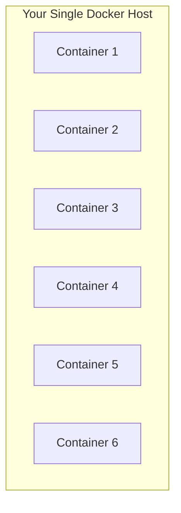
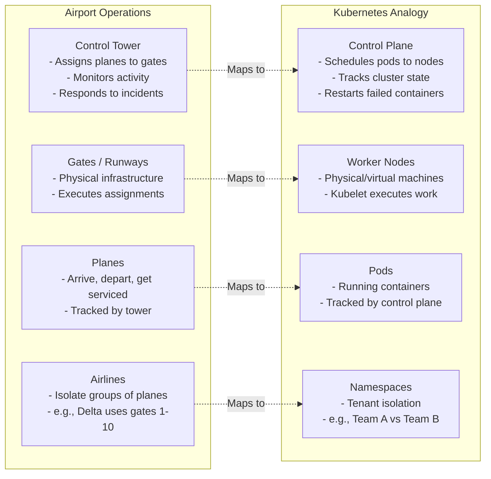
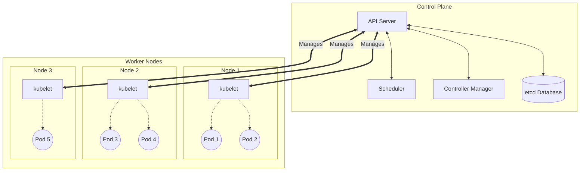
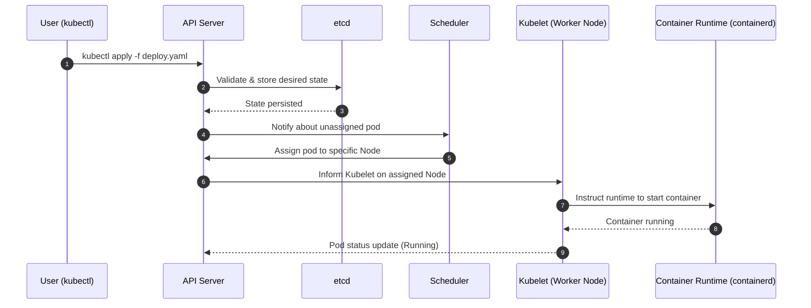

> **Складність**: `[QUICK]` - Оглядова інформація
>
> **Час на проходження**: 30-35 хвилин
>
> **Передумови**: Модуль 1.1 (Контейнери), Модуль 1.2 (Docker). Цей урок передбачає, що ви можете пояснити, чому команди пакують застосунки як контейнери, і розпізнаєте базові команди для роботи з образами чи контейнерами Docker, але він не вимагає попереднього досвіду роботи з Kubernetes.

---

## Що ви зможете зробити

Після цього модуля ви зможете приймати обґрунтовані первинні рішення щодо Kubernetes, а не ставитися до нього як до модного слова чи магічної платформи для розгортання:

- **Оцінити**, чи виправдане використання Kubernetes для певного робочого навантаження, порівнюючи потреби в масштабуванні, вимоги до доступності, операційні витрати та простіші альтернативи розгортання.
- **Діагностувати**, який компонент control plane або worker node залучений, коли планування (scheduling), доступ до API, мережа або відновлення працюють непередбачувано.
- **Передбачити**, як Kubernetes реагує на збої Pod-ів, відмови вузлів, поступові оновлення (rolling updates) та зміну кількості реплік.
- **Проаналізувати** компроміси між керованим (managed) Kubernetes та самокерованим (self-managed) Kubernetes для production-команд, враховуючи ризики control plane, роботу з оновлення та зону відповідальності хмарного провайдера.


## Чому це важливо

Гіпотетичний сценарій: інтернет-магазин входить у сезон святкових розпродажів із процесом розгортання, який досі залежить від кількох потужних серверів та набору ручних сценаріїв з відновлення. Коли трафік зростає швидше, ніж очікувала команда, один перевантажений хост перестає відповідати, кілька контейнерів оформлення замовлень зникають разом із ним, і інженери розпочинають знайому аварійну рутину: підключаються через SSH до машин на заміну, завантажують образи контейнерів, оновлюють конфігурацію проксі, перезапускають процеси та стежать за дашбордами в очікуванні наступного збою. Наслідки для бізнесу можуть стати серйозними, оскільки технічна система не має надійного способу перенести роботу в інше місце, коли машина виходить з ладу.

Цей інцидент не є чимось незвичним, оскільки контейнери вирішують лише один рівень проблеми у продакшені. Контейнер забезпечує додатку стандартизований пакет, але він не вирішує, яка машина має запускати цей пакет, не замінює його після збою, не відкриває доступ до нього через стабільну мережу та не координує поступове оновлення (rolling update), поки клієнти все ще користуються сервісом. Docker зробив практичним створення та запуск ізольованих процесів; Kubernetes існує тому, що продуктовим командам також потрібна система управління, яка може оперувати багатьма такими процесами на багатьох машинах, не перетворюючи кожен збій на нічний ручний ремонт.

Цей модуль є мостом між «я можу запустити контейнер» та «я можу міркувати про контейнерну платформу». Ви не станете адміністратором кластера за один урок, і це не є нашою метою. Мета полягає в тому, щоб побудувати стійку ментальну модель: Kubernetes — це декларативна система оркестрування, яка відстежує різницю між бажаним та фактичним станом, а потім використовує спеціалізовані компоненти, щоб повернути кластер до того стану, про який ви просили.

## Проблема: Контейнери в масштабі

Docker чудово працює на ноутбуці або на одному ретельно керованому сервері, оскільки він надає передбачуваний спосіб пакування та запуску процесів. Слабке місце з’являється тоді, коли питання змінюється з «чи може цей контейнер запуститися?» на «чи може цей сервіс залишатися доступним, поки машини виходять з ладу, трафік змінюється, а інженери випускають оновлення?». Один хост Docker має єдину межу відмови, один пул процесорного часу та пам’яті, і одне місце, де правила мережі та диски доводиться обслуговувати вручну. Якщо цей хост вмирає, контейнери на ньому вмирають разом із хостом, навіть якщо образи додатків зібрані ідеально.



Продуктовому сервісу потрібен ширший контракт, ніж «запустити ці контейнери на цій одній машині». Йому потрібні розміщення, відновлення, виявлення сервісів (service discovery), балансування навантаження, контроль розгортання, управління секретами та спосіб виразити бажану форму системи у вигляді даних. Без оркестратора кожен із цих обов'язків перетворюється на скрипт, сторінку у вікі або вправу для людської пам’яті. Скрипти можуть допомогти, але зазвичай вони реагують на один відомий сценарій; оркестратор безперервно спостерігає за всією системою та узгоджує багато сценаріїв одночасно.

Операції з контейнерами на одній машині зазвичай дають збій передбачуваними способами. Якщо машина виходить з ладу, усі контейнери на ній зникають разом. Якщо попит зростає, єдина негайна відповідь — перейти на більшу машину або вручну додати ще одну. Якщо додаток падає, хтось або щось поза середовищем виконання контейнерів має помітити це і перезапустити його. Якщо потрібно розгорнути нову версію, людина має координувати, які контейнери зупиняються, які запускаються, і як балансувальник навантаження відстежує активні з них.

Kubernetes розглядає ці експлуатаційні потреби як першокласну поведінку платформи. Замість того, щоб сказати «запустити цей контейнер прямо тут», ви зазвичай кажете «підтримувати три репліки цього додатка запущеними десь у здоровому стані, відкрити до них доступ через це стабільне ім’я та перейти до наступного образу без втрати всієї потужності одночасно». Цей зсув є причиною того, чому Kubernetes відчувається інакше, ніж Docker Compose або shell-скрипт: ви описуєте цільовий стан, а платформа бере на себе повторювану роботу з досягнення цього цільового стану.

Продуктові команди зазвичай переходять на оркестрування, тому що їм потрібні кілька можливостей одночасно: запуск контейнерів на кількох машинах, перезапуск робочих навантажень, що дали збій, вибір розміщення на основі доступних ресурсів, балансування трафіку між репліками, поступові оновлення без повного простою, масштабування вгору або вниз залежно від зміни попиту та заміна роботи після збоїв на вузлах. Будь-що з цього можна побудувати з достатньою кількістю самописного коду. Kubernetes став загальноприйнятою відповіддю, оскільки він надає командам спільний API та спільний набір контролерів для всього переліченого.

Спільний API важливіший, ніж здається на перший погляд. Коли кожна команда винаходить власні скрипти розгортання, операційна модель перетворюється на набір приватних мов: один сервіс використовує shell-скрипт, інший — завдання CI зі спеціальними змінними середовища, а третій залежить від того, чи хтось пам’ятає, яку цільову групу балансувальника навантаження потрібно відредагувати. Kubernetes дає цим командам спільний словник ресурсів. Deployment означає управління розгортанням, Service означає стабільний доступ, простір імен (Namespace) означає ізольовану організацію, а події забезпечують спільний діагностичний слід, коли щось виходить з ладу.

Цей спільний словник також дозволяє командам платформи будувати захисні бар'єри (guardrails), не перебираючи на себе контроль над кожним додатком. Вони можуть визначати обмеження ресурсів за замовчуванням, перевірки допуску (admission checks), мережеві правила, політики образів та конвенції зі спостережуваності (observability) навколо ресурсів Kubernetes. Команди розробки додатків продовжують володіти своїм кодом та маніфестами, але платформа може забезпечувати базову безпеку на межі API. Це одна з причин, чому Kubernetes став чимось більшим, ніж просто планувальником (scheduler): це також точка інтеграції та застосування політик для узгодженого управління багатьма сервісами.

> **Зупиніться та подумайте**: У вас є 200 контейнерів, які працюють на 15 серверах. Жорсткий диск одного сервера виходить з ладу о 3-й годині ночі. При ручному налаштуванні хтось отримує сповіщення, підключається через SSH, з'ясовує, що саме працювало на цьому сервері, і вручну розгортає ці контейнери в іншому місці. Завдяки Kubernetes система виявляє збій, точно знає, що саме було запущено, і автоматично перепризначає ці контейнери на здорові сервери, часто ще до того, як ваш черговий інженер встигне відкрити ноутбук.

Цей приклад також демонструє компроміс. Kubernetes — це не магічна стійкість, якою можна просто посипати будь-який додаток; це система управління з власними поглядами, моделями ресурсів та варіантами збоїв. Ви отримуєте потужний механізм узгодження (reconciler), але також погоджуєтеся вивчити його API, моделювати ваші додатки як ресурси Kubernetes і підтримувати або орендувати платформу, яка запускає ці ресурси. Правильне запитання — не «чи є Kubernetes потужним?». Правильне запитання — «чи потребує це робоче навантаження такого операційного контракту, який надає Kubernetes?».

## Що таке Kubernetes?

Kubernetes, який часто скорочують до K8s, є платформою з відкритим вихідним кодом для оркестрування контейнерів. Слово «оркестрування» має значення, оскільки платформа не є просто місцем, де працюють контейнери. Вона координує багато рухомих частин: площина управління (control plane) зберігає бажаний стан, робочі вузли (worker nodes) запускають Pod-и, контролери порівнюють бажаний стан із фактичним, планувальник (scheduler) вибирає підходящі машини, а мережеві ресурси надають нестабільним Pod-ам стабільні способи отримання трафіку.

Найкоротше корисне визначення таке: Kubernetes — це декларативний API плюс набір контролерів, які підтримують контейнеризовані робочі навантаження у стані, максимально наближеному до того, який ви запитали. Ви створюєте ресурси, такі як Pods, Deployments та Services. Сервер API перевіряє та зберігає ці ресурси. Інші компоненти спостерігають за сервером API і діють, коли реальність не збігається з деклараціями. Цей цикл є причиною того, чому Kubernetes може замінити Pod, що впав, без необхідності вводити команду перезапуску.

Аналогія з аеропортом є корисною, оскільки аеропорти відокремлюють прийняття рішень від виконання. Диспетчерська вежа не заправляє літаки особисто і не носить багаж, але вона координує призначення виходів на посадку (гейтів), рух на злітно-посадковій смузі, реагування на інциденти та спільне бачення того, що має відбутися далі. Гейти та наземний персонал виконують фізичну роботу. Kubernetes використовує подібний поділ: площина управління приймає рішення та фіксує їх, тоді як робочі вузли виконують контейнерні навантаження.



Кожна аналогія має межі, але ця допомагає розділити обов'язки. Площина управління — це система координації, а не місце, де виконується більшість бізнес-навантажень. Вузли — це машини, які надають процесорний час, пам'ять, дисковий простір та мережеві ресурси. Pods — це заплановані одиниці роботи додатків. Простори імен (Namespaces) дають командам спосіб групувати ресурси та застосовувати межі, хоча самі по собі вони не є повноцінною межею безпеки.

Коли ви взаємодієте з Kubernetes, ви зазвичай використовуєте `kubectl`, офіційний клієнт командного рядка. Багато інженерів використовують короткі інтерактивні псевдоніми для швидкості набору тексту, але в навчальних матеріалах та автоматизації слід використовувати повну команду, оскільки псевдоніми не завжди надійно розгортаються в неінтерактивних оболонках. Такі команди, як `kubectl get pods` та `kubectl describe pod hello`, звертаються до сервера API, а не безпосередньо до робочого вузла. Ця деталь є важливою для діагностики: якщо сервер API не працює, команди управління завершаться помилкою, навіть якщо наявні контейнери можуть продовжувати працювати на призначених їм вузлах.

```bash
kubectl version
kubectl cluster-info
```

Зупиніться та подумайте: якщо ваш ноутбук не може підключитися до сервера API, але робочі вузли є здоровими, що, на вашу думку, станеться з додатками, які вже працюють? Існуючі Pod-и зазвичай продовжують працювати, оскільки локальний kubelet на вузлі та середовище виконання контейнерів продовжують виконувати свої останні відомі призначення. Нові розгортання, зміни масштабування та нові рішення щодо планування чекатимуть, доки площина управління знову не стане доступною.


## Архітектура Kubernetes (Спрощена)

Спочатку архітектура здається великою, але модель для початківців може залишатися компактною. Кластер Kubernetes має control plane та набір робочих вузлів. Control plane надає доступ до API, зберігає стан, приймає рішення щодо планування та запускає контролери. На робочих вузлах працюють kubelet, середовище виконання контейнерів (container runtime), як-от containerd, мережеві компоненти та Pod-и, що містять ваші контейнери застосунків.



> **Аналогія з рестораном**: Уявіть жваву кухню ресторану. Control plane — це команда менеджерів, яка координує роботу, не готуючи кожну страву самостійно. API Server — це стійка реєстрації, куди надходять усі замовлення, Scheduler — це менеджер залу, який вирішує, яка кухонна станція оброблятиме яке замовлення, etcd — це журнал замовлень, у якому фіксується істина, а Controller Manager — це керівник зміни, який перевіряє, чи працює правильна кількість персоналу.

API Server — це парадні двері до кластера. Кожна операція створення, оновлення, видалення та читання проходить через нього, незалежно від того, звідки надійшов запит: від `k`, CI-конвеєра, контролера чи кастомного оператора. Ця центральна точка входу надає Kubernetes єдине місце для автентифікації користувачів, авторизації запитів, перевірки формату ресурсів та збереження ухвалених змін. Коли API Server недоступний, керувати кластером стає важко, навіть якщо багато робочих навантажень продовжують обслуговувати трафік.

etcd — це надійна база даних для стану кластера. Вона зберігає такі об'єкти, як Pods, Deployments, Services, ConfigMaps та Secrets, разом із метаданими про вузли та прогрес контролерів. Оскільки etcd є джерелом істини, її пошкодження або втрата кворуму є однією з найсерйозніших відмов Kubernetes. Керовані служби Kubernetes витрачають значні інженерні зусилля на захист цього рівня, оскільки доступний API Server без надійного сховища стану не є надійним control plane.

Scheduler стежить за Pod-ами, які існують в API, але ще не мають призначення на вузол. Він враховує такі обмеження, як запитувані CPU та пам'ять, мітки (labels) вузлів, taints, правила спорідненості (affinity) та поточну ємність, після чого записує рішення про прив'язку назад через API Server. Scheduler не запускає контейнери самостійно. Він ухвалює рішення щодо розміщення, а kubelet на вибраному вузлі виконує роботу з локального запуску.

Controller Manager виконує цикли, які порівнюють фактичний стан із бажаним. Контролер Deployment створює або оновлює ReplicaSets, контролер ReplicaSet підтримує задану кількість Pod-ів, а контролер Node стежить за працездатністю вузлів. Цей патерн контролерів є серцем Kubernetes: кожен контролер має вузьку відповідальність за узгодження (reconciliation), і загальний ефект полягає в тому, що система постійно підштовхує реальність до задекларованого стану.

| Компонент | Що він робить |
|-----------|--------------|
| **API Server** | Парадні двері до K8s. Усі команди проходять через нього. |
| **etcd** | База даних, що зберігає весь стан кластера. |
| **Scheduler** | Вирішує, на якому вузлі працюватиме кожен Pod. |
| **Controller Manager** | Гарантує, що бажаний стан відповідає фактичному. |

Робочі вузли — це місце, де фактично виконуються контейнери застосунків. Агент kubelet на кожному вузлі отримує призначення Pod-ів від API Server, просить container runtime запустити або зупинити контейнери, монтує томи, звітує про статус та виконує перевірки працездатності. Container runtime, зазвичай containerd, займається завантаженням образів (image pulls) та життєвим циклом контейнерів. Компонент kube-proxy або еквівалентний компонент рівня даних змушує Services спрямовувати трафік до правильних бекендів Pod-ів.

| Компонент | Що він робить |
|-----------|--------------|
| **kubelet** | Агент на кожному вузлі, керує Pod-ами. |
| **Container Runtime** | Фактично запускає контейнери (containerd). |
| **kube-proxy** | Відповідає за мережу для Services. |

Зупиніться та подумайте: якщо Scheduler не працює, але API Server і робочі вузли справні, які операції продовжуватимуть працювати, а які зупиняться? Існуючі Pod-и продовжують працювати, і ви часто можете прочитати стан кластера через API Server. Нові Pod-и, які потребують розміщення, залишатимуться у стані pending (очікування), оскільки жоден компонент не записує призначення на вузол, яке дозволило б kubelet запустити їх.

Із цієї архітектури випливає практична звичка щодо діагностики. Коли команда не може підключитися, насамперед підозрюйте шлях до API. Коли Pod перебуває в стані pending, перевірте обмеження планування та доступну ємність вузлів. Коли Pod призначено, але він не запускається, перевірте події kubelet, процес завантаження образів, монтування томів і помилки container runtime. Kubernetes здається менш загадковим, коли ви зіставляєте симптом із компонентом, відповідальним за цю фазу робочого процесу.

Існує ще один зручний для початківців спосіб запам'ятати цей поділ: control plane дає обіцянки, а робочі вузли виконують локальні обіцянки. Control plane обіцяє, що прийнятий бажаний стан буде записано, відстежуватиметься і щодо нього вживатимуться заходи. Робочий вузол обіцяє, що призначені Pod-и будуть локально запущені, їхній стан буде чесно переданий, і вони будуть перезапускатися відповідно до їхньої політики на рівні контейнера. Коли ці обіцянки порушуються, рішення залежить від того, на якому боці стався збій. Додавання більшої кількості CPU до робочого вузла не полагодить недоступний API Server, а перезапуск API Server не виправить образ застосунку, який завершує роботу одразу після запуску.

Такий поділ також пояснює, чому production-моніторинг Kubernetes є багаторівневим. Ви моніторите API Server, тому що від нього залежить кожен робочий процес управління. Ви моніторите etcd, оскільки надійність стану та кворум визначають, чи можна довіряти control plane. Ви моніторите діяльність Scheduler та контролерів, тому що незавершені завдання та затримка узгодження розкривають перевантаження платформи. Ви моніторите kubelet, container runtime та ресурси вузлів, оскільки надійність застосунків зрештою залежить від машин із достатніми ресурсами CPU, пам'яті, диска та мережі.


## Попередній огляд ключових концепцій

У Kubernetes є багато типів ресурсів, але трьох достатньо, щоб зрозуміти перший рівень розгортання застосунків: Pods, Deployments та Services. Pod — це найменша одиниця, яку можна планувати, Deployment керує реплікованими Pod-ами та поведінкою розгортання оновлень (rollout), а Service надає цим Pod-ам стабільну мережеву ідентичність. Ключова ідея полягає в тому, що кожен ресурс вирішує окрему частину production-проблеми, замість того, щоб змушувати один об'єкт робити все.

Pod-и часто описують як "один контейнер", але точнішим визначенням є "один або більше тісно пов'язаних контейнерів, які спільно використовують планування, мережу та певний контекст сховища". Більшість прикладів для початківців використовують один контейнер на Pod, оскільки це найпоширеніший патерн застосунків. Kubernetes планує Pod-и, а не поодинокі контейнери, оскільки саме Pod є одиницею, яка отримує IP-адресу, працює на одному вузлі та представляє одну частку потужності застосунку.

```yaml
# You don't run containers directly—you create Pods
apiVersion: v1
kind: Pod
metadata:
  name: nginx
spec:
  containers:
  - name: nginx
    image: nginx:1.27
```

"Голий" (bare) Pod корисний для навчання, але це рідко та production-абстракція, яка вам потрібна. Якщо хтось видалить окремий Pod, може не виявитися об'єкта вищого рівня, який відповідав би за його заміну. Саме тому застосунки зазвичай декларуються через Deployment. Deployment визначає, скільки реплік має існувати та як оновлення повинні переходити від однієї версії до іншої, тоді як контролери нижчого рівня створюють і підтримують відповідні Pod-и.

```yaml
# "I want 3 nginx pods, always"
apiVersion: apps/v1
kind: Deployment
metadata:
  name: nginx
spec:
  replicas: 3
  selector:
    matchLabels:
      app: nginx
  template:
    metadata:
      labels:
        app: nginx
    spec:
      containers:
      - name: nginx
        image: nginx:1.27
```

Цей приклад Deployment невеликий, але він містить важливу обіцянку. Якщо бажана кількість реплік дорівнює трьом, і один Pod зникає, контролер створює ще один Pod. Якщо ви оновлюєте шаблон новим образом, контролер Deployment координує розгортання оновлень (rollout), а не просить вас зупинити всі старі Pod-и та вручну запустити всі нові. Це управління бажаним станом, застосоване до операцій із застосунками.

Services вирішують іншу проблему: Pod-и навмисне створені замінними, тому їхні IP-адреси не є стабільними контрактами для користувачів або інших сервісів. Service вибирає Pod-и за мітками і надає стабільний віртуальний IP та DNS-ім'я, які спрямовують трафік до поточних працездатних бекендів. Саме так фронтенд може звертатися до бекенду навіть тоді, коли бекенд-Pod-и замінюються під час оновлення (rollout) або після збою вузла.

```yaml
# "Make my nginx pods accessible on port 80"
apiVersion: v1
kind: Service
metadata:
  name: nginx
spec:
  selector:
    app: nginx
  ports:
  - port: 80
    targetPort: 80
```

Зупиніться та подумайте: якщо Deployment підтримує роботу трьох Pod-ів, але ці Pod-и часто знищуються та створюються наново з новими IP-адресами, як користувачі зможуть надійно отримувати доступ до застосунку? Вони не повинні підключатися безпосередньо до IP-адрес Pod-ів. Service надає клієнтам стабільне ім'я та адресу, тоді як Kubernetes оновлює список активних кінцевих точок Pod-ів за цим ім'ям.

Зв'язок між цими ресурсами легше розглядати як стек. Користувачі та інші сервіси взаємодіють із Service. Service знаходить Pod-и за допомогою міток. Deployment володіє шаблоном, який створює ці Pod-и, а також бажаною кількістю реплік, що забезпечує їхню наявність. Control plane зберігає все це як стан ресурсів, а контролери продовжують оновлювати кластер при зміні одного з рівнів.

```text
+-----------------------------+
| Service: stable entry point |
+-------------+---------------+
              |
              v
+-----------------------------+
| Pods: replaceable capacity  |
+-------------+---------------+
              ^
              |
+-----------------------------+
| Deployment: desired replicas|
+-----------------------------+
```

Перша пастка для початківців — сприймати об'єкти Kubernetes як ізольовані команди. Краща ментальна модель — запитати, який контракт створює кожен об'єкт. Pod створює виконання. Deployment створює безперервність та контроль розгортання (rollout). Service створює стабільний доступ. Коли ви можете назвати контракт, ви можете вибрати правильний об'єкт і діагностувати, який контракт порушено.

Мітки (labels) та селектори (selectors) — це непомітний "клей" за цими контрактами. Service зазвичай не вказує на фіксований список імен Pod-ів; він вибирає Pod-и, чиї мітки відповідають його селектору. Шаблон Deployment надає Pod-ам мітки, щоб інші ресурси могли їх знайти. Це означає, що друкарська помилка в мітці може завдати такої ж шкоди, як і зламаний образ контейнера, оскільки Pod-и можуть бути працездатними, але Service не матиме відповідних кінцевих точок. Коли трафік зникає після оновлення, завжди перевіряйте зв'язок між мітками, селекторами та готовністю (readiness) перш ніж припускати, що в мережі завелися привиди.

Готовність (readiness) — ще одна концепція, з якою варто попередньо ознайомитися зараз, оскільки вона захищає користувачів під час змін. Pod може працювати з точки зору container runtime, тоді як застосунок всередині нього ще не готовий приймати трафік. Kubernetes дозволяє застосункам надавати перевірки готовності (readiness checks), тому Services спрямовують трафік лише на ті Pod-и, які готові його обслуговувати. Саме так поступове оновлення (rolling update) уникає відправлення клієнтів до процесу, який запустився, але ще не завантажив конфігурацію, не наповнив кеші або ще не відкрив свій сокет для прослуховування.


## Бажаний стан, відновлення та потік запитів

Kubernetes працює завдяки тому, що більшість важливих дій проходять через спільний API, а потім через цикли узгодження (reconciliation loops). Коли ви застосовуєте маніфест, ви не вказуєте одному робочому вузлу (worker node) негайно запустити контейнер. Ви надсилаєте бажаний стан до API-сервера, який перевіряє його, зберігає та дозволяє контролерам і агентам вузлів досягти цього стану. Саме цей додатковий рівень абстракції дозволяє Kubernetes відновлюватися після часткових збоїв.



Діаграма послідовності відображає ключову експлуатаційну істину: кожен компонент має чітко визначену роль. Користувач надсилає запит. API-сервер перевіряє та зберігає його. Scheduler (планувальник) обирає місце розміщення. Kubelet перетворює це призначення на локальну роботу з контейнером. Container runtime запускає контейнер. Kubelet звітує про статус, який стає видимим через той самий API. Якщо ви діагностуєте проблему, ви можете пройти цим шляхом і з'ясувати, на якому етапі очікуваної передачі сталася зупинка.

Бажаний стан також пояснює здатність до самовідновлення (self-healing). Припустімо, молодший інженер видаляє єдиний робочий Pod платіжного сервісу, але цей сервіс керується ресурсом Deployment з однією бажаною реплікою. API фіксує, що Pod зник. Контролер ReplicaSet виявляє, що фактична кількість реплік менша за бажану. Він створює Pod на заміну, scheduler розміщує його, а kubelet запускає. Жодній людині не довелося згадувати початкову команду, оскільки бажаний стан усе ще існував.

Збій вузла відбувається за тим самим патерном, але з більшою затримкою та обережністю. Якщо робочий вузол втрачає живлення, kubelet на цьому вузлі припиняє надсилати сигнали життєдіяльності (heartbeats). Згодом контролер Node позначає вузол як несправний (unhealthy), а контролери, відповідальні за відповідні Pod-и, створюють заміни там, де це доцільно. Потім scheduler розміщує нові Pod-и на справних вузлах, враховуючи наявні ресурси та обмеження. Kubernetes може автоматизувати реагування, але не здатен створювати ресурси з нічого, тому правильний розрахунок розміру кластера все ще має значення.

Rolling updates (поступові оновлення) — це ще одна форма контрольованого узгодження. Зазвичай Deployment не знищує всі старі Pod-и одночасно, щоб потім запустити всі нові. Він створює новий ReplicaSet з оновленого шаблону і поступово переміщує репліки, дотримуючись правил доступності. Якщо нові Pod-и не проходять readiness checks (перевірку готовності), розгортання може призупинитися, замість того щоб спрямовувати трафік на неробочі екземпляри. Ось чому health probes (проби працездатності) та розумні налаштування розгортання важливі навіть у базових застосунках.

Перед запуском розгортання в реальному середовищі запитайте себе, які результати та події ви очікуєте побачити. Якщо новий образ завантажується успішно і readiness checks пройдено, кількість реплік має плавно переходити від старої версії до нової. Якщо назва образу неправильна, слід очікувати image pull errors на призначених вузлах. Якщо запити на ресурси занадто великі, ви побачите Pod-и у стані pending та події планувальника, а не логи контейнерів.

У цьому полягає практична цінність раннього вивчення архітектури. Вам не потрібно запам'ятовувати кожен контролер, але ви повинні вміти пов'язувати симптоми із зонами відповідальності. API timeout вказує на проблеми з доступом або працездатністю API-сервера. Pod у стані pending вказує на проблеми з плануванням. Crash loop вказує на проблеми із запуском застосунку, конфігурацією, пробами або поведінкою під час виконання. Service без endpoints вказує на проблеми з labels, selectors, готовністю або відсутністю Pod-ів.

Таке ж мислення застосовується під час запланованих змін, а не лише під час збоїв. Уявіть команду, яка збільшує Deployment з трьох реплік до шести перед маркетинговою кампанією. Kubernetes може створити додаткові Pod-и і розподілити їх між відповідними вузлами, але результат усе одно залежить від resource requests, автомасшабування кластера, швидкості завантаження образів, readiness checks та пропускної здатності downstream-систем. Якщо база даних не може обробити вдвічі більшу кількість з'єднань, застосунок може впасти, хоча Kubernetes зробив саме те, що від нього вимагали. Оркестрація покращує механіку змін; вона не замінює capacity planning (планування потужностей).

Декларативні системи також вимагають терпіння під час спостереження. Команда може швидко повернути результат, оскільки API прийняв бажаний стан, тоді як фактичному кластеру потрібен час для узгодження. Хороші інженери експлуатації вчаться стежити за статусом, подіями та прогресом розгортання, замість того щоб припускати, що успішний "apply" означає "застосунок працює належним чином". Ця відмінність особливо важлива в CI-конвеєрах, де маніфест може бути синтаксично правильним, але все одно створювати Pod-и, які не можуть бути заплановані, завантажити образи, змонтувати storage, пройти проби або отримувати трафік від Service.

## Чому не просто Docker?

Docker і Kubernetes не є ворогами, і Kubernetes не зробив образи контейнерів застарілими. Docker популяризував робочий процес розробників для створення та запуску контейнерів, тоді як Kubernetes стандартизує експлуатаційний процес для запуску багатьох контейнерів у кластері. Сучасний Kubernetes зазвичай використовує containerd як середовище виконання, але команди продовжують створювати OCI-сумісні образи за допомогою Docker або подібних інструментів, а потім доручають Kubernetes керувати цими образами.

| Характеристика | Docker (один хост) | Kubernetes |
|---------|---------------------|------------|
| Multi-node (Багатовузловість) | Ні | Так |
| Auto-scaling (Автомасштабування) | Ні | Так |
| Self-healing (Самовідновлення) | Ні | Так |
| Rolling updates (Поступові оновлення) | Вручну | Автоматично |
| Load balancing (Балансування навантаження) | Вручну | Вбудовано |
| Service discovery (Виявлення сервісів) | Вручну | Вбудовано |
| Secrets management (Керування секретами) | Ні | Так |
| Resource limits (Ліміти ресурсів) | На контейнер | На рівні кластера |

Порівняльна таблиця може виглядати однобокою, але чесна відповідь містить більше нюансів. Docker на одному хості простіший, дешевший в осмисленні і його часто достатньо для невеликого внутрішнього інструменту, прототипу або сервісу зі скромними вимогами до доступності. Kubernetes додає рухомі частини, ресурси YAML, оновлення кластера, політики безпеки, потреби в моніторингу та новий словник збоїв. Ви повинні виправдати цю складність реальними експлуатаційними потребами.

Використовуйте Kubernetes, коли workload виграє від наявності кількох реплік, частих розгортань, самовідновлення, узгоджених середовищ, політик на рівні платформи або спільної інфраструктури для різних команд. Розгляньте простіші альтернативи, якщо workload — це один процес, трафік низький, час простою прийнятний, або команда не має можливості відповідально керувати платформою. Віртуальна машина, керована платформа застосунків або невеликий контейнерний сервіс можуть бути кращим інженерним рішенням.

Ця звичка оцінювати та порівнювати захищає команди від двох типових помилок. Перша — це впровадження Kubernetes лише через його популярність, з подальшим виявленням, що більшість зусиль витрачається на обслуговування платформи, а не на створення цінності для клієнтів. Друга — занадто довге уникнення Kubernetes і, як наслідок, створення крихкої купи власних скриптів, які відтворюють слабші версії планування, розгортання, виявлення сервісів та відновлення. Правильне рішення має ґрунтуватися на профілі робочого навантаження, зрілості команди та вартості часу простою.

Обговорення витрат має враховувати як інфраструктуру, так і людський час. Kubernetes може покращити щільність розміщення, оскільки багато робочих навантажень ділять один кластер, а автомасштабування може зменшити марнотратство ресурсів за умови правильного налаштування. Водночас він може збільшити витрати через плату за керовану площину управління (control plane), більші базові пули вузлів, інструменти observability, аудити безпеки, навчання та підтримку платформи. Справедлива оцінка порівнює загальну вартість надійної експлуатації. Якщо Kubernetes запобігає повторюваним інцидентам і дозволяє командам безпечно розгортатися, витрати можуть бути виправданими; якщо ж він переважно генерує наради щодо YAML, рішення варто переглянути.

Безпека має схожий компроміс. Kubernetes надає командам потужні примітиви, такі як RBAC, Namespaces, NetworkPolicy, Secrets, admission control та інтеграції workload identity, але ці примітиви потрібно налаштовувати. Навчальний кластер за замовчуванням часто є дуже дозвільним, оскільки він оптимізований для швидкого старту. Продуктовий кластер має будуватися на принципі найменших привілеїв, обмежених мережевих маршрутів, контрольованих джерел образів та доступу, що піддається аудиту. Kubernetes може підтримувати зрілу безпеку, але його наявність не гарантує її автоматично.

## Де працює Kubernetes

Kubernetes може працювати в хмарних керованих сервісах, кластерах із самостійним управлінням (self-managed), локальних середовищах розробки та спеціалізованих edge дистрибутивах. Модель API є достатньо портативною, щоб Deployment та Service виглядали подібно в різних провайдерів, але експлуатаційна відповідальність кардинально змінюється залежно від того, де міститься control plane. Ця межа відповідальності є одним із найважливіших рішень щодо продакшену, які приймає команда.

Хмарний керований Kubernetes зазвичай є відправною точкою для продуктових команд, оскільки провайдер бере на себе управління більшою частиною control plane. AWS пропонує Amazon EKS, Google Cloud — GKE, а Microsoft Azure — AKS. Ви продовжуєте керувати своїми робочими навантаженнями, пулами вузлів, налаштуваннями мережі, політиками доступу та плануванням оновлень, але провайдер бере на себе доступність ядра control plane та значну частину експлуатаційного навантаження.

Self-managed Kubernetes дає більше контролю та часто більше відповідальності, ніж очікують новачки. Інструмент kubeadm може розгортати сумісні кластери, k3s надає легковаговий дистрибутив, популярний для edge та лабораторних середовищ, а OpenShift упаковує Kubernetes з додатковими корпоративними платформеними функціями. Ці варіанти можуть бути правильним вибором для суворо регульованих середовищ, нетипової інфраструктури або команд із сильним експертним досвідом у платформеній інженерії, але вони не дістаються безкоштовно лише тому, що це open-source.

> **Гіпотетичний сценарій: Вартість підходу "Зроби сам"**
> Команда середнього розміру у сфері фінансових технологій вирішує запустити власний self-managed кластер Kubernetes на "голому залізі" (bare metal), щоб заощадити на керованих сервісах. Через кілька місяців погано відрепетируване оновлення `etcd` пошкоджує стан кластера та спричиняє тривалий простій у продакшені. Команда засвоює урок: високодоступна площина управління — це відповідальність розподілених систем, а не побічний проєкт. Згодом вони переходять на керований сервіс, здебільшого зберігши патерни розгортання застосунків незмінними.

Локальний Kubernetes призначений для навчання, розробки та повторюваних тестів, а не для продуктової доступності. Інструмент kind запускає вузли Kubernetes як контейнери Docker, minikube запускає локальний кластер через віртуальну машину або драйвер контейнера, а Docker Desktop має опцію Kubernetes для машин розробників. Ці інструменти цінні тим, що дозволяють практикуватися з API та моделлю ресурсів, не чекаючи на хмарний обліковий запис або спільне платформене середовище.

| Середовище | Приклади | Найкраще підходить для | Основний компроміс |
|-------------|----------|----------|----------------|
| Cloud managed | EKS, GKE, AKS | Продуктових команд, які хочуть, щоб control plane керував провайдер | Менше контролю над деякими внутрішніми процесами та вибором інтеграцій, специфічних для провайдера |
| Self-managed | kubeadm, k3s, OpenShift | Спеціалізована інфраструктура, edge, регульовані середовища, платформені команди | Ви самостійно відповідаєте за архітектуру control plane, оновлення, backup та реагування на інциденти |
| Local development | kind, minikube, Docker Desktop | Навчання, демо, CI експерименти, тестування маніфестів | Не замінює failure domains продакшену або хмарні мережі |

Оцінка керованого Kubernetes порівняно із self-managed — це не лише порівняння витрат. Керовані сервіси коштують грошей, але інженерний час, ризики інцидентів, складність оновлень і докази відповідності вимогам (compliance) також не безкоштовні. Команда експлуатації з двох осіб може отримати значно більше користі від керованого провайдером control plane, ніж від заощадження щомісячної плати, несучи на собі ризики backup `etcd`, доступності API-сервера, ротації сертифікатів та оновлення версій самотужки.

Керовані сервіси все одно залишають клієнту важливу роботу з проєктування. Ви вибираєте розміри вузлів, поведінку автомасштабування, топологію мережі, інтеграцію ідентифікації, логування, ingress, класи storage та час оновлення. Ви вирішуєте, як команди розробки застосунків отримують доступ і які запобіжники (guardrails) не дозволяють ризикованим workload потрапити в продакшен. Провайдер може підтримувати роботу API-сервера та etcd, але він не буде автоматично розробляти вашу стратегію розгортання, таксономію міток, інструкції для реагування на інциденти (runbooks) або заходи контролю витрат. Сприймайте керований Kubernetes як спільну відповідальність, а не як аутсорсинг мислення.

Який підхід ви б обрали в цих випадках і чому: стартап із п'яти осіб, що запускає stateless API зі стрибкоподібним трафіком, чи постачальник обладнання, який доставляє невеликі кластери на заводи з ненадійним зв'язком? Стартап, імовірно, виграє від керованого Kubernetes, оскільки бізнесу потрібні швидкість і стійкість застосунків без попереднього створення платформеної команди. Постачальник обладнання може виправдати легковаговий self-managed або edge дистрибутив, оскільки кластер має працювати поблизу обладнання навіть за слабкого з'єднання з хмарою.


## Коли це не підходить

Kubernetes чудово підходить, коли вам потрібна спільна декларативна платформа для багатьох контейнеризованих робочих навантажень, але це не стандартна відповідь для кожного розгортання. Якщо застосунок — це єдиний сервіс із низьким трафіком і прийнятним часом простою, керований сервіс застосунків або одна добре підтримувана віртуальна машина можуть бути простішими для захисту, зневадження та оплати. Простота — це архітектурна перевага, коли операційна проблема є дійсно простою.

Kubernetes також не усуває потребу в проектуванні застосунків. Процес, який запускається хвилинами, зберігає критичний стан лише на локальному диску, ігнорує сигнали завершення або не має корисних перевірок працездатності, буде погано працювати в кластері. Платформа може перезапускати контейнери та маршрутизувати трафік, але вона не може самостійно зробити небезпечний застосунок безпечним. Хороші результати в Kubernetes досягаються як завдяки потужній платформі, так і завдяки застосункам, спроектованим для заміни, спостереження та коректного завершення роботи.

Головний антипатерн — це використання Kubernetes як ознаки зрілості ще до того, як команда матиме робоче навантаження, яке це виправдовує. Більш здоровий патерн — спершу визначити операційний біль: розгортання є ризикованими, сплески трафіку перевантажують один хост, середовища відрізняються, командам потрібна спільна політика, або відновлення відбувається занадто вручну. Тоді порівняйте Kubernetes із простішими сервісами та обирайте його, коли контракт платформи чітко окупає додану складність.

| Патерн або антипатерн | Коли це з'являється | Краще рішення |
|-------------------------|-----------------|-----------------|
| Патерн: декларативний бажаний стан | Командам потрібна повторюваність розгортання та відновлення | Зберігайте маніфести, перевіряйте зміни та дозвольте контролерам узгоджувати стан |
| Патерн: спочатку керована панель керування | Невеликим командам потрібна надійність у production без глибоких операцій із кластером | Використовуйте EKS, GKE або AKS, обережно вивчаючи операції з робочими навантаженнями |
| Патерн: локальний кластер для практики | Тим, хто навчається, потрібен швидкий зворотний зв'язок щодо маніфестів і команд | Використовуйте kind або minikube, перш ніж торкатися спільного production кластера |
| Антипатерн: Kubernetes для одного крихітного процесу | Застосунок має низький трафік і мінімальні вимоги до доступності | Використовуйте простіше середовище виконання, доки оркестрація не вирішить реальну проблему |
| Антипатерн: самокерована панель керування за замовчуванням | Команди недооцінюють etcd, оновлення, сертифікати та роботу з інцидентами | Обирайте керований Kubernetes, якщо вимоги до контролю не виправдовують самостійне управління |
| Антипатерн: ставлення до Pods як до стабільних серверів | Команди заходять у контейнери через SSH або покладаються на IP-адреси Pods | Використовуйте Deployments, Services, логи, метрики та дизайн, дружній до замін |

## Коли це варто використовувати порівняно з альтернативами

Обирайте Kubernetes, коли робочому навантаженню потрібна оркестрація на рівні кластера, а не лише виконання контейнерів. Найсильнішими сигналами є численні репліки, кілька сервісів, що взаємодіють між собою, часті релізи, суворі цілі доступності, потреби в автоскалюванні та команда, яка хоче мати єдиний API платформи для розгортання, політик і операцій. Kubernetes є особливо привабливим, коли багато команд спільно використовують інфраструктуру, оскільки один і той самий API може підтримувати простори імен, квоти, політики допуску та стандартні патерни розгортання.

Обирайте простіший контейнерний сервіс, віртуальну машину або керовану платформу застосунків, коли робоче навантаження невелике, команда на початковому етапі або операційні вимоги ще не є суворими. Ці альтернативи можуть забезпечити достатню надійність зі значно меншою операційною поверхнею. Практичний підхід до прийняття рішень полягає у порівнянні ціни складності Kubernetes із ціною відсутності оркестрації. Якщо помилки ручного розгортання, повільне відновлення та невідповідні середовища вже коштують дорого, Kubernetes може бути виправданим. Якщо ці витрати є гіпотетичними, зачекайте, поки докази стануть вагомішими.

| Питання для прийняття рішення | Сигнал для Kubernetes | Сигнал для простішої альтернативи |
|-------------------|-------------------|----------------------------|
| Скількома робочими навантаженнями ви керуєте? | Багатьом сервісам або кільком командам потрібна єдина модель платформи | Одним або двома сервісами можна зручно керувати іншим способом |
| Що відбувається, коли вузол виходить з ладу? | Потрібні автоматична заміна та планування | Ручне відновлення є прийнятним для бізнесу |
| Як часто ви розгортаєте? | Поступові оновлення (rolling updates) та видимість відкатів є важливими | Рідкісні вікна обслуговування є прийнятними |
| Хто володіє панеллю керування? | Керований сервіс або команда платформи може відповідально керувати нею | Жодна команда не має часу на її захист, моніторинг та оновлення |
| Наскільки важливою є портативність? | Стандартні API Kubernetes допомагають у різних середовищах | Сервіси застосунків, специфічні для провайдера, є прийнятними |

## Чи знали ви?

- **«Kubernetes» з грецької означає «стерновий»** (той, хто керує кораблем). Логотип — це штурвал корабля із 7 спицями, що відображає ранню історію проєкту та метафору кермування.
- **K8s — це нумеронім.** Абревіатура зберігає першу та останню літери слова Kubernetes, а 8 літер посередині замінює цифрою, подібно до i18n для інтернаціоналізації або a11y для доступності.
- **Kubernetes був анонсований компанією Google у 2014 році та приєднався до CNCF у 2015-му.** Його архітектура значною мірою спиралася на попередній досвід Google з управління кластерами в системах Borg та Omega.
- **Великі кластери можуть бути величезними, але розмір не є метою.** У публічних інженерних звітах описувалися кластери з 15 000 вузлів і 300 000 або більше Pods, проте більшості команд варто оптимізувати свою роботу для надійних операцій, а не заради вражаючих масштабів.

## Типові помилки

| Помилка | Чому це трапляється | Як це виправити |
|---------|----------------|---------------|
| Сприйняття Kubernetes як прямої заміни Docker | Команди спочатку вивчають контейнери і припускають, що наступний інструмент просто запускає контейнери в іншому місці | Поясніть, що Kubernetes оркеструє бажаний стан на вузлах, тоді як контейнерні інструменти все ще створюють і запускають OCI-образи під капотом |
| Розгортання окремих Pods для застосунків, які мають переживати видалення | Приклади «голих» Pods короткі, і їх легко копіювати з туторіалів | Використовуйте Deployment для реплікованих stateless-застосунків, щоб контролери могли замінювати Pods і координувати викатки |
| Підключення сервісів безпосередньо до IP-адрес Pods | IP-адреси Pods видно у виводі команд, тому вони виглядають як стабільні кінцеві точки | Поставте Service перед замінними Pods і маршрутизуйте за мітками замість прямих адрес Pods |
| Припущення, що керований Kubernetes не вимагає операційної роботи | Провайдери керують значною частиною панелі керування, але робочі навантаження, доступ, вузли, витрати та оновлення все одно потребують власника | Визначте матрицю відповідальності платформи, яка розділяє обов'язки провайдера та команди до запуску в production |
| Самостійне управління панеллю керування задля економії без урахування ризиків | Програмне забезпечення є open source, тому видима вартість ліцензії здається нижчою за плату за керований сервіс | Включіть резервне копіювання etcd, високу доступність, сертифікати, оновлення, моніторинг та реагування на інциденти у модель витрат |
| Діагностування кожної несправності в першу чергу з логів застосунку | Логи є знайомими, тоді як події та статус ресурсів Kubernetes — нові | Починайте з життєвого циклу ресурсу: доступ до API, події планування, статус kubelet, завантаження образів, готовність, і лише потім логи застосунку |
| Віра в те, що Kubernetes за замовчуванням робить stateful-системи простими | Платформа підтримує постійне сховище, але доступність даних має суворіші правила, ніж stateless-репліки | Використовуйте керовані бази даних, поки не зможете впевнено проектувати класи сховищ, резервні копії, обробку перебоїв та тести на відновлення |

## Контрольні запитання

<details>
<summary>Сценарій: Ваш сайт електронної комерції отримує 500% сплеск трафіку, а інсталяція Docker Compose на одній великій віртуальній машині вичерпує весь CPU, скидаючи з'єднання під час оформлення замовлення. Як би ви оцінили, чи виправданий перехід на Kubernetes замість того, щоб просто купити більшу віртуальну машину?</summary>

Kubernetes є виправданим, якщо справжня проблема полягає не лише в сьогоднішній межі CPU, а й у періодичному масштабуванні, відновленні та ризиках викаток усього сервісу. Більша віртуальна машина може виграти час, але вона зберігає одну велику межу відмови і все ще залишає розміщення, балансування навантаження та відновлення як ручну або кастомну роботу. Kubernetes стає сильнішим вибором, коли сайту потрібні кілька реплік на різних вузлах, автоматична заміна після збою та стабільний Service перед Pods, які постійно змінюються. Обґрунтування також має включати вартість: якщо сплески трафіку є рідкісними, а час простою — прийнятним, простіша керована платформа все одно може бути кращою.
</details>

<details>
<summary>Сценарій: Ви застосовуєте Deployment, але нові Pods залишаються у статусі Pending, хоча сервер API є доступним, а наявні застосунки працюють справно. Який шлях компонентів ви діагностуєте першим?</summary>

Почніть із планування, оскільки Pending зазвичай означає, що Pod існує в API, але йому не було призначено вузол. Планувальник може бути не в змозі розмістити його через занадто високі запити на ресурси, відсутність необхідних міток, відсутність толерацій до taints або вичерпання ресурсів вузла. Доступність сервера API свідчить про те, що відправка запитів та збереження стану, ймовірно, працюють. Перевірте події на Pod та потужність вузла, перш ніж зосереджуватися на логах застосунку, оскільки контейнери ще не запустилися.
</details>

<details>
<summary>Сценарій: Молодший інженер видаляє єдиний робочий Pod платіжного сервісу, яким керує Deployment із однією бажаною реплікою. Передбачте, що Kubernetes зробить далі і чому.</summary>

API записує, що Pod було видалено, а контролер ReplicaSet помічає, що фактична кількість реплік більше не відповідає бажаній. Він створює новий Pod на заміну із шаблону Deployment, після чого планувальник призначає цей Pod на відповідний вузол, а kubelet запускає контейнер. Це відбувається тому, що бажаний стан зберігається в Deployment та ReplicaSet, а не у видаленому Pod. Якщо немає доступних потужностей або неможливо завантажити образ, заміна може зупинитися, але цикл керування все одно намагатиметься відновити задекларований стан.
</details>

<details>
<summary>Сценарій: На робочому вузлі 3 зникає живлення під час роботи кількох веб-Pods. Користувачі помічають короткочасне падіння потужності, але панель керування залишається доступною. Які компоненти беруть участь у відновленні?</summary>

Контролер вузлів помічає відсутність сигналів доступності і позначає вузол як неробочий після налаштованого пільгового періоду. Контролери, відповідальні за постраждалі репліковані робочі навантаження, потім створюють Pods на заміну, якщо бажана кількість реплік більше не задовольняється. Планувальник обирає здорові вузли з достатньою кількістю ресурсів, а kubelet на цих вузлах просить середовище виконання контейнерів запустити контейнери. Це відновлення залежить від резервних потужностей кластера; Kubernetes може перепланувати роботу, але не може запускати Pods на ресурсах, яких не існує.
</details>

<details>
<summary>Сценарій: Ваша команда має двох операційних інженерів і обирає між Amazon EKS та самокерованим кластером kubeadm. Як би ви оцінили цей компроміс?</summary>

Безпечнішим варіантом за замовчуванням зазвичай є керований Kubernetes, оскільки провайдер бере на себе значну частину тягаря щодо доступності та оновлення панелі керування. Самокерований кластер може запропонувати більше контролю, але команда має взяти на себе резервне копіювання etcd, забезпечення високої доступності, сертифікати, моніторинг, оновлення версій та реагування на інциденти. Маючи лише двох операційних інженерів, ця відповідальність може витіснити підтримку застосунків і створити ризик перебоїв, яких можна було б уникнути. Рішення має порівнювати загальний операційний ризик та час інженерів, а не лише видиму плату провайдеру.
</details>

<details>
<summary>Сценарій: Фронтенд звертається безпосередньо до IP-адрес бекенд-Pods, і кожна викатка спричиняє періодичні збої з'єднання. Який об'єкт Kubernetes виправляє цей дизайн, і яке обґрунтування пояснює це виправлення?</summary>

Об'єкт Service виправляє дизайн, надаючи стабільну віртуальну IP-адресу та DNS-ім'я, які вибирають поточні бекенд-Pods за міткою. IP-адреси Pods навмисно є тимчасовими, оскільки Pods — це змінні одиниці потужності; викатки, збої та падіння вузлів можуть створювати нові Pods із новими адресами. Service зберігає стабільним контракт для клієнта, тоді як Kubernetes оновлює список кінцевих точок за ним. Обґрунтування має значення, оскільки мета полягає не просто в іншій адресі, а в стабільній абстракції над змінними репліками.
</details>


## Практична вправа

**Завдання**: **Дослідити** кластер Kubernetes та пов'язати кожне спостереження з архітектурою, яку ви щойно вивчили. Це ознайомча вправа, тому цілком нормально, якщо деякі результати команд поки що здаватимуться незрозумілими. Головна мета — побачити, що Kubernetes надає API для вузлів, просторів імен, системних компонентів, Pods та подій, замість того, щоб вимагати підключення до машин через SSH та керування контейнерами по одному.

**Підготовка**: Використовуйте будь-який тимчасовий кластер Kubernetes, наприклад kind, minikube, Docker Desktop або хмарну пісочницю. Наведені нижче команди використовують повне ім'я бінарного файлу `kubectl`, щоб вони працювали під час копіювання у скрипти, CI-завдання та неінтерактивні оболонки.

```bash
kubectl version
```

### Завдання

- [ ] **Оцінити конфігурацію кластера**, вивівши список вузлів та визначивши, чи є це середовище локальним навчальним кластером, керованим хмарним кластером або кластером із самостійним управлінням.

```bash
kubectl get nodes
```

<details>
<summary>Вказівки до рішення</summary>

Подивіться на імена вузлів, їхні ролі, версії та кількість. Кластер kind часто відображає імена на кшталт `kind-control-plane`, тоді як керований хмарний кластер може показувати специфічні для провайдера імена вузлів. Найважливіший висновок полягає в тому, що Kubernetes розглядає машини як ресурси кластера, і рішення про планування (scheduling) залежать від того, чи мають ці ресурси статус Ready (Готові).
</details>

- [ ] **Діагностувати компоненти control plane та допоміжні компоненти worker-вузлів**, перевіривши системний простір імен і визначивши принаймні один компонент, пов'язаний із мережею, DNS або роботою вузла.

```bash
kubectl get pods -n kube-system
```

<details>
<summary>Вказівки до рішення</summary>

Очікуйте побачити системні Pods, а не Pods ваших застосунків. Залежно від дистрибутива, ви можете побачити CoreDNS, kube-proxy або інший мережевий компонент, а також агенти на рівні вузла. Цей вивід підтверджує, що сам Kubernetes — це набір запущених компонентів, які підтримують API, мережу та виконання робочих навантажень (workloads).
</details>

- [ ] **Порівняти межі просторів імен**, вивівши їхній список і пояснивши, чому команди використовують їх для організації ресурсів, не розглядаючи їх як повну ізоляцію безпеки.

```bash
kubectl get namespaces
```

<details>
<summary>Вказівки до рішення</summary>

Більшість кластерів містять такі простори імен, як `default`, `kube-system` та `kube-public`, а також специфічні для дистрибутива простори імен. Простори імен групують імена ресурсів та області дії політик, що допомагає командам розділяти середовища або зони відповідальності. Для надійної ізоляції також потрібні RBAC, мережеві політики, квоти ресурсів та контролери допуску (admission controls).
</details>

- [ ] **Створити простий Pod**, а потім передбачити, яку інформацію Kubernetes зберігає про планування, завантаження образів та стан контейнера.

```bash
kubectl run hello --image=nginx:1.27 --restart=Never
kubectl get pods
```

<details>
<summary>Вказівки до рішення</summary>

Pod повинен перейти зі стану Pending до Running, якщо образ вдалося завантажити, а на вузлі є вільні ресурси. Якщо цього не відбувається, розглядайте статус як підказку, а не як невдачу у виконанні вправи. Стан Pending вказує на процес планування або підготовки образу, тоді як Running означає, що kubelet та середовище виконання контейнерів успішно завершили локальну роботу.
</details>

- [ ] **Діагностувати життєвий цикл Pod'а**, переглянувши його опис (describe) і знайшовши призначений вузол, стан контейнера та останні події.

```bash
kubectl describe pod hello
```

<details>
<summary>Вказівки до рішення</summary>

Прочитайте вивід зверху вниз та пов'яжіть його з потоком запитів. Ім'я вузла показує рішення планувальника (scheduler) щодо розміщення, стан контейнера відображає прогрес kubelet'а та середовища виконання, а події демонструють такі етапи передачі відповідальності, як планування, завантаження образу та запуск контейнера. Часто це корисніше за логи застосунку, коли Pod не запускається належним чином.
</details>

- [ ] **Очистити та перевірити бажаний стан**, видаливши автономний Pod, а потім переконавшись, що він не з'являється знову, оскільки жоден Deployment ним не керує.

```bash
kubectl delete pod hello
kubectl get pods
```

<details>
<summary>Вказівки до рішення</summary>

Pod має зникнути й не з'являтися, оскільки ви створили автономний Pod без контролера вищого рівня. У цьому полягає його відмінність від Deployment: Deployment помітив би, що його бажана кількість реплік більше не задовольняється, і створив би заміну. Ця різниця є практичним значенням поняття "бажаний стан" (desired state).
</details>

**Критерії успіху**: До кінця цієї вправи ви повинні вміти пов'язувати вивід команд з певним концептом Kubernetes, а не просто сліпо копіювати команди з посібника.

- [ ] Ви можете пояснити, чому Kubernetes керує контейнерами через API замість прямих команд через SSH.
- [ ] Ви можете назвати роль control plane, яка відповідає за доступ до API, планування, збереження стану та узгодження (reconciliation).
- [ ] Ви можете відрізнити автономний Pod від Pod'а, керованого за допомогою Deployment.
- [ ] Ви можете пояснити, чому потрібен Service, якщо Pods є замінними.
- [ ] Ви можете оцінити, чи цей навчальний кластер нагадує керований (managed), самостійно керований (self-managed) або локальний Kubernetes.


## Джерела

- [Документація Kubernetes: Що таке Kubernetes?](https://kubernetes.io/docs/concepts/overview/)
- [Документація Kubernetes: Компоненти](https://kubernetes.io/docs/concepts/overview/components/)
- [Документація Kubernetes: Pods](https://kubernetes.io/docs/concepts/workloads/pods/)
- [Документація Kubernetes: Deployments](https://kubernetes.io/docs/concepts/workloads/controllers/deployment/)
- [Документація Kubernetes: Service](https://kubernetes.io/docs/concepts/services-networking/service/)
- [Документація Kubernetes: Вузли (Nodes)](https://kubernetes.io/docs/concepts/architecture/nodes/)
- [Документація Kubernetes: Контролери](https://kubernetes.io/docs/concepts/architecture/controller/)
- [Документація Kubernetes: kube-scheduler](https://kubernetes.io/docs/concepts/scheduling-eviction/kube-scheduler/)
- [Документація Kubernetes: Використання kubectl](https://kubernetes.io/docs/reference/kubectl/)
- [Документація Kubernetes: Робоче середовище (Production Environment)](https://kubernetes.io/docs/setup/production-environment/)
- [Документація Amazon EKS: Що таке Amazon EKS?](https://docs.aws.amazon.com/eks/latest/userguide/what-is-eks.html)
- [Документація Google Kubernetes Engine: Огляд GKE](https://docs.cloud.google.com/kubernetes-engine/docs/concepts/kubernetes-engine-overview)
- [Документація Azure Kubernetes Service: Що таке AKS?](https://learn.microsoft.com/en-us/azure/aks/what-is-aks)


## Наступний модуль

[Модуль 1.4: Екосистема Cloud Native](../module-1.4-cloud-native-ecosystem/) — Далі ви розмістите Kubernetes у ширшому контексті екосистеми CNCF, щоб назви платформ, рівні виконання (runtime layers), мережеві проєкти та інструменти спостережуваності (observability) сприймалися як упорядкований ландшафт, а не як нескінченний каталог.
