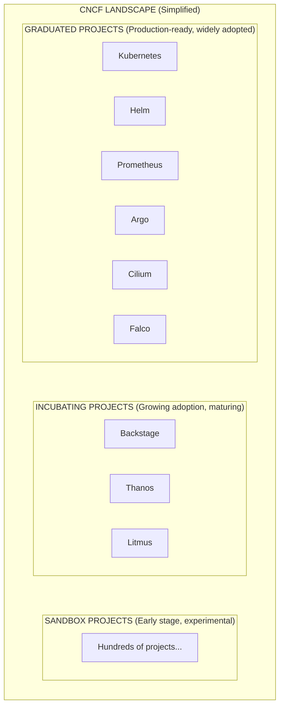
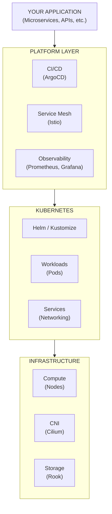
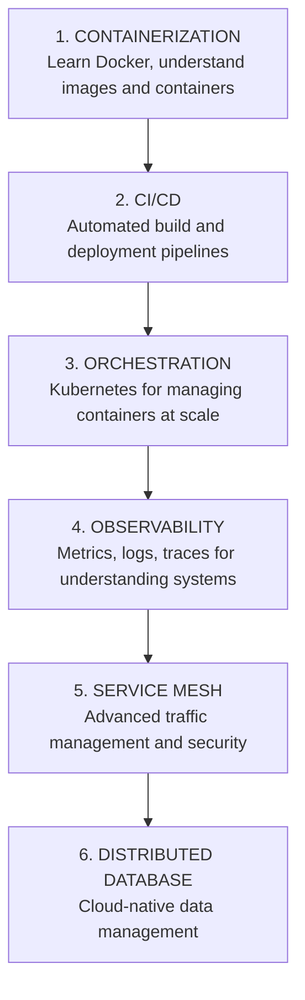
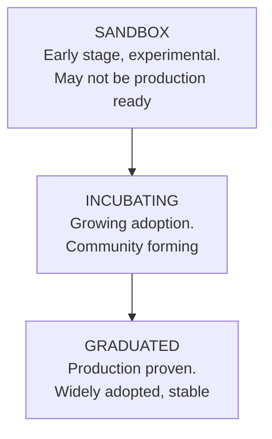

> **Складність**: `[QUICK]` - Ознайомлення, без глибокого занурення
>
> **Час на проходження**: 40-55 хвилин
>
> **Передумови**: Модуль 1.3 (Що таке Kubernetes?)
>
> **Версія Kubernetes**: 1.35+

---

## Що ви зможете зробити

Після цього модуля ви зможете:

- **Орієнтуватися** в категоріях зрілості ландшафту CNCF для вибору готових до production інструментів cloud native для платформ Kubernetes.
- **Співвідносити** проблеми спостережуваності (observability), мережевої взаємодії, безпеки, CI/CD та зберігання даних із відповідними категоріями інструментів екосистеми.
- **Оцінювати** рівень зрілості (graduation), експлуатаційну складність, можливості команди та незалежність від вендора перед впровадженням нового проєкту.
- **Спроєктувати** мінімальний перший production-стек для застосунку в Kubernetes 1.35+ за допомогою Helm, Kustomize, GitOps та інструментів спостережуваності.


## Чому це важливо

Уявіть собі вихідні зі святковими розпродажами, коли команда виявляє, що їхня міграція на Kubernetes не створила платформу; вона створила музей усіх cloud native проєктів, які вразили когось під час виступу на конференції. Головний архітектор зробив обов'язковим складний service mesh ще до того, як команда отримала надійні метрики, обрав розподілену базу даних (distributed database) на стадії sandbox до того, як команда експлуатації провела тренування з резервного копіювання, і ввімкнув розширений eBPF networking до того, як хоч хтось міг пояснити шлях пакета під час збою. Коли затримка під час оформлення замовлення (checkout latency) різко зростає, кімната інцидентів наповнюється dashboards, логами проксі, Custom Resource Definitions та напівзабутими архітектурними діаграмами, але ніхто не може сказати, який рівень (layer) відповідає за збій.

У такому сценарії ціна цілком реальна: повністю втрачена друга половина дня з піковими замовленнями, витрати на екстрені консультації та квартал, витрачений на відмову від інструментів, впроваджених до того, як їхня мета (problem statements) стала зрозумілою. Болючий урок полягає в тому, що CNCF landscape — це меню, а не checklist. Для production платформи потрібен невеликий набір добре керованих інструментів, які вирішують відомі проблеми; їй не потрібен кожен проєкт, що з'являється поруч із Kubernetes на карті landscape.

Цей модуль навчить вас читати цю екосистему і не потонути в ній. Ви дізнаєтеся, як maturity levels (рівні зрілості) CNCF сигналізують про ризики, як категорії інструментів зіставляються з реальними експлуатаційними проблемами, і чому початківець повинен розпізнавати більше інструментів, ніж може глибоко експлуатувати. Мета полягає не в тому, щоб запам'ятати сотні логотипів. Мета полягає в тому, щоб, почувши від колеги: «нам потрібен policy enforcement», «нам потрібен GitOps» або «нам потрібен distributed tracing», ви знали, до якої частини екосистеми вони звертаються, на який компроміс ідуть і яке питання варто поставити до того, як інструмент потрапить у production.


## Екосистема — це ланцюг постачання, а не список покупок

Kubernetes знаходиться в центрі багатьох cloud native платформ, але він навмисно не є повноцінною платформою сам по собі. Він планує (schedules) контейнери (containers), підтримує бажаний стан (desired state), експонує Service абстракції та надає controllers спільний API. Він не вирішує, якому container image scanner довіряє ваша команда, який dashboard пояснює затримку, який GitOps controller узгоджує Deployments, який certificate authority видає workload certificates, або який інструмент резервного копіювання захищає persistent volumes. Ці вибори живуть у ширшій екосистемі, оскільки різні організації мають різні risk tolerances, cloud providers, навички команд, compliance needs та шляхи міграції.

Cloud Native Computing Foundation (CNCF) існує частково тому, що жоден вендор не може переконливо володіти кожним рівнем цієї операційної моделі. CNCF хостить проєкти, визначає очікування щодо governance, публікує landscape та надає спільнотам нейтральну домівку під егідою Linux Foundation. Нейтральність вендорів має значення, коли інструмент стає інфраструктурою. Якщо ваш cluster networking, metrics чи система delivery залежать від того, що одна компанія за одну ніч змінить свою ліцензію або roadmap, технічна архітектура приховує в собі бізнес-залежність.

Нинішній landscape може здаватися перевантаженим, оскільки він містить понад тисячу записів у категоріях runtime, provisioning, orchestration, networking, observability, security, storage, database, streaming та delivery. Цей обсяг не повинен лякати вас і змушувати вивчати кожен проєкт. Практикуючий інженер ставиться до landscape як до карти міста: вам потрібно знати головні райони, дороги, якими ви користуєтесь щодня, та попереджувальні знаки, які вказують, коли ви заходите на незнайому територію.



Позначки зрілості (maturity labels) на цій діаграмі — це не декорація. Graduated проєкт продемонстрував широке використання, здорове governance, задокументовані security процеси та використання в production у різних організаціях. Incubating проєкт вже може бути потужним і широко використовуваним, але він все ще доводить певні аспекти зрілості спільноти. Sandbox проєкт зазвичай є ранньою розвідкою: він корисний для вивчення, прототипів і ставок на майбутнє, але ризикований як основа для control path у production.

**Зупиніться та подумайте:** якщо вашій команді потрібен новий policy engine, який блокуватиме небезпечні розгортання в production, ви б прийняли більшу кількість функцій від Sandbox проєкту, чи віддали б перевагу меншій кількості функцій від Graduated або Incubating проєкту з більш надійною історією експлуатації (operational record)? Запишіть ризик, який ви приймаєте в обох випадках, оскільки саме на такі компроміси постійно йдуть інженери платформи.

Важлива звичка — починати з проблеми, потім обирати категорію, а вже потім обирати інструмент. Команда, яка каже «нам потрібен Cilium», перш ніж сказати «нам потрібні network policy enforcement, service visibility та eBPF-based packet tracing», пропустила етап обґрунтування. Іноді Cilium — це абсолютно правильна відповідь; іноді достатньо Calico або керованого CNI. Назва інструменту має бути висновком оцінки, а не першим реченням.

Саме тому шляхи сертифікації Kubernetes вивчають core objects перед тим, як переходити до супутніх продуктів. Pods, Deployments, Services, ConfigMaps, Secrets, probes, NetworkPolicies та storage claims — це граматика платформи. Інструменти екосистеми розширюють цю граматику, автоматизують її частини або запроваджують правила навколо неї. Якщо ви вже можете міркувати про те, що Kubernetes версії 1.35+ робить нативно, ви зможете оцінити, чи інструмент екосистеми заповнює реальну прогалину, чи просто додає другий спосіб неправильно зрозуміти ту саму систему.


## Основні рівні, з якими ви зіткнетеся насамперед

Перший рівень — це orchestration, і Kubernetes є його центром. Kubernetes відповідає на оманливо просте запитання: враховуючи desired state, які containers мають працювати де, і що має статися, коли реальність відхиляється від цього desired state? Helm та Kustomize існують поруч із цим ядром, оскільки командам потрібні повторювані способи пакування та зміни Kubernetes manifests. Helm поводиться як менеджер пакетів із templates та values, тоді як Kustomize починає з валідного YAML і застосовує overlays без template language.

| Інструмент | Що він робить |
|------|--------------|
| **Kubernetes** | Container orchestration (центр усього) |
| **Helm** | Менеджер пакетів для K8s (як apt/yum для K8s) |
| **Kustomize** | Конфігурація K8s без шаблонів |

Для початківця практична різниця проста. Використовуйте Helm, коли вам потрібно встановити або розповсюдити застосунок із багатьма configurable parts, особливо коли upstream проєкт уже публікує chart. Використовуйте Kustomize, коли у вас уже є звичайні (plain) manifests і вам потрібні чисті environment overlays для development, staging і production. Багато реальних команд використовують обидва: Helm для third-party пакетів, Kustomize або GitOps overlays для локальних policies та відмінностей між середовищами.

Другий рівень — це container runtime, про який легко забути, бо Kubernetes його добре приховує. Kubernetes безпосередньо не стає процесом Linux, який запускає ваш застосунок. Агент вузла (node agent), який називається kubelet, взаємодіє через Container Runtime Interface із таким runtime як containerd або CRI-O, і цей runtime виконує image pulls, створює containers, підключає storage та networking і контролює життєвий цикл контейнера на вузлі (node).

| Інструмент | Що він робить |
|------|--------------|
| **containerd** | Галузевий стандарт container runtime |
| **CRI-O** | Легковаговий runtime для K8s |

**Зупиніться та подумайте:** якщо Kubernetes лише оркеструє containers, хто насправді запускає процеси контейнерів на worker node? Відповідь має значення під час інцидентів, оскільки Pod, що завис у стані `ContainerCreating`, може бути пов'язаним із image pulls, runtime configuration, node disk pressure або CNI setup, а не з непрацюючою специфікацією Deployment. Kubernetes — це control plane, але node runtime — це те місце, де ваш застосунок стає процесом.

Третій рівень — це networking, де багато production clusters стають цікавими, а іноді й болючими. Kubernetes визначає Services, DNS і концепції network policy, але фактичний шлях пакета залежить від реалізації Container Network Interface (CNI) та іноді від service mesh або proxy рівня. Прості overlay-мережі оптимізують для зручності експлуатації. Розширені CNI можуть забезпечити високу продуктивність, identity-aware policy, encryption та глибокий observability, але вони також вимагають від команди сильніших навичок роботи з Linux і networking.

| Інструмент | Що він робить |
|------|--------------|
| **Cilium** | CNI з networking та security на базі eBPF |
| **Calico** | Популярний CNI для network policies |
| **Flannel** | Проста overlay-мережа |
| **Istio** | Service mesh (traffic management, security) |
| **Linkerd** | Легковаговий service mesh |
| **Envoy** | Service proxy (лежить в основі багатьох service meshes) |

Розширені CNI, такі як Cilium, можуть бути чудовим рішенням, коли командам потрібні eBPF-powered visibility, identity-aware policy та ефективні datapaths, але ці переваги супроводжуються кривою навчання (learning curve). Більш прості overlay-варіанти можуть бути легшими в експлуатації для малих clusters із помірними потребами у policies. Service meshes, такі як Istio та Linkerd, вирішують іншу networking проблему: вони контролюють service-to-service traffic поведінку, часто через proxies, тому вони можуть додавати mutual TLS, retries, traffic splits і telemetry між багатьма сервісами.

Observability — це четвертий рівень, і він не повинен чекати до першого збою. Metrics повідомляють вам, як система поводиться з часом, logs пояснюють дискретні події, а traces відстежують один request через межі сервісів. Без цих сигналів Kubernetes кластер перетворюється на дорогу машину для вгадування. Ви можете знати, що Pod перезапустився, але не знати, чому користувачі стикнулися з slow checkout, яка dependency була saturated, або чи була зміна, що зламала production, розгорнута людиною чи controller'ом.

| Інструмент | Що він робить |
|------|--------------|
| **Prometheus** | Metrics collection та alerting |
| **Grafana** | Visualization та dashboards |
| **Jaeger** | Distributed tracing |
| **Fluentd/Fluent Bit** | Log collection та forwarding |
| **Loki** | Log aggregation (у стилі Prometheus) |
| **OpenTelemetry** | Уніфікований framework для observability |

Запуск власного open-source стеку Prometheus та Grafana дає сильний контроль над data, costs, retention та integrations. Це також створює експлуатаційну відповідальність: хтось має управляти cardinality, storage, alert quality, upgrades, dashboard sprawl та backup конфігурації observability. Керований (managed) observability зменшує цей тягар, але може створити data-ingestion costs та залежність від вендора. Жоден із виборів не є морально вищим; правильний вибір залежить від team capacity та бізнес-обмежень.

CI/CD та GitOps формують п'ятий рівень, оскільки Kubernetes є достатньо declarative, щоб reconciliation стало deployment model (моделлю розгортання). Традиційні pipelines часто виконують build an image, а потім роблять push маніфестів у кластер, використовуючи credentials, що зберігаються в CI системі. GitOps розвертає цей напрямок: controller, такий як Argo CD або Flux, працює всередині кластера, стежить за Git для отримання desired state і приводить живий кластер до цього стану. Переваги для security та audit ціদ্দreal, але цей workflow вимагає від розробників мислити категоріями pull-based state reconciliation замість imperative deployment scripts.

| Інструмент | Що він робить |
|------|--------------|
| **Argo CD** | GitOps continuous delivery |
| **Flux** | GitOps toolkit |
| **Tekton** | K8s-native CI/CD pipelines |

Шостий рівень — це security, який не є одним продуктом, оскільки «безпека» не є однією проблемою. Image scanning перевіряє, що знаходиться всередині контейнера до його запуску. Admission policy перевіряє, чи слід дозволяти маніфесту потрапити в кластер. Runtime detection стежить за поведінкою після того, як починають працювати workloads. Certificate automation захищає service identity та transport security. Network policies обмежують lateral movement. Зріла платформа накладає ці засоби контролю один на інший, оскільки кожен із них виявляє різний клас помилок.

| Інструмент | Що він робить |
|------|--------------|
| **Falco** | Runtime security monitoring |
| **Trivy** | Container vulnerability scanning |
| **OPA/Gatekeeper** | Policy enforcement |
| **cert-manager** | Certificate management |

**Зупиніться та подумайте:** скільком різним місцям у стеку можуть знадобитися окремі security controls, якщо vulnerable image досягне production, відкриє несподіване outbound connection і використає expired certificate? Суть не в тому, щоб купити більше інструментів. Суть у тому, щоб помітити, що prevention, admission, runtime detection, network boundaries та certificate management відбуваються на різних етапах workload lifecycle.

Сьомий рівень — це storage та recovery. Kubernetes може запитувати і приєднувати persistent volumes, але це автоматично не робить state безпечним. Командам усе ще потрібні storage classes, вибір replication, backup schedules, restore testing та план щодо cluster metadata. Інструменти на зразок Rook та Longhorn управляють storage усередині або поруч із Kubernetes, тоді як Velero фокусується на backup та disaster recovery workflows для cluster resources і persistent volume snapshots.

| Інструмент | Що він робить |
|------|--------------|
| **Rook** | Storage orchestration (Ceph на K8s) |
| **Longhorn** | Distributed block storage |
| **Velero** | Backup та disaster recovery |

Помилка початківців полягає в класифікації цих категорій як необов'язкових доповнень, оскільки застосунок може запуститися й без них. Насправді ці категорії стають обов'язковими на різних етапах зрілості production. Іграшковий кластер (toy cluster) може працювати з мінімальним логуванням, без GitOps і з простим networking. Регульована payment platform потребує auditability, policy enforcement, vulnerability management, reliable rollback, backup testing та достатнього observability, щоб пояснити інциденти як інженерам, так і аудиторам.


## Як компоненти поєднуються в платформі

Cloud native платформу легше зрозуміти, якщо розділити рівні відповідальності: застосунок, платформа, Kubernetes та інфраструктура. Ваш застосунок містить бізнес-сервіси та API. Рівень платформи керує тим, як код потрапляє в кластер, як управляється трафік, як збирається телеметрія та як застосовуються політики. Kubernetes забезпечує спільний API та модель узгодження (reconciliation). Інфраструктура забезпечує обчислювальні ресурси, мережу, сховище, ідентифікацію та балансування навантаження на нижньому рівні.



Ця діаграма спрощена, але такий поділ є корисним під час рев'ю архітектури (design reviews). Якщо команда скаржиться, що розгортання відбувається повільно, рішення може ховатися на рівні CI/CD або GitOps. Якщо Pods не можуть зв'язатися один з одним, проблема може стосуватися Services, DNS, NetworkPolicy або CNI. Якщо аудиторам потрібні докази того, що зміни в production пройшли перевірку, відповідь може стосуватися історії Git, admission policy та логів контролерів. Один і той самий інцидент може охоплювати кілька рівнів, тому чітке визначення рівня запобігає випадковому вибору інструментів.

Ось перша звичка роботи з командами, яку варто запам'ятати: у цьому навчальному плані `kubectl` завжди пишеться повністю в прикладах для копіювання, оскільки фрагменти коду для виконання мають працювати однаково в інтерактивній оболонці, у скрипті та в навчальному середовищі. Багато інженерів використовують короткі псевдоніми (alias) на своїх машинах, але спільні навчальні приклади не повинні залежати від їх розгортання в оболонці. У наступних модулях Kubernetes ви будете перевіряти ресурси кластера за допомогою команд на кшталт `kubectl get pods -A` або `kubectl get svc -A`, і повна назва бінарного файлу чітко розмежовує звички того, хто навчається, та звички автоматизації.

```bash
kubectl get pods -A
kubectl get nodes -o wide
```

Ці команди не встановлюють інструменти екосистеми. Вони просто посилюють межу між базовим Kubernetes API та суміжними проєктами. Коли ви виконуєте `kubectl get pods -A`, ви запитуєте кластер про робочі навантаження (workloads). Коли ви встановлюєте Prometheus, Argo CD, Cilium або cert-manager, ви зазвичай додаєте контролери, custom resources, агенти, вебхуки (webhooks) або інформаційні панелі (dashboards), які розширюють поведінку платформи навколо цих робочих навантажень.

Розглянемо базовий шлях запиту для production веб-сервісу. Розробник змінює код застосунку, CI збирає образ контейнера (container image), сканер перевіряє образ, Git отримує оновлений маніфест або значення chart, контролер GitOps узгоджує стан кластера, Kubernetes розгортає Pods, CNI надає цим Pods мережеве з'єднання, Services маршрутизують трафік, інструменти observability збирають сигнали, а інструменти безпеки застосовують або моніторять політики. Жоден окремий проєкт не контролює весь ланцюжок, і саме тому обізнаність в екосистемі має таке важливе значення.

Цей самий ланцюжок також пояснює, чому вибір інструментів має накопичувальний ефект. Якщо сканер образів видає забагато хибних спрацьовувань (noisy findings), розробники звикають ігнорувати звіти безпеки. Якщо процес узгодження GitOps розуміється погано, інженери можуть боротися з контролером за допомогою ручних команд `kubectl apply` і створювати розбіжності (drift). Якщо сховище для observability не має достатніх ресурсів, команда втрачає дані, необхідні для налагодження (debug) наступного розгортання. Слабкий вибір інструменту на одному рівні перетворюється на операційний борг на іншому.

Який підхід ви б обрали тут і чому: стартап із двома сервісами, відсутністю тягаря compliance та одним інженером платформи може спочатку впровадити керований Kubernetes, Helm, Prometheus та базову пересилку логів; тоді як банківській платформі з десятками команд можуть знадобитися GitOps, admission policy, автоматизація сертифікатів, network policy, автоматизація резервного копіювання та аудит логів із самого початку. Різниця не в тому, що одна команда серйозніша за іншу. Різниця полягає у вартості помилки та кількості людей, які залежать від платформи.

Мапа маршруту (trail map) CNCF відображає типову послідовність вивчення: контейнеризація, CI/CD, оркестрація, observability, service mesh та управління даними в cloud native середовищі. Ця послідовність не є жорстким правилом, але вона слугує корисним попередженням проти впровадження інструментів пізніх етапів до того, як будуть закладені фундаменти ранніх. Service mesh не може компенсувати відсутність дисципліни розгортання. Розподілене трасування не допоможе, якщо застосунки не генерують змістовних спанів (spans). Розподілена база даних не врятує команду, яка ніколи не відновлювала дані з резервної копії.



KubeDojo робить значний акцент на оркестрації, оскільки це той фундамент, який вам потрібен до того, як вибір екосистеми набуде сенсу. Як тільки ви зрозумієте, як поводяться Pods, Services, Deployments, проби (probes), ConfigMaps, Secrets, запити на сховище (storage claims) та NetworkPolicies, ви зможете читати документацію екосистеми, ставлячи кращі запитання. Ви зможете запитати, який контролер встановлюється, які custom resources він додає, які збої він обробляє, які збої він створює та як ви його видалите, якщо інструмент вас розчарує.

## Зрілість, Graduation та ризики впровадження

Рівень зрілості проєкту CNCF не є гарантією ідеальності інструменту, але це корисний сигнал для оцінки ризиків у production. Проєкт рівня sandbox може бути інноваційним, швидко розвиватися і знаходитися саме там, де формується майбутнє. Він також може швидко змінювати API, не мати широкого досвіду експлуатації або мати менш розвинений процес реагування на інциденти безпеки. Проєкт рівня graduated може бути менш захоплюючим, але він зазвичай має більше історій використання в production, більше інтеграцій, більше матеріалів для вирішення проблем (troubleshooting) та більше людей, які можуть ним керувати, коли початковий ентузіаст (champion) піде з команди.



Для систем у production віддавайте перевагу проєктам graduated, якщо вони достатньо добре вирішують проблему. Розглядайте проєкти рівня incubating, коли вони вирішують проблему, яку проєкти graduated не вирішують для вашого середовища, або коли підтримка спільноти та вендорів є достатньо сильною для вашого профілю ризиків. Залишайте проєкти sandbox для лабораторій, прототипів, некритичних робочих навантажень (workloads) та свідомих інноваційних ставок із планами відкату (rollback). Ключове слово — свідомих; експериментувати корисно, коли ви чесно оцінюєте радіус ураження (blast radius).

Зрілість слід оцінювати разом із можливостями команди. Складний service mesh може бути безпечнішим за написаний власноруч mutual TLS (mTLS) для багатьох мов, але тільки якщо команда вміє працювати з сертифікатами, проксі (proxies), control planes, політиками трафіку та робочими процесами налагодження. Потужний CNI може покращити безпеку та видимість, але лише якщо інженери можуть інтерпретувати поведінку на рівні шляху передачі даних (datapath). Контролер GitOps покращує можливість аудиту, але тільки якщо розробники розуміють узгодження і перестають вважати кластер джерелом істини.

Нейтральність щодо вендорів — ще один вимір упровадження. Проєкти CNCF часто мають комерційні дистрибутиви, керовані пропозиції (managed offerings) та розробників, яких підтримують вендори, що може бути перевагою. Ризик виникає, коли команда покладається на розширення, специфічні для певного провайдера, не розуміючи ціни переносимості. Керований додаток може бути правильним прагматичним вибором, але команда повинна знати, які маніфести, API, дашборди та операційні процедури доведеться змінити в разі переїзду платформи.

Історія про «розробку заради резюме» (resume-driven development) зі вступу є типовою, оскільки нові інструменти створюють ілюзію прогресу. Інженерам подобається вчитися, вендори публікують переконливі кейси, а архітектурні діаграми виглядають більш вражаюче, коли містять знайомі логотипи. Сильні платформні команди стримують цей порив, ставлячи нудні запитання: який біль ми вирішуємо, хто буде підтримувати цей інструмент, що відбувається під час оновлення, як ми його моніторимо, як ми його видалимо та від якого простішого варіанту ми відмовилися?

Перш ніж впроваджувати проєкт, прочитайте його примітки до випуску (release notes), політику безпеки, посібник з оновлення, перевірте активність спільноти та згадки про використання в production. Перевірте, чи підтримує він вашу цільову версію Kubernetes 1.35+, чи не покладається на функції ядра або хмарного провайдера, яких у вас немає, і чи не додає він custom resources, які стануть частиною контракту вашої платформи. Інструмент, який легко встановлюється в демо-версії, може обійтися дорого, якщо тепер кожній команді розробників застосунків доведеться вивчати його специфічний словник термінів.

Розмова про зрілість стосується не лише уникнення молодих проєктів. Йдеться також про уникнення старих звичок. Деякі команди чіпляються за знайомі пропрієтарні інструменти, оскільки відкрита екосистема здається хаотичною, навіть коли проєкти CNCF могли б зменшити прив'язку до вендора (lock-in) та покращити найм. Інші принципово відмовляються від керованих сервісів (managed services), а потім непомітно витрачають більше інженерного часу на обслуговування типової інфраструктури (commodity infrastructure), ніж на створення цінності продукту. Хороші платформні рішення є виваженими, а не ідеологічними.

## Практичний приклад: Проєктування базового стека

Уявіть, що вас найняли як першого DevOps-інженера в стартап, який має веб-фронтенд, API, worker-процес і керовану базу даних. Засновники хочуть надійності, але в них ще немає платформної команди. Найкращий початковий стек має знижувати операційний ризик, залишаючи при цьому простір для зростання. Це означає вибір нудних, добре зрозумілих компонентів, використання керованих сервісів там, де команді бракує глибоких знань, і відмову від інструментів, головна перевага яких проявляється лише у значно більших масштабах.

Почніть із керованого Kubernetes, наприклад EKS, GKE або AKS, щоб команда не мусила керувати control plane з першого дня. Використовуйте containerd через середовище виконання керованого вузла, замість того, щоб налаштовувати поведінку runtime власноруч. Пакуйте внутрішні сервіси за допомогою невеликого Helm chart або Kustomize base та overlays, залежно від того, який підхід зможе підтримувати команда. Додайте базовий CI, який збирає образи, сканує їх і публікує незмінні (immutable) теги. Потім використовуйте Argo CD або Flux, але тільки якщо команда готова зробити Git джерелом істини для стану розгортання.

Observability має бути присутньою з першого розгортання в production, але вона має бути пропорційною. Prometheus, Grafana та колектор логів, як-от Fluent Bit, дають достатню видимість, щоб відповісти на базові запитання про насичення (saturation), помилки, перезапуски та логи застосунку. Розподілене трасування може почекати, доки межі сервісів та проблеми із затримками не виправдають його використання. Стартапу з одним API та одним worker-процесом не потрібна складна стратегія трасування, поки в нього не з'являться значущі виклики між сервісами.

Безпеку слід починати зі сканування образів та використання маніфестів Kubernetes із принципом найменших привілеїв. Trivy в CI може перехоплювати вразливі пакети ще до того, як образи потраплять до реєстру. Базові admission policies можуть запобігти запуску привілейованих контейнерів, відсутності resource requests або небезпечному монтуванню хоста, як тільки команда буде до цього готова. cert-manager може бути варто додати на ранніх етапах, якщо кластер термінує TLS або видає внутрішні сертифікати. Service mesh для універсального mTLS, як правило, є передчасним, якщо цього не вимагають нормативні акти або умови роботи кількох команд.

Зверніть увагу на те, чого не вистачає в цьому першому стеку: жодного складного service mesh, жодної кастомної розподіленої бази даних, жодної ручної системи зберігання та жодного експериментального рушія політик. Ці відсутні компоненти не відкидаються назавжди. Вони відкладаються до того часу, поки команда не зможе описати біль, який вони вирішують. Саме така стриманість робить платформу придатною для обслуговування (maintainable).

**Зупиніться та подумайте**: що станеться, якщо тій самій команді раптом знадобиться зашифрувати весь трафік між внутрішніми мікросервісами через вимоги контракту з клієнтом? Категорія зміщується в бік service mesh, автоматизації сертифікатів і, можливо, network policy. Рішення також змінює свій статус із «було б добре мати» на «контрактна вимога», що змінює прийнятний бюджет складності.

Ось початковий короткий довідник, збережений і розширений як допоміжний засіб для прийняття рішень. Читайте його зліва направо, а не як список покупок. Фраза «коли вам потрібно» завжди повинна підкріплюватися конкретним інцидентом, вимогою compliance, тиском масштабування або проблемою в робочому процесі розробників.

| Коли вам потрібно... | Розгляньте... |
|------------------|-------------|
| Управління пакетами | Helm, Kustomize |
| Моніторинг | Prometheus + Grafana |
| Збір логів (Logging) | Fluentd + Loki |
| Трасування (Tracing) | Jaeger, Tempo |
| Service mesh | Istio, Linkerd |
| GitOps | ArgoCD, Flux |
| Застосування політик | OPA, Kyverno |
| Сканування на безпеку | Trivy, Falco |
| Управління секретами | Vault, Sealed Secrets |
| Сертифікати | cert-manager |
| Резервне копіювання (Backups) | Velero |
| Локальна розробка | kind, minikube |

Цей практичний приклад також показує, чому «мінімалістичний» не означає «недбалий». Мінімальна платформа все одно потребує шляху для збирання образів, розгортання маніфестів, моніторингу працездатності, відкату невдалих змін та запобігання доставці відверто вразливих контейнерів. Вона просто уникає додавання складних інструментів доти, доки команда не матиме достатніх операційних навичок, щоб отримати від них користь. Найкраща перша платформа — це та, яку втомлений черговий інженер зможе зрозуміти о 02:18 ночі.

Якщо пізніше стартап виросте до десятків сервісів і кількох команд, стек може еволюціонувати. GitOps стає ціннішим, оскільки аудит і контроль розбіжностей набувають значення. Service mesh стає привабливішим, коли різноманітність мов програмування, mutual TLS, розподіл трафіку і узгодженість телеметрії стають реальними проблемами. Рушії політик стають критично важливими, коли багато команд надсилають маніфести. Інструменти для резервного копіювання стають більш формалізованими в міру зростання stateful workloads та вимог compliance. Екосистема — це не одноразовий вибір; це послідовність рішень про впровадження.


## Що вам насправді потрібно знати в першу чергу

Для сертифікації та більшості перших посад, пов'язаних із Kubernetes, вам слід відрізняти глибокі експлуатаційні знання від знань на рівні розпізнавання. Глибокі експлуатаційні знання означають, що ви можете читати маніфести, виконувати команди, діагностувати типові збої та пояснювати, що робить об'єкт або контролер. Знання на рівні розпізнавання означають, що ви можете віднести інструмент до правильної категорії, зрозуміти, чому команда може його використовувати, і ставити доречні запитання, не вдаючи, що можете самостійно працювати з ним у production.

Сам Kubernetes належить до категорії глибоких знань. Вам потрібно знати Pods, Deployments, ReplicaSets, Services, ConfigMaps, Secrets, probes, простори імен, labels, selectors, storage claims та базовий RBAC достатньо добре, щоб усувати проблеми в реальному часі. Коли застосунок недоступний, ви повинні вміти перевірити Pods за допомогою `kubectl get pods -A`, зробити describe проблемного робочого навантаження, прочитати events та відрізнити проблему з плануванням від проблеми із завантаженням образу (image pull) або проблеми з готовністю (readiness).

Helm та Kustomize знаходяться поруч із цією глибокою категорією, оскільки вони впливають на те, як маніфести потрапляють у кластер. Вам не обов'язково бути автором чартів у перший же день, але ви повинні знати, що Helm рендерить шаблони зі значень, а Kustomize патчить валідний YAML через bases та overlays. Коли об'єкт у production виглядає інакше, ніж файл, на який очікував розробник, інструменти пакування та накладання часто є частиною пояснення.

Prometheus та Grafana заслуговують на раннє концептуальне засвоєння, оскільки вони поширені як у навчальних кластерах, так і у production-системах. Ви повинні розуміти, що Prometheus збирає метрики з цілей, зберігає часові ряди та оцінює правила сповіщень, тоді як Grafana візуалізує дані з Prometheus та інших джерел. Вам не потрібно одразу ж налаштовувати метрики з високою кардинальністю, але ви маєте знати достатньо, щоб запитати, чи базується сповіщення на симптомах, сатурації, помилках або ж на шумній деталі реалізації.

Концепції CNI також заслуговують на ранню увагу, навіть якщо ваш хмарний провайдер встановлює плагін за вас. Мережа Pods, Services, DNS та NetworkPolicy сприймаються як концепції Kubernetes, але їхня реалізація залежить від CNI та хмарної мережі навколо нього. Коли трафік не проходить, хороший новачок не звинувачує просто "мережу Kubernetes". Він запитує, чи спрацював DNS-резолв, чи має Service ендпоінти, чи дозволяє policy цей потік, чи існує маршрут на вузлі та чи є агент CNI здоровим.

Знання про середовище виконання контейнерів мають бути радше практичними, ніж енциклопедичними. Ви повинні знати, що containerd або CRI-O відповідає за завантаження образів та життєвий цикл контейнерів на вузлі, а kubelet звітує про стани контейнерів через Kubernetes. Вам не потрібно запам'ятовувати внутрішню будову runtime, щоб пройти вступний модуль. Але вам необхідно знати, що проблема з образом контейнера, збій автентифікації в реєстрі або проблема з нестачею дискового простору на вузлі можуть проявитися як проблема з Pod, навіть якщо об'єкт Deployment налаштований правильно.

Інструменти GitOps, такі як Argo CD та Flux, належать до категорії від розпізнавання до робочих знань для багатьох початкових ролей. Якщо ваша команда використовує GitOps, ви повинні розуміти узгодження (reconciliation), розбіжності (drift), статус синхронізації (sync status) та ідею про те, що Git є бажаним станом. Якщо ваша команда ще не використовує GitOps, вам усе одно варто розпізнавати цей патерн, оскільки описи вакансій та обговорення платформ постійно про нього згадують. Небезпечний крок новачка — це використання ручних команд `kubectl apply` щодо ресурсів, якими керує контролер GitOps, без розуміння того, чому контролер їх скасовує.

Концепції service mesh можуть залишатися суто концептуальними, доки цього не вимагатиме архітектура. Ви повинні знати, що Istio та Linkerd можуть додавати mutual TLS, політики трафіку, телеметрію, повторні спроби (retries) та розподіл трафіку, контролюючи комунікацію між сервісами. Ви також повинні знати, що mesh не означає безкоштовну надійність. Він додає проксі-сервери, конфігурацію, сертифікати, планування оновлень та ще одне місце, де мережева поведінка може зламатися.

Інструменти безпеки охоплюють різні рівні заглиблення. Сканування образів зазвичай легко додати на ранніх етапах, оскільки воно природно вписується в CI. Політика допуску (admission policy) вимагає глибшого знання об'єктів Kubernetes, оскільки вона визначає, які ресурси можуть потрапити у кластер. Безпека під час виконання вимагає чіткої ментальної моделі нормальної поведінки процесів, файлів та мережі. Автоматизація сертифікатів має велику експлуатаційну цінність, але не пробачає помилок, якщо оновлення, видавці або ланцюжки довіри зрозумілі неправильно.

Знання про сховища та резервне копіювання повинні починатися з однієї незручної правди: високодоступні Pods не означають довговічні дані. Kubernetes може перепланувати робочі навантаження, але він не може відтворити втрачені бізнес-дані з добрих намірів. Навіть якщо керована база даних обробляє більшість станів, платформа все одно може містити persistent volumes, ресурси кластера, secrets, custom resources та конфігурацію застосунків, які вимагають планування резервного копіювання та відновлення. Перший тест відновлення вчить більшому, ніж десяток оптимістичних архітектурних діаграм.

Інструменти для локальної розробки, такі як kind та minikube, варто розпізнавати, оскільки вони скорочують цикл зворотного зв'язку. Вони не є production-платформами, і саме в цьому полягає їхня цінність. Локальний кластер дозволяє вам практикуватися з маніфестами, контролерами, мережевими припущеннями та інспекцією за допомогою `k`, не чекаючи на спільне середовище. Майстерність полягає в тому, щоб знати, які результати переносяться в production, а які залежать від локальних спрощень.

Тому шлях навчання для першої роботи є вужчим, ніж весь ландшафт, але ширшим, ніж чистий Kubernetes. Вивчайте Kubernetes глибоко, вивчіть пакування достатньо, щоб читати те, що розгортається, вивчіть спостережуваність достатньо, щоб діагностувати симптоми, вивчіть мережі достатньо, щоб ставити запитання, специфічні для конкретного рівня, і вивчіть категорії безпеки достатньо, щоб уникати впровадження очевидних ризиків. Усе інше можна вивчити саме тоді, коли це знадобиться (just-in-time), коли ваша команда матиме конкретну проблему, обраний інструмент та оператора, який за нього відповідає.

## Експлуатаційні питання перед впровадженням

Кожне впровадження в екосистему повинно пройти експлуатаційну перевірку, перш ніж воно потрапить у production. Ця перевірка не обов'язково має бути бюрократичною, але вона повинна бути явною. Запитайте, який збій для користувача зменшує інструмент, які нові режими збоїв він впроваджує, хто отримує сповіщення, коли він ламається, як тестуються оновлення, як створюється резервна копія конфігурації та як виглядає відкат, якщо інструмент пошкодить стан або заблокує розгортання.

Питання про відкат є особливо показовим. Деякі інструменти легко видалити, оскільки вони працюють поруч із платформою та експортують дані в інше місце. Інші інструменти стають частиною контракту застосунку через custom resources, injected sidecars, admission webhooks, моделі network policy або абстракції сховищ. Чим глибше інструмент сидить у шляху управління (control path), тим консервативнішим має бути план його впровадження. Збій дашборду дратує; зламаний admission webhook може зупинити кожне розгортання.

Планування оновлень заслуговує на таку ж серйозність. Сам Kubernetes проходить через різні версії, і проєкти екосистеми повинні йти в ногу з видаленням API, виправленнями безпеки та змінами controller-runtime. Проєкт, який підтримує Kubernetes 1.35+ сьогодні, все ще може вимагати обережних оновлень чартів, перевірок конвертації CRD або рішень щодо feature-gate. Команди, які пропускають репетиції оновлень, часто під час надзвичайної ситуації з безпекою виявляють, що платформа має занадто багато незадокументованих залежностей, щоб швидко застосувати патчі.

Спостереження за інструментом є частиною його експлуатації. Контролеру GitOps потрібні метрики здоров'я, узгодження, черги та помилок. Для CNI потрібні здоров'я агента, статус політик та сигнали шляху передачі даних. Для service mesh потрібні здоров'я проксі-серверів, статус сертифікатів, метрики control-plane та телеметрія трафіку. Сканеру образів потрібні актуальність стрічки даних та звітування про збої. Якщо інструмент є достатньо важливим для захисту production, він є достатньо важливим і для моніторингу.

Відповідальність має визначатися в людських термінах, а не лише на архітектурних діаграмах. "За це відповідає команда платформи" — це занадто розмито, якщо ніхто не знає, хто перевіряє оновлення, сортує сповіщення, пише runbooks, опрацьовує рекомендації з безпеки та затверджує винятки для команд розробки. Cloud native платформа — це спільний продукт. Її залежності потребують звичок управління продуктом: життєвий цикл, документація, межі підтримки, плани застарівання та зворотний зв'язок від користувачів.

Вартість слід вимірювати в інженерному часі, а також в інфраструктурі або ліцензуванні. Інструмент із відкритим вихідним кодом може бути безкоштовним для завантаження та дорогим в експлуатації. Керований сервіс може бути дорогим у рахунку і дешевим порівняно з наймом достатньої кількості спеціалістів для безпечного забезпечення тієї ж можливості. Комерційна платформа може бути виправданою, коли підтримка, управління (governance) та інтеграція зменшують ризик доставки. Зріла дискусія порівнює загальну вартість, а не ідеологію.

Останнє запитання перед впровадженням — чи є в команди можливість провести менший експеримент. Чи може інструмент працювати в одному просторі імен, одному кластері, одному некритичному застосунку або одному середовищі, перш ніж стати загальноплатформним? Чи можете ви протестувати оновлення з реальними маніфестами? Чи можете ви відрепетирувати видалення? Чи можете ви довести, що інструмент вирішує початковий біль? Невеликі пілотні проєкти перетворюють дослідження екосистеми з омріяної архітектури на доказову базу.

## Патерни та антипатерни

Оскільки це короткий орієнтаційний модуль, вам поки що не потрібен великий каталог патернів. Однак вам потрібен один стійкий патерн і один небезпечний антипатерн, які ще не раз з'являтимуться впродовж курсу. Патерн полягає у впровадженні, орієнтованому на проблему (problem-first adoption): назвіть експлуатаційний біль, оберіть категорію, оцініть зрілість і можливості команди, а потім запустіть пілотний проєкт найменшого інструменту, який вирішує цю проблему. Антипатерн полягає у впровадженні, орієнтованому на логотип (logo-first adoption): оберіть відомий проєкт, а потім реорганізуйте розповідь про свою платформу так, щоб цей вибір здавався неминучим.

| Патерн | Коли його використовувати | Чому це працює | Аспект масштабування |
|---|---|---|---|
| Впровадження екосистеми, орієнтоване на проблему | Коли команда пропонує новий cloud native інструмент для production | Це зберігає зв'язок вибору інструменту з вимірюваним збоєм, потребою у відповідності або прогалиною в робочому процесі | Перегляньте рішення після пілотного проєкту та видаліть інструменти, які не відпрацьовують свою експлуатаційну вартість |
| Багаторівнева відповідальність за платформу | Коли кілька команд залежать від спільних сервісів Kubernetes | Це призначає чітких відповідальних за рівні середовища виконання, мережі, спостережуваності, доставки та безпеки | Задокументуйте інтерфейси між рівнями, щоб команди розробки знали, куди звертатися по допомогу |
| Експерименти, обмежені зрілістю | Коли проєкт у пісочниці або на ранній стадії інкубації виглядає багатонадійним | Це дозволяє впроваджувати інновації, не перетворюючи експериментальний проєкт на критичну залежність для production | Тримайте радіус ураження малим, визначте відкат та переглядайте зрілість перед розширенням використання |

| Антипатерн | Що йде не так | Краща альтернатива |
|---|---|---|
| Встановлення ландшафту CNCF за впізнаваністю логотипів | Команди накопичують контролери, дашборди та CRD, які ніхто не може налагодити | Почніть із базових елементів Kubernetes, спостережуваності, доставки та засобів контролю безпеки, які відповідають поточному ризику |
| Ставлення до керованих доповнень як до рішень, вільних від архітектури | Значення за замовчуванням від провайдера приховують припущення щодо портативності, оновлення та діагностики | Використовуйте керовані сервіси усвідомлено та документуйте те, що є специфічним для провайдера |
| Впровадження service mesh до базової телеметрії та відповідальності | Mesh додає проксі-сервери та політики, тоді як команда все ще не може пояснити нормальний трафік | Налаштуйте метрики, логи, трейси, probes та відповідальність за сервіси, перш ніж додавати складність mesh |

Цей антипатерн є спокусливим, оскільки кожен інструмент можна виправдати окремо. Prometheus є корисним, Argo CD є корисним, cert-manager є корисним, Cilium є корисним, Falco є корисним і Velero є корисним. Платформа стає крихкою, коли ніхто не визначає пріоритети порядку впровадження, не навчає операторів, не перевіряє оновлення або не видаляє покинуті експерименти. Корисність — це не те саме, що готовність, і платформа повинна залишатися зрозумілою під тиском.

## Коли використовувати це замість альтернатив

Для короткого модуля система прийняття рішень є скоріше компактним порівнянням, ніж повноцінним процесом розгляду архітектури. Ви обираєте серед варіантів: «поки що нічого не робити», «використовувати вбудовані можливості Kubernetes», «впровадити проєкт CNCF», «використовувати керовану функцію провайдера» та «купити комерційну платформу». Кожен варіант може бути правильним. Неправильним кроком є вдавати, що вибір не має компромісів.

| Опція | Використовуйте це, коли | Уникайте цього, коли | Компроміс |
|---|---|---|---|
| Поки що нічого не робити | Біль є гіпотетичним і немає вимог для production | Відсутність інструменту блокує надійність, безпеку або можливість аудиту | Найнижча складність, але є ризик відкласти створення фундаменту |
| Вбудовані можливості Kubernetes | Нативні об'єкти достатньо добре вирішують потребу | Вам потрібна політика між кластерами, розширена телеметрія або багатші робочі процеси | Сильна портативність, менше рухомих частин |
| Проєкт CNCF | Вам потрібна можливість, яку Kubernetes не надає безпосередньо | Команда не може експлуатувати проєкт або прийняти ризик його зрілості | Відкрита екосистема, знання спільноти, експлуатаційна відповідальність |
| Керована функція провайдера | Вам потрібні швидкість та інтеграція з провайдером | Портативність або глибоке налаштування мають більше значення | Нижче експлуатаційне навантаження, більша залежність від провайдера |
| Комерційна платформа | Вам потрібна підтримка, управління та інтегровані робочі процеси | Команді потрібен повний контроль або вона не може обґрунтувати вартість | Швидше впровадження, ліцензування та обмеження вендора |

Застосовуйте цю систему прийняття рішень, ставлячи п'ять запитань. Який збій або робочий процес ми покращуємо? Яка категорія екосистеми відповідає за цю проблему? Що вже надає Kubernetes? Який рівень зрілості та підтримки має запропонований інструмент? Кого викличуть, коли він зламається? Якщо будь-яке запитання викликає нечіткі відповіді, рішення про впровадження ще не готове.

Ця система також допомагає тримати сертифікації в правильній перспективі. Для вашої першої роботи з Kubernetes ви повинні глибоко знати Kubernetes, використання `kubectl`, маніфести, основи Helm або Kustomize та мати достатній словниковий запас у сфері спостережуваності, щоб брати участь в інцидентах. Ви повинні концептуально розпізнавати service mesh, CNI, GitOps, policy, безпеку під час виконання, резервні копії та трейсинг. Вам не потрібно вміти експлуатувати кожен проєкт на ландшафті, перш ніж ви зможете бути корисними.

## Чи знали ви?

- **Ландшафт CNCF налічує понад 1000 записів.** Такий розмір є сигналом до того, щоб спочатку вивчати категорії, оскільки навіть досвідчені інженери платформ спеціалізуються на невеликій частині екосистеми.
- **Kubernetes увійшов до CNCF як перший розміщений проєкт у 2016 році.** Його випуск допоміг зробити вендор-нейтральну оркестрацію спільним фундаментом, а не продуктовою стратегією одного провайдера.
- **Prometheus став другим випущеним проєктом CNCF у 2018 році.** Ця історія пояснює, чому Kubernetes і Prometheus так часто вивчають разом в операційній діяльності cloud native.
- **Процес випуску у CNCF вимагає публічних доказів впровадження та управління.** Випуск — це не контрольний список функцій; це сигнал зрілості щодо спільноти, супроводжувачів, практик безпеки та використання у production.


## Типові помилки

| Помилка | Чому це трапляється | Як виправити |
|---|---|---|
| Ігнорування рівнів зрілості CNCF | Команди бачать привабливий інструмент рівня sandbox і розгортають його в production, оскільки демо виглядає досконалим | Віддавайте перевагу graduated або зрілим incubating проєктам для критичних шляхів, і залишайте sandbox проєкти в лабораторіях, якщо радіус ураження не є малим |
| Відкладення observability на період після інциденту | Команда фокусується на запуску Pods і розглядає метрики, логи та трейси як пізніше покращення | Додайте базові метрики, дашборди та збір логів із першим production-сервісом, щоб інциденти мали доказову базу |
| Вибір інструментів на основі хайпу в блогах замість можливостей команди | Кейс від великої компанії звучить вражаюче, тому команда копіює стек без наявності таких самих операторів | Підбирайте інструмент під реальну проблему, наявні навички, можливості оновлення та on-call відповідальність |
| Випадкове створення vendor lock-in | Керовані (managed) доповнення здаються зручними, і специфічні для провайдера API потрапляють у маніфести до того, як це хтось помітить | Документуйте рішення, специфічні для провайдера, і віддавайте перевагу стандартним інтерфейсам Kubernetes або CNCF там, де важлива портативність |
| Завчасне ускладнення стека | Команди намагаються розгорнути весь trail map до того, як перший додаток стане стабільним | Почніть із керованого Kubernetes, пакування, CI/CD, observability, сканування образів та резервного копіювання, а потім додавайте розширені рівні, коли виникнуть труднощі |
| Нехтування скануванням безпеки в CI/CD | Розробники вважають, що контейнери ізолюють додатки, і забувають про вразливі пакети всередині шарів образів | Запускайте сканування образів перед push у реєстр і поєднуйте його з політиками допуску (admission policy) для застосування в production |
| Забування про резервне копіювання persistent storage | Високу доступність Kubernetes помилково приймають за довговічність даних | Використовуйте інструменти резервного копіювання, такі як Velero, там, де це доречно, і регулярно тестуйте процедури відновлення, а не лише створюйте розклади резервного копіювання |
| Ставлення до Kubernetes як до панацеї | Енергія міграції фокусується на платформі, тоді як архітектура додатка, ownership та observability залишаються слабкими | Виправляйте готовність додатків, health checks, resource requests, ownership та операційні практики паралельно з міграцією кластера |


## Контрольні запитання

<details>
<summary>Сценарій: Ваша команда хоче зорієнтуватися в категоріях зрілості ландшафту CNCF для нового рушія політик у production. Найцікавішим варіантом є sandbox, тоді як варіант graduated має менше функцій. Що б ви порекомендували?</summary>

Порекомендуйте варіант graduated або зрілий incubating, якщо тільки проєкт sandbox не ізольований від критичних шляхів production. Застосування політик може блокувати розгортання або випадково дозволяти небезпечні workloads, тому зрілість, реакція на проблеми безпеки, дисципліна оновлень і знання операторів мають більше значення, ніж довгий список функцій. Пілотний проєкт рівня sandbox усе ще можна запустити в некритичному середовищі, якщо команда хоче навчатися. Логіка полягає в тому, щоб відокремити експерименти від ризику для control-plane у production.
</details>

<details>
<summary>Сценарій: Розробник каже, що платформі потрібне «observability», але у звіті про інцидент згадується відсутність метрик, відсутність шляхів запитів (request paths) і втрачені логи контейнерів. Як би ви зіставили ці проблеми з категоріями інструментів екосистеми?</summary>

Розділіть сигнали перед вибором інструментів. Метрики та алертинг вказують на Prometheus, візуалізація — на Grafana, збір логів — на Fluentd або Fluent Bit із бекендом на кшталт Loki, а аналіз шляхів запитів — на трейсинг за допомогою Jaeger або OpenTelemetry. Спроба купити все це як єдине абстрактне «observability» створює прогалини, оскільки кожен сигнал відповідає на різне запитання. Найкраща відповідь — спочатку зіставити проблему з категоріями, а потім вибрати інструменти, які відповідають можливостям команди.
</details>

<details>
<summary>Сценарій: Стартап проєктує перший стек для production на Kubernetes 1.35+ з одним API, одним worker-вузлом і керованою базою даних. Які елементи екосистеми ви б включили першими, а які б відклали?</summary>

Включіть керований Kubernetes, простий підхід до пакування за допомогою Helm або Kustomize, CI-збірки образів, сканування образів, базові метрики, дашборди, логи та чіткий workflow розгортання, який може включати GitOps, якщо команда здатна з ним працювати. Відкладіть service mesh, кастомне розподілене сховище та експериментальні бази даних, доки цього не вимагатиме конкретна потреба. Логіка полягає в тому, що перший стек має охоплювати доставку, видимість, rollback та очевидні засоби контролю безпеки, не перевантажуючи єдиних операторів. Подальше зростання дозволить додати mesh, політики, трейсинг та складніше резервне копіювання, коли проблеми стануть реальними.
</details>

<details>
<summary>Сценарій: Керівництво запитує, чому важлива вендорна нейтральність, якщо хмарний провайдер пропонує зручні керовані доповнення для кожного рівня платформи. Як би ви оцінили ризик впровадження?</summary>

Керовані доповнення можуть бути правильним вибором, коли вони зменшують недиференційовану операційну роботу, але вони все одно містять специфічні для провайдера припущення. Оцініть, які API, маніфести, дашборди, інтеграції ідентифікації та процедури оновлення зміняться, якщо команда змінить провайдерів або потребуватиме самостійного управління (self-managed operation). Вендорна нейтральність від проєктів CNCF зменшує контроль одного вендора, тоді як керовані сервіси зменшують щоденне навантаження. Рішення повинно фіксувати вартість портативності замість того, щоб удавати, ніби зручність є безкоштовною.
</details>

<details>
<summary>Сценарій: Команда з трьома мікросервісами хоче встановити Istio, тому що інша компанія успішно його використовує. Яку операційну складність вам слід оцінити перед його впровадженням?</summary>

Оцініть, чи має команда вже надійні метрики, логи, трейси, readiness probes, ownership сервісів і базовий пошук несправностей у мережі. Service mesh додає проксі, сертифікати, політики трафіку, оновлення control-plane і ще один вид збою в кожен шлях запиту. Для трьох сервісів простіші Kubernetes Services, Ingress, NetworkPolicy та телеметрія на рівні додатка можуть вирішити поточну проблему. Istio стає більш переконливим, коли mutual TLS, розділення трафіку та узгоджені політики в багатьох сервісах виправдовують операційні витрати.
</details>

<details>
<summary>Сценарій: Під час аудиту виявилося, що кілька production-образів містять вразливі пакети OpenSSL, хоча сканування вихідного коду пройшло успішно. Яка категорія безпеки закриває цю прогалину і чому?</summary>

Категорія, якої не вистачає, — це сканування вразливостей образів контейнерів за допомогою інструментів на кшталт Trivy, що зазвичай використовуються в пайплайнах CI/CD. Сканування коду перевіряє код додатка, але образи контейнерів включають пакети операційної системи та залежності мов програмування, які можуть не фігурувати в репозиторії. Сканування фінального образу перед push у реєстр виявляє відомі CVE в цих шарах. Для застосування в production команда може поєднати сканування з admission policy, щоб незатверджені образи не могли потрапити до кластера.
</details>

<details>
<summary>Сценарій: Команда використовує Jenkins для виконання ручних команд `kubectl apply`, тоді як Argo CD також звіряє (reconciles) той самий простір імен із Git. Розгортання постійно несподівано скасовуються. Що відбувається?</summary>

Команда має два джерела істини, які конфліктують між собою. Контролери GitOps, такі як Argo CD, приводять стан живого кластера у відповідність до стану, задекларованого в Git, тому ручні зміни `kubectl apply`, не зафіксовані в Git, розглядаються як відхилення (drift). Рішення полягає в тому, щоб зробити Git шляхом розгортання для ресурсів, якими керує Argo CD, і залишити ручні команди для інспекції або задокументованих аварійних процедур. Це зберігає можливість аудиту і запобігає непередбачуваній поведінці контролера.
</details>

<details>
<summary>Сценарій: Ваш огляд платформи має оцінити рівень graduation, операційну складність, можливості команди та вендорну нейтральність перед впровадженням Cilium. Які докази ви б зібрали?</summary>

Зберіть статус зрілості проєкту в CNCF, сумісність із версіями Kubernetes, вимоги до ядра, примітки до оновлень, політики безпеки, production-референси та наявний досвід команди в мережах Linux і eBPF. Також перевірте, чи кероване хмарне середовище підтримує необхідні функції datapath і чи впливають специфічні для провайдера інтеграції на портативність. Мета полягає не в тому, щоб довести, що Cilium — хороший чи поганий абстрактно. Мета — вирішити, чи відповідають його переваги вашим вимогам щодо мережевих політик, видимості та експлуатації.
</details>


## Практична вправа: Створіть свій стек

Ця вправа є радше рев’ю дизайну, ніж лабораторною роботою з кластером. Ви використовуватимете ландшафт CNCF як довідник, але вашим результатом має бути обґрунтована пропозиція стека для реальної організації. Якщо у вас є доступний локальний або навчальний кластер, запустіть `kubectl get pods -A` перед початком, щоб пам'ятати, що інструменти екосистеми зрештою розширюють ресурси Kubernetes або працюють навколо них.

### Сценарій

Ви проєктуєте інфраструктуру для фінтех-стартапу, що швидко зростає. Компанія працює з конфіденційними даними клієнтів, потребує чітких журналів аудиту, повинна розгортатися кілька разів на тиждень і не може дозволити собі тривалі «сліпі зони» під час інцидентів. Команда має достатньо інженерних навичок, щоб підтримувати невелику платформу, але не має достатньо людей, щоб із першого дня працювати з кожним просунутим інструментом у ландшафті CNCF.

### Завдання

- [ ] **Зорієнтуватися в категоріях зрілості ландшафту CNCF**: Виберіть один інструмент рівня graduated або зрілий incubating для кожної критичної категорії та чітко позначте будь-який проєкт sandbox як експериментальний, а не критично важливий для production.
- [ ] **Зіставити проблеми observability, мереж, безпеки, CI/CD та сховищ**: Напишіть одне речення для кожної категорії, пояснюючи, яку проблему вона вирішує для сценарію фінтеху.
- [ ] **Оцінити рівень graduation, операційну складність, можливості команди та вендорну нейтральність**: Для двох інструментів задокументуйте, чому команда може з ними працювати та які існують специфічні для провайдера припущення.
- [ ] **Спроєктувати мінімальний перший стек для production на Kubernetes 1.35+**: Включіть пакування, workflow розгортання, метрики, логи, сканування образів, політики, управління сертифікатами та планування резервного копіювання чи відновлення.
- [ ] **Визначити список відкладених впроваджень**: Назвіть два привабливі інструменти, які ви б ще не впроваджували, і поясніть, які майбутні труднощі виправдають повернення до них.
- [ ] **Перевірити звичку використання команд**: Якщо кластер доступний, запустіть `kubectl get pods -A` і зафіксуйте, чи вже присутні якісь установлені контролери екосистеми.

<details>
<summary>Посібник із вирішення: вибір рівня зрілості</summary>

Хороша відповідь віддає перевагу graduated-проєктам або добре зарекомендованим incubating-проєктам для критично важливих функцій у production. Наприклад, команда може вибрати Prometheus і Grafana для метрик і дашбордів, Fluent Bit із Loki для логів, Argo CD або Flux для GitOps, Trivy для сканування образів, OPA Gatekeeper або Kyverno для політик, cert-manager для сертифікатів і Velero для workflow резервного копіювання. Точний вибір може відрізнятися, але обґрунтування має пояснювати зрілість і операційні ризики.
</details>

<details>
<summary>Посібник із вирішення: зіставлення категорій</summary>

Observability має згадувати метрики, логи та, можливо, трейси як окремі сигнали. Мережевий стек має розрізняти можливості CNI, NetworkPolicy, Ingress та service mesh, а не розглядати їх як один продукт. Безпека повинна включати сканування образів, політики допуску (admission policy), виявлення під час виконання (runtime detection) та управління сертифікатами. CI/CD має пояснювати, як код стає бажаним станом кластера. У розділі сховищ слід обговорити постійні томи (persistent volumes), знімки (snapshots), тестування відновлення та резервне копіювання ресурсів кластера.
</details>

<details>
<summary>Посібник із вирішення: мінімальний стек</summary>

Прийнятний перший стек для production використовує керований Kubernetes, Helm або Kustomize для пакування, GitHub Actions або подібну CI-систему для збірки образів, Trivy для сканування, Argo CD або Flux для GitOps, якщо команда приймає модель узгодження на основі pull-запитів, Prometheus та Grafana для метрик, Fluent Bit і Loki для логів, cert-manager для автоматизації сертифікатів, а також Velero або знімки провайдера для планування відновлення. Service mesh можна відкласти, доки mutual TLS, політики трафіку або підтримка сервісів багатьма командами не зроблять додатковий control-plane вартим зусиль.
</details>

<details>
<summary>Посібник із вирішення: список відкладених впроваджень</summary>

Вдалі відкладення — це не відмови. Команда може відкласти Istio, доки в неї не з'явиться багато сервісів і жорстка вимога до mTLS або розділення трафіку. Вона може відкласти кастомний оркестратор сховищ, якщо керована база даних і класи хмарних сховищ задовольняють поточні потреби. Вона може відкласти розподілений трейсинг, доки шляхи запитів не перетинатимуть достатньо сервісів, щоб зробити дані трейсів цінними. Відповідь повинна називати майбутній тригер, який призведе до перегляду рішення.
</details>

### Критерії успіху

- [ ] Ви вибрали Container Runtime або задокументували керований runtime, який використовується провайдером.
- [ ] Ви обрали стек observability з метриками та логами й пояснили, чи включено трейсинг, чи його відкладено.
- [ ] Ви вибрали підхід GitOps або CI/CD і описали, як бажаний стан потрапляє до кластера.
- [ ] Ви визначили інструмент для безпеки або застосування політик і пояснили, на якому етапі життєвого циклу workload він діє.
- [ ] Ви вибрали стратегію резервного копіювання або відновлення сховищ замість припущення, що Kubernetes автоматично захищає дані.
- [ ] Ви перевірили, що принаймні три вибрані інструменти належать до рівня graduated або є достатньо зрілими для сценарію фінтеху.
- [ ] Ви написали обґрунтування з одного речення, які пов’язують кожен інструмент з обмеженнями сценарію, а не з його популярністю.


## Джерела

- [CNCF Landscape](https://landscape.cncf.io)
- [CNCF Project Maturity Levels](https://www.cncf.io/projects/)
- [CNCF Graduation Criteria](https://github.com/cncf/toc/blob/main/process/graduation_criteria.md)
- [Kubernetes Documentation - Concepts](https://kubernetes.io/docs/concepts/)
- [Kubernetes Documentation - Command Line Tool kubectl](https://kubernetes.io/docs/reference/kubectl/)
- [Helm Documentation](https://helm.sh/docs/)
- [Kustomize Documentation](https://kubectl.docs.kubernetes.io/references/kustomize/)
- [containerd Documentation](https://containerd.io/docs/)
- [CRI-O Documentation](https://cri-o.io/)
- [Cilium Documentation](https://docs.cilium.io/)
- [Prometheus Documentation](https://prometheus.io/docs/introduction/overview/)
- [Grafana Documentation](https://grafana.com/docs/grafana/latest/)
- [OpenTelemetry Documentation](https://opentelemetry.io/docs/)
- [Argo CD Documentation](https://argo-cd.readthedocs.io/)
- [Flux Documentation](https://fluxcd.io/flux/)
- [Trivy Documentation](https://trivy.dev/docs)
- [Falco Documentation](https://falco.org/docs/)
- [cert-manager Documentation](https://cert-manager.io/docs/)
- [Velero Documentation](https://velero.io/docs/)


## Наступний модуль

[Модуль 1.5: Від моноліту до мікросервісів](../module-1.5-monolith-to-microservices/) показує, як змінюється архітектура додатків, коли команди переходять від однієї одиниці розгортання до сервісів, якими керують незалежно.
