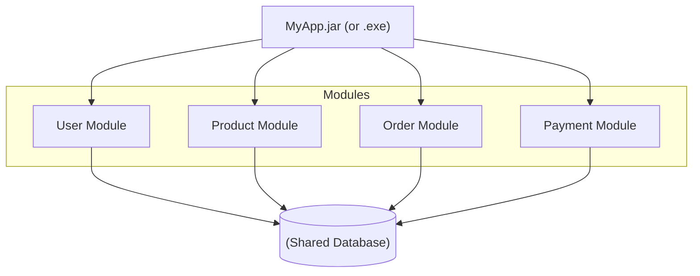
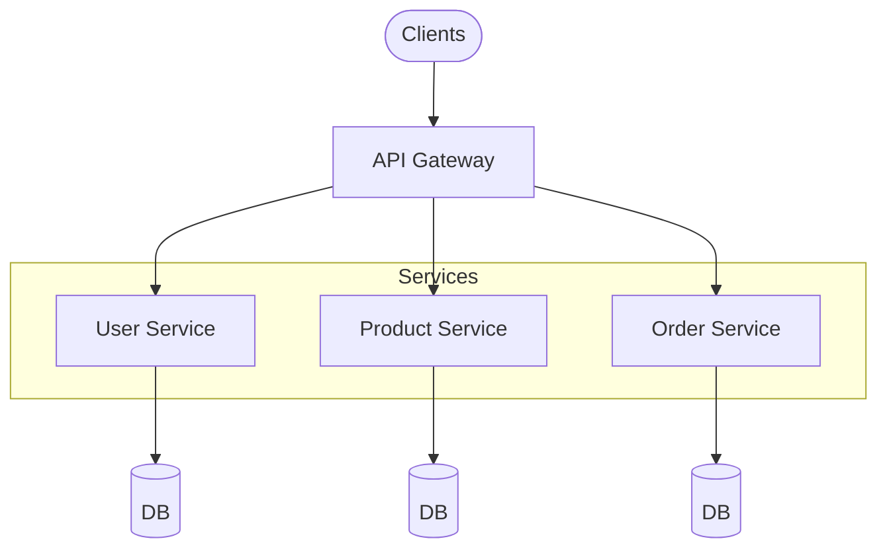
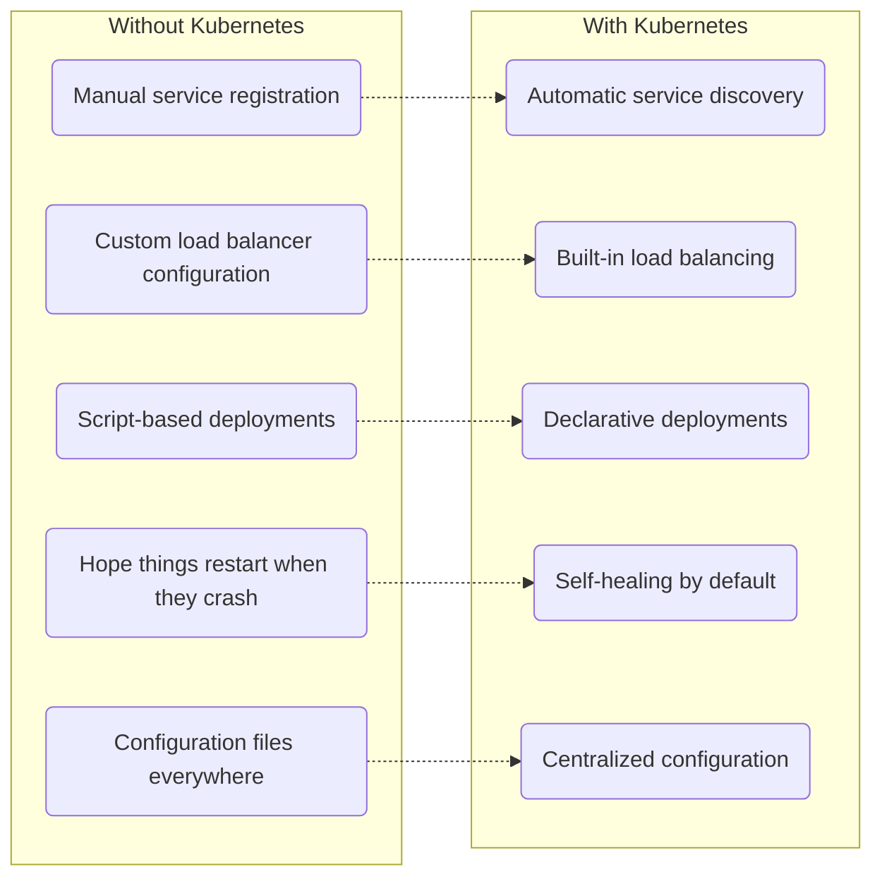
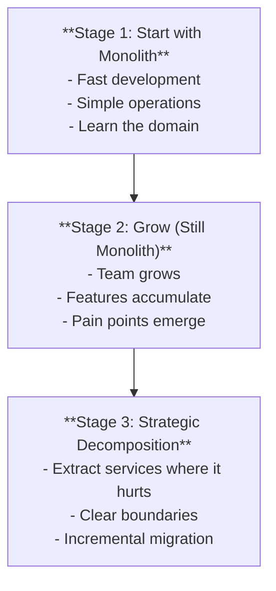
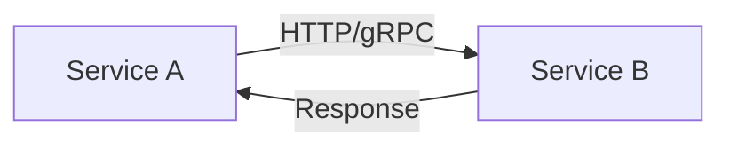
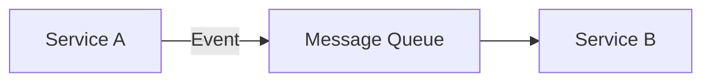
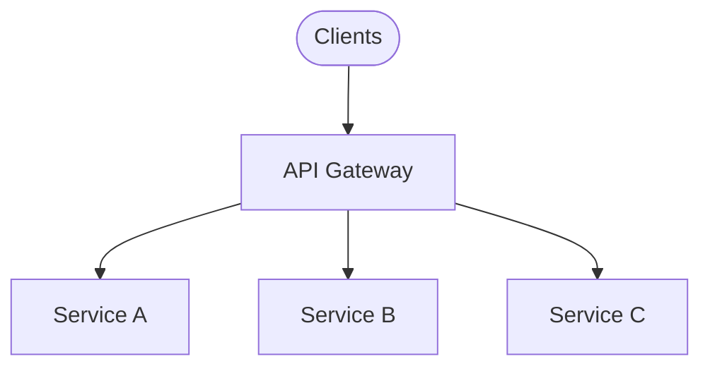
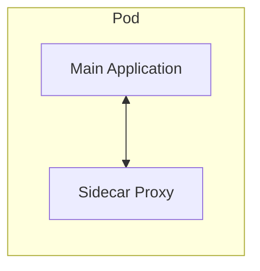
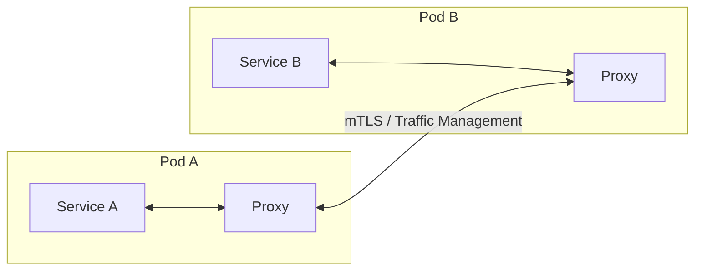
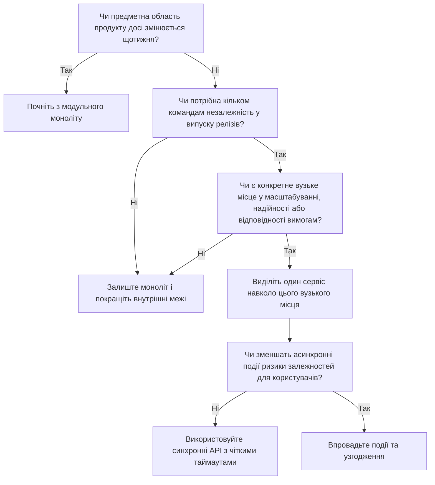

> **Складність**: `[QUICK]` - Архітектурні концепції
>
> **Час на проходження**: 40-55 хвилин
>
> **Передумови**: Модуль 1.3 (Що таке Kubernetes?)
>
> **Цільова версія Kubernetes**: 1.35+

---

## Що ви зможете зробити

Після цього модуля ви зможете:

- **Порівняти** монолітну та мікросервісну архітектури, оцінюючи розгортання, масштабування, володіння даними та компроміси в експлуатації.
- **Спроєктувати** прагматичний шлях міграції, який починається з модульного моноліту та виділяє сервіси лише там, де це виправдано вимогами бізнесу або масштабування.
- **Діагностувати**, які можливості Kubernetes вирішують конкретні проблеми експлуатації мікросервісів, включаючи service discovery, health checks, конфігурацію та rolling updates.
- **Оцінити** патерни синхронної та асинхронної взаємодії, gateway, sidecar та service mesh з урахуванням реалістичних обмежень щодо надійності та безпеки.

## Чому це важливо

Відомо, що роздрібна платформа Amazon свого часу переросла великий монолітний застосунок. Інженери все ще могли випускати нові функції, але кожна зміна вимагала координації між командами, які ділили одну одиницю розгортання, ті ж самі припущення та часто ті ж самі точки відмови. Відповідно до широко відомих розповідей про Amazon початку 2000-х, внутрішня вимога спілкуватися виключно через інтерфейси сервісів змусила встановити чіткіші межі — не тому, що мережеві виклики були модними, а тому, що організація потребувала розчеплення до того, як її власна архітектура програмного забезпечення стала б вузьким місцем для кожного бізнес-рішення.

Ця історія корисна, оскільки вона руйнує спрощене уявлення про мікросервіси: «розділіть застосунок, і все стане краще». Amazon заплатив за цей поділ новою операційною складністю, суворішим проєктуванням інтерфейсів і культурою, в якій команди відповідали за сервіси у production. Перевагою стали не менші репозиторії самі по собі; перевагою стало те, що команда платежів, команда каталогу або команда виконання замовлень могли рухатися вперед, не чекаючи, поки кожна інша частина компанії погодиться на один гігантський реліз.

Kubernetes існує в тіні того самого компромісу. Services, Deployments, probes, ConfigMaps, Secrets, Ingress, NetworkPolicies та автомасштабування виглядають цілком звичайно, коли ви бачите їх поодинці, але разом вони формують операційну модель для багатьох незалежно розгорнутих процесів. Цей модуль допоможе вам визначити, коли ця модель вартує своїх витрат, коли моноліт залишається кращим інженерним вибором і як пов'язати архітектурні рішення з примітивами Kubernetes, які ви будете використовувати пізніше.

## Моноліт як свідома архітектура

Моноліт — це єдиний застосунок, який розгортається цілком і містить декілька частин бізнес-функціоналу. Він може мати чисті внутрішні модулі, окремі пакети та дисципліновані межі, але він усе одно постачається як одна одиниця. Важливе слово — «той, що розгортається», оскільки архітектурні суперечки набувають практичного сенсу лише тоді, коли команда запитує, що відбувається під час релізу, відкату (rollback), масштабування, збою та зневадження (debugging).

На діаграмі модулі користувача, продукту, замовлення та платежу є окремими концепціями всередині одного робочого застосунку. Розробник може тримати їх у різних пакетах, тестувати з різними фікстурами та забезпечувати відповідальність за код-рев'ю на рівні директорій. Усе це не змінює модель розгортання: коли застосунок збирається, релізиться, масштабується або перезапускається, модулі рухаються разом.

Ця згуртованість є причиною того, чому моноліт часто є найшвидшим способом створення молодого продукту. Існує один репозиторій або одна основна кодова база, одна межа транзакцій бази даних, одна команда для локальної розробки, одне тестове середовище та один артефакт розгортання. Невелика команда може змінити робочий процес (workflow) у кількох модулях без узгодження мережевого контракту, публікації версії API або координації розподіленого розгортання.

Та сама згуртованість стає болючою, коли зростання робить локальну зв'язність помітною. Якщо робочий процес замовлення потребує десятьох реплік під час святкового розпродажу, а каталогу продуктів потрібно лише дві, моноліт зазвичай масштабує все разом. Якщо ризикована зміна в системі платежів має чекати на завершення тестування непов'язаних змін у каталозі, процес релізу перетворюється на організаційну чергу, а не на технічний конвеєр (pipeline).

Спільна база даних є найважливішою прихованою межею в багатьох монолітах. Вона надає вам легкі ACID-транзакції, прості об'єднання (joins) та прямі запити для звітів, але також дозволяє непов'язаним ділянкам коду впливати один на одного через блокування, повільні запити, зміни схем і випадкове зв'язування. Модуль із чистим кодом не є по-справжньому незалежним, якщо кожен інший модуль може дотягнутися до його таблиць.

> **Зупиніться та подумайте**: Якщо моноліт використовує одну спільну базу даних, що станеться, коли модуль замовлення (Order Module) випадково виконає погано написаний запит до бази даних, який поглине всі доступні ресурси CPU бази даних? Обміркуйте наслідки для користувачів, перш ніж читати далі, особливо для модуля користувача (User Module), який може мати абсолютно здоровий код застосунку, але залежить від того ж ресурсу бази даних.

Модуль користувача сповільнюється, оскільки спільна залежність перевантажена. У цьому і полягає суть архітектурного зв'язування: збою не потрібно було перетинати межу виклику функції або імпорту вихідного коду, щоб зашкодити іншій функції. База даних була спільним ресурсом, тому радіус ураження (blast radius) поширився через цей ресурс, а не через структуру пакетів застосунку.

Хороший моноліт — це не погана архітектура, що чекає на порятунок. Тривалий підхід Shopify у вигляді «модульного моноліту» є корисним нагадуванням про те, що ретельно підтримуваний моноліт може слугувати дуже великим бізнесам, коли команди інвестують у модульність, тестування, спостережуваність (observability) та дисципліновану відповідальність. Пасткою є не сам моноліт; пастка полягає в тому, щоб дозволити «єдиній одиниці розгортання» перетворитися на «єдину заплутану одиницю».

Для тих, хто вивчає Kubernetes, моноліт також надає корисний базовий рівень. Ви можете запустити моноліт у контейнері (container), розгорнути його за допомогою Deployment, зробити його доступним через Service, налаштувати його за допомогою ConfigMaps та Secrets і перезапускати його за допомогою probes. Kubernetes не вимагає мікросервісів; він керує контейнерами та бажаним станом (desired state), що може бути корисним ще до того, як застосунок буде декомпозовано.

Першою командою Kubernetes, яку ви згодом будете використовувати в багатьох модулях, є `kubectl`, і ця навчальна програма записує команди з повним ім'ям бінарного файлу, щоб приклади залишалися безпечними для копіювання і вставки в скриптах та неінтерактивних оболонках. Наприклад, коли ви пізніше інспектуватимете робочі навантаження за допомогою `kubectl get pods -A`, ви запитуєте Kubernetes про одиниці часу виконання (runtime units), а не про те, містять ці одиниці монолітний чи мікросервісний код.

## Мікросервісний підхід

Мікросервіси поділяють застосунок на сервіси (services), що незалежно розгортаються та спілкуються через явні інтерфейси. Кожен сервіс відповідає за певну бізнес-можливість, надає контракт і може бути зібраний, розгорнутий, масштабований та підтримуваний без перерозгортання всієї системи. Ця незалежність і є метою, і вона набагато важливіша за конкретну кількість рядків коду, фреймворк чи структуру репозиторію.

Діаграма показує більш явну архітектуру, ніж моноліт. Шлюз (gateway) приймає клієнтський трафік, а потім маршрутизує запити до сервісів користувача, продукту та замовлення. Кожен сервіс має свою власну базу даних, що означає, що сервіс замовлень не може непомітно напряму об'єднувати (join) дані з таблицями користувачів, якщо команди свідомо не створять контракт для цих даних.

Ця незалежність змінює те, як працюють команди. Команда сервісу користувачів може випустити виправлення профілю, не чекаючи на команду сервісу замовлень, а сервіс замовлень може масштабуватися залежно від навантаження на оформлення замовлень без масштабування каталогу продуктів. Сервіс також може використовувати мову, фреймворк або модель зберігання даних, які найкраще підходять для його домену, хоча така гнучкість стає занадто дорогою, якщо кожна команда винаходить свій окремий операційний всесвіт.

Ціною цього є «податок на розподілену систему». Виклик функції всередині моноліту перетворюється на взаємодію через HTTP, gRPC або брокер повідомлень (message-broker) по мережі. Цей мережевий виклик може відвалитися по тайм-ауту, повторитися, дублюватися, надійти із запізненням, повернути часткову відповідь або завершитися невдало через те, що інший сервіс якраз розгортається. Код все ще може бути простим, але його поведінка більше не є локальною.

> **Зупиніться та подумайте**: У моноліті виклик функції зазвичай триває мікросекунди й зазнає невдачі лише тоді, коли відбувається збій процесу або викликаного коду. У мікросервісах мережевий виклик часто займає мілісекунди й може завершитися невдачею через тайм-аути, розділення мережі (network partitions), перевантажені залежності, проблеми з сертифікатами або віддалене розгортання. Як це має змінити ваш підхід до проєктування обробки помилок та робочих процесів для користувачів?

Практична відповідь полягає в тому, що мікросервісний код має сприймати часткову відмову як звичне явище. Тайм-аутам потрібні бюджети, повторним спробам (retries) потрібні ліміти, ідемпотентність вимагає проєктування, а резервні механізми (fallbacks) вимагають продуктових рішень. Без цих звичок розділення системи переносить збої з етапів компіляції та тестування у виробничий (production) трафік, де їх стає набагато важче зрозуміти.

Паттерн «база даних на сервіс» (database-per-service) є ще одним прикладом компромісу, а не гасла. Він покращує відповідальність (ownership), оскільки один сервіс контролює свою схему та інваріанти. Водночас це ускладнює міжсервісну звітність, транзакції та узгодженість (consistency), оскільки ви не можете просто загорнути оновлення даних користувача, резервування запасів та авторизацію платежу в одну локальну транзакцію.

Команди справляються з цією складністю за допомогою подій (events), саг (sagas), патерну outbox, завдань узгодження (reconciliation jobs) та ретельної продуктової семантики. Система оформлення замовлення може прийняти замовлення, опублікувати подію, асинхронно зарезервувати товар і пізніше сповістити клієнта, якщо резервування не вдалося. Це здається менш охайним, ніж одна транзакція бази даних, але може бути більш відмовостійким (resilient), коли очікується високий трафік або тимчасові збої залежностей.

> **Зупиніться та подумайте**: Стартап із п'яти осіб створює свій перший продукт, досі змінює свою модель користувача щотижня і не має окремого платформеного інженера. Чи варто їм починати з окремих мікросервісів для користувачів, білінгу, каталогу, рекомендацій та сповіщень, чи краще зберегти єдину модульну одиницю розгортання, поки домен не стабілізується? Перш ніж продовжити, запишіть, яку операційну роботу створює кожен із цих виборів.

Для цього стартапу модульний моноліт зазвичай є більш чесним рішенням. Команді потрібне швидке навчання, дешевий рефакторинг і менша кількість рухомих частин. Мікросервіси мають більше сенсу, коли межі стають достатньо стабільними, щоб перетворитися на контракти, і коли незалежність розгортання вирішує реальну проблему з вузьким місцем, а не просто задовольняє архітектурні вподобання.

Мікросервіси найефективніші тоді, коли організація вже має кілька команд із чіткою відповідальністю. Якщо одна команда відповідає за надійність оформлення замовлення, інша — за релевантність пошуку, а ще інша — за ідентифікацію, то примус їх до єдиного циклу релізу (release train) створює тертя. Окремі сервіси дозволяють вирівняти межі програмного забезпечення з межами команд, саме тому закон Конвея (Conway's Law) згадується майже в кожній серйозній дискусії на цю тему.

Вони є найслабшими, коли команди розділені за технічними рівнями, а не за бізнес-можливостями. «Сервіс бази даних», «сервіс API» та «фронтенд-сервіс» усе одно можуть змусити кожну нову функцію проходити через кожну команду, що зберігає проблему координації та водночас додає мережеві виклики. Корисна межа сервісу дозволяє одній команді змінювати бізнес-можливість із мінімальними міжкомандними узгодженнями.

## Місце Kubernetes

Kubernetes не робить мікросервіси простими магічним чином. Він надає багаторазові механізми для вирішення проблем, які мікросервіси створюють знову й знову: пошук сервісів, маршрутизація трафіку, розгортання версій, перезапуск несправних екземплярів, впровадження конфігурації, розподіл реплік та опис бажаного стану. Ці механізми є цінними, оскільки вони переносять типові операційні завдання з кастомних скриптів до спільного control plane.

| Виклик | Рішення Kubernetes |
|-----------|---------------------|
| Виявлення сервісів | Services, DNS |
| Балансування навантаження | Services, Ingress |
| Масштабування | Deployments, HPA |
| Конфігурація | ConfigMaps, Secrets |
| Моніторинг стану | Probes |
| Поступові оновлення | Deployments |
| Відмовостійкість | ReplicaSets, самовідновлення |
| Управління ресурсами | Requests/Limits |

Ця таблиця коротка, але за кожним рядком ховається типовий виробничий інцидент. Виявлення сервісів має значення, оскільки Pod-и замінюються та отримують нові IP-адреси. Моніторинг стану важливий, бо екземпляр може бути живим як процес, але водночас нездатним обробляти трафік. Поступові оновлення мають значення, тому що випуск усіх реплік одночасно перетворює невдалий реліз на повну відмову системи.

До появи Kubernetes багато команд вирішували ці проблеми за допомогою суміші реєстрів сервісів, вручну відредагованих балансувальників навантаження, супервізорів процесів, shell-скриптів, спільних каталогів конфігурації та недокументованих знань команди (tribal knowledge). Ці інструменти можуть працювати, але кожен новий сервіс збільшує площу поверхні, де ручні процеси дають збій. Kubernetes стандартизує форму рішення, щоб кожна команда не створювала ту саму платформу з нуля.

Service надає іншим робочим навантаженням стабільне ім'я та віртуальну IP-адресу, навіть коли базові Pod-и змінюються. Deployment описує бажану кількість реплік і стратегію оновлення. Probes повідомляють Kubernetes, коли контейнер готовий до трафіку або потребує перезапуску. ConfigMaps та Secrets відокремлюють специфічну для середовища конфігурацію від образів контейнерів, що має значення, коли кожен сервіс розгортається незалежно.

Важлива ментальна модель полягає в тому, що Kubernetes керує обіцянками середовища виконання (runtime promises), а не бізнес-межами. Якщо сервіс замовлень має три репліки та пробу готовності (readiness probe), Kubernetes може тримати лише готові Pod-и в кінцевих точках Service. Він не може вирішити, чи повинен сервіс замовлень відповідати за резервування запасів, чи є контракт API занадто багатослівним (chatty), і чи є межа бази даних правильною.

> **Який підхід ви б обрали тут і чому?** Роздрібна компанія має один стабільний моноліт, але шлях зміни розміру зображень споживає багато ресурсів CPU під час імпорту каталогу. Решта застосунку працює справно і має низький трафік. Ви б масштабували весь моноліт, виділили лише обробку зображень чи переписали б систему на безліч мікросервісів одночасно?

Прагматична команда зазвичай спершу виділила б можливість обробки зображень, оскільки тиск на масштабування є специфічним і вимірюваним. Виділений сервіс може мати орієнтовані на CPU запити (requests) та ліміти (limits), окремі репліки та чергу, якщо імпорт каталогу відбувається сплесками. Таке рішення усуває спостережувану проблему, не змушуючи всю організацію проходити через передчасне переписування.

Kubernetes також полегшує експлуатацію контейнеризованого моноліту, що часто є хорошим проміжним кроком. Команда може стандартизувати маніфести розгортання, проби готовності, запити на ресурси та автоматизацію релізів, залишаючи архітектуру застосунку недоторканою. Цей фундамент знижує ризик розгортання ще до початку виділення будь-яких сервісів.

У Kubernetes 1.35 та новіших версіях загальні концепції цього модуля залишаються стабільними: Services забезпечують виявлення, Deployments керують репліками та розгортаннями, проби впливають на трафік та перезапуски, а об'єкти конфігурації відокремлюють налаштування середовища від образів. Точна зрілість функцій змінюється з часом, але архітектурне відображення між розподіленими сервісами та примітивами оркестрації залишається довговічним уроком.

Більш тонкий урок Kubernetes полягає в тому, що примітиви платформи повинні зменшувати повторювану операційну роботу, не приховуючи відповідальності. Deployment може розгортати нову версію поступово, але команда все ще вирішує, чи має застосунок зворотну сумісність. Проба готовності може вилучити несправний Pod із трафіку, але команда все одно вирішує, що означає "готовий" для сервісу з великою кількістю залежностей.

Requests та limits для ресурсів — це ще одне місце, де архітектура зустрічається з експлуатацією. Моноліт з одним контейнером має один профіль ресурсів, тому важка для CPU обробка зображень і легке читання профілів конкурують всередині однієї оболонки планування. Після виділення сервіс зображень може запитувати більше CPU, сервіс профілів може запитувати помірний обсяг пам'яті, а автомасштабування може слідувати за поведінкою кожної можливості замість середньої поведінки всього застосунку.

Спостережуваність (observability) також змінює форму після декомпозиції. У моноліті один потік логів і одне трасування стека часто розповідають більшу частину історії, навіть якщо кодова база є великою. У мікросервісній системі один запит користувача може проходити через шлюз, сервіс ідентифікації, сервіс замовлень, адаптер платіжного провайдера, сервіс інвентаризації та воркер сповіщень. Тому корисне налагодження залежить від ідентифікаторів кореляції (correlation IDs), метрик, трасувань та узгодженого звітування про помилки.

Ось чому сам по собі Kubernetes ніколи не є повною платформою. Kubernetes може перезапустити Pod, що дав збій, але він не може пояснити, чи був збій викликаний невдалим розгортанням, повільною міграцією бази даних, штормом повторних спроб (retry storm) чи низхідною залежністю (downstream dependency). Командам потрібні дашборди, сповіщення, трасування, ранбуки (runbooks) та угоди про відповідальність (ownership agreements), які відповідають створеним ними межам сервісів.

Межі безпеки також стають більш явними. Моноліт часто покладається на внутрішні виклики функцій та одну межу процесу, тоді як мікросервіси надсилають трафік через мережу кластера. NetworkPolicies, Secrets, сервісні акаунти та admission controls у Kubernetes можуть допомогти зменшити радіус ураження (blast radius), але лише якщо команди визначать, які сервіси повинні спілкуватися з якими залежностями та чому існують такі дозволи.

Управління конфігурацією — це поширена рання перемога. У моноліті специфічні для середовища налаштування часто накопичуються в одному великому конфігураційному файлі, і зміна таймауту платіжного провайдера може вимагати перерозгортання всього застосунку. У сервіс-орієнтованій системі кожен сервіс може отримувати лише ту конфігурацію, яка йому потрібна. Це зменшує випадкову зв'язність і полегшує перевірку під час зміни конфіденційного значення.

Найсильніша звичка в Kubernetes — описувати бажаний стан середовища виконання у маніфестах із контролем версій, а не покладатися на завчені команди. Це не означає, що кожен новачок повинен негайно опанувати кожен об'єкт. Це означає, що ви повинні розпізнати патерн: кожен сервіс стає задекларованим робочим навантаженням, доступним через задекларовану мережу, налаштованим через задекларовані входи і таким, що моніториться через задекларовані сигнали стану.

## Міграція під тиском, а не за модою

Найбезпечніша міграція від моноліту до мікросервісів зазвичай є поступовою. Команда починає з модульного моноліту, визначає межу, де проблема є конкретною, і виділяє один сервіс за стабільним інтерфейсом. Цей підхід часто називають патерном фікуса-душителя (Strangler Fig pattern), оскільки нова система поступово розростається навколо старої, доки старі обов'язки не будуть зменшені або усунуті.

Перший етап — це не архітектурна лінь, це збір інформації. Коли продукт новий, команда часто ще не знає, які концепції є стабільними бізнес-можливостями, а які — тимчасовими здогадками. Занадто раннє розділення заморожує здогадки в мережеві контракти, через що звичайне вивчення продукту відчувається як міграція платформи.

На другому етапі важлива дисципліна. Зростаючий моноліт повинен отримати внутрішні межі, відповідальність за модулі, автоматизовані тести, спостережуваність, практики міграції баз даних та чисті інтерфейси. Якщо команда пропустить цю роботу, мікросервіси не виправлять дизайн; вони просто розподілять ту саму плутанину між більшою кількістю процесів.

Третій етап починається тоді, коли проблема стає достатньо конкретною, щоб виправдати створення межі сервісу. Хорошими кандидатами на виділення є робочі навантаження з високими вимогами до масштабування, нестабільні домени, якими володіє одна команда, ризиковані інтеграції, тривалі фонові завдання або функції з іншими вимогами до комплаєнсу (compliance). Поганими кандидатами є розмиті іменники, технічні шари або код, який просто дратує, бо його ніхто не піддав рефакторингу.

Типовим практичним прикладом є оформлення замовлення (checkout) у системі електронної комерції. Спочатку логіка оформлення замовлення, каталогу, ідентифікації, оплати та сповіщень може існувати в одному застосунку, оскільки про це легко міркувати. Згодом оплата може стати сильним кандидатом на виділення, оскільки вона має суворі вимоги до безпеки, залежності від зовнішніх провайдерів, потреби в аудиті та частоту релізів, яку слід ізолювати від експериментів із каталогом.

Перше виділення має бути навмисно нудним. Розмістіть контракт API або подій перед обраною можливістю, спрямуйте туди невелику кількість трафіку, спостерігайте за затримкою та поведінкою помилок, і зберігайте процес відкату (rollback) простим. Команда, яка не може безпечно виділити один сервіс, не повинна планувати переписування на десятки сервісів тривалістю у квартал.

Міграція даних часто є складнішою, ніж міграція коду. Якщо таблиці платежів є спільними з таблицями замовлень, команді може знадобитися створити фасад API, дублювати читання протягом певного часу, публікувати події про зміни та звіряти розбіжності. Ось чому принцип "кожен сервіс володіє своїми даними" є пунктом призначення, а не завжди першим кроком.

Команда з міграції повинна записати інваріанти до написання коду сервісу. Для платежів інваріантом може бути те, що замовлення ніколи не позначається як оплачене, якщо авторизація провайдера не зафіксована за допомогою ключа ідемпотентності. Для інвентаризації інваріантом може бути те, що зарезервований запас або закінчується за терміном дії, або стає частиною завершеного замовлення. Ці правила показують, де транзакції, події та завдання звірки мають бути ретельно спроектовані.

Корисний план виділення також визначає споживачів (consumers). Якщо три внутрішні модулі читають статус платежу безпосередньо зі спільної таблиці, новому сервісу платежів знадобиться API, потік подій або перехідне представлення (transitional view), яке забезпечить роботу цих споживачів під час зміни власника. Без такої карти споживачів команди часто виявляють приховані залежності лише після того, як розгортання в робочому середовищі зазнає невдачі.

Сумісність — це тиха дисципліна, яка робить можливою поступову міграцію. Моноліт і новий сервіс можуть працювати пліч-о-пліч тижнями, і обом може знадобитися розуміти старі та нові представлення даних. Зворотно сумісні API, адитивні зміни бази даних, версіоновані події та порівняння при подвійному записі (dual-write comparisons) є менш ефектними, ніж чиста діаграма архітектури, але саме вони не дозволяють користувачам перетворитися на піддослідних для тестування міграції.

Перший сервіс також повинен мати операційного власника до того, як у нього з'явиться репозиторій. Хтось повинен знати, хто реагує на сповіщення, хто затверджує зміни схеми, хто перевіряє сумісність API і хто вирішує, коли сервіс можна відкотити. Сервіс без відповідального власника не є автономним; це просто ще один компонент, який чекає на чергову нараду.

Команди іноді недооцінюють, наскільки багато моноліт робив для них. Локальні транзакції, повторні спроби всередині процесу, єдиний дашборд розгортань, спільне оброблення помилок та єдиний контекст автентифікації можуть бути неявними. Коли сервіс виділяється, кожна неявна зручність стає явним архітектурним рішенням, і втрата однієї з них може створити прогалини в надійності, які виглядатимуть як "мікросервіси — це погано", хоча справжня проблема полягає в неповному проектуванні міграції.

Практичне питання міграції — це не "Скільки сервісів ми повинні мати?". Краще запитання: "Яка саме межа зменшила б найбільше ризиків або розблокувала б найбільше роботи, якби її можна було розгортати незалежно?". Таке формулювання дозволяє команді зосередитися на бізнес-результатах або надійності замість гонитви за довільною кількістю сервісів.

Ви також повинні передбачити час для видалення старого шляху. Багато міграцій створюють новий сервіс, але залишають старий код моноліту на місці нескінченно довго, бо ніхто не відповідає за очищення. Це створює дві реалізації, два набори припущень та постійне джерело заплутаної поведінки, тому план міграції повинен включати критерії видалення так само чітко, як і критерії запуску.

Історії з індустрії часто мають однакову форму. Компанія Segment публічно описала перехід від невеликої кількості сервісів до багатьох сервісів, специфічних для кожного призначення, а згодом — їхню консолідацію, оскільки операційні накладні витрати та дубльована робота шкодили продуктивності розробників. Урок полягає не в тому, що мікросервіси є хибними; урок у тому, що межі сервісів повинні постійно виправдовувати свою вартість.

Інший корисний приклад наводять компанії, які успішно керують великими монолітами. Їхня архітектура працює, тому що вони інвестують у внутрішню модульність, відповідальність, автоматизоване тестування та інструментарій. Моноліт із сильними межами може перевершити мікросервісну архітектуру зі слабкими межами, особливо коли команда невелика або продукт швидко змінюється.

## Патерни комунікації та виконання

Коли система складається з більш ніж одного сервісу, стиль комунікації стає архітектурою. Синхронний запит вимагає від іншого сервісу негайної відповіді, що є простим для користувачів та розробників, коли залежність є швидкою та надійною. Ціна цього полягає в тому, що той, хто викликає, тепер залежить від затримки та доступності того, кого викликають, під час запиту.

Синхронні виклики доречні, коли користувачеві дійсно потрібна відповідь перед тим, як продовжити. Вхід у систему, перевірка існування імені користувача або розрахунок ціни можуть потребувати негайного зворотного зв'язку. Навіть у такому випадку команди повинні визначити таймаути, запобіжники (circuit breakers), бюджети повторних спроб (retry budgets) та чітку поведінку у разі помилок, щоб один повільний сервіс не вичерпав усі потоки того, хто його викликає.

Асинхронна комунікація змінює контракт між користувачем та системою. Один сервіс публікує подію або повідомлення, а інший сервіс споживає його пізніше. Користувач може отримати підтвердження того, що робота прийнята, а не завершена, тоді як бекенд отримує буферизацію, повторні спроби та ізоляцію від тимчасових сплесків навантаження.

Цей патерн підходить для робочих процесів, де узгодженість у кінцевому підсумку (eventual consistency) є прийнятною. Надсилання електронних листів, оновлення рекомендацій, зміна розміру зображень та синхронізація аналітики рідко потребують блокування запиту користувача. Компроміс полягає в тому, що система повинна вміти обробляти дубльовані повідомлення, події з порушеним порядком (out-of-order), "отруєні" повідомлення (poison messages) та забезпечувати операційну видимість черг.

API-шлюз (API gateway) створює єдину точку входу для клієнтського трафіку. Він може централізувати автентифікацію, авторизацію, обмеження частоти запитів (rate limiting), маршрутизацію запитів та трансляцію протоколів. У Kubernetes роль цього компонента часто виконує Ingress-контролер або спеціалізована реалізація шлюзу, хоча точний вибір продукту залежить від потреб трафіку та організаційних стандартів.

Шлюз є корисним, оскільки клієнтам не потрібно розуміти кожну внутрішню межу сервісів. Мобільним застосункам, браузерам та зовнішнім партнерам потрібні стабільні публічні контракти. Внутрішні сервіси можуть вільніше змінюватися за шлюзом, якщо управління контрактом шлюзу та правилами сумісності здійснюється обережно.

Патерн sidecar додає допоміжний контейнер поруч із основним контейнером застосунку. У Kubernetes це працює природно, оскільки Pod може містити кілька контейнерів, які спільно використовують мережу та життєвий цикл. Допоміжний контейнер може збирати логи, проксіювати трафік, обробляти сертифікати або адаптувати протоколи, не змушуючи команду застосунку переписувати основний бізнес-код.

Service mesh розвиває ідею sidecar, розміщуючи проксі-сервери навколо трафіку між сервісами та керуючи ними через спільну площину керування (control plane). Mesh може забезпечувати mutual TLS (mTLS), розділення трафіку, повторні спроби, збір метрик та застосування політик у сервісах, написаних різними мовами. Ця потужність є реальною, але такою ж реальною є і її операційна ціна.

> **Зупиніться та подумайте**: Якщо ваша компанія вимагає суворого шифрування mTLS між 50 різними мікросервісами, написаними трьома різними мовами, як би ви забезпечили це без переписування всіх 50 кодових баз? Подумайте про те, хто володіє сертифікатами, повторними спробами, телеметрією та політикою розгортання, коли кожна команда використовує інший фреймворк застосунку.

Відповідь у вигляді service mesh працює, оскільки проксі стає послідовним мережевим рівнем. Код застосунку надсилає та отримує трафік як зазвичай, тоді як проксі обробляє шифрування, політики, телеметрію та іноді повторні спроби. Компроміс полягає в тому, що тепер налагодження (debugging) включає поведінку застосунку, конфігурацію проксі, стан сертифікатів та працездатність площини керування.

Патерни на кшталт gateway, sidecar та mesh не є відзнаками зрілості. Вони є відповіддю на конкретні чинники: управління публічним API, наскрізні (cross-cutting) аспекти середовища виконання та мережева політика для всього парку серверів (fleet-wide). Команді варто впроваджувати їх тоді, коли проблема є достатньо очевидною, щоб виправдати додатковий рівень, а не тому, що без них діаграма виглядає неповною.

Синхронна комунікація заслуговує на ще одне практичне попередження: повторні спроби можуть погіршити наслідки збою. Якщо сервіс A тричі повторює запит до сервісу B для кожного невдалого виклику в умовах і без того високого трафіку, сервіс B отримує ще більше навантаження саме тоді, коли найменше здатний з ним впоратися. Зрілі системи використовують бюджети повторних спроб, джитер (jitter), дедлайни, запобіжники (circuit breakers) та ідемпотентність, щоб поведінка відновлення не перетворилася на другий інцидент.

Асинхронна комунікація має свої власні режими відмови. Черга може приховувати проблеми, приймаючи повідомлення швидше, ніж воркери можуть їх обробити, через що шлях, з яким взаємодіє користувач, виглядає справним, тоді як відставання (backlog) зростає. Операторам потрібні метрики відставання, сповіщення про вік обробки, обробка недоставлених повідомлень (dead-letter), процедури їхнього повторного відтворення (replay) та продуктові правила щодо того, що відбувається, коли затримана робота є важливою для клієнта.

Дизайн шлюзу є найуспішнішим, коли він залишається "тонким". Автентифікація, авторизація, обмеження частоти запитів, маршрутизація та формування відповідей є обґрунтованими обов'язками на межі системи (edge), але складні бізнес-процеси не повинні там накопичуватися. Якщо кожна нова функція вимагає розгортання шлюзу плюс розгортання кількох сервісів, шлюз перетворюється на вузьке місце координації (bottleneck), що нагадує моноліт, від якого команда намагалася втекти.

Патерн sidecar є потужним, оскільки він відокремлює операційні аспекти від бізнес-коду, але він також змінює профіль ресурсів Pod. Проксі, збирач логів (log shipper) або агент політик (policy agent) споживають процесорний час (CPU) та пам'ять, беруть участь у хронометражі запуску та зупинки, а також можуть вийти з ладу незалежно від основного застосунку. У продакшн-маніфестах sidecar має враховуватися як частина робочого навантаження (workload), а не як невидима інфраструктура (plumbing).

Впровадження service mesh повинно починатися з вузької причини та плану виходу (exit plan) на випадок неправильної конфігурації. Mutual TLS, розділення трафіку та уніфікована телеметрія можуть виправдати свою вартість у великому парку сервісів, особливо коли важлива відповідність вимогам (compliance) або узгодженість платформи. Для невеликої системи з простим трафіком між сервісами той самий mesh може додати більше концепцій, ніж команда здатна безпечно підтримувати в робочому стані.

Вибір способу комунікації слід робити для кожного робочого процесу (workflow), а не для архітектури загалом. Запит на оформлення замовлення (checkout) може синхронно валідувати кошик, асинхронно резервувати потужності у підпорядкованих системах (downstream), синхронно повертати номер замовлення та асинхронно надсилати електронний лист. Реальні системи змішують патерни, оскільки очікування користувачів, надійність залежностей та бізнес-правила відрізняються на кожному кроці.

Оцінюючи запропоновану межу сервісу, схематично зобразіть нормальний шлях та шлях у разі відмови. Нормальний шлях пояснює, як рухаються дані, коли все працює справно. Шлях у разі відмови пояснює, що відбувається, коли залежність перевищує таймаут, подія дублюється, черга затримується або розгортання (deployment) відкочується (rolls back) на половині робочого процесу. Якщо шлях у разі відмови є нечітким, дизайн ще не готовий.

Саме тут має значення інтуїція "розумного новачка". Якщо діаграма сервісу виглядає елегантно, але ви не можете пояснити, як запит користувача відстежується (traced), повторюється (retried), відкочується (rolled back) або узгоджується (reconciled), архітектура все ще є неповною. Найкращі команди роблять розподілену поведінку нудною завдяки чітким контрактам та повторюваним операціям, а не завдяки більшій колекції квадратиків на діаграмі.

## Патерни та антипатерни

Для ШВИДКОГО вступного модуля головний патерн полягає не в тому, щоб "завжди обирати мікросервіси" або "завжди зберігати моноліт". Корисний патерн полягає у збереженні варіативності (optionality): підтримуйте чіткі межі всередині моноліту, збирайте докази щодо труднощів з масштабуванням та відповідальністю, і виділяйте сервіси там, де їхня незалежність має вимірну користь. Це створює шлях від простих операцій до розподілених операцій без ілюзій, що кінцевий результат буде безкоштовним.

| Патерн | Коли використовувати | Чому це працює | Міркування щодо масштабування |
|---|---|---|---|
| Спочатку модульний моноліт | Невеликі команди, нові продукти, нестабільні домени | Зберігає рефакторинг дешевим, одночасно підтримуючи внутрішні межі | Масштабуйте весь застосунок спочатку, а згодом виділяйте "гарячі" шляхи |
| Видобування за патерном Strangler Fig | Застаріла система (legacy) з однією проблемною функціональністю | Скеровує одну функцію через новий інтерфейс, поки стара система продовжує працювати | Виділяйте по одній межі за раз і зберігайте можливість відкочення очевидною |
| Володіння базою даних на рівні сервісу | Стабільні межі домену з чіткою відповідальністю команди | Запобігає прихованій зв'язаності через спільні таблиці | Використовуйте події, узгодження (reconciliation) та конвеєри звітів для потреб, що охоплюють кілька сервісів |
| Шлюз на межі системи | Багатьом клієнтам або публічним API потрібна одна стабільна точка входу | Приховує внутрішню топологію та централізує мережеву політику | Уникайте перетворення шлюзу на новий моноліт бізнес-логіки |
| Асинхронні події | Робота може бути завершена після підтвердження користувачеві | Буферизує сплески навантаження та ізолює тимчасові збої залежностей | Проєктуйте ідемпотентність та обробку недоставлених повідомлень (dead-letter) до того, як зросте трафік |

Найпоширенішим антипатерном є поділ системи до того, як команда зрозуміє домен. Це створює сервіси, які відображають здогадки замість бізнес-можливостей, і в результаті утворюється надмірно балакуча (chatty) мережа, де кожна користувацька історія все одно вимагає змін у багатьох місцях. Система виглядає розподіленою, але робота залишається тісно пов'язаною (tightly coupled).

| Антипатерн | Що йде не так | Краща альтернатива |
|---|---|---|
| Мікросервіси з першого дня | Команда витрачає дефіцитний час на інфраструктуру, контракти та налагодження замість того, щоб вивчати продукт | Почніть з модульного моноліту і зберігайте "шви" для майбутнього виділення чистими |
| Сервіси за технічним рівнем | Кожна функція перетинає багато сервісів, тому потреба в координації залишається високою | Розділяйте за бізнес-можливостями та відповідальністю команд |
| Спільна база даних без чіткого власника | Сервіси оминають один одного і створюють приховану зв'язаність | Призначте відповідальних за таблиці, а потім переходьте до API або подій |
| Шлюз містить бізнес-правила | Шлюз стає другим монолітом з нечіткою відповідальністю | Зберігайте маршрутизацію та прикордонні політики у шлюзі, а бізнес-логіку — у сервісах |
| Service mesh як перша функція платформи | Команди успадковують складну мережеву взаємодію ще до того, як їм знадобиться політика для всього парку | Почніть із Kubernetes Service, проб (probes), метрик та чітких таймаутів |

Початкові хибні уявлення варто зберегти, оскільки вони все ще залишаються тими пастками, про які початківці чують у реальних командах:

| Хибне уявлення | Реальність |
|---------------|---------|
| "Мікросервіси завжди краще" | Вони додають величезну операційну складність. Часто це катастрофічний вибір для стартапів або невеликих команд, які шукають відповідність продукту ринку (product-market fit). |
| "Моноліти не масштабуються" | Ще й як масштабуються! Shopify обробляє величезний глобальний трафік електронної комерції за допомогою монолітного застосунку на Ruby on Rails. |
| "Мікросервіси виправляють поганий код" | Насправді вони його посилюють. Розподілений поганий код через мережеві межі набагато складніше налагоджувати, відстежувати та виправляти, ніж поганий код, що міститься в межах одного монолітного процесу. |
| "Менший = мікро" | Розмір не має значення, головне — обмежений контекст (bounded context). Сервіс має бути саме таким, якого вимагає його домен. Поділ сервісів виключно за кількістю рядків коду створює тісно пов'язані, балакучі мережі. |
| "Вам потрібен service mesh з першого дня" | Service mesh, такі як Istio, додають величезне когнітивне та операційне навантаження. Почніть із базових мереж Kubernetes і впроваджуйте mesh лише тоді, коли цього вимагають розширені можливості спостережуваності (observability) або суворі вимоги mTLS. |
| "Мікросервіси означають лише REST API" | Багато високонавантажених мікросервісів спілкуються за допомогою асинхронних брокерів подій, таких як Kafka або RabbitMQ, або через високопродуктивні бінарні виклики RPC, такі як gRPC, а не лише через стандартні HTTP REST-запити. |
| "Мікросервіси = використання Kubernetes" | Ви можете запустити контейнеризований моноліт у Kubernetes як "величний моноліт" (majestic monolith). Kubernetes — це оркестрація інфраструктури, а не засіб примусу до певної архітектури. |
| "Кожному мікросервісу потрібна власна база даних" | Хоча патерн "база даних на сервіс" забезпечує сильну розв'язаність (decoupling), він ускладнює розподілені транзакції. Прагматичні команди іноді починають із логічно розділених схем всередині однієї спільної бази даних. |

## Структура прийняття рішень

Використовуйте найпростішу архітектуру, яка дозволяє команді безпечно рухатися вперед за її поточного розміру, а потім перегляньте це рішення, коли з'являться нові дані. Архітектура — це не тест на особистість; це операційна модель. Правильний вибір залежить від кількості людей у команді, стабільності предметної області, тиску щодо релізів, вузьких місць при масштабуванні, вимог до відповідності та вартості обслуговування додаткової інфраструктури.

Використовуючи цю структуру, уникайте питання, чи є мікросервіси «сучасними». Запитайте себе, чи настільки системі потрібні незалежно розгортані бізнес-можливості, щоб платити за service discovery, observability, обробку мережевих збоїв, дублювання даних, версіонування API та операційну відповідальність. Якщо відповідь неочевидна, моноліт, ймовірно, заслуговує на більше часу.

| Ситуація | Надайте перевагу | Причина |
|---|---|---|
| Від трьох до восьми інженерів перевіряють гіпотезу продукту | Модульний моноліт | Команді потрібен швидкий рефакторинг та низькі операційні витрати |
| Один процес, що сильно навантажує процесор або черги, шкодить решті застосунку | Виділити один сервіс | Проблема з масштабуванням достатньо специфічна, щоб її ізолювати |
| Багато команд чекають на один release train | Мікросервіси за бізнес-можливостями | Незалежне розгортання вирішує організаційне вузьке місце |
| Вимагається суворе шифрування між сервісами, написаними різними мовами | Service mesh після досягнення базової зрілості | Спільний шар проксі-серверів дозволяє послідовно застосовувати політики |
| Користувачам не потрібне негайне завершення дії | Асинхронний робочий процес на основі подій | Черги згладжують пікові навантаження та зменшують каскадні збої |
| Усі дані тісно пов'язані та вимагають інтенсивних транзакцій | Моноліт або дуже обережне поетапне виділення | Розподілене володіння даними суттєво збільшить витрати на їхню узгодженість |

Рішення також має включати план відкату. Якщо перший виділений сервіс працюватиме погано, чи зможе трафік повернутися до моноліту? Якщо робочий процес на основі подій дублює повідомлення, чи зможе споживач безпечно повторити спробу? Якщо правило шлюзу помилкове, чи зможуть оператори швидко це помітити та скасувати? Архітектура без можливості повернення назад стає грою в одні ворота.

Вартість також має бути частиною цієї структури, оскільки мікросервіси переносять витрати з однієї категорії в іншу. Команда може зменшити час очікування для розробників, але збільшити використання кластера, обсяг сховища для observability, навантаження на чергових інженерів, хвилини CI та витрати на обслуговування платформи. Ці витрати можуть бути виправданими, коли незалежна доставка захищає дохід або надійність, але вони мають бути озвучені до початку міграції.

Навички команди — це ще одне реальне обмеження. Група, яка ніколи не працювала з readiness probes, resource requests, дашбордами або розбором інцидентів, не повинна одночасно впроваджувати десятки сервісів, які можуть незалежно виходити з ладу. Кращий шлях — розбудувати операційні навички на невеликій кількості робочих навантажень, дізнатися, як команда реагує на інциденти, і лише потім розширювати архітектуру, коли операційні звички будуть підтверджені.

Зрештою, структуру слід переглядати після кожного виділення сервісу. Чи покращилася частота розгортань, чи команди створили нову чергу навколо спільних бібліотек та правил шлюзу? Чи підвищилася надійність, чи тепер запити користувачів завершуються помилками у цікавіші способи? Міграція, яка не вимірює результатів, може тривати ще довго після того, як початкова проблема була вирішена або спростована.

Тому найздоровіші огляди архітектури закінчуються невеликим рішенням та датою його перегляду. Команда може обрати моноліт на наступні два квартали, виділити обробку зображень після наступного розпродажу або відкласти впровадження service mesh, доки не з'явиться достатньо сервісів, щоб виправдати спільні політики управління трафіком. Ставлення до архітектури як до послідовності оборотних рішень дозволяє вести розмову з опорою на факти.

Ця звичка також готує вас до роботи з Kubernetes. Кожен маніфест, який ви напишете пізніше, представлятиме рішення щодо володіння, масштабування, працездатності, конфігурації або доступу. Коли ви можете пояснити архітектурну причину створення об'єкта, Kubernetes стає інструментом для керування дизайном, а не набором форм YAML, які треба запам'ятати.

## Чи знали ви?

- **Вимога Amazon щодо API на початку 2000-х (широко відома історія)**: Згідно з поширеними розповідями, Amazon зобов'язала команди спілкуватися через інтерфейси сервісів — крок, який змусив роз'єднати компоненти та сформував у багатьох організаціях уявлення про межі сервісів.
- **Розворот Segment**: У 2018 році Segment розповіли про відмову від сотень дрібних сервісів, оскільки операційні витрати та дублювання роботи шкодили швидкості розробки.
- **Термін «Мікросервіси»**: Цей архітектурний стиль обговорювався на семінарі архітекторів програмного забезпечення поблизу Венеції у травні 2011 року, а пізніше був популяризований Джеймсом Льюїсом і Мартіном Фаулером у їхній статті від 25 березня 2014 року.
- **Закон Конвея**: Спостереження Мелвіна Конвея 1968 року досі має значення, оскільки системи часто відображають шаблони комунікації тих організацій, які їх створюють.

## Типові помилки

| Помилка | Чому це трапляється | Як це виправити |
|---|---|---|
| Розділення нового продукту на багато сервісів до стабілізації предметної області | Команда хоче виглядати сучасно і вважає, що майбутнє масштабування гарантоване | Побудуйте модульний моноліт, чітко визначте внутрішні межі та виділяйте сервіси лише тоді, коли з'являться регулярні проблеми |
| Сприйняття Kubernetes як доказу того, що застосунок готовий до мікросервісів | Контейнери роблять розгортання чистішим, але не створюють хороших бізнес-меж | Використовуйте Kubernetes для повторюваних операцій, окремо оцінюючи приналежність сервісів та володіння даними |
| Спільне використання однієї бази даних кількома сервісами без правил щодо того, кому вона належить | Прямий доступ до таблиць здається швидшим, ніж проєктування API чи подій | Призначте кожну таблицю власнику та заблокуйте нові записи між сервісами до планування фізичного розділення |
| Використання синхронних викликів для кожного робочого процесу | Модель «запит-відповідь» легко зрозуміти під час розробки | Визначте роботу, яку можна завершити пізніше, і переведіть її на події з ідемпотентними споживачами |
| Додавання service mesh до того, як запрацює базова observability | Функції mesh виглядають як швидкий шлях до надійності та безпеки | Спочатку налаштуйте логи, метрики, трейси, readiness probes, таймаути та відповідальність за кожен сервіс |
| Виділення сервісів за іменниками в кодовій базі замість бізнес-можливостей | Назви класів та папок побачити легше, ніж межі предметної області | Співвіднесіть сервіси з видимими для користувача можливостями та командами, які можуть відповідати за них від початку до кінця |
| Забування про відкат і узгодження під час міграції | Команда фокусується на ідеальному сценарії роботи нового сервісу | Заплануйте подвійне читання, повторне відтворення подій, порівняння даних та відкат трафіку перед переходом |

## Контрольні запитання

Сценарій: Ваш відділ зріс з 10 до 150 інженерів, і кожне виправлення помилки чекає на щотижневий release train плюс довгий спільний тестовий прогін. Який архітектурний тиск ви спостерігаєте і що б вирішили мікросервіси?

Ви спостерігаєте організаційне вузьке місце, викликане тим, що одна одиниця розгортання обслуговує занадто багато команд. Мікросервіси можуть допомогти, якщо вони розділені за бізнес-можливостями, щоб кожна команда могла самостійно тестувати, розгортати та відкочувати свій власний сервіс. Головна перевага — це не менший обсяг коду, а незалежне управління життєвим циклом. Якщо розділення все одно вимагає координації кожної фічі між багатьма сервісами, вузьке місце просто переміститься.

Сценарій: Стартап із чотирьох осіб має три місяці на перевірку MVP, а межі його продукту змінюються щотижня. Чи варто їм починати з мікросервісів або моноліту?

Зазвичай їм варто почати з модульного моноліту. Під час дослідження продукту команді потрібен дешевий рефакторинг, швидка локальна розробка та мінімальні операційні витрати. Мікросервіси додали б складності в CI/CD, контракти, налагодження мережі та роботу над узгодженістю даних ще до того, як ці витрати вирішать реальну проблему. Команда все одно може спроєктувати внутрішні модулі так, щоб згодом було можливо їх виділити в окремі сервіси.

Сценарій: Моноліт має один процес обробки зображень, який сильно навантажує процесор під час імпорту каталогів, тоді як решта застосунку перебуває у стані спокою. Який шлях міграції ви б спроєктували першим?

Спершу виділіть можливість обробки зображень, а не переписуйте весь застосунок. Цей сервіс має чіткий профіль масштабування, може працювати з resource requests, орієнтованими на процесор, і може приймати роботу через чергу, якщо імпорти надходять сплесками. Такий дизайн прив'язує міграцію до виміряного навантаження. Це також дає команді невелике тренування з виділення сервісу із чітким шляхом відкату.

Сценарій: Після розділення на сервіси ваша команда спостерігає зміну IP-адрес Pod, оновлення балансувальника навантаження вручну та надходження трафіку до неробочих екземплярів. Які функції Kubernetes відповідають цим збоям?

Service та кластерний DNS вирішують проблему виявлення змінних IP-адрес, надаючи абонентам стабільні імена. Deployment та ReplicaSet керують бажаними репліками та замінюють Pod'и, що вийшли з ладу, тоді як readiness probes не допускають неробочі екземпляри до кінцевих точок Service. Контролери Ingress або gateway обробляють зовнішню маршрутизацію без ручного редагування балансувальників навантаження під час кожного релізу. Ці функції вирішують проблеми експлуатації під час виконання, а не проблеми дизайну предметної області.

Сценарій: Оформлення замовлення (checkout) синхронно викликає систему інвентаризації (inventory), інвентаризація сповільнюється під час розпродажу, і запити користувачів завершуються таймаутом. Який шаблон комунікації вам слід розглянути?

Вам слід розглянути асинхронний робочий процес на основі подій, якщо продукт допускає можливе завершення в майбутньому (eventual completion). Оформлення замовлення може публікувати подію про створення замовлення та повертати відповідь про прийняття, тоді як інвентаризація споживає повідомлення з контрольованою швидкістю. Це зменшує каскадні збої, оскільки затримки в інвентаризації більше не блокують кожен запит користувача. Дизайн повинен передбачати ідемпотентність, ліміти повторних спроб і план дій для користувача у разі невдалих резервувань.

Сценарій: Політика безпеки вимагає mTLS для 50 сервісів, написаних кількома мовами, і переписування кожного сервісу займе місяці. Який шаблон підходить і який ризик із ним пов'язаний?

Service mesh з використанням sidecar проксі добре підходить, оскільки він може застосовувати взаємний TLS та політики трафіку поза кодом застосунку. Шар проксі-серверів забезпечує платформенним командам послідовне шифрування, телеметрію та поведінку повторних спроб у різних мовах. Ризик полягає в додатковій операційній складності: налагодження тепер включає конфігурацію mesh, сертифікати, стан проксі та поведінку control-plane. Mesh повинен доповнювати, а не замінювати базову observability та відповідальність за сервіси.

Сценарій: Команда стверджує, що кожен мікросервіс повинен одразу мати окрему фізичну базу даних. Як би ви оцінили це твердження?

Окреме володіння даними — це сильний довгостроковий шаблон, але негайне фізичне розділення може бути занадто дорогим на ранніх етапах міграції. Ключове питання полягає в тому, чи є у команди чітка відповідальність, правила узгодженості та потреби у звітності. Поетапний підхід може початися з власних схем і блокування міжсервісних записів до того, як переходити до окремих баз даних. Такий шлях покращує межі сервісів і водночас знижує ризики міграції.

## Практична вправа

Цей модуль стосується архітектури, тому вправа є радше оглядом дизайну, ніж лабораторною роботою у кластері. Ви проаналізуєте знайомий застосунок, оберете межі та пов'яжете кожне рішення з можливостями середовища виконання Kubernetes. Якщо у вас є доступний кластер, ви також можете попрактикувати звичку перевірки, виконавши `kubectl get pods -A`, але основним результатом є документ з обґрунтуванням, який ви створите для себе.

### Підготовка

Оберіть один застосунок, який ви знаєте достатньо добре, щоб обговорювати його чесно. Це може бути робоча система, особистий проєкт, навчальний застосунок або гіпотетичний сайт електронної комерції. Запишіть його основні користувацькі процеси, людей або команди, які б ними володіли, дані, з якими працює кожен процес, і збій, який був би найбільш болісним під час напруженого дня.

### Завдання

- [ ] **Класифікувати поточну архітектуру**: Вирішіть, чи є застосунок монолітом, модульним монолітом, розподіленим монолітом або мікросервісною системою, і обґрунтуйте класифікацію на основі розгортання та володіння даними.
- [ ] **Порівняти тиск масштабування**: Визначте один робочий процес, якому може знадобитися більше реплік, CPU, ємності черги або ізоляції, ніж решті застосунку.
- [ ] **Спроєктувати виокремлення одного сервісу**: Оберіть одну можливість, яку б ви виокремили першою, а потім визначте її власника, контракт API або подій, володіння даними та шлях відкочення.
- [ ] **Діагностувати відповідність Kubernetes**: Зіставте виокремлений сервіс з примітивами Kubernetes, такими як Service, Deployment, readiness probe, ConfigMap, Secret, Ingress, HPA та NetworkPolicy.
- [ ] **Оцінити стиль комунікації**: Вирішіть, чи має виокремлена можливість використовувати синхронний запит-відповідь, асинхронні події, або і те, і інше, та поясніть компроміси для користувача.
- [ ] **Переглянути рішення**: Поясніть, чому ви поки що не виокремлюєте два додаткових сервіси, використовуючи операційні витрати та невизначеність предметної області як частину обґрунтування.

Вказівки до рішення: класифікація

Сильна відповідь визначає архітектуру за розгортанням та володінням, а не за розміром коду. Модульний моноліт має один артефакт для розгортання, але значущі внутрішні межі. Розподілений моноліт має кілька сервісів, які все ще вимагають скоординованих релізів або спільного запису даних для більшості змін. Мікросервісна система має незалежно розгортані сервіси, якими володіють на основі бізнес-можливостей.

Вказівки до рішення: перше виокремлення

Хороше перше виокремлення має конкретний тиск. Приклади включають обробку зображень, яка потребує ізоляції CPU, надсилання сповіщень, яке може відбуватися асинхронно, платіжну інтеграцію, яка потребує суворіших меж відповідності, або індексування пошуку, яке може відставати від записів. Слабким вибором є розмиті іменники без окремого масштабування, володіння чи причини надійності.

Вказівки до рішення: відповідність Kubernetes

Виокремлений сервіс зазвичай потребує Deployment для керування репліками, Service для стабільного виявлення, readiness та liveness probes для трафіку та поведінки під час перезапуску, ConfigMaps та Secrets для конфігурації, і, можливо, HPA, якщо навантаження змінюється. Ingress або шлюз застосовується, коли клієнти викликають сервіс ззовні кластера. NetworkPolicy застосовується, коли команді потрібні явні межі трафіку.

Вказівки до рішення: стиль комунікації

Використовуйте синхронні виклики, коли користувачеві потрібна негайна відповідь, наприклад, автентифікація або розрахунок ціни. Використовуйте події, коли система може прийняти роботу та завершити її пізніше, наприклад, електронна пошта, аналітика, обробка зображень або звіряння запасів. Багато реальних систем використовують обидва варіанти: синхронний API для прийняття та події для подальшої роботи.

### Критерії успіху

- [ ] Ви порівняли компроміси моноліту та мікросервісів, використовуючи розгортання, масштабування, володіння даними та вплив на зневадження.
- [ ] Ви спроєктували один крок міграції з конкретною бізнес-можливістю, а не загальний план переписування.
- [ ] Ви пов'язали щонайменше п'ять можливостей Kubernetes з операційними проблемами, які вони вирішують.
- [ ] Ви оцінили синхронну та асинхронну комунікацію з урахуванням поведінки під час збоїв, а не лише зручності.
- [ ] Ви пояснили, чому принаймні два можливі сервіси наразі повинні залишатися всередині моноліту.

## Джерела

- [Amazon Builders' Library - Going faster with continuous delivery](https://aws.amazon.com/builders-library/going-faster-with-continuous-delivery/)
- [Martin Fowler - Microservices](https://martinfowler.com/articles/microservices.html)
- [Martin Fowler - Strangler Fig Application](https://martinfowler.com/bliki/StranglerFigApplication.html)
- [Martin Fowler - Monolith First](https://martinfowler.com/bliki/MonolithFirst.html)
- [Segment - Goodbye Microservices](https://segment.com/blog/goodbye-microservices/)
- [Shopify Engineering - Deconstructing the Monolith](https://shopify.engineering/deconstructing-monolith-designing-software-maximizes-developer-productivity)
- [Kubernetes Documentation - Services, Load Balancing, and Networking](https://kubernetes.io/docs/concepts/services-networking/)
- [Kubernetes Documentation - Deployments](https://kubernetes.io/docs/concepts/workloads/controllers/deployment/)
- [Kubernetes Documentation - Configure Liveness, Readiness and Startup Probes](https://kubernetes.io/docs/tasks/configure-pod-container/configure-liveness-readiness-startup-probes/)
- [Kubernetes Documentation - ConfigMaps](https://kubernetes.io/docs/concepts/configuration/configmap/)
- [Kubernetes Documentation - Secrets](https://kubernetes.io/docs/concepts/configuration/secret/)
- [Kubernetes Documentation - Ingress](https://kubernetes.io/docs/concepts/services-networking/ingress/)

## Наступний модуль

[Kubernetes Basics: Your First Cluster](/prerequisites/kubernetes-basics/module-1.1-first-cluster/) перетворює це архітектурне обговорення на практичну роботу з кластером, де ви побачите Pods, Services та Deployments, які керують реальними робочими навантаженнями.
