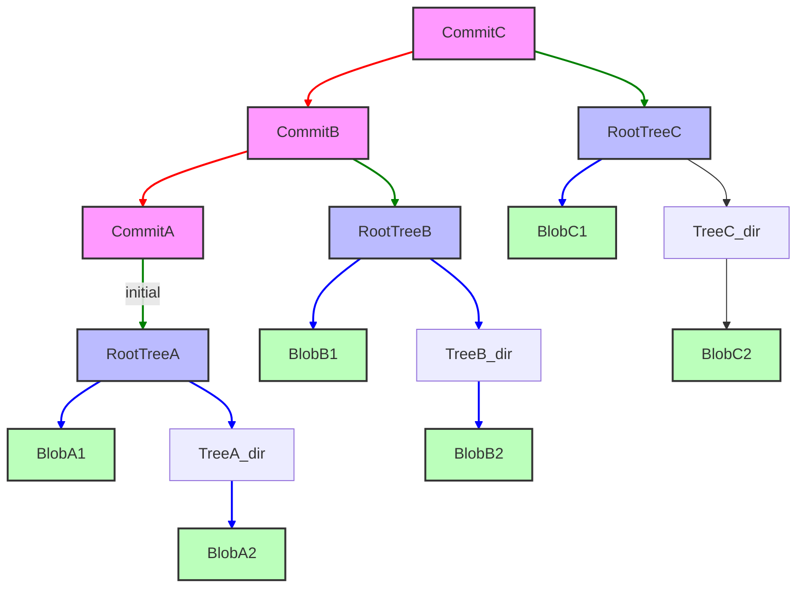

> **Складність**: [СЕРЕДНЯ]
>
> **Час на проходження**: 90 хвилин
>
> **Передумови**: Від нуля до термінала Модуль 0.6 (Основи Git: init, add, commit, push, pull)
>
> **Наступний модуль**: [Модуль 2: Мистецтво гілкування — Розширене злиття](../module-2-advanced-merging/)

---

## Що ви зможете зробити
До кінця цього модуля ви зможете:
1. **Діагностувати** стан репозиторію, перевіряючи каталог `.git`, базу даних об'єктів, посилання (refs) та індекс (index).
2. **Порівняти** blobs, trees та commits під час реконструкції історії проєкту з об'єктів Git.
3. **Реалізувати** зміни в області підготовки (staging area) за допомогою індексу та plumbing-команд Git.
4. **Оцінити** контентно-адресоване сховище на предмет цілісності, ефективності та компромісів під час відновлення.
5. **Спроєктувати** план безпечного відновлення для від'єднаного `HEAD` (detached HEAD), видалених посилань (refs) та недосяжних (unreachable) об'єктів.


## Чому це важливо

Більшість інженерів вивчають Git як набір високорівневих (porcelain) команд — `git add`, `git commit`, `git push`, `git pull` — і покладаються на м'язову пам'ять для всього, що не ламається. Проблеми починаються тоді, коли гілка поводиться так, як ці команди не можуть пояснити. Здається, що злиття (merge) втрачає роботу, яку насправді ще можна відновити. Скидання (reset) переміщує вказівник так, що інженер припускає, ніби історію також видалено. Перебазування (rebase) перезаписує коміти, чиї оригінальні хеші SHA все ще містяться в reflog, але за замовчуванням лише протягом дев'яноста днів (налаштування `gc.reflogExpire` за замовчуванням становить 90 днів). Під поверхнею Git — це невелика адресована за вмістом база даних незмінних об'єктів (blobs, trees, commits, tags) плюс набір рухомих імен (refs), які вказують на ці об'єкти. Щойно ця ментальна модель стає зрозумілою, високорівневі команди перестають бути магією і стають тонким шаром над системою, яку за своїм задумом важко безповоротно знищити.

Платформні інженери щодня керують цією ж адресованою за вмістом моделлю у великих масштабах. Kubernetes `ConfigMap`, який зникає з релізної гілки, не є загадкою; він або все ще присутній у попередньому об'єкті дерева, або все ще в робочому дереві (working tree), в індексі або в записі reflog на чиємусь ноутбуці. Розуміння того, як Git зберігає та посилається на цей вміст — це різниця між відновленням і панікою. Коли в наступних модулях KubeDojo обговорюються операції Kubernetes версій 1.35+, приклади для запуску використовують повний бінарний файл `kubectl`, щоб скопійовані команди поводилися однаково в скриптах та інтерактивних терміналах.

## Каталог `.git` як стан репозиторію
Щоразу, коли ви виконуєте `git init`, Git створює прихований каталог `.git` у корені вашого проєкту. Цей каталог не є прикрасою навколо вашого коду; це база даних репозиторію, сховище конфігурацій, простір імен посилань (refs) та робочий простір для відновлення. Якщо ви скопіюєте каталог проєкту без `.git`, ви скопіюєте файли, але не історію. Якщо ви пошкодите `.git`, ваші робочі файли можуть все ще існувати, проте Git втратить пам'ять, яка пояснює, як ці файли пов'язані з попередніми знімками (snapshots).

Найпростіший спосіб діагностувати стан репозиторію — почати з цього каталогу замість того, щоб спиратися на міфи про гілки. Уявіть `.git` як невеликий склад. Зона `objects/` зберігає запаковані коробки з вмістом, `refs/` зберігає етикетки, прикріплені до коробок, `HEAD` вказує, яку етикетку ви зараз використовуєте, а файл `index` реєструє запропоноване наступне відправлення. Ця аналогія зі складом не є ідеальною, оскільки об'єкти Git мають криптографічні назви, але вона зберігає видимим один важливий факт: видалення етикетки відрізняється від знищення коробки.

Ця відмінність стає практичною, коли репозиторій виглядає зламаним, але все ще містить докази, які можна відновити. Зниклий файл у робочому дереві може безпечно перебувати в індексі, коміт, який не відображає жодна гілка, все ще може з'явитися в reflog, а блоб, на який сьогодні не вказує жоден шлях, все ще може зберігатися як вільний (loose) або запакований (packed) об'єкт. Хороша діагностика уникає зведення цих випадків до однієї розмитої фрази на кшталт "Git загубив мою роботу". Зазвичай Git робив щось конкретне, і `.git` дає вам словниковий запас, щоб з'ясувати, що саме сталося.

Ви також повинні помітити, що `.git` зберігає як локальний стан, так і спільну історію. Віддалений репозиторій не знає про ваші незакомічені записи в індексі, локальні переміщення reflog, невідправлені імена гілок або приватні хуки (hooks). Ця локальність є перевагою, оскільки вона дозволяє вам працювати в автономному режимі та відновлюватися після багатьох помилок, не питаючи дозволу в сервера. Це також відповідальність, оскільки ваша машина може містити єдине посилання на корисний коміт, доки ви не виконаєте push або не створите довговічну гілку.

Давайте зазирнемо всередину щойно ініціалізованого репозиторію.

```bash
# Create a new empty directory
mkdir my-git-repo
cd my-git-repo

# Initialize a Git repository (pin default branch to main)
git init -b main

# List the contents of the .git directory
ls -F .git
```

**Очікуваний вивід:**

```
HEAD		config		description	hooks/		info/		objects/	refs/
```

Вивід є достатньо малим, щоб виглядати нешкідливим, але кожен запис бере участь в окремій частині автомата станів Git. `HEAD` зазвичай вказує на гілку, `config` зберігає налаштування, специфічні для репозиторію, `hooks/` може запускати локальну автоматизацію, `info/` може містити локальні правила ігнорування, `objects/` містить базу даних об'єктів, а `refs/` містить імена гілок і тегів. Виробничий інцидент часто стає можливим вирішити, коли ви можете сказати, яка з цих частин неправильна, замість того, щоб казати, що Git заплутався.

Оригінальний модуль вводив звичні назви, і ми збережемо це покриття, розставляючи частини в робочому порядку. Каталог `objects/` — це місце, де живуть вміст файлів, знімки каталогів і метадані комітів. Каталог `refs/` — це місце, де живуть імена гілок і тегів. `HEAD` з'єднує ваш поточний стан (checkout) з одним із цих імен, або іноді безпосередньо з комітом. Індекс міститься поруч з ними як зона підготовки (staging area), що означає, що він може не збігатися як з вашим робочим каталогом, так і з вашим останнім комітом.

> **Зупиніться та подумайте**: Як ви гадаєте, що відбувається всередині каталогу `objects/`, коли ви вперше застосовуєте `git add` до файлу? Чи збереже Git весь вміст файлу, чи лише різницю (diff)?

Це передбачення має значення, оскільки багато інженерів припускають, що Git зберігає зміни як ланцюжок патчів. Згодом Git може зберігати стислі дельти всередині pack-файлів (packfiles), але модель, якою ви повинні керуватися, базується на знімках. Коли ви додаєте файл, Git хешує вміст файлу і записує об'єкт blob для цього вмісту, якщо він ще не існує. Потім індекс фіксує, що шлях повинен вказувати на цей блоб у наступному знімку, саме тому підготовлений вміст може пережити подальші редагування робочого файлу.

Цей поділ є першою суперздатністю відновлення. Якщо розробник каже: "Я підготував (staged) виправлення, а потім мій редактор пошкодив файл", ви не повинні одразу припускати, що підготовлене виправлення зникло. Підготовлена версія вже може бути збережена як об'єкт blob, і команди `git diff --staged`, `git ls-files --stage` або `git cat-file` можуть допомогти довести, що міститиме наступний коміт. Ви діагностуєте розділення станів, а не один змінний файл.

| Зона репозиторію | Що вона зберігає | Типова команда для діагностики | Симптом збою |
|---|---|---|---|
| Робоче дерево | Редаговані файли на диску | `git status --short` | Файл виглядає зміненим, видаленим або невідстежуваним |
| Індекс | Запропонований наступний коміт | `git ls-files --stage` | Підготовлений вміст відрізняється від вмісту в редакторі |
| База даних об'єктів | Незмінні blobs, trees, commits, tags | `git cat-file -t <hash>` | Хеш існує, відсутній або має неочікуваний тип |
| Посилання (Refs) | Вказівники гілок і тегів | `git rev-parse main` | Гілка вказує на неправильний коміт |
| `HEAD` | Поточний вказівник checkout | `cat .git/HEAD` | Відокремлений (detached) стан або неправильне символічне посилання |

### Читання `.git` без ставлення до нього як до іграшки
Дослідження `.git` є безпечним, коли ви читаєте файли і використовуєте низькорівневі (plumbing) команди, але це ризиковано, коли ви редагуєте внутрішні компоненти вручну. Посилання на гілку (branch ref) — це просто текстовий файл у простих репозиторіях, проте його перезапис вручну може обійти записи reflog і здивувати співавторів. Дисциплінований підхід полягає в тому, щоб прочитати внутрішні компоненти для побудови діагнозу, а потім використати такі команди Git, як `git branch`, `git update-ref`, `git restore` або `git switch`, щоб зробити навмисні зміни.

Типова помилка під час кризових ситуацій (war-room) полягає в запуску дедалі радикальніших високорівневих команд до того, як буде встановлено, який шар працює неправильно. Наприклад, `git reset --hard` змінює індекс і робоче дерево, щоб вони відповідали коміту, що корисно лише в тому випадку, якщо ви вже знаєте, що цільовий коміт є правильним, а локальними редагуваннями можна пожертвувати. Якщо справжня проблема полягає в тому, що `HEAD` відокремлений або посилання на гілку перемістилося, жорстке скидання (hard reset) може стерти корисні докази. Діагностика починається з визначення шару, а не з випробування команд по пам'яті.


## Об'єкти Git: blob, tree, коміти та теги

За своєю суттю Git — це об'єктна база даних, що адресується за контентом (content-addressable), поверх якої реалізовано логіку контролю версій. Типи об'єктів, які ви будете досліджувати найчастіше — це `blob`, `tree`, коміти та анотовані теги. Об'єкт `blob` зберігає вміст файлу, об'єкт `tree` зберігає імена та режими (modes), які пов'язують шляхи з `blob`-об'єктами або іншими `tree`, коміт зберігає кореневе `tree` плюс метадані історії, а анотований тег зберігає метадані релізу та вказує на інший об'єкт. Щойно ви навчитесь порівнювати їхні ролі, історія Git перестане здаватися магією та почне виглядати як пов'язані записи.

Найважливіша відмінність полягає в тому, що імена файлів не зберігаються у `blob`-об'єктах. Об'єкт `blob` відповідає на запитання: "Які байти містив цей файл?" Об'єкт `tree` відповідає: "Які імена існували в цьому каталозі, які режими вони мали та на які об'єкти вказували?" Коміт відповідає: "Яке кореневе `tree` репрезентувало проєкт, хто його записав, коли, з яким повідомленням і які батьківські коміти йому передували?" Розділення цих запитань запобігає великій плутанині під час відновлення даних.

Цей поділ також пояснює, чому переміщення та перейменування є "дешевими" операціями. Якщо ви перемістите `configmap.yaml` у каталог `manifests/`, не змінюючи його байтів, Git не потрібно створювати новий об'єкт із вмістом файлу; він може повторно використати той самий `blob` і записати нові `tree`-об'єкти, які зіставляють різні імена з цим `blob`-об'єктом. Команда `git mv` — це переважно зручна комбінація переміщення шляху в робочому дереві (working tree) та оновлення індексу, а не якийсь спеціальний тип об'єкта для перейменувань. Згодом механізм виявлення перейменувань порівнює `tree`-об'єкти та схожість `blob`-об'єктів, щоб зробити висновок, що шлях змінився. Саме тому поділ контенту та шляхів має таке значення під час рев'ю реорганізації маніфестів Kubernetes.

#### Blob-об'єкти зберігають контент, а не шляхи

Об'єкт `blob` зберігає вміст файлу. Він не зберігає ім'я файлу, шлях чи повідомлення коміту, і він не знає, звідки походить цей контент: з маніфесту Kubernetes, вихідного файлу JavaScript чи з README. Якщо два шляхи мають ідентичні байти, Git може повторно використати той самий `blob` для обох шляхів, оскільки ім'я об'єкта є похідним від його вмісту. Завдяки цій властивості ви іноді можете знайти корисний контент навіть після того, як шлях, який колись на нього вказував, зник.

Створімо файл і погляньмо на його `blob`:

```bash
# Create a sample Kubernetes ConfigMap
cat <<EOF > configmap.yaml
apiVersion: v1
kind: ConfigMap
metadata:
  name: my-app-config
data:
  app.properties: |
    environment=dev
    database.url=jdbc:postgresql://localhost:5432/myapp_dev
  log4j.properties: |
    log4j.rootLogger=INFO, stdout
EOF

# Stage the file (this creates the blob object)
git add configmap.yaml

# Inspect the Git object database
find .git/objects -type f
```

Ви побачите новий файл всередині `.git/objects/`. Його шлях використовує перші два шістнадцяткові символи ідентифікатора об'єкта (object ID) як ім'я каталогу, а решту символів — як ім'я файлу. Це запобігає ситуації, коли у величезних репозиторіях усі вільні об'єкти (loose objects) зберігалися б в одному каталозі. Така схема зберігання є деталлю реалізації, але вона підкріплює модель адресації за контентом: розташування є похідним від ідентифікатора об'єкта, а ідентифікатор об'єкта є похідним від збережених байтів плюс заголовок об'єкта Git.

Тепер використаймо низькорівневу команду "plumbing", щоб дослідити цей `blob`-об'єкт. Команди "plumbing" розроблені для скриптів, діагностики та власних внутрішніх механізмів Git. Високорівневі команди "porcelain", такі як `git add` та `git commit`, є дружнім до людини шаром. Сильний інженер вміє використовувати обидва шари, не вдаючи, що один із них є кращим; команди "porcelain" безпечніші для рутинної роботи, тоді як "plumbing" дають більшу ясність, коли вам потрібно довести, що саме існує.

Команда `git add` вже викликала всередині себе еквівалент `git hash-object -w`; тут ми запускаємо її вручну з метою дослідження. Ця команда є ідемпотентною і повертає той самий хеш незалежно від того, чи існує вже цей `blob` чи ні.

```bash
# Get the SHA-1 hash of the staged file
BLOB_HASH=$(git hash-object -w configmap.yaml)
echo "Blob Hash: $BLOB_HASH"

# Read the content of the blob object
git cat-file -p "$BLOB_HASH"
```

**Очікуваний вивід (схожий на):** Виведений вміст `blob`-об'єкта має точно відповідати `configmap.yaml` і не містити жодних імен файлів, шляхів або метаданих коміту.

```
Blob Hash: 9d8c... (your hash will be different)
apiVersion: v1
kind: ConfigMap
metadata:
  name: my-app-config
data:
  app.properties: |
    environment=dev
    database.url=jdbc:postgresql://localhost:5432/myapp_dev
  log4j.properties: |
    log4j.rootLogger=INFO, stdout
```

Зауважте, що `git cat-file -p` вивів точний вміст `configmap.yaml`, без жодної інформації про ім'я файлу. Ця відсутність не є обмеженням; це свідомий поділ відповідальностей. Об'єкт `blob` може бути використаний повторно всюди, де з'являється такий самий контент, тоді як `tree`-об'єкти надають імена шляхів для конкретних знімків (snapshots). Якщо ви відновите `blob` за хешем, ви відновите контент, але вам все одно знадобиться контекст об'єкта `tree` або коміту, щоб дізнатися, де саме цей контент знаходився.

Ось чому відновлення на рівні об'єктів часто складається з двох етапів. Спочатку ви доводите, що байти все ще існують, досліджуючи `blob`. По-друге, ви відновлюєте сенс, знаходячи `tree` та коміт, які поєднали ці байти зі шляхом та моментом в історії. Сирий (raw) маніфест може сказати вам, чого потребував застосунок, але `tree` підкаже, чи він знаходився в `overlays/prod`, у `base` або був тимчасовим експериментом. У платформенній розробці цей контекст може стати межею між відновленням правильної конфігурації та повторним впровадженням тестового налаштування.

Модель `blob`-об'єктів також пояснює, чому Git іноді здається напрочуд ефективним у репозиторіях із дубльованими згенерованими файлами, вендорними маніфестами чи скопійованими прикладами. Ідентичний контент може ділити одну об'єктну ідентичність навіть тоді, коли він фігурує під різними іменами. Це не означає, що дублювання файлів є хорошим архітектурним рішенням, і це не усуває витрат на рев'ю, але це означає, що модель зберігання даних Git відокремлює ідентичність контенту від людських назв. Коли два шляхи вказують на один і той самий `blob`, Git каже вам, що ці байти ідентичні, а не те, що шляхи означають одне й те саме в операційному сенсі.

#### Об'єкти tree зберігають знімки каталогів

Об'єкти `tree` — це записи каталогів в об'єктній базі даних Git. Для кожного запису в каталозі вони зберігають тип об'єкта, ідентифікатор об'єкта, режим файлу та ім'я. Об'єкт `tree` може вказувати на `blob`-об'єкти для файлів і на інші об'єкти `tree` для підкаталогів, що дозволяє Git представляти весь знімок проєкту як одне кореневе `tree`. Коли файл змінюється, Git записує новий `blob` і нові `tree`-об'єкти вздовж шляху від зміненого файлу до кореня, тоді як незмінені піддерева можна використати повторно.

Коли ви виконуєте `git commit`, Git бере поточний стан вашої області підготовки (staging area) та перетворює його на ієрархію `tree`-об'єктів для каталогів і `blob`-об'єктів для файлів. Робочий каталог (working directory) не комітиться безпосередньо. Ось чому файл можна додати в staging area, змінити його знову, а потім закомітити у його старішій, підготовленій формі. Коміт використовує `tree`, запропоноване індексом, а не те, що ваш редактор випадково показує у цю секунду.

Закомітьмо наш `configmap.yaml` і дослідімо отримане `tree`:

```bash
# Commit the file
git commit -m "Add initial ConfigMap"

# Get the SHA-1 hash of the latest commit
COMMIT_HASH=$(git rev-parse HEAD)
echo "Commit Hash: $COMMIT_HASH"

# Read the commit object to find its root tree
git cat-file -p "$COMMIT_HASH"
```

Вивід `git cat-file -p "$COMMIT_HASH"` покаже рядок, що починається з `tree`, за яким слідуватиме ідентифікатор об'єкта кореневого `tree`. Копіювання цього ідентифікатора вручну підходить для навчання, але скрипти повинні використовувати такі команди, як `git rev-parse HEAD^{tree}`, або обережно парсити результати. Важливий момент є концептуальним: коміт не містить кожного файлу всередині себе (inline). Він вказує на `tree`, яке визначає корінь знімка.

```bash
# Read the content of the root tree object
TREE_HASH=$(git rev-parse "$COMMIT_HASH^{tree}")
git cat-file -p "$TREE_HASH"
```

**Очікуваний вивід (схожий на):** Вивід кореневого `tree` зіставляє ім'я файлу з ідентифікатором `blob`-об'єкта та режимом файлу, не зберігаючи вміст файлу всередині себе.

```
100644 blob 9d8c...	configmap.yaml
```

Цей вивід показує, що кореневе `tree` містить один запис: звичайний режим файлу, тип об'єкта `blob`, ідентифікатор `blob`-об'єкта та ім'я шляху `configmap.yaml`. Режим `100644` означає звичайний невиконуваний файл — саме те, чого ви очікуєте від YAML. Якби репозиторій мав каталог `manifests/`, кореневе `tree` містило б запис `tree` для цього каталогу, а вкладене `tree` містило б імена маніфестів.

Повторне використання `tree` — це одна з причин, чому великі репозиторії залишаються працездатними навіть тоді, коли змінюється лише невелика частина проєкту. Якщо коміт оновлює один `ConfigMap` у каталозі `apps/payments/`, Git може повторно використати ідентифікатори об'єктів для непов'язаних піддерев, таких як `apps/search/` або `platform/policies/`. Операції `diff` та `checkout` можуть скористатися цими стабільними ідентифікаторами, оскільки однакові ідентифікатори `tree` доводять, що весь знімок каталогу залишився незмінним. Команди, орієнтовані на користувача, все ще говорять про файли та шляхи, але база даних може пропустити роботу на рівні об'єктів.

#### Коміти прив'язують знімки до історії

Об'єкти комітів об'єднують усе разом. Коміт містить вказівник на кореневе `tree`, нуль або більше вказівників на батьківські коміти, інформацію про автора (author) та комітера (committer), а також повідомлення коміту. Перший коміт не має батька. Звичайний наступний коміт має одного батька. Коміт злиття (merge commit) зазвичай має двох батьків — саме так Git фіксує, що дві лінії розробки були об'єднані без копіювання всього вмісту файлів у спеціальний файл злиття.

Цей ланцюжок об'єктів комітів утворює спрямований ациклічний граф (directed acyclic graph), який люди в повсякденні називають історією Git. Він є спрямованим, оскільки коміти вказують назад на батьків, і він є ациклічним, оскільки коміт не може бути своїм власним предком. Гілки не є самим графом; гілки — це імена, які вказують на коміти в графі. Ця відмінність є фундаментом для розуміння того, чому створення гілок є "дешевим", чому видалення гілки не призводить до негайного видалення комітів, і чому недосяжні (unreachable) коміти все ще можна відновити протягом певного часу.

Знову дослідімо наш об'єкт коміту:

```bash
# Read the commit object
git cat-file -p "$COMMIT_HASH"
```

**Очікуваний вивід (схожий на):**

```
tree 1a2b3c4d5e6f7890abcdef1234567890abcdef
author Your Name <your.email@example.com> 1678886400 +0000
committer Your Name <your.email@example.com> 1678886400 +0000

Add initial ConfigMap
```

Тут рядок `tree` вказує на кореневий `tree`-об'єкт для цього коміту. Якби це був не перший коміт, ви б також побачили рядок `parent`. Автор (author) фіксує, хто спочатку написав зміну, тоді як комітер (committer) фіксує, хто помістив її в історію цього репозиторію. Вони можуть відрізнятися під час `rebase`, `cherry-pick` та робочих процесів із застосуванням патчів (patch application). Саме тому під час рев'ю інцидентів слід уникати припущень, що одне ім'я пояснює кожну дію.

> **Зупиніться та подумайте**: Який підхід ви б обрали тут: `git log` чи `git cat-file -p <commit_hash>`, щоб швидко переглянути повідомлення останнього коміту, і чому?

Для щоденної роботи `git log -1` є кращою командою "porcelain", оскільки вона форматує історію для людей і вирішує поширені проблеми відображення. Для внутрішньої роботи `git cat-file -p <commit_hash>` точно доводить, який об'єкт зберіг Git, і робить посилання на `tree` та батьків видимими. Звичка senior-інженера полягає не в тому, щоб запам'ятати одну "правильну" команду; вона полягає в тому, щоб обрати той рівень, який відповідає на запитання з найменшою неоднозначністю.

#### Анотовані теги — це також об'єкти

Анотовані теги — це четвертий основний тип об'єктів. На відміну від легковагового (lightweight) тегу, який є лише ref-файлом у `.git/refs/tags/`, анотований тег створює об'єкт тегу, який може містити ідентичність того, хто його створив (tagger), повідомлення та вказівник на об'єкт, якому дається ім'я.

```bash
# Create an annotated tag object
git tag -a v1.0 -m "first stable"

# Inspect the tag ref and object type
TAG_HASH=$(git rev-parse v1.0)
git cat-file -t "$TAG_HASH"
git cat-file -p "$TAG_HASH"
```

**Очікуваний вивід (схожий на):** Спочатку з'являється тип об'єкта; потім форматований вивід тегу показує цільовий коміт, ім'я тегу, автора (tagger) та повідомлення релізу.

```
tag
object 2f1a...
type commit
tag v1.0
tagger Your Name <your.email@example.com> 1678886400 +0000

first stable
```

Рядок `object` вказує на коміт, якому додається тег, тоді як сам об'єкт тегу має власну ідентичність. Легковаговий тег, такий як `git tag quick-test HEAD`, пропускає створення цього об'єкта та записує лише ім'я посилання (ref name), що вказує безпосередньо на коміт. Це корисно для локальних позначок, але менш надійно як доказ релізу.


## Індекс: Зона підготовки як пропозиція коміту
Зона підготовки (staging area), також відома як індекс, є критично важливим проміжним кроком між вашим робочим каталогом та історією репозиторію. Це бінарний файл за адресою `.git/index`, який зберігає шляхи, режими, ідентифікатори об'єктів та метадані, які Git використовуватиме для наступного коміту. Це не копія вашого робочого каталогу і не те саме, що `HEAD`. Це запропонований знімок (snapshot), який можна інспектувати, оновлювати та комітити.

Коли ви виконуєте `git add <file>`, Git обчислює ідентифікатор об'єкта для вмісту файлу, за потреби записує об'єкт blob і оновлює запис індексу для цього шляху. Якщо ви згодом відредагуєте цей же файл, робоче дерево зміниться, але індекс і далі вказуватиме на попередній blob. Саме така поведінка стоїть за знайомим повідомленням `git status` про те, що файл одночасно додано до зони підготовки (staged) і змінено (modified). Внутрішньо Git просто порівнює три стани: `HEAD`, індекс і робоче дерево.

> **Зупиніться та подумайте**: Якщо індекс — це просто бінарний файл, що зберігає запропоновані зміни, що відбувається з об'єктами blob, створеними командою `git add`, якщо ви вирішите скасувати підготовку файлу за допомогою `git restore --staged`? Чи видаляються ці об'єкти blob негайно?

Вони не зникають негайно. Скасування підготовки (unstaging) змінює вказівник індексу, але об'єкт blob може залишатися в базі даних об'єктів як недосяжний об'єкт (unreachable object), поки внутрішні механізми очищення Git згодом не видалять його відповідно до своїх вікон безпеки. Ось чому агресивні команди очищення не повинні бути частиною рефлексу відновлення. Поки збір сміття (garbage collection) не видалить недосяжні об'єкти, база даних може все ще містити вміст, на який наразі не вказує жодна гілка.

Давайте змінимо наш `configmap.yaml`, додамо його до зони підготовки та подивимося на індекс:

```bash
# Modify configmap.yaml
cat <<EOF > configmap.yaml
apiVersion: v1
kind: ConfigMap
metadata:
  name: my-app-config
data:
  app.properties: |
    environment=prod
    database.url=jdbc:postgresql://production.db.svc/myapp_prod
  log4j.properties: |
    log4j.rootLogger=WARN, file
EOF

# Stage the modified file
git add configmap.yaml

# Inspect the index
git ls-files --stage
```

**Очікуваний вивід (подібний до):**

```
100644 2f1a... 0	configmap.yaml
```

Друга колонка — це ідентифікатор об'єкта blob, який наразі підготовлений (staged) для `configmap.yaml`. Якщо ви зараз зробите коміт, Git створить дерево (tree), що вказуватиме на цей blob, потім створить коміт, що вказуватиме на це дерево, а потім перемістить посилання поточної гілки (ref) на новий коміт. Якщо ви знову відредагуєте файл до того, як зробити коміт, індекс і далі вказуватиме на цей підготовлений blob, поки ви не додасте файл знову. Це головна причина, чому зона підготовки підтримує ретельно скомпоновані коміти.

> **Зупиніться та подумайте**: Перш ніж запускати це в реальному репозиторії, який вивід ви очікуєте від `git diff`, `git diff --staged` та `git status --short` після того, як ви додасте файл до зони підготовки, а потім знову відредагуєте його? Перша команда порівнює робоче дерево з індексом, тому вона має показати друге редагування. Підготовлений diff порівнює індекс із `HEAD`, тому він має показати перше редагування. Status повинен виявити як підготовлені (staged), так і непідготовлені (unstaged) зміни для того самого шляху.

Індекс також підтримує просунуті робочі процеси (workflows), такі як часткова підготовка (partial staging), стадії конфліктів під час злиття (merges) та зміни режимів. Під час конфлікту злиття `git ls-files --stage` може показати кілька записів для одного шляху з різними номерами стадій, що представляють базу злиття (merge base), "наше" ("ours") та "їхнє" ("theirs"). Вам не потрібні ці деталі для кожного коміту, але це пояснює, чому індекс — це більше, ніж просто буфер обміну. Це структурована база даних підготовки, яка дозволяє Git моделювати невирішені стани перед створенням чистого дерева.

Часткова підготовка заслуговує на особливу увагу, оскільки це одне з тих місць, де внутрішня модель Git покращує щоденну інженерну практику. За допомогою `git add -p` ви можете вибрати фрагменти (hunks) з робочого файлу та помістити в індекс лише їх. Внутрішньо Git записує підготовлений blob, який може не збігатися з жодним повним файлом, відкритим у вашому редакторі, оскільки він представляє скомпоновану версію, зібрану для наступного коміту. Це може бути дуже ефективним для відокремлення виправлення помилки від очищення логів, але це вимагає дисципліни, оскільки підготовлений знімок стає менш візуально очевидним.

Найбезпечніший спосіб використовувати цю можливість — це переглядати підготовлений знімок як окремий артефакт. Перш ніж комітити часткову зміну, запустіть підготовлений diff і прочитайте його так, ніби це патч від іншого інженера. Якщо репозиторій містить маніфести розгортання, переконайтеся, що підготовлене дерево містить узгоджений стан релізу (release state), а не половину локального експерименту. Індекс дозволяє вам робити точні коміти, але точність допомагає лише тоді, коли ви інспектуєте запропонований коміт, перш ніж записати його в постійну історію.

У робочому процесі Kubernetes індекс може захистити вас від змішування непов'язаних операційних змін. Припустімо, ви оновлюєте образ Deployment, а також редагуєте ConfigMap під час зневадження збою. Підготовка (staging) лише Deployment зберігає фокус коміту розгортання (rollout), залишаючи при цьому редагування ConfigMap у робочому дереві для подальшого тестування. Якщо пізніше колега запитає, що саме було розгорнуто (shipped), дерево коміту дасть точну відповідь, а не історію про те, що колись показував ваш редактор.


## Контентно-адресоване сховище та DAG
Сховище Git є контентно-адресованим (content-addressable), що означає, що імена об'єктів генеруються з вмісту об'єктів, а не призначаються центральним сервером. Для історичних репозиторіїв цим ім'ям об'єкта зазвичай є ідентифікатор SHA-1; новіші версії Git також підтримують репозиторії SHA-256 у певних контекстах, хоча SHA-1 залишається поширеним у публічній взаємодії. Практичний урок полягає не в тому, що хеші — це магія. Урок у тому, що зміна навіть одного байта створює іншу ідентичність об'єкта.

Це має глибокі наслідки для цілісності, ефективності та незмінності. Цілісність покращується, оскільки Git може виявити, коли збережений вміст більше не відповідає своєму ідентифікатору об'єкта. Ефективність зростає, тому що ідентичний вміст може зберігатися один раз і на нього можуть посилатися кілька дерев. Незмінність покращує розуміння процесу, оскільки наявний об'єкт не редагується на місці; зміна записує новий об'єкт і переміщує посилання. Саме завдяки цим властивостям Git може швидко робити локальні коміти, не запитуючи у центральної бази даних номер наступної ревізії.

Правило "однаковий вміст, однаковий об'єкт" також дає Git корисні спрощення (shortcuts). Якщо два записи дерева вказують на той самий ідентифікатор blob, Git знає, що вміст файлів ідентичний, не читаючи та не порівнюючи кожен байт знову. Якщо два дерева каталогів мають однаковий ідентифікатор дерева, Git знає, що все піддерево збігається, і це сильніше твердження, ніж "імена виглядають схожими". У репозиторіях GitOps це означає, що під час рев'ю можна відрізнити справжню зміну бажаного стану (desired-state change) від переміщення шляху, змін виключно у форматуванні або дубльованого вмісту маніфесту, відстежуючи ідентифікатори об'єктів замість того, щоб покладатися лише на візуальні враження.

Те, як ці незмінні об'єкти пов'язуються між собою, утворює спрямований ациклічний граф (directed acyclic graph, DAG). Кожен коміт вказує на свої батьківські коміти та на кореневе дерево (root tree), кожне дерево вказує на blob-об'єкти або вкладені дерева, а посилання гілок вказують на вибрані коміти. Саме ця структура дозволяє Git реалізовувати створення гілок, злиття (merging), перебазування (rebasing), перемикання (checkout), бінарний пошук (bisect) та відновлення на основі reflog як операції з графами. Коли ви розумієте граф, команди, які раніше здавалися непов'язаними, стають просто різними способами переміщення або читання вказівників.

Історія — це граф, а не лінія, оскільки коміт може мати кілька нащадків і, у випадку коміту злиття (merge commit), кілька батьків. Злиття зберігає обидва батьківські посилання, тому граф фіксує, що дві лінії роботи були об'єднані. Перебазування (rebase) робить дещо інше: воно копіює зміни на нового батька, створюючи нові об'єкти комітів з новими ідентифікаторами, оскільки батьківське посилання є частиною вмісту коміту. Ця відмінність має значення для платформних команд, оскільки інструменти рев'ю, нотатки щодо відкатів (rollback notes) і контролери GitOps базують свою логіку на верхівках комітів (commit tips), походженні (parentage) та досяжних деревах, а не на неформальній історії про те, яка гілка "з'явилася першою".



На цій збереженій діаграмі об'єкти комітів вказують назад крізь історію, а також вниз на кореневі дерева. Кореневі дерева вказують безпосередньо на вміст файлу або на вкладені дерева каталогів, а ці вкладені дерева вказують на інші blob-об'єкти. Кольори є візуальними допоміжними засобами, але операційне значення мають стрілки: досяжна верхівка гілки зберігає свій коміт досяжним, цей коміт зберігає своє дерево досяжним, а дерево зберігає свої blob-об'єкти досяжними.

Git може відобразити операторське бачення того ж самого DAG безпосередньо, коли вам потрібен граф у терміналі під час діагностики гілок:

```bash
git log --oneline --graph --all
```

Ця команда обходить об'єкти комітів, малює батьківські зв'язки та показує кожну досяжну гілку і верхівку тегу, включені параметром `--all`. Картинка менш повна, ніж діаграма об'єктів, оскільки вона зосереджена на комітах замість дерев та blob-об'єктів, але саме цей вигляд ви використовуєте під час реальної діагностики гілок.

Packfiles додають важливу деталь реалізації, не змінюючи логічну модель. Окремі об'єкти (loose objects) спочатку є індивідуальними стисненими файлами, але згодом Git пакує багато об'єктів разом для ефективності використання диска та швидкості передавання. Всередині packfile Git може застосовувати дельта-компресію (delta-compress) для схожих об'єктів один відносно одного, ось чому дехто може казати, що Git зберігає різниці. Для діагностики завжди тримайте в голові логічну об'єктну модель в першу чергу, а вже потім пам'ятайте, що фізичне сховище під нею може бути оптимізованим.

Спочатку дивіться, потім перепаковуйте (repack), оскільки робота з розміром повинна починатися з доказів, а не з очищення. Перш ніж змінювати сховище репозиторію, виміряйте його за допомогою `git count-objects -v`:

```bash
git count-objects -v
```

**Очікуваний вивід (подібний до):** Точні цифри залежать від історії репозиторію, але ці поля розділяють окремі об'єкти (loose objects), запаковані об'єкти та нерозпізнане сміття.

```
count: 42
size: 168
in-pack: 1204
packs: 3
size-pack: 8120
prune-packable: 2
garbage: 0
size-garbage: 0
```

Рядок `count` повідомляє про кількість окремих об'єктів (loose objects). `in-pack` підраховує об'єкти, які вже збережені в packfiles, `size-pack` повідомляє про використання диска packfile у KiB, а `garbage` підраховує файли в `.git/objects`, які Git не розпізнає як валідні об'єкти. Якщо цифри показують реальну проблему зі сховищем, команда `git repack -a -d` перезаписує пакети (packs) і відкидає надлишкові окремі об'єкти за один прохід, але її місце — після діагностики, а не в першому рефлексі відновлення.

Такий багаторівневий погляд запобігає двом протилежним помилкам. Одна помилка — це заперечувати, що packfiles внутрішньо зберігають дельти, через що використання диска та поведінка Git під час передавання по мережі здаються загадковими. Інша помилка — це міркувати про історію так, ніби коміти є патчами, а не знімками (snapshots), що робить операції відновлення складнішими, ніж вони є насправді. Коміт вказує на повне дерево проєкту, навіть якщо Git зберіг деякі базові байти ефективно. Коли ви запитуєте `git show <commit>:configmap.yaml`, Git реконструює вміст blob-об'єкта через базу даних об'єктів і представляє файл у тому вигляді, в якому він існував у цьому знімку.

Хешування також має соціальні наслідки в розподілених командах. Оскільки ідентифікатори об'єктів генеруються локально на основі вмісту, два розробники можуть створити ідентичні об'єкти blob без узгодження з сервером. Оскільки об'єкти комітів містять ідентифікатори батьків, дані автора, дані комітера, часові мітки (timestamps), ідентифікатори дерев та повідомлення, два коміти з ідентичними змінами файлів все одно можуть мати різні ідентифікатори комітів. Саме тому перебазування (rebasing) змінює ідентифікатори комітів, навіть коли кінцеві файли виглядають однаково. Граф фіксує як вміст, так і походження (ancestry), і інструменти для спільної роботи будують свою логіку рев'ю на цьому графі.

> **Зупиніться та подумайте**: Який підхід ви б обрали тут і чому: інспектувати підозріло зниклий файл шляхом пошуку в старих комітах за допомогою команд porcelain, чи спочатку інспектувати сирі об'єкти за допомогою plumbing? У звичайному репозиторії починайте з porcelain, наприклад, `git log -- path` та `git show <commit>:<path>`, оскільки шляхи та коміти зберігають зміст. Опускайтеся до рівня plumbing, коли команди porcelain не можуть відповісти на запитання, наприклад, коли вказівник гілки перемістився, ім'я шляху непевне, або ви маєте лише ідентифікатор об'єкта з виводу `git fsck` чи reflog.

Компроміс щодо цілісності також варто сформулювати ретельно. Хеші роблять випадкове пошкодження видимим, але вони не замінюють рев'ю, резервні копії, підписані релізи (signed releases) або захищені гілки (protected branches). Валідний коміт усе ще може видалити не той файл, а примусове надсилання (forced push) все одно може перемістити спільну гілку на шкідливий коміт. Об'єктна модель Git дає вам інструменти для розслідування та відновлення; вона не робить операційну дисципліну необов'язковою.


## Refs, `HEAD` та мислення під час відновлення

Гілки в Git — це легковагові посилання (refs) на коміти, а не окремі копії вашого проєкту. Назва гілки, наприклад `main`, зазвичай зберігається у `.git/refs/heads/` або всередині packed refs, а її значенням є object ID коміту на кінці гілки. Коли ви створюєте нову гілку, Git записує нову назву, яка вказує на наявний коміт. Коли ви робите коміт у цій гілці, Git записує нові об'єкти та переміщує назву гілки на новий коміт.

Невеликі репозиторії часто зберігають refs як loose файли, але Git також може консолідувати їх у `.git/packed-refs`. Вам рідко потрібно самостійно запускати `git pack-refs --all`, оскільки `git gc` може робити це під час обслуговування (housekeeping), але цей файл усе одно показує назви, відображені на object IDs:

```bash
git pack-refs --all
cat .git/packed-refs
```

**Очікуваний вивід (схожий на):** Спакований файл залишається читабельним текстом, де спочатку йдуть коментарі, а потім — по одному object ID та назві ref на кожен запис.

```
# pack-refs with: peeled fully-peeled sorted
2f1a... refs/heads/main
9abc... refs/tags/v1.0
```

`HEAD` — це спеціальний вказівник, який повідомляє Git, що саме ви зараз витягнули (checked out). У типовому випадку це символічне посилання (symbolic reference), таке як `ref: refs/heads/main`, що означає, що нові коміти просуватимуть гілку `main`. У стані detached `HEAD` він вказує безпосередньо на коміт, а не на назву гілки. Detached `HEAD` — це не пошкодження; це нормальний стан для CI-збірок, інспектування тегів та історичного дебагінгу, але нові коміти, зроблені в цьому стані, потребують гілки або тегу, якщо ви хочете їх зберегти.

Давайте подивимося на наш поточний `HEAD` та гілковий ref:

```bash
# View what HEAD points to
cat .git/HEAD

# View the main branch ref (works for loose and packed refs)
git rev-parse main
```

**Очікуваний вивід (схожий на):**

```
# cat .git/HEAD
ref: refs/heads/main

# git rev-parse main
2f1a... (this will be the hash of your latest commit)
```

Це показує, що `HEAD` вказує на гілку `main`, а гілка `main` вказує на останній коміт. Коли ви робите новий коміт, Git створює об'єкт коміту, вказує цей коміт на його батька (parent) та дерево (tree), а потім пересуває вказівник поточної гілки вперед. Якщо `HEAD` є від'єднаним (detached), Git усе ще може створити коміт, але жодна назва гілки не переміщується разом із ним. Саме тому detached коміти здаються втраченими після checkout, навіть якщо об'єкти все ще можуть існувати.

Мислення під час відновлення (recovery mindset) починається саме з цієї різниці: назви переміщуються швидко, об'єкти зберігаються, поки правила очищення не видалять їх. Видалення гілки видаляє ref, а не обов'язково коміти, trees та blobs, до яких цей ref підтримував доступ (keep reachable). Від'єднаний коміт може зникнути зі звичайного списку гілок, але reflog усе ще може зафіксувати, куди вказував `HEAD`, коли коміт було створено. Поки закінчення терміну дії reflog (expiration) та garbage collection не зроблять ці об'єкти придатними для pruning (обрізання), "втрачений" зазвичай означає "не названий очевидним ref", що є проблемою, яку можна діагностувати, а не приводом для паніки.

Гіпотетичний сценарій: Команда платформи бореться з розбіжностями конфігурації (configuration drift) між Kubernetes-середовищами development та staging. Їхній головний застосунок покладається на критичний `ConfigMap` для рядків підключення до бази даних та feature flags. Під час очищення розробниця видаляє локальну гілку після експериментального rebase і вважає, що вона лише видаляє ярлик (label). Технічно вона має рацію щодо видалення гілки, але вона не перевірила, чи коміти, доступні лише з цього ярлика, все ще потрібні для відновлення.

У цьому сценарії відновлення проходить успішно, оскільки старший інженер використовує `git reflog`, щоб знайти object ID, на який вказував `HEAD` до rebase, а потім відновлює відсутній маніфест із того коміту. Глибший урок полягає не в тому, щоб "ніколи не видаляти гілки". Урок полягає в тому, що відновлення в Git залежить від досяжності (reachability) та часу. Reflogs зберігають недавні переміщення refs, недосяжні (unreachable) об'єкти можуть виживати до pruning, а спокійне розслідування часто може відновити те, що поспішний force-push зробив би важчим для пояснення.

Інциденти за участю операторів зазвичай поєднують погану гігієну refs із тиском щодо очищення. Локальна гілка відновлення з назвою `tmp` захищає коміт відкату (rollback) лише доти, доки хтось не видалить її, не записавши object ID; тоді рядок "dangling commit" від `git fsck` — це доказ, який потрібно оглянути, а не шум, який потрібно видалити. Дослідіть об'єкт за допомогою `git cat-file`, відновіть шлях через trees або записи reflog, створіть тимчасову гілку зі свідомо обраною назвою та відкладіть `git gc` або `git repack`, доки не дізнаєтеся, чи потребує репозиторій відновлення, чи лише зменшення розміру. Документація Git щодо refs, reflog, fsck, garbage collection та repack описує окремі механізми, тому ваша нотатка про інцидент також має відокремлювати гігієну вказівників (pointers), досяжність об'єктів, відновлення вмісту та обслуговування сховища. ([Pro Git: Git References](https://git-scm.com/book/en/v2/Git-Internals-Git-References), [Git documentation: git-reflog](https://git-scm.com/docs/git-reflog), [Git documentation: git-fsck](https://git-scm.com/docs/git-fsck), [Git documentation: git-gc](https://git-scm.com/docs/git-gc), [Git documentation: git-repack](https://git-scm.com/docs/git-repack))

Розробка безпечного плану відновлення починається із заморожування доказів. Не запускайте агресивний garbage collection, не робіть pruning негайно і не виконуйте force-push зі здогаданим виправленням поверх спільної гілки. Спочатку огляньте `HEAD`, гілкові refs, записи reflog та наявність об'єктів. Потім створіть захисну гілку або тег, що вказує на будь-який підозрілий коміт, перш ніж продовжити. Назва гілки майже нічого не вартує, і вона може зберегти коміт достатньо довго, щоб команда могла його ретельно перевірити.

Лише після завершення відновлення, і після того, як кожен підозрілий коміт буде або збережено, або свідомо відхилено, вам слід свідомо скоротити вікно відновлення та очистити сховище:

```bash
git reflog expire --expire=now --all
git gc --prune=now
```

Команда `expire` скорочує вікно reflog, щоб `prune` міг фактично звільнити раніше придатні для відновлення об'єкти. Таке поєднання є доречним для контрольованого очищення після того, як команда зберегла або відхилила кожен підозрілий об'єкт, а не тоді, коли розслідування все ще активне.

Практична нотатка про відновлення повинна фіксувати як команди, так і їхні інтерпретації. Наприклад, "запис reflog `HEAD@{2}` вказував на коміт до rebase" є кориснішим за "я знайшов старий коміт", оскільки інший інженер може перевірити цей доказ. Аналогічно, "ref гілки перемістився з одного object ID на інший під час force-push" краще, ніж "main змінилася". Git дає вам точні ідентифікатори; використовуйте їх у нотатках про інциденти, щоб команда могла відрізнити факти від здогадок та реконструювати послідовність подій пізніше.

Щойно корисний коміт буде захищено, виправлення (repair) має бути настільки вузьким, наскільки дозволяє діагноз. Відновлення одного шляху з відомого коміту є вузькішим (безпечнішим) підходом, ніж виконання reset для цілої гілки. Створення revert-коміту є безпечнішим для спільної історії, ніж переписування публічної гілки, коли поганий коміт уже дістався колег. Cherry-picking відновленого коміту може бути доречним, коли detached робота містить чисте виправлення, але merging може бути кращим, коли потрібно зберегти контекст гілки. Об'єктна модель не обирає для вас політику; вона дає вам докази, необхідні для свідомого вибору.

## Патерни та антипатерни

Наведені нижче патерни — це звички, які роблять внутрішні механізми Git корисними, не перетворюючи щоденну розробку на археологію. Вам не потрібно інспектувати `.git` для кожної feature-гілки, так само як вам не потрібен дебагер для кожного рядка коду. Мета полягає в тому, щоб знати, який рівень перевіряти, коли звичайні команди дають несподіваний результат, і зберігати докази перед використанням команд, які переписують або відкидають стан.

| Патерн | Коли його використовувати | Чому це працює | Міркування щодо масштабування |
|---|---|---|---|
| Діагностувати за рівнями | Статус, staged вміст, вказівник гілки або існування об'єкта є незрозумілими | Відокремлює робоче дерево, індекс, базу даних об'єктів, refs та `HEAD` | Навчіть команди користуватися коротким контрольним списком для інцидентів |
| Зберігати перед виправленням | Коміт може бути недосяжним (unreachable) або ref несподівано перемістився | Тимчасова гілка або тег зберігає об'єкти досяжними | Використовуйте назви з ID інцидентів або датами для подальшого очищення |
| Надавати перевагу porcelain-командам для рутинних змін | Ви робите коміт, створюєте гілку, відновлюєте або переглядаєте звичайну роботу | Команди porcelain безпечно оновлюють пов'язаний стан | Задокументуйте винятки, де дозволено використання plumbing |
| Використовувати plumbing-команди для перевірки доказів | Вам потрібно перевірити точний тип об'єкта, вміст або tree-зв'язок | Plumbing напряму відкриває базу даних сховища | Поєднуйте "сирі" (raw) команди з письмовими нотатками під час розбору інцидентів |

Антипатерни зазвичай виникають через ставлення до Git або як до чогось занадто магічного, або як до занадто простого. Інженер, який боїться внутрішніх механізмів, може продовжувати пробувати випадкові porcelain-команди, тоді як інженер, який надмірно довіряє внутрішнім механізмам, може редагувати `.git/refs` вручну та обходити корисні захисні механізми. Хороша практика лежить між цими крайнощами. Вільно читайте внутрішні структури, обережно їх записуйте та надавайте перевагу командам Git, які залишають докази в reflog.

| Антипатерн | Що йде не так | Краща альтернатива |
|---|---|---|
| Запуск деструктивного очищення під час відновлення | Недосяжні, але корисні об'єкти можуть бути обрізані (pruned) до інспектування | Створюйте захисні refs, перевіряйте reflog та відкладайте очищення |
| Припущення, що видалення гілки миттєво видаляє код | Команди або панікують без потреби, або ігнорують ризик досяжності | Пояснюйте, що refs переміщуються легко, тоді як об'єкти тимчасово зберігаються |
| Сприйняття staged вмісту як ідентичного до вмісту редактора | Коміти включають старішу staged версію, ніж очікує розробник | Порівнюйте `git diff`, `git diff --staged` та `git ls-files --stage` |
| Редагування `.git/HEAD` або refs вручну | Можна обійти reflogs та пов'язані інваріанти | Використовуйте `git switch`, `git branch` або `git update-ref` свідомо |

## Структура прийняття рішень

Коли Git поводиться несподівано, оберіть шлях діагностики, запитавши, який рівень спричинив симптом. Якщо файл на диску є неправильним, почніть із робочого дерева та індексу (index). Якщо відображення історії комітів є неправильним, огляньте коміти та refs. Якщо назва гілки, схоже, перемістилася, перевірте `HEAD`, гілкові refs та reflog. Якщо у вас є лише хеш або вивід `git fsck`, перевірте тип і вміст об'єкта за допомогою команд plumbing.

| Симптом | Перше запитання | Найкращий перший інструмент | Ескалювати, коли |
|---|---|---|---|
| Файл має несподівані редагування | Зміна є staged, unstaged чи і тим, і іншим? | `git status --short` | Використовуйте `git diff --staged` та інспектуйте індекс |
| Коміт, здається, пропускає файл | Чи включав індекс потрібний blob? | `git show --name-status HEAD` | Огляньте tree коміту та staged записи |
| Гілка вказує на неправильну роботу | Чи перемістився ref, чи `HEAD` перейшов у стан detached? | `cat .git/HEAD` та `git reflog` | Створіть захисну гілку перед виправленням |
| Хеш об'єкта з'являється в журналах | Який тип цього об'єкта? | `git cat-file -t <hash>` | Відформатуйте для зручного читання (pretty-print) або відновіть вміст за типом |
| CI витягнув "сирий" (raw) коміт | Чи нова робота створюється у стані detached? | `git status --branch` | Створіть гілку перед збереженням нових комітів |

Використовуйте цей потік під час інцидентів: спостерігайте, визначте рівень, збережіть докази, перевірте точні об'єкти, а потім виконайте виправлення за допомогою найвужчої команди. Порядок має значення, оскільки Git надає вам кілька команд, які можуть змусити видимий симптом зникнути, водночас стираючи корисні підказки. Вузьке виправлення може бути таким же простим, як повторне індексування (staging) одного файлу, створення гілки на записі reflog або відновлення одного шляху зі старішого коміту. Широке виправлення, наприклад, reset спільної гілки, має відбуватися лише після того, як ви зрозумієте граф.

Це компроміс між швидкістю та впевненістю. Під час локальної помилки швидкість перемагає, і команд porcelain достатньо. Під час відкату в production впевненість перемагає, оскільки команді потрібно знати, яке tree відповідає розгорнутому артефакту. Внутрішні механізми не уповільнюють вас, якщо їх використовувати вибірково; вони запобігають внесенню швидких, але погано підкріплених доказами змін, які створюють другий інцидент.

## Чи знали ви?

1. Git був спочатку розроблений Лінусом Торвальдсом (Linus Torvalds) у 2005 році для розробки ядра Linux після того, як спільноті ядра знадобилася швидка розподілена система для дуже великого проєкту.
2. Колізія SHA-1, продемонстрована CWI та Google у 2017 році, підштовхнула Git до реалізацій SHA-1 із виявленням колізій, а згодом — до експериментальної підтримки репозиторіїв SHA-256.
3. Окремі (loose) об'єкти Git спочатку стискаються індивідуально, але під час housekeeping багато об'єктів може зберігатися у packfiles із дельта-компресією для ефективності.
4. Перш ніж Git хешує об'єкт, він додає спереду заголовок у форматі `type size` плюс нульовий байт, тому тип об'єкта бере участь в ідентифікації.

## Типові помилки

| Помилка | Чому це трапляється | Як це виправити |
|---|---|---|
| Припущення, що blob містить ім'я файлу | `git cat-file -p` виводить вміст файлу, тому здається, що шлях має бути десь поруч | Перевіряйте tree, яке вказує на blob, коли вам потрібен шлях |
| Виконання коміту без повторного додавання (`add`) після редагування | Staged версія та робоча версія виглядають схожими в редакторі | Порівнюйте `git diff` та `git diff --staged` перед комітом |
| Ставлення до detached `HEAD` як до пошкодження репозиторію | CI-системи та tag checkouts часто показують сирі ідентифікатори комітів | Створіть гілку, якщо вам потрібно зберегти нові коміти з цього стану |
| Видалення гілки перед перевіркою reflog | Гілки здаються папками, тому очищення видається нешкідливим | Спочатку збережіть підозрілі коміти за допомогою тимчасової гілки або тегу |
| Запуск команд pruning під час паніки | Команди очищення звучать як команди відновлення | Відкладіть pruning до завершення відновлення та перевірки |
| Сприйняття packfiles як іншої моделі Git | Дельта-компресія змушує людей думати, що Git базується лише на патчах (patch-based) | Розмірковуйте термінами blobs, trees, комітів та refs; розглядайте пакування як оптимізацію зберігання |
| Редагування refs вручну, щоб "виправити" історію | Файли посилань виглядають простими в невеликих репозиторіях | Використовуйте команди Git, які навмисно оновлюють reflogs та пов'язаний стан |


## Контрольні запитання
<details><summary>Сценарій: Ви досліджуєте локальний репозиторій колеги, оскільки скрипт пошкодив їхній working directory. Команда `git cat-file -p` на об'єкті виводить записи на зразок `100644 blob 9d8c... app.js` та `040000 tree 1a2b... src`. Що ви перевіряєте, і як це допомагає діагностувати стан репозиторію?</summary>

Ви перевіряєте об'єкт tree, а не blob або commit. Записи описують знімок директорії, називаючи файловий blob та вкладений tree, тому цей об'єкт допомагає діагностувати стан репозиторію на рівні директорії. Він показує, які ідентифікатори об'єктів відповідали певним шляхам, але не містить вмісту файлів або метаданих commit. Щоб продовжити розслідування, перевірте вказаний blob для отримання вмісту або знайдіть commit, який вказує на цей tree.
</details>

<details><summary>Сценарій: Ви зробили staged для `deployment.yaml`, відредагували його знову, а потім помітили, що ваш commit розгортання (rollout) Kubernetes 1.35+ може не містити останніх змін. Як слід порівняти working tree, index та commit перед тим, як продовжити?</summary>

Почніть з окремого порівняння трьох станів замість того, щоб довіряти відображенню в редакторі. `git diff --staged` показує, що index зафіксує відносно `HEAD`, тоді як `git diff` показує, чим working tree відрізняється від index. `git ls-files --stage deployment.yaml` може підтвердити ідентифікатор об'єкта blob у staging-зоні, якщо вам потрібен доказ. Це імплементує дисципліну staging-зони, оскільки ви робите commit лише після того, як index вказуватиме на цільовий вміст.
</details>

<details><summary>Сценарій: CI витягнув (checked out) сирий хеш commit, розробник зробив там hotfix, і тепер `cat .git/HEAD` не показує `ref: refs/heads/main`. Який безпечний план відновлення збереже detached `HEAD` роботу?</summary>

Це detached `HEAD`, що є нормальним, але його легко втратити з поля зору. Безпечний план відновлення полягає у створенні гілки або тегу на поточному commit перед перемиканням, після чого слід вирішити, чи робити merge, cherry-pick або відкривати pull request з цієї гілки. Нові commits, зроблені у стані detached, є реальними об'єктами commit, але жоден ref гілки не просувається разом з ними. Збереження ref робить ці commits досяжними та дає команді стабільне ім'я для перевірки.
</details>

<details><summary>Сценарій: Колега каже, що Git зберігає лише diffs, тому відсутній `ConfigMap` неможливо відновити, якщо ви не знаєте точного patch. Як би ви оцінили content-addressable storage у своїй відповіді?</summary>

Логічна модель Git базується на знімках (snapshots): commits вказують на trees, а trees вказують на blobs, що містять вміст файлів. Packfiles можуть фізично стискати об'єкти за допомогою дельт (delta-compress), але ця оптимізація не змінює того, як ви міркуєте про відновлення. Якщо commit або tree, які посилалися на `ConfigMap`, є досяжними, ви можете відновити повний вміст файлу з цього знімка. Дизайн content-addressable також дозволяє Git перевіряти цілісність об'єктів шляхом порівняння збереженого вмісту з його ідентифікатором об'єкта.
</details>

<details><summary>Сценарій: У вас є хеш blob від `git fsck`, але немає імені шляху. Які об'єкти Git ви повинні порівняти, щоб реконструювати історію проєкту навколо цього вмісту?</summary>

Сам по собі blob дає вміст, але не шлях, тому вам потрібні trees, які посилаються на blob, і commits, які посилаються на ці trees. Порівняння blobs, trees та commits дозволяє реконструювати історію проєкту від вмісту через знімки директорій до іменованих commits. Ось чому `git cat-file -p <blob>` — це лише перший крок. Корисна історія з'являється, коли ви знаходите запис tree, який назвав blob, і commit, який зробив цей tree досяжним.
</details>

<details><summary>Сценарій: Під час реагування на інцидент хтось пропонує `git reset --hard` та `git gc --prune=now`, щоб "все очистити" перед розслідуванням. Що вам слід зробити натомість?</summary>

Не починайте з очищення, коли відновлення все ще під питанням. Спочатку перевірте `HEAD`, refs, reflog, index та будь-які підозрілі ідентифікатори об'єктів, а потім створіть захисні гілки або теги для commits, які можуть мати значення. Жорстке скидання (hard reset) може знищити докази в working tree та staging-зоні, тоді як негайне очищення (pruning) може видалити недосяжні об'єкти, які ще можна було відновити. Кращий план — зберегти докази, **Діагностувати** рівень, а вже потім точково відновлювати.
</details>

<details><summary>Сценарій: Вам потрібно пояснити молодшому інженеру, чому створення гілки відбувається швидко, і чому видалення гілки — це не те саме, що видалення кожного файлу. Яке пояснення ви повинні надати?</summary>

Гілка — це ref, що є легковаговим іменем, яке вказує на об'єкт commit. Створення гілки зазвичай записує невеликий вказівник, а її видалення прибирає це ім'я, а не негайно видаляє всі об'єкти, досяжні від старого tip. Commits та їхні trees і blobs можуть залишатися досяжними з інших refs, reflogs або тимчасових вікон зберігання недосяжних даних. Це пояснення пов'язує поведінку гілок із графом об'єктів, а не з інтуїцією копіювання тек.
</details>


## Практична вправа
Ця вправа створює невеликий репозиторій і просить вас свідомо досліджувати кожен рівень Git. Використовуйте одноразову директорію, оскільки суть полягає в тому, щоб експериментувати без страху. Вам потрібно буде **Діагностувати** стан репозиторію через `.git`, **Порівняти** blobs, trees та commits, **Реалізувати** зміни у staging-зоні, **Оцінити** content-addressable поведінку та **Створити** безпечний план відновлення для detached роботи. Якщо у вас також є доступний кластер Kubernetes, ви можете застосувати зразок `ConfigMap` за допомогою `kubectl`, але вправа з Git не вимагає кластера.

### Підготовка
Створіть тимчасовий репозиторій та налаштуйте ідентифікацію, якщо ваш глобальний конфіг Git порожній. Виконуйте всі команди всередині одноразової директорії. Файл-приклад — це `ConfigMap` у Kubernetes, оскільки дрейф конфігурації є реалістичним збоєм платформи, але Git ставиться до нього як до будь-якого іншого текстового файлу. Ваше завдання — спостерігати, який рівень Git змінюється після кожної операції.

### Завдання
- [ ] **Діагностувати** стан репозиторію, переглянувши `.git`, прочитавши `HEAD` і визначивши, де живуть refs та об'єкти.
- [ ] **Порівняти** blobs, trees та commits, створивши `configmap.yaml`, зробивши його staged, зафіксувавши (commit) і дослідивши кожен тип об'єкта.
- [ ] **Реалізувати** зміни у staging-зоні, зробивши staged редагування для production, відредагувавши файл знову, та порівнявши `git diff`, `git diff --staged` і `git ls-files --stage`.
- [ ] **Оцінити** content-addressable storage, хешуючи ідентичний вміст двічі та пояснюючи, чому ідентифікатор об'єкта змінюється чи не змінюється.
- [ ] **Створити** безпечний план відновлення, створивши commit з detached `HEAD`, зберігши його за допомогою гілки, і перевіривши ref гілки.
- [ ] **Записати** команди, які ви використовували, і докази, які згенерувала кожна команда, так, ніби ви пишете замітку про інцидент для колеги.

<details><summary>Рішення для завдань 1 та 2</summary>

Ініціалізуйте репозиторій, створіть `ConfigMap`, запустіть `git add` і перевірте `.git/objects` до та після staging. Використовуйте `git hash-object -w configmap.yaml`, щоб підтвердити вміст blob, потім зробіть commit і перевірте `git cat-file -p HEAD`, щоб знайти кореневий tree. Використовуйте `git cat-file -p <tree-id>`, щоб порівняти запис tree з вмістом blob. Критерій успіху полягає в тому, що ви можете пояснити, чому blob не має імені файлу, тоді як tree його містить.
</details>

<details><summary>Рішення для завдання 3</summary>

Після staging редагування для production змініть файл знову без staging. `git diff --staged` повинен показати staged production редагування відносно `HEAD`, тоді як `git diff` повинен показати пізніше working tree редагування відносно index. `git ls-files --stage` повинен показати ідентифікатор blob, який наразі є staged для цього шляху. Критерій успіху полягає в тому, що ви можете сказати, яка версія буде зафіксована просто зараз.
</details>

<details><summary>Рішення для завдання 4</summary>

Запустіть `git hash-object configmap.yaml` двічі, не змінюючи файл, і підтвердіть, що ідентифікатор об'єкта стабільний. Потім змініть один байт і запустіть знову; ідентифікатор повинен змінитися, тому що Git називає об'єкти на основі їхнього вмісту плюс заголовок. Якщо два різні шляхи містять ідентичні байти, вони можуть ділити спільний ідентифікатор blob. Критерій успіху — це пояснення цілісності та дедуплікації без твердження, що Git зберігає лише patches.
</details>

<details><summary>Рішення для завдання 5</summary>

Зробіть другий commit у `main` (наприклад, додайте рядок коментаря до `configmap.yaml`, зробіть staged і commit), щоб гілка мала щонайменше два commits. Знайдіть хеш першого commit за допомогою `git rev-list --max-parents=0 HEAD`. Перейдіть (checkout) на цей commit у стані detached `HEAD` за допомогою `git switch --detach "$(git rev-list --max-parents=0 HEAD)"`, зробіть невелике редагування, зробіть staged і commit. Перевірте `cat .git/HEAD` — він повинен показати сирий хеш commit, а не `ref: refs/heads/...`. Перед тим як перемкнутися, створіть гілку на поточному commit за допомогою `git branch recovered-detached-work HEAD`. Перемкніться назад на `main` за допомогою `git switch main` і перевірте за допомогою `git rev-parse recovered-detached-work`, що збережений ідентифікатор commit збігається з вашим detached commit. Критерій успіху полягає в тому, що жоден корисний commit не залежить лише від detached `HEAD`.

Для суміжної перевірки unreachable-object створіть тимчасову (throwaway) гілку з одним commit, який нікуди не є merged, видаліть цю гілку та запустіть `git fsck --unreachable`. Критерій успіху полягає в тому, що ви можете ідентифікувати dangling commit або blob як доказ, який можна відновити, перш ніж відбудеться експірація reflog або pruning.
</details>

### Критерії успіху
- [ ] Ви можете **Діагностувати** стан репозиторію, назвавши, який рівень змінився після `git add`, `git commit`, створення гілки та detached checkout.
- [ ] Ви можете **Порівняти** blobs, trees та commits, використовуючи вивід `git cat-file`, а не розмиті описи.
- [ ] Ви можете **Реалізувати** зміни у staging-зоні та передбачити, який вміст файлу міститиме наступний commit.
- [ ] Ви можете **Оцінити** content-addressable storage, пояснивши ідентифікатори об'єктів, immutability та оптимізацію packfile.
- [ ] Ви можете **Створити** безпечний план відновлення, який зберігає detached або недосяжну роботу перед очищенням.


## Джерела
- [Pro Git: Plumbing and Porcelain](https://git-scm.com/book/en/v2/Git-Internals-Plumbing-and-Porcelain)
- [Pro Git: Git Objects](https://git-scm.com/book/en/v2/Git-Internals-Git-Objects)
- [Pro Git: Git References](https://git-scm.com/book/en/v2/Git-Internals-Git-References)
- [Pro Git: Packfiles](https://git-scm.com/book/en/v2/Git-Internals-Packfiles)
- [Git documentation: git-cat-file](https://git-scm.com/docs/git-cat-file)
- [Git documentation: git-hash-object](https://git-scm.com/docs/git-hash-object)
- [Git documentation: git-ls-files](https://git-scm.com/docs/git-ls-files)
- [Git documentation: git-rev-parse](https://git-scm.com/docs/git-rev-parse)
- [Git documentation: gitrevisions](https://git-scm.com/docs/gitrevisions)
- [Git documentation: git-reflog](https://git-scm.com/docs/git-reflog)
- [Git documentation: git-fsck](https://git-scm.com/docs/git-fsck)
- [Git documentation: git-gc](https://git-scm.com/docs/git-gc)
- [Git documentation: git-repack](https://git-scm.com/docs/git-repack)
- [Git documentation: hash-function-transition (SHA-256)](https://git-scm.com/docs/hash-function-transition)


## Наступний модуль
Далі переходьте до [Module 2: The Art of the Branch — Advanced Merging](../module-2-advanced-merging/), щоб попрактикувати переміщення гілок, структуру merge та відновлення після конфліктів за допомогою об'єктної моделі, яку ви розбудували тут.
