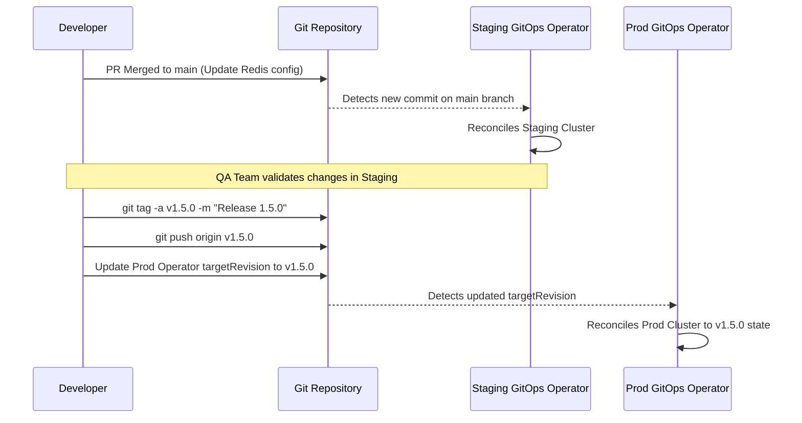

# Модуль 10: Міст до GitOps — інфраструктура як джерело

## Що ви зможете зробити

- **Спроектувати** структуру репозиторію інфраструктури для декількох середовищ, використовуючи Kustomize overlays для усунення дублювання конфігурацій.
- **Впровадити** робочі процеси просування (promotion) на основі тегів Git для надійного перенесення конфігурацій зі staging у production.
- **Діагностувати** відхилення стану (state drift) між працюючим Kubernetes кластером та його джерелом істини в репозиторії Git за допомогою циклів узгодження (reconciliation loops).
- **Оцінити** переваги безпеки захисту гілок та криптографічного підписання комітів у ланцюжку постачання GitOps з нульовою довірою (zero-trust).
- **Впровадити** стратегії захисту гілок та ізоляції каталогів для запобігання несанкціонованим змінам інфраструктури.

## Чому це важливо

Платіжний шлюз вийшов з ладу о 14:00 у найбільш завантажений торговий день року. Дашборди моніторингу в центрі керування спалахнули червоним, а основний API почав повертати помилки HTTP 503 Service Unavailable тисячам клієнтів щохвилини. Команда реагування на інциденти швидко виявила безпосередній симптом: у Deployment `payment-processing` була відсутня критична змінна оточення, необхідна для автентифікації в нещодавно створеному кластері бази даних. Провідний інженер платформи перевірила логи конвеєра безперервної інтеграції (CI) — усі нещодавні завдання з розгортання завершилися успішно. Вона перевірила репозиторій інфраструктури Git — необхідна змінна оточення була чітко визначена в маніфестах Kubernetes. Проте, коли вона перевірила поточний стан за допомогою командного рядка, змінна була повністю відсутня у запущених Pod.

Що ж сталося насправді? Трьома днями раніше розробник терміново вирішував проблему вичерпання ресурсів у середовищі production. Щоб швидко перевірити гіпотезу, він обійшов конвеєр розгортання та вручну виконав команду редагування безпосередньо об’єкта Deployment терміналом, ненавмисно видаливши при цьому заплановані зміни конфігурації бази даних. Він мав намір скасувати зміну, але забув. Оскільки традиційний конвеєр розгортання, що працює за моделлю "push", взаємодіє з кластером лише тоді, коли новий коміт коду запускає виконання, кластер непомітно відхилився від цільового стану, визначеного в системі контролю версій. Ця "бомба уповільненої дії" залишалася непоміченою в production, доки стару базу даних нарешті не вивели з експлуатації, що спричинило катастрофічний збій.

Цей сценарій ілюструє фундаментальний недолік імперативного керування інфраструктурою та традиційних push-конвеєрів розгортання. Якщо люди-оператори або зовнішні системи автоматизації мають повноваження змінювати стан кластера безпосередньо, відхилення конфігурації (configuration drift) є не просто можливістю — це абсолютна неминучість на довгому проміжку часу. У цьому модулі ви дізнаєтеся, як подолати прірву між вашими репозиторіями Git та середовищами Kubernetes, прийнявши операційну модель GitOps. Ви перейдете від ставлення до Git як до пасивного механізму зберігання до використання його як активного єдиного джерела істини для всієї архітектури платформи, що безперервно узгоджується.

## Зміна парадигми GitOps: від Push до Pull

Протягом багатьох років галузевим стандартом доставки програмного забезпечення та інфраструктури була модель "Push". У push-архітектурі розробник зливає код у репозиторій, що запускає сервер безперервної інтеграції (CI). Цей сервер збирає артефакти, запускає тести, а потім бере на себе відповідальність за розгортання змін. Для цього серверу CI потрібні привілейовані облікові дані — часто права cluster-admin — для автентифікації в цільовому кластері Kubernetes та виконання команд на кшталт `kubectl apply -f manifests/`.

Хоча це було значним покращенням порівняно з ручним розгортанням, це створює величезні безпекові та операційні ризики. Сервер CI стає ціллю високої вартості для зловмисників; компрометація системи CI надає зловмиснику ключі до всього "королівства" production. Крім того, модель push абсолютно не бачить, що відбувається в кластері після завершення розгортання. Якщо адміністратор вручну видалить ресурс, конвеєр CI про це не дізнається. Стан, описаний у Git, і фактичний стан кластера розходяться, що призводить до небажаного "відхилення конфігурації".

GitOps впроваджує фундаментальну зміну парадигми, переходячи до моделі "Pull". У GitOps-архітектурі інтелект розгортання повністю переміщується всередину самого кластера Kubernetes. Спеціалізований програмний оператор — такий як ArgoCD або Flux — безперервно працює як Pod у кластері. Цей оператор налаштований з доступом лише для читання до вашого Git-репозиторію. Його єдина мета — постійно порівнювати бажаний стан (маніфести, що зберігаються в Git) з фактичним живим станом кластера. Коли він виявляє різницю, він автоматично затягує (pull) зміни з Git і застосовує їх локально для синхронізації станів.

Уявіть цей перехід як кухню ресторану. Модель Push схожа на те, як офіціант забігає на кухню і вигукує інструкції безпосередньо шеф-кухарю, час від часу сам пересуваючи сковорідки на плиті, щоб прискорити процес. Це працює, коли немає натовпу, але в годину пік це призводить до хаосу, пропущених замовлень і конфліктних дій. Модель Pull, навпаки, — це стандартна система замовлень на чеках. Офіціант (розробник) записує замовлення на чеку і вішає його на рейку (репозиторій Git). Шеф-кухар (оператор GitOps) постійно стежить за рейкою. Коли з’являється новий чек, шеф-кухар знімає його і виконує саме так, як написано. Шеф-кухар — єдина людина, якій дозволено торкатися плити, що забезпечує контрольоване, передбачуване та перевірене середовище.

Розглянемо, як це змінює нашу взаємодію з Kubernetes. У традиційному push-середовищі скрипт конвеєра може виглядати як така імперативна послідовність:

```bash
# Традиційний імперативний Push-скрипт конвеєра
echo "Автентифікація в Kubernetes..."
aws eks update-kubeconfig --region us-east-1 --name prod-cluster
echo "Застосування маніфестів..."
kubectl apply -f deployment.yaml
kubectl apply -f service.yaml
echo "Перевірка статусу розгортання..."
kubectl rollout status deployment/frontend -n production
```

У середовищі GitOps скрипт конвеєра взагалі не торкається Kubernetes. Конвеєр просто оновлює репозиторій Git, можливо, змінюючи тег образу в маніфесті та створюючи коміт:

```bash
# Декларативний GitOps CI-скрипт конвеєра
echo "Оновлення тегу образу в маніфесті розгортання..."
sed -i 's/frontend:v1.2.0/frontend:v1.2.1/g' deployment.yaml
git add deployment.yaml
git commit -m "chore: bump frontend image to v1.2.1"
git push origin main
# Конвеєр завершується тут. Оператор кластера бере керування на себе автономно.
```

> **Зупиніться та подумайте**: Уявіть сценарій, де розробник з доступом до кластера вручну запускає `kubectl delete service frontend -n production`. У традиційному Push-конвеєрі, що станеться далі? У GitOps Pull архітектурі, що станеться далі? Подумайте про стан кластера через 10 хвилин після ручного видалення в обох сценаріях.

У сценарії push сервіс залишається видаленим до наступного разу, коли розробник знову злиє код, що запустить конвеєр CI для повторного виконання `kubectl apply`. Застосунок залишається непрацюючим годинами або днями. У сценарії GitOps внутрішній оператор виявить відсутність сервісу під час наступного циклу узгодження (зазвичай протягом 3 хвилин) і негайно відтворить його на основі визначення, яке все ще є в репозиторії Git, фактично самостійно "вилікувавши" кластер і відхиливши ручну зміну.

## Проектування репозиторію інфраструктури

Щоб ефективно використовувати GitOps, ви повинні спроектувати структуру репозиторію, яка зможе обслуговувати кілька середовищ — наприклад, Development, Staging та Production — без дублювання тисяч рядків YAML. Якщо ви просто скопіюєте маніфести розгортання в окремі папки для кожного середовища, ви створите систему, яку неможливо підтримувати. Коли потрібно буде додати нову змінну оточення в усі середовища, інженер повинен буде вручну оновити три або більше окремих файлів, що практично гарантує помилку або пропуск якогось середовища.

Галузевим стандартом вирішення цієї проблеми в екосистемі Kubernetes є Kustomize — інструмент керування конфігураціями без шаблонів, вбудований безпосередньо в `kubectl`. Kustomize працює на основі концепції "Bases" (Основи) та "Overlays" (Накладки). Каталог Base містить загальні, фундаментальні маніфести, що застосовуються до всіх середовищ. Каталоги Overlay містять лише специфічні відмінності, або патчі, необхідні для конкретного середовища, такі як різна кількість реплік, специфічні ліміти ресурсів або специфічні карти конфігурації (ConfigMaps).

При проектуванні репозиторію слід відокремлювати вихідний код застосунку від його інфраструктурних маніфестів. Це запобігає випадковому запуску циклів розгортання інфраструктури конвеєрами CI, які збирають бінарні файли застосунку, і навпаки.

Розглянемо таку оптимальну структуру каталогів для репозиторію інфраструктури з кількома середовищами:

```text
infrastructure-repo/
├── platform-components/           <-- Основні додатки кластера
│   ├── ingress-nginx/
│   ├── cert-manager/
│   └── external-dns/
└── applications/                  <-- Визначення навантажень
    └── frontend-service/
        ├── base/                  <-- Загальні базові маніфести
        │   ├── deployment.yaml
        │   ├── service.yaml
        │   └── kustomization.yaml <-- Оголошує базові ресурси
        └── overlays/              <-- Патчі для конкретних середовищ
            ├── dev/
            │   ├── patch-replicas.yaml
            │   ├── patch-env.yaml
            │   └── kustomization.yaml <-- Вказує на base, застосовує dev-патчі
            ├── staging/
            │   ├── patch-replicas.yaml
            │   └── kustomization.yaml
            └── prod/
                ├── patch-replicas.yaml
                ├── patch-resources.yaml
                └── kustomization.yaml
```

Давайте подивимося, як Kustomize усуває дублювання. `base/deployment.yaml` містить стандартне визначення:

```yaml
# applications/frontend-service/base/deployment.yaml
apiVersion: apps/v1
kind: Deployment
metadata:
  name: frontend
spec:
  replicas: 1 # Стандартне консервативне базове значення
  selector:
    matchLabels:
      app: frontend
  template:
    metadata:
      labels:
        app: frontend
    spec:
      containers:
      - name: web
        image: myregistry.com/frontend:latest
        ports:
        - containerPort: 8080
```

Для середовища production нам потрібна висока доступність та гарантовані ресурси. Замість копіювання всього файлу, ми створюємо цільовий патч в overlay для production:

```yaml
# applications/frontend-service/overlays/prod/patch-replicas.yaml
apiVersion: apps/v1
kind: Deployment
metadata:
  name: frontend
spec:
  replicas: 5 # Перевизначення кількості реплік для production
  template:
    spec:
      containers:
      - name: web
        resources:
          requests:
            cpu: "1000m"
            memory: "2Gi"
          limits:
            cpu: "2000m"
            memory: "4Gi"
```

Файл `kustomization.yaml` для production об’єднує їх, гарантуючи, що коли оператор GitOps читає каталог `prod`, він динамічно об’єднує базу та патч у пам’яті перед застосуванням фінальної конфігурації в кластер:

```yaml
# applications/frontend-service/overlays/prod/kustomization.yaml
apiVersion: kustomize.config.k8s.io/v1beta1
kind: Kustomization
resources:
  - ../../base
patches:
  - path: patch-replicas.yaml
```

**Реальний випадок:** Один фінтех-стартап спочатку структурував свій GitOps-репозиторій, використовуючи окремі гілки для середовищ: гілку `dev`, гілку `staging` та гілку `main` для production. Розробникам доводилося використовувати `git cherry-pick` для перенесення інфраструктурних змін між гілками. Під час великої міграції бази даних інженер переніс оновлення розгортання в гілку `main`, але зіткнувся з конфліктом злиття. Вирішуючи конфлікт, він випадково прийняв рядок підключення до бази даних з `dev`. Оскільки не було єдиного представлення всіх середовищ, помилка була непомітною під час перевірки Pull Request. Production підключився до бази даних розробки, що пошкодило тестові дані та спричинило серйозний інцидент із конфіденційністю. Ось чому структура на основі каталогів (trunk-based infrastructure) значно краща: усі середовища видно в гілці main, Kustomize забезпечує узгодженість, а відмінності чітко ізольовані в папках overlays.

## Керування релізами та семантичне версіонування

Коли інфраструктура повністю визначена в Git, ваші робочі процеси Git стають вашою стратегією керування релізами. Як безпечно просунути зміну конфігурації з середовища розробки через staging і, зрештою, у production? Хоча перенесення файлів між каталогами overlays є одним із методів, найбільш надійний та прозорий підхід використовує теги Git та семантичне версіонування (SemVer).

У зрілому середовищі GitOps оператор, що керує кластером production, не налаштований на відстеження гілки `main`. Відстеження динамічної гілки означає, що будь-який злитий Pull Request негайно впливає на production, що порушує принципи контрольованого керування релізами. Замість цього оператор production налаштовується на відстеження конкретного тегу Git, наприклад `v2.4.1`.

Це створює свідомий, явний механізм просування. Коли інженери задоволені станом інфраструктури в гілці `main` (яка може безперервно розгортатися в кластер staging), вони створюють криптографічний тег Git, що позначає саме цей коміт. Потім оператор GitOps для production оновлюється для націлювання на новий тег. Це гарантує, що production завжди прив’язаний до незмінного знімка репозиторію на певний момент часу.

Розглянемо діаграму Mermaid, що ілюструє цю архітектуру просування релізів:



Для практичного впровадження цього за допомогою Kubernetes версії 1.35+ та стандартних примітивів GitOps, необхідно визначити набір інструкцій для оператора GitOps. Інструменти на кшталт ArgoCD розширюють API Kubernetes за допомогою Custom Resource Definitions (CRDs), впроваджуючи нові типи об’єктів, які розуміє кластер. Найфундаментальнішим з них є кастомний ресурс `Application`. Замість прямого застосування Deployments та Services, ви надсилаєте в кластер маніфест `Application`. Цей маніфест діє як вказівник, що повідомляє оператору ArgoCD, за яким саме репозиторієм Git стежити, який шлях містить маніфести (наприклад, Kustomize overlay) і в який простір імен кластера спрямовувати розгортання. У зрілій конфігурації ви налаштовуєте цей `Application` на суворе націлювання на тег семантичної версії, а не на динамічну гілку.

```yaml
# Ресурс ArgoCD Application, що інструктує GitOps інструмент керувати frontend у production
apiVersion: argoproj.io/v1alpha1
kind: Application
metadata:
  name: frontend-production
  namespace: gitops-system
spec:
  project: default
  source:
    repoURL: 'https://github.com/myorg/infrastructure.git'
    path: applications/frontend-service/overlays/prod
    # Націлювання саме на цей тег релізу, не на гілку
    targetRevision: v1.5.0 
  destination:
    server: 'https://kubernetes.default.svc'
    namespace: production
  syncPolicy:
    automated:
      prune: true
      selfHeal: true
```

Коли приходить час просувати наступний реліз, операційна процедура суворо визначена в Git. Інженер створює новий тег, а потім подає Pull Request, що оновлює `targetRevision` з `v1.5.0` на `v1.6.0` у маніфесті застосунку.

> **Зупиніться та подумайте**: Ви виявили критичну вразливість безпеки в Ingress-контролері production, яка потребує негайного виправлення конфігурації. У вашому середовищі staging зараз тестується велике, руйнівне оновлення бази даних у гілці `main`. Який підхід ви оберете для розгортання термінового виправлення (hotfix) у production і чому?
> А) Злити hotfix у `main`, а потім позначити `main` новим тегом релізу для production.
> Б) Перейти на конкретний коміт Git, що відповідає поточному тегу production, створити від нього гілку, застосувати hotfix, позначити нову гілку тегом і спрямувати production на новий тег.
> Подумайте про ізоляцію змін перед тим, як продовжити.

Правильний архітектурний вибір — Б. Створюючи гілку від поточного тегу production, ви ізолюєте термінове виправлення безпеки від руйнівних, неперевірених змін бази даних, які зараз знаходяться в гілці `main`. У цьому полягає сила незмінних тегів Git: вони забезпечують відому робочу базу, до якої ви можете повернутися або від якої можете створити гілку в будь-який час, абсолютно незалежно від поточної розробки.

## Безпека та комплаєнс у конвеєрі GitOps

Перенесення ключів від "королівства" з сервера CI всередину самого кластера значно зменшує зовнішню поверхню атаки, але фундаментально зміщує межу безпеки. Репозиторій Git тепер є найвищим рівнем керування (control plane) вашою інфраструктурою. Той, хто контролює репозиторій, контролює кластер. Тому захист конвеєра GitOps вимагає застосування суворого контролю доступу та криптографічної перевірки безпосередньо в системі контролю версій.

Найкритичнішим впровадженням безпеки в архітектурі GitOps є вимога криптографічно підписаних комітів. Якщо зловмисник отримає доступ до робочої станції інженера або викраде його облікові дані Git, він зможе надіслати шкідливі зміни інфраструктури (наприклад, відкривши NodePort для доступу до внутрішньої бази даних), видаючи себе за справжнього інженера.

> **Зупиніться та подумайте**: Якщо зловмисник скомпрометує облікові дані хмарного провайдера розробника (наприклад, ключ доступу AWS), але не матиме його ключа підпису Git SSH, чи зможе він успішно розгорнути шкідливе навантаження в кластері production у моделі Zero-Trust GitOps?

Ні, не зможе. Оскільки конвеєр CI більше не надсилає (push) зміни, а оператор кластера має виключне право змінювати стан, зовнішні хмарні облікові дані марні для розгортання. Якщо зловмисник спробує надіслати зміни в репозиторій, правила захисту гілок відхилять коміт, оскільки він не матиме дійсного криптографічного підпису. Межа довіри надійно змістилася до системи контролю версій.

Щоб запобігти такій атаці на ланцюжок постачання, інженери повинні підписувати свої коміти за допомогою ключів GPG або SSH, прив’язаних до апаратних модулів безпеки або суворих постачальників ідентифікації. Коли коміт підписаний, Git генерує криптографічний підпис, що доводить: особа, яка створила коміт, володіє приватним ключем, пов’язаним з її ідентичністю.

```bash
# Налаштування Git для підпису комітів за допомогою SSH-ключа
git config --global gpg.format ssh
git config --global user.signingkey ~/.ssh/id_ed25519.pub
git config --global commit.gpgsign true

# Створення підписаного коміту (Git автоматично використовує налаштований ключ)
git commit -S -m "feat: enforce network policies in production"
```

Однак підписання комітів локально марне, якщо інфраструктура не вимагає цього. Це досягається через суворі правила захисту гілок (Branch Protection Rules), налаштовані в центральному репозиторії Git (наприклад, GitHub, GitLab). Репозиторій GitOps з нульовою довірою повинен забезпечувати такі правила для гілки за замовчуванням:

1. **Вимагати підписані коміти**: Система контролю версій повинна відхиляти будь-який коміт, надісланий у репозиторій, який не має дійсного криптографічного підпису.
2. **Вимагати перегляд Pull Request перед злиттям**: Жоден інженер не може надсилати код безпосередньо в гілку main. Потрібно як мінімум два схвалення від призначених власників коду (code owners).
3. **Вимагати проходження перевірок статусу**: Скрипти автоматичної перевірки (такі як лінтинг YAML, валідація схем Kubernetes та інструменти сканування безпеки, наприклад Checkov або KubeLinter) повинні пройти успішно перед тим, як кнопка злиття стане активною.

Розглянемо, як межа довіри зміщується з інфраструктури CI до репозиторію Git, як показано на наступній схемі:

```mermaid
graph TD
    subgraph Traditional Push Model
        Developer1[Developer] -->|git push| GitRepo1[(Git Repository)]
        GitRepo1 -->|webhook| CIServer[CI Server]
        CIServer -->|kubectl apply| Cluster1((Kubernetes Cluster))
        Attacker1[Attacker] -.->|Compromises| CIServer
    end

    subgraph Zero-Trust GitOps Pull Model
        Developer2[Developer] -->|Signed git push| GitRepo2[(Git Repository)]
        GitRepo2 -.->|Branch Protection| Validated[(Validated Source of Truth)]
        Validated <--|git pull| Operator[GitOps Operator]
        Operator -->|Reconciles| Cluster2((Kubernetes Cluster))
        Attacker2[Attacker] -.->|Cannot access| Operator
    end

    style CIServer fill:#f9a8d4,stroke:#be185d,stroke-width:2px
    style Operator fill:#a7f3d0,stroke:#047857,stroke-width:2px
```

Коли ці засоби контролю впроваджені, стан безпеки інфраструктури кардинально змінюється. Давайте оцінимо різницю:

| Вектор безпеки | Традиційний CI/CD (Push) | Zero-Trust GitOps (Pull) |
| :--- | :--- | :--- |
| **Облікові дані кластера** | Зберігаються зовні в серверах CI; високий ризик викрадення. | Зберігаються виключно всередині кластера; ніколи не залишають його межі. |
| **Аудит** | Складно; вимагає перехресної перевірки логів CI, історії Git та аудит-логів кластера. | Абсолютний; `git log` надає математично доведену точну історію всіх станів кластера. |
| **Запобігання відхиленням** | Слабке; ручні зміни в кластері можуть існувати нескінченно, доки не будуть перезаписані. | Сильне; оператор безперервно перезаписує ручні зміни істиною з Git протягом хвилин. |
| **Авторизація** | Покладається на складне відображення дозволів системи CI на Kubernetes RBAC. | Покладається виключно на дозволи репозиторію Git та правила захисту гілок. |

Впроваджуючи захист гілок та підписані коміти, ви гарантуєте, що кожна зміна, застосована до вашого кластера, була свідомо створена перевіреною особою, пройшла рецензування уповноваженим персоналом, була механічно протестована на синтаксичні та безпекові недоліки і назавжди зафіксована в незмінному реєстрі. Сам кластер стає детермінованою функцією репозиторію Git.

## Чи знали ви?

- **Походження терміну**: Термін "GitOps" був придуманий у 2017 році Алексісом Річардсоном, генеральним директором Weaveworks, для опису операційних моделей, які вони розробили для безпечного керування власною інфраструктурою Kubernetes.
- **Більше ніж Kubernetes**: Хоча цей патерн став популярним завдяки Kubernetes, GitOps може керувати і зовнішніми хмарними ресурсами. Проекти на кшталт Crossplane дозволяють визначати бази даних AWS RDS або сховища GCP як YAML у вашому Git-репозиторії, і оператор GitOps створить їх через хмарні API.
- **Швидкість узгодження**: Стандартні цикли узгодження для популярних GitOps-операторів зазвичай запускаються кожні 3 хвилини. Проте їх можна налаштувати за допомогою вебхуків від Git-провайдера, щоб запускати узгодження миттєво в момент злиття коміту, усуваючи затримки опитування.
- **Тест порожнього кластера**: Справжній тест зрілого впровадження GitOps — це аварійне відновлення. Якщо кластер production буде повністю знищений, розгортання порожнього кластера Kubernetes, встановлення оператора GitOps та спрямування його на репозиторій повинно призвести до повного відтворення всього стану платформи без втручання людини.

## Типові помилки

| Помилка | Чому це стається | Як це виправити |
| :--- | :--- | :--- |
| **Зберігання секретів у Git** | Інженери сприймають Git як єдине джерело істини, забуваючи, що історія Git є постійною і доступною кожному, хто має доступ до репозиторію. | Використовуйте інструменти на кшталт External Secrets Operator або Mozilla SOPS для шифрування секретів перед комітом або завантажуйте їх динамічно з Vault під час виконання. |
| **Використання тегів `latest`** | Розробники хочуть зручності, завжди розгортаючи найновішу збірку без оновлення маніфестів. | Оператор GitOps не може виявити зміну, якщо текст тегу (`latest`) залишається незмінним. Завжди використовуйте явні, унікальні теги (наприклад, SHA коміту Git або SemVer) у маніфестах. |
| **Гілка на середовище** | Спроба відобразити гілки Git безпосередньо на середовища (гілка `dev`, гілка `prod`), що призводить до складних конфліктів злиття та розбіжностей в історії. | Прийміть підхід trunk-based інфраструктури, використовуючи каталоги overlays (наприклад, Kustomize) в одній гілці `main`, щоб усі середовища мали спільну історію. |
| **Ручне втручання через `kubectl`** | Операційні команди обходять робочий процес Git під час надзвичайних ситуацій, створюючи відхилення конфігурації. | Скасуйте доступ на запис до кластера для всіх користувачів. Інженери повинні бути змушені використовувати конвеєр Git навіть для термінових виправлень. |
| **Ігнорування налаштування Prune** | Оператори налаштовують політики синхронізації, але забувають увімкнути автоматичне видалення (pruning) ресурсів, видалених із Git. | Явно увімкніть параметр `prune: true` у ваших маніфестах застосунків GitOps, щоб ресурси, видалені з репозиторію, активно видалялися з кластера. |
| **Змішування коду та інфраструктури** | Зберігання вихідного коду застосунку та маніфестів Kubernetes в одному репозиторії запускає нескінченні цикли CI/CD. | Розділіть архітектуру: використовуйте один репозиторій для коду застосунку (який збирає образи) і окремий, виділений репозиторій виключно для маніфестів інфраструктури. |

## Контрольні запитання

<details>
<summary>1. Розробник оновлює код свого застосунку, збирає новий образ контейнера з тегом `v3.0.0` і відправляє його в реєстр. Він здивований, чому кластер production ще не оновився. У суворій архітектурі GitOps, який пропущений крок має відбутися, щоб кластер розпізнав новий образ?</summary>
Кластер працює суворо за моделлю Pull на основі репозиторію інфраструктури. Відправка нового образу в реєстр не змінює декларативний стан у Git. Пропущений крок полягає в тому, що потрібно зробити коміт у репозиторій інфраструктури, оновивши маніфест Deployment Kubernetes, щоб він посилався на новий тег образу `v3.0.0`. Тільки після того, як цей коміт буде злитий у гілку, що відстежується (або буде створено новий тег релізу), оператор GitOps виявить заплановану зміну і завантажить новий образ у кластер.
</details>

<details>
<summary>2. О 3:00 ночі ви отримуєте сповіщення про те, що сервіс NodePort у production був випадково відкритий для публічного інтернету. Ви швидко з’ясовуєте, що молодший інженер виконав ручну команду `kubectl expose` безпосередньо в кластері. Припускаючи, що працює повністю налаштований оператор GitOps, які дії вам потрібно вжити, щоб повернути сервіс до безпечного стану?</summary>
Вам не потрібно вживати жодних ручних дій. Основний принцип GitOps — безперервне узгодження. Оператор GitOps, що працює в кластері, постійно порівнює поточний стан із репозиторієм Git. Коли запуститься його наступний цикл узгодження (зазвичай протягом кількох хвилин), він виявить, що створений вручну сервіс NodePort відсутній у репозиторії Git. Оскільки він забезпечує декларативну істину, оператор автоматично видалить або скасує несанкціонований сервіс, самостійно відновивши кластер.
</details>

<details>
<summary>3. Ваша організація використовує Kustomize для керування середовищами. Вам потрібно збільшити ліміт пам’яті для `inventory-service` виключно в середовищі `staging`. Базовий Deployment визначає ліміт пам’яті `512Mi`. Де і як ви реалізуєте цю зміну?</summary>
Ви не повинні торкатися файлу `base/deployment.yaml`, оскільки це вплине на всі середовища. Замість цього ви маєте створити файл патчу в каталозі `overlays/staging/` (наприклад, `patch-memory.yaml`), який цілеспрямовано обирає Deployment `inventory-service` і перевизначає ліміт пам’яті на нове значення. Потім ви вказуєте цей файл патчу в `overlays/staging/kustomization.yaml` у розділі `patches`. Це гарантує, що зміна ізольована виключно для середовища staging.
</details>

<details>
<summary>4. Ваша команда мігрує застарілий застосунок на GitOps. Застосунку потрібен Secret Kubernetes, що містить пароль до бази даних. Інженер пропонує покласти звичайний YAML-файл Secret безпосередньо в репозиторій інфраструктури, оскільки Git тепер є "єдиним джерелом істини". Чому це грубе порушення безпеки і що слід зробити натомість?</summary>
Історія Git незмінна і часто доступна багатьом інженерам в організації. Коміт секретів у відкритому вигляді робить їх доступними назавжди, навіть якщо вони будуть видалені в наступному коміті. Хоча GitOps вимагає, щоб увесь стан був декларативним, із секретами слід поводитися інакше. Ви повинні використовувати рішення на кшталт Mozilla SOPS для шифрування файлу перед комітом або використовувати External Secrets Operator для оголошення посилання в Git, яке буде отримувати справжній пароль із захищеного сховища (наприклад, AWS Secrets Manager) під час виконання всередині кластера.
</details>

<details>
<summary>5. Ви розслідуєте проблему в середовищі staging, де застосунок не може підключитися до кешу. Розробник наполягає, що він злив правильне оновлення ConfigMap в overlay `staging` дві години тому. Ви перевіряєте кластер і бачите старі значення. Використовуючи оператор GitOps, які конкретні діагностичні кроки ви повинні вжити, щоб визначити, чому цикл узгодження не зміг синхронізувати стан кластера?</summary>
По-перше, ви повинні перевірити статус ресурсу Application в операторі GitOps (наприклад, `kubectl describe application frontend-staging -n argocd`), щоб визначити, чи повідомляється про стан синхронізації як 'Degraded' або 'OutOfSync'. Далі ви повинні перевірити логи контролера оператора або події ресурсу Application, щоб знайти точну помилку, яка зупинила узгодження. Найчастіше це виявляє помилку валідації схеми, відсутнє посилання на Kustomize base або синтаксичну помилку в нещодавно злитому YAML-патчі. Оскільки оператор GitOps перевіряє весь декларативний стан перед застосуванням, один неправильно сформований маніфест призведе до безпечного переривання циклу узгодження, запобігаючи попаданню помилки в кластер.
</details>

<details>
<summary>6. Під час масштабної маркетингової кампанії трафік непередбачувано зростає. Щоб впоратися з навантаженням, Horizontal Pod Autoscaler (HPA) автоматично масштабує Deployment фронтенду з 5 до 50 реплік. Однак у репозиторії Git у маніфесті розгортання все ще вказано `replicas: 5`. Чому оператор GitOps негайно не масштабує розгортання назад до 5?</summary>
Правильно налаштована конфігурація GitOps покладається на ігнорування конкретних полів, які мають змінюватися іншими контролерами кластера. У цьому випадку оператор GitOps повинен бути налаштований на ігнорування поля `spec.replicas` об’єкта Deployment, коли присутній HPA. Якби він не був налаштований на ігнорування цього відхилення, оператор GitOps і HPA конфліктували б у нескінченному циклі: HPA масштабує вгору на основі метрик, а оператор GitOps масштабує вниз на основі маніфесту Git. Цей конфлікт серйозно погіршив би продуктивність кластера і завадив би застосунку масштабуватися під час піку трафіку.
</details>

<details>
<summary>7. Ви проектуєте стратегію релізів для фінансової платформи з високим рівнем регулювання. Комплаєнс вимагає, щоб жодна особа не могла одноосібно внести зміну в production, а точний стан production мав бути перевіреним у будь-який історичний момент часу. Як ви налаштуєте репозиторій Git та оператор GitOps, щоб задовольнити ці вимоги?</summary>
По-перше, ви повинні забезпечити суворі правила захисту гілок у репозиторії інфраструктури: вимагати криптографічно підписані коміти для підтвердження ідентичності та обов’язковий огляд принаймні одного схваленого Pull Request для запобігання одноосібним змінам. По-друге, замість того, щоб оператор GitOps для production відстежував динамічну гілку на кшталт `main`, ви налаштовуєте його `targetRevision` на відстеження конкретних незмінних тегів Git (наприклад, `v2.0.1`). Щоб просунути зміну, інженери створюють підписаний тег і оновлюють ціль оператора, забезпечуючи чітку простежуваність у часі. Це гарантує, що production завжди відповідає перевіреній, схваленій версії репозиторію.
</details>

## Практична вправа

У цій вправі ви з нуля побудуєте базову структуру репозиторію GitOps, використовуючи Kustomize для керування конфігураціями окремих середовищ без дублювання YAML. Потім ви змоделюєте роль оператора GitOps, відрендеривши фінальні конфігурації, щоб перевірити, що саме буде застосовано до кластера.

### Інструкції з налаштування

Переконайтеся, що у вас встановлено сучасний термінал, `git` та інструмент `kustomize`. Крім того, якщо у вас встановлено `kubectl` (версія 1.14+), він має вбудовану функцію Kustomize через прапорець `-k`.

Створіть новий робочий каталог для цієї вправи:
```bash
mkdir -p ~/gitops-dojo && cd ~/gitops-dojo
git init
```

### Завдання 1: Створення базової архітектури
Створіть структуру каталогів для застосунку `catalog-api` з базовою конфігурацією та двома накладками (overlays) середовищ: `staging` та `production`.

<details>
<summary>Рішення</summary>

```bash
mkdir -p catalog-api/base
mkdir -p catalog-api/overlays/staging
mkdir -p catalog-api/overlays/prod
```
</details>

### Завдання 2: Визначення загальної бази
У каталозі `catalog-api/base` створіть два файли:
1. `deployment.yaml`: Стандартний Deployment Kubernetes для `catalog-api`, що використовує образ `k8s.gcr.io/echoserver:1.4`, порт 8080 та 1 репліку.
2. `kustomization.yaml`: Файл, який оголошує Deployment як ресурс.

<details>
<summary>Рішення</summary>

Створіть `catalog-api/base/deployment.yaml`:
```yaml
apiVersion: apps/v1
kind: Deployment
metadata:
  name: catalog-api
spec:
  replicas: 1
  selector:
    matchLabels:
      app: catalog-api
  template:
    metadata:
      labels:
        app: catalog-api
    spec:
      containers:
      - name: api
        image: k8s.gcr.io/echoserver:1.4
        ports:
        - containerPort: 8080
```

Створіть `catalog-api/base/kustomization.yaml`:
```yaml
apiVersion: kustomize.config.k8s.io/v1beta1
kind: Kustomization
resources:
  - deployment.yaml
```
</details>

### Завдання 3: Створення Overlay для Staging
Staging має точно відображати базу, але ми хочемо додати специфічну змінну оточення в контейнер.
У каталозі `catalog-api/overlays/staging` створіть файл патчу, який додає змінну оточення `ENV_NAME` зі значенням `staging` у контейнер `api`. Потім підключіть його у `kustomization.yaml`, який посилається на базу та застосовує патч.

<details>
<summary>Рішення</summary>

Створіть `catalog-api/overlays/staging/patch-env.yaml`:
```yaml
apiVersion: apps/v1
kind: Deployment
metadata:
  name: catalog-api
spec:
  template:
    spec:
      containers:
      - name: api
        env:
        - name: ENV_NAME
          value: "staging"
```

Створіть `catalog-api/overlays/staging/kustomization.yaml`:
```yaml
apiVersion: kustomize.config.k8s.io/v1beta1
kind: Kustomization
resources:
  - ../../base
patches:
  - path: patch-env.yaml
```
</details>

### Завдання 4: Створення Overlay для Production
Production потребує високої доступності. У каталозі `catalog-api/overlays/prod` створіть файл патчу, який збільшує кількість реплік до 3 і встановлює ліміт CPU `500m`. Створіть відповідний `kustomization.yaml` для застосування цього патчу.

<details>
<summary>Рішення</summary>

Створіть `catalog-api/overlays/prod/patch-production.yaml`:
```yaml
apiVersion: apps/v1
kind: Deployment
metadata:
  name: catalog-api
spec:
  replicas: 3
  template:
    spec:
      containers:
      - name: api
        resources:
          limits:
            cpu: "500m"
```

Створіть `catalog-api/overlays/prod/kustomization.yaml`:
```yaml
apiVersion: kustomize.config.k8s.io/v1beta1
kind: Kustomization
resources:
  - ../../base
patches:
  - path: patch-production.yaml
```
</details>

### Завдання 5: Симуляція оператора GitOps (Валідація)
Оператор GitOps, наприклад ArgoCD, по суті виконує команди Kustomize build "за лаштунками" перед їх застосуванням у кластері. Перевірте свою конфігурацію, запустивши Kustomize build для обох накладок та переглянувши фінальний об’єднаний YAML-вивід.

<details>
<summary>Рішення</summary>

Виконайте наступні команди та перевірте вивід, щоб переконатися, що патчі застосовані правильно:

```bash
# Валідація Staging (має показувати 1 репліку та змінну ENV_NAME)
kubectl kustomize catalog-api/overlays/staging

# Валідація Production (має показувати 3 репліки та ліміт CPU, без змінної ENV_NAME)
kubectl kustomize catalog-api/overlays/prod
```
Якщо вивід відповідає вашим очікуванням, ваша структура каталогів математично коректна і готова до коміту в репозиторій Git.
</details>

### Критерії успіху
- [ ] Ви створили ієрархічну структуру каталогів, що відокремлює базові конфігурації від накладок середовищ.
- [ ] Ви не дублювали основні визначення контейнерів (образ, порти) між середовищами.
- [ ] Виконання `kubectl kustomize` для staging-накладки створює маніфест з доданою змінною оточення.
- [ ] Виконання `kubectl kustomize` для production-накладки створює маніфест з 3 репліками та лімітами CPU.
- [ ] Базова конфігурація залишається незмінною.

## Наступний модуль
[Курс "Філософія та дизайн"](../../philosophy-design/) — пориньте глибше в архітектурні принципи, що керують надійною та стійкою розробкою платформ.