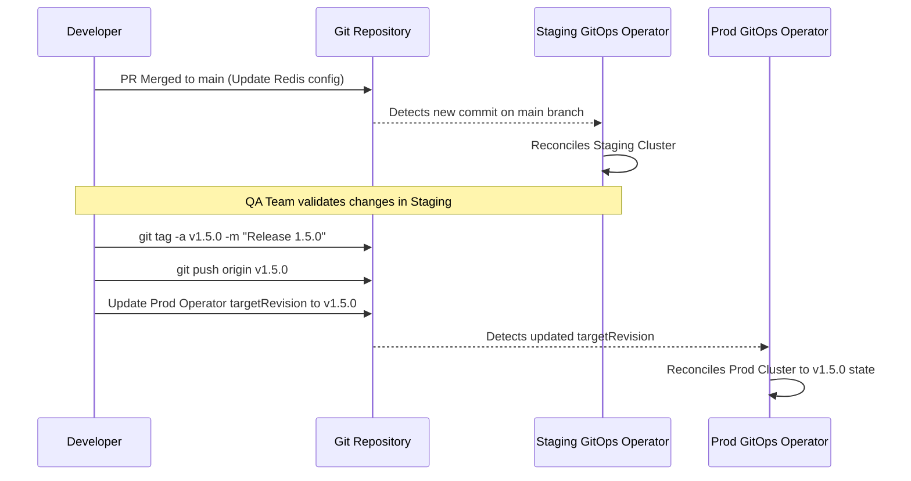

> **Complexity**: `[MEDIUM]`.
>
> **Time to Complete**: 60 minutes.
>
> **Prerequisites**: Модулі 1-9 з Глибокого занурення в Git, базові маніфести Kubernetes, pull requests, семантичне версіонування та достатні навички роботи в командному рядку для безпечного перегляду YAML.

---

## Що ви зможете зробити

- **Спроєктувати** структуру інфраструктурного репозиторію для кількох середовищ за допомогою Kustomize overlays, щоб усунути дублювання конфігурацій.
- **Впровадити** робочі процеси просування на основі тегів Git для надійного перенесення конфігурацій зі staging у production.
- **Діагностувати** відхилення стану між робочим кластером Kubernetes та його джерелом істини в репозиторії Git за допомогою циклів узгодження.
- **Оцінити** переваги безпеки захисту гілок та криптографічного підписування комітів у ланцюжку постачання GitOps з нульовою довірою.
- **Реалізувати** стратегії захисту гілок та ізоляції каталогів для запобігання несанкціонованим змінам інфраструктури.


## Чому це важливо

Гіпотетичний сценарій: платіжний шлюз вийшов з ладу о 14:00 у найзавантаженіший день покупок у році. Дашборди почервоніли в усій операційній кімнаті, тоді як checkout API повертав HTTP-відповіді 503 тисячам клієнтів щохвилини. Перший симптом виглядав звично: у Deployment `payment-processing` бракувало змінної середовища, необхідної для автентифікації у щойно розгорнутому кластері бази даних. Що збивало з пантелику, так це те, що кожне завдання розгортання завершувалося успішно, інфраструктурний репозиторій уже містив цю змінну, а запущені pods усе ще її не мали.

Команда відтворила інцидент і виявила неприємну причину. За три дні до того інженер шукав причину вичерпання ресурсів production під шаленим тиском часу. Він відкрив термінал, безпосередньо відредагував працюючий Deployment і випадково замінив частину конфігурації бази даних, що очікувала на застосування, під час тестування швидкої зміни. Він мав намір згодом відобразити це в Git, потім перейшов до іншого інциденту і забув. Оскільки старий push-конвеєр торкався кластера лише тоді, коли його запускав новий коміт, стан кластера непомітно відхилився від репозиторію, доки стару базу даних не вивели з експлуатації, і відсутня змінна не стала причиною простою для клієнтів.

Той збій насправді був спричинений не однією людиною, яка використала неправильну команду. Він був спричинений операційною моделлю, яка дозволяла працюючій інфраструктурі мати кілька конкуруючих джерел істини. Коли Git каже одне, CI-скрипт каже інше, а людський термінал може сказати третє, у команди немає надійної відповіді на запитання: «Яким має бути production?». GitOps — це дисципліна, яка робить цю відповідь нудною: бажаний стан зберігається в Git, зміни перевіряються через Git, а програмне забезпечення всередині кластера безперервно узгоджує поточний стан із тим, що задекларовано в Git.

Цей модуль переносить концепції Git, які ви вже вивчили, в інфраструктурні операції. Ви не будете ставитися до Git як до пасивного сховища для файлів YAML. Ви використовуватимете його як control plane для середовищ Kubernetes, просування релізів, діагностики відхилень та авторизації змін за принципом zero-trust. У технічних прикладах використовуються конвенції Kubernetes 1.35+ та стандартна лексика GitOps, але глибший урок ширший: надійними платформами легше керувати, коли шлях від наміру до стану виконання є вузьким, перевіреним, відтворюваним і постійно контролюється.

## Зміна парадигми GitOps: від Push до Pull

Роками стандартним шаблоном розгортання був push-конвеєр. Розробник зливав код, система CI збирала артефакт, і та сама система CI автентифікувалася в цільовому середовищі для виконання команд розгортання. У Kubernetes це часто означало, що крок конвеєра виконував `kubectl apply -f deployment.yaml` або подібну обгортку з достатніми привілеями для зміни production. Це було значним покращенням порівняно з незадокументованими ручними релізами, але все одно розміщувало облікові дані кластера за його межами і робило CI-сервер безпосереднім оператором production.

Проблема безпеки — це лише половина історії. Push-конвеєр — це суб'єкт моменту в часі, а не безперервний контролер. Він застосовує те, що йому сказали застосувати, перевіряє rollout, а потім завершує роботу. Якщо ресурс пізніше редагується людиною, видаляється іншою системою автоматизації або частково змінюється контролером із повноваженнями, що перетинаються, push-конвеєр цього не помічає. Репозиторій може містити ідеальний бажаний стан, тоді як кластер днями працює в іншій реальності, оскільки ніщо постійно не порівнює їх між собою.

GitOps змінює напрямок повноважень. Замість того, щоб надсилати привілейований конвеєр ззовні у кластер, контролер, який уже працює всередині кластера, витягує бажаний стан із Git і узгоджує з ним стан кластера. OpenGitOps описує цю модель чотирма принципами: система є декларативною, бажаний стан є версіонованим та незмінним, програмні агенти автоматично витягують бажаний стан, і ці агенти здійснюють безперервне узгодження. З практичної точки зору Kubernetes, такі інструменти, як Argo CD або Flux, працюють як контролери, стежать за шляхами в репозиторії, рендерять маніфести та застосовують результат зсередини межі, якою вони керують.

Ось чому GitOps часто описують як pull-модель, але важливішою ідеєю є володіння. У push-моделі багато учасників можуть змінювати роботу плити, поки кухня зайнята: CI, адміністратори, спеціальні скрипти, аварійні термінали, а іноді й хмарні консолі. У pull-моделі GitOps-оператор — це шеф-кухар, який читає стрічку із замовленнями і повністю контролює плиту. Розробники все ще вирішують, що потрібно змінити, але вони виражають це рішення шляхом внесення змін у Git. Оператор виконує зміну під час виконання і постійно перевіряє, чи результат усе ще відповідає замовленню.

Перш ніж використовувати приклади, зверніть увагу, що у блоках виконуваних команд використовується повне ім'я бінарного файлу `kubectl`. Багато інженерів створюють короткі інтерактивні псевдоніми на власних ноутбуках, але навчальні матеріали та автоматизація повинні залишатися безпечними для копіювання і вставлення, оскільки псевдоніми не розгортаються в неінтерактивних оболонках.

Старий push-конвеєр зазвичай змішував відповідальність за збірку з відповідальністю за зміну кластера. Він автентифікувався у хмарного провайдера, отримував дані kubeconfig, застосовував маніфести, а потім перевіряв, чи завершився rollout. Цю послідовність легко зрозуміти, саме тому багато команд починають з неї, але її простота приховує великий радіус ураження. Витік секрету CI може обернутися витоком production-кластера, а збій конвеєра після часткового застосування може залишити операторів у непевності щодо того, чому довіряти: Git, логам CI чи поточним об'єктам.

```bash
# A traditional, imperative Push pipeline script
echo "Authenticating to Kubernetes..."
aws eks update-kubeconfig --region us-east-1 --name prod-cluster
echo "Applying manifests..."
kubectl apply -f deployment.yaml
kubectl apply -f service.yaml
echo "Checking deployment status..."
kubectl rollout status deployment/frontend -n production
```

Конвеєр GitOps навмисно менш драматичний. Йому не потрібні дані kubeconfig для production, і він не виконує команд застосування до кластера. Його робота полягає в зміні декларативної інструкції в інфраструктурному репозиторії, зазвичай після збірки та сканування образу в окремому конвеєрі застосунку. Щойно цей коміт зливається, GitOps-оператор виявляє новий бажаний стан і виконує роботу на стороні кластера, використовуючи свої внутрішньокластерні привілеї.

```bash
# A declarative GitOps CI pipeline script
echo "Updating image tag in deployment manifest..."
sed -i 's/frontend:v1.2.0/frontend:v1.2.1/g' deployment.yaml
git add deployment.yaml
git commit -m "chore: bump frontend image to v1.2.1"
git push origin main
# The pipeline ends here. The cluster operator takes over autonomously.
```

Зупиніться та подумайте: уявіть, що розробник із доступом до кластера вручну видаляє production Service `frontend` після заплутаного інциденту. У push-моделі Service залишатиметься відсутнім, доки черговий запуск конвеєра випадково не застосує його знову, і навіть це спрацює лише за умови, що конвеєр включає той самий шлях до маніфесту. У pull-моделі GitOps оператор бачить, що поточний Service більше не відповідає репозиторію, і відтворює його під час узгодження. Різниця не в тому, що GitOps запобігає кожній поганій команді; вона в тому, що GitOps дає платформі пам'ять та цикл відновлення.

Цикл відновлення має межі, і розуміння цих меж робить вас кращим оператором. Якщо сам Git містить поганий маніфест, оператор сумлінно намагатиметься застосувати цей поганий бажаний стан, якщо валідація не заблокує його раніше. Якщо оператору бракує дозволів RBAC для ресурсу, узгодження завершиться невдачею і повідомить про деградований стан. Якщо інший контролер Kubernetes має динамічно керувати полем, наприклад кількістю реплік за допомогою Horizontal Pod Autoscaler, GitOps-оператора слід налаштувати так, щоб він не конфліктував із цим контролером. GitOps звужує повноваження, але він не усуває потреби у валідації схем, перевірках політик та чітких межах відповідальності.

Практичне впровадження GitOps часто починається зі зміни дозволів, а вже потім — інструментів. Користувачі-люди можуть зберегти доступ на читання та аварійний доступ, але регулярний доступ на запис до об'єктів production має бути перенесений із ноутбуків та CI-ранерів. Ця культурна зміна може здаватися некомфортною, оскільки інженери звикли до прямих рятівних команд. Нагорода полягає в тому, що кожна звичайна зміна тепер має однакову форму: запропонувати її в Git, переглянути в Git, протестувати за допомогою автоматизації, узгодити з Git і згодом провести аудит з Git.


## Проєктування інфраструктурного репозиторію

GitOps-оператор настільки ж корисний, наскільки корисним є репозиторій, за яким він спостерігає. Якщо репозиторій — це купа скопійованих каталогів із YAML, оператор усе одно виконуватиме узгодження, але людям буде важко перевіряти фактичну різницю між середовищами. Перше завдання під час проєктування — відділити стабільні загальні налаштування від специфічних для кожного середовища варіацій. У Kubernetes стандартним інструментом для цього є Kustomize, оскільки він створює фінальні маніфести з баз і оверлеїв, не вимагаючи окремої мови шаблонізації.

Базовий каталог містить спільне визначення застосунку. Він має описувати імена об'єктів, мітки, конфігурацію контейнерів, порти та типові значення, які є актуальними скрізь. Потім каталоги оверлеїв патчать базу для потреб конкретного середовища, таких як кількість реплік, ліміти ресурсів, feature flags, хости ingress або посилання на конфігурації. Така структура зберігає загальний контракт застосунку видимим в одному місці, водночас змушуючи робити кожну відмінність середовища явною та зручною для перевірки.

Розгляньте структуру репозиторію нижче. Вона відокремлює компоненти платформи від визначень робочих навантажень і зберігає оверлеї середовищ разом в одній гілці, замість того, щоб розпорошувати середовища по непов'язаних гілках. Цей дизайн має значення під час перевірки коду. Pull request, який змінює ресурси production, можна розглядати поруч з оверлеями staging і development, тож рецензенти можуть запитати, чи є різниця навмисною, замість того, щоб шукати її в історії гілок.

```text
infrastructure-repo/
├── platform-components/           <-- Core cluster add-ons
│   ├── ingress-nginx/
│   ├── cert-manager/
│   └── external-dns/
└── applications/                  <-- Workload definitions
    └── frontend-service/
        ├── base/                  <-- Common baseline manifests
        │   ├── deployment.yaml
        │   ├── service.yaml
        │   └── kustomization.yaml <-- Declares the base resources
        └── overlays/              <-- Environment-specific patches
            ├── dev/
            │   ├── patch-replicas.yaml
            │   ├── patch-env.yaml
            │   └── kustomization.yaml <-- Points to base, applies dev patches
            ├── staging/
            │   ├── patch-replicas.yaml
            │   └── kustomization.yaml
            └── prod/
                ├── patch-replicas.yaml
                ├── patch-resources.yaml
                └── kustomization.yaml
```

Базовий Deployment нижче є навмисно консервативним. Він використовує одну репліку та один порт контейнера, оскільки ці типові параметри є безпечними для розробки та достатньо простими, щоб їх могло успадкувати кожне середовище. Зверніть увагу, що база не знає, чи стане вона staging, чи production. Таке невідання є корисним: база — це контракт застосунку, тоді як оверлеї — це контекст розгортання.

```yaml
# applications/frontend-service/base/deployment.yaml
apiVersion: apps/v1
kind: Deployment
metadata:
  name: frontend
spec:
  replicas: 1 # Default conservative baseline
  selector:
    matchLabels:
      app: frontend
  template:
    metadata:
      labels:
        app: frontend
    spec:
      containers:
      - name: web
        image: myregistry.com/frontend:v1.2.0
        ports:
        - containerPort: 8080
```

Production потребує іншого контракту середовища виконання. Він може вимагати більшої кількості реплік, явних запитів на CPU та пам'ять, а також суворіших лімітів, щоб планувальник міг передбачувано розміщувати Pod'и. Слабкий дизайн репозиторію скопіював би весь Deployment у `prod/` та відредагував би кілька рядків. Дизайн Kustomize нижче патчить лише ті поля, які відрізняються, що дозволяє сфокусувати перевірку на рішенні для production, замість того, щоб змушувати рецензентів порівнювати сотні повторюваних рядків YAML.

```yaml
# applications/frontend-service/overlays/prod/patch-replicas.yaml
apiVersion: apps/v1
kind: Deployment
metadata:
  name: frontend
spec:
  replicas: 5 # Override the base replica count for production
  template:
    spec:
      containers:
      - name: web
        resources:
          requests:
            cpu: "1000m"
            memory: "2Gi"
          limits:
            cpu: "2000m"
            memory: "4Gi"
```

Файл `kustomization.yaml` для production зв'язує базу та патч в єдине ціле для рендерингу. GitOps-оператор, націлений на цей оверлей, не застосовує базу та патч як окремі активні об'єкти. Він рендерить кінцевий Deployment у пам'яті, а потім застосовує результат. Ця відмінність має значення під час діагностики, оскільки помилка може походити від бази, від патча або від того, як оверлей посилається на них обох.

```yaml
# applications/frontend-service/overlays/prod/kustomization.yaml
apiVersion: kustomize.config.k8s.io/v1beta1
kind: Kustomization
resources:
  - ../../base
patches:
  - path: patch-replicas.yaml
```

Перш ніж пропустити це через оператор, який кінцевий Deployment ви очікуєте отримати в production: одну репліку чи п'ять, і з якими налаштуваннями ресурсів? Відповіддю має бути п'ять реплік із запитами та лімітами ресурсів для production, тоді як образ і порт контейнера все ще беруться з бази. Цей уявний рендер є важливою навичкою для перевірки. У досвідчених командах рецензенти не просто затверджують diff; вони запитують, як виглядатиме відрендерений об'єкт після того, як Kustomize, Helm або інший інструмент конфігурації завершить свою роботу.

Поширеною альтернативою є окрема гілка для кожного середовища, наприклад, `dev`, `staging` та `main` для production. Це здається природним для користувачів Git, оскільки гілки вже представляють різні лінії змін, але це погано працює для інфраструктури. Середовища не є незалежними історіями продукту. Вони є скоординованими розгортаннями однієї і тієї ж системи за різних обмежень. Коли кожне середовище живе у власній гілці, рецензенти втрачають можливість бачити відмінності середовищ на одній сторінці, cherry-pick'и перетворюються на управління релізами, а конфлікти злиття можуть випадково просунути неправильну конфігурацію.

Гіпотетичний сценарій: фінтех-стартап спочатку використовує окремі гілки середовищ у своєму GitOps-репозиторії. Під час міграції бази даних інженер робить cherry-pick оновлення Deployment'у в гілку production і стикається з конфліктом злиття. Вирішуючи його, він приймає рядок підключення до бази даних development, оскільки diff гілки робить навколишній контекст важко помітним. Після цього production вказує на не-production базу даних, створюючи загрозу конфіденційності та зумовлюючи тривале розслідування й очищення. Коренева помилка полягає не лише у вирішенні конфлікту; це модель репозиторію, яка дозволяє легко приховувати небезпечні відмінності.

Ізоляція каталогів також підтримує авторизацію. Власники коду можуть вимагати схвалення від команди платформи для `platform-components/`, від власників сервісів для їхніх оверлеїв застосунків, і від вузької групи релізів для каталогів production. Це дозволяє дозволам Git стати чіткою межею інфраструктури, а не єдиним широким дозволом на весь репозиторій. GitOps-оператор продовжує спостерігати за репозиторієм, але сам репозиторій тепер містить політику щодо того, хто може змінювати яку частину платформи.

Відокремлюйте інфраструктурні репозиторії від репозиторіїв вихідного коду застосунків, якщо у вас немає вагомої причини цього не робити. Репозиторії застосунків повинні збирати, тестувати та публікувати образи. Інфраструктурні репозиторії повинні декларувати, які образи, політики та налаштування середовища виконання мають запускатися в кожному середовищі. Розділення цих обов'язків запобігає зацикленням, коли коміт розгортання запускає збірку, яка ініціює інший коміт розгортання, і надає аудиторам чистішу історію інфраструктурних рішень.


## Управління релізами та семантичне версіонування

Коли стан інфраструктури живе в Git, ваш робочий процес Git стає вашим робочим процесом релізів. Найпростіше налаштування вказує для кожного середовища гілку `main`, але це означає, що кожна злита інфраструктурна зміна негайно стає доступною для будь-якого кластера, який відстежує цю гілку. Це може бути прийнятно для development і іноді для staging. Це рідко підходить для production-систем, де релізні вікна, докази відповідності та очікування щодо відкату вимагають стабільного посилання на певний момент часу.

Надійнішим патерном є те, щоб staging відстежував рухому гілку, тоді як production відстежував би незмінні посилання на релізи, зазвичай анотовані теги Git. Тоді staging стає місцем, де `main` доводить свою працездатність у реалістичних умовах. Коли команда задоволена результатом, вона створює тег, наприклад `v1.5.0`, на тому самому коміті, який має стати production. GitOps-оператор для production націлюється на цей тег, а не на гілку, тому production прив'язаний до іменованого знімка, а не до останнього злитого коміту.

Послідовність нижче показує захищений шлях просування. Розробник зливає зміну конфігурації Redis у `main`, оператор staging узгоджує її, QA-команда перевіряє її, і лише після цього команда створює релізний тег. Оператор production починає діяти, коли його бажана `targetRevision` переміщується на цей тег. Кластер усе ще залишається автоматизованим, але рішення про реліз є явним та доступним для інспектування.


```mermaid
sequenceDiagram
    participant Dev as Developer
    participant Git as Git Repository
    participant StagingOp as Staging GitOps Operator
    participant ProdOp as Prod GitOps Operator

    Dev->>Git: PR Merged to main (Update Redis config)
    Git-->>StagingOp: Detects new commit on main branch
    StagingOp->>StagingOp: Reconciles Staging Cluster
    Note over Dev,StagingOp: QA Team validates changes in Staging
    Dev->>Git: git tag -a v1.5.0 -m "Release 1.5.0"
    Dev->>Git: git push origin v1.5.0
    Dev->>Git: Update Prod Operator targetRevision to v1.5.0
    Git-->>ProdOp: Detects updated targetRevision
    ProdOp->>ProdOp: Reconciles Prod Cluster to v1.5.0 state
```

Argo CD представляє цей намір за допомогою кастомного ресурсу `Application`. Application вказує контролеру, який репозиторій читати, який шлях рендерити, яку ревізію використовувати, і куди мають потрапити відрендерені об'єкти. У конфігурації для production важливим рядком є `targetRevision: v1.5.0`. Цей рядок перетворює широкий репозиторій на вузький релізний контракт.

```yaml
# The ArgoCD Application CRD instructing the GitOps tool to manage the frontend in production
apiVersion: argoproj.io/v1alpha1
kind: Application
metadata:
  name: frontend-production
  namespace: gitops-system
spec:
  project: default
  source:
    repoURL: 'https://github.com/myorg/infrastructure.git'
    path: applications/frontend-service/overlays/prod
    # Target exactly this release tag, not a branch
    targetRevision: v1.5.0
  destination:
    server: 'https://kubernetes.default.svc'
    namespace: production
  syncPolicy:
    automated:
      prune: true
      selfHeal: true
```

Просування за тегом не вилучає pull request'и з процесу. У жорстко регульованих або високоризикових середовищах тег може створюватися релізним конвеєром після проходження перевірок, а зміна Application для production може перевірятися як окремий pull request. Ця друга перевірка є цінною, оскільки вона відповідає на інше запитання, ніж початкова перевірка фічі. Перевірка фічі запитує, чи правильною є конфігурація. Перевірка просування запитує, чи має саме цей уже протестований знімок стати production прямо зараз.

Зупиніться та подумайте: ви виявляєте критичну проблему безпеки Ingress-контролера, тоді як у `main` міститься велике неперевірене оновлення бази даних для staging. Чи створили б ви тег на поточному коміті `main` і відправили б усе в production, чи створили б гілку від поточного розгорнутого тегу production, застосували б лише hotfix, створили б новий тег і перемістили б production на цей тег? Безпечніший вибір — створити гілку від поточного тегу production. Це зберігає екстрене виправлення, водночас виключаючи непов'язану роботу з базою даних, яка ще не заслужила довіри для production.

Семантичне версіонування дає релізним тегам спільну мову. Тег patch має означати вузьке виправлення, тег minor має означати сумісну функціональність, а тег major має попередити рецензентів, що реліз може вимагати скоординованої роботи з міграції. Інфраструктурний SemVer не завжди такий однозначний, як SemVer для бібліотек, оскільки операційні наслідки залежать від середовища, але ця звичка все одно покращує комунікацію. Рецензент, який бачить `v2.0.0`, повинен ставити складніші запитання, ніж рецензент, який бачить `v1.5.1`.

Відкат також стає більш конкретним. У push-системі відкат може означати пошук старого запуску конвеєра, надію на те, що артефакт все ще існує, і повторне виконання кроків, які можуть залежати від поточного зовнішнього стану. У GitOps відкат часто можна виразити як переміщення цільової ревізії production назад на попередній свідомо робочий тег. Це не магія, оскільки міграції баз даних та зовнішні системи можуть вимагати обережного скасування змін, але сам інфраструктурний намір є чітким і може бути відтвореним.

Модель просування слід тестувати до настання кризи. Команди повинні репетирувати тегування, просування та відкат сервісу з низьким рівнем ризику, щоб дозволи, автоматизація та поведінка оператора були зрозумілими. Найгірший час дізнатися про те, що теги можна змінювати у ваших налаштуваннях хостингу, або що оператор не може прочитати теги через помилку в облікових даних — це під час встановлення hotfix у production. Ставтеся до механіки релізів як до production-коду, а не як до церемонії навколо production-коду.


## Безпека та відповідність вимогам у конвеєрі GitOps

Перенесення мутації кластера за межі CI зменшує один із векторів атаки, але водночас підвищує важливість безпеки репозиторію. У зрілій моделі GitOps той, хто може змінювати довірений інфраструктурний репозиторій, може змінювати й кластер. Це означає, що захист гілок, підписані коміти, обов'язкові перевірки (reviews), перевірки статусу та володіння каталогами (directory ownership) більше не є необов'язковими декораціями управління. Вони є новим периметром навколо виробничої площини управління (production control plane).

Підписання комітів є першою складовою ідентифікації. Звичайний рядок автора в Git легко підробити, оскільки це лише метадані в об'єкті коміту. Підписаний коміт додає криптографічний доказ того, що автор контролював приватний ключ, пов'язаний із довіреною ідентичністю. Підписання не доводить, що зміна є якісною, але допомагає підтвердити, хто її авторизував, і ускладнює видавання себе за іншого, коли захист гілки вимагає верифікованих підписів.

```bash
# Configuring Git to sign commits using an SSH key
git config --local gpg.format ssh
git config --local user.signingkey ~/.ssh/id_ed25519.pub
git config --local commit.gpgsign true

# Creating a signed commit (Git automatically uses the configured key)
git commit -S -m "feat: enforce network policies in production"
```

Самого лише підписання недостатньо. Центральна платформа Git повинна відхиляти непідписані коміти в захищених гілках і вимагати перевірки pull request перед злиттям. Обов'язкові перевірки статусу повинні валідувати синтаксис YAML, рендеринг Kustomize, схеми Kubernetes для версії 1.35+, правила політик та сканування секретів ще до того, як оператор GitOps взагалі побачить коміт. Репозиторій стає брамою, де зустрічаються людська перевірка та машинна валідація.

Який елемент контролю ви б обрали, якби сьогодні можна було додати лише один: підписані коміти чи обов'язкову перевірку pull request? Найкраща відповідь залежить від вашого поточного ризику. Якщо прямі push-запити до виробничих каталогів все ще дозволені, обов'язкова перевірка зазвичай швидше знижує ризик першого дня, оскільки запобігає одностороннім змінам. Якщо перевірки вже існують, але підробка ідентичності або викрадення облікових даних викликають занепокоєння, підписані коміти закривають іншу вразливість. Серйозна платформа з часом потребуватиме обох засобів, оскільки вони вирішують різні питання безпеки.

Ізоляція каталогів — це практична ланка між структурою Git та авторизацією. Правило `CODEOWNERS` може вимагати від команди мереж перевіряти зміни Ingress, від команди безпеки — зміни політик, а від власників сервісів — їхні власні оверлеї. Виробничі оверлеї можуть потребувати додаткових погоджувачів без блокування оверлеїв розробки. Ця модель масштабується краще, ніж надання невеликій центральній команді прав власності на кожен файл YAML, і вона дозволяє уникнути протилежної помилки, коли кожен інженер може схвалити будь-яку мутацію у виробничому середовищі.

Зміщення межі довіри легше побачити візуально. У традиційній push-моделі компрометація CI-сервера може надати зловмиснику прямий доступ до кластера. У pull-моделі GitOps із нульовою довірою (zero-trust) оператор залишається всередині кластера і завантажує дані лише з тієї гілки, яка пройшла захист репозиторію. Зловмисники все ще мають цілі, але кількість систем, яким дозволено мутувати виробниче середовище, скорочується.

```mermaid
graph TD
    subgraph Traditional Push Model
        Developer1[Developer] -->|git push| GitRepo1[(Git Repository)]
        GitRepo1 -->|webhook| CIServer[CI Server]
        CIServer -->|kubectl apply| Cluster1((Kubernetes Cluster))
        Attacker1[Attacker] -.->|Compromises| CIServer
    end

    subgraph Zero-Trust GitOps Pull Model
        Developer2[Developer] -->|Signed git push| GitRepo2[(Git Repository)]
        GitRepo2 -.->|Branch Protection| Validated[(Validated Source of Truth)]
        Validated <--|git pull| Operator[GitOps Operator]
        Operator -->|Reconciles| Cluster2((Kubernetes Cluster))
        Attacker2[Attacker] -.->|Cannot access| Operator
    end

    style CIServer fill:#f9a8d4,stroke:#be185d,stroke-width:2px
    style Operator fill:#a7f3d0,stroke:#065f46,stroke-width:2px
```

Операційні відмінності стають очевидними, якщо порівняти ці дві моделі за загальними векторами безпеки.

| Вектор безпеки | Традиційний CI/CD (Push) | GitOps із нульовою довірою (Pull) |
| :--- | :--- | :--- |
| **Облікові дані кластера** | Зберігаються ззовні на CI-серверах; високий ризик витоку (exfiltration). | Регулярні облікові дані для мутації виробничого середовища залишаються всередині кластера; CI більше не потребує kubeconfig із правами cluster-admin для розгортань (контролери GitOps усе ще використовують вихідні облікові дані для завантаження з Git). |
| **Можливість аудиту** | Складна; вимагає перехресного порівняння логів CI, історії Git та логів аудиту кластера. | Надійна; Git забезпечує незмінний, криптографічно пов'язаний аудиторський слід задекларованих змін бажаного стану (цілісність об'єктів коміту, а не поточний стан кластера). |
| **Запобігання відхиленням (Drift)** | Слабке; ручні зміни кластера можуть залишатися нескінченно довго, поки їх не перезапишуть. | Надійне, якщо ввімкнено автоматичну синхронізацію та самовідновлення (self-heal); оператор може перезаписати ручні зміни істиною з Git за лічені хвилини. |
| **Авторизація** | Покладається на складне зіставлення дозволів системи CI з RBAC у Kubernetes. | Повністю покладається на дозволи репозиторію Git та правила захисту гілок. |

Секрети потребують особливого ставлення, оскільки принцип "усе в Git" не означає "усе в Git у відкритому тексті". Маніфести Secret у Kubernetes кодуються лише у форматі base64, а не шифруються, і історія Git зберігає помилки ще довго після видалення файлу. Команди GitOps зазвичай обирають один із двох патернів: зашифровані секрети в Git за допомогою такого інструменту, як SOPS, або посилання на секрети в Git із використанням оператора, який отримує значення з керованого сховища секретів під час виконання. Обидва патерни зберігають розгортання декларативним, не перетворюючи репозиторій на архів паролів.

Доступ у надзвичайних ситуаціях (break-glass access) має бути явним і підлягати аудиту. GitOps не означає, що ніхто ніколи не може торкатися кластера в екстреній ситуації, але це означає, що екстрені мутації мають бути винятковими, обмеженими в часі та супроводжуватися виправленням у Git. Якщо людина вносить виправлення (patch) у виробниче середовище, щоб зупинити збій, команда повинна або зафіксувати (commit) цю цільову зміну, або дозволити оператору скасувати її (revert). Небезпечною золотою серединою є ситуація, коли робиться вигляд, ніби ручне виправлення тепер є частиною контракту платформи, тоді як Git не знає про його існування.

## Діагностування відхилень стану та збоїв узгодження

GitOps не усуває необхідності діагностики. Він лише змінює місце, куди ви дивитеся в першу чергу. У push-системі дослідники часто починають із логів конвеєра, а потім порівнюють поточні об'єкти вручну. У системі GitOps починайте з ресурсу GitOps, який представляє додаток або Kustomization, оскільки в ньому записується бачення контролером бажаної ревізії, відрендерених маніфестів, статусу синхронізації, стану здоров'я та помилок. Оператор не є "чорною скринькою"; це контролер Kubernetes із полями статусу, подіями та логами.

Відхилення стану (state drift) означає, що поточний кластер відрізняється від бажаного стану в Git. Відхилення може бути шкідливим, наприклад, відкритий вручну Service, або очікуваним, як-от зміна кількості реплік через HPA. Збій узгодження (reconciliation failure) означає, що оператор спробував привести кластер у відповідність до Git і не зміг, часто через збій рендерингу, невдалу валідацію схеми, відсутність дозволів або через те, що інший контролер негайно змінив те саме поле. Якісна діагностика розділяє ці категорії, замість того щоб розглядати кожен стан `OutOfSync` як одну й ту саму проблему.

Дисципліноване розслідування йде шляхом намірів. По-перше, підтвердьте, за якою ревізією репозиторію спостерігає оператор, і чи містить ця ревізія очікувану зміну. По-друге, відрендерите або проінспектуйте оверлей, який має створити кінцевий об'єкт. По-третє, перевірте статус додатка GitOps та події. По-четверте, порівнюйте поточний об'єкт лише після того, як дізнаєтеся, що саме оператор вважає за потрібне застосувати. Такий порядок запобігає типовій помилці, коли інженери десять хвилин дивляться на поточний Deployment, тоді як справжньою помилкою є зламаний шлях у Kustomize.

Для додатка, керованого Argo CD, першою корисною командою є опис ресурсу Application. Вивід може показати, чи синхронізовано додаток, чи є розбіжності, чи він здоровий, деградований або заблокований помилкою рендерингу. У реальному розслідуванні ви можете виконати `kubectl describe application frontend-production -n gitops-system`, потім перевірити події за допомогою `kubectl get events -n gitops-system --field-selector involvedObject.name=frontend-production`, і, зрештою, прочитати логи контролера за допомогою `kubectl logs -n gitops-system statefulset/argocd-application-controller`.

Flux надає подібну інформацію через свої користувацькі ресурси (custom resources) та логи контролера. Ресурс `Kustomization` у Flux повідомляє про останню спробу ревізії, умови (conditions) та збої узгодження. Точні назви об'єктів відрізняються від Argo CD, але логіка залишається тією ж: проінспектуйте ресурс контролера, перевірте його події та прочитайте його логи, перш ніж припускати, що першопричиною є сам об'єкт кластера.

Існує тонка, але важлива різниця між `prune` та `selfHeal`. Pruning (очищення) видаляє поточні ресурси, які раніше керувалися, але були видалені з Git. Самовідновлення (self-healing) скасовує поточні зміни для ресурсів, які все ще існують у Git. Команда може ввімкнути одне й забути про інше, що створює несподівану поведінку. Наприклад, змінений вручну Deployment може бути виправлено, тоді як застарілий Service залишиться, оскільки pruning не було ввімкнено.

Репліки під управлінням HPA є класичним прикладом очікуваного відхилення. Якщо Git каже `replicas: 5`, а HPA масштабує їх до більшої кількості під час навантаження, наївний оператор GitOps може постійно повертати Deployment до меншого значення. Правильна конфігурація вказує оператору ігнорувати конкретне поле, яким володіє інший контролер. Це не послаблює GitOps; це уточнює, які частини об'єкта є декларативним наміром платформи, а які — динамічним управлінням під час виконання.

Перш ніж звинувачувати інструмент GitOps у збої узгодження, запитайте, що йому дозволено змінювати. RBAC у Kubernetes може дозволяти оператору оновлювати Deployments, але не Ingresses, або дозволяти застосовувати ресурси в одному просторі імен, але не в іншому. Контролери доступу (admission controllers) можуть відхилити маніфест, який відрендерився коректно, через порушення політики. CRD можуть ще не існувати під час застосування користувацьких ресурсів. Це не є помилками GitOps; це помилки залежностей та дозволів, які виявляє цикл GitOps.

Найкращі команди роблять відхилення видимими ще до того, як їх помітять клієнти. Вони налаштовують сповіщення для додатків, які застрягли у стані `OutOfSync` або `Degraded` після короткого пільгового періоду, і включають ревізію, що відстежується, до дашбордів. Вони також репетирують вправу з відхиленням: вручну змінюють нешкідливе поле в неробочому середовищі, спостерігають, як оператор виправляє його, а потім перевіряють аудиторський слід. Така вправа перетворює GitOps зі схеми на операційний рефлекс.

## Патерни та антипатерни

Перший патерн — інфраструктура на основі магістралі (trunk-based infrastructure) з каталоговими оверлеями. Використовуйте його, коли один і той самий додаток або компонент платформи має працювати в кількох середовищах із контрольованими відмінностями. Це працює завдяки тому, що рев'ювери можуть бачити базу та всі оверлеї в одній гілці, а Kustomize тримає повторюваний YAML поза шляхом перевірки. При масштабуванні поєднуйте цей патерн із власниками коду (code owners), щоб виробничі оверлеї проходили суворішу перевірку, ніж оверлеї розробки, без фрагментації історії репозиторію.

Другий патерн — просування (promotion) образів через інфраструктурні коміти замість опитування (polling) реєстру. Конвеєр додатка створює збірку `frontend:v1.2.1`, сканує її та публікує, але середовище змінюється лише після того, як інфраструктурний репозиторій посилається на цей тег. Цей патерн працює, оскільки подія розгортання є зміною Git, що піддається аудиту, а не побічним ефектом push-запиту до реєстру. Це також дає реліз-менеджерам зручне місце для схвалення, скасування або порівняння точних версій образів, призначених кожному середовищу.

Третій патерн — незмінне таргетування виробничого середовища. Дозвольте нижчим середовищам відстежувати рухому гілку, якщо команда цінує швидкий зворотний зв'язок, але прив'яжіть виробниче середовище до перевірених тегів або релізних гілок із суворим захистом. Цей патерн працює тому, що виробниче середовище прив'язане до стабільного знімка (snapshot), який можна пояснити аудиторам і відновити під час відкочування (rollback). Його масштабування вимагає чіткого володіння тегами, нотаток до релізу (release notes) та політики, яка запобігає прихованому перезаписуванню тегів.

Четвертий патерн — мапування власності контролерів. Визначте, які поля належать GitOps, які — контролерам Kubernetes, а які — зовнішнім системам. Кількість реплік HPA, статус сертифіката, адреси балансувальників навантаження та згенеровані анотації є типовими прикладами полів, до яких не слід ставитися як до звичайного відхилення. Цей патерн працює завдяки тому, що узгодження проходить успішно, коли власність є явною, і завершується гучним збоєм, коли власність є неоднозначною.

Перший антипатерн — зберігання секретів у відкритому тексті в Git через те, що репозиторій тепер є джерелом істини. Команди потрапляють у цю пастку, оскільки YAML-маніфест Secret у Kubernetes виглядає як будь-який інший маніфест, а значення base64 створюють хибне відчуття безпеки. Кращою альтернативою є зашифрований матеріал секретів або декларативні посилання на зовнішній менеджер секретів. Бажаний стан може включати факт необхідності існування секрету, не розкриваючи його значення кожному, хто читає репозиторій.

Другий антипатерн — надання системі CI облікових даних cluster-admin "лише для початкового завантаження (bootstrap)". Тимчасові обхідні шляхи розгортання часто стають постійними, і система CI з повноваженнями cluster-admin повертає радіус ураження push-моделі, який GitOps мав на меті зменшити. Кращою альтернативою є вузький процес завантаження, який встановлює оператора GitOps, а потім дозволяє йому керувати поточним станом. CI все ще може валідувати маніфести та оновлювати Git, але вона не повинна бути регулярним мутатором виробничого середовища.

Третій антипатерн — використання тегів `latest` у маніфестах. Текст у Git не змінюється, коли новий образ завантажується під тим самим тегом, тому оператор може не мати чіткої зміни бажаного стану для узгодження. Навіть коли політика завантаження образів (image pull policy) тимчасово приховує проблему, відкочування (rollback) та аудит стають неоднозначними, оскільки ніхто не може довести, який саме дайджест образу мався на увазі. Використовуйте унікальні теги або дайджести образів і просувайте їх через Git.

Четвертий антипатерн — ставлення до `OutOfSync` як до проблеми, що вирішується кліком кнопки. Багато інструментів пропонують кнопку ручної синхронізації, і під час інциденту виникає спокуса натискати її знову і знову. Якщо першопричиною проблеми є помилка рендерингу, відхилення політикою або брак дозволів, повторні спроби синхронізації лише додають шуму. Діагностуйте статус контролера, виправте бажаний стан або залежність і дозвольте узгодженню зійтися (converge) з правильної причини.


## Система прийняття рішень

Почніть із запитання: «Кому дозволено змінювати робоче середовище під час нормальної роботи?» Якщо відповідь одночасно включає CI runners, ноутбуки інженерів та GitOps-оператори, система має надто багато тих, хто вносить зміни. Виберіть основного автора змін і зробіть так, щоб усі регулярні шляхи вели до нього. Для робочих навантажень Kubernetes основним автором зазвичай має бути GitOps-оператор, а Git — перевіреним джерелом бажаного стану.

Далі вирішіть, який рівень контролю релізів потрібен кожному середовищу. Середовища розробки часто цінують швидкість і можуть відстежувати гілку `main` за допомогою автоматичної синхронізації. Staging також може відстежувати `main`, але він має включати валідацію, подібну до production. Production зазвичай потребує явного просування (promotion), незмінних тегів, обов'язкового рев'ю та можливості відкату (rollback). Правильна відповідь — це не «теги всюди», правильна відповідь — узгодження стратегії ревізій із ризиками середовища.

Потім виберіть структуру репозиторію, яка робить рев'ю чесним. Якщо середовище відрізняється тим, що потребує трьох реплік, ця відмінність має виглядати як невеликий overlay-патч. Якщо середовище відрізняється тим, що використовує зовсім іншу архітектуру, репозиторій має зробити це важливе рішення видимим, а не ховати його у скопійованому YAML. Ті, хто проводить рев'ю, не можуть захистити те, чого не бачать, тому найкращий дизайн репозиторію — це той, який висвітлює значущі відмінності з мінімальним дублюванням.

Нарешті, вирішіть, яке відхилення (drift) слід виправляти, а яке ігнорувати. Несанкціоновані Services, змінені образи контейнерів, послаблені ліміти ресурсів і відсутні NetworkPolicies слід виправляти. Кількість реплік, якою керує HPA, поля статусу, записані контролерами, згенеровані дані сертифікатів та адреси балансувальників навантаження, призначені хмарою, не слід розглядати як звичайне відхилення від бажаного стану. Хороший дизайн GitOps є суворим щодо намірів платформи і толерантним до динамічних фактів середовища виконання.

Використовуйте GitOps, коли вашій команді потрібні інфраструктурні зміни, які можна переглядати, повторюване відновлення середовищ, чіткі журнали аудиту та зменшення розростання облікових даних у production. Будьте обережні, коли середовище переважно дослідницьке, коли маніфести генеруються системою, яку ваша команда не розуміє, або коли організація не готова позбавити людей і CI регулярного доступу на запис. Інструменти GitOps можна встановити швидко; операційна модель є успішною лише тоді, коли повноваження, рев'ю та відповідальність змінюються разом з інструментами.

## Чи знали ви?

- **Термін GitOps виник у 2017 році**: Алексіс Річардсон (Alexis Richardson) із Weaveworks використав його для опису управління Kubernetes через збережений у Git бажаний стан, автоматичне витягування (pull) та безперервне узгодження (reconciliation), а не ручну зміну кластера.
- **OpenGitOps визначає чотири стійкі принципи**: декларативний бажаний стан, версіонована незмінність, автоматичне витягування програмними агентами та безперервне узгодження — це ті стандарти, що відрізняють GitOps від простого зберігання YAML у Git.
- **GitOps може керувати не лише робочими навантаженнями Kubernetes**: Crossplane та подібні контролери можуть представляти хмарні ресурси, такі як бази даних та бакети (buckets), як декларативні об'єкти у стилі Kubernetes, які GitOps-оператор може узгоджувати.
- **Опитування (polling) — не єдиний тригер**: Flux та Argo CD можуть опитувати репозиторії через певні інтервали, але в production-системах часто додають вебхуки, щоб затверджене злиття (merge) негайно розбудило контролер, не чекаючи наступної запланованої перевірки.

## Типові помилки

| Помилка | Чому це трапляється | Як це виправити |
| :--- | :--- | :--- |
| **Зберігання Secrets у Git** | Інженери ставляться до Git як до єдиного джерела істини, забуваючи, що історія Git є постійною і доступною для читання будь-кому, хто має доступ до репозиторію. | Використовуйте External Secrets Operator, SOPS або інтеграцію з керованим сховищем (vault), щоб Git зберігав зашифровані матеріали або посилання, а не облікові дані у відкритому вигляді. |
| **Використання тегів образів `latest`** | Розробники хочуть зручності завжди розгортати найновішу збірку без оновлення маніфестів. | Використовуйте явні незмінні теги або дайджести образів, а потім просувайте ці значення через перевірені інфраструктурні коміти. |
| **Окрема гілка для кожного середовища** | Команди прямо прив'язують гілки Git до середовищ, що створює різні історії та ризиковані cherry-picks. | Перейдіть до інфраструктури на основі trunk із каталогами overlay для середовищ, щоб відмінності залишалися видимими в одній перевіреній лінії історії. |
| **Ручні втручання через `kubectl`** | Команди експлуатації оминають Git під час надзвичайних ситуацій і забувають додати заплановану зміну постфактум. | Обмежте регулярний доступ на запис, визначте процедури для екстрених випадків (break-glass) і вимагайте, щоб кожна стійка екстрена зміна поверталася комітом назад у Git. |
| **Ігнорування налаштування Prune** | Оператори налаштовують синхронізацію, але забувають, що видалені маніфести повинні видаляти ресурси, якими вони керували раніше. | Увімкніть pruning для керованих застосунків після тестування меж власності та відстежуйте видалені ресурси під час розгортання. |
| **Змішування коду застосунку та інфраструктури** | Здається, що один репозиторій — це простіше, поки коміти збірки та коміти розгортання не почнуть запускати одне одного. | Відокремлюйте репозиторії для збірки образів від інфраструктурних репозиторіїв або принаймні ізолюйте конвеєри, щоб обов'язки збірки та розгортання не зациклювалися. |
| **Сприйняття очікуваного відхилення (drift) як помилки** | Команди забувають, що HPA та інші контролери правомірно змінюють вибрані поля під час виконання. | Налаштуйте правила ігнорування для полів, які належать контролерам середовища виконання, зберігаючи при цьому структурну конфігурацію під контролем GitOps. |

## Контрольні запитання

<details>
<summary>1. Розробник збирає `frontend:v3.0.0` і відправляє його в реєстр, але production не оновлюється. У суворій архітектурі GitOps, яку відсутню дію ви повинні шукати?</summary>

Відсутня дія — це перевірена зміна в інфраструктурному репозиторії, яка посилається на новий тег або дайджест образу. Відправка в реєстр створює доступний артефакт, але вона не змінює бажаний стан, за яким спостерігає оператор кластера. Оператор узгоджує Git, а не наміри розробника в повідомленні чату чи найновіший об'єкт реєстру. Це захищає production від випадкових відправок образів і забезпечує команді подію розгортання, яку можна перевірити за допомогою аудиту.

</details>

<details>
<summary>2. Молодший інженер випадково створює публічний Service типу NodePort під час інциденту. Service не задекларований у Git, ніколи не керувався GitOps-оператором, pruning увімкнено, і оператор працює нормально. Що станеться і що вам слід зробити?</summary>

Оператор не видалить Service. Pruning видаляє лише ресурси, якими раніше керував GitOps (відстежуються через мітки власника або анотації) і декларація яких згодом була видалена з Git — він не чіпає об'єкти, якими GitOps ніколи не володів. Вам слід вручну видалити некерований Service, переконатися, що не залишилося інших публічних Service, які нікому не належать, і переглянути, чому інженер мав дозволи на його створення. Надійне виправлення полягає у посиленні обмежень на регулярний доступ на запис та документуванні безпечнішого шляху вирішення інцидентів.

</details>

<details>
<summary>3. Вашій команді потрібно збільшити пам'ять лише для staging, зберігши production без змін. Базовий Deployment визначає спільну форму контейнера. Куди має бути внесена зміна і чому?</summary>

Зміна має бути в overlay-патчі для staging, на який посилається `kustomization.yaml` середовища staging. Редагування бази вплине на кожне середовище, а копіювання всього Deployment у staging приховає невелику заплановану відмінність усередині продубльованого YAML. Підхід з overlay зберігає спільний контракт в одному місці, водночас роблячи виняток для staging явним. Ті, хто проводить рев'ю, зможуть тоді підтвердити, що production не постраждає.

</details>

<details>
<summary>4. Production закріплений (pinned) на `v1.5.0`, тоді як `main` містить неперевірену міграцію бази даних. Як би ви реалізували робочий процес просування на основі тегів Git, щоб надійно перенести конфігурації зі staging до production під час цього хотфікса?</summary>

Створіть гілку з коміту, що стоїть за поточним тегом production, застосуйте лише хотфікс, створіть новий перевірений тег і вкажіть production на цей тег. Це реалізує просування на основі тегів Git, не вдаючи, що неперевірена робота зі staging готова для production. Встановлення тегу на поточний `main` об'єднало б непов'язану міграцію бази даних в екстрений реліз. Мета незмінних тегів production — надати вам відомий справний базовий рівень для ізольованих виправлень, зберігаючи при цьому чіткий журнал аудиту.

</details>

<details>
<summary>5. Application у production перебуває у стані `OutOfSync` вже дві години, а робочий ConfigMap усе ще містить старі значення. Яку послідовність діагностики вам слід виконати, перш ніж натискати будь-яку кнопку ручної синхронізації?</summary>

Спочатку підтвердьте, що відстежувана ревізія репозиторію містить очікувану зміну ConfigMap і що правильний overlay рендериться успішно. Потім огляньте статус GitOps Application або Kustomization, події та журнали контролера, щоб виявити помилки рендерингу, дозволів, політик або застосування. Лише після цього вам слід порівнювати робочий ConfigMap із відрендереним бажаним об'єктом. Багаторазове натискання синхронізації до знаходження кроку, який завершився помилкою, створює шум і може приховати справжню причину.

</details>

<details>
<summary>6. HPA масштабує Deployment з 5 реплік до 50 під час кампанії, але Git усе ще каже `replicas: 5`. Чому нормально працюючий GitOps-оператор може уникати повернення до попереднього значення?</summary>

Нормально працюючий оператор може бути налаштований ігнорувати поле реплік, коли HPA керує масштабуванням під час виконання. Це правило ігнорування не дає двом контролерам боротися за одне й те саме поле. Git продовжує володіти структурними намірами, такими як образ, мітки, порти, ресурси та політики, тоді як HPA володіє динамічною кількістю реплік під час змін навантаження. Без цього розділення власності узгодження (reconciliation) зашкодило б здатності застосунку реагувати на трафік.

</details>

<details>
<summary>7. Вимоги комплаєнсу передбачають, що ніхто не може одноосібно змінити production і що кожен історичний стан production можна перевірити. Які засоби контролю репозиторію та оператора задовольняють цю вимогу?</summary>

Використовуйте захист гілок із вимогою рев'ю для pull requests, обов'язковими перевірками статусу, code owners для шляхів до production та обов'язковими підписаними комітами або тегами. Налаштуйте GitOps-оператор для production на відстеження незмінних релізних тегів замість рухомої гілки. Це означає, що зміни у production вимагають перевіреної історії Git, а кожен розгорнутий стан відповідає певному коміту. Тоді аудитори зможуть перевірити тег та історію репозиторію, замість того щоб реконструювати стан із розрізнених журналів розгортання.

</details>


## Практична вправа

У цій вправі ви з нуля створите базову структуру репозиторію GitOps, використовуючи Kustomize для керування конфігурацією, специфічною для середовища, без дублювання YAML. Потім ви зімітуєте роль оператора GitOps, відрендеривши кінцеві маніфести ще до того, як будь-що потрапить у кластер. Мета полягає не в тому, щоб уже зараз встановлювати Argo CD або Flux; мета — довести, що репозиторій може чітко виражати спільні наміри, варіації для середовища staging та варіації для продакшену.

Використовуйте інструменти Kubernetes 1.35+, якщо вони у вас встановлені. Вбудованої підтримки Kustomize у `kubectl` цілком достатньо для цієї вправи, хоча окремий бінарний файл `kustomize` також підійде. Створіть тимчасовий робочий каталог, щоб структуру репозиторію було легко перевіряти, видаляти та відбудовувати під час практики.

### Інструкції з налаштування

Створіть новий робочий каталог для цієї вправи:

```bash
mkdir -p ~/gitops-dojo && cd ~/gitops-dojo
git init
```

### Завдання 1: Створити базову архітектуру

Створіть структуру каталогів для застосунку `catalog-api` з базовою конфігурацією та двома оверлеями середовищ: `staging` та `prod`. Цей перший крок навмисно невеликий, оскільки структура каталогів є проєктним контрактом, від якого залежать усі подальші патчі.

<details>
<summary>Рішення</summary>

```bash
mkdir -p catalog-api/base
mkdir -p catalog-api/overlays/staging
mkdir -p catalog-api/overlays/prod
```

</details>

### Завдання 2: Визначити спільну базу

У каталозі `catalog-api/base` створіть два файли. Deployment має використовувати `registry.k8s.io/echoserver:1.10`, відкривати порт 8080 і запускатися з однією реплікою. Базовий файл `kustomization.yaml` має оголошувати цей Deployment як ресурс, щоб оверлеї могли його успадкувати.

<details>
<summary>Рішення</summary>

Створіть `catalog-api/base/deployment.yaml`:

```yaml
apiVersion: apps/v1
kind: Deployment
metadata:
  name: catalog-api
spec:
  replicas: 1
  selector:
    matchLabels:
      app: catalog-api
  template:
    metadata:
      labels:
        app: catalog-api
    spec:
      containers:
      - name: api
        image: registry.k8s.io/echoserver:1.10
        ports:
        - containerPort: 8080
```

Створіть `catalog-api/base/kustomization.yaml`:

```yaml
apiVersion: kustomize.config.k8s.io/v1beta1
kind: Kustomization
resources:
  - deployment.yaml
```

</details>

### Завдання 3: Створити оверлей Staging

Середовище staging має відображати базу, додаючи при цьому маркер середовища для діагностики. У `catalog-api/overlays/staging` створіть патч, який додає `ENV_NAME=staging` до контейнера `api`, а потім створіть `kustomization.yaml`, який посилається на базу та застосовує цей патч.

<details>
<summary>Рішення</summary>

Створіть `catalog-api/overlays/staging/patch-env.yaml`:

```yaml
apiVersion: apps/v1
kind: Deployment
metadata:
  name: catalog-api
spec:
  template:
    spec:
      containers:
      - name: api
        env:
        - name: ENV_NAME
          value: "staging"
```

Створіть `catalog-api/overlays/staging/kustomization.yaml`:

```yaml
apiVersion: kustomize.config.k8s.io/v1beta1
kind: Kustomization
resources:
  - ../../base
patches:
  - path: patch-env.yaml
```

</details>

### Завдання 4: Створити оверлей Production

Продакшен вимагає високої доступності та базового ліміту CPU. У `catalog-api/overlays/prod` створіть патч, який збільшує кількість реплік до 3 та встановлює ліміт CPU у `500m`, а потім створіть відповідний `kustomization.yaml` для застосування цього патча.

<details>
<summary>Рішення</summary>

Створіть `catalog-api/overlays/prod/patch-production.yaml`:

```yaml
apiVersion: apps/v1
kind: Deployment
metadata:
  name: catalog-api
spec:
  replicas: 3
  template:
    spec:
      containers:
      - name: api
        resources:
          limits:
            cpu: "500m"
```

Створіть `catalog-api/overlays/prod/kustomization.yaml`:

```yaml
apiVersion: kustomize.config.k8s.io/v1beta1
kind: Kustomization
resources:
  - ../../base
patches:
  - path: patch-production.yaml
```

</details>

### Завдання 5: Зімітувати роботу оператора GitOps

Оператор GitOps рендерить бажаний стан перед його застосуванням, тому вам варто попрактикуватися дивитися на відрендерений YAML. Запустіть операцію збірки Kustomize для обох оверлеїв і порівняйте кінцевий результат із вашими очікуваннями. Staging має містити змінну середовища та одну репліку; production має містити три репліки та ліміт CPU без змінної середовища staging.

<details>
<summary>Рішення</summary>

Виконайте наступні команди та перевірте вивід, щоб переконатися, що патчі застосовано правильно:

```bash
# Validate Staging (Should show 1 replica and the ENV_NAME variable)
kubectl kustomize catalog-api/overlays/staging

# Validate Production (Should show 3 replicas and the CPU limit, with no ENV_NAME variable)
kubectl kustomize catalog-api/overlays/prod
```

Якщо вивід відповідає вашим очікуванням, ваша структура каталогів є математично обґрунтованою та готовою до коміту в репозиторії Git.

</details>

### Критерії успіху

- [ ] Ви маєте ієрархічну структуру каталогів, що відокремлює базові конфігурації від оверлеїв середовищ.
- [ ] Ви не дублювали визначення базового контейнера, такі як образ (image) і порти, у різних середовищах.
- [ ] Виконання команди `kubectl kustomize` для оверлея staging створює маніфест із впровадженою змінною середовища.
- [ ] Виконання команди `kubectl kustomize` для оверлея production створює маніфест із 3 репліками та лімітами CPU.
- [ ] Базова конфігурація залишається первісною та незмінною.

## Джерела

- [Принципи OpenGitOps](https://opengitops.dev/)
- [Репозиторій документів OpenGitOps](https://github.com/open-gitops/documents/blob/main/PRINCIPLES.md)
- [Документація Argo CD](https://argo-cd.readthedocs.io/en/stable/)
- [Декларативне налаштування Argo CD](https://argo-cd.readthedocs.io/en/stable/operator-manual/declarative-setup/)
- [Політика автоматичної синхронізації Argo CD](https://argo-cd.readthedocs.io/en/stable/user-guide/auto_sync/)
- [Концепції Flux](https://fluxcd.io/flux/concepts/)
- [Контролер Kustomization у Flux](https://fluxcd.io/flux/components/kustomize/kustomizations/)
- [Документація Kubernetes Kustomize](https://kubernetes.io/docs/tasks/manage-kubernetes-objects/kustomization/)
- [Горизонтальне автоматичне масштабування Pod у Kubernetes](https://kubernetes.io/docs/tasks/run-application/horizontal-pod-autoscale/)
- [Підписані коміти в GitHub](https://docs.github.com/en/authentication/managing-commit-signature-verification/signing-commits)
- [Захищені гілки в GitHub](https://docs.github.com/en/repositories/configuring-branches-and-merges-in-your-repository/managing-protected-branches/about-protected-branches)
- [Проєкт CNCF Argo](https://www.cncf.io/projects/argo/)

## Наступний модуль

[Курс «Філософія та дизайн»](../../philosophy-design/) — Зануртеся глибше в архітектурні принципи, які визначають надійну та стійку розробку платформ.
