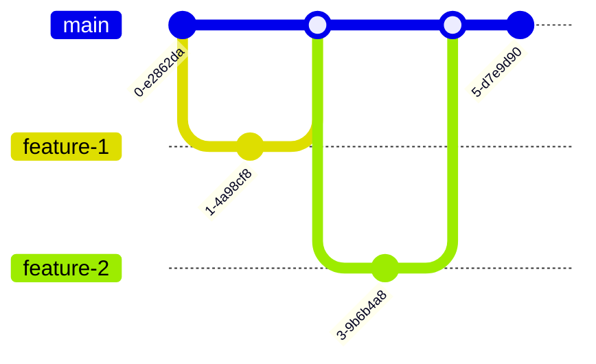

# Модуль 2: Мистецтво гілкування — Розширене злиття

## Що ви зможете зробити
- **Діагностувати** першопричину складних конфліктів злиття у файлах маніфестів Kubernetes шляхом аналізу бази злиття (merge base) та розбіжних історій комітів.
- **Впровадити** стратегічне використання тристороннього злиття (three-way merge) та злиття fast-forward для підтримання чистої історії проєкту, зручної для навігації.
- **Вирішити** заплутані багатофайлові конфлікти під час інтеграції інфраструктури як коду (Infrastructure-as-Code) без внесення помилок у синтаксис YAML або регресійних багів.
- **Оцінити** різні стратегії гілкування (Trunk-based, GitFlow, GitHub Flow), щоб вибрати оптимальний робочий процес для високошвидкісної команди платформи Kubernetes.
- **Виконати** злиття типу "octopus" для одночасної інтеграції декількох незалежних гілок функцій в одну гілку інтеграції або релізу.

## Чому це важливо
Наприкінці 2022 року велика фінтех-компанія пережила катастрофічний збій у розгортанні, який вивів з ладу їхній основний API для обробки платежів на понад шість годин. Причиною була не помилка в логіці програми й не неправильно налаштований балансувальник навантаження. Збій став результатом виключно невдалого Git merge. Дві окремі команди платформи місяцями працювали над довгоживучими гілками функцій, модифікуючи той самий набір маніфестів Deployment у Kubernetes для впровадження різних механізмів автоматичного масштабування та запитів на ресурси. Коли настав час релізу, конфлікт злиття охопив сотні рядків у десятках YAML файлів.

Інженер, призначений для вирішення конфлікту, перебуваючи під величезним тиском і втомою, випадково прийняв вхідні зміни, які перезаписали конфігурації liveness probe, одночасно порушивши відступи YAML у визначеннях лімітів ресурсів. Об’єднаний код пройшов поверхневий огляд, оскільки diff був занадто великим для ефективного аналізу. Після розгортання планувальник (scheduler) Kubernetes негайно почав циклічно перезапускати (crash-looping) Pod-и через некоректні probe, тоді як Cluster Autoscaler почав діяти непередбачувано на основі зламаних визначень ресурсів. Фінансові збитки вимірювалися мільйонами, але культурний вплив був ще гіршим: розробники почали панічно боятися злиття.

Злиття гілок у Git — це не просто механічний процес об'єднання текстових файлів; це акт узгодження паралельних часових ліній людських намірів. У середовищах Infrastructure-as-Code, де один зміщений пробіл у YAML файлі може обвалити продуктивний кластер, опанування механіки злиття є обов'язковою навичкою виживання. Цей модуль занурить вас у саме серце механізмів злиття Git. Ви дізнаєтеся, як Git математично визначає, що змінилося, чому насправді виникають конфлікти та як вирішувати їх з хірургічною точністю, а не в паніці. Ви перейдете від простого введення `git merge` з надією на краще до рівня інженера, який впевнено керує інтеграцією.

## Основний зміст

### Геометрія інтеграції: Fast-Forward проти тристороннього злиття

Коли ви виконуєте команду `git merge`, Git не просто сліпо змішує файли. Він проводить геометричний аналіз вашої історії комітів, щоб визначити найбезпечніший спосіб інтеграції змін. Розуміння цієї геометрії — це різниця між контролем над історією вашого проєкту та статусом її жертви.

#### Злиття Fast-Forward
Уявіть, що ви кладете цеглу в рівну лінію. Ви зупиняєтеся, щоб перепочити. Поки ви відпочиваєте, колега продовжує класти цеглу рівно з того місця, де ви зупинилися, продовжуючи ту саму пряму лінію. Коли ви повертаєтеся, інтеграція їхньої роботи у ваше бачення стіни не потребує складних рішень; ви просто йдете до кінця щойно покладених цеглин.

Це і є **fast-forward merge**. Це відбувається, коли поточний край гілки є прямим предком гілки, яку ви намагаєтеся злити. Git просто переміщує вказівник вашої гілки вперед, щоб він вказував на той самий коміт, що й вхідна гілка. Новий "коміт злиття" (merge commit) не створюється, оскільки історія є повністю лінійною.

```bash
# Налаштування сценарію fast-forward
git init cluster-config
cd cluster-config
echo "apiVersion: v1" > config.yaml
git add config.yaml
git commit -m "Initialize cluster config"

# Створення нової гілки та додавання коміту
git checkout -b feature/add-metadata
echo "kind: ConfigMap" >> config.yaml
git commit -am "Add ConfigMap kind"

# Повернення до main та злиття
git checkout main
git merge feature/add-metadata
```

Результат злиття:
```text
Updating a1b2c3d..e4f5g6h
Fast-forward
 config.yaml | 1 +
 1 file changed, 1 insertion(+)
```

Оскільки `main` не розходилася — до неї не було додано жодного нового коміту, поки розроблялася `feature/add-metadata`, — Git просто перемістив вказівник `main` вперед.

> **Зупиніться та подумайте**: Перед виконанням `git log --oneline --graph` після цього злиття, накидайте, як, на вашу думку, виглядатиме граф історії. Чи буде там розгалуження та коміт злиття?
> 
> *Перевірка*: Оскільки це було злиття fast-forward, `main` просто перемістилася до краю `feature/add-metadata`. Розгалуження та коміту злиття немає. `git log --oneline --graph` покаже одну пряму лінію комітів, що закінчується повідомленням "Add ConfigMap kind".

#### Тристороннє злиття (Three-Way Merge)
Розробка в реальному світі рідко буває лінійною. Поки ваш колега продовжував цегляну стіну, ви почали будувати паралельну стіну поруч. Тепер вам потрібно їх з'єднати. Це вимагає справжніх будівельних робіт.

**Тристороннє злиття** відбувається, коли історія розійшлася. Поточна гілка та вхідна гілка мають спільного предка (merge base), але обидві просунулися незалежно.

```ascii
      A---B---C (main)
     /         \
D---E           H (merge commit)
     \         /
      F-------G (feature/rbac)
```

Щоб вирішити це, Git використовує три точки відліку:
1. Край вашої поточної гілки (`C`)
2. Край вхідної гілки (`G`)
3. Спільний предок обох гілок (`E`) — **база злиття (merge base)**.

Git порівнює `C` з `E`, щоб побачити ваші зміни, і `G` з `E`, щоб побачити їхні зміни. Потім він намагається застосувати обидва набори змін до `E` одночасно. Якщо зміни не перекриваються в тих самих рядках, Git успішно створює новий **merge commit** (`H`). Цей коміт унікальний: він має двох батьків.

> **Зупиніться та подумайте**: Що, на вашу думку, станеться, якщо і гілка `main`, і гілка `feature/rbac` змінять той самий список `subjects` у маніфесті RoleBinding, але додадуть різних користувачів? Як тристороннє злиття Git впорається з цим конкретним сценарієм?

### База злиття та рекурсивні стратегії

Справжній геній Git полягає в тому, як він знаходить базу злиття. Коли історії складні, а гілки перетинаються та зливаються багато разів, пошук оптимального спільного предка є обчислювально складним завданням.

За замовчуванням Git використовує **рекурсивну** стратегію (зокрема, стратегію `ort` у сучасних версіях Git, що розшифровується як "Ostensibly Recursive's Twin"). Якщо Git знаходить кілька потенційних спільних предків, він створює тимчасовий віртуальний merge commit із цих предків і використовує *його* як базу злиття для вашого фактичного злиття.

Давайте подивимося, як Git аналізує зміни.

| Тип зміни | Гілка А (main) проти бази | Гілка B (feature) проти бази | Дія Git під час злиття |
| :--- | :--- | :--- | :--- |
| Файл додано | Відсутній | Додано | Файл додається |
| Файл змінено | Без змін | Змінено | Зміна застосовується |
| Файл видалено | Видалено | Без змін | Файл залишається видаленим |
| Файл змінено | Змінено (рядок 10) | Змінено (рядок 50) | Обидві зміни застосовуються |
| Файл змінено | Змінено (рядок 20) | Змінено (рядок 20) | **КОНФЛІКТ** |

Якщо вам коли-небудь знадобиться вручну перевірити, що Git вважає базою злиття перед виконанням ризикованого злиття, ви можете скористатися командою:

```bash
git merge-base main feature/ingress-update
```
Вона повертає хеш коміту оптимального спільного предка.

> **Зупиніться та подумайте**: Подивіться на наступну топологію гілок:
> ```ascii
>       A---B---C---D (main)
>            \
>             E---F (feature/db)
>                  \
>                   G---H (feature/cache)
> ```
> Якщо ви перебуваєте на `main` і виконуєте `git merge feature/cache`, який коміт є базою злиття?
> 
> *Відповідь*: Базою злиття є коміт `B`. Щоб знайти його, пройдіть назад від `main` (коміт D) та `feature/cache` (коміт H), поки їхні шляхи не перетнуться. Вони вперше зустрічаються в точці `B`, що робить її спільним предком для тристороннього злиття.

### Вирішення конфліктів в Infrastructure-as-Code

Конфлікти — це не помилки; це запит Git на людське судження, оскільки його математичні моделі не можуть безпечно вгадати ваші наміри.

В інфраструктурі Kubernetes конфлікти особливо небезпечні, оскільки YAML покладається на семантичні відступи. Неправильне вирішення конфлікту може призвести до валідної історії Git, але невалідної архітектури YAML.

Давайте розберемо сценарій складного конфлікту.

#### Сценарій
Команда Альфа працює над гілкою `feature/ha-redis`. Команда Бета працює над гілкою `feature/redis-auth`.
Обидві команди змінюють `redis-deployment.yaml`.

Зміна команди Альфа (`feature/ha-redis`):
```yaml
spec:
  replicas: 3
  template:
    spec:
      containers:
      - name: redis
        image: redis:7.0.11-alpine
```

Зміна команди Бета (`feature/redis-auth`):
```yaml
spec:
  replicas: 1
  template:
    spec:
      containers:
      - name: redis
        image: redis:7.0.11
        env:
        - name: REDIS_PASSWORD
          valueFrom:
            secretKeyRef:
              name: redis-secret
              key: password
```

Коли ви намагаєтеся злити `feature/redis-auth` у `feature/ha-redis`, Git зупиняється.

```bash
git checkout feature/ha-redis
git merge feature/redis-auth
# Auto-merging redis-deployment.yaml
# CONFLICT (content): Merge conflict in redis-deployment.yaml
# Automatic merge failed; fix conflicts and then commit the result.
```

Якщо ви відкриєте `redis-deployment.yaml`, ви побачите маркери конфлікту:

```yaml
<<<<<<< HEAD
spec:
  replicas: 3
  template:
    spec:
      containers:
      - name: redis
        image: redis:7.0.11-alpine
=======
spec:
  replicas: 1
  template:
    spec:
      containers:
      - name: redis
        image: redis:7.0.11
        env:
        - name: REDIS_PASSWORD
          valueFrom:
            secretKeyRef:
              name: redis-secret
              key: password
>>>>>>> feature/redis-auth
```

#### Процес вирішення

1. **Зрозумійте маркери:**
   - `<<<<<<< HEAD`: Початок змін вашої поточної гілки.
   - `=======`: Роздільник між двома конфліктуючими змінами.
   - `>>>>>>> feature/redis-auth`: Кінець змін вхідної гілки.

2. **Визначте бажаний результат:**
   Ми хочемо високу доступність (replicas: 3) ТА автентифікацію (env змінні), і нам варто залишити образ alpine з міркувань безпеки та розміру.

3. **Відредагуйте файл:**
   Видаліть маркери та вручну переплетіть YAML, звертаючи особливу увагу на правило відступу у 2 пробіли.

```yaml
spec:
  replicas: 3
  template:
    spec:
      containers:
      - name: redis
        image: redis:7.0.11-alpine
        env:
        - name: REDIS_PASSWORD
          valueFrom:
            secretKeyRef:
              name: redis-secret
              key: password
```

4. **Перевірте та зробіть коміт:**
   Ніколи не припускайте, що ваше ручне редагування YAML є правильним. Завжди перевіряйте перед комітом. Ви можете використовувати такі інструменти, як `yq` або функцію dry-run у `kubectl`. Після перевірки додайте файл і зробіть коміт, щоб завершити злиття.

```bash
# Ми будемо використовувати 'k' як аліас для kubectl
alias k=kubectl
k apply -f redis-deployment.yaml --dry-run=client

# Якщо перевірка успішна:
git add redis-deployment.yaml
git commit -m "Merge redis-auth, resolving replicas and image conflicts"
```

**Реальний випадок:** Один молодший DevOps інженер колись вирішив схожий конфлікт, залишивши вхідний блок `env`, але випадково змістивши відступ вліво на два пробіли, розмістивши `env` на тому ж рівні, що й `containers`, замість того, щоб помістити його всередину. Git прийняв злиття. CI/CD розгорнув його. Kubernetes відхилив маніфест, але через відсутність у конвеєрі розгортання суворої попередньої перевірки попередній ReplicaSet було зменшено, тоді як новий не вдалося створити, що призвело до повної втрати доступності кешу. Завжди валідуйте YAML після вирішення конфліктів.

### Злиття Octopus: Приборкання декількох гілок

Іноді команді платформи потрібно інтегрувати кілька незалежних гілок функцій у гілку-кандидат на реліз одночасно. Робота з ними по черзі створює заплутану історію комітів злиття, схожу на драбину.

Git пропонує стратегію під назвою **Octopus Merge**, яка дозволяє зливати більше двох гілок в один коміт.

```ascii
      A---B---C (main)
     /    |    \
    D     E     F
   (b1)  (b2)  (b3)

Після Octopus Merge:

      A---B-------C---G (main)
     /    |      /   /
    D     |     /   /
     \    E    /   /
      \    \  /   /
       \------F--/
```

Щоб виконати злиття octopus:

```bash
git checkout release-v1.5
git merge feature/ingress feature/autoscaling feature/network-policies
```

> **Зупиніться та подумайте**: Що, на вашу думку, станеться, якщо Git успішно злиє `feature/ingress` та `feature/autoscaling`, але виявить складний конфлікт під час спроби злити `feature/network-policies`? Чи зупиниться він і попросить вас вирішити його, як під час звичайного тристороннього злиття?

**Правило "все або нічого":** На відміну від стандартного злиття двох гілок, яке зупиняється на півдорозі та залишає маркери конфлікту у вашому робочому каталозі, злиття octopus категорично відмовиться завершуватися, якщо виявить конфлікт, що потребує ручного втручання. Воно не робить пауз. Якщо злиття не вдається, Git автоматично скасовує все злиття octopus, залишаючи ваш робочий каталог саме в тому стані, в якому він був. Це розроблено виключно для чистого об'єднання незалежних розробок, які не перетинаються. Якщо воно не вдалося, вам доведеться повернутися до послідовного злиття або вирішити конфлікти між конкретними гілками перед наступною спробою.

> **Зупиніться та поміркуйте**: Якщо злиття octopus не вдалося через конфлікт між `feature/autoscaling` та `feature/network-policies`, який підхід ви оберете:
А) Повністю відмовитися від злиття octopus і злити всі три гілки послідовно.
Б) Спочатку злити дві конфліктуючі гілки одна з одною, вирішити конфлікт, а потім повторити злиття octopus з оновленими гілками.
Чому обраний вами підхід безпечніший для підтримання чистої історії?

### Стратегії гілкування для високоефективних команд

Стратегія злиття настільки хороша, наскільки хороша модель гілкування, яка диктує, коли і де відбуваються злиття. Різні моделі вирішують різні організаційні проблеми.

> **Зупиніться та поміркуйте**: Уявіть, що ви консультуєте нову команду платформи. У них 12 інженерів, вони розгортають код у продуктивне середовище двічі на тиждень, мають автоматизоване покриття тестами, але воно іноді дає хибнопозитивні результати. Яку стратегію гілкування ви б порадили і чому? Тримайте свою відповідь у голові, поки читаєте описи моделей нижче.

#### 1. GitFlow: Застаріла корпоративна модель
GitFlow використовує сувору ізоляцію. Вона підтримує гілку `main` (завжди готова до продуктиву) та гілку `develop` (інтеграція). Функції відгалужуються від `develop` і зливаються назад. Релізи відгалужуються від `develop`, проходять стабілізацію та зливаються як у `main`, так і в `develop`.

- **Плюси:** Надзвичайно жорстка структура, чіткі етапи для QA та стабілізації.
- **Мінуси:** Створює "пекло злиття" (merge hell). Гілки функцій живуть занадто довго. Вона фундаментально несумісна з принципами безперервної інтеграції та безперервного розгортання (CI/CD), оскільки код залишається неінтегрованим тижнями.

#### 2. GitHub Flow: Стандарт для вебзастосунків
Все відгалужується від `main`. Коли функція готова, ви відкриваєте Pull Request до `main`. Після огляду та проходження тестів вона зливається в `main` і негайно розгортається.

- **Плюси:** Проста модель, заохочує створення невеликих короткоживучих гілок, ідеальна для CI/CD.
- **Мінуси:** Потребує ретельного автоматизованого тестування. Якщо ваш конвеєр не є надійним, погане злиття миттєво ламає продуктивне середовище.

#### 3. Trunk-Based Development: Елітний стандарт
Визначальна характеристика високоефективних DevOps команд. Розробники зливають свій код у `main` (стовбур — trunk) кілька разів на день. Гілки або відсутні, або існують лише кілька годин.



- **Плюси:** Повністю усуває пекло злиття. Інтеграція відбувається безперервно. Потребує активного використання прапорців функцій (feature flags), щоб приховати незавершену роботу в продуктиві.
- **Мінуси:** Надзвичайно високий поріг входу. Потребує просунутого тестування, архітектури прапорців функцій та високої дисципліни команди.

Для команд платформ Kubernetes, що будують внутрішні платформи, **Trunk-Based Development** у поєднанні з GitOps (як-от ArgoCD або Flux) є золотим стандартом. Довгоживучі гілки функцій, що містять інфраструктурні зміни, неминуче застарівають, оскільки стан кластера під ними змінюється.

## Чи знали ви?

1. Лінус Торвальдс спочатку розробив злиття octopus у Git спеціально тому, що йому набридло послідовно зливати десятки окремих гілок супроводжувачів підсистем ядра Linux.
2. У версії Git 2.33 (випущеній у серпні 2021 року) було впроваджено повністю новий бекенд злиття під назвою `ort` (Ostensibly Recursive's Twin), який математично обробляє великі перейменування та складні злиття до 500 разів швидше за стару рекурсивну стратегію.
3. Символи маркерів конфлікту (`<<<<<<<`, `=======`, `>>>>>>>`) з’явилися за десятиліття до Git. Вони були встановлені програмою `merge`, розробленою в Bell Labs наприкінці 1980-х років для системи керування версіями RCS.
4. Git дозволяє налаштовувати специфічні драйвери злиття для різних типів файлів через `.gitattributes`. Теоретично ви могли б написати власний драйвер злиття, розроблений спеціально для інтелектуального злиття YAML файлів Kubernetes без порушення відступів, хоча підтримувати його надзвичайно складно.

## Типові помилки

| Помилка | Чому це стається | Як виправити |
| :--- | :--- | :--- |
| **Коміт у паніці з невирішеними маркерами** | Інженер відчуває перевантаження, намагається зберегти роботу посеред конфлікту за допомогою `git commit -a`, комітячи `<<<<<<<` прямо в код. | Негайно виконайте `git merge --abort`, щоб скинути робочий каталог до стану перед злиттям, перепочиньте і почніть заново. |
| **Порушення відступів YAML** | Ручне видалення маркерів конфлікту та випадкове зміщення блоків YAML, що створює неправильні структурні зв'язки. | Завжди використовуйте `kubectl diff` або `kubectl apply --dry-run=client` на зміненому файлі перед завершенням коміту злиття. |
| **Злиття "страуса" (ігнорування upstream)** | Підтримання гілки функції в робочому стані протягом 6 тижнів без підтягування змін з main, що згодом призводить до монолітного конфлікту, який неможливо вирішити. | Щодня зливайте `main` у свою гілку функції (або робіть rebase). Вирішення конфліктів має бути постійним невеликим податком, а не величезним штрафом наприкінці проєкту. |
| **Вирішення логіки, порушення синтаксису** | Надмірна концентрація на тому, щоб внести обидва набори конфігурацій у файл, через що створюються дублікати ключів (наприклад, два блоки `spec` у визначенні Pod). | Розумійте схему файлу, який ви редагуєте. Використовуйте плагіни IDE з увімкненою перевіркою схеми Kubernetes під час вирішення конфліктів. |
| **Випадкові "злі злиття" (Evil Merges)** | Під час вирішення конфлікту інженер потайки вносить непов'язане виправлення або корекцію одруку, яких не було в жодній із гілок. | Коміт злиття має містити *тільки* результат вирішення конфлікту. Робіть непов'язані виправлення окремим комітом після цього. |
| **Видалення не тієї сторони** | Неправильне розуміння `HEAD` проти вхідної гілки та сліпий вибір "Accept Current Change", коли вхідна гілка містила критичні патчі безпеки. | Читайте код всередині маркерів. Ніколи не довіряйте автоматичним кнопкам в інтерфейсі IDE без перевірки того, які саме рядки залишаться після злиття. |

> **Зупиніться та поміркуйте**: Перегляньте помилки в таблиці вище. Яка з них спричинила б найбільш катастрофічний збій у специфічному контексті вашої поточної команди? Ранжуйте їх за потенційною вагомістю на основі засобів захисту вашого конвеєра розгортання (або їх відсутності).

## Контрольні запитання

<details>
<summary>Запитання 1: Ваша команда практикує Trunk-Based Development. Ви працювали над новою мережевою політикою (NetworkPolicy) Kubernetes близько 4 годин у локальній гілці. Коли ви намагаєтеся зробити push у main, Git відхиляє його, зазначаючи, що віддалений репозиторій містить роботу, якої у вас немає. Яка послідовність дій для інтеграції вашої роботи є найбезпечнішою?</summary>
Отримайте віддалені зміни та виконайте злиття або rebase. Оскільки ви прагнете до безперервної інтеграції, а робота була короткостроковою, оптимальним буде виконання `git pull --rebase origin main`. Ця команда отримує нові коміти з main, тимчасово відкочує ваші 4 години роботи, застосовує вхідні коміти з main, а потім "відтворює" ваші коміти з мережевою політикою зверху. Це дозволяє зберегти чисту лінійну історію, уникаючи непотрібних комітів злиття для короткоживучої локальної роботи.
</details>

<details>
<summary>Запитання 2: Ви запускаєте автоматизований конвеєр, який намагається виконати злиття octopus, інтегруючи чотири різні оновлення розгортання мікросервісів у гілку staging. Git зупиняється і повідомляє про конфлікт між двома гілками. Що стається з гілкою staging у цей момент і як це впливає на конвеєр?</summary>
З гілкою staging нічого не стається. На відміну від стандартного злиття двох гілок, яке зупиняється посеред процесу і залишає маркери конфлікту у вашому робочому каталозі, злиття octopus — це операція за принципом "все або нічого". Якщо Git виявляє конфлікт, він автоматично скасовує все злиття octopus, залишаючи робочий каталог і гілку staging точно в такому ж стані, в якому вони були до запуску команди. Цей механізм безпеки запобігає застряганню автоматизованих конвеєрів у багатовимірних конфліктах, які майже неможливо розплутати автоматично.
</details>

<details>
<summary>Запитання 3: Молодший інженер щойно вирішив величезний конфлікт на 500 рядків у YAML файлі StatefulSet, і вам потрібно перевірити його роботу. Перегляд повної різниці (diff) файлу є виснажливим. Як ви, як ревьюер, можете ізолювати та переглянути *тільки* ті ручні рішення щодо конфліктів, які прийняв інженер?</summary>
Вам потрібно перевірити сам коміт злиття, а не просто файл. Виконавши `git show <merge-commit-hash>`, Git відобразить "комбінований diff", спеціально розроблений для аналізу вирішення конфліктів. Цей спеціалізований вивід показує лише ті рядки, які були змінені порівняно з *обома* батьками, виділяючи саме те, як ручне вирішення конфлікту відрізняється від того, що спробувало б зробити автоматичне злиття Git. Це саме той хірургічний вид, який потрібен для аудиту ручного вирішення конфліктів без зайвого шуму.
</details>

<details>
<summary>Запитання 4: У продуктивному середовищі стається інцидент через незрозумілу втрату оновлення `ConfigMap`. Переглядаючи історію Git, ви бачите коміт злиття, що з'єднує гілку функції з main. Файл змінювався в обох гілках, але зміни з гілки функції повністю відсутні в підсумковому коміті злиття. Що, швидше за все, сталося під час вирішення конфлікту?</summary>
Інженер, що виконував злиття, зіткнувся з конфліктом у `ConfigMap`, розгубився і, ймовірно, використав команду на кшталт `git checkout --ours configmap.yaml` або натиснув "Accept Current Changes" у своїй IDE, повністю перезаписавши вхідні зміни з гілки функції. Потім він зафіксував результат, не усвідомлюючи, що відкидає валідний код. Історія показує злиття, але дані з одного боку були повністю відкинуті через людську помилку під час вирішення. Це підкреслює, чому візуальна перевірка фінального злитого файлу є обов'язковою перед завершенням коміту.
</details>

<details>
<summary>Запитання 5: Ваша організація впроваджує GitOps з ArgoCD для керування кластерами Kubernetes, але команда QA наполягає на збереженні застарілої моделі гілкування GitFlow з довгоживучими гілками `develop` та релізними гілками. Чому ця комбінація неминуче призведе до збоїв розгортання та розбіжностей у конфігурації (configuration drift)?</summary>
GitFlow ізолює код у довгоживучих гілках `develop` та релізних гілках на тривалий час, що фундаментально суперечить основній філософії GitOps. У моделі GitOps репозиторій Git має виступати як абсолютне джерело істини в реальному часі для стану кластера. Якщо зміни інфраструктури ізольовані в незлитих гілках тижнями, стан кластера неминуче розходиться (drift), поки застосовуються інші оновлення. Ця розбіжність унеможливлює швидку ітерацію і практично гарантує масивні конфлікти, коли затримані гілки нарешті зливаються. Таким чином, GitOps потребує безперервної інтеграції, яку забезпечують Trunk-Based Development або GitHub Flow.
</details>

<details>
<summary>Запитання 6: Вам доручено перейняти застарілу гілку `feature/database-migration`, яку покинув колишній співробітник. Перед спробою її інтеграції ви запускаєте `git merge-base main feature/database-migration`, і вона повертає хеш коміту 8-місячної давнини. Що це негайно говорить вам про профіль ризику цього майбутнього злиття і як вам слід діяти?</summary>
Профіль ризику є надзвичайно високим, оскільки математична дистанція між гілками практично гарантує масивні системні конфлікти. База злиття такої давнини означає, що гілка функції була повністю ізольована від основної лінії протягом 8 місяців. За цей час `main` значно еволюціонувала, а отже, семантична логіка старої гілки, швидше за все, буде несумісною з поточною архітектурою, навіть якщо вона чисто злиється на текстовому рівні. Вам слід відмовитися від прямого злиття і замість цього глибоко проаналізувати наміри старої гілки, ймовірно, вибравши (cherry-picking) лише релевантні частини або перезібравши функцію заново на основі сучасного "стовбура" (trunk).
</details>

## Практична вправа

У цій вправі ви навмисно створите складний тристоронній конфлікт у маніфесті Deployment Kubernetes, вирішите його вручну, забезпечивши структурну цілісність, і перевірите результат.

### Інструкції з налаштування

1. Створіть новий репозиторій Git та ініціалізуйте базовий маніфест.
   ```bash
   mkdir k8s-merge-lab && cd k8s-merge-lab
   git init
   ```

2. Створіть базовий `deployment.yaml`.
   ```yaml
   apiVersion: apps/v1
   kind: Deployment
   metadata:
     name: api-server
   spec:
     replicas: 2
     template:
       spec:
         containers:
         - name: api
           image: nginx:1.20
   ```

3. Зробіть коміт бази.
   ```bash
   git add deployment.yaml
   git commit -m "chore: initial api deployment"
   ```

### Завдання

1. **Створити гілку масштабування:** Створіть гілку з назвою `feature/scale-up`. Змініть кількість `replicas` на `5` і зробіть коміт зміни.
2. **Створити гілку оновлення образу:** Поверніться в `main`. Створіть нову гілку з назвою `feature/update-image`. Змініть `image` на `nginx:1.24` і зробіть коміт зміни.
3. **Спровокувати конфлікт:** Поверніться в гілку `feature/scale-up`. Спробуйте злити `feature/update-image` у вашу поточну гілку.
4. **Вирішити конфлікт:** Відкрийте `deployment.yaml`. Ви побачите маркери конфлікту. Вручну виправте файл так, щоб фінальний стан мав І `replicas: 5`, І `image: nginx:1.24`.
5. **Валідувати YAML:** Використовуйте функцію dry-run клієнта Kubernetes, щоб переконатися, що ваш виправлений YAML є валідним перед комітом.
6. **Завершити злиття:** Додайте виправлений файл і завершіть коміт злиття.

### Рішення та критерії успіху

<details>
<summary>Переглянути рішення</summary>

**Завдання 1: Створити гілку масштабування**
```bash
git checkout -b feature/scale-up
sed -i.bak 's/replicas: 2/replicas: 5/g' deployment.yaml && rm deployment.yaml.bak
git add deployment.yaml
git commit -m "feat: scale api to 5 replicas"
```

**Завдання 2: Створити гілку оновлення образу**
```bash
git checkout main
git checkout -b feature/update-image
sed -i.bak 's/image: nginx:1.20/image: nginx:1.24/g' deployment.yaml && rm deployment.yaml.bak
git add deployment.yaml
git commit -m "chore: update nginx to 1.24"
```

**Завдання 3: Спровокувати конфлікт**
```bash
git checkout feature/scale-up
git merge feature/update-image
# Вивід покаже CONFLICT (content)
```

**Завдання 4: Вирішити конфлікт**
Відкрийте `deployment.yaml` у вашому редакторі. Він виглядатиме приблизно так:
```yaml
apiVersion: apps/v1
kind: Deployment
metadata:
  name: api-server
spec:
<<<<<<< HEAD
  replicas: 5
  template:
    spec:
      containers:
      - name: api
        image: nginx:1.20
=======
  replicas: 2
  template:
    spec:
      containers:
      - name: api
        image: nginx:1.24
>>>>>>> feature/update-image
```

Відредагуйте файл, видаливши маркери та поєднавши бажаний стан:
```yaml
apiVersion: apps/v1
kind: Deployment
metadata:
  name: api-server
spec:
  replicas: 5
  template:
    spec:
      containers:
      - name: api
        image: nginx:1.24
```

**Завдання 5: Валідувати YAML**
```bash
k apply -f deployment.yaml --dry-run=client
# Очікуваний результат: deployment.apps/api-server created (dry run)
```

**Завдання 6: Завершити злиття**
```bash
git add deployment.yaml
git commit -m "Merge branch 'feature/update-image' into feature/scale-up resolving replicas and image"
```

</details>

**Критерії успіху:**
- [ ] Виконання `git log --graph --oneline` показує шлях гілкування, що сходиться в коміті злиття.
- [ ] `cat deployment.yaml` показує відсутність маркерів `<<<<<<<`.
- [ ] Файл містить рівно `replicas: 5` та `image: nginx:1.24`.
- [ ] Відступи YAML ідеально вирівняні (2 пробіли на рівень).
- [ ] Виконання `kubectl apply -f deployment.yaml --dry-run=client` повідомляє про успіх.

## Наступний модуль
[Модуль 3: Історія як вибір](../module-3-interactive-rebasing/)