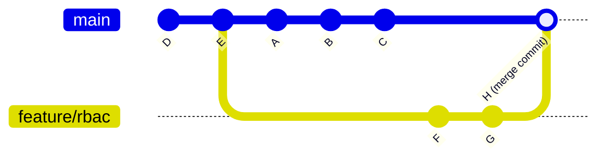
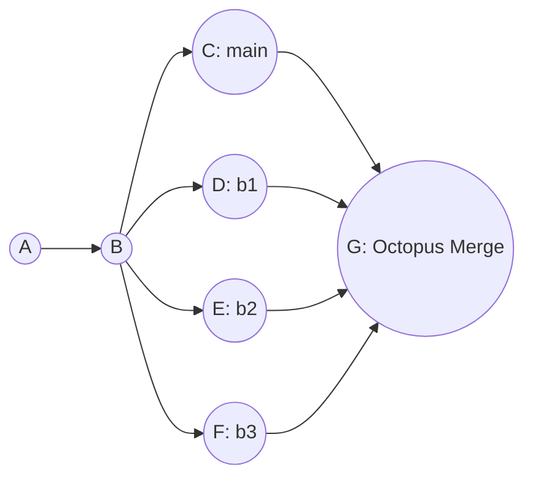
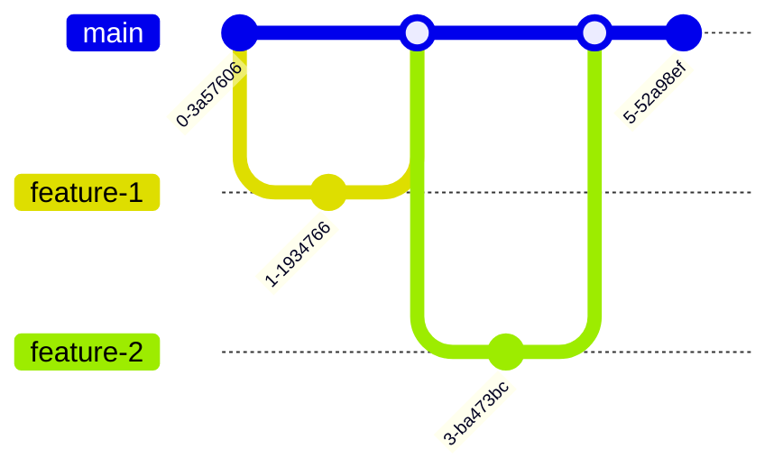

> **Складність**: СЕРЕДНЯ
>
> **Час на проходження**: 75 хвилин
>
> **Передумови**: Модуль 1, Внутрішня будова Git. Цей модуль передбачає, що ви вмієте читати граф комітів, створювати гілки та комітити невеликі зміни, але він не передбачає, що ви вже мали справу з конфліктами злиття Kubernetes рівня продакшн в умовах браку часу.

---


## Що ви зможете зробити
- **Діагностувати** першопричину складних конфліктів злиття у файлах маніфестів Kubernetes, аналізуючи базу злиття (merge base) та історії комітів, що розійшлися.
- **Застосовувати** fast-forward, тристороннє (three-way) та octopus злиття стратегічно, щоб підтримувати чисту історію проєкту, зручну для навігації.
- **Вирішувати** заплутані конфлікти в багатьох файлах під час інтеграції infrastructure-as-code без внесення синтаксичних помилок YAML або регресійних багів.
- **Оцінювати** різні стратегії галуження (Trunk-based, GitFlow, GitHub Flow), щоб обрати оптимальний робочий процес для платформної команди Kubernetes з високою швидкістю розробки.
- **Порівнювати** внутрішні алгоритми diff сучасної стратегії злиття `ort` та застарілої `recursive`, щоб зрозуміти, як Git обробляє перейменування файлів та складні інтеграції дерев.


## Чому це важливо

21 жовтня 2018 року планове технічне обслуговування оптичного апаратного забезпечення від'єднало мережевий хаб Східного узбережжя США від основного дата-центру Східного узбережжя США на 43 секунди. Автоматичний failover підвищив статус хабу Західного узбережжя США до основного, однак хаб Східного узбережжя продовжував приймати записи. Обидва майданчики містили записи для одних і тих самих рядків, які виглядали достовірно. Цей інцидент спричинив погіршення роботи сервісу на понад 24 години; інженерам довелося вручну узгоджувати записи, які обидва майданчики прийняли під час цього короткого розриву, перш ніж вдалося відновити консистентність, і приблизно 200 000 webhook payloads були назавжди втрачені. Інцидент продемонстрував, що розбіжні часові лінії можуть кожна окремо виглядати правильними, створюючи при цьому масштабний конфлікт на рівні інфраструктури. Та сама проблема існує в системах контролю версій (source control) кожного разу, коли узгоджуються довготривалі гілки. Просунутий Git merging — це відпрацьована навичка, яка запобігає перетворенню цього процесу узгодження на аварію.

Для роботи з платформою Kubernetes merging — це більше, ніж просто завдання з обслуговування репозиторію, оскільки об'єднаний текст часто стає контрактом desired-state, який споживають контролери, admission policies, сканери та засоби автоматизації розгортань. Чистий на вигляд merge все одно може залишити selector, що вказує на хибні labels, згенерований Secret, якого не вистачає в Kustomize overlay, або release branch, що містить припущення, які більше не є вірними для кластерів Kubernetes 1.35. Цей модуль розглядає merging як навичку операційного проєктування: ви будете інспектувати форму графа, обирати правильний метод інтеграції, вирішувати конфлікти шляхом синтезування намірів та валідувати, що отримані маніфести все ще описують цілісну систему.


## Основний контент

### Геометрія інтеграції: Fast-Forward проти Three-Way Merges

Коли ви виконуєте команду `git merge`, Git не просто наосліп зліплює файли рядок за рядком. Натомість він виконує ретельний геометричний аналіз графа історії комітів вашого репозиторію, щоб визначити найбезпечніший математичний спосіб інтеграції розрізнених змін. Розуміння цієї базової геометрії — це фундаментальна різниця між керуванням історією вашого проєкту та статусом її жертви.

#### Fast-Forward злиття

Уявіть, що ви кладете цеглу, будуючи пряму стіну. Ви зупиняєтесь, щоб перепочити. Поки ви відпочиваєте, ваш колега продовжує класти цеглу, починаючи точно з того місця, де ви зупинилися, продовжуючи ту саму ідеальну пряму лінію. Коли ви повертаєтеся, інтеграція його нової роботи у ваше бачення стіни не вимагає жодних складних рішень чи архітектурних змін; ви просто йдете до кінця щойно покладеної цегли і вважаєте це новим кінцем стіни.

Ця концептуальна модель ідеально описує **fast-forward злиття**. Воно відбувається, коли верхівка (tip) поточної гілки є прямим лінійним предком гілки, яку ви намагаєтесь злити. Git просто пересуває вказівник вашої поточної гілки вперед, щоб він вказував на той самий коміт, що і вхідна гілка. Оскільки історія є абсолютно лінійною і не розгалужувалася, новий коміт злиття (merge commit) не створюється.

```bash
# Setting up a fast-forward scenario
git init cluster-config
cd cluster-config
echo "apiVersion: v1" > config.yaml
git add config.yaml
git commit -m "Initialize cluster config"

# Create a new branch and add a commit
git checkout -b feature/add-metadata
echo "kind: ConfigMap" >> config.yaml
git commit -am "Add ConfigMap kind"

# Switch back to main and merge
git checkout main
git merge feature/add-metadata
```

Вивід команди навмисно нудний, і ця нудьга — це весь сенс fast-forward інтеграції. Git повідомляє, що він оновив один діапазон комітів до іншого, а потім показує лише зведення змін на рівні файлів, оскільки другий предок (parent) і коміт злиття не знадобилися.
```text
Updating a1b2c3d..e4f5g6h
Fast-forward
 config.yaml | 1 +
 1 file changed, 1 insertion(+)
```

Оскільки гілка `main` не розгалужувалася — тобто до `main` не було додано нових комітів під час активної розробки гілки `feature/add-metadata` — Git просто пересунув вказівник `main` вперед, щоб наздогнати її.

Якщо ви хочете змусити Git створити коміт злиття в будь-якому випадку (це часто роблять, щоб зберегти історичний контекст того, що певна гілка фічі взагалі існувала), ви можете використати прапорець `git merge --no-ff`, який завжди створює коміт злиття, навіть якщо fast-forward був би цілком можливим. Натомість виконання `git merge --ff-only` буде успішним лише тоді, коли чистий fast-forward математично можливий; інакше команда негайно завершується з ненульовим статусом (non-zero status) і відмовляється виконувати злиття. Варто також звернути увагу на специфічний крайовий випадок (edge case): fast-forward злиття автоматично пригнічується, і Git поводиться так, ніби було передано `--no-ff`, під час злиття анотованого тегу (annotated tag), який не зберігається в стандартній ієрархії `refs/tags/`.

Ця різниця має значення в автоматизації, оскільки захищена гілка (protected branch) може використовувати `--ff-only` як запобіжник (guardrail), а не просто як стилістичну перевагу. Якщо пайплайн очікує, що гілка розгортання (deployment branch) є строгим нащадком перевіреної релізної гілки, невдалий fast-forward говорить вам про те, що граф більше не відповідає процесу релізу, якого, як ви думали, ви дотримуєтеся. Ця невдача є корисним доказом. Вона свідчить про те, що хтось запровадив незалежну історію, і тепер команді потрібне свідоме рішення щодо інтеграції замість тихого переміщення вказівника.

> **Зупиніться та подумайте**: Перш ніж запустити `git log --oneline --graph` після цього злиття, намалюйте, як, на вашу думку, виглядатиме граф історії. Чи буде там розгалуження (fork) та коміт злиття?
> 
> *Перевірка*: Оскільки це було fast-forward злиття, `main` просто перемістилася до верхівки `feature/add-metadata`. Немає жодного розгалуження і жодного коміта злиття. `git log --oneline --graph` покаже одну пряму лінію комітів, що закінчується на "Add ConfigMap kind".

#### Three-Way злиття

Реальна розробка платформ рідко буває ідеально лінійною. Поки ваш колега продовжував цегляну стіну, ви почали будувати повністю паралельну стіну поруч. Тепер вам потрібно архітектурно їх з'єднати. **Three-way merge** (тристороннє злиття) відбувається, коли історія репозиторію фундаментально розійшлася. Як поточна гілка, так і вхідна гілка мають спільного предка (common ancestor) глибоко в минулому, але з того моменту обидві просувалися вперед незалежно.


```mermaid
gitGraph
   commit id: "D"
   commit id: "E"
   branch feature/rbac
   checkout main
   commit id: "A"
   commit id: "B"
   commit id: "C"
   checkout feature/rbac
   commit id: "F"
   commit id: "G"
   checkout main
   merge feature/rbac id: "H (merge commit)"
```

Щоб вирішити це розгалуження алгоритмічно, Git дивиться на спільного предка (коміт `E`), порівнює його з вашим поточним станом (`C`), щоб побачити, що саме ви змінили, а потім порівнює предка з вхідним станом (`G`), щоб побачити, що саме змінили вони. Потім Git намагається синтезувати та застосувати обидва набори змін до базової лінії (baseline) `E` одночасно. Якщо модифікації не перекриваються на одних і тих самих рядках коду, Git успішно створює новий **merge commit** (позначений як `H` на діаграмі), який математично зв'язує дві паралельні часові лінії разом.

> **Зупиніться та подумайте**: Що, на вашу думку, станеться, якщо гілка `main` і гілка `feature/rbac` змінять один і той самий список `subjects` у маніфесті RoleBinding, але додадуть різних користувачів? Як three-way злиття Git обробить цей конкретний сценарій?

| Тип зміни | Гілка A (main) проти Base | Гілка B (feature) проти Base | Дія Git під час злиття |
| :--- | :--- | :--- | :--- |
| Файл додано | Відсутній | Додано | Файл додається |
| Файл змінено | Без змін | Змінено | Модифікація застосовується |
| Файл видалено | Видалено | Без змін | Файл залишається видаленим |
| Файл змінено | Змінено (рядок 10) | Змінено (рядок 50) | Обидві модифікації застосовуються |
| Файл змінено | Змінено (рядок 20) | Змінено (рядок 20) | **КОНФЛІКТ** |

### Бази злиття, стратегії та внутрішні рушії Git

Справжня прихована геніальність архітектури Git полягає саме в тому, як він обчислює та знаходить базу злиття (merge base). Коли історії гілок стають глибоко складними та переплітаються з численними перехресними злиттями (cross-merges), пошук оптимального спільного предка є обчислювально складною задачею. Якщо вам коли-небудь знадобиться вручну перевірити, який коміт Git наразі вважає базою злиття, перш ніж намагатися виконати дуже ризиковане або масштабне злиття, ви можете викликати рушій обчислень безпосередньо:

```bash
git merge-base main feature/ingress-update
```

Вивід команди `git merge-base` — це один обраний найкращий хеш коміту спільного предка для двох гілок, який Git використовує як відправну точку для свого обчислення three-way злиття. У перехресних (criss-cross) історіях із кількома однаково хорошими базами запустіть `git merge-base --all`, щоб вивести список усіх кандидатів. Точне розуміння того, який саме коміт виступає в ролі бази, є критично важливим під час діагностики причин, чому Git, здається, генерує дивні або нелогічні конфлікти.

> **Зупиніться та подумайте**: Погляньте на наступну топологію гілок:
> ```mermaid
> gitGraph
>    commit id: "A"
>    commit id: "B"
>    branch feature/db
>    checkout main
>    commit id: "C"
>    commit id: "D"
>    checkout feature/db
>    commit id: "E"
>    commit id: "F"
>    branch feature/cache
>    checkout feature/cache
>    commit id: "G"
>    commit id: "H"
> ```
> Якщо ви перебуваєте на `main` і виконуєте `git merge feature/cache`, який коміт є базою злиття? 
> 
> *Відповідь*: Базою злиття є коміт `B`. Щоб знайти його, простежте назад від `main` (коміт D) і `feature/cache` (коміт H), поки їхні шляхи не перетнуться. Вони вперше зустрічаються у `B`, що робить його спільним предком, який використовується для three-way злиття.

Git надає декілька стратегій злиття, які керують тим, як об'єднуються файли: `ort`, `recursive` (тепер це псевдонім/синонім для `ort`), `resolve`, `octopus`, `ours` та `subtree`. 

Для стандартних злиттів двох гілок сучасний Git використовує стратегію `ort` як універсальне значення за замовчуванням. Стратегія `ort`, що розшифровується як "Ostensibly Recursive's Twin" (Нібито близнюк Recursive), стала стандартом за замовчуванням у Git 2.34.0 (випущеному в листопаді 2021 року) і внутрішньо використовує `diff-algorithm=histogram` за замовчуванням. Цей алгоритмічний вибір робить її значно швидшою та набагато точнішою в обробці масових перейменувань файлів та складних реструктуризацій каталогів у гілках, що розійшлися. Бекенд `ort` повністю замінив застарілу стратегію `recursive`, яка згодом була повністю відкинута (deprecated) в Git 2.50.0 і тепер існує лише як тихий синонім та псевдонім для `ort`, щоб зберегти зворотну сумісність для старих скриптів.

Інші доступні стратегії обслуговують вузькоспеціалізовані варіанти використання. Стратегія `resolve` використовує дуже традиційний алгоритм three-way злиття, але свідомо НЕ обробляє перейменування файлів, тоді як `ort` виявляє та обробляє перейменування витончено. Стратегія `ours` (викликається через `git merge -s ours`) агресивно відкидає УСІ зміни з іншої гілки повністю — результуюче дерево завжди математично ідентичне дереву HEAD поточної гілки. Критично важливо розуміти, що це фундаментально відрізняється від опції стратегії (яка викликається через `git merge -X ours`), котра все ще виконує стандартне three-way злиття, але автоматично віддає перевагу коду поточної гілки лише під час вирішення конфліктних фрагментів (hunks), що перекриваються.

#### Процес розв'язання

Коли Git стикається зі змінами, що перекриваються і які він не може вирішити математично, він зупиняє автоматизований процес злиття. Ви повинні втрутитися вручну. Процес розв'язання (resolution) вручну складається з п'яти суворих послідовних кроків:

1. **Діагностувати конфлікт:** Git зупиняє виконання злиття та позначає файли як конфліктні в індексі. Запустіть `git status`, щоб побачити точний список файлів, які вимагають вашої негайної уваги.
2. **Знайти маркери:** Відкрийте конфліктний файл у вашому текстовому редакторі та знайдіть стандартні маркери конфлікту: `<<<<<<<` (що позначає початок змін вашої поточної гілки), `=======` (розділова лінія, що відокремлює дві різні реальності) та `>>>>>>>` (що позначає кінець змін вхідної гілки).
3. **Проаналізувати розбіжність:** Уважно прочитайте код у межах маркерів. Зрозумійте, чого саме архітектурно намагалася досягти версія `HEAD` у порівнянні з тим, що намагалася зробити вхідна гілка.
4. **Синтезувати намір:** Видаліть маркери конфлікту повністю та відредагуйте сирий код вручну так, щоб обидві заплановані зміни поєдналися гармонійно, гарантуючи, що ви не внесете синтаксичних помилок YAML або семантичних логічних багів.
5. **Завершити розв'язання:** Збережіть файл, виконайте `git add <file>`, щоб вказати Git, що конфлікт успішно вирішено, і, нарешті, виконайте `git commit`, щоб надійно завершити глобальну операцію злиття.

### Вирішення конфліктів в Infrastructure-as-Code: Багатофайлова складність

Конфлікти — це не помилки компілятора; це просто призупинення виконання Git, щоб запитати думку людини, оскільки його математичні моделі не можуть безпечно вгадати намір розробника. Коли виникає конфлікт, внутрішній індекс Git перетворюється на надзвичайно складний, багатовимірний робочий простір. Під час three-way злиття Git фізично зберігає до трьох різних версій кожного конфліктного файлу безпосередньо всередині структури індексу: stage 1 (база спільного предка), stage 2 (поточна версія HEAD) та stage 3 (вхідна версія MERGE_HEAD). Ви можете безпосередньо дослідити ці внутрішні стадії, запустивши `git ls-files -u`. Більше того, при використанні сучасної стратегії злиття `ort` Git розумно записує посилання `AUTO_MERGE`, яке вказує на дерево, що точно відповідає поточному вмісту робочого дерева (working tree), разом з усіма вбудованими маркерами конфлікту.

Розглянемо складний сценарій платформи з реального життя. Команда Alpha працює над гілкою `feature/ha-redis` для підвищення надлишковості. Команда Beta одночасно працює над гілкою `feature/redis-auth` для посилення безпеки. Обидві команди суттєво модифікують основний файл `redis-deployment.yaml` та глобальний файл `kustomization.yaml`, який оркеструє логіку розгортання.

Зміни команди Alpha у `feature/ha-redis`:
```yaml
spec:
  replicas: 3
  template:
    spec:
      containers:
      - name: redis
        image: redis:7.2.4-alpine
```
```yaml
resources:
- redis-deployment.yaml
commonLabels:
  high-availability: "true"
```

Розбіжні зміни команди Beta у `feature/redis-auth`:
```yaml
spec:
  replicas: 1
  template:
    spec:
      containers:
      - name: redis
        image: redis:7.2.4
        env:
        - name: REDIS_PASSWORD
          valueFrom:
            secretKeyRef:
              name: redis-secret
              key: password
```
```yaml
resources:
- redis-deployment.yaml
secretGenerator:
- name: redis-secret
  literals:
  - password=supersecret
```

Коли провідний інженер платформи намагається злити `feature/redis-auth` у `feature/ha-redis`, Git оцінює текст, виявляє значне перекриття і різко зупиняє процес на кількох файлах:

```bash
git checkout feature/ha-redis
git merge feature/redis-auth
# Auto-merging redis-deployment.yaml
# CONFLICT (content): Merge conflict in redis-deployment.yaml
# Auto-merging kustomization.yaml
# CONFLICT (content): Merge conflict in kustomization.yaml
# Automatic merge failed; fix conflicts and then commit the result.
```

Якщо ви панікуєте, побачивши масові багатофайлові конфлікти інфраструктури, пам'ятайте, що виконання `git merge --abort` функціонально еквівалентне виконанню `git reset --merge` за наявності `MERGE_HEAD`, але лише тоді, коли ваше робоче дерево та індекс достатньо чисті, щоб Git міг безпечно скасувати злиття. Якщо у вас є непроіндексовані (unstaged) редагування поза конфліктом, спочатку зробіть їм stash або commit, або використовуйте `git merge --abort` лише після розуміння того, що саме буде відкинуто. Коли увімкнено `merge.autostash`, Git може тимчасово заховати локальні зміни під час злиття та відновити їх у разі переривання за допомогою `MERGE_AUTOSTASH`. Якщо ви вирішите продовжити замість переривання, ви повинні точно синтезувати конфліктні конфігурації, гарантуючи, що жодна структура YAML не порушена.

Щоб успішно вирішити цей конкретний сценарій, ми повинні визначити бажаний результат для всіх файлів: ми хочемо високу доступність (High Availability, replicas: 3) ТА автентифікацію (змінні середовища, env vars). Щоб інфраструктура дійсно працювала, файл Kustomization повинен містити ЯК `commonLabels`, ТАК І `secretGenerator`, щоб `redis-secret`, на який посилається розгортання, дійсно існував.

Правильно синтезована конфігурація розгортання:
```yaml
spec:
  replicas: 3
  template:
    spec:
      containers:
      - name: redis
        image: redis:7.2.4-alpine
        env:
        - name: REDIS_PASSWORD
          valueFrom:
            secretKeyRef:
              name: redis-secret
              key: password
```

Правильно синтезована конфігурація kustomization:
```yaml
resources:
- redis-deployment.yaml
commonLabels:
  high-availability: "true"
secretGenerator:
- name: redis-secret
  literals:
  - password=supersecret
```

Завжди комплексно валідуйте структурну цілісність ваших файлів infrastructure-as-code перед тим, як зробити коміт остаточного вирішення. Після перевірки додайте обидва файли до індексу та зробіть коміт, щоб завершити складне багатофайлове злиття.

Після завершення складного злиття вам або рев'юверу може знадобитися ізолювати та перевірити лише ті конкретні ручні вирішення конфліктів, які ви зробили, без шуму від непов'язаних змін функцій. Ви можете досягти цього, дослідивши коміт злиття за допомогою `git show <merge-commit-hash>`, який відображає спеціалізований «комбінований diff» (combined diff), що розумно фільтрує вивід, щоб виділити лише ті рядки, які були змінені інакше порівняно з обома батьківськими гілками.

```bash
kubectl kustomize . | kubeconform -summary -

# If successful:
git add redis-deployment.yaml kustomization.yaml
git commit -m "Merge redis-auth, resolving multi-file replicas, image, and secret generator conflicts"
```

Гіпотетичний сценарій: інженер платформи вирішує основний YAML Deployment вручну, але, відчуваючи перевантаження, виконує `git checkout --ours kustomization.yaml`, щоб обійти другий конфлікт. Git приймає команду і дозволяє злиттю завершитися, проте Deployment тепер очікує Secret з паролем, який файл Kustomization більше не генерує. У GitOps потоці такий успіх на текстовому рівні може стати помилкою часу виконання (runtime failure), як тільки контролер застосує узгоджене дерево. Урок не в тому, що `--ours` заборонено; справа в тому, що скорочення для конфліктів на рівні всього файлу повинні бути виправдані відносно повного графа ресурсів, а не відносно файлу, який виглядає найбільш дратуючим у редакторі.

Коли ви перевіряєте злиття такого типу, читайте кінцеву конфігурацію як набір взаємозв'язків, а не як два незалежних файли. Блок `env` у Deployment посилається на Secret за ім'ям, файл Kustomization вирішує, чи створюється цей Secret, а вибір тегу образу може змінити припущення часу виконання щодо поведінки автентифікації. Хороше вирішення зберігає корисний намір з обох гілок, а потім доводить, що посилання все ще з'єднуються. Ось чому команда валідації виконується перед `git add`: як тільки ви індексуєте результат, стає легко вважати злиття завершеним, навіть якщо об'єкт платформи ще не був перевірений.

Щоб допомогти у візуалізації цих складних ситуацій, ви можете використати `git mergetool`, який запускає спеціалізований зовнішній інструмент візуального порівняння, що представляє версії BASE, LOCAL та REMOTE пліч-о-пліч, а потім автоматично записує ваш остаточний вирішений результат безпосередньо у файл MERGED. Ви також можете суттєво змінити те, як Git нативно представляє конфлікти у вашому редакторі. Через конфігурацію `merge.conflictStyle` доступні три різних стилі конфліктів злиття: `merge` показує лише дві сторони, що розходяться, `diff3` додає блок `|||||||`, що показує вихідний код предка для забезпечення критичного контексту того, чому стався конфлікт, а `zdiff3` функціонально ідентичний diff3, але обрізає співпадаючі незмінені рядки із зовнішніх країв блоку конфлікту для зменшення візуального шуму. Високоефективний стиль конфліктів `zdiff3` був представлений у Git 2.35.0.

Якщо ваша команда постійно стикається з абсолютно однаковими ідентичними конфліктами знову і знову через довгоживучі гілки, функція Git `rerere` (Reuse Recorded Resolution) є абсолютним порятунком. Вона глобально вмикається встановленням конфігурації `rerere.enabled = true`. Коли її увімкнено, Git математично знімає відбиток (fingerprints) конфлікту і спостерігає за вашим вирішенням вручну, зберігаючи цей зв'язок у прихованому кеші. Якщо точно такий самий конфлікт коли-небудь виникне знову під час майбутнього злиття або rebase, Git автоматично застосує ваше попереднє рішення без зупинки.

### Феномен Auto-Merge: Історичний кейс-стаді

Щоб глибоко зрозуміти, як працюють вікна контексту Git, дуже повчально поглянути на застарілу вправу. У попередніх версіях цього курсу студентам давали наступну точну послідовність команд, щоб навмисно створити конфлікт злиття.

Перша частина старої вправи створювала крихітний репозиторій та Kubernetes Deployment, який був навмисно достатньо малим, щоб студенти могли перевірити його на око. Старіші аудиторні версії іноді використовували короткий інтерактивний псевдонім для валідації Kubernetes, але робочі приклади тут зберігають повну команду `kubectl`, щоб кожен блок можна було скопіювати в неінтерактивну оболонку або завдання CI, не покладаючись на налаштування локальної оболонки.
```bash
mkdir k8s-merge-lab && cd k8s-merge-lab
git init --initial-branch=main
```
```yaml
apiVersion: apps/v1
kind: Deployment
metadata:
  name: api-server
spec:
  replicas: 2
  selector:
    matchLabels:
      app: api
  template:
    metadata:
      labels:
        app: api
    spec:
      containers:
      - name: api
        image: nginx:1.27.0
```
```bash
git add deployment.yaml
git commit -m "chore: initial api deployment"
```

Друга частина створювала дві розбіжні гілки, які змінювали різні поля в одному і тому ж Deployment. Одна гілка змінювала бажану ємність, тоді як інша змінювала образ контейнера, і навчальний задум полягав у тому, щоб змусити ці незалежні наміри зіткнутися всередині одного маніфесту.
```bash
git checkout -b feature/scale-up
sed -i.bak 's/replicas: 2/replicas: 5/g' deployment.yaml && rm deployment.yaml.bak
git add deployment.yaml
git commit -m "feat: scale api to 5 replicas"
```
```bash
git checkout main
git checkout -b feature/update-image
sed -i.bak 's/image: nginx:1.27.0/image: nginx:1.27.1/g' deployment.yaml && rm deployment.yaml.bak
git add deployment.yaml
git commit -m "chore: update nginx to 1.27.1"
```

Третя частина просила студентів злити гілку образу в гілку масштабування і спостерігати за результатом. В оригінальній аудиторній версії очікуванням був видимий конфлікт, що робило наступний крок розв'язання легким для пояснення та оцінювання.
```bash
git checkout feature/scale-up
git merge feature/update-image
# Output will show CONFLICT (content)
```

Суворе педагогічне очікування полягало в тому, що ця послідовність створить наступні драматичні маркери конфлікту у файлі, оскільки старіша вправа розглядала близькі редагування в одному й тому самому об'єкті YAML так, ніби вони завжди будуть перекриватися:
```text
apiVersion: apps/v1
kind: Deployment
metadata:
  name: api-server
spec:
<<<<<<< HEAD
  replicas: 5
  selector:
    matchLabels:
      app: api
  template:
    metadata:
      labels:
        app: api
    spec:
      containers:
      - name: api
        image: nginx:1.27.0
=======
  replicas: 2
  selector:
    matchLabels:
      app: api
  template:
    metadata:
      labels:
        app: api
    spec:
      containers:
      - name: api
        image: nginx:1.27.1
>>>>>>> feature/update-image
```

Потім студент мав би вручну розв'язати файл до цього кінцевого стану, зберігши рішення про масштабування з однієї гілки та рішення щодо виправленого образу з іншої гілки:
```yaml
apiVersion: apps/v1
kind: Deployment
metadata:
  name: api-server
spec:
  replicas: 5
  selector:
    matchLabels:
      app: api
  template:
    metadata:
      labels:
        app: api
    spec:
      containers:
      - name: api
        image: nginx:1.27.1
```

Після цього вправа вимагала валідації перед комітом, оскільки синтаксично зламаний Deployment — це все ще невдале злиття, навіть коли маркери конфлікту Git були видалені:
```bash
kubeconform -summary deployment.yaml
# Expect output confirming the Deployment schema is valid
```
```bash
git add deployment.yaml
git commit -m "Merge branch 'feature/update-image' into feature/scale-up resolving replicas and image"
```

Старий ключ розв'язку, який надавався студентам, виглядав саме так, і його варто зберегти, оскільки він показує заплановану послідовність операцій, навіть якщо сучасний Git зазвичай обробляє цей конкретний приклад автоматично:
<details>
<summary>Переглянути рішення</summary>

**Завдання 1: Створити гілку масштабування**
```bash
git checkout -b feature/scale-up
sed -i.bak 's/replicas: 2/replicas: 5/g' deployment.yaml && rm deployment.yaml.bak
git add deployment.yaml
git commit -m "feat: scale api to 5 replicas"
```

**Завдання 2: Створити гілку оновлення образу**
```bash
git checkout main
git checkout -b feature/update-image
sed -i.bak 's/image: nginx:1.27.0/image: nginx:1.27.1/g' deployment.yaml && rm deployment.yaml.bak
git add deployment.yaml
git commit -m "chore: update nginx to 1.27.1"
```

**Завдання 3: Викликати конфлікт**
```bash
git checkout feature/scale-up
git merge feature/update-image
# Output will show CONFLICT (content)
```

**Завдання 4: Вирішити конфлікт**
Відкрийте `deployment.yaml` у своєму редакторі. Він виглядатиме приблизно так:
```text
apiVersion: apps/v1
kind: Deployment
metadata:
  name: api-server
spec:
<<<<<<< HEAD
  replicas: 5
  selector:
    matchLabels:
      app: api
  template:
    metadata:
      labels:
        app: api
    spec:
      containers:
      - name: api
        image: nginx:1.27.0
=======
  replicas: 2
  selector:
    matchLabels:
      app: api
  template:
    metadata:
      labels:
        app: api
    spec:
      containers:
      - name: api
        image: nginx:1.27.1
>>>>>>> feature/update-image
```

Відредагуйте файл, щоб видалити маркери та об'єднати бажаний стан:
```yaml
apiVersion: apps/v1
kind: Deployment
metadata:
  name: api-server
spec:
  replicas: 5
  selector:
    matchLabels:
      app: api
  template:
    metadata:
      labels:
        app: api
    spec:
      containers:
      - name: api
        image: nginx:1.27.1
```

**Завдання 5: Валідувати YAML**
```bash
kubeconform -summary deployment.yaml
# Expect output confirming the Deployment schema is valid
```

**Завдання 6: Завершити злиття**
```bash
git add deployment.yaml
git commit -m "Merge branch 'feature/update-image' into feature/scale-up resolving replicas and image"
```

</details>

Однак, якщо ви спробуєте виконати цю застарілу вправу сьогодні, використовуючи сучасну версію Git, оснащену високооптимізованою стратегією `ort`, вона без проблем виконає auto-merge без генерації жодного конфлікту. Цей захопливий феномен виникає через те, що модифікації `replicas` (рядок 6) та `image` (рядок 17) розділені рівно десятьма незміненими рядками. Цей проміжок забезпечує внутрішні алгоритми Git достатнім однозначним текстовим контекстом, щоб безпечно застосувати обидва окремі фрагменти незалежно. "Ілюзія перекриття контексту" в старих посібниках часто не враховує зростаючу складність сучасних рушіїв diff у Git.

Це не робить застарілу вправу марною; це робить її корисним попередженням про те, що не варто покладатися на інтуїцію замість спостереження за реальним рушієм злиття. Старіші навчальні матеріали часто описують конфлікти так, ніби близькі концептуальні зміни неминуче зіткнуться, але рішення Git базується на фрагментах diff, які він може вивести з бази злиття та обох верхівок. Дві зміни можуть здаватися пов'язаними людині, оскільки вони знаходяться всередині одного об'єкта Kubernetes, але все ж бути достатньо механічно незалежними, щоб `ort` міг об'єднати їх без запитань. Правильним є й протилежне: дві зміни, які виглядають безпечними під час окремих рев'ю, можуть зіткнутися, якщо вони змінюють той самий невеликий регіон YAML, особливо коли згенеровані блоки або ключі, що повторюються, зменшують контекст.

### Злиття Octopus: Приборкання кількох гілок

Іноді команді платформи Kubernetes потрібно організувати масову інтеграцію кількох абсолютно незалежних feature-гілок у кінцеву гілку release candidate одночасно. Спроба зробити це послідовно через довгий ланцюжок окремих злиттів двох гілок створює невиправдано брудну, східчасту історію. Git надає потужну стратегію `octopus` спеціально для цього сценарію. Вона автоматично обирається як стратегія за замовчуванням, коли ви наказуєте Git злити більше двох гілок одночасно.


```mermaid
graph LR
    A((A)) --> B((B))
    B --> C((C: main))
    
    B --> D((D: b1))
    B --> E((E: b2))
    B --> F((F: b3))
    
    C --> G((G: Octopus Merge))
    D --> G
    E --> G
    F --> G
```

```bash
git checkout release-v1.35
git merge feature/ingress feature/autoscaling feature/network-policies
```

> **Зупиніться та подумайте**: Що, на вашу думку, станеться, якщо Git успішно зливає `feature/ingress` та `feature/autoscaling`, але потім виявляє складний конфлікт під час спроби злити `feature/network-policies`? Чи призупиниться він і попросить вас вирішити це як стандартне three-way злиття?

**Правило «Все або нічого»:** На відміну від стандартного three-way злиття двох гілок, яке зупиняється на півдорозі і залишає інтерактивні маркери конфлікту у вашому робочому каталозі, залишаючи вказівник гілки незмінним, octopus злиття зупиняється, як тільки натрапляє на конфлікт, який воно не може вирішити автоматично. Git друкує `Automatic merge failed; fix conflicts and then commit the result.`, **не** переміщує посилання гілки і залишає робоче дерево та індекс у конфліктному або частково злитому стані. Виконайте `git merge --abort`, щоб відхилити це незавершене злиття та повернутися до стану до початку злиття.

> **Зупиніться та подумайте**: Якщо злиття octopus зазнає невдачі через конфлікт між `feature/autoscaling` та `feature/network-policies`, який підхід ви оберете:
> А) Повністю відмовитися від octopus злиття і злити всі три гілки послідовно.
> Б) Спочатку злити дві конфліктні гілки одна з одною, вирішити конфлікт, а потім повторити octopus злиття з оновленими гілками.
> Чому обраний вами підхід безпечніший для збереження чистої історії?

### Просунуте переписування історії та Cherry-Picking

Перед інтеграцією гілок багато високоефективних команд платформ вимагають від розробників хірургічно очистити їхні брудні історії комітів, переповнені робочими змінами. 

Команда `git rebase --interactive` — це найголовніший інструмент для історичної хірургії. Вона підтримує широкий спектр потужних команд для редагування комітів, включаючи `pick`, `edit`, `reword` (для зміни повідомлення без зміни коду), `drop` (для повного видалення коміту), `squash` (щоб злити коміт із попереднім, об'єднавши їхні повідомлення), `fixup`, `fixup -c/-C`, `break` та `exec` (що запускає shell-скрипт для кожного коміту, щоб переконатися, що тести проходять). За замовчуванням `git rebase --interactive` суворо виключає коміти злиття зі згенерованого списку інструкцій, щоб зробити історію плоскою.

Крім того, ви можете використовувати `git rebase --onto <newbase>`, щоб фізично трансплантувати послідовність комітів на абсолютно іншу базу, ніж їхній початковий upstream, дозволяючи відокремити тематичну гілку і повністю перемістити її до іншого предка.

Коли ви практикуєте Trunk-Based Development, якщо ваш push до віддаленого trunk відхиляється, оскільки він містить нову роботу, ви можете безпечно інтегрувати ці віддалені зміни без створення зайвих комітів злиття, виконавши `git pull --rebase origin main`. Це завантажить віддалені зміни і чисто відтворить вашу локальну роботу поверх них.

Якщо вам потрібно інтегрувати лише один, дуже специфічний коміт з іншої розбіжної гілки без злиття всієї часової лінії, використовуйте `git cherry-pick`. Виконання `git cherry-pick -x` автоматично додає надзвичайно корисний рядок відстеження '(cherry picked from commit ...)' безпосередньо в повідомлення коміту. Виконання `git cherry-pick -n` (або `--no-commit`) застосовує відповідні зміни до робочого дерева та індексу без фактичного створення нового коміту, дозволяючи вам вручну налаштувати код перед комітом.

Ще одним потужним механізмом є `git merge --squash`. Ця команда виконує логіку інтеграції злиття, але навмисно не створює коміт і не фіксує вказівник `MERGE_HEAD`, залишаючи сильно об'єднаний результат просто проіндексованим у вашому індексі для подальшого створеного вручну мега-коміту.

Щоб ефективно провести аудит того, як злиття структурно вплинули на ваш репозиторій з часом, ви можете запитати часову шкалу за допомогою `git log --merges` (що виводить лише коміти злиття і функціонально еквівалентно передачі `--min-parents=2`) або використовувати `git log --no-merges` (що повністю виключає всі коміти злиття і еквівалентно передачі `--max-parents=1`).

### Стратегії розгалуження та конфігурації платформ

Стратегія злиття Git зрештою є настільки ж ефективною, наскільки ефективною є загальна людська модель розгалуження, яка точно диктує, коли, де і як часто відбуваються злиття. Різні моделі вирішують абсолютно різні проблеми організаційного масштабування.

> **Зупиніться та подумайте**: Уявіть, що ви консультуєте нову команду платформи. У них є 12 інженерів, вони роблять деплой у production двічі на тиждень, і мають покриття автоматизованими тестами, але воно іноді видає хибнопозитивні результати. Яку стратегію розгалуження ви б порекомендували і чому? Тримайте свою відповідь у голові, поки читаєте наступні моделі.

#### 1. GitFlow: Застаріла Enterprise-модель
GitFlow покладається на екстремальну ізоляцію та довгоживучі часові лінії. Вона підтримує вічну гілку `main` (яка відображає точний стан production) та паралельну гілку `develop` (використовується для безперервної інтеграції). Фічі відгалужуються виключно від `develop` і повинні зливатися назад у неї. Коли запускається реліз, релізні гілки відгалужуються від `develop`, проходять ручну стабілізацію QA і, зрештою, зливаються як з `main`, так і з `develop`.

- **Плюси:** Надає надзвичайно жорсткі, явні та контрольовані етапи для ручного QA-тестування та передрелізної стабілізації.
- **Мінуси:** Неминуче призводить до катастрофічного «пекла злиття». Feature-гілки живуть занадто довго і відхиляються від реальності. Це фундаментально несумісно зі справжніми принципами безперервної інтеграції та безперервного розгортання (CI/CD), оскільки функціональний код гниє неінтегрованим тижнями.

#### 2. GitHub Flow: Стандарт веб-застосунків
У цій моделі абсолютно все відгалужується безпосередньо від `main`. Коли фіча готова до інтеграції, розробник відкриває формальний Pull Request до `main`. Після того, як він ретельно перевірений і проходить усі автоматизовані тести, він без проблем зливається назад у `main` і негайно розгортається в production.

- **Плюси:** Надзвичайно проста, агресивно заохочує маленькі, короткоживучі гілки, і архітектурно ідеальна для швидких CI/CD пайплайнів.
- **Мінуси:** Вимагає абсолютно безвідмовного, ретельного автоматизованого тестування. Якщо ваш пайплайн не є надійним на 100%, погане злиття миттєво зламає кластер production.

#### 3. Trunk-Based Development: Елітний стандарт
Це визначальна характеристика високоефективних, елітних DevOps-команд. Розробники роблять commit та push свого сирого коду безпосередньо у `main` (trunk) кілька разів на день. Розбіжні гілки або взагалі відсутні, або суворо спроєктовані так, щоб існувати щонайбільше кілька годин.


```mermaid
gitGraph
   commit
   branch feature-1
   checkout feature-1
   commit
   checkout main
   merge feature-1
   branch feature-2
   checkout feature-2
   commit
   checkout main
   merge feature-2
   commit
```

- **Плюси:** Математично повністю усуває пекло злиття. Інтеграція є по-справжньому безперервною. Змушує впроваджувати розширені feature flags, щоб динамічно приховувати незавершені фічі в production.
- **Мінуси:** Має надзвичайно високий бар'єр входу. Вимагає надсучасного тестування, складної архітектури feature flagging та безжальної командної дисципліни.

Для сучасних команд платформ Kubernetes, які будують критично важливі внутрішні платформи через GitOps (наприклад, ArgoCD або Flux), **Trunk-Based Development** є абсолютним золотим стандартом. Довгоживучі feature-гілки, що містять інфраструктурні зміни, неминуче гниють, оскільки живий стан базового кластера постійно еволюціонує, роблячи їх неактуальними. 

#### Методи злиття на платформах

Щоб суворо дотримуватися цих різноманітних стратегій, сучасні платформи пропонують широкі можливості налаштування обмежень злиття на рівні репозиторію. 

GitHub пропонує три різні методи злиття pull request'ів: «Create a merge commit» (який форсує `--no-ff`), «Squash and merge» та «Rebase and merge». Критично важливо розуміти, що функція GitHub «Rebase and merge» працює не зовсім так, як локальний rebase; вона завжди агресивно оновлює інформацію про комітера і створює абсолютно нові SHA комітів, що може збити з пантелику локальних клієнтів, якщо цим не керувати належним чином.

GitLab аналогічно пропонує три формальні методи для merge request'ів: «Merge commit» (еквівалент `--no-ff`), «Merge commit with semi-linear history» та «Fast-forward merge». Оскільки платформи еволюціонують, щоб більш суворо застосовувати принципи Trunk-based, вони вводять нові запобіжники; наприклад, GitLab додав дуже затребувану функцію автоматичного rebase перед злиттям як для semi-linear, так і для fast-forward методів, починаючи з GitLab 18.0.


## Патерни та антипатерни

Складне злиття стає безпечнішим, коли команда розглядає кожну інтеграцію як архітектурне рішення, а не як комбінацію клавіш. Команда Git — це лише остання видима дія; справжня робота полягає у вирішенні того, чи достатньо гілка свіжа для злиття, чи залежать змінені файли від схеми, чи зможе інший інженер зрозуміти обсяг рев'ю, та чи допоможе створена історія наступному інженеру, який реагуватиме на інцидент, відтворити початковий намір. Репозиторій платформи — це не альбом для комітів, адже кожне злиття може стати вхідними даними для контролера, аудиторським слідом виробничого інциденту або межею відкоту під час невдалого релізу.

Найнадійніший патерн — це невеликі, часті інтеграції в захищену головну гілку (trunk). Розробник усе ще може використовувати короткоживучу гілку для рев'ю, але тривалість життя гілки має вимірюватися годинами чи кількома днями, а не тижнями. Такий темп утримує базу злиття наближеною до поточної реальності, а це означає, що Git порівнює кожну гілку з нещодавнім предком і створює менші, зрозуміліші зони конфліктів. Для маніфестів Kubernetes ця різниця є радше практичною, ніж естетичною: невеликий конфлікт може стосуватися того, чи значення `replicas` має бути три чи п’ять, тоді як застаріла гілка може змусити того, хто вирішує конфлікт, одночасно узгоджувати probes, selectors, імена контейнерів, згенеровані Secrets та мітки network policy.

Ще один надійний патерн — це валідація з урахуванням схеми відразу після вирішення конфлікту. Git знає, що два рядки тексту YAML відрізняються, але він не знає, чи вказує `secretKeyRef` на Secret, який усе ще генерує Kustomize, чи відповідає selector міткам усередині шаблону Pod, і чи є поле API валідним у Kubernetes 1.35. Тому під час вирішення конфлікту потрібно переходити від узгодження тексту до узгодження платформи. Запуск `kubeconform -summary <manifest.yaml>` (офлайн-валідація схеми), `kubectl kustomize` або інструменту валідації у стилі admission — це інженерний крок, який перетворює "Git прийняв файл" на "ця конфігурація досі є цілісним об'єктом кластера".

Третій патерн — це коміти злиття, які зручно перевіряти. Коли коміт злиття існує лише через поєднання двох ліній часу, він має містити виключно синтез конфліктів, необхідний для їхнього з'єднання. Така дисципліна робить `git show <merge-commit>` корисним під час рев'ю, оскільки об'єднаний diff може фокусуватися на рядках, які по-різному змінилися в обох предках. Якщо ж розробник також додає туди рефакторинг, зміни форматування або непов'язані правки політик, коміт злиття перетворюється на непрозорий пакет, і рецензенти втрачають здатність відрізнити вирішення конфлікту від випадкової роботи над новими функціями. Саме так команди ненавмисно схвалюють "зле злиття" (evil merge), яке привносить поведінку, не передбачену жодною з батьківських гілок.

| Патерн | Коли використовувати | Чому це працює | Міркування щодо масштабування |
| :--- | :--- | :--- | :--- |
| **Короткоживучі інтеграційні гілки** | Інженерам платформи потрібне рев'ю, але вони все одно часто розгортають з `main`. | База злиття залишається свіжою, зони конфліктів невеликими, а межі відкоту залишаються чіткими. | Вимагає автоматизованих тестів та feature flags, щоб незавершену роботу можна було безпечно приховати. |
| **Валідація конфліктів з урахуванням схеми** | Злиття зачіпає Kubernetes YAML, вивід Helm, оверлеї Kustomize або policy-as-code. | Git валідує походження тексту, тоді як інструменти Kubernetes валідують форму об'єкта та сумісність API. | Валідація має бути достатньо швидкою для локального запуску та в CI, інакше інженери пропускатимуть її під тиском. |
| **Коміти злиття лише для вирішення конфліктів** | Тристороннє злиття потребувало ручного синтезу. | Рецензенти можуть перевірити об'єднаний diff і побачити, що саме змінила людина. | Команді потрібне правило, за яким непов'язане очищення коду чекатиме на окремий коміт. |
| **Збережені повторювані вирішення** | Одне й те саме сімейство гілок постійно конфліктує під час підготовки до релізу. | `rerere` може повторно використати раніше прийняте рішення, зменшуючи обсяг повторної ручної роботи. | Кешу варто довіряти лише після того, як команда ретельно перевірила перше вирішення. |

Відповідні антипатерни зазвичай виникають через цілком зрозумілий поспіх. Реліз затримується, середовище працює з перебоями, або старший інженер відсутній, тому хтось обирає кнопку в IDE, яка здається найшвидшим рішенням. Проблема в тому, що інструменти Git для вирішення конфліктів оптимізовані для завершення операції злиття, тоді як безпека виробництва залежить від збереження намірів обох гілок. Прийняття стратегії "ours" для всього файлу може швидко прибрати маркери конфлікту, але це також відкидає дизайн вхідної гілки, не змушуючи розробника свідомо обґрунтувати це рішення. Якщо гілка безпеки додала NetworkPolicy, а гілка релізу змінила лише теги образів, сліпе вирішення "ours" може непомітно знищити контроль, який мав найбільше значення.

Довгоживучі гілки релізів — це друга типова пастка. Вони здаються безпечними, оскільки ізолюють нестабільність від production, але водночас вони накопичують відставання від джерела істини. У репозиторії GitOps кожен день ізоляції збільшує розрив між ментальною моделлю гілки та моделлю кластера, яку насправді застосовують контролери. Команди часто усвідомлюють ціну лише наприкінці, коли гілка релізу має поглинути тижні хотфіксів, змін в анотаціях контролерів, оновлень chart'ів та винятків з політик під час одного страшного злиття. У цей момент конфлікт перестає бути локальною текстовою проблемою; він перетворюється на відкладене архітектурне рев'ю з додатковим тиском щодо розгортання.

Третій антипатерн — це трактування успішного автоматичного злиття як доказу семантичної коректності. Наведений вище приклад з автоматичним злиттям показує, чому це небезпечно. Сучасний механізм `ort` може правильно поєднувати фрагменти коду, що розташовані далеко один від одного, і це зазвичай є плюсом, але чисте злиття все одно здатне створити Deployment, мітки якого більше не відповідають його selector, або оверлей, де згенерована назва Secret змінилася, тоді як змінна середовища, яка її споживає, залишилася фіксованою. Перш ніж виконувати це у власному репозиторії, зупиніться та подумайте: якщо Git повідомляє "Automatic merge went well" для маніфесту Kubernetes, які окремі валідації змогли б довести, що об'єкт кластера досі має сенс, а не просто коректно розпарсується?


## Фреймворк прийняття рішень

Вибір підходу до злиття починається з форми графа, але не повинен нею обмежуватися. Спершу запитайте себе, чи є верхівка вашої поточної гілки предком верхівки вхідної гілки. Якщо так, злиття типу fast-forward або `--ff-only` збереже найчистішу історію і дозволить уникнути створення коміту злиття, який не несе додаткової інформації. Якщо граф розгалузився, запитайте, чи достатньо гілка свіжа для звичайного тристороннього злиття, і чи достатньо файли прості для вирішення конфліктів на рівні рядків. Якщо гілка застаріла, безпечнішим рішенням може стати відмова від її старої форми, дослідження її намірів за допомогою `git diff <merge-base>..branch` і перенесення вибраних комітів у нову, свіжу гілку.

Наступне рішення полягає в тому, що має більше значення для цієї зміни: форма історії чи зручність рев'ю. Коміт злиття зберігає факт існування feature-гілки і може полегшити аудит релізів, коли гілка представляє цілісний обсяг роботи. Squash-злиття створює чистішу лінійну історію, але воно стирає внутрішні межі комітів і може зробити `git bisect` менш точним, якщо у стиснутій гілці були змішані непов'язані зміни. Rebase та злиття створюють лінійну історію зі збереженням окремих комітів, проте це переписує їхні ідентифікатори і може заплутати співавторів, які базували свою роботу на старій гілці. Жоден із цих варіантів не є універсально правильним; правильна відповідь залежить від того, як ваша команда налагоджує інциденти, перевіряє зміни та відкочує невдалі релізи.

Використовуйте наведену нижче матрицю рішень як практичний посібник, коли ви перебуваєте під тиском. Вона навмисно поєднує факти про граф з операційними фактами, оскільки репозиторій платформи Kubernetes оцінюється за поведінкою, яку він створює після злиття, а не лише за елегантністю його графа комітів.

| Ситуація | Бажана дія | Чому | Валідація перед комітом |
| :--- | :--- | :--- | :--- |
| Поточна гілка відстає і не має унікальних комітів | `git merge --ff-only incoming` | Вказівник гілки може переміститися без створення штучного коміту злиття. | Запустіть відповідні тести або згенеровані маніфести, якщо вхідна гілка ще не була валідована. |
| Дві свіжі гілки торкнулися різних файлів | Звичайне тристороннє злиття за допомогою `ort` | Git може чисто синтезувати незалежні зміни файлів, зберігаючи обох предків. | Перевірте коміт злиття та запустіть цільовий CI для змінених областей. |
| Дві гілки торкнулися одного й того ж маніфесту Kubernetes | Ручне вирішення конфліктів із валідацією схеми | Людський намір має більше значення, ніж суміжність тексту, коли взаємодіють selectors, probes та згенеровані ресурси. | Запустіть `kubeconform -summary` на згенерованих маніфестах, `kubectl kustomize` та будь-які перевірки політик, яких вимагає ваш репозиторій. |
| Кілька незалежних гілок потребують однієї гілки релізу | Злиття octopus лише за умови низької ймовірності конфліктів | Історія залишається компактною, але операція відхиляє конфлікти, що потребують ручного втручання. | Попередньо злийте кожну гілку з trunk і повторіть спробу лише тоді, коли кожна пара буде чистою. |
| Стара гілка має застарілу базу злиття | Перестворіть з поточного `main` та виконайте cherry-pick намірів | Старий граф містить застарілі припущення щодо платформи. | Протестуйте кожен вибраний коміт після відтворення, особливо міграції та зміни API. |
| Pull request містить багато шумних локальних комітів | Інтерактивний rebase перед рев'ю | Рецензенти бачать логічну історію замість тимчасових точок збереження. | Перезапустіть тести після перезапису і робіть force-push лише у ті гілки, якими ви володієте. |

Останнє запитання, яке ставлять досвідчені мейнтейнери перед тим, як схвалити будь-яке нетривіальне злиття: "Чи зміг би я пояснити цей результат інженеру за викликом о 3-й годині ночі?". Якщо відповідь "ні", то гілка занадто велика, рішення занадто хитромудре, або доказів валідації замало. Це питання особливо корисне для роботи з GitOps, оскільки репозиторій є одночасно документацією та вхідними даними для control plane. Рецензент, який може відстежити базу злиття, конфліктуючі наміри, обране рішення та команду валідації, має достатньо контексту, щоб довіряти зміні або відхилити її з конкретними зауваженнями.

Для повсякденної роботи компактний робочий процес допомагає запобігти панічним рішенням. Почніть з `git status`, щоб переконатися, що ваш робочий простір чистий, огляньте граф за допомогою `git log --oneline --graph --decorate --all`, визначте базу злиття, якщо гілка жила довше короткого циклу рев'ю, а потім виберіть найменш несподіваний метод інтеграції, який збереже інформацію, необхідну вашій команді згодом. Після вирішення конфлікту валідуйте згенерований об'єкт платформи та перевірте коміт злиття, а не лише кінцевий файл. Ця послідовність є повільнішою за просте натискання кнопки, але вона набагато швидша, ніж налагодження кластера, який прийняв синтаксично правильну, але семантично зламану конфігурацію.


## Чи знали ви?

1. Стратегія злиття `ort`, що є скороченням від Ostensibly Recursive's Twin, стала механізмом злиття двох гілок за замовчуванням у Git 2.34.0 у листопаді 2021 року і використовує алгоритм histogram diff всередині для багатьох порівнянь під час злиття.
2. Запуск команди обслуговування `git rerere gc` видаляє невирішені записи конфліктів, старіші за 15 днів, та вирішені записи конфліктів, старіші за 60 днів, що запобігає безмежному зростанню кешів збережених рішень.
3. Злиття octopus відповідають робочому процесу мейнтейнерів у стилі Linux, коли багато тематичних гілок об'єднуються в єдину історію інтеграції без довгої послідовності комітів злиття з двома предками.
4. Символи маркерів конфлікту (`<<<<<<<`, `=======`, `>>>>>>>`) з'явилися за десятки років до Git і були встановлені ранніми інструментами злиття в епоху RCS, саме тому вони виглядають знайомими у багатьох системах контролю версій.


## Типові помилки

| Помилка | Чому це трапляється | Як це виправити |
| :--- | :--- | :--- |
| **Панічний коміт невирішених маркерів** | Інженер почувається пригніченим, намагається зберегти роботу посеред конфлікту, запускаючи `git commit -a`, і тим самим комітить `<<<<<<<` безпосередньо в кодову базу. | Негайно запустіть `git merge --abort`, щоб повернути робочий каталог до стану перед злиттям, видихніть і почніть спочатку. |
| **Порушення відступів YAML** | Ручне видалення маркерів конфлікту та випадковий зсув блоків YAML, що створює невалідні структурні зв'язки. | Завжди використовуйте `kubectl diff` або `kubeconform -summary` для зміненого файлу перед завершенням коміту злиття. |
| **"Страусине злиття" (ігнорування upstream)** | Підтримка життя feature-гілки протягом 6 тижнів без підтягування змін з `main`, що призводить до гігантського, нерозв'язного конфлікту згодом. | Зливайте `main` у свою feature-гілку (або робіть rebase відносно неї) щодня. Вирішення конфліктів має бути постійним, невеликим податком, а не масивним штрафом наприкінці проєкту. |
| **Вирішення логіки, ламання синтаксису** | Надмірна зосередженість на тому, щоб помістити обидва набори конфігурацій у файл, що призводить до створення дубльованих ключів (наприклад, два блоки `spec` у визначенні Pod'а). | Розумійте схему файлу, який ви редагуєте. Використовуйте плагіни IDE з увімкненою валідацією схеми Kubernetes під час вирішення конфліктів. |
| **Випадкові "злі злиття" (Evil Merges)** | Під час вирішення конфлікту інженер непомітно додає непов'язане виправлення або корекцію помилки, яка не була частиною жодної з гілок. | Коміт злиття повинен містити *лише* вирішення конфлікту. Робіть непов'язані виправлення окремим комітом згодом. |
| **Видалення неправильної сторони** | Нерозуміння `HEAD` у порівнянні зі вхідною гілкою, і сліпий вибір "Accept Current Change", коли вхідна гілка містила критичні патчі безпеки. | Читайте код всередині маркерів. Ніколи не довіряйте автоматизованим кнопкам UI в IDE без перевірки того, які саме рядки залишаться після злиття. |

> **Зупиніться та подумайте**: Перегляньте помилки в таблиці вище. Яка з них викликала б найбільш катастрофічний збій у специфічному контексті вашої поточної команди? Розташуйте їх за потенційною серйозністю на основі запобіжних заходів вашого конвеєра розгортання (або їх відсутності).


## Контрольні запитання
## Контрольні запитання

<details>
<summary>Запитання 1: Ваша команда використовує Trunk-Based Development. Ви працювали над новою мережевою політикою Kubernetes близько 4 годин у локальній гілці. Коли ви намагаєтеся зробити push у main, Git відхиляє його, повідомляючи, що віддалений репозиторій містить зміни, яких у вас немає. Яка найбезпечніша послідовність дій для інтеграції вашої роботи?</summary>
Щоб безпечно інтегрувати вашу роботу без створення заплутаної історії, вам слід завантажити віддалені зміни та виконати rebase, запустивши `git pull --rebase origin main`. Ця команда спочатку завантажує нові коміти з віддаленої гілки `main` і тимчасово «відмотує» ваші локальні коміти мережевої політики назад. Потім вона застосовує вхідні коміти від вашої команди, і, нарешті, відтворює ваші 4 години роботи поверх щойно оновленої історії. Це дозволяє зберегти суворо лінійну та чисту історію проєкту, що є критично важливим у Trunk-Based Development для уникнення непотрібних і заплутаних merge комітів для короткоживучих локальних змін.
</details>

<details>
<summary>Запитання 2: Ви запускаєте автоматизований пайплайн, який намагається виконати octopus merge, інтегруючи чотири різні оновлення розгортання мікросервісів у гілку staging. Git зупиняється та повідомляє про конфлікт між двома з цих гілок. Що відбувається з гілкою staging у цей самий момент, і як це впливає на пайплайн?</summary>
У цей самий момент посилання на гілку staging не переміщується, оскільки octopus merge зупиняється, коли він не може завершитися автоматично. Git повідомляє `Automatic merge failed; fix conflicts and then commit the result.` На відміну від стандартного злиття двох гілок, яке призупиняється з маркерами конфліктів, залишаючи злиття у процесі, octopus merge не просуває вказівник гілки, але він **справді** залишає робоче дерево та індекс «брудними» (dirty) з маркерами конфліктів або частковими результатами злиття, доки ви не запустите `git merge --abort` (або не вирішите конфлікти і не зробите коміт). Пайплайни повинні розглядати це як невдалу спробу злиття, яка потребує очищення, а не як пусту операцію (no-op), яка залишила робочий простір недоторканим.
</details>

<details>
<summary>Запитання 3: Молодший інженер щойно вирішив масивний конфлікт на 500 рядків у кількох файлах, який стосувався StatefulSet та ConfigMap, і вам потрібно перевірити його роботу. Перегляд стандартного повного diff файлів є занадто перевантаженим і включає непов'язані зміни. Як ви, як рецензент, можете ізолювати та переглянути *лише* конкретні ручні вирішення конфліктів, зроблені інженером?</summary>
Ви можете ізолювати ручні вирішення конфліктів, проаналізувавши сам merge коміт за допомогою команди `git show <merge-commit-hash>`. Коли ви запускаєте це на merge коміті, Git відображає спеціалізований "комбінований diff" (combined diff) замість стандартного лінійного diff. Цей комбінований diff розумно фільтрує вивід, щоб показати лише ті конкретні рядки, які були змінені інакше, ніж в *обох* батьківських гілках, точно підкреслюючи, де ручне вирішення інженера відхилилося від того, що спробувало б зробити автоматичне злиття Git. Це забезпечує точний, хірургічний огляд, необхідний для аудиту складних ручних вирішень конфліктів, не потопаючи у шумі непов'язаних змін функціоналу.
</details>

<details>
<summary>Запитання 4: На продакшені стався інцидент, оскільки оновлення `ConfigMap` було незрозумілим чином втрачено під час нещодавнього розгортання. Дивлячись на історію Git, ви бачите merge коміт, який з'єднує гілку feature з main. Файл змінився в обох гілках, але зміни гілки feature повністю відсутні в кінцевому merge коміті. Що, ймовірно, сталося під час вирішення конфлікту?</summary>
Інженер, який виконував злиття, ймовірно, зіткнувся зі складним конфліктом у `ConfigMap`, розгубився та помилково вирішив повністю перезаписати вхідні зміни. Можливо, він використав команду на зразок `git checkout --ours configmap.yaml` або наосліп натиснув "Accept Current Changes" в інтерфейсі вирішення конфліктів своєї IDE. Зробивши це, він повністю відкинув валідні оновлення конфігурації з гілки feature, зберігши власні, а потім фіналізував merge коміт, не усвідомивши втрату даних. Цей сценарій точно підкреслює, чому візуальний огляд і валідація остаточно об'єднаних файлів (наприклад, з використанням `kubectl diff`) є абсолютно обов'язковими перед створенням коміту з вирішеним конфліктом.
</details>

<details>
<summary>Запитання 5: Ваша організація впроваджує GitOps з ArgoCD для управління кластерами Kubernetes, але команда QA наполягає на збереженні застарілої моделі розгалуження GitFlow з довгоживучими гілками `develop` та релізними гілками. Чому ця комбінація неминуче призведе до збоїв розгортання та дрейфу конфігурації?</summary>
Ця комбінація зазнає невдачі, оскільки GitFlow ізолює інфраструктурні зміни в довгоживучих гілках протягом тривалого періоду часу, що фундаментально порушує ключову філософію GitOps. У правильній архітектурі GitOps головна гілка Git-репозиторію має слугувати абсолютним джерелом істини в реальному часі для стану кластера. Коли зміни залишаються незлитими у гілці `develop` тижнями, фактичний стан кластера неминуче відхиляється, оскільки інші термінові виправлення або оновлення застосовуються безпосередньо до основної гілки. Ця серйозна розбіжність унеможливлює швидку, передбачувану ітерацію та практично гарантує масові, нерозв'язні конфлікти злиття, коли довгоживучі гілки зрештою будуть інтегровані.
</details>

<details>
<summary>Запитання 6: Вам доручено перейняти стару гілку `feature/database-migration`, яка була покинута колишнім працівником. Перш ніж намагатися її інтегрувати, ви запускаєте `git merge-base main feature/database-migration` і виявляєте, що спільним предком є коміт понад річної давності. Яка найбезпечніша послідовність дій для порятунку цієї роботи без порушення поточного стану кластера і чому?</summary>
Спроба прямого тристороннього злиття з річною базою є надзвичайно небезпечною, оскільки Git спробує математично узгодити сотні конфліктуючих архітектурних змін одночасно. Замість цього вам слід спочатку дослідити початковий задум, запустивши `git diff <merge-base-hash>..feature/database-migration`, щоб точно ізолювати те, що змінив колишній працівник. Щойно ізольована логіка стане зрозумілою, найбезпечнішим підходом є створення свіжої гілки від поточного `main` і використання `git cherry-pick` для вибіркового перенесення лише відповідних комітів міграції бази даних. Ця стратегія повністю відкидає глибоко розбіжну історію і гарантує, що ви вручну адаптуєте стару логіку до сучасного стану інфраструктури в реальному часі.
</details>


## Практична вправа

У цій лабораторній роботі ви створите невеликий репозиторій маніфестів Kubernetes, спровокуєте справжній конфлікт, який сучасний Git не може безпечно об'єднати автоматично, перевірите merge base, вирішите конфлікт шляхом синтезу задуму та перевірите кінцевий об'єкт перед комітом. Вправа використовує Deployment та ConfigMap, оскільки вони розкривають два режими збоїв, які ви побачите в роботі з платформою: один конфлікт стосується конкуруючої поведінки під час виконання, тоді як інший стосується залежності між файлами. Мета полягає не в запам'ятовуванні маркерів конфліктів; мета полягає в тому, щоб навчитися сповільнюватися достатньо, щоб визначити, чого намагалася досягти кожна гілка.

Працюйте в тимчасовому каталозі поза межами будь-якого продакшен-репозиторію. Наведені нижче команди передбачають Unix-подібну оболонку та Git із движком злиття `ort` за замовчуванням. Вони також передбачають, що `kubeconform` встановлено та доступно у вашому `PATH` (наприклад, `brew install kubeconform` на macOS). `kubeconform -summary` перевіряє форму маніфесту відповідно до схем OpenAPI Kubernetes без звернення до кластера, що є достатнім для цієї вправи, оскільки суть полягає у виявленні пошкодженого YAML та посилань на об'єкти перед створенням коміту злиття.

- [ ] Створіть репозиторій, додайте базові Deployment та ConfigMap і зробіть коміт початкового стану.
- [ ] Створіть `feature/harden-api`, щоб додати health probe (перевірку працездатності) та суворіші налаштування ConfigMap.
- [ ] Створіть `feature/scale-api`, щоб змінити кількість реплік і конкуруюче налаштування ConfigMap.
- [ ] Злийте `feature/scale-api` в `feature/harden-api`, перевірте merge base, перегляньте автоматично об'єднаний `deployment.yaml` і вирішіть конфлікт у `configmap.yaml`.
- [ ] Перевірте вирішені маніфести за допомогою `kubeconform -summary` перед тим, як робити коміт злиття.
- [ ] Перевірте фінальний merge коміт за допомогою `git show` та поясніть, які рядки були результатом вирішення конфліктів людиною.

<details>
<summary>Налаштування та рішення завдань</summary>

Створіть репозиторій та базові файли:

```bash
mkdir k8s-advanced-merge-lab
cd k8s-advanced-merge-lab
git init --initial-branch=main
```

```yaml
apiVersion: v1
kind: ConfigMap
metadata:
  name: api-settings
data:
  LOG_LEVEL: "info"
  FEATURE_MODE: "standard"
```

Збережіть цей YAML як `configmap.yaml`, потім створіть Deployment:

```yaml
apiVersion: apps/v1
kind: Deployment
metadata:
  name: api-server
spec:
  replicas: 2
  selector:
    matchLabels:
      app: api
  template:
    metadata:
      labels:
        app: api
    spec:
      containers:
      - name: api
        image: nginx:1.27.1
        envFrom:
        - configMapRef:
            name: api-settings
```

Збережіть цей YAML як `deployment.yaml`, потім зробіть коміт:

```bash
git add configmap.yaml deployment.yaml
git commit -m "chore: add baseline api manifests"
```

Створіть гілку hardening:

```bash
git checkout -b feature/harden-api
perl -0pi -e 's/FEATURE_MODE: "standard"/FEATURE_MODE: "strict"/' configmap.yaml
perl -0pi -e 's/image: nginx:1.27.1/image: nginx:1.27.1\n        readinessProbe:\n          httpGet:\n            path: \\/\n            port: 80\n          initialDelaySeconds: 5\n          periodSeconds: 10/' deployment.yaml
git add configmap.yaml deployment.yaml
git commit -m "feat: harden api readiness behavior"
```

Створіть гілку scale з `main`:

```bash
git checkout main
git checkout -b feature/scale-api
perl -0pi -e 's/replicas: 2/replicas: 5/' deployment.yaml
perl -0pi -e 's/FEATURE_MODE: "standard"/FEATURE_MODE: "burst"/' configmap.yaml
git add configmap.yaml deployment.yaml
git commit -m "feat: scale api for burst traffic"
```

Злийте та перевірте merge base:

```bash
git checkout feature/harden-api
git merge-base main feature/scale-api
git merge feature/scale-api
git status
```

Перевірте `deployment.yaml`. Git мав автоматично без проблем злити його, об'єднавши readiness probe з `feature/harden-api` із масштабованою кількістю реплік з `feature/scale-api`. Підтвердьте, що файл відповідає цьому очікуваному результату:

```yaml
apiVersion: apps/v1
kind: Deployment
metadata:
  name: api-server
spec:
  replicas: 5
  selector:
    matchLabels:
      app: api
  template:
    metadata:
      labels:
        app: api
    spec:
      containers:
      - name: api
        image: nginx:1.27.1
        readinessProbe:
          httpGet:
            path: /
            port: 80
          initialDelaySeconds: 5
          periodSeconds: 10
        envFrom:
        - configMapRef:
            name: api-settings
```

Вирішіть `configmap.yaml`, прийнявши явне продуктове рішення. У цьому прикладі власник релізу обирає суворий (strict) режим, оскільки посилення безпеки (hardening) є важливішим за режим пікового навантаження (burst behavior), доки не буде перероблено feature flag:

```yaml
apiVersion: v1
kind: ConfigMap
metadata:
  name: api-settings
data:
  LOG_LEVEL: "info"
  FEATURE_MODE: "strict"
```

Перевірте та зробіть коміт:

```bash
kubeconform -summary configmap.yaml
kubeconform -summary deployment.yaml
git add configmap.yaml deployment.yaml
git commit -m "Merge scale-api into harden-api resolving replicas and feature mode"
git show --stat --summary HEAD
git show HEAD
```

</details>

Критерії успіху є навмисно ширшими, ніж "Git повідомляє, що злиття завершено". Ви повинні вміти вказати на merge base, описати задум кожної гілки, пояснити, чому вижило певне значення ConfigMap, показати, що Deployment все ще посилається на існуючий ConfigMap, і продемонструвати, що `kubeconform -summary` приймає обидва об'єкти. Якщо ви не можете пояснити ці факти з фінального коміту, злиття може бути механічно завершеним, але операційно не придатним для перевірки (unreviewable).


## Джерела

- [Git merge документація](https://git-scm.com/docs/git-merge)
- [Git merge-base документація](https://git-scm.com/docs/git-merge-base)
- [Git rerere документація](https://git-scm.com/docs/git-rerere)
- [Git rebase документація](https://git-scm.com/docs/git-rebase)
- [Git cherry-pick документація](https://git-scm.com/docs/git-cherry-pick)
- [Git log документація](https://git-scm.com/docs/git-log)
- [Git attributes документація для merge драйверів](https://git-scm.com/docs/gitattributes)
- [Довідник Kubernetes kubectl apply](https://kubernetes.io/docs/reference/kubectl/generated/kubectl_apply/)
- [Документація Kubernetes Kustomize](https://kubernetes.io/docs/tasks/manage-kubernetes-objects/kustomization/)
- [Аналіз інциденту GitHub 21 жовтня 2018 року](https://github.blog/news-insights/company-news/oct21-post-incident-analysis/)
- [Методи злиття pull request на GitHub](https://docs.github.com/en/repositories/configuring-branches-and-merges-in-your-repository/configuring-pull-request-merges/about-merge-methods-on-github)
- [Методи merge request у GitLab](https://docs.gitlab.com/user/project/merge_requests/methods/)


## Наступний модуль

Переходьте до [Модуль 3: Історія як вибір](../module-3-interactive-rebasing/), щоб попрактикувати інтерактивний rebase, маніпуляції з комітами та свідоме проєктування історії перед тим, як зміни потраплять до спільних гілок.
