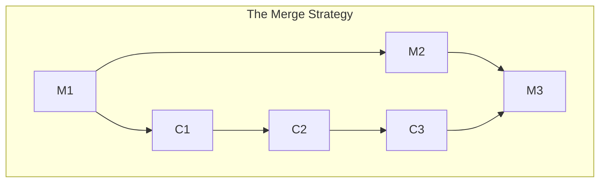
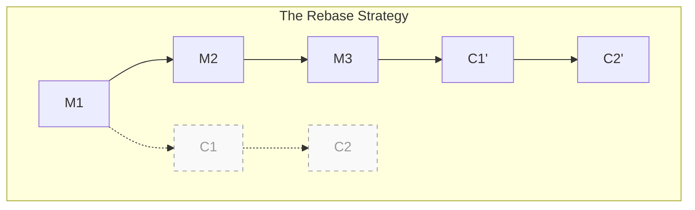
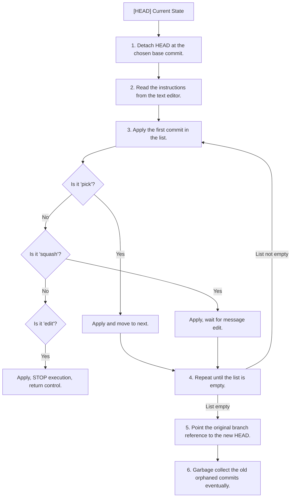
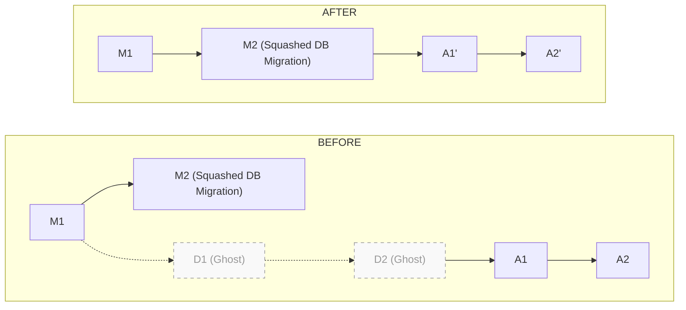
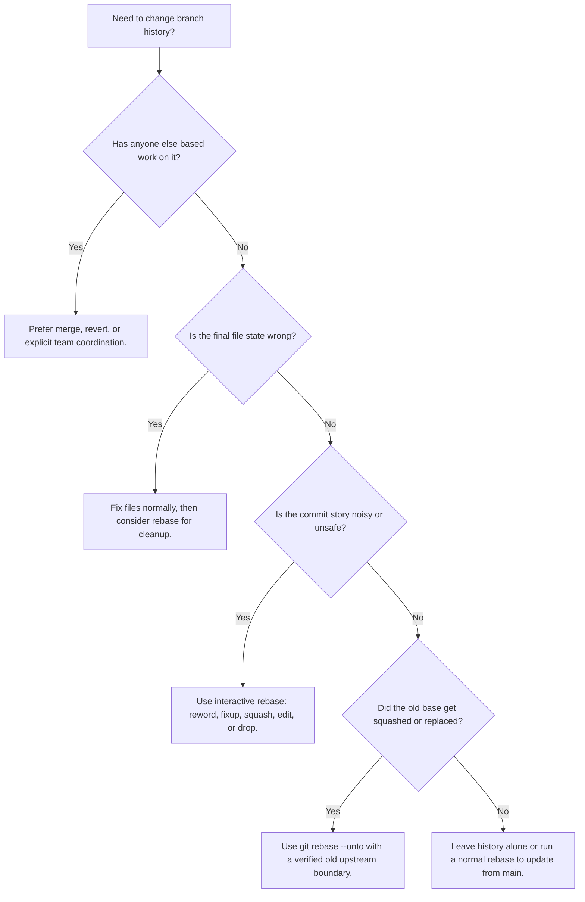

> **Складність**: [СЕРЕДНЯ]
>
> **Час на проходження**: 90 хвилин
>
> **Передумови**: Модуль 2 курсу Git Deep Dive

---

## Що ви зможете зробити

- **Реконструювати** фрагментовану історію комітів у логічну розповідь за допомогою операцій інтерактивного rebase, таких як squash, reword, fixup, drop та edit.
- **Діагностувати** та **вирішувати** ітеративні конфлікти під час rebase без створення дублікатів комітів чи порушення послідовності rebase.
- **Сформулювати** безпечну стратегію для видалення випадково зафіксованих конфіденційних даних із постійної історії неопублікованої гілки.
- **Порівняти** та **оцінити** merge, rebase та `git rebase --onto` під час синхронізації роботи над новою функціональністю з upstream гілками.
- **Реалізувати** перенесення гілки, яке переміщує активну роботу від застарілих базових комітів після squash merge.


## Чому це важливо

Гіпотетичний сценарій: інженер інфраструктури мігрує застарілий сервіс автентифікації на Kubernetes 1.35+, одночасно готуючи pull request для перевірки командою платформи. Для локального тестування він додає файл `configmap.yaml` і тимчасово поміщає туди облікові дані з широкими правами доступу до хмари, плануючи видалити їх перед перевіркою. Ключ видаляється через три коміти, фінальний маніфест використовує посилання на Secret, і pull request виглядає чистим у веб-інтерфейсі. Згодом сканер знаходить оригінальний історичний коміт, і команда змушена припустити, що облікові дані могли витекти, хоча кінцевий стан файлу був виправлений.

Інженер зробив типове, але небезпечне припущення: видалення рядка та коміт цього видалення не стирає рядок із попередніх комітів гілки. Git зберігає знімки, з'єднані незмінними ідентифікаторами об'єктів, тому кінцеве дерево може бути правильним, тоді як стара історія все ще міститиме секрет, зламаний маніфест або оманливе пояснення причини зміни. Рецензенти також розплачуються за безладну історію, навіть коли секрети не залучені. Pull request, що складається з комітів "WIP", "fix tests" та "try again", змушує кожного майбутнього фахівця із супроводу реконструювати хід думок автора з шуму, замість того, щоб читати невелику послідовність цілеспрямованих змін.

Інтерактивне перебазування — це редакторський інструмент, який усуває розрив між тим, як люди розробляють, і тим, як команди проводять перевірку. Ви все ще робите коміти на ранніх етапах під час дослідження, оскільки локальні коміти є корисними контрольними точками. Однак перед тим, як поділитися гілкою, ви можете переписати ці контрольні точки в довговічну розповідь: один коміт впроваджує Deployment із пробами, інший додає маршрутизацію Service та конфігурацію, і жоден коміт ніколи не містить відкинутого пароля. Цей модуль навчає механіки, меж безпеки та прийняття рішень, необхідних для переписування локальної історії без заплутування співавторів чи втрати роботи.

## Філософія переписування історії

Git заохочує часті локальні коміти, оскільки вони створюють надійні точки збереження під час невизначеної роботи. Цей локальний потік свідомості часто є правильним шляхом до вирішення проблеми: ви пробуєте одну readiness probe, виявляєте, що контейнер запускається повільно, коригуєте поріг і знову робите коміт перед тим, як торкатися маршрутизації Service. Рецензенту потрібно дещо інше. Йому потрібно бачити кінцевий аргумент на користь зміни, а не кожну помилку на шляху до неї, оскільки історія стає документацією, щойно гілка залишає вашу машину.

Саме через цю різницю перебазування більше нагадує редагування технічного дизайн-документа, ніж виконання команди синхронізації. Перша чернетка містить абзаци, що повторюються, нотатки, які належать до іншого розділу, та речення, які є правдивими, але відвертають увагу. Відшліфована чернетка зберігає реальні рішення, видаляючи шум. Інтерактивне перебазування робить те саме для комітів, дозволяючи вам змінювати порядок пов'язаних змін, об'єднувати дрібні виправлення (fixups) з їхніми батьківськими комітами, перефразовувати розмиті повідомлення, відкидати покинуті експерименти та зупинятися на історичних комітах, які потребують зміни вмісту.

Переписування історії працює шляхом створення нових комітів, а не зміни старих комітів на місці. SHA коміту походить від його вмісту, метаданих, посилання на батька, даних автора та повідомлення, тому навіть зміна лише повідомлення створює інший ідентифікатор. Старий коміт зазвичай залишається доступним через reflog протягом певного часу, але ім'я гілки переміщується на новостворену послідовність. Ця деталь має значення, оскільки два розробники, які ділять стару послідовність і переписану послідовність, більше не дивляться на той самий родовід, навіть якщо кінцеві файли виглядають ідентичними.

Золоте правило випливає безпосередньо з цієї моделі: ніколи не перебазовуйте коміти, від яких уже залежать інші люди, хіба що команда свідомо координує переписування. Приватна гілка фічі (feature branch) — це ваш блокнот, і інтерактивне перебазування тут є цілком прийнятним. Спільна гілка інтеграції — це публічний запис, і примусове надсилання (force-pushing) переписаних комітів призведе до того, що локальні клони всіх інших вказуватимуть на покинуту історію. Якщо ви сумніваєтеся, запитайте себе, чи могла б інша людина, система CI, процес релізу або автоматизація розгортання базувати свою роботу на поточній вершині гілки; якщо відповідь «так», віддайте перевагу злиттю (merge) або скасуванню (revert), якщо у вас немає чіткої домовленості про інше.

Зупиніться та подумайте: якщо гілка містить п'ять неопублікованих комітів, і ви змінюєте лише найстаріше повідомлення коміту, скільки SHA комітів після цієї точки мають змінитися, на вашу думку? Відповідь — усі п'ять, оскільки кожен наступний коміт вказує переписаний коміт як предка, прямо чи опосередковано. Цей каскадний ефект є причиною того, чому невелика локальна зміна може бути безпечною до того, як нею поділилися, і руйнівною після цього.

## Злиття, перебазування та формат перевірки

Коли гілка фічі відстає від `main`, Git надає вам два звичайні способи інтегрувати зміни з основної гілки (upstream). Злиття (merge) зберігає точну історичну топологію шляхом створення нового коміту з двома батьками. Це цінно, коли вам потрібен запис для аудиту про те, коли саме дві лінії розробки були об'єднані, особливо на довготривалих релізних гілках або спільних гілках інтеграції. Ціна цього полягає в тому, що повторювані злиття можуть створити граф, повний ромбів, що ускладнює відповіді на прості запитання, як-от «який коміт вніс цю регресію?».



Перебазування бере коміти, які є унікальними для вашої гілки, тимчасово відкладає їх убік, просуває базу гілки до цільового коміту та відтворює вашу роботу по одному коміту за раз. Результатом є лінійна історія, де ваша фіча виглядає так, ніби вона почалася з поточного стану `main`. Такий формат робить використання `git log`, `git bisect`, генерацію нотаток до випуску та перевірку коду простішими, оскільки кожен коміт можна проінспектувати без обходу через коміти злиття, які лише синхронізують гілки.



Компроміс полягає в тому, що перебазування перетворює історичний факт на відредаговану історію. Початковий хронологічний порядок міг бути «ConfigMap, Deployment, Service, виправлення Deployment», тоді як порядок після перевірки, ймовірно, має бути «Deployment, Service, конфігурація». Це прийнятно, коли гілка є приватною, оскільки ніхто інший не покладався на відкинуту хронологію. Це неприйнятно, коли гілка стала точкою співпраці, оскільки переписані коміти не збігатимуться з комітами, які ваші колеги вже завантажили (fetched).

У роботі з Kubernetes ця відмінність є особливо практичною. Рецензент, дивлячись на коміт із Deployment, хоче оцінити селектори, мітки, проби, ресурси та поведінку розгортання як одну цілісну одиницю. Якщо liveness probe з'являється через три коміти з повідомленням на кшталт «fix stuff», рецензенту доведеться стрибати по історії, щоб вирішити, чи був Deployment колись навмисно неповним. Будь-які приклади Kubernetes, що можна запустити, в KubeDojo повинні використовувати повне ім'я команди `kubectl` для безпечного копіювання та вставки, націлюючись на кластери Kubernetes 1.35+, коли поведінка кластера є частиною вправи.

Зупиніться та подумайте: що, на вашу думку, станеться, якщо під час перебазування виникне конфлікт злиття? Git не чекає до кінця, як у випадку єдиного фінального узгодження. Оскільки Git відтворює коміти по одному, він може зупинитися на першому конфліктному коміті, попросити вас вирішити саме цей історичний крок, продовжити, а потім знову зупинитися, якщо пізніший коміт по-іншому торкається тієї ж ділянки. Ця ітеративна модель конфліктів є головною проблемою перебазування та основною причиною того, чому охайна локальна історія знижує ризик під час перевірки.

| Підхід | Що зберігає Git | Найкраще підходить для | Головний компроміс |
| :--- | :--- | :--- | :--- |
| Злиття (Merge) | Оригінальну топологію гілки та обидві батьківські лінії. | Спільних гілок, релізних гілок або точок інтеграції, де топологія має значення. | Історія може стати візуально захаращеною і її важче розділяти навпіл (bisect). |
| Перебазування (Rebase) | Лінійну послідовність, відтворену на новій базі. | Приватних гілок фіч, що готуються до перевірки. | SHA комітів змінюються, тому спільна робота може розійтися у разі примусового надсилання (force-push). |
| Інтерактивне перебазування | Свідомо відредаговану послідовність комітів. | Очищення локальної історії, видалення помилок та написання комітів, зручних для перевірки. | Вимагає обережного вибору команд та обробки конфліктів. |
| `rebase --onto` | Лише коміти після вказаної старої бази. | Переміщення залежної роботи після того, як базова гілка була об'єднана (squashed) або замінена. | Легко вибрати неправильний старий upstream, якщо ви не проінспектували граф. |

## Інтерфейс інтерактивного перебазування

Стандартна команда `git rebase main` виконує автоматичне відтворення, але інтерактивне перебазування дозволяє вам відредагувати план відтворення до того, як Git почне роботу. Ви викликаєте його за допомогою `-i` або `--interactive`, і Git відкриває текстовий редактор, що містить аркуш з інструкціями. Кожен рядок називає один коміт і одну дію. Змінюючи дії та порядок рядків, ви вирішуєте, які коміти виживуть, які повідомлення зміняться, які коміти об'єднаються разом, і де Git повинен зупинитися для ручного втручання.

```bash
git rebase -i main
```

Іноді upstream гілки — це не той діапазон, який ви хочете відредагувати. Якщо вам потрібно переписати лише останні п'ять комітів, використовуйте відносне посилання, щоб Git побудував аркуш з інструкціями з цього локального вікна. Це корисно, коли `main` далеко позаду або коли ви відшліфовуєте верхівку стека перед надсиланням оновлення для перевірки.

```bash
git rebase -i HEAD~5
```

Коли відкривається редактор, найстаріший коміт з'являється вгорі, а найновіший — унизу, що є зворотним до типового вигляду `git log`, який знають багато інженерів. Git читає аркуш згори донизу, тому переміщення рядка змінює порядок, у якому цей коміт відтворюється. Ця невелика деталь інтерфейсу несе в собі велику силу. Коміт типу fixup має розташовуватися безпосередньо під комітом, у який його слід поглинути, а команда squash завжди поєднується з комітом прямо над нею.

```text
pick 3a2b1c4 Add initial deployment.yaml
pick 9f8e7d6 Fix YAML indentation in deployment
pick 5c4b3a2 Add service.yaml
pick 1d2c3b4 Add configmap.yaml with hardcoded db password
pick 7e6d5c4 Remove password, use secret reference
pick 8a9b0c1 Add liveness and readiness probes

# Rebase 8273645..8a9b0c1 onto 8273645 (6 commands)
#
# Commands:
# p, pick <commit> = use commit
# r, reword <commit> = use commit, but edit the commit message
# e, edit <commit> = use commit, but stop for amending
# s, squash <commit> = use commit, but meld into previous commit
# f, fixup <commit> = like "squash", but discard this commit's log message
# x, exec <command> = run command (the rest of the line) using shell
# d, drop <commit> = remove commit
```

Словник команд невеликий, але відмінності мають значення. І `squash`, і `fixup` об'єднують вміст, проте `squash` просить вас узгодити повідомлення, тоді як `fixup` відкидає повідомлення нижнього коміту. `edit` не означає «відкрити цей коміт у редакторі»; це означає «застосувати цей коміт, зупинити відтворення і дозволити мені змінити індекс та робоче дерево перед продовженням». `drop` є остаточним для переписаної гілки, хоча reflog зазвичай може врятувати вас незабаром після помилки.

| Команда | Дія | Основний варіант використання |
| :--- | :--- | :--- |
| `pick` | Застосовує коміт точно в такому вигляді, як він є. | Дія за замовчуванням. Залишає коміт недоторканим. |
| `reword` | Застосовує коміт, але робить паузу, щоб відкрити редактор, аби ви могли змінити повідомлення. | Виправлення помилки в повідомленні коміту або додавання більш описового контексту. |
| `edit` | Застосовує коміт, потім повністю зупиняє процес перебазування, повертаючи контроль терміналу. | Розділення великого коміту на менші або модифікація фактичного вмісту файлів історичного коміту. |
| `squash` | Зливає вміст цього коміту з комітом, що міститься безпосередньо над ним. Робить паузу, щоб дозволити вам об'єднати їхні повідомлення комітів. | Об'єднання пов'язаних змін (наприклад, фічі та відповідних їй модульних тестів) в одну логічну одиницю. |
| `fixup` | Зливає вміст у коміт над ним, але повністю відкидає повідомлення цього коміту. | Поглинання комітів типу «виправлення помилки» (fix typo) або «в процесі роботи» (WIP) у коміт основної фічі без захаращення кінцевого повідомлення. |
| `drop` | Повністю ігнорує коміт. Він не буде відтворений. | Повне видалення експериментального коду або випадкових комітів. (Ви також можете просто видалити рядок у редакторі). |
| `exec` | Виконує довільну команду оболонки (shell) після застосування попереднього рядка. | Автоматичний запуск набору тестів або лінтера після кожного коміту, щоб переконатися, що збірка не зламана посеред історії. |

Цикл відтворення є простим, щойно ви відокремите план від виконання. Git відкріплює (detaches) `HEAD` на вибраній базі, читає першу інструкцію, створює замінний коміт для цієї інструкції та просувається за списком. Якщо інструкція вимагає втручання людини, Git робить паузу. Якщо список успішно завершується, Git переміщує оригінальне ім'я гілки на новий кінцевий коміт і залишає старі коміти без посилань, за винятком механізмів безпеки, таких як reflog.



Перед запуском інтерактивного перебазування для важливої роботи перевірте три речі. По-перше, переконайтеся, що гілка є приватною або що ваші дії чітко скоординовані. По-друге, переконайтеся, що ваше робоче дерево (working tree) чисте, оскільки непов'язані непроіндексовані (unstaged) зміни ускладнюють відновлення після конфліктів. По-третє, перевірте діапазон гілки за допомогою `git log --oneline --decorate main..HEAD`, щоб знати, які коміти з'являться. Ця швидка перевірка запобігає класичній помилці перебазування неправильної сторони зв'язку.


## Створення Pull Request-у, зручного для рецензування

Уявіть гілку, яка додає рівень застосунку Kubernetes. Кінцеві файли є прийнятними, але історія захаращена: один коміт створює `deployment.yaml`, інший виправляє відступи, ще один додає `service.yaml`, наступний містить ConfigMap із паролем, пізніший коміт видаляє пароль, а останній додає health probes. Якби ви відкрили такий pull request без змін, рецензенту довелося б перевіряти як хибний проміжний, так і виправлений кінцевий стан. Інтерактивний rebase дозволяє натомість надіслати логічну версію.

Цілі для цього переписування є цілком конкретними. Виправлення відступів належить до початкового коміту Deployment, оскільки рецензенту не потрібен окремий запис про зламаний YAML. Перевірки liveness та readiness probes також належать до Deployment, оскільки вони є частиною контракту робочого навантаження. Додавання та видалення пароля в ConfigMap слід об'єднати, щоб переписана гілка взагалі ніколи не містила значення у відкритому тексті. Повідомлення, що залишилися, повинні пояснювати наміри, а не послідовність розробки.

```text
reword 3a2b1c4 Add initial deployment.yaml
fixup 9f8e7d6 Fix YAML indentation in deployment
fixup 8a9b0c1 Add liveness and readiness probes
pick 5c4b3a2 Add service.yaml
pick 1d2c3b4 Add configmap.yaml with hardcoded db password
fixup 7e6d5c4 Remove password, use secret reference
```

Уважно подивіться на перший блок. Оскільки перший рядок — `reword`, Git застосовує цей коміт і запитує нове повідомлення. Оскільки наступні два рядки — `fixup`, зміни в їхніх файлах згортаються у цей коміт заміни, а їхні повідомлення відкидаються. Утворений коміт можна назвати приблизно так: `feat: implement application Deployment with health checks`, що є набагато кориснішим, ніж збереження триетапного запису про додавання, виправлення, а потім завершення одного й того ж маніфесту.

Очищення секретів вимагає чіткішої ментальної моделі. Якщо пароль було додано в одному коміті, а видалено в наступному, об'єднання видалення з додаванням робить комбінований патч репрезентацією чистого ефекту. У переписаній історії коміт ConfigMap містить безпечний кінцевий стан і не містить жодного проміжного пароля у відкритому тексті. Це цінно для неопублікованої гілки, але це не є повною процедурою реагування на інцидент для секрету, який уже був відправлений або розкритий; у такому разі негайно виконайте ротацію облікових даних і розглядайте переписування історії лише як один із кроків стримування.

Щоб сформулювати безпечну стратегію видалення випадково закомічених конфіденційних даних, відокремте проблему очищення репозиторію від проблеми розкриття облікових даних. Очищення репозиторію ставить питання: чи можна видалити конфіденційні дані з кожного коміту, що залишиться, до того, як хтось інший почне залежати від цієї гілки. Розкриття облікових даних ставить питання: чи могло це значення вже бути скопійоване у віддалений репозиторій, лог, diff pull request-у, кеш CI, сповіщення або на машину іншого розробника. Інтерактивний rebase може вирішити першу проблему в приватній гілці, але він не може довести, що друга проблема є нешкідливою. Обережний інженер переписує неопубліковану гілку, перевіряє відсутність конфіденційного рядка в `git log -p`, виконує ротацію облікових даних, якщо можливе розкриття, та документує перебіг інциденту, щоб імовірність подібної помилки наступного разу була меншою.

Ця відмінність також змінює те, як ви говорите про pull request. Не пишіть «removed secret» у публічному повідомленні коміту, якщо саме це повідомлення афішує подію безпеки, яка потребує тихішого шляху реагування. Надавайте перевагу звичайному функціональному повідомленню, такому як `feat: configure application environment from Secret reference`, а обговорення розкриття даних вирішуйте в межах процесу безпеки команди. Історія повинна розкривати заплановану архітектуру, а не відкинуту випадковість. Якщо вам потрібно, щоб рецензент звернув особливу увагу на очищення конфіденційних даних, узгодьте це безпосередньо, а не покладайтеся на повідомлення коміту, яке може бути проіндексоване, віддзеркалене або скопійоване в зовнішні інструменти.

Коли Git виконує план, він починає з обраної бази та проходить через перевпорядкований список. Він застосовує `3a2b1c4`, робить паузу для нового повідомлення Deployment, поглинає виправлення відступів, поглинає probes, застосовує коміт Service, застосовує коміт ConfigMap, а потім поглинає коміт видалення пароля. Якщо виникає конфлікт, Git зупиняється на тому самому кроці відтворення, який завершився помилкою, що означає, що конфлікт інтерпретується в контексті цього історичного коміту, а не кінцевого стану гілки.

Зупиніться та подумайте: якби ви використали `squash` замість `fixup` для двох наступних комітів Deployment, що б змінилося? Вміст файлу залишився б таким самим, але Git відкрив би редактор повідомлень, що містить оригінальні повідомлення зі сплющених комітів. Це може бути корисним, коли кілька комітів містять змістовні пояснення, але це є шумом, коли нижні коміти — це «fix typo» або «try probe again».

Професійна історія pull request-у не обов'язково складається з одного коміту. Це послідовність, у якій кожен коміт нарощує функціональність, кожне повідомлення пояснює рішення, яке можна рецензувати, а кожна межа коміту відповідає концепції, яку команда може пізніше скасувати або перевірити. Для цього прикладу два чисті коміти можуть бути кращими за один: один для Deployment і один для Service плюс конфігурація. У масштабнішій зміні ви могли б тримати маніфести, тести та документацію окремо, якщо ці межі допомагають у рецензуванні та майбутньому відновленні.

Досвід рецензента — найкращий тест того, чи зайшло переписування достатньо далеко. Уявіть, що ви відкриваєте pull request через шість місяців під час діагностики причини вибору політики розгортання. Якщо коміт Deployment містить health checks, мітки та очікування щодо ресурсів, рецензент може оцінити робоче навантаження як повноцінну операційну одиницю. Якщо коміт Service та ConfigMap показує лише безпечний кінцевий контракт середовища, рецензент не витрачає час на секрет, який ніколи не мав бути частиною гілки. Хороша історія стискає шум розробки, не стискаючи міркування, які знадобляться інженерам у майбутньому.

Існує також причина з точки зору тестування для збереження узгодженості меж комітів. Коли `git bisect` потрапляє на коміт, який додає лише напівзавершений маніфест, інструмент може повідомити про помилку, яка не має нічого спільного з регресією, яку ви шукаєте. Коли кожен коміт, що залишився, представляє стан, який можна зібрати або принаймні прорецензувати, інструменти зневадження стають надійнішими. Ось чому перевірки `exec` природно поєднуються з інтерактивним rebase: вони допомагають забезпечити, щоб ваша очищена історія була не просто охайною, а й операційно корисною.


## Хірургічні редагування, розщеплення та вирішення конфліктів

Команда `edit` є правильним інструментом, коли об'єднання комітів недостатньо. Припустімо, ви зробили один великий коміт під назвою «Add service and ingress manifests», але Service та Ingress слід рецензувати окремо. Під час інтерактивного rebase позначте цей коміт за допомогою `edit`. Git застосує його, зупиниться і поверне вас до оболонки з цим великим комітом як `HEAD`. Ваше завдання — замінити цей коміт кращою послідовністю, перш ніж наказати рушію rebase продовжити.

```bash
Stopped at 5c4b3a2... Add service and ingress manifests
You can amend the commit now, with
  git commit --amend
Once you are satisfied with your changes, run
  git rebase --continue
```

Щоб розщепити коміт, зробіть reset вказівника гілки на один коміт назад, залишаючи файли зміненими в робочому дереві. Потім додайте в індекс і закомітьте Service, додайте в індекс і закомітьте Ingress, та продовжуйте rebase. Ключовим є те, що ви замінюєте призупинений коміт, а не додаєте непов'язані коміти після нього. Якщо ви пропустите reset і просто почнете комітити, оригінальний великий коміт залишиться в історії, а ваші нові коміти розмістяться поверх нього, створюючи дублювання, якого ви намагалися уникнути.

```bash
# Reset HEAD to the previous commit, leaving files modified in the working tree
git reset HEAD~1

# Now stage only the service file
git add service.yaml
git commit -m "feat: Add internal routing Service"

# Next, stage the ingress file
git add ingress.yaml
git commit -m "feat: Expose application via Ingress"

# Resume the rebase operation
git rebase --continue
```

Той самий механізм паузи допомагає, коли вам потрібно видалити секрет із самого коміту, який його запровадив. Позначте проблемний коміт за допомогою `edit`, дозвольте Git зупинитися, змініть файл так, щоб облікових даних не стало, додайте виправлений файл в індекс і виконайте `git commit --amend`. Ця зміна створює коміт заміни на тій самій позиції в переписаній послідовності. Тоді `git rebase --continue` відтворить решту комітів поверх очищеної історії.

Коли ви змінюєте призупинений коміт, перевіряйте результат перед продовженням, якщо зміна стосується безпеки. `git show --stat` повідомляє вам, які файли зачіпає коміт заміни, тоді як `git show --patch` дозволяє перевірити точний diff, який стане частиною переписаної послідовності. Для редагування з видаленням секретів здійсніть пошук конфіденційного рядка до і після продовження, оскільки пізніші коміти можуть випадково знову запровадити значення або перемістити його в інший файл. Ця додаткова перевірка займає секунди на невеликій гілці та запобігає хибній впевненості, яка виникає від виправлення лише першого видимого випадку.

Розщеплення комітів заслуговує на таку саму дисципліну. Після `git reset HEAD~1` робоче дерево містить кожну зміну з призупиненого коміту, тому ваш вибір того, що додавати в індекс, визначає історію заміни. Використовуйте `git diff` для перевірки змін, не доданих до індексу, і `git diff --cached` для перевірки коміту, який ви збираєтеся створити. Якщо коміт Service випадково містить анотацію Ingress, зупиніться та скоригуйте індекс перед комітом. Інтерактивний rebase є потужним, оскільки дозволяє переглядати історію, але він винагороджує інженерів, які ставляться до індексу як до точної зони підготовки, а не як до звалища.

Вирішення конфліктів під час rebase має чіткий ритм. Прочитайте `git status`, відкрийте файли, що містять маркери конфліктів, узгодьте вміст, додайте вирішені файли в індекс і виконайте `git rebase --continue`. Не виконуйте `git commit`, хіба що Git спеціально повідомить вам, що поточна пауза є кроком `edit`, на якому ви навмисно змінюєте або замінюєте коміт. Під час звичайного вирішення конфлікту рушій rebase вже конструює коміт, який завершився невдало, а `--continue` передає виправлений індекс назад до цього рушія.

```bash
CONFLICT (content): Merge conflict in deployment.yaml
error: could not apply 3a2b1c4... Add memory limits
```

Коли це трапляється, ви перебуваєте у стані від'єднаного `HEAD` на конкретному історичному кроці, який не вдалося відтворити. Цей стан є очікуваним, а не ознакою того, що ваша гілка зникла. Вирішіть маркери конфліктів, додайте результат в індекс і продовжуйте. Якщо один і той самий конфлікт з'являється кілька разів через те, що кілька комітів торкалися одного блоку, подумайте про увімкнення записаних вирішень за допомогою `git rerere` перед майбутніми тривалими rebase-ами, щоб Git міг повторно використати вирішення конфлікту, яке він уже бачив.

```bash
git rebase --abort
```

Команда переривання є екстреним виходом. Вона завершує операцію rebase і повертає гілку, індекс і робоче дерево до стану, у якому вони були до початку rebase. Використовуйте її, коли ви вибрали неправильний діапазон, вирішення конфліктів іде погано, або ви виявляєте, що гілка насправді не є приватною. Переривання — це не провал; це контрольований відкат, який захищає вашу роботу, поки ви переоцінюєте план.

Перш ніж виконувати це на власній гілці, якого виводу ви очікуєте від `git status` після того, як конфлікт вирішено і додано в індекс, але до `git rebase --continue`? Слід очікувати, що Git повідомить, що всі конфлікти виправлено, тоді як rebase усе ще триває. Це повідомлення є вашим сигналом, що індекс готовий, а рушій rebase чекає дозволу на створення коміту заміни.

Якщо конфлікти повторюються в кількох комітах, зробіть паузу і запитайте себе, чи не є поточна послідовність комітів занадто фрагментованою. Іноді правильним кроком є перервати, запустити менший інтерактивний rebase, який сплющує пов'язані коміти разом, а потім зробити rebase простішої послідовності на `main`. Конфлікт, який повторюється п'ять разів, часто є сигналом того, що п'ять локальних комітів редагують одну й ту саму концептуальну зміну. Зменшення цього шуму до відтворення на висхідному потоці може перетворити виснажливу сесію з конфліктами на одне продумане вирішення.

Записані вирішення конфліктів можуть допомогти, але вони не замінюють розуміння. `git rerere` зберігає те, як ви вирішили конфлікт, і може застосувати те саме вирішення, коли Git знову побачить ту саму форму конфлікту. Це корисно для гілок, що довго існують, проте може також повторно використати застаріле вирішення, якщо навколишній намір змінився. Ставтеся до rerere радше як до засобу для запам'ятовування, ніж як до автопілота: перевірте результат, запустіть відповідні перевірки й продовжуйте лише тоді, коли вирішений файл усе ще відповідає бажаному дизайну.


## Перенесення роботи за допомогою `git rebase --onto`

Найзаплутаніші збої під час rebase часто трапляються після злиття залежної гілки за допомогою стратегії squash. Уявіть, що гілка `feature-api-update` була відгалужена від `feature-db-migration`, оскільки робота над API потребувала нової схеми. Згодом `feature-db-migration` затверджують і зливають у `main` за допомогою Squash and Merge. Фінальні зміни містяться у `main`, але оригінальних SHA комітів міграції там немає, оскільки платформа замінила їх одним новим комітом під час squash.

Якщо ви запустите звичайний `git rebase main` з `feature-api-update`, Git порівнюватиме ідентифікатори комітів, а не лише наміри патчу. Він бачить старі коміти міграції у вашій гілці і не розпізнає їх як той самий squash-коміт у `main`. Як наслідок, він може спробувати відтворити роботу з міграції, яка вже існує в іншій формі, створюючи великі конфлікти і ускладнюючи ізоляцію комітів API.



Форма `--onto` вирішує цю проблему, вказуючи три речі: нову базу, стару межу upstream та гілку, яку потрібно перемістити. Ви наказуєте Git взяти коміти, доступні з гілки, але недоступні зі старого upstream, а потім відтворити лише ці коміти на новій базі. У прикладі із залежною гілкою це означає: "взяти коміти API, які були зроблені після `feature-db-migration`, і перемістити їх безпосередньо на `main`."

Синтаксис такий:
`git rebase --onto <new-base> <old-upstream> <branch-to-move>`

У нашому сценарії:

```bash
git rebase --onto main feature-db-migration feature-api-update
```

Ця команда перекладається так: "Взяти всі коміти з `feature-api-update`, яких НЕМАЄ в `feature-db-migration`, і відтворити їх поверх `main`." Це формулювання варто запам'ятати, оскільки воно запобігає найпоширенішій помилці з `--onto`. Другий аргумент — це не та гілка, на яку ви хочете приземлитися; це межа, яка вказує, що слід виключити з відтворення.

Використовуйте `git log --oneline --graph --decorate --all` перед перенесенням, якщо топологія незрозуміла. Ви шукаєте перший коміт, який належить до залежної роботи, і останній коміт, який належить до старої бази. Під час інциденту з високим тиском запишіть команду в чернетку перед її виконанням, оскільки перестановка другого та третього аргументів може перемістити набагато більший діапазон, ніж планувалося.

Надійний робочий процес перенесення починається з визначення старої межі простою мовою. Наприклад, "все до `feature-db-migration` вже представлено squash-комітом у `main`; усе після цієї межі — це робота над API, яка все ще потребує рев'ю." Як тільки ви зможете проговорити це речення, команда стає менш загадковою. Нова база — це `main`, стара межа upstream — це `feature-db-migration`, а гілка для переміщення — `feature-api-update`. Якщо ви не можете впевнено сказати це речення, ще раз огляньте граф перед тим, як запускати команду.

Після успішного `--onto` перевірте отриману історію з двох ракурсів. По-перше, перевірте граф, щоб переконатися, що залежні коміти тепер містяться безпосередньо на потрібній базі. По-друге, огляньте diff між новою гілкою та `main`, щоб підтвердити, що він містить лише активну роботу, а не відтворення старої базової гілки. Ця друга перевірка виявляє напрочуд поширену помилку: команда може виконатися механічно успішно, але перемістити забагато історії через те, що стара межа upstream була обрана на один коміт раніше.

Ця ж ідея з'являється і поза злиттями squash. Ви можете використовувати `--onto`, щоб перемістити серію патчів з релізної гілки до `main`, щоб від'єднати експериментальну функцію від покинутої гілки іншого інженера, або щоб відновити стек після того, як нижній шар був замінений чистішою реалізацією. У будь-якому випадку, операція є безпечнішою, коли ви мислите множинами: коміти, доступні з гілки, мінус коміти, доступні зі старого upstream, відтворені на новій базі. Така модель на основі множин є надійнішою, ніж запам'ятовування форми команди.

## Патерни та антипатерни

Інтерактивний rebase добре масштабується, коли команди розглядають його як крок "полірування" приватної гілки з чіткими цілями рев'ю. Найкращий патерн — це вільно комітити під час розробки, а потім переписувати лише ті коміти, які пояснюють остаточну зміну. У навчальній програмі Kubernetes або роботі з платформою це часто означає один коміт для маніфестів робочих навантажень, один для надання доступу до Service, один для політики або RBAC, і один для тестів чи документації. Кожен коміт має представляти значущу одиницю, яку можна перевірити, проаналізувати через `bisect` або скасувати без притягування непов'язаних редагувань.

Другий сильний патерн — це збереження здатності до збірки (buildability) протягом усієї переписаної послідовності. Команда `exec` може запустити швидкий тест, лінтер або команду валідації маніфесту після вибраних комітів, зупиняючи rebase, коли коміт ламає репозиторій. Це робить історію не просто гарною; це робить історію корисною для майбутнього дебагінгу. Якщо кожен коміт успішно збирається, майбутня сесія `git bisect` зможе виявляти регресії без потрапляння на напівзібрані контрольні точки.

Третій патерн полягає в поєднанні переписування історії з дисципліною поводження з обліковими даними (credentials). Якщо секрет був закомічений локально, перепишіть гілку так, щоб секрет ніколи не з'являвся в жодному вцілілому коміті, а потім усе одно виконайте ротацію секрету, якщо він коли-небудь був запушений, скопійований, залогований або розкритий для віддаленого сканера. Переписування історії змінює докази в репозиторії; воно не доводить, що облікові дані ніколи не були помічені. Зрілі команди поєднують rebase, сканування секретів, ротацію токенів та постінцидентний аналіз, замість того, щоб розглядати очищення Git як повноцінне виправлення.

| Патерн | Коли використовувати | Чому це працює | Особливості масштабування |
| :--- | :--- | :--- | :--- |
| Приватне полірування перед PR | Вашу гілку ще не стягнули (pull) колеги. | Рецензенти бачать цілеспрямовані коміти, а не шум розробки. | Скоординуйтеся перед force-push, якщо CI або середовища попереднього перегляду вже відстежують гілку. |
| Очищення за допомогою fixup | Наступні коміти лише виправляють або доповнюють попередню ідею. | Фінальний коміт містить повну концепцію з одним повідомленням. | Тримайте пов'язані fixup-и поруч, щоб рецензенти могли чітко перевірити фінальний патч. |
| `edit` для хірургії комітів | Один історичний коміт містить непов'язані зміни або локальний секрет. | Ви можете змінити (amend), розділити або замінити коміт на його початковій позиції. | Використовуйте чисте робоче дерево і перевіряйте `git status` під час кожної паузи. |
| `exec` для історії, що збирається | Кожен коміт має проходити швидку команду валідації. | Rebase зупиняється на першому зламаному кроці замість того, щоб приховувати поломку посередині. | Обирайте швидкі перевірки; повільні повні набори тестів роблять інтерактивне редагування болісним. |

Небезпечним антипатерном є ставлення до rebase як до магічної кнопки очищення після того, як робота вже була поширена (shared). Force-push у гілку, яку стягнув інший інженер, може зробити його локальну базу недійсною, продублювати коміти та створити конфлікти, які здаються непов'язаними з оригінальною зміною. Ще один антипатерн — це звичка сквошити все в один коміт. Окремий коміт може бути доречним для крихітної зміни, але він стає проблемою, коли рецензентам потрібно оцінити незалежні рішення, або коли операторам пізніше може знадобитися скасувати одну частину без втрати іншої.

Більш тонким антипатерном є використання `drop` або видалення рядків як звичайного механізму очищення. Видалення експерименту (`drop`) — це нормально, коли ви справді хочете його позбутися, але випадкове видалення рядка в аркуші інструкцій видаляє коміт із переписаної гілки. Якщо ви завершили rebase і помітили втрачену роботу, негайно скористайтеся `reflog`, щоб знайти верхівку гілки до rebase. Старі коміти зазвичай можна відновити протягом певного часу, але відновлення відбувається легше, коли ви зупиняєтесь одразу, замість того, щоб нагромаджувати нові зміни на переписану гілку.

Ще одним антипатерном є полірування історії настільки агресивно, що рев'ю втрачає корисний контекст. Якщо коміт змінює probe у Deployment через те, що production-трафік показав повільний запуск, повідомлення повинно пояснювати, чому змінився поріг. Приховування цього обґрунтування всередині гігантського squash-коміту може зробити лог коротшим, але згодом це ускладнить експлуатацію. Мета полягає не в найменшій можливій кількості комітів; мета полягає у найкориснішій послідовності комітів для рев'ю, відкату (rollback) та діагностики.

Командам також слід уникати неявної політики щодо rebase. Деякі команди вітають оновлення через force-push для чорнових Pull Request-ів (draft PR), тоді як інші розглядають будь-яку віддалену гілку як спільну (shared), щойно CI її збере. Обидві політики можуть працювати, якщо вони чітко сформульовані. Проблеми починаються, коли один інженер вважає віддалену гілку приватною, а інший інженер вважає, що на ній безпечно базувати подальшу роботу. Коротка командна домовленість, така як "інтерактивний rebase перед рев'ю, ніякого переписування історії після початку рев'ю", запобігає більшості таких непорозумінь.

## Фреймворк для прийняття рішень

Обирайте операцію з історією, запитуючи, хто залежить від гілки, яка форма потрібна рецензенту і в чому полягає проблема: у вмісті, порядку чи топології бази. Якщо гілка публічна та активно використовується, надавайте перевагу merge або revert, оскільки ці операції додають історію замість її заміни. Якщо гілка приватна і фінальний Pull Request було б легше перевіряти з чистішими комітами, використовуйте інтерактивний rebase. Якщо гілка залежить від старої бази, яка була об'єднана за допомогою squash або замінена, використовуйте `git rebase --onto` після підтвердження старої межі upstream.



| Ситуація | Рекомендована операція | Чому | Перевірити перед продовженням |
| :--- | :--- | :--- | :--- |
| Приватна гілка має шумні WIP коміти | `git rebase -i main` | Створює коміти, придатні для рев'ю, перед поширенням. | Переконайтеся, що жоден колега по команді не стягнув (pull) гілку. |
| Спільна гілка потребує змін з upstream | `git merge main` або скоординований rebase | Уникає неприємних сюрпризів для співавторів через нові SHA. | Запитайте, чи CI, розгортання попереднього перегляду (preview deploys) або колеги по команді залежать від поточної верхівки (tip). |
| Старий коміт містить виключно локальний секрет | `git rebase -i`, позначте коміт як `edit`, `amend` | Видаляє секрет з історії гілки, що залишиться. | Виконайте ротацію облікових даних, якщо їх розкриття могло статися за межами вашої машини. |
| Залежна гілка слідує за базою після squash | `git rebase --onto main old-base branch` | Переміщує лише залежні коміти на нову базу. | Огляньте граф і визначте точний старий upstream. |
| Один коміт змішує непов'язані зміни | `edit`, `git reset HEAD~1`, зробіть коміти частинами | Замінює один заплутаний коміт на кілька логічних комітів. | Переконайтеся, що кожен новий коміт збирається або принаймні має узгоджений патч. |

Який підхід ви б обрали тут і чому: ваша feature-гілка має десять неохайних комітів, CI відпрацював на віддаленій гілці, але жоден колега її не стягнув, а PR все ще залишається чорновим (draft)? Скоординований інтерактивний rebase є розумним рішенням, якщо ваша команда приймає оновлення через force-push для чорнових PR, але вам все одно слід згадати про переписування в обговоренні PR. Ключове рішення полягає не в тому, чи існує гілка віддалено; воно полягає в тому, чи залежить хтось або щось важливе від поточних ідентифікаторів комітів.

Коли рішення стосується конфіденційних даних, додайте ще одне запитання: чи вийшло значення за межі локального репозиторію? Якщо відповідь категорично "ні", інтерактивний rebase може бути правильним інструментом для очищення репозиторію. Якщо відповідь "так" або невідомо, сформулюйте безпечну стратегію, яка включає кроки ротації, сповіщення та аудиту на додаток до переписування неопублікованих комітів. Таке багаторівневе реагування тримає цю техніку Git на своєму належному місці. Редагування історії може видалити докази з гілки, яку ви збираєтеся надіслати, але під час відновлення безпеки слід виходити з того, що скопійовані облікові дані залишатимуться придатними для використання, доки їх не буде відкликано.

## Чи знали ви?

- Серія Git 1.7 (ранні релізи ери 1.7 близько 2010 року) представила опції комітів `--fixup` та `--squash`; `autosquash` в інтерактивному rebase розвинувся в тій же лінійці 1.7 і пізніше став центральним елементом для швидкого інтерактивного очищення.
- Git зберігає переписані коміти як нові об'єкти, а політика закінчення терміну дії `reflog` за замовчуванням часто зберігає доступні записи `reflog` протягом 90 днів, що дає вам вікно для відновлення після багатьох локальних помилок.
- Робочий процес ядра Linux надає рішучу перевагу лінійним серіям патчів від контриб'юторів, які зручно перевіряти, що є однією з причин, чому rebase та очищення патчів розглядаються як повсякденні інженерні навички в цій екосистемі.
- `git rebase --exec` може запустити команду після кожного відтвореного коміту, тому швидка перевірка маніфесту може зловити точний коміт, який першим ламає приклад розгортання Kubernetes версії 1.35+.


## Типові помилки

| Помилка | Чому це трапляється | Як це виправити |
| :--- | :--- | :--- |
| **Примусовий push спільної гілки** | Ви виконали rebase гілки, над якою вже працюють інші, переписавши історію, від якої вони залежать. | Негайно повідомте команду. Якщо в інших немає локальних змін, вони можуть свідомо виконати fetch та reset. Якщо є — скоординуйте план відновлення замість повторного push. |
| **Використання squash замість fixup** | Нерозуміння різниці залишає вас у редакторі, повному малозначущих повідомлень на кшталт "fixed typo" та "try again". | Перервіть процес (abort), якщо ви ще на початку, і почніть заново з `fixup`, або ж обережно відредагуйте об'єднане повідомлення, щоб залишилося лише змістовне пояснення. |
| **Застрягання в циклі редагування** | Ви позначаєте коміт як `edit`, вносите зміни та створюєте нові коміти, не замінюючи призупиненого коміту. | Використовуйте `git reset HEAD~1` під час розділення (splitting) або `git commit --amend` під час зміни призупиненого коміту, після чого продовжуйте rebase. |
| **Багаторазове вирішення одного й того ж конфлікту** | Кілька комітів зачіпають ті самі рядки, що змінилися на новій базі, тому кожен крок відтворення (replay) викликає конфлікт. | Розгляньте можливість увімкнення `git rerere`, але також подумайте, чи не варто виконати squash цих комітів перед rebase, щоб зменшити кількість повторюваних конфліктів. |
| **Ненавмисне видалення комітів** | Видалення рядка в аркуші інструкцій виглядає як звичайне видалення тексту, але насправді воно вилучає цей коміт із процесу відтворення. | Негайно перервіть операцію, якщо вона ще триває. Якщо її завершено, перевірте `git reflog` і відновіть верхівку гілки до стану перед rebase, перш ніж продовжувати роботу. |
| **Виконання rebase у неправильному напрямку** | Ви запускаєте rebase, перебуваючи на неправильній гілці, переміщуючи `main` або іншу базу замість вашої feature-гілки. | Зупиніться, перевірте `git status` та `git branch --show-current`, а потім перервіть процес або відновіть стан за допомогою reflog, якщо операція вже завершилась. |
| **Сприйняття очищення секретів як реагування на інцидент** | Переписування локальної історії здається рішучим кроком, тому команди забувають, що скомпрометовані облікові дані вже могли бути скопійовані деінде. | Переписуйте неопубліковану історію задля чистоти, але обов'язково виконайте ротацію облікових даних і дотримуйтесь процедур безпеки, якщо секрет хоча б раз залишав вашу машину. |


## Контрольні запитання

<details><summary>Запитання 1: Ваша команда перевіряє приватну гілку із шістьма комітами: Deployment, виправлення відступів, проби (probes), Service, ConfigMap із тимчасовим паролем та видалення пароля. Як би ви реконструювали історію, щоб рецензент побачив остаточний намір, а пароль ніколи не з'являвся у збереженому коміті?</summary>
Використайте інтерактивний rebase та згрупуйте кожне виправлення безпосередньо під тим комітом, який воно доповнює. Deployment слід позначити як `reword`, а виправлення відступів і коміт із пробами — як `fixup` під ним, щоб остаточний коміт Deployment був цілісним. Додавання та видалення пароля в ConfigMap мають бути поруч, причому видалення має бути об'єднане (fixed up) із додаванням, щоб підсумковий збережений коміт взагалі не містив пароля. Це перевіряє вашу здатність реконструювати фрагментовану історію комітів у логічну розповідь, зберігаючи при цьому безпечний кінцевий стан.
</details>

<details><summary>Запитання 2: На півдорозі виконання rebase Git повідомляє про конфлікт у `service.yaml`. Ви вирішуєте конфлікти (markers) і зберігаєте файл. Що вам слід зробити далі, і чому варто уникати звичайного коміту?</summary>
Додайте до індексу (stage) вирішений файл за допомогою `git add service.yaml`, перевірте `git status` і виконайте `git rebase --continue`. Звичайний `git commit` є неправильним, оскільки механізм rebase вже перебуває в процесі створення коміту на заміну для кроку відтворення, який завершився невдало. Створення комітів вручну може додати зайвий коміт поза запланованою послідовністю, що ускладнить розуміння переписаної історії. Команда `--continue` повідомляє Git, що індекс тепер містить вирішену версію для того коміту, який він саме застосовував.
</details>

<details><summary>Запитання 3: Локальний коміт, зроблений три кроки тому, додав API-токен, а пізніший коміт його видалив. Як ви сформулюєте безпечну стратегію для видалення випадково закомічених конфіденційних даних із цієї неопублікованої гілки?</summary>
Якщо залишити обидва коміти, токен збережеться у попередньому знімку (snapshot), навіть якщо кінцевий файл його вже не містить. Застосування `fixup` для об'єднання видалення з додаванням робить так, що переписаний коміт представлятиме безпечний кінцевий результат, тому токен буде відсутній у збереженій історії гілки. Оскільки гілка ще не була надіслана (pushed), переписування комітів не завадить колегам, але ця стратегія є безпечною лише за умови, що ви також перевірите, чи не потрапили конфіденційні дані в логи, на віддалені репозиторії, скриншоти або CI. Якщо є хоча б найменша ймовірність того, що токен залишив вашу машину, виконайте його ротацію, оскільки очищення за допомогою Git не скасовує зовнішньої компрометації.
</details>

<details><summary>Запитання 4: Ви позначили великий коміт "service and ingress" як `edit`, і Git зупинився на цьому коміті. Ви хочете отримати два коміти замість одного. Яка послідовність замінить оригінальний коміт без його дублювання?</summary>
Виконайте `git reset HEAD~1`, щоб скасувати великий коміт, при цьому зміни у файлах залишаться в робочому каталозі. Потім додайте до індексу (stage) лише файли Service і закомітьте їх із цілеспрямованим повідомленням, після цього додайте до індексу лише файли Ingress і закомітьте їх з іншим цілеспрямованим повідомленням, і врешті виконайте `git rebase --continue`. Це замінить призупинений коміт на два кращих коміти на тій самій історичній позиції. Якщо ви пропустите reset, оригінальний великий коміт залишиться, а ваші нові коміти просто додадуть більше історії після нього.
</details>

<details><summary>Запитання 5: Ваш колега вчора стягнув (pulled) вашу гілку для тестування потоків автентифікації. Сьогодні ви хочете очистити п'ять WIP-комітів перед тим, як відкривати pull request. Чи слід вам виконати інтерактивний rebase та force-push?</summary>
Ні, без явної координації цього робити не варто. Щойно ваш колега побудував свою роботу на основі цієї гілки, переписування SHA комітів призведе до того, що його локальна історія розійдеться з віддаленою гілкою. Безпечнішим варіантом за замовчуванням є збереження спільної історії та використання merge, або ж дотримання узгодженого в команді процесу відновлення. Якщо команда вирішить, що очищення того варте, скоординуйте запланований force-push і чітко розкажіть колезі, як саме виконати reset або rebase його локальних змін.
</details>

<details><summary>Запитання 6: Залежна гілка базувалася на `feature-db-migration`, але ця базова гілка була злита в `main` за допомогою squash-merge. Звичайний `git rebase main` тепер намагається відтворити старі коміти бази даних і створює конфлікти. Яку операцію слід використати?</summary>
Використайте `git rebase --onto main feature-db-migration feature-api-update`, підставивши реальні назви гілок із вашого репозиторію. Старий upstream-аргумент позначає коміти, які слід виключити з відтворення, тоді як `main` є новою базою. Це переміщує лише ті коміти, які є унікальними для залежної гілки, на результат squash. Ця команда є правильною, оскільки вона порівнює межі досяжності (reachability boundaries), а не припускає, що старі SHA комітів досі існують у `main`.
</details>

<details><summary>Запитання 7: Під час складного rebase ви розумієте, що в аркуші інструкцій було вибрано неправильний діапазон, і вирішення конфліктів стає небезпечним. Якою є найбезпечніша дія для відновлення, і що слід перевірити перед повторною спробою?</summary>
Виконайте `git rebase --abort`, щоб повернути гілку, індекс і робочий каталог до стану, у якому вони перебували до початку rebase. Після переривання перевірте `git status`, підтвердьте поточну гілку та перегляньте запланований діапазон за допомогою команди логування, як-от `git log --oneline main..HEAD`. Ця перевірка допоможе вам визначити, у чому була проблема: неправильна база, неправильна гілка чи занадто об'ємне переписування. Повторна спроба після чистого abort є набагато безпечнішою, ніж імпровізація з конфліктами, яким ви більше не довіряєте.
</details>


## Практична вправа

У цій вправі ви створите заплутану історію комітів, що містить маніфести Kubernetes і скомпрометований секрет, а потім скористаєтеся інтерактивним rebase, щоб перетворити її на чисту, професійну історію. Працюйте в безпечному порожньому каталозі, оскільки лабораторна робота навмисно створює та переписує коміти. Маніфести навмисно невеликі, щоб ви могли зосередитися на поведінці Git замість синтаксису Kubernetes, але робочий процес відображає реальне очищення pull request у Kubernetes 1.35+.

### Підготовка

Запустіть наступний bash-скрипт у безпечному порожньому каталозі, щоб згенерувати репозиторій і заплутану історію.

```bash
mkdir k8s-rebase-lab && cd k8s-rebase-lab
git init
git branch -M main
echo "# K8s Application" > README.md
git add README.md && git commit -m "Initial commit"
git checkout -b feature-web-app

# Commit 1
cat <<EOF > deployment.yaml
apiVersion: apps/v1
kind: Deployment
metadata:
  name: web-app
EOF
git add deployment.yaml && git commit -m "add deployment"

# Commit 2
cat <<EOF > configmap.yaml
apiVersion: v1
kind: ConfigMap
metadata:
  name: app-config
data:
  DB_PASSWORD: "super-secret-admin-pass"
EOF
git add configmap.yaml && git commit -m "wip: add configmap for db"

# Commit 3
echo "  labels: {app: web}" >> deployment.yaml
git add deployment.yaml && git commit -m "fix typo in deployment labels"

# Commit 4
cat <<EOF > service.yaml
apiVersion: v1
kind: Service
metadata:
  name: web-svc
EOF
git add service.yaml && git commit -m "add service"

# Commit 5
sed -i.bak 's/super-secret-admin-pass/REDACTED/' configmap.yaml && rm configmap.yaml.bak
git add configmap.yaml && git commit -m "remove password from configmap"

# Commit 6
echo "  ports: [{port: 80}]" >> service.yaml
git add service.yaml && git commit -m "finish service ports"
```

### Завдання

Наразі ви маєте шість заплутаних комітів у гілці `feature-web-app`. Ваша мета — використати `git rebase -i main`, щоб скоротити цю історію до рівно двох чистих комітів після початкового README-коміту. Перший чистий коміт має містити Deployment із його виправленою міткою (label), а другий чистий коміт має містити Service плюс ConfigMap у його безпечному кінцевому стані.

1. **Розпочати rebase**: Ініціюйте інтерактивний rebase відносно гілки `main` і переконайтеся, що редактор відображає шість комітів фічі в порядку від найстарішого до найновішого.
2. **Консолідувати Deployment**: Змініть порядок інструкцій так, щоб виправлення помилки в Deployment ішло відразу після початкового коміту Deployment, а потім використайте `fixup`, щоб злити його з комітом Deployment.
3. **Консолідувати Service**: Змініть порядок інструкцій так, щоб додавання порту Service ішло відразу після початкового коміту Service, а потім використайте `fixup`, щоб злити його з комітом Service.
4. **Очистити секрет**: Змініть порядок комітів ConfigMap так, щоб видалення йшло відразу після додавання, а потім використайте `fixup`, щоб пароль у відкритому вигляді ніколи не з'являвся в остаточній переписаній історії.
5. **Перейменувати коміти**: Використайте `reword` для залишених основних комітів, щоб два збережені повідомлення фічі мали вигляд `feat: Add Web Application Deployment` та `feat: Configure Application Services and Environment`.

### Критерії успіху

- [ ] Виконайте `git log --oneline`. Ви маєте побачити загалом рівно три коміти: початковий коміт README, коміт Deployment і коміт Service/ConfigMap.
- [ ] Виконайте `git log -p`. Переконайтеся, що рядок `super-secret-admin-pass` ніде не фігурує в історії змін (diff).
- [ ] Не повинно бути комітів, що містять повідомлення "fix typo", "wip" або "finish service".
- [ ] Команда `git status` має повідомляти про чистий робочий каталог на гілці `feature-web-app`.

<details><summary>Посібник із вирішення</summary>

1. Виконайте `git rebase -i main`.
2. Початковий текстовий редактор матиме такий вигляд (із скороченими хешами):

```text
pick 1111111 add deployment
pick 2222222 wip: add configmap for db
pick 3333333 fix typo in deployment labels
pick 4444444 add service
pick 5555555 remove password from configmap
pick 6666666 finish service ports
```

3. Відредагуйте файл, щоб змінити порядок і команди. Згрупуйте пов'язані елементи разом. Використайте `reword` для базових елементів та `fixup` для модифікацій.

```text
reword 1111111 add deployment
fixup 3333333 fix typo in deployment labels
reword 4444444 add service
fixup 6666666 finish service ports
pick 2222222 wip: add configmap for db
fixup 5555555 remove password from configmap
```

Щоб об'єднати Service і ConfigMap в один коміт, як вимагалося, змініть `pick` для ConfigMap на `fixup`, прикріпивши його до коміту Service.

```text
reword 1111111 add deployment
fixup 3333333 fix typo in deployment labels
reword 4444444 add service
fixup 6666666 finish service ports
fixup 2222222 wip: add configmap for db
fixup 5555555 remove password from configmap
```

4. Збережіть і закрийте редактор.
5. Git двічі призупиниться, щоб дозволити вам відредагувати повідомлення комітів для двох елементів, які ви позначили як `reword`.
6. Введіть `feat: Add Web Application Deployment` для першого повідомлення та `feat: Configure Application Services and Environment` для другого.
7. Перевірте успішність за допомогою `git log --oneline`, `git log -p` та `git status`.

</details>


## Джерела

- [Git documentation: git-rebase](https://git-scm.com/docs/git-rebase)
- [Git documentation: git-commit](https://git-scm.com/docs/git-commit)
- [Git documentation: git-reset](https://git-scm.com/docs/git-reset)
- [Git documentation: git-reflog](https://git-scm.com/docs/git-reflog)
- [Git documentation: git-config, rerere.enabled](https://git-scm.com/docs/git-config)
- [Git book: Rewriting History](https://git-scm.com/book/en/v2/Git-Tools-Rewriting-History)
- [GitHub Docs: About pull request merges](https://docs.github.com/en/repositories/configuring-branches-and-merges-in-your-repository/configuring-pull-request-merges/about-merge-methods-on-github)
- [GitHub Docs: Removing sensitive data from a repository](https://docs.github.com/en/authentication/keeping-your-account-and-data-secure/removing-sensitive-data-from-a-repository)
- [Kubernetes Docs: ConfigMaps](https://kubernetes.io/docs/concepts/configuration/configmap/)
- [Kubernetes Docs: Secrets](https://kubernetes.io/docs/concepts/configuration/secret/)
- [Kubernetes Docs: Configure liveness, readiness, and startup probes](https://kubernetes.io/docs/tasks/configure-pod-container/configure-liveness-readiness-startup-probes/)


## Наступний модуль

Тепер, коли ви можете сформувати ідеальну історію, настав час дізнатися, як відновити роботу, коли щось іде не так, у [Module 4: The Safety Net](../module-4-undo-recovery/).
